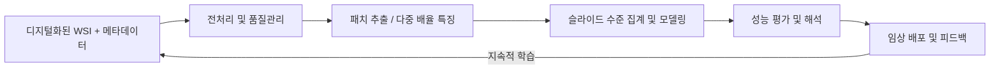

# Computational Pathology 가이드

> 본 문서는 디지털 병리 데이터를 처음 접하는 학습자를 위해 작성된 심층 학습 자료입니다. 기초적인 머신러닝 배경만 가지고 있어도 전체 파이프라인을 이해할 수 있도록, 병리 슬라이드 디지털화에서 모델 배포까지 전 과정을 단계별로 상세하게 설명합니다. 또한 최신 연구 동향과 대표적인 SOTA(State-of-the-Art) 접근법을 폭넓게 다루어 실무 및 연구에 즉시 활용할 수 있는 지식 기반을 제공합니다.

---

## 0. 왜 Computational Pathology인가?

### 0.1 분야 개요

Computational Pathology는 전통적으로 병리사가 광학 현미경으로 판독하던 조직 슬라이드를 디지털화하여, 컴퓨터 비전과 머신러닝 기법으로 분석하는 학문 영역입니다. 병원에서는 조직을 염색(H&E, IHC 등)한 뒤 스캐너로 촬영하여 기가픽셀 크기의 Whole-Slide Image(WSI)를 생성하고, 병리사는 슬라이드를 확대·축소하며 질병의 징후를 찾아내고 진단을 내립니다. 알고리즘은 이러한 전문가의 탐색 과정을 모방하고 보조하기 위해, 조직의 구조적 패턴을 정량적으로 파악하고 질병과 연관된 특징을 자동으로 학습합니다. 최근에는 다중 오믹스 데이터, 임상 텍스트, 의료 영상 등과 결합하여 병리학적 정보를 확장하는 연구도 활발합니다.

### 0.2 디지털 병리가 해결하는 문제

- 노동집약적 판독 업무의 자동화: 전이 여부 확인, 병기 결정과 같은 반복 업무를 자동화하여 병리사의 업무 부담을 줄입니다.
- 판독자 간 변동성 완화: 동일한 슬라이드라도 판독자별로 결과가 달라질 수 있는데, 모델은 일관된 기준을 제공하여 편차를 줄입니다.
- 정량적 바이오마커 발굴: 눈으로 식별하기 어려운 미세 패턴을 정량화해 예후 예측, 치료 반응 예측에 활용 가능한 신규 바이오마커를 제안합니다.
- 다중 모달 융합: 병리 영상과 유전체, 방사선 영상, 환자 텍스트 기록을 결합해 종합적인 진단 지원 시스템을 구축합니다.
- 데이터 기반 의사결정: 장기간 축적된 슬라이드와 임상 데이터를 분석해 질병의 자연사, 치료 전략 최적화에 기여합니다.

### 0.3 대표적인 파이프라인 개요

```text
데이터 수집 → 전처리 및 품질관리 → 패치 추출 및 특징 인코딩 → 모델 학습 → 성능 평가 → 임상 배포 및 모니터링
```

각 단계는 현미경 작업 흐름과 규제 환경을 반영해야 합니다. 예를 들어 조직 염색 편차, 스캐너 장비별 해상도 차이, 환자 정보 보호 규정(HIPAA, GDPR) 등을 고려해 데이터 처리 절차를 설계해야 합니다. 또한, 임상 적용을 위해서는 재현성, 설명 가능성, 통계적 검증이 필수적입니다.

---

## 1. 데이터 수집 및 관리 전략

### 1.1 Whole-Slide Image 형식과 저장 구조

- 주요 형식: `.svs`(Aperio/Leica), `.ndpi`(Hamamatsu), `.mrxs`(3DHistech), `.scn`(Leica), `.tiff` 기반 pyramidal TIFF.
- SVS가 널리 쓰이는 이유: 다중 해상도 피라미드 구조(썸네일부터 40×까지), JPEG/JPEG2000 압축 옵션, 슬라이드 메타데이터(배율, 마이크론당 픽셀 수, 스캐너 정보)를 함께 저장하여 연구와 임상 환경에서 호환성이 뛰어납니다.
- 데이터 접근 도구: OpenSlide, pyvips, tifffile, TIFFSlide 등은 대용량 WSI의 특정 영역만 스트리밍 방식으로 읽어 GPU 메모리를 절약합니다. 최근에는 cuCIM, MONAI Pathology가 GPU 가속을 지원합니다.
- 스토리지 고려사항: 한 장당 수백 MB~수 GB가 필요하므로, 계층형 스토리지(고속 SSD 캐시 + 저렴한 오브젝트 스토리지)와 효율적인 버전 관리가 필수입니다.

### 1.2 메타데이터 및 임상 문맥

- 슬라이드 수준 메타데이터: 염색 종류(H&E, IHC, 멀티플렉스), 스캔 배율, 조직 부위, 슬라이드 품질 플래그, 스캐너 모델, 자동 초점 설정 값 등.
- 환자/케이스 수준 정보: 연령, 성별, 병기(TNM), 치료 이력, 생존 시간, 합병증 기록. 이러한 정보는 모델 학습 시 공변량으로 활용되거나, 다중 모달 예측에서 중요한 입력이 됩니다.
- 병리 리포트 텍스트: 자유 서술형 진단문, 표준화된 시냅틱 리포트, 분자 진단 결과. NLP 파이프라인을 통해 병리학적 소견, 병기, 치료 반응, 분자 마커 등을 구조화된 라벨로 변환할 수 있습니다.
- 연결 데이터: 슬라이드와 환자 정보를 안전하게 매칭하기 위해 난독화된 식별자, 키-벨류 매핑 테이블, 접근 권한 관리 정책을 마련해야 합니다.

### 1.3 주석 수준과 수집 방법

| 주석 수준 | 설명 | 수집 방법 및 도구 | 활용 사례 |
| --- | --- | --- | --- |
| 슬라이드 수준 라벨 | 슬라이드 전체에 대한 진단(암/비암, MSI 상태 등) | 전자의무기록(EMR) 연계, 보고서 텍스트 추출 | MIL 기반 분류, 약물 반응 예측 |
| ROI 폴리곤 | 병리사가 병변/조직 구획을 다각형으로 표시 | QuPath, ASAP, Digital Slide Archive 등 | 세그멘테이션, 병변 검출 |
| 픽셀 수준 마스크 | 세포/조직 구조를 픽셀 단위로 채색 | 세미자동 도구, 강건한 어노테이션 프로토콜 | 완전 감독 학습, 지도 학습 기반 분할 |
| 세포 포인트 주석 | 핵 좌표, 세포 유형 라벨 | HoVer-Net, Cellpose와의 연계, 멀티플렉스 이미지 정합 | 세포 밀도 추정, 미세환경 분석 |
| 다중 모달 라벨 | 유전체 변이, 유전자 발현, 생존 시간 | TCGA 등 공공 코호트, 기관 내부 데이터 웨어하우스 | 표현형-유전체 연계 연구 |

### 1.4 데이터셋 구성, 품질, 윤리

- IRB 및 윤리 승인: 데이터 익명화, 동의서 관리, 데이터 사용 목적 명시. 국가별 개인정보 보호법을 준수해야 하며, 데이터 이동 시 암호화 및 접근 권한을 관리합니다.
- 훈련/검증/테스트 분할: 환자 단위로 분할해 데이터 누수를 방지하고, 기관 간 이질성 평가를 위해 외부 검증 세트를 별도로 확보합니다.
- 클래스 불균형 대처: 희귀 암종은 적극적인 데이터 공유(예: TCIA, Grand Challenge)나 합성 데이터(Synthetic augmentation)로 보완합니다.
- 품질 관리 프로토콜: 스캐너 교정 로그, 염색 프로토콜 기록, 슬라이드 스캔 일시 등을 추적하여 배치(batch) 효과를 모니터링합니다.
- 대표적인 공개 데이터셋: CAMELYON16/17, TCGA PanCancer, PANDA, BACH, PAIP, GlaS, DigestPath, MoNuSeg, NuCLS 등. 각 데이터셋은 암종별, 과업별 특성이 다르므로 목적에 맞게 선택합니다.

### 1.5 데이터 거버넌스와 협업

- 데이터 카탈로그 구축: 슬라이드와 메타데이터를 검색 가능한 형태로 관리하기 위해 데이터 카탈로그, 라벨링 대시보드, ETL 파이프라인을 구축합니다.
- 버전 관리: 전처리 스크립트, 패치 추출 규칙, 라벨 수정 이력 등을 Git, DVC, MLflow와 같은 도구로 추적해 재현성을 확보합니다.
- 프라이버시 강화: 연합학습(Federated Learning)이나 안전한 다자 계산 기술을 활용해 병원 간 협업을 추진하는 사례가 증가하고 있습니다.

---

## 2. 전처리 및 품질 관리

### 2.1 슬라이드 수준 품질 점검

1. 조직 검출: RGB 히스토그램, HSV 임계값, Otsu 기법, Morphology 연산을 활용해 유리 배경을 제거합니다. 대규모 프로젝트에서는 U-Net 기반 조직 마스크 추출 모델을 활용해 정확도를 높입니다.
2. 아티팩트 감지: 흐림(blur) 검출을 위해 라플라시안 분산, FFT 기반 sharpness 지표를 사용하며, 펜 자국·기포·주름은 색상 분포와 텍스처를 결합한 분류기로 필터링합니다. Transformer 기반 ArtInspector, HistoQC 2.0은 최근 공개된 자동화 도구입니다.
3. 염색 품질 평가: 기준 슬라이드의 색상 분포와 비교하여 염색 강도나 대비가 지나치게 다른 슬라이드를 제외하거나 재스캔합니다. 컬러 드리프트를 주기적으로 모니터링해 스캐너 보정 필요성을 판단합니다.
4. 슬라이드 메타데이터 검증: 배율, 마이크론 당 픽셀 수, 스캐너 모델 등의 메타데이터가 누락되었거나 비정상인 경우 자동 알람을 설정합니다.

### 2.2 색상 표준화 및 염색 분리

- Reinhard 정규화: LAB 색공간에서 평균과 분산을 기준 슬라이드에 맞춰 단순하면서도 빠르게 조정합니다.
- Macenko 방법: SVD로 염색 벡터를 추정하여 구조적 정보를 보존하면서 색상 차이를 줄입니다.
- Vahadane(Structure-Preserving) 기법: 비음수 행렬 분해를 이용해 염색 성분을 분리하고 재조합해 형태 보존을 강화합니다.
- 딥러닝 기반 전처리: StainGAN, StainNet, CycleGAN 등 스타일 전이 기법으로 도메인 간 색 편차를 보정하며, 학습 시에는 RandStainNA와 같은 데이터 증강 기법을 적용합니다.
- IHC/멀티플렉스 염색: DAB, AEC 등 특정 염색 채널을 분리하기 위해 색상 탈합(Color Deconvolution)을 적용하고, 양성/음성 비율을 정량화합니다.

### 2.3 해상도 및 공간 정합

- 다중 해상도 관리: WSI 피라미드에서 5×, 10×, 20×, 40× 등 다양한 배율을 사용합니다. 과업에 맞는 마이크론/픽셀(µm/px) 기준을 정의하고 모든 패치가 동일한 공간 척도를 갖도록 재샘플링합니다.
- 슬라이드 간 정합: 연속 절편(serial section) 또는 멀티플렉스 이미지를 사용할 경우, Elastix, SimpleITK 기반 비선형 정합을 통해 3차원 구조를 복원합니다.
- WSI-텍스트 정렬: 슬라이드 획득 날짜, 병리 보고 날짜, 환자 치료 이력을 시간 순으로 정렬해 시간 의존적 모델링(생존 분석, 치료 반응 예측)에 활용합니다.

### 2.4 텍스트·메타데이터 전처리

- NLP 파이프라인: cTAKES, CLAMP, MetaMap, KoBERT 기반 모델 등을 활용하여 병리 보고서에서 질병명, 병기, 변이 상태, 치료 반응 등을 추출합니다.
- 용어 표준화: SNOMED CT, ICD-O-3, CAP 프로토콜, UMLS 용어집과 매핑하여 기관 간 상호운용성을 높입니다.
- 품질 검증: 텍스트와 슬라이드 라벨 간 불일치를 탐지하기 위해 규칙 기반 QA 스크립트와 휴리스틱 검토를 병행합니다.

### 2.5 데이터 증강 전략

- 영상 증강: 회전, 반전, 랜덤 크롭, CutMix, Mixup, Gaussian blur, Elastic deformation 등 조직 구조를 보존하면서 다양성을 확보하는 변형을 적용합니다.
- 스테인 증강: H&E 색상의 채도, 밝기, 대비를 랜덤하게 조정하거나 StainMix를 적용하여 염색 변동성에 강인한 모델을 학습합니다.
- 텍스트 증강: 보고서 문장을 문장 단위로 재조합하거나 시노님 치환을 통해 제한된 라벨 텍스트를 확장합니다.

---

## 3. 패치 추출 및 특징 인코딩

### 3.1 패치 기반 접근의 필요성

WSI는 기가픽셀 규모로 GPU 메모리에 직접 올리기 어렵습니다. 따라서 슬라이드를 수백~수천 개의 패치(예: 256×256, 512×512 픽셀)로 나누어 처리하는 것이 일반적입니다. 패치는 슬라이드 내 국소적인 조직 패턴을 포착하며, 슬라이드 전체는 패치들의 집합으로 간주합니다. MIL(Multiple Instance Learning) 구조는 패치 단위로 추론한 결과를 슬라이드 수준 예측으로 통합하기 때문에, 슬라이드 수준 라벨만 있어도 모델을 학습시킬 수 있습니다.

### 3.2 조직 인지 기반 타일링

1. 조직 마스크 생성: 간단한 임계값 기법부터 U-Net, FPN 기반 세그멘테이션까지 다양한 방식이 사용됩니다. 마스크를 통해 불필요한 유리 영역을 제외하고 패치 후보를 정의합니다.
2. 그리드 샘플링 vs. 적응형 샘플링: 균일한 그리드 샘플링은 슬라이드 전체 커버리지를 보장하지만 중복 정보가 많을 수 있습니다. 적응형 샘플링은 조직 밀도, 염색 강도, 병리사 주석 영역을 참고해 정보량이 높은 위치를 우선적으로 선택합니다.
3. 패치 크기 및 배율: 핵 수준 분석은 40×에서 128~256 픽셀 패치가 적합하며, 조직 구조 분석은 20×에서 512~1024 픽셀 패치를 사용합니다. 과업 특성에 따라 stride(격자 간격)와 오버랩 비율을 조정합니다.
4. 하드 네거티브 마이닝: 모델이 잘못 분류하는 패치를 반복적으로 수집해 학습에 반영함으로써 성능을 향상시킵니다.
5. 패치 필터링: 배경, 인공물, 염색 불량 패치를 사전 제거해 데이터 품질을 높이고 학습 효율을 올립니다.

### 3.3 다중 배율 및 계층 구조 전략

- 다중 배율 패치 세트: 동일한 위치에서 5×, 10×, 20× 패치를 동시에 추출하여 전역 문맥과 미시 구조를 함께 학습합니다.
- 코스-투-파인(Coarse-to-Fine) 접근: 저배율 모델이 의심 영역을 제안하면 고배율 모델이 정밀 검증을 수행합니다(PathRNet, Yottixel, GigaPath 등).
- 계층적 트랜스포머: HIPT, TransMIL, Hierarchical Cell Graph는 배율별 토큰을 계층적으로 통합하여 전역 컨텍스트를 학습합니다.
- 동적 확대 모델: Zoom-In Networks, Adaptive Patch Selection은 예측 불확실성이 큰 패치에 대해 추가 확대 패치를 요청하여 효율성을 높입니다.

### 3.4 특징 추출 백본(Backbone) 선택

| 범주 | 대표 모델 | 특징 |
| --- | --- | --- |
| CNN | ResNet, DenseNet, EfficientNet, ConvNeXt | ImageNet 사전학습 후 미세조정, KimiaNet 등 병리 특화 CNN 존재 |
| 트랜스포머 | Swin Transformer, ViT, CTransPath, TransPath | 전역 어텐션으로 넓은 수용영역 확보, 패치 토큰 수에 따라 연산량 증가 |
| 자기지도 학습 | MoCo-WSI, BYOL, DINO, iBOT, AdCo, SimCLR 변형 | 레이블 없는 대규모 패치로 표현 학습, downstream 성능 향상 |
| 대규모 기초 모델 | Virchow, UNI, REMEDIS, CONCH, HistoGPT | 10억 개 이상 패치로 학습, 제로샷/소샷 전이 가능 |
| 그래프 기반 임베딩 | Cell-GNN, SlideGraph+, GraphMIL | 패치를 그래프 노드로 보고 공간적 관계 반영 |

### 3.5 MIL 및 집계 메커니즘

- 단순 풀링: 최대/평균 풀링은 구현이 쉽지만 중요한 패치를 놓칠 수 있습니다.
- 어텐션 기반 MIL: Ilse et al.(2018)의 ABMIL, CLAM은 학습 가능한 어텐션 가중치로 판별력이 높은 패치를 강조합니다.
- 트랜스포머/세트 인코더: TransMIL, AMIGO, HIPT, MambaMIL은 수천~수만 개 패치를 효율적으로 통합해 슬라이드 레벨 표현을 생성합니다.
- 그래프 신경망: 패치를 노드로 정의하고 공간적 인접성을 엣지로 연결해 조직 구조를 모델링합니다.
- 하이브리드 접근: 어텐션 + 그래프, MIL + 컨트라스티브 학습을 결합해 로컬-글로벌 특징을 동시에 반영합니다.

### 3.6 특징 저장과 재사용

- 오프라인 임베딩: 대규모 슬라이드에서 추출한 패치 임베딩을 HDF5, Zarr, Parquet 등으로 저장하면 반복 학습 시 시간을 절약할 수 있습니다.
- 인덱싱: Faiss, Annoy를 사용하여 유사 패치를 빠르게 검색하거나, 시각화 대시보드(UMAP, t-SNE)로 패치 분포를 모니터링합니다.
- 데이터 품질 감사: 임베딩 공간에서 이상치를 탐지하여 전처리 단계의 오류를 조기 발견할 수 있습니다.

---

## 4. 모델링 과업과 학습 패러다임

### 4.1 주요 과업 분류

1. 슬라이드 수준 분류: 암/비암 구분, 종양 아형 분류, 분자 변이 예측(MSI, EGFR 등), 병기/등급 판정(Gleason, Nottingham).
2. 영역 세그멘테이션/검출: 종양 경계, 괴사 영역, 림프구 침윤, 혈관 구조 등 조직 미세구조를 분할합니다.
3. 세포 수준 분석: 핵 검출, 세포 유형 분류, 공간 전사체 데이터와 결합한 세포 상호작용 분석.
4. 정량 지표 추정: PD-L1, Ki-67 등 IHC 염색 양성률, TIL 점수 등 병리사가 수동으로 측정하던 지표를 자동화합니다.
5. 예후/생존 분석: CoxPH, DeepSurv, DeepHit, Dynamic-DeepHit 등을 활용해 생존 곡선을 예측하고 위험도를 산출합니다.
6. 치료 반응/동반 진단: 면역항암제 반응성, 표적 치료 반응률을 예측하여 맞춤 의료를 지원합니다.
7. 생성 및 보조 과업: 슬라이드 캡셔닝, 병리 보고서 자동 작성, 병리 리포트-이미지 검색, GAN 기반 합성 슬라이드 생성.

### 4.2 감독 수준 및 학습 전략

- 완전 감독: 픽셀 단위 라벨이 필요한 세그멘테이션, 세포 분류는 수작업 비용이 높지만 모델 정확도가 가장 높습니다.
- 약한 감독(MIL): 슬라이드 라벨만으로 학습하며, 관심 영역을 자동으로 찾습니다. Campanella et al.(2019), CLAM, DSMIL 등이 대표적입니다.
- 자가 지도/자기 예측: Masked Autoencoder, MoCo, BYOL, SimSiam 등으로 대규모 비라벨 데이터를 사전학습한 뒤 소량 라벨로 파인튜닝합니다.
- 세미/액티브 러닝: 소량의 정확한 라벨과 대량의 비라벨 데이터를 결합하거나, 불확실성이 높은 패치를 병리사에게 재주석하도록 요청해 효율을 높입니다.

### 4.3 학습 기법과 실무 팁

- 사전학습 가중치 활용: ImageNet 뿐만 아니라 병리 특화 기초 모델(UNI, Virchow) 임베딩을 사용하면 수렴 속도와 정확도가 크게 향상됩니다.
- 커리큘럼 러닝: 난이도가 낮은 패치부터 학습을 시작해 점진적으로 어려운 패치로 이동하면 안정적인 최적화를 기대할 수 있습니다.
- 클래스 불균형 처리: Focal Loss, AUC Maximization Loss, class-balanced sampling, re-weighting 등을 적용합니다.
- 멀티태스크 학습: 하나의 백본에서 여러 헤드를 공유해 분류, 세그멘테이션, 정량화 과업을 동시에 학습하면 표현력이 향상될 수 있습니다.
- 멀티모달 융합: 병리 이미지와 임상 텍스트를 CLIP 유사 구조로 학습하거나, 그래프 신경망을 이용해 유전체-조직 상관관계를 모델링합니다(Patho-CLIP, CONCH, HistoGPT 등).
- LLM 결합: LLaVA-Med, BiomedGPT, PathGPT는 병리 보고서 작성, 설명 생성, 슬라이드 질의응답 등을 지원합니다. 이미지 인코더와 언어 모델 사이의 정렬 기법이 핵심입니다.

### 4.4 최신 SOTA 연구 흐름(2022~2024)

- HIPT (CVPR 2022): 계층적 비전 트랜스포머로 슬라이드 전체를 효율적으로 인코딩하며 TCGA 다기관 데이터에서 높은 성능을 기록했습니다.
- CTransPath, TransMIL: 컨볼루션과 트랜스포머를 결합해 지역 패턴과 전역 문맥을 동시에 포착합니다.
- UNI (2023): 15억 개 이상의 패치를 사용한 범용 히스토패톨로지 기초 모델로, 제로샷 암종 분류에서 성능을 선도합니다.
- Virchow (2023): 1만 6천 장 이상의 WSI와 멀티모달 라벨로 학습한 대규모 컨트라스티브 모델입니다.
- REMEDIS (2024): 마스크드 오토인코딩과 대조 학습을 결합해 다기관·다장기 표현을 제공하는 기초 모델입니다.
- MambaMIL / Slide-Mamba (2024): 상태공간 모델(State Space Model)을 도입해 5만 개 이상의 패치를 선형 시간으로 처리합니다.
- GigaPath, CONCH: 대규모 크로스모달 데이터셋을 기반으로 이미지-텍스트 정렬을 수행해 보고서 생성, 검색, 임상 Q&A에 활용됩니다.

### 4.5 모델 검증과 안정성 강화

- 교차 검증: 환자 단위 K-fold, 기관 단위 leave-one-site-out을 통해 일반화 성능을 평가합니다.
- 불확실성 추정: 엔트로피 기반 기준, Monte Carlo Dropout, Deep Ensemble, Evidential Deep Learning을 활용해 모델의 확신 정도를 측정합니다.
- 설명 가능성: Attention heatmap, Integrated Gradients, SHAP, Counterfactual patch generation 등을 사용해 의사결정 근거를 시각화합니다.

---

## 5. 성능 평가 및 검증 프레임워크

### 5.1 과업별 대표 지표와 해석

| 과업 | 대표 지표 | 선택 이유 | 해석 시 유의점 |
| --- | --- | --- | --- |
| 이진 분류 | AUROC, AUPRC, 민감도, 특이도, F1 | 클래스 불균형에 견고, 임계값에 독립적 | 환자군 비율이 다른 코호트에서는 AUPRC 비교가 더 적절할 수 있음 |
| 다중 분류 | Macro/Micro F1, Balanced Accuracy, Cohen's κ | 클래스별 성능 균형 파악 | 클래스 간 샘플 수가 크게 다를 때 Macro F1 강조 |
| 세그멘테이션 | Dice, IoU, Pixel Accuracy, Hausdorff Distance | 경계 정확도와 겹침 정도 측정 | 소규모 구조에 대한 IoU 해석 시 False Negative에 민감 |
| 검출 | Average Precision(AP), FROC, CPM | False Positive 억제 중요 | 임상 환경에서는 false positive 허용치를 명시해야 함 |
| 생존 분석 | C-index, IBS, Time-dependent AUC | 검열(censoring)을 고려한 지표 | 시간 구간별로 C-index를 해석해 예후 기간별 성능 평가 |
| 정량 평가 | MAE, RMSE, R², Bland–Altman | 병리사의 수기 측정과 일치도 평가 | Bland–Altman으로 체계적 편향 여부 확인 |

### 5.2 검증 설계

- 내부 검증: 환자 단위 K-fold, slide-level stratification. 배치 효과를 줄이기 위해 염색 날짜, 스캐너 종류를 기준으로 층화합니다.
- 외부 검증: 기관 간 이질성을 확인하기 위해 외부 코호트(다른 병원, 다른 스캐너)에서 평가합니다. 규제 승인(FDA, CE-IVD)을 위해서는 다기관 임상 시험 수준의 검증이 필요합니다.
- 도메인 일반화 테스트: Stain augmentation ablation, Color jitter stress test, Slide-level perturbation을 통해 모델의 견고성을 측정합니다.
- 통계적 유의성 검정: bootstrap, DeLong test, log-rank test 등을 활용해 성능 차이가 통계적으로 유의한지 확인합니다.

### 5.3 해석 가능성 및 품질 보증

- 시각적 검증: MIL attention map, Grad-CAM, SmoothGrad를 활용해 병리사의 시각과 일치하는지 확인합니다.
- 에러 분석: 혼동 행렬, 오탐지 예시, 패치 유사도 분석을 통해 오류 패턴을 파악하고 라벨 품질을 검토합니다.
- 인간-모델 협업 평가: Reader study, A/B 테스트, 시간-동작 연구(Time-motion study)를 통해 실제 워크플로 개선 효과를 측정합니다.
- 신뢰도 평가: Calibration curve, Expected Calibration Error(ECE), Temperature scaling으로 모델의 확률 출력 신뢰도를 조정합니다.

### 5.4 보고 및 재현성 가이드라인

- STARD 2015, CONSORT-AI, SPIRIT-AI: 진단 보조 시스템 보고를 위한 표준을 준수합니다.
- 모델 카드와 데이터 카드: 모델 사용 범위, 제한, 데이터 편향, 윤리적 고려사항을 문서화합니다.
- 코드/모델 공개: 가능한 범위에서 추론 스크립트, 사전학습 가중치, 전처리 파이프라인을 공유해 재현성을 높입니다.
- 실험 로깅: MLflow, Weights & Biases, Aim 등을 사용해 하이퍼파라미터, 실험 결과, 아티팩트를 체계적으로 기록합니다.

---

## 6. 배포 및 임상 통합 전략

- WSI 스트리밍 인퍼런스: 슬라이드를 실시간으로 타일링하여 GPU 클러스터나 클라우드에서 추론합니다. Kubernetes 기반 마이크로서비스, NVIDIA Triton Inference Server를 활용해 배포합니다.
- 디지털 병리 뷰어 통합: PathPresenter, Philips IntelliSite, Leica Aperio eSlide Manager, caMicroscope 등과 연동하여 결과를 오버레이 형태로 시각화합니다.
- 임상 의사결정 지원: 모델 출력을 EMR 시스템과 연계해 판독 보고서 작성, 추가 검사 추천, 다학제 회의(MDT) 지원에 활용합니다.
- 규제 및 보안: IEC 62304, ISO 14971 기반 소프트웨어 생애주기 관리, 사이버 보안 점검, 데이터 접근 로그 추적을 수행합니다. FDA SaMD(Software as a Medical Device) 가이드라인을 준수해야 합니다.
- 모니터링 및 지속 학습: 배포 후 데이터 드리프트 감지, 주기적 재학습, 모델 성능 리포트 자동 생성, 사용자 피드백 수집 루프를 구축합니다.
- 사용자 교육: 병리사를 위한 인터페이스 교육, 모델 한계와 신뢰구간 설명, 실패 케이스 대응 프로세스 마련.

---

## 7. 심화 학습 자료 및 커뮤니티

### 7.1 기초 및 고전 논문

- Litjens et al., 2016 – 딥러닝이 병리 진단 정확도를 향상시키는 초기 연구.
- Campanella et al., Nat. Med., 2019 – 약한 감독 MIL 모델로 임상 수준 성능 달성.
- Lu et al., Nat. Biomed. Eng., 2021 – 데이터 효율적인 약한 감독 학습.
- Chen et al., CVPR 2022 – HIPT, 기가픽셀 이미지용 계층적 트랜스포머.
- Chen et al., 2023 – UNI, 범용 병리 비전 기초 모델.
- Abdollahzadeh et al., 2023 – Virchow, 대규모 병리 콘트라스티브 학습.
- Zhang et al., 2024 – REMEDIS, 질병 불문 self-supervision.
- Lu et al., 2024 – SlideGraph++, 그래프 기반 생존 분석.
- Gao et al., 2024 – CONCH, 이미지-텍스트 정렬 기반 멀티모달 모델.

### 7.2 도구 및 라이브러리

- 영상 처리: OpenSlide, cuCIM, Histolab, PathML, MONAI Pathology, TIAToolbox.
- 라벨링/뷰어: QuPath, ASAP, Slideflow, Digital Slide Archive, Cytomine.
- 전처리/품질검사: HistoQC, TIAToolbox Preprocessing, StainTools, SlideQA.
- 모델링 프레임워크: CLAM, Slideflow MIL, MONAI, PyTorch Lightning, TensorFlow.
- 멀티모달/LLM: HuggingFace Transformers, BioGPT, LLaVA-Med, PathGPT.

### 7.3 챌린지 및 커뮤니티

- MICCAI 패솔로지 챌린지(CAMELYON, PANDA, DigestPath, PAIP).
- Grand Challenge 플랫폼(https://grand-challenge.org/)에서 최신 대회 및 데이터셋 확인.
- The Cancer Genome Atlas(TCGA), CPTAC, GTEx 등 대규모 공개 코호트.
- Digital Pathology Association(DPA), Computational Pathology Symposium 등 학회 및 워크숍 참여.

---

## 8. 학습 로드맵

1. 기초 다지기: 조직학, 염색 기법, 병리 보고서 구조를 이해하기 위해 병리학 교재, 온라인 강의(ASCP, Coursera)를 참고합니다.
2. WSI 다루기 실습: OpenSlide 또는 cuCIM으로 CAMELYON16, PANDA 등의 공개 슬라이드를 열어 타일링과 색상 분석을 직접 수행합니다.
3. 전처리 파이프라인 구성: HistoQC로 품질 점검을 하고, StainTools로 색상 정규화를 적용해 통합된 데이터셋을 만듭니다.
4. MIL 베이스라인 구현: ResNet 임베딩 + Attention MIL 구조를 PyTorch로 구현하고 슬라이드 분류를 경험합니다.
5. 자가 지도 사전학습: DINO, MoCo-v3 등의 프레임워크로 패치 임베딩을 학습하고 다운스트림 성능 변화를 비교합니다.
6. 멀티모달 실험: 병리 이미지 임베딩과 병리 보고서 텍스트를 CLIP 스타일로 정렬해 검색/설명 생성 과제를 수행해 봅니다.
7. 모델 해석 및 평가: Grad-CAM, attention map, calibration curve를 만들어 모델이 어떤 패치를 주목하는지 확인합니다.
8. 배포 시나리오 설계: Docker/Kubernetes 환경에서 추론 서버를 구성하고, 간단한 웹 뷰어에 결과를 오버레이해봅니다.
9. 연구 동향 따라잡기: arXiv, MICCAI, CVPR, ISBI, Nature Medicine 등에서 최신 병리 AI 논문을 주기적으로 리뷰합니다.
10. 커뮤니티 참여: Kaggle, Grand Challenge 참여와 함께, Slack·Discord 커뮤니티에서 질의응답을 나누며 실무 경험을 쌓습니다.

---

### 고수준 파이프라인 도식



---

## 9. 용어 사전

- WSI: Whole-Slide Image, 조직 슬라이드를 디지털화한 기가픽셀 이미지.
- H&E: Hematoxylin & Eosin 염색, 핵과 세포질을 대비 있게 표현.
- IHC: Immunohistochemistry, 특정 단백질을 염색하여 발현 여부를 확인하는 면역조직화학 기법.
- MIL: Multiple Instance Learning, 슬라이드를 패치 집합으로 보고 약한 라벨로 학습하는 기법.
- ROI: Region of Interest, 병리사가 표기한 관심 영역.
- C-index: 생존 분석에서 예측 순위의 일관성을 평가하는 지표.
- Foundation Model: 대규모 사전학습으로 다양한 다운스트림 과업에 전이 가능한 범용 모델.
- Stain Normalization: 염색 편차를 줄이기 위해 색상 분포를 정규화하는 기법.
- Attention Map: 모델이 주목한 영역을 시각화한 열지도.

---

## 10. 마무리 및 지속적 업데이트 제안

Computational Pathology는 병리학, 컴퓨터 비전, 생물정보학, 임상의학이 결합된 융합 학문입니다. 스캐너 성능 향상, 클라우드 인프라, 대규모 사전학습 모델의 등장으로 실용화가 가속화되고 있으며, 규제·윤리 측면에서도 많은 논의가 진행 중입니다. 이 문서는 기본 틀을 제시하는 로드맵으로, 새로운 논문과 도구가 등장할 때마다 전처리, 모델 구조, 평가 기준을 업데이트하여 살아있는 문서로 유지하시기 바랍니다. 또한, 병리사와 지속적인 소통을 통해 임상적 가치와 신뢰도를 확보하는 것이 궁극적인 성공 열쇠입니다.
