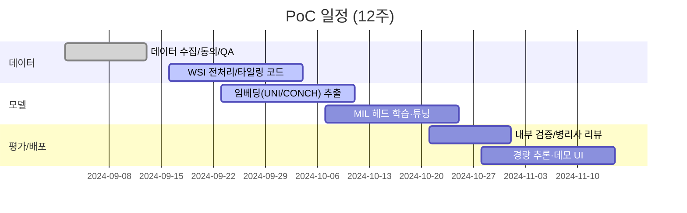
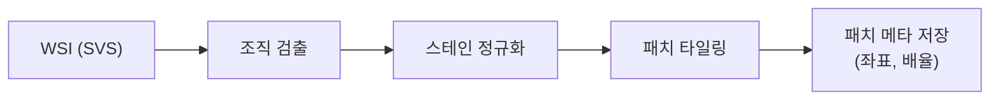
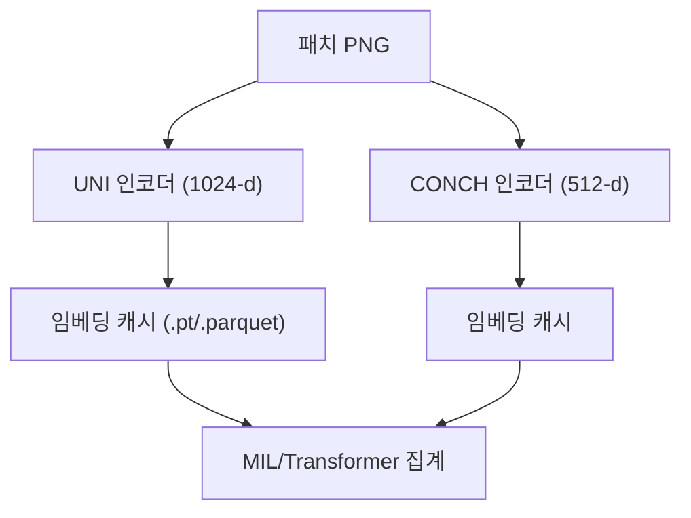

# WSI 양성/악성 분류 PoC (UNI/CONCH 기반)

본 문서는 하버드 **Mahmood Lab**의 병리 파운데이션 모델(UNI, CONCH)을 활용해 WSI를 패치 단위로 인코딩하고, 양성/악성 분류 모델을 학습·검증하는 PoC 개발 계획을 정리합니다. Hugging Face 모델 카드와 공개 논문을 참고하여 데이터 준비 → 패치 추출 → 임베딩 생성 → MIL/Transformer 집계 → 학습·평가 → 배포 데모까지의 전 과정을 구조화했습니다.

## 1. 목표 및 성공 기준
- **목표**: 기존 병리 파이프라인에 파운데이션 임베딩을 도입해 소량 라벨 환경에서도 높은 양성/악성 분류 성능(AUC 0.95+)을 달성하고, 패치 중요도 heatmap을 제공.
- **성공 기준**
  - 내부 검증 셋에서 AUC ≥ 0.95, F1 ≥ 0.9
  - 슬라이드별 heatmap 시각화 제공 및 병리사 블라인드 리뷰 통과(정성 평가 ≥ 4/5)
  - 추론 지연(1 WSI) 3분 이내(GPU 1대 기준)·패치 임베딩 캐싱 적용

## 2. 전체 로드맵 (Mermaid)

## 3. 데이터 준비
1. **소스**: Paper 폴더 논문 데이터 정리본 + 병리 WSI(SVS) + 메타데이터 CSV(`INSP_RQST_NO`, `FILE_NAME`, `DIAGNOSIS`, `SNAPSHOT`).
2. **슬라이드 필터링**: 결손/스캔 오류 제거, 해상도/스캔 배치별 품질 체크.
3. **라벨링**: `DIAGNOSIS` 기반 양성/악성 이진 라벨 생성 → 다중 진단 시 악성 우선 규칙 적용 → 전문가 검토.
4. **데이터 분할**: 의뢰 번호(`INSP_RQST_NO`) 단위 stratified split (train/val/test=7/1/2)로 데이터 누수 방지.
5. **보안/동의**: PHI 제거, 연구 동의서 추적, WSI/메타데이터 암호화 스토리지(S3 KMS 또는 on-prem 암호화 NAS) 사용.

## 4. 패치 추출(타일링)
- **라이브러리**: OpenSlide + tifffile (Python), 병렬 처리는 `multiprocessing`/`dask` 활용.
- **전처리**: 조직 검출(Otsu/HSV threshold) → 여백 제거 → 스테인 정규화(Macenko/Vahadane).
- **타일링 파라미터**: 256–512 px, 20× 해상도 기준; 중첩 0–20%; 최소 조직 비율 60% 필터.
- **출력**: `h5`/`zarr` 또는 폴더 구조(`slide_id/patch_x_y.png`)로 저장, 패치 메타(`x,y,level,scale`) 기록.

## 5. 파운데이션 임베딩 생성 (UNI/CONCH)
- **모델 소스**
  - UNI: Harvard Mahmood Lab, DINOv2 기반 ViT-L. (예: `mahmoodlab/UNI` on Hugging Face)
  - CONCH: Harvard Mahmood Lab, 비전-언어 대조학습(CoCa). (예: `mahmoodlab/CONCH`) 
- **전략**
  - 파라미터 **고정(frozen)**, 패치 임베딩만 추출하여 데이터 효율성 극대화.
  - 배치 추출 시 `torch.compile=False`, `amp/autocast`로 메모리 절감.
  - 임베딩 캐싱: `faiss` 인덱스 또는 parquet/h5 저장 후 재사용.

## 6. 슬라이드 레벨 분류 모델
1. **MIL 헤드 후보**
   - Attention MIL(CLAM 스타일), TransMIL, ABMIL. 
   - 클래스 균형 가중치 + focal loss로 양성/악성 불균형 보정.
2. **입력**: 패치 임베딩 시퀀스(UNI 또는 CONCH) + 좌표(위치 인식용 positional encoding 옵션).
3. **출력**: 슬라이드 양성 확률 및 패치 중요도 스코어(heatmap용).
4. **정규화/규제**: dropout, weight decay, mixup of embeddings(optional).
5. **학습 스케줄**: Cosine annealing LR, warmup 1–2 epoch, early stopping(patience=10) + SWA(optional).

## 7. 학습 파이프라인 구현 체크리스트
- [ ] 데이터 모듈: PyTorch Lightning `LightningDataModule`로 패치 임베딩 로더 구현.
- [ ] 모델 모듈: `LightningModule`에 MIL 헤드, BCE/Focal Loss, AUROC metric 포함.
- [ ] 로깅: WandB/Weights & Biases, 학습 곡선 및 heatmap 업로드.
- [ ] 검증 스텝: 슬라이드 단위 AUROC/F1, per-class precision/recall, confusion matrix.
- [ ] 추론 스크립트: 캐싱된 임베딩 입력 → 확률 + heatmap PNG 생성.

## 8. 평가 및 해석 가능성
- **메트릭**: AUROC, AUPRC, F1, Sensitivity at 95% Specificity.
- **외부 검증**: 공개 데이터셋(CAMELYON16/17) 소규모 subset에 zero-shot/linear probe로 전이 성능 확인.
- **Heatmap**: 패치 중요도 가우시안 blurring + 슬라이드 썸네일 overlay, 병리사 리뷰 루프 구축.
- **오류 분석**: false positive/negative 슬라이드 패치 재검토, stain drift·아티팩트 상관 분석.

## 9. 배포/데모
- **경량 추론**: 임베딩 캐시 + ONNX Runtime 또는 TensorRT로 MIL 헤드 경량화.
- **API**: FastAPI 엔드포인트(`/predict`, `/heatmap/{slide_id}`), 슬라이드 업로드 시 비동기 큐(Celery/RQ)로 패치 추출.
- **UI 데모**: Streamlit/Gradio 기반 대시보드 – 슬라이드 썸네일, heatmap 토글, 패치별 확률 테이블 제공.
- **모니터링**: 추론 지연, 입력 해상도/스테인 분포 드리프트 감지, 실패 슬라이드 재처리 큐.

## 10. 리스크 및 완화
- **GPU 메모리 초과**: 타일 배치 크기 축소, gradient checkpointing, AMP 사용.
- **스테인 변동**: 정규화 + ColorJitter augmentation, slide-wise normalization 통계 재계산.
- **라벨 노이즈**: 전문가 리뷰, label smoothing, asymmetric loss.
- **도메인 차이**: 도메인 적응(MMD/Coral) 또는 슬라이드 스타일 전환(CycleGAN) 실험.

## 11. 실행 우선순위 (RICE)
1. **패치 타일링 & 임베딩 캐싱** (Reach 높음, Effort 중) – 주차 1–3
2. **MIL 헤드 학습 & heatmap** (Impact 높음) – 주차 3–6
3. **데모 UI + API** (Confidence 중) – 주차 7–9
4. **외부 데이터 전이/검증** (Effort 중) – 주차 9–10
5. **경량화/배포** (Impact 중) – 주차 10–12

## 12. 참고 리소스
- **UNI**: Mahmood Lab, *Nature Medicine 2024* – 대규모 병리 패치 self-supervised 사전학습, Hugging Face `mahmoodlab/UNI`.
- **CONCH**: Mahmood Lab, *Nature Medicine 2024* – 비전-언어 대조학습 CoCa 변형, Hugging Face `mahmoodlab/CONCH`.
- **타일링/패치 파이프라인**: CLAM, TransMIL, OpenSlide 예제 코드.
- **최적화**: PyTorch AMP, ONNX Runtime, TensorRT, faiss 캐싱.
