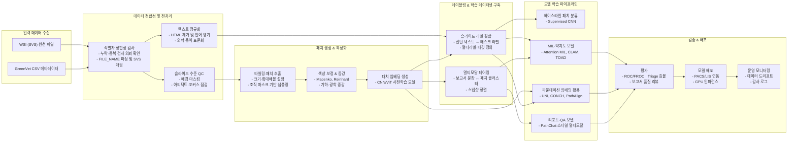
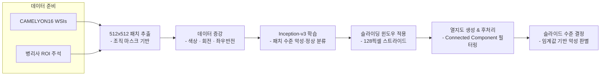
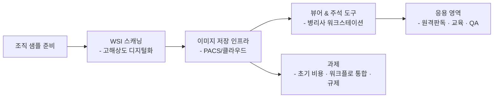
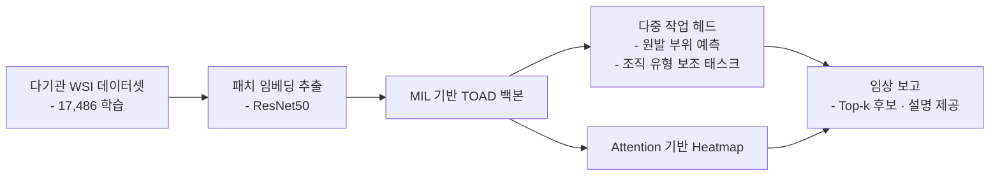
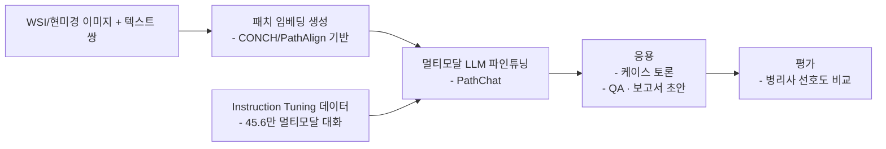
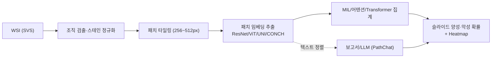

# GC-Pathology

## 프로젝트 개요
GreenVet으로부터 전달받은 조직검사 메타데이터와 대용량 Whole Slide Image(WSI)를 기반으로, 수의 병리 영역에서 임상 적용 가능한 Computational Pathology 파이프라인을 구축하는 프로젝트입니다. 본 문서는 선행 연구 검토, 데이터 이해, 방법론, 실행 계획을 정리하여 후속 연구와 개발의 기준점으로 삼습니다.

## Vet-ICD-O 코드 매칭 방법론
### 비정형 병리 텍스트 전처리 및 매칭 파이프라인
1. **데이터 정제**: 조직검사 결과 매칭 CSV의 `DIAGNOSIS`, `GROSS_FINDINGS`, `MICROSCOPIC_FINDINGS`, `COMMENTS` 컬럼을 로드한 뒤 HTML 태그 제거, 특수문자 정규화, 불필요한 공백 축소 등 기본 클렌징을 수행합니다. 한국어·영어 혼재 서술에 대응하기 위해 언어 감지 후 형태소 분석기(예: Khaiii, Mecab-ko)와 영문 토크나이저를 결합하거나 문장 단위 파이프라인을 구성합니다.
2. **Vet-ICD-O 사전 구축**: `Vet-ICD-O-canine-1, First Edition` 파일의 Topography 리스트(C코드)와 Morphology 리스트(8xxx/코드)를 추출하여 용어·계층 구조 사전을 만들고, 동의어·약어·한국어 번역을 확장합니다. 사전은 해시맵 또는 임베딩 인덱스(예: FAISS)로 저장해 빠른 조회가 가능하도록 합니다.
3. **다단계 매칭 로직**: 정규표현식과 규칙 기반 정확 일치, 퍼지 매칭(Damerau-Levenshtein 거리, TF-IDF 코사인 유사도), 멀티링구얼 임베딩(Sentence-BERT, KoSimCSE 등)을 순차 적용해 후보 Topography/Morphology를 발굴합니다. `DIAGNOSIS` → `MICROSCOPIC_FINDINGS` → `COMMENTS` 순으로 신뢰 가중치를 부여하고, `SITE` 및 `GROSS_FINDINGS`는 해부 부위 판단에 집중 활용합니다.
4. **스코어링 및 품질 관리**: 각 후보 조합에 대해 직접 매칭 여부, 번역 후 매칭, 임베딩 점수 등을 가중 평균하여 임계값을 넘는 코드를 확정합니다. 애매한 케이스는 수동 검토 큐에 적재하고, 전문가 피드백으로 사전·규칙을 지속 보강합니다. `Include/Excludes` 정보를 활용해 상호 배제 코드 오류를 방지합니다.

### 규칙 기반 파이프라인과 LLM 활용 비교
- **신뢰도 및 감사성**: 규칙·사전 기반 매칭은 각 단계의 근거(정확 일치, 동의어, 임베딩 점수 등)를 로그로 남길 수 있어 의료 데이터 거버넌스 요구사항을 충족하기 용이합니다. 반면 LLM은 모델·프롬프트 변화에 따라 출력이 달라질 수 있고 내부 추론이 불투명해 재현성과 감사성이 낮습니다.
- **오류 수정 및 유지보수**: 규칙 기반 시스템은 오탐 발견 시 사전·규칙 수정 후 전량 재처리하면 동일 결과를 재현할 수 있습니다. LLM은 업데이트나 파라미터 튜닝에 따라 답변이 흔들릴 수 있어 버전 관리가 어렵습니다.
- **의학 특화 LLM 품질**: Gemma와 같은 범용 모델은 Vet-ICD-O 체계를 충분히 학습하지 않아 추가 프롬프트 설계와 용어집 주입이 필요합니다. Med-PaLM, BioGPT 변형 등 의학용 LLM도 수의 병리 지식과 한국어 텍스트 커버리지가 제한적이며, 온프레미스 배치 비용·프라이버시 이슈가 존재합니다.
- **권장 전략**: 규칙 기반 파이프라인을 기본으로 구축하고, 매칭 신뢰도가 낮은 사례에 한해 LLM을 보조 추천 도구로 사용하여 전문가 검증을 결합하는 하이브리드 접근을 권장합니다.

## GreenVet 데이터 요약
### 데이터 구조 및 레코드 현황
- 48,692개의 행이 11개 컬럼으로 구성되어 있으며, 16,943건의 고유 검사 의뢰 번호(`INSP_RQST_NO`)와 16,949개의 고유 슬라이드 식별자(`FILE_NAME`)가 존재합니다.
- 레코드는 슬라이드/스냅샷 단위로 저장되어 동일 의뢰가 평균 2.87행(중앙값 2행, 75% 분위수 4행, 최대 18행)으로 확장됩니다.
- 동일 의뢰 내 다중 슬라이드를 고려하면 슬라이드 수는 의뢰당 평균 1.40장(최대 10장)이며, 전체 의뢰 중 4,170건이 2장 이상 슬라이드를 포함합니다.
- 고유 검사 의뢰 16,943건 중 1,581건(9.3%)은 상이한 진단 텍스트가 2개 이상 기록되어 있으며, 최대 5개의 진단이 한 의뢰에 병기되어 있습니다.
- 스냅샷 URL은 48,690건에서 제공되어 영상-텍스트 매칭이 용이하며, `RESULT_PDF`는 48,680건이 결측으로 텍스트 중심의 리포트 구조임을 시사합니다.

### 서비스 유형 및 해부 부위 분포
- 검사 서비스는 `Histopathology (1 Site/Lesion)-국내` 38,581건(79.2%), `Histopathology (2 Site/Lesion)-국내` 7,946건(16.3%), `Histopathology (3 Site/Lesion)-국내` 1,777건(3.6%), `Histopathology (4 Site/Lesion)-국내` 388건(0.8%)으로 구성되어 단일 병변 조직검사가 대부분을 차지합니다.
- 위치 코드는 `site1` 43,465건(89.3%), `site2` 4,446건(9.1%), `site3` 686건(1.4%), `site4` 95건(0.2%) 순으로 1차 위치 정보가 집중되어 있습니다.

### 슬라이드 및 이미지 리소스
- `FILE_NAME`에 `|`가 포함된 다중 슬라이드 행은 18,212건이며, 4,166건의 검사 의뢰가 해당 패턴을 보입니다.
- 검사 의뢰-슬라이드 매핑 테이블에서 슬라이드 수 분포는 90% 분위수가 2장, 95% 분위수가 3장, 99% 분위수가 5장으로 확인되어 고슬라이드 의뢰는 제한적입니다.
- 스냅샷 URL 결측은 2건에 불과하여 WSI 썸네일 기반 QA 및 지능형 뷰어 구축에 활용할 수 있습니다.

### 텍스트 라벨 품질
- 진단(`DIAGNOSIS`) 평균 길이는 42.7자(최대 342자)로 핵심 라벨이 간결하게 정리되어 있으며, 현미경 소견(`MICROSCOPIC_FINDINGS`)과 코멘트(`COMMENTS`)는 각각 평균 343자, 372자로 상세 서술이 풍부합니다.
- 육안 소견(`GROSS_FINDINGS`)은 평균 118자로 템플릿 기반 서술이 일정하며, 전체 텍스트 컬럼에 결측이 없어 지도 학습 라벨 품질이 높습니다.
- 진단명은 영어/한글 혼용, 소견 및 코멘트는 한국어 중심으로 기록되어 있어 멀티링구얼 전처리 전략이 요구됩니다.

### 동물 종 단서
- 육안·현미경·코멘트 텍스트를 정규화한 뒤 숫자 단위 표현(예: "두 개", "3개의")을 제외하는 규칙 기반 토큰 필터를 적용해 종 키워드를 검출한 결과, 개 관련 서술이 24,255건(이 중 개·고양이 동시 언급 2,421건 포함), 고양이 관련 서술이 6,011건으로 집계되었고 종 미기재 건은 20,847건으로 확인되어 반려견 중심 데이터 분포가 유지됩니다.
- 종 필드가 명시적으로 존재하지 않아 동물 종 태깅을 위한 규칙·모델 기반 명명 실체 인식(NER) 또는 키워드 매칭이 필요합니다.

### CSV 파일 자산 요약
| 파일명 | 행 수 | 주요 컬럼 | 설명 |
| --- | --- | --- | --- |
| `Data/조직검사 결과 매칭(2024)_utf8_pruned.csv` | 48,691 | `INSP_RQST_NO`, `FILE_NAME`, `DIAGNOSIS`, `GROSS_FINDINGS`, `MICROSCOPIC_FINDINGS`, `COMMENTS`, `SITE`, `SNAPSHOT` 등 | GreenVet 조직검사 원본 메타데이터(정제본). 의뢰 번호·슬라이드 식별자와 주요 서술형 병리 보고 컬럼을 포함합니다. |
| `Data/조직검사 결과 매칭(2024)_coded.csv` | 50 | 위 원본 컬럼 + `Vet-ICD-O_Topography`, `Vet-ICD-O_Morphology`, `Specimen_Site_Normalized`, `Species` | Vet-ICD-O-canine-1 1판 기준으로 상위 50개 레코드를 수작업 매칭한 파생본. 병변 해부 위치 정규화와 확실히 식별 가능한 종(고양이/개)을 태깅했습니다. |

### 진단명 분포 (전체 5,950건)
GreenVet 메타데이터에 등장하는 모든 진단명을 건수 순으로 정렬했습니다.

| 순위 | 진단명 | 건수 |
| --- | --- | --- |
| 1 | Subcutaneous lipoma | 1198 |
| 2 | Mammary complex adenoma, completely excised | 739 |
| 3 | Trichoblastoma, completely excised | 734 |
| 4 | Sebaceous adenoma, completely excised | 613 |
| 5 | Cutaneous histiocytoma, completely excised | 546 |
| 6 | Mammary adenoma, complex type, completely excised | 471 |
| 7 | Mammary benign mixed tumor, completely excised | 466 |
| 8 | Follicular cyst, completely excised | 435 |
| 9 | Mast cell tumor (Well-differentiated) | 403 |
| 10 | Peripheral odontogenic fibroma | 381 |
| 11 | Mammary gland adenoma, completely excised | 356 |
| 12 | Peripheral odontogenic fibroma with osseous metaplasia | 300 |
| 13 | Lymphoid nodular hyperplasia | 291 |
| 14 | Mammary gland adenoma, simple type, completely excised | 286 |
| 15 | Lipoma | 285 |
| 16 | Benign mammary mixed tumor, completely excised | 263 |
| 17 | Splenic hemangiosarcoma | 255 |
| 18 | Subcutaneous lipoma, completely excised | 251 |
| 19 | Complex nodular hyperplasia | 243 |
| 20 | Oral melanoma | 237 |
| 21 | Mast cell tumor, well-differentiated, completely excised | 228 |
| 22 | Trichoblastoma | 222 |
| 23 | Cutaneous mast cell tumor (Well-differentiated type), completely excised | 209 |
| 24 | Soft tissue sarcoma, grade II | 206 |
| 25 | Splenic nodular hyperplasia (complex type) | 205 |
| 26 | Sebaceous epithelioma, completely excised | 192 |
| 27 | Hepatoid gland adenoma | 191 |
| 28 | Mammary mixed tumor (Benign) | 185 |
| 29 | Gingival hyperplasia, gingivitis | 182 |
| 30 | Squamous cell carcinoma | 177 |
| 31 | Panniculitis with septal fibrosis | 177 |
| 32 | Infundibular keratinizing acanthoma, completely excised | 172 |
| 33 | Mammary gland adenoma, complex type, completely excised | 172 |
| 34 | Mammary adenoma, simple type, completely excised | 172 |
| 35 | Panniculitis | 171 |
| 36 | Mast cell tumor (Low-grade / Grade 2) | 169 |
| 37 | Gingival hyperplasia | 161 |
| 38 | Splenic stromal sarcoma | 157 |
| 39 | Soft tissue sarcoma, Grade 2 | 151 |
| 40 | Cutaneous mast cell tumor (Well-differentiated type) | 142 |
| 41 | Cutaneous plasmacytoma | 140 |
| 42 | Traumatic panniculitis | 139 |
| 43 | Mammary benign mixed tumor | 138 |
| 44 | Fibroadnexal hamartoma, completely excised | 137 |
| 45 | Gingival hyperplasia with chronic gingivitis | 135 |
| 46 | Apocrine cyst, completely excised | 135 |
| 47 | Sebaceous adenoma | 134 |
| 48 | Meibomian adenoma, completely excised | 134 |
| 49 | Cutaneous histiocytoma | 133 |
| 50 | Fibroadnexal hamartoma (dysplasia), completely excised | 130 |

### 샘플 레코드 (상위 10건)

| INSP_RQST_NO | FOLDER | FILE_NAME | INSP_SRVC_NM | RESULT_PDF | DIAGNOSIS | GROSS_FINDINGS | COMMENTS | MICROSCOPIC_FINDINGS | SITE | SNAPSHOT |
| --- | --- | --- | --- | --- | --- | --- | --- | --- | --- | --- |
| 20240101-113-0002 | S24-00001 | S24-00001#1###3.svs | Histopathology (1 Site/Lesion)-국내 |  | Mast cell tumor (Well-differentiated), completely excised | Specimen: Skin Appearance: 단독 single,soft,유동적 movable, Size: 0.5X0.5X0.5cm Operation: excisional Recurrence: N, Lymph: N  | 의뢰된 좌측 후지-옆구리 쪽 피부 종양은 비만세포종(mast cell tumor)으로 확인되었습니다. Mast cell tumor는 고양이 피부 종양의 약 21%를 차지하며, 분화 정도나 조직학적 분류와는 관계없이 80% 정도의 증례에서 양성 종양의 경과를 나타냅니다. 개의 cut… | 의뢰된 조직의 장축면을 제작-판독하였습니다. 경계가 비교적 명확한 직경 약 4.3 mm의 mass는 원형 세포로 구성되어 있었으며, 종양세포는 잘 분화된 비만세포로 확인되었습니다. 종양 세포는 metachromic granule을 가진 난원형의 세포로 핵은 주로 중앙에 위치하고 있… | site1 | https://ipeak.greenvet.co.kr/siteImage/17143/1-1.jpg |
| 20240101-113-0002 | S24-00001 | S24-00001#1###3.svs | Histopathology (1 Site/Lesion)-국내 |  | Mast cell tumor (Well-differentiated), completely excised | Specimen: Skin Appearance: 단독 single,soft,유동적 movable, Size: 0.5X0.5X0.5cm Operation: excisional Recurrence: N, Lymph: N  | 의뢰된 좌측 후지-옆구리 쪽 피부 종양은 비만세포종(mast cell tumor)으로 확인되었습니다. Mast cell tumor는 고양이 피부 종양의 약 21%를 차지하며, 분화 정도나 조직학적 분류와는 관계없이 80% 정도의 증례에서 양성 종양의 경과를 나타냅니다. 개의 cut… | 의뢰된 조직의 장축면을 제작-판독하였습니다. 경계가 비교적 명확한 직경 약 4.3 mm의 mass는 원형 세포로 구성되어 있었으며, 종양세포는 잘 분화된 비만세포로 확인되었습니다. 종양 세포는 metachromic granule을 가진 난원형의 세포로 핵은 주로 중앙에 위치하고 있… | site1 | https://ipeak.greenvet.co.kr/siteImage/17143/1-2.jpg |
| 20240101-121-0003 | S24-00003 | S24-00003#1###8.svs | Histopathology (1 Site/Lesion)-국내 |  | Apocrine or mammary adenoma, completely excised, see Comments | Specimen: Other(생식기 주변 피하) Appearance: 단독 single, Size: 1X1X1cm Operation: excisional Recurrence: N, Lymph: N  | 의뢰된 생식기 주위 피하 종괴는 아포크린샘 유래의 양성 종양으로 진단되었습니다. 피부에 분포하는 땀샘과 유선, 항문낭샘 등이 모두 아포크린샘에 속하며, 해부학적인 위치와 주위 정상 조직과의 연관성을 토대로 정확한 분류가 가능합니다. 해당 증례의 경우 주위 정상 조직은 포함되지 않았… | 샘 유래의 상피세포로 이루어진 한 개의 종양성 종괴입니다. 종양세포는 대부분 잘 분화되어 균일한 크기와 형태를 보이는 입방형 상피세포입니다. 세포 두 층 두께의 세관 구조를 형성하며 증식하였고, 일부 세관은 확장되었습니다. 전반적으로 방추형의 근상피세포가 함께 증식하였고, 핵의 이… | site1 | https://ipeak.greenvet.co.kr/siteImage/17145/0003_01.JPG |
| 20240101-121-0003 | S24-00003 | S24-00003#1###8.svs | Histopathology (1 Site/Lesion)-국내 |  | Apocrine or mammary adenoma, completely excised, see Comments | Specimen: Other(생식기 주변 피하) Appearance: 단독 single, Size: 1X1X1cm Operation: excisional Recurrence: N, Lymph: N  | 의뢰된 생식기 주위 피하 종괴는 아포크린샘 유래의 양성 종양으로 진단되었습니다. 피부에 분포하는 땀샘과 유선, 항문낭샘 등이 모두 아포크린샘에 속하며, 해부학적인 위치와 주위 정상 조직과의 연관성을 토대로 정확한 분류가 가능합니다. 해당 증례의 경우 주위 정상 조직은 포함되지 않았… | 샘 유래의 상피세포로 이루어진 한 개의 종양성 종괴입니다. 종양세포는 대부분 잘 분화되어 균일한 크기와 형태를 보이는 입방형 상피세포입니다. 세포 두 층 두께의 세관 구조를 형성하며 증식하였고, 일부 세관은 확장되었습니다. 전반적으로 방추형의 근상피세포가 함께 증식하였고, 핵의 이… | site1 | https://ipeak.greenvet.co.kr/siteImage/17145/0003_02.JPG |
| 20240101-102-0001 | S24-00018 | S24-00018#1###2.svs | Histopathology (1 Site/Lesion)-국내 |  | Mammary duct ectasia, mastitis | Specimen: Mammary Appearance: 다발 multiple, Size: 0.5X0.5X0.3cm Operation: excisional Recurrence: N, Lymph: N  | Mammary duct ectasia는 도관이 확장된 병변으로, 주로 중성화하지 않은 암컷에서 발정주기에 따라 성호르몬의 영향으로 발생하며, 유선종양 주위에 형성되기도 합니다. 의뢰된 유선 검체에서는 염증을 동반하며 확장된 도관이 주된 병변으로 확인됩니다. 다만, 현재 유선… | 의뢰된 유선 검체 저배율 시야에서는 다수의 유선 도관 확장이 특징적인 소견으로 확인됩니다. 병변의 경계는 적절히 확보되었습니다. 확장된 유선 사이로는 mild하게 과증식한 유선 조직이 분포하고 있으며, 기질로 염증이 동반되었습니다. 병변 주위로는 정상 유선 조직이 분포하고 있습니다… | site1 | https://ipeak.greenvet.co.kr/siteImage/17160/18_01.JPG |
| 20240101-102-0001 | S24-00018 | S24-00018#1###2.svs | Histopathology (1 Site/Lesion)-국내 |  | Mammary duct ectasia, mastitis | Specimen: Mammary Appearance: 다발 multiple, Size: 0.5X0.5X0.3cm Operation: excisional Recurrence: N, Lymph: N  | Mammary duct ectasia는 도관이 확장된 병변으로, 주로 중성화하지 않은 암컷에서 발정주기에 따라 성호르몬의 영향으로 발생하며, 유선종양 주위에 형성되기도 합니다. 의뢰된 유선 검체에서는 염증을 동반하며 확장된 도관이 주된 병변으로 확인됩니다. 다만, 현재 유선… | 의뢰된 유선 검체 저배율 시야에서는 다수의 유선 도관 확장이 특징적인 소견으로 확인됩니다. 병변의 경계는 적절히 확보되었습니다. 확장된 유선 사이로는 mild하게 과증식한 유선 조직이 분포하고 있으며, 기질로 염증이 동반되었습니다. 병변 주위로는 정상 유선 조직이 분포하고 있습니다… | site1 | https://ipeak.greenvet.co.kr/siteImage/17160/18_02.JPG |
| 20240101-102-0001 | S24-00018 | S24-00018#1###2.svs | Histopathology (1 Site/Lesion)-국내 |  | Mammary duct ectasia, mastitis | Specimen: Mammary Appearance: 다발 multiple, Size: 0.5X0.5X0.3cm Operation: excisional Recurrence: N, Lymph: N  | Mammary duct ectasia는 도관이 확장된 병변으로, 주로 중성화하지 않은 암컷에서 발정주기에 따라 성호르몬의 영향으로 발생하며, 유선종양 주위에 형성되기도 합니다. 의뢰된 유선 검체에서는 염증을 동반하며 확장된 도관이 주된 병변으로 확인됩니다. 다만, 현재 유선… | 의뢰된 유선 검체 저배율 시야에서는 다수의 유선 도관 확장이 특징적인 소견으로 확인됩니다. 병변의 경계는 적절히 확보되었습니다. 확장된 유선 사이로는 mild하게 과증식한 유선 조직이 분포하고 있으며, 기질로 염증이 동반되었습니다. 병변 주위로는 정상 유선 조직이 분포하고 있습니다… | site1 | https://ipeak.greenvet.co.kr/siteImage/17160/18_03.JPG |
| 20240101-102-0001 | S24-00018 | S24-00018#1###2.svs | Histopathology (1 Site/Lesion)-국내 |  | Mammary duct ectasia, mastitis | Specimen: Mammary Appearance: 다발 multiple, Size: 0.5X0.5X0.3cm Operation: excisional Recurrence: N, Lymph: N  | Mammary duct ectasia는 도관이 확장된 병변으로, 주로 중성화하지 않은 암컷에서 발정주기에 따라 성호르몬의 영향으로 발생하며, 유선종양 위에 형성되기도 합니다. 의뢰된 유선 검체에서는 염증을 동반하며 확장된 도관이 주된 병변으로 확인됩니다. 다만, 현재 유선… | 의뢰된 유선 검체 저배율 시야에서는 다수의 유선 도관 확장이 특징적인 소견으로 확인됩니다. 병변의 경계는 적절히 확보되었습니다. 확장된 유선 사이로는 mild하게 과증식한 유선 조직이 분포하고 있으며, 기질로 염증이 동반되었습니다. 병변 주위로는 정상 유선 조직이 분포하고 있습니다… | site1 | https://ipeak.greenvet.co.kr/siteImage/17160/18_04.JPG |
| 20240101-119-0002 | S24-00020 | S24-00020#1###4.svs\|S24-00020#1###3.svs | Histopathology (1 Site/Lesion)-국내 |  | 섬유종(Fibroma) | Specimen: Skin Appearance: 단독 single, Size: 0.1X0.1X0.1cm Operation: excisional Recurrence: N, Lymph: N  | 섬유아세포에서 유래하는 양성종양입니다. 일부 세포에서 멜라닌 색소처럼 보이는 검은색소가 관찰되기도 하지만 전반적인 특징이 흑색종은 아닌 것으로 판단됩니다. 의뢰된 종괴의 경계부위가 명확히 다 관찰되지는 않으므로, 재발에 대한 모니터링이 추천됩니다. | 진피층에서 방추형의 종양세포 침윤이 관찰되는데, 종양세포는 상피층을 침습하지 않으며, 피막화로 구분되어 있지는 않으나 주위 결합조직과 어느 정도 구분되는 양상입니다. 종양세포는 길죽한 타원형 또는 방추형의 핵을 가지며, 콜라겐이 풍부하고 일정 방향으로 배열하는 모습을 보입니다. 종… | site1 | https://ipeak.greenvet.co.kr/siteImage/17162/24-20-1.jpg |
| 20240101-119-0002 | S24-00020 | S24-00020#1###4.svs\|S24-00020#1###3.svs | Histopathology (1 Site/Lesion)-국내 |  | 섬유종(Fibroma) | Specimen: Skin Appearance: 단독 single, Size: 0.1X0.1X0.1cm Operation: excisional Recurrence: N, Lymph: N  | 섬유아세포에서 유래하는 양성종양입니다. 일부 세포에서 멜라닌 색소처럼 보이는 검은색소가 관찰되기도 하지만 전반적인 특징이 흑색종은 아닌 것으로 판단됩니다. 의뢰된 종괴의 경계부위가 명확히 다 관찰되지는 않으므로, 재발에 대한 모니터링이 추천됩니다. | 진피층에서 방추형의 종양세포 침윤이 관찰되는데, 종양세포는 상피층을 침습하지 않으며, 피막화로 구분되어 있지는 않으나 주위 결합조직과 어느 정도 구분되는 양상입니다. 종양세포는 길죽한 타원형 또는 방추형의 핵을 가지며, 콜라겐이 풍부하고 일정 방향으로 배열하는 모습을 보입니다. 종… | site1 | https://ipeak.greenvet.co.kr/siteImage/17162/24-20-2.jpg |

#### 다중 진단 의뢰 예시 (12건)

| INSP_RQST_NO | FOLDER | FILE_NAME | INSP_SRVC_NM | RESULT_PDF | DIAGNOSIS | GROSS_FINDINGS | COMMENTS | MICROSCOPIC_FINDINGS | SITE | SNAPSHOT |
| --- | --- | --- | --- | --- | --- | --- | --- | --- | --- | --- |
| 20240131-154-0003 | S24-01295 | S24-01295#1###6.svs\|S24-01295#2###7.svs\|S24-01295#3###8.svs\|S24-01295#4###9.svs | Histopathology (4 Site/Lesion)-국내 |  | Brunn's nest with cystitis suspect | Specimen: Other(bladder) Appearance: 다발 multiple,산재 diffuse,hard, Size: 1X1X1cm Operation: incisional Recurrence: N, Lymph: N  | 의뢰하신 개의 방광조직에 대한 검사결과, 조직의 심한 괴사로 인하여 세포학적인 형태의 관찰이 어려워 명확한 진단이 어려운 상황입니다. 다만, 괴사로 인한 석회침착이 관찰되고, 다양한 정도의 방광샘이 관찰되어, 방광점막의 증식성 변화가 있었던 것으로 … | 의뢰된 방광조직은 저배율상에서 가장 바깥쪽의 석회침착, 그 안쪽의 호산성의 괴사조직, 그리고 중심부에는 진한 호염성으로 관찰되는 구조로 구성되어 있습니다. 전체적으로 의뢰 조직이 괴사 또는 자가융해로 인해 온전한 세포를 보기가 어렵습니다. 다만, 다… | site3 | https://ipeak.greenvet.co.kr/siteImage/19057/1295_01.jpg |
| 20240131-154-0003 | S24-01295 | S24-01295#1###6.svs\|S24-01295#2###7.svs\|S24-01295#3###8.svs\|S24-01295#4###9.svs | Histopathology (4 Site/Lesion)-국내 |  | Mild lymphocytic prostatitis | Specimen: Other(prostate) Appearance: soft, Size: 1X1X1cm Operation: punch biopsy Recurrence: N, Lymph: N  | 의뢰하신 개의 전립선에 대한 검사결과, 조직은 대체로 정상적인 소견을 보이고 있습니다. tubule 형태를 잘 유지하고 있으며 괴사, 종양성 병변은 관찰되지 않으나, tubule 사이에 림프구성 염증세포가 관찰되고 있습니다. 이러한 소견은 병원체 감… | 의뢰 전립선 조직 4점에 대해 제작 및 판독을 진행하였습니다. 조직은 비교적 정상적인 전립선 형태를 보이고 있습니다. 다수의 전립선 tubule들이 관찰되는데 이들은 주로 단층원주상피로 피복되어 있고 핵은 기저막쪽에 위치하며 호산성의 세포질은 풍부한… | site4 | https://ipeak.greenvet.co.kr/siteImage/19058/1295_01.jpg |
| 20240131-154-0003 | S24-01295 | S24-01295#1###6.svs\|S24-01295#2###7.svs\|S24-01295#3###8.svs\|S24-01295#4###9.svs | Histopathology (4 Site/Lesion)-국내 |  | Necrotic materials with calcification in urinary bladder | Specimen: Other(bladder) Appearance: 다발 multiple,산재 diffuse,soft,유동적 movable, Size: 1X1X1cm Operation: excisional Recurrence: N, L… | 의뢰하신 개의 방광 점막에 대한 검사결과, 방광 조직과 관련된 구조물은 전혀 관찰되지 않고 호산성의 괴사된 부위와 함께 석회침착이 주를 이루고 있습니다. 방광결석으로 인한 궤양성 방광염과 함께 그 부위에 부착된 괴사붕괴물로 사료됩니다. | 방광점막에 부착된 부위 3점에 대한 절편제작-판독을 진행하였습니다. 3점 모두 비슷한 소견을 보이고 있습니다. 저배울에서 조직은 중심부에 호산성으로 염색되는 비정형적인 구조물과 그 주변으로 진한 호염성의 물질이 띠를 두르는 형태를 보이고 있습니다. … | site2 | https://ipeak.greenvet.co.kr/siteImage/19056/1295_01.jpg |
| 20240131-154-0003 | S24-01295 | S24-01295#1###6.svs\|S24-01295#2###7.svs\|S24-01295#3###8.svs\|S24-01295#4###9.svs | Histopathology (4 Site/Lesion)-국내 |  | Ulcerative cystitis | Specimen: Other(bladder) Appearance: 단독 single, Size: 1X1X1cm Operation: excisional Recurrence: N, Lymph: N  | 의뢰하신 개의 방광에 대한 검사결과, 방광점막의 심한 손상, 그로인한 궤양성 변화, 점막하직의 섬유화 및 석회침착소견이 관찰되었습니다. 또한, 점막하직 내에는 이행상피로 피복되어 있는 커다란 낭상구조물이 확인되었습니다. 종양성 병변은 아니며, 방광샘… | 의뢰된 방광조직은 점막과 점막하직, 근육층, 장막을 포함하고 있습니다. 점막은 심하게 궤양화되어 있고, 궤양부위 인근에는 섬유결합조직이 증식하여 있는 소견과 함께 만성염증세포 침윤이 관찰됩니다. 괴사부위에는 다발성의 석회침착도 확인됩니다. 또한, 점… | site1 | https://ipeak.greenvet.co.kr/siteImage/19055/1295_01.jpg |
| 20240209-123-0002 | S24-01731 | S24-01731#1###7.svs\|S24-01731#2###8.svs\|S24-01731#3###9.svs\|S24-01731#4#A##0.svs\|S24-01731#4#B##1.svs | Histopathology (4 Site/Lesion)-국내 |  | Adrenal cortical carcinoma | Specimen: Other(unknown-origin mass) Appearance: 단독 single, Size: 1X2X1cm Operation: excisional Recurrence: N, Lymph: N  | Adrenal cortical carcinoma는 부신 피질에서 유래되는 종양으로, 나이든 강아지에서 주로 발생하며, adenoma에 비해서는 발생률이 낮은 것으로 알려져 있습니다. Carcinoma는 adenoma에 비해 크기가 큰 편으로, 후대정… | 의뢰된 site 3 부위 조직은 모두 제작되어 조직검사를 실시하였습니다. 저배율 소견에서 종괴 모두 종양인 것으로 확인되었으며, 일부 종괴는 종양의 경계를 확보한 외과적 제거가 이루어진 것으로 관찰되었으나, 일부 종괴는 절단면 인접 부위에 종양세포가… | site3 | https://ipeak.greenvet.co.kr/siteImage/19723/1731-3_01.jpg |
| 20240209-123-0002 | S24-01731 | S24-01731#1###7.svs\|S24-01731#2###8.svs\|S24-01731#3###9.svs\|S24-01731#4#A##0.svs\|S24-01731#4#B##1.svs | Histopathology (4 Site/Lesion)-국내 |  | Cyst, see comments (Ddx. Paraprostatic cyst) | Specimen: Other(intra-abdominal cyst) Appearance: 단독 single, Size: 3X3X3cm Operation: excisional Recurrence: N, Lymph: N  | Site 1 부위 mass의 경우 낭성 병변인 것으로 확인되었으며, 낭은 상피세포로 lining되어 있어 true cyst인 것으로 진단되었습니다. 낭을 구성하는 세포는 단층의 입방상피세포 (cuboidal epithelium)인 것으로 관찰되었는데… | 의뢰된 site1 부위 mass에서는 낭성 병변이 관찰되었습니다. 저배율 소견상 낭성 병변이 관찰되었으며, 해당 낭을 고배율로 관찰했을 때, 낭은 단층의 입방상피세포 (cuboidal epithelium)로 lining 되어 있는 것으로 확인되었습니… | site1 | https://ipeak.greenvet.co.kr/siteImage/19721/1731-1_01.jpg |
| 20240209-123-0002 | S24-01731 | S24-01731#1###7.svs\|S24-01731#2###8.svs\|S24-01731#3###9.svs\|S24-01731#4#A##0.svs\|S24-01731#4#B##1.svs | Histopathology (4 Site/Lesion)-국내 |  | Seminoma (Intratubular form) | Specimen: Testis Appearance: 단독 single, Size: 4X3X3cm Operation: excisional Recurrence: N, Lymph: N  | Seminoma는 정세관 (seminiferous tubule) 내의 정자 형성을 담당하는 생식세포 (germ cell)에서 유래되는 종양으로 한쪽 (unilateral) 혹은 양측 (bilateral) 모두에서 발생할 수 있으며, 잠복 고환이 있을… | 의뢰된 mass는 두 단면의 슬라이드로 제작되어 조직병리학적 검사를 실시하였습니다. 저배율 소견에서 고환내에서 잘 구분되는 (well-demarcated) 형태의 mass가 관찰되며, 정세관(Seminiferous tubule) 내의 생식세포 (ge… | site4 | https://ipeak.greenvet.co.kr/siteImage/19724/1731-4_01.jpg |
| 20240209-123-0002 | S24-01731 | S24-01731#1###7.svs\|S24-01731#2###8.svs\|S24-01731#3###9.svs\|S24-01731#4#A##0.svs\|S24-01731#4#B##1.svs | Histopathology (4 Site/Lesion)-국내 |  | Splenic lymphoid nodular hyperplasia | Specimen: Other(spleen) Appearance: 단독 single, Size: 2X2X2cm Operation: excisional Recurrence: N, Lymph: N  | 비장에서 발생하는 결절성 과증식 (Splenic nodular hyperplasia)은 강아지에서 흔하게 발생하는 병변으로, 평균 11년령 경에 노화와 함께 특발성으로 발생하는 것으로 알려져 있습니다. Lymphoid nodular hyperplas… | 의뢰된 mass는 비장 실질의 림프 소포(Splenic follicle)가 과증식된 소견이 관찰되었습니다. 저배율 소견에서 주변 정상 비장 조직을 밀어내는 양상의 expansile mass가 확인되며, 몇몇 림프소포 (follicle)의 크기가 비교… | site2 | https://ipeak.greenvet.co.kr/siteImage/19722/1731-2_01.jpg |
| 20240304-154-0006 | S24-02767 | S24-02767#1###5.svs\|S24-02767#2###6.svs\|S24-02767#3###7.svs\|S24-02767#4###8.svs | Histopathology (4 Site/Lesion)-국내 |  | Activation of lymph node (hyperplasia) | Specimen: Lymph nodes Appearance: 단독 single, Size: 11X12X8cm Operation: excisional Recurrence: N, Lymph: Y  | 의뢰하신 개의 림프절에 대한 검사결과, 림프소절이 다수 증가하여 림프절이 종대된 소견으로, 증가된 림프구는 비교적 잘 분화된 형태로 관찰되어 림프소절 증식에 따른 병변으로 진단되었습니다. 림프구들은 핵인이 그리 크지 않고, 유사분열상도 거의 관찰되지… | 의뢰된 림프절은 피막에 둘러싸여 있고 림프절 주변에는 지방조직도 함께 관찰됩니다. 림프절 실질에는 다수의 림프소절이 증가되어 있어 피질과 수질의 구분이 어렵습니다. 림프소절의 주변부의 세포들도 증식하여 있으며, 이들은 비교적 잘 분화된 림프구로, 세… | site1 | https://ipeak.greenvet.co.kr/siteImage/21222/2767_1_01.jpg |
| 20240304-154-0006 | S24-02766 | S24-02766#1#A##1.svs\|S24-02766#1#B##2.svs\|S24-02766#2###3.svs\|S24-02766#3###4.svs | Histopathology (3 Site/Lesion)-국내 |  | Activation of lymph node (hyperplasia) | Specimen: Lymph nodes Appearance: 단독 single, Size: 1X1X1cm Operation: excisional Recurrence: N, Lymph: Y  | 의뢰하신 개의 림프절에 대한 검사결과, 림프소절이 다수 증가하여 림프절이 종대된 소견으로, 증가된 림프구는 비교적 잘 분화된 형태로 관찰되어 림프소절 증식에 따른 병변으로 진단되었습니다. 림프구들은 핵인이 그리 크지 않고, 유사분열상도 거의 관찰되지… | 의뢰된 림프절은 피막에 둘러싸여 있고 림프절 주변에는 지방조직도 함께 관찰됩니다. 림프절 실질에는 다수의 림프소절이 증가되어 있어 피질과 수질의 구분이 어렵습니다. 림프소절의 주변부의 세포들도 증식하여 있으며, 이들은 비교적 잘 분화된 림프구로, 세… | site3 | https://ipeak.greenvet.co.kr/siteImage/21220/2766_3_01.jpg |
| 20240304-154-0006 | S24-02766 | S24-02766#1#A##1.svs\|S24-02766#1#B##2.svs\|S24-02766#2###3.svs\|S24-02766#3###4.svs | Histopathology (3 Site/Lesion)-국내 |  | Fibrous tissue | Specimen: Lymph nodes Appearance: 단독 single, Size: 1X1X1cm Operation: excisional Recurrence: N, Lymph: Y  | 의뢰하신 조직에 대한 검사결과, 염증과정에서 관찰될 수 있는 세포 성분들이 확인되었습니다. 섬유결합조직의 증생과 만성염증세포가 관찰되고 있어, 염증은 급성의 단계를 넘어 진행되는 것으로 보입니다. 염증을 일으킬만한 원인체(이물, 병원체)는 관찰되지 … | 의뢰된 조직은 가장 바깥쪽에서부터 지방조직, 섬유화되는 조직 및 중심부에 섬유소 및 혈액성분으로 구성되어 있습니다. 지방세포들은 비교적 정상적인 형태를 보이고 있고, 이들과 바로 인접하여 섬유결합조직들이 증생되어 있습니다. 이들 조직에는 만성염증세포… | site2 | https://ipeak.greenvet.co.kr/siteImage/21219/2766_2_01.jpg |
| 20240304-154-0006 | S24-02767 | S24-02767#1###5.svs\|S24-02767#2###6.svs\|S24-02767#3###7.svs\|S24-02767#4###8.svs | Histopathology (4 Site/Lesion)-국내 |  | Inflammatory exudate | Specimen: Lymph nodes Appearance: 단독 single, Size: 1X1X1cm Operation: excisional Recurrence: N, Lymph: Y  | 의뢰된 조직에 대한 검사결과, 염증반응에서 관찰될 수 있는 삼출물 성분들이 확인되었습니다. 일부 유화 조직을 포함하여 큰포식세포 등의 세포가 관찰되는 것으로 보아, 염증은 급성의 단계를 넘어 진행되는 것으로 보입니다. 염증을 일으킬만한 원인체(이물… | 의뢰된 조직은 비정형 조직으로 섬유소, 섬유화 조직, 염증세포(큰포식세포, 호중구 등), 지방세포 등을 포함하고 있습니다. 특정조직으로 칭할 수 있는 성분이 없이 염증시 관찰될 수 있는 삼출물 및 염증세포들이 관찰되고 있습니다. | site2 | https://ipeak.greenvet.co.kr/siteImage/21223/2676_2_01.jpg |

## End-to-end 파이프라인 도식
WSI와 GreenVet Excel 메타데이터가 입력되어 모델 학습과 배포까지 도달하는 전체 단계를 아래와 같이 구성합니다.

### 전처리 세부 체크리스트
- **식별자 정합성**: 검사 의뢰 번호와 슬라이드 파일명의 교차 테이블을 생성하고, 누락·중복 항목은 데이터 제공처와 즉시 재확인합니다.
- **슬라이드 QC**: 배경 마스크와 포커스 측정치를 메타데이터화하여 결측/불량 슬라이드를 추출하고, 재스캔 여부를 결정합니다.
- **패치 파이프라인**: 확대 배율별 타일링 매개변수를 YAML 설정으로 버전 관리하여 재현성을 확보합니다.
- **텍스트 정제**: HTML 및 특수문자 처리 규칙을 스크립트화하고, 한국어/영어 동시 검색을 위한 토크나이저 프로파일을 저장합니다.
- **감사 로깅**: 전처리 단계별 입력·출력 요약과 오류 로그를 자동화하여 추후 규제 대응에 활용합니다.

## GreenVet 데이터 기반 AI 적용 가능성
GreenVet의 조직검사 메타데이터와 WSI는 최신 컴퓨테이셔널 병리 연구에서 요구하는 멀티모달 요소를 대부분 갖추고 있습니다. 아래는 적용 가능한 AI 활용 시나리오와 필요한 추가 데이터, 참고할 만한 최신 기법을 정리한 내용입니다.

### 1. 슬라이드 수준 질환 분류 및 트리아지
- **적용 목표**: 다중 인스턴스 러닝(MIL) 기반으로 검사 의뢰 단위의 양성/악성 판별, 종양 유형 분류, 재검 권장 여부를 예측합니다.
- **참고 기법**: Harvard Mahmood Lab의 CLAM·TOAD, Hopkins의 HIPT, Google의 Virchow2, DINOv2 기반 UNI/CONCH 등 파운데이션 백본을 활용해 소량 라벨로도 높은 성능을 달성할 수 있습니다.
- **데이터 요구사항**: 현재 진단 텍스트를 표준화하여 SNOMED·ICD-O 코드와 매핑하고, 의뢰 단위의 치료·예후 라벨이 추가되면 리스크 예측과 환자 우선순위 모델로 확장 가능합니다.
- **부족한 요소**: 종 정보와 병기/grade 데이터가 부재하여 멀티태스크 학습 시 보조 라벨 구축이 필요하며, 외부 검증을 위한 다른 기관 WSI가 확보되면 모델 일반화에 도움이 됩니다.

### 2. 병소 탐지 및 병변 정량화
- **적용 목표**: 슬라이드 내 병소 위치를 하이라이트하여 병리사의 주석 부담을 줄이고, 절제 연을 자동으로 평가하거나 미세 병소를 탐지합니다.
- **참고 기법**: CAMELYON 계열 데이터셋에 사용된 U-Net/HoVer-Net 패치 세그멘테이션, SA-1B 기반 Segment Anything for pathology, Virchow2·UNI의 패치 임베딩을 이용한 약지도 히트맵 생성 등이 적용 가능합니다.
- **데이터 요구사항**: 스냅샷 이미지와 현미경 서술을 매칭해 위치 단서를 만들고, 제한적인 수의 WSI에 대해 scribble 또는 point-level 주석을 확보하면 준지도 학습이 가능해집니다.
- **부족한 요소**: 절제연 상태에 대한 구조화된 라벨이 없어 보고서 텍스트에서 키워드 추출 파이프라인을 별도로 구축해야 합니다.

### 3. 보고서 생성·QA 및 대화형 지원
- **적용 목표**: WSI를 입력 받아 병리 소견 초안을 생성하거나, 기존 리포트의 품질 검증·요약을 자동화합니다.
- **참고 기법**: HistoGPT, PathChat, PathAsst, Med-PaLM Multimodal, PathAlign과 같은 멀티모달 비전-언어 모델이 대표적입니다. 최근에는 LLaVA-Med, Gemini 기반 보고서 생성 연구도 소개되고 있습니다.
- **데이터 요구사항**: 슬라이드-텍스트 페어링을 강화하기 위해 검사 의뢰별 대표 타일을 선택하고, 현미경 소견 문장을 문장 단위로 정렬하는 정렬 알고리즘이 필요합니다.
- **부족한 요소**: 현 리포트가 한글 중심이므로 한국어 의학 LLM(Dr.Knows, Meditron-Ko 등) 또는 번역 품질 확보를 위한 병렬 코퍼스 구축이 요구되며, PHI 비식별화 규칙을 명시적으로 정의해야 합니다.

### 4. 멀티모달 검색 및 지식 그래프 구축
- **적용 목표**: 특정 병명, 병리 패턴, 코멘트 키워드에 따라 유사 WSI를 검색하거나, 병리 지식을 그래프화하여 케이스 스터디·교육 자료로 활용합니다.
- **참고 기법**: PathFoundation, Slide2Graph, CPathCLIP, NVIDIA MONAI Label + Clara Deploy 기반 임베딩 검색 엔진, Lakehouse for Healthcare 워크로드를 활용할 수 있습니다.
- **데이터 요구사항**: 진단명 표준화, 장기·조직 부위별 태깅, 스냅샷-WSI 좌표 연계를 통해 검색 키를 다각화해야 합니다.
- **부족한 요소**: 현재 CSV에 위치 좌표가 없어 스냅샷 파일명 패턴에서 타일 위치를 역추적하거나, WSI 뷰어 로그를 수집하여 상호작용 데이터를 축적해야 합니다.

### 5. 운영 자동화 및 워크플로 통합
- **적용 목표**: QA 자동화, 슬라이드 스캐닝 오류 감지, LIS/PACS 연동을 통해 병리사 워크플로 효율을 향상합니다.
- **참고 기법**: NVIDIA Holoscan, MONAI Deploy, Paige Prostate·Ibex Galen 같은 상용 제품이 제공하는 QC·트리아지 기능을 벤치마킹할 수 있습니다.
- **데이터 요구사항**: 스캐너 로그, 작업 시간, 재스캔 기록 등을 추가 수집하면 운영 AI 모델 학습이 가능해집니다.
- **부족한 요소**: 현재 메타데이터만으로는 공정 데이터(스캔 시간, 스캐너 ID 등)가 없어 운영 지표 모델링을 위한 추가 로그 수집 체계가 필요합니다.

위 시나리오들은 단계적으로 추진할 수 있으며, 1) 진단 텍스트 표준화 및 멀티라벨 구축 → 2) MIL 기반 분류 모델 및 패치 임베딩 확보 → 3) 비전-언어 모델 미세조정 → 4) 운영 로그 확장 순으로 로드맵을 수립하면 됩니다.

## 선행 연구 인사이트
### Detecting Cancer Metastases on Gigapixel Pathology Images (Liu et al., 2017)
- Inception-v3 기반 패치 분류 모델과 128픽셀 스트라이드 슬라이딩 윈도우로 림프절 전이 병변을 탐지해 CAMELYON16에서 병소 단위 민감도 92.4%(FP 8개/슬라이드)와 슬라이드 수준 AUC 0.97 이상을 달성했습니다.
- 데이터 불균형을 줄이기 위한 클래스 균형 패치 샘플링과 강력한 색상/기하학 증강을 통해 색조 편차와 소형 병소에 대한 강인성을 확보했습니다.

### Clinical-grade Computational Pathology Using Weakly Supervised Deep Learning (Campanella et al., 2019)
- 15,187명 환자, 44,732장의 WSIs를 다중 인스턴스 러닝(MIL)으로 학습해 전립선, 기저세포암, 유방 전이에서 AUC 0.98 이상을 기록하고, 65~75% 슬라이드를 제외하면서도 100% 민감도를 유지하는 임상 트리아지를 구현했습니다.
- 병리 보고서 라벨만으로 학습이 가능한 워크플로를 구축하여 대규모 주석 비용을 최소화했습니다.

### Whole Slide Imaging in Pathology: Current Perspectives and Future Directions (Kumar et al., 2020)
- WSI 파이프라인(스캐닝, 저장, 시각화)의 기술적 요건과 FDA가 2017년에 Philips IntelliSite 시스템을 1차 진단용으로 승인한 사례를 정리하며, 원격판독·교육·품질관리 활용과 함께 높은 초기 비용 및 워크플로 통합과 같은 장벽을 지적했습니다.

### Data-efficient and Weakly Supervised Computational Pathology on Whole-slide Images (Lu et al., 2021)
- CLAM(Clustering-constrained Attention MIL)은 슬라이드 레벨 라벨만으로 주목(attention) 기반 병소 후보를 제안하고, 인스턴스 클러스터링으로 표현공간을 정제하여 신장암/폐암 아형 분류와 림프절 전이를 정확히 탐지했습니다.
- 스마트폰 현미경 이미지와 외부 코호트에 대한 적응성을 입증해 도메인 전이 문제를 완화했습니다.

### AI-based Pathology Predicts Origins for Cancers of Unknown Primary (Williamson et al., 2021)
- TOAD는 17,486장의 학습 데이터와 4,932장의 내부 테스트에서 top-1 정확도 0.84, top-3 0.94를 달성하고, 202개 기관 662건 외부 테스트에서도 top-1 0.79를 기록하여 CUP 감별 진단 보조에 활용 가능성을 보였습니다.
- 다중 작업 네트워크와 attention heatmap으로 병리학적 근거를 시각화해 해석 가능성을 확보했습니다.

### PathAlign: A Vision–Language Model for Whole Slide Images (Ahmed et al., 2024)
- 35만 장 이상의 WSI-텍스트 쌍을 활용한 BLIP-2 기반 모델로, 임베딩 검색 Top-5 정확도 91% 이상과 병리사 평가에서 78% 슬라이드에서 임상적으로 허용되는 보고서 생성을 달성했습니다.
- 패치 수준 PathSSL 임베딩과 대형 LLM 결합으로 보고서 생성, 질의응답 등 멀티모달 워크플로를 지원합니다.

### Towards a General-purpose Foundation Model for Computational Pathology (Chen et al., 2024)
- Mass-100K(100,426 WSI, 1억 패치)로 DINOv2 기반 ViT-L을 사전학습한 UNI는 34개 병리 과제에서 기존 모델 대비 성능을 향상시키고, 해상도 불변 분류·few-shot 프로토타입 등 새로운 사용성을 제시했습니다.

### A Multimodal Generative AI Copilot for Human Pathology (Lu et al., 2024)
- PathChat은 45만6천 개의 비전-언어 인스트럭션과 99만 회 이상의 QA로 미세조정된 모델로, GPT-4V 대비 병리사 선호도가 높은 응답을 제공하며 교육·연구·임상 의사결정 지원 가능성을 보여주었습니다.

### A Visual-language Foundation Model for Computational Pathology (Lu et al., 2024)
- CONCH는 117만 개 이미지-캡션 쌍으로 학습한 CoCa 기반 모델로 분류, 세분화, 캡셔닝, 크로스모달 검색 14개 벤치마크에서 동시대 모델 대비 우수한 제로샷 성능을 기록했습니다.

## WSI 기반 양성/악성 판별 핵심 프로세스와 대표 연구 5선
WSI 기반 양성/악성 판별의 전형적인 흐름과 Paper 폴더에 포함된 대표 논문 5편을 정리했습니다. 파운데이션 모델은 **패치 임베딩 단계**에서 사용되어, 패치별 특징 벡터를 생성한 뒤 MIL/어텐션으로 슬라이드 레벨 예측을 만듭니다.

### 대표 논문 5선 (양성/악성·전이·Foundation model)
1. **Campanella et al., 2019 (Nature Medicine)** – 44,732 WSI를 약지도 MIL+RNN으로 처리해 전립선·기저세포암·유방 전이 AUC ≥0.98; 슬라이드 패치 시퀀스를 순차 인코딩해 임상 트리아지 구현.
2. **Lu et al., 2021 – CLAM (Nature Biomed. Eng.)** – Attention MIL에 클러스터 제약을 넣어 중요 패치 선택과 클래스 분리도를 동시에 학습; CAMELYON16/17 AUC 0.953로 데이터 효율성과 해석 가능성을 확보.
3. **GigaPath (Microsoft, 2023)** – 10억+ 병리 패치로 사전학습한 40억 파라미터 비전-언어 모델을 제시해 대규모 병리 데이터에서 일반화 가능한 슬라이드 레벨 임베딩과 보고서 정렬을 구현, 전이·악성도 판별과 제로샷 설명 성능을 동시에 달성.
4. **UNI (Mahmood Lab, Nature Medicine 2024)** – 1억+ 병리 패치 self-supervised 사전학습으로 1024-d 패치 임베딩 생성; 패치 인코더를 고정하고 CLAM/TransMIL 등 MIL 헤드를 올려 소량 라벨에서도 강한 양성/악성 분류와 retrieval 성능을 제공.
5. **CONCH (Mahmood Lab, Nature Medicine 2024)** – 비전-언어 대조학습으로 512-d 패치·텍스트 공동 임베딩을 학습; 패치 인코더 출력을 MIL/Transformer 집계 후 텍스트와 정렬해 악성도 분류와 보고서 검색·설명력을 동시에 강화.

### 파운데이션/백본 선택 가이드
- **ImageNet 사전학습 CNN/ViT**: ResNet50(2048-d), ViT-B 등 범용 임베딩. 초기 베이스라인에 적합.
- **병리 특화 Self-supervised**: CTransPath, RetCCL – 병리 패치로 대조학습, 도메인 적합성↑.
- **대규모 파운데이션**: UNI(1024-d), CONCH(512-d) – 수억 패치 사전학습으로 소량 라벨에서도 강한 분류/검색/heatmap 성능.
- **비전-언어 계열**: PathAlign, PathChat – 패치 임베딩과 보고서 정렬을 통해 양성/악성 근거 설명·QA·보고서 생성 지원.
