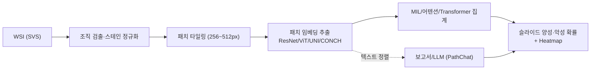

# GC-Pathology

## 프로젝트 개요
GreenVet으로부터 전달받은 조직검사 메타데이터와 대용량 Whole Slide Image(WSI)를 기반으로, 수의 병리 영역에서 임상 적용 가능한 Computational Pathology 파이프라인을 구축하는 프로젝트입니다. 본 문서는 선행 연구 검토, 데이터 이해, 방법론, 실행 계획을 정리하여 후속 연구와 개발의 기준점으로 삼습니다.

## Vet-ICD-O 코드 매칭 방법론
### 비정형 병리 텍스트 전처리 및 매칭 파이프라인
1. **데이터 정제**: 조직검사 결과 매칭 CSV의 `DIAGNOSIS`, `GROSS_FINDINGS`, `MICROSCOPIC_FINDINGS`, `COMMENTS` 컬럼을 로드한 뒤 HTML 태그 제거, 특수문자 정규화, 불필요한 공백 축소 등 기본 클렌징을 수행합니다. 한국어·영어 혼재 서술에 대응하기 위해 언어 감지 후 형태소 분석기(예: Khaiii, Mecab-ko)와 영문 토크나이저를 결합하거나 문장 단위 파이프라인을 구성합니다.
2. **Vet-ICD-O 사전 구축**: `Vet-ICD-O-canine-1, First Edition` 파일의 Topography 리스트(C코드)와 Morphology 리스트(8xxx/코드)를 추출하여 용어·계층 구조 사전을 만들고, 동의어·약어·한국어 번역을 확장합니다. 사전은 해시맵 또는 임베딩 인덱스(예: FAISS)로 저장해 빠른 조회가 가능하도록 합니다.
3. **다단계 매칭 로직**: 정규표현식과 규칙 기반 정확 일치, 퍼지 매칭(Damerau-Levenshtein 거리, TF-IDF 코사인 유사도), 멀티링구얼 임베딩(Sentence-BERT, KoSimCSE 등)을 순차 적용해 후보 Topography/Morphology를 발굴합니다. `DIAGNOSIS` → `MICROSCOPIC_FINDINGS` → `COMMENTS` 순으로 신뢰 가중치를 부여하고, `SITE` 및 `GROSS_FINDINGS`는 해부 부위 판단에 집중 활용합니다.
4. **스코어링 및 품질 관리**: 각 후보 조합에 대해 직접 매칭 여부, 번역 후 매칭, 임베딩 점수 등을 가중 평균하여 임계값을 넘는 코드를 확정합니다. 애매한 케이스는 수동 검토 큐에 적재하고, 전문가 피드백으로 사전·규칙을 지속 보강합니다. `Include/Excludes` 정보를 활용해 상호 배제 코드 오류를 방지합니다.

### 규칙 기반 파이프라인과 LLM 활용 비교
- **신뢰도 및 감사성**: 규칙·사전 기반 매칭은 각 단계의 근거(정확 일치, 동의어, 임베딩 점수 등)를 로그로 남길 수 있어 의료 데이터 거버넌스 요구사항을 충족하기 용이합니다. 반면 LLM은 모델·프롬프트 변화에 따라 출력이 달라질 수 있고 내부 추론이 불투명해 재현성과 감사성이 낮습니다.
- **오류 수정 및 유지보수**: 규칙 기반 시스템은 오탐 발견 시 사전·규칙 수정 후 전량 재처리하면 동일 결과를 재현할 수 있습니다. LLM은 업데이트나 파라미터 튜닝에 따라 답변이 흔들릴 수 있어 버전 관리가 어렵습니다.
- **의학 특화 LLM 품질**: Gemma와 같은 범용 모델은 Vet-ICD-O 체계를 충분히 학습하지 않아 추가 프롬프트 설계와 용어집 주입이 필요합니다. Med-PaLM, BioGPT 변형 등 의학용 LLM도 수의 병리 지식과 한국어 텍스트 커버리지가 제한적이며, 온프레미스 배치 비용·프라이버시 이슈가 존재합니다.
- **권장 전략**: 규칙 기반 파이프라인을 기본으로 구축하고, 매칭 신뢰도가 낮은 사례에 한해 LLM을 보조 추천 도구로 사용하여 전문가 검증을 결합하는 하이브리드 접근을 권장합니다.

## GreenVet 데이터 요약
### 데이터 구조 및 레코드 현황
- 48,692개의 행이 11개 컬럼으로 구성되어 있으며, 16,943건의 고유 검사 의뢰 번호(`INSP_RQST_NO`)와 16,949개의 고유 슬라이드 식별자(`FILE_NAME`)가 존재합니다.
- 레코드는 슬라이드/스냅샷 단위로 저장되어 동일 의뢰가 평균 2.87행(중앙값 2행, 75% 분위수 4행, 최대 18행)으로 확장됩니다.
- 동일 의뢰 내 다중 슬라이드를 고려하면 슬라이드 수는 의뢰당 평균 1.40장(최대 10장)이며, 전체 의뢰 중 4,170건이 2장 이상 슬라이드를 포함합니다.
- 고유 검사 의뢰 16,943건 중 1,581건(9.3%)은 상이한 진단 텍스트가 2개 이상 기록되어 있으며, 최대 5개의 진단이 한 의뢰에 병기되어 있습니다.
- 스냅샷 URL은 48,690건에서 제공되어 영상-텍스트 매칭이 용이하며, `RESULT_PDF`는 48,680건이 결측으로 텍스트 중심의 리포트 구조임을 시사합니다.

### 서비스 유형 및 해부 부위 분포
- 검사 서비스는 `Histopathology (1 Site/Lesion)-국내` 38,581건(79.2%), `Histopathology (2 Site/Lesion)-국내` 7,946건(16.3%), `Histopathology (3 Site/Lesion)-국내` 1,777건(3.6%), `Histopathology (4 Site/Lesion)-국내` 388건(0.8%)으로 구성되어 단일 병변 조직검사가 대부분을 차지합니다.
- 위치 코드는 `site1` 43,465건(89.3%), `site2` 4,446건(9.1%), `site3` 686건(1.4%), `site4` 95건(0.2%) 순으로 1차 위치 정보가 집중되어 있습니다.

### 슬라이드 및 이미지 리소스
- `FILE_NAME`에 `|`가 포함된 다중 슬라이드 행은 18,212건이며, 4,166건의 검사 의뢰가 해당 패턴을 보입니다.
- 검사 의뢰-슬라이드 매핑 테이블에서 슬라이드 수 분포는 90% 분위수가 2장, 95% 분위수가 3장, 99% 분위수가 5장으로 확인되어 고슬라이드 의뢰는 제한적입니다.
- 스냅샷 URL 결측은 2건에 불과하여 WSI 썸네일 기반 QA 및 지능형 뷰어 구축에 활용할 수 있습니다.

### 텍스트 라벨 품질
- 진단(`DIAGNOSIS`) 평균 길이는 42.7자(최대 342자)로 핵심 라벨이 간결하게 정리되어 있으며, 현미경 소견(`MICROSCOPIC_FINDINGS`)과 코멘트(`COMMENTS`)는 각각 평균 343자, 372자로 상세 서술이 풍부합니다.
- 육안 소견(`GROSS_FINDINGS`)은 평균 118자로 템플릿 기반 서술이 일정하며, 전체 텍스트 컬럼에 결측이 없어 지도 학습 라벨 품질이 높습니다.
- 진단명은 영어/한글 혼용, 소견 및 코멘트는 한국어 중심으로 기록되어 있어 멀티링구얼 전처리 전략이 요구됩니다.

### 동물 종 단서
- 육안·현미경·코멘트 텍스트를 정규화한 뒤 숫자 단위 표현(예: "두 개", "3개의")을 제외하는 규칙 기반 토큰 필터를 적용해 종 키워드를 검출한 결과, 개 관련 서술이 24,255건(이 중 개·고양이 동시 언급 2,421건 포함), 고양이 관련 서술이 6,011건으로 집계되었고 종 미기재 건은 20,847건으로 확인되어 반려견 중심 데이터 분포가 유지됩니다.
- 종 필드가 명시적으로 존재하지 않아 동물 종 태깅을 위한 규칙·모델 기반 명명 실체 인식(NER) 또는 키워드 매칭이 필요합니다.

### CSV 파일 자산 요약
| 파일명 | 행 수 | 주요 컬럼 | 설명 |
| --- | --- | --- | --- |
| `Data/조직검사 결과 매칭(2024)_utf8_pruned.csv` | 48,691 | `INSP_RQST_NO`, `FILE_NAME`, `DIAGNOSIS`, `GROSS_FINDINGS`, `MICROSCOPIC_FINDINGS`, `COMMENTS`, `SITE`, `SNAPSHOT` 등 | GreenVet 조직검사 원본 메타데이터(정제본). 의뢰 번호·슬라이드 식별자와 주요 서술형 병리 보고 컬럼을 포함합니다. |
| `Data/조직검사 결과 매칭(2024)_coded.csv` | 50 | 위 원본 컬럼 + `Vet-ICD-O_Topography`, `Vet-ICD-O_Morphology`, `Specimen_Site_Normalized`, `Species` | Vet-ICD-O-canine-1 1판 기준으로 상위 50개 레코드를 수작업 매칭한 파생본. 병변 해부 위치 정규화와 확실히 식별 가능한 종(고양이/개)을 태깅했습니다. |

### 진단명 분포 (전체 5,950건)
GreenVet 메타데이터에 등장하는 모든 진단명을 건수 순으로 정렬했습니다.

| 순위 | 진단명 | 건수 |
| --- | --- | --- |
| 1 | Subcutaneous lipoma | 1198 |
| 2 | Mammary complex adenoma, completely excised | 739 |
| 3 | Trichoblastoma, completely excised | 734 |
| 4 | Sebaceous adenoma, completely excised | 613 |
| 5 | Cutaneous histiocytoma, completely excised | 546 |
| 6 | Mammary adenoma, complex type, completely excised | 471 |
| 7 | Mammary benign mixed tumor, completely excised | 466 |
| 8 | Follicular cyst, completely excised | 435 |
| 9 | Mast cell tumor (Well-differentiated) | 403 |
| 10 | Peripheral odontogenic fibroma | 381 |
| 11 | Mammary gland adenoma, completely excised | 356 |
| 12 | Peripheral odontogenic fibroma with osseous metaplasia | 300 |
| 13 | Lymphoid nodular hyperplasia | 291 |
| 14 | Mammary gland adenoma, simple type, completely excised | 286 |
| 15 | Lipoma | 285 |
| 16 | Benign mammary mixed tumor, completely excised | 263 |
| 17 | Splenic hemangiosarcoma | 255 |
| 18 | Subcutaneous lipoma, completely excised | 251 |
| 19 | Complex nodular hyperplasia | 243 |
| 20 | Oral melanoma | 237 |
| 21 | Mast cell tumor, well-differentiated, completely excised | 228 |
| 22 | Trichoblastoma | 222 |
| 23 | Cutaneous mast cell tumor (Well-differentiated type), completely excised | 209 |
| 24 | Soft tissue sarcoma, grade II | 206 |
| 25 | Splenic nodular hyperplasia (complex type) | 205 |
| 26 | Sebaceous epithelioma, completely excised | 192 |
| 27 | Hepatoid gland adenoma | 191 |
| 28 | Mammary mixed tumor (Benign) | 185 |
| 29 | Gingival hyperplasia, gingivitis | 182 |
| 30 | Squamous cell carcinoma | 177 |
| 31 | Panniculitis with septal fibrosis | 177 |
| 32 | Infundibular keratinizing acanthoma, completely excised | 172 |
| 33 | Mammary gland adenoma, complex type, completely excised | 172 |
| 34 | Mammary adenoma, simple type, completely excised | 172 |
| 35 | Panniculitis | 171 |
| 36 | Mast cell tumor (Low-grade / Grade 2) | 169 |
| 37 | Gingival hyperplasia | 161 |
| 38 | Splenic stromal sarcoma | 157 |
| 39 | Soft tissue sarcoma, Grade 2 | 151 |
| 40 | Cutaneous mast cell tumor (Well-differentiated type) | 142 |
| 41 | Cutaneous plasmacytoma | 140 |
| 42 | Traumatic panniculitis | 139 |
| 43 | Mammary benign mixed tumor | 138 |
| 44 | Fibroadnexal hamartoma, completely excised | 137 |
| 45 | Gingival hyperplasia with chronic gingivitis | 135 |
| 46 | Apocrine cyst, completely excised | 135 |
| 47 | Sebaceous adenoma | 134 |
| 48 | Meibomian adenoma, completely excised | 134 |
| 49 | Cutaneous histiocytoma | 133 |
| 50 | Fibroadnexal hamartoma (dysplasia), completely excised | 130 |

## WSI 기반 양성/악성 판별 핵심 프로세스와 대표 연구 5선
WSI 기반 양성/악성 판별의 전형적인 흐름과 Paper 폴더에 포함된 대표 논문 5편을 정리했습니다. 파운데이션 모델은 **패치 임베딩 단계**에서 사용되어, 패치별 특징 벡터를 생성한 뒤 MIL/어텐션으로 슬라이드 레벨 예측을 만듭니다.

### 대표 논문 5선 (양성/악성·전이·Foundation model)
1. **Campanella et al., 2019 (Nature Medicine)** – 44,732 WSI를 약지도 MIL+RNN으로 처리해 전립선·기저세포암·유방 전이 AUC ≥0.98; 슬라이드 패치 시퀀스를 순차 인코딩해 임상 트리아지 구현.
2. **Lu et al., 2021 – CLAM (Nature Biomed. Eng.)** – Attention MIL에 클러스터 제약을 넣어 중요 패치 선택과 클래스 분리도를 동시에 학습; CAMELYON16/17 AUC 0.953로 데이터 효율성과 해석 가능성을 확보.
3. **Coudray et al., 2018 (Nature Medicine)** – LUAD vs LUSC 패치 분류 뒤 슬라이드 집계로 암종 판별 및 STK11/EGFR 등 변이 예측(AUC 0.82~0.86); 패치 수준에서 분자적 특징을 학습해 슬라이드 레벨로 통합.
4. **UNI (Mahmood Lab, Nature Medicine 2024)** – 1억+ 병리 패치 self-supervised 사전학습으로 1024-d 패치 임베딩 생성; 패치 인코더를 고정하고 CLAM/TransMIL 등 MIL 헤드를 올려 소량 라벨에서도 강한 양성/악성 분류와 retrieval 성능을 제공.
5. **CONCH (Mahmood Lab, Nature Medicine 2024)** – 비전-언어 대조학습으로 512-d 패치·텍스트 공동 임베딩을 학습; 패치 인코더 출력을 MIL/Transformer 집계 후 텍스트와 정렬해 악성도 분류와 보고서 검색·설명력을 동시에 강화.

### 파운데이션/백본 선택 가이드
- **ImageNet 사전학습 CNN/ViT**: ResNet50(2048-d), ViT-B 등 범용 임베딩. 초기 베이스라인에 적합.
- **병리 특화 Self-supervised**: CTransPath, RetCCL – 병리 패치로 대조학습, 도메인 적합성↑.
- **대규모 파운데이션**: UNI(1024-d), CONCH(512-d) – 수억 패치 사전학습으로 소량 라벨에서도 강한 분류/검색/heatmap 성능.
- **비전-언어 계열**: PathAlign, PathChat – 패치 임베딩과 보고서 정렬을 통해 양성/악성 근거 설명·QA·보고서 생성 지원.