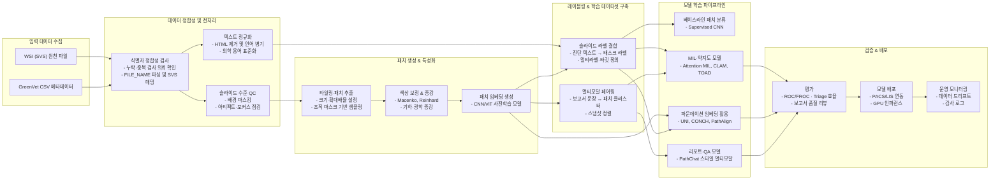
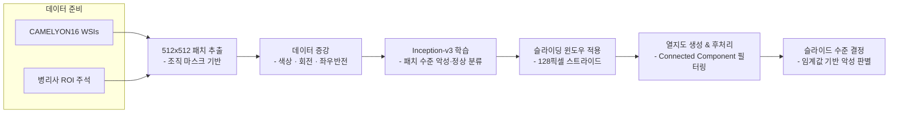
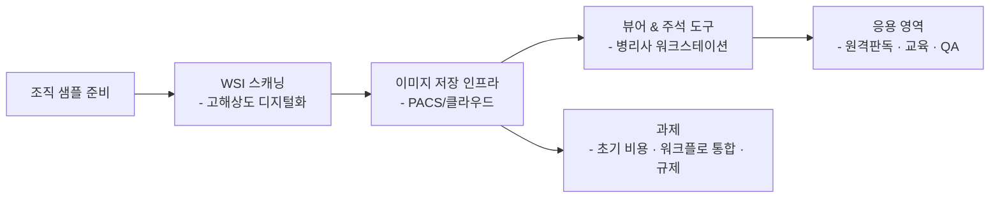
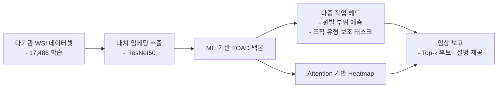
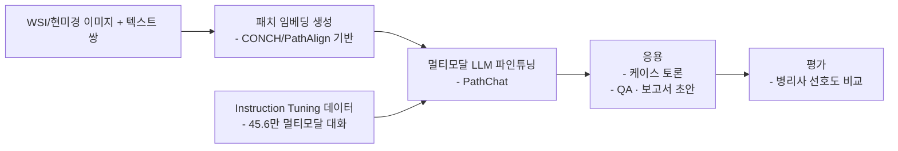

# GC-Pathology

## 프로젝트 개요
GreenVet으로부터 전달받은 조직검사 메타데이터와 대용량 Whole Slide Image(WSI)를 기반으로, 수의 병리 영역에서 임상 적용 가능한 Computational Pathology 파이프라인을 구축하는 프로젝트입니다. 본 문서는 선행 연구 검토, 데이터 이해, 방법론, 실행 계획을 정리하여 후속 연구와 개발의 기준점으로 삼습니다.

## GreenVet 데이터 요약
### 데이터 구조 및 레코드 현황
- 48,692개의 행이 11개 컬럼으로 구성되어 있으며, 16,943건의 고유 검사 의뢰 번호(`INSP_RQST_NO`)와 16,949개의 고유 슬라이드 식별자(`FILE_NAME`)가 존재합니다.
- 레코드는 슬라이드/스냅샷 단위로 저장되어 동일 의뢰가 평균 2.87행(중앙값 2행, 75% 분위수 4행, 최대 18행)으로 확장됩니다.
- 동일 의뢰 내 다중 슬라이드를 고려하면 슬라이드 수는 의뢰당 평균 1.40장(최대 10장)이며, 전체 의뢰 중 4,170건이 2장 이상 슬라이드를 포함합니다.
- 고유 검사 의뢰 16,943건 중 1,581건(9.3%)은 상이한 진단 텍스트가 2개 이상 기록되어 있으며, 최대 5개의 진단이 한 의뢰에 병기되어 있습니다.
- 스냅샷 URL은 48,690건에서 제공되어 영상-텍스트 매칭이 용이하며, `RESULT_PDF`는 48,680건이 결측으로 텍스트 중심의 리포트 구조임을 시사합니다.

### 서비스 유형 및 해부 부위 분포
- 검사 서비스는 `Histopathology (1 Site/Lesion)-국내` 38,581건(79.2%), `Histopathology (2 Site/Lesion)-국내` 7,946건(16.3%), `Histopathology (3 Site/Lesion)-국내` 1,777건(3.6%), `Histopathology (4 Site/Lesion)-국내` 388건(0.8%)으로 구성되어 단일 병변 조직검사가 대부분을 차지합니다.
- 위치 코드는 `site1` 43,465건(89.3%), `site2` 4,446건(9.1%), `site3` 686건(1.4%), `site4` 95건(0.2%) 순으로 1차 위치 정보가 집중되어 있습니다.

### 슬라이드 및 이미지 리소스
- `FILE_NAME`에 `|`가 포함된 다중 슬라이드 행은 18,212건이며, 4,166건의 검사 의뢰가 해당 패턴을 보입니다.
- 검사 의뢰-슬라이드 매핑 테이블에서 슬라이드 수 분포는 90% 분위수가 2장, 95% 분위수가 3장, 99% 분위수가 5장으로 확인되어 고슬라이드 의뢰는 제한적입니다.
- 스냅샷 URL 결측은 2건에 불과하여 WSI 썸네일 기반 QA 및 지능형 뷰어 구축에 활용할 수 있습니다.

### 텍스트 라벨 품질
- 진단(`DIAGNOSIS`) 평균 길이는 42.7자(최대 342자)로 핵심 라벨이 간결하게 정리되어 있으며, 현미경 소견(`MICROSCOPIC_FINDINGS`)과 코멘트(`COMMENTS`)는 각각 평균 343자, 372자로 상세 서술이 풍부합니다.
- 육안 소견(`GROSS_FINDINGS`)은 평균 118자로 템플릿 기반 서술이 일정하며, 전체 텍스트 컬럼에 결측이 없어 지도 학습 라벨 품질이 높습니다.
- 진단명은 영어/한글 혼용, 소견 및 코멘트는 한국어 중심으로 기록되어 있어 멀티링구얼 전처리 전략이 요구됩니다.

### 동물 종 단서
- 육안·현미경·코멘트 텍스트를 통합한 결과, "개" 언급이 33,118건, "고양이" 언급이 5,613건으로 확인되어 반려견 중심 데이터임을 보여줍니다.
- 종 필드가 명시적으로 존재하지 않아 동물 종 태깅을 위한 규칙·모델 기반 명명 실체 인식(NER) 또는 키워드 매칭이 필요합니다.

### 진단명 분포 (전체 5,950건)
GreenVet 메타데이터에 등장하는 모든 진단명을 건수 순으로 정렬했습니다.

  <table style="width: 100%; border-collapse: collapse; font-size: 0.95rem;">
    <thead>
      <tr>
        <th style="position: sticky; top: 0; background: #ffffff; border-bottom: 1px solid #d0d0d0; padding: 8px; text-align: left;">순위</th>
        <th style="position: sticky; top: 0; background: #ffffff; border-bottom: 1px solid #d0d0d0; padding: 8px; text-align: left;">진단명</th>
        <th style="position: sticky; top: 0; background: #ffffff; border-bottom: 1px solid #d0d0d0; padding: 8px; text-align: left;">건수</th>
      </tr>
    </thead>
    <tbody>
      <tr>
        <td style="padding: 6px 8px; border-bottom: 1px solid #f0f0f0; vertical-align: top;">1</td>
        <td style="padding: 6px 8px; border-bottom: 1px solid #f0f0f0; vertical-align: top;">Subcutaneous lipoma</td>
        <td style="padding: 6px 8px; border-bottom: 1px solid #f0f0f0; vertical-align: top;">1198</td>
      </tr>
      <tr>
        <td style="padding: 6px 8px; border-bottom: 1px solid #f0f0f0; vertical-align: top;">2</td>
        <td style="padding: 6px 8px; border-bottom: 1px solid #f0f0f0; vertical-align: top;">Mammary complex adenoma, completely excised</td>
        <td style="padding: 6px 8px; border-bottom: 1px solid #f0f0f0; vertical-align: top;">739</td>
      </tr>
      <tr>
        <td style="padding: 6px 8px; border-bottom: 1px solid #f0f0f0; vertical-align: top;">3</td>
        <td style="padding: 6px 8px; border-bottom: 1px solid #f0f0f0; vertical-align: top;">Trichoblastoma, completely excised</td>
        <td style="padding: 6px 8px; border-bottom: 1px solid #f0f0f0; vertical-align: top;">734</td>
      </tr>
      <tr>
        <td style="padding: 6px 8px; border-bottom: 1px solid #f0f0f0; vertical-align: top;">4</td>
        <td style="padding: 6px 8px; border-bottom: 1px solid #f0f0f0; vertical-align: top;">Sebaceous adenoma, completely excised</td>
        <td style="padding: 6px 8px; border-bottom: 1px solid #f0f0f0; vertical-align: top;">613</td>
      </tr>
      <tr>
        <td style="padding: 6px 8px; border-bottom: 1px solid #f0f0f0; vertical-align: top;">5</td>
        <td style="padding: 6px 8px; border-bottom: 1px solid #f0f0f0; vertical-align: top;">Cutaneous histiocytoma, completely excised</td>
        <td style="padding: 6px 8px; border-bottom: 1px solid #f0f0f0; vertical-align: top;">546</td>
      </tr>
      <tr>
        <td style="padding: 6px 8px; border-bottom: 1px solid #f0f0f0; vertical-align: top;">6</td>
        <td style="padding: 6px 8px; border-bottom: 1px solid #f0f0f0; vertical-align: top;">Mammary adenoma, complex type, completely excised</td>
        <td style="padding: 6px 8px; border-bottom: 1px solid #f0f0f0; vertical-align: top;">471</td>
      </tr>
      <tr>
        <td style="padding: 6px 8px; border-bottom: 1px solid #f0f0f0; vertical-align: top;">7</td>
        <td style="padding: 6px 8px; border-bottom: 1px solid #f0f0f0; vertical-align: top;">Mammary benign mixed tumor, completely excised</td>
        <td style="padding: 6px 8px; border-bottom: 1px solid #f0f0f0; vertical-align: top;">466</td>
      </tr>
      <tr>
        <td style="padding: 6px 8px; border-bottom: 1px solid #f0f0f0; vertical-align: top;">8</td>
        <td style="padding: 6px 8px; border-bottom: 1px solid #f0f0f0; vertical-align: top;">Follicular cyst, completely excised</td>
        <td style="padding: 6px 8px; border-bottom: 1px solid #f0f0f0; vertical-align: top;">435</td>
      </tr>
      <tr>
        <td style="padding: 6px 8px; border-bottom: 1px solid #f0f0f0; vertical-align: top;">9</td>
        <td style="padding: 6px 8px; border-bottom: 1px solid #f0f0f0; vertical-align: top;">Mast cell tumor (Well-differentiated)</td>
        <td style="padding: 6px 8px; border-bottom: 1px solid #f0f0f0; vertical-align: top;">403</td>
      </tr>
      <tr>
        <td style="padding: 6px 8px; border-bottom: 1px solid #f0f0f0; vertical-align: top;">10</td>
        <td style="padding: 6px 8px; border-bottom: 1px solid #f0f0f0; vertical-align: top;">Peripheral odontogenic fibroma</td>
        <td style="padding: 6px 8px; border-bottom: 1px solid #f0f0f0; vertical-align: top;">381</td>
      </tr>
      <tr>
        <td style="padding: 6px 8px; border-bottom: 1px solid #f0f0f0; vertical-align: top;">11</td>
        <td style="padding: 6px 8px; border-bottom: 1px solid #f0f0f0; vertical-align: top;">Mammary gland adenoma, completely excised</td>
        <td style="padding: 6px 8px; border-bottom: 1px solid #f0f0f0; vertical-align: top;">356</td>
      </tr>
      <tr>
        <td style="padding: 6px 8px; border-bottom: 1px solid #f0f0f0; vertical-align: top;">12</td>
        <td style="padding: 6px 8px; border-bottom: 1px solid #f0f0f0; vertical-align: top;">Peripheral odontogenic fibroma with osseous metaplasia</td>
        <td style="padding: 6px 8px; border-bottom: 1px solid #f0f0f0; vertical-align: top;">300</td>
      </tr>
      <tr>
        <td style="padding: 6px 8px; border-bottom: 1px solid #f0f0f0; vertical-align: top;">13</td>
        <td style="padding: 6px 8px; border-bottom: 1px solid #f0f0f0; vertical-align: top;">Lymphoid nodular hyperplasia</td>
        <td style="padding: 6px 8px; border-bottom: 1px solid #f0f0f0; vertical-align: top;">291</td>
      </tr>
      <tr>
        <td style="padding: 6px 8px; border-bottom: 1px solid #f0f0f0; vertical-align: top;">14</td>
        <td style="padding: 6px 8px; border-bottom: 1px solid #f0f0f0; vertical-align: top;">Mammary gland adenoma, simple type, completely excised</td>
        <td style="padding: 6px 8px; border-bottom: 1px solid #f0f0f0; vertical-align: top;">286</td>
      </tr>
      <tr>
        <td style="padding: 6px 8px; border-bottom: 1px solid #f0f0f0; vertical-align: top;">15</td>
        <td style="padding: 6px 8px; border-bottom: 1px solid #f0f0f0; vertical-align: top;">Lipoma</td>
        <td style="padding: 6px 8px; border-bottom: 1px solid #f0f0f0; vertical-align: top;">285</td>
      </tr>
      <tr>
        <td style="padding: 6px 8px; border-bottom: 1px solid #f0f0f0; vertical-align: top;">16</td>
        <td style="padding: 6px 8px; border-bottom: 1px solid #f0f0f0; vertical-align: top;">Benign mammary mixed tumor, completely excised</td>
        <td style="padding: 6px 8px; border-bottom: 1px solid #f0f0f0; vertical-align: top;">263</td>
      </tr>
      <tr>
        <td style="padding: 6px 8px; border-bottom: 1px solid #f0f0f0; vertical-align: top;">17</td>
        <td style="padding: 6px 8px; border-bottom: 1px solid #f0f0f0; vertical-align: top;">Splenic hemangiosarcoma</td>
        <td style="padding: 6px 8px; border-bottom: 1px solid #f0f0f0; vertical-align: top;">255</td>
      </tr>
      <tr>
        <td style="padding: 6px 8px; border-bottom: 1px solid #f0f0f0; vertical-align: top;">18</td>
        <td style="padding: 6px 8px; border-bottom: 1px solid #f0f0f0; vertical-align: top;">Subcutaneous lipoma, completely excised</td>
        <td style="padding: 6px 8px; border-bottom: 1px solid #f0f0f0; vertical-align: top;">251</td>
      </tr>
      <tr>
        <td style="padding: 6px 8px; border-bottom: 1px solid #f0f0f0; vertical-align: top;">19</td>
        <td style="padding: 6px 8px; border-bottom: 1px solid #f0f0f0; vertical-align: top;">Complex nodular hyperplasia</td>
        <td style="padding: 6px 8px; border-bottom: 1px solid #f0f0f0; vertical-align: top;">243</td>
      </tr>
      <tr>
        <td style="padding: 6px 8px; border-bottom: 1px solid #f0f0f0; vertical-align: top;">20</td>
        <td style="padding: 6px 8px; border-bottom: 1px solid #f0f0f0; vertical-align: top;">Oral melanoma</td>
        <td style="padding: 6px 8px; border-bottom: 1px solid #f0f0f0; vertical-align: top;">237</td>
      </tr>
      <tr>
        <td style="padding: 6px 8px; border-bottom: 1px solid #f0f0f0; vertical-align: top;">21</td>
        <td style="padding: 6px 8px; border-bottom: 1px solid #f0f0f0; vertical-align: top;">Mast cell tumor, well-differentiated, completely excised</td>
        <td style="padding: 6px 8px; border-bottom: 1px solid #f0f0f0; vertical-align: top;">228</td>
      </tr>
      <tr>
        <td style="padding: 6px 8px; border-bottom: 1px solid #f0f0f0; vertical-align: top;">22</td>
        <td style="padding: 6px 8px; border-bottom: 1px solid #f0f0f0; vertical-align: top;">Trichoblastoma</td>
        <td style="padding: 6px 8px; border-bottom: 1px solid #f0f0f0; vertical-align: top;">222</td>
      </tr>
      <tr>
        <td style="padding: 6px 8px; border-bottom: 1px solid #f0f0f0; vertical-align: top;">23</td>
        <td style="padding: 6px 8px; border-bottom: 1px solid #f0f0f0; vertical-align: top;">Cutaneous mast cell tumor (Well-differentiated type), completely excised</td>
        <td style="padding: 6px 8px; border-bottom: 1px solid #f0f0f0; vertical-align: top;">209</td>
      </tr>
      <tr>
        <td style="padding: 6px 8px; border-bottom: 1px solid #f0f0f0; vertical-align: top;">24</td>
        <td style="padding: 6px 8px; border-bottom: 1px solid #f0f0f0; vertical-align: top;">Soft tissue sarcoma, grade II</td>
        <td style="padding: 6px 8px; border-bottom: 1px solid #f0f0f0; vertical-align: top;">206</td>
      </tr>
      <tr>
        <td style="padding: 6px 8px; border-bottom: 1px solid #f0f0f0; vertical-align: top;">25</td>
        <td style="padding: 6px 8px; border-bottom: 1px solid #f0f0f0; vertical-align: top;">Splenic nodular hyperplasia (complex type)</td>
        <td style="padding: 6px 8px; border-bottom: 1px solid #f0f0f0; vertical-align: top;">205</td>
      </tr>
      <tr>
        <td style="padding: 6px 8px; border-bottom: 1px solid #f0f0f0; vertical-align: top;">26</td>
        <td style="padding: 6px 8px; border-bottom: 1px solid #f0f0f0; vertical-align: top;">Sebaceous epithelioma, completely excised</td>
        <td style="padding: 6px 8px; border-bottom: 1px solid #f0f0f0; vertical-align: top;">192</td>
      </tr>
      <tr>
        <td style="padding: 6px 8px; border-bottom: 1px solid #f0f0f0; vertical-align: top;">27</td>
        <td style="padding: 6px 8px; border-bottom: 1px solid #f0f0f0; vertical-align: top;">Hepatoid gland adenoma</td>
        <td style="padding: 6px 8px; border-bottom: 1px solid #f0f0f0; vertical-align: top;">191</td>
      </tr>
      <tr>
        <td style="padding: 6px 8px; border-bottom: 1px solid #f0f0f0; vertical-align: top;">28</td>
        <td style="padding: 6px 8px; border-bottom: 1px solid #f0f0f0; vertical-align: top;">Mammary mixed tumor (Benign)</td>
        <td style="padding: 6px 8px; border-bottom: 1px solid #f0f0f0; vertical-align: top;">185</td>
      </tr>
      <tr>
        <td style="padding: 6px 8px; border-bottom: 1px solid #f0f0f0; vertical-align: top;">29</td>
        <td style="padding: 6px 8px; border-bottom: 1px solid #f0f0f0; vertical-align: top;">Gingival hyperplasia, gingivitis</td>
        <td style="padding: 6px 8px; border-bottom: 1px solid #f0f0f0; vertical-align: top;">182</td>
      </tr>
      <tr>
        <td style="padding: 6px 8px; border-bottom: 1px solid #f0f0f0; vertical-align: top;">30</td>
        <td style="padding: 6px 8px; border-bottom: 1px solid #f0f0f0; vertical-align: top;">Squamous cell carcinoma</td>
        <td style="padding: 6px 8px; border-bottom: 1px solid #f0f0f0; vertical-align: top;">177</td>
      </tr>
      <tr>
        <td style="padding: 6px 8px; border-bottom: 1px solid #f0f0f0; vertical-align: top;">31</td>
        <td style="padding: 6px 8px; border-bottom: 1px solid #f0f0f0; vertical-align: top;">Panniculitis with septal fibrosis</td>
        <td style="padding: 6px 8px; border-bottom: 1px solid #f0f0f0; vertical-align: top;">177</td>
      </tr>
      <tr>
        <td style="padding: 6px 8px; border-bottom: 1px solid #f0f0f0; vertical-align: top;">32</td>
        <td style="padding: 6px 8px; border-bottom: 1px solid #f0f0f0; vertical-align: top;">Infundibular keratinizing acanthoma, completely excised</td>
        <td style="padding: 6px 8px; border-bottom: 1px solid #f0f0f0; vertical-align: top;">172</td>
      </tr>
      <tr>
        <td style="padding: 6px 8px; border-bottom: 1px solid #f0f0f0; vertical-align: top;">33</td>
        <td style="padding: 6px 8px; border-bottom: 1px solid #f0f0f0; vertical-align: top;">Mammary gland adenoma, complex type, completely excised</td>
        <td style="padding: 6px 8px; border-bottom: 1px solid #f0f0f0; vertical-align: top;">172</td>
      </tr>
      <tr>
        <td style="padding: 6px 8px; border-bottom: 1px solid #f0f0f0; vertical-align: top;">34</td>
        <td style="padding: 6px 8px; border-bottom: 1px solid #f0f0f0; vertical-align: top;">Mammary adenoma, simple type, completely excised</td>
        <td style="padding: 6px 8px; border-bottom: 1px solid #f0f0f0; vertical-align: top;">172</td>
      </tr>
      <tr>
        <td style="padding: 6px 8px; border-bottom: 1px solid #f0f0f0; vertical-align: top;">35</td>
        <td style="padding: 6px 8px; border-bottom: 1px solid #f0f0f0; vertical-align: top;">Panniculitis</td>
        <td style="padding: 6px 8px; border-bottom: 1px solid #f0f0f0; vertical-align: top;">171</td>
      </tr>
      <tr>
        <td style="padding: 6px 8px; border-bottom: 1px solid #f0f0f0; vertical-align: top;">36</td>
        <td style="padding: 6px 8px; border-bottom: 1px solid #f0f0f0; vertical-align: top;">Mast cell tumor (Low-grade / Grade 2)</td>
        <td style="padding: 6px 8px; border-bottom: 1px solid #f0f0f0; vertical-align: top;">169</td>
      </tr>
      <tr>
        <td style="padding: 6px 8px; border-bottom: 1px solid #f0f0f0; vertical-align: top;">37</td>
        <td style="padding: 6px 8px; border-bottom: 1px solid #f0f0f0; vertical-align: top;">Gingival hyperplasia</td>
        <td style="padding: 6px 8px; border-bottom: 1px solid #f0f0f0; vertical-align: top;">161</td>
      </tr>
      <tr>
        <td style="padding: 6px 8px; border-bottom: 1px solid #f0f0f0; vertical-align: top;">38</td>
        <td style="padding: 6px 8px; border-bottom: 1px solid #f0f0f0; vertical-align: top;">Splenic stromal sarcoma</td>
        <td style="padding: 6px 8px; border-bottom: 1px solid #f0f0f0; vertical-align: top;">157</td>
      </tr>
      <tr>
        <td style="padding: 6px 8px; border-bottom: 1px solid #f0f0f0; vertical-align: top;">39</td>
        <td style="padding: 6px 8px; border-bottom: 1px solid #f0f0f0; vertical-align: top;">Soft tissue sarcoma, Grade 2</td>
        <td style="padding: 6px 8px; border-bottom: 1px solid #f0f0f0; vertical-align: top;">151</td>
      </tr>
      <tr>
        <td style="padding: 6px 8px; border-bottom: 1px solid #f0f0f0; vertical-align: top;">40</td>
        <td style="padding: 6px 8px; border-bottom: 1px solid #f0f0f0; vertical-align: top;">Cutaneous mast cell tumor (Well-differentiated type)</td>
        <td style="padding: 6px 8px; border-bottom: 1px solid #f0f0f0; vertical-align: top;">142</td>
      </tr>
      <tr>
        <td style="padding: 6px 8px; border-bottom: 1px solid #f0f0f0; vertical-align: top;">41</td>
        <td style="padding: 6px 8px; border-bottom: 1px solid #f0f0f0; vertical-align: top;">Cutaneous plasmacytoma</td>
        <td style="padding: 6px 8px; border-bottom: 1px solid #f0f0f0; vertical-align: top;">140</td>
      </tr>
      <tr>
        <td style="padding: 6px 8px; border-bottom: 1px solid #f0f0f0; vertical-align: top;">42</td>
        <td style="padding: 6px 8px; border-bottom: 1px solid #f0f0f0; vertical-align: top;">Traumatic panniculitis</td>
        <td style="padding: 6px 8px; border-bottom: 1px solid #f0f0f0; vertical-align: top;">139</td>
      </tr>
      <tr>
        <td style="padding: 6px 8px; border-bottom: 1px solid #f0f0f0; vertical-align: top;">43</td>
        <td style="padding: 6px 8px; border-bottom: 1px solid #f0f0f0; vertical-align: top;">Mammary benign mixed tumor</td>
        <td style="padding: 6px 8px; border-bottom: 1px solid #f0f0f0; vertical-align: top;">138</td>
      </tr>
      <tr>
        <td style="padding: 6px 8px; border-bottom: 1px solid #f0f0f0; vertical-align: top;">44</td>
        <td style="padding: 6px 8px; border-bottom: 1px solid #f0f0f0; vertical-align: top;">Fibroadnexal hamartoma, completely excised</td>
        <td style="padding: 6px 8px; border-bottom: 1px solid #f0f0f0; vertical-align: top;">137</td>
      </tr>
      <tr>
        <td style="padding: 6px 8px; border-bottom: 1px solid #f0f0f0; vertical-align: top;">45</td>
        <td style="padding: 6px 8px; border-bottom: 1px solid #f0f0f0; vertical-align: top;">Gingival hyperplasia with chronic gingivitis</td>
        <td style="padding: 6px 8px; border-bottom: 1px solid #f0f0f0; vertical-align: top;">135</td>
      </tr>
      <tr>
        <td style="padding: 6px 8px; border-bottom: 1px solid #f0f0f0; vertical-align: top;">46</td>
        <td style="padding: 6px 8px; border-bottom: 1px solid #f0f0f0; vertical-align: top;">Apocrine cyst, completely excised</td>
        <td style="padding: 6px 8px; border-bottom: 1px solid #f0f0f0; vertical-align: top;">135</td>
      </tr>
      <tr>
        <td style="padding: 6px 8px; border-bottom: 1px solid #f0f0f0; vertical-align: top;">47</td>
        <td style="padding: 6px 8px; border-bottom: 1px solid #f0f0f0; vertical-align: top;">Sebaceous adenoma</td>
        <td style="padding: 6px 8px; border-bottom: 1px solid #f0f0f0; vertical-align: top;">134</td>
      </tr>
      <tr>
        <td style="padding: 6px 8px; border-bottom: 1px solid #f0f0f0; vertical-align: top;">48</td>
        <td style="padding: 6px 8px; border-bottom: 1px solid #f0f0f0; vertical-align: top;">Meibomian adenoma, completely excised</td>
        <td style="padding: 6px 8px; border-bottom: 1px solid #f0f0f0; vertical-align: top;">134</td>
      </tr>
      <tr>
        <td style="padding: 6px 8px; border-bottom: 1px solid #f0f0f0; vertical-align: top;">49</td>
        <td style="padding: 6px 8px; border-bottom: 1px solid #f0f0f0; vertical-align: top;">Cutaneous histiocytoma</td>
        <td style="padding: 6px 8px; border-bottom: 1px solid #f0f0f0; vertical-align: top;">133</td>
      </tr>
      <tr>
        <td style="padding: 6px 8px; border-bottom: 1px solid #f0f0f0; vertical-align: top;">50</td>
        <td style="padding: 6px 8px; border-bottom: 1px solid #f0f0f0; vertical-align: top;">Fibroadnexal hamartoma (dysplasia), completely excised</td>
        <td style="padding: 6px 8px; border-bottom: 1px solid #f0f0f0; vertical-align: top;">130</td>
      </tr>
      <tr>
        <td style="padding: 6px 8px; border-bottom: 1px solid #f0f0f0; vertical-align: top;">51</td>
        <td style="padding: 6px 8px; border-bottom: 1px solid #f0f0f0; vertical-align: top;">Mammary adenoma, complex type</td>
        <td style="padding: 6px 8px; border-bottom: 1px solid #f0f0f0; vertical-align: top;">128</td>
      </tr>
      <tr>
        <td style="padding: 6px 8px; border-bottom: 1px solid #f0f0f0; vertical-align: top;">52</td>
        <td style="padding: 6px 8px; border-bottom: 1px solid #f0f0f0; vertical-align: top;">Cutaneous mast cell tumor (Kiupel’s : Low-grade / Patnaik’s : Grade 2)</td>
        <td style="padding: 6px 8px; border-bottom: 1px solid #f0f0f0; vertical-align: top;">127</td>
      </tr>
      <tr>
        <td style="padding: 6px 8px; border-bottom: 1px solid #f0f0f0; vertical-align: top;">53</td>
        <td style="padding: 6px 8px; border-bottom: 1px solid #f0f0f0; vertical-align: top;">Splenic nodular hyperplasia, lymphoid type</td>
        <td style="padding: 6px 8px; border-bottom: 1px solid #f0f0f0; vertical-align: top;">124</td>
      </tr>
      <tr>
        <td style="padding: 6px 8px; border-bottom: 1px solid #f0f0f0; vertical-align: top;">54</td>
        <td style="padding: 6px 8px; border-bottom: 1px solid #f0f0f0; vertical-align: top;">Soft tissue sarcoma, grade I</td>
        <td style="padding: 6px 8px; border-bottom: 1px solid #f0f0f0; vertical-align: top;">121</td>
      </tr>
      <tr>
        <td style="padding: 6px 8px; border-bottom: 1px solid #f0f0f0; vertical-align: top;">55</td>
        <td style="padding: 6px 8px; border-bottom: 1px solid #f0f0f0; vertical-align: top;">Infiltrative lipoma</td>
        <td style="padding: 6px 8px; border-bottom: 1px solid #f0f0f0; vertical-align: top;">118</td>
      </tr>
      <tr>
        <td style="padding: 6px 8px; border-bottom: 1px solid #f0f0f0; vertical-align: top;">56</td>
        <td style="padding: 6px 8px; border-bottom: 1px solid #f0f0f0; vertical-align: top;">Anal sac adenocarcinoma</td>
        <td style="padding: 6px 8px; border-bottom: 1px solid #f0f0f0; vertical-align: top;">113</td>
      </tr>
      <tr>
        <td style="padding: 6px 8px; border-bottom: 1px solid #f0f0f0; vertical-align: top;">57</td>
        <td style="padding: 6px 8px; border-bottom: 1px solid #f0f0f0; vertical-align: top;">Soft tissue sarcoma, Grade 1</td>
        <td style="padding: 6px 8px; border-bottom: 1px solid #f0f0f0; vertical-align: top;">111</td>
      </tr>
      <tr>
        <td style="padding: 6px 8px; border-bottom: 1px solid #f0f0f0; vertical-align: top;">58</td>
        <td style="padding: 6px 8px; border-bottom: 1px solid #f0f0f0; vertical-align: top;">Oral squamous cell carcinoma</td>
        <td style="padding: 6px 8px; border-bottom: 1px solid #f0f0f0; vertical-align: top;">110</td>
      </tr>
      <tr>
        <td style="padding: 6px 8px; border-bottom: 1px solid #f0f0f0; vertical-align: top;">59</td>
        <td style="padding: 6px 8px; border-bottom: 1px solid #f0f0f0; vertical-align: top;">Infundibular keratinizing acanthoma</td>
        <td style="padding: 6px 8px; border-bottom: 1px solid #f0f0f0; vertical-align: top;">109</td>
      </tr>
      <tr>
        <td style="padding: 6px 8px; border-bottom: 1px solid #f0f0f0; vertical-align: top;">60</td>
        <td style="padding: 6px 8px; border-bottom: 1px solid #f0f0f0; vertical-align: top;">Fibroadnexal dysplasia (hamartoma)</td>
        <td style="padding: 6px 8px; border-bottom: 1px solid #f0f0f0; vertical-align: top;">106</td>
      </tr>
      <tr>
        <td style="padding: 6px 8px; border-bottom: 1px solid #f0f0f0; vertical-align: top;">61</td>
        <td style="padding: 6px 8px; border-bottom: 1px solid #f0f0f0; vertical-align: top;">(Splenic) hemangiosarcoma</td>
        <td style="padding: 6px 8px; border-bottom: 1px solid #f0f0f0; vertical-align: top;">105</td>
      </tr>
      <tr>
        <td style="padding: 6px 8px; border-bottom: 1px solid #f0f0f0; vertical-align: top;">62</td>
        <td style="padding: 6px 8px; border-bottom: 1px solid #f0f0f0; vertical-align: top;">Oral fibroepithelial polyp</td>
        <td style="padding: 6px 8px; border-bottom: 1px solid #f0f0f0; vertical-align: top;">101</td>
      </tr>
      <tr>
        <td style="padding: 6px 8px; border-bottom: 1px solid #f0f0f0; vertical-align: top;">63</td>
        <td style="padding: 6px 8px; border-bottom: 1px solid #f0f0f0; vertical-align: top;">Subcutaneous mast cell tumor</td>
        <td style="padding: 6px 8px; border-bottom: 1px solid #f0f0f0; vertical-align: top;">100</td>
      </tr>
      <tr>
        <td style="padding: 6px 8px; border-bottom: 1px solid #f0f0f0; vertical-align: top;">64</td>
        <td style="padding: 6px 8px; border-bottom: 1px solid #f0f0f0; vertical-align: top;">Gingival hyperplasia with lymphoplasmacytic gingivitis</td>
        <td style="padding: 6px 8px; border-bottom: 1px solid #f0f0f0; vertical-align: top;">98</td>
      </tr>
      <tr>
        <td style="padding: 6px 8px; border-bottom: 1px solid #f0f0f0; vertical-align: top;">65</td>
        <td style="padding: 6px 8px; border-bottom: 1px solid #f0f0f0; vertical-align: top;">Cutaneous mast cell tumor (Low-grade / Grade 2)</td>
        <td style="padding: 6px 8px; border-bottom: 1px solid #f0f0f0; vertical-align: top;">96</td>
      </tr>
      <tr>
        <td style="padding: 6px 8px; border-bottom: 1px solid #f0f0f0; vertical-align: top;">66</td>
        <td style="padding: 6px 8px; border-bottom: 1px solid #f0f0f0; vertical-align: top;">Fibroepithelial polyp</td>
        <td style="padding: 6px 8px; border-bottom: 1px solid #f0f0f0; vertical-align: top;">95</td>
      </tr>
      <tr>
        <td style="padding: 6px 8px; border-bottom: 1px solid #f0f0f0; vertical-align: top;">67</td>
        <td style="padding: 6px 8px; border-bottom: 1px solid #f0f0f0; vertical-align: top;">Hepatoid gland adenoma, completely excised</td>
        <td style="padding: 6px 8px; border-bottom: 1px solid #f0f0f0; vertical-align: top;">95</td>
      </tr>
      <tr>
        <td style="padding: 6px 8px; border-bottom: 1px solid #f0f0f0; vertical-align: top;">68</td>
        <td style="padding: 6px 8px; border-bottom: 1px solid #f0f0f0; vertical-align: top;">Mammary complex adenoma</td>
        <td style="padding: 6px 8px; border-bottom: 1px solid #f0f0f0; vertical-align: top;">94</td>
      </tr>
      <tr>
        <td style="padding: 6px 8px; border-bottom: 1px solid #f0f0f0; vertical-align: top;">69</td>
        <td style="padding: 6px 8px; border-bottom: 1px solid #f0f0f0; vertical-align: top;">Sebaceous epithelioma</td>
        <td style="padding: 6px 8px; border-bottom: 1px solid #f0f0f0; vertical-align: top;">93</td>
      </tr>
      <tr>
        <td style="padding: 6px 8px; border-bottom: 1px solid #f0f0f0; vertical-align: top;">70</td>
        <td style="padding: 6px 8px; border-bottom: 1px solid #f0f0f0; vertical-align: top;">Mammary mass: Mammary adenoma, complex type, completely excised</td>
        <td style="padding: 6px 8px; border-bottom: 1px solid #f0f0f0; vertical-align: top;">91</td>
      </tr>
      <tr>
        <td style="padding: 6px 8px; border-bottom: 1px solid #f0f0f0; vertical-align: top;">71</td>
        <td style="padding: 6px 8px; border-bottom: 1px solid #f0f0f0; vertical-align: top;">Soft tissue sarcoma, Grade I</td>
        <td style="padding: 6px 8px; border-bottom: 1px solid #f0f0f0; vertical-align: top;">89</td>
      </tr>
      <tr>
        <td style="padding: 6px 8px; border-bottom: 1px solid #f0f0f0; vertical-align: top;">72</td>
        <td style="padding: 6px 8px; border-bottom: 1px solid #f0f0f0; vertical-align: top;">Cutaneous hemangioma, completely excised</td>
        <td style="padding: 6px 8px; border-bottom: 1px solid #f0f0f0; vertical-align: top;">88</td>
      </tr>
      <tr>
        <td style="padding: 6px 8px; border-bottom: 1px solid #f0f0f0; vertical-align: top;">73</td>
        <td style="padding: 6px 8px; border-bottom: 1px solid #f0f0f0; vertical-align: top;">Subcutaneous hemangioma, completely excised</td>
        <td style="padding: 6px 8px; border-bottom: 1px solid #f0f0f0; vertical-align: top;">87</td>
      </tr>
      <tr>
        <td style="padding: 6px 8px; border-bottom: 1px solid #f0f0f0; vertical-align: top;">74</td>
        <td style="padding: 6px 8px; border-bottom: 1px solid #f0f0f0; vertical-align: top;">Extramedullary plasmacytoma, completely excised</td>
        <td style="padding: 6px 8px; border-bottom: 1px solid #f0f0f0; vertical-align: top;">86</td>
      </tr>
      <tr>
        <td style="padding: 6px 8px; border-bottom: 1px solid #f0f0f0; vertical-align: top;">75</td>
        <td style="padding: 6px 8px; border-bottom: 1px solid #f0f0f0; vertical-align: top;">Hepatoid (perianal) gland adenoma, completely excised</td>
        <td style="padding: 6px 8px; border-bottom: 1px solid #f0f0f0; vertical-align: top;">85</td>
      </tr>
      <tr>
        <td style="padding: 6px 8px; border-bottom: 1px solid #f0f0f0; vertical-align: top;">76</td>
        <td style="padding: 6px 8px; border-bottom: 1px solid #f0f0f0; vertical-align: top;">Hemangiosarcoma</td>
        <td style="padding: 6px 8px; border-bottom: 1px solid #f0f0f0; vertical-align: top;">83</td>
      </tr>
      <tr>
        <td style="padding: 6px 8px; border-bottom: 1px solid #f0f0f0; vertical-align: top;">77</td>
        <td style="padding: 6px 8px; border-bottom: 1px solid #f0f0f0; vertical-align: top;">Mammary carcinoma, complex type, Grade 1, completely excised</td>
        <td style="padding: 6px 8px; border-bottom: 1px solid #f0f0f0; vertical-align: top;">83</td>
      </tr>
      <tr>
        <td style="padding: 6px 8px; border-bottom: 1px solid #f0f0f0; vertical-align: top;">78</td>
        <td style="padding: 6px 8px; border-bottom: 1px solid #f0f0f0; vertical-align: top;">Mammary carcinoma, Grade 3 Lymphatic invasion</td>
        <td style="padding: 6px 8px; border-bottom: 1px solid #f0f0f0; vertical-align: top;">82</td>
      </tr>
      <tr>
        <td style="padding: 6px 8px; border-bottom: 1px solid #f0f0f0; vertical-align: top;">79</td>
        <td style="padding: 6px 8px; border-bottom: 1px solid #f0f0f0; vertical-align: top;">Trichoepithelioma, completely excised</td>
        <td style="padding: 6px 8px; border-bottom: 1px solid #f0f0f0; vertical-align: top;">82</td>
      </tr>
      <tr>
        <td style="padding: 6px 8px; border-bottom: 1px solid #f0f0f0; vertical-align: top;">80</td>
        <td style="padding: 6px 8px; border-bottom: 1px solid #f0f0f0; vertical-align: top;">Gingival hyperplasia, lymphoplasmacytic gingivitis</td>
        <td style="padding: 6px 8px; border-bottom: 1px solid #f0f0f0; vertical-align: top;">80</td>
      </tr>
      <tr>
        <td style="padding: 6px 8px; border-bottom: 1px solid #f0f0f0; vertical-align: top;">81</td>
        <td style="padding: 6px 8px; border-bottom: 1px solid #f0f0f0; vertical-align: top;">Trichoepithelioma</td>
        <td style="padding: 6px 8px; border-bottom: 1px solid #f0f0f0; vertical-align: top;">79</td>
      </tr>
      <tr>
        <td style="padding: 6px 8px; border-bottom: 1px solid #f0f0f0; vertical-align: top;">82</td>
        <td style="padding: 6px 8px; border-bottom: 1px solid #f0f0f0; vertical-align: top;">Follicular Cyst, completely excised</td>
        <td style="padding: 6px 8px; border-bottom: 1px solid #f0f0f0; vertical-align: top;">78</td>
      </tr>
      <tr>
        <td style="padding: 6px 8px; border-bottom: 1px solid #f0f0f0; vertical-align: top;">83</td>
        <td style="padding: 6px 8px; border-bottom: 1px solid #f0f0f0; vertical-align: top;">Mast cell tumor, well-differentiated</td>
        <td style="padding: 6px 8px; border-bottom: 1px solid #f0f0f0; vertical-align: top;">76</td>
      </tr>
      <tr>
        <td style="padding: 6px 8px; border-bottom: 1px solid #f0f0f0; vertical-align: top;">84</td>
        <td style="padding: 6px 8px; border-bottom: 1px solid #f0f0f0; vertical-align: top;">Extramedullary plasmacytoma</td>
        <td style="padding: 6px 8px; border-bottom: 1px solid #f0f0f0; vertical-align: top;">75</td>
      </tr>
      <tr>
        <td style="padding: 6px 8px; border-bottom: 1px solid #f0f0f0; vertical-align: top;">85</td>
        <td style="padding: 6px 8px; border-bottom: 1px solid #f0f0f0; vertical-align: top;">Mammary gland complex adenoma, margin complete</td>
        <td style="padding: 6px 8px; border-bottom: 1px solid #f0f0f0; vertical-align: top;">74</td>
      </tr>
      <tr>
        <td style="padding: 6px 8px; border-bottom: 1px solid #f0f0f0; vertical-align: top;">86</td>
        <td style="padding: 6px 8px; border-bottom: 1px solid #f0f0f0; vertical-align: top;">Follicular cyst</td>
        <td style="padding: 6px 8px; border-bottom: 1px solid #f0f0f0; vertical-align: top;">74</td>
      </tr>
      <tr>
        <td style="padding: 6px 8px; border-bottom: 1px solid #f0f0f0; vertical-align: top;">87</td>
        <td style="padding: 6px 8px; border-bottom: 1px solid #f0f0f0; vertical-align: top;">Gingiva: Gingival hyperplasia with chronic gingivitis</td>
        <td style="padding: 6px 8px; border-bottom: 1px solid #f0f0f0; vertical-align: top;">74</td>
      </tr>
      <tr>
        <td style="padding: 6px 8px; border-bottom: 1px solid #f0f0f0; vertical-align: top;">88</td>
        <td style="padding: 6px 8px; border-bottom: 1px solid #f0f0f0; vertical-align: top;">Mammary cystadenoma, completely excised</td>
        <td style="padding: 6px 8px; border-bottom: 1px solid #f0f0f0; vertical-align: top;">71</td>
      </tr>
      <tr>
        <td style="padding: 6px 8px; border-bottom: 1px solid #f0f0f0; vertical-align: top;">89</td>
        <td style="padding: 6px 8px; border-bottom: 1px solid #f0f0f0; vertical-align: top;">Reactive lymphadenopathy</td>
        <td style="padding: 6px 8px; border-bottom: 1px solid #f0f0f0; vertical-align: top;">71</td>
      </tr>
      <tr>
        <td style="padding: 6px 8px; border-bottom: 1px solid #f0f0f0; vertical-align: top;">90</td>
        <td style="padding: 6px 8px; border-bottom: 1px solid #f0f0f0; vertical-align: top;">Meibomian epithelioma, completely excised</td>
        <td style="padding: 6px 8px; border-bottom: 1px solid #f0f0f0; vertical-align: top;">70</td>
      </tr>
      <tr>
        <td style="padding: 6px 8px; border-bottom: 1px solid #f0f0f0; vertical-align: top;">91</td>
        <td style="padding: 6px 8px; border-bottom: 1px solid #f0f0f0; vertical-align: top;">Mammary adenoma (complex type)</td>
        <td style="padding: 6px 8px; border-bottom: 1px solid #f0f0f0; vertical-align: top;">70</td>
      </tr>
      <tr>
        <td style="padding: 6px 8px; border-bottom: 1px solid #f0f0f0; vertical-align: top;">92</td>
        <td style="padding: 6px 8px; border-bottom: 1px solid #f0f0f0; vertical-align: top;">Apocrine ductal adenoma (Basal cell tumor)</td>
        <td style="padding: 6px 8px; border-bottom: 1px solid #f0f0f0; vertical-align: top;">70</td>
      </tr>
      <tr>
        <td style="padding: 6px 8px; border-bottom: 1px solid #f0f0f0; vertical-align: top;">93</td>
        <td style="padding: 6px 8px; border-bottom: 1px solid #f0f0f0; vertical-align: top;">Mammary carcinoma (Low-grade), completely excised</td>
        <td style="padding: 6px 8px; border-bottom: 1px solid #f0f0f0; vertical-align: top;">69</td>
      </tr>
      <tr>
        <td style="padding: 6px 8px; border-bottom: 1px solid #f0f0f0; vertical-align: top;">94</td>
        <td style="padding: 6px 8px; border-bottom: 1px solid #f0f0f0; vertical-align: top;">Cutaneous hemangioma</td>
        <td style="padding: 6px 8px; border-bottom: 1px solid #f0f0f0; vertical-align: top;">69</td>
      </tr>
      <tr>
        <td style="padding: 6px 8px; border-bottom: 1px solid #f0f0f0; vertical-align: top;">95</td>
        <td style="padding: 6px 8px; border-bottom: 1px solid #f0f0f0; vertical-align: top;">Panniculitis with lymphocytic aggregates</td>
        <td style="padding: 6px 8px; border-bottom: 1px solid #f0f0f0; vertical-align: top;">69</td>
      </tr>
      <tr>
        <td style="padding: 6px 8px; border-bottom: 1px solid #f0f0f0; vertical-align: top;">96</td>
        <td style="padding: 6px 8px; border-bottom: 1px solid #f0f0f0; vertical-align: top;">Matrical cyst, completely excised</td>
        <td style="padding: 6px 8px; border-bottom: 1px solid #f0f0f0; vertical-align: top;">68</td>
      </tr>
      <tr>
        <td style="padding: 6px 8px; border-bottom: 1px solid #f0f0f0; vertical-align: top;">97</td>
        <td style="padding: 6px 8px; border-bottom: 1px solid #f0f0f0; vertical-align: top;">Pilomatricoma, Completely excised</td>
        <td style="padding: 6px 8px; border-bottom: 1px solid #f0f0f0; vertical-align: top;">68</td>
      </tr>
      <tr>
        <td style="padding: 6px 8px; border-bottom: 1px solid #f0f0f0; vertical-align: top;">98</td>
        <td style="padding: 6px 8px; border-bottom: 1px solid #f0f0f0; vertical-align: top;">Melanocytoma, with low malignancy</td>
        <td style="padding: 6px 8px; border-bottom: 1px solid #f0f0f0; vertical-align: top;">67</td>
      </tr>
      <tr>
        <td style="padding: 6px 8px; border-bottom: 1px solid #f0f0f0; vertical-align: top;">99</td>
        <td style="padding: 6px 8px; border-bottom: 1px solid #f0f0f0; vertical-align: top;">Vaginal fibroma</td>
        <td style="padding: 6px 8px; border-bottom: 1px solid #f0f0f0; vertical-align: top;">66</td>
      </tr>
      <tr>
        <td style="padding: 6px 8px; border-bottom: 1px solid #f0f0f0; vertical-align: top;">100</td>
        <td style="padding: 6px 8px; border-bottom: 1px solid #f0f0f0; vertical-align: top;">Cutaneous plasmacytoma, completely excised</td>
        <td style="padding: 6px 8px; border-bottom: 1px solid #f0f0f0; vertical-align: top;">66</td>
      </tr>
      <tr>
        <td style="padding: 6px 8px; border-bottom: 1px solid #f0f0f0; vertical-align: top;">101</td>
        <td style="padding: 6px 8px; border-bottom: 1px solid #f0f0f0; vertical-align: top;">Mammary lobular hyperplasia</td>
        <td style="padding: 6px 8px; border-bottom: 1px solid #f0f0f0; vertical-align: top;">66</td>
      </tr>
      <tr>
        <td style="padding: 6px 8px; border-bottom: 1px solid #f0f0f0; vertical-align: top;">102</td>
        <td style="padding: 6px 8px; border-bottom: 1px solid #f0f0f0; vertical-align: top;">Cutaneous mast cell tumor (Well-differentiated)</td>
        <td style="padding: 6px 8px; border-bottom: 1px solid #f0f0f0; vertical-align: top;">66</td>
      </tr>
      <tr>
        <td style="padding: 6px 8px; border-bottom: 1px solid #f0f0f0; vertical-align: top;">103</td>
        <td style="padding: 6px 8px; border-bottom: 1px solid #f0f0f0; vertical-align: top;">Soft tissue sarcoma</td>
        <td style="padding: 6px 8px; border-bottom: 1px solid #f0f0f0; vertical-align: top;">65</td>
      </tr>
      <tr>
        <td style="padding: 6px 8px; border-bottom: 1px solid #f0f0f0; vertical-align: top;">104</td>
        <td style="padding: 6px 8px; border-bottom: 1px solid #f0f0f0; vertical-align: top;">Acanthomatous ameloblastoma</td>
        <td style="padding: 6px 8px; border-bottom: 1px solid #f0f0f0; vertical-align: top;">63</td>
      </tr>
      <tr>
        <td style="padding: 6px 8px; border-bottom: 1px solid #f0f0f0; vertical-align: top;">105</td>
        <td style="padding: 6px 8px; border-bottom: 1px solid #f0f0f0; vertical-align: top;">Splenic hematoma</td>
        <td style="padding: 6px 8px; border-bottom: 1px solid #f0f0f0; vertical-align: top;">63</td>
      </tr>
      <tr>
        <td style="padding: 6px 8px; border-bottom: 1px solid #f0f0f0; vertical-align: top;">106</td>
        <td style="padding: 6px 8px; border-bottom: 1px solid #f0f0f0; vertical-align: top;">Feline trichoblastoma; Basal cell tumor</td>
        <td style="padding: 6px 8px; border-bottom: 1px solid #f0f0f0; vertical-align: top;">62</td>
      </tr>
      <tr>
        <td style="padding: 6px 8px; border-bottom: 1px solid #f0f0f0; vertical-align: top;">107</td>
        <td style="padding: 6px 8px; border-bottom: 1px solid #f0f0f0; vertical-align: top;">Collagenous hamartoma, completely excised</td>
        <td style="padding: 6px 8px; border-bottom: 1px solid #f0f0f0; vertical-align: top;">61</td>
      </tr>
      <tr>
        <td style="padding: 6px 8px; border-bottom: 1px solid #f0f0f0; vertical-align: top;">108</td>
        <td style="padding: 6px 8px; border-bottom: 1px solid #f0f0f0; vertical-align: top;">Mast cell tumor</td>
        <td style="padding: 6px 8px; border-bottom: 1px solid #f0f0f0; vertical-align: top;">61</td>
      </tr>
      <tr>
        <td style="padding: 6px 8px; border-bottom: 1px solid #f0f0f0; vertical-align: top;">109</td>
        <td style="padding: 6px 8px; border-bottom: 1px solid #f0f0f0; vertical-align: top;">Cutaneous mast cell tumor (well-differentiated)</td>
        <td style="padding: 6px 8px; border-bottom: 1px solid #f0f0f0; vertical-align: top;">61</td>
      </tr>
      <tr>
        <td style="padding: 6px 8px; border-bottom: 1px solid #f0f0f0; vertical-align: top;">110</td>
        <td style="padding: 6px 8px; border-bottom: 1px solid #f0f0f0; vertical-align: top;">Follicular cyst, ruptured and inflamed, completely excised</td>
        <td style="padding: 6px 8px; border-bottom: 1px solid #f0f0f0; vertical-align: top;">61</td>
      </tr>
      <tr>
        <td style="padding: 6px 8px; border-bottom: 1px solid #f0f0f0; vertical-align: top;">111</td>
        <td style="padding: 6px 8px; border-bottom: 1px solid #f0f0f0; vertical-align: top;">Sebaceous adenoma, inflamed, completely excised</td>
        <td style="padding: 6px 8px; border-bottom: 1px solid #f0f0f0; vertical-align: top;">58</td>
      </tr>
      <tr>
        <td style="padding: 6px 8px; border-bottom: 1px solid #f0f0f0; vertical-align: top;">112</td>
        <td style="padding: 6px 8px; border-bottom: 1px solid #f0f0f0; vertical-align: top;">Fibrolipoma</td>
        <td style="padding: 6px 8px; border-bottom: 1px solid #f0f0f0; vertical-align: top;">57</td>
      </tr>
      <tr>
        <td style="padding: 6px 8px; border-bottom: 1px solid #f0f0f0; vertical-align: top;">113</td>
        <td style="padding: 6px 8px; border-bottom: 1px solid #f0f0f0; vertical-align: top;">Fibroadnexal dysplasia (harmatoma)</td>
        <td style="padding: 6px 8px; border-bottom: 1px solid #f0f0f0; vertical-align: top;">57</td>
      </tr>
      <tr>
        <td style="padding: 6px 8px; border-bottom: 1px solid #f0f0f0; vertical-align: top;">114</td>
        <td style="padding: 6px 8px; border-bottom: 1px solid #f0f0f0; vertical-align: top;">Viral papilloma, completely excised</td>
        <td style="padding: 6px 8px; border-bottom: 1px solid #f0f0f0; vertical-align: top;">57</td>
      </tr>
      <tr>
        <td style="padding: 6px 8px; border-bottom: 1px solid #f0f0f0; vertical-align: top;">115</td>
        <td style="padding: 6px 8px; border-bottom: 1px solid #f0f0f0; vertical-align: top;">Mammary complex adenoma, completely excised Mammary lobular hyperplasia</td>
        <td style="padding: 6px 8px; border-bottom: 1px solid #f0f0f0; vertical-align: top;">57</td>
      </tr>
      <tr>
        <td style="padding: 6px 8px; border-bottom: 1px solid #f0f0f0; vertical-align: top;">116</td>
        <td style="padding: 6px 8px; border-bottom: 1px solid #f0f0f0; vertical-align: top;">Cutaneous mast cell tumor, completely excised (Kiupel’s : Low-grade / Patnaik’s : Grade 2)</td>
        <td style="padding: 6px 8px; border-bottom: 1px solid #f0f0f0; vertical-align: top;">57</td>
      </tr>
      <tr>
        <td style="padding: 6px 8px; border-bottom: 1px solid #f0f0f0; vertical-align: top;">117</td>
        <td style="padding: 6px 8px; border-bottom: 1px solid #f0f0f0; vertical-align: top;">Acrochordon</td>
        <td style="padding: 6px 8px; border-bottom: 1px solid #f0f0f0; vertical-align: top;">56</td>
      </tr>
      <tr>
        <td style="padding: 6px 8px; border-bottom: 1px solid #f0f0f0; vertical-align: top;">118</td>
        <td style="padding: 6px 8px; border-bottom: 1px solid #f0f0f0; vertical-align: top;">Spleen: Complex nodular hyperplasia</td>
        <td style="padding: 6px 8px; border-bottom: 1px solid #f0f0f0; vertical-align: top;">56</td>
      </tr>
      <tr>
        <td style="padding: 6px 8px; border-bottom: 1px solid #f0f0f0; vertical-align: top;">119</td>
        <td style="padding: 6px 8px; border-bottom: 1px solid #f0f0f0; vertical-align: top;">Hematopoietic nodular hyperplasia</td>
        <td style="padding: 6px 8px; border-bottom: 1px solid #f0f0f0; vertical-align: top;">55</td>
      </tr>
      <tr>
        <td style="padding: 6px 8px; border-bottom: 1px solid #f0f0f0; vertical-align: top;">120</td>
        <td style="padding: 6px 8px; border-bottom: 1px solid #f0f0f0; vertical-align: top;">Splenic myelolipoma</td>
        <td style="padding: 6px 8px; border-bottom: 1px solid #f0f0f0; vertical-align: top;">55</td>
      </tr>
      <tr>
        <td style="padding: 6px 8px; border-bottom: 1px solid #f0f0f0; vertical-align: top;">121</td>
        <td style="padding: 6px 8px; border-bottom: 1px solid #f0f0f0; vertical-align: top;">Organizing hematoma with panniculitis and granulation tissue (seroma)</td>
        <td style="padding: 6px 8px; border-bottom: 1px solid #f0f0f0; vertical-align: top;">55</td>
      </tr>
      <tr>
        <td style="padding: 6px 8px; border-bottom: 1px solid #f0f0f0; vertical-align: top;">122</td>
        <td style="padding: 6px 8px; border-bottom: 1px solid #f0f0f0; vertical-align: top;">Ulcerative and proliferative stomatitis, chronic-active with granulation</td>
        <td style="padding: 6px 8px; border-bottom: 1px solid #f0f0f0; vertical-align: top;">55</td>
      </tr>
      <tr>
        <td style="padding: 6px 8px; border-bottom: 1px solid #f0f0f0; vertical-align: top;">123</td>
        <td style="padding: 6px 8px; border-bottom: 1px solid #f0f0f0; vertical-align: top;">Subcutaneous mast cell tumor, completely excised</td>
        <td style="padding: 6px 8px; border-bottom: 1px solid #f0f0f0; vertical-align: top;">55</td>
      </tr>
      <tr>
        <td style="padding: 6px 8px; border-bottom: 1px solid #f0f0f0; vertical-align: top;">124</td>
        <td style="padding: 6px 8px; border-bottom: 1px solid #f0f0f0; vertical-align: top;">Mammary adenoma, intraductal papillary type, completely excised</td>
        <td style="padding: 6px 8px; border-bottom: 1px solid #f0f0f0; vertical-align: top;">53</td>
      </tr>
      <tr>
        <td style="padding: 6px 8px; border-bottom: 1px solid #f0f0f0; vertical-align: top;">125</td>
        <td style="padding: 6px 8px; border-bottom: 1px solid #f0f0f0; vertical-align: top;">Mammary mass: Benign mammary mixed tumor, completely excised</td>
        <td style="padding: 6px 8px; border-bottom: 1px solid #f0f0f0; vertical-align: top;">52</td>
      </tr>
      <tr>
        <td style="padding: 6px 8px; border-bottom: 1px solid #f0f0f0; vertical-align: top;">126</td>
        <td style="padding: 6px 8px; border-bottom: 1px solid #f0f0f0; vertical-align: top;">Mammary gland adenoma, complex type</td>
        <td style="padding: 6px 8px; border-bottom: 1px solid #f0f0f0; vertical-align: top;">52</td>
      </tr>
      <tr>
        <td style="padding: 6px 8px; border-bottom: 1px solid #f0f0f0; vertical-align: top;">127</td>
        <td style="padding: 6px 8px; border-bottom: 1px solid #f0f0f0; vertical-align: top;">Mammary carcinoma (Complex type), Grade I (Low grade)</td>
        <td style="padding: 6px 8px; border-bottom: 1px solid #f0f0f0; vertical-align: top;">50</td>
      </tr>
      <tr>
        <td style="padding: 6px 8px; border-bottom: 1px solid #f0f0f0; vertical-align: top;">128</td>
        <td style="padding: 6px 8px; border-bottom: 1px solid #f0f0f0; vertical-align: top;">Mammary carcinoma, Grade 2</td>
        <td style="padding: 6px 8px; border-bottom: 1px solid #f0f0f0; vertical-align: top;">49</td>
      </tr>
      <tr>
        <td style="padding: 6px 8px; border-bottom: 1px solid #f0f0f0; vertical-align: top;">129</td>
        <td style="padding: 6px 8px; border-bottom: 1px solid #f0f0f0; vertical-align: top;">Splenic lymphoid nodular hyperplasia</td>
        <td style="padding: 6px 8px; border-bottom: 1px solid #f0f0f0; vertical-align: top;">49</td>
      </tr>
      <tr>
        <td style="padding: 6px 8px; border-bottom: 1px solid #f0f0f0; vertical-align: top;">130</td>
        <td style="padding: 6px 8px; border-bottom: 1px solid #f0f0f0; vertical-align: top;">Mammary gland adenoma</td>
        <td style="padding: 6px 8px; border-bottom: 1px solid #f0f0f0; vertical-align: top;">49</td>
      </tr>
      <tr>
        <td style="padding: 6px 8px; border-bottom: 1px solid #f0f0f0; vertical-align: top;">131</td>
        <td style="padding: 6px 8px; border-bottom: 1px solid #f0f0f0; vertical-align: top;">Hepatoid gland epithelioma</td>
        <td style="padding: 6px 8px; border-bottom: 1px solid #f0f0f0; vertical-align: top;">48</td>
      </tr>
      <tr>
        <td style="padding: 6px 8px; border-bottom: 1px solid #f0f0f0; vertical-align: top;">132</td>
        <td style="padding: 6px 8px; border-bottom: 1px solid #f0f0f0; vertical-align: top;">Apocrine cysts, completely excised</td>
        <td style="padding: 6px 8px; border-bottom: 1px solid #f0f0f0; vertical-align: top;">48</td>
      </tr>
      <tr>
        <td style="padding: 6px 8px; border-bottom: 1px solid #f0f0f0; vertical-align: top;">133</td>
        <td style="padding: 6px 8px; border-bottom: 1px solid #f0f0f0; vertical-align: top;">Lymphoma</td>
        <td style="padding: 6px 8px; border-bottom: 1px solid #f0f0f0; vertical-align: top;">48</td>
      </tr>
      <tr>
        <td style="padding: 6px 8px; border-bottom: 1px solid #f0f0f0; vertical-align: top;">134</td>
        <td style="padding: 6px 8px; border-bottom: 1px solid #f0f0f0; vertical-align: top;">Hematopoietic nodular hyperplasia with hematoma</td>
        <td style="padding: 6px 8px; border-bottom: 1px solid #f0f0f0; vertical-align: top;">48</td>
      </tr>
      <tr>
        <td style="padding: 6px 8px; border-bottom: 1px solid #f0f0f0; vertical-align: top;">135</td>
        <td style="padding: 6px 8px; border-bottom: 1px solid #f0f0f0; vertical-align: top;">Subcutaneous Mast Cell Tumor</td>
        <td style="padding: 6px 8px; border-bottom: 1px solid #f0f0f0; vertical-align: top;">48</td>
      </tr>
      <tr>
        <td style="padding: 6px 8px; border-bottom: 1px solid #f0f0f0; vertical-align: top;">136</td>
        <td style="padding: 6px 8px; border-bottom: 1px solid #f0f0f0; vertical-align: top;">Mammary gland benign mixed tumor, margin complete</td>
        <td style="padding: 6px 8px; border-bottom: 1px solid #f0f0f0; vertical-align: top;">47</td>
      </tr>
      <tr>
        <td style="padding: 6px 8px; border-bottom: 1px solid #f0f0f0; vertical-align: top;">137</td>
        <td style="padding: 6px 8px; border-bottom: 1px solid #f0f0f0; vertical-align: top;">Meibomian adenoma</td>
        <td style="padding: 6px 8px; border-bottom: 1px solid #f0f0f0; vertical-align: top;">47</td>
      </tr>
      <tr>
        <td style="padding: 6px 8px; border-bottom: 1px solid #f0f0f0; vertical-align: top;">138</td>
        <td style="padding: 6px 8px; border-bottom: 1px solid #f0f0f0; vertical-align: top;">Cutaneous Histiocytoma</td>
        <td style="padding: 6px 8px; border-bottom: 1px solid #f0f0f0; vertical-align: top;">47</td>
      </tr>
      <tr>
        <td style="padding: 6px 8px; border-bottom: 1px solid #f0f0f0; vertical-align: top;">139</td>
        <td style="padding: 6px 8px; border-bottom: 1px solid #f0f0f0; vertical-align: top;">Peripheral odontogenic fibroma, inflamed</td>
        <td style="padding: 6px 8px; border-bottom: 1px solid #f0f0f0; vertical-align: top;">46</td>
      </tr>
      <tr>
        <td style="padding: 6px 8px; border-bottom: 1px solid #f0f0f0; vertical-align: top;">140</td>
        <td style="padding: 6px 8px; border-bottom: 1px solid #f0f0f0; vertical-align: top;">Gingiva, Inflammatory fibroepithelial polyp</td>
        <td style="padding: 6px 8px; border-bottom: 1px solid #f0f0f0; vertical-align: top;">46</td>
      </tr>
      <tr>
        <td style="padding: 6px 8px; border-bottom: 1px solid #f0f0f0; vertical-align: top;">141</td>
        <td style="padding: 6px 8px; border-bottom: 1px solid #f0f0f0; vertical-align: top;">Fibroadnexal hamartoma, inflamed, completely excised</td>
        <td style="padding: 6px 8px; border-bottom: 1px solid #f0f0f0; vertical-align: top;">45</td>
      </tr>
      <tr>
        <td style="padding: 6px 8px; border-bottom: 1px solid #f0f0f0; vertical-align: top;">142</td>
        <td style="padding: 6px 8px; border-bottom: 1px solid #f0f0f0; vertical-align: top;">Mast cell tumor (Atypical type)</td>
        <td style="padding: 6px 8px; border-bottom: 1px solid #f0f0f0; vertical-align: top;">45</td>
      </tr>
      <tr>
        <td style="padding: 6px 8px; border-bottom: 1px solid #f0f0f0; vertical-align: top;">143</td>
        <td style="padding: 6px 8px; border-bottom: 1px solid #f0f0f0; vertical-align: top;">Mammary carcinoma (Simple tubular type), Grade II (Intermediate grade)</td>
        <td style="padding: 6px 8px; border-bottom: 1px solid #f0f0f0; vertical-align: top;">45</td>
      </tr>
      <tr>
        <td style="padding: 6px 8px; border-bottom: 1px solid #f0f0f0; vertical-align: top;">144</td>
        <td style="padding: 6px 8px; border-bottom: 1px solid #f0f0f0; vertical-align: top;">Fibroma</td>
        <td style="padding: 6px 8px; border-bottom: 1px solid #f0f0f0; vertical-align: top;">45</td>
      </tr>
      <tr>
        <td style="padding: 6px 8px; border-bottom: 1px solid #f0f0f0; vertical-align: top;">145</td>
        <td style="padding: 6px 8px; border-bottom: 1px solid #f0f0f0; vertical-align: top;">Melanocytoma, completely excised</td>
        <td style="padding: 6px 8px; border-bottom: 1px solid #f0f0f0; vertical-align: top;">45</td>
      </tr>
      <tr>
        <td style="padding: 6px 8px; border-bottom: 1px solid #f0f0f0; vertical-align: top;">146</td>
        <td style="padding: 6px 8px; border-bottom: 1px solid #f0f0f0; vertical-align: top;">Oral Squamous Cell Carcinoma (SCC)</td>
        <td style="padding: 6px 8px; border-bottom: 1px solid #f0f0f0; vertical-align: top;">45</td>
      </tr>
      <tr>
        <td style="padding: 6px 8px; border-bottom: 1px solid #f0f0f0; vertical-align: top;">147</td>
        <td style="padding: 6px 8px; border-bottom: 1px solid #f0f0f0; vertical-align: top;">Trichoepithelioma, ruptured and inflamed, completely excised</td>
        <td style="padding: 6px 8px; border-bottom: 1px solid #f0f0f0; vertical-align: top;">45</td>
      </tr>
      <tr>
        <td style="padding: 6px 8px; border-bottom: 1px solid #f0f0f0; vertical-align: top;">148</td>
        <td style="padding: 6px 8px; border-bottom: 1px solid #f0f0f0; vertical-align: top;">Malignant melanoma</td>
        <td style="padding: 6px 8px; border-bottom: 1px solid #f0f0f0; vertical-align: top;">44</td>
      </tr>
      <tr>
        <td style="padding: 6px 8px; border-bottom: 1px solid #f0f0f0; vertical-align: top;">149</td>
        <td style="padding: 6px 8px; border-bottom: 1px solid #f0f0f0; vertical-align: top;">Pilomatricoma</td>
        <td style="padding: 6px 8px; border-bottom: 1px solid #f0f0f0; vertical-align: top;">44</td>
      </tr>
      <tr>
        <td style="padding: 6px 8px; border-bottom: 1px solid #f0f0f0; vertical-align: top;">150</td>
        <td style="padding: 6px 8px; border-bottom: 1px solid #f0f0f0; vertical-align: top;">Viral papilloma</td>
        <td style="padding: 6px 8px; border-bottom: 1px solid #f0f0f0; vertical-align: top;">44</td>
      </tr>
      <tr>
        <td style="padding: 6px 8px; border-bottom: 1px solid #f0f0f0; vertical-align: top;">151</td>
        <td style="padding: 6px 8px; border-bottom: 1px solid #f0f0f0; vertical-align: top;">See comments</td>
        <td style="padding: 6px 8px; border-bottom: 1px solid #f0f0f0; vertical-align: top;">44</td>
      </tr>
      <tr>
        <td style="padding: 6px 8px; border-bottom: 1px solid #f0f0f0; vertical-align: top;">152</td>
        <td style="padding: 6px 8px; border-bottom: 1px solid #f0f0f0; vertical-align: top;">Mast cell tumor (well-differentiated)</td>
        <td style="padding: 6px 8px; border-bottom: 1px solid #f0f0f0; vertical-align: top;">44</td>
      </tr>
      <tr>
        <td style="padding: 6px 8px; border-bottom: 1px solid #f0f0f0; vertical-align: top;">153</td>
        <td style="padding: 6px 8px; border-bottom: 1px solid #f0f0f0; vertical-align: top;">Rhinitis (mixed inflammatory cell population)</td>
        <td style="padding: 6px 8px; border-bottom: 1px solid #f0f0f0; vertical-align: top;">44</td>
      </tr>
      <tr>
        <td style="padding: 6px 8px; border-bottom: 1px solid #f0f0f0; vertical-align: top;">154</td>
        <td style="padding: 6px 8px; border-bottom: 1px solid #f0f0f0; vertical-align: top;">Hepatoid (perianal) gland adenoma</td>
        <td style="padding: 6px 8px; border-bottom: 1px solid #f0f0f0; vertical-align: top;">44</td>
      </tr>
      <tr>
        <td style="padding: 6px 8px; border-bottom: 1px solid #f0f0f0; vertical-align: top;">155</td>
        <td style="padding: 6px 8px; border-bottom: 1px solid #f0f0f0; vertical-align: top;">Splenic nodular hyperplasia (lymphoid type)</td>
        <td style="padding: 6px 8px; border-bottom: 1px solid #f0f0f0; vertical-align: top;">43</td>
      </tr>
      <tr>
        <td style="padding: 6px 8px; border-bottom: 1px solid #f0f0f0; vertical-align: top;">156</td>
        <td style="padding: 6px 8px; border-bottom: 1px solid #f0f0f0; vertical-align: top;">Perianal mass: Hepatoid (perianal) gland adenoma, completely excised</td>
        <td style="padding: 6px 8px; border-bottom: 1px solid #f0f0f0; vertical-align: top;">42</td>
      </tr>
      <tr>
        <td style="padding: 6px 8px; border-bottom: 1px solid #f0f0f0; vertical-align: top;">157</td>
        <td style="padding: 6px 8px; border-bottom: 1px solid #f0f0f0; vertical-align: top;">Mammary adenoma, simple type</td>
        <td style="padding: 6px 8px; border-bottom: 1px solid #f0f0f0; vertical-align: top;">42</td>
      </tr>
      <tr>
        <td style="padding: 6px 8px; border-bottom: 1px solid #f0f0f0; vertical-align: top;">158</td>
        <td style="padding: 6px 8px; border-bottom: 1px solid #f0f0f0; vertical-align: top;">Meibomian gland epithelioma</td>
        <td style="padding: 6px 8px; border-bottom: 1px solid #f0f0f0; vertical-align: top;">42</td>
      </tr>
      <tr>
        <td style="padding: 6px 8px; border-bottom: 1px solid #f0f0f0; vertical-align: top;">159</td>
        <td style="padding: 6px 8px; border-bottom: 1px solid #f0f0f0; vertical-align: top;">Sebaceous gland adenoma</td>
        <td style="padding: 6px 8px; border-bottom: 1px solid #f0f0f0; vertical-align: top;">42</td>
      </tr>
      <tr>
        <td style="padding: 6px 8px; border-bottom: 1px solid #f0f0f0; vertical-align: top;">160</td>
        <td style="padding: 6px 8px; border-bottom: 1px solid #f0f0f0; vertical-align: top;">Leiomyoma</td>
        <td style="padding: 6px 8px; border-bottom: 1px solid #f0f0f0; vertical-align: top;">42</td>
      </tr>
      <tr>
        <td style="padding: 6px 8px; border-bottom: 1px solid #f0f0f0; vertical-align: top;">161</td>
        <td style="padding: 6px 8px; border-bottom: 1px solid #f0f0f0; vertical-align: top;">Mammary carcinoma, complex type, Grade 1</td>
        <td style="padding: 6px 8px; border-bottom: 1px solid #f0f0f0; vertical-align: top;">41</td>
      </tr>
      <tr>
        <td style="padding: 6px 8px; border-bottom: 1px solid #f0f0f0; vertical-align: top;">162</td>
        <td style="padding: 6px 8px; border-bottom: 1px solid #f0f0f0; vertical-align: top;">Vaginal polyp</td>
        <td style="padding: 6px 8px; border-bottom: 1px solid #f0f0f0; vertical-align: top;">41</td>
      </tr>
      <tr>
        <td style="padding: 6px 8px; border-bottom: 1px solid #f0f0f0; vertical-align: top;">163</td>
        <td style="padding: 6px 8px; border-bottom: 1px solid #f0f0f0; vertical-align: top;">Metastasized carcinoma</td>
        <td style="padding: 6px 8px; border-bottom: 1px solid #f0f0f0; vertical-align: top;">41</td>
      </tr>
      <tr>
        <td style="padding: 6px 8px; border-bottom: 1px solid #f0f0f0; vertical-align: top;">164</td>
        <td style="padding: 6px 8px; border-bottom: 1px solid #f0f0f0; vertical-align: top;">Splenic nodular hyperplasia (hematopoietic type)</td>
        <td style="padding: 6px 8px; border-bottom: 1px solid #f0f0f0; vertical-align: top;">40</td>
      </tr>
      <tr>
        <td style="padding: 6px 8px; border-bottom: 1px solid #f0f0f0; vertical-align: top;">165</td>
        <td style="padding: 6px 8px; border-bottom: 1px solid #f0f0f0; vertical-align: top;">Cutaneous mast cell tumor (Kiupel’s : High-grade / Patnaik’s : Grade 2)</td>
        <td style="padding: 6px 8px; border-bottom: 1px solid #f0f0f0; vertical-align: top;">40</td>
      </tr>
      <tr>
        <td style="padding: 6px 8px; border-bottom: 1px solid #f0f0f0; vertical-align: top;">166</td>
        <td style="padding: 6px 8px; border-bottom: 1px solid #f0f0f0; vertical-align: top;">Squamous papilloma</td>
        <td style="padding: 6px 8px; border-bottom: 1px solid #f0f0f0; vertical-align: top;">40</td>
      </tr>
      <tr>
        <td style="padding: 6px 8px; border-bottom: 1px solid #f0f0f0; vertical-align: top;">167</td>
        <td style="padding: 6px 8px; border-bottom: 1px solid #f0f0f0; vertical-align: top;">Feline soft tissue sarcoma (grade 2) (Feline injection site sarcoma suspected)</td>
        <td style="padding: 6px 8px; border-bottom: 1px solid #f0f0f0; vertical-align: top;">40</td>
      </tr>
      <tr>
        <td style="padding: 6px 8px; border-bottom: 1px solid #f0f0f0; vertical-align: top;">168</td>
        <td style="padding: 6px 8px; border-bottom: 1px solid #f0f0f0; vertical-align: top;">Squamous papilloma, completely excised</td>
        <td style="padding: 6px 8px; border-bottom: 1px solid #f0f0f0; vertical-align: top;">40</td>
      </tr>
      <tr>
        <td style="padding: 6px 8px; border-bottom: 1px solid #f0f0f0; vertical-align: top;">169</td>
        <td style="padding: 6px 8px; border-bottom: 1px solid #f0f0f0; vertical-align: top;">Calcinosis circumscripta</td>
        <td style="padding: 6px 8px; border-bottom: 1px solid #f0f0f0; vertical-align: top;">40</td>
      </tr>
      <tr>
        <td style="padding: 6px 8px; border-bottom: 1px solid #f0f0f0; vertical-align: top;">170</td>
        <td style="padding: 6px 8px; border-bottom: 1px solid #f0f0f0; vertical-align: top;">Viral Papilloma</td>
        <td style="padding: 6px 8px; border-bottom: 1px solid #f0f0f0; vertical-align: top;">39</td>
      </tr>
      <tr>
        <td style="padding: 6px 8px; border-bottom: 1px solid #f0f0f0; vertical-align: top;">171</td>
        <td style="padding: 6px 8px; border-bottom: 1px solid #f0f0f0; vertical-align: top;">Mammary mixed tumor (Benign), completely excised</td>
        <td style="padding: 6px 8px; border-bottom: 1px solid #f0f0f0; vertical-align: top;">38</td>
      </tr>
      <tr>
        <td style="padding: 6px 8px; border-bottom: 1px solid #f0f0f0; vertical-align: top;">172</td>
        <td style="padding: 6px 8px; border-bottom: 1px solid #f0f0f0; vertical-align: top;">Follicular Cyst</td>
        <td style="padding: 6px 8px; border-bottom: 1px solid #f0f0f0; vertical-align: top;">38</td>
      </tr>
      <tr>
        <td style="padding: 6px 8px; border-bottom: 1px solid #f0f0f0; vertical-align: top;">173</td>
        <td style="padding: 6px 8px; border-bottom: 1px solid #f0f0f0; vertical-align: top;">Apocrine cystadenoma, completely excised</td>
        <td style="padding: 6px 8px; border-bottom: 1px solid #f0f0f0; vertical-align: top;">38</td>
      </tr>
      <tr>
        <td style="padding: 6px 8px; border-bottom: 1px solid #f0f0f0; vertical-align: top;">174</td>
        <td style="padding: 6px 8px; border-bottom: 1px solid #f0f0f0; vertical-align: top;">Fibroadnexal hamartoma (dysplasia), ruptured and inflamed, completely excised</td>
        <td style="padding: 6px 8px; border-bottom: 1px solid #f0f0f0; vertical-align: top;">38</td>
      </tr>
      <tr>
        <td style="padding: 6px 8px; border-bottom: 1px solid #f0f0f0; vertical-align: top;">175</td>
        <td style="padding: 6px 8px; border-bottom: 1px solid #f0f0f0; vertical-align: top;">Apocrine adenocarcinoma, completely excised</td>
        <td style="padding: 6px 8px; border-bottom: 1px solid #f0f0f0; vertical-align: top;">37</td>
      </tr>
      <tr>
        <td style="padding: 6px 8px; border-bottom: 1px solid #f0f0f0; vertical-align: top;">176</td>
        <td style="padding: 6px 8px; border-bottom: 1px solid #f0f0f0; vertical-align: top;">Sialocele</td>
        <td style="padding: 6px 8px; border-bottom: 1px solid #f0f0f0; vertical-align: top;">37</td>
      </tr>
      <tr>
        <td style="padding: 6px 8px; border-bottom: 1px solid #f0f0f0; vertical-align: top;">177</td>
        <td style="padding: 6px 8px; border-bottom: 1px solid #f0f0f0; vertical-align: top;">Sebaceous adenoma, Completely excised</td>
        <td style="padding: 6px 8px; border-bottom: 1px solid #f0f0f0; vertical-align: top;">37</td>
      </tr>
      <tr>
        <td style="padding: 6px 8px; border-bottom: 1px solid #f0f0f0; vertical-align: top;">178</td>
        <td style="padding: 6px 8px; border-bottom: 1px solid #f0f0f0; vertical-align: top;">Mammary duct ectasia</td>
        <td style="padding: 6px 8px; border-bottom: 1px solid #f0f0f0; vertical-align: top;">37</td>
      </tr>
      <tr>
        <td style="padding: 6px 8px; border-bottom: 1px solid #f0f0f0; vertical-align: top;">179</td>
        <td style="padding: 6px 8px; border-bottom: 1px solid #f0f0f0; vertical-align: top;">Mammary carcinoma (High-grade)</td>
        <td style="padding: 6px 8px; border-bottom: 1px solid #f0f0f0; vertical-align: top;">37</td>
      </tr>
      <tr>
        <td style="padding: 6px 8px; border-bottom: 1px solid #f0f0f0; vertical-align: top;">180</td>
        <td style="padding: 6px 8px; border-bottom: 1px solid #f0f0f0; vertical-align: top;">Mammary adenoma, completely excised</td>
        <td style="padding: 6px 8px; border-bottom: 1px solid #f0f0f0; vertical-align: top;">37</td>
      </tr>
      <tr>
        <td style="padding: 6px 8px; border-bottom: 1px solid #f0f0f0; vertical-align: top;">181</td>
        <td style="padding: 6px 8px; border-bottom: 1px solid #f0f0f0; vertical-align: top;">Mammary gland adenoma(s), complex type, completely excised</td>
        <td style="padding: 6px 8px; border-bottom: 1px solid #f0f0f0; vertical-align: top;">37</td>
      </tr>
      <tr>
        <td style="padding: 6px 8px; border-bottom: 1px solid #f0f0f0; vertical-align: top;">182</td>
        <td style="padding: 6px 8px; border-bottom: 1px solid #f0f0f0; vertical-align: top;">Polypoid cystitis</td>
        <td style="padding: 6px 8px; border-bottom: 1px solid #f0f0f0; vertical-align: top;">37</td>
      </tr>
      <tr>
        <td style="padding: 6px 8px; border-bottom: 1px solid #f0f0f0; vertical-align: top;">183</td>
        <td style="padding: 6px 8px; border-bottom: 1px solid #f0f0f0; vertical-align: top;">Apocrine adenocarcinoma</td>
        <td style="padding: 6px 8px; border-bottom: 1px solid #f0f0f0; vertical-align: top;">37</td>
      </tr>
      <tr>
        <td style="padding: 6px 8px; border-bottom: 1px solid #f0f0f0; vertical-align: top;">184</td>
        <td style="padding: 6px 8px; border-bottom: 1px solid #f0f0f0; vertical-align: top;">Nodular sebaceous hyperplasia, completely excised</td>
        <td style="padding: 6px 8px; border-bottom: 1px solid #f0f0f0; vertical-align: top;">36</td>
      </tr>
      <tr>
        <td style="padding: 6px 8px; border-bottom: 1px solid #f0f0f0; vertical-align: top;">185</td>
        <td style="padding: 6px 8px; border-bottom: 1px solid #f0f0f0; vertical-align: top;">Acrochordon (fibroepithelial polyp), completely excised</td>
        <td style="padding: 6px 8px; border-bottom: 1px solid #f0f0f0; vertical-align: top;">36</td>
      </tr>
      <tr>
        <td style="padding: 6px 8px; border-bottom: 1px solid #f0f0f0; vertical-align: top;">186</td>
        <td style="padding: 6px 8px; border-bottom: 1px solid #f0f0f0; vertical-align: top;">Hepatocellular Carcinoma (HCC)</td>
        <td style="padding: 6px 8px; border-bottom: 1px solid #f0f0f0; vertical-align: top;">36</td>
      </tr>
      <tr>
        <td style="padding: 6px 8px; border-bottom: 1px solid #f0f0f0; vertical-align: top;">187</td>
        <td style="padding: 6px 8px; border-bottom: 1px solid #f0f0f0; vertical-align: top;">Mammary gland adenoma, intraductal papillary type, completely excised</td>
        <td style="padding: 6px 8px; border-bottom: 1px solid #f0f0f0; vertical-align: top;">36</td>
      </tr>
      <tr>
        <td style="padding: 6px 8px; border-bottom: 1px solid #f0f0f0; vertical-align: top;">188</td>
        <td style="padding: 6px 8px; border-bottom: 1px solid #f0f0f0; vertical-align: top;">Meibomian epithelioma</td>
        <td style="padding: 6px 8px; border-bottom: 1px solid #f0f0f0; vertical-align: top;">36</td>
      </tr>
      <tr>
        <td style="padding: 6px 8px; border-bottom: 1px solid #f0f0f0; vertical-align: top;">189</td>
        <td style="padding: 6px 8px; border-bottom: 1px solid #f0f0f0; vertical-align: top;">Fibroadnexal hamartoma</td>
        <td style="padding: 6px 8px; border-bottom: 1px solid #f0f0f0; vertical-align: top;">36</td>
      </tr>
      <tr>
        <td style="padding: 6px 8px; border-bottom: 1px solid #f0f0f0; vertical-align: top;">190</td>
        <td style="padding: 6px 8px; border-bottom: 1px solid #f0f0f0; vertical-align: top;">Cutaneous mast cell tumor, High grade, Grade 2</td>
        <td style="padding: 6px 8px; border-bottom: 1px solid #f0f0f0; vertical-align: top;">35</td>
      </tr>
      <tr>
        <td style="padding: 6px 8px; border-bottom: 1px solid #f0f0f0; vertical-align: top;">191</td>
        <td style="padding: 6px 8px; border-bottom: 1px solid #f0f0f0; vertical-align: top;">Splenic mass: Lymphoid nodular hyperplasia</td>
        <td style="padding: 6px 8px; border-bottom: 1px solid #f0f0f0; vertical-align: top;">35</td>
      </tr>
      <tr>
        <td style="padding: 6px 8px; border-bottom: 1px solid #f0f0f0; vertical-align: top;">192</td>
        <td style="padding: 6px 8px; border-bottom: 1px solid #f0f0f0; vertical-align: top;">(Sub)cutaneous hemangiosarcoma</td>
        <td style="padding: 6px 8px; border-bottom: 1px solid #f0f0f0; vertical-align: top;">35</td>
      </tr>
      <tr>
        <td style="padding: 6px 8px; border-bottom: 1px solid #f0f0f0; vertical-align: top;">193</td>
        <td style="padding: 6px 8px; border-bottom: 1px solid #f0f0f0; vertical-align: top;">Subcutaneous fibroma, completely excised</td>
        <td style="padding: 6px 8px; border-bottom: 1px solid #f0f0f0; vertical-align: top;">35</td>
      </tr>
      <tr>
        <td style="padding: 6px 8px; border-bottom: 1px solid #f0f0f0; vertical-align: top;">194</td>
        <td style="padding: 6px 8px; border-bottom: 1px solid #f0f0f0; vertical-align: top;">Mammary gland adenoma, simple type</td>
        <td style="padding: 6px 8px; border-bottom: 1px solid #f0f0f0; vertical-align: top;">35</td>
      </tr>
      <tr>
        <td style="padding: 6px 8px; border-bottom: 1px solid #f0f0f0; vertical-align: top;">195</td>
        <td style="padding: 6px 8px; border-bottom: 1px solid #f0f0f0; vertical-align: top;">Panniculitis with subcutaneous cyst (Seroma)</td>
        <td style="padding: 6px 8px; border-bottom: 1px solid #f0f0f0; vertical-align: top;">35</td>
      </tr>
      <tr>
        <td style="padding: 6px 8px; border-bottom: 1px solid #f0f0f0; vertical-align: top;">196</td>
        <td style="padding: 6px 8px; border-bottom: 1px solid #f0f0f0; vertical-align: top;">Mammary adenoma, complex type, unclear margin</td>
        <td style="padding: 6px 8px; border-bottom: 1px solid #f0f0f0; vertical-align: top;">34</td>
      </tr>
      <tr>
        <td style="padding: 6px 8px; border-bottom: 1px solid #f0f0f0; vertical-align: top;">197</td>
        <td style="padding: 6px 8px; border-bottom: 1px solid #f0f0f0; vertical-align: top;">Splenic congestion and fibrosis</td>
        <td style="padding: 6px 8px; border-bottom: 1px solid #f0f0f0; vertical-align: top;">34</td>
      </tr>
      <tr>
        <td style="padding: 6px 8px; border-bottom: 1px solid #f0f0f0; vertical-align: top;">198</td>
        <td style="padding: 6px 8px; border-bottom: 1px solid #f0f0f0; vertical-align: top;">Cutaneous mast cell tumor (Well-differentiated), completely excised</td>
        <td style="padding: 6px 8px; border-bottom: 1px solid #f0f0f0; vertical-align: top;">34</td>
      </tr>
      <tr>
        <td style="padding: 6px 8px; border-bottom: 1px solid #f0f0f0; vertical-align: top;">199</td>
        <td style="padding: 6px 8px; border-bottom: 1px solid #f0f0f0; vertical-align: top;">Complex nodular hyperplasia with telangiectasia</td>
        <td style="padding: 6px 8px; border-bottom: 1px solid #f0f0f0; vertical-align: top;">34</td>
      </tr>
      <tr>
        <td style="padding: 6px 8px; border-bottom: 1px solid #f0f0f0; vertical-align: top;">200</td>
        <td style="padding: 6px 8px; border-bottom: 1px solid #f0f0f0; vertical-align: top;">Mammary adenoma (Complex type)</td>
        <td style="padding: 6px 8px; border-bottom: 1px solid #f0f0f0; vertical-align: top;">34</td>
      </tr>
      <tr>
        <td style="padding: 6px 8px; border-bottom: 1px solid #f0f0f0; vertical-align: top;">201</td>
        <td style="padding: 6px 8px; border-bottom: 1px solid #f0f0f0; vertical-align: top;">Activation of lymph node</td>
        <td style="padding: 6px 8px; border-bottom: 1px solid #f0f0f0; vertical-align: top;">34</td>
      </tr>
      <tr>
        <td style="padding: 6px 8px; border-bottom: 1px solid #f0f0f0; vertical-align: top;">202</td>
        <td style="padding: 6px 8px; border-bottom: 1px solid #f0f0f0; vertical-align: top;">Mammary carcinoma (Simple type), Grade I (Low grade)</td>
        <td style="padding: 6px 8px; border-bottom: 1px solid #f0f0f0; vertical-align: top;">34</td>
      </tr>
      <tr>
        <td style="padding: 6px 8px; border-bottom: 1px solid #f0f0f0; vertical-align: top;">203</td>
        <td style="padding: 6px 8px; border-bottom: 1px solid #f0f0f0; vertical-align: top;">Hepatocellular carcinoma</td>
        <td style="padding: 6px 8px; border-bottom: 1px solid #f0f0f0; vertical-align: top;">34</td>
      </tr>
      <tr>
        <td style="padding: 6px 8px; border-bottom: 1px solid #f0f0f0; vertical-align: top;">204</td>
        <td style="padding: 6px 8px; border-bottom: 1px solid #f0f0f0; vertical-align: top;">Apocrine ductal adenoma, completely excised</td>
        <td style="padding: 6px 8px; border-bottom: 1px solid #f0f0f0; vertical-align: top;">34</td>
      </tr>
      <tr>
        <td style="padding: 6px 8px; border-bottom: 1px solid #f0f0f0; vertical-align: top;">205</td>
        <td style="padding: 6px 8px; border-bottom: 1px solid #f0f0f0; vertical-align: top;">Cutaneous mast cell tumor, High grade</td>
        <td style="padding: 6px 8px; border-bottom: 1px solid #f0f0f0; vertical-align: top;">33</td>
      </tr>
      <tr>
        <td style="padding: 6px 8px; border-bottom: 1px solid #f0f0f0; vertical-align: top;">206</td>
        <td style="padding: 6px 8px; border-bottom: 1px solid #f0f0f0; vertical-align: top;">Cutaneous soft tissue sarcoma, grade 1</td>
        <td style="padding: 6px 8px; border-bottom: 1px solid #f0f0f0; vertical-align: top;">33</td>
      </tr>
      <tr>
        <td style="padding: 6px 8px; border-bottom: 1px solid #f0f0f0; vertical-align: top;">207</td>
        <td style="padding: 6px 8px; border-bottom: 1px solid #f0f0f0; vertical-align: top;">Apocrine adenoma, completely excised</td>
        <td style="padding: 6px 8px; border-bottom: 1px solid #f0f0f0; vertical-align: top;">33</td>
      </tr>
      <tr>
        <td style="padding: 6px 8px; border-bottom: 1px solid #f0f0f0; vertical-align: top;">208</td>
        <td style="padding: 6px 8px; border-bottom: 1px solid #f0f0f0; vertical-align: top;">Infiltrative Lipoma</td>
        <td style="padding: 6px 8px; border-bottom: 1px solid #f0f0f0; vertical-align: top;">32</td>
      </tr>
      <tr>
        <td style="padding: 6px 8px; border-bottom: 1px solid #f0f0f0; vertical-align: top;">209</td>
        <td style="padding: 6px 8px; border-bottom: 1px solid #f0f0f0; vertical-align: top;">Peripheral giant cell granuloma</td>
        <td style="padding: 6px 8px; border-bottom: 1px solid #f0f0f0; vertical-align: top;">32</td>
      </tr>
      <tr>
        <td style="padding: 6px 8px; border-bottom: 1px solid #f0f0f0; vertical-align: top;">210</td>
        <td style="padding: 6px 8px; border-bottom: 1px solid #f0f0f0; vertical-align: top;">
Subcutaneous lipoma
</td>
        <td style="padding: 6px 8px; border-bottom: 1px solid #f0f0f0; vertical-align: top;">32</td>
      </tr>
      <tr>
        <td style="padding: 6px 8px; border-bottom: 1px solid #f0f0f0; vertical-align: top;">211</td>
        <td style="padding: 6px 8px; border-bottom: 1px solid #f0f0f0; vertical-align: top;">Mammary adenoma, simple type, unclear margin</td>
        <td style="padding: 6px 8px; border-bottom: 1px solid #f0f0f0; vertical-align: top;">32</td>
      </tr>
      <tr>
        <td style="padding: 6px 8px; border-bottom: 1px solid #f0f0f0; vertical-align: top;">212</td>
        <td style="padding: 6px 8px; border-bottom: 1px solid #f0f0f0; vertical-align: top;">Mammary gland adenoma (Intraductal papillary), completely excised</td>
        <td style="padding: 6px 8px; border-bottom: 1px solid #f0f0f0; vertical-align: top;">32</td>
      </tr>
      <tr>
        <td style="padding: 6px 8px; border-bottom: 1px solid #f0f0f0; vertical-align: top;">213</td>
        <td style="padding: 6px 8px; border-bottom: 1px solid #f0f0f0; vertical-align: top;">Peripheral odontogenic fibroma with chronic gingivitis</td>
        <td style="padding: 6px 8px; border-bottom: 1px solid #f0f0f0; vertical-align: top;">32</td>
      </tr>
      <tr>
        <td style="padding: 6px 8px; border-bottom: 1px solid #f0f0f0; vertical-align: top;">214</td>
        <td style="padding: 6px 8px; border-bottom: 1px solid #f0f0f0; vertical-align: top;">Renal cell carcinoma</td>
        <td style="padding: 6px 8px; border-bottom: 1px solid #f0f0f0; vertical-align: top;">32</td>
      </tr>
      <tr>
        <td style="padding: 6px 8px; border-bottom: 1px solid #f0f0f0; vertical-align: top;">215</td>
        <td style="padding: 6px 8px; border-bottom: 1px solid #f0f0f0; vertical-align: top;">No typical lesion</td>
        <td style="padding: 6px 8px; border-bottom: 1px solid #f0f0f0; vertical-align: top;">31</td>
      </tr>
      <tr>
        <td style="padding: 6px 8px; border-bottom: 1px solid #f0f0f0; vertical-align: top;">216</td>
        <td style="padding: 6px 8px; border-bottom: 1px solid #f0f0f0; vertical-align: top;">Splenic Nodular hyperplasia (lymphoid type)</td>
        <td style="padding: 6px 8px; border-bottom: 1px solid #f0f0f0; vertical-align: top;">31</td>
      </tr>
      <tr>
        <td style="padding: 6px 8px; border-bottom: 1px solid #f0f0f0; vertical-align: top;">217</td>
        <td style="padding: 6px 8px; border-bottom: 1px solid #f0f0f0; vertical-align: top;">Panniculitis with a subcutaneous cyst (Seroma)</td>
        <td style="padding: 6px 8px; border-bottom: 1px solid #f0f0f0; vertical-align: top;">31</td>
      </tr>
      <tr>
        <td style="padding: 6px 8px; border-bottom: 1px solid #f0f0f0; vertical-align: top;">218</td>
        <td style="padding: 6px 8px; border-bottom: 1px solid #f0f0f0; vertical-align: top;">Pyogranulomatous dermatitis and panniculitis</td>
        <td style="padding: 6px 8px; border-bottom: 1px solid #f0f0f0; vertical-align: top;">31</td>
      </tr>
      <tr>
        <td style="padding: 6px 8px; border-bottom: 1px solid #f0f0f0; vertical-align: top;">219</td>
        <td style="padding: 6px 8px; border-bottom: 1px solid #f0f0f0; vertical-align: top;">Panniculitis and myositis</td>
        <td style="padding: 6px 8px; border-bottom: 1px solid #f0f0f0; vertical-align: top;">31</td>
      </tr>
      <tr>
        <td style="padding: 6px 8px; border-bottom: 1px solid #f0f0f0; vertical-align: top;">220</td>
        <td style="padding: 6px 8px; border-bottom: 1px solid #f0f0f0; vertical-align: top;">Lymphoma, large cell type</td>
        <td style="padding: 6px 8px; border-bottom: 1px solid #f0f0f0; vertical-align: top;">30</td>
      </tr>
      <tr>
        <td style="padding: 6px 8px; border-bottom: 1px solid #f0f0f0; vertical-align: top;">221</td>
        <td style="padding: 6px 8px; border-bottom: 1px solid #f0f0f0; vertical-align: top;">Mammary carcinoma, Grade 3</td>
        <td style="padding: 6px 8px; border-bottom: 1px solid #f0f0f0; vertical-align: top;">30</td>
      </tr>
      <tr>
        <td style="padding: 6px 8px; border-bottom: 1px solid #f0f0f0; vertical-align: top;">222</td>
        <td style="padding: 6px 8px; border-bottom: 1px solid #f0f0f0; vertical-align: top;">Sebaceous adenoma, ruptured and inflamed, completely excised</td>
        <td style="padding: 6px 8px; border-bottom: 1px solid #f0f0f0; vertical-align: top;">30</td>
      </tr>
      <tr>
        <td style="padding: 6px 8px; border-bottom: 1px solid #f0f0f0; vertical-align: top;">223</td>
        <td style="padding: 6px 8px; border-bottom: 1px solid #f0f0f0; vertical-align: top;">Mammary carcinoma, Grade 2, completely excised</td>
        <td style="padding: 6px 8px; border-bottom: 1px solid #f0f0f0; vertical-align: top;">30</td>
      </tr>
      <tr>
        <td style="padding: 6px 8px; border-bottom: 1px solid #f0f0f0; vertical-align: top;">224</td>
        <td style="padding: 6px 8px; border-bottom: 1px solid #f0f0f0; vertical-align: top;">Cutaneous mast cell tumor, High grade, grade 3</td>
        <td style="padding: 6px 8px; border-bottom: 1px solid #f0f0f0; vertical-align: top;">30</td>
      </tr>
      <tr>
        <td style="padding: 6px 8px; border-bottom: 1px solid #f0f0f0; vertical-align: top;">225</td>
        <td style="padding: 6px 8px; border-bottom: 1px solid #f0f0f0; vertical-align: top;">Pilomatricoma, completely excised</td>
        <td style="padding: 6px 8px; border-bottom: 1px solid #f0f0f0; vertical-align: top;">30</td>
      </tr>
      <tr>
        <td style="padding: 6px 8px; border-bottom: 1px solid #f0f0f0; vertical-align: top;">226</td>
        <td style="padding: 6px 8px; border-bottom: 1px solid #f0f0f0; vertical-align: top;">Cutaneous mast cell tumor, completely excised (Kiupel’s : Low-grade / Patnaik’s : Grade 1)</td>
        <td style="padding: 6px 8px; border-bottom: 1px solid #f0f0f0; vertical-align: top;">30</td>
      </tr>
      <tr>
        <td style="padding: 6px 8px; border-bottom: 1px solid #f0f0f0; vertical-align: top;">227</td>
        <td style="padding: 6px 8px; border-bottom: 1px solid #f0f0f0; vertical-align: top;">Oral melanoma, amelanotic</td>
        <td style="padding: 6px 8px; border-bottom: 1px solid #f0f0f0; vertical-align: top;">30</td>
      </tr>
      <tr>
        <td style="padding: 6px 8px; border-bottom: 1px solid #f0f0f0; vertical-align: top;">228</td>
        <td style="padding: 6px 8px; border-bottom: 1px solid #f0f0f0; vertical-align: top;">Fibroepithelial polyp, completely excised</td>
        <td style="padding: 6px 8px; border-bottom: 1px solid #f0f0f0; vertical-align: top;">30</td>
      </tr>
      <tr>
        <td style="padding: 6px 8px; border-bottom: 1px solid #f0f0f0; vertical-align: top;">229</td>
        <td style="padding: 6px 8px; border-bottom: 1px solid #f0f0f0; vertical-align: top;">Intestinal lymphoma, large cell type</td>
        <td style="padding: 6px 8px; border-bottom: 1px solid #f0f0f0; vertical-align: top;">30</td>
      </tr>
      <tr>
        <td style="padding: 6px 8px; border-bottom: 1px solid #f0f0f0; vertical-align: top;">230</td>
        <td style="padding: 6px 8px; border-bottom: 1px solid #f0f0f0; vertical-align: top;">Soft tissue sarcoma (Perivascular wall tumor), Grade I</td>
        <td style="padding: 6px 8px; border-bottom: 1px solid #f0f0f0; vertical-align: top;">30</td>
      </tr>
      <tr>
        <td style="padding: 6px 8px; border-bottom: 1px solid #f0f0f0; vertical-align: top;">231</td>
        <td style="padding: 6px 8px; border-bottom: 1px solid #f0f0f0; vertical-align: top;">Mammary gland adenoma, simple type, completely excised Mammary lobular hyperplasia</td>
        <td style="padding: 6px 8px; border-bottom: 1px solid #f0f0f0; vertical-align: top;">29</td>
      </tr>
      <tr>
        <td style="padding: 6px 8px; border-bottom: 1px solid #f0f0f0; vertical-align: top;">232</td>
        <td style="padding: 6px 8px; border-bottom: 1px solid #f0f0f0; vertical-align: top;">Spleen, Lymphoid nodular hyperplasia</td>
        <td style="padding: 6px 8px; border-bottom: 1px solid #f0f0f0; vertical-align: top;">28</td>
      </tr>
      <tr>
        <td style="padding: 6px 8px; border-bottom: 1px solid #f0f0f0; vertical-align: top;">233</td>
        <td style="padding: 6px 8px; border-bottom: 1px solid #f0f0f0; vertical-align: top;">Cutaneous mast cell tumor, low grade, margin incomplete</td>
        <td style="padding: 6px 8px; border-bottom: 1px solid #f0f0f0; vertical-align: top;">28</td>
      </tr>
      <tr>
        <td style="padding: 6px 8px; border-bottom: 1px solid #f0f0f0; vertical-align: top;">234</td>
        <td style="padding: 6px 8px; border-bottom: 1px solid #f0f0f0; vertical-align: top;">Trichoblastoma, cystic variant</td>
        <td style="padding: 6px 8px; border-bottom: 1px solid #f0f0f0; vertical-align: top;">28</td>
      </tr>
      <tr>
        <td style="padding: 6px 8px; border-bottom: 1px solid #f0f0f0; vertical-align: top;">235</td>
        <td style="padding: 6px 8px; border-bottom: 1px solid #f0f0f0; vertical-align: top;">Mammary carcinoma (Intermediate-grade), completely excised</td>
        <td style="padding: 6px 8px; border-bottom: 1px solid #f0f0f0; vertical-align: top;">28</td>
      </tr>
      <tr>
        <td style="padding: 6px 8px; border-bottom: 1px solid #f0f0f0; vertical-align: top;">236</td>
        <td style="padding: 6px 8px; border-bottom: 1px solid #f0f0f0; vertical-align: top;">Cutaneous mast cell tumor (atypical type)</td>
        <td style="padding: 6px 8px; border-bottom: 1px solid #f0f0f0; vertical-align: top;">28</td>
      </tr>
      <tr>
        <td style="padding: 6px 8px; border-bottom: 1px solid #f0f0f0; vertical-align: top;">237</td>
        <td style="padding: 6px 8px; border-bottom: 1px solid #f0f0f0; vertical-align: top;">Polypoid cystitis with Brunn's nest</td>
        <td style="padding: 6px 8px; border-bottom: 1px solid #f0f0f0; vertical-align: top;">28</td>
      </tr>
      <tr>
        <td style="padding: 6px 8px; border-bottom: 1px solid #f0f0f0; vertical-align: top;">238</td>
        <td style="padding: 6px 8px; border-bottom: 1px solid #f0f0f0; vertical-align: top;">Soft tissue sarcoma, grade III</td>
        <td style="padding: 6px 8px; border-bottom: 1px solid #f0f0f0; vertical-align: top;">28</td>
      </tr>
      <tr>
        <td style="padding: 6px 8px; border-bottom: 1px solid #f0f0f0; vertical-align: top;">239</td>
        <td style="padding: 6px 8px; border-bottom: 1px solid #f0f0f0; vertical-align: top;">Cutaneous mast cell tumor (Low-grade / Grade 2), completely excised</td>
        <td style="padding: 6px 8px; border-bottom: 1px solid #f0f0f0; vertical-align: top;">28</td>
      </tr>
      <tr>
        <td style="padding: 6px 8px; border-bottom: 1px solid #f0f0f0; vertical-align: top;">240</td>
        <td style="padding: 6px 8px; border-bottom: 1px solid #f0f0f0; vertical-align: top;">Soft tissue sarcoma (hemangiopericytoma), Grade 2</td>
        <td style="padding: 6px 8px; border-bottom: 1px solid #f0f0f0; vertical-align: top;">28</td>
      </tr>
      <tr>
        <td style="padding: 6px 8px; border-bottom: 1px solid #f0f0f0; vertical-align: top;">241</td>
        <td style="padding: 6px 8px; border-bottom: 1px solid #f0f0f0; vertical-align: top;">Follicular cyst (ruptured), completely excised</td>
        <td style="padding: 6px 8px; border-bottom: 1px solid #f0f0f0; vertical-align: top;">28</td>
      </tr>
      <tr>
        <td style="padding: 6px 8px; border-bottom: 1px solid #f0f0f0; vertical-align: top;">242</td>
        <td style="padding: 6px 8px; border-bottom: 1px solid #f0f0f0; vertical-align: top;">Soft tissue sarcoma (Grade 1)</td>
        <td style="padding: 6px 8px; border-bottom: 1px solid #f0f0f0; vertical-align: top;">27</td>
      </tr>
      <tr>
        <td style="padding: 6px 8px; border-bottom: 1px solid #f0f0f0; vertical-align: top;">243</td>
        <td style="padding: 6px 8px; border-bottom: 1px solid #f0f0f0; vertical-align: top;">Sebaceous carcinoma</td>
        <td style="padding: 6px 8px; border-bottom: 1px solid #f0f0f0; vertical-align: top;">27</td>
      </tr>
      <tr>
        <td style="padding: 6px 8px; border-bottom: 1px solid #f0f0f0; vertical-align: top;">244</td>
        <td style="padding: 6px 8px; border-bottom: 1px solid #f0f0f0; vertical-align: top;">Apocrine cystadenoma (hidrocystoma), completely excised</td>
        <td style="padding: 6px 8px; border-bottom: 1px solid #f0f0f0; vertical-align: top;">27</td>
      </tr>
      <tr>
        <td style="padding: 6px 8px; border-bottom: 1px solid #f0f0f0; vertical-align: top;">245</td>
        <td style="padding: 6px 8px; border-bottom: 1px solid #f0f0f0; vertical-align: top;">Soft tissue sarcoma (Perivascular wall tumor), Grade II</td>
        <td style="padding: 6px 8px; border-bottom: 1px solid #f0f0f0; vertical-align: top;">27</td>
      </tr>
      <tr>
        <td style="padding: 6px 8px; border-bottom: 1px solid #f0f0f0; vertical-align: top;">246</td>
        <td style="padding: 6px 8px; border-bottom: 1px solid #f0f0f0; vertical-align: top;">Melanoma</td>
        <td style="padding: 6px 8px; border-bottom: 1px solid #f0f0f0; vertical-align: top;">27</td>
      </tr>
      <tr>
        <td style="padding: 6px 8px; border-bottom: 1px solid #f0f0f0; vertical-align: top;">247</td>
        <td style="padding: 6px 8px; border-bottom: 1px solid #f0f0f0; vertical-align: top;">Oral plasmacytoma</td>
        <td style="padding: 6px 8px; border-bottom: 1px solid #f0f0f0; vertical-align: top;">26</td>
      </tr>
      <tr>
        <td style="padding: 6px 8px; border-bottom: 1px solid #f0f0f0; vertical-align: top;">248</td>
        <td style="padding: 6px 8px; border-bottom: 1px solid #f0f0f0; vertical-align: top;">Ovarian cyst</td>
        <td style="padding: 6px 8px; border-bottom: 1px solid #f0f0f0; vertical-align: top;">26</td>
      </tr>
      <tr>
        <td style="padding: 6px 8px; border-bottom: 1px solid #f0f0f0; vertical-align: top;">249</td>
        <td style="padding: 6px 8px; border-bottom: 1px solid #f0f0f0; vertical-align: top;">Cutaneous mast cell tumor (Low-grade / Grade 1)</td>
        <td style="padding: 6px 8px; border-bottom: 1px solid #f0f0f0; vertical-align: top;">26</td>
      </tr>
      <tr>
        <td style="padding: 6px 8px; border-bottom: 1px solid #f0f0f0; vertical-align: top;">250</td>
        <td style="padding: 6px 8px; border-bottom: 1px solid #f0f0f0; vertical-align: top;">Carcinoma arising in a benign mixed tumor, Grade I (Low grade)</td>
        <td style="padding: 6px 8px; border-bottom: 1px solid #f0f0f0; vertical-align: top;">26</td>
      </tr>
      <tr>
        <td style="padding: 6px 8px; border-bottom: 1px solid #f0f0f0; vertical-align: top;">251</td>
        <td style="padding: 6px 8px; border-bottom: 1px solid #f0f0f0; vertical-align: top;">Mammary carcinoma, Grade 1</td>
        <td style="padding: 6px 8px; border-bottom: 1px solid #f0f0f0; vertical-align: top;">26</td>
      </tr>
      <tr>
        <td style="padding: 6px 8px; border-bottom: 1px solid #f0f0f0; vertical-align: top;">252</td>
        <td style="padding: 6px 8px; border-bottom: 1px solid #f0f0f0; vertical-align: top;">Inflammatory polyp</td>
        <td style="padding: 6px 8px; border-bottom: 1px solid #f0f0f0; vertical-align: top;">26</td>
      </tr>
      <tr>
        <td style="padding: 6px 8px; border-bottom: 1px solid #f0f0f0; vertical-align: top;">253</td>
        <td style="padding: 6px 8px; border-bottom: 1px solid #f0f0f0; vertical-align: top;">Apocrine carcinoma</td>
        <td style="padding: 6px 8px; border-bottom: 1px solid #f0f0f0; vertical-align: top;">25</td>
      </tr>
      <tr>
        <td style="padding: 6px 8px; border-bottom: 1px solid #f0f0f0; vertical-align: top;">254</td>
        <td style="padding: 6px 8px; border-bottom: 1px solid #f0f0f0; vertical-align: top;">Splenic nodular hyperplasia (lymphoid type) with angiectasia</td>
        <td style="padding: 6px 8px; border-bottom: 1px solid #f0f0f0; vertical-align: top;">25</td>
      </tr>
      <tr>
        <td style="padding: 6px 8px; border-bottom: 1px solid #f0f0f0; vertical-align: top;">255</td>
        <td style="padding: 6px 8px; border-bottom: 1px solid #f0f0f0; vertical-align: top;">Osteosarcoma</td>
        <td style="padding: 6px 8px; border-bottom: 1px solid #f0f0f0; vertical-align: top;">25</td>
      </tr>
      <tr>
        <td style="padding: 6px 8px; border-bottom: 1px solid #f0f0f0; vertical-align: top;">256</td>
        <td style="padding: 6px 8px; border-bottom: 1px solid #f0f0f0; vertical-align: top;">Cutaneous epitheliotropic lymphoma</td>
        <td style="padding: 6px 8px; border-bottom: 1px solid #f0f0f0; vertical-align: top;">25</td>
      </tr>
      <tr>
        <td style="padding: 6px 8px; border-bottom: 1px solid #f0f0f0; vertical-align: top;">257</td>
        <td style="padding: 6px 8px; border-bottom: 1px solid #f0f0f0; vertical-align: top;">Splenic nodular hyperplasia with hematoma</td>
        <td style="padding: 6px 8px; border-bottom: 1px solid #f0f0f0; vertical-align: top;">25</td>
      </tr>
      <tr>
        <td style="padding: 6px 8px; border-bottom: 1px solid #f0f0f0; vertical-align: top;">258</td>
        <td style="padding: 6px 8px; border-bottom: 1px solid #f0f0f0; vertical-align: top;">Feline eosinophilic granuloma</td>
        <td style="padding: 6px 8px; border-bottom: 1px solid #f0f0f0; vertical-align: top;">25</td>
      </tr>
      <tr>
        <td style="padding: 6px 8px; border-bottom: 1px solid #f0f0f0; vertical-align: top;">259</td>
        <td style="padding: 6px 8px; border-bottom: 1px solid #f0f0f0; vertical-align: top;">Apocrine ductular adenoma (solid-cystic type), completely excised</td>
        <td style="padding: 6px 8px; border-bottom: 1px solid #f0f0f0; vertical-align: top;">24</td>
      </tr>
      <tr>
        <td style="padding: 6px 8px; border-bottom: 1px solid #f0f0f0; vertical-align: top;">260</td>
        <td style="padding: 6px 8px; border-bottom: 1px solid #f0f0f0; vertical-align: top;">Mammary gland adenoma(s), simple type, completely excised</td>
        <td style="padding: 6px 8px; border-bottom: 1px solid #f0f0f0; vertical-align: top;">24</td>
      </tr>
      <tr>
        <td style="padding: 6px 8px; border-bottom: 1px solid #f0f0f0; vertical-align: top;">261</td>
        <td style="padding: 6px 8px; border-bottom: 1px solid #f0f0f0; vertical-align: top;">Pyogranulomatous panniculitis</td>
        <td style="padding: 6px 8px; border-bottom: 1px solid #f0f0f0; vertical-align: top;">24</td>
      </tr>
      <tr>
        <td style="padding: 6px 8px; border-bottom: 1px solid #f0f0f0; vertical-align: top;">262</td>
        <td style="padding: 6px 8px; border-bottom: 1px solid #f0f0f0; vertical-align: top;">Splenic nodular hyperplasia, lymphoid type Angiectasia</td>
        <td style="padding: 6px 8px; border-bottom: 1px solid #f0f0f0; vertical-align: top;">24</td>
      </tr>
      <tr>
        <td style="padding: 6px 8px; border-bottom: 1px solid #f0f0f0; vertical-align: top;">263</td>
        <td style="padding: 6px 8px; border-bottom: 1px solid #f0f0f0; vertical-align: top;">Eyelid mass: Meibomian adenoma, completely excised</td>
        <td style="padding: 6px 8px; border-bottom: 1px solid #f0f0f0; vertical-align: top;">24</td>
      </tr>
      <tr>
        <td style="padding: 6px 8px; border-bottom: 1px solid #f0f0f0; vertical-align: top;">264</td>
        <td style="padding: 6px 8px; border-bottom: 1px solid #f0f0f0; vertical-align: top;">Soft tissue sarcoma, Grade 1, completely excised</td>
        <td style="padding: 6px 8px; border-bottom: 1px solid #f0f0f0; vertical-align: top;">24</td>
      </tr>
      <tr>
        <td style="padding: 6px 8px; border-bottom: 1px solid #f0f0f0; vertical-align: top;">265</td>
        <td style="padding: 6px 8px; border-bottom: 1px solid #f0f0f0; vertical-align: top;">Intestinal lymphoma</td>
        <td style="padding: 6px 8px; border-bottom: 1px solid #f0f0f0; vertical-align: top;">24</td>
      </tr>
      <tr>
        <td style="padding: 6px 8px; border-bottom: 1px solid #f0f0f0; vertical-align: top;">266</td>
        <td style="padding: 6px 8px; border-bottom: 1px solid #f0f0f0; vertical-align: top;">Splenic myelolipoma with hematoma</td>
        <td style="padding: 6px 8px; border-bottom: 1px solid #f0f0f0; vertical-align: top;">24</td>
      </tr>
      <tr>
        <td style="padding: 6px 8px; border-bottom: 1px solid #f0f0f0; vertical-align: top;">267</td>
        <td style="padding: 6px 8px; border-bottom: 1px solid #f0f0f0; vertical-align: top;">Marginal zone lymphoma</td>
        <td style="padding: 6px 8px; border-bottom: 1px solid #f0f0f0; vertical-align: top;">24</td>
      </tr>
      <tr>
        <td style="padding: 6px 8px; border-bottom: 1px solid #f0f0f0; vertical-align: top;">268</td>
        <td style="padding: 6px 8px; border-bottom: 1px solid #f0f0f0; vertical-align: top;">Gallbladder mucocele</td>
        <td style="padding: 6px 8px; border-bottom: 1px solid #f0f0f0; vertical-align: top;">24</td>
      </tr>
      <tr>
        <td style="padding: 6px 8px; border-bottom: 1px solid #f0f0f0; vertical-align: top;">269</td>
        <td style="padding: 6px 8px; border-bottom: 1px solid #f0f0f0; vertical-align: top;">Dermatitis, furunculosis, pyogranulomatous</td>
        <td style="padding: 6px 8px; border-bottom: 1px solid #f0f0f0; vertical-align: top;">23</td>
      </tr>
      <tr>
        <td style="padding: 6px 8px; border-bottom: 1px solid #f0f0f0; vertical-align: top;">270</td>
        <td style="padding: 6px 8px; border-bottom: 1px solid #f0f0f0; vertical-align: top;">Cutaneous soft tissue sarcoma, grade 1, margin incomplete</td>
        <td style="padding: 6px 8px; border-bottom: 1px solid #f0f0f0; vertical-align: top;">23</td>
      </tr>
      <tr>
        <td style="padding: 6px 8px; border-bottom: 1px solid #f0f0f0; vertical-align: top;">271</td>
        <td style="padding: 6px 8px; border-bottom: 1px solid #f0f0f0; vertical-align: top;">Hematoma</td>
        <td style="padding: 6px 8px; border-bottom: 1px solid #f0f0f0; vertical-align: top;">23</td>
      </tr>
      <tr>
        <td style="padding: 6px 8px; border-bottom: 1px solid #f0f0f0; vertical-align: top;">272</td>
        <td style="padding: 6px 8px; border-bottom: 1px solid #f0f0f0; vertical-align: top;">Carcinoma arising in benign mixed tumor, Grade 1, completely excised</td>
        <td style="padding: 6px 8px; border-bottom: 1px solid #f0f0f0; vertical-align: top;">23</td>
      </tr>
      <tr>
        <td style="padding: 6px 8px; border-bottom: 1px solid #f0f0f0; vertical-align: top;">273</td>
        <td style="padding: 6px 8px; border-bottom: 1px solid #f0f0f0; vertical-align: top;">Mammary carcinoma, complex/simple type, grade 1</td>
        <td style="padding: 6px 8px; border-bottom: 1px solid #f0f0f0; vertical-align: top;">23</td>
      </tr>
      <tr>
        <td style="padding: 6px 8px; border-bottom: 1px solid #f0f0f0; vertical-align: top;">274</td>
        <td style="padding: 6px 8px; border-bottom: 1px solid #f0f0f0; vertical-align: top;">Mast cell tumor, Highly malignant</td>
        <td style="padding: 6px 8px; border-bottom: 1px solid #f0f0f0; vertical-align: top;">23</td>
      </tr>
      <tr>
        <td style="padding: 6px 8px; border-bottom: 1px solid #f0f0f0; vertical-align: top;">275</td>
        <td style="padding: 6px 8px; border-bottom: 1px solid #f0f0f0; vertical-align: top;">Soft tissue sarcoma, grade 2</td>
        <td style="padding: 6px 8px; border-bottom: 1px solid #f0f0f0; vertical-align: top;">23</td>
      </tr>
      <tr>
        <td style="padding: 6px 8px; border-bottom: 1px solid #f0f0f0; vertical-align: top;">276</td>
        <td style="padding: 6px 8px; border-bottom: 1px solid #f0f0f0; vertical-align: top;">Ovarian adenocarcinoma</td>
        <td style="padding: 6px 8px; border-bottom: 1px solid #f0f0f0; vertical-align: top;">23</td>
      </tr>
      <tr>
        <td style="padding: 6px 8px; border-bottom: 1px solid #f0f0f0; vertical-align: top;">277</td>
        <td style="padding: 6px 8px; border-bottom: 1px solid #f0f0f0; vertical-align: top;">Blepharitis</td>
        <td style="padding: 6px 8px; border-bottom: 1px solid #f0f0f0; vertical-align: top;">23</td>
      </tr>
      <tr>
        <td style="padding: 6px 8px; border-bottom: 1px solid #f0f0f0; vertical-align: top;">278</td>
        <td style="padding: 6px 8px; border-bottom: 1px solid #f0f0f0; vertical-align: top;">Splenic congestion with parenchymal fibrosis</td>
        <td style="padding: 6px 8px; border-bottom: 1px solid #f0f0f0; vertical-align: top;">22</td>
      </tr>
      <tr>
        <td style="padding: 6px 8px; border-bottom: 1px solid #f0f0f0; vertical-align: top;">279</td>
        <td style="padding: 6px 8px; border-bottom: 1px solid #f0f0f0; vertical-align: top;">Cutaneous hemangiosarcoma</td>
        <td style="padding: 6px 8px; border-bottom: 1px solid #f0f0f0; vertical-align: top;">22</td>
      </tr>
      <tr>
        <td style="padding: 6px 8px; border-bottom: 1px solid #f0f0f0; vertical-align: top;">280</td>
        <td style="padding: 6px 8px; border-bottom: 1px solid #f0f0f0; vertical-align: top;">Nodular hyperplasia in spleen (lymphoid type)</td>
        <td style="padding: 6px 8px; border-bottom: 1px solid #f0f0f0; vertical-align: top;">22</td>
      </tr>
      <tr>
        <td style="padding: 6px 8px; border-bottom: 1px solid #f0f0f0; vertical-align: top;">281</td>
        <td style="padding: 6px 8px; border-bottom: 1px solid #f0f0f0; vertical-align: top;">Hepatocellular carcinoma</td>
        <td style="padding: 6px 8px; border-bottom: 1px solid #f0f0f0; vertical-align: top;">22</td>
      </tr>
      <tr>
        <td style="padding: 6px 8px; border-bottom: 1px solid #f0f0f0; vertical-align: top;">282</td>
        <td style="padding: 6px 8px; border-bottom: 1px solid #f0f0f0; vertical-align: top;">Nasal lymphoma</td>
        <td style="padding: 6px 8px; border-bottom: 1px solid #f0f0f0; vertical-align: top;">22</td>
      </tr>
      <tr>
        <td style="padding: 6px 8px; border-bottom: 1px solid #f0f0f0; vertical-align: top;">283</td>
        <td style="padding: 6px 8px; border-bottom: 1px solid #f0f0f0; vertical-align: top;">Ulcerative and proliferative gingivitis, chronic-active with granulation</td>
        <td style="padding: 6px 8px; border-bottom: 1px solid #f0f0f0; vertical-align: top;">22</td>
      </tr>
      <tr>
        <td style="padding: 6px 8px; border-bottom: 1px solid #f0f0f0; vertical-align: top;">284</td>
        <td style="padding: 6px 8px; border-bottom: 1px solid #f0f0f0; vertical-align: top;">Melanocytoma, with malignancy</td>
        <td style="padding: 6px 8px; border-bottom: 1px solid #f0f0f0; vertical-align: top;">22</td>
      </tr>
      <tr>
        <td style="padding: 6px 8px; border-bottom: 1px solid #f0f0f0; vertical-align: top;">285</td>
        <td style="padding: 6px 8px; border-bottom: 1px solid #f0f0f0; vertical-align: top;">Trichoblastoma (Basal cell tumor), completely excised</td>
        <td style="padding: 6px 8px; border-bottom: 1px solid #f0f0f0; vertical-align: top;">22</td>
      </tr>
      <tr>
        <td style="padding: 6px 8px; border-bottom: 1px solid #f0f0f0; vertical-align: top;">286</td>
        <td style="padding: 6px 8px; border-bottom: 1px solid #f0f0f0; vertical-align: top;">Mammary duct ectasia, completely excised</td>
        <td style="padding: 6px 8px; border-bottom: 1px solid #f0f0f0; vertical-align: top;">22</td>
      </tr>
      <tr>
        <td style="padding: 6px 8px; border-bottom: 1px solid #f0f0f0; vertical-align: top;">287</td>
        <td style="padding: 6px 8px; border-bottom: 1px solid #f0f0f0; vertical-align: top;">Lymphoid nodular hyperplasia with telangiectasia</td>
        <td style="padding: 6px 8px; border-bottom: 1px solid #f0f0f0; vertical-align: top;">22</td>
      </tr>
      <tr>
        <td style="padding: 6px 8px; border-bottom: 1px solid #f0f0f0; vertical-align: top;">288</td>
        <td style="padding: 6px 8px; border-bottom: 1px solid #f0f0f0; vertical-align: top;">Mammary carcinoma, high-grade (grade 3) with lymphatic invasion</td>
        <td style="padding: 6px 8px; border-bottom: 1px solid #f0f0f0; vertical-align: top;">22</td>
      </tr>
      <tr>
        <td style="padding: 6px 8px; border-bottom: 1px solid #f0f0f0; vertical-align: top;">289</td>
        <td style="padding: 6px 8px; border-bottom: 1px solid #f0f0f0; vertical-align: top;">Matrical cyst</td>
        <td style="padding: 6px 8px; border-bottom: 1px solid #f0f0f0; vertical-align: top;">22</td>
      </tr>
      <tr>
        <td style="padding: 6px 8px; border-bottom: 1px solid #f0f0f0; vertical-align: top;">290</td>
        <td style="padding: 6px 8px; border-bottom: 1px solid #f0f0f0; vertical-align: top;">Traumatic panniculitis with septal fibrosis</td>
        <td style="padding: 6px 8px; border-bottom: 1px solid #f0f0f0; vertical-align: top;">22</td>
      </tr>
      <tr>
        <td style="padding: 6px 8px; border-bottom: 1px solid #f0f0f0; vertical-align: top;">291</td>
        <td style="padding: 6px 8px; border-bottom: 1px solid #f0f0f0; vertical-align: top;">Soft tissue sarcoma, grade 1</td>
        <td style="padding: 6px 8px; border-bottom: 1px solid #f0f0f0; vertical-align: top;">21</td>
      </tr>
      <tr>
        <td style="padding: 6px 8px; border-bottom: 1px solid #f0f0f0; vertical-align: top;">292</td>
        <td style="padding: 6px 8px; border-bottom: 1px solid #f0f0f0; vertical-align: top;">Carcinoma arising in a mammary mixed tumor (Low-grade), completely excised</td>
        <td style="padding: 6px 8px; border-bottom: 1px solid #f0f0f0; vertical-align: top;">21</td>
      </tr>
      <tr>
        <td style="padding: 6px 8px; border-bottom: 1px solid #f0f0f0; vertical-align: top;">293</td>
        <td style="padding: 6px 8px; border-bottom: 1px solid #f0f0f0; vertical-align: top;">Proliferative gingivitis</td>
        <td style="padding: 6px 8px; border-bottom: 1px solid #f0f0f0; vertical-align: top;">21</td>
      </tr>
      <tr>
        <td style="padding: 6px 8px; border-bottom: 1px solid #f0f0f0; vertical-align: top;">294</td>
        <td style="padding: 6px 8px; border-bottom: 1px solid #f0f0f0; vertical-align: top;">Soft tissue sarcoma, Grade I, completely excised</td>
        <td style="padding: 6px 8px; border-bottom: 1px solid #f0f0f0; vertical-align: top;">21</td>
      </tr>
      <tr>
        <td style="padding: 6px 8px; border-bottom: 1px solid #f0f0f0; vertical-align: top;">295</td>
        <td style="padding: 6px 8px; border-bottom: 1px solid #f0f0f0; vertical-align: top;">Sertoli cell tumor</td>
        <td style="padding: 6px 8px; border-bottom: 1px solid #f0f0f0; vertical-align: top;">21</td>
      </tr>
      <tr>
        <td style="padding: 6px 8px; border-bottom: 1px solid #f0f0f0; vertical-align: top;">296</td>
        <td style="padding: 6px 8px; border-bottom: 1px solid #f0f0f0; vertical-align: top;">Congestion, Extramedullary hematopoiesis (EMH)</td>
        <td style="padding: 6px 8px; border-bottom: 1px solid #f0f0f0; vertical-align: top;">21</td>
      </tr>
      <tr>
        <td style="padding: 6px 8px; border-bottom: 1px solid #f0f0f0; vertical-align: top;">297</td>
        <td style="padding: 6px 8px; border-bottom: 1px solid #f0f0f0; vertical-align: top;">Collagenous hamartoma</td>
        <td style="padding: 6px 8px; border-bottom: 1px solid #f0f0f0; vertical-align: top;">21</td>
      </tr>
      <tr>
        <td style="padding: 6px 8px; border-bottom: 1px solid #f0f0f0; vertical-align: top;">298</td>
        <td style="padding: 6px 8px; border-bottom: 1px solid #f0f0f0; vertical-align: top;">Splenic congestion</td>
        <td style="padding: 6px 8px; border-bottom: 1px solid #f0f0f0; vertical-align: top;">21</td>
      </tr>
      <tr>
        <td style="padding: 6px 8px; border-bottom: 1px solid #f0f0f0; vertical-align: top;">299</td>
        <td style="padding: 6px 8px; border-bottom: 1px solid #f0f0f0; vertical-align: top;">Nodular hyperplasia in spleen</td>
        <td style="padding: 6px 8px; border-bottom: 1px solid #f0f0f0; vertical-align: top;">21</td>
      </tr>
      <tr>
        <td style="padding: 6px 8px; border-bottom: 1px solid #f0f0f0; vertical-align: top;">300</td>
        <td style="padding: 6px 8px; border-bottom: 1px solid #f0f0f0; vertical-align: top;">Mammary carcinoma (Complex type), Grade 1</td>
        <td style="padding: 6px 8px; border-bottom: 1px solid #f0f0f0; vertical-align: top;">21</td>
      </tr>
      <tr>
        <td style="padding: 6px 8px; border-bottom: 1px solid #f0f0f0; vertical-align: top;">301</td>
        <td style="padding: 6px 8px; border-bottom: 1px solid #f0f0f0; vertical-align: top;">Mammary gland tubular carcinoma, grade 1</td>
        <td style="padding: 6px 8px; border-bottom: 1px solid #f0f0f0; vertical-align: top;">21</td>
      </tr>
      <tr>
        <td style="padding: 6px 8px; border-bottom: 1px solid #f0f0f0; vertical-align: top;">302</td>
        <td style="padding: 6px 8px; border-bottom: 1px solid #f0f0f0; vertical-align: top;">Tricholemmoma ? isthmus type</td>
        <td style="padding: 6px 8px; border-bottom: 1px solid #f0f0f0; vertical-align: top;">21</td>
      </tr>
      <tr>
        <td style="padding: 6px 8px; border-bottom: 1px solid #f0f0f0; vertical-align: top;">303</td>
        <td style="padding: 6px 8px; border-bottom: 1px solid #f0f0f0; vertical-align: top;">Mammary gland adenoma, completely excised Mammary lobular hyperplasia</td>
        <td style="padding: 6px 8px; border-bottom: 1px solid #f0f0f0; vertical-align: top;">21</td>
      </tr>
      <tr>
        <td style="padding: 6px 8px; border-bottom: 1px solid #f0f0f0; vertical-align: top;">304</td>
        <td style="padding: 6px 8px; border-bottom: 1px solid #f0f0f0; vertical-align: top;">Mammary carcinoma (Intermediate grade)</td>
        <td style="padding: 6px 8px; border-bottom: 1px solid #f0f0f0; vertical-align: top;">21</td>
      </tr>
      <tr>
        <td style="padding: 6px 8px; border-bottom: 1px solid #f0f0f0; vertical-align: top;">305</td>
        <td style="padding: 6px 8px; border-bottom: 1px solid #f0f0f0; vertical-align: top;">Apocrine adenoma</td>
        <td style="padding: 6px 8px; border-bottom: 1px solid #f0f0f0; vertical-align: top;">21</td>
      </tr>
      <tr>
        <td style="padding: 6px 8px; border-bottom: 1px solid #f0f0f0; vertical-align: top;">306</td>
        <td style="padding: 6px 8px; border-bottom: 1px solid #f0f0f0; vertical-align: top;">Intraductal papillary adenoma, margin complete</td>
        <td style="padding: 6px 8px; border-bottom: 1px solid #f0f0f0; vertical-align: top;">21</td>
      </tr>
      <tr>
        <td style="padding: 6px 8px; border-bottom: 1px solid #f0f0f0; vertical-align: top;">307</td>
        <td style="padding: 6px 8px; border-bottom: 1px solid #f0f0f0; vertical-align: top;">Nodular hyperplasia in spleen (hematopoietic type)</td>
        <td style="padding: 6px 8px; border-bottom: 1px solid #f0f0f0; vertical-align: top;">21</td>
      </tr>
      <tr>
        <td style="padding: 6px 8px; border-bottom: 1px solid #f0f0f0; vertical-align: top;">308</td>
        <td style="padding: 6px 8px; border-bottom: 1px solid #f0f0f0; vertical-align: top;">Mammary carcinoma (Simple tubular type), Grade I (Low grade)</td>
        <td style="padding: 6px 8px; border-bottom: 1px solid #f0f0f0; vertical-align: top;">21</td>
      </tr>
      <tr>
        <td style="padding: 6px 8px; border-bottom: 1px solid #f0f0f0; vertical-align: top;">309</td>
        <td style="padding: 6px 8px; border-bottom: 1px solid #f0f0f0; vertical-align: top;">Mammary carcinoma, tubular type, grade 1, completely excised</td>
        <td style="padding: 6px 8px; border-bottom: 1px solid #f0f0f0; vertical-align: top;">21</td>
      </tr>
      <tr>
        <td style="padding: 6px 8px; border-bottom: 1px solid #f0f0f0; vertical-align: top;">310</td>
        <td style="padding: 6px 8px; border-bottom: 1px solid #f0f0f0; vertical-align: top;">Mammary lobular hyperplasia and duct ectasia</td>
        <td style="padding: 6px 8px; border-bottom: 1px solid #f0f0f0; vertical-align: top;">21</td>
      </tr>
      <tr>
        <td style="padding: 6px 8px; border-bottom: 1px solid #f0f0f0; vertical-align: top;">311</td>
        <td style="padding: 6px 8px; border-bottom: 1px solid #f0f0f0; vertical-align: top;">Soft tissue sarcoma, Grade II</td>
        <td style="padding: 6px 8px; border-bottom: 1px solid #f0f0f0; vertical-align: top;">21</td>
      </tr>
      <tr>
        <td style="padding: 6px 8px; border-bottom: 1px solid #f0f0f0; vertical-align: top;">312</td>
        <td style="padding: 6px 8px; border-bottom: 1px solid #f0f0f0; vertical-align: top;">Panniculitis with seroma</td>
        <td style="padding: 6px 8px; border-bottom: 1px solid #f0f0f0; vertical-align: top;">21</td>
      </tr>
      <tr>
        <td style="padding: 6px 8px; border-bottom: 1px solid #f0f0f0; vertical-align: top;">313</td>
        <td style="padding: 6px 8px; border-bottom: 1px solid #f0f0f0; vertical-align: top;">Intestinal adenocarcinoma</td>
        <td style="padding: 6px 8px; border-bottom: 1px solid #f0f0f0; vertical-align: top;">21</td>
      </tr>
      <tr>
        <td style="padding: 6px 8px; border-bottom: 1px solid #f0f0f0; vertical-align: top;">314</td>
        <td style="padding: 6px 8px; border-bottom: 1px solid #f0f0f0; vertical-align: top;">Mammary gland complex carcinoma, grade 1, margin incomplete</td>
        <td style="padding: 6px 8px; border-bottom: 1px solid #f0f0f0; vertical-align: top;">20</td>
      </tr>
      <tr>
        <td style="padding: 6px 8px; border-bottom: 1px solid #f0f0f0; vertical-align: top;">315</td>
        <td style="padding: 6px 8px; border-bottom: 1px solid #f0f0f0; vertical-align: top;">Leiomyosarcoma</td>
        <td style="padding: 6px 8px; border-bottom: 1px solid #f0f0f0; vertical-align: top;">20</td>
      </tr>
      <tr>
        <td style="padding: 6px 8px; border-bottom: 1px solid #f0f0f0; vertical-align: top;">316</td>
        <td style="padding: 6px 8px; border-bottom: 1px solid #f0f0f0; vertical-align: top;">Brunn's nest</td>
        <td style="padding: 6px 8px; border-bottom: 1px solid #f0f0f0; vertical-align: top;">20</td>
      </tr>
      <tr>
        <td style="padding: 6px 8px; border-bottom: 1px solid #f0f0f0; vertical-align: top;">317</td>
        <td style="padding: 6px 8px; border-bottom: 1px solid #f0f0f0; vertical-align: top;">Comment 참조</td>
        <td style="padding: 6px 8px; border-bottom: 1px solid #f0f0f0; vertical-align: top;">20</td>
      </tr>
      <tr>
        <td style="padding: 6px 8px; border-bottom: 1px solid #f0f0f0; vertical-align: top;">318</td>
        <td style="padding: 6px 8px; border-bottom: 1px solid #f0f0f0; vertical-align: top;">Gingivitis, lymphoplasmacytic</td>
        <td style="padding: 6px 8px; border-bottom: 1px solid #f0f0f0; vertical-align: top;">20</td>
      </tr>
      <tr>
        <td style="padding: 6px 8px; border-bottom: 1px solid #f0f0f0; vertical-align: top;">319</td>
        <td style="padding: 6px 8px; border-bottom: 1px solid #f0f0f0; vertical-align: top;">Fibroepitheliail polyp</td>
        <td style="padding: 6px 8px; border-bottom: 1px solid #f0f0f0; vertical-align: top;">20</td>
      </tr>
      <tr>
        <td style="padding: 6px 8px; border-bottom: 1px solid #f0f0f0; vertical-align: top;">320</td>
        <td style="padding: 6px 8px; border-bottom: 1px solid #f0f0f0; vertical-align: top;">Dermatophytosis</td>
        <td style="padding: 6px 8px; border-bottom: 1px solid #f0f0f0; vertical-align: top;">20</td>
      </tr>
      <tr>
        <td style="padding: 6px 8px; border-bottom: 1px solid #f0f0f0; vertical-align: top;">321</td>
        <td style="padding: 6px 8px; border-bottom: 1px solid #f0f0f0; vertical-align: top;">Mammary adenoma (Simple type)</td>
        <td style="padding: 6px 8px; border-bottom: 1px solid #f0f0f0; vertical-align: top;">20</td>
      </tr>
      <tr>
        <td style="padding: 6px 8px; border-bottom: 1px solid #f0f0f0; vertical-align: top;">322</td>
        <td style="padding: 6px 8px; border-bottom: 1px solid #f0f0f0; vertical-align: top;">Gingiva: Gingival hyperplasia</td>
        <td style="padding: 6px 8px; border-bottom: 1px solid #f0f0f0; vertical-align: top;">20</td>
      </tr>
      <tr>
        <td style="padding: 6px 8px; border-bottom: 1px solid #f0f0f0; vertical-align: top;">323</td>
        <td style="padding: 6px 8px; border-bottom: 1px solid #f0f0f0; vertical-align: top;">Subcutaneous hemangioma</td>
        <td style="padding: 6px 8px; border-bottom: 1px solid #f0f0f0; vertical-align: top;">20</td>
      </tr>
      <tr>
        <td style="padding: 6px 8px; border-bottom: 1px solid #f0f0f0; vertical-align: top;">324</td>
        <td style="padding: 6px 8px; border-bottom: 1px solid #f0f0f0; vertical-align: top;">Follicular hamartoma</td>
        <td style="padding: 6px 8px; border-bottom: 1px solid #f0f0f0; vertical-align: top;">20</td>
      </tr>
      <tr>
        <td style="padding: 6px 8px; border-bottom: 1px solid #f0f0f0; vertical-align: top;">325</td>
        <td style="padding: 6px 8px; border-bottom: 1px solid #f0f0f0; vertical-align: top;">Splenic fibrohistiocytic nodule (early-stage sarcoma)</td>
        <td style="padding: 6px 8px; border-bottom: 1px solid #f0f0f0; vertical-align: top;">20</td>
      </tr>
      <tr>
        <td style="padding: 6px 8px; border-bottom: 1px solid #f0f0f0; vertical-align: top;">326</td>
        <td style="padding: 6px 8px; border-bottom: 1px solid #f0f0f0; vertical-align: top;">Splenic marginal zone lymphoma</td>
        <td style="padding: 6px 8px; border-bottom: 1px solid #f0f0f0; vertical-align: top;">20</td>
      </tr>
      <tr>
        <td style="padding: 6px 8px; border-bottom: 1px solid #f0f0f0; vertical-align: top;">327</td>
        <td style="padding: 6px 8px; border-bottom: 1px solid #f0f0f0; vertical-align: top;">Cutaneous mast cell tumor (Kiupel’s : High-grade / Patnaik’s : Grade 3)</td>
        <td style="padding: 6px 8px; border-bottom: 1px solid #f0f0f0; vertical-align: top;">19</td>
      </tr>
      <tr>
        <td style="padding: 6px 8px; border-bottom: 1px solid #f0f0f0; vertical-align: top;">328</td>
        <td style="padding: 6px 8px; border-bottom: 1px solid #f0f0f0; vertical-align: top;">Feline soft tissue sarcoma (grade 3) (Feline injection site sarcoma suspected)</td>
        <td style="padding: 6px 8px; border-bottom: 1px solid #f0f0f0; vertical-align: top;">19</td>
      </tr>
      <tr>
        <td style="padding: 6px 8px; border-bottom: 1px solid #f0f0f0; vertical-align: top;">329</td>
        <td style="padding: 6px 8px; border-bottom: 1px solid #f0f0f0; vertical-align: top;">Mammary comedocarcinoma, Grade 2</td>
        <td style="padding: 6px 8px; border-bottom: 1px solid #f0f0f0; vertical-align: top;">19</td>
      </tr>
      <tr>
        <td style="padding: 6px 8px; border-bottom: 1px solid #f0f0f0; vertical-align: top;">330</td>
        <td style="padding: 6px 8px; border-bottom: 1px solid #f0f0f0; vertical-align: top;">Pyogranulomatous inflammation</td>
        <td style="padding: 6px 8px; border-bottom: 1px solid #f0f0f0; vertical-align: top;">19</td>
      </tr>
      <tr>
        <td style="padding: 6px 8px; border-bottom: 1px solid #f0f0f0; vertical-align: top;">331</td>
        <td style="padding: 6px 8px; border-bottom: 1px solid #f0f0f0; vertical-align: top;">Squamous cell carcinoma, completely excised</td>
        <td style="padding: 6px 8px; border-bottom: 1px solid #f0f0f0; vertical-align: top;">19</td>
      </tr>
      <tr>
        <td style="padding: 6px 8px; border-bottom: 1px solid #f0f0f0; vertical-align: top;">332</td>
        <td style="padding: 6px 8px; border-bottom: 1px solid #f0f0f0; vertical-align: top;">Apocrine cyst</td>
        <td style="padding: 6px 8px; border-bottom: 1px solid #f0f0f0; vertical-align: top;">19</td>
      </tr>
      <tr>
        <td style="padding: 6px 8px; border-bottom: 1px solid #f0f0f0; vertical-align: top;">333</td>
        <td style="padding: 6px 8px; border-bottom: 1px solid #f0f0f0; vertical-align: top;">Renal cell carcinoma (solid and tubular differentiation)</td>
        <td style="padding: 6px 8px; border-bottom: 1px solid #f0f0f0; vertical-align: top;">19</td>
      </tr>
      <tr>
        <td style="padding: 6px 8px; border-bottom: 1px solid #f0f0f0; vertical-align: top;">334</td>
        <td style="padding: 6px 8px; border-bottom: 1px solid #f0f0f0; vertical-align: top;">Malignant seminoma, diffuse type</td>
        <td style="padding: 6px 8px; border-bottom: 1px solid #f0f0f0; vertical-align: top;">19</td>
      </tr>
      <tr>
        <td style="padding: 6px 8px; border-bottom: 1px solid #f0f0f0; vertical-align: top;">335</td>
        <td style="padding: 6px 8px; border-bottom: 1px solid #f0f0f0; vertical-align: top;">Mammary carcinoma, complex type, Grade I (low-grade), completely excised</td>
        <td style="padding: 6px 8px; border-bottom: 1px solid #f0f0f0; vertical-align: top;">19</td>
      </tr>
      <tr>
        <td style="padding: 6px 8px; border-bottom: 1px solid #f0f0f0; vertical-align: top;">336</td>
        <td style="padding: 6px 8px; border-bottom: 1px solid #f0f0f0; vertical-align: top;">Cutaneous mast cell tumor (Kiupel’s: Low-grade / Patnaik’s: Grade 1)</td>
        <td style="padding: 6px 8px; border-bottom: 1px solid #f0f0f0; vertical-align: top;">19</td>
      </tr>
      <tr>
        <td style="padding: 6px 8px; border-bottom: 1px solid #f0f0f0; vertical-align: top;">337</td>
        <td style="padding: 6px 8px; border-bottom: 1px solid #f0f0f0; vertical-align: top;">Subcutaneous lipoma, inflamed</td>
        <td style="padding: 6px 8px; border-bottom: 1px solid #f0f0f0; vertical-align: top;">19</td>
      </tr>
      <tr>
        <td style="padding: 6px 8px; border-bottom: 1px solid #f0f0f0; vertical-align: top;">338</td>
        <td style="padding: 6px 8px; border-bottom: 1px solid #f0f0f0; vertical-align: top;">Nasal carcinoma</td>
        <td style="padding: 6px 8px; border-bottom: 1px solid #f0f0f0; vertical-align: top;">19</td>
      </tr>
      <tr>
        <td style="padding: 6px 8px; border-bottom: 1px solid #f0f0f0; vertical-align: top;">339</td>
        <td style="padding: 6px 8px; border-bottom: 1px solid #f0f0f0; vertical-align: top;">Chronic marked marginal zone hyperplasia with progression to marginal zone lymphoma</td>
        <td style="padding: 6px 8px; border-bottom: 1px solid #f0f0f0; vertical-align: top;">19</td>
      </tr>
      <tr>
        <td style="padding: 6px 8px; border-bottom: 1px solid #f0f0f0; vertical-align: top;">340</td>
        <td style="padding: 6px 8px; border-bottom: 1px solid #f0f0f0; vertical-align: top;">Soft tissue sarcoma, completely excised</td>
        <td style="padding: 6px 8px; border-bottom: 1px solid #f0f0f0; vertical-align: top;">19</td>
      </tr>
      <tr>
        <td style="padding: 6px 8px; border-bottom: 1px solid #f0f0f0; vertical-align: top;">341</td>
        <td style="padding: 6px 8px; border-bottom: 1px solid #f0f0f0; vertical-align: top;">Cutaneous mast cell tumor (Kiupel’s: Low-grade / Patnaik’s: Grade 2)</td>
        <td style="padding: 6px 8px; border-bottom: 1px solid #f0f0f0; vertical-align: top;">19</td>
      </tr>
      <tr>
        <td style="padding: 6px 8px; border-bottom: 1px solid #f0f0f0; vertical-align: top;">342</td>
        <td style="padding: 6px 8px; border-bottom: 1px solid #f0f0f0; vertical-align: top;">Infundibular keratinizing acanthoma, ruptured and inflamed, completely excised</td>
        <td style="padding: 6px 8px; border-bottom: 1px solid #f0f0f0; vertical-align: top;">19</td>
      </tr>
      <tr>
        <td style="padding: 6px 8px; border-bottom: 1px solid #f0f0f0; vertical-align: top;">343</td>
        <td style="padding: 6px 8px; border-bottom: 1px solid #f0f0f0; vertical-align: top;">Benign mammary tumors (simple adenoma and mixed type)</td>
        <td style="padding: 6px 8px; border-bottom: 1px solid #f0f0f0; vertical-align: top;">19</td>
      </tr>
      <tr>
        <td style="padding: 6px 8px; border-bottom: 1px solid #f0f0f0; vertical-align: top;">344</td>
        <td style="padding: 6px 8px; border-bottom: 1px solid #f0f0f0; vertical-align: top;">Sublingual granuloma</td>
        <td style="padding: 6px 8px; border-bottom: 1px solid #f0f0f0; vertical-align: top;">18</td>
      </tr>
      <tr>
        <td style="padding: 6px 8px; border-bottom: 1px solid #f0f0f0; vertical-align: top;">345</td>
        <td style="padding: 6px 8px; border-bottom: 1px solid #f0f0f0; vertical-align: top;">Mammary lobular hyperplasia, duct ectasia</td>
        <td style="padding: 6px 8px; border-bottom: 1px solid #f0f0f0; vertical-align: top;">18</td>
      </tr>
      <tr>
        <td style="padding: 6px 8px; border-bottom: 1px solid #f0f0f0; vertical-align: top;">346</td>
        <td style="padding: 6px 8px; border-bottom: 1px solid #f0f0f0; vertical-align: top;">Mammary carcinoma, Grade 3 (High-grade) with lymphatic invasion, completely excised</td>
        <td style="padding: 6px 8px; border-bottom: 1px solid #f0f0f0; vertical-align: top;">18</td>
      </tr>
      <tr>
        <td style="padding: 6px 8px; border-bottom: 1px solid #f0f0f0; vertical-align: top;">347</td>
        <td style="padding: 6px 8px; border-bottom: 1px solid #f0f0f0; vertical-align: top;">Splenic mass: Complex nodular hyperplasia</td>
        <td style="padding: 6px 8px; border-bottom: 1px solid #f0f0f0; vertical-align: top;">18</td>
      </tr>
      <tr>
        <td style="padding: 6px 8px; border-bottom: 1px solid #f0f0f0; vertical-align: top;">348</td>
        <td style="padding: 6px 8px; border-bottom: 1px solid #f0f0f0; vertical-align: top;">Mast cell tumor (High-grade)</td>
        <td style="padding: 6px 8px; border-bottom: 1px solid #f0f0f0; vertical-align: top;">18</td>
      </tr>
      <tr>
        <td style="padding: 6px 8px; border-bottom: 1px solid #f0f0f0; vertical-align: top;">349</td>
        <td style="padding: 6px 8px; border-bottom: 1px solid #f0f0f0; vertical-align: top;">Intestinal adenocarcinoma, transmural</td>
        <td style="padding: 6px 8px; border-bottom: 1px solid #f0f0f0; vertical-align: top;">18</td>
      </tr>
      <tr>
        <td style="padding: 6px 8px; border-bottom: 1px solid #f0f0f0; vertical-align: top;">350</td>
        <td style="padding: 6px 8px; border-bottom: 1px solid #f0f0f0; vertical-align: top;">Oral mast cell tumor</td>
        <td style="padding: 6px 8px; border-bottom: 1px solid #f0f0f0; vertical-align: top;">18</td>
      </tr>
      <tr>
        <td style="padding: 6px 8px; border-bottom: 1px solid #f0f0f0; vertical-align: top;">351</td>
        <td style="padding: 6px 8px; border-bottom: 1px solid #f0f0f0; vertical-align: top;">Mast cell tumor, subcutaneous type, margin incomplete</td>
        <td style="padding: 6px 8px; border-bottom: 1px solid #f0f0f0; vertical-align: top;">18</td>
      </tr>
      <tr>
        <td style="padding: 6px 8px; border-bottom: 1px solid #f0f0f0; vertical-align: top;">352</td>
        <td style="padding: 6px 8px; border-bottom: 1px solid #f0f0f0; vertical-align: top;">Mammary carcinoma, Grade 2 (intermediate-grade), completely excised</td>
        <td style="padding: 6px 8px; border-bottom: 1px solid #f0f0f0; vertical-align: top;">18</td>
      </tr>
      <tr>
        <td style="padding: 6px 8px; border-bottom: 1px solid #f0f0f0; vertical-align: top;">353</td>
        <td style="padding: 6px 8px; border-bottom: 1px solid #f0f0f0; vertical-align: top;">Haired skin, Cutaneous mast cell tumor (Low-grade / Grade 2), completely excised</td>
        <td style="padding: 6px 8px; border-bottom: 1px solid #f0f0f0; vertical-align: top;">18</td>
      </tr>
      <tr>
        <td style="padding: 6px 8px; border-bottom: 1px solid #f0f0f0; vertical-align: top;">354</td>
        <td style="padding: 6px 8px; border-bottom: 1px solid #f0f0f0; vertical-align: top;">Mammary mass: Mammary adenoma, simple type, completely excised</td>
        <td style="padding: 6px 8px; border-bottom: 1px solid #f0f0f0; vertical-align: top;">18</td>
      </tr>
      <tr>
        <td style="padding: 6px 8px; border-bottom: 1px solid #f0f0f0; vertical-align: top;">355</td>
        <td style="padding: 6px 8px; border-bottom: 1px solid #f0f0f0; vertical-align: top;">Proliferating follicular cyst, completely excised</td>
        <td style="padding: 6px 8px; border-bottom: 1px solid #f0f0f0; vertical-align: top;">18</td>
      </tr>
      <tr>
        <td style="padding: 6px 8px; border-bottom: 1px solid #f0f0f0; vertical-align: top;">356</td>
        <td style="padding: 6px 8px; border-bottom: 1px solid #f0f0f0; vertical-align: top;">Pyogranulomatous inflammation; Ruptured hair follicle</td>
        <td style="padding: 6px 8px; border-bottom: 1px solid #f0f0f0; vertical-align: top;">18</td>
      </tr>
      <tr>
        <td style="padding: 6px 8px; border-bottom: 1px solid #f0f0f0; vertical-align: top;">357</td>
        <td style="padding: 6px 8px; border-bottom: 1px solid #f0f0f0; vertical-align: top;">Gingival hyperplasia, chronic-active gingivitis</td>
        <td style="padding: 6px 8px; border-bottom: 1px solid #f0f0f0; vertical-align: top;">18</td>
      </tr>
      <tr>
        <td style="padding: 6px 8px; border-bottom: 1px solid #f0f0f0; vertical-align: top;">358</td>
        <td style="padding: 6px 8px; border-bottom: 1px solid #f0f0f0; vertical-align: top;">Cutaneous mast cell tumor (Low-grade / Grade 1), completely excised</td>
        <td style="padding: 6px 8px; border-bottom: 1px solid #f0f0f0; vertical-align: top;">18</td>
      </tr>
      <tr>
        <td style="padding: 6px 8px; border-bottom: 1px solid #f0f0f0; vertical-align: top;">359</td>
        <td style="padding: 6px 8px; border-bottom: 1px solid #f0f0f0; vertical-align: top;">Lymphoid nodular hyperplasia with hematoma</td>
        <td style="padding: 6px 8px; border-bottom: 1px solid #f0f0f0; vertical-align: top;">18</td>
      </tr>
      <tr>
        <td style="padding: 6px 8px; border-bottom: 1px solid #f0f0f0; vertical-align: top;">360</td>
        <td style="padding: 6px 8px; border-bottom: 1px solid #f0f0f0; vertical-align: top;">Lymph node: Metastasized carcinoma</td>
        <td style="padding: 6px 8px; border-bottom: 1px solid #f0f0f0; vertical-align: top;">18</td>
      </tr>
      <tr>
        <td style="padding: 6px 8px; border-bottom: 1px solid #f0f0f0; vertical-align: top;">361</td>
        <td style="padding: 6px 8px; border-bottom: 1px solid #f0f0f0; vertical-align: top;">Enteritis, lymphoplasmacytic, mild</td>
        <td style="padding: 6px 8px; border-bottom: 1px solid #f0f0f0; vertical-align: top;">17</td>
      </tr>
      <tr>
        <td style="padding: 6px 8px; border-bottom: 1px solid #f0f0f0; vertical-align: top;">362</td>
        <td style="padding: 6px 8px; border-bottom: 1px solid #f0f0f0; vertical-align: top;">Oral fibrosarcoma</td>
        <td style="padding: 6px 8px; border-bottom: 1px solid #f0f0f0; vertical-align: top;">17</td>
      </tr>
      <tr>
        <td style="padding: 6px 8px; border-bottom: 1px solid #f0f0f0; vertical-align: top;">363</td>
        <td style="padding: 6px 8px; border-bottom: 1px solid #f0f0f0; vertical-align: top;">Mammary carcinoma (Intraductal papillary carcinoma), Grade I (Low grade)</td>
        <td style="padding: 6px 8px; border-bottom: 1px solid #f0f0f0; vertical-align: top;">17</td>
      </tr>
      <tr>
        <td style="padding: 6px 8px; border-bottom: 1px solid #f0f0f0; vertical-align: top;">364</td>
        <td style="padding: 6px 8px; border-bottom: 1px solid #f0f0f0; vertical-align: top;">Subcutaneous Mast Cell Tumor, highly malignant</td>
        <td style="padding: 6px 8px; border-bottom: 1px solid #f0f0f0; vertical-align: top;">17</td>
      </tr>
      <tr>
        <td style="padding: 6px 8px; border-bottom: 1px solid #f0f0f0; vertical-align: top;">365</td>
        <td style="padding: 6px 8px; border-bottom: 1px solid #f0f0f0; vertical-align: top;">Oral lymphoma</td>
        <td style="padding: 6px 8px; border-bottom: 1px solid #f0f0f0; vertical-align: top;">17</td>
      </tr>
      <tr>
        <td style="padding: 6px 8px; border-bottom: 1px solid #f0f0f0; vertical-align: top;">366</td>
        <td style="padding: 6px 8px; border-bottom: 1px solid #f0f0f0; vertical-align: top;">Mammary carcinoma (Low-grade)</td>
        <td style="padding: 6px 8px; border-bottom: 1px solid #f0f0f0; vertical-align: top;">17</td>
      </tr>
      <tr>
        <td style="padding: 6px 8px; border-bottom: 1px solid #f0f0f0; vertical-align: top;">367</td>
        <td style="padding: 6px 8px; border-bottom: 1px solid #f0f0f0; vertical-align: top;">Mammary mixed tumors (Benign)</td>
        <td style="padding: 6px 8px; border-bottom: 1px solid #f0f0f0; vertical-align: top;">17</td>
      </tr>
      <tr>
        <td style="padding: 6px 8px; border-bottom: 1px solid #f0f0f0; vertical-align: top;">368</td>
        <td style="padding: 6px 8px; border-bottom: 1px solid #f0f0f0; vertical-align: top;">Mucosal hyperplasia</td>
        <td style="padding: 6px 8px; border-bottom: 1px solid #f0f0f0; vertical-align: top;">17</td>
      </tr>
      <tr>
        <td style="padding: 6px 8px; border-bottom: 1px solid #f0f0f0; vertical-align: top;">369</td>
        <td style="padding: 6px 8px; border-bottom: 1px solid #f0f0f0; vertical-align: top;">Sensory follicle sinus ectasia</td>
        <td style="padding: 6px 8px; border-bottom: 1px solid #f0f0f0; vertical-align: top;">17</td>
      </tr>
      <tr>
        <td style="padding: 6px 8px; border-bottom: 1px solid #f0f0f0; vertical-align: top;">370</td>
        <td style="padding: 6px 8px; border-bottom: 1px solid #f0f0f0; vertical-align: top;">Squamous Papilloma</td>
        <td style="padding: 6px 8px; border-bottom: 1px solid #f0f0f0; vertical-align: top;">17</td>
      </tr>
      <tr>
        <td style="padding: 6px 8px; border-bottom: 1px solid #f0f0f0; vertical-align: top;">371</td>
        <td style="padding: 6px 8px; border-bottom: 1px solid #f0f0f0; vertical-align: top;">Hepatoid gland epithelioma, completely excised</td>
        <td style="padding: 6px 8px; border-bottom: 1px solid #f0f0f0; vertical-align: top;">17</td>
      </tr>
      <tr>
        <td style="padding: 6px 8px; border-bottom: 1px solid #f0f0f0; vertical-align: top;">372</td>
        <td style="padding: 6px 8px; border-bottom: 1px solid #f0f0f0; vertical-align: top;">Chronic dermatitis</td>
        <td style="padding: 6px 8px; border-bottom: 1px solid #f0f0f0; vertical-align: top;">17</td>
      </tr>
      <tr>
        <td style="padding: 6px 8px; border-bottom: 1px solid #f0f0f0; vertical-align: top;">373</td>
        <td style="padding: 6px 8px; border-bottom: 1px solid #f0f0f0; vertical-align: top;">Soft tissue sarcoma, Grade 3</td>
        <td style="padding: 6px 8px; border-bottom: 1px solid #f0f0f0; vertical-align: top;">17</td>
      </tr>
      <tr>
        <td style="padding: 6px 8px; border-bottom: 1px solid #f0f0f0; vertical-align: top;">374</td>
        <td style="padding: 6px 8px; border-bottom: 1px solid #f0f0f0; vertical-align: top;">Feline soft tissue sarcoma (grade 2)</td>
        <td style="padding: 6px 8px; border-bottom: 1px solid #f0f0f0; vertical-align: top;">17</td>
      </tr>
      <tr>
        <td style="padding: 6px 8px; border-bottom: 1px solid #f0f0f0; vertical-align: top;">375</td>
        <td style="padding: 6px 8px; border-bottom: 1px solid #f0f0f0; vertical-align: top;">Sebaceous adenoma, inflamed</td>
        <td style="padding: 6px 8px; border-bottom: 1px solid #f0f0f0; vertical-align: top;">17</td>
      </tr>
      <tr>
        <td style="padding: 6px 8px; border-bottom: 1px solid #f0f0f0; vertical-align: top;">376</td>
        <td style="padding: 6px 8px; border-bottom: 1px solid #f0f0f0; vertical-align: top;">Liver: vaculolar degeneration, cholestasis (mild)</td>
        <td style="padding: 6px 8px; border-bottom: 1px solid #f0f0f0; vertical-align: top;">17</td>
      </tr>
      <tr>
        <td style="padding: 6px 8px; border-bottom: 1px solid #f0f0f0; vertical-align: top;">377</td>
        <td style="padding: 6px 8px; border-bottom: 1px solid #f0f0f0; vertical-align: top;">Splenic nodular hyperplasia</td>
        <td style="padding: 6px 8px; border-bottom: 1px solid #f0f0f0; vertical-align: top;">17</td>
      </tr>
      <tr>
        <td style="padding: 6px 8px; border-bottom: 1px solid #f0f0f0; vertical-align: top;">378</td>
        <td style="padding: 6px 8px; border-bottom: 1px solid #f0f0f0; vertical-align: top;">Liver: Chronic hepatitis, with portal-portal and portal-central bridging fibrosis, biliary and vascular hyperplasia, hepatocellular swelling, vacuolar degeneration</td>
        <td style="padding: 6px 8px; border-bottom: 1px solid #f0f0f0; vertical-align: top;">16</td>
      </tr>
      <tr>
        <td style="padding: 6px 8px; border-bottom: 1px solid #f0f0f0; vertical-align: top;">379</td>
        <td style="padding: 6px 8px; border-bottom: 1px solid #f0f0f0; vertical-align: top;">Splenic mass, Lymphoid nodular hyperplasia</td>
        <td style="padding: 6px 8px; border-bottom: 1px solid #f0f0f0; vertical-align: top;">16</td>
      </tr>
      <tr>
        <td style="padding: 6px 8px; border-bottom: 1px solid #f0f0f0; vertical-align: top;">380</td>
        <td style="padding: 6px 8px; border-bottom: 1px solid #f0f0f0; vertical-align: top;">Polypoid cystitis with Brunn’s nests</td>
        <td style="padding: 6px 8px; border-bottom: 1px solid #f0f0f0; vertical-align: top;">16</td>
      </tr>
      <tr>
        <td style="padding: 6px 8px; border-bottom: 1px solid #f0f0f0; vertical-align: top;">381</td>
        <td style="padding: 6px 8px; border-bottom: 1px solid #f0f0f0; vertical-align: top;">Peripheral odontogenic fibroma with gingivitis (lymphoplasmacytic)</td>
        <td style="padding: 6px 8px; border-bottom: 1px solid #f0f0f0; vertical-align: top;">16</td>
      </tr>
      <tr>
        <td style="padding: 6px 8px; border-bottom: 1px solid #f0f0f0; vertical-align: top;">382</td>
        <td style="padding: 6px 8px; border-bottom: 1px solid #f0f0f0; vertical-align: top;">Lymph node: Reactive lymph node with sinus histiocytosis</td>
        <td style="padding: 6px 8px; border-bottom: 1px solid #f0f0f0; vertical-align: top;">16</td>
      </tr>
      <tr>
        <td style="padding: 6px 8px; border-bottom: 1px solid #f0f0f0; vertical-align: top;">383</td>
        <td style="padding: 6px 8px; border-bottom: 1px solid #f0f0f0; vertical-align: top;">Feline chronic gingivostomatitis</td>
        <td style="padding: 6px 8px; border-bottom: 1px solid #f0f0f0; vertical-align: top;">16</td>
      </tr>
      <tr>
        <td style="padding: 6px 8px; border-bottom: 1px solid #f0f0f0; vertical-align: top;">384</td>
        <td style="padding: 6px 8px; border-bottom: 1px solid #f0f0f0; vertical-align: top;">Mammary mass, Benign mammary mixed tumor, completely excised</td>
        <td style="padding: 6px 8px; border-bottom: 1px solid #f0f0f0; vertical-align: top;">16</td>
      </tr>
      <tr>
        <td style="padding: 6px 8px; border-bottom: 1px solid #f0f0f0; vertical-align: top;">385</td>
        <td style="padding: 6px 8px; border-bottom: 1px solid #f0f0f0; vertical-align: top;">Hepatic hemangiosarcoma</td>
        <td style="padding: 6px 8px; border-bottom: 1px solid #f0f0f0; vertical-align: top;">16</td>
      </tr>
      <tr>
        <td style="padding: 6px 8px; border-bottom: 1px solid #f0f0f0; vertical-align: top;">386</td>
        <td style="padding: 6px 8px; border-bottom: 1px solid #f0f0f0; vertical-align: top;">Gingival hyperplasia and mild gingivitis</td>
        <td style="padding: 6px 8px; border-bottom: 1px solid #f0f0f0; vertical-align: top;">16</td>
      </tr>
      <tr>
        <td style="padding: 6px 8px; border-bottom: 1px solid #f0f0f0; vertical-align: top;">387</td>
        <td style="padding: 6px 8px; border-bottom: 1px solid #f0f0f0; vertical-align: top;">Spleen: Lymphoid nodular hyperplasia with hematoma</td>
        <td style="padding: 6px 8px; border-bottom: 1px solid #f0f0f0; vertical-align: top;">16</td>
      </tr>
      <tr>
        <td style="padding: 6px 8px; border-bottom: 1px solid #f0f0f0; vertical-align: top;">388</td>
        <td style="padding: 6px 8px; border-bottom: 1px solid #f0f0f0; vertical-align: top;">Ovary: Ovarian cysts</td>
        <td style="padding: 6px 8px; border-bottom: 1px solid #f0f0f0; vertical-align: top;">16</td>
      </tr>
      <tr>
        <td style="padding: 6px 8px; border-bottom: 1px solid #f0f0f0; vertical-align: top;">389</td>
        <td style="padding: 6px 8px; border-bottom: 1px solid #f0f0f0; vertical-align: top;">Epithelial inclusion cyst, completely excised</td>
        <td style="padding: 6px 8px; border-bottom: 1px solid #f0f0f0; vertical-align: top;">16</td>
      </tr>
      <tr>
        <td style="padding: 6px 8px; border-bottom: 1px solid #f0f0f0; vertical-align: top;">390</td>
        <td style="padding: 6px 8px; border-bottom: 1px solid #f0f0f0; vertical-align: top;">Herniated fat and fibrous tissue</td>
        <td style="padding: 6px 8px; border-bottom: 1px solid #f0f0f0; vertical-align: top;">16</td>
      </tr>
      <tr>
        <td style="padding: 6px 8px; border-bottom: 1px solid #f0f0f0; vertical-align: top;">391</td>
        <td style="padding: 6px 8px; border-bottom: 1px solid #f0f0f0; vertical-align: top;">Adenocarcinoma; see comments</td>
        <td style="padding: 6px 8px; border-bottom: 1px solid #f0f0f0; vertical-align: top;">16</td>
      </tr>
      <tr>
        <td style="padding: 6px 8px; border-bottom: 1px solid #f0f0f0; vertical-align: top;">392</td>
        <td style="padding: 6px 8px; border-bottom: 1px solid #f0f0f0; vertical-align: top;">Dermatitis and panniculitis, pyogranulomatous</td>
        <td style="padding: 6px 8px; border-bottom: 1px solid #f0f0f0; vertical-align: top;">16</td>
      </tr>
      <tr>
        <td style="padding: 6px 8px; border-bottom: 1px solid #f0f0f0; vertical-align: top;">393</td>
        <td style="padding: 6px 8px; border-bottom: 1px solid #f0f0f0; vertical-align: top;">Cutaneous mast cell tumor, low grade, margin complete</td>
        <td style="padding: 6px 8px; border-bottom: 1px solid #f0f0f0; vertical-align: top;">16</td>
      </tr>
      <tr>
        <td style="padding: 6px 8px; border-bottom: 1px solid #f0f0f0; vertical-align: top;">394</td>
        <td style="padding: 6px 8px; border-bottom: 1px solid #f0f0f0; vertical-align: top;">Mammary carcinoma, Grade 2 Lymphatic invasion</td>
        <td style="padding: 6px 8px; border-bottom: 1px solid #f0f0f0; vertical-align: top;">16</td>
      </tr>
      <tr>
        <td style="padding: 6px 8px; border-bottom: 1px solid #f0f0f0; vertical-align: top;">395</td>
        <td style="padding: 6px 8px; border-bottom: 1px solid #f0f0f0; vertical-align: top;">Meibomian adenoma with inflammation</td>
        <td style="padding: 6px 8px; border-bottom: 1px solid #f0f0f0; vertical-align: top;">16</td>
      </tr>
      <tr>
        <td style="padding: 6px 8px; border-bottom: 1px solid #f0f0f0; vertical-align: top;">396</td>
        <td style="padding: 6px 8px; border-bottom: 1px solid #f0f0f0; vertical-align: top;">Mammary adenocarcinoma, grade 2 (intermediate-grade)</td>
        <td style="padding: 6px 8px; border-bottom: 1px solid #f0f0f0; vertical-align: top;">16</td>
      </tr>
      <tr>
        <td style="padding: 6px 8px; border-bottom: 1px solid #f0f0f0; vertical-align: top;">397</td>
        <td style="padding: 6px 8px; border-bottom: 1px solid #f0f0f0; vertical-align: top;">Splenic mast cell tumor</td>
        <td style="padding: 6px 8px; border-bottom: 1px solid #f0f0f0; vertical-align: top;">16</td>
      </tr>
      <tr>
        <td style="padding: 6px 8px; border-bottom: 1px solid #f0f0f0; vertical-align: top;">398</td>
        <td style="padding: 6px 8px; border-bottom: 1px solid #f0f0f0; vertical-align: top;">Mammary carcinoma, simple type, Grade 2, completely excised</td>
        <td style="padding: 6px 8px; border-bottom: 1px solid #f0f0f0; vertical-align: top;">16</td>
      </tr>
      <tr>
        <td style="padding: 6px 8px; border-bottom: 1px solid #f0f0f0; vertical-align: top;">399</td>
        <td style="padding: 6px 8px; border-bottom: 1px solid #f0f0f0; vertical-align: top;">Mammary gland complex carcinoma, grade 1</td>
        <td style="padding: 6px 8px; border-bottom: 1px solid #f0f0f0; vertical-align: top;">16</td>
      </tr>
      <tr>
        <td style="padding: 6px 8px; border-bottom: 1px solid #f0f0f0; vertical-align: top;">400</td>
        <td style="padding: 6px 8px; border-bottom: 1px solid #f0f0f0; vertical-align: top;">Mammary mass, R2: Mammary adenoma, complex type, completely excised</td>
        <td style="padding: 6px 8px; border-bottom: 1px solid #f0f0f0; vertical-align: top;">16</td>
      </tr>
      <tr>
        <td style="padding: 6px 8px; border-bottom: 1px solid #f0f0f0; vertical-align: top;">401</td>
        <td style="padding: 6px 8px; border-bottom: 1px solid #f0f0f0; vertical-align: top;">Eyelid mass, Meibomian adenoma, completely excised</td>
        <td style="padding: 6px 8px; border-bottom: 1px solid #f0f0f0; vertical-align: top;">16</td>
      </tr>
      <tr>
        <td style="padding: 6px 8px; border-bottom: 1px solid #f0f0f0; vertical-align: top;">402</td>
        <td style="padding: 6px 8px; border-bottom: 1px solid #f0f0f0; vertical-align: top;">Ocular melanoma</td>
        <td style="padding: 6px 8px; border-bottom: 1px solid #f0f0f0; vertical-align: top;">15</td>
      </tr>
      <tr>
        <td style="padding: 6px 8px; border-bottom: 1px solid #f0f0f0; vertical-align: top;">403</td>
        <td style="padding: 6px 8px; border-bottom: 1px solid #f0f0f0; vertical-align: top;">Herniated adipose tissue</td>
        <td style="padding: 6px 8px; border-bottom: 1px solid #f0f0f0; vertical-align: top;">15</td>
      </tr>
      <tr>
        <td style="padding: 6px 8px; border-bottom: 1px solid #f0f0f0; vertical-align: top;">404</td>
        <td style="padding: 6px 8px; border-bottom: 1px solid #f0f0f0; vertical-align: top;">Interstitial cell tumor (Leydig cell tumor)</td>
        <td style="padding: 6px 8px; border-bottom: 1px solid #f0f0f0; vertical-align: top;">15</td>
      </tr>
      <tr>
        <td style="padding: 6px 8px; border-bottom: 1px solid #f0f0f0; vertical-align: top;">405</td>
        <td style="padding: 6px 8px; border-bottom: 1px solid #f0f0f0; vertical-align: top;">Mammary carcinoma (Intermediate-grade)</td>
        <td style="padding: 6px 8px; border-bottom: 1px solid #f0f0f0; vertical-align: top;">15</td>
      </tr>
      <tr>
        <td style="padding: 6px 8px; border-bottom: 1px solid #f0f0f0; vertical-align: top;">406</td>
        <td style="padding: 6px 8px; border-bottom: 1px solid #f0f0f0; vertical-align: top;">Mast cell tumor (Well-differentiated), possibly highly malignant</td>
        <td style="padding: 6px 8px; border-bottom: 1px solid #f0f0f0; vertical-align: top;">15</td>
      </tr>
      <tr>
        <td style="padding: 6px 8px; border-bottom: 1px solid #f0f0f0; vertical-align: top;">407</td>
        <td style="padding: 6px 8px; border-bottom: 1px solid #f0f0f0; vertical-align: top;">Mammary carcinoma, intraductal papillary type, Grade 1</td>
        <td style="padding: 6px 8px; border-bottom: 1px solid #f0f0f0; vertical-align: top;">15</td>
      </tr>
      <tr>
        <td style="padding: 6px 8px; border-bottom: 1px solid #f0f0f0; vertical-align: top;">408</td>
        <td style="padding: 6px 8px; border-bottom: 1px solid #f0f0f0; vertical-align: top;">Ceruminous gland carcinoma</td>
        <td style="padding: 6px 8px; border-bottom: 1px solid #f0f0f0; vertical-align: top;">15</td>
      </tr>
      <tr>
        <td style="padding: 6px 8px; border-bottom: 1px solid #f0f0f0; vertical-align: top;">409</td>
        <td style="padding: 6px 8px; border-bottom: 1px solid #f0f0f0; vertical-align: top;">Mammary benign mixed tumor, completely excised Mammary lobular hyperplasia</td>
        <td style="padding: 6px 8px; border-bottom: 1px solid #f0f0f0; vertical-align: top;">15</td>
      </tr>
      <tr>
        <td style="padding: 6px 8px; border-bottom: 1px solid #f0f0f0; vertical-align: top;">410</td>
        <td style="padding: 6px 8px; border-bottom: 1px solid #f0f0f0; vertical-align: top;">Granulomatous changes; See comments</td>
        <td style="padding: 6px 8px; border-bottom: 1px solid #f0f0f0; vertical-align: top;">15</td>
      </tr>
      <tr>
        <td style="padding: 6px 8px; border-bottom: 1px solid #f0f0f0; vertical-align: top;">411</td>
        <td style="padding: 6px 8px; border-bottom: 1px solid #f0f0f0; vertical-align: top;">Infundibular keratinizing acanthoma (ruptured), completely excised</td>
        <td style="padding: 6px 8px; border-bottom: 1px solid #f0f0f0; vertical-align: top;">15</td>
      </tr>
      <tr>
        <td style="padding: 6px 8px; border-bottom: 1px solid #f0f0f0; vertical-align: top;">412</td>
        <td style="padding: 6px 8px; border-bottom: 1px solid #f0f0f0; vertical-align: top;">Mammary mass: Mammary carcinoma, complex type, Grade I (low-grade), completely excised</td>
        <td style="padding: 6px 8px; border-bottom: 1px solid #f0f0f0; vertical-align: top;">15</td>
      </tr>
      <tr>
        <td style="padding: 6px 8px; border-bottom: 1px solid #f0f0f0; vertical-align: top;">413</td>
        <td style="padding: 6px 8px; border-bottom: 1px solid #f0f0f0; vertical-align: top;">Mammary osteosarcoma</td>
        <td style="padding: 6px 8px; border-bottom: 1px solid #f0f0f0; vertical-align: top;">15</td>
      </tr>
      <tr>
        <td style="padding: 6px 8px; border-bottom: 1px solid #f0f0f0; vertical-align: top;">414</td>
        <td style="padding: 6px 8px; border-bottom: 1px solid #f0f0f0; vertical-align: top;">Hematoma, Extramedullary hematopoiesis (EMH)</td>
        <td style="padding: 6px 8px; border-bottom: 1px solid #f0f0f0; vertical-align: top;">15</td>
      </tr>
      <tr>
        <td style="padding: 6px 8px; border-bottom: 1px solid #f0f0f0; vertical-align: top;">415</td>
        <td style="padding: 6px 8px; border-bottom: 1px solid #f0f0f0; vertical-align: top;">Pyogranulomatous dermatitis</td>
        <td style="padding: 6px 8px; border-bottom: 1px solid #f0f0f0; vertical-align: top;">15</td>
      </tr>
      <tr>
        <td style="padding: 6px 8px; border-bottom: 1px solid #f0f0f0; vertical-align: top;">416</td>
        <td style="padding: 6px 8px; border-bottom: 1px solid #f0f0f0; vertical-align: top;">Mammary intraductal papillary adenoma, margin complete</td>
        <td style="padding: 6px 8px; border-bottom: 1px solid #f0f0f0; vertical-align: top;">15</td>
      </tr>
      <tr>
        <td style="padding: 6px 8px; border-bottom: 1px solid #f0f0f0; vertical-align: top;">417</td>
        <td style="padding: 6px 8px; border-bottom: 1px solid #f0f0f0; vertical-align: top;">Fibroepithelial polyp with meibomian gland hyperplasia</td>
        <td style="padding: 6px 8px; border-bottom: 1px solid #f0f0f0; vertical-align: top;">15</td>
      </tr>
      <tr>
        <td style="padding: 6px 8px; border-bottom: 1px solid #f0f0f0; vertical-align: top;">418</td>
        <td style="padding: 6px 8px; border-bottom: 1px solid #f0f0f0; vertical-align: top;">Trichoepithelioma, with low malignancy</td>
        <td style="padding: 6px 8px; border-bottom: 1px solid #f0f0f0; vertical-align: top;">15</td>
      </tr>
      <tr>
        <td style="padding: 6px 8px; border-bottom: 1px solid #f0f0f0; vertical-align: top;">419</td>
        <td style="padding: 6px 8px; border-bottom: 1px solid #f0f0f0; vertical-align: top;">Mammary carcinoma, tubular type, grade 1</td>
        <td style="padding: 6px 8px; border-bottom: 1px solid #f0f0f0; vertical-align: top;">15</td>
      </tr>
      <tr>
        <td style="padding: 6px 8px; border-bottom: 1px solid #f0f0f0; vertical-align: top;">420</td>
        <td style="padding: 6px 8px; border-bottom: 1px solid #f0f0f0; vertical-align: top;">Gall bladder: mild mucinous hyperplasia, mucocele</td>
        <td style="padding: 6px 8px; border-bottom: 1px solid #f0f0f0; vertical-align: top;">15</td>
      </tr>
      <tr>
        <td style="padding: 6px 8px; border-bottom: 1px solid #f0f0f0; vertical-align: top;">421</td>
        <td style="padding: 6px 8px; border-bottom: 1px solid #f0f0f0; vertical-align: top;">Cutaneous soft tissue sarcoma, grade 2, margin incomplete</td>
        <td style="padding: 6px 8px; border-bottom: 1px solid #f0f0f0; vertical-align: top;">15</td>
      </tr>
      <tr>
        <td style="padding: 6px 8px; border-bottom: 1px solid #f0f0f0; vertical-align: top;">422</td>
        <td style="padding: 6px 8px; border-bottom: 1px solid #f0f0f0; vertical-align: top;">Mast cell tumor, mastocytic, well differentiated, margin complete</td>
        <td style="padding: 6px 8px; border-bottom: 1px solid #f0f0f0; vertical-align: top;">15</td>
      </tr>
      <tr>
        <td style="padding: 6px 8px; border-bottom: 1px solid #f0f0f0; vertical-align: top;">423</td>
        <td style="padding: 6px 8px; border-bottom: 1px solid #f0f0f0; vertical-align: top;">Mammary complex adenoma(s), completely excised</td>
        <td style="padding: 6px 8px; border-bottom: 1px solid #f0f0f0; vertical-align: top;">15</td>
      </tr>
      <tr>
        <td style="padding: 6px 8px; border-bottom: 1px solid #f0f0f0; vertical-align: top;">424</td>
        <td style="padding: 6px 8px; border-bottom: 1px solid #f0f0f0; vertical-align: top;">Leiomyosarcoma, low-malignancy</td>
        <td style="padding: 6px 8px; border-bottom: 1px solid #f0f0f0; vertical-align: top;">15</td>
      </tr>
      <tr>
        <td style="padding: 6px 8px; border-bottom: 1px solid #f0f0f0; vertical-align: top;">425</td>
        <td style="padding: 6px 8px; border-bottom: 1px solid #f0f0f0; vertical-align: top;">Fibroadnexal hamartoma, ruptured and inflamed</td>
        <td style="padding: 6px 8px; border-bottom: 1px solid #f0f0f0; vertical-align: top;">15</td>
      </tr>
      <tr>
        <td style="padding: 6px 8px; border-bottom: 1px solid #f0f0f0; vertical-align: top;">426</td>
        <td style="padding: 6px 8px; border-bottom: 1px solid #f0f0f0; vertical-align: top;">Mammary ductal adenoma, completely excised</td>
        <td style="padding: 6px 8px; border-bottom: 1px solid #f0f0f0; vertical-align: top;">14</td>
      </tr>
      <tr>
        <td style="padding: 6px 8px; border-bottom: 1px solid #f0f0f0; vertical-align: top;">427</td>
        <td style="padding: 6px 8px; border-bottom: 1px solid #f0f0f0; vertical-align: top;">Oral osteosarcoma</td>
        <td style="padding: 6px 8px; border-bottom: 1px solid #f0f0f0; vertical-align: top;">14</td>
      </tr>
      <tr>
        <td style="padding: 6px 8px; border-bottom: 1px solid #f0f0f0; vertical-align: top;">428</td>
        <td style="padding: 6px 8px; border-bottom: 1px solid #f0f0f0; vertical-align: top;">Mammary gland adenoma, complex type, completely excised Mammary lobular hyperplasia</td>
        <td style="padding: 6px 8px; border-bottom: 1px solid #f0f0f0; vertical-align: top;">14</td>
      </tr>
      <tr>
        <td style="padding: 6px 8px; border-bottom: 1px solid #f0f0f0; vertical-align: top;">429</td>
        <td style="padding: 6px 8px; border-bottom: 1px solid #f0f0f0; vertical-align: top;">Spleen: Lymphoid nodular hyperplasia</td>
        <td style="padding: 6px 8px; border-bottom: 1px solid #f0f0f0; vertical-align: top;">14</td>
      </tr>
      <tr>
        <td style="padding: 6px 8px; border-bottom: 1px solid #f0f0f0; vertical-align: top;">430</td>
        <td style="padding: 6px 8px; border-bottom: 1px solid #f0f0f0; vertical-align: top;">Proliferative stomatitis</td>
        <td style="padding: 6px 8px; border-bottom: 1px solid #f0f0f0; vertical-align: top;">14</td>
      </tr>
      <tr>
        <td style="padding: 6px 8px; border-bottom: 1px solid #f0f0f0; vertical-align: top;">431</td>
        <td style="padding: 6px 8px; border-bottom: 1px solid #f0f0f0; vertical-align: top;">Feline chronic gingivostomatitis (FCGS) </td>
        <td style="padding: 6px 8px; border-bottom: 1px solid #f0f0f0; vertical-align: top;">14</td>
      </tr>
      <tr>
        <td style="padding: 6px 8px; border-bottom: 1px solid #f0f0f0; vertical-align: top;">432</td>
        <td style="padding: 6px 8px; border-bottom: 1px solid #f0f0f0; vertical-align: top;">Aural inflammatory polyp</td>
        <td style="padding: 6px 8px; border-bottom: 1px solid #f0f0f0; vertical-align: top;">14</td>
      </tr>
      <tr>
        <td style="padding: 6px 8px; border-bottom: 1px solid #f0f0f0; vertical-align: top;">433</td>
        <td style="padding: 6px 8px; border-bottom: 1px solid #f0f0f0; vertical-align: top;">Panniculitis and Myositis</td>
        <td style="padding: 6px 8px; border-bottom: 1px solid #f0f0f0; vertical-align: top;">14</td>
      </tr>
      <tr>
        <td style="padding: 6px 8px; border-bottom: 1px solid #f0f0f0; vertical-align: top;">434</td>
        <td style="padding: 6px 8px; border-bottom: 1px solid #f0f0f0; vertical-align: top;">Nasal adenocarcinoma</td>
        <td style="padding: 6px 8px; border-bottom: 1px solid #f0f0f0; vertical-align: top;">14</td>
      </tr>
      <tr>
        <td style="padding: 6px 8px; border-bottom: 1px solid #f0f0f0; vertical-align: top;">435</td>
        <td style="padding: 6px 8px; border-bottom: 1px solid #f0f0f0; vertical-align: top;">Mammary gland complex carcinoma, grade 1, margin complete</td>
        <td style="padding: 6px 8px; border-bottom: 1px solid #f0f0f0; vertical-align: top;">14</td>
      </tr>
      <tr>
        <td style="padding: 6px 8px; border-bottom: 1px solid #f0f0f0; vertical-align: top;">436</td>
        <td style="padding: 6px 8px; border-bottom: 1px solid #f0f0f0; vertical-align: top;">Mast Cell Tumor</td>
        <td style="padding: 6px 8px; border-bottom: 1px solid #f0f0f0; vertical-align: top;">14</td>
      </tr>
      <tr>
        <td style="padding: 6px 8px; border-bottom: 1px solid #f0f0f0; vertical-align: top;">437</td>
        <td style="padding: 6px 8px; border-bottom: 1px solid #f0f0f0; vertical-align: top;">Mammary adenoma, ductal type, completely excised</td>
        <td style="padding: 6px 8px; border-bottom: 1px solid #f0f0f0; vertical-align: top;">14</td>
      </tr>
      <tr>
        <td style="padding: 6px 8px; border-bottom: 1px solid #f0f0f0; vertical-align: top;">438</td>
        <td style="padding: 6px 8px; border-bottom: 1px solid #f0f0f0; vertical-align: top;">Benign mammary mixed tumor, unclear margin</td>
        <td style="padding: 6px 8px; border-bottom: 1px solid #f0f0f0; vertical-align: top;">14</td>
      </tr>
      <tr>
        <td style="padding: 6px 8px; border-bottom: 1px solid #f0f0f0; vertical-align: top;">439</td>
        <td style="padding: 6px 8px; border-bottom: 1px solid #f0f0f0; vertical-align: top;">Vaginal mass: Vaginal polyp</td>
        <td style="padding: 6px 8px; border-bottom: 1px solid #f0f0f0; vertical-align: top;">14</td>
      </tr>
      <tr>
        <td style="padding: 6px 8px; border-bottom: 1px solid #f0f0f0; vertical-align: top;">440</td>
        <td style="padding: 6px 8px; border-bottom: 1px solid #f0f0f0; vertical-align: top;">Cystic endometrial hyperplasia</td>
        <td style="padding: 6px 8px; border-bottom: 1px solid #f0f0f0; vertical-align: top;">14</td>
      </tr>
      <tr>
        <td style="padding: 6px 8px; border-bottom: 1px solid #f0f0f0; vertical-align: top;">441</td>
        <td style="padding: 6px 8px; border-bottom: 1px solid #f0f0f0; vertical-align: top;">Splenic mass: Lymphoid nodular hyperplasia with telangiectasia</td>
        <td style="padding: 6px 8px; border-bottom: 1px solid #f0f0f0; vertical-align: top;">14</td>
      </tr>
      <tr>
        <td style="padding: 6px 8px; border-bottom: 1px solid #f0f0f0; vertical-align: top;">442</td>
        <td style="padding: 6px 8px; border-bottom: 1px solid #f0f0f0; vertical-align: top;">Mast cell tumor, Pleomorphic type</td>
        <td style="padding: 6px 8px; border-bottom: 1px solid #f0f0f0; vertical-align: top;">14</td>
      </tr>
      <tr>
        <td style="padding: 6px 8px; border-bottom: 1px solid #f0f0f0; vertical-align: top;">443</td>
        <td style="padding: 6px 8px; border-bottom: 1px solid #f0f0f0; vertical-align: top;">Stomatitis, lymphoplasmacytic</td>
        <td style="padding: 6px 8px; border-bottom: 1px solid #f0f0f0; vertical-align: top;">14</td>
      </tr>
      <tr>
        <td style="padding: 6px 8px; border-bottom: 1px solid #f0f0f0; vertical-align: top;">444</td>
        <td style="padding: 6px 8px; border-bottom: 1px solid #f0f0f0; vertical-align: top;">Gall bladder: mucocele</td>
        <td style="padding: 6px 8px; border-bottom: 1px solid #f0f0f0; vertical-align: top;">14</td>
      </tr>
      <tr>
        <td style="padding: 6px 8px; border-bottom: 1px solid #f0f0f0; vertical-align: top;">445</td>
        <td style="padding: 6px 8px; border-bottom: 1px solid #f0f0f0; vertical-align: top;">Mammary carcinoma (Ductal carcinoma), Grade I (Low grade)</td>
        <td style="padding: 6px 8px; border-bottom: 1px solid #f0f0f0; vertical-align: top;">14</td>
      </tr>
      <tr>
        <td style="padding: 6px 8px; border-bottom: 1px solid #f0f0f0; vertical-align: top;">446</td>
        <td style="padding: 6px 8px; border-bottom: 1px solid #f0f0f0; vertical-align: top;">Mammary carcinoma (in situ), Grade I (Low grade)</td>
        <td style="padding: 6px 8px; border-bottom: 1px solid #f0f0f0; vertical-align: top;">14</td>
      </tr>
      <tr>
        <td style="padding: 6px 8px; border-bottom: 1px solid #f0f0f0; vertical-align: top;">447</td>
        <td style="padding: 6px 8px; border-bottom: 1px solid #f0f0f0; vertical-align: top;">Mammary carcinoma, Grade III (High-grade) with lymphatic invasion</td>
        <td style="padding: 6px 8px; border-bottom: 1px solid #f0f0f0; vertical-align: top;">14</td>
      </tr>
      <tr>
        <td style="padding: 6px 8px; border-bottom: 1px solid #f0f0f0; vertical-align: top;">448</td>
        <td style="padding: 6px 8px; border-bottom: 1px solid #f0f0f0; vertical-align: top;">Reactive lymphadenopathy (Sinus histiocytosis)</td>
        <td style="padding: 6px 8px; border-bottom: 1px solid #f0f0f0; vertical-align: top;">14</td>
      </tr>
      <tr>
        <td style="padding: 6px 8px; border-bottom: 1px solid #f0f0f0; vertical-align: top;">449</td>
        <td style="padding: 6px 8px; border-bottom: 1px solid #f0f0f0; vertical-align: top;">Marked pyogranulomatous lymphadenitis</td>
        <td style="padding: 6px 8px; border-bottom: 1px solid #f0f0f0; vertical-align: top;">14</td>
      </tr>
      <tr>
        <td style="padding: 6px 8px; border-bottom: 1px solid #f0f0f0; vertical-align: top;">450</td>
        <td style="padding: 6px 8px; border-bottom: 1px solid #f0f0f0; vertical-align: top;">Trichoblastoma, narrowly excised</td>
        <td style="padding: 6px 8px; border-bottom: 1px solid #f0f0f0; vertical-align: top;">14</td>
      </tr>
      <tr>
        <td style="padding: 6px 8px; border-bottom: 1px solid #f0f0f0; vertical-align: top;">451</td>
        <td style="padding: 6px 8px; border-bottom: 1px solid #f0f0f0; vertical-align: top;">Mast cell tumor (Well-differentiated), highly malignant</td>
        <td style="padding: 6px 8px; border-bottom: 1px solid #f0f0f0; vertical-align: top;">14</td>
      </tr>
      <tr>
        <td style="padding: 6px 8px; border-bottom: 1px solid #f0f0f0; vertical-align: top;">452</td>
        <td style="padding: 6px 8px; border-bottom: 1px solid #f0f0f0; vertical-align: top;">Granulomatous dermatitis</td>
        <td style="padding: 6px 8px; border-bottom: 1px solid #f0f0f0; vertical-align: top;">14</td>
      </tr>
      <tr>
        <td style="padding: 6px 8px; border-bottom: 1px solid #f0f0f0; vertical-align: top;">453</td>
        <td style="padding: 6px 8px; border-bottom: 1px solid #f0f0f0; vertical-align: top;">Hepatoid gland carcinoma</td>
        <td style="padding: 6px 8px; border-bottom: 1px solid #f0f0f0; vertical-align: top;">14</td>
      </tr>
      <tr>
        <td style="padding: 6px 8px; border-bottom: 1px solid #f0f0f0; vertical-align: top;">454</td>
        <td style="padding: 6px 8px; border-bottom: 1px solid #f0f0f0; vertical-align: top;">Ruptured matrical cyst, Granulomatous inflammation</td>
        <td style="padding: 6px 8px; border-bottom: 1px solid #f0f0f0; vertical-align: top;">14</td>
      </tr>
      <tr>
        <td style="padding: 6px 8px; border-bottom: 1px solid #f0f0f0; vertical-align: top;">455</td>
        <td style="padding: 6px 8px; border-bottom: 1px solid #f0f0f0; vertical-align: top;">Mammary mass, R3: Mammary adenoma, complex type, completely excised</td>
        <td style="padding: 6px 8px; border-bottom: 1px solid #f0f0f0; vertical-align: top;">14</td>
      </tr>
      <tr>
        <td style="padding: 6px 8px; border-bottom: 1px solid #f0f0f0; vertical-align: top;">456</td>
        <td style="padding: 6px 8px; border-bottom: 1px solid #f0f0f0; vertical-align: top;">Mammary adenoma</td>
        <td style="padding: 6px 8px; border-bottom: 1px solid #f0f0f0; vertical-align: top;">14</td>
      </tr>
      <tr>
        <td style="padding: 6px 8px; border-bottom: 1px solid #f0f0f0; vertical-align: top;">457</td>
        <td style="padding: 6px 8px; border-bottom: 1px solid #f0f0f0; vertical-align: top;">Melanocytoma</td>
        <td style="padding: 6px 8px; border-bottom: 1px solid #f0f0f0; vertical-align: top;">14</td>
      </tr>
      <tr>
        <td style="padding: 6px 8px; border-bottom: 1px solid #f0f0f0; vertical-align: top;">458</td>
        <td style="padding: 6px 8px; border-bottom: 1px solid #f0f0f0; vertical-align: top;">Myelolipoma</td>
        <td style="padding: 6px 8px; border-bottom: 1px solid #f0f0f0; vertical-align: top;">14</td>
      </tr>
      <tr>
        <td style="padding: 6px 8px; border-bottom: 1px solid #f0f0f0; vertical-align: top;">459</td>
        <td style="padding: 6px 8px; border-bottom: 1px solid #f0f0f0; vertical-align: top;">Subcutaneous fibroma</td>
        <td style="padding: 6px 8px; border-bottom: 1px solid #f0f0f0; vertical-align: top;">14</td>
      </tr>
      <tr>
        <td style="padding: 6px 8px; border-bottom: 1px solid #f0f0f0; vertical-align: top;">460</td>
        <td style="padding: 6px 8px; border-bottom: 1px solid #f0f0f0; vertical-align: top;">Mammary carcinoma, complex type, Grade 2</td>
        <td style="padding: 6px 8px; border-bottom: 1px solid #f0f0f0; vertical-align: top;">14</td>
      </tr>
      <tr>
        <td style="padding: 6px 8px; border-bottom: 1px solid #f0f0f0; vertical-align: top;">461</td>
        <td style="padding: 6px 8px; border-bottom: 1px solid #f0f0f0; vertical-align: top;">Haired skin: Follicular hamartoma, completely excised</td>
        <td style="padding: 6px 8px; border-bottom: 1px solid #f0f0f0; vertical-align: top;">14</td>
      </tr>
      <tr>
        <td style="padding: 6px 8px; border-bottom: 1px solid #f0f0f0; vertical-align: top;">462</td>
        <td style="padding: 6px 8px; border-bottom: 1px solid #f0f0f0; vertical-align: top;">Cystic mucinous hyperplasia</td>
        <td style="padding: 6px 8px; border-bottom: 1px solid #f0f0f0; vertical-align: top;">14</td>
      </tr>
      <tr>
        <td style="padding: 6px 8px; border-bottom: 1px solid #f0f0f0; vertical-align: top;">463</td>
        <td style="padding: 6px 8px; border-bottom: 1px solid #f0f0f0; vertical-align: top;">Fibroepithelial polyp; Ulcerative and proliferative stomatitis, chronic-active, with granulation tissue</td>
        <td style="padding: 6px 8px; border-bottom: 1px solid #f0f0f0; vertical-align: top;">14</td>
      </tr>
      <tr>
        <td style="padding: 6px 8px; border-bottom: 1px solid #f0f0f0; vertical-align: top;">464</td>
        <td style="padding: 6px 8px; border-bottom: 1px solid #f0f0f0; vertical-align: top;">Follicular cysts, completely excised</td>
        <td style="padding: 6px 8px; border-bottom: 1px solid #f0f0f0; vertical-align: top;">14</td>
      </tr>
      <tr>
        <td style="padding: 6px 8px; border-bottom: 1px solid #f0f0f0; vertical-align: top;">465</td>
        <td style="padding: 6px 8px; border-bottom: 1px solid #f0f0f0; vertical-align: top;">Liposarcoma, Grade 1</td>
        <td style="padding: 6px 8px; border-bottom: 1px solid #f0f0f0; vertical-align: top;">13</td>
      </tr>
      <tr>
        <td style="padding: 6px 8px; border-bottom: 1px solid #f0f0f0; vertical-align: top;">466</td>
        <td style="padding: 6px 8px; border-bottom: 1px solid #f0f0f0; vertical-align: top;">Mammary carcinoma, grade 3, completely excised Lymphatic invasion</td>
        <td style="padding: 6px 8px; border-bottom: 1px solid #f0f0f0; vertical-align: top;">13</td>
      </tr>
      <tr>
        <td style="padding: 6px 8px; border-bottom: 1px solid #f0f0f0; vertical-align: top;">467</td>
        <td style="padding: 6px 8px; border-bottom: 1px solid #f0f0f0; vertical-align: top;">(Dermal) Fibroma</td>
        <td style="padding: 6px 8px; border-bottom: 1px solid #f0f0f0; vertical-align: top;">13</td>
      </tr>
      <tr>
        <td style="padding: 6px 8px; border-bottom: 1px solid #f0f0f0; vertical-align: top;">468</td>
        <td style="padding: 6px 8px; border-bottom: 1px solid #f0f0f0; vertical-align: top;">Hepatic nodular hyperplasia</td>
        <td style="padding: 6px 8px; border-bottom: 1px solid #f0f0f0; vertical-align: top;">13</td>
      </tr>
      <tr>
        <td style="padding: 6px 8px; border-bottom: 1px solid #f0f0f0; vertical-align: top;">469</td>
        <td style="padding: 6px 8px; border-bottom: 1px solid #f0f0f0; vertical-align: top;">Splenic lymphoma</td>
        <td style="padding: 6px 8px; border-bottom: 1px solid #f0f0f0; vertical-align: top;">13</td>
      </tr>
      <tr>
        <td style="padding: 6px 8px; border-bottom: 1px solid #f0f0f0; vertical-align: top;">470</td>
        <td style="padding: 6px 8px; border-bottom: 1px solid #f0f0f0; vertical-align: top;">Sarcoma, highly malignant (Ddx. hemangiosarcoma, stromal sarcoma)</td>
        <td style="padding: 6px 8px; border-bottom: 1px solid #f0f0f0; vertical-align: top;">13</td>
      </tr>
      <tr>
        <td style="padding: 6px 8px; border-bottom: 1px solid #f0f0f0; vertical-align: top;">471</td>
        <td style="padding: 6px 8px; border-bottom: 1px solid #f0f0f0; vertical-align: top;">Siderofibrosis</td>
        <td style="padding: 6px 8px; border-bottom: 1px solid #f0f0f0; vertical-align: top;">13</td>
      </tr>
      <tr>
        <td style="padding: 6px 8px; border-bottom: 1px solid #f0f0f0; vertical-align: top;">472</td>
        <td style="padding: 6px 8px; border-bottom: 1px solid #f0f0f0; vertical-align: top;">Hepatoid gland adenoma (Circumanal adenoma)</td>
        <td style="padding: 6px 8px; border-bottom: 1px solid #f0f0f0; vertical-align: top;">13</td>
      </tr>
      <tr>
        <td style="padding: 6px 8px; border-bottom: 1px solid #f0f0f0; vertical-align: top;">473</td>
        <td style="padding: 6px 8px; border-bottom: 1px solid #f0f0f0; vertical-align: top;">Granulation tissue</td>
        <td style="padding: 6px 8px; border-bottom: 1px solid #f0f0f0; vertical-align: top;">13</td>
      </tr>
      <tr>
        <td style="padding: 6px 8px; border-bottom: 1px solid #f0f0f0; vertical-align: top;">474</td>
        <td style="padding: 6px 8px; border-bottom: 1px solid #f0f0f0; vertical-align: top;">Mammary gland tubular carcinoma, grade 1, margin complete</td>
        <td style="padding: 6px 8px; border-bottom: 1px solid #f0f0f0; vertical-align: top;">13</td>
      </tr>
      <tr>
        <td style="padding: 6px 8px; border-bottom: 1px solid #f0f0f0; vertical-align: top;">475</td>
        <td style="padding: 6px 8px; border-bottom: 1px solid #f0f0f0; vertical-align: top;">Splenic hematoma, underlying splenic nodular hyperplasia</td>
        <td style="padding: 6px 8px; border-bottom: 1px solid #f0f0f0; vertical-align: top;">13</td>
      </tr>
      <tr>
        <td style="padding: 6px 8px; border-bottom: 1px solid #f0f0f0; vertical-align: top;">476</td>
        <td style="padding: 6px 8px; border-bottom: 1px solid #f0f0f0; vertical-align: top;">Subungual keratoacanthoma, completely excised</td>
        <td style="padding: 6px 8px; border-bottom: 1px solid #f0f0f0; vertical-align: top;">13</td>
      </tr>
      <tr>
        <td style="padding: 6px 8px; border-bottom: 1px solid #f0f0f0; vertical-align: top;">477</td>
        <td style="padding: 6px 8px; border-bottom: 1px solid #f0f0f0; vertical-align: top;">Myxoma</td>
        <td style="padding: 6px 8px; border-bottom: 1px solid #f0f0f0; vertical-align: top;">13</td>
      </tr>
      <tr>
        <td style="padding: 6px 8px; border-bottom: 1px solid #f0f0f0; vertical-align: top;">478</td>
        <td style="padding: 6px 8px; border-bottom: 1px solid #f0f0f0; vertical-align: top;">Fibroadnexal hamartoma, ruptured and inflamed, completely excised</td>
        <td style="padding: 6px 8px; border-bottom: 1px solid #f0f0f0; vertical-align: top;">13</td>
      </tr>
      <tr>
        <td style="padding: 6px 8px; border-bottom: 1px solid #f0f0f0; vertical-align: top;">479</td>
        <td style="padding: 6px 8px; border-bottom: 1px solid #f0f0f0; vertical-align: top;">Fibroadnexal hamartoma, inflamed</td>
        <td style="padding: 6px 8px; border-bottom: 1px solid #f0f0f0; vertical-align: top;">13</td>
      </tr>
      <tr>
        <td style="padding: 6px 8px; border-bottom: 1px solid #f0f0f0; vertical-align: top;">480</td>
        <td style="padding: 6px 8px; border-bottom: 1px solid #f0f0f0; vertical-align: top;">Pulmonary adenocarcinoma, grade I</td>
        <td style="padding: 6px 8px; border-bottom: 1px solid #f0f0f0; vertical-align: top;">13</td>
      </tr>
      <tr>
        <td style="padding: 6px 8px; border-bottom: 1px solid #f0f0f0; vertical-align: top;">481</td>
        <td style="padding: 6px 8px; border-bottom: 1px solid #f0f0f0; vertical-align: top;">Trichoepithelioma Ruptured follicular tumor; pyogranulomatous inflammation</td>
        <td style="padding: 6px 8px; border-bottom: 1px solid #f0f0f0; vertical-align: top;">13</td>
      </tr>
      <tr>
        <td style="padding: 6px 8px; border-bottom: 1px solid #f0f0f0; vertical-align: top;">482</td>
        <td style="padding: 6px 8px; border-bottom: 1px solid #f0f0f0; vertical-align: top;">Mammary adenomas, complex type</td>
        <td style="padding: 6px 8px; border-bottom: 1px solid #f0f0f0; vertical-align: top;">13</td>
      </tr>
      <tr>
        <td style="padding: 6px 8px; border-bottom: 1px solid #f0f0f0; vertical-align: top;">483</td>
        <td style="padding: 6px 8px; border-bottom: 1px solid #f0f0f0; vertical-align: top;">Complex nodular hyperplasia(s)</td>
        <td style="padding: 6px 8px; border-bottom: 1px solid #f0f0f0; vertical-align: top;">13</td>
      </tr>
      <tr>
        <td style="padding: 6px 8px; border-bottom: 1px solid #f0f0f0; vertical-align: top;">484</td>
        <td style="padding: 6px 8px; border-bottom: 1px solid #f0f0f0; vertical-align: top;">Cutaneous mast cell tumor (Atypical type)</td>
        <td style="padding: 6px 8px; border-bottom: 1px solid #f0f0f0; vertical-align: top;">13</td>
      </tr>
      <tr>
        <td style="padding: 6px 8px; border-bottom: 1px solid #f0f0f0; vertical-align: top;">485</td>
        <td style="padding: 6px 8px; border-bottom: 1px solid #f0f0f0; vertical-align: top;">Fibroadnexal hamartoma (inflamed), completely excised</td>
        <td style="padding: 6px 8px; border-bottom: 1px solid #f0f0f0; vertical-align: top;">13</td>
      </tr>
      <tr>
        <td style="padding: 6px 8px; border-bottom: 1px solid #f0f0f0; vertical-align: top;">486</td>
        <td style="padding: 6px 8px; border-bottom: 1px solid #f0f0f0; vertical-align: top;">Mammary carcinoma, complex type, grade 1</td>
        <td style="padding: 6px 8px; border-bottom: 1px solid #f0f0f0; vertical-align: top;">13</td>
      </tr>
      <tr>
        <td style="padding: 6px 8px; border-bottom: 1px solid #f0f0f0; vertical-align: top;">487</td>
        <td style="padding: 6px 8px; border-bottom: 1px solid #f0f0f0; vertical-align: top;">Hepatoid (perianal) gland epithelioma, completely excised</td>
        <td style="padding: 6px 8px; border-bottom: 1px solid #f0f0f0; vertical-align: top;">13</td>
      </tr>
      <tr>
        <td style="padding: 6px 8px; border-bottom: 1px solid #f0f0f0; vertical-align: top;">488</td>
        <td style="padding: 6px 8px; border-bottom: 1px solid #f0f0f0; vertical-align: top;">Hepatoid (perianal) gland epithelioma</td>
        <td style="padding: 6px 8px; border-bottom: 1px solid #f0f0f0; vertical-align: top;">13</td>
      </tr>
      <tr>
        <td style="padding: 6px 8px; border-bottom: 1px solid #f0f0f0; vertical-align: top;">489</td>
        <td style="padding: 6px 8px; border-bottom: 1px solid #f0f0f0; vertical-align: top;">Ruptured follicular cyst, Granulomatous inflammation</td>
        <td style="padding: 6px 8px; border-bottom: 1px solid #f0f0f0; vertical-align: top;">12</td>
      </tr>
      <tr>
        <td style="padding: 6px 8px; border-bottom: 1px solid #f0f0f0; vertical-align: top;">490</td>
        <td style="padding: 6px 8px; border-bottom: 1px solid #f0f0f0; vertical-align: top;">Peripheral odontogenic fibroma with gingivitis</td>
        <td style="padding: 6px 8px; border-bottom: 1px solid #f0f0f0; vertical-align: top;">12</td>
      </tr>
      <tr>
        <td style="padding: 6px 8px; border-bottom: 1px solid #f0f0f0; vertical-align: top;">491</td>
        <td style="padding: 6px 8px; border-bottom: 1px solid #f0f0f0; vertical-align: top;">Soft tissue sarcoma (Hemangiopericytoma), Grade 2</td>
        <td style="padding: 6px 8px; border-bottom: 1px solid #f0f0f0; vertical-align: top;">12</td>
      </tr>
      <tr>
        <td style="padding: 6px 8px; border-bottom: 1px solid #f0f0f0; vertical-align: top;">492</td>
        <td style="padding: 6px 8px; border-bottom: 1px solid #f0f0f0; vertical-align: top;">Mammary carcinoma (High-grade), completely excised</td>
        <td style="padding: 6px 8px; border-bottom: 1px solid #f0f0f0; vertical-align: top;">12</td>
      </tr>
      <tr>
        <td style="padding: 6px 8px; border-bottom: 1px solid #f0f0f0; vertical-align: top;">493</td>
        <td style="padding: 6px 8px; border-bottom: 1px solid #f0f0f0; vertical-align: top;">Benign mammary mixed tumors, multinodular, completely excised</td>
        <td style="padding: 6px 8px; border-bottom: 1px solid #f0f0f0; vertical-align: top;">12</td>
      </tr>
      <tr>
        <td style="padding: 6px 8px; border-bottom: 1px solid #f0f0f0; vertical-align: top;">494</td>
        <td style="padding: 6px 8px; border-bottom: 1px solid #f0f0f0; vertical-align: top;">Malignant mammary mixed tumor, grade 1</td>
        <td style="padding: 6px 8px; border-bottom: 1px solid #f0f0f0; vertical-align: top;">12</td>
      </tr>
      <tr>
        <td style="padding: 6px 8px; border-bottom: 1px solid #f0f0f0; vertical-align: top;">495</td>
        <td style="padding: 6px 8px; border-bottom: 1px solid #f0f0f0; vertical-align: top;">Squamous Cell Carcinoma (SCC)</td>
        <td style="padding: 6px 8px; border-bottom: 1px solid #f0f0f0; vertical-align: top;">12</td>
      </tr>
      <tr>
        <td style="padding: 6px 8px; border-bottom: 1px solid #f0f0f0; vertical-align: top;">496</td>
        <td style="padding: 6px 8px; border-bottom: 1px solid #f0f0f0; vertical-align: top;">Mammary carcinoma, grade 2</td>
        <td style="padding: 6px 8px; border-bottom: 1px solid #f0f0f0; vertical-align: top;">12</td>
      </tr>
      <tr>
        <td style="padding: 6px 8px; border-bottom: 1px solid #f0f0f0; vertical-align: top;">497</td>
        <td style="padding: 6px 8px; border-bottom: 1px solid #f0f0f0; vertical-align: top;">평활근육종(Leiomyosarcoma)</td>
        <td style="padding: 6px 8px; border-bottom: 1px solid #f0f0f0; vertical-align: top;">12</td>
      </tr>
      <tr>
        <td style="padding: 6px 8px; border-bottom: 1px solid #f0f0f0; vertical-align: top;">498</td>
        <td style="padding: 6px 8px; border-bottom: 1px solid #f0f0f0; vertical-align: top;">Mammary carcinoma, simple type, Grade III (high-grade) with lymphatic invasion</td>
        <td style="padding: 6px 8px; border-bottom: 1px solid #f0f0f0; vertical-align: top;">12</td>
      </tr>
      <tr>
        <td style="padding: 6px 8px; border-bottom: 1px solid #f0f0f0; vertical-align: top;">499</td>
        <td style="padding: 6px 8px; border-bottom: 1px solid #f0f0f0; vertical-align: top;">Subcutaneous mast cell tumor, aggressive type</td>
        <td style="padding: 6px 8px; border-bottom: 1px solid #f0f0f0; vertical-align: top;">12</td>
      </tr>
      <tr>
        <td style="padding: 6px 8px; border-bottom: 1px solid #f0f0f0; vertical-align: top;">500</td>
        <td style="padding: 6px 8px; border-bottom: 1px solid #f0f0f0; vertical-align: top;">Gall bladder: Cholecystitis, Mild mucinous hyperplasia</td>
        <td style="padding: 6px 8px; border-bottom: 1px solid #f0f0f0; vertical-align: top;">12</td>
      </tr>
      <tr>
        <td style="padding: 6px 8px; border-bottom: 1px solid #f0f0f0; vertical-align: top;">501</td>
        <td style="padding: 6px 8px; border-bottom: 1px solid #f0f0f0; vertical-align: top;">Mammary carcinoma, simple type, Grade 1, completely excised</td>
        <td style="padding: 6px 8px; border-bottom: 1px solid #f0f0f0; vertical-align: top;">12</td>
      </tr>
      <tr>
        <td style="padding: 6px 8px; border-bottom: 1px solid #f0f0f0; vertical-align: top;">502</td>
        <td style="padding: 6px 8px; border-bottom: 1px solid #f0f0f0; vertical-align: top;">Cutaneous histiocytoma (regressing), completely excised</td>
        <td style="padding: 6px 8px; border-bottom: 1px solid #f0f0f0; vertical-align: top;">12</td>
      </tr>
      <tr>
        <td style="padding: 6px 8px; border-bottom: 1px solid #f0f0f0; vertical-align: top;">503</td>
        <td style="padding: 6px 8px; border-bottom: 1px solid #f0f0f0; vertical-align: top;">Mammary comedocarcinoma, Grade 3 Lymphatic invasion</td>
        <td style="padding: 6px 8px; border-bottom: 1px solid #f0f0f0; vertical-align: top;">12</td>
      </tr>
      <tr>
        <td style="padding: 6px 8px; border-bottom: 1px solid #f0f0f0; vertical-align: top;">504</td>
        <td style="padding: 6px 8px; border-bottom: 1px solid #f0f0f0; vertical-align: top;">Sebaceous adenoma, inflammed</td>
        <td style="padding: 6px 8px; border-bottom: 1px solid #f0f0f0; vertical-align: top;">12</td>
      </tr>
      <tr>
        <td style="padding: 6px 8px; border-bottom: 1px solid #f0f0f0; vertical-align: top;">505</td>
        <td style="padding: 6px 8px; border-bottom: 1px solid #f0f0f0; vertical-align: top;">Apocrine cystomatosis, completely excised</td>
        <td style="padding: 6px 8px; border-bottom: 1px solid #f0f0f0; vertical-align: top;">12</td>
      </tr>
      <tr>
        <td style="padding: 6px 8px; border-bottom: 1px solid #f0f0f0; vertical-align: top;">506</td>
        <td style="padding: 6px 8px; border-bottom: 1px solid #f0f0f0; vertical-align: top;">Mammary mass, R4: Mammary adenoma, complex type, completely excised</td>
        <td style="padding: 6px 8px; border-bottom: 1px solid #f0f0f0; vertical-align: top;">12</td>
      </tr>
      <tr>
        <td style="padding: 6px 8px; border-bottom: 1px solid #f0f0f0; vertical-align: top;">507</td>
        <td style="padding: 6px 8px; border-bottom: 1px solid #f0f0f0; vertical-align: top;">Cutaneous histiocytoma, regressing, completely excised</td>
        <td style="padding: 6px 8px; border-bottom: 1px solid #f0f0f0; vertical-align: top;">12</td>
      </tr>
      <tr>
        <td style="padding: 6px 8px; border-bottom: 1px solid #f0f0f0; vertical-align: top;">508</td>
        <td style="padding: 6px 8px; border-bottom: 1px solid #f0f0f0; vertical-align: top;">Mammary carcinoma (Intraductal papillary), Grade 1</td>
        <td style="padding: 6px 8px; border-bottom: 1px solid #f0f0f0; vertical-align: top;">12</td>
      </tr>
      <tr>
        <td style="padding: 6px 8px; border-bottom: 1px solid #f0f0f0; vertical-align: top;">509</td>
        <td style="padding: 6px 8px; border-bottom: 1px solid #f0f0f0; vertical-align: top;">Splenic mass, Complex nodular hyperplasia</td>
        <td style="padding: 6px 8px; border-bottom: 1px solid #f0f0f0; vertical-align: top;">12</td>
      </tr>
      <tr>
        <td style="padding: 6px 8px; border-bottom: 1px solid #f0f0f0; vertical-align: top;">510</td>
        <td style="padding: 6px 8px; border-bottom: 1px solid #f0f0f0; vertical-align: top;">Eyelid mass: Meibomian adenoma</td>
        <td style="padding: 6px 8px; border-bottom: 1px solid #f0f0f0; vertical-align: top;">12</td>
      </tr>
      <tr>
        <td style="padding: 6px 8px; border-bottom: 1px solid #f0f0f0; vertical-align: top;">511</td>
        <td style="padding: 6px 8px; border-bottom: 1px solid #f0f0f0; vertical-align: top;">Fibroepithelial polyp with granulation tissue formation</td>
        <td style="padding: 6px 8px; border-bottom: 1px solid #f0f0f0; vertical-align: top;">12</td>
      </tr>
      <tr>
        <td style="padding: 6px 8px; border-bottom: 1px solid #f0f0f0; vertical-align: top;">512</td>
        <td style="padding: 6px 8px; border-bottom: 1px solid #f0f0f0; vertical-align: top;">Dermatitis, pyogranulomatous</td>
        <td style="padding: 6px 8px; border-bottom: 1px solid #f0f0f0; vertical-align: top;">12</td>
      </tr>
      <tr>
        <td style="padding: 6px 8px; border-bottom: 1px solid #f0f0f0; vertical-align: top;">513</td>
        <td style="padding: 6px 8px; border-bottom: 1px solid #f0f0f0; vertical-align: top;">Angiomatosis (possibly progressive type)</td>
        <td style="padding: 6px 8px; border-bottom: 1px solid #f0f0f0; vertical-align: top;">12</td>
      </tr>
      <tr>
        <td style="padding: 6px 8px; border-bottom: 1px solid #f0f0f0; vertical-align: top;">514</td>
        <td style="padding: 6px 8px; border-bottom: 1px solid #f0f0f0; vertical-align: top;">Organizing hematoma with granulation tissue (seroma)</td>
        <td style="padding: 6px 8px; border-bottom: 1px solid #f0f0f0; vertical-align: top;">12</td>
      </tr>
      <tr>
        <td style="padding: 6px 8px; border-bottom: 1px solid #f0f0f0; vertical-align: top;">515</td>
        <td style="padding: 6px 8px; border-bottom: 1px solid #f0f0f0; vertical-align: top;">Soft tissue sarcoma (Perivascular wall tumor), Grade I, completely excised</td>
        <td style="padding: 6px 8px; border-bottom: 1px solid #f0f0f0; vertical-align: top;">12</td>
      </tr>
      <tr>
        <td style="padding: 6px 8px; border-bottom: 1px solid #f0f0f0; vertical-align: top;">516</td>
        <td style="padding: 6px 8px; border-bottom: 1px solid #f0f0f0; vertical-align: top;">Granulomatous inflammation of fat tissue</td>
        <td style="padding: 6px 8px; border-bottom: 1px solid #f0f0f0; vertical-align: top;">12</td>
      </tr>
      <tr>
        <td style="padding: 6px 8px; border-bottom: 1px solid #f0f0f0; vertical-align: top;">517</td>
        <td style="padding: 6px 8px; border-bottom: 1px solid #f0f0f0; vertical-align: top;">Mammary mixed tumor (Benign), Completely excised</td>
        <td style="padding: 6px 8px; border-bottom: 1px solid #f0f0f0; vertical-align: top;">12</td>
      </tr>
      <tr>
        <td style="padding: 6px 8px; border-bottom: 1px solid #f0f0f0; vertical-align: top;">518</td>
        <td style="padding: 6px 8px; border-bottom: 1px solid #f0f0f0; vertical-align: top;">Cutaneous hemangioma, completely excised </td>
        <td style="padding: 6px 8px; border-bottom: 1px solid #f0f0f0; vertical-align: top;">12</td>
      </tr>
      <tr>
        <td style="padding: 6px 8px; border-bottom: 1px solid #f0f0f0; vertical-align: top;">519</td>
        <td style="padding: 6px 8px; border-bottom: 1px solid #f0f0f0; vertical-align: top;">Sebaceous nevus, completely excised</td>
        <td style="padding: 6px 8px; border-bottom: 1px solid #f0f0f0; vertical-align: top;">12</td>
      </tr>
      <tr>
        <td style="padding: 6px 8px; border-bottom: 1px solid #f0f0f0; vertical-align: top;">520</td>
        <td style="padding: 6px 8px; border-bottom: 1px solid #f0f0f0; vertical-align: top;">Mammary carcinoma, complex type, Grade I (Low-grade), completely excised</td>
        <td style="padding: 6px 8px; border-bottom: 1px solid #f0f0f0; vertical-align: top;">12</td>
      </tr>
      <tr>
        <td style="padding: 6px 8px; border-bottom: 1px solid #f0f0f0; vertical-align: top;">521</td>
        <td style="padding: 6px 8px; border-bottom: 1px solid #f0f0f0; vertical-align: top;">Mammary carcinoma (Intraductal papillary type, Grade 1), completely excised</td>
        <td style="padding: 6px 8px; border-bottom: 1px solid #f0f0f0; vertical-align: top;">12</td>
      </tr>
      <tr>
        <td style="padding: 6px 8px; border-bottom: 1px solid #f0f0f0; vertical-align: top;">522</td>
        <td style="padding: 6px 8px; border-bottom: 1px solid #f0f0f0; vertical-align: top;">Fibroadnexal hamartoma (dysplasia)</td>
        <td style="padding: 6px 8px; border-bottom: 1px solid #f0f0f0; vertical-align: top;">12</td>
      </tr>
      <tr>
        <td style="padding: 6px 8px; border-bottom: 1px solid #f0f0f0; vertical-align: top;">523</td>
        <td style="padding: 6px 8px; border-bottom: 1px solid #f0f0f0; vertical-align: top;">Mast cell tumor (Grade 2, Low-grade)</td>
        <td style="padding: 6px 8px; border-bottom: 1px solid #f0f0f0; vertical-align: top;">12</td>
      </tr>
      <tr>
        <td style="padding: 6px 8px; border-bottom: 1px solid #f0f0f0; vertical-align: top;">524</td>
        <td style="padding: 6px 8px; border-bottom: 1px solid #f0f0f0; vertical-align: top;">Mammary carcinoma, complex type, Grade 2, completely excised</td>
        <td style="padding: 6px 8px; border-bottom: 1px solid #f0f0f0; vertical-align: top;">12</td>
      </tr>
      <tr>
        <td style="padding: 6px 8px; border-bottom: 1px solid #f0f0f0; vertical-align: top;">525</td>
        <td style="padding: 6px 8px; border-bottom: 1px solid #f0f0f0; vertical-align: top;">Eosinophilic rhinitis</td>
        <td style="padding: 6px 8px; border-bottom: 1px solid #f0f0f0; vertical-align: top;">12</td>
      </tr>
      <tr>
        <td style="padding: 6px 8px; border-bottom: 1px solid #f0f0f0; vertical-align: top;">526</td>
        <td style="padding: 6px 8px; border-bottom: 1px solid #f0f0f0; vertical-align: top;">Oral fibroepithelial polyp, inflamed</td>
        <td style="padding: 6px 8px; border-bottom: 1px solid #f0f0f0; vertical-align: top;">12</td>
      </tr>
      <tr>
        <td style="padding: 6px 8px; border-bottom: 1px solid #f0f0f0; vertical-align: top;">527</td>
        <td style="padding: 6px 8px; border-bottom: 1px solid #f0f0f0; vertical-align: top;">Dermatitis, suppurative and pyogranulomatous, associated with ruptured hair follicles</td>
        <td style="padding: 6px 8px; border-bottom: 1px solid #f0f0f0; vertical-align: top;">11</td>
      </tr>
      <tr>
        <td style="padding: 6px 8px; border-bottom: 1px solid #f0f0f0; vertical-align: top;">528</td>
        <td style="padding: 6px 8px; border-bottom: 1px solid #f0f0f0; vertical-align: top;">Osteoma, completely excised</td>
        <td style="padding: 6px 8px; border-bottom: 1px solid #f0f0f0; vertical-align: top;">11</td>
      </tr>
      <tr>
        <td style="padding: 6px 8px; border-bottom: 1px solid #f0f0f0; vertical-align: top;">529</td>
        <td style="padding: 6px 8px; border-bottom: 1px solid #f0f0f0; vertical-align: top;">Uterine cyst</td>
        <td style="padding: 6px 8px; border-bottom: 1px solid #f0f0f0; vertical-align: top;">11</td>
      </tr>
      <tr>
        <td style="padding: 6px 8px; border-bottom: 1px solid #f0f0f0; vertical-align: top;">530</td>
        <td style="padding: 6px 8px; border-bottom: 1px solid #f0f0f0; vertical-align: top;">Mammary carcinoma (Ductal carcinoma), Grade II (Intermediate grade)</td>
        <td style="padding: 6px 8px; border-bottom: 1px solid #f0f0f0; vertical-align: top;">11</td>
      </tr>
      <tr>
        <td style="padding: 6px 8px; border-bottom: 1px solid #f0f0f0; vertical-align: top;">531</td>
        <td style="padding: 6px 8px; border-bottom: 1px solid #f0f0f0; vertical-align: top;">Mammary gland simple adenoma, margin complete</td>
        <td style="padding: 6px 8px; border-bottom: 1px solid #f0f0f0; vertical-align: top;">11</td>
      </tr>
      <tr>
        <td style="padding: 6px 8px; border-bottom: 1px solid #f0f0f0; vertical-align: top;">532</td>
        <td style="padding: 6px 8px; border-bottom: 1px solid #f0f0f0; vertical-align: top;">Peripheral odontogenic fibroma with gingival hyperplasia</td>
        <td style="padding: 6px 8px; border-bottom: 1px solid #f0f0f0; vertical-align: top;">11</td>
      </tr>
      <tr>
        <td style="padding: 6px 8px; border-bottom: 1px solid #f0f0f0; vertical-align: top;">533</td>
        <td style="padding: 6px 8px; border-bottom: 1px solid #f0f0f0; vertical-align: top;">Mammary inflammatory carcinoma, high-grade with dermal lymphatic invasion</td>
        <td style="padding: 6px 8px; border-bottom: 1px solid #f0f0f0; vertical-align: top;">11</td>
      </tr>
      <tr>
        <td style="padding: 6px 8px; border-bottom: 1px solid #f0f0f0; vertical-align: top;">534</td>
        <td style="padding: 6px 8px; border-bottom: 1px solid #f0f0f0; vertical-align: top;">Subacute to chronic polypoid hemorrhagic cystitis</td>
        <td style="padding: 6px 8px; border-bottom: 1px solid #f0f0f0; vertical-align: top;">11</td>
      </tr>
      <tr>
        <td style="padding: 6px 8px; border-bottom: 1px solid #f0f0f0; vertical-align: top;">535</td>
        <td style="padding: 6px 8px; border-bottom: 1px solid #f0f0f0; vertical-align: top;">Meibomian adenoma, inflamed</td>
        <td style="padding: 6px 8px; border-bottom: 1px solid #f0f0f0; vertical-align: top;">11</td>
      </tr>
      <tr>
        <td style="padding: 6px 8px; border-bottom: 1px solid #f0f0f0; vertical-align: top;">536</td>
        <td style="padding: 6px 8px; border-bottom: 1px solid #f0f0f0; vertical-align: top;">Intestinal lymphoma, transmural, large cell type</td>
        <td style="padding: 6px 8px; border-bottom: 1px solid #f0f0f0; vertical-align: top;">11</td>
      </tr>
      <tr>
        <td style="padding: 6px 8px; border-bottom: 1px solid #f0f0f0; vertical-align: top;">537</td>
        <td style="padding: 6px 8px; border-bottom: 1px solid #f0f0f0; vertical-align: top;">Myxoma (myxofibroma)</td>
        <td style="padding: 6px 8px; border-bottom: 1px solid #f0f0f0; vertical-align: top;">11</td>
      </tr>
      <tr>
        <td style="padding: 6px 8px; border-bottom: 1px solid #f0f0f0; vertical-align: top;">538</td>
        <td style="padding: 6px 8px; border-bottom: 1px solid #f0f0f0; vertical-align: top;">Mammary lobular hyperplasia with duct ectasia</td>
        <td style="padding: 6px 8px; border-bottom: 1px solid #f0f0f0; vertical-align: top;">11</td>
      </tr>
      <tr>
        <td style="padding: 6px 8px; border-bottom: 1px solid #f0f0f0; vertical-align: top;">539</td>
        <td style="padding: 6px 8px; border-bottom: 1px solid #f0f0f0; vertical-align: top;">Subcutaneous mast cell tumor, highly malignant</td>
        <td style="padding: 6px 8px; border-bottom: 1px solid #f0f0f0; vertical-align: top;">11</td>
      </tr>
      <tr>
        <td style="padding: 6px 8px; border-bottom: 1px solid #f0f0f0; vertical-align: top;">540</td>
        <td style="padding: 6px 8px; border-bottom: 1px solid #f0f0f0; vertical-align: top;">Indolent Lymphoma; marginal zone or mantle type lymphoma suspected</td>
        <td style="padding: 6px 8px; border-bottom: 1px solid #f0f0f0; vertical-align: top;">11</td>
      </tr>
      <tr>
        <td style="padding: 6px 8px; border-bottom: 1px solid #f0f0f0; vertical-align: top;">541</td>
        <td style="padding: 6px 8px; border-bottom: 1px solid #f0f0f0; vertical-align: top;">Mammary carcinoma (Simple tubulopapillary type), Grade I (Low grade)</td>
        <td style="padding: 6px 8px; border-bottom: 1px solid #f0f0f0; vertical-align: top;">11</td>
      </tr>
      <tr>
        <td style="padding: 6px 8px; border-bottom: 1px solid #f0f0f0; vertical-align: top;">542</td>
        <td style="padding: 6px 8px; border-bottom: 1px solid #f0f0f0; vertical-align: top;">Mammary cystadenoma with mild mastitis</td>
        <td style="padding: 6px 8px; border-bottom: 1px solid #f0f0f0; vertical-align: top;">11</td>
      </tr>
      <tr>
        <td style="padding: 6px 8px; border-bottom: 1px solid #f0f0f0; vertical-align: top;">543</td>
        <td style="padding: 6px 8px; border-bottom: 1px solid #f0f0f0; vertical-align: top;">Urothelial carcinoma (transitional cell carcinoma)</td>
        <td style="padding: 6px 8px; border-bottom: 1px solid #f0f0f0; vertical-align: top;">11</td>
      </tr>
      <tr>
        <td style="padding: 6px 8px; border-bottom: 1px solid #f0f0f0; vertical-align: top;">544</td>
        <td style="padding: 6px 8px; border-bottom: 1px solid #f0f0f0; vertical-align: top;">Visceral mast cell tumor</td>
        <td style="padding: 6px 8px; border-bottom: 1px solid #f0f0f0; vertical-align: top;">11</td>
      </tr>
      <tr>
        <td style="padding: 6px 8px; border-bottom: 1px solid #f0f0f0; vertical-align: top;">545</td>
        <td style="padding: 6px 8px; border-bottom: 1px solid #f0f0f0; vertical-align: top;">Cutaneous mast cell tumor (Kiupel’s: High-grade / Patnaik’s: Grade 3)</td>
        <td style="padding: 6px 8px; border-bottom: 1px solid #f0f0f0; vertical-align: top;">11</td>
      </tr>
      <tr>
        <td style="padding: 6px 8px; border-bottom: 1px solid #f0f0f0; vertical-align: top;">546</td>
        <td style="padding: 6px 8px; border-bottom: 1px solid #f0f0f0; vertical-align: top;">Mammary gland adenoma, sclerosis, completely excised</td>
        <td style="padding: 6px 8px; border-bottom: 1px solid #f0f0f0; vertical-align: top;">11</td>
      </tr>
      <tr>
        <td style="padding: 6px 8px; border-bottom: 1px solid #f0f0f0; vertical-align: top;">547</td>
        <td style="padding: 6px 8px; border-bottom: 1px solid #f0f0f0; vertical-align: top;">Mammary carcinoma, Grade I (low-grade), completely excised</td>
        <td style="padding: 6px 8px; border-bottom: 1px solid #f0f0f0; vertical-align: top;">11</td>
      </tr>
      <tr>
        <td style="padding: 6px 8px; border-bottom: 1px solid #f0f0f0; vertical-align: top;">548</td>
        <td style="padding: 6px 8px; border-bottom: 1px solid #f0f0f0; vertical-align: top;">Carcinoma arising in benign mixed tumor, Grade 1</td>
        <td style="padding: 6px 8px; border-bottom: 1px solid #f0f0f0; vertical-align: top;">11</td>
      </tr>
      <tr>
        <td style="padding: 6px 8px; border-bottom: 1px solid #f0f0f0; vertical-align: top;">549</td>
        <td style="padding: 6px 8px; border-bottom: 1px solid #f0f0f0; vertical-align: top;">Hemangioma</td>
        <td style="padding: 6px 8px; border-bottom: 1px solid #f0f0f0; vertical-align: top;">11</td>
      </tr>
      <tr>
        <td style="padding: 6px 8px; border-bottom: 1px solid #f0f0f0; vertical-align: top;">550</td>
        <td style="padding: 6px 8px; border-bottom: 1px solid #f0f0f0; vertical-align: top;">Hematoma, siderofibrosis</td>
        <td style="padding: 6px 8px; border-bottom: 1px solid #f0f0f0; vertical-align: top;">11</td>
      </tr>
      <tr>
        <td style="padding: 6px 8px; border-bottom: 1px solid #f0f0f0; vertical-align: top;">551</td>
        <td style="padding: 6px 8px; border-bottom: 1px solid #f0f0f0; vertical-align: top;">Mammary gland complex carcinoma, grade 2</td>
        <td style="padding: 6px 8px; border-bottom: 1px solid #f0f0f0; vertical-align: top;">11</td>
      </tr>
      <tr>
        <td style="padding: 6px 8px; border-bottom: 1px solid #f0f0f0; vertical-align: top;">552</td>
        <td style="padding: 6px 8px; border-bottom: 1px solid #f0f0f0; vertical-align: top;">Gingiva, Ulcerative and proliferative gingivitis</td>
        <td style="padding: 6px 8px; border-bottom: 1px solid #f0f0f0; vertical-align: top;">11</td>
      </tr>
      <tr>
        <td style="padding: 6px 8px; border-bottom: 1px solid #f0f0f0; vertical-align: top;">553</td>
        <td style="padding: 6px 8px; border-bottom: 1px solid #f0f0f0; vertical-align: top;">Urothelial carcinoma</td>
        <td style="padding: 6px 8px; border-bottom: 1px solid #f0f0f0; vertical-align: top;">11</td>
      </tr>
      <tr>
        <td style="padding: 6px 8px; border-bottom: 1px solid #f0f0f0; vertical-align: top;">554</td>
        <td style="padding: 6px 8px; border-bottom: 1px solid #f0f0f0; vertical-align: top;">Splenic Nodular hyperplasia (lymphoid type) DDX. Indolent lymphoma</td>
        <td style="padding: 6px 8px; border-bottom: 1px solid #f0f0f0; vertical-align: top;">11</td>
      </tr>
      <tr>
        <td style="padding: 6px 8px; border-bottom: 1px solid #f0f0f0; vertical-align: top;">555</td>
        <td style="padding: 6px 8px; border-bottom: 1px solid #f0f0f0; vertical-align: top;">Mammary adenoma, tubulopapillary type</td>
        <td style="padding: 6px 8px; border-bottom: 1px solid #f0f0f0; vertical-align: top;">11</td>
      </tr>
      <tr>
        <td style="padding: 6px 8px; border-bottom: 1px solid #f0f0f0; vertical-align: top;">556</td>
        <td style="padding: 6px 8px; border-bottom: 1px solid #f0f0f0; vertical-align: top;">Granulomatous panniculitis</td>
        <td style="padding: 6px 8px; border-bottom: 1px solid #f0f0f0; vertical-align: top;">11</td>
      </tr>
      <tr>
        <td style="padding: 6px 8px; border-bottom: 1px solid #f0f0f0; vertical-align: top;">557</td>
        <td style="padding: 6px 8px; border-bottom: 1px solid #f0f0f0; vertical-align: top;">Metastatic carcinoma</td>
        <td style="padding: 6px 8px; border-bottom: 1px solid #f0f0f0; vertical-align: top;">11</td>
      </tr>
      <tr>
        <td style="padding: 6px 8px; border-bottom: 1px solid #f0f0f0; vertical-align: top;">558</td>
        <td style="padding: 6px 8px; border-bottom: 1px solid #f0f0f0; vertical-align: top;">Dermatitis and panniculitis</td>
        <td style="padding: 6px 8px; border-bottom: 1px solid #f0f0f0; vertical-align: top;">11</td>
      </tr>
      <tr>
        <td style="padding: 6px 8px; border-bottom: 1px solid #f0f0f0; vertical-align: top;">559</td>
        <td style="padding: 6px 8px; border-bottom: 1px solid #f0f0f0; vertical-align: top;">Apocrine ductal adenoma</td>
        <td style="padding: 6px 8px; border-bottom: 1px solid #f0f0f0; vertical-align: top;">11</td>
      </tr>
      <tr>
        <td style="padding: 6px 8px; border-bottom: 1px solid #f0f0f0; vertical-align: top;">560</td>
        <td style="padding: 6px 8px; border-bottom: 1px solid #f0f0f0; vertical-align: top;">Mammary carcinoma, grade 2 (intermediate-grade)</td>
        <td style="padding: 6px 8px; border-bottom: 1px solid #f0f0f0; vertical-align: top;">10</td>
      </tr>
      <tr>
        <td style="padding: 6px 8px; border-bottom: 1px solid #f0f0f0; vertical-align: top;">561</td>
        <td style="padding: 6px 8px; border-bottom: 1px solid #f0f0f0; vertical-align: top;">Peripheral odontogenic fibroma and gingival hyperplasia</td>
        <td style="padding: 6px 8px; border-bottom: 1px solid #f0f0f0; vertical-align: top;">10</td>
      </tr>
      <tr>
        <td style="padding: 6px 8px; border-bottom: 1px solid #f0f0f0; vertical-align: top;">562</td>
        <td style="padding: 6px 8px; border-bottom: 1px solid #f0f0f0; vertical-align: top;">Activation of lymph node (no metastatic foci in lymph node)</td>
        <td style="padding: 6px 8px; border-bottom: 1px solid #f0f0f0; vertical-align: top;">10</td>
      </tr>
      <tr>
        <td style="padding: 6px 8px; border-bottom: 1px solid #f0f0f0; vertical-align: top;">563</td>
        <td style="padding: 6px 8px; border-bottom: 1px solid #f0f0f0; vertical-align: top;">
Haired skin, Follicular cyst, completely excised
</td>
        <td style="padding: 6px 8px; border-bottom: 1px solid #f0f0f0; vertical-align: top;">10</td>
      </tr>
      <tr>
        <td style="padding: 6px 8px; border-bottom: 1px solid #f0f0f0; vertical-align: top;">564</td>
        <td style="padding: 6px 8px; border-bottom: 1px solid #f0f0f0; vertical-align: top;">Hematoma, extramedullary hematopoiesis</td>
        <td style="padding: 6px 8px; border-bottom: 1px solid #f0f0f0; vertical-align: top;">10</td>
      </tr>
      <tr>
        <td style="padding: 6px 8px; border-bottom: 1px solid #f0f0f0; vertical-align: top;">565</td>
        <td style="padding: 6px 8px; border-bottom: 1px solid #f0f0f0; vertical-align: top;">Lymphoid nodular hyperplasia</td>
        <td style="padding: 6px 8px; border-bottom: 1px solid #f0f0f0; vertical-align: top;">10</td>
      </tr>
      <tr>
        <td style="padding: 6px 8px; border-bottom: 1px solid #f0f0f0; vertical-align: top;">566</td>
        <td style="padding: 6px 8px; border-bottom: 1px solid #f0f0f0; vertical-align: top;">Melanoacanthoma</td>
        <td style="padding: 6px 8px; border-bottom: 1px solid #f0f0f0; vertical-align: top;">10</td>
      </tr>
      <tr>
        <td style="padding: 6px 8px; border-bottom: 1px solid #f0f0f0; vertical-align: top;">567</td>
        <td style="padding: 6px 8px; border-bottom: 1px solid #f0f0f0; vertical-align: top;">Necrotizing cholecystitis</td>
        <td style="padding: 6px 8px; border-bottom: 1px solid #f0f0f0; vertical-align: top;">10</td>
      </tr>
      <tr>
        <td style="padding: 6px 8px; border-bottom: 1px solid #f0f0f0; vertical-align: top;">568</td>
        <td style="padding: 6px 8px; border-bottom: 1px solid #f0f0f0; vertical-align: top;">Oral fibroepithelial polyp, chronic-active stomatitis</td>
        <td style="padding: 6px 8px; border-bottom: 1px solid #f0f0f0; vertical-align: top;">10</td>
      </tr>
      <tr>
        <td style="padding: 6px 8px; border-bottom: 1px solid #f0f0f0; vertical-align: top;">569</td>
        <td style="padding: 6px 8px; border-bottom: 1px solid #f0f0f0; vertical-align: top;">Cutaneous fibroma, completely excised</td>
        <td style="padding: 6px 8px; border-bottom: 1px solid #f0f0f0; vertical-align: top;">10</td>
      </tr>
      <tr>
        <td style="padding: 6px 8px; border-bottom: 1px solid #f0f0f0; vertical-align: top;">570</td>
        <td style="padding: 6px 8px; border-bottom: 1px solid #f0f0f0; vertical-align: top;">Feline chronic gingivostomatitis (FCGS)</td>
        <td style="padding: 6px 8px; border-bottom: 1px solid #f0f0f0; vertical-align: top;">10</td>
      </tr>
      <tr>
        <td style="padding: 6px 8px; border-bottom: 1px solid #f0f0f0; vertical-align: top;">571</td>
        <td style="padding: 6px 8px; border-bottom: 1px solid #f0f0f0; vertical-align: top;">Chronic ulcerative stomatitis</td>
        <td style="padding: 6px 8px; border-bottom: 1px solid #f0f0f0; vertical-align: top;">10</td>
      </tr>
      <tr>
        <td style="padding: 6px 8px; border-bottom: 1px solid #f0f0f0; vertical-align: top;">572</td>
        <td style="padding: 6px 8px; border-bottom: 1px solid #f0f0f0; vertical-align: top;">Ulcerative cystitis</td>
        <td style="padding: 6px 8px; border-bottom: 1px solid #f0f0f0; vertical-align: top;">10</td>
      </tr>
      <tr>
        <td style="padding: 6px 8px; border-bottom: 1px solid #f0f0f0; vertical-align: top;">573</td>
        <td style="padding: 6px 8px; border-bottom: 1px solid #f0f0f0; vertical-align: top;">Leiomyosarcoma, low-malignancy, completely excised</td>
        <td style="padding: 6px 8px; border-bottom: 1px solid #f0f0f0; vertical-align: top;">10</td>
      </tr>
      <tr>
        <td style="padding: 6px 8px; border-bottom: 1px solid #f0f0f0; vertical-align: top;">574</td>
        <td style="padding: 6px 8px; border-bottom: 1px solid #f0f0f0; vertical-align: top;">Pyogranulomatous inflammation; Ruptured follicular cyst suspected</td>
        <td style="padding: 6px 8px; border-bottom: 1px solid #f0f0f0; vertical-align: top;">10</td>
      </tr>
      <tr>
        <td style="padding: 6px 8px; border-bottom: 1px solid #f0f0f0; vertical-align: top;">575</td>
        <td style="padding: 6px 8px; border-bottom: 1px solid #f0f0f0; vertical-align: top;">Mammary carcinoma (High-grade) with lymphatic invasion</td>
        <td style="padding: 6px 8px; border-bottom: 1px solid #f0f0f0; vertical-align: top;">10</td>
      </tr>
      <tr>
        <td style="padding: 6px 8px; border-bottom: 1px solid #f0f0f0; vertical-align: top;">576</td>
        <td style="padding: 6px 8px; border-bottom: 1px solid #f0f0f0; vertical-align: top;">Gingival hyperplasia with ulcerative gingivitis</td>
        <td style="padding: 6px 8px; border-bottom: 1px solid #f0f0f0; vertical-align: top;">10</td>
      </tr>
      <tr>
        <td style="padding: 6px 8px; border-bottom: 1px solid #f0f0f0; vertical-align: top;">577</td>
        <td style="padding: 6px 8px; border-bottom: 1px solid #f0f0f0; vertical-align: top;">Feline cutaneous lymphocytosis</td>
        <td style="padding: 6px 8px; border-bottom: 1px solid #f0f0f0; vertical-align: top;">10</td>
      </tr>
      <tr>
        <td style="padding: 6px 8px; border-bottom: 1px solid #f0f0f0; vertical-align: top;">578</td>
        <td style="padding: 6px 8px; border-bottom: 1px solid #f0f0f0; vertical-align: top;">Follicular cyst (infundibular cyst), completely excised</td>
        <td style="padding: 6px 8px; border-bottom: 1px solid #f0f0f0; vertical-align: top;">10</td>
      </tr>
      <tr>
        <td style="padding: 6px 8px; border-bottom: 1px solid #f0f0f0; vertical-align: top;">579</td>
        <td style="padding: 6px 8px; border-bottom: 1px solid #f0f0f0; vertical-align: top;">Cutaneous mast cell tumor (High-grade / Grade 3)</td>
        <td style="padding: 6px 8px; border-bottom: 1px solid #f0f0f0; vertical-align: top;">10</td>
      </tr>
      <tr>
        <td style="padding: 6px 8px; border-bottom: 1px solid #f0f0f0; vertical-align: top;">580</td>
        <td style="padding: 6px 8px; border-bottom: 1px solid #f0f0f0; vertical-align: top;">Gastric leiomyoma</td>
        <td style="padding: 6px 8px; border-bottom: 1px solid #f0f0f0; vertical-align: top;">10</td>
      </tr>
      <tr>
        <td style="padding: 6px 8px; border-bottom: 1px solid #f0f0f0; vertical-align: top;">581</td>
        <td style="padding: 6px 8px; border-bottom: 1px solid #f0f0f0; vertical-align: top;">Mammary adenocarcinoma, complex type, grade 1</td>
        <td style="padding: 6px 8px; border-bottom: 1px solid #f0f0f0; vertical-align: top;">10</td>
      </tr>
      <tr>
        <td style="padding: 6px 8px; border-bottom: 1px solid #f0f0f0; vertical-align: top;">582</td>
        <td style="padding: 6px 8px; border-bottom: 1px solid #f0f0f0; vertical-align: top;">Dermatofibroma, completely excised</td>
        <td style="padding: 6px 8px; border-bottom: 1px solid #f0f0f0; vertical-align: top;">10</td>
      </tr>
      <tr>
        <td style="padding: 6px 8px; border-bottom: 1px solid #f0f0f0; vertical-align: top;">583</td>
        <td style="padding: 6px 8px; border-bottom: 1px solid #f0f0f0; vertical-align: top;">Splenic congestion and fibrosis Siderosis and siderotic plaque</td>
        <td style="padding: 6px 8px; border-bottom: 1px solid #f0f0f0; vertical-align: top;">10</td>
      </tr>
      <tr>
        <td style="padding: 6px 8px; border-bottom: 1px solid #f0f0f0; vertical-align: top;">584</td>
        <td style="padding: 6px 8px; border-bottom: 1px solid #f0f0f0; vertical-align: top;">Meibomian adenoma, completely excised Blephritis</td>
        <td style="padding: 6px 8px; border-bottom: 1px solid #f0f0f0; vertical-align: top;">10</td>
      </tr>
      <tr>
        <td style="padding: 6px 8px; border-bottom: 1px solid #f0f0f0; vertical-align: top;">585</td>
        <td style="padding: 6px 8px; border-bottom: 1px solid #f0f0f0; vertical-align: top;">Extramedullary hematopoiesis</td>
        <td style="padding: 6px 8px; border-bottom: 1px solid #f0f0f0; vertical-align: top;">10</td>
      </tr>
      <tr>
        <td style="padding: 6px 8px; border-bottom: 1px solid #f0f0f0; vertical-align: top;">586</td>
        <td style="padding: 6px 8px; border-bottom: 1px solid #f0f0f0; vertical-align: top;">Mammary carcinoma (Solid type), Grade II (Intermediate grade)</td>
        <td style="padding: 6px 8px; border-bottom: 1px solid #f0f0f0; vertical-align: top;">10</td>
      </tr>
      <tr>
        <td style="padding: 6px 8px; border-bottom: 1px solid #f0f0f0; vertical-align: top;">587</td>
        <td style="padding: 6px 8px; border-bottom: 1px solid #f0f0f0; vertical-align: top;">Mammary adenomas (simple and complex type)</td>
        <td style="padding: 6px 8px; border-bottom: 1px solid #f0f0f0; vertical-align: top;">10</td>
      </tr>
      <tr>
        <td style="padding: 6px 8px; border-bottom: 1px solid #f0f0f0; vertical-align: top;">588</td>
        <td style="padding: 6px 8px; border-bottom: 1px solid #f0f0f0; vertical-align: top;">Mammary adenomas, completely excised</td>
        <td style="padding: 6px 8px; border-bottom: 1px solid #f0f0f0; vertical-align: top;">10</td>
      </tr>
      <tr>
        <td style="padding: 6px 8px; border-bottom: 1px solid #f0f0f0; vertical-align: top;">589</td>
        <td style="padding: 6px 8px; border-bottom: 1px solid #f0f0f0; vertical-align: top;">Mammary mass: Mammary carcinoma, simple type, Grade I (low-grade), completely excised</td>
        <td style="padding: 6px 8px; border-bottom: 1px solid #f0f0f0; vertical-align: top;">10</td>
      </tr>
      <tr>
        <td style="padding: 6px 8px; border-bottom: 1px solid #f0f0f0; vertical-align: top;">590</td>
        <td style="padding: 6px 8px; border-bottom: 1px solid #f0f0f0; vertical-align: top;">Feline eosinophilic dermatitis</td>
        <td style="padding: 6px 8px; border-bottom: 1px solid #f0f0f0; vertical-align: top;">10</td>
      </tr>
      <tr>
        <td style="padding: 6px 8px; border-bottom: 1px solid #f0f0f0; vertical-align: top;">591</td>
        <td style="padding: 6px 8px; border-bottom: 1px solid #f0f0f0; vertical-align: top;">Splenic congestion, Extramedullary hematopoiesis (EMH)</td>
        <td style="padding: 6px 8px; border-bottom: 1px solid #f0f0f0; vertical-align: top;">10</td>
      </tr>
      <tr>
        <td style="padding: 6px 8px; border-bottom: 1px solid #f0f0f0; vertical-align: top;">592</td>
        <td style="padding: 6px 8px; border-bottom: 1px solid #f0f0f0; vertical-align: top;">Nasal transitional carcinoma</td>
        <td style="padding: 6px 8px; border-bottom: 1px solid #f0f0f0; vertical-align: top;">10</td>
      </tr>
      <tr>
        <td style="padding: 6px 8px; border-bottom: 1px solid #f0f0f0; vertical-align: top;">593</td>
        <td style="padding: 6px 8px; border-bottom: 1px solid #f0f0f0; vertical-align: top;">Gingival mass: Acanthomatous ameloblastoma</td>
        <td style="padding: 6px 8px; border-bottom: 1px solid #f0f0f0; vertical-align: top;">10</td>
      </tr>
      <tr>
        <td style="padding: 6px 8px; border-bottom: 1px solid #f0f0f0; vertical-align: top;">594</td>
        <td style="padding: 6px 8px; border-bottom: 1px solid #f0f0f0; vertical-align: top;">Cutaneous fibroma</td>
        <td style="padding: 6px 8px; border-bottom: 1px solid #f0f0f0; vertical-align: top;">10</td>
      </tr>
      <tr>
        <td style="padding: 6px 8px; border-bottom: 1px solid #f0f0f0; vertical-align: top;">595</td>
        <td style="padding: 6px 8px; border-bottom: 1px solid #f0f0f0; vertical-align: top;">Mammary mass, Mammary carcinoma, simple type, Grade I (low-grade), completely excised Lymph node, Reactive lymph node with sinus histiocytosis</td>
        <td style="padding: 6px 8px; border-bottom: 1px solid #f0f0f0; vertical-align: top;">10</td>
      </tr>
      <tr>
        <td style="padding: 6px 8px; border-bottom: 1px solid #f0f0f0; vertical-align: top;">596</td>
        <td style="padding: 6px 8px; border-bottom: 1px solid #f0f0f0; vertical-align: top;">Spleen, Mast cell tumor</td>
        <td style="padding: 6px 8px; border-bottom: 1px solid #f0f0f0; vertical-align: top;">10</td>
      </tr>
      <tr>
        <td style="padding: 6px 8px; border-bottom: 1px solid #f0f0f0; vertical-align: top;">597</td>
        <td style="padding: 6px 8px; border-bottom: 1px solid #f0f0f0; vertical-align: top;">Remnant ovary</td>
        <td style="padding: 6px 8px; border-bottom: 1px solid #f0f0f0; vertical-align: top;">10</td>
      </tr>
      <tr>
        <td style="padding: 6px 8px; border-bottom: 1px solid #f0f0f0; vertical-align: top;">598</td>
        <td style="padding: 6px 8px; border-bottom: 1px solid #f0f0f0; vertical-align: top;">Sebaceous gland hyperplasia, completely excised</td>
        <td style="padding: 6px 8px; border-bottom: 1px solid #f0f0f0; vertical-align: top;">10</td>
      </tr>
      <tr>
        <td style="padding: 6px 8px; border-bottom: 1px solid #f0f0f0; vertical-align: top;">599</td>
        <td style="padding: 6px 8px; border-bottom: 1px solid #f0f0f0; vertical-align: top;">Mammary carcinoma, simple type, Grade II (intermediate-grade), completely excised</td>
        <td style="padding: 6px 8px; border-bottom: 1px solid #f0f0f0; vertical-align: top;">10</td>
      </tr>
      <tr>
        <td style="padding: 6px 8px; border-bottom: 1px solid #f0f0f0; vertical-align: top;">600</td>
        <td style="padding: 6px 8px; border-bottom: 1px solid #f0f0f0; vertical-align: top;">(Anterior uveal) melanoma</td>
        <td style="padding: 6px 8px; border-bottom: 1px solid #f0f0f0; vertical-align: top;">10</td>
      </tr>
      <tr>
        <td style="padding: 6px 8px; border-bottom: 1px solid #f0f0f0; vertical-align: top;">601</td>
        <td style="padding: 6px 8px; border-bottom: 1px solid #f0f0f0; vertical-align: top;">Pannicultiis, marked, pyogranulomatous, multifocal to coalescing, with fibrosis</td>
        <td style="padding: 6px 8px; border-bottom: 1px solid #f0f0f0; vertical-align: top;">10</td>
      </tr>
      <tr>
        <td style="padding: 6px 8px; border-bottom: 1px solid #f0f0f0; vertical-align: top;">602</td>
        <td style="padding: 6px 8px; border-bottom: 1px solid #f0f0f0; vertical-align: top;">Mammary carcinoma (Simple type, Grade 1)</td>
        <td style="padding: 6px 8px; border-bottom: 1px solid #f0f0f0; vertical-align: top;">10</td>
      </tr>
      <tr>
        <td style="padding: 6px 8px; border-bottom: 1px solid #f0f0f0; vertical-align: top;">603</td>
        <td style="padding: 6px 8px; border-bottom: 1px solid #f0f0f0; vertical-align: top;">Mammary carcinoma (Simple type, Grade 1), completely excised</td>
        <td style="padding: 6px 8px; border-bottom: 1px solid #f0f0f0; vertical-align: top;">10</td>
      </tr>
      <tr>
        <td style="padding: 6px 8px; border-bottom: 1px solid #f0f0f0; vertical-align: top;">604</td>
        <td style="padding: 6px 8px; border-bottom: 1px solid #f0f0f0; vertical-align: top;">Oral mass: Oral Squamous Cell Carcinoma (SCC)</td>
        <td style="padding: 6px 8px; border-bottom: 1px solid #f0f0f0; vertical-align: top;">10</td>
      </tr>
      <tr>
        <td style="padding: 6px 8px; border-bottom: 1px solid #f0f0f0; vertical-align: top;">605</td>
        <td style="padding: 6px 8px; border-bottom: 1px solid #f0f0f0; vertical-align: top;">Marginal zone lymphoma in spleen</td>
        <td style="padding: 6px 8px; border-bottom: 1px solid #f0f0f0; vertical-align: top;">10</td>
      </tr>
      <tr>
        <td style="padding: 6px 8px; border-bottom: 1px solid #f0f0f0; vertical-align: top;">606</td>
        <td style="padding: 6px 8px; border-bottom: 1px solid #f0f0f0; vertical-align: top;">Follicular hamartoma, completely excised</td>
        <td style="padding: 6px 8px; border-bottom: 1px solid #f0f0f0; vertical-align: top;">10</td>
      </tr>
      <tr>
        <td style="padding: 6px 8px; border-bottom: 1px solid #f0f0f0; vertical-align: top;">607</td>
        <td style="padding: 6px 8px; border-bottom: 1px solid #f0f0f0; vertical-align: top;">Squamous cell carcinoma with lymphatic invasion</td>
        <td style="padding: 6px 8px; border-bottom: 1px solid #f0f0f0; vertical-align: top;">10</td>
      </tr>
      <tr>
        <td style="padding: 6px 8px; border-bottom: 1px solid #f0f0f0; vertical-align: top;">608</td>
        <td style="padding: 6px 8px; border-bottom: 1px solid #f0f0f0; vertical-align: top;">Chronic gingivostomatitis, pyogranulomatous</td>
        <td style="padding: 6px 8px; border-bottom: 1px solid #f0f0f0; vertical-align: top;">10</td>
      </tr>
      <tr>
        <td style="padding: 6px 8px; border-bottom: 1px solid #f0f0f0; vertical-align: top;">609</td>
        <td style="padding: 6px 8px; border-bottom: 1px solid #f0f0f0; vertical-align: top;">Oral malignant melanoma</td>
        <td style="padding: 6px 8px; border-bottom: 1px solid #f0f0f0; vertical-align: top;">10</td>
      </tr>
      <tr>
        <td style="padding: 6px 8px; border-bottom: 1px solid #f0f0f0; vertical-align: top;">610</td>
        <td style="padding: 6px 8px; border-bottom: 1px solid #f0f0f0; vertical-align: top;">Anterior uveal melanoma</td>
        <td style="padding: 6px 8px; border-bottom: 1px solid #f0f0f0; vertical-align: top;">10</td>
      </tr>
      <tr>
        <td style="padding: 6px 8px; border-bottom: 1px solid #f0f0f0; vertical-align: top;">611</td>
        <td style="padding: 6px 8px; border-bottom: 1px solid #f0f0f0; vertical-align: top;">Trichoepithelioma, ruptured and inflamed</td>
        <td style="padding: 6px 8px; border-bottom: 1px solid #f0f0f0; vertical-align: top;">10</td>
      </tr>
      <tr>
        <td style="padding: 6px 8px; border-bottom: 1px solid #f0f0f0; vertical-align: top;">612</td>
        <td style="padding: 6px 8px; border-bottom: 1px solid #f0f0f0; vertical-align: top;">Mammary adenosquamous carcinoma, Grade II (Intermediate grade)</td>
        <td style="padding: 6px 8px; border-bottom: 1px solid #f0f0f0; vertical-align: top;">10</td>
      </tr>
      <tr>
        <td style="padding: 6px 8px; border-bottom: 1px solid #f0f0f0; vertical-align: top;">613</td>
        <td style="padding: 6px 8px; border-bottom: 1px solid #f0f0f0; vertical-align: top;">Splenic congestion and fibrosis Focal extramedullary hematopoiesis, Hemosiderosis</td>
        <td style="padding: 6px 8px; border-bottom: 1px solid #f0f0f0; vertical-align: top;">10</td>
      </tr>
      <tr>
        <td style="padding: 6px 8px; border-bottom: 1px solid #f0f0f0; vertical-align: top;">614</td>
        <td style="padding: 6px 8px; border-bottom: 1px solid #f0f0f0; vertical-align: top;">Panniculitis</td>
        <td style="padding: 6px 8px; border-bottom: 1px solid #f0f0f0; vertical-align: top;">10</td>
      </tr>
      <tr>
        <td style="padding: 6px 8px; border-bottom: 1px solid #f0f0f0; vertical-align: top;">615</td>
        <td style="padding: 6px 8px; border-bottom: 1px solid #f0f0f0; vertical-align: top;">Histiocytic sarcoma (Localized), see comments</td>
        <td style="padding: 6px 8px; border-bottom: 1px solid #f0f0f0; vertical-align: top;">10</td>
      </tr>
      <tr>
        <td style="padding: 6px 8px; border-bottom: 1px solid #f0f0f0; vertical-align: top;">616</td>
        <td style="padding: 6px 8px; border-bottom: 1px solid #f0f0f0; vertical-align: top;">Squamous cell carcinoma suspected</td>
        <td style="padding: 6px 8px; border-bottom: 1px solid #f0f0f0; vertical-align: top;">10</td>
      </tr>
      <tr>
        <td style="padding: 6px 8px; border-bottom: 1px solid #f0f0f0; vertical-align: top;">617</td>
        <td style="padding: 6px 8px; border-bottom: 1px solid #f0f0f0; vertical-align: top;">Stomach, Within normal range</td>
        <td style="padding: 6px 8px; border-bottom: 1px solid #f0f0f0; vertical-align: top;">10</td>
      </tr>
      <tr>
        <td style="padding: 6px 8px; border-bottom: 1px solid #f0f0f0; vertical-align: top;">618</td>
        <td style="padding: 6px 8px; border-bottom: 1px solid #f0f0f0; vertical-align: top;">Panniculitis with septal fibrosis or inflamed lipoma</td>
        <td style="padding: 6px 8px; border-bottom: 1px solid #f0f0f0; vertical-align: top;">10</td>
      </tr>
      <tr>
        <td style="padding: 6px 8px; border-bottom: 1px solid #f0f0f0; vertical-align: top;">619</td>
        <td style="padding: 6px 8px; border-bottom: 1px solid #f0f0f0; vertical-align: top;">Dermatophytosis; dermatitis and folliculitis, pyogranulomatous with furunculosis and fungal infection</td>
        <td style="padding: 6px 8px; border-bottom: 1px solid #f0f0f0; vertical-align: top;">10</td>
      </tr>
      <tr>
        <td style="padding: 6px 8px; border-bottom: 1px solid #f0f0f0; vertical-align: top;">620</td>
        <td style="padding: 6px 8px; border-bottom: 1px solid #f0f0f0; vertical-align: top;">Mammary mass, L5: Mammary adenoma, complex type, completely excised</td>
        <td style="padding: 6px 8px; border-bottom: 1px solid #f0f0f0; vertical-align: top;">10</td>
      </tr>
      <tr>
        <td style="padding: 6px 8px; border-bottom: 1px solid #f0f0f0; vertical-align: top;">621</td>
        <td style="padding: 6px 8px; border-bottom: 1px solid #f0f0f0; vertical-align: top;">Combined hepatocellular-cholangiocarcinoma (biphenotypic liver carcinoma)</td>
        <td style="padding: 6px 8px; border-bottom: 1px solid #f0f0f0; vertical-align: top;">10</td>
      </tr>
      <tr>
        <td style="padding: 6px 8px; border-bottom: 1px solid #f0f0f0; vertical-align: top;">622</td>
        <td style="padding: 6px 8px; border-bottom: 1px solid #f0f0f0; vertical-align: top;">Ovary; within normal limits</td>
        <td style="padding: 6px 8px; border-bottom: 1px solid #f0f0f0; vertical-align: top;">10</td>
      </tr>
      <tr>
        <td style="padding: 6px 8px; border-bottom: 1px solid #f0f0f0; vertical-align: top;">623</td>
        <td style="padding: 6px 8px; border-bottom: 1px solid #f0f0f0; vertical-align: top;">Panniculitis suspected; See comments</td>
        <td style="padding: 6px 8px; border-bottom: 1px solid #f0f0f0; vertical-align: top;">10</td>
      </tr>
      <tr>
        <td style="padding: 6px 8px; border-bottom: 1px solid #f0f0f0; vertical-align: top;">624</td>
        <td style="padding: 6px 8px; border-bottom: 1px solid #f0f0f0; vertical-align: top;">Fibrous vaginal polyp</td>
        <td style="padding: 6px 8px; border-bottom: 1px solid #f0f0f0; vertical-align: top;">10</td>
      </tr>
      <tr>
        <td style="padding: 6px 8px; border-bottom: 1px solid #f0f0f0; vertical-align: top;">625</td>
        <td style="padding: 6px 8px; border-bottom: 1px solid #f0f0f0; vertical-align: top;">Panniculitis; Lymphocytic infiltration</td>
        <td style="padding: 6px 8px; border-bottom: 1px solid #f0f0f0; vertical-align: top;">10</td>
      </tr>
      <tr>
        <td style="padding: 6px 8px; border-bottom: 1px solid #f0f0f0; vertical-align: top;">626</td>
        <td style="padding: 6px 8px; border-bottom: 1px solid #f0f0f0; vertical-align: top;">Splenic nodular hyperplasia (hematopoietic type) Splenic hematoma (necrotic)</td>
        <td style="padding: 6px 8px; border-bottom: 1px solid #f0f0f0; vertical-align: top;">10</td>
      </tr>
      <tr>
        <td style="padding: 6px 8px; border-bottom: 1px solid #f0f0f0; vertical-align: top;">627</td>
        <td style="padding: 6px 8px; border-bottom: 1px solid #f0f0f0; vertical-align: top;">Gingival hyperplasia, gingivitis, lymphoplasmacytic</td>
        <td style="padding: 6px 8px; border-bottom: 1px solid #f0f0f0; vertical-align: top;">10</td>
      </tr>
      <tr>
        <td style="padding: 6px 8px; border-bottom: 1px solid #f0f0f0; vertical-align: top;">628</td>
        <td style="padding: 6px 8px; border-bottom: 1px solid #f0f0f0; vertical-align: top;">Cholangiocellular carcinoma</td>
        <td style="padding: 6px 8px; border-bottom: 1px solid #f0f0f0; vertical-align: top;">10</td>
      </tr>
      <tr>
        <td style="padding: 6px 8px; border-bottom: 1px solid #f0f0f0; vertical-align: top;">629</td>
        <td style="padding: 6px 8px; border-bottom: 1px solid #f0f0f0; vertical-align: top;">Anal sacculitis and dermatitis</td>
        <td style="padding: 6px 8px; border-bottom: 1px solid #f0f0f0; vertical-align: top;">10</td>
      </tr>
      <tr>
        <td style="padding: 6px 8px; border-bottom: 1px solid #f0f0f0; vertical-align: top;">630</td>
        <td style="padding: 6px 8px; border-bottom: 1px solid #f0f0f0; vertical-align: top;">Lipoma, Infiltrative</td>
        <td style="padding: 6px 8px; border-bottom: 1px solid #f0f0f0; vertical-align: top;">10</td>
      </tr>
      <tr>
        <td style="padding: 6px 8px; border-bottom: 1px solid #f0f0f0; vertical-align: top;">631</td>
        <td style="padding: 6px 8px; border-bottom: 1px solid #f0f0f0; vertical-align: top;">Vaginal fibroma, completely excised</td>
        <td style="padding: 6px 8px; border-bottom: 1px solid #f0f0f0; vertical-align: top;">10</td>
      </tr>
      <tr>
        <td style="padding: 6px 8px; border-bottom: 1px solid #f0f0f0; vertical-align: top;">632</td>
        <td style="padding: 6px 8px; border-bottom: 1px solid #f0f0f0; vertical-align: top;">Gingiva: Gingival hyperplasia with lymphoplasmacytic gingivitis</td>
        <td style="padding: 6px 8px; border-bottom: 1px solid #f0f0f0; vertical-align: top;">10</td>
      </tr>
      <tr>
        <td style="padding: 6px 8px; border-bottom: 1px solid #f0f0f0; vertical-align: top;">633</td>
        <td style="padding: 6px 8px; border-bottom: 1px solid #f0f0f0; vertical-align: top;">Splenic myelolipomas</td>
        <td style="padding: 6px 8px; border-bottom: 1px solid #f0f0f0; vertical-align: top;">10</td>
      </tr>
      <tr>
        <td style="padding: 6px 8px; border-bottom: 1px solid #f0f0f0; vertical-align: top;">634</td>
        <td style="padding: 6px 8px; border-bottom: 1px solid #f0f0f0; vertical-align: top;">Dermatitis and ulceration; underlying cutaneous mastocytosis</td>
        <td style="padding: 6px 8px; border-bottom: 1px solid #f0f0f0; vertical-align: top;">10</td>
      </tr>
      <tr>
        <td style="padding: 6px 8px; border-bottom: 1px solid #f0f0f0; vertical-align: top;">635</td>
        <td style="padding: 6px 8px; border-bottom: 1px solid #f0f0f0; vertical-align: top;">Intestinal adenocarcinoma; mucinous adenocarcinoma, transmural</td>
        <td style="padding: 6px 8px; border-bottom: 1px solid #f0f0f0; vertical-align: top;">10</td>
      </tr>
      <tr>
        <td style="padding: 6px 8px; border-bottom: 1px solid #f0f0f0; vertical-align: top;">636</td>
        <td style="padding: 6px 8px; border-bottom: 1px solid #f0f0f0; vertical-align: top;">Mast cell tumor; See comments</td>
        <td style="padding: 6px 8px; border-bottom: 1px solid #f0f0f0; vertical-align: top;">10</td>
      </tr>
      <tr>
        <td style="padding: 6px 8px; border-bottom: 1px solid #f0f0f0; vertical-align: top;">637</td>
        <td style="padding: 6px 8px; border-bottom: 1px solid #f0f0f0; vertical-align: top;">Mammary carcinoma-mixed type, grade 1, margin complete</td>
        <td style="padding: 6px 8px; border-bottom: 1px solid #f0f0f0; vertical-align: top;">10</td>
      </tr>
      <tr>
        <td style="padding: 6px 8px; border-bottom: 1px solid #f0f0f0; vertical-align: top;">638</td>
        <td style="padding: 6px 8px; border-bottom: 1px solid #f0f0f0; vertical-align: top;">Splenic hematoma with siderotic nodules</td>
        <td style="padding: 6px 8px; border-bottom: 1px solid #f0f0f0; vertical-align: top;">10</td>
      </tr>
      <tr>
        <td style="padding: 6px 8px; border-bottom: 1px solid #f0f0f0; vertical-align: top;">639</td>
        <td style="padding: 6px 8px; border-bottom: 1px solid #f0f0f0; vertical-align: top;">Spleen: Hematopoietic nodular hyperplasia with hematoma</td>
        <td style="padding: 6px 8px; border-bottom: 1px solid #f0f0f0; vertical-align: top;">10</td>
      </tr>
      <tr>
        <td style="padding: 6px 8px; border-bottom: 1px solid #f0f0f0; vertical-align: top;">640</td>
        <td style="padding: 6px 8px; border-bottom: 1px solid #f0f0f0; vertical-align: top;">Sebaceous carcinoma, completely excised</td>
        <td style="padding: 6px 8px; border-bottom: 1px solid #f0f0f0; vertical-align: top;">10</td>
      </tr>
      <tr>
        <td style="padding: 6px 8px; border-bottom: 1px solid #f0f0f0; vertical-align: top;">641</td>
        <td style="padding: 6px 8px; border-bottom: 1px solid #f0f0f0; vertical-align: top;">Necrotic/fibrotic inflammation of fat tissue</td>
        <td style="padding: 6px 8px; border-bottom: 1px solid #f0f0f0; vertical-align: top;">10</td>
      </tr>
      <tr>
        <td style="padding: 6px 8px; border-bottom: 1px solid #f0f0f0; vertical-align: top;">642</td>
        <td style="padding: 6px 8px; border-bottom: 1px solid #f0f0f0; vertical-align: top;">Basal cell tumor (benign), completely excised</td>
        <td style="padding: 6px 8px; border-bottom: 1px solid #f0f0f0; vertical-align: top;">10</td>
      </tr>
      <tr>
        <td style="padding: 6px 8px; border-bottom: 1px solid #f0f0f0; vertical-align: top;">643</td>
        <td style="padding: 6px 8px; border-bottom: 1px solid #f0f0f0; vertical-align: top;">Infundibular keratinizing acanthoma, ruptured and inflamed</td>
        <td style="padding: 6px 8px; border-bottom: 1px solid #f0f0f0; vertical-align: top;">9</td>
      </tr>
      <tr>
        <td style="padding: 6px 8px; border-bottom: 1px solid #f0f0f0; vertical-align: top;">644</td>
        <td style="padding: 6px 8px; border-bottom: 1px solid #f0f0f0; vertical-align: top;">Pilomatricoma, ruptured</td>
        <td style="padding: 6px 8px; border-bottom: 1px solid #f0f0f0; vertical-align: top;">9</td>
      </tr>
      <tr>
        <td style="padding: 6px 8px; border-bottom: 1px solid #f0f0f0; vertical-align: top;">645</td>
        <td style="padding: 6px 8px; border-bottom: 1px solid #f0f0f0; vertical-align: top;">Sialoadenitis</td>
        <td style="padding: 6px 8px; border-bottom: 1px solid #f0f0f0; vertical-align: top;">9</td>
      </tr>
      <tr>
        <td style="padding: 6px 8px; border-bottom: 1px solid #f0f0f0; vertical-align: top;">646</td>
        <td style="padding: 6px 8px; border-bottom: 1px solid #f0f0f0; vertical-align: top;">Fibroadnexal hamartoma (dysplasia), inflamed</td>
        <td style="padding: 6px 8px; border-bottom: 1px solid #f0f0f0; vertical-align: top;">9</td>
      </tr>
      <tr>
        <td style="padding: 6px 8px; border-bottom: 1px solid #f0f0f0; vertical-align: top;">647</td>
        <td style="padding: 6px 8px; border-bottom: 1px solid #f0f0f0; vertical-align: top;">Highly suggestive of Gastrointestinal stromal tumor (GIST), see comments</td>
        <td style="padding: 6px 8px; border-bottom: 1px solid #f0f0f0; vertical-align: top;">9</td>
      </tr>
      <tr>
        <td style="padding: 6px 8px; border-bottom: 1px solid #f0f0f0; vertical-align: top;">648</td>
        <td style="padding: 6px 8px; border-bottom: 1px solid #f0f0f0; vertical-align: top;">Reactive lymphadenopathy (no metastatic foci in the lymph node)</td>
        <td style="padding: 6px 8px; border-bottom: 1px solid #f0f0f0; vertical-align: top;">9</td>
      </tr>
      <tr>
        <td style="padding: 6px 8px; border-bottom: 1px solid #f0f0f0; vertical-align: top;">649</td>
        <td style="padding: 6px 8px; border-bottom: 1px solid #f0f0f0; vertical-align: top;">Rectal adenocarcinoma</td>
        <td style="padding: 6px 8px; border-bottom: 1px solid #f0f0f0; vertical-align: top;">9</td>
      </tr>
      <tr>
        <td style="padding: 6px 8px; border-bottom: 1px solid #f0f0f0; vertical-align: top;">650</td>
        <td style="padding: 6px 8px; border-bottom: 1px solid #f0f0f0; vertical-align: top;">Intestinal lymphoma suspect</td>
        <td style="padding: 6px 8px; border-bottom: 1px solid #f0f0f0; vertical-align: top;">9</td>
      </tr>
      <tr>
        <td style="padding: 6px 8px; border-bottom: 1px solid #f0f0f0; vertical-align: top;">651</td>
        <td style="padding: 6px 8px; border-bottom: 1px solid #f0f0f0; vertical-align: top;">Rectal adenoma</td>
        <td style="padding: 6px 8px; border-bottom: 1px solid #f0f0f0; vertical-align: top;">9</td>
      </tr>
      <tr>
        <td style="padding: 6px 8px; border-bottom: 1px solid #f0f0f0; vertical-align: top;">652</td>
        <td style="padding: 6px 8px; border-bottom: 1px solid #f0f0f0; vertical-align: top;">Apocrine cystadenoma</td>
        <td style="padding: 6px 8px; border-bottom: 1px solid #f0f0f0; vertical-align: top;">9</td>
      </tr>
      <tr>
        <td style="padding: 6px 8px; border-bottom: 1px solid #f0f0f0; vertical-align: top;">653</td>
        <td style="padding: 6px 8px; border-bottom: 1px solid #f0f0f0; vertical-align: top;">Lymphadenitis, granulomatous</td>
        <td style="padding: 6px 8px; border-bottom: 1px solid #f0f0f0; vertical-align: top;">9</td>
      </tr>
      <tr>
        <td style="padding: 6px 8px; border-bottom: 1px solid #f0f0f0; vertical-align: top;">654</td>
        <td style="padding: 6px 8px; border-bottom: 1px solid #f0f0f0; vertical-align: top;">Complex nodular hyperplasia with early developing splenic stromal sarcoma</td>
        <td style="padding: 6px 8px; border-bottom: 1px solid #f0f0f0; vertical-align: top;">9</td>
      </tr>
      <tr>
        <td style="padding: 6px 8px; border-bottom: 1px solid #f0f0f0; vertical-align: top;">655</td>
        <td style="padding: 6px 8px; border-bottom: 1px solid #f0f0f0; vertical-align: top;">Mammary carcinoma, Solid type, Grade 3</td>
        <td style="padding: 6px 8px; border-bottom: 1px solid #f0f0f0; vertical-align: top;">9</td>
      </tr>
      <tr>
        <td style="padding: 6px 8px; border-bottom: 1px solid #f0f0f0; vertical-align: top;">656</td>
        <td style="padding: 6px 8px; border-bottom: 1px solid #f0f0f0; vertical-align: top;">Splenic congestion with focal siderotic plaque</td>
        <td style="padding: 6px 8px; border-bottom: 1px solid #f0f0f0; vertical-align: top;">9</td>
      </tr>
      <tr>
        <td style="padding: 6px 8px; border-bottom: 1px solid #f0f0f0; vertical-align: top;">657</td>
        <td style="padding: 6px 8px; border-bottom: 1px solid #f0f0f0; vertical-align: top;">Nodular inflammation, granulomatous</td>
        <td style="padding: 6px 8px; border-bottom: 1px solid #f0f0f0; vertical-align: top;">9</td>
      </tr>
      <tr>
        <td style="padding: 6px 8px; border-bottom: 1px solid #f0f0f0; vertical-align: top;">658</td>
        <td style="padding: 6px 8px; border-bottom: 1px solid #f0f0f0; vertical-align: top;">Malignant trichoepithelioma, completely excised</td>
        <td style="padding: 6px 8px; border-bottom: 1px solid #f0f0f0; vertical-align: top;">9</td>
      </tr>
      <tr>
        <td style="padding: 6px 8px; border-bottom: 1px solid #f0f0f0; vertical-align: top;">659</td>
        <td style="padding: 6px 8px; border-bottom: 1px solid #f0f0f0; vertical-align: top;">Infundibular cyst (Epidermoid cyst)</td>
        <td style="padding: 6px 8px; border-bottom: 1px solid #f0f0f0; vertical-align: top;">9</td>
      </tr>
      <tr>
        <td style="padding: 6px 8px; border-bottom: 1px solid #f0f0f0; vertical-align: top;">660</td>
        <td style="padding: 6px 8px; border-bottom: 1px solid #f0f0f0; vertical-align: top;">Mammary gland carcinoma (high-grade) with lymphatic invasion</td>
        <td style="padding: 6px 8px; border-bottom: 1px solid #f0f0f0; vertical-align: top;">9</td>
      </tr>
      <tr>
        <td style="padding: 6px 8px; border-bottom: 1px solid #f0f0f0; vertical-align: top;">661</td>
        <td style="padding: 6px 8px; border-bottom: 1px solid #f0f0f0; vertical-align: top;">Mammary adenocarcinoma, grade 2</td>
        <td style="padding: 6px 8px; border-bottom: 1px solid #f0f0f0; vertical-align: top;">9</td>
      </tr>
      <tr>
        <td style="padding: 6px 8px; border-bottom: 1px solid #f0f0f0; vertical-align: top;">662</td>
        <td style="padding: 6px 8px; border-bottom: 1px solid #f0f0f0; vertical-align: top;">Stomatitis, ulcerative</td>
        <td style="padding: 6px 8px; border-bottom: 1px solid #f0f0f0; vertical-align: top;">9</td>
      </tr>
      <tr>
        <td style="padding: 6px 8px; border-bottom: 1px solid #f0f0f0; vertical-align: top;">663</td>
        <td style="padding: 6px 8px; border-bottom: 1px solid #f0f0f0; vertical-align: top;">Complex and mixed apocrine carcinoma</td>
        <td style="padding: 6px 8px; border-bottom: 1px solid #f0f0f0; vertical-align: top;">9</td>
      </tr>
      <tr>
        <td style="padding: 6px 8px; border-bottom: 1px solid #f0f0f0; vertical-align: top;">664</td>
        <td style="padding: 6px 8px; border-bottom: 1px solid #f0f0f0; vertical-align: top;">Intestinal lymphoma, transmural, Large cell type</td>
        <td style="padding: 6px 8px; border-bottom: 1px solid #f0f0f0; vertical-align: top;">9</td>
      </tr>
      <tr>
        <td style="padding: 6px 8px; border-bottom: 1px solid #f0f0f0; vertical-align: top;">665</td>
        <td style="padding: 6px 8px; border-bottom: 1px solid #f0f0f0; vertical-align: top;">Epidermal hyperplasia and folliculitis</td>
        <td style="padding: 6px 8px; border-bottom: 1px solid #f0f0f0; vertical-align: top;">9</td>
      </tr>
      <tr>
        <td style="padding: 6px 8px; border-bottom: 1px solid #f0f0f0; vertical-align: top;">666</td>
        <td style="padding: 6px 8px; border-bottom: 1px solid #f0f0f0; vertical-align: top;">Extraskeletal osteosarcoma, chondroblastic</td>
        <td style="padding: 6px 8px; border-bottom: 1px solid #f0f0f0; vertical-align: top;">9</td>
      </tr>
      <tr>
        <td style="padding: 6px 8px; border-bottom: 1px solid #f0f0f0; vertical-align: top;">667</td>
        <td style="padding: 6px 8px; border-bottom: 1px solid #f0f0f0; vertical-align: top;">방광, Von Brunn의 둥지 (Urinary bladder, Von Brunn’s nests)</td>
        <td style="padding: 6px 8px; border-bottom: 1px solid #f0f0f0; vertical-align: top;">9</td>
      </tr>
      <tr>
        <td style="padding: 6px 8px; border-bottom: 1px solid #f0f0f0; vertical-align: top;">668</td>
        <td style="padding: 6px 8px; border-bottom: 1px solid #f0f0f0; vertical-align: top;">Diffuse splenic congestion with multifocal extramedullary hematopoiesis</td>
        <td style="padding: 6px 8px; border-bottom: 1px solid #f0f0f0; vertical-align: top;">9</td>
      </tr>
      <tr>
        <td style="padding: 6px 8px; border-bottom: 1px solid #f0f0f0; vertical-align: top;">669</td>
        <td style="padding: 6px 8px; border-bottom: 1px solid #f0f0f0; vertical-align: top;">Mammary adenoma, complex type Mammary mixed tumor (Benign)</td>
        <td style="padding: 6px 8px; border-bottom: 1px solid #f0f0f0; vertical-align: top;">9</td>
      </tr>
      <tr>
        <td style="padding: 6px 8px; border-bottom: 1px solid #f0f0f0; vertical-align: top;">670</td>
        <td style="padding: 6px 8px; border-bottom: 1px solid #f0f0f0; vertical-align: top;">Lymphoma suspect</td>
        <td style="padding: 6px 8px; border-bottom: 1px solid #f0f0f0; vertical-align: top;">9</td>
      </tr>
      <tr>
        <td style="padding: 6px 8px; border-bottom: 1px solid #f0f0f0; vertical-align: top;">671</td>
        <td style="padding: 6px 8px; border-bottom: 1px solid #f0f0f0; vertical-align: top;">Malignant granulosa cell tumor</td>
        <td style="padding: 6px 8px; border-bottom: 1px solid #f0f0f0; vertical-align: top;">9</td>
      </tr>
      <tr>
        <td style="padding: 6px 8px; border-bottom: 1px solid #f0f0f0; vertical-align: top;">672</td>
        <td style="padding: 6px 8px; border-bottom: 1px solid #f0f0f0; vertical-align: top;">Nodular hyperplasia in spleen (complex type)</td>
        <td style="padding: 6px 8px; border-bottom: 1px solid #f0f0f0; vertical-align: top;">9</td>
      </tr>
      <tr>
        <td style="padding: 6px 8px; border-bottom: 1px solid #f0f0f0; vertical-align: top;">673</td>
        <td style="padding: 6px 8px; border-bottom: 1px solid #f0f0f0; vertical-align: top;">Feline soft tissue sarcoma (grade 3)  (Feline injection site sarcoma suspected)</td>
        <td style="padding: 6px 8px; border-bottom: 1px solid #f0f0f0; vertical-align: top;">9</td>
      </tr>
      <tr>
        <td style="padding: 6px 8px; border-bottom: 1px solid #f0f0f0; vertical-align: top;">674</td>
        <td style="padding: 6px 8px; border-bottom: 1px solid #f0f0f0; vertical-align: top;">Ceruminous adenoma</td>
        <td style="padding: 6px 8px; border-bottom: 1px solid #f0f0f0; vertical-align: top;">9</td>
      </tr>
      <tr>
        <td style="padding: 6px 8px; border-bottom: 1px solid #f0f0f0; vertical-align: top;">675</td>
        <td style="padding: 6px 8px; border-bottom: 1px solid #f0f0f0; vertical-align: top;">Vaginal mass, Vaginal fibroma</td>
        <td style="padding: 6px 8px; border-bottom: 1px solid #f0f0f0; vertical-align: top;">9</td>
      </tr>
      <tr>
        <td style="padding: 6px 8px; border-bottom: 1px solid #f0f0f0; vertical-align: top;">676</td>
        <td style="padding: 6px 8px; border-bottom: 1px solid #f0f0f0; vertical-align: top;">Chronic granulomatous dermatitis</td>
        <td style="padding: 6px 8px; border-bottom: 1px solid #f0f0f0; vertical-align: top;">9</td>
      </tr>
      <tr>
        <td style="padding: 6px 8px; border-bottom: 1px solid #f0f0f0; vertical-align: top;">677</td>
        <td style="padding: 6px 8px; border-bottom: 1px solid #f0f0f0; vertical-align: top;">Hepato-cellular vacuolation</td>
        <td style="padding: 6px 8px; border-bottom: 1px solid #f0f0f0; vertical-align: top;">9</td>
      </tr>
      <tr>
        <td style="padding: 6px 8px; border-bottom: 1px solid #f0f0f0; vertical-align: top;">678</td>
        <td style="padding: 6px 8px; border-bottom: 1px solid #f0f0f0; vertical-align: top;">Spleen: Complex nodular hyperplasia with early developing stromal sarcoma</td>
        <td style="padding: 6px 8px; border-bottom: 1px solid #f0f0f0; vertical-align: top;">9</td>
      </tr>
      <tr>
        <td style="padding: 6px 8px; border-bottom: 1px solid #f0f0f0; vertical-align: top;">679</td>
        <td style="padding: 6px 8px; border-bottom: 1px solid #f0f0f0; vertical-align: top;">부분분비선암종(Apocrine carcinoma)</td>
        <td style="padding: 6px 8px; border-bottom: 1px solid #f0f0f0; vertical-align: top;">9</td>
      </tr>
      <tr>
        <td style="padding: 6px 8px; border-bottom: 1px solid #f0f0f0; vertical-align: top;">680</td>
        <td style="padding: 6px 8px; border-bottom: 1px solid #f0f0f0; vertical-align: top;">Enteritis, mild, lymphoplasmacytic with lacteal and lymphatic dilation</td>
        <td style="padding: 6px 8px; border-bottom: 1px solid #f0f0f0; vertical-align: top;">9</td>
      </tr>
      <tr>
        <td style="padding: 6px 8px; border-bottom: 1px solid #f0f0f0; vertical-align: top;">681</td>
        <td style="padding: 6px 8px; border-bottom: 1px solid #f0f0f0; vertical-align: top;">Complex nodular hyperplasia with early developing stromal sarcoma</td>
        <td style="padding: 6px 8px; border-bottom: 1px solid #f0f0f0; vertical-align: top;">9</td>
      </tr>
      <tr>
        <td style="padding: 6px 8px; border-bottom: 1px solid #f0f0f0; vertical-align: top;">682</td>
        <td style="padding: 6px 8px; border-bottom: 1px solid #f0f0f0; vertical-align: top;">Soft tissue sarcoma (Grade 2)</td>
        <td style="padding: 6px 8px; border-bottom: 1px solid #f0f0f0; vertical-align: top;">9</td>
      </tr>
      <tr>
        <td style="padding: 6px 8px; border-bottom: 1px solid #f0f0f0; vertical-align: top;">683</td>
        <td style="padding: 6px 8px; border-bottom: 1px solid #f0f0f0; vertical-align: top;">Mammary mass, R5: Mammary adenoma, complex type, completely excised</td>
        <td style="padding: 6px 8px; border-bottom: 1px solid #f0f0f0; vertical-align: top;">9</td>
      </tr>
      <tr>
        <td style="padding: 6px 8px; border-bottom: 1px solid #f0f0f0; vertical-align: top;">684</td>
        <td style="padding: 6px 8px; border-bottom: 1px solid #f0f0f0; vertical-align: top;">Mammary comedocarcinoma, Grade III (high-grade) with lymphatic invasion</td>
        <td style="padding: 6px 8px; border-bottom: 1px solid #f0f0f0; vertical-align: top;">9</td>
      </tr>
      <tr>
        <td style="padding: 6px 8px; border-bottom: 1px solid #f0f0f0; vertical-align: top;">685</td>
        <td style="padding: 6px 8px; border-bottom: 1px solid #f0f0f0; vertical-align: top;">Mast cell tumor, subcutaneous type, margin complete</td>
        <td style="padding: 6px 8px; border-bottom: 1px solid #f0f0f0; vertical-align: top;">9</td>
      </tr>
      <tr>
        <td style="padding: 6px 8px; border-bottom: 1px solid #f0f0f0; vertical-align: top;">686</td>
        <td style="padding: 6px 8px; border-bottom: 1px solid #f0f0f0; vertical-align: top;">Mammary carcinoma, simple type, Grade 2</td>
        <td style="padding: 6px 8px; border-bottom: 1px solid #f0f0f0; vertical-align: top;">9</td>
      </tr>
      <tr>
        <td style="padding: 6px 8px; border-bottom: 1px solid #f0f0f0; vertical-align: top;">687</td>
        <td style="padding: 6px 8px; border-bottom: 1px solid #f0f0f0; vertical-align: top;">Sublingual granuloma; underlying ranula suspected</td>
        <td style="padding: 6px 8px; border-bottom: 1px solid #f0f0f0; vertical-align: top;">9</td>
      </tr>
      <tr>
        <td style="padding: 6px 8px; border-bottom: 1px solid #f0f0f0; vertical-align: top;">688</td>
        <td style="padding: 6px 8px; border-bottom: 1px solid #f0f0f0; vertical-align: top;">Mammary mass, L5: Benign mammary mixed tumor, completely excised</td>
        <td style="padding: 6px 8px; border-bottom: 1px solid #f0f0f0; vertical-align: top;">9</td>
      </tr>
      <tr>
        <td style="padding: 6px 8px; border-bottom: 1px solid #f0f0f0; vertical-align: top;">689</td>
        <td style="padding: 6px 8px; border-bottom: 1px solid #f0f0f0; vertical-align: top;">Intestinal adenocarcinoma, with lymphatic invasion</td>
        <td style="padding: 6px 8px; border-bottom: 1px solid #f0f0f0; vertical-align: top;">9</td>
      </tr>
      <tr>
        <td style="padding: 6px 8px; border-bottom: 1px solid #f0f0f0; vertical-align: top;">690</td>
        <td style="padding: 6px 8px; border-bottom: 1px solid #f0f0f0; vertical-align: top;">Anal sac carcinoma</td>
        <td style="padding: 6px 8px; border-bottom: 1px solid #f0f0f0; vertical-align: top;">9</td>
      </tr>
      <tr>
        <td style="padding: 6px 8px; border-bottom: 1px solid #f0f0f0; vertical-align: top;">691</td>
        <td style="padding: 6px 8px; border-bottom: 1px solid #f0f0f0; vertical-align: top;">Meibomian gland epithelioma Blepharitis</td>
        <td style="padding: 6px 8px; border-bottom: 1px solid #f0f0f0; vertical-align: top;">9</td>
      </tr>
      <tr>
        <td style="padding: 6px 8px; border-bottom: 1px solid #f0f0f0; vertical-align: top;">692</td>
        <td style="padding: 6px 8px; border-bottom: 1px solid #f0f0f0; vertical-align: top;">Mammary adenoma, complex type Mammary lobular hyperplasia</td>
        <td style="padding: 6px 8px; border-bottom: 1px solid #f0f0f0; vertical-align: top;">9</td>
      </tr>
      <tr>
        <td style="padding: 6px 8px; border-bottom: 1px solid #f0f0f0; vertical-align: top;">693</td>
        <td style="padding: 6px 8px; border-bottom: 1px solid #f0f0f0; vertical-align: top;">Bone marrow: Probable bone marrow panhypoplasia, see comments</td>
        <td style="padding: 6px 8px; border-bottom: 1px solid #f0f0f0; vertical-align: top;">9</td>
      </tr>
      <tr>
        <td style="padding: 6px 8px; border-bottom: 1px solid #f0f0f0; vertical-align: top;">694</td>
        <td style="padding: 6px 8px; border-bottom: 1px solid #f0f0f0; vertical-align: top;">Gingivitis, pyogranulomatous</td>
        <td style="padding: 6px 8px; border-bottom: 1px solid #f0f0f0; vertical-align: top;">9</td>
      </tr>
      <tr>
        <td style="padding: 6px 8px; border-bottom: 1px solid #f0f0f0; vertical-align: top;">695</td>
        <td style="padding: 6px 8px; border-bottom: 1px solid #f0f0f0; vertical-align: top;">Fibroadnexal dysplasia (hamatoma)</td>
        <td style="padding: 6px 8px; border-bottom: 1px solid #f0f0f0; vertical-align: top;">9</td>
      </tr>
      <tr>
        <td style="padding: 6px 8px; border-bottom: 1px solid #f0f0f0; vertical-align: top;">696</td>
        <td style="padding: 6px 8px; border-bottom: 1px solid #f0f0f0; vertical-align: top;">Cutaneous melanocytoma</td>
        <td style="padding: 6px 8px; border-bottom: 1px solid #f0f0f0; vertical-align: top;">9</td>
      </tr>
      <tr>
        <td style="padding: 6px 8px; border-bottom: 1px solid #f0f0f0; vertical-align: top;">697</td>
        <td style="padding: 6px 8px; border-bottom: 1px solid #f0f0f0; vertical-align: top;">Lipoma with focal inflammation</td>
        <td style="padding: 6px 8px; border-bottom: 1px solid #f0f0f0; vertical-align: top;">9</td>
      </tr>
      <tr>
        <td style="padding: 6px 8px; border-bottom: 1px solid #f0f0f0; vertical-align: top;">698</td>
        <td style="padding: 6px 8px; border-bottom: 1px solid #f0f0f0; vertical-align: top;">Mammary mass, L3: Mammary adenoma, complex type, completely excised</td>
        <td style="padding: 6px 8px; border-bottom: 1px solid #f0f0f0; vertical-align: top;">9</td>
      </tr>
      <tr>
        <td style="padding: 6px 8px; border-bottom: 1px solid #f0f0f0; vertical-align: top;">699</td>
        <td style="padding: 6px 8px; border-bottom: 1px solid #f0f0f0; vertical-align: top;">Comedones</td>
        <td style="padding: 6px 8px; border-bottom: 1px solid #f0f0f0; vertical-align: top;">9</td>
      </tr>
      <tr>
        <td style="padding: 6px 8px; border-bottom: 1px solid #f0f0f0; vertical-align: top;">700</td>
        <td style="padding: 6px 8px; border-bottom: 1px solid #f0f0f0; vertical-align: top;">Mammary carcinoma (Complex type, Grade 1), completely excised</td>
        <td style="padding: 6px 8px; border-bottom: 1px solid #f0f0f0; vertical-align: top;">9</td>
      </tr>
      <tr>
        <td style="padding: 6px 8px; border-bottom: 1px solid #f0f0f0; vertical-align: top;">701</td>
        <td style="padding: 6px 8px; border-bottom: 1px solid #f0f0f0; vertical-align: top;">Mast cell tumor, High grade</td>
        <td style="padding: 6px 8px; border-bottom: 1px solid #f0f0f0; vertical-align: top;">9</td>
      </tr>
      <tr>
        <td style="padding: 6px 8px; border-bottom: 1px solid #f0f0f0; vertical-align: top;">702</td>
        <td style="padding: 6px 8px; border-bottom: 1px solid #f0f0f0; vertical-align: top;">Chronic gingivostomatitis</td>
        <td style="padding: 6px 8px; border-bottom: 1px solid #f0f0f0; vertical-align: top;">9</td>
      </tr>
      <tr>
        <td style="padding: 6px 8px; border-bottom: 1px solid #f0f0f0; vertical-align: top;">703</td>
        <td style="padding: 6px 8px; border-bottom: 1px solid #f0f0f0; vertical-align: top;">Intestinal adenocarcinoma (T stage; T2)</td>
        <td style="padding: 6px 8px; border-bottom: 1px solid #f0f0f0; vertical-align: top;">9</td>
      </tr>
      <tr>
        <td style="padding: 6px 8px; border-bottom: 1px solid #f0f0f0; vertical-align: top;">704</td>
        <td style="padding: 6px 8px; border-bottom: 1px solid #f0f0f0; vertical-align: top;">Non-diagnostic sample; resampling recommended</td>
        <td style="padding: 6px 8px; border-bottom: 1px solid #f0f0f0; vertical-align: top;">9</td>
      </tr>
      <tr>
        <td style="padding: 6px 8px; border-bottom: 1px solid #f0f0f0; vertical-align: top;">705</td>
        <td style="padding: 6px 8px; border-bottom: 1px solid #f0f0f0; vertical-align: top;">Lymphoid nodular hyperplasia Extramedullary hematopoiesis</td>
        <td style="padding: 6px 8px; border-bottom: 1px solid #f0f0f0; vertical-align: top;">9</td>
      </tr>
      <tr>
        <td style="padding: 6px 8px; border-bottom: 1px solid #f0f0f0; vertical-align: top;">706</td>
        <td style="padding: 6px 8px; border-bottom: 1px solid #f0f0f0; vertical-align: top;">Splenic stromal sarcoma with focal necrosis</td>
        <td style="padding: 6px 8px; border-bottom: 1px solid #f0f0f0; vertical-align: top;">9</td>
      </tr>
      <tr>
        <td style="padding: 6px 8px; border-bottom: 1px solid #f0f0f0; vertical-align: top;">707</td>
        <td style="padding: 6px 8px; border-bottom: 1px solid #f0f0f0; vertical-align: top;">Chronic ulcerative dermatitis</td>
        <td style="padding: 6px 8px; border-bottom: 1px solid #f0f0f0; vertical-align: top;">9</td>
      </tr>
      <tr>
        <td style="padding: 6px 8px; border-bottom: 1px solid #f0f0f0; vertical-align: top;">708</td>
        <td style="padding: 6px 8px; border-bottom: 1px solid #f0f0f0; vertical-align: top;">Steatitis</td>
        <td style="padding: 6px 8px; border-bottom: 1px solid #f0f0f0; vertical-align: top;">9</td>
      </tr>
      <tr>
        <td style="padding: 6px 8px; border-bottom: 1px solid #f0f0f0; vertical-align: top;">709</td>
        <td style="padding: 6px 8px; border-bottom: 1px solid #f0f0f0; vertical-align: top;">Chronic nodular granulomatous dermatitis</td>
        <td style="padding: 6px 8px; border-bottom: 1px solid #f0f0f0; vertical-align: top;">9</td>
      </tr>
      <tr>
        <td style="padding: 6px 8px; border-bottom: 1px solid #f0f0f0; vertical-align: top;">710</td>
        <td style="padding: 6px 8px; border-bottom: 1px solid #f0f0f0; vertical-align: top;">Feline chronic gingivo-stomatitis</td>
        <td style="padding: 6px 8px; border-bottom: 1px solid #f0f0f0; vertical-align: top;">9</td>
      </tr>
      <tr>
        <td style="padding: 6px 8px; border-bottom: 1px solid #f0f0f0; vertical-align: top;">711</td>
        <td style="padding: 6px 8px; border-bottom: 1px solid #f0f0f0; vertical-align: top;">Cutaneous leiomyoma, margin complete</td>
        <td style="padding: 6px 8px; border-bottom: 1px solid #f0f0f0; vertical-align: top;">9</td>
      </tr>
      <tr>
        <td style="padding: 6px 8px; border-bottom: 1px solid #f0f0f0; vertical-align: top;">712</td>
        <td style="padding: 6px 8px; border-bottom: 1px solid #f0f0f0; vertical-align: top;">Mammary adenocarcinoma, grade 1</td>
        <td style="padding: 6px 8px; border-bottom: 1px solid #f0f0f0; vertical-align: top;">9</td>
      </tr>
      <tr>
        <td style="padding: 6px 8px; border-bottom: 1px solid #f0f0f0; vertical-align: top;">713</td>
        <td style="padding: 6px 8px; border-bottom: 1px solid #f0f0f0; vertical-align: top;">Intestinal muscular hypertrophy</td>
        <td style="padding: 6px 8px; border-bottom: 1px solid #f0f0f0; vertical-align: top;">9</td>
      </tr>
      <tr>
        <td style="padding: 6px 8px; border-bottom: 1px solid #f0f0f0; vertical-align: top;">714</td>
        <td style="padding: 6px 8px; border-bottom: 1px solid #f0f0f0; vertical-align: top;">Ulcerative and proliferative stomatitis, chronic-active, with granulation tissue</td>
        <td style="padding: 6px 8px; border-bottom: 1px solid #f0f0f0; vertical-align: top;">8</td>
      </tr>
      <tr>
        <td style="padding: 6px 8px; border-bottom: 1px solid #f0f0f0; vertical-align: top;">715</td>
        <td style="padding: 6px 8px; border-bottom: 1px solid #f0f0f0; vertical-align: top;">Cholangiocarcinoma</td>
        <td style="padding: 6px 8px; border-bottom: 1px solid #f0f0f0; vertical-align: top;">8</td>
      </tr>
      <tr>
        <td style="padding: 6px 8px; border-bottom: 1px solid #f0f0f0; vertical-align: top;">716</td>
        <td style="padding: 6px 8px; border-bottom: 1px solid #f0f0f0; vertical-align: top;">Osteosarcoma, Grade I</td>
        <td style="padding: 6px 8px; border-bottom: 1px solid #f0f0f0; vertical-align: top;">8</td>
      </tr>
      <tr>
        <td style="padding: 6px 8px; border-bottom: 1px solid #f0f0f0; vertical-align: top;">717</td>
        <td style="padding: 6px 8px; border-bottom: 1px solid #f0f0f0; vertical-align: top;">Splenic lymphoma; Large cell type</td>
        <td style="padding: 6px 8px; border-bottom: 1px solid #f0f0f0; vertical-align: top;">8</td>
      </tr>
      <tr>
        <td style="padding: 6px 8px; border-bottom: 1px solid #f0f0f0; vertical-align: top;">718</td>
        <td style="padding: 6px 8px; border-bottom: 1px solid #f0f0f0; vertical-align: top;">Panniculitis; Lymphocytic infiltration and subcutaneous cyst</td>
        <td style="padding: 6px 8px; border-bottom: 1px solid #f0f0f0; vertical-align: top;">8</td>
      </tr>
      <tr>
        <td style="padding: 6px 8px; border-bottom: 1px solid #f0f0f0; vertical-align: top;">719</td>
        <td style="padding: 6px 8px; border-bottom: 1px solid #f0f0f0; vertical-align: top;">Splenic nodular hyperplasia (lymphoid type)  Splenic nodular hyperplasia (complex type)</td>
        <td style="padding: 6px 8px; border-bottom: 1px solid #f0f0f0; vertical-align: top;">8</td>
      </tr>
      <tr>
        <td style="padding: 6px 8px; border-bottom: 1px solid #f0f0f0; vertical-align: top;">720</td>
        <td style="padding: 6px 8px; border-bottom: 1px solid #f0f0f0; vertical-align: top;">Splenic congestion, diffuse</td>
        <td style="padding: 6px 8px; border-bottom: 1px solid #f0f0f0; vertical-align: top;">8</td>
      </tr>
      <tr>
        <td style="padding: 6px 8px; border-bottom: 1px solid #f0f0f0; vertical-align: top;">721</td>
        <td style="padding: 6px 8px; border-bottom: 1px solid #f0f0f0; vertical-align: top;">Microvascular dysplasia Vacuolar hepathopathy, lipogranuloma</td>
        <td style="padding: 6px 8px; border-bottom: 1px solid #f0f0f0; vertical-align: top;">8</td>
      </tr>
      <tr>
        <td style="padding: 6px 8px; border-bottom: 1px solid #f0f0f0; vertical-align: top;">722</td>
        <td style="padding: 6px 8px; border-bottom: 1px solid #f0f0f0; vertical-align: top;">Necrotic mass, neoplastic change suspected, see comments</td>
        <td style="padding: 6px 8px; border-bottom: 1px solid #f0f0f0; vertical-align: top;">8</td>
      </tr>
      <tr>
        <td style="padding: 6px 8px; border-bottom: 1px solid #f0f0f0; vertical-align: top;">723</td>
        <td style="padding: 6px 8px; border-bottom: 1px solid #f0f0f0; vertical-align: top;">점액육종(Myxosarcoma)</td>
        <td style="padding: 6px 8px; border-bottom: 1px solid #f0f0f0; vertical-align: top;">8</td>
      </tr>
      <tr>
        <td style="padding: 6px 8px; border-bottom: 1px solid #f0f0f0; vertical-align: top;">724</td>
        <td style="padding: 6px 8px; border-bottom: 1px solid #f0f0f0; vertical-align: top;">Ceruminous cystomatosis</td>
        <td style="padding: 6px 8px; border-bottom: 1px solid #f0f0f0; vertical-align: top;">8</td>
      </tr>
      <tr>
        <td style="padding: 6px 8px; border-bottom: 1px solid #f0f0f0; vertical-align: top;">725</td>
        <td style="padding: 6px 8px; border-bottom: 1px solid #f0f0f0; vertical-align: top;">Malignant neoplasm, see comments</td>
        <td style="padding: 6px 8px; border-bottom: 1px solid #f0f0f0; vertical-align: top;">8</td>
      </tr>
      <tr>
        <td style="padding: 6px 8px; border-bottom: 1px solid #f0f0f0; vertical-align: top;">726</td>
        <td style="padding: 6px 8px; border-bottom: 1px solid #f0f0f0; vertical-align: top;">Hematoma Extramedullary hematopoiesis</td>
        <td style="padding: 6px 8px; border-bottom: 1px solid #f0f0f0; vertical-align: top;">8</td>
      </tr>
      <tr>
        <td style="padding: 6px 8px; border-bottom: 1px solid #f0f0f0; vertical-align: top;">727</td>
        <td style="padding: 6px 8px; border-bottom: 1px solid #f0f0f0; vertical-align: top;">Meibomian epithelioma, hyperpigmented, completely excised</td>
        <td style="padding: 6px 8px; border-bottom: 1px solid #f0f0f0; vertical-align: top;">8</td>
      </tr>
      <tr>
        <td style="padding: 6px 8px; border-bottom: 1px solid #f0f0f0; vertical-align: top;">728</td>
        <td style="padding: 6px 8px; border-bottom: 1px solid #f0f0f0; vertical-align: top;">Transitional cell carcinoma ? urothelial carcinoma</td>
        <td style="padding: 6px 8px; border-bottom: 1px solid #f0f0f0; vertical-align: top;">8</td>
      </tr>
      <tr>
        <td style="padding: 6px 8px; border-bottom: 1px solid #f0f0f0; vertical-align: top;">729</td>
        <td style="padding: 6px 8px; border-bottom: 1px solid #f0f0f0; vertical-align: top;">Chronic inflammation with cavitation and necrosis, consistent with a sialocele</td>
        <td style="padding: 6px 8px; border-bottom: 1px solid #f0f0f0; vertical-align: top;">8</td>
      </tr>
      <tr>
        <td style="padding: 6px 8px; border-bottom: 1px solid #f0f0f0; vertical-align: top;">730</td>
        <td style="padding: 6px 8px; border-bottom: 1px solid #f0f0f0; vertical-align: top;">Sebaceous gland hyperplasia</td>
        <td style="padding: 6px 8px; border-bottom: 1px solid #f0f0f0; vertical-align: top;">8</td>
      </tr>
      <tr>
        <td style="padding: 6px 8px; border-bottom: 1px solid #f0f0f0; vertical-align: top;">731</td>
        <td style="padding: 6px 8px; border-bottom: 1px solid #f0f0f0; vertical-align: top;">림프종(Lymphoma)으로 판단되며, 면염염색을 통한 세부형태 구분이 추천됩니다.</td>
        <td style="padding: 6px 8px; border-bottom: 1px solid #f0f0f0; vertical-align: top;">8</td>
      </tr>
      <tr>
        <td style="padding: 6px 8px; border-bottom: 1px solid #f0f0f0; vertical-align: top;">732</td>
        <td style="padding: 6px 8px; border-bottom: 1px solid #f0f0f0; vertical-align: top;">Multifocal telangiectasia</td>
        <td style="padding: 6px 8px; border-bottom: 1px solid #f0f0f0; vertical-align: top;">8</td>
      </tr>
      <tr>
        <td style="padding: 6px 8px; border-bottom: 1px solid #f0f0f0; vertical-align: top;">733</td>
        <td style="padding: 6px 8px; border-bottom: 1px solid #f0f0f0; vertical-align: top;">
Follicular Cyst, completely excised
</td>
        <td style="padding: 6px 8px; border-bottom: 1px solid #f0f0f0; vertical-align: top;">8</td>
      </tr>
      <tr>
        <td style="padding: 6px 8px; border-bottom: 1px solid #f0f0f0; vertical-align: top;">734</td>
        <td style="padding: 6px 8px; border-bottom: 1px solid #f0f0f0; vertical-align: top;">Viral papilloma, inverted type, completely excised</td>
        <td style="padding: 6px 8px; border-bottom: 1px solid #f0f0f0; vertical-align: top;">8</td>
      </tr>
      <tr>
        <td style="padding: 6px 8px; border-bottom: 1px solid #f0f0f0; vertical-align: top;">735</td>
        <td style="padding: 6px 8px; border-bottom: 1px solid #f0f0f0; vertical-align: top;">Mammary benign mixed tumor(s), completely excised</td>
        <td style="padding: 6px 8px; border-bottom: 1px solid #f0f0f0; vertical-align: top;">8</td>
      </tr>
      <tr>
        <td style="padding: 6px 8px; border-bottom: 1px solid #f0f0f0; vertical-align: top;">736</td>
        <td style="padding: 6px 8px; border-bottom: 1px solid #f0f0f0; vertical-align: top;">Rebiopsy recommended; See comment</td>
        <td style="padding: 6px 8px; border-bottom: 1px solid #f0f0f0; vertical-align: top;">8</td>
      </tr>
      <tr>
        <td style="padding: 6px 8px; border-bottom: 1px solid #f0f0f0; vertical-align: top;">737</td>
        <td style="padding: 6px 8px; border-bottom: 1px solid #f0f0f0; vertical-align: top;">Splenic mass, Lymphoid nodular hyperplasia with telangiectasia</td>
        <td style="padding: 6px 8px; border-bottom: 1px solid #f0f0f0; vertical-align: top;">8</td>
      </tr>
      <tr>
        <td style="padding: 6px 8px; border-bottom: 1px solid #f0f0f0; vertical-align: top;">738</td>
        <td style="padding: 6px 8px; border-bottom: 1px solid #f0f0f0; vertical-align: top;">Panniculitis with subcutaneous cysts (Seromas)</td>
        <td style="padding: 6px 8px; border-bottom: 1px solid #f0f0f0; vertical-align: top;">8</td>
      </tr>
      <tr>
        <td style="padding: 6px 8px; border-bottom: 1px solid #f0f0f0; vertical-align: top;">739</td>
        <td style="padding: 6px 8px; border-bottom: 1px solid #f0f0f0; vertical-align: top;">Nodal metastasis of mammary carcinoma</td>
        <td style="padding: 6px 8px; border-bottom: 1px solid #f0f0f0; vertical-align: top;">8</td>
      </tr>
      <tr>
        <td style="padding: 6px 8px; border-bottom: 1px solid #f0f0f0; vertical-align: top;">740</td>
        <td style="padding: 6px 8px; border-bottom: 1px solid #f0f0f0; vertical-align: top;">Spleen: Splenic stromal sarcoma</td>
        <td style="padding: 6px 8px; border-bottom: 1px solid #f0f0f0; vertical-align: top;">8</td>
      </tr>
      <tr>
        <td style="padding: 6px 8px; border-bottom: 1px solid #f0f0f0; vertical-align: top;">741</td>
        <td style="padding: 6px 8px; border-bottom: 1px solid #f0f0f0; vertical-align: top;">Mammary gland complex adenoma, margin incomplete</td>
        <td style="padding: 6px 8px; border-bottom: 1px solid #f0f0f0; vertical-align: top;">8</td>
      </tr>
      <tr>
        <td style="padding: 6px 8px; border-bottom: 1px solid #f0f0f0; vertical-align: top;">742</td>
        <td style="padding: 6px 8px; border-bottom: 1px solid #f0f0f0; vertical-align: top;">Lymph node: Metastasized mast cell tumor (Grade HN3, overt metastasis)</td>
        <td style="padding: 6px 8px; border-bottom: 1px solid #f0f0f0; vertical-align: top;">8</td>
      </tr>
      <tr>
        <td style="padding: 6px 8px; border-bottom: 1px solid #f0f0f0; vertical-align: top;">743</td>
        <td style="padding: 6px 8px; border-bottom: 1px solid #f0f0f0; vertical-align: top;">Sialocele, sialoadenitis; mild</td>
        <td style="padding: 6px 8px; border-bottom: 1px solid #f0f0f0; vertical-align: top;">8</td>
      </tr>
      <tr>
        <td style="padding: 6px 8px; border-bottom: 1px solid #f0f0f0; vertical-align: top;">744</td>
        <td style="padding: 6px 8px; border-bottom: 1px solid #f0f0f0; vertical-align: top;">Splenic mass: Splenic hematoma</td>
        <td style="padding: 6px 8px; border-bottom: 1px solid #f0f0f0; vertical-align: top;">8</td>
      </tr>
      <tr>
        <td style="padding: 6px 8px; border-bottom: 1px solid #f0f0f0; vertical-align: top;">745</td>
        <td style="padding: 6px 8px; border-bottom: 1px solid #f0f0f0; vertical-align: top;">Mammary carcinoma (Simple type, Grade 3) Lymphatic invasion</td>
        <td style="padding: 6px 8px; border-bottom: 1px solid #f0f0f0; vertical-align: top;">8</td>
      </tr>
      <tr>
        <td style="padding: 6px 8px; border-bottom: 1px solid #f0f0f0; vertical-align: top;">746</td>
        <td style="padding: 6px 8px; border-bottom: 1px solid #f0f0f0; vertical-align: top;">Meibomian epithelioma with blephritis</td>
        <td style="padding: 6px 8px; border-bottom: 1px solid #f0f0f0; vertical-align: top;">8</td>
      </tr>
      <tr>
        <td style="padding: 6px 8px; border-bottom: 1px solid #f0f0f0; vertical-align: top;">747</td>
        <td style="padding: 6px 8px; border-bottom: 1px solid #f0f0f0; vertical-align: top;">Carcinoma; See comments</td>
        <td style="padding: 6px 8px; border-bottom: 1px solid #f0f0f0; vertical-align: top;">8</td>
      </tr>
      <tr>
        <td style="padding: 6px 8px; border-bottom: 1px solid #f0f0f0; vertical-align: top;">748</td>
        <td style="padding: 6px 8px; border-bottom: 1px solid #f0f0f0; vertical-align: top;">Apocrine cysts</td>
        <td style="padding: 6px 8px; border-bottom: 1px solid #f0f0f0; vertical-align: top;">8</td>
      </tr>
      <tr>
        <td style="padding: 6px 8px; border-bottom: 1px solid #f0f0f0; vertical-align: top;">749</td>
        <td style="padding: 6px 8px; border-bottom: 1px solid #f0f0f0; vertical-align: top;">Squamous Cell Carcinoma</td>
        <td style="padding: 6px 8px; border-bottom: 1px solid #f0f0f0; vertical-align: top;">8</td>
      </tr>
      <tr>
        <td style="padding: 6px 8px; border-bottom: 1px solid #f0f0f0; vertical-align: top;">750</td>
        <td style="padding: 6px 8px; border-bottom: 1px solid #f0f0f0; vertical-align: top;">Spleen: Perisplenitis</td>
        <td style="padding: 6px 8px; border-bottom: 1px solid #f0f0f0; vertical-align: top;">8</td>
      </tr>
      <tr>
        <td style="padding: 6px 8px; border-bottom: 1px solid #f0f0f0; vertical-align: top;">751</td>
        <td style="padding: 6px 8px; border-bottom: 1px solid #f0f0f0; vertical-align: top;">Mammary lobular hyperplasia Mammary duct ectasia</td>
        <td style="padding: 6px 8px; border-bottom: 1px solid #f0f0f0; vertical-align: top;">8</td>
      </tr>
      <tr>
        <td style="padding: 6px 8px; border-bottom: 1px solid #f0f0f0; vertical-align: top;">752</td>
        <td style="padding: 6px 8px; border-bottom: 1px solid #f0f0f0; vertical-align: top;">Gallbladder: Dilated gallbladder</td>
        <td style="padding: 6px 8px; border-bottom: 1px solid #f0f0f0; vertical-align: top;">8</td>
      </tr>
      <tr>
        <td style="padding: 6px 8px; border-bottom: 1px solid #f0f0f0; vertical-align: top;">753</td>
        <td style="padding: 6px 8px; border-bottom: 1px solid #f0f0f0; vertical-align: top;">
Subcutaneous lipoma, completely excised
</td>
        <td style="padding: 6px 8px; border-bottom: 1px solid #f0f0f0; vertical-align: top;">8</td>
      </tr>
      <tr>
        <td style="padding: 6px 8px; border-bottom: 1px solid #f0f0f0; vertical-align: top;">754</td>
        <td style="padding: 6px 8px; border-bottom: 1px solid #f0f0f0; vertical-align: top;">Splenic hematoma Myelolipoma</td>
        <td style="padding: 6px 8px; border-bottom: 1px solid #f0f0f0; vertical-align: top;">8</td>
      </tr>
      <tr>
        <td style="padding: 6px 8px; border-bottom: 1px solid #f0f0f0; vertical-align: top;">755</td>
        <td style="padding: 6px 8px; border-bottom: 1px solid #f0f0f0; vertical-align: top;">Sebaceous adenoma, ruptured and inflamed</td>
        <td style="padding: 6px 8px; border-bottom: 1px solid #f0f0f0; vertical-align: top;">8</td>
      </tr>
      <tr>
        <td style="padding: 6px 8px; border-bottom: 1px solid #f0f0f0; vertical-align: top;">756</td>
        <td style="padding: 6px 8px; border-bottom: 1px solid #f0f0f0; vertical-align: top;">Mammary fibroadenoma, completely excised</td>
        <td style="padding: 6px 8px; border-bottom: 1px solid #f0f0f0; vertical-align: top;">8</td>
      </tr>
      <tr>
        <td style="padding: 6px 8px; border-bottom: 1px solid #f0f0f0; vertical-align: top;">757</td>
        <td style="padding: 6px 8px; border-bottom: 1px solid #f0f0f0; vertical-align: top;">Metastasized adenocarcinoma</td>
        <td style="padding: 6px 8px; border-bottom: 1px solid #f0f0f0; vertical-align: top;">8</td>
      </tr>
      <tr>
        <td style="padding: 6px 8px; border-bottom: 1px solid #f0f0f0; vertical-align: top;">758</td>
        <td style="padding: 6px 8px; border-bottom: 1px solid #f0f0f0; vertical-align: top;">Hematoma with extramedullary hematopoiesis</td>
        <td style="padding: 6px 8px; border-bottom: 1px solid #f0f0f0; vertical-align: top;">8</td>
      </tr>
      <tr>
        <td style="padding: 6px 8px; border-bottom: 1px solid #f0f0f0; vertical-align: top;">759</td>
        <td style="padding: 6px 8px; border-bottom: 1px solid #f0f0f0; vertical-align: top;">Perianal mass: Hepatoid (perianal) gland adenoma</td>
        <td style="padding: 6px 8px; border-bottom: 1px solid #f0f0f0; vertical-align: top;">8</td>
      </tr>
      <tr>
        <td style="padding: 6px 8px; border-bottom: 1px solid #f0f0f0; vertical-align: top;">760</td>
        <td style="padding: 6px 8px; border-bottom: 1px solid #f0f0f0; vertical-align: top;">Infiltrative lipoma, completely excised</td>
        <td style="padding: 6px 8px; border-bottom: 1px solid #f0f0f0; vertical-align: top;">8</td>
      </tr>
      <tr>
        <td style="padding: 6px 8px; border-bottom: 1px solid #f0f0f0; vertical-align: top;">761</td>
        <td style="padding: 6px 8px; border-bottom: 1px solid #f0f0f0; vertical-align: top;">Hyperplastic polyp</td>
        <td style="padding: 6px 8px; border-bottom: 1px solid #f0f0f0; vertical-align: top;">8</td>
      </tr>
      <tr>
        <td style="padding: 6px 8px; border-bottom: 1px solid #f0f0f0; vertical-align: top;">762</td>
        <td style="padding: 6px 8px; border-bottom: 1px solid #f0f0f0; vertical-align: top;">Cutaneous hemangioma, margin complete</td>
        <td style="padding: 6px 8px; border-bottom: 1px solid #f0f0f0; vertical-align: top;">8</td>
      </tr>
      <tr>
        <td style="padding: 6px 8px; border-bottom: 1px solid #f0f0f0; vertical-align: top;">763</td>
        <td style="padding: 6px 8px; border-bottom: 1px solid #f0f0f0; vertical-align: top;">Dentigerous cyst</td>
        <td style="padding: 6px 8px; border-bottom: 1px solid #f0f0f0; vertical-align: top;">8</td>
      </tr>
      <tr>
        <td style="padding: 6px 8px; border-bottom: 1px solid #f0f0f0; vertical-align: top;">764</td>
        <td style="padding: 6px 8px; border-bottom: 1px solid #f0f0f0; vertical-align: top;">Mammary mass, L4: Mammary adenoma, complex type, completely excised</td>
        <td style="padding: 6px 8px; border-bottom: 1px solid #f0f0f0; vertical-align: top;">8</td>
      </tr>
      <tr>
        <td style="padding: 6px 8px; border-bottom: 1px solid #f0f0f0; vertical-align: top;">765</td>
        <td style="padding: 6px 8px; border-bottom: 1px solid #f0f0f0; vertical-align: top;">Mastitis</td>
        <td style="padding: 6px 8px; border-bottom: 1px solid #f0f0f0; vertical-align: top;">8</td>
      </tr>
      <tr>
        <td style="padding: 6px 8px; border-bottom: 1px solid #f0f0f0; vertical-align: top;">766</td>
        <td style="padding: 6px 8px; border-bottom: 1px solid #f0f0f0; vertical-align: top;">Soft tissue sarcoma; See comments</td>
        <td style="padding: 6px 8px; border-bottom: 1px solid #f0f0f0; vertical-align: top;">8</td>
      </tr>
      <tr>
        <td style="padding: 6px 8px; border-bottom: 1px solid #f0f0f0; vertical-align: top;">767</td>
        <td style="padding: 6px 8px; border-bottom: 1px solid #f0f0f0; vertical-align: top;">Autolyzed liver tissue, non diagnostic, see comments</td>
        <td style="padding: 6px 8px; border-bottom: 1px solid #f0f0f0; vertical-align: top;">8</td>
      </tr>
      <tr>
        <td style="padding: 6px 8px; border-bottom: 1px solid #f0f0f0; vertical-align: top;">768</td>
        <td style="padding: 6px 8px; border-bottom: 1px solid #f0f0f0; vertical-align: top;">
Trichoblastoma, completely excised
</td>
        <td style="padding: 6px 8px; border-bottom: 1px solid #f0f0f0; vertical-align: top;">8</td>
      </tr>
      <tr>
        <td style="padding: 6px 8px; border-bottom: 1px solid #f0f0f0; vertical-align: top;">769</td>
        <td style="padding: 6px 8px; border-bottom: 1px solid #f0f0f0; vertical-align: top;">Testis, Seminoma, diffuse type</td>
        <td style="padding: 6px 8px; border-bottom: 1px solid #f0f0f0; vertical-align: top;">8</td>
      </tr>
      <tr>
        <td style="padding: 6px 8px; border-bottom: 1px solid #f0f0f0; vertical-align: top;">770</td>
        <td style="padding: 6px 8px; border-bottom: 1px solid #f0f0f0; vertical-align: top;">Phthisis bulbi: 안구 위축</td>
        <td style="padding: 6px 8px; border-bottom: 1px solid #f0f0f0; vertical-align: top;">8</td>
      </tr>
      <tr>
        <td style="padding: 6px 8px; border-bottom: 1px solid #f0f0f0; vertical-align: top;">771</td>
        <td style="padding: 6px 8px; border-bottom: 1px solid #f0f0f0; vertical-align: top;">Mammary adenoma, complex type, multinodular, completely excised</td>
        <td style="padding: 6px 8px; border-bottom: 1px solid #f0f0f0; vertical-align: top;">8</td>
      </tr>
      <tr>
        <td style="padding: 6px 8px; border-bottom: 1px solid #f0f0f0; vertical-align: top;">772</td>
        <td style="padding: 6px 8px; border-bottom: 1px solid #f0f0f0; vertical-align: top;">Splenic mass: Splenic hemangiosarcoma</td>
        <td style="padding: 6px 8px; border-bottom: 1px solid #f0f0f0; vertical-align: top;">8</td>
      </tr>
      <tr>
        <td style="padding: 6px 8px; border-bottom: 1px solid #f0f0f0; vertical-align: top;">773</td>
        <td style="padding: 6px 8px; border-bottom: 1px solid #f0f0f0; vertical-align: top;">Cutaneous mast cell tumor (well-differentiated), Completely excised</td>
        <td style="padding: 6px 8px; border-bottom: 1px solid #f0f0f0; vertical-align: top;">8</td>
      </tr>
      <tr>
        <td style="padding: 6px 8px; border-bottom: 1px solid #f0f0f0; vertical-align: top;">774</td>
        <td style="padding: 6px 8px; border-bottom: 1px solid #f0f0f0; vertical-align: top;">Splenic stromal sarcoma (leiomyosarcoma suspect)</td>
        <td style="padding: 6px 8px; border-bottom: 1px solid #f0f0f0; vertical-align: top;">8</td>
      </tr>
      <tr>
        <td style="padding: 6px 8px; border-bottom: 1px solid #f0f0f0; vertical-align: top;">775</td>
        <td style="padding: 6px 8px; border-bottom: 1px solid #f0f0f0; vertical-align: top;">Cutaneous soft tissue sarcoma, grade 3</td>
        <td style="padding: 6px 8px; border-bottom: 1px solid #f0f0f0; vertical-align: top;">8</td>
      </tr>
      <tr>
        <td style="padding: 6px 8px; border-bottom: 1px solid #f0f0f0; vertical-align: top;">776</td>
        <td style="padding: 6px 8px; border-bottom: 1px solid #f0f0f0; vertical-align: top;">Fibroma, completely excised</td>
        <td style="padding: 6px 8px; border-bottom: 1px solid #f0f0f0; vertical-align: top;">8</td>
      </tr>
      <tr>
        <td style="padding: 6px 8px; border-bottom: 1px solid #f0f0f0; vertical-align: top;">777</td>
        <td style="padding: 6px 8px; border-bottom: 1px solid #f0f0f0; vertical-align: top;">Trichoblastomas, completely excised</td>
        <td style="padding: 6px 8px; border-bottom: 1px solid #f0f0f0; vertical-align: top;">8</td>
      </tr>
      <tr>
        <td style="padding: 6px 8px; border-bottom: 1px solid #f0f0f0; vertical-align: top;">778</td>
        <td style="padding: 6px 8px; border-bottom: 1px solid #f0f0f0; vertical-align: top;">(Subungual) Squamous cell carcinoma</td>
        <td style="padding: 6px 8px; border-bottom: 1px solid #f0f0f0; vertical-align: top;">8</td>
      </tr>
      <tr>
        <td style="padding: 6px 8px; border-bottom: 1px solid #f0f0f0; vertical-align: top;">779</td>
        <td style="padding: 6px 8px; border-bottom: 1px solid #f0f0f0; vertical-align: top;">Mast cell tumor, well-differentiated, margin complete</td>
        <td style="padding: 6px 8px; border-bottom: 1px solid #f0f0f0; vertical-align: top;">8</td>
      </tr>
      <tr>
        <td style="padding: 6px 8px; border-bottom: 1px solid #f0f0f0; vertical-align: top;">780</td>
        <td style="padding: 6px 8px; border-bottom: 1px solid #f0f0f0; vertical-align: top;">Haired skin: Sebaceous epithelioma, completely excised</td>
        <td style="padding: 6px 8px; border-bottom: 1px solid #f0f0f0; vertical-align: top;">8</td>
      </tr>
      <tr>
        <td style="padding: 6px 8px; border-bottom: 1px solid #f0f0f0; vertical-align: top;">781</td>
        <td style="padding: 6px 8px; border-bottom: 1px solid #f0f0f0; vertical-align: top;">Splenic hematoma (necrotic)</td>
        <td style="padding: 6px 8px; border-bottom: 1px solid #f0f0f0; vertical-align: top;">8</td>
      </tr>
      <tr>
        <td style="padding: 6px 8px; border-bottom: 1px solid #f0f0f0; vertical-align: top;">782</td>
        <td style="padding: 6px 8px; border-bottom: 1px solid #f0f0f0; vertical-align: top;">Mammary carcinoma, complex type, Grade II (intermediate-grade), completely excised</td>
        <td style="padding: 6px 8px; border-bottom: 1px solid #f0f0f0; vertical-align: top;">8</td>
      </tr>
      <tr>
        <td style="padding: 6px 8px; border-bottom: 1px solid #f0f0f0; vertical-align: top;">783</td>
        <td style="padding: 6px 8px; border-bottom: 1px solid #f0f0f0; vertical-align: top;">Seminoma</td>
        <td style="padding: 6px 8px; border-bottom: 1px solid #f0f0f0; vertical-align: top;">8</td>
      </tr>
      <tr>
        <td style="padding: 6px 8px; border-bottom: 1px solid #f0f0f0; vertical-align: top;">784</td>
        <td style="padding: 6px 8px; border-bottom: 1px solid #f0f0f0; vertical-align: top;">Liver: Hemangiosarcoma</td>
        <td style="padding: 6px 8px; border-bottom: 1px solid #f0f0f0; vertical-align: top;">8</td>
      </tr>
      <tr>
        <td style="padding: 6px 8px; border-bottom: 1px solid #f0f0f0; vertical-align: top;">785</td>
        <td style="padding: 6px 8px; border-bottom: 1px solid #f0f0f0; vertical-align: top;">Subcutaneous hemangioma, completely excised with narrow margin</td>
        <td style="padding: 6px 8px; border-bottom: 1px solid #f0f0f0; vertical-align: top;">8</td>
      </tr>
      <tr>
        <td style="padding: 6px 8px; border-bottom: 1px solid #f0f0f0; vertical-align: top;">786</td>
        <td style="padding: 6px 8px; border-bottom: 1px solid #f0f0f0; vertical-align: top;">Mammary carcinoma, Grade 1, completely excised</td>
        <td style="padding: 6px 8px; border-bottom: 1px solid #f0f0f0; vertical-align: top;">8</td>
      </tr>
      <tr>
        <td style="padding: 6px 8px; border-bottom: 1px solid #f0f0f0; vertical-align: top;">787</td>
        <td style="padding: 6px 8px; border-bottom: 1px solid #f0f0f0; vertical-align: top;">Melanoacanthoma, completely excised</td>
        <td style="padding: 6px 8px; border-bottom: 1px solid #f0f0f0; vertical-align: top;">8</td>
      </tr>
      <tr>
        <td style="padding: 6px 8px; border-bottom: 1px solid #f0f0f0; vertical-align: top;">788</td>
        <td style="padding: 6px 8px; border-bottom: 1px solid #f0f0f0; vertical-align: top;">Spleen, Complex nodular hyperplasia</td>
        <td style="padding: 6px 8px; border-bottom: 1px solid #f0f0f0; vertical-align: top;">8</td>
      </tr>
      <tr>
        <td style="padding: 6px 8px; border-bottom: 1px solid #f0f0f0; vertical-align: top;">789</td>
        <td style="padding: 6px 8px; border-bottom: 1px solid #f0f0f0; vertical-align: top;">Mammary carcinoma, grade 1</td>
        <td style="padding: 6px 8px; border-bottom: 1px solid #f0f0f0; vertical-align: top;">8</td>
      </tr>
      <tr>
        <td style="padding: 6px 8px; border-bottom: 1px solid #f0f0f0; vertical-align: top;">790</td>
        <td style="padding: 6px 8px; border-bottom: 1px solid #f0f0f0; vertical-align: top;">Mammary carcinoma (Grade 1), completely excised</td>
        <td style="padding: 6px 8px; border-bottom: 1px solid #f0f0f0; vertical-align: top;">8</td>
      </tr>
      <tr>
        <td style="padding: 6px 8px; border-bottom: 1px solid #f0f0f0; vertical-align: top;">791</td>
        <td style="padding: 6px 8px; border-bottom: 1px solid #f0f0f0; vertical-align: top;">See Comments</td>
        <td style="padding: 6px 8px; border-bottom: 1px solid #f0f0f0; vertical-align: top;">8</td>
      </tr>
      <tr>
        <td style="padding: 6px 8px; border-bottom: 1px solid #f0f0f0; vertical-align: top;">792</td>
        <td style="padding: 6px 8px; border-bottom: 1px solid #f0f0f0; vertical-align: top;">Mammary adenoma, mainly papillary type, completely excised</td>
        <td style="padding: 6px 8px; border-bottom: 1px solid #f0f0f0; vertical-align: top;">8</td>
      </tr>
      <tr>
        <td style="padding: 6px 8px; border-bottom: 1px solid #f0f0f0; vertical-align: top;">793</td>
        <td style="padding: 6px 8px; border-bottom: 1px solid #f0f0f0; vertical-align: top;">Mammary carcinoma; inflammatory carcinoma</td>
        <td style="padding: 6px 8px; border-bottom: 1px solid #f0f0f0; vertical-align: top;">8</td>
      </tr>
      <tr>
        <td style="padding: 6px 8px; border-bottom: 1px solid #f0f0f0; vertical-align: top;">794</td>
        <td style="padding: 6px 8px; border-bottom: 1px solid #f0f0f0; vertical-align: top;">Transitional carcinoma</td>
        <td style="padding: 6px 8px; border-bottom: 1px solid #f0f0f0; vertical-align: top;">8</td>
      </tr>
      <tr>
        <td style="padding: 6px 8px; border-bottom: 1px solid #f0f0f0; vertical-align: top;">795</td>
        <td style="padding: 6px 8px; border-bottom: 1px solid #f0f0f0; vertical-align: top;">Lymphoid follicular hyperplasia</td>
        <td style="padding: 6px 8px; border-bottom: 1px solid #f0f0f0; vertical-align: top;">8</td>
      </tr>
      <tr>
        <td style="padding: 6px 8px; border-bottom: 1px solid #f0f0f0; vertical-align: top;">796</td>
        <td style="padding: 6px 8px; border-bottom: 1px solid #f0f0f0; vertical-align: top;">Sarcoma, Unknown Origin</td>
        <td style="padding: 6px 8px; border-bottom: 1px solid #f0f0f0; vertical-align: top;">8</td>
      </tr>
      <tr>
        <td style="padding: 6px 8px; border-bottom: 1px solid #f0f0f0; vertical-align: top;">797</td>
        <td style="padding: 6px 8px; border-bottom: 1px solid #f0f0f0; vertical-align: top;">Perianal gland carcinoma</td>
        <td style="padding: 6px 8px; border-bottom: 1px solid #f0f0f0; vertical-align: top;">8</td>
      </tr>
      <tr>
        <td style="padding: 6px 8px; border-bottom: 1px solid #f0f0f0; vertical-align: top;">798</td>
        <td style="padding: 6px 8px; border-bottom: 1px solid #f0f0f0; vertical-align: top;">See comments; dentigerous cyst suspected</td>
        <td style="padding: 6px 8px; border-bottom: 1px solid #f0f0f0; vertical-align: top;">8</td>
      </tr>
      <tr>
        <td style="padding: 6px 8px; border-bottom: 1px solid #f0f0f0; vertical-align: top;">799</td>
        <td style="padding: 6px 8px; border-bottom: 1px solid #f0f0f0; vertical-align: top;">혀, 구강 섬유상피용종 (oral Fibroepithelial polyp)</td>
        <td style="padding: 6px 8px; border-bottom: 1px solid #f0f0f0; vertical-align: top;">8</td>
      </tr>
      <tr>
        <td style="padding: 6px 8px; border-bottom: 1px solid #f0f0f0; vertical-align: top;">800</td>
        <td style="padding: 6px 8px; border-bottom: 1px solid #f0f0f0; vertical-align: top;">Hepatocellular carcinoma, well-differentiated type</td>
        <td style="padding: 6px 8px; border-bottom: 1px solid #f0f0f0; vertical-align: top;">8</td>
      </tr>
      <tr>
        <td style="padding: 6px 8px; border-bottom: 1px solid #f0f0f0; vertical-align: top;">801</td>
        <td style="padding: 6px 8px; border-bottom: 1px solid #f0f0f0; vertical-align: top;">Heterotopic bone formation with calcification</td>
        <td style="padding: 6px 8px; border-bottom: 1px solid #f0f0f0; vertical-align: top;">8</td>
      </tr>
      <tr>
        <td style="padding: 6px 8px; border-bottom: 1px solid #f0f0f0; vertical-align: top;">802</td>
        <td style="padding: 6px 8px; border-bottom: 1px solid #f0f0f0; vertical-align: top;">Sebaceous epithelioma, ruptured and inflamed, completely excised</td>
        <td style="padding: 6px 8px; border-bottom: 1px solid #f0f0f0; vertical-align: top;">8</td>
      </tr>
      <tr>
        <td style="padding: 6px 8px; border-bottom: 1px solid #f0f0f0; vertical-align: top;">803</td>
        <td style="padding: 6px 8px; border-bottom: 1px solid #f0f0f0; vertical-align: top;">Mammary complex adenoma, inflamed, completely excised</td>
        <td style="padding: 6px 8px; border-bottom: 1px solid #f0f0f0; vertical-align: top;">8</td>
      </tr>
      <tr>
        <td style="padding: 6px 8px; border-bottom: 1px solid #f0f0f0; vertical-align: top;">804</td>
        <td style="padding: 6px 8px; border-bottom: 1px solid #f0f0f0; vertical-align: top;">Mammary carcinoma, simple type, Grade 3</td>
        <td style="padding: 6px 8px; border-bottom: 1px solid #f0f0f0; vertical-align: top;">8</td>
      </tr>
      <tr>
        <td style="padding: 6px 8px; border-bottom: 1px solid #f0f0f0; vertical-align: top;">805</td>
        <td style="padding: 6px 8px; border-bottom: 1px solid #f0f0f0; vertical-align: top;">Mammary adenoma, complex type Reactive lymph adenopathy</td>
        <td style="padding: 6px 8px; border-bottom: 1px solid #f0f0f0; vertical-align: top;">8</td>
      </tr>
      <tr>
        <td style="padding: 6px 8px; border-bottom: 1px solid #f0f0f0; vertical-align: top;">806</td>
        <td style="padding: 6px 8px; border-bottom: 1px solid #f0f0f0; vertical-align: top;">Severe granulomatous changes; Foreign Body  Also suspected underlying feline gastrointestinal eosinophilic sclerosing fibroplasia</td>
        <td style="padding: 6px 8px; border-bottom: 1px solid #f0f0f0; vertical-align: top;">8</td>
      </tr>
      <tr>
        <td style="padding: 6px 8px; border-bottom: 1px solid #f0f0f0; vertical-align: top;">807</td>
        <td style="padding: 6px 8px; border-bottom: 1px solid #f0f0f0; vertical-align: top;">Small intestine, Enteritis, moderate, lymphoplasmsacytic, with lymphangiectasia</td>
        <td style="padding: 6px 8px; border-bottom: 1px solid #f0f0f0; vertical-align: top;">8</td>
      </tr>
      <tr>
        <td style="padding: 6px 8px; border-bottom: 1px solid #f0f0f0; vertical-align: top;">808</td>
        <td style="padding: 6px 8px; border-bottom: 1px solid #f0f0f0; vertical-align: top;">Abdominal malignant tumor (코멘트 참고하세요)</td>
        <td style="padding: 6px 8px; border-bottom: 1px solid #f0f0f0; vertical-align: top;">8</td>
      </tr>
      <tr>
        <td style="padding: 6px 8px; border-bottom: 1px solid #f0f0f0; vertical-align: top;">809</td>
        <td style="padding: 6px 8px; border-bottom: 1px solid #f0f0f0; vertical-align: top;">Malignant round cell tumor DDX. poorly granulated mast cell tumor vs. cutaneous lymphoma</td>
        <td style="padding: 6px 8px; border-bottom: 1px solid #f0f0f0; vertical-align: top;">8</td>
      </tr>
      <tr>
        <td style="padding: 6px 8px; border-bottom: 1px solid #f0f0f0; vertical-align: top;">810</td>
        <td style="padding: 6px 8px; border-bottom: 1px solid #f0f0f0; vertical-align: top;">Malignant trichoepithelioma</td>
        <td style="padding: 6px 8px; border-bottom: 1px solid #f0f0f0; vertical-align: top;">8</td>
      </tr>
      <tr>
        <td style="padding: 6px 8px; border-bottom: 1px solid #f0f0f0; vertical-align: top;">811</td>
        <td style="padding: 6px 8px; border-bottom: 1px solid #f0f0f0; vertical-align: top;">Chronic gingivitis</td>
        <td style="padding: 6px 8px; border-bottom: 1px solid #f0f0f0; vertical-align: top;">8</td>
      </tr>
      <tr>
        <td style="padding: 6px 8px; border-bottom: 1px solid #f0f0f0; vertical-align: top;">812</td>
        <td style="padding: 6px 8px; border-bottom: 1px solid #f0f0f0; vertical-align: top;">Vaginal mass: Fibroma, completely excised</td>
        <td style="padding: 6px 8px; border-bottom: 1px solid #f0f0f0; vertical-align: top;">8</td>
      </tr>
      <tr>
        <td style="padding: 6px 8px; border-bottom: 1px solid #f0f0f0; vertical-align: top;">813</td>
        <td style="padding: 6px 8px; border-bottom: 1px solid #f0f0f0; vertical-align: top;">MAST CELL TUMOR, ATYPICAL VARIANT</td>
        <td style="padding: 6px 8px; border-bottom: 1px solid #f0f0f0; vertical-align: top;">8</td>
      </tr>
      <tr>
        <td style="padding: 6px 8px; border-bottom: 1px solid #f0f0f0; vertical-align: top;">814</td>
        <td style="padding: 6px 8px; border-bottom: 1px solid #f0f0f0; vertical-align: top;">Intestinal adenocarcinoma, transmural, with lymphatic invasion and metastasis to lymph node</td>
        <td style="padding: 6px 8px; border-bottom: 1px solid #f0f0f0; vertical-align: top;">8</td>
      </tr>
      <tr>
        <td style="padding: 6px 8px; border-bottom: 1px solid #f0f0f0; vertical-align: top;">815</td>
        <td style="padding: 6px 8px; border-bottom: 1px solid #f0f0f0; vertical-align: top;">Cutaneous lymphoma</td>
        <td style="padding: 6px 8px; border-bottom: 1px solid #f0f0f0; vertical-align: top;">8</td>
      </tr>
      <tr>
        <td style="padding: 6px 8px; border-bottom: 1px solid #f0f0f0; vertical-align: top;">816</td>
        <td style="padding: 6px 8px; border-bottom: 1px solid #f0f0f0; vertical-align: top;">Meibomian adenoma, inflamed, completely excised</td>
        <td style="padding: 6px 8px; border-bottom: 1px solid #f0f0f0; vertical-align: top;">8</td>
      </tr>
      <tr>
        <td style="padding: 6px 8px; border-bottom: 1px solid #f0f0f0; vertical-align: top;">817</td>
        <td style="padding: 6px 8px; border-bottom: 1px solid #f0f0f0; vertical-align: top;">Gingiva, Peripheral odontogenic fibroma</td>
        <td style="padding: 6px 8px; border-bottom: 1px solid #f0f0f0; vertical-align: top;">8</td>
      </tr>
      <tr>
        <td style="padding: 6px 8px; border-bottom: 1px solid #f0f0f0; vertical-align: top;">818</td>
        <td style="padding: 6px 8px; border-bottom: 1px solid #f0f0f0; vertical-align: top;">Peripheral odontogenic fibroma (Fibromatous epulis)</td>
        <td style="padding: 6px 8px; border-bottom: 1px solid #f0f0f0; vertical-align: top;">8</td>
      </tr>
      <tr>
        <td style="padding: 6px 8px; border-bottom: 1px solid #f0f0f0; vertical-align: top;">819</td>
        <td style="padding: 6px 8px; border-bottom: 1px solid #f0f0f0; vertical-align: top;">Malignant mammary mixed tumor, grade 2</td>
        <td style="padding: 6px 8px; border-bottom: 1px solid #f0f0f0; vertical-align: top;">8</td>
      </tr>
      <tr>
        <td style="padding: 6px 8px; border-bottom: 1px solid #f0f0f0; vertical-align: top;">820</td>
        <td style="padding: 6px 8px; border-bottom: 1px solid #f0f0f0; vertical-align: top;">Hepatoid gland adenoma, inflamed, completely excised</td>
        <td style="padding: 6px 8px; border-bottom: 1px solid #f0f0f0; vertical-align: top;">8</td>
      </tr>
      <tr>
        <td style="padding: 6px 8px; border-bottom: 1px solid #f0f0f0; vertical-align: top;">821</td>
        <td style="padding: 6px 8px; border-bottom: 1px solid #f0f0f0; vertical-align: top;">Skin mass, Digit: Squamous cell carcinoma, completely excised</td>
        <td style="padding: 6px 8px; border-bottom: 1px solid #f0f0f0; vertical-align: top;">8</td>
      </tr>
      <tr>
        <td style="padding: 6px 8px; border-bottom: 1px solid #f0f0f0; vertical-align: top;">822</td>
        <td style="padding: 6px 8px; border-bottom: 1px solid #f0f0f0; vertical-align: top;">Mammary carcinoma, Grade 3 with lymphatic invasion</td>
        <td style="padding: 6px 8px; border-bottom: 1px solid #f0f0f0; vertical-align: top;">8</td>
      </tr>
      <tr>
        <td style="padding: 6px 8px; border-bottom: 1px solid #f0f0f0; vertical-align: top;">823</td>
        <td style="padding: 6px 8px; border-bottom: 1px solid #f0f0f0; vertical-align: top;">Haired skin: Dermatophytosis; dermatitis and folliculitis, pyogranulomatous with furunculosis and fungal infection</td>
        <td style="padding: 6px 8px; border-bottom: 1px solid #f0f0f0; vertical-align: top;">8</td>
      </tr>
      <tr>
        <td style="padding: 6px 8px; border-bottom: 1px solid #f0f0f0; vertical-align: top;">824</td>
        <td style="padding: 6px 8px; border-bottom: 1px solid #f0f0f0; vertical-align: top;">Mast cell tumor, well-differentiated type</td>
        <td style="padding: 6px 8px; border-bottom: 1px solid #f0f0f0; vertical-align: top;">8</td>
      </tr>
      <tr>
        <td style="padding: 6px 8px; border-bottom: 1px solid #f0f0f0; vertical-align: top;">825</td>
        <td style="padding: 6px 8px; border-bottom: 1px solid #f0f0f0; vertical-align: top;">Splenic mass, Hematopoietic nodular hyperplasia</td>
        <td style="padding: 6px 8px; border-bottom: 1px solid #f0f0f0; vertical-align: top;">8</td>
      </tr>
      <tr>
        <td style="padding: 6px 8px; border-bottom: 1px solid #f0f0f0; vertical-align: top;">826</td>
        <td style="padding: 6px 8px; border-bottom: 1px solid #f0f0f0; vertical-align: top;">Mammary comedocarcinoma, Grade III (high-grade) with lymphatic invasion, completely excised</td>
        <td style="padding: 6px 8px; border-bottom: 1px solid #f0f0f0; vertical-align: top;">8</td>
      </tr>
      <tr>
        <td style="padding: 6px 8px; border-bottom: 1px solid #f0f0f0; vertical-align: top;">827</td>
        <td style="padding: 6px 8px; border-bottom: 1px solid #f0f0f0; vertical-align: top;">(Splenic or hepatic) hemangiosarcoma</td>
        <td style="padding: 6px 8px; border-bottom: 1px solid #f0f0f0; vertical-align: top;">8</td>
      </tr>
      <tr>
        <td style="padding: 6px 8px; border-bottom: 1px solid #f0f0f0; vertical-align: top;">828</td>
        <td style="padding: 6px 8px; border-bottom: 1px solid #f0f0f0; vertical-align: top;">Intestinal adenocarcinoma, completely excised</td>
        <td style="padding: 6px 8px; border-bottom: 1px solid #f0f0f0; vertical-align: top;">8</td>
      </tr>
      <tr>
        <td style="padding: 6px 8px; border-bottom: 1px solid #f0f0f0; vertical-align: top;">829</td>
        <td style="padding: 6px 8px; border-bottom: 1px solid #f0f0f0; vertical-align: top;">Normal range findings</td>
        <td style="padding: 6px 8px; border-bottom: 1px solid #f0f0f0; vertical-align: top;">8</td>
      </tr>
      <tr>
        <td style="padding: 6px 8px; border-bottom: 1px solid #f0f0f0; vertical-align: top;">830</td>
        <td style="padding: 6px 8px; border-bottom: 1px solid #f0f0f0; vertical-align: top;">Trichofolliculoma</td>
        <td style="padding: 6px 8px; border-bottom: 1px solid #f0f0f0; vertical-align: top;">8</td>
      </tr>
      <tr>
        <td style="padding: 6px 8px; border-bottom: 1px solid #f0f0f0; vertical-align: top;">831</td>
        <td style="padding: 6px 8px; border-bottom: 1px solid #f0f0f0; vertical-align: top;">Soft tissue sarcoma, Grade I, completely excised with narrow margin</td>
        <td style="padding: 6px 8px; border-bottom: 1px solid #f0f0f0; vertical-align: top;">8</td>
      </tr>
      <tr>
        <td style="padding: 6px 8px; border-bottom: 1px solid #f0f0f0; vertical-align: top;">832</td>
        <td style="padding: 6px 8px; border-bottom: 1px solid #f0f0f0; vertical-align: top;">Mammary carcinoma, tubular type, grade 2, completely excised Lymphatic invasion</td>
        <td style="padding: 6px 8px; border-bottom: 1px solid #f0f0f0; vertical-align: top;">8</td>
      </tr>
      <tr>
        <td style="padding: 6px 8px; border-bottom: 1px solid #f0f0f0; vertical-align: top;">833</td>
        <td style="padding: 6px 8px; border-bottom: 1px solid #f0f0f0; vertical-align: top;">Ulcerative, necrotic dermatitis; Immune-disorder suspected</td>
        <td style="padding: 6px 8px; border-bottom: 1px solid #f0f0f0; vertical-align: top;">8</td>
      </tr>
      <tr>
        <td style="padding: 6px 8px; border-bottom: 1px solid #f0f0f0; vertical-align: top;">834</td>
        <td style="padding: 6px 8px; border-bottom: 1px solid #f0f0f0; vertical-align: top;">Polypoid cystitis</td>
        <td style="padding: 6px 8px; border-bottom: 1px solid #f0f0f0; vertical-align: top;">8</td>
      </tr>
      <tr>
        <td style="padding: 6px 8px; border-bottom: 1px solid #f0f0f0; vertical-align: top;">835</td>
        <td style="padding: 6px 8px; border-bottom: 1px solid #f0f0f0; vertical-align: top;">Mammary adenoma, complex type, completely excised Mammary lobular hyperplasia</td>
        <td style="padding: 6px 8px; border-bottom: 1px solid #f0f0f0; vertical-align: top;">8</td>
      </tr>
      <tr>
        <td style="padding: 6px 8px; border-bottom: 1px solid #f0f0f0; vertical-align: top;">836</td>
        <td style="padding: 6px 8px; border-bottom: 1px solid #f0f0f0; vertical-align: top;">Fibrolipoma, completely excised</td>
        <td style="padding: 6px 8px; border-bottom: 1px solid #f0f0f0; vertical-align: top;">8</td>
      </tr>
      <tr>
        <td style="padding: 6px 8px; border-bottom: 1px solid #f0f0f0; vertical-align: top;">837</td>
        <td style="padding: 6px 8px; border-bottom: 1px solid #f0f0f0; vertical-align: top;">Gingival hyperplasia</td>
        <td style="padding: 6px 8px; border-bottom: 1px solid #f0f0f0; vertical-align: top;">8</td>
      </tr>
      <tr>
        <td style="padding: 6px 8px; border-bottom: 1px solid #f0f0f0; vertical-align: top;">838</td>
        <td style="padding: 6px 8px; border-bottom: 1px solid #f0f0f0; vertical-align: top;">Olfactory Neuroblastoma DDX. Nasal transitional cell carcinoma</td>
        <td style="padding: 6px 8px; border-bottom: 1px solid #f0f0f0; vertical-align: top;">8</td>
      </tr>
      <tr>
        <td style="padding: 6px 8px; border-bottom: 1px solid #f0f0f0; vertical-align: top;">839</td>
        <td style="padding: 6px 8px; border-bottom: 1px solid #f0f0f0; vertical-align: top;">Mammary ductal carcinoma, grade 1, completely excised</td>
        <td style="padding: 6px 8px; border-bottom: 1px solid #f0f0f0; vertical-align: top;">8</td>
      </tr>
      <tr>
        <td style="padding: 6px 8px; border-bottom: 1px solid #f0f0f0; vertical-align: top;">840</td>
        <td style="padding: 6px 8px; border-bottom: 1px solid #f0f0f0; vertical-align: top;">Splenic mass: Splenic nodular hyperplasia with hematoma</td>
        <td style="padding: 6px 8px; border-bottom: 1px solid #f0f0f0; vertical-align: top;">8</td>
      </tr>
      <tr>
        <td style="padding: 6px 8px; border-bottom: 1px solid #f0f0f0; vertical-align: top;">841</td>
        <td style="padding: 6px 8px; border-bottom: 1px solid #f0f0f0; vertical-align: top;">Mammary gland complex adenoma with mastitis, margin complete</td>
        <td style="padding: 6px 8px; border-bottom: 1px solid #f0f0f0; vertical-align: top;">8</td>
      </tr>
      <tr>
        <td style="padding: 6px 8px; border-bottom: 1px solid #f0f0f0; vertical-align: top;">842</td>
        <td style="padding: 6px 8px; border-bottom: 1px solid #f0f0f0; vertical-align: top;">Follicular cyst, inflamed, completely excised</td>
        <td style="padding: 6px 8px; border-bottom: 1px solid #f0f0f0; vertical-align: top;">8</td>
      </tr>
      <tr>
        <td style="padding: 6px 8px; border-bottom: 1px solid #f0f0f0; vertical-align: top;">843</td>
        <td style="padding: 6px 8px; border-bottom: 1px solid #f0f0f0; vertical-align: top;">Carcinoma arising in a mammary complex adenoma (Low-grade)</td>
        <td style="padding: 6px 8px; border-bottom: 1px solid #f0f0f0; vertical-align: top;">8</td>
      </tr>
      <tr>
        <td style="padding: 6px 8px; border-bottom: 1px solid #f0f0f0; vertical-align: top;">844</td>
        <td style="padding: 6px 8px; border-bottom: 1px solid #f0f0f0; vertical-align: top;">Complex nodular hyperplasia with hematoma</td>
        <td style="padding: 6px 8px; border-bottom: 1px solid #f0f0f0; vertical-align: top;">8</td>
      </tr>
      <tr>
        <td style="padding: 6px 8px; border-bottom: 1px solid #f0f0f0; vertical-align: top;">845</td>
        <td style="padding: 6px 8px; border-bottom: 1px solid #f0f0f0; vertical-align: top;">Gingivitis, chronic-active</td>
        <td style="padding: 6px 8px; border-bottom: 1px solid #f0f0f0; vertical-align: top;">8</td>
      </tr>
      <tr>
        <td style="padding: 6px 8px; border-bottom: 1px solid #f0f0f0; vertical-align: top;">846</td>
        <td style="padding: 6px 8px; border-bottom: 1px solid #f0f0f0; vertical-align: top;">Round cell malignancy, most likely lymphoma</td>
        <td style="padding: 6px 8px; border-bottom: 1px solid #f0f0f0; vertical-align: top;">8</td>
      </tr>
      <tr>
        <td style="padding: 6px 8px; border-bottom: 1px solid #f0f0f0; vertical-align: top;">847</td>
        <td style="padding: 6px 8px; border-bottom: 1px solid #f0f0f0; vertical-align: top;">Lymphoma in spleen</td>
        <td style="padding: 6px 8px; border-bottom: 1px solid #f0f0f0; vertical-align: top;">8</td>
      </tr>
      <tr>
        <td style="padding: 6px 8px; border-bottom: 1px solid #f0f0f0; vertical-align: top;">848</td>
        <td style="padding: 6px 8px; border-bottom: 1px solid #f0f0f0; vertical-align: top;">No neoplastic change, see comments</td>
        <td style="padding: 6px 8px; border-bottom: 1px solid #f0f0f0; vertical-align: top;">8</td>
      </tr>
      <tr>
        <td style="padding: 6px 8px; border-bottom: 1px solid #f0f0f0; vertical-align: top;">849</td>
        <td style="padding: 6px 8px; border-bottom: 1px solid #f0f0f0; vertical-align: top;">Mast cell tumor (Low-grade / Grade 2) with vascular invasion</td>
        <td style="padding: 6px 8px; border-bottom: 1px solid #f0f0f0; vertical-align: top;">8</td>
      </tr>
      <tr>
        <td style="padding: 6px 8px; border-bottom: 1px solid #f0f0f0; vertical-align: top;">850</td>
        <td style="padding: 6px 8px; border-bottom: 1px solid #f0f0f0; vertical-align: top;">Hepatocellular adenoma</td>
        <td style="padding: 6px 8px; border-bottom: 1px solid #f0f0f0; vertical-align: top;">8</td>
      </tr>
      <tr>
        <td style="padding: 6px 8px; border-bottom: 1px solid #f0f0f0; vertical-align: top;">851</td>
        <td style="padding: 6px 8px; border-bottom: 1px solid #f0f0f0; vertical-align: top;">Peripheral odontogenic fibroma</td>
        <td style="padding: 6px 8px; border-bottom: 1px solid #f0f0f0; vertical-align: top;">8</td>
      </tr>
      <tr>
        <td style="padding: 6px 8px; border-bottom: 1px solid #f0f0f0; vertical-align: top;">852</td>
        <td style="padding: 6px 8px; border-bottom: 1px solid #f0f0f0; vertical-align: top;">Stomatitis</td>
        <td style="padding: 6px 8px; border-bottom: 1px solid #f0f0f0; vertical-align: top;">8</td>
      </tr>
      <tr>
        <td style="padding: 6px 8px; border-bottom: 1px solid #f0f0f0; vertical-align: top;">853</td>
        <td style="padding: 6px 8px; border-bottom: 1px solid #f0f0f0; vertical-align: top;">Splenic congesion, Extramedullary hematopoiesis (EMH)</td>
        <td style="padding: 6px 8px; border-bottom: 1px solid #f0f0f0; vertical-align: top;">8</td>
      </tr>
      <tr>
        <td style="padding: 6px 8px; border-bottom: 1px solid #f0f0f0; vertical-align: top;">854</td>
        <td style="padding: 6px 8px; border-bottom: 1px solid #f0f0f0; vertical-align: top;">Splenic congestion and fibrosis Focal extramedullary hematopoiesis</td>
        <td style="padding: 6px 8px; border-bottom: 1px solid #f0f0f0; vertical-align: top;">8</td>
      </tr>
      <tr>
        <td style="padding: 6px 8px; border-bottom: 1px solid #f0f0f0; vertical-align: top;">855</td>
        <td style="padding: 6px 8px; border-bottom: 1px solid #f0f0f0; vertical-align: top;">Splenic necrosis (by infarction suspected)</td>
        <td style="padding: 6px 8px; border-bottom: 1px solid #f0f0f0; vertical-align: top;">8</td>
      </tr>
      <tr>
        <td style="padding: 6px 8px; border-bottom: 1px solid #f0f0f0; vertical-align: top;">856</td>
        <td style="padding: 6px 8px; border-bottom: 1px solid #f0f0f0; vertical-align: top;">
Splenic stromal sarcoma
</td>
        <td style="padding: 6px 8px; border-bottom: 1px solid #f0f0f0; vertical-align: top;">8</td>
      </tr>
      <tr>
        <td style="padding: 6px 8px; border-bottom: 1px solid #f0f0f0; vertical-align: top;">857</td>
        <td style="padding: 6px 8px; border-bottom: 1px solid #f0f0f0; vertical-align: top;">Malignant spindle cell tumor, completely excised DDx: Leiomyosarcoma, Gastrointestinal stromal tumor</td>
        <td style="padding: 6px 8px; border-bottom: 1px solid #f0f0f0; vertical-align: top;">8</td>
      </tr>
      <tr>
        <td style="padding: 6px 8px; border-bottom: 1px solid #f0f0f0; vertical-align: top;">858</td>
        <td style="padding: 6px 8px; border-bottom: 1px solid #f0f0f0; vertical-align: top;">Mammary carcinoma, Grade III (high-grade) with lymphatic invasion and nodal metastasis</td>
        <td style="padding: 6px 8px; border-bottom: 1px solid #f0f0f0; vertical-align: top;">8</td>
      </tr>
      <tr>
        <td style="padding: 6px 8px; border-bottom: 1px solid #f0f0f0; vertical-align: top;">859</td>
        <td style="padding: 6px 8px; border-bottom: 1px solid #f0f0f0; vertical-align: top;">Mammary duct ectasia, mastitis</td>
        <td style="padding: 6px 8px; border-bottom: 1px solid #f0f0f0; vertical-align: top;">8</td>
      </tr>
      <tr>
        <td style="padding: 6px 8px; border-bottom: 1px solid #f0f0f0; vertical-align: top;">860</td>
        <td style="padding: 6px 8px; border-bottom: 1px solid #f0f0f0; vertical-align: top;">Apocrine ductal carcinoma</td>
        <td style="padding: 6px 8px; border-bottom: 1px solid #f0f0f0; vertical-align: top;">8</td>
      </tr>
      <tr>
        <td style="padding: 6px 8px; border-bottom: 1px solid #f0f0f0; vertical-align: top;">861</td>
        <td style="padding: 6px 8px; border-bottom: 1px solid #f0f0f0; vertical-align: top;">Lymphangiosarcoma</td>
        <td style="padding: 6px 8px; border-bottom: 1px solid #f0f0f0; vertical-align: top;">8</td>
      </tr>
      <tr>
        <td style="padding: 6px 8px; border-bottom: 1px solid #f0f0f0; vertical-align: top;">862</td>
        <td style="padding: 6px 8px; border-bottom: 1px solid #f0f0f0; vertical-align: top;">Splenic nodular hyperplasia (complex type) Extramedullary hematopoiesis (EMH)</td>
        <td style="padding: 6px 8px; border-bottom: 1px solid #f0f0f0; vertical-align: top;">8</td>
      </tr>
      <tr>
        <td style="padding: 6px 8px; border-bottom: 1px solid #f0f0f0; vertical-align: top;">863</td>
        <td style="padding: 6px 8px; border-bottom: 1px solid #f0f0f0; vertical-align: top;">Mammary carcinoma (Solid type), Grade III (High grade), Lymphatic invasion</td>
        <td style="padding: 6px 8px; border-bottom: 1px solid #f0f0f0; vertical-align: top;">7</td>
      </tr>
      <tr>
        <td style="padding: 6px 8px; border-bottom: 1px solid #f0f0f0; vertical-align: top;">864</td>
        <td style="padding: 6px 8px; border-bottom: 1px solid #f0f0f0; vertical-align: top;">Intestinal adenocarcinoma with lymphatic invasion</td>
        <td style="padding: 6px 8px; border-bottom: 1px solid #f0f0f0; vertical-align: top;">7</td>
      </tr>
      <tr>
        <td style="padding: 6px 8px; border-bottom: 1px solid #f0f0f0; vertical-align: top;">865</td>
        <td style="padding: 6px 8px; border-bottom: 1px solid #f0f0f0; vertical-align: top;">Mammary comedocarcinoma, Grade 3</td>
        <td style="padding: 6px 8px; border-bottom: 1px solid #f0f0f0; vertical-align: top;">7</td>
      </tr>
      <tr>
        <td style="padding: 6px 8px; border-bottom: 1px solid #f0f0f0; vertical-align: top;">866</td>
        <td style="padding: 6px 8px; border-bottom: 1px solid #f0f0f0; vertical-align: top;">Nodular hyperplasia in spleen</td>
        <td style="padding: 6px 8px; border-bottom: 1px solid #f0f0f0; vertical-align: top;">7</td>
      </tr>
      <tr>
        <td style="padding: 6px 8px; border-bottom: 1px solid #f0f0f0; vertical-align: top;">867</td>
        <td style="padding: 6px 8px; border-bottom: 1px solid #f0f0f0; vertical-align: top;">Mammary carcinoma (Complex type), Grade II (Intermediate grade)</td>
        <td style="padding: 6px 8px; border-bottom: 1px solid #f0f0f0; vertical-align: top;">7</td>
      </tr>
      <tr>
        <td style="padding: 6px 8px; border-bottom: 1px solid #f0f0f0; vertical-align: top;">868</td>
        <td style="padding: 6px 8px; border-bottom: 1px solid #f0f0f0; vertical-align: top;">
Fibroadnexal dysplasia (hamartoma)
</td>
        <td style="padding: 6px 8px; border-bottom: 1px solid #f0f0f0; vertical-align: top;">7</td>
      </tr>
      <tr>
        <td style="padding: 6px 8px; border-bottom: 1px solid #f0f0f0; vertical-align: top;">869</td>
        <td style="padding: 6px 8px; border-bottom: 1px solid #f0f0f0; vertical-align: top;">Subcutaneous mast cell tumor with lymphatic invasion</td>
        <td style="padding: 6px 8px; border-bottom: 1px solid #f0f0f0; vertical-align: top;">7</td>
      </tr>
      <tr>
        <td style="padding: 6px 8px; border-bottom: 1px solid #f0f0f0; vertical-align: top;">870</td>
        <td style="padding: 6px 8px; border-bottom: 1px solid #f0f0f0; vertical-align: top;">
Splenic lymphoma, large cell type
</td>
        <td style="padding: 6px 8px; border-bottom: 1px solid #f0f0f0; vertical-align: top;">7</td>
      </tr>
      <tr>
        <td style="padding: 6px 8px; border-bottom: 1px solid #f0f0f0; vertical-align: top;">871</td>
        <td style="padding: 6px 8px; border-bottom: 1px solid #f0f0f0; vertical-align: top;">Matrical cyst, ruptured and inflamed, completely excised</td>
        <td style="padding: 6px 8px; border-bottom: 1px solid #f0f0f0; vertical-align: top;">7</td>
      </tr>
      <tr>
        <td style="padding: 6px 8px; border-bottom: 1px solid #f0f0f0; vertical-align: top;">872</td>
        <td style="padding: 6px 8px; border-bottom: 1px solid #f0f0f0; vertical-align: top;">Basal cell carcinoma</td>
        <td style="padding: 6px 8px; border-bottom: 1px solid #f0f0f0; vertical-align: top;">7</td>
      </tr>
      <tr>
        <td style="padding: 6px 8px; border-bottom: 1px solid #f0f0f0; vertical-align: top;">873</td>
        <td style="padding: 6px 8px; border-bottom: 1px solid #f0f0f0; vertical-align: top;">Dermatitis and panniculitis with lymphocytic aggregates</td>
        <td style="padding: 6px 8px; border-bottom: 1px solid #f0f0f0; vertical-align: top;">7</td>
      </tr>
      <tr>
        <td style="padding: 6px 8px; border-bottom: 1px solid #f0f0f0; vertical-align: top;">874</td>
        <td style="padding: 6px 8px; border-bottom: 1px solid #f0f0f0; vertical-align: top;">Mammary adenomas, intraductal type</td>
        <td style="padding: 6px 8px; border-bottom: 1px solid #f0f0f0; vertical-align: top;">7</td>
      </tr>
      <tr>
        <td style="padding: 6px 8px; border-bottom: 1px solid #f0f0f0; vertical-align: top;">875</td>
        <td style="padding: 6px 8px; border-bottom: 1px solid #f0f0f0; vertical-align: top;">Benign prostatic cystic hyperplasia</td>
        <td style="padding: 6px 8px; border-bottom: 1px solid #f0f0f0; vertical-align: top;">7</td>
      </tr>
      <tr>
        <td style="padding: 6px 8px; border-bottom: 1px solid #f0f0f0; vertical-align: top;">876</td>
        <td style="padding: 6px 8px; border-bottom: 1px solid #f0f0f0; vertical-align: top;">Orbital meningioma</td>
        <td style="padding: 6px 8px; border-bottom: 1px solid #f0f0f0; vertical-align: top;">7</td>
      </tr>
      <tr>
        <td style="padding: 6px 8px; border-bottom: 1px solid #f0f0f0; vertical-align: top;">877</td>
        <td style="padding: 6px 8px; border-bottom: 1px solid #f0f0f0; vertical-align: top;">Cutaneous Langerhans cell histiocytosis suspect DDX. Cutaneous lymphoma</td>
        <td style="padding: 6px 8px; border-bottom: 1px solid #f0f0f0; vertical-align: top;">7</td>
      </tr>
      <tr>
        <td style="padding: 6px 8px; border-bottom: 1px solid #f0f0f0; vertical-align: top;">878</td>
        <td style="padding: 6px 8px; border-bottom: 1px solid #f0f0f0; vertical-align: top;">Pilomatricoma, ruptured and inflamed, completely excised</td>
        <td style="padding: 6px 8px; border-bottom: 1px solid #f0f0f0; vertical-align: top;">7</td>
      </tr>
      <tr>
        <td style="padding: 6px 8px; border-bottom: 1px solid #f0f0f0; vertical-align: top;">879</td>
        <td style="padding: 6px 8px; border-bottom: 1px solid #f0f0f0; vertical-align: top;">Mammary carcinoma, simple type, grade 1</td>
        <td style="padding: 6px 8px; border-bottom: 1px solid #f0f0f0; vertical-align: top;">7</td>
      </tr>
      <tr>
        <td style="padding: 6px 8px; border-bottom: 1px solid #f0f0f0; vertical-align: top;">880</td>
        <td style="padding: 6px 8px; border-bottom: 1px solid #f0f0f0; vertical-align: top;">Intestinal lymphoma, transmural</td>
        <td style="padding: 6px 8px; border-bottom: 1px solid #f0f0f0; vertical-align: top;">7</td>
      </tr>
      <tr>
        <td style="padding: 6px 8px; border-bottom: 1px solid #f0f0f0; vertical-align: top;">881</td>
        <td style="padding: 6px 8px; border-bottom: 1px solid #f0f0f0; vertical-align: top;">Seminoma with lymphatic invasion</td>
        <td style="padding: 6px 8px; border-bottom: 1px solid #f0f0f0; vertical-align: top;">7</td>
      </tr>
      <tr>
        <td style="padding: 6px 8px; border-bottom: 1px solid #f0f0f0; vertical-align: top;">882</td>
        <td style="padding: 6px 8px; border-bottom: 1px solid #f0f0f0; vertical-align: top;">Dermatitis, diffuse, chronic with dermal calcification and atrophic epithelium (Calcinosis cutis)</td>
        <td style="padding: 6px 8px; border-bottom: 1px solid #f0f0f0; vertical-align: top;">7</td>
      </tr>
      <tr>
        <td style="padding: 6px 8px; border-bottom: 1px solid #f0f0f0; vertical-align: top;">883</td>
        <td style="padding: 6px 8px; border-bottom: 1px solid #f0f0f0; vertical-align: top;">Ectopic spleen</td>
        <td style="padding: 6px 8px; border-bottom: 1px solid #f0f0f0; vertical-align: top;">7</td>
      </tr>
      <tr>
        <td style="padding: 6px 8px; border-bottom: 1px solid #f0f0f0; vertical-align: top;">884</td>
        <td style="padding: 6px 8px; border-bottom: 1px solid #f0f0f0; vertical-align: top;">Soft tissue sarcoma, intermediate (Grade 2)</td>
        <td style="padding: 6px 8px; border-bottom: 1px solid #f0f0f0; vertical-align: top;">7</td>
      </tr>
      <tr>
        <td style="padding: 6px 8px; border-bottom: 1px solid #f0f0f0; vertical-align: top;">885</td>
        <td style="padding: 6px 8px; border-bottom: 1px solid #f0f0f0; vertical-align: top;">Rhinitis; see Comments</td>
        <td style="padding: 6px 8px; border-bottom: 1px solid #f0f0f0; vertical-align: top;">7</td>
      </tr>
      <tr>
        <td style="padding: 6px 8px; border-bottom: 1px solid #f0f0f0; vertical-align: top;">886</td>
        <td style="padding: 6px 8px; border-bottom: 1px solid #f0f0f0; vertical-align: top;">Enteritis, lymphoplasmacytic, moderate</td>
        <td style="padding: 6px 8px; border-bottom: 1px solid #f0f0f0; vertical-align: top;">7</td>
      </tr>
      <tr>
        <td style="padding: 6px 8px; border-bottom: 1px solid #f0f0f0; vertical-align: top;">887</td>
        <td style="padding: 6px 8px; border-bottom: 1px solid #f0f0f0; vertical-align: top;">Mammary carcinoma (Solid type), Grade III (High grade)</td>
        <td style="padding: 6px 8px; border-bottom: 1px solid #f0f0f0; vertical-align: top;">7</td>
      </tr>
      <tr>
        <td style="padding: 6px 8px; border-bottom: 1px solid #f0f0f0; vertical-align: top;">888</td>
        <td style="padding: 6px 8px; border-bottom: 1px solid #f0f0f0; vertical-align: top;">Lymphoid nodular hyperplasia (Reactive spleen)</td>
        <td style="padding: 6px 8px; border-bottom: 1px solid #f0f0f0; vertical-align: top;">7</td>
      </tr>
      <tr>
        <td style="padding: 6px 8px; border-bottom: 1px solid #f0f0f0; vertical-align: top;">889</td>
        <td style="padding: 6px 8px; border-bottom: 1px solid #f0f0f0; vertical-align: top;">Mammary carcinoma, Grade 3, completely excised Lymphatic invasion</td>
        <td style="padding: 6px 8px; border-bottom: 1px solid #f0f0f0; vertical-align: top;">7</td>
      </tr>
      <tr>
        <td style="padding: 6px 8px; border-bottom: 1px solid #f0f0f0; vertical-align: top;">890</td>
        <td style="padding: 6px 8px; border-bottom: 1px solid #f0f0f0; vertical-align: top;">Cystic endometrial hyperplasia and adenomyosis</td>
        <td style="padding: 6px 8px; border-bottom: 1px solid #f0f0f0; vertical-align: top;">7</td>
      </tr>
      <tr>
        <td style="padding: 6px 8px; border-bottom: 1px solid #f0f0f0; vertical-align: top;">891</td>
        <td style="padding: 6px 8px; border-bottom: 1px solid #f0f0f0; vertical-align: top;">Marginal zone hyperplasia, siderofibrosis</td>
        <td style="padding: 6px 8px; border-bottom: 1px solid #f0f0f0; vertical-align: top;">7</td>
      </tr>
      <tr>
        <td style="padding: 6px 8px; border-bottom: 1px solid #f0f0f0; vertical-align: top;">892</td>
        <td style="padding: 6px 8px; border-bottom: 1px solid #f0f0f0; vertical-align: top;">Proliferative aural polyp with ceruminous gland hyperplasia</td>
        <td style="padding: 6px 8px; border-bottom: 1px solid #f0f0f0; vertical-align: top;">7</td>
      </tr>
      <tr>
        <td style="padding: 6px 8px; border-bottom: 1px solid #f0f0f0; vertical-align: top;">893</td>
        <td style="padding: 6px 8px; border-bottom: 1px solid #f0f0f0; vertical-align: top;">Apocrine carcinoma with dermal lymphatic invasion</td>
        <td style="padding: 6px 8px; border-bottom: 1px solid #f0f0f0; vertical-align: top;">7</td>
      </tr>
      <tr>
        <td style="padding: 6px 8px; border-bottom: 1px solid #f0f0f0; vertical-align: top;">894</td>
        <td style="padding: 6px 8px; border-bottom: 1px solid #f0f0f0; vertical-align: top;">Gingival hyperplasia and chronic gingivitis</td>
        <td style="padding: 6px 8px; border-bottom: 1px solid #f0f0f0; vertical-align: top;">7</td>
      </tr>
      <tr>
        <td style="padding: 6px 8px; border-bottom: 1px solid #f0f0f0; vertical-align: top;">895</td>
        <td style="padding: 6px 8px; border-bottom: 1px solid #f0f0f0; vertical-align: top;">Eosinophilic granuloma</td>
        <td style="padding: 6px 8px; border-bottom: 1px solid #f0f0f0; vertical-align: top;">7</td>
      </tr>
      <tr>
        <td style="padding: 6px 8px; border-bottom: 1px solid #f0f0f0; vertical-align: top;">896</td>
        <td style="padding: 6px 8px; border-bottom: 1px solid #f0f0f0; vertical-align: top;">Anal sac gland hyperplasia and sacculitis</td>
        <td style="padding: 6px 8px; border-bottom: 1px solid #f0f0f0; vertical-align: top;">7</td>
      </tr>
      <tr>
        <td style="padding: 6px 8px; border-bottom: 1px solid #f0f0f0; vertical-align: top;">897</td>
        <td style="padding: 6px 8px; border-bottom: 1px solid #f0f0f0; vertical-align: top;">Squamous hyperplasia</td>
        <td style="padding: 6px 8px; border-bottom: 1px solid #f0f0f0; vertical-align: top;">7</td>
      </tr>
      <tr>
        <td style="padding: 6px 8px; border-bottom: 1px solid #f0f0f0; vertical-align: top;">898</td>
        <td style="padding: 6px 8px; border-bottom: 1px solid #f0f0f0; vertical-align: top;">Lymphoma; Diffuse large cell type</td>
        <td style="padding: 6px 8px; border-bottom: 1px solid #f0f0f0; vertical-align: top;">7</td>
      </tr>
      <tr>
        <td style="padding: 6px 8px; border-bottom: 1px solid #f0f0f0; vertical-align: top;">899</td>
        <td style="padding: 6px 8px; border-bottom: 1px solid #f0f0f0; vertical-align: top;">Fibrous tissue in subcutis</td>
        <td style="padding: 6px 8px; border-bottom: 1px solid #f0f0f0; vertical-align: top;">7</td>
      </tr>
      <tr>
        <td style="padding: 6px 8px; border-bottom: 1px solid #f0f0f0; vertical-align: top;">900</td>
        <td style="padding: 6px 8px; border-bottom: 1px solid #f0f0f0; vertical-align: top;">Mediastinal mass: Thymoma</td>
        <td style="padding: 6px 8px; border-bottom: 1px solid #f0f0f0; vertical-align: top;">7</td>
      </tr>
      <tr>
        <td style="padding: 6px 8px; border-bottom: 1px solid #f0f0f0; vertical-align: top;">901</td>
        <td style="padding: 6px 8px; border-bottom: 1px solid #f0f0f0; vertical-align: top;">Lymphoma suspected, see comments</td>
        <td style="padding: 6px 8px; border-bottom: 1px solid #f0f0f0; vertical-align: top;">7</td>
      </tr>
      <tr>
        <td style="padding: 6px 8px; border-bottom: 1px solid #f0f0f0; vertical-align: top;">902</td>
        <td style="padding: 6px 8px; border-bottom: 1px solid #f0f0f0; vertical-align: top;">Mast cell tumor suspected; Rebiopsy (deeper level) recommended</td>
        <td style="padding: 6px 8px; border-bottom: 1px solid #f0f0f0; vertical-align: top;">7</td>
      </tr>
      <tr>
        <td style="padding: 6px 8px; border-bottom: 1px solid #f0f0f0; vertical-align: top;">903</td>
        <td style="padding: 6px 8px; border-bottom: 1px solid #f0f0f0; vertical-align: top;">Hepatic fibrosis and vacuolar degeneration</td>
        <td style="padding: 6px 8px; border-bottom: 1px solid #f0f0f0; vertical-align: top;">7</td>
      </tr>
      <tr>
        <td style="padding: 6px 8px; border-bottom: 1px solid #f0f0f0; vertical-align: top;">904</td>
        <td style="padding: 6px 8px; border-bottom: 1px solid #f0f0f0; vertical-align: top;">Mammary duct ectasia with severe mastitis</td>
        <td style="padding: 6px 8px; border-bottom: 1px solid #f0f0f0; vertical-align: top;">7</td>
      </tr>
      <tr>
        <td style="padding: 6px 8px; border-bottom: 1px solid #f0f0f0; vertical-align: top;">905</td>
        <td style="padding: 6px 8px; border-bottom: 1px solid #f0f0f0; vertical-align: top;">Splenic congestion and fibrosis Extramedullary hematopoiesis (EMH), Siderotic plaques</td>
        <td style="padding: 6px 8px; border-bottom: 1px solid #f0f0f0; vertical-align: top;">7</td>
      </tr>
      <tr>
        <td style="padding: 6px 8px; border-bottom: 1px solid #f0f0f0; vertical-align: top;">906</td>
        <td style="padding: 6px 8px; border-bottom: 1px solid #f0f0f0; vertical-align: top;">Urothelial carcinoma (Transitional cell carcinoma, TCC)</td>
        <td style="padding: 6px 8px; border-bottom: 1px solid #f0f0f0; vertical-align: top;">7</td>
      </tr>
      <tr>
        <td style="padding: 6px 8px; border-bottom: 1px solid #f0f0f0; vertical-align: top;">907</td>
        <td style="padding: 6px 8px; border-bottom: 1px solid #f0f0f0; vertical-align: top;">Mixed apocrine carcinoma</td>
        <td style="padding: 6px 8px; border-bottom: 1px solid #f0f0f0; vertical-align: top;">7</td>
      </tr>
      <tr>
        <td style="padding: 6px 8px; border-bottom: 1px solid #f0f0f0; vertical-align: top;">908</td>
        <td style="padding: 6px 8px; border-bottom: 1px solid #f0f0f0; vertical-align: top;">Mast cell tumor, see comments</td>
        <td style="padding: 6px 8px; border-bottom: 1px solid #f0f0f0; vertical-align: top;">7</td>
      </tr>
      <tr>
        <td style="padding: 6px 8px; border-bottom: 1px solid #f0f0f0; vertical-align: top;">909</td>
        <td style="padding: 6px 8px; border-bottom: 1px solid #f0f0f0; vertical-align: top;">Mammary anaplastic carcinoma, Grade II (Intermediate grade)</td>
        <td style="padding: 6px 8px; border-bottom: 1px solid #f0f0f0; vertical-align: top;">7</td>
      </tr>
      <tr>
        <td style="padding: 6px 8px; border-bottom: 1px solid #f0f0f0; vertical-align: top;">910</td>
        <td style="padding: 6px 8px; border-bottom: 1px solid #f0f0f0; vertical-align: top;">Apocrine cystadenoma, inflamed, completely excised</td>
        <td style="padding: 6px 8px; border-bottom: 1px solid #f0f0f0; vertical-align: top;">7</td>
      </tr>
      <tr>
        <td style="padding: 6px 8px; border-bottom: 1px solid #f0f0f0; vertical-align: top;">911</td>
        <td style="padding: 6px 8px; border-bottom: 1px solid #f0f0f0; vertical-align: top;">Urinary bladder; cystitis glandularis</td>
        <td style="padding: 6px 8px; border-bottom: 1px solid #f0f0f0; vertical-align: top;">7</td>
      </tr>
      <tr>
        <td style="padding: 6px 8px; border-bottom: 1px solid #f0f0f0; vertical-align: top;">912</td>
        <td style="padding: 6px 8px; border-bottom: 1px solid #f0f0f0; vertical-align: top;">Ulcerative enteritis (Underlying intestinal lymphoma strongly suspected)</td>
        <td style="padding: 6px 8px; border-bottom: 1px solid #f0f0f0; vertical-align: top;">7</td>
      </tr>
      <tr>
        <td style="padding: 6px 8px; border-bottom: 1px solid #f0f0f0; vertical-align: top;">913</td>
        <td style="padding: 6px 8px; border-bottom: 1px solid #f0f0f0; vertical-align: top;">Trichoepithelioma, ruptured, completely excised</td>
        <td style="padding: 6px 8px; border-bottom: 1px solid #f0f0f0; vertical-align: top;">7</td>
      </tr>
      <tr>
        <td style="padding: 6px 8px; border-bottom: 1px solid #f0f0f0; vertical-align: top;">914</td>
        <td style="padding: 6px 8px; border-bottom: 1px solid #f0f0f0; vertical-align: top;">Pustule formation with intralesional acantholytic cells and diffuse interface dermatitis, possible pemphigus foliaceus</td>
        <td style="padding: 6px 8px; border-bottom: 1px solid #f0f0f0; vertical-align: top;">7</td>
      </tr>
      <tr>
        <td style="padding: 6px 8px; border-bottom: 1px solid #f0f0f0; vertical-align: top;">915</td>
        <td style="padding: 6px 8px; border-bottom: 1px solid #f0f0f0; vertical-align: top;">Intestinal adenoma</td>
        <td style="padding: 6px 8px; border-bottom: 1px solid #f0f0f0; vertical-align: top;">7</td>
      </tr>
      <tr>
        <td style="padding: 6px 8px; border-bottom: 1px solid #f0f0f0; vertical-align: top;">916</td>
        <td style="padding: 6px 8px; border-bottom: 1px solid #f0f0f0; vertical-align: top;">Splenic nodular hyperplasia (hematopoietic type) Splenic hematoma</td>
        <td style="padding: 6px 8px; border-bottom: 1px solid #f0f0f0; vertical-align: top;">7</td>
      </tr>
      <tr>
        <td style="padding: 6px 8px; border-bottom: 1px solid #f0f0f0; vertical-align: top;">917</td>
        <td style="padding: 6px 8px; border-bottom: 1px solid #f0f0f0; vertical-align: top;">피부 혈관육종(Cutaneous Hemangiosarcoma)</td>
        <td style="padding: 6px 8px; border-bottom: 1px solid #f0f0f0; vertical-align: top;">7</td>
      </tr>
      <tr>
        <td style="padding: 6px 8px; border-bottom: 1px solid #f0f0f0; vertical-align: top;">918</td>
        <td style="padding: 6px 8px; border-bottom: 1px solid #f0f0f0; vertical-align: top;">Panniculitis, eosinophilic, granulomatous, with lymphocte aggregation and seroma</td>
        <td style="padding: 6px 8px; border-bottom: 1px solid #f0f0f0; vertical-align: top;">7</td>
      </tr>
      <tr>
        <td style="padding: 6px 8px; border-bottom: 1px solid #f0f0f0; vertical-align: top;">919</td>
        <td style="padding: 6px 8px; border-bottom: 1px solid #f0f0f0; vertical-align: top;">Carcinoma arising in benign mixed tumor (Grade 1)</td>
        <td style="padding: 6px 8px; border-bottom: 1px solid #f0f0f0; vertical-align: top;">7</td>
      </tr>
      <tr>
        <td style="padding: 6px 8px; border-bottom: 1px solid #f0f0f0; vertical-align: top;">920</td>
        <td style="padding: 6px 8px; border-bottom: 1px solid #f0f0f0; vertical-align: top;">Gall bladder: Severe cholecystitis, hemorrhagic, lymphocytic</td>
        <td style="padding: 6px 8px; border-bottom: 1px solid #f0f0f0; vertical-align: top;">7</td>
      </tr>
      <tr>
        <td style="padding: 6px 8px; border-bottom: 1px solid #f0f0f0; vertical-align: top;">921</td>
        <td style="padding: 6px 8px; border-bottom: 1px solid #f0f0f0; vertical-align: top;">Hematopoietic nodular hyperplasia(s)</td>
        <td style="padding: 6px 8px; border-bottom: 1px solid #f0f0f0; vertical-align: top;">7</td>
      </tr>
      <tr>
        <td style="padding: 6px 8px; border-bottom: 1px solid #f0f0f0; vertical-align: top;">922</td>
        <td style="padding: 6px 8px; border-bottom: 1px solid #f0f0f0; vertical-align: top;">Mild gastritis; lymphoplasmacytic</td>
        <td style="padding: 6px 8px; border-bottom: 1px solid #f0f0f0; vertical-align: top;">7</td>
      </tr>
      <tr>
        <td style="padding: 6px 8px; border-bottom: 1px solid #f0f0f0; vertical-align: top;">923</td>
        <td style="padding: 6px 8px; border-bottom: 1px solid #f0f0f0; vertical-align: top;">Sebaceous epithelioma, inflamed, completely excised</td>
        <td style="padding: 6px 8px; border-bottom: 1px solid #f0f0f0; vertical-align: top;">7</td>
      </tr>
      <tr>
        <td style="padding: 6px 8px; border-bottom: 1px solid #f0f0f0; vertical-align: top;">924</td>
        <td style="padding: 6px 8px; border-bottom: 1px solid #f0f0f0; vertical-align: top;">Hepatocellular carcinoma (Well-differentiated)</td>
        <td style="padding: 6px 8px; border-bottom: 1px solid #f0f0f0; vertical-align: top;">7</td>
      </tr>
      <tr>
        <td style="padding: 6px 8px; border-bottom: 1px solid #f0f0f0; vertical-align: top;">925</td>
        <td style="padding: 6px 8px; border-bottom: 1px solid #f0f0f0; vertical-align: top;">Mammary adenocarcinoma, complex/simple type, grade 1</td>
        <td style="padding: 6px 8px; border-bottom: 1px solid #f0f0f0; vertical-align: top;">7</td>
      </tr>
      <tr>
        <td style="padding: 6px 8px; border-bottom: 1px solid #f0f0f0; vertical-align: top;">926</td>
        <td style="padding: 6px 8px; border-bottom: 1px solid #f0f0f0; vertical-align: top;">Dermatitis; See Comments</td>
        <td style="padding: 6px 8px; border-bottom: 1px solid #f0f0f0; vertical-align: top;">7</td>
      </tr>
      <tr>
        <td style="padding: 6px 8px; border-bottom: 1px solid #f0f0f0; vertical-align: top;">927</td>
        <td style="padding: 6px 8px; border-bottom: 1px solid #f0f0f0; vertical-align: top;">
췌장 괴사(Pancreatic necrosis)

&nbsp;

2nd opinion: Hyalinizing pancreatic acinar cell carcinoma&nbsp;
</td>
        <td style="padding: 6px 8px; border-bottom: 1px solid #f0f0f0; vertical-align: top;">7</td>
      </tr>
      <tr>
        <td style="padding: 6px 8px; border-bottom: 1px solid #f0f0f0; vertical-align: top;">928</td>
        <td style="padding: 6px 8px; border-bottom: 1px solid #f0f0f0; vertical-align: top;">Epidermal hamartoma (epidermal nevus), completely excised</td>
        <td style="padding: 6px 8px; border-bottom: 1px solid #f0f0f0; vertical-align: top;">7</td>
      </tr>
      <tr>
        <td style="padding: 6px 8px; border-bottom: 1px solid #f0f0f0; vertical-align: top;">929</td>
        <td style="padding: 6px 8px; border-bottom: 1px solid #f0f0f0; vertical-align: top;">Carcinoma and malignant myoepithelioma, Grade II (Intermediate grade)</td>
        <td style="padding: 6px 8px; border-bottom: 1px solid #f0f0f0; vertical-align: top;">7</td>
      </tr>
      <tr>
        <td style="padding: 6px 8px; border-bottom: 1px solid #f0f0f0; vertical-align: top;">930</td>
        <td style="padding: 6px 8px; border-bottom: 1px solid #f0f0f0; vertical-align: top;">Soft tissue sarcoma (feline injection-site sarcoma susp.)</td>
        <td style="padding: 6px 8px; border-bottom: 1px solid #f0f0f0; vertical-align: top;">7</td>
      </tr>
      <tr>
        <td style="padding: 6px 8px; border-bottom: 1px solid #f0f0f0; vertical-align: top;">931</td>
        <td style="padding: 6px 8px; border-bottom: 1px solid #f0f0f0; vertical-align: top;">Ovarian cyst(s)</td>
        <td style="padding: 6px 8px; border-bottom: 1px solid #f0f0f0; vertical-align: top;">7</td>
      </tr>
      <tr>
        <td style="padding: 6px 8px; border-bottom: 1px solid #f0f0f0; vertical-align: top;">932</td>
        <td style="padding: 6px 8px; border-bottom: 1px solid #f0f0f0; vertical-align: top;">Gingival hyperplasia with gingivitis</td>
        <td style="padding: 6px 8px; border-bottom: 1px solid #f0f0f0; vertical-align: top;">7</td>
      </tr>
      <tr>
        <td style="padding: 6px 8px; border-bottom: 1px solid #f0f0f0; vertical-align: top;">933</td>
        <td style="padding: 6px 8px; border-bottom: 1px solid #f0f0f0; vertical-align: top;">Splenic lymphoma (nodular, indolent)</td>
        <td style="padding: 6px 8px; border-bottom: 1px solid #f0f0f0; vertical-align: top;">7</td>
      </tr>
      <tr>
        <td style="padding: 6px 8px; border-bottom: 1px solid #f0f0f0; vertical-align: top;">934</td>
        <td style="padding: 6px 8px; border-bottom: 1px solid #f0f0f0; vertical-align: top;">Ceruminous gland adenoma, margin complete</td>
        <td style="padding: 6px 8px; border-bottom: 1px solid #f0f0f0; vertical-align: top;">7</td>
      </tr>
      <tr>
        <td style="padding: 6px 8px; border-bottom: 1px solid #f0f0f0; vertical-align: top;">935</td>
        <td style="padding: 6px 8px; border-bottom: 1px solid #f0f0f0; vertical-align: top;">Mammary carcinoma (Intermediate-grade) with lymphatic invasion</td>
        <td style="padding: 6px 8px; border-bottom: 1px solid #f0f0f0; vertical-align: top;">7</td>
      </tr>
      <tr>
        <td style="padding: 6px 8px; border-bottom: 1px solid #f0f0f0; vertical-align: top;">936</td>
        <td style="padding: 6px 8px; border-bottom: 1px solid #f0f0f0; vertical-align: top;">Panniculitis and myositis with lymphocytic aggregates</td>
        <td style="padding: 6px 8px; border-bottom: 1px solid #f0f0f0; vertical-align: top;">7</td>
      </tr>
      <tr>
        <td style="padding: 6px 8px; border-bottom: 1px solid #f0f0f0; vertical-align: top;">937</td>
        <td style="padding: 6px 8px; border-bottom: 1px solid #f0f0f0; vertical-align: top;">Testis; See comments</td>
        <td style="padding: 6px 8px; border-bottom: 1px solid #f0f0f0; vertical-align: top;">7</td>
      </tr>
      <tr>
        <td style="padding: 6px 8px; border-bottom: 1px solid #f0f0f0; vertical-align: top;">938</td>
        <td style="padding: 6px 8px; border-bottom: 1px solid #f0f0f0; vertical-align: top;">B cell lymphom, small cell type</td>
        <td style="padding: 6px 8px; border-bottom: 1px solid #f0f0f0; vertical-align: top;">7</td>
      </tr>
      <tr>
        <td style="padding: 6px 8px; border-bottom: 1px solid #f0f0f0; vertical-align: top;">939</td>
        <td style="padding: 6px 8px; border-bottom: 1px solid #f0f0f0; vertical-align: top;">Pyogranulomatous rhinitis</td>
        <td style="padding: 6px 8px; border-bottom: 1px solid #f0f0f0; vertical-align: top;">7</td>
      </tr>
      <tr>
        <td style="padding: 6px 8px; border-bottom: 1px solid #f0f0f0; vertical-align: top;">940</td>
        <td style="padding: 6px 8px; border-bottom: 1px solid #f0f0f0; vertical-align: top;">Marginal zone hyperplasia</td>
        <td style="padding: 6px 8px; border-bottom: 1px solid #f0f0f0; vertical-align: top;">7</td>
      </tr>
      <tr>
        <td style="padding: 6px 8px; border-bottom: 1px solid #f0f0f0; vertical-align: top;">941</td>
        <td style="padding: 6px 8px; border-bottom: 1px solid #f0f0f0; vertical-align: top;">Abdominal abscess (코멘트 참고)</td>
        <td style="padding: 6px 8px; border-bottom: 1px solid #f0f0f0; vertical-align: top;">7</td>
      </tr>
      <tr>
        <td style="padding: 6px 8px; border-bottom: 1px solid #f0f0f0; vertical-align: top;">942</td>
        <td style="padding: 6px 8px; border-bottom: 1px solid #f0f0f0; vertical-align: top;">Mammary mixed tumor (Benign) Mammary adenoma (simple type)</td>
        <td style="padding: 6px 8px; border-bottom: 1px solid #f0f0f0; vertical-align: top;">7</td>
      </tr>
      <tr>
        <td style="padding: 6px 8px; border-bottom: 1px solid #f0f0f0; vertical-align: top;">943</td>
        <td style="padding: 6px 8px; border-bottom: 1px solid #f0f0f0; vertical-align: top;">Gastritis</td>
        <td style="padding: 6px 8px; border-bottom: 1px solid #f0f0f0; vertical-align: top;">7</td>
      </tr>
      <tr>
        <td style="padding: 6px 8px; border-bottom: 1px solid #f0f0f0; vertical-align: top;">944</td>
        <td style="padding: 6px 8px; border-bottom: 1px solid #f0f0f0; vertical-align: top;">Mild gastritis; lymphoplasmacytic, mild, See comments</td>
        <td style="padding: 6px 8px; border-bottom: 1px solid #f0f0f0; vertical-align: top;">7</td>
      </tr>
      <tr>
        <td style="padding: 6px 8px; border-bottom: 1px solid #f0f0f0; vertical-align: top;">945</td>
        <td style="padding: 6px 8px; border-bottom: 1px solid #f0f0f0; vertical-align: top;">Trichoepithelioma, inflamed</td>
        <td style="padding: 6px 8px; border-bottom: 1px solid #f0f0f0; vertical-align: top;">7</td>
      </tr>
      <tr>
        <td style="padding: 6px 8px; border-bottom: 1px solid #f0f0f0; vertical-align: top;">946</td>
        <td style="padding: 6px 8px; border-bottom: 1px solid #f0f0f0; vertical-align: top;">Severe gingivitis with gingival hyperplasia and ulcerative changes</td>
        <td style="padding: 6px 8px; border-bottom: 1px solid #f0f0f0; vertical-align: top;">7</td>
      </tr>
      <tr>
        <td style="padding: 6px 8px; border-bottom: 1px solid #f0f0f0; vertical-align: top;">947</td>
        <td style="padding: 6px 8px; border-bottom: 1px solid #f0f0f0; vertical-align: top;">Subungual malignant melanoma, completely excised</td>
        <td style="padding: 6px 8px; border-bottom: 1px solid #f0f0f0; vertical-align: top;">7</td>
      </tr>
      <tr>
        <td style="padding: 6px 8px; border-bottom: 1px solid #f0f0f0; vertical-align: top;">948</td>
        <td style="padding: 6px 8px; border-bottom: 1px solid #f0f0f0; vertical-align: top;">Fibroadnexal dysplasia (harmatoma) Ruptured hair follicle, Pyogranulomatous inflammation</td>
        <td style="padding: 6px 8px; border-bottom: 1px solid #f0f0f0; vertical-align: top;">7</td>
      </tr>
      <tr>
        <td style="padding: 6px 8px; border-bottom: 1px solid #f0f0f0; vertical-align: top;">949</td>
        <td style="padding: 6px 8px; border-bottom: 1px solid #f0f0f0; vertical-align: top;">Trichoblastoma, completely excised</td>
        <td style="padding: 6px 8px; border-bottom: 1px solid #f0f0f0; vertical-align: top;">7</td>
      </tr>
      <tr>
        <td style="padding: 6px 8px; border-bottom: 1px solid #f0f0f0; vertical-align: top;">950</td>
        <td style="padding: 6px 8px; border-bottom: 1px solid #f0f0f0; vertical-align: top;">Splenic nodular hyperplasia (lymphoid type) Focal extramedullary hematopoiesis (EMH)</td>
        <td style="padding: 6px 8px; border-bottom: 1px solid #f0f0f0; vertical-align: top;">7</td>
      </tr>
      <tr>
        <td style="padding: 6px 8px; border-bottom: 1px solid #f0f0f0; vertical-align: top;">951</td>
        <td style="padding: 6px 8px; border-bottom: 1px solid #f0f0f0; vertical-align: top;">Lentigo</td>
        <td style="padding: 6px 8px; border-bottom: 1px solid #f0f0f0; vertical-align: top;">7</td>
      </tr>
      <tr>
        <td style="padding: 6px 8px; border-bottom: 1px solid #f0f0f0; vertical-align: top;">952</td>
        <td style="padding: 6px 8px; border-bottom: 1px solid #f0f0f0; vertical-align: top;">Apocrine hamartoma, completely excised</td>
        <td style="padding: 6px 8px; border-bottom: 1px solid #f0f0f0; vertical-align: top;">7</td>
      </tr>
      <tr>
        <td style="padding: 6px 8px; border-bottom: 1px solid #f0f0f0; vertical-align: top;">953</td>
        <td style="padding: 6px 8px; border-bottom: 1px solid #f0f0f0; vertical-align: top;">MG: Mammary carcinoma, Grade 3 LN: Metastasized carcinoma</td>
        <td style="padding: 6px 8px; border-bottom: 1px solid #f0f0f0; vertical-align: top;">7</td>
      </tr>
      <tr>
        <td style="padding: 6px 8px; border-bottom: 1px solid #f0f0f0; vertical-align: top;">954</td>
        <td style="padding: 6px 8px; border-bottom: 1px solid #f0f0f0; vertical-align: top;">Panniculitis and myositis with seroma</td>
        <td style="padding: 6px 8px; border-bottom: 1px solid #f0f0f0; vertical-align: top;">7</td>
      </tr>
      <tr>
        <td style="padding: 6px 8px; border-bottom: 1px solid #f0f0f0; vertical-align: top;">955</td>
        <td style="padding: 6px 8px; border-bottom: 1px solid #f0f0f0; vertical-align: top;">Intestinal mass, colon: Lymphoma, transmural, large cell type</td>
        <td style="padding: 6px 8px; border-bottom: 1px solid #f0f0f0; vertical-align: top;">7</td>
      </tr>
      <tr>
        <td style="padding: 6px 8px; border-bottom: 1px solid #f0f0f0; vertical-align: top;">956</td>
        <td style="padding: 6px 8px; border-bottom: 1px solid #f0f0f0; vertical-align: top;">Mammary carcinoma, Grade 3 (high-grade) with lymphatic invasion</td>
        <td style="padding: 6px 8px; border-bottom: 1px solid #f0f0f0; vertical-align: top;">7</td>
      </tr>
      <tr>
        <td style="padding: 6px 8px; border-bottom: 1px solid #f0f0f0; vertical-align: top;">957</td>
        <td style="padding: 6px 8px; border-bottom: 1px solid #f0f0f0; vertical-align: top;">Mesovarium tissue with vascular and cystic structures</td>
        <td style="padding: 6px 8px; border-bottom: 1px solid #f0f0f0; vertical-align: top;">7</td>
      </tr>
      <tr>
        <td style="padding: 6px 8px; border-bottom: 1px solid #f0f0f0; vertical-align: top;">958</td>
        <td style="padding: 6px 8px; border-bottom: 1px solid #f0f0f0; vertical-align: top;">Mammary lobular hyperplasia, mastitis</td>
        <td style="padding: 6px 8px; border-bottom: 1px solid #f0f0f0; vertical-align: top;">7</td>
      </tr>
      <tr>
        <td style="padding: 6px 8px; border-bottom: 1px solid #f0f0f0; vertical-align: top;">959</td>
        <td style="padding: 6px 8px; border-bottom: 1px solid #f0f0f0; vertical-align: top;">Sialocele, Heterotrophic bone formation</td>
        <td style="padding: 6px 8px; border-bottom: 1px solid #f0f0f0; vertical-align: top;">7</td>
      </tr>
      <tr>
        <td style="padding: 6px 8px; border-bottom: 1px solid #f0f0f0; vertical-align: top;">960</td>
        <td style="padding: 6px 8px; border-bottom: 1px solid #f0f0f0; vertical-align: top;">Mammary duct ectasia with granulation</td>
        <td style="padding: 6px 8px; border-bottom: 1px solid #f0f0f0; vertical-align: top;">7</td>
      </tr>
      <tr>
        <td style="padding: 6px 8px; border-bottom: 1px solid #f0f0f0; vertical-align: top;">961</td>
        <td style="padding: 6px 8px; border-bottom: 1px solid #f0f0f0; vertical-align: top;">Splenic mass, Splenic hemangiosarcoma</td>
        <td style="padding: 6px 8px; border-bottom: 1px solid #f0f0f0; vertical-align: top;">7</td>
      </tr>
      <tr>
        <td style="padding: 6px 8px; border-bottom: 1px solid #f0f0f0; vertical-align: top;">962</td>
        <td style="padding: 6px 8px; border-bottom: 1px solid #f0f0f0; vertical-align: top;">Mammary carcinoma, Grade III (high-grade)</td>
        <td style="padding: 6px 8px; border-bottom: 1px solid #f0f0f0; vertical-align: top;">7</td>
      </tr>
      <tr>
        <td style="padding: 6px 8px; border-bottom: 1px solid #f0f0f0; vertical-align: top;">963</td>
        <td style="padding: 6px 8px; border-bottom: 1px solid #f0f0f0; vertical-align: top;">Pulmonary adenocarcinoma, papillary type, Grade I</td>
        <td style="padding: 6px 8px; border-bottom: 1px solid #f0f0f0; vertical-align: top;">7</td>
      </tr>
      <tr>
        <td style="padding: 6px 8px; border-bottom: 1px solid #f0f0f0; vertical-align: top;">964</td>
        <td style="padding: 6px 8px; border-bottom: 1px solid #f0f0f0; vertical-align: top;">Oral mast cell tumor; well-differentiated</td>
        <td style="padding: 6px 8px; border-bottom: 1px solid #f0f0f0; vertical-align: top;">7</td>
      </tr>
      <tr>
        <td style="padding: 6px 8px; border-bottom: 1px solid #f0f0f0; vertical-align: top;">965</td>
        <td style="padding: 6px 8px; border-bottom: 1px solid #f0f0f0; vertical-align: top;">Mammary adenomas, complex type, completely excised</td>
        <td style="padding: 6px 8px; border-bottom: 1px solid #f0f0f0; vertical-align: top;">7</td>
      </tr>
      <tr>
        <td style="padding: 6px 8px; border-bottom: 1px solid #f0f0f0; vertical-align: top;">966</td>
        <td style="padding: 6px 8px; border-bottom: 1px solid #f0f0f0; vertical-align: top;">See comments (Benign proliferation and mild hepatitis)</td>
        <td style="padding: 6px 8px; border-bottom: 1px solid #f0f0f0; vertical-align: top;">7</td>
      </tr>
      <tr>
        <td style="padding: 6px 8px; border-bottom: 1px solid #f0f0f0; vertical-align: top;">967</td>
        <td style="padding: 6px 8px; border-bottom: 1px solid #f0f0f0; vertical-align: top;">Dermatitis, granulomatous</td>
        <td style="padding: 6px 8px; border-bottom: 1px solid #f0f0f0; vertical-align: top;">7</td>
      </tr>
      <tr>
        <td style="padding: 6px 8px; border-bottom: 1px solid #f0f0f0; vertical-align: top;">968</td>
        <td style="padding: 6px 8px; border-bottom: 1px solid #f0f0f0; vertical-align: top;">Soft tissue sarcoma, Grade 1, inflamed, completely excised</td>
        <td style="padding: 6px 8px; border-bottom: 1px solid #f0f0f0; vertical-align: top;">7</td>
      </tr>
      <tr>
        <td style="padding: 6px 8px; border-bottom: 1px solid #f0f0f0; vertical-align: top;">969</td>
        <td style="padding: 6px 8px; border-bottom: 1px solid #f0f0f0; vertical-align: top;">Chronic dermatitis and panniculitis</td>
        <td style="padding: 6px 8px; border-bottom: 1px solid #f0f0f0; vertical-align: top;">7</td>
      </tr>
      <tr>
        <td style="padding: 6px 8px; border-bottom: 1px solid #f0f0f0; vertical-align: top;">970</td>
        <td style="padding: 6px 8px; border-bottom: 1px solid #f0f0f0; vertical-align: top;">Intraductal papillary adenoma, margin incomplete</td>
        <td style="padding: 6px 8px; border-bottom: 1px solid #f0f0f0; vertical-align: top;">7</td>
      </tr>
      <tr>
        <td style="padding: 6px 8px; border-bottom: 1px solid #f0f0f0; vertical-align: top;">971</td>
        <td style="padding: 6px 8px; border-bottom: 1px solid #f0f0f0; vertical-align: top;">Mammary carcinoma, Grade III (high-grade) with lymphatic invasion</td>
        <td style="padding: 6px 8px; border-bottom: 1px solid #f0f0f0; vertical-align: top;">7</td>
      </tr>
      <tr>
        <td style="padding: 6px 8px; border-bottom: 1px solid #f0f0f0; vertical-align: top;">972</td>
        <td style="padding: 6px 8px; border-bottom: 1px solid #f0f0f0; vertical-align: top;">Mammary gland adenoma, simple type, sclerosis, completely excised</td>
        <td style="padding: 6px 8px; border-bottom: 1px solid #f0f0f0; vertical-align: top;">7</td>
      </tr>
      <tr>
        <td style="padding: 6px 8px; border-bottom: 1px solid #f0f0f0; vertical-align: top;">973</td>
        <td style="padding: 6px 8px; border-bottom: 1px solid #f0f0f0; vertical-align: top;">Dermatitis, granulomatous, nodular</td>
        <td style="padding: 6px 8px; border-bottom: 1px solid #f0f0f0; vertical-align: top;">7</td>
      </tr>
      <tr>
        <td style="padding: 6px 8px; border-bottom: 1px solid #f0f0f0; vertical-align: top;">974</td>
        <td style="padding: 6px 8px; border-bottom: 1px solid #f0f0f0; vertical-align: top;">Reactive lymph adenopathy</td>
        <td style="padding: 6px 8px; border-bottom: 1px solid #f0f0f0; vertical-align: top;">7</td>
      </tr>
      <tr>
        <td style="padding: 6px 8px; border-bottom: 1px solid #f0f0f0; vertical-align: top;">975</td>
        <td style="padding: 6px 8px; border-bottom: 1px solid #f0f0f0; vertical-align: top;">
Lymphadenitis, diffuse, severe, with numerous macrophages
</td>
        <td style="padding: 6px 8px; border-bottom: 1px solid #f0f0f0; vertical-align: top;">7</td>
      </tr>
      <tr>
        <td style="padding: 6px 8px; border-bottom: 1px solid #f0f0f0; vertical-align: top;">976</td>
        <td style="padding: 6px 8px; border-bottom: 1px solid #f0f0f0; vertical-align: top;">Liposarcoma, Grade 2</td>
        <td style="padding: 6px 8px; border-bottom: 1px solid #f0f0f0; vertical-align: top;">7</td>
      </tr>
      <tr>
        <td style="padding: 6px 8px; border-bottom: 1px solid #f0f0f0; vertical-align: top;">977</td>
        <td style="padding: 6px 8px; border-bottom: 1px solid #f0f0f0; vertical-align: top;">Mammary adenoma, intraductal type</td>
        <td style="padding: 6px 8px; border-bottom: 1px solid #f0f0f0; vertical-align: top;">7</td>
      </tr>
      <tr>
        <td style="padding: 6px 8px; border-bottom: 1px solid #f0f0f0; vertical-align: top;">978</td>
        <td style="padding: 6px 8px; border-bottom: 1px solid #f0f0f0; vertical-align: top;">Mammary carcinoma, anaplastic type, high-grade, with lymphatic invasion</td>
        <td style="padding: 6px 8px; border-bottom: 1px solid #f0f0f0; vertical-align: top;">7</td>
      </tr>
      <tr>
        <td style="padding: 6px 8px; border-bottom: 1px solid #f0f0f0; vertical-align: top;">979</td>
        <td style="padding: 6px 8px; border-bottom: 1px solid #f0f0f0; vertical-align: top;">Intestinal lymphoma, Large cell type</td>
        <td style="padding: 6px 8px; border-bottom: 1px solid #f0f0f0; vertical-align: top;">7</td>
      </tr>
      <tr>
        <td style="padding: 6px 8px; border-bottom: 1px solid #f0f0f0; vertical-align: top;">980</td>
        <td style="padding: 6px 8px; border-bottom: 1px solid #f0f0f0; vertical-align: top;">Dermatitis, pyogranulomatous, nodular</td>
        <td style="padding: 6px 8px; border-bottom: 1px solid #f0f0f0; vertical-align: top;">7</td>
      </tr>
      <tr>
        <td style="padding: 6px 8px; border-bottom: 1px solid #f0f0f0; vertical-align: top;">981</td>
        <td style="padding: 6px 8px; border-bottom: 1px solid #f0f0f0; vertical-align: top;">Soft tissue sarcoma (myxosarcoma), Grade 1</td>
        <td style="padding: 6px 8px; border-bottom: 1px solid #f0f0f0; vertical-align: top;">7</td>
      </tr>
      <tr>
        <td style="padding: 6px 8px; border-bottom: 1px solid #f0f0f0; vertical-align: top;">982</td>
        <td style="padding: 6px 8px; border-bottom: 1px solid #f0f0f0; vertical-align: top;">Sebaceous epithelioma and ductal carcinoma, completely excised</td>
        <td style="padding: 6px 8px; border-bottom: 1px solid #f0f0f0; vertical-align: top;">7</td>
      </tr>
      <tr>
        <td style="padding: 6px 8px; border-bottom: 1px solid #f0f0f0; vertical-align: top;">983</td>
        <td style="padding: 6px 8px; border-bottom: 1px solid #f0f0f0; vertical-align: top;">Oral melanoma, amelanotic melanoma</td>
        <td style="padding: 6px 8px; border-bottom: 1px solid #f0f0f0; vertical-align: top;">7</td>
      </tr>
      <tr>
        <td style="padding: 6px 8px; border-bottom: 1px solid #f0f0f0; vertical-align: top;">984</td>
        <td style="padding: 6px 8px; border-bottom: 1px solid #f0f0f0; vertical-align: top;">Herniated adipose tissue, inflamed</td>
        <td style="padding: 6px 8px; border-bottom: 1px solid #f0f0f0; vertical-align: top;">7</td>
      </tr>
      <tr>
        <td style="padding: 6px 8px; border-bottom: 1px solid #f0f0f0; vertical-align: top;">985</td>
        <td style="padding: 6px 8px; border-bottom: 1px solid #f0f0f0; vertical-align: top;">Soft tissue sarcoma (hemangiopericytoma), Grade 1</td>
        <td style="padding: 6px 8px; border-bottom: 1px solid #f0f0f0; vertical-align: top;">7</td>
      </tr>
      <tr>
        <td style="padding: 6px 8px; border-bottom: 1px solid #f0f0f0; vertical-align: top;">986</td>
        <td style="padding: 6px 8px; border-bottom: 1px solid #f0f0f0; vertical-align: top;">Malignant seminoma</td>
        <td style="padding: 6px 8px; border-bottom: 1px solid #f0f0f0; vertical-align: top;">7</td>
      </tr>
      <tr>
        <td style="padding: 6px 8px; border-bottom: 1px solid #f0f0f0; vertical-align: top;">987</td>
        <td style="padding: 6px 8px; border-bottom: 1px solid #f0f0f0; vertical-align: top;">Splenic hematoma with lymphoid nodular hyperplasia</td>
        <td style="padding: 6px 8px; border-bottom: 1px solid #f0f0f0; vertical-align: top;">7</td>
      </tr>
      <tr>
        <td style="padding: 6px 8px; border-bottom: 1px solid #f0f0f0; vertical-align: top;">988</td>
        <td style="padding: 6px 8px; border-bottom: 1px solid #f0f0f0; vertical-align: top;">Lymph node, Lymphoma</td>
        <td style="padding: 6px 8px; border-bottom: 1px solid #f0f0f0; vertical-align: top;">6</td>
      </tr>
      <tr>
        <td style="padding: 6px 8px; border-bottom: 1px solid #f0f0f0; vertical-align: top;">989</td>
        <td style="padding: 6px 8px; border-bottom: 1px solid #f0f0f0; vertical-align: top;">Mammary adenoma, tubulopapillary type Mammary lobular hyperplasia</td>
        <td style="padding: 6px 8px; border-bottom: 1px solid #f0f0f0; vertical-align: top;">6</td>
      </tr>
      <tr>
        <td style="padding: 6px 8px; border-bottom: 1px solid #f0f0f0; vertical-align: top;">990</td>
        <td style="padding: 6px 8px; border-bottom: 1px solid #f0f0f0; vertical-align: top;">Spleen, Splenic hemangiosarcoma</td>
        <td style="padding: 6px 8px; border-bottom: 1px solid #f0f0f0; vertical-align: top;">6</td>
      </tr>
      <tr>
        <td style="padding: 6px 8px; border-bottom: 1px solid #f0f0f0; vertical-align: top;">991</td>
        <td style="padding: 6px 8px; border-bottom: 1px solid #f0f0f0; vertical-align: top;">Lymphoma suspected</td>
        <td style="padding: 6px 8px; border-bottom: 1px solid #f0f0f0; vertical-align: top;">6</td>
      </tr>
      <tr>
        <td style="padding: 6px 8px; border-bottom: 1px solid #f0f0f0; vertical-align: top;">992</td>
        <td style="padding: 6px 8px; border-bottom: 1px solid #f0f0f0; vertical-align: top;">Chronic lymphoplasmacytic gingivitis with gingival hyperplasia</td>
        <td style="padding: 6px 8px; border-bottom: 1px solid #f0f0f0; vertical-align: top;">6</td>
      </tr>
      <tr>
        <td style="padding: 6px 8px; border-bottom: 1px solid #f0f0f0; vertical-align: top;">993</td>
        <td style="padding: 6px 8px; border-bottom: 1px solid #f0f0f0; vertical-align: top;">Panniculitis with a seroma</td>
        <td style="padding: 6px 8px; border-bottom: 1px solid #f0f0f0; vertical-align: top;">6</td>
      </tr>
      <tr>
        <td style="padding: 6px 8px; border-bottom: 1px solid #f0f0f0; vertical-align: top;">994</td>
        <td style="padding: 6px 8px; border-bottom: 1px solid #f0f0f0; vertical-align: top;">Mammary carcinoma (Grade 2) with pyogranulomatous mastitis (severe)</td>
        <td style="padding: 6px 8px; border-bottom: 1px solid #f0f0f0; vertical-align: top;">6</td>
      </tr>
      <tr>
        <td style="padding: 6px 8px; border-bottom: 1px solid #f0f0f0; vertical-align: top;">995</td>
        <td style="padding: 6px 8px; border-bottom: 1px solid #f0f0f0; vertical-align: top;">Mammary gland tubular carcinoma, grade 1, but margin complete</td>
        <td style="padding: 6px 8px; border-bottom: 1px solid #f0f0f0; vertical-align: top;">6</td>
      </tr>
      <tr>
        <td style="padding: 6px 8px; border-bottom: 1px solid #f0f0f0; vertical-align: top;">996</td>
        <td style="padding: 6px 8px; border-bottom: 1px solid #f0f0f0; vertical-align: top;">Mast cell tumor (High-grade, Grade 2)</td>
        <td style="padding: 6px 8px; border-bottom: 1px solid #f0f0f0; vertical-align: top;">6</td>
      </tr>
      <tr>
        <td style="padding: 6px 8px; border-bottom: 1px solid #f0f0f0; vertical-align: top;">997</td>
        <td style="padding: 6px 8px; border-bottom: 1px solid #f0f0f0; vertical-align: top;">Histiocytic/granulomatous splenitis, severe; See comments</td>
        <td style="padding: 6px 8px; border-bottom: 1px solid #f0f0f0; vertical-align: top;">6</td>
      </tr>
      <tr>
        <td style="padding: 6px 8px; border-bottom: 1px solid #f0f0f0; vertical-align: top;">998</td>
        <td style="padding: 6px 8px; border-bottom: 1px solid #f0f0f0; vertical-align: top;">Mild lymphocytic enteritis and intestinal muscular hypertrophy</td>
        <td style="padding: 6px 8px; border-bottom: 1px solid #f0f0f0; vertical-align: top;">6</td>
      </tr>
      <tr>
        <td style="padding: 6px 8px; border-bottom: 1px solid #f0f0f0; vertical-align: top;">999</td>
        <td style="padding: 6px 8px; border-bottom: 1px solid #f0f0f0; vertical-align: top;">Ectopic spleen (이소성 비장)</td>
        <td style="padding: 6px 8px; border-bottom: 1px solid #f0f0f0; vertical-align: top;">6</td>
      </tr>
      <tr>
        <td style="padding: 6px 8px; border-bottom: 1px solid #f0f0f0; vertical-align: top;">1000</td>
        <td style="padding: 6px 8px; border-bottom: 1px solid #f0f0f0; vertical-align: top;">Liver mass: Hemangiosarcoma</td>
        <td style="padding: 6px 8px; border-bottom: 1px solid #f0f0f0; vertical-align: top;">6</td>
      </tr>
      <tr>
        <td style="padding: 6px 8px; border-bottom: 1px solid #f0f0f0; vertical-align: top;">1001</td>
        <td style="padding: 6px 8px; border-bottom: 1px solid #f0f0f0; vertical-align: top;">Mild dermatitis and panniculitis See comments</td>
        <td style="padding: 6px 8px; border-bottom: 1px solid #f0f0f0; vertical-align: top;">6</td>
      </tr>
      <tr>
        <td style="padding: 6px 8px; border-bottom: 1px solid #f0f0f0; vertical-align: top;">1002</td>
        <td style="padding: 6px 8px; border-bottom: 1px solid #f0f0f0; vertical-align: top;">Fibroadnexal dysplasia (harmatoma) Ruptured hair follicle, Granulomatous inflammation</td>
        <td style="padding: 6px 8px; border-bottom: 1px solid #f0f0f0; vertical-align: top;">6</td>
      </tr>
      <tr>
        <td style="padding: 6px 8px; border-bottom: 1px solid #f0f0f0; vertical-align: top;">1003</td>
        <td style="padding: 6px 8px; border-bottom: 1px solid #f0f0f0; vertical-align: top;">비장, 혈종 (Spleen, Hematoma)</td>
        <td style="padding: 6px 8px; border-bottom: 1px solid #f0f0f0; vertical-align: top;">6</td>
      </tr>
      <tr>
        <td style="padding: 6px 8px; border-bottom: 1px solid #f0f0f0; vertical-align: top;">1004</td>
        <td style="padding: 6px 8px; border-bottom: 1px solid #f0f0f0; vertical-align: top;">Mammary adenoma with sclerosis</td>
        <td style="padding: 6px 8px; border-bottom: 1px solid #f0f0f0; vertical-align: top;">6</td>
      </tr>
      <tr>
        <td style="padding: 6px 8px; border-bottom: 1px solid #f0f0f0; vertical-align: top;">1005</td>
        <td style="padding: 6px 8px; border-bottom: 1px solid #f0f0f0; vertical-align: top;">Apocrine cystadenoma, mixed type, completely excised</td>
        <td style="padding: 6px 8px; border-bottom: 1px solid #f0f0f0; vertical-align: top;">6</td>
      </tr>
      <tr>
        <td style="padding: 6px 8px; border-bottom: 1px solid #f0f0f0; vertical-align: top;">1006</td>
        <td style="padding: 6px 8px; border-bottom: 1px solid #f0f0f0; vertical-align: top;">Rhinitis; see comments</td>
        <td style="padding: 6px 8px; border-bottom: 1px solid #f0f0f0; vertical-align: top;">6</td>
      </tr>
      <tr>
        <td style="padding: 6px 8px; border-bottom: 1px solid #f0f0f0; vertical-align: top;">1007</td>
        <td style="padding: 6px 8px; border-bottom: 1px solid #f0f0f0; vertical-align: top;">Epidermal hamartoma (epidermal nevus), inflamed, completely excised</td>
        <td style="padding: 6px 8px; border-bottom: 1px solid #f0f0f0; vertical-align: top;">6</td>
      </tr>
      <tr>
        <td style="padding: 6px 8px; border-bottom: 1px solid #f0f0f0; vertical-align: top;">1008</td>
        <td style="padding: 6px 8px; border-bottom: 1px solid #f0f0f0; vertical-align: top;">Apocrine hamartoma</td>
        <td style="padding: 6px 8px; border-bottom: 1px solid #f0f0f0; vertical-align: top;">6</td>
      </tr>
      <tr>
        <td style="padding: 6px 8px; border-bottom: 1px solid #f0f0f0; vertical-align: top;">1009</td>
        <td style="padding: 6px 8px; border-bottom: 1px solid #f0f0f0; vertical-align: top;">Mammary adenoma (Simple tubular type)</td>
        <td style="padding: 6px 8px; border-bottom: 1px solid #f0f0f0; vertical-align: top;">6</td>
      </tr>
      <tr>
        <td style="padding: 6px 8px; border-bottom: 1px solid #f0f0f0; vertical-align: top;">1010</td>
        <td style="padding: 6px 8px; border-bottom: 1px solid #f0f0f0; vertical-align: top;">유선, 양성혼합종(Mammary gland, Benign mixed tumor)</td>
        <td style="padding: 6px 8px; border-bottom: 1px solid #f0f0f0; vertical-align: top;">6</td>
      </tr>
      <tr>
        <td style="padding: 6px 8px; border-bottom: 1px solid #f0f0f0; vertical-align: top;">1011</td>
        <td style="padding: 6px 8px; border-bottom: 1px solid #f0f0f0; vertical-align: top;">
Mast cell tumor, well-differentiated, completely excised
</td>
        <td style="padding: 6px 8px; border-bottom: 1px solid #f0f0f0; vertical-align: top;">6</td>
      </tr>
      <tr>
        <td style="padding: 6px 8px; border-bottom: 1px solid #f0f0f0; vertical-align: top;">1012</td>
        <td style="padding: 6px 8px; border-bottom: 1px solid #f0f0f0; vertical-align: top;">Lymphoma (Ddx. Diffuse large B-cell lymphoma)</td>
        <td style="padding: 6px 8px; border-bottom: 1px solid #f0f0f0; vertical-align: top;">6</td>
      </tr>
      <tr>
        <td style="padding: 6px 8px; border-bottom: 1px solid #f0f0f0; vertical-align: top;">1013</td>
        <td style="padding: 6px 8px; border-bottom: 1px solid #f0f0f0; vertical-align: top;">Spleen, Diffuse extramedullary hematopoiesis</td>
        <td style="padding: 6px 8px; border-bottom: 1px solid #f0f0f0; vertical-align: top;">6</td>
      </tr>
      <tr>
        <td style="padding: 6px 8px; border-bottom: 1px solid #f0f0f0; vertical-align: top;">1014</td>
        <td style="padding: 6px 8px; border-bottom: 1px solid #f0f0f0; vertical-align: top;">
Lipoma
</td>
        <td style="padding: 6px 8px; border-bottom: 1px solid #f0f0f0; vertical-align: top;">6</td>
      </tr>
      <tr>
        <td style="padding: 6px 8px; border-bottom: 1px solid #f0f0f0; vertical-align: top;">1015</td>
        <td style="padding: 6px 8px; border-bottom: 1px solid #f0f0f0; vertical-align: top;">Feline diffuse iris melanoma</td>
        <td style="padding: 6px 8px; border-bottom: 1px solid #f0f0f0; vertical-align: top;">6</td>
      </tr>
      <tr>
        <td style="padding: 6px 8px; border-bottom: 1px solid #f0f0f0; vertical-align: top;">1016</td>
        <td style="padding: 6px 8px; border-bottom: 1px solid #f0f0f0; vertical-align: top;">Mammary carcinoma (Solid type, Grade 3) Lymphatic invasion</td>
        <td style="padding: 6px 8px; border-bottom: 1px solid #f0f0f0; vertical-align: top;">6</td>
      </tr>
      <tr>
        <td style="padding: 6px 8px; border-bottom: 1px solid #f0f0f0; vertical-align: top;">1017</td>
        <td style="padding: 6px 8px; border-bottom: 1px solid #f0f0f0; vertical-align: top;">Ceruminous gland hyperplasia</td>
        <td style="padding: 6px 8px; border-bottom: 1px solid #f0f0f0; vertical-align: top;">6</td>
      </tr>
      <tr>
        <td style="padding: 6px 8px; border-bottom: 1px solid #f0f0f0; vertical-align: top;">1018</td>
        <td style="padding: 6px 8px; border-bottom: 1px solid #f0f0f0; vertical-align: top;">Mammary carcinoma (Complex type, Grade 1), inflamed Fibroadenomatous change</td>
        <td style="padding: 6px 8px; border-bottom: 1px solid #f0f0f0; vertical-align: top;">6</td>
      </tr>
      <tr>
        <td style="padding: 6px 8px; border-bottom: 1px solid #f0f0f0; vertical-align: top;">1019</td>
        <td style="padding: 6px 8px; border-bottom: 1px solid #f0f0f0; vertical-align: top;">Ulcerative pyogranulomatous dermatitis</td>
        <td style="padding: 6px 8px; border-bottom: 1px solid #f0f0f0; vertical-align: top;">6</td>
      </tr>
      <tr>
        <td style="padding: 6px 8px; border-bottom: 1px solid #f0f0f0; vertical-align: top;">1020</td>
        <td style="padding: 6px 8px; border-bottom: 1px solid #f0f0f0; vertical-align: top;">Perianal mass: Hepatoid (perianal) gland epithelioma, completely excised</td>
        <td style="padding: 6px 8px; border-bottom: 1px solid #f0f0f0; vertical-align: top;">6</td>
      </tr>
      <tr>
        <td style="padding: 6px 8px; border-bottom: 1px solid #f0f0f0; vertical-align: top;">1021</td>
        <td style="padding: 6px 8px; border-bottom: 1px solid #f0f0f0; vertical-align: top;">Laminated keratin; see comments</td>
        <td style="padding: 6px 8px; border-bottom: 1px solid #f0f0f0; vertical-align: top;">6</td>
      </tr>
      <tr>
        <td style="padding: 6px 8px; border-bottom: 1px solid #f0f0f0; vertical-align: top;">1022</td>
        <td style="padding: 6px 8px; border-bottom: 1px solid #f0f0f0; vertical-align: top;">Testis, Sertoli cell tumor</td>
        <td style="padding: 6px 8px; border-bottom: 1px solid #f0f0f0; vertical-align: top;">6</td>
      </tr>
      <tr>
        <td style="padding: 6px 8px; border-bottom: 1px solid #f0f0f0; vertical-align: top;">1023</td>
        <td style="padding: 6px 8px; border-bottom: 1px solid #f0f0f0; vertical-align: top;">Enteritis, pyogranulomatous (Focal) Lymphangiectasia</td>
        <td style="padding: 6px 8px; border-bottom: 1px solid #f0f0f0; vertical-align: top;">6</td>
      </tr>
      <tr>
        <td style="padding: 6px 8px; border-bottom: 1px solid #f0f0f0; vertical-align: top;">1024</td>
        <td style="padding: 6px 8px; border-bottom: 1px solid #f0f0f0; vertical-align: top;">Mucosal ulceration and mild lymphoplasmacytic gastritis with glandular hyperplasia</td>
        <td style="padding: 6px 8px; border-bottom: 1px solid #f0f0f0; vertical-align: top;">6</td>
      </tr>
      <tr>
        <td style="padding: 6px 8px; border-bottom: 1px solid #f0f0f0; vertical-align: top;">1025</td>
        <td style="padding: 6px 8px; border-bottom: 1px solid #f0f0f0; vertical-align: top;">Pyoderma (suppurative dermatitis)</td>
        <td style="padding: 6px 8px; border-bottom: 1px solid #f0f0f0; vertical-align: top;">6</td>
      </tr>
      <tr>
        <td style="padding: 6px 8px; border-bottom: 1px solid #f0f0f0; vertical-align: top;">1026</td>
        <td style="padding: 6px 8px; border-bottom: 1px solid #f0f0f0; vertical-align: top;">Cutaneous soft tissue sarcoma, grade 1 (myxosarcoma suspect)</td>
        <td style="padding: 6px 8px; border-bottom: 1px solid #f0f0f0; vertical-align: top;">6</td>
      </tr>
      <tr>
        <td style="padding: 6px 8px; border-bottom: 1px solid #f0f0f0; vertical-align: top;">1027</td>
        <td style="padding: 6px 8px; border-bottom: 1px solid #f0f0f0; vertical-align: top;">Splenic nodular hyperplasia (hematopoietic type) Extramedullary hematopoiesis (EMH)</td>
        <td style="padding: 6px 8px; border-bottom: 1px solid #f0f0f0; vertical-align: top;">6</td>
      </tr>
      <tr>
        <td style="padding: 6px 8px; border-bottom: 1px solid #f0f0f0; vertical-align: top;">1028</td>
        <td style="padding: 6px 8px; border-bottom: 1px solid #f0f0f0; vertical-align: top;">Dermatitis, lymphocytic</td>
        <td style="padding: 6px 8px; border-bottom: 1px solid #f0f0f0; vertical-align: top;">6</td>
      </tr>
      <tr>
        <td style="padding: 6px 8px; border-bottom: 1px solid #f0f0f0; vertical-align: top;">1029</td>
        <td style="padding: 6px 8px; border-bottom: 1px solid #f0f0f0; vertical-align: top;">Splenic congestion with mild fibrosis</td>
        <td style="padding: 6px 8px; border-bottom: 1px solid #f0f0f0; vertical-align: top;">6</td>
      </tr>
      <tr>
        <td style="padding: 6px 8px; border-bottom: 1px solid #f0f0f0; vertical-align: top;">1030</td>
        <td style="padding: 6px 8px; border-bottom: 1px solid #f0f0f0; vertical-align: top;">Mammary gland hyperplasia Reactive lymphadenopathy</td>
        <td style="padding: 6px 8px; border-bottom: 1px solid #f0f0f0; vertical-align: top;">6</td>
      </tr>
      <tr>
        <td style="padding: 6px 8px; border-bottom: 1px solid #f0f0f0; vertical-align: top;">1031</td>
        <td style="padding: 6px 8px; border-bottom: 1px solid #f0f0f0; vertical-align: top;">Splenic telangiectasia</td>
        <td style="padding: 6px 8px; border-bottom: 1px solid #f0f0f0; vertical-align: top;">6</td>
      </tr>
      <tr>
        <td style="padding: 6px 8px; border-bottom: 1px solid #f0f0f0; vertical-align: top;">1032</td>
        <td style="padding: 6px 8px; border-bottom: 1px solid #f0f0f0; vertical-align: top;">Nasal polyp with chronic rhinitis</td>
        <td style="padding: 6px 8px; border-bottom: 1px solid #f0f0f0; vertical-align: top;">6</td>
      </tr>
      <tr>
        <td style="padding: 6px 8px; border-bottom: 1px solid #f0f0f0; vertical-align: top;">1033</td>
        <td style="padding: 6px 8px; border-bottom: 1px solid #f0f0f0; vertical-align: top;">Follicular cyst, ruptured</td>
        <td style="padding: 6px 8px; border-bottom: 1px solid #f0f0f0; vertical-align: top;">6</td>
      </tr>
      <tr>
        <td style="padding: 6px 8px; border-bottom: 1px solid #f0f0f0; vertical-align: top;">1034</td>
        <td style="padding: 6px 8px; border-bottom: 1px solid #f0f0f0; vertical-align: top;">Activation of lymph node</td>
        <td style="padding: 6px 8px; border-bottom: 1px solid #f0f0f0; vertical-align: top;">6</td>
      </tr>
      <tr>
        <td style="padding: 6px 8px; border-bottom: 1px solid #f0f0f0; vertical-align: top;">1035</td>
        <td style="padding: 6px 8px; border-bottom: 1px solid #f0f0f0; vertical-align: top;">Splenic mass: Splenic myelolipoma with hematoma</td>
        <td style="padding: 6px 8px; border-bottom: 1px solid #f0f0f0; vertical-align: top;">6</td>
      </tr>
      <tr>
        <td style="padding: 6px 8px; border-bottom: 1px solid #f0f0f0; vertical-align: top;">1036</td>
        <td style="padding: 6px 8px; border-bottom: 1px solid #f0f0f0; vertical-align: top;">Osteochondroma</td>
        <td style="padding: 6px 8px; border-bottom: 1px solid #f0f0f0; vertical-align: top;">6</td>
      </tr>
      <tr>
        <td style="padding: 6px 8px; border-bottom: 1px solid #f0f0f0; vertical-align: top;">1037</td>
        <td style="padding: 6px 8px; border-bottom: 1px solid #f0f0f0; vertical-align: top;">Mast cell tumor, well-differentiated, margin incomplete</td>
        <td style="padding: 6px 8px; border-bottom: 1px solid #f0f0f0; vertical-align: top;">6</td>
      </tr>
      <tr>
        <td style="padding: 6px 8px; border-bottom: 1px solid #f0f0f0; vertical-align: top;">1038</td>
        <td style="padding: 6px 8px; border-bottom: 1px solid #f0f0f0; vertical-align: top;">Mammary carcinoma, tubular type, Grade 2, completely excised</td>
        <td style="padding: 6px 8px; border-bottom: 1px solid #f0f0f0; vertical-align: top;">6</td>
      </tr>
      <tr>
        <td style="padding: 6px 8px; border-bottom: 1px solid #f0f0f0; vertical-align: top;">1039</td>
        <td style="padding: 6px 8px; border-bottom: 1px solid #f0f0f0; vertical-align: top;">Reactive follicular hyperplasia</td>
        <td style="padding: 6px 8px; border-bottom: 1px solid #f0f0f0; vertical-align: top;">6</td>
      </tr>
      <tr>
        <td style="padding: 6px 8px; border-bottom: 1px solid #f0f0f0; vertical-align: top;">1040</td>
        <td style="padding: 6px 8px; border-bottom: 1px solid #f0f0f0; vertical-align: top;">Dermatitis, diffuse, chronic with multifocal dermal calcification (Calcinosis cutis)</td>
        <td style="padding: 6px 8px; border-bottom: 1px solid #f0f0f0; vertical-align: top;">6</td>
      </tr>
      <tr>
        <td style="padding: 6px 8px; border-bottom: 1px solid #f0f0f0; vertical-align: top;">1041</td>
        <td style="padding: 6px 8px; border-bottom: 1px solid #f0f0f0; vertical-align: top;">Mast cell tumor, pleomorphic type, margin complete</td>
        <td style="padding: 6px 8px; border-bottom: 1px solid #f0f0f0; vertical-align: top;">6</td>
      </tr>
      <tr>
        <td style="padding: 6px 8px; border-bottom: 1px solid #f0f0f0; vertical-align: top;">1042</td>
        <td style="padding: 6px 8px; border-bottom: 1px solid #f0f0f0; vertical-align: top;">Perianal gland adenoma, margin incomplete</td>
        <td style="padding: 6px 8px; border-bottom: 1px solid #f0f0f0; vertical-align: top;">6</td>
      </tr>
      <tr>
        <td style="padding: 6px 8px; border-bottom: 1px solid #f0f0f0; vertical-align: top;">1043</td>
        <td style="padding: 6px 8px; border-bottom: 1px solid #f0f0f0; vertical-align: top;">Severe extramedullary hematopoiesis; See comments</td>
        <td style="padding: 6px 8px; border-bottom: 1px solid #f0f0f0; vertical-align: top;">6</td>
      </tr>
      <tr>
        <td style="padding: 6px 8px; border-bottom: 1px solid #f0f0f0; vertical-align: top;">1044</td>
        <td style="padding: 6px 8px; border-bottom: 1px solid #f0f0f0; vertical-align: top;">Spleen; mantle cell lymphoma</td>
        <td style="padding: 6px 8px; border-bottom: 1px solid #f0f0f0; vertical-align: top;">6</td>
      </tr>
      <tr>
        <td style="padding: 6px 8px; border-bottom: 1px solid #f0f0f0; vertical-align: top;">1045</td>
        <td style="padding: 6px 8px; border-bottom: 1px solid #f0f0f0; vertical-align: top;">Non-neoplastic lesion; See comments</td>
        <td style="padding: 6px 8px; border-bottom: 1px solid #f0f0f0; vertical-align: top;">6</td>
      </tr>
      <tr>
        <td style="padding: 6px 8px; border-bottom: 1px solid #f0f0f0; vertical-align: top;">1046</td>
        <td style="padding: 6px 8px; border-bottom: 1px solid #f0f0f0; vertical-align: top;">Follicular atrophy and Parakeratosis (See comments)</td>
        <td style="padding: 6px 8px; border-bottom: 1px solid #f0f0f0; vertical-align: top;">6</td>
      </tr>
      <tr>
        <td style="padding: 6px 8px; border-bottom: 1px solid #f0f0f0; vertical-align: top;">1047</td>
        <td style="padding: 6px 8px; border-bottom: 1px solid #f0f0f0; vertical-align: top;">Skeletal muscular degeneration, necrosis, and inflammation</td>
        <td style="padding: 6px 8px; border-bottom: 1px solid #f0f0f0; vertical-align: top;">6</td>
      </tr>
      <tr>
        <td style="padding: 6px 8px; border-bottom: 1px solid #f0f0f0; vertical-align: top;">1048</td>
        <td style="padding: 6px 8px; border-bottom: 1px solid #f0f0f0; vertical-align: top;">Splenic myelolipoma, margin complete</td>
        <td style="padding: 6px 8px; border-bottom: 1px solid #f0f0f0; vertical-align: top;">6</td>
      </tr>
      <tr>
        <td style="padding: 6px 8px; border-bottom: 1px solid #f0f0f0; vertical-align: top;">1049</td>
        <td style="padding: 6px 8px; border-bottom: 1px solid #f0f0f0; vertical-align: top;">Benign mammary mixed tumor</td>
        <td style="padding: 6px 8px; border-bottom: 1px solid #f0f0f0; vertical-align: top;">6</td>
      </tr>
      <tr>
        <td style="padding: 6px 8px; border-bottom: 1px solid #f0f0f0; vertical-align: top;">1050</td>
        <td style="padding: 6px 8px; border-bottom: 1px solid #f0f0f0; vertical-align: top;">Intestinal lymphoma, small cell type suspected, see Comments</td>
        <td style="padding: 6px 8px; border-bottom: 1px solid #f0f0f0; vertical-align: top;">6</td>
      </tr>
      <tr>
        <td style="padding: 6px 8px; border-bottom: 1px solid #f0f0f0; vertical-align: top;">1051</td>
        <td style="padding: 6px 8px; border-bottom: 1px solid #f0f0f0; vertical-align: top;">Spleen: Splenic congestion with parenchymal fibrosiderosis</td>
        <td style="padding: 6px 8px; border-bottom: 1px solid #f0f0f0; vertical-align: top;">6</td>
      </tr>
      <tr>
        <td style="padding: 6px 8px; border-bottom: 1px solid #f0f0f0; vertical-align: top;">1052</td>
        <td style="padding: 6px 8px; border-bottom: 1px solid #f0f0f0; vertical-align: top;">Malignant round cell tumor DDX. plasmacytoma, rhabdomyosarcoma, poorly granulated mast cell tumor</td>
        <td style="padding: 6px 8px; border-bottom: 1px solid #f0f0f0; vertical-align: top;">6</td>
      </tr>
      <tr>
        <td style="padding: 6px 8px; border-bottom: 1px solid #f0f0f0; vertical-align: top;">1053</td>
        <td style="padding: 6px 8px; border-bottom: 1px solid #f0f0f0; vertical-align: top;">Extraskeletal osteosarcoma (associated with foreign body reaction), Grade II, completely excised</td>
        <td style="padding: 6px 8px; border-bottom: 1px solid #f0f0f0; vertical-align: top;">6</td>
      </tr>
      <tr>
        <td style="padding: 6px 8px; border-bottom: 1px solid #f0f0f0; vertical-align: top;">1054</td>
        <td style="padding: 6px 8px; border-bottom: 1px solid #f0f0f0; vertical-align: top;">Anal scculitis</td>
        <td style="padding: 6px 8px; border-bottom: 1px solid #f0f0f0; vertical-align: top;">6</td>
      </tr>
      <tr>
        <td style="padding: 6px 8px; border-bottom: 1px solid #f0f0f0; vertical-align: top;">1055</td>
        <td style="padding: 6px 8px; border-bottom: 1px solid #f0f0f0; vertical-align: top;">Cervix: Adenomyosis with pyometra</td>
        <td style="padding: 6px 8px; border-bottom: 1px solid #f0f0f0; vertical-align: top;">6</td>
      </tr>
      <tr>
        <td style="padding: 6px 8px; border-bottom: 1px solid #f0f0f0; vertical-align: top;">1056</td>
        <td style="padding: 6px 8px; border-bottom: 1px solid #f0f0f0; vertical-align: top;">Mammary mass: Mammary cystadenoma, completely excised</td>
        <td style="padding: 6px 8px; border-bottom: 1px solid #f0f0f0; vertical-align: top;">6</td>
      </tr>
      <tr>
        <td style="padding: 6px 8px; border-bottom: 1px solid #f0f0f0; vertical-align: top;">1057</td>
        <td style="padding: 6px 8px; border-bottom: 1px solid #f0f0f0; vertical-align: top;">Gingiva, Peripheral odontogenic fibroma with osseous metaplasia</td>
        <td style="padding: 6px 8px; border-bottom: 1px solid #f0f0f0; vertical-align: top;">6</td>
      </tr>
      <tr>
        <td style="padding: 6px 8px; border-bottom: 1px solid #f0f0f0; vertical-align: top;">1058</td>
        <td style="padding: 6px 8px; border-bottom: 1px solid #f0f0f0; vertical-align: top;">Subcutaneous inflammatory nodule, completely excised</td>
        <td style="padding: 6px 8px; border-bottom: 1px solid #f0f0f0; vertical-align: top;">6</td>
      </tr>
      <tr>
        <td style="padding: 6px 8px; border-bottom: 1px solid #f0f0f0; vertical-align: top;">1059</td>
        <td style="padding: 6px 8px; border-bottom: 1px solid #f0f0f0; vertical-align: top;">Sialocele Lymphadenitis; hemorrhagic/necrotic</td>
        <td style="padding: 6px 8px; border-bottom: 1px solid #f0f0f0; vertical-align: top;">6</td>
      </tr>
      <tr>
        <td style="padding: 6px 8px; border-bottom: 1px solid #f0f0f0; vertical-align: top;">1060</td>
        <td style="padding: 6px 8px; border-bottom: 1px solid #f0f0f0; vertical-align: top;">Acrochordon (fibroepithelial polyp), inflamed, completely excised</td>
        <td style="padding: 6px 8px; border-bottom: 1px solid #f0f0f0; vertical-align: top;">6</td>
      </tr>
      <tr>
        <td style="padding: 6px 8px; border-bottom: 1px solid #f0f0f0; vertical-align: top;">1061</td>
        <td style="padding: 6px 8px; border-bottom: 1px solid #f0f0f0; vertical-align: top;">Bone necrosis/erosion, Granulating histiocytic to neutrophilic osteomyelitis, Reactive tendinopathy and muscular degeneration; See comments</td>
        <td style="padding: 6px 8px; border-bottom: 1px solid #f0f0f0; vertical-align: top;">6</td>
      </tr>
      <tr>
        <td style="padding: 6px 8px; border-bottom: 1px solid #f0f0f0; vertical-align: top;">1062</td>
        <td style="padding: 6px 8px; border-bottom: 1px solid #f0f0f0; vertical-align: top;">
Haired skin, Mast cell tumor, well-differentiated, completely excised
</td>
        <td style="padding: 6px 8px; border-bottom: 1px solid #f0f0f0; vertical-align: top;">6</td>
      </tr>
      <tr>
        <td style="padding: 6px 8px; border-bottom: 1px solid #f0f0f0; vertical-align: top;">1063</td>
        <td style="padding: 6px 8px; border-bottom: 1px solid #f0f0f0; vertical-align: top;">Splenic congestion and focal necrosis</td>
        <td style="padding: 6px 8px; border-bottom: 1px solid #f0f0f0; vertical-align: top;">6</td>
      </tr>
      <tr>
        <td style="padding: 6px 8px; border-bottom: 1px solid #f0f0f0; vertical-align: top;">1064</td>
        <td style="padding: 6px 8px; border-bottom: 1px solid #f0f0f0; vertical-align: top;">Apocrine adenoma, inflamed, completely excised</td>
        <td style="padding: 6px 8px; border-bottom: 1px solid #f0f0f0; vertical-align: top;">6</td>
      </tr>
      <tr>
        <td style="padding: 6px 8px; border-bottom: 1px solid #f0f0f0; vertical-align: top;">1065</td>
        <td style="padding: 6px 8px; border-bottom: 1px solid #f0f0f0; vertical-align: top;">Nodular fasciitis, completely excised</td>
        <td style="padding: 6px 8px; border-bottom: 1px solid #f0f0f0; vertical-align: top;">6</td>
      </tr>
      <tr>
        <td style="padding: 6px 8px; border-bottom: 1px solid #f0f0f0; vertical-align: top;">1066</td>
        <td style="padding: 6px 8px; border-bottom: 1px solid #f0f0f0; vertical-align: top;">Ceruminous hyperplasia with chronic-active otitis externa</td>
        <td style="padding: 6px 8px; border-bottom: 1px solid #f0f0f0; vertical-align: top;">6</td>
      </tr>
      <tr>
        <td style="padding: 6px 8px; border-bottom: 1px solid #f0f0f0; vertical-align: top;">1067</td>
        <td style="padding: 6px 8px; border-bottom: 1px solid #f0f0f0; vertical-align: top;">Nasal lymphoma, large cell type</td>
        <td style="padding: 6px 8px; border-bottom: 1px solid #f0f0f0; vertical-align: top;">6</td>
      </tr>
      <tr>
        <td style="padding: 6px 8px; border-bottom: 1px solid #f0f0f0; vertical-align: top;">1068</td>
        <td style="padding: 6px 8px; border-bottom: 1px solid #f0f0f0; vertical-align: top;">Cutaneous histiocytoma, margin complete</td>
        <td style="padding: 6px 8px; border-bottom: 1px solid #f0f0f0; vertical-align: top;">6</td>
      </tr>
      <tr>
        <td style="padding: 6px 8px; border-bottom: 1px solid #f0f0f0; vertical-align: top;">1069</td>
        <td style="padding: 6px 8px; border-bottom: 1px solid #f0f0f0; vertical-align: top;">Pyogranulomatous hepatitis</td>
        <td style="padding: 6px 8px; border-bottom: 1px solid #f0f0f0; vertical-align: top;">6</td>
      </tr>
      <tr>
        <td style="padding: 6px 8px; border-bottom: 1px solid #f0f0f0; vertical-align: top;">1070</td>
        <td style="padding: 6px 8px; border-bottom: 1px solid #f0f0f0; vertical-align: top;">Lymph node, Metastasized carcinoma</td>
        <td style="padding: 6px 8px; border-bottom: 1px solid #f0f0f0; vertical-align: top;">6</td>
      </tr>
      <tr>
        <td style="padding: 6px 8px; border-bottom: 1px solid #f0f0f0; vertical-align: top;">1071</td>
        <td style="padding: 6px 8px; border-bottom: 1px solid #f0f0f0; vertical-align: top;">Mammary carcinoma, simple type, Grade I (low-grade), completely excised</td>
        <td style="padding: 6px 8px; border-bottom: 1px solid #f0f0f0; vertical-align: top;">6</td>
      </tr>
      <tr>
        <td style="padding: 6px 8px; border-bottom: 1px solid #f0f0f0; vertical-align: top;">1072</td>
        <td style="padding: 6px 8px; border-bottom: 1px solid #f0f0f0; vertical-align: top;">Mammary adenoma suspected, complex type, see comments</td>
        <td style="padding: 6px 8px; border-bottom: 1px solid #f0f0f0; vertical-align: top;">6</td>
      </tr>
      <tr>
        <td style="padding: 6px 8px; border-bottom: 1px solid #f0f0f0; vertical-align: top;">1073</td>
        <td style="padding: 6px 8px; border-bottom: 1px solid #f0f0f0; vertical-align: top;">Trichofolliculoma, completely excised</td>
        <td style="padding: 6px 8px; border-bottom: 1px solid #f0f0f0; vertical-align: top;">6</td>
      </tr>
      <tr>
        <td style="padding: 6px 8px; border-bottom: 1px solid #f0f0f0; vertical-align: top;">1074</td>
        <td style="padding: 6px 8px; border-bottom: 1px solid #f0f0f0; vertical-align: top;">Soft tissue sarcoma (myxosarcoma), Grade I, completely excised</td>
        <td style="padding: 6px 8px; border-bottom: 1px solid #f0f0f0; vertical-align: top;">6</td>
      </tr>
      <tr>
        <td style="padding: 6px 8px; border-bottom: 1px solid #f0f0f0; vertical-align: top;">1075</td>
        <td style="padding: 6px 8px; border-bottom: 1px solid #f0f0f0; vertical-align: top;">Testis, cryptorchid: Sertoli cell tumor</td>
        <td style="padding: 6px 8px; border-bottom: 1px solid #f0f0f0; vertical-align: top;">6</td>
      </tr>
      <tr>
        <td style="padding: 6px 8px; border-bottom: 1px solid #f0f0f0; vertical-align: top;">1076</td>
        <td style="padding: 6px 8px; border-bottom: 1px solid #f0f0f0; vertical-align: top;">Mammary carcinoma (Simple type, Grade 2), completely excised</td>
        <td style="padding: 6px 8px; border-bottom: 1px solid #f0f0f0; vertical-align: top;">6</td>
      </tr>
      <tr>
        <td style="padding: 6px 8px; border-bottom: 1px solid #f0f0f0; vertical-align: top;">1077</td>
        <td style="padding: 6px 8px; border-bottom: 1px solid #f0f0f0; vertical-align: top;">Cholangiohepatitis, moderate Vacuolar hepatopathy, cholestasis, hepatocyte necrosis and fibrosis, arteriole proliferation</td>
        <td style="padding: 6px 8px; border-bottom: 1px solid #f0f0f0; vertical-align: top;">6</td>
      </tr>
      <tr>
        <td style="padding: 6px 8px; border-bottom: 1px solid #f0f0f0; vertical-align: top;">1078</td>
        <td style="padding: 6px 8px; border-bottom: 1px solid #f0f0f0; vertical-align: top;">Small intestine, Intestinal lymphoma, small cell type</td>
        <td style="padding: 6px 8px; border-bottom: 1px solid #f0f0f0; vertical-align: top;">6</td>
      </tr>
      <tr>
        <td style="padding: 6px 8px; border-bottom: 1px solid #f0f0f0; vertical-align: top;">1079</td>
        <td style="padding: 6px 8px; border-bottom: 1px solid #f0f0f0; vertical-align: top;">Collagen nevus (Collagenous hamatoma)</td>
        <td style="padding: 6px 8px; border-bottom: 1px solid #f0f0f0; vertical-align: top;">6</td>
      </tr>
      <tr>
        <td style="padding: 6px 8px; border-bottom: 1px solid #f0f0f0; vertical-align: top;">1080</td>
        <td style="padding: 6px 8px; border-bottom: 1px solid #f0f0f0; vertical-align: top;">Mammary cystadenoma, completely excised Mammary lobular hyperplasia</td>
        <td style="padding: 6px 8px; border-bottom: 1px solid #f0f0f0; vertical-align: top;">6</td>
      </tr>
      <tr>
        <td style="padding: 6px 8px; border-bottom: 1px solid #f0f0f0; vertical-align: top;">1081</td>
        <td style="padding: 6px 8px; border-bottom: 1px solid #f0f0f0; vertical-align: top;">Perianal mass, Apocrine adenocarcinoma of the anal sac gland, narrowly excised</td>
        <td style="padding: 6px 8px; border-bottom: 1px solid #f0f0f0; vertical-align: top;">6</td>
      </tr>
      <tr>
        <td style="padding: 6px 8px; border-bottom: 1px solid #f0f0f0; vertical-align: top;">1082</td>
        <td style="padding: 6px 8px; border-bottom: 1px solid #f0f0f0; vertical-align: top;">Mammary mass: Carcinoma arising in a benign mixed tumor, Grade I (low-grade), completely excised</td>
        <td style="padding: 6px 8px; border-bottom: 1px solid #f0f0f0; vertical-align: top;">6</td>
      </tr>
      <tr>
        <td style="padding: 6px 8px; border-bottom: 1px solid #f0f0f0; vertical-align: top;">1083</td>
        <td style="padding: 6px 8px; border-bottom: 1px solid #f0f0f0; vertical-align: top;">Mammary benign mixed tumor, margin involved</td>
        <td style="padding: 6px 8px; border-bottom: 1px solid #f0f0f0; vertical-align: top;">6</td>
      </tr>
      <tr>
        <td style="padding: 6px 8px; border-bottom: 1px solid #f0f0f0; vertical-align: top;">1084</td>
        <td style="padding: 6px 8px; border-bottom: 1px solid #f0f0f0; vertical-align: top;">Ovarian Cyst</td>
        <td style="padding: 6px 8px; border-bottom: 1px solid #f0f0f0; vertical-align: top;">6</td>
      </tr>
      <tr>
        <td style="padding: 6px 8px; border-bottom: 1px solid #f0f0f0; vertical-align: top;">1085</td>
        <td style="padding: 6px 8px; border-bottom: 1px solid #f0f0f0; vertical-align: top;">Intestinal lymphangiectasis, ulcerative and necrotizing enteritis</td>
        <td style="padding: 6px 8px; border-bottom: 1px solid #f0f0f0; vertical-align: top;">6</td>
      </tr>
      <tr>
        <td style="padding: 6px 8px; border-bottom: 1px solid #f0f0f0; vertical-align: top;">1086</td>
        <td style="padding: 6px 8px; border-bottom: 1px solid #f0f0f0; vertical-align: top;">Subcutaneous hemangioma, completely excised with narrow margins</td>
        <td style="padding: 6px 8px; border-bottom: 1px solid #f0f0f0; vertical-align: top;">6</td>
      </tr>
      <tr>
        <td style="padding: 6px 8px; border-bottom: 1px solid #f0f0f0; vertical-align: top;">1087</td>
        <td style="padding: 6px 8px; border-bottom: 1px solid #f0f0f0; vertical-align: top;">No remarkable findings</td>
        <td style="padding: 6px 8px; border-bottom: 1px solid #f0f0f0; vertical-align: top;">6</td>
      </tr>
      <tr>
        <td style="padding: 6px 8px; border-bottom: 1px solid #f0f0f0; vertical-align: top;">1088</td>
        <td style="padding: 6px 8px; border-bottom: 1px solid #f0f0f0; vertical-align: top;">Chronic cholangiohepatitis</td>
        <td style="padding: 6px 8px; border-bottom: 1px solid #f0f0f0; vertical-align: top;">6</td>
      </tr>
      <tr>
        <td style="padding: 6px 8px; border-bottom: 1px solid #f0f0f0; vertical-align: top;">1089</td>
        <td style="padding: 6px 8px; border-bottom: 1px solid #f0f0f0; vertical-align: top;">Gastric lymphoma</td>
        <td style="padding: 6px 8px; border-bottom: 1px solid #f0f0f0; vertical-align: top;">6</td>
      </tr>
      <tr>
        <td style="padding: 6px 8px; border-bottom: 1px solid #f0f0f0; vertical-align: top;">1090</td>
        <td style="padding: 6px 8px; border-bottom: 1px solid #f0f0f0; vertical-align: top;">Anal sacculitis</td>
        <td style="padding: 6px 8px; border-bottom: 1px solid #f0f0f0; vertical-align: top;">6</td>
      </tr>
      <tr>
        <td style="padding: 6px 8px; border-bottom: 1px solid #f0f0f0; vertical-align: top;">1091</td>
        <td style="padding: 6px 8px; border-bottom: 1px solid #f0f0f0; vertical-align: top;">Mammary adenoma, intraductal papillary type, unclear margin</td>
        <td style="padding: 6px 8px; border-bottom: 1px solid #f0f0f0; vertical-align: top;">6</td>
      </tr>
      <tr>
        <td style="padding: 6px 8px; border-bottom: 1px solid #f0f0f0; vertical-align: top;">1092</td>
        <td style="padding: 6px 8px; border-bottom: 1px solid #f0f0f0; vertical-align: top;">Gingival mass, Peripheral odontogenic fibroma with osseous metaplasia</td>
        <td style="padding: 6px 8px; border-bottom: 1px solid #f0f0f0; vertical-align: top;">6</td>
      </tr>
      <tr>
        <td style="padding: 6px 8px; border-bottom: 1px solid #f0f0f0; vertical-align: top;">1093</td>
        <td style="padding: 6px 8px; border-bottom: 1px solid #f0f0f0; vertical-align: top;">Cutaneous melanocytoma, margin complete</td>
        <td style="padding: 6px 8px; border-bottom: 1px solid #f0f0f0; vertical-align: top;">6</td>
      </tr>
      <tr>
        <td style="padding: 6px 8px; border-bottom: 1px solid #f0f0f0; vertical-align: top;">1094</td>
        <td style="padding: 6px 8px; border-bottom: 1px solid #f0f0f0; vertical-align: top;">Subcutaneous mass, forelimb: Lipoma</td>
        <td style="padding: 6px 8px; border-bottom: 1px solid #f0f0f0; vertical-align: top;">6</td>
      </tr>
      <tr>
        <td style="padding: 6px 8px; border-bottom: 1px solid #f0f0f0; vertical-align: top;">1095</td>
        <td style="padding: 6px 8px; border-bottom: 1px solid #f0f0f0; vertical-align: top;">Mammary ductal carcinoma, grade 2, margin complete</td>
        <td style="padding: 6px 8px; border-bottom: 1px solid #f0f0f0; vertical-align: top;">6</td>
      </tr>
      <tr>
        <td style="padding: 6px 8px; border-bottom: 1px solid #f0f0f0; vertical-align: top;">1096</td>
        <td style="padding: 6px 8px; border-bottom: 1px solid #f0f0f0; vertical-align: top;">1) Mammary benign mixed tumor, completely excised 2) Mammary gland adenoma, simple type, completely excised</td>
        <td style="padding: 6px 8px; border-bottom: 1px solid #f0f0f0; vertical-align: top;">6</td>
      </tr>
      <tr>
        <td style="padding: 6px 8px; border-bottom: 1px solid #f0f0f0; vertical-align: top;">1097</td>
        <td style="padding: 6px 8px; border-bottom: 1px solid #f0f0f0; vertical-align: top;">Foreign body reaction around the suture materials, see comments</td>
        <td style="padding: 6px 8px; border-bottom: 1px solid #f0f0f0; vertical-align: top;">6</td>
      </tr>
      <tr>
        <td style="padding: 6px 8px; border-bottom: 1px solid #f0f0f0; vertical-align: top;">1098</td>
        <td style="padding: 6px 8px; border-bottom: 1px solid #f0f0f0; vertical-align: top;">Mammary carcinoma (Grade 2), completely excised</td>
        <td style="padding: 6px 8px; border-bottom: 1px solid #f0f0f0; vertical-align: top;">6</td>
      </tr>
      <tr>
        <td style="padding: 6px 8px; border-bottom: 1px solid #f0f0f0; vertical-align: top;">1099</td>
        <td style="padding: 6px 8px; border-bottom: 1px solid #f0f0f0; vertical-align: top;">Mammary adenomas, complex type Reactive lymph adenopathy</td>
        <td style="padding: 6px 8px; border-bottom: 1px solid #f0f0f0; vertical-align: top;">6</td>
      </tr>
      <tr>
        <td style="padding: 6px 8px; border-bottom: 1px solid #f0f0f0; vertical-align: top;">1100</td>
        <td style="padding: 6px 8px; border-bottom: 1px solid #f0f0f0; vertical-align: top;">Splenic congestion, hemosiderosis, and siderotic nodule Myelolipoma</td>
        <td style="padding: 6px 8px; border-bottom: 1px solid #f0f0f0; vertical-align: top;">6</td>
      </tr>
      <tr>
        <td style="padding: 6px 8px; border-bottom: 1px solid #f0f0f0; vertical-align: top;">1101</td>
        <td style="padding: 6px 8px; border-bottom: 1px solid #f0f0f0; vertical-align: top;">Panniculitis with an inflammatory nodule</td>
        <td style="padding: 6px 8px; border-bottom: 1px solid #f0f0f0; vertical-align: top;">6</td>
      </tr>
      <tr>
        <td style="padding: 6px 8px; border-bottom: 1px solid #f0f0f0; vertical-align: top;">1102</td>
        <td style="padding: 6px 8px; border-bottom: 1px solid #f0f0f0; vertical-align: top;">Multifocal siderotic plaques</td>
        <td style="padding: 6px 8px; border-bottom: 1px solid #f0f0f0; vertical-align: top;">6</td>
      </tr>
      <tr>
        <td style="padding: 6px 8px; border-bottom: 1px solid #f0f0f0; vertical-align: top;">1103</td>
        <td style="padding: 6px 8px; border-bottom: 1px solid #f0f0f0; vertical-align: top;">Splenic nodular hyperplasia, lymphoid type Splenic congestion, diffuse</td>
        <td style="padding: 6px 8px; border-bottom: 1px solid #f0f0f0; vertical-align: top;">6</td>
      </tr>
      <tr>
        <td style="padding: 6px 8px; border-bottom: 1px solid #f0f0f0; vertical-align: top;">1104</td>
        <td style="padding: 6px 8px; border-bottom: 1px solid #f0f0f0; vertical-align: top;">Apocrine adenoma, intraductal papillary, completely excised</td>
        <td style="padding: 6px 8px; border-bottom: 1px solid #f0f0f0; vertical-align: top;">6</td>
      </tr>
      <tr>
        <td style="padding: 6px 8px; border-bottom: 1px solid #f0f0f0; vertical-align: top;">1105</td>
        <td style="padding: 6px 8px; border-bottom: 1px solid #f0f0f0; vertical-align: top;">
Peripheral odontogenic fibroma
</td>
        <td style="padding: 6px 8px; border-bottom: 1px solid #f0f0f0; vertical-align: top;">6</td>
      </tr>
      <tr>
        <td style="padding: 6px 8px; border-bottom: 1px solid #f0f0f0; vertical-align: top;">1106</td>
        <td style="padding: 6px 8px; border-bottom: 1px solid #f0f0f0; vertical-align: top;">Apocrine adenoma, margin complete</td>
        <td style="padding: 6px 8px; border-bottom: 1px solid #f0f0f0; vertical-align: top;">6</td>
      </tr>
      <tr>
        <td style="padding: 6px 8px; border-bottom: 1px solid #f0f0f0; vertical-align: top;">1107</td>
        <td style="padding: 6px 8px; border-bottom: 1px solid #f0f0f0; vertical-align: top;">Oral fibroma</td>
        <td style="padding: 6px 8px; border-bottom: 1px solid #f0f0f0; vertical-align: top;">6</td>
      </tr>
      <tr>
        <td style="padding: 6px 8px; border-bottom: 1px solid #f0f0f0; vertical-align: top;">1108</td>
        <td style="padding: 6px 8px; border-bottom: 1px solid #f0f0f0; vertical-align: top;">Mammary gland ductal adenoma, margin complete</td>
        <td style="padding: 6px 8px; border-bottom: 1px solid #f0f0f0; vertical-align: top;">6</td>
      </tr>
      <tr>
        <td style="padding: 6px 8px; border-bottom: 1px solid #f0f0f0; vertical-align: top;">1109</td>
        <td style="padding: 6px 8px; border-bottom: 1px solid #f0f0f0; vertical-align: top;">Mammary: Carcinoma arising in benign mixed tumor (Grade 2) Lymph node: Metastasized carcinoma</td>
        <td style="padding: 6px 8px; border-bottom: 1px solid #f0f0f0; vertical-align: top;">6</td>
      </tr>
      <tr>
        <td style="padding: 6px 8px; border-bottom: 1px solid #f0f0f0; vertical-align: top;">1110</td>
        <td style="padding: 6px 8px; border-bottom: 1px solid #f0f0f0; vertical-align: top;">Splenic congestion and hemosiderosis</td>
        <td style="padding: 6px 8px; border-bottom: 1px solid #f0f0f0; vertical-align: top;">6</td>
      </tr>
      <tr>
        <td style="padding: 6px 8px; border-bottom: 1px solid #f0f0f0; vertical-align: top;">1111</td>
        <td style="padding: 6px 8px; border-bottom: 1px solid #f0f0f0; vertical-align: top;">Small intestine: Intestinal adenocarcinoma</td>
        <td style="padding: 6px 8px; border-bottom: 1px solid #f0f0f0; vertical-align: top;">6</td>
      </tr>
      <tr>
        <td style="padding: 6px 8px; border-bottom: 1px solid #f0f0f0; vertical-align: top;">1112</td>
        <td style="padding: 6px 8px; border-bottom: 1px solid #f0f0f0; vertical-align: top;">Mammary mass, R5: Mammary adenoma, simple type, completely excised</td>
        <td style="padding: 6px 8px; border-bottom: 1px solid #f0f0f0; vertical-align: top;">6</td>
      </tr>
      <tr>
        <td style="padding: 6px 8px; border-bottom: 1px solid #f0f0f0; vertical-align: top;">1113</td>
        <td style="padding: 6px 8px; border-bottom: 1px solid #f0f0f0; vertical-align: top;">Jejunum: Segmental necrosis, Perforation; See comments</td>
        <td style="padding: 6px 8px; border-bottom: 1px solid #f0f0f0; vertical-align: top;">6</td>
      </tr>
      <tr>
        <td style="padding: 6px 8px; border-bottom: 1px solid #f0f0f0; vertical-align: top;">1114</td>
        <td style="padding: 6px 8px; border-bottom: 1px solid #f0f0f0; vertical-align: top;">
Mammary adenoma, complex type
</td>
        <td style="padding: 6px 8px; border-bottom: 1px solid #f0f0f0; vertical-align: top;">6</td>
      </tr>
      <tr>
        <td style="padding: 6px 8px; border-bottom: 1px solid #f0f0f0; vertical-align: top;">1115</td>
        <td style="padding: 6px 8px; border-bottom: 1px solid #f0f0f0; vertical-align: top;">Lipoma suspected</td>
        <td style="padding: 6px 8px; border-bottom: 1px solid #f0f0f0; vertical-align: top;">6</td>
      </tr>
      <tr>
        <td style="padding: 6px 8px; border-bottom: 1px solid #f0f0f0; vertical-align: top;">1116</td>
        <td style="padding: 6px 8px; border-bottom: 1px solid #f0f0f0; vertical-align: top;">Mammary carcinoma, intraductal papillary type, Grade 1, completely excised</td>
        <td style="padding: 6px 8px; border-bottom: 1px solid #f0f0f0; vertical-align: top;">6</td>
      </tr>
      <tr>
        <td style="padding: 6px 8px; border-bottom: 1px solid #f0f0f0; vertical-align: top;">1117</td>
        <td style="padding: 6px 8px; border-bottom: 1px solid #f0f0f0; vertical-align: top;">Renal cysts, due to the hydronephrosis</td>
        <td style="padding: 6px 8px; border-bottom: 1px solid #f0f0f0; vertical-align: top;">6</td>
      </tr>
      <tr>
        <td style="padding: 6px 8px; border-bottom: 1px solid #f0f0f0; vertical-align: top;">1118</td>
        <td style="padding: 6px 8px; border-bottom: 1px solid #f0f0f0; vertical-align: top;">Ulcerative dermatitis</td>
        <td style="padding: 6px 8px; border-bottom: 1px solid #f0f0f0; vertical-align: top;">6</td>
      </tr>
      <tr>
        <td style="padding: 6px 8px; border-bottom: 1px solid #f0f0f0; vertical-align: top;">1119</td>
        <td style="padding: 6px 8px; border-bottom: 1px solid #f0f0f0; vertical-align: top;">Mammary mass, R5: Mammary squamous cell carcinoma, with vascular invasion Lymph node: Reactive lymph node with inflammation</td>
        <td style="padding: 6px 8px; border-bottom: 1px solid #f0f0f0; vertical-align: top;">6</td>
      </tr>
      <tr>
        <td style="padding: 6px 8px; border-bottom: 1px solid #f0f0f0; vertical-align: top;">1120</td>
        <td style="padding: 6px 8px; border-bottom: 1px solid #f0f0f0; vertical-align: top;">Granulomatous inflammation: Fungal infection</td>
        <td style="padding: 6px 8px; border-bottom: 1px solid #f0f0f0; vertical-align: top;">6</td>
      </tr>
      <tr>
        <td style="padding: 6px 8px; border-bottom: 1px solid #f0f0f0; vertical-align: top;">1121</td>
        <td style="padding: 6px 8px; border-bottom: 1px solid #f0f0f0; vertical-align: top;">Sebaceous gland hyperplasia, inflamed, completely excised</td>
        <td style="padding: 6px 8px; border-bottom: 1px solid #f0f0f0; vertical-align: top;">6</td>
      </tr>
      <tr>
        <td style="padding: 6px 8px; border-bottom: 1px solid #f0f0f0; vertical-align: top;">1122</td>
        <td style="padding: 6px 8px; border-bottom: 1px solid #f0f0f0; vertical-align: top;">Gastric Leiomyosarcoma, well-differentiated</td>
        <td style="padding: 6px 8px; border-bottom: 1px solid #f0f0f0; vertical-align: top;">6</td>
      </tr>
      <tr>
        <td style="padding: 6px 8px; border-bottom: 1px solid #f0f0f0; vertical-align: top;">1123</td>
        <td style="padding: 6px 8px; border-bottom: 1px solid #f0f0f0; vertical-align: top;">Mammary gland hyperplasia</td>
        <td style="padding: 6px 8px; border-bottom: 1px solid #f0f0f0; vertical-align: top;">6</td>
      </tr>
      <tr>
        <td style="padding: 6px 8px; border-bottom: 1px solid #f0f0f0; vertical-align: top;">1124</td>
        <td style="padding: 6px 8px; border-bottom: 1px solid #f0f0f0; vertical-align: top;">Mammary mass, Mammary cystadenoma, completely excised</td>
        <td style="padding: 6px 8px; border-bottom: 1px solid #f0f0f0; vertical-align: top;">6</td>
      </tr>
      <tr>
        <td style="padding: 6px 8px; border-bottom: 1px solid #f0f0f0; vertical-align: top;">1125</td>
        <td style="padding: 6px 8px; border-bottom: 1px solid #f0f0f0; vertical-align: top;">Dermatitis and panniculitis, chronic, granulomatous, nodular</td>
        <td style="padding: 6px 8px; border-bottom: 1px solid #f0f0f0; vertical-align: top;">6</td>
      </tr>
      <tr>
        <td style="padding: 6px 8px; border-bottom: 1px solid #f0f0f0; vertical-align: top;">1126</td>
        <td style="padding: 6px 8px; border-bottom: 1px solid #f0f0f0; vertical-align: top;">Mast cell tumor, histiocytic (atypical) type, completely excised</td>
        <td style="padding: 6px 8px; border-bottom: 1px solid #f0f0f0; vertical-align: top;">6</td>
      </tr>
      <tr>
        <td style="padding: 6px 8px; border-bottom: 1px solid #f0f0f0; vertical-align: top;">1127</td>
        <td style="padding: 6px 8px; border-bottom: 1px solid #f0f0f0; vertical-align: top;">Skin mass, Perianal: Comedonal cysts, possible pressure point comedones (callus) completely excised</td>
        <td style="padding: 6px 8px; border-bottom: 1px solid #f0f0f0; vertical-align: top;">6</td>
      </tr>
      <tr>
        <td style="padding: 6px 8px; border-bottom: 1px solid #f0f0f0; vertical-align: top;">1128</td>
        <td style="padding: 6px 8px; border-bottom: 1px solid #f0f0f0; vertical-align: top;">Cholangiocellular carcinoma, intrahepatic</td>
        <td style="padding: 6px 8px; border-bottom: 1px solid #f0f0f0; vertical-align: top;">6</td>
      </tr>
      <tr>
        <td style="padding: 6px 8px; border-bottom: 1px solid #f0f0f0; vertical-align: top;">1129</td>
        <td style="padding: 6px 8px; border-bottom: 1px solid #f0f0f0; vertical-align: top;">Metastatic mast cell tumor</td>
        <td style="padding: 6px 8px; border-bottom: 1px solid #f0f0f0; vertical-align: top;">6</td>
      </tr>
      <tr>
        <td style="padding: 6px 8px; border-bottom: 1px solid #f0f0f0; vertical-align: top;">1130</td>
        <td style="padding: 6px 8px; border-bottom: 1px solid #f0f0f0; vertical-align: top;">Squamous papilloma, unclear margin</td>
        <td style="padding: 6px 8px; border-bottom: 1px solid #f0f0f0; vertical-align: top;">6</td>
      </tr>
      <tr>
        <td style="padding: 6px 8px; border-bottom: 1px solid #f0f0f0; vertical-align: top;">1131</td>
        <td style="padding: 6px 8px; border-bottom: 1px solid #f0f0f0; vertical-align: top;">Complex nodular hyperplasia</td>
        <td style="padding: 6px 8px; border-bottom: 1px solid #f0f0f0; vertical-align: top;">6</td>
      </tr>
      <tr>
        <td style="padding: 6px 8px; border-bottom: 1px solid #f0f0f0; vertical-align: top;">1132</td>
        <td style="padding: 6px 8px; border-bottom: 1px solid #f0f0f0; vertical-align: top;">Dermatitis and pannicultiis, marked, pyogranulomatous, multifocal to coalescing</td>
        <td style="padding: 6px 8px; border-bottom: 1px solid #f0f0f0; vertical-align: top;">6</td>
      </tr>
      <tr>
        <td style="padding: 6px 8px; border-bottom: 1px solid #f0f0f0; vertical-align: top;">1133</td>
        <td style="padding: 6px 8px; border-bottom: 1px solid #f0f0f0; vertical-align: top;">Mammary mass, R2: Mammary adenoma, simple type, completely excised</td>
        <td style="padding: 6px 8px; border-bottom: 1px solid #f0f0f0; vertical-align: top;">6</td>
      </tr>
      <tr>
        <td style="padding: 6px 8px; border-bottom: 1px solid #f0f0f0; vertical-align: top;">1134</td>
        <td style="padding: 6px 8px; border-bottom: 1px solid #f0f0f0; vertical-align: top;">Hematopoietic nodular hyperplasia</td>
        <td style="padding: 6px 8px; border-bottom: 1px solid #f0f0f0; vertical-align: top;">6</td>
      </tr>
      <tr>
        <td style="padding: 6px 8px; border-bottom: 1px solid #f0f0f0; vertical-align: top;">1135</td>
        <td style="padding: 6px 8px; border-bottom: 1px solid #f0f0f0; vertical-align: top;">Fibrotic inflammatory nodule, see comments</td>
        <td style="padding: 6px 8px; border-bottom: 1px solid #f0f0f0; vertical-align: top;">6</td>
      </tr>
      <tr>
        <td style="padding: 6px 8px; border-bottom: 1px solid #f0f0f0; vertical-align: top;">1136</td>
        <td style="padding: 6px 8px; border-bottom: 1px solid #f0f0f0; vertical-align: top;">Trichoblastoma, completely excised with narrow margin</td>
        <td style="padding: 6px 8px; border-bottom: 1px solid #f0f0f0; vertical-align: top;">6</td>
      </tr>
      <tr>
        <td style="padding: 6px 8px; border-bottom: 1px solid #f0f0f0; vertical-align: top;">1137</td>
        <td style="padding: 6px 8px; border-bottom: 1px solid #f0f0f0; vertical-align: top;">Lymph node: Reactive lymph</td>
        <td style="padding: 6px 8px; border-bottom: 1px solid #f0f0f0; vertical-align: top;">6</td>
      </tr>
      <tr>
        <td style="padding: 6px 8px; border-bottom: 1px solid #f0f0f0; vertical-align: top;">1138</td>
        <td style="padding: 6px 8px; border-bottom: 1px solid #f0f0f0; vertical-align: top;">Lymph node: Reactive lymph node</td>
        <td style="padding: 6px 8px; border-bottom: 1px solid #f0f0f0; vertical-align: top;">6</td>
      </tr>
      <tr>
        <td style="padding: 6px 8px; border-bottom: 1px solid #f0f0f0; vertical-align: top;">1139</td>
        <td style="padding: 6px 8px; border-bottom: 1px solid #f0f0f0; vertical-align: top;">Soft tissue sarcoma, Grade II, completely excised with narrow margin</td>
        <td style="padding: 6px 8px; border-bottom: 1px solid #f0f0f0; vertical-align: top;">6</td>
      </tr>
      <tr>
        <td style="padding: 6px 8px; border-bottom: 1px solid #f0f0f0; vertical-align: top;">1140</td>
        <td style="padding: 6px 8px; border-bottom: 1px solid #f0f0f0; vertical-align: top;">Mammary gland ductal adenoma with squamous differentiation, margin complete</td>
        <td style="padding: 6px 8px; border-bottom: 1px solid #f0f0f0; vertical-align: top;">6</td>
      </tr>
      <tr>
        <td style="padding: 6px 8px; border-bottom: 1px solid #f0f0f0; vertical-align: top;">1141</td>
        <td style="padding: 6px 8px; border-bottom: 1px solid #f0f0f0; vertical-align: top;">Subcutaneous mass: Lipoma</td>
        <td style="padding: 6px 8px; border-bottom: 1px solid #f0f0f0; vertical-align: top;">6</td>
      </tr>
      <tr>
        <td style="padding: 6px 8px; border-bottom: 1px solid #f0f0f0; vertical-align: top;">1142</td>
        <td style="padding: 6px 8px; border-bottom: 1px solid #f0f0f0; vertical-align: top;">Mammary adenocarcinoma, complex type, grade 1 Mammary mixed tumor, reactive lymphadenopathy</td>
        <td style="padding: 6px 8px; border-bottom: 1px solid #f0f0f0; vertical-align: top;">6</td>
      </tr>
      <tr>
        <td style="padding: 6px 8px; border-bottom: 1px solid #f0f0f0; vertical-align: top;">1143</td>
        <td style="padding: 6px 8px; border-bottom: 1px solid #f0f0f0; vertical-align: top;">Skin mass: Apocrine adenoma</td>
        <td style="padding: 6px 8px; border-bottom: 1px solid #f0f0f0; vertical-align: top;">6</td>
      </tr>
      <tr>
        <td style="padding: 6px 8px; border-bottom: 1px solid #f0f0f0; vertical-align: top;">1144</td>
        <td style="padding: 6px 8px; border-bottom: 1px solid #f0f0f0; vertical-align: top;">Sebaceous adenoma (inflamed), completely excised</td>
        <td style="padding: 6px 8px; border-bottom: 1px solid #f0f0f0; vertical-align: top;">6</td>
      </tr>
      <tr>
        <td style="padding: 6px 8px; border-bottom: 1px solid #f0f0f0; vertical-align: top;">1145</td>
        <td style="padding: 6px 8px; border-bottom: 1px solid #f0f0f0; vertical-align: top;">Vacuolar hepatopathy, pigmented granuloma</td>
        <td style="padding: 6px 8px; border-bottom: 1px solid #f0f0f0; vertical-align: top;">6</td>
      </tr>
      <tr>
        <td style="padding: 6px 8px; border-bottom: 1px solid #f0f0f0; vertical-align: top;">1146</td>
        <td style="padding: 6px 8px; border-bottom: 1px solid #f0f0f0; vertical-align: top;">Dermatitis, chronic with collagen calcification (Calcinosis cutis)</td>
        <td style="padding: 6px 8px; border-bottom: 1px solid #f0f0f0; vertical-align: top;">6</td>
      </tr>
      <tr>
        <td style="padding: 6px 8px; border-bottom: 1px solid #f0f0f0; vertical-align: top;">1147</td>
        <td style="padding: 6px 8px; border-bottom: 1px solid #f0f0f0; vertical-align: top;">Gastric lymphoma suspect</td>
        <td style="padding: 6px 8px; border-bottom: 1px solid #f0f0f0; vertical-align: top;">6</td>
      </tr>
      <tr>
        <td style="padding: 6px 8px; border-bottom: 1px solid #f0f0f0; vertical-align: top;">1148</td>
        <td style="padding: 6px 8px; border-bottom: 1px solid #f0f0f0; vertical-align: top;">Apocrine cystadenoma, ruptured and inflamed</td>
        <td style="padding: 6px 8px; border-bottom: 1px solid #f0f0f0; vertical-align: top;">6</td>
      </tr>
      <tr>
        <td style="padding: 6px 8px; border-bottom: 1px solid #f0f0f0; vertical-align: top;">1149</td>
        <td style="padding: 6px 8px; border-bottom: 1px solid #f0f0f0; vertical-align: top;">Mild lymphocytic enteritis</td>
        <td style="padding: 6px 8px; border-bottom: 1px solid #f0f0f0; vertical-align: top;">6</td>
      </tr>
      <tr>
        <td style="padding: 6px 8px; border-bottom: 1px solid #f0f0f0; vertical-align: top;">1150</td>
        <td style="padding: 6px 8px; border-bottom: 1px solid #f0f0f0; vertical-align: top;">Adrenal cortical adenoma</td>
        <td style="padding: 6px 8px; border-bottom: 1px solid #f0f0f0; vertical-align: top;">6</td>
      </tr>
      <tr>
        <td style="padding: 6px 8px; border-bottom: 1px solid #f0f0f0; vertical-align: top;">1151</td>
        <td style="padding: 6px 8px; border-bottom: 1px solid #f0f0f0; vertical-align: top;">Dilated pore, completely excised</td>
        <td style="padding: 6px 8px; border-bottom: 1px solid #f0f0f0; vertical-align: top;">6</td>
      </tr>
      <tr>
        <td style="padding: 6px 8px; border-bottom: 1px solid #f0f0f0; vertical-align: top;">1152</td>
        <td style="padding: 6px 8px; border-bottom: 1px solid #f0f0f0; vertical-align: top;">Adenocarcinoma, unknown origin, see comments</td>
        <td style="padding: 6px 8px; border-bottom: 1px solid #f0f0f0; vertical-align: top;">6</td>
      </tr>
      <tr>
        <td style="padding: 6px 8px; border-bottom: 1px solid #f0f0f0; vertical-align: top;">1153</td>
        <td style="padding: 6px 8px; border-bottom: 1px solid #f0f0f0; vertical-align: top;">Haired skin: Subcutaneous mast cell tumor</td>
        <td style="padding: 6px 8px; border-bottom: 1px solid #f0f0f0; vertical-align: top;">6</td>
      </tr>
      <tr>
        <td style="padding: 6px 8px; border-bottom: 1px solid #f0f0f0; vertical-align: top;">1154</td>
        <td style="padding: 6px 8px; border-bottom: 1px solid #f0f0f0; vertical-align: top;">Liver: vaculoar degeneration (mainly hydrophilic change), Hepatitis, Mild microvascular abnormalities</td>
        <td style="padding: 6px 8px; border-bottom: 1px solid #f0f0f0; vertical-align: top;">6</td>
      </tr>
      <tr>
        <td style="padding: 6px 8px; border-bottom: 1px solid #f0f0f0; vertical-align: top;">1155</td>
        <td style="padding: 6px 8px; border-bottom: 1px solid #f0f0f0; vertical-align: top;">Pododermatitis</td>
        <td style="padding: 6px 8px; border-bottom: 1px solid #f0f0f0; vertical-align: top;">6</td>
      </tr>
      <tr>
        <td style="padding: 6px 8px; border-bottom: 1px solid #f0f0f0; vertical-align: top;">1156</td>
        <td style="padding: 6px 8px; border-bottom: 1px solid #f0f0f0; vertical-align: top;">Carcinoma (presumtive), anaplastic, unknown origin</td>
        <td style="padding: 6px 8px; border-bottom: 1px solid #f0f0f0; vertical-align: top;">6</td>
      </tr>
      <tr>
        <td style="padding: 6px 8px; border-bottom: 1px solid #f0f0f0; vertical-align: top;">1157</td>
        <td style="padding: 6px 8px; border-bottom: 1px solid #f0f0f0; vertical-align: top;">Oral papillary squamous cell carcinoma</td>
        <td style="padding: 6px 8px; border-bottom: 1px solid #f0f0f0; vertical-align: top;">6</td>
      </tr>
      <tr>
        <td style="padding: 6px 8px; border-bottom: 1px solid #f0f0f0; vertical-align: top;">1158</td>
        <td style="padding: 6px 8px; border-bottom: 1px solid #f0f0f0; vertical-align: top;">Mammary adenomas, simple type, completely excised</td>
        <td style="padding: 6px 8px; border-bottom: 1px solid #f0f0f0; vertical-align: top;">6</td>
      </tr>
      <tr>
        <td style="padding: 6px 8px; border-bottom: 1px solid #f0f0f0; vertical-align: top;">1159</td>
        <td style="padding: 6px 8px; border-bottom: 1px solid #f0f0f0; vertical-align: top;">Hepatoid gland adenoma, inflamed</td>
        <td style="padding: 6px 8px; border-bottom: 1px solid #f0f0f0; vertical-align: top;">6</td>
      </tr>
      <tr>
        <td style="padding: 6px 8px; border-bottom: 1px solid #f0f0f0; vertical-align: top;">1160</td>
        <td style="padding: 6px 8px; border-bottom: 1px solid #f0f0f0; vertical-align: top;">MALIGNANT NEOPLASM; LYMPHOMA VS. CARCINOMA</td>
        <td style="padding: 6px 8px; border-bottom: 1px solid #f0f0f0; vertical-align: top;">6</td>
      </tr>
      <tr>
        <td style="padding: 6px 8px; border-bottom: 1px solid #f0f0f0; vertical-align: top;">1161</td>
        <td style="padding: 6px 8px; border-bottom: 1px solid #f0f0f0; vertical-align: top;">Mammary duct ectasia with mild fibrosis and inflammation</td>
        <td style="padding: 6px 8px; border-bottom: 1px solid #f0f0f0; vertical-align: top;">6</td>
      </tr>
      <tr>
        <td style="padding: 6px 8px; border-bottom: 1px solid #f0f0f0; vertical-align: top;">1162</td>
        <td style="padding: 6px 8px; border-bottom: 1px solid #f0f0f0; vertical-align: top;">Regressing histiocytoma</td>
        <td style="padding: 6px 8px; border-bottom: 1px solid #f0f0f0; vertical-align: top;">6</td>
      </tr>
      <tr>
        <td style="padding: 6px 8px; border-bottom: 1px solid #f0f0f0; vertical-align: top;">1163</td>
        <td style="padding: 6px 8px; border-bottom: 1px solid #f0f0f0; vertical-align: top;">Infundibular keratinizing acanthoma with keratin fragment</td>
        <td style="padding: 6px 8px; border-bottom: 1px solid #f0f0f0; vertical-align: top;">6</td>
      </tr>
      <tr>
        <td style="padding: 6px 8px; border-bottom: 1px solid #f0f0f0; vertical-align: top;">1164</td>
        <td style="padding: 6px 8px; border-bottom: 1px solid #f0f0f0; vertical-align: top;">Mammary mass, Mammary adenoma, complex type, completely excised</td>
        <td style="padding: 6px 8px; border-bottom: 1px solid #f0f0f0; vertical-align: top;">6</td>
      </tr>
      <tr>
        <td style="padding: 6px 8px; border-bottom: 1px solid #f0f0f0; vertical-align: top;">1165</td>
        <td style="padding: 6px 8px; border-bottom: 1px solid #f0f0f0; vertical-align: top;">OS: Severe, Panuveitis and episcleritis OS: Retinal detachment, Intraocular mixed inflammatory exudate, Lens degeneration</td>
        <td style="padding: 6px 8px; border-bottom: 1px solid #f0f0f0; vertical-align: top;">6</td>
      </tr>
      <tr>
        <td style="padding: 6px 8px; border-bottom: 1px solid #f0f0f0; vertical-align: top;">1166</td>
        <td style="padding: 6px 8px; border-bottom: 1px solid #f0f0f0; vertical-align: top;">MG: Mammary carcinoma, Grade 2 LN: Metastasized carcinoma</td>
        <td style="padding: 6px 8px; border-bottom: 1px solid #f0f0f0; vertical-align: top;">6</td>
      </tr>
      <tr>
        <td style="padding: 6px 8px; border-bottom: 1px solid #f0f0f0; vertical-align: top;">1167</td>
        <td style="padding: 6px 8px; border-bottom: 1px solid #f0f0f0; vertical-align: top;">Intestine: Sarcoma, See comment</td>
        <td style="padding: 6px 8px; border-bottom: 1px solid #f0f0f0; vertical-align: top;">6</td>
      </tr>
      <tr>
        <td style="padding: 6px 8px; border-bottom: 1px solid #f0f0f0; vertical-align: top;">1168</td>
        <td style="padding: 6px 8px; border-bottom: 1px solid #f0f0f0; vertical-align: top;">Pyogranuloma in mammary gland</td>
        <td style="padding: 6px 8px; border-bottom: 1px solid #f0f0f0; vertical-align: top;">6</td>
      </tr>
      <tr>
        <td style="padding: 6px 8px; border-bottom: 1px solid #f0f0f0; vertical-align: top;">1169</td>
        <td style="padding: 6px 8px; border-bottom: 1px solid #f0f0f0; vertical-align: top;">Gingiva: Gingival hyperplasia</td>
        <td style="padding: 6px 8px; border-bottom: 1px solid #f0f0f0; vertical-align: top;">6</td>
      </tr>
      <tr>
        <td style="padding: 6px 8px; border-bottom: 1px solid #f0f0f0; vertical-align: top;">1170</td>
        <td style="padding: 6px 8px; border-bottom: 1px solid #f0f0f0; vertical-align: top;">Mast cell tumor, well differentiated, margin incomplete</td>
        <td style="padding: 6px 8px; border-bottom: 1px solid #f0f0f0; vertical-align: top;">6</td>
      </tr>
      <tr>
        <td style="padding: 6px 8px; border-bottom: 1px solid #f0f0f0; vertical-align: top;">1171</td>
        <td style="padding: 6px 8px; border-bottom: 1px solid #f0f0f0; vertical-align: top;">Soft tissue sarcoma, Grade II, completely excised</td>
        <td style="padding: 6px 8px; border-bottom: 1px solid #f0f0f0; vertical-align: top;">6</td>
      </tr>
      <tr>
        <td style="padding: 6px 8px; border-bottom: 1px solid #f0f0f0; vertical-align: top;">1172</td>
        <td style="padding: 6px 8px; border-bottom: 1px solid #f0f0f0; vertical-align: top;">Apocrine ductal carcinoma, but margin complete</td>
        <td style="padding: 6px 8px; border-bottom: 1px solid #f0f0f0; vertical-align: top;">6</td>
      </tr>
      <tr>
        <td style="padding: 6px 8px; border-bottom: 1px solid #f0f0f0; vertical-align: top;">1173</td>
        <td style="padding: 6px 8px; border-bottom: 1px solid #f0f0f0; vertical-align: top;">Cutaneous papilloma (papillomatosis)</td>
        <td style="padding: 6px 8px; border-bottom: 1px solid #f0f0f0; vertical-align: top;">6</td>
      </tr>
      <tr>
        <td style="padding: 6px 8px; border-bottom: 1px solid #f0f0f0; vertical-align: top;">1174</td>
        <td style="padding: 6px 8px; border-bottom: 1px solid #f0f0f0; vertical-align: top;">Histiocytic foam cell nodule (Inflammatory nodule)</td>
        <td style="padding: 6px 8px; border-bottom: 1px solid #f0f0f0; vertical-align: top;">6</td>
      </tr>
      <tr>
        <td style="padding: 6px 8px; border-bottom: 1px solid #f0f0f0; vertical-align: top;">1175</td>
        <td style="padding: 6px 8px; border-bottom: 1px solid #f0f0f0; vertical-align: top;">
Cutaneous histiocytoma, completely excised
</td>
        <td style="padding: 6px 8px; border-bottom: 1px solid #f0f0f0; vertical-align: top;">6</td>
      </tr>
      <tr>
        <td style="padding: 6px 8px; border-bottom: 1px solid #f0f0f0; vertical-align: top;">1176</td>
        <td style="padding: 6px 8px; border-bottom: 1px solid #f0f0f0; vertical-align: top;">Chronic ulcerative gingivitis</td>
        <td style="padding: 6px 8px; border-bottom: 1px solid #f0f0f0; vertical-align: top;">6</td>
      </tr>
      <tr>
        <td style="padding: 6px 8px; border-bottom: 1px solid #f0f0f0; vertical-align: top;">1177</td>
        <td style="padding: 6px 8px; border-bottom: 1px solid #f0f0f0; vertical-align: top;">Mammary adenomas, mixed and complex type, completely excised</td>
        <td style="padding: 6px 8px; border-bottom: 1px solid #f0f0f0; vertical-align: top;">6</td>
      </tr>
      <tr>
        <td style="padding: 6px 8px; border-bottom: 1px solid #f0f0f0; vertical-align: top;">1178</td>
        <td style="padding: 6px 8px; border-bottom: 1px solid #f0f0f0; vertical-align: top;">Oral fibroepithelial polyp, stomatitis</td>
        <td style="padding: 6px 8px; border-bottom: 1px solid #f0f0f0; vertical-align: top;">6</td>
      </tr>
      <tr>
        <td style="padding: 6px 8px; border-bottom: 1px solid #f0f0f0; vertical-align: top;">1179</td>
        <td style="padding: 6px 8px; border-bottom: 1px solid #f0f0f0; vertical-align: top;">Fibroadnexal dysplasia (harmatoma)  Pyogranulomatous inflammation</td>
        <td style="padding: 6px 8px; border-bottom: 1px solid #f0f0f0; vertical-align: top;">6</td>
      </tr>
      <tr>
        <td style="padding: 6px 8px; border-bottom: 1px solid #f0f0f0; vertical-align: top;">1180</td>
        <td style="padding: 6px 8px; border-bottom: 1px solid #f0f0f0; vertical-align: top;">Histologically within normal limits</td>
        <td style="padding: 6px 8px; border-bottom: 1px solid #f0f0f0; vertical-align: top;">6</td>
      </tr>
      <tr>
        <td style="padding: 6px 8px; border-bottom: 1px solid #f0f0f0; vertical-align: top;">1181</td>
        <td style="padding: 6px 8px; border-bottom: 1px solid #f0f0f0; vertical-align: top;">Thyroid carcinoma</td>
        <td style="padding: 6px 8px; border-bottom: 1px solid #f0f0f0; vertical-align: top;">6</td>
      </tr>
      <tr>
        <td style="padding: 6px 8px; border-bottom: 1px solid #f0f0f0; vertical-align: top;">1182</td>
        <td style="padding: 6px 8px; border-bottom: 1px solid #f0f0f0; vertical-align: top;">Intraductal papillary adenoma with sclerosis, margin complete</td>
        <td style="padding: 6px 8px; border-bottom: 1px solid #f0f0f0; vertical-align: top;">6</td>
      </tr>
      <tr>
        <td style="padding: 6px 8px; border-bottom: 1px solid #f0f0f0; vertical-align: top;">1183</td>
        <td style="padding: 6px 8px; border-bottom: 1px solid #f0f0f0; vertical-align: top;">Splenic congestion, mild, diffuse, splenic torsion suspected</td>
        <td style="padding: 6px 8px; border-bottom: 1px solid #f0f0f0; vertical-align: top;">6</td>
      </tr>
      <tr>
        <td style="padding: 6px 8px; border-bottom: 1px solid #f0f0f0; vertical-align: top;">1184</td>
        <td style="padding: 6px 8px; border-bottom: 1px solid #f0f0f0; vertical-align: top;">Mammary carcinoma, intraductal papillary type, Grade 1 Mammary carcinoma, tubular type, Grade 2, completely excised Nodal metastasis</td>
        <td style="padding: 6px 8px; border-bottom: 1px solid #f0f0f0; vertical-align: top;">6</td>
      </tr>
      <tr>
        <td style="padding: 6px 8px; border-bottom: 1px solid #f0f0f0; vertical-align: top;">1185</td>
        <td style="padding: 6px 8px; border-bottom: 1px solid #f0f0f0; vertical-align: top;">Splenic hematoma with nodular hyperplasia (hematopoietic type)</td>
        <td style="padding: 6px 8px; border-bottom: 1px solid #f0f0f0; vertical-align: top;">6</td>
      </tr>
      <tr>
        <td style="padding: 6px 8px; border-bottom: 1px solid #f0f0f0; vertical-align: top;">1186</td>
        <td style="padding: 6px 8px; border-bottom: 1px solid #f0f0f0; vertical-align: top;">Sarcoma Tdx. ocular/periocular hemangiosarcoma</td>
        <td style="padding: 6px 8px; border-bottom: 1px solid #f0f0f0; vertical-align: top;">6</td>
      </tr>
      <tr>
        <td style="padding: 6px 8px; border-bottom: 1px solid #f0f0f0; vertical-align: top;">1187</td>
        <td style="padding: 6px 8px; border-bottom: 1px solid #f0f0f0; vertical-align: top;">Vaginal leiomyoma</td>
        <td style="padding: 6px 8px; border-bottom: 1px solid #f0f0f0; vertical-align: top;">6</td>
      </tr>
      <tr>
        <td style="padding: 6px 8px; border-bottom: 1px solid #f0f0f0; vertical-align: top;">1188</td>
        <td style="padding: 6px 8px; border-bottom: 1px solid #f0f0f0; vertical-align: top;">Dermatitis, eosinophilic, suppurative, folliculitis</td>
        <td style="padding: 6px 8px; border-bottom: 1px solid #f0f0f0; vertical-align: top;">6</td>
      </tr>
      <tr>
        <td style="padding: 6px 8px; border-bottom: 1px solid #f0f0f0; vertical-align: top;">1189</td>
        <td style="padding: 6px 8px; border-bottom: 1px solid #f0f0f0; vertical-align: top;">Mammary mass: Mammary carcinoma, simple type, Grade II (intermediate-grade), completely excised</td>
        <td style="padding: 6px 8px; border-bottom: 1px solid #f0f0f0; vertical-align: top;">6</td>
      </tr>
      <tr>
        <td style="padding: 6px 8px; border-bottom: 1px solid #f0f0f0; vertical-align: top;">1190</td>
        <td style="padding: 6px 8px; border-bottom: 1px solid #f0f0f0; vertical-align: top;">Activation of lymph node (hyperplasia)</td>
        <td style="padding: 6px 8px; border-bottom: 1px solid #f0f0f0; vertical-align: top;">6</td>
      </tr>
      <tr>
        <td style="padding: 6px 8px; border-bottom: 1px solid #f0f0f0; vertical-align: top;">1191</td>
        <td style="padding: 6px 8px; border-bottom: 1px solid #f0f0f0; vertical-align: top;">Mammary adenoma, complex type  Mammary mixed tumor (Benign)</td>
        <td style="padding: 6px 8px; border-bottom: 1px solid #f0f0f0; vertical-align: top;">6</td>
      </tr>
      <tr>
        <td style="padding: 6px 8px; border-bottom: 1px solid #f0f0f0; vertical-align: top;">1192</td>
        <td style="padding: 6px 8px; border-bottom: 1px solid #f0f0f0; vertical-align: top;">Mammary anaplastic carcinoma</td>
        <td style="padding: 6px 8px; border-bottom: 1px solid #f0f0f0; vertical-align: top;">6</td>
      </tr>
      <tr>
        <td style="padding: 6px 8px; border-bottom: 1px solid #f0f0f0; vertical-align: top;">1193</td>
        <td style="padding: 6px 8px; border-bottom: 1px solid #f0f0f0; vertical-align: top;">Chronic panniculitis</td>
        <td style="padding: 6px 8px; border-bottom: 1px solid #f0f0f0; vertical-align: top;">6</td>
      </tr>
      <tr>
        <td style="padding: 6px 8px; border-bottom: 1px solid #f0f0f0; vertical-align: top;">1194</td>
        <td style="padding: 6px 8px; border-bottom: 1px solid #f0f0f0; vertical-align: top;">Ulcerative/hemorrhagic changes; See comment</td>
        <td style="padding: 6px 8px; border-bottom: 1px solid #f0f0f0; vertical-align: top;">6</td>
      </tr>
      <tr>
        <td style="padding: 6px 8px; border-bottom: 1px solid #f0f0f0; vertical-align: top;">1195</td>
        <td style="padding: 6px 8px; border-bottom: 1px solid #f0f0f0; vertical-align: top;">Subcutaneous hemangiosarcoma</td>
        <td style="padding: 6px 8px; border-bottom: 1px solid #f0f0f0; vertical-align: top;">6</td>
      </tr>
      <tr>
        <td style="padding: 6px 8px; border-bottom: 1px solid #f0f0f0; vertical-align: top;">1196</td>
        <td style="padding: 6px 8px; border-bottom: 1px solid #f0f0f0; vertical-align: top;">Mammary gland complex carcinoma, grade 1, but margin complete</td>
        <td style="padding: 6px 8px; border-bottom: 1px solid #f0f0f0; vertical-align: top;">6</td>
      </tr>
      <tr>
        <td style="padding: 6px 8px; border-bottom: 1px solid #f0f0f0; vertical-align: top;">1197</td>
        <td style="padding: 6px 8px; border-bottom: 1px solid #f0f0f0; vertical-align: top;">Pyogranulomatous panniculitis associated with ruptured cystic adnexal structure</td>
        <td style="padding: 6px 8px; border-bottom: 1px solid #f0f0f0; vertical-align: top;">6</td>
      </tr>
      <tr>
        <td style="padding: 6px 8px; border-bottom: 1px solid #f0f0f0; vertical-align: top;">1198</td>
        <td style="padding: 6px 8px; border-bottom: 1px solid #f0f0f0; vertical-align: top;">Epidermal hyperplasia and panniculitis; See comments</td>
        <td style="padding: 6px 8px; border-bottom: 1px solid #f0f0f0; vertical-align: top;">6</td>
      </tr>
      <tr>
        <td style="padding: 6px 8px; border-bottom: 1px solid #f0f0f0; vertical-align: top;">1199</td>
        <td style="padding: 6px 8px; border-bottom: 1px solid #f0f0f0; vertical-align: top;">Panniculitis, pyogranulomatous with abscessation</td>
        <td style="padding: 6px 8px; border-bottom: 1px solid #f0f0f0; vertical-align: top;">6</td>
      </tr>
      <tr>
        <td style="padding: 6px 8px; border-bottom: 1px solid #f0f0f0; vertical-align: top;">1200</td>
        <td style="padding: 6px 8px; border-bottom: 1px solid #f0f0f0; vertical-align: top;">Cutaneous mast cell tumor, High-grade, with lymphovascular invasion</td>
        <td style="padding: 6px 8px; border-bottom: 1px solid #f0f0f0; vertical-align: top;">6</td>
      </tr>
      <tr>
        <td style="padding: 6px 8px; border-bottom: 1px solid #f0f0f0; vertical-align: top;">1201</td>
        <td style="padding: 6px 8px; border-bottom: 1px solid #f0f0f0; vertical-align: top;">Subcutaneous mast cell tumor, completely excised, see comments</td>
        <td style="padding: 6px 8px; border-bottom: 1px solid #f0f0f0; vertical-align: top;">6</td>
      </tr>
      <tr>
        <td style="padding: 6px 8px; border-bottom: 1px solid #f0f0f0; vertical-align: top;">1202</td>
        <td style="padding: 6px 8px; border-bottom: 1px solid #f0f0f0; vertical-align: top;">Sebaceous epithelioma with chronic inflammation</td>
        <td style="padding: 6px 8px; border-bottom: 1px solid #f0f0f0; vertical-align: top;">6</td>
      </tr>
      <tr>
        <td style="padding: 6px 8px; border-bottom: 1px solid #f0f0f0; vertical-align: top;">1203</td>
        <td style="padding: 6px 8px; border-bottom: 1px solid #f0f0f0; vertical-align: top;">Mammary adenoma, intraductal papillary type</td>
        <td style="padding: 6px 8px; border-bottom: 1px solid #f0f0f0; vertical-align: top;">6</td>
      </tr>
      <tr>
        <td style="padding: 6px 8px; border-bottom: 1px solid #f0f0f0; vertical-align: top;">1204</td>
        <td style="padding: 6px 8px; border-bottom: 1px solid #f0f0f0; vertical-align: top;">Pyogranulomatous inflammation, from epidermis to muscle, ulcerative</td>
        <td style="padding: 6px 8px; border-bottom: 1px solid #f0f0f0; vertical-align: top;">6</td>
      </tr>
      <tr>
        <td style="padding: 6px 8px; border-bottom: 1px solid #f0f0f0; vertical-align: top;">1205</td>
        <td style="padding: 6px 8px; border-bottom: 1px solid #f0f0f0; vertical-align: top;">Subcutaneous mast cell tumor, completely excised with narrow margin</td>
        <td style="padding: 6px 8px; border-bottom: 1px solid #f0f0f0; vertical-align: top;">6</td>
      </tr>
      <tr>
        <td style="padding: 6px 8px; border-bottom: 1px solid #f0f0f0; vertical-align: top;">1206</td>
        <td style="padding: 6px 8px; border-bottom: 1px solid #f0f0f0; vertical-align: top;">Ceruminous adenocarcinoma</td>
        <td style="padding: 6px 8px; border-bottom: 1px solid #f0f0f0; vertical-align: top;">6</td>
      </tr>
      <tr>
        <td style="padding: 6px 8px; border-bottom: 1px solid #f0f0f0; vertical-align: top;">1207</td>
        <td style="padding: 6px 8px; border-bottom: 1px solid #f0f0f0; vertical-align: top;">Viral papilloma, inverted, completely excised</td>
        <td style="padding: 6px 8px; border-bottom: 1px solid #f0f0f0; vertical-align: top;">6</td>
      </tr>
      <tr>
        <td style="padding: 6px 8px; border-bottom: 1px solid #f0f0f0; vertical-align: top;">1208</td>
        <td style="padding: 6px 8px; border-bottom: 1px solid #f0f0f0; vertical-align: top;">Hepatoid (perianal) gland carcinoma, completely excised</td>
        <td style="padding: 6px 8px; border-bottom: 1px solid #f0f0f0; vertical-align: top;">6</td>
      </tr>
      <tr>
        <td style="padding: 6px 8px; border-bottom: 1px solid #f0f0f0; vertical-align: top;">1209</td>
        <td style="padding: 6px 8px; border-bottom: 1px solid #f0f0f0; vertical-align: top;">Undifferentiated sarcoma, highly-malignant</td>
        <td style="padding: 6px 8px; border-bottom: 1px solid #f0f0f0; vertical-align: top;">6</td>
      </tr>
      <tr>
        <td style="padding: 6px 8px; border-bottom: 1px solid #f0f0f0; vertical-align: top;">1210</td>
        <td style="padding: 6px 8px; border-bottom: 1px solid #f0f0f0; vertical-align: top;">Mammary gland adenoma(s), complex type</td>
        <td style="padding: 6px 8px; border-bottom: 1px solid #f0f0f0; vertical-align: top;">6</td>
      </tr>
      <tr>
        <td style="padding: 6px 8px; border-bottom: 1px solid #f0f0f0; vertical-align: top;">1211</td>
        <td style="padding: 6px 8px; border-bottom: 1px solid #f0f0f0; vertical-align: top;">Ceruminous hyperplasia with chronic otitis externa</td>
        <td style="padding: 6px 8px; border-bottom: 1px solid #f0f0f0; vertical-align: top;">6</td>
      </tr>
      <tr>
        <td style="padding: 6px 8px; border-bottom: 1px solid #f0f0f0; vertical-align: top;">1212</td>
        <td style="padding: 6px 8px; border-bottom: 1px solid #f0f0f0; vertical-align: top;">Leiomyoma with mucocele</td>
        <td style="padding: 6px 8px; border-bottom: 1px solid #f0f0f0; vertical-align: top;">6</td>
      </tr>
      <tr>
        <td style="padding: 6px 8px; border-bottom: 1px solid #f0f0f0; vertical-align: top;">1213</td>
        <td style="padding: 6px 8px; border-bottom: 1px solid #f0f0f0; vertical-align: top;">Lymphoma, small cell type</td>
        <td style="padding: 6px 8px; border-bottom: 1px solid #f0f0f0; vertical-align: top;">6</td>
      </tr>
      <tr>
        <td style="padding: 6px 8px; border-bottom: 1px solid #f0f0f0; vertical-align: top;">1214</td>
        <td style="padding: 6px 8px; border-bottom: 1px solid #f0f0f0; vertical-align: top;">Acrochordon (fibroepithelial polyp)</td>
        <td style="padding: 6px 8px; border-bottom: 1px solid #f0f0f0; vertical-align: top;">6</td>
      </tr>
      <tr>
        <td style="padding: 6px 8px; border-bottom: 1px solid #f0f0f0; vertical-align: top;">1215</td>
        <td style="padding: 6px 8px; border-bottom: 1px solid #f0f0f0; vertical-align: top;">Pododermatitis, plasmacytic</td>
        <td style="padding: 6px 8px; border-bottom: 1px solid #f0f0f0; vertical-align: top;">6</td>
      </tr>
      <tr>
        <td style="padding: 6px 8px; border-bottom: 1px solid #f0f0f0; vertical-align: top;">1216</td>
        <td style="padding: 6px 8px; border-bottom: 1px solid #f0f0f0; vertical-align: top;">Vaginal fibroepithelial polyp</td>
        <td style="padding: 6px 8px; border-bottom: 1px solid #f0f0f0; vertical-align: top;">6</td>
      </tr>
      <tr>
        <td style="padding: 6px 8px; border-bottom: 1px solid #f0f0f0; vertical-align: top;">1217</td>
        <td style="padding: 6px 8px; border-bottom: 1px solid #f0f0f0; vertical-align: top;">Fibroepithelial polyp</td>
        <td style="padding: 6px 8px; border-bottom: 1px solid #f0f0f0; vertical-align: top;">6</td>
      </tr>
      <tr>
        <td style="padding: 6px 8px; border-bottom: 1px solid #f0f0f0; vertical-align: top;">1218</td>
        <td style="padding: 6px 8px; border-bottom: 1px solid #f0f0f0; vertical-align: top;">Cutaneous mast cell tumor, high grade, margin incomplete</td>
        <td style="padding: 6px 8px; border-bottom: 1px solid #f0f0f0; vertical-align: top;">6</td>
      </tr>
      <tr>
        <td style="padding: 6px 8px; border-bottom: 1px solid #f0f0f0; vertical-align: top;">1219</td>
        <td style="padding: 6px 8px; border-bottom: 1px solid #f0f0f0; vertical-align: top;">Hepatocellular vacuolation</td>
        <td style="padding: 6px 8px; border-bottom: 1px solid #f0f0f0; vertical-align: top;">6</td>
      </tr>
      <tr>
        <td style="padding: 6px 8px; border-bottom: 1px solid #f0f0f0; vertical-align: top;">1220</td>
        <td style="padding: 6px 8px; border-bottom: 1px solid #f0f0f0; vertical-align: top;">Hepatoid adenoma</td>
        <td style="padding: 6px 8px; border-bottom: 1px solid #f0f0f0; vertical-align: top;">6</td>
      </tr>
      <tr>
        <td style="padding: 6px 8px; border-bottom: 1px solid #f0f0f0; vertical-align: top;">1221</td>
        <td style="padding: 6px 8px; border-bottom: 1px solid #f0f0f0; vertical-align: top;">Mammary carcinoma, tubular type, grade 3 Lymphatic invasion</td>
        <td style="padding: 6px 8px; border-bottom: 1px solid #f0f0f0; vertical-align: top;">6</td>
      </tr>
      <tr>
        <td style="padding: 6px 8px; border-bottom: 1px solid #f0f0f0; vertical-align: top;">1222</td>
        <td style="padding: 6px 8px; border-bottom: 1px solid #f0f0f0; vertical-align: top;">Lymphoid nodular hyperplasia, siderofibrosis</td>
        <td style="padding: 6px 8px; border-bottom: 1px solid #f0f0f0; vertical-align: top;">6</td>
      </tr>
      <tr>
        <td style="padding: 6px 8px; border-bottom: 1px solid #f0f0f0; vertical-align: top;">1223</td>
        <td style="padding: 6px 8px; border-bottom: 1px solid #f0f0f0; vertical-align: top;">Mammary carcinoma, ductal type, grade 2</td>
        <td style="padding: 6px 8px; border-bottom: 1px solid #f0f0f0; vertical-align: top;">6</td>
      </tr>
      <tr>
        <td style="padding: 6px 8px; border-bottom: 1px solid #f0f0f0; vertical-align: top;">1224</td>
        <td style="padding: 6px 8px; border-bottom: 1px solid #f0f0f0; vertical-align: top;">Granular cell tumor</td>
        <td style="padding: 6px 8px; border-bottom: 1px solid #f0f0f0; vertical-align: top;">6</td>
      </tr>
      <tr>
        <td style="padding: 6px 8px; border-bottom: 1px solid #f0f0f0; vertical-align: top;">1225</td>
        <td style="padding: 6px 8px; border-bottom: 1px solid #f0f0f0; vertical-align: top;">
Mammary mass, Mammary adenoma, complex type, completely excised
</td>
        <td style="padding: 6px 8px; border-bottom: 1px solid #f0f0f0; vertical-align: top;">6</td>
      </tr>
      <tr>
        <td style="padding: 6px 8px; border-bottom: 1px solid #f0f0f0; vertical-align: top;">1226</td>
        <td style="padding: 6px 8px; border-bottom: 1px solid #f0f0f0; vertical-align: top;">Spleen: nodular hyperplasia(s)</td>
        <td style="padding: 6px 8px; border-bottom: 1px solid #f0f0f0; vertical-align: top;">6</td>
      </tr>
      <tr>
        <td style="padding: 6px 8px; border-bottom: 1px solid #f0f0f0; vertical-align: top;">1227</td>
        <td style="padding: 6px 8px; border-bottom: 1px solid #f0f0f0; vertical-align: top;">Nodular eosinophilic dermatitis  (DDx. Allergic miliary dermatitis, mosquito bite hypersensitivity, feline eosinophilic granuloma)</td>
        <td style="padding: 6px 8px; border-bottom: 1px solid #f0f0f0; vertical-align: top;">6</td>
      </tr>
      <tr>
        <td style="padding: 6px 8px; border-bottom: 1px solid #f0f0f0; vertical-align: top;">1228</td>
        <td style="padding: 6px 8px; border-bottom: 1px solid #f0f0f0; vertical-align: top;">Sebaceous epithelioma, inflamed, completely excised Trichoblastoma, completely excised</td>
        <td style="padding: 6px 8px; border-bottom: 1px solid #f0f0f0; vertical-align: top;">6</td>
      </tr>
      <tr>
        <td style="padding: 6px 8px; border-bottom: 1px solid #f0f0f0; vertical-align: top;">1229</td>
        <td style="padding: 6px 8px; border-bottom: 1px solid #f0f0f0; vertical-align: top;">Lipoma, possibly infiltrative type</td>
        <td style="padding: 6px 8px; border-bottom: 1px solid #f0f0f0; vertical-align: top;">6</td>
      </tr>
      <tr>
        <td style="padding: 6px 8px; border-bottom: 1px solid #f0f0f0; vertical-align: top;">1230</td>
        <td style="padding: 6px 8px; border-bottom: 1px solid #f0f0f0; vertical-align: top;">Fibroadnexal dysplasia (harmatoma)</td>
        <td style="padding: 6px 8px; border-bottom: 1px solid #f0f0f0; vertical-align: top;">6</td>
      </tr>
      <tr>
        <td style="padding: 6px 8px; border-bottom: 1px solid #f0f0f0; vertical-align: top;">1231</td>
        <td style="padding: 6px 8px; border-bottom: 1px solid #f0f0f0; vertical-align: top;">Mild gastritis</td>
        <td style="padding: 6px 8px; border-bottom: 1px solid #f0f0f0; vertical-align: top;">6</td>
      </tr>
      <tr>
        <td style="padding: 6px 8px; border-bottom: 1px solid #f0f0f0; vertical-align: top;">1232</td>
        <td style="padding: 6px 8px; border-bottom: 1px solid #f0f0f0; vertical-align: top;">Mammary duct ectasia with granulation tissue</td>
        <td style="padding: 6px 8px; border-bottom: 1px solid #f0f0f0; vertical-align: top;">6</td>
      </tr>
      <tr>
        <td style="padding: 6px 8px; border-bottom: 1px solid #f0f0f0; vertical-align: top;">1233</td>
        <td style="padding: 6px 8px; border-bottom: 1px solid #f0f0f0; vertical-align: top;">Spleen, Splenic mast cell tumor</td>
        <td style="padding: 6px 8px; border-bottom: 1px solid #f0f0f0; vertical-align: top;">6</td>
      </tr>
      <tr>
        <td style="padding: 6px 8px; border-bottom: 1px solid #f0f0f0; vertical-align: top;">1234</td>
        <td style="padding: 6px 8px; border-bottom: 1px solid #f0f0f0; vertical-align: top;">
Splenic nodular hyperplasia (complex type)
</td>
        <td style="padding: 6px 8px; border-bottom: 1px solid #f0f0f0; vertical-align: top;">6</td>
      </tr>
      <tr>
        <td style="padding: 6px 8px; border-bottom: 1px solid #f0f0f0; vertical-align: top;">1235</td>
        <td style="padding: 6px 8px; border-bottom: 1px solid #f0f0f0; vertical-align: top;">Splenic mass: Hematopoietic nodular hyperplasia Spleen: Mild fibrosis and multifocal siderotic plaques</td>
        <td style="padding: 6px 8px; border-bottom: 1px solid #f0f0f0; vertical-align: top;">6</td>
      </tr>
      <tr>
        <td style="padding: 6px 8px; border-bottom: 1px solid #f0f0f0; vertical-align: top;">1236</td>
        <td style="padding: 6px 8px; border-bottom: 1px solid #f0f0f0; vertical-align: top;">
Mast cell tumor (Well-differentiated)
</td>
        <td style="padding: 6px 8px; border-bottom: 1px solid #f0f0f0; vertical-align: top;">5</td>
      </tr>
      <tr>
        <td style="padding: 6px 8px; border-bottom: 1px solid #f0f0f0; vertical-align: top;">1237</td>
        <td style="padding: 6px 8px; border-bottom: 1px solid #f0f0f0; vertical-align: top;">Von Meyenburg complex (bile duct hamartoma)</td>
        <td style="padding: 6px 8px; border-bottom: 1px solid #f0f0f0; vertical-align: top;">5</td>
      </tr>
      <tr>
        <td style="padding: 6px 8px; border-bottom: 1px solid #f0f0f0; vertical-align: top;">1238</td>
        <td style="padding: 6px 8px; border-bottom: 1px solid #f0f0f0; vertical-align: top;">See comments; renal cyst suspected</td>
        <td style="padding: 6px 8px; border-bottom: 1px solid #f0f0f0; vertical-align: top;">5</td>
      </tr>
      <tr>
        <td style="padding: 6px 8px; border-bottom: 1px solid #f0f0f0; vertical-align: top;">1239</td>
        <td style="padding: 6px 8px; border-bottom: 1px solid #f0f0f0; vertical-align: top;">Cutaneous mast cell tumor (Atypical type), completely excised</td>
        <td style="padding: 6px 8px; border-bottom: 1px solid #f0f0f0; vertical-align: top;">5</td>
      </tr>
      <tr>
        <td style="padding: 6px 8px; border-bottom: 1px solid #f0f0f0; vertical-align: top;">1240</td>
        <td style="padding: 6px 8px; border-bottom: 1px solid #f0f0f0; vertical-align: top;">Malignant spindle cell tumor TDX. amelanotic melanoma</td>
        <td style="padding: 6px 8px; border-bottom: 1px solid #f0f0f0; vertical-align: top;">5</td>
      </tr>
      <tr>
        <td style="padding: 6px 8px; border-bottom: 1px solid #f0f0f0; vertical-align: top;">1241</td>
        <td style="padding: 6px 8px; border-bottom: 1px solid #f0f0f0; vertical-align: top;">Proliferative stomatitis, ulcerative</td>
        <td style="padding: 6px 8px; border-bottom: 1px solid #f0f0f0; vertical-align: top;">5</td>
      </tr>
      <tr>
        <td style="padding: 6px 8px; border-bottom: 1px solid #f0f0f0; vertical-align: top;">1242</td>
        <td style="padding: 6px 8px; border-bottom: 1px solid #f0f0f0; vertical-align: top;">Squamous cell carcinoma, inflamed</td>
        <td style="padding: 6px 8px; border-bottom: 1px solid #f0f0f0; vertical-align: top;">5</td>
      </tr>
      <tr>
        <td style="padding: 6px 8px; border-bottom: 1px solid #f0f0f0; vertical-align: top;">1243</td>
        <td style="padding: 6px 8px; border-bottom: 1px solid #f0f0f0; vertical-align: top;">1) Mammary adenomas, mixed and ductal type, completely excised 2) Follicular cyst, completely excised</td>
        <td style="padding: 6px 8px; border-bottom: 1px solid #f0f0f0; vertical-align: top;">5</td>
      </tr>
      <tr>
        <td style="padding: 6px 8px; border-bottom: 1px solid #f0f0f0; vertical-align: top;">1244</td>
        <td style="padding: 6px 8px; border-bottom: 1px solid #f0f0f0; vertical-align: top;">Splenic congestion and fibrosis, Chronic Hematoma</td>
        <td style="padding: 6px 8px; border-bottom: 1px solid #f0f0f0; vertical-align: top;">5</td>
      </tr>
      <tr>
        <td style="padding: 6px 8px; border-bottom: 1px solid #f0f0f0; vertical-align: top;">1245</td>
        <td style="padding: 6px 8px; border-bottom: 1px solid #f0f0f0; vertical-align: top;">Lymphoma; Large cell type</td>
        <td style="padding: 6px 8px; border-bottom: 1px solid #f0f0f0; vertical-align: top;">5</td>
      </tr>
      <tr>
        <td style="padding: 6px 8px; border-bottom: 1px solid #f0f0f0; vertical-align: top;">1246</td>
        <td style="padding: 6px 8px; border-bottom: 1px solid #f0f0f0; vertical-align: top;">미약한 부종성 염증을 동반한 연부 조직; 침샘류 관련 병변으로 추정, See comments</td>
        <td style="padding: 6px 8px; border-bottom: 1px solid #f0f0f0; vertical-align: top;">5</td>
      </tr>
      <tr>
        <td style="padding: 6px 8px; border-bottom: 1px solid #f0f0f0; vertical-align: top;">1247</td>
        <td style="padding: 6px 8px; border-bottom: 1px solid #f0f0f0; vertical-align: top;">Mammary carcinoma, Grade II (intermediate-grade), completely excised</td>
        <td style="padding: 6px 8px; border-bottom: 1px solid #f0f0f0; vertical-align: top;">5</td>
      </tr>
      <tr>
        <td style="padding: 6px 8px; border-bottom: 1px solid #f0f0f0; vertical-align: top;">1248</td>
        <td style="padding: 6px 8px; border-bottom: 1px solid #f0f0f0; vertical-align: top;">Hepatocellular Carcinoma (HCC) with hematoma, well differentiated type </td>
        <td style="padding: 6px 8px; border-bottom: 1px solid #f0f0f0; vertical-align: top;">5</td>
      </tr>
      <tr>
        <td style="padding: 6px 8px; border-bottom: 1px solid #f0f0f0; vertical-align: top;">1249</td>
        <td style="padding: 6px 8px; border-bottom: 1px solid #f0f0f0; vertical-align: top;">Metastatic carcinosarcoma (malignant mixed mammary tumor) in lymph node</td>
        <td style="padding: 6px 8px; border-bottom: 1px solid #f0f0f0; vertical-align: top;">5</td>
      </tr>
      <tr>
        <td style="padding: 6px 8px; border-bottom: 1px solid #f0f0f0; vertical-align: top;">1250</td>
        <td style="padding: 6px 8px; border-bottom: 1px solid #f0f0f0; vertical-align: top;">Hemorrhagic, necrotic granuloma; 장 천공성 육아종-괴사 및 출혈이 심하게 동반된 염증 Reactive lymph adenopathy</td>
        <td style="padding: 6px 8px; border-bottom: 1px solid #f0f0f0; vertical-align: top;">5</td>
      </tr>
      <tr>
        <td style="padding: 6px 8px; border-bottom: 1px solid #f0f0f0; vertical-align: top;">1251</td>
        <td style="padding: 6px 8px; border-bottom: 1px solid #f0f0f0; vertical-align: top;">Intramuscular mast cell tumor</td>
        <td style="padding: 6px 8px; border-bottom: 1px solid #f0f0f0; vertical-align: top;">5</td>
      </tr>
      <tr>
        <td style="padding: 6px 8px; border-bottom: 1px solid #f0f0f0; vertical-align: top;">1252</td>
        <td style="padding: 6px 8px; border-bottom: 1px solid #f0f0f0; vertical-align: top;">Splenic congestion and fibrosis Siderotic plaque, Siderosis</td>
        <td style="padding: 6px 8px; border-bottom: 1px solid #f0f0f0; vertical-align: top;">5</td>
      </tr>
      <tr>
        <td style="padding: 6px 8px; border-bottom: 1px solid #f0f0f0; vertical-align: top;">1253</td>
        <td style="padding: 6px 8px; border-bottom: 1px solid #f0f0f0; vertical-align: top;">Meibomian epithelioma, inflamed, completely excised</td>
        <td style="padding: 6px 8px; border-bottom: 1px solid #f0f0f0; vertical-align: top;">5</td>
      </tr>
      <tr>
        <td style="padding: 6px 8px; border-bottom: 1px solid #f0f0f0; vertical-align: top;">1254</td>
        <td style="padding: 6px 8px; border-bottom: 1px solid #f0f0f0; vertical-align: top;">
Subcutaneous mast cell tumor
</td>
        <td style="padding: 6px 8px; border-bottom: 1px solid #f0f0f0; vertical-align: top;">5</td>
      </tr>
      <tr>
        <td style="padding: 6px 8px; border-bottom: 1px solid #f0f0f0; vertical-align: top;">1255</td>
        <td style="padding: 6px 8px; border-bottom: 1px solid #f0f0f0; vertical-align: top;">Pyogranulomatous inflammation; underlying lymphoma suspected</td>
        <td style="padding: 6px 8px; border-bottom: 1px solid #f0f0f0; vertical-align: top;">5</td>
      </tr>
      <tr>
        <td style="padding: 6px 8px; border-bottom: 1px solid #f0f0f0; vertical-align: top;">1256</td>
        <td style="padding: 6px 8px; border-bottom: 1px solid #f0f0f0; vertical-align: top;">Acrochordon or papilloma</td>
        <td style="padding: 6px 8px; border-bottom: 1px solid #f0f0f0; vertical-align: top;">5</td>
      </tr>
      <tr>
        <td style="padding: 6px 8px; border-bottom: 1px solid #f0f0f0; vertical-align: top;">1257</td>
        <td style="padding: 6px 8px; border-bottom: 1px solid #f0f0f0; vertical-align: top;">Intraoral salivary duct cystadenoma</td>
        <td style="padding: 6px 8px; border-bottom: 1px solid #f0f0f0; vertical-align: top;">5</td>
      </tr>
      <tr>
        <td style="padding: 6px 8px; border-bottom: 1px solid #f0f0f0; vertical-align: top;">1258</td>
        <td style="padding: 6px 8px; border-bottom: 1px solid #f0f0f0; vertical-align: top;">Apocrine carcinoma, completely excised</td>
        <td style="padding: 6px 8px; border-bottom: 1px solid #f0f0f0; vertical-align: top;">5</td>
      </tr>
      <tr>
        <td style="padding: 6px 8px; border-bottom: 1px solid #f0f0f0; vertical-align: top;">1259</td>
        <td style="padding: 6px 8px; border-bottom: 1px solid #f0f0f0; vertical-align: top;">Vascular harmatoma</td>
        <td style="padding: 6px 8px; border-bottom: 1px solid #f0f0f0; vertical-align: top;">5</td>
      </tr>
      <tr>
        <td style="padding: 6px 8px; border-bottom: 1px solid #f0f0f0; vertical-align: top;">1260</td>
        <td style="padding: 6px 8px; border-bottom: 1px solid #f0f0f0; vertical-align: top;">Uterus, Pseudo-placentational endometrial hyperplasia, pseudopregnancy</td>
        <td style="padding: 6px 8px; border-bottom: 1px solid #f0f0f0; vertical-align: top;">5</td>
      </tr>
      <tr>
        <td style="padding: 6px 8px; border-bottom: 1px solid #f0f0f0; vertical-align: top;">1261</td>
        <td style="padding: 6px 8px; border-bottom: 1px solid #f0f0f0; vertical-align: top;">Subungual epithelial inclusion cyst</td>
        <td style="padding: 6px 8px; border-bottom: 1px solid #f0f0f0; vertical-align: top;">5</td>
      </tr>
      <tr>
        <td style="padding: 6px 8px; border-bottom: 1px solid #f0f0f0; vertical-align: top;">1262</td>
        <td style="padding: 6px 8px; border-bottom: 1px solid #f0f0f0; vertical-align: top;">Cutaneous lipoma, margin complete</td>
        <td style="padding: 6px 8px; border-bottom: 1px solid #f0f0f0; vertical-align: top;">5</td>
      </tr>
      <tr>
        <td style="padding: 6px 8px; border-bottom: 1px solid #f0f0f0; vertical-align: top;">1263</td>
        <td style="padding: 6px 8px; border-bottom: 1px solid #f0f0f0; vertical-align: top;">Thyroid carcinoma, compact cellular type</td>
        <td style="padding: 6px 8px; border-bottom: 1px solid #f0f0f0; vertical-align: top;">5</td>
      </tr>
      <tr>
        <td style="padding: 6px 8px; border-bottom: 1px solid #f0f0f0; vertical-align: top;">1264</td>
        <td style="padding: 6px 8px; border-bottom: 1px solid #f0f0f0; vertical-align: top;">Mammary carcinosarcoma</td>
        <td style="padding: 6px 8px; border-bottom: 1px solid #f0f0f0; vertical-align: top;">5</td>
      </tr>
      <tr>
        <td style="padding: 6px 8px; border-bottom: 1px solid #f0f0f0; vertical-align: top;">1265</td>
        <td style="padding: 6px 8px; border-bottom: 1px solid #f0f0f0; vertical-align: top;">1) Carcinoma arising in a mammary mixed tumor (Low-grade), completely excised 2) Mammary carcinoma (Low-grade), completely excised</td>
        <td style="padding: 6px 8px; border-bottom: 1px solid #f0f0f0; vertical-align: top;">5</td>
      </tr>
      <tr>
        <td style="padding: 6px 8px; border-bottom: 1px solid #f0f0f0; vertical-align: top;">1266</td>
        <td style="padding: 6px 8px; border-bottom: 1px solid #f0f0f0; vertical-align: top;">Intestinal adenocarcinoma with lymphatic invasion and regional lymph node metastasis</td>
        <td style="padding: 6px 8px; border-bottom: 1px solid #f0f0f0; vertical-align: top;">5</td>
      </tr>
      <tr>
        <td style="padding: 6px 8px; border-bottom: 1px solid #f0f0f0; vertical-align: top;">1267</td>
        <td style="padding: 6px 8px; border-bottom: 1px solid #f0f0f0; vertical-align: top;">Intestinal mesenchymal sarcoma  DDX. Intestinal lymphoma</td>
        <td style="padding: 6px 8px; border-bottom: 1px solid #f0f0f0; vertical-align: top;">5</td>
      </tr>
      <tr>
        <td style="padding: 6px 8px; border-bottom: 1px solid #f0f0f0; vertical-align: top;">1268</td>
        <td style="padding: 6px 8px; border-bottom: 1px solid #f0f0f0; vertical-align: top;">Reactive lymphadenopathy with lymphadenitis and panniculitis</td>
        <td style="padding: 6px 8px; border-bottom: 1px solid #f0f0f0; vertical-align: top;">5</td>
      </tr>
      <tr>
        <td style="padding: 6px 8px; border-bottom: 1px solid #f0f0f0; vertical-align: top;">1269</td>
        <td style="padding: 6px 8px; border-bottom: 1px solid #f0f0f0; vertical-align: top;">Suggestive of Mixed inflammation, see comments</td>
        <td style="padding: 6px 8px; border-bottom: 1px solid #f0f0f0; vertical-align: top;">5</td>
      </tr>
      <tr>
        <td style="padding: 6px 8px; border-bottom: 1px solid #f0f0f0; vertical-align: top;">1270</td>
        <td style="padding: 6px 8px; border-bottom: 1px solid #f0f0f0; vertical-align: top;">Large mass: mammary gland complex carcinoma, grade 1 Small mass: mammary gland benign mixed tumor, margin complete Lymph node: no typical lesion</td>
        <td style="padding: 6px 8px; border-bottom: 1px solid #f0f0f0; vertical-align: top;">5</td>
      </tr>
      <tr>
        <td style="padding: 6px 8px; border-bottom: 1px solid #f0f0f0; vertical-align: top;">1271</td>
        <td style="padding: 6px 8px; border-bottom: 1px solid #f0f0f0; vertical-align: top;">Fibroadnexal hamartoma (dysplasia) suspected</td>
        <td style="padding: 6px 8px; border-bottom: 1px solid #f0f0f0; vertical-align: top;">5</td>
      </tr>
      <tr>
        <td style="padding: 6px 8px; border-bottom: 1px solid #f0f0f0; vertical-align: top;">1272</td>
        <td style="padding: 6px 8px; border-bottom: 1px solid #f0f0f0; vertical-align: top;">Malignant phyllodes tumor in mammary gland</td>
        <td style="padding: 6px 8px; border-bottom: 1px solid #f0f0f0; vertical-align: top;">5</td>
      </tr>
      <tr>
        <td style="padding: 6px 8px; border-bottom: 1px solid #f0f0f0; vertical-align: top;">1273</td>
        <td style="padding: 6px 8px; border-bottom: 1px solid #f0f0f0; vertical-align: top;">Carcinoid; see comments</td>
        <td style="padding: 6px 8px; border-bottom: 1px solid #f0f0f0; vertical-align: top;">5</td>
      </tr>
      <tr>
        <td style="padding: 6px 8px; border-bottom: 1px solid #f0f0f0; vertical-align: top;">1274</td>
        <td style="padding: 6px 8px; border-bottom: 1px solid #f0f0f0; vertical-align: top;">Orchitis and Epididymitis, hemorrhagic, necrotic, suppurative</td>
        <td style="padding: 6px 8px; border-bottom: 1px solid #f0f0f0; vertical-align: top;">5</td>
      </tr>
      <tr>
        <td style="padding: 6px 8px; border-bottom: 1px solid #f0f0f0; vertical-align: top;">1275</td>
        <td style="padding: 6px 8px; border-bottom: 1px solid #f0f0f0; vertical-align: top;">Cutaneous mast cell tumor (High-grade / Grade 2)</td>
        <td style="padding: 6px 8px; border-bottom: 1px solid #f0f0f0; vertical-align: top;">5</td>
      </tr>
      <tr>
        <td style="padding: 6px 8px; border-bottom: 1px solid #f0f0f0; vertical-align: top;">1276</td>
        <td style="padding: 6px 8px; border-bottom: 1px solid #f0f0f0; vertical-align: top;">Mammary carcinoma, tubular type, Grade 2, lymphatic invasion Mammary adenoma, complex type, completely excised</td>
        <td style="padding: 6px 8px; border-bottom: 1px solid #f0f0f0; vertical-align: top;">5</td>
      </tr>
      <tr>
        <td style="padding: 6px 8px; border-bottom: 1px solid #f0f0f0; vertical-align: top;">1277</td>
        <td style="padding: 6px 8px; border-bottom: 1px solid #f0f0f0; vertical-align: top;">GI: Intestinal mast cell tumor Lymph node: metastatic mast cell tumor in lymph node</td>
        <td style="padding: 6px 8px; border-bottom: 1px solid #f0f0f0; vertical-align: top;">5</td>
      </tr>
      <tr>
        <td style="padding: 6px 8px; border-bottom: 1px solid #f0f0f0; vertical-align: top;">1278</td>
        <td style="padding: 6px 8px; border-bottom: 1px solid #f0f0f0; vertical-align: top;">Splenic nodular hyperplasia (complex type)  Splenic nodular hyperplasia (hematopoietic type)  Siderosis</td>
        <td style="padding: 6px 8px; border-bottom: 1px solid #f0f0f0; vertical-align: top;">5</td>
      </tr>
      <tr>
        <td style="padding: 6px 8px; border-bottom: 1px solid #f0f0f0; vertical-align: top;">1279</td>
        <td style="padding: 6px 8px; border-bottom: 1px solid #f0f0f0; vertical-align: top;">Intestinal adenocarcinoma, transmural, lymphatic invasion Bone metaplasia</td>
        <td style="padding: 6px 8px; border-bottom: 1px solid #f0f0f0; vertical-align: top;">5</td>
      </tr>
      <tr>
        <td style="padding: 6px 8px; border-bottom: 1px solid #f0f0f0; vertical-align: top;">1280</td>
        <td style="padding: 6px 8px; border-bottom: 1px solid #f0f0f0; vertical-align: top;">Metastatic carcinoma in lymph node (DDx. Squamous cell carcinoma)</td>
        <td style="padding: 6px 8px; border-bottom: 1px solid #f0f0f0; vertical-align: top;">5</td>
      </tr>
      <tr>
        <td style="padding: 6px 8px; border-bottom: 1px solid #f0f0f0; vertical-align: top;">1281</td>
        <td style="padding: 6px 8px; border-bottom: 1px solid #f0f0f0; vertical-align: top;">Mammary benign mixed tumor, ruptured and inflamed, completely excised</td>
        <td style="padding: 6px 8px; border-bottom: 1px solid #f0f0f0; vertical-align: top;">5</td>
      </tr>
      <tr>
        <td style="padding: 6px 8px; border-bottom: 1px solid #f0f0f0; vertical-align: top;">1282</td>
        <td style="padding: 6px 8px; border-bottom: 1px solid #f0f0f0; vertical-align: top;">Lymphocytic enteritis and submucosal fibrosis</td>
        <td style="padding: 6px 8px; border-bottom: 1px solid #f0f0f0; vertical-align: top;">5</td>
      </tr>
      <tr>
        <td style="padding: 6px 8px; border-bottom: 1px solid #f0f0f0; vertical-align: top;">1283</td>
        <td style="padding: 6px 8px; border-bottom: 1px solid #f0f0f0; vertical-align: top;">Squamous papilloma, inflamed; see comments</td>
        <td style="padding: 6px 8px; border-bottom: 1px solid #f0f0f0; vertical-align: top;">5</td>
      </tr>
      <tr>
        <td style="padding: 6px 8px; border-bottom: 1px solid #f0f0f0; vertical-align: top;">1284</td>
        <td style="padding: 6px 8px; border-bottom: 1px solid #f0f0f0; vertical-align: top;">Splenic stromal sarcoma Hematoma</td>
        <td style="padding: 6px 8px; border-bottom: 1px solid #f0f0f0; vertical-align: top;">5</td>
      </tr>
      <tr>
        <td style="padding: 6px 8px; border-bottom: 1px solid #f0f0f0; vertical-align: top;">1285</td>
        <td style="padding: 6px 8px; border-bottom: 1px solid #f0f0f0; vertical-align: top;">Nodular dermatitis</td>
        <td style="padding: 6px 8px; border-bottom: 1px solid #f0f0f0; vertical-align: top;">5</td>
      </tr>
      <tr>
        <td style="padding: 6px 8px; border-bottom: 1px solid #f0f0f0; vertical-align: top;">1286</td>
        <td style="padding: 6px 8px; border-bottom: 1px solid #f0f0f0; vertical-align: top;">Sarcoma DDX. hemangiosarcoma, ruptured stromal sarcoma with hematoma</td>
        <td style="padding: 6px 8px; border-bottom: 1px solid #f0f0f0; vertical-align: top;">5</td>
      </tr>
      <tr>
        <td style="padding: 6px 8px; border-bottom: 1px solid #f0f0f0; vertical-align: top;">1287</td>
        <td style="padding: 6px 8px; border-bottom: 1px solid #f0f0f0; vertical-align: top;">Complex nodular hyperplasia, hematoma Siderofibrosis</td>
        <td style="padding: 6px 8px; border-bottom: 1px solid #f0f0f0; vertical-align: top;">5</td>
      </tr>
      <tr>
        <td style="padding: 6px 8px; border-bottom: 1px solid #f0f0f0; vertical-align: top;">1288</td>
        <td style="padding: 6px 8px; border-bottom: 1px solid #f0f0f0; vertical-align: top;">Subcutaneous lipoma, traumatized, completely excised</td>
        <td style="padding: 6px 8px; border-bottom: 1px solid #f0f0f0; vertical-align: top;">5</td>
      </tr>
      <tr>
        <td style="padding: 6px 8px; border-bottom: 1px solid #f0f0f0; vertical-align: top;">1289</td>
        <td style="padding: 6px 8px; border-bottom: 1px solid #f0f0f0; vertical-align: top;">Mast cell tumor (low-grade)</td>
        <td style="padding: 6px 8px; border-bottom: 1px solid #f0f0f0; vertical-align: top;">5</td>
      </tr>
      <tr>
        <td style="padding: 6px 8px; border-bottom: 1px solid #f0f0f0; vertical-align: top;">1290</td>
        <td style="padding: 6px 8px; border-bottom: 1px solid #f0f0f0; vertical-align: top;">Hepatoid gland hyperplasia</td>
        <td style="padding: 6px 8px; border-bottom: 1px solid #f0f0f0; vertical-align: top;">5</td>
      </tr>
      <tr>
        <td style="padding: 6px 8px; border-bottom: 1px solid #f0f0f0; vertical-align: top;">1291</td>
        <td style="padding: 6px 8px; border-bottom: 1px solid #f0f0f0; vertical-align: top;">Metastasized melanoma</td>
        <td style="padding: 6px 8px; border-bottom: 1px solid #f0f0f0; vertical-align: top;">5</td>
      </tr>
      <tr>
        <td style="padding: 6px 8px; border-bottom: 1px solid #f0f0f0; vertical-align: top;">1292</td>
        <td style="padding: 6px 8px; border-bottom: 1px solid #f0f0f0; vertical-align: top;">Periodontitis</td>
        <td style="padding: 6px 8px; border-bottom: 1px solid #f0f0f0; vertical-align: top;">5</td>
      </tr>
      <tr>
        <td style="padding: 6px 8px; border-bottom: 1px solid #f0f0f0; vertical-align: top;">1293</td>
        <td style="padding: 6px 8px; border-bottom: 1px solid #f0f0f0; vertical-align: top;">Hydronephrosis Renal cystadenocarcinoma (Low malignancy)</td>
        <td style="padding: 6px 8px; border-bottom: 1px solid #f0f0f0; vertical-align: top;">5</td>
      </tr>
      <tr>
        <td style="padding: 6px 8px; border-bottom: 1px solid #f0f0f0; vertical-align: top;">1294</td>
        <td style="padding: 6px 8px; border-bottom: 1px solid #f0f0f0; vertical-align: top;">Biliary Cysts</td>
        <td style="padding: 6px 8px; border-bottom: 1px solid #f0f0f0; vertical-align: top;">5</td>
      </tr>
      <tr>
        <td style="padding: 6px 8px; border-bottom: 1px solid #f0f0f0; vertical-align: top;">1295</td>
        <td style="padding: 6px 8px; border-bottom: 1px solid #f0f0f0; vertical-align: top;">Hepatic nodular hyperplasia, vacuolar degeneration, arteriole proliferation, bile duct hyperplasia, fibrosis (mild)</td>
        <td style="padding: 6px 8px; border-bottom: 1px solid #f0f0f0; vertical-align: top;">5</td>
      </tr>
      <tr>
        <td style="padding: 6px 8px; border-bottom: 1px solid #f0f0f0; vertical-align: top;">1296</td>
        <td style="padding: 6px 8px; border-bottom: 1px solid #f0f0f0; vertical-align: top;">Mammary mass: Subcutaneous lipoma</td>
        <td style="padding: 6px 8px; border-bottom: 1px solid #f0f0f0; vertical-align: top;">5</td>
      </tr>
      <tr>
        <td style="padding: 6px 8px; border-bottom: 1px solid #f0f0f0; vertical-align: top;">1297</td>
        <td style="padding: 6px 8px; border-bottom: 1px solid #f0f0f0; vertical-align: top;">Malignant round cell tumor (Tdx. Histiocytic sarcoma)</td>
        <td style="padding: 6px 8px; border-bottom: 1px solid #f0f0f0; vertical-align: top;">5</td>
      </tr>
      <tr>
        <td style="padding: 6px 8px; border-bottom: 1px solid #f0f0f0; vertical-align: top;">1298</td>
        <td style="padding: 6px 8px; border-bottom: 1px solid #f0f0f0; vertical-align: top;">Infundibular cyst (Epidermal cyst) with inflammation, completely excised</td>
        <td style="padding: 6px 8px; border-bottom: 1px solid #f0f0f0; vertical-align: top;">5</td>
      </tr>
      <tr>
        <td style="padding: 6px 8px; border-bottom: 1px solid #f0f0f0; vertical-align: top;">1299</td>
        <td style="padding: 6px 8px; border-bottom: 1px solid #f0f0f0; vertical-align: top;">피부, 국소부위 상피괴사 및 가피형성(Focal epidermal necrosis & serocellular crust)</td>
        <td style="padding: 6px 8px; border-bottom: 1px solid #f0f0f0; vertical-align: top;">5</td>
      </tr>
      <tr>
        <td style="padding: 6px 8px; border-bottom: 1px solid #f0f0f0; vertical-align: top;">1300</td>
        <td style="padding: 6px 8px; border-bottom: 1px solid #f0f0f0; vertical-align: top;">Metastasized mast cell tumor</td>
        <td style="padding: 6px 8px; border-bottom: 1px solid #f0f0f0; vertical-align: top;">5</td>
      </tr>
      <tr>
        <td style="padding: 6px 8px; border-bottom: 1px solid #f0f0f0; vertical-align: top;">1301</td>
        <td style="padding: 6px 8px; border-bottom: 1px solid #f0f0f0; vertical-align: top;">Seminoma, diffuse (bigger) and intratubular (smaller) type</td>
        <td style="padding: 6px 8px; border-bottom: 1px solid #f0f0f0; vertical-align: top;">5</td>
      </tr>
      <tr>
        <td style="padding: 6px 8px; border-bottom: 1px solid #f0f0f0; vertical-align: top;">1302</td>
        <td style="padding: 6px 8px; border-bottom: 1px solid #f0f0f0; vertical-align: top;">Uterine adenomyosis</td>
        <td style="padding: 6px 8px; border-bottom: 1px solid #f0f0f0; vertical-align: top;">5</td>
      </tr>
      <tr>
        <td style="padding: 6px 8px; border-bottom: 1px solid #f0f0f0; vertical-align: top;">1303</td>
        <td style="padding: 6px 8px; border-bottom: 1px solid #f0f0f0; vertical-align: top;">Splenic nodular hyperplasia, lymphoid type  Splenic congestion, fibrosis</td>
        <td style="padding: 6px 8px; border-bottom: 1px solid #f0f0f0; vertical-align: top;">5</td>
      </tr>
      <tr>
        <td style="padding: 6px 8px; border-bottom: 1px solid #f0f0f0; vertical-align: top;">1304</td>
        <td style="padding: 6px 8px; border-bottom: 1px solid #f0f0f0; vertical-align: top;">Mammary carcinosarcoma, Grade III (High grade)</td>
        <td style="padding: 6px 8px; border-bottom: 1px solid #f0f0f0; vertical-align: top;">5</td>
      </tr>
      <tr>
        <td style="padding: 6px 8px; border-bottom: 1px solid #f0f0f0; vertical-align: top;">1305</td>
        <td style="padding: 6px 8px; border-bottom: 1px solid #f0f0f0; vertical-align: top;">Mammary carcinoma (Solid type), Grade III (High grade), Lymph node metastasis</td>
        <td style="padding: 6px 8px; border-bottom: 1px solid #f0f0f0; vertical-align: top;">5</td>
      </tr>
      <tr>
        <td style="padding: 6px 8px; border-bottom: 1px solid #f0f0f0; vertical-align: top;">1306</td>
        <td style="padding: 6px 8px; border-bottom: 1px solid #f0f0f0; vertical-align: top;">Pulmonary necrosis with acute diffuse hemorrhage and congestion, consistent with lung lobe torsion</td>
        <td style="padding: 6px 8px; border-bottom: 1px solid #f0f0f0; vertical-align: top;">5</td>
      </tr>
      <tr>
        <td style="padding: 6px 8px; border-bottom: 1px solid #f0f0f0; vertical-align: top;">1307</td>
        <td style="padding: 6px 8px; border-bottom: 1px solid #f0f0f0; vertical-align: top;">Sebaceous hyperplasia</td>
        <td style="padding: 6px 8px; border-bottom: 1px solid #f0f0f0; vertical-align: top;">5</td>
      </tr>
      <tr>
        <td style="padding: 6px 8px; border-bottom: 1px solid #f0f0f0; vertical-align: top;">1308</td>
        <td style="padding: 6px 8px; border-bottom: 1px solid #f0f0f0; vertical-align: top;">Mammary carcinoma, ductal type, grade 1, completely excised</td>
        <td style="padding: 6px 8px; border-bottom: 1px solid #f0f0f0; vertical-align: top;">5</td>
      </tr>
      <tr>
        <td style="padding: 6px 8px; border-bottom: 1px solid #f0f0f0; vertical-align: top;">1309</td>
        <td style="padding: 6px 8px; border-bottom: 1px solid #f0f0f0; vertical-align: top;">Malignant Pilomatricoma with lymphatic invasion</td>
        <td style="padding: 6px 8px; border-bottom: 1px solid #f0f0f0; vertical-align: top;">5</td>
      </tr>
      <tr>
        <td style="padding: 6px 8px; border-bottom: 1px solid #f0f0f0; vertical-align: top;">1310</td>
        <td style="padding: 6px 8px; border-bottom: 1px solid #f0f0f0; vertical-align: top;">Carcinoma arising in benign mixed tumor (Grade 1), completely excised</td>
        <td style="padding: 6px 8px; border-bottom: 1px solid #f0f0f0; vertical-align: top;">5</td>
      </tr>
      <tr>
        <td style="padding: 6px 8px; border-bottom: 1px solid #f0f0f0; vertical-align: top;">1311</td>
        <td style="padding: 6px 8px; border-bottom: 1px solid #f0f0f0; vertical-align: top;">Hypertrophic osteopathy (Exostosis) suspected</td>
        <td style="padding: 6px 8px; border-bottom: 1px solid #f0f0f0; vertical-align: top;">5</td>
      </tr>
      <tr>
        <td style="padding: 6px 8px; border-bottom: 1px solid #f0f0f0; vertical-align: top;">1312</td>
        <td style="padding: 6px 8px; border-bottom: 1px solid #f0f0f0; vertical-align: top;">Squamous cell carcinoma, severely inflamed</td>
        <td style="padding: 6px 8px; border-bottom: 1px solid #f0f0f0; vertical-align: top;">5</td>
      </tr>
      <tr>
        <td style="padding: 6px 8px; border-bottom: 1px solid #f0f0f0; vertical-align: top;">1313</td>
        <td style="padding: 6px 8px; border-bottom: 1px solid #f0f0f0; vertical-align: top;">Malignant myoepithelioma, Grade III (High grade)</td>
        <td style="padding: 6px 8px; border-bottom: 1px solid #f0f0f0; vertical-align: top;">5</td>
      </tr>
      <tr>
        <td style="padding: 6px 8px; border-bottom: 1px solid #f0f0f0; vertical-align: top;">1314</td>
        <td style="padding: 6px 8px; border-bottom: 1px solid #f0f0f0; vertical-align: top;">Chronic cholangitis, fibrosis, and cholestasis</td>
        <td style="padding: 6px 8px; border-bottom: 1px solid #f0f0f0; vertical-align: top;">5</td>
      </tr>
      <tr>
        <td style="padding: 6px 8px; border-bottom: 1px solid #f0f0f0; vertical-align: top;">1315</td>
        <td style="padding: 6px 8px; border-bottom: 1px solid #f0f0f0; vertical-align: top;">Mammary osteosarcoma (Low-grade, early stage)</td>
        <td style="padding: 6px 8px; border-bottom: 1px solid #f0f0f0; vertical-align: top;">5</td>
      </tr>
      <tr>
        <td style="padding: 6px 8px; border-bottom: 1px solid #f0f0f0; vertical-align: top;">1316</td>
        <td style="padding: 6px 8px; border-bottom: 1px solid #f0f0f0; vertical-align: top;">Mammary osteosarcoma Mammary adenocarcinoma</td>
        <td style="padding: 6px 8px; border-bottom: 1px solid #f0f0f0; vertical-align: top;">5</td>
      </tr>
      <tr>
        <td style="padding: 6px 8px; border-bottom: 1px solid #f0f0f0; vertical-align: top;">1317</td>
        <td style="padding: 6px 8px; border-bottom: 1px solid #f0f0f0; vertical-align: top;">Pulmonary carcinoma, squamous cell carcinoma type, grade II</td>
        <td style="padding: 6px 8px; border-bottom: 1px solid #f0f0f0; vertical-align: top;">5</td>
      </tr>
      <tr>
        <td style="padding: 6px 8px; border-bottom: 1px solid #f0f0f0; vertical-align: top;">1318</td>
        <td style="padding: 6px 8px; border-bottom: 1px solid #f0f0f0; vertical-align: top;">Pemphigus foliaceus suspect</td>
        <td style="padding: 6px 8px; border-bottom: 1px solid #f0f0f0; vertical-align: top;">5</td>
      </tr>
      <tr>
        <td style="padding: 6px 8px; border-bottom: 1px solid #f0f0f0; vertical-align: top;">1319</td>
        <td style="padding: 6px 8px; border-bottom: 1px solid #f0f0f0; vertical-align: top;">Dermatitis and panniculitis, nodular</td>
        <td style="padding: 6px 8px; border-bottom: 1px solid #f0f0f0; vertical-align: top;">5</td>
      </tr>
      <tr>
        <td style="padding: 6px 8px; border-bottom: 1px solid #f0f0f0; vertical-align: top;">1320</td>
        <td style="padding: 6px 8px; border-bottom: 1px solid #f0f0f0; vertical-align: top;">Rhabdomyosarcoma, embryonal type DDX. histiocytic sarcoma, mast cell tumor (pleomorphic form)</td>
        <td style="padding: 6px 8px; border-bottom: 1px solid #f0f0f0; vertical-align: top;">5</td>
      </tr>
      <tr>
        <td style="padding: 6px 8px; border-bottom: 1px solid #f0f0f0; vertical-align: top;">1321</td>
        <td style="padding: 6px 8px; border-bottom: 1px solid #f0f0f0; vertical-align: top;">Cutaneous plasmacytoma, amyloid-producing, completely excised</td>
        <td style="padding: 6px 8px; border-bottom: 1px solid #f0f0f0; vertical-align: top;">5</td>
      </tr>
      <tr>
        <td style="padding: 6px 8px; border-bottom: 1px solid #f0f0f0; vertical-align: top;">1322</td>
        <td style="padding: 6px 8px; border-bottom: 1px solid #f0f0f0; vertical-align: top;">Mammary gland: Mammary gland tubular carcinoma, grade 3 Lymph node: metastatic mammary carcinoma in lymph node</td>
        <td style="padding: 6px 8px; border-bottom: 1px solid #f0f0f0; vertical-align: top;">5</td>
      </tr>
      <tr>
        <td style="padding: 6px 8px; border-bottom: 1px solid #f0f0f0; vertical-align: top;">1323</td>
        <td style="padding: 6px 8px; border-bottom: 1px solid #f0f0f0; vertical-align: top;">Panniculitis and myositis with severe fibrosis DDX. Rhabdomyosarcoma </td>
        <td style="padding: 6px 8px; border-bottom: 1px solid #f0f0f0; vertical-align: top;">5</td>
      </tr>
      <tr>
        <td style="padding: 6px 8px; border-bottom: 1px solid #f0f0f0; vertical-align: top;">1324</td>
        <td style="padding: 6px 8px; border-bottom: 1px solid #f0f0f0; vertical-align: top;">Carcinoma arising in a mammary mixed tumor (Low-grade), completely excised Mast cell tumor - please see Comment</td>
        <td style="padding: 6px 8px; border-bottom: 1px solid #f0f0f0; vertical-align: top;">5</td>
      </tr>
      <tr>
        <td style="padding: 6px 8px; border-bottom: 1px solid #f0f0f0; vertical-align: top;">1325</td>
        <td style="padding: 6px 8px; border-bottom: 1px solid #f0f0f0; vertical-align: top;">Reactive bone, no tumorous changes were observed</td>
        <td style="padding: 6px 8px; border-bottom: 1px solid #f0f0f0; vertical-align: top;">5</td>
      </tr>
      <tr>
        <td style="padding: 6px 8px; border-bottom: 1px solid #f0f0f0; vertical-align: top;">1326</td>
        <td style="padding: 6px 8px; border-bottom: 1px solid #f0f0f0; vertical-align: top;">Mammary osteoma</td>
        <td style="padding: 6px 8px; border-bottom: 1px solid #f0f0f0; vertical-align: top;">5</td>
      </tr>
      <tr>
        <td style="padding: 6px 8px; border-bottom: 1px solid #f0f0f0; vertical-align: top;">1327</td>
        <td style="padding: 6px 8px; border-bottom: 1px solid #f0f0f0; vertical-align: top;">악성 종양 소견이나 심한 염증 소견 관찰되지 않음; 섬유성 골이형성증 (Fibrous osteodystrophy) 추정</td>
        <td style="padding: 6px 8px; border-bottom: 1px solid #f0f0f0; vertical-align: top;">5</td>
      </tr>
      <tr>
        <td style="padding: 6px 8px; border-bottom: 1px solid #f0f0f0; vertical-align: top;">1328</td>
        <td style="padding: 6px 8px; border-bottom: 1px solid #f0f0f0; vertical-align: top;">Mammary ductal adenoma</td>
        <td style="padding: 6px 8px; border-bottom: 1px solid #f0f0f0; vertical-align: top;">5</td>
      </tr>
      <tr>
        <td style="padding: 6px 8px; border-bottom: 1px solid #f0f0f0; vertical-align: top;">1329</td>
        <td style="padding: 6px 8px; border-bottom: 1px solid #f0f0f0; vertical-align: top;">Mammary carcinoma, tubular type, grade 2, completely excised</td>
        <td style="padding: 6px 8px; border-bottom: 1px solid #f0f0f0; vertical-align: top;">5</td>
      </tr>
      <tr>
        <td style="padding: 6px 8px; border-bottom: 1px solid #f0f0f0; vertical-align: top;">1330</td>
        <td style="padding: 6px 8px; border-bottom: 1px solid #f0f0f0; vertical-align: top;">Mast cell tumor (Low-grade)</td>
        <td style="padding: 6px 8px; border-bottom: 1px solid #f0f0f0; vertical-align: top;">5</td>
      </tr>
      <tr>
        <td style="padding: 6px 8px; border-bottom: 1px solid #f0f0f0; vertical-align: top;">1331</td>
        <td style="padding: 6px 8px; border-bottom: 1px solid #f0f0f0; vertical-align: top;">Splenic congestion, mild, diffuse</td>
        <td style="padding: 6px 8px; border-bottom: 1px solid #f0f0f0; vertical-align: top;">5</td>
      </tr>
      <tr>
        <td style="padding: 6px 8px; border-bottom: 1px solid #f0f0f0; vertical-align: top;">1332</td>
        <td style="padding: 6px 8px; border-bottom: 1px solid #f0f0f0; vertical-align: top;">Hind limb necrosis; See comments</td>
        <td style="padding: 6px 8px; border-bottom: 1px solid #f0f0f0; vertical-align: top;">5</td>
      </tr>
      <tr>
        <td style="padding: 6px 8px; border-bottom: 1px solid #f0f0f0; vertical-align: top;">1333</td>
        <td style="padding: 6px 8px; border-bottom: 1px solid #f0f0f0; vertical-align: top;">Meibomian adenoma, blephritis</td>
        <td style="padding: 6px 8px; border-bottom: 1px solid #f0f0f0; vertical-align: top;">5</td>
      </tr>
      <tr>
        <td style="padding: 6px 8px; border-bottom: 1px solid #f0f0f0; vertical-align: top;">1334</td>
        <td style="padding: 6px 8px; border-bottom: 1px solid #f0f0f0; vertical-align: top;">Mild congestion; dilated blood vessels and focal extramedullary hematopoiesis</td>
        <td style="padding: 6px 8px; border-bottom: 1px solid #f0f0f0; vertical-align: top;">5</td>
      </tr>
      <tr>
        <td style="padding: 6px 8px; border-bottom: 1px solid #f0f0f0; vertical-align: top;">1335</td>
        <td style="padding: 6px 8px; border-bottom: 1px solid #f0f0f0; vertical-align: top;">Chronic ulcerative enteritis</td>
        <td style="padding: 6px 8px; border-bottom: 1px solid #f0f0f0; vertical-align: top;">5</td>
      </tr>
      <tr>
        <td style="padding: 6px 8px; border-bottom: 1px solid #f0f0f0; vertical-align: top;">1336</td>
        <td style="padding: 6px 8px; border-bottom: 1px solid #f0f0f0; vertical-align: top;">Hematoma; See comment</td>
        <td style="padding: 6px 8px; border-bottom: 1px solid #f0f0f0; vertical-align: top;">5</td>
      </tr>
      <tr>
        <td style="padding: 6px 8px; border-bottom: 1px solid #f0f0f0; vertical-align: top;">1337</td>
        <td style="padding: 6px 8px; border-bottom: 1px solid #f0f0f0; vertical-align: top;">Lymph node, Mast cell tumor (possible metastasized, see comments)</td>
        <td style="padding: 6px 8px; border-bottom: 1px solid #f0f0f0; vertical-align: top;">5</td>
      </tr>
      <tr>
        <td style="padding: 6px 8px; border-bottom: 1px solid #f0f0f0; vertical-align: top;">1338</td>
        <td style="padding: 6px 8px; border-bottom: 1px solid #f0f0f0; vertical-align: top;">Hemorraghic cyst / Hematoma</td>
        <td style="padding: 6px 8px; border-bottom: 1px solid #f0f0f0; vertical-align: top;">5</td>
      </tr>
      <tr>
        <td style="padding: 6px 8px; border-bottom: 1px solid #f0f0f0; vertical-align: top;">1339</td>
        <td style="padding: 6px 8px; border-bottom: 1px solid #f0f0f0; vertical-align: top;">Proliferative gingivitis, chronic-active with granulation</td>
        <td style="padding: 6px 8px; border-bottom: 1px solid #f0f0f0; vertical-align: top;">5</td>
      </tr>
      <tr>
        <td style="padding: 6px 8px; border-bottom: 1px solid #f0f0f0; vertical-align: top;">1340</td>
        <td style="padding: 6px 8px; border-bottom: 1px solid #f0f0f0; vertical-align: top;">Mammary mass: Mammary carcinoma, simple type, Grade III (high-grade), with lymphatic invasion, completely excised</td>
        <td style="padding: 6px 8px; border-bottom: 1px solid #f0f0f0; vertical-align: top;">5</td>
      </tr>
      <tr>
        <td style="padding: 6px 8px; border-bottom: 1px solid #f0f0f0; vertical-align: top;">1341</td>
        <td style="padding: 6px 8px; border-bottom: 1px solid #f0f0f0; vertical-align: top;">Malignant round cell tumor TDX. Malignant cutaneous plasma cell tumor with lymph node metastasis</td>
        <td style="padding: 6px 8px; border-bottom: 1px solid #f0f0f0; vertical-align: top;">5</td>
      </tr>
      <tr>
        <td style="padding: 6px 8px; border-bottom: 1px solid #f0f0f0; vertical-align: top;">1342</td>
        <td style="padding: 6px 8px; border-bottom: 1px solid #f0f0f0; vertical-align: top;">Trichoepithelioma, low-malignancy, completely excised</td>
        <td style="padding: 6px 8px; border-bottom: 1px solid #f0f0f0; vertical-align: top;">5</td>
      </tr>
      <tr>
        <td style="padding: 6px 8px; border-bottom: 1px solid #f0f0f0; vertical-align: top;">1343</td>
        <td style="padding: 6px 8px; border-bottom: 1px solid #f0f0f0; vertical-align: top;">Mammary carcinoma, tubular type, grade 2</td>
        <td style="padding: 6px 8px; border-bottom: 1px solid #f0f0f0; vertical-align: top;">5</td>
      </tr>
      <tr>
        <td style="padding: 6px 8px; border-bottom: 1px solid #f0f0f0; vertical-align: top;">1344</td>
        <td style="padding: 6px 8px; border-bottom: 1px solid #f0f0f0; vertical-align: top;">Mammary carcinoma, grade 2, completely excised</td>
        <td style="padding: 6px 8px; border-bottom: 1px solid #f0f0f0; vertical-align: top;">5</td>
      </tr>
      <tr>
        <td style="padding: 6px 8px; border-bottom: 1px solid #f0f0f0; vertical-align: top;">1345</td>
        <td style="padding: 6px 8px; border-bottom: 1px solid #f0f0f0; vertical-align: top;">Splenic congestion, fibrosis</td>
        <td style="padding: 6px 8px; border-bottom: 1px solid #f0f0f0; vertical-align: top;">5</td>
      </tr>
      <tr>
        <td style="padding: 6px 8px; border-bottom: 1px solid #f0f0f0; vertical-align: top;">1346</td>
        <td style="padding: 6px 8px; border-bottom: 1px solid #f0f0f0; vertical-align: top;">Fibroadnexal dysplasia (hamartoma) Lipoma</td>
        <td style="padding: 6px 8px; border-bottom: 1px solid #f0f0f0; vertical-align: top;">5</td>
      </tr>
      <tr>
        <td style="padding: 6px 8px; border-bottom: 1px solid #f0f0f0; vertical-align: top;">1347</td>
        <td style="padding: 6px 8px; border-bottom: 1px solid #f0f0f0; vertical-align: top;">Liver: Vacuolar degenertaion (mild to moderate), biliary hyperplasia (mild), hepatitis (mild, lymphocytic), Brown pigment accumulation</td>
        <td style="padding: 6px 8px; border-bottom: 1px solid #f0f0f0; vertical-align: top;">5</td>
      </tr>
      <tr>
        <td style="padding: 6px 8px; border-bottom: 1px solid #f0f0f0; vertical-align: top;">1348</td>
        <td style="padding: 6px 8px; border-bottom: 1px solid #f0f0f0; vertical-align: top;">Lymph node; metastatic foci of squamous cell carcinoma(SCC)</td>
        <td style="padding: 6px 8px; border-bottom: 1px solid #f0f0f0; vertical-align: top;">5</td>
      </tr>
      <tr>
        <td style="padding: 6px 8px; border-bottom: 1px solid #f0f0f0; vertical-align: top;">1349</td>
        <td style="padding: 6px 8px; border-bottom: 1px solid #f0f0f0; vertical-align: top;">Carcinoma: undifferentiated carcinoma Suspected renal cell or urothelial cell origin; See comments</td>
        <td style="padding: 6px 8px; border-bottom: 1px solid #f0f0f0; vertical-align: top;">5</td>
      </tr>
      <tr>
        <td style="padding: 6px 8px; border-bottom: 1px solid #f0f0f0; vertical-align: top;">1350</td>
        <td style="padding: 6px 8px; border-bottom: 1px solid #f0f0f0; vertical-align: top;">Highly malignant tumor DDX. histiocytic sarcoma, rhabdomyosarcoma, mast cell tumor </td>
        <td style="padding: 6px 8px; border-bottom: 1px solid #f0f0f0; vertical-align: top;">5</td>
      </tr>
      <tr>
        <td style="padding: 6px 8px; border-bottom: 1px solid #f0f0f0; vertical-align: top;">1351</td>
        <td style="padding: 6px 8px; border-bottom: 1px solid #f0f0f0; vertical-align: top;">Inflammatory polyp, ulcerative</td>
        <td style="padding: 6px 8px; border-bottom: 1px solid #f0f0f0; vertical-align: top;">5</td>
      </tr>
      <tr>
        <td style="padding: 6px 8px; border-bottom: 1px solid #f0f0f0; vertical-align: top;">1352</td>
        <td style="padding: 6px 8px; border-bottom: 1px solid #f0f0f0; vertical-align: top;">Splenic lymphoma; 2 panel immunohistochemistry recommended</td>
        <td style="padding: 6px 8px; border-bottom: 1px solid #f0f0f0; vertical-align: top;">5</td>
      </tr>
      <tr>
        <td style="padding: 6px 8px; border-bottom: 1px solid #f0f0f0; vertical-align: top;">1353</td>
        <td style="padding: 6px 8px; border-bottom: 1px solid #f0f0f0; vertical-align: top;">Pyogranulomatous inflammation; panniculitis</td>
        <td style="padding: 6px 8px; border-bottom: 1px solid #f0f0f0; vertical-align: top;">5</td>
      </tr>
      <tr>
        <td style="padding: 6px 8px; border-bottom: 1px solid #f0f0f0; vertical-align: top;">1354</td>
        <td style="padding: 6px 8px; border-bottom: 1px solid #f0f0f0; vertical-align: top;">Mammary mass, Bigger: Mammary carcinoma, simple type, Grade I (low-grade), completely excised Mammary mass, Smaller: Mammary adenoma, complex type, completely excised Lymph node: Reactive lymph node</td>
        <td style="padding: 6px 8px; border-bottom: 1px solid #f0f0f0; vertical-align: top;">5</td>
      </tr>
      <tr>
        <td style="padding: 6px 8px; border-bottom: 1px solid #f0f0f0; vertical-align: top;">1355</td>
        <td style="padding: 6px 8px; border-bottom: 1px solid #f0f0f0; vertical-align: top;">Mammary gland: Mammary gland carcinoma (high-grade) with lymphatic invasion Lymph node: Metastatic tumor</td>
        <td style="padding: 6px 8px; border-bottom: 1px solid #f0f0f0; vertical-align: top;">5</td>
      </tr>
      <tr>
        <td style="padding: 6px 8px; border-bottom: 1px solid #f0f0f0; vertical-align: top;">1356</td>
        <td style="padding: 6px 8px; border-bottom: 1px solid #f0f0f0; vertical-align: top;">Hemangiosarcoma suspected</td>
        <td style="padding: 6px 8px; border-bottom: 1px solid #f0f0f0; vertical-align: top;">5</td>
      </tr>
      <tr>
        <td style="padding: 6px 8px; border-bottom: 1px solid #f0f0f0; vertical-align: top;">1357</td>
        <td style="padding: 6px 8px; border-bottom: 1px solid #f0f0f0; vertical-align: top;">Perianal (hepatoid) gland carcinoma</td>
        <td style="padding: 6px 8px; border-bottom: 1px solid #f0f0f0; vertical-align: top;">5</td>
      </tr>
      <tr>
        <td style="padding: 6px 8px; border-bottom: 1px solid #f0f0f0; vertical-align: top;">1358</td>
        <td style="padding: 6px 8px; border-bottom: 1px solid #f0f0f0; vertical-align: top;">Fibrosis and chronic-active inflammation in abdominal fat tissue</td>
        <td style="padding: 6px 8px; border-bottom: 1px solid #f0f0f0; vertical-align: top;">5</td>
      </tr>
      <tr>
        <td style="padding: 6px 8px; border-bottom: 1px solid #f0f0f0; vertical-align: top;">1359</td>
        <td style="padding: 6px 8px; border-bottom: 1px solid #f0f0f0; vertical-align: top;">Splenic mass, Lymphoid nodular hyperplasia with hematoma</td>
        <td style="padding: 6px 8px; border-bottom: 1px solid #f0f0f0; vertical-align: top;">5</td>
      </tr>
      <tr>
        <td style="padding: 6px 8px; border-bottom: 1px solid #f0f0f0; vertical-align: top;">1360</td>
        <td style="padding: 6px 8px; border-bottom: 1px solid #f0f0f0; vertical-align: top;">Carcinoma; Feline inflammatory mammary carcinoma (High-grade)</td>
        <td style="padding: 6px 8px; border-bottom: 1px solid #f0f0f0; vertical-align: top;">5</td>
      </tr>
      <tr>
        <td style="padding: 6px 8px; border-bottom: 1px solid #f0f0f0; vertical-align: top;">1361</td>
        <td style="padding: 6px 8px; border-bottom: 1px solid #f0f0f0; vertical-align: top;">Mammary osteosarcoma</td>
        <td style="padding: 6px 8px; border-bottom: 1px solid #f0f0f0; vertical-align: top;">5</td>
      </tr>
      <tr>
        <td style="padding: 6px 8px; border-bottom: 1px solid #f0f0f0; vertical-align: top;">1362</td>
        <td style="padding: 6px 8px; border-bottom: 1px solid #f0f0f0; vertical-align: top;">No typical lesion in lymph node</td>
        <td style="padding: 6px 8px; border-bottom: 1px solid #f0f0f0; vertical-align: top;">5</td>
      </tr>
      <tr>
        <td style="padding: 6px 8px; border-bottom: 1px solid #f0f0f0; vertical-align: top;">1363</td>
        <td style="padding: 6px 8px; border-bottom: 1px solid #f0f0f0; vertical-align: top;">Mammary carcinoma (Simple tubular type), Grade II (Intermediate grade), with angiolymphatic invasion</td>
        <td style="padding: 6px 8px; border-bottom: 1px solid #f0f0f0; vertical-align: top;">5</td>
      </tr>
      <tr>
        <td style="padding: 6px 8px; border-bottom: 1px solid #f0f0f0; vertical-align: top;">1364</td>
        <td style="padding: 6px 8px; border-bottom: 1px solid #f0f0f0; vertical-align: top;">Soft tissue sarcoma DDX. hemangiosarcoma</td>
        <td style="padding: 6px 8px; border-bottom: 1px solid #f0f0f0; vertical-align: top;">5</td>
      </tr>
      <tr>
        <td style="padding: 6px 8px; border-bottom: 1px solid #f0f0f0; vertical-align: top;">1365</td>
        <td style="padding: 6px 8px; border-bottom: 1px solid #f0f0f0; vertical-align: top;">Hepatoid (perianal) gland carcinoma</td>
        <td style="padding: 6px 8px; border-bottom: 1px solid #f0f0f0; vertical-align: top;">5</td>
      </tr>
      <tr>
        <td style="padding: 6px 8px; border-bottom: 1px solid #f0f0f0; vertical-align: top;">1366</td>
        <td style="padding: 6px 8px; border-bottom: 1px solid #f0f0f0; vertical-align: top;">Collagen and adipose tissue, see comments</td>
        <td style="padding: 6px 8px; border-bottom: 1px solid #f0f0f0; vertical-align: top;">5</td>
      </tr>
      <tr>
        <td style="padding: 6px 8px; border-bottom: 1px solid #f0f0f0; vertical-align: top;">1367</td>
        <td style="padding: 6px 8px; border-bottom: 1px solid #f0f0f0; vertical-align: top;">반응성 편도 증식 (reactive tonsillar hyperplasia) 및 polyp 형성</td>
        <td style="padding: 6px 8px; border-bottom: 1px solid #f0f0f0; vertical-align: top;">5</td>
      </tr>
      <tr>
        <td style="padding: 6px 8px; border-bottom: 1px solid #f0f0f0; vertical-align: top;">1368</td>
        <td style="padding: 6px 8px; border-bottom: 1px solid #f0f0f0; vertical-align: top;">Mastocytic dermatitis (Ddx. feline allergic military dermatitis)</td>
        <td style="padding: 6px 8px; border-bottom: 1px solid #f0f0f0; vertical-align: top;">5</td>
      </tr>
      <tr>
        <td style="padding: 6px 8px; border-bottom: 1px solid #f0f0f0; vertical-align: top;">1369</td>
        <td style="padding: 6px 8px; border-bottom: 1px solid #f0f0f0; vertical-align: top;">Subcutaneous Mast Cell Tumor, malignant</td>
        <td style="padding: 6px 8px; border-bottom: 1px solid #f0f0f0; vertical-align: top;">5</td>
      </tr>
      <tr>
        <td style="padding: 6px 8px; border-bottom: 1px solid #f0f0f0; vertical-align: top;">1370</td>
        <td style="padding: 6px 8px; border-bottom: 1px solid #f0f0f0; vertical-align: top;">Splenic nodular hyperplasia (complex type) Siderotic plaque</td>
        <td style="padding: 6px 8px; border-bottom: 1px solid #f0f0f0; vertical-align: top;">5</td>
      </tr>
      <tr>
        <td style="padding: 6px 8px; border-bottom: 1px solid #f0f0f0; vertical-align: top;">1371</td>
        <td style="padding: 6px 8px; border-bottom: 1px solid #f0f0f0; vertical-align: top;">Cystic endometrial hyperplasia with pyometra</td>
        <td style="padding: 6px 8px; border-bottom: 1px solid #f0f0f0; vertical-align: top;">5</td>
      </tr>
      <tr>
        <td style="padding: 6px 8px; border-bottom: 1px solid #f0f0f0; vertical-align: top;">1372</td>
        <td style="padding: 6px 8px; border-bottom: 1px solid #f0f0f0; vertical-align: top;">Mastitis, purulent</td>
        <td style="padding: 6px 8px; border-bottom: 1px solid #f0f0f0; vertical-align: top;">5</td>
      </tr>
      <tr>
        <td style="padding: 6px 8px; border-bottom: 1px solid #f0f0f0; vertical-align: top;">1373</td>
        <td style="padding: 6px 8px; border-bottom: 1px solid #f0f0f0; vertical-align: top;">Ovary, Ovarian adenocarcinoma Uterus, Cystic endometrial hyperplasia</td>
        <td style="padding: 6px 8px; border-bottom: 1px solid #f0f0f0; vertical-align: top;">5</td>
      </tr>
      <tr>
        <td style="padding: 6px 8px; border-bottom: 1px solid #f0f0f0; vertical-align: top;">1374</td>
        <td style="padding: 6px 8px; border-bottom: 1px solid #f0f0f0; vertical-align: top;">Apocrine cystomatosis</td>
        <td style="padding: 6px 8px; border-bottom: 1px solid #f0f0f0; vertical-align: top;">5</td>
      </tr>
      <tr>
        <td style="padding: 6px 8px; border-bottom: 1px solid #f0f0f0; vertical-align: top;">1375</td>
        <td style="padding: 6px 8px; border-bottom: 1px solid #f0f0f0; vertical-align: top;">Interdigital furunculosis, pyogranulomatous Soft tissue sarcoma (grade 1)</td>
        <td style="padding: 6px 8px; border-bottom: 1px solid #f0f0f0; vertical-align: top;">5</td>
      </tr>
      <tr>
        <td style="padding: 6px 8px; border-bottom: 1px solid #f0f0f0; vertical-align: top;">1376</td>
        <td style="padding: 6px 8px; border-bottom: 1px solid #f0f0f0; vertical-align: top;">Fibroepithelial polyp; Ulcerative and proliferative stomatitis, chronic-active</td>
        <td style="padding: 6px 8px; border-bottom: 1px solid #f0f0f0; vertical-align: top;">5</td>
      </tr>
      <tr>
        <td style="padding: 6px 8px; border-bottom: 1px solid #f0f0f0; vertical-align: top;">1377</td>
        <td style="padding: 6px 8px; border-bottom: 1px solid #f0f0f0; vertical-align: top;">Lymph node, Prescapular: Reactive lymph node with sinus histiocytosis</td>
        <td style="padding: 6px 8px; border-bottom: 1px solid #f0f0f0; vertical-align: top;">5</td>
      </tr>
      <tr>
        <td style="padding: 6px 8px; border-bottom: 1px solid #f0f0f0; vertical-align: top;">1378</td>
        <td style="padding: 6px 8px; border-bottom: 1px solid #f0f0f0; vertical-align: top;">Congestion, Extramedullary hematopoiesis (EMH) Myelolipoma</td>
        <td style="padding: 6px 8px; border-bottom: 1px solid #f0f0f0; vertical-align: top;">5</td>
      </tr>
      <tr>
        <td style="padding: 6px 8px; border-bottom: 1px solid #f0f0f0; vertical-align: top;">1379</td>
        <td style="padding: 6px 8px; border-bottom: 1px solid #f0f0f0; vertical-align: top;">Gall bladder: Cholecystitis, mucinous hyperplasia (mucocele)</td>
        <td style="padding: 6px 8px; border-bottom: 1px solid #f0f0f0; vertical-align: top;">5</td>
      </tr>
      <tr>
        <td style="padding: 6px 8px; border-bottom: 1px solid #f0f0f0; vertical-align: top;">1380</td>
        <td style="padding: 6px 8px; border-bottom: 1px solid #f0f0f0; vertical-align: top;">Cutaneous plasmacytoma, margin incomplete</td>
        <td style="padding: 6px 8px; border-bottom: 1px solid #f0f0f0; vertical-align: top;">5</td>
      </tr>
      <tr>
        <td style="padding: 6px 8px; border-bottom: 1px solid #f0f0f0; vertical-align: top;">1381</td>
        <td style="padding: 6px 8px; border-bottom: 1px solid #f0f0f0; vertical-align: top;">Septal panniculitis</td>
        <td style="padding: 6px 8px; border-bottom: 1px solid #f0f0f0; vertical-align: top;">5</td>
      </tr>
      <tr>
        <td style="padding: 6px 8px; border-bottom: 1px solid #f0f0f0; vertical-align: top;">1382</td>
        <td style="padding: 6px 8px; border-bottom: 1px solid #f0f0f0; vertical-align: top;">Sialadenitis, mild</td>
        <td style="padding: 6px 8px; border-bottom: 1px solid #f0f0f0; vertical-align: top;">5</td>
      </tr>
      <tr>
        <td style="padding: 6px 8px; border-bottom: 1px solid #f0f0f0; vertical-align: top;">1383</td>
        <td style="padding: 6px 8px; border-bottom: 1px solid #f0f0f0; vertical-align: top;">Rhabdomyosarcoma, embryonal</td>
        <td style="padding: 6px 8px; border-bottom: 1px solid #f0f0f0; vertical-align: top;">5</td>
      </tr>
      <tr>
        <td style="padding: 6px 8px; border-bottom: 1px solid #f0f0f0; vertical-align: top;">1384</td>
        <td style="padding: 6px 8px; border-bottom: 1px solid #f0f0f0; vertical-align: top;">Dermatitis; eosinophilic, mastocytic  Acanthosis, Hyperkeratosis, Crust formation</td>
        <td style="padding: 6px 8px; border-bottom: 1px solid #f0f0f0; vertical-align: top;">5</td>
      </tr>
      <tr>
        <td style="padding: 6px 8px; border-bottom: 1px solid #f0f0f0; vertical-align: top;">1385</td>
        <td style="padding: 6px 8px; border-bottom: 1px solid #f0f0f0; vertical-align: top;">Soft tissue sarcoma, mast cell rich</td>
        <td style="padding: 6px 8px; border-bottom: 1px solid #f0f0f0; vertical-align: top;">5</td>
      </tr>
      <tr>
        <td style="padding: 6px 8px; border-bottom: 1px solid #f0f0f0; vertical-align: top;">1386</td>
        <td style="padding: 6px 8px; border-bottom: 1px solid #f0f0f0; vertical-align: top;">Osteosarcoma, Poorly productive, cell?rich and osteoid?poor</td>
        <td style="padding: 6px 8px; border-bottom: 1px solid #f0f0f0; vertical-align: top;">5</td>
      </tr>
      <tr>
        <td style="padding: 6px 8px; border-bottom: 1px solid #f0f0f0; vertical-align: top;">1387</td>
        <td style="padding: 6px 8px; border-bottom: 1px solid #f0f0f0; vertical-align: top;">Mammary carcinoma, low grade</td>
        <td style="padding: 6px 8px; border-bottom: 1px solid #f0f0f0; vertical-align: top;">5</td>
      </tr>
      <tr>
        <td style="padding: 6px 8px; border-bottom: 1px solid #f0f0f0; vertical-align: top;">1388</td>
        <td style="padding: 6px 8px; border-bottom: 1px solid #f0f0f0; vertical-align: top;">Necrotic tissue; see comments</td>
        <td style="padding: 6px 8px; border-bottom: 1px solid #f0f0f0; vertical-align: top;">5</td>
      </tr>
      <tr>
        <td style="padding: 6px 8px; border-bottom: 1px solid #f0f0f0; vertical-align: top;">1389</td>
        <td style="padding: 6px 8px; border-bottom: 1px solid #f0f0f0; vertical-align: top;">Carcinoma; see comments</td>
        <td style="padding: 6px 8px; border-bottom: 1px solid #f0f0f0; vertical-align: top;">5</td>
      </tr>
      <tr>
        <td style="padding: 6px 8px; border-bottom: 1px solid #f0f0f0; vertical-align: top;">1390</td>
        <td style="padding: 6px 8px; border-bottom: 1px solid #f0f0f0; vertical-align: top;">Collision tumor (Seminoma and Sertoli cell tumor); malignant</td>
        <td style="padding: 6px 8px; border-bottom: 1px solid #f0f0f0; vertical-align: top;">5</td>
      </tr>
      <tr>
        <td style="padding: 6px 8px; border-bottom: 1px solid #f0f0f0; vertical-align: top;">1391</td>
        <td style="padding: 6px 8px; border-bottom: 1px solid #f0f0f0; vertical-align: top;">Subcutaneous Melanocytoma  DDX. Fibrosarcoma, grade 1</td>
        <td style="padding: 6px 8px; border-bottom: 1px solid #f0f0f0; vertical-align: top;">5</td>
      </tr>
      <tr>
        <td style="padding: 6px 8px; border-bottom: 1px solid #f0f0f0; vertical-align: top;">1392</td>
        <td style="padding: 6px 8px; border-bottom: 1px solid #f0f0f0; vertical-align: top;">Follicular cyst(s), completely excised</td>
        <td style="padding: 6px 8px; border-bottom: 1px solid #f0f0f0; vertical-align: top;">5</td>
      </tr>
      <tr>
        <td style="padding: 6px 8px; border-bottom: 1px solid #f0f0f0; vertical-align: top;">1393</td>
        <td style="padding: 6px 8px; border-bottom: 1px solid #f0f0f0; vertical-align: top;">Follicular Cysts, completely excised</td>
        <td style="padding: 6px 8px; border-bottom: 1px solid #f0f0f0; vertical-align: top;">5</td>
      </tr>
      <tr>
        <td style="padding: 6px 8px; border-bottom: 1px solid #f0f0f0; vertical-align: top;">1394</td>
        <td style="padding: 6px 8px; border-bottom: 1px solid #f0f0f0; vertical-align: top;">Organizing hematoma with granulation tissue (seroma), inflamed Nephritis, interstitial, chronic lymphoplasmacytic</td>
        <td style="padding: 6px 8px; border-bottom: 1px solid #f0f0f0; vertical-align: top;">5</td>
      </tr>
      <tr>
        <td style="padding: 6px 8px; border-bottom: 1px solid #f0f0f0; vertical-align: top;">1395</td>
        <td style="padding: 6px 8px; border-bottom: 1px solid #f0f0f0; vertical-align: top;">Liver; Hepatitis (mild to moderate), periportal fibrosis, biliary hyperplasia, Brown pigment accumulation (bile pigment) suspected</td>
        <td style="padding: 6px 8px; border-bottom: 1px solid #f0f0f0; vertical-align: top;">5</td>
      </tr>
      <tr>
        <td style="padding: 6px 8px; border-bottom: 1px solid #f0f0f0; vertical-align: top;">1396</td>
        <td style="padding: 6px 8px; border-bottom: 1px solid #f0f0f0; vertical-align: top;">Liver: biliary hyperplasia (mild-moderate), Brown pigment(bile-statsis suspected), hepatitis and portal fibrosis (mild)</td>
        <td style="padding: 6px 8px; border-bottom: 1px solid #f0f0f0; vertical-align: top;">5</td>
      </tr>
      <tr>
        <td style="padding: 6px 8px; border-bottom: 1px solid #f0f0f0; vertical-align: top;">1397</td>
        <td style="padding: 6px 8px; border-bottom: 1px solid #f0f0f0; vertical-align: top;">Skeletal muscle, within normal limits</td>
        <td style="padding: 6px 8px; border-bottom: 1px solid #f0f0f0; vertical-align: top;">5</td>
      </tr>
      <tr>
        <td style="padding: 6px 8px; border-bottom: 1px solid #f0f0f0; vertical-align: top;">1398</td>
        <td style="padding: 6px 8px; border-bottom: 1px solid #f0f0f0; vertical-align: top;">Seroma</td>
        <td style="padding: 6px 8px; border-bottom: 1px solid #f0f0f0; vertical-align: top;">5</td>
      </tr>
      <tr>
        <td style="padding: 6px 8px; border-bottom: 1px solid #f0f0f0; vertical-align: top;">1399</td>
        <td style="padding: 6px 8px; border-bottom: 1px solid #f0f0f0; vertical-align: top;">Salivary mucocele (sialocele)</td>
        <td style="padding: 6px 8px; border-bottom: 1px solid #f0f0f0; vertical-align: top;">5</td>
      </tr>
      <tr>
        <td style="padding: 6px 8px; border-bottom: 1px solid #f0f0f0; vertical-align: top;">1400</td>
        <td style="padding: 6px 8px; border-bottom: 1px solid #f0f0f0; vertical-align: top;">Mast cell tumors (Well-differentiated)</td>
        <td style="padding: 6px 8px; border-bottom: 1px solid #f0f0f0; vertical-align: top;">5</td>
      </tr>
      <tr>
        <td style="padding: 6px 8px; border-bottom: 1px solid #f0f0f0; vertical-align: top;">1401</td>
        <td style="padding: 6px 8px; border-bottom: 1px solid #f0f0f0; vertical-align: top;">Malignant melanoma, amelanotic</td>
        <td style="padding: 6px 8px; border-bottom: 1px solid #f0f0f0; vertical-align: top;">5</td>
      </tr>
      <tr>
        <td style="padding: 6px 8px; border-bottom: 1px solid #f0f0f0; vertical-align: top;">1402</td>
        <td style="padding: 6px 8px; border-bottom: 1px solid #f0f0f0; vertical-align: top;">Mammary carcinoma (High-grade) with lymphatic invasion and metastasis in lymph node</td>
        <td style="padding: 6px 8px; border-bottom: 1px solid #f0f0f0; vertical-align: top;">5</td>
      </tr>
      <tr>
        <td style="padding: 6px 8px; border-bottom: 1px solid #f0f0f0; vertical-align: top;">1403</td>
        <td style="padding: 6px 8px; border-bottom: 1px solid #f0f0f0; vertical-align: top;">Hepatic nodular hyperplasia, cholestasis</td>
        <td style="padding: 6px 8px; border-bottom: 1px solid #f0f0f0; vertical-align: top;">5</td>
      </tr>
      <tr>
        <td style="padding: 6px 8px; border-bottom: 1px solid #f0f0f0; vertical-align: top;">1404</td>
        <td style="padding: 6px 8px; border-bottom: 1px solid #f0f0f0; vertical-align: top;">Sialocele Lymphadenitis; hemorrhagic/pyogranulomatous</td>
        <td style="padding: 6px 8px; border-bottom: 1px solid #f0f0f0; vertical-align: top;">5</td>
      </tr>
      <tr>
        <td style="padding: 6px 8px; border-bottom: 1px solid #f0f0f0; vertical-align: top;">1405</td>
        <td style="padding: 6px 8px; border-bottom: 1px solid #f0f0f0; vertical-align: top;">Testis, Seminoma, diffuse type, completely excised</td>
        <td style="padding: 6px 8px; border-bottom: 1px solid #f0f0f0; vertical-align: top;">5</td>
      </tr>
      <tr>
        <td style="padding: 6px 8px; border-bottom: 1px solid #f0f0f0; vertical-align: top;">1406</td>
        <td style="padding: 6px 8px; border-bottom: 1px solid #f0f0f0; vertical-align: top;">Lymph nodes: Metastasis of the mast cell tumor</td>
        <td style="padding: 6px 8px; border-bottom: 1px solid #f0f0f0; vertical-align: top;">5</td>
      </tr>
      <tr>
        <td style="padding: 6px 8px; border-bottom: 1px solid #f0f0f0; vertical-align: top;">1407</td>
        <td style="padding: 6px 8px; border-bottom: 1px solid #f0f0f0; vertical-align: top;">Hepatic lipogranuloma, Vacuolar degeneration</td>
        <td style="padding: 6px 8px; border-bottom: 1px solid #f0f0f0; vertical-align: top;">5</td>
      </tr>
      <tr>
        <td style="padding: 6px 8px; border-bottom: 1px solid #f0f0f0; vertical-align: top;">1408</td>
        <td style="padding: 6px 8px; border-bottom: 1px solid #f0f0f0; vertical-align: top;">Ceruminous adenoma with inflammation</td>
        <td style="padding: 6px 8px; border-bottom: 1px solid #f0f0f0; vertical-align: top;">5</td>
      </tr>
      <tr>
        <td style="padding: 6px 8px; border-bottom: 1px solid #f0f0f0; vertical-align: top;">1409</td>
        <td style="padding: 6px 8px; border-bottom: 1px solid #f0f0f0; vertical-align: top;">Splenic vascular harmatoma Splenic angiectasia with congestion Siderotic plaques</td>
        <td style="padding: 6px 8px; border-bottom: 1px solid #f0f0f0; vertical-align: top;">5</td>
      </tr>
      <tr>
        <td style="padding: 6px 8px; border-bottom: 1px solid #f0f0f0; vertical-align: top;">1410</td>
        <td style="padding: 6px 8px; border-bottom: 1px solid #f0f0f0; vertical-align: top;">Malignant myoepithelioma and mammary carcinoma(s) Mammary lobular hyperplasia Nodal metastasis</td>
        <td style="padding: 6px 8px; border-bottom: 1px solid #f0f0f0; vertical-align: top;">5</td>
      </tr>
      <tr>
        <td style="padding: 6px 8px; border-bottom: 1px solid #f0f0f0; vertical-align: top;">1411</td>
        <td style="padding: 6px 8px; border-bottom: 1px solid #f0f0f0; vertical-align: top;">Follicular cyst, ruptured, completely excised</td>
        <td style="padding: 6px 8px; border-bottom: 1px solid #f0f0f0; vertical-align: top;">5</td>
      </tr>
      <tr>
        <td style="padding: 6px 8px; border-bottom: 1px solid #f0f0f0; vertical-align: top;">1412</td>
        <td style="padding: 6px 8px; border-bottom: 1px solid #f0f0f0; vertical-align: top;">Mammary carcinoma, simple type, grade 3</td>
        <td style="padding: 6px 8px; border-bottom: 1px solid #f0f0f0; vertical-align: top;">5</td>
      </tr>
      <tr>
        <td style="padding: 6px 8px; border-bottom: 1px solid #f0f0f0; vertical-align: top;">1413</td>
        <td style="padding: 6px 8px; border-bottom: 1px solid #f0f0f0; vertical-align: top;">Splenic hematoma (necrotic); See comments</td>
        <td style="padding: 6px 8px; border-bottom: 1px solid #f0f0f0; vertical-align: top;">5</td>
      </tr>
      <tr>
        <td style="padding: 6px 8px; border-bottom: 1px solid #f0f0f0; vertical-align: top;">1414</td>
        <td style="padding: 6px 8px; border-bottom: 1px solid #f0f0f0; vertical-align: top;">Schwannoma</td>
        <td style="padding: 6px 8px; border-bottom: 1px solid #f0f0f0; vertical-align: top;">5</td>
      </tr>
      <tr>
        <td style="padding: 6px 8px; border-bottom: 1px solid #f0f0f0; vertical-align: top;">1415</td>
        <td style="padding: 6px 8px; border-bottom: 1px solid #f0f0f0; vertical-align: top;">Squamous hyperplasia, inflamed</td>
        <td style="padding: 6px 8px; border-bottom: 1px solid #f0f0f0; vertical-align: top;">5</td>
      </tr>
      <tr>
        <td style="padding: 6px 8px; border-bottom: 1px solid #f0f0f0; vertical-align: top;">1416</td>
        <td style="padding: 6px 8px; border-bottom: 1px solid #f0f0f0; vertical-align: top;">Mammary gland adenoma, duct ectasia, completely excised</td>
        <td style="padding: 6px 8px; border-bottom: 1px solid #f0f0f0; vertical-align: top;">5</td>
      </tr>
      <tr>
        <td style="padding: 6px 8px; border-bottom: 1px solid #f0f0f0; vertical-align: top;">1417</td>
        <td style="padding: 6px 8px; border-bottom: 1px solid #f0f0f0; vertical-align: top;">Small intestine; chronic abscess caused by foreign body</td>
        <td style="padding: 6px 8px; border-bottom: 1px solid #f0f0f0; vertical-align: top;">5</td>
      </tr>
      <tr>
        <td style="padding: 6px 8px; border-bottom: 1px solid #f0f0f0; vertical-align: top;">1418</td>
        <td style="padding: 6px 8px; border-bottom: 1px solid #f0f0f0; vertical-align: top;">Mammary adenoma, complex/intraductal papillary type</td>
        <td style="padding: 6px 8px; border-bottom: 1px solid #f0f0f0; vertical-align: top;">5</td>
      </tr>
      <tr>
        <td style="padding: 6px 8px; border-bottom: 1px solid #f0f0f0; vertical-align: top;">1419</td>
        <td style="padding: 6px 8px; border-bottom: 1px solid #f0f0f0; vertical-align: top;">Lymphoma, large cell</td>
        <td style="padding: 6px 8px; border-bottom: 1px solid #f0f0f0; vertical-align: top;">5</td>
      </tr>
      <tr>
        <td style="padding: 6px 8px; border-bottom: 1px solid #f0f0f0; vertical-align: top;">1420</td>
        <td style="padding: 6px 8px; border-bottom: 1px solid #f0f0f0; vertical-align: top;">Comedone(s)</td>
        <td style="padding: 6px 8px; border-bottom: 1px solid #f0f0f0; vertical-align: top;">5</td>
      </tr>
      <tr>
        <td style="padding: 6px 8px; border-bottom: 1px solid #f0f0f0; vertical-align: top;">1421</td>
        <td style="padding: 6px 8px; border-bottom: 1px solid #f0f0f0; vertical-align: top;">Pulmonary carcinoma, Grade 3</td>
        <td style="padding: 6px 8px; border-bottom: 1px solid #f0f0f0; vertical-align: top;">5</td>
      </tr>
      <tr>
        <td style="padding: 6px 8px; border-bottom: 1px solid #f0f0f0; vertical-align: top;">1422</td>
        <td style="padding: 6px 8px; border-bottom: 1px solid #f0f0f0; vertical-align: top;">Chronic osteomyelitis</td>
        <td style="padding: 6px 8px; border-bottom: 1px solid #f0f0f0; vertical-align: top;">5</td>
      </tr>
      <tr>
        <td style="padding: 6px 8px; border-bottom: 1px solid #f0f0f0; vertical-align: top;">1423</td>
        <td style="padding: 6px 8px; border-bottom: 1px solid #f0f0f0; vertical-align: top;">Soft tissue sarcoma, grade 1, completely excised</td>
        <td style="padding: 6px 8px; border-bottom: 1px solid #f0f0f0; vertical-align: top;">5</td>
      </tr>
      <tr>
        <td style="padding: 6px 8px; border-bottom: 1px solid #f0f0f0; vertical-align: top;">1424</td>
        <td style="padding: 6px 8px; border-bottom: 1px solid #f0f0f0; vertical-align: top;">Intermingled lipoma and extramedullary plasmacytoma</td>
        <td style="padding: 6px 8px; border-bottom: 1px solid #f0f0f0; vertical-align: top;">5</td>
      </tr>
      <tr>
        <td style="padding: 6px 8px; border-bottom: 1px solid #f0f0f0; vertical-align: top;">1425</td>
        <td style="padding: 6px 8px; border-bottom: 1px solid #f0f0f0; vertical-align: top;">Hematopoietic nodular hyperplasia with telangiectasia</td>
        <td style="padding: 6px 8px; border-bottom: 1px solid #f0f0f0; vertical-align: top;">5</td>
      </tr>
      <tr>
        <td style="padding: 6px 8px; border-bottom: 1px solid #f0f0f0; vertical-align: top;">1426</td>
        <td style="padding: 6px 8px; border-bottom: 1px solid #f0f0f0; vertical-align: top;">Vacuolar hepatopathy, mild hepatitis, pigmented granuloma</td>
        <td style="padding: 6px 8px; border-bottom: 1px solid #f0f0f0; vertical-align: top;">5</td>
      </tr>
      <tr>
        <td style="padding: 6px 8px; border-bottom: 1px solid #f0f0f0; vertical-align: top;">1427</td>
        <td style="padding: 6px 8px; border-bottom: 1px solid #f0f0f0; vertical-align: top;">비장, 혈관종(Splenic hemangioma)</td>
        <td style="padding: 6px 8px; border-bottom: 1px solid #f0f0f0; vertical-align: top;">5</td>
      </tr>
      <tr>
        <td style="padding: 6px 8px; border-bottom: 1px solid #f0f0f0; vertical-align: top;">1428</td>
        <td style="padding: 6px 8px; border-bottom: 1px solid #f0f0f0; vertical-align: top;">Splenic hematoma with vascular atypia</td>
        <td style="padding: 6px 8px; border-bottom: 1px solid #f0f0f0; vertical-align: top;">5</td>
      </tr>
      <tr>
        <td style="padding: 6px 8px; border-bottom: 1px solid #f0f0f0; vertical-align: top;">1429</td>
        <td style="padding: 6px 8px; border-bottom: 1px solid #f0f0f0; vertical-align: top;">Mammary gland adenoma (inflamed), completely excised</td>
        <td style="padding: 6px 8px; border-bottom: 1px solid #f0f0f0; vertical-align: top;">5</td>
      </tr>
      <tr>
        <td style="padding: 6px 8px; border-bottom: 1px solid #f0f0f0; vertical-align: top;">1430</td>
        <td style="padding: 6px 8px; border-bottom: 1px solid #f0f0f0; vertical-align: top;">GRAM, PAS: infectious agents NOT found</td>
        <td style="padding: 6px 8px; border-bottom: 1px solid #f0f0f0; vertical-align: top;">5</td>
      </tr>
      <tr>
        <td style="padding: 6px 8px; border-bottom: 1px solid #f0f0f0; vertical-align: top;">1431</td>
        <td style="padding: 6px 8px; border-bottom: 1px solid #f0f0f0; vertical-align: top;">Trichoepithelioma, malignant, ruptured and inflamed</td>
        <td style="padding: 6px 8px; border-bottom: 1px solid #f0f0f0; vertical-align: top;">5</td>
      </tr>
      <tr>
        <td style="padding: 6px 8px; border-bottom: 1px solid #f0f0f0; vertical-align: top;">1432</td>
        <td style="padding: 6px 8px; border-bottom: 1px solid #f0f0f0; vertical-align: top;">Gall bladder: Epithelial hyperplasia; mild mucinous differentiation, mild hemorrhage</td>
        <td style="padding: 6px 8px; border-bottom: 1px solid #f0f0f0; vertical-align: top;">5</td>
      </tr>
      <tr>
        <td style="padding: 6px 8px; border-bottom: 1px solid #f0f0f0; vertical-align: top;">1433</td>
        <td style="padding: 6px 8px; border-bottom: 1px solid #f0f0f0; vertical-align: top;">Liver: biliary hyperplasia, mild arteriolar proliferation</td>
        <td style="padding: 6px 8px; border-bottom: 1px solid #f0f0f0; vertical-align: top;">5</td>
      </tr>
      <tr>
        <td style="padding: 6px 8px; border-bottom: 1px solid #f0f0f0; vertical-align: top;">1434</td>
        <td style="padding: 6px 8px; border-bottom: 1px solid #f0f0f0; vertical-align: top;">Soft tissue sarcoma (peripheral nerve sheath tumor), Grade 2</td>
        <td style="padding: 6px 8px; border-bottom: 1px solid #f0f0f0; vertical-align: top;">5</td>
      </tr>
      <tr>
        <td style="padding: 6px 8px; border-bottom: 1px solid #f0f0f0; vertical-align: top;">1435</td>
        <td style="padding: 6px 8px; border-bottom: 1px solid #f0f0f0; vertical-align: top;">Sarcoma DDX. splenic stromal sarcoma, hemangiosarcoma</td>
        <td style="padding: 6px 8px; border-bottom: 1px solid #f0f0f0; vertical-align: top;">5</td>
      </tr>
      <tr>
        <td style="padding: 6px 8px; border-bottom: 1px solid #f0f0f0; vertical-align: top;">1436</td>
        <td style="padding: 6px 8px; border-bottom: 1px solid #f0f0f0; vertical-align: top;">Cutaneous and subcutaneous hemorrhage, panniculitis; See comments</td>
        <td style="padding: 6px 8px; border-bottom: 1px solid #f0f0f0; vertical-align: top;">5</td>
      </tr>
      <tr>
        <td style="padding: 6px 8px; border-bottom: 1px solid #f0f0f0; vertical-align: top;">1437</td>
        <td style="padding: 6px 8px; border-bottom: 1px solid #f0f0f0; vertical-align: top;">Hepatocellular carcinoma suspected, well-differentiated type</td>
        <td style="padding: 6px 8px; border-bottom: 1px solid #f0f0f0; vertical-align: top;">5</td>
      </tr>
      <tr>
        <td style="padding: 6px 8px; border-bottom: 1px solid #f0f0f0; vertical-align: top;">1438</td>
        <td style="padding: 6px 8px; border-bottom: 1px solid #f0f0f0; vertical-align: top;">Cutaneous mast cell tumor (Well-differentiated) Lymphatic invasion</td>
        <td style="padding: 6px 8px; border-bottom: 1px solid #f0f0f0; vertical-align: top;">5</td>
      </tr>
      <tr>
        <td style="padding: 6px 8px; border-bottom: 1px solid #f0f0f0; vertical-align: top;">1439</td>
        <td style="padding: 6px 8px; border-bottom: 1px solid #f0f0f0; vertical-align: top;">Malignant round cell tumor DDX. multiple myeloma, poorly differentiated mast cell tumor, lymphoma</td>
        <td style="padding: 6px 8px; border-bottom: 1px solid #f0f0f0; vertical-align: top;">5</td>
      </tr>
      <tr>
        <td style="padding: 6px 8px; border-bottom: 1px solid #f0f0f0; vertical-align: top;">1440</td>
        <td style="padding: 6px 8px; border-bottom: 1px solid #f0f0f0; vertical-align: top;">Splenic myelolipoma Focal fibrosis</td>
        <td style="padding: 6px 8px; border-bottom: 1px solid #f0f0f0; vertical-align: top;">5</td>
      </tr>
      <tr>
        <td style="padding: 6px 8px; border-bottom: 1px solid #f0f0f0; vertical-align: top;">1441</td>
        <td style="padding: 6px 8px; border-bottom: 1px solid #f0f0f0; vertical-align: top;">Nodular dermatitis; underlying cutaneous mastocytosis</td>
        <td style="padding: 6px 8px; border-bottom: 1px solid #f0f0f0; vertical-align: top;">5</td>
      </tr>
      <tr>
        <td style="padding: 6px 8px; border-bottom: 1px solid #f0f0f0; vertical-align: top;">1442</td>
        <td style="padding: 6px 8px; border-bottom: 1px solid #f0f0f0; vertical-align: top;">Mammary gland cystadenoma with calcification</td>
        <td style="padding: 6px 8px; border-bottom: 1px solid #f0f0f0; vertical-align: top;">5</td>
      </tr>
      <tr>
        <td style="padding: 6px 8px; border-bottom: 1px solid #f0f0f0; vertical-align: top;">1443</td>
        <td style="padding: 6px 8px; border-bottom: 1px solid #f0f0f0; vertical-align: top;">Splenic nodular hyperplasia (complex type) Focal necrosis</td>
        <td style="padding: 6px 8px; border-bottom: 1px solid #f0f0f0; vertical-align: top;">5</td>
      </tr>
      <tr>
        <td style="padding: 6px 8px; border-bottom: 1px solid #f0f0f0; vertical-align: top;">1444</td>
        <td style="padding: 6px 8px; border-bottom: 1px solid #f0f0f0; vertical-align: top;">Infundibular cyst (Epidermal cyst), completely excised</td>
        <td style="padding: 6px 8px; border-bottom: 1px solid #f0f0f0; vertical-align: top;">5</td>
      </tr>
      <tr>
        <td style="padding: 6px 8px; border-bottom: 1px solid #f0f0f0; vertical-align: top;">1445</td>
        <td style="padding: 6px 8px; border-bottom: 1px solid #f0f0f0; vertical-align: top;">Gall bladder: dilation, little amounts of mucin; See comments</td>
        <td style="padding: 6px 8px; border-bottom: 1px solid #f0f0f0; vertical-align: top;">5</td>
      </tr>
      <tr>
        <td style="padding: 6px 8px; border-bottom: 1px solid #f0f0f0; vertical-align: top;">1446</td>
        <td style="padding: 6px 8px; border-bottom: 1px solid #f0f0f0; vertical-align: top;">Splenic nodular hyperplasia (complex type) Plasmacytosis</td>
        <td style="padding: 6px 8px; border-bottom: 1px solid #f0f0f0; vertical-align: top;">5</td>
      </tr>
      <tr>
        <td style="padding: 6px 8px; border-bottom: 1px solid #f0f0f0; vertical-align: top;">1447</td>
        <td style="padding: 6px 8px; border-bottom: 1px solid #f0f0f0; vertical-align: top;">
Acanthomatous ameloblastoma
</td>
        <td style="padding: 6px 8px; border-bottom: 1px solid #f0f0f0; vertical-align: top;">5</td>
      </tr>
      <tr>
        <td style="padding: 6px 8px; border-bottom: 1px solid #f0f0f0; vertical-align: top;">1448</td>
        <td style="padding: 6px 8px; border-bottom: 1px solid #f0f0f0; vertical-align: top;">Feline ameloblastoma DDX. Feline Inductive Odontogenic Tumor</td>
        <td style="padding: 6px 8px; border-bottom: 1px solid #f0f0f0; vertical-align: top;">5</td>
      </tr>
      <tr>
        <td style="padding: 6px 8px; border-bottom: 1px solid #f0f0f0; vertical-align: top;">1449</td>
        <td style="padding: 6px 8px; border-bottom: 1px solid #f0f0f0; vertical-align: top;">유선암종-혼합종 (Mammary gland, Carcinoma-mixed type, grade Ⅲ)</td>
        <td style="padding: 6px 8px; border-bottom: 1px solid #f0f0f0; vertical-align: top;">5</td>
      </tr>
      <tr>
        <td style="padding: 6px 8px; border-bottom: 1px solid #f0f0f0; vertical-align: top;">1450</td>
        <td style="padding: 6px 8px; border-bottom: 1px solid #f0f0f0; vertical-align: top;">Malignant neoplasm, with lymphovascular invasion</td>
        <td style="padding: 6px 8px; border-bottom: 1px solid #f0f0f0; vertical-align: top;">5</td>
      </tr>
      <tr>
        <td style="padding: 6px 8px; border-bottom: 1px solid #f0f0f0; vertical-align: top;">1451</td>
        <td style="padding: 6px 8px; border-bottom: 1px solid #f0f0f0; vertical-align: top;">Squamous cell carcinoma; see comments</td>
        <td style="padding: 6px 8px; border-bottom: 1px solid #f0f0f0; vertical-align: top;">5</td>
      </tr>
      <tr>
        <td style="padding: 6px 8px; border-bottom: 1px solid #f0f0f0; vertical-align: top;">1452</td>
        <td style="padding: 6px 8px; border-bottom: 1px solid #f0f0f0; vertical-align: top;">Non-diagnostic sample: a few mucosal epithelial cells only found</td>
        <td style="padding: 6px 8px; border-bottom: 1px solid #f0f0f0; vertical-align: top;">5</td>
      </tr>
      <tr>
        <td style="padding: 6px 8px; border-bottom: 1px solid #f0f0f0; vertical-align: top;">1453</td>
        <td style="padding: 6px 8px; border-bottom: 1px solid #f0f0f0; vertical-align: top;">Melanoma with chondromatous differentiation</td>
        <td style="padding: 6px 8px; border-bottom: 1px solid #f0f0f0; vertical-align: top;">5</td>
      </tr>
      <tr>
        <td style="padding: 6px 8px; border-bottom: 1px solid #f0f0f0; vertical-align: top;">1454</td>
        <td style="padding: 6px 8px; border-bottom: 1px solid #f0f0f0; vertical-align: top;">Vascular hamartoma</td>
        <td style="padding: 6px 8px; border-bottom: 1px solid #f0f0f0; vertical-align: top;">5</td>
      </tr>
      <tr>
        <td style="padding: 6px 8px; border-bottom: 1px solid #f0f0f0; vertical-align: top;">1455</td>
        <td style="padding: 6px 8px; border-bottom: 1px solid #f0f0f0; vertical-align: top;">호산구성 육아종(Eosinophilic granuloma complex)</td>
        <td style="padding: 6px 8px; border-bottom: 1px solid #f0f0f0; vertical-align: top;">5</td>
      </tr>
      <tr>
        <td style="padding: 6px 8px; border-bottom: 1px solid #f0f0f0; vertical-align: top;">1456</td>
        <td style="padding: 6px 8px; border-bottom: 1px solid #f0f0f0; vertical-align: top;">Highly malignant tumor, Unknown origin TDX. Histiocytic sarcoma</td>
        <td style="padding: 6px 8px; border-bottom: 1px solid #f0f0f0; vertical-align: top;">5</td>
      </tr>
      <tr>
        <td style="padding: 6px 8px; border-bottom: 1px solid #f0f0f0; vertical-align: top;">1457</td>
        <td style="padding: 6px 8px; border-bottom: 1px solid #f0f0f0; vertical-align: top;">
Pleomorphic sarcoma with giant cell
</td>
        <td style="padding: 6px 8px; border-bottom: 1px solid #f0f0f0; vertical-align: top;">5</td>
      </tr>
      <tr>
        <td style="padding: 6px 8px; border-bottom: 1px solid #f0f0f0; vertical-align: top;">1458</td>
        <td style="padding: 6px 8px; border-bottom: 1px solid #f0f0f0; vertical-align: top;">Cutaneous Plasmacytoma with Subcutaneous Infiltration, see comments (Ddx. histiocytic sarcoma)</td>
        <td style="padding: 6px 8px; border-bottom: 1px solid #f0f0f0; vertical-align: top;">5</td>
      </tr>
      <tr>
        <td style="padding: 6px 8px; border-bottom: 1px solid #f0f0f0; vertical-align: top;">1459</td>
        <td style="padding: 6px 8px; border-bottom: 1px solid #f0f0f0; vertical-align: top;">Splenic lymphoma (suspect) with hemorrhage</td>
        <td style="padding: 6px 8px; border-bottom: 1px solid #f0f0f0; vertical-align: top;">5</td>
      </tr>
      <tr>
        <td style="padding: 6px 8px; border-bottom: 1px solid #f0f0f0; vertical-align: top;">1460</td>
        <td style="padding: 6px 8px; border-bottom: 1px solid #f0f0f0; vertical-align: top;">Splenic stromal sarcoma, early phase</td>
        <td style="padding: 6px 8px; border-bottom: 1px solid #f0f0f0; vertical-align: top;">5</td>
      </tr>
      <tr>
        <td style="padding: 6px 8px; border-bottom: 1px solid #f0f0f0; vertical-align: top;">1461</td>
        <td style="padding: 6px 8px; border-bottom: 1px solid #f0f0f0; vertical-align: top;">1: Intraductal papillary adenoma, margin complete 2: Carcinoma-mixed type, grade 1, margin complete</td>
        <td style="padding: 6px 8px; border-bottom: 1px solid #f0f0f0; vertical-align: top;">5</td>
      </tr>
      <tr>
        <td style="padding: 6px 8px; border-bottom: 1px solid #f0f0f0; vertical-align: top;">1462</td>
        <td style="padding: 6px 8px; border-bottom: 1px solid #f0f0f0; vertical-align: top;">
Malignant tumor, margin incomplete

DDX. synovial sarcoma, soft tissue sarcoma&nbsp;
</td>
        <td style="padding: 6px 8px; border-bottom: 1px solid #f0f0f0; vertical-align: top;">5</td>
      </tr>
      <tr>
        <td style="padding: 6px 8px; border-bottom: 1px solid #f0f0f0; vertical-align: top;">1463</td>
        <td style="padding: 6px 8px; border-bottom: 1px solid #f0f0f0; vertical-align: top;">Thyroid carcinoma (Well-differentiated)</td>
        <td style="padding: 6px 8px; border-bottom: 1px solid #f0f0f0; vertical-align: top;">5</td>
      </tr>
      <tr>
        <td style="padding: 6px 8px; border-bottom: 1px solid #f0f0f0; vertical-align: top;">1464</td>
        <td style="padding: 6px 8px; border-bottom: 1px solid #f0f0f0; vertical-align: top;">Lymph node: Lymphoma, small-intermediate cell type</td>
        <td style="padding: 6px 8px; border-bottom: 1px solid #f0f0f0; vertical-align: top;">4</td>
      </tr>
      <tr>
        <td style="padding: 6px 8px; border-bottom: 1px solid #f0f0f0; vertical-align: top;">1465</td>
        <td style="padding: 6px 8px; border-bottom: 1px solid #f0f0f0; vertical-align: top;">
Sebaceous adenoma
</td>
        <td style="padding: 6px 8px; border-bottom: 1px solid #f0f0f0; vertical-align: top;">4</td>
      </tr>
      <tr>
        <td style="padding: 6px 8px; border-bottom: 1px solid #f0f0f0; vertical-align: top;">1466</td>
        <td style="padding: 6px 8px; border-bottom: 1px solid #f0f0f0; vertical-align: top;">
Pyogranulomatous retinitis

Panuveitis, <strong>Intraocular mixed inflammatory exudate</strong>
</td>
        <td style="padding: 6px 8px; border-bottom: 1px solid #f0f0f0; vertical-align: top;">4</td>
      </tr>
      <tr>
        <td style="padding: 6px 8px; border-bottom: 1px solid #f0f0f0; vertical-align: top;">1467</td>
        <td style="padding: 6px 8px; border-bottom: 1px solid #f0f0f0; vertical-align: top;">
Cutaneous soft tissue sarcoma, grade 1, margin complete
</td>
        <td style="padding: 6px 8px; border-bottom: 1px solid #f0f0f0; vertical-align: top;">4</td>
      </tr>
      <tr>
        <td style="padding: 6px 8px; border-bottom: 1px solid #f0f0f0; vertical-align: top;">1468</td>
        <td style="padding: 6px 8px; border-bottom: 1px solid #f0f0f0; vertical-align: top;">
Granulomatous dermatitis suspect
</td>
        <td style="padding: 6px 8px; border-bottom: 1px solid #f0f0f0; vertical-align: top;">4</td>
      </tr>
      <tr>
        <td style="padding: 6px 8px; border-bottom: 1px solid #f0f0f0; vertical-align: top;">1469</td>
        <td style="padding: 6px 8px; border-bottom: 1px solid #f0f0f0; vertical-align: top;">
Panniculitis, eosinophilic, with lymphocytic aggregates
</td>
        <td style="padding: 6px 8px; border-bottom: 1px solid #f0f0f0; vertical-align: top;">4</td>
      </tr>
      <tr>
        <td style="padding: 6px 8px; border-bottom: 1px solid #f0f0f0; vertical-align: top;">1470</td>
        <td style="padding: 6px 8px; border-bottom: 1px solid #f0f0f0; vertical-align: top;">
Sialocele
</td>
        <td style="padding: 6px 8px; border-bottom: 1px solid #f0f0f0; vertical-align: top;">4</td>
      </tr>
      <tr>
        <td style="padding: 6px 8px; border-bottom: 1px solid #f0f0f0; vertical-align: top;">1471</td>
        <td style="padding: 6px 8px; border-bottom: 1px solid #f0f0f0; vertical-align: top;">
Carcinoma, margin incomplete
</td>
        <td style="padding: 6px 8px; border-bottom: 1px solid #f0f0f0; vertical-align: top;">4</td>
      </tr>
      <tr>
        <td style="padding: 6px 8px; border-bottom: 1px solid #f0f0f0; vertical-align: top;">1472</td>
        <td style="padding: 6px 8px; border-bottom: 1px solid #f0f0f0; vertical-align: top;">
Mammary adenomas (simple and complex type)
</td>
        <td style="padding: 6px 8px; border-bottom: 1px solid #f0f0f0; vertical-align: top;">4</td>
      </tr>
      <tr>
        <td style="padding: 6px 8px; border-bottom: 1px solid #f0f0f0; vertical-align: top;">1473</td>
        <td style="padding: 6px 8px; border-bottom: 1px solid #f0f0f0; vertical-align: top;">
Undifferentiated malignant tumor DDX. carcinoma, epithlioid hemangiosarcoma
</td>
        <td style="padding: 6px 8px; border-bottom: 1px solid #f0f0f0; vertical-align: top;">4</td>
      </tr>
      <tr>
        <td style="padding: 6px 8px; border-bottom: 1px solid #f0f0f0; vertical-align: top;">1474</td>
        <td style="padding: 6px 8px; border-bottom: 1px solid #f0f0f0; vertical-align: top;">
Mammary adenomas, complex/simple type&nbsp; Mammary mixed tumor (Benign)
</td>
        <td style="padding: 6px 8px; border-bottom: 1px solid #f0f0f0; vertical-align: top;">4</td>
      </tr>
      <tr>
        <td style="padding: 6px 8px; border-bottom: 1px solid #f0f0f0; vertical-align: top;">1475</td>
        <td style="padding: 6px 8px; border-bottom: 1px solid #f0f0f0; vertical-align: top;">Liver, Lymphoma, diffuse large cell type</td>
        <td style="padding: 6px 8px; border-bottom: 1px solid #f0f0f0; vertical-align: top;">4</td>
      </tr>
      <tr>
        <td style="padding: 6px 8px; border-bottom: 1px solid #f0f0f0; vertical-align: top;">1476</td>
        <td style="padding: 6px 8px; border-bottom: 1px solid #f0f0f0; vertical-align: top;">Spleen, Lymphoma, diffuse large cell type</td>
        <td style="padding: 6px 8px; border-bottom: 1px solid #f0f0f0; vertical-align: top;">4</td>
      </tr>
      <tr>
        <td style="padding: 6px 8px; border-bottom: 1px solid #f0f0f0; vertical-align: top;">1477</td>
        <td style="padding: 6px 8px; border-bottom: 1px solid #f0f0f0; vertical-align: top;">
Splenic mass: Splenic nodular hyperplasia with hematoma
</td>
        <td style="padding: 6px 8px; border-bottom: 1px solid #f0f0f0; vertical-align: top;">4</td>
      </tr>
      <tr>
        <td style="padding: 6px 8px; border-bottom: 1px solid #f0f0f0; vertical-align: top;">1478</td>
        <td style="padding: 6px 8px; border-bottom: 1px solid #f0f0f0; vertical-align: top;">Mammary intraductal papillary carcinoma, Grade 1</td>
        <td style="padding: 6px 8px; border-bottom: 1px solid #f0f0f0; vertical-align: top;">4</td>
      </tr>
      <tr>
        <td style="padding: 6px 8px; border-bottom: 1px solid #f0f0f0; vertical-align: top;">1479</td>
        <td style="padding: 6px 8px; border-bottom: 1px solid #f0f0f0; vertical-align: top;">간의 부분적 출혈과 미약한 공포변성</td>
        <td style="padding: 6px 8px; border-bottom: 1px solid #f0f0f0; vertical-align: top;">4</td>
      </tr>
      <tr>
        <td style="padding: 6px 8px; border-bottom: 1px solid #f0f0f0; vertical-align: top;">1480</td>
        <td style="padding: 6px 8px; border-bottom: 1px solid #f0f0f0; vertical-align: top;">Splenic stromal sarcoma suspect</td>
        <td style="padding: 6px 8px; border-bottom: 1px solid #f0f0f0; vertical-align: top;">4</td>
      </tr>
      <tr>
        <td style="padding: 6px 8px; border-bottom: 1px solid #f0f0f0; vertical-align: top;">1481</td>
        <td style="padding: 6px 8px; border-bottom: 1px solid #f0f0f0; vertical-align: top;">Nasopharyngeal inflammatory polyp</td>
        <td style="padding: 6px 8px; border-bottom: 1px solid #f0f0f0; vertical-align: top;">4</td>
      </tr>
      <tr>
        <td style="padding: 6px 8px; border-bottom: 1px solid #f0f0f0; vertical-align: top;">1482</td>
        <td style="padding: 6px 8px; border-bottom: 1px solid #f0f0f0; vertical-align: top;">Hemorrhage of the fat tissue</td>
        <td style="padding: 6px 8px; border-bottom: 1px solid #f0f0f0; vertical-align: top;">4</td>
      </tr>
      <tr>
        <td style="padding: 6px 8px; border-bottom: 1px solid #f0f0f0; vertical-align: top;">1483</td>
        <td style="padding: 6px 8px; border-bottom: 1px solid #f0f0f0; vertical-align: top;">
Haired skin, Sebaceous adenoma, completely excised
</td>
        <td style="padding: 6px 8px; border-bottom: 1px solid #f0f0f0; vertical-align: top;">4</td>
      </tr>
      <tr>
        <td style="padding: 6px 8px; border-bottom: 1px solid #f0f0f0; vertical-align: top;">1484</td>
        <td style="padding: 6px 8px; border-bottom: 1px solid #f0f0f0; vertical-align: top;">
Complex nodular hyperplasia, inflamed and necrotic
</td>
        <td style="padding: 6px 8px; border-bottom: 1px solid #f0f0f0; vertical-align: top;">4</td>
      </tr>
      <tr>
        <td style="padding: 6px 8px; border-bottom: 1px solid #f0f0f0; vertical-align: top;">1485</td>
        <td style="padding: 6px 8px; border-bottom: 1px solid #f0f0f0; vertical-align: top;">
Complex nodular hyperplasia and hematoma
</td>
        <td style="padding: 6px 8px; border-bottom: 1px solid #f0f0f0; vertical-align: top;">4</td>
      </tr>
      <tr>
        <td style="padding: 6px 8px; border-bottom: 1px solid #f0f0f0; vertical-align: top;">1486</td>
        <td style="padding: 6px 8px; border-bottom: 1px solid #f0f0f0; vertical-align: top;">
Subcutaneous lipoma, traumatized and inflamed
</td>
        <td style="padding: 6px 8px; border-bottom: 1px solid #f0f0f0; vertical-align: top;">4</td>
      </tr>
      <tr>
        <td style="padding: 6px 8px; border-bottom: 1px solid #f0f0f0; vertical-align: top;">1487</td>
        <td style="padding: 6px 8px; border-bottom: 1px solid #f0f0f0; vertical-align: top;">Tonsillar adenocarcinoma</td>
        <td style="padding: 6px 8px; border-bottom: 1px solid #f0f0f0; vertical-align: top;">4</td>
      </tr>
      <tr>
        <td style="padding: 6px 8px; border-bottom: 1px solid #f0f0f0; vertical-align: top;">1488</td>
        <td style="padding: 6px 8px; border-bottom: 1px solid #f0f0f0; vertical-align: top;">Cutaneous histiocytoma, inflamed, completely excised</td>
        <td style="padding: 6px 8px; border-bottom: 1px solid #f0f0f0; vertical-align: top;">4</td>
      </tr>
      <tr>
        <td style="padding: 6px 8px; border-bottom: 1px solid #f0f0f0; vertical-align: top;">1489</td>
        <td style="padding: 6px 8px; border-bottom: 1px solid #f0f0f0; vertical-align: top;">Adnexal hyperplasia and chronic dermatitis</td>
        <td style="padding: 6px 8px; border-bottom: 1px solid #f0f0f0; vertical-align: top;">4</td>
      </tr>
      <tr>
        <td style="padding: 6px 8px; border-bottom: 1px solid #f0f0f0; vertical-align: top;">1490</td>
        <td style="padding: 6px 8px; border-bottom: 1px solid #f0f0f0; vertical-align: top;">Mammary carcinoma (suspect) and dermal sclerosis</td>
        <td style="padding: 6px 8px; border-bottom: 1px solid #f0f0f0; vertical-align: top;">4</td>
      </tr>
      <tr>
        <td style="padding: 6px 8px; border-bottom: 1px solid #f0f0f0; vertical-align: top;">1491</td>
        <td style="padding: 6px 8px; border-bottom: 1px solid #f0f0f0; vertical-align: top;">Matrical cysts, sebaceous adenoma; completely excised</td>
        <td style="padding: 6px 8px; border-bottom: 1px solid #f0f0f0; vertical-align: top;">4</td>
      </tr>
      <tr>
        <td style="padding: 6px 8px; border-bottom: 1px solid #f0f0f0; vertical-align: top;">1492</td>
        <td style="padding: 6px 8px; border-bottom: 1px solid #f0f0f0; vertical-align: top;">Leydig cell tumor</td>
        <td style="padding: 6px 8px; border-bottom: 1px solid #f0f0f0; vertical-align: top;">4</td>
      </tr>
      <tr>
        <td style="padding: 6px 8px; border-bottom: 1px solid #f0f0f0; vertical-align: top;">1493</td>
        <td style="padding: 6px 8px; border-bottom: 1px solid #f0f0f0; vertical-align: top;">Steatitis, neutrophilic, monocytic, with fibrosis, fat necrosis and mild calcification</td>
        <td style="padding: 6px 8px; border-bottom: 1px solid #f0f0f0; vertical-align: top;">4</td>
      </tr>
      <tr>
        <td style="padding: 6px 8px; border-bottom: 1px solid #f0f0f0; vertical-align: top;">1494</td>
        <td style="padding: 6px 8px; border-bottom: 1px solid #f0f0f0; vertical-align: top;">Gingival hyperplasia with severe active-chronic gingivitis</td>
        <td style="padding: 6px 8px; border-bottom: 1px solid #f0f0f0; vertical-align: top;">4</td>
      </tr>
      <tr>
        <td style="padding: 6px 8px; border-bottom: 1px solid #f0f0f0; vertical-align: top;">1495</td>
        <td style="padding: 6px 8px; border-bottom: 1px solid #f0f0f0; vertical-align: top;">Hepatic nodular hyperplasia with multifocal necrotizing hepatitis</td>
        <td style="padding: 6px 8px; border-bottom: 1px solid #f0f0f0; vertical-align: top;">4</td>
      </tr>
      <tr>
        <td style="padding: 6px 8px; border-bottom: 1px solid #f0f0f0; vertical-align: top;">1496</td>
        <td style="padding: 6px 8px; border-bottom: 1px solid #f0f0f0; vertical-align: top;">Oral fibroepithelial polyp with chronic inflammation</td>
        <td style="padding: 6px 8px; border-bottom: 1px solid #f0f0f0; vertical-align: top;">4</td>
      </tr>
      <tr>
        <td style="padding: 6px 8px; border-bottom: 1px solid #f0f0f0; vertical-align: top;">1497</td>
        <td style="padding: 6px 8px; border-bottom: 1px solid #f0f0f0; vertical-align: top;">말초화 치원성 섬유종(Peripheral odontogenic fibroma, ossifying epulis) DDx: 골화성 치원성 점액종(Odontogenic myxoma with ossification)</td>
        <td style="padding: 6px 8px; border-bottom: 1px solid #f0f0f0; vertical-align: top;">4</td>
      </tr>
      <tr>
        <td style="padding: 6px 8px; border-bottom: 1px solid #f0f0f0; vertical-align: top;">1498</td>
        <td style="padding: 6px 8px; border-bottom: 1px solid #f0f0f0; vertical-align: top;">Splenic mass (Bigger), Complex nodular hyperplasia</td>
        <td style="padding: 6px 8px; border-bottom: 1px solid #f0f0f0; vertical-align: top;">4</td>
      </tr>
      <tr>
        <td style="padding: 6px 8px; border-bottom: 1px solid #f0f0f0; vertical-align: top;">1499</td>
        <td style="padding: 6px 8px; border-bottom: 1px solid #f0f0f0; vertical-align: top;">Mammary mass, 5th: Benign mammary mixed tumor, completely excised</td>
        <td style="padding: 6px 8px; border-bottom: 1px solid #f0f0f0; vertical-align: top;">4</td>
      </tr>
      <tr>
        <td style="padding: 6px 8px; border-bottom: 1px solid #f0f0f0; vertical-align: top;">1500</td>
        <td style="padding: 6px 8px; border-bottom: 1px solid #f0f0f0; vertical-align: top;">Spleen: Lymphoid hyperplasia (presumptive) Intra-abdominal mass (per submitter), Splenic lymph node: Lymphoma, small cell type</td>
        <td style="padding: 6px 8px; border-bottom: 1px solid #f0f0f0; vertical-align: top;">4</td>
      </tr>
      <tr>
        <td style="padding: 6px 8px; border-bottom: 1px solid #f0f0f0; vertical-align: top;">1501</td>
        <td style="padding: 6px 8px; border-bottom: 1px solid #f0f0f0; vertical-align: top;">Eyelid hemangiosarcoma DDx. hemangioma with severe fibrosis</td>
        <td style="padding: 6px 8px; border-bottom: 1px solid #f0f0f0; vertical-align: top;">4</td>
      </tr>
      <tr>
        <td style="padding: 6px 8px; border-bottom: 1px solid #f0f0f0; vertical-align: top;">1502</td>
        <td style="padding: 6px 8px; border-bottom: 1px solid #f0f0f0; vertical-align: top;">Fibroma in the fibroadnexal dysplasia (hamartoma) </td>
        <td style="padding: 6px 8px; border-bottom: 1px solid #f0f0f0; vertical-align: top;">4</td>
      </tr>
      <tr>
        <td style="padding: 6px 8px; border-bottom: 1px solid #f0f0f0; vertical-align: top;">1503</td>
        <td style="padding: 6px 8px; border-bottom: 1px solid #f0f0f0; vertical-align: top;">Soft tissue sarcoma, 잔존 종양의 완전 절제 확인</td>
        <td style="padding: 6px 8px; border-bottom: 1px solid #f0f0f0; vertical-align: top;">4</td>
      </tr>
      <tr>
        <td style="padding: 6px 8px; border-bottom: 1px solid #f0f0f0; vertical-align: top;">1504</td>
        <td style="padding: 6px 8px; border-bottom: 1px solid #f0f0f0; vertical-align: top;">Spleen: Splenic congestion with mild parenchymal fibrosis</td>
        <td style="padding: 6px 8px; border-bottom: 1px solid #f0f0f0; vertical-align: top;">4</td>
      </tr>
      <tr>
        <td style="padding: 6px 8px; border-bottom: 1px solid #f0f0f0; vertical-align: top;">1505</td>
        <td style="padding: 6px 8px; border-bottom: 1px solid #f0f0f0; vertical-align: top;">Splenic nodular hyperplasia (hematopoietic and complex type) with a focal siderotic plaque</td>
        <td style="padding: 6px 8px; border-bottom: 1px solid #f0f0f0; vertical-align: top;">4</td>
      </tr>
      <tr>
        <td style="padding: 6px 8px; border-bottom: 1px solid #f0f0f0; vertical-align: top;">1506</td>
        <td style="padding: 6px 8px; border-bottom: 1px solid #f0f0f0; vertical-align: top;">Salivary gland; early sialocele</td>
        <td style="padding: 6px 8px; border-bottom: 1px solid #f0f0f0; vertical-align: top;">4</td>
      </tr>
      <tr>
        <td style="padding: 6px 8px; border-bottom: 1px solid #f0f0f0; vertical-align: top;">1507</td>
        <td style="padding: 6px 8px; border-bottom: 1px solid #f0f0f0; vertical-align: top;">Lymphocyte infiltration within lamellar keratin, see comments</td>
        <td style="padding: 6px 8px; border-bottom: 1px solid #f0f0f0; vertical-align: top;">4</td>
      </tr>
      <tr>
        <td style="padding: 6px 8px; border-bottom: 1px solid #f0f0f0; vertical-align: top;">1508</td>
        <td style="padding: 6px 8px; border-bottom: 1px solid #f0f0f0; vertical-align: top;">Cholangiohepatitis</td>
        <td style="padding: 6px 8px; border-bottom: 1px solid #f0f0f0; vertical-align: top;">4</td>
      </tr>
      <tr>
        <td style="padding: 6px 8px; border-bottom: 1px solid #f0f0f0; vertical-align: top;">1509</td>
        <td style="padding: 6px 8px; border-bottom: 1px solid #f0f0f0; vertical-align: top;">Melanoma, completely excised</td>
        <td style="padding: 6px 8px; border-bottom: 1px solid #f0f0f0; vertical-align: top;">4</td>
      </tr>
      <tr>
        <td style="padding: 6px 8px; border-bottom: 1px solid #f0f0f0; vertical-align: top;">1510</td>
        <td style="padding: 6px 8px; border-bottom: 1px solid #f0f0f0; vertical-align: top;">Cutaneous transmissible venereal tumor</td>
        <td style="padding: 6px 8px; border-bottom: 1px solid #f0f0f0; vertical-align: top;">4</td>
      </tr>
      <tr>
        <td style="padding: 6px 8px; border-bottom: 1px solid #f0f0f0; vertical-align: top;">1511</td>
        <td style="padding: 6px 8px; border-bottom: 1px solid #f0f0f0; vertical-align: top;">Dilated pore and Dermatitis; See Comments </td>
        <td style="padding: 6px 8px; border-bottom: 1px solid #f0f0f0; vertical-align: top;">4</td>
      </tr>
      <tr>
        <td style="padding: 6px 8px; border-bottom: 1px solid #f0f0f0; vertical-align: top;">1512</td>
        <td style="padding: 6px 8px; border-bottom: 1px solid #f0f0f0; vertical-align: top;">Dermatitis, panniculitis, and myositis, suppurative, granulomatous, associated with a ruptured anal sac and anal sacculitis</td>
        <td style="padding: 6px 8px; border-bottom: 1px solid #f0f0f0; vertical-align: top;">4</td>
      </tr>
      <tr>
        <td style="padding: 6px 8px; border-bottom: 1px solid #f0f0f0; vertical-align: top;">1513</td>
        <td style="padding: 6px 8px; border-bottom: 1px solid #f0f0f0; vertical-align: top;">Splenic nodular hyperplasia (lymphoid type) Extramedullary hematopoiesis (EMH)</td>
        <td style="padding: 6px 8px; border-bottom: 1px solid #f0f0f0; vertical-align: top;">4</td>
      </tr>
      <tr>
        <td style="padding: 6px 8px; border-bottom: 1px solid #f0f0f0; vertical-align: top;">1514</td>
        <td style="padding: 6px 8px; border-bottom: 1px solid #f0f0f0; vertical-align: top;">Pancreas, Ductal hyperplasia with chronic-active inflammation and severe fibroplasia, see comments</td>
        <td style="padding: 6px 8px; border-bottom: 1px solid #f0f0f0; vertical-align: top;">4</td>
      </tr>
      <tr>
        <td style="padding: 6px 8px; border-bottom: 1px solid #f0f0f0; vertical-align: top;">1515</td>
        <td style="padding: 6px 8px; border-bottom: 1px solid #f0f0f0; vertical-align: top;">Hematoma, Cystic endometrial hyperplasia; See comments</td>
        <td style="padding: 6px 8px; border-bottom: 1px solid #f0f0f0; vertical-align: top;">4</td>
      </tr>
      <tr>
        <td style="padding: 6px 8px; border-bottom: 1px solid #f0f0f0; vertical-align: top;">1516</td>
        <td style="padding: 6px 8px; border-bottom: 1px solid #f0f0f0; vertical-align: top;">Mammary adenomas, simple and complex type, completely excised</td>
        <td style="padding: 6px 8px; border-bottom: 1px solid #f0f0f0; vertical-align: top;">4</td>
      </tr>
      <tr>
        <td style="padding: 6px 8px; border-bottom: 1px solid #f0f0f0; vertical-align: top;">1517</td>
        <td style="padding: 6px 8px; border-bottom: 1px solid #f0f0f0; vertical-align: top;">Inflammatory nodule  DDX. round cell tumor; See comments</td>
        <td style="padding: 6px 8px; border-bottom: 1px solid #f0f0f0; vertical-align: top;">4</td>
      </tr>
      <tr>
        <td style="padding: 6px 8px; border-bottom: 1px solid #f0f0f0; vertical-align: top;">1518</td>
        <td style="padding: 6px 8px; border-bottom: 1px solid #f0f0f0; vertical-align: top;">Eosinophilic granuloma; underlying mast cell tumor suspected</td>
        <td style="padding: 6px 8px; border-bottom: 1px solid #f0f0f0; vertical-align: top;">4</td>
      </tr>
      <tr>
        <td style="padding: 6px 8px; border-bottom: 1px solid #f0f0f0; vertical-align: top;">1519</td>
        <td style="padding: 6px 8px; border-bottom: 1px solid #f0f0f0; vertical-align: top;">Malignant tumor  DDX. amelanotic melanoma, apocrine adenocarcinoma</td>
        <td style="padding: 6px 8px; border-bottom: 1px solid #f0f0f0; vertical-align: top;">4</td>
      </tr>
      <tr>
        <td style="padding: 6px 8px; border-bottom: 1px solid #f0f0f0; vertical-align: top;">1520</td>
        <td style="padding: 6px 8px; border-bottom: 1px solid #f0f0f0; vertical-align: top;">Mammary carcinoma, tubular type, Grade 2, completely excised Lymphatic invasion</td>
        <td style="padding: 6px 8px; border-bottom: 1px solid #f0f0f0; vertical-align: top;">4</td>
      </tr>
      <tr>
        <td style="padding: 6px 8px; border-bottom: 1px solid #f0f0f0; vertical-align: top;">1521</td>
        <td style="padding: 6px 8px; border-bottom: 1px solid #f0f0f0; vertical-align: top;">MG: Mammary carcinoma, Grade 3, lymphatic invasion LN: Metastasized carcinoma</td>
        <td style="padding: 6px 8px; border-bottom: 1px solid #f0f0f0; vertical-align: top;">4</td>
      </tr>
      <tr>
        <td style="padding: 6px 8px; border-bottom: 1px solid #f0f0f0; vertical-align: top;">1522</td>
        <td style="padding: 6px 8px; border-bottom: 1px solid #f0f0f0; vertical-align: top;">Kidney: Urothelial carcinoma (Transitional cell carcinoma), with lymphatic invasion</td>
        <td style="padding: 6px 8px; border-bottom: 1px solid #f0f0f0; vertical-align: top;">4</td>
      </tr>
      <tr>
        <td style="padding: 6px 8px; border-bottom: 1px solid #f0f0f0; vertical-align: top;">1523</td>
        <td style="padding: 6px 8px; border-bottom: 1px solid #f0f0f0; vertical-align: top;">Hepatocellular adenoma with vacuolar degeneration</td>
        <td style="padding: 6px 8px; border-bottom: 1px solid #f0f0f0; vertical-align: top;">4</td>
      </tr>
      <tr>
        <td style="padding: 6px 8px; border-bottom: 1px solid #f0f0f0; vertical-align: top;">1524</td>
        <td style="padding: 6px 8px; border-bottom: 1px solid #f0f0f0; vertical-align: top;">Clear cell adnexal carcinoma, completely excised with narrow margin</td>
        <td style="padding: 6px 8px; border-bottom: 1px solid #f0f0f0; vertical-align: top;">4</td>
      </tr>
      <tr>
        <td style="padding: 6px 8px; border-bottom: 1px solid #f0f0f0; vertical-align: top;">1525</td>
        <td style="padding: 6px 8px; border-bottom: 1px solid #f0f0f0; vertical-align: top;">Cutaneous mass: Mast cell tumor, see comments</td>
        <td style="padding: 6px 8px; border-bottom: 1px solid #f0f0f0; vertical-align: top;">4</td>
      </tr>
      <tr>
        <td style="padding: 6px 8px; border-bottom: 1px solid #f0f0f0; vertical-align: top;">1526</td>
        <td style="padding: 6px 8px; border-bottom: 1px solid #f0f0f0; vertical-align: top;">Pancreas, Ductal hyperplasia with lymphocytic inflammation and fibrosis</td>
        <td style="padding: 6px 8px; border-bottom: 1px solid #f0f0f0; vertical-align: top;">4</td>
      </tr>
      <tr>
        <td style="padding: 6px 8px; border-bottom: 1px solid #f0f0f0; vertical-align: top;">1527</td>
        <td style="padding: 6px 8px; border-bottom: 1px solid #f0f0f0; vertical-align: top;">Mammary carcinoma, complex type, grade 1, completely excised</td>
        <td style="padding: 6px 8px; border-bottom: 1px solid #f0f0f0; vertical-align: top;">4</td>
      </tr>
      <tr>
        <td style="padding: 6px 8px; border-bottom: 1px solid #f0f0f0; vertical-align: top;">1528</td>
        <td style="padding: 6px 8px; border-bottom: 1px solid #f0f0f0; vertical-align: top;">Small intestine: Intestinal adenocarcinoma suspected, see comments DDx: Metastasized pulmonary carcinoma</td>
        <td style="padding: 6px 8px; border-bottom: 1px solid #f0f0f0; vertical-align: top;">4</td>
      </tr>
      <tr>
        <td style="padding: 6px 8px; border-bottom: 1px solid #f0f0f0; vertical-align: top;">1529</td>
        <td style="padding: 6px 8px; border-bottom: 1px solid #f0f0f0; vertical-align: top;">Soft tissue sarcoma (myxosarcoma suspect), grade 2</td>
        <td style="padding: 6px 8px; border-bottom: 1px solid #f0f0f0; vertical-align: top;">4</td>
      </tr>
      <tr>
        <td style="padding: 6px 8px; border-bottom: 1px solid #f0f0f0; vertical-align: top;">1530</td>
        <td style="padding: 6px 8px; border-bottom: 1px solid #f0f0f0; vertical-align: top;">Parathyroid gland carcinoma</td>
        <td style="padding: 6px 8px; border-bottom: 1px solid #f0f0f0; vertical-align: top;">4</td>
      </tr>
      <tr>
        <td style="padding: 6px 8px; border-bottom: 1px solid #f0f0f0; vertical-align: top;">1531</td>
        <td style="padding: 6px 8px; border-bottom: 1px solid #f0f0f0; vertical-align: top;">Lymphoid nodular hyperplasia x2</td>
        <td style="padding: 6px 8px; border-bottom: 1px solid #f0f0f0; vertical-align: top;">4</td>
      </tr>
      <tr>
        <td style="padding: 6px 8px; border-bottom: 1px solid #f0f0f0; vertical-align: top;">1532</td>
        <td style="padding: 6px 8px; border-bottom: 1px solid #f0f0f0; vertical-align: top;">Panniculitis  </td>
        <td style="padding: 6px 8px; border-bottom: 1px solid #f0f0f0; vertical-align: top;">4</td>
      </tr>
      <tr>
        <td style="padding: 6px 8px; border-bottom: 1px solid #f0f0f0; vertical-align: top;">1533</td>
        <td style="padding: 6px 8px; border-bottom: 1px solid #f0f0f0; vertical-align: top;">Normal skeletal muscle, skin and fat tissue; Rebiopsy recommended</td>
        <td style="padding: 6px 8px; border-bottom: 1px solid #f0f0f0; vertical-align: top;">4</td>
      </tr>
      <tr>
        <td style="padding: 6px 8px; border-bottom: 1px solid #f0f0f0; vertical-align: top;">1534</td>
        <td style="padding: 6px 8px; border-bottom: 1px solid #f0f0f0; vertical-align: top;">Ulcerative dermatitis, Granulomatous panniculitis (See comments)</td>
        <td style="padding: 6px 8px; border-bottom: 1px solid #f0f0f0; vertical-align: top;">4</td>
      </tr>
      <tr>
        <td style="padding: 6px 8px; border-bottom: 1px solid #f0f0f0; vertical-align: top;">1535</td>
        <td style="padding: 6px 8px; border-bottom: 1px solid #f0f0f0; vertical-align: top;">Traumatic furunculosis, pyogranulomatous (DDx. Acral lick dermatitis) </td>
        <td style="padding: 6px 8px; border-bottom: 1px solid #f0f0f0; vertical-align: top;">4</td>
      </tr>
      <tr>
        <td style="padding: 6px 8px; border-bottom: 1px solid #f0f0f0; vertical-align: top;">1536</td>
        <td style="padding: 6px 8px; border-bottom: 1px solid #f0f0f0; vertical-align: top;">Hemorrhagic sialocele</td>
        <td style="padding: 6px 8px; border-bottom: 1px solid #f0f0f0; vertical-align: top;">4</td>
      </tr>
      <tr>
        <td style="padding: 6px 8px; border-bottom: 1px solid #f0f0f0; vertical-align: top;">1537</td>
        <td style="padding: 6px 8px; border-bottom: 1px solid #f0f0f0; vertical-align: top;">Oral fibroepithelial polyp, possibly ranula</td>
        <td style="padding: 6px 8px; border-bottom: 1px solid #f0f0f0; vertical-align: top;">4</td>
      </tr>
      <tr>
        <td style="padding: 6px 8px; border-bottom: 1px solid #f0f0f0; vertical-align: top;">1538</td>
        <td style="padding: 6px 8px; border-bottom: 1px solid #f0f0f0; vertical-align: top;">Periapical abscess and fibrosis with alveolar bone necrosis</td>
        <td style="padding: 6px 8px; border-bottom: 1px solid #f0f0f0; vertical-align: top;">4</td>
      </tr>
      <tr>
        <td style="padding: 6px 8px; border-bottom: 1px solid #f0f0f0; vertical-align: top;">1539</td>
        <td style="padding: 6px 8px; border-bottom: 1px solid #f0f0f0; vertical-align: top;">Suggestive of Injection site sarcoma (DDx. Subcutaneous soft tissue sarcoma)</td>
        <td style="padding: 6px 8px; border-bottom: 1px solid #f0f0f0; vertical-align: top;">4</td>
      </tr>
      <tr>
        <td style="padding: 6px 8px; border-bottom: 1px solid #f0f0f0; vertical-align: top;">1540</td>
        <td style="padding: 6px 8px; border-bottom: 1px solid #f0f0f0; vertical-align: top;">Ameloblastoma</td>
        <td style="padding: 6px 8px; border-bottom: 1px solid #f0f0f0; vertical-align: top;">4</td>
      </tr>
      <tr>
        <td style="padding: 6px 8px; border-bottom: 1px solid #f0f0f0; vertical-align: top;">1541</td>
        <td style="padding: 6px 8px; border-bottom: 1px solid #f0f0f0; vertical-align: top;">Mammary carcinoma, solid type, Grade 2, completely excised</td>
        <td style="padding: 6px 8px; border-bottom: 1px solid #f0f0f0; vertical-align: top;">4</td>
      </tr>
      <tr>
        <td style="padding: 6px 8px; border-bottom: 1px solid #f0f0f0; vertical-align: top;">1542</td>
        <td style="padding: 6px 8px; border-bottom: 1px solid #f0f0f0; vertical-align: top;">Apocrine adeonocarcinoma</td>
        <td style="padding: 6px 8px; border-bottom: 1px solid #f0f0f0; vertical-align: top;">4</td>
      </tr>
      <tr>
        <td style="padding: 6px 8px; border-bottom: 1px solid #f0f0f0; vertical-align: top;">1543</td>
        <td style="padding: 6px 8px; border-bottom: 1px solid #f0f0f0; vertical-align: top;">Malignant neoplasm suspected, see comments</td>
        <td style="padding: 6px 8px; border-bottom: 1px solid #f0f0f0; vertical-align: top;">4</td>
      </tr>
      <tr>
        <td style="padding: 6px 8px; border-bottom: 1px solid #f0f0f0; vertical-align: top;">1544</td>
        <td style="padding: 6px 8px; border-bottom: 1px solid #f0f0f0; vertical-align: top;">Spleen: Sarcoma with vascular invasion, see comments</td>
        <td style="padding: 6px 8px; border-bottom: 1px solid #f0f0f0; vertical-align: top;">4</td>
      </tr>
      <tr>
        <td style="padding: 6px 8px; border-bottom: 1px solid #f0f0f0; vertical-align: top;">1545</td>
        <td style="padding: 6px 8px; border-bottom: 1px solid #f0f0f0; vertical-align: top;">Mammary carcinosarcoma (malignant mixed mammary tumor)</td>
        <td style="padding: 6px 8px; border-bottom: 1px solid #f0f0f0; vertical-align: top;">4</td>
      </tr>
      <tr>
        <td style="padding: 6px 8px; border-bottom: 1px solid #f0f0f0; vertical-align: top;">1546</td>
        <td style="padding: 6px 8px; border-bottom: 1px solid #f0f0f0; vertical-align: top;">Splenic hematoma (코멘트 참고해주세요)</td>
        <td style="padding: 6px 8px; border-bottom: 1px solid #f0f0f0; vertical-align: top;">4</td>
      </tr>
      <tr>
        <td style="padding: 6px 8px; border-bottom: 1px solid #f0f0f0; vertical-align: top;">1547</td>
        <td style="padding: 6px 8px; border-bottom: 1px solid #f0f0f0; vertical-align: top;">Cutaneous mastocytosis suspected, see comments</td>
        <td style="padding: 6px 8px; border-bottom: 1px solid #f0f0f0; vertical-align: top;">4</td>
      </tr>
      <tr>
        <td style="padding: 6px 8px; border-bottom: 1px solid #f0f0f0; vertical-align: top;">1548</td>
        <td style="padding: 6px 8px; border-bottom: 1px solid #f0f0f0; vertical-align: top;">Metastasized urothelial carcinoma</td>
        <td style="padding: 6px 8px; border-bottom: 1px solid #f0f0f0; vertical-align: top;">4</td>
      </tr>
      <tr>
        <td style="padding: 6px 8px; border-bottom: 1px solid #f0f0f0; vertical-align: top;">1549</td>
        <td style="padding: 6px 8px; border-bottom: 1px solid #f0f0f0; vertical-align: top;">Intestinal adenocarcinoma, with lymphovascular invasion</td>
        <td style="padding: 6px 8px; border-bottom: 1px solid #f0f0f0; vertical-align: top;">4</td>
      </tr>
      <tr>
        <td style="padding: 6px 8px; border-bottom: 1px solid #f0f0f0; vertical-align: top;">1550</td>
        <td style="padding: 6px 8px; border-bottom: 1px solid #f0f0f0; vertical-align: top;">Uterus: Within normal range</td>
        <td style="padding: 6px 8px; border-bottom: 1px solid #f0f0f0; vertical-align: top;">4</td>
      </tr>
      <tr>
        <td style="padding: 6px 8px; border-bottom: 1px solid #f0f0f0; vertical-align: top;">1551</td>
        <td style="padding: 6px 8px; border-bottom: 1px solid #f0f0f0; vertical-align: top;">Eyelid, Meibomian adenoma, completely excised</td>
        <td style="padding: 6px 8px; border-bottom: 1px solid #f0f0f0; vertical-align: top;">4</td>
      </tr>
      <tr>
        <td style="padding: 6px 8px; border-bottom: 1px solid #f0f0f0; vertical-align: top;">1552</td>
        <td style="padding: 6px 8px; border-bottom: 1px solid #f0f0f0; vertical-align: top;">Chronic colitis (lymphoplasmacytic enteritis)</td>
        <td style="padding: 6px 8px; border-bottom: 1px solid #f0f0f0; vertical-align: top;">4</td>
      </tr>
      <tr>
        <td style="padding: 6px 8px; border-bottom: 1px solid #f0f0f0; vertical-align: top;">1553</td>
        <td style="padding: 6px 8px; border-bottom: 1px solid #f0f0f0; vertical-align: top;">Undifferentiated carcinoma  (DDx. Oral squamous cell carcinoma)</td>
        <td style="padding: 6px 8px; border-bottom: 1px solid #f0f0f0; vertical-align: top;">4</td>
      </tr>
      <tr>
        <td style="padding: 6px 8px; border-bottom: 1px solid #f0f0f0; vertical-align: top;">1554</td>
        <td style="padding: 6px 8px; border-bottom: 1px solid #f0f0f0; vertical-align: top;">Nodular hyperplasia in spleen (complex type)</td>
        <td style="padding: 6px 8px; border-bottom: 1px solid #f0f0f0; vertical-align: top;">4</td>
      </tr>
      <tr>
        <td style="padding: 6px 8px; border-bottom: 1px solid #f0f0f0; vertical-align: top;">1555</td>
        <td style="padding: 6px 8px; border-bottom: 1px solid #f0f0f0; vertical-align: top;">Splenic nodular hyperplasia (hematopoietic type) Splenic hematoma with vascular atypia </td>
        <td style="padding: 6px 8px; border-bottom: 1px solid #f0f0f0; vertical-align: top;">4</td>
      </tr>
      <tr>
        <td style="padding: 6px 8px; border-bottom: 1px solid #f0f0f0; vertical-align: top;">1556</td>
        <td style="padding: 6px 8px; border-bottom: 1px solid #f0f0f0; vertical-align: top;">Mammary carcinoma, comedo and cribriform type, Grade III (high-grade) with lymphatic invasion and nodal metastasis</td>
        <td style="padding: 6px 8px; border-bottom: 1px solid #f0f0f0; vertical-align: top;">4</td>
      </tr>
      <tr>
        <td style="padding: 6px 8px; border-bottom: 1px solid #f0f0f0; vertical-align: top;">1557</td>
        <td style="padding: 6px 8px; border-bottom: 1px solid #f0f0f0; vertical-align: top;">Early stage of subcutaneous mast cell tumor (MCT)</td>
        <td style="padding: 6px 8px; border-bottom: 1px solid #f0f0f0; vertical-align: top;">4</td>
      </tr>
      <tr>
        <td style="padding: 6px 8px; border-bottom: 1px solid #f0f0f0; vertical-align: top;">1558</td>
        <td style="padding: 6px 8px; border-bottom: 1px solid #f0f0f0; vertical-align: top;">Splenic hemangioma with secondary hematoma</td>
        <td style="padding: 6px 8px; border-bottom: 1px solid #f0f0f0; vertical-align: top;">4</td>
      </tr>
      <tr>
        <td style="padding: 6px 8px; border-bottom: 1px solid #f0f0f0; vertical-align: top;">1559</td>
        <td style="padding: 6px 8px; border-bottom: 1px solid #f0f0f0; vertical-align: top;">Mammary carcinoma with nodal invasion and metastasis</td>
        <td style="padding: 6px 8px; border-bottom: 1px solid #f0f0f0; vertical-align: top;">4</td>
      </tr>
      <tr>
        <td style="padding: 6px 8px; border-bottom: 1px solid #f0f0f0; vertical-align: top;">1560</td>
        <td style="padding: 6px 8px; border-bottom: 1px solid #f0f0f0; vertical-align: top;">MG: Mammary carcinoma (Grade 2) with lymphatic invasion LN: Reactive lymphadenopathy</td>
        <td style="padding: 6px 8px; border-bottom: 1px solid #f0f0f0; vertical-align: top;">4</td>
      </tr>
      <tr>
        <td style="padding: 6px 8px; border-bottom: 1px solid #f0f0f0; vertical-align: top;">1561</td>
        <td style="padding: 6px 8px; border-bottom: 1px solid #f0f0f0; vertical-align: top;">Malignant Melanoma</td>
        <td style="padding: 6px 8px; border-bottom: 1px solid #f0f0f0; vertical-align: top;">4</td>
      </tr>
      <tr>
        <td style="padding: 6px 8px; border-bottom: 1px solid #f0f0f0; vertical-align: top;">1562</td>
        <td style="padding: 6px 8px; border-bottom: 1px solid #f0f0f0; vertical-align: top;">Dermatitis and panniculitis, pyogranulomatous with follicular cyst</td>
        <td style="padding: 6px 8px; border-bottom: 1px solid #f0f0f0; vertical-align: top;">4</td>
      </tr>
      <tr>
        <td style="padding: 6px 8px; border-bottom: 1px solid #f0f0f0; vertical-align: top;">1563</td>
        <td style="padding: 6px 8px; border-bottom: 1px solid #f0f0f0; vertical-align: top;">Epidermal hyperkeratosis</td>
        <td style="padding: 6px 8px; border-bottom: 1px solid #f0f0f0; vertical-align: top;">4</td>
      </tr>
      <tr>
        <td style="padding: 6px 8px; border-bottom: 1px solid #f0f0f0; vertical-align: top;">1564</td>
        <td style="padding: 6px 8px; border-bottom: 1px solid #f0f0f0; vertical-align: top;">Plasma cell pododermatitis, ulcerative</td>
        <td style="padding: 6px 8px; border-bottom: 1px solid #f0f0f0; vertical-align: top;">4</td>
      </tr>
      <tr>
        <td style="padding: 6px 8px; border-bottom: 1px solid #f0f0f0; vertical-align: top;">1565</td>
        <td style="padding: 6px 8px; border-bottom: 1px solid #f0f0f0; vertical-align: top;">1(1점, 큰 종괴): Mammary gland benign mixed tumor, margin complete 2(2점, 작은 종괴): Mammary gland simple adenoma, margin incomplete</td>
        <td style="padding: 6px 8px; border-bottom: 1px solid #f0f0f0; vertical-align: top;">4</td>
      </tr>
      <tr>
        <td style="padding: 6px 8px; border-bottom: 1px solid #f0f0f0; vertical-align: top;">1566</td>
        <td style="padding: 6px 8px; border-bottom: 1px solid #f0f0f0; vertical-align: top;">Splenic congestion</td>
        <td style="padding: 6px 8px; border-bottom: 1px solid #f0f0f0; vertical-align: top;">4</td>
      </tr>
      <tr>
        <td style="padding: 6px 8px; border-bottom: 1px solid #f0f0f0; vertical-align: top;">1567</td>
        <td style="padding: 6px 8px; border-bottom: 1px solid #f0f0f0; vertical-align: top;">Granulation tissue and inflammation with intralesional hair shafts, see comments</td>
        <td style="padding: 6px 8px; border-bottom: 1px solid #f0f0f0; vertical-align: top;">4</td>
      </tr>
      <tr>
        <td style="padding: 6px 8px; border-bottom: 1px solid #f0f0f0; vertical-align: top;">1568</td>
        <td style="padding: 6px 8px; border-bottom: 1px solid #f0f0f0; vertical-align: top;">Epidermal and dermal atrophy, telogen hair follicles, see comments</td>
        <td style="padding: 6px 8px; border-bottom: 1px solid #f0f0f0; vertical-align: top;">4</td>
      </tr>
      <tr>
        <td style="padding: 6px 8px; border-bottom: 1px solid #f0f0f0; vertical-align: top;">1569</td>
        <td style="padding: 6px 8px; border-bottom: 1px solid #f0f0f0; vertical-align: top;">Soft tissue sarcoma, Grade 2 Lymphovascular invasion</td>
        <td style="padding: 6px 8px; border-bottom: 1px solid #f0f0f0; vertical-align: top;">4</td>
      </tr>
      <tr>
        <td style="padding: 6px 8px; border-bottom: 1px solid #f0f0f0; vertical-align: top;">1570</td>
        <td style="padding: 6px 8px; border-bottom: 1px solid #f0f0f0; vertical-align: top;">Malignant tumor DDX. histiocytic sarcoma, melanoma, malignant plasmacytoma</td>
        <td style="padding: 6px 8px; border-bottom: 1px solid #f0f0f0; vertical-align: top;">4</td>
      </tr>
      <tr>
        <td style="padding: 6px 8px; border-bottom: 1px solid #f0f0f0; vertical-align: top;">1571</td>
        <td style="padding: 6px 8px; border-bottom: 1px solid #f0f0f0; vertical-align: top;">Vagina, Leiomyosarcoma</td>
        <td style="padding: 6px 8px; border-bottom: 1px solid #f0f0f0; vertical-align: top;">4</td>
      </tr>
      <tr>
        <td style="padding: 6px 8px; border-bottom: 1px solid #f0f0f0; vertical-align: top;">1572</td>
        <td style="padding: 6px 8px; border-bottom: 1px solid #f0f0f0; vertical-align: top;">Adipose tissue; see comments</td>
        <td style="padding: 6px 8px; border-bottom: 1px solid #f0f0f0; vertical-align: top;">4</td>
      </tr>
      <tr>
        <td style="padding: 6px 8px; border-bottom: 1px solid #f0f0f0; vertical-align: top;">1573</td>
        <td style="padding: 6px 8px; border-bottom: 1px solid #f0f0f0; vertical-align: top;">Hypertrophic osteopathy (exostosis) suspect  Addendum: Osteosarcoma suspected</td>
        <td style="padding: 6px 8px; border-bottom: 1px solid #f0f0f0; vertical-align: top;">4</td>
      </tr>
      <tr>
        <td style="padding: 6px 8px; border-bottom: 1px solid #f0f0f0; vertical-align: top;">1574</td>
        <td style="padding: 6px 8px; border-bottom: 1px solid #f0f0f0; vertical-align: top;">Splenic hematoma, vascular ectasia and mild atypia</td>
        <td style="padding: 6px 8px; border-bottom: 1px solid #f0f0f0; vertical-align: top;">4</td>
      </tr>
      <tr>
        <td style="padding: 6px 8px; border-bottom: 1px solid #f0f0f0; vertical-align: top;">1575</td>
        <td style="padding: 6px 8px; border-bottom: 1px solid #f0f0f0; vertical-align: top;">Liver: biliary hyperplasia (mild-moderate), Brown pigment accumulation, hepatitis and portal fibrosis suspected; See comments</td>
        <td style="padding: 6px 8px; border-bottom: 1px solid #f0f0f0; vertical-align: top;">4</td>
      </tr>
      <tr>
        <td style="padding: 6px 8px; border-bottom: 1px solid #f0f0f0; vertical-align: top;">1576</td>
        <td style="padding: 6px 8px; border-bottom: 1px solid #f0f0f0; vertical-align: top;">유선, 단순선종 (Mammary gland, Simple adenoma)</td>
        <td style="padding: 6px 8px; border-bottom: 1px solid #f0f0f0; vertical-align: top;">4</td>
      </tr>
      <tr>
        <td style="padding: 6px 8px; border-bottom: 1px solid #f0f0f0; vertical-align: top;">1577</td>
        <td style="padding: 6px 8px; border-bottom: 1px solid #f0f0f0; vertical-align: top;">Panniculitis with osseous metaplasia</td>
        <td style="padding: 6px 8px; border-bottom: 1px solid #f0f0f0; vertical-align: top;">4</td>
      </tr>
      <tr>
        <td style="padding: 6px 8px; border-bottom: 1px solid #f0f0f0; vertical-align: top;">1578</td>
        <td style="padding: 6px 8px; border-bottom: 1px solid #f0f0f0; vertical-align: top;">Superficial spreading pyoderma, chronic</td>
        <td style="padding: 6px 8px; border-bottom: 1px solid #f0f0f0; vertical-align: top;">4</td>
      </tr>
      <tr>
        <td style="padding: 6px 8px; border-bottom: 1px solid #f0f0f0; vertical-align: top;">1579</td>
        <td style="padding: 6px 8px; border-bottom: 1px solid #f0f0f0; vertical-align: top;">Panniculitis, eosinophilic, with lymphocytic aggregates</td>
        <td style="padding: 6px 8px; border-bottom: 1px solid #f0f0f0; vertical-align: top;">4</td>
      </tr>
      <tr>
        <td style="padding: 6px 8px; border-bottom: 1px solid #f0f0f0; vertical-align: top;">1580</td>
        <td style="padding: 6px 8px; border-bottom: 1px solid #f0f0f0; vertical-align: top;">1) Infiltrative lipoma, completely excised 2) Subcutaneous hemangioma, completely excised</td>
        <td style="padding: 6px 8px; border-bottom: 1px solid #f0f0f0; vertical-align: top;">4</td>
      </tr>
      <tr>
        <td style="padding: 6px 8px; border-bottom: 1px solid #f0f0f0; vertical-align: top;">1581</td>
        <td style="padding: 6px 8px; border-bottom: 1px solid #f0f0f0; vertical-align: top;">Cutaneous mast cell tumor (Well-differentiated type), highly malignant</td>
        <td style="padding: 6px 8px; border-bottom: 1px solid #f0f0f0; vertical-align: top;">4</td>
      </tr>
      <tr>
        <td style="padding: 6px 8px; border-bottom: 1px solid #f0f0f0; vertical-align: top;">1582</td>
        <td style="padding: 6px 8px; border-bottom: 1px solid #f0f0f0; vertical-align: top;">Eosinophilic granuloma (eosinophilic dermatitis)</td>
        <td style="padding: 6px 8px; border-bottom: 1px solid #f0f0f0; vertical-align: top;">4</td>
      </tr>
      <tr>
        <td style="padding: 6px 8px; border-bottom: 1px solid #f0f0f0; vertical-align: top;">1583</td>
        <td style="padding: 6px 8px; border-bottom: 1px solid #f0f0f0; vertical-align: top;">MG: Mammary carcinoma, tubular type, grade 3 LN: Nodal metastasis</td>
        <td style="padding: 6px 8px; border-bottom: 1px solid #f0f0f0; vertical-align: top;">4</td>
      </tr>
      <tr>
        <td style="padding: 6px 8px; border-bottom: 1px solid #f0f0f0; vertical-align: top;">1584</td>
        <td style="padding: 6px 8px; border-bottom: 1px solid #f0f0f0; vertical-align: top;">Splenic nodular hyperplasia, complex type Splenic congestion, fibrosis</td>
        <td style="padding: 6px 8px; border-bottom: 1px solid #f0f0f0; vertical-align: top;">4</td>
      </tr>
      <tr>
        <td style="padding: 6px 8px; border-bottom: 1px solid #f0f0f0; vertical-align: top;">1585</td>
        <td style="padding: 6px 8px; border-bottom: 1px solid #f0f0f0; vertical-align: top;">Splenic congestion, mild, diffuse Splenic torsion suspected</td>
        <td style="padding: 6px 8px; border-bottom: 1px solid #f0f0f0; vertical-align: top;">4</td>
      </tr>
      <tr>
        <td style="padding: 6px 8px; border-bottom: 1px solid #f0f0f0; vertical-align: top;">1586</td>
        <td style="padding: 6px 8px; border-bottom: 1px solid #f0f0f0; vertical-align: top;">Chronic rhinitis DDx: Nasal lymphoma, small cell type, IHC recommended</td>
        <td style="padding: 6px 8px; border-bottom: 1px solid #f0f0f0; vertical-align: top;">4</td>
      </tr>
      <tr>
        <td style="padding: 6px 8px; border-bottom: 1px solid #f0f0f0; vertical-align: top;">1587</td>
        <td style="padding: 6px 8px; border-bottom: 1px solid #f0f0f0; vertical-align: top;">지방종(lipoma)과 동반된 지방 괴사(steatitis)</td>
        <td style="padding: 6px 8px; border-bottom: 1px solid #f0f0f0; vertical-align: top;">4</td>
      </tr>
      <tr>
        <td style="padding: 6px 8px; border-bottom: 1px solid #f0f0f0; vertical-align: top;">1588</td>
        <td style="padding: 6px 8px; border-bottom: 1px solid #f0f0f0; vertical-align: top;">Extramedullary plasmacytoma, amyloid-producing</td>
        <td style="padding: 6px 8px; border-bottom: 1px solid #f0f0f0; vertical-align: top;">4</td>
      </tr>
      <tr>
        <td style="padding: 6px 8px; border-bottom: 1px solid #f0f0f0; vertical-align: top;">1589</td>
        <td style="padding: 6px 8px; border-bottom: 1px solid #f0f0f0; vertical-align: top;">Lymphocytic proliferation; See comments</td>
        <td style="padding: 6px 8px; border-bottom: 1px solid #f0f0f0; vertical-align: top;">4</td>
      </tr>
      <tr>
        <td style="padding: 6px 8px; border-bottom: 1px solid #f0f0f0; vertical-align: top;">1590</td>
        <td style="padding: 6px 8px; border-bottom: 1px solid #f0f0f0; vertical-align: top;">Reactive lymphoid follicular hyperplasia of the spleen  Splenic congestion and fibrosis</td>
        <td style="padding: 6px 8px; border-bottom: 1px solid #f0f0f0; vertical-align: top;">4</td>
      </tr>
      <tr>
        <td style="padding: 6px 8px; border-bottom: 1px solid #f0f0f0; vertical-align: top;">1591</td>
        <td style="padding: 6px 8px; border-bottom: 1px solid #f0f0f0; vertical-align: top;">Dermal fibroma</td>
        <td style="padding: 6px 8px; border-bottom: 1px solid #f0f0f0; vertical-align: top;">4</td>
      </tr>
      <tr>
        <td style="padding: 6px 8px; border-bottom: 1px solid #f0f0f0; vertical-align: top;">1592</td>
        <td style="padding: 6px 8px; border-bottom: 1px solid #f0f0f0; vertical-align: top;">Rectal adenocarcinoma (T stage; T1) with 출혈성 염증</td>
        <td style="padding: 6px 8px; border-bottom: 1px solid #f0f0f0; vertical-align: top;">4</td>
      </tr>
      <tr>
        <td style="padding: 6px 8px; border-bottom: 1px solid #f0f0f0; vertical-align: top;">1593</td>
        <td style="padding: 6px 8px; border-bottom: 1px solid #f0f0f0; vertical-align: top;">-1: Mammry intraductal papillary carcinoma -2: Mammary gland complex adenoma, margin complete</td>
        <td style="padding: 6px 8px; border-bottom: 1px solid #f0f0f0; vertical-align: top;">4</td>
      </tr>
      <tr>
        <td style="padding: 6px 8px; border-bottom: 1px solid #f0f0f0; vertical-align: top;">1594</td>
        <td style="padding: 6px 8px; border-bottom: 1px solid #f0f0f0; vertical-align: top;">Splenic nodular hyperplasia x8, (lymphoid, complex and hematopoietic type)</td>
        <td style="padding: 6px 8px; border-bottom: 1px solid #f0f0f0; vertical-align: top;">4</td>
      </tr>
      <tr>
        <td style="padding: 6px 8px; border-bottom: 1px solid #f0f0f0; vertical-align: top;">1595</td>
        <td style="padding: 6px 8px; border-bottom: 1px solid #f0f0f0; vertical-align: top;">1. Mammary gland: Mammary gland carcinoma (high-grade) with lymphatic invasion 2. Lymph node: Mammary carcinoma, metastatic</td>
        <td style="padding: 6px 8px; border-bottom: 1px solid #f0f0f0; vertical-align: top;">4</td>
      </tr>
      <tr>
        <td style="padding: 6px 8px; border-bottom: 1px solid #f0f0f0; vertical-align: top;">1596</td>
        <td style="padding: 6px 8px; border-bottom: 1px solid #f0f0f0; vertical-align: top;">Trichoepithelioma, completely excised with narrow margin</td>
        <td style="padding: 6px 8px; border-bottom: 1px solid #f0f0f0; vertical-align: top;">4</td>
      </tr>
      <tr>
        <td style="padding: 6px 8px; border-bottom: 1px solid #f0f0f0; vertical-align: top;">1597</td>
        <td style="padding: 6px 8px; border-bottom: 1px solid #f0f0f0; vertical-align: top;">Soft tissue sarcoma (fibrosarcoma), Grade 1</td>
        <td style="padding: 6px 8px; border-bottom: 1px solid #f0f0f0; vertical-align: top;">4</td>
      </tr>
      <tr>
        <td style="padding: 6px 8px; border-bottom: 1px solid #f0f0f0; vertical-align: top;">1598</td>
        <td style="padding: 6px 8px; border-bottom: 1px solid #f0f0f0; vertical-align: top;">Lymphangioma</td>
        <td style="padding: 6px 8px; border-bottom: 1px solid #f0f0f0; vertical-align: top;">4</td>
      </tr>
      <tr>
        <td style="padding: 6px 8px; border-bottom: 1px solid #f0f0f0; vertical-align: top;">1599</td>
        <td style="padding: 6px 8px; border-bottom: 1px solid #f0f0f0; vertical-align: top;">Multifocal siderotic plaque</td>
        <td style="padding: 6px 8px; border-bottom: 1px solid #f0f0f0; vertical-align: top;">4</td>
      </tr>
      <tr>
        <td style="padding: 6px 8px; border-bottom: 1px solid #f0f0f0; vertical-align: top;">1600</td>
        <td style="padding: 6px 8px; border-bottom: 1px solid #f0f0f0; vertical-align: top;">Dermatitis, ulcerative, pyogranulomatous</td>
        <td style="padding: 6px 8px; border-bottom: 1px solid #f0f0f0; vertical-align: top;">4</td>
      </tr>
      <tr>
        <td style="padding: 6px 8px; border-bottom: 1px solid #f0f0f0; vertical-align: top;">1601</td>
        <td style="padding: 6px 8px; border-bottom: 1px solid #f0f0f0; vertical-align: top;">Infiltrative lipoma, inflamed</td>
        <td style="padding: 6px 8px; border-bottom: 1px solid #f0f0f0; vertical-align: top;">4</td>
      </tr>
      <tr>
        <td style="padding: 6px 8px; border-bottom: 1px solid #f0f0f0; vertical-align: top;">1602</td>
        <td style="padding: 6px 8px; border-bottom: 1px solid #f0f0f0; vertical-align: top;">Mammary carcinoma, complex type, Grade 2; see comments</td>
        <td style="padding: 6px 8px; border-bottom: 1px solid #f0f0f0; vertical-align: top;">4</td>
      </tr>
      <tr>
        <td style="padding: 6px 8px; border-bottom: 1px solid #f0f0f0; vertical-align: top;">1603</td>
        <td style="padding: 6px 8px; border-bottom: 1px solid #f0f0f0; vertical-align: top;">(Intestinal) lymphoma, Large cell type</td>
        <td style="padding: 6px 8px; border-bottom: 1px solid #f0f0f0; vertical-align: top;">4</td>
      </tr>
      <tr>
        <td style="padding: 6px 8px; border-bottom: 1px solid #f0f0f0; vertical-align: top;">1604</td>
        <td style="padding: 6px 8px; border-bottom: 1px solid #f0f0f0; vertical-align: top;">1: Mammary gland complex carcinoma, grade 1 2: Mammary gland benign mixed tumor, margin complete</td>
        <td style="padding: 6px 8px; border-bottom: 1px solid #f0f0f0; vertical-align: top;">4</td>
      </tr>
      <tr>
        <td style="padding: 6px 8px; border-bottom: 1px solid #f0f0f0; vertical-align: top;">1605</td>
        <td style="padding: 6px 8px; border-bottom: 1px solid #f0f0f0; vertical-align: top;">Splenic congestion, diffuse splenic torsion</td>
        <td style="padding: 6px 8px; border-bottom: 1px solid #f0f0f0; vertical-align: top;">4</td>
      </tr>
      <tr>
        <td style="padding: 6px 8px; border-bottom: 1px solid #f0f0f0; vertical-align: top;">1606</td>
        <td style="padding: 6px 8px; border-bottom: 1px solid #f0f0f0; vertical-align: top;">희소돌기아교세포종(Oligodendroglioma)</td>
        <td style="padding: 6px 8px; border-bottom: 1px solid #f0f0f0; vertical-align: top;">4</td>
      </tr>
      <tr>
        <td style="padding: 6px 8px; border-bottom: 1px solid #f0f0f0; vertical-align: top;">1607</td>
        <td style="padding: 6px 8px; border-bottom: 1px solid #f0f0f0; vertical-align: top;">Severe extramedullary hematopoiesis Splenic congestion and fibrosis</td>
        <td style="padding: 6px 8px; border-bottom: 1px solid #f0f0f0; vertical-align: top;">4</td>
      </tr>
      <tr>
        <td style="padding: 6px 8px; border-bottom: 1px solid #f0f0f0; vertical-align: top;">1608</td>
        <td style="padding: 6px 8px; border-bottom: 1px solid #f0f0f0; vertical-align: top;">Siderotic plaque with parenchymal fibrosis</td>
        <td style="padding: 6px 8px; border-bottom: 1px solid #f0f0f0; vertical-align: top;">4</td>
      </tr>
      <tr>
        <td style="padding: 6px 8px; border-bottom: 1px solid #f0f0f0; vertical-align: top;">1609</td>
        <td style="padding: 6px 8px; border-bottom: 1px solid #f0f0f0; vertical-align: top;">Lingual mass, Lt: Fibroepithelial polyp, inflamed</td>
        <td style="padding: 6px 8px; border-bottom: 1px solid #f0f0f0; vertical-align: top;">4</td>
      </tr>
      <tr>
        <td style="padding: 6px 8px; border-bottom: 1px solid #f0f0f0; vertical-align: top;">1610</td>
        <td style="padding: 6px 8px; border-bottom: 1px solid #f0f0f0; vertical-align: top;">Haired skin, neck: Malignant trichoepithelioma and subcutaneous hemangioma, completely excised</td>
        <td style="padding: 6px 8px; border-bottom: 1px solid #f0f0f0; vertical-align: top;">4</td>
      </tr>
      <tr>
        <td style="padding: 6px 8px; border-bottom: 1px solid #f0f0f0; vertical-align: top;">1611</td>
        <td style="padding: 6px 8px; border-bottom: 1px solid #f0f0f0; vertical-align: top;">Mammary carcinoma, complex type, grade 2</td>
        <td style="padding: 6px 8px; border-bottom: 1px solid #f0f0f0; vertical-align: top;">4</td>
      </tr>
      <tr>
        <td style="padding: 6px 8px; border-bottom: 1px solid #f0f0f0; vertical-align: top;">1612</td>
        <td style="padding: 6px 8px; border-bottom: 1px solid #f0f0f0; vertical-align: top;">Non-angiogenic, non-lymphogneic intestinal mesenchymal tumor (Ddx. Leiomyosarcoma, Gastrointestinal stromal tumor)</td>
        <td style="padding: 6px 8px; border-bottom: 1px solid #f0f0f0; vertical-align: top;">4</td>
      </tr>
      <tr>
        <td style="padding: 6px 8px; border-bottom: 1px solid #f0f0f0; vertical-align: top;">1613</td>
        <td style="padding: 6px 8px; border-bottom: 1px solid #f0f0f0; vertical-align: top;">Ulcerative polypoid cystitis, eosinophilic, lesser lymphocytic, monocytic, with granulation</td>
        <td style="padding: 6px 8px; border-bottom: 1px solid #f0f0f0; vertical-align: top;">4</td>
      </tr>
      <tr>
        <td style="padding: 6px 8px; border-bottom: 1px solid #f0f0f0; vertical-align: top;">1614</td>
        <td style="padding: 6px 8px; border-bottom: 1px solid #f0f0f0; vertical-align: top;">Arthritis; Underlying neoplasia (Solitary plasmacytoma of bone or multiple myeloma) suspected</td>
        <td style="padding: 6px 8px; border-bottom: 1px solid #f0f0f0; vertical-align: top;">4</td>
      </tr>
      <tr>
        <td style="padding: 6px 8px; border-bottom: 1px solid #f0f0f0; vertical-align: top;">1615</td>
        <td style="padding: 6px 8px; border-bottom: 1px solid #f0f0f0; vertical-align: top;">Subcutaneous lipoma (traumatized) or herniated adipose tissue</td>
        <td style="padding: 6px 8px; border-bottom: 1px solid #f0f0f0; vertical-align: top;">4</td>
      </tr>
      <tr>
        <td style="padding: 6px 8px; border-bottom: 1px solid #f0f0f0; vertical-align: top;">1616</td>
        <td style="padding: 6px 8px; border-bottom: 1px solid #f0f0f0; vertical-align: top;">Mast cell tumor, well-differentiated, aggressive type, with vascular invasion, completely excised</td>
        <td style="padding: 6px 8px; border-bottom: 1px solid #f0f0f0; vertical-align: top;">4</td>
      </tr>
      <tr>
        <td style="padding: 6px 8px; border-bottom: 1px solid #f0f0f0; vertical-align: top;">1617</td>
        <td style="padding: 6px 8px; border-bottom: 1px solid #f0f0f0; vertical-align: top;">Sertoli cell tumor with vascular invasion</td>
        <td style="padding: 6px 8px; border-bottom: 1px solid #f0f0f0; vertical-align: top;">4</td>
      </tr>
      <tr>
        <td style="padding: 6px 8px; border-bottom: 1px solid #f0f0f0; vertical-align: top;">1618</td>
        <td style="padding: 6px 8px; border-bottom: 1px solid #f0f0f0; vertical-align: top;">Eyelid mass, Meibomian epithelioma, completely excised</td>
        <td style="padding: 6px 8px; border-bottom: 1px solid #f0f0f0; vertical-align: top;">4</td>
      </tr>
      <tr>
        <td style="padding: 6px 8px; border-bottom: 1px solid #f0f0f0; vertical-align: top;">1619</td>
        <td style="padding: 6px 8px; border-bottom: 1px solid #f0f0f0; vertical-align: top;">Mammary carcinoma and malignant myoepithelioma, completely excised</td>
        <td style="padding: 6px 8px; border-bottom: 1px solid #f0f0f0; vertical-align: top;">4</td>
      </tr>
      <tr>
        <td style="padding: 6px 8px; border-bottom: 1px solid #f0f0f0; vertical-align: top;">1620</td>
        <td style="padding: 6px 8px; border-bottom: 1px solid #f0f0f0; vertical-align: top;">Hepatic sarcoma (liposarcoma suspect)</td>
        <td style="padding: 6px 8px; border-bottom: 1px solid #f0f0f0; vertical-align: top;">4</td>
      </tr>
      <tr>
        <td style="padding: 6px 8px; border-bottom: 1px solid #f0f0f0; vertical-align: top;">1621</td>
        <td style="padding: 6px 8px; border-bottom: 1px solid #f0f0f0; vertical-align: top;">Liver, Hepatic nodular hyperplasia with vacuolar hepatopathy and mild cholestasis</td>
        <td style="padding: 6px 8px; border-bottom: 1px solid #f0f0f0; vertical-align: top;">4</td>
      </tr>
      <tr>
        <td style="padding: 6px 8px; border-bottom: 1px solid #f0f0f0; vertical-align: top;">1622</td>
        <td style="padding: 6px 8px; border-bottom: 1px solid #f0f0f0; vertical-align: top;">Lung mass: Metastasized sarcoma</td>
        <td style="padding: 6px 8px; border-bottom: 1px solid #f0f0f0; vertical-align: top;">4</td>
      </tr>
      <tr>
        <td style="padding: 6px 8px; border-bottom: 1px solid #f0f0f0; vertical-align: top;">1623</td>
        <td style="padding: 6px 8px; border-bottom: 1px solid #f0f0f0; vertical-align: top;">Mammary mass: Benign mammary mixed tumor diffuse lobular hyperplasia, completely excised Lymph node: Reactive lymph node</td>
        <td style="padding: 6px 8px; border-bottom: 1px solid #f0f0f0; vertical-align: top;">4</td>
      </tr>
      <tr>
        <td style="padding: 6px 8px; border-bottom: 1px solid #f0f0f0; vertical-align: top;">1624</td>
        <td style="padding: 6px 8px; border-bottom: 1px solid #f0f0f0; vertical-align: top;">Cutaneous soft tissue sarcoma, grade 1, incomplete</td>
        <td style="padding: 6px 8px; border-bottom: 1px solid #f0f0f0; vertical-align: top;">4</td>
      </tr>
      <tr>
        <td style="padding: 6px 8px; border-bottom: 1px solid #f0f0f0; vertical-align: top;">1625</td>
        <td style="padding: 6px 8px; border-bottom: 1px solid #f0f0f0; vertical-align: top;">Hepatocellular carcinoma with severe telangiectasis</td>
        <td style="padding: 6px 8px; border-bottom: 1px solid #f0f0f0; vertical-align: top;">4</td>
      </tr>
      <tr>
        <td style="padding: 6px 8px; border-bottom: 1px solid #f0f0f0; vertical-align: top;">1626</td>
        <td style="padding: 6px 8px; border-bottom: 1px solid #f0f0f0; vertical-align: top;">Liver mass: Bile duct hamartoma Liver: Vacuolar hepatopathy, glycogen-type, diffuse, mild</td>
        <td style="padding: 6px 8px; border-bottom: 1px solid #f0f0f0; vertical-align: top;">4</td>
      </tr>
      <tr>
        <td style="padding: 6px 8px; border-bottom: 1px solid #f0f0f0; vertical-align: top;">1627</td>
        <td style="padding: 6px 8px; border-bottom: 1px solid #f0f0f0; vertical-align: top;">Acrochordon Pyogranulomatous inflammation; Ruptured hair follicle</td>
        <td style="padding: 6px 8px; border-bottom: 1px solid #f0f0f0; vertical-align: top;">4</td>
      </tr>
      <tr>
        <td style="padding: 6px 8px; border-bottom: 1px solid #f0f0f0; vertical-align: top;">1628</td>
        <td style="padding: 6px 8px; border-bottom: 1px solid #f0f0f0; vertical-align: top;">Haired skin, Cutaneous hemangioma, completely excised</td>
        <td style="padding: 6px 8px; border-bottom: 1px solid #f0f0f0; vertical-align: top;">4</td>
      </tr>
      <tr>
        <td style="padding: 6px 8px; border-bottom: 1px solid #f0f0f0; vertical-align: top;">1629</td>
        <td style="padding: 6px 8px; border-bottom: 1px solid #f0f0f0; vertical-align: top;">Apocrine ductal adenoma with squamous differentiation?</td>
        <td style="padding: 6px 8px; border-bottom: 1px solid #f0f0f0; vertical-align: top;">4</td>
      </tr>
      <tr>
        <td style="padding: 6px 8px; border-bottom: 1px solid #f0f0f0; vertical-align: top;">1630</td>
        <td style="padding: 6px 8px; border-bottom: 1px solid #f0f0f0; vertical-align: top;">Non-diagnostic sample, see comments</td>
        <td style="padding: 6px 8px; border-bottom: 1px solid #f0f0f0; vertical-align: top;">4</td>
      </tr>
      <tr>
        <td style="padding: 6px 8px; border-bottom: 1px solid #f0f0f0; vertical-align: top;">1631</td>
        <td style="padding: 6px 8px; border-bottom: 1px solid #f0f0f0; vertical-align: top;">Lymphoid nodular hyperplasia(s)</td>
        <td style="padding: 6px 8px; border-bottom: 1px solid #f0f0f0; vertical-align: top;">4</td>
      </tr>
      <tr>
        <td style="padding: 6px 8px; border-bottom: 1px solid #f0f0f0; vertical-align: top;">1632</td>
        <td style="padding: 6px 8px; border-bottom: 1px solid #f0f0f0; vertical-align: top;">Nodular lymphohistiocytic proliferation; panniculitis and fasciitis DDX. High grade mast cell tumor</td>
        <td style="padding: 6px 8px; border-bottom: 1px solid #f0f0f0; vertical-align: top;">4</td>
      </tr>
      <tr>
        <td style="padding: 6px 8px; border-bottom: 1px solid #f0f0f0; vertical-align: top;">1633</td>
        <td style="padding: 6px 8px; border-bottom: 1px solid #f0f0f0; vertical-align: top;">Splenic stromal sarcoma (early stage)</td>
        <td style="padding: 6px 8px; border-bottom: 1px solid #f0f0f0; vertical-align: top;">4</td>
      </tr>
      <tr>
        <td style="padding: 6px 8px; border-bottom: 1px solid #f0f0f0; vertical-align: top;">1634</td>
        <td style="padding: 6px 8px; border-bottom: 1px solid #f0f0f0; vertical-align: top;">림프절, 갑상선암종 전이 확인(Lymph node, metastasis of thyroid carcinoma)</td>
        <td style="padding: 6px 8px; border-bottom: 1px solid #f0f0f0; vertical-align: top;">4</td>
      </tr>
      <tr>
        <td style="padding: 6px 8px; border-bottom: 1px solid #f0f0f0; vertical-align: top;">1635</td>
        <td style="padding: 6px 8px; border-bottom: 1px solid #f0f0f0; vertical-align: top;">Splenic hematoma with marginal zone hyperplasia (presumptive), see comments</td>
        <td style="padding: 6px 8px; border-bottom: 1px solid #f0f0f0; vertical-align: top;">4</td>
      </tr>
      <tr>
        <td style="padding: 6px 8px; border-bottom: 1px solid #f0f0f0; vertical-align: top;">1636</td>
        <td style="padding: 6px 8px; border-bottom: 1px solid #f0f0f0; vertical-align: top;">Extramedullary plasmacytoma, amyloid-producing, completely excised</td>
        <td style="padding: 6px 8px; border-bottom: 1px solid #f0f0f0; vertical-align: top;">4</td>
      </tr>
      <tr>
        <td style="padding: 6px 8px; border-bottom: 1px solid #f0f0f0; vertical-align: top;">1637</td>
        <td style="padding: 6px 8px; border-bottom: 1px solid #f0f0f0; vertical-align: top;">Mammary mixed tumor (Benign) Mammary fibroadenomatous changes</td>
        <td style="padding: 6px 8px; border-bottom: 1px solid #f0f0f0; vertical-align: top;">4</td>
      </tr>
      <tr>
        <td style="padding: 6px 8px; border-bottom: 1px solid #f0f0f0; vertical-align: top;">1638</td>
        <td style="padding: 6px 8px; border-bottom: 1px solid #f0f0f0; vertical-align: top;">Inverted papilloma, possible viral, completely excised</td>
        <td style="padding: 6px 8px; border-bottom: 1px solid #f0f0f0; vertical-align: top;">4</td>
      </tr>
      <tr>
        <td style="padding: 6px 8px; border-bottom: 1px solid #f0f0f0; vertical-align: top;">1639</td>
        <td style="padding: 6px 8px; border-bottom: 1px solid #f0f0f0; vertical-align: top;">Eyelid; epithelioid hemangiosarcoma suspect</td>
        <td style="padding: 6px 8px; border-bottom: 1px solid #f0f0f0; vertical-align: top;">4</td>
      </tr>
      <tr>
        <td style="padding: 6px 8px; border-bottom: 1px solid #f0f0f0; vertical-align: top;">1640</td>
        <td style="padding: 6px 8px; border-bottom: 1px solid #f0f0f0; vertical-align: top;">Melanoma or melanocytoma; completely excised</td>
        <td style="padding: 6px 8px; border-bottom: 1px solid #f0f0f0; vertical-align: top;">4</td>
      </tr>
      <tr>
        <td style="padding: 6px 8px; border-bottom: 1px solid #f0f0f0; vertical-align: top;">1641</td>
        <td style="padding: 6px 8px; border-bottom: 1px solid #f0f0f0; vertical-align: top;">Liver: Cholestasis with hepatitis, Vacuolar degeneration</td>
        <td style="padding: 6px 8px; border-bottom: 1px solid #f0f0f0; vertical-align: top;">4</td>
      </tr>
      <tr>
        <td style="padding: 6px 8px; border-bottom: 1px solid #f0f0f0; vertical-align: top;">1642</td>
        <td style="padding: 6px 8px; border-bottom: 1px solid #f0f0f0; vertical-align: top;">Malignant neoplasm, completely excised, see comments</td>
        <td style="padding: 6px 8px; border-bottom: 1px solid #f0f0f0; vertical-align: top;">4</td>
      </tr>
      <tr>
        <td style="padding: 6px 8px; border-bottom: 1px solid #f0f0f0; vertical-align: top;">1643</td>
        <td style="padding: 6px 8px; border-bottom: 1px solid #f0f0f0; vertical-align: top;">Fibroadnexal hamartoma (dysplasia), ruptured and inflamed</td>
        <td style="padding: 6px 8px; border-bottom: 1px solid #f0f0f0; vertical-align: top;">4</td>
      </tr>
      <tr>
        <td style="padding: 6px 8px; border-bottom: 1px solid #f0f0f0; vertical-align: top;">1644</td>
        <td style="padding: 6px 8px; border-bottom: 1px solid #f0f0f0; vertical-align: top;">Ceruminous gland adenoma with severe inflammation</td>
        <td style="padding: 6px 8px; border-bottom: 1px solid #f0f0f0; vertical-align: top;">4</td>
      </tr>
      <tr>
        <td style="padding: 6px 8px; border-bottom: 1px solid #f0f0f0; vertical-align: top;">1645</td>
        <td style="padding: 6px 8px; border-bottom: 1px solid #f0f0f0; vertical-align: top;">Malignant undifferentiated tumor Tdx. Gingival osteosarcoma, Transitional cell carcinoma</td>
        <td style="padding: 6px 8px; border-bottom: 1px solid #f0f0f0; vertical-align: top;">4</td>
      </tr>
      <tr>
        <td style="padding: 6px 8px; border-bottom: 1px solid #f0f0f0; vertical-align: top;">1646</td>
        <td style="padding: 6px 8px; border-bottom: 1px solid #f0f0f0; vertical-align: top;">Mammary carcinoma, comedo type, Grade 3 (high-grade) with lymphatic invasion</td>
        <td style="padding: 6px 8px; border-bottom: 1px solid #f0f0f0; vertical-align: top;">4</td>
      </tr>
      <tr>
        <td style="padding: 6px 8px; border-bottom: 1px solid #f0f0f0; vertical-align: top;">1647</td>
        <td style="padding: 6px 8px; border-bottom: 1px solid #f0f0f0; vertical-align: top;">Nodular hyperplasia in spleen and splenic congestion</td>
        <td style="padding: 6px 8px; border-bottom: 1px solid #f0f0f0; vertical-align: top;">4</td>
      </tr>
      <tr>
        <td style="padding: 6px 8px; border-bottom: 1px solid #f0f0f0; vertical-align: top;">1648</td>
        <td style="padding: 6px 8px; border-bottom: 1px solid #f0f0f0; vertical-align: top;">Sebaceous (meibomian) gland adenoma</td>
        <td style="padding: 6px 8px; border-bottom: 1px solid #f0f0f0; vertical-align: top;">4</td>
      </tr>
      <tr>
        <td style="padding: 6px 8px; border-bottom: 1px solid #f0f0f0; vertical-align: top;">1649</td>
        <td style="padding: 6px 8px; border-bottom: 1px solid #f0f0f0; vertical-align: top;">Inflammatory nodule, mixed eosinophilic, lymphocytic, monocytic</td>
        <td style="padding: 6px 8px; border-bottom: 1px solid #f0f0f0; vertical-align: top;">4</td>
      </tr>
      <tr>
        <td style="padding: 6px 8px; border-bottom: 1px solid #f0f0f0; vertical-align: top;">1650</td>
        <td style="padding: 6px 8px; border-bottom: 1px solid #f0f0f0; vertical-align: top;">Splenic hematoma (ruptured), splenic nodular hyperplasia (lymphoid type)</td>
        <td style="padding: 6px 8px; border-bottom: 1px solid #f0f0f0; vertical-align: top;">4</td>
      </tr>
      <tr>
        <td style="padding: 6px 8px; border-bottom: 1px solid #f0f0f0; vertical-align: top;">1651</td>
        <td style="padding: 6px 8px; border-bottom: 1px solid #f0f0f0; vertical-align: top;">Mammary gland simple adenoma (1점) Mammary gland complex adenoma (2점) Mammary gland benign mixed tumor (1점), all margin complete</td>
        <td style="padding: 6px 8px; border-bottom: 1px solid #f0f0f0; vertical-align: top;">4</td>
      </tr>
      <tr>
        <td style="padding: 6px 8px; border-bottom: 1px solid #f0f0f0; vertical-align: top;">1652</td>
        <td style="padding: 6px 8px; border-bottom: 1px solid #f0f0f0; vertical-align: top;">Liver: Lymphatic dilation, multifocal extramedullary hematopoiesis, see comments</td>
        <td style="padding: 6px 8px; border-bottom: 1px solid #f0f0f0; vertical-align: top;">4</td>
      </tr>
      <tr>
        <td style="padding: 6px 8px; border-bottom: 1px solid #f0f0f0; vertical-align: top;">1653</td>
        <td style="padding: 6px 8px; border-bottom: 1px solid #f0f0f0; vertical-align: top;">Chronic inflammation, fibrosis, and bone necrosis in phalanx</td>
        <td style="padding: 6px 8px; border-bottom: 1px solid #f0f0f0; vertical-align: top;">4</td>
      </tr>
      <tr>
        <td style="padding: 6px 8px; border-bottom: 1px solid #f0f0f0; vertical-align: top;">1654</td>
        <td style="padding: 6px 8px; border-bottom: 1px solid #f0f0f0; vertical-align: top;">Cutaneous fibroma and apocrine cystomatosis</td>
        <td style="padding: 6px 8px; border-bottom: 1px solid #f0f0f0; vertical-align: top;">4</td>
      </tr>
      <tr>
        <td style="padding: 6px 8px; border-bottom: 1px solid #f0f0f0; vertical-align: top;">1655</td>
        <td style="padding: 6px 8px; border-bottom: 1px solid #f0f0f0; vertical-align: top;">Epidermatitis, dermatitis, with crust formation and lichenification</td>
        <td style="padding: 6px 8px; border-bottom: 1px solid #f0f0f0; vertical-align: top;">4</td>
      </tr>
      <tr>
        <td style="padding: 6px 8px; border-bottom: 1px solid #f0f0f0; vertical-align: top;">1656</td>
        <td style="padding: 6px 8px; border-bottom: 1px solid #f0f0f0; vertical-align: top;">Intestinal mass, Gastrointestinal lymphoma</td>
        <td style="padding: 6px 8px; border-bottom: 1px solid #f0f0f0; vertical-align: top;">4</td>
      </tr>
      <tr>
        <td style="padding: 6px 8px; border-bottom: 1px solid #f0f0f0; vertical-align: top;">1657</td>
        <td style="padding: 6px 8px; border-bottom: 1px solid #f0f0f0; vertical-align: top;">Intestine, Colon: Intestinal adenocarcinoma with lymphatic invasion</td>
        <td style="padding: 6px 8px; border-bottom: 1px solid #f0f0f0; vertical-align: top;">4</td>
      </tr>
      <tr>
        <td style="padding: 6px 8px; border-bottom: 1px solid #f0f0f0; vertical-align: top;">1658</td>
        <td style="padding: 6px 8px; border-bottom: 1px solid #f0f0f0; vertical-align: top;">Mammary gland complex carcinoma suspect, with severe mastitis, margin incomplete</td>
        <td style="padding: 6px 8px; border-bottom: 1px solid #f0f0f0; vertical-align: top;">4</td>
      </tr>
      <tr>
        <td style="padding: 6px 8px; border-bottom: 1px solid #f0f0f0; vertical-align: top;">1659</td>
        <td style="padding: 6px 8px; border-bottom: 1px solid #f0f0f0; vertical-align: top;">Inflammatory nodule DDX. (histiocytic) sarcoma</td>
        <td style="padding: 6px 8px; border-bottom: 1px solid #f0f0f0; vertical-align: top;">4</td>
      </tr>
      <tr>
        <td style="padding: 6px 8px; border-bottom: 1px solid #f0f0f0; vertical-align: top;">1660</td>
        <td style="padding: 6px 8px; border-bottom: 1px solid #f0f0f0; vertical-align: top;">Mammary lobular hyperplasia, duct ectasia, mastitis</td>
        <td style="padding: 6px 8px; border-bottom: 1px solid #f0f0f0; vertical-align: top;">4</td>
      </tr>
      <tr>
        <td style="padding: 6px 8px; border-bottom: 1px solid #f0f0f0; vertical-align: top;">1661</td>
        <td style="padding: 6px 8px; border-bottom: 1px solid #f0f0f0; vertical-align: top;">Panniculitis with severe hemorrhage</td>
        <td style="padding: 6px 8px; border-bottom: 1px solid #f0f0f0; vertical-align: top;">4</td>
      </tr>
      <tr>
        <td style="padding: 6px 8px; border-bottom: 1px solid #f0f0f0; vertical-align: top;">1662</td>
        <td style="padding: 6px 8px; border-bottom: 1px solid #f0f0f0; vertical-align: top;">1: Cutaneous malignant melanoma 2: Follicular cyst</td>
        <td style="padding: 6px 8px; border-bottom: 1px solid #f0f0f0; vertical-align: top;">4</td>
      </tr>
      <tr>
        <td style="padding: 6px 8px; border-bottom: 1px solid #f0f0f0; vertical-align: top;">1663</td>
        <td style="padding: 6px 8px; border-bottom: 1px solid #f0f0f0; vertical-align: top;">Hepatic malignant tumor</td>
        <td style="padding: 6px 8px; border-bottom: 1px solid #f0f0f0; vertical-align: top;">4</td>
      </tr>
      <tr>
        <td style="padding: 6px 8px; border-bottom: 1px solid #f0f0f0; vertical-align: top;">1664</td>
        <td style="padding: 6px 8px; border-bottom: 1px solid #f0f0f0; vertical-align: top;">Dermatitis and myositis, chronic eosinophilic, mastocytic, monocytic, see comments</td>
        <td style="padding: 6px 8px; border-bottom: 1px solid #f0f0f0; vertical-align: top;">4</td>
      </tr>
      <tr>
        <td style="padding: 6px 8px; border-bottom: 1px solid #f0f0f0; vertical-align: top;">1665</td>
        <td style="padding: 6px 8px; border-bottom: 1px solid #f0f0f0; vertical-align: top;">Mesentery, Sarcoma DDx: Splenic stromal sarcoma, Histiocytic sarcoma</td>
        <td style="padding: 6px 8px; border-bottom: 1px solid #f0f0f0; vertical-align: top;">4</td>
      </tr>
      <tr>
        <td style="padding: 6px 8px; border-bottom: 1px solid #f0f0f0; vertical-align: top;">1666</td>
        <td style="padding: 6px 8px; border-bottom: 1px solid #f0f0f0; vertical-align: top;">Haired skin, left forelimb: Comedonal cysts, possible pressure point comedones (callus) completely excised</td>
        <td style="padding: 6px 8px; border-bottom: 1px solid #f0f0f0; vertical-align: top;">4</td>
      </tr>
      <tr>
        <td style="padding: 6px 8px; border-bottom: 1px solid #f0f0f0; vertical-align: top;">1667</td>
        <td style="padding: 6px 8px; border-bottom: 1px solid #f0f0f0; vertical-align: top;">Cutaneous spindle cell tumor (fibroma suspect), margin incomplete</td>
        <td style="padding: 6px 8px; border-bottom: 1px solid #f0f0f0; vertical-align: top;">4</td>
      </tr>
      <tr>
        <td style="padding: 6px 8px; border-bottom: 1px solid #f0f0f0; vertical-align: top;">1668</td>
        <td style="padding: 6px 8px; border-bottom: 1px solid #f0f0f0; vertical-align: top;">Splenic liposarcoma</td>
        <td style="padding: 6px 8px; border-bottom: 1px solid #f0f0f0; vertical-align: top;">4</td>
      </tr>
      <tr>
        <td style="padding: 6px 8px; border-bottom: 1px solid #f0f0f0; vertical-align: top;">1669</td>
        <td style="padding: 6px 8px; border-bottom: 1px solid #f0f0f0; vertical-align: top;">Vaginal fibroma, severely inflammed</td>
        <td style="padding: 6px 8px; border-bottom: 1px solid #f0f0f0; vertical-align: top;">4</td>
      </tr>
      <tr>
        <td style="padding: 6px 8px; border-bottom: 1px solid #f0f0f0; vertical-align: top;">1670</td>
        <td style="padding: 6px 8px; border-bottom: 1px solid #f0f0f0; vertical-align: top;">Epidermatitis, dermatitis, with intraepidermal pustules, acantholytic cells, crust formation and lichenification, eosinophilic, mastocytic, see comments</td>
        <td style="padding: 6px 8px; border-bottom: 1px solid #f0f0f0; vertical-align: top;">4</td>
      </tr>
      <tr>
        <td style="padding: 6px 8px; border-bottom: 1px solid #f0f0f0; vertical-align: top;">1671</td>
        <td style="padding: 6px 8px; border-bottom: 1px solid #f0f0f0; vertical-align: top;">Fibroepithelial polyp in anus</td>
        <td style="padding: 6px 8px; border-bottom: 1px solid #f0f0f0; vertical-align: top;">4</td>
      </tr>
      <tr>
        <td style="padding: 6px 8px; border-bottom: 1px solid #f0f0f0; vertical-align: top;">1672</td>
        <td style="padding: 6px 8px; border-bottom: 1px solid #f0f0f0; vertical-align: top;">Megacolon, with severe colitis</td>
        <td style="padding: 6px 8px; border-bottom: 1px solid #f0f0f0; vertical-align: top;">4</td>
      </tr>
      <tr>
        <td style="padding: 6px 8px; border-bottom: 1px solid #f0f0f0; vertical-align: top;">1673</td>
        <td style="padding: 6px 8px; border-bottom: 1px solid #f0f0f0; vertical-align: top;">Angiolipoma Fibroadnexal dysplasia (harmatoma) with granulomatous inflammation</td>
        <td style="padding: 6px 8px; border-bottom: 1px solid #f0f0f0; vertical-align: top;">4</td>
      </tr>
      <tr>
        <td style="padding: 6px 8px; border-bottom: 1px solid #f0f0f0; vertical-align: top;">1674</td>
        <td style="padding: 6px 8px; border-bottom: 1px solid #f0f0f0; vertical-align: top;">Lingual mass, Rt: Fibroepithelial polyp, inflamed</td>
        <td style="padding: 6px 8px; border-bottom: 1px solid #f0f0f0; vertical-align: top;">4</td>
      </tr>
      <tr>
        <td style="padding: 6px 8px; border-bottom: 1px solid #f0f0f0; vertical-align: top;">1675</td>
        <td style="padding: 6px 8px; border-bottom: 1px solid #f0f0f0; vertical-align: top;">Mild gastritis; lymphoplasmacytic, eosinphilic; chronic</td>
        <td style="padding: 6px 8px; border-bottom: 1px solid #f0f0f0; vertical-align: top;">4</td>
      </tr>
      <tr>
        <td style="padding: 6px 8px; border-bottom: 1px solid #f0f0f0; vertical-align: top;">1676</td>
        <td style="padding: 6px 8px; border-bottom: 1px solid #f0f0f0; vertical-align: top;">Mammary osteochondrosarcoma</td>
        <td style="padding: 6px 8px; border-bottom: 1px solid #f0f0f0; vertical-align: top;">4</td>
      </tr>
      <tr>
        <td style="padding: 6px 8px; border-bottom: 1px solid #f0f0f0; vertical-align: top;">1677</td>
        <td style="padding: 6px 8px; border-bottom: 1px solid #f0f0f0; vertical-align: top;">Enteritis and myositis, chronic granulmatous with fibrosis</td>
        <td style="padding: 6px 8px; border-bottom: 1px solid #f0f0f0; vertical-align: top;">4</td>
      </tr>
      <tr>
        <td style="padding: 6px 8px; border-bottom: 1px solid #f0f0f0; vertical-align: top;">1678</td>
        <td style="padding: 6px 8px; border-bottom: 1px solid #f0f0f0; vertical-align: top;">Multiple bone fragments with inflammation and calcification, no sign of neoplastic change, see comments</td>
        <td style="padding: 6px 8px; border-bottom: 1px solid #f0f0f0; vertical-align: top;">4</td>
      </tr>
      <tr>
        <td style="padding: 6px 8px; border-bottom: 1px solid #f0f0f0; vertical-align: top;">1679</td>
        <td style="padding: 6px 8px; border-bottom: 1px solid #f0f0f0; vertical-align: top;">Apocrine cyst(s), completely excised</td>
        <td style="padding: 6px 8px; border-bottom: 1px solid #f0f0f0; vertical-align: top;">4</td>
      </tr>
      <tr>
        <td style="padding: 6px 8px; border-bottom: 1px solid #f0f0f0; vertical-align: top;">1680</td>
        <td style="padding: 6px 8px; border-bottom: 1px solid #f0f0f0; vertical-align: top;">Mammary gland adenoma, simple type; see comments</td>
        <td style="padding: 6px 8px; border-bottom: 1px solid #f0f0f0; vertical-align: top;">4</td>
      </tr>
      <tr>
        <td style="padding: 6px 8px; border-bottom: 1px solid #f0f0f0; vertical-align: top;">1681</td>
        <td style="padding: 6px 8px; border-bottom: 1px solid #f0f0f0; vertical-align: top;">Dermatitis, Sensory follicle sinus ectasia; See Comments</td>
        <td style="padding: 6px 8px; border-bottom: 1px solid #f0f0f0; vertical-align: top;">4</td>
      </tr>
      <tr>
        <td style="padding: 6px 8px; border-bottom: 1px solid #f0f0f0; vertical-align: top;">1682</td>
        <td style="padding: 6px 8px; border-bottom: 1px solid #f0f0f0; vertical-align: top;">오래된 혈종(Hematoma)</td>
        <td style="padding: 6px 8px; border-bottom: 1px solid #f0f0f0; vertical-align: top;">4</td>
      </tr>
      <tr>
        <td style="padding: 6px 8px; border-bottom: 1px solid #f0f0f0; vertical-align: top;">1683</td>
        <td style="padding: 6px 8px; border-bottom: 1px solid #f0f0f0; vertical-align: top;">잇몸, 법랑모세포종(Ameloblastoma)</td>
        <td style="padding: 6px 8px; border-bottom: 1px solid #f0f0f0; vertical-align: top;">4</td>
      </tr>
      <tr>
        <td style="padding: 6px 8px; border-bottom: 1px solid #f0f0f0; vertical-align: top;">1684</td>
        <td style="padding: 6px 8px; border-bottom: 1px solid #f0f0f0; vertical-align: top;">Fibrosis, congestion, diffuse</td>
        <td style="padding: 6px 8px; border-bottom: 1px solid #f0f0f0; vertical-align: top;">4</td>
      </tr>
      <tr>
        <td style="padding: 6px 8px; border-bottom: 1px solid #f0f0f0; vertical-align: top;">1685</td>
        <td style="padding: 6px 8px; border-bottom: 1px solid #f0f0f0; vertical-align: top;">Haired skin, Hip: Follicular cyst, completely excised</td>
        <td style="padding: 6px 8px; border-bottom: 1px solid #f0f0f0; vertical-align: top;">4</td>
      </tr>
      <tr>
        <td style="padding: 6px 8px; border-bottom: 1px solid #f0f0f0; vertical-align: top;">1686</td>
        <td style="padding: 6px 8px; border-bottom: 1px solid #f0f0f0; vertical-align: top;">Dermatitis, nodular, pyogranulomatous</td>
        <td style="padding: 6px 8px; border-bottom: 1px solid #f0f0f0; vertical-align: top;">4</td>
      </tr>
      <tr>
        <td style="padding: 6px 8px; border-bottom: 1px solid #f0f0f0; vertical-align: top;">1687</td>
        <td style="padding: 6px 8px; border-bottom: 1px solid #f0f0f0; vertical-align: top;">Spleen: Congestion with hematoma</td>
        <td style="padding: 6px 8px; border-bottom: 1px solid #f0f0f0; vertical-align: top;">4</td>
      </tr>
      <tr>
        <td style="padding: 6px 8px; border-bottom: 1px solid #f0f0f0; vertical-align: top;">1688</td>
        <td style="padding: 6px 8px; border-bottom: 1px solid #f0f0f0; vertical-align: top;">Nasal cavity, Rhinitis, chronic-active (neutrophilic and plasmacytic), with turbibate remodeling</td>
        <td style="padding: 6px 8px; border-bottom: 1px solid #f0f0f0; vertical-align: top;">4</td>
      </tr>
      <tr>
        <td style="padding: 6px 8px; border-bottom: 1px solid #f0f0f0; vertical-align: top;">1689</td>
        <td style="padding: 6px 8px; border-bottom: 1px solid #f0f0f0; vertical-align: top;">Testis: Orcihtis, periorchitis and epididymitis, severe, suppurative</td>
        <td style="padding: 6px 8px; border-bottom: 1px solid #f0f0f0; vertical-align: top;">4</td>
      </tr>
      <tr>
        <td style="padding: 6px 8px; border-bottom: 1px solid #f0f0f0; vertical-align: top;">1690</td>
        <td style="padding: 6px 8px; border-bottom: 1px solid #f0f0f0; vertical-align: top;">MG: Mammary lobular hyperplasia LN: Reactive lymphadenopathy</td>
        <td style="padding: 6px 8px; border-bottom: 1px solid #f0f0f0; vertical-align: top;">4</td>
      </tr>
      <tr>
        <td style="padding: 6px 8px; border-bottom: 1px solid #f0f0f0; vertical-align: top;">1691</td>
        <td style="padding: 6px 8px; border-bottom: 1px solid #f0f0f0; vertical-align: top;">Intraductal papillary adenoma with mastitis, margin complete</td>
        <td style="padding: 6px 8px; border-bottom: 1px solid #f0f0f0; vertical-align: top;">4</td>
      </tr>
      <tr>
        <td style="padding: 6px 8px; border-bottom: 1px solid #f0f0f0; vertical-align: top;">1692</td>
        <td style="padding: 6px 8px; border-bottom: 1px solid #f0f0f0; vertical-align: top;">Feline soft tissue sarcoma (grade 3) Feline injection site sarcoma suspected</td>
        <td style="padding: 6px 8px; border-bottom: 1px solid #f0f0f0; vertical-align: top;">4</td>
      </tr>
      <tr>
        <td style="padding: 6px 8px; border-bottom: 1px solid #f0f0f0; vertical-align: top;">1693</td>
        <td style="padding: 6px 8px; border-bottom: 1px solid #f0f0f0; vertical-align: top;">Scar tissue formation with a few neoplastic mast cells, completely excised</td>
        <td style="padding: 6px 8px; border-bottom: 1px solid #f0f0f0; vertical-align: top;">4</td>
      </tr>
      <tr>
        <td style="padding: 6px 8px; border-bottom: 1px solid #f0f0f0; vertical-align: top;">1694</td>
        <td style="padding: 6px 8px; border-bottom: 1px solid #f0f0f0; vertical-align: top;">Splenic myelolipoma Hematoma</td>
        <td style="padding: 6px 8px; border-bottom: 1px solid #f0f0f0; vertical-align: top;">4</td>
      </tr>
      <tr>
        <td style="padding: 6px 8px; border-bottom: 1px solid #f0f0f0; vertical-align: top;">1695</td>
        <td style="padding: 6px 8px; border-bottom: 1px solid #f0f0f0; vertical-align: top;">Peripheral odontogenic fibroma, inflamed, hemorrhagic</td>
        <td style="padding: 6px 8px; border-bottom: 1px solid #f0f0f0; vertical-align: top;">4</td>
      </tr>
      <tr>
        <td style="padding: 6px 8px; border-bottom: 1px solid #f0f0f0; vertical-align: top;">1696</td>
        <td style="padding: 6px 8px; border-bottom: 1px solid #f0f0f0; vertical-align: top;">Mammary gland tumor; See comments, pyogranulomatous inflammation</td>
        <td style="padding: 6px 8px; border-bottom: 1px solid #f0f0f0; vertical-align: top;">4</td>
      </tr>
      <tr>
        <td style="padding: 6px 8px; border-bottom: 1px solid #f0f0f0; vertical-align: top;">1697</td>
        <td style="padding: 6px 8px; border-bottom: 1px solid #f0f0f0; vertical-align: top;">Highly consistent with Malignant myoepithelioma</td>
        <td style="padding: 6px 8px; border-bottom: 1px solid #f0f0f0; vertical-align: top;">4</td>
      </tr>
      <tr>
        <td style="padding: 6px 8px; border-bottom: 1px solid #f0f0f0; vertical-align: top;">1698</td>
        <td style="padding: 6px 8px; border-bottom: 1px solid #f0f0f0; vertical-align: top;">Splenic parenchyma, Lymphoma, follicular, large cell type, see comments</td>
        <td style="padding: 6px 8px; border-bottom: 1px solid #f0f0f0; vertical-align: top;">4</td>
      </tr>
      <tr>
        <td style="padding: 6px 8px; border-bottom: 1px solid #f0f0f0; vertical-align: top;">1699</td>
        <td style="padding: 6px 8px; border-bottom: 1px solid #f0f0f0; vertical-align: top;">Regenerative nodules with cholangiohepatitis, severe cholestasis, pigment granuloma and moderate fibrosis</td>
        <td style="padding: 6px 8px; border-bottom: 1px solid #f0f0f0; vertical-align: top;">4</td>
      </tr>
      <tr>
        <td style="padding: 6px 8px; border-bottom: 1px solid #f0f0f0; vertical-align: top;">1700</td>
        <td style="padding: 6px 8px; border-bottom: 1px solid #f0f0f0; vertical-align: top;">Steatitis; See comments</td>
        <td style="padding: 6px 8px; border-bottom: 1px solid #f0f0f0; vertical-align: top;">4</td>
      </tr>
      <tr>
        <td style="padding: 6px 8px; border-bottom: 1px solid #f0f0f0; vertical-align: top;">1701</td>
        <td style="padding: 6px 8px; border-bottom: 1px solid #f0f0f0; vertical-align: top;">Dermatophytosis; dermatitis and folliculitis with fungal infection</td>
        <td style="padding: 6px 8px; border-bottom: 1px solid #f0f0f0; vertical-align: top;">4</td>
      </tr>
      <tr>
        <td style="padding: 6px 8px; border-bottom: 1px solid #f0f0f0; vertical-align: top;">1702</td>
        <td style="padding: 6px 8px; border-bottom: 1px solid #f0f0f0; vertical-align: top;">Panniculitis with lymphocytic aggregates and heterotrophic bone formation</td>
        <td style="padding: 6px 8px; border-bottom: 1px solid #f0f0f0; vertical-align: top;">4</td>
      </tr>
      <tr>
        <td style="padding: 6px 8px; border-bottom: 1px solid #f0f0f0; vertical-align: top;">1703</td>
        <td style="padding: 6px 8px; border-bottom: 1px solid #f0f0f0; vertical-align: top;">Stomatitis, plasmacytic with lipograuloma, possible due to a ruptured salivary gland (ranula)</td>
        <td style="padding: 6px 8px; border-bottom: 1px solid #f0f0f0; vertical-align: top;">4</td>
      </tr>
      <tr>
        <td style="padding: 6px 8px; border-bottom: 1px solid #f0f0f0; vertical-align: top;">1704</td>
        <td style="padding: 6px 8px; border-bottom: 1px solid #f0f0f0; vertical-align: top;">Mammary duct ectasia Mammary lobular hyperplasia</td>
        <td style="padding: 6px 8px; border-bottom: 1px solid #f0f0f0; vertical-align: top;">4</td>
      </tr>
      <tr>
        <td style="padding: 6px 8px; border-bottom: 1px solid #f0f0f0; vertical-align: top;">1705</td>
        <td style="padding: 6px 8px; border-bottom: 1px solid #f0f0f0; vertical-align: top;">Chondroma, completely excised</td>
        <td style="padding: 6px 8px; border-bottom: 1px solid #f0f0f0; vertical-align: top;">4</td>
      </tr>
      <tr>
        <td style="padding: 6px 8px; border-bottom: 1px solid #f0f0f0; vertical-align: top;">1706</td>
        <td style="padding: 6px 8px; border-bottom: 1px solid #f0f0f0; vertical-align: top;">Parenchymal fibrosis with subcapsular hematoma</td>
        <td style="padding: 6px 8px; border-bottom: 1px solid #f0f0f0; vertical-align: top;">4</td>
      </tr>
      <tr>
        <td style="padding: 6px 8px; border-bottom: 1px solid #f0f0f0; vertical-align: top;">1707</td>
        <td style="padding: 6px 8px; border-bottom: 1px solid #f0f0f0; vertical-align: top;">Soft tissue sarcoma DDx. vaccine-associated fibrosarcoma</td>
        <td style="padding: 6px 8px; border-bottom: 1px solid #f0f0f0; vertical-align: top;">4</td>
      </tr>
      <tr>
        <td style="padding: 6px 8px; border-bottom: 1px solid #f0f0f0; vertical-align: top;">1708</td>
        <td style="padding: 6px 8px; border-bottom: 1px solid #f0f0f0; vertical-align: top;">Panniculitis, multifocal granulomatous and focal lymphocytic, with mammary lobular hyperplasia, no evidence of neoplasm</td>
        <td style="padding: 6px 8px; border-bottom: 1px solid #f0f0f0; vertical-align: top;">4</td>
      </tr>
      <tr>
        <td style="padding: 6px 8px; border-bottom: 1px solid #f0f0f0; vertical-align: top;">1709</td>
        <td style="padding: 6px 8px; border-bottom: 1px solid #f0f0f0; vertical-align: top;">Surface (juxtacortical) osteosarcoma</td>
        <td style="padding: 6px 8px; border-bottom: 1px solid #f0f0f0; vertical-align: top;">4</td>
      </tr>
      <tr>
        <td style="padding: 6px 8px; border-bottom: 1px solid #f0f0f0; vertical-align: top;">1710</td>
        <td style="padding: 6px 8px; border-bottom: 1px solid #f0f0f0; vertical-align: top;">Mammary inflammatory carcinoma, anaplastic type, high-grade, with lymphatic invasion</td>
        <td style="padding: 6px 8px; border-bottom: 1px solid #f0f0f0; vertical-align: top;">4</td>
      </tr>
      <tr>
        <td style="padding: 6px 8px; border-bottom: 1px solid #f0f0f0; vertical-align: top;">1711</td>
        <td style="padding: 6px 8px; border-bottom: 1px solid #f0f0f0; vertical-align: top;">Liver: Vacuolar hepatopathy (glycogen type) with chronic mild hepatitis and cholestasis, pigment granuloma</td>
        <td style="padding: 6px 8px; border-bottom: 1px solid #f0f0f0; vertical-align: top;">4</td>
      </tr>
      <tr>
        <td style="padding: 6px 8px; border-bottom: 1px solid #f0f0f0; vertical-align: top;">1712</td>
        <td style="padding: 6px 8px; border-bottom: 1px solid #f0f0f0; vertical-align: top;">Mammary carcinoma, micropapillary invasive type, Grade 3 (high-grade) with lymphatic invasion and metastasis to an adjacent lymph node</td>
        <td style="padding: 6px 8px; border-bottom: 1px solid #f0f0f0; vertical-align: top;">4</td>
      </tr>
      <tr>
        <td style="padding: 6px 8px; border-bottom: 1px solid #f0f0f0; vertical-align: top;">1713</td>
        <td style="padding: 6px 8px; border-bottom: 1px solid #f0f0f0; vertical-align: top;">Telangiectasia</td>
        <td style="padding: 6px 8px; border-bottom: 1px solid #f0f0f0; vertical-align: top;">4</td>
      </tr>
      <tr>
        <td style="padding: 6px 8px; border-bottom: 1px solid #f0f0f0; vertical-align: top;">1714</td>
        <td style="padding: 6px 8px; border-bottom: 1px solid #f0f0f0; vertical-align: top;">Splenic mass, Hematopoietic nodular hyperplasia with hematoma</td>
        <td style="padding: 6px 8px; border-bottom: 1px solid #f0f0f0; vertical-align: top;">4</td>
      </tr>
      <tr>
        <td style="padding: 6px 8px; border-bottom: 1px solid #f0f0f0; vertical-align: top;">1715</td>
        <td style="padding: 6px 8px; border-bottom: 1px solid #f0f0f0; vertical-align: top;">Kidney: Urothelial carcinoma (Transitional cell carcinoma)</td>
        <td style="padding: 6px 8px; border-bottom: 1px solid #f0f0f0; vertical-align: top;">4</td>
      </tr>
      <tr>
        <td style="padding: 6px 8px; border-bottom: 1px solid #f0f0f0; vertical-align: top;">1716</td>
        <td style="padding: 6px 8px; border-bottom: 1px solid #f0f0f0; vertical-align: top;">Adreno-cortical adenoma Myelolipoma</td>
        <td style="padding: 6px 8px; border-bottom: 1px solid #f0f0f0; vertical-align: top;">4</td>
      </tr>
      <tr>
        <td style="padding: 6px 8px; border-bottom: 1px solid #f0f0f0; vertical-align: top;">1717</td>
        <td style="padding: 6px 8px; border-bottom: 1px solid #f0f0f0; vertical-align: top;">Sebaceous adenomas, completely excised</td>
        <td style="padding: 6px 8px; border-bottom: 1px solid #f0f0f0; vertical-align: top;">4</td>
      </tr>
      <tr>
        <td style="padding: 6px 8px; border-bottom: 1px solid #f0f0f0; vertical-align: top;">1718</td>
        <td style="padding: 6px 8px; border-bottom: 1px solid #f0f0f0; vertical-align: top;">Mammary carcinoma (Complex type), Grade 2 Lymphovascular invasion</td>
        <td style="padding: 6px 8px; border-bottom: 1px solid #f0f0f0; vertical-align: top;">4</td>
      </tr>
      <tr>
        <td style="padding: 6px 8px; border-bottom: 1px solid #f0f0f0; vertical-align: top;">1719</td>
        <td style="padding: 6px 8px; border-bottom: 1px solid #f0f0f0; vertical-align: top;">Vacuolar Hepatopathy; Glycogen degeneration, mild hepatitis with cholestasis Hematoma (or hemorrhagic necrosis)</td>
        <td style="padding: 6px 8px; border-bottom: 1px solid #f0f0f0; vertical-align: top;">4</td>
      </tr>
      <tr>
        <td style="padding: 6px 8px; border-bottom: 1px solid #f0f0f0; vertical-align: top;">1720</td>
        <td style="padding: 6px 8px; border-bottom: 1px solid #f0f0f0; vertical-align: top;">Cutaneous fibrosis and chronic inflammation</td>
        <td style="padding: 6px 8px; border-bottom: 1px solid #f0f0f0; vertical-align: top;">4</td>
      </tr>
      <tr>
        <td style="padding: 6px 8px; border-bottom: 1px solid #f0f0f0; vertical-align: top;">1721</td>
        <td style="padding: 6px 8px; border-bottom: 1px solid #f0f0f0; vertical-align: top;">Liver: biliary and vascular hyperplasia, cholestasis, hepatitis, pigmented granuloma, portal-portal and portal-central bridging fibrosis, lobular collapse</td>
        <td style="padding: 6px 8px; border-bottom: 1px solid #f0f0f0; vertical-align: top;">4</td>
      </tr>
      <tr>
        <td style="padding: 6px 8px; border-bottom: 1px solid #f0f0f0; vertical-align: top;">1722</td>
        <td style="padding: 6px 8px; border-bottom: 1px solid #f0f0f0; vertical-align: top;">Nodular hyperplasia in spleen, complex type (former, fibrohistiocytic nodule, grade 3)</td>
        <td style="padding: 6px 8px; border-bottom: 1px solid #f0f0f0; vertical-align: top;">4</td>
      </tr>
      <tr>
        <td style="padding: 6px 8px; border-bottom: 1px solid #f0f0f0; vertical-align: top;">1723</td>
        <td style="padding: 6px 8px; border-bottom: 1px solid #f0f0f0; vertical-align: top;">Chronic granuloma (Ddx. insect bite granuloma)</td>
        <td style="padding: 6px 8px; border-bottom: 1px solid #f0f0f0; vertical-align: top;">4</td>
      </tr>
      <tr>
        <td style="padding: 6px 8px; border-bottom: 1px solid #f0f0f0; vertical-align: top;">1724</td>
        <td style="padding: 6px 8px; border-bottom: 1px solid #f0f0f0; vertical-align: top;">Anaplastic carcinoma, with vascular invasion (DDx. Neuroendocrine carcinoma)</td>
        <td style="padding: 6px 8px; border-bottom: 1px solid #f0f0f0; vertical-align: top;">4</td>
      </tr>
      <tr>
        <td style="padding: 6px 8px; border-bottom: 1px solid #f0f0f0; vertical-align: top;">1725</td>
        <td style="padding: 6px 8px; border-bottom: 1px solid #f0f0f0; vertical-align: top;">Dermatitis with ulceration and crust formation, eosinophilic, neutrophilic</td>
        <td style="padding: 6px 8px; border-bottom: 1px solid #f0f0f0; vertical-align: top;">4</td>
      </tr>
      <tr>
        <td style="padding: 6px 8px; border-bottom: 1px solid #f0f0f0; vertical-align: top;">1726</td>
        <td style="padding: 6px 8px; border-bottom: 1px solid #f0f0f0; vertical-align: top;">No tumorous changes were observed</td>
        <td style="padding: 6px 8px; border-bottom: 1px solid #f0f0f0; vertical-align: top;">4</td>
      </tr>
      <tr>
        <td style="padding: 6px 8px; border-bottom: 1px solid #f0f0f0; vertical-align: top;">1727</td>
        <td style="padding: 6px 8px; border-bottom: 1px solid #f0f0f0; vertical-align: top;">Fibroadnexal hamartoma (dysplasia), ruptured and severely inflamed, completely excised</td>
        <td style="padding: 6px 8px; border-bottom: 1px solid #f0f0f0; vertical-align: top;">4</td>
      </tr>
      <tr>
        <td style="padding: 6px 8px; border-bottom: 1px solid #f0f0f0; vertical-align: top;">1728</td>
        <td style="padding: 6px 8px; border-bottom: 1px solid #f0f0f0; vertical-align: top;">Diffuse extramedullary hematopoiesis, marked</td>
        <td style="padding: 6px 8px; border-bottom: 1px solid #f0f0f0; vertical-align: top;">4</td>
      </tr>
      <tr>
        <td style="padding: 6px 8px; border-bottom: 1px solid #f0f0f0; vertical-align: top;">1729</td>
        <td style="padding: 6px 8px; border-bottom: 1px solid #f0f0f0; vertical-align: top;">Adenosquamous carcinoma (Intermediate-grade), completely excised</td>
        <td style="padding: 6px 8px; border-bottom: 1px solid #f0f0f0; vertical-align: top;">4</td>
      </tr>
      <tr>
        <td style="padding: 6px 8px; border-bottom: 1px solid #f0f0f0; vertical-align: top;">1730</td>
        <td style="padding: 6px 8px; border-bottom: 1px solid #f0f0f0; vertical-align: top;">Small intestine: Enteritis and myositis, steatitis, marked, with intralesional foreign materials</td>
        <td style="padding: 6px 8px; border-bottom: 1px solid #f0f0f0; vertical-align: top;">4</td>
      </tr>
      <tr>
        <td style="padding: 6px 8px; border-bottom: 1px solid #f0f0f0; vertical-align: top;">1731</td>
        <td style="padding: 6px 8px; border-bottom: 1px solid #f0f0f0; vertical-align: top;">Panniculitis, necrotizing, fibrosing, pyogranulomatous, eosinophilic and lymphocytic</td>
        <td style="padding: 6px 8px; border-bottom: 1px solid #f0f0f0; vertical-align: top;">4</td>
      </tr>
      <tr>
        <td style="padding: 6px 8px; border-bottom: 1px solid #f0f0f0; vertical-align: top;">1732</td>
        <td style="padding: 6px 8px; border-bottom: 1px solid #f0f0f0; vertical-align: top;">Intestinal adenocarcinoma; mucinous adenocarcinoma (T3)</td>
        <td style="padding: 6px 8px; border-bottom: 1px solid #f0f0f0; vertical-align: top;">4</td>
      </tr>
      <tr>
        <td style="padding: 6px 8px; border-bottom: 1px solid #f0f0f0; vertical-align: top;">1733</td>
        <td style="padding: 6px 8px; border-bottom: 1px solid #f0f0f0; vertical-align: top;">Superficial perivascular inflammation, mild</td>
        <td style="padding: 6px 8px; border-bottom: 1px solid #f0f0f0; vertical-align: top;">4</td>
      </tr>
      <tr>
        <td style="padding: 6px 8px; border-bottom: 1px solid #f0f0f0; vertical-align: top;">1734</td>
        <td style="padding: 6px 8px; border-bottom: 1px solid #f0f0f0; vertical-align: top;">Anaplastic carcinoma, unknown origin DDX. amelanotic melanoma</td>
        <td style="padding: 6px 8px; border-bottom: 1px solid #f0f0f0; vertical-align: top;">4</td>
      </tr>
      <tr>
        <td style="padding: 6px 8px; border-bottom: 1px solid #f0f0f0; vertical-align: top;">1735</td>
        <td style="padding: 6px 8px; border-bottom: 1px solid #f0f0f0; vertical-align: top;">Mammary adenocarcinoma, Grade 1</td>
        <td style="padding: 6px 8px; border-bottom: 1px solid #f0f0f0; vertical-align: top;">4</td>
      </tr>
      <tr>
        <td style="padding: 6px 8px; border-bottom: 1px solid #f0f0f0; vertical-align: top;">1736</td>
        <td style="padding: 6px 8px; border-bottom: 1px solid #f0f0f0; vertical-align: top;">Lung: Pulmonary adenocarcinoma, Grade II</td>
        <td style="padding: 6px 8px; border-bottom: 1px solid #f0f0f0; vertical-align: top;">4</td>
      </tr>
      <tr>
        <td style="padding: 6px 8px; border-bottom: 1px solid #f0f0f0; vertical-align: top;">1737</td>
        <td style="padding: 6px 8px; border-bottom: 1px solid #f0f0f0; vertical-align: top;">Uterine and ovarian follicular cysts</td>
        <td style="padding: 6px 8px; border-bottom: 1px solid #f0f0f0; vertical-align: top;">4</td>
      </tr>
      <tr>
        <td style="padding: 6px 8px; border-bottom: 1px solid #f0f0f0; vertical-align: top;">1738</td>
        <td style="padding: 6px 8px; border-bottom: 1px solid #f0f0f0; vertical-align: top;">Digit, Periosteal osteochondral proliferation, see comments</td>
        <td style="padding: 6px 8px; border-bottom: 1px solid #f0f0f0; vertical-align: top;">4</td>
      </tr>
      <tr>
        <td style="padding: 6px 8px; border-bottom: 1px solid #f0f0f0; vertical-align: top;">1739</td>
        <td style="padding: 6px 8px; border-bottom: 1px solid #f0f0f0; vertical-align: top;">Mammary carcinoma, complex type, Grade I (low-grade), ruptured and inflamed, completely excised</td>
        <td style="padding: 6px 8px; border-bottom: 1px solid #f0f0f0; vertical-align: top;">4</td>
      </tr>
      <tr>
        <td style="padding: 6px 8px; border-bottom: 1px solid #f0f0f0; vertical-align: top;">1740</td>
        <td style="padding: 6px 8px; border-bottom: 1px solid #f0f0f0; vertical-align: top;">Skin mass: Subcutaneous mast cell tumor Lymph nodes: Metastasis of the mast cell tumor</td>
        <td style="padding: 6px 8px; border-bottom: 1px solid #f0f0f0; vertical-align: top;">4</td>
      </tr>
      <tr>
        <td style="padding: 6px 8px; border-bottom: 1px solid #f0f0f0; vertical-align: top;">1741</td>
        <td style="padding: 6px 8px; border-bottom: 1px solid #f0f0f0; vertical-align: top;">Chronic Enteritis with Lymphoplasmacytic Infiltration</td>
        <td style="padding: 6px 8px; border-bottom: 1px solid #f0f0f0; vertical-align: top;">4</td>
      </tr>
      <tr>
        <td style="padding: 6px 8px; border-bottom: 1px solid #f0f0f0; vertical-align: top;">1742</td>
        <td style="padding: 6px 8px; border-bottom: 1px solid #f0f0f0; vertical-align: top;">Alveolar bone, No evidence of neoplasia; See comments</td>
        <td style="padding: 6px 8px; border-bottom: 1px solid #f0f0f0; vertical-align: top;">4</td>
      </tr>
      <tr>
        <td style="padding: 6px 8px; border-bottom: 1px solid #f0f0f0; vertical-align: top;">1743</td>
        <td style="padding: 6px 8px; border-bottom: 1px solid #f0f0f0; vertical-align: top;">Skin mass, perianal region: Hepatoid (perianal) gland adenoma, completely excised</td>
        <td style="padding: 6px 8px; border-bottom: 1px solid #f0f0f0; vertical-align: top;">4</td>
      </tr>
      <tr>
        <td style="padding: 6px 8px; border-bottom: 1px solid #f0f0f0; vertical-align: top;">1744</td>
        <td style="padding: 6px 8px; border-bottom: 1px solid #f0f0f0; vertical-align: top;">Biliary hyperplasia and lipofuscinosis</td>
        <td style="padding: 6px 8px; border-bottom: 1px solid #f0f0f0; vertical-align: top;">4</td>
      </tr>
      <tr>
        <td style="padding: 6px 8px; border-bottom: 1px solid #f0f0f0; vertical-align: top;">1745</td>
        <td style="padding: 6px 8px; border-bottom: 1px solid #f0f0f0; vertical-align: top;">Mesenteric lymphadenopathy</td>
        <td style="padding: 6px 8px; border-bottom: 1px solid #f0f0f0; vertical-align: top;">4</td>
      </tr>
      <tr>
        <td style="padding: 6px 8px; border-bottom: 1px solid #f0f0f0; vertical-align: top;">1746</td>
        <td style="padding: 6px 8px; border-bottom: 1px solid #f0f0f0; vertical-align: top;">점액종(Myxoma)</td>
        <td style="padding: 6px 8px; border-bottom: 1px solid #f0f0f0; vertical-align: top;">4</td>
      </tr>
      <tr>
        <td style="padding: 6px 8px; border-bottom: 1px solid #f0f0f0; vertical-align: top;">1747</td>
        <td style="padding: 6px 8px; border-bottom: 1px solid #f0f0f0; vertical-align: top;">Meibomian adenoma, blepharitis</td>
        <td style="padding: 6px 8px; border-bottom: 1px solid #f0f0f0; vertical-align: top;">4</td>
      </tr>
      <tr>
        <td style="padding: 6px 8px; border-bottom: 1px solid #f0f0f0; vertical-align: top;">1748</td>
        <td style="padding: 6px 8px; border-bottom: 1px solid #f0f0f0; vertical-align: top;">제3안검, 흑색종 (Third eyelid, melanoma)</td>
        <td style="padding: 6px 8px; border-bottom: 1px solid #f0f0f0; vertical-align: top;">4</td>
      </tr>
      <tr>
        <td style="padding: 6px 8px; border-bottom: 1px solid #f0f0f0; vertical-align: top;">1749</td>
        <td style="padding: 6px 8px; border-bottom: 1px solid #f0f0f0; vertical-align: top;">Malignant round cell tumor DDX. oral lymphoma, amelanotic melanoma</td>
        <td style="padding: 6px 8px; border-bottom: 1px solid #f0f0f0; vertical-align: top;">4</td>
      </tr>
      <tr>
        <td style="padding: 6px 8px; border-bottom: 1px solid #f0f0f0; vertical-align: top;">1750</td>
        <td style="padding: 6px 8px; border-bottom: 1px solid #f0f0f0; vertical-align: top;">Splenic nodular hyperplasia (hematopoietic type)</td>
        <td style="padding: 6px 8px; border-bottom: 1px solid #f0f0f0; vertical-align: top;">4</td>
      </tr>
      <tr>
        <td style="padding: 6px 8px; border-bottom: 1px solid #f0f0f0; vertical-align: top;">1751</td>
        <td style="padding: 6px 8px; border-bottom: 1px solid #f0f0f0; vertical-align: top;">Enteritis, lymphoplasmacytic, eosinphilic; chronic, moderate Muscular hypertrophy</td>
        <td style="padding: 6px 8px; border-bottom: 1px solid #f0f0f0; vertical-align: top;">4</td>
      </tr>
      <tr>
        <td style="padding: 6px 8px; border-bottom: 1px solid #f0f0f0; vertical-align: top;">1752</td>
        <td style="padding: 6px 8px; border-bottom: 1px solid #f0f0f0; vertical-align: top;">Spleen; focal necrosis, severe extramedullary hematopoiesis (EMH)</td>
        <td style="padding: 6px 8px; border-bottom: 1px solid #f0f0f0; vertical-align: top;">4</td>
      </tr>
      <tr>
        <td style="padding: 6px 8px; border-bottom: 1px solid #f0f0f0; vertical-align: top;">1753</td>
        <td style="padding: 6px 8px; border-bottom: 1px solid #f0f0f0; vertical-align: top;">Squamous cell carcinoma suspected; See comments</td>
        <td style="padding: 6px 8px; border-bottom: 1px solid #f0f0f0; vertical-align: top;">4</td>
      </tr>
      <tr>
        <td style="padding: 6px 8px; border-bottom: 1px solid #f0f0f0; vertical-align: top;">1754</td>
        <td style="padding: 6px 8px; border-bottom: 1px solid #f0f0f0; vertical-align: top;">Mammary carcinoma (Low grade)</td>
        <td style="padding: 6px 8px; border-bottom: 1px solid #f0f0f0; vertical-align: top;">4</td>
      </tr>
      <tr>
        <td style="padding: 6px 8px; border-bottom: 1px solid #f0f0f0; vertical-align: top;">1755</td>
        <td style="padding: 6px 8px; border-bottom: 1px solid #f0f0f0; vertical-align: top;">Oral mast cell tumor, margin incomplete</td>
        <td style="padding: 6px 8px; border-bottom: 1px solid #f0f0f0; vertical-align: top;">4</td>
      </tr>
      <tr>
        <td style="padding: 6px 8px; border-bottom: 1px solid #f0f0f0; vertical-align: top;">1756</td>
        <td style="padding: 6px 8px; border-bottom: 1px solid #f0f0f0; vertical-align: top;">담관세포암(Cholangiocellular carcinoma)</td>
        <td style="padding: 6px 8px; border-bottom: 1px solid #f0f0f0; vertical-align: top;">4</td>
      </tr>
      <tr>
        <td style="padding: 6px 8px; border-bottom: 1px solid #f0f0f0; vertical-align: top;">1757</td>
        <td style="padding: 6px 8px; border-bottom: 1px solid #f0f0f0; vertical-align: top;">Mammary adenoma and mammary mixed tumor (benign), completely excised</td>
        <td style="padding: 6px 8px; border-bottom: 1px solid #f0f0f0; vertical-align: top;">4</td>
      </tr>
      <tr>
        <td style="padding: 6px 8px; border-bottom: 1px solid #f0f0f0; vertical-align: top;">1758</td>
        <td style="padding: 6px 8px; border-bottom: 1px solid #f0f0f0; vertical-align: top;">Panniculitis, focal suppurative, with multifocal lymphocyte aggregation</td>
        <td style="padding: 6px 8px; border-bottom: 1px solid #f0f0f0; vertical-align: top;">4</td>
      </tr>
      <tr>
        <td style="padding: 6px 8px; border-bottom: 1px solid #f0f0f0; vertical-align: top;">1759</td>
        <td style="padding: 6px 8px; border-bottom: 1px solid #f0f0f0; vertical-align: top;">Hepatic nodular hyperplasia; See comments</td>
        <td style="padding: 6px 8px; border-bottom: 1px solid #f0f0f0; vertical-align: top;">4</td>
      </tr>
      <tr>
        <td style="padding: 6px 8px; border-bottom: 1px solid #f0f0f0; vertical-align: top;">1760</td>
        <td style="padding: 6px 8px; border-bottom: 1px solid #f0f0f0; vertical-align: top;">간, 미약한 섬유화 및 공포변성, 다발성 굴모세혈관 확장(Liver, mild fibrosis with marked vacuolar change, multiple sinusoidal dilation)</td>
        <td style="padding: 6px 8px; border-bottom: 1px solid #f0f0f0; vertical-align: top;">4</td>
      </tr>
      <tr>
        <td style="padding: 6px 8px; border-bottom: 1px solid #f0f0f0; vertical-align: top;">1761</td>
        <td style="padding: 6px 8px; border-bottom: 1px solid #f0f0f0; vertical-align: top;">Mammary mass, L4: Mammary adenoma, complex type, completely excised Mammary gland: Mammary lobular hyperplasia</td>
        <td style="padding: 6px 8px; border-bottom: 1px solid #f0f0f0; vertical-align: top;">4</td>
      </tr>
      <tr>
        <td style="padding: 6px 8px; border-bottom: 1px solid #f0f0f0; vertical-align: top;">1762</td>
        <td style="padding: 6px 8px; border-bottom: 1px solid #f0f0f0; vertical-align: top;">Normal salivary gland</td>
        <td style="padding: 6px 8px; border-bottom: 1px solid #f0f0f0; vertical-align: top;">4</td>
      </tr>
      <tr>
        <td style="padding: 6px 8px; border-bottom: 1px solid #f0f0f0; vertical-align: top;">1763</td>
        <td style="padding: 6px 8px; border-bottom: 1px solid #f0f0f0; vertical-align: top;">Granulomatous inflammation in muscle layer and serosa</td>
        <td style="padding: 6px 8px; border-bottom: 1px solid #f0f0f0; vertical-align: top;">4</td>
      </tr>
      <tr>
        <td style="padding: 6px 8px; border-bottom: 1px solid #f0f0f0; vertical-align: top;">1764</td>
        <td style="padding: 6px 8px; border-bottom: 1px solid #f0f0f0; vertical-align: top;">Hydronephrosis, No neoplastic changes were observed</td>
        <td style="padding: 6px 8px; border-bottom: 1px solid #f0f0f0; vertical-align: top;">4</td>
      </tr>
      <tr>
        <td style="padding: 6px 8px; border-bottom: 1px solid #f0f0f0; vertical-align: top;">1765</td>
        <td style="padding: 6px 8px; border-bottom: 1px solid #f0f0f0; vertical-align: top;">Liver, Biliary and peribiliary cysts with cholestasis</td>
        <td style="padding: 6px 8px; border-bottom: 1px solid #f0f0f0; vertical-align: top;">4</td>
      </tr>
      <tr>
        <td style="padding: 6px 8px; border-bottom: 1px solid #f0f0f0; vertical-align: top;">1766</td>
        <td style="padding: 6px 8px; border-bottom: 1px solid #f0f0f0; vertical-align: top;">Sebaceous adenomas, Completely excised Apocrine adenoma, Completely excised</td>
        <td style="padding: 6px 8px; border-bottom: 1px solid #f0f0f0; vertical-align: top;">4</td>
      </tr>
      <tr>
        <td style="padding: 6px 8px; border-bottom: 1px solid #f0f0f0; vertical-align: top;">1767</td>
        <td style="padding: 6px 8px; border-bottom: 1px solid #f0f0f0; vertical-align: top;">Poorly differentiated sarcoma, most likely extraskeletal osteosarcoma, with squamous differentiation</td>
        <td style="padding: 6px 8px; border-bottom: 1px solid #f0f0f0; vertical-align: top;">4</td>
      </tr>
      <tr>
        <td style="padding: 6px 8px; border-bottom: 1px solid #f0f0f0; vertical-align: top;">1768</td>
        <td style="padding: 6px 8px; border-bottom: 1px solid #f0f0f0; vertical-align: top;">Trichoblastoma (Basal cell tumor)</td>
        <td style="padding: 6px 8px; border-bottom: 1px solid #f0f0f0; vertical-align: top;">4</td>
      </tr>
      <tr>
        <td style="padding: 6px 8px; border-bottom: 1px solid #f0f0f0; vertical-align: top;">1769</td>
        <td style="padding: 6px 8px; border-bottom: 1px solid #f0f0f0; vertical-align: top;">Malignant spindle cell tumor Amelanotic melanoma suspected; immunohistochemistry (1 stain) recommended</td>
        <td style="padding: 6px 8px; border-bottom: 1px solid #f0f0f0; vertical-align: top;">4</td>
      </tr>
      <tr>
        <td style="padding: 6px 8px; border-bottom: 1px solid #f0f0f0; vertical-align: top;">1770</td>
        <td style="padding: 6px 8px; border-bottom: 1px solid #f0f0f0; vertical-align: top;">Traumatic panniculitis, completely excised</td>
        <td style="padding: 6px 8px; border-bottom: 1px solid #f0f0f0; vertical-align: top;">4</td>
      </tr>
      <tr>
        <td style="padding: 6px 8px; border-bottom: 1px solid #f0f0f0; vertical-align: top;">1771</td>
        <td style="padding: 6px 8px; border-bottom: 1px solid #f0f0f0; vertical-align: top;">Mammary gland adenoma (Intraductal papillary), completely excised Mammary lobular hyperplasia</td>
        <td style="padding: 6px 8px; border-bottom: 1px solid #f0f0f0; vertical-align: top;">4</td>
      </tr>
      <tr>
        <td style="padding: 6px 8px; border-bottom: 1px solid #f0f0f0; vertical-align: top;">1772</td>
        <td style="padding: 6px 8px; border-bottom: 1px solid #f0f0f0; vertical-align: top;">Mammary gland adenoma, tubular type, completely excised</td>
        <td style="padding: 6px 8px; border-bottom: 1px solid #f0f0f0; vertical-align: top;">4</td>
      </tr>
      <tr>
        <td style="padding: 6px 8px; border-bottom: 1px solid #f0f0f0; vertical-align: top;">1773</td>
        <td style="padding: 6px 8px; border-bottom: 1px solid #f0f0f0; vertical-align: top;">Apocrine cystadenoma, sebaceous gland hyperplasia; completely excised</td>
        <td style="padding: 6px 8px; border-bottom: 1px solid #f0f0f0; vertical-align: top;">4</td>
      </tr>
      <tr>
        <td style="padding: 6px 8px; border-bottom: 1px solid #f0f0f0; vertical-align: top;">1774</td>
        <td style="padding: 6px 8px; border-bottom: 1px solid #f0f0f0; vertical-align: top;">Hematoma (ruptured), fibrosis Siderotic plaques</td>
        <td style="padding: 6px 8px; border-bottom: 1px solid #f0f0f0; vertical-align: top;">4</td>
      </tr>
      <tr>
        <td style="padding: 6px 8px; border-bottom: 1px solid #f0f0f0; vertical-align: top;">1775</td>
        <td style="padding: 6px 8px; border-bottom: 1px solid #f0f0f0; vertical-align: top;">Osteochondroma, completely excised</td>
        <td style="padding: 6px 8px; border-bottom: 1px solid #f0f0f0; vertical-align: top;">4</td>
      </tr>
      <tr>
        <td style="padding: 6px 8px; border-bottom: 1px solid #f0f0f0; vertical-align: top;">1776</td>
        <td style="padding: 6px 8px; border-bottom: 1px solid #f0f0f0; vertical-align: top;">Splenic mass: Lymphoid nodular hyperplasia</td>
        <td style="padding: 6px 8px; border-bottom: 1px solid #f0f0f0; vertical-align: top;">4</td>
      </tr>
      <tr>
        <td style="padding: 6px 8px; border-bottom: 1px solid #f0f0f0; vertical-align: top;">1777</td>
        <td style="padding: 6px 8px; border-bottom: 1px solid #f0f0f0; vertical-align: top;">Cutaneous histiocytoma Sebaceous adenoma</td>
        <td style="padding: 6px 8px; border-bottom: 1px solid #f0f0f0; vertical-align: top;">4</td>
      </tr>
      <tr>
        <td style="padding: 6px 8px; border-bottom: 1px solid #f0f0f0; vertical-align: top;">1778</td>
        <td style="padding: 6px 8px; border-bottom: 1px solid #f0f0f0; vertical-align: top;">Gastritis; eosinphilic, necrotic Serositis; pyogranulomatous; mixed population</td>
        <td style="padding: 6px 8px; border-bottom: 1px solid #f0f0f0; vertical-align: top;">4</td>
      </tr>
      <tr>
        <td style="padding: 6px 8px; border-bottom: 1px solid #f0f0f0; vertical-align: top;">1779</td>
        <td style="padding: 6px 8px; border-bottom: 1px solid #f0f0f0; vertical-align: top;">Splenic nodular hyperplasia, lymphoid type Siderotic plaques</td>
        <td style="padding: 6px 8px; border-bottom: 1px solid #f0f0f0; vertical-align: top;">4</td>
      </tr>
      <tr>
        <td style="padding: 6px 8px; border-bottom: 1px solid #f0f0f0; vertical-align: top;">1780</td>
        <td style="padding: 6px 8px; border-bottom: 1px solid #f0f0f0; vertical-align: top;">Synovial cell sarcoma DDx. hemangiosarcoma</td>
        <td style="padding: 6px 8px; border-bottom: 1px solid #f0f0f0; vertical-align: top;">4</td>
      </tr>
      <tr>
        <td style="padding: 6px 8px; border-bottom: 1px solid #f0f0f0; vertical-align: top;">1781</td>
        <td style="padding: 6px 8px; border-bottom: 1px solid #f0f0f0; vertical-align: top;">Chronic Inflammatory nodule</td>
        <td style="padding: 6px 8px; border-bottom: 1px solid #f0f0f0; vertical-align: top;">4</td>
      </tr>
      <tr>
        <td style="padding: 6px 8px; border-bottom: 1px solid #f0f0f0; vertical-align: top;">1782</td>
        <td style="padding: 6px 8px; border-bottom: 1px solid #f0f0f0; vertical-align: top;">Inflammation; plasmacytic, See comments</td>
        <td style="padding: 6px 8px; border-bottom: 1px solid #f0f0f0; vertical-align: top;">4</td>
      </tr>
      <tr>
        <td style="padding: 6px 8px; border-bottom: 1px solid #f0f0f0; vertical-align: top;">1783</td>
        <td style="padding: 6px 8px; border-bottom: 1px solid #f0f0f0; vertical-align: top;">Mammary carcinoma in situ, grade 2, margin complete</td>
        <td style="padding: 6px 8px; border-bottom: 1px solid #f0f0f0; vertical-align: top;">4</td>
      </tr>
      <tr>
        <td style="padding: 6px 8px; border-bottom: 1px solid #f0f0f0; vertical-align: top;">1784</td>
        <td style="padding: 6px 8px; border-bottom: 1px solid #f0f0f0; vertical-align: top;">Apocrine ductal adenocarcinoma, margin complete</td>
        <td style="padding: 6px 8px; border-bottom: 1px solid #f0f0f0; vertical-align: top;">4</td>
      </tr>
      <tr>
        <td style="padding: 6px 8px; border-bottom: 1px solid #f0f0f0; vertical-align: top;">1785</td>
        <td style="padding: 6px 8px; border-bottom: 1px solid #f0f0f0; vertical-align: top;">Ceruminous carcinoma</td>
        <td style="padding: 6px 8px; border-bottom: 1px solid #f0f0f0; vertical-align: top;">4</td>
      </tr>
      <tr>
        <td style="padding: 6px 8px; border-bottom: 1px solid #f0f0f0; vertical-align: top;">1786</td>
        <td style="padding: 6px 8px; border-bottom: 1px solid #f0f0f0; vertical-align: top;">Stomach, Gastric lymphoma, large cell type</td>
        <td style="padding: 6px 8px; border-bottom: 1px solid #f0f0f0; vertical-align: top;">4</td>
      </tr>
      <tr>
        <td style="padding: 6px 8px; border-bottom: 1px solid #f0f0f0; vertical-align: top;">1787</td>
        <td style="padding: 6px 8px; border-bottom: 1px solid #f0f0f0; vertical-align: top;">Liver, Vacuolar hepatopathy, cholestasis</td>
        <td style="padding: 6px 8px; border-bottom: 1px solid #f0f0f0; vertical-align: top;">4</td>
      </tr>
      <tr>
        <td style="padding: 6px 8px; border-bottom: 1px solid #f0f0f0; vertical-align: top;">1788</td>
        <td style="padding: 6px 8px; border-bottom: 1px solid #f0f0f0; vertical-align: top;">기저 세포 제자리암(Basal cell carcinoma in situ)</td>
        <td style="padding: 6px 8px; border-bottom: 1px solid #f0f0f0; vertical-align: top;">4</td>
      </tr>
      <tr>
        <td style="padding: 6px 8px; border-bottom: 1px solid #f0f0f0; vertical-align: top;">1789</td>
        <td style="padding: 6px 8px; border-bottom: 1px solid #f0f0f0; vertical-align: top;">Anal sac adenocarcinoma Lymphatic invasion</td>
        <td style="padding: 6px 8px; border-bottom: 1px solid #f0f0f0; vertical-align: top;">4</td>
      </tr>
      <tr>
        <td style="padding: 6px 8px; border-bottom: 1px solid #f0f0f0; vertical-align: top;">1790</td>
        <td style="padding: 6px 8px; border-bottom: 1px solid #f0f0f0; vertical-align: top;">Histiocytic sarcoma, hemophagocytic</td>
        <td style="padding: 6px 8px; border-bottom: 1px solid #f0f0f0; vertical-align: top;">4</td>
      </tr>
      <tr>
        <td style="padding: 6px 8px; border-bottom: 1px solid #f0f0f0; vertical-align: top;">1791</td>
        <td style="padding: 6px 8px; border-bottom: 1px solid #f0f0f0; vertical-align: top;">Hepatic nodular hyperplasia with fibrosis and ductular proliferation</td>
        <td style="padding: 6px 8px; border-bottom: 1px solid #f0f0f0; vertical-align: top;">4</td>
      </tr>
      <tr>
        <td style="padding: 6px 8px; border-bottom: 1px solid #f0f0f0; vertical-align: top;">1792</td>
        <td style="padding: 6px 8px; border-bottom: 1px solid #f0f0f0; vertical-align: top;">Ear canal, horizontal: Aural inflammatory polyp Ear canal, vertical: Sebaceous hyperplasia</td>
        <td style="padding: 6px 8px; border-bottom: 1px solid #f0f0f0; vertical-align: top;">4</td>
      </tr>
      <tr>
        <td style="padding: 6px 8px; border-bottom: 1px solid #f0f0f0; vertical-align: top;">1793</td>
        <td style="padding: 6px 8px; border-bottom: 1px solid #f0f0f0; vertical-align: top;">Perianal mass, Hepatoid (perianal) gland adenoma, see comments</td>
        <td style="padding: 6px 8px; border-bottom: 1px solid #f0f0f0; vertical-align: top;">4</td>
      </tr>
      <tr>
        <td style="padding: 6px 8px; border-bottom: 1px solid #f0f0f0; vertical-align: top;">1794</td>
        <td style="padding: 6px 8px; border-bottom: 1px solid #f0f0f0; vertical-align: top;">Dermatitis, suppurative and pyogranulomatous, associated with ruptured cystic adnexal structure</td>
        <td style="padding: 6px 8px; border-bottom: 1px solid #f0f0f0; vertical-align: top;">4</td>
      </tr>
      <tr>
        <td style="padding: 6px 8px; border-bottom: 1px solid #f0f0f0; vertical-align: top;">1795</td>
        <td style="padding: 6px 8px; border-bottom: 1px solid #f0f0f0; vertical-align: top;">Sarcoma (hemangiosarcoma or splenic stromal sarcoma ) with vascular invasion, see comments</td>
        <td style="padding: 6px 8px; border-bottom: 1px solid #f0f0f0; vertical-align: top;">4</td>
      </tr>
      <tr>
        <td style="padding: 6px 8px; border-bottom: 1px solid #f0f0f0; vertical-align: top;">1796</td>
        <td style="padding: 6px 8px; border-bottom: 1px solid #f0f0f0; vertical-align: top;">1) Mammary adenoma, complex type, completely excised 2) Squamous cell carcinoma, completely excised</td>
        <td style="padding: 6px 8px; border-bottom: 1px solid #f0f0f0; vertical-align: top;">4</td>
      </tr>
      <tr>
        <td style="padding: 6px 8px; border-bottom: 1px solid #f0f0f0; vertical-align: top;">1797</td>
        <td style="padding: 6px 8px; border-bottom: 1px solid #f0f0f0; vertical-align: top;">Anaplastic malignant neoplasm Top differential diagnosis 횡문근육종(Rhabdomyosarcoma)</td>
        <td style="padding: 6px 8px; border-bottom: 1px solid #f0f0f0; vertical-align: top;">4</td>
      </tr>
      <tr>
        <td style="padding: 6px 8px; border-bottom: 1px solid #f0f0f0; vertical-align: top;">1798</td>
        <td style="padding: 6px 8px; border-bottom: 1px solid #f0f0f0; vertical-align: top;">Trichoepithelioma, inflamed, margin complete</td>
        <td style="padding: 6px 8px; border-bottom: 1px solid #f0f0f0; vertical-align: top;">4</td>
      </tr>
      <tr>
        <td style="padding: 6px 8px; border-bottom: 1px solid #f0f0f0; vertical-align: top;">1799</td>
        <td style="padding: 6px 8px; border-bottom: 1px solid #f0f0f0; vertical-align: top;">Jejunum, Intestinal lymphoma, large cell type</td>
        <td style="padding: 6px 8px; border-bottom: 1px solid #f0f0f0; vertical-align: top;">4</td>
      </tr>
      <tr>
        <td style="padding: 6px 8px; border-bottom: 1px solid #f0f0f0; vertical-align: top;">1800</td>
        <td style="padding: 6px 8px; border-bottom: 1px solid #f0f0f0; vertical-align: top;">Round cell tumor DDX. Intestinal mast cell tumor, Intestinal lymphoma</td>
        <td style="padding: 6px 8px; border-bottom: 1px solid #f0f0f0; vertical-align: top;">4</td>
      </tr>
      <tr>
        <td style="padding: 6px 8px; border-bottom: 1px solid #f0f0f0; vertical-align: top;">1801</td>
        <td style="padding: 6px 8px; border-bottom: 1px solid #f0f0f0; vertical-align: top;">Soft tissue sarcoma, intermediate (Grade 1)</td>
        <td style="padding: 6px 8px; border-bottom: 1px solid #f0f0f0; vertical-align: top;">4</td>
      </tr>
      <tr>
        <td style="padding: 6px 8px; border-bottom: 1px solid #f0f0f0; vertical-align: top;">1802</td>
        <td style="padding: 6px 8px; border-bottom: 1px solid #f0f0f0; vertical-align: top;">Subcutaneous soft tissue sarcoma (DDX. injection site sarcoma)</td>
        <td style="padding: 6px 8px; border-bottom: 1px solid #f0f0f0; vertical-align: top;">4</td>
      </tr>
      <tr>
        <td style="padding: 6px 8px; border-bottom: 1px solid #f0f0f0; vertical-align: top;">1803</td>
        <td style="padding: 6px 8px; border-bottom: 1px solid #f0f0f0; vertical-align: top;">Mixed apocrine adenoma, completely excised</td>
        <td style="padding: 6px 8px; border-bottom: 1px solid #f0f0f0; vertical-align: top;">4</td>
      </tr>
      <tr>
        <td style="padding: 6px 8px; border-bottom: 1px solid #f0f0f0; vertical-align: top;">1804</td>
        <td style="padding: 6px 8px; border-bottom: 1px solid #f0f0f0; vertical-align: top;">Lymph node, Reactive lymph node with sinus histiocytosis</td>
        <td style="padding: 6px 8px; border-bottom: 1px solid #f0f0f0; vertical-align: top;">4</td>
      </tr>
      <tr>
        <td style="padding: 6px 8px; border-bottom: 1px solid #f0f0f0; vertical-align: top;">1805</td>
        <td style="padding: 6px 8px; border-bottom: 1px solid #f0f0f0; vertical-align: top;">MG: Mammary carcinoma, simple type, Grade 3 LN: Nodal metastasis</td>
        <td style="padding: 6px 8px; border-bottom: 1px solid #f0f0f0; vertical-align: top;">4</td>
      </tr>
      <tr>
        <td style="padding: 6px 8px; border-bottom: 1px solid #f0f0f0; vertical-align: top;">1806</td>
        <td style="padding: 6px 8px; border-bottom: 1px solid #f0f0f0; vertical-align: top;">Mammary cystadenoma, inflamed, completely excised</td>
        <td style="padding: 6px 8px; border-bottom: 1px solid #f0f0f0; vertical-align: top;">4</td>
      </tr>
      <tr>
        <td style="padding: 6px 8px; border-bottom: 1px solid #f0f0f0; vertical-align: top;">1807</td>
        <td style="padding: 6px 8px; border-bottom: 1px solid #f0f0f0; vertical-align: top;">Gallbladder: Cystic and mucinous mucosal hyperplasia</td>
        <td style="padding: 6px 8px; border-bottom: 1px solid #f0f0f0; vertical-align: top;">4</td>
      </tr>
      <tr>
        <td style="padding: 6px 8px; border-bottom: 1px solid #f0f0f0; vertical-align: top;">1808</td>
        <td style="padding: 6px 8px; border-bottom: 1px solid #f0f0f0; vertical-align: top;">Lymphangiectasia, lymphocytic enteritis, and muscular hypertrophy</td>
        <td style="padding: 6px 8px; border-bottom: 1px solid #f0f0f0; vertical-align: top;">4</td>
      </tr>
      <tr>
        <td style="padding: 6px 8px; border-bottom: 1px solid #f0f0f0; vertical-align: top;">1809</td>
        <td style="padding: 6px 8px; border-bottom: 1px solid #f0f0f0; vertical-align: top;">Subcutaneous lipoma</td>
        <td style="padding: 6px 8px; border-bottom: 1px solid #f0f0f0; vertical-align: top;">4</td>
      </tr>
      <tr>
        <td style="padding: 6px 8px; border-bottom: 1px solid #f0f0f0; vertical-align: top;">1810</td>
        <td style="padding: 6px 8px; border-bottom: 1px solid #f0f0f0; vertical-align: top;">Nailbed epithelial inclusion cyst, inflamed</td>
        <td style="padding: 6px 8px; border-bottom: 1px solid #f0f0f0; vertical-align: top;">4</td>
      </tr>
      <tr>
        <td style="padding: 6px 8px; border-bottom: 1px solid #f0f0f0; vertical-align: top;">1811</td>
        <td style="padding: 6px 8px; border-bottom: 1px solid #f0f0f0; vertical-align: top;">Mammary gland: Mammary lobular hyperplasia Lymph node: Reactive lymph node</td>
        <td style="padding: 6px 8px; border-bottom: 1px solid #f0f0f0; vertical-align: top;">4</td>
      </tr>
      <tr>
        <td style="padding: 6px 8px; border-bottom: 1px solid #f0f0f0; vertical-align: top;">1812</td>
        <td style="padding: 6px 8px; border-bottom: 1px solid #f0f0f0; vertical-align: top;">Mammary gland benign mixed tumor and simple adenoma, margin complete</td>
        <td style="padding: 6px 8px; border-bottom: 1px solid #f0f0f0; vertical-align: top;">4</td>
      </tr>
      <tr>
        <td style="padding: 6px 8px; border-bottom: 1px solid #f0f0f0; vertical-align: top;">1813</td>
        <td style="padding: 6px 8px; border-bottom: 1px solid #f0f0f0; vertical-align: top;">Leiomyosarcoma, well-differentiated</td>
        <td style="padding: 6px 8px; border-bottom: 1px solid #f0f0f0; vertical-align: top;">4</td>
      </tr>
      <tr>
        <td style="padding: 6px 8px; border-bottom: 1px solid #f0f0f0; vertical-align: top;">1814</td>
        <td style="padding: 6px 8px; border-bottom: 1px solid #f0f0f0; vertical-align: top;">Thyroid gland, Thyroid gland adenoma, completely excised Haired skin, Mast cell tumor</td>
        <td style="padding: 6px 8px; border-bottom: 1px solid #f0f0f0; vertical-align: top;">4</td>
      </tr>
      <tr>
        <td style="padding: 6px 8px; border-bottom: 1px solid #f0f0f0; vertical-align: top;">1815</td>
        <td style="padding: 6px 8px; border-bottom: 1px solid #f0f0f0; vertical-align: top;">Mammary adenomas, complex type, multinodular, completely excised</td>
        <td style="padding: 6px 8px; border-bottom: 1px solid #f0f0f0; vertical-align: top;">4</td>
      </tr>
      <tr>
        <td style="padding: 6px 8px; border-bottom: 1px solid #f0f0f0; vertical-align: top;">1816</td>
        <td style="padding: 6px 8px; border-bottom: 1px solid #f0f0f0; vertical-align: top;">비장, 부분적 혈종(Hematoma)</td>
        <td style="padding: 6px 8px; border-bottom: 1px solid #f0f0f0; vertical-align: top;">4</td>
      </tr>
      <tr>
        <td style="padding: 6px 8px; border-bottom: 1px solid #f0f0f0; vertical-align: top;">1817</td>
        <td style="padding: 6px 8px; border-bottom: 1px solid #f0f0f0; vertical-align: top;">Mammary osteosarcoma (See comments)</td>
        <td style="padding: 6px 8px; border-bottom: 1px solid #f0f0f0; vertical-align: top;">4</td>
      </tr>
      <tr>
        <td style="padding: 6px 8px; border-bottom: 1px solid #f0f0f0; vertical-align: top;">1818</td>
        <td style="padding: 6px 8px; border-bottom: 1px solid #f0f0f0; vertical-align: top;">Carcinoma and malignant myoepithelioma, grade 2</td>
        <td style="padding: 6px 8px; border-bottom: 1px solid #f0f0f0; vertical-align: top;">4</td>
      </tr>
      <tr>
        <td style="padding: 6px 8px; border-bottom: 1px solid #f0f0f0; vertical-align: top;">1819</td>
        <td style="padding: 6px 8px; border-bottom: 1px solid #f0f0f0; vertical-align: top;">Fibroadnexal hamartoma (dysplasia), completely excised (목)</td>
        <td style="padding: 6px 8px; border-bottom: 1px solid #f0f0f0; vertical-align: top;">4</td>
      </tr>
      <tr>
        <td style="padding: 6px 8px; border-bottom: 1px solid #f0f0f0; vertical-align: top;">1820</td>
        <td style="padding: 6px 8px; border-bottom: 1px solid #f0f0f0; vertical-align: top;">Cutaneous mast cell tumor, High-grade, with lymphovascular invasion, completely excised</td>
        <td style="padding: 6px 8px; border-bottom: 1px solid #f0f0f0; vertical-align: top;">4</td>
      </tr>
      <tr>
        <td style="padding: 6px 8px; border-bottom: 1px solid #f0f0f0; vertical-align: top;">1821</td>
        <td style="padding: 6px 8px; border-bottom: 1px solid #f0f0f0; vertical-align: top;">Carcinoma and malignant myoepithelioma, grade 2, margin complete</td>
        <td style="padding: 6px 8px; border-bottom: 1px solid #f0f0f0; vertical-align: top;">4</td>
      </tr>
      <tr>
        <td style="padding: 6px 8px; border-bottom: 1px solid #f0f0f0; vertical-align: top;">1822</td>
        <td style="padding: 6px 8px; border-bottom: 1px solid #f0f0f0; vertical-align: top;">Haired skin: Follicular cyst, completely excised</td>
        <td style="padding: 6px 8px; border-bottom: 1px solid #f0f0f0; vertical-align: top;">4</td>
      </tr>
      <tr>
        <td style="padding: 6px 8px; border-bottom: 1px solid #f0f0f0; vertical-align: top;">1823</td>
        <td style="padding: 6px 8px; border-bottom: 1px solid #f0f0f0; vertical-align: top;">Mammary duct ectasia, lobular hyperplasia Inguinal lymph node</td>
        <td style="padding: 6px 8px; border-bottom: 1px solid #f0f0f0; vertical-align: top;">4</td>
      </tr>
      <tr>
        <td style="padding: 6px 8px; border-bottom: 1px solid #f0f0f0; vertical-align: top;">1824</td>
        <td style="padding: 6px 8px; border-bottom: 1px solid #f0f0f0; vertical-align: top;">Lung mass: Pulmonary histiocytic sarcoma, necrotic DDX. anaplastic carcinoma</td>
        <td style="padding: 6px 8px; border-bottom: 1px solid #f0f0f0; vertical-align: top;">4</td>
      </tr>
      <tr>
        <td style="padding: 6px 8px; border-bottom: 1px solid #f0f0f0; vertical-align: top;">1825</td>
        <td style="padding: 6px 8px; border-bottom: 1px solid #f0f0f0; vertical-align: top;">Cutaneous histiocytoma (presumptive)</td>
        <td style="padding: 6px 8px; border-bottom: 1px solid #f0f0f0; vertical-align: top;">4</td>
      </tr>
      <tr>
        <td style="padding: 6px 8px; border-bottom: 1px solid #f0f0f0; vertical-align: top;">1826</td>
        <td style="padding: 6px 8px; border-bottom: 1px solid #f0f0f0; vertical-align: top;">Focal epithelial necrosis with ruptured pustule and crust formation, neutrophilic dermatitis, see comments</td>
        <td style="padding: 6px 8px; border-bottom: 1px solid #f0f0f0; vertical-align: top;">4</td>
      </tr>
      <tr>
        <td style="padding: 6px 8px; border-bottom: 1px solid #f0f0f0; vertical-align: top;">1827</td>
        <td style="padding: 6px 8px; border-bottom: 1px solid #f0f0f0; vertical-align: top;">Metastasis of the mast cell tumor</td>
        <td style="padding: 6px 8px; border-bottom: 1px solid #f0f0f0; vertical-align: top;">4</td>
      </tr>
      <tr>
        <td style="padding: 6px 8px; border-bottom: 1px solid #f0f0f0; vertical-align: top;">1828</td>
        <td style="padding: 6px 8px; border-bottom: 1px solid #f0f0f0; vertical-align: top;">Mammary carcinoma, simple type, grade 2</td>
        <td style="padding: 6px 8px; border-bottom: 1px solid #f0f0f0; vertical-align: top;">4</td>
      </tr>
      <tr>
        <td style="padding: 6px 8px; border-bottom: 1px solid #f0f0f0; vertical-align: top;">1829</td>
        <td style="padding: 6px 8px; border-bottom: 1px solid #f0f0f0; vertical-align: top;">Splenitis, multifocal necrotizing and pyogranulomatous, see comments</td>
        <td style="padding: 6px 8px; border-bottom: 1px solid #f0f0f0; vertical-align: top;">4</td>
      </tr>
      <tr>
        <td style="padding: 6px 8px; border-bottom: 1px solid #f0f0f0; vertical-align: top;">1830</td>
        <td style="padding: 6px 8px; border-bottom: 1px solid #f0f0f0; vertical-align: top;">Seminoma with Leydig cell tumor</td>
        <td style="padding: 6px 8px; border-bottom: 1px solid #f0f0f0; vertical-align: top;">4</td>
      </tr>
      <tr>
        <td style="padding: 6px 8px; border-bottom: 1px solid #f0f0f0; vertical-align: top;">1831</td>
        <td style="padding: 6px 8px; border-bottom: 1px solid #f0f0f0; vertical-align: top;">Uterus: Cystic endometrial hyperplasia-pyometra complex Ovary: Ovarian cyst  Addendum (2024/8/7) Emphysematous pyometra (endometrial pneumatosis, emphysematous endometritis), Adenomyosis</td>
        <td style="padding: 6px 8px; border-bottom: 1px solid #f0f0f0; vertical-align: top;">4</td>
      </tr>
      <tr>
        <td style="padding: 6px 8px; border-bottom: 1px solid #f0f0f0; vertical-align: top;">1832</td>
        <td style="padding: 6px 8px; border-bottom: 1px solid #f0f0f0; vertical-align: top;">Mammary mass: Mammary lobular hyperplasia and duct ectasia Lymph node: Reactive lymph node Skin: Round cell infiltration, see comments</td>
        <td style="padding: 6px 8px; border-bottom: 1px solid #f0f0f0; vertical-align: top;">4</td>
      </tr>
      <tr>
        <td style="padding: 6px 8px; border-bottom: 1px solid #f0f0f0; vertical-align: top;">1833</td>
        <td style="padding: 6px 8px; border-bottom: 1px solid #f0f0f0; vertical-align: top;">Splenic stromal sarcoma arising from a complex nodular hyperplasia</td>
        <td style="padding: 6px 8px; border-bottom: 1px solid #f0f0f0; vertical-align: top;">4</td>
      </tr>
      <tr>
        <td style="padding: 6px 8px; border-bottom: 1px solid #f0f0f0; vertical-align: top;">1834</td>
        <td style="padding: 6px 8px; border-bottom: 1px solid #f0f0f0; vertical-align: top;">Splenic stormal sarcoma</td>
        <td style="padding: 6px 8px; border-bottom: 1px solid #f0f0f0; vertical-align: top;">4</td>
      </tr>
      <tr>
        <td style="padding: 6px 8px; border-bottom: 1px solid #f0f0f0; vertical-align: top;">1835</td>
        <td style="padding: 6px 8px; border-bottom: 1px solid #f0f0f0; vertical-align: top;">Mammary adenoma, simple type, completely excised Mammary lobular hyperplasia</td>
        <td style="padding: 6px 8px; border-bottom: 1px solid #f0f0f0; vertical-align: top;">4</td>
      </tr>
      <tr>
        <td style="padding: 6px 8px; border-bottom: 1px solid #f0f0f0; vertical-align: top;">1836</td>
        <td style="padding: 6px 8px; border-bottom: 1px solid #f0f0f0; vertical-align: top;">Mammary complex adenoma and cystadenoma, completely excised</td>
        <td style="padding: 6px 8px; border-bottom: 1px solid #f0f0f0; vertical-align: top;">4</td>
      </tr>
      <tr>
        <td style="padding: 6px 8px; border-bottom: 1px solid #f0f0f0; vertical-align: top;">1837</td>
        <td style="padding: 6px 8px; border-bottom: 1px solid #f0f0f0; vertical-align: top;">Fibroadnexal hamartoma (hemorrhagic, inflamed), lipoma</td>
        <td style="padding: 6px 8px; border-bottom: 1px solid #f0f0f0; vertical-align: top;">4</td>
      </tr>
      <tr>
        <td style="padding: 6px 8px; border-bottom: 1px solid #f0f0f0; vertical-align: top;">1838</td>
        <td style="padding: 6px 8px; border-bottom: 1px solid #f0f0f0; vertical-align: top;">Mammary gland hyperplasia with stromal fibrosis; see comments</td>
        <td style="padding: 6px 8px; border-bottom: 1px solid #f0f0f0; vertical-align: top;">4</td>
      </tr>
      <tr>
        <td style="padding: 6px 8px; border-bottom: 1px solid #f0f0f0; vertical-align: top;">1839</td>
        <td style="padding: 6px 8px; border-bottom: 1px solid #f0f0f0; vertical-align: top;">Chronic ulcerative gingivitis (DDx: gingival round cell tumor)</td>
        <td style="padding: 6px 8px; border-bottom: 1px solid #f0f0f0; vertical-align: top;">4</td>
      </tr>
      <tr>
        <td style="padding: 6px 8px; border-bottom: 1px solid #f0f0f0; vertical-align: top;">1840</td>
        <td style="padding: 6px 8px; border-bottom: 1px solid #f0f0f0; vertical-align: top;">Organizing hematoma with inflammation</td>
        <td style="padding: 6px 8px; border-bottom: 1px solid #f0f0f0; vertical-align: top;">4</td>
      </tr>
      <tr>
        <td style="padding: 6px 8px; border-bottom: 1px solid #f0f0f0; vertical-align: top;">1841</td>
        <td style="padding: 6px 8px; border-bottom: 1px solid #f0f0f0; vertical-align: top;">Sebaceous adenomas Dermatitis, mastocytic; severe </td>
        <td style="padding: 6px 8px; border-bottom: 1px solid #f0f0f0; vertical-align: top;">4</td>
      </tr>
      <tr>
        <td style="padding: 6px 8px; border-bottom: 1px solid #f0f0f0; vertical-align: top;">1842</td>
        <td style="padding: 6px 8px; border-bottom: 1px solid #f0f0f0; vertical-align: top;">Sarcoma, most likely rhabdomyosarcoma (pleomorphic type)</td>
        <td style="padding: 6px 8px; border-bottom: 1px solid #f0f0f0; vertical-align: top;">4</td>
      </tr>
      <tr>
        <td style="padding: 6px 8px; border-bottom: 1px solid #f0f0f0; vertical-align: top;">1843</td>
        <td style="padding: 6px 8px; border-bottom: 1px solid #f0f0f0; vertical-align: top;">Mammary adenoma (simple type) Mammary duct ectasia</td>
        <td style="padding: 6px 8px; border-bottom: 1px solid #f0f0f0; vertical-align: top;">4</td>
      </tr>
      <tr>
        <td style="padding: 6px 8px; border-bottom: 1px solid #f0f0f0; vertical-align: top;">1844</td>
        <td style="padding: 6px 8px; border-bottom: 1px solid #f0f0f0; vertical-align: top;">Mammary mass:  Mammary carcinoma, grade 1 (small masses) Mammary fibroadenoma (The biggest mass)</td>
        <td style="padding: 6px 8px; border-bottom: 1px solid #f0f0f0; vertical-align: top;">4</td>
      </tr>
      <tr>
        <td style="padding: 6px 8px; border-bottom: 1px solid #f0f0f0; vertical-align: top;">1845</td>
        <td style="padding: 6px 8px; border-bottom: 1px solid #f0f0f0; vertical-align: top;">Dermatitis, interface, cell-rich lymphocytic, lesser neutrophilic, with crust formation, see comments</td>
        <td style="padding: 6px 8px; border-bottom: 1px solid #f0f0f0; vertical-align: top;">4</td>
      </tr>
      <tr>
        <td style="padding: 6px 8px; border-bottom: 1px solid #f0f0f0; vertical-align: top;">1846</td>
        <td style="padding: 6px 8px; border-bottom: 1px solid #f0f0f0; vertical-align: top;">Mammary adenomas, simple type</td>
        <td style="padding: 6px 8px; border-bottom: 1px solid #f0f0f0; vertical-align: top;">4</td>
      </tr>
      <tr>
        <td style="padding: 6px 8px; border-bottom: 1px solid #f0f0f0; vertical-align: top;">1847</td>
        <td style="padding: 6px 8px; border-bottom: 1px solid #f0f0f0; vertical-align: top;">Mammary carcinoma (high-grade), metastasis suspected</td>
        <td style="padding: 6px 8px; border-bottom: 1px solid #f0f0f0; vertical-align: top;">4</td>
      </tr>
      <tr>
        <td style="padding: 6px 8px; border-bottom: 1px solid #f0f0f0; vertical-align: top;">1848</td>
        <td style="padding: 6px 8px; border-bottom: 1px solid #f0f0f0; vertical-align: top;">Metastatic tumor</td>
        <td style="padding: 6px 8px; border-bottom: 1px solid #f0f0f0; vertical-align: top;">4</td>
      </tr>
      <tr>
        <td style="padding: 6px 8px; border-bottom: 1px solid #f0f0f0; vertical-align: top;">1849</td>
        <td style="padding: 6px 8px; border-bottom: 1px solid #f0f0f0; vertical-align: top;">Splenitis, pyogranulomatous, necrotizing</td>
        <td style="padding: 6px 8px; border-bottom: 1px solid #f0f0f0; vertical-align: top;">4</td>
      </tr>
      <tr>
        <td style="padding: 6px 8px; border-bottom: 1px solid #f0f0f0; vertical-align: top;">1850</td>
        <td style="padding: 6px 8px; border-bottom: 1px solid #f0f0f0; vertical-align: top;">Lipoma with inflammation</td>
        <td style="padding: 6px 8px; border-bottom: 1px solid #f0f0f0; vertical-align: top;">4</td>
      </tr>
      <tr>
        <td style="padding: 6px 8px; border-bottom: 1px solid #f0f0f0; vertical-align: top;">1851</td>
        <td style="padding: 6px 8px; border-bottom: 1px solid #f0f0f0; vertical-align: top;">Splenic hematoma and congestion</td>
        <td style="padding: 6px 8px; border-bottom: 1px solid #f0f0f0; vertical-align: top;">4</td>
      </tr>
      <tr>
        <td style="padding: 6px 8px; border-bottom: 1px solid #f0f0f0; vertical-align: top;">1852</td>
        <td style="padding: 6px 8px; border-bottom: 1px solid #f0f0f0; vertical-align: top;">Malignant epithelial or neuroendocrine tumor, see comments</td>
        <td style="padding: 6px 8px; border-bottom: 1px solid #f0f0f0; vertical-align: top;">4</td>
      </tr>
      <tr>
        <td style="padding: 6px 8px; border-bottom: 1px solid #f0f0f0; vertical-align: top;">1853</td>
        <td style="padding: 6px 8px; border-bottom: 1px solid #f0f0f0; vertical-align: top;">Perivascular dermatitis with focal acanthosis and hyperkeratosis </td>
        <td style="padding: 6px 8px; border-bottom: 1px solid #f0f0f0; vertical-align: top;">4</td>
      </tr>
      <tr>
        <td style="padding: 6px 8px; border-bottom: 1px solid #f0f0f0; vertical-align: top;">1854</td>
        <td style="padding: 6px 8px; border-bottom: 1px solid #f0f0f0; vertical-align: top;">Liver mass: Hepatocellular carcinoma, well-differentiated type Liver parenchyma: Cholestasis, minimal hepatitis</td>
        <td style="padding: 6px 8px; border-bottom: 1px solid #f0f0f0; vertical-align: top;">4</td>
      </tr>
      <tr>
        <td style="padding: 6px 8px; border-bottom: 1px solid #f0f0f0; vertical-align: top;">1855</td>
        <td style="padding: 6px 8px; border-bottom: 1px solid #f0f0f0; vertical-align: top;">Mast cell tumor, well-differentiated, completely excised (귓등)</td>
        <td style="padding: 6px 8px; border-bottom: 1px solid #f0f0f0; vertical-align: top;">4</td>
      </tr>
      <tr>
        <td style="padding: 6px 8px; border-bottom: 1px solid #f0f0f0; vertical-align: top;">1856</td>
        <td style="padding: 6px 8px; border-bottom: 1px solid #f0f0f0; vertical-align: top;">Hematoma, rhinitis (neoplastic changes not found)</td>
        <td style="padding: 6px 8px; border-bottom: 1px solid #f0f0f0; vertical-align: top;">4</td>
      </tr>
      <tr>
        <td style="padding: 6px 8px; border-bottom: 1px solid #f0f0f0; vertical-align: top;">1857</td>
        <td style="padding: 6px 8px; border-bottom: 1px solid #f0f0f0; vertical-align: top;">Recal carcinoma</td>
        <td style="padding: 6px 8px; border-bottom: 1px solid #f0f0f0; vertical-align: top;">4</td>
      </tr>
      <tr>
        <td style="padding: 6px 8px; border-bottom: 1px solid #f0f0f0; vertical-align: top;">1858</td>
        <td style="padding: 6px 8px; border-bottom: 1px solid #f0f0f0; vertical-align: top;">Mammary lobular hyperplasia and duct ectasia with mastitis</td>
        <td style="padding: 6px 8px; border-bottom: 1px solid #f0f0f0; vertical-align: top;">4</td>
      </tr>
      <tr>
        <td style="padding: 6px 8px; border-bottom: 1px solid #f0f0f0; vertical-align: top;">1859</td>
        <td style="padding: 6px 8px; border-bottom: 1px solid #f0f0f0; vertical-align: top;">Mammary carcinoma, adenosquamous and comedo type, Grade III (high-grade) with lymphatic invasion, completely excised</td>
        <td style="padding: 6px 8px; border-bottom: 1px solid #f0f0f0; vertical-align: top;">4</td>
      </tr>
      <tr>
        <td style="padding: 6px 8px; border-bottom: 1px solid #f0f0f0; vertical-align: top;">1860</td>
        <td style="padding: 6px 8px; border-bottom: 1px solid #f0f0f0; vertical-align: top;">Cholangiohepatitis, neutrophilic, lesser monocytic, diffuse cholestasis,</td>
        <td style="padding: 6px 8px; border-bottom: 1px solid #f0f0f0; vertical-align: top;">4</td>
      </tr>
      <tr>
        <td style="padding: 6px 8px; border-bottom: 1px solid #f0f0f0; vertical-align: top;">1861</td>
        <td style="padding: 6px 8px; border-bottom: 1px solid #f0f0f0; vertical-align: top;">Cutaneous mast cell tumor (high grade) with severe dermatitis</td>
        <td style="padding: 6px 8px; border-bottom: 1px solid #f0f0f0; vertical-align: top;">4</td>
      </tr>
      <tr>
        <td style="padding: 6px 8px; border-bottom: 1px solid #f0f0f0; vertical-align: top;">1862</td>
        <td style="padding: 6px 8px; border-bottom: 1px solid #f0f0f0; vertical-align: top;">Liver, hematoma suspect</td>
        <td style="padding: 6px 8px; border-bottom: 1px solid #f0f0f0; vertical-align: top;">4</td>
      </tr>
      <tr>
        <td style="padding: 6px 8px; border-bottom: 1px solid #f0f0f0; vertical-align: top;">1863</td>
        <td style="padding: 6px 8px; border-bottom: 1px solid #f0f0f0; vertical-align: top;">Round cell tumor DDX. oral lymphoma, amelanotic melanoma, plasmacytoma</td>
        <td style="padding: 6px 8px; border-bottom: 1px solid #f0f0f0; vertical-align: top;">4</td>
      </tr>
      <tr>
        <td style="padding: 6px 8px; border-bottom: 1px solid #f0f0f0; vertical-align: top;">1864</td>
        <td style="padding: 6px 8px; border-bottom: 1px solid #f0f0f0; vertical-align: top;">Malignant spindle cell tumor TDX. amelanotic melanoma </td>
        <td style="padding: 6px 8px; border-bottom: 1px solid #f0f0f0; vertical-align: top;">4</td>
      </tr>
      <tr>
        <td style="padding: 6px 8px; border-bottom: 1px solid #f0f0f0; vertical-align: top;">1865</td>
        <td style="padding: 6px 8px; border-bottom: 1px solid #f0f0f0; vertical-align: top;">Splenic nodular hyperplasia (complex type) Extramedullary hematopoiesis (EMH), severe</td>
        <td style="padding: 6px 8px; border-bottom: 1px solid #f0f0f0; vertical-align: top;">4</td>
      </tr>
      <tr>
        <td style="padding: 6px 8px; border-bottom: 1px solid #f0f0f0; vertical-align: top;">1866</td>
        <td style="padding: 6px 8px; border-bottom: 1px solid #f0f0f0; vertical-align: top;">Mammary mass, L4: Mammary carcinoma, simple and partially solid type, Grade II (intermediate-grade), completely excised</td>
        <td style="padding: 6px 8px; border-bottom: 1px solid #f0f0f0; vertical-align: top;">4</td>
      </tr>
      <tr>
        <td style="padding: 6px 8px; border-bottom: 1px solid #f0f0f0; vertical-align: top;">1867</td>
        <td style="padding: 6px 8px; border-bottom: 1px solid #f0f0f0; vertical-align: top;">Scrotal Calcinosis</td>
        <td style="padding: 6px 8px; border-bottom: 1px solid #f0f0f0; vertical-align: top;">4</td>
      </tr>
      <tr>
        <td style="padding: 6px 8px; border-bottom: 1px solid #f0f0f0; vertical-align: top;">1868</td>
        <td style="padding: 6px 8px; border-bottom: 1px solid #f0f0f0; vertical-align: top;">Mastitis with hemorrhage</td>
        <td style="padding: 6px 8px; border-bottom: 1px solid #f0f0f0; vertical-align: top;">4</td>
      </tr>
      <tr>
        <td style="padding: 6px 8px; border-bottom: 1px solid #f0f0f0; vertical-align: top;">1869</td>
        <td style="padding: 6px 8px; border-bottom: 1px solid #f0f0f0; vertical-align: top;">Urinary bladder: Urothelial carcinoma, Low-grade</td>
        <td style="padding: 6px 8px; border-bottom: 1px solid #f0f0f0; vertical-align: top;">4</td>
      </tr>
      <tr>
        <td style="padding: 6px 8px; border-bottom: 1px solid #f0f0f0; vertical-align: top;">1870</td>
        <td style="padding: 6px 8px; border-bottom: 1px solid #f0f0f0; vertical-align: top;">Cutaneous soft tissue sarcoma, grade 1 (perivascular wall tumor suspect)</td>
        <td style="padding: 6px 8px; border-bottom: 1px solid #f0f0f0; vertical-align: top;">4</td>
      </tr>
      <tr>
        <td style="padding: 6px 8px; border-bottom: 1px solid #f0f0f0; vertical-align: top;">1871</td>
        <td style="padding: 6px 8px; border-bottom: 1px solid #f0f0f0; vertical-align: top;">상피 과증식 및 진피부종을 동반한 피부염(Perivascular dermatitis with epidermal hyperplasia and superficial dermal edema)</td>
        <td style="padding: 6px 8px; border-bottom: 1px solid #f0f0f0; vertical-align: top;">4</td>
      </tr>
      <tr>
        <td style="padding: 6px 8px; border-bottom: 1px solid #f0f0f0; vertical-align: top;">1872</td>
        <td style="padding: 6px 8px; border-bottom: 1px solid #f0f0f0; vertical-align: top;">Perianal mass: Hepatoid (perianal) gland epithelioma</td>
        <td style="padding: 6px 8px; border-bottom: 1px solid #f0f0f0; vertical-align: top;">4</td>
      </tr>
      <tr>
        <td style="padding: 6px 8px; border-bottom: 1px solid #f0f0f0; vertical-align: top;">1873</td>
        <td style="padding: 6px 8px; border-bottom: 1px solid #f0f0f0; vertical-align: top;">림프절, 혈관육종 (Lymph node, hemangiosarcoma)</td>
        <td style="padding: 6px 8px; border-bottom: 1px solid #f0f0f0; vertical-align: top;">4</td>
      </tr>
      <tr>
        <td style="padding: 6px 8px; border-bottom: 1px solid #f0f0f0; vertical-align: top;">1874</td>
        <td style="padding: 6px 8px; border-bottom: 1px solid #f0f0f0; vertical-align: top;">Feline pulmonary adenocarcinoma, grade 3</td>
        <td style="padding: 6px 8px; border-bottom: 1px solid #f0f0f0; vertical-align: top;">4</td>
      </tr>
      <tr>
        <td style="padding: 6px 8px; border-bottom: 1px solid #f0f0f0; vertical-align: top;">1875</td>
        <td style="padding: 6px 8px; border-bottom: 1px solid #f0f0f0; vertical-align: top;">Dermatitis and panniculitis, scar tissue formation</td>
        <td style="padding: 6px 8px; border-bottom: 1px solid #f0f0f0; vertical-align: top;">4</td>
      </tr>
      <tr>
        <td style="padding: 6px 8px; border-bottom: 1px solid #f0f0f0; vertical-align: top;">1876</td>
        <td style="padding: 6px 8px; border-bottom: 1px solid #f0f0f0; vertical-align: top;">Mammary masses: Mammary adenomas, complex and mixed type, completely excised Mammary gland: Lobular hyperplasia Lymph node: Reactive lymph node</td>
        <td style="padding: 6px 8px; border-bottom: 1px solid #f0f0f0; vertical-align: top;">4</td>
      </tr>
      <tr>
        <td style="padding: 6px 8px; border-bottom: 1px solid #f0f0f0; vertical-align: top;">1877</td>
        <td style="padding: 6px 8px; border-bottom: 1px solid #f0f0f0; vertical-align: top;">Infiltrative hemangioma</td>
        <td style="padding: 6px 8px; border-bottom: 1px solid #f0f0f0; vertical-align: top;">4</td>
      </tr>
      <tr>
        <td style="padding: 6px 8px; border-bottom: 1px solid #f0f0f0; vertical-align: top;">1878</td>
        <td style="padding: 6px 8px; border-bottom: 1px solid #f0f0f0; vertical-align: top;">만성염증에 의한 섬유화가 의심되며, 자세한 설명은 comment 참고 바랍니다.</td>
        <td style="padding: 6px 8px; border-bottom: 1px solid #f0f0f0; vertical-align: top;">4</td>
      </tr>
      <tr>
        <td style="padding: 6px 8px; border-bottom: 1px solid #f0f0f0; vertical-align: top;">1879</td>
        <td style="padding: 6px 8px; border-bottom: 1px solid #f0f0f0; vertical-align: top;">Intestinal adenocarcinoma, transmural, with nodal metastasis</td>
        <td style="padding: 6px 8px; border-bottom: 1px solid #f0f0f0; vertical-align: top;">4</td>
      </tr>
      <tr>
        <td style="padding: 6px 8px; border-bottom: 1px solid #f0f0f0; vertical-align: top;">1880</td>
        <td style="padding: 6px 8px; border-bottom: 1px solid #f0f0f0; vertical-align: top;">Metastasis of carcinoma; neuroendocrine tumor</td>
        <td style="padding: 6px 8px; border-bottom: 1px solid #f0f0f0; vertical-align: top;">4</td>
      </tr>
      <tr>
        <td style="padding: 6px 8px; border-bottom: 1px solid #f0f0f0; vertical-align: top;">1881</td>
        <td style="padding: 6px 8px; border-bottom: 1px solid #f0f0f0; vertical-align: top;">Histiocytic sarcoma suspect</td>
        <td style="padding: 6px 8px; border-bottom: 1px solid #f0f0f0; vertical-align: top;">4</td>
      </tr>
      <tr>
        <td style="padding: 6px 8px; border-bottom: 1px solid #f0f0f0; vertical-align: top;">1882</td>
        <td style="padding: 6px 8px; border-bottom: 1px solid #f0f0f0; vertical-align: top;">Nasal carcinoma (transitional carcinoma type) suspected</td>
        <td style="padding: 6px 8px; border-bottom: 1px solid #f0f0f0; vertical-align: top;">4</td>
      </tr>
      <tr>
        <td style="padding: 6px 8px; border-bottom: 1px solid #f0f0f0; vertical-align: top;">1883</td>
        <td style="padding: 6px 8px; border-bottom: 1px solid #f0f0f0; vertical-align: top;">Anaplastic malignant tumor, margin incomplete</td>
        <td style="padding: 6px 8px; border-bottom: 1px solid #f0f0f0; vertical-align: top;">4</td>
      </tr>
      <tr>
        <td style="padding: 6px 8px; border-bottom: 1px solid #f0f0f0; vertical-align: top;">1884</td>
        <td style="padding: 6px 8px; border-bottom: 1px solid #f0f0f0; vertical-align: top;">Intestine, Pyloroduodenal junction: Enteritis, necrotizing, fibrosing, associated intestinal rupture, see comments</td>
        <td style="padding: 6px 8px; border-bottom: 1px solid #f0f0f0; vertical-align: top;">4</td>
      </tr>
      <tr>
        <td style="padding: 6px 8px; border-bottom: 1px solid #f0f0f0; vertical-align: top;">1885</td>
        <td style="padding: 6px 8px; border-bottom: 1px solid #f0f0f0; vertical-align: top;">Malignant spindle cell tumor, completely excised DDx: Leiomyo or fibrosarcoma, Gastrointestinal stromal tumor</td>
        <td style="padding: 6px 8px; border-bottom: 1px solid #f0f0f0; vertical-align: top;">4</td>
      </tr>
      <tr>
        <td style="padding: 6px 8px; border-bottom: 1px solid #f0f0f0; vertical-align: top;">1886</td>
        <td style="padding: 6px 8px; border-bottom: 1px solid #f0f0f0; vertical-align: top;">Erosive enteritis</td>
        <td style="padding: 6px 8px; border-bottom: 1px solid #f0f0f0; vertical-align: top;">4</td>
      </tr>
      <tr>
        <td style="padding: 6px 8px; border-bottom: 1px solid #f0f0f0; vertical-align: top;">1887</td>
        <td style="padding: 6px 8px; border-bottom: 1px solid #f0f0f0; vertical-align: top;">Mammary mass 1: Mammary adenoma, complex type, completely excised Mammary mass 2: Mammary hamartoma, completely excised</td>
        <td style="padding: 6px 8px; border-bottom: 1px solid #f0f0f0; vertical-align: top;">4</td>
      </tr>
      <tr>
        <td style="padding: 6px 8px; border-bottom: 1px solid #f0f0f0; vertical-align: top;">1888</td>
        <td style="padding: 6px 8px; border-bottom: 1px solid #f0f0f0; vertical-align: top;">Mammary mass, R3: Benign mammary mixed tumor, completely excised</td>
        <td style="padding: 6px 8px; border-bottom: 1px solid #f0f0f0; vertical-align: top;">4</td>
      </tr>
      <tr>
        <td style="padding: 6px 8px; border-bottom: 1px solid #f0f0f0; vertical-align: top;">1889</td>
        <td style="padding: 6px 8px; border-bottom: 1px solid #f0f0f0; vertical-align: top;">Lymph node: Metastasized malignant melanoma</td>
        <td style="padding: 6px 8px; border-bottom: 1px solid #f0f0f0; vertical-align: top;">4</td>
      </tr>
      <tr>
        <td style="padding: 6px 8px; border-bottom: 1px solid #f0f0f0; vertical-align: top;">1890</td>
        <td style="padding: 6px 8px; border-bottom: 1px solid #f0f0f0; vertical-align: top;">Diffuse congestion with reactive lymphoid follicles</td>
        <td style="padding: 6px 8px; border-bottom: 1px solid #f0f0f0; vertical-align: top;">4</td>
      </tr>
      <tr>
        <td style="padding: 6px 8px; border-bottom: 1px solid #f0f0f0; vertical-align: top;">1891</td>
        <td style="padding: 6px 8px; border-bottom: 1px solid #f0f0f0; vertical-align: top;">Mammary fibroadenoma with fibroadenomatous change</td>
        <td style="padding: 6px 8px; border-bottom: 1px solid #f0f0f0; vertical-align: top;">4</td>
      </tr>
      <tr>
        <td style="padding: 6px 8px; border-bottom: 1px solid #f0f0f0; vertical-align: top;">1892</td>
        <td style="padding: 6px 8px; border-bottom: 1px solid #f0f0f0; vertical-align: top;">Deep dermatitis, eosinophilic, lymphoplasmacytic, see comments</td>
        <td style="padding: 6px 8px; border-bottom: 1px solid #f0f0f0; vertical-align: top;">4</td>
      </tr>
      <tr>
        <td style="padding: 6px 8px; border-bottom: 1px solid #f0f0f0; vertical-align: top;">1893</td>
        <td style="padding: 6px 8px; border-bottom: 1px solid #f0f0f0; vertical-align: top;">Mammary carcinoma suspect</td>
        <td style="padding: 6px 8px; border-bottom: 1px solid #f0f0f0; vertical-align: top;">4</td>
      </tr>
      <tr>
        <td style="padding: 6px 8px; border-bottom: 1px solid #f0f0f0; vertical-align: top;">1894</td>
        <td style="padding: 6px 8px; border-bottom: 1px solid #f0f0f0; vertical-align: top;">Intestinal mass, ileum: Lymphoma, small to intermediate cell type</td>
        <td style="padding: 6px 8px; border-bottom: 1px solid #f0f0f0; vertical-align: top;">4</td>
      </tr>
      <tr>
        <td style="padding: 6px 8px; border-bottom: 1px solid #f0f0f0; vertical-align: top;">1895</td>
        <td style="padding: 6px 8px; border-bottom: 1px solid #f0f0f0; vertical-align: top;">Intestinal lymphoma, diffuse, Large cell</td>
        <td style="padding: 6px 8px; border-bottom: 1px solid #f0f0f0; vertical-align: top;">4</td>
      </tr>
      <tr>
        <td style="padding: 6px 8px; border-bottom: 1px solid #f0f0f0; vertical-align: top;">1896</td>
        <td style="padding: 6px 8px; border-bottom: 1px solid #f0f0f0; vertical-align: top;">Hematoma, underlying lymphoma</td>
        <td style="padding: 6px 8px; border-bottom: 1px solid #f0f0f0; vertical-align: top;">4</td>
      </tr>
      <tr>
        <td style="padding: 6px 8px; border-bottom: 1px solid #f0f0f0; vertical-align: top;">1897</td>
        <td style="padding: 6px 8px; border-bottom: 1px solid #f0f0f0; vertical-align: top;">Mixed apocrine carcinoma, margin incomplete</td>
        <td style="padding: 6px 8px; border-bottom: 1px solid #f0f0f0; vertical-align: top;">4</td>
      </tr>
      <tr>
        <td style="padding: 6px 8px; border-bottom: 1px solid #f0f0f0; vertical-align: top;">1898</td>
        <td style="padding: 6px 8px; border-bottom: 1px solid #f0f0f0; vertical-align: top;">Panniculitis with a seroma</td>
        <td style="padding: 6px 8px; border-bottom: 1px solid #f0f0f0; vertical-align: top;">4</td>
      </tr>
      <tr>
        <td style="padding: 6px 8px; border-bottom: 1px solid #f0f0f0; vertical-align: top;">1899</td>
        <td style="padding: 6px 8px; border-bottom: 1px solid #f0f0f0; vertical-align: top;">Splenic nodular hyperplasia (complex type) Dilated blood vessel</td>
        <td style="padding: 6px 8px; border-bottom: 1px solid #f0f0f0; vertical-align: top;">4</td>
      </tr>
      <tr>
        <td style="padding: 6px 8px; border-bottom: 1px solid #f0f0f0; vertical-align: top;">1900</td>
        <td style="padding: 6px 8px; border-bottom: 1px solid #f0f0f0; vertical-align: top;">Mammary mass: Mammary adenoma, multinodular, simple type, completely excised</td>
        <td style="padding: 6px 8px; border-bottom: 1px solid #f0f0f0; vertical-align: top;">4</td>
      </tr>
      <tr>
        <td style="padding: 6px 8px; border-bottom: 1px solid #f0f0f0; vertical-align: top;">1901</td>
        <td style="padding: 6px 8px; border-bottom: 1px solid #f0f0f0; vertical-align: top;">Mammary mass, L4: Mammary adenoma, simple type, completely excised</td>
        <td style="padding: 6px 8px; border-bottom: 1px solid #f0f0f0; vertical-align: top;">4</td>
      </tr>
      <tr>
        <td style="padding: 6px 8px; border-bottom: 1px solid #f0f0f0; vertical-align: top;">1902</td>
        <td style="padding: 6px 8px; border-bottom: 1px solid #f0f0f0; vertical-align: top;">Sebaceous gland hyperplasia, inflamed</td>
        <td style="padding: 6px 8px; border-bottom: 1px solid #f0f0f0; vertical-align: top;">4</td>
      </tr>
      <tr>
        <td style="padding: 6px 8px; border-bottom: 1px solid #f0f0f0; vertical-align: top;">1903</td>
        <td style="padding: 6px 8px; border-bottom: 1px solid #f0f0f0; vertical-align: top;">Mammary mass, Benign mammary mixed tumor, completely excised Mammary gland, Mammary lobular hyperplasia</td>
        <td style="padding: 6px 8px; border-bottom: 1px solid #f0f0f0; vertical-align: top;">4</td>
      </tr>
      <tr>
        <td style="padding: 6px 8px; border-bottom: 1px solid #f0f0f0; vertical-align: top;">1904</td>
        <td style="padding: 6px 8px; border-bottom: 1px solid #f0f0f0; vertical-align: top;">Epidermatitis and dermatitis, neutrophilic, eosinophilic, with pustule formation</td>
        <td style="padding: 6px 8px; border-bottom: 1px solid #f0f0f0; vertical-align: top;">4</td>
      </tr>
      <tr>
        <td style="padding: 6px 8px; border-bottom: 1px solid #f0f0f0; vertical-align: top;">1905</td>
        <td style="padding: 6px 8px; border-bottom: 1px solid #f0f0f0; vertical-align: top;">Urothelial carcinoma, completely excised</td>
        <td style="padding: 6px 8px; border-bottom: 1px solid #f0f0f0; vertical-align: top;">4</td>
      </tr>
      <tr>
        <td style="padding: 6px 8px; border-bottom: 1px solid #f0f0f0; vertical-align: top;">1906</td>
        <td style="padding: 6px 8px; border-bottom: 1px solid #f0f0f0; vertical-align: top;">Uterus, Endometrial polyps</td>
        <td style="padding: 6px 8px; border-bottom: 1px solid #f0f0f0; vertical-align: top;">4</td>
      </tr>
      <tr>
        <td style="padding: 6px 8px; border-bottom: 1px solid #f0f0f0; vertical-align: top;">1907</td>
        <td style="padding: 6px 8px; border-bottom: 1px solid #f0f0f0; vertical-align: top;">Inverted squamous papilloma, possible viral, completely excised</td>
        <td style="padding: 6px 8px; border-bottom: 1px solid #f0f0f0; vertical-align: top;">4</td>
      </tr>
      <tr>
        <td style="padding: 6px 8px; border-bottom: 1px solid #f0f0f0; vertical-align: top;">1908</td>
        <td style="padding: 6px 8px; border-bottom: 1px solid #f0f0f0; vertical-align: top;">Mammary carcinoma (complex type), Grade 1</td>
        <td style="padding: 6px 8px; border-bottom: 1px solid #f0f0f0; vertical-align: top;">4</td>
      </tr>
      <tr>
        <td style="padding: 6px 8px; border-bottom: 1px solid #f0f0f0; vertical-align: top;">1909</td>
        <td style="padding: 6px 8px; border-bottom: 1px solid #f0f0f0; vertical-align: top;">Mammary carcinoma, grade 1, simple type</td>
        <td style="padding: 6px 8px; border-bottom: 1px solid #f0f0f0; vertical-align: top;">4</td>
      </tr>
      <tr>
        <td style="padding: 6px 8px; border-bottom: 1px solid #f0f0f0; vertical-align: top;">1910</td>
        <td style="padding: 6px 8px; border-bottom: 1px solid #f0f0f0; vertical-align: top;">Peripheral odontogenic fibroma with osseous metaplasia and lymphoplasmacytic gingivitis</td>
        <td style="padding: 6px 8px; border-bottom: 1px solid #f0f0f0; vertical-align: top;">4</td>
      </tr>
      <tr>
        <td style="padding: 6px 8px; border-bottom: 1px solid #f0f0f0; vertical-align: top;">1911</td>
        <td style="padding: 6px 8px; border-bottom: 1px solid #f0f0f0; vertical-align: top;">Mammary carcinoma (in situ), Grade II (Intermediate-grade)</td>
        <td style="padding: 6px 8px; border-bottom: 1px solid #f0f0f0; vertical-align: top;">4</td>
      </tr>
      <tr>
        <td style="padding: 6px 8px; border-bottom: 1px solid #f0f0f0; vertical-align: top;">1912</td>
        <td style="padding: 6px 8px; border-bottom: 1px solid #f0f0f0; vertical-align: top;">Severely autolyzed cryptorchid testis with hemorrhage, see comments</td>
        <td style="padding: 6px 8px; border-bottom: 1px solid #f0f0f0; vertical-align: top;">4</td>
      </tr>
      <tr>
        <td style="padding: 6px 8px; border-bottom: 1px solid #f0f0f0; vertical-align: top;">1913</td>
        <td style="padding: 6px 8px; border-bottom: 1px solid #f0f0f0; vertical-align: top;">Mammary mass, L2: Malignant myoepithelioma</td>
        <td style="padding: 6px 8px; border-bottom: 1px solid #f0f0f0; vertical-align: top;">4</td>
      </tr>
      <tr>
        <td style="padding: 6px 8px; border-bottom: 1px solid #f0f0f0; vertical-align: top;">1914</td>
        <td style="padding: 6px 8px; border-bottom: 1px solid #f0f0f0; vertical-align: top;">Malignant mammary spindle cell tumor, grade 2</td>
        <td style="padding: 6px 8px; border-bottom: 1px solid #f0f0f0; vertical-align: top;">4</td>
      </tr>
      <tr>
        <td style="padding: 6px 8px; border-bottom: 1px solid #f0f0f0; vertical-align: top;">1915</td>
        <td style="padding: 6px 8px; border-bottom: 1px solid #f0f0f0; vertical-align: top;">Cholesterol granuloma</td>
        <td style="padding: 6px 8px; border-bottom: 1px solid #f0f0f0; vertical-align: top;">4</td>
      </tr>
      <tr>
        <td style="padding: 6px 8px; border-bottom: 1px solid #f0f0f0; vertical-align: top;">1916</td>
        <td style="padding: 6px 8px; border-bottom: 1px solid #f0f0f0; vertical-align: top;">Subcutaneous lipoma, granulomatous inflammation</td>
        <td style="padding: 6px 8px; border-bottom: 1px solid #f0f0f0; vertical-align: top;">4</td>
      </tr>
      <tr>
        <td style="padding: 6px 8px; border-bottom: 1px solid #f0f0f0; vertical-align: top;">1917</td>
        <td style="padding: 6px 8px; border-bottom: 1px solid #f0f0f0; vertical-align: top;">Orchitis</td>
        <td style="padding: 6px 8px; border-bottom: 1px solid #f0f0f0; vertical-align: top;">4</td>
      </tr>
      <tr>
        <td style="padding: 6px 8px; border-bottom: 1px solid #f0f0f0; vertical-align: top;">1918</td>
        <td style="padding: 6px 8px; border-bottom: 1px solid #f0f0f0; vertical-align: top;">Mammary carcinoma, Grade 3, margin involved Lymphatic invasion</td>
        <td style="padding: 6px 8px; border-bottom: 1px solid #f0f0f0; vertical-align: top;">4</td>
      </tr>
      <tr>
        <td style="padding: 6px 8px; border-bottom: 1px solid #f0f0f0; vertical-align: top;">1919</td>
        <td style="padding: 6px 8px; border-bottom: 1px solid #f0f0f0; vertical-align: top;">Subcutaneous mast cell tumor, margin incomplete </td>
        <td style="padding: 6px 8px; border-bottom: 1px solid #f0f0f0; vertical-align: top;">4</td>
      </tr>
      <tr>
        <td style="padding: 6px 8px; border-bottom: 1px solid #f0f0f0; vertical-align: top;">1920</td>
        <td style="padding: 6px 8px; border-bottom: 1px solid #f0f0f0; vertical-align: top;">Mammary duct ectasia with inflammation</td>
        <td style="padding: 6px 8px; border-bottom: 1px solid #f0f0f0; vertical-align: top;">4</td>
      </tr>
      <tr>
        <td style="padding: 6px 8px; border-bottom: 1px solid #f0f0f0; vertical-align: top;">1921</td>
        <td style="padding: 6px 8px; border-bottom: 1px solid #f0f0f0; vertical-align: top;">Splenic stromal sarcoma</td>
        <td style="padding: 6px 8px; border-bottom: 1px solid #f0f0f0; vertical-align: top;">4</td>
      </tr>
      <tr>
        <td style="padding: 6px 8px; border-bottom: 1px solid #f0f0f0; vertical-align: top;">1922</td>
        <td style="padding: 6px 8px; border-bottom: 1px solid #f0f0f0; vertical-align: top;">Leiomyoma (See comment)</td>
        <td style="padding: 6px 8px; border-bottom: 1px solid #f0f0f0; vertical-align: top;">4</td>
      </tr>
      <tr>
        <td style="padding: 6px 8px; border-bottom: 1px solid #f0f0f0; vertical-align: top;">1923</td>
        <td style="padding: 6px 8px; border-bottom: 1px solid #f0f0f0; vertical-align: top;">testis; Sertoli cell tumor</td>
        <td style="padding: 6px 8px; border-bottom: 1px solid #f0f0f0; vertical-align: top;">4</td>
      </tr>
      <tr>
        <td style="padding: 6px 8px; border-bottom: 1px solid #f0f0f0; vertical-align: top;">1924</td>
        <td style="padding: 6px 8px; border-bottom: 1px solid #f0f0f0; vertical-align: top;">Lymphoma (Ddx. Diffuse large B-Cell Lymphoma)</td>
        <td style="padding: 6px 8px; border-bottom: 1px solid #f0f0f0; vertical-align: top;">4</td>
      </tr>
      <tr>
        <td style="padding: 6px 8px; border-bottom: 1px solid #f0f0f0; vertical-align: top;">1925</td>
        <td style="padding: 6px 8px; border-bottom: 1px solid #f0f0f0; vertical-align: top;">Lymphoplasmacytic gingivitis</td>
        <td style="padding: 6px 8px; border-bottom: 1px solid #f0f0f0; vertical-align: top;">4</td>
      </tr>
      <tr>
        <td style="padding: 6px 8px; border-bottom: 1px solid #f0f0f0; vertical-align: top;">1926</td>
        <td style="padding: 6px 8px; border-bottom: 1px solid #f0f0f0; vertical-align: top;">Mammary adenoma (complex type) Mammary adenoma (simple type) Mammary lobular hyperplasia</td>
        <td style="padding: 6px 8px; border-bottom: 1px solid #f0f0f0; vertical-align: top;">4</td>
      </tr>
      <tr>
        <td style="padding: 6px 8px; border-bottom: 1px solid #f0f0f0; vertical-align: top;">1927</td>
        <td style="padding: 6px 8px; border-bottom: 1px solid #f0f0f0; vertical-align: top;">Cyst in urethra suspect</td>
        <td style="padding: 6px 8px; border-bottom: 1px solid #f0f0f0; vertical-align: top;">4</td>
      </tr>
      <tr>
        <td style="padding: 6px 8px; border-bottom: 1px solid #f0f0f0; vertical-align: top;">1928</td>
        <td style="padding: 6px 8px; border-bottom: 1px solid #f0f0f0; vertical-align: top;">Mammary anaplastic carcinoma with severe mastitis, grade 2, margin complete</td>
        <td style="padding: 6px 8px; border-bottom: 1px solid #f0f0f0; vertical-align: top;">4</td>
      </tr>
      <tr>
        <td style="padding: 6px 8px; border-bottom: 1px solid #f0f0f0; vertical-align: top;">1929</td>
        <td style="padding: 6px 8px; border-bottom: 1px solid #f0f0f0; vertical-align: top;">Anaplastic carcinoma, mammary origin suspected</td>
        <td style="padding: 6px 8px; border-bottom: 1px solid #f0f0f0; vertical-align: top;">4</td>
      </tr>
      <tr>
        <td style="padding: 6px 8px; border-bottom: 1px solid #f0f0f0; vertical-align: top;">1930</td>
        <td style="padding: 6px 8px; border-bottom: 1px solid #f0f0f0; vertical-align: top;">Panniculitis, pyogranulomatous</td>
        <td style="padding: 6px 8px; border-bottom: 1px solid #f0f0f0; vertical-align: top;">4</td>
      </tr>
      <tr>
        <td style="padding: 6px 8px; border-bottom: 1px solid #f0f0f0; vertical-align: top;">1931</td>
        <td style="padding: 6px 8px; border-bottom: 1px solid #f0f0f0; vertical-align: top;">Histiocytic foam cell nodule  DDX: Balloon cell type malignant melanoma (코멘트 참조)</td>
        <td style="padding: 6px 8px; border-bottom: 1px solid #f0f0f0; vertical-align: top;">4</td>
      </tr>
      <tr>
        <td style="padding: 6px 8px; border-bottom: 1px solid #f0f0f0; vertical-align: top;">1932</td>
        <td style="padding: 6px 8px; border-bottom: 1px solid #f0f0f0; vertical-align: top;">Fibrous tissue with osteocartilaginous metaplasia; See comments</td>
        <td style="padding: 6px 8px; border-bottom: 1px solid #f0f0f0; vertical-align: top;">4</td>
      </tr>
      <tr>
        <td style="padding: 6px 8px; border-bottom: 1px solid #f0f0f0; vertical-align: top;">1933</td>
        <td style="padding: 6px 8px; border-bottom: 1px solid #f0f0f0; vertical-align: top;">Abdominal mass: Splenic stromal sarcoma</td>
        <td style="padding: 6px 8px; border-bottom: 1px solid #f0f0f0; vertical-align: top;">4</td>
      </tr>
      <tr>
        <td style="padding: 6px 8px; border-bottom: 1px solid #f0f0f0; vertical-align: top;">1934</td>
        <td style="padding: 6px 8px; border-bottom: 1px solid #f0f0f0; vertical-align: top;">1) Aural polyp with chronic inflammation 2) Lamellar keratins, possible follicular cyst</td>
        <td style="padding: 6px 8px; border-bottom: 1px solid #f0f0f0; vertical-align: top;">4</td>
      </tr>
      <tr>
        <td style="padding: 6px 8px; border-bottom: 1px solid #f0f0f0; vertical-align: top;">1935</td>
        <td style="padding: 6px 8px; border-bottom: 1px solid #f0f0f0; vertical-align: top;">Spleen; myelolipoma(s)</td>
        <td style="padding: 6px 8px; border-bottom: 1px solid #f0f0f0; vertical-align: top;">4</td>
      </tr>
      <tr>
        <td style="padding: 6px 8px; border-bottom: 1px solid #f0f0f0; vertical-align: top;">1936</td>
        <td style="padding: 6px 8px; border-bottom: 1px solid #f0f0f0; vertical-align: top;">Cutaneous soft tissue mesenchymal tumor (leiomyoma suspect), margin incomplete</td>
        <td style="padding: 6px 8px; border-bottom: 1px solid #f0f0f0; vertical-align: top;">4</td>
      </tr>
      <tr>
        <td style="padding: 6px 8px; border-bottom: 1px solid #f0f0f0; vertical-align: top;">1937</td>
        <td style="padding: 6px 8px; border-bottom: 1px solid #f0f0f0; vertical-align: top;">Histiocytic sarcoma</td>
        <td style="padding: 6px 8px; border-bottom: 1px solid #f0f0f0; vertical-align: top;">4</td>
      </tr>
      <tr>
        <td style="padding: 6px 8px; border-bottom: 1px solid #f0f0f0; vertical-align: top;">1938</td>
        <td style="padding: 6px 8px; border-bottom: 1px solid #f0f0f0; vertical-align: top;">Splenic mass: Splenic stromal sarcoma</td>
        <td style="padding: 6px 8px; border-bottom: 1px solid #f0f0f0; vertical-align: top;">4</td>
      </tr>
      <tr>
        <td style="padding: 6px 8px; border-bottom: 1px solid #f0f0f0; vertical-align: top;">1939</td>
        <td style="padding: 6px 8px; border-bottom: 1px solid #f0f0f0; vertical-align: top;">Ulcerative dermatitis, folliculitis and panniculitis, neutrophilic, monocytic, lymphocytic, fibrosing</td>
        <td style="padding: 6px 8px; border-bottom: 1px solid #f0f0f0; vertical-align: top;">4</td>
      </tr>
      <tr>
        <td style="padding: 6px 8px; border-bottom: 1px solid #f0f0f0; vertical-align: top;">1940</td>
        <td style="padding: 6px 8px; border-bottom: 1px solid #f0f0f0; vertical-align: top;">Mammary carcinoma, solid type, grade 3, completely excised Lymphatic invasion</td>
        <td style="padding: 6px 8px; border-bottom: 1px solid #f0f0f0; vertical-align: top;">4</td>
      </tr>
      <tr>
        <td style="padding: 6px 8px; border-bottom: 1px solid #f0f0f0; vertical-align: top;">1941</td>
        <td style="padding: 6px 8px; border-bottom: 1px solid #f0f0f0; vertical-align: top;">Granulation tissue; see comments</td>
        <td style="padding: 6px 8px; border-bottom: 1px solid #f0f0f0; vertical-align: top;">4</td>
      </tr>
      <tr>
        <td style="padding: 6px 8px; border-bottom: 1px solid #f0f0f0; vertical-align: top;">1942</td>
        <td style="padding: 6px 8px; border-bottom: 1px solid #f0f0f0; vertical-align: top;">Mammary cystadenocarcinoma, Grade I (low-grade), completely excised</td>
        <td style="padding: 6px 8px; border-bottom: 1px solid #f0f0f0; vertical-align: top;">4</td>
      </tr>
      <tr>
        <td style="padding: 6px 8px; border-bottom: 1px solid #f0f0f0; vertical-align: top;">1943</td>
        <td style="padding: 6px 8px; border-bottom: 1px solid #f0f0f0; vertical-align: top;">Unremarkable finding</td>
        <td style="padding: 6px 8px; border-bottom: 1px solid #f0f0f0; vertical-align: top;">4</td>
      </tr>
      <tr>
        <td style="padding: 6px 8px; border-bottom: 1px solid #f0f0f0; vertical-align: top;">1944</td>
        <td style="padding: 6px 8px; border-bottom: 1px solid #f0f0f0; vertical-align: top;">Interface dermatitis (See comments)</td>
        <td style="padding: 6px 8px; border-bottom: 1px solid #f0f0f0; vertical-align: top;">4</td>
      </tr>
      <tr>
        <td style="padding: 6px 8px; border-bottom: 1px solid #f0f0f0; vertical-align: top;">1945</td>
        <td style="padding: 6px 8px; border-bottom: 1px solid #f0f0f0; vertical-align: top;">Malignant neoplasm DDX. Sarcoma, amelanotic melanoma, poorly granulated mast cell tumor</td>
        <td style="padding: 6px 8px; border-bottom: 1px solid #f0f0f0; vertical-align: top;">4</td>
      </tr>
      <tr>
        <td style="padding: 6px 8px; border-bottom: 1px solid #f0f0f0; vertical-align: top;">1946</td>
        <td style="padding: 6px 8px; border-bottom: 1px solid #f0f0f0; vertical-align: top;">Mammary mass: Benign mammary mixed tumors, multinodular, completely excised Lymph node: Reactive lymph node</td>
        <td style="padding: 6px 8px; border-bottom: 1px solid #f0f0f0; vertical-align: top;">4</td>
      </tr>
      <tr>
        <td style="padding: 6px 8px; border-bottom: 1px solid #f0f0f0; vertical-align: top;">1947</td>
        <td style="padding: 6px 8px; border-bottom: 1px solid #f0f0f0; vertical-align: top;">Splenic congestion with siderotic plaques</td>
        <td style="padding: 6px 8px; border-bottom: 1px solid #f0f0f0; vertical-align: top;">4</td>
      </tr>
      <tr>
        <td style="padding: 6px 8px; border-bottom: 1px solid #f0f0f0; vertical-align: top;">1948</td>
        <td style="padding: 6px 8px; border-bottom: 1px solid #f0f0f0; vertical-align: top;">Mammary carcinoma (Simple type, Grade 2), completely excised Reactive lymphadenopathy</td>
        <td style="padding: 6px 8px; border-bottom: 1px solid #f0f0f0; vertical-align: top;">4</td>
      </tr>
      <tr>
        <td style="padding: 6px 8px; border-bottom: 1px solid #f0f0f0; vertical-align: top;">1949</td>
        <td style="padding: 6px 8px; border-bottom: 1px solid #f0f0f0; vertical-align: top;">Cutaneous mast cell tumor (Kiupel’s : High-grade / Patnaik’s : Grade 2) Lymphatic invasion</td>
        <td style="padding: 6px 8px; border-bottom: 1px solid #f0f0f0; vertical-align: top;">4</td>
      </tr>
      <tr>
        <td style="padding: 6px 8px; border-bottom: 1px solid #f0f0f0; vertical-align: top;">1950</td>
        <td style="padding: 6px 8px; border-bottom: 1px solid #f0f0f0; vertical-align: top;">Liver: Congestion, Benign proliferation of the hepatocytes (nodular hyperplasia)</td>
        <td style="padding: 6px 8px; border-bottom: 1px solid #f0f0f0; vertical-align: top;">4</td>
      </tr>
      <tr>
        <td style="padding: 6px 8px; border-bottom: 1px solid #f0f0f0; vertical-align: top;">1951</td>
        <td style="padding: 6px 8px; border-bottom: 1px solid #f0f0f0; vertical-align: top;">Splenic congestion with focal parenchymal fibrosis and multifocal adipocyte metaplasia</td>
        <td style="padding: 6px 8px; border-bottom: 1px solid #f0f0f0; vertical-align: top;">4</td>
      </tr>
      <tr>
        <td style="padding: 6px 8px; border-bottom: 1px solid #f0f0f0; vertical-align: top;">1952</td>
        <td style="padding: 6px 8px; border-bottom: 1px solid #f0f0f0; vertical-align: top;">Urinary baldder: Urothelial carcinoma, high-grade, with lymphatic invasion</td>
        <td style="padding: 6px 8px; border-bottom: 1px solid #f0f0f0; vertical-align: top;">4</td>
      </tr>
      <tr>
        <td style="padding: 6px 8px; border-bottom: 1px solid #f0f0f0; vertical-align: top;">1953</td>
        <td style="padding: 6px 8px; border-bottom: 1px solid #f0f0f0; vertical-align: top;">(Synovial) hemangioma; See comments</td>
        <td style="padding: 6px 8px; border-bottom: 1px solid #f0f0f0; vertical-align: top;">4</td>
      </tr>
      <tr>
        <td style="padding: 6px 8px; border-bottom: 1px solid #f0f0f0; vertical-align: top;">1954</td>
        <td style="padding: 6px 8px; border-bottom: 1px solid #f0f0f0; vertical-align: top;">Ovary: Granulosa cell tumor and ovarian cyst</td>
        <td style="padding: 6px 8px; border-bottom: 1px solid #f0f0f0; vertical-align: top;">4</td>
      </tr>
      <tr>
        <td style="padding: 6px 8px; border-bottom: 1px solid #f0f0f0; vertical-align: top;">1955</td>
        <td style="padding: 6px 8px; border-bottom: 1px solid #f0f0f0; vertical-align: top;">Splenic congestion with marginal zone hyperplasia</td>
        <td style="padding: 6px 8px; border-bottom: 1px solid #f0f0f0; vertical-align: top;">4</td>
      </tr>
      <tr>
        <td style="padding: 6px 8px; border-bottom: 1px solid #f0f0f0; vertical-align: top;">1956</td>
        <td style="padding: 6px 8px; border-bottom: 1px solid #f0f0f0; vertical-align: top;">Seminoma, margin complete</td>
        <td style="padding: 6px 8px; border-bottom: 1px solid #f0f0f0; vertical-align: top;">4</td>
      </tr>
      <tr>
        <td style="padding: 6px 8px; border-bottom: 1px solid #f0f0f0; vertical-align: top;">1957</td>
        <td style="padding: 6px 8px; border-bottom: 1px solid #f0f0f0; vertical-align: top;">Lymphoid tonsillar polyp</td>
        <td style="padding: 6px 8px; border-bottom: 1px solid #f0f0f0; vertical-align: top;">4</td>
      </tr>
      <tr>
        <td style="padding: 6px 8px; border-bottom: 1px solid #f0f0f0; vertical-align: top;">1958</td>
        <td style="padding: 6px 8px; border-bottom: 1px solid #f0f0f0; vertical-align: top;">Phalangeal skin: granulomatous dermatitis</td>
        <td style="padding: 6px 8px; border-bottom: 1px solid #f0f0f0; vertical-align: top;">4</td>
      </tr>
      <tr>
        <td style="padding: 6px 8px; border-bottom: 1px solid #f0f0f0; vertical-align: top;">1959</td>
        <td style="padding: 6px 8px; border-bottom: 1px solid #f0f0f0; vertical-align: top;">Mammary inflammatory carcinoma, high-grade with lymphovascular invasion and metastasis to an adjacent lymph node</td>
        <td style="padding: 6px 8px; border-bottom: 1px solid #f0f0f0; vertical-align: top;">4</td>
      </tr>
      <tr>
        <td style="padding: 6px 8px; border-bottom: 1px solid #f0f0f0; vertical-align: top;">1960</td>
        <td style="padding: 6px 8px; border-bottom: 1px solid #f0f0f0; vertical-align: top;">Ovarian cystadenoma</td>
        <td style="padding: 6px 8px; border-bottom: 1px solid #f0f0f0; vertical-align: top;">4</td>
      </tr>
      <tr>
        <td style="padding: 6px 8px; border-bottom: 1px solid #f0f0f0; vertical-align: top;">1961</td>
        <td style="padding: 6px 8px; border-bottom: 1px solid #f0f0f0; vertical-align: top;">Mammary carcinoma (Simple type), Grade I (Low grade) with suppurative inflammation</td>
        <td style="padding: 6px 8px; border-bottom: 1px solid #f0f0f0; vertical-align: top;">4</td>
      </tr>
      <tr>
        <td style="padding: 6px 8px; border-bottom: 1px solid #f0f0f0; vertical-align: top;">1962</td>
        <td style="padding: 6px 8px; border-bottom: 1px solid #f0f0f0; vertical-align: top;">Cutaneous lymphoma suspected</td>
        <td style="padding: 6px 8px; border-bottom: 1px solid #f0f0f0; vertical-align: top;">4</td>
      </tr>
      <tr>
        <td style="padding: 6px 8px; border-bottom: 1px solid #f0f0f0; vertical-align: top;">1963</td>
        <td style="padding: 6px 8px; border-bottom: 1px solid #f0f0f0; vertical-align: top;">Myelolipoma Siderotic plaques Splenic nodular hyperplasia (hematopoietic type) Congestion, Extramedullary hematopoiesis (EMH)</td>
        <td style="padding: 6px 8px; border-bottom: 1px solid #f0f0f0; vertical-align: top;">4</td>
      </tr>
      <tr>
        <td style="padding: 6px 8px; border-bottom: 1px solid #f0f0f0; vertical-align: top;">1964</td>
        <td style="padding: 6px 8px; border-bottom: 1px solid #f0f0f0; vertical-align: top;">Cutaneous histiocytoma, severely inflammed</td>
        <td style="padding: 6px 8px; border-bottom: 1px solid #f0f0f0; vertical-align: top;">4</td>
      </tr>
      <tr>
        <td style="padding: 6px 8px; border-bottom: 1px solid #f0f0f0; vertical-align: top;">1965</td>
        <td style="padding: 6px 8px; border-bottom: 1px solid #f0f0f0; vertical-align: top;">Feline intestinal lymphoma</td>
        <td style="padding: 6px 8px; border-bottom: 1px solid #f0f0f0; vertical-align: top;">4</td>
      </tr>
      <tr>
        <td style="padding: 6px 8px; border-bottom: 1px solid #f0f0f0; vertical-align: top;">1966</td>
        <td style="padding: 6px 8px; border-bottom: 1px solid #f0f0f0; vertical-align: top;">Canine eosinophilic bronchopneumopathy</td>
        <td style="padding: 6px 8px; border-bottom: 1px solid #f0f0f0; vertical-align: top;">4</td>
      </tr>
      <tr>
        <td style="padding: 6px 8px; border-bottom: 1px solid #f0f0f0; vertical-align: top;">1967</td>
        <td style="padding: 6px 8px; border-bottom: 1px solid #f0f0f0; vertical-align: top;">Oral squamous cell carcinoma (Papillary type)</td>
        <td style="padding: 6px 8px; border-bottom: 1px solid #f0f0f0; vertical-align: top;">4</td>
      </tr>
      <tr>
        <td style="padding: 6px 8px; border-bottom: 1px solid #f0f0f0; vertical-align: top;">1968</td>
        <td style="padding: 6px 8px; border-bottom: 1px solid #f0f0f0; vertical-align: top;">Edema and inflammation in subcutis</td>
        <td style="padding: 6px 8px; border-bottom: 1px solid #f0f0f0; vertical-align: top;">4</td>
      </tr>
      <tr>
        <td style="padding: 6px 8px; border-bottom: 1px solid #f0f0f0; vertical-align: top;">1969</td>
        <td style="padding: 6px 8px; border-bottom: 1px solid #f0f0f0; vertical-align: top;">Polycystic kidney disease, tubulointerstitial nephritis</td>
        <td style="padding: 6px 8px; border-bottom: 1px solid #f0f0f0; vertical-align: top;">4</td>
      </tr>
      <tr>
        <td style="padding: 6px 8px; border-bottom: 1px solid #f0f0f0; vertical-align: top;">1970</td>
        <td style="padding: 6px 8px; border-bottom: 1px solid #f0f0f0; vertical-align: top;">Squamous papilloma, margin incomplete</td>
        <td style="padding: 6px 8px; border-bottom: 1px solid #f0f0f0; vertical-align: top;">4</td>
      </tr>
      <tr>
        <td style="padding: 6px 8px; border-bottom: 1px solid #f0f0f0; vertical-align: top;">1971</td>
        <td style="padding: 6px 8px; border-bottom: 1px solid #f0f0f0; vertical-align: top;">Spleen, Nodular hyeprplasia (lymphoid and splenic type)</td>
        <td style="padding: 6px 8px; border-bottom: 1px solid #f0f0f0; vertical-align: top;">4</td>
      </tr>
      <tr>
        <td style="padding: 6px 8px; border-bottom: 1px solid #f0f0f0; vertical-align: top;">1972</td>
        <td style="padding: 6px 8px; border-bottom: 1px solid #f0f0f0; vertical-align: top;">Splenic myelolipoma, hematopoietic nodule</td>
        <td style="padding: 6px 8px; border-bottom: 1px solid #f0f0f0; vertical-align: top;">4</td>
      </tr>
      <tr>
        <td style="padding: 6px 8px; border-bottom: 1px solid #f0f0f0; vertical-align: top;">1973</td>
        <td style="padding: 6px 8px; border-bottom: 1px solid #f0f0f0; vertical-align: top;">Carcinoma with unknown origin; See comments</td>
        <td style="padding: 6px 8px; border-bottom: 1px solid #f0f0f0; vertical-align: top;">4</td>
      </tr>
      <tr>
        <td style="padding: 6px 8px; border-bottom: 1px solid #f0f0f0; vertical-align: top;">1974</td>
        <td style="padding: 6px 8px; border-bottom: 1px solid #f0f0f0; vertical-align: top;">1) Splenitis, pyogranulomatous 2) Lymphoid nodular hyperplasia</td>
        <td style="padding: 6px 8px; border-bottom: 1px solid #f0f0f0; vertical-align: top;">4</td>
      </tr>
      <tr>
        <td style="padding: 6px 8px; border-bottom: 1px solid #f0f0f0; vertical-align: top;">1975</td>
        <td style="padding: 6px 8px; border-bottom: 1px solid #f0f0f0; vertical-align: top;">Malignant mammary spindle cell tumor</td>
        <td style="padding: 6px 8px; border-bottom: 1px solid #f0f0f0; vertical-align: top;">4</td>
      </tr>
      <tr>
        <td style="padding: 6px 8px; border-bottom: 1px solid #f0f0f0; vertical-align: top;">1976</td>
        <td style="padding: 6px 8px; border-bottom: 1px solid #f0f0f0; vertical-align: top;">Pustule formation with intralesional acantholytic cells and diffuse interface dermatitis, consistent with pemphigus foliaceus</td>
        <td style="padding: 6px 8px; border-bottom: 1px solid #f0f0f0; vertical-align: top;">4</td>
      </tr>
      <tr>
        <td style="padding: 6px 8px; border-bottom: 1px solid #f0f0f0; vertical-align: top;">1977</td>
        <td style="padding: 6px 8px; border-bottom: 1px solid #f0f0f0; vertical-align: top;">Panniculitis, nodular, granulomatous</td>
        <td style="padding: 6px 8px; border-bottom: 1px solid #f0f0f0; vertical-align: top;">4</td>
      </tr>
      <tr>
        <td style="padding: 6px 8px; border-bottom: 1px solid #f0f0f0; vertical-align: top;">1978</td>
        <td style="padding: 6px 8px; border-bottom: 1px solid #f0f0f0; vertical-align: top;">Pleomorphic adenoma of salivary gland (Early stage)</td>
        <td style="padding: 6px 8px; border-bottom: 1px solid #f0f0f0; vertical-align: top;">4</td>
      </tr>
      <tr>
        <td style="padding: 6px 8px; border-bottom: 1px solid #f0f0f0; vertical-align: top;">1979</td>
        <td style="padding: 6px 8px; border-bottom: 1px solid #f0f0f0; vertical-align: top;">Splenic hemangiosarcoma with nodular hyperplasia</td>
        <td style="padding: 6px 8px; border-bottom: 1px solid #f0f0f0; vertical-align: top;">4</td>
      </tr>
      <tr>
        <td style="padding: 6px 8px; border-bottom: 1px solid #f0f0f0; vertical-align: top;">1980</td>
        <td style="padding: 6px 8px; border-bottom: 1px solid #f0f0f0; vertical-align: top;">Lymphocytic enteritis</td>
        <td style="padding: 6px 8px; border-bottom: 1px solid #f0f0f0; vertical-align: top;">4</td>
      </tr>
      <tr>
        <td style="padding: 6px 8px; border-bottom: 1px solid #f0f0f0; vertical-align: top;">1981</td>
        <td style="padding: 6px 8px; border-bottom: 1px solid #f0f0f0; vertical-align: top;">Intestinal mass, Leiomyosarcoma, low-malignancy, completely excised</td>
        <td style="padding: 6px 8px; border-bottom: 1px solid #f0f0f0; vertical-align: top;">4</td>
      </tr>
      <tr>
        <td style="padding: 6px 8px; border-bottom: 1px solid #f0f0f0; vertical-align: top;">1982</td>
        <td style="padding: 6px 8px; border-bottom: 1px solid #f0f0f0; vertical-align: top;">Mammary carcinoma, simple type, Grade III (High-grade) with lymphatic invasion and nodal metastasis</td>
        <td style="padding: 6px 8px; border-bottom: 1px solid #f0f0f0; vertical-align: top;">4</td>
      </tr>
      <tr>
        <td style="padding: 6px 8px; border-bottom: 1px solid #f0f0f0; vertical-align: top;">1983</td>
        <td style="padding: 6px 8px; border-bottom: 1px solid #f0f0f0; vertical-align: top;">Mammary lobular hyperplasia Acrochordon (Fibroepithelial polyp)</td>
        <td style="padding: 6px 8px; border-bottom: 1px solid #f0f0f0; vertical-align: top;">4</td>
      </tr>
      <tr>
        <td style="padding: 6px 8px; border-bottom: 1px solid #f0f0f0; vertical-align: top;">1984</td>
        <td style="padding: 6px 8px; border-bottom: 1px solid #f0f0f0; vertical-align: top;">악성종양으로 판단되나 기원세포 구분을 위해 면역염색이 추천됩니다(comment 참조)</td>
        <td style="padding: 6px 8px; border-bottom: 1px solid #f0f0f0; vertical-align: top;">4</td>
      </tr>
      <tr>
        <td style="padding: 6px 8px; border-bottom: 1px solid #f0f0f0; vertical-align: top;">1985</td>
        <td style="padding: 6px 8px; border-bottom: 1px solid #f0f0f0; vertical-align: top;">Mammary gland hyperplasia with mammary gland ectasia</td>
        <td style="padding: 6px 8px; border-bottom: 1px solid #f0f0f0; vertical-align: top;">4</td>
      </tr>
      <tr>
        <td style="padding: 6px 8px; border-bottom: 1px solid #f0f0f0; vertical-align: top;">1986</td>
        <td style="padding: 6px 8px; border-bottom: 1px solid #f0f0f0; vertical-align: top;">Fibroadenexal hamartoma Lipoma</td>
        <td style="padding: 6px 8px; border-bottom: 1px solid #f0f0f0; vertical-align: top;">4</td>
      </tr>
      <tr>
        <td style="padding: 6px 8px; border-bottom: 1px solid #f0f0f0; vertical-align: top;">1987</td>
        <td style="padding: 6px 8px; border-bottom: 1px solid #f0f0f0; vertical-align: top;">Angiomatosis (possibly progressive type) Hematoma</td>
        <td style="padding: 6px 8px; border-bottom: 1px solid #f0f0f0; vertical-align: top;">4</td>
      </tr>
      <tr>
        <td style="padding: 6px 8px; border-bottom: 1px solid #f0f0f0; vertical-align: top;">1988</td>
        <td style="padding: 6px 8px; border-bottom: 1px solid #f0f0f0; vertical-align: top;">Mucosal hyperplasia, ulcerative</td>
        <td style="padding: 6px 8px; border-bottom: 1px solid #f0f0f0; vertical-align: top;">4</td>
      </tr>
      <tr>
        <td style="padding: 6px 8px; border-bottom: 1px solid #f0f0f0; vertical-align: top;">1989</td>
        <td style="padding: 6px 8px; border-bottom: 1px solid #f0f0f0; vertical-align: top;">Round cell tumor, consistent with cutaneous non-epitheliotropic lymphoma</td>
        <td style="padding: 6px 8px; border-bottom: 1px solid #f0f0f0; vertical-align: top;">4</td>
      </tr>
      <tr>
        <td style="padding: 6px 8px; border-bottom: 1px solid #f0f0f0; vertical-align: top;">1990</td>
        <td style="padding: 6px 8px; border-bottom: 1px solid #f0f0f0; vertical-align: top;">Inflammatory nodule, suspected lymphadenitis</td>
        <td style="padding: 6px 8px; border-bottom: 1px solid #f0f0f0; vertical-align: top;">4</td>
      </tr>
      <tr>
        <td style="padding: 6px 8px; border-bottom: 1px solid #f0f0f0; vertical-align: top;">1991</td>
        <td style="padding: 6px 8px; border-bottom: 1px solid #f0f0f0; vertical-align: top;">Sex cord stromal tumor (Sertoli cell and Leydig cell tumor)</td>
        <td style="padding: 6px 8px; border-bottom: 1px solid #f0f0f0; vertical-align: top;">4</td>
      </tr>
      <tr>
        <td style="padding: 6px 8px; border-bottom: 1px solid #f0f0f0; vertical-align: top;">1992</td>
        <td style="padding: 6px 8px; border-bottom: 1px solid #f0f0f0; vertical-align: top;">(Sub)cutaneous hemangioma</td>
        <td style="padding: 6px 8px; border-bottom: 1px solid #f0f0f0; vertical-align: top;">4</td>
      </tr>
      <tr>
        <td style="padding: 6px 8px; border-bottom: 1px solid #f0f0f0; vertical-align: top;">1993</td>
        <td style="padding: 6px 8px; border-bottom: 1px solid #f0f0f0; vertical-align: top;">Osteitis and periostitis</td>
        <td style="padding: 6px 8px; border-bottom: 1px solid #f0f0f0; vertical-align: top;">4</td>
      </tr>
      <tr>
        <td style="padding: 6px 8px; border-bottom: 1px solid #f0f0f0; vertical-align: top;">1994</td>
        <td style="padding: 6px 8px; border-bottom: 1px solid #f0f0f0; vertical-align: top;">Dermatitis and panniculitis, neutrophilic, eosinophilic and monocytic, fibrosing</td>
        <td style="padding: 6px 8px; border-bottom: 1px solid #f0f0f0; vertical-align: top;">4</td>
      </tr>
      <tr>
        <td style="padding: 6px 8px; border-bottom: 1px solid #f0f0f0; vertical-align: top;">1995</td>
        <td style="padding: 6px 8px; border-bottom: 1px solid #f0f0f0; vertical-align: top;">Panniculitis, pyogranulomatous Follicular cyst</td>
        <td style="padding: 6px 8px; border-bottom: 1px solid #f0f0f0; vertical-align: top;">4</td>
      </tr>
      <tr>
        <td style="padding: 6px 8px; border-bottom: 1px solid #f0f0f0; vertical-align: top;">1996</td>
        <td style="padding: 6px 8px; border-bottom: 1px solid #f0f0f0; vertical-align: top;">Splenic nodular hyperplasia, lymphoid type Extramedullary hematopoiesis (EMH), Siderosis </td>
        <td style="padding: 6px 8px; border-bottom: 1px solid #f0f0f0; vertical-align: top;">4</td>
      </tr>
      <tr>
        <td style="padding: 6px 8px; border-bottom: 1px solid #f0f0f0; vertical-align: top;">1997</td>
        <td style="padding: 6px 8px; border-bottom: 1px solid #f0f0f0; vertical-align: top;">Splenic mast cell tumor</td>
        <td style="padding: 6px 8px; border-bottom: 1px solid #f0f0f0; vertical-align: top;">4</td>
      </tr>
      <tr>
        <td style="padding: 6px 8px; border-bottom: 1px solid #f0f0f0; vertical-align: top;">1998</td>
        <td style="padding: 6px 8px; border-bottom: 1px solid #f0f0f0; vertical-align: top;">Mammary carcinoma, Grade 1 Mammary gland hyperplasia</td>
        <td style="padding: 6px 8px; border-bottom: 1px solid #f0f0f0; vertical-align: top;">4</td>
      </tr>
      <tr>
        <td style="padding: 6px 8px; border-bottom: 1px solid #f0f0f0; vertical-align: top;">1999</td>
        <td style="padding: 6px 8px; border-bottom: 1px solid #f0f0f0; vertical-align: top;">비장, 림프구 과증식과 중피종(Spleen, lymphoid hyperplasia & mesothelioma)</td>
        <td style="padding: 6px 8px; border-bottom: 1px solid #f0f0f0; vertical-align: top;">4</td>
      </tr>
      <tr>
        <td style="padding: 6px 8px; border-bottom: 1px solid #f0f0f0; vertical-align: top;">2000</td>
        <td style="padding: 6px 8px; border-bottom: 1px solid #f0f0f0; vertical-align: top;">Dermatitis, mild, fibrosis, ruptured hair follicle</td>
        <td style="padding: 6px 8px; border-bottom: 1px solid #f0f0f0; vertical-align: top;">4</td>
      </tr>
      <tr>
        <td style="padding: 6px 8px; border-bottom: 1px solid #f0f0f0; vertical-align: top;">2001</td>
        <td style="padding: 6px 8px; border-bottom: 1px solid #f0f0f0; vertical-align: top;">유선암종-미세유두상 침습암(Mammary gland, Micropapillary invasive carcinoma, grade Ⅱ)</td>
        <td style="padding: 6px 8px; border-bottom: 1px solid #f0f0f0; vertical-align: top;">4</td>
      </tr>
      <tr>
        <td style="padding: 6px 8px; border-bottom: 1px solid #f0f0f0; vertical-align: top;">2002</td>
        <td style="padding: 6px 8px; border-bottom: 1px solid #f0f0f0; vertical-align: top;">Metastatic squamous cell carcinoma in lymph node</td>
        <td style="padding: 6px 8px; border-bottom: 1px solid #f0f0f0; vertical-align: top;">4</td>
      </tr>
      <tr>
        <td style="padding: 6px 8px; border-bottom: 1px solid #f0f0f0; vertical-align: top;">2003</td>
        <td style="padding: 6px 8px; border-bottom: 1px solid #f0f0f0; vertical-align: top;">Pleomorphic sarcoma</td>
        <td style="padding: 6px 8px; border-bottom: 1px solid #f0f0f0; vertical-align: top;">4</td>
      </tr>
      <tr>
        <td style="padding: 6px 8px; border-bottom: 1px solid #f0f0f0; vertical-align: top;">2004</td>
        <td style="padding: 6px 8px; border-bottom: 1px solid #f0f0f0; vertical-align: top;">Mammary mass, Right: Benign mammary mixed tumor, completely excised</td>
        <td style="padding: 6px 8px; border-bottom: 1px solid #f0f0f0; vertical-align: top;">4</td>
      </tr>
      <tr>
        <td style="padding: 6px 8px; border-bottom: 1px solid #f0f0f0; vertical-align: top;">2005</td>
        <td style="padding: 6px 8px; border-bottom: 1px solid #f0f0f0; vertical-align: top;">Panniculitis, suppurative, granulomatous, completely excised</td>
        <td style="padding: 6px 8px; border-bottom: 1px solid #f0f0f0; vertical-align: top;">4</td>
      </tr>
      <tr>
        <td style="padding: 6px 8px; border-bottom: 1px solid #f0f0f0; vertical-align: top;">2006</td>
        <td style="padding: 6px 8px; border-bottom: 1px solid #f0f0f0; vertical-align: top;">Salivary gland hyperplasia</td>
        <td style="padding: 6px 8px; border-bottom: 1px solid #f0f0f0; vertical-align: top;">4</td>
      </tr>
      <tr>
        <td style="padding: 6px 8px; border-bottom: 1px solid #f0f0f0; vertical-align: top;">2007</td>
        <td style="padding: 6px 8px; border-bottom: 1px solid #f0f0f0; vertical-align: top;">Mammary carcinoma, simple type, Grade 3 (high-grade) with lymphovascular invasion and metastasis to an adjacent lymph node</td>
        <td style="padding: 6px 8px; border-bottom: 1px solid #f0f0f0; vertical-align: top;">4</td>
      </tr>
      <tr>
        <td style="padding: 6px 8px; border-bottom: 1px solid #f0f0f0; vertical-align: top;">2008</td>
        <td style="padding: 6px 8px; border-bottom: 1px solid #f0f0f0; vertical-align: top;">Metastasis of the malignant tumor</td>
        <td style="padding: 6px 8px; border-bottom: 1px solid #f0f0f0; vertical-align: top;">4</td>
      </tr>
      <tr>
        <td style="padding: 6px 8px; border-bottom: 1px solid #f0f0f0; vertical-align: top;">2009</td>
        <td style="padding: 6px 8px; border-bottom: 1px solid #f0f0f0; vertical-align: top;">Panniculitis, eosinophilic, granulomatous, with lymphocyte aggregation and seroma</td>
        <td style="padding: 6px 8px; border-bottom: 1px solid #f0f0f0; vertical-align: top;">4</td>
      </tr>
      <tr>
        <td style="padding: 6px 8px; border-bottom: 1px solid #f0f0f0; vertical-align: top;">2010</td>
        <td style="padding: 6px 8px; border-bottom: 1px solid #f0f0f0; vertical-align: top;">Malignant spindle cell tumor, completely excised DDx: Gastrointestinal stromal tumor, leiomyo or fibrosarcoma </td>
        <td style="padding: 6px 8px; border-bottom: 1px solid #f0f0f0; vertical-align: top;">4</td>
      </tr>
      <tr>
        <td style="padding: 6px 8px; border-bottom: 1px solid #f0f0f0; vertical-align: top;">2011</td>
        <td style="padding: 6px 8px; border-bottom: 1px solid #f0f0f0; vertical-align: top;">Spleen: Splenic congestion, diffuse, moderate</td>
        <td style="padding: 6px 8px; border-bottom: 1px solid #f0f0f0; vertical-align: top;">4</td>
      </tr>
      <tr>
        <td style="padding: 6px 8px; border-bottom: 1px solid #f0f0f0; vertical-align: top;">2012</td>
        <td style="padding: 6px 8px; border-bottom: 1px solid #f0f0f0; vertical-align: top;">Lymph node: Reactive lymphadenopathy</td>
        <td style="padding: 6px 8px; border-bottom: 1px solid #f0f0f0; vertical-align: top;">4</td>
      </tr>
      <tr>
        <td style="padding: 6px 8px; border-bottom: 1px solid #f0f0f0; vertical-align: top;">2013</td>
        <td style="padding: 6px 8px; border-bottom: 1px solid #f0f0f0; vertical-align: top;">Pyogranulomatous inflammation; Ruptured follicular cysts</td>
        <td style="padding: 6px 8px; border-bottom: 1px solid #f0f0f0; vertical-align: top;">4</td>
      </tr>
      <tr>
        <td style="padding: 6px 8px; border-bottom: 1px solid #f0f0f0; vertical-align: top;">2014</td>
        <td style="padding: 6px 8px; border-bottom: 1px solid #f0f0f0; vertical-align: top;">Feline soft tissue sarcoma (grade 2)  (Feline injection site sarcoma suspected)</td>
        <td style="padding: 6px 8px; border-bottom: 1px solid #f0f0f0; vertical-align: top;">4</td>
      </tr>
      <tr>
        <td style="padding: 6px 8px; border-bottom: 1px solid #f0f0f0; vertical-align: top;">2015</td>
        <td style="padding: 6px 8px; border-bottom: 1px solid #f0f0f0; vertical-align: top;">Ruptured intestine with enteritis and severe lymphangiectasia, see comments</td>
        <td style="padding: 6px 8px; border-bottom: 1px solid #f0f0f0; vertical-align: top;">4</td>
      </tr>
      <tr>
        <td style="padding: 6px 8px; border-bottom: 1px solid #f0f0f0; vertical-align: top;">2016</td>
        <td style="padding: 6px 8px; border-bottom: 1px solid #f0f0f0; vertical-align: top;">1) Fibroadnexal hamartoma, completely excised 2) Mammary lobualr hyperplasia</td>
        <td style="padding: 6px 8px; border-bottom: 1px solid #f0f0f0; vertical-align: top;">4</td>
      </tr>
      <tr>
        <td style="padding: 6px 8px; border-bottom: 1px solid #f0f0f0; vertical-align: top;">2017</td>
        <td style="padding: 6px 8px; border-bottom: 1px solid #f0f0f0; vertical-align: top;">Regenerative nodules, biliary hyperplasia, pigmented granuloma</td>
        <td style="padding: 6px 8px; border-bottom: 1px solid #f0f0f0; vertical-align: top;">4</td>
      </tr>
      <tr>
        <td style="padding: 6px 8px; border-bottom: 1px solid #f0f0f0; vertical-align: top;">2018</td>
        <td style="padding: 6px 8px; border-bottom: 1px solid #f0f0f0; vertical-align: top;">Mammary gland adenoma, simple type, inflamed, completely excised</td>
        <td style="padding: 6px 8px; border-bottom: 1px solid #f0f0f0; vertical-align: top;">4</td>
      </tr>
      <tr>
        <td style="padding: 6px 8px; border-bottom: 1px solid #f0f0f0; vertical-align: top;">2019</td>
        <td style="padding: 6px 8px; border-bottom: 1px solid #f0f0f0; vertical-align: top;">Carcinoma arising in a mammary mixed tumor (Low-grade) with mastitis, completely excised</td>
        <td style="padding: 6px 8px; border-bottom: 1px solid #f0f0f0; vertical-align: top;">4</td>
      </tr>
      <tr>
        <td style="padding: 6px 8px; border-bottom: 1px solid #f0f0f0; vertical-align: top;">2020</td>
        <td style="padding: 6px 8px; border-bottom: 1px solid #f0f0f0; vertical-align: top;">Osteosarcoma, giant-cell rich type, Grade I</td>
        <td style="padding: 6px 8px; border-bottom: 1px solid #f0f0f0; vertical-align: top;">4</td>
      </tr>
      <tr>
        <td style="padding: 6px 8px; border-bottom: 1px solid #f0f0f0; vertical-align: top;">2021</td>
        <td style="padding: 6px 8px; border-bottom: 1px solid #f0f0f0; vertical-align: top;">Gallbladder: gallbladder mucocele with ulcerative cholecystitis Liver: chronic hepatitis with cholestasis, and bile duct hyperplasia</td>
        <td style="padding: 6px 8px; border-bottom: 1px solid #f0f0f0; vertical-align: top;">4</td>
      </tr>
      <tr>
        <td style="padding: 6px 8px; border-bottom: 1px solid #f0f0f0; vertical-align: top;">2022</td>
        <td style="padding: 6px 8px; border-bottom: 1px solid #f0f0f0; vertical-align: top;">Proliferative stomatitis, chronic-active, with granulation</td>
        <td style="padding: 6px 8px; border-bottom: 1px solid #f0f0f0; vertical-align: top;">4</td>
      </tr>
      <tr>
        <td style="padding: 6px 8px; border-bottom: 1px solid #f0f0f0; vertical-align: top;">2023</td>
        <td style="padding: 6px 8px; border-bottom: 1px solid #f0f0f0; vertical-align: top;">Splenic congestion and fibrosis Focal extramedullary hematopoiesis Siderotic plaque</td>
        <td style="padding: 6px 8px; border-bottom: 1px solid #f0f0f0; vertical-align: top;">4</td>
      </tr>
      <tr>
        <td style="padding: 6px 8px; border-bottom: 1px solid #f0f0f0; vertical-align: top;">2024</td>
        <td style="padding: 6px 8px; border-bottom: 1px solid #f0f0f0; vertical-align: top;">Suspicious for metastatic carcinoma and malignant myoepithelioma (Grade II) involving possible lymphoid tissue</td>
        <td style="padding: 6px 8px; border-bottom: 1px solid #f0f0f0; vertical-align: top;">4</td>
      </tr>
      <tr>
        <td style="padding: 6px 8px; border-bottom: 1px solid #f0f0f0; vertical-align: top;">2025</td>
        <td style="padding: 6px 8px; border-bottom: 1px solid #f0f0f0; vertical-align: top;">Mammary comedocarcinoma, Grade 3, Lymphatic invasion</td>
        <td style="padding: 6px 8px; border-bottom: 1px solid #f0f0f0; vertical-align: top;">4</td>
      </tr>
      <tr>
        <td style="padding: 6px 8px; border-bottom: 1px solid #f0f0f0; vertical-align: top;">2026</td>
        <td style="padding: 6px 8px; border-bottom: 1px solid #f0f0f0; vertical-align: top;">Traumatic furunculosis, pyogranulomatous (DDx. Acral lick dermatitis)</td>
        <td style="padding: 6px 8px; border-bottom: 1px solid #f0f0f0; vertical-align: top;">4</td>
      </tr>
      <tr>
        <td style="padding: 6px 8px; border-bottom: 1px solid #f0f0f0; vertical-align: top;">2027</td>
        <td style="padding: 6px 8px; border-bottom: 1px solid #f0f0f0; vertical-align: top;">Liver biopsy demonstrating loss of lobular architecture; definitive diagnosis inconclusive (DDx. regenerative nodule or hepatocellular adenoma)</td>
        <td style="padding: 6px 8px; border-bottom: 1px solid #f0f0f0; vertical-align: top;">4</td>
      </tr>
      <tr>
        <td style="padding: 6px 8px; border-bottom: 1px solid #f0f0f0; vertical-align: top;">2028</td>
        <td style="padding: 6px 8px; border-bottom: 1px solid #f0f0f0; vertical-align: top;">자가융해로 인한 진단불가</td>
        <td style="padding: 6px 8px; border-bottom: 1px solid #f0f0f0; vertical-align: top;">4</td>
      </tr>
      <tr>
        <td style="padding: 6px 8px; border-bottom: 1px solid #f0f0f0; vertical-align: top;">2029</td>
        <td style="padding: 6px 8px; border-bottom: 1px solid #f0f0f0; vertical-align: top;">Lymph node: Metastasized tumor</td>
        <td style="padding: 6px 8px; border-bottom: 1px solid #f0f0f0; vertical-align: top;">4</td>
      </tr>
      <tr>
        <td style="padding: 6px 8px; border-bottom: 1px solid #f0f0f0; vertical-align: top;">2030</td>
        <td style="padding: 6px 8px; border-bottom: 1px solid #f0f0f0; vertical-align: top;">Squamous cell carcinoma, with metastasis to the axillary lymph node</td>
        <td style="padding: 6px 8px; border-bottom: 1px solid #f0f0f0; vertical-align: top;">4</td>
      </tr>
      <tr>
        <td style="padding: 6px 8px; border-bottom: 1px solid #f0f0f0; vertical-align: top;">2031</td>
        <td style="padding: 6px 8px; border-bottom: 1px solid #f0f0f0; vertical-align: top;">Small intestine, Ulcerative and proliferative chronic inflammation</td>
        <td style="padding: 6px 8px; border-bottom: 1px solid #f0f0f0; vertical-align: top;">4</td>
      </tr>
      <tr>
        <td style="padding: 6px 8px; border-bottom: 1px solid #f0f0f0; vertical-align: top;">2032</td>
        <td style="padding: 6px 8px; border-bottom: 1px solid #f0f0f0; vertical-align: top;">Mammary adenoma, simple type  Mammary lobular hyperplasia</td>
        <td style="padding: 6px 8px; border-bottom: 1px solid #f0f0f0; vertical-align: top;">4</td>
      </tr>
      <tr>
        <td style="padding: 6px 8px; border-bottom: 1px solid #f0f0f0; vertical-align: top;">2033</td>
        <td style="padding: 6px 8px; border-bottom: 1px solid #f0f0f0; vertical-align: top;">Splenic fibrohistiocytic nodule, grade 3 (early-stage sarcoma)</td>
        <td style="padding: 6px 8px; border-bottom: 1px solid #f0f0f0; vertical-align: top;">4</td>
      </tr>
      <tr>
        <td style="padding: 6px 8px; border-bottom: 1px solid #f0f0f0; vertical-align: top;">2034</td>
        <td style="padding: 6px 8px; border-bottom: 1px solid #f0f0f0; vertical-align: top;">Trichoblastoma with outer root sheath differentiation, margin complete</td>
        <td style="padding: 6px 8px; border-bottom: 1px solid #f0f0f0; vertical-align: top;">4</td>
      </tr>
      <tr>
        <td style="padding: 6px 8px; border-bottom: 1px solid #f0f0f0; vertical-align: top;">2035</td>
        <td style="padding: 6px 8px; border-bottom: 1px solid #f0f0f0; vertical-align: top;">Mammary carcinoma, tubular type, grade 2 with lymphatic invasion</td>
        <td style="padding: 6px 8px; border-bottom: 1px solid #f0f0f0; vertical-align: top;">4</td>
      </tr>
      <tr>
        <td style="padding: 6px 8px; border-bottom: 1px solid #f0f0f0; vertical-align: top;">2036</td>
        <td style="padding: 6px 8px; border-bottom: 1px solid #f0f0f0; vertical-align: top;">Broncho-interstitial pneumonia with pleuritis</td>
        <td style="padding: 6px 8px; border-bottom: 1px solid #f0f0f0; vertical-align: top;">4</td>
      </tr>
      <tr>
        <td style="padding: 6px 8px; border-bottom: 1px solid #f0f0f0; vertical-align: top;">2037</td>
        <td style="padding: 6px 8px; border-bottom: 1px solid #f0f0f0; vertical-align: top;">외이도의 귀지샘 과증식과 섬유골성 병변 (Ceruminous gland hyperplasia & Fibro-osseous lesion of external auditory canal) </td>
        <td style="padding: 6px 8px; border-bottom: 1px solid #f0f0f0; vertical-align: top;">4</td>
      </tr>
      <tr>
        <td style="padding: 6px 8px; border-bottom: 1px solid #f0f0f0; vertical-align: top;">2038</td>
        <td style="padding: 6px 8px; border-bottom: 1px solid #f0f0f0; vertical-align: top;">Vacuolar hepatopathy (glycogen type) with chronic mild hepatitis and cholestasis, pigment granuloma</td>
        <td style="padding: 6px 8px; border-bottom: 1px solid #f0f0f0; vertical-align: top;">4</td>
      </tr>
      <tr>
        <td style="padding: 6px 8px; border-bottom: 1px solid #f0f0f0; vertical-align: top;">2039</td>
        <td style="padding: 6px 8px; border-bottom: 1px solid #f0f0f0; vertical-align: top;">Hepatocellular adenoma, margin complete</td>
        <td style="padding: 6px 8px; border-bottom: 1px solid #f0f0f0; vertical-align: top;">4</td>
      </tr>
      <tr>
        <td style="padding: 6px 8px; border-bottom: 1px solid #f0f0f0; vertical-align: top;">2040</td>
        <td style="padding: 6px 8px; border-bottom: 1px solid #f0f0f0; vertical-align: top;">Splenic nodular hyperplasia (hematopoietic type) Hematoma</td>
        <td style="padding: 6px 8px; border-bottom: 1px solid #f0f0f0; vertical-align: top;">4</td>
      </tr>
      <tr>
        <td style="padding: 6px 8px; border-bottom: 1px solid #f0f0f0; vertical-align: top;">2041</td>
        <td style="padding: 6px 8px; border-bottom: 1px solid #f0f0f0; vertical-align: top;">Extramedullary hematopoiesis, diffuse</td>
        <td style="padding: 6px 8px; border-bottom: 1px solid #f0f0f0; vertical-align: top;">4</td>
      </tr>
      <tr>
        <td style="padding: 6px 8px; border-bottom: 1px solid #f0f0f0; vertical-align: top;">2042</td>
        <td style="padding: 6px 8px; border-bottom: 1px solid #f0f0f0; vertical-align: top;">Ectopic liver tissue</td>
        <td style="padding: 6px 8px; border-bottom: 1px solid #f0f0f0; vertical-align: top;">4</td>
      </tr>
      <tr>
        <td style="padding: 6px 8px; border-bottom: 1px solid #f0f0f0; vertical-align: top;">2043</td>
        <td style="padding: 6px 8px; border-bottom: 1px solid #f0f0f0; vertical-align: top;">Mesenteric mass: Metastasized hemangiosarcoma</td>
        <td style="padding: 6px 8px; border-bottom: 1px solid #f0f0f0; vertical-align: top;">4</td>
      </tr>
      <tr>
        <td style="padding: 6px 8px; border-bottom: 1px solid #f0f0f0; vertical-align: top;">2044</td>
        <td style="padding: 6px 8px; border-bottom: 1px solid #f0f0f0; vertical-align: top;">Sublingual granuloma (Oral fibroepithelial polyp) Sialoadenitis </td>
        <td style="padding: 6px 8px; border-bottom: 1px solid #f0f0f0; vertical-align: top;">4</td>
      </tr>
      <tr>
        <td style="padding: 6px 8px; border-bottom: 1px solid #f0f0f0; vertical-align: top;">2045</td>
        <td style="padding: 6px 8px; border-bottom: 1px solid #f0f0f0; vertical-align: top;">육아종성 염증(granulomatous inflammation) 가능성 높으나, comment 내용 참고 바랍니다.</td>
        <td style="padding: 6px 8px; border-bottom: 1px solid #f0f0f0; vertical-align: top;">4</td>
      </tr>
      <tr>
        <td style="padding: 6px 8px; border-bottom: 1px solid #f0f0f0; vertical-align: top;">2046</td>
        <td style="padding: 6px 8px; border-bottom: 1px solid #f0f0f0; vertical-align: top;">Enteritis, ulcerative</td>
        <td style="padding: 6px 8px; border-bottom: 1px solid #f0f0f0; vertical-align: top;">4</td>
      </tr>
      <tr>
        <td style="padding: 6px 8px; border-bottom: 1px solid #f0f0f0; vertical-align: top;">2047</td>
        <td style="padding: 6px 8px; border-bottom: 1px solid #f0f0f0; vertical-align: top;">Mucocele</td>
        <td style="padding: 6px 8px; border-bottom: 1px solid #f0f0f0; vertical-align: top;">4</td>
      </tr>
      <tr>
        <td style="padding: 6px 8px; border-bottom: 1px solid #f0f0f0; vertical-align: top;">2048</td>
        <td style="padding: 6px 8px; border-bottom: 1px solid #f0f0f0; vertical-align: top;">Eosinophilic granuloma suspect</td>
        <td style="padding: 6px 8px; border-bottom: 1px solid #f0f0f0; vertical-align: top;">4</td>
      </tr>
      <tr>
        <td style="padding: 6px 8px; border-bottom: 1px solid #f0f0f0; vertical-align: top;">2049</td>
        <td style="padding: 6px 8px; border-bottom: 1px solid #f0f0f0; vertical-align: top;">상피세포 과증식을 동반한 피부염 (Perivascular dermatitis with irregular epidermal hyperplasia)</td>
        <td style="padding: 6px 8px; border-bottom: 1px solid #f0f0f0; vertical-align: top;">4</td>
      </tr>
      <tr>
        <td style="padding: 6px 8px; border-bottom: 1px solid #f0f0f0; vertical-align: top;">2050</td>
        <td style="padding: 6px 8px; border-bottom: 1px solid #f0f0f0; vertical-align: top;">Peripheral giant cell granuloma, proliferative gingivitis</td>
        <td style="padding: 6px 8px; border-bottom: 1px solid #f0f0f0; vertical-align: top;">4</td>
      </tr>
      <tr>
        <td style="padding: 6px 8px; border-bottom: 1px solid #f0f0f0; vertical-align: top;">2051</td>
        <td style="padding: 6px 8px; border-bottom: 1px solid #f0f0f0; vertical-align: top;">Ulcerative enteritis</td>
        <td style="padding: 6px 8px; border-bottom: 1px solid #f0f0f0; vertical-align: top;">4</td>
      </tr>
      <tr>
        <td style="padding: 6px 8px; border-bottom: 1px solid #f0f0f0; vertical-align: top;">2052</td>
        <td style="padding: 6px 8px; border-bottom: 1px solid #f0f0f0; vertical-align: top;">Osteosarcoma, Grade I, completely excised</td>
        <td style="padding: 6px 8px; border-bottom: 1px solid #f0f0f0; vertical-align: top;">4</td>
      </tr>
      <tr>
        <td style="padding: 6px 8px; border-bottom: 1px solid #f0f0f0; vertical-align: top;">2053</td>
        <td style="padding: 6px 8px; border-bottom: 1px solid #f0f0f0; vertical-align: top;">Mammary inflammatory carcinoma (Grade 2), completely excised</td>
        <td style="padding: 6px 8px; border-bottom: 1px solid #f0f0f0; vertical-align: top;">4</td>
      </tr>
      <tr>
        <td style="padding: 6px 8px; border-bottom: 1px solid #f0f0f0; vertical-align: top;">2054</td>
        <td style="padding: 6px 8px; border-bottom: 1px solid #f0f0f0; vertical-align: top;">Telogen effluvium</td>
        <td style="padding: 6px 8px; border-bottom: 1px solid #f0f0f0; vertical-align: top;">4</td>
      </tr>
      <tr>
        <td style="padding: 6px 8px; border-bottom: 1px solid #f0f0f0; vertical-align: top;">2055</td>
        <td style="padding: 6px 8px; border-bottom: 1px solid #f0f0f0; vertical-align: top;">Organizing hematoma with panniculitis and granulation tissue (seroma), no neoplastic cells at the margins</td>
        <td style="padding: 6px 8px; border-bottom: 1px solid #f0f0f0; vertical-align: top;">4</td>
      </tr>
      <tr>
        <td style="padding: 6px 8px; border-bottom: 1px solid #f0f0f0; vertical-align: top;">2056</td>
        <td style="padding: 6px 8px; border-bottom: 1px solid #f0f0f0; vertical-align: top;">Nasopharyngeal polyp</td>
        <td style="padding: 6px 8px; border-bottom: 1px solid #f0f0f0; vertical-align: top;">4</td>
      </tr>
      <tr>
        <td style="padding: 6px 8px; border-bottom: 1px solid #f0f0f0; vertical-align: top;">2057</td>
        <td style="padding: 6px 8px; border-bottom: 1px solid #f0f0f0; vertical-align: top;">Complex nodular hyperplasia with fibrosis</td>
        <td style="padding: 6px 8px; border-bottom: 1px solid #f0f0f0; vertical-align: top;">4</td>
      </tr>
      <tr>
        <td style="padding: 6px 8px; border-bottom: 1px solid #f0f0f0; vertical-align: top;">2058</td>
        <td style="padding: 6px 8px; border-bottom: 1px solid #f0f0f0; vertical-align: top;">#1 Splenic stromal sarcoma, highly malignant #2 Hemangiosarcoma</td>
        <td style="padding: 6px 8px; border-bottom: 1px solid #f0f0f0; vertical-align: top;">4</td>
      </tr>
      <tr>
        <td style="padding: 6px 8px; border-bottom: 1px solid #f0f0f0; vertical-align: top;">2059</td>
        <td style="padding: 6px 8px; border-bottom: 1px solid #f0f0f0; vertical-align: top;">Poorly differentiated neoplasm, see comments</td>
        <td style="padding: 6px 8px; border-bottom: 1px solid #f0f0f0; vertical-align: top;">4</td>
      </tr>
      <tr>
        <td style="padding: 6px 8px; border-bottom: 1px solid #f0f0f0; vertical-align: top;">2060</td>
        <td style="padding: 6px 8px; border-bottom: 1px solid #f0f0f0; vertical-align: top;">Mammary fibroadenoma Fibroadenomatous change</td>
        <td style="padding: 6px 8px; border-bottom: 1px solid #f0f0f0; vertical-align: top;">4</td>
      </tr>
      <tr>
        <td style="padding: 6px 8px; border-bottom: 1px solid #f0f0f0; vertical-align: top;">2061</td>
        <td style="padding: 6px 8px; border-bottom: 1px solid #f0f0f0; vertical-align: top;">Hematopoietic nodular hyperplasia Lymphoid nodular hyperplasia</td>
        <td style="padding: 6px 8px; border-bottom: 1px solid #f0f0f0; vertical-align: top;">4</td>
      </tr>
      <tr>
        <td style="padding: 6px 8px; border-bottom: 1px solid #f0f0f0; vertical-align: top;">2062</td>
        <td style="padding: 6px 8px; border-bottom: 1px solid #f0f0f0; vertical-align: top;">Mammary carcinoma, lymphatic invasion; see comments</td>
        <td style="padding: 6px 8px; border-bottom: 1px solid #f0f0f0; vertical-align: top;">4</td>
      </tr>
      <tr>
        <td style="padding: 6px 8px; border-bottom: 1px solid #f0f0f0; vertical-align: top;">2063</td>
        <td style="padding: 6px 8px; border-bottom: 1px solid #f0f0f0; vertical-align: top;">Pyogranulomatous inflammation; underlying nailbed inclusion cyst</td>
        <td style="padding: 6px 8px; border-bottom: 1px solid #f0f0f0; vertical-align: top;">4</td>
      </tr>
      <tr>
        <td style="padding: 6px 8px; border-bottom: 1px solid #f0f0f0; vertical-align: top;">2064</td>
        <td style="padding: 6px 8px; border-bottom: 1px solid #f0f0f0; vertical-align: top;">Mammary carcinoma (Micropapillary invasive), Grade II</td>
        <td style="padding: 6px 8px; border-bottom: 1px solid #f0f0f0; vertical-align: top;">4</td>
      </tr>
      <tr>
        <td style="padding: 6px 8px; border-bottom: 1px solid #f0f0f0; vertical-align: top;">2065</td>
        <td style="padding: 6px 8px; border-bottom: 1px solid #f0f0f0; vertical-align: top;">Lymph node, Sublumbar: Metastasized carcinoma</td>
        <td style="padding: 6px 8px; border-bottom: 1px solid #f0f0f0; vertical-align: top;">4</td>
      </tr>
      <tr>
        <td style="padding: 6px 8px; border-bottom: 1px solid #f0f0f0; vertical-align: top;">2066</td>
        <td style="padding: 6px 8px; border-bottom: 1px solid #f0f0f0; vertical-align: top;">Biliary hyperplasia (mild), Cholestasis with periportal fibrosis</td>
        <td style="padding: 6px 8px; border-bottom: 1px solid #f0f0f0; vertical-align: top;">4</td>
      </tr>
      <tr>
        <td style="padding: 6px 8px; border-bottom: 1px solid #f0f0f0; vertical-align: top;">2067</td>
        <td style="padding: 6px 8px; border-bottom: 1px solid #f0f0f0; vertical-align: top;">Intestinal congestion and hemorrhage</td>
        <td style="padding: 6px 8px; border-bottom: 1px solid #f0f0f0; vertical-align: top;">4</td>
      </tr>
      <tr>
        <td style="padding: 6px 8px; border-bottom: 1px solid #f0f0f0; vertical-align: top;">2068</td>
        <td style="padding: 6px 8px; border-bottom: 1px solid #f0f0f0; vertical-align: top;">Acute synovitis with bacterial infection</td>
        <td style="padding: 6px 8px; border-bottom: 1px solid #f0f0f0; vertical-align: top;">4</td>
      </tr>
      <tr>
        <td style="padding: 6px 8px; border-bottom: 1px solid #f0f0f0; vertical-align: top;">2069</td>
        <td style="padding: 6px 8px; border-bottom: 1px solid #f0f0f0; vertical-align: top;">Mammary lobular hyperplasia Reactive lymphadenopathy</td>
        <td style="padding: 6px 8px; border-bottom: 1px solid #f0f0f0; vertical-align: top;">4</td>
      </tr>
      <tr>
        <td style="padding: 6px 8px; border-bottom: 1px solid #f0f0f0; vertical-align: top;">2070</td>
        <td style="padding: 6px 8px; border-bottom: 1px solid #f0f0f0; vertical-align: top;">Osteosarcoma, extraskeletal, Mixed osteoblastic/chondroblastic type</td>
        <td style="padding: 6px 8px; border-bottom: 1px solid #f0f0f0; vertical-align: top;">4</td>
      </tr>
      <tr>
        <td style="padding: 6px 8px; border-bottom: 1px solid #f0f0f0; vertical-align: top;">2071</td>
        <td style="padding: 6px 8px; border-bottom: 1px solid #f0f0f0; vertical-align: top;">Dermatitis; Spongiosis</td>
        <td style="padding: 6px 8px; border-bottom: 1px solid #f0f0f0; vertical-align: top;">4</td>
      </tr>
      <tr>
        <td style="padding: 6px 8px; border-bottom: 1px solid #f0f0f0; vertical-align: top;">2072</td>
        <td style="padding: 6px 8px; border-bottom: 1px solid #f0f0f0; vertical-align: top;">Hyphema, 안구 내 출혈, 종양 소견 없음; See comments</td>
        <td style="padding: 6px 8px; border-bottom: 1px solid #f0f0f0; vertical-align: top;">4</td>
      </tr>
      <tr>
        <td style="padding: 6px 8px; border-bottom: 1px solid #f0f0f0; vertical-align: top;">2073</td>
        <td style="padding: 6px 8px; border-bottom: 1px solid #f0f0f0; vertical-align: top;">Hyperplasia of apocrine gland and mild adenitis</td>
        <td style="padding: 6px 8px; border-bottom: 1px solid #f0f0f0; vertical-align: top;">4</td>
      </tr>
      <tr>
        <td style="padding: 6px 8px; border-bottom: 1px solid #f0f0f0; vertical-align: top;">2074</td>
        <td style="padding: 6px 8px; border-bottom: 1px solid #f0f0f0; vertical-align: top;">Haired skin, Apocrine ductal carcinoma, completely excised (눈 아래)</td>
        <td style="padding: 6px 8px; border-bottom: 1px solid #f0f0f0; vertical-align: top;">4</td>
      </tr>
      <tr>
        <td style="padding: 6px 8px; border-bottom: 1px solid #f0f0f0; vertical-align: top;">2075</td>
        <td style="padding: 6px 8px; border-bottom: 1px solid #f0f0f0; vertical-align: top;">Pleomorphic sarcoma (anaplastic sarcoma with giant cell)</td>
        <td style="padding: 6px 8px; border-bottom: 1px solid #f0f0f0; vertical-align: top;">4</td>
      </tr>
      <tr>
        <td style="padding: 6px 8px; border-bottom: 1px solid #f0f0f0; vertical-align: top;">2076</td>
        <td style="padding: 6px 8px; border-bottom: 1px solid #f0f0f0; vertical-align: top;">Lymphocytic/histiocytic, episcleritis/peri-orbital cellulitis; See comments</td>
        <td style="padding: 6px 8px; border-bottom: 1px solid #f0f0f0; vertical-align: top;">4</td>
      </tr>
      <tr>
        <td style="padding: 6px 8px; border-bottom: 1px solid #f0f0f0; vertical-align: top;">2077</td>
        <td style="padding: 6px 8px; border-bottom: 1px solid #f0f0f0; vertical-align: top;">Splenic hematoma with extramedullary hematopoiesis</td>
        <td style="padding: 6px 8px; border-bottom: 1px solid #f0f0f0; vertical-align: top;">4</td>
      </tr>
      <tr>
        <td style="padding: 6px 8px; border-bottom: 1px solid #f0f0f0; vertical-align: top;">2078</td>
        <td style="padding: 6px 8px; border-bottom: 1px solid #f0f0f0; vertical-align: top;">Acute gastric necrosis with intralesional foreign materials, no evidence of neoplasia</td>
        <td style="padding: 6px 8px; border-bottom: 1px solid #f0f0f0; vertical-align: top;">4</td>
      </tr>
      <tr>
        <td style="padding: 6px 8px; border-bottom: 1px solid #f0f0f0; vertical-align: top;">2079</td>
        <td style="padding: 6px 8px; border-bottom: 1px solid #f0f0f0; vertical-align: top;">Splenic congestion, mild, diffuse; splenic torsion suspected</td>
        <td style="padding: 6px 8px; border-bottom: 1px solid #f0f0f0; vertical-align: top;">4</td>
      </tr>
      <tr>
        <td style="padding: 6px 8px; border-bottom: 1px solid #f0f0f0; vertical-align: top;">2080</td>
        <td style="padding: 6px 8px; border-bottom: 1px solid #f0f0f0; vertical-align: top;">Nodular hyperplasia (suspect) with hematoma in spleen</td>
        <td style="padding: 6px 8px; border-bottom: 1px solid #f0f0f0; vertical-align: top;">4</td>
      </tr>
      <tr>
        <td style="padding: 6px 8px; border-bottom: 1px solid #f0f0f0; vertical-align: top;">2081</td>
        <td style="padding: 6px 8px; border-bottom: 1px solid #f0f0f0; vertical-align: top;">Spleen: Splenic hematoma</td>
        <td style="padding: 6px 8px; border-bottom: 1px solid #f0f0f0; vertical-align: top;">4</td>
      </tr>
      <tr>
        <td style="padding: 6px 8px; border-bottom: 1px solid #f0f0f0; vertical-align: top;">2082</td>
        <td style="padding: 6px 8px; border-bottom: 1px solid #f0f0f0; vertical-align: top;">Tubular structure, intra-abdominal: Cyst with urothelial epithelium and heterotopic bone formation</td>
        <td style="padding: 6px 8px; border-bottom: 1px solid #f0f0f0; vertical-align: top;">4</td>
      </tr>
      <tr>
        <td style="padding: 6px 8px; border-bottom: 1px solid #f0f0f0; vertical-align: top;">2083</td>
        <td style="padding: 6px 8px; border-bottom: 1px solid #f0f0f0; vertical-align: top;">Hemangiosarcoma, Extramedullary hematopoiesis (EMH)</td>
        <td style="padding: 6px 8px; border-bottom: 1px solid #f0f0f0; vertical-align: top;">4</td>
      </tr>
      <tr>
        <td style="padding: 6px 8px; border-bottom: 1px solid #f0f0f0; vertical-align: top;">2084</td>
        <td style="padding: 6px 8px; border-bottom: 1px solid #f0f0f0; vertical-align: top;">Cystic endometrial hyperplasia with pyometra, muscular hypertrophy</td>
        <td style="padding: 6px 8px; border-bottom: 1px solid #f0f0f0; vertical-align: top;">4</td>
      </tr>
      <tr>
        <td style="padding: 6px 8px; border-bottom: 1px solid #f0f0f0; vertical-align: top;">2085</td>
        <td style="padding: 6px 8px; border-bottom: 1px solid #f0f0f0; vertical-align: top;">Heterotopic bone formation with calcification and fibrosis</td>
        <td style="padding: 6px 8px; border-bottom: 1px solid #f0f0f0; vertical-align: top;">4</td>
      </tr>
      <tr>
        <td style="padding: 6px 8px; border-bottom: 1px solid #f0f0f0; vertical-align: top;">2086</td>
        <td style="padding: 6px 8px; border-bottom: 1px solid #f0f0f0; vertical-align: top;">Acute rhinitis suspect</td>
        <td style="padding: 6px 8px; border-bottom: 1px solid #f0f0f0; vertical-align: top;">4</td>
      </tr>
      <tr>
        <td style="padding: 6px 8px; border-bottom: 1px solid #f0f0f0; vertical-align: top;">2087</td>
        <td style="padding: 6px 8px; border-bottom: 1px solid #f0f0f0; vertical-align: top;">Mammary mixed tumor (Benign)  Mammary fibroadenomatous changes, mammary duct ectasia</td>
        <td style="padding: 6px 8px; border-bottom: 1px solid #f0f0f0; vertical-align: top;">4</td>
      </tr>
      <tr>
        <td style="padding: 6px 8px; border-bottom: 1px solid #f0f0f0; vertical-align: top;">2088</td>
        <td style="padding: 6px 8px; border-bottom: 1px solid #f0f0f0; vertical-align: top;">Calcinosis cutis, suppurative dermatitis</td>
        <td style="padding: 6px 8px; border-bottom: 1px solid #f0f0f0; vertical-align: top;">4</td>
      </tr>
      <tr>
        <td style="padding: 6px 8px; border-bottom: 1px solid #f0f0f0; vertical-align: top;">2089</td>
        <td style="padding: 6px 8px; border-bottom: 1px solid #f0f0f0; vertical-align: top;">Thymoma, B3 type</td>
        <td style="padding: 6px 8px; border-bottom: 1px solid #f0f0f0; vertical-align: top;">4</td>
      </tr>
      <tr>
        <td style="padding: 6px 8px; border-bottom: 1px solid #f0f0f0; vertical-align: top;">2090</td>
        <td style="padding: 6px 8px; border-bottom: 1px solid #f0f0f0; vertical-align: top;">Eyelid mass: Meibomian epithelioma</td>
        <td style="padding: 6px 8px; border-bottom: 1px solid #f0f0f0; vertical-align: top;">4</td>
      </tr>
      <tr>
        <td style="padding: 6px 8px; border-bottom: 1px solid #f0f0f0; vertical-align: top;">2091</td>
        <td style="padding: 6px 8px; border-bottom: 1px solid #f0f0f0; vertical-align: top;">Mammary carcinoma, Grade 2, inflamed, completely excised Lymphatic invasion</td>
        <td style="padding: 6px 8px; border-bottom: 1px solid #f0f0f0; vertical-align: top;">4</td>
      </tr>
      <tr>
        <td style="padding: 6px 8px; border-bottom: 1px solid #f0f0f0; vertical-align: top;">2092</td>
        <td style="padding: 6px 8px; border-bottom: 1px solid #f0f0f0; vertical-align: top;">Mammary lobular hyperplasia Mammary gland adenoma</td>
        <td style="padding: 6px 8px; border-bottom: 1px solid #f0f0f0; vertical-align: top;">4</td>
      </tr>
      <tr>
        <td style="padding: 6px 8px; border-bottom: 1px solid #f0f0f0; vertical-align: top;">2093</td>
        <td style="padding: 6px 8px; border-bottom: 1px solid #f0f0f0; vertical-align: top;">Trichoblastoma, cystic variant Fibroadnexal dysplasia (harmatoma)</td>
        <td style="padding: 6px 8px; border-bottom: 1px solid #f0f0f0; vertical-align: top;">4</td>
      </tr>
      <tr>
        <td style="padding: 6px 8px; border-bottom: 1px solid #f0f0f0; vertical-align: top;">2094</td>
        <td style="padding: 6px 8px; border-bottom: 1px solid #f0f0f0; vertical-align: top;">Perianal mass, Left: Hepatoid epithelioma, completely excised</td>
        <td style="padding: 6px 8px; border-bottom: 1px solid #f0f0f0; vertical-align: top;">4</td>
      </tr>
      <tr>
        <td style="padding: 6px 8px; border-bottom: 1px solid #f0f0f0; vertical-align: top;">2095</td>
        <td style="padding: 6px 8px; border-bottom: 1px solid #f0f0f0; vertical-align: top;">Splenic nodular hyperplasia, Complex and lymphoid type</td>
        <td style="padding: 6px 8px; border-bottom: 1px solid #f0f0f0; vertical-align: top;">4</td>
      </tr>
      <tr>
        <td style="padding: 6px 8px; border-bottom: 1px solid #f0f0f0; vertical-align: top;">2096</td>
        <td style="padding: 6px 8px; border-bottom: 1px solid #f0f0f0; vertical-align: top;">Severe extramedullary hematopoiesis Splenic congestion</td>
        <td style="padding: 6px 8px; border-bottom: 1px solid #f0f0f0; vertical-align: top;">4</td>
      </tr>
      <tr>
        <td style="padding: 6px 8px; border-bottom: 1px solid #f0f0f0; vertical-align: top;">2097</td>
        <td style="padding: 6px 8px; border-bottom: 1px solid #f0f0f0; vertical-align: top;">Osteoma, completely exicsed</td>
        <td style="padding: 6px 8px; border-bottom: 1px solid #f0f0f0; vertical-align: top;">4</td>
      </tr>
      <tr>
        <td style="padding: 6px 8px; border-bottom: 1px solid #f0f0f0; vertical-align: top;">2098</td>
        <td style="padding: 6px 8px; border-bottom: 1px solid #f0f0f0; vertical-align: top;">Cecal lymphocytic infiltration DDX. Feline intestinal lymphoma</td>
        <td style="padding: 6px 8px; border-bottom: 1px solid #f0f0f0; vertical-align: top;">4</td>
      </tr>
      <tr>
        <td style="padding: 6px 8px; border-bottom: 1px solid #f0f0f0; vertical-align: top;">2099</td>
        <td style="padding: 6px 8px; border-bottom: 1px solid #f0f0f0; vertical-align: top;">Haired skin, Dorsum: Follicular cyst, completely excised</td>
        <td style="padding: 6px 8px; border-bottom: 1px solid #f0f0f0; vertical-align: top;">4</td>
      </tr>
      <tr>
        <td style="padding: 6px 8px; border-bottom: 1px solid #f0f0f0; vertical-align: top;">2100</td>
        <td style="padding: 6px 8px; border-bottom: 1px solid #f0f0f0; vertical-align: top;">Perianal mass: Apocrine adenocarcinoma of the anal sac gland with lymphovascular invasion</td>
        <td style="padding: 6px 8px; border-bottom: 1px solid #f0f0f0; vertical-align: top;">4</td>
      </tr>
      <tr>
        <td style="padding: 6px 8px; border-bottom: 1px solid #f0f0f0; vertical-align: top;">2101</td>
        <td style="padding: 6px 8px; border-bottom: 1px solid #f0f0f0; vertical-align: top;">Mammary adenocarcinoma, high-grade (grade 3) with lymphatic invasion</td>
        <td style="padding: 6px 8px; border-bottom: 1px solid #f0f0f0; vertical-align: top;">4</td>
      </tr>
      <tr>
        <td style="padding: 6px 8px; border-bottom: 1px solid #f0f0f0; vertical-align: top;">2102</td>
        <td style="padding: 6px 8px; border-bottom: 1px solid #f0f0f0; vertical-align: top;">Uterus: hemometra with thrombosis Ovary: ovarian cyst</td>
        <td style="padding: 6px 8px; border-bottom: 1px solid #f0f0f0; vertical-align: top;">4</td>
      </tr>
      <tr>
        <td style="padding: 6px 8px; border-bottom: 1px solid #f0f0f0; vertical-align: top;">2103</td>
        <td style="padding: 6px 8px; border-bottom: 1px solid #f0f0f0; vertical-align: top;">Abdominal abscess</td>
        <td style="padding: 6px 8px; border-bottom: 1px solid #f0f0f0; vertical-align: top;">4</td>
      </tr>
      <tr>
        <td style="padding: 6px 8px; border-bottom: 1px solid #f0f0f0; vertical-align: top;">2104</td>
        <td style="padding: 6px 8px; border-bottom: 1px solid #f0f0f0; vertical-align: top;">Panuveitis; lymphocytic/histiocytic, Cataract, Glaucoma DDx. ocular lymphoma</td>
        <td style="padding: 6px 8px; border-bottom: 1px solid #f0f0f0; vertical-align: top;">4</td>
      </tr>
      <tr>
        <td style="padding: 6px 8px; border-bottom: 1px solid #f0f0f0; vertical-align: top;">2105</td>
        <td style="padding: 6px 8px; border-bottom: 1px solid #f0f0f0; vertical-align: top;">Mammary mass: Mammary carcinoma simple type, Grade III with lymphatic invasion</td>
        <td style="padding: 6px 8px; border-bottom: 1px solid #f0f0f0; vertical-align: top;">4</td>
      </tr>
      <tr>
        <td style="padding: 6px 8px; border-bottom: 1px solid #f0f0f0; vertical-align: top;">2106</td>
        <td style="padding: 6px 8px; border-bottom: 1px solid #f0f0f0; vertical-align: top;">Cryptorchid testis, Malignant Sertoli cell tumor with vascular invasion</td>
        <td style="padding: 6px 8px; border-bottom: 1px solid #f0f0f0; vertical-align: top;">4</td>
      </tr>
      <tr>
        <td style="padding: 6px 8px; border-bottom: 1px solid #f0f0f0; vertical-align: top;">2107</td>
        <td style="padding: 6px 8px; border-bottom: 1px solid #f0f0f0; vertical-align: top;">Epididymitis, periorchitis and orchitis, suppurative, pyogranulomatous</td>
        <td style="padding: 6px 8px; border-bottom: 1px solid #f0f0f0; vertical-align: top;">4</td>
      </tr>
      <tr>
        <td style="padding: 6px 8px; border-bottom: 1px solid #f0f0f0; vertical-align: top;">2108</td>
        <td style="padding: 6px 8px; border-bottom: 1px solid #f0f0f0; vertical-align: top;">Anaplastic carcinoma, possible mammary origin</td>
        <td style="padding: 6px 8px; border-bottom: 1px solid #f0f0f0; vertical-align: top;">4</td>
      </tr>
      <tr>
        <td style="padding: 6px 8px; border-bottom: 1px solid #f0f0f0; vertical-align: top;">2109</td>
        <td style="padding: 6px 8px; border-bottom: 1px solid #f0f0f0; vertical-align: top;">Splenic lymphoma, small-intermediate cell</td>
        <td style="padding: 6px 8px; border-bottom: 1px solid #f0f0f0; vertical-align: top;">4</td>
      </tr>
      <tr>
        <td style="padding: 6px 8px; border-bottom: 1px solid #f0f0f0; vertical-align: top;">2110</td>
        <td style="padding: 6px 8px; border-bottom: 1px solid #f0f0f0; vertical-align: top;">Dermatitis, pyogranulomatous, eosinophilic (foreign body reaction suspected)</td>
        <td style="padding: 6px 8px; border-bottom: 1px solid #f0f0f0; vertical-align: top;">4</td>
      </tr>
      <tr>
        <td style="padding: 6px 8px; border-bottom: 1px solid #f0f0f0; vertical-align: top;">2111</td>
        <td style="padding: 6px 8px; border-bottom: 1px solid #f0f0f0; vertical-align: top;">Suggestive of Gastrointestinal stromal tumor (GIST), see comments</td>
        <td style="padding: 6px 8px; border-bottom: 1px solid #f0f0f0; vertical-align: top;">4</td>
      </tr>
      <tr>
        <td style="padding: 6px 8px; border-bottom: 1px solid #f0f0f0; vertical-align: top;">2112</td>
        <td style="padding: 6px 8px; border-bottom: 1px solid #f0f0f0; vertical-align: top;">Liver: vaculolar degeneration, hepatitis (mild), pigment accumulation</td>
        <td style="padding: 6px 8px; border-bottom: 1px solid #f0f0f0; vertical-align: top;">4</td>
      </tr>
      <tr>
        <td style="padding: 6px 8px; border-bottom: 1px solid #f0f0f0; vertical-align: top;">2113</td>
        <td style="padding: 6px 8px; border-bottom: 1px solid #f0f0f0; vertical-align: top;">Round cell tumor malignancy, most consistent with oral mucosal mast cell tumor, with lymphovascular invasion</td>
        <td style="padding: 6px 8px; border-bottom: 1px solid #f0f0f0; vertical-align: top;">4</td>
      </tr>
      <tr>
        <td style="padding: 6px 8px; border-bottom: 1px solid #f0f0f0; vertical-align: top;">2114</td>
        <td style="padding: 6px 8px; border-bottom: 1px solid #f0f0f0; vertical-align: top;">Mammary comedocarcinoma, Grade 3 Lymphatic invasion, lymph node metastasis</td>
        <td style="padding: 6px 8px; border-bottom: 1px solid #f0f0f0; vertical-align: top;">4</td>
      </tr>
      <tr>
        <td style="padding: 6px 8px; border-bottom: 1px solid #f0f0f0; vertical-align: top;">2115</td>
        <td style="padding: 6px 8px; border-bottom: 1px solid #f0f0f0; vertical-align: top;">Lymph node: Squamous cell carcinoma, primary or metastasized</td>
        <td style="padding: 6px 8px; border-bottom: 1px solid #f0f0f0; vertical-align: top;">4</td>
      </tr>
      <tr>
        <td style="padding: 6px 8px; border-bottom: 1px solid #f0f0f0; vertical-align: top;">2116</td>
        <td style="padding: 6px 8px; border-bottom: 1px solid #f0f0f0; vertical-align: top;">Apocrine adenocarcinoma of the anal sac gland</td>
        <td style="padding: 6px 8px; border-bottom: 1px solid #f0f0f0; vertical-align: top;">4</td>
      </tr>
      <tr>
        <td style="padding: 6px 8px; border-bottom: 1px solid #f0f0f0; vertical-align: top;">2117</td>
        <td style="padding: 6px 8px; border-bottom: 1px solid #f0f0f0; vertical-align: top;">Malignant spindle cell tumor, completely excised DDx: Gastrointestinal stromal tumor, leiomyo- or fibrosarcoma</td>
        <td style="padding: 6px 8px; border-bottom: 1px solid #f0f0f0; vertical-align: top;">4</td>
      </tr>
      <tr>
        <td style="padding: 6px 8px; border-bottom: 1px solid #f0f0f0; vertical-align: top;">2118</td>
        <td style="padding: 6px 8px; border-bottom: 1px solid #f0f0f0; vertical-align: top;">Apocrine carcinoma with severe inflammation</td>
        <td style="padding: 6px 8px; border-bottom: 1px solid #f0f0f0; vertical-align: top;">4</td>
      </tr>
      <tr>
        <td style="padding: 6px 8px; border-bottom: 1px solid #f0f0f0; vertical-align: top;">2119</td>
        <td style="padding: 6px 8px; border-bottom: 1px solid #f0f0f0; vertical-align: top;">Mammary carcinoma (Intermediate grade), completely excised</td>
        <td style="padding: 6px 8px; border-bottom: 1px solid #f0f0f0; vertical-align: top;">4</td>
      </tr>
      <tr>
        <td style="padding: 6px 8px; border-bottom: 1px solid #f0f0f0; vertical-align: top;">2120</td>
        <td style="padding: 6px 8px; border-bottom: 1px solid #f0f0f0; vertical-align: top;">Chronic-active and ulcerative gingivostomatitis</td>
        <td style="padding: 6px 8px; border-bottom: 1px solid #f0f0f0; vertical-align: top;">4</td>
      </tr>
      <tr>
        <td style="padding: 6px 8px; border-bottom: 1px solid #f0f0f0; vertical-align: top;">2121</td>
        <td style="padding: 6px 8px; border-bottom: 1px solid #f0f0f0; vertical-align: top;">Splenic head: Complex nodular hyperplasia</td>
        <td style="padding: 6px 8px; border-bottom: 1px solid #f0f0f0; vertical-align: top;">4</td>
      </tr>
      <tr>
        <td style="padding: 6px 8px; border-bottom: 1px solid #f0f0f0; vertical-align: top;">2122</td>
        <td style="padding: 6px 8px; border-bottom: 1px solid #f0f0f0; vertical-align: top;">Complex and mixed apocrine adenoma</td>
        <td style="padding: 6px 8px; border-bottom: 1px solid #f0f0f0; vertical-align: top;">4</td>
      </tr>
      <tr>
        <td style="padding: 6px 8px; border-bottom: 1px solid #f0f0f0; vertical-align: top;">2123</td>
        <td style="padding: 6px 8px; border-bottom: 1px solid #f0f0f0; vertical-align: top;">Splenic stromal sarcoma minor: Splenic nodular hyperplasia and Extramedullary hematopoiesis (EMH)</td>
        <td style="padding: 6px 8px; border-bottom: 1px solid #f0f0f0; vertical-align: top;">4</td>
      </tr>
      <tr>
        <td style="padding: 6px 8px; border-bottom: 1px solid #f0f0f0; vertical-align: top;">2124</td>
        <td style="padding: 6px 8px; border-bottom: 1px solid #f0f0f0; vertical-align: top;">Tonsil suspect</td>
        <td style="padding: 6px 8px; border-bottom: 1px solid #f0f0f0; vertical-align: top;">4</td>
      </tr>
      <tr>
        <td style="padding: 6px 8px; border-bottom: 1px solid #f0f0f0; vertical-align: top;">2125</td>
        <td style="padding: 6px 8px; border-bottom: 1px solid #f0f0f0; vertical-align: top;">Mammary gland complex carcinoma</td>
        <td style="padding: 6px 8px; border-bottom: 1px solid #f0f0f0; vertical-align: top;">4</td>
      </tr>
      <tr>
        <td style="padding: 6px 8px; border-bottom: 1px solid #f0f0f0; vertical-align: top;">2126</td>
        <td style="padding: 6px 8px; border-bottom: 1px solid #f0f0f0; vertical-align: top;">Sarcoma; See comments</td>
        <td style="padding: 6px 8px; border-bottom: 1px solid #f0f0f0; vertical-align: top;">4</td>
      </tr>
      <tr>
        <td style="padding: 6px 8px; border-bottom: 1px solid #f0f0f0; vertical-align: top;">2127</td>
        <td style="padding: 6px 8px; border-bottom: 1px solid #f0f0f0; vertical-align: top;">Testicular degeneration and inflammation (orchitis)</td>
        <td style="padding: 6px 8px; border-bottom: 1px solid #f0f0f0; vertical-align: top;">4</td>
      </tr>
      <tr>
        <td style="padding: 6px 8px; border-bottom: 1px solid #f0f0f0; vertical-align: top;">2128</td>
        <td style="padding: 6px 8px; border-bottom: 1px solid #f0f0f0; vertical-align: top;">Mammary gland complex carcinoma, grade 1 Mammary gland benign mixed tumor</td>
        <td style="padding: 6px 8px; border-bottom: 1px solid #f0f0f0; vertical-align: top;">4</td>
      </tr>
      <tr>
        <td style="padding: 6px 8px; border-bottom: 1px solid #f0f0f0; vertical-align: top;">2129</td>
        <td style="padding: 6px 8px; border-bottom: 1px solid #f0f0f0; vertical-align: top;">Adrenal cortical carcinoma</td>
        <td style="padding: 6px 8px; border-bottom: 1px solid #f0f0f0; vertical-align: top;">4</td>
      </tr>
      <tr>
        <td style="padding: 6px 8px; border-bottom: 1px solid #f0f0f0; vertical-align: top;">2130</td>
        <td style="padding: 6px 8px; border-bottom: 1px solid #f0f0f0; vertical-align: top;">Granuloma</td>
        <td style="padding: 6px 8px; border-bottom: 1px solid #f0f0f0; vertical-align: top;">4</td>
      </tr>
      <tr>
        <td style="padding: 6px 8px; border-bottom: 1px solid #f0f0f0; vertical-align: top;">2131</td>
        <td style="padding: 6px 8px; border-bottom: 1px solid #f0f0f0; vertical-align: top;">Granulomatous inflammation</td>
        <td style="padding: 6px 8px; border-bottom: 1px solid #f0f0f0; vertical-align: top;">4</td>
      </tr>
      <tr>
        <td style="padding: 6px 8px; border-bottom: 1px solid #f0f0f0; vertical-align: top;">2132</td>
        <td style="padding: 6px 8px; border-bottom: 1px solid #f0f0f0; vertical-align: top;">Multifocal hemmorhage of the liver; Hepatic vein thrombosis</td>
        <td style="padding: 6px 8px; border-bottom: 1px solid #f0f0f0; vertical-align: top;">4</td>
      </tr>
      <tr>
        <td style="padding: 6px 8px; border-bottom: 1px solid #f0f0f0; vertical-align: top;">2133</td>
        <td style="padding: 6px 8px; border-bottom: 1px solid #f0f0f0; vertical-align: top;">Severe granulomatous changes underlying feline gastrointestinal eosinophilic sclerosing fibroplasia</td>
        <td style="padding: 6px 8px; border-bottom: 1px solid #f0f0f0; vertical-align: top;">4</td>
      </tr>
      <tr>
        <td style="padding: 6px 8px; border-bottom: 1px solid #f0f0f0; vertical-align: top;">2134</td>
        <td style="padding: 6px 8px; border-bottom: 1px solid #f0f0f0; vertical-align: top;">Hepatocellular vacuolar degeneration with telangiectasis</td>
        <td style="padding: 6px 8px; border-bottom: 1px solid #f0f0f0; vertical-align: top;">4</td>
      </tr>
      <tr>
        <td style="padding: 6px 8px; border-bottom: 1px solid #f0f0f0; vertical-align: top;">2135</td>
        <td style="padding: 6px 8px; border-bottom: 1px solid #f0f0f0; vertical-align: top;">Inflammatory exudate in nasal cavity</td>
        <td style="padding: 6px 8px; border-bottom: 1px solid #f0f0f0; vertical-align: top;">4</td>
      </tr>
      <tr>
        <td style="padding: 6px 8px; border-bottom: 1px solid #f0f0f0; vertical-align: top;">2136</td>
        <td style="padding: 6px 8px; border-bottom: 1px solid #f0f0f0; vertical-align: top;">Urinary bladder, Benign fibrous polyp with Brunn's nest, completely excised</td>
        <td style="padding: 6px 8px; border-bottom: 1px solid #f0f0f0; vertical-align: top;">4</td>
      </tr>
      <tr>
        <td style="padding: 6px 8px; border-bottom: 1px solid #f0f0f0; vertical-align: top;">2137</td>
        <td style="padding: 6px 8px; border-bottom: 1px solid #f0f0f0; vertical-align: top;">Soft tissue sarcoma (Feline injection-site sarcoma)</td>
        <td style="padding: 6px 8px; border-bottom: 1px solid #f0f0f0; vertical-align: top;">4</td>
      </tr>
      <tr>
        <td style="padding: 6px 8px; border-bottom: 1px solid #f0f0f0; vertical-align: top;">2138</td>
        <td style="padding: 6px 8px; border-bottom: 1px solid #f0f0f0; vertical-align: top;">Small intestine: Intestinal adenocarcinoma, transmural</td>
        <td style="padding: 6px 8px; border-bottom: 1px solid #f0f0f0; vertical-align: top;">4</td>
      </tr>
      <tr>
        <td style="padding: 6px 8px; border-bottom: 1px solid #f0f0f0; vertical-align: top;">2139</td>
        <td style="padding: 6px 8px; border-bottom: 1px solid #f0f0f0; vertical-align: top;">Sublingual soft tissue sarcoma</td>
        <td style="padding: 6px 8px; border-bottom: 1px solid #f0f0f0; vertical-align: top;">4</td>
      </tr>
      <tr>
        <td style="padding: 6px 8px; border-bottom: 1px solid #f0f0f0; vertical-align: top;">2140</td>
        <td style="padding: 6px 8px; border-bottom: 1px solid #f0f0f0; vertical-align: top;">Mammary carcinoma, Grade 3; see comments</td>
        <td style="padding: 6px 8px; border-bottom: 1px solid #f0f0f0; vertical-align: top;">4</td>
      </tr>
      <tr>
        <td style="padding: 6px 8px; border-bottom: 1px solid #f0f0f0; vertical-align: top;">2141</td>
        <td style="padding: 6px 8px; border-bottom: 1px solid #f0f0f0; vertical-align: top;">Hemangiosarcoma  2nd opinion: Hemangiosarcoma</td>
        <td style="padding: 6px 8px; border-bottom: 1px solid #f0f0f0; vertical-align: top;">4</td>
      </tr>
      <tr>
        <td style="padding: 6px 8px; border-bottom: 1px solid #f0f0f0; vertical-align: top;">2142</td>
        <td style="padding: 6px 8px; border-bottom: 1px solid #f0f0f0; vertical-align: top;">Subcutaneous mass: Subcutaneous mast cell tumor</td>
        <td style="padding: 6px 8px; border-bottom: 1px solid #f0f0f0; vertical-align: top;">4</td>
      </tr>
      <tr>
        <td style="padding: 6px 8px; border-bottom: 1px solid #f0f0f0; vertical-align: top;">2143</td>
        <td style="padding: 6px 8px; border-bottom: 1px solid #f0f0f0; vertical-align: top;">Anal sac: Dermatitis and panniculitis, suppurative, granulomatous, associated with a ruptured anal sac and anal sacculitis</td>
        <td style="padding: 6px 8px; border-bottom: 1px solid #f0f0f0; vertical-align: top;">4</td>
      </tr>
      <tr>
        <td style="padding: 6px 8px; border-bottom: 1px solid #f0f0f0; vertical-align: top;">2144</td>
        <td style="padding: 6px 8px; border-bottom: 1px solid #f0f0f0; vertical-align: top;">Skin mass, Tail: Sebaceous adenoma, completely excised</td>
        <td style="padding: 6px 8px; border-bottom: 1px solid #f0f0f0; vertical-align: top;">4</td>
      </tr>
      <tr>
        <td style="padding: 6px 8px; border-bottom: 1px solid #f0f0f0; vertical-align: top;">2145</td>
        <td style="padding: 6px 8px; border-bottom: 1px solid #f0f0f0; vertical-align: top;">Spleen, Complex nodular hyperplasia x 3</td>
        <td style="padding: 6px 8px; border-bottom: 1px solid #f0f0f0; vertical-align: top;">4</td>
      </tr>
      <tr>
        <td style="padding: 6px 8px; border-bottom: 1px solid #f0f0f0; vertical-align: top;">2146</td>
        <td style="padding: 6px 8px; border-bottom: 1px solid #f0f0f0; vertical-align: top;">Mammary mass: Mammary carcinoma, complex type, Grade I (low-grade), completely excised Mammary gland: Lobular hyperplasia</td>
        <td style="padding: 6px 8px; border-bottom: 1px solid #f0f0f0; vertical-align: top;">4</td>
      </tr>
      <tr>
        <td style="padding: 6px 8px; border-bottom: 1px solid #f0f0f0; vertical-align: top;">2147</td>
        <td style="padding: 6px 8px; border-bottom: 1px solid #f0f0f0; vertical-align: top;">Neoplastic spindle cell proliferation suspected (Bigger mass) Mammary carcinoma, simple type, Grade I (Smaller mass), see comments</td>
        <td style="padding: 6px 8px; border-bottom: 1px solid #f0f0f0; vertical-align: top;">4</td>
      </tr>
      <tr>
        <td style="padding: 6px 8px; border-bottom: 1px solid #f0f0f0; vertical-align: top;">2148</td>
        <td style="padding: 6px 8px; border-bottom: 1px solid #f0f0f0; vertical-align: top;">Rhinitis, Chronic</td>
        <td style="padding: 6px 8px; border-bottom: 1px solid #f0f0f0; vertical-align: top;">4</td>
      </tr>
      <tr>
        <td style="padding: 6px 8px; border-bottom: 1px solid #f0f0f0; vertical-align: top;">2149</td>
        <td style="padding: 6px 8px; border-bottom: 1px solid #f0f0f0; vertical-align: top;">Splenic nodular hyperplasia (complex type) Hematoma</td>
        <td style="padding: 6px 8px; border-bottom: 1px solid #f0f0f0; vertical-align: top;">4</td>
      </tr>
      <tr>
        <td style="padding: 6px 8px; border-bottom: 1px solid #f0f0f0; vertical-align: top;">2150</td>
        <td style="padding: 6px 8px; border-bottom: 1px solid #f0f0f0; vertical-align: top;">Adrenal adenoma, margin complete</td>
        <td style="padding: 6px 8px; border-bottom: 1px solid #f0f0f0; vertical-align: top;">4</td>
      </tr>
      <tr>
        <td style="padding: 6px 8px; border-bottom: 1px solid #f0f0f0; vertical-align: top;">2151</td>
        <td style="padding: 6px 8px; border-bottom: 1px solid #f0f0f0; vertical-align: top;">Mammary cystadenoma  Fibroadenomatous changes of the mammary gland</td>
        <td style="padding: 6px 8px; border-bottom: 1px solid #f0f0f0; vertical-align: top;">4</td>
      </tr>
      <tr>
        <td style="padding: 6px 8px; border-bottom: 1px solid #f0f0f0; vertical-align: top;">2152</td>
        <td style="padding: 6px 8px; border-bottom: 1px solid #f0f0f0; vertical-align: top;">Liver, caudate lobe: Carcinoma arising in an adrenal gland (consistent with adrenocortical carcinoma), with hepatic invasion</td>
        <td style="padding: 6px 8px; border-bottom: 1px solid #f0f0f0; vertical-align: top;">4</td>
      </tr>
      <tr>
        <td style="padding: 6px 8px; border-bottom: 1px solid #f0f0f0; vertical-align: top;">2153</td>
        <td style="padding: 6px 8px; border-bottom: 1px solid #f0f0f0; vertical-align: top;">Panniculitis, granulomatous</td>
        <td style="padding: 6px 8px; border-bottom: 1px solid #f0f0f0; vertical-align: top;">4</td>
      </tr>
      <tr>
        <td style="padding: 6px 8px; border-bottom: 1px solid #f0f0f0; vertical-align: top;">2154</td>
        <td style="padding: 6px 8px; border-bottom: 1px solid #f0f0f0; vertical-align: top;">Splenic hematoma, underlying myelolipoma</td>
        <td style="padding: 6px 8px; border-bottom: 1px solid #f0f0f0; vertical-align: top;">4</td>
      </tr>
      <tr>
        <td style="padding: 6px 8px; border-bottom: 1px solid #f0f0f0; vertical-align: top;">2155</td>
        <td style="padding: 6px 8px; border-bottom: 1px solid #f0f0f0; vertical-align: top;">Splenic myelolipoma Splenic congestion and fibrosis</td>
        <td style="padding: 6px 8px; border-bottom: 1px solid #f0f0f0; vertical-align: top;">4</td>
      </tr>
      <tr>
        <td style="padding: 6px 8px; border-bottom: 1px solid #f0f0f0; vertical-align: top;">2156</td>
        <td style="padding: 6px 8px; border-bottom: 1px solid #f0f0f0; vertical-align: top;">Fibroadenomatous change, completely excised</td>
        <td style="padding: 6px 8px; border-bottom: 1px solid #f0f0f0; vertical-align: top;">4</td>
      </tr>
      <tr>
        <td style="padding: 6px 8px; border-bottom: 1px solid #f0f0f0; vertical-align: top;">2157</td>
        <td style="padding: 6px 8px; border-bottom: 1px solid #f0f0f0; vertical-align: top;">Granulomatous Dermatitis</td>
        <td style="padding: 6px 8px; border-bottom: 1px solid #f0f0f0; vertical-align: top;">4</td>
      </tr>
      <tr>
        <td style="padding: 6px 8px; border-bottom: 1px solid #f0f0f0; vertical-align: top;">2158</td>
        <td style="padding: 6px 8px; border-bottom: 1px solid #f0f0f0; vertical-align: top;">Mammary carcinoma, simple type, Grade 1</td>
        <td style="padding: 6px 8px; border-bottom: 1px solid #f0f0f0; vertical-align: top;">4</td>
      </tr>
      <tr>
        <td style="padding: 6px 8px; border-bottom: 1px solid #f0f0f0; vertical-align: top;">2159</td>
        <td style="padding: 6px 8px; border-bottom: 1px solid #f0f0f0; vertical-align: top;">Mammary ductal carcinoma, Grade 1, completely excised</td>
        <td style="padding: 6px 8px; border-bottom: 1px solid #f0f0f0; vertical-align: top;">4</td>
      </tr>
      <tr>
        <td style="padding: 6px 8px; border-bottom: 1px solid #f0f0f0; vertical-align: top;">2160</td>
        <td style="padding: 6px 8px; border-bottom: 1px solid #f0f0f0; vertical-align: top;">Soft tissue sarcoma (Myxosarcoma), Grade I</td>
        <td style="padding: 6px 8px; border-bottom: 1px solid #f0f0f0; vertical-align: top;">4</td>
      </tr>
      <tr>
        <td style="padding: 6px 8px; border-bottom: 1px solid #f0f0f0; vertical-align: top;">2161</td>
        <td style="padding: 6px 8px; border-bottom: 1px solid #f0f0f0; vertical-align: top;">Mammary carcinoma, adenosquamous type, grade 3 Lymphatic invasion</td>
        <td style="padding: 6px 8px; border-bottom: 1px solid #f0f0f0; vertical-align: top;">4</td>
      </tr>
      <tr>
        <td style="padding: 6px 8px; border-bottom: 1px solid #f0f0f0; vertical-align: top;">2162</td>
        <td style="padding: 6px 8px; border-bottom: 1px solid #f0f0f0; vertical-align: top;">Mammary carcinoma (Simple type, Grade 3)</td>
        <td style="padding: 6px 8px; border-bottom: 1px solid #f0f0f0; vertical-align: top;">4</td>
      </tr>
      <tr>
        <td style="padding: 6px 8px; border-bottom: 1px solid #f0f0f0; vertical-align: top;">2163</td>
        <td style="padding: 6px 8px; border-bottom: 1px solid #f0f0f0; vertical-align: top;">Splenic mass, Complex nodular hyperplasia with hematoma and telangiectasia</td>
        <td style="padding: 6px 8px; border-bottom: 1px solid #f0f0f0; vertical-align: top;">4</td>
      </tr>
      <tr>
        <td style="padding: 6px 8px; border-bottom: 1px solid #f0f0f0; vertical-align: top;">2164</td>
        <td style="padding: 6px 8px; border-bottom: 1px solid #f0f0f0; vertical-align: top;">Hepato-cellular vacuolation</td>
        <td style="padding: 6px 8px; border-bottom: 1px solid #f0f0f0; vertical-align: top;">4</td>
      </tr>
      <tr>
        <td style="padding: 6px 8px; border-bottom: 1px solid #f0f0f0; vertical-align: top;">2165</td>
        <td style="padding: 6px 8px; border-bottom: 1px solid #f0f0f0; vertical-align: top;">Haired skin, Dorsum: Organizing hematoma with panniculitis and granulation tissue (seroma)</td>
        <td style="padding: 6px 8px; border-bottom: 1px solid #f0f0f0; vertical-align: top;">4</td>
      </tr>
      <tr>
        <td style="padding: 6px 8px; border-bottom: 1px solid #f0f0f0; vertical-align: top;">2166</td>
        <td style="padding: 6px 8px; border-bottom: 1px solid #f0f0f0; vertical-align: top;">Granulomatous inflammation 수신증(hydronephrosis)에서 시작되었을 가능성 있음</td>
        <td style="padding: 6px 8px; border-bottom: 1px solid #f0f0f0; vertical-align: top;">4</td>
      </tr>
      <tr>
        <td style="padding: 6px 8px; border-bottom: 1px solid #f0f0f0; vertical-align: top;">2167</td>
        <td style="padding: 6px 8px; border-bottom: 1px solid #f0f0f0; vertical-align: top;">Complex nodular hyperplasia with telangiectasia Hematoma</td>
        <td style="padding: 6px 8px; border-bottom: 1px solid #f0f0f0; vertical-align: top;">4</td>
      </tr>
      <tr>
        <td style="padding: 6px 8px; border-bottom: 1px solid #f0f0f0; vertical-align: top;">2168</td>
        <td style="padding: 6px 8px; border-bottom: 1px solid #f0f0f0; vertical-align: top;">Apocrine cystadenoma (hidrocystoma)</td>
        <td style="padding: 6px 8px; border-bottom: 1px solid #f0f0f0; vertical-align: top;">4</td>
      </tr>
      <tr>
        <td style="padding: 6px 8px; border-bottom: 1px solid #f0f0f0; vertical-align: top;">2169</td>
        <td style="padding: 6px 8px; border-bottom: 1px solid #f0f0f0; vertical-align: top;">Dernmatitis and panniculitis, pyogranulomatous, ruptured cyst</td>
        <td style="padding: 6px 8px; border-bottom: 1px solid #f0f0f0; vertical-align: top;">4</td>
      </tr>
      <tr>
        <td style="padding: 6px 8px; border-bottom: 1px solid #f0f0f0; vertical-align: top;">2170</td>
        <td style="padding: 6px 8px; border-bottom: 1px solid #f0f0f0; vertical-align: top;">Liver: Vacuolar hepatopathy with cholestasis, multifocal pigment granuloma</td>
        <td style="padding: 6px 8px; border-bottom: 1px solid #f0f0f0; vertical-align: top;">4</td>
      </tr>
      <tr>
        <td style="padding: 6px 8px; border-bottom: 1px solid #f0f0f0; vertical-align: top;">2171</td>
        <td style="padding: 6px 8px; border-bottom: 1px solid #f0f0f0; vertical-align: top;">섬유성 이형성증 (Fibrous dysplasia)  2nd opnion: Intradural Extramedullary Spinal Neoplasm, benign DDX. Fibrous dysplasia</td>
        <td style="padding: 6px 8px; border-bottom: 1px solid #f0f0f0; vertical-align: top;">4</td>
      </tr>
      <tr>
        <td style="padding: 6px 8px; border-bottom: 1px solid #f0f0f0; vertical-align: top;">2172</td>
        <td style="padding: 6px 8px; border-bottom: 1px solid #f0f0f0; vertical-align: top;">Stromal sarcoma</td>
        <td style="padding: 6px 8px; border-bottom: 1px solid #f0f0f0; vertical-align: top;">4</td>
      </tr>
      <tr>
        <td style="padding: 6px 8px; border-bottom: 1px solid #f0f0f0; vertical-align: top;">2173</td>
        <td style="padding: 6px 8px; border-bottom: 1px solid #f0f0f0; vertical-align: top;">Splenic nodular hyperplasia, complex and hematopoietic type</td>
        <td style="padding: 6px 8px; border-bottom: 1px solid #f0f0f0; vertical-align: top;">4</td>
      </tr>
      <tr>
        <td style="padding: 6px 8px; border-bottom: 1px solid #f0f0f0; vertical-align: top;">2174</td>
        <td style="padding: 6px 8px; border-bottom: 1px solid #f0f0f0; vertical-align: top;">Mammary mass: Mammary adenoma, simple type, completely excised Mammary gland: Lobular hyperplasia and duct ectasia</td>
        <td style="padding: 6px 8px; border-bottom: 1px solid #f0f0f0; vertical-align: top;">4</td>
      </tr>
      <tr>
        <td style="padding: 6px 8px; border-bottom: 1px solid #f0f0f0; vertical-align: top;">2175</td>
        <td style="padding: 6px 8px; border-bottom: 1px solid #f0f0f0; vertical-align: top;">Soft tisseu sarcoma (Feline injection-site sarcoma), Grade 3</td>
        <td style="padding: 6px 8px; border-bottom: 1px solid #f0f0f0; vertical-align: top;">4</td>
      </tr>
      <tr>
        <td style="padding: 6px 8px; border-bottom: 1px solid #f0f0f0; vertical-align: top;">2176</td>
        <td style="padding: 6px 8px; border-bottom: 1px solid #f0f0f0; vertical-align: top;">Mammary carcinoma, Grade 3 Nodal metastasis</td>
        <td style="padding: 6px 8px; border-bottom: 1px solid #f0f0f0; vertical-align: top;">4</td>
      </tr>
      <tr>
        <td style="padding: 6px 8px; border-bottom: 1px solid #f0f0f0; vertical-align: top;">2177</td>
        <td style="padding: 6px 8px; border-bottom: 1px solid #f0f0f0; vertical-align: top;">Proliferative and ulcerative stomatitis, chronic-active, eosinophilic</td>
        <td style="padding: 6px 8px; border-bottom: 1px solid #f0f0f0; vertical-align: top;">4</td>
      </tr>
      <tr>
        <td style="padding: 6px 8px; border-bottom: 1px solid #f0f0f0; vertical-align: top;">2178</td>
        <td style="padding: 6px 8px; border-bottom: 1px solid #f0f0f0; vertical-align: top;">Intestinal mass, Mast cell tumor, completely excised</td>
        <td style="padding: 6px 8px; border-bottom: 1px solid #f0f0f0; vertical-align: top;">4</td>
      </tr>
      <tr>
        <td style="padding: 6px 8px; border-bottom: 1px solid #f0f0f0; vertical-align: top;">2179</td>
        <td style="padding: 6px 8px; border-bottom: 1px solid #f0f0f0; vertical-align: top;">Malignant round cell tumor Tdx. Histiocytic sarcoma</td>
        <td style="padding: 6px 8px; border-bottom: 1px solid #f0f0f0; vertical-align: top;">4</td>
      </tr>
      <tr>
        <td style="padding: 6px 8px; border-bottom: 1px solid #f0f0f0; vertical-align: top;">2180</td>
        <td style="padding: 6px 8px; border-bottom: 1px solid #f0f0f0; vertical-align: top;">Fibrous tissue in subcutis</td>
        <td style="padding: 6px 8px; border-bottom: 1px solid #f0f0f0; vertical-align: top;">4</td>
      </tr>
      <tr>
        <td style="padding: 6px 8px; border-bottom: 1px solid #f0f0f0; vertical-align: top;">2181</td>
        <td style="padding: 6px 8px; border-bottom: 1px solid #f0f0f0; vertical-align: top;">Renal cell carcinoma, Solid-tubular type</td>
        <td style="padding: 6px 8px; border-bottom: 1px solid #f0f0f0; vertical-align: top;">4</td>
      </tr>
      <tr>
        <td style="padding: 6px 8px; border-bottom: 1px solid #f0f0f0; vertical-align: top;">2182</td>
        <td style="padding: 6px 8px; border-bottom: 1px solid #f0f0f0; vertical-align: top;">Panniculitis, granulomatous, lymphocyte aggregates</td>
        <td style="padding: 6px 8px; border-bottom: 1px solid #f0f0f0; vertical-align: top;">4</td>
      </tr>
      <tr>
        <td style="padding: 6px 8px; border-bottom: 1px solid #f0f0f0; vertical-align: top;">2183</td>
        <td style="padding: 6px 8px; border-bottom: 1px solid #f0f0f0; vertical-align: top;">Pancreas: Pancreatitis, chronic, lymphocytic, with fibrosis and lobular atrophy</td>
        <td style="padding: 6px 8px; border-bottom: 1px solid #f0f0f0; vertical-align: top;">4</td>
      </tr>
      <tr>
        <td style="padding: 6px 8px; border-bottom: 1px solid #f0f0f0; vertical-align: top;">2184</td>
        <td style="padding: 6px 8px; border-bottom: 1px solid #f0f0f0; vertical-align: top;">Dermatitis and panniculitis; See comments</td>
        <td style="padding: 6px 8px; border-bottom: 1px solid #f0f0f0; vertical-align: top;">4</td>
      </tr>
      <tr>
        <td style="padding: 6px 8px; border-bottom: 1px solid #f0f0f0; vertical-align: top;">2185</td>
        <td style="padding: 6px 8px; border-bottom: 1px solid #f0f0f0; vertical-align: top;">Mammary ductal carcinoma in-situ, grade 2</td>
        <td style="padding: 6px 8px; border-bottom: 1px solid #f0f0f0; vertical-align: top;">4</td>
      </tr>
      <tr>
        <td style="padding: 6px 8px; border-bottom: 1px solid #f0f0f0; vertical-align: top;">2186</td>
        <td style="padding: 6px 8px; border-bottom: 1px solid #f0f0f0; vertical-align: top;">피부, 육아종성 염증(Granulomatous inflammation)</td>
        <td style="padding: 6px 8px; border-bottom: 1px solid #f0f0f0; vertical-align: top;">4</td>
      </tr>
      <tr>
        <td style="padding: 6px 8px; border-bottom: 1px solid #f0f0f0; vertical-align: top;">2187</td>
        <td style="padding: 6px 8px; border-bottom: 1px solid #f0f0f0; vertical-align: top;">Hepatocellular carcinoma, well-differentiated clear cell type</td>
        <td style="padding: 6px 8px; border-bottom: 1px solid #f0f0f0; vertical-align: top;">4</td>
      </tr>
      <tr>
        <td style="padding: 6px 8px; border-bottom: 1px solid #f0f0f0; vertical-align: top;">2188</td>
        <td style="padding: 6px 8px; border-bottom: 1px solid #f0f0f0; vertical-align: top;">Mammary gland; Mammary adenoma and squamous cell carcinoma; See comments</td>
        <td style="padding: 6px 8px; border-bottom: 1px solid #f0f0f0; vertical-align: top;">4</td>
      </tr>
      <tr>
        <td style="padding: 6px 8px; border-bottom: 1px solid #f0f0f0; vertical-align: top;">2189</td>
        <td style="padding: 6px 8px; border-bottom: 1px solid #f0f0f0; vertical-align: top;">Anaplastic sarcoma (mesenchymal origin suspect)</td>
        <td style="padding: 6px 8px; border-bottom: 1px solid #f0f0f0; vertical-align: top;">4</td>
      </tr>
      <tr>
        <td style="padding: 6px 8px; border-bottom: 1px solid #f0f0f0; vertical-align: top;">2190</td>
        <td style="padding: 6px 8px; border-bottom: 1px solid #f0f0f0; vertical-align: top;">Subcutaneous mast cell tumor, aggressive type, with vascular invasion</td>
        <td style="padding: 6px 8px; border-bottom: 1px solid #f0f0f0; vertical-align: top;">4</td>
      </tr>
      <tr>
        <td style="padding: 6px 8px; border-bottom: 1px solid #f0f0f0; vertical-align: top;">2191</td>
        <td style="padding: 6px 8px; border-bottom: 1px solid #f0f0f0; vertical-align: top;">Splenic hematoma with diffuse mild extramedullary hematopoiesis</td>
        <td style="padding: 6px 8px; border-bottom: 1px solid #f0f0f0; vertical-align: top;">4</td>
      </tr>
      <tr>
        <td style="padding: 6px 8px; border-bottom: 1px solid #f0f0f0; vertical-align: top;">2192</td>
        <td style="padding: 6px 8px; border-bottom: 1px solid #f0f0f0; vertical-align: top;">Spleen: Complex nodular hyperplasia with hematoma</td>
        <td style="padding: 6px 8px; border-bottom: 1px solid #f0f0f0; vertical-align: top;">4</td>
      </tr>
      <tr>
        <td style="padding: 6px 8px; border-bottom: 1px solid #f0f0f0; vertical-align: top;">2193</td>
        <td style="padding: 6px 8px; border-bottom: 1px solid #f0f0f0; vertical-align: top;">Omentum: Atypical cell proflieration, see comments</td>
        <td style="padding: 6px 8px; border-bottom: 1px solid #f0f0f0; vertical-align: top;">4</td>
      </tr>
      <tr>
        <td style="padding: 6px 8px; border-bottom: 1px solid #f0f0f0; vertical-align: top;">2194</td>
        <td style="padding: 6px 8px; border-bottom: 1px solid #f0f0f0; vertical-align: top;">Cholangiocarcinoma DDx. metastatic carcinoma</td>
        <td style="padding: 6px 8px; border-bottom: 1px solid #f0f0f0; vertical-align: top;">4</td>
      </tr>
      <tr>
        <td style="padding: 6px 8px; border-bottom: 1px solid #f0f0f0; vertical-align: top;">2195</td>
        <td style="padding: 6px 8px; border-bottom: 1px solid #f0f0f0; vertical-align: top;">Mammary mass: Mammary inflammatory carcinoma, high-grade with dermal lymphatic invasion</td>
        <td style="padding: 6px 8px; border-bottom: 1px solid #f0f0f0; vertical-align: top;">4</td>
      </tr>
      <tr>
        <td style="padding: 6px 8px; border-bottom: 1px solid #f0f0f0; vertical-align: top;">2196</td>
        <td style="padding: 6px 8px; border-bottom: 1px solid #f0f0f0; vertical-align: top;">Fibroadenoma with inflammation in mammary gland</td>
        <td style="padding: 6px 8px; border-bottom: 1px solid #f0f0f0; vertical-align: top;">4</td>
      </tr>
      <tr>
        <td style="padding: 6px 8px; border-bottom: 1px solid #f0f0f0; vertical-align: top;">2197</td>
        <td style="padding: 6px 8px; border-bottom: 1px solid #f0f0f0; vertical-align: top;">Splenic nodular hyperplasia x4, lymphoid and hematopoietic type</td>
        <td style="padding: 6px 8px; border-bottom: 1px solid #f0f0f0; vertical-align: top;">4</td>
      </tr>
      <tr>
        <td style="padding: 6px 8px; border-bottom: 1px solid #f0f0f0; vertical-align: top;">2198</td>
        <td style="padding: 6px 8px; border-bottom: 1px solid #f0f0f0; vertical-align: top;">Perianal mass, Hepatoid (perianal) gland epithelioma, completely excised</td>
        <td style="padding: 6px 8px; border-bottom: 1px solid #f0f0f0; vertical-align: top;">4</td>
      </tr>
      <tr>
        <td style="padding: 6px 8px; border-bottom: 1px solid #f0f0f0; vertical-align: top;">2199</td>
        <td style="padding: 6px 8px; border-bottom: 1px solid #f0f0f0; vertical-align: top;">Malignant spindle cell tumor DDx: Leiomyosarcoma, Gastrointestinal stromal tumor</td>
        <td style="padding: 6px 8px; border-bottom: 1px solid #f0f0f0; vertical-align: top;">4</td>
      </tr>
      <tr>
        <td style="padding: 6px 8px; border-bottom: 1px solid #f0f0f0; vertical-align: top;">2200</td>
        <td style="padding: 6px 8px; border-bottom: 1px solid #f0f0f0; vertical-align: top;">유선암(Mammary gland, Adenosquamous carcinoma, grade Ⅱ)</td>
        <td style="padding: 6px 8px; border-bottom: 1px solid #f0f0f0; vertical-align: top;">4</td>
      </tr>
      <tr>
        <td style="padding: 6px 8px; border-bottom: 1px solid #f0f0f0; vertical-align: top;">2201</td>
        <td style="padding: 6px 8px; border-bottom: 1px solid #f0f0f0; vertical-align: top;">Lymphoid nodular hyperplasia Extramedullary hematopoiesis, fibrosis</td>
        <td style="padding: 6px 8px; border-bottom: 1px solid #f0f0f0; vertical-align: top;">4</td>
      </tr>
      <tr>
        <td style="padding: 6px 8px; border-bottom: 1px solid #f0f0f0; vertical-align: top;">2202</td>
        <td style="padding: 6px 8px; border-bottom: 1px solid #f0f0f0; vertical-align: top;">Mild biliary hyperplasia, focal Foreign materials in bile ducts, see comments</td>
        <td style="padding: 6px 8px; border-bottom: 1px solid #f0f0f0; vertical-align: top;">4</td>
      </tr>
      <tr>
        <td style="padding: 6px 8px; border-bottom: 1px solid #f0f0f0; vertical-align: top;">2203</td>
        <td style="padding: 6px 8px; border-bottom: 1px solid #f0f0f0; vertical-align: top;">Cutaneous mast cell tumor, completely excised (Kiupel’s : High-grade / Patnaik’s : Grade 3)</td>
        <td style="padding: 6px 8px; border-bottom: 1px solid #f0f0f0; vertical-align: top;">4</td>
      </tr>
      <tr>
        <td style="padding: 6px 8px; border-bottom: 1px solid #f0f0f0; vertical-align: top;">2204</td>
        <td style="padding: 6px 8px; border-bottom: 1px solid #f0f0f0; vertical-align: top;">1: Intraductal papillary adenoma, margin complete 2: Mammary gland complex carcinoma, Grade I, but margin complete</td>
        <td style="padding: 6px 8px; border-bottom: 1px solid #f0f0f0; vertical-align: top;">4</td>
      </tr>
      <tr>
        <td style="padding: 6px 8px; border-bottom: 1px solid #f0f0f0; vertical-align: top;">2205</td>
        <td style="padding: 6px 8px; border-bottom: 1px solid #f0f0f0; vertical-align: top;">Bone necrosis, granulating histiocytic to neutrophilic osteomyelitis</td>
        <td style="padding: 6px 8px; border-bottom: 1px solid #f0f0f0; vertical-align: top;">4</td>
      </tr>
      <tr>
        <td style="padding: 6px 8px; border-bottom: 1px solid #f0f0f0; vertical-align: top;">2206</td>
        <td style="padding: 6px 8px; border-bottom: 1px solid #f0f0f0; vertical-align: top;">Mammary adenomas, mixed and simple type, completely excised</td>
        <td style="padding: 6px 8px; border-bottom: 1px solid #f0f0f0; vertical-align: top;">4</td>
      </tr>
      <tr>
        <td style="padding: 6px 8px; border-bottom: 1px solid #f0f0f0; vertical-align: top;">2207</td>
        <td style="padding: 6px 8px; border-bottom: 1px solid #f0f0f0; vertical-align: top;">Thyroid carcinoma, follicular-compact type</td>
        <td style="padding: 6px 8px; border-bottom: 1px solid #f0f0f0; vertical-align: top;">4</td>
      </tr>
      <tr>
        <td style="padding: 6px 8px; border-bottom: 1px solid #f0f0f0; vertical-align: top;">2208</td>
        <td style="padding: 6px 8px; border-bottom: 1px solid #f0f0f0; vertical-align: top;">Liver mass: Hepatocellular carcinoma, well-differentiated type Liver parenchyma: Cholestasis, minimal hepatitis, diffuse hepatocyte atrophy</td>
        <td style="padding: 6px 8px; border-bottom: 1px solid #f0f0f0; vertical-align: top;">4</td>
      </tr>
      <tr>
        <td style="padding: 6px 8px; border-bottom: 1px solid #f0f0f0; vertical-align: top;">2209</td>
        <td style="padding: 6px 8px; border-bottom: 1px solid #f0f0f0; vertical-align: top;">Intra-abdominal mass: Leiomyosarcoma, well-differentiated</td>
        <td style="padding: 6px 8px; border-bottom: 1px solid #f0f0f0; vertical-align: top;">4</td>
      </tr>
      <tr>
        <td style="padding: 6px 8px; border-bottom: 1px solid #f0f0f0; vertical-align: top;">2210</td>
        <td style="padding: 6px 8px; border-bottom: 1px solid #f0f0f0; vertical-align: top;">Herniated adipose tissue with diffuse hemorrhage and fibrosis</td>
        <td style="padding: 6px 8px; border-bottom: 1px solid #f0f0f0; vertical-align: top;">4</td>
      </tr>
      <tr>
        <td style="padding: 6px 8px; border-bottom: 1px solid #f0f0f0; vertical-align: top;">2211</td>
        <td style="padding: 6px 8px; border-bottom: 1px solid #f0f0f0; vertical-align: top;">Subcutaneous Mast Cell Tumor; possibly highly malignant</td>
        <td style="padding: 6px 8px; border-bottom: 1px solid #f0f0f0; vertical-align: top;">4</td>
      </tr>
      <tr>
        <td style="padding: 6px 8px; border-bottom: 1px solid #f0f0f0; vertical-align: top;">2212</td>
        <td style="padding: 6px 8px; border-bottom: 1px solid #f0f0f0; vertical-align: top;">Splenic nodular hyperplasia</td>
        <td style="padding: 6px 8px; border-bottom: 1px solid #f0f0f0; vertical-align: top;">4</td>
      </tr>
      <tr>
        <td style="padding: 6px 8px; border-bottom: 1px solid #f0f0f0; vertical-align: top;">2213</td>
        <td style="padding: 6px 8px; border-bottom: 1px solid #f0f0f0; vertical-align: top;">Subcutaneous hematoma</td>
        <td style="padding: 6px 8px; border-bottom: 1px solid #f0f0f0; vertical-align: top;">4</td>
      </tr>
      <tr>
        <td style="padding: 6px 8px; border-bottom: 1px solid #f0f0f0; vertical-align: top;">2214</td>
        <td style="padding: 6px 8px; border-bottom: 1px solid #f0f0f0; vertical-align: top;">Cystadenocarcinoma; see comments</td>
        <td style="padding: 6px 8px; border-bottom: 1px solid #f0f0f0; vertical-align: top;">4</td>
      </tr>
      <tr>
        <td style="padding: 6px 8px; border-bottom: 1px solid #f0f0f0; vertical-align: top;">2215</td>
        <td style="padding: 6px 8px; border-bottom: 1px solid #f0f0f0; vertical-align: top;">Nodular (granulomatous) inflammation</td>
        <td style="padding: 6px 8px; border-bottom: 1px solid #f0f0f0; vertical-align: top;">4</td>
      </tr>
      <tr>
        <td style="padding: 6px 8px; border-bottom: 1px solid #f0f0f0; vertical-align: top;">2216</td>
        <td style="padding: 6px 8px; border-bottom: 1px solid #f0f0f0; vertical-align: top;">Malignant spindle cell tumor DDX. amelanotic melanoma, sarcomas</td>
        <td style="padding: 6px 8px; border-bottom: 1px solid #f0f0f0; vertical-align: top;">4</td>
      </tr>
      <tr>
        <td style="padding: 6px 8px; border-bottom: 1px solid #f0f0f0; vertical-align: top;">2217</td>
        <td style="padding: 6px 8px; border-bottom: 1px solid #f0f0f0; vertical-align: top;">결절성 육아종성 피부염(Nodular granulomatous dermatitis)</td>
        <td style="padding: 6px 8px; border-bottom: 1px solid #f0f0f0; vertical-align: top;">4</td>
      </tr>
      <tr>
        <td style="padding: 6px 8px; border-bottom: 1px solid #f0f0f0; vertical-align: top;">2218</td>
        <td style="padding: 6px 8px; border-bottom: 1px solid #f0f0f0; vertical-align: top;">치원성 점액육종 (Odontogenic myxosarcoma)</td>
        <td style="padding: 6px 8px; border-bottom: 1px solid #f0f0f0; vertical-align: top;">4</td>
      </tr>
      <tr>
        <td style="padding: 6px 8px; border-bottom: 1px solid #f0f0f0; vertical-align: top;">2219</td>
        <td style="padding: 6px 8px; border-bottom: 1px solid #f0f0f0; vertical-align: top;">Mammary carcinoma-mixed type, grade 2</td>
        <td style="padding: 6px 8px; border-bottom: 1px solid #f0f0f0; vertical-align: top;">4</td>
      </tr>
      <tr>
        <td style="padding: 6px 8px; border-bottom: 1px solid #f0f0f0; vertical-align: top;">2220</td>
        <td style="padding: 6px 8px; border-bottom: 1px solid #f0f0f0; vertical-align: top;">Splenic nodular hyperplasia with cangestion, parenchymal fibrosis and a focal siderotic plaque</td>
        <td style="padding: 6px 8px; border-bottom: 1px solid #f0f0f0; vertical-align: top;">4</td>
      </tr>
      <tr>
        <td style="padding: 6px 8px; border-bottom: 1px solid #f0f0f0; vertical-align: top;">2221</td>
        <td style="padding: 6px 8px; border-bottom: 1px solid #f0f0f0; vertical-align: top;">1) Splenic masrginal zone lymphoma 2) Splenic myelolipoma</td>
        <td style="padding: 6px 8px; border-bottom: 1px solid #f0f0f0; vertical-align: top;">4</td>
      </tr>
      <tr>
        <td style="padding: 6px 8px; border-bottom: 1px solid #f0f0f0; vertical-align: top;">2222</td>
        <td style="padding: 6px 8px; border-bottom: 1px solid #f0f0f0; vertical-align: top;">Mammary gland comedo-tubular carcinoma, grade 2</td>
        <td style="padding: 6px 8px; border-bottom: 1px solid #f0f0f0; vertical-align: top;">4</td>
      </tr>
      <tr>
        <td style="padding: 6px 8px; border-bottom: 1px solid #f0f0f0; vertical-align: top;">2223</td>
        <td style="padding: 6px 8px; border-bottom: 1px solid #f0f0f0; vertical-align: top;">Sublingual soft tissue sarcoma, grade 1</td>
        <td style="padding: 6px 8px; border-bottom: 1px solid #f0f0f0; vertical-align: top;">4</td>
      </tr>
      <tr>
        <td style="padding: 6px 8px; border-bottom: 1px solid #f0f0f0; vertical-align: top;">2224</td>
        <td style="padding: 6px 8px; border-bottom: 1px solid #f0f0f0; vertical-align: top;">Ulcerative dermatitis; Underlying cutaneous mastocytosis considered</td>
        <td style="padding: 6px 8px; border-bottom: 1px solid #f0f0f0; vertical-align: top;">4</td>
      </tr>
      <tr>
        <td style="padding: 6px 8px; border-bottom: 1px solid #f0f0f0; vertical-align: top;">2225</td>
        <td style="padding: 6px 8px; border-bottom: 1px solid #f0f0f0; vertical-align: top;">Mammary adenoma, complex/simple type  Mammary mixed tumor (Benign)</td>
        <td style="padding: 6px 8px; border-bottom: 1px solid #f0f0f0; vertical-align: top;">4</td>
      </tr>
      <tr>
        <td style="padding: 6px 8px; border-bottom: 1px solid #f0f0f0; vertical-align: top;">2226</td>
        <td style="padding: 6px 8px; border-bottom: 1px solid #f0f0f0; vertical-align: top;">Tooth (1 piece) and alveolar bone; inflammation, See comments</td>
        <td style="padding: 6px 8px; border-bottom: 1px solid #f0f0f0; vertical-align: top;">4</td>
      </tr>
      <tr>
        <td style="padding: 6px 8px; border-bottom: 1px solid #f0f0f0; vertical-align: top;">2227</td>
        <td style="padding: 6px 8px; border-bottom: 1px solid #f0f0f0; vertical-align: top;">Lymph node (per submitter): Malignant spindle cell tumor, see comments</td>
        <td style="padding: 6px 8px; border-bottom: 1px solid #f0f0f0; vertical-align: top;">4</td>
      </tr>
      <tr>
        <td style="padding: 6px 8px; border-bottom: 1px solid #f0f0f0; vertical-align: top;">2228</td>
        <td style="padding: 6px 8px; border-bottom: 1px solid #f0f0f0; vertical-align: top;">Intestine: Malignant spindle cell tumor</td>
        <td style="padding: 6px 8px; border-bottom: 1px solid #f0f0f0; vertical-align: top;">4</td>
      </tr>
      <tr>
        <td style="padding: 6px 8px; border-bottom: 1px solid #f0f0f0; vertical-align: top;">2229</td>
        <td style="padding: 6px 8px; border-bottom: 1px solid #f0f0f0; vertical-align: top;">유선암종(Mammary gland, Carcinoma-mixed type, grade Ⅱ)</td>
        <td style="padding: 6px 8px; border-bottom: 1px solid #f0f0f0; vertical-align: top;">4</td>
      </tr>
      <tr>
        <td style="padding: 6px 8px; border-bottom: 1px solid #f0f0f0; vertical-align: top;">2230</td>
        <td style="padding: 6px 8px; border-bottom: 1px solid #f0f0f0; vertical-align: top;">Lymphoid nodular hyperplasia with multifocal siderotic plaques</td>
        <td style="padding: 6px 8px; border-bottom: 1px solid #f0f0f0; vertical-align: top;">4</td>
      </tr>
      <tr>
        <td style="padding: 6px 8px; border-bottom: 1px solid #f0f0f0; vertical-align: top;">2231</td>
        <td style="padding: 6px 8px; border-bottom: 1px solid #f0f0f0; vertical-align: top;">Cutaneous squamous cell carcinoma</td>
        <td style="padding: 6px 8px; border-bottom: 1px solid #f0f0f0; vertical-align: top;">4</td>
      </tr>
      <tr>
        <td style="padding: 6px 8px; border-bottom: 1px solid #f0f0f0; vertical-align: top;">2232</td>
        <td style="padding: 6px 8px; border-bottom: 1px solid #f0f0f0; vertical-align: top;">Splenic stromal sarcoma with Splenitis</td>
        <td style="padding: 6px 8px; border-bottom: 1px solid #f0f0f0; vertical-align: top;">4</td>
      </tr>
      <tr>
        <td style="padding: 6px 8px; border-bottom: 1px solid #f0f0f0; vertical-align: top;">2233</td>
        <td style="padding: 6px 8px; border-bottom: 1px solid #f0f0f0; vertical-align: top;">Oral melanoma (melan A immunohistochemistry recommeded)</td>
        <td style="padding: 6px 8px; border-bottom: 1px solid #f0f0f0; vertical-align: top;">4</td>
      </tr>
      <tr>
        <td style="padding: 6px 8px; border-bottom: 1px solid #f0f0f0; vertical-align: top;">2234</td>
        <td style="padding: 6px 8px; border-bottom: 1px solid #f0f0f0; vertical-align: top;">림프선염; 기저 원인으로 림프종(lymphoma) 가능성 배제되지 않아 감별을 위한 면역염색 추천</td>
        <td style="padding: 6px 8px; border-bottom: 1px solid #f0f0f0; vertical-align: top;">4</td>
      </tr>
      <tr>
        <td style="padding: 6px 8px; border-bottom: 1px solid #f0f0f0; vertical-align: top;">2235</td>
        <td style="padding: 6px 8px; border-bottom: 1px solid #f0f0f0; vertical-align: top;">Mammary carcinoma (High-grade) with lymph node invasion</td>
        <td style="padding: 6px 8px; border-bottom: 1px solid #f0f0f0; vertical-align: top;">4</td>
      </tr>
      <tr>
        <td style="padding: 6px 8px; border-bottom: 1px solid #f0f0f0; vertical-align: top;">2236</td>
        <td style="padding: 6px 8px; border-bottom: 1px solid #f0f0f0; vertical-align: top;">1) Cutaneous mast cell tumor (Low-grade / Grade 2) 2) Organizing hematoma with panniculitis and granulation tissue (seroma)</td>
        <td style="padding: 6px 8px; border-bottom: 1px solid #f0f0f0; vertical-align: top;">4</td>
      </tr>
      <tr>
        <td style="padding: 6px 8px; border-bottom: 1px solid #f0f0f0; vertical-align: top;">2237</td>
        <td style="padding: 6px 8px; border-bottom: 1px solid #f0f0f0; vertical-align: top;">Cutaneous mast cell tumor, completely excised (Kiupel’s : Low-grade / Patnaik’s : Grade 2) Mammary gland hyperplasia</td>
        <td style="padding: 6px 8px; border-bottom: 1px solid #f0f0f0; vertical-align: top;">4</td>
      </tr>
      <tr>
        <td style="padding: 6px 8px; border-bottom: 1px solid #f0f0f0; vertical-align: top;">2238</td>
        <td style="padding: 6px 8px; border-bottom: 1px solid #f0f0f0; vertical-align: top;">Abdominal muscular degeneration, fibrosis and chronic inflammation</td>
        <td style="padding: 6px 8px; border-bottom: 1px solid #f0f0f0; vertical-align: top;">4</td>
      </tr>
      <tr>
        <td style="padding: 6px 8px; border-bottom: 1px solid #f0f0f0; vertical-align: top;">2239</td>
        <td style="padding: 6px 8px; border-bottom: 1px solid #f0f0f0; vertical-align: top;">Liposarcoma, completely excised</td>
        <td style="padding: 6px 8px; border-bottom: 1px solid #f0f0f0; vertical-align: top;">4</td>
      </tr>
      <tr>
        <td style="padding: 6px 8px; border-bottom: 1px solid #f0f0f0; vertical-align: top;">2240</td>
        <td style="padding: 6px 8px; border-bottom: 1px solid #f0f0f0; vertical-align: top;">Dermatitis; acnathosis, hyperkeratosis, collagen dysplasia, dermal fibrosis, mixed immunocytes infiltrated</td>
        <td style="padding: 6px 8px; border-bottom: 1px solid #f0f0f0; vertical-align: top;">4</td>
      </tr>
      <tr>
        <td style="padding: 6px 8px; border-bottom: 1px solid #f0f0f0; vertical-align: top;">2241</td>
        <td style="padding: 6px 8px; border-bottom: 1px solid #f0f0f0; vertical-align: top;">Hemangioma, granulation tissue-type, completely excised</td>
        <td style="padding: 6px 8px; border-bottom: 1px solid #f0f0f0; vertical-align: top;">4</td>
      </tr>
      <tr>
        <td style="padding: 6px 8px; border-bottom: 1px solid #f0f0f0; vertical-align: top;">2242</td>
        <td style="padding: 6px 8px; border-bottom: 1px solid #f0f0f0; vertical-align: top;">Siderofibrosis, extramedullary hematopoiesis</td>
        <td style="padding: 6px 8px; border-bottom: 1px solid #f0f0f0; vertical-align: top;">4</td>
      </tr>
      <tr>
        <td style="padding: 6px 8px; border-bottom: 1px solid #f0f0f0; vertical-align: top;">2243</td>
        <td style="padding: 6px 8px; border-bottom: 1px solid #f0f0f0; vertical-align: top;">Spleen, Extramedullary hematopoiesis, diffuse, severe</td>
        <td style="padding: 6px 8px; border-bottom: 1px solid #f0f0f0; vertical-align: top;">4</td>
      </tr>
      <tr>
        <td style="padding: 6px 8px; border-bottom: 1px solid #f0f0f0; vertical-align: top;">2244</td>
        <td style="padding: 6px 8px; border-bottom: 1px solid #f0f0f0; vertical-align: top;">Dermis, Collagen hyperplasia, see comments</td>
        <td style="padding: 6px 8px; border-bottom: 1px solid #f0f0f0; vertical-align: top;">4</td>
      </tr>
      <tr>
        <td style="padding: 6px 8px; border-bottom: 1px solid #f0f0f0; vertical-align: top;">2245</td>
        <td style="padding: 6px 8px; border-bottom: 1px solid #f0f0f0; vertical-align: top;">Necrotizing splenitis hematoma / Extramedullary hematopoiesis</td>
        <td style="padding: 6px 8px; border-bottom: 1px solid #f0f0f0; vertical-align: top;">4</td>
      </tr>
      <tr>
        <td style="padding: 6px 8px; border-bottom: 1px solid #f0f0f0; vertical-align: top;">2246</td>
        <td style="padding: 6px 8px; border-bottom: 1px solid #f0f0f0; vertical-align: top;">Scleritis, uveitis, lymphoplasmacytic and neutrophilic, with coneal ulcer</td>
        <td style="padding: 6px 8px; border-bottom: 1px solid #f0f0f0; vertical-align: top;">4</td>
      </tr>
      <tr>
        <td style="padding: 6px 8px; border-bottom: 1px solid #f0f0f0; vertical-align: top;">2247</td>
        <td style="padding: 6px 8px; border-bottom: 1px solid #f0f0f0; vertical-align: top;">Perifollicular mucinosis</td>
        <td style="padding: 6px 8px; border-bottom: 1px solid #f0f0f0; vertical-align: top;">4</td>
      </tr>
      <tr>
        <td style="padding: 6px 8px; border-bottom: 1px solid #f0f0f0; vertical-align: top;">2248</td>
        <td style="padding: 6px 8px; border-bottom: 1px solid #f0f0f0; vertical-align: top;">Pseudo-placentational endometrial hyperplasia or Subinvolution of placental sites  </td>
        <td style="padding: 6px 8px; border-bottom: 1px solid #f0f0f0; vertical-align: top;">4</td>
      </tr>
      <tr>
        <td style="padding: 6px 8px; border-bottom: 1px solid #f0f0f0; vertical-align: top;">2249</td>
        <td style="padding: 6px 8px; border-bottom: 1px solid #f0f0f0; vertical-align: top;">Lipoma or fat tissue; See comment</td>
        <td style="padding: 6px 8px; border-bottom: 1px solid #f0f0f0; vertical-align: top;">4</td>
      </tr>
      <tr>
        <td style="padding: 6px 8px; border-bottom: 1px solid #f0f0f0; vertical-align: top;">2250</td>
        <td style="padding: 6px 8px; border-bottom: 1px solid #f0f0f0; vertical-align: top;">Gingival hyperplasia with chronic, severe gingivitis</td>
        <td style="padding: 6px 8px; border-bottom: 1px solid #f0f0f0; vertical-align: top;">4</td>
      </tr>
      <tr>
        <td style="padding: 6px 8px; border-bottom: 1px solid #f0f0f0; vertical-align: top;">2251</td>
        <td style="padding: 6px 8px; border-bottom: 1px solid #f0f0f0; vertical-align: top;">Vaginal mass, Leiomyosarcoma</td>
        <td style="padding: 6px 8px; border-bottom: 1px solid #f0f0f0; vertical-align: top;">4</td>
      </tr>
      <tr>
        <td style="padding: 6px 8px; border-bottom: 1px solid #f0f0f0; vertical-align: top;">2252</td>
        <td style="padding: 6px 8px; border-bottom: 1px solid #f0f0f0; vertical-align: top;">Cutaneous plasmacytoma; see comments</td>
        <td style="padding: 6px 8px; border-bottom: 1px solid #f0f0f0; vertical-align: top;">4</td>
      </tr>
      <tr>
        <td style="padding: 6px 8px; border-bottom: 1px solid #f0f0f0; vertical-align: top;">2253</td>
        <td style="padding: 6px 8px; border-bottom: 1px solid #f0f0f0; vertical-align: top;">Malignant sertoli cell tumor with seminoma</td>
        <td style="padding: 6px 8px; border-bottom: 1px solid #f0f0f0; vertical-align: top;">4</td>
      </tr>
      <tr>
        <td style="padding: 6px 8px; border-bottom: 1px solid #f0f0f0; vertical-align: top;">2254</td>
        <td style="padding: 6px 8px; border-bottom: 1px solid #f0f0f0; vertical-align: top;">Gall bladder: Cholecystitis</td>
        <td style="padding: 6px 8px; border-bottom: 1px solid #f0f0f0; vertical-align: top;">4</td>
      </tr>
      <tr>
        <td style="padding: 6px 8px; border-bottom: 1px solid #f0f0f0; vertical-align: top;">2255</td>
        <td style="padding: 6px 8px; border-bottom: 1px solid #f0f0f0; vertical-align: top;">Hematoma suspected</td>
        <td style="padding: 6px 8px; border-bottom: 1px solid #f0f0f0; vertical-align: top;">4</td>
      </tr>
      <tr>
        <td style="padding: 6px 8px; border-bottom: 1px solid #f0f0f0; vertical-align: top;">2256</td>
        <td style="padding: 6px 8px; border-bottom: 1px solid #f0f0f0; vertical-align: top;">회장, 근비대 및 점막하 림프관 확장과 미약한 장막염  (Ileum, muscular hypertrophy, lymphangiectasia of submucosa, mild serositis) </td>
        <td style="padding: 6px 8px; border-bottom: 1px solid #f0f0f0; vertical-align: top;">4</td>
      </tr>
      <tr>
        <td style="padding: 6px 8px; border-bottom: 1px solid #f0f0f0; vertical-align: top;">2257</td>
        <td style="padding: 6px 8px; border-bottom: 1px solid #f0f0f0; vertical-align: top;">Cutaneous fibroma, margin incomplete</td>
        <td style="padding: 6px 8px; border-bottom: 1px solid #f0f0f0; vertical-align: top;">4</td>
      </tr>
      <tr>
        <td style="padding: 6px 8px; border-bottom: 1px solid #f0f0f0; vertical-align: top;">2258</td>
        <td style="padding: 6px 8px; border-bottom: 1px solid #f0f0f0; vertical-align: top;">Mammary mass, R1: Benign mammary mixed tumor, completely excised</td>
        <td style="padding: 6px 8px; border-bottom: 1px solid #f0f0f0; vertical-align: top;">4</td>
      </tr>
      <tr>
        <td style="padding: 6px 8px; border-bottom: 1px solid #f0f0f0; vertical-align: top;">2259</td>
        <td style="padding: 6px 8px; border-bottom: 1px solid #f0f0f0; vertical-align: top;">Lymphoplasmacytic gingivitis</td>
        <td style="padding: 6px 8px; border-bottom: 1px solid #f0f0f0; vertical-align: top;">4</td>
      </tr>
      <tr>
        <td style="padding: 6px 8px; border-bottom: 1px solid #f0f0f0; vertical-align: top;">2260</td>
        <td style="padding: 6px 8px; border-bottom: 1px solid #f0f0f0; vertical-align: top;">Dermatitis. hyperkeratosis, acanthosis; see comments</td>
        <td style="padding: 6px 8px; border-bottom: 1px solid #f0f0f0; vertical-align: top;">4</td>
      </tr>
      <tr>
        <td style="padding: 6px 8px; border-bottom: 1px solid #f0f0f0; vertical-align: top;">2261</td>
        <td style="padding: 6px 8px; border-bottom: 1px solid #f0f0f0; vertical-align: top;">Pododermatitis, pyogranulomatous inflammation underlying ruptured hair follicle</td>
        <td style="padding: 6px 8px; border-bottom: 1px solid #f0f0f0; vertical-align: top;">4</td>
      </tr>
      <tr>
        <td style="padding: 6px 8px; border-bottom: 1px solid #f0f0f0; vertical-align: top;">2262</td>
        <td style="padding: 6px 8px; border-bottom: 1px solid #f0f0f0; vertical-align: top;">Lymphadenitis and panniculitis, marked, granulomatous</td>
        <td style="padding: 6px 8px; border-bottom: 1px solid #f0f0f0; vertical-align: top;">4</td>
      </tr>
      <tr>
        <td style="padding: 6px 8px; border-bottom: 1px solid #f0f0f0; vertical-align: top;">2263</td>
        <td style="padding: 6px 8px; border-bottom: 1px solid #f0f0f0; vertical-align: top;">Mammary carcinoma, Grade III (High-grade), with nodal metastasis</td>
        <td style="padding: 6px 8px; border-bottom: 1px solid #f0f0f0; vertical-align: top;">4</td>
      </tr>
      <tr>
        <td style="padding: 6px 8px; border-bottom: 1px solid #f0f0f0; vertical-align: top;">2264</td>
        <td style="padding: 6px 8px; border-bottom: 1px solid #f0f0f0; vertical-align: top;">Mucosal lymphocytic proliferation, possible intestinal lymphoma, see comments</td>
        <td style="padding: 6px 8px; border-bottom: 1px solid #f0f0f0; vertical-align: top;">4</td>
      </tr>
      <tr>
        <td style="padding: 6px 8px; border-bottom: 1px solid #f0f0f0; vertical-align: top;">2265</td>
        <td style="padding: 6px 8px; border-bottom: 1px solid #f0f0f0; vertical-align: top;">MG: Mammary carcinoma, Grade 3 LN: Metastatic carcinoma</td>
        <td style="padding: 6px 8px; border-bottom: 1px solid #f0f0f0; vertical-align: top;">4</td>
      </tr>
      <tr>
        <td style="padding: 6px 8px; border-bottom: 1px solid #f0f0f0; vertical-align: top;">2266</td>
        <td style="padding: 6px 8px; border-bottom: 1px solid #f0f0f0; vertical-align: top;">Mast cell tumor (Low-grade / Grade 2)  Sebaceous gland hyperplasia</td>
        <td style="padding: 6px 8px; border-bottom: 1px solid #f0f0f0; vertical-align: top;">4</td>
      </tr>
      <tr>
        <td style="padding: 6px 8px; border-bottom: 1px solid #f0f0f0; vertical-align: top;">2267</td>
        <td style="padding: 6px 8px; border-bottom: 1px solid #f0f0f0; vertical-align: top;">Splenic parenchymal fibrosis with telangiectasia and a focal siderotic plaque</td>
        <td style="padding: 6px 8px; border-bottom: 1px solid #f0f0f0; vertical-align: top;">4</td>
      </tr>
      <tr>
        <td style="padding: 6px 8px; border-bottom: 1px solid #f0f0f0; vertical-align: top;">2268</td>
        <td style="padding: 6px 8px; border-bottom: 1px solid #f0f0f0; vertical-align: top;">Cutaneous histiocytoma suspected, see comments</td>
        <td style="padding: 6px 8px; border-bottom: 1px solid #f0f0f0; vertical-align: top;">4</td>
      </tr>
      <tr>
        <td style="padding: 6px 8px; border-bottom: 1px solid #f0f0f0; vertical-align: top;">2269</td>
        <td style="padding: 6px 8px; border-bottom: 1px solid #f0f0f0; vertical-align: top;">Epidermal hyperplasia and dermal fibrosis (epidermal dysplasia)</td>
        <td style="padding: 6px 8px; border-bottom: 1px solid #f0f0f0; vertical-align: top;">4</td>
      </tr>
      <tr>
        <td style="padding: 6px 8px; border-bottom: 1px solid #f0f0f0; vertical-align: top;">2270</td>
        <td style="padding: 6px 8px; border-bottom: 1px solid #f0f0f0; vertical-align: top;">Abnormal bone marrow, See comments</td>
        <td style="padding: 6px 8px; border-bottom: 1px solid #f0f0f0; vertical-align: top;">4</td>
      </tr>
      <tr>
        <td style="padding: 6px 8px; border-bottom: 1px solid #f0f0f0; vertical-align: top;">2271</td>
        <td style="padding: 6px 8px; border-bottom: 1px solid #f0f0f0; vertical-align: top;">Spindle cell proliferation with multinucleated giant cell infiltration and osseous metaplasia, see comments</td>
        <td style="padding: 6px 8px; border-bottom: 1px solid #f0f0f0; vertical-align: top;">4</td>
      </tr>
      <tr>
        <td style="padding: 6px 8px; border-bottom: 1px solid #f0f0f0; vertical-align: top;">2272</td>
        <td style="padding: 6px 8px; border-bottom: 1px solid #f0f0f0; vertical-align: top;">Splenic mass: Complex nodular hyperplasia x2</td>
        <td style="padding: 6px 8px; border-bottom: 1px solid #f0f0f0; vertical-align: top;">4</td>
      </tr>
      <tr>
        <td style="padding: 6px 8px; border-bottom: 1px solid #f0f0f0; vertical-align: top;">2273</td>
        <td style="padding: 6px 8px; border-bottom: 1px solid #f0f0f0; vertical-align: top;">Apocrine adenocarcinoma of the anal sac gland with lymphovascular invasion</td>
        <td style="padding: 6px 8px; border-bottom: 1px solid #f0f0f0; vertical-align: top;">4</td>
      </tr>
      <tr>
        <td style="padding: 6px 8px; border-bottom: 1px solid #f0f0f0; vertical-align: top;">2274</td>
        <td style="padding: 6px 8px; border-bottom: 1px solid #f0f0f0; vertical-align: top;">Squamous cell carcinoma (SCC)</td>
        <td style="padding: 6px 8px; border-bottom: 1px solid #f0f0f0; vertical-align: top;">4</td>
      </tr>
      <tr>
        <td style="padding: 6px 8px; border-bottom: 1px solid #f0f0f0; vertical-align: top;">2275</td>
        <td style="padding: 6px 8px; border-bottom: 1px solid #f0f0f0; vertical-align: top;">Gingival reactive histiocytosis (DDx: chronic gingivitis)</td>
        <td style="padding: 6px 8px; border-bottom: 1px solid #f0f0f0; vertical-align: top;">4</td>
      </tr>
      <tr>
        <td style="padding: 6px 8px; border-bottom: 1px solid #f0f0f0; vertical-align: top;">2276</td>
        <td style="padding: 6px 8px; border-bottom: 1px solid #f0f0f0; vertical-align: top;">Testicular hemorrhage, see comments</td>
        <td style="padding: 6px 8px; border-bottom: 1px solid #f0f0f0; vertical-align: top;">4</td>
      </tr>
      <tr>
        <td style="padding: 6px 8px; border-bottom: 1px solid #f0f0f0; vertical-align: top;">2277</td>
        <td style="padding: 6px 8px; border-bottom: 1px solid #f0f0f0; vertical-align: top;">Sublingual granuloma (Oral fibroepithelial polyp)</td>
        <td style="padding: 6px 8px; border-bottom: 1px solid #f0f0f0; vertical-align: top;">4</td>
      </tr>
      <tr>
        <td style="padding: 6px 8px; border-bottom: 1px solid #f0f0f0; vertical-align: top;">2278</td>
        <td style="padding: 6px 8px; border-bottom: 1px solid #f0f0f0; vertical-align: top;">Dermatitis and panniculitis, eosinophilic, monocytic with intralesional cavitation</td>
        <td style="padding: 6px 8px; border-bottom: 1px solid #f0f0f0; vertical-align: top;">4</td>
      </tr>
      <tr>
        <td style="padding: 6px 8px; border-bottom: 1px solid #f0f0f0; vertical-align: top;">2279</td>
        <td style="padding: 6px 8px; border-bottom: 1px solid #f0f0f0; vertical-align: top;">Marked transmural enteritis and myositis with intestinal perforation</td>
        <td style="padding: 6px 8px; border-bottom: 1px solid #f0f0f0; vertical-align: top;">4</td>
      </tr>
      <tr>
        <td style="padding: 6px 8px; border-bottom: 1px solid #f0f0f0; vertical-align: top;">2280</td>
        <td style="padding: 6px 8px; border-bottom: 1px solid #f0f0f0; vertical-align: top;">Mammary adenomas, simple tubular, mixed, and complex type, completely excised</td>
        <td style="padding: 6px 8px; border-bottom: 1px solid #f0f0f0; vertical-align: top;">4</td>
      </tr>
      <tr>
        <td style="padding: 6px 8px; border-bottom: 1px solid #f0f0f0; vertical-align: top;">2281</td>
        <td style="padding: 6px 8px; border-bottom: 1px solid #f0f0f0; vertical-align: top;">Salivary mucocele (mucous cyst)</td>
        <td style="padding: 6px 8px; border-bottom: 1px solid #f0f0f0; vertical-align: top;">4</td>
      </tr>
      <tr>
        <td style="padding: 6px 8px; border-bottom: 1px solid #f0f0f0; vertical-align: top;">2282</td>
        <td style="padding: 6px 8px; border-bottom: 1px solid #f0f0f0; vertical-align: top;">Lung mass: Sarcoma, most likely pulmonary histiocytic sarcoma</td>
        <td style="padding: 6px 8px; border-bottom: 1px solid #f0f0f0; vertical-align: top;">4</td>
      </tr>
      <tr>
        <td style="padding: 6px 8px; border-bottom: 1px solid #f0f0f0; vertical-align: top;">2283</td>
        <td style="padding: 6px 8px; border-bottom: 1px solid #f0f0f0; vertical-align: top;">Suppurative stomatitis (suppurative sialadenitis)</td>
        <td style="padding: 6px 8px; border-bottom: 1px solid #f0f0f0; vertical-align: top;">4</td>
      </tr>
      <tr>
        <td style="padding: 6px 8px; border-bottom: 1px solid #f0f0f0; vertical-align: top;">2284</td>
        <td style="padding: 6px 8px; border-bottom: 1px solid #f0f0f0; vertical-align: top;">Splenic congestion (diffuse) with siderofibrotic plaque</td>
        <td style="padding: 6px 8px; border-bottom: 1px solid #f0f0f0; vertical-align: top;">4</td>
      </tr>
      <tr>
        <td style="padding: 6px 8px; border-bottom: 1px solid #f0f0f0; vertical-align: top;">2285</td>
        <td style="padding: 6px 8px; border-bottom: 1px solid #f0f0f0; vertical-align: top;">Mammary adenocarcinoma, high-grade (grade 3) with lymph node metastasis</td>
        <td style="padding: 6px 8px; border-bottom: 1px solid #f0f0f0; vertical-align: top;">4</td>
      </tr>
      <tr>
        <td style="padding: 6px 8px; border-bottom: 1px solid #f0f0f0; vertical-align: top;">2286</td>
        <td style="padding: 6px 8px; border-bottom: 1px solid #f0f0f0; vertical-align: top;">Pleomorphic sarcoma, completely excised with narrow margin</td>
        <td style="padding: 6px 8px; border-bottom: 1px solid #f0f0f0; vertical-align: top;">4</td>
      </tr>
      <tr>
        <td style="padding: 6px 8px; border-bottom: 1px solid #f0f0f0; vertical-align: top;">2287</td>
        <td style="padding: 6px 8px; border-bottom: 1px solid #f0f0f0; vertical-align: top;">Liver: Biliary hyperplasia, cholestasis, vacuolar degeneration</td>
        <td style="padding: 6px 8px; border-bottom: 1px solid #f0f0f0; vertical-align: top;">4</td>
      </tr>
      <tr>
        <td style="padding: 6px 8px; border-bottom: 1px solid #f0f0f0; vertical-align: top;">2288</td>
        <td style="padding: 6px 8px; border-bottom: 1px solid #f0f0f0; vertical-align: top;">Extraskeletal (mammary) osteosarcoma, Grade II</td>
        <td style="padding: 6px 8px; border-bottom: 1px solid #f0f0f0; vertical-align: top;">4</td>
      </tr>
      <tr>
        <td style="padding: 6px 8px; border-bottom: 1px solid #f0f0f0; vertical-align: top;">2289</td>
        <td style="padding: 6px 8px; border-bottom: 1px solid #f0f0f0; vertical-align: top;">No evidence of malignancy, see comments</td>
        <td style="padding: 6px 8px; border-bottom: 1px solid #f0f0f0; vertical-align: top;">4</td>
      </tr>
      <tr>
        <td style="padding: 6px 8px; border-bottom: 1px solid #f0f0f0; vertical-align: top;">2290</td>
        <td style="padding: 6px 8px; border-bottom: 1px solid #f0f0f0; vertical-align: top;">Ear canal mass, Aural inflammatory polyp with ruptured adnexal structures and bone formation</td>
        <td style="padding: 6px 8px; border-bottom: 1px solid #f0f0f0; vertical-align: top;">4</td>
      </tr>
      <tr>
        <td style="padding: 6px 8px; border-bottom: 1px solid #f0f0f0; vertical-align: top;">2291</td>
        <td style="padding: 6px 8px; border-bottom: 1px solid #f0f0f0; vertical-align: top;">심낭염(Pericarditis)</td>
        <td style="padding: 6px 8px; border-bottom: 1px solid #f0f0f0; vertical-align: top;">4</td>
      </tr>
      <tr>
        <td style="padding: 6px 8px; border-bottom: 1px solid #f0f0f0; vertical-align: top;">2292</td>
        <td style="padding: 6px 8px; border-bottom: 1px solid #f0f0f0; vertical-align: top;">Mast cell tumor, High grade, grade 3</td>
        <td style="padding: 6px 8px; border-bottom: 1px solid #f0f0f0; vertical-align: top;">4</td>
      </tr>
      <tr>
        <td style="padding: 6px 8px; border-bottom: 1px solid #f0f0f0; vertical-align: top;">2293</td>
        <td style="padding: 6px 8px; border-bottom: 1px solid #f0f0f0; vertical-align: top;">Mammary carcinoma, tubular type, grade 3, completely excised Direct invasion to lymph node</td>
        <td style="padding: 6px 8px; border-bottom: 1px solid #f0f0f0; vertical-align: top;">4</td>
      </tr>
      <tr>
        <td style="padding: 6px 8px; border-bottom: 1px solid #f0f0f0; vertical-align: top;">2294</td>
        <td style="padding: 6px 8px; border-bottom: 1px solid #f0f0f0; vertical-align: top;">Chronic enteritis (lymphoplasmacytic enteritis)</td>
        <td style="padding: 6px 8px; border-bottom: 1px solid #f0f0f0; vertical-align: top;">4</td>
      </tr>
      <tr>
        <td style="padding: 6px 8px; border-bottom: 1px solid #f0f0f0; vertical-align: top;">2295</td>
        <td style="padding: 6px 8px; border-bottom: 1px solid #f0f0f0; vertical-align: top;">Granulomatous inflammation; See comments</td>
        <td style="padding: 6px 8px; border-bottom: 1px solid #f0f0f0; vertical-align: top;">4</td>
      </tr>
      <tr>
        <td style="padding: 6px 8px; border-bottom: 1px solid #f0f0f0; vertical-align: top;">2296</td>
        <td style="padding: 6px 8px; border-bottom: 1px solid #f0f0f0; vertical-align: top;">Keratinizing basal cell carcinoma, margin incomplete</td>
        <td style="padding: 6px 8px; border-bottom: 1px solid #f0f0f0; vertical-align: top;">4</td>
      </tr>
      <tr>
        <td style="padding: 6px 8px; border-bottom: 1px solid #f0f0f0; vertical-align: top;">2297</td>
        <td style="padding: 6px 8px; border-bottom: 1px solid #f0f0f0; vertical-align: top;">1. Cutaneous mast cell tumor (High-grade / Grade 2) 2. Lipoma</td>
        <td style="padding: 6px 8px; border-bottom: 1px solid #f0f0f0; vertical-align: top;">4</td>
      </tr>
      <tr>
        <td style="padding: 6px 8px; border-bottom: 1px solid #f0f0f0; vertical-align: top;">2298</td>
        <td style="padding: 6px 8px; border-bottom: 1px solid #f0f0f0; vertical-align: top;">Sialoadenitis Addendum : Salivary Gland Choristoma </td>
        <td style="padding: 6px 8px; border-bottom: 1px solid #f0f0f0; vertical-align: top;">4</td>
      </tr>
      <tr>
        <td style="padding: 6px 8px; border-bottom: 1px solid #f0f0f0; vertical-align: top;">2299</td>
        <td style="padding: 6px 8px; border-bottom: 1px solid #f0f0f0; vertical-align: top;">Squamous cell carcinoma, metastatic</td>
        <td style="padding: 6px 8px; border-bottom: 1px solid #f0f0f0; vertical-align: top;">4</td>
      </tr>
      <tr>
        <td style="padding: 6px 8px; border-bottom: 1px solid #f0f0f0; vertical-align: top;">2300</td>
        <td style="padding: 6px 8px; border-bottom: 1px solid #f0f0f0; vertical-align: top;">Inflammatory mammary carcinoma, Grade 3 Nodal metastasis</td>
        <td style="padding: 6px 8px; border-bottom: 1px solid #f0f0f0; vertical-align: top;">4</td>
      </tr>
      <tr>
        <td style="padding: 6px 8px; border-bottom: 1px solid #f0f0f0; vertical-align: top;">2301</td>
        <td style="padding: 6px 8px; border-bottom: 1px solid #f0f0f0; vertical-align: top;">Mammary mass, R2: Malignant myoepithelioma</td>
        <td style="padding: 6px 8px; border-bottom: 1px solid #f0f0f0; vertical-align: top;">4</td>
      </tr>
      <tr>
        <td style="padding: 6px 8px; border-bottom: 1px solid #f0f0f0; vertical-align: top;">2302</td>
        <td style="padding: 6px 8px; border-bottom: 1px solid #f0f0f0; vertical-align: top;">Spleen: Splenic nodular hyperplasia with hematoma</td>
        <td style="padding: 6px 8px; border-bottom: 1px solid #f0f0f0; vertical-align: top;">4</td>
      </tr>
      <tr>
        <td style="padding: 6px 8px; border-bottom: 1px solid #f0f0f0; vertical-align: top;">2303</td>
        <td style="padding: 6px 8px; border-bottom: 1px solid #f0f0f0; vertical-align: top;">Hepatocyte degeneration and hepatitis, sinusoidal dilation</td>
        <td style="padding: 6px 8px; border-bottom: 1px solid #f0f0f0; vertical-align: top;">4</td>
      </tr>
      <tr>
        <td style="padding: 6px 8px; border-bottom: 1px solid #f0f0f0; vertical-align: top;">2304</td>
        <td style="padding: 6px 8px; border-bottom: 1px solid #f0f0f0; vertical-align: top;">Sebaceous hamartoma (dysplasia), completely excised</td>
        <td style="padding: 6px 8px; border-bottom: 1px solid #f0f0f0; vertical-align: top;">4</td>
      </tr>
      <tr>
        <td style="padding: 6px 8px; border-bottom: 1px solid #f0f0f0; vertical-align: top;">2305</td>
        <td style="padding: 6px 8px; border-bottom: 1px solid #f0f0f0; vertical-align: top;">Mammary mass: Mammary carcinoma, simple type, Grade III (high-grade), with lymphatic invasion</td>
        <td style="padding: 6px 8px; border-bottom: 1px solid #f0f0f0; vertical-align: top;">4</td>
      </tr>
      <tr>
        <td style="padding: 6px 8px; border-bottom: 1px solid #f0f0f0; vertical-align: top;">2306</td>
        <td style="padding: 6px 8px; border-bottom: 1px solid #f0f0f0; vertical-align: top;">Pleomorphic sarcoma with giant cell</td>
        <td style="padding: 6px 8px; border-bottom: 1px solid #f0f0f0; vertical-align: top;">4</td>
      </tr>
      <tr>
        <td style="padding: 6px 8px; border-bottom: 1px solid #f0f0f0; vertical-align: top;">2307</td>
        <td style="padding: 6px 8px; border-bottom: 1px solid #f0f0f0; vertical-align: top;">Spleen: nodular hyperplasia (lymphoid type)</td>
        <td style="padding: 6px 8px; border-bottom: 1px solid #f0f0f0; vertical-align: top;">4</td>
      </tr>
      <tr>
        <td style="padding: 6px 8px; border-bottom: 1px solid #f0f0f0; vertical-align: top;">2308</td>
        <td style="padding: 6px 8px; border-bottom: 1px solid #f0f0f0; vertical-align: top;">Liver; Nodular hyperplasia, Hepatitis, periportal fibrosis, pigmented granuloma, mild vacuolar degeneration (glycogenic)</td>
        <td style="padding: 6px 8px; border-bottom: 1px solid #f0f0f0; vertical-align: top;">4</td>
      </tr>
      <tr>
        <td style="padding: 6px 8px; border-bottom: 1px solid #f0f0f0; vertical-align: top;">2309</td>
        <td style="padding: 6px 8px; border-bottom: 1px solid #f0f0f0; vertical-align: top;">Apocrine ductal carcinoma, completely excised</td>
        <td style="padding: 6px 8px; border-bottom: 1px solid #f0f0f0; vertical-align: top;">4</td>
      </tr>
      <tr>
        <td style="padding: 6px 8px; border-bottom: 1px solid #f0f0f0; vertical-align: top;">2310</td>
        <td style="padding: 6px 8px; border-bottom: 1px solid #f0f0f0; vertical-align: top;">Peripheral odontogenic fibroma with osseous metaplasia and chronic gingivitis</td>
        <td style="padding: 6px 8px; border-bottom: 1px solid #f0f0f0; vertical-align: top;">4</td>
      </tr>
      <tr>
        <td style="padding: 6px 8px; border-bottom: 1px solid #f0f0f0; vertical-align: top;">2311</td>
        <td style="padding: 6px 8px; border-bottom: 1px solid #f0f0f0; vertical-align: top;">Reactive lymphadenopathy (Follicular hyperplasia)</td>
        <td style="padding: 6px 8px; border-bottom: 1px solid #f0f0f0; vertical-align: top;">4</td>
      </tr>
      <tr>
        <td style="padding: 6px 8px; border-bottom: 1px solid #f0f0f0; vertical-align: top;">2312</td>
        <td style="padding: 6px 8px; border-bottom: 1px solid #f0f0f0; vertical-align: top;">Intestinal mass, Ileocolic: Leiomyosarcoma DDx: Gastrointestinal stromal tomur, spindle cell type</td>
        <td style="padding: 6px 8px; border-bottom: 1px solid #f0f0f0; vertical-align: top;">4</td>
      </tr>
      <tr>
        <td style="padding: 6px 8px; border-bottom: 1px solid #f0f0f0; vertical-align: top;">2313</td>
        <td style="padding: 6px 8px; border-bottom: 1px solid #f0f0f0; vertical-align: top;">Omentum: Heterotopic ossification with inflammation</td>
        <td style="padding: 6px 8px; border-bottom: 1px solid #f0f0f0; vertical-align: top;">4</td>
      </tr>
      <tr>
        <td style="padding: 6px 8px; border-bottom: 1px solid #f0f0f0; vertical-align: top;">2314</td>
        <td style="padding: 6px 8px; border-bottom: 1px solid #f0f0f0; vertical-align: top;">자궁, 다발성 장막염(Uterus, Multiple serosal inflammation)</td>
        <td style="padding: 6px 8px; border-bottom: 1px solid #f0f0f0; vertical-align: top;">4</td>
      </tr>
      <tr>
        <td style="padding: 6px 8px; border-bottom: 1px solid #f0f0f0; vertical-align: top;">2315</td>
        <td style="padding: 6px 8px; border-bottom: 1px solid #f0f0f0; vertical-align: top;">Mammary carcinoma, Grade 2, ruptured, sclerosis Lymphatic invasion</td>
        <td style="padding: 6px 8px; border-bottom: 1px solid #f0f0f0; vertical-align: top;">4</td>
      </tr>
      <tr>
        <td style="padding: 6px 8px; border-bottom: 1px solid #f0f0f0; vertical-align: top;">2316</td>
        <td style="padding: 6px 8px; border-bottom: 1px solid #f0f0f0; vertical-align: top;">방광, 염증성 위종양(Urinary bladder, Inflammatory pseudotumor)</td>
        <td style="padding: 6px 8px; border-bottom: 1px solid #f0f0f0; vertical-align: top;">4</td>
      </tr>
      <tr>
        <td style="padding: 6px 8px; border-bottom: 1px solid #f0f0f0; vertical-align: top;">2317</td>
        <td style="padding: 6px 8px; border-bottom: 1px solid #f0f0f0; vertical-align: top;">Mammary squamous cell carcinoma, inflamed, completely excised Mammary gland carcinoma, tubular type, Grade 1, completely excised</td>
        <td style="padding: 6px 8px; border-bottom: 1px solid #f0f0f0; vertical-align: top;">4</td>
      </tr>
      <tr>
        <td style="padding: 6px 8px; border-bottom: 1px solid #f0f0f0; vertical-align: top;">2318</td>
        <td style="padding: 6px 8px; border-bottom: 1px solid #f0f0f0; vertical-align: top;">Reactive lymphadenopathy (paracortical hyperplasia)</td>
        <td style="padding: 6px 8px; border-bottom: 1px solid #f0f0f0; vertical-align: top;">4</td>
      </tr>
      <tr>
        <td style="padding: 6px 8px; border-bottom: 1px solid #f0f0f0; vertical-align: top;">2319</td>
        <td style="padding: 6px 8px; border-bottom: 1px solid #f0f0f0; vertical-align: top;">Splenic nodular hyperplasia and suspicious for developing splenic stromal sarcoma</td>
        <td style="padding: 6px 8px; border-bottom: 1px solid #f0f0f0; vertical-align: top;">4</td>
      </tr>
      <tr>
        <td style="padding: 6px 8px; border-bottom: 1px solid #f0f0f0; vertical-align: top;">2320</td>
        <td style="padding: 6px 8px; border-bottom: 1px solid #f0f0f0; vertical-align: top;">Diffuse extramedullary hematopoiesis with focal splenitis</td>
        <td style="padding: 6px 8px; border-bottom: 1px solid #f0f0f0; vertical-align: top;">4</td>
      </tr>
      <tr>
        <td style="padding: 6px 8px; border-bottom: 1px solid #f0f0f0; vertical-align: top;">2321</td>
        <td style="padding: 6px 8px; border-bottom: 1px solid #f0f0f0; vertical-align: top;">Intestinal lymphoma suspect</td>
        <td style="padding: 6px 8px; border-bottom: 1px solid #f0f0f0; vertical-align: top;">4</td>
      </tr>
      <tr>
        <td style="padding: 6px 8px; border-bottom: 1px solid #f0f0f0; vertical-align: top;">2322</td>
        <td style="padding: 6px 8px; border-bottom: 1px solid #f0f0f0; vertical-align: top;">Canine tooth; See comments</td>
        <td style="padding: 6px 8px; border-bottom: 1px solid #f0f0f0; vertical-align: top;">4</td>
      </tr>
      <tr>
        <td style="padding: 6px 8px; border-bottom: 1px solid #f0f0f0; vertical-align: top;">2323</td>
        <td style="padding: 6px 8px; border-bottom: 1px solid #f0f0f0; vertical-align: top;">뼈, 괴사 (Bone, Aseptic necrosis)</td>
        <td style="padding: 6px 8px; border-bottom: 1px solid #f0f0f0; vertical-align: top;">4</td>
      </tr>
      <tr>
        <td style="padding: 6px 8px; border-bottom: 1px solid #f0f0f0; vertical-align: top;">2324</td>
        <td style="padding: 6px 8px; border-bottom: 1px solid #f0f0f0; vertical-align: top;">Skin, perianal mass: Apocrine adenocarcinoma of the anal sac gland</td>
        <td style="padding: 6px 8px; border-bottom: 1px solid #f0f0f0; vertical-align: top;">4</td>
      </tr>
      <tr>
        <td style="padding: 6px 8px; border-bottom: 1px solid #f0f0f0; vertical-align: top;">2325</td>
        <td style="padding: 6px 8px; border-bottom: 1px solid #f0f0f0; vertical-align: top;">Spleen: Multifocal siderotic plaques</td>
        <td style="padding: 6px 8px; border-bottom: 1px solid #f0f0f0; vertical-align: top;">4</td>
      </tr>
      <tr>
        <td style="padding: 6px 8px; border-bottom: 1px solid #f0f0f0; vertical-align: top;">2326</td>
        <td style="padding: 6px 8px; border-bottom: 1px solid #f0f0f0; vertical-align: top;">Serositis</td>
        <td style="padding: 6px 8px; border-bottom: 1px solid #f0f0f0; vertical-align: top;">4</td>
      </tr>
      <tr>
        <td style="padding: 6px 8px; border-bottom: 1px solid #f0f0f0; vertical-align: top;">2327</td>
        <td style="padding: 6px 8px; border-bottom: 1px solid #f0f0f0; vertical-align: top;">Enteritis, myositis, and steatitis, pyogranulmatous with fibrosis due to intestinal rupture</td>
        <td style="padding: 6px 8px; border-bottom: 1px solid #f0f0f0; vertical-align: top;">4</td>
      </tr>
      <tr>
        <td style="padding: 6px 8px; border-bottom: 1px solid #f0f0f0; vertical-align: top;">2328</td>
        <td style="padding: 6px 8px; border-bottom: 1px solid #f0f0f0; vertical-align: top;">Lymph node, Cervical: Metastasized mast cell tumor</td>
        <td style="padding: 6px 8px; border-bottom: 1px solid #f0f0f0; vertical-align: top;">4</td>
      </tr>
      <tr>
        <td style="padding: 6px 8px; border-bottom: 1px solid #f0f0f0; vertical-align: top;">2329</td>
        <td style="padding: 6px 8px; border-bottom: 1px solid #f0f0f0; vertical-align: top;">Mammary carcinoma, grade 1, calcified, completely excised</td>
        <td style="padding: 6px 8px; border-bottom: 1px solid #f0f0f0; vertical-align: top;">4</td>
      </tr>
      <tr>
        <td style="padding: 6px 8px; border-bottom: 1px solid #f0f0f0; vertical-align: top;">2330</td>
        <td style="padding: 6px 8px; border-bottom: 1px solid #f0f0f0; vertical-align: top;">Splenic infarction with extramedullary hematopoiesis</td>
        <td style="padding: 6px 8px; border-bottom: 1px solid #f0f0f0; vertical-align: top;">4</td>
      </tr>
      <tr>
        <td style="padding: 6px 8px; border-bottom: 1px solid #f0f0f0; vertical-align: top;">2331</td>
        <td style="padding: 6px 8px; border-bottom: 1px solid #f0f0f0; vertical-align: top;">Infundibular keratinizing acanthoma Follicular cyst</td>
        <td style="padding: 6px 8px; border-bottom: 1px solid #f0f0f0; vertical-align: top;">4</td>
      </tr>
      <tr>
        <td style="padding: 6px 8px; border-bottom: 1px solid #f0f0f0; vertical-align: top;">2332</td>
        <td style="padding: 6px 8px; border-bottom: 1px solid #f0f0f0; vertical-align: top;">Rectal polyp (prolapse) with inflammation</td>
        <td style="padding: 6px 8px; border-bottom: 1px solid #f0f0f0; vertical-align: top;">4</td>
      </tr>
      <tr>
        <td style="padding: 6px 8px; border-bottom: 1px solid #f0f0f0; vertical-align: top;">2333</td>
        <td style="padding: 6px 8px; border-bottom: 1px solid #f0f0f0; vertical-align: top;">Soft tissue sarcoma, Low (Grade 1)</td>
        <td style="padding: 6px 8px; border-bottom: 1px solid #f0f0f0; vertical-align: top;">4</td>
      </tr>
      <tr>
        <td style="padding: 6px 8px; border-bottom: 1px solid #f0f0f0; vertical-align: top;">2334</td>
        <td style="padding: 6px 8px; border-bottom: 1px solid #f0f0f0; vertical-align: top;">Spleen, Splenic congestion with a focal extramedullary hematopoiesis</td>
        <td style="padding: 6px 8px; border-bottom: 1px solid #f0f0f0; vertical-align: top;">4</td>
      </tr>
      <tr>
        <td style="padding: 6px 8px; border-bottom: 1px solid #f0f0f0; vertical-align: top;">2335</td>
        <td style="padding: 6px 8px; border-bottom: 1px solid #f0f0f0; vertical-align: top;">Peritoneal chronic abscess</td>
        <td style="padding: 6px 8px; border-bottom: 1px solid #f0f0f0; vertical-align: top;">4</td>
      </tr>
      <tr>
        <td style="padding: 6px 8px; border-bottom: 1px solid #f0f0f0; vertical-align: top;">2336</td>
        <td style="padding: 6px 8px; border-bottom: 1px solid #f0f0f0; vertical-align: top;">Intestine, ileocecal mass: Intestinal adenocarcinoma with lymphatic invasion</td>
        <td style="padding: 6px 8px; border-bottom: 1px solid #f0f0f0; vertical-align: top;">4</td>
      </tr>
      <tr>
        <td style="padding: 6px 8px; border-bottom: 1px solid #f0f0f0; vertical-align: top;">2337</td>
        <td style="padding: 6px 8px; border-bottom: 1px solid #f0f0f0; vertical-align: top;">Splenic congestion and siderotic nodule Nodular hyperplasia</td>
        <td style="padding: 6px 8px; border-bottom: 1px solid #f0f0f0; vertical-align: top;">4</td>
      </tr>
      <tr>
        <td style="padding: 6px 8px; border-bottom: 1px solid #f0f0f0; vertical-align: top;">2338</td>
        <td style="padding: 6px 8px; border-bottom: 1px solid #f0f0f0; vertical-align: top;">Liver: Hepatic nodular hyperplasia with vacuolar hepatopathy (glycogen-type)</td>
        <td style="padding: 6px 8px; border-bottom: 1px solid #f0f0f0; vertical-align: top;">4</td>
      </tr>
      <tr>
        <td style="padding: 6px 8px; border-bottom: 1px solid #f0f0f0; vertical-align: top;">2339</td>
        <td style="padding: 6px 8px; border-bottom: 1px solid #f0f0f0; vertical-align: top;">Subungual cyst</td>
        <td style="padding: 6px 8px; border-bottom: 1px solid #f0f0f0; vertical-align: top;">4</td>
      </tr>
      <tr>
        <td style="padding: 6px 8px; border-bottom: 1px solid #f0f0f0; vertical-align: top;">2340</td>
        <td style="padding: 6px 8px; border-bottom: 1px solid #f0f0f0; vertical-align: top;">Bone marrow, Hemic neoplasia, most likely lymphoproliferative, see comments</td>
        <td style="padding: 6px 8px; border-bottom: 1px solid #f0f0f0; vertical-align: top;">4</td>
      </tr>
      <tr>
        <td style="padding: 6px 8px; border-bottom: 1px solid #f0f0f0; vertical-align: top;">2341</td>
        <td style="padding: 6px 8px; border-bottom: 1px solid #f0f0f0; vertical-align: top;">Cutaneous mast cell tumor, completely excised (Kiupel’s : High-grade / Patnaik’s : Grade 2)</td>
        <td style="padding: 6px 8px; border-bottom: 1px solid #f0f0f0; vertical-align: top;">4</td>
      </tr>
      <tr>
        <td style="padding: 6px 8px; border-bottom: 1px solid #f0f0f0; vertical-align: top;">2342</td>
        <td style="padding: 6px 8px; border-bottom: 1px solid #f0f0f0; vertical-align: top;">Liver: Hematoma, Severe necrosis, Biliary hyperplasia, portal fibrosis</td>
        <td style="padding: 6px 8px; border-bottom: 1px solid #f0f0f0; vertical-align: top;">4</td>
      </tr>
      <tr>
        <td style="padding: 6px 8px; border-bottom: 1px solid #f0f0f0; vertical-align: top;">2343</td>
        <td style="padding: 6px 8px; border-bottom: 1px solid #f0f0f0; vertical-align: top;">Thyroid carcinoma with vascular invasion</td>
        <td style="padding: 6px 8px; border-bottom: 1px solid #f0f0f0; vertical-align: top;">4</td>
      </tr>
      <tr>
        <td style="padding: 6px 8px; border-bottom: 1px solid #f0f0f0; vertical-align: top;">2344</td>
        <td style="padding: 6px 8px; border-bottom: 1px solid #f0f0f0; vertical-align: top;">Perianal mass, Hepatoid (perianal) gland adenoma, completely excised</td>
        <td style="padding: 6px 8px; border-bottom: 1px solid #f0f0f0; vertical-align: top;">4</td>
      </tr>
      <tr>
        <td style="padding: 6px 8px; border-bottom: 1px solid #f0f0f0; vertical-align: top;">2345</td>
        <td style="padding: 6px 8px; border-bottom: 1px solid #f0f0f0; vertical-align: top;">Muscular to mesenteric pyogranulomatous inflammation, chronic necrotizing, fibrosing, with lymphatic dilation</td>
        <td style="padding: 6px 8px; border-bottom: 1px solid #f0f0f0; vertical-align: top;">4</td>
      </tr>
      <tr>
        <td style="padding: 6px 8px; border-bottom: 1px solid #f0f0f0; vertical-align: top;">2346</td>
        <td style="padding: 6px 8px; border-bottom: 1px solid #f0f0f0; vertical-align: top;">Epithelioid hemangiosarcoma suspect</td>
        <td style="padding: 6px 8px; border-bottom: 1px solid #f0f0f0; vertical-align: top;">4</td>
      </tr>
      <tr>
        <td style="padding: 6px 8px; border-bottom: 1px solid #f0f0f0; vertical-align: top;">2347</td>
        <td style="padding: 6px 8px; border-bottom: 1px solid #f0f0f0; vertical-align: top;">Splenic fibrosis with hematoma</td>
        <td style="padding: 6px 8px; border-bottom: 1px solid #f0f0f0; vertical-align: top;">4</td>
      </tr>
      <tr>
        <td style="padding: 6px 8px; border-bottom: 1px solid #f0f0f0; vertical-align: top;">2348</td>
        <td style="padding: 6px 8px; border-bottom: 1px solid #f0f0f0; vertical-align: top;">Squamous cell carcinoma, competely excised</td>
        <td style="padding: 6px 8px; border-bottom: 1px solid #f0f0f0; vertical-align: top;">4</td>
      </tr>
      <tr>
        <td style="padding: 6px 8px; border-bottom: 1px solid #f0f0f0; vertical-align: top;">2349</td>
        <td style="padding: 6px 8px; border-bottom: 1px solid #f0f0f0; vertical-align: top;">Panniculitis and myositis</td>
        <td style="padding: 6px 8px; border-bottom: 1px solid #f0f0f0; vertical-align: top;">4</td>
      </tr>
      <tr>
        <td style="padding: 6px 8px; border-bottom: 1px solid #f0f0f0; vertical-align: top;">2350</td>
        <td style="padding: 6px 8px; border-bottom: 1px solid #f0f0f0; vertical-align: top;">Splenic hematoma, underlying splenic nodular hyperplasia</td>
        <td style="padding: 6px 8px; border-bottom: 1px solid #f0f0f0; vertical-align: top;">4</td>
      </tr>
      <tr>
        <td style="padding: 6px 8px; border-bottom: 1px solid #f0f0f0; vertical-align: top;">2351</td>
        <td style="padding: 6px 8px; border-bottom: 1px solid #f0f0f0; vertical-align: top;">Mammary mass, Right: Mammary adenoma, complex type, completely excised</td>
        <td style="padding: 6px 8px; border-bottom: 1px solid #f0f0f0; vertical-align: top;">4</td>
      </tr>
      <tr>
        <td style="padding: 6px 8px; border-bottom: 1px solid #f0f0f0; vertical-align: top;">2352</td>
        <td style="padding: 6px 8px; border-bottom: 1px solid #f0f0f0; vertical-align: top;">Sarcoma, completely excised</td>
        <td style="padding: 6px 8px; border-bottom: 1px solid #f0f0f0; vertical-align: top;">4</td>
      </tr>
      <tr>
        <td style="padding: 6px 8px; border-bottom: 1px solid #f0f0f0; vertical-align: top;">2353</td>
        <td style="padding: 6px 8px; border-bottom: 1px solid #f0f0f0; vertical-align: top;">Regenerative nodules with hepatic vasculopathy, cholestasis and moderate to severe fibrosis</td>
        <td style="padding: 6px 8px; border-bottom: 1px solid #f0f0f0; vertical-align: top;">4</td>
      </tr>
      <tr>
        <td style="padding: 6px 8px; border-bottom: 1px solid #f0f0f0; vertical-align: top;">2354</td>
        <td style="padding: 6px 8px; border-bottom: 1px solid #f0f0f0; vertical-align: top;">Cutaneous mast cell tumor, high grade, margin complete</td>
        <td style="padding: 6px 8px; border-bottom: 1px solid #f0f0f0; vertical-align: top;">4</td>
      </tr>
      <tr>
        <td style="padding: 6px 8px; border-bottom: 1px solid #f0f0f0; vertical-align: top;">2355</td>
        <td style="padding: 6px 8px; border-bottom: 1px solid #f0f0f0; vertical-align: top;">Severe necrotizing, hemorrhagic, and fibrinous pneumonia with pleuritis</td>
        <td style="padding: 6px 8px; border-bottom: 1px solid #f0f0f0; vertical-align: top;">4</td>
      </tr>
      <tr>
        <td style="padding: 6px 8px; border-bottom: 1px solid #f0f0f0; vertical-align: top;">2356</td>
        <td style="padding: 6px 8px; border-bottom: 1px solid #f0f0f0; vertical-align: top;">Mammary mass: Mammary carcinoma, Grade III (high-grade) with lymphatic invasion, completely excised</td>
        <td style="padding: 6px 8px; border-bottom: 1px solid #f0f0f0; vertical-align: top;">4</td>
      </tr>
      <tr>
        <td style="padding: 6px 8px; border-bottom: 1px solid #f0f0f0; vertical-align: top;">2357</td>
        <td style="padding: 6px 8px; border-bottom: 1px solid #f0f0f0; vertical-align: top;">Mammary carcinoma, complex type, Grade 3</td>
        <td style="padding: 6px 8px; border-bottom: 1px solid #f0f0f0; vertical-align: top;">4</td>
      </tr>
      <tr>
        <td style="padding: 6px 8px; border-bottom: 1px solid #f0f0f0; vertical-align: top;">2358</td>
        <td style="padding: 6px 8px; border-bottom: 1px solid #f0f0f0; vertical-align: top;">(Splenic) hemangiosarcoma Nodular hyperplasia</td>
        <td style="padding: 6px 8px; border-bottom: 1px solid #f0f0f0; vertical-align: top;">4</td>
      </tr>
      <tr>
        <td style="padding: 6px 8px; border-bottom: 1px solid #f0f0f0; vertical-align: top;">2359</td>
        <td style="padding: 6px 8px; border-bottom: 1px solid #f0f0f0; vertical-align: top;">Steatitis; with calcification</td>
        <td style="padding: 6px 8px; border-bottom: 1px solid #f0f0f0; vertical-align: top;">4</td>
      </tr>
      <tr>
        <td style="padding: 6px 8px; border-bottom: 1px solid #f0f0f0; vertical-align: top;">2360</td>
        <td style="padding: 6px 8px; border-bottom: 1px solid #f0f0f0; vertical-align: top;">Ulcerative enteritis with pyogranulomatous inflammation in intestinal wall</td>
        <td style="padding: 6px 8px; border-bottom: 1px solid #f0f0f0; vertical-align: top;">4</td>
      </tr>
      <tr>
        <td style="padding: 6px 8px; border-bottom: 1px solid #f0f0f0; vertical-align: top;">2361</td>
        <td style="padding: 6px 8px; border-bottom: 1px solid #f0f0f0; vertical-align: top;">Vacuolar degeneration, Bile duct dilation, Minimal pigment deposition</td>
        <td style="padding: 6px 8px; border-bottom: 1px solid #f0f0f0; vertical-align: top;">4</td>
      </tr>
      <tr>
        <td style="padding: 6px 8px; border-bottom: 1px solid #f0f0f0; vertical-align: top;">2362</td>
        <td style="padding: 6px 8px; border-bottom: 1px solid #f0f0f0; vertical-align: top;">Splenic congestion, Extramedullary hematopoiesis (EMH); mild</td>
        <td style="padding: 6px 8px; border-bottom: 1px solid #f0f0f0; vertical-align: top;">4</td>
      </tr>
      <tr>
        <td style="padding: 6px 8px; border-bottom: 1px solid #f0f0f0; vertical-align: top;">2363</td>
        <td style="padding: 6px 8px; border-bottom: 1px solid #f0f0f0; vertical-align: top;">Non-diagnostic sample; Rebiopsy (deeper level) recommended</td>
        <td style="padding: 6px 8px; border-bottom: 1px solid #f0f0f0; vertical-align: top;">4</td>
      </tr>
      <tr>
        <td style="padding: 6px 8px; border-bottom: 1px solid #f0f0f0; vertical-align: top;">2364</td>
        <td style="padding: 6px 8px; border-bottom: 1px solid #f0f0f0; vertical-align: top;">Soft tissue sarcoma, Grade I, narrowly excised</td>
        <td style="padding: 6px 8px; border-bottom: 1px solid #f0f0f0; vertical-align: top;">4</td>
      </tr>
      <tr>
        <td style="padding: 6px 8px; border-bottom: 1px solid #f0f0f0; vertical-align: top;">2365</td>
        <td style="padding: 6px 8px; border-bottom: 1px solid #f0f0f0; vertical-align: top;">Mammary mass, R3: Mammary carcinoma, Grade III (high-grade) with lymphatic invasion</td>
        <td style="padding: 6px 8px; border-bottom: 1px solid #f0f0f0; vertical-align: top;">4</td>
      </tr>
      <tr>
        <td style="padding: 6px 8px; border-bottom: 1px solid #f0f0f0; vertical-align: top;">2366</td>
        <td style="padding: 6px 8px; border-bottom: 1px solid #f0f0f0; vertical-align: top;">Fibrinous, necrotizing broncho-interstitial pneumonia</td>
        <td style="padding: 6px 8px; border-bottom: 1px solid #f0f0f0; vertical-align: top;">4</td>
      </tr>
      <tr>
        <td style="padding: 6px 8px; border-bottom: 1px solid #f0f0f0; vertical-align: top;">2367</td>
        <td style="padding: 6px 8px; border-bottom: 1px solid #f0f0f0; vertical-align: top;">Lymphoma in lymph node</td>
        <td style="padding: 6px 8px; border-bottom: 1px solid #f0f0f0; vertical-align: top;">4</td>
      </tr>
      <tr>
        <td style="padding: 6px 8px; border-bottom: 1px solid #f0f0f0; vertical-align: top;">2368</td>
        <td style="padding: 6px 8px; border-bottom: 1px solid #f0f0f0; vertical-align: top;">위축성 위염(Atrophic gastritis)</td>
        <td style="padding: 6px 8px; border-bottom: 1px solid #f0f0f0; vertical-align: top;">4</td>
      </tr>
      <tr>
        <td style="padding: 6px 8px; border-bottom: 1px solid #f0f0f0; vertical-align: top;">2369</td>
        <td style="padding: 6px 8px; border-bottom: 1px solid #f0f0f0; vertical-align: top;">악성 종양(malignant neoplasm), 구강 흑색종(oral melanoma) 의심</td>
        <td style="padding: 6px 8px; border-bottom: 1px solid #f0f0f0; vertical-align: top;">4</td>
      </tr>
      <tr>
        <td style="padding: 6px 8px; border-bottom: 1px solid #f0f0f0; vertical-align: top;">2370</td>
        <td style="padding: 6px 8px; border-bottom: 1px solid #f0f0f0; vertical-align: top;">부분분비선암종 (Apocrine carcinoma)</td>
        <td style="padding: 6px 8px; border-bottom: 1px solid #f0f0f0; vertical-align: top;">4</td>
      </tr>
      <tr>
        <td style="padding: 6px 8px; border-bottom: 1px solid #f0f0f0; vertical-align: top;">2371</td>
        <td style="padding: 6px 8px; border-bottom: 1px solid #f0f0f0; vertical-align: top;">Secondary wound healing process with active inflammation</td>
        <td style="padding: 6px 8px; border-bottom: 1px solid #f0f0f0; vertical-align: top;">4</td>
      </tr>
      <tr>
        <td style="padding: 6px 8px; border-bottom: 1px solid #f0f0f0; vertical-align: top;">2372</td>
        <td style="padding: 6px 8px; border-bottom: 1px solid #f0f0f0; vertical-align: top;">Lymphoma, Large cell type</td>
        <td style="padding: 6px 8px; border-bottom: 1px solid #f0f0f0; vertical-align: top;">4</td>
      </tr>
      <tr>
        <td style="padding: 6px 8px; border-bottom: 1px solid #f0f0f0; vertical-align: top;">2373</td>
        <td style="padding: 6px 8px; border-bottom: 1px solid #f0f0f0; vertical-align: top;">Periodontitis with bone necrosis</td>
        <td style="padding: 6px 8px; border-bottom: 1px solid #f0f0f0; vertical-align: top;">4</td>
      </tr>
      <tr>
        <td style="padding: 6px 8px; border-bottom: 1px solid #f0f0f0; vertical-align: top;">2374</td>
        <td style="padding: 6px 8px; border-bottom: 1px solid #f0f0f0; vertical-align: top;">Mammary mass: Benign mammary mixed tumor, completely excised Lymph node: Reactive lymph node</td>
        <td style="padding: 6px 8px; border-bottom: 1px solid #f0f0f0; vertical-align: top;">4</td>
      </tr>
      <tr>
        <td style="padding: 6px 8px; border-bottom: 1px solid #f0f0f0; vertical-align: top;">2375</td>
        <td style="padding: 6px 8px; border-bottom: 1px solid #f0f0f0; vertical-align: top;">Malignant neoplasm, probable sarcoma, see comments</td>
        <td style="padding: 6px 8px; border-bottom: 1px solid #f0f0f0; vertical-align: top;">4</td>
      </tr>
      <tr>
        <td style="padding: 6px 8px; border-bottom: 1px solid #f0f0f0; vertical-align: top;">2376</td>
        <td style="padding: 6px 8px; border-bottom: 1px solid #f0f0f0; vertical-align: top;">Lymphocytic cholangitis and mild fibrosis</td>
        <td style="padding: 6px 8px; border-bottom: 1px solid #f0f0f0; vertical-align: top;">4</td>
      </tr>
      <tr>
        <td style="padding: 6px 8px; border-bottom: 1px solid #f0f0f0; vertical-align: top;">2377</td>
        <td style="padding: 6px 8px; border-bottom: 1px solid #f0f0f0; vertical-align: top;">Gingiva: Oral fibrosarcoma</td>
        <td style="padding: 6px 8px; border-bottom: 1px solid #f0f0f0; vertical-align: top;">4</td>
      </tr>
      <tr>
        <td style="padding: 6px 8px; border-bottom: 1px solid #f0f0f0; vertical-align: top;">2378</td>
        <td style="padding: 6px 8px; border-bottom: 1px solid #f0f0f0; vertical-align: top;">Gastric mass, Leiomyosarcoma, well-differentiated, low-malignancy</td>
        <td style="padding: 6px 8px; border-bottom: 1px solid #f0f0f0; vertical-align: top;">4</td>
      </tr>
      <tr>
        <td style="padding: 6px 8px; border-bottom: 1px solid #f0f0f0; vertical-align: top;">2379</td>
        <td style="padding: 6px 8px; border-bottom: 1px solid #f0f0f0; vertical-align: top;">Apocrine carcinoma (Inflammatory type)</td>
        <td style="padding: 6px 8px; border-bottom: 1px solid #f0f0f0; vertical-align: top;">4</td>
      </tr>
      <tr>
        <td style="padding: 6px 8px; border-bottom: 1px solid #f0f0f0; vertical-align: top;">2380</td>
        <td style="padding: 6px 8px; border-bottom: 1px solid #f0f0f0; vertical-align: top;">Perivascular dermatitis with eosinophils and mast cells, suggestive of an allergic disorder</td>
        <td style="padding: 6px 8px; border-bottom: 1px solid #f0f0f0; vertical-align: top;">4</td>
      </tr>
      <tr>
        <td style="padding: 6px 8px; border-bottom: 1px solid #f0f0f0; vertical-align: top;">2381</td>
        <td style="padding: 6px 8px; border-bottom: 1px solid #f0f0f0; vertical-align: top;">섬유육종(fibrosarcoma)</td>
        <td style="padding: 6px 8px; border-bottom: 1px solid #f0f0f0; vertical-align: top;">4</td>
      </tr>
      <tr>
        <td style="padding: 6px 8px; border-bottom: 1px solid #f0f0f0; vertical-align: top;">2382</td>
        <td style="padding: 6px 8px; border-bottom: 1px solid #f0f0f0; vertical-align: top;">Lung mass: Pulmonary histiocytic sarcoma, with vascular invasion</td>
        <td style="padding: 6px 8px; border-bottom: 1px solid #f0f0f0; vertical-align: top;">4</td>
      </tr>
      <tr>
        <td style="padding: 6px 8px; border-bottom: 1px solid #f0f0f0; vertical-align: top;">2383</td>
        <td style="padding: 6px 8px; border-bottom: 1px solid #f0f0f0; vertical-align: top;">Panniculitis with septal fibrosis; See comments</td>
        <td style="padding: 6px 8px; border-bottom: 1px solid #f0f0f0; vertical-align: top;">4</td>
      </tr>
      <tr>
        <td style="padding: 6px 8px; border-bottom: 1px solid #f0f0f0; vertical-align: top;">2384</td>
        <td style="padding: 6px 8px; border-bottom: 1px solid #f0f0f0; vertical-align: top;">Malignant neoplasm, severely inflamed DDx: Squamous cell carcinoma, Sarcoma</td>
        <td style="padding: 6px 8px; border-bottom: 1px solid #f0f0f0; vertical-align: top;">4</td>
      </tr>
      <tr>
        <td style="padding: 6px 8px; border-bottom: 1px solid #f0f0f0; vertical-align: top;">2385</td>
        <td style="padding: 6px 8px; border-bottom: 1px solid #f0f0f0; vertical-align: top;">Perianal mass, Hepatoid epithelioma</td>
        <td style="padding: 6px 8px; border-bottom: 1px solid #f0f0f0; vertical-align: top;">4</td>
      </tr>
      <tr>
        <td style="padding: 6px 8px; border-bottom: 1px solid #f0f0f0; vertical-align: top;">2386</td>
        <td style="padding: 6px 8px; border-bottom: 1px solid #f0f0f0; vertical-align: top;">1) Fibroadnexal hamartoma (dysplasia), completely excised 2) Sebaceous epithelioma, completely excised</td>
        <td style="padding: 6px 8px; border-bottom: 1px solid #f0f0f0; vertical-align: top;">4</td>
      </tr>
      <tr>
        <td style="padding: 6px 8px; border-bottom: 1px solid #f0f0f0; vertical-align: top;">2387</td>
        <td style="padding: 6px 8px; border-bottom: 1px solid #f0f0f0; vertical-align: top;">Plasmacytoma DDX. multiple myeloma</td>
        <td style="padding: 6px 8px; border-bottom: 1px solid #f0f0f0; vertical-align: top;">4</td>
      </tr>
      <tr>
        <td style="padding: 6px 8px; border-bottom: 1px solid #f0f0f0; vertical-align: top;">2388</td>
        <td style="padding: 6px 8px; border-bottom: 1px solid #f0f0f0; vertical-align: top;">Liver: biliary hyperplasia, Brown pigment accumulation (bile pigment suspected), Vacuolar degeneration and hepatocellular necrosis</td>
        <td style="padding: 6px 8px; border-bottom: 1px solid #f0f0f0; vertical-align: top;">4</td>
      </tr>
      <tr>
        <td style="padding: 6px 8px; border-bottom: 1px solid #f0f0f0; vertical-align: top;">2389</td>
        <td style="padding: 6px 8px; border-bottom: 1px solid #f0f0f0; vertical-align: top;">Inflammatory nodule</td>
        <td style="padding: 6px 8px; border-bottom: 1px solid #f0f0f0; vertical-align: top;">4</td>
      </tr>
      <tr>
        <td style="padding: 6px 8px; border-bottom: 1px solid #f0f0f0; vertical-align: top;">2390</td>
        <td style="padding: 6px 8px; border-bottom: 1px solid #f0f0f0; vertical-align: top;">Polypoid adenomatous hyperplasia</td>
        <td style="padding: 6px 8px; border-bottom: 1px solid #f0f0f0; vertical-align: top;">4</td>
      </tr>
      <tr>
        <td style="padding: 6px 8px; border-bottom: 1px solid #f0f0f0; vertical-align: top;">2391</td>
        <td style="padding: 6px 8px; border-bottom: 1px solid #f0f0f0; vertical-align: top;">Lymphocytic conjunctivitis</td>
        <td style="padding: 6px 8px; border-bottom: 1px solid #f0f0f0; vertical-align: top;">4</td>
      </tr>
      <tr>
        <td style="padding: 6px 8px; border-bottom: 1px solid #f0f0f0; vertical-align: top;">2392</td>
        <td style="padding: 6px 8px; border-bottom: 1px solid #f0f0f0; vertical-align: top;">Chronic (pyogranulomatous and necrotizing) orchitis and scrotal dermatitis</td>
        <td style="padding: 6px 8px; border-bottom: 1px solid #f0f0f0; vertical-align: top;">4</td>
      </tr>
      <tr>
        <td style="padding: 6px 8px; border-bottom: 1px solid #f0f0f0; vertical-align: top;">2393</td>
        <td style="padding: 6px 8px; border-bottom: 1px solid #f0f0f0; vertical-align: top;">Splenic hematoma and hemosiderosis</td>
        <td style="padding: 6px 8px; border-bottom: 1px solid #f0f0f0; vertical-align: top;">4</td>
      </tr>
      <tr>
        <td style="padding: 6px 8px; border-bottom: 1px solid #f0f0f0; vertical-align: top;">2394</td>
        <td style="padding: 6px 8px; border-bottom: 1px solid #f0f0f0; vertical-align: top;">Subcapsular hemorrhage; See comments</td>
        <td style="padding: 6px 8px; border-bottom: 1px solid #f0f0f0; vertical-align: top;">4</td>
      </tr>
      <tr>
        <td style="padding: 6px 8px; border-bottom: 1px solid #f0f0f0; vertical-align: top;">2395</td>
        <td style="padding: 6px 8px; border-bottom: 1px solid #f0f0f0; vertical-align: top;">Liver mass: Benign biliary proliferation, see comments Liver parenchyma: Diffuse vacuolar hepatopathy, glycogen type</td>
        <td style="padding: 6px 8px; border-bottom: 1px solid #f0f0f0; vertical-align: top;">4</td>
      </tr>
      <tr>
        <td style="padding: 6px 8px; border-bottom: 1px solid #f0f0f0; vertical-align: top;">2396</td>
        <td style="padding: 6px 8px; border-bottom: 1px solid #f0f0f0; vertical-align: top;">Apocrine adenocarcinoma DDX. inflammed apocrine adenoma</td>
        <td style="padding: 6px 8px; border-bottom: 1px solid #f0f0f0; vertical-align: top;">4</td>
      </tr>
      <tr>
        <td style="padding: 6px 8px; border-bottom: 1px solid #f0f0f0; vertical-align: top;">2397</td>
        <td style="padding: 6px 8px; border-bottom: 1px solid #f0f0f0; vertical-align: top;">간, 지방변성, 담즙울체, 경도의 간세동이 섬유화(liver, fatty change, cholestasis, mild portal fibrosis)</td>
        <td style="padding: 6px 8px; border-bottom: 1px solid #f0f0f0; vertical-align: top;">4</td>
      </tr>
      <tr>
        <td style="padding: 6px 8px; border-bottom: 1px solid #f0f0f0; vertical-align: top;">2398</td>
        <td style="padding: 6px 8px; border-bottom: 1px solid #f0f0f0; vertical-align: top;">비장, 평활근육종(Spleen, stromal sarcoma) ; B cell lymphoma 병발되어 있을 가능성 있음</td>
        <td style="padding: 6px 8px; border-bottom: 1px solid #f0f0f0; vertical-align: top;">4</td>
      </tr>
      <tr>
        <td style="padding: 6px 8px; border-bottom: 1px solid #f0f0f0; vertical-align: top;">2399</td>
        <td style="padding: 6px 8px; border-bottom: 1px solid #f0f0f0; vertical-align: top;">Eosinophilic enteritis</td>
        <td style="padding: 6px 8px; border-bottom: 1px solid #f0f0f0; vertical-align: top;">4</td>
      </tr>
      <tr>
        <td style="padding: 6px 8px; border-bottom: 1px solid #f0f0f0; vertical-align: top;">2400</td>
        <td style="padding: 6px 8px; border-bottom: 1px solid #f0f0f0; vertical-align: top;">Cutaneous histiocytoma, regression phase, completely excised</td>
        <td style="padding: 6px 8px; border-bottom: 1px solid #f0f0f0; vertical-align: top;">4</td>
      </tr>
      <tr>
        <td style="padding: 6px 8px; border-bottom: 1px solid #f0f0f0; vertical-align: top;">2401</td>
        <td style="padding: 6px 8px; border-bottom: 1px solid #f0f0f0; vertical-align: top;">Malignant round cell tumor; Cutaneous lymphoma suspected</td>
        <td style="padding: 6px 8px; border-bottom: 1px solid #f0f0f0; vertical-align: top;">4</td>
      </tr>
      <tr>
        <td style="padding: 6px 8px; border-bottom: 1px solid #f0f0f0; vertical-align: top;">2402</td>
        <td style="padding: 6px 8px; border-bottom: 1px solid #f0f0f0; vertical-align: top;">Calcinosis cutis, necrosuppurative dermatitis with severe fibrosis</td>
        <td style="padding: 6px 8px; border-bottom: 1px solid #f0f0f0; vertical-align: top;">4</td>
      </tr>
      <tr>
        <td style="padding: 6px 8px; border-bottom: 1px solid #f0f0f0; vertical-align: top;">2403</td>
        <td style="padding: 6px 8px; border-bottom: 1px solid #f0f0f0; vertical-align: top;">Pulmonary adenocarcinoma (Grade 2)</td>
        <td style="padding: 6px 8px; border-bottom: 1px solid #f0f0f0; vertical-align: top;">4</td>
      </tr>
      <tr>
        <td style="padding: 6px 8px; border-bottom: 1px solid #f0f0f0; vertical-align: top;">2404</td>
        <td style="padding: 6px 8px; border-bottom: 1px solid #f0f0f0; vertical-align: top;">Cutaneous mast cell tumor Lymphatic invasion</td>
        <td style="padding: 6px 8px; border-bottom: 1px solid #f0f0f0; vertical-align: top;">4</td>
      </tr>
      <tr>
        <td style="padding: 6px 8px; border-bottom: 1px solid #f0f0f0; vertical-align: top;">2405</td>
        <td style="padding: 6px 8px; border-bottom: 1px solid #f0f0f0; vertical-align: top;">Liposarcoma, mixed well-differentiated and pleomorphic type, Grade I (low-grade), completely excised</td>
        <td style="padding: 6px 8px; border-bottom: 1px solid #f0f0f0; vertical-align: top;">4</td>
      </tr>
      <tr>
        <td style="padding: 6px 8px; border-bottom: 1px solid #f0f0f0; vertical-align: top;">2406</td>
        <td style="padding: 6px 8px; border-bottom: 1px solid #f0f0f0; vertical-align: top;">Inflammatory fibroepithelial polyp</td>
        <td style="padding: 6px 8px; border-bottom: 1px solid #f0f0f0; vertical-align: top;">4</td>
      </tr>
      <tr>
        <td style="padding: 6px 8px; border-bottom: 1px solid #f0f0f0; vertical-align: top;">2407</td>
        <td style="padding: 6px 8px; border-bottom: 1px solid #f0f0f0; vertical-align: top;">Mammary adenoma (intraductal papillary type)</td>
        <td style="padding: 6px 8px; border-bottom: 1px solid #f0f0f0; vertical-align: top;">4</td>
      </tr>
      <tr>
        <td style="padding: 6px 8px; border-bottom: 1px solid #f0f0f0; vertical-align: top;">2408</td>
        <td style="padding: 6px 8px; border-bottom: 1px solid #f0f0f0; vertical-align: top;">Mandibular osteosarcoma</td>
        <td style="padding: 6px 8px; border-bottom: 1px solid #f0f0f0; vertical-align: top;">4</td>
      </tr>
      <tr>
        <td style="padding: 6px 8px; border-bottom: 1px solid #f0f0f0; vertical-align: top;">2409</td>
        <td style="padding: 6px 8px; border-bottom: 1px solid #f0f0f0; vertical-align: top;">Scar formation, mild chronic inflammation, with regional fibrosis</td>
        <td style="padding: 6px 8px; border-bottom: 1px solid #f0f0f0; vertical-align: top;">4</td>
      </tr>
      <tr>
        <td style="padding: 6px 8px; border-bottom: 1px solid #f0f0f0; vertical-align: top;">2410</td>
        <td style="padding: 6px 8px; border-bottom: 1px solid #f0f0f0; vertical-align: top;">Inflamed adipose tissue (steatitis)</td>
        <td style="padding: 6px 8px; border-bottom: 1px solid #f0f0f0; vertical-align: top;">4</td>
      </tr>
      <tr>
        <td style="padding: 6px 8px; border-bottom: 1px solid #f0f0f0; vertical-align: top;">2411</td>
        <td style="padding: 6px 8px; border-bottom: 1px solid #f0f0f0; vertical-align: top;">Meningioma (Ddx. oligodendroglioma)</td>
        <td style="padding: 6px 8px; border-bottom: 1px solid #f0f0f0; vertical-align: top;">4</td>
      </tr>
      <tr>
        <td style="padding: 6px 8px; border-bottom: 1px solid #f0f0f0; vertical-align: top;">2412</td>
        <td style="padding: 6px 8px; border-bottom: 1px solid #f0f0f0; vertical-align: top;">Cutaneous fibroepithelial polyp</td>
        <td style="padding: 6px 8px; border-bottom: 1px solid #f0f0f0; vertical-align: top;">4</td>
      </tr>
      <tr>
        <td style="padding: 6px 8px; border-bottom: 1px solid #f0f0f0; vertical-align: top;">2413</td>
        <td style="padding: 6px 8px; border-bottom: 1px solid #f0f0f0; vertical-align: top;">Follicular cyst and dermatitis</td>
        <td style="padding: 6px 8px; border-bottom: 1px solid #f0f0f0; vertical-align: top;">4</td>
      </tr>
      <tr>
        <td style="padding: 6px 8px; border-bottom: 1px solid #f0f0f0; vertical-align: top;">2414</td>
        <td style="padding: 6px 8px; border-bottom: 1px solid #f0f0f0; vertical-align: top;">Haired skin, right flank: Cutaneous histiocytoma, completely excised</td>
        <td style="padding: 6px 8px; border-bottom: 1px solid #f0f0f0; vertical-align: top;">4</td>
      </tr>
      <tr>
        <td style="padding: 6px 8px; border-bottom: 1px solid #f0f0f0; vertical-align: top;">2415</td>
        <td style="padding: 6px 8px; border-bottom: 1px solid #f0f0f0; vertical-align: top;">Mammary carcinoma, simple type, grade 1, completely excised</td>
        <td style="padding: 6px 8px; border-bottom: 1px solid #f0f0f0; vertical-align: top;">4</td>
      </tr>
      <tr>
        <td style="padding: 6px 8px; border-bottom: 1px solid #f0f0f0; vertical-align: top;">2416</td>
        <td style="padding: 6px 8px; border-bottom: 1px solid #f0f0f0; vertical-align: top;">Multicentric lymphoma</td>
        <td style="padding: 6px 8px; border-bottom: 1px solid #f0f0f0; vertical-align: top;">4</td>
      </tr>
      <tr>
        <td style="padding: 6px 8px; border-bottom: 1px solid #f0f0f0; vertical-align: top;">2417</td>
        <td style="padding: 6px 8px; border-bottom: 1px solid #f0f0f0; vertical-align: top;">Osteosarcoma, osteoblastic type, Grade I (Low-grade)</td>
        <td style="padding: 6px 8px; border-bottom: 1px solid #f0f0f0; vertical-align: top;">4</td>
      </tr>
      <tr>
        <td style="padding: 6px 8px; border-bottom: 1px solid #f0f0f0; vertical-align: top;">2418</td>
        <td style="padding: 6px 8px; border-bottom: 1px solid #f0f0f0; vertical-align: top;">Quadrate Lobe: Severe fibrosis with chronic inflammation Left Medial Lobe: Chronic cholangiohepatitis with mild hepatocellular degeneration and bile duct hyperplasia</td>
        <td style="padding: 6px 8px; border-bottom: 1px solid #f0f0f0; vertical-align: top;">4</td>
      </tr>
      <tr>
        <td style="padding: 6px 8px; border-bottom: 1px solid #f0f0f0; vertical-align: top;">2419</td>
        <td style="padding: 6px 8px; border-bottom: 1px solid #f0f0f0; vertical-align: top;">Severe extramedullary hematopoiesis</td>
        <td style="padding: 6px 8px; border-bottom: 1px solid #f0f0f0; vertical-align: top;">4</td>
      </tr>
      <tr>
        <td style="padding: 6px 8px; border-bottom: 1px solid #f0f0f0; vertical-align: top;">2420</td>
        <td style="padding: 6px 8px; border-bottom: 1px solid #f0f0f0; vertical-align: top;">Osteosarcoma, early stage, margin complete</td>
        <td style="padding: 6px 8px; border-bottom: 1px solid #f0f0f0; vertical-align: top;">4</td>
      </tr>
      <tr>
        <td style="padding: 6px 8px; border-bottom: 1px solid #f0f0f0; vertical-align: top;">2421</td>
        <td style="padding: 6px 8px; border-bottom: 1px solid #f0f0f0; vertical-align: top;">Splenic fibrosis and siderotic nodule</td>
        <td style="padding: 6px 8px; border-bottom: 1px solid #f0f0f0; vertical-align: top;">4</td>
      </tr>
      <tr>
        <td style="padding: 6px 8px; border-bottom: 1px solid #f0f0f0; vertical-align: top;">2422</td>
        <td style="padding: 6px 8px; border-bottom: 1px solid #f0f0f0; vertical-align: top;">Splenic hematoma and congestion with diffuse extramedullary hematopoiesis</td>
        <td style="padding: 6px 8px; border-bottom: 1px solid #f0f0f0; vertical-align: top;">4</td>
      </tr>
      <tr>
        <td style="padding: 6px 8px; border-bottom: 1px solid #f0f0f0; vertical-align: top;">2423</td>
        <td style="padding: 6px 8px; border-bottom: 1px solid #f0f0f0; vertical-align: top;">Intramuscular mast cell tumor, Highly malignant</td>
        <td style="padding: 6px 8px; border-bottom: 1px solid #f0f0f0; vertical-align: top;">4</td>
      </tr>
      <tr>
        <td style="padding: 6px 8px; border-bottom: 1px solid #f0f0f0; vertical-align: top;">2424</td>
        <td style="padding: 6px 8px; border-bottom: 1px solid #f0f0f0; vertical-align: top;">Mammary mass, L5: Mammary carcinoma, solid type, Grade II (intermediate-grade), completely excised Lymph node: Reactive lymph node, no evidence of metastasis</td>
        <td style="padding: 6px 8px; border-bottom: 1px solid #f0f0f0; vertical-align: top;">4</td>
      </tr>
      <tr>
        <td style="padding: 6px 8px; border-bottom: 1px solid #f0f0f0; vertical-align: top;">2425</td>
        <td style="padding: 6px 8px; border-bottom: 1px solid #f0f0f0; vertical-align: top;">Cryptorhid testicle, within normal range</td>
        <td style="padding: 6px 8px; border-bottom: 1px solid #f0f0f0; vertical-align: top;">4</td>
      </tr>
      <tr>
        <td style="padding: 6px 8px; border-bottom: 1px solid #f0f0f0; vertical-align: top;">2426</td>
        <td style="padding: 6px 8px; border-bottom: 1px solid #f0f0f0; vertical-align: top;">Spleen, Splenic hematoma with extramedullary hematopoiesis and multifocal siderotic plaques</td>
        <td style="padding: 6px 8px; border-bottom: 1px solid #f0f0f0; vertical-align: top;">4</td>
      </tr>
      <tr>
        <td style="padding: 6px 8px; border-bottom: 1px solid #f0f0f0; vertical-align: top;">2427</td>
        <td style="padding: 6px 8px; border-bottom: 1px solid #f0f0f0; vertical-align: top;">Cutaneous mast cell tumor (Well-differentiated type), margin involved</td>
        <td style="padding: 6px 8px; border-bottom: 1px solid #f0f0f0; vertical-align: top;">4</td>
      </tr>
      <tr>
        <td style="padding: 6px 8px; border-bottom: 1px solid #f0f0f0; vertical-align: top;">2428</td>
        <td style="padding: 6px 8px; border-bottom: 1px solid #f0f0f0; vertical-align: top;">MALT (Mucosa-associated lymphoid tissue) hyperplasia DDx. early stage of small cell lymphoma</td>
        <td style="padding: 6px 8px; border-bottom: 1px solid #f0f0f0; vertical-align: top;">4</td>
      </tr>
      <tr>
        <td style="padding: 6px 8px; border-bottom: 1px solid #f0f0f0; vertical-align: top;">2429</td>
        <td style="padding: 6px 8px; border-bottom: 1px solid #f0f0f0; vertical-align: top;">Splenic mass: Hematopoietic nodular hyperplasia with hematoma</td>
        <td style="padding: 6px 8px; border-bottom: 1px solid #f0f0f0; vertical-align: top;">4</td>
      </tr>
      <tr>
        <td style="padding: 6px 8px; border-bottom: 1px solid #f0f0f0; vertical-align: top;">2430</td>
        <td style="padding: 6px 8px; border-bottom: 1px solid #f0f0f0; vertical-align: top;">Myxoma (myxofibroma), completely excised</td>
        <td style="padding: 6px 8px; border-bottom: 1px solid #f0f0f0; vertical-align: top;">4</td>
      </tr>
      <tr>
        <td style="padding: 6px 8px; border-bottom: 1px solid #f0f0f0; vertical-align: top;">2431</td>
        <td style="padding: 6px 8px; border-bottom: 1px solid #f0f0f0; vertical-align: top;">Mammary mass: Extraskeletal (mammary) osteosarcoma, Grade I Lymph node: Reactive lymph node</td>
        <td style="padding: 6px 8px; border-bottom: 1px solid #f0f0f0; vertical-align: top;">4</td>
      </tr>
      <tr>
        <td style="padding: 6px 8px; border-bottom: 1px solid #f0f0f0; vertical-align: top;">2432</td>
        <td style="padding: 6px 8px; border-bottom: 1px solid #f0f0f0; vertical-align: top;">Mammary adenoma, complex type, completely excised </td>
        <td style="padding: 6px 8px; border-bottom: 1px solid #f0f0f0; vertical-align: top;">4</td>
      </tr>
      <tr>
        <td style="padding: 6px 8px; border-bottom: 1px solid #f0f0f0; vertical-align: top;">2433</td>
        <td style="padding: 6px 8px; border-bottom: 1px solid #f0f0f0; vertical-align: top;">유선암(Mammary gland, Anaplastic carcinoma, grade Ⅲ)</td>
        <td style="padding: 6px 8px; border-bottom: 1px solid #f0f0f0; vertical-align: top;">4</td>
      </tr>
      <tr>
        <td style="padding: 6px 8px; border-bottom: 1px solid #f0f0f0; vertical-align: top;">2434</td>
        <td style="padding: 6px 8px; border-bottom: 1px solid #f0f0f0; vertical-align: top;">Mammary carcinoma, Grade III (High-grade) with nodal metastasis</td>
        <td style="padding: 6px 8px; border-bottom: 1px solid #f0f0f0; vertical-align: top;">4</td>
      </tr>
      <tr>
        <td style="padding: 6px 8px; border-bottom: 1px solid #f0f0f0; vertical-align: top;">2435</td>
        <td style="padding: 6px 8px; border-bottom: 1px solid #f0f0f0; vertical-align: top;">Skin mass, footpad: Apocrine adenocarcinoma</td>
        <td style="padding: 6px 8px; border-bottom: 1px solid #f0f0f0; vertical-align: top;">4</td>
      </tr>
      <tr>
        <td style="padding: 6px 8px; border-bottom: 1px solid #f0f0f0; vertical-align: top;">2436</td>
        <td style="padding: 6px 8px; border-bottom: 1px solid #f0f0f0; vertical-align: top;">Collagen nevus (Collagenous hamartoma) Lipoma</td>
        <td style="padding: 6px 8px; border-bottom: 1px solid #f0f0f0; vertical-align: top;">4</td>
      </tr>
      <tr>
        <td style="padding: 6px 8px; border-bottom: 1px solid #f0f0f0; vertical-align: top;">2437</td>
        <td style="padding: 6px 8px; border-bottom: 1px solid #f0f0f0; vertical-align: top;">Round cell malignancy, consistent with lymphoma, large cell type</td>
        <td style="padding: 6px 8px; border-bottom: 1px solid #f0f0f0; vertical-align: top;">4</td>
      </tr>
      <tr>
        <td style="padding: 6px 8px; border-bottom: 1px solid #f0f0f0; vertical-align: top;">2438</td>
        <td style="padding: 6px 8px; border-bottom: 1px solid #f0f0f0; vertical-align: top;">Splenic lymphoma (suspect) and splenic hemorrhage</td>
        <td style="padding: 6px 8px; border-bottom: 1px solid #f0f0f0; vertical-align: top;">4</td>
      </tr>
      <tr>
        <td style="padding: 6px 8px; border-bottom: 1px solid #f0f0f0; vertical-align: top;">2439</td>
        <td style="padding: 6px 8px; border-bottom: 1px solid #f0f0f0; vertical-align: top;">Mammary carcinoma, complex type, Grade II (intermediate-grade) with lymph node metastasis</td>
        <td style="padding: 6px 8px; border-bottom: 1px solid #f0f0f0; vertical-align: top;">4</td>
      </tr>
      <tr>
        <td style="padding: 6px 8px; border-bottom: 1px solid #f0f0f0; vertical-align: top;">2440</td>
        <td style="padding: 6px 8px; border-bottom: 1px solid #f0f0f0; vertical-align: top;">Mammary carcinoma, complex type, Grade 1 Mammary lobular hyperplasia</td>
        <td style="padding: 6px 8px; border-bottom: 1px solid #f0f0f0; vertical-align: top;">4</td>
      </tr>
      <tr>
        <td style="padding: 6px 8px; border-bottom: 1px solid #f0f0f0; vertical-align: top;">2441</td>
        <td style="padding: 6px 8px; border-bottom: 1px solid #f0f0f0; vertical-align: top;">Necrotizing granulomatous steatitis, hemorrhagic, calcified</td>
        <td style="padding: 6px 8px; border-bottom: 1px solid #f0f0f0; vertical-align: top;">4</td>
      </tr>
      <tr>
        <td style="padding: 6px 8px; border-bottom: 1px solid #f0f0f0; vertical-align: top;">2442</td>
        <td style="padding: 6px 8px; border-bottom: 1px solid #f0f0f0; vertical-align: top;">Apocrine adenocarcinoma with lymphatic invasion, see comments</td>
        <td style="padding: 6px 8px; border-bottom: 1px solid #f0f0f0; vertical-align: top;">4</td>
      </tr>
      <tr>
        <td style="padding: 6px 8px; border-bottom: 1px solid #f0f0f0; vertical-align: top;">2443</td>
        <td style="padding: 6px 8px; border-bottom: 1px solid #f0f0f0; vertical-align: top;">Nodular Fibrous Proliferation</td>
        <td style="padding: 6px 8px; border-bottom: 1px solid #f0f0f0; vertical-align: top;">4</td>
      </tr>
      <tr>
        <td style="padding: 6px 8px; border-bottom: 1px solid #f0f0f0; vertical-align: top;">2444</td>
        <td style="padding: 6px 8px; border-bottom: 1px solid #f0f0f0; vertical-align: top;">Dermatitis, eosinophilic, mastocytic</td>
        <td style="padding: 6px 8px; border-bottom: 1px solid #f0f0f0; vertical-align: top;">4</td>
      </tr>
      <tr>
        <td style="padding: 6px 8px; border-bottom: 1px solid #f0f0f0; vertical-align: top;">2445</td>
        <td style="padding: 6px 8px; border-bottom: 1px solid #f0f0f0; vertical-align: top;">Mammary adenoma (Intraductal papillary adenoma) with sclerosis</td>
        <td style="padding: 6px 8px; border-bottom: 1px solid #f0f0f0; vertical-align: top;">4</td>
      </tr>
      <tr>
        <td style="padding: 6px 8px; border-bottom: 1px solid #f0f0f0; vertical-align: top;">2446</td>
        <td style="padding: 6px 8px; border-bottom: 1px solid #f0f0f0; vertical-align: top;">Ovarian follicular cysts in the remnant ovary</td>
        <td style="padding: 6px 8px; border-bottom: 1px solid #f0f0f0; vertical-align: top;">4</td>
      </tr>
      <tr>
        <td style="padding: 6px 8px; border-bottom: 1px solid #f0f0f0; vertical-align: top;">2447</td>
        <td style="padding: 6px 8px; border-bottom: 1px solid #f0f0f0; vertical-align: top;">Stomch, Mucous hypersecretion with spirochetosis, see comments</td>
        <td style="padding: 6px 8px; border-bottom: 1px solid #f0f0f0; vertical-align: top;">4</td>
      </tr>
      <tr>
        <td style="padding: 6px 8px; border-bottom: 1px solid #f0f0f0; vertical-align: top;">2448</td>
        <td style="padding: 6px 8px; border-bottom: 1px solid #f0f0f0; vertical-align: top;">Malignant round cell tumor suspected, see comments</td>
        <td style="padding: 6px 8px; border-bottom: 1px solid #f0f0f0; vertical-align: top;">4</td>
      </tr>
      <tr>
        <td style="padding: 6px 8px; border-bottom: 1px solid #f0f0f0; vertical-align: top;">2449</td>
        <td style="padding: 6px 8px; border-bottom: 1px solid #f0f0f0; vertical-align: top;">Spleen, Fibrosis, diffuse, with multifocal siderotic plaques</td>
        <td style="padding: 6px 8px; border-bottom: 1px solid #f0f0f0; vertical-align: top;">4</td>
      </tr>
      <tr>
        <td style="padding: 6px 8px; border-bottom: 1px solid #f0f0f0; vertical-align: top;">2450</td>
        <td style="padding: 6px 8px; border-bottom: 1px solid #f0f0f0; vertical-align: top;">Mammary carcinoma, complex type, Grade 1, completely excised Mammary lobular hyperplasia</td>
        <td style="padding: 6px 8px; border-bottom: 1px solid #f0f0f0; vertical-align: top;">4</td>
      </tr>
      <tr>
        <td style="padding: 6px 8px; border-bottom: 1px solid #f0f0f0; vertical-align: top;">2451</td>
        <td style="padding: 6px 8px; border-bottom: 1px solid #f0f0f0; vertical-align: top;">Chronic gingivostomatitis, ulcerative, granulomatous</td>
        <td style="padding: 6px 8px; border-bottom: 1px solid #f0f0f0; vertical-align: top;">4</td>
      </tr>
      <tr>
        <td style="padding: 6px 8px; border-bottom: 1px solid #f0f0f0; vertical-align: top;">2452</td>
        <td style="padding: 6px 8px; border-bottom: 1px solid #f0f0f0; vertical-align: top;">Mammary gland adenoma, intraductal papillary type, completely excised Mammary lobular hyperplasia</td>
        <td style="padding: 6px 8px; border-bottom: 1px solid #f0f0f0; vertical-align: top;">4</td>
      </tr>
      <tr>
        <td style="padding: 6px 8px; border-bottom: 1px solid #f0f0f0; vertical-align: top;">2453</td>
        <td style="padding: 6px 8px; border-bottom: 1px solid #f0f0f0; vertical-align: top;">국소 부위 육아종과 땀샘확장 및 섬유화(Focal granuloma, delated apocrine sweat gland, and fibrosis)</td>
        <td style="padding: 6px 8px; border-bottom: 1px solid #f0f0f0; vertical-align: top;">4</td>
      </tr>
      <tr>
        <td style="padding: 6px 8px; border-bottom: 1px solid #f0f0f0; vertical-align: top;">2454</td>
        <td style="padding: 6px 8px; border-bottom: 1px solid #f0f0f0; vertical-align: top;">Mammary benign mixed tumor Duct ectasia</td>
        <td style="padding: 6px 8px; border-bottom: 1px solid #f0f0f0; vertical-align: top;">4</td>
      </tr>
      <tr>
        <td style="padding: 6px 8px; border-bottom: 1px solid #f0f0f0; vertical-align: top;">2455</td>
        <td style="padding: 6px 8px; border-bottom: 1px solid #f0f0f0; vertical-align: top;">Oral malignant melanoma with vascular invasion</td>
        <td style="padding: 6px 8px; border-bottom: 1px solid #f0f0f0; vertical-align: top;">4</td>
      </tr>
      <tr>
        <td style="padding: 6px 8px; border-bottom: 1px solid #f0f0f0; vertical-align: top;">2456</td>
        <td style="padding: 6px 8px; border-bottom: 1px solid #f0f0f0; vertical-align: top;">Extramedullary plasmacytoma suspected, see comments</td>
        <td style="padding: 6px 8px; border-bottom: 1px solid #f0f0f0; vertical-align: top;">4</td>
      </tr>
      <tr>
        <td style="padding: 6px 8px; border-bottom: 1px solid #f0f0f0; vertical-align: top;">2457</td>
        <td style="padding: 6px 8px; border-bottom: 1px solid #f0f0f0; vertical-align: top;">Fibrous tissue with inflammation, see comments</td>
        <td style="padding: 6px 8px; border-bottom: 1px solid #f0f0f0; vertical-align: top;">4</td>
      </tr>
      <tr>
        <td style="padding: 6px 8px; border-bottom: 1px solid #f0f0f0; vertical-align: top;">2458</td>
        <td style="padding: 6px 8px; border-bottom: 1px solid #f0f0f0; vertical-align: top;">Lentigo with pigmentary incontinence</td>
        <td style="padding: 6px 8px; border-bottom: 1px solid #f0f0f0; vertical-align: top;">4</td>
      </tr>
      <tr>
        <td style="padding: 6px 8px; border-bottom: 1px solid #f0f0f0; vertical-align: top;">2459</td>
        <td style="padding: 6px 8px; border-bottom: 1px solid #f0f0f0; vertical-align: top;">Dermatitis, chronic, peri-adnexal, with acanthosis and crust formation, see comments</td>
        <td style="padding: 6px 8px; border-bottom: 1px solid #f0f0f0; vertical-align: top;">4</td>
      </tr>
      <tr>
        <td style="padding: 6px 8px; border-bottom: 1px solid #f0f0f0; vertical-align: top;">2460</td>
        <td style="padding: 6px 8px; border-bottom: 1px solid #f0f0f0; vertical-align: top;">Polypoid hemorrhagic cystitis</td>
        <td style="padding: 6px 8px; border-bottom: 1px solid #f0f0f0; vertical-align: top;">4</td>
      </tr>
      <tr>
        <td style="padding: 6px 8px; border-bottom: 1px solid #f0f0f0; vertical-align: top;">2461</td>
        <td style="padding: 6px 8px; border-bottom: 1px solid #f0f0f0; vertical-align: top;">Dermal neurofibroma with scar tissue</td>
        <td style="padding: 6px 8px; border-bottom: 1px solid #f0f0f0; vertical-align: top;">4</td>
      </tr>
      <tr>
        <td style="padding: 6px 8px; border-bottom: 1px solid #f0f0f0; vertical-align: top;">2462</td>
        <td style="padding: 6px 8px; border-bottom: 1px solid #f0f0f0; vertical-align: top;">Perianal mass, Hepatoid (perianal) gland adenoma</td>
        <td style="padding: 6px 8px; border-bottom: 1px solid #f0f0f0; vertical-align: top;">4</td>
      </tr>
      <tr>
        <td style="padding: 6px 8px; border-bottom: 1px solid #f0f0f0; vertical-align: top;">2463</td>
        <td style="padding: 6px 8px; border-bottom: 1px solid #f0f0f0; vertical-align: top;">Haired skin, Follicular cyst, completely excised</td>
        <td style="padding: 6px 8px; border-bottom: 1px solid #f0f0f0; vertical-align: top;">4</td>
      </tr>
      <tr>
        <td style="padding: 6px 8px; border-bottom: 1px solid #f0f0f0; vertical-align: top;">2464</td>
        <td style="padding: 6px 8px; border-bottom: 1px solid #f0f0f0; vertical-align: top;">Chronic inflammatory exudate with bone necrosis suspect</td>
        <td style="padding: 6px 8px; border-bottom: 1px solid #f0f0f0; vertical-align: top;">4</td>
      </tr>
      <tr>
        <td style="padding: 6px 8px; border-bottom: 1px solid #f0f0f0; vertical-align: top;">2465</td>
        <td style="padding: 6px 8px; border-bottom: 1px solid #f0f0f0; vertical-align: top;">Skin mass: Round cell tumor with malignancy DDx: Malignant plasma cell tumor, cutaneous lymphoma</td>
        <td style="padding: 6px 8px; border-bottom: 1px solid #f0f0f0; vertical-align: top;">4</td>
      </tr>
      <tr>
        <td style="padding: 6px 8px; border-bottom: 1px solid #f0f0f0; vertical-align: top;">2466</td>
        <td style="padding: 6px 8px; border-bottom: 1px solid #f0f0f0; vertical-align: top;">Splenic mass, Splenic nodular hyperplasia, lymphoid and complex type</td>
        <td style="padding: 6px 8px; border-bottom: 1px solid #f0f0f0; vertical-align: top;">4</td>
      </tr>
      <tr>
        <td style="padding: 6px 8px; border-bottom: 1px solid #f0f0f0; vertical-align: top;">2467</td>
        <td style="padding: 6px 8px; border-bottom: 1px solid #f0f0f0; vertical-align: top;">Mammary ductectasia</td>
        <td style="padding: 6px 8px; border-bottom: 1px solid #f0f0f0; vertical-align: top;">4</td>
      </tr>
      <tr>
        <td style="padding: 6px 8px; border-bottom: 1px solid #f0f0f0; vertical-align: top;">2468</td>
        <td style="padding: 6px 8px; border-bottom: 1px solid #f0f0f0; vertical-align: top;">Mammary mass: Mammary adenoma, complex type, completely excised  with mammary lobular hyperplasia</td>
        <td style="padding: 6px 8px; border-bottom: 1px solid #f0f0f0; vertical-align: top;">4</td>
      </tr>
      <tr>
        <td style="padding: 6px 8px; border-bottom: 1px solid #f0f0f0; vertical-align: top;">2469</td>
        <td style="padding: 6px 8px; border-bottom: 1px solid #f0f0f0; vertical-align: top;">Skin mass: Histiocytic sarcoma</td>
        <td style="padding: 6px 8px; border-bottom: 1px solid #f0f0f0; vertical-align: top;">4</td>
      </tr>
      <tr>
        <td style="padding: 6px 8px; border-bottom: 1px solid #f0f0f0; vertical-align: top;">2470</td>
        <td style="padding: 6px 8px; border-bottom: 1px solid #f0f0f0; vertical-align: top;">Splenic congestion, siderotic plaque, focal extramedullary hematopoiesis (EMH)</td>
        <td style="padding: 6px 8px; border-bottom: 1px solid #f0f0f0; vertical-align: top;">4</td>
      </tr>
      <tr>
        <td style="padding: 6px 8px; border-bottom: 1px solid #f0f0f0; vertical-align: top;">2471</td>
        <td style="padding: 6px 8px; border-bottom: 1px solid #f0f0f0; vertical-align: top;">Seminoma and sertoli cell tumor (collision tumor)</td>
        <td style="padding: 6px 8px; border-bottom: 1px solid #f0f0f0; vertical-align: top;">4</td>
      </tr>
      <tr>
        <td style="padding: 6px 8px; border-bottom: 1px solid #f0f0f0; vertical-align: top;">2472</td>
        <td style="padding: 6px 8px; border-bottom: 1px solid #f0f0f0; vertical-align: top;">Cutaneous melanoma</td>
        <td style="padding: 6px 8px; border-bottom: 1px solid #f0f0f0; vertical-align: top;">4</td>
      </tr>
      <tr>
        <td style="padding: 6px 8px; border-bottom: 1px solid #f0f0f0; vertical-align: top;">2473</td>
        <td style="padding: 6px 8px; border-bottom: 1px solid #f0f0f0; vertical-align: top;">Subcutaneous Mast Cell Tumor, with vascular invasion</td>
        <td style="padding: 6px 8px; border-bottom: 1px solid #f0f0f0; vertical-align: top;">4</td>
      </tr>
      <tr>
        <td style="padding: 6px 8px; border-bottom: 1px solid #f0f0f0; vertical-align: top;">2474</td>
        <td style="padding: 6px 8px; border-bottom: 1px solid #f0f0f0; vertical-align: top;">Subcutaneous mass, Chest: Subcutaneous mast cell tumor, aggressive type</td>
        <td style="padding: 6px 8px; border-bottom: 1px solid #f0f0f0; vertical-align: top;">4</td>
      </tr>
      <tr>
        <td style="padding: 6px 8px; border-bottom: 1px solid #f0f0f0; vertical-align: top;">2475</td>
        <td style="padding: 6px 8px; border-bottom: 1px solid #f0f0f0; vertical-align: top;">Mammary carcinoma, intraductal papillary type, Grade I (Low-grade), completely excised</td>
        <td style="padding: 6px 8px; border-bottom: 1px solid #f0f0f0; vertical-align: top;">4</td>
      </tr>
      <tr>
        <td style="padding: 6px 8px; border-bottom: 1px solid #f0f0f0; vertical-align: top;">2476</td>
        <td style="padding: 6px 8px; border-bottom: 1px solid #f0f0f0; vertical-align: top;">Splenic lymphoma (suspect) with hematoma</td>
        <td style="padding: 6px 8px; border-bottom: 1px solid #f0f0f0; vertical-align: top;">4</td>
      </tr>
      <tr>
        <td style="padding: 6px 8px; border-bottom: 1px solid #f0f0f0; vertical-align: top;">2477</td>
        <td style="padding: 6px 8px; border-bottom: 1px solid #f0f0f0; vertical-align: top;">Malignant round cell tumor DDX. Intestinal mast cell tumor, Intestinal lymphoma</td>
        <td style="padding: 6px 8px; border-bottom: 1px solid #f0f0f0; vertical-align: top;">4</td>
      </tr>
      <tr>
        <td style="padding: 6px 8px; border-bottom: 1px solid #f0f0f0; vertical-align: top;">2478</td>
        <td style="padding: 6px 8px; border-bottom: 1px solid #f0f0f0; vertical-align: top;">Mammary gland carcinoma (mixed type), grade 1, margin complete</td>
        <td style="padding: 6px 8px; border-bottom: 1px solid #f0f0f0; vertical-align: top;">4</td>
      </tr>
      <tr>
        <td style="padding: 6px 8px; border-bottom: 1px solid #f0f0f0; vertical-align: top;">2479</td>
        <td style="padding: 6px 8px; border-bottom: 1px solid #f0f0f0; vertical-align: top;">Skin mass: Cutaneous mast cell tumor (High-grade), completely excised Lymph node: Metastasized mast cell tumor (Grade HN3, overt metastasis)</td>
        <td style="padding: 6px 8px; border-bottom: 1px solid #f0f0f0; vertical-align: top;">4</td>
      </tr>
      <tr>
        <td style="padding: 6px 8px; border-bottom: 1px solid #f0f0f0; vertical-align: top;">2480</td>
        <td style="padding: 6px 8px; border-bottom: 1px solid #f0f0f0; vertical-align: top;">Intramuscular hemangiosarcoma, completely excised</td>
        <td style="padding: 6px 8px; border-bottom: 1px solid #f0f0f0; vertical-align: top;">4</td>
      </tr>
      <tr>
        <td style="padding: 6px 8px; border-bottom: 1px solid #f0f0f0; vertical-align: top;">2481</td>
        <td style="padding: 6px 8px; border-bottom: 1px solid #f0f0f0; vertical-align: top;">Haired skin: Sebaceous adenoma, completely excised</td>
        <td style="padding: 6px 8px; border-bottom: 1px solid #f0f0f0; vertical-align: top;">4</td>
      </tr>
      <tr>
        <td style="padding: 6px 8px; border-bottom: 1px solid #f0f0f0; vertical-align: top;">2482</td>
        <td style="padding: 6px 8px; border-bottom: 1px solid #f0f0f0; vertical-align: top;">Panniculitis, fibrosing, neutorphilic, monocytic, with calcification</td>
        <td style="padding: 6px 8px; border-bottom: 1px solid #f0f0f0; vertical-align: top;">4</td>
      </tr>
      <tr>
        <td style="padding: 6px 8px; border-bottom: 1px solid #f0f0f0; vertical-align: top;">2483</td>
        <td style="padding: 6px 8px; border-bottom: 1px solid #f0f0f0; vertical-align: top;">Calcinosis cutis, seborrheic keratosis</td>
        <td style="padding: 6px 8px; border-bottom: 1px solid #f0f0f0; vertical-align: top;">4</td>
      </tr>
      <tr>
        <td style="padding: 6px 8px; border-bottom: 1px solid #f0f0f0; vertical-align: top;">2484</td>
        <td style="padding: 6px 8px; border-bottom: 1px solid #f0f0f0; vertical-align: top;">Intestine, Ileocecal junction: Enteritis, transmural chronic granulomatous, with mucosal ulcer and fibrosis</td>
        <td style="padding: 6px 8px; border-bottom: 1px solid #f0f0f0; vertical-align: top;">4</td>
      </tr>
      <tr>
        <td style="padding: 6px 8px; border-bottom: 1px solid #f0f0f0; vertical-align: top;">2485</td>
        <td style="padding: 6px 8px; border-bottom: 1px solid #f0f0f0; vertical-align: top;">Soft tissue sarcoma (Feline injection-site sarcoma), Grade 3</td>
        <td style="padding: 6px 8px; border-bottom: 1px solid #f0f0f0; vertical-align: top;">4</td>
      </tr>
      <tr>
        <td style="padding: 6px 8px; border-bottom: 1px solid #f0f0f0; vertical-align: top;">2486</td>
        <td style="padding: 6px 8px; border-bottom: 1px solid #f0f0f0; vertical-align: top;">Mammary carcinoma, tubular type, Grade 1</td>
        <td style="padding: 6px 8px; border-bottom: 1px solid #f0f0f0; vertical-align: top;">4</td>
      </tr>
      <tr>
        <td style="padding: 6px 8px; border-bottom: 1px solid #f0f0f0; vertical-align: top;">2487</td>
        <td style="padding: 6px 8px; border-bottom: 1px solid #f0f0f0; vertical-align: top;">No specific lesion</td>
        <td style="padding: 6px 8px; border-bottom: 1px solid #f0f0f0; vertical-align: top;">4</td>
      </tr>
      <tr>
        <td style="padding: 6px 8px; border-bottom: 1px solid #f0f0f0; vertical-align: top;">2488</td>
        <td style="padding: 6px 8px; border-bottom: 1px solid #f0f0f0; vertical-align: top;">Skin, Ulcerative dermatitis with ruptured adnexal structures and granulation tissue formation Bone, Reactive bone with periosteal reaction, See comments</td>
        <td style="padding: 6px 8px; border-bottom: 1px solid #f0f0f0; vertical-align: top;">4</td>
      </tr>
      <tr>
        <td style="padding: 6px 8px; border-bottom: 1px solid #f0f0f0; vertical-align: top;">2489</td>
        <td style="padding: 6px 8px; border-bottom: 1px solid #f0f0f0; vertical-align: top;">Mammary carcinoma- mixed type, but margin complete</td>
        <td style="padding: 6px 8px; border-bottom: 1px solid #f0f0f0; vertical-align: top;">4</td>
      </tr>
      <tr>
        <td style="padding: 6px 8px; border-bottom: 1px solid #f0f0f0; vertical-align: top;">2490</td>
        <td style="padding: 6px 8px; border-bottom: 1px solid #f0f0f0; vertical-align: top;">Mammary gland lobular hyperplasia with severe mastitis</td>
        <td style="padding: 6px 8px; border-bottom: 1px solid #f0f0f0; vertical-align: top;">4</td>
      </tr>
      <tr>
        <td style="padding: 6px 8px; border-bottom: 1px solid #f0f0f0; vertical-align: top;">2491</td>
        <td style="padding: 6px 8px; border-bottom: 1px solid #f0f0f0; vertical-align: top;">Mammary carcinoma (solid type) with lymphatic invasion</td>
        <td style="padding: 6px 8px; border-bottom: 1px solid #f0f0f0; vertical-align: top;">4</td>
      </tr>
      <tr>
        <td style="padding: 6px 8px; border-bottom: 1px solid #f0f0f0; vertical-align: top;">2492</td>
        <td style="padding: 6px 8px; border-bottom: 1px solid #f0f0f0; vertical-align: top;">간, 국소 결절성 과증식 (Liver, focal nodular hyperplasia)</td>
        <td style="padding: 6px 8px; border-bottom: 1px solid #f0f0f0; vertical-align: top;">4</td>
      </tr>
      <tr>
        <td style="padding: 6px 8px; border-bottom: 1px solid #f0f0f0; vertical-align: top;">2493</td>
        <td style="padding: 6px 8px; border-bottom: 1px solid #f0f0f0; vertical-align: top;">Panniculitis and myositis, chronic granulomatous</td>
        <td style="padding: 6px 8px; border-bottom: 1px solid #f0f0f0; vertical-align: top;">4</td>
      </tr>
      <tr>
        <td style="padding: 6px 8px; border-bottom: 1px solid #f0f0f0; vertical-align: top;">2494</td>
        <td style="padding: 6px 8px; border-bottom: 1px solid #f0f0f0; vertical-align: top;">Splenic nodular hyperplasia with hematoma and telangiectasia</td>
        <td style="padding: 6px 8px; border-bottom: 1px solid #f0f0f0; vertical-align: top;">4</td>
      </tr>
      <tr>
        <td style="padding: 6px 8px; border-bottom: 1px solid #f0f0f0; vertical-align: top;">2495</td>
        <td style="padding: 6px 8px; border-bottom: 1px solid #f0f0f0; vertical-align: top;">Splenic mass: Hematopoietic and lymphoid nodular hyperplasia</td>
        <td style="padding: 6px 8px; border-bottom: 1px solid #f0f0f0; vertical-align: top;">4</td>
      </tr>
      <tr>
        <td style="padding: 6px 8px; border-bottom: 1px solid #f0f0f0; vertical-align: top;">2496</td>
        <td style="padding: 6px 8px; border-bottom: 1px solid #f0f0f0; vertical-align: top;">Cholestasis with mild hepatitis, Vacuolar degeneration (moderate to severe)</td>
        <td style="padding: 6px 8px; border-bottom: 1px solid #f0f0f0; vertical-align: top;">4</td>
      </tr>
      <tr>
        <td style="padding: 6px 8px; border-bottom: 1px solid #f0f0f0; vertical-align: top;">2497</td>
        <td style="padding: 6px 8px; border-bottom: 1px solid #f0f0f0; vertical-align: top;">Ceruminous adenoma with chronic-active otitis externa</td>
        <td style="padding: 6px 8px; border-bottom: 1px solid #f0f0f0; vertical-align: top;">4</td>
      </tr>
      <tr>
        <td style="padding: 6px 8px; border-bottom: 1px solid #f0f0f0; vertical-align: top;">2498</td>
        <td style="padding: 6px 8px; border-bottom: 1px solid #f0f0f0; vertical-align: top;">Malignant melanoma (amelanotic) or carcinoma, see Comments</td>
        <td style="padding: 6px 8px; border-bottom: 1px solid #f0f0f0; vertical-align: top;">4</td>
      </tr>
      <tr>
        <td style="padding: 6px 8px; border-bottom: 1px solid #f0f0f0; vertical-align: top;">2499</td>
        <td style="padding: 6px 8px; border-bottom: 1px solid #f0f0f0; vertical-align: top;">Carcinoma and malignant myoepithelioma</td>
        <td style="padding: 6px 8px; border-bottom: 1px solid #f0f0f0; vertical-align: top;">4</td>
      </tr>
      <tr>
        <td style="padding: 6px 8px; border-bottom: 1px solid #f0f0f0; vertical-align: top;">2500</td>
        <td style="padding: 6px 8px; border-bottom: 1px solid #f0f0f0; vertical-align: top;">Lymphoma, large cell type, transmural</td>
        <td style="padding: 6px 8px; border-bottom: 1px solid #f0f0f0; vertical-align: top;">4</td>
      </tr>
      <tr>
        <td style="padding: 6px 8px; border-bottom: 1px solid #f0f0f0; vertical-align: top;">2501</td>
        <td style="padding: 6px 8px; border-bottom: 1px solid #f0f0f0; vertical-align: top;">Dermatitis, chronic</td>
        <td style="padding: 6px 8px; border-bottom: 1px solid #f0f0f0; vertical-align: top;">4</td>
      </tr>
      <tr>
        <td style="padding: 6px 8px; border-bottom: 1px solid #f0f0f0; vertical-align: top;">2502</td>
        <td style="padding: 6px 8px; border-bottom: 1px solid #f0f0f0; vertical-align: top;">Panniculitis, chronic, fibrosing, mixed (granulomatous, monocytic, lymphocytic, multinucleated, lesser eosinophilic), see comments</td>
        <td style="padding: 6px 8px; border-bottom: 1px solid #f0f0f0; vertical-align: top;">4</td>
      </tr>
      <tr>
        <td style="padding: 6px 8px; border-bottom: 1px solid #f0f0f0; vertical-align: top;">2503</td>
        <td style="padding: 6px 8px; border-bottom: 1px solid #f0f0f0; vertical-align: top;">Cutaneous histiocytoma, regressing</td>
        <td style="padding: 6px 8px; border-bottom: 1px solid #f0f0f0; vertical-align: top;">4</td>
      </tr>
      <tr>
        <td style="padding: 6px 8px; border-bottom: 1px solid #f0f0f0; vertical-align: top;">2504</td>
        <td style="padding: 6px 8px; border-bottom: 1px solid #f0f0f0; vertical-align: top;">Ulcerative dermatitis, mastocytic, eosinophilic, lymphocytic; Cutaneous mastocytosis suspected, see comments</td>
        <td style="padding: 6px 8px; border-bottom: 1px solid #f0f0f0; vertical-align: top;">4</td>
      </tr>
      <tr>
        <td style="padding: 6px 8px; border-bottom: 1px solid #f0f0f0; vertical-align: top;">2505</td>
        <td style="padding: 6px 8px; border-bottom: 1px solid #f0f0f0; vertical-align: top;">Intestinal mass; Leiomyosarcoma DDx: Gastrointestinal stromal tumor, spindle cell type</td>
        <td style="padding: 6px 8px; border-bottom: 1px solid #f0f0f0; vertical-align: top;">4</td>
      </tr>
      <tr>
        <td style="padding: 6px 8px; border-bottom: 1px solid #f0f0f0; vertical-align: top;">2506</td>
        <td style="padding: 6px 8px; border-bottom: 1px solid #f0f0f0; vertical-align: top;">Mammary mass: Carcinoma arising in a benign mixed tumor, Grade I (low-grade)</td>
        <td style="padding: 6px 8px; border-bottom: 1px solid #f0f0f0; vertical-align: top;">4</td>
      </tr>
      <tr>
        <td style="padding: 6px 8px; border-bottom: 1px solid #f0f0f0; vertical-align: top;">2507</td>
        <td style="padding: 6px 8px; border-bottom: 1px solid #f0f0f0; vertical-align: top;">Meibomian adenoma (inflamed), completely excised</td>
        <td style="padding: 6px 8px; border-bottom: 1px solid #f0f0f0; vertical-align: top;">4</td>
      </tr>
      <tr>
        <td style="padding: 6px 8px; border-bottom: 1px solid #f0f0f0; vertical-align: top;">2508</td>
        <td style="padding: 6px 8px; border-bottom: 1px solid #f0f0f0; vertical-align: top;">Spleen: Hemangiosarcoma</td>
        <td style="padding: 6px 8px; border-bottom: 1px solid #f0f0f0; vertical-align: top;">4</td>
      </tr>
      <tr>
        <td style="padding: 6px 8px; border-bottom: 1px solid #f0f0f0; vertical-align: top;">2509</td>
        <td style="padding: 6px 8px; border-bottom: 1px solid #f0f0f0; vertical-align: top;">Moderate lymphoplasmacytic gastritis with epithelial injury</td>
        <td style="padding: 6px 8px; border-bottom: 1px solid #f0f0f0; vertical-align: top;">4</td>
      </tr>
      <tr>
        <td style="padding: 6px 8px; border-bottom: 1px solid #f0f0f0; vertical-align: top;">2510</td>
        <td style="padding: 6px 8px; border-bottom: 1px solid #f0f0f0; vertical-align: top;">Oral fibroepithelial polyp, completely excised</td>
        <td style="padding: 6px 8px; border-bottom: 1px solid #f0f0f0; vertical-align: top;">4</td>
      </tr>
      <tr>
        <td style="padding: 6px 8px; border-bottom: 1px solid #f0f0f0; vertical-align: top;">2511</td>
        <td style="padding: 6px 8px; border-bottom: 1px solid #f0f0f0; vertical-align: top;">Splenic Nodular hyperplasia (lymphoid type) Lipoma</td>
        <td style="padding: 6px 8px; border-bottom: 1px solid #f0f0f0; vertical-align: top;">4</td>
      </tr>
      <tr>
        <td style="padding: 6px 8px; border-bottom: 1px solid #f0f0f0; vertical-align: top;">2512</td>
        <td style="padding: 6px 8px; border-bottom: 1px solid #f0f0f0; vertical-align: top;">림프구형질세포성 장염(Lymphoplasmacytic enteritis)</td>
        <td style="padding: 6px 8px; border-bottom: 1px solid #f0f0f0; vertical-align: top;">4</td>
      </tr>
      <tr>
        <td style="padding: 6px 8px; border-bottom: 1px solid #f0f0f0; vertical-align: top;">2513</td>
        <td style="padding: 6px 8px; border-bottom: 1px solid #f0f0f0; vertical-align: top;">Intestinal Ischemic Necrosis due to Obstruction</td>
        <td style="padding: 6px 8px; border-bottom: 1px solid #f0f0f0; vertical-align: top;">4</td>
      </tr>
      <tr>
        <td style="padding: 6px 8px; border-bottom: 1px solid #f0f0f0; vertical-align: top;">2514</td>
        <td style="padding: 6px 8px; border-bottom: 1px solid #f0f0f0; vertical-align: top;">Mammary carcinoma, tubular type, Grade 2 Lymphatic invasion</td>
        <td style="padding: 6px 8px; border-bottom: 1px solid #f0f0f0; vertical-align: top;">4</td>
      </tr>
      <tr>
        <td style="padding: 6px 8px; border-bottom: 1px solid #f0f0f0; vertical-align: top;">2515</td>
        <td style="padding: 6px 8px; border-bottom: 1px solid #f0f0f0; vertical-align: top;">Liver: Vacuolar changes, mild cholestasis and hepatitis</td>
        <td style="padding: 6px 8px; border-bottom: 1px solid #f0f0f0; vertical-align: top;">4</td>
      </tr>
      <tr>
        <td style="padding: 6px 8px; border-bottom: 1px solid #f0f0f0; vertical-align: top;">2516</td>
        <td style="padding: 6px 8px; border-bottom: 1px solid #f0f0f0; vertical-align: top;">Chronic Portal Hepatitis with Bile Duct Hyperplasia and Vascular Proliferation</td>
        <td style="padding: 6px 8px; border-bottom: 1px solid #f0f0f0; vertical-align: top;">4</td>
      </tr>
      <tr>
        <td style="padding: 6px 8px; border-bottom: 1px solid #f0f0f0; vertical-align: top;">2517</td>
        <td style="padding: 6px 8px; border-bottom: 1px solid #f0f0f0; vertical-align: top;">Chronic Periodontal Inflammation with Cholesterol Cleft Deposition</td>
        <td style="padding: 6px 8px; border-bottom: 1px solid #f0f0f0; vertical-align: top;">4</td>
      </tr>
      <tr>
        <td style="padding: 6px 8px; border-bottom: 1px solid #f0f0f0; vertical-align: top;">2518</td>
        <td style="padding: 6px 8px; border-bottom: 1px solid #f0f0f0; vertical-align: top;">Cutaneous mast cell tumor (High-grade / Grade 2), completely excised</td>
        <td style="padding: 6px 8px; border-bottom: 1px solid #f0f0f0; vertical-align: top;">4</td>
      </tr>
      <tr>
        <td style="padding: 6px 8px; border-bottom: 1px solid #f0f0f0; vertical-align: top;">2519</td>
        <td style="padding: 6px 8px; border-bottom: 1px solid #f0f0f0; vertical-align: top;">Apical periodontitis, suppurative</td>
        <td style="padding: 6px 8px; border-bottom: 1px solid #f0f0f0; vertical-align: top;">4</td>
      </tr>
      <tr>
        <td style="padding: 6px 8px; border-bottom: 1px solid #f0f0f0; vertical-align: top;">2520</td>
        <td style="padding: 6px 8px; border-bottom: 1px solid #f0f0f0; vertical-align: top;">Mammary mixed tumor (Benign); See comments</td>
        <td style="padding: 6px 8px; border-bottom: 1px solid #f0f0f0; vertical-align: top;">4</td>
      </tr>
      <tr>
        <td style="padding: 6px 8px; border-bottom: 1px solid #f0f0f0; vertical-align: top;">2521</td>
        <td style="padding: 6px 8px; border-bottom: 1px solid #f0f0f0; vertical-align: top;">Malignant round cell tumor DDX. cutaneous lymphoma, poorly granulated mast cell tumor, amelanotic melanoma</td>
        <td style="padding: 6px 8px; border-bottom: 1px solid #f0f0f0; vertical-align: top;">4</td>
      </tr>
      <tr>
        <td style="padding: 6px 8px; border-bottom: 1px solid #f0f0f0; vertical-align: top;">2522</td>
        <td style="padding: 6px 8px; border-bottom: 1px solid #f0f0f0; vertical-align: top;">Mammary benign mixed tumor, completely excised Chondroma, completely excised Mammary adenoma, simple type, completely excised</td>
        <td style="padding: 6px 8px; border-bottom: 1px solid #f0f0f0; vertical-align: top;">4</td>
      </tr>
      <tr>
        <td style="padding: 6px 8px; border-bottom: 1px solid #f0f0f0; vertical-align: top;">2523</td>
        <td style="padding: 6px 8px; border-bottom: 1px solid #f0f0f0; vertical-align: top;">Liver: Cholangiohepatitis, mild, neutrophilic, lesser lymphoplasmacytic, with diffuse cholestasis, multifocal pigment granuloma and biliary hyperplasia</td>
        <td style="padding: 6px 8px; border-bottom: 1px solid #f0f0f0; vertical-align: top;">4</td>
      </tr>
      <tr>
        <td style="padding: 6px 8px; border-bottom: 1px solid #f0f0f0; vertical-align: top;">2524</td>
        <td style="padding: 6px 8px; border-bottom: 1px solid #f0f0f0; vertical-align: top;">Gallbladder: Gallbladder mucocele, hemorrhagic</td>
        <td style="padding: 6px 8px; border-bottom: 1px solid #f0f0f0; vertical-align: top;">4</td>
      </tr>
      <tr>
        <td style="padding: 6px 8px; border-bottom: 1px solid #f0f0f0; vertical-align: top;">2525</td>
        <td style="padding: 6px 8px; border-bottom: 1px solid #f0f0f0; vertical-align: top;">Oral squamous cell carcinoma with lymphatic invasion, completely excised</td>
        <td style="padding: 6px 8px; border-bottom: 1px solid #f0f0f0; vertical-align: top;">4</td>
      </tr>
      <tr>
        <td style="padding: 6px 8px; border-bottom: 1px solid #f0f0f0; vertical-align: top;">2526</td>
        <td style="padding: 6px 8px; border-bottom: 1px solid #f0f0f0; vertical-align: top;">잇몸, 치원성 점액종과 잇몸염(Gingiva, Odontogenic myxoma & Gingivitis)</td>
        <td style="padding: 6px 8px; border-bottom: 1px solid #f0f0f0; vertical-align: top;">4</td>
      </tr>
      <tr>
        <td style="padding: 6px 8px; border-bottom: 1px solid #f0f0f0; vertical-align: top;">2527</td>
        <td style="padding: 6px 8px; border-bottom: 1px solid #f0f0f0; vertical-align: top;">Polypoid adenomatous hyperplasia suspected, see comments</td>
        <td style="padding: 6px 8px; border-bottom: 1px solid #f0f0f0; vertical-align: top;">4</td>
      </tr>
      <tr>
        <td style="padding: 6px 8px; border-bottom: 1px solid #f0f0f0; vertical-align: top;">2528</td>
        <td style="padding: 6px 8px; border-bottom: 1px solid #f0f0f0; vertical-align: top;">Nodular hyperplasia in spleen with massive necrosis</td>
        <td style="padding: 6px 8px; border-bottom: 1px solid #f0f0f0; vertical-align: top;">4</td>
      </tr>
      <tr>
        <td style="padding: 6px 8px; border-bottom: 1px solid #f0f0f0; vertical-align: top;">2529</td>
        <td style="padding: 6px 8px; border-bottom: 1px solid #f0f0f0; vertical-align: top;">Suppurative dermatitis and panniculitis</td>
        <td style="padding: 6px 8px; border-bottom: 1px solid #f0f0f0; vertical-align: top;">4</td>
      </tr>
      <tr>
        <td style="padding: 6px 8px; border-bottom: 1px solid #f0f0f0; vertical-align: top;">2530</td>
        <td style="padding: 6px 8px; border-bottom: 1px solid #f0f0f0; vertical-align: top;">Lymphoma, large cell type, diffuse</td>
        <td style="padding: 6px 8px; border-bottom: 1px solid #f0f0f0; vertical-align: top;">4</td>
      </tr>
      <tr>
        <td style="padding: 6px 8px; border-bottom: 1px solid #f0f0f0; vertical-align: top;">2531</td>
        <td style="padding: 6px 8px; border-bottom: 1px solid #f0f0f0; vertical-align: top;">Malignant spindle cell tumor, completely excised DDx: Gastrointestinal stromal tumor, leiomyosarcoma or fibrosarcoma</td>
        <td style="padding: 6px 8px; border-bottom: 1px solid #f0f0f0; vertical-align: top;">4</td>
      </tr>
      <tr>
        <td style="padding: 6px 8px; border-bottom: 1px solid #f0f0f0; vertical-align: top;">2532</td>
        <td style="padding: 6px 8px; border-bottom: 1px solid #f0f0f0; vertical-align: top;">Splenic hematoma and infarction</td>
        <td style="padding: 6px 8px; border-bottom: 1px solid #f0f0f0; vertical-align: top;">4</td>
      </tr>
      <tr>
        <td style="padding: 6px 8px; border-bottom: 1px solid #f0f0f0; vertical-align: top;">2533</td>
        <td style="padding: 6px 8px; border-bottom: 1px solid #f0f0f0; vertical-align: top;">Lamellar kertin, see comments</td>
        <td style="padding: 6px 8px; border-bottom: 1px solid #f0f0f0; vertical-align: top;">4</td>
      </tr>
      <tr>
        <td style="padding: 6px 8px; border-bottom: 1px solid #f0f0f0; vertical-align: top;">2534</td>
        <td style="padding: 6px 8px; border-bottom: 1px solid #f0f0f0; vertical-align: top;">Nasal lymphoma, small cell type</td>
        <td style="padding: 6px 8px; border-bottom: 1px solid #f0f0f0; vertical-align: top;">4</td>
      </tr>
      <tr>
        <td style="padding: 6px 8px; border-bottom: 1px solid #f0f0f0; vertical-align: top;">2535</td>
        <td style="padding: 6px 8px; border-bottom: 1px solid #f0f0f0; vertical-align: top;">Panniculitis with septal fibrosis Underlying ruptured follicular cyst</td>
        <td style="padding: 6px 8px; border-bottom: 1px solid #f0f0f0; vertical-align: top;">4</td>
      </tr>
      <tr>
        <td style="padding: 6px 8px; border-bottom: 1px solid #f0f0f0; vertical-align: top;">2536</td>
        <td style="padding: 6px 8px; border-bottom: 1px solid #f0f0f0; vertical-align: top;">Mast cell tumor (atypical type), margin complete</td>
        <td style="padding: 6px 8px; border-bottom: 1px solid #f0f0f0; vertical-align: top;">4</td>
      </tr>
      <tr>
        <td style="padding: 6px 8px; border-bottom: 1px solid #f0f0f0; vertical-align: top;">2537</td>
        <td style="padding: 6px 8px; border-bottom: 1px solid #f0f0f0; vertical-align: top;">Extraskeletal (mammary) osteosarcoma, Grade I</td>
        <td style="padding: 6px 8px; border-bottom: 1px solid #f0f0f0; vertical-align: top;">4</td>
      </tr>
      <tr>
        <td style="padding: 6px 8px; border-bottom: 1px solid #f0f0f0; vertical-align: top;">2538</td>
        <td style="padding: 6px 8px; border-bottom: 1px solid #f0f0f0; vertical-align: top;">Spleen: Splenic congestion, diffuse</td>
        <td style="padding: 6px 8px; border-bottom: 1px solid #f0f0f0; vertical-align: top;">4</td>
      </tr>
      <tr>
        <td style="padding: 6px 8px; border-bottom: 1px solid #f0f0f0; vertical-align: top;">2539</td>
        <td style="padding: 6px 8px; border-bottom: 1px solid #f0f0f0; vertical-align: top;">Cystic lesion-apocrine cyst suspected</td>
        <td style="padding: 6px 8px; border-bottom: 1px solid #f0f0f0; vertical-align: top;">4</td>
      </tr>
      <tr>
        <td style="padding: 6px 8px; border-bottom: 1px solid #f0f0f0; vertical-align: top;">2540</td>
        <td style="padding: 6px 8px; border-bottom: 1px solid #f0f0f0; vertical-align: top;">Sarcoma suspected, possible osteosarcoma</td>
        <td style="padding: 6px 8px; border-bottom: 1px solid #f0f0f0; vertical-align: top;">4</td>
      </tr>
      <tr>
        <td style="padding: 6px 8px; border-bottom: 1px solid #f0f0f0; vertical-align: top;">2541</td>
        <td style="padding: 6px 8px; border-bottom: 1px solid #f0f0f0; vertical-align: top;">Cutaneous myxoma with severe dermatitis, margin incomplete</td>
        <td style="padding: 6px 8px; border-bottom: 1px solid #f0f0f0; vertical-align: top;">4</td>
      </tr>
      <tr>
        <td style="padding: 6px 8px; border-bottom: 1px solid #f0f0f0; vertical-align: top;">2542</td>
        <td style="padding: 6px 8px; border-bottom: 1px solid #f0f0f0; vertical-align: top;">Soft tissue sarcoma (Poorly-differentiated), Grade III</td>
        <td style="padding: 6px 8px; border-bottom: 1px solid #f0f0f0; vertical-align: top;">4</td>
      </tr>
      <tr>
        <td style="padding: 6px 8px; border-bottom: 1px solid #f0f0f0; vertical-align: top;">2543</td>
        <td style="padding: 6px 8px; border-bottom: 1px solid #f0f0f0; vertical-align: top;">Mild dermal atrophy, mild inflammation Feline acquired skin fragility syndrome suspected</td>
        <td style="padding: 6px 8px; border-bottom: 1px solid #f0f0f0; vertical-align: top;">4</td>
      </tr>
      <tr>
        <td style="padding: 6px 8px; border-bottom: 1px solid #f0f0f0; vertical-align: top;">2544</td>
        <td style="padding: 6px 8px; border-bottom: 1px solid #f0f0f0; vertical-align: top;">Cutaneous mast cell tumor (Kiupel’s : High-grade / Patnaik’s : Grade 3) Lymphatic invasion</td>
        <td style="padding: 6px 8px; border-bottom: 1px solid #f0f0f0; vertical-align: top;">4</td>
      </tr>
      <tr>
        <td style="padding: 6px 8px; border-bottom: 1px solid #f0f0f0; vertical-align: top;">2545</td>
        <td style="padding: 6px 8px; border-bottom: 1px solid #f0f0f0; vertical-align: top;">Hepatocellular adenoma with liver fibrosis and vacuolar hepatopathy</td>
        <td style="padding: 6px 8px; border-bottom: 1px solid #f0f0f0; vertical-align: top;">4</td>
      </tr>
      <tr>
        <td style="padding: 6px 8px; border-bottom: 1px solid #f0f0f0; vertical-align: top;">2546</td>
        <td style="padding: 6px 8px; border-bottom: 1px solid #f0f0f0; vertical-align: top;">Severe, chronic, lymphoplasmacytic, histiocytic, panuveitis and orbital cellulitis</td>
        <td style="padding: 6px 8px; border-bottom: 1px solid #f0f0f0; vertical-align: top;">4</td>
      </tr>
      <tr>
        <td style="padding: 6px 8px; border-bottom: 1px solid #f0f0f0; vertical-align: top;">2547</td>
        <td style="padding: 6px 8px; border-bottom: 1px solid #f0f0f0; vertical-align: top;">Lymphoma, intermediate to large cell type</td>
        <td style="padding: 6px 8px; border-bottom: 1px solid #f0f0f0; vertical-align: top;">4</td>
      </tr>
      <tr>
        <td style="padding: 6px 8px; border-bottom: 1px solid #f0f0f0; vertical-align: top;">2548</td>
        <td style="padding: 6px 8px; border-bottom: 1px solid #f0f0f0; vertical-align: top;">Squamous Cell Carcinoma</td>
        <td style="padding: 6px 8px; border-bottom: 1px solid #f0f0f0; vertical-align: top;">4</td>
      </tr>
      <tr>
        <td style="padding: 6px 8px; border-bottom: 1px solid #f0f0f0; vertical-align: top;">2549</td>
        <td style="padding: 6px 8px; border-bottom: 1px solid #f0f0f0; vertical-align: top;">Feline soft tissue sarcoma (grade 2 이상)  (Feline injection site sarcoma suspected)</td>
        <td style="padding: 6px 8px; border-bottom: 1px solid #f0f0f0; vertical-align: top;">4</td>
      </tr>
      <tr>
        <td style="padding: 6px 8px; border-bottom: 1px solid #f0f0f0; vertical-align: top;">2550</td>
        <td style="padding: 6px 8px; border-bottom: 1px solid #f0f0f0; vertical-align: top;">Cutaneous fibroma</td>
        <td style="padding: 6px 8px; border-bottom: 1px solid #f0f0f0; vertical-align: top;">4</td>
      </tr>
      <tr>
        <td style="padding: 6px 8px; border-bottom: 1px solid #f0f0f0; vertical-align: top;">2551</td>
        <td style="padding: 6px 8px; border-bottom: 1px solid #f0f0f0; vertical-align: top;">Liposarcoma, Pleomorphic type, Grade 2</td>
        <td style="padding: 6px 8px; border-bottom: 1px solid #f0f0f0; vertical-align: top;">4</td>
      </tr>
      <tr>
        <td style="padding: 6px 8px; border-bottom: 1px solid #f0f0f0; vertical-align: top;">2552</td>
        <td style="padding: 6px 8px; border-bottom: 1px solid #f0f0f0; vertical-align: top;">Mammary carcinoma, complex type, Grade I (low-grade)</td>
        <td style="padding: 6px 8px; border-bottom: 1px solid #f0f0f0; vertical-align: top;">4</td>
      </tr>
      <tr>
        <td style="padding: 6px 8px; border-bottom: 1px solid #f0f0f0; vertical-align: top;">2553</td>
        <td style="padding: 6px 8px; border-bottom: 1px solid #f0f0f0; vertical-align: top;">Splenic mass, Splenic stromal sarcoma</td>
        <td style="padding: 6px 8px; border-bottom: 1px solid #f0f0f0; vertical-align: top;">4</td>
      </tr>
      <tr>
        <td style="padding: 6px 8px; border-bottom: 1px solid #f0f0f0; vertical-align: top;">2554</td>
        <td style="padding: 6px 8px; border-bottom: 1px solid #f0f0f0; vertical-align: top;">Panniculitis; necrotizing, hemorrhagic</td>
        <td style="padding: 6px 8px; border-bottom: 1px solid #f0f0f0; vertical-align: top;">4</td>
      </tr>
      <tr>
        <td style="padding: 6px 8px; border-bottom: 1px solid #f0f0f0; vertical-align: top;">2555</td>
        <td style="padding: 6px 8px; border-bottom: 1px solid #f0f0f0; vertical-align: top;">Mast cell tumors, see comments</td>
        <td style="padding: 6px 8px; border-bottom: 1px solid #f0f0f0; vertical-align: top;">4</td>
      </tr>
      <tr>
        <td style="padding: 6px 8px; border-bottom: 1px solid #f0f0f0; vertical-align: top;">2556</td>
        <td style="padding: 6px 8px; border-bottom: 1px solid #f0f0f0; vertical-align: top;">Mammary carcinoma, tubular & complex type, grade 1, completely excised Lymphatic invasion</td>
        <td style="padding: 6px 8px; border-bottom: 1px solid #f0f0f0; vertical-align: top;">4</td>
      </tr>
      <tr>
        <td style="padding: 6px 8px; border-bottom: 1px solid #f0f0f0; vertical-align: top;">2557</td>
        <td style="padding: 6px 8px; border-bottom: 1px solid #f0f0f0; vertical-align: top;">Epidermal necrolysis, dermal edema, severe dermatitis</td>
        <td style="padding: 6px 8px; border-bottom: 1px solid #f0f0f0; vertical-align: top;">4</td>
      </tr>
      <tr>
        <td style="padding: 6px 8px; border-bottom: 1px solid #f0f0f0; vertical-align: top;">2558</td>
        <td style="padding: 6px 8px; border-bottom: 1px solid #f0f0f0; vertical-align: top;">Ulcerative dermatitis with granulation tissue</td>
        <td style="padding: 6px 8px; border-bottom: 1px solid #f0f0f0; vertical-align: top;">4</td>
      </tr>
      <tr>
        <td style="padding: 6px 8px; border-bottom: 1px solid #f0f0f0; vertical-align: top;">2559</td>
        <td style="padding: 6px 8px; border-bottom: 1px solid #f0f0f0; vertical-align: top;">Chronic cholangiohepatitis with multifocal bile granuloma and a bridging fibrosis</td>
        <td style="padding: 6px 8px; border-bottom: 1px solid #f0f0f0; vertical-align: top;">4</td>
      </tr>
      <tr>
        <td style="padding: 6px 8px; border-bottom: 1px solid #f0f0f0; vertical-align: top;">2560</td>
        <td style="padding: 6px 8px; border-bottom: 1px solid #f0f0f0; vertical-align: top;">Endometrial hyperplasia with hemorrhage</td>
        <td style="padding: 6px 8px; border-bottom: 1px solid #f0f0f0; vertical-align: top;">4</td>
      </tr>
      <tr>
        <td style="padding: 6px 8px; border-bottom: 1px solid #f0f0f0; vertical-align: top;">2561</td>
        <td style="padding: 6px 8px; border-bottom: 1px solid #f0f0f0; vertical-align: top;">Pulmonary papillary adenocarcinoma, grade 3</td>
        <td style="padding: 6px 8px; border-bottom: 1px solid #f0f0f0; vertical-align: top;">4</td>
      </tr>
      <tr>
        <td style="padding: 6px 8px; border-bottom: 1px solid #f0f0f0; vertical-align: top;">2562</td>
        <td style="padding: 6px 8px; border-bottom: 1px solid #f0f0f0; vertical-align: top;">Perianal mass, Apocrine adenocarcinoma of the anal sac gland</td>
        <td style="padding: 6px 8px; border-bottom: 1px solid #f0f0f0; vertical-align: top;">4</td>
      </tr>
      <tr>
        <td style="padding: 6px 8px; border-bottom: 1px solid #f0f0f0; vertical-align: top;">2563</td>
        <td style="padding: 6px 8px; border-bottom: 1px solid #f0f0f0; vertical-align: top;">Mammary carcinoma, Solid type, Grade 3 Lymphatic invasion</td>
        <td style="padding: 6px 8px; border-bottom: 1px solid #f0f0f0; vertical-align: top;">4</td>
      </tr>
      <tr>
        <td style="padding: 6px 8px; border-bottom: 1px solid #f0f0f0; vertical-align: top;">2564</td>
        <td style="padding: 6px 8px; border-bottom: 1px solid #f0f0f0; vertical-align: top;">Nodular hyperplasia with severe hemorrhage</td>
        <td style="padding: 6px 8px; border-bottom: 1px solid #f0f0f0; vertical-align: top;">4</td>
      </tr>
      <tr>
        <td style="padding: 6px 8px; border-bottom: 1px solid #f0f0f0; vertical-align: top;">2565</td>
        <td style="padding: 6px 8px; border-bottom: 1px solid #f0f0f0; vertical-align: top;">Carcinoma, most likely thyroid origin</td>
        <td style="padding: 6px 8px; border-bottom: 1px solid #f0f0f0; vertical-align: top;">4</td>
      </tr>
      <tr>
        <td style="padding: 6px 8px; border-bottom: 1px solid #f0f0f0; vertical-align: top;">2566</td>
        <td style="padding: 6px 8px; border-bottom: 1px solid #f0f0f0; vertical-align: top;">연골 분화를 보이는 섬유상피증식(fibroepithelial hyperplasia with chondroid differentiation) DDX. 연골분화를 보이는 편평상피세포암(Squamous cell carcinoma with chondroid differentiation)  ******************** Addendum (2nd Opinion) ******************************************* Right upper lip: Mesenchymal mass with multifocal chondroid metaplasia (see comment)</td>
        <td style="padding: 6px 8px; border-bottom: 1px solid #f0f0f0; vertical-align: top;">4</td>
      </tr>
      <tr>
        <td style="padding: 6px 8px; border-bottom: 1px solid #f0f0f0; vertical-align: top;">2567</td>
        <td style="padding: 6px 8px; border-bottom: 1px solid #f0f0f0; vertical-align: top;">Splenic stromal sarcoma (Osteosarcoma)</td>
        <td style="padding: 6px 8px; border-bottom: 1px solid #f0f0f0; vertical-align: top;">4</td>
      </tr>
      <tr>
        <td style="padding: 6px 8px; border-bottom: 1px solid #f0f0f0; vertical-align: top;">2568</td>
        <td style="padding: 6px 8px; border-bottom: 1px solid #f0f0f0; vertical-align: top;">Pulmonary tumor (undetermined cell type origin), grade 2</td>
        <td style="padding: 6px 8px; border-bottom: 1px solid #f0f0f0; vertical-align: top;">4</td>
      </tr>
      <tr>
        <td style="padding: 6px 8px; border-bottom: 1px solid #f0f0f0; vertical-align: top;">2569</td>
        <td style="padding: 6px 8px; border-bottom: 1px solid #f0f0f0; vertical-align: top;">Angioleiomyoma suspect, margin complete</td>
        <td style="padding: 6px 8px; border-bottom: 1px solid #f0f0f0; vertical-align: top;">4</td>
      </tr>
      <tr>
        <td style="padding: 6px 8px; border-bottom: 1px solid #f0f0f0; vertical-align: top;">2570</td>
        <td style="padding: 6px 8px; border-bottom: 1px solid #f0f0f0; vertical-align: top;">Cutaneous mast cell tumor (pleomorphic type)</td>
        <td style="padding: 6px 8px; border-bottom: 1px solid #f0f0f0; vertical-align: top;">4</td>
      </tr>
      <tr>
        <td style="padding: 6px 8px; border-bottom: 1px solid #f0f0f0; vertical-align: top;">2571</td>
        <td style="padding: 6px 8px; border-bottom: 1px solid #f0f0f0; vertical-align: top;">Gingivitis, chronic active with epithelial hyperplasia/ulcer</td>
        <td style="padding: 6px 8px; border-bottom: 1px solid #f0f0f0; vertical-align: top;">4</td>
      </tr>
      <tr>
        <td style="padding: 6px 8px; border-bottom: 1px solid #f0f0f0; vertical-align: top;">2572</td>
        <td style="padding: 6px 8px; border-bottom: 1px solid #f0f0f0; vertical-align: top;">Cryptorchid testis: Seminoma, intratubular type, completely excised</td>
        <td style="padding: 6px 8px; border-bottom: 1px solid #f0f0f0; vertical-align: top;">4</td>
      </tr>
      <tr>
        <td style="padding: 6px 8px; border-bottom: 1px solid #f0f0f0; vertical-align: top;">2573</td>
        <td style="padding: 6px 8px; border-bottom: 1px solid #f0f0f0; vertical-align: top;">Mammary mass, L2: Mammary adenoma, complex type, completely excised</td>
        <td style="padding: 6px 8px; border-bottom: 1px solid #f0f0f0; vertical-align: top;">4</td>
      </tr>
      <tr>
        <td style="padding: 6px 8px; border-bottom: 1px solid #f0f0f0; vertical-align: top;">2574</td>
        <td style="padding: 6px 8px; border-bottom: 1px solid #f0f0f0; vertical-align: top;">Digit, left hindlimb: Paronychia and onychitis</td>
        <td style="padding: 6px 8px; border-bottom: 1px solid #f0f0f0; vertical-align: top;">4</td>
      </tr>
      <tr>
        <td style="padding: 6px 8px; border-bottom: 1px solid #f0f0f0; vertical-align: top;">2575</td>
        <td style="padding: 6px 8px; border-bottom: 1px solid #f0f0f0; vertical-align: top;">Ceruminous gland adenoma</td>
        <td style="padding: 6px 8px; border-bottom: 1px solid #f0f0f0; vertical-align: top;">4</td>
      </tr>
      <tr>
        <td style="padding: 6px 8px; border-bottom: 1px solid #f0f0f0; vertical-align: top;">2576</td>
        <td style="padding: 6px 8px; border-bottom: 1px solid #f0f0f0; vertical-align: top;">Dermatitis, suppurative and pyogranulomatous, associated with a ruptured follicular cyst</td>
        <td style="padding: 6px 8px; border-bottom: 1px solid #f0f0f0; vertical-align: top;">4</td>
      </tr>
      <tr>
        <td style="padding: 6px 8px; border-bottom: 1px solid #f0f0f0; vertical-align: top;">2577</td>
        <td style="padding: 6px 8px; border-bottom: 1px solid #f0f0f0; vertical-align: top;">Focal telangiectasia and a siderotic plaque</td>
        <td style="padding: 6px 8px; border-bottom: 1px solid #f0f0f0; vertical-align: top;">4</td>
      </tr>
      <tr>
        <td style="padding: 6px 8px; border-bottom: 1px solid #f0f0f0; vertical-align: top;">2578</td>
        <td style="padding: 6px 8px; border-bottom: 1px solid #f0f0f0; vertical-align: top;">Interface dermatitis, see comments</td>
        <td style="padding: 6px 8px; border-bottom: 1px solid #f0f0f0; vertical-align: top;">4</td>
      </tr>
      <tr>
        <td style="padding: 6px 8px; border-bottom: 1px solid #f0f0f0; vertical-align: top;">2579</td>
        <td style="padding: 6px 8px; border-bottom: 1px solid #f0f0f0; vertical-align: top;">Hematoma with necrosis</td>
        <td style="padding: 6px 8px; border-bottom: 1px solid #f0f0f0; vertical-align: top;">4</td>
      </tr>
      <tr>
        <td style="padding: 6px 8px; border-bottom: 1px solid #f0f0f0; vertical-align: top;">2580</td>
        <td style="padding: 6px 8px; border-bottom: 1px solid #f0f0f0; vertical-align: top;">섬유육종(Fibrosarcoma)이며, 주사부위 육종(Injection-site sarcoma)가능성 있음</td>
        <td style="padding: 6px 8px; border-bottom: 1px solid #f0f0f0; vertical-align: top;">4</td>
      </tr>
      <tr>
        <td style="padding: 6px 8px; border-bottom: 1px solid #f0f0f0; vertical-align: top;">2581</td>
        <td style="padding: 6px 8px; border-bottom: 1px solid #f0f0f0; vertical-align: top;">Mammary carcinoma, simple type, grade 3 Lymphatic invasion</td>
        <td style="padding: 6px 8px; border-bottom: 1px solid #f0f0f0; vertical-align: top;">4</td>
      </tr>
      <tr>
        <td style="padding: 6px 8px; border-bottom: 1px solid #f0f0f0; vertical-align: top;">2582</td>
        <td style="padding: 6px 8px; border-bottom: 1px solid #f0f0f0; vertical-align: top;">Lymphoma, See comments</td>
        <td style="padding: 6px 8px; border-bottom: 1px solid #f0f0f0; vertical-align: top;">4</td>
      </tr>
      <tr>
        <td style="padding: 6px 8px; border-bottom: 1px solid #f0f0f0; vertical-align: top;">2583</td>
        <td style="padding: 6px 8px; border-bottom: 1px solid #f0f0f0; vertical-align: top;">Spleen, Lymphoid nodular hyperplasia with telangiectasia, focal siderotic plaque and parenchymal fibrosis </td>
        <td style="padding: 6px 8px; border-bottom: 1px solid #f0f0f0; vertical-align: top;">4</td>
      </tr>
      <tr>
        <td style="padding: 6px 8px; border-bottom: 1px solid #f0f0f0; vertical-align: top;">2584</td>
        <td style="padding: 6px 8px; border-bottom: 1px solid #f0f0f0; vertical-align: top;">Polypoid cystitis, hemorrhagic</td>
        <td style="padding: 6px 8px; border-bottom: 1px solid #f0f0f0; vertical-align: top;">4</td>
      </tr>
      <tr>
        <td style="padding: 6px 8px; border-bottom: 1px solid #f0f0f0; vertical-align: top;">2585</td>
        <td style="padding: 6px 8px; border-bottom: 1px solid #f0f0f0; vertical-align: top;">Haired skin, Extramedullary plasmacytoma</td>
        <td style="padding: 6px 8px; border-bottom: 1px solid #f0f0f0; vertical-align: top;">4</td>
      </tr>
      <tr>
        <td style="padding: 6px 8px; border-bottom: 1px solid #f0f0f0; vertical-align: top;">2586</td>
        <td style="padding: 6px 8px; border-bottom: 1px solid #f0f0f0; vertical-align: top;">Femoral neck metaphyseal osteopathy: Legg-Calve-Perthes disease</td>
        <td style="padding: 6px 8px; border-bottom: 1px solid #f0f0f0; vertical-align: top;">4</td>
      </tr>
      <tr>
        <td style="padding: 6px 8px; border-bottom: 1px solid #f0f0f0; vertical-align: top;">2587</td>
        <td style="padding: 6px 8px; border-bottom: 1px solid #f0f0f0; vertical-align: top;">Subcutaneous Hemangiosarcoma</td>
        <td style="padding: 6px 8px; border-bottom: 1px solid #f0f0f0; vertical-align: top;">4</td>
      </tr>
      <tr>
        <td style="padding: 6px 8px; border-bottom: 1px solid #f0f0f0; vertical-align: top;">2588</td>
        <td style="padding: 6px 8px; border-bottom: 1px solid #f0f0f0; vertical-align: top;">Panniculitis around the hemorrhagic lesion</td>
        <td style="padding: 6px 8px; border-bottom: 1px solid #f0f0f0; vertical-align: top;">4</td>
      </tr>
      <tr>
        <td style="padding: 6px 8px; border-bottom: 1px solid #f0f0f0; vertical-align: top;">2589</td>
        <td style="padding: 6px 8px; border-bottom: 1px solid #f0f0f0; vertical-align: top;">Subcutaneous lipoma, inflamed, granulomatous</td>
        <td style="padding: 6px 8px; border-bottom: 1px solid #f0f0f0; vertical-align: top;">4</td>
      </tr>
      <tr>
        <td style="padding: 6px 8px; border-bottom: 1px solid #f0f0f0; vertical-align: top;">2590</td>
        <td style="padding: 6px 8px; border-bottom: 1px solid #f0f0f0; vertical-align: top;">Feline sarcoid (cutaneous fibropapilloma), margin incomplete</td>
        <td style="padding: 6px 8px; border-bottom: 1px solid #f0f0f0; vertical-align: top;">4</td>
      </tr>
      <tr>
        <td style="padding: 6px 8px; border-bottom: 1px solid #f0f0f0; vertical-align: top;">2591</td>
        <td style="padding: 6px 8px; border-bottom: 1px solid #f0f0f0; vertical-align: top;">Soft tissue sarcoma, Grade II, See comments</td>
        <td style="padding: 6px 8px; border-bottom: 1px solid #f0f0f0; vertical-align: top;">4</td>
      </tr>
      <tr>
        <td style="padding: 6px 8px; border-bottom: 1px solid #f0f0f0; vertical-align: top;">2592</td>
        <td style="padding: 6px 8px; border-bottom: 1px solid #f0f0f0; vertical-align: top;">Microvascular dysplasia, portal hypoplasia, Periportal fibrosis; portal vein hypoplasia (PVH) suspected</td>
        <td style="padding: 6px 8px; border-bottom: 1px solid #f0f0f0; vertical-align: top;">4</td>
      </tr>
      <tr>
        <td style="padding: 6px 8px; border-bottom: 1px solid #f0f0f0; vertical-align: top;">2593</td>
        <td style="padding: 6px 8px; border-bottom: 1px solid #f0f0f0; vertical-align: top;">Bone necrosis granulating histiocytic to neutrophilic osteomyelitis</td>
        <td style="padding: 6px 8px; border-bottom: 1px solid #f0f0f0; vertical-align: top;">4</td>
      </tr>
      <tr>
        <td style="padding: 6px 8px; border-bottom: 1px solid #f0f0f0; vertical-align: top;">2594</td>
        <td style="padding: 6px 8px; border-bottom: 1px solid #f0f0f0; vertical-align: top;">Panniculitis with foreign body (adjuvant)</td>
        <td style="padding: 6px 8px; border-bottom: 1px solid #f0f0f0; vertical-align: top;">4</td>
      </tr>
      <tr>
        <td style="padding: 6px 8px; border-bottom: 1px solid #f0f0f0; vertical-align: top;">2595</td>
        <td style="padding: 6px 8px; border-bottom: 1px solid #f0f0f0; vertical-align: top;">Ulcerative dermatitis, perivasculitis</td>
        <td style="padding: 6px 8px; border-bottom: 1px solid #f0f0f0; vertical-align: top;">4</td>
      </tr>
      <tr>
        <td style="padding: 6px 8px; border-bottom: 1px solid #f0f0f0; vertical-align: top;">2596</td>
        <td style="padding: 6px 8px; border-bottom: 1px solid #f0f0f0; vertical-align: top;">Mammary carcinoma, partially anaplastic, Grade III (high-grade) with lymphatic invasion</td>
        <td style="padding: 6px 8px; border-bottom: 1px solid #f0f0f0; vertical-align: top;">4</td>
      </tr>
      <tr>
        <td style="padding: 6px 8px; border-bottom: 1px solid #f0f0f0; vertical-align: top;">2597</td>
        <td style="padding: 6px 8px; border-bottom: 1px solid #f0f0f0; vertical-align: top;">Cutaneous mast cell tumor, atypical variant</td>
        <td style="padding: 6px 8px; border-bottom: 1px solid #f0f0f0; vertical-align: top;">4</td>
      </tr>
      <tr>
        <td style="padding: 6px 8px; border-bottom: 1px solid #f0f0f0; vertical-align: top;">2598</td>
        <td style="padding: 6px 8px; border-bottom: 1px solid #f0f0f0; vertical-align: top;">Soft tissue sarcoma (Grade 1), completely excised</td>
        <td style="padding: 6px 8px; border-bottom: 1px solid #f0f0f0; vertical-align: top;">4</td>
      </tr>
      <tr>
        <td style="padding: 6px 8px; border-bottom: 1px solid #f0f0f0; vertical-align: top;">2599</td>
        <td style="padding: 6px 8px; border-bottom: 1px solid #f0f0f0; vertical-align: top;">Cutaneous histiocytic sarcoma suspect, margin incomplete</td>
        <td style="padding: 6px 8px; border-bottom: 1px solid #f0f0f0; vertical-align: top;">4</td>
      </tr>
      <tr>
        <td style="padding: 6px 8px; border-bottom: 1px solid #f0f0f0; vertical-align: top;">2600</td>
        <td style="padding: 6px 8px; border-bottom: 1px solid #f0f0f0; vertical-align: top;">Amelanotic melanoma</td>
        <td style="padding: 6px 8px; border-bottom: 1px solid #f0f0f0; vertical-align: top;">4</td>
      </tr>
      <tr>
        <td style="padding: 6px 8px; border-bottom: 1px solid #f0f0f0; vertical-align: top;">2601</td>
        <td style="padding: 6px 8px; border-bottom: 1px solid #f0f0f0; vertical-align: top;">Lipoma, completely excised</td>
        <td style="padding: 6px 8px; border-bottom: 1px solid #f0f0f0; vertical-align: top;">4</td>
      </tr>
      <tr>
        <td style="padding: 6px 8px; border-bottom: 1px solid #f0f0f0; vertical-align: top;">2602</td>
        <td style="padding: 6px 8px; border-bottom: 1px solid #f0f0f0; vertical-align: top;">Soft tissue sarcoma (liposarcoma), Grade 1</td>
        <td style="padding: 6px 8px; border-bottom: 1px solid #f0f0f0; vertical-align: top;">4</td>
      </tr>
      <tr>
        <td style="padding: 6px 8px; border-bottom: 1px solid #f0f0f0; vertical-align: top;">2603</td>
        <td style="padding: 6px 8px; border-bottom: 1px solid #f0f0f0; vertical-align: top;">Haired skin, right flank: Cutaneous mast cell tumor (Low-grade / Grade 2)</td>
        <td style="padding: 6px 8px; border-bottom: 1px solid #f0f0f0; vertical-align: top;">4</td>
      </tr>
      <tr>
        <td style="padding: 6px 8px; border-bottom: 1px solid #f0f0f0; vertical-align: top;">2604</td>
        <td style="padding: 6px 8px; border-bottom: 1px solid #f0f0f0; vertical-align: top;">Dermal fibroma, completely excised</td>
        <td style="padding: 6px 8px; border-bottom: 1px solid #f0f0f0; vertical-align: top;">4</td>
      </tr>
      <tr>
        <td style="padding: 6px 8px; border-bottom: 1px solid #f0f0f0; vertical-align: top;">2605</td>
        <td style="padding: 6px 8px; border-bottom: 1px solid #f0f0f0; vertical-align: top;">Spleen: Undifferentiated, malignant tumor with lymphovascular tumor emboli and hematoma</td>
        <td style="padding: 6px 8px; border-bottom: 1px solid #f0f0f0; vertical-align: top;">4</td>
      </tr>
      <tr>
        <td style="padding: 6px 8px; border-bottom: 1px solid #f0f0f0; vertical-align: top;">2606</td>
        <td style="padding: 6px 8px; border-bottom: 1px solid #f0f0f0; vertical-align: top;">Hepatocellular carcinoma, well-differentiated type, completely excised</td>
        <td style="padding: 6px 8px; border-bottom: 1px solid #f0f0f0; vertical-align: top;">4</td>
      </tr>
      <tr>
        <td style="padding: 6px 8px; border-bottom: 1px solid #f0f0f0; vertical-align: top;">2607</td>
        <td style="padding: 6px 8px; border-bottom: 1px solid #f0f0f0; vertical-align: top;">Eosinophilic dermatitis suspect</td>
        <td style="padding: 6px 8px; border-bottom: 1px solid #f0f0f0; vertical-align: top;">4</td>
      </tr>
      <tr>
        <td style="padding: 6px 8px; border-bottom: 1px solid #f0f0f0; vertical-align: top;">2608</td>
        <td style="padding: 6px 8px; border-bottom: 1px solid #f0f0f0; vertical-align: top;">chronic organizing hematoma</td>
        <td style="padding: 6px 8px; border-bottom: 1px solid #f0f0f0; vertical-align: top;">4</td>
      </tr>
      <tr>
        <td style="padding: 6px 8px; border-bottom: 1px solid #f0f0f0; vertical-align: top;">2609</td>
        <td style="padding: 6px 8px; border-bottom: 1px solid #f0f0f0; vertical-align: top;">Acute gastritis, neutrophilic inflammation in submucosa, (See comments) (DDx. severe bacterial gastritis)</td>
        <td style="padding: 6px 8px; border-bottom: 1px solid #f0f0f0; vertical-align: top;">4</td>
      </tr>
      <tr>
        <td style="padding: 6px 8px; border-bottom: 1px solid #f0f0f0; vertical-align: top;">2610</td>
        <td style="padding: 6px 8px; border-bottom: 1px solid #f0f0f0; vertical-align: top;">Liposarcoma</td>
        <td style="padding: 6px 8px; border-bottom: 1px solid #f0f0f0; vertical-align: top;">4</td>
      </tr>
      <tr>
        <td style="padding: 6px 8px; border-bottom: 1px solid #f0f0f0; vertical-align: top;">2611</td>
        <td style="padding: 6px 8px; border-bottom: 1px solid #f0f0f0; vertical-align: top;">Small intestine: Intestinal mast cell tumor</td>
        <td style="padding: 6px 8px; border-bottom: 1px solid #f0f0f0; vertical-align: top;">4</td>
      </tr>
      <tr>
        <td style="padding: 6px 8px; border-bottom: 1px solid #f0f0f0; vertical-align: top;">2612</td>
        <td style="padding: 6px 8px; border-bottom: 1px solid #f0f0f0; vertical-align: top;">Synovial hyperplasia</td>
        <td style="padding: 6px 8px; border-bottom: 1px solid #f0f0f0; vertical-align: top;">4</td>
      </tr>
      <tr>
        <td style="padding: 6px 8px; border-bottom: 1px solid #f0f0f0; vertical-align: top;">2613</td>
        <td style="padding: 6px 8px; border-bottom: 1px solid #f0f0f0; vertical-align: top;">Fibroadnexal dysplasia (harmatoma) Trichoblastoma</td>
        <td style="padding: 6px 8px; border-bottom: 1px solid #f0f0f0; vertical-align: top;">4</td>
      </tr>
      <tr>
        <td style="padding: 6px 8px; border-bottom: 1px solid #f0f0f0; vertical-align: top;">2614</td>
        <td style="padding: 6px 8px; border-bottom: 1px solid #f0f0f0; vertical-align: top;">Ulcerative pyogranulomatous panniculitis; underlying ruptured hair follicle/follicular cyst</td>
        <td style="padding: 6px 8px; border-bottom: 1px solid #f0f0f0; vertical-align: top;">4</td>
      </tr>
      <tr>
        <td style="padding: 6px 8px; border-bottom: 1px solid #f0f0f0; vertical-align: top;">2615</td>
        <td style="padding: 6px 8px; border-bottom: 1px solid #f0f0f0; vertical-align: top;">Mammary adenocarcinoma (subtype: adenosquamous and comedotype)</td>
        <td style="padding: 6px 8px; border-bottom: 1px solid #f0f0f0; vertical-align: top;">4</td>
      </tr>
      <tr>
        <td style="padding: 6px 8px; border-bottom: 1px solid #f0f0f0; vertical-align: top;">2616</td>
        <td style="padding: 6px 8px; border-bottom: 1px solid #f0f0f0; vertical-align: top;">Mammary mass, R1: Mammary adenoma, complex type, completely excised</td>
        <td style="padding: 6px 8px; border-bottom: 1px solid #f0f0f0; vertical-align: top;">4</td>
      </tr>
      <tr>
        <td style="padding: 6px 8px; border-bottom: 1px solid #f0f0f0; vertical-align: top;">2617</td>
        <td style="padding: 6px 8px; border-bottom: 1px solid #f0f0f0; vertical-align: top;">Osteochondroma (DDX. Multilobular tumor of bone)</td>
        <td style="padding: 6px 8px; border-bottom: 1px solid #f0f0f0; vertical-align: top;">4</td>
      </tr>
      <tr>
        <td style="padding: 6px 8px; border-bottom: 1px solid #f0f0f0; vertical-align: top;">2618</td>
        <td style="padding: 6px 8px; border-bottom: 1px solid #f0f0f0; vertical-align: top;">Mammary adenomas (complex type, benign mixed tumor)</td>
        <td style="padding: 6px 8px; border-bottom: 1px solid #f0f0f0; vertical-align: top;">4</td>
      </tr>
      <tr>
        <td style="padding: 6px 8px; border-bottom: 1px solid #f0f0f0; vertical-align: top;">2619</td>
        <td style="padding: 6px 8px; border-bottom: 1px solid #f0f0f0; vertical-align: top;">Severe granulomatous and necrotizing panniculitis with vasculitis. (FIP suspected)</td>
        <td style="padding: 6px 8px; border-bottom: 1px solid #f0f0f0; vertical-align: top;">4</td>
      </tr>
      <tr>
        <td style="padding: 6px 8px; border-bottom: 1px solid #f0f0f0; vertical-align: top;">2620</td>
        <td style="padding: 6px 8px; border-bottom: 1px solid #f0f0f0; vertical-align: top;">1) Extramedullary hematopoiesis 2) Telangiectasia</td>
        <td style="padding: 6px 8px; border-bottom: 1px solid #f0f0f0; vertical-align: top;">4</td>
      </tr>
      <tr>
        <td style="padding: 6px 8px; border-bottom: 1px solid #f0f0f0; vertical-align: top;">2621</td>
        <td style="padding: 6px 8px; border-bottom: 1px solid #f0f0f0; vertical-align: top;">Ulcerative-granulomatous enteritis with severe fibrosis</td>
        <td style="padding: 6px 8px; border-bottom: 1px solid #f0f0f0; vertical-align: top;">4</td>
      </tr>
      <tr>
        <td style="padding: 6px 8px; border-bottom: 1px solid #f0f0f0; vertical-align: top;">2622</td>
        <td style="padding: 6px 8px; border-bottom: 1px solid #f0f0f0; vertical-align: top;">LN: Metastasized carcinoma MG: Mammary carcinoma, lymphatic invasion</td>
        <td style="padding: 6px 8px; border-bottom: 1px solid #f0f0f0; vertical-align: top;">4</td>
      </tr>
      <tr>
        <td style="padding: 6px 8px; border-bottom: 1px solid #f0f0f0; vertical-align: top;">2623</td>
        <td style="padding: 6px 8px; border-bottom: 1px solid #f0f0f0; vertical-align: top;">Panniculitis, chronic fibrosing, histiocytic and lymphocytic, see comments</td>
        <td style="padding: 6px 8px; border-bottom: 1px solid #f0f0f0; vertical-align: top;">4</td>
      </tr>
      <tr>
        <td style="padding: 6px 8px; border-bottom: 1px solid #f0f0f0; vertical-align: top;">2624</td>
        <td style="padding: 6px 8px; border-bottom: 1px solid #f0f0f0; vertical-align: top;">Splenic mass: Hemangiosarcoma</td>
        <td style="padding: 6px 8px; border-bottom: 1px solid #f0f0f0; vertical-align: top;">4</td>
      </tr>
      <tr>
        <td style="padding: 6px 8px; border-bottom: 1px solid #f0f0f0; vertical-align: top;">2625</td>
        <td style="padding: 6px 8px; border-bottom: 1px solid #f0f0f0; vertical-align: top;">
Panniculitis, necrotizing, fibrosing, focal suppurative, with diffuse calcification and central cavitation
</td>
        <td style="padding: 6px 8px; border-bottom: 1px solid #f0f0f0; vertical-align: top;">4</td>
      </tr>
      <tr>
        <td style="padding: 6px 8px; border-bottom: 1px solid #f0f0f0; vertical-align: top;">2626</td>
        <td style="padding: 6px 8px; border-bottom: 1px solid #f0f0f0; vertical-align: top;">
Panniculitis, necrotizing, fibrosing, suppurative, with diffuse calcification and central cavitation
</td>
        <td style="padding: 6px 8px; border-bottom: 1px solid #f0f0f0; vertical-align: top;">4</td>
      </tr>
      <tr>
        <td style="padding: 6px 8px; border-bottom: 1px solid #f0f0f0; vertical-align: top;">2627</td>
        <td style="padding: 6px 8px; border-bottom: 1px solid #f0f0f0; vertical-align: top;">Bone, Left humerus: Hemangiosarcoma</td>
        <td style="padding: 6px 8px; border-bottom: 1px solid #f0f0f0; vertical-align: top;">4</td>
      </tr>
      <tr>
        <td style="padding: 6px 8px; border-bottom: 1px solid #f0f0f0; vertical-align: top;">2628</td>
        <td style="padding: 6px 8px; border-bottom: 1px solid #f0f0f0; vertical-align: top;">Ulcerative dermatitis with crust formation, Bullous pemphigoid suspected, see comments</td>
        <td style="padding: 6px 8px; border-bottom: 1px solid #f0f0f0; vertical-align: top;">4</td>
      </tr>
      <tr>
        <td style="padding: 6px 8px; border-bottom: 1px solid #f0f0f0; vertical-align: top;">2629</td>
        <td style="padding: 6px 8px; border-bottom: 1px solid #f0f0f0; vertical-align: top;">Testis, Mixed germ cell-stromal tumor (seminoma and Sertoli cell tumor)</td>
        <td style="padding: 6px 8px; border-bottom: 1px solid #f0f0f0; vertical-align: top;">4</td>
      </tr>
      <tr>
        <td style="padding: 6px 8px; border-bottom: 1px solid #f0f0f0; vertical-align: top;">2630</td>
        <td style="padding: 6px 8px; border-bottom: 1px solid #f0f0f0; vertical-align: top;">Liver mass: Hepatocellular carcinoma, well-differentiated type Liver: Vacuolar hepatopathy, mild, lipid type, with diffuse congestion</td>
        <td style="padding: 6px 8px; border-bottom: 1px solid #f0f0f0; vertical-align: top;">4</td>
      </tr>
      <tr>
        <td style="padding: 6px 8px; border-bottom: 1px solid #f0f0f0; vertical-align: top;">2631</td>
        <td style="padding: 6px 8px; border-bottom: 1px solid #f0f0f0; vertical-align: top;">Lymphocytic proliferation, possible chronic dermatitis</td>
        <td style="padding: 6px 8px; border-bottom: 1px solid #f0f0f0; vertical-align: top;">4</td>
      </tr>
      <tr>
        <td style="padding: 6px 8px; border-bottom: 1px solid #f0f0f0; vertical-align: top;">2632</td>
        <td style="padding: 6px 8px; border-bottom: 1px solid #f0f0f0; vertical-align: top;">Carcinoma arising in benign mixed tumor, Grade 1; see comments</td>
        <td style="padding: 6px 8px; border-bottom: 1px solid #f0f0f0; vertical-align: top;">4</td>
      </tr>
      <tr>
        <td style="padding: 6px 8px; border-bottom: 1px solid #f0f0f0; vertical-align: top;">2633</td>
        <td style="padding: 6px 8px; border-bottom: 1px solid #f0f0f0; vertical-align: top;">안구 위축(Phthisis bulbi)</td>
        <td style="padding: 6px 8px; border-bottom: 1px solid #f0f0f0; vertical-align: top;">4</td>
      </tr>
      <tr>
        <td style="padding: 6px 8px; border-bottom: 1px solid #f0f0f0; vertical-align: top;">2634</td>
        <td style="padding: 6px 8px; border-bottom: 1px solid #f0f0f0; vertical-align: top;">Intestinal mass; Sarcoma (highly malignant)</td>
        <td style="padding: 6px 8px; border-bottom: 1px solid #f0f0f0; vertical-align: top;">4</td>
      </tr>
      <tr>
        <td style="padding: 6px 8px; border-bottom: 1px solid #f0f0f0; vertical-align: top;">2635</td>
        <td style="padding: 6px 8px; border-bottom: 1px solid #f0f0f0; vertical-align: top;">Deep folliculitis and furunculosis, pyogranulomatous</td>
        <td style="padding: 6px 8px; border-bottom: 1px solid #f0f0f0; vertical-align: top;">4</td>
      </tr>
      <tr>
        <td style="padding: 6px 8px; border-bottom: 1px solid #f0f0f0; vertical-align: top;">2636</td>
        <td style="padding: 6px 8px; border-bottom: 1px solid #f0f0f0; vertical-align: top;">1) Benign mammary mixed tumor 2) Mammary carcinoma, simple type, see comments</td>
        <td style="padding: 6px 8px; border-bottom: 1px solid #f0f0f0; vertical-align: top;">4</td>
      </tr>
      <tr>
        <td style="padding: 6px 8px; border-bottom: 1px solid #f0f0f0; vertical-align: top;">2637</td>
        <td style="padding: 6px 8px; border-bottom: 1px solid #f0f0f0; vertical-align: top;">Necrotic/Granulomatous inflammation of fat tissue</td>
        <td style="padding: 6px 8px; border-bottom: 1px solid #f0f0f0; vertical-align: top;">4</td>
      </tr>
      <tr>
        <td style="padding: 6px 8px; border-bottom: 1px solid #f0f0f0; vertical-align: top;">2638</td>
        <td style="padding: 6px 8px; border-bottom: 1px solid #f0f0f0; vertical-align: top;">Basal cell carcinoma (pigmented)</td>
        <td style="padding: 6px 8px; border-bottom: 1px solid #f0f0f0; vertical-align: top;">4</td>
      </tr>
      <tr>
        <td style="padding: 6px 8px; border-bottom: 1px solid #f0f0f0; vertical-align: top;">2639</td>
        <td style="padding: 6px 8px; border-bottom: 1px solid #f0f0f0; vertical-align: top;">Cutaneous melanocytoma,  completely excised Note: mast cell tumor arising nearby; completely excised</td>
        <td style="padding: 6px 8px; border-bottom: 1px solid #f0f0f0; vertical-align: top;">4</td>
      </tr>
      <tr>
        <td style="padding: 6px 8px; border-bottom: 1px solid #f0f0f0; vertical-align: top;">2640</td>
        <td style="padding: 6px 8px; border-bottom: 1px solid #f0f0f0; vertical-align: top;">Gastric mass: Malignant spindle cell tumor, most likely gastrointestinal stromal tumor (GIST)</td>
        <td style="padding: 6px 8px; border-bottom: 1px solid #f0f0f0; vertical-align: top;">4</td>
      </tr>
      <tr>
        <td style="padding: 6px 8px; border-bottom: 1px solid #f0f0f0; vertical-align: top;">2641</td>
        <td style="padding: 6px 8px; border-bottom: 1px solid #f0f0f0; vertical-align: top;">Squamous cell carcinoma, anaplastic type, completely excised</td>
        <td style="padding: 6px 8px; border-bottom: 1px solid #f0f0f0; vertical-align: top;">4</td>
      </tr>
      <tr>
        <td style="padding: 6px 8px; border-bottom: 1px solid #f0f0f0; vertical-align: top;">2642</td>
        <td style="padding: 6px 8px; border-bottom: 1px solid #f0f0f0; vertical-align: top;">Squamous cell carcinoma and arthritis</td>
        <td style="padding: 6px 8px; border-bottom: 1px solid #f0f0f0; vertical-align: top;">4</td>
      </tr>
      <tr>
        <td style="padding: 6px 8px; border-bottom: 1px solid #f0f0f0; vertical-align: top;">2643</td>
        <td style="padding: 6px 8px; border-bottom: 1px solid #f0f0f0; vertical-align: top;">Splenic mass: Complex nodular hyperplasia</td>
        <td style="padding: 6px 8px; border-bottom: 1px solid #f0f0f0; vertical-align: top;">4</td>
      </tr>
      <tr>
        <td style="padding: 6px 8px; border-bottom: 1px solid #f0f0f0; vertical-align: top;">2644</td>
        <td style="padding: 6px 8px; border-bottom: 1px solid #f0f0f0; vertical-align: top;">Osteosarcoma ---------Addendum (06/19/2024), Pathologist: Sarah E. Cook DVM, PhD, DACVP--------- Right stifle/distal femur: Presumptive osteochondroma (see comment)</td>
        <td style="padding: 6px 8px; border-bottom: 1px solid #f0f0f0; vertical-align: top;">4</td>
      </tr>
      <tr>
        <td style="padding: 6px 8px; border-bottom: 1px solid #f0f0f0; vertical-align: top;">2645</td>
        <td style="padding: 6px 8px; border-bottom: 1px solid #f0f0f0; vertical-align: top;">Lymphoma, possibly nasal lymphoma</td>
        <td style="padding: 6px 8px; border-bottom: 1px solid #f0f0f0; vertical-align: top;">4</td>
      </tr>
      <tr>
        <td style="padding: 6px 8px; border-bottom: 1px solid #f0f0f0; vertical-align: top;">2646</td>
        <td style="padding: 6px 8px; border-bottom: 1px solid #f0f0f0; vertical-align: top;">Soft tissue sarcoma, Grade I, completely excised</td>
        <td style="padding: 6px 8px; border-bottom: 1px solid #f0f0f0; vertical-align: top;">4</td>
      </tr>
      <tr>
        <td style="padding: 6px 8px; border-bottom: 1px solid #f0f0f0; vertical-align: top;">2647</td>
        <td style="padding: 6px 8px; border-bottom: 1px solid #f0f0f0; vertical-align: top;">Spleen: Lymphoid nodular hyperplasia with a focal siderotic plaque</td>
        <td style="padding: 6px 8px; border-bottom: 1px solid #f0f0f0; vertical-align: top;">4</td>
      </tr>
      <tr>
        <td style="padding: 6px 8px; border-bottom: 1px solid #f0f0f0; vertical-align: top;">2648</td>
        <td style="padding: 6px 8px; border-bottom: 1px solid #f0f0f0; vertical-align: top;">Haired skin: Cutaneous mast cell tumor (Low-grade / Grade 2), completely excised</td>
        <td style="padding: 6px 8px; border-bottom: 1px solid #f0f0f0; vertical-align: top;">4</td>
      </tr>
      <tr>
        <td style="padding: 6px 8px; border-bottom: 1px solid #f0f0f0; vertical-align: top;">2649</td>
        <td style="padding: 6px 8px; border-bottom: 1px solid #f0f0f0; vertical-align: top;">결절성 근막염(Nodular fasciitis)</td>
        <td style="padding: 6px 8px; border-bottom: 1px solid #f0f0f0; vertical-align: top;">4</td>
      </tr>
      <tr>
        <td style="padding: 6px 8px; border-bottom: 1px solid #f0f0f0; vertical-align: top;">2650</td>
        <td style="padding: 6px 8px; border-bottom: 1px solid #f0f0f0; vertical-align: top;">Liver; Biliary hyperplasia, cholestasis, periportal fibrosis, pigmented granuloma, single hepatocyte necrotic change: irreversible 포함</td>
        <td style="padding: 6px 8px; border-bottom: 1px solid #f0f0f0; vertical-align: top;">4</td>
      </tr>
      <tr>
        <td style="padding: 6px 8px; border-bottom: 1px solid #f0f0f0; vertical-align: top;">2651</td>
        <td style="padding: 6px 8px; border-bottom: 1px solid #f0f0f0; vertical-align: top;">Eosinophilic granuloma </td>
        <td style="padding: 6px 8px; border-bottom: 1px solid #f0f0f0; vertical-align: top;">4</td>
      </tr>
      <tr>
        <td style="padding: 6px 8px; border-bottom: 1px solid #f0f0f0; vertical-align: top;">2652</td>
        <td style="padding: 6px 8px; border-bottom: 1px solid #f0f0f0; vertical-align: top;">Hepatoid gland carcinoma, inflamed</td>
        <td style="padding: 6px 8px; border-bottom: 1px solid #f0f0f0; vertical-align: top;">4</td>
      </tr>
      <tr>
        <td style="padding: 6px 8px; border-bottom: 1px solid #f0f0f0; vertical-align: top;">2653</td>
        <td style="padding: 6px 8px; border-bottom: 1px solid #f0f0f0; vertical-align: top;">Cutaneous soft tissue sarcoma (fibrosarcoma suspect), grade 1</td>
        <td style="padding: 6px 8px; border-bottom: 1px solid #f0f0f0; vertical-align: top;">4</td>
      </tr>
      <tr>
        <td style="padding: 6px 8px; border-bottom: 1px solid #f0f0f0; vertical-align: top;">2654</td>
        <td style="padding: 6px 8px; border-bottom: 1px solid #f0f0f0; vertical-align: top;">Chronic granulomatous dermatitis (DDx: cutaneous reactive histiocytosis)</td>
        <td style="padding: 6px 8px; border-bottom: 1px solid #f0f0f0; vertical-align: top;">4</td>
      </tr>
      <tr>
        <td style="padding: 6px 8px; border-bottom: 1px solid #f0f0f0; vertical-align: top;">2655</td>
        <td style="padding: 6px 8px; border-bottom: 1px solid #f0f0f0; vertical-align: top;">Splenic hematoma with diffuse extramedullary hematopoiesis</td>
        <td style="padding: 6px 8px; border-bottom: 1px solid #f0f0f0; vertical-align: top;">4</td>
      </tr>
      <tr>
        <td style="padding: 6px 8px; border-bottom: 1px solid #f0f0f0; vertical-align: top;">2656</td>
        <td style="padding: 6px 8px; border-bottom: 1px solid #f0f0f0; vertical-align: top;">Lymph node, Left: Metastasized malignant melanoma</td>
        <td style="padding: 6px 8px; border-bottom: 1px solid #f0f0f0; vertical-align: top;">4</td>
      </tr>
      <tr>
        <td style="padding: 6px 8px; border-bottom: 1px solid #f0f0f0; vertical-align: top;">2657</td>
        <td style="padding: 6px 8px; border-bottom: 1px solid #f0f0f0; vertical-align: top;">Third eyelid: Blepharitis, perivascular, neutrophilic, monocytic</td>
        <td style="padding: 6px 8px; border-bottom: 1px solid #f0f0f0; vertical-align: top;">4</td>
      </tr>
      <tr>
        <td style="padding: 6px 8px; border-bottom: 1px solid #f0f0f0; vertical-align: top;">2658</td>
        <td style="padding: 6px 8px; border-bottom: 1px solid #f0f0f0; vertical-align: top;">Cutaneous lipoma, margin incomplete</td>
        <td style="padding: 6px 8px; border-bottom: 1px solid #f0f0f0; vertical-align: top;">4</td>
      </tr>
      <tr>
        <td style="padding: 6px 8px; border-bottom: 1px solid #f0f0f0; vertical-align: top;">2659</td>
        <td style="padding: 6px 8px; border-bottom: 1px solid #f0f0f0; vertical-align: top;">Sebaceous gland hyperplasia, dilated pore</td>
        <td style="padding: 6px 8px; border-bottom: 1px solid #f0f0f0; vertical-align: top;">4</td>
      </tr>
      <tr>
        <td style="padding: 6px 8px; border-bottom: 1px solid #f0f0f0; vertical-align: top;">2660</td>
        <td style="padding: 6px 8px; border-bottom: 1px solid #f0f0f0; vertical-align: top;">Peripheral odontogenic fibroma with osseous metaplasia Severe gingivitis</td>
        <td style="padding: 6px 8px; border-bottom: 1px solid #f0f0f0; vertical-align: top;">4</td>
      </tr>
      <tr>
        <td style="padding: 6px 8px; border-bottom: 1px solid #f0f0f0; vertical-align: top;">2661</td>
        <td style="padding: 6px 8px; border-bottom: 1px solid #f0f0f0; vertical-align: top;">Collagen nevus (Collagenous hamartoma)</td>
        <td style="padding: 6px 8px; border-bottom: 1px solid #f0f0f0; vertical-align: top;">4</td>
      </tr>
      <tr>
        <td style="padding: 6px 8px; border-bottom: 1px solid #f0f0f0; vertical-align: top;">2662</td>
        <td style="padding: 6px 8px; border-bottom: 1px solid #f0f0f0; vertical-align: top;">유선, 양성혼합종 (Mammary gland, Benign mixed tumor)</td>
        <td style="padding: 6px 8px; border-bottom: 1px solid #f0f0f0; vertical-align: top;">4</td>
      </tr>
      <tr>
        <td style="padding: 6px 8px; border-bottom: 1px solid #f0f0f0; vertical-align: top;">2663</td>
        <td style="padding: 6px 8px; border-bottom: 1px solid #f0f0f0; vertical-align: top;">Mammary gland complex carcinoma (grade 2) with severe mastitis</td>
        <td style="padding: 6px 8px; border-bottom: 1px solid #f0f0f0; vertical-align: top;">4</td>
      </tr>
      <tr>
        <td style="padding: 6px 8px; border-bottom: 1px solid #f0f0f0; vertical-align: top;">2664</td>
        <td style="padding: 6px 8px; border-bottom: 1px solid #f0f0f0; vertical-align: top;">Traumatized adipose tissue</td>
        <td style="padding: 6px 8px; border-bottom: 1px solid #f0f0f0; vertical-align: top;">4</td>
      </tr>
      <tr>
        <td style="padding: 6px 8px; border-bottom: 1px solid #f0f0f0; vertical-align: top;">2665</td>
        <td style="padding: 6px 8px; border-bottom: 1px solid #f0f0f0; vertical-align: top;">Mammary adenomas (Intraductal and complex type)</td>
        <td style="padding: 6px 8px; border-bottom: 1px solid #f0f0f0; vertical-align: top;">4</td>
      </tr>
      <tr>
        <td style="padding: 6px 8px; border-bottom: 1px solid #f0f0f0; vertical-align: top;">2666</td>
        <td style="padding: 6px 8px; border-bottom: 1px solid #f0f0f0; vertical-align: top;">Histiocytic sarcoma  DDX. anaplastic carcinoma</td>
        <td style="padding: 6px 8px; border-bottom: 1px solid #f0f0f0; vertical-align: top;">4</td>
      </tr>
      <tr>
        <td style="padding: 6px 8px; border-bottom: 1px solid #f0f0f0; vertical-align: top;">2667</td>
        <td style="padding: 6px 8px; border-bottom: 1px solid #f0f0f0; vertical-align: top;">Splenic congestion, Extramedullary hematopoiesis (EMH) Siderosis</td>
        <td style="padding: 6px 8px; border-bottom: 1px solid #f0f0f0; vertical-align: top;">4</td>
      </tr>
      <tr>
        <td style="padding: 6px 8px; border-bottom: 1px solid #f0f0f0; vertical-align: top;">2668</td>
        <td style="padding: 6px 8px; border-bottom: 1px solid #f0f0f0; vertical-align: top;">혈관종증(Angiomatosis)</td>
        <td style="padding: 6px 8px; border-bottom: 1px solid #f0f0f0; vertical-align: top;">4</td>
      </tr>
      <tr>
        <td style="padding: 6px 8px; border-bottom: 1px solid #f0f0f0; vertical-align: top;">2669</td>
        <td style="padding: 6px 8px; border-bottom: 1px solid #f0f0f0; vertical-align: top;">Enteritis, myositis, and steatitis, chronic granulmatous with fibrosis due to intestinal rupture, see comments</td>
        <td style="padding: 6px 8px; border-bottom: 1px solid #f0f0f0; vertical-align: top;">4</td>
      </tr>
      <tr>
        <td style="padding: 6px 8px; border-bottom: 1px solid #f0f0f0; vertical-align: top;">2670</td>
        <td style="padding: 6px 8px; border-bottom: 1px solid #f0f0f0; vertical-align: top;">Splenic congestion Extramedullary hematopoiesis (EMH), Siderosis</td>
        <td style="padding: 6px 8px; border-bottom: 1px solid #f0f0f0; vertical-align: top;">4</td>
      </tr>
      <tr>
        <td style="padding: 6px 8px; border-bottom: 1px solid #f0f0f0; vertical-align: top;">2671</td>
        <td style="padding: 6px 8px; border-bottom: 1px solid #f0f0f0; vertical-align: top;">Mammary carcinoma, adenosquamous type, Grade 3</td>
        <td style="padding: 6px 8px; border-bottom: 1px solid #f0f0f0; vertical-align: top;">4</td>
      </tr>
      <tr>
        <td style="padding: 6px 8px; border-bottom: 1px solid #f0f0f0; vertical-align: top;">2672</td>
        <td style="padding: 6px 8px; border-bottom: 1px solid #f0f0f0; vertical-align: top;">Cutaneous reactive histiocytosis (DDx: chronic nodular granulomatous dermatitis)</td>
        <td style="padding: 6px 8px; border-bottom: 1px solid #f0f0f0; vertical-align: top;">4</td>
      </tr>
      <tr>
        <td style="padding: 6px 8px; border-bottom: 1px solid #f0f0f0; vertical-align: top;">2673</td>
        <td style="padding: 6px 8px; border-bottom: 1px solid #f0f0f0; vertical-align: top;">Adenocarcinoma, lymphatic invasion; see comments</td>
        <td style="padding: 6px 8px; border-bottom: 1px solid #f0f0f0; vertical-align: top;">4</td>
      </tr>
      <tr>
        <td style="padding: 6px 8px; border-bottom: 1px solid #f0f0f0; vertical-align: top;">2674</td>
        <td style="padding: 6px 8px; border-bottom: 1px solid #f0f0f0; vertical-align: top;">Splenic lymphoma, small cell, diffuse type</td>
        <td style="padding: 6px 8px; border-bottom: 1px solid #f0f0f0; vertical-align: top;">4</td>
      </tr>
      <tr>
        <td style="padding: 6px 8px; border-bottom: 1px solid #f0f0f0; vertical-align: top;">2675</td>
        <td style="padding: 6px 8px; border-bottom: 1px solid #f0f0f0; vertical-align: top;">Splenic congestion, fibrosis hemosiderosis, siderotic plaque</td>
        <td style="padding: 6px 8px; border-bottom: 1px solid #f0f0f0; vertical-align: top;">4</td>
      </tr>
      <tr>
        <td style="padding: 6px 8px; border-bottom: 1px solid #f0f0f0; vertical-align: top;">2676</td>
        <td style="padding: 6px 8px; border-bottom: 1px solid #f0f0f0; vertical-align: top;">Splenic mass: Complex nodular hyperplasia with multifocal telangiectasia</td>
        <td style="padding: 6px 8px; border-bottom: 1px solid #f0f0f0; vertical-align: top;">4</td>
      </tr>
      <tr>
        <td style="padding: 6px 8px; border-bottom: 1px solid #f0f0f0; vertical-align: top;">2677</td>
        <td style="padding: 6px 8px; border-bottom: 1px solid #f0f0f0; vertical-align: top;">Subcutaneous mass, Medial: Subcutaneous hemangioma, completely ecised</td>
        <td style="padding: 6px 8px; border-bottom: 1px solid #f0f0f0; vertical-align: top;">4</td>
      </tr>
      <tr>
        <td style="padding: 6px 8px; border-bottom: 1px solid #f0f0f0; vertical-align: top;">2678</td>
        <td style="padding: 6px 8px; border-bottom: 1px solid #f0f0f0; vertical-align: top;">Neurolymphomatosis (신경림프종증)</td>
        <td style="padding: 6px 8px; border-bottom: 1px solid #f0f0f0; vertical-align: top;">4</td>
      </tr>
      <tr>
        <td style="padding: 6px 8px; border-bottom: 1px solid #f0f0f0; vertical-align: top;">2679</td>
        <td style="padding: 6px 8px; border-bottom: 1px solid #f0f0f0; vertical-align: top;">
Pneumonia: granulomatous, moderate with necrosis and fibrosis
</td>
        <td style="padding: 6px 8px; border-bottom: 1px solid #f0f0f0; vertical-align: top;">4</td>
      </tr>
      <tr>
        <td style="padding: 6px 8px; border-bottom: 1px solid #f0f0f0; vertical-align: top;">2680</td>
        <td style="padding: 6px 8px; border-bottom: 1px solid #f0f0f0; vertical-align: top;">
Soft tissue sarcoma, Grade I
</td>
        <td style="padding: 6px 8px; border-bottom: 1px solid #f0f0f0; vertical-align: top;">4</td>
      </tr>
      <tr>
        <td style="padding: 6px 8px; border-bottom: 1px solid #f0f0f0; vertical-align: top;">2681</td>
        <td style="padding: 6px 8px; border-bottom: 1px solid #f0f0f0; vertical-align: top;">
Mammary carcinoma, complex type, Grade 1, completely excised
</td>
        <td style="padding: 6px 8px; border-bottom: 1px solid #f0f0f0; vertical-align: top;">4</td>
      </tr>
      <tr>
        <td style="padding: 6px 8px; border-bottom: 1px solid #f0f0f0; vertical-align: top;">2682</td>
        <td style="padding: 6px 8px; border-bottom: 1px solid #f0f0f0; vertical-align: top;">
Eosinophilic dermatitis
</td>
        <td style="padding: 6px 8px; border-bottom: 1px solid #f0f0f0; vertical-align: top;">4</td>
      </tr>
      <tr>
        <td style="padding: 6px 8px; border-bottom: 1px solid #f0f0f0; vertical-align: top;">2683</td>
        <td style="padding: 6px 8px; border-bottom: 1px solid #f0f0f0; vertical-align: top;">Activation of lymph node  DDx: Small cell lymphoma, see comments</td>
        <td style="padding: 6px 8px; border-bottom: 1px solid #f0f0f0; vertical-align: top;">4</td>
      </tr>
      <tr>
        <td style="padding: 6px 8px; border-bottom: 1px solid #f0f0f0; vertical-align: top;">2684</td>
        <td style="padding: 6px 8px; border-bottom: 1px solid #f0f0f0; vertical-align: top;">Fibroadenoma</td>
        <td style="padding: 6px 8px; border-bottom: 1px solid #f0f0f0; vertical-align: top;">4</td>
      </tr>
      <tr>
        <td style="padding: 6px 8px; border-bottom: 1px solid #f0f0f0; vertical-align: top;">2685</td>
        <td style="padding: 6px 8px; border-bottom: 1px solid #f0f0f0; vertical-align: top;">Osteonecrosis of the femoral head (See comment)</td>
        <td style="padding: 6px 8px; border-bottom: 1px solid #f0f0f0; vertical-align: top;">4</td>
      </tr>
      <tr>
        <td style="padding: 6px 8px; border-bottom: 1px solid #f0f0f0; vertical-align: top;">2686</td>
        <td style="padding: 6px 8px; border-bottom: 1px solid #f0f0f0; vertical-align: top;">Intestinal adenoma, margin complete</td>
        <td style="padding: 6px 8px; border-bottom: 1px solid #f0f0f0; vertical-align: top;">4</td>
      </tr>
      <tr>
        <td style="padding: 6px 8px; border-bottom: 1px solid #f0f0f0; vertical-align: top;">2687</td>
        <td style="padding: 6px 8px; border-bottom: 1px solid #f0f0f0; vertical-align: top;">Dermatitis, with epidermal microabscesses and collagen calcification (Calcinosis cutis)</td>
        <td style="padding: 6px 8px; border-bottom: 1px solid #f0f0f0; vertical-align: top;">4</td>
      </tr>
      <tr>
        <td style="padding: 6px 8px; border-bottom: 1px solid #f0f0f0; vertical-align: top;">2688</td>
        <td style="padding: 6px 8px; border-bottom: 1px solid #f0f0f0; vertical-align: top;">Mammary lobular hyperplasia, completely excised</td>
        <td style="padding: 6px 8px; border-bottom: 1px solid #f0f0f0; vertical-align: top;">4</td>
      </tr>
      <tr>
        <td style="padding: 6px 8px; border-bottom: 1px solid #f0f0f0; vertical-align: top;">2689</td>
        <td style="padding: 6px 8px; border-bottom: 1px solid #f0f0f0; vertical-align: top;">Oral fibrosarcoma with osseous metaplasia</td>
        <td style="padding: 6px 8px; border-bottom: 1px solid #f0f0f0; vertical-align: top;">4</td>
      </tr>
      <tr>
        <td style="padding: 6px 8px; border-bottom: 1px solid #f0f0f0; vertical-align: top;">2690</td>
        <td style="padding: 6px 8px; border-bottom: 1px solid #f0f0f0; vertical-align: top;">Proliferating follicular cyst, hybrid type, completely excised</td>
        <td style="padding: 6px 8px; border-bottom: 1px solid #f0f0f0; vertical-align: top;">4</td>
      </tr>
      <tr>
        <td style="padding: 6px 8px; border-bottom: 1px solid #f0f0f0; vertical-align: top;">2691</td>
        <td style="padding: 6px 8px; border-bottom: 1px solid #f0f0f0; vertical-align: top;">Liposarcoma, myxoid type, low-grade</td>
        <td style="padding: 6px 8px; border-bottom: 1px solid #f0f0f0; vertical-align: top;">4</td>
      </tr>
      <tr>
        <td style="padding: 6px 8px; border-bottom: 1px solid #f0f0f0; vertical-align: top;">2692</td>
        <td style="padding: 6px 8px; border-bottom: 1px solid #f0f0f0; vertical-align: top;">Foreign body granuloma</td>
        <td style="padding: 6px 8px; border-bottom: 1px solid #f0f0f0; vertical-align: top;">4</td>
      </tr>
      <tr>
        <td style="padding: 6px 8px; border-bottom: 1px solid #f0f0f0; vertical-align: top;">2693</td>
        <td style="padding: 6px 8px; border-bottom: 1px solid #f0f0f0; vertical-align: top;">급성 호산구성 피부염과 부종(Acute Eosinophilic dermatitis and Edema) 가능성이 높은 것으로 판단되나, comments 참고 바랍니다.</td>
        <td style="padding: 6px 8px; border-bottom: 1px solid #f0f0f0; vertical-align: top;">4</td>
      </tr>
      <tr>
        <td style="padding: 6px 8px; border-bottom: 1px solid #f0f0f0; vertical-align: top;">2694</td>
        <td style="padding: 6px 8px; border-bottom: 1px solid #f0f0f0; vertical-align: top;">Non-neoplastic lesion</td>
        <td style="padding: 6px 8px; border-bottom: 1px solid #f0f0f0; vertical-align: top;">4</td>
      </tr>
      <tr>
        <td style="padding: 6px 8px; border-bottom: 1px solid #f0f0f0; vertical-align: top;">2695</td>
        <td style="padding: 6px 8px; border-bottom: 1px solid #f0f0f0; vertical-align: top;">Chronic granulomatous dermatitis</td>
        <td style="padding: 6px 8px; border-bottom: 1px solid #f0f0f0; vertical-align: top;">4</td>
      </tr>
      <tr>
        <td style="padding: 6px 8px; border-bottom: 1px solid #f0f0f0; vertical-align: top;">2696</td>
        <td style="padding: 6px 8px; border-bottom: 1px solid #f0f0f0; vertical-align: top;">만성 비대성 유문부 위병증(Chronic hypertrophic pyloric gastropathy)</td>
        <td style="padding: 6px 8px; border-bottom: 1px solid #f0f0f0; vertical-align: top;">4</td>
      </tr>
      <tr>
        <td style="padding: 6px 8px; border-bottom: 1px solid #f0f0f0; vertical-align: top;">2697</td>
        <td style="padding: 6px 8px; border-bottom: 1px solid #f0f0f0; vertical-align: top;">Gastric adenocarcinoma</td>
        <td style="padding: 6px 8px; border-bottom: 1px solid #f0f0f0; vertical-align: top;">4</td>
      </tr>
      <tr>
        <td style="padding: 6px 8px; border-bottom: 1px solid #f0f0f0; vertical-align: top;">2698</td>
        <td style="padding: 6px 8px; border-bottom: 1px solid #f0f0f0; vertical-align: top;">Cystic endometrial hyperplasia, endometritis, hemorrhagic</td>
        <td style="padding: 6px 8px; border-bottom: 1px solid #f0f0f0; vertical-align: top;">4</td>
      </tr>
      <tr>
        <td style="padding: 6px 8px; border-bottom: 1px solid #f0f0f0; vertical-align: top;">2699</td>
        <td style="padding: 6px 8px; border-bottom: 1px solid #f0f0f0; vertical-align: top;">Haired skin, right flank: Soft tissue sarcoma (Mysosarcoma), Grade I, completely excised</td>
        <td style="padding: 6px 8px; border-bottom: 1px solid #f0f0f0; vertical-align: top;">4</td>
      </tr>
      <tr>
        <td style="padding: 6px 8px; border-bottom: 1px solid #f0f0f0; vertical-align: top;">2700</td>
        <td style="padding: 6px 8px; border-bottom: 1px solid #f0f0f0; vertical-align: top;">
Spleen: Metastasized carcinoma (unknown origin)
</td>
        <td style="padding: 6px 8px; border-bottom: 1px solid #f0f0f0; vertical-align: top;">4</td>
      </tr>
      <tr>
        <td style="padding: 6px 8px; border-bottom: 1px solid #f0f0f0; vertical-align: top;">2701</td>
        <td style="padding: 6px 8px; border-bottom: 1px solid #f0f0f0; vertical-align: top;">Severe cholestasis; See comments</td>
        <td style="padding: 6px 8px; border-bottom: 1px solid #f0f0f0; vertical-align: top;">4</td>
      </tr>
      <tr>
        <td style="padding: 6px 8px; border-bottom: 1px solid #f0f0f0; vertical-align: top;">2702</td>
        <td style="padding: 6px 8px; border-bottom: 1px solid #f0f0f0; vertical-align: top;">
Soft tissue sarcoma, Grade 1
</td>
        <td style="padding: 6px 8px; border-bottom: 1px solid #f0f0f0; vertical-align: top;">4</td>
      </tr>
      <tr>
        <td style="padding: 6px 8px; border-bottom: 1px solid #f0f0f0; vertical-align: top;">2703</td>
        <td style="padding: 6px 8px; border-bottom: 1px solid #f0f0f0; vertical-align: top;">Splenic congestion and angioectasis</td>
        <td style="padding: 6px 8px; border-bottom: 1px solid #f0f0f0; vertical-align: top;">4</td>
      </tr>
      <tr>
        <td style="padding: 6px 8px; border-bottom: 1px solid #f0f0f0; vertical-align: top;">2704</td>
        <td style="padding: 6px 8px; border-bottom: 1px solid #f0f0f0; vertical-align: top;">Spleen: Diffuse reactive lymphoid hyperplasia (presumptive), see comments</td>
        <td style="padding: 6px 8px; border-bottom: 1px solid #f0f0f0; vertical-align: top;">4</td>
      </tr>
      <tr>
        <td style="padding: 6px 8px; border-bottom: 1px solid #f0f0f0; vertical-align: top;">2705</td>
        <td style="padding: 6px 8px; border-bottom: 1px solid #f0f0f0; vertical-align: top;">Mammary mass, R5: Mammary duct ectasia Lymph node: Reactive lymph node</td>
        <td style="padding: 6px 8px; border-bottom: 1px solid #f0f0f0; vertical-align: top;">4</td>
      </tr>
      <tr>
        <td style="padding: 6px 8px; border-bottom: 1px solid #f0f0f0; vertical-align: top;">2706</td>
        <td style="padding: 6px 8px; border-bottom: 1px solid #f0f0f0; vertical-align: top;">Urticaria pigmentosa</td>
        <td style="padding: 6px 8px; border-bottom: 1px solid #f0f0f0; vertical-align: top;">4</td>
      </tr>
      <tr>
        <td style="padding: 6px 8px; border-bottom: 1px solid #f0f0f0; vertical-align: top;">2707</td>
        <td style="padding: 6px 8px; border-bottom: 1px solid #f0f0f0; vertical-align: top;">Eosinophilic and mastocytic dermatitis DDX. cutaneous mastocytosis, eosinophilic granuloma complex</td>
        <td style="padding: 6px 8px; border-bottom: 1px solid #f0f0f0; vertical-align: top;">4</td>
      </tr>
      <tr>
        <td style="padding: 6px 8px; border-bottom: 1px solid #f0f0f0; vertical-align: top;">2708</td>
        <td style="padding: 6px 8px; border-bottom: 1px solid #f0f0f0; vertical-align: top;">Solitary plasmacytoma of bone DDX. Multiple myeloma </td>
        <td style="padding: 6px 8px; border-bottom: 1px solid #f0f0f0; vertical-align: top;">4</td>
      </tr>
      <tr>
        <td style="padding: 6px 8px; border-bottom: 1px solid #f0f0f0; vertical-align: top;">2709</td>
        <td style="padding: 6px 8px; border-bottom: 1px solid #f0f0f0; vertical-align: top;">Subcutaneous lipoma in a seroma/or hematoma  Panniculitis</td>
        <td style="padding: 6px 8px; border-bottom: 1px solid #f0f0f0; vertical-align: top;">4</td>
      </tr>
      <tr>
        <td style="padding: 6px 8px; border-bottom: 1px solid #f0f0f0; vertical-align: top;">2710</td>
        <td style="padding: 6px 8px; border-bottom: 1px solid #f0f0f0; vertical-align: top;">Mammary adenomas, simple and complex type</td>
        <td style="padding: 6px 8px; border-bottom: 1px solid #f0f0f0; vertical-align: top;">4</td>
      </tr>
      <tr>
        <td style="padding: 6px 8px; border-bottom: 1px solid #f0f0f0; vertical-align: top;">2711</td>
        <td style="padding: 6px 8px; border-bottom: 1px solid #f0f0f0; vertical-align: top;">Lymphoid nodular hyperplasia with hematoma x2</td>
        <td style="padding: 6px 8px; border-bottom: 1px solid #f0f0f0; vertical-align: top;">4</td>
      </tr>
      <tr>
        <td style="padding: 6px 8px; border-bottom: 1px solid #f0f0f0; vertical-align: top;">2712</td>
        <td style="padding: 6px 8px; border-bottom: 1px solid #f0f0f0; vertical-align: top;">Panniculitis with a seroma and lymphocytic aggregates</td>
        <td style="padding: 6px 8px; border-bottom: 1px solid #f0f0f0; vertical-align: top;">4</td>
      </tr>
      <tr>
        <td style="padding: 6px 8px; border-bottom: 1px solid #f0f0f0; vertical-align: top;">2713</td>
        <td style="padding: 6px 8px; border-bottom: 1px solid #f0f0f0; vertical-align: top;">Vacuolar hepatopathy; moderate (glycogenic), mild hepatitis, focal necrosis</td>
        <td style="padding: 6px 8px; border-bottom: 1px solid #f0f0f0; vertical-align: top;">4</td>
      </tr>
      <tr>
        <td style="padding: 6px 8px; border-bottom: 1px solid #f0f0f0; vertical-align: top;">2714</td>
        <td style="padding: 6px 8px; border-bottom: 1px solid #f0f0f0; vertical-align: top;">Splenic stromal sarcoma TDX. histiocytic sarcoma</td>
        <td style="padding: 6px 8px; border-bottom: 1px solid #f0f0f0; vertical-align: top;">4</td>
      </tr>
      <tr>
        <td style="padding: 6px 8px; border-bottom: 1px solid #f0f0f0; vertical-align: top;">2715</td>
        <td style="padding: 6px 8px; border-bottom: 1px solid #f0f0f0; vertical-align: top;">Stomach, Pyloric mass: Polypoid adenomatous hyperplasia</td>
        <td style="padding: 6px 8px; border-bottom: 1px solid #f0f0f0; vertical-align: top;">4</td>
      </tr>
      <tr>
        <td style="padding: 6px 8px; border-bottom: 1px solid #f0f0f0; vertical-align: top;">2716</td>
        <td style="padding: 6px 8px; border-bottom: 1px solid #f0f0f0; vertical-align: top;">Dermatitis, nodular, furunculosis, pyogranulomatous, completely excised</td>
        <td style="padding: 6px 8px; border-bottom: 1px solid #f0f0f0; vertical-align: top;">4</td>
      </tr>
      <tr>
        <td style="padding: 6px 8px; border-bottom: 1px solid #f0f0f0; vertical-align: top;">2717</td>
        <td style="padding: 6px 8px; border-bottom: 1px solid #f0f0f0; vertical-align: top;">Mammary adenoma (complex type) Mammary lobular hyperplasia</td>
        <td style="padding: 6px 8px; border-bottom: 1px solid #f0f0f0; vertical-align: top;">4</td>
      </tr>
      <tr>
        <td style="padding: 6px 8px; border-bottom: 1px solid #f0f0f0; vertical-align: top;">2718</td>
        <td style="padding: 6px 8px; border-bottom: 1px solid #f0f0f0; vertical-align: top;">1) Sebaceous adenoma, inflamed, completely excised 2) Cutaneous mast cell tumor, low-grade</td>
        <td style="padding: 6px 8px; border-bottom: 1px solid #f0f0f0; vertical-align: top;">4</td>
      </tr>
      <tr>
        <td style="padding: 6px 8px; border-bottom: 1px solid #f0f0f0; vertical-align: top;">2719</td>
        <td style="padding: 6px 8px; border-bottom: 1px solid #f0f0f0; vertical-align: top;">Granulomatous and necrotizing splenitis</td>
        <td style="padding: 6px 8px; border-bottom: 1px solid #f0f0f0; vertical-align: top;">4</td>
      </tr>
      <tr>
        <td style="padding: 6px 8px; border-bottom: 1px solid #f0f0f0; vertical-align: top;">2720</td>
        <td style="padding: 6px 8px; border-bottom: 1px solid #f0f0f0; vertical-align: top;">Mammary mass: Mammary adenomas, simple type, multinodular, inflamed, completely excised Skin mass: Epidermoid cyst, completely excised</td>
        <td style="padding: 6px 8px; border-bottom: 1px solid #f0f0f0; vertical-align: top;">4</td>
      </tr>
      <tr>
        <td style="padding: 6px 8px; border-bottom: 1px solid #f0f0f0; vertical-align: top;">2721</td>
        <td style="padding: 6px 8px; border-bottom: 1px solid #f0f0f0; vertical-align: top;">Synovial hyperplasia (hypertrophy)</td>
        <td style="padding: 6px 8px; border-bottom: 1px solid #f0f0f0; vertical-align: top;">4</td>
      </tr>
      <tr>
        <td style="padding: 6px 8px; border-bottom: 1px solid #f0f0f0; vertical-align: top;">2722</td>
        <td style="padding: 6px 8px; border-bottom: 1px solid #f0f0f0; vertical-align: top;">
Intestinal lymphoma, large cell type
</td>
        <td style="padding: 6px 8px; border-bottom: 1px solid #f0f0f0; vertical-align: top;">4</td>
      </tr>
      <tr>
        <td style="padding: 6px 8px; border-bottom: 1px solid #f0f0f0; vertical-align: top;">2723</td>
        <td style="padding: 6px 8px; border-bottom: 1px solid #f0f0f0; vertical-align: top;">
Congestion, lymphoid follicular hyperplasia (reactive)
</td>
        <td style="padding: 6px 8px; border-bottom: 1px solid #f0f0f0; vertical-align: top;">4</td>
      </tr>
      <tr>
        <td style="padding: 6px 8px; border-bottom: 1px solid #f0f0f0; vertical-align: top;">2724</td>
        <td style="padding: 6px 8px; border-bottom: 1px solid #f0f0f0; vertical-align: top;">
Apocrine cyst, completely excised
</td>
        <td style="padding: 6px 8px; border-bottom: 1px solid #f0f0f0; vertical-align: top;">4</td>
      </tr>
      <tr>
        <td style="padding: 6px 8px; border-bottom: 1px solid #f0f0f0; vertical-align: top;">2725</td>
        <td style="padding: 6px 8px; border-bottom: 1px solid #f0f0f0; vertical-align: top;">
Fibroadnexal hamartoma (dysplasia), ruptured and inflamed, completely excised Melanocytoma, completely excised
</td>
        <td style="padding: 6px 8px; border-bottom: 1px solid #f0f0f0; vertical-align: top;">4</td>
      </tr>
      <tr>
        <td style="padding: 6px 8px; border-bottom: 1px solid #f0f0f0; vertical-align: top;">2726</td>
        <td style="padding: 6px 8px; border-bottom: 1px solid #f0f0f0; vertical-align: top;">
Pilomatricoma
</td>
        <td style="padding: 6px 8px; border-bottom: 1px solid #f0f0f0; vertical-align: top;">4</td>
      </tr>
      <tr>
        <td style="padding: 6px 8px; border-bottom: 1px solid #f0f0f0; vertical-align: top;">2727</td>
        <td style="padding: 6px 8px; border-bottom: 1px solid #f0f0f0; vertical-align: top;">Cutaneous mast cell tumor (Low-grade / Grade 2) with vascular invasion</td>
        <td style="padding: 6px 8px; border-bottom: 1px solid #f0f0f0; vertical-align: top;">4</td>
      </tr>
      <tr>
        <td style="padding: 6px 8px; border-bottom: 1px solid #f0f0f0; vertical-align: top;">2728</td>
        <td style="padding: 6px 8px; border-bottom: 1px solid #f0f0f0; vertical-align: top;">Soft tissue sarcoma (Well-differentiated), grade I</td>
        <td style="padding: 6px 8px; border-bottom: 1px solid #f0f0f0; vertical-align: top;">4</td>
      </tr>
      <tr>
        <td style="padding: 6px 8px; border-bottom: 1px solid #f0f0f0; vertical-align: top;">2729</td>
        <td style="padding: 6px 8px; border-bottom: 1px solid #f0f0f0; vertical-align: top;">Mammary mixed tumor Reactive lymph adenopathy</td>
        <td style="padding: 6px 8px; border-bottom: 1px solid #f0f0f0; vertical-align: top;">4</td>
      </tr>
      <tr>
        <td style="padding: 6px 8px; border-bottom: 1px solid #f0f0f0; vertical-align: top;">2730</td>
        <td style="padding: 6px 8px; border-bottom: 1px solid #f0f0f0; vertical-align: top;">Mastitis, pyogranulomatous inflammation</td>
        <td style="padding: 6px 8px; border-bottom: 1px solid #f0f0f0; vertical-align: top;">4</td>
      </tr>
      <tr>
        <td style="padding: 6px 8px; border-bottom: 1px solid #f0f0f0; vertical-align: top;">2731</td>
        <td style="padding: 6px 8px; border-bottom: 1px solid #f0f0f0; vertical-align: top;">OS: Severe, Panuveitis and episcleritis OS: Retinal detachment, Chronic, intraocular hemorrhage and mixed inflammatory exudate</td>
        <td style="padding: 6px 8px; border-bottom: 1px solid #f0f0f0; vertical-align: top;">4</td>
      </tr>
      <tr>
        <td style="padding: 6px 8px; border-bottom: 1px solid #f0f0f0; vertical-align: top;">2732</td>
        <td style="padding: 6px 8px; border-bottom: 1px solid #f0f0f0; vertical-align: top;">Vaginal polyp, hemorrhagic</td>
        <td style="padding: 6px 8px; border-bottom: 1px solid #f0f0f0; vertical-align: top;">4</td>
      </tr>
      <tr>
        <td style="padding: 6px 8px; border-bottom: 1px solid #f0f0f0; vertical-align: top;">2733</td>
        <td style="padding: 6px 8px; border-bottom: 1px solid #f0f0f0; vertical-align: top;">
Proliferative otitis externa
</td>
        <td style="padding: 6px 8px; border-bottom: 1px solid #f0f0f0; vertical-align: top;">4</td>
      </tr>
      <tr>
        <td style="padding: 6px 8px; border-bottom: 1px solid #f0f0f0; vertical-align: top;">2734</td>
        <td style="padding: 6px 8px; border-bottom: 1px solid #f0f0f0; vertical-align: top;">Mammary mass, R4-5: Mammary adenoma, complex type, completely excised</td>
        <td style="padding: 6px 8px; border-bottom: 1px solid #f0f0f0; vertical-align: top;">4</td>
      </tr>
      <tr>
        <td style="padding: 6px 8px; border-bottom: 1px solid #f0f0f0; vertical-align: top;">2735</td>
        <td style="padding: 6px 8px; border-bottom: 1px solid #f0f0f0; vertical-align: top;">Trichoepithelioma, ruptured</td>
        <td style="padding: 6px 8px; border-bottom: 1px solid #f0f0f0; vertical-align: top;">4</td>
      </tr>
      <tr>
        <td style="padding: 6px 8px; border-bottom: 1px solid #f0f0f0; vertical-align: top;">2736</td>
        <td style="padding: 6px 8px; border-bottom: 1px solid #f0f0f0; vertical-align: top;">Gall bladder: Cholecystitis, hemorrhagic, lymphocytic</td>
        <td style="padding: 6px 8px; border-bottom: 1px solid #f0f0f0; vertical-align: top;">4</td>
      </tr>
      <tr>
        <td style="padding: 6px 8px; border-bottom: 1px solid #f0f0f0; vertical-align: top;">2737</td>
        <td style="padding: 6px 8px; border-bottom: 1px solid #f0f0f0; vertical-align: top;">Liver: Biliary hyperplasia, periportal/cholangio-hepatitis, lymphoplasmacytic</td>
        <td style="padding: 6px 8px; border-bottom: 1px solid #f0f0f0; vertical-align: top;">4</td>
      </tr>
      <tr>
        <td style="padding: 6px 8px; border-bottom: 1px solid #f0f0f0; vertical-align: top;">2738</td>
        <td style="padding: 6px 8px; border-bottom: 1px solid #f0f0f0; vertical-align: top;">Mammary adenoma (Simple type), see comments</td>
        <td style="padding: 6px 8px; border-bottom: 1px solid #f0f0f0; vertical-align: top;">4</td>
      </tr>
      <tr>
        <td style="padding: 6px 8px; border-bottom: 1px solid #f0f0f0; vertical-align: top;">2739</td>
        <td style="padding: 6px 8px; border-bottom: 1px solid #f0f0f0; vertical-align: top;">Gastric lymphoma, Large cell type, transmural</td>
        <td style="padding: 6px 8px; border-bottom: 1px solid #f0f0f0; vertical-align: top;">4</td>
      </tr>
      <tr>
        <td style="padding: 6px 8px; border-bottom: 1px solid #f0f0f0; vertical-align: top;">2740</td>
        <td style="padding: 6px 8px; border-bottom: 1px solid #f0f0f0; vertical-align: top;">Cholestasis with hepatitis, vacuolar degeneration</td>
        <td style="padding: 6px 8px; border-bottom: 1px solid #f0f0f0; vertical-align: top;">4</td>
      </tr>
      <tr>
        <td style="padding: 6px 8px; border-bottom: 1px solid #f0f0f0; vertical-align: top;">2741</td>
        <td style="padding: 6px 8px; border-bottom: 1px solid #f0f0f0; vertical-align: top;">Hematoma; severe hemorrhage and vacular atypia (See comments)</td>
        <td style="padding: 6px 8px; border-bottom: 1px solid #f0f0f0; vertical-align: top;">4</td>
      </tr>
      <tr>
        <td style="padding: 6px 8px; border-bottom: 1px solid #f0f0f0; vertical-align: top;">2742</td>
        <td style="padding: 6px 8px; border-bottom: 1px solid #f0f0f0; vertical-align: top;">Splenic hemangiosarcoma and hematoma</td>
        <td style="padding: 6px 8px; border-bottom: 1px solid #f0f0f0; vertical-align: top;">4</td>
      </tr>
      <tr>
        <td style="padding: 6px 8px; border-bottom: 1px solid #f0f0f0; vertical-align: top;">2743</td>
        <td style="padding: 6px 8px; border-bottom: 1px solid #f0f0f0; vertical-align: top;">Splenic myelolipoma with hemorrhage</td>
        <td style="padding: 6px 8px; border-bottom: 1px solid #f0f0f0; vertical-align: top;">4</td>
      </tr>
      <tr>
        <td style="padding: 6px 8px; border-bottom: 1px solid #f0f0f0; vertical-align: top;">2744</td>
        <td style="padding: 6px 8px; border-bottom: 1px solid #f0f0f0; vertical-align: top;">Cutaneous mast cell tumor, high grade</td>
        <td style="padding: 6px 8px; border-bottom: 1px solid #f0f0f0; vertical-align: top;">4</td>
      </tr>
      <tr>
        <td style="padding: 6px 8px; border-bottom: 1px solid #f0f0f0; vertical-align: top;">2745</td>
        <td style="padding: 6px 8px; border-bottom: 1px solid #f0f0f0; vertical-align: top;">Vacuolar hepatopathy, mild hepatitis</td>
        <td style="padding: 6px 8px; border-bottom: 1px solid #f0f0f0; vertical-align: top;">4</td>
      </tr>
      <tr>
        <td style="padding: 6px 8px; border-bottom: 1px solid #f0f0f0; vertical-align: top;">2746</td>
        <td style="padding: 6px 8px; border-bottom: 1px solid #f0f0f0; vertical-align: top;">Sublingual sialocele suspect</td>
        <td style="padding: 6px 8px; border-bottom: 1px solid #f0f0f0; vertical-align: top;">4</td>
      </tr>
      <tr>
        <td style="padding: 6px 8px; border-bottom: 1px solid #f0f0f0; vertical-align: top;">2747</td>
        <td style="padding: 6px 8px; border-bottom: 1px solid #f0f0f0; vertical-align: top;">Panniculitis, lymphocytic aggregates</td>
        <td style="padding: 6px 8px; border-bottom: 1px solid #f0f0f0; vertical-align: top;">4</td>
      </tr>
      <tr>
        <td style="padding: 6px 8px; border-bottom: 1px solid #f0f0f0; vertical-align: top;">2748</td>
        <td style="padding: 6px 8px; border-bottom: 1px solid #f0f0f0; vertical-align: top;">지방종성 혈관벽주위세포종(Lipomatous perivascular wall tumor)  </td>
        <td style="padding: 6px 8px; border-bottom: 1px solid #f0f0f0; vertical-align: top;">4</td>
      </tr>
      <tr>
        <td style="padding: 6px 8px; border-bottom: 1px solid #f0f0f0; vertical-align: top;">2749</td>
        <td style="padding: 6px 8px; border-bottom: 1px solid #f0f0f0; vertical-align: top;">Ganglion cyst (or hygroma)</td>
        <td style="padding: 6px 8px; border-bottom: 1px solid #f0f0f0; vertical-align: top;">4</td>
      </tr>
      <tr>
        <td style="padding: 6px 8px; border-bottom: 1px solid #f0f0f0; vertical-align: top;">2750</td>
        <td style="padding: 6px 8px; border-bottom: 1px solid #f0f0f0; vertical-align: top;">Dermatitis, peri-adnexal, chronic, eosinophilic, neutrophilic, granulomatous</td>
        <td style="padding: 6px 8px; border-bottom: 1px solid #f0f0f0; vertical-align: top;">4</td>
      </tr>
      <tr>
        <td style="padding: 6px 8px; border-bottom: 1px solid #f0f0f0; vertical-align: top;">2751</td>
        <td style="padding: 6px 8px; border-bottom: 1px solid #f0f0f0; vertical-align: top;">
Iridociliary epithelial tumor (Highly pigmented)
</td>
        <td style="padding: 6px 8px; border-bottom: 1px solid #f0f0f0; vertical-align: top;">4</td>
      </tr>
      <tr>
        <td style="padding: 6px 8px; border-bottom: 1px solid #f0f0f0; vertical-align: top;">2752</td>
        <td style="padding: 6px 8px; border-bottom: 1px solid #f0f0f0; vertical-align: top;">
Haired skin, Within normal range, see comments
</td>
        <td style="padding: 6px 8px; border-bottom: 1px solid #f0f0f0; vertical-align: top;">4</td>
      </tr>
      <tr>
        <td style="padding: 6px 8px; border-bottom: 1px solid #f0f0f0; vertical-align: top;">2753</td>
        <td style="padding: 6px 8px; border-bottom: 1px solid #f0f0f0; vertical-align: top;">
Squamous cell carcinoma
</td>
        <td style="padding: 6px 8px; border-bottom: 1px solid #f0f0f0; vertical-align: top;">4</td>
      </tr>
      <tr>
        <td style="padding: 6px 8px; border-bottom: 1px solid #f0f0f0; vertical-align: top;">2754</td>
        <td style="padding: 6px 8px; border-bottom: 1px solid #f0f0f0; vertical-align: top;">Metastasis of the hemangiosarcoma</td>
        <td style="padding: 6px 8px; border-bottom: 1px solid #f0f0f0; vertical-align: top;">4</td>
      </tr>
      <tr>
        <td style="padding: 6px 8px; border-bottom: 1px solid #f0f0f0; vertical-align: top;">2755</td>
        <td style="padding: 6px 8px; border-bottom: 1px solid #f0f0f0; vertical-align: top;">
Pyogranuloatous inflammation, see comments
</td>
        <td style="padding: 6px 8px; border-bottom: 1px solid #f0f0f0; vertical-align: top;">4</td>
      </tr>
      <tr>
        <td style="padding: 6px 8px; border-bottom: 1px solid #f0f0f0; vertical-align: top;">2756</td>
        <td style="padding: 6px 8px; border-bottom: 1px solid #f0f0f0; vertical-align: top;">Liver: vaculolar degeneration, pigmented granuloma</td>
        <td style="padding: 6px 8px; border-bottom: 1px solid #f0f0f0; vertical-align: top;">4</td>
      </tr>
      <tr>
        <td style="padding: 6px 8px; border-bottom: 1px solid #f0f0f0; vertical-align: top;">2757</td>
        <td style="padding: 6px 8px; border-bottom: 1px solid #f0f0f0; vertical-align: top;">Mammary mass: Mammary adenoma, intraductal papillary type, completely excised</td>
        <td style="padding: 6px 8px; border-bottom: 1px solid #f0f0f0; vertical-align: top;">4</td>
      </tr>
      <tr>
        <td style="padding: 6px 8px; border-bottom: 1px solid #f0f0f0; vertical-align: top;">2758</td>
        <td style="padding: 6px 8px; border-bottom: 1px solid #f0f0f0; vertical-align: top;">Mammary adenoma (cysttic, complex type) Mammary lobular hyperplasia</td>
        <td style="padding: 6px 8px; border-bottom: 1px solid #f0f0f0; vertical-align: top;">4</td>
      </tr>
      <tr>
        <td style="padding: 6px 8px; border-bottom: 1px solid #f0f0f0; vertical-align: top;">2759</td>
        <td style="padding: 6px 8px; border-bottom: 1px solid #f0f0f0; vertical-align: top;">Sensory hair follicle sinus ectasia</td>
        <td style="padding: 6px 8px; border-bottom: 1px solid #f0f0f0; vertical-align: top;">4</td>
      </tr>
      <tr>
        <td style="padding: 6px 8px; border-bottom: 1px solid #f0f0f0; vertical-align: top;">2760</td>
        <td style="padding: 6px 8px; border-bottom: 1px solid #f0f0f0; vertical-align: top;">Liver: Extramedullary hematopoiesis (EMH), Hepatitis (moderate) Vascular ectasia, biliary hyperplasia (mild)  </td>
        <td style="padding: 6px 8px; border-bottom: 1px solid #f0f0f0; vertical-align: top;">4</td>
      </tr>
      <tr>
        <td style="padding: 6px 8px; border-bottom: 1px solid #f0f0f0; vertical-align: top;">2761</td>
        <td style="padding: 6px 8px; border-bottom: 1px solid #f0f0f0; vertical-align: top;">Left kidney, Renal cell carcinoma</td>
        <td style="padding: 6px 8px; border-bottom: 1px solid #f0f0f0; vertical-align: top;">4</td>
      </tr>
      <tr>
        <td style="padding: 6px 8px; border-bottom: 1px solid #f0f0f0; vertical-align: top;">2762</td>
        <td style="padding: 6px 8px; border-bottom: 1px solid #f0f0f0; vertical-align: top;">Vaginal fibroma, hemorrhagic</td>
        <td style="padding: 6px 8px; border-bottom: 1px solid #f0f0f0; vertical-align: top;">4</td>
      </tr>
      <tr>
        <td style="padding: 6px 8px; border-bottom: 1px solid #f0f0f0; vertical-align: top;">2763</td>
        <td style="padding: 6px 8px; border-bottom: 1px solid #f0f0f0; vertical-align: top;">Non-specific sinus and subcutaneous inflammation, see comments</td>
        <td style="padding: 6px 8px; border-bottom: 1px solid #f0f0f0; vertical-align: top;">4</td>
      </tr>
      <tr>
        <td style="padding: 6px 8px; border-bottom: 1px solid #f0f0f0; vertical-align: top;">2764</td>
        <td style="padding: 6px 8px; border-bottom: 1px solid #f0f0f0; vertical-align: top;">Enteritis, lymphoplasmacytic; See comments</td>
        <td style="padding: 6px 8px; border-bottom: 1px solid #f0f0f0; vertical-align: top;">4</td>
      </tr>
      <tr>
        <td style="padding: 6px 8px; border-bottom: 1px solid #f0f0f0; vertical-align: top;">2765</td>
        <td style="padding: 6px 8px; border-bottom: 1px solid #f0f0f0; vertical-align: top;">Mammary carcinoma (Solid type), Grade III (High grade) suspected, lymphatic invasion, see comments</td>
        <td style="padding: 6px 8px; border-bottom: 1px solid #f0f0f0; vertical-align: top;">4</td>
      </tr>
      <tr>
        <td style="padding: 6px 8px; border-bottom: 1px solid #f0f0f0; vertical-align: top;">2766</td>
        <td style="padding: 6px 8px; border-bottom: 1px solid #f0f0f0; vertical-align: top;">Mammary gland adenoma, intraductal papillary type, completely excised Mammary gland adenoma, tubular type, completely excised Mammary gland adenoma, complex type, completely excised</td>
        <td style="padding: 6px 8px; border-bottom: 1px solid #f0f0f0; vertical-align: top;">4</td>
      </tr>
      <tr>
        <td style="padding: 6px 8px; border-bottom: 1px solid #f0f0f0; vertical-align: top;">2767</td>
        <td style="padding: 6px 8px; border-bottom: 1px solid #f0f0f0; vertical-align: top;">Ulcerative, pyogranulomatous dermatitis</td>
        <td style="padding: 6px 8px; border-bottom: 1px solid #f0f0f0; vertical-align: top;">4</td>
      </tr>
      <tr>
        <td style="padding: 6px 8px; border-bottom: 1px solid #f0f0f0; vertical-align: top;">2768</td>
        <td style="padding: 6px 8px; border-bottom: 1px solid #f0f0f0; vertical-align: top;">편평상피 제자리암(Squamous cell carcinoma in situ)</td>
        <td style="padding: 6px 8px; border-bottom: 1px solid #f0f0f0; vertical-align: top;">4</td>
      </tr>
      <tr>
        <td style="padding: 6px 8px; border-bottom: 1px solid #f0f0f0; vertical-align: top;">2769</td>
        <td style="padding: 6px 8px; border-bottom: 1px solid #f0f0f0; vertical-align: top;">Anaplastic sarcoma</td>
        <td style="padding: 6px 8px; border-bottom: 1px solid #f0f0f0; vertical-align: top;">4</td>
      </tr>
      <tr>
        <td style="padding: 6px 8px; border-bottom: 1px solid #f0f0f0; vertical-align: top;">2770</td>
        <td style="padding: 6px 8px; border-bottom: 1px solid #f0f0f0; vertical-align: top;">지방종(Lipoma)과 주변 간엽세포 증식</td>
        <td style="padding: 6px 8px; border-bottom: 1px solid #f0f0f0; vertical-align: top;">4</td>
      </tr>
      <tr>
        <td style="padding: 6px 8px; border-bottom: 1px solid #f0f0f0; vertical-align: top;">2771</td>
        <td style="padding: 6px 8px; border-bottom: 1px solid #f0f0f0; vertical-align: top;">림프구형질세포성 포도막염(Lymphoplasmacytic Uveitis)</td>
        <td style="padding: 6px 8px; border-bottom: 1px solid #f0f0f0; vertical-align: top;">4</td>
      </tr>
      <tr>
        <td style="padding: 6px 8px; border-bottom: 1px solid #f0f0f0; vertical-align: top;">2772</td>
        <td style="padding: 6px 8px; border-bottom: 1px solid #f0f0f0; vertical-align: top;">Malignant seminoma with sertoli cell tumor</td>
        <td style="padding: 6px 8px; border-bottom: 1px solid #f0f0f0; vertical-align: top;">4</td>
      </tr>
      <tr>
        <td style="padding: 6px 8px; border-bottom: 1px solid #f0f0f0; vertical-align: top;">2773</td>
        <td style="padding: 6px 8px; border-bottom: 1px solid #f0f0f0; vertical-align: top;">Subcutaneous mast cell tumor with lymphovascular invasion and lymph node early metastasis</td>
        <td style="padding: 6px 8px; border-bottom: 1px solid #f0f0f0; vertical-align: top;">4</td>
      </tr>
      <tr>
        <td style="padding: 6px 8px; border-bottom: 1px solid #f0f0f0; vertical-align: top;">2774</td>
        <td style="padding: 6px 8px; border-bottom: 1px solid #f0f0f0; vertical-align: top;">Spleen, Parenchymal necrosis, possible infarction</td>
        <td style="padding: 6px 8px; border-bottom: 1px solid #f0f0f0; vertical-align: top;">4</td>
      </tr>
      <tr>
        <td style="padding: 6px 8px; border-bottom: 1px solid #f0f0f0; vertical-align: top;">2775</td>
        <td style="padding: 6px 8px; border-bottom: 1px solid #f0f0f0; vertical-align: top;">Splenic nodular hyperplasia, lymphoid type Congestion/fibrosis</td>
        <td style="padding: 6px 8px; border-bottom: 1px solid #f0f0f0; vertical-align: top;">4</td>
      </tr>
      <tr>
        <td style="padding: 6px 8px; border-bottom: 1px solid #f0f0f0; vertical-align: top;">2776</td>
        <td style="padding: 6px 8px; border-bottom: 1px solid #f0f0f0; vertical-align: top;">Submucosal granulation tissue formation with lymphangiectasia</td>
        <td style="padding: 6px 8px; border-bottom: 1px solid #f0f0f0; vertical-align: top;">4</td>
      </tr>
      <tr>
        <td style="padding: 6px 8px; border-bottom: 1px solid #f0f0f0; vertical-align: top;">2777</td>
        <td style="padding: 6px 8px; border-bottom: 1px solid #f0f0f0; vertical-align: top;">Panniculitis and myositis, pyogranulomatous, fibrosing</td>
        <td style="padding: 6px 8px; border-bottom: 1px solid #f0f0f0; vertical-align: top;">4</td>
      </tr>
      <tr>
        <td style="padding: 6px 8px; border-bottom: 1px solid #f0f0f0; vertical-align: top;">2778</td>
        <td style="padding: 6px 8px; border-bottom: 1px solid #f0f0f0; vertical-align: top;">Mammary carcinoma, comedo type, with lymphatic invasion and nodal metastasis</td>
        <td style="padding: 6px 8px; border-bottom: 1px solid #f0f0f0; vertical-align: top;">4</td>
      </tr>
      <tr>
        <td style="padding: 6px 8px; border-bottom: 1px solid #f0f0f0; vertical-align: top;">2779</td>
        <td style="padding: 6px 8px; border-bottom: 1px solid #f0f0f0; vertical-align: top;">Mammary carcinoma arising in a mixed tumor, Grade 1, completely excised</td>
        <td style="padding: 6px 8px; border-bottom: 1px solid #f0f0f0; vertical-align: top;">4</td>
      </tr>
      <tr>
        <td style="padding: 6px 8px; border-bottom: 1px solid #f0f0f0; vertical-align: top;">2780</td>
        <td style="padding: 6px 8px; border-bottom: 1px solid #f0f0f0; vertical-align: top;">Enteritis, moderate, lymphoplasmacytic, with lacteal dilation and submucosal to serosal granulomatous inflammation with lymphangiectasia</td>
        <td style="padding: 6px 8px; border-bottom: 1px solid #f0f0f0; vertical-align: top;">4</td>
      </tr>
      <tr>
        <td style="padding: 6px 8px; border-bottom: 1px solid #f0f0f0; vertical-align: top;">2781</td>
        <td style="padding: 6px 8px; border-bottom: 1px solid #f0f0f0; vertical-align: top;">Chronic lymphadenitis and panniculitis, nodular granulomatous</td>
        <td style="padding: 6px 8px; border-bottom: 1px solid #f0f0f0; vertical-align: top;">4</td>
      </tr>
      <tr>
        <td style="padding: 6px 8px; border-bottom: 1px solid #f0f0f0; vertical-align: top;">2782</td>
        <td style="padding: 6px 8px; border-bottom: 1px solid #f0f0f0; vertical-align: top;">Ulcerative, neutrophilic gingivitis</td>
        <td style="padding: 6px 8px; border-bottom: 1px solid #f0f0f0; vertical-align: top;">4</td>
      </tr>
      <tr>
        <td style="padding: 6px 8px; border-bottom: 1px solid #f0f0f0; vertical-align: top;">2783</td>
        <td style="padding: 6px 8px; border-bottom: 1px solid #f0f0f0; vertical-align: top;">Lymph node: Hemangiosarcoma (Primary nodal or metastatic)</td>
        <td style="padding: 6px 8px; border-bottom: 1px solid #f0f0f0; vertical-align: top;">4</td>
      </tr>
      <tr>
        <td style="padding: 6px 8px; border-bottom: 1px solid #f0f0f0; vertical-align: top;">2784</td>
        <td style="padding: 6px 8px; border-bottom: 1px solid #f0f0f0; vertical-align: top;">Dermatitis, pyogranulomatous, plasmacytic, with acanthosis and hyperkeratosis</td>
        <td style="padding: 6px 8px; border-bottom: 1px solid #f0f0f0; vertical-align: top;">4</td>
      </tr>
      <tr>
        <td style="padding: 6px 8px; border-bottom: 1px solid #f0f0f0; vertical-align: top;">2785</td>
        <td style="padding: 6px 8px; border-bottom: 1px solid #f0f0f0; vertical-align: top;">Mammary mass, R5: Benign mammary mixed tumor, completely excised</td>
        <td style="padding: 6px 8px; border-bottom: 1px solid #f0f0f0; vertical-align: top;">4</td>
      </tr>
      <tr>
        <td style="padding: 6px 8px; border-bottom: 1px solid #f0f0f0; vertical-align: top;">2786</td>
        <td style="padding: 6px 8px; border-bottom: 1px solid #f0f0f0; vertical-align: top;">Indolent Lymphoma; mantle type lymphoma suspected</td>
        <td style="padding: 6px 8px; border-bottom: 1px solid #f0f0f0; vertical-align: top;">4</td>
      </tr>
      <tr>
        <td style="padding: 6px 8px; border-bottom: 1px solid #f0f0f0; vertical-align: top;">2787</td>
        <td style="padding: 6px 8px; border-bottom: 1px solid #f0f0f0; vertical-align: top;">Apocrine ductal adenoma suspected</td>
        <td style="padding: 6px 8px; border-bottom: 1px solid #f0f0f0; vertical-align: top;">4</td>
      </tr>
      <tr>
        <td style="padding: 6px 8px; border-bottom: 1px solid #f0f0f0; vertical-align: top;">2788</td>
        <td style="padding: 6px 8px; border-bottom: 1px solid #f0f0f0; vertical-align: top;">Glaucoma suspected; See comments</td>
        <td style="padding: 6px 8px; border-bottom: 1px solid #f0f0f0; vertical-align: top;">4</td>
      </tr>
      <tr>
        <td style="padding: 6px 8px; border-bottom: 1px solid #f0f0f0; vertical-align: top;">2789</td>
        <td style="padding: 6px 8px; border-bottom: 1px solid #f0f0f0; vertical-align: top;">Mammary carcinoma, Grade 1 Mammary lobular hyperplasia</td>
        <td style="padding: 6px 8px; border-bottom: 1px solid #f0f0f0; vertical-align: top;">4</td>
      </tr>
      <tr>
        <td style="padding: 6px 8px; border-bottom: 1px solid #f0f0f0; vertical-align: top;">2790</td>
        <td style="padding: 6px 8px; border-bottom: 1px solid #f0f0f0; vertical-align: top;">Splenic nodular hyperplasia (hematopoietic type) Congestion and mild fibrosis</td>
        <td style="padding: 6px 8px; border-bottom: 1px solid #f0f0f0; vertical-align: top;">4</td>
      </tr>
      <tr>
        <td style="padding: 6px 8px; border-bottom: 1px solid #f0f0f0; vertical-align: top;">2791</td>
        <td style="padding: 6px 8px; border-bottom: 1px solid #f0f0f0; vertical-align: top;">Spleen: Hemangiosarcoma and large cell lymphoma</td>
        <td style="padding: 6px 8px; border-bottom: 1px solid #f0f0f0; vertical-align: top;">4</td>
      </tr>
      <tr>
        <td style="padding: 6px 8px; border-bottom: 1px solid #f0f0f0; vertical-align: top;">2792</td>
        <td style="padding: 6px 8px; border-bottom: 1px solid #f0f0f0; vertical-align: top;">Uterine mass: Adenomyosis with pyometra</td>
        <td style="padding: 6px 8px; border-bottom: 1px solid #f0f0f0; vertical-align: top;">4</td>
      </tr>
      <tr>
        <td style="padding: 6px 8px; border-bottom: 1px solid #f0f0f0; vertical-align: top;">2793</td>
        <td style="padding: 6px 8px; border-bottom: 1px solid #f0f0f0; vertical-align: top;">
Malignant round cell tumor in spleen
</td>
        <td style="padding: 6px 8px; border-bottom: 1px solid #f0f0f0; vertical-align: top;">4</td>
      </tr>
      <tr>
        <td style="padding: 6px 8px; border-bottom: 1px solid #f0f0f0; vertical-align: top;">2794</td>
        <td style="padding: 6px 8px; border-bottom: 1px solid #f0f0f0; vertical-align: top;">
Lymphoid nodular hyperplasia
</td>
        <td style="padding: 6px 8px; border-bottom: 1px solid #f0f0f0; vertical-align: top;">4</td>
      </tr>
      <tr>
        <td style="padding: 6px 8px; border-bottom: 1px solid #f0f0f0; vertical-align: top;">2795</td>
        <td style="padding: 6px 8px; border-bottom: 1px solid #f0f0f0; vertical-align: top;">
Splenic hematoma underlying nodular hyperplasia (hematopoietic type)
</td>
        <td style="padding: 6px 8px; border-bottom: 1px solid #f0f0f0; vertical-align: top;">4</td>
      </tr>
      <tr>
        <td style="padding: 6px 8px; border-bottom: 1px solid #f0f0f0; vertical-align: top;">2796</td>
        <td style="padding: 6px 8px; border-bottom: 1px solid #f0f0f0; vertical-align: top;">
Subcutaneous mast cell tumor, highly malignant
</td>
        <td style="padding: 6px 8px; border-bottom: 1px solid #f0f0f0; vertical-align: top;">4</td>
      </tr>
      <tr>
        <td style="padding: 6px 8px; border-bottom: 1px solid #f0f0f0; vertical-align: top;">2797</td>
        <td style="padding: 6px 8px; border-bottom: 1px solid #f0f0f0; vertical-align: top;">
Mammary carcinosarcoma (malignant mixed mammary tumor), Grade III (high-grade), completely excised
</td>
        <td style="padding: 6px 8px; border-bottom: 1px solid #f0f0f0; vertical-align: top;">4</td>
      </tr>
      <tr>
        <td style="padding: 6px 8px; border-bottom: 1px solid #f0f0f0; vertical-align: top;">2798</td>
        <td style="padding: 6px 8px; border-bottom: 1px solid #f0f0f0; vertical-align: top;">
Chronic superficial dermatitis (Ddx. Allergic miliary dermatitis)
</td>
        <td style="padding: 6px 8px; border-bottom: 1px solid #f0f0f0; vertical-align: top;">4</td>
      </tr>
      <tr>
        <td style="padding: 6px 8px; border-bottom: 1px solid #f0f0f0; vertical-align: top;">2799</td>
        <td style="padding: 6px 8px; border-bottom: 1px solid #f0f0f0; vertical-align: top;">Splenic congestion and fibrosis Reactive lymphoid follicular hyperplasia of the spleen</td>
        <td style="padding: 6px 8px; border-bottom: 1px solid #f0f0f0; vertical-align: top;">4</td>
      </tr>
      <tr>
        <td style="padding: 6px 8px; border-bottom: 1px solid #f0f0f0; vertical-align: top;">2800</td>
        <td style="padding: 6px 8px; border-bottom: 1px solid #f0f0f0; vertical-align: top;">Cystitis glandularis</td>
        <td style="padding: 6px 8px; border-bottom: 1px solid #f0f0f0; vertical-align: top;">4</td>
      </tr>
      <tr>
        <td style="padding: 6px 8px; border-bottom: 1px solid #f0f0f0; vertical-align: top;">2801</td>
        <td style="padding: 6px 8px; border-bottom: 1px solid #f0f0f0; vertical-align: top;">Mammary mass: Mammary carcinoma, complex type, Grade I (low-grade), completely excised Subcutaneous mass: Hemangioma, completely excised</td>
        <td style="padding: 6px 8px; border-bottom: 1px solid #f0f0f0; vertical-align: top;">4</td>
      </tr>
      <tr>
        <td style="padding: 6px 8px; border-bottom: 1px solid #f0f0f0; vertical-align: top;">2802</td>
        <td style="padding: 6px 8px; border-bottom: 1px solid #f0f0f0; vertical-align: top;">Mammary gland: Non-remarkable findings, within normal range</td>
        <td style="padding: 6px 8px; border-bottom: 1px solid #f0f0f0; vertical-align: top;">4</td>
      </tr>
      <tr>
        <td style="padding: 6px 8px; border-bottom: 1px solid #f0f0f0; vertical-align: top;">2803</td>
        <td style="padding: 6px 8px; border-bottom: 1px solid #f0f0f0; vertical-align: top;">Dermatitis; ulcerative, granulomatous, fibrosing, eosinophilic  (Possible feline eosinophilic granuloma complex)</td>
        <td style="padding: 6px 8px; border-bottom: 1px solid #f0f0f0; vertical-align: top;">4</td>
      </tr>
      <tr>
        <td style="padding: 6px 8px; border-bottom: 1px solid #f0f0f0; vertical-align: top;">2804</td>
        <td style="padding: 6px 8px; border-bottom: 1px solid #f0f0f0; vertical-align: top;">Conjunctivitis, proliferative and ulcerative, eosinophilic, mastocytic, monocytic with multifocal lymphocyte aggregates</td>
        <td style="padding: 6px 8px; border-bottom: 1px solid #f0f0f0; vertical-align: top;">4</td>
      </tr>
      <tr>
        <td style="padding: 6px 8px; border-bottom: 1px solid #f0f0f0; vertical-align: top;">2805</td>
        <td style="padding: 6px 8px; border-bottom: 1px solid #f0f0f0; vertical-align: top;">Littoral cell angiosarcoma  DDX. hemangiosarcoma</td>
        <td style="padding: 6px 8px; border-bottom: 1px solid #f0f0f0; vertical-align: top;">4</td>
      </tr>
      <tr>
        <td style="padding: 6px 8px; border-bottom: 1px solid #f0f0f0; vertical-align: top;">2806</td>
        <td style="padding: 6px 8px; border-bottom: 1px solid #f0f0f0; vertical-align: top;">Malignant plasma cell tumor, see comments</td>
        <td style="padding: 6px 8px; border-bottom: 1px solid #f0f0f0; vertical-align: top;">4</td>
      </tr>
      <tr>
        <td style="padding: 6px 8px; border-bottom: 1px solid #f0f0f0; vertical-align: top;">2807</td>
        <td style="padding: 6px 8px; border-bottom: 1px solid #f0f0f0; vertical-align: top;">Spleen: Nodular hyperplasia (complex type)</td>
        <td style="padding: 6px 8px; border-bottom: 1px solid #f0f0f0; vertical-align: top;">4</td>
      </tr>
      <tr>
        <td style="padding: 6px 8px; border-bottom: 1px solid #f0f0f0; vertical-align: top;">2808</td>
        <td style="padding: 6px 8px; border-bottom: 1px solid #f0f0f0; vertical-align: top;">Anaplastic carcinoma with lymphatic invasion</td>
        <td style="padding: 6px 8px; border-bottom: 1px solid #f0f0f0; vertical-align: top;">4</td>
      </tr>
      <tr>
        <td style="padding: 6px 8px; border-bottom: 1px solid #f0f0f0; vertical-align: top;">2809</td>
        <td style="padding: 6px 8px; border-bottom: 1px solid #f0f0f0; vertical-align: top;">잇몸, 유두상 편평상피암종(Gingiva, Papillary squamous cell carcinoma)</td>
        <td style="padding: 6px 8px; border-bottom: 1px solid #f0f0f0; vertical-align: top;">4</td>
      </tr>
      <tr>
        <td style="padding: 6px 8px; border-bottom: 1px solid #f0f0f0; vertical-align: top;">2810</td>
        <td style="padding: 6px 8px; border-bottom: 1px solid #f0f0f0; vertical-align: top;">Fibroepithelial polyp (skin tag) with pyogranulomatous inflammation</td>
        <td style="padding: 6px 8px; border-bottom: 1px solid #f0f0f0; vertical-align: top;">4</td>
      </tr>
      <tr>
        <td style="padding: 6px 8px; border-bottom: 1px solid #f0f0f0; vertical-align: top;">2811</td>
        <td style="padding: 6px 8px; border-bottom: 1px solid #f0f0f0; vertical-align: top;">Soft tissue sarcoma, grade 2,  margin incomplete</td>
        <td style="padding: 6px 8px; border-bottom: 1px solid #f0f0f0; vertical-align: top;">4</td>
      </tr>
      <tr>
        <td style="padding: 6px 8px; border-bottom: 1px solid #f0f0f0; vertical-align: top;">2812</td>
        <td style="padding: 6px 8px; border-bottom: 1px solid #f0f0f0; vertical-align: top;">림프구 과증식, 림프종, 기질육종 감별을 위한 면역염색이 추천됩니다.</td>
        <td style="padding: 6px 8px; border-bottom: 1px solid #f0f0f0; vertical-align: top;">4</td>
      </tr>
      <tr>
        <td style="padding: 6px 8px; border-bottom: 1px solid #f0f0f0; vertical-align: top;">2813</td>
        <td style="padding: 6px 8px; border-bottom: 1px solid #f0f0f0; vertical-align: top;">림프종(Lymphoma)과의 감별이 필요하므로 면역염색이 추천됩니다.</td>
        <td style="padding: 6px 8px; border-bottom: 1px solid #f0f0f0; vertical-align: top;">4</td>
      </tr>
      <tr>
        <td style="padding: 6px 8px; border-bottom: 1px solid #f0f0f0; vertical-align: top;">2814</td>
        <td style="padding: 6px 8px; border-bottom: 1px solid #f0f0f0; vertical-align: top;">Skin mass: Sarcoma, highly malignant TDX. (extraskeletal) osteosarcoma</td>
        <td style="padding: 6px 8px; border-bottom: 1px solid #f0f0f0; vertical-align: top;">4</td>
      </tr>
      <tr>
        <td style="padding: 6px 8px; border-bottom: 1px solid #f0f0f0; vertical-align: top;">2815</td>
        <td style="padding: 6px 8px; border-bottom: 1px solid #f0f0f0; vertical-align: top;">Mammary carcinoma, Solid type, Grade 2</td>
        <td style="padding: 6px 8px; border-bottom: 1px solid #f0f0f0; vertical-align: top;">4</td>
      </tr>
      <tr>
        <td style="padding: 6px 8px; border-bottom: 1px solid #f0f0f0; vertical-align: top;">2816</td>
        <td style="padding: 6px 8px; border-bottom: 1px solid #f0f0f0; vertical-align: top;">Pancreatic acinar cell carcinoma</td>
        <td style="padding: 6px 8px; border-bottom: 1px solid #f0f0f0; vertical-align: top;">4</td>
      </tr>
      <tr>
        <td style="padding: 6px 8px; border-bottom: 1px solid #f0f0f0; vertical-align: top;">2817</td>
        <td style="padding: 6px 8px; border-bottom: 1px solid #f0f0f0; vertical-align: top;">Splenic infarction</td>
        <td style="padding: 6px 8px; border-bottom: 1px solid #f0f0f0; vertical-align: top;">4</td>
      </tr>
      <tr>
        <td style="padding: 6px 8px; border-bottom: 1px solid #f0f0f0; vertical-align: top;">2818</td>
        <td style="padding: 6px 8px; border-bottom: 1px solid #f0f0f0; vertical-align: top;">Mammary adenoma, multinodular, simple type, completely excised</td>
        <td style="padding: 6px 8px; border-bottom: 1px solid #f0f0f0; vertical-align: top;">4</td>
      </tr>
      <tr>
        <td style="padding: 6px 8px; border-bottom: 1px solid #f0f0f0; vertical-align: top;">2819</td>
        <td style="padding: 6px 8px; border-bottom: 1px solid #f0f0f0; vertical-align: top;">화농성 육아종성 지방층염(Pyogranulomatous panniculitis)</td>
        <td style="padding: 6px 8px; border-bottom: 1px solid #f0f0f0; vertical-align: top;">4</td>
      </tr>
      <tr>
        <td style="padding: 6px 8px; border-bottom: 1px solid #f0f0f0; vertical-align: top;">2820</td>
        <td style="padding: 6px 8px; border-bottom: 1px solid #f0f0f0; vertical-align: top;">Oral melanoma </td>
        <td style="padding: 6px 8px; border-bottom: 1px solid #f0f0f0; vertical-align: top;">4</td>
      </tr>
      <tr>
        <td style="padding: 6px 8px; border-bottom: 1px solid #f0f0f0; vertical-align: top;">2821</td>
        <td style="padding: 6px 8px; border-bottom: 1px solid #f0f0f0; vertical-align: top;">Meibomian epithelioma, inflamed</td>
        <td style="padding: 6px 8px; border-bottom: 1px solid #f0f0f0; vertical-align: top;">4</td>
      </tr>
      <tr>
        <td style="padding: 6px 8px; border-bottom: 1px solid #f0f0f0; vertical-align: top;">2822</td>
        <td style="padding: 6px 8px; border-bottom: 1px solid #f0f0f0; vertical-align: top;">Mast cell proliferation in a fibroma</td>
        <td style="padding: 6px 8px; border-bottom: 1px solid #f0f0f0; vertical-align: top;">4</td>
      </tr>
      <tr>
        <td style="padding: 6px 8px; border-bottom: 1px solid #f0f0f0; vertical-align: top;">2823</td>
        <td style="padding: 6px 8px; border-bottom: 1px solid #f0f0f0; vertical-align: top;">Mammary gland tubular carcinoma, grade 3</td>
        <td style="padding: 6px 8px; border-bottom: 1px solid #f0f0f0; vertical-align: top;">4</td>
      </tr>
      <tr>
        <td style="padding: 6px 8px; border-bottom: 1px solid #f0f0f0; vertical-align: top;">2824</td>
        <td style="padding: 6px 8px; border-bottom: 1px solid #f0f0f0; vertical-align: top;">Splenic nodular hyperplasia (nodular extramedullary hematopoiesis)</td>
        <td style="padding: 6px 8px; border-bottom: 1px solid #f0f0f0; vertical-align: top;">4</td>
      </tr>
      <tr>
        <td style="padding: 6px 8px; border-bottom: 1px solid #f0f0f0; vertical-align: top;">2825</td>
        <td style="padding: 6px 8px; border-bottom: 1px solid #f0f0f0; vertical-align: top;">Hepatic cellular adenoma Biliary hyperplasia, hepatitis with severe periportal fibrosis, bile pigment accumulation; 비가역적 변성 포함</td>
        <td style="padding: 6px 8px; border-bottom: 1px solid #f0f0f0; vertical-align: top;">4</td>
      </tr>
      <tr>
        <td style="padding: 6px 8px; border-bottom: 1px solid #f0f0f0; vertical-align: top;">2826</td>
        <td style="padding: 6px 8px; border-bottom: 1px solid #f0f0f0; vertical-align: top;">Granulation tissue formation with clean margins</td>
        <td style="padding: 6px 8px; border-bottom: 1px solid #f0f0f0; vertical-align: top;">4</td>
      </tr>
      <tr>
        <td style="padding: 6px 8px; border-bottom: 1px solid #f0f0f0; vertical-align: top;">2827</td>
        <td style="padding: 6px 8px; border-bottom: 1px solid #f0f0f0; vertical-align: top;">Reactive lymphoid hyperplasia (marginal zone hyperplasia) with mild congestion and parenchymal fibrosis</td>
        <td style="padding: 6px 8px; border-bottom: 1px solid #f0f0f0; vertical-align: top;">4</td>
      </tr>
      <tr>
        <td style="padding: 6px 8px; border-bottom: 1px solid #f0f0f0; vertical-align: top;">2828</td>
        <td style="padding: 6px 8px; border-bottom: 1px solid #f0f0f0; vertical-align: top;">Soft tissue sarcoma (Feline injection site sarcoma), involved margin</td>
        <td style="padding: 6px 8px; border-bottom: 1px solid #f0f0f0; vertical-align: top;">4</td>
      </tr>
      <tr>
        <td style="padding: 6px 8px; border-bottom: 1px solid #f0f0f0; vertical-align: top;">2829</td>
        <td style="padding: 6px 8px; border-bottom: 1px solid #f0f0f0; vertical-align: top;">Spleen, Metastatic carcinoma</td>
        <td style="padding: 6px 8px; border-bottom: 1px solid #f0f0f0; vertical-align: top;">4</td>
      </tr>
      <tr>
        <td style="padding: 6px 8px; border-bottom: 1px solid #f0f0f0; vertical-align: top;">2830</td>
        <td style="padding: 6px 8px; border-bottom: 1px solid #f0f0f0; vertical-align: top;">Spleen: Malignant neoplasm, see Comments</td>
        <td style="padding: 6px 8px; border-bottom: 1px solid #f0f0f0; vertical-align: top;">4</td>
      </tr>
      <tr>
        <td style="padding: 6px 8px; border-bottom: 1px solid #f0f0f0; vertical-align: top;">2831</td>
        <td style="padding: 6px 8px; border-bottom: 1px solid #f0f0f0; vertical-align: top;">Splenic myelolipoma Splenic nodular hyperplasia (Hematopoietic type)</td>
        <td style="padding: 6px 8px; border-bottom: 1px solid #f0f0f0; vertical-align: top;">4</td>
      </tr>
      <tr>
        <td style="padding: 6px 8px; border-bottom: 1px solid #f0f0f0; vertical-align: top;">2832</td>
        <td style="padding: 6px 8px; border-bottom: 1px solid #f0f0f0; vertical-align: top;">Intraductal papillary carcinoma, grade 2, margin incomplete</td>
        <td style="padding: 6px 8px; border-bottom: 1px solid #f0f0f0; vertical-align: top;">4</td>
      </tr>
      <tr>
        <td style="padding: 6px 8px; border-bottom: 1px solid #f0f0f0; vertical-align: top;">2833</td>
        <td style="padding: 6px 8px; border-bottom: 1px solid #f0f0f0; vertical-align: top;">Splenic hematoma; underlying splenic nodular hyperplasia</td>
        <td style="padding: 6px 8px; border-bottom: 1px solid #f0f0f0; vertical-align: top;">4</td>
      </tr>
      <tr>
        <td style="padding: 6px 8px; border-bottom: 1px solid #f0f0f0; vertical-align: top;">2834</td>
        <td style="padding: 6px 8px; border-bottom: 1px solid #f0f0f0; vertical-align: top;">Haired skin, Neck: Trichoepithelioma, completely excised</td>
        <td style="padding: 6px 8px; border-bottom: 1px solid #f0f0f0; vertical-align: top;">4</td>
      </tr>
      <tr>
        <td style="padding: 6px 8px; border-bottom: 1px solid #f0f0f0; vertical-align: top;">2835</td>
        <td style="padding: 6px 8px; border-bottom: 1px solid #f0f0f0; vertical-align: top;">Frontal mass, Sinonasal adenocarcinoma</td>
        <td style="padding: 6px 8px; border-bottom: 1px solid #f0f0f0; vertical-align: top;">4</td>
      </tr>
      <tr>
        <td style="padding: 6px 8px; border-bottom: 1px solid #f0f0f0; vertical-align: top;">2836</td>
        <td style="padding: 6px 8px; border-bottom: 1px solid #f0f0f0; vertical-align: top;">Ectopic spleen; Splenic myelolipoma, hematopoietic nodule</td>
        <td style="padding: 6px 8px; border-bottom: 1px solid #f0f0f0; vertical-align: top;">4</td>
      </tr>
      <tr>
        <td style="padding: 6px 8px; border-bottom: 1px solid #f0f0f0; vertical-align: top;">2837</td>
        <td style="padding: 6px 8px; border-bottom: 1px solid #f0f0f0; vertical-align: top;">Sebaceous (meibomian) gland epithelioma, completely excised</td>
        <td style="padding: 6px 8px; border-bottom: 1px solid #f0f0f0; vertical-align: top;">4</td>
      </tr>
      <tr>
        <td style="padding: 6px 8px; border-bottom: 1px solid #f0f0f0; vertical-align: top;">2838</td>
        <td style="padding: 6px 8px; border-bottom: 1px solid #f0f0f0; vertical-align: top;">Gall bladder: Cholecystitis, hemorrhagic, necrotic (transmural)</td>
        <td style="padding: 6px 8px; border-bottom: 1px solid #f0f0f0; vertical-align: top;">4</td>
      </tr>
      <tr>
        <td style="padding: 6px 8px; border-bottom: 1px solid #f0f0f0; vertical-align: top;">2839</td>
        <td style="padding: 6px 8px; border-bottom: 1px solid #f0f0f0; vertical-align: top;">Epidermatitis and dermatitis, neutrophilic, eosinophilic, mastocytic</td>
        <td style="padding: 6px 8px; border-bottom: 1px solid #f0f0f0; vertical-align: top;">4</td>
      </tr>
      <tr>
        <td style="padding: 6px 8px; border-bottom: 1px solid #f0f0f0; vertical-align: top;">2840</td>
        <td style="padding: 6px 8px; border-bottom: 1px solid #f0f0f0; vertical-align: top;">각막 궤양/천공, 심한 각결막염: (foreign body)</td>
        <td style="padding: 6px 8px; border-bottom: 1px solid #f0f0f0; vertical-align: top;">4</td>
      </tr>
      <tr>
        <td style="padding: 6px 8px; border-bottom: 1px solid #f0f0f0; vertical-align: top;">2841</td>
        <td style="padding: 6px 8px; border-bottom: 1px solid #f0f0f0; vertical-align: top;">잇몸, 골육종(Gingiva, Osteosarcoma)</td>
        <td style="padding: 6px 8px; border-bottom: 1px solid #f0f0f0; vertical-align: top;">4</td>
      </tr>
      <tr>
        <td style="padding: 6px 8px; border-bottom: 1px solid #f0f0f0; vertical-align: top;">2842</td>
        <td style="padding: 6px 8px; border-bottom: 1px solid #f0f0f0; vertical-align: top;">Lymphoma, diffuse type DDX. plasmablastic lymphoma, lymphoplasmacytic lymphoma, myeloma</td>
        <td style="padding: 6px 8px; border-bottom: 1px solid #f0f0f0; vertical-align: top;">4</td>
      </tr>
      <tr>
        <td style="padding: 6px 8px; border-bottom: 1px solid #f0f0f0; vertical-align: top;">2843</td>
        <td style="padding: 6px 8px; border-bottom: 1px solid #f0f0f0; vertical-align: top;">Panniculitis and myositis; Underlying ruptured hair follicle</td>
        <td style="padding: 6px 8px; border-bottom: 1px solid #f0f0f0; vertical-align: top;">4</td>
      </tr>
      <tr>
        <td style="padding: 6px 8px; border-bottom: 1px solid #f0f0f0; vertical-align: top;">2844</td>
        <td style="padding: 6px 8px; border-bottom: 1px solid #f0f0f0; vertical-align: top;">Uterus: Uterine cyst and cystic endometrial hyperplasia Ovary: Granulosa cell tumor, ovarian cystadenoma</td>
        <td style="padding: 6px 8px; border-bottom: 1px solid #f0f0f0; vertical-align: top;">4</td>
      </tr>
      <tr>
        <td style="padding: 6px 8px; border-bottom: 1px solid #f0f0f0; vertical-align: top;">2845</td>
        <td style="padding: 6px 8px; border-bottom: 1px solid #f0f0f0; vertical-align: top;">Splenic congestion, diffuse Siderotic plaque </td>
        <td style="padding: 6px 8px; border-bottom: 1px solid #f0f0f0; vertical-align: top;">4</td>
      </tr>
      <tr>
        <td style="padding: 6px 8px; border-bottom: 1px solid #f0f0f0; vertical-align: top;">2846</td>
        <td style="padding: 6px 8px; border-bottom: 1px solid #f0f0f0; vertical-align: top;">Thyroid carcinoma (metastatic carcinoma in lymph node)</td>
        <td style="padding: 6px 8px; border-bottom: 1px solid #f0f0f0; vertical-align: top;">4</td>
      </tr>
      <tr>
        <td style="padding: 6px 8px; border-bottom: 1px solid #f0f0f0; vertical-align: top;">2847</td>
        <td style="padding: 6px 8px; border-bottom: 1px solid #f0f0f0; vertical-align: top;">Splenic mass, Splenic hematoma</td>
        <td style="padding: 6px 8px; border-bottom: 1px solid #f0f0f0; vertical-align: top;">4</td>
      </tr>
      <tr>
        <td style="padding: 6px 8px; border-bottom: 1px solid #f0f0f0; vertical-align: top;">2848</td>
        <td style="padding: 6px 8px; border-bottom: 1px solid #f0f0f0; vertical-align: top;">Mammary mass, R2-3: Benign mammary mixed tumor, completely excised</td>
        <td style="padding: 6px 8px; border-bottom: 1px solid #f0f0f0; vertical-align: top;">4</td>
      </tr>
      <tr>
        <td style="padding: 6px 8px; border-bottom: 1px solid #f0f0f0; vertical-align: top;">2849</td>
        <td style="padding: 6px 8px; border-bottom: 1px solid #f0f0f0; vertical-align: top;">Epidermal hamartoma, completely excised</td>
        <td style="padding: 6px 8px; border-bottom: 1px solid #f0f0f0; vertical-align: top;">4</td>
      </tr>
      <tr>
        <td style="padding: 6px 8px; border-bottom: 1px solid #f0f0f0; vertical-align: top;">2850</td>
        <td style="padding: 6px 8px; border-bottom: 1px solid #f0f0f0; vertical-align: top;">Splenic body: Complex nodular hyperplasia with telangiectasia</td>
        <td style="padding: 6px 8px; border-bottom: 1px solid #f0f0f0; vertical-align: top;">4</td>
      </tr>
      <tr>
        <td style="padding: 6px 8px; border-bottom: 1px solid #f0f0f0; vertical-align: top;">2851</td>
        <td style="padding: 6px 8px; border-bottom: 1px solid #f0f0f0; vertical-align: top;">Mild chronic dermatitis</td>
        <td style="padding: 6px 8px; border-bottom: 1px solid #f0f0f0; vertical-align: top;">4</td>
      </tr>
      <tr>
        <td style="padding: 6px 8px; border-bottom: 1px solid #f0f0f0; vertical-align: top;">2852</td>
        <td style="padding: 6px 8px; border-bottom: 1px solid #f0f0f0; vertical-align: top;">Nodular inflammation (See comments)</td>
        <td style="padding: 6px 8px; border-bottom: 1px solid #f0f0f0; vertical-align: top;">4</td>
      </tr>
      <tr>
        <td style="padding: 6px 8px; border-bottom: 1px solid #f0f0f0; vertical-align: top;">2853</td>
        <td style="padding: 6px 8px; border-bottom: 1px solid #f0f0f0; vertical-align: top;">Panniculitis and dermatitis; 표피봉입낭 내지 모낭 관련 양성 종양의 파열로 시작된 것으로 추정됨</td>
        <td style="padding: 6px 8px; border-bottom: 1px solid #f0f0f0; vertical-align: top;">4</td>
      </tr>
      <tr>
        <td style="padding: 6px 8px; border-bottom: 1px solid #f0f0f0; vertical-align: top;">2854</td>
        <td style="padding: 6px 8px; border-bottom: 1px solid #f0f0f0; vertical-align: top;">피부, 비만세포종(Cutaneous mast cell tumor, grade Ⅰ)</td>
        <td style="padding: 6px 8px; border-bottom: 1px solid #f0f0f0; vertical-align: top;">4</td>
      </tr>
      <tr>
        <td style="padding: 6px 8px; border-bottom: 1px solid #f0f0f0; vertical-align: top;">2855</td>
        <td style="padding: 6px 8px; border-bottom: 1px solid #f0f0f0; vertical-align: top;">Splenic congestion and fibrosis, Chronic</td>
        <td style="padding: 6px 8px; border-bottom: 1px solid #f0f0f0; vertical-align: top;">4</td>
      </tr>
      <tr>
        <td style="padding: 6px 8px; border-bottom: 1px solid #f0f0f0; vertical-align: top;">2856</td>
        <td style="padding: 6px 8px; border-bottom: 1px solid #f0f0f0; vertical-align: top;">Congested and infarcted spleen, consistent with splenic torsion</td>
        <td style="padding: 6px 8px; border-bottom: 1px solid #f0f0f0; vertical-align: top;">4</td>
      </tr>
      <tr>
        <td style="padding: 6px 8px; border-bottom: 1px solid #f0f0f0; vertical-align: top;">2857</td>
        <td style="padding: 6px 8px; border-bottom: 1px solid #f0f0f0; vertical-align: top;">Hepatocellular carcinoma, well-differentiated clear cell type, completely excised</td>
        <td style="padding: 6px 8px; border-bottom: 1px solid #f0f0f0; vertical-align: top;">4</td>
      </tr>
      <tr>
        <td style="padding: 6px 8px; border-bottom: 1px solid #f0f0f0; vertical-align: top;">2858</td>
        <td style="padding: 6px 8px; border-bottom: 1px solid #f0f0f0; vertical-align: top;">Mammary adenomas (complex type) Mammary duct ectasia</td>
        <td style="padding: 6px 8px; border-bottom: 1px solid #f0f0f0; vertical-align: top;">4</td>
      </tr>
      <tr>
        <td style="padding: 6px 8px; border-bottom: 1px solid #f0f0f0; vertical-align: top;">2859</td>
        <td style="padding: 6px 8px; border-bottom: 1px solid #f0f0f0; vertical-align: top;">Splenic stromal sarcoma (비장 기질육종)</td>
        <td style="padding: 6px 8px; border-bottom: 1px solid #f0f0f0; vertical-align: top;">4</td>
      </tr>
      <tr>
        <td style="padding: 6px 8px; border-bottom: 1px solid #f0f0f0; vertical-align: top;">2860</td>
        <td style="padding: 6px 8px; border-bottom: 1px solid #f0f0f0; vertical-align: top;">Intestinal adenocarcinoma, transmural, with metastasis to an adjacent mesenteric lymph node</td>
        <td style="padding: 6px 8px; border-bottom: 1px solid #f0f0f0; vertical-align: top;">4</td>
      </tr>
      <tr>
        <td style="padding: 6px 8px; border-bottom: 1px solid #f0f0f0; vertical-align: top;">2861</td>
        <td style="padding: 6px 8px; border-bottom: 1px solid #f0f0f0; vertical-align: top;">Mammary intraductal papillary carcinoma (Grade 1), completely excised Mammary lobular hyperplasia</td>
        <td style="padding: 6px 8px; border-bottom: 1px solid #f0f0f0; vertical-align: top;">4</td>
      </tr>
      <tr>
        <td style="padding: 6px 8px; border-bottom: 1px solid #f0f0f0; vertical-align: top;">2862</td>
        <td style="padding: 6px 8px; border-bottom: 1px solid #f0f0f0; vertical-align: top;">Comedonal cysts, possible pressure point comedones (callus), completely excised</td>
        <td style="padding: 6px 8px; border-bottom: 1px solid #f0f0f0; vertical-align: top;">4</td>
      </tr>
      <tr>
        <td style="padding: 6px 8px; border-bottom: 1px solid #f0f0f0; vertical-align: top;">2863</td>
        <td style="padding: 6px 8px; border-bottom: 1px solid #f0f0f0; vertical-align: top;">피부, 투명세포 부속기암종(Clear cell adnexal carcinoma) 가능성이 높아 보이나, 면역염색을 통한 감별이 필요합니다. 자세한 내용은 comment를 참고 바랍니다.</td>
        <td style="padding: 6px 8px; border-bottom: 1px solid #f0f0f0; vertical-align: top;">4</td>
      </tr>
      <tr>
        <td style="padding: 6px 8px; border-bottom: 1px solid #f0f0f0; vertical-align: top;">2864</td>
        <td style="padding: 6px 8px; border-bottom: 1px solid #f0f0f0; vertical-align: top;">Haired skin, Trichoblastoma, completely excised</td>
        <td style="padding: 6px 8px; border-bottom: 1px solid #f0f0f0; vertical-align: top;">4</td>
      </tr>
      <tr>
        <td style="padding: 6px 8px; border-bottom: 1px solid #f0f0f0; vertical-align: top;">2865</td>
        <td style="padding: 6px 8px; border-bottom: 1px solid #f0f0f0; vertical-align: top;">Splenic mass (Bigger): Splenic nodular hyperplasia with hematoma Spleen: Diffuse extramedullary hematopoiesis</td>
        <td style="padding: 6px 8px; border-bottom: 1px solid #f0f0f0; vertical-align: top;">4</td>
      </tr>
      <tr>
        <td style="padding: 6px 8px; border-bottom: 1px solid #f0f0f0; vertical-align: top;">2866</td>
        <td style="padding: 6px 8px; border-bottom: 1px solid #f0f0f0; vertical-align: top;">Corneal ulceration and eye melanosis</td>
        <td style="padding: 6px 8px; border-bottom: 1px solid #f0f0f0; vertical-align: top;">4</td>
      </tr>
      <tr>
        <td style="padding: 6px 8px; border-bottom: 1px solid #f0f0f0; vertical-align: top;">2867</td>
        <td style="padding: 6px 8px; border-bottom: 1px solid #f0f0f0; vertical-align: top;">Urothelial polyp suspected, see comments</td>
        <td style="padding: 6px 8px; border-bottom: 1px solid #f0f0f0; vertical-align: top;">4</td>
      </tr>
      <tr>
        <td style="padding: 6px 8px; border-bottom: 1px solid #f0f0f0; vertical-align: top;">2868</td>
        <td style="padding: 6px 8px; border-bottom: 1px solid #f0f0f0; vertical-align: top;">1) Extramedullary plasmacytoma, completely excised 2) Aural polyp 3) Otitis externa, chronic</td>
        <td style="padding: 6px 8px; border-bottom: 1px solid #f0f0f0; vertical-align: top;">4</td>
      </tr>
      <tr>
        <td style="padding: 6px 8px; border-bottom: 1px solid #f0f0f0; vertical-align: top;">2869</td>
        <td style="padding: 6px 8px; border-bottom: 1px solid #f0f0f0; vertical-align: top;">Malignant round cell tumor; Cutanoeus lymphoma suspected</td>
        <td style="padding: 6px 8px; border-bottom: 1px solid #f0f0f0; vertical-align: top;">4</td>
      </tr>
      <tr>
        <td style="padding: 6px 8px; border-bottom: 1px solid #f0f0f0; vertical-align: top;">2870</td>
        <td style="padding: 6px 8px; border-bottom: 1px solid #f0f0f0; vertical-align: top;">Intestinal mass, Jejunum: Intestinal adenocarcinoma</td>
        <td style="padding: 6px 8px; border-bottom: 1px solid #f0f0f0; vertical-align: top;">4</td>
      </tr>
      <tr>
        <td style="padding: 6px 8px; border-bottom: 1px solid #f0f0f0; vertical-align: top;">2871</td>
        <td style="padding: 6px 8px; border-bottom: 1px solid #f0f0f0; vertical-align: top;">Malignant neoplasm suspected, see comments DDx: Large cell lymphoma, histiocytic sarcoma, chronic splenitis with reactive lymphocytic proliferation</td>
        <td style="padding: 6px 8px; border-bottom: 1px solid #f0f0f0; vertical-align: top;">4</td>
      </tr>
      <tr>
        <td style="padding: 6px 8px; border-bottom: 1px solid #f0f0f0; vertical-align: top;">2872</td>
        <td style="padding: 6px 8px; border-bottom: 1px solid #f0f0f0; vertical-align: top;">Chronic ulcerative enteritis with multifocal necrosis</td>
        <td style="padding: 6px 8px; border-bottom: 1px solid #f0f0f0; vertical-align: top;">4</td>
      </tr>
      <tr>
        <td style="padding: 6px 8px; border-bottom: 1px solid #f0f0f0; vertical-align: top;">2873</td>
        <td style="padding: 6px 8px; border-bottom: 1px solid #f0f0f0; vertical-align: top;">Adenocarcinoma with nodal invasion and metastasis; see comments</td>
        <td style="padding: 6px 8px; border-bottom: 1px solid #f0f0f0; vertical-align: top;">4</td>
      </tr>
      <tr>
        <td style="padding: 6px 8px; border-bottom: 1px solid #f0f0f0; vertical-align: top;">2874</td>
        <td style="padding: 6px 8px; border-bottom: 1px solid #f0f0f0; vertical-align: top;">Eosinophilic polypoid cystitis</td>
        <td style="padding: 6px 8px; border-bottom: 1px solid #f0f0f0; vertical-align: top;">4</td>
      </tr>
      <tr>
        <td style="padding: 6px 8px; border-bottom: 1px solid #f0f0f0; vertical-align: top;">2875</td>
        <td style="padding: 6px 8px; border-bottom: 1px solid #f0f0f0; vertical-align: top;">Panniculitis; Underlying ruptured pilomatricoma suspected</td>
        <td style="padding: 6px 8px; border-bottom: 1px solid #f0f0f0; vertical-align: top;">4</td>
      </tr>
      <tr>
        <td style="padding: 6px 8px; border-bottom: 1px solid #f0f0f0; vertical-align: top;">2876</td>
        <td style="padding: 6px 8px; border-bottom: 1px solid #f0f0f0; vertical-align: top;">Pododermatitis; ulcerative</td>
        <td style="padding: 6px 8px; border-bottom: 1px solid #f0f0f0; vertical-align: top;">4</td>
      </tr>
      <tr>
        <td style="padding: 6px 8px; border-bottom: 1px solid #f0f0f0; vertical-align: top;">2877</td>
        <td style="padding: 6px 8px; border-bottom: 1px solid #f0f0f0; vertical-align: top;">Nasal mesenchymal tumor (low grade malignancy), margin incomplete</td>
        <td style="padding: 6px 8px; border-bottom: 1px solid #f0f0f0; vertical-align: top;">4</td>
      </tr>
      <tr>
        <td style="padding: 6px 8px; border-bottom: 1px solid #f0f0f0; vertical-align: top;">2878</td>
        <td style="padding: 6px 8px; border-bottom: 1px solid #f0f0f0; vertical-align: top;">Intestinal lymphangiectasis and lymphocytic enteritis</td>
        <td style="padding: 6px 8px; border-bottom: 1px solid #f0f0f0; vertical-align: top;">4</td>
      </tr>
      <tr>
        <td style="padding: 6px 8px; border-bottom: 1px solid #f0f0f0; vertical-align: top;">2879</td>
        <td style="padding: 6px 8px; border-bottom: 1px solid #f0f0f0; vertical-align: top;">Panniculitis; Lymphocytic infiltration, with seroma</td>
        <td style="padding: 6px 8px; border-bottom: 1px solid #f0f0f0; vertical-align: top;">4</td>
      </tr>
      <tr>
        <td style="padding: 6px 8px; border-bottom: 1px solid #f0f0f0; vertical-align: top;">2880</td>
        <td style="padding: 6px 8px; border-bottom: 1px solid #f0f0f0; vertical-align: top;">Ulcerative cystitis, eosinophilic, lesser lymphocytic, monocytic, with granulation</td>
        <td style="padding: 6px 8px; border-bottom: 1px solid #f0f0f0; vertical-align: top;">4</td>
      </tr>
      <tr>
        <td style="padding: 6px 8px; border-bottom: 1px solid #f0f0f0; vertical-align: top;">2881</td>
        <td style="padding: 6px 8px; border-bottom: 1px solid #f0f0f0; vertical-align: top;">Mammary ductal carcionma, completely excised Mammary lobular hyperplasia</td>
        <td style="padding: 6px 8px; border-bottom: 1px solid #f0f0f0; vertical-align: top;">4</td>
      </tr>
      <tr>
        <td style="padding: 6px 8px; border-bottom: 1px solid #f0f0f0; vertical-align: top;">2882</td>
        <td style="padding: 6px 8px; border-bottom: 1px solid #f0f0f0; vertical-align: top;">Splenic lymphoma (Large cell lymphoma), see comments</td>
        <td style="padding: 6px 8px; border-bottom: 1px solid #f0f0f0; vertical-align: top;">4</td>
      </tr>
      <tr>
        <td style="padding: 6px 8px; border-bottom: 1px solid #f0f0f0; vertical-align: top;">2883</td>
        <td style="padding: 6px 8px; border-bottom: 1px solid #f0f0f0; vertical-align: top;">Ovarian cystadenoma with lymphocytic infiltration, see comments</td>
        <td style="padding: 6px 8px; border-bottom: 1px solid #f0f0f0; vertical-align: top;">4</td>
      </tr>
      <tr>
        <td style="padding: 6px 8px; border-bottom: 1px solid #f0f0f0; vertical-align: top;">2884</td>
        <td style="padding: 6px 8px; border-bottom: 1px solid #f0f0f0; vertical-align: top;">Plasma cell pododermatitis</td>
        <td style="padding: 6px 8px; border-bottom: 1px solid #f0f0f0; vertical-align: top;">4</td>
      </tr>
      <tr>
        <td style="padding: 6px 8px; border-bottom: 1px solid #f0f0f0; vertical-align: top;">2885</td>
        <td style="padding: 6px 8px; border-bottom: 1px solid #f0f0f0; vertical-align: top;">Cutaneous mast cell tumor, see comments (Kiupel’s: Low-grade / Patnaik’s: Grade 2)</td>
        <td style="padding: 6px 8px; border-bottom: 1px solid #f0f0f0; vertical-align: top;">4</td>
      </tr>
      <tr>
        <td style="padding: 6px 8px; border-bottom: 1px solid #f0f0f0; vertical-align: top;">2886</td>
        <td style="padding: 6px 8px; border-bottom: 1px solid #f0f0f0; vertical-align: top;">Trichoepithelioma Ruptured follicular tumor; pyogranulomatous inflammation </td>
        <td style="padding: 6px 8px; border-bottom: 1px solid #f0f0f0; vertical-align: top;">4</td>
      </tr>
      <tr>
        <td style="padding: 6px 8px; border-bottom: 1px solid #f0f0f0; vertical-align: top;">2887</td>
        <td style="padding: 6px 8px; border-bottom: 1px solid #f0f0f0; vertical-align: top;">Panniculitis, completely excised</td>
        <td style="padding: 6px 8px; border-bottom: 1px solid #f0f0f0; vertical-align: top;">4</td>
      </tr>
      <tr>
        <td style="padding: 6px 8px; border-bottom: 1px solid #f0f0f0; vertical-align: top;">2888</td>
        <td style="padding: 6px 8px; border-bottom: 1px solid #f0f0f0; vertical-align: top;">
Panniculitis; necrotizing, hemorrhagic , possibly in a lipoma
</td>
        <td style="padding: 6px 8px; border-bottom: 1px solid #f0f0f0; vertical-align: top;">4</td>
      </tr>
      <tr>
        <td style="padding: 6px 8px; border-bottom: 1px solid #f0f0f0; vertical-align: top;">2889</td>
        <td style="padding: 6px 8px; border-bottom: 1px solid #f0f0f0; vertical-align: top;">Hematoma, fibrosis, extramedullary hematopoiesis</td>
        <td style="padding: 6px 8px; border-bottom: 1px solid #f0f0f0; vertical-align: top;">4</td>
      </tr>
      <tr>
        <td style="padding: 6px 8px; border-bottom: 1px solid #f0f0f0; vertical-align: top;">2890</td>
        <td style="padding: 6px 8px; border-bottom: 1px solid #f0f0f0; vertical-align: top;">Small intestine: Intestinal adenocarcinoma with lymphatic invasion</td>
        <td style="padding: 6px 8px; border-bottom: 1px solid #f0f0f0; vertical-align: top;">4</td>
      </tr>
      <tr>
        <td style="padding: 6px 8px; border-bottom: 1px solid #f0f0f0; vertical-align: top;">2891</td>
        <td style="padding: 6px 8px; border-bottom: 1px solid #f0f0f0; vertical-align: top;">염증성 구강 점막 조직; See comments</td>
        <td style="padding: 6px 8px; border-bottom: 1px solid #f0f0f0; vertical-align: top;">4</td>
      </tr>
      <tr>
        <td style="padding: 6px 8px; border-bottom: 1px solid #f0f0f0; vertical-align: top;">2892</td>
        <td style="padding: 6px 8px; border-bottom: 1px solid #f0f0f0; vertical-align: top;">Intraabdominal mass, Adenocarcinoma</td>
        <td style="padding: 6px 8px; border-bottom: 1px solid #f0f0f0; vertical-align: top;">4</td>
      </tr>
      <tr>
        <td style="padding: 6px 8px; border-bottom: 1px solid #f0f0f0; vertical-align: top;">2893</td>
        <td style="padding: 6px 8px; border-bottom: 1px solid #f0f0f0; vertical-align: top;">Mammary masses, Mammary adenomas, mixed and complex type, completely excised</td>
        <td style="padding: 6px 8px; border-bottom: 1px solid #f0f0f0; vertical-align: top;">4</td>
      </tr>
      <tr>
        <td style="padding: 6px 8px; border-bottom: 1px solid #f0f0f0; vertical-align: top;">2894</td>
        <td style="padding: 6px 8px; border-bottom: 1px solid #f0f0f0; vertical-align: top;">
Osteosarcoma, Surface (juxtacortical) origin suspected
</td>
        <td style="padding: 6px 8px; border-bottom: 1px solid #f0f0f0; vertical-align: top;">4</td>
      </tr>
      <tr>
        <td style="padding: 6px 8px; border-bottom: 1px solid #f0f0f0; vertical-align: top;">2895</td>
        <td style="padding: 6px 8px; border-bottom: 1px solid #f0f0f0; vertical-align: top;">Pilomatricoma and apocrine gland dysplasia</td>
        <td style="padding: 6px 8px; border-bottom: 1px solid #f0f0f0; vertical-align: top;">4</td>
      </tr>
      <tr>
        <td style="padding: 6px 8px; border-bottom: 1px solid #f0f0f0; vertical-align: top;">2896</td>
        <td style="padding: 6px 8px; border-bottom: 1px solid #f0f0f0; vertical-align: top;">Trichoepithelioma Ruptured follicular tumor; granulomatous inflammation</td>
        <td style="padding: 6px 8px; border-bottom: 1px solid #f0f0f0; vertical-align: top;">4</td>
      </tr>
      <tr>
        <td style="padding: 6px 8px; border-bottom: 1px solid #f0f0f0; vertical-align: top;">2897</td>
        <td style="padding: 6px 8px; border-bottom: 1px solid #f0f0f0; vertical-align: top;">Small intestine, Intestinal lymphoma, large cell type</td>
        <td style="padding: 6px 8px; border-bottom: 1px solid #f0f0f0; vertical-align: top;">4</td>
      </tr>
      <tr>
        <td style="padding: 6px 8px; border-bottom: 1px solid #f0f0f0; vertical-align: top;">2898</td>
        <td style="padding: 6px 8px; border-bottom: 1px solid #f0f0f0; vertical-align: top;">Feline conjunctival melanoma</td>
        <td style="padding: 6px 8px; border-bottom: 1px solid #f0f0f0; vertical-align: top;">4</td>
      </tr>
      <tr>
        <td style="padding: 6px 8px; border-bottom: 1px solid #f0f0f0; vertical-align: top;">2899</td>
        <td style="padding: 6px 8px; border-bottom: 1px solid #f0f0f0; vertical-align: top;">Myelolipoma with extramedullary hematopoiesis</td>
        <td style="padding: 6px 8px; border-bottom: 1px solid #f0f0f0; vertical-align: top;">4</td>
      </tr>
      <tr>
        <td style="padding: 6px 8px; border-bottom: 1px solid #f0f0f0; vertical-align: top;">2900</td>
        <td style="padding: 6px 8px; border-bottom: 1px solid #f0f0f0; vertical-align: top;">
Mammary adenomas, complex type
</td>
        <td style="padding: 6px 8px; border-bottom: 1px solid #f0f0f0; vertical-align: top;">4</td>
      </tr>
      <tr>
        <td style="padding: 6px 8px; border-bottom: 1px solid #f0f0f0; vertical-align: top;">2901</td>
        <td style="padding: 6px 8px; border-bottom: 1px solid #f0f0f0; vertical-align: top;">
Splenic hemangiosarcoma suspected; malignant spindle cell proliferation with extensive hemorrhage and necrosis

DDx: Splenic stromal sarcoma
</td>
        <td style="padding: 6px 8px; border-bottom: 1px solid #f0f0f0; vertical-align: top;">4</td>
      </tr>
      <tr>
        <td style="padding: 6px 8px; border-bottom: 1px solid #f0f0f0; vertical-align: top;">2902</td>
        <td style="padding: 6px 8px; border-bottom: 1px solid #f0f0f0; vertical-align: top;">Liver: Mild vacuolar hepatopathy (glycogen type), diffuse cholestasis, and periportal fibrosis</td>
        <td style="padding: 6px 8px; border-bottom: 1px solid #f0f0f0; vertical-align: top;">4</td>
      </tr>
      <tr>
        <td style="padding: 6px 8px; border-bottom: 1px solid #f0f0f0; vertical-align: top;">2903</td>
        <td style="padding: 6px 8px; border-bottom: 1px solid #f0f0f0; vertical-align: top;">Liver, Cholestasis, chronic cholangiohepatitis, bile duct hyperplasia and multifocal bile granuloma</td>
        <td style="padding: 6px 8px; border-bottom: 1px solid #f0f0f0; vertical-align: top;">4</td>
      </tr>
      <tr>
        <td style="padding: 6px 8px; border-bottom: 1px solid #f0f0f0; vertical-align: top;">2904</td>
        <td style="padding: 6px 8px; border-bottom: 1px solid #f0f0f0; vertical-align: top;">
Soft tissue sarcoma, grade II
</td>
        <td style="padding: 6px 8px; border-bottom: 1px solid #f0f0f0; vertical-align: top;">4</td>
      </tr>
      <tr>
        <td style="padding: 6px 8px; border-bottom: 1px solid #f0f0f0; vertical-align: top;">2905</td>
        <td style="padding: 6px 8px; border-bottom: 1px solid #f0f0f0; vertical-align: top;">Extraskeletal osteosarcoma with vascular invasion</td>
        <td style="padding: 6px 8px; border-bottom: 1px solid #f0f0f0; vertical-align: top;">4</td>
      </tr>
      <tr>
        <td style="padding: 6px 8px; border-bottom: 1px solid #f0f0f0; vertical-align: top;">2906</td>
        <td style="padding: 6px 8px; border-bottom: 1px solid #f0f0f0; vertical-align: top;">
Cutaneous lymphoma suspect
</td>
        <td style="padding: 6px 8px; border-bottom: 1px solid #f0f0f0; vertical-align: top;">4</td>
      </tr>
      <tr>
        <td style="padding: 6px 8px; border-bottom: 1px solid #f0f0f0; vertical-align: top;">2907</td>
        <td style="padding: 6px 8px; border-bottom: 1px solid #f0f0f0; vertical-align: top;">
Pilomatricoma, Completely excised
</td>
        <td style="padding: 6px 8px; border-bottom: 1px solid #f0f0f0; vertical-align: top;">4</td>
      </tr>
      <tr>
        <td style="padding: 6px 8px; border-bottom: 1px solid #f0f0f0; vertical-align: top;">2908</td>
        <td style="padding: 6px 8px; border-bottom: 1px solid #f0f0f0; vertical-align: top;">
Mammary comedocarcinoma, Grade 2
</td>
        <td style="padding: 6px 8px; border-bottom: 1px solid #f0f0f0; vertical-align: top;">4</td>
      </tr>
      <tr>
        <td style="padding: 6px 8px; border-bottom: 1px solid #f0f0f0; vertical-align: top;">2909</td>
        <td style="padding: 6px 8px; border-bottom: 1px solid #f0f0f0; vertical-align: top;">Salivary cyst with inflammation; See comments</td>
        <td style="padding: 6px 8px; border-bottom: 1px solid #f0f0f0; vertical-align: top;">4</td>
      </tr>
      <tr>
        <td style="padding: 6px 8px; border-bottom: 1px solid #f0f0f0; vertical-align: top;">2910</td>
        <td style="padding: 6px 8px; border-bottom: 1px solid #f0f0f0; vertical-align: top;">Splenic myelolipoma and lymphoid nodular hyperplasia with hematoma</td>
        <td style="padding: 6px 8px; border-bottom: 1px solid #f0f0f0; vertical-align: top;">4</td>
      </tr>
      <tr>
        <td style="padding: 6px 8px; border-bottom: 1px solid #f0f0f0; vertical-align: top;">2911</td>
        <td style="padding: 6px 8px; border-bottom: 1px solid #f0f0f0; vertical-align: top;">
Soft tissue sarcoma (feline injection-site sarcoma susp.), grade 2
</td>
        <td style="padding: 6px 8px; border-bottom: 1px solid #f0f0f0; vertical-align: top;">4</td>
      </tr>
      <tr>
        <td style="padding: 6px 8px; border-bottom: 1px solid #f0f0f0; vertical-align: top;">2912</td>
        <td style="padding: 6px 8px; border-bottom: 1px solid #f0f0f0; vertical-align: top;">
Splenic hemangiosarcoma
</td>
        <td style="padding: 6px 8px; border-bottom: 1px solid #f0f0f0; vertical-align: top;">4</td>
      </tr>
      <tr>
        <td style="padding: 6px 8px; border-bottom: 1px solid #f0f0f0; vertical-align: top;">2913</td>
        <td style="padding: 6px 8px; border-bottom: 1px solid #f0f0f0; vertical-align: top;">
Mild Interface dermatitis and folliculitis (See comments)
</td>
        <td style="padding: 6px 8px; border-bottom: 1px solid #f0f0f0; vertical-align: top;">4</td>
      </tr>
      <tr>
        <td style="padding: 6px 8px; border-bottom: 1px solid #f0f0f0; vertical-align: top;">2914</td>
        <td style="padding: 6px 8px; border-bottom: 1px solid #f0f0f0; vertical-align: top;">Mammary adenoma, simple and complex type, with lobular hyperplasia</td>
        <td style="padding: 6px 8px; border-bottom: 1px solid #f0f0f0; vertical-align: top;">4</td>
      </tr>
      <tr>
        <td style="padding: 6px 8px; border-bottom: 1px solid #f0f0f0; vertical-align: top;">2915</td>
        <td style="padding: 6px 8px; border-bottom: 1px solid #f0f0f0; vertical-align: top;">Splenic masses,  1) Hematopoietic nodular hyperplasia 2) Lymphoid nodular hyperplasia with telangiectasia Splenic parenchyma, Diffuse Extramedullary hematopoiesis</td>
        <td style="padding: 6px 8px; border-bottom: 1px solid #f0f0f0; vertical-align: top;">4</td>
      </tr>
      <tr>
        <td style="padding: 6px 8px; border-bottom: 1px solid #f0f0f0; vertical-align: top;">2916</td>
        <td style="padding: 6px 8px; border-bottom: 1px solid #f0f0f0; vertical-align: top;">Mammary inflammatory carcinoma, intermediate or high-grade (Grade 2 or 3) with lymphovascular invasion, see Comments</td>
        <td style="padding: 6px 8px; border-bottom: 1px solid #f0f0f0; vertical-align: top;">4</td>
      </tr>
      <tr>
        <td style="padding: 6px 8px; border-bottom: 1px solid #f0f0f0; vertical-align: top;">2917</td>
        <td style="padding: 6px 8px; border-bottom: 1px solid #f0f0f0; vertical-align: top;">Ulcerative dermatitis and panniculitis with granulation, completely excised</td>
        <td style="padding: 6px 8px; border-bottom: 1px solid #f0f0f0; vertical-align: top;">4</td>
      </tr>
      <tr>
        <td style="padding: 6px 8px; border-bottom: 1px solid #f0f0f0; vertical-align: top;">2918</td>
        <td style="padding: 6px 8px; border-bottom: 1px solid #f0f0f0; vertical-align: top;">Mammary gland benign mixed tumor with intraductal papillary adenoma, margin complete</td>
        <td style="padding: 6px 8px; border-bottom: 1px solid #f0f0f0; vertical-align: top;">4</td>
      </tr>
      <tr>
        <td style="padding: 6px 8px; border-bottom: 1px solid #f0f0f0; vertical-align: top;">2919</td>
        <td style="padding: 6px 8px; border-bottom: 1px solid #f0f0f0; vertical-align: top;">Lymph node: Metastasized mast cell tumor</td>
        <td style="padding: 6px 8px; border-bottom: 1px solid #f0f0f0; vertical-align: top;">4</td>
      </tr>
      <tr>
        <td style="padding: 6px 8px; border-bottom: 1px solid #f0f0f0; vertical-align: top;">2920</td>
        <td style="padding: 6px 8px; border-bottom: 1px solid #f0f0f0; vertical-align: top;">Gingival hyperplasia, mildy inflamed</td>
        <td style="padding: 6px 8px; border-bottom: 1px solid #f0f0f0; vertical-align: top;">4</td>
      </tr>
      <tr>
        <td style="padding: 6px 8px; border-bottom: 1px solid #f0f0f0; vertical-align: top;">2921</td>
        <td style="padding: 6px 8px; border-bottom: 1px solid #f0f0f0; vertical-align: top;">Mammary: Mammary carcinoma (Grade 3), Lymphatic invasion Lymph node: Metastasized carcinoma</td>
        <td style="padding: 6px 8px; border-bottom: 1px solid #f0f0f0; vertical-align: top;">4</td>
      </tr>
      <tr>
        <td style="padding: 6px 8px; border-bottom: 1px solid #f0f0f0; vertical-align: top;">2922</td>
        <td style="padding: 6px 8px; border-bottom: 1px solid #f0f0f0; vertical-align: top;">Cystitis with fibrosis, focally ulcerative</td>
        <td style="padding: 6px 8px; border-bottom: 1px solid #f0f0f0; vertical-align: top;">4</td>
      </tr>
      <tr>
        <td style="padding: 6px 8px; border-bottom: 1px solid #f0f0f0; vertical-align: top;">2923</td>
        <td style="padding: 6px 8px; border-bottom: 1px solid #f0f0f0; vertical-align: top;">Mammary carcinoma and malignant myoepithelioma</td>
        <td style="padding: 6px 8px; border-bottom: 1px solid #f0f0f0; vertical-align: top;">4</td>
      </tr>
      <tr>
        <td style="padding: 6px 8px; border-bottom: 1px solid #f0f0f0; vertical-align: top;">2924</td>
        <td style="padding: 6px 8px; border-bottom: 1px solid #f0f0f0; vertical-align: top;">Mammary mass: Mammary carcinoma, anaplastic type, high-grade, with lymphatic invasion</td>
        <td style="padding: 6px 8px; border-bottom: 1px solid #f0f0f0; vertical-align: top;">4</td>
      </tr>
      <tr>
        <td style="padding: 6px 8px; border-bottom: 1px solid #f0f0f0; vertical-align: top;">2925</td>
        <td style="padding: 6px 8px; border-bottom: 1px solid #f0f0f0; vertical-align: top;">Cutaneous xanthoma</td>
        <td style="padding: 6px 8px; border-bottom: 1px solid #f0f0f0; vertical-align: top;">4</td>
      </tr>
      <tr>
        <td style="padding: 6px 8px; border-bottom: 1px solid #f0f0f0; vertical-align: top;">2926</td>
        <td style="padding: 6px 8px; border-bottom: 1px solid #f0f0f0; vertical-align: top;">Keratinizing basal cell carcinoma</td>
        <td style="padding: 6px 8px; border-bottom: 1px solid #f0f0f0; vertical-align: top;">4</td>
      </tr>
      <tr>
        <td style="padding: 6px 8px; border-bottom: 1px solid #f0f0f0; vertical-align: top;">2927</td>
        <td style="padding: 6px 8px; border-bottom: 1px solid #f0f0f0; vertical-align: top;">Squamous cell carcinoma, keratinizing</td>
        <td style="padding: 6px 8px; border-bottom: 1px solid #f0f0f0; vertical-align: top;">4</td>
      </tr>
      <tr>
        <td style="padding: 6px 8px; border-bottom: 1px solid #f0f0f0; vertical-align: top;">2928</td>
        <td style="padding: 6px 8px; border-bottom: 1px solid #f0f0f0; vertical-align: top;">Teeth (2 pieces) and alveolar bone; See comments</td>
        <td style="padding: 6px 8px; border-bottom: 1px solid #f0f0f0; vertical-align: top;">4</td>
      </tr>
      <tr>
        <td style="padding: 6px 8px; border-bottom: 1px solid #f0f0f0; vertical-align: top;">2929</td>
        <td style="padding: 6px 8px; border-bottom: 1px solid #f0f0f0; vertical-align: top;">Cutaneous mesenchymal sarcoma (possiblility of hemangiosarcoma should be considered)</td>
        <td style="padding: 6px 8px; border-bottom: 1px solid #f0f0f0; vertical-align: top;">4</td>
      </tr>
      <tr>
        <td style="padding: 6px 8px; border-bottom: 1px solid #f0f0f0; vertical-align: top;">2930</td>
        <td style="padding: 6px 8px; border-bottom: 1px solid #f0f0f0; vertical-align: top;">(Primary nodal) hemangiosarcoma</td>
        <td style="padding: 6px 8px; border-bottom: 1px solid #f0f0f0; vertical-align: top;">4</td>
      </tr>
      <tr>
        <td style="padding: 6px 8px; border-bottom: 1px solid #f0f0f0; vertical-align: top;">2931</td>
        <td style="padding: 6px 8px; border-bottom: 1px solid #f0f0f0; vertical-align: top;">Carcinoma (presumtive), unknown origin</td>
        <td style="padding: 6px 8px; border-bottom: 1px solid #f0f0f0; vertical-align: top;">4</td>
      </tr>
      <tr>
        <td style="padding: 6px 8px; border-bottom: 1px solid #f0f0f0; vertical-align: top;">2932</td>
        <td style="padding: 6px 8px; border-bottom: 1px solid #f0f0f0; vertical-align: top;">Mammary intraductal papillary carcinoma (Grade 1) with duct ectasis, margin complete</td>
        <td style="padding: 6px 8px; border-bottom: 1px solid #f0f0f0; vertical-align: top;">4</td>
      </tr>
      <tr>
        <td style="padding: 6px 8px; border-bottom: 1px solid #f0f0f0; vertical-align: top;">2933</td>
        <td style="padding: 6px 8px; border-bottom: 1px solid #f0f0f0; vertical-align: top;">Metastasized carcinoma; see comments</td>
        <td style="padding: 6px 8px; border-bottom: 1px solid #f0f0f0; vertical-align: top;">4</td>
      </tr>
      <tr>
        <td style="padding: 6px 8px; border-bottom: 1px solid #f0f0f0; vertical-align: top;">2934</td>
        <td style="padding: 6px 8px; border-bottom: 1px solid #f0f0f0; vertical-align: top;">Nodular hyperplasia with focal fibrosis in spleen, margin complete</td>
        <td style="padding: 6px 8px; border-bottom: 1px solid #f0f0f0; vertical-align: top;">4</td>
      </tr>
      <tr>
        <td style="padding: 6px 8px; border-bottom: 1px solid #f0f0f0; vertical-align: top;">2935</td>
        <td style="padding: 6px 8px; border-bottom: 1px solid #f0f0f0; vertical-align: top;">Splenic lymphoid nodular hyperplasia with sideritic nodules</td>
        <td style="padding: 6px 8px; border-bottom: 1px solid #f0f0f0; vertical-align: top;">4</td>
      </tr>
      <tr>
        <td style="padding: 6px 8px; border-bottom: 1px solid #f0f0f0; vertical-align: top;">2936</td>
        <td style="padding: 6px 8px; border-bottom: 1px solid #f0f0f0; vertical-align: top;">Panniculitis with a subcutaneous cyst (seroma)</td>
        <td style="padding: 6px 8px; border-bottom: 1px solid #f0f0f0; vertical-align: top;">4</td>
      </tr>
      <tr>
        <td style="padding: 6px 8px; border-bottom: 1px solid #f0f0f0; vertical-align: top;">2937</td>
        <td style="padding: 6px 8px; border-bottom: 1px solid #f0f0f0; vertical-align: top;">Carcinoma with rhinitis suspected</td>
        <td style="padding: 6px 8px; border-bottom: 1px solid #f0f0f0; vertical-align: top;">4</td>
      </tr>
      <tr>
        <td style="padding: 6px 8px; border-bottom: 1px solid #f0f0f0; vertical-align: top;">2938</td>
        <td style="padding: 6px 8px; border-bottom: 1px solid #f0f0f0; vertical-align: top;">Splenic nodular hyperplasia (lymphoid type) with angiectasia Siderotic plaque(nodule)</td>
        <td style="padding: 6px 8px; border-bottom: 1px solid #f0f0f0; vertical-align: top;">4</td>
      </tr>
      <tr>
        <td style="padding: 6px 8px; border-bottom: 1px solid #f0f0f0; vertical-align: top;">2939</td>
        <td style="padding: 6px 8px; border-bottom: 1px solid #f0f0f0; vertical-align: top;">Liver: vaculolar degeneration, biliary hyperplasia (mild)</td>
        <td style="padding: 6px 8px; border-bottom: 1px solid #f0f0f0; vertical-align: top;">4</td>
      </tr>
      <tr>
        <td style="padding: 6px 8px; border-bottom: 1px solid #f0f0f0; vertical-align: top;">2940</td>
        <td style="padding: 6px 8px; border-bottom: 1px solid #f0f0f0; vertical-align: top;">Mesenchymal tumor, most consistent with chondroblastic osteosarcoma</td>
        <td style="padding: 6px 8px; border-bottom: 1px solid #f0f0f0; vertical-align: top;">4</td>
      </tr>
      <tr>
        <td style="padding: 6px 8px; border-bottom: 1px solid #f0f0f0; vertical-align: top;">2941</td>
        <td style="padding: 6px 8px; border-bottom: 1px solid #f0f0f0; vertical-align: top;">Splenic lymphoma (presumptive), see comments</td>
        <td style="padding: 6px 8px; border-bottom: 1px solid #f0f0f0; vertical-align: top;">4</td>
      </tr>
      <tr>
        <td style="padding: 6px 8px; border-bottom: 1px solid #f0f0f0; vertical-align: top;">2942</td>
        <td style="padding: 6px 8px; border-bottom: 1px solid #f0f0f0; vertical-align: top;">Malignant tumor, see comments DDx: Round cell tumor (large cell lymphoma), neuroendocrine tumor</td>
        <td style="padding: 6px 8px; border-bottom: 1px solid #f0f0f0; vertical-align: top;">4</td>
      </tr>
      <tr>
        <td style="padding: 6px 8px; border-bottom: 1px solid #f0f0f0; vertical-align: top;">2943</td>
        <td style="padding: 6px 8px; border-bottom: 1px solid #f0f0f0; vertical-align: top;">Foreign body granuloma Seroma: mineralization/sclerosis</td>
        <td style="padding: 6px 8px; border-bottom: 1px solid #f0f0f0; vertical-align: top;">4</td>
      </tr>
      <tr>
        <td style="padding: 6px 8px; border-bottom: 1px solid #f0f0f0; vertical-align: top;">2944</td>
        <td style="padding: 6px 8px; border-bottom: 1px solid #f0f0f0; vertical-align: top;">Jejunum, Congested intestine, consistent with intestinal intussusception</td>
        <td style="padding: 6px 8px; border-bottom: 1px solid #f0f0f0; vertical-align: top;">4</td>
      </tr>
      <tr>
        <td style="padding: 6px 8px; border-bottom: 1px solid #f0f0f0; vertical-align: top;">2945</td>
        <td style="padding: 6px 8px; border-bottom: 1px solid #f0f0f0; vertical-align: top;">MG: Carcinoma arising in benign mixed tumor, Grade 1, completely excised LN: Metastasized carcinoma</td>
        <td style="padding: 6px 8px; border-bottom: 1px solid #f0f0f0; vertical-align: top;">4</td>
      </tr>
      <tr>
        <td style="padding: 6px 8px; border-bottom: 1px solid #f0f0f0; vertical-align: top;">2946</td>
        <td style="padding: 6px 8px; border-bottom: 1px solid #f0f0f0; vertical-align: top;">Duct ectasia</td>
        <td style="padding: 6px 8px; border-bottom: 1px solid #f0f0f0; vertical-align: top;">4</td>
      </tr>
      <tr>
        <td style="padding: 6px 8px; border-bottom: 1px solid #f0f0f0; vertical-align: top;">2947</td>
        <td style="padding: 6px 8px; border-bottom: 1px solid #f0f0f0; vertical-align: top;">Splenic hematoma</td>
        <td style="padding: 6px 8px; border-bottom: 1px solid #f0f0f0; vertical-align: top;">4</td>
      </tr>
      <tr>
        <td style="padding: 6px 8px; border-bottom: 1px solid #f0f0f0; vertical-align: top;">2948</td>
        <td style="padding: 6px 8px; border-bottom: 1px solid #f0f0f0; vertical-align: top;">Urinary bladder, transitional cell carcinoma (high grade) suspect</td>
        <td style="padding: 6px 8px; border-bottom: 1px solid #f0f0f0; vertical-align: top;">4</td>
      </tr>
      <tr>
        <td style="padding: 6px 8px; border-bottom: 1px solid #f0f0f0; vertical-align: top;">2949</td>
        <td style="padding: 6px 8px; border-bottom: 1px solid #f0f0f0; vertical-align: top;">
Pyogranulomatous inflammation, from epidermis to muscle
</td>
        <td style="padding: 6px 8px; border-bottom: 1px solid #f0f0f0; vertical-align: top;">4</td>
      </tr>
      <tr>
        <td style="padding: 6px 8px; border-bottom: 1px solid #f0f0f0; vertical-align: top;">2950</td>
        <td style="padding: 6px 8px; border-bottom: 1px solid #f0f0f0; vertical-align: top;">Mammary adenoma (complex type) Mammary lobular hyperplasia and fibroadenomatous changes</td>
        <td style="padding: 6px 8px; border-bottom: 1px solid #f0f0f0; vertical-align: top;">4</td>
      </tr>
      <tr>
        <td style="padding: 6px 8px; border-bottom: 1px solid #f0f0f0; vertical-align: top;">2951</td>
        <td style="padding: 6px 8px; border-bottom: 1px solid #f0f0f0; vertical-align: top;">
Sebaceous adenoma, inflammed
</td>
        <td style="padding: 6px 8px; border-bottom: 1px solid #f0f0f0; vertical-align: top;">3</td>
      </tr>
      <tr>
        <td style="padding: 6px 8px; border-bottom: 1px solid #f0f0f0; vertical-align: top;">2952</td>
        <td style="padding: 6px 8px; border-bottom: 1px solid #f0f0f0; vertical-align: top;">
Cutaneous histiocytoma, regression form
</td>
        <td style="padding: 6px 8px; border-bottom: 1px solid #f0f0f0; vertical-align: top;">3</td>
      </tr>
      <tr>
        <td style="padding: 6px 8px; border-bottom: 1px solid #f0f0f0; vertical-align: top;">2953</td>
        <td style="padding: 6px 8px; border-bottom: 1px solid #f0f0f0; vertical-align: top;">Pulmonary papillary adenocarcinoma, grade 1 (well differentiated)</td>
        <td style="padding: 6px 8px; border-bottom: 1px solid #f0f0f0; vertical-align: top;">3</td>
      </tr>
      <tr>
        <td style="padding: 6px 8px; border-bottom: 1px solid #f0f0f0; vertical-align: top;">2954</td>
        <td style="padding: 6px 8px; border-bottom: 1px solid #f0f0f0; vertical-align: top;">Undifferentiated carcinoma suspect</td>
        <td style="padding: 6px 8px; border-bottom: 1px solid #f0f0f0; vertical-align: top;">3</td>
      </tr>
      <tr>
        <td style="padding: 6px 8px; border-bottom: 1px solid #f0f0f0; vertical-align: top;">2955</td>
        <td style="padding: 6px 8px; border-bottom: 1px solid #f0f0f0; vertical-align: top;">
Mammary mixed tumor (Benign)
</td>
        <td style="padding: 6px 8px; border-bottom: 1px solid #f0f0f0; vertical-align: top;">3</td>
      </tr>
      <tr>
        <td style="padding: 6px 8px; border-bottom: 1px solid #f0f0f0; vertical-align: top;">2956</td>
        <td style="padding: 6px 8px; border-bottom: 1px solid #f0f0f0; vertical-align: top;">
Sebaceous adenoma, inflamed, completely excised
</td>
        <td style="padding: 6px 8px; border-bottom: 1px solid #f0f0f0; vertical-align: top;">3</td>
      </tr>
      <tr>
        <td style="padding: 6px 8px; border-bottom: 1px solid #f0f0f0; vertical-align: top;">2957</td>
        <td style="padding: 6px 8px; border-bottom: 1px solid #f0f0f0; vertical-align: top;">Marginal zone hyperplasia Haemal node</td>
        <td style="padding: 6px 8px; border-bottom: 1px solid #f0f0f0; vertical-align: top;">3</td>
      </tr>
      <tr>
        <td style="padding: 6px 8px; border-bottom: 1px solid #f0f0f0; vertical-align: top;">2958</td>
        <td style="padding: 6px 8px; border-bottom: 1px solid #f0f0f0; vertical-align: top;">Mammary mixed tumor (Benign) with mammary duct ectasia</td>
        <td style="padding: 6px 8px; border-bottom: 1px solid #f0f0f0; vertical-align: top;">3</td>
      </tr>
      <tr>
        <td style="padding: 6px 8px; border-bottom: 1px solid #f0f0f0; vertical-align: top;">2959</td>
        <td style="padding: 6px 8px; border-bottom: 1px solid #f0f0f0; vertical-align: top;">Lip, granulomatous dermatitis</td>
        <td style="padding: 6px 8px; border-bottom: 1px solid #f0f0f0; vertical-align: top;">3</td>
      </tr>
      <tr>
        <td style="padding: 6px 8px; border-bottom: 1px solid #f0f0f0; vertical-align: top;">2960</td>
        <td style="padding: 6px 8px; border-bottom: 1px solid #f0f0f0; vertical-align: top;">Sublingual hyperplasia with sublingual granuloma</td>
        <td style="padding: 6px 8px; border-bottom: 1px solid #f0f0f0; vertical-align: top;">3</td>
      </tr>
      <tr>
        <td style="padding: 6px 8px; border-bottom: 1px solid #f0f0f0; vertical-align: top;">2961</td>
        <td style="padding: 6px 8px; border-bottom: 1px solid #f0f0f0; vertical-align: top;">Vacuolar degeneration, mild bile accumulation</td>
        <td style="padding: 6px 8px; border-bottom: 1px solid #f0f0f0; vertical-align: top;">3</td>
      </tr>
      <tr>
        <td style="padding: 6px 8px; border-bottom: 1px solid #f0f0f0; vertical-align: top;">2962</td>
        <td style="padding: 6px 8px; border-bottom: 1px solid #f0f0f0; vertical-align: top;">Hyperkeratosis</td>
        <td style="padding: 6px 8px; border-bottom: 1px solid #f0f0f0; vertical-align: top;">3</td>
      </tr>
      <tr>
        <td style="padding: 6px 8px; border-bottom: 1px solid #f0f0f0; vertical-align: top;">2963</td>
        <td style="padding: 6px 8px; border-bottom: 1px solid #f0f0f0; vertical-align: top;">Mild gastritis; lymphoplasmacytic, eosinphilic; See comments</td>
        <td style="padding: 6px 8px; border-bottom: 1px solid #f0f0f0; vertical-align: top;">3</td>
      </tr>
      <tr>
        <td style="padding: 6px 8px; border-bottom: 1px solid #f0f0f0; vertical-align: top;">2964</td>
        <td style="padding: 6px 8px; border-bottom: 1px solid #f0f0f0; vertical-align: top;">Apocrine carcinoma (inflammatory type)</td>
        <td style="padding: 6px 8px; border-bottom: 1px solid #f0f0f0; vertical-align: top;">3</td>
      </tr>
      <tr>
        <td style="padding: 6px 8px; border-bottom: 1px solid #f0f0f0; vertical-align: top;">2965</td>
        <td style="padding: 6px 8px; border-bottom: 1px solid #f0f0f0; vertical-align: top;">Squamous papilloma, hyperpigmented, completely excised</td>
        <td style="padding: 6px 8px; border-bottom: 1px solid #f0f0f0; vertical-align: top;">3</td>
      </tr>
      <tr>
        <td style="padding: 6px 8px; border-bottom: 1px solid #f0f0f0; vertical-align: top;">2966</td>
        <td style="padding: 6px 8px; border-bottom: 1px solid #f0f0f0; vertical-align: top;">Mammary carcinoma, Solid type, Grade 3, completely excised Lymphatic invasion</td>
        <td style="padding: 6px 8px; border-bottom: 1px solid #f0f0f0; vertical-align: top;">3</td>
      </tr>
      <tr>
        <td style="padding: 6px 8px; border-bottom: 1px solid #f0f0f0; vertical-align: top;">2967</td>
        <td style="padding: 6px 8px; border-bottom: 1px solid #f0f0f0; vertical-align: top;">Splenic lymphangioma</td>
        <td style="padding: 6px 8px; border-bottom: 1px solid #f0f0f0; vertical-align: top;">3</td>
      </tr>
      <tr>
        <td style="padding: 6px 8px; border-bottom: 1px solid #f0f0f0; vertical-align: top;">2968</td>
        <td style="padding: 6px 8px; border-bottom: 1px solid #f0f0f0; vertical-align: top;">Splenic nodular hyperplasia (hematopoietic type) Siderotic plaque and siderosis</td>
        <td style="padding: 6px 8px; border-bottom: 1px solid #f0f0f0; vertical-align: top;">3</td>
      </tr>
      <tr>
        <td style="padding: 6px 8px; border-bottom: 1px solid #f0f0f0; vertical-align: top;">2969</td>
        <td style="padding: 6px 8px; border-bottom: 1px solid #f0f0f0; vertical-align: top;">Mammary carcinoma, adenosquamous type, grade 2</td>
        <td style="padding: 6px 8px; border-bottom: 1px solid #f0f0f0; vertical-align: top;">3</td>
      </tr>
      <tr>
        <td style="padding: 6px 8px; border-bottom: 1px solid #f0f0f0; vertical-align: top;">2970</td>
        <td style="padding: 6px 8px; border-bottom: 1px solid #f0f0f0; vertical-align: top;">Soft tissue sarcoma, Grade 2, completely excised</td>
        <td style="padding: 6px 8px; border-bottom: 1px solid #f0f0f0; vertical-align: top;">3</td>
      </tr>
      <tr>
        <td style="padding: 6px 8px; border-bottom: 1px solid #f0f0f0; vertical-align: top;">2971</td>
        <td style="padding: 6px 8px; border-bottom: 1px solid #f0f0f0; vertical-align: top;">1) Cutaneous mast cell tumor, completely excised (Kiupel’s : Low-grade / Patnaik’s : Grade 1) 2) Subcutaneous lipoma</td>
        <td style="padding: 6px 8px; border-bottom: 1px solid #f0f0f0; vertical-align: top;">3</td>
      </tr>
      <tr>
        <td style="padding: 6px 8px; border-bottom: 1px solid #f0f0f0; vertical-align: top;">2972</td>
        <td style="padding: 6px 8px; border-bottom: 1px solid #f0f0f0; vertical-align: top;">Cutaneous mast cell tumor  (Kiupel’s : High-grade / Patnaik’s : Grade 3) Lymphatic invasion</td>
        <td style="padding: 6px 8px; border-bottom: 1px solid #f0f0f0; vertical-align: top;">3</td>
      </tr>
      <tr>
        <td style="padding: 6px 8px; border-bottom: 1px solid #f0f0f0; vertical-align: top;">2973</td>
        <td style="padding: 6px 8px; border-bottom: 1px solid #f0f0f0; vertical-align: top;">Splenic congestion (diffuse)</td>
        <td style="padding: 6px 8px; border-bottom: 1px solid #f0f0f0; vertical-align: top;">3</td>
      </tr>
      <tr>
        <td style="padding: 6px 8px; border-bottom: 1px solid #f0f0f0; vertical-align: top;">2974</td>
        <td style="padding: 6px 8px; border-bottom: 1px solid #f0f0f0; vertical-align: top;">Splenic hematoma (hemorrhage)</td>
        <td style="padding: 6px 8px; border-bottom: 1px solid #f0f0f0; vertical-align: top;">3</td>
      </tr>
      <tr>
        <td style="padding: 6px 8px; border-bottom: 1px solid #f0f0f0; vertical-align: top;">2975</td>
        <td style="padding: 6px 8px; border-bottom: 1px solid #f0f0f0; vertical-align: top;">Hemorrhage in lymph node</td>
        <td style="padding: 6px 8px; border-bottom: 1px solid #f0f0f0; vertical-align: top;">3</td>
      </tr>
      <tr>
        <td style="padding: 6px 8px; border-bottom: 1px solid #f0f0f0; vertical-align: top;">2976</td>
        <td style="padding: 6px 8px; border-bottom: 1px solid #f0f0f0; vertical-align: top;">Fibrous tissue, see comments</td>
        <td style="padding: 6px 8px; border-bottom: 1px solid #f0f0f0; vertical-align: top;">3</td>
      </tr>
      <tr>
        <td style="padding: 6px 8px; border-bottom: 1px solid #f0f0f0; vertical-align: top;">2977</td>
        <td style="padding: 6px 8px; border-bottom: 1px solid #f0f0f0; vertical-align: top;">Pyogranulomatous inflammation in the tongue</td>
        <td style="padding: 6px 8px; border-bottom: 1px solid #f0f0f0; vertical-align: top;">3</td>
      </tr>
      <tr>
        <td style="padding: 6px 8px; border-bottom: 1px solid #f0f0f0; vertical-align: top;">2978</td>
        <td style="padding: 6px 8px; border-bottom: 1px solid #f0f0f0; vertical-align: top;">Peripheral nerve sheath tumor</td>
        <td style="padding: 6px 8px; border-bottom: 1px solid #f0f0f0; vertical-align: top;">3</td>
      </tr>
      <tr>
        <td style="padding: 6px 8px; border-bottom: 1px solid #f0f0f0; vertical-align: top;">2979</td>
        <td style="padding: 6px 8px; border-bottom: 1px solid #f0f0f0; vertical-align: top;">Central chondrosarcoma</td>
        <td style="padding: 6px 8px; border-bottom: 1px solid #f0f0f0; vertical-align: top;">3</td>
      </tr>
      <tr>
        <td style="padding: 6px 8px; border-bottom: 1px solid #f0f0f0; vertical-align: top;">2980</td>
        <td style="padding: 6px 8px; border-bottom: 1px solid #f0f0f0; vertical-align: top;">Nodular dermatitis; see comments</td>
        <td style="padding: 6px 8px; border-bottom: 1px solid #f0f0f0; vertical-align: top;">3</td>
      </tr>
      <tr>
        <td style="padding: 6px 8px; border-bottom: 1px solid #f0f0f0; vertical-align: top;">2981</td>
        <td style="padding: 6px 8px; border-bottom: 1px solid #f0f0f0; vertical-align: top;">Mammary carcinoma, simple type, Grade II with nodal metastasis</td>
        <td style="padding: 6px 8px; border-bottom: 1px solid #f0f0f0; vertical-align: top;">3</td>
      </tr>
      <tr>
        <td style="padding: 6px 8px; border-bottom: 1px solid #f0f0f0; vertical-align: top;">2982</td>
        <td style="padding: 6px 8px; border-bottom: 1px solid #f0f0f0; vertical-align: top;">Mammary adenocarcinoma, tubulopapillary, grade 2</td>
        <td style="padding: 6px 8px; border-bottom: 1px solid #f0f0f0; vertical-align: top;">3</td>
      </tr>
      <tr>
        <td style="padding: 6px 8px; border-bottom: 1px solid #f0f0f0; vertical-align: top;">2983</td>
        <td style="padding: 6px 8px; border-bottom: 1px solid #f0f0f0; vertical-align: top;">Spleen: Splenic nodular hyperplasia (hematopoietic type) / hematoma</td>
        <td style="padding: 6px 8px; border-bottom: 1px solid #f0f0f0; vertical-align: top;">3</td>
      </tr>
      <tr>
        <td style="padding: 6px 8px; border-bottom: 1px solid #f0f0f0; vertical-align: top;">2984</td>
        <td style="padding: 6px 8px; border-bottom: 1px solid #f0f0f0; vertical-align: top;">Serous, bacterial crusts</td>
        <td style="padding: 6px 8px; border-bottom: 1px solid #f0f0f0; vertical-align: top;">3</td>
      </tr>
      <tr>
        <td style="padding: 6px 8px; border-bottom: 1px solid #f0f0f0; vertical-align: top;">2985</td>
        <td style="padding: 6px 8px; border-bottom: 1px solid #f0f0f0; vertical-align: top;">Dilated pore, dermatitis; see comments</td>
        <td style="padding: 6px 8px; border-bottom: 1px solid #f0f0f0; vertical-align: top;">3</td>
      </tr>
      <tr>
        <td style="padding: 6px 8px; border-bottom: 1px solid #f0f0f0; vertical-align: top;">2986</td>
        <td style="padding: 6px 8px; border-bottom: 1px solid #f0f0f0; vertical-align: top;">1) Subcutaneous lipoma 2) Sebaceous adenoma, completely excised</td>
        <td style="padding: 6px 8px; border-bottom: 1px solid #f0f0f0; vertical-align: top;">3</td>
      </tr>
      <tr>
        <td style="padding: 6px 8px; border-bottom: 1px solid #f0f0f0; vertical-align: top;">2987</td>
        <td style="padding: 6px 8px; border-bottom: 1px solid #f0f0f0; vertical-align: top;">Ulcerative and pyogranulomatous gingivitis</td>
        <td style="padding: 6px 8px; border-bottom: 1px solid #f0f0f0; vertical-align: top;">3</td>
      </tr>
      <tr>
        <td style="padding: 6px 8px; border-bottom: 1px solid #f0f0f0; vertical-align: top;">2988</td>
        <td style="padding: 6px 8px; border-bottom: 1px solid #f0f0f0; vertical-align: top;">Mammary cystadenoma Mammary lobular hyperplasia Mastitis</td>
        <td style="padding: 6px 8px; border-bottom: 1px solid #f0f0f0; vertical-align: top;">3</td>
      </tr>
      <tr>
        <td style="padding: 6px 8px; border-bottom: 1px solid #f0f0f0; vertical-align: top;">2989</td>
        <td style="padding: 6px 8px; border-bottom: 1px solid #f0f0f0; vertical-align: top;">Renal sarcoma</td>
        <td style="padding: 6px 8px; border-bottom: 1px solid #f0f0f0; vertical-align: top;">3</td>
      </tr>
      <tr>
        <td style="padding: 6px 8px; border-bottom: 1px solid #f0f0f0; vertical-align: top;">2990</td>
        <td style="padding: 6px 8px; border-bottom: 1px solid #f0f0f0; vertical-align: top;">담낭 점막의 미약한 과증식(Mild hyperplasia of gallbladder)</td>
        <td style="padding: 6px 8px; border-bottom: 1px solid #f0f0f0; vertical-align: top;">3</td>
      </tr>
      <tr>
        <td style="padding: 6px 8px; border-bottom: 1px solid #f0f0f0; vertical-align: top;">2991</td>
        <td style="padding: 6px 8px; border-bottom: 1px solid #f0f0f0; vertical-align: top;">Renal cystadenocarcinoma</td>
        <td style="padding: 6px 8px; border-bottom: 1px solid #f0f0f0; vertical-align: top;">3</td>
      </tr>
      <tr>
        <td style="padding: 6px 8px; border-bottom: 1px solid #f0f0f0; vertical-align: top;">2992</td>
        <td style="padding: 6px 8px; border-bottom: 1px solid #f0f0f0; vertical-align: top;">Ulcerative and eosinophilic dermatitis (allergic dermatitis suspect)</td>
        <td style="padding: 6px 8px; border-bottom: 1px solid #f0f0f0; vertical-align: top;">3</td>
      </tr>
      <tr>
        <td style="padding: 6px 8px; border-bottom: 1px solid #f0f0f0; vertical-align: top;">2993</td>
        <td style="padding: 6px 8px; border-bottom: 1px solid #f0f0f0; vertical-align: top;">Osteosarcoma, giant cell-rich</td>
        <td style="padding: 6px 8px; border-bottom: 1px solid #f0f0f0; vertical-align: top;">3</td>
      </tr>
      <tr>
        <td style="padding: 6px 8px; border-bottom: 1px solid #f0f0f0; vertical-align: top;">2994</td>
        <td style="padding: 6px 8px; border-bottom: 1px solid #f0f0f0; vertical-align: top;">Ulcerative and chronic-active dermatitis</td>
        <td style="padding: 6px 8px; border-bottom: 1px solid #f0f0f0; vertical-align: top;">3</td>
      </tr>
      <tr>
        <td style="padding: 6px 8px; border-bottom: 1px solid #f0f0f0; vertical-align: top;">2995</td>
        <td style="padding: 6px 8px; border-bottom: 1px solid #f0f0f0; vertical-align: top;">Diffuse hyperkeratosis, mild acanthosis, multifocal pustule formation with bacterial colony, see comments</td>
        <td style="padding: 6px 8px; border-bottom: 1px solid #f0f0f0; vertical-align: top;">3</td>
      </tr>
      <tr>
        <td style="padding: 6px 8px; border-bottom: 1px solid #f0f0f0; vertical-align: top;">2996</td>
        <td style="padding: 6px 8px; border-bottom: 1px solid #f0f0f0; vertical-align: top;">Fibrous tissue with mild inflammation</td>
        <td style="padding: 6px 8px; border-bottom: 1px solid #f0f0f0; vertical-align: top;">3</td>
      </tr>
      <tr>
        <td style="padding: 6px 8px; border-bottom: 1px solid #f0f0f0; vertical-align: top;">2997</td>
        <td style="padding: 6px 8px; border-bottom: 1px solid #f0f0f0; vertical-align: top;">Mammary carcinoma (Solid type, Grade 3)</td>
        <td style="padding: 6px 8px; border-bottom: 1px solid #f0f0f0; vertical-align: top;">3</td>
      </tr>
      <tr>
        <td style="padding: 6px 8px; border-bottom: 1px solid #f0f0f0; vertical-align: top;">2998</td>
        <td style="padding: 6px 8px; border-bottom: 1px solid #f0f0f0; vertical-align: top;">Sebaceous hyperplasia, inflammed</td>
        <td style="padding: 6px 8px; border-bottom: 1px solid #f0f0f0; vertical-align: top;">3</td>
      </tr>
      <tr>
        <td style="padding: 6px 8px; border-bottom: 1px solid #f0f0f0; vertical-align: top;">2999</td>
        <td style="padding: 6px 8px; border-bottom: 1px solid #f0f0f0; vertical-align: top;">Pododermatitis, pyogranulomatous</td>
        <td style="padding: 6px 8px; border-bottom: 1px solid #f0f0f0; vertical-align: top;">3</td>
      </tr>
      <tr>
        <td style="padding: 6px 8px; border-bottom: 1px solid #f0f0f0; vertical-align: top;">3000</td>
        <td style="padding: 6px 8px; border-bottom: 1px solid #f0f0f0; vertical-align: top;">1) Sebaceous adenoma 2) Squamous cell carcinoma</td>
        <td style="padding: 6px 8px; border-bottom: 1px solid #f0f0f0; vertical-align: top;">3</td>
      </tr>
      <tr>
        <td style="padding: 6px 8px; border-bottom: 1px solid #f0f0f0; vertical-align: top;">3001</td>
        <td style="padding: 6px 8px; border-bottom: 1px solid #f0f0f0; vertical-align: top;">
Cutaneous mast cell tumor (Kiupel’s : High-grade / Patnaik’s : Grade 2)
</td>
        <td style="padding: 6px 8px; border-bottom: 1px solid #f0f0f0; vertical-align: top;">3</td>
      </tr>
      <tr>
        <td style="padding: 6px 8px; border-bottom: 1px solid #f0f0f0; vertical-align: top;">3002</td>
        <td style="padding: 6px 8px; border-bottom: 1px solid #f0f0f0; vertical-align: top;">
Splenic fibrosis
</td>
        <td style="padding: 6px 8px; border-bottom: 1px solid #f0f0f0; vertical-align: top;">3</td>
      </tr>
      <tr>
        <td style="padding: 6px 8px; border-bottom: 1px solid #f0f0f0; vertical-align: top;">3003</td>
        <td style="padding: 6px 8px; border-bottom: 1px solid #f0f0f0; vertical-align: top;">No evidence of metastasis; Cholestasis with hepatitis, vacuolar degeneration</td>
        <td style="padding: 6px 8px; border-bottom: 1px solid #f0f0f0; vertical-align: top;">3</td>
      </tr>
      <tr>
        <td style="padding: 6px 8px; border-bottom: 1px solid #f0f0f0; vertical-align: top;">3004</td>
        <td style="padding: 6px 8px; border-bottom: 1px solid #f0f0f0; vertical-align: top;">Stratified periodontal or epithelial inclusion cyst</td>
        <td style="padding: 6px 8px; border-bottom: 1px solid #f0f0f0; vertical-align: top;">3</td>
      </tr>
      <tr>
        <td style="padding: 6px 8px; border-bottom: 1px solid #f0f0f0; vertical-align: top;">3005</td>
        <td style="padding: 6px 8px; border-bottom: 1px solid #f0f0f0; vertical-align: top;">Malignant spindle cell tumor DDX. fibrosarcoma, amelanotic melanoma</td>
        <td style="padding: 6px 8px; border-bottom: 1px solid #f0f0f0; vertical-align: top;">3</td>
      </tr>
      <tr>
        <td style="padding: 6px 8px; border-bottom: 1px solid #f0f0f0; vertical-align: top;">3006</td>
        <td style="padding: 6px 8px; border-bottom: 1px solid #f0f0f0; vertical-align: top;">Early stage of hair follicle tumor with pyogranulomatous inflammation</td>
        <td style="padding: 6px 8px; border-bottom: 1px solid #f0f0f0; vertical-align: top;">3</td>
      </tr>
      <tr>
        <td style="padding: 6px 8px; border-bottom: 1px solid #f0f0f0; vertical-align: top;">3007</td>
        <td style="padding: 6px 8px; border-bottom: 1px solid #f0f0f0; vertical-align: top;">No typical lesion; See comment</td>
        <td style="padding: 6px 8px; border-bottom: 1px solid #f0f0f0; vertical-align: top;">3</td>
      </tr>
      <tr>
        <td style="padding: 6px 8px; border-bottom: 1px solid #f0f0f0; vertical-align: top;">3008</td>
        <td style="padding: 6px 8px; border-bottom: 1px solid #f0f0f0; vertical-align: top;">Stomach, Carcinoma, see Comments</td>
        <td style="padding: 6px 8px; border-bottom: 1px solid #f0f0f0; vertical-align: top;">3</td>
      </tr>
      <tr>
        <td style="padding: 6px 8px; border-bottom: 1px solid #f0f0f0; vertical-align: top;">3009</td>
        <td style="padding: 6px 8px; border-bottom: 1px solid #f0f0f0; vertical-align: top;">Splenic nodular hyperplasia (hematopoietic type) Hematoma</td>
        <td style="padding: 6px 8px; border-bottom: 1px solid #f0f0f0; vertical-align: top;">3</td>
      </tr>
      <tr>
        <td style="padding: 6px 8px; border-bottom: 1px solid #f0f0f0; vertical-align: top;">3010</td>
        <td style="padding: 6px 8px; border-bottom: 1px solid #f0f0f0; vertical-align: top;">
Mammary carcinoma, simple and partially comedo type, Grade II (intermediate-grade), completely excised
</td>
        <td style="padding: 6px 8px; border-bottom: 1px solid #f0f0f0; vertical-align: top;">3</td>
      </tr>
      <tr>
        <td style="padding: 6px 8px; border-bottom: 1px solid #f0f0f0; vertical-align: top;">3011</td>
        <td style="padding: 6px 8px; border-bottom: 1px solid #f0f0f0; vertical-align: top;">
골수섬유증(Myelofibrosis)
</td>
        <td style="padding: 6px 8px; border-bottom: 1px solid #f0f0f0; vertical-align: top;">3</td>
      </tr>
      <tr>
        <td style="padding: 6px 8px; border-bottom: 1px solid #f0f0f0; vertical-align: top;">3012</td>
        <td style="padding: 6px 8px; border-bottom: 1px solid #f0f0f0; vertical-align: top;">
섬유성 골이형성증 (Fibrous osteodystrophy) suspected
</td>
        <td style="padding: 6px 8px; border-bottom: 1px solid #f0f0f0; vertical-align: top;">3</td>
      </tr>
      <tr>
        <td style="padding: 6px 8px; border-bottom: 1px solid #f0f0f0; vertical-align: top;">3013</td>
        <td style="padding: 6px 8px; border-bottom: 1px solid #f0f0f0; vertical-align: top;">Mammary intraductal papillary adenoma with sclerosis, margin complete</td>
        <td style="padding: 6px 8px; border-bottom: 1px solid #f0f0f0; vertical-align: top;">3</td>
      </tr>
      <tr>
        <td style="padding: 6px 8px; border-bottom: 1px solid #f0f0f0; vertical-align: top;">3014</td>
        <td style="padding: 6px 8px; border-bottom: 1px solid #f0f0f0; vertical-align: top;">Liver: vaculolar degeneration, cholestasis (mild) Arteriole proliferation, atypical billary duct found; See comments</td>
        <td style="padding: 6px 8px; border-bottom: 1px solid #f0f0f0; vertical-align: top;">3</td>
      </tr>
      <tr>
        <td style="padding: 6px 8px; border-bottom: 1px solid #f0f0f0; vertical-align: top;">3015</td>
        <td style="padding: 6px 8px; border-bottom: 1px solid #f0f0f0; vertical-align: top;">Mammary carcinoma, simple type, Grade 3 with lymphatic invasion</td>
        <td style="padding: 6px 8px; border-bottom: 1px solid #f0f0f0; vertical-align: top;">3</td>
      </tr>
      <tr>
        <td style="padding: 6px 8px; border-bottom: 1px solid #f0f0f0; vertical-align: top;">3016</td>
        <td style="padding: 6px 8px; border-bottom: 1px solid #f0f0f0; vertical-align: top;">Complex nodular hyperplasia with extramedullary hematopoiesis</td>
        <td style="padding: 6px 8px; border-bottom: 1px solid #f0f0f0; vertical-align: top;">3</td>
      </tr>
      <tr>
        <td style="padding: 6px 8px; border-bottom: 1px solid #f0f0f0; vertical-align: top;">3017</td>
        <td style="padding: 6px 8px; border-bottom: 1px solid #f0f0f0; vertical-align: top;">Chronic active gingivitis</td>
        <td style="padding: 6px 8px; border-bottom: 1px solid #f0f0f0; vertical-align: top;">3</td>
      </tr>
      <tr>
        <td style="padding: 6px 8px; border-bottom: 1px solid #f0f0f0; vertical-align: top;">3018</td>
        <td style="padding: 6px 8px; border-bottom: 1px solid #f0f0f0; vertical-align: top;">Mast cell tumor (Well-differentiated) Sebaceous hyperplasia</td>
        <td style="padding: 6px 8px; border-bottom: 1px solid #f0f0f0; vertical-align: top;">3</td>
      </tr>
      <tr>
        <td style="padding: 6px 8px; border-bottom: 1px solid #f0f0f0; vertical-align: top;">3019</td>
        <td style="padding: 6px 8px; border-bottom: 1px solid #f0f0f0; vertical-align: top;">Malignant spindle cell tumor DDx: Sarcoma, Spindle cell variant melanoma</td>
        <td style="padding: 6px 8px; border-bottom: 1px solid #f0f0f0; vertical-align: top;">3</td>
      </tr>
      <tr>
        <td style="padding: 6px 8px; border-bottom: 1px solid #f0f0f0; vertical-align: top;">3020</td>
        <td style="padding: 6px 8px; border-bottom: 1px solid #f0f0f0; vertical-align: top;">Dermatitis, furunculosis, eosinophilic, pyogranulomatous</td>
        <td style="padding: 6px 8px; border-bottom: 1px solid #f0f0f0; vertical-align: top;">3</td>
      </tr>
      <tr>
        <td style="padding: 6px 8px; border-bottom: 1px solid #f0f0f0; vertical-align: top;">3021</td>
        <td style="padding: 6px 8px; border-bottom: 1px solid #f0f0f0; vertical-align: top;">점액종(myxoma)</td>
        <td style="padding: 6px 8px; border-bottom: 1px solid #f0f0f0; vertical-align: top;">3</td>
      </tr>
      <tr>
        <td style="padding: 6px 8px; border-bottom: 1px solid #f0f0f0; vertical-align: top;">3022</td>
        <td style="padding: 6px 8px; border-bottom: 1px solid #f0f0f0; vertical-align: top;">Splenic infarction (splenic necrosis due to splenic torsion)</td>
        <td style="padding: 6px 8px; border-bottom: 1px solid #f0f0f0; vertical-align: top;">3</td>
      </tr>
      <tr>
        <td style="padding: 6px 8px; border-bottom: 1px solid #f0f0f0; vertical-align: top;">3023</td>
        <td style="padding: 6px 8px; border-bottom: 1px solid #f0f0f0; vertical-align: top;">Abdominal chronic steatitis (inflammation of fatty tissue)</td>
        <td style="padding: 6px 8px; border-bottom: 1px solid #f0f0f0; vertical-align: top;">3</td>
      </tr>
      <tr>
        <td style="padding: 6px 8px; border-bottom: 1px solid #f0f0f0; vertical-align: top;">3024</td>
        <td style="padding: 6px 8px; border-bottom: 1px solid #f0f0f0; vertical-align: top;">Severe suppurative mastitis and simple adenoma, margin complete</td>
        <td style="padding: 6px 8px; border-bottom: 1px solid #f0f0f0; vertical-align: top;">3</td>
      </tr>
      <tr>
        <td style="padding: 6px 8px; border-bottom: 1px solid #f0f0f0; vertical-align: top;">3025</td>
        <td style="padding: 6px 8px; border-bottom: 1px solid #f0f0f0; vertical-align: top;">Cutaneous soft tissue sarcoma, margin incomplete</td>
        <td style="padding: 6px 8px; border-bottom: 1px solid #f0f0f0; vertical-align: top;">3</td>
      </tr>
      <tr>
        <td style="padding: 6px 8px; border-bottom: 1px solid #f0f0f0; vertical-align: top;">3026</td>
        <td style="padding: 6px 8px; border-bottom: 1px solid #f0f0f0; vertical-align: top;">Intestinal lymphangiectasis and mild mucosal edema</td>
        <td style="padding: 6px 8px; border-bottom: 1px solid #f0f0f0; vertical-align: top;">3</td>
      </tr>
      <tr>
        <td style="padding: 6px 8px; border-bottom: 1px solid #f0f0f0; vertical-align: top;">3027</td>
        <td style="padding: 6px 8px; border-bottom: 1px solid #f0f0f0; vertical-align: top;">Cutaneous mast cell tumor with lymphatic invasion</td>
        <td style="padding: 6px 8px; border-bottom: 1px solid #f0f0f0; vertical-align: top;">3</td>
      </tr>
      <tr>
        <td style="padding: 6px 8px; border-bottom: 1px solid #f0f0f0; vertical-align: top;">3028</td>
        <td style="padding: 6px 8px; border-bottom: 1px solid #f0f0f0; vertical-align: top;">Anal sac adenocarcinoma, anaplastic</td>
        <td style="padding: 6px 8px; border-bottom: 1px solid #f0f0f0; vertical-align: top;">3</td>
      </tr>
      <tr>
        <td style="padding: 6px 8px; border-bottom: 1px solid #f0f0f0; vertical-align: top;">3029</td>
        <td style="padding: 6px 8px; border-bottom: 1px solid #f0f0f0; vertical-align: top;">Gastric hyperplastic polyp</td>
        <td style="padding: 6px 8px; border-bottom: 1px solid #f0f0f0; vertical-align: top;">3</td>
      </tr>
      <tr>
        <td style="padding: 6px 8px; border-bottom: 1px solid #f0f0f0; vertical-align: top;">3030</td>
        <td style="padding: 6px 8px; border-bottom: 1px solid #f0f0f0; vertical-align: top;">Eosinophilic, ulcerative stomatitis</td>
        <td style="padding: 6px 8px; border-bottom: 1px solid #f0f0f0; vertical-align: top;">3</td>
      </tr>
      <tr>
        <td style="padding: 6px 8px; border-bottom: 1px solid #f0f0f0; vertical-align: top;">3031</td>
        <td style="padding: 6px 8px; border-bottom: 1px solid #f0f0f0; vertical-align: top;">Renal cyst caused by urothelial papilloma(suspect)</td>
        <td style="padding: 6px 8px; border-bottom: 1px solid #f0f0f0; vertical-align: top;">3</td>
      </tr>
      <tr>
        <td style="padding: 6px 8px; border-bottom: 1px solid #f0f0f0; vertical-align: top;">3032</td>
        <td style="padding: 6px 8px; border-bottom: 1px solid #f0f0f0; vertical-align: top;">Mammary carcinoma (Intermediate-grade), metastasis suspected</td>
        <td style="padding: 6px 8px; border-bottom: 1px solid #f0f0f0; vertical-align: top;">3</td>
      </tr>
      <tr>
        <td style="padding: 6px 8px; border-bottom: 1px solid #f0f0f0; vertical-align: top;">3033</td>
        <td style="padding: 6px 8px; border-bottom: 1px solid #f0f0f0; vertical-align: top;">Seminoma, diffuse type, lymphovascular invasion</td>
        <td style="padding: 6px 8px; border-bottom: 1px solid #f0f0f0; vertical-align: top;">3</td>
      </tr>
      <tr>
        <td style="padding: 6px 8px; border-bottom: 1px solid #f0f0f0; vertical-align: top;">3034</td>
        <td style="padding: 6px 8px; border-bottom: 1px solid #f0f0f0; vertical-align: top;">Hematopoietic nodular hyperplasia, siderofibrosis</td>
        <td style="padding: 6px 8px; border-bottom: 1px solid #f0f0f0; vertical-align: top;">3</td>
      </tr>
      <tr>
        <td style="padding: 6px 8px; border-bottom: 1px solid #f0f0f0; vertical-align: top;">3035</td>
        <td style="padding: 6px 8px; border-bottom: 1px solid #f0f0f0; vertical-align: top;">Fibroadnexal hamartoma, inflamed. completely excised</td>
        <td style="padding: 6px 8px; border-bottom: 1px solid #f0f0f0; vertical-align: top;">3</td>
      </tr>
      <tr>
        <td style="padding: 6px 8px; border-bottom: 1px solid #f0f0f0; vertical-align: top;">3036</td>
        <td style="padding: 6px 8px; border-bottom: 1px solid #f0f0f0; vertical-align: top;">Sialadenitis</td>
        <td style="padding: 6px 8px; border-bottom: 1px solid #f0f0f0; vertical-align: top;">3</td>
      </tr>
      <tr>
        <td style="padding: 6px 8px; border-bottom: 1px solid #f0f0f0; vertical-align: top;">3037</td>
        <td style="padding: 6px 8px; border-bottom: 1px solid #f0f0f0; vertical-align: top;">Complex apocrine (or ceruminous) adenoma</td>
        <td style="padding: 6px 8px; border-bottom: 1px solid #f0f0f0; vertical-align: top;">3</td>
      </tr>
      <tr>
        <td style="padding: 6px 8px; border-bottom: 1px solid #f0f0f0; vertical-align: top;">3038</td>
        <td style="padding: 6px 8px; border-bottom: 1px solid #f0f0f0; vertical-align: top;">Comedone, ruptured and inflamed</td>
        <td style="padding: 6px 8px; border-bottom: 1px solid #f0f0f0; vertical-align: top;">3</td>
      </tr>
      <tr>
        <td style="padding: 6px 8px; border-bottom: 1px solid #f0f0f0; vertical-align: top;">3039</td>
        <td style="padding: 6px 8px; border-bottom: 1px solid #f0f0f0; vertical-align: top;">Sialoadenosis, duct ectasia</td>
        <td style="padding: 6px 8px; border-bottom: 1px solid #f0f0f0; vertical-align: top;">3</td>
      </tr>
      <tr>
        <td style="padding: 6px 8px; border-bottom: 1px solid #f0f0f0; vertical-align: top;">3040</td>
        <td style="padding: 6px 8px; border-bottom: 1px solid #f0f0f0; vertical-align: top;">Myxosarcoma</td>
        <td style="padding: 6px 8px; border-bottom: 1px solid #f0f0f0; vertical-align: top;">3</td>
      </tr>
      <tr>
        <td style="padding: 6px 8px; border-bottom: 1px solid #f0f0f0; vertical-align: top;">3041</td>
        <td style="padding: 6px 8px; border-bottom: 1px solid #f0f0f0; vertical-align: top;">Synovial lipomatosis</td>
        <td style="padding: 6px 8px; border-bottom: 1px solid #f0f0f0; vertical-align: top;">3</td>
      </tr>
      <tr>
        <td style="padding: 6px 8px; border-bottom: 1px solid #f0f0f0; vertical-align: top;">3042</td>
        <td style="padding: 6px 8px; border-bottom: 1px solid #f0f0f0; vertical-align: top;">Hibernoma</td>
        <td style="padding: 6px 8px; border-bottom: 1px solid #f0f0f0; vertical-align: top;">3</td>
      </tr>
      <tr>
        <td style="padding: 6px 8px; border-bottom: 1px solid #f0f0f0; vertical-align: top;">3043</td>
        <td style="padding: 6px 8px; border-bottom: 1px solid #f0f0f0; vertical-align: top;">Acrochordon (fibroepithelial polyp), see comments</td>
        <td style="padding: 6px 8px; border-bottom: 1px solid #f0f0f0; vertical-align: top;">3</td>
      </tr>
      <tr>
        <td style="padding: 6px 8px; border-bottom: 1px solid #f0f0f0; vertical-align: top;">3044</td>
        <td style="padding: 6px 8px; border-bottom: 1px solid #f0f0f0; vertical-align: top;">Sebaceous hyperplasia or adenoma, ruptured and inflamed</td>
        <td style="padding: 6px 8px; border-bottom: 1px solid #f0f0f0; vertical-align: top;">3</td>
      </tr>
      <tr>
        <td style="padding: 6px 8px; border-bottom: 1px solid #f0f0f0; vertical-align: top;">3045</td>
        <td style="padding: 6px 8px; border-bottom: 1px solid #f0f0f0; vertical-align: top;">Chondrosarcoma (low grade), margin complete</td>
        <td style="padding: 6px 8px; border-bottom: 1px solid #f0f0f0; vertical-align: top;">3</td>
      </tr>
      <tr>
        <td style="padding: 6px 8px; border-bottom: 1px solid #f0f0f0; vertical-align: top;">3046</td>
        <td style="padding: 6px 8px; border-bottom: 1px solid #f0f0f0; vertical-align: top;">Mammary adenocarcinoma (subtype: adenosquamous, grade 2)</td>
        <td style="padding: 6px 8px; border-bottom: 1px solid #f0f0f0; vertical-align: top;">3</td>
      </tr>
      <tr>
        <td style="padding: 6px 8px; border-bottom: 1px solid #f0f0f0; vertical-align: top;">3047</td>
        <td style="padding: 6px 8px; border-bottom: 1px solid #f0f0f0; vertical-align: top;">Intraductal papillary adenoma and mastitis, margin complete</td>
        <td style="padding: 6px 8px; border-bottom: 1px solid #f0f0f0; vertical-align: top;">3</td>
      </tr>
      <tr>
        <td style="padding: 6px 8px; border-bottom: 1px solid #f0f0f0; vertical-align: top;">3048</td>
        <td style="padding: 6px 8px; border-bottom: 1px solid #f0f0f0; vertical-align: top;">Subcutaneous mass: Subcutaneous lipoma Popliteal lymph node: Reactive lymph node</td>
        <td style="padding: 6px 8px; border-bottom: 1px solid #f0f0f0; vertical-align: top;">3</td>
      </tr>
      <tr>
        <td style="padding: 6px 8px; border-bottom: 1px solid #f0f0f0; vertical-align: top;">3049</td>
        <td style="padding: 6px 8px; border-bottom: 1px solid #f0f0f0; vertical-align: top;">Squamous papilloma with sebaceous gland hyperplasia</td>
        <td style="padding: 6px 8px; border-bottom: 1px solid #f0f0f0; vertical-align: top;">3</td>
      </tr>
      <tr>
        <td style="padding: 6px 8px; border-bottom: 1px solid #f0f0f0; vertical-align: top;">3050</td>
        <td style="padding: 6px 8px; border-bottom: 1px solid #f0f0f0; vertical-align: top;">Apocrine carcinoma, but margin complete</td>
        <td style="padding: 6px 8px; border-bottom: 1px solid #f0f0f0; vertical-align: top;">3</td>
      </tr>
      <tr>
        <td style="padding: 6px 8px; border-bottom: 1px solid #f0f0f0; vertical-align: top;">3051</td>
        <td style="padding: 6px 8px; border-bottom: 1px solid #f0f0f0; vertical-align: top;">Sebaceous gland adenoma and Trichoblastoma</td>
        <td style="padding: 6px 8px; border-bottom: 1px solid #f0f0f0; vertical-align: top;">3</td>
      </tr>
      <tr>
        <td style="padding: 6px 8px; border-bottom: 1px solid #f0f0f0; vertical-align: top;">3052</td>
        <td style="padding: 6px 8px; border-bottom: 1px solid #f0f0f0; vertical-align: top;">Soft tissue sarcoma (malignant mesenchymal tumor)</td>
        <td style="padding: 6px 8px; border-bottom: 1px solid #f0f0f0; vertical-align: top;">3</td>
      </tr>
      <tr>
        <td style="padding: 6px 8px; border-bottom: 1px solid #f0f0f0; vertical-align: top;">3053</td>
        <td style="padding: 6px 8px; border-bottom: 1px solid #f0f0f0; vertical-align: top;">Salivary cyst with early mucocele, completely excised</td>
        <td style="padding: 6px 8px; border-bottom: 1px solid #f0f0f0; vertical-align: top;">3</td>
      </tr>
      <tr>
        <td style="padding: 6px 8px; border-bottom: 1px solid #f0f0f0; vertical-align: top;">3054</td>
        <td style="padding: 6px 8px; border-bottom: 1px solid #f0f0f0; vertical-align: top;">Apocrine intraductal papillary carcinoma with severe inflammation, margin complete</td>
        <td style="padding: 6px 8px; border-bottom: 1px solid #f0f0f0; vertical-align: top;">3</td>
      </tr>
      <tr>
        <td style="padding: 6px 8px; border-bottom: 1px solid #f0f0f0; vertical-align: top;">3055</td>
        <td style="padding: 6px 8px; border-bottom: 1px solid #f0f0f0; vertical-align: top;">1) Mammary cystadenoma, completely excised 2) Mammary benign mixed tumor, completely excised</td>
        <td style="padding: 6px 8px; border-bottom: 1px solid #f0f0f0; vertical-align: top;">3</td>
      </tr>
      <tr>
        <td style="padding: 6px 8px; border-bottom: 1px solid #f0f0f0; vertical-align: top;">3056</td>
        <td style="padding: 6px 8px; border-bottom: 1px solid #f0f0f0; vertical-align: top;">Carcinoma arising in benign mixed tumor, Grade 1, ruptured and inflamed</td>
        <td style="padding: 6px 8px; border-bottom: 1px solid #f0f0f0; vertical-align: top;">3</td>
      </tr>
      <tr>
        <td style="padding: 6px 8px; border-bottom: 1px solid #f0f0f0; vertical-align: top;">3057</td>
        <td style="padding: 6px 8px; border-bottom: 1px solid #f0f0f0; vertical-align: top;">Submucosal to serosal granulation tissue formation with lymphangiectasia</td>
        <td style="padding: 6px 8px; border-bottom: 1px solid #f0f0f0; vertical-align: top;">3</td>
      </tr>
      <tr>
        <td style="padding: 6px 8px; border-bottom: 1px solid #f0f0f0; vertical-align: top;">3058</td>
        <td style="padding: 6px 8px; border-bottom: 1px solid #f0f0f0; vertical-align: top;">Mast cell tumor in the scar tissue; See comments</td>
        <td style="padding: 6px 8px; border-bottom: 1px solid #f0f0f0; vertical-align: top;">3</td>
      </tr>
      <tr>
        <td style="padding: 6px 8px; border-bottom: 1px solid #f0f0f0; vertical-align: top;">3059</td>
        <td style="padding: 6px 8px; border-bottom: 1px solid #f0f0f0; vertical-align: top;">Fibroadnexal hamartoma, mild acanthosis, completely excised</td>
        <td style="padding: 6px 8px; border-bottom: 1px solid #f0f0f0; vertical-align: top;">3</td>
      </tr>
      <tr>
        <td style="padding: 6px 8px; border-bottom: 1px solid #f0f0f0; vertical-align: top;">3060</td>
        <td style="padding: 6px 8px; border-bottom: 1px solid #f0f0f0; vertical-align: top;">Follicular cyst, completely excised Furunculosis</td>
        <td style="padding: 6px 8px; border-bottom: 1px solid #f0f0f0; vertical-align: top;">3</td>
      </tr>
      <tr>
        <td style="padding: 6px 8px; border-bottom: 1px solid #f0f0f0; vertical-align: top;">3061</td>
        <td style="padding: 6px 8px; border-bottom: 1px solid #f0f0f0; vertical-align: top;">Apocrine adenocarcinoma of the anal sac gland, with lymphatic invasion, completely excised with narrow margin</td>
        <td style="padding: 6px 8px; border-bottom: 1px solid #f0f0f0; vertical-align: top;">3</td>
      </tr>
      <tr>
        <td style="padding: 6px 8px; border-bottom: 1px solid #f0f0f0; vertical-align: top;">3062</td>
        <td style="padding: 6px 8px; border-bottom: 1px solid #f0f0f0; vertical-align: top;">Trichoblastoma, cystic</td>
        <td style="padding: 6px 8px; border-bottom: 1px solid #f0f0f0; vertical-align: top;">3</td>
      </tr>
      <tr>
        <td style="padding: 6px 8px; border-bottom: 1px solid #f0f0f0; vertical-align: top;">3063</td>
        <td style="padding: 6px 8px; border-bottom: 1px solid #f0f0f0; vertical-align: top;">Eosinophilic dermatitis</td>
        <td style="padding: 6px 8px; border-bottom: 1px solid #f0f0f0; vertical-align: top;">3</td>
      </tr>
      <tr>
        <td style="padding: 6px 8px; border-bottom: 1px solid #f0f0f0; vertical-align: top;">3064</td>
        <td style="padding: 6px 8px; border-bottom: 1px solid #f0f0f0; vertical-align: top;">Portal inflammation and fibrosis</td>
        <td style="padding: 6px 8px; border-bottom: 1px solid #f0f0f0; vertical-align: top;">3</td>
      </tr>
      <tr>
        <td style="padding: 6px 8px; border-bottom: 1px solid #f0f0f0; vertical-align: top;">3065</td>
        <td style="padding: 6px 8px; border-bottom: 1px solid #f0f0f0; vertical-align: top;">Alveolar bone resorption and necrosis</td>
        <td style="padding: 6px 8px; border-bottom: 1px solid #f0f0f0; vertical-align: top;">3</td>
      </tr>
      <tr>
        <td style="padding: 6px 8px; border-bottom: 1px solid #f0f0f0; vertical-align: top;">3066</td>
        <td style="padding: 6px 8px; border-bottom: 1px solid #f0f0f0; vertical-align: top;">Seminoma and sertoli cell tumor (Collision tumor), completely excised</td>
        <td style="padding: 6px 8px; border-bottom: 1px solid #f0f0f0; vertical-align: top;">3</td>
      </tr>
      <tr>
        <td style="padding: 6px 8px; border-bottom: 1px solid #f0f0f0; vertical-align: top;">3067</td>
        <td style="padding: 6px 8px; border-bottom: 1px solid #f0f0f0; vertical-align: top;">Calcinosis cutis</td>
        <td style="padding: 6px 8px; border-bottom: 1px solid #f0f0f0; vertical-align: top;">3</td>
      </tr>
      <tr>
        <td style="padding: 6px 8px; border-bottom: 1px solid #f0f0f0; vertical-align: top;">3068</td>
        <td style="padding: 6px 8px; border-bottom: 1px solid #f0f0f0; vertical-align: top;">Epithelial inclusion cyst and apocrine cyst, completely excised</td>
        <td style="padding: 6px 8px; border-bottom: 1px solid #f0f0f0; vertical-align: top;">3</td>
      </tr>
      <tr>
        <td style="padding: 6px 8px; border-bottom: 1px solid #f0f0f0; vertical-align: top;">3069</td>
        <td style="padding: 6px 8px; border-bottom: 1px solid #f0f0f0; vertical-align: top;">Oral fibrosarcoma</td>
        <td style="padding: 6px 8px; border-bottom: 1px solid #f0f0f0; vertical-align: top;">3</td>
      </tr>
      <tr>
        <td style="padding: 6px 8px; border-bottom: 1px solid #f0f0f0; vertical-align: top;">3070</td>
        <td style="padding: 6px 8px; border-bottom: 1px solid #f0f0f0; vertical-align: top;">Plasma cell pododermatitis with severe suppurative inflammation</td>
        <td style="padding: 6px 8px; border-bottom: 1px solid #f0f0f0; vertical-align: top;">3</td>
      </tr>
      <tr>
        <td style="padding: 6px 8px; border-bottom: 1px solid #f0f0f0; vertical-align: top;">3071</td>
        <td style="padding: 6px 8px; border-bottom: 1px solid #f0f0f0; vertical-align: top;">Melanocytoma, amelanotic, with low malignancy</td>
        <td style="padding: 6px 8px; border-bottom: 1px solid #f0f0f0; vertical-align: top;">3</td>
      </tr>
      <tr>
        <td style="padding: 6px 8px; border-bottom: 1px solid #f0f0f0; vertical-align: top;">3072</td>
        <td style="padding: 6px 8px; border-bottom: 1px solid #f0f0f0; vertical-align: top;">Trichoepithelioma, completely excised Sebaceous adenoma, completely excised</td>
        <td style="padding: 6px 8px; border-bottom: 1px solid #f0f0f0; vertical-align: top;">3</td>
      </tr>
      <tr>
        <td style="padding: 6px 8px; border-bottom: 1px solid #f0f0f0; vertical-align: top;">3073</td>
        <td style="padding: 6px 8px; border-bottom: 1px solid #f0f0f0; vertical-align: top;">Dermatitis, pyogranulomatous, melanin nevus</td>
        <td style="padding: 6px 8px; border-bottom: 1px solid #f0f0f0; vertical-align: top;">3</td>
      </tr>
      <tr>
        <td style="padding: 6px 8px; border-bottom: 1px solid #f0f0f0; vertical-align: top;">3074</td>
        <td style="padding: 6px 8px; border-bottom: 1px solid #f0f0f0; vertical-align: top;">Uterine adenomyosis and endometrial hyperplasia</td>
        <td style="padding: 6px 8px; border-bottom: 1px solid #f0f0f0; vertical-align: top;">3</td>
      </tr>
      <tr>
        <td style="padding: 6px 8px; border-bottom: 1px solid #f0f0f0; vertical-align: top;">3075</td>
        <td style="padding: 6px 8px; border-bottom: 1px solid #f0f0f0; vertical-align: top;">Intraductal papillary adenoma and benign mixed tumor, margin complete</td>
        <td style="padding: 6px 8px; border-bottom: 1px solid #f0f0f0; vertical-align: top;">3</td>
      </tr>
      <tr>
        <td style="padding: 6px 8px; border-bottom: 1px solid #f0f0f0; vertical-align: top;">3076</td>
        <td style="padding: 6px 8px; border-bottom: 1px solid #f0f0f0; vertical-align: top;">Mammary carcinoma, clear cell type, grade 2, completely excised</td>
        <td style="padding: 6px 8px; border-bottom: 1px solid #f0f0f0; vertical-align: top;">3</td>
      </tr>
      <tr>
        <td style="padding: 6px 8px; border-bottom: 1px solid #f0f0f0; vertical-align: top;">3077</td>
        <td style="padding: 6px 8px; border-bottom: 1px solid #f0f0f0; vertical-align: top;">Mammary mass: Mammary carcinoma simple type, Grade III with lymphatic invasion, completely excised</td>
        <td style="padding: 6px 8px; border-bottom: 1px solid #f0f0f0; vertical-align: top;">3</td>
      </tr>
      <tr>
        <td style="padding: 6px 8px; border-bottom: 1px solid #f0f0f0; vertical-align: top;">3078</td>
        <td style="padding: 6px 8px; border-bottom: 1px solid #f0f0f0; vertical-align: top;">Mammary gland adenoma, complex type Mammary lobular hyperplasia</td>
        <td style="padding: 6px 8px; border-bottom: 1px solid #f0f0f0; vertical-align: top;">3</td>
      </tr>
      <tr>
        <td style="padding: 6px 8px; border-bottom: 1px solid #f0f0f0; vertical-align: top;">3079</td>
        <td style="padding: 6px 8px; border-bottom: 1px solid #f0f0f0; vertical-align: top;">Subcutaneous lipoma, inflamed, hemorrhagic</td>
        <td style="padding: 6px 8px; border-bottom: 1px solid #f0f0f0; vertical-align: top;">3</td>
      </tr>
      <tr>
        <td style="padding: 6px 8px; border-bottom: 1px solid #f0f0f0; vertical-align: top;">3080</td>
        <td style="padding: 6px 8px; border-bottom: 1px solid #f0f0f0; vertical-align: top;">MG: Mammary gland adenoma, simple type, completely excised LN: Reactive Lymphadenopathy</td>
        <td style="padding: 6px 8px; border-bottom: 1px solid #f0f0f0; vertical-align: top;">3</td>
      </tr>
      <tr>
        <td style="padding: 6px 8px; border-bottom: 1px solid #f0f0f0; vertical-align: top;">3081</td>
        <td style="padding: 6px 8px; border-bottom: 1px solid #f0f0f0; vertical-align: top;">Gingival hyperplasia and chronic inflammation</td>
        <td style="padding: 6px 8px; border-bottom: 1px solid #f0f0f0; vertical-align: top;">3</td>
      </tr>
      <tr>
        <td style="padding: 6px 8px; border-bottom: 1px solid #f0f0f0; vertical-align: top;">3082</td>
        <td style="padding: 6px 8px; border-bottom: 1px solid #f0f0f0; vertical-align: top;">Hyperplastic epidermis</td>
        <td style="padding: 6px 8px; border-bottom: 1px solid #f0f0f0; vertical-align: top;">3</td>
      </tr>
      <tr>
        <td style="padding: 6px 8px; border-bottom: 1px solid #f0f0f0; vertical-align: top;">3083</td>
        <td style="padding: 6px 8px; border-bottom: 1px solid #f0f0f0; vertical-align: top;">Haired Skin: Melanocytoma, completely excised</td>
        <td style="padding: 6px 8px; border-bottom: 1px solid #f0f0f0; vertical-align: top;">3</td>
      </tr>
      <tr>
        <td style="padding: 6px 8px; border-bottom: 1px solid #f0f0f0; vertical-align: top;">3084</td>
        <td style="padding: 6px 8px; border-bottom: 1px solid #f0f0f0; vertical-align: top;">Apocrine adenocarcinoma, mixed type, inflamed, completely excised</td>
        <td style="padding: 6px 8px; border-bottom: 1px solid #f0f0f0; vertical-align: top;">3</td>
      </tr>
      <tr>
        <td style="padding: 6px 8px; border-bottom: 1px solid #f0f0f0; vertical-align: top;">3085</td>
        <td style="padding: 6px 8px; border-bottom: 1px solid #f0f0f0; vertical-align: top;">Prostate hyperplasia, margin complete</td>
        <td style="padding: 6px 8px; border-bottom: 1px solid #f0f0f0; vertical-align: top;">3</td>
      </tr>
      <tr>
        <td style="padding: 6px 8px; border-bottom: 1px solid #f0f0f0; vertical-align: top;">3086</td>
        <td style="padding: 6px 8px; border-bottom: 1px solid #f0f0f0; vertical-align: top;">Mammary ductal adenoma, duct ectasis, and mastitis, margin incomplete</td>
        <td style="padding: 6px 8px; border-bottom: 1px solid #f0f0f0; vertical-align: top;">3</td>
      </tr>
      <tr>
        <td style="padding: 6px 8px; border-bottom: 1px solid #f0f0f0; vertical-align: top;">3087</td>
        <td style="padding: 6px 8px; border-bottom: 1px solid #f0f0f0; vertical-align: top;">Nodular hyperplasia in spleen, complex type, margin complete</td>
        <td style="padding: 6px 8px; border-bottom: 1px solid #f0f0f0; vertical-align: top;">3</td>
      </tr>
      <tr>
        <td style="padding: 6px 8px; border-bottom: 1px solid #f0f0f0; vertical-align: top;">3088</td>
        <td style="padding: 6px 8px; border-bottom: 1px solid #f0f0f0; vertical-align: top;">Malignant melanoma, margin complete</td>
        <td style="padding: 6px 8px; border-bottom: 1px solid #f0f0f0; vertical-align: top;">3</td>
      </tr>
      <tr>
        <td style="padding: 6px 8px; border-bottom: 1px solid #f0f0f0; vertical-align: top;">3089</td>
        <td style="padding: 6px 8px; border-bottom: 1px solid #f0f0f0; vertical-align: top;">Splenic hematoma with parenchymal fibrosis</td>
        <td style="padding: 6px 8px; border-bottom: 1px solid #f0f0f0; vertical-align: top;">3</td>
      </tr>
      <tr>
        <td style="padding: 6px 8px; border-bottom: 1px solid #f0f0f0; vertical-align: top;">3090</td>
        <td style="padding: 6px 8px; border-bottom: 1px solid #f0f0f0; vertical-align: top;">Ganglion or synovial cyst</td>
        <td style="padding: 6px 8px; border-bottom: 1px solid #f0f0f0; vertical-align: top;">3</td>
      </tr>
      <tr>
        <td style="padding: 6px 8px; border-bottom: 1px solid #f0f0f0; vertical-align: top;">3091</td>
        <td style="padding: 6px 8px; border-bottom: 1px solid #f0f0f0; vertical-align: top;">Complex and mixed ceruminous adenoma</td>
        <td style="padding: 6px 8px; border-bottom: 1px solid #f0f0f0; vertical-align: top;">3</td>
      </tr>
      <tr>
        <td style="padding: 6px 8px; border-bottom: 1px solid #f0f0f0; vertical-align: top;">3092</td>
        <td style="padding: 6px 8px; border-bottom: 1px solid #f0f0f0; vertical-align: top;">Complex nodular hyperplasia, fibrosis</td>
        <td style="padding: 6px 8px; border-bottom: 1px solid #f0f0f0; vertical-align: top;">3</td>
      </tr>
      <tr>
        <td style="padding: 6px 8px; border-bottom: 1px solid #f0f0f0; vertical-align: top;">3093</td>
        <td style="padding: 6px 8px; border-bottom: 1px solid #f0f0f0; vertical-align: top;">연부조직 육종(Soft tissue sarcoma)</td>
        <td style="padding: 6px 8px; border-bottom: 1px solid #f0f0f0; vertical-align: top;">3</td>
      </tr>
      <tr>
        <td style="padding: 6px 8px; border-bottom: 1px solid #f0f0f0; vertical-align: top;">3094</td>
        <td style="padding: 6px 8px; border-bottom: 1px solid #f0f0f0; vertical-align: top;">Mucosal hyperplasia, inflamed</td>
        <td style="padding: 6px 8px; border-bottom: 1px solid #f0f0f0; vertical-align: top;">3</td>
      </tr>
      <tr>
        <td style="padding: 6px 8px; border-bottom: 1px solid #f0f0f0; vertical-align: top;">3095</td>
        <td style="padding: 6px 8px; border-bottom: 1px solid #f0f0f0; vertical-align: top;">Vaginal fibroma, inflamed, hemorrhagic</td>
        <td style="padding: 6px 8px; border-bottom: 1px solid #f0f0f0; vertical-align: top;">3</td>
      </tr>
      <tr>
        <td style="padding: 6px 8px; border-bottom: 1px solid #f0f0f0; vertical-align: top;">3096</td>
        <td style="padding: 6px 8px; border-bottom: 1px solid #f0f0f0; vertical-align: top;">Liver: vaculolar degeneration, hepatitis, bile pigment accumulation, fibrosis</td>
        <td style="padding: 6px 8px; border-bottom: 1px solid #f0f0f0; vertical-align: top;">3</td>
      </tr>
      <tr>
        <td style="padding: 6px 8px; border-bottom: 1px solid #f0f0f0; vertical-align: top;">3097</td>
        <td style="padding: 6px 8px; border-bottom: 1px solid #f0f0f0; vertical-align: top;">Ectopic splenic tissue in pancreas</td>
        <td style="padding: 6px 8px; border-bottom: 1px solid #f0f0f0; vertical-align: top;">3</td>
      </tr>
      <tr>
        <td style="padding: 6px 8px; border-bottom: 1px solid #f0f0f0; vertical-align: top;">3098</td>
        <td style="padding: 6px 8px; border-bottom: 1px solid #f0f0f0; vertical-align: top;">Mast cell tumor (Well-differentiated, with malignancy)</td>
        <td style="padding: 6px 8px; border-bottom: 1px solid #f0f0f0; vertical-align: top;">3</td>
      </tr>
      <tr>
        <td style="padding: 6px 8px; border-bottom: 1px solid #f0f0f0; vertical-align: top;">3099</td>
        <td style="padding: 6px 8px; border-bottom: 1px solid #f0f0f0; vertical-align: top;">Sialocele / sialoadenitis</td>
        <td style="padding: 6px 8px; border-bottom: 1px solid #f0f0f0; vertical-align: top;">3</td>
      </tr>
      <tr>
        <td style="padding: 6px 8px; border-bottom: 1px solid #f0f0f0; vertical-align: top;">3100</td>
        <td style="padding: 6px 8px; border-bottom: 1px solid #f0f0f0; vertical-align: top;">Lymphoid nodular hyperplasia Siderofibrosis</td>
        <td style="padding: 6px 8px; border-bottom: 1px solid #f0f0f0; vertical-align: top;">3</td>
      </tr>
      <tr>
        <td style="padding: 6px 8px; border-bottom: 1px solid #f0f0f0; vertical-align: top;">3101</td>
        <td style="padding: 6px 8px; border-bottom: 1px solid #f0f0f0; vertical-align: top;">Cutaneous eosinophilic granuloma (eosinophilic dermatitis)</td>
        <td style="padding: 6px 8px; border-bottom: 1px solid #f0f0f0; vertical-align: top;">3</td>
      </tr>
      <tr>
        <td style="padding: 6px 8px; border-bottom: 1px solid #f0f0f0; vertical-align: top;">3102</td>
        <td style="padding: 6px 8px; border-bottom: 1px solid #f0f0f0; vertical-align: top;">Oral melanoma DDX. Oral rhabdomyosarcoma</td>
        <td style="padding: 6px 8px; border-bottom: 1px solid #f0f0f0; vertical-align: top;">3</td>
      </tr>
      <tr>
        <td style="padding: 6px 8px; border-bottom: 1px solid #f0f0f0; vertical-align: top;">3103</td>
        <td style="padding: 6px 8px; border-bottom: 1px solid #f0f0f0; vertical-align: top;">Fibroadnexal hamartoma, ruptured, completely excised</td>
        <td style="padding: 6px 8px; border-bottom: 1px solid #f0f0f0; vertical-align: top;">3</td>
      </tr>
      <tr>
        <td style="padding: 6px 8px; border-bottom: 1px solid #f0f0f0; vertical-align: top;">3104</td>
        <td style="padding: 6px 8px; border-bottom: 1px solid #f0f0f0; vertical-align: top;">Follicular cyst, ruptured, granulation, completely excised</td>
        <td style="padding: 6px 8px; border-bottom: 1px solid #f0f0f0; vertical-align: top;">3</td>
      </tr>
      <tr>
        <td style="padding: 6px 8px; border-bottom: 1px solid #f0f0f0; vertical-align: top;">3105</td>
        <td style="padding: 6px 8px; border-bottom: 1px solid #f0f0f0; vertical-align: top;">Myxoma in tendon, margin complete</td>
        <td style="padding: 6px 8px; border-bottom: 1px solid #f0f0f0; vertical-align: top;">3</td>
      </tr>
      <tr>
        <td style="padding: 6px 8px; border-bottom: 1px solid #f0f0f0; vertical-align: top;">3106</td>
        <td style="padding: 6px 8px; border-bottom: 1px solid #f0f0f0; vertical-align: top;">Fibroepithelial polyp and chronic stomatitis</td>
        <td style="padding: 6px 8px; border-bottom: 1px solid #f0f0f0; vertical-align: top;">3</td>
      </tr>
      <tr>
        <td style="padding: 6px 8px; border-bottom: 1px solid #f0f0f0; vertical-align: top;">3107</td>
        <td style="padding: 6px 8px; border-bottom: 1px solid #f0f0f0; vertical-align: top;">Fibroadnexal dysplasia (hamatoma); See comments</td>
        <td style="padding: 6px 8px; border-bottom: 1px solid #f0f0f0; vertical-align: top;">3</td>
      </tr>
      <tr>
        <td style="padding: 6px 8px; border-bottom: 1px solid #f0f0f0; vertical-align: top;">3108</td>
        <td style="padding: 6px 8px; border-bottom: 1px solid #f0f0f0; vertical-align: top;">Matrical cyst, partially ruptured; granulomatous inflammation</td>
        <td style="padding: 6px 8px; border-bottom: 1px solid #f0f0f0; vertical-align: top;">3</td>
      </tr>
      <tr>
        <td style="padding: 6px 8px; border-bottom: 1px solid #f0f0f0; vertical-align: top;">3109</td>
        <td style="padding: 6px 8px; border-bottom: 1px solid #f0f0f0; vertical-align: top;">Apocrine carcinoma in eyelid</td>
        <td style="padding: 6px 8px; border-bottom: 1px solid #f0f0f0; vertical-align: top;">3</td>
      </tr>
      <tr>
        <td style="padding: 6px 8px; border-bottom: 1px solid #f0f0f0; vertical-align: top;">3110</td>
        <td style="padding: 6px 8px; border-bottom: 1px solid #f0f0f0; vertical-align: top;">Mammary fibroadenoma</td>
        <td style="padding: 6px 8px; border-bottom: 1px solid #f0f0f0; vertical-align: top;">3</td>
      </tr>
      <tr>
        <td style="padding: 6px 8px; border-bottom: 1px solid #f0f0f0; vertical-align: top;">3111</td>
        <td style="padding: 6px 8px; border-bottom: 1px solid #f0f0f0; vertical-align: top;">Mast Cell Tumor, highly malignant</td>
        <td style="padding: 6px 8px; border-bottom: 1px solid #f0f0f0; vertical-align: top;">3</td>
      </tr>
      <tr>
        <td style="padding: 6px 8px; border-bottom: 1px solid #f0f0f0; vertical-align: top;">3112</td>
        <td style="padding: 6px 8px; border-bottom: 1px solid #f0f0f0; vertical-align: top;">Ulcerative dermatitis (See comments)</td>
        <td style="padding: 6px 8px; border-bottom: 1px solid #f0f0f0; vertical-align: top;">3</td>
      </tr>
      <tr>
        <td style="padding: 6px 8px; border-bottom: 1px solid #f0f0f0; vertical-align: top;">3113</td>
        <td style="padding: 6px 8px; border-bottom: 1px solid #f0f0f0; vertical-align: top;">Non-suppurative sialoadenitis</td>
        <td style="padding: 6px 8px; border-bottom: 1px solid #f0f0f0; vertical-align: top;">3</td>
      </tr>
      <tr>
        <td style="padding: 6px 8px; border-bottom: 1px solid #f0f0f0; vertical-align: top;">3114</td>
        <td style="padding: 6px 8px; border-bottom: 1px solid #f0f0f0; vertical-align: top;">비장, 림프구 과증식(Spleen, Lymphoid hyperplasia)</td>
        <td style="padding: 6px 8px; border-bottom: 1px solid #f0f0f0; vertical-align: top;">3</td>
      </tr>
      <tr>
        <td style="padding: 6px 8px; border-bottom: 1px solid #f0f0f0; vertical-align: top;">3115</td>
        <td style="padding: 6px 8px; border-bottom: 1px solid #f0f0f0; vertical-align: top;">Hyperplastic and fibrosing gastropathy</td>
        <td style="padding: 6px 8px; border-bottom: 1px solid #f0f0f0; vertical-align: top;">3</td>
      </tr>
      <tr>
        <td style="padding: 6px 8px; border-bottom: 1px solid #f0f0f0; vertical-align: top;">3116</td>
        <td style="padding: 6px 8px; border-bottom: 1px solid #f0f0f0; vertical-align: top;">Ovary: within normal range Hemorrhage in adipose tissue </td>
        <td style="padding: 6px 8px; border-bottom: 1px solid #f0f0f0; vertical-align: top;">3</td>
      </tr>
      <tr>
        <td style="padding: 6px 8px; border-bottom: 1px solid #f0f0f0; vertical-align: top;">3117</td>
        <td style="padding: 6px 8px; border-bottom: 1px solid #f0f0f0; vertical-align: top;">Feline trichoblastoma; Basal cell tumor (ORS differentiation)</td>
        <td style="padding: 6px 8px; border-bottom: 1px solid #f0f0f0; vertical-align: top;">3</td>
      </tr>
      <tr>
        <td style="padding: 6px 8px; border-bottom: 1px solid #f0f0f0; vertical-align: top;">3118</td>
        <td style="padding: 6px 8px; border-bottom: 1px solid #f0f0f0; vertical-align: top;">Mammary gland complex adenoma with ductal papillomatosis, margin complete</td>
        <td style="padding: 6px 8px; border-bottom: 1px solid #f0f0f0; vertical-align: top;">3</td>
      </tr>
      <tr>
        <td style="padding: 6px 8px; border-bottom: 1px solid #f0f0f0; vertical-align: top;">3119</td>
        <td style="padding: 6px 8px; border-bottom: 1px solid #f0f0f0; vertical-align: top;">Mammary mixed tumor (benign) Mammary adenoma (intraductal papillary type)</td>
        <td style="padding: 6px 8px; border-bottom: 1px solid #f0f0f0; vertical-align: top;">3</td>
      </tr>
      <tr>
        <td style="padding: 6px 8px; border-bottom: 1px solid #f0f0f0; vertical-align: top;">3120</td>
        <td style="padding: 6px 8px; border-bottom: 1px solid #f0f0f0; vertical-align: top;">Vacuolar degeneration, cholestasis, cholangitis, bile duct hyperplasia</td>
        <td style="padding: 6px 8px; border-bottom: 1px solid #f0f0f0; vertical-align: top;">3</td>
      </tr>
      <tr>
        <td style="padding: 6px 8px; border-bottom: 1px solid #f0f0f0; vertical-align: top;">3121</td>
        <td style="padding: 6px 8px; border-bottom: 1px solid #f0f0f0; vertical-align: top;">Malignant granulosa cell tumor </td>
        <td style="padding: 6px 8px; border-bottom: 1px solid #f0f0f0; vertical-align: top;">3</td>
      </tr>
      <tr>
        <td style="padding: 6px 8px; border-bottom: 1px solid #f0f0f0; vertical-align: top;">3122</td>
        <td style="padding: 6px 8px; border-bottom: 1px solid #f0f0f0; vertical-align: top;">Liver; Chronic hepatitis, periportal fibrosis, bile stasis</td>
        <td style="padding: 6px 8px; border-bottom: 1px solid #f0f0f0; vertical-align: top;">3</td>
      </tr>
      <tr>
        <td style="padding: 6px 8px; border-bottom: 1px solid #f0f0f0; vertical-align: top;">3123</td>
        <td style="padding: 6px 8px; border-bottom: 1px solid #f0f0f0; vertical-align: top;">Reactive lymphadenopathy, mild lymphadenitis, histiocytic</td>
        <td style="padding: 6px 8px; border-bottom: 1px solid #f0f0f0; vertical-align: top;">3</td>
      </tr>
      <tr>
        <td style="padding: 6px 8px; border-bottom: 1px solid #f0f0f0; vertical-align: top;">3124</td>
        <td style="padding: 6px 8px; border-bottom: 1px solid #f0f0f0; vertical-align: top;">Melanosis or Lentigo</td>
        <td style="padding: 6px 8px; border-bottom: 1px solid #f0f0f0; vertical-align: top;">3</td>
      </tr>
      <tr>
        <td style="padding: 6px 8px; border-bottom: 1px solid #f0f0f0; vertical-align: top;">3125</td>
        <td style="padding: 6px 8px; border-bottom: 1px solid #f0f0f0; vertical-align: top;">Nodular inflammation, chronic</td>
        <td style="padding: 6px 8px; border-bottom: 1px solid #f0f0f0; vertical-align: top;">3</td>
      </tr>
      <tr>
        <td style="padding: 6px 8px; border-bottom: 1px solid #f0f0f0; vertical-align: top;">3126</td>
        <td style="padding: 6px 8px; border-bottom: 1px solid #f0f0f0; vertical-align: top;">Interdigital furunculosis, pyogranulomatous</td>
        <td style="padding: 6px 8px; border-bottom: 1px solid #f0f0f0; vertical-align: top;">3</td>
      </tr>
      <tr>
        <td style="padding: 6px 8px; border-bottom: 1px solid #f0f0f0; vertical-align: top;">3127</td>
        <td style="padding: 6px 8px; border-bottom: 1px solid #f0f0f0; vertical-align: top;">Mammary gland complex adenoma with duct ectasis, margin complete</td>
        <td style="padding: 6px 8px; border-bottom: 1px solid #f0f0f0; vertical-align: top;">3</td>
      </tr>
      <tr>
        <td style="padding: 6px 8px; border-bottom: 1px solid #f0f0f0; vertical-align: top;">3128</td>
        <td style="padding: 6px 8px; border-bottom: 1px solid #f0f0f0; vertical-align: top;">Squamous cell carcinoma (Well-differentiated) with parakeratosis</td>
        <td style="padding: 6px 8px; border-bottom: 1px solid #f0f0f0; vertical-align: top;">3</td>
      </tr>
      <tr>
        <td style="padding: 6px 8px; border-bottom: 1px solid #f0f0f0; vertical-align: top;">3129</td>
        <td style="padding: 6px 8px; border-bottom: 1px solid #f0f0f0; vertical-align: top;">Bone and bone marrow necrosis</td>
        <td style="padding: 6px 8px; border-bottom: 1px solid #f0f0f0; vertical-align: top;">3</td>
      </tr>
      <tr>
        <td style="padding: 6px 8px; border-bottom: 1px solid #f0f0f0; vertical-align: top;">3130</td>
        <td style="padding: 6px 8px; border-bottom: 1px solid #f0f0f0; vertical-align: top;">Granular cell tumor </td>
        <td style="padding: 6px 8px; border-bottom: 1px solid #f0f0f0; vertical-align: top;">3</td>
      </tr>
      <tr>
        <td style="padding: 6px 8px; border-bottom: 1px solid #f0f0f0; vertical-align: top;">3131</td>
        <td style="padding: 6px 8px; border-bottom: 1px solid #f0f0f0; vertical-align: top;">Fibroadnexal hamartoma, dermatitis; see comments</td>
        <td style="padding: 6px 8px; border-bottom: 1px solid #f0f0f0; vertical-align: top;">3</td>
      </tr>
      <tr>
        <td style="padding: 6px 8px; border-bottom: 1px solid #f0f0f0; vertical-align: top;">3132</td>
        <td style="padding: 6px 8px; border-bottom: 1px solid #f0f0f0; vertical-align: top;">Sarcoma (malignant mesenchymal tumor)</td>
        <td style="padding: 6px 8px; border-bottom: 1px solid #f0f0f0; vertical-align: top;">3</td>
      </tr>
      <tr>
        <td style="padding: 6px 8px; border-bottom: 1px solid #f0f0f0; vertical-align: top;">3133</td>
        <td style="padding: 6px 8px; border-bottom: 1px solid #f0f0f0; vertical-align: top;">Eosinophilic stomatitis</td>
        <td style="padding: 6px 8px; border-bottom: 1px solid #f0f0f0; vertical-align: top;">3</td>
      </tr>
      <tr>
        <td style="padding: 6px 8px; border-bottom: 1px solid #f0f0f0; vertical-align: top;">3134</td>
        <td style="padding: 6px 8px; border-bottom: 1px solid #f0f0f0; vertical-align: top;">Xanthoma DDx. clear cell neoplasm (clear cell mesenchymal tumor, balloon cell melanoma, xanthomatous neural tumor)</td>
        <td style="padding: 6px 8px; border-bottom: 1px solid #f0f0f0; vertical-align: top;">3</td>
      </tr>
      <tr>
        <td style="padding: 6px 8px; border-bottom: 1px solid #f0f0f0; vertical-align: top;">3135</td>
        <td style="padding: 6px 8px; border-bottom: 1px solid #f0f0f0; vertical-align: top;">Sebaceous epithelioma with sebaceous adenoma</td>
        <td style="padding: 6px 8px; border-bottom: 1px solid #f0f0f0; vertical-align: top;">3</td>
      </tr>
      <tr>
        <td style="padding: 6px 8px; border-bottom: 1px solid #f0f0f0; vertical-align: top;">3136</td>
        <td style="padding: 6px 8px; border-bottom: 1px solid #f0f0f0; vertical-align: top;">Vaginal fibroepithelial polyp (Ddx. Leiomyoma)</td>
        <td style="padding: 6px 8px; border-bottom: 1px solid #f0f0f0; vertical-align: top;">3</td>
      </tr>
      <tr>
        <td style="padding: 6px 8px; border-bottom: 1px solid #f0f0f0; vertical-align: top;">3137</td>
        <td style="padding: 6px 8px; border-bottom: 1px solid #f0f0f0; vertical-align: top;">Mammary carcinoma, ductal type, grade 1</td>
        <td style="padding: 6px 8px; border-bottom: 1px solid #f0f0f0; vertical-align: top;">3</td>
      </tr>
      <tr>
        <td style="padding: 6px 8px; border-bottom: 1px solid #f0f0f0; vertical-align: top;">3138</td>
        <td style="padding: 6px 8px; border-bottom: 1px solid #f0f0f0; vertical-align: top;">Sialoadenosis, sialocele</td>
        <td style="padding: 6px 8px; border-bottom: 1px solid #f0f0f0; vertical-align: top;">3</td>
      </tr>
      <tr>
        <td style="padding: 6px 8px; border-bottom: 1px solid #f0f0f0; vertical-align: top;">3139</td>
        <td style="padding: 6px 8px; border-bottom: 1px solid #f0f0f0; vertical-align: top;">Mediastinal lymphoma, margin incomplete</td>
        <td style="padding: 6px 8px; border-bottom: 1px solid #f0f0f0; vertical-align: top;">3</td>
      </tr>
      <tr>
        <td style="padding: 6px 8px; border-bottom: 1px solid #f0f0f0; vertical-align: top;">3140</td>
        <td style="padding: 6px 8px; border-bottom: 1px solid #f0f0f0; vertical-align: top;">Mild activation of lymph node</td>
        <td style="padding: 6px 8px; border-bottom: 1px solid #f0f0f0; vertical-align: top;">3</td>
      </tr>
      <tr>
        <td style="padding: 6px 8px; border-bottom: 1px solid #f0f0f0; vertical-align: top;">3141</td>
        <td style="padding: 6px 8px; border-bottom: 1px solid #f0f0f0; vertical-align: top;">Panniculitis, fat necosis</td>
        <td style="padding: 6px 8px; border-bottom: 1px solid #f0f0f0; vertical-align: top;">3</td>
      </tr>
      <tr>
        <td style="padding: 6px 8px; border-bottom: 1px solid #f0f0f0; vertical-align: top;">3142</td>
        <td style="padding: 6px 8px; border-bottom: 1px solid #f0f0f0; vertical-align: top;">Inflammatory fibrous polyp</td>
        <td style="padding: 6px 8px; border-bottom: 1px solid #f0f0f0; vertical-align: top;">3</td>
      </tr>
      <tr>
        <td style="padding: 6px 8px; border-bottom: 1px solid #f0f0f0; vertical-align: top;">3143</td>
        <td style="padding: 6px 8px; border-bottom: 1px solid #f0f0f0; vertical-align: top;">Calcinosis circumscripta with heterotropic bone formation</td>
        <td style="padding: 6px 8px; border-bottom: 1px solid #f0f0f0; vertical-align: top;">3</td>
      </tr>
      <tr>
        <td style="padding: 6px 8px; border-bottom: 1px solid #f0f0f0; vertical-align: top;">3144</td>
        <td style="padding: 6px 8px; border-bottom: 1px solid #f0f0f0; vertical-align: top;">Gingival mass, 207: Peripheral odontogenic fibroma with chronic gingivitis Gingival mass, 304: Gingival hyperplasia with gingivitis</td>
        <td style="padding: 6px 8px; border-bottom: 1px solid #f0f0f0; vertical-align: top;">3</td>
      </tr>
      <tr>
        <td style="padding: 6px 8px; border-bottom: 1px solid #f0f0f0; vertical-align: top;">3145</td>
        <td style="padding: 6px 8px; border-bottom: 1px solid #f0f0f0; vertical-align: top;">Chronic gingivitis, Mucosal hyperplasia Possibly involved to underlying squamous cell carcinoma; See comment</td>
        <td style="padding: 6px 8px; border-bottom: 1px solid #f0f0f0; vertical-align: top;">3</td>
      </tr>
      <tr>
        <td style="padding: 6px 8px; border-bottom: 1px solid #f0f0f0; vertical-align: top;">3146</td>
        <td style="padding: 6px 8px; border-bottom: 1px solid #f0f0f0; vertical-align: top;">Feline chronic gingivostomatitis</td>
        <td style="padding: 6px 8px; border-bottom: 1px solid #f0f0f0; vertical-align: top;">3</td>
      </tr>
      <tr>
        <td style="padding: 6px 8px; border-bottom: 1px solid #f0f0f0; vertical-align: top;">3147</td>
        <td style="padding: 6px 8px; border-bottom: 1px solid #f0f0f0; vertical-align: top;">Carcinoma, metastatic; see comments</td>
        <td style="padding: 6px 8px; border-bottom: 1px solid #f0f0f0; vertical-align: top;">3</td>
      </tr>
      <tr>
        <td style="padding: 6px 8px; border-bottom: 1px solid #f0f0f0; vertical-align: top;">3148</td>
        <td style="padding: 6px 8px; border-bottom: 1px solid #f0f0f0; vertical-align: top;">Lipoma in the splenic nodular hyperplasia  DDX. Lipoma in the nodular lymphoma (indolent)</td>
        <td style="padding: 6px 8px; border-bottom: 1px solid #f0f0f0; vertical-align: top;">3</td>
      </tr>
      <tr>
        <td style="padding: 6px 8px; border-bottom: 1px solid #f0f0f0; vertical-align: top;">3149</td>
        <td style="padding: 6px 8px; border-bottom: 1px solid #f0f0f0; vertical-align: top;">Mast cell tumor, mastocytic, well-differentiated, margin incomplete</td>
        <td style="padding: 6px 8px; border-bottom: 1px solid #f0f0f0; vertical-align: top;">3</td>
      </tr>
      <tr>
        <td style="padding: 6px 8px; border-bottom: 1px solid #f0f0f0; vertical-align: top;">3150</td>
        <td style="padding: 6px 8px; border-bottom: 1px solid #f0f0f0; vertical-align: top;">Panniculitis with a subcutaneous cyst</td>
        <td style="padding: 6px 8px; border-bottom: 1px solid #f0f0f0; vertical-align: top;">3</td>
      </tr>
      <tr>
        <td style="padding: 6px 8px; border-bottom: 1px solid #f0f0f0; vertical-align: top;">3151</td>
        <td style="padding: 6px 8px; border-bottom: 1px solid #f0f0f0; vertical-align: top;">Lipoma, apocrine cysts, completely excised</td>
        <td style="padding: 6px 8px; border-bottom: 1px solid #f0f0f0; vertical-align: top;">3</td>
      </tr>
      <tr>
        <td style="padding: 6px 8px; border-bottom: 1px solid #f0f0f0; vertical-align: top;">3152</td>
        <td style="padding: 6px 8px; border-bottom: 1px solid #f0f0f0; vertical-align: top;">Splenic histiocytic sarcoma suspect</td>
        <td style="padding: 6px 8px; border-bottom: 1px solid #f0f0f0; vertical-align: top;">3</td>
      </tr>
      <tr>
        <td style="padding: 6px 8px; border-bottom: 1px solid #f0f0f0; vertical-align: top;">3153</td>
        <td style="padding: 6px 8px; border-bottom: 1px solid #f0f0f0; vertical-align: top;">Microvascular dysplasia, portal hypoplasia</td>
        <td style="padding: 6px 8px; border-bottom: 1px solid #f0f0f0; vertical-align: top;">3</td>
      </tr>
      <tr>
        <td style="padding: 6px 8px; border-bottom: 1px solid #f0f0f0; vertical-align: top;">3154</td>
        <td style="padding: 6px 8px; border-bottom: 1px solid #f0f0f0; vertical-align: top;">Mammary adenoma (Simple tubular type), See comments</td>
        <td style="padding: 6px 8px; border-bottom: 1px solid #f0f0f0; vertical-align: top;">3</td>
      </tr>
      <tr>
        <td style="padding: 6px 8px; border-bottom: 1px solid #f0f0f0; vertical-align: top;">3155</td>
        <td style="padding: 6px 8px; border-bottom: 1px solid #f0f0f0; vertical-align: top;">Cutaneous mast cell tumor (Well-differentiated type) with lymphatic invasion</td>
        <td style="padding: 6px 8px; border-bottom: 1px solid #f0f0f0; vertical-align: top;">3</td>
      </tr>
      <tr>
        <td style="padding: 6px 8px; border-bottom: 1px solid #f0f0f0; vertical-align: top;">3156</td>
        <td style="padding: 6px 8px; border-bottom: 1px solid #f0f0f0; vertical-align: top;">Mammary carcinoma (Simple tubular type), Grade II (Intermediate grade), Lymphatic invasion</td>
        <td style="padding: 6px 8px; border-bottom: 1px solid #f0f0f0; vertical-align: top;">3</td>
      </tr>
      <tr>
        <td style="padding: 6px 8px; border-bottom: 1px solid #f0f0f0; vertical-align: top;">3157</td>
        <td style="padding: 6px 8px; border-bottom: 1px solid #f0f0f0; vertical-align: top;">Mammary gland fibroadenomatous change</td>
        <td style="padding: 6px 8px; border-bottom: 1px solid #f0f0f0; vertical-align: top;">3</td>
      </tr>
      <tr>
        <td style="padding: 6px 8px; border-bottom: 1px solid #f0f0f0; vertical-align: top;">3158</td>
        <td style="padding: 6px 8px; border-bottom: 1px solid #f0f0f0; vertical-align: top;">Mammary gland complex adenoma and benign mixed tumor, all margin complete</td>
        <td style="padding: 6px 8px; border-bottom: 1px solid #f0f0f0; vertical-align: top;">3</td>
      </tr>
      <tr>
        <td style="padding: 6px 8px; border-bottom: 1px solid #f0f0f0; vertical-align: top;">3159</td>
        <td style="padding: 6px 8px; border-bottom: 1px solid #f0f0f0; vertical-align: top;">심한 염증이 동반된 부분분비선종(Apocrine adenoma)</td>
        <td style="padding: 6px 8px; border-bottom: 1px solid #f0f0f0; vertical-align: top;">3</td>
      </tr>
      <tr>
        <td style="padding: 6px 8px; border-bottom: 1px solid #f0f0f0; vertical-align: top;">3160</td>
        <td style="padding: 6px 8px; border-bottom: 1px solid #f0f0f0; vertical-align: top;">Cutaneous hemangioma, inflamed, completely excised</td>
        <td style="padding: 6px 8px; border-bottom: 1px solid #f0f0f0; vertical-align: top;">3</td>
      </tr>
      <tr>
        <td style="padding: 6px 8px; border-bottom: 1px solid #f0f0f0; vertical-align: top;">3161</td>
        <td style="padding: 6px 8px; border-bottom: 1px solid #f0f0f0; vertical-align: top;">Cutaneous soft tissue sarcoma, grade 1, margin complete</td>
        <td style="padding: 6px 8px; border-bottom: 1px solid #f0f0f0; vertical-align: top;">3</td>
      </tr>
      <tr>
        <td style="padding: 6px 8px; border-bottom: 1px solid #f0f0f0; vertical-align: top;">3162</td>
        <td style="padding: 6px 8px; border-bottom: 1px solid #f0f0f0; vertical-align: top;">Chronic plasmacytic gingivitis with gingival hyperplasia</td>
        <td style="padding: 6px 8px; border-bottom: 1px solid #f0f0f0; vertical-align: top;">3</td>
      </tr>
      <tr>
        <td style="padding: 6px 8px; border-bottom: 1px solid #f0f0f0; vertical-align: top;">3163</td>
        <td style="padding: 6px 8px; border-bottom: 1px solid #f0f0f0; vertical-align: top;">Cutaneous mast cell tumor, well-differntiated</td>
        <td style="padding: 6px 8px; border-bottom: 1px solid #f0f0f0; vertical-align: top;">3</td>
      </tr>
      <tr>
        <td style="padding: 6px 8px; border-bottom: 1px solid #f0f0f0; vertical-align: top;">3164</td>
        <td style="padding: 6px 8px; border-bottom: 1px solid #f0f0f0; vertical-align: top;">Malignant spindle cell tumor, completely excised DDx: Gastrointestinal stromal tumor, leiomyosarcoma</td>
        <td style="padding: 6px 8px; border-bottom: 1px solid #f0f0f0; vertical-align: top;">3</td>
      </tr>
      <tr>
        <td style="padding: 6px 8px; border-bottom: 1px solid #f0f0f0; vertical-align: top;">3165</td>
        <td style="padding: 6px 8px; border-bottom: 1px solid #f0f0f0; vertical-align: top;">Ovary: within normal range Hemorrhage in adipose tissue</td>
        <td style="padding: 6px 8px; border-bottom: 1px solid #f0f0f0; vertical-align: top;">3</td>
      </tr>
      <tr>
        <td style="padding: 6px 8px; border-bottom: 1px solid #f0f0f0; vertical-align: top;">3166</td>
        <td style="padding: 6px 8px; border-bottom: 1px solid #f0f0f0; vertical-align: top;">Cystic endometrial hyperplasia and adenomyosis, hemorrhagic</td>
        <td style="padding: 6px 8px; border-bottom: 1px solid #f0f0f0; vertical-align: top;">3</td>
      </tr>
      <tr>
        <td style="padding: 6px 8px; border-bottom: 1px solid #f0f0f0; vertical-align: top;">3167</td>
        <td style="padding: 6px 8px; border-bottom: 1px solid #f0f0f0; vertical-align: top;">Cutanoeus lymphoma suspected</td>
        <td style="padding: 6px 8px; border-bottom: 1px solid #f0f0f0; vertical-align: top;">3</td>
      </tr>
      <tr>
        <td style="padding: 6px 8px; border-bottom: 1px solid #f0f0f0; vertical-align: top;">3168</td>
        <td style="padding: 6px 8px; border-bottom: 1px solid #f0f0f0; vertical-align: top;">Mild Inflammation; See comments</td>
        <td style="padding: 6px 8px; border-bottom: 1px solid #f0f0f0; vertical-align: top;">3</td>
      </tr>
      <tr>
        <td style="padding: 6px 8px; border-bottom: 1px solid #f0f0f0; vertical-align: top;">3169</td>
        <td style="padding: 6px 8px; border-bottom: 1px solid #f0f0f0; vertical-align: top;">Intramuscular hematoma and hemorrhagic necrosis, see comments</td>
        <td style="padding: 6px 8px; border-bottom: 1px solid #f0f0f0; vertical-align: top;">3</td>
      </tr>
      <tr>
        <td style="padding: 6px 8px; border-bottom: 1px solid #f0f0f0; vertical-align: top;">3170</td>
        <td style="padding: 6px 8px; border-bottom: 1px solid #f0f0f0; vertical-align: top;">Mammary carcinoma, simple/indtraductal papillary type, grade 1</td>
        <td style="padding: 6px 8px; border-bottom: 1px solid #f0f0f0; vertical-align: top;">3</td>
      </tr>
      <tr>
        <td style="padding: 6px 8px; border-bottom: 1px solid #f0f0f0; vertical-align: top;">3171</td>
        <td style="padding: 6px 8px; border-bottom: 1px solid #f0f0f0; vertical-align: top;">Oral histiocytic sarcoma DDX. oral lymphoma</td>
        <td style="padding: 6px 8px; border-bottom: 1px solid #f0f0f0; vertical-align: top;">3</td>
      </tr>
      <tr>
        <td style="padding: 6px 8px; border-bottom: 1px solid #f0f0f0; vertical-align: top;">3172</td>
        <td style="padding: 6px 8px; border-bottom: 1px solid #f0f0f0; vertical-align: top;">Ear mass, Ceruminous gland carcinoma with lymphatic invasion</td>
        <td style="padding: 6px 8px; border-bottom: 1px solid #f0f0f0; vertical-align: top;">3</td>
      </tr>
      <tr>
        <td style="padding: 6px 8px; border-bottom: 1px solid #f0f0f0; vertical-align: top;">3173</td>
        <td style="padding: 6px 8px; border-bottom: 1px solid #f0f0f0; vertical-align: top;">비장, 백색수질이 위축된 울혈성 비장</td>
        <td style="padding: 6px 8px; border-bottom: 1px solid #f0f0f0; vertical-align: top;">3</td>
      </tr>
      <tr>
        <td style="padding: 6px 8px; border-bottom: 1px solid #f0f0f0; vertical-align: top;">3174</td>
        <td style="padding: 6px 8px; border-bottom: 1px solid #f0f0f0; vertical-align: top;">위, 위축성 위염(Atrophic gastritis) 또는 폴립양 선증식(Polypoid adenomatous hyperplasia)</td>
        <td style="padding: 6px 8px; border-bottom: 1px solid #f0f0f0; vertical-align: top;">3</td>
      </tr>
      <tr>
        <td style="padding: 6px 8px; border-bottom: 1px solid #f0f0f0; vertical-align: top;">3175</td>
        <td style="padding: 6px 8px; border-bottom: 1px solid #f0f0f0; vertical-align: top;">Sensory follicles: sinus ectasia</td>
        <td style="padding: 6px 8px; border-bottom: 1px solid #f0f0f0; vertical-align: top;">3</td>
      </tr>
      <tr>
        <td style="padding: 6px 8px; border-bottom: 1px solid #f0f0f0; vertical-align: top;">3176</td>
        <td style="padding: 6px 8px; border-bottom: 1px solid #f0f0f0; vertical-align: top;">Chronic(granulomatous) otitis</td>
        <td style="padding: 6px 8px; border-bottom: 1px solid #f0f0f0; vertical-align: top;">3</td>
      </tr>
      <tr>
        <td style="padding: 6px 8px; border-bottom: 1px solid #f0f0f0; vertical-align: top;">3177</td>
        <td style="padding: 6px 8px; border-bottom: 1px solid #f0f0f0; vertical-align: top;">Chronic (granulomatous) otitis</td>
        <td style="padding: 6px 8px; border-bottom: 1px solid #f0f0f0; vertical-align: top;">3</td>
      </tr>
      <tr>
        <td style="padding: 6px 8px; border-bottom: 1px solid #f0f0f0; vertical-align: top;">3178</td>
        <td style="padding: 6px 8px; border-bottom: 1px solid #f0f0f0; vertical-align: top;">Infundibular keratinizing acanthoma, ruptured, completely excised</td>
        <td style="padding: 6px 8px; border-bottom: 1px solid #f0f0f0; vertical-align: top;">3</td>
      </tr>
      <tr>
        <td style="padding: 6px 8px; border-bottom: 1px solid #f0f0f0; vertical-align: top;">3179</td>
        <td style="padding: 6px 8px; border-bottom: 1px solid #f0f0f0; vertical-align: top;">Gastric leiomyosarcoma</td>
        <td style="padding: 6px 8px; border-bottom: 1px solid #f0f0f0; vertical-align: top;">3</td>
      </tr>
      <tr>
        <td style="padding: 6px 8px; border-bottom: 1px solid #f0f0f0; vertical-align: top;">3180</td>
        <td style="padding: 6px 8px; border-bottom: 1px solid #f0f0f0; vertical-align: top;">Malignant melanoma, but margin complete</td>
        <td style="padding: 6px 8px; border-bottom: 1px solid #f0f0f0; vertical-align: top;">3</td>
      </tr>
      <tr>
        <td style="padding: 6px 8px; border-bottom: 1px solid #f0f0f0; vertical-align: top;">3181</td>
        <td style="padding: 6px 8px; border-bottom: 1px solid #f0f0f0; vertical-align: top;">Mammary gland solid carcinoma, grade 2</td>
        <td style="padding: 6px 8px; border-bottom: 1px solid #f0f0f0; vertical-align: top;">3</td>
      </tr>
      <tr>
        <td style="padding: 6px 8px; border-bottom: 1px solid #f0f0f0; vertical-align: top;">3182</td>
        <td style="padding: 6px 8px; border-bottom: 1px solid #f0f0f0; vertical-align: top;">Mammary simple adenoma</td>
        <td style="padding: 6px 8px; border-bottom: 1px solid #f0f0f0; vertical-align: top;">3</td>
      </tr>
      <tr>
        <td style="padding: 6px 8px; border-bottom: 1px solid #f0f0f0; vertical-align: top;">3183</td>
        <td style="padding: 6px 8px; border-bottom: 1px solid #f0f0f0; vertical-align: top;">Splenic nodular hyperplasia, complex type</td>
        <td style="padding: 6px 8px; border-bottom: 1px solid #f0f0f0; vertical-align: top;">3</td>
      </tr>
      <tr>
        <td style="padding: 6px 8px; border-bottom: 1px solid #f0f0f0; vertical-align: top;">3184</td>
        <td style="padding: 6px 8px; border-bottom: 1px solid #f0f0f0; vertical-align: top;">Dermal edema and fibrosis</td>
        <td style="padding: 6px 8px; border-bottom: 1px solid #f0f0f0; vertical-align: top;">3</td>
      </tr>
      <tr>
        <td style="padding: 6px 8px; border-bottom: 1px solid #f0f0f0; vertical-align: top;">3185</td>
        <td style="padding: 6px 8px; border-bottom: 1px solid #f0f0f0; vertical-align: top;">Splenic congestion and fibrosis Focal siderosis</td>
        <td style="padding: 6px 8px; border-bottom: 1px solid #f0f0f0; vertical-align: top;">3</td>
      </tr>
      <tr>
        <td style="padding: 6px 8px; border-bottom: 1px solid #f0f0f0; vertical-align: top;">3186</td>
        <td style="padding: 6px 8px; border-bottom: 1px solid #f0f0f0; vertical-align: top;">Extramedullary hematopoiesis Lymphoid nodular hyperplasia</td>
        <td style="padding: 6px 8px; border-bottom: 1px solid #f0f0f0; vertical-align: top;">3</td>
      </tr>
      <tr>
        <td style="padding: 6px 8px; border-bottom: 1px solid #f0f0f0; vertical-align: top;">3187</td>
        <td style="padding: 6px 8px; border-bottom: 1px solid #f0f0f0; vertical-align: top;">Subcutaneous mast cell tumor, completely excised</td>
        <td style="padding: 6px 8px; border-bottom: 1px solid #f0f0f0; vertical-align: top;">3</td>
      </tr>
      <tr>
        <td style="padding: 6px 8px; border-bottom: 1px solid #f0f0f0; vertical-align: top;">3188</td>
        <td style="padding: 6px 8px; border-bottom: 1px solid #f0f0f0; vertical-align: top;">Liver: vaculolar degeneration, cholestasis (mild), biliary hyperplasia</td>
        <td style="padding: 6px 8px; border-bottom: 1px solid #f0f0f0; vertical-align: top;">3</td>
      </tr>
      <tr>
        <td style="padding: 6px 8px; border-bottom: 1px solid #f0f0f0; vertical-align: top;">3189</td>
        <td style="padding: 6px 8px; border-bottom: 1px solid #f0f0f0; vertical-align: top;">Mammary duct ectasia and reactive lymph node</td>
        <td style="padding: 6px 8px; border-bottom: 1px solid #f0f0f0; vertical-align: top;">3</td>
      </tr>
      <tr>
        <td style="padding: 6px 8px; border-bottom: 1px solid #f0f0f0; vertical-align: top;">3190</td>
        <td style="padding: 6px 8px; border-bottom: 1px solid #f0f0f0; vertical-align: top;">Lipogranuloma in a Reactive Lymph Node:</td>
        <td style="padding: 6px 8px; border-bottom: 1px solid #f0f0f0; vertical-align: top;">3</td>
      </tr>
      <tr>
        <td style="padding: 6px 8px; border-bottom: 1px solid #f0f0f0; vertical-align: top;">3191</td>
        <td style="padding: 6px 8px; border-bottom: 1px solid #f0f0f0; vertical-align: top;">림프구 과증식(Lymphoid hyperplasia)과 만성 림프절염증(Lymphadenitis)</td>
        <td style="padding: 6px 8px; border-bottom: 1px solid #f0f0f0; vertical-align: top;">3</td>
      </tr>
      <tr>
        <td style="padding: 6px 8px; border-bottom: 1px solid #f0f0f0; vertical-align: top;">3192</td>
        <td style="padding: 6px 8px; border-bottom: 1px solid #f0f0f0; vertical-align: top;">Perianal mass: Hepatoid (perianal) gland adenoma, hemorrhagic, completely excised</td>
        <td style="padding: 6px 8px; border-bottom: 1px solid #f0f0f0; vertical-align: top;">3</td>
      </tr>
      <tr>
        <td style="padding: 6px 8px; border-bottom: 1px solid #f0f0f0; vertical-align: top;">3193</td>
        <td style="padding: 6px 8px; border-bottom: 1px solid #f0f0f0; vertical-align: top;">Mammary benign mixed tumor, completely excised Mammary gland adenoma, intraductal papillary type, completely excised</td>
        <td style="padding: 6px 8px; border-bottom: 1px solid #f0f0f0; vertical-align: top;">3</td>
      </tr>
      <tr>
        <td style="padding: 6px 8px; border-bottom: 1px solid #f0f0f0; vertical-align: top;">3194</td>
        <td style="padding: 6px 8px; border-bottom: 1px solid #f0f0f0; vertical-align: top;">Liver: vaculolar degeneration, cholestasis (mild to moderate)</td>
        <td style="padding: 6px 8px; border-bottom: 1px solid #f0f0f0; vertical-align: top;">3</td>
      </tr>
      <tr>
        <td style="padding: 6px 8px; border-bottom: 1px solid #f0f0f0; vertical-align: top;">3195</td>
        <td style="padding: 6px 8px; border-bottom: 1px solid #f0f0f0; vertical-align: top;">Mammary gland complex carcinoma, margin incomplete</td>
        <td style="padding: 6px 8px; border-bottom: 1px solid #f0f0f0; vertical-align: top;">3</td>
      </tr>
      <tr>
        <td style="padding: 6px 8px; border-bottom: 1px solid #f0f0f0; vertical-align: top;">3196</td>
        <td style="padding: 6px 8px; border-bottom: 1px solid #f0f0f0; vertical-align: top;">Extramedullary hematopoiesis, Splenic congestion and fibrosis siderosis</td>
        <td style="padding: 6px 8px; border-bottom: 1px solid #f0f0f0; vertical-align: top;">3</td>
      </tr>
      <tr>
        <td style="padding: 6px 8px; border-bottom: 1px solid #f0f0f0; vertical-align: top;">3197</td>
        <td style="padding: 6px 8px; border-bottom: 1px solid #f0f0f0; vertical-align: top;">Mastocytic eosinophilic dermatitis</td>
        <td style="padding: 6px 8px; border-bottom: 1px solid #f0f0f0; vertical-align: top;">3</td>
      </tr>
      <tr>
        <td style="padding: 6px 8px; border-bottom: 1px solid #f0f0f0; vertical-align: top;">3198</td>
        <td style="padding: 6px 8px; border-bottom: 1px solid #f0f0f0; vertical-align: top;">DDx: Mammary gland simple adenoma or tubular carcinoma(grade 1)</td>
        <td style="padding: 6px 8px; border-bottom: 1px solid #f0f0f0; vertical-align: top;">3</td>
      </tr>
      <tr>
        <td style="padding: 6px 8px; border-bottom: 1px solid #f0f0f0; vertical-align: top;">3199</td>
        <td style="padding: 6px 8px; border-bottom: 1px solid #f0f0f0; vertical-align: top;">Dermal atrophy with mild inflammation Feline acquired skin fragility syndrome</td>
        <td style="padding: 6px 8px; border-bottom: 1px solid #f0f0f0; vertical-align: top;">3</td>
      </tr>
      <tr>
        <td style="padding: 6px 8px; border-bottom: 1px solid #f0f0f0; vertical-align: top;">3200</td>
        <td style="padding: 6px 8px; border-bottom: 1px solid #f0f0f0; vertical-align: top;">Liposarcoma (Myxoid type)</td>
        <td style="padding: 6px 8px; border-bottom: 1px solid #f0f0f0; vertical-align: top;">3</td>
      </tr>
      <tr>
        <td style="padding: 6px 8px; border-bottom: 1px solid #f0f0f0; vertical-align: top;">3201</td>
        <td style="padding: 6px 8px; border-bottom: 1px solid #f0f0f0; vertical-align: top;">Oral Squamous Cell Carcinoma; 악성 편평상피암종</td>
        <td style="padding: 6px 8px; border-bottom: 1px solid #f0f0f0; vertical-align: top;">3</td>
      </tr>
      <tr>
        <td style="padding: 6px 8px; border-bottom: 1px solid #f0f0f0; vertical-align: top;">3202</td>
        <td style="padding: 6px 8px; border-bottom: 1px solid #f0f0f0; vertical-align: top;">Mammary gland simple adenoma, margin incomplete</td>
        <td style="padding: 6px 8px; border-bottom: 1px solid #f0f0f0; vertical-align: top;">3</td>
      </tr>
      <tr>
        <td style="padding: 6px 8px; border-bottom: 1px solid #f0f0f0; vertical-align: top;">3203</td>
        <td style="padding: 6px 8px; border-bottom: 1px solid #f0f0f0; vertical-align: top;">Mammary complex adenoma, inflamed, pyogranulomatous, completely excised</td>
        <td style="padding: 6px 8px; border-bottom: 1px solid #f0f0f0; vertical-align: top;">3</td>
      </tr>
      <tr>
        <td style="padding: 6px 8px; border-bottom: 1px solid #f0f0f0; vertical-align: top;">3204</td>
        <td style="padding: 6px 8px; border-bottom: 1px solid #f0f0f0; vertical-align: top;">Ceruminous adenoma, margin complete</td>
        <td style="padding: 6px 8px; border-bottom: 1px solid #f0f0f0; vertical-align: top;">3</td>
      </tr>
      <tr>
        <td style="padding: 6px 8px; border-bottom: 1px solid #f0f0f0; vertical-align: top;">3205</td>
        <td style="padding: 6px 8px; border-bottom: 1px solid #f0f0f0; vertical-align: top;">Malignant (undifferentiated) tumor in ovary</td>
        <td style="padding: 6px 8px; border-bottom: 1px solid #f0f0f0; vertical-align: top;">3</td>
      </tr>
      <tr>
        <td style="padding: 6px 8px; border-bottom: 1px solid #f0f0f0; vertical-align: top;">3206</td>
        <td style="padding: 6px 8px; border-bottom: 1px solid #f0f0f0; vertical-align: top;">Metastatic tumor in mesentery</td>
        <td style="padding: 6px 8px; border-bottom: 1px solid #f0f0f0; vertical-align: top;">3</td>
      </tr>
      <tr>
        <td style="padding: 6px 8px; border-bottom: 1px solid #f0f0f0; vertical-align: top;">3207</td>
        <td style="padding: 6px 8px; border-bottom: 1px solid #f0f0f0; vertical-align: top;">Gastritis, lymphoplasmacytic</td>
        <td style="padding: 6px 8px; border-bottom: 1px solid #f0f0f0; vertical-align: top;">3</td>
      </tr>
      <tr>
        <td style="padding: 6px 8px; border-bottom: 1px solid #f0f0f0; vertical-align: top;">3208</td>
        <td style="padding: 6px 8px; border-bottom: 1px solid #f0f0f0; vertical-align: top;">Hepato-cellular vacuolation and portal fibrosis</td>
        <td style="padding: 6px 8px; border-bottom: 1px solid #f0f0f0; vertical-align: top;">3</td>
      </tr>
      <tr>
        <td style="padding: 6px 8px; border-bottom: 1px solid #f0f0f0; vertical-align: top;">3209</td>
        <td style="padding: 6px 8px; border-bottom: 1px solid #f0f0f0; vertical-align: top;">Hepatoid epithelioma, completely excised</td>
        <td style="padding: 6px 8px; border-bottom: 1px solid #f0f0f0; vertical-align: top;">3</td>
      </tr>
      <tr>
        <td style="padding: 6px 8px; border-bottom: 1px solid #f0f0f0; vertical-align: top;">3210</td>
        <td style="padding: 6px 8px; border-bottom: 1px solid #f0f0f0; vertical-align: top;">Liver: Vacuolar hepatopathy with cholestasis, multifocal pigment granuloma, and hepatitis, mild</td>
        <td style="padding: 6px 8px; border-bottom: 1px solid #f0f0f0; vertical-align: top;">3</td>
      </tr>
      <tr>
        <td style="padding: 6px 8px; border-bottom: 1px solid #f0f0f0; vertical-align: top;">3211</td>
        <td style="padding: 6px 8px; border-bottom: 1px solid #f0f0f0; vertical-align: top;">Pharyngeal lymphoma suspect</td>
        <td style="padding: 6px 8px; border-bottom: 1px solid #f0f0f0; vertical-align: top;">3</td>
      </tr>
      <tr>
        <td style="padding: 6px 8px; border-bottom: 1px solid #f0f0f0; vertical-align: top;">3212</td>
        <td style="padding: 6px 8px; border-bottom: 1px solid #f0f0f0; vertical-align: top;">Lymphoid nodular hyperplasia Splenic congestion</td>
        <td style="padding: 6px 8px; border-bottom: 1px solid #f0f0f0; vertical-align: top;">3</td>
      </tr>
      <tr>
        <td style="padding: 6px 8px; border-bottom: 1px solid #f0f0f0; vertical-align: top;">3213</td>
        <td style="padding: 6px 8px; border-bottom: 1px solid #f0f0f0; vertical-align: top;">Mammary carcinoma in situ Mammary intraductal papillary adenoma Duct ectasia, papillomatosis, mastitis </td>
        <td style="padding: 6px 8px; border-bottom: 1px solid #f0f0f0; vertical-align: top;">3</td>
      </tr>
      <tr>
        <td style="padding: 6px 8px; border-bottom: 1px solid #f0f0f0; vertical-align: top;">3214</td>
        <td style="padding: 6px 8px; border-bottom: 1px solid #f0f0f0; vertical-align: top;">Mammary ductal papillomatosis with severe suppurative mastitis</td>
        <td style="padding: 6px 8px; border-bottom: 1px solid #f0f0f0; vertical-align: top;">3</td>
      </tr>
      <tr>
        <td style="padding: 6px 8px; border-bottom: 1px solid #f0f0f0; vertical-align: top;">3215</td>
        <td style="padding: 6px 8px; border-bottom: 1px solid #f0f0f0; vertical-align: top;">Cholangiocarcinoma suspect, see comments</td>
        <td style="padding: 6px 8px; border-bottom: 1px solid #f0f0f0; vertical-align: top;">3</td>
      </tr>
      <tr>
        <td style="padding: 6px 8px; border-bottom: 1px solid #f0f0f0; vertical-align: top;">3216</td>
        <td style="padding: 6px 8px; border-bottom: 1px solid #f0f0f0; vertical-align: top;">Mammary carcinoma, grade 3 Nodal metastasis</td>
        <td style="padding: 6px 8px; border-bottom: 1px solid #f0f0f0; vertical-align: top;">3</td>
      </tr>
      <tr>
        <td style="padding: 6px 8px; border-bottom: 1px solid #f0f0f0; vertical-align: top;">3217</td>
        <td style="padding: 6px 8px; border-bottom: 1px solid #f0f0f0; vertical-align: top;">Sebaceous epithelioma, completely excised Apocrine cyst</td>
        <td style="padding: 6px 8px; border-bottom: 1px solid #f0f0f0; vertical-align: top;">3</td>
      </tr>
      <tr>
        <td style="padding: 6px 8px; border-bottom: 1px solid #f0f0f0; vertical-align: top;">3218</td>
        <td style="padding: 6px 8px; border-bottom: 1px solid #f0f0f0; vertical-align: top;">Metastatic cholangiocarcinoma in omentum</td>
        <td style="padding: 6px 8px; border-bottom: 1px solid #f0f0f0; vertical-align: top;">3</td>
      </tr>
      <tr>
        <td style="padding: 6px 8px; border-bottom: 1px solid #f0f0f0; vertical-align: top;">3219</td>
        <td style="padding: 6px 8px; border-bottom: 1px solid #f0f0f0; vertical-align: top;">Peripheral odontogenic fibroma with ulcerative gingivitis</td>
        <td style="padding: 6px 8px; border-bottom: 1px solid #f0f0f0; vertical-align: top;">3</td>
      </tr>
      <tr>
        <td style="padding: 6px 8px; border-bottom: 1px solid #f0f0f0; vertical-align: top;">3220</td>
        <td style="padding: 6px 8px; border-bottom: 1px solid #f0f0f0; vertical-align: top;">Mammary gland duct ectasis and lipogranuloma</td>
        <td style="padding: 6px 8px; border-bottom: 1px solid #f0f0f0; vertical-align: top;">3</td>
      </tr>
      <tr>
        <td style="padding: 6px 8px; border-bottom: 1px solid #f0f0f0; vertical-align: top;">3221</td>
        <td style="padding: 6px 8px; border-bottom: 1px solid #f0f0f0; vertical-align: top;">Extramedullary hematopoiesis Splenic congestion and fibrosis</td>
        <td style="padding: 6px 8px; border-bottom: 1px solid #f0f0f0; vertical-align: top;">3</td>
      </tr>
      <tr>
        <td style="padding: 6px 8px; border-bottom: 1px solid #f0f0f0; vertical-align: top;">3222</td>
        <td style="padding: 6px 8px; border-bottom: 1px solid #f0f0f0; vertical-align: top;">Cutaneous mast cell tumor, atypical type, completely excised Lymphatic invasion</td>
        <td style="padding: 6px 8px; border-bottom: 1px solid #f0f0f0; vertical-align: top;">3</td>
      </tr>
      <tr>
        <td style="padding: 6px 8px; border-bottom: 1px solid #f0f0f0; vertical-align: top;">3223</td>
        <td style="padding: 6px 8px; border-bottom: 1px solid #f0f0f0; vertical-align: top;">Carcinoma arising in a mammary mixed tumor (Intermediate-grade)</td>
        <td style="padding: 6px 8px; border-bottom: 1px solid #f0f0f0; vertical-align: top;">3</td>
      </tr>
      <tr>
        <td style="padding: 6px 8px; border-bottom: 1px solid #f0f0f0; vertical-align: top;">3224</td>
        <td style="padding: 6px 8px; border-bottom: 1px solid #f0f0f0; vertical-align: top;">비장 혈종(Splenic hematoma)</td>
        <td style="padding: 6px 8px; border-bottom: 1px solid #f0f0f0; vertical-align: top;">3</td>
      </tr>
      <tr>
        <td style="padding: 6px 8px; border-bottom: 1px solid #f0f0f0; vertical-align: top;">3225</td>
        <td style="padding: 6px 8px; border-bottom: 1px solid #f0f0f0; vertical-align: top;">Apocrine ductal carcinoma, margin incomplete</td>
        <td style="padding: 6px 8px; border-bottom: 1px solid #f0f0f0; vertical-align: top;">3</td>
      </tr>
      <tr>
        <td style="padding: 6px 8px; border-bottom: 1px solid #f0f0f0; vertical-align: top;">3226</td>
        <td style="padding: 6px 8px; border-bottom: 1px solid #f0f0f0; vertical-align: top;">Liver, Chronic cholangiohepatitis, bile duct hyperplasia, cholestasis and multifocal bile granuloma</td>
        <td style="padding: 6px 8px; border-bottom: 1px solid #f0f0f0; vertical-align: top;">3</td>
      </tr>
      <tr>
        <td style="padding: 6px 8px; border-bottom: 1px solid #f0f0f0; vertical-align: top;">3227</td>
        <td style="padding: 6px 8px; border-bottom: 1px solid #f0f0f0; vertical-align: top;">Chronic gastritis</td>
        <td style="padding: 6px 8px; border-bottom: 1px solid #f0f0f0; vertical-align: top;">3</td>
      </tr>
      <tr>
        <td style="padding: 6px 8px; border-bottom: 1px solid #f0f0f0; vertical-align: top;">3228</td>
        <td style="padding: 6px 8px; border-bottom: 1px solid #f0f0f0; vertical-align: top;">Gingival hyperplasia, gingivitis, chronic-active, granulation</td>
        <td style="padding: 6px 8px; border-bottom: 1px solid #f0f0f0; vertical-align: top;">3</td>
      </tr>
      <tr>
        <td style="padding: 6px 8px; border-bottom: 1px solid #f0f0f0; vertical-align: top;">3229</td>
        <td style="padding: 6px 8px; border-bottom: 1px solid #f0f0f0; vertical-align: top;">Periodontitis, bone necrosis, and fibrosis</td>
        <td style="padding: 6px 8px; border-bottom: 1px solid #f0f0f0; vertical-align: top;">3</td>
      </tr>
      <tr>
        <td style="padding: 6px 8px; border-bottom: 1px solid #f0f0f0; vertical-align: top;">3230</td>
        <td style="padding: 6px 8px; border-bottom: 1px solid #f0f0f0; vertical-align: top;">Intestinal lymphoma suspected</td>
        <td style="padding: 6px 8px; border-bottom: 1px solid #f0f0f0; vertical-align: top;">3</td>
      </tr>
      <tr>
        <td style="padding: 6px 8px; border-bottom: 1px solid #f0f0f0; vertical-align: top;">3231</td>
        <td style="padding: 6px 8px; border-bottom: 1px solid #f0f0f0; vertical-align: top;">Metastatic cholangiocarcinoma in diaphragm</td>
        <td style="padding: 6px 8px; border-bottom: 1px solid #f0f0f0; vertical-align: top;">3</td>
      </tr>
      <tr>
        <td style="padding: 6px 8px; border-bottom: 1px solid #f0f0f0; vertical-align: top;">3232</td>
        <td style="padding: 6px 8px; border-bottom: 1px solid #f0f0f0; vertical-align: top;">Mammary comedocarcinoma, completely excised</td>
        <td style="padding: 6px 8px; border-bottom: 1px solid #f0f0f0; vertical-align: top;">3</td>
      </tr>
      <tr>
        <td style="padding: 6px 8px; border-bottom: 1px solid #f0f0f0; vertical-align: top;">3233</td>
        <td style="padding: 6px 8px; border-bottom: 1px solid #f0f0f0; vertical-align: top;">Carcinoma  (Differential diagnosis: Apocrine adenocarcinoma)</td>
        <td style="padding: 6px 8px; border-bottom: 1px solid #f0f0f0; vertical-align: top;">3</td>
      </tr>
      <tr>
        <td style="padding: 6px 8px; border-bottom: 1px solid #f0f0f0; vertical-align: top;">3234</td>
        <td style="padding: 6px 8px; border-bottom: 1px solid #f0f0f0; vertical-align: top;">Basal cell tumor (sebaceous epithelioma)</td>
        <td style="padding: 6px 8px; border-bottom: 1px solid #f0f0f0; vertical-align: top;">3</td>
      </tr>
      <tr>
        <td style="padding: 6px 8px; border-bottom: 1px solid #f0f0f0; vertical-align: top;">3235</td>
        <td style="padding: 6px 8px; border-bottom: 1px solid #f0f0f0; vertical-align: top;">Inflammatory polyp Lymphoplasmacytic gingivostomatitis</td>
        <td style="padding: 6px 8px; border-bottom: 1px solid #f0f0f0; vertical-align: top;">3</td>
      </tr>
      <tr>
        <td style="padding: 6px 8px; border-bottom: 1px solid #f0f0f0; vertical-align: top;">3236</td>
        <td style="padding: 6px 8px; border-bottom: 1px solid #f0f0f0; vertical-align: top;">Chronic abscess (dermatitis and panniculitis)</td>
        <td style="padding: 6px 8px; border-bottom: 1px solid #f0f0f0; vertical-align: top;">3</td>
      </tr>
      <tr>
        <td style="padding: 6px 8px; border-bottom: 1px solid #f0f0f0; vertical-align: top;">3237</td>
        <td style="padding: 6px 8px; border-bottom: 1px solid #f0f0f0; vertical-align: top;">Mastitis, purulent, completely excised</td>
        <td style="padding: 6px 8px; border-bottom: 1px solid #f0f0f0; vertical-align: top;">3</td>
      </tr>
      <tr>
        <td style="padding: 6px 8px; border-bottom: 1px solid #f0f0f0; vertical-align: top;">3238</td>
        <td style="padding: 6px 8px; border-bottom: 1px solid #f0f0f0; vertical-align: top;">Panniculitis with septal fibrosis, myositis</td>
        <td style="padding: 6px 8px; border-bottom: 1px solid #f0f0f0; vertical-align: top;">3</td>
      </tr>
      <tr>
        <td style="padding: 6px 8px; border-bottom: 1px solid #f0f0f0; vertical-align: top;">3239</td>
        <td style="padding: 6px 8px; border-bottom: 1px solid #f0f0f0; vertical-align: top;">Mammary adenoma with mastitis Reactive lymphadenopathy</td>
        <td style="padding: 6px 8px; border-bottom: 1px solid #f0f0f0; vertical-align: top;">3</td>
      </tr>
      <tr>
        <td style="padding: 6px 8px; border-bottom: 1px solid #f0f0f0; vertical-align: top;">3240</td>
        <td style="padding: 6px 8px; border-bottom: 1px solid #f0f0f0; vertical-align: top;">Panniculitis/myositis with septal fibrosis</td>
        <td style="padding: 6px 8px; border-bottom: 1px solid #f0f0f0; vertical-align: top;">3</td>
      </tr>
      <tr>
        <td style="padding: 6px 8px; border-bottom: 1px solid #f0f0f0; vertical-align: top;">3241</td>
        <td style="padding: 6px 8px; border-bottom: 1px solid #f0f0f0; vertical-align: top;">Visceral mast cell tumor (Metastasized)</td>
        <td style="padding: 6px 8px; border-bottom: 1px solid #f0f0f0; vertical-align: top;">3</td>
      </tr>
      <tr>
        <td style="padding: 6px 8px; border-bottom: 1px solid #f0f0f0; vertical-align: top;">3242</td>
        <td style="padding: 6px 8px; border-bottom: 1px solid #f0f0f0; vertical-align: top;">Hepatic nodular hyperplasia, mild periportal hepatitis</td>
        <td style="padding: 6px 8px; border-bottom: 1px solid #f0f0f0; vertical-align: top;">3</td>
      </tr>
      <tr>
        <td style="padding: 6px 8px; border-bottom: 1px solid #f0f0f0; vertical-align: top;">3243</td>
        <td style="padding: 6px 8px; border-bottom: 1px solid #f0f0f0; vertical-align: top;">Trichoepithelioma with pyogranulomatous dermatitis, margin complete</td>
        <td style="padding: 6px 8px; border-bottom: 1px solid #f0f0f0; vertical-align: top;">3</td>
      </tr>
      <tr>
        <td style="padding: 6px 8px; border-bottom: 1px solid #f0f0f0; vertical-align: top;">3244</td>
        <td style="padding: 6px 8px; border-bottom: 1px solid #f0f0f0; vertical-align: top;">Splenic nodular hyperplasia (lymphoid type) with angiectasia Siderotic plaque</td>
        <td style="padding: 6px 8px; border-bottom: 1px solid #f0f0f0; vertical-align: top;">3</td>
      </tr>
      <tr>
        <td style="padding: 6px 8px; border-bottom: 1px solid #f0f0f0; vertical-align: top;">3245</td>
        <td style="padding: 6px 8px; border-bottom: 1px solid #f0f0f0; vertical-align: top;">Anal sac adenocarcinoma with lymphatic invasion</td>
        <td style="padding: 6px 8px; border-bottom: 1px solid #f0f0f0; vertical-align: top;">3</td>
      </tr>
      <tr>
        <td style="padding: 6px 8px; border-bottom: 1px solid #f0f0f0; vertical-align: top;">3246</td>
        <td style="padding: 6px 8px; border-bottom: 1px solid #f0f0f0; vertical-align: top;">Furunculosis with chronic dermatitis</td>
        <td style="padding: 6px 8px; border-bottom: 1px solid #f0f0f0; vertical-align: top;">3</td>
      </tr>
      <tr>
        <td style="padding: 6px 8px; border-bottom: 1px solid #f0f0f0; vertical-align: top;">3247</td>
        <td style="padding: 6px 8px; border-bottom: 1px solid #f0f0f0; vertical-align: top;">용종성 방광염(Polypoid cystitis)</td>
        <td style="padding: 6px 8px; border-bottom: 1px solid #f0f0f0; vertical-align: top;">3</td>
      </tr>
      <tr>
        <td style="padding: 6px 8px; border-bottom: 1px solid #f0f0f0; vertical-align: top;">3248</td>
        <td style="padding: 6px 8px; border-bottom: 1px solid #f0f0f0; vertical-align: top;">Follicular cyts and Infundibular keratinizing acanthoma, completely excised</td>
        <td style="padding: 6px 8px; border-bottom: 1px solid #f0f0f0; vertical-align: top;">3</td>
      </tr>
      <tr>
        <td style="padding: 6px 8px; border-bottom: 1px solid #f0f0f0; vertical-align: top;">3249</td>
        <td style="padding: 6px 8px; border-bottom: 1px solid #f0f0f0; vertical-align: top;">Normal skeletal muscle and edematous fibrous tissue; See comments</td>
        <td style="padding: 6px 8px; border-bottom: 1px solid #f0f0f0; vertical-align: top;">3</td>
      </tr>
      <tr>
        <td style="padding: 6px 8px; border-bottom: 1px solid #f0f0f0; vertical-align: top;">3250</td>
        <td style="padding: 6px 8px; border-bottom: 1px solid #f0f0f0; vertical-align: top;">Gall bladder: Mucinous hyperplasia</td>
        <td style="padding: 6px 8px; border-bottom: 1px solid #f0f0f0; vertical-align: top;">3</td>
      </tr>
      <tr>
        <td style="padding: 6px 8px; border-bottom: 1px solid #f0f0f0; vertical-align: top;">3251</td>
        <td style="padding: 6px 8px; border-bottom: 1px solid #f0f0f0; vertical-align: top;">Mammary gland adenoma(s), simple type, completely excised Mammary gland adenoma(s), complex type, completely excised</td>
        <td style="padding: 6px 8px; border-bottom: 1px solid #f0f0f0; vertical-align: top;">3</td>
      </tr>
      <tr>
        <td style="padding: 6px 8px; border-bottom: 1px solid #f0f0f0; vertical-align: top;">3252</td>
        <td style="padding: 6px 8px; border-bottom: 1px solid #f0f0f0; vertical-align: top;">Marked suppurative and histiocytic folliculitis and furunculosis with comedo formation (Feline Acne)</td>
        <td style="padding: 6px 8px; border-bottom: 1px solid #f0f0f0; vertical-align: top;">3</td>
      </tr>
      <tr>
        <td style="padding: 6px 8px; border-bottom: 1px solid #f0f0f0; vertical-align: top;">3253</td>
        <td style="padding: 6px 8px; border-bottom: 1px solid #f0f0f0; vertical-align: top;">Liver: Biliary hyperplasia, hepatitis (moderate), mild cholestasis</td>
        <td style="padding: 6px 8px; border-bottom: 1px solid #f0f0f0; vertical-align: top;">3</td>
      </tr>
      <tr>
        <td style="padding: 6px 8px; border-bottom: 1px solid #f0f0f0; vertical-align: top;">3254</td>
        <td style="padding: 6px 8px; border-bottom: 1px solid #f0f0f0; vertical-align: top;">Mammary complex adenoma, completely excised Nipple adenoma, completely excised</td>
        <td style="padding: 6px 8px; border-bottom: 1px solid #f0f0f0; vertical-align: top;">3</td>
      </tr>
      <tr>
        <td style="padding: 6px 8px; border-bottom: 1px solid #f0f0f0; vertical-align: top;">3255</td>
        <td style="padding: 6px 8px; border-bottom: 1px solid #f0f0f0; vertical-align: top;">잇몸, 말초 치원성 섬유종(Gingiva, peripheral odontogenic fibroma)</td>
        <td style="padding: 6px 8px; border-bottom: 1px solid #f0f0f0; vertical-align: top;">3</td>
      </tr>
      <tr>
        <td style="padding: 6px 8px; border-bottom: 1px solid #f0f0f0; vertical-align: top;">3256</td>
        <td style="padding: 6px 8px; border-bottom: 1px solid #f0f0f0; vertical-align: top;">국소 심부 농피증(Focal, deep pyoderma), ulcerative</td>
        <td style="padding: 6px 8px; border-bottom: 1px solid #f0f0f0; vertical-align: top;">3</td>
      </tr>
      <tr>
        <td style="padding: 6px 8px; border-bottom: 1px solid #f0f0f0; vertical-align: top;">3257</td>
        <td style="padding: 6px 8px; border-bottom: 1px solid #f0f0f0; vertical-align: top;">면역염색을 통한 림프종(lymphoma) 감별이 추천됩니다.</td>
        <td style="padding: 6px 8px; border-bottom: 1px solid #f0f0f0; vertical-align: top;">3</td>
      </tr>
      <tr>
        <td style="padding: 6px 8px; border-bottom: 1px solid #f0f0f0; vertical-align: top;">3258</td>
        <td style="padding: 6px 8px; border-bottom: 1px solid #f0f0f0; vertical-align: top;">Ulcerative enteritis with fibrosis</td>
        <td style="padding: 6px 8px; border-bottom: 1px solid #f0f0f0; vertical-align: top;">3</td>
      </tr>
      <tr>
        <td style="padding: 6px 8px; border-bottom: 1px solid #f0f0f0; vertical-align: top;">3259</td>
        <td style="padding: 6px 8px; border-bottom: 1px solid #f0f0f0; vertical-align: top;">Eosinophilic granuloma (eosinophilic stomatitis with ulceration)</td>
        <td style="padding: 6px 8px; border-bottom: 1px solid #f0f0f0; vertical-align: top;">3</td>
      </tr>
      <tr>
        <td style="padding: 6px 8px; border-bottom: 1px solid #f0f0f0; vertical-align: top;">3260</td>
        <td style="padding: 6px 8px; border-bottom: 1px solid #f0f0f0; vertical-align: top;">Oral fibroepithelial polyp, ulcerative</td>
        <td style="padding: 6px 8px; border-bottom: 1px solid #f0f0f0; vertical-align: top;">3</td>
      </tr>
      <tr>
        <td style="padding: 6px 8px; border-bottom: 1px solid #f0f0f0; vertical-align: top;">3261</td>
        <td style="padding: 6px 8px; border-bottom: 1px solid #f0f0f0; vertical-align: top;">Fibroadnexal hamartoma, inflamed, bacterial infection, completely excised</td>
        <td style="padding: 6px 8px; border-bottom: 1px solid #f0f0f0; vertical-align: top;">3</td>
      </tr>
      <tr>
        <td style="padding: 6px 8px; border-bottom: 1px solid #f0f0f0; vertical-align: top;">3262</td>
        <td style="padding: 6px 8px; border-bottom: 1px solid #f0f0f0; vertical-align: top;">Panniculitis and dermatitis Underlying ruptured hair follicle suspected</td>
        <td style="padding: 6px 8px; border-bottom: 1px solid #f0f0f0; vertical-align: top;">3</td>
      </tr>
      <tr>
        <td style="padding: 6px 8px; border-bottom: 1px solid #f0f0f0; vertical-align: top;">3263</td>
        <td style="padding: 6px 8px; border-bottom: 1px solid #f0f0f0; vertical-align: top;">Squamous papilloma, margin complete</td>
        <td style="padding: 6px 8px; border-bottom: 1px solid #f0f0f0; vertical-align: top;">3</td>
      </tr>
      <tr>
        <td style="padding: 6px 8px; border-bottom: 1px solid #f0f0f0; vertical-align: top;">3264</td>
        <td style="padding: 6px 8px; border-bottom: 1px solid #f0f0f0; vertical-align: top;">Malignant myoepithelioma, completely excised</td>
        <td style="padding: 6px 8px; border-bottom: 1px solid #f0f0f0; vertical-align: top;">3</td>
      </tr>
      <tr>
        <td style="padding: 6px 8px; border-bottom: 1px solid #f0f0f0; vertical-align: top;">3265</td>
        <td style="padding: 6px 8px; border-bottom: 1px solid #f0f0f0; vertical-align: top;">Dermatitis and panniculitis, pyogranulomatous, associated with adnexal hyperplasia</td>
        <td style="padding: 6px 8px; border-bottom: 1px solid #f0f0f0; vertical-align: top;">3</td>
      </tr>
      <tr>
        <td style="padding: 6px 8px; border-bottom: 1px solid #f0f0f0; vertical-align: top;">3266</td>
        <td style="padding: 6px 8px; border-bottom: 1px solid #f0f0f0; vertical-align: top;">Inverted papilloma, margin complete</td>
        <td style="padding: 6px 8px; border-bottom: 1px solid #f0f0f0; vertical-align: top;">3</td>
      </tr>
      <tr>
        <td style="padding: 6px 8px; border-bottom: 1px solid #f0f0f0; vertical-align: top;">3267</td>
        <td style="padding: 6px 8px; border-bottom: 1px solid #f0f0f0; vertical-align: top;">Mammary carcinoma, Grade II (intermediate-grade), with lymphovascular invasion, completely excised with narrow margin</td>
        <td style="padding: 6px 8px; border-bottom: 1px solid #f0f0f0; vertical-align: top;">3</td>
      </tr>
      <tr>
        <td style="padding: 6px 8px; border-bottom: 1px solid #f0f0f0; vertical-align: top;">3268</td>
        <td style="padding: 6px 8px; border-bottom: 1px solid #f0f0f0; vertical-align: top;">Subungal keratoacanthoma (nail bed keratoacanthoma)</td>
        <td style="padding: 6px 8px; border-bottom: 1px solid #f0f0f0; vertical-align: top;">3</td>
      </tr>
      <tr>
        <td style="padding: 6px 8px; border-bottom: 1px solid #f0f0f0; vertical-align: top;">3269</td>
        <td style="padding: 6px 8px; border-bottom: 1px solid #f0f0f0; vertical-align: top;">Leiomyoma, margin complete</td>
        <td style="padding: 6px 8px; border-bottom: 1px solid #f0f0f0; vertical-align: top;">3</td>
      </tr>
      <tr>
        <td style="padding: 6px 8px; border-bottom: 1px solid #f0f0f0; vertical-align: top;">3270</td>
        <td style="padding: 6px 8px; border-bottom: 1px solid #f0f0f0; vertical-align: top;">Mammary adenoma with severe mastitis and necrosis</td>
        <td style="padding: 6px 8px; border-bottom: 1px solid #f0f0f0; vertical-align: top;">3</td>
      </tr>
      <tr>
        <td style="padding: 6px 8px; border-bottom: 1px solid #f0f0f0; vertical-align: top;">3271</td>
        <td style="padding: 6px 8px; border-bottom: 1px solid #f0f0f0; vertical-align: top;">Apocrine ductal adenoma with severe dermatitis, margin incomplete</td>
        <td style="padding: 6px 8px; border-bottom: 1px solid #f0f0f0; vertical-align: top;">3</td>
      </tr>
      <tr>
        <td style="padding: 6px 8px; border-bottom: 1px solid #f0f0f0; vertical-align: top;">3272</td>
        <td style="padding: 6px 8px; border-bottom: 1px solid #f0f0f0; vertical-align: top;">Subcutaneous mast cell tumor, margin complete</td>
        <td style="padding: 6px 8px; border-bottom: 1px solid #f0f0f0; vertical-align: top;">3</td>
      </tr>
      <tr>
        <td style="padding: 6px 8px; border-bottom: 1px solid #f0f0f0; vertical-align: top;">3273</td>
        <td style="padding: 6px 8px; border-bottom: 1px solid #f0f0f0; vertical-align: top;">Severe extramedullary hematopoiesis Hemosiderosis</td>
        <td style="padding: 6px 8px; border-bottom: 1px solid #f0f0f0; vertical-align: top;">3</td>
      </tr>
      <tr>
        <td style="padding: 6px 8px; border-bottom: 1px solid #f0f0f0; vertical-align: top;">3274</td>
        <td style="padding: 6px 8px; border-bottom: 1px solid #f0f0f0; vertical-align: top;">Hepatoid/sebaceous gland hyperplasia</td>
        <td style="padding: 6px 8px; border-bottom: 1px solid #f0f0f0; vertical-align: top;">3</td>
      </tr>
      <tr>
        <td style="padding: 6px 8px; border-bottom: 1px solid #f0f0f0; vertical-align: top;">3275</td>
        <td style="padding: 6px 8px; border-bottom: 1px solid #f0f0f0; vertical-align: top;">Granulomatous inflammation in adipose tissue</td>
        <td style="padding: 6px 8px; border-bottom: 1px solid #f0f0f0; vertical-align: top;">3</td>
      </tr>
      <tr>
        <td style="padding: 6px 8px; border-bottom: 1px solid #f0f0f0; vertical-align: top;">3276</td>
        <td style="padding: 6px 8px; border-bottom: 1px solid #f0f0f0; vertical-align: top;">Ceruminous carcinoma, margin complete</td>
        <td style="padding: 6px 8px; border-bottom: 1px solid #f0f0f0; vertical-align: top;">3</td>
      </tr>
      <tr>
        <td style="padding: 6px 8px; border-bottom: 1px solid #f0f0f0; vertical-align: top;">3277</td>
        <td style="padding: 6px 8px; border-bottom: 1px solid #f0f0f0; vertical-align: top;">Undifferentiated carcinoma (Transitional cell carcinoma suspect)</td>
        <td style="padding: 6px 8px; border-bottom: 1px solid #f0f0f0; vertical-align: top;">3</td>
      </tr>
      <tr>
        <td style="padding: 6px 8px; border-bottom: 1px solid #f0f0f0; vertical-align: top;">3278</td>
        <td style="padding: 6px 8px; border-bottom: 1px solid #f0f0f0; vertical-align: top;">Follicular cyst, dermatitis and panniculitis, completely excised</td>
        <td style="padding: 6px 8px; border-bottom: 1px solid #f0f0f0; vertical-align: top;">3</td>
      </tr>
      <tr>
        <td style="padding: 6px 8px; border-bottom: 1px solid #f0f0f0; vertical-align: top;">3279</td>
        <td style="padding: 6px 8px; border-bottom: 1px solid #f0f0f0; vertical-align: top;">부분분비샘 혼합종 (Mixed apocrine adenoma)</td>
        <td style="padding: 6px 8px; border-bottom: 1px solid #f0f0f0; vertical-align: top;">3</td>
      </tr>
      <tr>
        <td style="padding: 6px 8px; border-bottom: 1px solid #f0f0f0; vertical-align: top;">3280</td>
        <td style="padding: 6px 8px; border-bottom: 1px solid #f0f0f0; vertical-align: top;">Hepatocellular vacuolation and cholestasis</td>
        <td style="padding: 6px 8px; border-bottom: 1px solid #f0f0f0; vertical-align: top;">3</td>
      </tr>
      <tr>
        <td style="padding: 6px 8px; border-bottom: 1px solid #f0f0f0; vertical-align: top;">3281</td>
        <td style="padding: 6px 8px; border-bottom: 1px solid #f0f0f0; vertical-align: top;">섬유성 골이형성증(Fibrous dysplasia of bone)</td>
        <td style="padding: 6px 8px; border-bottom: 1px solid #f0f0f0; vertical-align: top;">3</td>
      </tr>
      <tr>
        <td style="padding: 6px 8px; border-bottom: 1px solid #f0f0f0; vertical-align: top;">3282</td>
        <td style="padding: 6px 8px; border-bottom: 1px solid #f0f0f0; vertical-align: top;">Bone lysis (necrosis) suspect</td>
        <td style="padding: 6px 8px; border-bottom: 1px solid #f0f0f0; vertical-align: top;">3</td>
      </tr>
      <tr>
        <td style="padding: 6px 8px; border-bottom: 1px solid #f0f0f0; vertical-align: top;">3283</td>
        <td style="padding: 6px 8px; border-bottom: 1px solid #f0f0f0; vertical-align: top;">Iridociliary epithelial tumor</td>
        <td style="padding: 6px 8px; border-bottom: 1px solid #f0f0f0; vertical-align: top;">3</td>
      </tr>
      <tr>
        <td style="padding: 6px 8px; border-bottom: 1px solid #f0f0f0; vertical-align: top;">3284</td>
        <td style="padding: 6px 8px; border-bottom: 1px solid #f0f0f0; vertical-align: top;">Uveal melanoma</td>
        <td style="padding: 6px 8px; border-bottom: 1px solid #f0f0f0; vertical-align: top;">3</td>
      </tr>
      <tr>
        <td style="padding: 6px 8px; border-bottom: 1px solid #f0f0f0; vertical-align: top;">3285</td>
        <td style="padding: 6px 8px; border-bottom: 1px solid #f0f0f0; vertical-align: top;">Hepatic nodular hyperplasia, cholestasis, cholangitis, vacuolar degeneration</td>
        <td style="padding: 6px 8px; border-bottom: 1px solid #f0f0f0; vertical-align: top;">3</td>
      </tr>
      <tr>
        <td style="padding: 6px 8px; border-bottom: 1px solid #f0f0f0; vertical-align: top;">3286</td>
        <td style="padding: 6px 8px; border-bottom: 1px solid #f0f0f0; vertical-align: top;">Histiocytic sarcoma suspect</td>
        <td style="padding: 6px 8px; border-bottom: 1px solid #f0f0f0; vertical-align: top;">3</td>
      </tr>
      <tr>
        <td style="padding: 6px 8px; border-bottom: 1px solid #f0f0f0; vertical-align: top;">3287</td>
        <td style="padding: 6px 8px; border-bottom: 1px solid #f0f0f0; vertical-align: top;">Adrenal myelolipoma and nodular hyperplasia, margin complete</td>
        <td style="padding: 6px 8px; border-bottom: 1px solid #f0f0f0; vertical-align: top;">3</td>
      </tr>
      <tr>
        <td style="padding: 6px 8px; border-bottom: 1px solid #f0f0f0; vertical-align: top;">3288</td>
        <td style="padding: 6px 8px; border-bottom: 1px solid #f0f0f0; vertical-align: top;">Hepato-cellular vacuolation (glycogen)</td>
        <td style="padding: 6px 8px; border-bottom: 1px solid #f0f0f0; vertical-align: top;">3</td>
      </tr>
      <tr>
        <td style="padding: 6px 8px; border-bottom: 1px solid #f0f0f0; vertical-align: top;">3289</td>
        <td style="padding: 6px 8px; border-bottom: 1px solid #f0f0f0; vertical-align: top;">Ovarian remnant syndrome</td>
        <td style="padding: 6px 8px; border-bottom: 1px solid #f0f0f0; vertical-align: top;">3</td>
      </tr>
      <tr>
        <td style="padding: 6px 8px; border-bottom: 1px solid #f0f0f0; vertical-align: top;">3290</td>
        <td style="padding: 6px 8px; border-bottom: 1px solid #f0f0f0; vertical-align: top;">Chronic granulomatous dermatitis with plasmacytic infiltrate</td>
        <td style="padding: 6px 8px; border-bottom: 1px solid #f0f0f0; vertical-align: top;">3</td>
      </tr>
      <tr>
        <td style="padding: 6px 8px; border-bottom: 1px solid #f0f0f0; vertical-align: top;">3291</td>
        <td style="padding: 6px 8px; border-bottom: 1px solid #f0f0f0; vertical-align: top;">Pyogranulomatous inflammation, severe, in the dermis of the pinnae (Ddx. Pinnal vasculitis)</td>
        <td style="padding: 6px 8px; border-bottom: 1px solid #f0f0f0; vertical-align: top;">3</td>
      </tr>
      <tr>
        <td style="padding: 6px 8px; border-bottom: 1px solid #f0f0f0; vertical-align: top;">3292</td>
        <td style="padding: 6px 8px; border-bottom: 1px solid #f0f0f0; vertical-align: top;">Oral melanoma (presumptive)</td>
        <td style="padding: 6px 8px; border-bottom: 1px solid #f0f0f0; vertical-align: top;">3</td>
      </tr>
      <tr>
        <td style="padding: 6px 8px; border-bottom: 1px solid #f0f0f0; vertical-align: top;">3293</td>
        <td style="padding: 6px 8px; border-bottom: 1px solid #f0f0f0; vertical-align: top;">Metastasis of the lymphoma</td>
        <td style="padding: 6px 8px; border-bottom: 1px solid #f0f0f0; vertical-align: top;">3</td>
      </tr>
      <tr>
        <td style="padding: 6px 8px; border-bottom: 1px solid #f0f0f0; vertical-align: top;">3294</td>
        <td style="padding: 6px 8px; border-bottom: 1px solid #f0f0f0; vertical-align: top;">혼합 부분분비선종 (Mixed apocrine adenoma)</td>
        <td style="padding: 6px 8px; border-bottom: 1px solid #f0f0f0; vertical-align: top;">3</td>
      </tr>
      <tr>
        <td style="padding: 6px 8px; border-bottom: 1px solid #f0f0f0; vertical-align: top;">3295</td>
        <td style="padding: 6px 8px; border-bottom: 1px solid #f0f0f0; vertical-align: top;">Meibomian adenoma, hyperpigmented</td>
        <td style="padding: 6px 8px; border-bottom: 1px solid #f0f0f0; vertical-align: top;">3</td>
      </tr>
      <tr>
        <td style="padding: 6px 8px; border-bottom: 1px solid #f0f0f0; vertical-align: top;">3296</td>
        <td style="padding: 6px 8px; border-bottom: 1px solid #f0f0f0; vertical-align: top;">Basal cell carcinoma, margin complete</td>
        <td style="padding: 6px 8px; border-bottom: 1px solid #f0f0f0; vertical-align: top;">3</td>
      </tr>
      <tr>
        <td style="padding: 6px 8px; border-bottom: 1px solid #f0f0f0; vertical-align: top;">3297</td>
        <td style="padding: 6px 8px; border-bottom: 1px solid #f0f0f0; vertical-align: top;">Oral fibroepithelial polyp </td>
        <td style="padding: 6px 8px; border-bottom: 1px solid #f0f0f0; vertical-align: top;">3</td>
      </tr>
      <tr>
        <td style="padding: 6px 8px; border-bottom: 1px solid #f0f0f0; vertical-align: top;">3298</td>
        <td style="padding: 6px 8px; border-bottom: 1px solid #f0f0f0; vertical-align: top;">Infiltrative lipoma suspect, margin incomplete</td>
        <td style="padding: 6px 8px; border-bottom: 1px solid #f0f0f0; vertical-align: top;">3</td>
      </tr>
      <tr>
        <td style="padding: 6px 8px; border-bottom: 1px solid #f0f0f0; vertical-align: top;">3299</td>
        <td style="padding: 6px 8px; border-bottom: 1px solid #f0f0f0; vertical-align: top;">Mammary gland complex adenoma</td>
        <td style="padding: 6px 8px; border-bottom: 1px solid #f0f0f0; vertical-align: top;">3</td>
      </tr>
      <tr>
        <td style="padding: 6px 8px; border-bottom: 1px solid #f0f0f0; vertical-align: top;">3300</td>
        <td style="padding: 6px 8px; border-bottom: 1px solid #f0f0f0; vertical-align: top;">Granulomatous lymphadenitis and panniculitis</td>
        <td style="padding: 6px 8px; border-bottom: 1px solid #f0f0f0; vertical-align: top;">3</td>
      </tr>
      <tr>
        <td style="padding: 6px 8px; border-bottom: 1px solid #f0f0f0; vertical-align: top;">3301</td>
        <td style="padding: 6px 8px; border-bottom: 1px solid #f0f0f0; vertical-align: top;">Mammary mixed tumor (Benign)  Mammary fibroadenomatous changes</td>
        <td style="padding: 6px 8px; border-bottom: 1px solid #f0f0f0; vertical-align: top;">3</td>
      </tr>
      <tr>
        <td style="padding: 6px 8px; border-bottom: 1px solid #f0f0f0; vertical-align: top;">3302</td>
        <td style="padding: 6px 8px; border-bottom: 1px solid #f0f0f0; vertical-align: top;">Pilomatricoma, margin complete (좌측 후지)</td>
        <td style="padding: 6px 8px; border-bottom: 1px solid #f0f0f0; vertical-align: top;">3</td>
      </tr>
      <tr>
        <td style="padding: 6px 8px; border-bottom: 1px solid #f0f0f0; vertical-align: top;">3303</td>
        <td style="padding: 6px 8px; border-bottom: 1px solid #f0f0f0; vertical-align: top;">Chronic dermatitis (좌측 전지)</td>
        <td style="padding: 6px 8px; border-bottom: 1px solid #f0f0f0; vertical-align: top;">3</td>
      </tr>
      <tr>
        <td style="padding: 6px 8px; border-bottom: 1px solid #f0f0f0; vertical-align: top;">3304</td>
        <td style="padding: 6px 8px; border-bottom: 1px solid #f0f0f0; vertical-align: top;">Oral pyogranulomatous inflammation</td>
        <td style="padding: 6px 8px; border-bottom: 1px solid #f0f0f0; vertical-align: top;">3</td>
      </tr>
      <tr>
        <td style="padding: 6px 8px; border-bottom: 1px solid #f0f0f0; vertical-align: top;">3305</td>
        <td style="padding: 6px 8px; border-bottom: 1px solid #f0f0f0; vertical-align: top;">Mucosal hyperplasia, Ulcerative stomatitis, lymphoplasmacytic/eosinophilic inflammation  DDX. Eosinophilic granuloma (less likely)</td>
        <td style="padding: 6px 8px; border-bottom: 1px solid #f0f0f0; vertical-align: top;">3</td>
      </tr>
      <tr>
        <td style="padding: 6px 8px; border-bottom: 1px solid #f0f0f0; vertical-align: top;">3306</td>
        <td style="padding: 6px 8px; border-bottom: 1px solid #f0f0f0; vertical-align: top;">Lymphoplasmacytic gingivitis, severe (presumptive)</td>
        <td style="padding: 6px 8px; border-bottom: 1px solid #f0f0f0; vertical-align: top;">3</td>
      </tr>
      <tr>
        <td style="padding: 6px 8px; border-bottom: 1px solid #f0f0f0; vertical-align: top;">3307</td>
        <td style="padding: 6px 8px; border-bottom: 1px solid #f0f0f0; vertical-align: top;">Panniculitis with septal fibrosis, hemorrhagic</td>
        <td style="padding: 6px 8px; border-bottom: 1px solid #f0f0f0; vertical-align: top;">3</td>
      </tr>
      <tr>
        <td style="padding: 6px 8px; border-bottom: 1px solid #f0f0f0; vertical-align: top;">3308</td>
        <td style="padding: 6px 8px; border-bottom: 1px solid #f0f0f0; vertical-align: top;">Bone (distal humerus), Proliferative periostitis, possible with chronic osteomyelitis (see comments)</td>
        <td style="padding: 6px 8px; border-bottom: 1px solid #f0f0f0; vertical-align: top;">3</td>
      </tr>
      <tr>
        <td style="padding: 6px 8px; border-bottom: 1px solid #f0f0f0; vertical-align: top;">3309</td>
        <td style="padding: 6px 8px; border-bottom: 1px solid #f0f0f0; vertical-align: top;">림프구 결절성 과증식증 (Lymphoid nodular hyperplasia)</td>
        <td style="padding: 6px 8px; border-bottom: 1px solid #f0f0f0; vertical-align: top;">3</td>
      </tr>
      <tr>
        <td style="padding: 6px 8px; border-bottom: 1px solid #f0f0f0; vertical-align: top;">3310</td>
        <td style="padding: 6px 8px; border-bottom: 1px solid #f0f0f0; vertical-align: top;">Dermatitis, eosinophilic, plasmacytic, monocytic, with focal epidermal necrosis, crust formation and dermal foreign materials, see comments</td>
        <td style="padding: 6px 8px; border-bottom: 1px solid #f0f0f0; vertical-align: top;">3</td>
      </tr>
      <tr>
        <td style="padding: 6px 8px; border-bottom: 1px solid #f0f0f0; vertical-align: top;">3311</td>
        <td style="padding: 6px 8px; border-bottom: 1px solid #f0f0f0; vertical-align: top;">Ocular melanoma </td>
        <td style="padding: 6px 8px; border-bottom: 1px solid #f0f0f0; vertical-align: top;">3</td>
      </tr>
      <tr>
        <td style="padding: 6px 8px; border-bottom: 1px solid #f0f0f0; vertical-align: top;">3312</td>
        <td style="padding: 6px 8px; border-bottom: 1px solid #f0f0f0; vertical-align: top;">Acanthomatous ameloblastoma, margin incomplete</td>
        <td style="padding: 6px 8px; border-bottom: 1px solid #f0f0f0; vertical-align: top;">3</td>
      </tr>
      <tr>
        <td style="padding: 6px 8px; border-bottom: 1px solid #f0f0f0; vertical-align: top;">3313</td>
        <td style="padding: 6px 8px; border-bottom: 1px solid #f0f0f0; vertical-align: top;">Eyelid squamous cell carcinoma</td>
        <td style="padding: 6px 8px; border-bottom: 1px solid #f0f0f0; vertical-align: top;">3</td>
      </tr>
      <tr>
        <td style="padding: 6px 8px; border-bottom: 1px solid #f0f0f0; vertical-align: top;">3314</td>
        <td style="padding: 6px 8px; border-bottom: 1px solid #f0f0f0; vertical-align: top;">Nodular panniculitis, pyogranulomatous, completely excised</td>
        <td style="padding: 6px 8px; border-bottom: 1px solid #f0f0f0; vertical-align: top;">3</td>
      </tr>
      <tr>
        <td style="padding: 6px 8px; border-bottom: 1px solid #f0f0f0; vertical-align: top;">3315</td>
        <td style="padding: 6px 8px; border-bottom: 1px solid #f0f0f0; vertical-align: top;">Sebaceous carcinoma, completely excised Lymphatic invasion</td>
        <td style="padding: 6px 8px; border-bottom: 1px solid #f0f0f0; vertical-align: top;">3</td>
      </tr>
      <tr>
        <td style="padding: 6px 8px; border-bottom: 1px solid #f0f0f0; vertical-align: top;">3316</td>
        <td style="padding: 6px 8px; border-bottom: 1px solid #f0f0f0; vertical-align: top;">Chronic panniculitis or lymphadenitis</td>
        <td style="padding: 6px 8px; border-bottom: 1px solid #f0f0f0; vertical-align: top;">3</td>
      </tr>
      <tr>
        <td style="padding: 6px 8px; border-bottom: 1px solid #f0f0f0; vertical-align: top;">3317</td>
        <td style="padding: 6px 8px; border-bottom: 1px solid #f0f0f0; vertical-align: top;">Eosinophilic cystitis</td>
        <td style="padding: 6px 8px; border-bottom: 1px solid #f0f0f0; vertical-align: top;">3</td>
      </tr>
      <tr>
        <td style="padding: 6px 8px; border-bottom: 1px solid #f0f0f0; vertical-align: top;">3318</td>
        <td style="padding: 6px 8px; border-bottom: 1px solid #f0f0f0; vertical-align: top;">Stomatitis, proliferative</td>
        <td style="padding: 6px 8px; border-bottom: 1px solid #f0f0f0; vertical-align: top;">3</td>
      </tr>
      <tr>
        <td style="padding: 6px 8px; border-bottom: 1px solid #f0f0f0; vertical-align: top;">3319</td>
        <td style="padding: 6px 8px; border-bottom: 1px solid #f0f0f0; vertical-align: top;">Viral plaque</td>
        <td style="padding: 6px 8px; border-bottom: 1px solid #f0f0f0; vertical-align: top;">3</td>
      </tr>
      <tr>
        <td style="padding: 6px 8px; border-bottom: 1px solid #f0f0f0; vertical-align: top;">3320</td>
        <td style="padding: 6px 8px; border-bottom: 1px solid #f0f0f0; vertical-align: top;">Sinonasal adenocarcinma</td>
        <td style="padding: 6px 8px; border-bottom: 1px solid #f0f0f0; vertical-align: top;">3</td>
      </tr>
      <tr>
        <td style="padding: 6px 8px; border-bottom: 1px solid #f0f0f0; vertical-align: top;">3321</td>
        <td style="padding: 6px 8px; border-bottom: 1px solid #f0f0f0; vertical-align: top;">부신, 출혈 및 섬유화 (Adrenal hemorrhage and fibrosis)</td>
        <td style="padding: 6px 8px; border-bottom: 1px solid #f0f0f0; vertical-align: top;">3</td>
      </tr>
      <tr>
        <td style="padding: 6px 8px; border-bottom: 1px solid #f0f0f0; vertical-align: top;">3322</td>
        <td style="padding: 6px 8px; border-bottom: 1px solid #f0f0f0; vertical-align: top;">Bone resorption, necrosis, and fibrosis</td>
        <td style="padding: 6px 8px; border-bottom: 1px solid #f0f0f0; vertical-align: top;">3</td>
      </tr>
      <tr>
        <td style="padding: 6px 8px; border-bottom: 1px solid #f0f0f0; vertical-align: top;">3323</td>
        <td style="padding: 6px 8px; border-bottom: 1px solid #f0f0f0; vertical-align: top;">Splenic hemangiosarcoma with necrosis, and lymphoid hyperplasia with atypia, see comments</td>
        <td style="padding: 6px 8px; border-bottom: 1px solid #f0f0f0; vertical-align: top;">3</td>
      </tr>
      <tr>
        <td style="padding: 6px 8px; border-bottom: 1px solid #f0f0f0; vertical-align: top;">3324</td>
        <td style="padding: 6px 8px; border-bottom: 1px solid #f0f0f0; vertical-align: top;">Mastitis, duct hyperplasia, calcification</td>
        <td style="padding: 6px 8px; border-bottom: 1px solid #f0f0f0; vertical-align: top;">3</td>
      </tr>
      <tr>
        <td style="padding: 6px 8px; border-bottom: 1px solid #f0f0f0; vertical-align: top;">3325</td>
        <td style="padding: 6px 8px; border-bottom: 1px solid #f0f0f0; vertical-align: top;">Fibroepithelial polyp with bacterial infection, completely excised</td>
        <td style="padding: 6px 8px; border-bottom: 1px solid #f0f0f0; vertical-align: top;">3</td>
      </tr>
      <tr>
        <td style="padding: 6px 8px; border-bottom: 1px solid #f0f0f0; vertical-align: top;">3326</td>
        <td style="padding: 6px 8px; border-bottom: 1px solid #f0f0f0; vertical-align: top;">림프종(Lymphoma)으로 판단되며, 세부 형태 구분을 위한 면역염색이 추천됩니다.</td>
        <td style="padding: 6px 8px; border-bottom: 1px solid #f0f0f0; vertical-align: top;">3</td>
      </tr>
      <tr>
        <td style="padding: 6px 8px; border-bottom: 1px solid #f0f0f0; vertical-align: top;">3327</td>
        <td style="padding: 6px 8px; border-bottom: 1px solid #f0f0f0; vertical-align: top;">Subungal keratoacanthoma (nailbed keratoacanthoma)</td>
        <td style="padding: 6px 8px; border-bottom: 1px solid #f0f0f0; vertical-align: top;">3</td>
      </tr>
      <tr>
        <td style="padding: 6px 8px; border-bottom: 1px solid #f0f0f0; vertical-align: top;">3328</td>
        <td style="padding: 6px 8px; border-bottom: 1px solid #f0f0f0; vertical-align: top;">Cutaneous inflammatory nodule</td>
        <td style="padding: 6px 8px; border-bottom: 1px solid #f0f0f0; vertical-align: top;">3</td>
      </tr>
      <tr>
        <td style="padding: 6px 8px; border-bottom: 1px solid #f0f0f0; vertical-align: top;">3329</td>
        <td style="padding: 6px 8px; border-bottom: 1px solid #f0f0f0; vertical-align: top;">Mammary gland adenoma, completely excised Mammary gland hyperplasia Duct ectasia, Mastitis</td>
        <td style="padding: 6px 8px; border-bottom: 1px solid #f0f0f0; vertical-align: top;">3</td>
      </tr>
      <tr>
        <td style="padding: 6px 8px; border-bottom: 1px solid #f0f0f0; vertical-align: top;">3330</td>
        <td style="padding: 6px 8px; border-bottom: 1px solid #f0f0f0; vertical-align: top;">No mast cell tumor at the margins</td>
        <td style="padding: 6px 8px; border-bottom: 1px solid #f0f0f0; vertical-align: top;">3</td>
      </tr>
      <tr>
        <td style="padding: 6px 8px; border-bottom: 1px solid #f0f0f0; vertical-align: top;">3331</td>
        <td style="padding: 6px 8px; border-bottom: 1px solid #f0f0f0; vertical-align: top;">Lymph node: Congestion and hemorrhage</td>
        <td style="padding: 6px 8px; border-bottom: 1px solid #f0f0f0; vertical-align: top;">3</td>
      </tr>
      <tr>
        <td style="padding: 6px 8px; border-bottom: 1px solid #f0f0f0; vertical-align: top;">3332</td>
        <td style="padding: 6px 8px; border-bottom: 1px solid #f0f0f0; vertical-align: top;">Cutaneous myxofibroma, margin incomplete</td>
        <td style="padding: 6px 8px; border-bottom: 1px solid #f0f0f0; vertical-align: top;">3</td>
      </tr>
      <tr>
        <td style="padding: 6px 8px; border-bottom: 1px solid #f0f0f0; vertical-align: top;">3333</td>
        <td style="padding: 6px 8px; border-bottom: 1px solid #f0f0f0; vertical-align: top;">Mammary carcinoma, tubular type, grade 1-2, completely excised Mammary lobular hyperplasia Reactive lymphadenopathy</td>
        <td style="padding: 6px 8px; border-bottom: 1px solid #f0f0f0; vertical-align: top;">3</td>
      </tr>
      <tr>
        <td style="padding: 6px 8px; border-bottom: 1px solid #f0f0f0; vertical-align: top;">3334</td>
        <td style="padding: 6px 8px; border-bottom: 1px solid #f0f0f0; vertical-align: top;">Proliferative gingivitis, ulcerated</td>
        <td style="padding: 6px 8px; border-bottom: 1px solid #f0f0f0; vertical-align: top;">3</td>
      </tr>
      <tr>
        <td style="padding: 6px 8px; border-bottom: 1px solid #f0f0f0; vertical-align: top;">3335</td>
        <td style="padding: 6px 8px; border-bottom: 1px solid #f0f0f0; vertical-align: top;">Hyperplastic polyp, gastritis, lymphoplasmacytic; see comments</td>
        <td style="padding: 6px 8px; border-bottom: 1px solid #f0f0f0; vertical-align: top;">3</td>
      </tr>
      <tr>
        <td style="padding: 6px 8px; border-bottom: 1px solid #f0f0f0; vertical-align: top;">3336</td>
        <td style="padding: 6px 8px; border-bottom: 1px solid #f0f0f0; vertical-align: top;">Splenic mass 2: Lymphoid nodular hyperplasia with multifocal siderotic plaques</td>
        <td style="padding: 6px 8px; border-bottom: 1px solid #f0f0f0; vertical-align: top;">3</td>
      </tr>
      <tr>
        <td style="padding: 6px 8px; border-bottom: 1px solid #f0f0f0; vertical-align: top;">3337</td>
        <td style="padding: 6px 8px; border-bottom: 1px solid #f0f0f0; vertical-align: top;">Epithelial inclusion cyst, inflamed</td>
        <td style="padding: 6px 8px; border-bottom: 1px solid #f0f0f0; vertical-align: top;">3</td>
      </tr>
      <tr>
        <td style="padding: 6px 8px; border-bottom: 1px solid #f0f0f0; vertical-align: top;">3338</td>
        <td style="padding: 6px 8px; border-bottom: 1px solid #f0f0f0; vertical-align: top;">Cutaneous melanocytoma, (MC <3/HPF)</td>
        <td style="padding: 6px 8px; border-bottom: 1px solid #f0f0f0; vertical-align: top;">3</td>
      </tr>
      <tr>
        <td style="padding: 6px 8px; border-bottom: 1px solid #f0f0f0; vertical-align: top;">3339</td>
        <td style="padding: 6px 8px; border-bottom: 1px solid #f0f0f0; vertical-align: top;">Chronic active ulcerative gingivitis</td>
        <td style="padding: 6px 8px; border-bottom: 1px solid #f0f0f0; vertical-align: top;">3</td>
      </tr>
      <tr>
        <td style="padding: 6px 8px; border-bottom: 1px solid #f0f0f0; vertical-align: top;">3340</td>
        <td style="padding: 6px 8px; border-bottom: 1px solid #f0f0f0; vertical-align: top;">Adenocarcinoma (See comments)</td>
        <td style="padding: 6px 8px; border-bottom: 1px solid #f0f0f0; vertical-align: top;">3</td>
      </tr>
      <tr>
        <td style="padding: 6px 8px; border-bottom: 1px solid #f0f0f0; vertical-align: top;">3341</td>
        <td style="padding: 6px 8px; border-bottom: 1px solid #f0f0f0; vertical-align: top;">Panniculitis, chronic, fibrosing, with an inflammatory nodule, see comments</td>
        <td style="padding: 6px 8px; border-bottom: 1px solid #f0f0f0; vertical-align: top;">3</td>
      </tr>
      <tr>
        <td style="padding: 6px 8px; border-bottom: 1px solid #f0f0f0; vertical-align: top;">3342</td>
        <td style="padding: 6px 8px; border-bottom: 1px solid #f0f0f0; vertical-align: top;">Panniculitis (possibly Herniated fat and fibrous tissue)</td>
        <td style="padding: 6px 8px; border-bottom: 1px solid #f0f0f0; vertical-align: top;">3</td>
      </tr>
      <tr>
        <td style="padding: 6px 8px; border-bottom: 1px solid #f0f0f0; vertical-align: top;">3343</td>
        <td style="padding: 6px 8px; border-bottom: 1px solid #f0f0f0; vertical-align: top;">Mammary gland complex adenoma and benign mixed tumor, margin complete</td>
        <td style="padding: 6px 8px; border-bottom: 1px solid #f0f0f0; vertical-align: top;">3</td>
      </tr>
      <tr>
        <td style="padding: 6px 8px; border-bottom: 1px solid #f0f0f0; vertical-align: top;">3344</td>
        <td style="padding: 6px 8px; border-bottom: 1px solid #f0f0f0; vertical-align: top;">Uterine adenomyosis</td>
        <td style="padding: 6px 8px; border-bottom: 1px solid #f0f0f0; vertical-align: top;">3</td>
      </tr>
      <tr>
        <td style="padding: 6px 8px; border-bottom: 1px solid #f0f0f0; vertical-align: top;">3345</td>
        <td style="padding: 6px 8px; border-bottom: 1px solid #f0f0f0; vertical-align: top;">횡문근육종(Rhabdomyosarcoma) 가능성이 높아 보이며, 면역염색을 통한 확진 추천됩니다.</td>
        <td style="padding: 6px 8px; border-bottom: 1px solid #f0f0f0; vertical-align: top;">3</td>
      </tr>
      <tr>
        <td style="padding: 6px 8px; border-bottom: 1px solid #f0f0f0; vertical-align: top;">3346</td>
        <td style="padding: 6px 8px; border-bottom: 1px solid #f0f0f0; vertical-align: top;">Melanoacanthoma, margin complete</td>
        <td style="padding: 6px 8px; border-bottom: 1px solid #f0f0f0; vertical-align: top;">3</td>
      </tr>
      <tr>
        <td style="padding: 6px 8px; border-bottom: 1px solid #f0f0f0; vertical-align: top;">3347</td>
        <td style="padding: 6px 8px; border-bottom: 1px solid #f0f0f0; vertical-align: top;">Necrotizing, chronic lymphadenitis</td>
        <td style="padding: 6px 8px; border-bottom: 1px solid #f0f0f0; vertical-align: top;">3</td>
      </tr>
      <tr>
        <td style="padding: 6px 8px; border-bottom: 1px solid #f0f0f0; vertical-align: top;">3348</td>
        <td style="padding: 6px 8px; border-bottom: 1px solid #f0f0f0; vertical-align: top;">Inflammatory ear polyp</td>
        <td style="padding: 6px 8px; border-bottom: 1px solid #f0f0f0; vertical-align: top;">3</td>
      </tr>
      <tr>
        <td style="padding: 6px 8px; border-bottom: 1px solid #f0f0f0; vertical-align: top;">3349</td>
        <td style="padding: 6px 8px; border-bottom: 1px solid #f0f0f0; vertical-align: top;">Granular cell tumor, benign</td>
        <td style="padding: 6px 8px; border-bottom: 1px solid #f0f0f0; vertical-align: top;">3</td>
      </tr>
      <tr>
        <td style="padding: 6px 8px; border-bottom: 1px solid #f0f0f0; vertical-align: top;">3350</td>
        <td style="padding: 6px 8px; border-bottom: 1px solid #f0f0f0; vertical-align: top;">Reactive bone, Bone proliferation</td>
        <td style="padding: 6px 8px; border-bottom: 1px solid #f0f0f0; vertical-align: top;">3</td>
      </tr>
      <tr>
        <td style="padding: 6px 8px; border-bottom: 1px solid #f0f0f0; vertical-align: top;">3351</td>
        <td style="padding: 6px 8px; border-bottom: 1px solid #f0f0f0; vertical-align: top;">Focal vascular ectasia, possibly associated with chronic inflammation</td>
        <td style="padding: 6px 8px; border-bottom: 1px solid #f0f0f0; vertical-align: top;">3</td>
      </tr>
      <tr>
        <td style="padding: 6px 8px; border-bottom: 1px solid #f0f0f0; vertical-align: top;">3352</td>
        <td style="padding: 6px 8px; border-bottom: 1px solid #f0f0f0; vertical-align: top;">Apocrine adenocarcinoma Lymphatic invasion</td>
        <td style="padding: 6px 8px; border-bottom: 1px solid #f0f0f0; vertical-align: top;">3</td>
      </tr>
      <tr>
        <td style="padding: 6px 8px; border-bottom: 1px solid #f0f0f0; vertical-align: top;">3353</td>
        <td style="padding: 6px 8px; border-bottom: 1px solid #f0f0f0; vertical-align: top;">Melanocytic nevus</td>
        <td style="padding: 6px 8px; border-bottom: 1px solid #f0f0f0; vertical-align: top;">3</td>
      </tr>
      <tr>
        <td style="padding: 6px 8px; border-bottom: 1px solid #f0f0f0; vertical-align: top;">3354</td>
        <td style="padding: 6px 8px; border-bottom: 1px solid #f0f0f0; vertical-align: top;">Proliferative gingivitis, chronic-active</td>
        <td style="padding: 6px 8px; border-bottom: 1px solid #f0f0f0; vertical-align: top;">3</td>
      </tr>
      <tr>
        <td style="padding: 6px 8px; border-bottom: 1px solid #f0f0f0; vertical-align: top;">3355</td>
        <td style="padding: 6px 8px; border-bottom: 1px solid #f0f0f0; vertical-align: top;">Mammary ductal papillomatosis, margin complete</td>
        <td style="padding: 6px 8px; border-bottom: 1px solid #f0f0f0; vertical-align: top;">3</td>
      </tr>
      <tr>
        <td style="padding: 6px 8px; border-bottom: 1px solid #f0f0f0; vertical-align: top;">3356</td>
        <td style="padding: 6px 8px; border-bottom: 1px solid #f0f0f0; vertical-align: top;">Mammary adenoma, simple type Reactive lymph adenopathy</td>
        <td style="padding: 6px 8px; border-bottom: 1px solid #f0f0f0; vertical-align: top;">3</td>
      </tr>
      <tr>
        <td style="padding: 6px 8px; border-bottom: 1px solid #f0f0f0; vertical-align: top;">3357</td>
        <td style="padding: 6px 8px; border-bottom: 1px solid #f0f0f0; vertical-align: top;">Moderate gastritis</td>
        <td style="padding: 6px 8px; border-bottom: 1px solid #f0f0f0; vertical-align: top;">3</td>
      </tr>
      <tr>
        <td style="padding: 6px 8px; border-bottom: 1px solid #f0f0f0; vertical-align: top;">3358</td>
        <td style="padding: 6px 8px; border-bottom: 1px solid #f0f0f0; vertical-align: top;">Inflammatory nodule; panniculitis</td>
        <td style="padding: 6px 8px; border-bottom: 1px solid #f0f0f0; vertical-align: top;">3</td>
      </tr>
      <tr>
        <td style="padding: 6px 8px; border-bottom: 1px solid #f0f0f0; vertical-align: top;">3359</td>
        <td style="padding: 6px 8px; border-bottom: 1px solid #f0f0f0; vertical-align: top;">Hyperplastic polyp; see comments</td>
        <td style="padding: 6px 8px; border-bottom: 1px solid #f0f0f0; vertical-align: top;">3</td>
      </tr>
      <tr>
        <td style="padding: 6px 8px; border-bottom: 1px solid #f0f0f0; vertical-align: top;">3360</td>
        <td style="padding: 6px 8px; border-bottom: 1px solid #f0f0f0; vertical-align: top;">Superficial perivascular dermatitis, mild</td>
        <td style="padding: 6px 8px; border-bottom: 1px solid #f0f0f0; vertical-align: top;">3</td>
      </tr>
      <tr>
        <td style="padding: 6px 8px; border-bottom: 1px solid #f0f0f0; vertical-align: top;">3361</td>
        <td style="padding: 6px 8px; border-bottom: 1px solid #f0f0f0; vertical-align: top;">Minimal superficial perivascular dermatitis</td>
        <td style="padding: 6px 8px; border-bottom: 1px solid #f0f0f0; vertical-align: top;">3</td>
      </tr>
      <tr>
        <td style="padding: 6px 8px; border-bottom: 1px solid #f0f0f0; vertical-align: top;">3362</td>
        <td style="padding: 6px 8px; border-bottom: 1px solid #f0f0f0; vertical-align: top;">Urinary bladder spindle cell tumor, margin complete</td>
        <td style="padding: 6px 8px; border-bottom: 1px solid #f0f0f0; vertical-align: top;">3</td>
      </tr>
      <tr>
        <td style="padding: 6px 8px; border-bottom: 1px solid #f0f0f0; vertical-align: top;">3363</td>
        <td style="padding: 6px 8px; border-bottom: 1px solid #f0f0f0; vertical-align: top;">Calcinosis Circumscripta</td>
        <td style="padding: 6px 8px; border-bottom: 1px solid #f0f0f0; vertical-align: top;">3</td>
      </tr>
      <tr>
        <td style="padding: 6px 8px; border-bottom: 1px solid #f0f0f0; vertical-align: top;">3364</td>
        <td style="padding: 6px 8px; border-bottom: 1px solid #f0f0f0; vertical-align: top;">Acanthosis, mild dermatitis</td>
        <td style="padding: 6px 8px; border-bottom: 1px solid #f0f0f0; vertical-align: top;">3</td>
      </tr>
      <tr>
        <td style="padding: 6px 8px; border-bottom: 1px solid #f0f0f0; vertical-align: top;">3365</td>
        <td style="padding: 6px 8px; border-bottom: 1px solid #f0f0f0; vertical-align: top;">Gastric mucosal fibrosis and inflammation</td>
        <td style="padding: 6px 8px; border-bottom: 1px solid #f0f0f0; vertical-align: top;">3</td>
      </tr>
      <tr>
        <td style="padding: 6px 8px; border-bottom: 1px solid #f0f0f0; vertical-align: top;">3366</td>
        <td style="padding: 6px 8px; border-bottom: 1px solid #f0f0f0; vertical-align: top;">당질코티코이드 유도 간변증 (Glucocorticoid-induced hepatopathy)</td>
        <td style="padding: 6px 8px; border-bottom: 1px solid #f0f0f0; vertical-align: top;">3</td>
      </tr>
      <tr>
        <td style="padding: 6px 8px; border-bottom: 1px solid #f0f0f0; vertical-align: top;">3367</td>
        <td style="padding: 6px 8px; border-bottom: 1px solid #f0f0f0; vertical-align: top;">Hepatoid gland carcinoma, ruptured and inflamed</td>
        <td style="padding: 6px 8px; border-bottom: 1px solid #f0f0f0; vertical-align: top;">3</td>
      </tr>
      <tr>
        <td style="padding: 6px 8px; border-bottom: 1px solid #f0f0f0; vertical-align: top;">3368</td>
        <td style="padding: 6px 8px; border-bottom: 1px solid #f0f0f0; vertical-align: top;">Mammary gland tubular carcinoma(grade 1) with severe mastitis</td>
        <td style="padding: 6px 8px; border-bottom: 1px solid #f0f0f0; vertical-align: top;">3</td>
      </tr>
      <tr>
        <td style="padding: 6px 8px; border-bottom: 1px solid #f0f0f0; vertical-align: top;">3369</td>
        <td style="padding: 6px 8px; border-bottom: 1px solid #f0f0f0; vertical-align: top;">Splenic mass: Lymphoid nodular hyperplasia Splenic parenchyma: Diffuse extramedullary hematopoiesis</td>
        <td style="padding: 6px 8px; border-bottom: 1px solid #f0f0f0; vertical-align: top;">3</td>
      </tr>
      <tr>
        <td style="padding: 6px 8px; border-bottom: 1px solid #f0f0f0; vertical-align: top;">3370</td>
        <td style="padding: 6px 8px; border-bottom: 1px solid #f0f0f0; vertical-align: top;">Ulcerative dermatitis with calcification</td>
        <td style="padding: 6px 8px; border-bottom: 1px solid #f0f0f0; vertical-align: top;">3</td>
      </tr>
      <tr>
        <td style="padding: 6px 8px; border-bottom: 1px solid #f0f0f0; vertical-align: top;">3371</td>
        <td style="padding: 6px 8px; border-bottom: 1px solid #f0f0f0; vertical-align: top;">Dermal neurofibroma (benign nerve sheath tumor)</td>
        <td style="padding: 6px 8px; border-bottom: 1px solid #f0f0f0; vertical-align: top;">3</td>
      </tr>
      <tr>
        <td style="padding: 6px 8px; border-bottom: 1px solid #f0f0f0; vertical-align: top;">3372</td>
        <td style="padding: 6px 8px; border-bottom: 1px solid #f0f0f0; vertical-align: top;">Extramedullary plasmacytoma, margin involved</td>
        <td style="padding: 6px 8px; border-bottom: 1px solid #f0f0f0; vertical-align: top;">3</td>
      </tr>
      <tr>
        <td style="padding: 6px 8px; border-bottom: 1px solid #f0f0f0; vertical-align: top;">3373</td>
        <td style="padding: 6px 8px; border-bottom: 1px solid #f0f0f0; vertical-align: top;">Spindle cell tumor; See comments DDx. leiomyoma, fibroma</td>
        <td style="padding: 6px 8px; border-bottom: 1px solid #f0f0f0; vertical-align: top;">3</td>
      </tr>
      <tr>
        <td style="padding: 6px 8px; border-bottom: 1px solid #f0f0f0; vertical-align: top;">3374</td>
        <td style="padding: 6px 8px; border-bottom: 1px solid #f0f0f0; vertical-align: top;">Ceruminous adenoma, margin incomplete</td>
        <td style="padding: 6px 8px; border-bottom: 1px solid #f0f0f0; vertical-align: top;">3</td>
      </tr>
      <tr>
        <td style="padding: 6px 8px; border-bottom: 1px solid #f0f0f0; vertical-align: top;">3375</td>
        <td style="padding: 6px 8px; border-bottom: 1px solid #f0f0f0; vertical-align: top;">Mammary adenocarcinoma, tubulopapillary type, grade 2</td>
        <td style="padding: 6px 8px; border-bottom: 1px solid #f0f0f0; vertical-align: top;">3</td>
      </tr>
      <tr>
        <td style="padding: 6px 8px; border-bottom: 1px solid #f0f0f0; vertical-align: top;">3376</td>
        <td style="padding: 6px 8px; border-bottom: 1px solid #f0f0f0; vertical-align: top;">Splenic lymphoid nodular hyperplasia with mild hematoma</td>
        <td style="padding: 6px 8px; border-bottom: 1px solid #f0f0f0; vertical-align: top;">3</td>
      </tr>
      <tr>
        <td style="padding: 6px 8px; border-bottom: 1px solid #f0f0f0; vertical-align: top;">3377</td>
        <td style="padding: 6px 8px; border-bottom: 1px solid #f0f0f0; vertical-align: top;">Hepatid nodular hyperplasia (suspected) with mild cholestasis and pigment granuloma</td>
        <td style="padding: 6px 8px; border-bottom: 1px solid #f0f0f0; vertical-align: top;">3</td>
      </tr>
      <tr>
        <td style="padding: 6px 8px; border-bottom: 1px solid #f0f0f0; vertical-align: top;">3378</td>
        <td style="padding: 6px 8px; border-bottom: 1px solid #f0f0f0; vertical-align: top;">Vacuolar hepatopathy</td>
        <td style="padding: 6px 8px; border-bottom: 1px solid #f0f0f0; vertical-align: top;">3</td>
      </tr>
      <tr>
        <td style="padding: 6px 8px; border-bottom: 1px solid #f0f0f0; vertical-align: top;">3379</td>
        <td style="padding: 6px 8px; border-bottom: 1px solid #f0f0f0; vertical-align: top;">Tubular structure: Blood vessels</td>
        <td style="padding: 6px 8px; border-bottom: 1px solid #f0f0f0; vertical-align: top;">3</td>
      </tr>
      <tr>
        <td style="padding: 6px 8px; border-bottom: 1px solid #f0f0f0; vertical-align: top;">3380</td>
        <td style="padding: 6px 8px; border-bottom: 1px solid #f0f0f0; vertical-align: top;">Osteosarcoma</td>
        <td style="padding: 6px 8px; border-bottom: 1px solid #f0f0f0; vertical-align: top;">3</td>
      </tr>
      <tr>
        <td style="padding: 6px 8px; border-bottom: 1px solid #f0f0f0; vertical-align: top;">3381</td>
        <td style="padding: 6px 8px; border-bottom: 1px solid #f0f0f0; vertical-align: top;">Splenic congestion and fibrosis, Chronic  Hematoma</td>
        <td style="padding: 6px 8px; border-bottom: 1px solid #f0f0f0; vertical-align: top;">3</td>
      </tr>
      <tr>
        <td style="padding: 6px 8px; border-bottom: 1px solid #f0f0f0; vertical-align: top;">3382</td>
        <td style="padding: 6px 8px; border-bottom: 1px solid #f0f0f0; vertical-align: top;">Gastric calcification</td>
        <td style="padding: 6px 8px; border-bottom: 1px solid #f0f0f0; vertical-align: top;">3</td>
      </tr>
      <tr>
        <td style="padding: 6px 8px; border-bottom: 1px solid #f0f0f0; vertical-align: top;">3383</td>
        <td style="padding: 6px 8px; border-bottom: 1px solid #f0f0f0; vertical-align: top;">Mammary adenoma with sclerosis, completely excised</td>
        <td style="padding: 6px 8px; border-bottom: 1px solid #f0f0f0; vertical-align: top;">3</td>
      </tr>
      <tr>
        <td style="padding: 6px 8px; border-bottom: 1px solid #f0f0f0; vertical-align: top;">3384</td>
        <td style="padding: 6px 8px; border-bottom: 1px solid #f0f0f0; vertical-align: top;">Mammary mass, R5: Mammary carcinoma, comedo type, Grade III (high-grade) Lymph node: Metastasized mammary carcinoma</td>
        <td style="padding: 6px 8px; border-bottom: 1px solid #f0f0f0; vertical-align: top;">3</td>
      </tr>
      <tr>
        <td style="padding: 6px 8px; border-bottom: 1px solid #f0f0f0; vertical-align: top;">3385</td>
        <td style="padding: 6px 8px; border-bottom: 1px solid #f0f0f0; vertical-align: top;">Haired skin: No specific findings, see comments</td>
        <td style="padding: 6px 8px; border-bottom: 1px solid #f0f0f0; vertical-align: top;">3</td>
      </tr>
      <tr>
        <td style="padding: 6px 8px; border-bottom: 1px solid #f0f0f0; vertical-align: top;">3386</td>
        <td style="padding: 6px 8px; border-bottom: 1px solid #f0f0f0; vertical-align: top;">Hepato-cellular vacuolation (glycogen) with hematoma</td>
        <td style="padding: 6px 8px; border-bottom: 1px solid #f0f0f0; vertical-align: top;">3</td>
      </tr>
      <tr>
        <td style="padding: 6px 8px; border-bottom: 1px solid #f0f0f0; vertical-align: top;">3387</td>
        <td style="padding: 6px 8px; border-bottom: 1px solid #f0f0f0; vertical-align: top;">Bigger mass, Follicular cyst, ruptured and inflamed, completely excised</td>
        <td style="padding: 6px 8px; border-bottom: 1px solid #f0f0f0; vertical-align: top;">3</td>
      </tr>
      <tr>
        <td style="padding: 6px 8px; border-bottom: 1px solid #f0f0f0; vertical-align: top;">3388</td>
        <td style="padding: 6px 8px; border-bottom: 1px solid #f0f0f0; vertical-align: top;">Sebaceous gland hyperplasia with dermatitis</td>
        <td style="padding: 6px 8px; border-bottom: 1px solid #f0f0f0; vertical-align: top;">3</td>
      </tr>
      <tr>
        <td style="padding: 6px 8px; border-bottom: 1px solid #f0f0f0; vertical-align: top;">3389</td>
        <td style="padding: 6px 8px; border-bottom: 1px solid #f0f0f0; vertical-align: top;">Mammary carcinoma, Grade 1 Duct ectasia, fibrosis</td>
        <td style="padding: 6px 8px; border-bottom: 1px solid #f0f0f0; vertical-align: top;">3</td>
      </tr>
      <tr>
        <td style="padding: 6px 8px; border-bottom: 1px solid #f0f0f0; vertical-align: top;">3390</td>
        <td style="padding: 6px 8px; border-bottom: 1px solid #f0f0f0; vertical-align: top;">Chronic pancreatitis (fibrosis and atrophy)</td>
        <td style="padding: 6px 8px; border-bottom: 1px solid #f0f0f0; vertical-align: top;">3</td>
      </tr>
      <tr>
        <td style="padding: 6px 8px; border-bottom: 1px solid #f0f0f0; vertical-align: top;">3391</td>
        <td style="padding: 6px 8px; border-bottom: 1px solid #f0f0f0; vertical-align: top;">Mammary carcinoma (Simple type, Grade 3), completely excised Lymphatic invasion</td>
        <td style="padding: 6px 8px; border-bottom: 1px solid #f0f0f0; vertical-align: top;">3</td>
      </tr>
      <tr>
        <td style="padding: 6px 8px; border-bottom: 1px solid #f0f0f0; vertical-align: top;">3392</td>
        <td style="padding: 6px 8px; border-bottom: 1px solid #f0f0f0; vertical-align: top;">Otitis and calcified ear canal tissue; See comments</td>
        <td style="padding: 6px 8px; border-bottom: 1px solid #f0f0f0; vertical-align: top;">3</td>
      </tr>
      <tr>
        <td style="padding: 6px 8px; border-bottom: 1px solid #f0f0f0; vertical-align: top;">3393</td>
        <td style="padding: 6px 8px; border-bottom: 1px solid #f0f0f0; vertical-align: top;">Splenic nodular hyperplasia, lymphoid type, Siderosis</td>
        <td style="padding: 6px 8px; border-bottom: 1px solid #f0f0f0; vertical-align: top;">3</td>
      </tr>
      <tr>
        <td style="padding: 6px 8px; border-bottom: 1px solid #f0f0f0; vertical-align: top;">3394</td>
        <td style="padding: 6px 8px; border-bottom: 1px solid #f0f0f0; vertical-align: top;">Feline mast cell tumor, atypical type, margin incomplete</td>
        <td style="padding: 6px 8px; border-bottom: 1px solid #f0f0f0; vertical-align: top;">3</td>
      </tr>
      <tr>
        <td style="padding: 6px 8px; border-bottom: 1px solid #f0f0f0; vertical-align: top;">3395</td>
        <td style="padding: 6px 8px; border-bottom: 1px solid #f0f0f0; vertical-align: top;">Complex nodular hyperplasia Extramedullary hematopoiesis</td>
        <td style="padding: 6px 8px; border-bottom: 1px solid #f0f0f0; vertical-align: top;">3</td>
      </tr>
      <tr>
        <td style="padding: 6px 8px; border-bottom: 1px solid #f0f0f0; vertical-align: top;">3396</td>
        <td style="padding: 6px 8px; border-bottom: 1px solid #f0f0f0; vertical-align: top;">Comedone with inflammation</td>
        <td style="padding: 6px 8px; border-bottom: 1px solid #f0f0f0; vertical-align: top;">3</td>
      </tr>
      <tr>
        <td style="padding: 6px 8px; border-bottom: 1px solid #f0f0f0; vertical-align: top;">3397</td>
        <td style="padding: 6px 8px; border-bottom: 1px solid #f0f0f0; vertical-align: top;">Reactive lymphadenopathy (Paracortical hyperplasia) Mammary gland hyperplasia</td>
        <td style="padding: 6px 8px; border-bottom: 1px solid #f0f0f0; vertical-align: top;">3</td>
      </tr>
      <tr>
        <td style="padding: 6px 8px; border-bottom: 1px solid #f0f0f0; vertical-align: top;">3398</td>
        <td style="padding: 6px 8px; border-bottom: 1px solid #f0f0f0; vertical-align: top;">Mammary gland adenoma, completely excised Fibroadenomatous change</td>
        <td style="padding: 6px 8px; border-bottom: 1px solid #f0f0f0; vertical-align: top;">3</td>
      </tr>
      <tr>
        <td style="padding: 6px 8px; border-bottom: 1px solid #f0f0f0; vertical-align: top;">3399</td>
        <td style="padding: 6px 8px; border-bottom: 1px solid #f0f0f0; vertical-align: top;">Mammary carcinoma, tubular type, Grade 2, completely excised Dermal lymphatic invasion</td>
        <td style="padding: 6px 8px; border-bottom: 1px solid #f0f0f0; vertical-align: top;">3</td>
      </tr>
      <tr>
        <td style="padding: 6px 8px; border-bottom: 1px solid #f0f0f0; vertical-align: top;">3400</td>
        <td style="padding: 6px 8px; border-bottom: 1px solid #f0f0f0; vertical-align: top;">Enteritis, lymphoplasmacytic, chronic, moderate</td>
        <td style="padding: 6px 8px; border-bottom: 1px solid #f0f0f0; vertical-align: top;">3</td>
      </tr>
      <tr>
        <td style="padding: 6px 8px; border-bottom: 1px solid #f0f0f0; vertical-align: top;">3401</td>
        <td style="padding: 6px 8px; border-bottom: 1px solid #f0f0f0; vertical-align: top;">Reactive lymphadenopathy Salivary gland</td>
        <td style="padding: 6px 8px; border-bottom: 1px solid #f0f0f0; vertical-align: top;">3</td>
      </tr>
      <tr>
        <td style="padding: 6px 8px; border-bottom: 1px solid #f0f0f0; vertical-align: top;">3402</td>
        <td style="padding: 6px 8px; border-bottom: 1px solid #f0f0f0; vertical-align: top;">Omphalitis with herniated adipose tissue</td>
        <td style="padding: 6px 8px; border-bottom: 1px solid #f0f0f0; vertical-align: top;">3</td>
      </tr>
      <tr>
        <td style="padding: 6px 8px; border-bottom: 1px solid #f0f0f0; vertical-align: top;">3403</td>
        <td style="padding: 6px 8px; border-bottom: 1px solid #f0f0f0; vertical-align: top;">Mammary lobular hyperplasia, duct ectasia, and inflammation</td>
        <td style="padding: 6px 8px; border-bottom: 1px solid #f0f0f0; vertical-align: top;">3</td>
      </tr>
      <tr>
        <td style="padding: 6px 8px; border-bottom: 1px solid #f0f0f0; vertical-align: top;">3404</td>
        <td style="padding: 6px 8px; border-bottom: 1px solid #f0f0f0; vertical-align: top;">Haired skin, dorsum: Epidermal and follicular hyperkeratosis, dermal and adnexal atrophy</td>
        <td style="padding: 6px 8px; border-bottom: 1px solid #f0f0f0; vertical-align: top;">3</td>
      </tr>
      <tr>
        <td style="padding: 6px 8px; border-bottom: 1px solid #f0f0f0; vertical-align: top;">3405</td>
        <td style="padding: 6px 8px; border-bottom: 1px solid #f0f0f0; vertical-align: top;">Pododermatitis; ulcerative, pyogranulomatous</td>
        <td style="padding: 6px 8px; border-bottom: 1px solid #f0f0f0; vertical-align: top;">3</td>
      </tr>
      <tr>
        <td style="padding: 6px 8px; border-bottom: 1px solid #f0f0f0; vertical-align: top;">3406</td>
        <td style="padding: 6px 8px; border-bottom: 1px solid #f0f0f0; vertical-align: top;">Mammary mixed tumor (Benign) Mammary duct ectasia, lobular hyperplasia </td>
        <td style="padding: 6px 8px; border-bottom: 1px solid #f0f0f0; vertical-align: top;">3</td>
      </tr>
      <tr>
        <td style="padding: 6px 8px; border-bottom: 1px solid #f0f0f0; vertical-align: top;">3407</td>
        <td style="padding: 6px 8px; border-bottom: 1px solid #f0f0f0; vertical-align: top;">Mammary carcinoma (Intraductal papillary carcinoma), Grade II (Intermediate grade)</td>
        <td style="padding: 6px 8px; border-bottom: 1px solid #f0f0f0; vertical-align: top;">3</td>
      </tr>
      <tr>
        <td style="padding: 6px 8px; border-bottom: 1px solid #f0f0f0; vertical-align: top;">3408</td>
        <td style="padding: 6px 8px; border-bottom: 1px solid #f0f0f0; vertical-align: top;">Mild lymphocytic enteritis suspect</td>
        <td style="padding: 6px 8px; border-bottom: 1px solid #f0f0f0; vertical-align: top;">3</td>
      </tr>
      <tr>
        <td style="padding: 6px 8px; border-bottom: 1px solid #f0f0f0; vertical-align: top;">3409</td>
        <td style="padding: 6px 8px; border-bottom: 1px solid #f0f0f0; vertical-align: top;">Microvascular dysplasia, portal hypoplasia, PSS에 동반된 미세 혈관 이형성증으로 추정</td>
        <td style="padding: 6px 8px; border-bottom: 1px solid #f0f0f0; vertical-align: top;">3</td>
      </tr>
      <tr>
        <td style="padding: 6px 8px; border-bottom: 1px solid #f0f0f0; vertical-align: top;">3410</td>
        <td style="padding: 6px 8px; border-bottom: 1px solid #f0f0f0; vertical-align: top;">Splenic congestion (splenomegaly)</td>
        <td style="padding: 6px 8px; border-bottom: 1px solid #f0f0f0; vertical-align: top;">3</td>
      </tr>
      <tr>
        <td style="padding: 6px 8px; border-bottom: 1px solid #f0f0f0; vertical-align: top;">3411</td>
        <td style="padding: 6px 8px; border-bottom: 1px solid #f0f0f0; vertical-align: top;">(Nasal) Lymphoma</td>
        <td style="padding: 6px 8px; border-bottom: 1px solid #f0f0f0; vertical-align: top;">3</td>
      </tr>
      <tr>
        <td style="padding: 6px 8px; border-bottom: 1px solid #f0f0f0; vertical-align: top;">3412</td>
        <td style="padding: 6px 8px; border-bottom: 1px solid #f0f0f0; vertical-align: top;">Lymphoma (marginal zone lymphoma)</td>
        <td style="padding: 6px 8px; border-bottom: 1px solid #f0f0f0; vertical-align: top;">3</td>
      </tr>
      <tr>
        <td style="padding: 6px 8px; border-bottom: 1px solid #f0f0f0; vertical-align: top;">3413</td>
        <td style="padding: 6px 8px; border-bottom: 1px solid #f0f0f0; vertical-align: top;">Hepatic fibrosis with lipogranuloma</td>
        <td style="padding: 6px 8px; border-bottom: 1px solid #f0f0f0; vertical-align: top;">3</td>
      </tr>
      <tr>
        <td style="padding: 6px 8px; border-bottom: 1px solid #f0f0f0; vertical-align: top;">3414</td>
        <td style="padding: 6px 8px; border-bottom: 1px solid #f0f0f0; vertical-align: top;">Adenoma of the gland of the third eyelid</td>
        <td style="padding: 6px 8px; border-bottom: 1px solid #f0f0f0; vertical-align: top;">3</td>
      </tr>
      <tr>
        <td style="padding: 6px 8px; border-bottom: 1px solid #f0f0f0; vertical-align: top;">3415</td>
        <td style="padding: 6px 8px; border-bottom: 1px solid #f0f0f0; vertical-align: top;">Cutaneous plasmacytoma, granulomatous dermatitis</td>
        <td style="padding: 6px 8px; border-bottom: 1px solid #f0f0f0; vertical-align: top;">3</td>
      </tr>
      <tr>
        <td style="padding: 6px 8px; border-bottom: 1px solid #f0f0f0; vertical-align: top;">3416</td>
        <td style="padding: 6px 8px; border-bottom: 1px solid #f0f0f0; vertical-align: top;">Mammary adenoma, complex type Mammary adenoma, papillary type</td>
        <td style="padding: 6px 8px; border-bottom: 1px solid #f0f0f0; vertical-align: top;">3</td>
      </tr>
      <tr>
        <td style="padding: 6px 8px; border-bottom: 1px solid #f0f0f0; vertical-align: top;">3417</td>
        <td style="padding: 6px 8px; border-bottom: 1px solid #f0f0f0; vertical-align: top;">Mammary adenomas, intraductal type Mammary duct ectasia</td>
        <td style="padding: 6px 8px; border-bottom: 1px solid #f0f0f0; vertical-align: top;">3</td>
      </tr>
      <tr>
        <td style="padding: 6px 8px; border-bottom: 1px solid #f0f0f0; vertical-align: top;">3418</td>
        <td style="padding: 6px 8px; border-bottom: 1px solid #f0f0f0; vertical-align: top;">Nasal polyp with osseous metaplasia</td>
        <td style="padding: 6px 8px; border-bottom: 1px solid #f0f0f0; vertical-align: top;">3</td>
      </tr>
      <tr>
        <td style="padding: 6px 8px; border-bottom: 1px solid #f0f0f0; vertical-align: top;">3419</td>
        <td style="padding: 6px 8px; border-bottom: 1px solid #f0f0f0; vertical-align: top;">Chronic stomatitis, ulcerative</td>
        <td style="padding: 6px 8px; border-bottom: 1px solid #f0f0f0; vertical-align: top;">3</td>
      </tr>
      <tr>
        <td style="padding: 6px 8px; border-bottom: 1px solid #f0f0f0; vertical-align: top;">3420</td>
        <td style="padding: 6px 8px; border-bottom: 1px solid #f0f0f0; vertical-align: top;">Mammary carcinoma, Solid type, Grade 3 with lymphatic invasion</td>
        <td style="padding: 6px 8px; border-bottom: 1px solid #f0f0f0; vertical-align: top;">3</td>
      </tr>
      <tr>
        <td style="padding: 6px 8px; border-bottom: 1px solid #f0f0f0; vertical-align: top;">3421</td>
        <td style="padding: 6px 8px; border-bottom: 1px solid #f0f0f0; vertical-align: top;">Follicular cyst, margin complete</td>
        <td style="padding: 6px 8px; border-bottom: 1px solid #f0f0f0; vertical-align: top;">3</td>
      </tr>
      <tr>
        <td style="padding: 6px 8px; border-bottom: 1px solid #f0f0f0; vertical-align: top;">3422</td>
        <td style="padding: 6px 8px; border-bottom: 1px solid #f0f0f0; vertical-align: top;">Sebaceous adenoma/epithelioma with chronic inflammation</td>
        <td style="padding: 6px 8px; border-bottom: 1px solid #f0f0f0; vertical-align: top;">3</td>
      </tr>
      <tr>
        <td style="padding: 6px 8px; border-bottom: 1px solid #f0f0f0; vertical-align: top;">3423</td>
        <td style="padding: 6px 8px; border-bottom: 1px solid #f0f0f0; vertical-align: top;">Lymphoma, large cell type; see comments</td>
        <td style="padding: 6px 8px; border-bottom: 1px solid #f0f0f0; vertical-align: top;">3</td>
      </tr>
      <tr>
        <td style="padding: 6px 8px; border-bottom: 1px solid #f0f0f0; vertical-align: top;">3424</td>
        <td style="padding: 6px 8px; border-bottom: 1px solid #f0f0f0; vertical-align: top;">Lipoma, infiltrative type</td>
        <td style="padding: 6px 8px; border-bottom: 1px solid #f0f0f0; vertical-align: top;">3</td>
      </tr>
      <tr>
        <td style="padding: 6px 8px; border-bottom: 1px solid #f0f0f0; vertical-align: top;">3425</td>
        <td style="padding: 6px 8px; border-bottom: 1px solid #f0f0f0; vertical-align: top;">Apocrine carcinoma, highly malignant</td>
        <td style="padding: 6px 8px; border-bottom: 1px solid #f0f0f0; vertical-align: top;">3</td>
      </tr>
      <tr>
        <td style="padding: 6px 8px; border-bottom: 1px solid #f0f0f0; vertical-align: top;">3426</td>
        <td style="padding: 6px 8px; border-bottom: 1px solid #f0f0f0; vertical-align: top;">Feline diffuse iris melanoma, advanced stage</td>
        <td style="padding: 6px 8px; border-bottom: 1px solid #f0f0f0; vertical-align: top;">3</td>
      </tr>
      <tr>
        <td style="padding: 6px 8px; border-bottom: 1px solid #f0f0f0; vertical-align: top;">3427</td>
        <td style="padding: 6px 8px; border-bottom: 1px solid #f0f0f0; vertical-align: top;">Reactive lymphoid hyperplasia</td>
        <td style="padding: 6px 8px; border-bottom: 1px solid #f0f0f0; vertical-align: top;">3</td>
      </tr>
      <tr>
        <td style="padding: 6px 8px; border-bottom: 1px solid #f0f0f0; vertical-align: top;">3428</td>
        <td style="padding: 6px 8px; border-bottom: 1px solid #f0f0f0; vertical-align: top;">Mammary gland adenoma, inflamed Mammary lobular hyperplasia Reactive lymphadenopathy</td>
        <td style="padding: 6px 8px; border-bottom: 1px solid #f0f0f0; vertical-align: top;">3</td>
      </tr>
      <tr>
        <td style="padding: 6px 8px; border-bottom: 1px solid #f0f0f0; vertical-align: top;">3429</td>
        <td style="padding: 6px 8px; border-bottom: 1px solid #f0f0f0; vertical-align: top;">Nipple carcinoma, grade 1</td>
        <td style="padding: 6px 8px; border-bottom: 1px solid #f0f0f0; vertical-align: top;">3</td>
      </tr>
      <tr>
        <td style="padding: 6px 8px; border-bottom: 1px solid #f0f0f0; vertical-align: top;">3430</td>
        <td style="padding: 6px 8px; border-bottom: 1px solid #f0f0f0; vertical-align: top;">Sarcoma suspected DDX. Lipoma, See comments</td>
        <td style="padding: 6px 8px; border-bottom: 1px solid #f0f0f0; vertical-align: top;">3</td>
      </tr>
      <tr>
        <td style="padding: 6px 8px; border-bottom: 1px solid #f0f0f0; vertical-align: top;">3431</td>
        <td style="padding: 6px 8px; border-bottom: 1px solid #f0f0f0; vertical-align: top;">Epidermal hamartoma</td>
        <td style="padding: 6px 8px; border-bottom: 1px solid #f0f0f0; vertical-align: top;">3</td>
      </tr>
      <tr>
        <td style="padding: 6px 8px; border-bottom: 1px solid #f0f0f0; vertical-align: top;">3432</td>
        <td style="padding: 6px 8px; border-bottom: 1px solid #f0f0f0; vertical-align: top;">Mammary benign mixed tumor(s), completely excised Reactive lymphadenopathy</td>
        <td style="padding: 6px 8px; border-bottom: 1px solid #f0f0f0; vertical-align: top;">3</td>
      </tr>
      <tr>
        <td style="padding: 6px 8px; border-bottom: 1px solid #f0f0f0; vertical-align: top;">3433</td>
        <td style="padding: 6px 8px; border-bottom: 1px solid #f0f0f0; vertical-align: top;">Mammary mass: Benign mammary mixed tumor, completely excised Lymph node: Reactive lymph node with sinus histiocytosis</td>
        <td style="padding: 6px 8px; border-bottom: 1px solid #f0f0f0; vertical-align: top;">3</td>
      </tr>
      <tr>
        <td style="padding: 6px 8px; border-bottom: 1px solid #f0f0f0; vertical-align: top;">3434</td>
        <td style="padding: 6px 8px; border-bottom: 1px solid #f0f0f0; vertical-align: top;">Ilieum: Enteritis, marked, lymphocytic (suspected), see comments</td>
        <td style="padding: 6px 8px; border-bottom: 1px solid #f0f0f0; vertical-align: top;">3</td>
      </tr>
      <tr>
        <td style="padding: 6px 8px; border-bottom: 1px solid #f0f0f0; vertical-align: top;">3435</td>
        <td style="padding: 6px 8px; border-bottom: 1px solid #f0f0f0; vertical-align: top;">Malignant tumor; See comments</td>
        <td style="padding: 6px 8px; border-bottom: 1px solid #f0f0f0; vertical-align: top;">3</td>
      </tr>
      <tr>
        <td style="padding: 6px 8px; border-bottom: 1px solid #f0f0f0; vertical-align: top;">3436</td>
        <td style="padding: 6px 8px; border-bottom: 1px solid #f0f0f0; vertical-align: top;">Sebaceous adenoma, completely excised Lipogranuloma</td>
        <td style="padding: 6px 8px; border-bottom: 1px solid #f0f0f0; vertical-align: top;">3</td>
      </tr>
      <tr>
        <td style="padding: 6px 8px; border-bottom: 1px solid #f0f0f0; vertical-align: top;">3437</td>
        <td style="padding: 6px 8px; border-bottom: 1px solid #f0f0f0; vertical-align: top;">Mammary gland tubular carcinoma, grade 1, margin incomplete</td>
        <td style="padding: 6px 8px; border-bottom: 1px solid #f0f0f0; vertical-align: top;">3</td>
      </tr>
      <tr>
        <td style="padding: 6px 8px; border-bottom: 1px solid #f0f0f0; vertical-align: top;">3438</td>
        <td style="padding: 6px 8px; border-bottom: 1px solid #f0f0f0; vertical-align: top;">Cholestasis with mild hepatitis, Vacuolar degeneration (moderate)</td>
        <td style="padding: 6px 8px; border-bottom: 1px solid #f0f0f0; vertical-align: top;">3</td>
      </tr>
      <tr>
        <td style="padding: 6px 8px; border-bottom: 1px solid #f0f0f0; vertical-align: top;">3439</td>
        <td style="padding: 6px 8px; border-bottom: 1px solid #f0f0f0; vertical-align: top;">Small intestine: Ampullary submucosal glands and ductules</td>
        <td style="padding: 6px 8px; border-bottom: 1px solid #f0f0f0; vertical-align: top;">3</td>
      </tr>
      <tr>
        <td style="padding: 6px 8px; border-bottom: 1px solid #f0f0f0; vertical-align: top;">3440</td>
        <td style="padding: 6px 8px; border-bottom: 1px solid #f0f0f0; vertical-align: top;">Granulation tissue formation and chronic inflammation with focal calcification</td>
        <td style="padding: 6px 8px; border-bottom: 1px solid #f0f0f0; vertical-align: top;">3</td>
      </tr>
      <tr>
        <td style="padding: 6px 8px; border-bottom: 1px solid #f0f0f0; vertical-align: top;">3441</td>
        <td style="padding: 6px 8px; border-bottom: 1px solid #f0f0f0; vertical-align: top;">Hypertrophic smooth muscle, mild, see comments</td>
        <td style="padding: 6px 8px; border-bottom: 1px solid #f0f0f0; vertical-align: top;">3</td>
      </tr>
      <tr>
        <td style="padding: 6px 8px; border-bottom: 1px solid #f0f0f0; vertical-align: top;">3442</td>
        <td style="padding: 6px 8px; border-bottom: 1px solid #f0f0f0; vertical-align: top;">Cutaneous soft tissue sarcoma (perivascular wall tumor suspect)</td>
        <td style="padding: 6px 8px; border-bottom: 1px solid #f0f0f0; vertical-align: top;">3</td>
      </tr>
      <tr>
        <td style="padding: 6px 8px; border-bottom: 1px solid #f0f0f0; vertical-align: top;">3443</td>
        <td style="padding: 6px 8px; border-bottom: 1px solid #f0f0f0; vertical-align: top;">Hepatic sinusoidal dilation, multifocal pigment granuloma and focal extramedullary hematopoiesis, see comments</td>
        <td style="padding: 6px 8px; border-bottom: 1px solid #f0f0f0; vertical-align: top;">3</td>
      </tr>
      <tr>
        <td style="padding: 6px 8px; border-bottom: 1px solid #f0f0f0; vertical-align: top;">3444</td>
        <td style="padding: 6px 8px; border-bottom: 1px solid #f0f0f0; vertical-align: top;">Fibroepithelial polyp Sensory hair follicle sinus ectasia</td>
        <td style="padding: 6px 8px; border-bottom: 1px solid #f0f0f0; vertical-align: top;">3</td>
      </tr>
      <tr>
        <td style="padding: 6px 8px; border-bottom: 1px solid #f0f0f0; vertical-align: top;">3445</td>
        <td style="padding: 6px 8px; border-bottom: 1px solid #f0f0f0; vertical-align: top;">Abscess, panniculitis</td>
        <td style="padding: 6px 8px; border-bottom: 1px solid #f0f0f0; vertical-align: top;">3</td>
      </tr>
      <tr>
        <td style="padding: 6px 8px; border-bottom: 1px solid #f0f0f0; vertical-align: top;">3446</td>
        <td style="padding: 6px 8px; border-bottom: 1px solid #f0f0f0; vertical-align: top;">Ectopic spleen; Siderotic plaque</td>
        <td style="padding: 6px 8px; border-bottom: 1px solid #f0f0f0; vertical-align: top;">3</td>
      </tr>
      <tr>
        <td style="padding: 6px 8px; border-bottom: 1px solid #f0f0f0; vertical-align: top;">3447</td>
        <td style="padding: 6px 8px; border-bottom: 1px solid #f0f0f0; vertical-align: top;">Dermal melanocytosis, mild</td>
        <td style="padding: 6px 8px; border-bottom: 1px solid #f0f0f0; vertical-align: top;">3</td>
      </tr>
      <tr>
        <td style="padding: 6px 8px; border-bottom: 1px solid #f0f0f0; vertical-align: top;">3448</td>
        <td style="padding: 6px 8px; border-bottom: 1px solid #f0f0f0; vertical-align: top;">Sebaceous adenoma Panniculitis</td>
        <td style="padding: 6px 8px; border-bottom: 1px solid #f0f0f0; vertical-align: top;">3</td>
      </tr>
      <tr>
        <td style="padding: 6px 8px; border-bottom: 1px solid #f0f0f0; vertical-align: top;">3449</td>
        <td style="padding: 6px 8px; border-bottom: 1px solid #f0f0f0; vertical-align: top;">Mammary carcinoma, mixed type, Grade 2 with lymphatic invasion</td>
        <td style="padding: 6px 8px; border-bottom: 1px solid #f0f0f0; vertical-align: top;">3</td>
      </tr>
      <tr>
        <td style="padding: 6px 8px; border-bottom: 1px solid #f0f0f0; vertical-align: top;">3450</td>
        <td style="padding: 6px 8px; border-bottom: 1px solid #f0f0f0; vertical-align: top;">Oral mucosal hyperplasia and melanosis</td>
        <td style="padding: 6px 8px; border-bottom: 1px solid #f0f0f0; vertical-align: top;">3</td>
      </tr>
      <tr>
        <td style="padding: 6px 8px; border-bottom: 1px solid #f0f0f0; vertical-align: top;">3451</td>
        <td style="padding: 6px 8px; border-bottom: 1px solid #f0f0f0; vertical-align: top;">Splenic congestion and serositis</td>
        <td style="padding: 6px 8px; border-bottom: 1px solid #f0f0f0; vertical-align: top;">3</td>
      </tr>
      <tr>
        <td style="padding: 6px 8px; border-bottom: 1px solid #f0f0f0; vertical-align: top;">3452</td>
        <td style="padding: 6px 8px; border-bottom: 1px solid #f0f0f0; vertical-align: top;">Mammary gland comedocarcinoma, grade 2, margin incomplete</td>
        <td style="padding: 6px 8px; border-bottom: 1px solid #f0f0f0; vertical-align: top;">3</td>
      </tr>
      <tr>
        <td style="padding: 6px 8px; border-bottom: 1px solid #f0f0f0; vertical-align: top;">3453</td>
        <td style="padding: 6px 8px; border-bottom: 1px solid #f0f0f0; vertical-align: top;">Enteritis, lymphoplasmacytic, chronic, moderate Muscular hypertrophy</td>
        <td style="padding: 6px 8px; border-bottom: 1px solid #f0f0f0; vertical-align: top;">3</td>
      </tr>
      <tr>
        <td style="padding: 6px 8px; border-bottom: 1px solid #f0f0f0; vertical-align: top;">3454</td>
        <td style="padding: 6px 8px; border-bottom: 1px solid #f0f0f0; vertical-align: top;">Degenerative disc material with chronic inflammation</td>
        <td style="padding: 6px 8px; border-bottom: 1px solid #f0f0f0; vertical-align: top;">3</td>
      </tr>
      <tr>
        <td style="padding: 6px 8px; border-bottom: 1px solid #f0f0f0; vertical-align: top;">3455</td>
        <td style="padding: 6px 8px; border-bottom: 1px solid #f0f0f0; vertical-align: top;">Sebaceous epithelioma Sebaceous adenoma</td>
        <td style="padding: 6px 8px; border-bottom: 1px solid #f0f0f0; vertical-align: top;">3</td>
      </tr>
      <tr>
        <td style="padding: 6px 8px; border-bottom: 1px solid #f0f0f0; vertical-align: top;">3456</td>
        <td style="padding: 6px 8px; border-bottom: 1px solid #f0f0f0; vertical-align: top;">Chronic gingivostomatitis</td>
        <td style="padding: 6px 8px; border-bottom: 1px solid #f0f0f0; vertical-align: top;">3</td>
      </tr>
      <tr>
        <td style="padding: 6px 8px; border-bottom: 1px solid #f0f0f0; vertical-align: top;">3457</td>
        <td style="padding: 6px 8px; border-bottom: 1px solid #f0f0f0; vertical-align: top;">Vacuolar hepatopathy, cholestasis</td>
        <td style="padding: 6px 8px; border-bottom: 1px solid #f0f0f0; vertical-align: top;">3</td>
      </tr>
      <tr>
        <td style="padding: 6px 8px; border-bottom: 1px solid #f0f0f0; vertical-align: top;">3458</td>
        <td style="padding: 6px 8px; border-bottom: 1px solid #f0f0f0; vertical-align: top;">Cutaneous plasmacytoma with inflammation</td>
        <td style="padding: 6px 8px; border-bottom: 1px solid #f0f0f0; vertical-align: top;">3</td>
      </tr>
      <tr>
        <td style="padding: 6px 8px; border-bottom: 1px solid #f0f0f0; vertical-align: top;">3459</td>
        <td style="padding: 6px 8px; border-bottom: 1px solid #f0f0f0; vertical-align: top;">Dermatitis and panniculitis, pyogranulomatous</td>
        <td style="padding: 6px 8px; border-bottom: 1px solid #f0f0f0; vertical-align: top;">3</td>
      </tr>
      <tr>
        <td style="padding: 6px 8px; border-bottom: 1px solid #f0f0f0; vertical-align: top;">3460</td>
        <td style="padding: 6px 8px; border-bottom: 1px solid #f0f0f0; vertical-align: top;">Pilomatricoma, ossification, pyogranulomatous inflammation</td>
        <td style="padding: 6px 8px; border-bottom: 1px solid #f0f0f0; vertical-align: top;">3</td>
      </tr>
      <tr>
        <td style="padding: 6px 8px; border-bottom: 1px solid #f0f0f0; vertical-align: top;">3461</td>
        <td style="padding: 6px 8px; border-bottom: 1px solid #f0f0f0; vertical-align: top;">Mantle cell lymphoma in spleen</td>
        <td style="padding: 6px 8px; border-bottom: 1px solid #f0f0f0; vertical-align: top;">3</td>
      </tr>
      <tr>
        <td style="padding: 6px 8px; border-bottom: 1px solid #f0f0f0; vertical-align: top;">3462</td>
        <td style="padding: 6px 8px; border-bottom: 1px solid #f0f0f0; vertical-align: top;">Mammary complex adenoma, completely excised Mammary ductal adenoma, completely excised</td>
        <td style="padding: 6px 8px; border-bottom: 1px solid #f0f0f0; vertical-align: top;">3</td>
      </tr>
      <tr>
        <td style="padding: 6px 8px; border-bottom: 1px solid #f0f0f0; vertical-align: top;">3463</td>
        <td style="padding: 6px 8px; border-bottom: 1px solid #f0f0f0; vertical-align: top;">Cutaneous soft tissue sarcoma, grade 1, but margin complete</td>
        <td style="padding: 6px 8px; border-bottom: 1px solid #f0f0f0; vertical-align: top;">3</td>
      </tr>
      <tr>
        <td style="padding: 6px 8px; border-bottom: 1px solid #f0f0f0; vertical-align: top;">3464</td>
        <td style="padding: 6px 8px; border-bottom: 1px solid #f0f0f0; vertical-align: top;">Pancreas: Nodular hyperplasia with rare, mild, lymphoplasmacytic inflammation (see comment)</td>
        <td style="padding: 6px 8px; border-bottom: 1px solid #f0f0f0; vertical-align: top;">3</td>
      </tr>
      <tr>
        <td style="padding: 6px 8px; border-bottom: 1px solid #f0f0f0; vertical-align: top;">3465</td>
        <td style="padding: 6px 8px; border-bottom: 1px solid #f0f0f0; vertical-align: top;">Liver: Mild centrilobular hepatocellular vacuolation and pigmentation; Minimal reactive hepatopathy and fibrosis</td>
        <td style="padding: 6px 8px; border-bottom: 1px solid #f0f0f0; vertical-align: top;">3</td>
      </tr>
      <tr>
        <td style="padding: 6px 8px; border-bottom: 1px solid #f0f0f0; vertical-align: top;">3466</td>
        <td style="padding: 6px 8px; border-bottom: 1px solid #f0f0f0; vertical-align: top;">Dermatitis, histiocytic, lymphocytic, neutrophilic, with crust formation</td>
        <td style="padding: 6px 8px; border-bottom: 1px solid #f0f0f0; vertical-align: top;">3</td>
      </tr>
      <tr>
        <td style="padding: 6px 8px; border-bottom: 1px solid #f0f0f0; vertical-align: top;">3467</td>
        <td style="padding: 6px 8px; border-bottom: 1px solid #f0f0f0; vertical-align: top;">Mastitis, pyogranulomatous, eosinophilic</td>
        <td style="padding: 6px 8px; border-bottom: 1px solid #f0f0f0; vertical-align: top;">3</td>
      </tr>
      <tr>
        <td style="padding: 6px 8px; border-bottom: 1px solid #f0f0f0; vertical-align: top;">3468</td>
        <td style="padding: 6px 8px; border-bottom: 1px solid #f0f0f0; vertical-align: top;">Mammary gland; Intraductal papillary carcinoma</td>
        <td style="padding: 6px 8px; border-bottom: 1px solid #f0f0f0; vertical-align: top;">3</td>
      </tr>
      <tr>
        <td style="padding: 6px 8px; border-bottom: 1px solid #f0f0f0; vertical-align: top;">3469</td>
        <td style="padding: 6px 8px; border-bottom: 1px solid #f0f0f0; vertical-align: top;">Lymphocytic cholangitis and portal fibrosis</td>
        <td style="padding: 6px 8px; border-bottom: 1px solid #f0f0f0; vertical-align: top;">3</td>
      </tr>
      <tr>
        <td style="padding: 6px 8px; border-bottom: 1px solid #f0f0f0; vertical-align: top;">3470</td>
        <td style="padding: 6px 8px; border-bottom: 1px solid #f0f0f0; vertical-align: top;">Myositis with acute hemorrhage</td>
        <td style="padding: 6px 8px; border-bottom: 1px solid #f0f0f0; vertical-align: top;">3</td>
      </tr>
      <tr>
        <td style="padding: 6px 8px; border-bottom: 1px solid #f0f0f0; vertical-align: top;">3471</td>
        <td style="padding: 6px 8px; border-bottom: 1px solid #f0f0f0; vertical-align: top;">Hepatocellular vacuolation with lymphocytic pericholangitis</td>
        <td style="padding: 6px 8px; border-bottom: 1px solid #f0f0f0; vertical-align: top;">3</td>
      </tr>
      <tr>
        <td style="padding: 6px 8px; border-bottom: 1px solid #f0f0f0; vertical-align: top;">3472</td>
        <td style="padding: 6px 8px; border-bottom: 1px solid #f0f0f0; vertical-align: top;">Pyoderma with bacterial colony</td>
        <td style="padding: 6px 8px; border-bottom: 1px solid #f0f0f0; vertical-align: top;">3</td>
      </tr>
      <tr>
        <td style="padding: 6px 8px; border-bottom: 1px solid #f0f0f0; vertical-align: top;">3473</td>
        <td style="padding: 6px 8px; border-bottom: 1px solid #f0f0f0; vertical-align: top;">Malignant round cell tumor TDX. Cutaneous lymphoma</td>
        <td style="padding: 6px 8px; border-bottom: 1px solid #f0f0f0; vertical-align: top;">3</td>
      </tr>
      <tr>
        <td style="padding: 6px 8px; border-bottom: 1px solid #f0f0f0; vertical-align: top;">3474</td>
        <td style="padding: 6px 8px; border-bottom: 1px solid #f0f0f0; vertical-align: top;">Hepatic nodular hyperplasia, cholestasis, mild hepatitis</td>
        <td style="padding: 6px 8px; border-bottom: 1px solid #f0f0f0; vertical-align: top;">3</td>
      </tr>
      <tr>
        <td style="padding: 6px 8px; border-bottom: 1px solid #f0f0f0; vertical-align: top;">3475</td>
        <td style="padding: 6px 8px; border-bottom: 1px solid #f0f0f0; vertical-align: top;">Marked granulomatous lymphadenitis; See comments</td>
        <td style="padding: 6px 8px; border-bottom: 1px solid #f0f0f0; vertical-align: top;">3</td>
      </tr>
      <tr>
        <td style="padding: 6px 8px; border-bottom: 1px solid #f0f0f0; vertical-align: top;">3476</td>
        <td style="padding: 6px 8px; border-bottom: 1px solid #f0f0f0; vertical-align: top;">Rectal polyp</td>
        <td style="padding: 6px 8px; border-bottom: 1px solid #f0f0f0; vertical-align: top;">3</td>
      </tr>
      <tr>
        <td style="padding: 6px 8px; border-bottom: 1px solid #f0f0f0; vertical-align: top;">3477</td>
        <td style="padding: 6px 8px; border-bottom: 1px solid #f0f0f0; vertical-align: top;">Trichoblastoma, margin complete</td>
        <td style="padding: 6px 8px; border-bottom: 1px solid #f0f0f0; vertical-align: top;">3</td>
      </tr>
      <tr>
        <td style="padding: 6px 8px; border-bottom: 1px solid #f0f0f0; vertical-align: top;">3478</td>
        <td style="padding: 6px 8px; border-bottom: 1px solid #f0f0f0; vertical-align: top;">Sebaceous epithelioma (inflamed), completely excised</td>
        <td style="padding: 6px 8px; border-bottom: 1px solid #f0f0f0; vertical-align: top;">3</td>
      </tr>
      <tr>
        <td style="padding: 6px 8px; border-bottom: 1px solid #f0f0f0; vertical-align: top;">3479</td>
        <td style="padding: 6px 8px; border-bottom: 1px solid #f0f0f0; vertical-align: top;">Chronic Pyogranulomatous Enteritis</td>
        <td style="padding: 6px 8px; border-bottom: 1px solid #f0f0f0; vertical-align: top;">3</td>
      </tr>
      <tr>
        <td style="padding: 6px 8px; border-bottom: 1px solid #f0f0f0; vertical-align: top;">3480</td>
        <td style="padding: 6px 8px; border-bottom: 1px solid #f0f0f0; vertical-align: top;">Reactive Lymphadenitis</td>
        <td style="padding: 6px 8px; border-bottom: 1px solid #f0f0f0; vertical-align: top;">3</td>
      </tr>
      <tr>
        <td style="padding: 6px 8px; border-bottom: 1px solid #f0f0f0; vertical-align: top;">3481</td>
        <td style="padding: 6px 8px; border-bottom: 1px solid #f0f0f0; vertical-align: top;">No evidence of malignancy, mucosal gland proliferation with extension near maxillary bone, see comments</td>
        <td style="padding: 6px 8px; border-bottom: 1px solid #f0f0f0; vertical-align: top;">3</td>
      </tr>
      <tr>
        <td style="padding: 6px 8px; border-bottom: 1px solid #f0f0f0; vertical-align: top;">3482</td>
        <td style="padding: 6px 8px; border-bottom: 1px solid #f0f0f0; vertical-align: top;">Trichoepithelioma Sebaceous adenoma</td>
        <td style="padding: 6px 8px; border-bottom: 1px solid #f0f0f0; vertical-align: top;">3</td>
      </tr>
      <tr>
        <td style="padding: 6px 8px; border-bottom: 1px solid #f0f0f0; vertical-align: top;">3483</td>
        <td style="padding: 6px 8px; border-bottom: 1px solid #f0f0f0; vertical-align: top;">Fibroepithelial polyp, ulcerative, granulation, completely excised</td>
        <td style="padding: 6px 8px; border-bottom: 1px solid #f0f0f0; vertical-align: top;">3</td>
      </tr>
      <tr>
        <td style="padding: 6px 8px; border-bottom: 1px solid #f0f0f0; vertical-align: top;">3484</td>
        <td style="padding: 6px 8px; border-bottom: 1px solid #f0f0f0; vertical-align: top;">Lymphocytic rhinitis</td>
        <td style="padding: 6px 8px; border-bottom: 1px solid #f0f0f0; vertical-align: top;">3</td>
      </tr>
      <tr>
        <td style="padding: 6px 8px; border-bottom: 1px solid #f0f0f0; vertical-align: top;">3485</td>
        <td style="padding: 6px 8px; border-bottom: 1px solid #f0f0f0; vertical-align: top;">Mammary gland tubular carcinoma, grade 2, but margin complete</td>
        <td style="padding: 6px 8px; border-bottom: 1px solid #f0f0f0; vertical-align: top;">3</td>
      </tr>
      <tr>
        <td style="padding: 6px 8px; border-bottom: 1px solid #f0f0f0; vertical-align: top;">3486</td>
        <td style="padding: 6px 8px; border-bottom: 1px solid #f0f0f0; vertical-align: top;">Granulomatous inflammation; Sialocele suspected</td>
        <td style="padding: 6px 8px; border-bottom: 1px solid #f0f0f0; vertical-align: top;">3</td>
      </tr>
      <tr>
        <td style="padding: 6px 8px; border-bottom: 1px solid #f0f0f0; vertical-align: top;">3487</td>
        <td style="padding: 6px 8px; border-bottom: 1px solid #f0f0f0; vertical-align: top;">Subcutaneous hemangiosarcoma (Early stage)</td>
        <td style="padding: 6px 8px; border-bottom: 1px solid #f0f0f0; vertical-align: top;">3</td>
      </tr>
      <tr>
        <td style="padding: 6px 8px; border-bottom: 1px solid #f0f0f0; vertical-align: top;">3488</td>
        <td style="padding: 6px 8px; border-bottom: 1px solid #f0f0f0; vertical-align: top;">Feline dermatophytosis</td>
        <td style="padding: 6px 8px; border-bottom: 1px solid #f0f0f0; vertical-align: top;">3</td>
      </tr>
      <tr>
        <td style="padding: 6px 8px; border-bottom: 1px solid #f0f0f0; vertical-align: top;">3489</td>
        <td style="padding: 6px 8px; border-bottom: 1px solid #f0f0f0; vertical-align: top;">Mammary fibrosarcoma</td>
        <td style="padding: 6px 8px; border-bottom: 1px solid #f0f0f0; vertical-align: top;">3</td>
      </tr>
      <tr>
        <td style="padding: 6px 8px; border-bottom: 1px solid #f0f0f0; vertical-align: top;">3490</td>
        <td style="padding: 6px 8px; border-bottom: 1px solid #f0f0f0; vertical-align: top;">Lip; granulomatous inflammation</td>
        <td style="padding: 6px 8px; border-bottom: 1px solid #f0f0f0; vertical-align: top;">3</td>
      </tr>
      <tr>
        <td style="padding: 6px 8px; border-bottom: 1px solid #f0f0f0; vertical-align: top;">3491</td>
        <td style="padding: 6px 8px; border-bottom: 1px solid #f0f0f0; vertical-align: top;">Chronic granulomatous osteomyelitis</td>
        <td style="padding: 6px 8px; border-bottom: 1px solid #f0f0f0; vertical-align: top;">3</td>
      </tr>
      <tr>
        <td style="padding: 6px 8px; border-bottom: 1px solid #f0f0f0; vertical-align: top;">3492</td>
        <td style="padding: 6px 8px; border-bottom: 1px solid #f0f0f0; vertical-align: top;">Liver: vaculolar degeneration, mild hepatitis, cholestasis</td>
        <td style="padding: 6px 8px; border-bottom: 1px solid #f0f0f0; vertical-align: top;">3</td>
      </tr>
      <tr>
        <td style="padding: 6px 8px; border-bottom: 1px solid #f0f0f0; vertical-align: top;">3493</td>
        <td style="padding: 6px 8px; border-bottom: 1px solid #f0f0f0; vertical-align: top;">Cutaneous soft tissue sarcoma, low-grade, completely excised</td>
        <td style="padding: 6px 8px; border-bottom: 1px solid #f0f0f0; vertical-align: top;">3</td>
      </tr>
      <tr>
        <td style="padding: 6px 8px; border-bottom: 1px solid #f0f0f0; vertical-align: top;">3494</td>
        <td style="padding: 6px 8px; border-bottom: 1px solid #f0f0f0; vertical-align: top;">Soft tissue sarcoma, Grade III</td>
        <td style="padding: 6px 8px; border-bottom: 1px solid #f0f0f0; vertical-align: top;">3</td>
      </tr>
      <tr>
        <td style="padding: 6px 8px; border-bottom: 1px solid #f0f0f0; vertical-align: top;">3495</td>
        <td style="padding: 6px 8px; border-bottom: 1px solid #f0f0f0; vertical-align: top;">Splenic stromal sarcoma (osteosarcoma)</td>
        <td style="padding: 6px 8px; border-bottom: 1px solid #f0f0f0; vertical-align: top;">3</td>
      </tr>
      <tr>
        <td style="padding: 6px 8px; border-bottom: 1px solid #f0f0f0; vertical-align: top;">3496</td>
        <td style="padding: 6px 8px; border-bottom: 1px solid #f0f0f0; vertical-align: top;">Comedonal cyst(s), ruptured and inflamed</td>
        <td style="padding: 6px 8px; border-bottom: 1px solid #f0f0f0; vertical-align: top;">3</td>
      </tr>
      <tr>
        <td style="padding: 6px 8px; border-bottom: 1px solid #f0f0f0; vertical-align: top;">3497</td>
        <td style="padding: 6px 8px; border-bottom: 1px solid #f0f0f0; vertical-align: top;">Cutaneous mast cell tumor (atypical type), see comments</td>
        <td style="padding: 6px 8px; border-bottom: 1px solid #f0f0f0; vertical-align: top;">3</td>
      </tr>
      <tr>
        <td style="padding: 6px 8px; border-bottom: 1px solid #f0f0f0; vertical-align: top;">3498</td>
        <td style="padding: 6px 8px; border-bottom: 1px solid #f0f0f0; vertical-align: top;">Mammary carcinoma, grade 1 Mammary gland adenoma</td>
        <td style="padding: 6px 8px; border-bottom: 1px solid #f0f0f0; vertical-align: top;">3</td>
      </tr>
      <tr>
        <td style="padding: 6px 8px; border-bottom: 1px solid #f0f0f0; vertical-align: top;">3499</td>
        <td style="padding: 6px 8px; border-bottom: 1px solid #f0f0f0; vertical-align: top;">Mammary mixed tumor (Benign) with mammary gland ectasia, completely excised</td>
        <td style="padding: 6px 8px; border-bottom: 1px solid #f0f0f0; vertical-align: top;">3</td>
      </tr>
      <tr>
        <td style="padding: 6px 8px; border-bottom: 1px solid #f0f0f0; vertical-align: top;">3500</td>
        <td style="padding: 6px 8px; border-bottom: 1px solid #f0f0f0; vertical-align: top;">Mammary mass: Mammary carcinoma, grade 1 Lymph node: Metastasis of the mammary carcinoma</td>
        <td style="padding: 6px 8px; border-bottom: 1px solid #f0f0f0; vertical-align: top;">3</td>
      </tr>
      <tr>
        <td style="padding: 6px 8px; border-bottom: 1px solid #f0f0f0; vertical-align: top;">3501</td>
        <td style="padding: 6px 8px; border-bottom: 1px solid #f0f0f0; vertical-align: top;">Mammary adenomas, simple and mixed type, unclear margin</td>
        <td style="padding: 6px 8px; border-bottom: 1px solid #f0f0f0; vertical-align: top;">3</td>
      </tr>
      <tr>
        <td style="padding: 6px 8px; border-bottom: 1px solid #f0f0f0; vertical-align: top;">3502</td>
        <td style="padding: 6px 8px; border-bottom: 1px solid #f0f0f0; vertical-align: top;">Chronic nodular inflammation with fibrosis DDX. Soft tissue sarcoma, inflammed</td>
        <td style="padding: 6px 8px; border-bottom: 1px solid #f0f0f0; vertical-align: top;">3</td>
      </tr>
      <tr>
        <td style="padding: 6px 8px; border-bottom: 1px solid #f0f0f0; vertical-align: top;">3503</td>
        <td style="padding: 6px 8px; border-bottom: 1px solid #f0f0f0; vertical-align: top;">Sarcoma; see comments</td>
        <td style="padding: 6px 8px; border-bottom: 1px solid #f0f0f0; vertical-align: top;">3</td>
      </tr>
      <tr>
        <td style="padding: 6px 8px; border-bottom: 1px solid #f0f0f0; vertical-align: top;">3504</td>
        <td style="padding: 6px 8px; border-bottom: 1px solid #f0f0f0; vertical-align: top;">Subungual squamous cell carcinoma</td>
        <td style="padding: 6px 8px; border-bottom: 1px solid #f0f0f0; vertical-align: top;">3</td>
      </tr>
      <tr>
        <td style="padding: 6px 8px; border-bottom: 1px solid #f0f0f0; vertical-align: top;">3505</td>
        <td style="padding: 6px 8px; border-bottom: 1px solid #f0f0f0; vertical-align: top;">Osteosarcoma suspect</td>
        <td style="padding: 6px 8px; border-bottom: 1px solid #f0f0f0; vertical-align: top;">3</td>
      </tr>
      <tr>
        <td style="padding: 6px 8px; border-bottom: 1px solid #f0f0f0; vertical-align: top;">3506</td>
        <td style="padding: 6px 8px; border-bottom: 1px solid #f0f0f0; vertical-align: top;">Panniculitis with inflammatory nodule</td>
        <td style="padding: 6px 8px; border-bottom: 1px solid #f0f0f0; vertical-align: top;">3</td>
      </tr>
      <tr>
        <td style="padding: 6px 8px; border-bottom: 1px solid #f0f0f0; vertical-align: top;">3507</td>
        <td style="padding: 6px 8px; border-bottom: 1px solid #f0f0f0; vertical-align: top;">Cutaneous angiomatosis</td>
        <td style="padding: 6px 8px; border-bottom: 1px solid #f0f0f0; vertical-align: top;">3</td>
      </tr>
      <tr>
        <td style="padding: 6px 8px; border-bottom: 1px solid #f0f0f0; vertical-align: top;">3508</td>
        <td style="padding: 6px 8px; border-bottom: 1px solid #f0f0f0; vertical-align: top;">Thyroid carcinoma, follicular-compact type with vascular invasion</td>
        <td style="padding: 6px 8px; border-bottom: 1px solid #f0f0f0; vertical-align: top;">3</td>
      </tr>
      <tr>
        <td style="padding: 6px 8px; border-bottom: 1px solid #f0f0f0; vertical-align: top;">3509</td>
        <td style="padding: 6px 8px; border-bottom: 1px solid #f0f0f0; vertical-align: top;">Hepatocellular vacuolation with acute inflammation</td>
        <td style="padding: 6px 8px; border-bottom: 1px solid #f0f0f0; vertical-align: top;">3</td>
      </tr>
      <tr>
        <td style="padding: 6px 8px; border-bottom: 1px solid #f0f0f0; vertical-align: top;">3510</td>
        <td style="padding: 6px 8px; border-bottom: 1px solid #f0f0f0; vertical-align: top;">미약한 출혈이 관찰되는 림프절(lymph node)</td>
        <td style="padding: 6px 8px; border-bottom: 1px solid #f0f0f0; vertical-align: top;">3</td>
      </tr>
      <tr>
        <td style="padding: 6px 8px; border-bottom: 1px solid #f0f0f0; vertical-align: top;">3511</td>
        <td style="padding: 6px 8px; border-bottom: 1px solid #f0f0f0; vertical-align: top;">Perianal(hepatoid) gland adenoma, margin complete</td>
        <td style="padding: 6px 8px; border-bottom: 1px solid #f0f0f0; vertical-align: top;">3</td>
      </tr>
      <tr>
        <td style="padding: 6px 8px; border-bottom: 1px solid #f0f0f0; vertical-align: top;">3512</td>
        <td style="padding: 6px 8px; border-bottom: 1px solid #f0f0f0; vertical-align: top;">Cutaneous mast cell tumor, completely excised (Kiupel’s : High-grade / Patnaik’s : Grade 2) Lymphatic invasion</td>
        <td style="padding: 6px 8px; border-bottom: 1px solid #f0f0f0; vertical-align: top;">3</td>
      </tr>
      <tr>
        <td style="padding: 6px 8px; border-bottom: 1px solid #f0f0f0; vertical-align: top;">3513</td>
        <td style="padding: 6px 8px; border-bottom: 1px solid #f0f0f0; vertical-align: top;">Mammary mass, R4: Mammary adenoma, intraductal papillary type, completely excised</td>
        <td style="padding: 6px 8px; border-bottom: 1px solid #f0f0f0; vertical-align: top;">3</td>
      </tr>
      <tr>
        <td style="padding: 6px 8px; border-bottom: 1px solid #f0f0f0; vertical-align: top;">3514</td>
        <td style="padding: 6px 8px; border-bottom: 1px solid #f0f0f0; vertical-align: top;">Urinary bladder leiomyoma, margin complete</td>
        <td style="padding: 6px 8px; border-bottom: 1px solid #f0f0f0; vertical-align: top;">3</td>
      </tr>
      <tr>
        <td style="padding: 6px 8px; border-bottom: 1px solid #f0f0f0; vertical-align: top;">3515</td>
        <td style="padding: 6px 8px; border-bottom: 1px solid #f0f0f0; vertical-align: top;">Dermal melanocytosis, margin complete</td>
        <td style="padding: 6px 8px; border-bottom: 1px solid #f0f0f0; vertical-align: top;">3</td>
      </tr>
      <tr>
        <td style="padding: 6px 8px; border-bottom: 1px solid #f0f0f0; vertical-align: top;">3516</td>
        <td style="padding: 6px 8px; border-bottom: 1px solid #f0f0f0; vertical-align: top;">Squamous papilloma; see comment</td>
        <td style="padding: 6px 8px; border-bottom: 1px solid #f0f0f0; vertical-align: top;">3</td>
      </tr>
      <tr>
        <td style="padding: 6px 8px; border-bottom: 1px solid #f0f0f0; vertical-align: top;">3517</td>
        <td style="padding: 6px 8px; border-bottom: 1px solid #f0f0f0; vertical-align: top;">Mammary carcinoma, adenosquamous type, grade 2, completely excised</td>
        <td style="padding: 6px 8px; border-bottom: 1px solid #f0f0f0; vertical-align: top;">3</td>
      </tr>
      <tr>
        <td style="padding: 6px 8px; border-bottom: 1px solid #f0f0f0; vertical-align: top;">3518</td>
        <td style="padding: 6px 8px; border-bottom: 1px solid #f0f0f0; vertical-align: top;">Clear cell adnexal carcinoma</td>
        <td style="padding: 6px 8px; border-bottom: 1px solid #f0f0f0; vertical-align: top;">3</td>
      </tr>
      <tr>
        <td style="padding: 6px 8px; border-bottom: 1px solid #f0f0f0; vertical-align: top;">3519</td>
        <td style="padding: 6px 8px; border-bottom: 1px solid #f0f0f0; vertical-align: top;">Mild edema in gastric mucosa</td>
        <td style="padding: 6px 8px; border-bottom: 1px solid #f0f0f0; vertical-align: top;">3</td>
      </tr>
      <tr>
        <td style="padding: 6px 8px; border-bottom: 1px solid #f0f0f0; vertical-align: top;">3520</td>
        <td style="padding: 6px 8px; border-bottom: 1px solid #f0f0f0; vertical-align: top;">Vacuolar hepatopathy with cholestasis, mild</td>
        <td style="padding: 6px 8px; border-bottom: 1px solid #f0f0f0; vertical-align: top;">3</td>
      </tr>
      <tr>
        <td style="padding: 6px 8px; border-bottom: 1px solid #f0f0f0; vertical-align: top;">3521</td>
        <td style="padding: 6px 8px; border-bottom: 1px solid #f0f0f0; vertical-align: top;">악성 종양 소견이나 심한 염증 소견 관찰되지 않음; See comments</td>
        <td style="padding: 6px 8px; border-bottom: 1px solid #f0f0f0; vertical-align: top;">3</td>
      </tr>
      <tr>
        <td style="padding: 6px 8px; border-bottom: 1px solid #f0f0f0; vertical-align: top;">3522</td>
        <td style="padding: 6px 8px; border-bottom: 1px solid #f0f0f0; vertical-align: top;">Undifferentiated tumor DDX. Granular cell tumor, amelanotic melanoma</td>
        <td style="padding: 6px 8px; border-bottom: 1px solid #f0f0f0; vertical-align: top;">3</td>
      </tr>
      <tr>
        <td style="padding: 6px 8px; border-bottom: 1px solid #f0f0f0; vertical-align: top;">3523</td>
        <td style="padding: 6px 8px; border-bottom: 1px solid #f0f0f0; vertical-align: top;">Mammary adenoma, complex type Fibroadenomatous change of the mammary gland</td>
        <td style="padding: 6px 8px; border-bottom: 1px solid #f0f0f0; vertical-align: top;">3</td>
      </tr>
      <tr>
        <td style="padding: 6px 8px; border-bottom: 1px solid #f0f0f0; vertical-align: top;">3524</td>
        <td style="padding: 6px 8px; border-bottom: 1px solid #f0f0f0; vertical-align: top;">Lymph nodes: Metastasized carcinoma</td>
        <td style="padding: 6px 8px; border-bottom: 1px solid #f0f0f0; vertical-align: top;">3</td>
      </tr>
      <tr>
        <td style="padding: 6px 8px; border-bottom: 1px solid #f0f0f0; vertical-align: top;">3525</td>
        <td style="padding: 6px 8px; border-bottom: 1px solid #f0f0f0; vertical-align: top;">Chronic ulcerative cholecystitis</td>
        <td style="padding: 6px 8px; border-bottom: 1px solid #f0f0f0; vertical-align: top;">3</td>
      </tr>
      <tr>
        <td style="padding: 6px 8px; border-bottom: 1px solid #f0f0f0; vertical-align: top;">3526</td>
        <td style="padding: 6px 8px; border-bottom: 1px solid #f0f0f0; vertical-align: top;">Hepatic nodular hyperplasia, mild cholestasis</td>
        <td style="padding: 6px 8px; border-bottom: 1px solid #f0f0f0; vertical-align: top;">3</td>
      </tr>
      <tr>
        <td style="padding: 6px 8px; border-bottom: 1px solid #f0f0f0; vertical-align: top;">3527</td>
        <td style="padding: 6px 8px; border-bottom: 1px solid #f0f0f0; vertical-align: top;">Rhinitis</td>
        <td style="padding: 6px 8px; border-bottom: 1px solid #f0f0f0; vertical-align: top;">3</td>
      </tr>
      <tr>
        <td style="padding: 6px 8px; border-bottom: 1px solid #f0f0f0; vertical-align: top;">3528</td>
        <td style="padding: 6px 8px; border-bottom: 1px solid #f0f0f0; vertical-align: top;">Mammary lobular hyperplasi with duct ectasia</td>
        <td style="padding: 6px 8px; border-bottom: 1px solid #f0f0f0; vertical-align: top;">3</td>
      </tr>
      <tr>
        <td style="padding: 6px 8px; border-bottom: 1px solid #f0f0f0; vertical-align: top;">3529</td>
        <td style="padding: 6px 8px; border-bottom: 1px solid #f0f0f0; vertical-align: top;">Mammary mass: Mammary adenoma, complex type, completely excised Lymph node: Reactive lymph node</td>
        <td style="padding: 6px 8px; border-bottom: 1px solid #f0f0f0; vertical-align: top;">3</td>
      </tr>
      <tr>
        <td style="padding: 6px 8px; border-bottom: 1px solid #f0f0f0; vertical-align: top;">3530</td>
        <td style="padding: 6px 8px; border-bottom: 1px solid #f0f0f0; vertical-align: top;">Mammary carcinoma, simple type, Grade I (low-grade), ruptured and inflamed, completely excised</td>
        <td style="padding: 6px 8px; border-bottom: 1px solid #f0f0f0; vertical-align: top;">3</td>
      </tr>
      <tr>
        <td style="padding: 6px 8px; border-bottom: 1px solid #f0f0f0; vertical-align: top;">3531</td>
        <td style="padding: 6px 8px; border-bottom: 1px solid #f0f0f0; vertical-align: top;">Interstitial (Leydig) cell tumor with testicular degeneration</td>
        <td style="padding: 6px 8px; border-bottom: 1px solid #f0f0f0; vertical-align: top;">3</td>
      </tr>
      <tr>
        <td style="padding: 6px 8px; border-bottom: 1px solid #f0f0f0; vertical-align: top;">3532</td>
        <td style="padding: 6px 8px; border-bottom: 1px solid #f0f0f0; vertical-align: top;">Follicular cyst, ruptured, panniculitis</td>
        <td style="padding: 6px 8px; border-bottom: 1px solid #f0f0f0; vertical-align: top;">3</td>
      </tr>
      <tr>
        <td style="padding: 6px 8px; border-bottom: 1px solid #f0f0f0; vertical-align: top;">3533</td>
        <td style="padding: 6px 8px; border-bottom: 1px solid #f0f0f0; vertical-align: top;">신장 피막하 혈종(Renal subcapsular hematoma)</td>
        <td style="padding: 6px 8px; border-bottom: 1px solid #f0f0f0; vertical-align: top;">3</td>
      </tr>
      <tr>
        <td style="padding: 6px 8px; border-bottom: 1px solid #f0f0f0; vertical-align: top;">3534</td>
        <td style="padding: 6px 8px; border-bottom: 1px solid #f0f0f0; vertical-align: top;">Siderotic nodule with extramedullary hematopoiesis</td>
        <td style="padding: 6px 8px; border-bottom: 1px solid #f0f0f0; vertical-align: top;">3</td>
      </tr>
      <tr>
        <td style="padding: 6px 8px; border-bottom: 1px solid #f0f0f0; vertical-align: top;">3535</td>
        <td style="padding: 6px 8px; border-bottom: 1px solid #f0f0f0; vertical-align: top;">lymphocytic enteritis and muscular hypertrophy</td>
        <td style="padding: 6px 8px; border-bottom: 1px solid #f0f0f0; vertical-align: top;">3</td>
      </tr>
      <tr>
        <td style="padding: 6px 8px; border-bottom: 1px solid #f0f0f0; vertical-align: top;">3536</td>
        <td style="padding: 6px 8px; border-bottom: 1px solid #f0f0f0; vertical-align: top;">Highly malignant tumor DDX. Oral rhabdomyosarcoma, oral melanoma, histiocytic sarcoma</td>
        <td style="padding: 6px 8px; border-bottom: 1px solid #f0f0f0; vertical-align: top;">3</td>
      </tr>
      <tr>
        <td style="padding: 6px 8px; border-bottom: 1px solid #f0f0f0; vertical-align: top;">3537</td>
        <td style="padding: 6px 8px; border-bottom: 1px solid #f0f0f0; vertical-align: top;">Nail bed, melanoma, completely excised</td>
        <td style="padding: 6px 8px; border-bottom: 1px solid #f0f0f0; vertical-align: top;">3</td>
      </tr>
      <tr>
        <td style="padding: 6px 8px; border-bottom: 1px solid #f0f0f0; vertical-align: top;">3538</td>
        <td style="padding: 6px 8px; border-bottom: 1px solid #f0f0f0; vertical-align: top;">Malignant spindle cell tumor (DDX. amelanotic melanoma, Fibrosarcoma)</td>
        <td style="padding: 6px 8px; border-bottom: 1px solid #f0f0f0; vertical-align: top;">3</td>
      </tr>
      <tr>
        <td style="padding: 6px 8px; border-bottom: 1px solid #f0f0f0; vertical-align: top;">3539</td>
        <td style="padding: 6px 8px; border-bottom: 1px solid #f0f0f0; vertical-align: top;">Mammary adenocarcinoma</td>
        <td style="padding: 6px 8px; border-bottom: 1px solid #f0f0f0; vertical-align: top;">3</td>
      </tr>
      <tr>
        <td style="padding: 6px 8px; border-bottom: 1px solid #f0f0f0; vertical-align: top;">3540</td>
        <td style="padding: 6px 8px; border-bottom: 1px solid #f0f0f0; vertical-align: top;">Hepatic abscess</td>
        <td style="padding: 6px 8px; border-bottom: 1px solid #f0f0f0; vertical-align: top;">3</td>
      </tr>
      <tr>
        <td style="padding: 6px 8px; border-bottom: 1px solid #f0f0f0; vertical-align: top;">3541</td>
        <td style="padding: 6px 8px; border-bottom: 1px solid #f0f0f0; vertical-align: top;">Mammary carcinoma (Low-grade) with mastitis, completely excised</td>
        <td style="padding: 6px 8px; border-bottom: 1px solid #f0f0f0; vertical-align: top;">3</td>
      </tr>
      <tr>
        <td style="padding: 6px 8px; border-bottom: 1px solid #f0f0f0; vertical-align: top;">3542</td>
        <td style="padding: 6px 8px; border-bottom: 1px solid #f0f0f0; vertical-align: top;">만성 간염과 미약한 섬유화(Chronic hepatitis and mild fibrosis)</td>
        <td style="padding: 6px 8px; border-bottom: 1px solid #f0f0f0; vertical-align: top;">3</td>
      </tr>
      <tr>
        <td style="padding: 6px 8px; border-bottom: 1px solid #f0f0f0; vertical-align: top;">3543</td>
        <td style="padding: 6px 8px; border-bottom: 1px solid #f0f0f0; vertical-align: top;">Sqaumous cell carcinoma Sialadenitis</td>
        <td style="padding: 6px 8px; border-bottom: 1px solid #f0f0f0; vertical-align: top;">3</td>
      </tr>
      <tr>
        <td style="padding: 6px 8px; border-bottom: 1px solid #f0f0f0; vertical-align: top;">3544</td>
        <td style="padding: 6px 8px; border-bottom: 1px solid #f0f0f0; vertical-align: top;">Cutaneous plasmacytoma, amyloid-producing</td>
        <td style="padding: 6px 8px; border-bottom: 1px solid #f0f0f0; vertical-align: top;">3</td>
      </tr>
      <tr>
        <td style="padding: 6px 8px; border-bottom: 1px solid #f0f0f0; vertical-align: top;">3545</td>
        <td style="padding: 6px 8px; border-bottom: 1px solid #f0f0f0; vertical-align: top;">Chronic ulcerative dermatitis (pododermatitis)</td>
        <td style="padding: 6px 8px; border-bottom: 1px solid #f0f0f0; vertical-align: top;">3</td>
      </tr>
      <tr>
        <td style="padding: 6px 8px; border-bottom: 1px solid #f0f0f0; vertical-align: top;">3546</td>
        <td style="padding: 6px 8px; border-bottom: 1px solid #f0f0f0; vertical-align: top;">Mammary: Mammary gland carcinoma Lymph node: Metastasized carcinoma</td>
        <td style="padding: 6px 8px; border-bottom: 1px solid #f0f0f0; vertical-align: top;">3</td>
      </tr>
      <tr>
        <td style="padding: 6px 8px; border-bottom: 1px solid #f0f0f0; vertical-align: top;">3547</td>
        <td style="padding: 6px 8px; border-bottom: 1px solid #f0f0f0; vertical-align: top;">Dermal edema with mild inflammation</td>
        <td style="padding: 6px 8px; border-bottom: 1px solid #f0f0f0; vertical-align: top;">3</td>
      </tr>
      <tr>
        <td style="padding: 6px 8px; border-bottom: 1px solid #f0f0f0; vertical-align: top;">3548</td>
        <td style="padding: 6px 8px; border-bottom: 1px solid #f0f0f0; vertical-align: top;">Follicular or skeletal muscular hamartoma, completely excised</td>
        <td style="padding: 6px 8px; border-bottom: 1px solid #f0f0f0; vertical-align: top;">3</td>
      </tr>
      <tr>
        <td style="padding: 6px 8px; border-bottom: 1px solid #f0f0f0; vertical-align: top;">3549</td>
        <td style="padding: 6px 8px; border-bottom: 1px solid #f0f0f0; vertical-align: top;">Mammary carcinoma, solid type, grade 2</td>
        <td style="padding: 6px 8px; border-bottom: 1px solid #f0f0f0; vertical-align: top;">3</td>
      </tr>
      <tr>
        <td style="padding: 6px 8px; border-bottom: 1px solid #f0f0f0; vertical-align: top;">3550</td>
        <td style="padding: 6px 8px; border-bottom: 1px solid #f0f0f0; vertical-align: top;">Oral fibroepithelial polyp, glossitis</td>
        <td style="padding: 6px 8px; border-bottom: 1px solid #f0f0f0; vertical-align: top;">3</td>
      </tr>
      <tr>
        <td style="padding: 6px 8px; border-bottom: 1px solid #f0f0f0; vertical-align: top;">3551</td>
        <td style="padding: 6px 8px; border-bottom: 1px solid #f0f0f0; vertical-align: top;">Mammary carcinoma, Grade 2, margin involved Lymphatic invasion</td>
        <td style="padding: 6px 8px; border-bottom: 1px solid #f0f0f0; vertical-align: top;">3</td>
      </tr>
      <tr>
        <td style="padding: 6px 8px; border-bottom: 1px solid #f0f0f0; vertical-align: top;">3552</td>
        <td style="padding: 6px 8px; border-bottom: 1px solid #f0f0f0; vertical-align: top;">Peripheral odontogenic fibroma with gingival cyst</td>
        <td style="padding: 6px 8px; border-bottom: 1px solid #f0f0f0; vertical-align: top;">3</td>
      </tr>
      <tr>
        <td style="padding: 6px 8px; border-bottom: 1px solid #f0f0f0; vertical-align: top;">3553</td>
        <td style="padding: 6px 8px; border-bottom: 1px solid #f0f0f0; vertical-align: top;">Mammary ductal carcinoma, but margin complete</td>
        <td style="padding: 6px 8px; border-bottom: 1px solid #f0f0f0; vertical-align: top;">3</td>
      </tr>
      <tr>
        <td style="padding: 6px 8px; border-bottom: 1px solid #f0f0f0; vertical-align: top;">3554</td>
        <td style="padding: 6px 8px; border-bottom: 1px solid #f0f0f0; vertical-align: top;">Cyst in urinary system (originated from ureter suspect)</td>
        <td style="padding: 6px 8px; border-bottom: 1px solid #f0f0f0; vertical-align: top;">3</td>
      </tr>
      <tr>
        <td style="padding: 6px 8px; border-bottom: 1px solid #f0f0f0; vertical-align: top;">3555</td>
        <td style="padding: 6px 8px; border-bottom: 1px solid #f0f0f0; vertical-align: top;">Apocrine cyst with severe dermatitis Sebaceous gland adenoma, margin complete </td>
        <td style="padding: 6px 8px; border-bottom: 1px solid #f0f0f0; vertical-align: top;">3</td>
      </tr>
      <tr>
        <td style="padding: 6px 8px; border-bottom: 1px solid #f0f0f0; vertical-align: top;">3556</td>
        <td style="padding: 6px 8px; border-bottom: 1px solid #f0f0f0; vertical-align: top;">Periosteal fibrosus (fibrous tissue hyperplasia) suspect</td>
        <td style="padding: 6px 8px; border-bottom: 1px solid #f0f0f0; vertical-align: top;">3</td>
      </tr>
      <tr>
        <td style="padding: 6px 8px; border-bottom: 1px solid #f0f0f0; vertical-align: top;">3557</td>
        <td style="padding: 6px 8px; border-bottom: 1px solid #f0f0f0; vertical-align: top;">Cystitis</td>
        <td style="padding: 6px 8px; border-bottom: 1px solid #f0f0f0; vertical-align: top;">3</td>
      </tr>
      <tr>
        <td style="padding: 6px 8px; border-bottom: 1px solid #f0f0f0; vertical-align: top;">3558</td>
        <td style="padding: 6px 8px; border-bottom: 1px solid #f0f0f0; vertical-align: top;">Sebaceous adenoma, ruptured and inflamed </td>
        <td style="padding: 6px 8px; border-bottom: 1px solid #f0f0f0; vertical-align: top;">3</td>
      </tr>
      <tr>
        <td style="padding: 6px 8px; border-bottom: 1px solid #f0f0f0; vertical-align: top;">3559</td>
        <td style="padding: 6px 8px; border-bottom: 1px solid #f0f0f0; vertical-align: top;">Leiomyosarcoma in urethra-vaginal region</td>
        <td style="padding: 6px 8px; border-bottom: 1px solid #f0f0f0; vertical-align: top;">3</td>
      </tr>
      <tr>
        <td style="padding: 6px 8px; border-bottom: 1px solid #f0f0f0; vertical-align: top;">3560</td>
        <td style="padding: 6px 8px; border-bottom: 1px solid #f0f0f0; vertical-align: top;">Mammary: Mammary gland hyperplasia (mild) Lymph node: Reactive lymphadenopathy</td>
        <td style="padding: 6px 8px; border-bottom: 1px solid #f0f0f0; vertical-align: top;">3</td>
      </tr>
      <tr>
        <td style="padding: 6px 8px; border-bottom: 1px solid #f0f0f0; vertical-align: top;">3561</td>
        <td style="padding: 6px 8px; border-bottom: 1px solid #f0f0f0; vertical-align: top;">Peritoneal calcification</td>
        <td style="padding: 6px 8px; border-bottom: 1px solid #f0f0f0; vertical-align: top;">3</td>
      </tr>
      <tr>
        <td style="padding: 6px 8px; border-bottom: 1px solid #f0f0f0; vertical-align: top;">3562</td>
        <td style="padding: 6px 8px; border-bottom: 1px solid #f0f0f0; vertical-align: top;">Orbital hibernoma</td>
        <td style="padding: 6px 8px; border-bottom: 1px solid #f0f0f0; vertical-align: top;">3</td>
      </tr>
      <tr>
        <td style="padding: 6px 8px; border-bottom: 1px solid #f0f0f0; vertical-align: top;">3563</td>
        <td style="padding: 6px 8px; border-bottom: 1px solid #f0f0f0; vertical-align: top;">Mammary carcinoma (Simple tubulopapillary type), Grade II (Intermediate grade)</td>
        <td style="padding: 6px 8px; border-bottom: 1px solid #f0f0f0; vertical-align: top;">3</td>
      </tr>
      <tr>
        <td style="padding: 6px 8px; border-bottom: 1px solid #f0f0f0; vertical-align: top;">3564</td>
        <td style="padding: 6px 8px; border-bottom: 1px solid #f0f0f0; vertical-align: top;">Nasal transitional carcinoma suspect</td>
        <td style="padding: 6px 8px; border-bottom: 1px solid #f0f0f0; vertical-align: top;">3</td>
      </tr>
      <tr>
        <td style="padding: 6px 8px; border-bottom: 1px solid #f0f0f0; vertical-align: top;">3565</td>
        <td style="padding: 6px 8px; border-bottom: 1px solid #f0f0f0; vertical-align: top;">Oral squamous cell carcinoma with lymphatic invasion</td>
        <td style="padding: 6px 8px; border-bottom: 1px solid #f0f0f0; vertical-align: top;">3</td>
      </tr>
      <tr>
        <td style="padding: 6px 8px; border-bottom: 1px solid #f0f0f0; vertical-align: top;">3566</td>
        <td style="padding: 6px 8px; border-bottom: 1px solid #f0f0f0; vertical-align: top;">Pyogranulomatous dermatitis (foreign body granuloma)</td>
        <td style="padding: 6px 8px; border-bottom: 1px solid #f0f0f0; vertical-align: top;">3</td>
      </tr>
      <tr>
        <td style="padding: 6px 8px; border-bottom: 1px solid #f0f0f0; vertical-align: top;">3567</td>
        <td style="padding: 6px 8px; border-bottom: 1px solid #f0f0f0; vertical-align: top;">Panniculitis; 피하 감염 또는 모낭 구조의 파열로 시작된 것으로 추정</td>
        <td style="padding: 6px 8px; border-bottom: 1px solid #f0f0f0; vertical-align: top;">3</td>
      </tr>
      <tr>
        <td style="padding: 6px 8px; border-bottom: 1px solid #f0f0f0; vertical-align: top;">3568</td>
        <td style="padding: 6px 8px; border-bottom: 1px solid #f0f0f0; vertical-align: top;">Splenic nodular hyperplasia (complex type)</td>
        <td style="padding: 6px 8px; border-bottom: 1px solid #f0f0f0; vertical-align: top;">3</td>
      </tr>
      <tr>
        <td style="padding: 6px 8px; border-bottom: 1px solid #f0f0f0; vertical-align: top;">3569</td>
        <td style="padding: 6px 8px; border-bottom: 1px solid #f0f0f0; vertical-align: top;">Squamous cell carcinoma</td>
        <td style="padding: 6px 8px; border-bottom: 1px solid #f0f0f0; vertical-align: top;">3</td>
      </tr>
      <tr>
        <td style="padding: 6px 8px; border-bottom: 1px solid #f0f0f0; vertical-align: top;">3570</td>
        <td style="padding: 6px 8px; border-bottom: 1px solid #f0f0f0; vertical-align: top;">Non-diagnostic sample; See comments</td>
        <td style="padding: 6px 8px; border-bottom: 1px solid #f0f0f0; vertical-align: top;">3</td>
      </tr>
      <tr>
        <td style="padding: 6px 8px; border-bottom: 1px solid #f0f0f0; vertical-align: top;">3571</td>
        <td style="padding: 6px 8px; border-bottom: 1px solid #f0f0f0; vertical-align: top;">Dermatitis, pyogranulomatous with follicular cysts</td>
        <td style="padding: 6px 8px; border-bottom: 1px solid #f0f0f0; vertical-align: top;">3</td>
      </tr>
      <tr>
        <td style="padding: 6px 8px; border-bottom: 1px solid #f0f0f0; vertical-align: top;">3572</td>
        <td style="padding: 6px 8px; border-bottom: 1px solid #f0f0f0; vertical-align: top;">Vacuolar hepatopathy (moderate), hepatitis (mild), cholestasis</td>
        <td style="padding: 6px 8px; border-bottom: 1px solid #f0f0f0; vertical-align: top;">3</td>
      </tr>
      <tr>
        <td style="padding: 6px 8px; border-bottom: 1px solid #f0f0f0; vertical-align: top;">3573</td>
        <td style="padding: 6px 8px; border-bottom: 1px solid #f0f0f0; vertical-align: top;">Mammary duct ectasis</td>
        <td style="padding: 6px 8px; border-bottom: 1px solid #f0f0f0; vertical-align: top;">3</td>
      </tr>
      <tr>
        <td style="padding: 6px 8px; border-bottom: 1px solid #f0f0f0; vertical-align: top;">3574</td>
        <td style="padding: 6px 8px; border-bottom: 1px solid #f0f0f0; vertical-align: top;">Carcinoma suspect</td>
        <td style="padding: 6px 8px; border-bottom: 1px solid #f0f0f0; vertical-align: top;">3</td>
      </tr>
      <tr>
        <td style="padding: 6px 8px; border-bottom: 1px solid #f0f0f0; vertical-align: top;">3575</td>
        <td style="padding: 6px 8px; border-bottom: 1px solid #f0f0f0; vertical-align: top;">Mammary mass: Mammary adenoma, intraductal papillary type, completely excised Lymph node: Reactive lymph node</td>
        <td style="padding: 6px 8px; border-bottom: 1px solid #f0f0f0; vertical-align: top;">3</td>
      </tr>
      <tr>
        <td style="padding: 6px 8px; border-bottom: 1px solid #f0f0f0; vertical-align: top;">3576</td>
        <td style="padding: 6px 8px; border-bottom: 1px solid #f0f0f0; vertical-align: top;">Proliferative gingivitis, chronic-active, edematous, eosinophilic</td>
        <td style="padding: 6px 8px; border-bottom: 1px solid #f0f0f0; vertical-align: top;">3</td>
      </tr>
      <tr>
        <td style="padding: 6px 8px; border-bottom: 1px solid #f0f0f0; vertical-align: top;">3577</td>
        <td style="padding: 6px 8px; border-bottom: 1px solid #f0f0f0; vertical-align: top;">Mammary carcinoma, cribriform type, grade 2, margin incomplete</td>
        <td style="padding: 6px 8px; border-bottom: 1px solid #f0f0f0; vertical-align: top;">3</td>
      </tr>
      <tr>
        <td style="padding: 6px 8px; border-bottom: 1px solid #f0f0f0; vertical-align: top;">3578</td>
        <td style="padding: 6px 8px; border-bottom: 1px solid #f0f0f0; vertical-align: top;">Pleomorphic sarcoma, margin incomplete</td>
        <td style="padding: 6px 8px; border-bottom: 1px solid #f0f0f0; vertical-align: top;">3</td>
      </tr>
      <tr>
        <td style="padding: 6px 8px; border-bottom: 1px solid #f0f0f0; vertical-align: top;">3579</td>
        <td style="padding: 6px 8px; border-bottom: 1px solid #f0f0f0; vertical-align: top;">Mast cell tumor with lymphatic invasion</td>
        <td style="padding: 6px 8px; border-bottom: 1px solid #f0f0f0; vertical-align: top;">3</td>
      </tr>
      <tr>
        <td style="padding: 6px 8px; border-bottom: 1px solid #f0f0f0; vertical-align: top;">3580</td>
        <td style="padding: 6px 8px; border-bottom: 1px solid #f0f0f0; vertical-align: top;">Dermatitis, granulomatous, hemorrhagic, with follicular cyst</td>
        <td style="padding: 6px 8px; border-bottom: 1px solid #f0f0f0; vertical-align: top;">3</td>
      </tr>
      <tr>
        <td style="padding: 6px 8px; border-bottom: 1px solid #f0f0f0; vertical-align: top;">3581</td>
        <td style="padding: 6px 8px; border-bottom: 1px solid #f0f0f0; vertical-align: top;">Mast cell tumor, pleomorphic type, margin complete</td>
        <td style="padding: 6px 8px; border-bottom: 1px solid #f0f0f0; vertical-align: top;">3</td>
      </tr>
      <tr>
        <td style="padding: 6px 8px; border-bottom: 1px solid #f0f0f0; vertical-align: top;">3582</td>
        <td style="padding: 6px 8px; border-bottom: 1px solid #f0f0f0; vertical-align: top;">Mast cell tumor, mastocytic, well differentiated</td>
        <td style="padding: 6px 8px; border-bottom: 1px solid #f0f0f0; vertical-align: top;">3</td>
      </tr>
      <tr>
        <td style="padding: 6px 8px; border-bottom: 1px solid #f0f0f0; vertical-align: top;">3583</td>
        <td style="padding: 6px 8px; border-bottom: 1px solid #f0f0f0; vertical-align: top;">Hepato-cellular vacuolar degeneration</td>
        <td style="padding: 6px 8px; border-bottom: 1px solid #f0f0f0; vertical-align: top;">3</td>
      </tr>
      <tr>
        <td style="padding: 6px 8px; border-bottom: 1px solid #f0f0f0; vertical-align: top;">3584</td>
        <td style="padding: 6px 8px; border-bottom: 1px solid #f0f0f0; vertical-align: top;">Gingival mass, Gingival hyperplasia with a focal proliferative bone tissue, see comments</td>
        <td style="padding: 6px 8px; border-bottom: 1px solid #f0f0f0; vertical-align: top;">3</td>
      </tr>
      <tr>
        <td style="padding: 6px 8px; border-bottom: 1px solid #f0f0f0; vertical-align: top;">3585</td>
        <td style="padding: 6px 8px; border-bottom: 1px solid #f0f0f0; vertical-align: top;">Non-remarkable finding (See comment)</td>
        <td style="padding: 6px 8px; border-bottom: 1px solid #f0f0f0; vertical-align: top;">3</td>
      </tr>
      <tr>
        <td style="padding: 6px 8px; border-bottom: 1px solid #f0f0f0; vertical-align: top;">3586</td>
        <td style="padding: 6px 8px; border-bottom: 1px solid #f0f0f0; vertical-align: top;">Alveolar bone necrosis</td>
        <td style="padding: 6px 8px; border-bottom: 1px solid #f0f0f0; vertical-align: top;">3</td>
      </tr>
      <tr>
        <td style="padding: 6px 8px; border-bottom: 1px solid #f0f0f0; vertical-align: top;">3587</td>
        <td style="padding: 6px 8px; border-bottom: 1px solid #f0f0f0; vertical-align: top;">Urinary bladder spindle cell sarcoma with calcification</td>
        <td style="padding: 6px 8px; border-bottom: 1px solid #f0f0f0; vertical-align: top;">3</td>
      </tr>
      <tr>
        <td style="padding: 6px 8px; border-bottom: 1px solid #f0f0f0; vertical-align: top;">3588</td>
        <td style="padding: 6px 8px; border-bottom: 1px solid #f0f0f0; vertical-align: top;">No evidence of malignancy, chronic rhinitis with mixed inflammatory infiltrate, see comments</td>
        <td style="padding: 6px 8px; border-bottom: 1px solid #f0f0f0; vertical-align: top;">3</td>
      </tr>
      <tr>
        <td style="padding: 6px 8px; border-bottom: 1px solid #f0f0f0; vertical-align: top;">3589</td>
        <td style="padding: 6px 8px; border-bottom: 1px solid #f0f0f0; vertical-align: top;">Cystitis, mineralization (uroliths)</td>
        <td style="padding: 6px 8px; border-bottom: 1px solid #f0f0f0; vertical-align: top;">3</td>
      </tr>
      <tr>
        <td style="padding: 6px 8px; border-bottom: 1px solid #f0f0f0; vertical-align: top;">3590</td>
        <td style="padding: 6px 8px; border-bottom: 1px solid #f0f0f0; vertical-align: top;">Cutaneous plasmacytoma, suspected</td>
        <td style="padding: 6px 8px; border-bottom: 1px solid #f0f0f0; vertical-align: top;">3</td>
      </tr>
      <tr>
        <td style="padding: 6px 8px; border-bottom: 1px solid #f0f0f0; vertical-align: top;">3591</td>
        <td style="padding: 6px 8px; border-bottom: 1px solid #f0f0f0; vertical-align: top;">Gall bladder: Cholecystitis (lymphocytic), Mild mucinous hyperplasia</td>
        <td style="padding: 6px 8px; border-bottom: 1px solid #f0f0f0; vertical-align: top;">3</td>
      </tr>
      <tr>
        <td style="padding: 6px 8px; border-bottom: 1px solid #f0f0f0; vertical-align: top;">3592</td>
        <td style="padding: 6px 8px; border-bottom: 1px solid #f0f0f0; vertical-align: top;">Gallbladder mucocele, ruptured and inflamed</td>
        <td style="padding: 6px 8px; border-bottom: 1px solid #f0f0f0; vertical-align: top;">3</td>
      </tr>
      <tr>
        <td style="padding: 6px 8px; border-bottom: 1px solid #f0f0f0; vertical-align: top;">3593</td>
        <td style="padding: 6px 8px; border-bottom: 1px solid #f0f0f0; vertical-align: top;">Mast cell tumor, mastocytic, well differentiated form, margin incomplete</td>
        <td style="padding: 6px 8px; border-bottom: 1px solid #f0f0f0; vertical-align: top;">3</td>
      </tr>
      <tr>
        <td style="padding: 6px 8px; border-bottom: 1px solid #f0f0f0; vertical-align: top;">3594</td>
        <td style="padding: 6px 8px; border-bottom: 1px solid #f0f0f0; vertical-align: top;">Matrical cyst (ruptured), completely excised</td>
        <td style="padding: 6px 8px; border-bottom: 1px solid #f0f0f0; vertical-align: top;">3</td>
      </tr>
      <tr>
        <td style="padding: 6px 8px; border-bottom: 1px solid #f0f0f0; vertical-align: top;">3595</td>
        <td style="padding: 6px 8px; border-bottom: 1px solid #f0f0f0; vertical-align: top;">Splenic hemosiderosis and siderotic nodule (no metastatic foci in spleen)</td>
        <td style="padding: 6px 8px; border-bottom: 1px solid #f0f0f0; vertical-align: top;">3</td>
      </tr>
      <tr>
        <td style="padding: 6px 8px; border-bottom: 1px solid #f0f0f0; vertical-align: top;">3596</td>
        <td style="padding: 6px 8px; border-bottom: 1px solid #f0f0f0; vertical-align: top;">Inflammatory nodule with cavitation and spindle cell proliferation, see comments</td>
        <td style="padding: 6px 8px; border-bottom: 1px solid #f0f0f0; vertical-align: top;">3</td>
      </tr>
      <tr>
        <td style="padding: 6px 8px; border-bottom: 1px solid #f0f0f0; vertical-align: top;">3597</td>
        <td style="padding: 6px 8px; border-bottom: 1px solid #f0f0f0; vertical-align: top;">Ulcerative dermatitis</td>
        <td style="padding: 6px 8px; border-bottom: 1px solid #f0f0f0; vertical-align: top;">3</td>
      </tr>
      <tr>
        <td style="padding: 6px 8px; border-bottom: 1px solid #f0f0f0; vertical-align: top;">3598</td>
        <td style="padding: 6px 8px; border-bottom: 1px solid #f0f0f0; vertical-align: top;">Meibomian adenoma with granulomatous inflammation, completely excised</td>
        <td style="padding: 6px 8px; border-bottom: 1px solid #f0f0f0; vertical-align: top;">3</td>
      </tr>
      <tr>
        <td style="padding: 6px 8px; border-bottom: 1px solid #f0f0f0; vertical-align: top;">3599</td>
        <td style="padding: 6px 8px; border-bottom: 1px solid #f0f0f0; vertical-align: top;">Splenic marginal lymphoma</td>
        <td style="padding: 6px 8px; border-bottom: 1px solid #f0f0f0; vertical-align: top;">3</td>
      </tr>
      <tr>
        <td style="padding: 6px 8px; border-bottom: 1px solid #f0f0f0; vertical-align: top;">3600</td>
        <td style="padding: 6px 8px; border-bottom: 1px solid #f0f0f0; vertical-align: top;">Follicular hamartoma, margin complete</td>
        <td style="padding: 6px 8px; border-bottom: 1px solid #f0f0f0; vertical-align: top;">3</td>
      </tr>
      <tr>
        <td style="padding: 6px 8px; border-bottom: 1px solid #f0f0f0; vertical-align: top;">3601</td>
        <td style="padding: 6px 8px; border-bottom: 1px solid #f0f0f0; vertical-align: top;">Trichoblastoma Panniculitis</td>
        <td style="padding: 6px 8px; border-bottom: 1px solid #f0f0f0; vertical-align: top;">3</td>
      </tr>
      <tr>
        <td style="padding: 6px 8px; border-bottom: 1px solid #f0f0f0; vertical-align: top;">3602</td>
        <td style="padding: 6px 8px; border-bottom: 1px solid #f0f0f0; vertical-align: top;">Mammary fibroadenomatous change</td>
        <td style="padding: 6px 8px; border-bottom: 1px solid #f0f0f0; vertical-align: top;">3</td>
      </tr>
      <tr>
        <td style="padding: 6px 8px; border-bottom: 1px solid #f0f0f0; vertical-align: top;">3603</td>
        <td style="padding: 6px 8px; border-bottom: 1px solid #f0f0f0; vertical-align: top;">Infundibular keratinizing acanthoma, inflamed, completely excised</td>
        <td style="padding: 6px 8px; border-bottom: 1px solid #f0f0f0; vertical-align: top;">3</td>
      </tr>
      <tr>
        <td style="padding: 6px 8px; border-bottom: 1px solid #f0f0f0; vertical-align: top;">3604</td>
        <td style="padding: 6px 8px; border-bottom: 1px solid #f0f0f0; vertical-align: top;">Hemorrhagic synovial cyst </td>
        <td style="padding: 6px 8px; border-bottom: 1px solid #f0f0f0; vertical-align: top;">3</td>
      </tr>
      <tr>
        <td style="padding: 6px 8px; border-bottom: 1px solid #f0f0f0; vertical-align: top;">3605</td>
        <td style="padding: 6px 8px; border-bottom: 1px solid #f0f0f0; vertical-align: top;">Splenic congestion with a focal extramedullary hematopoiesis</td>
        <td style="padding: 6px 8px; border-bottom: 1px solid #f0f0f0; vertical-align: top;">3</td>
      </tr>
      <tr>
        <td style="padding: 6px 8px; border-bottom: 1px solid #f0f0f0; vertical-align: top;">3606</td>
        <td style="padding: 6px 8px; border-bottom: 1px solid #f0f0f0; vertical-align: top;">Periapical inflammation and alveolar bone necrosis</td>
        <td style="padding: 6px 8px; border-bottom: 1px solid #f0f0f0; vertical-align: top;">3</td>
      </tr>
      <tr>
        <td style="padding: 6px 8px; border-bottom: 1px solid #f0f0f0; vertical-align: top;">3607</td>
        <td style="padding: 6px 8px; border-bottom: 1px solid #f0f0f0; vertical-align: top;">Fibroma suspect (DDx: fibrous hyperplasia)</td>
        <td style="padding: 6px 8px; border-bottom: 1px solid #f0f0f0; vertical-align: top;">3</td>
      </tr>
      <tr>
        <td style="padding: 6px 8px; border-bottom: 1px solid #f0f0f0; vertical-align: top;">3608</td>
        <td style="padding: 6px 8px; border-bottom: 1px solid #f0f0f0; vertical-align: top;">Gingival hyperplasia with severe periodontitis and gingivitis</td>
        <td style="padding: 6px 8px; border-bottom: 1px solid #f0f0f0; vertical-align: top;">3</td>
      </tr>
      <tr>
        <td style="padding: 6px 8px; border-bottom: 1px solid #f0f0f0; vertical-align: top;">3609</td>
        <td style="padding: 6px 8px; border-bottom: 1px solid #f0f0f0; vertical-align: top;">Lymphoma (Ddx. Diffuse large B-cell Lymphoma)</td>
        <td style="padding: 6px 8px; border-bottom: 1px solid #f0f0f0; vertical-align: top;">3</td>
      </tr>
      <tr>
        <td style="padding: 6px 8px; border-bottom: 1px solid #f0f0f0; vertical-align: top;">3610</td>
        <td style="padding: 6px 8px; border-bottom: 1px solid #f0f0f0; vertical-align: top;">Granulation tissue formation with chronic inflammation</td>
        <td style="padding: 6px 8px; border-bottom: 1px solid #f0f0f0; vertical-align: top;">3</td>
      </tr>
      <tr>
        <td style="padding: 6px 8px; border-bottom: 1px solid #f0f0f0; vertical-align: top;">3611</td>
        <td style="padding: 6px 8px; border-bottom: 1px solid #f0f0f0; vertical-align: top;">Cutaneous fibroepithelial polyp (Skin tag)</td>
        <td style="padding: 6px 8px; border-bottom: 1px solid #f0f0f0; vertical-align: top;">3</td>
      </tr>
      <tr>
        <td style="padding: 6px 8px; border-bottom: 1px solid #f0f0f0; vertical-align: top;">3612</td>
        <td style="padding: 6px 8px; border-bottom: 1px solid #f0f0f0; vertical-align: top;">Regressing cutaneous histiocytoma or histiolymphocytic inflammatory nodule, see comments</td>
        <td style="padding: 6px 8px; border-bottom: 1px solid #f0f0f0; vertical-align: top;">3</td>
      </tr>
      <tr>
        <td style="padding: 6px 8px; border-bottom: 1px solid #f0f0f0; vertical-align: top;">3613</td>
        <td style="padding: 6px 8px; border-bottom: 1px solid #f0f0f0; vertical-align: top;">Liver: Vacuolar hepatopathy, mild cholestasis</td>
        <td style="padding: 6px 8px; border-bottom: 1px solid #f0f0f0; vertical-align: top;">3</td>
      </tr>
      <tr>
        <td style="padding: 6px 8px; border-bottom: 1px solid #f0f0f0; vertical-align: top;">3614</td>
        <td style="padding: 6px 8px; border-bottom: 1px solid #f0f0f0; vertical-align: top;">담관상피세포암 전이소견 관찰되지 않음</td>
        <td style="padding: 6px 8px; border-bottom: 1px solid #f0f0f0; vertical-align: top;">3</td>
      </tr>
      <tr>
        <td style="padding: 6px 8px; border-bottom: 1px solid #f0f0f0; vertical-align: top;">3615</td>
        <td style="padding: 6px 8px; border-bottom: 1px solid #f0f0f0; vertical-align: top;">Sebaceous(meibomian) epithelioma</td>
        <td style="padding: 6px 8px; border-bottom: 1px solid #f0f0f0; vertical-align: top;">3</td>
      </tr>
      <tr>
        <td style="padding: 6px 8px; border-bottom: 1px solid #f0f0f0; vertical-align: top;">3616</td>
        <td style="padding: 6px 8px; border-bottom: 1px solid #f0f0f0; vertical-align: top;">Cutaneous mast cell tumor (Low-grade / Grade 2) with lymphovascular invasion, completely excised</td>
        <td style="padding: 6px 8px; border-bottom: 1px solid #f0f0f0; vertical-align: top;">3</td>
      </tr>
      <tr>
        <td style="padding: 6px 8px; border-bottom: 1px solid #f0f0f0; vertical-align: top;">3617</td>
        <td style="padding: 6px 8px; border-bottom: 1px solid #f0f0f0; vertical-align: top;">Round cell malignancy, possible large cell lymphoma DDx: mast cell tumor</td>
        <td style="padding: 6px 8px; border-bottom: 1px solid #f0f0f0; vertical-align: top;">3</td>
      </tr>
      <tr>
        <td style="padding: 6px 8px; border-bottom: 1px solid #f0f0f0; vertical-align: top;">3618</td>
        <td style="padding: 6px 8px; border-bottom: 1px solid #f0f0f0; vertical-align: top;">Hyperplastic polyp with lymphocytic inflammation in stomach</td>
        <td style="padding: 6px 8px; border-bottom: 1px solid #f0f0f0; vertical-align: top;">3</td>
      </tr>
      <tr>
        <td style="padding: 6px 8px; border-bottom: 1px solid #f0f0f0; vertical-align: top;">3619</td>
        <td style="padding: 6px 8px; border-bottom: 1px solid #f0f0f0; vertical-align: top;">Proliferative stomatitis, ulcer</td>
        <td style="padding: 6px 8px; border-bottom: 1px solid #f0f0f0; vertical-align: top;">3</td>
      </tr>
      <tr>
        <td style="padding: 6px 8px; border-bottom: 1px solid #f0f0f0; vertical-align: top;">3620</td>
        <td style="padding: 6px 8px; border-bottom: 1px solid #f0f0f0; vertical-align: top;">상피세포 과증식을 동반한 피부염 (Perivascular dermatitis with epidermal hyperplasia) </td>
        <td style="padding: 6px 8px; border-bottom: 1px solid #f0f0f0; vertical-align: top;">3</td>
      </tr>
      <tr>
        <td style="padding: 6px 8px; border-bottom: 1px solid #f0f0f0; vertical-align: top;">3621</td>
        <td style="padding: 6px 8px; border-bottom: 1px solid #f0f0f0; vertical-align: top;">Mammary carcinoma, complex type, Grade 1, completely excised Mammary gland adenoma, intraductal papillary type, completely excised</td>
        <td style="padding: 6px 8px; border-bottom: 1px solid #f0f0f0; vertical-align: top;">3</td>
      </tr>
      <tr>
        <td style="padding: 6px 8px; border-bottom: 1px solid #f0f0f0; vertical-align: top;">3622</td>
        <td style="padding: 6px 8px; border-bottom: 1px solid #f0f0f0; vertical-align: top;">Organizing hematoma with granulation tissue (seroma), inflamed</td>
        <td style="padding: 6px 8px; border-bottom: 1px solid #f0f0f0; vertical-align: top;">3</td>
      </tr>
      <tr>
        <td style="padding: 6px 8px; border-bottom: 1px solid #f0f0f0; vertical-align: top;">3623</td>
        <td style="padding: 6px 8px; border-bottom: 1px solid #f0f0f0; vertical-align: top;">Metastasis or direct invasion of neuroendocrine tumor</td>
        <td style="padding: 6px 8px; border-bottom: 1px solid #f0f0f0; vertical-align: top;">3</td>
      </tr>
      <tr>
        <td style="padding: 6px 8px; border-bottom: 1px solid #f0f0f0; vertical-align: top;">3624</td>
        <td style="padding: 6px 8px; border-bottom: 1px solid #f0f0f0; vertical-align: top;">Fibroadnexal hamartoma with inflammation</td>
        <td style="padding: 6px 8px; border-bottom: 1px solid #f0f0f0; vertical-align: top;">3</td>
      </tr>
      <tr>
        <td style="padding: 6px 8px; border-bottom: 1px solid #f0f0f0; vertical-align: top;">3625</td>
        <td style="padding: 6px 8px; border-bottom: 1px solid #f0f0f0; vertical-align: top;">섬유이형성증(Fibrous dysplasia)</td>
        <td style="padding: 6px 8px; border-bottom: 1px solid #f0f0f0; vertical-align: top;">3</td>
      </tr>
      <tr>
        <td style="padding: 6px 8px; border-bottom: 1px solid #f0f0f0; vertical-align: top;">3626</td>
        <td style="padding: 6px 8px; border-bottom: 1px solid #f0f0f0; vertical-align: top;">Follicular cyst or follicular tumor; See comments</td>
        <td style="padding: 6px 8px; border-bottom: 1px solid #f0f0f0; vertical-align: top;">3</td>
      </tr>
      <tr>
        <td style="padding: 6px 8px; border-bottom: 1px solid #f0f0f0; vertical-align: top;">3627</td>
        <td style="padding: 6px 8px; border-bottom: 1px solid #f0f0f0; vertical-align: top;">Mammary carcinoma, Grade 1 Mammary complex adenoma</td>
        <td style="padding: 6px 8px; border-bottom: 1px solid #f0f0f0; vertical-align: top;">3</td>
      </tr>
      <tr>
        <td style="padding: 6px 8px; border-bottom: 1px solid #f0f0f0; vertical-align: top;">3628</td>
        <td style="padding: 6px 8px; border-bottom: 1px solid #f0f0f0; vertical-align: top;">Ceruminous adenocarcinoma, completely excised</td>
        <td style="padding: 6px 8px; border-bottom: 1px solid #f0f0f0; vertical-align: top;">3</td>
      </tr>
      <tr>
        <td style="padding: 6px 8px; border-bottom: 1px solid #f0f0f0; vertical-align: top;">3629</td>
        <td style="padding: 6px 8px; border-bottom: 1px solid #f0f0f0; vertical-align: top;">Myxoma (myxofibroma): mast cell rich</td>
        <td style="padding: 6px 8px; border-bottom: 1px solid #f0f0f0; vertical-align: top;">3</td>
      </tr>
      <tr>
        <td style="padding: 6px 8px; border-bottom: 1px solid #f0f0f0; vertical-align: top;">3630</td>
        <td style="padding: 6px 8px; border-bottom: 1px solid #f0f0f0; vertical-align: top;">Mast cell tumor, well-differentiated, aggressive type, possible lymphatic invasion, completely excised</td>
        <td style="padding: 6px 8px; border-bottom: 1px solid #f0f0f0; vertical-align: top;">3</td>
      </tr>
      <tr>
        <td style="padding: 6px 8px; border-bottom: 1px solid #f0f0f0; vertical-align: top;">3631</td>
        <td style="padding: 6px 8px; border-bottom: 1px solid #f0f0f0; vertical-align: top;">Lymphoplasmacytic gingivitis, gingival hyperplasia</td>
        <td style="padding: 6px 8px; border-bottom: 1px solid #f0f0f0; vertical-align: top;">3</td>
      </tr>
      <tr>
        <td style="padding: 6px 8px; border-bottom: 1px solid #f0f0f0; vertical-align: top;">3632</td>
        <td style="padding: 6px 8px; border-bottom: 1px solid #f0f0f0; vertical-align: top;">Ocular soft tissue sarcoma, grade 1, margin incomplete</td>
        <td style="padding: 6px 8px; border-bottom: 1px solid #f0f0f0; vertical-align: top;">3</td>
      </tr>
      <tr>
        <td style="padding: 6px 8px; border-bottom: 1px solid #f0f0f0; vertical-align: top;">3633</td>
        <td style="padding: 6px 8px; border-bottom: 1px solid #f0f0f0; vertical-align: top;">Adenocarcinoma with lymphatic invasion; see comments</td>
        <td style="padding: 6px 8px; border-bottom: 1px solid #f0f0f0; vertical-align: top;">3</td>
      </tr>
      <tr>
        <td style="padding: 6px 8px; border-bottom: 1px solid #f0f0f0; vertical-align: top;">3634</td>
        <td style="padding: 6px 8px; border-bottom: 1px solid #f0f0f0; vertical-align: top;">Splenic nodular hyperplasia (hematopoietic type)  Splenic hematoma</td>
        <td style="padding: 6px 8px; border-bottom: 1px solid #f0f0f0; vertical-align: top;">3</td>
      </tr>
      <tr>
        <td style="padding: 6px 8px; border-bottom: 1px solid #f0f0f0; vertical-align: top;">3635</td>
        <td style="padding: 6px 8px; border-bottom: 1px solid #f0f0f0; vertical-align: top;">Mammary carcinoma, mixed type, Grade 3, completely excised</td>
        <td style="padding: 6px 8px; border-bottom: 1px solid #f0f0f0; vertical-align: top;">3</td>
      </tr>
      <tr>
        <td style="padding: 6px 8px; border-bottom: 1px solid #f0f0f0; vertical-align: top;">3636</td>
        <td style="padding: 6px 8px; border-bottom: 1px solid #f0f0f0; vertical-align: top;">Mammary carcinoma (grade 2) and malignant myoepithelioma</td>
        <td style="padding: 6px 8px; border-bottom: 1px solid #f0f0f0; vertical-align: top;">3</td>
      </tr>
      <tr>
        <td style="padding: 6px 8px; border-bottom: 1px solid #f0f0f0; vertical-align: top;">3637</td>
        <td style="padding: 6px 8px; border-bottom: 1px solid #f0f0f0; vertical-align: top;">Hyphema, 안구 내 출혈, 렌즈 변성 의심 (렌즈 찾을 수 없음). 종양 소견 없음; See comments</td>
        <td style="padding: 6px 8px; border-bottom: 1px solid #f0f0f0; vertical-align: top;">3</td>
      </tr>
      <tr>
        <td style="padding: 6px 8px; border-bottom: 1px solid #f0f0f0; vertical-align: top;">3638</td>
        <td style="padding: 6px 8px; border-bottom: 1px solid #f0f0f0; vertical-align: top;">Mammary carcinoma, solid type, grade 2, completely excised</td>
        <td style="padding: 6px 8px; border-bottom: 1px solid #f0f0f0; vertical-align: top;">3</td>
      </tr>
      <tr>
        <td style="padding: 6px 8px; border-bottom: 1px solid #f0f0f0; vertical-align: top;">3639</td>
        <td style="padding: 6px 8px; border-bottom: 1px solid #f0f0f0; vertical-align: top;">Panniculitis and myositis </td>
        <td style="padding: 6px 8px; border-bottom: 1px solid #f0f0f0; vertical-align: top;">3</td>
      </tr>
      <tr>
        <td style="padding: 6px 8px; border-bottom: 1px solid #f0f0f0; vertical-align: top;">3640</td>
        <td style="padding: 6px 8px; border-bottom: 1px solid #f0f0f0; vertical-align: top;">Splenic necrosis</td>
        <td style="padding: 6px 8px; border-bottom: 1px solid #f0f0f0; vertical-align: top;">3</td>
      </tr>
      <tr>
        <td style="padding: 6px 8px; border-bottom: 1px solid #f0f0f0; vertical-align: top;">3641</td>
        <td style="padding: 6px 8px; border-bottom: 1px solid #f0f0f0; vertical-align: top;">Feline eosinophilic granuloma (eosinophilic dermatitis)</td>
        <td style="padding: 6px 8px; border-bottom: 1px solid #f0f0f0; vertical-align: top;">3</td>
      </tr>
      <tr>
        <td style="padding: 6px 8px; border-bottom: 1px solid #f0f0f0; vertical-align: top;">3642</td>
        <td style="padding: 6px 8px; border-bottom: 1px solid #f0f0f0; vertical-align: top;">Granulomatous inflammation and collagen hyperplasia</td>
        <td style="padding: 6px 8px; border-bottom: 1px solid #f0f0f0; vertical-align: top;">3</td>
      </tr>
      <tr>
        <td style="padding: 6px 8px; border-bottom: 1px solid #f0f0f0; vertical-align: top;">3643</td>
        <td style="padding: 6px 8px; border-bottom: 1px solid #f0f0f0; vertical-align: top;">No Significant Histopathological Findings (compared to Site 2 and 3)</td>
        <td style="padding: 6px 8px; border-bottom: 1px solid #f0f0f0; vertical-align: top;">3</td>
      </tr>
      <tr>
        <td style="padding: 6px 8px; border-bottom: 1px solid #f0f0f0; vertical-align: top;">3644</td>
        <td style="padding: 6px 8px; border-bottom: 1px solid #f0f0f0; vertical-align: top;">Cutaneous mast cell tumor, high-grade</td>
        <td style="padding: 6px 8px; border-bottom: 1px solid #f0f0f0; vertical-align: top;">3</td>
      </tr>
      <tr>
        <td style="padding: 6px 8px; border-bottom: 1px solid #f0f0f0; vertical-align: top;">3645</td>
        <td style="padding: 6px 8px; border-bottom: 1px solid #f0f0f0; vertical-align: top;">Sebaceous epithelioma, inflamed</td>
        <td style="padding: 6px 8px; border-bottom: 1px solid #f0f0f0; vertical-align: top;">3</td>
      </tr>
      <tr>
        <td style="padding: 6px 8px; border-bottom: 1px solid #f0f0f0; vertical-align: top;">3646</td>
        <td style="padding: 6px 8px; border-bottom: 1px solid #f0f0f0; vertical-align: top;">Gastric lymphoma suspected</td>
        <td style="padding: 6px 8px; border-bottom: 1px solid #f0f0f0; vertical-align: top;">3</td>
      </tr>
      <tr>
        <td style="padding: 6px 8px; border-bottom: 1px solid #f0f0f0; vertical-align: top;">3647</td>
        <td style="padding: 6px 8px; border-bottom: 1px solid #f0f0f0; vertical-align: top;">Mild Duodenitis</td>
        <td style="padding: 6px 8px; border-bottom: 1px solid #f0f0f0; vertical-align: top;">3</td>
      </tr>
      <tr>
        <td style="padding: 6px 8px; border-bottom: 1px solid #f0f0f0; vertical-align: top;">3648</td>
        <td style="padding: 6px 8px; border-bottom: 1px solid #f0f0f0; vertical-align: top;">Presence of Helicobacter-like Organisms in Normal Gastric Mucosa</td>
        <td style="padding: 6px 8px; border-bottom: 1px solid #f0f0f0; vertical-align: top;">3</td>
      </tr>
      <tr>
        <td style="padding: 6px 8px; border-bottom: 1px solid #f0f0f0; vertical-align: top;">3649</td>
        <td style="padding: 6px 8px; border-bottom: 1px solid #f0f0f0; vertical-align: top;">Hepatic nodular hyperplasia</td>
        <td style="padding: 6px 8px; border-bottom: 1px solid #f0f0f0; vertical-align: top;">3</td>
      </tr>
      <tr>
        <td style="padding: 6px 8px; border-bottom: 1px solid #f0f0f0; vertical-align: top;">3650</td>
        <td style="padding: 6px 8px; border-bottom: 1px solid #f0f0f0; vertical-align: top;">Cutaneous melanoma (malignant)</td>
        <td style="padding: 6px 8px; border-bottom: 1px solid #f0f0f0; vertical-align: top;">3</td>
      </tr>
      <tr>
        <td style="padding: 6px 8px; border-bottom: 1px solid #f0f0f0; vertical-align: top;">3651</td>
        <td style="padding: 6px 8px; border-bottom: 1px solid #f0f0f0; vertical-align: top;">Benign mammary mixed tumor, ruptured and inflamed, completely excised</td>
        <td style="padding: 6px 8px; border-bottom: 1px solid #f0f0f0; vertical-align: top;">3</td>
      </tr>
      <tr>
        <td style="padding: 6px 8px; border-bottom: 1px solid #f0f0f0; vertical-align: top;">3652</td>
        <td style="padding: 6px 8px; border-bottom: 1px solid #f0f0f0; vertical-align: top;">Myoepithelioma Mammary duct ectasia</td>
        <td style="padding: 6px 8px; border-bottom: 1px solid #f0f0f0; vertical-align: top;">3</td>
      </tr>
      <tr>
        <td style="padding: 6px 8px; border-bottom: 1px solid #f0f0f0; vertical-align: top;">3653</td>
        <td style="padding: 6px 8px; border-bottom: 1px solid #f0f0f0; vertical-align: top;">Abdominal hematoma</td>
        <td style="padding: 6px 8px; border-bottom: 1px solid #f0f0f0; vertical-align: top;">3</td>
      </tr>
      <tr>
        <td style="padding: 6px 8px; border-bottom: 1px solid #f0f0f0; vertical-align: top;">3654</td>
        <td style="padding: 6px 8px; border-bottom: 1px solid #f0f0f0; vertical-align: top;">Peripheral odontogenic fibroma with gingivitis</td>
        <td style="padding: 6px 8px; border-bottom: 1px solid #f0f0f0; vertical-align: top;">3</td>
      </tr>
      <tr>
        <td style="padding: 6px 8px; border-bottom: 1px solid #f0f0f0; vertical-align: top;">3655</td>
        <td style="padding: 6px 8px; border-bottom: 1px solid #f0f0f0; vertical-align: top;">Severe gingivitis with mucoal hyperplasia and ulcerative changes</td>
        <td style="padding: 6px 8px; border-bottom: 1px solid #f0f0f0; vertical-align: top;">3</td>
      </tr>
      <tr>
        <td style="padding: 6px 8px; border-bottom: 1px solid #f0f0f0; vertical-align: top;">3656</td>
        <td style="padding: 6px 8px; border-bottom: 1px solid #f0f0f0; vertical-align: top;">Malignant tumor  DDX. amelanotic melanoma, apocrine carcinoma</td>
        <td style="padding: 6px 8px; border-bottom: 1px solid #f0f0f0; vertical-align: top;">3</td>
      </tr>
      <tr>
        <td style="padding: 6px 8px; border-bottom: 1px solid #f0f0f0; vertical-align: top;">3657</td>
        <td style="padding: 6px 8px; border-bottom: 1px solid #f0f0f0; vertical-align: top;">Soft tissue sarcoma, grade 3 (feline injection-site sarcoma susp.)</td>
        <td style="padding: 6px 8px; border-bottom: 1px solid #f0f0f0; vertical-align: top;">3</td>
      </tr>
      <tr>
        <td style="padding: 6px 8px; border-bottom: 1px solid #f0f0f0; vertical-align: top;">3658</td>
        <td style="padding: 6px 8px; border-bottom: 1px solid #f0f0f0; vertical-align: top;">Carcinoma arising in a benign mixed tumor, Grade II (intermediate-grade)</td>
        <td style="padding: 6px 8px; border-bottom: 1px solid #f0f0f0; vertical-align: top;">3</td>
      </tr>
      <tr>
        <td style="padding: 6px 8px; border-bottom: 1px solid #f0f0f0; vertical-align: top;">3659</td>
        <td style="padding: 6px 8px; border-bottom: 1px solid #f0f0f0; vertical-align: top;">Onychogryphosis suspected (histologically normal claw)</td>
        <td style="padding: 6px 8px; border-bottom: 1px solid #f0f0f0; vertical-align: top;">3</td>
      </tr>
      <tr>
        <td style="padding: 6px 8px; border-bottom: 1px solid #f0f0f0; vertical-align: top;">3660</td>
        <td style="padding: 6px 8px; border-bottom: 1px solid #f0f0f0; vertical-align: top;">Granulomatous inflammation underlying sebaceous gland hyperplasia</td>
        <td style="padding: 6px 8px; border-bottom: 1px solid #f0f0f0; vertical-align: top;">3</td>
      </tr>
      <tr>
        <td style="padding: 6px 8px; border-bottom: 1px solid #f0f0f0; vertical-align: top;">3661</td>
        <td style="padding: 6px 8px; border-bottom: 1px solid #f0f0f0; vertical-align: top;">Splenic nodular hyperplasia (lymphoid/complex type)</td>
        <td style="padding: 6px 8px; border-bottom: 1px solid #f0f0f0; vertical-align: top;">3</td>
      </tr>
      <tr>
        <td style="padding: 6px 8px; border-bottom: 1px solid #f0f0f0; vertical-align: top;">3662</td>
        <td style="padding: 6px 8px; border-bottom: 1px solid #f0f0f0; vertical-align: top;">Chronic stomatitis, lymphoplasmacytic</td>
        <td style="padding: 6px 8px; border-bottom: 1px solid #f0f0f0; vertical-align: top;">3</td>
      </tr>
      <tr>
        <td style="padding: 6px 8px; border-bottom: 1px solid #f0f0f0; vertical-align: top;">3663</td>
        <td style="padding: 6px 8px; border-bottom: 1px solid #f0f0f0; vertical-align: top;">Trichoblastoma and lipoma, completely excised</td>
        <td style="padding: 6px 8px; border-bottom: 1px solid #f0f0f0; vertical-align: top;">3</td>
      </tr>
      <tr>
        <td style="padding: 6px 8px; border-bottom: 1px solid #f0f0f0; vertical-align: top;">3664</td>
        <td style="padding: 6px 8px; border-bottom: 1px solid #f0f0f0; vertical-align: top;">Cutaneous soft tissue sarcoma, grade 2</td>
        <td style="padding: 6px 8px; border-bottom: 1px solid #f0f0f0; vertical-align: top;">3</td>
      </tr>
      <tr>
        <td style="padding: 6px 8px; border-bottom: 1px solid #f0f0f0; vertical-align: top;">3665</td>
        <td style="padding: 6px 8px; border-bottom: 1px solid #f0f0f0; vertical-align: top;">Vagina, Leiomyosarcoma, completely excised</td>
        <td style="padding: 6px 8px; border-bottom: 1px solid #f0f0f0; vertical-align: top;">3</td>
      </tr>
      <tr>
        <td style="padding: 6px 8px; border-bottom: 1px solid #f0f0f0; vertical-align: top;">3666</td>
        <td style="padding: 6px 8px; border-bottom: 1px solid #f0f0f0; vertical-align: top;">LN: Reactive lymphadenopathy MG: Mastitis</td>
        <td style="padding: 6px 8px; border-bottom: 1px solid #f0f0f0; vertical-align: top;">3</td>
      </tr>
      <tr>
        <td style="padding: 6px 8px; border-bottom: 1px solid #f0f0f0; vertical-align: top;">3667</td>
        <td style="padding: 6px 8px; border-bottom: 1px solid #f0f0f0; vertical-align: top;">Normal skeletal muscle and edematous fibrous tissue</td>
        <td style="padding: 6px 8px; border-bottom: 1px solid #f0f0f0; vertical-align: top;">3</td>
      </tr>
      <tr>
        <td style="padding: 6px 8px; border-bottom: 1px solid #f0f0f0; vertical-align: top;">3668</td>
        <td style="padding: 6px 8px; border-bottom: 1px solid #f0f0f0; vertical-align: top;">Feline chronic gingivostomatitis (FCGS) Sialadentis, dilated salivary duct</td>
        <td style="padding: 6px 8px; border-bottom: 1px solid #f0f0f0; vertical-align: top;">3</td>
      </tr>
      <tr>
        <td style="padding: 6px 8px; border-bottom: 1px solid #f0f0f0; vertical-align: top;">3669</td>
        <td style="padding: 6px 8px; border-bottom: 1px solid #f0f0f0; vertical-align: top;">낭종성 기저세포종(Basal cell tumor-cystic type)</td>
        <td style="padding: 6px 8px; border-bottom: 1px solid #f0f0f0; vertical-align: top;">3</td>
      </tr>
      <tr>
        <td style="padding: 6px 8px; border-bottom: 1px solid #f0f0f0; vertical-align: top;">3670</td>
        <td style="padding: 6px 8px; border-bottom: 1px solid #f0f0f0; vertical-align: top;">Mild superficial and interstitial dermatitis (DDx. allergic dermatitis)</td>
        <td style="padding: 6px 8px; border-bottom: 1px solid #f0f0f0; vertical-align: top;">3</td>
      </tr>
      <tr>
        <td style="padding: 6px 8px; border-bottom: 1px solid #f0f0f0; vertical-align: top;">3671</td>
        <td style="padding: 6px 8px; border-bottom: 1px solid #f0f0f0; vertical-align: top;">Mammary gland hyperplasia with mastitis</td>
        <td style="padding: 6px 8px; border-bottom: 1px solid #f0f0f0; vertical-align: top;">3</td>
      </tr>
      <tr>
        <td style="padding: 6px 8px; border-bottom: 1px solid #f0f0f0; vertical-align: top;">3672</td>
        <td style="padding: 6px 8px; border-bottom: 1px solid #f0f0f0; vertical-align: top;">Granulomatous dermatitis and panniculitis</td>
        <td style="padding: 6px 8px; border-bottom: 1px solid #f0f0f0; vertical-align: top;">3</td>
      </tr>
      <tr>
        <td style="padding: 6px 8px; border-bottom: 1px solid #f0f0f0; vertical-align: top;">3673</td>
        <td style="padding: 6px 8px; border-bottom: 1px solid #f0f0f0; vertical-align: top;">부분분비 땀샘, 복합선종(Apocrine gland, complex adenoma)</td>
        <td style="padding: 6px 8px; border-bottom: 1px solid #f0f0f0; vertical-align: top;">3</td>
      </tr>
      <tr>
        <td style="padding: 6px 8px; border-bottom: 1px solid #f0f0f0; vertical-align: top;">3674</td>
        <td style="padding: 6px 8px; border-bottom: 1px solid #f0f0f0; vertical-align: top;">Cystitis with mineralization or calcification (DDx. Encrusted cystitis)</td>
        <td style="padding: 6px 8px; border-bottom: 1px solid #f0f0f0; vertical-align: top;">3</td>
      </tr>
      <tr>
        <td style="padding: 6px 8px; border-bottom: 1px solid #f0f0f0; vertical-align: top;">3675</td>
        <td style="padding: 6px 8px; border-bottom: 1px solid #f0f0f0; vertical-align: top;">상피세포 과증식을 동반한 피부염(Perivascular dermatitis with epidermal hyperplasia)</td>
        <td style="padding: 6px 8px; border-bottom: 1px solid #f0f0f0; vertical-align: top;">3</td>
      </tr>
      <tr>
        <td style="padding: 6px 8px; border-bottom: 1px solid #f0f0f0; vertical-align: top;">3676</td>
        <td style="padding: 6px 8px; border-bottom: 1px solid #f0f0f0; vertical-align: top;">Pyogranulomatous lymphadenitis</td>
        <td style="padding: 6px 8px; border-bottom: 1px solid #f0f0f0; vertical-align: top;">3</td>
      </tr>
      <tr>
        <td style="padding: 6px 8px; border-bottom: 1px solid #f0f0f0; vertical-align: top;">3677</td>
        <td style="padding: 6px 8px; border-bottom: 1px solid #f0f0f0; vertical-align: top;">Malignant spindle cell tumor Amelanotic melanoma strongly suspected; immunohistochemistry (1 stain) recommended</td>
        <td style="padding: 6px 8px; border-bottom: 1px solid #f0f0f0; vertical-align: top;">3</td>
      </tr>
      <tr>
        <td style="padding: 6px 8px; border-bottom: 1px solid #f0f0f0; vertical-align: top;">3678</td>
        <td style="padding: 6px 8px; border-bottom: 1px solid #f0f0f0; vertical-align: top;">Cutaneous plasmacytoma</td>
        <td style="padding: 6px 8px; border-bottom: 1px solid #f0f0f0; vertical-align: top;">3</td>
      </tr>
      <tr>
        <td style="padding: 6px 8px; border-bottom: 1px solid #f0f0f0; vertical-align: top;">3679</td>
        <td style="padding: 6px 8px; border-bottom: 1px solid #f0f0f0; vertical-align: top;">Mammary mixed tumor (Benign) Mammary adenoma (complex type)</td>
        <td style="padding: 6px 8px; border-bottom: 1px solid #f0f0f0; vertical-align: top;">3</td>
      </tr>
      <tr>
        <td style="padding: 6px 8px; border-bottom: 1px solid #f0f0f0; vertical-align: top;">3680</td>
        <td style="padding: 6px 8px; border-bottom: 1px solid #f0f0f0; vertical-align: top;">Mammary complex adenoma Fibroadenomatous change</td>
        <td style="padding: 6px 8px; border-bottom: 1px solid #f0f0f0; vertical-align: top;">3</td>
      </tr>
      <tr>
        <td style="padding: 6px 8px; border-bottom: 1px solid #f0f0f0; vertical-align: top;">3681</td>
        <td style="padding: 6px 8px; border-bottom: 1px solid #f0f0f0; vertical-align: top;">Apocrine complex carcinoma</td>
        <td style="padding: 6px 8px; border-bottom: 1px solid #f0f0f0; vertical-align: top;">3</td>
      </tr>
      <tr>
        <td style="padding: 6px 8px; border-bottom: 1px solid #f0f0f0; vertical-align: top;">3682</td>
        <td style="padding: 6px 8px; border-bottom: 1px solid #f0f0f0; vertical-align: top;">Adenocarcinoma, with lymphatic invasion (DDx. Mammary carcinoma, apocrine carcinoma)</td>
        <td style="padding: 6px 8px; border-bottom: 1px solid #f0f0f0; vertical-align: top;">3</td>
      </tr>
      <tr>
        <td style="padding: 6px 8px; border-bottom: 1px solid #f0f0f0; vertical-align: top;">3683</td>
        <td style="padding: 6px 8px; border-bottom: 1px solid #f0f0f0; vertical-align: top;">Feline mast cell tumor, mastocytic, well differentiated, margin incomplete</td>
        <td style="padding: 6px 8px; border-bottom: 1px solid #f0f0f0; vertical-align: top;">3</td>
      </tr>
      <tr>
        <td style="padding: 6px 8px; border-bottom: 1px solid #f0f0f0; vertical-align: top;">3684</td>
        <td style="padding: 6px 8px; border-bottom: 1px solid #f0f0f0; vertical-align: top;">Polypoid cystitis and cystitis glandularis</td>
        <td style="padding: 6px 8px; border-bottom: 1px solid #f0f0f0; vertical-align: top;">3</td>
      </tr>
      <tr>
        <td style="padding: 6px 8px; border-bottom: 1px solid #f0f0f0; vertical-align: top;">3685</td>
        <td style="padding: 6px 8px; border-bottom: 1px solid #f0f0f0; vertical-align: top;">Duct papillomatosis with duct ectasia</td>
        <td style="padding: 6px 8px; border-bottom: 1px solid #f0f0f0; vertical-align: top;">3</td>
      </tr>
      <tr>
        <td style="padding: 6px 8px; border-bottom: 1px solid #f0f0f0; vertical-align: top;">3686</td>
        <td style="padding: 6px 8px; border-bottom: 1px solid #f0f0f0; vertical-align: top;">Mammary adenomas, intraductal papillary/mixed type</td>
        <td style="padding: 6px 8px; border-bottom: 1px solid #f0f0f0; vertical-align: top;">3</td>
      </tr>
      <tr>
        <td style="padding: 6px 8px; border-bottom: 1px solid #f0f0f0; vertical-align: top;">3687</td>
        <td style="padding: 6px 8px; border-bottom: 1px solid #f0f0f0; vertical-align: top;">Mammary gland comedocarcinoma, grade 2</td>
        <td style="padding: 6px 8px; border-bottom: 1px solid #f0f0f0; vertical-align: top;">3</td>
      </tr>
      <tr>
        <td style="padding: 6px 8px; border-bottom: 1px solid #f0f0f0; vertical-align: top;">3688</td>
        <td style="padding: 6px 8px; border-bottom: 1px solid #f0f0f0; vertical-align: top;">Nodular hyperplasia with hematoma in spleen</td>
        <td style="padding: 6px 8px; border-bottom: 1px solid #f0f0f0; vertical-align: top;">3</td>
      </tr>
      <tr>
        <td style="padding: 6px 8px; border-bottom: 1px solid #f0f0f0; vertical-align: top;">3689</td>
        <td style="padding: 6px 8px; border-bottom: 1px solid #f0f0f0; vertical-align: top;">Mammary adenoma (complex type) Mammary lobular hyperplasia and cystadenoma</td>
        <td style="padding: 6px 8px; border-bottom: 1px solid #f0f0f0; vertical-align: top;">3</td>
      </tr>
      <tr>
        <td style="padding: 6px 8px; border-bottom: 1px solid #f0f0f0; vertical-align: top;">3690</td>
        <td style="padding: 6px 8px; border-bottom: 1px solid #f0f0f0; vertical-align: top;">Stomatitis; see comments</td>
        <td style="padding: 6px 8px; border-bottom: 1px solid #f0f0f0; vertical-align: top;">3</td>
      </tr>
      <tr>
        <td style="padding: 6px 8px; border-bottom: 1px solid #f0f0f0; vertical-align: top;">3691</td>
        <td style="padding: 6px 8px; border-bottom: 1px solid #f0f0f0; vertical-align: top;">Fibroepithelial polyp with severe inflammation</td>
        <td style="padding: 6px 8px; border-bottom: 1px solid #f0f0f0; vertical-align: top;">3</td>
      </tr>
      <tr>
        <td style="padding: 6px 8px; border-bottom: 1px solid #f0f0f0; vertical-align: top;">3692</td>
        <td style="padding: 6px 8px; border-bottom: 1px solid #f0f0f0; vertical-align: top;">Fibroadnexal hamartoma (inflamed), completely excsied</td>
        <td style="padding: 6px 8px; border-bottom: 1px solid #f0f0f0; vertical-align: top;">3</td>
      </tr>
      <tr>
        <td style="padding: 6px 8px; border-bottom: 1px solid #f0f0f0; vertical-align: top;">3693</td>
        <td style="padding: 6px 8px; border-bottom: 1px solid #f0f0f0; vertical-align: top;">Dermatitis, granulomatous, ruptured comedone</td>
        <td style="padding: 6px 8px; border-bottom: 1px solid #f0f0f0; vertical-align: top;">3</td>
      </tr>
      <tr>
        <td style="padding: 6px 8px; border-bottom: 1px solid #f0f0f0; vertical-align: top;">3694</td>
        <td style="padding: 6px 8px; border-bottom: 1px solid #f0f0f0; vertical-align: top;">Epidermal hamartoma, hyperkeratosis, granulation</td>
        <td style="padding: 6px 8px; border-bottom: 1px solid #f0f0f0; vertical-align: top;">3</td>
      </tr>
      <tr>
        <td style="padding: 6px 8px; border-bottom: 1px solid #f0f0f0; vertical-align: top;">3695</td>
        <td style="padding: 6px 8px; border-bottom: 1px solid #f0f0f0; vertical-align: top;">Basal cell carcinoma, infiltrative type, completely excised</td>
        <td style="padding: 6px 8px; border-bottom: 1px solid #f0f0f0; vertical-align: top;">3</td>
      </tr>
      <tr>
        <td style="padding: 6px 8px; border-bottom: 1px solid #f0f0f0; vertical-align: top;">3696</td>
        <td style="padding: 6px 8px; border-bottom: 1px solid #f0f0f0; vertical-align: top;">Mammary gland adenoma(s), simple type, completely excised Mastitis, pyogranulomatous</td>
        <td style="padding: 6px 8px; border-bottom: 1px solid #f0f0f0; vertical-align: top;">3</td>
      </tr>
      <tr>
        <td style="padding: 6px 8px; border-bottom: 1px solid #f0f0f0; vertical-align: top;">3697</td>
        <td style="padding: 6px 8px; border-bottom: 1px solid #f0f0f0; vertical-align: top;">Fibroadnexal hamartoma, hemorrhagic, inflamed, completely excised</td>
        <td style="padding: 6px 8px; border-bottom: 1px solid #f0f0f0; vertical-align: top;">3</td>
      </tr>
      <tr>
        <td style="padding: 6px 8px; border-bottom: 1px solid #f0f0f0; vertical-align: top;">3698</td>
        <td style="padding: 6px 8px; border-bottom: 1px solid #f0f0f0; vertical-align: top;">Follicular cyst, completely excised Mast cell tumor, well-differentiated, completely excised</td>
        <td style="padding: 6px 8px; border-bottom: 1px solid #f0f0f0; vertical-align: top;">3</td>
      </tr>
      <tr>
        <td style="padding: 6px 8px; border-bottom: 1px solid #f0f0f0; vertical-align: top;">3699</td>
        <td style="padding: 6px 8px; border-bottom: 1px solid #f0f0f0; vertical-align: top;">Nerve sheath tumor, Grade 1 (STS grading)</td>
        <td style="padding: 6px 8px; border-bottom: 1px solid #f0f0f0; vertical-align: top;">3</td>
      </tr>
      <tr>
        <td style="padding: 6px 8px; border-bottom: 1px solid #f0f0f0; vertical-align: top;">3700</td>
        <td style="padding: 6px 8px; border-bottom: 1px solid #f0f0f0; vertical-align: top;">Intestinal spindle cell tumor (leiomyosarcoma suspect)</td>
        <td style="padding: 6px 8px; border-bottom: 1px solid #f0f0f0; vertical-align: top;">3</td>
      </tr>
      <tr>
        <td style="padding: 6px 8px; border-bottom: 1px solid #f0f0f0; vertical-align: top;">3701</td>
        <td style="padding: 6px 8px; border-bottom: 1px solid #f0f0f0; vertical-align: top;">Cutaneous lymphoma, margin incomplete</td>
        <td style="padding: 6px 8px; border-bottom: 1px solid #f0f0f0; vertical-align: top;">3</td>
      </tr>
      <tr>
        <td style="padding: 6px 8px; border-bottom: 1px solid #f0f0f0; vertical-align: top;">3702</td>
        <td style="padding: 6px 8px; border-bottom: 1px solid #f0f0f0; vertical-align: top;">Mammary mass; Metastasized mast cell tumor</td>
        <td style="padding: 6px 8px; border-bottom: 1px solid #f0f0f0; vertical-align: top;">3</td>
      </tr>
      <tr>
        <td style="padding: 6px 8px; border-bottom: 1px solid #f0f0f0; vertical-align: top;">3703</td>
        <td style="padding: 6px 8px; border-bottom: 1px solid #f0f0f0; vertical-align: top;">Lipoma; See comments</td>
        <td style="padding: 6px 8px; border-bottom: 1px solid #f0f0f0; vertical-align: top;">3</td>
      </tr>
      <tr>
        <td style="padding: 6px 8px; border-bottom: 1px solid #f0f0f0; vertical-align: top;">3704</td>
        <td style="padding: 6px 8px; border-bottom: 1px solid #f0f0f0; vertical-align: top;">Cutaneous inflammatory nodule (chronic nodular dermatitis)</td>
        <td style="padding: 6px 8px; border-bottom: 1px solid #f0f0f0; vertical-align: top;">3</td>
      </tr>
      <tr>
        <td style="padding: 6px 8px; border-bottom: 1px solid #f0f0f0; vertical-align: top;">3705</td>
        <td style="padding: 6px 8px; border-bottom: 1px solid #f0f0f0; vertical-align: top;">Seminoma with vascular invasion</td>
        <td style="padding: 6px 8px; border-bottom: 1px solid #f0f0f0; vertical-align: top;">3</td>
      </tr>
      <tr>
        <td style="padding: 6px 8px; border-bottom: 1px solid #f0f0f0; vertical-align: top;">3706</td>
        <td style="padding: 6px 8px; border-bottom: 1px solid #f0f0f0; vertical-align: top;">Lymphoma suspect (DDx: activation of lymph node)</td>
        <td style="padding: 6px 8px; border-bottom: 1px solid #f0f0f0; vertical-align: top;">3</td>
      </tr>
      <tr>
        <td style="padding: 6px 8px; border-bottom: 1px solid #f0f0f0; vertical-align: top;">3707</td>
        <td style="padding: 6px 8px; border-bottom: 1px solid #f0f0f0; vertical-align: top;">Mammary cyst, ruptured</td>
        <td style="padding: 6px 8px; border-bottom: 1px solid #f0f0f0; vertical-align: top;">3</td>
      </tr>
      <tr>
        <td style="padding: 6px 8px; border-bottom: 1px solid #f0f0f0; vertical-align: top;">3708</td>
        <td style="padding: 6px 8px; border-bottom: 1px solid #f0f0f0; vertical-align: top;">Uterine cystadenoma</td>
        <td style="padding: 6px 8px; border-bottom: 1px solid #f0f0f0; vertical-align: top;">3</td>
      </tr>
      <tr>
        <td style="padding: 6px 8px; border-bottom: 1px solid #f0f0f0; vertical-align: top;">3709</td>
        <td style="padding: 6px 8px; border-bottom: 1px solid #f0f0f0; vertical-align: top;">Apocrine cysts Sensory follicle sinus ectasia</td>
        <td style="padding: 6px 8px; border-bottom: 1px solid #f0f0f0; vertical-align: top;">3</td>
      </tr>
      <tr>
        <td style="padding: 6px 8px; border-bottom: 1px solid #f0f0f0; vertical-align: top;">3710</td>
        <td style="padding: 6px 8px; border-bottom: 1px solid #f0f0f0; vertical-align: top;">Epidermal ulceration with dermatitis</td>
        <td style="padding: 6px 8px; border-bottom: 1px solid #f0f0f0; vertical-align: top;">3</td>
      </tr>
      <tr>
        <td style="padding: 6px 8px; border-bottom: 1px solid #f0f0f0; vertical-align: top;">3711</td>
        <td style="padding: 6px 8px; border-bottom: 1px solid #f0f0f0; vertical-align: top;">Epidermal and dermal atrophy, epidermal and follicular hyperkeratosis, see comments</td>
        <td style="padding: 6px 8px; border-bottom: 1px solid #f0f0f0; vertical-align: top;">3</td>
      </tr>
      <tr>
        <td style="padding: 6px 8px; border-bottom: 1px solid #f0f0f0; vertical-align: top;">3712</td>
        <td style="padding: 6px 8px; border-bottom: 1px solid #f0f0f0; vertical-align: top;">Dermatophytosis (Dermatitis and folliculitis, furunculosis for the fungal infection)</td>
        <td style="padding: 6px 8px; border-bottom: 1px solid #f0f0f0; vertical-align: top;">3</td>
      </tr>
      <tr>
        <td style="padding: 6px 8px; border-bottom: 1px solid #f0f0f0; vertical-align: top;">3713</td>
        <td style="padding: 6px 8px; border-bottom: 1px solid #f0f0f0; vertical-align: top;">Intestinal lymphoma, Large cell type, transmural</td>
        <td style="padding: 6px 8px; border-bottom: 1px solid #f0f0f0; vertical-align: top;">3</td>
      </tr>
      <tr>
        <td style="padding: 6px 8px; border-bottom: 1px solid #f0f0f0; vertical-align: top;">3714</td>
        <td style="padding: 6px 8px; border-bottom: 1px solid #f0f0f0; vertical-align: top;">Squamous cell carcinoma, close margin (medial)</td>
        <td style="padding: 6px 8px; border-bottom: 1px solid #f0f0f0; vertical-align: top;">3</td>
      </tr>
      <tr>
        <td style="padding: 6px 8px; border-bottom: 1px solid #f0f0f0; vertical-align: top;">3715</td>
        <td style="padding: 6px 8px; border-bottom: 1px solid #f0f0f0; vertical-align: top;">Reactive lymphadenopathy (sinus histiocytosis)</td>
        <td style="padding: 6px 8px; border-bottom: 1px solid #f0f0f0; vertical-align: top;">3</td>
      </tr>
      <tr>
        <td style="padding: 6px 8px; border-bottom: 1px solid #f0f0f0; vertical-align: top;">3716</td>
        <td style="padding: 6px 8px; border-bottom: 1px solid #f0f0f0; vertical-align: top;">Mammary carcinoma (Solid type, Grade 2) Lymphatic invasion</td>
        <td style="padding: 6px 8px; border-bottom: 1px solid #f0f0f0; vertical-align: top;">3</td>
      </tr>
      <tr>
        <td style="padding: 6px 8px; border-bottom: 1px solid #f0f0f0; vertical-align: top;">3717</td>
        <td style="padding: 6px 8px; border-bottom: 1px solid #f0f0f0; vertical-align: top;">Dermatitis with fibroepithelial polyp</td>
        <td style="padding: 6px 8px; border-bottom: 1px solid #f0f0f0; vertical-align: top;">3</td>
      </tr>
      <tr>
        <td style="padding: 6px 8px; border-bottom: 1px solid #f0f0f0; vertical-align: top;">3718</td>
        <td style="padding: 6px 8px; border-bottom: 1px solid #f0f0f0; vertical-align: top;">Cutaneous lymphocytosis, margin incomplete</td>
        <td style="padding: 6px 8px; border-bottom: 1px solid #f0f0f0; vertical-align: top;">3</td>
      </tr>
      <tr>
        <td style="padding: 6px 8px; border-bottom: 1px solid #f0f0f0; vertical-align: top;">3719</td>
        <td style="padding: 6px 8px; border-bottom: 1px solid #f0f0f0; vertical-align: top;">Mammary carcinoma(s), complex type, Grade 2, completely excised</td>
        <td style="padding: 6px 8px; border-bottom: 1px solid #f0f0f0; vertical-align: top;">3</td>
      </tr>
      <tr>
        <td style="padding: 6px 8px; border-bottom: 1px solid #f0f0f0; vertical-align: top;">3720</td>
        <td style="padding: 6px 8px; border-bottom: 1px solid #f0f0f0; vertical-align: top;">비장, 림프구 과증식 (Splenic lymphoid hyperplasia)</td>
        <td style="padding: 6px 8px; border-bottom: 1px solid #f0f0f0; vertical-align: top;">3</td>
      </tr>
      <tr>
        <td style="padding: 6px 8px; border-bottom: 1px solid #f0f0f0; vertical-align: top;">3721</td>
        <td style="padding: 6px 8px; border-bottom: 1px solid #f0f0f0; vertical-align: top;">Feline plasma cell pododermatitis</td>
        <td style="padding: 6px 8px; border-bottom: 1px solid #f0f0f0; vertical-align: top;">3</td>
      </tr>
      <tr>
        <td style="padding: 6px 8px; border-bottom: 1px solid #f0f0f0; vertical-align: top;">3722</td>
        <td style="padding: 6px 8px; border-bottom: 1px solid #f0f0f0; vertical-align: top;">Granular cell tumor, inflamed</td>
        <td style="padding: 6px 8px; border-bottom: 1px solid #f0f0f0; vertical-align: top;">3</td>
      </tr>
      <tr>
        <td style="padding: 6px 8px; border-bottom: 1px solid #f0f0f0; vertical-align: top;">3723</td>
        <td style="padding: 6px 8px; border-bottom: 1px solid #f0f0f0; vertical-align: top;">Fibroepithelial polyp, hemorrhagic</td>
        <td style="padding: 6px 8px; border-bottom: 1px solid #f0f0f0; vertical-align: top;">3</td>
      </tr>
      <tr>
        <td style="padding: 6px 8px; border-bottom: 1px solid #f0f0f0; vertical-align: top;">3724</td>
        <td style="padding: 6px 8px; border-bottom: 1px solid #f0f0f0; vertical-align: top;">Urothelial carcinoma (Transitional cell carcinoma), High-grade, Invasive</td>
        <td style="padding: 6px 8px; border-bottom: 1px solid #f0f0f0; vertical-align: top;">3</td>
      </tr>
      <tr>
        <td style="padding: 6px 8px; border-bottom: 1px solid #f0f0f0; vertical-align: top;">3725</td>
        <td style="padding: 6px 8px; border-bottom: 1px solid #f0f0f0; vertical-align: top;">Dermatitis (See comments)</td>
        <td style="padding: 6px 8px; border-bottom: 1px solid #f0f0f0; vertical-align: top;">3</td>
      </tr>
      <tr>
        <td style="padding: 6px 8px; border-bottom: 1px solid #f0f0f0; vertical-align: top;">3726</td>
        <td style="padding: 6px 8px; border-bottom: 1px solid #f0f0f0; vertical-align: top;">Lymphocytic enteritis with lymphangiectasis</td>
        <td style="padding: 6px 8px; border-bottom: 1px solid #f0f0f0; vertical-align: top;">3</td>
      </tr>
      <tr>
        <td style="padding: 6px 8px; border-bottom: 1px solid #f0f0f0; vertical-align: top;">3727</td>
        <td style="padding: 6px 8px; border-bottom: 1px solid #f0f0f0; vertical-align: top;">Cutaneous nodular fasciitis suspect</td>
        <td style="padding: 6px 8px; border-bottom: 1px solid #f0f0f0; vertical-align: top;">3</td>
      </tr>
      <tr>
        <td style="padding: 6px 8px; border-bottom: 1px solid #f0f0f0; vertical-align: top;">3728</td>
        <td style="padding: 6px 8px; border-bottom: 1px solid #f0f0f0; vertical-align: top;">Chronic enteritis</td>
        <td style="padding: 6px 8px; border-bottom: 1px solid #f0f0f0; vertical-align: top;">3</td>
      </tr>
      <tr>
        <td style="padding: 6px 8px; border-bottom: 1px solid #f0f0f0; vertical-align: top;">3729</td>
        <td style="padding: 6px 8px; border-bottom: 1px solid #f0f0f0; vertical-align: top;">Polypoid adenomatous hyperplasia</td>
        <td style="padding: 6px 8px; border-bottom: 1px solid #f0f0f0; vertical-align: top;">3</td>
      </tr>
      <tr>
        <td style="padding: 6px 8px; border-bottom: 1px solid #f0f0f0; vertical-align: top;">3730</td>
        <td style="padding: 6px 8px; border-bottom: 1px solid #f0f0f0; vertical-align: top;">잇몸 과증식 (Gingival hyperplasia)</td>
        <td style="padding: 6px 8px; border-bottom: 1px solid #f0f0f0; vertical-align: top;">3</td>
      </tr>
      <tr>
        <td style="padding: 6px 8px; border-bottom: 1px solid #f0f0f0; vertical-align: top;">3731</td>
        <td style="padding: 6px 8px; border-bottom: 1px solid #f0f0f0; vertical-align: top;">Uterine adenocarcinoma</td>
        <td style="padding: 6px 8px; border-bottom: 1px solid #f0f0f0; vertical-align: top;">3</td>
      </tr>
      <tr>
        <td style="padding: 6px 8px; border-bottom: 1px solid #f0f0f0; vertical-align: top;">3732</td>
        <td style="padding: 6px 8px; border-bottom: 1px solid #f0f0f0; vertical-align: top;">Sebaceous epithelioma, ruptured and inflamed</td>
        <td style="padding: 6px 8px; border-bottom: 1px solid #f0f0f0; vertical-align: top;">3</td>
      </tr>
      <tr>
        <td style="padding: 6px 8px; border-bottom: 1px solid #f0f0f0; vertical-align: top;">3733</td>
        <td style="padding: 6px 8px; border-bottom: 1px solid #f0f0f0; vertical-align: top;">Intraductal papillary carcinoma</td>
        <td style="padding: 6px 8px; border-bottom: 1px solid #f0f0f0; vertical-align: top;">3</td>
      </tr>
      <tr>
        <td style="padding: 6px 8px; border-bottom: 1px solid #f0f0f0; vertical-align: top;">3734</td>
        <td style="padding: 6px 8px; border-bottom: 1px solid #f0f0f0; vertical-align: top;">Pulmonary papillary adenocarcinoma, grade 1</td>
        <td style="padding: 6px 8px; border-bottom: 1px solid #f0f0f0; vertical-align: top;">3</td>
      </tr>
      <tr>
        <td style="padding: 6px 8px; border-bottom: 1px solid #f0f0f0; vertical-align: top;">3735</td>
        <td style="padding: 6px 8px; border-bottom: 1px solid #f0f0f0; vertical-align: top;">Hematoma, Extramedullary hematopoiesis</td>
        <td style="padding: 6px 8px; border-bottom: 1px solid #f0f0f0; vertical-align: top;">3</td>
      </tr>
      <tr>
        <td style="padding: 6px 8px; border-bottom: 1px solid #f0f0f0; vertical-align: top;">3736</td>
        <td style="padding: 6px 8px; border-bottom: 1px solid #f0f0f0; vertical-align: top;">Lymphoma suspected (small T-cell type with eosinophilic infiltration), see comments DDx: Lymphocytic and eosinophilic inflammation</td>
        <td style="padding: 6px 8px; border-bottom: 1px solid #f0f0f0; vertical-align: top;">3</td>
      </tr>
      <tr>
        <td style="padding: 6px 8px; border-bottom: 1px solid #f0f0f0; vertical-align: top;">3737</td>
        <td style="padding: 6px 8px; border-bottom: 1px solid #f0f0f0; vertical-align: top;">Soft tissue sarcom (feline injection-site sarcoma susp.), margin involved</td>
        <td style="padding: 6px 8px; border-bottom: 1px solid #f0f0f0; vertical-align: top;">3</td>
      </tr>
      <tr>
        <td style="padding: 6px 8px; border-bottom: 1px solid #f0f0f0; vertical-align: top;">3738</td>
        <td style="padding: 6px 8px; border-bottom: 1px solid #f0f0f0; vertical-align: top;">Reactive lymphadenopathy (Toluidine blue stain: negative) Lipoma</td>
        <td style="padding: 6px 8px; border-bottom: 1px solid #f0f0f0; vertical-align: top;">3</td>
      </tr>
      <tr>
        <td style="padding: 6px 8px; border-bottom: 1px solid #f0f0f0; vertical-align: top;">3739</td>
        <td style="padding: 6px 8px; border-bottom: 1px solid #f0f0f0; vertical-align: top;">Gastric lymphoma, Large cell type</td>
        <td style="padding: 6px 8px; border-bottom: 1px solid #f0f0f0; vertical-align: top;">3</td>
      </tr>
      <tr>
        <td style="padding: 6px 8px; border-bottom: 1px solid #f0f0f0; vertical-align: top;">3740</td>
        <td style="padding: 6px 8px; border-bottom: 1px solid #f0f0f0; vertical-align: top;">Leiomyosarcoma, well-differentiated, low malignancy</td>
        <td style="padding: 6px 8px; border-bottom: 1px solid #f0f0f0; vertical-align: top;">3</td>
      </tr>
      <tr>
        <td style="padding: 6px 8px; border-bottom: 1px solid #f0f0f0; vertical-align: top;">3741</td>
        <td style="padding: 6px 8px; border-bottom: 1px solid #f0f0f0; vertical-align: top;">Gingival fibrosarcoma (suspect) with severe inflammation</td>
        <td style="padding: 6px 8px; border-bottom: 1px solid #f0f0f0; vertical-align: top;">3</td>
      </tr>
      <tr>
        <td style="padding: 6px 8px; border-bottom: 1px solid #f0f0f0; vertical-align: top;">3742</td>
        <td style="padding: 6px 8px; border-bottom: 1px solid #f0f0f0; vertical-align: top;">Apocrine cyst and subcutaneous cyst; See comment</td>
        <td style="padding: 6px 8px; border-bottom: 1px solid #f0f0f0; vertical-align: top;">3</td>
      </tr>
      <tr>
        <td style="padding: 6px 8px; border-bottom: 1px solid #f0f0f0; vertical-align: top;">3743</td>
        <td style="padding: 6px 8px; border-bottom: 1px solid #f0f0f0; vertical-align: top;">Splenic congestion(angioectasis)</td>
        <td style="padding: 6px 8px; border-bottom: 1px solid #f0f0f0; vertical-align: top;">3</td>
      </tr>
      <tr>
        <td style="padding: 6px 8px; border-bottom: 1px solid #f0f0f0; vertical-align: top;">3744</td>
        <td style="padding: 6px 8px; border-bottom: 1px solid #f0f0f0; vertical-align: top;">Fibroadnexal dysplasia (harmatoma) Granulomatous inflammation</td>
        <td style="padding: 6px 8px; border-bottom: 1px solid #f0f0f0; vertical-align: top;">3</td>
      </tr>
      <tr>
        <td style="padding: 6px 8px; border-bottom: 1px solid #f0f0f0; vertical-align: top;">3745</td>
        <td style="padding: 6px 8px; border-bottom: 1px solid #f0f0f0; vertical-align: top;">지방종(lipoma)과 동반된 표층의 염증(panniculitis)</td>
        <td style="padding: 6px 8px; border-bottom: 1px solid #f0f0f0; vertical-align: top;">3</td>
      </tr>
      <tr>
        <td style="padding: 6px 8px; border-bottom: 1px solid #f0f0f0; vertical-align: top;">3746</td>
        <td style="padding: 6px 8px; border-bottom: 1px solid #f0f0f0; vertical-align: top;">Apocrine adeonocarcinoma, with lymphatic invasion</td>
        <td style="padding: 6px 8px; border-bottom: 1px solid #f0f0f0; vertical-align: top;">3</td>
      </tr>
      <tr>
        <td style="padding: 6px 8px; border-bottom: 1px solid #f0f0f0; vertical-align: top;">3747</td>
        <td style="padding: 6px 8px; border-bottom: 1px solid #f0f0f0; vertical-align: top;">Keratoacanthoma, margin incomplete</td>
        <td style="padding: 6px 8px; border-bottom: 1px solid #f0f0f0; vertical-align: top;">3</td>
      </tr>
      <tr>
        <td style="padding: 6px 8px; border-bottom: 1px solid #f0f0f0; vertical-align: top;">3748</td>
        <td style="padding: 6px 8px; border-bottom: 1px solid #f0f0f0; vertical-align: top;">Canine eosinophilic stomatitis(eosinophilic granuloma)</td>
        <td style="padding: 6px 8px; border-bottom: 1px solid #f0f0f0; vertical-align: top;">3</td>
      </tr>
      <tr>
        <td style="padding: 6px 8px; border-bottom: 1px solid #f0f0f0; vertical-align: top;">3749</td>
        <td style="padding: 6px 8px; border-bottom: 1px solid #f0f0f0; vertical-align: top;">Atypical fibroma, margin complete</td>
        <td style="padding: 6px 8px; border-bottom: 1px solid #f0f0f0; vertical-align: top;">3</td>
      </tr>
      <tr>
        <td style="padding: 6px 8px; border-bottom: 1px solid #f0f0f0; vertical-align: top;">3750</td>
        <td style="padding: 6px 8px; border-bottom: 1px solid #f0f0f0; vertical-align: top;">Mast cell tumor (Well-differentiated) Sensory follicles: sinus ectasia</td>
        <td style="padding: 6px 8px; border-bottom: 1px solid #f0f0f0; vertical-align: top;">3</td>
      </tr>
      <tr>
        <td style="padding: 6px 8px; border-bottom: 1px solid #f0f0f0; vertical-align: top;">3751</td>
        <td style="padding: 6px 8px; border-bottom: 1px solid #f0f0f0; vertical-align: top;">Mammary gland adenoma, intraductal papillary type, inflamed</td>
        <td style="padding: 6px 8px; border-bottom: 1px solid #f0f0f0; vertical-align: top;">3</td>
      </tr>
      <tr>
        <td style="padding: 6px 8px; border-bottom: 1px solid #f0f0f0; vertical-align: top;">3752</td>
        <td style="padding: 6px 8px; border-bottom: 1px solid #f0f0f0; vertical-align: top;">Hematoma Marginal zone hyperplasia</td>
        <td style="padding: 6px 8px; border-bottom: 1px solid #f0f0f0; vertical-align: top;">3</td>
      </tr>
      <tr>
        <td style="padding: 6px 8px; border-bottom: 1px solid #f0f0f0; vertical-align: top;">3753</td>
        <td style="padding: 6px 8px; border-bottom: 1px solid #f0f0f0; vertical-align: top;">Suspicious for Malignant melanoma (poorly pigmented) DDX. Oral lymphoma</td>
        <td style="padding: 6px 8px; border-bottom: 1px solid #f0f0f0; vertical-align: top;">3</td>
      </tr>
      <tr>
        <td style="padding: 6px 8px; border-bottom: 1px solid #f0f0f0; vertical-align: top;">3754</td>
        <td style="padding: 6px 8px; border-bottom: 1px solid #f0f0f0; vertical-align: top;">Cutaneous soft tissue sarcoma</td>
        <td style="padding: 6px 8px; border-bottom: 1px solid #f0f0f0; vertical-align: top;">3</td>
      </tr>
      <tr>
        <td style="padding: 6px 8px; border-bottom: 1px solid #f0f0f0; vertical-align: top;">3755</td>
        <td style="padding: 6px 8px; border-bottom: 1px solid #f0f0f0; vertical-align: top;">Mast cell tumor (Well-differentiated, with high malignancy)</td>
        <td style="padding: 6px 8px; border-bottom: 1px solid #f0f0f0; vertical-align: top;">3</td>
      </tr>
      <tr>
        <td style="padding: 6px 8px; border-bottom: 1px solid #f0f0f0; vertical-align: top;">3756</td>
        <td style="padding: 6px 8px; border-bottom: 1px solid #f0f0f0; vertical-align: top;">Gingivostomatitis</td>
        <td style="padding: 6px 8px; border-bottom: 1px solid #f0f0f0; vertical-align: top;">3</td>
      </tr>
      <tr>
        <td style="padding: 6px 8px; border-bottom: 1px solid #f0f0f0; vertical-align: top;">3757</td>
        <td style="padding: 6px 8px; border-bottom: 1px solid #f0f0f0; vertical-align: top;">Dermatitis with granulation</td>
        <td style="padding: 6px 8px; border-bottom: 1px solid #f0f0f0; vertical-align: top;">3</td>
      </tr>
      <tr>
        <td style="padding: 6px 8px; border-bottom: 1px solid #f0f0f0; vertical-align: top;">3758</td>
        <td style="padding: 6px 8px; border-bottom: 1px solid #f0f0f0; vertical-align: top;">Nodular inflammation, pyogranulomatous</td>
        <td style="padding: 6px 8px; border-bottom: 1px solid #f0f0f0; vertical-align: top;">3</td>
      </tr>
      <tr>
        <td style="padding: 6px 8px; border-bottom: 1px solid #f0f0f0; vertical-align: top;">3759</td>
        <td style="padding: 6px 8px; border-bottom: 1px solid #f0f0f0; vertical-align: top;">Gastritis suspect</td>
        <td style="padding: 6px 8px; border-bottom: 1px solid #f0f0f0; vertical-align: top;">3</td>
      </tr>
      <tr>
        <td style="padding: 6px 8px; border-bottom: 1px solid #f0f0f0; vertical-align: top;">3760</td>
        <td style="padding: 6px 8px; border-bottom: 1px solid #f0f0f0; vertical-align: top;">Intestinal lymphoma, transmural, intermediate to large cell</td>
        <td style="padding: 6px 8px; border-bottom: 1px solid #f0f0f0; vertical-align: top;">3</td>
      </tr>
      <tr>
        <td style="padding: 6px 8px; border-bottom: 1px solid #f0f0f0; vertical-align: top;">3761</td>
        <td style="padding: 6px 8px; border-bottom: 1px solid #f0f0f0; vertical-align: top;">Mammary adenosquamous carcinoma, grade 1, margin complete</td>
        <td style="padding: 6px 8px; border-bottom: 1px solid #f0f0f0; vertical-align: top;">3</td>
      </tr>
      <tr>
        <td style="padding: 6px 8px; border-bottom: 1px solid #f0f0f0; vertical-align: top;">3762</td>
        <td style="padding: 6px 8px; border-bottom: 1px solid #f0f0f0; vertical-align: top;">질, 평활근종(Vagina, Leiomyoma)</td>
        <td style="padding: 6px 8px; border-bottom: 1px solid #f0f0f0; vertical-align: top;">3</td>
      </tr>
      <tr>
        <td style="padding: 6px 8px; border-bottom: 1px solid #f0f0f0; vertical-align: top;">3763</td>
        <td style="padding: 6px 8px; border-bottom: 1px solid #f0f0f0; vertical-align: top;">Cutaneous histiocytoma, margin incomplete</td>
        <td style="padding: 6px 8px; border-bottom: 1px solid #f0f0f0; vertical-align: top;">3</td>
      </tr>
      <tr>
        <td style="padding: 6px 8px; border-bottom: 1px solid #f0f0f0; vertical-align: top;">3764</td>
        <td style="padding: 6px 8px; border-bottom: 1px solid #f0f0f0; vertical-align: top;">Metastatic lymph node</td>
        <td style="padding: 6px 8px; border-bottom: 1px solid #f0f0f0; vertical-align: top;">3</td>
      </tr>
      <tr>
        <td style="padding: 6px 8px; border-bottom: 1px solid #f0f0f0; vertical-align: top;">3765</td>
        <td style="padding: 6px 8px; border-bottom: 1px solid #f0f0f0; vertical-align: top;">Pyloric gland adenoma</td>
        <td style="padding: 6px 8px; border-bottom: 1px solid #f0f0f0; vertical-align: top;">3</td>
      </tr>
      <tr>
        <td style="padding: 6px 8px; border-bottom: 1px solid #f0f0f0; vertical-align: top;">3766</td>
        <td style="padding: 6px 8px; border-bottom: 1px solid #f0f0f0; vertical-align: top;">Enteritis (mild increase of neutrophil)</td>
        <td style="padding: 6px 8px; border-bottom: 1px solid #f0f0f0; vertical-align: top;">3</td>
      </tr>
      <tr>
        <td style="padding: 6px 8px; border-bottom: 1px solid #f0f0f0; vertical-align: top;">3767</td>
        <td style="padding: 6px 8px; border-bottom: 1px solid #f0f0f0; vertical-align: top;">Malignant myoepithelioma, suspected</td>
        <td style="padding: 6px 8px; border-bottom: 1px solid #f0f0f0; vertical-align: top;">3</td>
      </tr>
      <tr>
        <td style="padding: 6px 8px; border-bottom: 1px solid #f0f0f0; vertical-align: top;">3768</td>
        <td style="padding: 6px 8px; border-bottom: 1px solid #f0f0f0; vertical-align: top;">Atrophy of skeletal muscle</td>
        <td style="padding: 6px 8px; border-bottom: 1px solid #f0f0f0; vertical-align: top;">3</td>
      </tr>
      <tr>
        <td style="padding: 6px 8px; border-bottom: 1px solid #f0f0f0; vertical-align: top;">3769</td>
        <td style="padding: 6px 8px; border-bottom: 1px solid #f0f0f0; vertical-align: top;">Lymphoma (Ddx. Marginal zone lymphoma or Diffuse Large B-cell lymphoma)</td>
        <td style="padding: 6px 8px; border-bottom: 1px solid #f0f0f0; vertical-align: top;">3</td>
      </tr>
      <tr>
        <td style="padding: 6px 8px; border-bottom: 1px solid #f0f0f0; vertical-align: top;">3770</td>
        <td style="padding: 6px 8px; border-bottom: 1px solid #f0f0f0; vertical-align: top;">갑상선암종(Thyroid carcinoma-follicular type)</td>
        <td style="padding: 6px 8px; border-bottom: 1px solid #f0f0f0; vertical-align: top;">3</td>
      </tr>
      <tr>
        <td style="padding: 6px 8px; border-bottom: 1px solid #f0f0f0; vertical-align: top;">3771</td>
        <td style="padding: 6px 8px; border-bottom: 1px solid #f0f0f0; vertical-align: top;">Apocrine gland adenoma, clear cell variant, margin complete</td>
        <td style="padding: 6px 8px; border-bottom: 1px solid #f0f0f0; vertical-align: top;">3</td>
      </tr>
      <tr>
        <td style="padding: 6px 8px; border-bottom: 1px solid #f0f0f0; vertical-align: top;">3772</td>
        <td style="padding: 6px 8px; border-bottom: 1px solid #f0f0f0; vertical-align: top;">방광, 점액육종 (Myxosarcoma)</td>
        <td style="padding: 6px 8px; border-bottom: 1px solid #f0f0f0; vertical-align: top;">3</td>
      </tr>
      <tr>
        <td style="padding: 6px 8px; border-bottom: 1px solid #f0f0f0; vertical-align: top;">3773</td>
        <td style="padding: 6px 8px; border-bottom: 1px solid #f0f0f0; vertical-align: top;">Mammary carcinoma, intraductal papillary type, Grade 1 Mastitis</td>
        <td style="padding: 6px 8px; border-bottom: 1px solid #f0f0f0; vertical-align: top;">3</td>
      </tr>
      <tr>
        <td style="padding: 6px 8px; border-bottom: 1px solid #f0f0f0; vertical-align: top;">3774</td>
        <td style="padding: 6px 8px; border-bottom: 1px solid #f0f0f0; vertical-align: top;">Cutaneous mast cell tumor (atypical type), completely excised</td>
        <td style="padding: 6px 8px; border-bottom: 1px solid #f0f0f0; vertical-align: top;">3</td>
      </tr>
      <tr>
        <td style="padding: 6px 8px; border-bottom: 1px solid #f0f0f0; vertical-align: top;">3775</td>
        <td style="padding: 6px 8px; border-bottom: 1px solid #f0f0f0; vertical-align: top;">Sclerosing encapsulating peritonitis</td>
        <td style="padding: 6px 8px; border-bottom: 1px solid #f0f0f0; vertical-align: top;">3</td>
      </tr>
      <tr>
        <td style="padding: 6px 8px; border-bottom: 1px solid #f0f0f0; vertical-align: top;">3776</td>
        <td style="padding: 6px 8px; border-bottom: 1px solid #f0f0f0; vertical-align: top;">Nipple adenoma</td>
        <td style="padding: 6px 8px; border-bottom: 1px solid #f0f0f0; vertical-align: top;">3</td>
      </tr>
      <tr>
        <td style="padding: 6px 8px; border-bottom: 1px solid #f0f0f0; vertical-align: top;">3777</td>
        <td style="padding: 6px 8px; border-bottom: 1px solid #f0f0f0; vertical-align: top;">Mammary mixed tumor (Benign) Mammary duct ectasia </td>
        <td style="padding: 6px 8px; border-bottom: 1px solid #f0f0f0; vertical-align: top;">3</td>
      </tr>
      <tr>
        <td style="padding: 6px 8px; border-bottom: 1px solid #f0f0f0; vertical-align: top;">3778</td>
        <td style="padding: 6px 8px; border-bottom: 1px solid #f0f0f0; vertical-align: top;">Peripheral odontogenic fibroma with inflammation</td>
        <td style="padding: 6px 8px; border-bottom: 1px solid #f0f0f0; vertical-align: top;">3</td>
      </tr>
      <tr>
        <td style="padding: 6px 8px; border-bottom: 1px solid #f0f0f0; vertical-align: top;">3779</td>
        <td style="padding: 6px 8px; border-bottom: 1px solid #f0f0f0; vertical-align: top;">Papilloma</td>
        <td style="padding: 6px 8px; border-bottom: 1px solid #f0f0f0; vertical-align: top;">3</td>
      </tr>
      <tr>
        <td style="padding: 6px 8px; border-bottom: 1px solid #f0f0f0; vertical-align: top;">3780</td>
        <td style="padding: 6px 8px; border-bottom: 1px solid #f0f0f0; vertical-align: top;">Non-angiogenic, non-lymphogneic intestinal mesenchymal tumor (Ddx. Poorly differentiated leiomyosarcoma, GIST)</td>
        <td style="padding: 6px 8px; border-bottom: 1px solid #f0f0f0; vertical-align: top;">3</td>
      </tr>
      <tr>
        <td style="padding: 6px 8px; border-bottom: 1px solid #f0f0f0; vertical-align: top;">3781</td>
        <td style="padding: 6px 8px; border-bottom: 1px solid #f0f0f0; vertical-align: top;">Proliferative gingivitis, ulcerative, chronic-active</td>
        <td style="padding: 6px 8px; border-bottom: 1px solid #f0f0f0; vertical-align: top;">3</td>
      </tr>
      <tr>
        <td style="padding: 6px 8px; border-bottom: 1px solid #f0f0f0; vertical-align: top;">3782</td>
        <td style="padding: 6px 8px; border-bottom: 1px solid #f0f0f0; vertical-align: top;">Trichoepithelioma or pilomatricoma, ruptured and inflamed</td>
        <td style="padding: 6px 8px; border-bottom: 1px solid #f0f0f0; vertical-align: top;">3</td>
      </tr>
      <tr>
        <td style="padding: 6px 8px; border-bottom: 1px solid #f0f0f0; vertical-align: top;">3783</td>
        <td style="padding: 6px 8px; border-bottom: 1px solid #f0f0f0; vertical-align: top;">Mammary gland adenoma, inflamed, completely excised</td>
        <td style="padding: 6px 8px; border-bottom: 1px solid #f0f0f0; vertical-align: top;">3</td>
      </tr>
      <tr>
        <td style="padding: 6px 8px; border-bottom: 1px solid #f0f0f0; vertical-align: top;">3784</td>
        <td style="padding: 6px 8px; border-bottom: 1px solid #f0f0f0; vertical-align: top;">Complex nodular hyperplasia Siderofibrosis</td>
        <td style="padding: 6px 8px; border-bottom: 1px solid #f0f0f0; vertical-align: top;">3</td>
      </tr>
      <tr>
        <td style="padding: 6px 8px; border-bottom: 1px solid #f0f0f0; vertical-align: top;">3785</td>
        <td style="padding: 6px 8px; border-bottom: 1px solid #f0f0f0; vertical-align: top;">Intestinal muscular hyperplasia suspect (DDx. intestinal leiomyoma)</td>
        <td style="padding: 6px 8px; border-bottom: 1px solid #f0f0f0; vertical-align: top;">3</td>
      </tr>
      <tr>
        <td style="padding: 6px 8px; border-bottom: 1px solid #f0f0f0; vertical-align: top;">3786</td>
        <td style="padding: 6px 8px; border-bottom: 1px solid #f0f0f0; vertical-align: top;">Mild gastritis; chronic, atrophic</td>
        <td style="padding: 6px 8px; border-bottom: 1px solid #f0f0f0; vertical-align: top;">3</td>
      </tr>
      <tr>
        <td style="padding: 6px 8px; border-bottom: 1px solid #f0f0f0; vertical-align: top;">3787</td>
        <td style="padding: 6px 8px; border-bottom: 1px solid #f0f0f0; vertical-align: top;">방광, 용종(Urinary bladder, polyp)</td>
        <td style="padding: 6px 8px; border-bottom: 1px solid #f0f0f0; vertical-align: top;">3</td>
      </tr>
      <tr>
        <td style="padding: 6px 8px; border-bottom: 1px solid #f0f0f0; vertical-align: top;">3788</td>
        <td style="padding: 6px 8px; border-bottom: 1px solid #f0f0f0; vertical-align: top;">Cholestasis, biliary hypoplasia</td>
        <td style="padding: 6px 8px; border-bottom: 1px solid #f0f0f0; vertical-align: top;">3</td>
      </tr>
      <tr>
        <td style="padding: 6px 8px; border-bottom: 1px solid #f0f0f0; vertical-align: top;">3789</td>
        <td style="padding: 6px 8px; border-bottom: 1px solid #f0f0f0; vertical-align: top;">Duodenum: Mild duodenitis</td>
        <td style="padding: 6px 8px; border-bottom: 1px solid #f0f0f0; vertical-align: top;">3</td>
      </tr>
      <tr>
        <td style="padding: 6px 8px; border-bottom: 1px solid #f0f0f0; vertical-align: top;">3790</td>
        <td style="padding: 6px 8px; border-bottom: 1px solid #f0f0f0; vertical-align: top;">Salivary gland; See comments</td>
        <td style="padding: 6px 8px; border-bottom: 1px solid #f0f0f0; vertical-align: top;">3</td>
      </tr>
      <tr>
        <td style="padding: 6px 8px; border-bottom: 1px solid #f0f0f0; vertical-align: top;">3791</td>
        <td style="padding: 6px 8px; border-bottom: 1px solid #f0f0f0; vertical-align: top;">Tooth; Oral Squamous Cell Carcinoma (SCC)</td>
        <td style="padding: 6px 8px; border-bottom: 1px solid #f0f0f0; vertical-align: top;">3</td>
      </tr>
      <tr>
        <td style="padding: 6px 8px; border-bottom: 1px solid #f0f0f0; vertical-align: top;">3792</td>
        <td style="padding: 6px 8px; border-bottom: 1px solid #f0f0f0; vertical-align: top;">Lymphoma suspected (immunohistochemistry; 2 stain or re-biopsy recommended)</td>
        <td style="padding: 6px 8px; border-bottom: 1px solid #f0f0f0; vertical-align: top;">3</td>
      </tr>
      <tr>
        <td style="padding: 6px 8px; border-bottom: 1px solid #f0f0f0; vertical-align: top;">3793</td>
        <td style="padding: 6px 8px; border-bottom: 1px solid #f0f0f0; vertical-align: top;">Panniculitis, pyogranulomatous Lymphadenitis</td>
        <td style="padding: 6px 8px; border-bottom: 1px solid #f0f0f0; vertical-align: top;">3</td>
      </tr>
      <tr>
        <td style="padding: 6px 8px; border-bottom: 1px solid #f0f0f0; vertical-align: top;">3794</td>
        <td style="padding: 6px 8px; border-bottom: 1px solid #f0f0f0; vertical-align: top;">Mild diffuse hyperkeratosis</td>
        <td style="padding: 6px 8px; border-bottom: 1px solid #f0f0f0; vertical-align: top;">3</td>
      </tr>
      <tr>
        <td style="padding: 6px 8px; border-bottom: 1px solid #f0f0f0; vertical-align: top;">3795</td>
        <td style="padding: 6px 8px; border-bottom: 1px solid #f0f0f0; vertical-align: top;">Mast cell tumor; well-differentiated, malignant</td>
        <td style="padding: 6px 8px; border-bottom: 1px solid #f0f0f0; vertical-align: top;">3</td>
      </tr>
      <tr>
        <td style="padding: 6px 8px; border-bottom: 1px solid #f0f0f0; vertical-align: top;">3796</td>
        <td style="padding: 6px 8px; border-bottom: 1px solid #f0f0f0; vertical-align: top;">Mammary gland adenoma, inflamed</td>
        <td style="padding: 6px 8px; border-bottom: 1px solid #f0f0f0; vertical-align: top;">3</td>
      </tr>
      <tr>
        <td style="padding: 6px 8px; border-bottom: 1px solid #f0f0f0; vertical-align: top;">3797</td>
        <td style="padding: 6px 8px; border-bottom: 1px solid #f0f0f0; vertical-align: top;">Intestinal mucosal ulceration and fibrosis</td>
        <td style="padding: 6px 8px; border-bottom: 1px solid #f0f0f0; vertical-align: top;">3</td>
      </tr>
      <tr>
        <td style="padding: 6px 8px; border-bottom: 1px solid #f0f0f0; vertical-align: top;">3798</td>
        <td style="padding: 6px 8px; border-bottom: 1px solid #f0f0f0; vertical-align: top;">Lymphoid nodular hyperplasia with hematoma and a focal siderotic plaque</td>
        <td style="padding: 6px 8px; border-bottom: 1px solid #f0f0f0; vertical-align: top;">3</td>
      </tr>
      <tr>
        <td style="padding: 6px 8px; border-bottom: 1px solid #f0f0f0; vertical-align: top;">3799</td>
        <td style="padding: 6px 8px; border-bottom: 1px solid #f0f0f0; vertical-align: top;">Apocrine gland adenoma, margin complete</td>
        <td style="padding: 6px 8px; border-bottom: 1px solid #f0f0f0; vertical-align: top;">3</td>
      </tr>
      <tr>
        <td style="padding: 6px 8px; border-bottom: 1px solid #f0f0f0; vertical-align: top;">3800</td>
        <td style="padding: 6px 8px; border-bottom: 1px solid #f0f0f0; vertical-align: top;">Pyogranulomatous dermatitis with sebaceous gland hyperplasia</td>
        <td style="padding: 6px 8px; border-bottom: 1px solid #f0f0f0; vertical-align: top;">3</td>
      </tr>
      <tr>
        <td style="padding: 6px 8px; border-bottom: 1px solid #f0f0f0; vertical-align: top;">3801</td>
        <td style="padding: 6px 8px; border-bottom: 1px solid #f0f0f0; vertical-align: top;">Gingival hyperplasia with lymphoplasmacytic gingivitis and ulceration</td>
        <td style="padding: 6px 8px; border-bottom: 1px solid #f0f0f0; vertical-align: top;">3</td>
      </tr>
      <tr>
        <td style="padding: 6px 8px; border-bottom: 1px solid #f0f0f0; vertical-align: top;">3802</td>
        <td style="padding: 6px 8px; border-bottom: 1px solid #f0f0f0; vertical-align: top;">Hepatocellular vacuolar change with chronic hepatitis</td>
        <td style="padding: 6px 8px; border-bottom: 1px solid #f0f0f0; vertical-align: top;">3</td>
      </tr>
      <tr>
        <td style="padding: 6px 8px; border-bottom: 1px solid #f0f0f0; vertical-align: top;">3803</td>
        <td style="padding: 6px 8px; border-bottom: 1px solid #f0f0f0; vertical-align: top;">Mast cell tumor (High-grade, Grade 2), metastatic tumor suspected</td>
        <td style="padding: 6px 8px; border-bottom: 1px solid #f0f0f0; vertical-align: top;">3</td>
      </tr>
      <tr>
        <td style="padding: 6px 8px; border-bottom: 1px solid #f0f0f0; vertical-align: top;">3804</td>
        <td style="padding: 6px 8px; border-bottom: 1px solid #f0f0f0; vertical-align: top;">Mast cell tumor (High-grade) with vascular invasion</td>
        <td style="padding: 6px 8px; border-bottom: 1px solid #f0f0f0; vertical-align: top;">3</td>
      </tr>
      <tr>
        <td style="padding: 6px 8px; border-bottom: 1px solid #f0f0f0; vertical-align: top;">3805</td>
        <td style="padding: 6px 8px; border-bottom: 1px solid #f0f0f0; vertical-align: top;">Acanthosis, pustule, dermatitis, eosinophilic</td>
        <td style="padding: 6px 8px; border-bottom: 1px solid #f0f0f0; vertical-align: top;">3</td>
      </tr>
      <tr>
        <td style="padding: 6px 8px; border-bottom: 1px solid #f0f0f0; vertical-align: top;">3806</td>
        <td style="padding: 6px 8px; border-bottom: 1px solid #f0f0f0; vertical-align: top;">Inflammatory cyst; NOT a abscess, See comments</td>
        <td style="padding: 6px 8px; border-bottom: 1px solid #f0f0f0; vertical-align: top;">3</td>
      </tr>
      <tr>
        <td style="padding: 6px 8px; border-bottom: 1px solid #f0f0f0; vertical-align: top;">3807</td>
        <td style="padding: 6px 8px; border-bottom: 1px solid #f0f0f0; vertical-align: top;">Dermatitis with ulceration</td>
        <td style="padding: 6px 8px; border-bottom: 1px solid #f0f0f0; vertical-align: top;">3</td>
      </tr>
      <tr>
        <td style="padding: 6px 8px; border-bottom: 1px solid #f0f0f0; vertical-align: top;">3808</td>
        <td style="padding: 6px 8px; border-bottom: 1px solid #f0f0f0; vertical-align: top;">Mammary mass: Mammary carcinoma, simple type, Grade II (intermediate-grade) with lymph node metastasis, completely excised  </td>
        <td style="padding: 6px 8px; border-bottom: 1px solid #f0f0f0; vertical-align: top;">3</td>
      </tr>
      <tr>
        <td style="padding: 6px 8px; border-bottom: 1px solid #f0f0f0; vertical-align: top;">3809</td>
        <td style="padding: 6px 8px; border-bottom: 1px solid #f0f0f0; vertical-align: top;">Pleomorphic sarcoma (anaplastic sarcoma with giant cells) suspect</td>
        <td style="padding: 6px 8px; border-bottom: 1px solid #f0f0f0; vertical-align: top;">3</td>
      </tr>
      <tr>
        <td style="padding: 6px 8px; border-bottom: 1px solid #f0f0f0; vertical-align: top;">3810</td>
        <td style="padding: 6px 8px; border-bottom: 1px solid #f0f0f0; vertical-align: top;">Splenic angiectasia with congestion</td>
        <td style="padding: 6px 8px; border-bottom: 1px solid #f0f0f0; vertical-align: top;">3</td>
      </tr>
      <tr>
        <td style="padding: 6px 8px; border-bottom: 1px solid #f0f0f0; vertical-align: top;">3811</td>
        <td style="padding: 6px 8px; border-bottom: 1px solid #f0f0f0; vertical-align: top;">Dysgerminoma</td>
        <td style="padding: 6px 8px; border-bottom: 1px solid #f0f0f0; vertical-align: top;">3</td>
      </tr>
      <tr>
        <td style="padding: 6px 8px; border-bottom: 1px solid #f0f0f0; vertical-align: top;">3812</td>
        <td style="padding: 6px 8px; border-bottom: 1px solid #f0f0f0; vertical-align: top;">Mammary ductal carcinoma, grade 1</td>
        <td style="padding: 6px 8px; border-bottom: 1px solid #f0f0f0; vertical-align: top;">3</td>
      </tr>
      <tr>
        <td style="padding: 6px 8px; border-bottom: 1px solid #f0f0f0; vertical-align: top;">3813</td>
        <td style="padding: 6px 8px; border-bottom: 1px solid #f0f0f0; vertical-align: top;">Epibulbar melanocytoma</td>
        <td style="padding: 6px 8px; border-bottom: 1px solid #f0f0f0; vertical-align: top;">3</td>
      </tr>
      <tr>
        <td style="padding: 6px 8px; border-bottom: 1px solid #f0f0f0; vertical-align: top;">3814</td>
        <td style="padding: 6px 8px; border-bottom: 1px solid #f0f0f0; vertical-align: top;">Fibroepithelial polyp with salivary mucocele suspect</td>
        <td style="padding: 6px 8px; border-bottom: 1px solid #f0f0f0; vertical-align: top;">3</td>
      </tr>
      <tr>
        <td style="padding: 6px 8px; border-bottom: 1px solid #f0f0f0; vertical-align: top;">3815</td>
        <td style="padding: 6px 8px; border-bottom: 1px solid #f0f0f0; vertical-align: top;">Gastrointestinal stromal tumor (GIST)</td>
        <td style="padding: 6px 8px; border-bottom: 1px solid #f0f0f0; vertical-align: top;">3</td>
      </tr>
      <tr>
        <td style="padding: 6px 8px; border-bottom: 1px solid #f0f0f0; vertical-align: top;">3816</td>
        <td style="padding: 6px 8px; border-bottom: 1px solid #f0f0f0; vertical-align: top;">Follicular Cysts</td>
        <td style="padding: 6px 8px; border-bottom: 1px solid #f0f0f0; vertical-align: top;">3</td>
      </tr>
      <tr>
        <td style="padding: 6px 8px; border-bottom: 1px solid #f0f0f0; vertical-align: top;">3817</td>
        <td style="padding: 6px 8px; border-bottom: 1px solid #f0f0f0; vertical-align: top;">Chronic rhinitis; see comments</td>
        <td style="padding: 6px 8px; border-bottom: 1px solid #f0f0f0; vertical-align: top;">3</td>
      </tr>
      <tr>
        <td style="padding: 6px 8px; border-bottom: 1px solid #f0f0f0; vertical-align: top;">3818</td>
        <td style="padding: 6px 8px; border-bottom: 1px solid #f0f0f0; vertical-align: top;">Hepatoid gland adenoma, ruptured</td>
        <td style="padding: 6px 8px; border-bottom: 1px solid #f0f0f0; vertical-align: top;">3</td>
      </tr>
      <tr>
        <td style="padding: 6px 8px; border-bottom: 1px solid #f0f0f0; vertical-align: top;">3819</td>
        <td style="padding: 6px 8px; border-bottom: 1px solid #f0f0f0; vertical-align: top;">Vaculoar hepatopathy, cholestasis, arteriole hyperplasia</td>
        <td style="padding: 6px 8px; border-bottom: 1px solid #f0f0f0; vertical-align: top;">3</td>
      </tr>
      <tr>
        <td style="padding: 6px 8px; border-bottom: 1px solid #f0f0f0; vertical-align: top;">3820</td>
        <td style="padding: 6px 8px; border-bottom: 1px solid #f0f0f0; vertical-align: top;">Dermatitis with bacterial(cocci) infection; see comments</td>
        <td style="padding: 6px 8px; border-bottom: 1px solid #f0f0f0; vertical-align: top;">3</td>
      </tr>
      <tr>
        <td style="padding: 6px 8px; border-bottom: 1px solid #f0f0f0; vertical-align: top;">3821</td>
        <td style="padding: 6px 8px; border-bottom: 1px solid #f0f0f0; vertical-align: top;">Mammary adenoma (complex type) Lobular hyperplasia</td>
        <td style="padding: 6px 8px; border-bottom: 1px solid #f0f0f0; vertical-align: top;">3</td>
      </tr>
      <tr>
        <td style="padding: 6px 8px; border-bottom: 1px solid #f0f0f0; vertical-align: top;">3822</td>
        <td style="padding: 6px 8px; border-bottom: 1px solid #f0f0f0; vertical-align: top;">Sublingual granuloma; underlying ranular suspected</td>
        <td style="padding: 6px 8px; border-bottom: 1px solid #f0f0f0; vertical-align: top;">3</td>
      </tr>
      <tr>
        <td style="padding: 6px 8px; border-bottom: 1px solid #f0f0f0; vertical-align: top;">3823</td>
        <td style="padding: 6px 8px; border-bottom: 1px solid #f0f0f0; vertical-align: top;">Mammary adenoma, simple/intraductal papillary type</td>
        <td style="padding: 6px 8px; border-bottom: 1px solid #f0f0f0; vertical-align: top;">3</td>
      </tr>
      <tr>
        <td style="padding: 6px 8px; border-bottom: 1px solid #f0f0f0; vertical-align: top;">3824</td>
        <td style="padding: 6px 8px; border-bottom: 1px solid #f0f0f0; vertical-align: top;">Liver: Cholangiohepatitis, mild, neutrophilic, lesser lymphoplasmacytic, with diffuse cholestasis and biliary hyperplasia</td>
        <td style="padding: 6px 8px; border-bottom: 1px solid #f0f0f0; vertical-align: top;">3</td>
      </tr>
      <tr>
        <td style="padding: 6px 8px; border-bottom: 1px solid #f0f0f0; vertical-align: top;">3825</td>
        <td style="padding: 6px 8px; border-bottom: 1px solid #f0f0f0; vertical-align: top;">Fibroepithelial polyp, inflamed, completely excised</td>
        <td style="padding: 6px 8px; border-bottom: 1px solid #f0f0f0; vertical-align: top;">3</td>
      </tr>
      <tr>
        <td style="padding: 6px 8px; border-bottom: 1px solid #f0f0f0; vertical-align: top;">3826</td>
        <td style="padding: 6px 8px; border-bottom: 1px solid #f0f0f0; vertical-align: top;">MALIGNANT NEOPLASM; NASAL LYMPHOMA VS. CARCINOMA</td>
        <td style="padding: 6px 8px; border-bottom: 1px solid #f0f0f0; vertical-align: top;">3</td>
      </tr>
      <tr>
        <td style="padding: 6px 8px; border-bottom: 1px solid #f0f0f0; vertical-align: top;">3827</td>
        <td style="padding: 6px 8px; border-bottom: 1px solid #f0f0f0; vertical-align: top;">Malignant myoepithelioma, grade 1</td>
        <td style="padding: 6px 8px; border-bottom: 1px solid #f0f0f0; vertical-align: top;">3</td>
      </tr>
      <tr>
        <td style="padding: 6px 8px; border-bottom: 1px solid #f0f0f0; vertical-align: top;">3828</td>
        <td style="padding: 6px 8px; border-bottom: 1px solid #f0f0f0; vertical-align: top;">Gingival hyperplasia with chronic active gingivitis</td>
        <td style="padding: 6px 8px; border-bottom: 1px solid #f0f0f0; vertical-align: top;">3</td>
      </tr>
      <tr>
        <td style="padding: 6px 8px; border-bottom: 1px solid #f0f0f0; vertical-align: top;">3829</td>
        <td style="padding: 6px 8px; border-bottom: 1px solid #f0f0f0; vertical-align: top;">Mammary adenosquamous carcinoma, Grade III (High grade)</td>
        <td style="padding: 6px 8px; border-bottom: 1px solid #f0f0f0; vertical-align: top;">3</td>
      </tr>
      <tr>
        <td style="padding: 6px 8px; border-bottom: 1px solid #f0f0f0; vertical-align: top;">3830</td>
        <td style="padding: 6px 8px; border-bottom: 1px solid #f0f0f0; vertical-align: top;">Comedones (rupture), pyogranulomatous dermatitis</td>
        <td style="padding: 6px 8px; border-bottom: 1px solid #f0f0f0; vertical-align: top;">3</td>
      </tr>
      <tr>
        <td style="padding: 6px 8px; border-bottom: 1px solid #f0f0f0; vertical-align: top;">3831</td>
        <td style="padding: 6px 8px; border-bottom: 1px solid #f0f0f0; vertical-align: top;">방광, Von Brunn의 둥지(Urinary bladder, Von Brunn’s nests)</td>
        <td style="padding: 6px 8px; border-bottom: 1px solid #f0f0f0; vertical-align: top;">3</td>
      </tr>
      <tr>
        <td style="padding: 6px 8px; border-bottom: 1px solid #f0f0f0; vertical-align: top;">3832</td>
        <td style="padding: 6px 8px; border-bottom: 1px solid #f0f0f0; vertical-align: top;">Pyogranulomatous inflammation; ruptured hair follicle</td>
        <td style="padding: 6px 8px; border-bottom: 1px solid #f0f0f0; vertical-align: top;">3</td>
      </tr>
      <tr>
        <td style="padding: 6px 8px; border-bottom: 1px solid #f0f0f0; vertical-align: top;">3833</td>
        <td style="padding: 6px 8px; border-bottom: 1px solid #f0f0f0; vertical-align: top;">Rhinitis</td>
        <td style="padding: 6px 8px; border-bottom: 1px solid #f0f0f0; vertical-align: top;">3</td>
      </tr>
      <tr>
        <td style="padding: 6px 8px; border-bottom: 1px solid #f0f0f0; vertical-align: top;">3834</td>
        <td style="padding: 6px 8px; border-bottom: 1px solid #f0f0f0; vertical-align: top;">Sebaceous hyperplasia, ruptured and inflamed, consistent with feline chin acne</td>
        <td style="padding: 6px 8px; border-bottom: 1px solid #f0f0f0; vertical-align: top;">3</td>
      </tr>
      <tr>
        <td style="padding: 6px 8px; border-bottom: 1px solid #f0f0f0; vertical-align: top;">3835</td>
        <td style="padding: 6px 8px; border-bottom: 1px solid #f0f0f0; vertical-align: top;">Ulcerative chelitis</td>
        <td style="padding: 6px 8px; border-bottom: 1px solid #f0f0f0; vertical-align: top;">3</td>
      </tr>
      <tr>
        <td style="padding: 6px 8px; border-bottom: 1px solid #f0f0f0; vertical-align: top;">3836</td>
        <td style="padding: 6px 8px; border-bottom: 1px solid #f0f0f0; vertical-align: top;">Mammary carcinoma (Simple tubular type) with sclerosis, Grade I (Low grade)</td>
        <td style="padding: 6px 8px; border-bottom: 1px solid #f0f0f0; vertical-align: top;">3</td>
      </tr>
      <tr>
        <td style="padding: 6px 8px; border-bottom: 1px solid #f0f0f0; vertical-align: top;">3837</td>
        <td style="padding: 6px 8px; border-bottom: 1px solid #f0f0f0; vertical-align: top;">간, 미약한 섬유화 및 공포변성(Liver, mild fibrosis with marked vacuolar change)</td>
        <td style="padding: 6px 8px; border-bottom: 1px solid #f0f0f0; vertical-align: top;">3</td>
      </tr>
      <tr>
        <td style="padding: 6px 8px; border-bottom: 1px solid #f0f0f0; vertical-align: top;">3838</td>
        <td style="padding: 6px 8px; border-bottom: 1px solid #f0f0f0; vertical-align: top;">Sebaceous adenoma Pyogranulomatous inflammation; ruptured hair follicle</td>
        <td style="padding: 6px 8px; border-bottom: 1px solid #f0f0f0; vertical-align: top;">3</td>
      </tr>
      <tr>
        <td style="padding: 6px 8px; border-bottom: 1px solid #f0f0f0; vertical-align: top;">3839</td>
        <td style="padding: 6px 8px; border-bottom: 1px solid #f0f0f0; vertical-align: top;">SENSORY FOLLICLES; SINUS ECTASIA</td>
        <td style="padding: 6px 8px; border-bottom: 1px solid #f0f0f0; vertical-align: top;">3</td>
      </tr>
      <tr>
        <td style="padding: 6px 8px; border-bottom: 1px solid #f0f0f0; vertical-align: top;">3840</td>
        <td style="padding: 6px 8px; border-bottom: 1px solid #f0f0f0; vertical-align: top;">Polypoid rhinitis (lymphoplasmacytic)</td>
        <td style="padding: 6px 8px; border-bottom: 1px solid #f0f0f0; vertical-align: top;">3</td>
      </tr>
      <tr>
        <td style="padding: 6px 8px; border-bottom: 1px solid #f0f0f0; vertical-align: top;">3841</td>
        <td style="padding: 6px 8px; border-bottom: 1px solid #f0f0f0; vertical-align: top;">Fibrous tissue</td>
        <td style="padding: 6px 8px; border-bottom: 1px solid #f0f0f0; vertical-align: top;">3</td>
      </tr>
      <tr>
        <td style="padding: 6px 8px; border-bottom: 1px solid #f0f0f0; vertical-align: top;">3842</td>
        <td style="padding: 6px 8px; border-bottom: 1px solid #f0f0f0; vertical-align: top;">Inflammatory exudate</td>
        <td style="padding: 6px 8px; border-bottom: 1px solid #f0f0f0; vertical-align: top;">3</td>
      </tr>
      <tr>
        <td style="padding: 6px 8px; border-bottom: 1px solid #f0f0f0; vertical-align: top;">3843</td>
        <td style="padding: 6px 8px; border-bottom: 1px solid #f0f0f0; vertical-align: top;">Mammary adenoma, benign mixed and intraductal papillary type, completely excised</td>
        <td style="padding: 6px 8px; border-bottom: 1px solid #f0f0f0; vertical-align: top;">3</td>
      </tr>
      <tr>
        <td style="padding: 6px 8px; border-bottom: 1px solid #f0f0f0; vertical-align: top;">3844</td>
        <td style="padding: 6px 8px; border-bottom: 1px solid #f0f0f0; vertical-align: top;">유선, 섬유선종(Mammary gland, fibroadenoma)</td>
        <td style="padding: 6px 8px; border-bottom: 1px solid #f0f0f0; vertical-align: top;">3</td>
      </tr>
      <tr>
        <td style="padding: 6px 8px; border-bottom: 1px solid #f0f0f0; vertical-align: top;">3845</td>
        <td style="padding: 6px 8px; border-bottom: 1px solid #f0f0f0; vertical-align: top;">Mammary gland adenoma, sclerosing; see comments</td>
        <td style="padding: 6px 8px; border-bottom: 1px solid #f0f0f0; vertical-align: top;">3</td>
      </tr>
      <tr>
        <td style="padding: 6px 8px; border-bottom: 1px solid #f0f0f0; vertical-align: top;">3846</td>
        <td style="padding: 6px 8px; border-bottom: 1px solid #f0f0f0; vertical-align: top;">Lymphoma (DDX. Burkitt’s lymphoma, Diffuse large B-cell lymphoma)</td>
        <td style="padding: 6px 8px; border-bottom: 1px solid #f0f0f0; vertical-align: top;">3</td>
      </tr>
      <tr>
        <td style="padding: 6px 8px; border-bottom: 1px solid #f0f0f0; vertical-align: top;">3847</td>
        <td style="padding: 6px 8px; border-bottom: 1px solid #f0f0f0; vertical-align: top;">Chronic gingivitis and mild salivary gland hyperplasia, possible early saialocele</td>
        <td style="padding: 6px 8px; border-bottom: 1px solid #f0f0f0; vertical-align: top;">3</td>
      </tr>
      <tr>
        <td style="padding: 6px 8px; border-bottom: 1px solid #f0f0f0; vertical-align: top;">3848</td>
        <td style="padding: 6px 8px; border-bottom: 1px solid #f0f0f0; vertical-align: top;">Spleen, Diffuse congestion with reactive lymphoid follicles and subcapsular hematoma</td>
        <td style="padding: 6px 8px; border-bottom: 1px solid #f0f0f0; vertical-align: top;">3</td>
      </tr>
      <tr>
        <td style="padding: 6px 8px; border-bottom: 1px solid #f0f0f0; vertical-align: top;">3849</td>
        <td style="padding: 6px 8px; border-bottom: 1px solid #f0f0f0; vertical-align: top;">Lipoma and collagenous nevus</td>
        <td style="padding: 6px 8px; border-bottom: 1px solid #f0f0f0; vertical-align: top;">3</td>
      </tr>
      <tr>
        <td style="padding: 6px 8px; border-bottom: 1px solid #f0f0f0; vertical-align: top;">3850</td>
        <td style="padding: 6px 8px; border-bottom: 1px solid #f0f0f0; vertical-align: top;">Round cell tumor malignancy, most likely cutaneous epitheliotropic lymphoma (DDx. T-cell lymphoma, high-grade cutaneous mast cell tumor)</td>
        <td style="padding: 6px 8px; border-bottom: 1px solid #f0f0f0; vertical-align: top;">3</td>
      </tr>
      <tr>
        <td style="padding: 6px 8px; border-bottom: 1px solid #f0f0f0; vertical-align: top;">3851</td>
        <td style="padding: 6px 8px; border-bottom: 1px solid #f0f0f0; vertical-align: top;">Splenic hemangiosarcoma (Poorly differentiated)</td>
        <td style="padding: 6px 8px; border-bottom: 1px solid #f0f0f0; vertical-align: top;">3</td>
      </tr>
      <tr>
        <td style="padding: 6px 8px; border-bottom: 1px solid #f0f0f0; vertical-align: top;">3852</td>
        <td style="padding: 6px 8px; border-bottom: 1px solid #f0f0f0; vertical-align: top;">Mammary carcinoma, complex type, Grade 2 (intermediate-grade)</td>
        <td style="padding: 6px 8px; border-bottom: 1px solid #f0f0f0; vertical-align: top;">3</td>
      </tr>
      <tr>
        <td style="padding: 6px 8px; border-bottom: 1px solid #f0f0f0; vertical-align: top;">3853</td>
        <td style="padding: 6px 8px; border-bottom: 1px solid #f0f0f0; vertical-align: top;">Pyogenic granuloma in tongue</td>
        <td style="padding: 6px 8px; border-bottom: 1px solid #f0f0f0; vertical-align: top;">3</td>
      </tr>
      <tr>
        <td style="padding: 6px 8px; border-bottom: 1px solid #f0f0f0; vertical-align: top;">3854</td>
        <td style="padding: 6px 8px; border-bottom: 1px solid #f0f0f0; vertical-align: top;">hematoma, necrotic</td>
        <td style="padding: 6px 8px; border-bottom: 1px solid #f0f0f0; vertical-align: top;">3</td>
      </tr>
      <tr>
        <td style="padding: 6px 8px; border-bottom: 1px solid #f0f0f0; vertical-align: top;">3855</td>
        <td style="padding: 6px 8px; border-bottom: 1px solid #f0f0f0; vertical-align: top;">Mammary adenocarcinoma (Low grade)</td>
        <td style="padding: 6px 8px; border-bottom: 1px solid #f0f0f0; vertical-align: top;">3</td>
      </tr>
      <tr>
        <td style="padding: 6px 8px; border-bottom: 1px solid #f0f0f0; vertical-align: top;">3856</td>
        <td style="padding: 6px 8px; border-bottom: 1px solid #f0f0f0; vertical-align: top;">Reactive lymphadenopathy (presumptive); See comments  </td>
        <td style="padding: 6px 8px; border-bottom: 1px solid #f0f0f0; vertical-align: top;">3</td>
      </tr>
      <tr>
        <td style="padding: 6px 8px; border-bottom: 1px solid #f0f0f0; vertical-align: top;">3857</td>
        <td style="padding: 6px 8px; border-bottom: 1px solid #f0f0f0; vertical-align: top;">Melanoma </td>
        <td style="padding: 6px 8px; border-bottom: 1px solid #f0f0f0; vertical-align: top;">3</td>
      </tr>
      <tr>
        <td style="padding: 6px 8px; border-bottom: 1px solid #f0f0f0; vertical-align: top;">3858</td>
        <td style="padding: 6px 8px; border-bottom: 1px solid #f0f0f0; vertical-align: top;">Mammary carcinoma, intraductal papillary type, Grade II (intermediate-grade), completely excised</td>
        <td style="padding: 6px 8px; border-bottom: 1px solid #f0f0f0; vertical-align: top;">3</td>
      </tr>
      <tr>
        <td style="padding: 6px 8px; border-bottom: 1px solid #f0f0f0; vertical-align: top;">3859</td>
        <td style="padding: 6px 8px; border-bottom: 1px solid #f0f0f0; vertical-align: top;">Mammary mass, Bigger: Mammary cystadenoma, completely excised</td>
        <td style="padding: 6px 8px; border-bottom: 1px solid #f0f0f0; vertical-align: top;">3</td>
      </tr>
      <tr>
        <td style="padding: 6px 8px; border-bottom: 1px solid #f0f0f0; vertical-align: top;">3860</td>
        <td style="padding: 6px 8px; border-bottom: 1px solid #f0f0f0; vertical-align: top;">Squamous papilloma, meibomian gland hyperplasia, inflamed</td>
        <td style="padding: 6px 8px; border-bottom: 1px solid #f0f0f0; vertical-align: top;">3</td>
      </tr>
      <tr>
        <td style="padding: 6px 8px; border-bottom: 1px solid #f0f0f0; vertical-align: top;">3861</td>
        <td style="padding: 6px 8px; border-bottom: 1px solid #f0f0f0; vertical-align: top;">Granulation tissue Sebaceous gland hyperplasia</td>
        <td style="padding: 6px 8px; border-bottom: 1px solid #f0f0f0; vertical-align: top;">3</td>
      </tr>
      <tr>
        <td style="padding: 6px 8px; border-bottom: 1px solid #f0f0f0; vertical-align: top;">3862</td>
        <td style="padding: 6px 8px; border-bottom: 1px solid #f0f0f0; vertical-align: top;">Chronic inflammation</td>
        <td style="padding: 6px 8px; border-bottom: 1px solid #f0f0f0; vertical-align: top;">3</td>
      </tr>
      <tr>
        <td style="padding: 6px 8px; border-bottom: 1px solid #f0f0f0; vertical-align: top;">3863</td>
        <td style="padding: 6px 8px; border-bottom: 1px solid #f0f0f0; vertical-align: top;">Osteonecrosis</td>
        <td style="padding: 6px 8px; border-bottom: 1px solid #f0f0f0; vertical-align: top;">3</td>
      </tr>
      <tr>
        <td style="padding: 6px 8px; border-bottom: 1px solid #f0f0f0; vertical-align: top;">3864</td>
        <td style="padding: 6px 8px; border-bottom: 1px solid #f0f0f0; vertical-align: top;">Fibroepithelial polyp in vagina</td>
        <td style="padding: 6px 8px; border-bottom: 1px solid #f0f0f0; vertical-align: top;">3</td>
      </tr>
      <tr>
        <td style="padding: 6px 8px; border-bottom: 1px solid #f0f0f0; vertical-align: top;">3865</td>
        <td style="padding: 6px 8px; border-bottom: 1px solid #f0f0f0; vertical-align: top;">Matrical cyst(s)</td>
        <td style="padding: 6px 8px; border-bottom: 1px solid #f0f0f0; vertical-align: top;">3</td>
      </tr>
      <tr>
        <td style="padding: 6px 8px; border-bottom: 1px solid #f0f0f0; vertical-align: top;">3866</td>
        <td style="padding: 6px 8px; border-bottom: 1px solid #f0f0f0; vertical-align: top;">Cutaneous soft tissue sarcoma, completely excised</td>
        <td style="padding: 6px 8px; border-bottom: 1px solid #f0f0f0; vertical-align: top;">3</td>
      </tr>
      <tr>
        <td style="padding: 6px 8px; border-bottom: 1px solid #f0f0f0; vertical-align: top;">3867</td>
        <td style="padding: 6px 8px; border-bottom: 1px solid #f0f0f0; vertical-align: top;">Lingual liposarcoma</td>
        <td style="padding: 6px 8px; border-bottom: 1px solid #f0f0f0; vertical-align: top;">3</td>
      </tr>
      <tr>
        <td style="padding: 6px 8px; border-bottom: 1px solid #f0f0f0; vertical-align: top;">3868</td>
        <td style="padding: 6px 8px; border-bottom: 1px solid #f0f0f0; vertical-align: top;">Fibroepithelial hyperplasia with stomatitis</td>
        <td style="padding: 6px 8px; border-bottom: 1px solid #f0f0f0; vertical-align: top;">3</td>
      </tr>
      <tr>
        <td style="padding: 6px 8px; border-bottom: 1px solid #f0f0f0; vertical-align: top;">3869</td>
        <td style="padding: 6px 8px; border-bottom: 1px solid #f0f0f0; vertical-align: top;">Lip, malignant melanoma, low-malignancy, see comments</td>
        <td style="padding: 6px 8px; border-bottom: 1px solid #f0f0f0; vertical-align: top;">3</td>
      </tr>
      <tr>
        <td style="padding: 6px 8px; border-bottom: 1px solid #f0f0f0; vertical-align: top;">3870</td>
        <td style="padding: 6px 8px; border-bottom: 1px solid #f0f0f0; vertical-align: top;">Acute hepatitis with circulatory disturbance suspect</td>
        <td style="padding: 6px 8px; border-bottom: 1px solid #f0f0f0; vertical-align: top;">3</td>
      </tr>
      <tr>
        <td style="padding: 6px 8px; border-bottom: 1px solid #f0f0f0; vertical-align: top;">3871</td>
        <td style="padding: 6px 8px; border-bottom: 1px solid #f0f0f0; vertical-align: top;">섬유육종(Fibrosarcoma)</td>
        <td style="padding: 6px 8px; border-bottom: 1px solid #f0f0f0; vertical-align: top;">3</td>
      </tr>
      <tr>
        <td style="padding: 6px 8px; border-bottom: 1px solid #f0f0f0; vertical-align: top;">3872</td>
        <td style="padding: 6px 8px; border-bottom: 1px solid #f0f0f0; vertical-align: top;">Cutaneous liposarcoma</td>
        <td style="padding: 6px 8px; border-bottom: 1px solid #f0f0f0; vertical-align: top;">3</td>
      </tr>
      <tr>
        <td style="padding: 6px 8px; border-bottom: 1px solid #f0f0f0; vertical-align: top;">3873</td>
        <td style="padding: 6px 8px; border-bottom: 1px solid #f0f0f0; vertical-align: top;">Matrical cyst and granulomatous inflammation (partially ruptured)</td>
        <td style="padding: 6px 8px; border-bottom: 1px solid #f0f0f0; vertical-align: top;">3</td>
      </tr>
      <tr>
        <td style="padding: 6px 8px; border-bottom: 1px solid #f0f0f0; vertical-align: top;">3874</td>
        <td style="padding: 6px 8px; border-bottom: 1px solid #f0f0f0; vertical-align: top;">Cholestasis with mild hepatitis, Vacuolar degeneration (mild to moderate)</td>
        <td style="padding: 6px 8px; border-bottom: 1px solid #f0f0f0; vertical-align: top;">3</td>
      </tr>
      <tr>
        <td style="padding: 6px 8px; border-bottom: 1px solid #f0f0f0; vertical-align: top;">3875</td>
        <td style="padding: 6px 8px; border-bottom: 1px solid #f0f0f0; vertical-align: top;">Anal sac gland carcinoma, but margin complete</td>
        <td style="padding: 6px 8px; border-bottom: 1px solid #f0f0f0; vertical-align: top;">3</td>
      </tr>
      <tr>
        <td style="padding: 6px 8px; border-bottom: 1px solid #f0f0f0; vertical-align: top;">3876</td>
        <td style="padding: 6px 8px; border-bottom: 1px solid #f0f0f0; vertical-align: top;">Mammary adenosquamous carcinoma, Grade I (Low grade)</td>
        <td style="padding: 6px 8px; border-bottom: 1px solid #f0f0f0; vertical-align: top;">3</td>
      </tr>
      <tr>
        <td style="padding: 6px 8px; border-bottom: 1px solid #f0f0f0; vertical-align: top;">3877</td>
        <td style="padding: 6px 8px; border-bottom: 1px solid #f0f0f0; vertical-align: top;">(Splenic) mast cell tumor</td>
        <td style="padding: 6px 8px; border-bottom: 1px solid #f0f0f0; vertical-align: top;">3</td>
      </tr>
      <tr>
        <td style="padding: 6px 8px; border-bottom: 1px solid #f0f0f0; vertical-align: top;">3878</td>
        <td style="padding: 6px 8px; border-bottom: 1px solid #f0f0f0; vertical-align: top;">Hepatoid gland carcinoma, margin involved</td>
        <td style="padding: 6px 8px; border-bottom: 1px solid #f0f0f0; vertical-align: top;">3</td>
      </tr>
      <tr>
        <td style="padding: 6px 8px; border-bottom: 1px solid #f0f0f0; vertical-align: top;">3879</td>
        <td style="padding: 6px 8px; border-bottom: 1px solid #f0f0f0; vertical-align: top;">Cutaneous pigmented viral plaque</td>
        <td style="padding: 6px 8px; border-bottom: 1px solid #f0f0f0; vertical-align: top;">3</td>
      </tr>
      <tr>
        <td style="padding: 6px 8px; border-bottom: 1px solid #f0f0f0; vertical-align: top;">3880</td>
        <td style="padding: 6px 8px; border-bottom: 1px solid #f0f0f0; vertical-align: top;">Gingival hyperplasia with congestion and bacterial infection</td>
        <td style="padding: 6px 8px; border-bottom: 1px solid #f0f0f0; vertical-align: top;">3</td>
      </tr>
      <tr>
        <td style="padding: 6px 8px; border-bottom: 1px solid #f0f0f0; vertical-align: top;">3881</td>
        <td style="padding: 6px 8px; border-bottom: 1px solid #f0f0f0; vertical-align: top;">Leiomyoma (Piloleiomyoma)</td>
        <td style="padding: 6px 8px; border-bottom: 1px solid #f0f0f0; vertical-align: top;">3</td>
      </tr>
      <tr>
        <td style="padding: 6px 8px; border-bottom: 1px solid #f0f0f0; vertical-align: top;">3882</td>
        <td style="padding: 6px 8px; border-bottom: 1px solid #f0f0f0; vertical-align: top;">Liposarcoma, well-differentiated or myxoid variant, Grade 1</td>
        <td style="padding: 6px 8px; border-bottom: 1px solid #f0f0f0; vertical-align: top;">3</td>
      </tr>
      <tr>
        <td style="padding: 6px 8px; border-bottom: 1px solid #f0f0f0; vertical-align: top;">3883</td>
        <td style="padding: 6px 8px; border-bottom: 1px solid #f0f0f0; vertical-align: top;">Dermal fibroma, inflamed</td>
        <td style="padding: 6px 8px; border-bottom: 1px solid #f0f0f0; vertical-align: top;">3</td>
      </tr>
      <tr>
        <td style="padding: 6px 8px; border-bottom: 1px solid #f0f0f0; vertical-align: top;">3884</td>
        <td style="padding: 6px 8px; border-bottom: 1px solid #f0f0f0; vertical-align: top;">Reactive lymphadenopathy (Paracortical hyperplasia)</td>
        <td style="padding: 6px 8px; border-bottom: 1px solid #f0f0f0; vertical-align: top;">3</td>
      </tr>
      <tr>
        <td style="padding: 6px 8px; border-bottom: 1px solid #f0f0f0; vertical-align: top;">3885</td>
        <td style="padding: 6px 8px; border-bottom: 1px solid #f0f0f0; vertical-align: top;">Chronic Periodontitis</td>
        <td style="padding: 6px 8px; border-bottom: 1px solid #f0f0f0; vertical-align: top;">3</td>
      </tr>
      <tr>
        <td style="padding: 6px 8px; border-bottom: 1px solid #f0f0f0; vertical-align: top;">3886</td>
        <td style="padding: 6px 8px; border-bottom: 1px solid #f0f0f0; vertical-align: top;">Sebaceous adenoma, completely excised Panniculitis</td>
        <td style="padding: 6px 8px; border-bottom: 1px solid #f0f0f0; vertical-align: top;">3</td>
      </tr>
      <tr>
        <td style="padding: 6px 8px; border-bottom: 1px solid #f0f0f0; vertical-align: top;">3887</td>
        <td style="padding: 6px 8px; border-bottom: 1px solid #f0f0f0; vertical-align: top;">Chronic prostatitis (fibrosis and inflammation in prostate gland)</td>
        <td style="padding: 6px 8px; border-bottom: 1px solid #f0f0f0; vertical-align: top;">3</td>
      </tr>
      <tr>
        <td style="padding: 6px 8px; border-bottom: 1px solid #f0f0f0; vertical-align: top;">3888</td>
        <td style="padding: 6px 8px; border-bottom: 1px solid #f0f0f0; vertical-align: top;">Hepatoid gland carcinoma, completely excised</td>
        <td style="padding: 6px 8px; border-bottom: 1px solid #f0f0f0; vertical-align: top;">3</td>
      </tr>
      <tr>
        <td style="padding: 6px 8px; border-bottom: 1px solid #f0f0f0; vertical-align: top;">3889</td>
        <td style="padding: 6px 8px; border-bottom: 1px solid #f0f0f0; vertical-align: top;">Gall bladder: mucocele, polypoid epithelial proliferation</td>
        <td style="padding: 6px 8px; border-bottom: 1px solid #f0f0f0; vertical-align: top;">3</td>
      </tr>
      <tr>
        <td style="padding: 6px 8px; border-bottom: 1px solid #f0f0f0; vertical-align: top;">3890</td>
        <td style="padding: 6px 8px; border-bottom: 1px solid #f0f0f0; vertical-align: top;">Nasal mucosal hyperplasia and melanosis</td>
        <td style="padding: 6px 8px; border-bottom: 1px solid #f0f0f0; vertical-align: top;">3</td>
      </tr>
      <tr>
        <td style="padding: 6px 8px; border-bottom: 1px solid #f0f0f0; vertical-align: top;">3891</td>
        <td style="padding: 6px 8px; border-bottom: 1px solid #f0f0f0; vertical-align: top;">Cutaneous mast cell tumor (Well-differentiated type), margin incomplete</td>
        <td style="padding: 6px 8px; border-bottom: 1px solid #f0f0f0; vertical-align: top;">3</td>
      </tr>
      <tr>
        <td style="padding: 6px 8px; border-bottom: 1px solid #f0f0f0; vertical-align: top;">3892</td>
        <td style="padding: 6px 8px; border-bottom: 1px solid #f0f0f0; vertical-align: top;">Mammary adenocarcinoma, high-grade (grade 3)</td>
        <td style="padding: 6px 8px; border-bottom: 1px solid #f0f0f0; vertical-align: top;">3</td>
      </tr>
      <tr>
        <td style="padding: 6px 8px; border-bottom: 1px solid #f0f0f0; vertical-align: top;">3893</td>
        <td style="padding: 6px 8px; border-bottom: 1px solid #f0f0f0; vertical-align: top;">Hematoma with vascular atypia</td>
        <td style="padding: 6px 8px; border-bottom: 1px solid #f0f0f0; vertical-align: top;">3</td>
      </tr>
      <tr>
        <td style="padding: 6px 8px; border-bottom: 1px solid #f0f0f0; vertical-align: top;">3894</td>
        <td style="padding: 6px 8px; border-bottom: 1px solid #f0f0f0; vertical-align: top;">유선, 단순선종과 양성혼합종(Mammary gland, simple adenoma & benign mixed tumor)</td>
        <td style="padding: 6px 8px; border-bottom: 1px solid #f0f0f0; vertical-align: top;">3</td>
      </tr>
      <tr>
        <td style="padding: 6px 8px; border-bottom: 1px solid #f0f0f0; vertical-align: top;">3895</td>
        <td style="padding: 6px 8px; border-bottom: 1px solid #f0f0f0; vertical-align: top;">Subcutaneous mass: Soft tissue sarcoma (Myxosarcoma), Grade I, completely excised</td>
        <td style="padding: 6px 8px; border-bottom: 1px solid #f0f0f0; vertical-align: top;">3</td>
      </tr>
      <tr>
        <td style="padding: 6px 8px; border-bottom: 1px solid #f0f0f0; vertical-align: top;">3896</td>
        <td style="padding: 6px 8px; border-bottom: 1px solid #f0f0f0; vertical-align: top;">상피 과증식과 진피의 콜라겐 증가(Epidermal hyperplasia & increase in dermal collagen)</td>
        <td style="padding: 6px 8px; border-bottom: 1px solid #f0f0f0; vertical-align: top;">3</td>
      </tr>
      <tr>
        <td style="padding: 6px 8px; border-bottom: 1px solid #f0f0f0; vertical-align: top;">3897</td>
        <td style="padding: 6px 8px; border-bottom: 1px solid #f0f0f0; vertical-align: top;">1) Subcutaneous lipoma 2) Sebaceous hyperplasia with chronic inflammation</td>
        <td style="padding: 6px 8px; border-bottom: 1px solid #f0f0f0; vertical-align: top;">3</td>
      </tr>
      <tr>
        <td style="padding: 6px 8px; border-bottom: 1px solid #f0f0f0; vertical-align: top;">3898</td>
        <td style="padding: 6px 8px; border-bottom: 1px solid #f0f0f0; vertical-align: top;">Splenic hemangioma</td>
        <td style="padding: 6px 8px; border-bottom: 1px solid #f0f0f0; vertical-align: top;">3</td>
      </tr>
      <tr>
        <td style="padding: 6px 8px; border-bottom: 1px solid #f0f0f0; vertical-align: top;">3899</td>
        <td style="padding: 6px 8px; border-bottom: 1px solid #f0f0f0; vertical-align: top;">Mammary gland lobular hyperplasia</td>
        <td style="padding: 6px 8px; border-bottom: 1px solid #f0f0f0; vertical-align: top;">3</td>
      </tr>
      <tr>
        <td style="padding: 6px 8px; border-bottom: 1px solid #f0f0f0; vertical-align: top;">3900</td>
        <td style="padding: 6px 8px; border-bottom: 1px solid #f0f0f0; vertical-align: top;">Sebaceous epithelioma with plasmacytic inflammation</td>
        <td style="padding: 6px 8px; border-bottom: 1px solid #f0f0f0; vertical-align: top;">3</td>
      </tr>
      <tr>
        <td style="padding: 6px 8px; border-bottom: 1px solid #f0f0f0; vertical-align: top;">3901</td>
        <td style="padding: 6px 8px; border-bottom: 1px solid #f0f0f0; vertical-align: top;">Reactive lymphoid follicular hyperplasia of the spleen</td>
        <td style="padding: 6px 8px; border-bottom: 1px solid #f0f0f0; vertical-align: top;">3</td>
      </tr>
      <tr>
        <td style="padding: 6px 8px; border-bottom: 1px solid #f0f0f0; vertical-align: top;">3902</td>
        <td style="padding: 6px 8px; border-bottom: 1px solid #f0f0f0; vertical-align: top;">Lymphoma, diffuse, small-medium size</td>
        <td style="padding: 6px 8px; border-bottom: 1px solid #f0f0f0; vertical-align: top;">3</td>
      </tr>
      <tr>
        <td style="padding: 6px 8px; border-bottom: 1px solid #f0f0f0; vertical-align: top;">3903</td>
        <td style="padding: 6px 8px; border-bottom: 1px solid #f0f0f0; vertical-align: top;">Feline gastrointestinal eosinophilic sclerosing fibroplasia</td>
        <td style="padding: 6px 8px; border-bottom: 1px solid #f0f0f0; vertical-align: top;">3</td>
      </tr>
      <tr>
        <td style="padding: 6px 8px; border-bottom: 1px solid #f0f0f0; vertical-align: top;">3904</td>
        <td style="padding: 6px 8px; border-bottom: 1px solid #f0f0f0; vertical-align: top;">Sebaceous adenoma, inflammed, completely excised</td>
        <td style="padding: 6px 8px; border-bottom: 1px solid #f0f0f0; vertical-align: top;">3</td>
      </tr>
      <tr>
        <td style="padding: 6px 8px; border-bottom: 1px solid #f0f0f0; vertical-align: top;">3905</td>
        <td style="padding: 6px 8px; border-bottom: 1px solid #f0f0f0; vertical-align: top;">Nodular inflammation, lymphocytic</td>
        <td style="padding: 6px 8px; border-bottom: 1px solid #f0f0f0; vertical-align: top;">3</td>
      </tr>
      <tr>
        <td style="padding: 6px 8px; border-bottom: 1px solid #f0f0f0; vertical-align: top;">3906</td>
        <td style="padding: 6px 8px; border-bottom: 1px solid #f0f0f0; vertical-align: top;">Reactive fibrous hyperplasia (possible traumatic nodule)</td>
        <td style="padding: 6px 8px; border-bottom: 1px solid #f0f0f0; vertical-align: top;">3</td>
      </tr>
      <tr>
        <td style="padding: 6px 8px; border-bottom: 1px solid #f0f0f0; vertical-align: top;">3907</td>
        <td style="padding: 6px 8px; border-bottom: 1px solid #f0f0f0; vertical-align: top;">Cutaneous soft tissue sarcoma suspect</td>
        <td style="padding: 6px 8px; border-bottom: 1px solid #f0f0f0; vertical-align: top;">3</td>
      </tr>
      <tr>
        <td style="padding: 6px 8px; border-bottom: 1px solid #f0f0f0; vertical-align: top;">3908</td>
        <td style="padding: 6px 8px; border-bottom: 1px solid #f0f0f0; vertical-align: top;">Mammary ductal adenoma, margin involved Mammary benign mixed tumor, margin involved</td>
        <td style="padding: 6px 8px; border-bottom: 1px solid #f0f0f0; vertical-align: top;">3</td>
      </tr>
      <tr>
        <td style="padding: 6px 8px; border-bottom: 1px solid #f0f0f0; vertical-align: top;">3909</td>
        <td style="padding: 6px 8px; border-bottom: 1px solid #f0f0f0; vertical-align: top;">Mammary comedocarcinoma, grade 2</td>
        <td style="padding: 6px 8px; border-bottom: 1px solid #f0f0f0; vertical-align: top;">3</td>
      </tr>
      <tr>
        <td style="padding: 6px 8px; border-bottom: 1px solid #f0f0f0; vertical-align: top;">3910</td>
        <td style="padding: 6px 8px; border-bottom: 1px solid #f0f0f0; vertical-align: top;">Lymphoid nodular hyperplasia with extramedullary hematopoiesis</td>
        <td style="padding: 6px 8px; border-bottom: 1px solid #f0f0f0; vertical-align: top;">3</td>
      </tr>
      <tr>
        <td style="padding: 6px 8px; border-bottom: 1px solid #f0f0f0; vertical-align: top;">3911</td>
        <td style="padding: 6px 8px; border-bottom: 1px solid #f0f0f0; vertical-align: top;">Conjunctival inflammatory nodule</td>
        <td style="padding: 6px 8px; border-bottom: 1px solid #f0f0f0; vertical-align: top;">3</td>
      </tr>
      <tr>
        <td style="padding: 6px 8px; border-bottom: 1px solid #f0f0f0; vertical-align: top;">3912</td>
        <td style="padding: 6px 8px; border-bottom: 1px solid #f0f0f0; vertical-align: top;">Rhinitis (lymphoplasmacytic)</td>
        <td style="padding: 6px 8px; border-bottom: 1px solid #f0f0f0; vertical-align: top;">3</td>
      </tr>
      <tr>
        <td style="padding: 6px 8px; border-bottom: 1px solid #f0f0f0; vertical-align: top;">3913</td>
        <td style="padding: 6px 8px; border-bottom: 1px solid #f0f0f0; vertical-align: top;">1) Gastric superficial mucosal edema, mild, with surface spirochetosis 2) Gastritis, mild, lymphoplasmacytic </td>
        <td style="padding: 6px 8px; border-bottom: 1px solid #f0f0f0; vertical-align: top;">3</td>
      </tr>
      <tr>
        <td style="padding: 6px 8px; border-bottom: 1px solid #f0f0f0; vertical-align: top;">3914</td>
        <td style="padding: 6px 8px; border-bottom: 1px solid #f0f0f0; vertical-align: top;">Oral eosinophilic granuloma</td>
        <td style="padding: 6px 8px; border-bottom: 1px solid #f0f0f0; vertical-align: top;">3</td>
      </tr>
      <tr>
        <td style="padding: 6px 8px; border-bottom: 1px solid #f0f0f0; vertical-align: top;">3915</td>
        <td style="padding: 6px 8px; border-bottom: 1px solid #f0f0f0; vertical-align: top;">Pyogranulomatous dermatitis, ruptured follicular cyst</td>
        <td style="padding: 6px 8px; border-bottom: 1px solid #f0f0f0; vertical-align: top;">3</td>
      </tr>
      <tr>
        <td style="padding: 6px 8px; border-bottom: 1px solid #f0f0f0; vertical-align: top;">3916</td>
        <td style="padding: 6px 8px; border-bottom: 1px solid #f0f0f0; vertical-align: top;">피부, 악성 흑색종(Malignant melanoma)</td>
        <td style="padding: 6px 8px; border-bottom: 1px solid #f0f0f0; vertical-align: top;">3</td>
      </tr>
      <tr>
        <td style="padding: 6px 8px; border-bottom: 1px solid #f0f0f0; vertical-align: top;">3917</td>
        <td style="padding: 6px 8px; border-bottom: 1px solid #f0f0f0; vertical-align: top;">Malignant spindle cell tumor (DDX. amelanotic melanoma, Fibrosarcoma) </td>
        <td style="padding: 6px 8px; border-bottom: 1px solid #f0f0f0; vertical-align: top;">3</td>
      </tr>
      <tr>
        <td style="padding: 6px 8px; border-bottom: 1px solid #f0f0f0; vertical-align: top;">3918</td>
        <td style="padding: 6px 8px; border-bottom: 1px solid #f0f0f0; vertical-align: top;">Trichoepithelioma, malignant, ruptured and inflamed, completely excised</td>
        <td style="padding: 6px 8px; border-bottom: 1px solid #f0f0f0; vertical-align: top;">3</td>
      </tr>
      <tr>
        <td style="padding: 6px 8px; border-bottom: 1px solid #f0f0f0; vertical-align: top;">3919</td>
        <td style="padding: 6px 8px; border-bottom: 1px solid #f0f0f0; vertical-align: top;">Mammary carcinoma, Grade III (high-grade) with lymphatic invasion, completely excised</td>
        <td style="padding: 6px 8px; border-bottom: 1px solid #f0f0f0; vertical-align: top;">3</td>
      </tr>
      <tr>
        <td style="padding: 6px 8px; border-bottom: 1px solid #f0f0f0; vertical-align: top;">3920</td>
        <td style="padding: 6px 8px; border-bottom: 1px solid #f0f0f0; vertical-align: top;">Lymphadenitis</td>
        <td style="padding: 6px 8px; border-bottom: 1px solid #f0f0f0; vertical-align: top;">3</td>
      </tr>
      <tr>
        <td style="padding: 6px 8px; border-bottom: 1px solid #f0f0f0; vertical-align: top;">3921</td>
        <td style="padding: 6px 8px; border-bottom: 1px solid #f0f0f0; vertical-align: top;">Cutaneous melanocytoma, benign</td>
        <td style="padding: 6px 8px; border-bottom: 1px solid #f0f0f0; vertical-align: top;">3</td>
      </tr>
      <tr>
        <td style="padding: 6px 8px; border-bottom: 1px solid #f0f0f0; vertical-align: top;">3922</td>
        <td style="padding: 6px 8px; border-bottom: 1px solid #f0f0f0; vertical-align: top;">Rectal in situ carcinoma</td>
        <td style="padding: 6px 8px; border-bottom: 1px solid #f0f0f0; vertical-align: top;">3</td>
      </tr>
      <tr>
        <td style="padding: 6px 8px; border-bottom: 1px solid #f0f0f0; vertical-align: top;">3923</td>
        <td style="padding: 6px 8px; border-bottom: 1px solid #f0f0f0; vertical-align: top;">Fibrinous exudate with multiple blood clots, suggestive of pseudomembranous material</td>
        <td style="padding: 6px 8px; border-bottom: 1px solid #f0f0f0; vertical-align: top;">3</td>
      </tr>
      <tr>
        <td style="padding: 6px 8px; border-bottom: 1px solid #f0f0f0; vertical-align: top;">3924</td>
        <td style="padding: 6px 8px; border-bottom: 1px solid #f0f0f0; vertical-align: top;">Mammary gland adenoma, completely excised Mammary intraductal papillary adenoma, completely excised</td>
        <td style="padding: 6px 8px; border-bottom: 1px solid #f0f0f0; vertical-align: top;">3</td>
      </tr>
      <tr>
        <td style="padding: 6px 8px; border-bottom: 1px solid #f0f0f0; vertical-align: top;">3925</td>
        <td style="padding: 6px 8px; border-bottom: 1px solid #f0f0f0; vertical-align: top;">Neoplastic cells NOT extended into the SITE #1</td>
        <td style="padding: 6px 8px; border-bottom: 1px solid #f0f0f0; vertical-align: top;">3</td>
      </tr>
      <tr>
        <td style="padding: 6px 8px; border-bottom: 1px solid #f0f0f0; vertical-align: top;">3926</td>
        <td style="padding: 6px 8px; border-bottom: 1px solid #f0f0f0; vertical-align: top;">Mast cell tumor; Well-differentiated</td>
        <td style="padding: 6px 8px; border-bottom: 1px solid #f0f0f0; vertical-align: top;">3</td>
      </tr>
      <tr>
        <td style="padding: 6px 8px; border-bottom: 1px solid #f0f0f0; vertical-align: top;">3927</td>
        <td style="padding: 6px 8px; border-bottom: 1px solid #f0f0f0; vertical-align: top;">Pyogranulomatous inflammation; Sensory follicles: sinus ectasia</td>
        <td style="padding: 6px 8px; border-bottom: 1px solid #f0f0f0; vertical-align: top;">3</td>
      </tr>
      <tr>
        <td style="padding: 6px 8px; border-bottom: 1px solid #f0f0f0; vertical-align: top;">3928</td>
        <td style="padding: 6px 8px; border-bottom: 1px solid #f0f0f0; vertical-align: top;">Trichoepithelioma, Ruptured; pyogranulomatous inflammation</td>
        <td style="padding: 6px 8px; border-bottom: 1px solid #f0f0f0; vertical-align: top;">3</td>
      </tr>
      <tr>
        <td style="padding: 6px 8px; border-bottom: 1px solid #f0f0f0; vertical-align: top;">3929</td>
        <td style="padding: 6px 8px; border-bottom: 1px solid #f0f0f0; vertical-align: top;">Mammary carcinoma, simple type, Grade 2 with lymphatic invasion</td>
        <td style="padding: 6px 8px; border-bottom: 1px solid #f0f0f0; vertical-align: top;">3</td>
      </tr>
      <tr>
        <td style="padding: 6px 8px; border-bottom: 1px solid #f0f0f0; vertical-align: top;">3930</td>
        <td style="padding: 6px 8px; border-bottom: 1px solid #f0f0f0; vertical-align: top;">Cutaneous lymphocytosis</td>
        <td style="padding: 6px 8px; border-bottom: 1px solid #f0f0f0; vertical-align: top;">3</td>
      </tr>
      <tr>
        <td style="padding: 6px 8px; border-bottom: 1px solid #f0f0f0; vertical-align: top;">3931</td>
        <td style="padding: 6px 8px; border-bottom: 1px solid #f0f0f0; vertical-align: top;">Subcutaneous abscess</td>
        <td style="padding: 6px 8px; border-bottom: 1px solid #f0f0f0; vertical-align: top;">3</td>
      </tr>
      <tr>
        <td style="padding: 6px 8px; border-bottom: 1px solid #f0f0f0; vertical-align: top;">3932</td>
        <td style="padding: 6px 8px; border-bottom: 1px solid #f0f0f0; vertical-align: top;">Lipoma and fibroadnexal dysplasia (hamartoma)</td>
        <td style="padding: 6px 8px; border-bottom: 1px solid #f0f0f0; vertical-align: top;">3</td>
      </tr>
      <tr>
        <td style="padding: 6px 8px; border-bottom: 1px solid #f0f0f0; vertical-align: top;">3933</td>
        <td style="padding: 6px 8px; border-bottom: 1px solid #f0f0f0; vertical-align: top;">Lymphoplasmacytic gingivostomatitis</td>
        <td style="padding: 6px 8px; border-bottom: 1px solid #f0f0f0; vertical-align: top;">3</td>
      </tr>
      <tr>
        <td style="padding: 6px 8px; border-bottom: 1px solid #f0f0f0; vertical-align: top;">3934</td>
        <td style="padding: 6px 8px; border-bottom: 1px solid #f0f0f0; vertical-align: top;">Cyst, No tumorous lesion was found</td>
        <td style="padding: 6px 8px; border-bottom: 1px solid #f0f0f0; vertical-align: top;">3</td>
      </tr>
      <tr>
        <td style="padding: 6px 8px; border-bottom: 1px solid #f0f0f0; vertical-align: top;">3935</td>
        <td style="padding: 6px 8px; border-bottom: 1px solid #f0f0f0; vertical-align: top;">Mammary anaplastic carcinoma with lymphatic invasion, grade 3</td>
        <td style="padding: 6px 8px; border-bottom: 1px solid #f0f0f0; vertical-align: top;">3</td>
      </tr>
      <tr>
        <td style="padding: 6px 8px; border-bottom: 1px solid #f0f0f0; vertical-align: top;">3936</td>
        <td style="padding: 6px 8px; border-bottom: 1px solid #f0f0f0; vertical-align: top;">Subcutaneous mast cell tumor, margin incomplete</td>
        <td style="padding: 6px 8px; border-bottom: 1px solid #f0f0f0; vertical-align: top;">3</td>
      </tr>
      <tr>
        <td style="padding: 6px 8px; border-bottom: 1px solid #f0f0f0; vertical-align: top;">3937</td>
        <td style="padding: 6px 8px; border-bottom: 1px solid #f0f0f0; vertical-align: top;">Mammary gland tubular carcinoma (grade 1), but margin complete</td>
        <td style="padding: 6px 8px; border-bottom: 1px solid #f0f0f0; vertical-align: top;">3</td>
      </tr>
      <tr>
        <td style="padding: 6px 8px; border-bottom: 1px solid #f0f0f0; vertical-align: top;">3938</td>
        <td style="padding: 6px 8px; border-bottom: 1px solid #f0f0f0; vertical-align: top;">Pyogranulomatous dermatitis Underlying lymphoma suspected; See comments</td>
        <td style="padding: 6px 8px; border-bottom: 1px solid #f0f0f0; vertical-align: top;">3</td>
      </tr>
      <tr>
        <td style="padding: 6px 8px; border-bottom: 1px solid #f0f0f0; vertical-align: top;">3939</td>
        <td style="padding: 6px 8px; border-bottom: 1px solid #f0f0f0; vertical-align: top;">Hypertrophic pyloric gastropathy; marked mucosal hypertrophy with chronic gastritis and glandular dilation</td>
        <td style="padding: 6px 8px; border-bottom: 1px solid #f0f0f0; vertical-align: top;">3</td>
      </tr>
      <tr>
        <td style="padding: 6px 8px; border-bottom: 1px solid #f0f0f0; vertical-align: top;">3940</td>
        <td style="padding: 6px 8px; border-bottom: 1px solid #f0f0f0; vertical-align: top;">Cystic endometrial hyperplasia with adenomyosis</td>
        <td style="padding: 6px 8px; border-bottom: 1px solid #f0f0f0; vertical-align: top;">3</td>
      </tr>
      <tr>
        <td style="padding: 6px 8px; border-bottom: 1px solid #f0f0f0; vertical-align: top;">3941</td>
        <td style="padding: 6px 8px; border-bottom: 1px solid #f0f0f0; vertical-align: top;">Testicular atrophy (absence of seminiferous tubule)</td>
        <td style="padding: 6px 8px; border-bottom: 1px solid #f0f0f0; vertical-align: top;">3</td>
      </tr>
      <tr>
        <td style="padding: 6px 8px; border-bottom: 1px solid #f0f0f0; vertical-align: top;">3942</td>
        <td style="padding: 6px 8px; border-bottom: 1px solid #f0f0f0; vertical-align: top;">Salivary gland adenocarcinoma</td>
        <td style="padding: 6px 8px; border-bottom: 1px solid #f0f0f0; vertical-align: top;">3</td>
      </tr>
      <tr>
        <td style="padding: 6px 8px; border-bottom: 1px solid #f0f0f0; vertical-align: top;">3943</td>
        <td style="padding: 6px 8px; border-bottom: 1px solid #f0f0f0; vertical-align: top;">Ovary; Ovarian cysts</td>
        <td style="padding: 6px 8px; border-bottom: 1px solid #f0f0f0; vertical-align: top;">3</td>
      </tr>
      <tr>
        <td style="padding: 6px 8px; border-bottom: 1px solid #f0f0f0; vertical-align: top;">3944</td>
        <td style="padding: 6px 8px; border-bottom: 1px solid #f0f0f0; vertical-align: top;">Cortical bone</td>
        <td style="padding: 6px 8px; border-bottom: 1px solid #f0f0f0; vertical-align: top;">3</td>
      </tr>
      <tr>
        <td style="padding: 6px 8px; border-bottom: 1px solid #f0f0f0; vertical-align: top;">3945</td>
        <td style="padding: 6px 8px; border-bottom: 1px solid #f0f0f0; vertical-align: top;">Granulation tissue, suppurative, bacterial infection</td>
        <td style="padding: 6px 8px; border-bottom: 1px solid #f0f0f0; vertical-align: top;">3</td>
      </tr>
      <tr>
        <td style="padding: 6px 8px; border-bottom: 1px solid #f0f0f0; vertical-align: top;">3946</td>
        <td style="padding: 6px 8px; border-bottom: 1px solid #f0f0f0; vertical-align: top;">Nailbed inclusion cyst</td>
        <td style="padding: 6px 8px; border-bottom: 1px solid #f0f0f0; vertical-align: top;">3</td>
      </tr>
      <tr>
        <td style="padding: 6px 8px; border-bottom: 1px solid #f0f0f0; vertical-align: top;">3947</td>
        <td style="padding: 6px 8px; border-bottom: 1px solid #f0f0f0; vertical-align: top;">Marginal zone hyperplasia with hemosiderosis</td>
        <td style="padding: 6px 8px; border-bottom: 1px solid #f0f0f0; vertical-align: top;">3</td>
      </tr>
      <tr>
        <td style="padding: 6px 8px; border-bottom: 1px solid #f0f0f0; vertical-align: top;">3948</td>
        <td style="padding: 6px 8px; border-bottom: 1px solid #f0f0f0; vertical-align: top;">Undifferentiated carcinoma DDx. Apocrine carcinoma, mammary gland carcinoma</td>
        <td style="padding: 6px 8px; border-bottom: 1px solid #f0f0f0; vertical-align: top;">3</td>
      </tr>
      <tr>
        <td style="padding: 6px 8px; border-bottom: 1px solid #f0f0f0; vertical-align: top;">3949</td>
        <td style="padding: 6px 8px; border-bottom: 1px solid #f0f0f0; vertical-align: top;">Carcinoma and malignant myoepithelioma, grade 1</td>
        <td style="padding: 6px 8px; border-bottom: 1px solid #f0f0f0; vertical-align: top;">3</td>
      </tr>
      <tr>
        <td style="padding: 6px 8px; border-bottom: 1px solid #f0f0f0; vertical-align: top;">3950</td>
        <td style="padding: 6px 8px; border-bottom: 1px solid #f0f0f0; vertical-align: top;">Sebaceous carcinoma, ulcerative, completely excised</td>
        <td style="padding: 6px 8px; border-bottom: 1px solid #f0f0f0; vertical-align: top;">3</td>
      </tr>
      <tr>
        <td style="padding: 6px 8px; border-bottom: 1px solid #f0f0f0; vertical-align: top;">3951</td>
        <td style="padding: 6px 8px; border-bottom: 1px solid #f0f0f0; vertical-align: top;">Mammary mixed tumor (Benign) Mammary duct ectasia, lobular hyperplasia</td>
        <td style="padding: 6px 8px; border-bottom: 1px solid #f0f0f0; vertical-align: top;">3</td>
      </tr>
      <tr>
        <td style="padding: 6px 8px; border-bottom: 1px solid #f0f0f0; vertical-align: top;">3952</td>
        <td style="padding: 6px 8px; border-bottom: 1px solid #f0f0f0; vertical-align: top;">Cutaneous mast cell tumor, High-grade</td>
        <td style="padding: 6px 8px; border-bottom: 1px solid #f0f0f0; vertical-align: top;">3</td>
      </tr>
      <tr>
        <td style="padding: 6px 8px; border-bottom: 1px solid #f0f0f0; vertical-align: top;">3953</td>
        <td style="padding: 6px 8px; border-bottom: 1px solid #f0f0f0; vertical-align: top;">Peripheral odontogenic fibroma with granulomatous inflammation</td>
        <td style="padding: 6px 8px; border-bottom: 1px solid #f0f0f0; vertical-align: top;">3</td>
      </tr>
      <tr>
        <td style="padding: 6px 8px; border-bottom: 1px solid #f0f0f0; vertical-align: top;">3954</td>
        <td style="padding: 6px 8px; border-bottom: 1px solid #f0f0f0; vertical-align: top;">Mammary carcinoma, tubular type, grade 3</td>
        <td style="padding: 6px 8px; border-bottom: 1px solid #f0f0f0; vertical-align: top;">3</td>
      </tr>
      <tr>
        <td style="padding: 6px 8px; border-bottom: 1px solid #f0f0f0; vertical-align: top;">3955</td>
        <td style="padding: 6px 8px; border-bottom: 1px solid #f0f0f0; vertical-align: top;">Mast cell tumor, High grade, grade 2</td>
        <td style="padding: 6px 8px; border-bottom: 1px solid #f0f0f0; vertical-align: top;">3</td>
      </tr>
      <tr>
        <td style="padding: 6px 8px; border-bottom: 1px solid #f0f0f0; vertical-align: top;">3956</td>
        <td style="padding: 6px 8px; border-bottom: 1px solid #f0f0f0; vertical-align: top;">1) Trichoepithelioma, completely excised 2) Sebaceous adenoma, completely excised</td>
        <td style="padding: 6px 8px; border-bottom: 1px solid #f0f0f0; vertical-align: top;">3</td>
      </tr>
      <tr>
        <td style="padding: 6px 8px; border-bottom: 1px solid #f0f0f0; vertical-align: top;">3957</td>
        <td style="padding: 6px 8px; border-bottom: 1px solid #f0f0f0; vertical-align: top;">Gastritis, mild increase of lymphocyte and plasma cell in lamina propria</td>
        <td style="padding: 6px 8px; border-bottom: 1px solid #f0f0f0; vertical-align: top;">3</td>
      </tr>
      <tr>
        <td style="padding: 6px 8px; border-bottom: 1px solid #f0f0f0; vertical-align: top;">3958</td>
        <td style="padding: 6px 8px; border-bottom: 1px solid #f0f0f0; vertical-align: top;">Gingivitis</td>
        <td style="padding: 6px 8px; border-bottom: 1px solid #f0f0f0; vertical-align: top;">3</td>
      </tr>
      <tr>
        <td style="padding: 6px 8px; border-bottom: 1px solid #f0f0f0; vertical-align: top;">3959</td>
        <td style="padding: 6px 8px; border-bottom: 1px solid #f0f0f0; vertical-align: top;">Salivary gland; Sialocele suspected</td>
        <td style="padding: 6px 8px; border-bottom: 1px solid #f0f0f0; vertical-align: top;">3</td>
      </tr>
      <tr>
        <td style="padding: 6px 8px; border-bottom: 1px solid #f0f0f0; vertical-align: top;">3960</td>
        <td style="padding: 6px 8px; border-bottom: 1px solid #f0f0f0; vertical-align: top;">Cribriform carcinoma, grade 2, but margin complete</td>
        <td style="padding: 6px 8px; border-bottom: 1px solid #f0f0f0; vertical-align: top;">3</td>
      </tr>
      <tr>
        <td style="padding: 6px 8px; border-bottom: 1px solid #f0f0f0; vertical-align: top;">3961</td>
        <td style="padding: 6px 8px; border-bottom: 1px solid #f0f0f0; vertical-align: top;">Non-tumor lesion; See comments</td>
        <td style="padding: 6px 8px; border-bottom: 1px solid #f0f0f0; vertical-align: top;">3</td>
      </tr>
      <tr>
        <td style="padding: 6px 8px; border-bottom: 1px solid #f0f0f0; vertical-align: top;">3962</td>
        <td style="padding: 6px 8px; border-bottom: 1px solid #f0f0f0; vertical-align: top;">Splenic tail: Mild splenic congestion and subcapsular hematoma</td>
        <td style="padding: 6px 8px; border-bottom: 1px solid #f0f0f0; vertical-align: top;">3</td>
      </tr>
      <tr>
        <td style="padding: 6px 8px; border-bottom: 1px solid #f0f0f0; vertical-align: top;">3963</td>
        <td style="padding: 6px 8px; border-bottom: 1px solid #f0f0f0; vertical-align: top;">림프구성 담관염(Lymphocytic cholangitis)</td>
        <td style="padding: 6px 8px; border-bottom: 1px solid #f0f0f0; vertical-align: top;">3</td>
      </tr>
      <tr>
        <td style="padding: 6px 8px; border-bottom: 1px solid #f0f0f0; vertical-align: top;">3964</td>
        <td style="padding: 6px 8px; border-bottom: 1px solid #f0f0f0; vertical-align: top;">Calcinosis circumscripta with inflammation</td>
        <td style="padding: 6px 8px; border-bottom: 1px solid #f0f0f0; vertical-align: top;">3</td>
      </tr>
      <tr>
        <td style="padding: 6px 8px; border-bottom: 1px solid #f0f0f0; vertical-align: top;">3965</td>
        <td style="padding: 6px 8px; border-bottom: 1px solid #f0f0f0; vertical-align: top;">골 거대세포종(Giant cell tumor of bone)</td>
        <td style="padding: 6px 8px; border-bottom: 1px solid #f0f0f0; vertical-align: top;">3</td>
      </tr>
      <tr>
        <td style="padding: 6px 8px; border-bottom: 1px solid #f0f0f0; vertical-align: top;">3966</td>
        <td style="padding: 6px 8px; border-bottom: 1px solid #f0f0f0; vertical-align: top;">Peripheral odontogenic fibroma with severe ulcerative gingivitis</td>
        <td style="padding: 6px 8px; border-bottom: 1px solid #f0f0f0; vertical-align: top;">3</td>
      </tr>
      <tr>
        <td style="padding: 6px 8px; border-bottom: 1px solid #f0f0f0; vertical-align: top;">3967</td>
        <td style="padding: 6px 8px; border-bottom: 1px solid #f0f0f0; vertical-align: top;">Cutaneous malignant melanoma</td>
        <td style="padding: 6px 8px; border-bottom: 1px solid #f0f0f0; vertical-align: top;">3</td>
      </tr>
      <tr>
        <td style="padding: 6px 8px; border-bottom: 1px solid #f0f0f0; vertical-align: top;">3968</td>
        <td style="padding: 6px 8px; border-bottom: 1px solid #f0f0f0; vertical-align: top;">Soft tissue sarcoma (Hemangiopericytoma), Grade 1</td>
        <td style="padding: 6px 8px; border-bottom: 1px solid #f0f0f0; vertical-align: top;">3</td>
      </tr>
      <tr>
        <td style="padding: 6px 8px; border-bottom: 1px solid #f0f0f0; vertical-align: top;">3969</td>
        <td style="padding: 6px 8px; border-bottom: 1px solid #f0f0f0; vertical-align: top;">Mast cell tumor, mastocytic, well differentiated, margin incomplete</td>
        <td style="padding: 6px 8px; border-bottom: 1px solid #f0f0f0; vertical-align: top;">3</td>
      </tr>
      <tr>
        <td style="padding: 6px 8px; border-bottom: 1px solid #f0f0f0; vertical-align: top;">3970</td>
        <td style="padding: 6px 8px; border-bottom: 1px solid #f0f0f0; vertical-align: top;">Spleen; nodular hyperplasia (complex type)</td>
        <td style="padding: 6px 8px; border-bottom: 1px solid #f0f0f0; vertical-align: top;">3</td>
      </tr>
      <tr>
        <td style="padding: 6px 8px; border-bottom: 1px solid #f0f0f0; vertical-align: top;">3971</td>
        <td style="padding: 6px 8px; border-bottom: 1px solid #f0f0f0; vertical-align: top;">Hepato-cellular adenoma, margin complete</td>
        <td style="padding: 6px 8px; border-bottom: 1px solid #f0f0f0; vertical-align: top;">3</td>
      </tr>
      <tr>
        <td style="padding: 6px 8px; border-bottom: 1px solid #f0f0f0; vertical-align: top;">3972</td>
        <td style="padding: 6px 8px; border-bottom: 1px solid #f0f0f0; vertical-align: top;">No malignant lesion was found, see comments (DDx. hepatocellular adenoma)</td>
        <td style="padding: 6px 8px; border-bottom: 1px solid #f0f0f0; vertical-align: top;">3</td>
      </tr>
      <tr>
        <td style="padding: 6px 8px; border-bottom: 1px solid #f0f0f0; vertical-align: top;">3973</td>
        <td style="padding: 6px 8px; border-bottom: 1px solid #f0f0f0; vertical-align: top;">Leiomyoma with cystitis</td>
        <td style="padding: 6px 8px; border-bottom: 1px solid #f0f0f0; vertical-align: top;">3</td>
      </tr>
      <tr>
        <td style="padding: 6px 8px; border-bottom: 1px solid #f0f0f0; vertical-align: top;">3974</td>
        <td style="padding: 6px 8px; border-bottom: 1px solid #f0f0f0; vertical-align: top;">Cutaneous lipoma with inflammation, margin complete</td>
        <td style="padding: 6px 8px; border-bottom: 1px solid #f0f0f0; vertical-align: top;">3</td>
      </tr>
      <tr>
        <td style="padding: 6px 8px; border-bottom: 1px solid #f0f0f0; vertical-align: top;">3975</td>
        <td style="padding: 6px 8px; border-bottom: 1px solid #f0f0f0; vertical-align: top;">Pancreatitis with fat necrosis and inflammation</td>
        <td style="padding: 6px 8px; border-bottom: 1px solid #f0f0f0; vertical-align: top;">3</td>
      </tr>
      <tr>
        <td style="padding: 6px 8px; border-bottom: 1px solid #f0f0f0; vertical-align: top;">3976</td>
        <td style="padding: 6px 8px; border-bottom: 1px solid #f0f0f0; vertical-align: top;">Cystic mucinous hyperplasia with serositis</td>
        <td style="padding: 6px 8px; border-bottom: 1px solid #f0f0f0; vertical-align: top;">3</td>
      </tr>
      <tr>
        <td style="padding: 6px 8px; border-bottom: 1px solid #f0f0f0; vertical-align: top;">3977</td>
        <td style="padding: 6px 8px; border-bottom: 1px solid #f0f0f0; vertical-align: top;">Perianal gland epithelioma, margin complete</td>
        <td style="padding: 6px 8px; border-bottom: 1px solid #f0f0f0; vertical-align: top;">3</td>
      </tr>
      <tr>
        <td style="padding: 6px 8px; border-bottom: 1px solid #f0f0f0; vertical-align: top;">3978</td>
        <td style="padding: 6px 8px; border-bottom: 1px solid #f0f0f0; vertical-align: top;">Nodular hyperplasia suspect</td>
        <td style="padding: 6px 8px; border-bottom: 1px solid #f0f0f0; vertical-align: top;">3</td>
      </tr>
      <tr>
        <td style="padding: 6px 8px; border-bottom: 1px solid #f0f0f0; vertical-align: top;">3979</td>
        <td style="padding: 6px 8px; border-bottom: 1px solid #f0f0f0; vertical-align: top;">Splenic hemangiosarcoma with hematoma</td>
        <td style="padding: 6px 8px; border-bottom: 1px solid #f0f0f0; vertical-align: top;">3</td>
      </tr>
      <tr>
        <td style="padding: 6px 8px; border-bottom: 1px solid #f0f0f0; vertical-align: top;">3980</td>
        <td style="padding: 6px 8px; border-bottom: 1px solid #f0f0f0; vertical-align: top;">Soft tissue sarcoma</td>
        <td style="padding: 6px 8px; border-bottom: 1px solid #f0f0f0; vertical-align: top;">3</td>
      </tr>
      <tr>
        <td style="padding: 6px 8px; border-bottom: 1px solid #f0f0f0; vertical-align: top;">3981</td>
        <td style="padding: 6px 8px; border-bottom: 1px solid #f0f0f0; vertical-align: top;">Liver: vaculolar degeneration, mild cholestasis</td>
        <td style="padding: 6px 8px; border-bottom: 1px solid #f0f0f0; vertical-align: top;">3</td>
      </tr>
      <tr>
        <td style="padding: 6px 8px; border-bottom: 1px solid #f0f0f0; vertical-align: top;">3982</td>
        <td style="padding: 6px 8px; border-bottom: 1px solid #f0f0f0; vertical-align: top;">OD: Severe, chronic, neutrophilic histiocytic, posterior episcleritis/orbital cellulitis, Diffuse, chronic, retinal detachment, Chronic, intraocular hemorrhage (Severe) and mixed inflammatory exudate</td>
        <td style="padding: 6px 8px; border-bottom: 1px solid #f0f0f0; vertical-align: top;">3</td>
      </tr>
      <tr>
        <td style="padding: 6px 8px; border-bottom: 1px solid #f0f0f0; vertical-align: top;">3983</td>
        <td style="padding: 6px 8px; border-bottom: 1px solid #f0f0f0; vertical-align: top;">Cutaneous lymphocytosis suspect</td>
        <td style="padding: 6px 8px; border-bottom: 1px solid #f0f0f0; vertical-align: top;">3</td>
      </tr>
      <tr>
        <td style="padding: 6px 8px; border-bottom: 1px solid #f0f0f0; vertical-align: top;">3984</td>
        <td style="padding: 6px 8px; border-bottom: 1px solid #f0f0f0; vertical-align: top;">Inflammatory nodule with calcification</td>
        <td style="padding: 6px 8px; border-bottom: 1px solid #f0f0f0; vertical-align: top;">3</td>
      </tr>
      <tr>
        <td style="padding: 6px 8px; border-bottom: 1px solid #f0f0f0; vertical-align: top;">3985</td>
        <td style="padding: 6px 8px; border-bottom: 1px solid #f0f0f0; vertical-align: top;">Proliferative inflammation, secondary bacterial infection</td>
        <td style="padding: 6px 8px; border-bottom: 1px solid #f0f0f0; vertical-align: top;">3</td>
      </tr>
      <tr>
        <td style="padding: 6px 8px; border-bottom: 1px solid #f0f0f0; vertical-align: top;">3986</td>
        <td style="padding: 6px 8px; border-bottom: 1px solid #f0f0f0; vertical-align: top;">Mast cell tumor, atypical type, margin incomplete</td>
        <td style="padding: 6px 8px; border-bottom: 1px solid #f0f0f0; vertical-align: top;">3</td>
      </tr>
      <tr>
        <td style="padding: 6px 8px; border-bottom: 1px solid #f0f0f0; vertical-align: top;">3987</td>
        <td style="padding: 6px 8px; border-bottom: 1px solid #f0f0f0; vertical-align: top;">Pyogranulomatous inflammation, from epidermis to subcutis, ulcerative</td>
        <td style="padding: 6px 8px; border-bottom: 1px solid #f0f0f0; vertical-align: top;">3</td>
      </tr>
      <tr>
        <td style="padding: 6px 8px; border-bottom: 1px solid #f0f0f0; vertical-align: top;">3988</td>
        <td style="padding: 6px 8px; border-bottom: 1px solid #f0f0f0; vertical-align: top;">Mild pericholangitis, cholestasis, and lipogranuloma</td>
        <td style="padding: 6px 8px; border-bottom: 1px solid #f0f0f0; vertical-align: top;">3</td>
      </tr>
      <tr>
        <td style="padding: 6px 8px; border-bottom: 1px solid #f0f0f0; vertical-align: top;">3989</td>
        <td style="padding: 6px 8px; border-bottom: 1px solid #f0f0f0; vertical-align: top;">Rectal tubular adenoma, inflamed</td>
        <td style="padding: 6px 8px; border-bottom: 1px solid #f0f0f0; vertical-align: top;">3</td>
      </tr>
      <tr>
        <td style="padding: 6px 8px; border-bottom: 1px solid #f0f0f0; vertical-align: top;">3990</td>
        <td style="padding: 6px 8px; border-bottom: 1px solid #f0f0f0; vertical-align: top;">Gingival round cell tumor (lymphoma suspect)</td>
        <td style="padding: 6px 8px; border-bottom: 1px solid #f0f0f0; vertical-align: top;">3</td>
      </tr>
      <tr>
        <td style="padding: 6px 8px; border-bottom: 1px solid #f0f0f0; vertical-align: top;">3991</td>
        <td style="padding: 6px 8px; border-bottom: 1px solid #f0f0f0; vertical-align: top;">Biliary cyst</td>
        <td style="padding: 6px 8px; border-bottom: 1px solid #f0f0f0; vertical-align: top;">3</td>
      </tr>
      <tr>
        <td style="padding: 6px 8px; border-bottom: 1px solid #f0f0f0; vertical-align: top;">3992</td>
        <td style="padding: 6px 8px; border-bottom: 1px solid #f0f0f0; vertical-align: top;">Hyperplastic polyp with gastritis (marked); see comments</td>
        <td style="padding: 6px 8px; border-bottom: 1px solid #f0f0f0; vertical-align: top;">3</td>
      </tr>
      <tr>
        <td style="padding: 6px 8px; border-bottom: 1px solid #f0f0f0; vertical-align: top;">3993</td>
        <td style="padding: 6px 8px; border-bottom: 1px solid #f0f0f0; vertical-align: top;">Carcinoma with lymphovascular invasion; see comments</td>
        <td style="padding: 6px 8px; border-bottom: 1px solid #f0f0f0; vertical-align: top;">3</td>
      </tr>
      <tr>
        <td style="padding: 6px 8px; border-bottom: 1px solid #f0f0f0; vertical-align: top;">3994</td>
        <td style="padding: 6px 8px; border-bottom: 1px solid #f0f0f0; vertical-align: top;">Stomach, Pyloric mass: Polypoid adenomatous hyperplasia with chronic inflammation</td>
        <td style="padding: 6px 8px; border-bottom: 1px solid #f0f0f0; vertical-align: top;">3</td>
      </tr>
      <tr>
        <td style="padding: 6px 8px; border-bottom: 1px solid #f0f0f0; vertical-align: top;">3995</td>
        <td style="padding: 6px 8px; border-bottom: 1px solid #f0f0f0; vertical-align: top;">Carcinoma arising in benign mixed tumor, Grade 1 </td>
        <td style="padding: 6px 8px; border-bottom: 1px solid #f0f0f0; vertical-align: top;">3</td>
      </tr>
      <tr>
        <td style="padding: 6px 8px; border-bottom: 1px solid #f0f0f0; vertical-align: top;">3996</td>
        <td style="padding: 6px 8px; border-bottom: 1px solid #f0f0f0; vertical-align: top;">Vacuolar degeneration (moderate to severe), periportal hepatitis and fibrosis Cholestasis or copper accumulation</td>
        <td style="padding: 6px 8px; border-bottom: 1px solid #f0f0f0; vertical-align: top;">3</td>
      </tr>
      <tr>
        <td style="padding: 6px 8px; border-bottom: 1px solid #f0f0f0; vertical-align: top;">3997</td>
        <td style="padding: 6px 8px; border-bottom: 1px solid #f0f0f0; vertical-align: top;">Spindle cell tumor (Ddx. Peripheral nerve sheath tumor)</td>
        <td style="padding: 6px 8px; border-bottom: 1px solid #f0f0f0; vertical-align: top;">3</td>
      </tr>
      <tr>
        <td style="padding: 6px 8px; border-bottom: 1px solid #f0f0f0; vertical-align: top;">3998</td>
        <td style="padding: 6px 8px; border-bottom: 1px solid #f0f0f0; vertical-align: top;">Cyst, see comments (Ddx. Paraprostatic cyst)</td>
        <td style="padding: 6px 8px; border-bottom: 1px solid #f0f0f0; vertical-align: top;">3</td>
      </tr>
      <tr>
        <td style="padding: 6px 8px; border-bottom: 1px solid #f0f0f0; vertical-align: top;">3999</td>
        <td style="padding: 6px 8px; border-bottom: 1px solid #f0f0f0; vertical-align: top;">Seminoma (Intratubular form)</td>
        <td style="padding: 6px 8px; border-bottom: 1px solid #f0f0f0; vertical-align: top;">3</td>
      </tr>
      <tr>
        <td style="padding: 6px 8px; border-bottom: 1px solid #f0f0f0; vertical-align: top;">4000</td>
        <td style="padding: 6px 8px; border-bottom: 1px solid #f0f0f0; vertical-align: top;">Apocrine cystadenoma (inflamed), completely excised</td>
        <td style="padding: 6px 8px; border-bottom: 1px solid #f0f0f0; vertical-align: top;">3</td>
      </tr>
      <tr>
        <td style="padding: 6px 8px; border-bottom: 1px solid #f0f0f0; vertical-align: top;">4001</td>
        <td style="padding: 6px 8px; border-bottom: 1px solid #f0f0f0; vertical-align: top;">Hepato-cellular vacuolar degeneration and mild inflammation</td>
        <td style="padding: 6px 8px; border-bottom: 1px solid #f0f0f0; vertical-align: top;">3</td>
      </tr>
      <tr>
        <td style="padding: 6px 8px; border-bottom: 1px solid #f0f0f0; vertical-align: top;">4002</td>
        <td style="padding: 6px 8px; border-bottom: 1px solid #f0f0f0; vertical-align: top;">Intestinal cyst and inflammation</td>
        <td style="padding: 6px 8px; border-bottom: 1px solid #f0f0f0; vertical-align: top;">3</td>
      </tr>
      <tr>
        <td style="padding: 6px 8px; border-bottom: 1px solid #f0f0f0; vertical-align: top;">4003</td>
        <td style="padding: 6px 8px; border-bottom: 1px solid #f0f0f0; vertical-align: top;">Mammary carcinoma (Complex type), Grade 1 Fibroadenomatous change</td>
        <td style="padding: 6px 8px; border-bottom: 1px solid #f0f0f0; vertical-align: top;">3</td>
      </tr>
      <tr>
        <td style="padding: 6px 8px; border-bottom: 1px solid #f0f0f0; vertical-align: top;">4004</td>
        <td style="padding: 6px 8px; border-bottom: 1px solid #f0f0f0; vertical-align: top;">Meibomian adenoma, lipogranuloma, completely excised</td>
        <td style="padding: 6px 8px; border-bottom: 1px solid #f0f0f0; vertical-align: top;">3</td>
      </tr>
      <tr>
        <td style="padding: 6px 8px; border-bottom: 1px solid #f0f0f0; vertical-align: top;">4005</td>
        <td style="padding: 6px 8px; border-bottom: 1px solid #f0f0f0; vertical-align: top;">Collision tumor (Sertoli cell tumor and seminoma), completely excised</td>
        <td style="padding: 6px 8px; border-bottom: 1px solid #f0f0f0; vertical-align: top;">3</td>
      </tr>
      <tr>
        <td style="padding: 6px 8px; border-bottom: 1px solid #f0f0f0; vertical-align: top;">4006</td>
        <td style="padding: 6px 8px; border-bottom: 1px solid #f0f0f0; vertical-align: top;">Subcutaneous mast cell tumor (MC>4), completely excised</td>
        <td style="padding: 6px 8px; border-bottom: 1px solid #f0f0f0; vertical-align: top;">3</td>
      </tr>
      <tr>
        <td style="padding: 6px 8px; border-bottom: 1px solid #f0f0f0; vertical-align: top;">4007</td>
        <td style="padding: 6px 8px; border-bottom: 1px solid #f0f0f0; vertical-align: top;">Proliferative glossitis, ulcerative</td>
        <td style="padding: 6px 8px; border-bottom: 1px solid #f0f0f0; vertical-align: top;">3</td>
      </tr>
      <tr>
        <td style="padding: 6px 8px; border-bottom: 1px solid #f0f0f0; vertical-align: top;">4008</td>
        <td style="padding: 6px 8px; border-bottom: 1px solid #f0f0f0; vertical-align: top;">Siderofibrosis with extramedullary hematopoiesis</td>
        <td style="padding: 6px 8px; border-bottom: 1px solid #f0f0f0; vertical-align: top;">3</td>
      </tr>
      <tr>
        <td style="padding: 6px 8px; border-bottom: 1px solid #f0f0f0; vertical-align: top;">4009</td>
        <td style="padding: 6px 8px; border-bottom: 1px solid #f0f0f0; vertical-align: top;">Ulcerative stomatitis</td>
        <td style="padding: 6px 8px; border-bottom: 1px solid #f0f0f0; vertical-align: top;">3</td>
      </tr>
      <tr>
        <td style="padding: 6px 8px; border-bottom: 1px solid #f0f0f0; vertical-align: top;">4010</td>
        <td style="padding: 6px 8px; border-bottom: 1px solid #f0f0f0; vertical-align: top;">Mammary gland adenoma(s), complex type, margin complete Mammary benign mixed tumor(s), margin involved</td>
        <td style="padding: 6px 8px; border-bottom: 1px solid #f0f0f0; vertical-align: top;">3</td>
      </tr>
      <tr>
        <td style="padding: 6px 8px; border-bottom: 1px solid #f0f0f0; vertical-align: top;">4011</td>
        <td style="padding: 6px 8px; border-bottom: 1px solid #f0f0f0; vertical-align: top;">Chronic dermatitis with dermal cyst suspect</td>
        <td style="padding: 6px 8px; border-bottom: 1px solid #f0f0f0; vertical-align: top;">3</td>
      </tr>
      <tr>
        <td style="padding: 6px 8px; border-bottom: 1px solid #f0f0f0; vertical-align: top;">4012</td>
        <td style="padding: 6px 8px; border-bottom: 1px solid #f0f0f0; vertical-align: top;">Soft tissue sarcoma (myxosarcoma), Grade 2</td>
        <td style="padding: 6px 8px; border-bottom: 1px solid #f0f0f0; vertical-align: top;">3</td>
      </tr>
      <tr>
        <td style="padding: 6px 8px; border-bottom: 1px solid #f0f0f0; vertical-align: top;">4013</td>
        <td style="padding: 6px 8px; border-bottom: 1px solid #f0f0f0; vertical-align: top;">Acanthomatous ameloblastoma suspect</td>
        <td style="padding: 6px 8px; border-bottom: 1px solid #f0f0f0; vertical-align: top;">3</td>
      </tr>
      <tr>
        <td style="padding: 6px 8px; border-bottom: 1px solid #f0f0f0; vertical-align: top;">4014</td>
        <td style="padding: 6px 8px; border-bottom: 1px solid #f0f0f0; vertical-align: top;">Steatitis/inflammation, lymphocytic aggregates, Perivasculitis</td>
        <td style="padding: 6px 8px; border-bottom: 1px solid #f0f0f0; vertical-align: top;">3</td>
      </tr>
      <tr>
        <td style="padding: 6px 8px; border-bottom: 1px solid #f0f0f0; vertical-align: top;">4015</td>
        <td style="padding: 6px 8px; border-bottom: 1px solid #f0f0f0; vertical-align: top;">Lympho-plasmacytic conjunctivitis</td>
        <td style="padding: 6px 8px; border-bottom: 1px solid #f0f0f0; vertical-align: top;">3</td>
      </tr>
      <tr>
        <td style="padding: 6px 8px; border-bottom: 1px solid #f0f0f0; vertical-align: top;">4016</td>
        <td style="padding: 6px 8px; border-bottom: 1px solid #f0f0f0; vertical-align: top;">Gingival epithelial hyperplasia and inflammation</td>
        <td style="padding: 6px 8px; border-bottom: 1px solid #f0f0f0; vertical-align: top;">3</td>
      </tr>
      <tr>
        <td style="padding: 6px 8px; border-bottom: 1px solid #f0f0f0; vertical-align: top;">4017</td>
        <td style="padding: 6px 8px; border-bottom: 1px solid #f0f0f0; vertical-align: top;">Gingivitis with gingival hyperplasia</td>
        <td style="padding: 6px 8px; border-bottom: 1px solid #f0f0f0; vertical-align: top;">3</td>
      </tr>
      <tr>
        <td style="padding: 6px 8px; border-bottom: 1px solid #f0f0f0; vertical-align: top;">4018</td>
        <td style="padding: 6px 8px; border-bottom: 1px solid #f0f0f0; vertical-align: top;">Mammary tubulo-papillary carcinoma, grade 1</td>
        <td style="padding: 6px 8px; border-bottom: 1px solid #f0f0f0; vertical-align: top;">3</td>
      </tr>
      <tr>
        <td style="padding: 6px 8px; border-bottom: 1px solid #f0f0f0; vertical-align: top;">4019</td>
        <td style="padding: 6px 8px; border-bottom: 1px solid #f0f0f0; vertical-align: top;">Soft tissue sarcoma (hemangiopericytoma), grade 1</td>
        <td style="padding: 6px 8px; border-bottom: 1px solid #f0f0f0; vertical-align: top;">3</td>
      </tr>
      <tr>
        <td style="padding: 6px 8px; border-bottom: 1px solid #f0f0f0; vertical-align: top;">4020</td>
        <td style="padding: 6px 8px; border-bottom: 1px solid #f0f0f0; vertical-align: top;">Dermatitis and myositis, pyogranulomatous</td>
        <td style="padding: 6px 8px; border-bottom: 1px solid #f0f0f0; vertical-align: top;">3</td>
      </tr>
      <tr>
        <td style="padding: 6px 8px; border-bottom: 1px solid #f0f0f0; vertical-align: top;">4021</td>
        <td style="padding: 6px 8px; border-bottom: 1px solid #f0f0f0; vertical-align: top;">Gall bladder: Cholecystitis, Mucosal hyperplasia (mucinous and cystic)</td>
        <td style="padding: 6px 8px; border-bottom: 1px solid #f0f0f0; vertical-align: top;">3</td>
      </tr>
      <tr>
        <td style="padding: 6px 8px; border-bottom: 1px solid #f0f0f0; vertical-align: top;">4022</td>
        <td style="padding: 6px 8px; border-bottom: 1px solid #f0f0f0; vertical-align: top;">Splenic myelolipoma with nodular hyperplasia</td>
        <td style="padding: 6px 8px; border-bottom: 1px solid #f0f0f0; vertical-align: top;">3</td>
      </tr>
      <tr>
        <td style="padding: 6px 8px; border-bottom: 1px solid #f0f0f0; vertical-align: top;">4023</td>
        <td style="padding: 6px 8px; border-bottom: 1px solid #f0f0f0; vertical-align: top;">Gingival hyperplasia with focal squamous cell carcinoma suspected</td>
        <td style="padding: 6px 8px; border-bottom: 1px solid #f0f0f0; vertical-align: top;">3</td>
      </tr>
      <tr>
        <td style="padding: 6px 8px; border-bottom: 1px solid #f0f0f0; vertical-align: top;">4024</td>
        <td style="padding: 6px 8px; border-bottom: 1px solid #f0f0f0; vertical-align: top;">Apocrine adenocarcinoma; See comments</td>
        <td style="padding: 6px 8px; border-bottom: 1px solid #f0f0f0; vertical-align: top;">3</td>
      </tr>
      <tr>
        <td style="padding: 6px 8px; border-bottom: 1px solid #f0f0f0; vertical-align: top;">4025</td>
        <td style="padding: 6px 8px; border-bottom: 1px solid #f0f0f0; vertical-align: top;">Mammary carcinoma, simple type, Grade III (high-grade) with lymphatic invasion, completely excised</td>
        <td style="padding: 6px 8px; border-bottom: 1px solid #f0f0f0; vertical-align: top;">3</td>
      </tr>
      <tr>
        <td style="padding: 6px 8px; border-bottom: 1px solid #f0f0f0; vertical-align: top;">4026</td>
        <td style="padding: 6px 8px; border-bottom: 1px solid #f0f0f0; vertical-align: top;">Oral squamous cell carcinoma (SCC)</td>
        <td style="padding: 6px 8px; border-bottom: 1px solid #f0f0f0; vertical-align: top;">3</td>
      </tr>
      <tr>
        <td style="padding: 6px 8px; border-bottom: 1px solid #f0f0f0; vertical-align: top;">4027</td>
        <td style="padding: 6px 8px; border-bottom: 1px solid #f0f0f0; vertical-align: top;">횡문근육종(Rhabdomyosarcoma)</td>
        <td style="padding: 6px 8px; border-bottom: 1px solid #f0f0f0; vertical-align: top;">3</td>
      </tr>
      <tr>
        <td style="padding: 6px 8px; border-bottom: 1px solid #f0f0f0; vertical-align: top;">4028</td>
        <td style="padding: 6px 8px; border-bottom: 1px solid #f0f0f0; vertical-align: top;">Sebaceous gland hyperplasia with chronic dermatitis</td>
        <td style="padding: 6px 8px; border-bottom: 1px solid #f0f0f0; vertical-align: top;">3</td>
      </tr>
      <tr>
        <td style="padding: 6px 8px; border-bottom: 1px solid #f0f0f0; vertical-align: top;">4029</td>
        <td style="padding: 6px 8px; border-bottom: 1px solid #f0f0f0; vertical-align: top;">Mild hemorrhage</td>
        <td style="padding: 6px 8px; border-bottom: 1px solid #f0f0f0; vertical-align: top;">3</td>
      </tr>
      <tr>
        <td style="padding: 6px 8px; border-bottom: 1px solid #f0f0f0; vertical-align: top;">4030</td>
        <td style="padding: 6px 8px; border-bottom: 1px solid #f0f0f0; vertical-align: top;">Mild congestion</td>
        <td style="padding: 6px 8px; border-bottom: 1px solid #f0f0f0; vertical-align: top;">3</td>
      </tr>
      <tr>
        <td style="padding: 6px 8px; border-bottom: 1px solid #f0f0f0; vertical-align: top;">4031</td>
        <td style="padding: 6px 8px; border-bottom: 1px solid #f0f0f0; vertical-align: top;">Hepatic infarction (Hepatic congestion with coagulative necrosis)</td>
        <td style="padding: 6px 8px; border-bottom: 1px solid #f0f0f0; vertical-align: top;">3</td>
      </tr>
      <tr>
        <td style="padding: 6px 8px; border-bottom: 1px solid #f0f0f0; vertical-align: top;">4032</td>
        <td style="padding: 6px 8px; border-bottom: 1px solid #f0f0f0; vertical-align: top;">Dentigerous cyst, inflamed</td>
        <td style="padding: 6px 8px; border-bottom: 1px solid #f0f0f0; vertical-align: top;">3</td>
      </tr>
      <tr>
        <td style="padding: 6px 8px; border-bottom: 1px solid #f0f0f0; vertical-align: top;">4033</td>
        <td style="padding: 6px 8px; border-bottom: 1px solid #f0f0f0; vertical-align: top;">Chronic gingivostomatitis, plasmacytic inflammation</td>
        <td style="padding: 6px 8px; border-bottom: 1px solid #f0f0f0; vertical-align: top;">3</td>
      </tr>
      <tr>
        <td style="padding: 6px 8px; border-bottom: 1px solid #f0f0f0; vertical-align: top;">4034</td>
        <td style="padding: 6px 8px; border-bottom: 1px solid #f0f0f0; vertical-align: top;">Vaginal polyp (hemorrhagic)</td>
        <td style="padding: 6px 8px; border-bottom: 1px solid #f0f0f0; vertical-align: top;">3</td>
      </tr>
      <tr>
        <td style="padding: 6px 8px; border-bottom: 1px solid #f0f0f0; vertical-align: top;">4035</td>
        <td style="padding: 6px 8px; border-bottom: 1px solid #f0f0f0; vertical-align: top;">Gall bladder: mild mucinous hyperplasia (mucocele)</td>
        <td style="padding: 6px 8px; border-bottom: 1px solid #f0f0f0; vertical-align: top;">3</td>
      </tr>
      <tr>
        <td style="padding: 6px 8px; border-bottom: 1px solid #f0f0f0; vertical-align: top;">4036</td>
        <td style="padding: 6px 8px; border-bottom: 1px solid #f0f0f0; vertical-align: top;">털상피종(Skin, Trichoepithelioma)</td>
        <td style="padding: 6px 8px; border-bottom: 1px solid #f0f0f0; vertical-align: top;">3</td>
      </tr>
      <tr>
        <td style="padding: 6px 8px; border-bottom: 1px solid #f0f0f0; vertical-align: top;">4037</td>
        <td style="padding: 6px 8px; border-bottom: 1px solid #f0f0f0; vertical-align: top;">Apocrine cystadenoma (complex type), completely excised</td>
        <td style="padding: 6px 8px; border-bottom: 1px solid #f0f0f0; vertical-align: top;">3</td>
      </tr>
      <tr>
        <td style="padding: 6px 8px; border-bottom: 1px solid #f0f0f0; vertical-align: top;">4038</td>
        <td style="padding: 6px 8px; border-bottom: 1px solid #f0f0f0; vertical-align: top;">Oral melanoma, amelanotic DDx. Sarcoma</td>
        <td style="padding: 6px 8px; border-bottom: 1px solid #f0f0f0; vertical-align: top;">3</td>
      </tr>
      <tr>
        <td style="padding: 6px 8px; border-bottom: 1px solid #f0f0f0; vertical-align: top;">4039</td>
        <td style="padding: 6px 8px; border-bottom: 1px solid #f0f0f0; vertical-align: top;">Gingivitis with minor salivary gland</td>
        <td style="padding: 6px 8px; border-bottom: 1px solid #f0f0f0; vertical-align: top;">3</td>
      </tr>
      <tr>
        <td style="padding: 6px 8px; border-bottom: 1px solid #f0f0f0; vertical-align: top;">4040</td>
        <td style="padding: 6px 8px; border-bottom: 1px solid #f0f0f0; vertical-align: top;">Spleen: hematoma, underlying myelolipoma</td>
        <td style="padding: 6px 8px; border-bottom: 1px solid #f0f0f0; vertical-align: top;">3</td>
      </tr>
      <tr>
        <td style="padding: 6px 8px; border-bottom: 1px solid #f0f0f0; vertical-align: top;">4041</td>
        <td style="padding: 6px 8px; border-bottom: 1px solid #f0f0f0; vertical-align: top;">Liver: vaculolar degeneration, hepatitis (mild to moderate), pigment accumulation</td>
        <td style="padding: 6px 8px; border-bottom: 1px solid #f0f0f0; vertical-align: top;">3</td>
      </tr>
      <tr>
        <td style="padding: 6px 8px; border-bottom: 1px solid #f0f0f0; vertical-align: top;">4042</td>
        <td style="padding: 6px 8px; border-bottom: 1px solid #f0f0f0; vertical-align: top;">Apocrine adenocarcinoma, margin incomplete</td>
        <td style="padding: 6px 8px; border-bottom: 1px solid #f0f0f0; vertical-align: top;">3</td>
      </tr>
      <tr>
        <td style="padding: 6px 8px; border-bottom: 1px solid #f0f0f0; vertical-align: top;">4043</td>
        <td style="padding: 6px 8px; border-bottom: 1px solid #f0f0f0; vertical-align: top;">Gall bladder: Cholecystitis, early mucocele also suspected</td>
        <td style="padding: 6px 8px; border-bottom: 1px solid #f0f0f0; vertical-align: top;">3</td>
      </tr>
      <tr>
        <td style="padding: 6px 8px; border-bottom: 1px solid #f0f0f0; vertical-align: top;">4044</td>
        <td style="padding: 6px 8px; border-bottom: 1px solid #f0f0f0; vertical-align: top;">Soft tissue sarcoma (Undifferentiated), Grade III</td>
        <td style="padding: 6px 8px; border-bottom: 1px solid #f0f0f0; vertical-align: top;">3</td>
      </tr>
      <tr>
        <td style="padding: 6px 8px; border-bottom: 1px solid #f0f0f0; vertical-align: top;">4045</td>
        <td style="padding: 6px 8px; border-bottom: 1px solid #f0f0f0; vertical-align: top;">Organizing hematoma with panniculitis and granulation tissue (seroma) and an inflammatory nodule</td>
        <td style="padding: 6px 8px; border-bottom: 1px solid #f0f0f0; vertical-align: top;">3</td>
      </tr>
      <tr>
        <td style="padding: 6px 8px; border-bottom: 1px solid #f0f0f0; vertical-align: top;">4046</td>
        <td style="padding: 6px 8px; border-bottom: 1px solid #f0f0f0; vertical-align: top;">Sialadenitis, purulent</td>
        <td style="padding: 6px 8px; border-bottom: 1px solid #f0f0f0; vertical-align: top;">3</td>
      </tr>
      <tr>
        <td style="padding: 6px 8px; border-bottom: 1px solid #f0f0f0; vertical-align: top;">4047</td>
        <td style="padding: 6px 8px; border-bottom: 1px solid #f0f0f0; vertical-align: top;">Histiocytic foam cell nodule DDX. mucoepidermoid carcinoma</td>
        <td style="padding: 6px 8px; border-bottom: 1px solid #f0f0f0; vertical-align: top;">3</td>
      </tr>
      <tr>
        <td style="padding: 6px 8px; border-bottom: 1px solid #f0f0f0; vertical-align: top;">4048</td>
        <td style="padding: 6px 8px; border-bottom: 1px solid #f0f0f0; vertical-align: top;">Mammary carcinoma in situ, low-grade</td>
        <td style="padding: 6px 8px; border-bottom: 1px solid #f0f0f0; vertical-align: top;">3</td>
      </tr>
      <tr>
        <td style="padding: 6px 8px; border-bottom: 1px solid #f0f0f0; vertical-align: top;">4049</td>
        <td style="padding: 6px 8px; border-bottom: 1px solid #f0f0f0; vertical-align: top;">지지세포종 (Sertoli cell tumor)</td>
        <td style="padding: 6px 8px; border-bottom: 1px solid #f0f0f0; vertical-align: top;">3</td>
      </tr>
      <tr>
        <td style="padding: 6px 8px; border-bottom: 1px solid #f0f0f0; vertical-align: top;">4050</td>
        <td style="padding: 6px 8px; border-bottom: 1px solid #f0f0f0; vertical-align: top;">Chronic dermatitis</td>
        <td style="padding: 6px 8px; border-bottom: 1px solid #f0f0f0; vertical-align: top;">3</td>
      </tr>
      <tr>
        <td style="padding: 6px 8px; border-bottom: 1px solid #f0f0f0; vertical-align: top;">4051</td>
        <td style="padding: 6px 8px; border-bottom: 1px solid #f0f0f0; vertical-align: top;">Oral squamous cell carcinoma (basaloid type)</td>
        <td style="padding: 6px 8px; border-bottom: 1px solid #f0f0f0; vertical-align: top;">3</td>
      </tr>
      <tr>
        <td style="padding: 6px 8px; border-bottom: 1px solid #f0f0f0; vertical-align: top;">4052</td>
        <td style="padding: 6px 8px; border-bottom: 1px solid #f0f0f0; vertical-align: top;">Mammary carcinoma</td>
        <td style="padding: 6px 8px; border-bottom: 1px solid #f0f0f0; vertical-align: top;">3</td>
      </tr>
      <tr>
        <td style="padding: 6px 8px; border-bottom: 1px solid #f0f0f0; vertical-align: top;">4053</td>
        <td style="padding: 6px 8px; border-bottom: 1px solid #f0f0f0; vertical-align: top;">Cutaneous mast cell tumor (Kiupel’s : Low-grade / Patnaik’s : Grade 2) Lymphatic invasion</td>
        <td style="padding: 6px 8px; border-bottom: 1px solid #f0f0f0; vertical-align: top;">3</td>
      </tr>
      <tr>
        <td style="padding: 6px 8px; border-bottom: 1px solid #f0f0f0; vertical-align: top;">4054</td>
        <td style="padding: 6px 8px; border-bottom: 1px solid #f0f0f0; vertical-align: top;">Sebaceous adenomas, Completely excised</td>
        <td style="padding: 6px 8px; border-bottom: 1px solid #f0f0f0; vertical-align: top;">3</td>
      </tr>
      <tr>
        <td style="padding: 6px 8px; border-bottom: 1px solid #f0f0f0; vertical-align: top;">4055</td>
        <td style="padding: 6px 8px; border-bottom: 1px solid #f0f0f0; vertical-align: top;">Mast cell tumor (Well-differentiated) Sensory follicles: sinus ectasia</td>
        <td style="padding: 6px 8px; border-bottom: 1px solid #f0f0f0; vertical-align: top;">3</td>
      </tr>
      <tr>
        <td style="padding: 6px 8px; border-bottom: 1px solid #f0f0f0; vertical-align: top;">4056</td>
        <td style="padding: 6px 8px; border-bottom: 1px solid #f0f0f0; vertical-align: top;">Duct ectasia with suppurative inflammation</td>
        <td style="padding: 6px 8px; border-bottom: 1px solid #f0f0f0; vertical-align: top;">3</td>
      </tr>
      <tr>
        <td style="padding: 6px 8px; border-bottom: 1px solid #f0f0f0; vertical-align: top;">4057</td>
        <td style="padding: 6px 8px; border-bottom: 1px solid #f0f0f0; vertical-align: top;">Mammary carcinoma, tubular type, grade 3, completely excised Lymphatic invasion</td>
        <td style="padding: 6px 8px; border-bottom: 1px solid #f0f0f0; vertical-align: top;">3</td>
      </tr>
      <tr>
        <td style="padding: 6px 8px; border-bottom: 1px solid #f0f0f0; vertical-align: top;">4058</td>
        <td style="padding: 6px 8px; border-bottom: 1px solid #f0f0f0; vertical-align: top;">Complex nodular hyperplasia Siderofibrosis, telangiectasia</td>
        <td style="padding: 6px 8px; border-bottom: 1px solid #f0f0f0; vertical-align: top;">3</td>
      </tr>
      <tr>
        <td style="padding: 6px 8px; border-bottom: 1px solid #f0f0f0; vertical-align: top;">4059</td>
        <td style="padding: 6px 8px; border-bottom: 1px solid #f0f0f0; vertical-align: top;">Reactive lymphadenopathy with lymphatic sinus ectasia</td>
        <td style="padding: 6px 8px; border-bottom: 1px solid #f0f0f0; vertical-align: top;">3</td>
      </tr>
      <tr>
        <td style="padding: 6px 8px; border-bottom: 1px solid #f0f0f0; vertical-align: top;">4060</td>
        <td style="padding: 6px 8px; border-bottom: 1px solid #f0f0f0; vertical-align: top;">Splenic fibrosis, congestion, diffuse</td>
        <td style="padding: 6px 8px; border-bottom: 1px solid #f0f0f0; vertical-align: top;">3</td>
      </tr>
      <tr>
        <td style="padding: 6px 8px; border-bottom: 1px solid #f0f0f0; vertical-align: top;">4061</td>
        <td style="padding: 6px 8px; border-bottom: 1px solid #f0f0f0; vertical-align: top;">Mammary adenoma, ductal and complex type</td>
        <td style="padding: 6px 8px; border-bottom: 1px solid #f0f0f0; vertical-align: top;">3</td>
      </tr>
      <tr>
        <td style="padding: 6px 8px; border-bottom: 1px solid #f0f0f0; vertical-align: top;">4062</td>
        <td style="padding: 6px 8px; border-bottom: 1px solid #f0f0f0; vertical-align: top;">Urinary baldder: Urothelial carcinoma, high-grade with lymphatic invasion</td>
        <td style="padding: 6px 8px; border-bottom: 1px solid #f0f0f0; vertical-align: top;">3</td>
      </tr>
      <tr>
        <td style="padding: 6px 8px; border-bottom: 1px solid #f0f0f0; vertical-align: top;">4063</td>
        <td style="padding: 6px 8px; border-bottom: 1px solid #f0f0f0; vertical-align: top;">형질모세포성 림프종(Plasmablastic lymphoma) 가능성 높으며, 면역염색을 통한 감별 추천</td>
        <td style="padding: 6px 8px; border-bottom: 1px solid #f0f0f0; vertical-align: top;">3</td>
      </tr>
      <tr>
        <td style="padding: 6px 8px; border-bottom: 1px solid #f0f0f0; vertical-align: top;">4064</td>
        <td style="padding: 6px 8px; border-bottom: 1px solid #f0f0f0; vertical-align: top;">골수강 내 형질모세포성 림프종(Plasmablastic lymphoma)의 전이 확인</td>
        <td style="padding: 6px 8px; border-bottom: 1px solid #f0f0f0; vertical-align: top;">3</td>
      </tr>
      <tr>
        <td style="padding: 6px 8px; border-bottom: 1px solid #f0f0f0; vertical-align: top;">4065</td>
        <td style="padding: 6px 8px; border-bottom: 1px solid #f0f0f0; vertical-align: top;">Subcutaneous lipoma, inflamed (등허리)</td>
        <td style="padding: 6px 8px; border-bottom: 1px solid #f0f0f0; vertical-align: top;">3</td>
      </tr>
      <tr>
        <td style="padding: 6px 8px; border-bottom: 1px solid #f0f0f0; vertical-align: top;">4066</td>
        <td style="padding: 6px 8px; border-bottom: 1px solid #f0f0f0; vertical-align: top;">Complex nodular hyperplasia with a focal siderotic plaque</td>
        <td style="padding: 6px 8px; border-bottom: 1px solid #f0f0f0; vertical-align: top;">3</td>
      </tr>
      <tr>
        <td style="padding: 6px 8px; border-bottom: 1px solid #f0f0f0; vertical-align: top;">4067</td>
        <td style="padding: 6px 8px; border-bottom: 1px solid #f0f0f0; vertical-align: top;">Splenic mass: Complex nodular hyperplasia Splenic parenchyma: Splenitis, multifocal pyogranulomatous</td>
        <td style="padding: 6px 8px; border-bottom: 1px solid #f0f0f0; vertical-align: top;">3</td>
      </tr>
      <tr>
        <td style="padding: 6px 8px; border-bottom: 1px solid #f0f0f0; vertical-align: top;">4068</td>
        <td style="padding: 6px 8px; border-bottom: 1px solid #f0f0f0; vertical-align: top;">Lymphoplasmacytic gingivitis, melanocyte proliferation</td>
        <td style="padding: 6px 8px; border-bottom: 1px solid #f0f0f0; vertical-align: top;">3</td>
      </tr>
      <tr>
        <td style="padding: 6px 8px; border-bottom: 1px solid #f0f0f0; vertical-align: top;">4069</td>
        <td style="padding: 6px 8px; border-bottom: 1px solid #f0f0f0; vertical-align: top;">Chronic hyperplastic dermatitis (acral lick dermatitis suspect)</td>
        <td style="padding: 6px 8px; border-bottom: 1px solid #f0f0f0; vertical-align: top;">3</td>
      </tr>
      <tr>
        <td style="padding: 6px 8px; border-bottom: 1px solid #f0f0f0; vertical-align: top;">4070</td>
        <td style="padding: 6px 8px; border-bottom: 1px solid #f0f0f0; vertical-align: top;">Gall bladder papillary hyperplasia</td>
        <td style="padding: 6px 8px; border-bottom: 1px solid #f0f0f0; vertical-align: top;">3</td>
      </tr>
      <tr>
        <td style="padding: 6px 8px; border-bottom: 1px solid #f0f0f0; vertical-align: top;">4071</td>
        <td style="padding: 6px 8px; border-bottom: 1px solid #f0f0f0; vertical-align: top;">Liver; Hepatitis (mild), periportal fibrosis, biliary hyperplasia, Brown pigment accumulation (bile pigment suspected)</td>
        <td style="padding: 6px 8px; border-bottom: 1px solid #f0f0f0; vertical-align: top;">3</td>
      </tr>
      <tr>
        <td style="padding: 6px 8px; border-bottom: 1px solid #f0f0f0; vertical-align: top;">4072</td>
        <td style="padding: 6px 8px; border-bottom: 1px solid #f0f0f0; vertical-align: top;">Liver: vaculolar degeneration, mild hepatitis, cholestasis</td>
        <td style="padding: 6px 8px; border-bottom: 1px solid #f0f0f0; vertical-align: top;">3</td>
      </tr>
      <tr>
        <td style="padding: 6px 8px; border-bottom: 1px solid #f0f0f0; vertical-align: top;">4073</td>
        <td style="padding: 6px 8px; border-bottom: 1px solid #f0f0f0; vertical-align: top;">Panniculitis with an inflammatory nodule, completely excised</td>
        <td style="padding: 6px 8px; border-bottom: 1px solid #f0f0f0; vertical-align: top;">3</td>
      </tr>
      <tr>
        <td style="padding: 6px 8px; border-bottom: 1px solid #f0f0f0; vertical-align: top;">4074</td>
        <td style="padding: 6px 8px; border-bottom: 1px solid #f0f0f0; vertical-align: top;">Splenic mild congestion, hemosiderosis, and vascular aging change</td>
        <td style="padding: 6px 8px; border-bottom: 1px solid #f0f0f0; vertical-align: top;">3</td>
      </tr>
      <tr>
        <td style="padding: 6px 8px; border-bottom: 1px solid #f0f0f0; vertical-align: top;">4075</td>
        <td style="padding: 6px 8px; border-bottom: 1px solid #f0f0f0; vertical-align: top;">Mesenchymal cell tumor (TDX. myxoma/myxosarcoma); See comments</td>
        <td style="padding: 6px 8px; border-bottom: 1px solid #f0f0f0; vertical-align: top;">3</td>
      </tr>
      <tr>
        <td style="padding: 6px 8px; border-bottom: 1px solid #f0f0f0; vertical-align: top;">4076</td>
        <td style="padding: 6px 8px; border-bottom: 1px solid #f0f0f0; vertical-align: top;">Rhinitis suspected, see Comments</td>
        <td style="padding: 6px 8px; border-bottom: 1px solid #f0f0f0; vertical-align: top;">3</td>
      </tr>
      <tr>
        <td style="padding: 6px 8px; border-bottom: 1px solid #f0f0f0; vertical-align: top;">4077</td>
        <td style="padding: 6px 8px; border-bottom: 1px solid #f0f0f0; vertical-align: top;">Mammary gland carcinoma-mixed type, grade 2</td>
        <td style="padding: 6px 8px; border-bottom: 1px solid #f0f0f0; vertical-align: top;">3</td>
      </tr>
      <tr>
        <td style="padding: 6px 8px; border-bottom: 1px solid #f0f0f0; vertical-align: top;">4078</td>
        <td style="padding: 6px 8px; border-bottom: 1px solid #f0f0f0; vertical-align: top;">Sebaceous gland hyperplasia with chronic inflammation</td>
        <td style="padding: 6px 8px; border-bottom: 1px solid #f0f0f0; vertical-align: top;">3</td>
      </tr>
      <tr>
        <td style="padding: 6px 8px; border-bottom: 1px solid #f0f0f0; vertical-align: top;">4079</td>
        <td style="padding: 6px 8px; border-bottom: 1px solid #f0f0f0; vertical-align: top;">Meibomian epithelioma</td>
        <td style="padding: 6px 8px; border-bottom: 1px solid #f0f0f0; vertical-align: top;">3</td>
      </tr>
      <tr>
        <td style="padding: 6px 8px; border-bottom: 1px solid #f0f0f0; vertical-align: top;">4080</td>
        <td style="padding: 6px 8px; border-bottom: 1px solid #f0f0f0; vertical-align: top;">Splenic myelolipoma with complex nodular hyperplasia</td>
        <td style="padding: 6px 8px; border-bottom: 1px solid #f0f0f0; vertical-align: top;">3</td>
      </tr>
      <tr>
        <td style="padding: 6px 8px; border-bottom: 1px solid #f0f0f0; vertical-align: top;">4081</td>
        <td style="padding: 6px 8px; border-bottom: 1px solid #f0f0f0; vertical-align: top;">Mammary ductal carcinoma in situ, grade 1, margin complete</td>
        <td style="padding: 6px 8px; border-bottom: 1px solid #f0f0f0; vertical-align: top;">3</td>
      </tr>
      <tr>
        <td style="padding: 6px 8px; border-bottom: 1px solid #f0f0f0; vertical-align: top;">4082</td>
        <td style="padding: 6px 8px; border-bottom: 1px solid #f0f0f0; vertical-align: top;">Ceruminous gland cystadenoma, margin complete</td>
        <td style="padding: 6px 8px; border-bottom: 1px solid #f0f0f0; vertical-align: top;">3</td>
      </tr>
      <tr>
        <td style="padding: 6px 8px; border-bottom: 1px solid #f0f0f0; vertical-align: top;">4083</td>
        <td style="padding: 6px 8px; border-bottom: 1px solid #f0f0f0; vertical-align: top;">Mast cell tumor, intramuscular with lymphatic invasion</td>
        <td style="padding: 6px 8px; border-bottom: 1px solid #f0f0f0; vertical-align: top;">3</td>
      </tr>
      <tr>
        <td style="padding: 6px 8px; border-bottom: 1px solid #f0f0f0; vertical-align: top;">4084</td>
        <td style="padding: 6px 8px; border-bottom: 1px solid #f0f0f0; vertical-align: top;">Lymphoplasmacytic gingivitis, severe</td>
        <td style="padding: 6px 8px; border-bottom: 1px solid #f0f0f0; vertical-align: top;">3</td>
      </tr>
      <tr>
        <td style="padding: 6px 8px; border-bottom: 1px solid #f0f0f0; vertical-align: top;">4085</td>
        <td style="padding: 6px 8px; border-bottom: 1px solid #f0f0f0; vertical-align: top;">Hydrometra</td>
        <td style="padding: 6px 8px; border-bottom: 1px solid #f0f0f0; vertical-align: top;">3</td>
      </tr>
      <tr>
        <td style="padding: 6px 8px; border-bottom: 1px solid #f0f0f0; vertical-align: top;">4086</td>
        <td style="padding: 6px 8px; border-bottom: 1px solid #f0f0f0; vertical-align: top;">Splenic lymphoid nodular hyperplasia with telangiectasia</td>
        <td style="padding: 6px 8px; border-bottom: 1px solid #f0f0f0; vertical-align: top;">3</td>
      </tr>
      <tr>
        <td style="padding: 6px 8px; border-bottom: 1px solid #f0f0f0; vertical-align: top;">4087</td>
        <td style="padding: 6px 8px; border-bottom: 1px solid #f0f0f0; vertical-align: top;">Necrotic materials with calcification in urinary bladder</td>
        <td style="padding: 6px 8px; border-bottom: 1px solid #f0f0f0; vertical-align: top;">3</td>
      </tr>
      <tr>
        <td style="padding: 6px 8px; border-bottom: 1px solid #f0f0f0; vertical-align: top;">4088</td>
        <td style="padding: 6px 8px; border-bottom: 1px solid #f0f0f0; vertical-align: top;">Brunn's nest with cystitis suspect</td>
        <td style="padding: 6px 8px; border-bottom: 1px solid #f0f0f0; vertical-align: top;">3</td>
      </tr>
      <tr>
        <td style="padding: 6px 8px; border-bottom: 1px solid #f0f0f0; vertical-align: top;">4089</td>
        <td style="padding: 6px 8px; border-bottom: 1px solid #f0f0f0; vertical-align: top;">Splenic vascular harmatoma and angiectasia</td>
        <td style="padding: 6px 8px; border-bottom: 1px solid #f0f0f0; vertical-align: top;">3</td>
      </tr>
      <tr>
        <td style="padding: 6px 8px; border-bottom: 1px solid #f0f0f0; vertical-align: top;">4090</td>
        <td style="padding: 6px 8px; border-bottom: 1px solid #f0f0f0; vertical-align: top;">Follicular cyst, inflamed</td>
        <td style="padding: 6px 8px; border-bottom: 1px solid #f0f0f0; vertical-align: top;">3</td>
      </tr>
      <tr>
        <td style="padding: 6px 8px; border-bottom: 1px solid #f0f0f0; vertical-align: top;">4091</td>
        <td style="padding: 6px 8px; border-bottom: 1px solid #f0f0f0; vertical-align: top;">Nodular panniculitis, completely excised</td>
        <td style="padding: 6px 8px; border-bottom: 1px solid #f0f0f0; vertical-align: top;">3</td>
      </tr>
      <tr>
        <td style="padding: 6px 8px; border-bottom: 1px solid #f0f0f0; vertical-align: top;">4092</td>
        <td style="padding: 6px 8px; border-bottom: 1px solid #f0f0f0; vertical-align: top;">Reactive lymphadenopathy (Sinus histiocysosis)</td>
        <td style="padding: 6px 8px; border-bottom: 1px solid #f0f0f0; vertical-align: top;">3</td>
      </tr>
      <tr>
        <td style="padding: 6px 8px; border-bottom: 1px solid #f0f0f0; vertical-align: top;">4093</td>
        <td style="padding: 6px 8px; border-bottom: 1px solid #f0f0f0; vertical-align: top;">Degeneration might due to the porto-systemic shunt Microvascular dysplasia 동반됨</td>
        <td style="padding: 6px 8px; border-bottom: 1px solid #f0f0f0; vertical-align: top;">3</td>
      </tr>
      <tr>
        <td style="padding: 6px 8px; border-bottom: 1px solid #f0f0f0; vertical-align: top;">4094</td>
        <td style="padding: 6px 8px; border-bottom: 1px solid #f0f0f0; vertical-align: top;">Infundibular keratinizing acanthoma, inflamed</td>
        <td style="padding: 6px 8px; border-bottom: 1px solid #f0f0f0; vertical-align: top;">3</td>
      </tr>
      <tr>
        <td style="padding: 6px 8px; border-bottom: 1px solid #f0f0f0; vertical-align: top;">4095</td>
        <td style="padding: 6px 8px; border-bottom: 1px solid #f0f0f0; vertical-align: top;">Mammary gland complex carcinoma (grade 1), but margin complete</td>
        <td style="padding: 6px 8px; border-bottom: 1px solid #f0f0f0; vertical-align: top;">3</td>
      </tr>
      <tr>
        <td style="padding: 6px 8px; border-bottom: 1px solid #f0f0f0; vertical-align: top;">4096</td>
        <td style="padding: 6px 8px; border-bottom: 1px solid #f0f0f0; vertical-align: top;">Tongue: Granular cell tumor</td>
        <td style="padding: 6px 8px; border-bottom: 1px solid #f0f0f0; vertical-align: top;">3</td>
      </tr>
      <tr>
        <td style="padding: 6px 8px; border-bottom: 1px solid #f0f0f0; vertical-align: top;">4097</td>
        <td style="padding: 6px 8px; border-bottom: 1px solid #f0f0f0; vertical-align: top;">Hemangioma and fibrolipoma, completely excised</td>
        <td style="padding: 6px 8px; border-bottom: 1px solid #f0f0f0; vertical-align: top;">3</td>
      </tr>
      <tr>
        <td style="padding: 6px 8px; border-bottom: 1px solid #f0f0f0; vertical-align: top;">4098</td>
        <td style="padding: 6px 8px; border-bottom: 1px solid #f0f0f0; vertical-align: top;">Liposarcoma, well-differentiated, Grade 1</td>
        <td style="padding: 6px 8px; border-bottom: 1px solid #f0f0f0; vertical-align: top;">3</td>
      </tr>
      <tr>
        <td style="padding: 6px 8px; border-bottom: 1px solid #f0f0f0; vertical-align: top;">4099</td>
        <td style="padding: 6px 8px; border-bottom: 1px solid #f0f0f0; vertical-align: top;">Fibrous dysplasia</td>
        <td style="padding: 6px 8px; border-bottom: 1px solid #f0f0f0; vertical-align: top;">3</td>
      </tr>
      <tr>
        <td style="padding: 6px 8px; border-bottom: 1px solid #f0f0f0; vertical-align: top;">4100</td>
        <td style="padding: 6px 8px; border-bottom: 1px solid #f0f0f0; vertical-align: top;">Splenic nodular hyperplasia, lymphoid type  Congestion/fibrosis</td>
        <td style="padding: 6px 8px; border-bottom: 1px solid #f0f0f0; vertical-align: top;">3</td>
      </tr>
      <tr>
        <td style="padding: 6px 8px; border-bottom: 1px solid #f0f0f0; vertical-align: top;">4101</td>
        <td style="padding: 6px 8px; border-bottom: 1px solid #f0f0f0; vertical-align: top;">Gingival hyperplasia with chronic inflammation</td>
        <td style="padding: 6px 8px; border-bottom: 1px solid #f0f0f0; vertical-align: top;">3</td>
      </tr>
      <tr>
        <td style="padding: 6px 8px; border-bottom: 1px solid #f0f0f0; vertical-align: top;">4102</td>
        <td style="padding: 6px 8px; border-bottom: 1px solid #f0f0f0; vertical-align: top;">Metastatic carcinoma in lymph node</td>
        <td style="padding: 6px 8px; border-bottom: 1px solid #f0f0f0; vertical-align: top;">3</td>
      </tr>
      <tr>
        <td style="padding: 6px 8px; border-bottom: 1px solid #f0f0f0; vertical-align: top;">4103</td>
        <td style="padding: 6px 8px; border-bottom: 1px solid #f0f0f0; vertical-align: top;">Pyogranulomatous inflammation, diffuse, ulcerative</td>
        <td style="padding: 6px 8px; border-bottom: 1px solid #f0f0f0; vertical-align: top;">3</td>
      </tr>
      <tr>
        <td style="padding: 6px 8px; border-bottom: 1px solid #f0f0f0; vertical-align: top;">4104</td>
        <td style="padding: 6px 8px; border-bottom: 1px solid #f0f0f0; vertical-align: top;">Pyogranulomatous inflammation; underlying intestinal lymphoma</td>
        <td style="padding: 6px 8px; border-bottom: 1px solid #f0f0f0; vertical-align: top;">3</td>
      </tr>
      <tr>
        <td style="padding: 6px 8px; border-bottom: 1px solid #f0f0f0; vertical-align: top;">4105</td>
        <td style="padding: 6px 8px; border-bottom: 1px solid #f0f0f0; vertical-align: top;">Cutaneous hemangiosarcoma, completely excised; see comments</td>
        <td style="padding: 6px 8px; border-bottom: 1px solid #f0f0f0; vertical-align: top;">3</td>
      </tr>
      <tr>
        <td style="padding: 6px 8px; border-bottom: 1px solid #f0f0f0; vertical-align: top;">4106</td>
        <td style="padding: 6px 8px; border-bottom: 1px solid #f0f0f0; vertical-align: top;">Peripheral odontogenic fibroma (Fibromatous epulis) with chronic gingivitis</td>
        <td style="padding: 6px 8px; border-bottom: 1px solid #f0f0f0; vertical-align: top;">3</td>
      </tr>
      <tr>
        <td style="padding: 6px 8px; border-bottom: 1px solid #f0f0f0; vertical-align: top;">4107</td>
        <td style="padding: 6px 8px; border-bottom: 1px solid #f0f0f0; vertical-align: top;">Mammary mixed tumor (Benign) with mastitis</td>
        <td style="padding: 6px 8px; border-bottom: 1px solid #f0f0f0; vertical-align: top;">3</td>
      </tr>
      <tr>
        <td style="padding: 6px 8px; border-bottom: 1px solid #f0f0f0; vertical-align: top;">4108</td>
        <td style="padding: 6px 8px; border-bottom: 1px solid #f0f0f0; vertical-align: top;">다발성 간괴사와 미약한 문맥섬유화(Multifocal hepatic necrosis and mild periductal portal fibrosis)</td>
        <td style="padding: 6px 8px; border-bottom: 1px solid #f0f0f0; vertical-align: top;">3</td>
      </tr>
      <tr>
        <td style="padding: 6px 8px; border-bottom: 1px solid #f0f0f0; vertical-align: top;">4109</td>
        <td style="padding: 6px 8px; border-bottom: 1px solid #f0f0f0; vertical-align: top;">Lymphoma; 2 panel immunohistochemistry recommended</td>
        <td style="padding: 6px 8px; border-bottom: 1px solid #f0f0f0; vertical-align: top;">3</td>
      </tr>
      <tr>
        <td style="padding: 6px 8px; border-bottom: 1px solid #f0f0f0; vertical-align: top;">4110</td>
        <td style="padding: 6px 8px; border-bottom: 1px solid #f0f0f0; vertical-align: top;">Subcutaneous heterotopic bone formation DDX. matrical cysts</td>
        <td style="padding: 6px 8px; border-bottom: 1px solid #f0f0f0; vertical-align: top;">3</td>
      </tr>
      <tr>
        <td style="padding: 6px 8px; border-bottom: 1px solid #f0f0f0; vertical-align: top;">4111</td>
        <td style="padding: 6px 8px; border-bottom: 1px solid #f0f0f0; vertical-align: top;">Mammary carcinoma, intraductal papillary type, Grade I (low-grade)</td>
        <td style="padding: 6px 8px; border-bottom: 1px solid #f0f0f0; vertical-align: top;">3</td>
      </tr>
      <tr>
        <td style="padding: 6px 8px; border-bottom: 1px solid #f0f0f0; vertical-align: top;">4112</td>
        <td style="padding: 6px 8px; border-bottom: 1px solid #f0f0f0; vertical-align: top;">Hematoma with siderofibrosis</td>
        <td style="padding: 6px 8px; border-bottom: 1px solid #f0f0f0; vertical-align: top;">3</td>
      </tr>
      <tr>
        <td style="padding: 6px 8px; border-bottom: 1px solid #f0f0f0; vertical-align: top;">4113</td>
        <td style="padding: 6px 8px; border-bottom: 1px solid #f0f0f0; vertical-align: top;">Epidermal hyperplasia with mild dermatitis</td>
        <td style="padding: 6px 8px; border-bottom: 1px solid #f0f0f0; vertical-align: top;">3</td>
      </tr>
      <tr>
        <td style="padding: 6px 8px; border-bottom: 1px solid #f0f0f0; vertical-align: top;">4114</td>
        <td style="padding: 6px 8px; border-bottom: 1px solid #f0f0f0; vertical-align: top;">만성 염증 및 섬유화(Chronic inflammation & fibrosis)</td>
        <td style="padding: 6px 8px; border-bottom: 1px solid #f0f0f0; vertical-align: top;">3</td>
      </tr>
      <tr>
        <td style="padding: 6px 8px; border-bottom: 1px solid #f0f0f0; vertical-align: top;">4115</td>
        <td style="padding: 6px 8px; border-bottom: 1px solid #f0f0f0; vertical-align: top;">Subcutaneous lipoma with inflammation</td>
        <td style="padding: 6px 8px; border-bottom: 1px solid #f0f0f0; vertical-align: top;">3</td>
      </tr>
      <tr>
        <td style="padding: 6px 8px; border-bottom: 1px solid #f0f0f0; vertical-align: top;">4116</td>
        <td style="padding: 6px 8px; border-bottom: 1px solid #f0f0f0; vertical-align: top;">림프종(Lymphoma)이며, 종양세포 기원 감별을 위한 면역염색이 추천됩니다.</td>
        <td style="padding: 6px 8px; border-bottom: 1px solid #f0f0f0; vertical-align: top;">3</td>
      </tr>
      <tr>
        <td style="padding: 6px 8px; border-bottom: 1px solid #f0f0f0; vertical-align: top;">4117</td>
        <td style="padding: 6px 8px; border-bottom: 1px solid #f0f0f0; vertical-align: top;">Fibroadnexal dysplasia (harmatoma) Hyperpigmentation</td>
        <td style="padding: 6px 8px; border-bottom: 1px solid #f0f0f0; vertical-align: top;">3</td>
      </tr>
      <tr>
        <td style="padding: 6px 8px; border-bottom: 1px solid #f0f0f0; vertical-align: top;">4118</td>
        <td style="padding: 6px 8px; border-bottom: 1px solid #f0f0f0; vertical-align: top;">Cryptorchid testis, and testis; Sertoli cell tumor</td>
        <td style="padding: 6px 8px; border-bottom: 1px solid #f0f0f0; vertical-align: top;">3</td>
      </tr>
      <tr>
        <td style="padding: 6px 8px; border-bottom: 1px solid #f0f0f0; vertical-align: top;">4119</td>
        <td style="padding: 6px 8px; border-bottom: 1px solid #f0f0f0; vertical-align: top;">Liver: vaculoar degeneration (mainly fatty change) Mild hepatitis</td>
        <td style="padding: 6px 8px; border-bottom: 1px solid #f0f0f0; vertical-align: top;">3</td>
      </tr>
      <tr>
        <td style="padding: 6px 8px; border-bottom: 1px solid #f0f0f0; vertical-align: top;">4120</td>
        <td style="padding: 6px 8px; border-bottom: 1px solid #f0f0f0; vertical-align: top;">Cholestasis with mild hepatitis, Vacuolar degeneration</td>
        <td style="padding: 6px 8px; border-bottom: 1px solid #f0f0f0; vertical-align: top;">3</td>
      </tr>
      <tr>
        <td style="padding: 6px 8px; border-bottom: 1px solid #f0f0f0; vertical-align: top;">4121</td>
        <td style="padding: 6px 8px; border-bottom: 1px solid #f0f0f0; vertical-align: top;">Stomatitis and sialadenitis, lymphoplasmacytic</td>
        <td style="padding: 6px 8px; border-bottom: 1px solid #f0f0f0; vertical-align: top;">3</td>
      </tr>
      <tr>
        <td style="padding: 6px 8px; border-bottom: 1px solid #f0f0f0; vertical-align: top;">4122</td>
        <td style="padding: 6px 8px; border-bottom: 1px solid #f0f0f0; vertical-align: top;">Ulcerative stomatitis with minor salivary gland</td>
        <td style="padding: 6px 8px; border-bottom: 1px solid #f0f0f0; vertical-align: top;">3</td>
      </tr>
      <tr>
        <td style="padding: 6px 8px; border-bottom: 1px solid #f0f0f0; vertical-align: top;">4123</td>
        <td style="padding: 6px 8px; border-bottom: 1px solid #f0f0f0; vertical-align: top;">Extramedullary hematopoiesis, siderofibrosis</td>
        <td style="padding: 6px 8px; border-bottom: 1px solid #f0f0f0; vertical-align: top;">3</td>
      </tr>
      <tr>
        <td style="padding: 6px 8px; border-bottom: 1px solid #f0f0f0; vertical-align: top;">4124</td>
        <td style="padding: 6px 8px; border-bottom: 1px solid #f0f0f0; vertical-align: top;">Adrenal cortical adenoma, margin complete</td>
        <td style="padding: 6px 8px; border-bottom: 1px solid #f0f0f0; vertical-align: top;">3</td>
      </tr>
      <tr>
        <td style="padding: 6px 8px; border-bottom: 1px solid #f0f0f0; vertical-align: top;">4125</td>
        <td style="padding: 6px 8px; border-bottom: 1px solid #f0f0f0; vertical-align: top;">Conjunctival malignant melanoma</td>
        <td style="padding: 6px 8px; border-bottom: 1px solid #f0f0f0; vertical-align: top;">3</td>
      </tr>
      <tr>
        <td style="padding: 6px 8px; border-bottom: 1px solid #f0f0f0; vertical-align: top;">4126</td>
        <td style="padding: 6px 8px; border-bottom: 1px solid #f0f0f0; vertical-align: top;">Intestinal lymphangiectasia</td>
        <td style="padding: 6px 8px; border-bottom: 1px solid #f0f0f0; vertical-align: top;">3</td>
      </tr>
      <tr>
        <td style="padding: 6px 8px; border-bottom: 1px solid #f0f0f0; vertical-align: top;">4127</td>
        <td style="padding: 6px 8px; border-bottom: 1px solid #f0f0f0; vertical-align: top;">Fibroadnexal hamartoma, ruptured and inflamed completely excised</td>
        <td style="padding: 6px 8px; border-bottom: 1px solid #f0f0f0; vertical-align: top;">3</td>
      </tr>
      <tr>
        <td style="padding: 6px 8px; border-bottom: 1px solid #f0f0f0; vertical-align: top;">4128</td>
        <td style="padding: 6px 8px; border-bottom: 1px solid #f0f0f0; vertical-align: top;">Fibroadnexal hamartoma, ruptured and inflamed</td>
        <td style="padding: 6px 8px; border-bottom: 1px solid #f0f0f0; vertical-align: top;">3</td>
      </tr>
      <tr>
        <td style="padding: 6px 8px; border-bottom: 1px solid #f0f0f0; vertical-align: top;">4129</td>
        <td style="padding: 6px 8px; border-bottom: 1px solid #f0f0f0; vertical-align: top;">Mammary gland mucinous carcinoma, grade 1</td>
        <td style="padding: 6px 8px; border-bottom: 1px solid #f0f0f0; vertical-align: top;">3</td>
      </tr>
      <tr>
        <td style="padding: 6px 8px; border-bottom: 1px solid #f0f0f0; vertical-align: top;">4130</td>
        <td style="padding: 6px 8px; border-bottom: 1px solid #f0f0f0; vertical-align: top;">Mammary gland carcinoma, Grade 2, inflammed, completely excised</td>
        <td style="padding: 6px 8px; border-bottom: 1px solid #f0f0f0; vertical-align: top;">3</td>
      </tr>
      <tr>
        <td style="padding: 6px 8px; border-bottom: 1px solid #f0f0f0; vertical-align: top;">4131</td>
        <td style="padding: 6px 8px; border-bottom: 1px solid #f0f0f0; vertical-align: top;">Extramedullary plasmacytoma Gingival hyperplasia with lymphoplasmacytic gingivitis</td>
        <td style="padding: 6px 8px; border-bottom: 1px solid #f0f0f0; vertical-align: top;">3</td>
      </tr>
      <tr>
        <td style="padding: 6px 8px; border-bottom: 1px solid #f0f0f0; vertical-align: top;">4132</td>
        <td style="padding: 6px 8px; border-bottom: 1px solid #f0f0f0; vertical-align: top;">Diffuse extramedullary hematopoiesis with marginal zone hyperplasia</td>
        <td style="padding: 6px 8px; border-bottom: 1px solid #f0f0f0; vertical-align: top;">3</td>
      </tr>
      <tr>
        <td style="padding: 6px 8px; border-bottom: 1px solid #f0f0f0; vertical-align: top;">4133</td>
        <td style="padding: 6px 8px; border-bottom: 1px solid #f0f0f0; vertical-align: top;">Apocrine cystadenoma, margin complete</td>
        <td style="padding: 6px 8px; border-bottom: 1px solid #f0f0f0; vertical-align: top;">3</td>
      </tr>
      <tr>
        <td style="padding: 6px 8px; border-bottom: 1px solid #f0f0f0; vertical-align: top;">4134</td>
        <td style="padding: 6px 8px; border-bottom: 1px solid #f0f0f0; vertical-align: top;">Cutaneous plasmacytoma DDX. Granulomatous inflammation</td>
        <td style="padding: 6px 8px; border-bottom: 1px solid #f0f0f0; vertical-align: top;">3</td>
      </tr>
      <tr>
        <td style="padding: 6px 8px; border-bottom: 1px solid #f0f0f0; vertical-align: top;">4135</td>
        <td style="padding: 6px 8px; border-bottom: 1px solid #f0f0f0; vertical-align: top;">Fibroadnexal dysplasia (harmatoma) Pyogranulomatous inflammation</td>
        <td style="padding: 6px 8px; border-bottom: 1px solid #f0f0f0; vertical-align: top;">3</td>
      </tr>
      <tr>
        <td style="padding: 6px 8px; border-bottom: 1px solid #f0f0f0; vertical-align: top;">4136</td>
        <td style="padding: 6px 8px; border-bottom: 1px solid #f0f0f0; vertical-align: top;">Chronic inflammation in hernia sac</td>
        <td style="padding: 6px 8px; border-bottom: 1px solid #f0f0f0; vertical-align: top;">3</td>
      </tr>
      <tr>
        <td style="padding: 6px 8px; border-bottom: 1px solid #f0f0f0; vertical-align: top;">4137</td>
        <td style="padding: 6px 8px; border-bottom: 1px solid #f0f0f0; vertical-align: top;">Metastatic mammary carcinoma</td>
        <td style="padding: 6px 8px; border-bottom: 1px solid #f0f0f0; vertical-align: top;">3</td>
      </tr>
      <tr>
        <td style="padding: 6px 8px; border-bottom: 1px solid #f0f0f0; vertical-align: top;">4138</td>
        <td style="padding: 6px 8px; border-bottom: 1px solid #f0f0f0; vertical-align: top;">Tongue; Necrotic skeletal muscle</td>
        <td style="padding: 6px 8px; border-bottom: 1px solid #f0f0f0; vertical-align: top;">3</td>
      </tr>
      <tr>
        <td style="padding: 6px 8px; border-bottom: 1px solid #f0f0f0; vertical-align: top;">4139</td>
        <td style="padding: 6px 8px; border-bottom: 1px solid #f0f0f0; vertical-align: top;">Melanoma, with low malignancy</td>
        <td style="padding: 6px 8px; border-bottom: 1px solid #f0f0f0; vertical-align: top;">3</td>
      </tr>
      <tr>
        <td style="padding: 6px 8px; border-bottom: 1px solid #f0f0f0; vertical-align: top;">4140</td>
        <td style="padding: 6px 8px; border-bottom: 1px solid #f0f0f0; vertical-align: top;">Oral fibroepithelial polyp, stomatitis (chronic-active)</td>
        <td style="padding: 6px 8px; border-bottom: 1px solid #f0f0f0; vertical-align: top;">3</td>
      </tr>
      <tr>
        <td style="padding: 6px 8px; border-bottom: 1px solid #f0f0f0; vertical-align: top;">4141</td>
        <td style="padding: 6px 8px; border-bottom: 1px solid #f0f0f0; vertical-align: top;">Nodular inflammation</td>
        <td style="padding: 6px 8px; border-bottom: 1px solid #f0f0f0; vertical-align: top;">3</td>
      </tr>
      <tr>
        <td style="padding: 6px 8px; border-bottom: 1px solid #f0f0f0; vertical-align: top;">4142</td>
        <td style="padding: 6px 8px; border-bottom: 1px solid #f0f0f0; vertical-align: top;">Nodular inflammation in dermis, mild interface dermatitis, see comments</td>
        <td style="padding: 6px 8px; border-bottom: 1px solid #f0f0f0; vertical-align: top;">3</td>
      </tr>
      <tr>
        <td style="padding: 6px 8px; border-bottom: 1px solid #f0f0f0; vertical-align: top;">4143</td>
        <td style="padding: 6px 8px; border-bottom: 1px solid #f0f0f0; vertical-align: top;">Marginal zone hyperplasia, telangiectasia</td>
        <td style="padding: 6px 8px; border-bottom: 1px solid #f0f0f0; vertical-align: top;">3</td>
      </tr>
      <tr>
        <td style="padding: 6px 8px; border-bottom: 1px solid #f0f0f0; vertical-align: top;">4144</td>
        <td style="padding: 6px 8px; border-bottom: 1px solid #f0f0f0; vertical-align: top;">Mammary carcinoma (early stage) with sclerosis</td>
        <td style="padding: 6px 8px; border-bottom: 1px solid #f0f0f0; vertical-align: top;">3</td>
      </tr>
      <tr>
        <td style="padding: 6px 8px; border-bottom: 1px solid #f0f0f0; vertical-align: top;">4145</td>
        <td style="padding: 6px 8px; border-bottom: 1px solid #f0f0f0; vertical-align: top;">Pyogranulomatous inflammation, ruptured subungual cyst</td>
        <td style="padding: 6px 8px; border-bottom: 1px solid #f0f0f0; vertical-align: top;">3</td>
      </tr>
      <tr>
        <td style="padding: 6px 8px; border-bottom: 1px solid #f0f0f0; vertical-align: top;">4146</td>
        <td style="padding: 6px 8px; border-bottom: 1px solid #f0f0f0; vertical-align: top;">Lingual fibroepithelial polyp with amyloidosis</td>
        <td style="padding: 6px 8px; border-bottom: 1px solid #f0f0f0; vertical-align: top;">3</td>
      </tr>
      <tr>
        <td style="padding: 6px 8px; border-bottom: 1px solid #f0f0f0; vertical-align: top;">4147</td>
        <td style="padding: 6px 8px; border-bottom: 1px solid #f0f0f0; vertical-align: top;">Cutaneous plasmacytoma, margin involved</td>
        <td style="padding: 6px 8px; border-bottom: 1px solid #f0f0f0; vertical-align: top;">3</td>
      </tr>
      <tr>
        <td style="padding: 6px 8px; border-bottom: 1px solid #f0f0f0; vertical-align: top;">4148</td>
        <td style="padding: 6px 8px; border-bottom: 1px solid #f0f0f0; vertical-align: top;">Hepatic nodular hyperplasia, mild cholestasis, mild hepatitis</td>
        <td style="padding: 6px 8px; border-bottom: 1px solid #f0f0f0; vertical-align: top;">3</td>
      </tr>
      <tr>
        <td style="padding: 6px 8px; border-bottom: 1px solid #f0f0f0; vertical-align: top;">4149</td>
        <td style="padding: 6px 8px; border-bottom: 1px solid #f0f0f0; vertical-align: top;">Necrotizing dermatitis</td>
        <td style="padding: 6px 8px; border-bottom: 1px solid #f0f0f0; vertical-align: top;">3</td>
      </tr>
      <tr>
        <td style="padding: 6px 8px; border-bottom: 1px solid #f0f0f0; vertical-align: top;">4150</td>
        <td style="padding: 6px 8px; border-bottom: 1px solid #f0f0f0; vertical-align: top;">Tricholemmoma ? inferior type</td>
        <td style="padding: 6px 8px; border-bottom: 1px solid #f0f0f0; vertical-align: top;">3</td>
      </tr>
      <tr>
        <td style="padding: 6px 8px; border-bottom: 1px solid #f0f0f0; vertical-align: top;">4151</td>
        <td style="padding: 6px 8px; border-bottom: 1px solid #f0f0f0; vertical-align: top;">염증성 병변 suspected; See comments</td>
        <td style="padding: 6px 8px; border-bottom: 1px solid #f0f0f0; vertical-align: top;">3</td>
      </tr>
      <tr>
        <td style="padding: 6px 8px; border-bottom: 1px solid #f0f0f0; vertical-align: top;">4152</td>
        <td style="padding: 6px 8px; border-bottom: 1px solid #f0f0f0; vertical-align: top;">Mammary carcinoma (Simple tubular type) Grade I (Low grade)</td>
        <td style="padding: 6px 8px; border-bottom: 1px solid #f0f0f0; vertical-align: top;">3</td>
      </tr>
      <tr>
        <td style="padding: 6px 8px; border-bottom: 1px solid #f0f0f0; vertical-align: top;">4153</td>
        <td style="padding: 6px 8px; border-bottom: 1px solid #f0f0f0; vertical-align: top;">Panniculitis with seroma and lymphocyte aggregates</td>
        <td style="padding: 6px 8px; border-bottom: 1px solid #f0f0f0; vertical-align: top;">3</td>
      </tr>
      <tr>
        <td style="padding: 6px 8px; border-bottom: 1px solid #f0f0f0; vertical-align: top;">4154</td>
        <td style="padding: 6px 8px; border-bottom: 1px solid #f0f0f0; vertical-align: top;">Ulcerative/suppurative glossitis</td>
        <td style="padding: 6px 8px; border-bottom: 1px solid #f0f0f0; vertical-align: top;">3</td>
      </tr>
      <tr>
        <td style="padding: 6px 8px; border-bottom: 1px solid #f0f0f0; vertical-align: top;">4155</td>
        <td style="padding: 6px 8px; border-bottom: 1px solid #f0f0f0; vertical-align: top;">Fibroepithelial polyp; see comments</td>
        <td style="padding: 6px 8px; border-bottom: 1px solid #f0f0f0; vertical-align: top;">3</td>
      </tr>
      <tr>
        <td style="padding: 6px 8px; border-bottom: 1px solid #f0f0f0; vertical-align: top;">4156</td>
        <td style="padding: 6px 8px; border-bottom: 1px solid #f0f0f0; vertical-align: top;">Mammary gland adenoma, simple type, inflamed, margin involved</td>
        <td style="padding: 6px 8px; border-bottom: 1px solid #f0f0f0; vertical-align: top;">3</td>
      </tr>
      <tr>
        <td style="padding: 6px 8px; border-bottom: 1px solid #f0f0f0; vertical-align: top;">4157</td>
        <td style="padding: 6px 8px; border-bottom: 1px solid #f0f0f0; vertical-align: top;">아래 comments 참조</td>
        <td style="padding: 6px 8px; border-bottom: 1px solid #f0f0f0; vertical-align: top;">3</td>
      </tr>
      <tr>
        <td style="padding: 6px 8px; border-bottom: 1px solid #f0f0f0; vertical-align: top;">4158</td>
        <td style="padding: 6px 8px; border-bottom: 1px solid #f0f0f0; vertical-align: top;">Cutaneous lymphangioma(margin complete) with inflammation</td>
        <td style="padding: 6px 8px; border-bottom: 1px solid #f0f0f0; vertical-align: top;">3</td>
      </tr>
      <tr>
        <td style="padding: 6px 8px; border-bottom: 1px solid #f0f0f0; vertical-align: top;">4159</td>
        <td style="padding: 6px 8px; border-bottom: 1px solid #f0f0f0; vertical-align: top;">Mammary duct ectasia with fibrosis</td>
        <td style="padding: 6px 8px; border-bottom: 1px solid #f0f0f0; vertical-align: top;">3</td>
      </tr>
      <tr>
        <td style="padding: 6px 8px; border-bottom: 1px solid #f0f0f0; vertical-align: top;">4160</td>
        <td style="padding: 6px 8px; border-bottom: 1px solid #f0f0f0; vertical-align: top;">Purulent necrotizing splenitis with congestion and thrombosis</td>
        <td style="padding: 6px 8px; border-bottom: 1px solid #f0f0f0; vertical-align: top;">3</td>
      </tr>
      <tr>
        <td style="padding: 6px 8px; border-bottom: 1px solid #f0f0f0; vertical-align: top;">4161</td>
        <td style="padding: 6px 8px; border-bottom: 1px solid #f0f0f0; vertical-align: top;">Mild gastric epithelial hyperplasia</td>
        <td style="padding: 6px 8px; border-bottom: 1px solid #f0f0f0; vertical-align: top;">3</td>
      </tr>
      <tr>
        <td style="padding: 6px 8px; border-bottom: 1px solid #f0f0f0; vertical-align: top;">4162</td>
        <td style="padding: 6px 8px; border-bottom: 1px solid #f0f0f0; vertical-align: top;">Mammary gland adenoma (Intraductal papillary), completely excised Mammary lobular hyperplasia, mastitis</td>
        <td style="padding: 6px 8px; border-bottom: 1px solid #f0f0f0; vertical-align: top;">3</td>
      </tr>
      <tr>
        <td style="padding: 6px 8px; border-bottom: 1px solid #f0f0f0; vertical-align: top;">4163</td>
        <td style="padding: 6px 8px; border-bottom: 1px solid #f0f0f0; vertical-align: top;">Mastitis, Mammary lobular hyperplasia</td>
        <td style="padding: 6px 8px; border-bottom: 1px solid #f0f0f0; vertical-align: top;">3</td>
      </tr>
      <tr>
        <td style="padding: 6px 8px; border-bottom: 1px solid #f0f0f0; vertical-align: top;">4164</td>
        <td style="padding: 6px 8px; border-bottom: 1px solid #f0f0f0; vertical-align: top;">Feline injection site sarcoma</td>
        <td style="padding: 6px 8px; border-bottom: 1px solid #f0f0f0; vertical-align: top;">3</td>
      </tr>
      <tr>
        <td style="padding: 6px 8px; border-bottom: 1px solid #f0f0f0; vertical-align: top;">4165</td>
        <td style="padding: 6px 8px; border-bottom: 1px solid #f0f0f0; vertical-align: top;">Mammary benign mixed tumor, completely excised Mammary gland hyperplasia</td>
        <td style="padding: 6px 8px; border-bottom: 1px solid #f0f0f0; vertical-align: top;">3</td>
      </tr>
      <tr>
        <td style="padding: 6px 8px; border-bottom: 1px solid #f0f0f0; vertical-align: top;">4166</td>
        <td style="padding: 6px 8px; border-bottom: 1px solid #f0f0f0; vertical-align: top;">Malignant ceruminous carcinoma</td>
        <td style="padding: 6px 8px; border-bottom: 1px solid #f0f0f0; vertical-align: top;">3</td>
      </tr>
      <tr>
        <td style="padding: 6px 8px; border-bottom: 1px solid #f0f0f0; vertical-align: top;">4167</td>
        <td style="padding: 6px 8px; border-bottom: 1px solid #f0f0f0; vertical-align: top;">Rectal plasmacytoma, margin incomplete</td>
        <td style="padding: 6px 8px; border-bottom: 1px solid #f0f0f0; vertical-align: top;">3</td>
      </tr>
      <tr>
        <td style="padding: 6px 8px; border-bottom: 1px solid #f0f0f0; vertical-align: top;">4168</td>
        <td style="padding: 6px 8px; border-bottom: 1px solid #f0f0f0; vertical-align: top;">Plasmacytoma in lymph node</td>
        <td style="padding: 6px 8px; border-bottom: 1px solid #f0f0f0; vertical-align: top;">3</td>
      </tr>
      <tr>
        <td style="padding: 6px 8px; border-bottom: 1px solid #f0f0f0; vertical-align: top;">4169</td>
        <td style="padding: 6px 8px; border-bottom: 1px solid #f0f0f0; vertical-align: top;">Liver: Carcinoma DDX. Cholangiocarcinoma, metastasis of other carcinoma</td>
        <td style="padding: 6px 8px; border-bottom: 1px solid #f0f0f0; vertical-align: top;">3</td>
      </tr>
      <tr>
        <td style="padding: 6px 8px; border-bottom: 1px solid #f0f0f0; vertical-align: top;">4170</td>
        <td style="padding: 6px 8px; border-bottom: 1px solid #f0f0f0; vertical-align: top;">Mesentery: Hemorrhage and inflammation</td>
        <td style="padding: 6px 8px; border-bottom: 1px solid #f0f0f0; vertical-align: top;">3</td>
      </tr>
      <tr>
        <td style="padding: 6px 8px; border-bottom: 1px solid #f0f0f0; vertical-align: top;">4171</td>
        <td style="padding: 6px 8px; border-bottom: 1px solid #f0f0f0; vertical-align: top;">
Ganglion or synovial cyst
</td>
        <td style="padding: 6px 8px; border-bottom: 1px solid #f0f0f0; vertical-align: top;">3</td>
      </tr>
      <tr>
        <td style="padding: 6px 8px; border-bottom: 1px solid #f0f0f0; vertical-align: top;">4172</td>
        <td style="padding: 6px 8px; border-bottom: 1px solid #f0f0f0; vertical-align: top;">
상피세포 과증식을 동반한 만성 피부염(Chronic dermatitis with epidermal hyperplasia)
</td>
        <td style="padding: 6px 8px; border-bottom: 1px solid #f0f0f0; vertical-align: top;">3</td>
      </tr>
      <tr>
        <td style="padding: 6px 8px; border-bottom: 1px solid #f0f0f0; vertical-align: top;">4173</td>
        <td style="padding: 6px 8px; border-bottom: 1px solid #f0f0f0; vertical-align: top;">Chondroma (DDX. osteochondromatosis)</td>
        <td style="padding: 6px 8px; border-bottom: 1px solid #f0f0f0; vertical-align: top;">3</td>
      </tr>
      <tr>
        <td style="padding: 6px 8px; border-bottom: 1px solid #f0f0f0; vertical-align: top;">4174</td>
        <td style="padding: 6px 8px; border-bottom: 1px solid #f0f0f0; vertical-align: top;">Subcutaneous mast cell tumor in a fibrous tissue</td>
        <td style="padding: 6px 8px; border-bottom: 1px solid #f0f0f0; vertical-align: top;">3</td>
      </tr>
      <tr>
        <td style="padding: 6px 8px; border-bottom: 1px solid #f0f0f0; vertical-align: top;">4175</td>
        <td style="padding: 6px 8px; border-bottom: 1px solid #f0f0f0; vertical-align: top;">Interstitial cell tumor (Leydig cell tumor); malignant</td>
        <td style="padding: 6px 8px; border-bottom: 1px solid #f0f0f0; vertical-align: top;">3</td>
      </tr>
      <tr>
        <td style="padding: 6px 8px; border-bottom: 1px solid #f0f0f0; vertical-align: top;">4176</td>
        <td style="padding: 6px 8px; border-bottom: 1px solid #f0f0f0; vertical-align: top;">Siderotic nodule</td>
        <td style="padding: 6px 8px; border-bottom: 1px solid #f0f0f0; vertical-align: top;">3</td>
      </tr>
      <tr>
        <td style="padding: 6px 8px; border-bottom: 1px solid #f0f0f0; vertical-align: top;">4177</td>
        <td style="padding: 6px 8px; border-bottom: 1px solid #f0f0f0; vertical-align: top;">Mast cell tumor, well-differentiated, with lymphovascular invasion</td>
        <td style="padding: 6px 8px; border-bottom: 1px solid #f0f0f0; vertical-align: top;">3</td>
      </tr>
      <tr>
        <td style="padding: 6px 8px; border-bottom: 1px solid #f0f0f0; vertical-align: top;">4178</td>
        <td style="padding: 6px 8px; border-bottom: 1px solid #f0f0f0; vertical-align: top;">Chronic gingivostomatitis (Lymphocytic-plasmacytic gingivitis stomatitis)</td>
        <td style="padding: 6px 8px; border-bottom: 1px solid #f0f0f0; vertical-align: top;">3</td>
      </tr>
      <tr>
        <td style="padding: 6px 8px; border-bottom: 1px solid #f0f0f0; vertical-align: top;">4179</td>
        <td style="padding: 6px 8px; border-bottom: 1px solid #f0f0f0; vertical-align: top;">Cutaneous angiomatosis, margin complete (DDx: vascular tumor)</td>
        <td style="padding: 6px 8px; border-bottom: 1px solid #f0f0f0; vertical-align: top;">3</td>
      </tr>
      <tr>
        <td style="padding: 6px 8px; border-bottom: 1px solid #f0f0f0; vertical-align: top;">4180</td>
        <td style="padding: 6px 8px; border-bottom: 1px solid #f0f0f0; vertical-align: top;">Testis; No remarkable findings</td>
        <td style="padding: 6px 8px; border-bottom: 1px solid #f0f0f0; vertical-align: top;">3</td>
      </tr>
      <tr>
        <td style="padding: 6px 8px; border-bottom: 1px solid #f0f0f0; vertical-align: top;">4181</td>
        <td style="padding: 6px 8px; border-bottom: 1px solid #f0f0f0; vertical-align: top;">Chronic enteritis suspect</td>
        <td style="padding: 6px 8px; border-bottom: 1px solid #f0f0f0; vertical-align: top;">3</td>
      </tr>
      <tr>
        <td style="padding: 6px 8px; border-bottom: 1px solid #f0f0f0; vertical-align: top;">4182</td>
        <td style="padding: 6px 8px; border-bottom: 1px solid #f0f0f0; vertical-align: top;">Ulcerative dermatitis with granulomatous (peri)folliculitis</td>
        <td style="padding: 6px 8px; border-bottom: 1px solid #f0f0f0; vertical-align: top;">3</td>
      </tr>
      <tr>
        <td style="padding: 6px 8px; border-bottom: 1px solid #f0f0f0; vertical-align: top;">4183</td>
        <td style="padding: 6px 8px; border-bottom: 1px solid #f0f0f0; vertical-align: top;">Lymph node, Right: Metastasized melanoma</td>
        <td style="padding: 6px 8px; border-bottom: 1px solid #f0f0f0; vertical-align: top;">3</td>
      </tr>
      <tr>
        <td style="padding: 6px 8px; border-bottom: 1px solid #f0f0f0; vertical-align: top;">4184</td>
        <td style="padding: 6px 8px; border-bottom: 1px solid #f0f0f0; vertical-align: top;">Gastrointestinal lymphoma, suspected DDx. Severe lymphoplasmacytic gastritis </td>
        <td style="padding: 6px 8px; border-bottom: 1px solid #f0f0f0; vertical-align: top;">3</td>
      </tr>
      <tr>
        <td style="padding: 6px 8px; border-bottom: 1px solid #f0f0f0; vertical-align: top;">4185</td>
        <td style="padding: 6px 8px; border-bottom: 1px solid #f0f0f0; vertical-align: top;">Gingival hyperplasia with a focal squamous cell carcinoma, see comments</td>
        <td style="padding: 6px 8px; border-bottom: 1px solid #f0f0f0; vertical-align: top;">3</td>
      </tr>
      <tr>
        <td style="padding: 6px 8px; border-bottom: 1px solid #f0f0f0; vertical-align: top;">4186</td>
        <td style="padding: 6px 8px; border-bottom: 1px solid #f0f0f0; vertical-align: top;">Splenic nodular hyperplasia (hematopoietic type) Splenic congestion</td>
        <td style="padding: 6px 8px; border-bottom: 1px solid #f0f0f0; vertical-align: top;">3</td>
      </tr>
      <tr>
        <td style="padding: 6px 8px; border-bottom: 1px solid #f0f0f0; vertical-align: top;">4187</td>
        <td style="padding: 6px 8px; border-bottom: 1px solid #f0f0f0; vertical-align: top;">Ruptured cyst, pyogranulomatous inflammation</td>
        <td style="padding: 6px 8px; border-bottom: 1px solid #f0f0f0; vertical-align: top;">3</td>
      </tr>
      <tr>
        <td style="padding: 6px 8px; border-bottom: 1px solid #f0f0f0; vertical-align: top;">4188</td>
        <td style="padding: 6px 8px; border-bottom: 1px solid #f0f0f0; vertical-align: top;">Cutaneous viral papilloma</td>
        <td style="padding: 6px 8px; border-bottom: 1px solid #f0f0f0; vertical-align: top;">3</td>
      </tr>
      <tr>
        <td style="padding: 6px 8px; border-bottom: 1px solid #f0f0f0; vertical-align: top;">4189</td>
        <td style="padding: 6px 8px; border-bottom: 1px solid #f0f0f0; vertical-align: top;">Undifferentiated carcinoma, completely excised (Ddx. Merkel cell carcinoma)</td>
        <td style="padding: 6px 8px; border-bottom: 1px solid #f0f0f0; vertical-align: top;">3</td>
      </tr>
      <tr>
        <td style="padding: 6px 8px; border-bottom: 1px solid #f0f0f0; vertical-align: top;">4190</td>
        <td style="padding: 6px 8px; border-bottom: 1px solid #f0f0f0; vertical-align: top;">Ameloblastic carcinoma</td>
        <td style="padding: 6px 8px; border-bottom: 1px solid #f0f0f0; vertical-align: top;">3</td>
      </tr>
      <tr>
        <td style="padding: 6px 8px; border-bottom: 1px solid #f0f0f0; vertical-align: top;">4191</td>
        <td style="padding: 6px 8px; border-bottom: 1px solid #f0f0f0; vertical-align: top;">Vaginal polyp, inflamed</td>
        <td style="padding: 6px 8px; border-bottom: 1px solid #f0f0f0; vertical-align: top;">3</td>
      </tr>
      <tr>
        <td style="padding: 6px 8px; border-bottom: 1px solid #f0f0f0; vertical-align: top;">4192</td>
        <td style="padding: 6px 8px; border-bottom: 1px solid #f0f0f0; vertical-align: top;">Nasal transitional cell carcinoma DDX. Olfactory Neuroblastoma  Addendum: Transitional cell carcinoma (frontal sinus carcinoma/nasal carcinoma) </td>
        <td style="padding: 6px 8px; border-bottom: 1px solid #f0f0f0; vertical-align: top;">3</td>
      </tr>
      <tr>
        <td style="padding: 6px 8px; border-bottom: 1px solid #f0f0f0; vertical-align: top;">4193</td>
        <td style="padding: 6px 8px; border-bottom: 1px solid #f0f0f0; vertical-align: top;">Panniculitis and myositis, granulomatous, lymphoplasmacytic</td>
        <td style="padding: 6px 8px; border-bottom: 1px solid #f0f0f0; vertical-align: top;">3</td>
      </tr>
      <tr>
        <td style="padding: 6px 8px; border-bottom: 1px solid #f0f0f0; vertical-align: top;">4194</td>
        <td style="padding: 6px 8px; border-bottom: 1px solid #f0f0f0; vertical-align: top;">아포크린암종(Apocrine carcinoma)</td>
        <td style="padding: 6px 8px; border-bottom: 1px solid #f0f0f0; vertical-align: top;">3</td>
      </tr>
      <tr>
        <td style="padding: 6px 8px; border-bottom: 1px solid #f0f0f0; vertical-align: top;">4195</td>
        <td style="padding: 6px 8px; border-bottom: 1px solid #f0f0f0; vertical-align: top;">Nodular hyperplasia in spleen (complex type) and hemosiderosis</td>
        <td style="padding: 6px 8px; border-bottom: 1px solid #f0f0f0; vertical-align: top;">3</td>
      </tr>
      <tr>
        <td style="padding: 6px 8px; border-bottom: 1px solid #f0f0f0; vertical-align: top;">4196</td>
        <td style="padding: 6px 8px; border-bottom: 1px solid #f0f0f0; vertical-align: top;">Mammary gland carcinoma (Intermediate-grade) with lymphatic invasion</td>
        <td style="padding: 6px 8px; border-bottom: 1px solid #f0f0f0; vertical-align: top;">3</td>
      </tr>
      <tr>
        <td style="padding: 6px 8px; border-bottom: 1px solid #f0f0f0; vertical-align: top;">4197</td>
        <td style="padding: 6px 8px; border-bottom: 1px solid #f0f0f0; vertical-align: top;">Cutaneous cryptococcosis</td>
        <td style="padding: 6px 8px; border-bottom: 1px solid #f0f0f0; vertical-align: top;">3</td>
      </tr>
      <tr>
        <td style="padding: 6px 8px; border-bottom: 1px solid #f0f0f0; vertical-align: top;">4198</td>
        <td style="padding: 6px 8px; border-bottom: 1px solid #f0f0f0; vertical-align: top;">Hepatic fibrosis and cholestasis</td>
        <td style="padding: 6px 8px; border-bottom: 1px solid #f0f0f0; vertical-align: top;">3</td>
      </tr>
      <tr>
        <td style="padding: 6px 8px; border-bottom: 1px solid #f0f0f0; vertical-align: top;">4199</td>
        <td style="padding: 6px 8px; border-bottom: 1px solid #f0f0f0; vertical-align: top;">Feline oral fibrosarcoma</td>
        <td style="padding: 6px 8px; border-bottom: 1px solid #f0f0f0; vertical-align: top;">3</td>
      </tr>
      <tr>
        <td style="padding: 6px 8px; border-bottom: 1px solid #f0f0f0; vertical-align: top;">4200</td>
        <td style="padding: 6px 8px; border-bottom: 1px solid #f0f0f0; vertical-align: top;">Eye; ulceration, edema, and inflammatory change</td>
        <td style="padding: 6px 8px; border-bottom: 1px solid #f0f0f0; vertical-align: top;">3</td>
      </tr>
      <tr>
        <td style="padding: 6px 8px; border-bottom: 1px solid #f0f0f0; vertical-align: top;">4201</td>
        <td style="padding: 6px 8px; border-bottom: 1px solid #f0f0f0; vertical-align: top;">Mild cholecystitis</td>
        <td style="padding: 6px 8px; border-bottom: 1px solid #f0f0f0; vertical-align: top;">3</td>
      </tr>
      <tr>
        <td style="padding: 6px 8px; border-bottom: 1px solid #f0f0f0; vertical-align: top;">4202</td>
        <td style="padding: 6px 8px; border-bottom: 1px solid #f0f0f0; vertical-align: top;">Skin mass: Cutaneous mast cell tumor (High-grade / Grade 2) with lymphovascular invasion</td>
        <td style="padding: 6px 8px; border-bottom: 1px solid #f0f0f0; vertical-align: top;">3</td>
      </tr>
      <tr>
        <td style="padding: 6px 8px; border-bottom: 1px solid #f0f0f0; vertical-align: top;">4203</td>
        <td style="padding: 6px 8px; border-bottom: 1px solid #f0f0f0; vertical-align: top;">
Pancrease: Pancreatic ductal adenocarcinoma suspected
</td>
        <td style="padding: 6px 8px; border-bottom: 1px solid #f0f0f0; vertical-align: top;">3</td>
      </tr>
      <tr>
        <td style="padding: 6px 8px; border-bottom: 1px solid #f0f0f0; vertical-align: top;">4204</td>
        <td style="padding: 6px 8px; border-bottom: 1px solid #f0f0f0; vertical-align: top;">Cutaneous mast cell tumor, high grade</td>
        <td style="padding: 6px 8px; border-bottom: 1px solid #f0f0f0; vertical-align: top;">3</td>
      </tr>
      <tr>
        <td style="padding: 6px 8px; border-bottom: 1px solid #f0f0f0; vertical-align: top;">4205</td>
        <td style="padding: 6px 8px; border-bottom: 1px solid #f0f0f0; vertical-align: top;">Chronic gingivitis and salivary adenitis with mild salivary gland hyperplasia</td>
        <td style="padding: 6px 8px; border-bottom: 1px solid #f0f0f0; vertical-align: top;">3</td>
      </tr>
      <tr>
        <td style="padding: 6px 8px; border-bottom: 1px solid #f0f0f0; vertical-align: top;">4206</td>
        <td style="padding: 6px 8px; border-bottom: 1px solid #f0f0f0; vertical-align: top;">Nasal polyp</td>
        <td style="padding: 6px 8px; border-bottom: 1px solid #f0f0f0; vertical-align: top;">3</td>
      </tr>
      <tr>
        <td style="padding: 6px 8px; border-bottom: 1px solid #f0f0f0; vertical-align: top;">4207</td>
        <td style="padding: 6px 8px; border-bottom: 1px solid #f0f0f0; vertical-align: top;">Synovial cysts of the spine</td>
        <td style="padding: 6px 8px; border-bottom: 1px solid #f0f0f0; vertical-align: top;">3</td>
      </tr>
      <tr>
        <td style="padding: 6px 8px; border-bottom: 1px solid #f0f0f0; vertical-align: top;">4208</td>
        <td style="padding: 6px 8px; border-bottom: 1px solid #f0f0f0; vertical-align: top;">Conjuncival melanosis</td>
        <td style="padding: 6px 8px; border-bottom: 1px solid #f0f0f0; vertical-align: top;">3</td>
      </tr>
      <tr>
        <td style="padding: 6px 8px; border-bottom: 1px solid #f0f0f0; vertical-align: top;">4209</td>
        <td style="padding: 6px 8px; border-bottom: 1px solid #f0f0f0; vertical-align: top;">Fibrosis, extramedullary hematopoiesis</td>
        <td style="padding: 6px 8px; border-bottom: 1px solid #f0f0f0; vertical-align: top;">3</td>
      </tr>
      <tr>
        <td style="padding: 6px 8px; border-bottom: 1px solid #f0f0f0; vertical-align: top;">4210</td>
        <td style="padding: 6px 8px; border-bottom: 1px solid #f0f0f0; vertical-align: top;">Feline soft tissue sarcoma, grade 1</td>
        <td style="padding: 6px 8px; border-bottom: 1px solid #f0f0f0; vertical-align: top;">3</td>
      </tr>
      <tr>
        <td style="padding: 6px 8px; border-bottom: 1px solid #f0f0f0; vertical-align: top;">4211</td>
        <td style="padding: 6px 8px; border-bottom: 1px solid #f0f0f0; vertical-align: top;">Subcutaneous lipoma with fibroadnexal hamartoma</td>
        <td style="padding: 6px 8px; border-bottom: 1px solid #f0f0f0; vertical-align: top;">3</td>
      </tr>
      <tr>
        <td style="padding: 6px 8px; border-bottom: 1px solid #f0f0f0; vertical-align: top;">4212</td>
        <td style="padding: 6px 8px; border-bottom: 1px solid #f0f0f0; vertical-align: top;">Mammary mass: Mammary adenomas, complex and intraductal papillary type, completely excised</td>
        <td style="padding: 6px 8px; border-bottom: 1px solid #f0f0f0; vertical-align: top;">3</td>
      </tr>
      <tr>
        <td style="padding: 6px 8px; border-bottom: 1px solid #f0f0f0; vertical-align: top;">4213</td>
        <td style="padding: 6px 8px; border-bottom: 1px solid #f0f0f0; vertical-align: top;">Neutrophilic stomatitis, acute, ulcerative</td>
        <td style="padding: 6px 8px; border-bottom: 1px solid #f0f0f0; vertical-align: top;">3</td>
      </tr>
      <tr>
        <td style="padding: 6px 8px; border-bottom: 1px solid #f0f0f0; vertical-align: top;">4214</td>
        <td style="padding: 6px 8px; border-bottom: 1px solid #f0f0f0; vertical-align: top;">Hyperplastic stromal polyp with inflammation (consistent with urethral prolapse)</td>
        <td style="padding: 6px 8px; border-bottom: 1px solid #f0f0f0; vertical-align: top;">3</td>
      </tr>
      <tr>
        <td style="padding: 6px 8px; border-bottom: 1px solid #f0f0f0; vertical-align: top;">4215</td>
        <td style="padding: 6px 8px; border-bottom: 1px solid #f0f0f0; vertical-align: top;">Lymphoma; Large cell type, See comments</td>
        <td style="padding: 6px 8px; border-bottom: 1px solid #f0f0f0; vertical-align: top;">3</td>
      </tr>
      <tr>
        <td style="padding: 6px 8px; border-bottom: 1px solid #f0f0f0; vertical-align: top;">4216</td>
        <td style="padding: 6px 8px; border-bottom: 1px solid #f0f0f0; vertical-align: top;">Gingival amelanotic melanoma suspect with severe necrosis and inflammation</td>
        <td style="padding: 6px 8px; border-bottom: 1px solid #f0f0f0; vertical-align: top;">3</td>
      </tr>
      <tr>
        <td style="padding: 6px 8px; border-bottom: 1px solid #f0f0f0; vertical-align: top;">4217</td>
        <td style="padding: 6px 8px; border-bottom: 1px solid #f0f0f0; vertical-align: top;">Skin mass, axillary region: Subcutaneous mast cell tumor with lymphatic invasion</td>
        <td style="padding: 6px 8px; border-bottom: 1px solid #f0f0f0; vertical-align: top;">3</td>
      </tr>
      <tr>
        <td style="padding: 6px 8px; border-bottom: 1px solid #f0f0f0; vertical-align: top;">4218</td>
        <td style="padding: 6px 8px; border-bottom: 1px solid #f0f0f0; vertical-align: top;">Dermatitis, eosinophilic, monocytic, granulomatous</td>
        <td style="padding: 6px 8px; border-bottom: 1px solid #f0f0f0; vertical-align: top;">3</td>
      </tr>
      <tr>
        <td style="padding: 6px 8px; border-bottom: 1px solid #f0f0f0; vertical-align: top;">4219</td>
        <td style="padding: 6px 8px; border-bottom: 1px solid #f0f0f0; vertical-align: top;">
Splenic nodular hyperplasia (complex type)&nbsp; Splenic nodular hyperplasia (hematopoietic type)
</td>
        <td style="padding: 6px 8px; border-bottom: 1px solid #f0f0f0; vertical-align: top;">3</td>
      </tr>
      <tr>
        <td style="padding: 6px 8px; border-bottom: 1px solid #f0f0f0; vertical-align: top;">4220</td>
        <td style="padding: 6px 8px; border-bottom: 1px solid #f0f0f0; vertical-align: top;">Mammary osteosarcoma, margin incomplete</td>
        <td style="padding: 6px 8px; border-bottom: 1px solid #f0f0f0; vertical-align: top;">3</td>
      </tr>
      <tr>
        <td style="padding: 6px 8px; border-bottom: 1px solid #f0f0f0; vertical-align: top;">4221</td>
        <td style="padding: 6px 8px; border-bottom: 1px solid #f0f0f0; vertical-align: top;">Ceruminous gland carcinoma, inflamed</td>
        <td style="padding: 6px 8px; border-bottom: 1px solid #f0f0f0; vertical-align: top;">3</td>
      </tr>
      <tr>
        <td style="padding: 6px 8px; border-bottom: 1px solid #f0f0f0; vertical-align: top;">4222</td>
        <td style="padding: 6px 8px; border-bottom: 1px solid #f0f0f0; vertical-align: top;">
Bone fragments and tendon; See comments
</td>
        <td style="padding: 6px 8px; border-bottom: 1px solid #f0f0f0; vertical-align: top;">3</td>
      </tr>
      <tr>
        <td style="padding: 6px 8px; border-bottom: 1px solid #f0f0f0; vertical-align: top;">4223</td>
        <td style="padding: 6px 8px; border-bottom: 1px solid #f0f0f0; vertical-align: top;">Gingival hyperplasia, inflamed</td>
        <td style="padding: 6px 8px; border-bottom: 1px solid #f0f0f0; vertical-align: top;">3</td>
      </tr>
      <tr>
        <td style="padding: 6px 8px; border-bottom: 1px solid #f0f0f0; vertical-align: top;">4224</td>
        <td style="padding: 6px 8px; border-bottom: 1px solid #f0f0f0; vertical-align: top;">Ovarian Cysts</td>
        <td style="padding: 6px 8px; border-bottom: 1px solid #f0f0f0; vertical-align: top;">3</td>
      </tr>
      <tr>
        <td style="padding: 6px 8px; border-bottom: 1px solid #f0f0f0; vertical-align: top;">4225</td>
        <td style="padding: 6px 8px; border-bottom: 1px solid #f0f0f0; vertical-align: top;">Mammary carcinoma (Complex type, Grade 1), completely excised Mammary complex adenoma, completely excised</td>
        <td style="padding: 6px 8px; border-bottom: 1px solid #f0f0f0; vertical-align: top;">3</td>
      </tr>
      <tr>
        <td style="padding: 6px 8px; border-bottom: 1px solid #f0f0f0; vertical-align: top;">4226</td>
        <td style="padding: 6px 8px; border-bottom: 1px solid #f0f0f0; vertical-align: top;">Undifferentiated sarcoma (DDX. Osteosarcoma, Poorly productive, cell-rich type)</td>
        <td style="padding: 6px 8px; border-bottom: 1px solid #f0f0f0; vertical-align: top;">3</td>
      </tr>
      <tr>
        <td style="padding: 6px 8px; border-bottom: 1px solid #f0f0f0; vertical-align: top;">4227</td>
        <td style="padding: 6px 8px; border-bottom: 1px solid #f0f0f0; vertical-align: top;">Reactive lymphadenopathy (Reactive follicular hyperplasia)</td>
        <td style="padding: 6px 8px; border-bottom: 1px solid #f0f0f0; vertical-align: top;">3</td>
      </tr>
      <tr>
        <td style="padding: 6px 8px; border-bottom: 1px solid #f0f0f0; vertical-align: top;">4228</td>
        <td style="padding: 6px 8px; border-bottom: 1px solid #f0f0f0; vertical-align: top;">Undifferentiated sarcoma</td>
        <td style="padding: 6px 8px; border-bottom: 1px solid #f0f0f0; vertical-align: top;">3</td>
      </tr>
      <tr>
        <td style="padding: 6px 8px; border-bottom: 1px solid #f0f0f0; vertical-align: top;">4229</td>
        <td style="padding: 6px 8px; border-bottom: 1px solid #f0f0f0; vertical-align: top;">Splenic nodular hyperplasia (lymphoid type)  Splenic nodular hyperplasia (hematopoietic type)</td>
        <td style="padding: 6px 8px; border-bottom: 1px solid #f0f0f0; vertical-align: top;">3</td>
      </tr>
      <tr>
        <td style="padding: 6px 8px; border-bottom: 1px solid #f0f0f0; vertical-align: top;">4230</td>
        <td style="padding: 6px 8px; border-bottom: 1px solid #f0f0f0; vertical-align: top;">Lymphangiosarcoma suspected</td>
        <td style="padding: 6px 8px; border-bottom: 1px solid #f0f0f0; vertical-align: top;">3</td>
      </tr>
      <tr>
        <td style="padding: 6px 8px; border-bottom: 1px solid #f0f0f0; vertical-align: top;">4231</td>
        <td style="padding: 6px 8px; border-bottom: 1px solid #f0f0f0; vertical-align: top;">Mesenchymal tumor in salivary gland, margin incomplete</td>
        <td style="padding: 6px 8px; border-bottom: 1px solid #f0f0f0; vertical-align: top;">3</td>
      </tr>
      <tr>
        <td style="padding: 6px 8px; border-bottom: 1px solid #f0f0f0; vertical-align: top;">4232</td>
        <td style="padding: 6px 8px; border-bottom: 1px solid #f0f0f0; vertical-align: top;">Fibroadnexal dysplasia (hamartoma)</td>
        <td style="padding: 6px 8px; border-bottom: 1px solid #f0f0f0; vertical-align: top;">3</td>
      </tr>
      <tr>
        <td style="padding: 6px 8px; border-bottom: 1px solid #f0f0f0; vertical-align: top;">4233</td>
        <td style="padding: 6px 8px; border-bottom: 1px solid #f0f0f0; vertical-align: top;">Mammary carcinoma (Comedocarcinoma type), Grade III (High grade), Presence of lymphatic invasion</td>
        <td style="padding: 6px 8px; border-bottom: 1px solid #f0f0f0; vertical-align: top;">3</td>
      </tr>
      <tr>
        <td style="padding: 6px 8px; border-bottom: 1px solid #f0f0f0; vertical-align: top;">4234</td>
        <td style="padding: 6px 8px; border-bottom: 1px solid #f0f0f0; vertical-align: top;">Hamartoma, collagenous</td>
        <td style="padding: 6px 8px; border-bottom: 1px solid #f0f0f0; vertical-align: top;">3</td>
      </tr>
      <tr>
        <td style="padding: 6px 8px; border-bottom: 1px solid #f0f0f0; vertical-align: top;">4235</td>
        <td style="padding: 6px 8px; border-bottom: 1px solid #f0f0f0; vertical-align: top;">Lymphoplasmacytic enteritis</td>
        <td style="padding: 6px 8px; border-bottom: 1px solid #f0f0f0; vertical-align: top;">3</td>
      </tr>
      <tr>
        <td style="padding: 6px 8px; border-bottom: 1px solid #f0f0f0; vertical-align: top;">4236</td>
        <td style="padding: 6px 8px; border-bottom: 1px solid #f0f0f0; vertical-align: top;">Splenic fibrohistiocytic nodule, grade 2 (early-stage splenic sarcoma)</td>
        <td style="padding: 6px 8px; border-bottom: 1px solid #f0f0f0; vertical-align: top;">3</td>
      </tr>
      <tr>
        <td style="padding: 6px 8px; border-bottom: 1px solid #f0f0f0; vertical-align: top;">4237</td>
        <td style="padding: 6px 8px; border-bottom: 1px solid #f0f0f0; vertical-align: top;">
Highly malignant carcinoma; possibly grade 3 mammary adenocarcinoma

See comments
</td>
        <td style="padding: 6px 8px; border-bottom: 1px solid #f0f0f0; vertical-align: top;">3</td>
      </tr>
      <tr>
        <td style="padding: 6px 8px; border-bottom: 1px solid #f0f0f0; vertical-align: top;">4238</td>
        <td style="padding: 6px 8px; border-bottom: 1px solid #f0f0f0; vertical-align: top;">Oral squamous papilloma with inflammation, margin incomplete</td>
        <td style="padding: 6px 8px; border-bottom: 1px solid #f0f0f0; vertical-align: top;">3</td>
      </tr>
      <tr>
        <td style="padding: 6px 8px; border-bottom: 1px solid #f0f0f0; vertical-align: top;">4239</td>
        <td style="padding: 6px 8px; border-bottom: 1px solid #f0f0f0; vertical-align: top;">Mild dermatitis; See Comments</td>
        <td style="padding: 6px 8px; border-bottom: 1px solid #f0f0f0; vertical-align: top;">3</td>
      </tr>
      <tr>
        <td style="padding: 6px 8px; border-bottom: 1px solid #f0f0f0; vertical-align: top;">4240</td>
        <td style="padding: 6px 8px; border-bottom: 1px solid #f0f0f0; vertical-align: top;">Mast cell tumor (well differentiated) with sebaceous gland hyperplasia, margin complete</td>
        <td style="padding: 6px 8px; border-bottom: 1px solid #f0f0f0; vertical-align: top;">3</td>
      </tr>
      <tr>
        <td style="padding: 6px 8px; border-bottom: 1px solid #f0f0f0; vertical-align: top;">4241</td>
        <td style="padding: 6px 8px; border-bottom: 1px solid #f0f0f0; vertical-align: top;">Mesenteric lymph node: Feline gastrointestinal sclerosing fibroplasia (FGESF); sclerotic collagen bundles formation with spindle cell proliferation and eosinophilic infiltration</td>
        <td style="padding: 6px 8px; border-bottom: 1px solid #f0f0f0; vertical-align: top;">3</td>
      </tr>
      <tr>
        <td style="padding: 6px 8px; border-bottom: 1px solid #f0f0f0; vertical-align: top;">4242</td>
        <td style="padding: 6px 8px; border-bottom: 1px solid #f0f0f0; vertical-align: top;">No evidence of neoplasia, Lobular hyperplasia</td>
        <td style="padding: 6px 8px; border-bottom: 1px solid #f0f0f0; vertical-align: top;">3</td>
      </tr>
      <tr>
        <td style="padding: 6px 8px; border-bottom: 1px solid #f0f0f0; vertical-align: top;">4243</td>
        <td style="padding: 6px 8px; border-bottom: 1px solid #f0f0f0; vertical-align: top;">Follicular hyperplasia (See comments)</td>
        <td style="padding: 6px 8px; border-bottom: 1px solid #f0f0f0; vertical-align: top;">3</td>
      </tr>
      <tr>
        <td style="padding: 6px 8px; border-bottom: 1px solid #f0f0f0; vertical-align: top;">4244</td>
        <td style="padding: 6px 8px; border-bottom: 1px solid #f0f0f0; vertical-align: top;">Bone necrosis and intralesional bacterial colony</td>
        <td style="padding: 6px 8px; border-bottom: 1px solid #f0f0f0; vertical-align: top;">3</td>
      </tr>
      <tr>
        <td style="padding: 6px 8px; border-bottom: 1px solid #f0f0f0; vertical-align: top;">4245</td>
        <td style="padding: 6px 8px; border-bottom: 1px solid #f0f0f0; vertical-align: top;">Trichoblastoma, completely excised Sensory follicles: sinus ectasia</td>
        <td style="padding: 6px 8px; border-bottom: 1px solid #f0f0f0; vertical-align: top;">3</td>
      </tr>
      <tr>
        <td style="padding: 6px 8px; border-bottom: 1px solid #f0f0f0; vertical-align: top;">4246</td>
        <td style="padding: 6px 8px; border-bottom: 1px solid #f0f0f0; vertical-align: top;">Splenic mass, Hematopoietic and lymphoid nodular hyperplasia</td>
        <td style="padding: 6px 8px; border-bottom: 1px solid #f0f0f0; vertical-align: top;">3</td>
      </tr>
      <tr>
        <td style="padding: 6px 8px; border-bottom: 1px solid #f0f0f0; vertical-align: top;">4247</td>
        <td style="padding: 6px 8px; border-bottom: 1px solid #f0f0f0; vertical-align: top;">Enteritis, moderate, lymphoplasmacytic, with lacteal dilation and lymphangiectasia</td>
        <td style="padding: 6px 8px; border-bottom: 1px solid #f0f0f0; vertical-align: top;">3</td>
      </tr>
      <tr>
        <td style="padding: 6px 8px; border-bottom: 1px solid #f0f0f0; vertical-align: top;">4248</td>
        <td style="padding: 6px 8px; border-bottom: 1px solid #f0f0f0; vertical-align: top;">Intestinal lymphoma, large cell type, transmural</td>
        <td style="padding: 6px 8px; border-bottom: 1px solid #f0f0f0; vertical-align: top;">3</td>
      </tr>
      <tr>
        <td style="padding: 6px 8px; border-bottom: 1px solid #f0f0f0; vertical-align: top;">4249</td>
        <td style="padding: 6px 8px; border-bottom: 1px solid #f0f0f0; vertical-align: top;">
Mammary gland complex adenoma, margin complete
</td>
        <td style="padding: 6px 8px; border-bottom: 1px solid #f0f0f0; vertical-align: top;">3</td>
      </tr>
      <tr>
        <td style="padding: 6px 8px; border-bottom: 1px solid #f0f0f0; vertical-align: top;">4250</td>
        <td style="padding: 6px 8px; border-bottom: 1px solid #f0f0f0; vertical-align: top;">
Mammary gland benign mixed tumor, margin complete
</td>
        <td style="padding: 6px 8px; border-bottom: 1px solid #f0f0f0; vertical-align: top;">3</td>
      </tr>
      <tr>
        <td style="padding: 6px 8px; border-bottom: 1px solid #f0f0f0; vertical-align: top;">4251</td>
        <td style="padding: 6px 8px; border-bottom: 1px solid #f0f0f0; vertical-align: top;">
Normal mammary tissue
</td>
        <td style="padding: 6px 8px; border-bottom: 1px solid #f0f0f0; vertical-align: top;">3</td>
      </tr>
      <tr>
        <td style="padding: 6px 8px; border-bottom: 1px solid #f0f0f0; vertical-align: top;">4252</td>
        <td style="padding: 6px 8px; border-bottom: 1px solid #f0f0f0; vertical-align: top;">
Dysgerminoma with vascular invasion
</td>
        <td style="padding: 6px 8px; border-bottom: 1px solid #f0f0f0; vertical-align: top;">3</td>
      </tr>
      <tr>
        <td style="padding: 6px 8px; border-bottom: 1px solid #f0f0f0; vertical-align: top;">4253</td>
        <td style="padding: 6px 8px; border-bottom: 1px solid #f0f0f0; vertical-align: top;">설염(Neutrophilic glossitis)</td>
        <td style="padding: 6px 8px; border-bottom: 1px solid #f0f0f0; vertical-align: top;">3</td>
      </tr>
      <tr>
        <td style="padding: 6px 8px; border-bottom: 1px solid #f0f0f0; vertical-align: top;">4254</td>
        <td style="padding: 6px 8px; border-bottom: 1px solid #f0f0f0; vertical-align: top;">Soft tissue sarcoma DDx. Fibrosarcoma, vaccine-associated fibrosarcoma, leiomyosarcoma, peripheral nerve sheath tumor </td>
        <td style="padding: 6px 8px; border-bottom: 1px solid #f0f0f0; vertical-align: top;">3</td>
      </tr>
      <tr>
        <td style="padding: 6px 8px; border-bottom: 1px solid #f0f0f0; vertical-align: top;">4255</td>
        <td style="padding: 6px 8px; border-bottom: 1px solid #f0f0f0; vertical-align: top;">Mammary adenoma / benign mixed tumor</td>
        <td style="padding: 6px 8px; border-bottom: 1px solid #f0f0f0; vertical-align: top;">3</td>
      </tr>
      <tr>
        <td style="padding: 6px 8px; border-bottom: 1px solid #f0f0f0; vertical-align: top;">4256</td>
        <td style="padding: 6px 8px; border-bottom: 1px solid #f0f0f0; vertical-align: top;">Mammary carcinoma (Simple type, Grade 2)</td>
        <td style="padding: 6px 8px; border-bottom: 1px solid #f0f0f0; vertical-align: top;">3</td>
      </tr>
      <tr>
        <td style="padding: 6px 8px; border-bottom: 1px solid #f0f0f0; vertical-align: top;">4257</td>
        <td style="padding: 6px 8px; border-bottom: 1px solid #f0f0f0; vertical-align: top;">Mammary carcinoma (Simple type), Grade 2 Lymphatic invasion</td>
        <td style="padding: 6px 8px; border-bottom: 1px solid #f0f0f0; vertical-align: top;">3</td>
      </tr>
      <tr>
        <td style="padding: 6px 8px; border-bottom: 1px solid #f0f0f0; vertical-align: top;">4258</td>
        <td style="padding: 6px 8px; border-bottom: 1px solid #f0f0f0; vertical-align: top;">비장의 복합결절성 과증식(Complex nodular hyperplasia) 가능성 높으나 면역염색을 통한 감별진단 추천</td>
        <td style="padding: 6px 8px; border-bottom: 1px solid #f0f0f0; vertical-align: top;">3</td>
      </tr>
      <tr>
        <td style="padding: 6px 8px; border-bottom: 1px solid #f0f0f0; vertical-align: top;">4259</td>
        <td style="padding: 6px 8px; border-bottom: 1px solid #f0f0f0; vertical-align: top;">Metastatic foci of squamous cell carcinoma in bone tissue</td>
        <td style="padding: 6px 8px; border-bottom: 1px solid #f0f0f0; vertical-align: top;">3</td>
      </tr>
      <tr>
        <td style="padding: 6px 8px; border-bottom: 1px solid #f0f0f0; vertical-align: top;">4260</td>
        <td style="padding: 6px 8px; border-bottom: 1px solid #f0f0f0; vertical-align: top;">1: Mammary gland complex adenoma, margin complete 2: Mammary gland benign mixed tumor, margin complete</td>
        <td style="padding: 6px 8px; border-bottom: 1px solid #f0f0f0; vertical-align: top;">3</td>
      </tr>
      <tr>
        <td style="padding: 6px 8px; border-bottom: 1px solid #f0f0f0; vertical-align: top;">4261</td>
        <td style="padding: 6px 8px; border-bottom: 1px solid #f0f0f0; vertical-align: top;">
1) Mammary gland adenoma, intraductal papillary type, completely excised 2) Mastitis, suppurative
</td>
        <td style="padding: 6px 8px; border-bottom: 1px solid #f0f0f0; vertical-align: top;">3</td>
      </tr>
      <tr>
        <td style="padding: 6px 8px; border-bottom: 1px solid #f0f0f0; vertical-align: top;">4262</td>
        <td style="padding: 6px 8px; border-bottom: 1px solid #f0f0f0; vertical-align: top;">
Cutaneous mast cell tumor (Atypical type)
</td>
        <td style="padding: 6px 8px; border-bottom: 1px solid #f0f0f0; vertical-align: top;">3</td>
      </tr>
      <tr>
        <td style="padding: 6px 8px; border-bottom: 1px solid #f0f0f0; vertical-align: top;">4263</td>
        <td style="padding: 6px 8px; border-bottom: 1px solid #f0f0f0; vertical-align: top;">
Soft tissue sarcoma, Grade 2
</td>
        <td style="padding: 6px 8px; border-bottom: 1px solid #f0f0f0; vertical-align: top;">3</td>
      </tr>
      <tr>
        <td style="padding: 6px 8px; border-bottom: 1px solid #f0f0f0; vertical-align: top;">4264</td>
        <td style="padding: 6px 8px; border-bottom: 1px solid #f0f0f0; vertical-align: top;">
1) Mammary benign mixed tumor, completely excised 2) Mammary gland adenoma, simple type, completely excised
</td>
        <td style="padding: 6px 8px; border-bottom: 1px solid #f0f0f0; vertical-align: top;">3</td>
      </tr>
      <tr>
        <td style="padding: 6px 8px; border-bottom: 1px solid #f0f0f0; vertical-align: top;">4265</td>
        <td style="padding: 6px 8px; border-bottom: 1px solid #f0f0f0; vertical-align: top;">
Mammary benign mixed tumor, completely excised
</td>
        <td style="padding: 6px 8px; border-bottom: 1px solid #f0f0f0; vertical-align: top;">3</td>
      </tr>
      <tr>
        <td style="padding: 6px 8px; border-bottom: 1px solid #f0f0f0; vertical-align: top;">4266</td>
        <td style="padding: 6px 8px; border-bottom: 1px solid #f0f0f0; vertical-align: top;">
Mammary carcinoma, simple type, grade 2, completely excised Lymphatic invasion
</td>
        <td style="padding: 6px 8px; border-bottom: 1px solid #f0f0f0; vertical-align: top;">3</td>
      </tr>
      <tr>
        <td style="padding: 6px 8px; border-bottom: 1px solid #f0f0f0; vertical-align: top;">4267</td>
        <td style="padding: 6px 8px; border-bottom: 1px solid #f0f0f0; vertical-align: top;">
Gastric mucosa, Within normal range
</td>
        <td style="padding: 6px 8px; border-bottom: 1px solid #f0f0f0; vertical-align: top;">3</td>
      </tr>
      <tr>
        <td style="padding: 6px 8px; border-bottom: 1px solid #f0f0f0; vertical-align: top;">4268</td>
        <td style="padding: 6px 8px; border-bottom: 1px solid #f0f0f0; vertical-align: top;">Bone resorption and fibrosis</td>
        <td style="padding: 6px 8px; border-bottom: 1px solid #f0f0f0; vertical-align: top;">3</td>
      </tr>
      <tr>
        <td style="padding: 6px 8px; border-bottom: 1px solid #f0f0f0; vertical-align: top;">4269</td>
        <td style="padding: 6px 8px; border-bottom: 1px solid #f0f0f0; vertical-align: top;">Dermatitis; see comments</td>
        <td style="padding: 6px 8px; border-bottom: 1px solid #f0f0f0; vertical-align: top;">3</td>
      </tr>
      <tr>
        <td style="padding: 6px 8px; border-bottom: 1px solid #f0f0f0; vertical-align: top;">4270</td>
        <td style="padding: 6px 8px; border-bottom: 1px solid #f0f0f0; vertical-align: top;">Spleen: Multifocal siderotic plaques with mild parenchymal fibrosis</td>
        <td style="padding: 6px 8px; border-bottom: 1px solid #f0f0f0; vertical-align: top;">3</td>
      </tr>
      <tr>
        <td style="padding: 6px 8px; border-bottom: 1px solid #f0f0f0; vertical-align: top;">4271</td>
        <td style="padding: 6px 8px; border-bottom: 1px solid #f0f0f0; vertical-align: top;">Mammary mass, L1: Mammary carcinoma, complex type, Grade I (low-grade)</td>
        <td style="padding: 6px 8px; border-bottom: 1px solid #f0f0f0; vertical-align: top;">3</td>
      </tr>
      <tr>
        <td style="padding: 6px 8px; border-bottom: 1px solid #f0f0f0; vertical-align: top;">4272</td>
        <td style="padding: 6px 8px; border-bottom: 1px solid #f0f0f0; vertical-align: top;">Perianal gland adenoma</td>
        <td style="padding: 6px 8px; border-bottom: 1px solid #f0f0f0; vertical-align: top;">3</td>
      </tr>
      <tr>
        <td style="padding: 6px 8px; border-bottom: 1px solid #f0f0f0; vertical-align: top;">4273</td>
        <td style="padding: 6px 8px; border-bottom: 1px solid #f0f0f0; vertical-align: top;">Progressive cutaneous angiomatosis</td>
        <td style="padding: 6px 8px; border-bottom: 1px solid #f0f0f0; vertical-align: top;">3</td>
      </tr>
      <tr>
        <td style="padding: 6px 8px; border-bottom: 1px solid #f0f0f0; vertical-align: top;">4274</td>
        <td style="padding: 6px 8px; border-bottom: 1px solid #f0f0f0; vertical-align: top;">Sebaceous gland hyperplasia, ulcerative</td>
        <td style="padding: 6px 8px; border-bottom: 1px solid #f0f0f0; vertical-align: top;">3</td>
      </tr>
      <tr>
        <td style="padding: 6px 8px; border-bottom: 1px solid #f0f0f0; vertical-align: top;">4275</td>
        <td style="padding: 6px 8px; border-bottom: 1px solid #f0f0f0; vertical-align: top;">
Panniculitis with septal fibrosis
</td>
        <td style="padding: 6px 8px; border-bottom: 1px solid #f0f0f0; vertical-align: top;">3</td>
      </tr>
      <tr>
        <td style="padding: 6px 8px; border-bottom: 1px solid #f0f0f0; vertical-align: top;">4276</td>
        <td style="padding: 6px 8px; border-bottom: 1px solid #f0f0f0; vertical-align: top;">
Gingival myxoma, margin incomplete
</td>
        <td style="padding: 6px 8px; border-bottom: 1px solid #f0f0f0; vertical-align: top;">3</td>
      </tr>
      <tr>
        <td style="padding: 6px 8px; border-bottom: 1px solid #f0f0f0; vertical-align: top;">4277</td>
        <td style="padding: 6px 8px; border-bottom: 1px solid #f0f0f0; vertical-align: top;">
Mild enteritis; lymphoplasmacytic, See comments
</td>
        <td style="padding: 6px 8px; border-bottom: 1px solid #f0f0f0; vertical-align: top;">3</td>
      </tr>
      <tr>
        <td style="padding: 6px 8px; border-bottom: 1px solid #f0f0f0; vertical-align: top;">4278</td>
        <td style="padding: 6px 8px; border-bottom: 1px solid #f0f0f0; vertical-align: top;">
Marginal zone hyperplasia
</td>
        <td style="padding: 6px 8px; border-bottom: 1px solid #f0f0f0; vertical-align: top;">3</td>
      </tr>
      <tr>
        <td style="padding: 6px 8px; border-bottom: 1px solid #f0f0f0; vertical-align: top;">4279</td>
        <td style="padding: 6px 8px; border-bottom: 1px solid #f0f0f0; vertical-align: top;">
Mammary adenoma, complex type Mammary adenocarcinoma, tubulopapillary type, grade 1 &nbsp;
</td>
        <td style="padding: 6px 8px; border-bottom: 1px solid #f0f0f0; vertical-align: top;">3</td>
      </tr>
      <tr>
        <td style="padding: 6px 8px; border-bottom: 1px solid #f0f0f0; vertical-align: top;">4280</td>
        <td style="padding: 6px 8px; border-bottom: 1px solid #f0f0f0; vertical-align: top;">
Mammary adenoma, complex type &nbsp;
</td>
        <td style="padding: 6px 8px; border-bottom: 1px solid #f0f0f0; vertical-align: top;">3</td>
      </tr>
      <tr>
        <td style="padding: 6px 8px; border-bottom: 1px solid #f0f0f0; vertical-align: top;">4281</td>
        <td style="padding: 6px 8px; border-bottom: 1px solid #f0f0f0; vertical-align: top;">Salivary gland duct ectasia with inflammation; See comments</td>
        <td style="padding: 6px 8px; border-bottom: 1px solid #f0f0f0; vertical-align: top;">3</td>
      </tr>
      <tr>
        <td style="padding: 6px 8px; border-bottom: 1px solid #f0f0f0; vertical-align: top;">4282</td>
        <td style="padding: 6px 8px; border-bottom: 1px solid #f0f0f0; vertical-align: top;">Lymphoma, small to intermediate cell</td>
        <td style="padding: 6px 8px; border-bottom: 1px solid #f0f0f0; vertical-align: top;">3</td>
      </tr>
      <tr>
        <td style="padding: 6px 8px; border-bottom: 1px solid #f0f0f0; vertical-align: top;">4283</td>
        <td style="padding: 6px 8px; border-bottom: 1px solid #f0f0f0; vertical-align: top;">1: Mammary gland tubular carcinoma, grade 1 2: mammary gland complex adenoma, margin complete</td>
        <td style="padding: 6px 8px; border-bottom: 1px solid #f0f0f0; vertical-align: top;">3</td>
      </tr>
      <tr>
        <td style="padding: 6px 8px; border-bottom: 1px solid #f0f0f0; vertical-align: top;">4284</td>
        <td style="padding: 6px 8px; border-bottom: 1px solid #f0f0f0; vertical-align: top;">1) Mammary carcinoma, grade 1, completely excised 2) Mammary gland adenoma(s), completely excised</td>
        <td style="padding: 6px 8px; border-bottom: 1px solid #f0f0f0; vertical-align: top;">3</td>
      </tr>
      <tr>
        <td style="padding: 6px 8px; border-bottom: 1px solid #f0f0f0; vertical-align: top;">4285</td>
        <td style="padding: 6px 8px; border-bottom: 1px solid #f0f0f0; vertical-align: top;">Malignant mammary spindle cell tumor, grade 1</td>
        <td style="padding: 6px 8px; border-bottom: 1px solid #f0f0f0; vertical-align: top;">3</td>
      </tr>
      <tr>
        <td style="padding: 6px 8px; border-bottom: 1px solid #f0f0f0; vertical-align: top;">4286</td>
        <td style="padding: 6px 8px; border-bottom: 1px solid #f0f0f0; vertical-align: top;">Complex apocrine adenocarcinoma</td>
        <td style="padding: 6px 8px; border-bottom: 1px solid #f0f0f0; vertical-align: top;">3</td>
      </tr>
      <tr>
        <td style="padding: 6px 8px; border-bottom: 1px solid #f0f0f0; vertical-align: top;">4287</td>
        <td style="padding: 6px 8px; border-bottom: 1px solid #f0f0f0; vertical-align: top;">Lobular orbital adenoma</td>
        <td style="padding: 6px 8px; border-bottom: 1px solid #f0f0f0; vertical-align: top;">3</td>
      </tr>
      <tr>
        <td style="padding: 6px 8px; border-bottom: 1px solid #f0f0f0; vertical-align: top;">4288</td>
        <td style="padding: 6px 8px; border-bottom: 1px solid #f0f0f0; vertical-align: top;">(Pyo)granulomatous lymphadenitis</td>
        <td style="padding: 6px 8px; border-bottom: 1px solid #f0f0f0; vertical-align: top;">3</td>
      </tr>
      <tr>
        <td style="padding: 6px 8px; border-bottom: 1px solid #f0f0f0; vertical-align: top;">4289</td>
        <td style="padding: 6px 8px; border-bottom: 1px solid #f0f0f0; vertical-align: top;">Gingival mass, Peripheral odontogenic fibroma with osseous metaplasia and giant cell granuloma</td>
        <td style="padding: 6px 8px; border-bottom: 1px solid #f0f0f0; vertical-align: top;">3</td>
      </tr>
      <tr>
        <td style="padding: 6px 8px; border-bottom: 1px solid #f0f0f0; vertical-align: top;">4290</td>
        <td style="padding: 6px 8px; border-bottom: 1px solid #f0f0f0; vertical-align: top;">Intestine, Within normal limit, Intestinal obstruction due to a foreign body</td>
        <td style="padding: 6px 8px; border-bottom: 1px solid #f0f0f0; vertical-align: top;">3</td>
      </tr>
      <tr>
        <td style="padding: 6px 8px; border-bottom: 1px solid #f0f0f0; vertical-align: top;">4291</td>
        <td style="padding: 6px 8px; border-bottom: 1px solid #f0f0f0; vertical-align: top;">Mammary carcinoma, grade 1, completely excised</td>
        <td style="padding: 6px 8px; border-bottom: 1px solid #f0f0f0; vertical-align: top;">3</td>
      </tr>
      <tr>
        <td style="padding: 6px 8px; border-bottom: 1px solid #f0f0f0; vertical-align: top;">4292</td>
        <td style="padding: 6px 8px; border-bottom: 1px solid #f0f0f0; vertical-align: top;">Malignant myoepithelioma suspected DDx. Fibrosarcoma, Spindle cell carcinoma</td>
        <td style="padding: 6px 8px; border-bottom: 1px solid #f0f0f0; vertical-align: top;">3</td>
      </tr>
      <tr>
        <td style="padding: 6px 8px; border-bottom: 1px solid #f0f0f0; vertical-align: top;">4293</td>
        <td style="padding: 6px 8px; border-bottom: 1px solid #f0f0f0; vertical-align: top;">Severe ulcerative pyogranulomatous dermatitis</td>
        <td style="padding: 6px 8px; border-bottom: 1px solid #f0f0f0; vertical-align: top;">3</td>
      </tr>
      <tr>
        <td style="padding: 6px 8px; border-bottom: 1px solid #f0f0f0; vertical-align: top;">4294</td>
        <td style="padding: 6px 8px; border-bottom: 1px solid #f0f0f0; vertical-align: top;">괴사성 설염(Necrotic glossitis)</td>
        <td style="padding: 6px 8px; border-bottom: 1px solid #f0f0f0; vertical-align: top;">3</td>
      </tr>
      <tr>
        <td style="padding: 6px 8px; border-bottom: 1px solid #f0f0f0; vertical-align: top;">4295</td>
        <td style="padding: 6px 8px; border-bottom: 1px solid #f0f0f0; vertical-align: top;">Chronic nodular (pyo)granulomatous dermatitis and panniculitis</td>
        <td style="padding: 6px 8px; border-bottom: 1px solid #f0f0f0; vertical-align: top;">3</td>
      </tr>
      <tr>
        <td style="padding: 6px 8px; border-bottom: 1px solid #f0f0f0; vertical-align: top;">4296</td>
        <td style="padding: 6px 8px; border-bottom: 1px solid #f0f0f0; vertical-align: top;">Anal sacculitis, pyogranulomatous</td>
        <td style="padding: 6px 8px; border-bottom: 1px solid #f0f0f0; vertical-align: top;">3</td>
      </tr>
      <tr>
        <td style="padding: 6px 8px; border-bottom: 1px solid #f0f0f0; vertical-align: top;">4297</td>
        <td style="padding: 6px 8px; border-bottom: 1px solid #f0f0f0; vertical-align: top;">Epidermal hyperkeratosis</td>
        <td style="padding: 6px 8px; border-bottom: 1px solid #f0f0f0; vertical-align: top;">3</td>
      </tr>
      <tr>
        <td style="padding: 6px 8px; border-bottom: 1px solid #f0f0f0; vertical-align: top;">4298</td>
        <td style="padding: 6px 8px; border-bottom: 1px solid #f0f0f0; vertical-align: top;">Melanocytoma in footpad, margin incomplete</td>
        <td style="padding: 6px 8px; border-bottom: 1px solid #f0f0f0; vertical-align: top;">3</td>
      </tr>
      <tr>
        <td style="padding: 6px 8px; border-bottom: 1px solid #f0f0f0; vertical-align: top;">4299</td>
        <td style="padding: 6px 8px; border-bottom: 1px solid #f0f0f0; vertical-align: top;">Alveolar bone exostosis (hyperplasia) suspect</td>
        <td style="padding: 6px 8px; border-bottom: 1px solid #f0f0f0; vertical-align: top;">3</td>
      </tr>
      <tr>
        <td style="padding: 6px 8px; border-bottom: 1px solid #f0f0f0; vertical-align: top;">4300</td>
        <td style="padding: 6px 8px; border-bottom: 1px solid #f0f0f0; vertical-align: top;">Meibomian adenoma. early stage</td>
        <td style="padding: 6px 8px; border-bottom: 1px solid #f0f0f0; vertical-align: top;">3</td>
      </tr>
      <tr>
        <td style="padding: 6px 8px; border-bottom: 1px solid #f0f0f0; vertical-align: top;">4301</td>
        <td style="padding: 6px 8px; border-bottom: 1px solid #f0f0f0; vertical-align: top;">Chronic lymphoplasmacytic dermatitis with focal neutrophilic inflammation</td>
        <td style="padding: 6px 8px; border-bottom: 1px solid #f0f0f0; vertical-align: top;">3</td>
      </tr>
      <tr>
        <td style="padding: 6px 8px; border-bottom: 1px solid #f0f0f0; vertical-align: top;">4302</td>
        <td style="padding: 6px 8px; border-bottom: 1px solid #f0f0f0; vertical-align: top;">Malignant sarcoma Epitheloid type hemangiosarcoma suspected</td>
        <td style="padding: 6px 8px; border-bottom: 1px solid #f0f0f0; vertical-align: top;">3</td>
      </tr>
      <tr>
        <td style="padding: 6px 8px; border-bottom: 1px solid #f0f0f0; vertical-align: top;">4303</td>
        <td style="padding: 6px 8px; border-bottom: 1px solid #f0f0f0; vertical-align: top;">Lymphoma, most likely small cell type</td>
        <td style="padding: 6px 8px; border-bottom: 1px solid #f0f0f0; vertical-align: top;">3</td>
      </tr>
      <tr>
        <td style="padding: 6px 8px; border-bottom: 1px solid #f0f0f0; vertical-align: top;">4304</td>
        <td style="padding: 6px 8px; border-bottom: 1px solid #f0f0f0; vertical-align: top;">Mammary complex adenoma, completely excised Fibroadenomatous change</td>
        <td style="padding: 6px 8px; border-bottom: 1px solid #f0f0f0; vertical-align: top;">3</td>
      </tr>
      <tr>
        <td style="padding: 6px 8px; border-bottom: 1px solid #f0f0f0; vertical-align: top;">4305</td>
        <td style="padding: 6px 8px; border-bottom: 1px solid #f0f0f0; vertical-align: top;">Epidermal hyperplasia with inflammation</td>
        <td style="padding: 6px 8px; border-bottom: 1px solid #f0f0f0; vertical-align: top;">3</td>
      </tr>
      <tr>
        <td style="padding: 6px 8px; border-bottom: 1px solid #f0f0f0; vertical-align: top;">4306</td>
        <td style="padding: 6px 8px; border-bottom: 1px solid #f0f0f0; vertical-align: top;">Diffuse extramedullary hematopoiesis</td>
        <td style="padding: 6px 8px; border-bottom: 1px solid #f0f0f0; vertical-align: top;">3</td>
      </tr>
      <tr>
        <td style="padding: 6px 8px; border-bottom: 1px solid #f0f0f0; vertical-align: top;">4307</td>
        <td style="padding: 6px 8px; border-bottom: 1px solid #f0f0f0; vertical-align: top;">Exostosis and mild bone necrosis</td>
        <td style="padding: 6px 8px; border-bottom: 1px solid #f0f0f0; vertical-align: top;">3</td>
      </tr>
      <tr>
        <td style="padding: 6px 8px; border-bottom: 1px solid #f0f0f0; vertical-align: top;">4308</td>
        <td style="padding: 6px 8px; border-bottom: 1px solid #f0f0f0; vertical-align: top;">Liver: Bile pigment accumulation, mild periportal hepatitis, biliary hyperplasia, pigmented granuloma</td>
        <td style="padding: 6px 8px; border-bottom: 1px solid #f0f0f0; vertical-align: top;">3</td>
      </tr>
      <tr>
        <td style="padding: 6px 8px; border-bottom: 1px solid #f0f0f0; vertical-align: top;">4309</td>
        <td style="padding: 6px 8px; border-bottom: 1px solid #f0f0f0; vertical-align: top;">Polypoid/hemorrhagic cystitis</td>
        <td style="padding: 6px 8px; border-bottom: 1px solid #f0f0f0; vertical-align: top;">3</td>
      </tr>
      <tr>
        <td style="padding: 6px 8px; border-bottom: 1px solid #f0f0f0; vertical-align: top;">4310</td>
        <td style="padding: 6px 8px; border-bottom: 1px solid #f0f0f0; vertical-align: top;">Comedone(s), ruptured and inflamed</td>
        <td style="padding: 6px 8px; border-bottom: 1px solid #f0f0f0; vertical-align: top;">3</td>
      </tr>
      <tr>
        <td style="padding: 6px 8px; border-bottom: 1px solid #f0f0f0; vertical-align: top;">4311</td>
        <td style="padding: 6px 8px; border-bottom: 1px solid #f0f0f0; vertical-align: top;">Mammary intraductal papillary carcinoma, grade 1, margin complete</td>
        <td style="padding: 6px 8px; border-bottom: 1px solid #f0f0f0; vertical-align: top;">3</td>
      </tr>
      <tr>
        <td style="padding: 6px 8px; border-bottom: 1px solid #f0f0f0; vertical-align: top;">4312</td>
        <td style="padding: 6px 8px; border-bottom: 1px solid #f0f0f0; vertical-align: top;">Subcutaneous lipoma suspected, see comments</td>
        <td style="padding: 6px 8px; border-bottom: 1px solid #f0f0f0; vertical-align: top;">3</td>
      </tr>
      <tr>
        <td style="padding: 6px 8px; border-bottom: 1px solid #f0f0f0; vertical-align: top;">4313</td>
        <td style="padding: 6px 8px; border-bottom: 1px solid #f0f0f0; vertical-align: top;">Mammary gland cystadenoma, margin complete</td>
        <td style="padding: 6px 8px; border-bottom: 1px solid #f0f0f0; vertical-align: top;">3</td>
      </tr>
      <tr>
        <td style="padding: 6px 8px; border-bottom: 1px solid #f0f0f0; vertical-align: top;">4314</td>
        <td style="padding: 6px 8px; border-bottom: 1px solid #f0f0f0; vertical-align: top;">Mammary carcinoma, complex type, Grade 1, completely excised Pyogranulomatous mastitis</td>
        <td style="padding: 6px 8px; border-bottom: 1px solid #f0f0f0; vertical-align: top;">3</td>
      </tr>
      <tr>
        <td style="padding: 6px 8px; border-bottom: 1px solid #f0f0f0; vertical-align: top;">4315</td>
        <td style="padding: 6px 8px; border-bottom: 1px solid #f0f0f0; vertical-align: top;">Hepatoid gland adenoma, ruptured, pyogranulomatous inflammation, completely excised</td>
        <td style="padding: 6px 8px; border-bottom: 1px solid #f0f0f0; vertical-align: top;">3</td>
      </tr>
      <tr>
        <td style="padding: 6px 8px; border-bottom: 1px solid #f0f0f0; vertical-align: top;">4316</td>
        <td style="padding: 6px 8px; border-bottom: 1px solid #f0f0f0; vertical-align: top;">Mast cell tumor (Well-differentiated) Sebaceous gland hyperplasia</td>
        <td style="padding: 6px 8px; border-bottom: 1px solid #f0f0f0; vertical-align: top;">3</td>
      </tr>
      <tr>
        <td style="padding: 6px 8px; border-bottom: 1px solid #f0f0f0; vertical-align: top;">4317</td>
        <td style="padding: 6px 8px; border-bottom: 1px solid #f0f0f0; vertical-align: top;">Chronic organizing hematoma suspect</td>
        <td style="padding: 6px 8px; border-bottom: 1px solid #f0f0f0; vertical-align: top;">3</td>
      </tr>
      <tr>
        <td style="padding: 6px 8px; border-bottom: 1px solid #f0f0f0; vertical-align: top;">4318</td>
        <td style="padding: 6px 8px; border-bottom: 1px solid #f0f0f0; vertical-align: top;">Mammary gland fibroadenoma, margin complete</td>
        <td style="padding: 6px 8px; border-bottom: 1px solid #f0f0f0; vertical-align: top;">3</td>
      </tr>
      <tr>
        <td style="padding: 6px 8px; border-bottom: 1px solid #f0f0f0; vertical-align: top;">4319</td>
        <td style="padding: 6px 8px; border-bottom: 1px solid #f0f0f0; vertical-align: top;">Marginal zone hyperplasia with hemosiderosis in spleen</td>
        <td style="padding: 6px 8px; border-bottom: 1px solid #f0f0f0; vertical-align: top;">3</td>
      </tr>
      <tr>
        <td style="padding: 6px 8px; border-bottom: 1px solid #f0f0f0; vertical-align: top;">4320</td>
        <td style="padding: 6px 8px; border-bottom: 1px solid #f0f0f0; vertical-align: top;">Abdominal mast cell tumor</td>
        <td style="padding: 6px 8px; border-bottom: 1px solid #f0f0f0; vertical-align: top;">3</td>
      </tr>
      <tr>
        <td style="padding: 6px 8px; border-bottom: 1px solid #f0f0f0; vertical-align: top;">4321</td>
        <td style="padding: 6px 8px; border-bottom: 1px solid #f0f0f0; vertical-align: top;">Footpad hyperkeratosis</td>
        <td style="padding: 6px 8px; border-bottom: 1px solid #f0f0f0; vertical-align: top;">3</td>
      </tr>
      <tr>
        <td style="padding: 6px 8px; border-bottom: 1px solid #f0f0f0; vertical-align: top;">4322</td>
        <td style="padding: 6px 8px; border-bottom: 1px solid #f0f0f0; vertical-align: top;">Splenic congestion and fibrosis Siderotic plaque</td>
        <td style="padding: 6px 8px; border-bottom: 1px solid #f0f0f0; vertical-align: top;">3</td>
      </tr>
      <tr>
        <td style="padding: 6px 8px; border-bottom: 1px solid #f0f0f0; vertical-align: top;">4323</td>
        <td style="padding: 6px 8px; border-bottom: 1px solid #f0f0f0; vertical-align: top;">Follicular cyst; partially ruptured</td>
        <td style="padding: 6px 8px; border-bottom: 1px solid #f0f0f0; vertical-align: top;">3</td>
      </tr>
      <tr>
        <td style="padding: 6px 8px; border-bottom: 1px solid #f0f0f0; vertical-align: top;">4324</td>
        <td style="padding: 6px 8px; border-bottom: 1px solid #f0f0f0; vertical-align: top;">Mast cell tumor (Low-grade / Grade 2) Sebaceous gland hyperplasia</td>
        <td style="padding: 6px 8px; border-bottom: 1px solid #f0f0f0; vertical-align: top;">3</td>
      </tr>
      <tr>
        <td style="padding: 6px 8px; border-bottom: 1px solid #f0f0f0; vertical-align: top;">4325</td>
        <td style="padding: 6px 8px; border-bottom: 1px solid #f0f0f0; vertical-align: top;">Mast cell tumor (Well-differentiated), completely excised</td>
        <td style="padding: 6px 8px; border-bottom: 1px solid #f0f0f0; vertical-align: top;">2</td>
      </tr>
      <tr>
        <td style="padding: 6px 8px; border-bottom: 1px solid #f0f0f0; vertical-align: top;">4326</td>
        <td style="padding: 6px 8px; border-bottom: 1px solid #f0f0f0; vertical-align: top;">Lymphoma (low-grade)</td>
        <td style="padding: 6px 8px; border-bottom: 1px solid #f0f0f0; vertical-align: top;">2</td>
      </tr>
      <tr>
        <td style="padding: 6px 8px; border-bottom: 1px solid #f0f0f0; vertical-align: top;">4327</td>
        <td style="padding: 6px 8px; border-bottom: 1px solid #f0f0f0; vertical-align: top;">Carcinoma arising in a mammary complex adenoma (Low-grade), completely excised</td>
        <td style="padding: 6px 8px; border-bottom: 1px solid #f0f0f0; vertical-align: top;">2</td>
      </tr>
      <tr>
        <td style="padding: 6px 8px; border-bottom: 1px solid #f0f0f0; vertical-align: top;">4328</td>
        <td style="padding: 6px 8px; border-bottom: 1px solid #f0f0f0; vertical-align: top;">
Infiltrative lipoma
</td>
        <td style="padding: 6px 8px; border-bottom: 1px solid #f0f0f0; vertical-align: top;">2</td>
      </tr>
      <tr>
        <td style="padding: 6px 8px; border-bottom: 1px solid #f0f0f0; vertical-align: top;">4329</td>
        <td style="padding: 6px 8px; border-bottom: 1px solid #f0f0f0; vertical-align: top;">
(sub)Cutaneous hemangioma
</td>
        <td style="padding: 6px 8px; border-bottom: 1px solid #f0f0f0; vertical-align: top;">2</td>
      </tr>
      <tr>
        <td style="padding: 6px 8px; border-bottom: 1px solid #f0f0f0; vertical-align: top;">4330</td>
        <td style="padding: 6px 8px; border-bottom: 1px solid #f0f0f0; vertical-align: top;">
Cutaneous melanocytoma
</td>
        <td style="padding: 6px 8px; border-bottom: 1px solid #f0f0f0; vertical-align: top;">2</td>
      </tr>
      <tr>
        <td style="padding: 6px 8px; border-bottom: 1px solid #f0f0f0; vertical-align: top;">4331</td>
        <td style="padding: 6px 8px; border-bottom: 1px solid #f0f0f0; vertical-align: top;">
Dermatofibroma, completely excised
</td>
        <td style="padding: 6px 8px; border-bottom: 1px solid #f0f0f0; vertical-align: top;">2</td>
      </tr>
      <tr>
        <td style="padding: 6px 8px; border-bottom: 1px solid #f0f0f0; vertical-align: top;">4332</td>
        <td style="padding: 6px 8px; border-bottom: 1px solid #f0f0f0; vertical-align: top;">
Apocrine ductal adenoma (Basal cell tumor)
</td>
        <td style="padding: 6px 8px; border-bottom: 1px solid #f0f0f0; vertical-align: top;">2</td>
      </tr>
      <tr>
        <td style="padding: 6px 8px; border-bottom: 1px solid #f0f0f0; vertical-align: top;">4333</td>
        <td style="padding: 6px 8px; border-bottom: 1px solid #f0f0f0; vertical-align: top;">
Fibroadnexal hamartoma, completely excised
</td>
        <td style="padding: 6px 8px; border-bottom: 1px solid #f0f0f0; vertical-align: top;">2</td>
      </tr>
      <tr>
        <td style="padding: 6px 8px; border-bottom: 1px solid #f0f0f0; vertical-align: top;">4334</td>
        <td style="padding: 6px 8px; border-bottom: 1px solid #f0f0f0; vertical-align: top;">
Cutaneous mast cell tumor (Well-differentiated type), completely excised
</td>
        <td style="padding: 6px 8px; border-bottom: 1px solid #f0f0f0; vertical-align: top;">2</td>
      </tr>
      <tr>
        <td style="padding: 6px 8px; border-bottom: 1px solid #f0f0f0; vertical-align: top;">4335</td>
        <td style="padding: 6px 8px; border-bottom: 1px solid #f0f0f0; vertical-align: top;">
Subcutaneous hemangioma
</td>
        <td style="padding: 6px 8px; border-bottom: 1px solid #f0f0f0; vertical-align: top;">2</td>
      </tr>
      <tr>
        <td style="padding: 6px 8px; border-bottom: 1px solid #f0f0f0; vertical-align: top;">4336</td>
        <td style="padding: 6px 8px; border-bottom: 1px solid #f0f0f0; vertical-align: top;">
Soft tissue sarcoma (fibrosarcoma), Grade 1
</td>
        <td style="padding: 6px 8px; border-bottom: 1px solid #f0f0f0; vertical-align: top;">2</td>
      </tr>
      <tr>
        <td style="padding: 6px 8px; border-bottom: 1px solid #f0f0f0; vertical-align: top;">4337</td>
        <td style="padding: 6px 8px; border-bottom: 1px solid #f0f0f0; vertical-align: top;">
Traumatic panniculitis
</td>
        <td style="padding: 6px 8px; border-bottom: 1px solid #f0f0f0; vertical-align: top;">2</td>
      </tr>
      <tr>
        <td style="padding: 6px 8px; border-bottom: 1px solid #f0f0f0; vertical-align: top;">4338</td>
        <td style="padding: 6px 8px; border-bottom: 1px solid #f0f0f0; vertical-align: top;">
Complex nodular hyperplasia
</td>
        <td style="padding: 6px 8px; border-bottom: 1px solid #f0f0f0; vertical-align: top;">2</td>
      </tr>
      <tr>
        <td style="padding: 6px 8px; border-bottom: 1px solid #f0f0f0; vertical-align: top;">4339</td>
        <td style="padding: 6px 8px; border-bottom: 1px solid #f0f0f0; vertical-align: top;">
연골육종(Chondrosarcoma)
</td>
        <td style="padding: 6px 8px; border-bottom: 1px solid #f0f0f0; vertical-align: top;">2</td>
      </tr>
      <tr>
        <td style="padding: 6px 8px; border-bottom: 1px solid #f0f0f0; vertical-align: top;">4340</td>
        <td style="padding: 6px 8px; border-bottom: 1px solid #f0f0f0; vertical-align: top;">Mammary mass, L4: Mammary adenoma, simple type, unclear margin</td>
        <td style="padding: 6px 8px; border-bottom: 1px solid #f0f0f0; vertical-align: top;">2</td>
      </tr>
      <tr>
        <td style="padding: 6px 8px; border-bottom: 1px solid #f0f0f0; vertical-align: top;">4341</td>
        <td style="padding: 6px 8px; border-bottom: 1px solid #f0f0f0; vertical-align: top;">Lymph node: Metastasized adenocarcinoma in a reactive lymph node</td>
        <td style="padding: 6px 8px; border-bottom: 1px solid #f0f0f0; vertical-align: top;">2</td>
      </tr>
      <tr>
        <td style="padding: 6px 8px; border-bottom: 1px solid #f0f0f0; vertical-align: top;">4342</td>
        <td style="padding: 6px 8px; border-bottom: 1px solid #f0f0f0; vertical-align: top;">Metastasized carcinoma, see comments</td>
        <td style="padding: 6px 8px; border-bottom: 1px solid #f0f0f0; vertical-align: top;">2</td>
      </tr>
      <tr>
        <td style="padding: 6px 8px; border-bottom: 1px solid #f0f0f0; vertical-align: top;">4343</td>
        <td style="padding: 6px 8px; border-bottom: 1px solid #f0f0f0; vertical-align: top;">Mammary gland adenoma, mixed type, completely excised</td>
        <td style="padding: 6px 8px; border-bottom: 1px solid #f0f0f0; vertical-align: top;">2</td>
      </tr>
      <tr>
        <td style="padding: 6px 8px; border-bottom: 1px solid #f0f0f0; vertical-align: top;">4344</td>
        <td style="padding: 6px 8px; border-bottom: 1px solid #f0f0f0; vertical-align: top;">Hepatoid gland carcinoma, hemorrhagic</td>
        <td style="padding: 6px 8px; border-bottom: 1px solid #f0f0f0; vertical-align: top;">2</td>
      </tr>
      <tr>
        <td style="padding: 6px 8px; border-bottom: 1px solid #f0f0f0; vertical-align: top;">4345</td>
        <td style="padding: 6px 8px; border-bottom: 1px solid #f0f0f0; vertical-align: top;">Hepatoid (perianal) gland carcinoma</td>
        <td style="padding: 6px 8px; border-bottom: 1px solid #f0f0f0; vertical-align: top;">2</td>
      </tr>
      <tr>
        <td style="padding: 6px 8px; border-bottom: 1px solid #f0f0f0; vertical-align: top;">4346</td>
        <td style="padding: 6px 8px; border-bottom: 1px solid #f0f0f0; vertical-align: top;">Subcutaneous mass, Hindlimb: Subcutaneous hemangioma, completely excised</td>
        <td style="padding: 6px 8px; border-bottom: 1px solid #f0f0f0; vertical-align: top;">2</td>
      </tr>
      <tr>
        <td style="padding: 6px 8px; border-bottom: 1px solid #f0f0f0; vertical-align: top;">4347</td>
        <td style="padding: 6px 8px; border-bottom: 1px solid #f0f0f0; vertical-align: top;">Sebaceous adenomas, completely excised</td>
        <td style="padding: 6px 8px; border-bottom: 1px solid #f0f0f0; vertical-align: top;">2</td>
      </tr>
      <tr>
        <td style="padding: 6px 8px; border-bottom: 1px solid #f0f0f0; vertical-align: top;">4348</td>
        <td style="padding: 6px 8px; border-bottom: 1px solid #f0f0f0; vertical-align: top;">Xanthoma, completely excised</td>
        <td style="padding: 6px 8px; border-bottom: 1px solid #f0f0f0; vertical-align: top;">2</td>
      </tr>
      <tr>
        <td style="padding: 6px 8px; border-bottom: 1px solid #f0f0f0; vertical-align: top;">4349</td>
        <td style="padding: 6px 8px; border-bottom: 1px solid #f0f0f0; vertical-align: top;">Mammary mass: Mammary adenoma, completely excised Lymph node: Reactive lymph node</td>
        <td style="padding: 6px 8px; border-bottom: 1px solid #f0f0f0; vertical-align: top;">2</td>
      </tr>
      <tr>
        <td style="padding: 6px 8px; border-bottom: 1px solid #f0f0f0; vertical-align: top;">4350</td>
        <td style="padding: 6px 8px; border-bottom: 1px solid #f0f0f0; vertical-align: top;">Hemangiosarcoma, primary or metastatic</td>
        <td style="padding: 6px 8px; border-bottom: 1px solid #f0f0f0; vertical-align: top;">2</td>
      </tr>
      <tr>
        <td style="padding: 6px 8px; border-bottom: 1px solid #f0f0f0; vertical-align: top;">4351</td>
        <td style="padding: 6px 8px; border-bottom: 1px solid #f0f0f0; vertical-align: top;">
Oral mucosa: Proliferative stomatitis, consistent with lymphoplasmacytic gingivitis stomatitis
</td>
        <td style="padding: 6px 8px; border-bottom: 1px solid #f0f0f0; vertical-align: top;">2</td>
      </tr>
      <tr>
        <td style="padding: 6px 8px; border-bottom: 1px solid #f0f0f0; vertical-align: top;">4352</td>
        <td style="padding: 6px 8px; border-bottom: 1px solid #f0f0f0; vertical-align: top;">Mammary mass, Mammary adenoma, intraductal papillary type, completely excised</td>
        <td style="padding: 6px 8px; border-bottom: 1px solid #f0f0f0; vertical-align: top;">2</td>
      </tr>
      <tr>
        <td style="padding: 6px 8px; border-bottom: 1px solid #f0f0f0; vertical-align: top;">4353</td>
        <td style="padding: 6px 8px; border-bottom: 1px solid #f0f0f0; vertical-align: top;">Peripheral odontogenic fibroma with chronic gingivitis  Addendum: Gingival hyperplasia with chronic gingivitis (Cyclosporin 투여 관련 병변으로 판단됨)</td>
        <td style="padding: 6px 8px; border-bottom: 1px solid #f0f0f0; vertical-align: top;">2</td>
      </tr>
      <tr>
        <td style="padding: 6px 8px; border-bottom: 1px solid #f0f0f0; vertical-align: top;">4354</td>
        <td style="padding: 6px 8px; border-bottom: 1px solid #f0f0f0; vertical-align: top;">Cutaneous soft tissue sarcoma (liposarcoma suspect)</td>
        <td style="padding: 6px 8px; border-bottom: 1px solid #f0f0f0; vertical-align: top;">2</td>
      </tr>
      <tr>
        <td style="padding: 6px 8px; border-bottom: 1px solid #f0f0f0; vertical-align: top;">4355</td>
        <td style="padding: 6px 8px; border-bottom: 1px solid #f0f0f0; vertical-align: top;">Metastasized sarcoma</td>
        <td style="padding: 6px 8px; border-bottom: 1px solid #f0f0f0; vertical-align: top;">2</td>
      </tr>
      <tr>
        <td style="padding: 6px 8px; border-bottom: 1px solid #f0f0f0; vertical-align: top;">4356</td>
        <td style="padding: 6px 8px; border-bottom: 1px solid #f0f0f0; vertical-align: top;">Splenic lymphoma </td>
        <td style="padding: 6px 8px; border-bottom: 1px solid #f0f0f0; vertical-align: top;">2</td>
      </tr>
      <tr>
        <td style="padding: 6px 8px; border-bottom: 1px solid #f0f0f0; vertical-align: top;">4357</td>
        <td style="padding: 6px 8px; border-bottom: 1px solid #f0f0f0; vertical-align: top;">Uterus: Cystic endometrial hyperplasia/Pyometra complex</td>
        <td style="padding: 6px 8px; border-bottom: 1px solid #f0f0f0; vertical-align: top;">2</td>
      </tr>
      <tr>
        <td style="padding: 6px 8px; border-bottom: 1px solid #f0f0f0; vertical-align: top;">4358</td>
        <td style="padding: 6px 8px; border-bottom: 1px solid #f0f0f0; vertical-align: top;">Undifferentiated round cell tumor DDX. Lymphoma, Feline progressive histiocytosis</td>
        <td style="padding: 6px 8px; border-bottom: 1px solid #f0f0f0; vertical-align: top;">2</td>
      </tr>
      <tr>
        <td style="padding: 6px 8px; border-bottom: 1px solid #f0f0f0; vertical-align: top;">4359</td>
        <td style="padding: 6px 8px; border-bottom: 1px solid #f0f0f0; vertical-align: top;">
Splenic mass, Complex nodular hyperplasia
</td>
        <td style="padding: 6px 8px; border-bottom: 1px solid #f0f0f0; vertical-align: top;">2</td>
      </tr>
      <tr>
        <td style="padding: 6px 8px; border-bottom: 1px solid #f0f0f0; vertical-align: top;">4360</td>
        <td style="padding: 6px 8px; border-bottom: 1px solid #f0f0f0; vertical-align: top;">
Haired skin, Melanocytoma, completely excised
</td>
        <td style="padding: 6px 8px; border-bottom: 1px solid #f0f0f0; vertical-align: top;">2</td>
      </tr>
      <tr>
        <td style="padding: 6px 8px; border-bottom: 1px solid #f0f0f0; vertical-align: top;">4361</td>
        <td style="padding: 6px 8px; border-bottom: 1px solid #f0f0f0; vertical-align: top;">
Mammary carcinoma, Grade I (low-grade), completely excised
</td>
        <td style="padding: 6px 8px; border-bottom: 1px solid #f0f0f0; vertical-align: top;">2</td>
      </tr>
      <tr>
        <td style="padding: 6px 8px; border-bottom: 1px solid #f0f0f0; vertical-align: top;">4362</td>
        <td style="padding: 6px 8px; border-bottom: 1px solid #f0f0f0; vertical-align: top;">
Lymphoma, small to medium size; see comments
</td>
        <td style="padding: 6px 8px; border-bottom: 1px solid #f0f0f0; vertical-align: top;">2</td>
      </tr>
      <tr>
        <td style="padding: 6px 8px; border-bottom: 1px solid #f0f0f0; vertical-align: top;">4363</td>
        <td style="padding: 6px 8px; border-bottom: 1px solid #f0f0f0; vertical-align: top;">
Cutaneous plasmacytoma, completely excised
</td>
        <td style="padding: 6px 8px; border-bottom: 1px solid #f0f0f0; vertical-align: top;">2</td>
      </tr>
      <tr>
        <td style="padding: 6px 8px; border-bottom: 1px solid #f0f0f0; vertical-align: top;">4364</td>
        <td style="padding: 6px 8px; border-bottom: 1px solid #f0f0f0; vertical-align: top;">
Cutaneous histiocytoma
</td>
        <td style="padding: 6px 8px; border-bottom: 1px solid #f0f0f0; vertical-align: top;">2</td>
      </tr>
      <tr>
        <td style="padding: 6px 8px; border-bottom: 1px solid #f0f0f0; vertical-align: top;">4365</td>
        <td style="padding: 6px 8px; border-bottom: 1px solid #f0f0f0; vertical-align: top;">
Haired skin, Ear pinna: Squamous cell carcinoma
</td>
        <td style="padding: 6px 8px; border-bottom: 1px solid #f0f0f0; vertical-align: top;">2</td>
      </tr>
      <tr>
        <td style="padding: 6px 8px; border-bottom: 1px solid #f0f0f0; vertical-align: top;">4366</td>
        <td style="padding: 6px 8px; border-bottom: 1px solid #f0f0f0; vertical-align: top;">Adenocarcnioma, see comments</td>
        <td style="padding: 6px 8px; border-bottom: 1px solid #f0f0f0; vertical-align: top;">2</td>
      </tr>
      <tr>
        <td style="padding: 6px 8px; border-bottom: 1px solid #f0f0f0; vertical-align: top;">4367</td>
        <td style="padding: 6px 8px; border-bottom: 1px solid #f0f0f0; vertical-align: top;">
Ulcerative and proliferative stomatitis, chronic-active with granulation
</td>
        <td style="padding: 6px 8px; border-bottom: 1px solid #f0f0f0; vertical-align: top;">2</td>
      </tr>
      <tr>
        <td style="padding: 6px 8px; border-bottom: 1px solid #f0f0f0; vertical-align: top;">4368</td>
        <td style="padding: 6px 8px; border-bottom: 1px solid #f0f0f0; vertical-align: top;">
<strong>Feline trichoblastoma; Basal cell tumor</strong>
</td>
        <td style="padding: 6px 8px; border-bottom: 1px solid #f0f0f0; vertical-align: top;">2</td>
      </tr>
      <tr>
        <td style="padding: 6px 8px; border-bottom: 1px solid #f0f0f0; vertical-align: top;">4369</td>
        <td style="padding: 6px 8px; border-bottom: 1px solid #f0f0f0; vertical-align: top;">
Perianal mass, Apocrine adenocarcinoma of the anal sac gland
</td>
        <td style="padding: 6px 8px; border-bottom: 1px solid #f0f0f0; vertical-align: top;">2</td>
      </tr>
      <tr>
        <td style="padding: 6px 8px; border-bottom: 1px solid #f0f0f0; vertical-align: top;">4370</td>
        <td style="padding: 6px 8px; border-bottom: 1px solid #f0f0f0; vertical-align: top;">
Trichoblastoma
</td>
        <td style="padding: 6px 8px; border-bottom: 1px solid #f0f0f0; vertical-align: top;">2</td>
      </tr>
      <tr>
        <td style="padding: 6px 8px; border-bottom: 1px solid #f0f0f0; vertical-align: top;">4371</td>
        <td style="padding: 6px 8px; border-bottom: 1px solid #f0f0f0; vertical-align: top;">
Gingiva: Gingival hyperplasia with chronic gingivitis
</td>
        <td style="padding: 6px 8px; border-bottom: 1px solid #f0f0f0; vertical-align: top;">2</td>
      </tr>
      <tr>
        <td style="padding: 6px 8px; border-bottom: 1px solid #f0f0f0; vertical-align: top;">4372</td>
        <td style="padding: 6px 8px; border-bottom: 1px solid #f0f0f0; vertical-align: top;">
Apocrine cystadenoma, completely excised
</td>
        <td style="padding: 6px 8px; border-bottom: 1px solid #f0f0f0; vertical-align: top;">2</td>
      </tr>
      <tr>
        <td style="padding: 6px 8px; border-bottom: 1px solid #f0f0f0; vertical-align: top;">4373</td>
        <td style="padding: 6px 8px; border-bottom: 1px solid #f0f0f0; vertical-align: top;">
Mammary mass, L3: Mammary cystadenoma, completely excised
</td>
        <td style="padding: 6px 8px; border-bottom: 1px solid #f0f0f0; vertical-align: top;">2</td>
      </tr>
      <tr>
        <td style="padding: 6px 8px; border-bottom: 1px solid #f0f0f0; vertical-align: top;">4374</td>
        <td style="padding: 6px 8px; border-bottom: 1px solid #f0f0f0; vertical-align: top;">Haired skin, right axillary: Fibroadnexal hamartoma (dysplasia), completely excised</td>
        <td style="padding: 6px 8px; border-bottom: 1px solid #f0f0f0; vertical-align: top;">2</td>
      </tr>
      <tr>
        <td style="padding: 6px 8px; border-bottom: 1px solid #f0f0f0; vertical-align: top;">4375</td>
        <td style="padding: 6px 8px; border-bottom: 1px solid #f0f0f0; vertical-align: top;">Conjunctival squamous papilloma</td>
        <td style="padding: 6px 8px; border-bottom: 1px solid #f0f0f0; vertical-align: top;">2</td>
      </tr>
      <tr>
        <td style="padding: 6px 8px; border-bottom: 1px solid #f0f0f0; vertical-align: top;">4376</td>
        <td style="padding: 6px 8px; border-bottom: 1px solid #f0f0f0; vertical-align: top;">Skin with a lymph node, Metastasized splenic mast cell tumor</td>
        <td style="padding: 6px 8px; border-bottom: 1px solid #f0f0f0; vertical-align: top;">2</td>
      </tr>
      <tr>
        <td style="padding: 6px 8px; border-bottom: 1px solid #f0f0f0; vertical-align: top;">4377</td>
        <td style="padding: 6px 8px; border-bottom: 1px solid #f0f0f0; vertical-align: top;">Mammary carcinoma, Grade 3 (High-grade) with lymphatic invasion, possible metastasized carcinoma to a lymph node, see comments</td>
        <td style="padding: 6px 8px; border-bottom: 1px solid #f0f0f0; vertical-align: top;">2</td>
      </tr>
      <tr>
        <td style="padding: 6px 8px; border-bottom: 1px solid #f0f0f0; vertical-align: top;">4378</td>
        <td style="padding: 6px 8px; border-bottom: 1px solid #f0f0f0; vertical-align: top;">(Pyo)granulomatous dermatitis</td>
        <td style="padding: 6px 8px; border-bottom: 1px solid #f0f0f0; vertical-align: top;">2</td>
      </tr>
      <tr>
        <td style="padding: 6px 8px; border-bottom: 1px solid #f0f0f0; vertical-align: top;">4379</td>
        <td style="padding: 6px 8px; border-bottom: 1px solid #f0f0f0; vertical-align: top;">Metastasis of the malignant round cell tumor</td>
        <td style="padding: 6px 8px; border-bottom: 1px solid #f0f0f0; vertical-align: top;">2</td>
      </tr>
      <tr>
        <td style="padding: 6px 8px; border-bottom: 1px solid #f0f0f0; vertical-align: top;">4380</td>
        <td style="padding: 6px 8px; border-bottom: 1px solid #f0f0f0; vertical-align: top;">Mammary mass, L2: Mammary adenoma, simple type, completely excised</td>
        <td style="padding: 6px 8px; border-bottom: 1px solid #f0f0f0; vertical-align: top;">2</td>
      </tr>
      <tr>
        <td style="padding: 6px 8px; border-bottom: 1px solid #f0f0f0; vertical-align: top;">4381</td>
        <td style="padding: 6px 8px; border-bottom: 1px solid #f0f0f0; vertical-align: top;">Gingival epithelial hyperplasia, see comments</td>
        <td style="padding: 6px 8px; border-bottom: 1px solid #f0f0f0; vertical-align: top;">2</td>
      </tr>
      <tr>
        <td style="padding: 6px 8px; border-bottom: 1px solid #f0f0f0; vertical-align: top;">4382</td>
        <td style="padding: 6px 8px; border-bottom: 1px solid #f0f0f0; vertical-align: top;">Mammary mass, L2: Benign mammary mixed tumor, completely excised</td>
        <td style="padding: 6px 8px; border-bottom: 1px solid #f0f0f0; vertical-align: top;">2</td>
      </tr>
      <tr>
        <td style="padding: 6px 8px; border-bottom: 1px solid #f0f0f0; vertical-align: top;">4383</td>
        <td style="padding: 6px 8px; border-bottom: 1px solid #f0f0f0; vertical-align: top;">Apocrine cystadenoma (hidrocystoma), ruptured and inflamed, completely excised</td>
        <td style="padding: 6px 8px; border-bottom: 1px solid #f0f0f0; vertical-align: top;">2</td>
      </tr>
      <tr>
        <td style="padding: 6px 8px; border-bottom: 1px solid #f0f0f0; vertical-align: top;">4384</td>
        <td style="padding: 6px 8px; border-bottom: 1px solid #f0f0f0; vertical-align: top;">Hematoma with complex nodular hyperplasia</td>
        <td style="padding: 6px 8px; border-bottom: 1px solid #f0f0f0; vertical-align: top;">2</td>
      </tr>
      <tr>
        <td style="padding: 6px 8px; border-bottom: 1px solid #f0f0f0; vertical-align: top;">4385</td>
        <td style="padding: 6px 8px; border-bottom: 1px solid #f0f0f0; vertical-align: top;">Mass: Subcutaneous lipoma LN: Reactive lymphadenopathy</td>
        <td style="padding: 6px 8px; border-bottom: 1px solid #f0f0f0; vertical-align: top;">2</td>
      </tr>
      <tr>
        <td style="padding: 6px 8px; border-bottom: 1px solid #f0f0f0; vertical-align: top;">4386</td>
        <td style="padding: 6px 8px; border-bottom: 1px solid #f0f0f0; vertical-align: top;">Mammary gland adenoma, tubular type, completely excised Mammary lobular hyperplasia</td>
        <td style="padding: 6px 8px; border-bottom: 1px solid #f0f0f0; vertical-align: top;">2</td>
      </tr>
      <tr>
        <td style="padding: 6px 8px; border-bottom: 1px solid #f0f0f0; vertical-align: top;">4387</td>
        <td style="padding: 6px 8px; border-bottom: 1px solid #f0f0f0; vertical-align: top;">Normal testis</td>
        <td style="padding: 6px 8px; border-bottom: 1px solid #f0f0f0; vertical-align: top;">2</td>
      </tr>
      <tr>
        <td style="padding: 6px 8px; border-bottom: 1px solid #f0f0f0; vertical-align: top;">4388</td>
        <td style="padding: 6px 8px; border-bottom: 1px solid #f0f0f0; vertical-align: top;">Apocrine adenocarcinoma, completely excised; see commnets</td>
        <td style="padding: 6px 8px; border-bottom: 1px solid #f0f0f0; vertical-align: top;">2</td>
      </tr>
      <tr>
        <td style="padding: 6px 8px; border-bottom: 1px solid #f0f0f0; vertical-align: top;">4389</td>
        <td style="padding: 6px 8px; border-bottom: 1px solid #f0f0f0; vertical-align: top;">Dermatitis and panniculitis, eosinophilic, monocytic, with multifocal lymphocytic aggregations</td>
        <td style="padding: 6px 8px; border-bottom: 1px solid #f0f0f0; vertical-align: top;">2</td>
      </tr>
      <tr>
        <td style="padding: 6px 8px; border-bottom: 1px solid #f0f0f0; vertical-align: top;">4390</td>
        <td style="padding: 6px 8px; border-bottom: 1px solid #f0f0f0; vertical-align: top;">Mammary adenoma or lobular hyperplasia</td>
        <td style="padding: 6px 8px; border-bottom: 1px solid #f0f0f0; vertical-align: top;">2</td>
      </tr>
      <tr>
        <td style="padding: 6px 8px; border-bottom: 1px solid #f0f0f0; vertical-align: top;">4391</td>
        <td style="padding: 6px 8px; border-bottom: 1px solid #f0f0f0; vertical-align: top;">Mammary carcinoma, anaplastic type, with lymphatic invasion</td>
        <td style="padding: 6px 8px; border-bottom: 1px solid #f0f0f0; vertical-align: top;">2</td>
      </tr>
      <tr>
        <td style="padding: 6px 8px; border-bottom: 1px solid #f0f0f0; vertical-align: top;">4392</td>
        <td style="padding: 6px 8px; border-bottom: 1px solid #f0f0f0; vertical-align: top;">Right hindlimb: Cutaneous mast cell tumor, (Low-grade / Grade 2), completely excised</td>
        <td style="padding: 6px 8px; border-bottom: 1px solid #f0f0f0; vertical-align: top;">2</td>
      </tr>
      <tr>
        <td style="padding: 6px 8px; border-bottom: 1px solid #f0f0f0; vertical-align: top;">4393</td>
        <td style="padding: 6px 8px; border-bottom: 1px solid #f0f0f0; vertical-align: top;">Left lower abdomen: Subcutaneous mast cell tumor, completely excised</td>
        <td style="padding: 6px 8px; border-bottom: 1px solid #f0f0f0; vertical-align: top;">2</td>
      </tr>
      <tr>
        <td style="padding: 6px 8px; border-bottom: 1px solid #f0f0f0; vertical-align: top;">4394</td>
        <td style="padding: 6px 8px; border-bottom: 1px solid #f0f0f0; vertical-align: top;">Bigger mass: Apocrine cystadenoma (hidrocystoma), completely excised</td>
        <td style="padding: 6px 8px; border-bottom: 1px solid #f0f0f0; vertical-align: top;">2</td>
      </tr>
      <tr>
        <td style="padding: 6px 8px; border-bottom: 1px solid #f0f0f0; vertical-align: top;">4395</td>
        <td style="padding: 6px 8px; border-bottom: 1px solid #f0f0f0; vertical-align: top;">Smaller mass: Subcutaneous lipoma, completely excised</td>
        <td style="padding: 6px 8px; border-bottom: 1px solid #f0f0f0; vertical-align: top;">2</td>
      </tr>
      <tr>
        <td style="padding: 6px 8px; border-bottom: 1px solid #f0f0f0; vertical-align: top;">4396</td>
        <td style="padding: 6px 8px; border-bottom: 1px solid #f0f0f0; vertical-align: top;">Cryptorchid testicle: Seminoma</td>
        <td style="padding: 6px 8px; border-bottom: 1px solid #f0f0f0; vertical-align: top;">2</td>
      </tr>
      <tr>
        <td style="padding: 6px 8px; border-bottom: 1px solid #f0f0f0; vertical-align: top;">4397</td>
        <td style="padding: 6px 8px; border-bottom: 1px solid #f0f0f0; vertical-align: top;">Sebaceous epithelioma DDx: Sebaceous carcinoma</td>
        <td style="padding: 6px 8px; border-bottom: 1px solid #f0f0f0; vertical-align: top;">2</td>
      </tr>
      <tr>
        <td style="padding: 6px 8px; border-bottom: 1px solid #f0f0f0; vertical-align: top;">4398</td>
        <td style="padding: 6px 8px; border-bottom: 1px solid #f0f0f0; vertical-align: top;">간, 중등도의 공포변성 (Hepatic moderate vacuolar change)</td>
        <td style="padding: 6px 8px; border-bottom: 1px solid #f0f0f0; vertical-align: top;">2</td>
      </tr>
      <tr>
        <td style="padding: 6px 8px; border-bottom: 1px solid #f0f0f0; vertical-align: top;">4399</td>
        <td style="padding: 6px 8px; border-bottom: 1px solid #f0f0f0; vertical-align: top;">비장, 림프구 과증식 및 혈종(Spleen lymphoid hyperplasia & hematoma)</td>
        <td style="padding: 6px 8px; border-bottom: 1px solid #f0f0f0; vertical-align: top;">2</td>
      </tr>
      <tr>
        <td style="padding: 6px 8px; border-bottom: 1px solid #f0f0f0; vertical-align: top;">4400</td>
        <td style="padding: 6px 8px; border-bottom: 1px solid #f0f0f0; vertical-align: top;">Lymph node, Scapular: Metastasized mast cell tumor, HN2 (early metastasis)</td>
        <td style="padding: 6px 8px; border-bottom: 1px solid #f0f0f0; vertical-align: top;">2</td>
      </tr>
      <tr>
        <td style="padding: 6px 8px; border-bottom: 1px solid #f0f0f0; vertical-align: top;">4401</td>
        <td style="padding: 6px 8px; border-bottom: 1px solid #f0f0f0; vertical-align: top;">Lymph node, Retropharyngeal: Sinus histiocytosis</td>
        <td style="padding: 6px 8px; border-bottom: 1px solid #f0f0f0; vertical-align: top;">2</td>
      </tr>
      <tr>
        <td style="padding: 6px 8px; border-bottom: 1px solid #f0f0f0; vertical-align: top;">4402</td>
        <td style="padding: 6px 8px; border-bottom: 1px solid #f0f0f0; vertical-align: top;">Acrochordon (fibroepithelial polyp), ulcerated and inflamed, completely excised</td>
        <td style="padding: 6px 8px; border-bottom: 1px solid #f0f0f0; vertical-align: top;">2</td>
      </tr>
      <tr>
        <td style="padding: 6px 8px; border-bottom: 1px solid #f0f0f0; vertical-align: top;">4403</td>
        <td style="padding: 6px 8px; border-bottom: 1px solid #f0f0f0; vertical-align: top;">Cutaneous lymphoma, nonepitheliotropic, large cell type</td>
        <td style="padding: 6px 8px; border-bottom: 1px solid #f0f0f0; vertical-align: top;">2</td>
      </tr>
      <tr>
        <td style="padding: 6px 8px; border-bottom: 1px solid #f0f0f0; vertical-align: top;">4404</td>
        <td style="padding: 6px 8px; border-bottom: 1px solid #f0f0f0; vertical-align: top;">Ectopic spleen: Hematopoietic nodular hyperplasia</td>
        <td style="padding: 6px 8px; border-bottom: 1px solid #f0f0f0; vertical-align: top;">2</td>
      </tr>
      <tr>
        <td style="padding: 6px 8px; border-bottom: 1px solid #f0f0f0; vertical-align: top;">4405</td>
        <td style="padding: 6px 8px; border-bottom: 1px solid #f0f0f0; vertical-align: top;">Angiomatosis; vascular hamartoma</td>
        <td style="padding: 6px 8px; border-bottom: 1px solid #f0f0f0; vertical-align: top;">2</td>
      </tr>
      <tr>
        <td style="padding: 6px 8px; border-bottom: 1px solid #f0f0f0; vertical-align: top;">4406</td>
        <td style="padding: 6px 8px; border-bottom: 1px solid #f0f0f0; vertical-align: top;">Anal sacculitis, chornic, lymphoplasmacytic</td>
        <td style="padding: 6px 8px; border-bottom: 1px solid #f0f0f0; vertical-align: top;">2</td>
      </tr>
      <tr>
        <td style="padding: 6px 8px; border-bottom: 1px solid #f0f0f0; vertical-align: top;">4407</td>
        <td style="padding: 6px 8px; border-bottom: 1px solid #f0f0f0; vertical-align: top;">Mammary mass: Mammary carcinoma, Grade II (intermediate-grade), completely excised</td>
        <td style="padding: 6px 8px; border-bottom: 1px solid #f0f0f0; vertical-align: top;">2</td>
      </tr>
      <tr>
        <td style="padding: 6px 8px; border-bottom: 1px solid #f0f0f0; vertical-align: top;">4408</td>
        <td style="padding: 6px 8px; border-bottom: 1px solid #f0f0f0; vertical-align: top;">Ovary: Cyst</td>
        <td style="padding: 6px 8px; border-bottom: 1px solid #f0f0f0; vertical-align: top;">2</td>
      </tr>
      <tr>
        <td style="padding: 6px 8px; border-bottom: 1px solid #f0f0f0; vertical-align: top;">4409</td>
        <td style="padding: 6px 8px; border-bottom: 1px solid #f0f0f0; vertical-align: top;">Mammary gland adenoma, complex type, completely excised Duct ectasia</td>
        <td style="padding: 6px 8px; border-bottom: 1px solid #f0f0f0; vertical-align: top;">2</td>
      </tr>
      <tr>
        <td style="padding: 6px 8px; border-bottom: 1px solid #f0f0f0; vertical-align: top;">4410</td>
        <td style="padding: 6px 8px; border-bottom: 1px solid #f0f0f0; vertical-align: top;">Mammary gland adenoma(s), completely excised</td>
        <td style="padding: 6px 8px; border-bottom: 1px solid #f0f0f0; vertical-align: top;">2</td>
      </tr>
      <tr>
        <td style="padding: 6px 8px; border-bottom: 1px solid #f0f0f0; vertical-align: top;">4411</td>
        <td style="padding: 6px 8px; border-bottom: 1px solid #f0f0f0; vertical-align: top;">Reactive lymphoid follicular hyperplasia of the spleen DDX. small cell lymphoma  2nd opinion:  Spleen: Generalized, moderate, chronic follicular lymphoid hyperplasia with mild to moderate, red pulp hypercellularity/leukocytosis</td>
        <td style="padding: 6px 8px; border-bottom: 1px solid #f0f0f0; vertical-align: top;">2</td>
      </tr>
      <tr>
        <td style="padding: 6px 8px; border-bottom: 1px solid #f0f0f0; vertical-align: top;">4412</td>
        <td style="padding: 6px 8px; border-bottom: 1px solid #f0f0f0; vertical-align: top;">Mammary mass, L5: Mammary adenoma, simple type, completely excised</td>
        <td style="padding: 6px 8px; border-bottom: 1px solid #f0f0f0; vertical-align: top;">2</td>
      </tr>
      <tr>
        <td style="padding: 6px 8px; border-bottom: 1px solid #f0f0f0; vertical-align: top;">4413</td>
        <td style="padding: 6px 8px; border-bottom: 1px solid #f0f0f0; vertical-align: top;">유선, 선암종(Mammary carcinoma), Grade II</td>
        <td style="padding: 6px 8px; border-bottom: 1px solid #f0f0f0; vertical-align: top;">2</td>
      </tr>
      <tr>
        <td style="padding: 6px 8px; border-bottom: 1px solid #f0f0f0; vertical-align: top;">4414</td>
        <td style="padding: 6px 8px; border-bottom: 1px solid #f0f0f0; vertical-align: top;">Gingival hyperplasia with mild chronic gingivitis</td>
        <td style="padding: 6px 8px; border-bottom: 1px solid #f0f0f0; vertical-align: top;">2</td>
      </tr>
      <tr>
        <td style="padding: 6px 8px; border-bottom: 1px solid #f0f0f0; vertical-align: top;">4415</td>
        <td style="padding: 6px 8px; border-bottom: 1px solid #f0f0f0; vertical-align: top;">Organizing hematoma with panniculitis, fasciitis and granulation tissue (seroma)</td>
        <td style="padding: 6px 8px; border-bottom: 1px solid #f0f0f0; vertical-align: top;">2</td>
      </tr>
      <tr>
        <td style="padding: 6px 8px; border-bottom: 1px solid #f0f0f0; vertical-align: top;">4416</td>
        <td style="padding: 6px 8px; border-bottom: 1px solid #f0f0f0; vertical-align: top;">Osteosarcoma, osteoblastic type, Grade I (low-grade)</td>
        <td style="padding: 6px 8px; border-bottom: 1px solid #f0f0f0; vertical-align: top;">2</td>
      </tr>
      <tr>
        <td style="padding: 6px 8px; border-bottom: 1px solid #f0f0f0; vertical-align: top;">4417</td>
        <td style="padding: 6px 8px; border-bottom: 1px solid #f0f0f0; vertical-align: top;">Cutaneous histiocytoma, inflamed</td>
        <td style="padding: 6px 8px; border-bottom: 1px solid #f0f0f0; vertical-align: top;">2</td>
      </tr>
      <tr>
        <td style="padding: 6px 8px; border-bottom: 1px solid #f0f0f0; vertical-align: top;">4418</td>
        <td style="padding: 6px 8px; border-bottom: 1px solid #f0f0f0; vertical-align: top;">Papilloma, possibly viral</td>
        <td style="padding: 6px 8px; border-bottom: 1px solid #f0f0f0; vertical-align: top;">2</td>
      </tr>
      <tr>
        <td style="padding: 6px 8px; border-bottom: 1px solid #f0f0f0; vertical-align: top;">4419</td>
        <td style="padding: 6px 8px; border-bottom: 1px solid #f0f0f0; vertical-align: top;">Mammary mass: Mammary adenoma, completely excised</td>
        <td style="padding: 6px 8px; border-bottom: 1px solid #f0f0f0; vertical-align: top;">2</td>
      </tr>
      <tr>
        <td style="padding: 6px 8px; border-bottom: 1px solid #f0f0f0; vertical-align: top;">4420</td>
        <td style="padding: 6px 8px; border-bottom: 1px solid #f0f0f0; vertical-align: top;">Squamous cell carcinoma (혀좌측)</td>
        <td style="padding: 6px 8px; border-bottom: 1px solid #f0f0f0; vertical-align: top;">2</td>
      </tr>
      <tr>
        <td style="padding: 6px 8px; border-bottom: 1px solid #f0f0f0; vertical-align: top;">4421</td>
        <td style="padding: 6px 8px; border-bottom: 1px solid #f0f0f0; vertical-align: top;">Mammary mass: Mammary adenoma, intraductal papillary type, with squamous metaplasia, completely excised</td>
        <td style="padding: 6px 8px; border-bottom: 1px solid #f0f0f0; vertical-align: top;">2</td>
      </tr>
      <tr>
        <td style="padding: 6px 8px; border-bottom: 1px solid #f0f0f0; vertical-align: top;">4422</td>
        <td style="padding: 6px 8px; border-bottom: 1px solid #f0f0f0; vertical-align: top;">Lymphocytic cholangitis</td>
        <td style="padding: 6px 8px; border-bottom: 1px solid #f0f0f0; vertical-align: top;">2</td>
      </tr>
      <tr>
        <td style="padding: 6px 8px; border-bottom: 1px solid #f0f0f0; vertical-align: top;">4423</td>
        <td style="padding: 6px 8px; border-bottom: 1px solid #f0f0f0; vertical-align: top;">Haired skin: Subcutaneous mast cell tumor, completely excised</td>
        <td style="padding: 6px 8px; border-bottom: 1px solid #f0f0f0; vertical-align: top;">2</td>
      </tr>
      <tr>
        <td style="padding: 6px 8px; border-bottom: 1px solid #f0f0f0; vertical-align: top;">4424</td>
        <td style="padding: 6px 8px; border-bottom: 1px solid #f0f0f0; vertical-align: top;">Gallbladder: Mucosal hyperplasia with hemorrhage and fibrosis</td>
        <td style="padding: 6px 8px; border-bottom: 1px solid #f0f0f0; vertical-align: top;">2</td>
      </tr>
      <tr>
        <td style="padding: 6px 8px; border-bottom: 1px solid #f0f0f0; vertical-align: top;">4425</td>
        <td style="padding: 6px 8px; border-bottom: 1px solid #f0f0f0; vertical-align: top;">Liver: Hepatic nodular hyperplasia with periportal bile duct proliferation</td>
        <td style="padding: 6px 8px; border-bottom: 1px solid #f0f0f0; vertical-align: top;">2</td>
      </tr>
      <tr>
        <td style="padding: 6px 8px; border-bottom: 1px solid #f0f0f0; vertical-align: top;">4426</td>
        <td style="padding: 6px 8px; border-bottom: 1px solid #f0f0f0; vertical-align: top;">Perineal mass, Fibroma</td>
        <td style="padding: 6px 8px; border-bottom: 1px solid #f0f0f0; vertical-align: top;">2</td>
      </tr>
      <tr>
        <td style="padding: 6px 8px; border-bottom: 1px solid #f0f0f0; vertical-align: top;">4427</td>
        <td style="padding: 6px 8px; border-bottom: 1px solid #f0f0f0; vertical-align: top;">Panniculitis, fibrosing, neutrophilic, monocytic</td>
        <td style="padding: 6px 8px; border-bottom: 1px solid #f0f0f0; vertical-align: top;">2</td>
      </tr>
      <tr>
        <td style="padding: 6px 8px; border-bottom: 1px solid #f0f0f0; vertical-align: top;">4428</td>
        <td style="padding: 6px 8px; border-bottom: 1px solid #f0f0f0; vertical-align: top;">둥근모양세포종(Round cell tumor) DDx: 피부형 림프종(Lymphoma), 형질세포종(Plasmacytoma)</td>
        <td style="padding: 6px 8px; border-bottom: 1px solid #f0f0f0; vertical-align: top;">2</td>
      </tr>
      <tr>
        <td style="padding: 6px 8px; border-bottom: 1px solid #f0f0f0; vertical-align: top;">4429</td>
        <td style="padding: 6px 8px; border-bottom: 1px solid #f0f0f0; vertical-align: top;">Hematoma with granulation tissue, steatitis</td>
        <td style="padding: 6px 8px; border-bottom: 1px solid #f0f0f0; vertical-align: top;">2</td>
      </tr>
      <tr>
        <td style="padding: 6px 8px; border-bottom: 1px solid #f0f0f0; vertical-align: top;">4430</td>
        <td style="padding: 6px 8px; border-bottom: 1px solid #f0f0f0; vertical-align: top;">Sialocele suspect</td>
        <td style="padding: 6px 8px; border-bottom: 1px solid #f0f0f0; vertical-align: top;">2</td>
      </tr>
      <tr>
        <td style="padding: 6px 8px; border-bottom: 1px solid #f0f0f0; vertical-align: top;">4431</td>
        <td style="padding: 6px 8px; border-bottom: 1px solid #f0f0f0; vertical-align: top;">Mammary mass, L4: Benign mammary mixed tumor, completely excised</td>
        <td style="padding: 6px 8px; border-bottom: 1px solid #f0f0f0; vertical-align: top;">2</td>
      </tr>
      <tr>
        <td style="padding: 6px 8px; border-bottom: 1px solid #f0f0f0; vertical-align: top;">4432</td>
        <td style="padding: 6px 8px; border-bottom: 1px solid #f0f0f0; vertical-align: top;">Hematopoietic nodular hyperplasia with diffuse parenchymal fibrosis</td>
        <td style="padding: 6px 8px; border-bottom: 1px solid #f0f0f0; vertical-align: top;">2</td>
      </tr>
      <tr>
        <td style="padding: 6px 8px; border-bottom: 1px solid #f0f0f0; vertical-align: top;">4433</td>
        <td style="padding: 6px 8px; border-bottom: 1px solid #f0f0f0; vertical-align: top;">Lymphadenitis, pyogranulomatous</td>
        <td style="padding: 6px 8px; border-bottom: 1px solid #f0f0f0; vertical-align: top;">2</td>
      </tr>
      <tr>
        <td style="padding: 6px 8px; border-bottom: 1px solid #f0f0f0; vertical-align: top;">4434</td>
        <td style="padding: 6px 8px; border-bottom: 1px solid #f0f0f0; vertical-align: top;">Sebaceous adenoma, completely excised (우측 발가락)</td>
        <td style="padding: 6px 8px; border-bottom: 1px solid #f0f0f0; vertical-align: top;">2</td>
      </tr>
      <tr>
        <td style="padding: 6px 8px; border-bottom: 1px solid #f0f0f0; vertical-align: top;">4435</td>
        <td style="padding: 6px 8px; border-bottom: 1px solid #f0f0f0; vertical-align: top;">Sebaceous adenoma, completely excised (엉덩이 부위)</td>
        <td style="padding: 6px 8px; border-bottom: 1px solid #f0f0f0; vertical-align: top;">2</td>
      </tr>
      <tr>
        <td style="padding: 6px 8px; border-bottom: 1px solid #f0f0f0; vertical-align: top;">4436</td>
        <td style="padding: 6px 8px; border-bottom: 1px solid #f0f0f0; vertical-align: top;">Sebaceous adenoma, completely excised (턱 밑)</td>
        <td style="padding: 6px 8px; border-bottom: 1px solid #f0f0f0; vertical-align: top;">2</td>
      </tr>
      <tr>
        <td style="padding: 6px 8px; border-bottom: 1px solid #f0f0f0; vertical-align: top;">4437</td>
        <td style="padding: 6px 8px; border-bottom: 1px solid #f0f0f0; vertical-align: top;">Follicular cyst (항문 주위)</td>
        <td style="padding: 6px 8px; border-bottom: 1px solid #f0f0f0; vertical-align: top;">2</td>
      </tr>
      <tr>
        <td style="padding: 6px 8px; border-bottom: 1px solid #f0f0f0; vertical-align: top;">4438</td>
        <td style="padding: 6px 8px; border-bottom: 1px solid #f0f0f0; vertical-align: top;">Sebaceous adenoma, completely excised (꼬리)</td>
        <td style="padding: 6px 8px; border-bottom: 1px solid #f0f0f0; vertical-align: top;">2</td>
      </tr>
      <tr>
        <td style="padding: 6px 8px; border-bottom: 1px solid #f0f0f0; vertical-align: top;">4439</td>
        <td style="padding: 6px 8px; border-bottom: 1px solid #f0f0f0; vertical-align: top;">Squamous papilloma, completely excised (입)</td>
        <td style="padding: 6px 8px; border-bottom: 1px solid #f0f0f0; vertical-align: top;">2</td>
      </tr>
      <tr>
        <td style="padding: 6px 8px; border-bottom: 1px solid #f0f0f0; vertical-align: top;">4440</td>
        <td style="padding: 6px 8px; border-bottom: 1px solid #f0f0f0; vertical-align: top;">Haired skin mass, Neck: Mast cell tumor, well-differentiated, completely excised</td>
        <td style="padding: 6px 8px; border-bottom: 1px solid #f0f0f0; vertical-align: top;">2</td>
      </tr>
      <tr>
        <td style="padding: 6px 8px; border-bottom: 1px solid #f0f0f0; vertical-align: top;">4441</td>
        <td style="padding: 6px 8px; border-bottom: 1px solid #f0f0f0; vertical-align: top;">Cryptorchid testicle, Seminoma</td>
        <td style="padding: 6px 8px; border-bottom: 1px solid #f0f0f0; vertical-align: top;">2</td>
      </tr>
      <tr>
        <td style="padding: 6px 8px; border-bottom: 1px solid #f0f0f0; vertical-align: top;">4442</td>
        <td style="padding: 6px 8px; border-bottom: 1px solid #f0f0f0; vertical-align: top;">잇몸, 이소종 (Gingiva, Choristoma)</td>
        <td style="padding: 6px 8px; border-bottom: 1px solid #f0f0f0; vertical-align: top;">2</td>
      </tr>
      <tr>
        <td style="padding: 6px 8px; border-bottom: 1px solid #f0f0f0; vertical-align: top;">4443</td>
        <td style="padding: 6px 8px; border-bottom: 1px solid #f0f0f0; vertical-align: top;">Liver, Right lateral lobe: Hepatocellular carcinoma, well-differentiated type suspected</td>
        <td style="padding: 6px 8px; border-bottom: 1px solid #f0f0f0; vertical-align: top;">2</td>
      </tr>
      <tr>
        <td style="padding: 6px 8px; border-bottom: 1px solid #f0f0f0; vertical-align: top;">4444</td>
        <td style="padding: 6px 8px; border-bottom: 1px solid #f0f0f0; vertical-align: top;">Liver, Left parenchyma: Vacuolar hepatopathy with cholestasis and multifocal pigment granuloma, mild, diffuse</td>
        <td style="padding: 6px 8px; border-bottom: 1px solid #f0f0f0; vertical-align: top;">2</td>
      </tr>
      <tr>
        <td style="padding: 6px 8px; border-bottom: 1px solid #f0f0f0; vertical-align: top;">4445</td>
        <td style="padding: 6px 8px; border-bottom: 1px solid #f0f0f0; vertical-align: top;">Mammary carcinoma, intraductal papillary type, Grade 1 Mammary lobular hyperplasia</td>
        <td style="padding: 6px 8px; border-bottom: 1px solid #f0f0f0; vertical-align: top;">2</td>
      </tr>
      <tr>
        <td style="padding: 6px 8px; border-bottom: 1px solid #f0f0f0; vertical-align: top;">4446</td>
        <td style="padding: 6px 8px; border-bottom: 1px solid #f0f0f0; vertical-align: top;">Proliferative fibrous tissue, see comments</td>
        <td style="padding: 6px 8px; border-bottom: 1px solid #f0f0f0; vertical-align: top;">2</td>
      </tr>
      <tr>
        <td style="padding: 6px 8px; border-bottom: 1px solid #f0f0f0; vertical-align: top;">4447</td>
        <td style="padding: 6px 8px; border-bottom: 1px solid #f0f0f0; vertical-align: top;">Fibroepithelial polyp, ulcerative</td>
        <td style="padding: 6px 8px; border-bottom: 1px solid #f0f0f0; vertical-align: top;">2</td>
      </tr>
      <tr>
        <td style="padding: 6px 8px; border-bottom: 1px solid #f0f0f0; vertical-align: top;">4448</td>
        <td style="padding: 6px 8px; border-bottom: 1px solid #f0f0f0; vertical-align: top;">Gingiva,108: Peripheral odontogenic fibroma with osseous metaplasia</td>
        <td style="padding: 6px 8px; border-bottom: 1px solid #f0f0f0; vertical-align: top;">2</td>
      </tr>
      <tr>
        <td style="padding: 6px 8px; border-bottom: 1px solid #f0f0f0; vertical-align: top;">4449</td>
        <td style="padding: 6px 8px; border-bottom: 1px solid #f0f0f0; vertical-align: top;">Gingiva, 407: Gingival hyperplasia with chronic gingivitis</td>
        <td style="padding: 6px 8px; border-bottom: 1px solid #f0f0f0; vertical-align: top;">2</td>
      </tr>
      <tr>
        <td style="padding: 6px 8px; border-bottom: 1px solid #f0f0f0; vertical-align: top;">4450</td>
        <td style="padding: 6px 8px; border-bottom: 1px solid #f0f0f0; vertical-align: top;">Ceruminous gland hyperplasia, otitis externa</td>
        <td style="padding: 6px 8px; border-bottom: 1px solid #f0f0f0; vertical-align: top;">2</td>
      </tr>
      <tr>
        <td style="padding: 6px 8px; border-bottom: 1px solid #f0f0f0; vertical-align: top;">4451</td>
        <td style="padding: 6px 8px; border-bottom: 1px solid #f0f0f0; vertical-align: top;">Inflammatory nodule, lymphoplasmacytic</td>
        <td style="padding: 6px 8px; border-bottom: 1px solid #f0f0f0; vertical-align: top;">2</td>
      </tr>
      <tr>
        <td style="padding: 6px 8px; border-bottom: 1px solid #f0f0f0; vertical-align: top;">4452</td>
        <td style="padding: 6px 8px; border-bottom: 1px solid #f0f0f0; vertical-align: top;">Apocrine adenoma, fibrosis, completely excised</td>
        <td style="padding: 6px 8px; border-bottom: 1px solid #f0f0f0; vertical-align: top;">2</td>
      </tr>
      <tr>
        <td style="padding: 6px 8px; border-bottom: 1px solid #f0f0f0; vertical-align: top;">4453</td>
        <td style="padding: 6px 8px; border-bottom: 1px solid #f0f0f0; vertical-align: top;">Diffuse congestion with reactive lymphoid follicles</td>
        <td style="padding: 6px 8px; border-bottom: 1px solid #f0f0f0; vertical-align: top;">2</td>
      </tr>
      <tr>
        <td style="padding: 6px 8px; border-bottom: 1px solid #f0f0f0; vertical-align: top;">4454</td>
        <td style="padding: 6px 8px; border-bottom: 1px solid #f0f0f0; vertical-align: top;">Mammary mass, R4: Mammary lobular hyperplasia and duct ectasia</td>
        <td style="padding: 6px 8px; border-bottom: 1px solid #f0f0f0; vertical-align: top;">2</td>
      </tr>
      <tr>
        <td style="padding: 6px 8px; border-bottom: 1px solid #f0f0f0; vertical-align: top;">4455</td>
        <td style="padding: 6px 8px; border-bottom: 1px solid #f0f0f0; vertical-align: top;">Mammary mass, L4: Mammary lobular hyperplasia and duct ectasia</td>
        <td style="padding: 6px 8px; border-bottom: 1px solid #f0f0f0; vertical-align: top;">2</td>
      </tr>
      <tr>
        <td style="padding: 6px 8px; border-bottom: 1px solid #f0f0f0; vertical-align: top;">4456</td>
        <td style="padding: 6px 8px; border-bottom: 1px solid #f0f0f0; vertical-align: top;">Subcutaneous mass, right dorsal thorax: Lipoma</td>
        <td style="padding: 6px 8px; border-bottom: 1px solid #f0f0f0; vertical-align: top;">2</td>
      </tr>
      <tr>
        <td style="padding: 6px 8px; border-bottom: 1px solid #f0f0f0; vertical-align: top;">4457</td>
        <td style="padding: 6px 8px; border-bottom: 1px solid #f0f0f0; vertical-align: top;">Haired skin mass: Apocrine cyst, completely excised (목)</td>
        <td style="padding: 6px 8px; border-bottom: 1px solid #f0f0f0; vertical-align: top;">2</td>
      </tr>
      <tr>
        <td style="padding: 6px 8px; border-bottom: 1px solid #f0f0f0; vertical-align: top;">4458</td>
        <td style="padding: 6px 8px; border-bottom: 1px solid #f0f0f0; vertical-align: top;">Haired skin mass: Apocrine cyst, completely excised (등허리)</td>
        <td style="padding: 6px 8px; border-bottom: 1px solid #f0f0f0; vertical-align: top;">2</td>
      </tr>
      <tr>
        <td style="padding: 6px 8px; border-bottom: 1px solid #f0f0f0; vertical-align: top;">4459</td>
        <td style="padding: 6px 8px; border-bottom: 1px solid #f0f0f0; vertical-align: top;">Haired skin mass: Apocrine cyst, completely excised (항문 주위)</td>
        <td style="padding: 6px 8px; border-bottom: 1px solid #f0f0f0; vertical-align: top;">2</td>
      </tr>
      <tr>
        <td style="padding: 6px 8px; border-bottom: 1px solid #f0f0f0; vertical-align: top;">4460</td>
        <td style="padding: 6px 8px; border-bottom: 1px solid #f0f0f0; vertical-align: top;">Cystic structure with lamellar keratin fragments, see comments</td>
        <td style="padding: 6px 8px; border-bottom: 1px solid #f0f0f0; vertical-align: top;">2</td>
      </tr>
      <tr>
        <td style="padding: 6px 8px; border-bottom: 1px solid #f0f0f0; vertical-align: top;">4461</td>
        <td style="padding: 6px 8px; border-bottom: 1px solid #f0f0f0; vertical-align: top;">Malignant melanoma, completely excised</td>
        <td style="padding: 6px 8px; border-bottom: 1px solid #f0f0f0; vertical-align: top;">2</td>
      </tr>
      <tr>
        <td style="padding: 6px 8px; border-bottom: 1px solid #f0f0f0; vertical-align: top;">4462</td>
        <td style="padding: 6px 8px; border-bottom: 1px solid #f0f0f0; vertical-align: top;">Dermatitis, eosinophilic, ulcerative</td>
        <td style="padding: 6px 8px; border-bottom: 1px solid #f0f0f0; vertical-align: top;">2</td>
      </tr>
      <tr>
        <td style="padding: 6px 8px; border-bottom: 1px solid #f0f0f0; vertical-align: top;">4463</td>
        <td style="padding: 6px 8px; border-bottom: 1px solid #f0f0f0; vertical-align: top;">Dermatitis, eosinophilic, ulcerative with seroma</td>
        <td style="padding: 6px 8px; border-bottom: 1px solid #f0f0f0; vertical-align: top;">2</td>
      </tr>
      <tr>
        <td style="padding: 6px 8px; border-bottom: 1px solid #f0f0f0; vertical-align: top;">4464</td>
        <td style="padding: 6px 8px; border-bottom: 1px solid #f0f0f0; vertical-align: top;">Apocrine or mammary adenoma, completely excised</td>
        <td style="padding: 6px 8px; border-bottom: 1px solid #f0f0f0; vertical-align: top;">2</td>
      </tr>
      <tr>
        <td style="padding: 6px 8px; border-bottom: 1px solid #f0f0f0; vertical-align: top;">4465</td>
        <td style="padding: 6px 8px; border-bottom: 1px solid #f0f0f0; vertical-align: top;">염증이 동반된 각질과 점액 성분</td>
        <td style="padding: 6px 8px; border-bottom: 1px solid #f0f0f0; vertical-align: top;">2</td>
      </tr>
      <tr>
        <td style="padding: 6px 8px; border-bottom: 1px solid #f0f0f0; vertical-align: top;">4466</td>
        <td style="padding: 6px 8px; border-bottom: 1px solid #f0f0f0; vertical-align: top;">Atypical epithelial cell proliferation within muscular layer, see comments</td>
        <td style="padding: 6px 8px; border-bottom: 1px solid #f0f0f0; vertical-align: top;">2</td>
      </tr>
      <tr>
        <td style="padding: 6px 8px; border-bottom: 1px solid #f0f0f0; vertical-align: top;">4467</td>
        <td style="padding: 6px 8px; border-bottom: 1px solid #f0f0f0; vertical-align: top;">Enteritis, chronic with mild fibrosis</td>
        <td style="padding: 6px 8px; border-bottom: 1px solid #f0f0f0; vertical-align: top;">2</td>
      </tr>
      <tr>
        <td style="padding: 6px 8px; border-bottom: 1px solid #f0f0f0; vertical-align: top;">4468</td>
        <td style="padding: 6px 8px; border-bottom: 1px solid #f0f0f0; vertical-align: top;">Apocrine cyst, completely excised (좌측 볼)</td>
        <td style="padding: 6px 8px; border-bottom: 1px solid #f0f0f0; vertical-align: top;">2</td>
      </tr>
      <tr>
        <td style="padding: 6px 8px; border-bottom: 1px solid #f0f0f0; vertical-align: top;">4469</td>
        <td style="padding: 6px 8px; border-bottom: 1px solid #f0f0f0; vertical-align: top;">Follicular cyst, completely excised (우측 뒷다리)</td>
        <td style="padding: 6px 8px; border-bottom: 1px solid #f0f0f0; vertical-align: top;">2</td>
      </tr>
      <tr>
        <td style="padding: 6px 8px; border-bottom: 1px solid #f0f0f0; vertical-align: top;">4470</td>
        <td style="padding: 6px 8px; border-bottom: 1px solid #f0f0f0; vertical-align: top;">Lymph node: Congested lymph node with mild sinus histiocytosis</td>
        <td style="padding: 6px 8px; border-bottom: 1px solid #f0f0f0; vertical-align: top;">2</td>
      </tr>
      <tr>
        <td style="padding: 6px 8px; border-bottom: 1px solid #f0f0f0; vertical-align: top;">4471</td>
        <td style="padding: 6px 8px; border-bottom: 1px solid #f0f0f0; vertical-align: top;">Lamellar keratins and shadow cells, see comments</td>
        <td style="padding: 6px 8px; border-bottom: 1px solid #f0f0f0; vertical-align: top;">2</td>
      </tr>
      <tr>
        <td style="padding: 6px 8px; border-bottom: 1px solid #f0f0f0; vertical-align: top;">4472</td>
        <td style="padding: 6px 8px; border-bottom: 1px solid #f0f0f0; vertical-align: top;">Mammary mass, R5: Mammary adenoma, simple type, completely excised Lymph node: Reactive lymph node</td>
        <td style="padding: 6px 8px; border-bottom: 1px solid #f0f0f0; vertical-align: top;">2</td>
      </tr>
      <tr>
        <td style="padding: 6px 8px; border-bottom: 1px solid #f0f0f0; vertical-align: top;">4473</td>
        <td style="padding: 6px 8px; border-bottom: 1px solid #f0f0f0; vertical-align: top;">Eyelid mass: Melanocytoma, completely excised</td>
        <td style="padding: 6px 8px; border-bottom: 1px solid #f0f0f0; vertical-align: top;">2</td>
      </tr>
      <tr>
        <td style="padding: 6px 8px; border-bottom: 1px solid #f0f0f0; vertical-align: top;">4474</td>
        <td style="padding: 6px 8px; border-bottom: 1px solid #f0f0f0; vertical-align: top;">Subcutaneous mass, flank: Lipoma</td>
        <td style="padding: 6px 8px; border-bottom: 1px solid #f0f0f0; vertical-align: top;">2</td>
      </tr>
      <tr>
        <td style="padding: 6px 8px; border-bottom: 1px solid #f0f0f0; vertical-align: top;">4475</td>
        <td style="padding: 6px 8px; border-bottom: 1px solid #f0f0f0; vertical-align: top;">Extraskeletal osteosarcoma</td>
        <td style="padding: 6px 8px; border-bottom: 1px solid #f0f0f0; vertical-align: top;">2</td>
      </tr>
      <tr>
        <td style="padding: 6px 8px; border-bottom: 1px solid #f0f0f0; vertical-align: top;">4476</td>
        <td style="padding: 6px 8px; border-bottom: 1px solid #f0f0f0; vertical-align: top;">Dermatitis, nodular, monocytic, eosinophilic</td>
        <td style="padding: 6px 8px; border-bottom: 1px solid #f0f0f0; vertical-align: top;">2</td>
      </tr>
      <tr>
        <td style="padding: 6px 8px; border-bottom: 1px solid #f0f0f0; vertical-align: top;">4477</td>
        <td style="padding: 6px 8px; border-bottom: 1px solid #f0f0f0; vertical-align: top;">Hepatocellular carcinoma, clear cell type</td>
        <td style="padding: 6px 8px; border-bottom: 1px solid #f0f0f0; vertical-align: top;">2</td>
      </tr>
      <tr>
        <td style="padding: 6px 8px; border-bottom: 1px solid #f0f0f0; vertical-align: top;">4478</td>
        <td style="padding: 6px 8px; border-bottom: 1px solid #f0f0f0; vertical-align: top;">Mammary carcinoma, solid type, Grade III (high-grade), completely excised with narrow margins</td>
        <td style="padding: 6px 8px; border-bottom: 1px solid #f0f0f0; vertical-align: top;">2</td>
      </tr>
      <tr>
        <td style="padding: 6px 8px; border-bottom: 1px solid #f0f0f0; vertical-align: top;">4479</td>
        <td style="padding: 6px 8px; border-bottom: 1px solid #f0f0f0; vertical-align: top;">Malignant myoepithelioma</td>
        <td style="padding: 6px 8px; border-bottom: 1px solid #f0f0f0; vertical-align: top;">2</td>
      </tr>
      <tr>
        <td style="padding: 6px 8px; border-bottom: 1px solid #f0f0f0; vertical-align: top;">4480</td>
        <td style="padding: 6px 8px; border-bottom: 1px solid #f0f0f0; vertical-align: top;">Mammary comedocarcinoma, Grade 2 </td>
        <td style="padding: 6px 8px; border-bottom: 1px solid #f0f0f0; vertical-align: top;">2</td>
      </tr>
      <tr>
        <td style="padding: 6px 8px; border-bottom: 1px solid #f0f0f0; vertical-align: top;">4481</td>
        <td style="padding: 6px 8px; border-bottom: 1px solid #f0f0f0; vertical-align: top;">Mammary gland adenoma, intraductal papillary type</td>
        <td style="padding: 6px 8px; border-bottom: 1px solid #f0f0f0; vertical-align: top;">2</td>
      </tr>
      <tr>
        <td style="padding: 6px 8px; border-bottom: 1px solid #f0f0f0; vertical-align: top;">4482</td>
        <td style="padding: 6px 8px; border-bottom: 1px solid #f0f0f0; vertical-align: top;">Mammary adenoma, multinodular, intraductal papillary type, completely excised</td>
        <td style="padding: 6px 8px; border-bottom: 1px solid #f0f0f0; vertical-align: top;">2</td>
      </tr>
      <tr>
        <td style="padding: 6px 8px; border-bottom: 1px solid #f0f0f0; vertical-align: top;">4483</td>
        <td style="padding: 6px 8px; border-bottom: 1px solid #f0f0f0; vertical-align: top;">Follicular cysts, ruptured and inflamed, completely excised</td>
        <td style="padding: 6px 8px; border-bottom: 1px solid #f0f0f0; vertical-align: top;">2</td>
      </tr>
      <tr>
        <td style="padding: 6px 8px; border-bottom: 1px solid #f0f0f0; vertical-align: top;">4484</td>
        <td style="padding: 6px 8px; border-bottom: 1px solid #f0f0f0; vertical-align: top;">Splenic body: Complex nodular hyperplasia</td>
        <td style="padding: 6px 8px; border-bottom: 1px solid #f0f0f0; vertical-align: top;">2</td>
      </tr>
      <tr>
        <td style="padding: 6px 8px; border-bottom: 1px solid #f0f0f0; vertical-align: top;">4485</td>
        <td style="padding: 6px 8px; border-bottom: 1px solid #f0f0f0; vertical-align: top;">Splenic tail: Siderotic plaque</td>
        <td style="padding: 6px 8px; border-bottom: 1px solid #f0f0f0; vertical-align: top;">2</td>
      </tr>
      <tr>
        <td style="padding: 6px 8px; border-bottom: 1px solid #f0f0f0; vertical-align: top;">4486</td>
        <td style="padding: 6px 8px; border-bottom: 1px solid #f0f0f0; vertical-align: top;">피지샘 도관 낭종(Sebaceous duct cyst)</td>
        <td style="padding: 6px 8px; border-bottom: 1px solid #f0f0f0; vertical-align: top;">2</td>
      </tr>
      <tr>
        <td style="padding: 6px 8px; border-bottom: 1px solid #f0f0f0; vertical-align: top;">4487</td>
        <td style="padding: 6px 8px; border-bottom: 1px solid #f0f0f0; vertical-align: top;">귀, 용종 (Aural inflammatory polyp)</td>
        <td style="padding: 6px 8px; border-bottom: 1px solid #f0f0f0; vertical-align: top;">2</td>
      </tr>
      <tr>
        <td style="padding: 6px 8px; border-bottom: 1px solid #f0f0f0; vertical-align: top;">4488</td>
        <td style="padding: 6px 8px; border-bottom: 1px solid #f0f0f0; vertical-align: top;">담낭 점액종(mucocele of the gallbladder)</td>
        <td style="padding: 6px 8px; border-bottom: 1px solid #f0f0f0; vertical-align: top;">2</td>
      </tr>
      <tr>
        <td style="padding: 6px 8px; border-bottom: 1px solid #f0f0f0; vertical-align: top;">4489</td>
        <td style="padding: 6px 8px; border-bottom: 1px solid #f0f0f0; vertical-align: top;">Dilated uterine horn, possible hydrometra</td>
        <td style="padding: 6px 8px; border-bottom: 1px solid #f0f0f0; vertical-align: top;">2</td>
      </tr>
      <tr>
        <td style="padding: 6px 8px; border-bottom: 1px solid #f0f0f0; vertical-align: top;">4490</td>
        <td style="padding: 6px 8px; border-bottom: 1px solid #f0f0f0; vertical-align: top;">Lymphadenitis, severe</td>
        <td style="padding: 6px 8px; border-bottom: 1px solid #f0f0f0; vertical-align: top;">2</td>
      </tr>
      <tr>
        <td style="padding: 6px 8px; border-bottom: 1px solid #f0f0f0; vertical-align: top;">4491</td>
        <td style="padding: 6px 8px; border-bottom: 1px solid #f0f0f0; vertical-align: top;">Mammary gland adenoma, simple type, completely excised Mammary duct ectasia</td>
        <td style="padding: 6px 8px; border-bottom: 1px solid #f0f0f0; vertical-align: top;">2</td>
      </tr>
      <tr>
        <td style="padding: 6px 8px; border-bottom: 1px solid #f0f0f0; vertical-align: top;">4492</td>
        <td style="padding: 6px 8px; border-bottom: 1px solid #f0f0f0; vertical-align: top;">Hepatocellular carcinoma  Hepatocellular nodular hyperplasia</td>
        <td style="padding: 6px 8px; border-bottom: 1px solid #f0f0f0; vertical-align: top;">2</td>
      </tr>
      <tr>
        <td style="padding: 6px 8px; border-bottom: 1px solid #f0f0f0; vertical-align: top;">4493</td>
        <td style="padding: 6px 8px; border-bottom: 1px solid #f0f0f0; vertical-align: top;">Mast cell tumor, intramuscular</td>
        <td style="padding: 6px 8px; border-bottom: 1px solid #f0f0f0; vertical-align: top;">2</td>
      </tr>
      <tr>
        <td style="padding: 6px 8px; border-bottom: 1px solid #f0f0f0; vertical-align: top;">4494</td>
        <td style="padding: 6px 8px; border-bottom: 1px solid #f0f0f0; vertical-align: top;">Third eyelid: Blepharitis, neutrophilic, plasmacytic</td>
        <td style="padding: 6px 8px; border-bottom: 1px solid #f0f0f0; vertical-align: top;">2</td>
      </tr>
      <tr>
        <td style="padding: 6px 8px; border-bottom: 1px solid #f0f0f0; vertical-align: top;">4495</td>
        <td style="padding: 6px 8px; border-bottom: 1px solid #f0f0f0; vertical-align: top;">Extramedullary plasmacytoma, completely excised with narrow margin</td>
        <td style="padding: 6px 8px; border-bottom: 1px solid #f0f0f0; vertical-align: top;">2</td>
      </tr>
      <tr>
        <td style="padding: 6px 8px; border-bottom: 1px solid #f0f0f0; vertical-align: top;">4496</td>
        <td style="padding: 6px 8px; border-bottom: 1px solid #f0f0f0; vertical-align: top;">Splenic lymphoma, small-intermediate cell, diffuse type</td>
        <td style="padding: 6px 8px; border-bottom: 1px solid #f0f0f0; vertical-align: top;">2</td>
      </tr>
      <tr>
        <td style="padding: 6px 8px; border-bottom: 1px solid #f0f0f0; vertical-align: top;">4497</td>
        <td style="padding: 6px 8px; border-bottom: 1px solid #f0f0f0; vertical-align: top;">Mammary cystadenoma, completely excised Mammary gland hyperplasia</td>
        <td style="padding: 6px 8px; border-bottom: 1px solid #f0f0f0; vertical-align: top;">2</td>
      </tr>
      <tr>
        <td style="padding: 6px 8px; border-bottom: 1px solid #f0f0f0; vertical-align: top;">4498</td>
        <td style="padding: 6px 8px; border-bottom: 1px solid #f0f0f0; vertical-align: top;">Mammary mass, smaller: Mammary adenoma, complex type, unclear margin</td>
        <td style="padding: 6px 8px; border-bottom: 1px solid #f0f0f0; vertical-align: top;">2</td>
      </tr>
      <tr>
        <td style="padding: 6px 8px; border-bottom: 1px solid #f0f0f0; vertical-align: top;">4499</td>
        <td style="padding: 6px 8px; border-bottom: 1px solid #f0f0f0; vertical-align: top;">Mammary mass, bigger: Mammary adenoma, intraductal papillary type, completely excised</td>
        <td style="padding: 6px 8px; border-bottom: 1px solid #f0f0f0; vertical-align: top;">2</td>
      </tr>
      <tr>
        <td style="padding: 6px 8px; border-bottom: 1px solid #f0f0f0; vertical-align: top;">4500</td>
        <td style="padding: 6px 8px; border-bottom: 1px solid #f0f0f0; vertical-align: top;">Mammary duct ectasia, completely excsed</td>
        <td style="padding: 6px 8px; border-bottom: 1px solid #f0f0f0; vertical-align: top;">2</td>
      </tr>
      <tr>
        <td style="padding: 6px 8px; border-bottom: 1px solid #f0f0f0; vertical-align: top;">4501</td>
        <td style="padding: 6px 8px; border-bottom: 1px solid #f0f0f0; vertical-align: top;">부분분비선종(Apocrine adenoma)</td>
        <td style="padding: 6px 8px; border-bottom: 1px solid #f0f0f0; vertical-align: top;">2</td>
      </tr>
      <tr>
        <td style="padding: 6px 8px; border-bottom: 1px solid #f0f0f0; vertical-align: top;">4502</td>
        <td style="padding: 6px 8px; border-bottom: 1px solid #f0f0f0; vertical-align: top;">Sebaceous hyperplasia, completely excised</td>
        <td style="padding: 6px 8px; border-bottom: 1px solid #f0f0f0; vertical-align: top;">2</td>
      </tr>
      <tr>
        <td style="padding: 6px 8px; border-bottom: 1px solid #f0f0f0; vertical-align: top;">4503</td>
        <td style="padding: 6px 8px; border-bottom: 1px solid #f0f0f0; vertical-align: top;">Haired skin mass, Sebaceous adenoma, completely excised</td>
        <td style="padding: 6px 8px; border-bottom: 1px solid #f0f0f0; vertical-align: top;">2</td>
      </tr>
      <tr>
        <td style="padding: 6px 8px; border-bottom: 1px solid #f0f0f0; vertical-align: top;">4504</td>
        <td style="padding: 6px 8px; border-bottom: 1px solid #f0f0f0; vertical-align: top;">Cryptorchid testis, Right: Seminoma</td>
        <td style="padding: 6px 8px; border-bottom: 1px solid #f0f0f0; vertical-align: top;">2</td>
      </tr>
      <tr>
        <td style="padding: 6px 8px; border-bottom: 1px solid #f0f0f0; vertical-align: top;">4505</td>
        <td style="padding: 6px 8px; border-bottom: 1px solid #f0f0f0; vertical-align: top;">Cryptorchid testis, Left: Seminoma</td>
        <td style="padding: 6px 8px; border-bottom: 1px solid #f0f0f0; vertical-align: top;">2</td>
      </tr>
      <tr>
        <td style="padding: 6px 8px; border-bottom: 1px solid #f0f0f0; vertical-align: top;">4506</td>
        <td style="padding: 6px 8px; border-bottom: 1px solid #f0f0f0; vertical-align: top;">Fibroepithelial hyperplasia with chronic inflammation (혀잇몸)</td>
        <td style="padding: 6px 8px; border-bottom: 1px solid #f0f0f0; vertical-align: top;">2</td>
      </tr>
      <tr>
        <td style="padding: 6px 8px; border-bottom: 1px solid #f0f0f0; vertical-align: top;">4507</td>
        <td style="padding: 6px 8px; border-bottom: 1px solid #f0f0f0; vertical-align: top;">Cutaneous plasmacytoma, inflamed, completely excised</td>
        <td style="padding: 6px 8px; border-bottom: 1px solid #f0f0f0; vertical-align: top;">2</td>
      </tr>
      <tr>
        <td style="padding: 6px 8px; border-bottom: 1px solid #f0f0f0; vertical-align: top;">4508</td>
        <td style="padding: 6px 8px; border-bottom: 1px solid #f0f0f0; vertical-align: top;">Metastasized ovarian tumor</td>
        <td style="padding: 6px 8px; border-bottom: 1px solid #f0f0f0; vertical-align: top;">2</td>
      </tr>
      <tr>
        <td style="padding: 6px 8px; border-bottom: 1px solid #f0f0f0; vertical-align: top;">4509</td>
        <td style="padding: 6px 8px; border-bottom: 1px solid #f0f0f0; vertical-align: top;">Reactive lymph node</td>
        <td style="padding: 6px 8px; border-bottom: 1px solid #f0f0f0; vertical-align: top;">2</td>
      </tr>
      <tr>
        <td style="padding: 6px 8px; border-bottom: 1px solid #f0f0f0; vertical-align: top;">4510</td>
        <td style="padding: 6px 8px; border-bottom: 1px solid #f0f0f0; vertical-align: top;">Fibroadnexal hamartoma with mild inflammation, completely excised</td>
        <td style="padding: 6px 8px; border-bottom: 1px solid #f0f0f0; vertical-align: top;">2</td>
      </tr>
      <tr>
        <td style="padding: 6px 8px; border-bottom: 1px solid #f0f0f0; vertical-align: top;">4511</td>
        <td style="padding: 6px 8px; border-bottom: 1px solid #f0f0f0; vertical-align: top;">Haired skin, Soft tissue sarcoma (Peripheral nerve sheath tumor), Grade I, completely excised</td>
        <td style="padding: 6px 8px; border-bottom: 1px solid #f0f0f0; vertical-align: top;">2</td>
      </tr>
      <tr>
        <td style="padding: 6px 8px; border-bottom: 1px solid #f0f0f0; vertical-align: top;">4512</td>
        <td style="padding: 6px 8px; border-bottom: 1px solid #f0f0f0; vertical-align: top;">Ovary, Ovarian cyst</td>
        <td style="padding: 6px 8px; border-bottom: 1px solid #f0f0f0; vertical-align: top;">2</td>
      </tr>
      <tr>
        <td style="padding: 6px 8px; border-bottom: 1px solid #f0f0f0; vertical-align: top;">4513</td>
        <td style="padding: 6px 8px; border-bottom: 1px solid #f0f0f0; vertical-align: top;">Benign mammary mixed tumor, completely excised Mammary lobular hyperplasia</td>
        <td style="padding: 6px 8px; border-bottom: 1px solid #f0f0f0; vertical-align: top;">2</td>
      </tr>
      <tr>
        <td style="padding: 6px 8px; border-bottom: 1px solid #f0f0f0; vertical-align: top;">4514</td>
        <td style="padding: 6px 8px; border-bottom: 1px solid #f0f0f0; vertical-align: top;">Melanoacanthoma (seborrheic keratosis), completely excised</td>
        <td style="padding: 6px 8px; border-bottom: 1px solid #f0f0f0; vertical-align: top;">2</td>
      </tr>
      <tr>
        <td style="padding: 6px 8px; border-bottom: 1px solid #f0f0f0; vertical-align: top;">4515</td>
        <td style="padding: 6px 8px; border-bottom: 1px solid #f0f0f0; vertical-align: top;">Mammary gland hyperplasia with stromal fibrosis</td>
        <td style="padding: 6px 8px; border-bottom: 1px solid #f0f0f0; vertical-align: top;">2</td>
      </tr>
      <tr>
        <td style="padding: 6px 8px; border-bottom: 1px solid #f0f0f0; vertical-align: top;">4516</td>
        <td style="padding: 6px 8px; border-bottom: 1px solid #f0f0f0; vertical-align: top;">Fibrosis, congestion, diffuse, mild</td>
        <td style="padding: 6px 8px; border-bottom: 1px solid #f0f0f0; vertical-align: top;">2</td>
      </tr>
      <tr>
        <td style="padding: 6px 8px; border-bottom: 1px solid #f0f0f0; vertical-align: top;">4517</td>
        <td style="padding: 6px 8px; border-bottom: 1px solid #f0f0f0; vertical-align: top;">Soft tissue sarcoma (liposarcoma), grade 2</td>
        <td style="padding: 6px 8px; border-bottom: 1px solid #f0f0f0; vertical-align: top;">2</td>
      </tr>
      <tr>
        <td style="padding: 6px 8px; border-bottom: 1px solid #f0f0f0; vertical-align: top;">4518</td>
        <td style="padding: 6px 8px; border-bottom: 1px solid #f0f0f0; vertical-align: top;">Within normal range</td>
        <td style="padding: 6px 8px; border-bottom: 1px solid #f0f0f0; vertical-align: top;">2</td>
      </tr>
      <tr>
        <td style="padding: 6px 8px; border-bottom: 1px solid #f0f0f0; vertical-align: top;">4519</td>
        <td style="padding: 6px 8px; border-bottom: 1px solid #f0f0f0; vertical-align: top;">Cholecystitis with mild mucinous hyperplasia</td>
        <td style="padding: 6px 8px; border-bottom: 1px solid #f0f0f0; vertical-align: top;">2</td>
      </tr>
      <tr>
        <td style="padding: 6px 8px; border-bottom: 1px solid #f0f0f0; vertical-align: top;">4520</td>
        <td style="padding: 6px 8px; border-bottom: 1px solid #f0f0f0; vertical-align: top;">Fibroepithelial polyp with sebaceous hyperplasia, completely excised</td>
        <td style="padding: 6px 8px; border-bottom: 1px solid #f0f0f0; vertical-align: top;">2</td>
      </tr>
      <tr>
        <td style="padding: 6px 8px; border-bottom: 1px solid #f0f0f0; vertical-align: top;">4521</td>
        <td style="padding: 6px 8px; border-bottom: 1px solid #f0f0f0; vertical-align: top;">Lymphohistiocytic nodules, possible reactive histiocytosis, completely excised</td>
        <td style="padding: 6px 8px; border-bottom: 1px solid #f0f0f0; vertical-align: top;">2</td>
      </tr>
      <tr>
        <td style="padding: 6px 8px; border-bottom: 1px solid #f0f0f0; vertical-align: top;">4522</td>
        <td style="padding: 6px 8px; border-bottom: 1px solid #f0f0f0; vertical-align: top;">Soft tissue sarcoma (Peripheral nerve sheath tumor), Grade I</td>
        <td style="padding: 6px 8px; border-bottom: 1px solid #f0f0f0; vertical-align: top;">2</td>
      </tr>
      <tr>
        <td style="padding: 6px 8px; border-bottom: 1px solid #f0f0f0; vertical-align: top;">4523</td>
        <td style="padding: 6px 8px; border-bottom: 1px solid #f0f0f0; vertical-align: top;">Skin: Subcutaneous inflammatory nodule, completely excised</td>
        <td style="padding: 6px 8px; border-bottom: 1px solid #f0f0f0; vertical-align: top;">2</td>
      </tr>
      <tr>
        <td style="padding: 6px 8px; border-bottom: 1px solid #f0f0f0; vertical-align: top;">4524</td>
        <td style="padding: 6px 8px; border-bottom: 1px solid #f0f0f0; vertical-align: top;">Perianal mass: Subcutaneous lipoma</td>
        <td style="padding: 6px 8px; border-bottom: 1px solid #f0f0f0; vertical-align: top;">2</td>
      </tr>
      <tr>
        <td style="padding: 6px 8px; border-bottom: 1px solid #f0f0f0; vertical-align: top;">4525</td>
        <td style="padding: 6px 8px; border-bottom: 1px solid #f0f0f0; vertical-align: top;">Tongue: Ulcerative and proliferative stomatitis, chronic-active</td>
        <td style="padding: 6px 8px; border-bottom: 1px solid #f0f0f0; vertical-align: top;">2</td>
      </tr>
      <tr>
        <td style="padding: 6px 8px; border-bottom: 1px solid #f0f0f0; vertical-align: top;">4526</td>
        <td style="padding: 6px 8px; border-bottom: 1px solid #f0f0f0; vertical-align: top;">Haired skin, Dorsum: Cutaneous hemangioma, completely excised</td>
        <td style="padding: 6px 8px; border-bottom: 1px solid #f0f0f0; vertical-align: top;">2</td>
      </tr>
      <tr>
        <td style="padding: 6px 8px; border-bottom: 1px solid #f0f0f0; vertical-align: top;">4527</td>
        <td style="padding: 6px 8px; border-bottom: 1px solid #f0f0f0; vertical-align: top;">Gingiva, 104: Gingival hyperplasia with chronic gingivitis</td>
        <td style="padding: 6px 8px; border-bottom: 1px solid #f0f0f0; vertical-align: top;">2</td>
      </tr>
      <tr>
        <td style="padding: 6px 8px; border-bottom: 1px solid #f0f0f0; vertical-align: top;">4528</td>
        <td style="padding: 6px 8px; border-bottom: 1px solid #f0f0f0; vertical-align: top;">Gingiva, 309: Gingival hyperplasia with chronic gingivitis</td>
        <td style="padding: 6px 8px; border-bottom: 1px solid #f0f0f0; vertical-align: top;">2</td>
      </tr>
      <tr>
        <td style="padding: 6px 8px; border-bottom: 1px solid #f0f0f0; vertical-align: top;">4529</td>
        <td style="padding: 6px 8px; border-bottom: 1px solid #f0f0f0; vertical-align: top;">Adrenal gland: Nodular cortical hyperplasia</td>
        <td style="padding: 6px 8px; border-bottom: 1px solid #f0f0f0; vertical-align: top;">2</td>
      </tr>
      <tr>
        <td style="padding: 6px 8px; border-bottom: 1px solid #f0f0f0; vertical-align: top;">4530</td>
        <td style="padding: 6px 8px; border-bottom: 1px solid #f0f0f0; vertical-align: top;">Fibroma; see comments</td>
        <td style="padding: 6px 8px; border-bottom: 1px solid #f0f0f0; vertical-align: top;">2</td>
      </tr>
      <tr>
        <td style="padding: 6px 8px; border-bottom: 1px solid #f0f0f0; vertical-align: top;">4531</td>
        <td style="padding: 6px 8px; border-bottom: 1px solid #f0f0f0; vertical-align: top;">Subcutaneous mass: Hemangiosarcoma, probable metastatic, completely excised</td>
        <td style="padding: 6px 8px; border-bottom: 1px solid #f0f0f0; vertical-align: top;">2</td>
      </tr>
      <tr>
        <td style="padding: 6px 8px; border-bottom: 1px solid #f0f0f0; vertical-align: top;">4532</td>
        <td style="padding: 6px 8px; border-bottom: 1px solid #f0f0f0; vertical-align: top;">Colon: Gastrointestinal cyst</td>
        <td style="padding: 6px 8px; border-bottom: 1px solid #f0f0f0; vertical-align: top;">2</td>
      </tr>
      <tr>
        <td style="padding: 6px 8px; border-bottom: 1px solid #f0f0f0; vertical-align: top;">4533</td>
        <td style="padding: 6px 8px; border-bottom: 1px solid #f0f0f0; vertical-align: top;">Uterus: Leiomyosarcoma, low-malignancy, completely excised</td>
        <td style="padding: 6px 8px; border-bottom: 1px solid #f0f0f0; vertical-align: top;">2</td>
      </tr>
      <tr>
        <td style="padding: 6px 8px; border-bottom: 1px solid #f0f0f0; vertical-align: top;">4534</td>
        <td style="padding: 6px 8px; border-bottom: 1px solid #f0f0f0; vertical-align: top;">Liver: Vacuolar hepatopathy with mild cholestasis and multifocal lipogranuloma</td>
        <td style="padding: 6px 8px; border-bottom: 1px solid #f0f0f0; vertical-align: top;">2</td>
      </tr>
      <tr>
        <td style="padding: 6px 8px; border-bottom: 1px solid #f0f0f0; vertical-align: top;">4535</td>
        <td style="padding: 6px 8px; border-bottom: 1px solid #f0f0f0; vertical-align: top;">Ceruminous gland adenoma with otitis externa </td>
        <td style="padding: 6px 8px; border-bottom: 1px solid #f0f0f0; vertical-align: top;">2</td>
      </tr>
      <tr>
        <td style="padding: 6px 8px; border-bottom: 1px solid #f0f0f0; vertical-align: top;">4536</td>
        <td style="padding: 6px 8px; border-bottom: 1px solid #f0f0f0; vertical-align: top;">Fibroepithelial poly</td>
        <td style="padding: 6px 8px; border-bottom: 1px solid #f0f0f0; vertical-align: top;">2</td>
      </tr>
      <tr>
        <td style="padding: 6px 8px; border-bottom: 1px solid #f0f0f0; vertical-align: top;">4537</td>
        <td style="padding: 6px 8px; border-bottom: 1px solid #f0f0f0; vertical-align: top;">Lingual fibroma, completely excised</td>
        <td style="padding: 6px 8px; border-bottom: 1px solid #f0f0f0; vertical-align: top;">2</td>
      </tr>
      <tr>
        <td style="padding: 6px 8px; border-bottom: 1px solid #f0f0f0; vertical-align: top;">4538</td>
        <td style="padding: 6px 8px; border-bottom: 1px solid #f0f0f0; vertical-align: top;">Mammary mass, smaller: Mammary adenoma, intraductal papillary type, completely excised</td>
        <td style="padding: 6px 8px; border-bottom: 1px solid #f0f0f0; vertical-align: top;">2</td>
      </tr>
      <tr>
        <td style="padding: 6px 8px; border-bottom: 1px solid #f0f0f0; vertical-align: top;">4539</td>
        <td style="padding: 6px 8px; border-bottom: 1px solid #f0f0f0; vertical-align: top;">Mammary complex adenoma(s)</td>
        <td style="padding: 6px 8px; border-bottom: 1px solid #f0f0f0; vertical-align: top;">2</td>
      </tr>
      <tr>
        <td style="padding: 6px 8px; border-bottom: 1px solid #f0f0f0; vertical-align: top;">4540</td>
        <td style="padding: 6px 8px; border-bottom: 1px solid #f0f0f0; vertical-align: top;">Mammary mass: Mammary adenoma, intraductal papillary type, completely excised Mammary gland: Lobular hyperplasia Lymph node: Reactive lymph node </td>
        <td style="padding: 6px 8px; border-bottom: 1px solid #f0f0f0; vertical-align: top;">2</td>
      </tr>
      <tr>
        <td style="padding: 6px 8px; border-bottom: 1px solid #f0f0f0; vertical-align: top;">4541</td>
        <td style="padding: 6px 8px; border-bottom: 1px solid #f0f0f0; vertical-align: top;">Haired skin, Abdomen: Cutaneous hemangioma, completely excised</td>
        <td style="padding: 6px 8px; border-bottom: 1px solid #f0f0f0; vertical-align: top;">2</td>
      </tr>
      <tr>
        <td style="padding: 6px 8px; border-bottom: 1px solid #f0f0f0; vertical-align: top;">4542</td>
        <td style="padding: 6px 8px; border-bottom: 1px solid #f0f0f0; vertical-align: top;">Oral mucosal mast cell tumor</td>
        <td style="padding: 6px 8px; border-bottom: 1px solid #f0f0f0; vertical-align: top;">2</td>
      </tr>
      <tr>
        <td style="padding: 6px 8px; border-bottom: 1px solid #f0f0f0; vertical-align: top;">4543</td>
        <td style="padding: 6px 8px; border-bottom: 1px solid #f0f0f0; vertical-align: top;">Mammary lobular hyperplasia and duct ectasia with granulation tissue and inflammation</td>
        <td style="padding: 6px 8px; border-bottom: 1px solid #f0f0f0; vertical-align: top;">2</td>
      </tr>
      <tr>
        <td style="padding: 6px 8px; border-bottom: 1px solid #f0f0f0; vertical-align: top;">4544</td>
        <td style="padding: 6px 8px; border-bottom: 1px solid #f0f0f0; vertical-align: top;">Lymph node: Lymphadenitis, pyogranulomatous</td>
        <td style="padding: 6px 8px; border-bottom: 1px solid #f0f0f0; vertical-align: top;">2</td>
      </tr>
      <tr>
        <td style="padding: 6px 8px; border-bottom: 1px solid #f0f0f0; vertical-align: top;">4545</td>
        <td style="padding: 6px 8px; border-bottom: 1px solid #f0f0f0; vertical-align: top;">Mammary gland cystadenoma, completely excised</td>
        <td style="padding: 6px 8px; border-bottom: 1px solid #f0f0f0; vertical-align: top;">2</td>
      </tr>
      <tr>
        <td style="padding: 6px 8px; border-bottom: 1px solid #f0f0f0; vertical-align: top;">4546</td>
        <td style="padding: 6px 8px; border-bottom: 1px solid #f0f0f0; vertical-align: top;">Lymph node, inguinal: Metastasized mast cell tumor (grade HN3, overt metastasis)</td>
        <td style="padding: 6px 8px; border-bottom: 1px solid #f0f0f0; vertical-align: top;">2</td>
      </tr>
      <tr>
        <td style="padding: 6px 8px; border-bottom: 1px solid #f0f0f0; vertical-align: top;">4547</td>
        <td style="padding: 6px 8px; border-bottom: 1px solid #f0f0f0; vertical-align: top;">Lymph node: Reactive lymph node or early lymphoma</td>
        <td style="padding: 6px 8px; border-bottom: 1px solid #f0f0f0; vertical-align: top;">2</td>
      </tr>
      <tr>
        <td style="padding: 6px 8px; border-bottom: 1px solid #f0f0f0; vertical-align: top;">4548</td>
        <td style="padding: 6px 8px; border-bottom: 1px solid #f0f0f0; vertical-align: top;">Intestinal mass: Lymphoma, large cell type</td>
        <td style="padding: 6px 8px; border-bottom: 1px solid #f0f0f0; vertical-align: top;">2</td>
      </tr>
      <tr>
        <td style="padding: 6px 8px; border-bottom: 1px solid #f0f0f0; vertical-align: top;">4549</td>
        <td style="padding: 6px 8px; border-bottom: 1px solid #f0f0f0; vertical-align: top;">Hemorrhagic adipose tissue</td>
        <td style="padding: 6px 8px; border-bottom: 1px solid #f0f0f0; vertical-align: top;">2</td>
      </tr>
      <tr>
        <td style="padding: 6px 8px; border-bottom: 1px solid #f0f0f0; vertical-align: top;">4550</td>
        <td style="padding: 6px 8px; border-bottom: 1px solid #f0f0f0; vertical-align: top;">Haired skin, Interdigit: Cutaneous mast cell tumor (High-grade / Grade 2), completely excised</td>
        <td style="padding: 6px 8px; border-bottom: 1px solid #f0f0f0; vertical-align: top;">2</td>
      </tr>
      <tr>
        <td style="padding: 6px 8px; border-bottom: 1px solid #f0f0f0; vertical-align: top;">4551</td>
        <td style="padding: 6px 8px; border-bottom: 1px solid #f0f0f0; vertical-align: top;">Fibroadenomatous change</td>
        <td style="padding: 6px 8px; border-bottom: 1px solid #f0f0f0; vertical-align: top;">2</td>
      </tr>
      <tr>
        <td style="padding: 6px 8px; border-bottom: 1px solid #f0f0f0; vertical-align: top;">4552</td>
        <td style="padding: 6px 8px; border-bottom: 1px solid #f0f0f0; vertical-align: top;">Subcutaneous mass, Hip: Myxoma (Myxofibroma)</td>
        <td style="padding: 6px 8px; border-bottom: 1px solid #f0f0f0; vertical-align: top;">2</td>
      </tr>
      <tr>
        <td style="padding: 6px 8px; border-bottom: 1px solid #f0f0f0; vertical-align: top;">4553</td>
        <td style="padding: 6px 8px; border-bottom: 1px solid #f0f0f0; vertical-align: top;">Subcutaneous mass, Chest: Lipoma</td>
        <td style="padding: 6px 8px; border-bottom: 1px solid #f0f0f0; vertical-align: top;">2</td>
      </tr>
      <tr>
        <td style="padding: 6px 8px; border-bottom: 1px solid #f0f0f0; vertical-align: top;">4554</td>
        <td style="padding: 6px 8px; border-bottom: 1px solid #f0f0f0; vertical-align: top;">Skin mass, Tail: Hepatoid (perianal) gland adenoma, completely excised with narrow margin</td>
        <td style="padding: 6px 8px; border-bottom: 1px solid #f0f0f0; vertical-align: top;">2</td>
      </tr>
      <tr>
        <td style="padding: 6px 8px; border-bottom: 1px solid #f0f0f0; vertical-align: top;">4555</td>
        <td style="padding: 6px 8px; border-bottom: 1px solid #f0f0f0; vertical-align: top;">Liver: Hepatocellular carcinoma</td>
        <td style="padding: 6px 8px; border-bottom: 1px solid #f0f0f0; vertical-align: top;">2</td>
      </tr>
      <tr>
        <td style="padding: 6px 8px; border-bottom: 1px solid #f0f0f0; vertical-align: top;">4556</td>
        <td style="padding: 6px 8px; border-bottom: 1px solid #f0f0f0; vertical-align: top;">Uterus: Leiomyoma</td>
        <td style="padding: 6px 8px; border-bottom: 1px solid #f0f0f0; vertical-align: top;">2</td>
      </tr>
      <tr>
        <td style="padding: 6px 8px; border-bottom: 1px solid #f0f0f0; vertical-align: top;">4557</td>
        <td style="padding: 6px 8px; border-bottom: 1px solid #f0f0f0; vertical-align: top;">Pelvic bone: Proliferative woven bone, regionally extensive, chronic,endochondral ossification and multifocal periosteal fibrosis</td>
        <td style="padding: 6px 8px; border-bottom: 1px solid #f0f0f0; vertical-align: top;">2</td>
      </tr>
      <tr>
        <td style="padding: 6px 8px; border-bottom: 1px solid #f0f0f0; vertical-align: top;">4558</td>
        <td style="padding: 6px 8px; border-bottom: 1px solid #f0f0f0; vertical-align: top;">Melanoacanthoma (seborrheic keratosis, adenoid type), completely excised</td>
        <td style="padding: 6px 8px; border-bottom: 1px solid #f0f0f0; vertical-align: top;">2</td>
      </tr>
      <tr>
        <td style="padding: 6px 8px; border-bottom: 1px solid #f0f0f0; vertical-align: top;">4559</td>
        <td style="padding: 6px 8px; border-bottom: 1px solid #f0f0f0; vertical-align: top;">Gallbladder: Cystic mucous hyperplasia with chronic cholecystitis</td>
        <td style="padding: 6px 8px; border-bottom: 1px solid #f0f0f0; vertical-align: top;">2</td>
      </tr>
      <tr>
        <td style="padding: 6px 8px; border-bottom: 1px solid #f0f0f0; vertical-align: top;">4560</td>
        <td style="padding: 6px 8px; border-bottom: 1px solid #f0f0f0; vertical-align: top;">Salivary gland; See comments</td>
        <td style="padding: 6px 8px; border-bottom: 1px solid #f0f0f0; vertical-align: top;">2</td>
      </tr>
      <tr>
        <td style="padding: 6px 8px; border-bottom: 1px solid #f0f0f0; vertical-align: top;">4561</td>
        <td style="padding: 6px 8px; border-bottom: 1px solid #f0f0f0; vertical-align: top;">Haired skin, Dorsum: Dermatitis and panniculitis</td>
        <td style="padding: 6px 8px; border-bottom: 1px solid #f0f0f0; vertical-align: top;">2</td>
      </tr>
      <tr>
        <td style="padding: 6px 8px; border-bottom: 1px solid #f0f0f0; vertical-align: top;">4562</td>
        <td style="padding: 6px 8px; border-bottom: 1px solid #f0f0f0; vertical-align: top;">Panniculitis. traumatic</td>
        <td style="padding: 6px 8px; border-bottom: 1px solid #f0f0f0; vertical-align: top;">2</td>
      </tr>
      <tr>
        <td style="padding: 6px 8px; border-bottom: 1px solid #f0f0f0; vertical-align: top;">4563</td>
        <td style="padding: 6px 8px; border-bottom: 1px solid #f0f0f0; vertical-align: top;">Herniated adipose tissue, fibrosis</td>
        <td style="padding: 6px 8px; border-bottom: 1px solid #f0f0f0; vertical-align: top;">2</td>
      </tr>
      <tr>
        <td style="padding: 6px 8px; border-bottom: 1px solid #f0f0f0; vertical-align: top;">4564</td>
        <td style="padding: 6px 8px; border-bottom: 1px solid #f0f0f0; vertical-align: top;">Mast cell tumor; completely excised</td>
        <td style="padding: 6px 8px; border-bottom: 1px solid #f0f0f0; vertical-align: top;">2</td>
      </tr>
      <tr>
        <td style="padding: 6px 8px; border-bottom: 1px solid #f0f0f0; vertical-align: top;">4565</td>
        <td style="padding: 6px 8px; border-bottom: 1px solid #f0f0f0; vertical-align: top;">MG: Mammary carcinoma, complex type, Grade 1, completely excised LN: Reactive lymphadenopathy (sinus histiocytosis)</td>
        <td style="padding: 6px 8px; border-bottom: 1px solid #f0f0f0; vertical-align: top;">2</td>
      </tr>
      <tr>
        <td style="padding: 6px 8px; border-bottom: 1px solid #f0f0f0; vertical-align: top;">4566</td>
        <td style="padding: 6px 8px; border-bottom: 1px solid #f0f0f0; vertical-align: top;">Lymph node, Internal iliac: Metastasized carcinoma, hepatoid (perianal) gland origin</td>
        <td style="padding: 6px 8px; border-bottom: 1px solid #f0f0f0; vertical-align: top;">2</td>
      </tr>
      <tr>
        <td style="padding: 6px 8px; border-bottom: 1px solid #f0f0f0; vertical-align: top;">4567</td>
        <td style="padding: 6px 8px; border-bottom: 1px solid #f0f0f0; vertical-align: top;">Eosinophilic dermatoses</td>
        <td style="padding: 6px 8px; border-bottom: 1px solid #f0f0f0; vertical-align: top;">2</td>
      </tr>
      <tr>
        <td style="padding: 6px 8px; border-bottom: 1px solid #f0f0f0; vertical-align: top;">4568</td>
        <td style="padding: 6px 8px; border-bottom: 1px solid #f0f0f0; vertical-align: top;">Carcinoma arising in benign mixed tumor, Grade 2, completely excised</td>
        <td style="padding: 6px 8px; border-bottom: 1px solid #f0f0f0; vertical-align: top;">2</td>
      </tr>
      <tr>
        <td style="padding: 6px 8px; border-bottom: 1px solid #f0f0f0; vertical-align: top;">4569</td>
        <td style="padding: 6px 8px; border-bottom: 1px solid #f0f0f0; vertical-align: top;">Mammary gland adenoma, simple type, sclerosis, ompletely excised</td>
        <td style="padding: 6px 8px; border-bottom: 1px solid #f0f0f0; vertical-align: top;">2</td>
      </tr>
      <tr>
        <td style="padding: 6px 8px; border-bottom: 1px solid #f0f0f0; vertical-align: top;">4570</td>
        <td style="padding: 6px 8px; border-bottom: 1px solid #f0f0f0; vertical-align: top;">Siderofibrosis, diffuse, mild</td>
        <td style="padding: 6px 8px; border-bottom: 1px solid #f0f0f0; vertical-align: top;">2</td>
      </tr>
      <tr>
        <td style="padding: 6px 8px; border-bottom: 1px solid #f0f0f0; vertical-align: top;">4571</td>
        <td style="padding: 6px 8px; border-bottom: 1px solid #f0f0f0; vertical-align: top;">Mammary ductal carcinoma, grade 2</td>
        <td style="padding: 6px 8px; border-bottom: 1px solid #f0f0f0; vertical-align: top;">2</td>
      </tr>
      <tr>
        <td style="padding: 6px 8px; border-bottom: 1px solid #f0f0f0; vertical-align: top;">4572</td>
        <td style="padding: 6px 8px; border-bottom: 1px solid #f0f0f0; vertical-align: top;">Round cell tumor, highly malignant, possible cutaneous lymphoma</td>
        <td style="padding: 6px 8px; border-bottom: 1px solid #f0f0f0; vertical-align: top;">2</td>
      </tr>
      <tr>
        <td style="padding: 6px 8px; border-bottom: 1px solid #f0f0f0; vertical-align: top;">4573</td>
        <td style="padding: 6px 8px; border-bottom: 1px solid #f0f0f0; vertical-align: top;">Matrical cyst, sclerosis, bone formation, completely excised</td>
        <td style="padding: 6px 8px; border-bottom: 1px solid #f0f0f0; vertical-align: top;">2</td>
      </tr>
      <tr>
        <td style="padding: 6px 8px; border-bottom: 1px solid #f0f0f0; vertical-align: top;">4574</td>
        <td style="padding: 6px 8px; border-bottom: 1px solid #f0f0f0; vertical-align: top;">Sebaceous hamartoma, completely excised</td>
        <td style="padding: 6px 8px; border-bottom: 1px solid #f0f0f0; vertical-align: top;">2</td>
      </tr>
      <tr>
        <td style="padding: 6px 8px; border-bottom: 1px solid #f0f0f0; vertical-align: top;">4575</td>
        <td style="padding: 6px 8px; border-bottom: 1px solid #f0f0f0; vertical-align: top;">Apocrine ductular adenoma (solid-cystic type), unclear margin</td>
        <td style="padding: 6px 8px; border-bottom: 1px solid #f0f0f0; vertical-align: top;">2</td>
      </tr>
      <tr>
        <td style="padding: 6px 8px; border-bottom: 1px solid #f0f0f0; vertical-align: top;">4576</td>
        <td style="padding: 6px 8px; border-bottom: 1px solid #f0f0f0; vertical-align: top;">Dermatitis, suppurative and pyogranulomatous, associated with ruptured follicular cyst</td>
        <td style="padding: 6px 8px; border-bottom: 1px solid #f0f0f0; vertical-align: top;">2</td>
      </tr>
      <tr>
        <td style="padding: 6px 8px; border-bottom: 1px solid #f0f0f0; vertical-align: top;">4577</td>
        <td style="padding: 6px 8px; border-bottom: 1px solid #f0f0f0; vertical-align: top;">Steatitis, pyogranulomatous</td>
        <td style="padding: 6px 8px; border-bottom: 1px solid #f0f0f0; vertical-align: top;">2</td>
      </tr>
      <tr>
        <td style="padding: 6px 8px; border-bottom: 1px solid #f0f0f0; vertical-align: top;">4578</td>
        <td style="padding: 6px 8px; border-bottom: 1px solid #f0f0f0; vertical-align: top;">Soft tissue sarcoma, grade I-II, see comments</td>
        <td style="padding: 6px 8px; border-bottom: 1px solid #f0f0f0; vertical-align: top;">2</td>
      </tr>
      <tr>
        <td style="padding: 6px 8px; border-bottom: 1px solid #f0f0f0; vertical-align: top;">4579</td>
        <td style="padding: 6px 8px; border-bottom: 1px solid #f0f0f0; vertical-align: top;">Acanthosis, hyperpigmentation</td>
        <td style="padding: 6px 8px; border-bottom: 1px solid #f0f0f0; vertical-align: top;">2</td>
      </tr>
      <tr>
        <td style="padding: 6px 8px; border-bottom: 1px solid #f0f0f0; vertical-align: top;">4580</td>
        <td style="padding: 6px 8px; border-bottom: 1px solid #f0f0f0; vertical-align: top;">Trichoblastoma, Completely excised</td>
        <td style="padding: 6px 8px; border-bottom: 1px solid #f0f0f0; vertical-align: top;">2</td>
      </tr>
      <tr>
        <td style="padding: 6px 8px; border-bottom: 1px solid #f0f0f0; vertical-align: top;">4581</td>
        <td style="padding: 6px 8px; border-bottom: 1px solid #f0f0f0; vertical-align: top;">Mammary carcinoma, anaplastic type, Grade III (High-grade), narrowly excised</td>
        <td style="padding: 6px 8px; border-bottom: 1px solid #f0f0f0; vertical-align: top;">2</td>
      </tr>
      <tr>
        <td style="padding: 6px 8px; border-bottom: 1px solid #f0f0f0; vertical-align: top;">4582</td>
        <td style="padding: 6px 8px; border-bottom: 1px solid #f0f0f0; vertical-align: top;">Mammary carcinoma, simple and partially comedo type, Grade II (intermediate-grade), completely excised</td>
        <td style="padding: 6px 8px; border-bottom: 1px solid #f0f0f0; vertical-align: top;">2</td>
      </tr>
      <tr>
        <td style="padding: 6px 8px; border-bottom: 1px solid #f0f0f0; vertical-align: top;">4583</td>
        <td style="padding: 6px 8px; border-bottom: 1px solid #f0f0f0; vertical-align: top;">Sebaceous adenoma, completely excised (좌측 허벅지)</td>
        <td style="padding: 6px 8px; border-bottom: 1px solid #f0f0f0; vertical-align: top;">2</td>
      </tr>
      <tr>
        <td style="padding: 6px 8px; border-bottom: 1px solid #f0f0f0; vertical-align: top;">4584</td>
        <td style="padding: 6px 8px; border-bottom: 1px solid #f0f0f0; vertical-align: top;">Nodular sebaceous hyperplasia, completely excised (발가락)</td>
        <td style="padding: 6px 8px; border-bottom: 1px solid #f0f0f0; vertical-align: top;">2</td>
      </tr>
      <tr>
        <td style="padding: 6px 8px; border-bottom: 1px solid #f0f0f0; vertical-align: top;">4585</td>
        <td style="padding: 6px 8px; border-bottom: 1px solid #f0f0f0; vertical-align: top;">Metastatic hemangiosarcoma </td>
        <td style="padding: 6px 8px; border-bottom: 1px solid #f0f0f0; vertical-align: top;">2</td>
      </tr>
      <tr>
        <td style="padding: 6px 8px; border-bottom: 1px solid #f0f0f0; vertical-align: top;">4586</td>
        <td style="padding: 6px 8px; border-bottom: 1px solid #f0f0f0; vertical-align: top;">Hemangiosarcoma (Metastatic)</td>
        <td style="padding: 6px 8px; border-bottom: 1px solid #f0f0f0; vertical-align: top;">2</td>
      </tr>
      <tr>
        <td style="padding: 6px 8px; border-bottom: 1px solid #f0f0f0; vertical-align: top;">4587</td>
        <td style="padding: 6px 8px; border-bottom: 1px solid #f0f0f0; vertical-align: top;">Theca cell tumor</td>
        <td style="padding: 6px 8px; border-bottom: 1px solid #f0f0f0; vertical-align: top;">2</td>
      </tr>
      <tr>
        <td style="padding: 6px 8px; border-bottom: 1px solid #f0f0f0; vertical-align: top;">4588</td>
        <td style="padding: 6px 8px; border-bottom: 1px solid #f0f0f0; vertical-align: top;">Inflammatory nodule, pyogranulomatous</td>
        <td style="padding: 6px 8px; border-bottom: 1px solid #f0f0f0; vertical-align: top;">2</td>
      </tr>
      <tr>
        <td style="padding: 6px 8px; border-bottom: 1px solid #f0f0f0; vertical-align: top;">4589</td>
        <td style="padding: 6px 8px; border-bottom: 1px solid #f0f0f0; vertical-align: top;">Cutaneous mast cell tumor, margin close (Kiupel’s : Low-grade / Patnaik’s : Grade 2)</td>
        <td style="padding: 6px 8px; border-bottom: 1px solid #f0f0f0; vertical-align: top;">2</td>
      </tr>
      <tr>
        <td style="padding: 6px 8px; border-bottom: 1px solid #f0f0f0; vertical-align: top;">4590</td>
        <td style="padding: 6px 8px; border-bottom: 1px solid #f0f0f0; vertical-align: top;">Hematoma, fibrosis</td>
        <td style="padding: 6px 8px; border-bottom: 1px solid #f0f0f0; vertical-align: top;">2</td>
      </tr>
      <tr>
        <td style="padding: 6px 8px; border-bottom: 1px solid #f0f0f0; vertical-align: top;">4591</td>
        <td style="padding: 6px 8px; border-bottom: 1px solid #f0f0f0; vertical-align: top;">Epithelioid macrophage infiltration within fibrous tissue, no evidence of neoplasia</td>
        <td style="padding: 6px 8px; border-bottom: 1px solid #f0f0f0; vertical-align: top;">2</td>
      </tr>
      <tr>
        <td style="padding: 6px 8px; border-bottom: 1px solid #f0f0f0; vertical-align: top;">4592</td>
        <td style="padding: 6px 8px; border-bottom: 1px solid #f0f0f0; vertical-align: top;">Presence of malignant epithelial cells within fibrous tissue, suggestive of recurrent mammary adenocarcinoma</td>
        <td style="padding: 6px 8px; border-bottom: 1px solid #f0f0f0; vertical-align: top;">2</td>
      </tr>
      <tr>
        <td style="padding: 6px 8px; border-bottom: 1px solid #f0f0f0; vertical-align: top;">4593</td>
        <td style="padding: 6px 8px; border-bottom: 1px solid #f0f0f0; vertical-align: top;">Mediastinal mass, Neuroendocrine carcinoma</td>
        <td style="padding: 6px 8px; border-bottom: 1px solid #f0f0f0; vertical-align: top;">2</td>
      </tr>
      <tr>
        <td style="padding: 6px 8px; border-bottom: 1px solid #f0f0f0; vertical-align: top;">4594</td>
        <td style="padding: 6px 8px; border-bottom: 1px solid #f0f0f0; vertical-align: top;">Fibroepithelial polyp with dilated pore</td>
        <td style="padding: 6px 8px; border-bottom: 1px solid #f0f0f0; vertical-align: top;">2</td>
      </tr>
      <tr>
        <td style="padding: 6px 8px; border-bottom: 1px solid #f0f0f0; vertical-align: top;">4595</td>
        <td style="padding: 6px 8px; border-bottom: 1px solid #f0f0f0; vertical-align: top;">Mammary carcinoma, complex type, squamous metaplasia, grade 1, completely excised</td>
        <td style="padding: 6px 8px; border-bottom: 1px solid #f0f0f0; vertical-align: top;">2</td>
      </tr>
      <tr>
        <td style="padding: 6px 8px; border-bottom: 1px solid #f0f0f0; vertical-align: top;">4596</td>
        <td style="padding: 6px 8px; border-bottom: 1px solid #f0f0f0; vertical-align: top;">Fibroadnexal hamartoma with granulation, completely excised</td>
        <td style="padding: 6px 8px; border-bottom: 1px solid #f0f0f0; vertical-align: top;">2</td>
      </tr>
      <tr>
        <td style="padding: 6px 8px; border-bottom: 1px solid #f0f0f0; vertical-align: top;">4597</td>
        <td style="padding: 6px 8px; border-bottom: 1px solid #f0f0f0; vertical-align: top;">MG: Mammary carcinoma, Grade 3, lymphatic invasion</td>
        <td style="padding: 6px 8px; border-bottom: 1px solid #f0f0f0; vertical-align: top;">2</td>
      </tr>
      <tr>
        <td style="padding: 6px 8px; border-bottom: 1px solid #f0f0f0; vertical-align: top;">4598</td>
        <td style="padding: 6px 8px; border-bottom: 1px solid #f0f0f0; vertical-align: top;">Lymphoma, Large cell type</td>
        <td style="padding: 6px 8px; border-bottom: 1px solid #f0f0f0; vertical-align: top;">2</td>
      </tr>
      <tr>
        <td style="padding: 6px 8px; border-bottom: 1px solid #f0f0f0; vertical-align: top;">4599</td>
        <td style="padding: 6px 8px; border-bottom: 1px solid #f0f0f0; vertical-align: top;">Apocrine cysts, completely excised</td>
        <td style="padding: 6px 8px; border-bottom: 1px solid #f0f0f0; vertical-align: top;">2</td>
      </tr>
      <tr>
        <td style="padding: 6px 8px; border-bottom: 1px solid #f0f0f0; vertical-align: top;">4600</td>
        <td style="padding: 6px 8px; border-bottom: 1px solid #f0f0f0; vertical-align: top;">흑색종(Melanoma)</td>
        <td style="padding: 6px 8px; border-bottom: 1px solid #f0f0f0; vertical-align: top;">2</td>
      </tr>
      <tr>
        <td style="padding: 6px 8px; border-bottom: 1px solid #f0f0f0; vertical-align: top;">4601</td>
        <td style="padding: 6px 8px; border-bottom: 1px solid #f0f0f0; vertical-align: top;">Pulmonary adenocarcinoma, Grade 1, completely excised</td>
        <td style="padding: 6px 8px; border-bottom: 1px solid #f0f0f0; vertical-align: top;">2</td>
      </tr>
      <tr>
        <td style="padding: 6px 8px; border-bottom: 1px solid #f0f0f0; vertical-align: top;">4602</td>
        <td style="padding: 6px 8px; border-bottom: 1px solid #f0f0f0; vertical-align: top;">Trichoblastoma, completely excised (귀)</td>
        <td style="padding: 6px 8px; border-bottom: 1px solid #f0f0f0; vertical-align: top;">2</td>
      </tr>
      <tr>
        <td style="padding: 6px 8px; border-bottom: 1px solid #f0f0f0; vertical-align: top;">4603</td>
        <td style="padding: 6px 8px; border-bottom: 1px solid #f0f0f0; vertical-align: top;">Cutaneous histiocytoma, completely excised (목)</td>
        <td style="padding: 6px 8px; border-bottom: 1px solid #f0f0f0; vertical-align: top;">2</td>
      </tr>
      <tr>
        <td style="padding: 6px 8px; border-bottom: 1px solid #f0f0f0; vertical-align: top;">4604</td>
        <td style="padding: 6px 8px; border-bottom: 1px solid #f0f0f0; vertical-align: top;">Blephritis, pyogranulomatous</td>
        <td style="padding: 6px 8px; border-bottom: 1px solid #f0f0f0; vertical-align: top;">2</td>
      </tr>
      <tr>
        <td style="padding: 6px 8px; border-bottom: 1px solid #f0f0f0; vertical-align: top;">4605</td>
        <td style="padding: 6px 8px; border-bottom: 1px solid #f0f0f0; vertical-align: top;">Mammary carcinoma, complex type, Grade 1; see comments</td>
        <td style="padding: 6px 8px; border-bottom: 1px solid #f0f0f0; vertical-align: top;">2</td>
      </tr>
      <tr>
        <td style="padding: 6px 8px; border-bottom: 1px solid #f0f0f0; vertical-align: top;">4606</td>
        <td style="padding: 6px 8px; border-bottom: 1px solid #f0f0f0; vertical-align: top;">Infundibular keratinizing acanthoma, completely excised with narrow margin</td>
        <td style="padding: 6px 8px; border-bottom: 1px solid #f0f0f0; vertical-align: top;">2</td>
      </tr>
      <tr>
        <td style="padding: 6px 8px; border-bottom: 1px solid #f0f0f0; vertical-align: top;">4607</td>
        <td style="padding: 6px 8px; border-bottom: 1px solid #f0f0f0; vertical-align: top;">Sarcoma, low-malignancy; see comment</td>
        <td style="padding: 6px 8px; border-bottom: 1px solid #f0f0f0; vertical-align: top;">2</td>
      </tr>
      <tr>
        <td style="padding: 6px 8px; border-bottom: 1px solid #f0f0f0; vertical-align: top;">4608</td>
        <td style="padding: 6px 8px; border-bottom: 1px solid #f0f0f0; vertical-align: top;">Mammary gland adenoma, complex and intraductal papillary type, completely excised</td>
        <td style="padding: 6px 8px; border-bottom: 1px solid #f0f0f0; vertical-align: top;">2</td>
      </tr>
      <tr>
        <td style="padding: 6px 8px; border-bottom: 1px solid #f0f0f0; vertical-align: top;">4609</td>
        <td style="padding: 6px 8px; border-bottom: 1px solid #f0f0f0; vertical-align: top;">Mammary gland adenoma, ductal type, completely excised</td>
        <td style="padding: 6px 8px; border-bottom: 1px solid #f0f0f0; vertical-align: top;">2</td>
      </tr>
      <tr>
        <td style="padding: 6px 8px; border-bottom: 1px solid #f0f0f0; vertical-align: top;">4610</td>
        <td style="padding: 6px 8px; border-bottom: 1px solid #f0f0f0; vertical-align: top;">Apocrine cysts, completely excised (허리)</td>
        <td style="padding: 6px 8px; border-bottom: 1px solid #f0f0f0; vertical-align: top;">2</td>
      </tr>
      <tr>
        <td style="padding: 6px 8px; border-bottom: 1px solid #f0f0f0; vertical-align: top;">4611</td>
        <td style="padding: 6px 8px; border-bottom: 1px solid #f0f0f0; vertical-align: top;">Haired skin mass: Sebaceous adenoma, completely excised</td>
        <td style="padding: 6px 8px; border-bottom: 1px solid #f0f0f0; vertical-align: top;">2</td>
      </tr>
      <tr>
        <td style="padding: 6px 8px; border-bottom: 1px solid #f0f0f0; vertical-align: top;">4612</td>
        <td style="padding: 6px 8px; border-bottom: 1px solid #f0f0f0; vertical-align: top;">Stomatitis with fibrosis, see comments</td>
        <td style="padding: 6px 8px; border-bottom: 1px solid #f0f0f0; vertical-align: top;">2</td>
      </tr>
      <tr>
        <td style="padding: 6px 8px; border-bottom: 1px solid #f0f0f0; vertical-align: top;">4613</td>
        <td style="padding: 6px 8px; border-bottom: 1px solid #f0f0f0; vertical-align: top;">Cutaneous hemangiosarcoma, completely excised</td>
        <td style="padding: 6px 8px; border-bottom: 1px solid #f0f0f0; vertical-align: top;">2</td>
      </tr>
      <tr>
        <td style="padding: 6px 8px; border-bottom: 1px solid #f0f0f0; vertical-align: top;">4614</td>
        <td style="padding: 6px 8px; border-bottom: 1px solid #f0f0f0; vertical-align: top;">Proliferative gingivitis, lymphoplasmacytic</td>
        <td style="padding: 6px 8px; border-bottom: 1px solid #f0f0f0; vertical-align: top;">2</td>
      </tr>
      <tr>
        <td style="padding: 6px 8px; border-bottom: 1px solid #f0f0f0; vertical-align: top;">4615</td>
        <td style="padding: 6px 8px; border-bottom: 1px solid #f0f0f0; vertical-align: top;">Proliferating follicular cyst</td>
        <td style="padding: 6px 8px; border-bottom: 1px solid #f0f0f0; vertical-align: top;">2</td>
      </tr>
      <tr>
        <td style="padding: 6px 8px; border-bottom: 1px solid #f0f0f0; vertical-align: top;">4616</td>
        <td style="padding: 6px 8px; border-bottom: 1px solid #f0f0f0; vertical-align: top;">Trichoblastoma, completely excised Sebaceous adenoma, completely excised</td>
        <td style="padding: 6px 8px; border-bottom: 1px solid #f0f0f0; vertical-align: top;">2</td>
      </tr>
      <tr>
        <td style="padding: 6px 8px; border-bottom: 1px solid #f0f0f0; vertical-align: top;">4617</td>
        <td style="padding: 6px 8px; border-bottom: 1px solid #f0f0f0; vertical-align: top;">Lymphoid nodular hyperplasia and myelolipoma</td>
        <td style="padding: 6px 8px; border-bottom: 1px solid #f0f0f0; vertical-align: top;">2</td>
      </tr>
      <tr>
        <td style="padding: 6px 8px; border-bottom: 1px solid #f0f0f0; vertical-align: top;">4618</td>
        <td style="padding: 6px 8px; border-bottom: 1px solid #f0f0f0; vertical-align: top;">Peripheral odontogenic fibroma with osseous metaplasia</td>
        <td style="padding: 6px 8px; border-bottom: 1px solid #f0f0f0; vertical-align: top;">2</td>
      </tr>
      <tr>
        <td style="padding: 6px 8px; border-bottom: 1px solid #f0f0f0; vertical-align: top;">4619</td>
        <td style="padding: 6px 8px; border-bottom: 1px solid #f0f0f0; vertical-align: top;">Mammary adenoma, simple type, with lobular hyperplasia, completely excised</td>
        <td style="padding: 6px 8px; border-bottom: 1px solid #f0f0f0; vertical-align: top;">2</td>
      </tr>
      <tr>
        <td style="padding: 6px 8px; border-bottom: 1px solid #f0f0f0; vertical-align: top;">4620</td>
        <td style="padding: 6px 8px; border-bottom: 1px solid #f0f0f0; vertical-align: top;">Dermatitis, suppurative and pyogranulomatous, associated with ruptured follicular cyst, compeltely excised</td>
        <td style="padding: 6px 8px; border-bottom: 1px solid #f0f0f0; vertical-align: top;">2</td>
      </tr>
      <tr>
        <td style="padding: 6px 8px; border-bottom: 1px solid #f0f0f0; vertical-align: top;">4621</td>
        <td style="padding: 6px 8px; border-bottom: 1px solid #f0f0f0; vertical-align: top;">Malignant spindle cell tumor, metastatic</td>
        <td style="padding: 6px 8px; border-bottom: 1px solid #f0f0f0; vertical-align: top;">2</td>
      </tr>
      <tr>
        <td style="padding: 6px 8px; border-bottom: 1px solid #f0f0f0; vertical-align: top;">4622</td>
        <td style="padding: 6px 8px; border-bottom: 1px solid #f0f0f0; vertical-align: top;">Small intestine: Lymphoma, transmural, small cell type</td>
        <td style="padding: 6px 8px; border-bottom: 1px solid #f0f0f0; vertical-align: top;">2</td>
      </tr>
      <tr>
        <td style="padding: 6px 8px; border-bottom: 1px solid #f0f0f0; vertical-align: top;">4623</td>
        <td style="padding: 6px 8px; border-bottom: 1px solid #f0f0f0; vertical-align: top;">Liver: Lymphoma, small cell type</td>
        <td style="padding: 6px 8px; border-bottom: 1px solid #f0f0f0; vertical-align: top;">2</td>
      </tr>
      <tr>
        <td style="padding: 6px 8px; border-bottom: 1px solid #f0f0f0; vertical-align: top;">4624</td>
        <td style="padding: 6px 8px; border-bottom: 1px solid #f0f0f0; vertical-align: top;">Osteoma, completely eixcsed</td>
        <td style="padding: 6px 8px; border-bottom: 1px solid #f0f0f0; vertical-align: top;">2</td>
      </tr>
      <tr>
        <td style="padding: 6px 8px; border-bottom: 1px solid #f0f0f0; vertical-align: top;">4625</td>
        <td style="padding: 6px 8px; border-bottom: 1px solid #f0f0f0; vertical-align: top;">Meibomian gland adenitis</td>
        <td style="padding: 6px 8px; border-bottom: 1px solid #f0f0f0; vertical-align: top;">2</td>
      </tr>
      <tr>
        <td style="padding: 6px 8px; border-bottom: 1px solid #f0f0f0; vertical-align: top;">4626</td>
        <td style="padding: 6px 8px; border-bottom: 1px solid #f0f0f0; vertical-align: top;">Soft tissue sarcoma, Grade 2; see comments</td>
        <td style="padding: 6px 8px; border-bottom: 1px solid #f0f0f0; vertical-align: top;">2</td>
      </tr>
      <tr>
        <td style="padding: 6px 8px; border-bottom: 1px solid #f0f0f0; vertical-align: top;">4627</td>
        <td style="padding: 6px 8px; border-bottom: 1px solid #f0f0f0; vertical-align: top;">Proliferative stomatitis, ulcerative, eosinophilic</td>
        <td style="padding: 6px 8px; border-bottom: 1px solid #f0f0f0; vertical-align: top;">2</td>
      </tr>
      <tr>
        <td style="padding: 6px 8px; border-bottom: 1px solid #f0f0f0; vertical-align: top;">4628</td>
        <td style="padding: 6px 8px; border-bottom: 1px solid #f0f0f0; vertical-align: top;">Lymphoma: diffuse, intemediate to high-grade</td>
        <td style="padding: 6px 8px; border-bottom: 1px solid #f0f0f0; vertical-align: top;">2</td>
      </tr>
      <tr>
        <td style="padding: 6px 8px; border-bottom: 1px solid #f0f0f0; vertical-align: top;">4629</td>
        <td style="padding: 6px 8px; border-bottom: 1px solid #f0f0f0; vertical-align: top;">Panniculitis and myositis, eosinophilic, neutrophilic, monocytic, fibrosing</td>
        <td style="padding: 6px 8px; border-bottom: 1px solid #f0f0f0; vertical-align: top;">2</td>
      </tr>
      <tr>
        <td style="padding: 6px 8px; border-bottom: 1px solid #f0f0f0; vertical-align: top;">4630</td>
        <td style="padding: 6px 8px; border-bottom: 1px solid #f0f0f0; vertical-align: top;">Rt tarsal, Acrochordon (fibroepithelial polyp), completely excised</td>
        <td style="padding: 6px 8px; border-bottom: 1px solid #f0f0f0; vertical-align: top;">2</td>
      </tr>
      <tr>
        <td style="padding: 6px 8px; border-bottom: 1px solid #f0f0f0; vertical-align: top;">4631</td>
        <td style="padding: 6px 8px; border-bottom: 1px solid #f0f0f0; vertical-align: top;">Lt metatarsal, Sebaceous adenoma, completely excised</td>
        <td style="padding: 6px 8px; border-bottom: 1px solid #f0f0f0; vertical-align: top;">2</td>
      </tr>
      <tr>
        <td style="padding: 6px 8px; border-bottom: 1px solid #f0f0f0; vertical-align: top;">4632</td>
        <td style="padding: 6px 8px; border-bottom: 1px solid #f0f0f0; vertical-align: top;">Peripheral odontogenic fibroma, gingivitis</td>
        <td style="padding: 6px 8px; border-bottom: 1px solid #f0f0f0; vertical-align: top;">2</td>
      </tr>
      <tr>
        <td style="padding: 6px 8px; border-bottom: 1px solid #f0f0f0; vertical-align: top;">4633</td>
        <td style="padding: 6px 8px; border-bottom: 1px solid #f0f0f0; vertical-align: top;">Mammary duct ectasia and mild mastitis</td>
        <td style="padding: 6px 8px; border-bottom: 1px solid #f0f0f0; vertical-align: top;">2</td>
      </tr>
      <tr>
        <td style="padding: 6px 8px; border-bottom: 1px solid #f0f0f0; vertical-align: top;">4634</td>
        <td style="padding: 6px 8px; border-bottom: 1px solid #f0f0f0; vertical-align: top;">Superficial keratin</td>
        <td style="padding: 6px 8px; border-bottom: 1px solid #f0f0f0; vertical-align: top;">2</td>
      </tr>
      <tr>
        <td style="padding: 6px 8px; border-bottom: 1px solid #f0f0f0; vertical-align: top;">4635</td>
        <td style="padding: 6px 8px; border-bottom: 1px solid #f0f0f0; vertical-align: top;">Spleen: Lymphoid nodular hyperplasia with telangiectasia</td>
        <td style="padding: 6px 8px; border-bottom: 1px solid #f0f0f0; vertical-align: top;">2</td>
      </tr>
      <tr>
        <td style="padding: 6px 8px; border-bottom: 1px solid #f0f0f0; vertical-align: top;">4636</td>
        <td style="padding: 6px 8px; border-bottom: 1px solid #f0f0f0; vertical-align: top;">Splenic congestion, vascular dilation</td>
        <td style="padding: 6px 8px; border-bottom: 1px solid #f0f0f0; vertical-align: top;">2</td>
      </tr>
      <tr>
        <td style="padding: 6px 8px; border-bottom: 1px solid #f0f0f0; vertical-align: top;">4637</td>
        <td style="padding: 6px 8px; border-bottom: 1px solid #f0f0f0; vertical-align: top;">Jejunal lymph node: Lymphoma, small cell type</td>
        <td style="padding: 6px 8px; border-bottom: 1px solid #f0f0f0; vertical-align: top;">2</td>
      </tr>
      <tr>
        <td style="padding: 6px 8px; border-bottom: 1px solid #f0f0f0; vertical-align: top;">4638</td>
        <td style="padding: 6px 8px; border-bottom: 1px solid #f0f0f0; vertical-align: top;">Cutaneous mast cell tumor, (Low-grade / Grade 2), completely excised</td>
        <td style="padding: 6px 8px; border-bottom: 1px solid #f0f0f0; vertical-align: top;">2</td>
      </tr>
      <tr>
        <td style="padding: 6px 8px; border-bottom: 1px solid #f0f0f0; vertical-align: top;">4639</td>
        <td style="padding: 6px 8px; border-bottom: 1px solid #f0f0f0; vertical-align: top;">Mast cell tumor, well-differentiated, narrowly excised</td>
        <td style="padding: 6px 8px; border-bottom: 1px solid #f0f0f0; vertical-align: top;">2</td>
      </tr>
      <tr>
        <td style="padding: 6px 8px; border-bottom: 1px solid #f0f0f0; vertical-align: top;">4640</td>
        <td style="padding: 6px 8px; border-bottom: 1px solid #f0f0f0; vertical-align: top;">Siderofibrotic plaque</td>
        <td style="padding: 6px 8px; border-bottom: 1px solid #f0f0f0; vertical-align: top;">2</td>
      </tr>
      <tr>
        <td style="padding: 6px 8px; border-bottom: 1px solid #f0f0f0; vertical-align: top;">4641</td>
        <td style="padding: 6px 8px; border-bottom: 1px solid #f0f0f0; vertical-align: top;">Skin, Forehead: Mast cell tumor, well-differentiated, completely excised</td>
        <td style="padding: 6px 8px; border-bottom: 1px solid #f0f0f0; vertical-align: top;">2</td>
      </tr>
      <tr>
        <td style="padding: 6px 8px; border-bottom: 1px solid #f0f0f0; vertical-align: top;">4642</td>
        <td style="padding: 6px 8px; border-bottom: 1px solid #f0f0f0; vertical-align: top;">Skin, Neck: Mast cell tumor, well-differentiated, completely excised</td>
        <td style="padding: 6px 8px; border-bottom: 1px solid #f0f0f0; vertical-align: top;">2</td>
      </tr>
      <tr>
        <td style="padding: 6px 8px; border-bottom: 1px solid #f0f0f0; vertical-align: top;">4643</td>
        <td style="padding: 6px 8px; border-bottom: 1px solid #f0f0f0; vertical-align: top;">Pancreas, Metastatic mast cell tumor</td>
        <td style="padding: 6px 8px; border-bottom: 1px solid #f0f0f0; vertical-align: top;">2</td>
      </tr>
      <tr>
        <td style="padding: 6px 8px; border-bottom: 1px solid #f0f0f0; vertical-align: top;">4644</td>
        <td style="padding: 6px 8px; border-bottom: 1px solid #f0f0f0; vertical-align: top;">Uterus: Uterine cyst</td>
        <td style="padding: 6px 8px; border-bottom: 1px solid #f0f0f0; vertical-align: top;">2</td>
      </tr>
      <tr>
        <td style="padding: 6px 8px; border-bottom: 1px solid #f0f0f0; vertical-align: top;">4645</td>
        <td style="padding: 6px 8px; border-bottom: 1px solid #f0f0f0; vertical-align: top;">Splenic mass 1: Lymphoid nodular hyperplasia with parenchymal fibrosis</td>
        <td style="padding: 6px 8px; border-bottom: 1px solid #f0f0f0; vertical-align: top;">2</td>
      </tr>
      <tr>
        <td style="padding: 6px 8px; border-bottom: 1px solid #f0f0f0; vertical-align: top;">4646</td>
        <td style="padding: 6px 8px; border-bottom: 1px solid #f0f0f0; vertical-align: top;">Gingiva: Peripheral odontogenic fibroma with osseous metaplasia</td>
        <td style="padding: 6px 8px; border-bottom: 1px solid #f0f0f0; vertical-align: top;">2</td>
      </tr>
      <tr>
        <td style="padding: 6px 8px; border-bottom: 1px solid #f0f0f0; vertical-align: top;">4647</td>
        <td style="padding: 6px 8px; border-bottom: 1px solid #f0f0f0; vertical-align: top;">Skin mass: Fibroadnexal hamartoma (dysplasia), completely excised</td>
        <td style="padding: 6px 8px; border-bottom: 1px solid #f0f0f0; vertical-align: top;">2</td>
      </tr>
      <tr>
        <td style="padding: 6px 8px; border-bottom: 1px solid #f0f0f0; vertical-align: top;">4648</td>
        <td style="padding: 6px 8px; border-bottom: 1px solid #f0f0f0; vertical-align: top;">Comedonal cysts, completely excised</td>
        <td style="padding: 6px 8px; border-bottom: 1px solid #f0f0f0; vertical-align: top;">2</td>
      </tr>
      <tr>
        <td style="padding: 6px 8px; border-bottom: 1px solid #f0f0f0; vertical-align: top;">4649</td>
        <td style="padding: 6px 8px; border-bottom: 1px solid #f0f0f0; vertical-align: top;">Lymph node: Congested lymph node</td>
        <td style="padding: 6px 8px; border-bottom: 1px solid #f0f0f0; vertical-align: top;">2</td>
      </tr>
      <tr>
        <td style="padding: 6px 8px; border-bottom: 1px solid #f0f0f0; vertical-align: top;">4650</td>
        <td style="padding: 6px 8px; border-bottom: 1px solid #f0f0f0; vertical-align: top;">Viral papilloma, completely eixcsed</td>
        <td style="padding: 6px 8px; border-bottom: 1px solid #f0f0f0; vertical-align: top;">2</td>
      </tr>
      <tr>
        <td style="padding: 6px 8px; border-bottom: 1px solid #f0f0f0; vertical-align: top;">4651</td>
        <td style="padding: 6px 8px; border-bottom: 1px solid #f0f0f0; vertical-align: top;">Mucosal hyperplasia with lymphoplasmacytic inflammation</td>
        <td style="padding: 6px 8px; border-bottom: 1px solid #f0f0f0; vertical-align: top;">2</td>
      </tr>
      <tr>
        <td style="padding: 6px 8px; border-bottom: 1px solid #f0f0f0; vertical-align: top;">4652</td>
        <td style="padding: 6px 8px; border-bottom: 1px solid #f0f0f0; vertical-align: top;">Hepatoid gland epithelioma, ruptured, hemorrhagic</td>
        <td style="padding: 6px 8px; border-bottom: 1px solid #f0f0f0; vertical-align: top;">2</td>
      </tr>
      <tr>
        <td style="padding: 6px 8px; border-bottom: 1px solid #f0f0f0; vertical-align: top;">4653</td>
        <td style="padding: 6px 8px; border-bottom: 1px solid #f0f0f0; vertical-align: top;">Gingival hyperplasia with lymphoplasmacytic inflammation</td>
        <td style="padding: 6px 8px; border-bottom: 1px solid #f0f0f0; vertical-align: top;">2</td>
      </tr>
      <tr>
        <td style="padding: 6px 8px; border-bottom: 1px solid #f0f0f0; vertical-align: top;">4654</td>
        <td style="padding: 6px 8px; border-bottom: 1px solid #f0f0f0; vertical-align: top;">Buccal mass: Malignant melanoma</td>
        <td style="padding: 6px 8px; border-bottom: 1px solid #f0f0f0; vertical-align: top;">2</td>
      </tr>
      <tr>
        <td style="padding: 6px 8px; border-bottom: 1px solid #f0f0f0; vertical-align: top;">4655</td>
        <td style="padding: 6px 8px; border-bottom: 1px solid #f0f0f0; vertical-align: top;">Metastasized mast cell tumor in lymph node or Subcutaneous mast cell tumor, completely excised with narrow margin, see comments</td>
        <td style="padding: 6px 8px; border-bottom: 1px solid #f0f0f0; vertical-align: top;">2</td>
      </tr>
      <tr>
        <td style="padding: 6px 8px; border-bottom: 1px solid #f0f0f0; vertical-align: top;">4656</td>
        <td style="padding: 6px 8px; border-bottom: 1px solid #f0f0f0; vertical-align: top;">Benign mammary mixed tumors, completely excised</td>
        <td style="padding: 6px 8px; border-bottom: 1px solid #f0f0f0; vertical-align: top;">2</td>
      </tr>
      <tr>
        <td style="padding: 6px 8px; border-bottom: 1px solid #f0f0f0; vertical-align: top;">4657</td>
        <td style="padding: 6px 8px; border-bottom: 1px solid #f0f0f0; vertical-align: top;">Mineralized collagenous tissue, consistent with calcinosis cutis or calcinosis circumscripta</td>
        <td style="padding: 6px 8px; border-bottom: 1px solid #f0f0f0; vertical-align: top;">2</td>
      </tr>
      <tr>
        <td style="padding: 6px 8px; border-bottom: 1px solid #f0f0f0; vertical-align: top;">4658</td>
        <td style="padding: 6px 8px; border-bottom: 1px solid #f0f0f0; vertical-align: top;">Proliferative stomatitis, neutrophilic, eosinophilic, lymphoplasmacytic</td>
        <td style="padding: 6px 8px; border-bottom: 1px solid #f0f0f0; vertical-align: top;">2</td>
      </tr>
      <tr>
        <td style="padding: 6px 8px; border-bottom: 1px solid #f0f0f0; vertical-align: top;">4659</td>
        <td style="padding: 6px 8px; border-bottom: 1px solid #f0f0f0; vertical-align: top;">Mammary carcinoma with lymphatic invasion and nodal metastasis</td>
        <td style="padding: 6px 8px; border-bottom: 1px solid #f0f0f0; vertical-align: top;">2</td>
      </tr>
      <tr>
        <td style="padding: 6px 8px; border-bottom: 1px solid #f0f0f0; vertical-align: top;">4660</td>
        <td style="padding: 6px 8px; border-bottom: 1px solid #f0f0f0; vertical-align: top;">Mammary adenoma, ductal type, unclear margin</td>
        <td style="padding: 6px 8px; border-bottom: 1px solid #f0f0f0; vertical-align: top;">2</td>
      </tr>
      <tr>
        <td style="padding: 6px 8px; border-bottom: 1px solid #f0f0f0; vertical-align: top;">4661</td>
        <td style="padding: 6px 8px; border-bottom: 1px solid #f0f0f0; vertical-align: top;">Mammary gland adenoma, intraductal papillary and complex type</td>
        <td style="padding: 6px 8px; border-bottom: 1px solid #f0f0f0; vertical-align: top;">2</td>
      </tr>
      <tr>
        <td style="padding: 6px 8px; border-bottom: 1px solid #f0f0f0; vertical-align: top;">4662</td>
        <td style="padding: 6px 8px; border-bottom: 1px solid #f0f0f0; vertical-align: top;">Mammary adenoma, multinodular, simple and complex type, completely excised</td>
        <td style="padding: 6px 8px; border-bottom: 1px solid #f0f0f0; vertical-align: top;">2</td>
      </tr>
      <tr>
        <td style="padding: 6px 8px; border-bottom: 1px solid #f0f0f0; vertical-align: top;">4663</td>
        <td style="padding: 6px 8px; border-bottom: 1px solid #f0f0f0; vertical-align: top;">Luteoma in a remnant ovary</td>
        <td style="padding: 6px 8px; border-bottom: 1px solid #f0f0f0; vertical-align: top;">2</td>
      </tr>
      <tr>
        <td style="padding: 6px 8px; border-bottom: 1px solid #f0f0f0; vertical-align: top;">4664</td>
        <td style="padding: 6px 8px; border-bottom: 1px solid #f0f0f0; vertical-align: top;">Mammary gland complex adenoma, margin complete Mammary gland benign mixed tumor, margin complete</td>
        <td style="padding: 6px 8px; border-bottom: 1px solid #f0f0f0; vertical-align: top;">2</td>
      </tr>
      <tr>
        <td style="padding: 6px 8px; border-bottom: 1px solid #f0f0f0; vertical-align: top;">4665</td>
        <td style="padding: 6px 8px; border-bottom: 1px solid #f0f0f0; vertical-align: top;">Mammary mass, L3: Mammary adenomas, complex type, multinodular, completely excised</td>
        <td style="padding: 6px 8px; border-bottom: 1px solid #f0f0f0; vertical-align: top;">2</td>
      </tr>
      <tr>
        <td style="padding: 6px 8px; border-bottom: 1px solid #f0f0f0; vertical-align: top;">4666</td>
        <td style="padding: 6px 8px; border-bottom: 1px solid #f0f0f0; vertical-align: top;">Cutaneous histiocytoma, regression phase</td>
        <td style="padding: 6px 8px; border-bottom: 1px solid #f0f0f0; vertical-align: top;">2</td>
      </tr>
      <tr>
        <td style="padding: 6px 8px; border-bottom: 1px solid #f0f0f0; vertical-align: top;">4667</td>
        <td style="padding: 6px 8px; border-bottom: 1px solid #f0f0f0; vertical-align: top;">Lipoma, hemorrhagic</td>
        <td style="padding: 6px 8px; border-bottom: 1px solid #f0f0f0; vertical-align: top;">2</td>
      </tr>
      <tr>
        <td style="padding: 6px 8px; border-bottom: 1px solid #f0f0f0; vertical-align: top;">4668</td>
        <td style="padding: 6px 8px; border-bottom: 1px solid #f0f0f0; vertical-align: top;">Normal skeletal muscle; See comments</td>
        <td style="padding: 6px 8px; border-bottom: 1px solid #f0f0f0; vertical-align: top;">2</td>
      </tr>
      <tr>
        <td style="padding: 6px 8px; border-bottom: 1px solid #f0f0f0; vertical-align: top;">4669</td>
        <td style="padding: 6px 8px; border-bottom: 1px solid #f0f0f0; vertical-align: top;">Subcutaneous mass, Perianal: Hepatoid (perianal) gland adenoma, completely excised with narrow margin</td>
        <td style="padding: 6px 8px; border-bottom: 1px solid #f0f0f0; vertical-align: top;">2</td>
      </tr>
      <tr>
        <td style="padding: 6px 8px; border-bottom: 1px solid #f0f0f0; vertical-align: top;">4670</td>
        <td style="padding: 6px 8px; border-bottom: 1px solid #f0f0f0; vertical-align: top;">Mucocele</td>
        <td style="padding: 6px 8px; border-bottom: 1px solid #f0f0f0; vertical-align: top;">2</td>
      </tr>
      <tr>
        <td style="padding: 6px 8px; border-bottom: 1px solid #f0f0f0; vertical-align: top;">4671</td>
        <td style="padding: 6px 8px; border-bottom: 1px solid #f0f0f0; vertical-align: top;">Leiomyoma, pedunculated</td>
        <td style="padding: 6px 8px; border-bottom: 1px solid #f0f0f0; vertical-align: top;">2</td>
      </tr>
      <tr>
        <td style="padding: 6px 8px; border-bottom: 1px solid #f0f0f0; vertical-align: top;">4672</td>
        <td style="padding: 6px 8px; border-bottom: 1px solid #f0f0f0; vertical-align: top;">Cutaneous plasmacytoma and lipoma, completely excised</td>
        <td style="padding: 6px 8px; border-bottom: 1px solid #f0f0f0; vertical-align: top;">2</td>
      </tr>
      <tr>
        <td style="padding: 6px 8px; border-bottom: 1px solid #f0f0f0; vertical-align: top;">4673</td>
        <td style="padding: 6px 8px; border-bottom: 1px solid #f0f0f0; vertical-align: top;">Mast cell tumor with metastasis to regional lymph node</td>
        <td style="padding: 6px 8px; border-bottom: 1px solid #f0f0f0; vertical-align: top;">2</td>
      </tr>
      <tr>
        <td style="padding: 6px 8px; border-bottom: 1px solid #f0f0f0; vertical-align: top;">4674</td>
        <td style="padding: 6px 8px; border-bottom: 1px solid #f0f0f0; vertical-align: top;">Inflammatory nodule with multifocal calcification</td>
        <td style="padding: 6px 8px; border-bottom: 1px solid #f0f0f0; vertical-align: top;">2</td>
      </tr>
      <tr>
        <td style="padding: 6px 8px; border-bottom: 1px solid #f0f0f0; vertical-align: top;">4675</td>
        <td style="padding: 6px 8px; border-bottom: 1px solid #f0f0f0; vertical-align: top;">Lymphadenitis suspected, see comments</td>
        <td style="padding: 6px 8px; border-bottom: 1px solid #f0f0f0; vertical-align: top;">2</td>
      </tr>
      <tr>
        <td style="padding: 6px 8px; border-bottom: 1px solid #f0f0f0; vertical-align: top;">4676</td>
        <td style="padding: 6px 8px; border-bottom: 1px solid #f0f0f0; vertical-align: top;">Fibroepithelial hyperplasia</td>
        <td style="padding: 6px 8px; border-bottom: 1px solid #f0f0f0; vertical-align: top;">2</td>
      </tr>
      <tr>
        <td style="padding: 6px 8px; border-bottom: 1px solid #f0f0f0; vertical-align: top;">4677</td>
        <td style="padding: 6px 8px; border-bottom: 1px solid #f0f0f0; vertical-align: top;">Ruptured and inflamed follicular cyst suspected, see comments</td>
        <td style="padding: 6px 8px; border-bottom: 1px solid #f0f0f0; vertical-align: top;">2</td>
      </tr>
      <tr>
        <td style="padding: 6px 8px; border-bottom: 1px solid #f0f0f0; vertical-align: top;">4678</td>
        <td style="padding: 6px 8px; border-bottom: 1px solid #f0f0f0; vertical-align: top;">Gall bladder: Mild mucinous hyperplasia</td>
        <td style="padding: 6px 8px; border-bottom: 1px solid #f0f0f0; vertical-align: top;">2</td>
      </tr>
      <tr>
        <td style="padding: 6px 8px; border-bottom: 1px solid #f0f0f0; vertical-align: top;">4679</td>
        <td style="padding: 6px 8px; border-bottom: 1px solid #f0f0f0; vertical-align: top;">Dermatitis, lymphoplasmacytic</td>
        <td style="padding: 6px 8px; border-bottom: 1px solid #f0f0f0; vertical-align: top;">2</td>
      </tr>
      <tr>
        <td style="padding: 6px 8px; border-bottom: 1px solid #f0f0f0; vertical-align: top;">4680</td>
        <td style="padding: 6px 8px; border-bottom: 1px solid #f0f0f0; vertical-align: top;">Meibomian gland adenoma, completely excised Meibomian gland hyperplasia</td>
        <td style="padding: 6px 8px; border-bottom: 1px solid #f0f0f0; vertical-align: top;">2</td>
      </tr>
      <tr>
        <td style="padding: 6px 8px; border-bottom: 1px solid #f0f0f0; vertical-align: top;">4681</td>
        <td style="padding: 6px 8px; border-bottom: 1px solid #f0f0f0; vertical-align: top;">Liver: Vacuolar hepatopathy with cholestasis and multifocal pigment granuloma, mild, diffuse</td>
        <td style="padding: 6px 8px; border-bottom: 1px solid #f0f0f0; vertical-align: top;">2</td>
      </tr>
      <tr>
        <td style="padding: 6px 8px; border-bottom: 1px solid #f0f0f0; vertical-align: top;">4682</td>
        <td style="padding: 6px 8px; border-bottom: 1px solid #f0f0f0; vertical-align: top;">Haired skin: Sebaceous adenoma</td>
        <td style="padding: 6px 8px; border-bottom: 1px solid #f0f0f0; vertical-align: top;">2</td>
      </tr>
      <tr>
        <td style="padding: 6px 8px; border-bottom: 1px solid #f0f0f0; vertical-align: top;">4683</td>
        <td style="padding: 6px 8px; border-bottom: 1px solid #f0f0f0; vertical-align: top;">Liver: Metastasized hemangiosarcoma</td>
        <td style="padding: 6px 8px; border-bottom: 1px solid #f0f0f0; vertical-align: top;">2</td>
      </tr>
      <tr>
        <td style="padding: 6px 8px; border-bottom: 1px solid #f0f0f0; vertical-align: top;">4684</td>
        <td style="padding: 6px 8px; border-bottom: 1px solid #f0f0f0; vertical-align: top;">Inflammatory polyp, lymphoplasmacytic</td>
        <td style="padding: 6px 8px; border-bottom: 1px solid #f0f0f0; vertical-align: top;">2</td>
      </tr>
      <tr>
        <td style="padding: 6px 8px; border-bottom: 1px solid #f0f0f0; vertical-align: top;">4685</td>
        <td style="padding: 6px 8px; border-bottom: 1px solid #f0f0f0; vertical-align: top;">Haired skin, Sebaceous epithelioma, completely excised (입술 아래)</td>
        <td style="padding: 6px 8px; border-bottom: 1px solid #f0f0f0; vertical-align: top;">2</td>
      </tr>
      <tr>
        <td style="padding: 6px 8px; border-bottom: 1px solid #f0f0f0; vertical-align: top;">4686</td>
        <td style="padding: 6px 8px; border-bottom: 1px solid #f0f0f0; vertical-align: top;">Eosinophilic granuloma complex, ulcerative</td>
        <td style="padding: 6px 8px; border-bottom: 1px solid #f0f0f0; vertical-align: top;">2</td>
      </tr>
      <tr>
        <td style="padding: 6px 8px; border-bottom: 1px solid #f0f0f0; vertical-align: top;">4687</td>
        <td style="padding: 6px 8px; border-bottom: 1px solid #f0f0f0; vertical-align: top;">Spleen: Lymphoid nodular hyperplasia</td>
        <td style="padding: 6px 8px; border-bottom: 1px solid #f0f0f0; vertical-align: top;">2</td>
      </tr>
      <tr>
        <td style="padding: 6px 8px; border-bottom: 1px solid #f0f0f0; vertical-align: top;">4688</td>
        <td style="padding: 6px 8px; border-bottom: 1px solid #f0f0f0; vertical-align: top;">Mammary mass, Left: Mammary adenoma, ductal type, completely excised</td>
        <td style="padding: 6px 8px; border-bottom: 1px solid #f0f0f0; vertical-align: top;">2</td>
      </tr>
      <tr>
        <td style="padding: 6px 8px; border-bottom: 1px solid #f0f0f0; vertical-align: top;">4689</td>
        <td style="padding: 6px 8px; border-bottom: 1px solid #f0f0f0; vertical-align: top;">Haired skin, Abdomen: Cutaneous mast cell tumor (Low-grade), completely excised</td>
        <td style="padding: 6px 8px; border-bottom: 1px solid #f0f0f0; vertical-align: top;">2</td>
      </tr>
      <tr>
        <td style="padding: 6px 8px; border-bottom: 1px solid #f0f0f0; vertical-align: top;">4690</td>
        <td style="padding: 6px 8px; border-bottom: 1px solid #f0f0f0; vertical-align: top;">Haired skin, Forehead: Cutaneous mast cell tumor (Low-grade), completely excised</td>
        <td style="padding: 6px 8px; border-bottom: 1px solid #f0f0f0; vertical-align: top;">2</td>
      </tr>
      <tr>
        <td style="padding: 6px 8px; border-bottom: 1px solid #f0f0f0; vertical-align: top;">4691</td>
        <td style="padding: 6px 8px; border-bottom: 1px solid #f0f0f0; vertical-align: top;">Mammary gland, R4: Mammary adenoma, simple type, completely excised</td>
        <td style="padding: 6px 8px; border-bottom: 1px solid #f0f0f0; vertical-align: top;">2</td>
      </tr>
      <tr>
        <td style="padding: 6px 8px; border-bottom: 1px solid #f0f0f0; vertical-align: top;">4692</td>
        <td style="padding: 6px 8px; border-bottom: 1px solid #f0f0f0; vertical-align: top;">Mammary gland, L3: Mammary adenoma, simple type, completely excised</td>
        <td style="padding: 6px 8px; border-bottom: 1px solid #f0f0f0; vertical-align: top;">2</td>
      </tr>
      <tr>
        <td style="padding: 6px 8px; border-bottom: 1px solid #f0f0f0; vertical-align: top;">4693</td>
        <td style="padding: 6px 8px; border-bottom: 1px solid #f0f0f0; vertical-align: top;">Mammary gland, R5: Mammary adenoma, complex type, completely excised</td>
        <td style="padding: 6px 8px; border-bottom: 1px solid #f0f0f0; vertical-align: top;">2</td>
      </tr>
      <tr>
        <td style="padding: 6px 8px; border-bottom: 1px solid #f0f0f0; vertical-align: top;">4694</td>
        <td style="padding: 6px 8px; border-bottom: 1px solid #f0f0f0; vertical-align: top;">Splenic mass 2: Lymphoid nodular hyperplasia</td>
        <td style="padding: 6px 8px; border-bottom: 1px solid #f0f0f0; vertical-align: top;">2</td>
      </tr>
      <tr>
        <td style="padding: 6px 8px; border-bottom: 1px solid #f0f0f0; vertical-align: top;">4695</td>
        <td style="padding: 6px 8px; border-bottom: 1px solid #f0f0f0; vertical-align: top;">Liver: Hepatic nodular hyperplasia with diffuse vacuolar hepatopathy</td>
        <td style="padding: 6px 8px; border-bottom: 1px solid #f0f0f0; vertical-align: top;">2</td>
      </tr>
      <tr>
        <td style="padding: 6px 8px; border-bottom: 1px solid #f0f0f0; vertical-align: top;">4696</td>
        <td style="padding: 6px 8px; border-bottom: 1px solid #f0f0f0; vertical-align: top;">Mammary complex adenoma(s), completely excised Mammary lobular hyperplasia</td>
        <td style="padding: 6px 8px; border-bottom: 1px solid #f0f0f0; vertical-align: top;">2</td>
      </tr>
      <tr>
        <td style="padding: 6px 8px; border-bottom: 1px solid #f0f0f0; vertical-align: top;">4697</td>
        <td style="padding: 6px 8px; border-bottom: 1px solid #f0f0f0; vertical-align: top;">Splenic vascular harmatoma Splenic angiectasia with congestion</td>
        <td style="padding: 6px 8px; border-bottom: 1px solid #f0f0f0; vertical-align: top;">2</td>
      </tr>
      <tr>
        <td style="padding: 6px 8px; border-bottom: 1px solid #f0f0f0; vertical-align: top;">4698</td>
        <td style="padding: 6px 8px; border-bottom: 1px solid #f0f0f0; vertical-align: top;">Blood clot</td>
        <td style="padding: 6px 8px; border-bottom: 1px solid #f0f0f0; vertical-align: top;">2</td>
      </tr>
      <tr>
        <td style="padding: 6px 8px; border-bottom: 1px solid #f0f0f0; vertical-align: top;">4699</td>
        <td style="padding: 6px 8px; border-bottom: 1px solid #f0f0f0; vertical-align: top;">Subcutaneous lipoma (어깨)</td>
        <td style="padding: 6px 8px; border-bottom: 1px solid #f0f0f0; vertical-align: top;">2</td>
      </tr>
      <tr>
        <td style="padding: 6px 8px; border-bottom: 1px solid #f0f0f0; vertical-align: top;">4700</td>
        <td style="padding: 6px 8px; border-bottom: 1px solid #f0f0f0; vertical-align: top;">Subcutaneous lipoma (우측 옆구리)</td>
        <td style="padding: 6px 8px; border-bottom: 1px solid #f0f0f0; vertical-align: top;">2</td>
      </tr>
      <tr>
        <td style="padding: 6px 8px; border-bottom: 1px solid #f0f0f0; vertical-align: top;">4701</td>
        <td style="padding: 6px 8px; border-bottom: 1px solid #f0f0f0; vertical-align: top;">Hepatoid gland adenoma, completely excised Hepatoid gland hyperplasia</td>
        <td style="padding: 6px 8px; border-bottom: 1px solid #f0f0f0; vertical-align: top;">2</td>
      </tr>
      <tr>
        <td style="padding: 6px 8px; border-bottom: 1px solid #f0f0f0; vertical-align: top;">4702</td>
        <td style="padding: 6px 8px; border-bottom: 1px solid #f0f0f0; vertical-align: top;">Lymph node (per submitter): Lymphoma, intermediate to large cell</td>
        <td style="padding: 6px 8px; border-bottom: 1px solid #f0f0f0; vertical-align: top;">2</td>
      </tr>
      <tr>
        <td style="padding: 6px 8px; border-bottom: 1px solid #f0f0f0; vertical-align: top;">4703</td>
        <td style="padding: 6px 8px; border-bottom: 1px solid #f0f0f0; vertical-align: top;">Comedone(s), completely excised</td>
        <td style="padding: 6px 8px; border-bottom: 1px solid #f0f0f0; vertical-align: top;">2</td>
      </tr>
      <tr>
        <td style="padding: 6px 8px; border-bottom: 1px solid #f0f0f0; vertical-align: top;">4704</td>
        <td style="padding: 6px 8px; border-bottom: 1px solid #f0f0f0; vertical-align: top;">Splenic mass 1: Lymphoid nodular hyperplasia with multifocal siderotic plaques</td>
        <td style="padding: 6px 8px; border-bottom: 1px solid #f0f0f0; vertical-align: top;">2</td>
      </tr>
      <tr>
        <td style="padding: 6px 8px; border-bottom: 1px solid #f0f0f0; vertical-align: top;">4705</td>
        <td style="padding: 6px 8px; border-bottom: 1px solid #f0f0f0; vertical-align: top;">Liver: Hepatid nodular hyperplasia with mild cholestasis and pigment granuloma</td>
        <td style="padding: 6px 8px; border-bottom: 1px solid #f0f0f0; vertical-align: top;">2</td>
      </tr>
      <tr>
        <td style="padding: 6px 8px; border-bottom: 1px solid #f0f0f0; vertical-align: top;">4706</td>
        <td style="padding: 6px 8px; border-bottom: 1px solid #f0f0f0; vertical-align: top;">Mammary ductal carcinoma, grade 2, completely excised</td>
        <td style="padding: 6px 8px; border-bottom: 1px solid #f0f0f0; vertical-align: top;">2</td>
      </tr>
      <tr>
        <td style="padding: 6px 8px; border-bottom: 1px solid #f0f0f0; vertical-align: top;">4707</td>
        <td style="padding: 6px 8px; border-bottom: 1px solid #f0f0f0; vertical-align: top;">Osteoma cutis</td>
        <td style="padding: 6px 8px; border-bottom: 1px solid #f0f0f0; vertical-align: top;">2</td>
      </tr>
      <tr>
        <td style="padding: 6px 8px; border-bottom: 1px solid #f0f0f0; vertical-align: top;">4708</td>
        <td style="padding: 6px 8px; border-bottom: 1px solid #f0f0f0; vertical-align: top;">Mammary adenoma suspected, see comments</td>
        <td style="padding: 6px 8px; border-bottom: 1px solid #f0f0f0; vertical-align: top;">2</td>
      </tr>
      <tr>
        <td style="padding: 6px 8px; border-bottom: 1px solid #f0f0f0; vertical-align: top;">4709</td>
        <td style="padding: 6px 8px; border-bottom: 1px solid #f0f0f0; vertical-align: top;">Extramdullary plasmacytoma, completely excised</td>
        <td style="padding: 6px 8px; border-bottom: 1px solid #f0f0f0; vertical-align: top;">2</td>
      </tr>
      <tr>
        <td style="padding: 6px 8px; border-bottom: 1px solid #f0f0f0; vertical-align: top;">4710</td>
        <td style="padding: 6px 8px; border-bottom: 1px solid #f0f0f0; vertical-align: top;">Lymph node, submandibular: Reactive lymph node with sinus histiocytosis</td>
        <td style="padding: 6px 8px; border-bottom: 1px solid #f0f0f0; vertical-align: top;">2</td>
      </tr>
      <tr>
        <td style="padding: 6px 8px; border-bottom: 1px solid #f0f0f0; vertical-align: top;">4711</td>
        <td style="padding: 6px 8px; border-bottom: 1px solid #f0f0f0; vertical-align: top;">Liver: Cholangiohepatitis, mild, chronic, with diffuse cholestasis and periportal biliary hyperplasia</td>
        <td style="padding: 6px 8px; border-bottom: 1px solid #f0f0f0; vertical-align: top;">2</td>
      </tr>
      <tr>
        <td style="padding: 6px 8px; border-bottom: 1px solid #f0f0f0; vertical-align: top;">4712</td>
        <td style="padding: 6px 8px; border-bottom: 1px solid #f0f0f0; vertical-align: top;">Feline osteochondromatosis, see comments</td>
        <td style="padding: 6px 8px; border-bottom: 1px solid #f0f0f0; vertical-align: top;">2</td>
      </tr>
      <tr>
        <td style="padding: 6px 8px; border-bottom: 1px solid #f0f0f0; vertical-align: top;">4713</td>
        <td style="padding: 6px 8px; border-bottom: 1px solid #f0f0f0; vertical-align: top;">Mammary carcinoma, solid type, Grade III (high-grade) with lymphatic invasion, completely excised</td>
        <td style="padding: 6px 8px; border-bottom: 1px solid #f0f0f0; vertical-align: top;">2</td>
      </tr>
      <tr>
        <td style="padding: 6px 8px; border-bottom: 1px solid #f0f0f0; vertical-align: top;">4714</td>
        <td style="padding: 6px 8px; border-bottom: 1px solid #f0f0f0; vertical-align: top;">Perianal mass, Right: Hepatoid (perianal) gland adenoma, completely excised</td>
        <td style="padding: 6px 8px; border-bottom: 1px solid #f0f0f0; vertical-align: top;">2</td>
      </tr>
      <tr>
        <td style="padding: 6px 8px; border-bottom: 1px solid #f0f0f0; vertical-align: top;">4715</td>
        <td style="padding: 6px 8px; border-bottom: 1px solid #f0f0f0; vertical-align: top;">Inflammatory mammary carcinoma Lymphatic invasion</td>
        <td style="padding: 6px 8px; border-bottom: 1px solid #f0f0f0; vertical-align: top;">2</td>
      </tr>
      <tr>
        <td style="padding: 6px 8px; border-bottom: 1px solid #f0f0f0; vertical-align: top;">4716</td>
        <td style="padding: 6px 8px; border-bottom: 1px solid #f0f0f0; vertical-align: top;">Inflammatory mammary carcinoma, grade 3 Lymphatic invasion</td>
        <td style="padding: 6px 8px; border-bottom: 1px solid #f0f0f0; vertical-align: top;">2</td>
      </tr>
      <tr>
        <td style="padding: 6px 8px; border-bottom: 1px solid #f0f0f0; vertical-align: top;">4717</td>
        <td style="padding: 6px 8px; border-bottom: 1px solid #f0f0f0; vertical-align: top;">Ruptured cyst (suspected); see comments</td>
        <td style="padding: 6px 8px; border-bottom: 1px solid #f0f0f0; vertical-align: top;">2</td>
      </tr>
      <tr>
        <td style="padding: 6px 8px; border-bottom: 1px solid #f0f0f0; vertical-align: top;">4718</td>
        <td style="padding: 6px 8px; border-bottom: 1px solid #f0f0f0; vertical-align: top;">Mast cell tumor, high-malignancy suspected; see comments</td>
        <td style="padding: 6px 8px; border-bottom: 1px solid #f0f0f0; vertical-align: top;">2</td>
      </tr>
      <tr>
        <td style="padding: 6px 8px; border-bottom: 1px solid #f0f0f0; vertical-align: top;">4719</td>
        <td style="padding: 6px 8px; border-bottom: 1px solid #f0f0f0; vertical-align: top;">Mast cell tumor, well differentiated</td>
        <td style="padding: 6px 8px; border-bottom: 1px solid #f0f0f0; vertical-align: top;">2</td>
      </tr>
      <tr>
        <td style="padding: 6px 8px; border-bottom: 1px solid #f0f0f0; vertical-align: top;">4720</td>
        <td style="padding: 6px 8px; border-bottom: 1px solid #f0f0f0; vertical-align: top;">Soft tissue sarcoma, Grade III DDx: Malignant myoepithelioma</td>
        <td style="padding: 6px 8px; border-bottom: 1px solid #f0f0f0; vertical-align: top;">2</td>
      </tr>
      <tr>
        <td style="padding: 6px 8px; border-bottom: 1px solid #f0f0f0; vertical-align: top;">4721</td>
        <td style="padding: 6px 8px; border-bottom: 1px solid #f0f0f0; vertical-align: top;">유선, 복합선종 (Mammary gland, Complex adenoma)</td>
        <td style="padding: 6px 8px; border-bottom: 1px solid #f0f0f0; vertical-align: top;">2</td>
      </tr>
      <tr>
        <td style="padding: 6px 8px; border-bottom: 1px solid #f0f0f0; vertical-align: top;">4722</td>
        <td style="padding: 6px 8px; border-bottom: 1px solid #f0f0f0; vertical-align: top;">Mammary mass, Left: Benign mammary mixed tumor, completely excised</td>
        <td style="padding: 6px 8px; border-bottom: 1px solid #f0f0f0; vertical-align: top;">2</td>
      </tr>
      <tr>
        <td style="padding: 6px 8px; border-bottom: 1px solid #f0f0f0; vertical-align: top;">4723</td>
        <td style="padding: 6px 8px; border-bottom: 1px solid #f0f0f0; vertical-align: top;">Trichoepithelioma (어깨)</td>
        <td style="padding: 6px 8px; border-bottom: 1px solid #f0f0f0; vertical-align: top;">2</td>
      </tr>
      <tr>
        <td style="padding: 6px 8px; border-bottom: 1px solid #f0f0f0; vertical-align: top;">4724</td>
        <td style="padding: 6px 8px; border-bottom: 1px solid #f0f0f0; vertical-align: top;">Follicular cyst (유선)</td>
        <td style="padding: 6px 8px; border-bottom: 1px solid #f0f0f0; vertical-align: top;">2</td>
      </tr>
      <tr>
        <td style="padding: 6px 8px; border-bottom: 1px solid #f0f0f0; vertical-align: top;">4725</td>
        <td style="padding: 6px 8px; border-bottom: 1px solid #f0f0f0; vertical-align: top;">Subcutaneous mass, Dorsum: Panniculitis, pyogranulomatous with abscessation</td>
        <td style="padding: 6px 8px; border-bottom: 1px solid #f0f0f0; vertical-align: top;">2</td>
      </tr>
      <tr>
        <td style="padding: 6px 8px; border-bottom: 1px solid #f0f0f0; vertical-align: top;">4726</td>
        <td style="padding: 6px 8px; border-bottom: 1px solid #f0f0f0; vertical-align: top;">Vacuolar hepatopathy (glycogen type) with diffuse cholestasis (mild) and multifocal pigment granuloma</td>
        <td style="padding: 6px 8px; border-bottom: 1px solid #f0f0f0; vertical-align: top;">2</td>
      </tr>
      <tr>
        <td style="padding: 6px 8px; border-bottom: 1px solid #f0f0f0; vertical-align: top;">4727</td>
        <td style="padding: 6px 8px; border-bottom: 1px solid #f0f0f0; vertical-align: top;">말초 치원성 섬유종 또는 평활근종(Peripheral odontogenic fibroma or leiomyoma), comment 참조</td>
        <td style="padding: 6px 8px; border-bottom: 1px solid #f0f0f0; vertical-align: top;">2</td>
      </tr>
      <tr>
        <td style="padding: 6px 8px; border-bottom: 1px solid #f0f0f0; vertical-align: top;">4728</td>
        <td style="padding: 6px 8px; border-bottom: 1px solid #f0f0f0; vertical-align: top;">Subcutaneous mass, Right hindlimb: Lipoma</td>
        <td style="padding: 6px 8px; border-bottom: 1px solid #f0f0f0; vertical-align: top;">2</td>
      </tr>
      <tr>
        <td style="padding: 6px 8px; border-bottom: 1px solid #f0f0f0; vertical-align: top;">4729</td>
        <td style="padding: 6px 8px; border-bottom: 1px solid #f0f0f0; vertical-align: top;">Haired skin, Dorsum: Matrical cysts, completely excised</td>
        <td style="padding: 6px 8px; border-bottom: 1px solid #f0f0f0; vertical-align: top;">2</td>
      </tr>
      <tr>
        <td style="padding: 6px 8px; border-bottom: 1px solid #f0f0f0; vertical-align: top;">4730</td>
        <td style="padding: 6px 8px; border-bottom: 1px solid #f0f0f0; vertical-align: top;">Haired skin, Eyelid: Mast cell tumor, well-differentiated, involved margin</td>
        <td style="padding: 6px 8px; border-bottom: 1px solid #f0f0f0; vertical-align: top;">2</td>
      </tr>
      <tr>
        <td style="padding: 6px 8px; border-bottom: 1px solid #f0f0f0; vertical-align: top;">4731</td>
        <td style="padding: 6px 8px; border-bottom: 1px solid #f0f0f0; vertical-align: top;">Hiared skin, Ear pinna: Mast cell tumor, well-differentiated, completely excised</td>
        <td style="padding: 6px 8px; border-bottom: 1px solid #f0f0f0; vertical-align: top;">2</td>
      </tr>
      <tr>
        <td style="padding: 6px 8px; border-bottom: 1px solid #f0f0f0; vertical-align: top;">4732</td>
        <td style="padding: 6px 8px; border-bottom: 1px solid #f0f0f0; vertical-align: top;">Haired skin, Dorsal tail: Mast cell tumor, well-differentiated, completely excised</td>
        <td style="padding: 6px 8px; border-bottom: 1px solid #f0f0f0; vertical-align: top;">2</td>
      </tr>
      <tr>
        <td style="padding: 6px 8px; border-bottom: 1px solid #f0f0f0; vertical-align: top;">4733</td>
        <td style="padding: 6px 8px; border-bottom: 1px solid #f0f0f0; vertical-align: top;">Proliferative stomatitis, chronic-active with granulation, see comments</td>
        <td style="padding: 6px 8px; border-bottom: 1px solid #f0f0f0; vertical-align: top;">2</td>
      </tr>
      <tr>
        <td style="padding: 6px 8px; border-bottom: 1px solid #f0f0f0; vertical-align: top;">4734</td>
        <td style="padding: 6px 8px; border-bottom: 1px solid #f0f0f0; vertical-align: top;">Comedonal cysts, possible pressure point comedones (callus) completely excised</td>
        <td style="padding: 6px 8px; border-bottom: 1px solid #f0f0f0; vertical-align: top;">2</td>
      </tr>
      <tr>
        <td style="padding: 6px 8px; border-bottom: 1px solid #f0f0f0; vertical-align: top;">4735</td>
        <td style="padding: 6px 8px; border-bottom: 1px solid #f0f0f0; vertical-align: top;">호산구성 육아종 (Eosinophilic granuloma complex)</td>
        <td style="padding: 6px 8px; border-bottom: 1px solid #f0f0f0; vertical-align: top;">2</td>
      </tr>
      <tr>
        <td style="padding: 6px 8px; border-bottom: 1px solid #f0f0f0; vertical-align: top;">4736</td>
        <td style="padding: 6px 8px; border-bottom: 1px solid #f0f0f0; vertical-align: top;">Cholangiohepatitis, neutrophilic, lesser monocytic, diffuse cholestasis,</td>
        <td style="padding: 6px 8px; border-bottom: 1px solid #f0f0f0; vertical-align: top;">2</td>
      </tr>
      <tr>
        <td style="padding: 6px 8px; border-bottom: 1px solid #f0f0f0; vertical-align: top;">4737</td>
        <td style="padding: 6px 8px; border-bottom: 1px solid #f0f0f0; vertical-align: top;">Luteoma in remnant ovary</td>
        <td style="padding: 6px 8px; border-bottom: 1px solid #f0f0f0; vertical-align: top;">2</td>
      </tr>
      <tr>
        <td style="padding: 6px 8px; border-bottom: 1px solid #f0f0f0; vertical-align: top;">4738</td>
        <td style="padding: 6px 8px; border-bottom: 1px solid #f0f0f0; vertical-align: top;">Follicular keratosis and dilation</td>
        <td style="padding: 6px 8px; border-bottom: 1px solid #f0f0f0; vertical-align: top;">2</td>
      </tr>
      <tr>
        <td style="padding: 6px 8px; border-bottom: 1px solid #f0f0f0; vertical-align: top;">4739</td>
        <td style="padding: 6px 8px; border-bottom: 1px solid #f0f0f0; vertical-align: top;">Peripheral odontogenic fibroma with osseous metaplasia with chronic inflammation</td>
        <td style="padding: 6px 8px; border-bottom: 1px solid #f0f0f0; vertical-align: top;">2</td>
      </tr>
      <tr>
        <td style="padding: 6px 8px; border-bottom: 1px solid #f0f0f0; vertical-align: top;">4740</td>
        <td style="padding: 6px 8px; border-bottom: 1px solid #f0f0f0; vertical-align: top;">Mammary mass, Left: Mammary adenoma, complex type, completely excised</td>
        <td style="padding: 6px 8px; border-bottom: 1px solid #f0f0f0; vertical-align: top;">2</td>
      </tr>
      <tr>
        <td style="padding: 6px 8px; border-bottom: 1px solid #f0f0f0; vertical-align: top;">4741</td>
        <td style="padding: 6px 8px; border-bottom: 1px solid #f0f0f0; vertical-align: top;">Mammary mass, L3: Benign mammary mixed tumor, completely excised</td>
        <td style="padding: 6px 8px; border-bottom: 1px solid #f0f0f0; vertical-align: top;">2</td>
      </tr>
      <tr>
        <td style="padding: 6px 8px; border-bottom: 1px solid #f0f0f0; vertical-align: top;">4742</td>
        <td style="padding: 6px 8px; border-bottom: 1px solid #f0f0f0; vertical-align: top;">Fibroadnexal proliferation, see comments</td>
        <td style="padding: 6px 8px; border-bottom: 1px solid #f0f0f0; vertical-align: top;">2</td>
      </tr>
      <tr>
        <td style="padding: 6px 8px; border-bottom: 1px solid #f0f0f0; vertical-align: top;">4743</td>
        <td style="padding: 6px 8px; border-bottom: 1px solid #f0f0f0; vertical-align: top;">Adipose tissue with fibrosis, see comments</td>
        <td style="padding: 6px 8px; border-bottom: 1px solid #f0f0f0; vertical-align: top;">2</td>
      </tr>
      <tr>
        <td style="padding: 6px 8px; border-bottom: 1px solid #f0f0f0; vertical-align: top;">4744</td>
        <td style="padding: 6px 8px; border-bottom: 1px solid #f0f0f0; vertical-align: top;">Mammary mass, L4: Mammary adenoma, complex type, narrowly excised</td>
        <td style="padding: 6px 8px; border-bottom: 1px solid #f0f0f0; vertical-align: top;">2</td>
      </tr>
      <tr>
        <td style="padding: 6px 8px; border-bottom: 1px solid #f0f0f0; vertical-align: top;">4745</td>
        <td style="padding: 6px 8px; border-bottom: 1px solid #f0f0f0; vertical-align: top;">Mast cell tumor, well-differentiated, possible aggressive type, see comments</td>
        <td style="padding: 6px 8px; border-bottom: 1px solid #f0f0f0; vertical-align: top;">2</td>
      </tr>
      <tr>
        <td style="padding: 6px 8px; border-bottom: 1px solid #f0f0f0; vertical-align: top;">4746</td>
        <td style="padding: 6px 8px; border-bottom: 1px solid #f0f0f0; vertical-align: top;">Subcutaneous fibroma, completely excised with narrow margin</td>
        <td style="padding: 6px 8px; border-bottom: 1px solid #f0f0f0; vertical-align: top;">2</td>
      </tr>
      <tr>
        <td style="padding: 6px 8px; border-bottom: 1px solid #f0f0f0; vertical-align: top;">4747</td>
        <td style="padding: 6px 8px; border-bottom: 1px solid #f0f0f0; vertical-align: top;">Hemangiosarcoma, primary or metastatic, completely excised, see comments</td>
        <td style="padding: 6px 8px; border-bottom: 1px solid #f0f0f0; vertical-align: top;">2</td>
      </tr>
      <tr>
        <td style="padding: 6px 8px; border-bottom: 1px solid #f0f0f0; vertical-align: top;">4748</td>
        <td style="padding: 6px 8px; border-bottom: 1px solid #f0f0f0; vertical-align: top;">Follicular cyst, ruptured and inflamed</td>
        <td style="padding: 6px 8px; border-bottom: 1px solid #f0f0f0; vertical-align: top;">2</td>
      </tr>
      <tr>
        <td style="padding: 6px 8px; border-bottom: 1px solid #f0f0f0; vertical-align: top;">4749</td>
        <td style="padding: 6px 8px; border-bottom: 1px solid #f0f0f0; vertical-align: top;">Mammary gland mucinous carcinoma, but margin complete</td>
        <td style="padding: 6px 8px; border-bottom: 1px solid #f0f0f0; vertical-align: top;">2</td>
      </tr>
      <tr>
        <td style="padding: 6px 8px; border-bottom: 1px solid #f0f0f0; vertical-align: top;">4750</td>
        <td style="padding: 6px 8px; border-bottom: 1px solid #f0f0f0; vertical-align: top;">Lymph node; Reactive lymphadenopathy</td>
        <td style="padding: 6px 8px; border-bottom: 1px solid #f0f0f0; vertical-align: top;">2</td>
      </tr>
      <tr>
        <td style="padding: 6px 8px; border-bottom: 1px solid #f0f0f0; vertical-align: top;">4751</td>
        <td style="padding: 6px 8px; border-bottom: 1px solid #f0f0f0; vertical-align: top;">특이병변 관찰되지 않음</td>
        <td style="padding: 6px 8px; border-bottom: 1px solid #f0f0f0; vertical-align: top;">2</td>
      </tr>
      <tr>
        <td style="padding: 6px 8px; border-bottom: 1px solid #f0f0f0; vertical-align: top;">4752</td>
        <td style="padding: 6px 8px; border-bottom: 1px solid #f0f0f0; vertical-align: top;">Mammary mass: Mammary carcinoma, cribriform and micropapillary type, Grade II, completely excised</td>
        <td style="padding: 6px 8px; border-bottom: 1px solid #f0f0f0; vertical-align: top;">2</td>
      </tr>
      <tr>
        <td style="padding: 6px 8px; border-bottom: 1px solid #f0f0f0; vertical-align: top;">4753</td>
        <td style="padding: 6px 8px; border-bottom: 1px solid #f0f0f0; vertical-align: top;">Perianal mass, smaller: Hepatoid (perianal) gland epithelioma</td>
        <td style="padding: 6px 8px; border-bottom: 1px solid #f0f0f0; vertical-align: top;">2</td>
      </tr>
      <tr>
        <td style="padding: 6px 8px; border-bottom: 1px solid #f0f0f0; vertical-align: top;">4754</td>
        <td style="padding: 6px 8px; border-bottom: 1px solid #f0f0f0; vertical-align: top;">Perianal mass, bigger: Hepatoid (perianal) gland adenoma, completely excised</td>
        <td style="padding: 6px 8px; border-bottom: 1px solid #f0f0f0; vertical-align: top;">2</td>
      </tr>
      <tr>
        <td style="padding: 6px 8px; border-bottom: 1px solid #f0f0f0; vertical-align: top;">4755</td>
        <td style="padding: 6px 8px; border-bottom: 1px solid #f0f0f0; vertical-align: top;">Skin mass, digit: Cutaneous mast cell tumor (Low-grade / Grade 2), completely excised</td>
        <td style="padding: 6px 8px; border-bottom: 1px solid #f0f0f0; vertical-align: top;">2</td>
      </tr>
      <tr>
        <td style="padding: 6px 8px; border-bottom: 1px solid #f0f0f0; vertical-align: top;">4756</td>
        <td style="padding: 6px 8px; border-bottom: 1px solid #f0f0f0; vertical-align: top;">Splenic mass: Complex nodular hyperplasia with telangiectasia</td>
        <td style="padding: 6px 8px; border-bottom: 1px solid #f0f0f0; vertical-align: top;">2</td>
      </tr>
      <tr>
        <td style="padding: 6px 8px; border-bottom: 1px solid #f0f0f0; vertical-align: top;">4757</td>
        <td style="padding: 6px 8px; border-bottom: 1px solid #f0f0f0; vertical-align: top;">Liver: Vacuolar hepatopathy, diffuse cholestasis, multifocal pigment granuloma</td>
        <td style="padding: 6px 8px; border-bottom: 1px solid #f0f0f0; vertical-align: top;">2</td>
      </tr>
      <tr>
        <td style="padding: 6px 8px; border-bottom: 1px solid #f0f0f0; vertical-align: top;">4758</td>
        <td style="padding: 6px 8px; border-bottom: 1px solid #f0f0f0; vertical-align: top;">Perianal gland adenoma, margin complete</td>
        <td style="padding: 6px 8px; border-bottom: 1px solid #f0f0f0; vertical-align: top;">2</td>
      </tr>
      <tr>
        <td style="padding: 6px 8px; border-bottom: 1px solid #f0f0f0; vertical-align: top;">4759</td>
        <td style="padding: 6px 8px; border-bottom: 1px solid #f0f0f0; vertical-align: top;">Vaginal fibroma, completely excised with narrow margin</td>
        <td style="padding: 6px 8px; border-bottom: 1px solid #f0f0f0; vertical-align: top;">2</td>
      </tr>
      <tr>
        <td style="padding: 6px 8px; border-bottom: 1px solid #f0f0f0; vertical-align: top;">4760</td>
        <td style="padding: 6px 8px; border-bottom: 1px solid #f0f0f0; vertical-align: top;">Nasal cavity, Rhinitis, neutrophilic, with suspected neoplastic epithelial cells, see comments</td>
        <td style="padding: 6px 8px; border-bottom: 1px solid #f0f0f0; vertical-align: top;">2</td>
      </tr>
      <tr>
        <td style="padding: 6px 8px; border-bottom: 1px solid #f0f0f0; vertical-align: top;">4761</td>
        <td style="padding: 6px 8px; border-bottom: 1px solid #f0f0f0; vertical-align: top;">Gingiva, Squamous cell carcinoma</td>
        <td style="padding: 6px 8px; border-bottom: 1px solid #f0f0f0; vertical-align: top;">2</td>
      </tr>
      <tr>
        <td style="padding: 6px 8px; border-bottom: 1px solid #f0f0f0; vertical-align: top;">4762</td>
        <td style="padding: 6px 8px; border-bottom: 1px solid #f0f0f0; vertical-align: top;">Mammary mass, R2: Follicular cyst, completely excised</td>
        <td style="padding: 6px 8px; border-bottom: 1px solid #f0f0f0; vertical-align: top;">2</td>
      </tr>
      <tr>
        <td style="padding: 6px 8px; border-bottom: 1px solid #f0f0f0; vertical-align: top;">4763</td>
        <td style="padding: 6px 8px; border-bottom: 1px solid #f0f0f0; vertical-align: top;">Mammar mass: Mammary adenoma, simple type, with diffuse lobular hyperplasia, completely excised</td>
        <td style="padding: 6px 8px; border-bottom: 1px solid #f0f0f0; vertical-align: top;">2</td>
      </tr>
      <tr>
        <td style="padding: 6px 8px; border-bottom: 1px solid #f0f0f0; vertical-align: top;">4764</td>
        <td style="padding: 6px 8px; border-bottom: 1px solid #f0f0f0; vertical-align: top;">Sarcoma, most likely hemangiosarcoma  DDx: Osteosarcoma</td>
        <td style="padding: 6px 8px; border-bottom: 1px solid #f0f0f0; vertical-align: top;">2</td>
      </tr>
      <tr>
        <td style="padding: 6px 8px; border-bottom: 1px solid #f0f0f0; vertical-align: top;">4765</td>
        <td style="padding: 6px 8px; border-bottom: 1px solid #f0f0f0; vertical-align: top;">Cystic mucinous hyperplasia, hemorrhagic</td>
        <td style="padding: 6px 8px; border-bottom: 1px solid #f0f0f0; vertical-align: top;">2</td>
      </tr>
      <tr>
        <td style="padding: 6px 8px; border-bottom: 1px solid #f0f0f0; vertical-align: top;">4766</td>
        <td style="padding: 6px 8px; border-bottom: 1px solid #f0f0f0; vertical-align: top;">Infiltrative lipoma (뒷다리)</td>
        <td style="padding: 6px 8px; border-bottom: 1px solid #f0f0f0; vertical-align: top;">2</td>
      </tr>
      <tr>
        <td style="padding: 6px 8px; border-bottom: 1px solid #f0f0f0; vertical-align: top;">4767</td>
        <td style="padding: 6px 8px; border-bottom: 1px solid #f0f0f0; vertical-align: top;">Vaginal mass: Vaginal fibroma</td>
        <td style="padding: 6px 8px; border-bottom: 1px solid #f0f0f0; vertical-align: top;">2</td>
      </tr>
      <tr>
        <td style="padding: 6px 8px; border-bottom: 1px solid #f0f0f0; vertical-align: top;">4768</td>
        <td style="padding: 6px 8px; border-bottom: 1px solid #f0f0f0; vertical-align: top;">Panniculitis with cavitation and necrosis, consistent with sialocele</td>
        <td style="padding: 6px 8px; border-bottom: 1px solid #f0f0f0; vertical-align: top;">2</td>
      </tr>
      <tr>
        <td style="padding: 6px 8px; border-bottom: 1px solid #f0f0f0; vertical-align: top;">4769</td>
        <td style="padding: 6px 8px; border-bottom: 1px solid #f0f0f0; vertical-align: top;">Mammary carcinoma, tubular type, grade 1, inflamed, completely excised</td>
        <td style="padding: 6px 8px; border-bottom: 1px solid #f0f0f0; vertical-align: top;">2</td>
      </tr>
      <tr>
        <td style="padding: 6px 8px; border-bottom: 1px solid #f0f0f0; vertical-align: top;">4770</td>
        <td style="padding: 6px 8px; border-bottom: 1px solid #f0f0f0; vertical-align: top;">Enteritis, mild, lymphoplasmacytic</td>
        <td style="padding: 6px 8px; border-bottom: 1px solid #f0f0f0; vertical-align: top;">2</td>
      </tr>
      <tr>
        <td style="padding: 6px 8px; border-bottom: 1px solid #f0f0f0; vertical-align: top;">4771</td>
        <td style="padding: 6px 8px; border-bottom: 1px solid #f0f0f0; vertical-align: top;">Spleen, Extramedullary hematopoiesis, focally extensive</td>
        <td style="padding: 6px 8px; border-bottom: 1px solid #f0f0f0; vertical-align: top;">2</td>
      </tr>
      <tr>
        <td style="padding: 6px 8px; border-bottom: 1px solid #f0f0f0; vertical-align: top;">4772</td>
        <td style="padding: 6px 8px; border-bottom: 1px solid #f0f0f0; vertical-align: top;">Haired skin, Cutaneous mast cell tumor, well-differentiated, see comments</td>
        <td style="padding: 6px 8px; border-bottom: 1px solid #f0f0f0; vertical-align: top;">2</td>
      </tr>
      <tr>
        <td style="padding: 6px 8px; border-bottom: 1px solid #f0f0f0; vertical-align: top;">4773</td>
        <td style="padding: 6px 8px; border-bottom: 1px solid #f0f0f0; vertical-align: top;">Spleen, Mild diffuse congestion</td>
        <td style="padding: 6px 8px; border-bottom: 1px solid #f0f0f0; vertical-align: top;">2</td>
      </tr>
      <tr>
        <td style="padding: 6px 8px; border-bottom: 1px solid #f0f0f0; vertical-align: top;">4774</td>
        <td style="padding: 6px 8px; border-bottom: 1px solid #f0f0f0; vertical-align: top;">Keratin Horn</td>
        <td style="padding: 6px 8px; border-bottom: 1px solid #f0f0f0; vertical-align: top;">2</td>
      </tr>
      <tr>
        <td style="padding: 6px 8px; border-bottom: 1px solid #f0f0f0; vertical-align: top;">4775</td>
        <td style="padding: 6px 8px; border-bottom: 1px solid #f0f0f0; vertical-align: top;">Sebaceous adenoma, completely excised (콧등)</td>
        <td style="padding: 6px 8px; border-bottom: 1px solid #f0f0f0; vertical-align: top;">2</td>
      </tr>
      <tr>
        <td style="padding: 6px 8px; border-bottom: 1px solid #f0f0f0; vertical-align: top;">4776</td>
        <td style="padding: 6px 8px; border-bottom: 1px solid #f0f0f0; vertical-align: top;">Subcutaneous lipoma (배)</td>
        <td style="padding: 6px 8px; border-bottom: 1px solid #f0f0f0; vertical-align: top;">2</td>
      </tr>
      <tr>
        <td style="padding: 6px 8px; border-bottom: 1px solid #f0f0f0; vertical-align: top;">4777</td>
        <td style="padding: 6px 8px; border-bottom: 1px solid #f0f0f0; vertical-align: top;">Sebaceous adenoma, completely excised (둔부)</td>
        <td style="padding: 6px 8px; border-bottom: 1px solid #f0f0f0; vertical-align: top;">2</td>
      </tr>
      <tr>
        <td style="padding: 6px 8px; border-bottom: 1px solid #f0f0f0; vertical-align: top;">4778</td>
        <td style="padding: 6px 8px; border-bottom: 1px solid #f0f0f0; vertical-align: top;">Urinary bladder: Urothelial carcinoma</td>
        <td style="padding: 6px 8px; border-bottom: 1px solid #f0f0f0; vertical-align: top;">2</td>
      </tr>
      <tr>
        <td style="padding: 6px 8px; border-bottom: 1px solid #f0f0f0; vertical-align: top;">4779</td>
        <td style="padding: 6px 8px; border-bottom: 1px solid #f0f0f0; vertical-align: top;">Vacuolar hepatopathy with cholestasis, biliary hyperplasia and multifocal pigment granuloma</td>
        <td style="padding: 6px 8px; border-bottom: 1px solid #f0f0f0; vertical-align: top;">2</td>
      </tr>
      <tr>
        <td style="padding: 6px 8px; border-bottom: 1px solid #f0f0f0; vertical-align: top;">4780</td>
        <td style="padding: 6px 8px; border-bottom: 1px solid #f0f0f0; vertical-align: top;">Haired skin, Tail: Proliferating follicular cyst, completely excised</td>
        <td style="padding: 6px 8px; border-bottom: 1px solid #f0f0f0; vertical-align: top;">2</td>
      </tr>
      <tr>
        <td style="padding: 6px 8px; border-bottom: 1px solid #f0f0f0; vertical-align: top;">4781</td>
        <td style="padding: 6px 8px; border-bottom: 1px solid #f0f0f0; vertical-align: top;">Extramedullary plasmacytoma, completely excised (목)</td>
        <td style="padding: 6px 8px; border-bottom: 1px solid #f0f0f0; vertical-align: top;">2</td>
      </tr>
      <tr>
        <td style="padding: 6px 8px; border-bottom: 1px solid #f0f0f0; vertical-align: top;">4782</td>
        <td style="padding: 6px 8px; border-bottom: 1px solid #f0f0f0; vertical-align: top;">Keloidal fibroma</td>
        <td style="padding: 6px 8px; border-bottom: 1px solid #f0f0f0; vertical-align: top;">2</td>
      </tr>
      <tr>
        <td style="padding: 6px 8px; border-bottom: 1px solid #f0f0f0; vertical-align: top;">4783</td>
        <td style="padding: 6px 8px; border-bottom: 1px solid #f0f0f0; vertical-align: top;">Renal cystadenocarcinoma (Low malignancy)</td>
        <td style="padding: 6px 8px; border-bottom: 1px solid #f0f0f0; vertical-align: top;">2</td>
      </tr>
      <tr>
        <td style="padding: 6px 8px; border-bottom: 1px solid #f0f0f0; vertical-align: top;">4784</td>
        <td style="padding: 6px 8px; border-bottom: 1px solid #f0f0f0; vertical-align: top;">Mammary carcinoma, Grade III (high-grade), completely excised with narrow margin</td>
        <td style="padding: 6px 8px; border-bottom: 1px solid #f0f0f0; vertical-align: top;">2</td>
      </tr>
      <tr>
        <td style="padding: 6px 8px; border-bottom: 1px solid #f0f0f0; vertical-align: top;">4785</td>
        <td style="padding: 6px 8px; border-bottom: 1px solid #f0f0f0; vertical-align: top;">Subcutaneous mass, right scapular: Subcutaneous lipoma</td>
        <td style="padding: 6px 8px; border-bottom: 1px solid #f0f0f0; vertical-align: top;">2</td>
      </tr>
      <tr>
        <td style="padding: 6px 8px; border-bottom: 1px solid #f0f0f0; vertical-align: top;">4786</td>
        <td style="padding: 6px 8px; border-bottom: 1px solid #f0f0f0; vertical-align: top;">Mammary mass, Left: Mammary adenoma, simple type, completely excised</td>
        <td style="padding: 6px 8px; border-bottom: 1px solid #f0f0f0; vertical-align: top;">2</td>
      </tr>
      <tr>
        <td style="padding: 6px 8px; border-bottom: 1px solid #f0f0f0; vertical-align: top;">4787</td>
        <td style="padding: 6px 8px; border-bottom: 1px solid #f0f0f0; vertical-align: top;">Haired skin, Forelimb: Infundibular keratinizing acanthoma, completely excised</td>
        <td style="padding: 6px 8px; border-bottom: 1px solid #f0f0f0; vertical-align: top;">2</td>
      </tr>
      <tr>
        <td style="padding: 6px 8px; border-bottom: 1px solid #f0f0f0; vertical-align: top;">4788</td>
        <td style="padding: 6px 8px; border-bottom: 1px solid #f0f0f0; vertical-align: top;">Haired skin, Ear pinna: Proliferating follicular cyst, completely excised</td>
        <td style="padding: 6px 8px; border-bottom: 1px solid #f0f0f0; vertical-align: top;">2</td>
      </tr>
      <tr>
        <td style="padding: 6px 8px; border-bottom: 1px solid #f0f0f0; vertical-align: top;">4789</td>
        <td style="padding: 6px 8px; border-bottom: 1px solid #f0f0f0; vertical-align: top;">Lymph node, left axillary: Metastasized carcinoma</td>
        <td style="padding: 6px 8px; border-bottom: 1px solid #f0f0f0; vertical-align: top;">2</td>
      </tr>
      <tr>
        <td style="padding: 6px 8px; border-bottom: 1px solid #f0f0f0; vertical-align: top;">4790</td>
        <td style="padding: 6px 8px; border-bottom: 1px solid #f0f0f0; vertical-align: top;">Panniculitis; see comments</td>
        <td style="padding: 6px 8px; border-bottom: 1px solid #f0f0f0; vertical-align: top;">2</td>
      </tr>
      <tr>
        <td style="padding: 6px 8px; border-bottom: 1px solid #f0f0f0; vertical-align: top;">4791</td>
        <td style="padding: 6px 8px; border-bottom: 1px solid #f0f0f0; vertical-align: top;">비장, 혈종 (Splenic hematoma)</td>
        <td style="padding: 6px 8px; border-bottom: 1px solid #f0f0f0; vertical-align: top;">2</td>
      </tr>
      <tr>
        <td style="padding: 6px 8px; border-bottom: 1px solid #f0f0f0; vertical-align: top;">4792</td>
        <td style="padding: 6px 8px; border-bottom: 1px solid #f0f0f0; vertical-align: top;">Soft tissue sarcoma (Feline injection-site sarcoma)</td>
        <td style="padding: 6px 8px; border-bottom: 1px solid #f0f0f0; vertical-align: top;">2</td>
      </tr>
      <tr>
        <td style="padding: 6px 8px; border-bottom: 1px solid #f0f0f0; vertical-align: top;">4793</td>
        <td style="padding: 6px 8px; border-bottom: 1px solid #f0f0f0; vertical-align: top;">직장, 용종(Rectum, Hyperplastic polyp)</td>
        <td style="padding: 6px 8px; border-bottom: 1px solid #f0f0f0; vertical-align: top;">2</td>
      </tr>
      <tr>
        <td style="padding: 6px 8px; border-bottom: 1px solid #f0f0f0; vertical-align: top;">4794</td>
        <td style="padding: 6px 8px; border-bottom: 1px solid #f0f0f0; vertical-align: top;">Dermatitis, perifolliculitis, suppurative, lymphoplasmacytic, with intralesional mites (Demodicosis)</td>
        <td style="padding: 6px 8px; border-bottom: 1px solid #f0f0f0; vertical-align: top;">2</td>
      </tr>
      <tr>
        <td style="padding: 6px 8px; border-bottom: 1px solid #f0f0f0; vertical-align: top;">4795</td>
        <td style="padding: 6px 8px; border-bottom: 1px solid #f0f0f0; vertical-align: top;">Apocrine ductal adenoma, margin complete</td>
        <td style="padding: 6px 8px; border-bottom: 1px solid #f0f0f0; vertical-align: top;">2</td>
      </tr>
      <tr>
        <td style="padding: 6px 8px; border-bottom: 1px solid #f0f0f0; vertical-align: top;">4796</td>
        <td style="padding: 6px 8px; border-bottom: 1px solid #f0f0f0; vertical-align: top;">Dermatitis, diffuse, mastocytic, with mild edema and hyperkeratosis, see comments</td>
        <td style="padding: 6px 8px; border-bottom: 1px solid #f0f0f0; vertical-align: top;">2</td>
      </tr>
      <tr>
        <td style="padding: 6px 8px; border-bottom: 1px solid #f0f0f0; vertical-align: top;">4797</td>
        <td style="padding: 6px 8px; border-bottom: 1px solid #f0f0f0; vertical-align: top;">Mammary adenoma, intraductal papillary type, with duct ectasia, completely excised</td>
        <td style="padding: 6px 8px; border-bottom: 1px solid #f0f0f0; vertical-align: top;">2</td>
      </tr>
      <tr>
        <td style="padding: 6px 8px; border-bottom: 1px solid #f0f0f0; vertical-align: top;">4798</td>
        <td style="padding: 6px 8px; border-bottom: 1px solid #f0f0f0; vertical-align: top;">Uterine mass: Adenomyosis with squamous metaplasia</td>
        <td style="padding: 6px 8px; border-bottom: 1px solid #f0f0f0; vertical-align: top;">2</td>
      </tr>
      <tr>
        <td style="padding: 6px 8px; border-bottom: 1px solid #f0f0f0; vertical-align: top;">4799</td>
        <td style="padding: 6px 8px; border-bottom: 1px solid #f0f0f0; vertical-align: top;">Osteoma, completely excised Mammary lobular hyperplasia</td>
        <td style="padding: 6px 8px; border-bottom: 1px solid #f0f0f0; vertical-align: top;">2</td>
      </tr>
      <tr>
        <td style="padding: 6px 8px; border-bottom: 1px solid #f0f0f0; vertical-align: top;">4800</td>
        <td style="padding: 6px 8px; border-bottom: 1px solid #f0f0f0; vertical-align: top;">Metastatic hemangiosarcoma</td>
        <td style="padding: 6px 8px; border-bottom: 1px solid #f0f0f0; vertical-align: top;">2</td>
      </tr>
      <tr>
        <td style="padding: 6px 8px; border-bottom: 1px solid #f0f0f0; vertical-align: top;">4801</td>
        <td style="padding: 6px 8px; border-bottom: 1px solid #f0f0f0; vertical-align: top;">Mast cell tumor, mastocytic, well-differentiated, margin complete</td>
        <td style="padding: 6px 8px; border-bottom: 1px solid #f0f0f0; vertical-align: top;">2</td>
      </tr>
      <tr>
        <td style="padding: 6px 8px; border-bottom: 1px solid #f0f0f0; vertical-align: top;">4802</td>
        <td style="padding: 6px 8px; border-bottom: 1px solid #f0f0f0; vertical-align: top;">Chronic steatitis</td>
        <td style="padding: 6px 8px; border-bottom: 1px solid #f0f0f0; vertical-align: top;">2</td>
      </tr>
      <tr>
        <td style="padding: 6px 8px; border-bottom: 1px solid #f0f0f0; vertical-align: top;">4803</td>
        <td style="padding: 6px 8px; border-bottom: 1px solid #f0f0f0; vertical-align: top;">Follicular cyst (with focal changes of Infundibular keratinizing acanthoma)</td>
        <td style="padding: 6px 8px; border-bottom: 1px solid #f0f0f0; vertical-align: top;">2</td>
      </tr>
      <tr>
        <td style="padding: 6px 8px; border-bottom: 1px solid #f0f0f0; vertical-align: top;">4804</td>
        <td style="padding: 6px 8px; border-bottom: 1px solid #f0f0f0; vertical-align: top;">Mammary complex adenoma, sclerosis, completely excised</td>
        <td style="padding: 6px 8px; border-bottom: 1px solid #f0f0f0; vertical-align: top;">2</td>
      </tr>
      <tr>
        <td style="padding: 6px 8px; border-bottom: 1px solid #f0f0f0; vertical-align: top;">4805</td>
        <td style="padding: 6px 8px; border-bottom: 1px solid #f0f0f0; vertical-align: top;">Apocrine adenoma, complex type, completely excised</td>
        <td style="padding: 6px 8px; border-bottom: 1px solid #f0f0f0; vertical-align: top;">2</td>
      </tr>
      <tr>
        <td style="padding: 6px 8px; border-bottom: 1px solid #f0f0f0; vertical-align: top;">4806</td>
        <td style="padding: 6px 8px; border-bottom: 1px solid #f0f0f0; vertical-align: top;">Haired skin: Mast cell tumor, well-differentiated, completely excised</td>
        <td style="padding: 6px 8px; border-bottom: 1px solid #f0f0f0; vertical-align: top;">2</td>
      </tr>
      <tr>
        <td style="padding: 6px 8px; border-bottom: 1px solid #f0f0f0; vertical-align: top;">4807</td>
        <td style="padding: 6px 8px; border-bottom: 1px solid #f0f0f0; vertical-align: top;">Peri-pancreatic tissue: Ectopic spleen</td>
        <td style="padding: 6px 8px; border-bottom: 1px solid #f0f0f0; vertical-align: top;">2</td>
      </tr>
      <tr>
        <td style="padding: 6px 8px; border-bottom: 1px solid #f0f0f0; vertical-align: top;">4808</td>
        <td style="padding: 6px 8px; border-bottom: 1px solid #f0f0f0; vertical-align: top;">Follicular cyst suspected</td>
        <td style="padding: 6px 8px; border-bottom: 1px solid #f0f0f0; vertical-align: top;">2</td>
      </tr>
      <tr>
        <td style="padding: 6px 8px; border-bottom: 1px solid #f0f0f0; vertical-align: top;">4809</td>
        <td style="padding: 6px 8px; border-bottom: 1px solid #f0f0f0; vertical-align: top;">Sebaceous epithelioma, ruptured, inflamed, completely excised</td>
        <td style="padding: 6px 8px; border-bottom: 1px solid #f0f0f0; vertical-align: top;">2</td>
      </tr>
      <tr>
        <td style="padding: 6px 8px; border-bottom: 1px solid #f0f0f0; vertical-align: top;">4810</td>
        <td style="padding: 6px 8px; border-bottom: 1px solid #f0f0f0; vertical-align: top;">Round cell tumor, most consistent with large cell type oral lymphoma</td>
        <td style="padding: 6px 8px; border-bottom: 1px solid #f0f0f0; vertical-align: top;">2</td>
      </tr>
      <tr>
        <td style="padding: 6px 8px; border-bottom: 1px solid #f0f0f0; vertical-align: top;">4811</td>
        <td style="padding: 6px 8px; border-bottom: 1px solid #f0f0f0; vertical-align: top;">Cryptorchid testis; Sertoli cell tumor</td>
        <td style="padding: 6px 8px; border-bottom: 1px solid #f0f0f0; vertical-align: top;">2</td>
      </tr>
      <tr>
        <td style="padding: 6px 8px; border-bottom: 1px solid #f0f0f0; vertical-align: top;">4812</td>
        <td style="padding: 6px 8px; border-bottom: 1px solid #f0f0f0; vertical-align: top;">Bone resorption and necrosis</td>
        <td style="padding: 6px 8px; border-bottom: 1px solid #f0f0f0; vertical-align: top;">2</td>
      </tr>
      <tr>
        <td style="padding: 6px 8px; border-bottom: 1px solid #f0f0f0; vertical-align: top;">4813</td>
        <td style="padding: 6px 8px; border-bottom: 1px solid #f0f0f0; vertical-align: top;">Dermatitis, nodular</td>
        <td style="padding: 6px 8px; border-bottom: 1px solid #f0f0f0; vertical-align: top;">2</td>
      </tr>
      <tr>
        <td style="padding: 6px 8px; border-bottom: 1px solid #f0f0f0; vertical-align: top;">4814</td>
        <td style="padding: 6px 8px; border-bottom: 1px solid #f0f0f0; vertical-align: top;">Subcutaneous mass, Left flank: Subcutaneous hemangioma</td>
        <td style="padding: 6px 8px; border-bottom: 1px solid #f0f0f0; vertical-align: top;">2</td>
      </tr>
      <tr>
        <td style="padding: 6px 8px; border-bottom: 1px solid #f0f0f0; vertical-align: top;">4815</td>
        <td style="padding: 6px 8px; border-bottom: 1px solid #f0f0f0; vertical-align: top;">Subcutaneous mass, Neck: Inflammatory nodule with multifocal calcification</td>
        <td style="padding: 6px 8px; border-bottom: 1px solid #f0f0f0; vertical-align: top;">2</td>
      </tr>
      <tr>
        <td style="padding: 6px 8px; border-bottom: 1px solid #f0f0f0; vertical-align: top;">4816</td>
        <td style="padding: 6px 8px; border-bottom: 1px solid #f0f0f0; vertical-align: top;">Bone, Reactive bone with periosteal reaction</td>
        <td style="padding: 6px 8px; border-bottom: 1px solid #f0f0f0; vertical-align: top;">2</td>
      </tr>
      <tr>
        <td style="padding: 6px 8px; border-bottom: 1px solid #f0f0f0; vertical-align: top;">4817</td>
        <td style="padding: 6px 8px; border-bottom: 1px solid #f0f0f0; vertical-align: top;">Polypoid cystitis with Brunn's nest, hemorrhagic</td>
        <td style="padding: 6px 8px; border-bottom: 1px solid #f0f0f0; vertical-align: top;">2</td>
      </tr>
      <tr>
        <td style="padding: 6px 8px; border-bottom: 1px solid #f0f0f0; vertical-align: top;">4818</td>
        <td style="padding: 6px 8px; border-bottom: 1px solid #f0f0f0; vertical-align: top;">유선, 복합선종(Mammary gland, Complex adenoma)</td>
        <td style="padding: 6px 8px; border-bottom: 1px solid #f0f0f0; vertical-align: top;">2</td>
      </tr>
      <tr>
        <td style="padding: 6px 8px; border-bottom: 1px solid #f0f0f0; vertical-align: top;">4819</td>
        <td style="padding: 6px 8px; border-bottom: 1px solid #f0f0f0; vertical-align: top;">Dermatitis and panniculitis, suppurative and pyogranulomatous, associated with ruptured cystic structures</td>
        <td style="padding: 6px 8px; border-bottom: 1px solid #f0f0f0; vertical-align: top;">2</td>
      </tr>
      <tr>
        <td style="padding: 6px 8px; border-bottom: 1px solid #f0f0f0; vertical-align: top;">4820</td>
        <td style="padding: 6px 8px; border-bottom: 1px solid #f0f0f0; vertical-align: top;">Cutaneous lymphoma, epitheliotropic, large cell</td>
        <td style="padding: 6px 8px; border-bottom: 1px solid #f0f0f0; vertical-align: top;">2</td>
      </tr>
      <tr>
        <td style="padding: 6px 8px; border-bottom: 1px solid #f0f0f0; vertical-align: top;">4821</td>
        <td style="padding: 6px 8px; border-bottom: 1px solid #f0f0f0; vertical-align: top;">Metastasized carcinoma</td>
        <td style="padding: 6px 8px; border-bottom: 1px solid #f0f0f0; vertical-align: top;">2</td>
      </tr>
      <tr>
        <td style="padding: 6px 8px; border-bottom: 1px solid #f0f0f0; vertical-align: top;">4822</td>
        <td style="padding: 6px 8px; border-bottom: 1px solid #f0f0f0; vertical-align: top;">Mast cell tumor (Well-differentiated), malignant</td>
        <td style="padding: 6px 8px; border-bottom: 1px solid #f0f0f0; vertical-align: top;">2</td>
      </tr>
      <tr>
        <td style="padding: 6px 8px; border-bottom: 1px solid #f0f0f0; vertical-align: top;">4823</td>
        <td style="padding: 6px 8px; border-bottom: 1px solid #f0f0f0; vertical-align: top;">Dermatitis, perivascular and diffuse, mastocytic, with mild edema and hyperkeratosis</td>
        <td style="padding: 6px 8px; border-bottom: 1px solid #f0f0f0; vertical-align: top;">2</td>
      </tr>
      <tr>
        <td style="padding: 6px 8px; border-bottom: 1px solid #f0f0f0; vertical-align: top;">4824</td>
        <td style="padding: 6px 8px; border-bottom: 1px solid #f0f0f0; vertical-align: top;">Gingival epithelial hyperplasia</td>
        <td style="padding: 6px 8px; border-bottom: 1px solid #f0f0f0; vertical-align: top;">2</td>
      </tr>
      <tr>
        <td style="padding: 6px 8px; border-bottom: 1px solid #f0f0f0; vertical-align: top;">4825</td>
        <td style="padding: 6px 8px; border-bottom: 1px solid #f0f0f0; vertical-align: top;">Peripheral odontogenic fibroma with osseous metaplasia and chronic-active gingivitis</td>
        <td style="padding: 6px 8px; border-bottom: 1px solid #f0f0f0; vertical-align: top;">2</td>
      </tr>
      <tr>
        <td style="padding: 6px 8px; border-bottom: 1px solid #f0f0f0; vertical-align: top;">4826</td>
        <td style="padding: 6px 8px; border-bottom: 1px solid #f0f0f0; vertical-align: top;">Cutaneous mast cell tumor, Low-grade</td>
        <td style="padding: 6px 8px; border-bottom: 1px solid #f0f0f0; vertical-align: top;">2</td>
      </tr>
      <tr>
        <td style="padding: 6px 8px; border-bottom: 1px solid #f0f0f0; vertical-align: top;">4827</td>
        <td style="padding: 6px 8px; border-bottom: 1px solid #f0f0f0; vertical-align: top;">Intramuscular hemangiosarcoma</td>
        <td style="padding: 6px 8px; border-bottom: 1px solid #f0f0f0; vertical-align: top;">2</td>
      </tr>
      <tr>
        <td style="padding: 6px 8px; border-bottom: 1px solid #f0f0f0; vertical-align: top;">4828</td>
        <td style="padding: 6px 8px; border-bottom: 1px solid #f0f0f0; vertical-align: top;">Panniculitis, nodular fasciitis, granulomatous</td>
        <td style="padding: 6px 8px; border-bottom: 1px solid #f0f0f0; vertical-align: top;">2</td>
      </tr>
      <tr>
        <td style="padding: 6px 8px; border-bottom: 1px solid #f0f0f0; vertical-align: top;">4829</td>
        <td style="padding: 6px 8px; border-bottom: 1px solid #f0f0f0; vertical-align: top;">Lymphoma, small cell type (presumptive)</td>
        <td style="padding: 6px 8px; border-bottom: 1px solid #f0f0f0; vertical-align: top;">2</td>
      </tr>
      <tr>
        <td style="padding: 6px 8px; border-bottom: 1px solid #f0f0f0; vertical-align: top;">4830</td>
        <td style="padding: 6px 8px; border-bottom: 1px solid #f0f0f0; vertical-align: top;">Intramuscular mast cell tumor, aggressive type</td>
        <td style="padding: 6px 8px; border-bottom: 1px solid #f0f0f0; vertical-align: top;">2</td>
      </tr>
      <tr>
        <td style="padding: 6px 8px; border-bottom: 1px solid #f0f0f0; vertical-align: top;">4831</td>
        <td style="padding: 6px 8px; border-bottom: 1px solid #f0f0f0; vertical-align: top;">Haired skin: Dilated pore, completely excised</td>
        <td style="padding: 6px 8px; border-bottom: 1px solid #f0f0f0; vertical-align: top;">2</td>
      </tr>
      <tr>
        <td style="padding: 6px 8px; border-bottom: 1px solid #f0f0f0; vertical-align: top;">4832</td>
        <td style="padding: 6px 8px; border-bottom: 1px solid #f0f0f0; vertical-align: top;">Cystic mucinous hyperplasia, cholecystitis</td>
        <td style="padding: 6px 8px; border-bottom: 1px solid #f0f0f0; vertical-align: top;">2</td>
      </tr>
      <tr>
        <td style="padding: 6px 8px; border-bottom: 1px solid #f0f0f0; vertical-align: top;">4833</td>
        <td style="padding: 6px 8px; border-bottom: 1px solid #f0f0f0; vertical-align: top;">Meibomian epithelioma, blephritis</td>
        <td style="padding: 6px 8px; border-bottom: 1px solid #f0f0f0; vertical-align: top;">2</td>
      </tr>
      <tr>
        <td style="padding: 6px 8px; border-bottom: 1px solid #f0f0f0; vertical-align: top;">4834</td>
        <td style="padding: 6px 8px; border-bottom: 1px solid #f0f0f0; vertical-align: top;">Meibomian epithelioma, ruptured, completely excised</td>
        <td style="padding: 6px 8px; border-bottom: 1px solid #f0f0f0; vertical-align: top;">2</td>
      </tr>
      <tr>
        <td style="padding: 6px 8px; border-bottom: 1px solid #f0f0f0; vertical-align: top;">4835</td>
        <td style="padding: 6px 8px; border-bottom: 1px solid #f0f0f0; vertical-align: top;">Nodular panniculitis</td>
        <td style="padding: 6px 8px; border-bottom: 1px solid #f0f0f0; vertical-align: top;">2</td>
      </tr>
      <tr>
        <td style="padding: 6px 8px; border-bottom: 1px solid #f0f0f0; vertical-align: top;">4836</td>
        <td style="padding: 6px 8px; border-bottom: 1px solid #f0f0f0; vertical-align: top;">Mammary carcinoma, Solid type, Grade 2, completely excised</td>
        <td style="padding: 6px 8px; border-bottom: 1px solid #f0f0f0; vertical-align: top;">2</td>
      </tr>
      <tr>
        <td style="padding: 6px 8px; border-bottom: 1px solid #f0f0f0; vertical-align: top;">4837</td>
        <td style="padding: 6px 8px; border-bottom: 1px solid #f0f0f0; vertical-align: top;">Panfollicular cyst</td>
        <td style="padding: 6px 8px; border-bottom: 1px solid #f0f0f0; vertical-align: top;">2</td>
      </tr>
      <tr>
        <td style="padding: 6px 8px; border-bottom: 1px solid #f0f0f0; vertical-align: top;">4838</td>
        <td style="padding: 6px 8px; border-bottom: 1px solid #f0f0f0; vertical-align: top;">Mammary carcinoma(s), complex type, Grade 1 Mammary lobular hyperplasia</td>
        <td style="padding: 6px 8px; border-bottom: 1px solid #f0f0f0; vertical-align: top;">2</td>
      </tr>
      <tr>
        <td style="padding: 6px 8px; border-bottom: 1px solid #f0f0f0; vertical-align: top;">4839</td>
        <td style="padding: 6px 8px; border-bottom: 1px solid #f0f0f0; vertical-align: top;">Malignant trichoepithelioma, low-malignancy, completely excised</td>
        <td style="padding: 6px 8px; border-bottom: 1px solid #f0f0f0; vertical-align: top;">2</td>
      </tr>
      <tr>
        <td style="padding: 6px 8px; border-bottom: 1px solid #f0f0f0; vertical-align: top;">4840</td>
        <td style="padding: 6px 8px; border-bottom: 1px solid #f0f0f0; vertical-align: top;">Splenic mass, Metastasized carcinoma</td>
        <td style="padding: 6px 8px; border-bottom: 1px solid #f0f0f0; vertical-align: top;">2</td>
      </tr>
      <tr>
        <td style="padding: 6px 8px; border-bottom: 1px solid #f0f0f0; vertical-align: top;">4841</td>
        <td style="padding: 6px 8px; border-bottom: 1px solid #f0f0f0; vertical-align: top;">Splenic congestion with mild parenchymal fibrosis</td>
        <td style="padding: 6px 8px; border-bottom: 1px solid #f0f0f0; vertical-align: top;">2</td>
      </tr>
      <tr>
        <td style="padding: 6px 8px; border-bottom: 1px solid #f0f0f0; vertical-align: top;">4842</td>
        <td style="padding: 6px 8px; border-bottom: 1px solid #f0f0f0; vertical-align: top;">Skin mass, Digit: Soft tissue sarcoma, Grade I</td>
        <td style="padding: 6px 8px; border-bottom: 1px solid #f0f0f0; vertical-align: top;">2</td>
      </tr>
      <tr>
        <td style="padding: 6px 8px; border-bottom: 1px solid #f0f0f0; vertical-align: top;">4843</td>
        <td style="padding: 6px 8px; border-bottom: 1px solid #f0f0f0; vertical-align: top;">Liver: vaculolar degeneration, arteriole proliferation </td>
        <td style="padding: 6px 8px; border-bottom: 1px solid #f0f0f0; vertical-align: top;">2</td>
      </tr>
      <tr>
        <td style="padding: 6px 8px; border-bottom: 1px solid #f0f0f0; vertical-align: top;">4844</td>
        <td style="padding: 6px 8px; border-bottom: 1px solid #f0f0f0; vertical-align: top;">피지샘 과증식 (Sebaceous hyperplasia)</td>
        <td style="padding: 6px 8px; border-bottom: 1px solid #f0f0f0; vertical-align: top;">2</td>
      </tr>
      <tr>
        <td style="padding: 6px 8px; border-bottom: 1px solid #f0f0f0; vertical-align: top;">4845</td>
        <td style="padding: 6px 8px; border-bottom: 1px solid #f0f0f0; vertical-align: top;">Sebaceous carcinoma, ruptured and inflamed, completely excised</td>
        <td style="padding: 6px 8px; border-bottom: 1px solid #f0f0f0; vertical-align: top;">2</td>
      </tr>
      <tr>
        <td style="padding: 6px 8px; border-bottom: 1px solid #f0f0f0; vertical-align: top;">4846</td>
        <td style="padding: 6px 8px; border-bottom: 1px solid #f0f0f0; vertical-align: top;">Meibomian adenoma, cystic, completely excised</td>
        <td style="padding: 6px 8px; border-bottom: 1px solid #f0f0f0; vertical-align: top;">2</td>
      </tr>
      <tr>
        <td style="padding: 6px 8px; border-bottom: 1px solid #f0f0f0; vertical-align: top;">4847</td>
        <td style="padding: 6px 8px; border-bottom: 1px solid #f0f0f0; vertical-align: top;">Mammary carcinoma, Grade 3 (high-grade), simple tubular and solid type</td>
        <td style="padding: 6px 8px; border-bottom: 1px solid #f0f0f0; vertical-align: top;">2</td>
      </tr>
      <tr>
        <td style="padding: 6px 8px; border-bottom: 1px solid #f0f0f0; vertical-align: top;">4848</td>
        <td style="padding: 6px 8px; border-bottom: 1px solid #f0f0f0; vertical-align: top;">Mammary mass, R4: Benign mammary mixed tumor, completely excised</td>
        <td style="padding: 6px 8px; border-bottom: 1px solid #f0f0f0; vertical-align: top;">2</td>
      </tr>
      <tr>
        <td style="padding: 6px 8px; border-bottom: 1px solid #f0f0f0; vertical-align: top;">4849</td>
        <td style="padding: 6px 8px; border-bottom: 1px solid #f0f0f0; vertical-align: top;">Ductal carcinoma with squamous differentiation, margin complete</td>
        <td style="padding: 6px 8px; border-bottom: 1px solid #f0f0f0; vertical-align: top;">2</td>
      </tr>
      <tr>
        <td style="padding: 6px 8px; border-bottom: 1px solid #f0f0f0; vertical-align: top;">4850</td>
        <td style="padding: 6px 8px; border-bottom: 1px solid #f0f0f0; vertical-align: top;">Salivary mucocele</td>
        <td style="padding: 6px 8px; border-bottom: 1px solid #f0f0f0; vertical-align: top;">2</td>
      </tr>
      <tr>
        <td style="padding: 6px 8px; border-bottom: 1px solid #f0f0f0; vertical-align: top;">4851</td>
        <td style="padding: 6px 8px; border-bottom: 1px solid #f0f0f0; vertical-align: top;">Sertoli Cell Tumor</td>
        <td style="padding: 6px 8px; border-bottom: 1px solid #f0f0f0; vertical-align: top;">2</td>
      </tr>
      <tr>
        <td style="padding: 6px 8px; border-bottom: 1px solid #f0f0f0; vertical-align: top;">4852</td>
        <td style="padding: 6px 8px; border-bottom: 1px solid #f0f0f0; vertical-align: top;">Panniculitis, granulation</td>
        <td style="padding: 6px 8px; border-bottom: 1px solid #f0f0f0; vertical-align: top;">2</td>
      </tr>
      <tr>
        <td style="padding: 6px 8px; border-bottom: 1px solid #f0f0f0; vertical-align: top;">4853</td>
        <td style="padding: 6px 8px; border-bottom: 1px solid #f0f0f0; vertical-align: top;">No typical lesion in adrenal gland</td>
        <td style="padding: 6px 8px; border-bottom: 1px solid #f0f0f0; vertical-align: top;">2</td>
      </tr>
      <tr>
        <td style="padding: 6px 8px; border-bottom: 1px solid #f0f0f0; vertical-align: top;">4854</td>
        <td style="padding: 6px 8px; border-bottom: 1px solid #f0f0f0; vertical-align: top;">Haired skin, Dorsum: Fibroadnexal hamartoma, completely excised</td>
        <td style="padding: 6px 8px; border-bottom: 1px solid #f0f0f0; vertical-align: top;">2</td>
      </tr>
      <tr>
        <td style="padding: 6px 8px; border-bottom: 1px solid #f0f0f0; vertical-align: top;">4855</td>
        <td style="padding: 6px 8px; border-bottom: 1px solid #f0f0f0; vertical-align: top;">No typical lesion; reactive lymph adenopathy</td>
        <td style="padding: 6px 8px; border-bottom: 1px solid #f0f0f0; vertical-align: top;">2</td>
      </tr>
      <tr>
        <td style="padding: 6px 8px; border-bottom: 1px solid #f0f0f0; vertical-align: top;">4856</td>
        <td style="padding: 6px 8px; border-bottom: 1px solid #f0f0f0; vertical-align: top;">Splenic congesion, Extramedullary hematopoiesis (EMH, mild)</td>
        <td style="padding: 6px 8px; border-bottom: 1px solid #f0f0f0; vertical-align: top;">2</td>
      </tr>
      <tr>
        <td style="padding: 6px 8px; border-bottom: 1px solid #f0f0f0; vertical-align: top;">4857</td>
        <td style="padding: 6px 8px; border-bottom: 1px solid #f0f0f0; vertical-align: top;">Calcinosis cutis with epidermal and dermal atrophy, consistent with Cushing's disease</td>
        <td style="padding: 6px 8px; border-bottom: 1px solid #f0f0f0; vertical-align: top;">2</td>
      </tr>
      <tr>
        <td style="padding: 6px 8px; border-bottom: 1px solid #f0f0f0; vertical-align: top;">4858</td>
        <td style="padding: 6px 8px; border-bottom: 1px solid #f0f0f0; vertical-align: top;">Rectal polyp, see comments</td>
        <td style="padding: 6px 8px; border-bottom: 1px solid #f0f0f0; vertical-align: top;">2</td>
      </tr>
      <tr>
        <td style="padding: 6px 8px; border-bottom: 1px solid #f0f0f0; vertical-align: top;">4859</td>
        <td style="padding: 6px 8px; border-bottom: 1px solid #f0f0f0; vertical-align: top;">Subcutaneous lipoma, traumatized</td>
        <td style="padding: 6px 8px; border-bottom: 1px solid #f0f0f0; vertical-align: top;">2</td>
      </tr>
      <tr>
        <td style="padding: 6px 8px; border-bottom: 1px solid #f0f0f0; vertical-align: top;">4860</td>
        <td style="padding: 6px 8px; border-bottom: 1px solid #f0f0f0; vertical-align: top;">Hemangiosarcoma, primary or metastatic, completely excised</td>
        <td style="padding: 6px 8px; border-bottom: 1px solid #f0f0f0; vertical-align: top;">2</td>
      </tr>
      <tr>
        <td style="padding: 6px 8px; border-bottom: 1px solid #f0f0f0; vertical-align: top;">4861</td>
        <td style="padding: 6px 8px; border-bottom: 1px solid #f0f0f0; vertical-align: top;">Gingival hyperplasia with chronic-active gingivitis</td>
        <td style="padding: 6px 8px; border-bottom: 1px solid #f0f0f0; vertical-align: top;">2</td>
      </tr>
      <tr>
        <td style="padding: 6px 8px; border-bottom: 1px solid #f0f0f0; vertical-align: top;">4862</td>
        <td style="padding: 6px 8px; border-bottom: 1px solid #f0f0f0; vertical-align: top;">Splenic stromal sarcoma (Ealry-stage)</td>
        <td style="padding: 6px 8px; border-bottom: 1px solid #f0f0f0; vertical-align: top;">2</td>
      </tr>
      <tr>
        <td style="padding: 6px 8px; border-bottom: 1px solid #f0f0f0; vertical-align: top;">4863</td>
        <td style="padding: 6px 8px; border-bottom: 1px solid #f0f0f0; vertical-align: top;">Nodular hyperplasia (hematopoietic type)</td>
        <td style="padding: 6px 8px; border-bottom: 1px solid #f0f0f0; vertical-align: top;">2</td>
      </tr>
      <tr>
        <td style="padding: 6px 8px; border-bottom: 1px solid #f0f0f0; vertical-align: top;">4864</td>
        <td style="padding: 6px 8px; border-bottom: 1px solid #f0f0f0; vertical-align: top;">Hypertrophic smooth muscle, see comments</td>
        <td style="padding: 6px 8px; border-bottom: 1px solid #f0f0f0; vertical-align: top;">2</td>
      </tr>
      <tr>
        <td style="padding: 6px 8px; border-bottom: 1px solid #f0f0f0; vertical-align: top;">4865</td>
        <td style="padding: 6px 8px; border-bottom: 1px solid #f0f0f0; vertical-align: top;">Duodenum, Hematoma</td>
        <td style="padding: 6px 8px; border-bottom: 1px solid #f0f0f0; vertical-align: top;">2</td>
      </tr>
      <tr>
        <td style="padding: 6px 8px; border-bottom: 1px solid #f0f0f0; vertical-align: top;">4866</td>
        <td style="padding: 6px 8px; border-bottom: 1px solid #f0f0f0; vertical-align: top;">Mesentery, Steatitis, chronic, fibrosing</td>
        <td style="padding: 6px 8px; border-bottom: 1px solid #f0f0f0; vertical-align: top;">2</td>
      </tr>
      <tr>
        <td style="padding: 6px 8px; border-bottom: 1px solid #f0f0f0; vertical-align: top;">4867</td>
        <td style="padding: 6px 8px; border-bottom: 1px solid #f0f0f0; vertical-align: top;">Mammary carcinoma, complex type, grade 1, completely excsed</td>
        <td style="padding: 6px 8px; border-bottom: 1px solid #f0f0f0; vertical-align: top;">2</td>
      </tr>
      <tr>
        <td style="padding: 6px 8px; border-bottom: 1px solid #f0f0f0; vertical-align: top;">4868</td>
        <td style="padding: 6px 8px; border-bottom: 1px solid #f0f0f0; vertical-align: top;">No typical lesion</td>
        <td style="padding: 6px 8px; border-bottom: 1px solid #f0f0f0; vertical-align: top;">2</td>
      </tr>
      <tr>
        <td style="padding: 6px 8px; border-bottom: 1px solid #f0f0f0; vertical-align: top;">4869</td>
        <td style="padding: 6px 8px; border-bottom: 1px solid #f0f0f0; vertical-align: top;">Lymphoid nodular hyperplasia, congestion</td>
        <td style="padding: 6px 8px; border-bottom: 1px solid #f0f0f0; vertical-align: top;">2</td>
      </tr>
      <tr>
        <td style="padding: 6px 8px; border-bottom: 1px solid #f0f0f0; vertical-align: top;">4870</td>
        <td style="padding: 6px 8px; border-bottom: 1px solid #f0f0f0; vertical-align: top;">Nipple hypertrophy</td>
        <td style="padding: 6px 8px; border-bottom: 1px solid #f0f0f0; vertical-align: top;">2</td>
      </tr>
      <tr>
        <td style="padding: 6px 8px; border-bottom: 1px solid #f0f0f0; vertical-align: top;">4871</td>
        <td style="padding: 6px 8px; border-bottom: 1px solid #f0f0f0; vertical-align: top;">Skin mass, left hindlimb: Trichoblastoma, completely excised</td>
        <td style="padding: 6px 8px; border-bottom: 1px solid #f0f0f0; vertical-align: top;">2</td>
      </tr>
      <tr>
        <td style="padding: 6px 8px; border-bottom: 1px solid #f0f0f0; vertical-align: top;">4872</td>
        <td style="padding: 6px 8px; border-bottom: 1px solid #f0f0f0; vertical-align: top;">Subcutaneous mass: Lipoma with hemorrhage, inflammation and fibrosis</td>
        <td style="padding: 6px 8px; border-bottom: 1px solid #f0f0f0; vertical-align: top;">2</td>
      </tr>
      <tr>
        <td style="padding: 6px 8px; border-bottom: 1px solid #f0f0f0; vertical-align: top;">4873</td>
        <td style="padding: 6px 8px; border-bottom: 1px solid #f0f0f0; vertical-align: top;">Gallbladder: Cystic mucous hyperplasia</td>
        <td style="padding: 6px 8px; border-bottom: 1px solid #f0f0f0; vertical-align: top;">2</td>
      </tr>
      <tr>
        <td style="padding: 6px 8px; border-bottom: 1px solid #f0f0f0; vertical-align: top;">4874</td>
        <td style="padding: 6px 8px; border-bottom: 1px solid #f0f0f0; vertical-align: top;">Spleen: Hematopoietic nodular hyperplasia with diffuse extramedullary hematopoiesis</td>
        <td style="padding: 6px 8px; border-bottom: 1px solid #f0f0f0; vertical-align: top;">2</td>
      </tr>
      <tr>
        <td style="padding: 6px 8px; border-bottom: 1px solid #f0f0f0; vertical-align: top;">4875</td>
        <td style="padding: 6px 8px; border-bottom: 1px solid #f0f0f0; vertical-align: top;">Lentigo, no neoplastic change</td>
        <td style="padding: 6px 8px; border-bottom: 1px solid #f0f0f0; vertical-align: top;">2</td>
      </tr>
      <tr>
        <td style="padding: 6px 8px; border-bottom: 1px solid #f0f0f0; vertical-align: top;">4876</td>
        <td style="padding: 6px 8px; border-bottom: 1px solid #f0f0f0; vertical-align: top;">Reactive lymphadenopathy or lymphohistiocytic inflammatory nodule, completely excised DDx: Indolent lymphoma</td>
        <td style="padding: 6px 8px; border-bottom: 1px solid #f0f0f0; vertical-align: top;">2</td>
      </tr>
      <tr>
        <td style="padding: 6px 8px; border-bottom: 1px solid #f0f0f0; vertical-align: top;">4877</td>
        <td style="padding: 6px 8px; border-bottom: 1px solid #f0f0f0; vertical-align: top;">Melanocytoma (benign), completely excised</td>
        <td style="padding: 6px 8px; border-bottom: 1px solid #f0f0f0; vertical-align: top;">2</td>
      </tr>
      <tr>
        <td style="padding: 6px 8px; border-bottom: 1px solid #f0f0f0; vertical-align: top;">4878</td>
        <td style="padding: 6px 8px; border-bottom: 1px solid #f0f0f0; vertical-align: top;">Splenic nodular hyperplasia with telangiectasia</td>
        <td style="padding: 6px 8px; border-bottom: 1px solid #f0f0f0; vertical-align: top;">2</td>
      </tr>
      <tr>
        <td style="padding: 6px 8px; border-bottom: 1px solid #f0f0f0; vertical-align: top;">4879</td>
        <td style="padding: 6px 8px; border-bottom: 1px solid #f0f0f0; vertical-align: top;">Carcinoma and malignant myoepithelioma, grade 1, margin complete</td>
        <td style="padding: 6px 8px; border-bottom: 1px solid #f0f0f0; vertical-align: top;">2</td>
      </tr>
      <tr>
        <td style="padding: 6px 8px; border-bottom: 1px solid #f0f0f0; vertical-align: top;">4880</td>
        <td style="padding: 6px 8px; border-bottom: 1px solid #f0f0f0; vertical-align: top;">Haired skin, Left flank: Cutaneous mast cell tumor (Low-grade / Grade 1), completely excised</td>
        <td style="padding: 6px 8px; border-bottom: 1px solid #f0f0f0; vertical-align: top;">2</td>
      </tr>
      <tr>
        <td style="padding: 6px 8px; border-bottom: 1px solid #f0f0f0; vertical-align: top;">4881</td>
        <td style="padding: 6px 8px; border-bottom: 1px solid #f0f0f0; vertical-align: top;">Haired skin, Right hindlimb: Cutaneous mast cell tumor (Low-grade / Grade 1), completely excised</td>
        <td style="padding: 6px 8px; border-bottom: 1px solid #f0f0f0; vertical-align: top;">2</td>
      </tr>
      <tr>
        <td style="padding: 6px 8px; border-bottom: 1px solid #f0f0f0; vertical-align: top;">4882</td>
        <td style="padding: 6px 8px; border-bottom: 1px solid #f0f0f0; vertical-align: top;">Haired skin, Right trunk: Cutaneous mast cell tumor (Low-grade / Grade 1), completely excised</td>
        <td style="padding: 6px 8px; border-bottom: 1px solid #f0f0f0; vertical-align: top;">2</td>
      </tr>
      <tr>
        <td style="padding: 6px 8px; border-bottom: 1px solid #f0f0f0; vertical-align: top;">4883</td>
        <td style="padding: 6px 8px; border-bottom: 1px solid #f0f0f0; vertical-align: top;">Haired skin, Right axilla: Cutaneous mast cell tumor (Low-grade / Grade 1), completely excised</td>
        <td style="padding: 6px 8px; border-bottom: 1px solid #f0f0f0; vertical-align: top;">2</td>
      </tr>
      <tr>
        <td style="padding: 6px 8px; border-bottom: 1px solid #f0f0f0; vertical-align: top;">4884</td>
        <td style="padding: 6px 8px; border-bottom: 1px solid #f0f0f0; vertical-align: top;">Granulomatous inflammation with keratin debris</td>
        <td style="padding: 6px 8px; border-bottom: 1px solid #f0f0f0; vertical-align: top;">2</td>
      </tr>
      <tr>
        <td style="padding: 6px 8px; border-bottom: 1px solid #f0f0f0; vertical-align: top;">4885</td>
        <td style="padding: 6px 8px; border-bottom: 1px solid #f0f0f0; vertical-align: top;">Spleen: Diffuse congestion with extramedullary hematopoiesis</td>
        <td style="padding: 6px 8px; border-bottom: 1px solid #f0f0f0; vertical-align: top;">2</td>
      </tr>
      <tr>
        <td style="padding: 6px 8px; border-bottom: 1px solid #f0f0f0; vertical-align: top;">4886</td>
        <td style="padding: 6px 8px; border-bottom: 1px solid #f0f0f0; vertical-align: top;">Melanocytoma, balloon-cell type, completely excised</td>
        <td style="padding: 6px 8px; border-bottom: 1px solid #f0f0f0; vertical-align: top;">2</td>
      </tr>
      <tr>
        <td style="padding: 6px 8px; border-bottom: 1px solid #f0f0f0; vertical-align: top;">4887</td>
        <td style="padding: 6px 8px; border-bottom: 1px solid #f0f0f0; vertical-align: top;">Mammary complex adenoma, completely excised Follicular cyst, completey excised</td>
        <td style="padding: 6px 8px; border-bottom: 1px solid #f0f0f0; vertical-align: top;">2</td>
      </tr>
      <tr>
        <td style="padding: 6px 8px; border-bottom: 1px solid #f0f0f0; vertical-align: top;">4888</td>
        <td style="padding: 6px 8px; border-bottom: 1px solid #f0f0f0; vertical-align: top;">Dermatitis and panniculitis, chronic, nodular, granulomatous</td>
        <td style="padding: 6px 8px; border-bottom: 1px solid #f0f0f0; vertical-align: top;">2</td>
      </tr>
      <tr>
        <td style="padding: 6px 8px; border-bottom: 1px solid #f0f0f0; vertical-align: top;">4889</td>
        <td style="padding: 6px 8px; border-bottom: 1px solid #f0f0f0; vertical-align: top;">Benign peripheral nerve sheath tumor (Schwannoma), completely excised with narrow margins</td>
        <td style="padding: 6px 8px; border-bottom: 1px solid #f0f0f0; vertical-align: top;">2</td>
      </tr>
      <tr>
        <td style="padding: 6px 8px; border-bottom: 1px solid #f0f0f0; vertical-align: top;">4890</td>
        <td style="padding: 6px 8px; border-bottom: 1px solid #f0f0f0; vertical-align: top;">Mammary carcinoma, Grade 2, completely excised Mammary duct ectasia</td>
        <td style="padding: 6px 8px; border-bottom: 1px solid #f0f0f0; vertical-align: top;">2</td>
      </tr>
      <tr>
        <td style="padding: 6px 8px; border-bottom: 1px solid #f0f0f0; vertical-align: top;">4891</td>
        <td style="padding: 6px 8px; border-bottom: 1px solid #f0f0f0; vertical-align: top;">Apocrine cyst, completely excised Panniculitis</td>
        <td style="padding: 6px 8px; border-bottom: 1px solid #f0f0f0; vertical-align: top;">2</td>
      </tr>
      <tr>
        <td style="padding: 6px 8px; border-bottom: 1px solid #f0f0f0; vertical-align: top;">4892</td>
        <td style="padding: 6px 8px; border-bottom: 1px solid #f0f0f0; vertical-align: top;">Adenocarcinoma, primary or metastatic, see comments</td>
        <td style="padding: 6px 8px; border-bottom: 1px solid #f0f0f0; vertical-align: top;">2</td>
      </tr>
      <tr>
        <td style="padding: 6px 8px; border-bottom: 1px solid #f0f0f0; vertical-align: top;">4893</td>
        <td style="padding: 6px 8px; border-bottom: 1px solid #f0f0f0; vertical-align: top;">Mammary adenoma, simple and complex type, unclear margin</td>
        <td style="padding: 6px 8px; border-bottom: 1px solid #f0f0f0; vertical-align: top;">2</td>
      </tr>
      <tr>
        <td style="padding: 6px 8px; border-bottom: 1px solid #f0f0f0; vertical-align: top;">4894</td>
        <td style="padding: 6px 8px; border-bottom: 1px solid #f0f0f0; vertical-align: top;">Inflammation, neutrophilic and monocytic, consistent with a periapical (tooth root) abscess</td>
        <td style="padding: 6px 8px; border-bottom: 1px solid #f0f0f0; vertical-align: top;">2</td>
      </tr>
      <tr>
        <td style="padding: 6px 8px; border-bottom: 1px solid #f0f0f0; vertical-align: top;">4895</td>
        <td style="padding: 6px 8px; border-bottom: 1px solid #f0f0f0; vertical-align: top;">Mild superficial cartilage fibrillation, consistent with degenerative joint disease, see comments</td>
        <td style="padding: 6px 8px; border-bottom: 1px solid #f0f0f0; vertical-align: top;">2</td>
      </tr>
      <tr>
        <td style="padding: 6px 8px; border-bottom: 1px solid #f0f0f0; vertical-align: top;">4896</td>
        <td style="padding: 6px 8px; border-bottom: 1px solid #f0f0f0; vertical-align: top;">Hematopoietic nodular hyperplasia with multifocal siderotic plaques</td>
        <td style="padding: 6px 8px; border-bottom: 1px solid #f0f0f0; vertical-align: top;">2</td>
      </tr>
      <tr>
        <td style="padding: 6px 8px; border-bottom: 1px solid #f0f0f0; vertical-align: top;">4897</td>
        <td style="padding: 6px 8px; border-bottom: 1px solid #f0f0f0; vertical-align: top;">Haired skin, Digit: Sebaceous nevus, completely excised</td>
        <td style="padding: 6px 8px; border-bottom: 1px solid #f0f0f0; vertical-align: top;">2</td>
      </tr>
      <tr>
        <td style="padding: 6px 8px; border-bottom: 1px solid #f0f0f0; vertical-align: top;">4898</td>
        <td style="padding: 6px 8px; border-bottom: 1px solid #f0f0f0; vertical-align: top;">Cutaneous histiocytoma; see comments</td>
        <td style="padding: 6px 8px; border-bottom: 1px solid #f0f0f0; vertical-align: top;">2</td>
      </tr>
      <tr>
        <td style="padding: 6px 8px; border-bottom: 1px solid #f0f0f0; vertical-align: top;">4899</td>
        <td style="padding: 6px 8px; border-bottom: 1px solid #f0f0f0; vertical-align: top;">Subcutaneous lipoma, infiltrative</td>
        <td style="padding: 6px 8px; border-bottom: 1px solid #f0f0f0; vertical-align: top;">2</td>
      </tr>
      <tr>
        <td style="padding: 6px 8px; border-bottom: 1px solid #f0f0f0; vertical-align: top;">4900</td>
        <td style="padding: 6px 8px; border-bottom: 1px solid #f0f0f0; vertical-align: top;">Spleen, Lymphoid nodular hyperplasia with telangiectasia with multifocal siderotic plaques</td>
        <td style="padding: 6px 8px; border-bottom: 1px solid #f0f0f0; vertical-align: top;">2</td>
      </tr>
      <tr>
        <td style="padding: 6px 8px; border-bottom: 1px solid #f0f0f0; vertical-align: top;">4901</td>
        <td style="padding: 6px 8px; border-bottom: 1px solid #f0f0f0; vertical-align: top;">Liver, Hepatic nodular hyperplasia</td>
        <td style="padding: 6px 8px; border-bottom: 1px solid #f0f0f0; vertical-align: top;">2</td>
      </tr>
      <tr>
        <td style="padding: 6px 8px; border-bottom: 1px solid #f0f0f0; vertical-align: top;">4902</td>
        <td style="padding: 6px 8px; border-bottom: 1px solid #f0f0f0; vertical-align: top;">Splenic mass: Complex nodular hyperplasia with multifocal siderotic plaques</td>
        <td style="padding: 6px 8px; border-bottom: 1px solid #f0f0f0; vertical-align: top;">2</td>
      </tr>
      <tr>
        <td style="padding: 6px 8px; border-bottom: 1px solid #f0f0f0; vertical-align: top;">4903</td>
        <td style="padding: 6px 8px; border-bottom: 1px solid #f0f0f0; vertical-align: top;">Mammary ductal carcinoma, grade 1, completely excised Mammary benign mixed tumor, completely excised</td>
        <td style="padding: 6px 8px; border-bottom: 1px solid #f0f0f0; vertical-align: top;">2</td>
      </tr>
      <tr>
        <td style="padding: 6px 8px; border-bottom: 1px solid #f0f0f0; vertical-align: top;">4904</td>
        <td style="padding: 6px 8px; border-bottom: 1px solid #f0f0f0; vertical-align: top;">Oral fibrosarcoma, completely excised</td>
        <td style="padding: 6px 8px; border-bottom: 1px solid #f0f0f0; vertical-align: top;">2</td>
      </tr>
      <tr>
        <td style="padding: 6px 8px; border-bottom: 1px solid #f0f0f0; vertical-align: top;">4905</td>
        <td style="padding: 6px 8px; border-bottom: 1px solid #f0f0f0; vertical-align: top;">Splenic mass (Smaller): Hematopoietic nodular hyperplasia Spleen: Diffuse extramedullary hematopoiesis </td>
        <td style="padding: 6px 8px; border-bottom: 1px solid #f0f0f0; vertical-align: top;">2</td>
      </tr>
      <tr>
        <td style="padding: 6px 8px; border-bottom: 1px solid #f0f0f0; vertical-align: top;">4906</td>
        <td style="padding: 6px 8px; border-bottom: 1px solid #f0f0f0; vertical-align: top;">Proliferative gingivitis, pyogranulomatous</td>
        <td style="padding: 6px 8px; border-bottom: 1px solid #f0f0f0; vertical-align: top;">2</td>
      </tr>
      <tr>
        <td style="padding: 6px 8px; border-bottom: 1px solid #f0f0f0; vertical-align: top;">4907</td>
        <td style="padding: 6px 8px; border-bottom: 1px solid #f0f0f0; vertical-align: top;">Peripheral odontogenic fibroma; see comments</td>
        <td style="padding: 6px 8px; border-bottom: 1px solid #f0f0f0; vertical-align: top;">2</td>
      </tr>
      <tr>
        <td style="padding: 6px 8px; border-bottom: 1px solid #f0f0f0; vertical-align: top;">4908</td>
        <td style="padding: 6px 8px; border-bottom: 1px solid #f0f0f0; vertical-align: top;">Mammary gland adenoma, sclerosis, completely excised Mammary lobular hyperplasia</td>
        <td style="padding: 6px 8px; border-bottom: 1px solid #f0f0f0; vertical-align: top;">2</td>
      </tr>
      <tr>
        <td style="padding: 6px 8px; border-bottom: 1px solid #f0f0f0; vertical-align: top;">4909</td>
        <td style="padding: 6px 8px; border-bottom: 1px solid #f0f0f0; vertical-align: top;">Cutaneous mast cell tumor (Pleomorphic type), completely excised</td>
        <td style="padding: 6px 8px; border-bottom: 1px solid #f0f0f0; vertical-align: top;">2</td>
      </tr>
      <tr>
        <td style="padding: 6px 8px; border-bottom: 1px solid #f0f0f0; vertical-align: top;">4910</td>
        <td style="padding: 6px 8px; border-bottom: 1px solid #f0f0f0; vertical-align: top;">Mammary lobular hyperplasia</td>
        <td style="padding: 6px 8px; border-bottom: 1px solid #f0f0f0; vertical-align: top;">2</td>
      </tr>
      <tr>
        <td style="padding: 6px 8px; border-bottom: 1px solid #f0f0f0; vertical-align: top;">4911</td>
        <td style="padding: 6px 8px; border-bottom: 1px solid #f0f0f0; vertical-align: top;">Lipogranuloma</td>
        <td style="padding: 6px 8px; border-bottom: 1px solid #f0f0f0; vertical-align: top;">2</td>
      </tr>
      <tr>
        <td style="padding: 6px 8px; border-bottom: 1px solid #f0f0f0; vertical-align: top;">4912</td>
        <td style="padding: 6px 8px; border-bottom: 1px solid #f0f0f0; vertical-align: top;">Gall bladder: early stage mucocele formation</td>
        <td style="padding: 6px 8px; border-bottom: 1px solid #f0f0f0; vertical-align: top;">2</td>
      </tr>
      <tr>
        <td style="padding: 6px 8px; border-bottom: 1px solid #f0f0f0; vertical-align: top;">4913</td>
        <td style="padding: 6px 8px; border-bottom: 1px solid #f0f0f0; vertical-align: top;">Nodal invasion/metastasis</td>
        <td style="padding: 6px 8px; border-bottom: 1px solid #f0f0f0; vertical-align: top;">2</td>
      </tr>
      <tr>
        <td style="padding: 6px 8px; border-bottom: 1px solid #f0f0f0; vertical-align: top;">4914</td>
        <td style="padding: 6px 8px; border-bottom: 1px solid #f0f0f0; vertical-align: top;">Meibomian adenitis, see comments</td>
        <td style="padding: 6px 8px; border-bottom: 1px solid #f0f0f0; vertical-align: top;">2</td>
      </tr>
      <tr>
        <td style="padding: 6px 8px; border-bottom: 1px solid #f0f0f0; vertical-align: top;">4915</td>
        <td style="padding: 6px 8px; border-bottom: 1px solid #f0f0f0; vertical-align: top;">Dermatitis, nodular pyogranulomatous, completely excised</td>
        <td style="padding: 6px 8px; border-bottom: 1px solid #f0f0f0; vertical-align: top;">2</td>
      </tr>
      <tr>
        <td style="padding: 6px 8px; border-bottom: 1px solid #f0f0f0; vertical-align: top;">4916</td>
        <td style="padding: 6px 8px; border-bottom: 1px solid #f0f0f0; vertical-align: top;">Soft tissue sarcoma (liposarcoma), Grade 2</td>
        <td style="padding: 6px 8px; border-bottom: 1px solid #f0f0f0; vertical-align: top;">2</td>
      </tr>
      <tr>
        <td style="padding: 6px 8px; border-bottom: 1px solid #f0f0f0; vertical-align: top;">4917</td>
        <td style="padding: 6px 8px; border-bottom: 1px solid #f0f0f0; vertical-align: top;">Lymphoid nodular hyperplasia with a focal siderotic plaque</td>
        <td style="padding: 6px 8px; border-bottom: 1px solid #f0f0f0; vertical-align: top;">2</td>
      </tr>
      <tr>
        <td style="padding: 6px 8px; border-bottom: 1px solid #f0f0f0; vertical-align: top;">4918</td>
        <td style="padding: 6px 8px; border-bottom: 1px solid #f0f0f0; vertical-align: top;">Infundibular keratinizing acanthoma (early lesion), completely excised</td>
        <td style="padding: 6px 8px; border-bottom: 1px solid #f0f0f0; vertical-align: top;">2</td>
      </tr>
      <tr>
        <td style="padding: 6px 8px; border-bottom: 1px solid #f0f0f0; vertical-align: top;">4919</td>
        <td style="padding: 6px 8px; border-bottom: 1px solid #f0f0f0; vertical-align: top;">Hepatic nodular hyperplasia with biliary hyperplasia, cholestasis and lymphatic dilation</td>
        <td style="padding: 6px 8px; border-bottom: 1px solid #f0f0f0; vertical-align: top;">2</td>
      </tr>
      <tr>
        <td style="padding: 6px 8px; border-bottom: 1px solid #f0f0f0; vertical-align: top;">4920</td>
        <td style="padding: 6px 8px; border-bottom: 1px solid #f0f0f0; vertical-align: top;">Perianal mass, Apocrine adenocarcinoma of the anal sac gland, completely excised with narrow margins</td>
        <td style="padding: 6px 8px; border-bottom: 1px solid #f0f0f0; vertical-align: top;">2</td>
      </tr>
      <tr>
        <td style="padding: 6px 8px; border-bottom: 1px solid #f0f0f0; vertical-align: top;">4921</td>
        <td style="padding: 6px 8px; border-bottom: 1px solid #f0f0f0; vertical-align: top;">Haired skin, Lip, Sebaceous adenoma, completely excised</td>
        <td style="padding: 6px 8px; border-bottom: 1px solid #f0f0f0; vertical-align: top;">2</td>
      </tr>
      <tr>
        <td style="padding: 6px 8px; border-bottom: 1px solid #f0f0f0; vertical-align: top;">4922</td>
        <td style="padding: 6px 8px; border-bottom: 1px solid #f0f0f0; vertical-align: top;">Splenic mass (Smaller), Hematopoietic nodular hyperplasia</td>
        <td style="padding: 6px 8px; border-bottom: 1px solid #f0f0f0; vertical-align: top;">2</td>
      </tr>
      <tr>
        <td style="padding: 6px 8px; border-bottom: 1px solid #f0f0f0; vertical-align: top;">4923</td>
        <td style="padding: 6px 8px; border-bottom: 1px solid #f0f0f0; vertical-align: top;">Mammary mass, 3th: Benign mammary mixed tumor, completely excised</td>
        <td style="padding: 6px 8px; border-bottom: 1px solid #f0f0f0; vertical-align: top;">2</td>
      </tr>
      <tr>
        <td style="padding: 6px 8px; border-bottom: 1px solid #f0f0f0; vertical-align: top;">4924</td>
        <td style="padding: 6px 8px; border-bottom: 1px solid #f0f0f0; vertical-align: top;">Right intra-abdominal mass (per submitter), Lymph node: Lymphoma, small cell type</td>
        <td style="padding: 6px 8px; border-bottom: 1px solid #f0f0f0; vertical-align: top;">2</td>
      </tr>
      <tr>
        <td style="padding: 6px 8px; border-bottom: 1px solid #f0f0f0; vertical-align: top;">4925</td>
        <td style="padding: 6px 8px; border-bottom: 1px solid #f0f0f0; vertical-align: top;">Lymph node: Reactive lymph node, see comments</td>
        <td style="padding: 6px 8px; border-bottom: 1px solid #f0f0f0; vertical-align: top;">2</td>
      </tr>
      <tr>
        <td style="padding: 6px 8px; border-bottom: 1px solid #f0f0f0; vertical-align: top;">4926</td>
        <td style="padding: 6px 8px; border-bottom: 1px solid #f0f0f0; vertical-align: top;">Haired skin, left 4th mammary gland: Cutaneous mast cell tumor (Low-grade / Grade 1), completely excised</td>
        <td style="padding: 6px 8px; border-bottom: 1px solid #f0f0f0; vertical-align: top;">2</td>
      </tr>
      <tr>
        <td style="padding: 6px 8px; border-bottom: 1px solid #f0f0f0; vertical-align: top;">4927</td>
        <td style="padding: 6px 8px; border-bottom: 1px solid #f0f0f0; vertical-align: top;">Meibomian gland adenoma, margin incomplete</td>
        <td style="padding: 6px 8px; border-bottom: 1px solid #f0f0f0; vertical-align: top;">2</td>
      </tr>
      <tr>
        <td style="padding: 6px 8px; border-bottom: 1px solid #f0f0f0; vertical-align: top;">4928</td>
        <td style="padding: 6px 8px; border-bottom: 1px solid #f0f0f0; vertical-align: top;">Trichoepithelioma, margin complete</td>
        <td style="padding: 6px 8px; border-bottom: 1px solid #f0f0f0; vertical-align: top;">2</td>
      </tr>
      <tr>
        <td style="padding: 6px 8px; border-bottom: 1px solid #f0f0f0; vertical-align: top;">4929</td>
        <td style="padding: 6px 8px; border-bottom: 1px solid #f0f0f0; vertical-align: top;">Ectopic splenic tissue in mesentery</td>
        <td style="padding: 6px 8px; border-bottom: 1px solid #f0f0f0; vertical-align: top;">2</td>
      </tr>
      <tr>
        <td style="padding: 6px 8px; border-bottom: 1px solid #f0f0f0; vertical-align: top;">4930</td>
        <td style="padding: 6px 8px; border-bottom: 1px solid #f0f0f0; vertical-align: top;">Proliferative stomatitis with granulation, consistent with a ranula</td>
        <td style="padding: 6px 8px; border-bottom: 1px solid #f0f0f0; vertical-align: top;">2</td>
      </tr>
      <tr>
        <td style="padding: 6px 8px; border-bottom: 1px solid #f0f0f0; vertical-align: top;">4931</td>
        <td style="padding: 6px 8px; border-bottom: 1px solid #f0f0f0; vertical-align: top;">Sialadenitis, chronic lymphocytic</td>
        <td style="padding: 6px 8px; border-bottom: 1px solid #f0f0f0; vertical-align: top;">2</td>
      </tr>
      <tr>
        <td style="padding: 6px 8px; border-bottom: 1px solid #f0f0f0; vertical-align: top;">4932</td>
        <td style="padding: 6px 8px; border-bottom: 1px solid #f0f0f0; vertical-align: top;">Lymph node: Lymphoma, large cell type</td>
        <td style="padding: 6px 8px; border-bottom: 1px solid #f0f0f0; vertical-align: top;">2</td>
      </tr>
      <tr>
        <td style="padding: 6px 8px; border-bottom: 1px solid #f0f0f0; vertical-align: top;">4933</td>
        <td style="padding: 6px 8px; border-bottom: 1px solid #f0f0f0; vertical-align: top;">Cutaneous mast cell tumor (High-grade), completely excised</td>
        <td style="padding: 6px 8px; border-bottom: 1px solid #f0f0f0; vertical-align: top;">2</td>
      </tr>
      <tr>
        <td style="padding: 6px 8px; border-bottom: 1px solid #f0f0f0; vertical-align: top;">4934</td>
        <td style="padding: 6px 8px; border-bottom: 1px solid #f0f0f0; vertical-align: top;">Granulation tissue with multifocal calcification</td>
        <td style="padding: 6px 8px; border-bottom: 1px solid #f0f0f0; vertical-align: top;">2</td>
      </tr>
      <tr>
        <td style="padding: 6px 8px; border-bottom: 1px solid #f0f0f0; vertical-align: top;">4935</td>
        <td style="padding: 6px 8px; border-bottom: 1px solid #f0f0f0; vertical-align: top;">Mammary gland adenoma(s), simple type</td>
        <td style="padding: 6px 8px; border-bottom: 1px solid #f0f0f0; vertical-align: top;">2</td>
      </tr>
      <tr>
        <td style="padding: 6px 8px; border-bottom: 1px solid #f0f0f0; vertical-align: top;">4936</td>
        <td style="padding: 6px 8px; border-bottom: 1px solid #f0f0f0; vertical-align: top;">Follicular cyst, completely excised (턱)</td>
        <td style="padding: 6px 8px; border-bottom: 1px solid #f0f0f0; vertical-align: top;">2</td>
      </tr>
      <tr>
        <td style="padding: 6px 8px; border-bottom: 1px solid #f0f0f0; vertical-align: top;">4937</td>
        <td style="padding: 6px 8px; border-bottom: 1px solid #f0f0f0; vertical-align: top;">Trichoblastoma (Basal cell tumor), completely excised (발가락 옆)</td>
        <td style="padding: 6px 8px; border-bottom: 1px solid #f0f0f0; vertical-align: top;">2</td>
      </tr>
      <tr>
        <td style="padding: 6px 8px; border-bottom: 1px solid #f0f0f0; vertical-align: top;">4938</td>
        <td style="padding: 6px 8px; border-bottom: 1px solid #f0f0f0; vertical-align: top;">Hepatoid gland adenoma; see comments</td>
        <td style="padding: 6px 8px; border-bottom: 1px solid #f0f0f0; vertical-align: top;">2</td>
      </tr>
      <tr>
        <td style="padding: 6px 8px; border-bottom: 1px solid #f0f0f0; vertical-align: top;">4939</td>
        <td style="padding: 6px 8px; border-bottom: 1px solid #f0f0f0; vertical-align: top;">Sebaceous duct adenoma, completely excised</td>
        <td style="padding: 6px 8px; border-bottom: 1px solid #f0f0f0; vertical-align: top;">2</td>
      </tr>
      <tr>
        <td style="padding: 6px 8px; border-bottom: 1px solid #f0f0f0; vertical-align: top;">4940</td>
        <td style="padding: 6px 8px; border-bottom: 1px solid #f0f0f0; vertical-align: top;">Malignant round cell tumor, most consistent with lymphoma, large cell type</td>
        <td style="padding: 6px 8px; border-bottom: 1px solid #f0f0f0; vertical-align: top;">2</td>
      </tr>
      <tr>
        <td style="padding: 6px 8px; border-bottom: 1px solid #f0f0f0; vertical-align: top;">4941</td>
        <td style="padding: 6px 8px; border-bottom: 1px solid #f0f0f0; vertical-align: top;">Haired skin, left scapular: Cutaneous mast cell tumor (Low-grade / Grade 1), completely excised</td>
        <td style="padding: 6px 8px; border-bottom: 1px solid #f0f0f0; vertical-align: top;">2</td>
      </tr>
      <tr>
        <td style="padding: 6px 8px; border-bottom: 1px solid #f0f0f0; vertical-align: top;">4942</td>
        <td style="padding: 6px 8px; border-bottom: 1px solid #f0f0f0; vertical-align: top;">Fibroadnexal dysplasia (harmatoma) Hyperpigmenation</td>
        <td style="padding: 6px 8px; border-bottom: 1px solid #f0f0f0; vertical-align: top;">2</td>
      </tr>
      <tr>
        <td style="padding: 6px 8px; border-bottom: 1px solid #f0f0f0; vertical-align: top;">4943</td>
        <td style="padding: 6px 8px; border-bottom: 1px solid #f0f0f0; vertical-align: top;">Ear canal mass: Malignant round cell tumor</td>
        <td style="padding: 6px 8px; border-bottom: 1px solid #f0f0f0; vertical-align: top;">2</td>
      </tr>
      <tr>
        <td style="padding: 6px 8px; border-bottom: 1px solid #f0f0f0; vertical-align: top;">4944</td>
        <td style="padding: 6px 8px; border-bottom: 1px solid #f0f0f0; vertical-align: top;">Nasopharyngeal mass: Malignant round cell tumor</td>
        <td style="padding: 6px 8px; border-bottom: 1px solid #f0f0f0; vertical-align: top;">2</td>
      </tr>
      <tr>
        <td style="padding: 6px 8px; border-bottom: 1px solid #f0f0f0; vertical-align: top;">4945</td>
        <td style="padding: 6px 8px; border-bottom: 1px solid #f0f0f0; vertical-align: top;">Lymph node; reactive lymph adenopathy with congestion, lymphatic dilation</td>
        <td style="padding: 6px 8px; border-bottom: 1px solid #f0f0f0; vertical-align: top;">2</td>
      </tr>
      <tr>
        <td style="padding: 6px 8px; border-bottom: 1px solid #f0f0f0; vertical-align: top;">4946</td>
        <td style="padding: 6px 8px; border-bottom: 1px solid #f0f0f0; vertical-align: top;">Pyogranulomatous orhitis and eididymitis</td>
        <td style="padding: 6px 8px; border-bottom: 1px solid #f0f0f0; vertical-align: top;">2</td>
      </tr>
      <tr>
        <td style="padding: 6px 8px; border-bottom: 1px solid #f0f0f0; vertical-align: top;">4947</td>
        <td style="padding: 6px 8px; border-bottom: 1px solid #f0f0f0; vertical-align: top;">Ruptured cystic adnexal structure, see comments</td>
        <td style="padding: 6px 8px; border-bottom: 1px solid #f0f0f0; vertical-align: top;">2</td>
      </tr>
      <tr>
        <td style="padding: 6px 8px; border-bottom: 1px solid #f0f0f0; vertical-align: top;">4948</td>
        <td style="padding: 6px 8px; border-bottom: 1px solid #f0f0f0; vertical-align: top;">Suppurative and hemorrhagic inflammatory tissue</td>
        <td style="padding: 6px 8px; border-bottom: 1px solid #f0f0f0; vertical-align: top;">2</td>
      </tr>
      <tr>
        <td style="padding: 6px 8px; border-bottom: 1px solid #f0f0f0; vertical-align: top;">4949</td>
        <td style="padding: 6px 8px; border-bottom: 1px solid #f0f0f0; vertical-align: top;">Soft tissue sarcoma (fibrosarcoma), completely excised</td>
        <td style="padding: 6px 8px; border-bottom: 1px solid #f0f0f0; vertical-align: top;">2</td>
      </tr>
      <tr>
        <td style="padding: 6px 8px; border-bottom: 1px solid #f0f0f0; vertical-align: top;">4950</td>
        <td style="padding: 6px 8px; border-bottom: 1px solid #f0f0f0; vertical-align: top;">Blapharitis, meibomian gland hyperplasia</td>
        <td style="padding: 6px 8px; border-bottom: 1px solid #f0f0f0; vertical-align: top;">2</td>
      </tr>
      <tr>
        <td style="padding: 6px 8px; border-bottom: 1px solid #f0f0f0; vertical-align: top;">4951</td>
        <td style="padding: 6px 8px; border-bottom: 1px solid #f0f0f0; vertical-align: top;">Frontal sinus, Sinonasal adenocarcinoma</td>
        <td style="padding: 6px 8px; border-bottom: 1px solid #f0f0f0; vertical-align: top;">2</td>
      </tr>
      <tr>
        <td style="padding: 6px 8px; border-bottom: 1px solid #f0f0f0; vertical-align: top;">4952</td>
        <td style="padding: 6px 8px; border-bottom: 1px solid #f0f0f0; vertical-align: top;">Nasal mass, Sinonasal adenocarcinoma</td>
        <td style="padding: 6px 8px; border-bottom: 1px solid #f0f0f0; vertical-align: top;">2</td>
      </tr>
      <tr>
        <td style="padding: 6px 8px; border-bottom: 1px solid #f0f0f0; vertical-align: top;">4953</td>
        <td style="padding: 6px 8px; border-bottom: 1px solid #f0f0f0; vertical-align: top;">Cystic endometrial hyperplasia and pyometra</td>
        <td style="padding: 6px 8px; border-bottom: 1px solid #f0f0f0; vertical-align: top;">2</td>
      </tr>
      <tr>
        <td style="padding: 6px 8px; border-bottom: 1px solid #f0f0f0; vertical-align: top;">4954</td>
        <td style="padding: 6px 8px; border-bottom: 1px solid #f0f0f0; vertical-align: top;">Mammary carcinoma, tubular type, grade 3, completely excised</td>
        <td style="padding: 6px 8px; border-bottom: 1px solid #f0f0f0; vertical-align: top;">2</td>
      </tr>
      <tr>
        <td style="padding: 6px 8px; border-bottom: 1px solid #f0f0f0; vertical-align: top;">4955</td>
        <td style="padding: 6px 8px; border-bottom: 1px solid #f0f0f0; vertical-align: top;">Spleen, Parenchymal fibrosis with mild extramedullary hematopoiesis</td>
        <td style="padding: 6px 8px; border-bottom: 1px solid #f0f0f0; vertical-align: top;">2</td>
      </tr>
      <tr>
        <td style="padding: 6px 8px; border-bottom: 1px solid #f0f0f0; vertical-align: top;">4956</td>
        <td style="padding: 6px 8px; border-bottom: 1px solid #f0f0f0; vertical-align: top;">Skin mass, right elbow, Soft tissue sarcoma, Grade I</td>
        <td style="padding: 6px 8px; border-bottom: 1px solid #f0f0f0; vertical-align: top;">2</td>
      </tr>
      <tr>
        <td style="padding: 6px 8px; border-bottom: 1px solid #f0f0f0; vertical-align: top;">4957</td>
        <td style="padding: 6px 8px; border-bottom: 1px solid #f0f0f0; vertical-align: top;">Osteosarcoma, Grade II, *see comments</td>
        <td style="padding: 6px 8px; border-bottom: 1px solid #f0f0f0; vertical-align: top;">2</td>
      </tr>
      <tr>
        <td style="padding: 6px 8px; border-bottom: 1px solid #f0f0f0; vertical-align: top;">4958</td>
        <td style="padding: 6px 8px; border-bottom: 1px solid #f0f0f0; vertical-align: top;">Panniculitis, eosinophilic, granulomatous, lymphcyte aggregates</td>
        <td style="padding: 6px 8px; border-bottom: 1px solid #f0f0f0; vertical-align: top;">2</td>
      </tr>
      <tr>
        <td style="padding: 6px 8px; border-bottom: 1px solid #f0f0f0; vertical-align: top;">4959</td>
        <td style="padding: 6px 8px; border-bottom: 1px solid #f0f0f0; vertical-align: top;">Salivary gland; Acinar hyperplasia with mild salivary adenitis</td>
        <td style="padding: 6px 8px; border-bottom: 1px solid #f0f0f0; vertical-align: top;">2</td>
      </tr>
      <tr>
        <td style="padding: 6px 8px; border-bottom: 1px solid #f0f0f0; vertical-align: top;">4960</td>
        <td style="padding: 6px 8px; border-bottom: 1px solid #f0f0f0; vertical-align: top;">Mild gastric glandular hyperplasia with mild epithelial injury</td>
        <td style="padding: 6px 8px; border-bottom: 1px solid #f0f0f0; vertical-align: top;">2</td>
      </tr>
      <tr>
        <td style="padding: 6px 8px; border-bottom: 1px solid #f0f0f0; vertical-align: top;">4961</td>
        <td style="padding: 6px 8px; border-bottom: 1px solid #f0f0f0; vertical-align: top;">Uterine cysts</td>
        <td style="padding: 6px 8px; border-bottom: 1px solid #f0f0f0; vertical-align: top;">2</td>
      </tr>
      <tr>
        <td style="padding: 6px 8px; border-bottom: 1px solid #f0f0f0; vertical-align: top;">4962</td>
        <td style="padding: 6px 8px; border-bottom: 1px solid #f0f0f0; vertical-align: top;">부분분비선 낭종(Apocrine cyst)</td>
        <td style="padding: 6px 8px; border-bottom: 1px solid #f0f0f0; vertical-align: top;">2</td>
      </tr>
      <tr>
        <td style="padding: 6px 8px; border-bottom: 1px solid #f0f0f0; vertical-align: top;">4963</td>
        <td style="padding: 6px 8px; border-bottom: 1px solid #f0f0f0; vertical-align: top;">Mammary duct ectasia Mastitis, lymphocytic</td>
        <td style="padding: 6px 8px; border-bottom: 1px solid #f0f0f0; vertical-align: top;">2</td>
      </tr>
      <tr>
        <td style="padding: 6px 8px; border-bottom: 1px solid #f0f0f0; vertical-align: top;">4964</td>
        <td style="padding: 6px 8px; border-bottom: 1px solid #f0f0f0; vertical-align: top;">Meibomian epithelioma DDX. Sebaceous epithelioma</td>
        <td style="padding: 6px 8px; border-bottom: 1px solid #f0f0f0; vertical-align: top;">2</td>
      </tr>
      <tr>
        <td style="padding: 6px 8px; border-bottom: 1px solid #f0f0f0; vertical-align: top;">4965</td>
        <td style="padding: 6px 8px; border-bottom: 1px solid #f0f0f0; vertical-align: top;">Mammary complex adenoma; see comments</td>
        <td style="padding: 6px 8px; border-bottom: 1px solid #f0f0f0; vertical-align: top;">2</td>
      </tr>
      <tr>
        <td style="padding: 6px 8px; border-bottom: 1px solid #f0f0f0; vertical-align: top;">4966</td>
        <td style="padding: 6px 8px; border-bottom: 1px solid #f0f0f0; vertical-align: top;">Haired skin, Neck: Squamous cell carcinoma, completely excised</td>
        <td style="padding: 6px 8px; border-bottom: 1px solid #f0f0f0; vertical-align: top;">2</td>
      </tr>
      <tr>
        <td style="padding: 6px 8px; border-bottom: 1px solid #f0f0f0; vertical-align: top;">4967</td>
        <td style="padding: 6px 8px; border-bottom: 1px solid #f0f0f0; vertical-align: top;">Ovaries: Ovarian cysts</td>
        <td style="padding: 6px 8px; border-bottom: 1px solid #f0f0f0; vertical-align: top;">2</td>
      </tr>
      <tr>
        <td style="padding: 6px 8px; border-bottom: 1px solid #f0f0f0; vertical-align: top;">4968</td>
        <td style="padding: 6px 8px; border-bottom: 1px solid #f0f0f0; vertical-align: top;">Panniculitis, nudular</td>
        <td style="padding: 6px 8px; border-bottom: 1px solid #f0f0f0; vertical-align: top;">2</td>
      </tr>
      <tr>
        <td style="padding: 6px 8px; border-bottom: 1px solid #f0f0f0; vertical-align: top;">4969</td>
        <td style="padding: 6px 8px; border-bottom: 1px solid #f0f0f0; vertical-align: top;">Mammary gland adenoma, mixed type</td>
        <td style="padding: 6px 8px; border-bottom: 1px solid #f0f0f0; vertical-align: top;">2</td>
      </tr>
      <tr>
        <td style="padding: 6px 8px; border-bottom: 1px solid #f0f0f0; vertical-align: top;">4970</td>
        <td style="padding: 6px 8px; border-bottom: 1px solid #f0f0f0; vertical-align: top;">Mammary ductal adenoma(s), completely excised</td>
        <td style="padding: 6px 8px; border-bottom: 1px solid #f0f0f0; vertical-align: top;">2</td>
      </tr>
      <tr>
        <td style="padding: 6px 8px; border-bottom: 1px solid #f0f0f0; vertical-align: top;">4971</td>
        <td style="padding: 6px 8px; border-bottom: 1px solid #f0f0f0; vertical-align: top;">Haired skin, Left forelimb: Mast cell tumor, well-differentiated, narrowly excised</td>
        <td style="padding: 6px 8px; border-bottom: 1px solid #f0f0f0; vertical-align: top;">2</td>
      </tr>
      <tr>
        <td style="padding: 6px 8px; border-bottom: 1px solid #f0f0f0; vertical-align: top;">4972</td>
        <td style="padding: 6px 8px; border-bottom: 1px solid #f0f0f0; vertical-align: top;">Subcuatneous mass, Dorsum: Lipoma</td>
        <td style="padding: 6px 8px; border-bottom: 1px solid #f0f0f0; vertical-align: top;">2</td>
      </tr>
      <tr>
        <td style="padding: 6px 8px; border-bottom: 1px solid #f0f0f0; vertical-align: top;">4973</td>
        <td style="padding: 6px 8px; border-bottom: 1px solid #f0f0f0; vertical-align: top;">Apocrine or follicular cyst suspected</td>
        <td style="padding: 6px 8px; border-bottom: 1px solid #f0f0f0; vertical-align: top;">2</td>
      </tr>
      <tr>
        <td style="padding: 6px 8px; border-bottom: 1px solid #f0f0f0; vertical-align: top;">4974</td>
        <td style="padding: 6px 8px; border-bottom: 1px solid #f0f0f0; vertical-align: top;">Mammary gland adenoma, tubular type, inflamed, completely excised</td>
        <td style="padding: 6px 8px; border-bottom: 1px solid #f0f0f0; vertical-align: top;">2</td>
      </tr>
      <tr>
        <td style="padding: 6px 8px; border-bottom: 1px solid #f0f0f0; vertical-align: top;">4975</td>
        <td style="padding: 6px 8px; border-bottom: 1px solid #f0f0f0; vertical-align: top;">Mucosal hyperplasia, stomatitis</td>
        <td style="padding: 6px 8px; border-bottom: 1px solid #f0f0f0; vertical-align: top;">2</td>
      </tr>
      <tr>
        <td style="padding: 6px 8px; border-bottom: 1px solid #f0f0f0; vertical-align: top;">4976</td>
        <td style="padding: 6px 8px; border-bottom: 1px solid #f0f0f0; vertical-align: top;">Mammary carcinoma, Grade 1, completely excised Mammary lobular hyperplasia</td>
        <td style="padding: 6px 8px; border-bottom: 1px solid #f0f0f0; vertical-align: top;">2</td>
      </tr>
      <tr>
        <td style="padding: 6px 8px; border-bottom: 1px solid #f0f0f0; vertical-align: top;">4977</td>
        <td style="padding: 6px 8px; border-bottom: 1px solid #f0f0f0; vertical-align: top;">Oral fibroepithelial polyp; See comments</td>
        <td style="padding: 6px 8px; border-bottom: 1px solid #f0f0f0; vertical-align: top;">2</td>
      </tr>
      <tr>
        <td style="padding: 6px 8px; border-bottom: 1px solid #f0f0f0; vertical-align: top;">4978</td>
        <td style="padding: 6px 8px; border-bottom: 1px solid #f0f0f0; vertical-align: top;">Odontogenic myxoma</td>
        <td style="padding: 6px 8px; border-bottom: 1px solid #f0f0f0; vertical-align: top;">2</td>
      </tr>
      <tr>
        <td style="padding: 6px 8px; border-bottom: 1px solid #f0f0f0; vertical-align: top;">4979</td>
        <td style="padding: 6px 8px; border-bottom: 1px solid #f0f0f0; vertical-align: top;">Mammary adenoma, simple and tubular type</td>
        <td style="padding: 6px 8px; border-bottom: 1px solid #f0f0f0; vertical-align: top;">2</td>
      </tr>
      <tr>
        <td style="padding: 6px 8px; border-bottom: 1px solid #f0f0f0; vertical-align: top;">4980</td>
        <td style="padding: 6px 8px; border-bottom: 1px solid #f0f0f0; vertical-align: top;">Subcutaneous mass, Left forelimb: Lipoma, completely excised</td>
        <td style="padding: 6px 8px; border-bottom: 1px solid #f0f0f0; vertical-align: top;">2</td>
      </tr>
      <tr>
        <td style="padding: 6px 8px; border-bottom: 1px solid #f0f0f0; vertical-align: top;">4981</td>
        <td style="padding: 6px 8px; border-bottom: 1px solid #f0f0f0; vertical-align: top;">Skin mass, Lateral: Apocrine cyst, completely excised</td>
        <td style="padding: 6px 8px; border-bottom: 1px solid #f0f0f0; vertical-align: top;">2</td>
      </tr>
      <tr>
        <td style="padding: 6px 8px; border-bottom: 1px solid #f0f0f0; vertical-align: top;">4982</td>
        <td style="padding: 6px 8px; border-bottom: 1px solid #f0f0f0; vertical-align: top;">Dermatitis and panniculitis, ulcerative, neutrophilic, fibrosing</td>
        <td style="padding: 6px 8px; border-bottom: 1px solid #f0f0f0; vertical-align: top;">2</td>
      </tr>
      <tr>
        <td style="padding: 6px 8px; border-bottom: 1px solid #f0f0f0; vertical-align: top;">4983</td>
        <td style="padding: 6px 8px; border-bottom: 1px solid #f0f0f0; vertical-align: top;">Lymph node, Reactive lymphadenopathy</td>
        <td style="padding: 6px 8px; border-bottom: 1px solid #f0f0f0; vertical-align: top;">2</td>
      </tr>
      <tr>
        <td style="padding: 6px 8px; border-bottom: 1px solid #f0f0f0; vertical-align: top;">4984</td>
        <td style="padding: 6px 8px; border-bottom: 1px solid #f0f0f0; vertical-align: top;">Matrical cyst, ruptured</td>
        <td style="padding: 6px 8px; border-bottom: 1px solid #f0f0f0; vertical-align: top;">2</td>
      </tr>
      <tr>
        <td style="padding: 6px 8px; border-bottom: 1px solid #f0f0f0; vertical-align: top;">4985</td>
        <td style="padding: 6px 8px; border-bottom: 1px solid #f0f0f0; vertical-align: top;">Gingival hyperplasia with chronic plasmacytic gingivitis</td>
        <td style="padding: 6px 8px; border-bottom: 1px solid #f0f0f0; vertical-align: top;">2</td>
      </tr>
      <tr>
        <td style="padding: 6px 8px; border-bottom: 1px solid #f0f0f0; vertical-align: top;">4986</td>
        <td style="padding: 6px 8px; border-bottom: 1px solid #f0f0f0; vertical-align: top;">Cutaneous histiocytoma, inflamed completely excised</td>
        <td style="padding: 6px 8px; border-bottom: 1px solid #f0f0f0; vertical-align: top;">2</td>
      </tr>
      <tr>
        <td style="padding: 6px 8px; border-bottom: 1px solid #f0f0f0; vertical-align: top;">4987</td>
        <td style="padding: 6px 8px; border-bottom: 1px solid #f0f0f0; vertical-align: top;">Hematopoietic nodular hyperplasia, hematoma</td>
        <td style="padding: 6px 8px; border-bottom: 1px solid #f0f0f0; vertical-align: top;">2</td>
      </tr>
      <tr>
        <td style="padding: 6px 8px; border-bottom: 1px solid #f0f0f0; vertical-align: top;">4988</td>
        <td style="padding: 6px 8px; border-bottom: 1px solid #f0f0f0; vertical-align: top;">Panniculitis and myositis, chronic, monocytic, lymphocytic</td>
        <td style="padding: 6px 8px; border-bottom: 1px solid #f0f0f0; vertical-align: top;">2</td>
      </tr>
      <tr>
        <td style="padding: 6px 8px; border-bottom: 1px solid #f0f0f0; vertical-align: top;">4989</td>
        <td style="padding: 6px 8px; border-bottom: 1px solid #f0f0f0; vertical-align: top;">유선, 단순선종(Mammary gland, Simple adenoma)</td>
        <td style="padding: 6px 8px; border-bottom: 1px solid #f0f0f0; vertical-align: top;">2</td>
      </tr>
      <tr>
        <td style="padding: 6px 8px; border-bottom: 1px solid #f0f0f0; vertical-align: top;">4990</td>
        <td style="padding: 6px 8px; border-bottom: 1px solid #f0f0f0; vertical-align: top;">Mammary duct ectasia with mild lobular hyperplasia</td>
        <td style="padding: 6px 8px; border-bottom: 1px solid #f0f0f0; vertical-align: top;">2</td>
      </tr>
      <tr>
        <td style="padding: 6px 8px; border-bottom: 1px solid #f0f0f0; vertical-align: top;">4991</td>
        <td style="padding: 6px 8px; border-bottom: 1px solid #f0f0f0; vertical-align: top;">Soft tissue sarcoma (Myxosarcoma), Low-grade</td>
        <td style="padding: 6px 8px; border-bottom: 1px solid #f0f0f0; vertical-align: top;">2</td>
      </tr>
      <tr>
        <td style="padding: 6px 8px; border-bottom: 1px solid #f0f0f0; vertical-align: top;">4992</td>
        <td style="padding: 6px 8px; border-bottom: 1px solid #f0f0f0; vertical-align: top;">Follicular cyst and subcutaneous inflammatory nodule</td>
        <td style="padding: 6px 8px; border-bottom: 1px solid #f0f0f0; vertical-align: top;">2</td>
      </tr>
      <tr>
        <td style="padding: 6px 8px; border-bottom: 1px solid #f0f0f0; vertical-align: top;">4993</td>
        <td style="padding: 6px 8px; border-bottom: 1px solid #f0f0f0; vertical-align: top;">Mammary lobular hyperplasia Duct ectasia</td>
        <td style="padding: 6px 8px; border-bottom: 1px solid #f0f0f0; vertical-align: top;">2</td>
      </tr>
      <tr>
        <td style="padding: 6px 8px; border-bottom: 1px solid #f0f0f0; vertical-align: top;">4994</td>
        <td style="padding: 6px 8px; border-bottom: 1px solid #f0f0f0; vertical-align: top;">Chronic inflammation with granulation tissue, see comments</td>
        <td style="padding: 6px 8px; border-bottom: 1px solid #f0f0f0; vertical-align: top;">2</td>
      </tr>
      <tr>
        <td style="padding: 6px 8px; border-bottom: 1px solid #f0f0f0; vertical-align: top;">4995</td>
        <td style="padding: 6px 8px; border-bottom: 1px solid #f0f0f0; vertical-align: top;">Vacuolar hepatopathy (hepato-cellular vacuolar degeneration)</td>
        <td style="padding: 6px 8px; border-bottom: 1px solid #f0f0f0; vertical-align: top;">2</td>
      </tr>
      <tr>
        <td style="padding: 6px 8px; border-bottom: 1px solid #f0f0f0; vertical-align: top;">4996</td>
        <td style="padding: 6px 8px; border-bottom: 1px solid #f0f0f0; vertical-align: top;">Mammary carcinoma, ductal type, Grade 1, completely excised</td>
        <td style="padding: 6px 8px; border-bottom: 1px solid #f0f0f0; vertical-align: top;">2</td>
      </tr>
      <tr>
        <td style="padding: 6px 8px; border-bottom: 1px solid #f0f0f0; vertical-align: top;">4997</td>
        <td style="padding: 6px 8px; border-bottom: 1px solid #f0f0f0; vertical-align: top;">Mammary carcinoma, cystic-papillary type, grade 1, completely excised</td>
        <td style="padding: 6px 8px; border-bottom: 1px solid #f0f0f0; vertical-align: top;">2</td>
      </tr>
      <tr>
        <td style="padding: 6px 8px; border-bottom: 1px solid #f0f0f0; vertical-align: top;">4998</td>
        <td style="padding: 6px 8px; border-bottom: 1px solid #f0f0f0; vertical-align: top;">Anal sacculitis and panniculitis, granulomatous</td>
        <td style="padding: 6px 8px; border-bottom: 1px solid #f0f0f0; vertical-align: top;">2</td>
      </tr>
      <tr>
        <td style="padding: 6px 8px; border-bottom: 1px solid #f0f0f0; vertical-align: top;">4999</td>
        <td style="padding: 6px 8px; border-bottom: 1px solid #f0f0f0; vertical-align: top;">Tongue, Chondrolipoma, completely excised</td>
        <td style="padding: 6px 8px; border-bottom: 1px solid #f0f0f0; vertical-align: top;">2</td>
      </tr>
      <tr>
        <td style="padding: 6px 8px; border-bottom: 1px solid #f0f0f0; vertical-align: top;">5000</td>
        <td style="padding: 6px 8px; border-bottom: 1px solid #f0f0f0; vertical-align: top;">Gingiva, Gingival hyperplasia</td>
        <td style="padding: 6px 8px; border-bottom: 1px solid #f0f0f0; vertical-align: top;">2</td>
      </tr>
      <tr>
        <td style="padding: 6px 8px; border-bottom: 1px solid #f0f0f0; vertical-align: top;">5001</td>
        <td style="padding: 6px 8px; border-bottom: 1px solid #f0f0f0; vertical-align: top;">Lymphoid nodular hyperplasia with hematoma and diffuse splenic congestion</td>
        <td style="padding: 6px 8px; border-bottom: 1px solid #f0f0f0; vertical-align: top;">2</td>
      </tr>
      <tr>
        <td style="padding: 6px 8px; border-bottom: 1px solid #f0f0f0; vertical-align: top;">5002</td>
        <td style="padding: 6px 8px; border-bottom: 1px solid #f0f0f0; vertical-align: top;">Omentum, peri-splenic: Hemorrhagic adipose tissue with fibrosis and mild reactive mesothelial hyperplaisa</td>
        <td style="padding: 6px 8px; border-bottom: 1px solid #f0f0f0; vertical-align: top;">2</td>
      </tr>
      <tr>
        <td style="padding: 6px 8px; border-bottom: 1px solid #f0f0f0; vertical-align: top;">5003</td>
        <td style="padding: 6px 8px; border-bottom: 1px solid #f0f0f0; vertical-align: top;">Omentum, mass: Ectopic spleen</td>
        <td style="padding: 6px 8px; border-bottom: 1px solid #f0f0f0; vertical-align: top;">2</td>
      </tr>
      <tr>
        <td style="padding: 6px 8px; border-bottom: 1px solid #f0f0f0; vertical-align: top;">5004</td>
        <td style="padding: 6px 8px; border-bottom: 1px solid #f0f0f0; vertical-align: top;">Chronic-active inflammation</td>
        <td style="padding: 6px 8px; border-bottom: 1px solid #f0f0f0; vertical-align: top;">2</td>
      </tr>
      <tr>
        <td style="padding: 6px 8px; border-bottom: 1px solid #f0f0f0; vertical-align: top;">5005</td>
        <td style="padding: 6px 8px; border-bottom: 1px solid #f0f0f0; vertical-align: top;">Tongue, Fibroepithelial polyp</td>
        <td style="padding: 6px 8px; border-bottom: 1px solid #f0f0f0; vertical-align: top;">2</td>
      </tr>
      <tr>
        <td style="padding: 6px 8px; border-bottom: 1px solid #f0f0f0; vertical-align: top;">5006</td>
        <td style="padding: 6px 8px; border-bottom: 1px solid #f0f0f0; vertical-align: top;">Panniculitis, chronic granulomatous</td>
        <td style="padding: 6px 8px; border-bottom: 1px solid #f0f0f0; vertical-align: top;">2</td>
      </tr>
      <tr>
        <td style="padding: 6px 8px; border-bottom: 1px solid #f0f0f0; vertical-align: top;">5007</td>
        <td style="padding: 6px 8px; border-bottom: 1px solid #f0f0f0; vertical-align: top;">Mesentery, Ectopic spleen with marginal zone hyperplasia</td>
        <td style="padding: 6px 8px; border-bottom: 1px solid #f0f0f0; vertical-align: top;">2</td>
      </tr>
      <tr>
        <td style="padding: 6px 8px; border-bottom: 1px solid #f0f0f0; vertical-align: top;">5008</td>
        <td style="padding: 6px 8px; border-bottom: 1px solid #f0f0f0; vertical-align: top;">Necrotizing granulomatous steatitis, hemorrhagic, calcified </td>
        <td style="padding: 6px 8px; border-bottom: 1px solid #f0f0f0; vertical-align: top;">2</td>
      </tr>
      <tr>
        <td style="padding: 6px 8px; border-bottom: 1px solid #f0f0f0; vertical-align: top;">5009</td>
        <td style="padding: 6px 8px; border-bottom: 1px solid #f0f0f0; vertical-align: top;">Non-remarkable finding</td>
        <td style="padding: 6px 8px; border-bottom: 1px solid #f0f0f0; vertical-align: top;">2</td>
      </tr>
      <tr>
        <td style="padding: 6px 8px; border-bottom: 1px solid #f0f0f0; vertical-align: top;">5010</td>
        <td style="padding: 6px 8px; border-bottom: 1px solid #f0f0f0; vertical-align: top;">Early pyometra</td>
        <td style="padding: 6px 8px; border-bottom: 1px solid #f0f0f0; vertical-align: top;">2</td>
      </tr>
      <tr>
        <td style="padding: 6px 8px; border-bottom: 1px solid #f0f0f0; vertical-align: top;">5011</td>
        <td style="padding: 6px 8px; border-bottom: 1px solid #f0f0f0; vertical-align: top;">Adipose tissue and skeletal muscle, see comments</td>
        <td style="padding: 6px 8px; border-bottom: 1px solid #f0f0f0; vertical-align: top;">2</td>
      </tr>
      <tr>
        <td style="padding: 6px 8px; border-bottom: 1px solid #f0f0f0; vertical-align: top;">5012</td>
        <td style="padding: 6px 8px; border-bottom: 1px solid #f0f0f0; vertical-align: top;">Dermatitis and panniculitis associated with a ruptured cystic adnexal structure</td>
        <td style="padding: 6px 8px; border-bottom: 1px solid #f0f0f0; vertical-align: top;">2</td>
      </tr>
      <tr>
        <td style="padding: 6px 8px; border-bottom: 1px solid #f0f0f0; vertical-align: top;">5013</td>
        <td style="padding: 6px 8px; border-bottom: 1px solid #f0f0f0; vertical-align: top;">Subcutaneous lipoma, hemorrhagic</td>
        <td style="padding: 6px 8px; border-bottom: 1px solid #f0f0f0; vertical-align: top;">2</td>
      </tr>
      <tr>
        <td style="padding: 6px 8px; border-bottom: 1px solid #f0f0f0; vertical-align: top;">5014</td>
        <td style="padding: 6px 8px; border-bottom: 1px solid #f0f0f0; vertical-align: top;">Uterus, Cystic endometrial hyperplasia/pyometra complex</td>
        <td style="padding: 6px 8px; border-bottom: 1px solid #f0f0f0; vertical-align: top;">2</td>
      </tr>
      <tr>
        <td style="padding: 6px 8px; border-bottom: 1px solid #f0f0f0; vertical-align: top;">5015</td>
        <td style="padding: 6px 8px; border-bottom: 1px solid #f0f0f0; vertical-align: top;">Liver (per submitter), Hematoma suspected</td>
        <td style="padding: 6px 8px; border-bottom: 1px solid #f0f0f0; vertical-align: top;">2</td>
      </tr>
      <tr>
        <td style="padding: 6px 8px; border-bottom: 1px solid #f0f0f0; vertical-align: top;">5016</td>
        <td style="padding: 6px 8px; border-bottom: 1px solid #f0f0f0; vertical-align: top;">Hepatocellular enlargement and brown pigment in hepatocytes</td>
        <td style="padding: 6px 8px; border-bottom: 1px solid #f0f0f0; vertical-align: top;">2</td>
      </tr>
      <tr>
        <td style="padding: 6px 8px; border-bottom: 1px solid #f0f0f0; vertical-align: top;">5017</td>
        <td style="padding: 6px 8px; border-bottom: 1px solid #f0f0f0; vertical-align: top;">Panniculitis, nodular fasciitis</td>
        <td style="padding: 6px 8px; border-bottom: 1px solid #f0f0f0; vertical-align: top;">2</td>
      </tr>
      <tr>
        <td style="padding: 6px 8px; border-bottom: 1px solid #f0f0f0; vertical-align: top;">5018</td>
        <td style="padding: 6px 8px; border-bottom: 1px solid #f0f0f0; vertical-align: top;">Mammary gland adenoma, simple type Duct ectasia</td>
        <td style="padding: 6px 8px; border-bottom: 1px solid #f0f0f0; vertical-align: top;">2</td>
      </tr>
      <tr>
        <td style="padding: 6px 8px; border-bottom: 1px solid #f0f0f0; vertical-align: top;">5019</td>
        <td style="padding: 6px 8px; border-bottom: 1px solid #f0f0f0; vertical-align: top;">Mammary: Mammary complex adenoma, completely excised</td>
        <td style="padding: 6px 8px; border-bottom: 1px solid #f0f0f0; vertical-align: top;">2</td>
      </tr>
      <tr>
        <td style="padding: 6px 8px; border-bottom: 1px solid #f0f0f0; vertical-align: top;">5020</td>
        <td style="padding: 6px 8px; border-bottom: 1px solid #f0f0f0; vertical-align: top;">Ovary: within normal range</td>
        <td style="padding: 6px 8px; border-bottom: 1px solid #f0f0f0; vertical-align: top;">2</td>
      </tr>
      <tr>
        <td style="padding: 6px 8px; border-bottom: 1px solid #f0f0f0; vertical-align: top;">5021</td>
        <td style="padding: 6px 8px; border-bottom: 1px solid #f0f0f0; vertical-align: top;">Uterus: within normal range</td>
        <td style="padding: 6px 8px; border-bottom: 1px solid #f0f0f0; vertical-align: top;">2</td>
      </tr>
      <tr>
        <td style="padding: 6px 8px; border-bottom: 1px solid #f0f0f0; vertical-align: top;">5022</td>
        <td style="padding: 6px 8px; border-bottom: 1px solid #f0f0f0; vertical-align: top;">Soft tissue sarcoma, margin incomplete</td>
        <td style="padding: 6px 8px; border-bottom: 1px solid #f0f0f0; vertical-align: top;">2</td>
      </tr>
      <tr>
        <td style="padding: 6px 8px; border-bottom: 1px solid #f0f0f0; vertical-align: top;">5023</td>
        <td style="padding: 6px 8px; border-bottom: 1px solid #f0f0f0; vertical-align: top;">Gallbladder, Gallbladder mucocele, ruptured</td>
        <td style="padding: 6px 8px; border-bottom: 1px solid #f0f0f0; vertical-align: top;">2</td>
      </tr>
      <tr>
        <td style="padding: 6px 8px; border-bottom: 1px solid #f0f0f0; vertical-align: top;">5024</td>
        <td style="padding: 6px 8px; border-bottom: 1px solid #f0f0f0; vertical-align: top;">Duodenum, Duodenitis, mild, lymphoplasmacytic</td>
        <td style="padding: 6px 8px; border-bottom: 1px solid #f0f0f0; vertical-align: top;">2</td>
      </tr>
      <tr>
        <td style="padding: 6px 8px; border-bottom: 1px solid #f0f0f0; vertical-align: top;">5025</td>
        <td style="padding: 6px 8px; border-bottom: 1px solid #f0f0f0; vertical-align: top;">Mammary carcinoma, simple type, Grade II (intermediate-grade), completely excised with narrow margin</td>
        <td style="padding: 6px 8px; border-bottom: 1px solid #f0f0f0; vertical-align: top;">2</td>
      </tr>
      <tr>
        <td style="padding: 6px 8px; border-bottom: 1px solid #f0f0f0; vertical-align: top;">5026</td>
        <td style="padding: 6px 8px; border-bottom: 1px solid #f0f0f0; vertical-align: top;">Hair cyst, see comments</td>
        <td style="padding: 6px 8px; border-bottom: 1px solid #f0f0f0; vertical-align: top;">2</td>
      </tr>
      <tr>
        <td style="padding: 6px 8px; border-bottom: 1px solid #f0f0f0; vertical-align: top;">5027</td>
        <td style="padding: 6px 8px; border-bottom: 1px solid #f0f0f0; vertical-align: top;">Panniculitis, chronic, fibrosing, with multifocal lymphocyte aggregates</td>
        <td style="padding: 6px 8px; border-bottom: 1px solid #f0f0f0; vertical-align: top;">2</td>
      </tr>
      <tr>
        <td style="padding: 6px 8px; border-bottom: 1px solid #f0f0f0; vertical-align: top;">5028</td>
        <td style="padding: 6px 8px; border-bottom: 1px solid #f0f0f0; vertical-align: top;">Complex nodular hyperplasia, hematoma</td>
        <td style="padding: 6px 8px; border-bottom: 1px solid #f0f0f0; vertical-align: top;">2</td>
      </tr>
      <tr>
        <td style="padding: 6px 8px; border-bottom: 1px solid #f0f0f0; vertical-align: top;">5029</td>
        <td style="padding: 6px 8px; border-bottom: 1px solid #f0f0f0; vertical-align: top;">Mammary gland adenoma, completely excised Mammary gland hyperplasia</td>
        <td style="padding: 6px 8px; border-bottom: 1px solid #f0f0f0; vertical-align: top;">2</td>
      </tr>
      <tr>
        <td style="padding: 6px 8px; border-bottom: 1px solid #f0f0f0; vertical-align: top;">5030</td>
        <td style="padding: 6px 8px; border-bottom: 1px solid #f0f0f0; vertical-align: top;">Subcutaneous cyst (Seroma suspected)</td>
        <td style="padding: 6px 8px; border-bottom: 1px solid #f0f0f0; vertical-align: top;">2</td>
      </tr>
      <tr>
        <td style="padding: 6px 8px; border-bottom: 1px solid #f0f0f0; vertical-align: top;">5031</td>
        <td style="padding: 6px 8px; border-bottom: 1px solid #f0f0f0; vertical-align: top;">Ovarian cysts</td>
        <td style="padding: 6px 8px; border-bottom: 1px solid #f0f0f0; vertical-align: top;">2</td>
      </tr>
      <tr>
        <td style="padding: 6px 8px; border-bottom: 1px solid #f0f0f0; vertical-align: top;">5032</td>
        <td style="padding: 6px 8px; border-bottom: 1px solid #f0f0f0; vertical-align: top;">Gingival hyperplasia with chronic mild gingivitis</td>
        <td style="padding: 6px 8px; border-bottom: 1px solid #f0f0f0; vertical-align: top;">2</td>
      </tr>
      <tr>
        <td style="padding: 6px 8px; border-bottom: 1px solid #f0f0f0; vertical-align: top;">5033</td>
        <td style="padding: 6px 8px; border-bottom: 1px solid #f0f0f0; vertical-align: top;">Carcinoma arising in benign mixed tumor, Grade 1 Mammary gland hyperplasia and duct ectasia</td>
        <td style="padding: 6px 8px; border-bottom: 1px solid #f0f0f0; vertical-align: top;">2</td>
      </tr>
      <tr>
        <td style="padding: 6px 8px; border-bottom: 1px solid #f0f0f0; vertical-align: top;">5034</td>
        <td style="padding: 6px 8px; border-bottom: 1px solid #f0f0f0; vertical-align: top;">Apocrine ductular adenoma (solid-cystic type)</td>
        <td style="padding: 6px 8px; border-bottom: 1px solid #f0f0f0; vertical-align: top;">2</td>
      </tr>
      <tr>
        <td style="padding: 6px 8px; border-bottom: 1px solid #f0f0f0; vertical-align: top;">5035</td>
        <td style="padding: 6px 8px; border-bottom: 1px solid #f0f0f0; vertical-align: top;">Apocrine cystadenoma (hidrocystoma), completely excised with narrow margin</td>
        <td style="padding: 6px 8px; border-bottom: 1px solid #f0f0f0; vertical-align: top;">2</td>
      </tr>
      <tr>
        <td style="padding: 6px 8px; border-bottom: 1px solid #f0f0f0; vertical-align: top;">5036</td>
        <td style="padding: 6px 8px; border-bottom: 1px solid #f0f0f0; vertical-align: top;">Mammary mass: Benign mammary mixed tumors, multinodular, completely excised</td>
        <td style="padding: 6px 8px; border-bottom: 1px solid #f0f0f0; vertical-align: top;">2</td>
      </tr>
      <tr>
        <td style="padding: 6px 8px; border-bottom: 1px solid #f0f0f0; vertical-align: top;">5037</td>
        <td style="padding: 6px 8px; border-bottom: 1px solid #f0f0f0; vertical-align: top;">Panniculitis, chornic, granulomatous, nodular</td>
        <td style="padding: 6px 8px; border-bottom: 1px solid #f0f0f0; vertical-align: top;">2</td>
      </tr>
      <tr>
        <td style="padding: 6px 8px; border-bottom: 1px solid #f0f0f0; vertical-align: top;">5038</td>
        <td style="padding: 6px 8px; border-bottom: 1px solid #f0f0f0; vertical-align: top;">Lymph node: Malignant round cell tumor, most consistent with large cell lymphoma</td>
        <td style="padding: 6px 8px; border-bottom: 1px solid #f0f0f0; vertical-align: top;">2</td>
      </tr>
      <tr>
        <td style="padding: 6px 8px; border-bottom: 1px solid #f0f0f0; vertical-align: top;">5039</td>
        <td style="padding: 6px 8px; border-bottom: 1px solid #f0f0f0; vertical-align: top;">Malignant spindle cell tumor, most consistent with oral fibrosarcoma DDx: Spindle cell variant melanoma</td>
        <td style="padding: 6px 8px; border-bottom: 1px solid #f0f0f0; vertical-align: top;">2</td>
      </tr>
      <tr>
        <td style="padding: 6px 8px; border-bottom: 1px solid #f0f0f0; vertical-align: top;">5040</td>
        <td style="padding: 6px 8px; border-bottom: 1px solid #f0f0f0; vertical-align: top;">Malignant trichoepithelioma, ruptured and inflamed, completely excised</td>
        <td style="padding: 6px 8px; border-bottom: 1px solid #f0f0f0; vertical-align: top;">2</td>
      </tr>
      <tr>
        <td style="padding: 6px 8px; border-bottom: 1px solid #f0f0f0; vertical-align: top;">5041</td>
        <td style="padding: 6px 8px; border-bottom: 1px solid #f0f0f0; vertical-align: top;">Viral papilloma, inverted type</td>
        <td style="padding: 6px 8px; border-bottom: 1px solid #f0f0f0; vertical-align: top;">2</td>
      </tr>
      <tr>
        <td style="padding: 6px 8px; border-bottom: 1px solid #f0f0f0; vertical-align: top;">5042</td>
        <td style="padding: 6px 8px; border-bottom: 1px solid #f0f0f0; vertical-align: top;">Cutaneous mast cell tumor (Kiupel’s : Low-grade / Patnaik’s : Grade 2) Lymphatic invasion</td>
        <td style="padding: 6px 8px; border-bottom: 1px solid #f0f0f0; vertical-align: top;">2</td>
      </tr>
      <tr>
        <td style="padding: 6px 8px; border-bottom: 1px solid #f0f0f0; vertical-align: top;">5043</td>
        <td style="padding: 6px 8px; border-bottom: 1px solid #f0f0f0; vertical-align: top;">Necrotizing granulomatous steatitis, calcified</td>
        <td style="padding: 6px 8px; border-bottom: 1px solid #f0f0f0; vertical-align: top;">2</td>
      </tr>
      <tr>
        <td style="padding: 6px 8px; border-bottom: 1px solid #f0f0f0; vertical-align: top;">5044</td>
        <td style="padding: 6px 8px; border-bottom: 1px solid #f0f0f0; vertical-align: top;">Reactive lymphoid follicle hyperplasia suspected</td>
        <td style="padding: 6px 8px; border-bottom: 1px solid #f0f0f0; vertical-align: top;">2</td>
      </tr>
      <tr>
        <td style="padding: 6px 8px; border-bottom: 1px solid #f0f0f0; vertical-align: top;">5045</td>
        <td style="padding: 6px 8px; border-bottom: 1px solid #f0f0f0; vertical-align: top;">Follicular cyst</td>
        <td style="padding: 6px 8px; border-bottom: 1px solid #f0f0f0; vertical-align: top;">2</td>
      </tr>
      <tr>
        <td style="padding: 6px 8px; border-bottom: 1px solid #f0f0f0; vertical-align: top;">5046</td>
        <td style="padding: 6px 8px; border-bottom: 1px solid #f0f0f0; vertical-align: top;">Gallbladder, Gallbladder mucocele</td>
        <td style="padding: 6px 8px; border-bottom: 1px solid #f0f0f0; vertical-align: top;">2</td>
      </tr>
      <tr>
        <td style="padding: 6px 8px; border-bottom: 1px solid #f0f0f0; vertical-align: top;">5047</td>
        <td style="padding: 6px 8px; border-bottom: 1px solid #f0f0f0; vertical-align: top;">Inflammatory polyp, chronic-active</td>
        <td style="padding: 6px 8px; border-bottom: 1px solid #f0f0f0; vertical-align: top;">2</td>
      </tr>
      <tr>
        <td style="padding: 6px 8px; border-bottom: 1px solid #f0f0f0; vertical-align: top;">5048</td>
        <td style="padding: 6px 8px; border-bottom: 1px solid #f0f0f0; vertical-align: top;">Mammary adenomas, intraductal papillary type</td>
        <td style="padding: 6px 8px; border-bottom: 1px solid #f0f0f0; vertical-align: top;">2</td>
      </tr>
      <tr>
        <td style="padding: 6px 8px; border-bottom: 1px solid #f0f0f0; vertical-align: top;">5049</td>
        <td style="padding: 6px 8px; border-bottom: 1px solid #f0f0f0; vertical-align: top;">Spleen, Extramedullary hematopoiesis, marked, diffuse, with hematoma</td>
        <td style="padding: 6px 8px; border-bottom: 1px solid #f0f0f0; vertical-align: top;">2</td>
      </tr>
      <tr>
        <td style="padding: 6px 8px; border-bottom: 1px solid #f0f0f0; vertical-align: top;">5050</td>
        <td style="padding: 6px 8px; border-bottom: 1px solid #f0f0f0; vertical-align: top;">Mammary mass: Mammary adenoma, complex type, completely excised Mammary gland: Lobular hyperplasia</td>
        <td style="padding: 6px 8px; border-bottom: 1px solid #f0f0f0; vertical-align: top;">2</td>
      </tr>
      <tr>
        <td style="padding: 6px 8px; border-bottom: 1px solid #f0f0f0; vertical-align: top;">5051</td>
        <td style="padding: 6px 8px; border-bottom: 1px solid #f0f0f0; vertical-align: top;">Infiltrative lipoma, margin incomplete</td>
        <td style="padding: 6px 8px; border-bottom: 1px solid #f0f0f0; vertical-align: top;">2</td>
      </tr>
      <tr>
        <td style="padding: 6px 8px; border-bottom: 1px solid #f0f0f0; vertical-align: top;">5052</td>
        <td style="padding: 6px 8px; border-bottom: 1px solid #f0f0f0; vertical-align: top;">Dermatitis, neutorphilic, monocytic, with granulation</td>
        <td style="padding: 6px 8px; border-bottom: 1px solid #f0f0f0; vertical-align: top;">2</td>
      </tr>
      <tr>
        <td style="padding: 6px 8px; border-bottom: 1px solid #f0f0f0; vertical-align: top;">5053</td>
        <td style="padding: 6px 8px; border-bottom: 1px solid #f0f0f0; vertical-align: top;">Hematopoietic nodular hyperplasia (Extramedullary hematopoiesis)</td>
        <td style="padding: 6px 8px; border-bottom: 1px solid #f0f0f0; vertical-align: top;">2</td>
      </tr>
      <tr>
        <td style="padding: 6px 8px; border-bottom: 1px solid #f0f0f0; vertical-align: top;">5054</td>
        <td style="padding: 6px 8px; border-bottom: 1px solid #f0f0f0; vertical-align: top;">Cryptorchid testis: Seminoma, intratubular type</td>
        <td style="padding: 6px 8px; border-bottom: 1px solid #f0f0f0; vertical-align: top;">2</td>
      </tr>
      <tr>
        <td style="padding: 6px 8px; border-bottom: 1px solid #f0f0f0; vertical-align: top;">5055</td>
        <td style="padding: 6px 8px; border-bottom: 1px solid #f0f0f0; vertical-align: top;">Haired skin, right forelimb, Follicular cyst, completely excised</td>
        <td style="padding: 6px 8px; border-bottom: 1px solid #f0f0f0; vertical-align: top;">2</td>
      </tr>
      <tr>
        <td style="padding: 6px 8px; border-bottom: 1px solid #f0f0f0; vertical-align: top;">5056</td>
        <td style="padding: 6px 8px; border-bottom: 1px solid #f0f0f0; vertical-align: top;">Haired skin, Rt: Follicular cyst, completely excised</td>
        <td style="padding: 6px 8px; border-bottom: 1px solid #f0f0f0; vertical-align: top;">2</td>
      </tr>
      <tr>
        <td style="padding: 6px 8px; border-bottom: 1px solid #f0f0f0; vertical-align: top;">5057</td>
        <td style="padding: 6px 8px; border-bottom: 1px solid #f0f0f0; vertical-align: top;">Haired skin, Lt: Follicular cyst, completely excised</td>
        <td style="padding: 6px 8px; border-bottom: 1px solid #f0f0f0; vertical-align: top;">2</td>
      </tr>
      <tr>
        <td style="padding: 6px 8px; border-bottom: 1px solid #f0f0f0; vertical-align: top;">5058</td>
        <td style="padding: 6px 8px; border-bottom: 1px solid #f0f0f0; vertical-align: top;">Mammary mass, R1: Mammary cystadenoma, completely excised</td>
        <td style="padding: 6px 8px; border-bottom: 1px solid #f0f0f0; vertical-align: top;">2</td>
      </tr>
      <tr>
        <td style="padding: 6px 8px; border-bottom: 1px solid #f0f0f0; vertical-align: top;">5059</td>
        <td style="padding: 6px 8px; border-bottom: 1px solid #f0f0f0; vertical-align: top;">Gallbladder, Mucosal hyperplasia with hemorrhage</td>
        <td style="padding: 6px 8px; border-bottom: 1px solid #f0f0f0; vertical-align: top;">2</td>
      </tr>
      <tr>
        <td style="padding: 6px 8px; border-bottom: 1px solid #f0f0f0; vertical-align: top;">5060</td>
        <td style="padding: 6px 8px; border-bottom: 1px solid #f0f0f0; vertical-align: top;">Lymphoplasmacytic dermatitis</td>
        <td style="padding: 6px 8px; border-bottom: 1px solid #f0f0f0; vertical-align: top;">2</td>
      </tr>
      <tr>
        <td style="padding: 6px 8px; border-bottom: 1px solid #f0f0f0; vertical-align: top;">5061</td>
        <td style="padding: 6px 8px; border-bottom: 1px solid #f0f0f0; vertical-align: top;">Sebaceous hyperplasia, ruptured and severely inflamed, completely excised</td>
        <td style="padding: 6px 8px; border-bottom: 1px solid #f0f0f0; vertical-align: top;">2</td>
      </tr>
      <tr>
        <td style="padding: 6px 8px; border-bottom: 1px solid #f0f0f0; vertical-align: top;">5062</td>
        <td style="padding: 6px 8px; border-bottom: 1px solid #f0f0f0; vertical-align: top;">Subcutaneous mass, Chest: Lipoma, completely excised</td>
        <td style="padding: 6px 8px; border-bottom: 1px solid #f0f0f0; vertical-align: top;">2</td>
      </tr>
      <tr>
        <td style="padding: 6px 8px; border-bottom: 1px solid #f0f0f0; vertical-align: top;">5063</td>
        <td style="padding: 6px 8px; border-bottom: 1px solid #f0f0f0; vertical-align: top;">Haired skin, Left cervical area: Fibroadnexal dysplasia (hamartoma), completely excised</td>
        <td style="padding: 6px 8px; border-bottom: 1px solid #f0f0f0; vertical-align: top;">2</td>
      </tr>
      <tr>
        <td style="padding: 6px 8px; border-bottom: 1px solid #f0f0f0; vertical-align: top;">5064</td>
        <td style="padding: 6px 8px; border-bottom: 1px solid #f0f0f0; vertical-align: top;">Brown pigment in renal tubular epithelium</td>
        <td style="padding: 6px 8px; border-bottom: 1px solid #f0f0f0; vertical-align: top;">2</td>
      </tr>
      <tr>
        <td style="padding: 6px 8px; border-bottom: 1px solid #f0f0f0; vertical-align: top;">5065</td>
        <td style="padding: 6px 8px; border-bottom: 1px solid #f0f0f0; vertical-align: top;">Congestion in the liver</td>
        <td style="padding: 6px 8px; border-bottom: 1px solid #f0f0f0; vertical-align: top;">2</td>
      </tr>
      <tr>
        <td style="padding: 6px 8px; border-bottom: 1px solid #f0f0f0; vertical-align: top;">5066</td>
        <td style="padding: 6px 8px; border-bottom: 1px solid #f0f0f0; vertical-align: top;">No typical lesion in the stomach</td>
        <td style="padding: 6px 8px; border-bottom: 1px solid #f0f0f0; vertical-align: top;">2</td>
      </tr>
      <tr>
        <td style="padding: 6px 8px; border-bottom: 1px solid #f0f0f0; vertical-align: top;">5067</td>
        <td style="padding: 6px 8px; border-bottom: 1px solid #f0f0f0; vertical-align: top;">No typical lesion in the small intestine</td>
        <td style="padding: 6px 8px; border-bottom: 1px solid #f0f0f0; vertical-align: top;">2</td>
      </tr>
      <tr>
        <td style="padding: 6px 8px; border-bottom: 1px solid #f0f0f0; vertical-align: top;">5068</td>
        <td style="padding: 6px 8px; border-bottom: 1px solid #f0f0f0; vertical-align: top;">No typical lesion in the pancreas</td>
        <td style="padding: 6px 8px; border-bottom: 1px solid #f0f0f0; vertical-align: top;">2</td>
      </tr>
      <tr>
        <td style="padding: 6px 8px; border-bottom: 1px solid #f0f0f0; vertical-align: top;">5069</td>
        <td style="padding: 6px 8px; border-bottom: 1px solid #f0f0f0; vertical-align: top;">Subcutaneous mass: Fibroma</td>
        <td style="padding: 6px 8px; border-bottom: 1px solid #f0f0f0; vertical-align: top;">2</td>
      </tr>
      <tr>
        <td style="padding: 6px 8px; border-bottom: 1px solid #f0f0f0; vertical-align: top;">5070</td>
        <td style="padding: 6px 8px; border-bottom: 1px solid #f0f0f0; vertical-align: top;">유선 과증식 (Mammary gland hyperplasia)</td>
        <td style="padding: 6px 8px; border-bottom: 1px solid #f0f0f0; vertical-align: top;">2</td>
      </tr>
      <tr>
        <td style="padding: 6px 8px; border-bottom: 1px solid #f0f0f0; vertical-align: top;">5071</td>
        <td style="padding: 6px 8px; border-bottom: 1px solid #f0f0f0; vertical-align: top;">Liver: Vacuolar hepatopathy (glycogen type) with diffuse cholestasis, mild</td>
        <td style="padding: 6px 8px; border-bottom: 1px solid #f0f0f0; vertical-align: top;">2</td>
      </tr>
      <tr>
        <td style="padding: 6px 8px; border-bottom: 1px solid #f0f0f0; vertical-align: top;">5072</td>
        <td style="padding: 6px 8px; border-bottom: 1px solid #f0f0f0; vertical-align: top;">Viral plaques</td>
        <td style="padding: 6px 8px; border-bottom: 1px solid #f0f0f0; vertical-align: top;">2</td>
      </tr>
      <tr>
        <td style="padding: 6px 8px; border-bottom: 1px solid #f0f0f0; vertical-align: top;">5073</td>
        <td style="padding: 6px 8px; border-bottom: 1px solid #f0f0f0; vertical-align: top;">Subcutaneous lipoma suspected</td>
        <td style="padding: 6px 8px; border-bottom: 1px solid #f0f0f0; vertical-align: top;">2</td>
      </tr>
      <tr>
        <td style="padding: 6px 8px; border-bottom: 1px solid #f0f0f0; vertical-align: top;">5074</td>
        <td style="padding: 6px 8px; border-bottom: 1px solid #f0f0f0; vertical-align: top;">Follicular cyst within an acrochordon (fibroepithelial polyp), completely excised</td>
        <td style="padding: 6px 8px; border-bottom: 1px solid #f0f0f0; vertical-align: top;">2</td>
      </tr>
      <tr>
        <td style="padding: 6px 8px; border-bottom: 1px solid #f0f0f0; vertical-align: top;">5075</td>
        <td style="padding: 6px 8px; border-bottom: 1px solid #f0f0f0; vertical-align: top;">Mammary carcinoma, ductal type, Grade I (low-grade), completely excised</td>
        <td style="padding: 6px 8px; border-bottom: 1px solid #f0f0f0; vertical-align: top;">2</td>
      </tr>
      <tr>
        <td style="padding: 6px 8px; border-bottom: 1px solid #f0f0f0; vertical-align: top;">5076</td>
        <td style="padding: 6px 8px; border-bottom: 1px solid #f0f0f0; vertical-align: top;">Lymph node: Congested lymph node with medullary dilation</td>
        <td style="padding: 6px 8px; border-bottom: 1px solid #f0f0f0; vertical-align: top;">2</td>
      </tr>
      <tr>
        <td style="padding: 6px 8px; border-bottom: 1px solid #f0f0f0; vertical-align: top;">5077</td>
        <td style="padding: 6px 8px; border-bottom: 1px solid #f0f0f0; vertical-align: top;">Subcutaneous mass, Abdomen: Lipoma, completely excised</td>
        <td style="padding: 6px 8px; border-bottom: 1px solid #f0f0f0; vertical-align: top;">2</td>
      </tr>
      <tr>
        <td style="padding: 6px 8px; border-bottom: 1px solid #f0f0f0; vertical-align: top;">5078</td>
        <td style="padding: 6px 8px; border-bottom: 1px solid #f0f0f0; vertical-align: top;">Mammary mass, L5: Mammary adenoma, complex type</td>
        <td style="padding: 6px 8px; border-bottom: 1px solid #f0f0f0; vertical-align: top;">2</td>
      </tr>
      <tr>
        <td style="padding: 6px 8px; border-bottom: 1px solid #f0f0f0; vertical-align: top;">5079</td>
        <td style="padding: 6px 8px; border-bottom: 1px solid #f0f0f0; vertical-align: top;">Splenic mass, Splenic stromal sarcoma (비장기질육종)</td>
        <td style="padding: 6px 8px; border-bottom: 1px solid #f0f0f0; vertical-align: top;">2</td>
      </tr>
      <tr>
        <td style="padding: 6px 8px; border-bottom: 1px solid #f0f0f0; vertical-align: top;">5080</td>
        <td style="padding: 6px 8px; border-bottom: 1px solid #f0f0f0; vertical-align: top;">Mammary, Bigger mass: Benign mammary mixed tumor, completely excised</td>
        <td style="padding: 6px 8px; border-bottom: 1px solid #f0f0f0; vertical-align: top;">2</td>
      </tr>
      <tr>
        <td style="padding: 6px 8px; border-bottom: 1px solid #f0f0f0; vertical-align: top;">5081</td>
        <td style="padding: 6px 8px; border-bottom: 1px solid #f0f0f0; vertical-align: top;">Mammary, Smaller mass: Mammary adenoma, complex type, completely excised</td>
        <td style="padding: 6px 8px; border-bottom: 1px solid #f0f0f0; vertical-align: top;">2</td>
      </tr>
      <tr>
        <td style="padding: 6px 8px; border-bottom: 1px solid #f0f0f0; vertical-align: top;">5082</td>
        <td style="padding: 6px 8px; border-bottom: 1px solid #f0f0f0; vertical-align: top;">Lip, Fibroepithelial hyperplasia with focal ulceration</td>
        <td style="padding: 6px 8px; border-bottom: 1px solid #f0f0f0; vertical-align: top;">2</td>
      </tr>
      <tr>
        <td style="padding: 6px 8px; border-bottom: 1px solid #f0f0f0; vertical-align: top;">5083</td>
        <td style="padding: 6px 8px; border-bottom: 1px solid #f0f0f0; vertical-align: top;">Mammary mass: Mammary adenoma, complex type, completely excised Mammary gland; Lobular hyperplasia</td>
        <td style="padding: 6px 8px; border-bottom: 1px solid #f0f0f0; vertical-align: top;">2</td>
      </tr>
      <tr>
        <td style="padding: 6px 8px; border-bottom: 1px solid #f0f0f0; vertical-align: top;">5084</td>
        <td style="padding: 6px 8px; border-bottom: 1px solid #f0f0f0; vertical-align: top;">Infiltrative lipoma</td>
        <td style="padding: 6px 8px; border-bottom: 1px solid #f0f0f0; vertical-align: top;">2</td>
      </tr>
      <tr>
        <td style="padding: 6px 8px; border-bottom: 1px solid #f0f0f0; vertical-align: top;">5085</td>
        <td style="padding: 6px 8px; border-bottom: 1px solid #f0f0f0; vertical-align: top;">유선, 양성 혼합종 (Mammary gland, Benign mixed tumor)</td>
        <td style="padding: 6px 8px; border-bottom: 1px solid #f0f0f0; vertical-align: top;">2</td>
      </tr>
      <tr>
        <td style="padding: 6px 8px; border-bottom: 1px solid #f0f0f0; vertical-align: top;">5086</td>
        <td style="padding: 6px 8px; border-bottom: 1px solid #f0f0f0; vertical-align: top;">Vaginal fibroma, hemorrhagic, necrotic</td>
        <td style="padding: 6px 8px; border-bottom: 1px solid #f0f0f0; vertical-align: top;">2</td>
      </tr>
      <tr>
        <td style="padding: 6px 8px; border-bottom: 1px solid #f0f0f0; vertical-align: top;">5087</td>
        <td style="padding: 6px 8px; border-bottom: 1px solid #f0f0f0; vertical-align: top;">Liver, Hepatic nodular hyperplasia with glycogen type vacuolopathy</td>
        <td style="padding: 6px 8px; border-bottom: 1px solid #f0f0f0; vertical-align: top;">2</td>
      </tr>
      <tr>
        <td style="padding: 6px 8px; border-bottom: 1px solid #f0f0f0; vertical-align: top;">5088</td>
        <td style="padding: 6px 8px; border-bottom: 1px solid #f0f0f0; vertical-align: top;">Liver, Hepatic nodular hyperplasia with glycogen type vacuolopathy</td>
        <td style="padding: 6px 8px; border-bottom: 1px solid #f0f0f0; vertical-align: top;">2</td>
      </tr>
      <tr>
        <td style="padding: 6px 8px; border-bottom: 1px solid #f0f0f0; vertical-align: top;">5089</td>
        <td style="padding: 6px 8px; border-bottom: 1px solid #f0f0f0; vertical-align: top;">Splenic hematoma and Splenic nodular hyperplasia</td>
        <td style="padding: 6px 8px; border-bottom: 1px solid #f0f0f0; vertical-align: top;">2</td>
      </tr>
      <tr>
        <td style="padding: 6px 8px; border-bottom: 1px solid #f0f0f0; vertical-align: top;">5090</td>
        <td style="padding: 6px 8px; border-bottom: 1px solid #f0f0f0; vertical-align: top;">Inflammatory polyp, glossitis</td>
        <td style="padding: 6px 8px; border-bottom: 1px solid #f0f0f0; vertical-align: top;">2</td>
      </tr>
      <tr>
        <td style="padding: 6px 8px; border-bottom: 1px solid #f0f0f0; vertical-align: top;">5091</td>
        <td style="padding: 6px 8px; border-bottom: 1px solid #f0f0f0; vertical-align: top;">Subcutaneous Mast Cell Tumor; highly malignant</td>
        <td style="padding: 6px 8px; border-bottom: 1px solid #f0f0f0; vertical-align: top;">2</td>
      </tr>
      <tr>
        <td style="padding: 6px 8px; border-bottom: 1px solid #f0f0f0; vertical-align: top;">5092</td>
        <td style="padding: 6px 8px; border-bottom: 1px solid #f0f0f0; vertical-align: top;">Mammary carcinoma, complex type, Grade 2, completely excised </td>
        <td style="padding: 6px 8px; border-bottom: 1px solid #f0f0f0; vertical-align: top;">2</td>
      </tr>
      <tr>
        <td style="padding: 6px 8px; border-bottom: 1px solid #f0f0f0; vertical-align: top;">5093</td>
        <td style="padding: 6px 8px; border-bottom: 1px solid #f0f0f0; vertical-align: top;">Meibomian adenoma, completely excised Blaphritis, granulomatous</td>
        <td style="padding: 6px 8px; border-bottom: 1px solid #f0f0f0; vertical-align: top;">2</td>
      </tr>
      <tr>
        <td style="padding: 6px 8px; border-bottom: 1px solid #f0f0f0; vertical-align: top;">5094</td>
        <td style="padding: 6px 8px; border-bottom: 1px solid #f0f0f0; vertical-align: top;">Focal epidermal hyperplasia with pigmentation and melanocyte proliferation, see comments</td>
        <td style="padding: 6px 8px; border-bottom: 1px solid #f0f0f0; vertical-align: top;">2</td>
      </tr>
      <tr>
        <td style="padding: 6px 8px; border-bottom: 1px solid #f0f0f0; vertical-align: top;">5095</td>
        <td style="padding: 6px 8px; border-bottom: 1px solid #f0f0f0; vertical-align: top;">Sebaceous adenoma(s), completely excised</td>
        <td style="padding: 6px 8px; border-bottom: 1px solid #f0f0f0; vertical-align: top;">2</td>
      </tr>
      <tr>
        <td style="padding: 6px 8px; border-bottom: 1px solid #f0f0f0; vertical-align: top;">5096</td>
        <td style="padding: 6px 8px; border-bottom: 1px solid #f0f0f0; vertical-align: top;">Ceruminous cystomatosis, inflamed</td>
        <td style="padding: 6px 8px; border-bottom: 1px solid #f0f0f0; vertical-align: top;">2</td>
      </tr>
      <tr>
        <td style="padding: 6px 8px; border-bottom: 1px solid #f0f0f0; vertical-align: top;">5097</td>
        <td style="padding: 6px 8px; border-bottom: 1px solid #f0f0f0; vertical-align: top;">Dermatitis, eosinophilic, granulomatous</td>
        <td style="padding: 6px 8px; border-bottom: 1px solid #f0f0f0; vertical-align: top;">2</td>
      </tr>
      <tr>
        <td style="padding: 6px 8px; border-bottom: 1px solid #f0f0f0; vertical-align: top;">5098</td>
        <td style="padding: 6px 8px; border-bottom: 1px solid #f0f0f0; vertical-align: top;">Mammary gland adenoma, tubulopapillary type, completely excised</td>
        <td style="padding: 6px 8px; border-bottom: 1px solid #f0f0f0; vertical-align: top;">2</td>
      </tr>
      <tr>
        <td style="padding: 6px 8px; border-bottom: 1px solid #f0f0f0; vertical-align: top;">5099</td>
        <td style="padding: 6px 8px; border-bottom: 1px solid #f0f0f0; vertical-align: top;">Perianal abscess</td>
        <td style="padding: 6px 8px; border-bottom: 1px solid #f0f0f0; vertical-align: top;">2</td>
      </tr>
      <tr>
        <td style="padding: 6px 8px; border-bottom: 1px solid #f0f0f0; vertical-align: top;">5100</td>
        <td style="padding: 6px 8px; border-bottom: 1px solid #f0f0f0; vertical-align: top;">Lymphoma; diffuse Large cell type</td>
        <td style="padding: 6px 8px; border-bottom: 1px solid #f0f0f0; vertical-align: top;">2</td>
      </tr>
      <tr>
        <td style="padding: 6px 8px; border-bottom: 1px solid #f0f0f0; vertical-align: top;">5101</td>
        <td style="padding: 6px 8px; border-bottom: 1px solid #f0f0f0; vertical-align: top;">Ceruminous gland hyperplasia with inflammation</td>
        <td style="padding: 6px 8px; border-bottom: 1px solid #f0f0f0; vertical-align: top;">2</td>
      </tr>
      <tr>
        <td style="padding: 6px 8px; border-bottom: 1px solid #f0f0f0; vertical-align: top;">5102</td>
        <td style="padding: 6px 8px; border-bottom: 1px solid #f0f0f0; vertical-align: top;">Squamous papilloma (지간)</td>
        <td style="padding: 6px 8px; border-bottom: 1px solid #f0f0f0; vertical-align: top;">2</td>
      </tr>
      <tr>
        <td style="padding: 6px 8px; border-bottom: 1px solid #f0f0f0; vertical-align: top;">5103</td>
        <td style="padding: 6px 8px; border-bottom: 1px solid #f0f0f0; vertical-align: top;">Labial mass: Extramedullary plasmacytoma, completely excised</td>
        <td style="padding: 6px 8px; border-bottom: 1px solid #f0f0f0; vertical-align: top;">2</td>
      </tr>
      <tr>
        <td style="padding: 6px 8px; border-bottom: 1px solid #f0f0f0; vertical-align: top;">5104</td>
        <td style="padding: 6px 8px; border-bottom: 1px solid #f0f0f0; vertical-align: top;">Eyelid mass: Meibomian epithelioma, completely excised</td>
        <td style="padding: 6px 8px; border-bottom: 1px solid #f0f0f0; vertical-align: top;">2</td>
      </tr>
      <tr>
        <td style="padding: 6px 8px; border-bottom: 1px solid #f0f0f0; vertical-align: top;">5105</td>
        <td style="padding: 6px 8px; border-bottom: 1px solid #f0f0f0; vertical-align: top;">Haired skin, axilla: Cutaneous hemangioma, completely excised</td>
        <td style="padding: 6px 8px; border-bottom: 1px solid #f0f0f0; vertical-align: top;">2</td>
      </tr>
      <tr>
        <td style="padding: 6px 8px; border-bottom: 1px solid #f0f0f0; vertical-align: top;">5106</td>
        <td style="padding: 6px 8px; border-bottom: 1px solid #f0f0f0; vertical-align: top;">Haired skin, hip: Acrochordon, completely excised</td>
        <td style="padding: 6px 8px; border-bottom: 1px solid #f0f0f0; vertical-align: top;">2</td>
      </tr>
      <tr>
        <td style="padding: 6px 8px; border-bottom: 1px solid #f0f0f0; vertical-align: top;">5107</td>
        <td style="padding: 6px 8px; border-bottom: 1px solid #f0f0f0; vertical-align: top;">Spleen, tail: Mild fibrosis and multifocal siderotic plaques</td>
        <td style="padding: 6px 8px; border-bottom: 1px solid #f0f0f0; vertical-align: top;">2</td>
      </tr>
      <tr>
        <td style="padding: 6px 8px; border-bottom: 1px solid #f0f0f0; vertical-align: top;">5108</td>
        <td style="padding: 6px 8px; border-bottom: 1px solid #f0f0f0; vertical-align: top;">Lymph node, Submandibular: Metastasized mast cell tumor</td>
        <td style="padding: 6px 8px; border-bottom: 1px solid #f0f0f0; vertical-align: top;">2</td>
      </tr>
      <tr>
        <td style="padding: 6px 8px; border-bottom: 1px solid #f0f0f0; vertical-align: top;">5109</td>
        <td style="padding: 6px 8px; border-bottom: 1px solid #f0f0f0; vertical-align: top;">Lymph node, Retropharyngeal: Metastasized mast cell tumor</td>
        <td style="padding: 6px 8px; border-bottom: 1px solid #f0f0f0; vertical-align: top;">2</td>
      </tr>
      <tr>
        <td style="padding: 6px 8px; border-bottom: 1px solid #f0f0f0; vertical-align: top;">5110</td>
        <td style="padding: 6px 8px; border-bottom: 1px solid #f0f0f0; vertical-align: top;">Gingivitis, neutrophilic and monocytic, suppurative</td>
        <td style="padding: 6px 8px; border-bottom: 1px solid #f0f0f0; vertical-align: top;">2</td>
      </tr>
      <tr>
        <td style="padding: 6px 8px; border-bottom: 1px solid #f0f0f0; vertical-align: top;">5111</td>
        <td style="padding: 6px 8px; border-bottom: 1px solid #f0f0f0; vertical-align: top;">Epithelial hyperplasia, see comments</td>
        <td style="padding: 6px 8px; border-bottom: 1px solid #f0f0f0; vertical-align: top;">2</td>
      </tr>
      <tr>
        <td style="padding: 6px 8px; border-bottom: 1px solid #f0f0f0; vertical-align: top;">5112</td>
        <td style="padding: 6px 8px; border-bottom: 1px solid #f0f0f0; vertical-align: top;">Haired skin: Cutaneous mast cell tumor (High-grade / Grade 2), completely excised</td>
        <td style="padding: 6px 8px; border-bottom: 1px solid #f0f0f0; vertical-align: top;">2</td>
      </tr>
      <tr>
        <td style="padding: 6px 8px; border-bottom: 1px solid #f0f0f0; vertical-align: top;">5113</td>
        <td style="padding: 6px 8px; border-bottom: 1px solid #f0f0f0; vertical-align: top;">Chondroma</td>
        <td style="padding: 6px 8px; border-bottom: 1px solid #f0f0f0; vertical-align: top;">2</td>
      </tr>
      <tr>
        <td style="padding: 6px 8px; border-bottom: 1px solid #f0f0f0; vertical-align: top;">5114</td>
        <td style="padding: 6px 8px; border-bottom: 1px solid #f0f0f0; vertical-align: top;">Lymphoid nodular hyperplasia with congestion</td>
        <td style="padding: 6px 8px; border-bottom: 1px solid #f0f0f0; vertical-align: top;">2</td>
      </tr>
      <tr>
        <td style="padding: 6px 8px; border-bottom: 1px solid #f0f0f0; vertical-align: top;">5115</td>
        <td style="padding: 6px 8px; border-bottom: 1px solid #f0f0f0; vertical-align: top;">Haired skin, Flank: Apocrine cyst, completely excised</td>
        <td style="padding: 6px 8px; border-bottom: 1px solid #f0f0f0; vertical-align: top;">2</td>
      </tr>
      <tr>
        <td style="padding: 6px 8px; border-bottom: 1px solid #f0f0f0; vertical-align: top;">5116</td>
        <td style="padding: 6px 8px; border-bottom: 1px solid #f0f0f0; vertical-align: top;">Haired skin, Left forelimb: Apocrine cyst, completely excised</td>
        <td style="padding: 6px 8px; border-bottom: 1px solid #f0f0f0; vertical-align: top;">2</td>
      </tr>
      <tr>
        <td style="padding: 6px 8px; border-bottom: 1px solid #f0f0f0; vertical-align: top;">5117</td>
        <td style="padding: 6px 8px; border-bottom: 1px solid #f0f0f0; vertical-align: top;">Subcutaneous hemangioma, completely excised (견갑부)</td>
        <td style="padding: 6px 8px; border-bottom: 1px solid #f0f0f0; vertical-align: top;">2</td>
      </tr>
      <tr>
        <td style="padding: 6px 8px; border-bottom: 1px solid #f0f0f0; vertical-align: top;">5118</td>
        <td style="padding: 6px 8px; border-bottom: 1px solid #f0f0f0; vertical-align: top;">Lymphangiomatous polyp (See comments)</td>
        <td style="padding: 6px 8px; border-bottom: 1px solid #f0f0f0; vertical-align: top;">2</td>
      </tr>
      <tr>
        <td style="padding: 6px 8px; border-bottom: 1px solid #f0f0f0; vertical-align: top;">5119</td>
        <td style="padding: 6px 8px; border-bottom: 1px solid #f0f0f0; vertical-align: top;">Bone (proximal humerus), Bone and bone marrow necrosis with calcification</td>
        <td style="padding: 6px 8px; border-bottom: 1px solid #f0f0f0; vertical-align: top;">2</td>
      </tr>
      <tr>
        <td style="padding: 6px 8px; border-bottom: 1px solid #f0f0f0; vertical-align: top;">5120</td>
        <td style="padding: 6px 8px; border-bottom: 1px solid #f0f0f0; vertical-align: top;">Haired skin, Cutaneous mast cell tumor (Low-grade / Grade 2), completely excised with narrow margin</td>
        <td style="padding: 6px 8px; border-bottom: 1px solid #f0f0f0; vertical-align: top;">2</td>
      </tr>
      <tr>
        <td style="padding: 6px 8px; border-bottom: 1px solid #f0f0f0; vertical-align: top;">5121</td>
        <td style="padding: 6px 8px; border-bottom: 1px solid #f0f0f0; vertical-align: top;">Panniculitis, chronic fibrosing</td>
        <td style="padding: 6px 8px; border-bottom: 1px solid #f0f0f0; vertical-align: top;">2</td>
      </tr>
      <tr>
        <td style="padding: 6px 8px; border-bottom: 1px solid #f0f0f0; vertical-align: top;">5122</td>
        <td style="padding: 6px 8px; border-bottom: 1px solid #f0f0f0; vertical-align: top;">Follicular cyst within a skin tag, completely excised</td>
        <td style="padding: 6px 8px; border-bottom: 1px solid #f0f0f0; vertical-align: top;">2</td>
      </tr>
      <tr>
        <td style="padding: 6px 8px; border-bottom: 1px solid #f0f0f0; vertical-align: top;">5123</td>
        <td style="padding: 6px 8px; border-bottom: 1px solid #f0f0f0; vertical-align: top;">Proliferative stomatitis with granulation, possible ranula</td>
        <td style="padding: 6px 8px; border-bottom: 1px solid #f0f0f0; vertical-align: top;">2</td>
      </tr>
      <tr>
        <td style="padding: 6px 8px; border-bottom: 1px solid #f0f0f0; vertical-align: top;">5124</td>
        <td style="padding: 6px 8px; border-bottom: 1px solid #f0f0f0; vertical-align: top;">Splenic telangiectasia with diffuse extramedullary hematopoiesis</td>
        <td style="padding: 6px 8px; border-bottom: 1px solid #f0f0f0; vertical-align: top;">2</td>
      </tr>
      <tr>
        <td style="padding: 6px 8px; border-bottom: 1px solid #f0f0f0; vertical-align: top;">5125</td>
        <td style="padding: 6px 8px; border-bottom: 1px solid #f0f0f0; vertical-align: top;">Urinary baldder: Urothelial carcinoma, high-grade</td>
        <td style="padding: 6px 8px; border-bottom: 1px solid #f0f0f0; vertical-align: top;">2</td>
      </tr>
      <tr>
        <td style="padding: 6px 8px; border-bottom: 1px solid #f0f0f0; vertical-align: top;">5126</td>
        <td style="padding: 6px 8px; border-bottom: 1px solid #f0f0f0; vertical-align: top;">Subcutaneous mast cell tumor, aggressive type, completely excised with narrow margins</td>
        <td style="padding: 6px 8px; border-bottom: 1px solid #f0f0f0; vertical-align: top;">2</td>
      </tr>
      <tr>
        <td style="padding: 6px 8px; border-bottom: 1px solid #f0f0f0; vertical-align: top;">5127</td>
        <td style="padding: 6px 8px; border-bottom: 1px solid #f0f0f0; vertical-align: top;">Gall bladder: Epithelial hyperplasia</td>
        <td style="padding: 6px 8px; border-bottom: 1px solid #f0f0f0; vertical-align: top;">2</td>
      </tr>
      <tr>
        <td style="padding: 6px 8px; border-bottom: 1px solid #f0f0f0; vertical-align: top;">5128</td>
        <td style="padding: 6px 8px; border-bottom: 1px solid #f0f0f0; vertical-align: top;">Rhinitis, chronic, edematous with turbinate remodeling</td>
        <td style="padding: 6px 8px; border-bottom: 1px solid #f0f0f0; vertical-align: top;">2</td>
      </tr>
      <tr>
        <td style="padding: 6px 8px; border-bottom: 1px solid #f0f0f0; vertical-align: top;">5129</td>
        <td style="padding: 6px 8px; border-bottom: 1px solid #f0f0f0; vertical-align: top;">Collagenous hamartoma; see comments</td>
        <td style="padding: 6px 8px; border-bottom: 1px solid #f0f0f0; vertical-align: top;">2</td>
      </tr>
      <tr>
        <td style="padding: 6px 8px; border-bottom: 1px solid #f0f0f0; vertical-align: top;">5130</td>
        <td style="padding: 6px 8px; border-bottom: 1px solid #f0f0f0; vertical-align: top;">Skin mass #1: Mast cell tumor (well-differentiated)</td>
        <td style="padding: 6px 8px; border-bottom: 1px solid #f0f0f0; vertical-align: top;">2</td>
      </tr>
      <tr>
        <td style="padding: 6px 8px; border-bottom: 1px solid #f0f0f0; vertical-align: top;">5131</td>
        <td style="padding: 6px 8px; border-bottom: 1px solid #f0f0f0; vertical-align: top;">Skin mass #2: Mast cell tumor (well-differentiated)</td>
        <td style="padding: 6px 8px; border-bottom: 1px solid #f0f0f0; vertical-align: top;">2</td>
      </tr>
      <tr>
        <td style="padding: 6px 8px; border-bottom: 1px solid #f0f0f0; vertical-align: top;">5132</td>
        <td style="padding: 6px 8px; border-bottom: 1px solid #f0f0f0; vertical-align: top;">Soft tissue sarcoma (Leiomyosarcoma)</td>
        <td style="padding: 6px 8px; border-bottom: 1px solid #f0f0f0; vertical-align: top;">2</td>
      </tr>
      <tr>
        <td style="padding: 6px 8px; border-bottom: 1px solid #f0f0f0; vertical-align: top;">5133</td>
        <td style="padding: 6px 8px; border-bottom: 1px solid #f0f0f0; vertical-align: top;">Follicular atrophy</td>
        <td style="padding: 6px 8px; border-bottom: 1px solid #f0f0f0; vertical-align: top;">2</td>
      </tr>
      <tr>
        <td style="padding: 6px 8px; border-bottom: 1px solid #f0f0f0; vertical-align: top;">5134</td>
        <td style="padding: 6px 8px; border-bottom: 1px solid #f0f0f0; vertical-align: top;">Mammary mass, L5: Mammary lobular hyperplasia and duct ectasia</td>
        <td style="padding: 6px 8px; border-bottom: 1px solid #f0f0f0; vertical-align: top;">2</td>
      </tr>
      <tr>
        <td style="padding: 6px 8px; border-bottom: 1px solid #f0f0f0; vertical-align: top;">5135</td>
        <td style="padding: 6px 8px; border-bottom: 1px solid #f0f0f0; vertical-align: top;">Alveolar ostitis</td>
        <td style="padding: 6px 8px; border-bottom: 1px solid #f0f0f0; vertical-align: top;">2</td>
      </tr>
      <tr>
        <td style="padding: 6px 8px; border-bottom: 1px solid #f0f0f0; vertical-align: top;">5136</td>
        <td style="padding: 6px 8px; border-bottom: 1px solid #f0f0f0; vertical-align: top;">Mammary mass, Mammary adenoma, complex type, unclear margin</td>
        <td style="padding: 6px 8px; border-bottom: 1px solid #f0f0f0; vertical-align: top;">2</td>
      </tr>
      <tr>
        <td style="padding: 6px 8px; border-bottom: 1px solid #f0f0f0; vertical-align: top;">5137</td>
        <td style="padding: 6px 8px; border-bottom: 1px solid #f0f0f0; vertical-align: top;">Uterus, Adenomyosis</td>
        <td style="padding: 6px 8px; border-bottom: 1px solid #f0f0f0; vertical-align: top;">2</td>
      </tr>
      <tr>
        <td style="padding: 6px 8px; border-bottom: 1px solid #f0f0f0; vertical-align: top;">5138</td>
        <td style="padding: 6px 8px; border-bottom: 1px solid #f0f0f0; vertical-align: top;">Adrenal gland, Adrenal cortical adenoma with multifocal nodular hyperplasia</td>
        <td style="padding: 6px 8px; border-bottom: 1px solid #f0f0f0; vertical-align: top;">2</td>
      </tr>
      <tr>
        <td style="padding: 6px 8px; border-bottom: 1px solid #f0f0f0; vertical-align: top;">5139</td>
        <td style="padding: 6px 8px; border-bottom: 1px solid #f0f0f0; vertical-align: top;">Hepatic structure is not identified, see comments</td>
        <td style="padding: 6px 8px; border-bottom: 1px solid #f0f0f0; vertical-align: top;">2</td>
      </tr>
      <tr>
        <td style="padding: 6px 8px; border-bottom: 1px solid #f0f0f0; vertical-align: top;">5140</td>
        <td style="padding: 6px 8px; border-bottom: 1px solid #f0f0f0; vertical-align: top;">Meibomian epithelioma, hyperpigmented</td>
        <td style="padding: 6px 8px; border-bottom: 1px solid #f0f0f0; vertical-align: top;">2</td>
      </tr>
      <tr>
        <td style="padding: 6px 8px; border-bottom: 1px solid #f0f0f0; vertical-align: top;">5141</td>
        <td style="padding: 6px 8px; border-bottom: 1px solid #f0f0f0; vertical-align: top;">Dermatitis, mild</td>
        <td style="padding: 6px 8px; border-bottom: 1px solid #f0f0f0; vertical-align: top;">2</td>
      </tr>
      <tr>
        <td style="padding: 6px 8px; border-bottom: 1px solid #f0f0f0; vertical-align: top;">5142</td>
        <td style="padding: 6px 8px; border-bottom: 1px solid #f0f0f0; vertical-align: top;">Transitional cell carcinoma (Urothelial carcinoma)</td>
        <td style="padding: 6px 8px; border-bottom: 1px solid #f0f0f0; vertical-align: top;">2</td>
      </tr>
      <tr>
        <td style="padding: 6px 8px; border-bottom: 1px solid #f0f0f0; vertical-align: top;">5143</td>
        <td style="padding: 6px 8px; border-bottom: 1px solid #f0f0f0; vertical-align: top;">Esophagus, See comments</td>
        <td style="padding: 6px 8px; border-bottom: 1px solid #f0f0f0; vertical-align: top;">2</td>
      </tr>
      <tr>
        <td style="padding: 6px 8px; border-bottom: 1px solid #f0f0f0; vertical-align: top;">5144</td>
        <td style="padding: 6px 8px; border-bottom: 1px solid #f0f0f0; vertical-align: top;">Haired skin, Head: Dermatitis associated with a ruptured cystic adnexal structure</td>
        <td style="padding: 6px 8px; border-bottom: 1px solid #f0f0f0; vertical-align: top;">2</td>
      </tr>
      <tr>
        <td style="padding: 6px 8px; border-bottom: 1px solid #f0f0f0; vertical-align: top;">5145</td>
        <td style="padding: 6px 8px; border-bottom: 1px solid #f0f0f0; vertical-align: top;">Haired skin, Hindlimb: Sebaaceous adenoma, completely excised</td>
        <td style="padding: 6px 8px; border-bottom: 1px solid #f0f0f0; vertical-align: top;">2</td>
      </tr>
      <tr>
        <td style="padding: 6px 8px; border-bottom: 1px solid #f0f0f0; vertical-align: top;">5146</td>
        <td style="padding: 6px 8px; border-bottom: 1px solid #f0f0f0; vertical-align: top;">Dermatitis and panniculitis, suppurative and pyogranulomatous, completely excised</td>
        <td style="padding: 6px 8px; border-bottom: 1px solid #f0f0f0; vertical-align: top;">2</td>
      </tr>
      <tr>
        <td style="padding: 6px 8px; border-bottom: 1px solid #f0f0f0; vertical-align: top;">5147</td>
        <td style="padding: 6px 8px; border-bottom: 1px solid #f0f0f0; vertical-align: top;">Mixed apocrine cystadenoma, completely excised</td>
        <td style="padding: 6px 8px; border-bottom: 1px solid #f0f0f0; vertical-align: top;">2</td>
      </tr>
      <tr>
        <td style="padding: 6px 8px; border-bottom: 1px solid #f0f0f0; vertical-align: top;">5148</td>
        <td style="padding: 6px 8px; border-bottom: 1px solid #f0f0f0; vertical-align: top;">Ulcerative and proliferative stomatitis, chronic-active</td>
        <td style="padding: 6px 8px; border-bottom: 1px solid #f0f0f0; vertical-align: top;">2</td>
      </tr>
      <tr>
        <td style="padding: 6px 8px; border-bottom: 1px solid #f0f0f0; vertical-align: top;">5149</td>
        <td style="padding: 6px 8px; border-bottom: 1px solid #f0f0f0; vertical-align: top;">Ulcerative stomatitis, edematous, eosinophilic</td>
        <td style="padding: 6px 8px; border-bottom: 1px solid #f0f0f0; vertical-align: top;">2</td>
      </tr>
      <tr>
        <td style="padding: 6px 8px; border-bottom: 1px solid #f0f0f0; vertical-align: top;">5150</td>
        <td style="padding: 6px 8px; border-bottom: 1px solid #f0f0f0; vertical-align: top;">Nipple carcinoma, ductal type, grade 1, completely excised</td>
        <td style="padding: 6px 8px; border-bottom: 1px solid #f0f0f0; vertical-align: top;">2</td>
      </tr>
      <tr>
        <td style="padding: 6px 8px; border-bottom: 1px solid #f0f0f0; vertical-align: top;">5151</td>
        <td style="padding: 6px 8px; border-bottom: 1px solid #f0f0f0; vertical-align: top;">Mammary adenoma, intraductal type Mammary duct ectasia</td>
        <td style="padding: 6px 8px; border-bottom: 1px solid #f0f0f0; vertical-align: top;">2</td>
      </tr>
      <tr>
        <td style="padding: 6px 8px; border-bottom: 1px solid #f0f0f0; vertical-align: top;">5152</td>
        <td style="padding: 6px 8px; border-bottom: 1px solid #f0f0f0; vertical-align: top;">Soft tissue sarcoma, margin involved</td>
        <td style="padding: 6px 8px; border-bottom: 1px solid #f0f0f0; vertical-align: top;">2</td>
      </tr>
      <tr>
        <td style="padding: 6px 8px; border-bottom: 1px solid #f0f0f0; vertical-align: top;">5153</td>
        <td style="padding: 6px 8px; border-bottom: 1px solid #f0f0f0; vertical-align: top;">Anaplastic carcinoma with lymphatic invasion, see comments</td>
        <td style="padding: 6px 8px; border-bottom: 1px solid #f0f0f0; vertical-align: top;">2</td>
      </tr>
      <tr>
        <td style="padding: 6px 8px; border-bottom: 1px solid #f0f0f0; vertical-align: top;">5154</td>
        <td style="padding: 6px 8px; border-bottom: 1px solid #f0f0f0; vertical-align: top;">Vaginal fibrosarcoma</td>
        <td style="padding: 6px 8px; border-bottom: 1px solid #f0f0f0; vertical-align: top;">2</td>
      </tr>
      <tr>
        <td style="padding: 6px 8px; border-bottom: 1px solid #f0f0f0; vertical-align: top;">5155</td>
        <td style="padding: 6px 8px; border-bottom: 1px solid #f0f0f0; vertical-align: top;">Haired skin, Forelimb: Follicular cyst, completely excised</td>
        <td style="padding: 6px 8px; border-bottom: 1px solid #f0f0f0; vertical-align: top;">2</td>
      </tr>
      <tr>
        <td style="padding: 6px 8px; border-bottom: 1px solid #f0f0f0; vertical-align: top;">5156</td>
        <td style="padding: 6px 8px; border-bottom: 1px solid #f0f0f0; vertical-align: top;">Haired skin, Hindlimb: Dermatitis and perifolliculitis, pyogranulomatous</td>
        <td style="padding: 6px 8px; border-bottom: 1px solid #f0f0f0; vertical-align: top;">2</td>
      </tr>
      <tr>
        <td style="padding: 6px 8px; border-bottom: 1px solid #f0f0f0; vertical-align: top;">5157</td>
        <td style="padding: 6px 8px; border-bottom: 1px solid #f0f0f0; vertical-align: top;">Mammary mass, R2: Mammary lobular hyperplasia and duct ectasia</td>
        <td style="padding: 6px 8px; border-bottom: 1px solid #f0f0f0; vertical-align: top;">2</td>
      </tr>
      <tr>
        <td style="padding: 6px 8px; border-bottom: 1px solid #f0f0f0; vertical-align: top;">5158</td>
        <td style="padding: 6px 8px; border-bottom: 1px solid #f0f0f0; vertical-align: top;">Pulmonary carcinoma, papillary type, Grade 2</td>
        <td style="padding: 6px 8px; border-bottom: 1px solid #f0f0f0; vertical-align: top;">2</td>
      </tr>
      <tr>
        <td style="padding: 6px 8px; border-bottom: 1px solid #f0f0f0; vertical-align: top;">5159</td>
        <td style="padding: 6px 8px; border-bottom: 1px solid #f0f0f0; vertical-align: top;">Hyperkeratosis; keratin fragments</td>
        <td style="padding: 6px 8px; border-bottom: 1px solid #f0f0f0; vertical-align: top;">2</td>
      </tr>
      <tr>
        <td style="padding: 6px 8px; border-bottom: 1px solid #f0f0f0; vertical-align: top;">5160</td>
        <td style="padding: 6px 8px; border-bottom: 1px solid #f0f0f0; vertical-align: top;">Uterine mass: Adenomyosis</td>
        <td style="padding: 6px 8px; border-bottom: 1px solid #f0f0f0; vertical-align: top;">2</td>
      </tr>
      <tr>
        <td style="padding: 6px 8px; border-bottom: 1px solid #f0f0f0; vertical-align: top;">5161</td>
        <td style="padding: 6px 8px; border-bottom: 1px solid #f0f0f0; vertical-align: top;">Soft tissue sarcoma (Mysosarcoma), Grade I</td>
        <td style="padding: 6px 8px; border-bottom: 1px solid #f0f0f0; vertical-align: top;">2</td>
      </tr>
      <tr>
        <td style="padding: 6px 8px; border-bottom: 1px solid #f0f0f0; vertical-align: top;">5162</td>
        <td style="padding: 6px 8px; border-bottom: 1px solid #f0f0f0; vertical-align: top;">Collision tumor: Lipoma and basal cell tumor DDX. Lipomatous basal cell adenoma</td>
        <td style="padding: 6px 8px; border-bottom: 1px solid #f0f0f0; vertical-align: top;">2</td>
      </tr>
      <tr>
        <td style="padding: 6px 8px; border-bottom: 1px solid #f0f0f0; vertical-align: top;">5163</td>
        <td style="padding: 6px 8px; border-bottom: 1px solid #f0f0f0; vertical-align: top;">Squamous cell carcinoma suspected, see comments</td>
        <td style="padding: 6px 8px; border-bottom: 1px solid #f0f0f0; vertical-align: top;">2</td>
      </tr>
      <tr>
        <td style="padding: 6px 8px; border-bottom: 1px solid #f0f0f0; vertical-align: top;">5164</td>
        <td style="padding: 6px 8px; border-bottom: 1px solid #f0f0f0; vertical-align: top;">Xanthoma</td>
        <td style="padding: 6px 8px; border-bottom: 1px solid #f0f0f0; vertical-align: top;">2</td>
      </tr>
      <tr>
        <td style="padding: 6px 8px; border-bottom: 1px solid #f0f0f0; vertical-align: top;">5165</td>
        <td style="padding: 6px 8px; border-bottom: 1px solid #f0f0f0; vertical-align: top;">Meibomian epithelioma, completely excised with narrow margins</td>
        <td style="padding: 6px 8px; border-bottom: 1px solid #f0f0f0; vertical-align: top;">2</td>
      </tr>
      <tr>
        <td style="padding: 6px 8px; border-bottom: 1px solid #f0f0f0; vertical-align: top;">5166</td>
        <td style="padding: 6px 8px; border-bottom: 1px solid #f0f0f0; vertical-align: top;">Right scapular mass, Subcutaneous lipoma</td>
        <td style="padding: 6px 8px; border-bottom: 1px solid #f0f0f0; vertical-align: top;">2</td>
      </tr>
      <tr>
        <td style="padding: 6px 8px; border-bottom: 1px solid #f0f0f0; vertical-align: top;">5167</td>
        <td style="padding: 6px 8px; border-bottom: 1px solid #f0f0f0; vertical-align: top;">Gastic mass: Leiomyoma</td>
        <td style="padding: 6px 8px; border-bottom: 1px solid #f0f0f0; vertical-align: top;">2</td>
      </tr>
      <tr>
        <td style="padding: 6px 8px; border-bottom: 1px solid #f0f0f0; vertical-align: top;">5168</td>
        <td style="padding: 6px 8px; border-bottom: 1px solid #f0f0f0; vertical-align: top;">Mucosal hyperplasia and mild inflammation</td>
        <td style="padding: 6px 8px; border-bottom: 1px solid #f0f0f0; vertical-align: top;">2</td>
      </tr>
      <tr>
        <td style="padding: 6px 8px; border-bottom: 1px solid #f0f0f0; vertical-align: top;">5169</td>
        <td style="padding: 6px 8px; border-bottom: 1px solid #f0f0f0; vertical-align: top;">Popliteal lymph node: Lipomatosis</td>
        <td style="padding: 6px 8px; border-bottom: 1px solid #f0f0f0; vertical-align: top;">2</td>
      </tr>
      <tr>
        <td style="padding: 6px 8px; border-bottom: 1px solid #f0f0f0; vertical-align: top;">5170</td>
        <td style="padding: 6px 8px; border-bottom: 1px solid #f0f0f0; vertical-align: top;">Mammary carcinoma, simple type, grade 2, completely excised</td>
        <td style="padding: 6px 8px; border-bottom: 1px solid #f0f0f0; vertical-align: top;">2</td>
      </tr>
      <tr>
        <td style="padding: 6px 8px; border-bottom: 1px solid #f0f0f0; vertical-align: top;">5171</td>
        <td style="padding: 6px 8px; border-bottom: 1px solid #f0f0f0; vertical-align: top;">Subcutaneous lipoma, see comments</td>
        <td style="padding: 6px 8px; border-bottom: 1px solid #f0f0f0; vertical-align: top;">2</td>
      </tr>
      <tr>
        <td style="padding: 6px 8px; border-bottom: 1px solid #f0f0f0; vertical-align: top;">5172</td>
        <td style="padding: 6px 8px; border-bottom: 1px solid #f0f0f0; vertical-align: top;">Uterine adenomyosis and pyometra</td>
        <td style="padding: 6px 8px; border-bottom: 1px solid #f0f0f0; vertical-align: top;">2</td>
      </tr>
      <tr>
        <td style="padding: 6px 8px; border-bottom: 1px solid #f0f0f0; vertical-align: top;">5173</td>
        <td style="padding: 6px 8px; border-bottom: 1px solid #f0f0f0; vertical-align: top;">Vascular ectasia</td>
        <td style="padding: 6px 8px; border-bottom: 1px solid #f0f0f0; vertical-align: top;">2</td>
      </tr>
      <tr>
        <td style="padding: 6px 8px; border-bottom: 1px solid #f0f0f0; vertical-align: top;">5174</td>
        <td style="padding: 6px 8px; border-bottom: 1px solid #f0f0f0; vertical-align: top;">Complex nodular hyperplasia with congestion</td>
        <td style="padding: 6px 8px; border-bottom: 1px solid #f0f0f0; vertical-align: top;">2</td>
      </tr>
      <tr>
        <td style="padding: 6px 8px; border-bottom: 1px solid #f0f0f0; vertical-align: top;">5175</td>
        <td style="padding: 6px 8px; border-bottom: 1px solid #f0f0f0; vertical-align: top;">Peripheral odontogenic fibroma, osseous metaplasia, lymphoplasmacytic inflammation</td>
        <td style="padding: 6px 8px; border-bottom: 1px solid #f0f0f0; vertical-align: top;">2</td>
      </tr>
      <tr>
        <td style="padding: 6px 8px; border-bottom: 1px solid #f0f0f0; vertical-align: top;">5176</td>
        <td style="padding: 6px 8px; border-bottom: 1px solid #f0f0f0; vertical-align: top;">Chronic lymphoplasmacytic gingivitis</td>
        <td style="padding: 6px 8px; border-bottom: 1px solid #f0f0f0; vertical-align: top;">2</td>
      </tr>
      <tr>
        <td style="padding: 6px 8px; border-bottom: 1px solid #f0f0f0; vertical-align: top;">5177</td>
        <td style="padding: 6px 8px; border-bottom: 1px solid #f0f0f0; vertical-align: top;">Stomatitis, chronic-active</td>
        <td style="padding: 6px 8px; border-bottom: 1px solid #f0f0f0; vertical-align: top;">2</td>
      </tr>
      <tr>
        <td style="padding: 6px 8px; border-bottom: 1px solid #f0f0f0; vertical-align: top;">5178</td>
        <td style="padding: 6px 8px; border-bottom: 1px solid #f0f0f0; vertical-align: top;">Ulcerative and proliferative gingivitis, chronic-active, plasmacytic</td>
        <td style="padding: 6px 8px; border-bottom: 1px solid #f0f0f0; vertical-align: top;">2</td>
      </tr>
      <tr>
        <td style="padding: 6px 8px; border-bottom: 1px solid #f0f0f0; vertical-align: top;">5179</td>
        <td style="padding: 6px 8px; border-bottom: 1px solid #f0f0f0; vertical-align: top;">Splenic myelolipoma</td>
        <td style="padding: 6px 8px; border-bottom: 1px solid #f0f0f0; vertical-align: top;">2</td>
      </tr>
      <tr>
        <td style="padding: 6px 8px; border-bottom: 1px solid #f0f0f0; vertical-align: top;">5180</td>
        <td style="padding: 6px 8px; border-bottom: 1px solid #f0f0f0; vertical-align: top;">Mammary carcinoma (Intermediate-grade) with squamous differentiation, completely excised</td>
        <td style="padding: 6px 8px; border-bottom: 1px solid #f0f0f0; vertical-align: top;">2</td>
      </tr>
      <tr>
        <td style="padding: 6px 8px; border-bottom: 1px solid #f0f0f0; vertical-align: top;">5181</td>
        <td style="padding: 6px 8px; border-bottom: 1px solid #f0f0f0; vertical-align: top;">Haired skin, Fibroadnexal hamartoma (dysplasia), ruptured and inflamed, completely excised</td>
        <td style="padding: 6px 8px; border-bottom: 1px solid #f0f0f0; vertical-align: top;">2</td>
      </tr>
      <tr>
        <td style="padding: 6px 8px; border-bottom: 1px solid #f0f0f0; vertical-align: top;">5182</td>
        <td style="padding: 6px 8px; border-bottom: 1px solid #f0f0f0; vertical-align: top;">Dermatophytosis; dermatitis and folliculitis, furunculosis with fungal infection</td>
        <td style="padding: 6px 8px; border-bottom: 1px solid #f0f0f0; vertical-align: top;">2</td>
      </tr>
      <tr>
        <td style="padding: 6px 8px; border-bottom: 1px solid #f0f0f0; vertical-align: top;">5183</td>
        <td style="padding: 6px 8px; border-bottom: 1px solid #f0f0f0; vertical-align: top;">Tonsillar polyp</td>
        <td style="padding: 6px 8px; border-bottom: 1px solid #f0f0f0; vertical-align: top;">2</td>
      </tr>
      <tr>
        <td style="padding: 6px 8px; border-bottom: 1px solid #f0f0f0; vertical-align: top;">5184</td>
        <td style="padding: 6px 8px; border-bottom: 1px solid #f0f0f0; vertical-align: top;">Salivary gland, within normal range</td>
        <td style="padding: 6px 8px; border-bottom: 1px solid #f0f0f0; vertical-align: top;">2</td>
      </tr>
      <tr>
        <td style="padding: 6px 8px; border-bottom: 1px solid #f0f0f0; vertical-align: top;">5185</td>
        <td style="padding: 6px 8px; border-bottom: 1px solid #f0f0f0; vertical-align: top;">Mammary mass: Mammary adenoma, simple type, completely excised Lymph node: Reactive lymph node with sinus histiocytosis</td>
        <td style="padding: 6px 8px; border-bottom: 1px solid #f0f0f0; vertical-align: top;">2</td>
      </tr>
      <tr>
        <td style="padding: 6px 8px; border-bottom: 1px solid #f0f0f0; vertical-align: top;">5186</td>
        <td style="padding: 6px 8px; border-bottom: 1px solid #f0f0f0; vertical-align: top;">Haired skin, Flank: Follicular cyst, ruptured and inflamed, completely excised</td>
        <td style="padding: 6px 8px; border-bottom: 1px solid #f0f0f0; vertical-align: top;">2</td>
      </tr>
      <tr>
        <td style="padding: 6px 8px; border-bottom: 1px solid #f0f0f0; vertical-align: top;">5187</td>
        <td style="padding: 6px 8px; border-bottom: 1px solid #f0f0f0; vertical-align: top;">Subcutaneous mass, Flank: Traumatic panniculitis</td>
        <td style="padding: 6px 8px; border-bottom: 1px solid #f0f0f0; vertical-align: top;">2</td>
      </tr>
      <tr>
        <td style="padding: 6px 8px; border-bottom: 1px solid #f0f0f0; vertical-align: top;">5188</td>
        <td style="padding: 6px 8px; border-bottom: 1px solid #f0f0f0; vertical-align: top;">Haired skin, Dorsum: Trichoepithelioma, ruptured and inflamed, completely excised</td>
        <td style="padding: 6px 8px; border-bottom: 1px solid #f0f0f0; vertical-align: top;">2</td>
      </tr>
      <tr>
        <td style="padding: 6px 8px; border-bottom: 1px solid #f0f0f0; vertical-align: top;">5189</td>
        <td style="padding: 6px 8px; border-bottom: 1px solid #f0f0f0; vertical-align: top;">Haired skin, Head: Trichoblastoma, completely excised</td>
        <td style="padding: 6px 8px; border-bottom: 1px solid #f0f0f0; vertical-align: top;">2</td>
      </tr>
      <tr>
        <td style="padding: 6px 8px; border-bottom: 1px solid #f0f0f0; vertical-align: top;">5190</td>
        <td style="padding: 6px 8px; border-bottom: 1px solid #f0f0f0; vertical-align: top;">Sensory follicle sinus ectasia, completely excised</td>
        <td style="padding: 6px 8px; border-bottom: 1px solid #f0f0f0; vertical-align: top;">2</td>
      </tr>
      <tr>
        <td style="padding: 6px 8px; border-bottom: 1px solid #f0f0f0; vertical-align: top;">5191</td>
        <td style="padding: 6px 8px; border-bottom: 1px solid #f0f0f0; vertical-align: top;">Mammary carcinoma, Grade 3, completey excised</td>
        <td style="padding: 6px 8px; border-bottom: 1px solid #f0f0f0; vertical-align: top;">2</td>
      </tr>
      <tr>
        <td style="padding: 6px 8px; border-bottom: 1px solid #f0f0f0; vertical-align: top;">5192</td>
        <td style="padding: 6px 8px; border-bottom: 1px solid #f0f0f0; vertical-align: top;">Infundibular keratinizing acanthoma, narrowly excised</td>
        <td style="padding: 6px 8px; border-bottom: 1px solid #f0f0f0; vertical-align: top;">2</td>
      </tr>
      <tr>
        <td style="padding: 6px 8px; border-bottom: 1px solid #f0f0f0; vertical-align: top;">5193</td>
        <td style="padding: 6px 8px; border-bottom: 1px solid #f0f0f0; vertical-align: top;">Subcutaneous hemangioma, completely excised</td>
        <td style="padding: 6px 8px; border-bottom: 1px solid #f0f0f0; vertical-align: top;">2</td>
      </tr>
      <tr>
        <td style="padding: 6px 8px; border-bottom: 1px solid #f0f0f0; vertical-align: top;">5194</td>
        <td style="padding: 6px 8px; border-bottom: 1px solid #f0f0f0; vertical-align: top;">Mast cell tumor, metastasized</td>
        <td style="padding: 6px 8px; border-bottom: 1px solid #f0f0f0; vertical-align: top;">2</td>
      </tr>
      <tr>
        <td style="padding: 6px 8px; border-bottom: 1px solid #f0f0f0; vertical-align: top;">5195</td>
        <td style="padding: 6px 8px; border-bottom: 1px solid #f0f0f0; vertical-align: top;">Dermatitis, chronic lymphoplasmacytic, neutrophilic, with diffuse ulcer</td>
        <td style="padding: 6px 8px; border-bottom: 1px solid #f0f0f0; vertical-align: top;">2</td>
      </tr>
      <tr>
        <td style="padding: 6px 8px; border-bottom: 1px solid #f0f0f0; vertical-align: top;">5196</td>
        <td style="padding: 6px 8px; border-bottom: 1px solid #f0f0f0; vertical-align: top;">Ulcerative and proliferative stomatitis, chronic-active, with granulation</td>
        <td style="padding: 6px 8px; border-bottom: 1px solid #f0f0f0; vertical-align: top;">2</td>
      </tr>
      <tr>
        <td style="padding: 6px 8px; border-bottom: 1px solid #f0f0f0; vertical-align: top;">5197</td>
        <td style="padding: 6px 8px; border-bottom: 1px solid #f0f0f0; vertical-align: top;">Granular cell tumor, completely excised with narrow margin</td>
        <td style="padding: 6px 8px; border-bottom: 1px solid #f0f0f0; vertical-align: top;">2</td>
      </tr>
      <tr>
        <td style="padding: 6px 8px; border-bottom: 1px solid #f0f0f0; vertical-align: top;">5198</td>
        <td style="padding: 6px 8px; border-bottom: 1px solid #f0f0f0; vertical-align: top;">Bigger mass: Fibroepithelial polyp</td>
        <td style="padding: 6px 8px; border-bottom: 1px solid #f0f0f0; vertical-align: top;">2</td>
      </tr>
      <tr>
        <td style="padding: 6px 8px; border-bottom: 1px solid #f0f0f0; vertical-align: top;">5199</td>
        <td style="padding: 6px 8px; border-bottom: 1px solid #f0f0f0; vertical-align: top;">Small mass: Fibroepithelial polyp, inflamed</td>
        <td style="padding: 6px 8px; border-bottom: 1px solid #f0f0f0; vertical-align: top;">2</td>
      </tr>
      <tr>
        <td style="padding: 6px 8px; border-bottom: 1px solid #f0f0f0; vertical-align: top;">5200</td>
        <td style="padding: 6px 8px; border-bottom: 1px solid #f0f0f0; vertical-align: top;">Smaller mass: Sebaceous adenoma, completely excised</td>
        <td style="padding: 6px 8px; border-bottom: 1px solid #f0f0f0; vertical-align: top;">2</td>
      </tr>
      <tr>
        <td style="padding: 6px 8px; border-bottom: 1px solid #f0f0f0; vertical-align: top;">5201</td>
        <td style="padding: 6px 8px; border-bottom: 1px solid #f0f0f0; vertical-align: top;">Bigger mass, Ear pinna: Cutabeous histiocytoma, completely excised</td>
        <td style="padding: 6px 8px; border-bottom: 1px solid #f0f0f0; vertical-align: top;">2</td>
      </tr>
      <tr>
        <td style="padding: 6px 8px; border-bottom: 1px solid #f0f0f0; vertical-align: top;">5202</td>
        <td style="padding: 6px 8px; border-bottom: 1px solid #f0f0f0; vertical-align: top;">Urinary bladder: Polypoid cystitis</td>
        <td style="padding: 6px 8px; border-bottom: 1px solid #f0f0f0; vertical-align: top;">2</td>
      </tr>
      <tr>
        <td style="padding: 6px 8px; border-bottom: 1px solid #f0f0f0; vertical-align: top;">5203</td>
        <td style="padding: 6px 8px; border-bottom: 1px solid #f0f0f0; vertical-align: top;">Sublingual, Fibroepithelial polyp</td>
        <td style="padding: 6px 8px; border-bottom: 1px solid #f0f0f0; vertical-align: top;">2</td>
      </tr>
      <tr>
        <td style="padding: 6px 8px; border-bottom: 1px solid #f0f0f0; vertical-align: top;">5204</td>
        <td style="padding: 6px 8px; border-bottom: 1px solid #f0f0f0; vertical-align: top;">Smaller mass, Follicular cyst, completely excised</td>
        <td style="padding: 6px 8px; border-bottom: 1px solid #f0f0f0; vertical-align: top;">2</td>
      </tr>
      <tr>
        <td style="padding: 6px 8px; border-bottom: 1px solid #f0f0f0; vertical-align: top;">5205</td>
        <td style="padding: 6px 8px; border-bottom: 1px solid #f0f0f0; vertical-align: top;">Lip, mucosa: Fibroepithelial hyperplasia</td>
        <td style="padding: 6px 8px; border-bottom: 1px solid #f0f0f0; vertical-align: top;">2</td>
      </tr>
      <tr>
        <td style="padding: 6px 8px; border-bottom: 1px solid #f0f0f0; vertical-align: top;">5206</td>
        <td style="padding: 6px 8px; border-bottom: 1px solid #f0f0f0; vertical-align: top;">Haired skin, Hindlimb: Traumatic panniculitis</td>
        <td style="padding: 6px 8px; border-bottom: 1px solid #f0f0f0; vertical-align: top;">2</td>
      </tr>
      <tr>
        <td style="padding: 6px 8px; border-bottom: 1px solid #f0f0f0; vertical-align: top;">5207</td>
        <td style="padding: 6px 8px; border-bottom: 1px solid #f0f0f0; vertical-align: top;">Apocrine cystadenoma, ruptured and inflamed, completely excised</td>
        <td style="padding: 6px 8px; border-bottom: 1px solid #f0f0f0; vertical-align: top;">2</td>
      </tr>
      <tr>
        <td style="padding: 6px 8px; border-bottom: 1px solid #f0f0f0; vertical-align: top;">5208</td>
        <td style="padding: 6px 8px; border-bottom: 1px solid #f0f0f0; vertical-align: top;">Basal cell tumor (Benign)</td>
        <td style="padding: 6px 8px; border-bottom: 1px solid #f0f0f0; vertical-align: top;">2</td>
      </tr>
      <tr>
        <td style="padding: 6px 8px; border-bottom: 1px solid #f0f0f0; vertical-align: top;">5209</td>
        <td style="padding: 6px 8px; border-bottom: 1px solid #f0f0f0; vertical-align: top;">Panniculitis, associated with a ruptured cystic adnexal structure</td>
        <td style="padding: 6px 8px; border-bottom: 1px solid #f0f0f0; vertical-align: top;">2</td>
      </tr>
      <tr>
        <td style="padding: 6px 8px; border-bottom: 1px solid #f0f0f0; vertical-align: top;">5210</td>
        <td style="padding: 6px 8px; border-bottom: 1px solid #f0f0f0; vertical-align: top;">Myxoma, completely excised</td>
        <td style="padding: 6px 8px; border-bottom: 1px solid #f0f0f0; vertical-align: top;">2</td>
      </tr>
      <tr>
        <td style="padding: 6px 8px; border-bottom: 1px solid #f0f0f0; vertical-align: top;">5211</td>
        <td style="padding: 6px 8px; border-bottom: 1px solid #f0f0f0; vertical-align: top;">Mammary mass, Mammary adenoma, complex type, completely excised Lymph node, Reactive lymph node</td>
        <td style="padding: 6px 8px; border-bottom: 1px solid #f0f0f0; vertical-align: top;">2</td>
      </tr>
      <tr>
        <td style="padding: 6px 8px; border-bottom: 1px solid #f0f0f0; vertical-align: top;">5212</td>
        <td style="padding: 6px 8px; border-bottom: 1px solid #f0f0f0; vertical-align: top;">Subcutaneous mast cell tumor within a lipoma, completely excised</td>
        <td style="padding: 6px 8px; border-bottom: 1px solid #f0f0f0; vertical-align: top;">2</td>
      </tr>
      <tr>
        <td style="padding: 6px 8px; border-bottom: 1px solid #f0f0f0; vertical-align: top;">5213</td>
        <td style="padding: 6px 8px; border-bottom: 1px solid #f0f0f0; vertical-align: top;">Mammary carcinoma, simple type, Grade I, completely excised</td>
        <td style="padding: 6px 8px; border-bottom: 1px solid #f0f0f0; vertical-align: top;">2</td>
      </tr>
      <tr>
        <td style="padding: 6px 8px; border-bottom: 1px solid #f0f0f0; vertical-align: top;">5214</td>
        <td style="padding: 6px 8px; border-bottom: 1px solid #f0f0f0; vertical-align: top;">Panniculitis, eosinophilic, granulomatous, with seroma</td>
        <td style="padding: 6px 8px; border-bottom: 1px solid #f0f0f0; vertical-align: top;">2</td>
      </tr>
      <tr>
        <td style="padding: 6px 8px; border-bottom: 1px solid #f0f0f0; vertical-align: top;">5215</td>
        <td style="padding: 6px 8px; border-bottom: 1px solid #f0f0f0; vertical-align: top;">; Ulcerative and proliferative stomatitis, chronic-active, with granulation tissue</td>
        <td style="padding: 6px 8px; border-bottom: 1px solid #f0f0f0; vertical-align: top;">2</td>
      </tr>
      <tr>
        <td style="padding: 6px 8px; border-bottom: 1px solid #f0f0f0; vertical-align: top;">5216</td>
        <td style="padding: 6px 8px; border-bottom: 1px solid #f0f0f0; vertical-align: top;">Matrical cyst, ruptured, completely excsed</td>
        <td style="padding: 6px 8px; border-bottom: 1px solid #f0f0f0; vertical-align: top;">2</td>
      </tr>
      <tr>
        <td style="padding: 6px 8px; border-bottom: 1px solid #f0f0f0; vertical-align: top;">5217</td>
        <td style="padding: 6px 8px; border-bottom: 1px solid #f0f0f0; vertical-align: top;">Apocrine adenoma, necrosis, calcification, incomplete margin</td>
        <td style="padding: 6px 8px; border-bottom: 1px solid #f0f0f0; vertical-align: top;">2</td>
      </tr>
      <tr>
        <td style="padding: 6px 8px; border-bottom: 1px solid #f0f0f0; vertical-align: top;">5218</td>
        <td style="padding: 6px 8px; border-bottom: 1px solid #f0f0f0; vertical-align: top;">Gastric Leiomyosarcoma</td>
        <td style="padding: 6px 8px; border-bottom: 1px solid #f0f0f0; vertical-align: top;">2</td>
      </tr>
      <tr>
        <td style="padding: 6px 8px; border-bottom: 1px solid #f0f0f0; vertical-align: top;">5219</td>
        <td style="padding: 6px 8px; border-bottom: 1px solid #f0f0f0; vertical-align: top;">Mammary carcinoma, simple type, Grade II (intermediate-grade)</td>
        <td style="padding: 6px 8px; border-bottom: 1px solid #f0f0f0; vertical-align: top;">2</td>
      </tr>
      <tr>
        <td style="padding: 6px 8px; border-bottom: 1px solid #f0f0f0; vertical-align: top;">5220</td>
        <td style="padding: 6px 8px; border-bottom: 1px solid #f0f0f0; vertical-align: top;">Fibro-osseous tissue, no neoplastic change, see comments</td>
        <td style="padding: 6px 8px; border-bottom: 1px solid #f0f0f0; vertical-align: top;">2</td>
      </tr>
      <tr>
        <td style="padding: 6px 8px; border-bottom: 1px solid #f0f0f0; vertical-align: top;">5221</td>
        <td style="padding: 6px 8px; border-bottom: 1px solid #f0f0f0; vertical-align: top;">Blaphritis, granulomatous</td>
        <td style="padding: 6px 8px; border-bottom: 1px solid #f0f0f0; vertical-align: top;">2</td>
      </tr>
      <tr>
        <td style="padding: 6px 8px; border-bottom: 1px solid #f0f0f0; vertical-align: top;">5222</td>
        <td style="padding: 6px 8px; border-bottom: 1px solid #f0f0f0; vertical-align: top;">Splenic tail: Lymphoid nodular hyperplasia</td>
        <td style="padding: 6px 8px; border-bottom: 1px solid #f0f0f0; vertical-align: top;">2</td>
      </tr>
      <tr>
        <td style="padding: 6px 8px; border-bottom: 1px solid #f0f0f0; vertical-align: top;">5223</td>
        <td style="padding: 6px 8px; border-bottom: 1px solid #f0f0f0; vertical-align: top;">Subcutaneous hemangioma, narrowly excised</td>
        <td style="padding: 6px 8px; border-bottom: 1px solid #f0f0f0; vertical-align: top;">2</td>
      </tr>
      <tr>
        <td style="padding: 6px 8px; border-bottom: 1px solid #f0f0f0; vertical-align: top;">5224</td>
        <td style="padding: 6px 8px; border-bottom: 1px solid #f0f0f0; vertical-align: top;">Gingiva, Ulcerative and proliferative gingivitis, chronic-active, eosinophilic</td>
        <td style="padding: 6px 8px; border-bottom: 1px solid #f0f0f0; vertical-align: top;">2</td>
      </tr>
      <tr>
        <td style="padding: 6px 8px; border-bottom: 1px solid #f0f0f0; vertical-align: top;">5225</td>
        <td style="padding: 6px 8px; border-bottom: 1px solid #f0f0f0; vertical-align: top;">Cystic mucinous hyperplasia, mucocele, cholecystitis</td>
        <td style="padding: 6px 8px; border-bottom: 1px solid #f0f0f0; vertical-align: top;">2</td>
      </tr>
      <tr>
        <td style="padding: 6px 8px; border-bottom: 1px solid #f0f0f0; vertical-align: top;">5226</td>
        <td style="padding: 6px 8px; border-bottom: 1px solid #f0f0f0; vertical-align: top;">Chronic Gingivostomatitis</td>
        <td style="padding: 6px 8px; border-bottom: 1px solid #f0f0f0; vertical-align: top;">2</td>
      </tr>
      <tr>
        <td style="padding: 6px 8px; border-bottom: 1px solid #f0f0f0; vertical-align: top;">5227</td>
        <td style="padding: 6px 8px; border-bottom: 1px solid #f0f0f0; vertical-align: top;">Meibomian adenoma, margin involved</td>
        <td style="padding: 6px 8px; border-bottom: 1px solid #f0f0f0; vertical-align: top;">2</td>
      </tr>
      <tr>
        <td style="padding: 6px 8px; border-bottom: 1px solid #f0f0f0; vertical-align: top;">5228</td>
        <td style="padding: 6px 8px; border-bottom: 1px solid #f0f0f0; vertical-align: top;">Lymphadenitis, granulomatous, congestion</td>
        <td style="padding: 6px 8px; border-bottom: 1px solid #f0f0f0; vertical-align: top;">2</td>
      </tr>
      <tr>
        <td style="padding: 6px 8px; border-bottom: 1px solid #f0f0f0; vertical-align: top;">5229</td>
        <td style="padding: 6px 8px; border-bottom: 1px solid #f0f0f0; vertical-align: top;">Colon: Within normal range</td>
        <td style="padding: 6px 8px; border-bottom: 1px solid #f0f0f0; vertical-align: top;">2</td>
      </tr>
      <tr>
        <td style="padding: 6px 8px; border-bottom: 1px solid #f0f0f0; vertical-align: top;">5230</td>
        <td style="padding: 6px 8px; border-bottom: 1px solid #f0f0f0; vertical-align: top;">Gingival hyperplasia, see comments</td>
        <td style="padding: 6px 8px; border-bottom: 1px solid #f0f0f0; vertical-align: top;">2</td>
      </tr>
      <tr>
        <td style="padding: 6px 8px; border-bottom: 1px solid #f0f0f0; vertical-align: top;">5231</td>
        <td style="padding: 6px 8px; border-bottom: 1px solid #f0f0f0; vertical-align: top;">Lymph node: Round cell tumor malignancy, most consistent with lymphoma, large cell type</td>
        <td style="padding: 6px 8px; border-bottom: 1px solid #f0f0f0; vertical-align: top;">2</td>
      </tr>
      <tr>
        <td style="padding: 6px 8px; border-bottom: 1px solid #f0f0f0; vertical-align: top;">5232</td>
        <td style="padding: 6px 8px; border-bottom: 1px solid #f0f0f0; vertical-align: top;">형질세포종(Plasmacytoma)</td>
        <td style="padding: 6px 8px; border-bottom: 1px solid #f0f0f0; vertical-align: top;">2</td>
      </tr>
      <tr>
        <td style="padding: 6px 8px; border-bottom: 1px solid #f0f0f0; vertical-align: top;">5233</td>
        <td style="padding: 6px 8px; border-bottom: 1px solid #f0f0f0; vertical-align: top;">악성 근상피세포종 (Malignant myoepithelioma)</td>
        <td style="padding: 6px 8px; border-bottom: 1px solid #f0f0f0; vertical-align: top;">2</td>
      </tr>
      <tr>
        <td style="padding: 6px 8px; border-bottom: 1px solid #f0f0f0; vertical-align: top;">5234</td>
        <td style="padding: 6px 8px; border-bottom: 1px solid #f0f0f0; vertical-align: top;">Lipoma or herniated fat tissue</td>
        <td style="padding: 6px 8px; border-bottom: 1px solid #f0f0f0; vertical-align: top;">2</td>
      </tr>
      <tr>
        <td style="padding: 6px 8px; border-bottom: 1px solid #f0f0f0; vertical-align: top;">5235</td>
        <td style="padding: 6px 8px; border-bottom: 1px solid #f0f0f0; vertical-align: top;">Dermatitis and panniculitis, pyogranulomatous, hemorrhagic</td>
        <td style="padding: 6px 8px; border-bottom: 1px solid #f0f0f0; vertical-align: top;">2</td>
      </tr>
      <tr>
        <td style="padding: 6px 8px; border-bottom: 1px solid #f0f0f0; vertical-align: top;">5236</td>
        <td style="padding: 6px 8px; border-bottom: 1px solid #f0f0f0; vertical-align: top;">Mammary gland  lobular hyperplasia, margin complete</td>
        <td style="padding: 6px 8px; border-bottom: 1px solid #f0f0f0; vertical-align: top;">2</td>
      </tr>
      <tr>
        <td style="padding: 6px 8px; border-bottom: 1px solid #f0f0f0; vertical-align: top;">5237</td>
        <td style="padding: 6px 8px; border-bottom: 1px solid #f0f0f0; vertical-align: top;">Splenic head: Lymphoid nodular hyperplasia</td>
        <td style="padding: 6px 8px; border-bottom: 1px solid #f0f0f0; vertical-align: top;">2</td>
      </tr>
      <tr>
        <td style="padding: 6px 8px; border-bottom: 1px solid #f0f0f0; vertical-align: top;">5238</td>
        <td style="padding: 6px 8px; border-bottom: 1px solid #f0f0f0; vertical-align: top;">Dermatitis, ulcerative, chronic-active, with granulation tissue</td>
        <td style="padding: 6px 8px; border-bottom: 1px solid #f0f0f0; vertical-align: top;">2</td>
      </tr>
      <tr>
        <td style="padding: 6px 8px; border-bottom: 1px solid #f0f0f0; vertical-align: top;">5239</td>
        <td style="padding: 6px 8px; border-bottom: 1px solid #f0f0f0; vertical-align: top;">Spleen, Parenchymal fibrosis</td>
        <td style="padding: 6px 8px; border-bottom: 1px solid #f0f0f0; vertical-align: top;">2</td>
      </tr>
      <tr>
        <td style="padding: 6px 8px; border-bottom: 1px solid #f0f0f0; vertical-align: top;">5240</td>
        <td style="padding: 6px 8px; border-bottom: 1px solid #f0f0f0; vertical-align: top;">Apocrine cystomatosis with inflammation</td>
        <td style="padding: 6px 8px; border-bottom: 1px solid #f0f0f0; vertical-align: top;">2</td>
      </tr>
      <tr>
        <td style="padding: 6px 8px; border-bottom: 1px solid #f0f0f0; vertical-align: top;">5241</td>
        <td style="padding: 6px 8px; border-bottom: 1px solid #f0f0f0; vertical-align: top;">Haired skin, perianal: Comedonal cysts, possible pressure point comedones (callus), completely excised</td>
        <td style="padding: 6px 8px; border-bottom: 1px solid #f0f0f0; vertical-align: top;">2</td>
      </tr>
      <tr>
        <td style="padding: 6px 8px; border-bottom: 1px solid #f0f0f0; vertical-align: top;">5242</td>
        <td style="padding: 6px 8px; border-bottom: 1px solid #f0f0f0; vertical-align: top;">Splenomegaly and extramedullary hematopoiesis with hemosiderosis</td>
        <td style="padding: 6px 8px; border-bottom: 1px solid #f0f0f0; vertical-align: top;">2</td>
      </tr>
      <tr>
        <td style="padding: 6px 8px; border-bottom: 1px solid #f0f0f0; vertical-align: top;">5243</td>
        <td style="padding: 6px 8px; border-bottom: 1px solid #f0f0f0; vertical-align: top;">Spleen: Hematopoietic nodular hyperplasia</td>
        <td style="padding: 6px 8px; border-bottom: 1px solid #f0f0f0; vertical-align: top;">2</td>
      </tr>
      <tr>
        <td style="padding: 6px 8px; border-bottom: 1px solid #f0f0f0; vertical-align: top;">5244</td>
        <td style="padding: 6px 8px; border-bottom: 1px solid #f0f0f0; vertical-align: top;">Subcutaneous mass: Lipoma, completely excised</td>
        <td style="padding: 6px 8px; border-bottom: 1px solid #f0f0f0; vertical-align: top;">2</td>
      </tr>
      <tr>
        <td style="padding: 6px 8px; border-bottom: 1px solid #f0f0f0; vertical-align: top;">5245</td>
        <td style="padding: 6px 8px; border-bottom: 1px solid #f0f0f0; vertical-align: top;">부분분비샘 과증식(Hyperplasia of apocrine gland)</td>
        <td style="padding: 6px 8px; border-bottom: 1px solid #f0f0f0; vertical-align: top;">2</td>
      </tr>
      <tr>
        <td style="padding: 6px 8px; border-bottom: 1px solid #f0f0f0; vertical-align: top;">5246</td>
        <td style="padding: 6px 8px; border-bottom: 1px solid #f0f0f0; vertical-align: top;">Subcutaneous mass, Infiltrative lipoma, completely excised</td>
        <td style="padding: 6px 8px; border-bottom: 1px solid #f0f0f0; vertical-align: top;">2</td>
      </tr>
      <tr>
        <td style="padding: 6px 8px; border-bottom: 1px solid #f0f0f0; vertical-align: top;">5247</td>
        <td style="padding: 6px 8px; border-bottom: 1px solid #f0f0f0; vertical-align: top;">No significant findings</td>
        <td style="padding: 6px 8px; border-bottom: 1px solid #f0f0f0; vertical-align: top;">2</td>
      </tr>
      <tr>
        <td style="padding: 6px 8px; border-bottom: 1px solid #f0f0f0; vertical-align: top;">5248</td>
        <td style="padding: 6px 8px; border-bottom: 1px solid #f0f0f0; vertical-align: top;">Spindle cell proliferation with edema, see comments</td>
        <td style="padding: 6px 8px; border-bottom: 1px solid #f0f0f0; vertical-align: top;">2</td>
      </tr>
      <tr>
        <td style="padding: 6px 8px; border-bottom: 1px solid #f0f0f0; vertical-align: top;">5249</td>
        <td style="padding: 6px 8px; border-bottom: 1px solid #f0f0f0; vertical-align: top;">Lipoma; with hemorrhage and septal fibrosis</td>
        <td style="padding: 6px 8px; border-bottom: 1px solid #f0f0f0; vertical-align: top;">2</td>
      </tr>
      <tr>
        <td style="padding: 6px 8px; border-bottom: 1px solid #f0f0f0; vertical-align: top;">5250</td>
        <td style="padding: 6px 8px; border-bottom: 1px solid #f0f0f0; vertical-align: top;">Atypical cutaneous mast cell tumor</td>
        <td style="padding: 6px 8px; border-bottom: 1px solid #f0f0f0; vertical-align: top;">2</td>
      </tr>
      <tr>
        <td style="padding: 6px 8px; border-bottom: 1px solid #f0f0f0; vertical-align: top;">5251</td>
        <td style="padding: 6px 8px; border-bottom: 1px solid #f0f0f0; vertical-align: top;">Gastric polyp</td>
        <td style="padding: 6px 8px; border-bottom: 1px solid #f0f0f0; vertical-align: top;">2</td>
      </tr>
      <tr>
        <td style="padding: 6px 8px; border-bottom: 1px solid #f0f0f0; vertical-align: top;">5252</td>
        <td style="padding: 6px 8px; border-bottom: 1px solid #f0f0f0; vertical-align: top;">Pancreatic tissue</td>
        <td style="padding: 6px 8px; border-bottom: 1px solid #f0f0f0; vertical-align: top;">2</td>
      </tr>
      <tr>
        <td style="padding: 6px 8px; border-bottom: 1px solid #f0f0f0; vertical-align: top;">5253</td>
        <td style="padding: 6px 8px; border-bottom: 1px solid #f0f0f0; vertical-align: top;">Enteritis, lymphoplasmacytic, mild to moderate</td>
        <td style="padding: 6px 8px; border-bottom: 1px solid #f0f0f0; vertical-align: top;">2</td>
      </tr>
      <tr>
        <td style="padding: 6px 8px; border-bottom: 1px solid #f0f0f0; vertical-align: top;">5254</td>
        <td style="padding: 6px 8px; border-bottom: 1px solid #f0f0f0; vertical-align: top;">Inflammatory nodule; lymphocytes infiltration</td>
        <td style="padding: 6px 8px; border-bottom: 1px solid #f0f0f0; vertical-align: top;">2</td>
      </tr>
      <tr>
        <td style="padding: 6px 8px; border-bottom: 1px solid #f0f0f0; vertical-align: top;">5255</td>
        <td style="padding: 6px 8px; border-bottom: 1px solid #f0f0f0; vertical-align: top;">Mammary adenoma (complex type)  Lobular hyperplasia</td>
        <td style="padding: 6px 8px; border-bottom: 1px solid #f0f0f0; vertical-align: top;">2</td>
      </tr>
      <tr>
        <td style="padding: 6px 8px; border-bottom: 1px solid #f0f0f0; vertical-align: top;">5256</td>
        <td style="padding: 6px 8px; border-bottom: 1px solid #f0f0f0; vertical-align: top;">Chronic rhinitis</td>
        <td style="padding: 6px 8px; border-bottom: 1px solid #f0f0f0; vertical-align: top;">2</td>
      </tr>
      <tr>
        <td style="padding: 6px 8px; border-bottom: 1px solid #f0f0f0; vertical-align: top;">5257</td>
        <td style="padding: 6px 8px; border-bottom: 1px solid #f0f0f0; vertical-align: top;">Dermatitis and panniculitis, neutrophilic, monocytic</td>
        <td style="padding: 6px 8px; border-bottom: 1px solid #f0f0f0; vertical-align: top;">2</td>
      </tr>
      <tr>
        <td style="padding: 6px 8px; border-bottom: 1px solid #f0f0f0; vertical-align: top;">5258</td>
        <td style="padding: 6px 8px; border-bottom: 1px solid #f0f0f0; vertical-align: top;">Fibroepithelial hyperplasia (polyp)</td>
        <td style="padding: 6px 8px; border-bottom: 1px solid #f0f0f0; vertical-align: top;">2</td>
      </tr>
      <tr>
        <td style="padding: 6px 8px; border-bottom: 1px solid #f0f0f0; vertical-align: top;">5259</td>
        <td style="padding: 6px 8px; border-bottom: 1px solid #f0f0f0; vertical-align: top;">Mucosal fibrosis, mild-moderate</td>
        <td style="padding: 6px 8px; border-bottom: 1px solid #f0f0f0; vertical-align: top;">2</td>
      </tr>
      <tr>
        <td style="padding: 6px 8px; border-bottom: 1px solid #f0f0f0; vertical-align: top;">5260</td>
        <td style="padding: 6px 8px; border-bottom: 1px solid #f0f0f0; vertical-align: top;">Mammary gland adenoma, simple type Mammary gland hyperplasia</td>
        <td style="padding: 6px 8px; border-bottom: 1px solid #f0f0f0; vertical-align: top;">2</td>
      </tr>
      <tr>
        <td style="padding: 6px 8px; border-bottom: 1px solid #f0f0f0; vertical-align: top;">5261</td>
        <td style="padding: 6px 8px; border-bottom: 1px solid #f0f0f0; vertical-align: top;">Liver, Focal metastasis of splenic hemangiosarcoma</td>
        <td style="padding: 6px 8px; border-bottom: 1px solid #f0f0f0; vertical-align: top;">2</td>
      </tr>
      <tr>
        <td style="padding: 6px 8px; border-bottom: 1px solid #f0f0f0; vertical-align: top;">5262</td>
        <td style="padding: 6px 8px; border-bottom: 1px solid #f0f0f0; vertical-align: top;">Lipoma, inflamed</td>
        <td style="padding: 6px 8px; border-bottom: 1px solid #f0f0f0; vertical-align: top;">2</td>
      </tr>
      <tr>
        <td style="padding: 6px 8px; border-bottom: 1px solid #f0f0f0; vertical-align: top;">5263</td>
        <td style="padding: 6px 8px; border-bottom: 1px solid #f0f0f0; vertical-align: top;">Cutaneous mast cell tumor (Kiupel’s : Low-grade / Patnaik’s : Grade 1)</td>
        <td style="padding: 6px 8px; border-bottom: 1px solid #f0f0f0; vertical-align: top;">2</td>
      </tr>
      <tr>
        <td style="padding: 6px 8px; border-bottom: 1px solid #f0f0f0; vertical-align: top;">5264</td>
        <td style="padding: 6px 8px; border-bottom: 1px solid #f0f0f0; vertical-align: top;">Cecum: Enteritis, marked, lymphoplasmacytic</td>
        <td style="padding: 6px 8px; border-bottom: 1px solid #f0f0f0; vertical-align: top;">2</td>
      </tr>
      <tr>
        <td style="padding: 6px 8px; border-bottom: 1px solid #f0f0f0; vertical-align: top;">5265</td>
        <td style="padding: 6px 8px; border-bottom: 1px solid #f0f0f0; vertical-align: top;">Jejunum: Enteritis, mild to moderate, chronic lymphocytic</td>
        <td style="padding: 6px 8px; border-bottom: 1px solid #f0f0f0; vertical-align: top;">2</td>
      </tr>
      <tr>
        <td style="padding: 6px 8px; border-bottom: 1px solid #f0f0f0; vertical-align: top;">5266</td>
        <td style="padding: 6px 8px; border-bottom: 1px solid #f0f0f0; vertical-align: top;">Ileum: Enteritis, mild, chronic lymphoplasmacytic</td>
        <td style="padding: 6px 8px; border-bottom: 1px solid #f0f0f0; vertical-align: top;">2</td>
      </tr>
      <tr>
        <td style="padding: 6px 8px; border-bottom: 1px solid #f0f0f0; vertical-align: top;">5267</td>
        <td style="padding: 6px 8px; border-bottom: 1px solid #f0f0f0; vertical-align: top;">Malignant neoplasia, completely excised DDx: Round cell tumor, Solid type mammary carcinoma</td>
        <td style="padding: 6px 8px; border-bottom: 1px solid #f0f0f0; vertical-align: top;">2</td>
      </tr>
      <tr>
        <td style="padding: 6px 8px; border-bottom: 1px solid #f0f0f0; vertical-align: top;">5268</td>
        <td style="padding: 6px 8px; border-bottom: 1px solid #f0f0f0; vertical-align: top;">Mammary duct ectasia, sclerosis Mammary gland hyperplasia</td>
        <td style="padding: 6px 8px; border-bottom: 1px solid #f0f0f0; vertical-align: top;">2</td>
      </tr>
      <tr>
        <td style="padding: 6px 8px; border-bottom: 1px solid #f0f0f0; vertical-align: top;">5269</td>
        <td style="padding: 6px 8px; border-bottom: 1px solid #f0f0f0; vertical-align: top;">Sebaceous gland epithelioma</td>
        <td style="padding: 6px 8px; border-bottom: 1px solid #f0f0f0; vertical-align: top;">2</td>
      </tr>
      <tr>
        <td style="padding: 6px 8px; border-bottom: 1px solid #f0f0f0; vertical-align: top;">5270</td>
        <td style="padding: 6px 8px; border-bottom: 1px solid #f0f0f0; vertical-align: top;">Blepharitis, lymphocytic</td>
        <td style="padding: 6px 8px; border-bottom: 1px solid #f0f0f0; vertical-align: top;">2</td>
      </tr>
      <tr>
        <td style="padding: 6px 8px; border-bottom: 1px solid #f0f0f0; vertical-align: top;">5271</td>
        <td style="padding: 6px 8px; border-bottom: 1px solid #f0f0f0; vertical-align: top;">Metastasized mast cell tumor, see comments</td>
        <td style="padding: 6px 8px; border-bottom: 1px solid #f0f0f0; vertical-align: top;">2</td>
      </tr>
      <tr>
        <td style="padding: 6px 8px; border-bottom: 1px solid #f0f0f0; vertical-align: top;">5272</td>
        <td style="padding: 6px 8px; border-bottom: 1px solid #f0f0f0; vertical-align: top;">Mast cell tumor, subcutaneous or intramuscular type</td>
        <td style="padding: 6px 8px; border-bottom: 1px solid #f0f0f0; vertical-align: top;">2</td>
      </tr>
      <tr>
        <td style="padding: 6px 8px; border-bottom: 1px solid #f0f0f0; vertical-align: top;">5273</td>
        <td style="padding: 6px 8px; border-bottom: 1px solid #f0f0f0; vertical-align: top;">Fibroadnexal hamartoma, hemorrhagic</td>
        <td style="padding: 6px 8px; border-bottom: 1px solid #f0f0f0; vertical-align: top;">2</td>
      </tr>
      <tr>
        <td style="padding: 6px 8px; border-bottom: 1px solid #f0f0f0; vertical-align: top;">5274</td>
        <td style="padding: 6px 8px; border-bottom: 1px solid #f0f0f0; vertical-align: top;">Hematopoietic nodular hyperplasia Telangiectasia </td>
        <td style="padding: 6px 8px; border-bottom: 1px solid #f0f0f0; vertical-align: top;">2</td>
      </tr>
      <tr>
        <td style="padding: 6px 8px; border-bottom: 1px solid #f0f0f0; vertical-align: top;">5275</td>
        <td style="padding: 6px 8px; border-bottom: 1px solid #f0f0f0; vertical-align: top;">Stomatitis, eosinophilic, monocytic, lymphocytic; possible feline eosinophilic granuloma complex</td>
        <td style="padding: 6px 8px; border-bottom: 1px solid #f0f0f0; vertical-align: top;">2</td>
      </tr>
      <tr>
        <td style="padding: 6px 8px; border-bottom: 1px solid #f0f0f0; vertical-align: top;">5276</td>
        <td style="padding: 6px 8px; border-bottom: 1px solid #f0f0f0; vertical-align: top;">Gingival hyperplasia, ulcerative gingivitis</td>
        <td style="padding: 6px 8px; border-bottom: 1px solid #f0f0f0; vertical-align: top;">2</td>
      </tr>
      <tr>
        <td style="padding: 6px 8px; border-bottom: 1px solid #f0f0f0; vertical-align: top;">5277</td>
        <td style="padding: 6px 8px; border-bottom: 1px solid #f0f0f0; vertical-align: top;">Mammary carcinoma, tubular type, Grade 1, completely excised</td>
        <td style="padding: 6px 8px; border-bottom: 1px solid #f0f0f0; vertical-align: top;">2</td>
      </tr>
      <tr>
        <td style="padding: 6px 8px; border-bottom: 1px solid #f0f0f0; vertical-align: top;">5278</td>
        <td style="padding: 6px 8px; border-bottom: 1px solid #f0f0f0; vertical-align: top;">Mammary carcinoma, grade 1 (low-grade), completely excised</td>
        <td style="padding: 6px 8px; border-bottom: 1px solid #f0f0f0; vertical-align: top;">2</td>
      </tr>
      <tr>
        <td style="padding: 6px 8px; border-bottom: 1px solid #f0f0f0; vertical-align: top;">5279</td>
        <td style="padding: 6px 8px; border-bottom: 1px solid #f0f0f0; vertical-align: top;">Proliferative gingivitis, see comments</td>
        <td style="padding: 6px 8px; border-bottom: 1px solid #f0f0f0; vertical-align: top;">2</td>
      </tr>
      <tr>
        <td style="padding: 6px 8px; border-bottom: 1px solid #f0f0f0; vertical-align: top;">5280</td>
        <td style="padding: 6px 8px; border-bottom: 1px solid #f0f0f0; vertical-align: top;">Leydig cell tumor, completely excised</td>
        <td style="padding: 6px 8px; border-bottom: 1px solid #f0f0f0; vertical-align: top;">2</td>
      </tr>
      <tr>
        <td style="padding: 6px 8px; border-bottom: 1px solid #f0f0f0; vertical-align: top;">5281</td>
        <td style="padding: 6px 8px; border-bottom: 1px solid #f0f0f0; vertical-align: top;">Matrical cyst, ruptured, completely excised</td>
        <td style="padding: 6px 8px; border-bottom: 1px solid #f0f0f0; vertical-align: top;">2</td>
      </tr>
      <tr>
        <td style="padding: 6px 8px; border-bottom: 1px solid #f0f0f0; vertical-align: top;">5282</td>
        <td style="padding: 6px 8px; border-bottom: 1px solid #f0f0f0; vertical-align: top;">Subcutaneous lipoma, calcification</td>
        <td style="padding: 6px 8px; border-bottom: 1px solid #f0f0f0; vertical-align: top;">2</td>
      </tr>
      <tr>
        <td style="padding: 6px 8px; border-bottom: 1px solid #f0f0f0; vertical-align: top;">5283</td>
        <td style="padding: 6px 8px; border-bottom: 1px solid #f0f0f0; vertical-align: top;">Comedones, completely excised</td>
        <td style="padding: 6px 8px; border-bottom: 1px solid #f0f0f0; vertical-align: top;">2</td>
      </tr>
      <tr>
        <td style="padding: 6px 8px; border-bottom: 1px solid #f0f0f0; vertical-align: top;">5284</td>
        <td style="padding: 6px 8px; border-bottom: 1px solid #f0f0f0; vertical-align: top;">Mammary mass, R3: Mammary cystadenoma, completely excised</td>
        <td style="padding: 6px 8px; border-bottom: 1px solid #f0f0f0; vertical-align: top;">2</td>
      </tr>
      <tr>
        <td style="padding: 6px 8px; border-bottom: 1px solid #f0f0f0; vertical-align: top;">5285</td>
        <td style="padding: 6px 8px; border-bottom: 1px solid #f0f0f0; vertical-align: top;">Mammary gland: Mammary adenoma, complex type, unclear margin</td>
        <td style="padding: 6px 8px; border-bottom: 1px solid #f0f0f0; vertical-align: top;">2</td>
      </tr>
      <tr>
        <td style="padding: 6px 8px; border-bottom: 1px solid #f0f0f0; vertical-align: top;">5286</td>
        <td style="padding: 6px 8px; border-bottom: 1px solid #f0f0f0; vertical-align: top;">Apocrine ductular adenoma, completely exised</td>
        <td style="padding: 6px 8px; border-bottom: 1px solid #f0f0f0; vertical-align: top;">2</td>
      </tr>
      <tr>
        <td style="padding: 6px 8px; border-bottom: 1px solid #f0f0f0; vertical-align: top;">5287</td>
        <td style="padding: 6px 8px; border-bottom: 1px solid #f0f0f0; vertical-align: top;">Seroma, possible elbow hygroma (코멘트 참조), completely excised</td>
        <td style="padding: 6px 8px; border-bottom: 1px solid #f0f0f0; vertical-align: top;">2</td>
      </tr>
      <tr>
        <td style="padding: 6px 8px; border-bottom: 1px solid #f0f0f0; vertical-align: top;">5288</td>
        <td style="padding: 6px 8px; border-bottom: 1px solid #f0f0f0; vertical-align: top;">Mammary gland hyperplasia and mastitis, mild</td>
        <td style="padding: 6px 8px; border-bottom: 1px solid #f0f0f0; vertical-align: top;">2</td>
      </tr>
      <tr>
        <td style="padding: 6px 8px; border-bottom: 1px solid #f0f0f0; vertical-align: top;">5289</td>
        <td style="padding: 6px 8px; border-bottom: 1px solid #f0f0f0; vertical-align: top;">Synovial cyst</td>
        <td style="padding: 6px 8px; border-bottom: 1px solid #f0f0f0; vertical-align: top;">2</td>
      </tr>
      <tr>
        <td style="padding: 6px 8px; border-bottom: 1px solid #f0f0f0; vertical-align: top;">5290</td>
        <td style="padding: 6px 8px; border-bottom: 1px solid #f0f0f0; vertical-align: top;">Mammary adenomas, complex and simple type, completely excised</td>
        <td style="padding: 6px 8px; border-bottom: 1px solid #f0f0f0; vertical-align: top;">2</td>
      </tr>
      <tr>
        <td style="padding: 6px 8px; border-bottom: 1px solid #f0f0f0; vertical-align: top;">5291</td>
        <td style="padding: 6px 8px; border-bottom: 1px solid #f0f0f0; vertical-align: top;">Mammary gland complex adenoma with inflammation, margin complete</td>
        <td style="padding: 6px 8px; border-bottom: 1px solid #f0f0f0; vertical-align: top;">2</td>
      </tr>
      <tr>
        <td style="padding: 6px 8px; border-bottom: 1px solid #f0f0f0; vertical-align: top;">5292</td>
        <td style="padding: 6px 8px; border-bottom: 1px solid #f0f0f0; vertical-align: top;">Highly suggestive of cutaneous histiocytoma (regression phase)</td>
        <td style="padding: 6px 8px; border-bottom: 1px solid #f0f0f0; vertical-align: top;">2</td>
      </tr>
      <tr>
        <td style="padding: 6px 8px; border-bottom: 1px solid #f0f0f0; vertical-align: top;">5293</td>
        <td style="padding: 6px 8px; border-bottom: 1px solid #f0f0f0; vertical-align: top;">Cutaneous histiocytoma, unclear margin</td>
        <td style="padding: 6px 8px; border-bottom: 1px solid #f0f0f0; vertical-align: top;">2</td>
      </tr>
      <tr>
        <td style="padding: 6px 8px; border-bottom: 1px solid #f0f0f0; vertical-align: top;">5294</td>
        <td style="padding: 6px 8px; border-bottom: 1px solid #f0f0f0; vertical-align: top;">Heterotopic bone formation with calcification, completely excised</td>
        <td style="padding: 6px 8px; border-bottom: 1px solid #f0f0f0; vertical-align: top;">2</td>
      </tr>
      <tr>
        <td style="padding: 6px 8px; border-bottom: 1px solid #f0f0f0; vertical-align: top;">5295</td>
        <td style="padding: 6px 8px; border-bottom: 1px solid #f0f0f0; vertical-align: top;">Pulmonary carcinoma, papillary, Grade 1</td>
        <td style="padding: 6px 8px; border-bottom: 1px solid #f0f0f0; vertical-align: top;">2</td>
      </tr>
      <tr>
        <td style="padding: 6px 8px; border-bottom: 1px solid #f0f0f0; vertical-align: top;">5296</td>
        <td style="padding: 6px 8px; border-bottom: 1px solid #f0f0f0; vertical-align: top;">Haired skin mass, perianal: Cutaneous histiocytoma, completely excised</td>
        <td style="padding: 6px 8px; border-bottom: 1px solid #f0f0f0; vertical-align: top;">2</td>
      </tr>
      <tr>
        <td style="padding: 6px 8px; border-bottom: 1px solid #f0f0f0; vertical-align: top;">5297</td>
        <td style="padding: 6px 8px; border-bottom: 1px solid #f0f0f0; vertical-align: top;">Haired skin, right flank: Regressing cutaneous histiocytoma suspected DDx: Cutaneous lymphoma</td>
        <td style="padding: 6px 8px; border-bottom: 1px solid #f0f0f0; vertical-align: top;">2</td>
      </tr>
      <tr>
        <td style="padding: 6px 8px; border-bottom: 1px solid #f0f0f0; vertical-align: top;">5298</td>
        <td style="padding: 6px 8px; border-bottom: 1px solid #f0f0f0; vertical-align: top;">Mammary benign mixed tumor, sclerosis, completely excised</td>
        <td style="padding: 6px 8px; border-bottom: 1px solid #f0f0f0; vertical-align: top;">2</td>
      </tr>
      <tr>
        <td style="padding: 6px 8px; border-bottom: 1px solid #f0f0f0; vertical-align: top;">5299</td>
        <td style="padding: 6px 8px; border-bottom: 1px solid #f0f0f0; vertical-align: top;">Haired skin, Perianal: Comedonal cysts, possible pressure point comedones (callus)</td>
        <td style="padding: 6px 8px; border-bottom: 1px solid #f0f0f0; vertical-align: top;">2</td>
      </tr>
      <tr>
        <td style="padding: 6px 8px; border-bottom: 1px solid #f0f0f0; vertical-align: top;">5300</td>
        <td style="padding: 6px 8px; border-bottom: 1px solid #f0f0f0; vertical-align: top;">Conjunctival mast cell tumor, Low-grade, narrowly excised</td>
        <td style="padding: 6px 8px; border-bottom: 1px solid #f0f0f0; vertical-align: top;">2</td>
      </tr>
      <tr>
        <td style="padding: 6px 8px; border-bottom: 1px solid #f0f0f0; vertical-align: top;">5301</td>
        <td style="padding: 6px 8px; border-bottom: 1px solid #f0f0f0; vertical-align: top;">Panniculitis, necrotizing, fibrosing, pyogranulomatous</td>
        <td style="padding: 6px 8px; border-bottom: 1px solid #f0f0f0; vertical-align: top;">2</td>
      </tr>
      <tr>
        <td style="padding: 6px 8px; border-bottom: 1px solid #f0f0f0; vertical-align: top;">5302</td>
        <td style="padding: 6px 8px; border-bottom: 1px solid #f0f0f0; vertical-align: top;">Hepatic nodular hyperplasia with cholestasis, lymphatic dilation, multifocal extramedullary hematopoiesis, see comments (간)</td>
        <td style="padding: 6px 8px; border-bottom: 1px solid #f0f0f0; vertical-align: top;">2</td>
      </tr>
      <tr>
        <td style="padding: 6px 8px; border-bottom: 1px solid #f0f0f0; vertical-align: top;">5303</td>
        <td style="padding: 6px 8px; border-bottom: 1px solid #f0f0f0; vertical-align: top;">Hematoma (비장 주위)</td>
        <td style="padding: 6px 8px; border-bottom: 1px solid #f0f0f0; vertical-align: top;">2</td>
      </tr>
      <tr>
        <td style="padding: 6px 8px; border-bottom: 1px solid #f0f0f0; vertical-align: top;">5304</td>
        <td style="padding: 6px 8px; border-bottom: 1px solid #f0f0f0; vertical-align: top;">Extramedullary hematopoiesis, diffuse, moderate to marked (비장)</td>
        <td style="padding: 6px 8px; border-bottom: 1px solid #f0f0f0; vertical-align: top;">2</td>
      </tr>
      <tr>
        <td style="padding: 6px 8px; border-bottom: 1px solid #f0f0f0; vertical-align: top;">5305</td>
        <td style="padding: 6px 8px; border-bottom: 1px solid #f0f0f0; vertical-align: top;">유선 복합선종(Mammary gland, complex adenoma)</td>
        <td style="padding: 6px 8px; border-bottom: 1px solid #f0f0f0; vertical-align: top;">2</td>
      </tr>
      <tr>
        <td style="padding: 6px 8px; border-bottom: 1px solid #f0f0f0; vertical-align: top;">5306</td>
        <td style="padding: 6px 8px; border-bottom: 1px solid #f0f0f0; vertical-align: top;">Lipid-rich carcinoma, grade 2, completely excised</td>
        <td style="padding: 6px 8px; border-bottom: 1px solid #f0f0f0; vertical-align: top;">2</td>
      </tr>
      <tr>
        <td style="padding: 6px 8px; border-bottom: 1px solid #f0f0f0; vertical-align: top;">5307</td>
        <td style="padding: 6px 8px; border-bottom: 1px solid #f0f0f0; vertical-align: top;">Skin mass, tail: Hepatoid (perianal) gland adenoma, completely excised</td>
        <td style="padding: 6px 8px; border-bottom: 1px solid #f0f0f0; vertical-align: top;">2</td>
      </tr>
      <tr>
        <td style="padding: 6px 8px; border-bottom: 1px solid #f0f0f0; vertical-align: top;">5308</td>
        <td style="padding: 6px 8px; border-bottom: 1px solid #f0f0f0; vertical-align: top;">Mammary carcinoma, see comments</td>
        <td style="padding: 6px 8px; border-bottom: 1px solid #f0f0f0; vertical-align: top;">2</td>
      </tr>
      <tr>
        <td style="padding: 6px 8px; border-bottom: 1px solid #f0f0f0; vertical-align: top;">5309</td>
        <td style="padding: 6px 8px; border-bottom: 1px solid #f0f0f0; vertical-align: top;">Panniculitis, necrotizing, fibrosing, pyogranulomatous, with lymphocyte aggregates</td>
        <td style="padding: 6px 8px; border-bottom: 1px solid #f0f0f0; vertical-align: top;">2</td>
      </tr>
      <tr>
        <td style="padding: 6px 8px; border-bottom: 1px solid #f0f0f0; vertical-align: top;">5310</td>
        <td style="padding: 6px 8px; border-bottom: 1px solid #f0f0f0; vertical-align: top;">Fibroadnexal hamartoma (dysplasia) with ulceration and inflammation, completely excised</td>
        <td style="padding: 6px 8px; border-bottom: 1px solid #f0f0f0; vertical-align: top;">2</td>
      </tr>
      <tr>
        <td style="padding: 6px 8px; border-bottom: 1px solid #f0f0f0; vertical-align: top;">5311</td>
        <td style="padding: 6px 8px; border-bottom: 1px solid #f0f0f0; vertical-align: top;">Urinary bladder, Proliferative polypoid cystitis with Brunn's nests</td>
        <td style="padding: 6px 8px; border-bottom: 1px solid #f0f0f0; vertical-align: top;">2</td>
      </tr>
      <tr>
        <td style="padding: 6px 8px; border-bottom: 1px solid #f0f0f0; vertical-align: top;">5312</td>
        <td style="padding: 6px 8px; border-bottom: 1px solid #f0f0f0; vertical-align: top;">Mammary carcinoma, Grade I (Low-grade), completely excised</td>
        <td style="padding: 6px 8px; border-bottom: 1px solid #f0f0f0; vertical-align: top;">2</td>
      </tr>
      <tr>
        <td style="padding: 6px 8px; border-bottom: 1px solid #f0f0f0; vertical-align: top;">5313</td>
        <td style="padding: 6px 8px; border-bottom: 1px solid #f0f0f0; vertical-align: top;">호산구성 육아종(Eosinophilic granuloma complex)</td>
        <td style="padding: 6px 8px; border-bottom: 1px solid #f0f0f0; vertical-align: top;">2</td>
      </tr>
      <tr>
        <td style="padding: 6px 8px; border-bottom: 1px solid #f0f0f0; vertical-align: top;">5314</td>
        <td style="padding: 6px 8px; border-bottom: 1px solid #f0f0f0; vertical-align: top;">Benign mammary mixed tumor with lobular hyperplasia, completely excised</td>
        <td style="padding: 6px 8px; border-bottom: 1px solid #f0f0f0; vertical-align: top;">2</td>
      </tr>
      <tr>
        <td style="padding: 6px 8px; border-bottom: 1px solid #f0f0f0; vertical-align: top;">5315</td>
        <td style="padding: 6px 8px; border-bottom: 1px solid #f0f0f0; vertical-align: top;">Subcutaneous lipoma, partially infiltrative</td>
        <td style="padding: 6px 8px; border-bottom: 1px solid #f0f0f0; vertical-align: top;">2</td>
      </tr>
      <tr>
        <td style="padding: 6px 8px; border-bottom: 1px solid #f0f0f0; vertical-align: top;">5316</td>
        <td style="padding: 6px 8px; border-bottom: 1px solid #f0f0f0; vertical-align: top;">Spleen, Early hematoma</td>
        <td style="padding: 6px 8px; border-bottom: 1px solid #f0f0f0; vertical-align: top;">2</td>
      </tr>
      <tr>
        <td style="padding: 6px 8px; border-bottom: 1px solid #f0f0f0; vertical-align: top;">5317</td>
        <td style="padding: 6px 8px; border-bottom: 1px solid #f0f0f0; vertical-align: top;">Cutaneous lipoma</td>
        <td style="padding: 6px 8px; border-bottom: 1px solid #f0f0f0; vertical-align: top;">2</td>
      </tr>
      <tr>
        <td style="padding: 6px 8px; border-bottom: 1px solid #f0f0f0; vertical-align: top;">5318</td>
        <td style="padding: 6px 8px; border-bottom: 1px solid #f0f0f0; vertical-align: top;">Splenic mass: Complex nodular hyperplasia Spleen: Diffuse extramedullary hematopoiesis</td>
        <td style="padding: 6px 8px; border-bottom: 1px solid #f0f0f0; vertical-align: top;">2</td>
      </tr>
      <tr>
        <td style="padding: 6px 8px; border-bottom: 1px solid #f0f0f0; vertical-align: top;">5319</td>
        <td style="padding: 6px 8px; border-bottom: 1px solid #f0f0f0; vertical-align: top;">Vaginal mass: Vaginal fibroma, completely excised</td>
        <td style="padding: 6px 8px; border-bottom: 1px solid #f0f0f0; vertical-align: top;">2</td>
      </tr>
      <tr>
        <td style="padding: 6px 8px; border-bottom: 1px solid #f0f0f0; vertical-align: top;">5320</td>
        <td style="padding: 6px 8px; border-bottom: 1px solid #f0f0f0; vertical-align: top;">Mammary carcinoma, adenosquamous type, grade 3</td>
        <td style="padding: 6px 8px; border-bottom: 1px solid #f0f0f0; vertical-align: top;">2</td>
      </tr>
      <tr>
        <td style="padding: 6px 8px; border-bottom: 1px solid #f0f0f0; vertical-align: top;">5321</td>
        <td style="padding: 6px 8px; border-bottom: 1px solid #f0f0f0; vertical-align: top;">Ceruminous gland adenoma, mixed type with otitis externa</td>
        <td style="padding: 6px 8px; border-bottom: 1px solid #f0f0f0; vertical-align: top;">2</td>
      </tr>
      <tr>
        <td style="padding: 6px 8px; border-bottom: 1px solid #f0f0f0; vertical-align: top;">5322</td>
        <td style="padding: 6px 8px; border-bottom: 1px solid #f0f0f0; vertical-align: top;">Subcutaneous inflammatory nodule</td>
        <td style="padding: 6px 8px; border-bottom: 1px solid #f0f0f0; vertical-align: top;">2</td>
      </tr>
      <tr>
        <td style="padding: 6px 8px; border-bottom: 1px solid #f0f0f0; vertical-align: top;">5323</td>
        <td style="padding: 6px 8px; border-bottom: 1px solid #f0f0f0; vertical-align: top;">Splenic mast cell tumor with vascular invasion</td>
        <td style="padding: 6px 8px; border-bottom: 1px solid #f0f0f0; vertical-align: top;">2</td>
      </tr>
      <tr>
        <td style="padding: 6px 8px; border-bottom: 1px solid #f0f0f0; vertical-align: top;">5324</td>
        <td style="padding: 6px 8px; border-bottom: 1px solid #f0f0f0; vertical-align: top;">Cutaneous hemangioma and sebaceous adenoma, completely excised</td>
        <td style="padding: 6px 8px; border-bottom: 1px solid #f0f0f0; vertical-align: top;">2</td>
      </tr>
      <tr>
        <td style="padding: 6px 8px; border-bottom: 1px solid #f0f0f0; vertical-align: top;">5325</td>
        <td style="padding: 6px 8px; border-bottom: 1px solid #f0f0f0; vertical-align: top;">Lip, Ulcerative stomatitis, eosinophilic, monocytic, lymphocytic</td>
        <td style="padding: 6px 8px; border-bottom: 1px solid #f0f0f0; vertical-align: top;">2</td>
      </tr>
      <tr>
        <td style="padding: 6px 8px; border-bottom: 1px solid #f0f0f0; vertical-align: top;">5326</td>
        <td style="padding: 6px 8px; border-bottom: 1px solid #f0f0f0; vertical-align: top;">Skin mass, Squamous cell carcinoma</td>
        <td style="padding: 6px 8px; border-bottom: 1px solid #f0f0f0; vertical-align: top;">2</td>
      </tr>
      <tr>
        <td style="padding: 6px 8px; border-bottom: 1px solid #f0f0f0; vertical-align: top;">5327</td>
        <td style="padding: 6px 8px; border-bottom: 1px solid #f0f0f0; vertical-align: top;">Mammary mass, R2: Mammary cystadenoma, completely excised</td>
        <td style="padding: 6px 8px; border-bottom: 1px solid #f0f0f0; vertical-align: top;">2</td>
      </tr>
      <tr>
        <td style="padding: 6px 8px; border-bottom: 1px solid #f0f0f0; vertical-align: top;">5328</td>
        <td style="padding: 6px 8px; border-bottom: 1px solid #f0f0f0; vertical-align: top;">Subcutaneous lipoma; see comments</td>
        <td style="padding: 6px 8px; border-bottom: 1px solid #f0f0f0; vertical-align: top;">2</td>
      </tr>
      <tr>
        <td style="padding: 6px 8px; border-bottom: 1px solid #f0f0f0; vertical-align: top;">5329</td>
        <td style="padding: 6px 8px; border-bottom: 1px solid #f0f0f0; vertical-align: top;">Haired skin mass, Dorsum: Cutaneous histiocytoma, completely excised</td>
        <td style="padding: 6px 8px; border-bottom: 1px solid #f0f0f0; vertical-align: top;">2</td>
      </tr>
      <tr>
        <td style="padding: 6px 8px; border-bottom: 1px solid #f0f0f0; vertical-align: top;">5330</td>
        <td style="padding: 6px 8px; border-bottom: 1px solid #f0f0f0; vertical-align: top;">Perianal mass: Hepatoid (perianal) gland adenoma, completely excised with narrow margin</td>
        <td style="padding: 6px 8px; border-bottom: 1px solid #f0f0f0; vertical-align: top;">2</td>
      </tr>
      <tr>
        <td style="padding: 6px 8px; border-bottom: 1px solid #f0f0f0; vertical-align: top;">5331</td>
        <td style="padding: 6px 8px; border-bottom: 1px solid #f0f0f0; vertical-align: top;">Skin mass, Perianal: Comedonal cysts, possible pressure point comedones (callus), completely excised</td>
        <td style="padding: 6px 8px; border-bottom: 1px solid #f0f0f0; vertical-align: top;">2</td>
      </tr>
      <tr>
        <td style="padding: 6px 8px; border-bottom: 1px solid #f0f0f0; vertical-align: top;">5332</td>
        <td style="padding: 6px 8px; border-bottom: 1px solid #f0f0f0; vertical-align: top;">Peripheral giant cell granuloma with gingival hyperplasia and chronic gingivitis</td>
        <td style="padding: 6px 8px; border-bottom: 1px solid #f0f0f0; vertical-align: top;">2</td>
      </tr>
      <tr>
        <td style="padding: 6px 8px; border-bottom: 1px solid #f0f0f0; vertical-align: top;">5333</td>
        <td style="padding: 6px 8px; border-bottom: 1px solid #f0f0f0; vertical-align: top;">Non diagnostic sample; See comments</td>
        <td style="padding: 6px 8px; border-bottom: 1px solid #f0f0f0; vertical-align: top;">2</td>
      </tr>
      <tr>
        <td style="padding: 6px 8px; border-bottom: 1px solid #f0f0f0; vertical-align: top;">5334</td>
        <td style="padding: 6px 8px; border-bottom: 1px solid #f0f0f0; vertical-align: top;">Ovary, left, within normal range</td>
        <td style="padding: 6px 8px; border-bottom: 1px solid #f0f0f0; vertical-align: top;">2</td>
      </tr>
      <tr>
        <td style="padding: 6px 8px; border-bottom: 1px solid #f0f0f0; vertical-align: top;">5335</td>
        <td style="padding: 6px 8px; border-bottom: 1px solid #f0f0f0; vertical-align: top;">Ovary, right, within normal range</td>
        <td style="padding: 6px 8px; border-bottom: 1px solid #f0f0f0; vertical-align: top;">2</td>
      </tr>
      <tr>
        <td style="padding: 6px 8px; border-bottom: 1px solid #f0f0f0; vertical-align: top;">5336</td>
        <td style="padding: 6px 8px; border-bottom: 1px solid #f0f0f0; vertical-align: top;">Mammary gland adenoma Mammary lobular hyperplasia</td>
        <td style="padding: 6px 8px; border-bottom: 1px solid #f0f0f0; vertical-align: top;">2</td>
      </tr>
      <tr>
        <td style="padding: 6px 8px; border-bottom: 1px solid #f0f0f0; vertical-align: top;">5337</td>
        <td style="padding: 6px 8px; border-bottom: 1px solid #f0f0f0; vertical-align: top;">Chronic stomatitis</td>
        <td style="padding: 6px 8px; border-bottom: 1px solid #f0f0f0; vertical-align: top;">2</td>
      </tr>
      <tr>
        <td style="padding: 6px 8px; border-bottom: 1px solid #f0f0f0; vertical-align: top;">5338</td>
        <td style="padding: 6px 8px; border-bottom: 1px solid #f0f0f0; vertical-align: top;">Liver, Metastasized lymphoma</td>
        <td style="padding: 6px 8px; border-bottom: 1px solid #f0f0f0; vertical-align: top;">2</td>
      </tr>
      <tr>
        <td style="padding: 6px 8px; border-bottom: 1px solid #f0f0f0; vertical-align: top;">5339</td>
        <td style="padding: 6px 8px; border-bottom: 1px solid #f0f0f0; vertical-align: top;">Proliferative smooth muscle cells, see comments</td>
        <td style="padding: 6px 8px; border-bottom: 1px solid #f0f0f0; vertical-align: top;">2</td>
      </tr>
      <tr>
        <td style="padding: 6px 8px; border-bottom: 1px solid #f0f0f0; vertical-align: top;">5340</td>
        <td style="padding: 6px 8px; border-bottom: 1px solid #f0f0f0; vertical-align: top;">Perianal mass, Hepatoid (perianal) gland epithelioma</td>
        <td style="padding: 6px 8px; border-bottom: 1px solid #f0f0f0; vertical-align: top;">2</td>
      </tr>
      <tr>
        <td style="padding: 6px 8px; border-bottom: 1px solid #f0f0f0; vertical-align: top;">5341</td>
        <td style="padding: 6px 8px; border-bottom: 1px solid #f0f0f0; vertical-align: top;">Dermatitis and panniculitis, histiocytic, lesser lymphocytic</td>
        <td style="padding: 6px 8px; border-bottom: 1px solid #f0f0f0; vertical-align: top;">2</td>
      </tr>
      <tr>
        <td style="padding: 6px 8px; border-bottom: 1px solid #f0f0f0; vertical-align: top;">5342</td>
        <td style="padding: 6px 8px; border-bottom: 1px solid #f0f0f0; vertical-align: top;">Gingival hemangioma</td>
        <td style="padding: 6px 8px; border-bottom: 1px solid #f0f0f0; vertical-align: top;">2</td>
      </tr>
      <tr>
        <td style="padding: 6px 8px; border-bottom: 1px solid #f0f0f0; vertical-align: top;">5343</td>
        <td style="padding: 6px 8px; border-bottom: 1px solid #f0f0f0; vertical-align: top;">Hemangiosarcoma, metastatic</td>
        <td style="padding: 6px 8px; border-bottom: 1px solid #f0f0f0; vertical-align: top;">2</td>
      </tr>
      <tr>
        <td style="padding: 6px 8px; border-bottom: 1px solid #f0f0f0; vertical-align: top;">5344</td>
        <td style="padding: 6px 8px; border-bottom: 1px solid #f0f0f0; vertical-align: top;">Lymphoma, large cell type, see comments</td>
        <td style="padding: 6px 8px; border-bottom: 1px solid #f0f0f0; vertical-align: top;">2</td>
      </tr>
      <tr>
        <td style="padding: 6px 8px; border-bottom: 1px solid #f0f0f0; vertical-align: top;">5345</td>
        <td style="padding: 6px 8px; border-bottom: 1px solid #f0f0f0; vertical-align: top;">Mammary hamartoma, completely excised</td>
        <td style="padding: 6px 8px; border-bottom: 1px solid #f0f0f0; vertical-align: top;">2</td>
      </tr>
      <tr>
        <td style="padding: 6px 8px; border-bottom: 1px solid #f0f0f0; vertical-align: top;">5346</td>
        <td style="padding: 6px 8px; border-bottom: 1px solid #f0f0f0; vertical-align: top;">Proliferating follicular cyst, ruptured and inflamed, completely excised</td>
        <td style="padding: 6px 8px; border-bottom: 1px solid #f0f0f0; vertical-align: top;">2</td>
      </tr>
      <tr>
        <td style="padding: 6px 8px; border-bottom: 1px solid #f0f0f0; vertical-align: top;">5347</td>
        <td style="padding: 6px 8px; border-bottom: 1px solid #f0f0f0; vertical-align: top;">Splenic congestion and telangiectasis</td>
        <td style="padding: 6px 8px; border-bottom: 1px solid #f0f0f0; vertical-align: top;">2</td>
      </tr>
      <tr>
        <td style="padding: 6px 8px; border-bottom: 1px solid #f0f0f0; vertical-align: top;">5348</td>
        <td style="padding: 6px 8px; border-bottom: 1px solid #f0f0f0; vertical-align: top;">Mammary ductectasis with papillomatosis, margin complete</td>
        <td style="padding: 6px 8px; border-bottom: 1px solid #f0f0f0; vertical-align: top;">2</td>
      </tr>
      <tr>
        <td style="padding: 6px 8px; border-bottom: 1px solid #f0f0f0; vertical-align: top;">5349</td>
        <td style="padding: 6px 8px; border-bottom: 1px solid #f0f0f0; vertical-align: top;">Haired skin, Head: Nodular sebaceous hyperplasia, completely excised</td>
        <td style="padding: 6px 8px; border-bottom: 1px solid #f0f0f0; vertical-align: top;">2</td>
      </tr>
      <tr>
        <td style="padding: 6px 8px; border-bottom: 1px solid #f0f0f0; vertical-align: top;">5350</td>
        <td style="padding: 6px 8px; border-bottom: 1px solid #f0f0f0; vertical-align: top;">Haired skin, Acrochordon, completely excised (가슴)</td>
        <td style="padding: 6px 8px; border-bottom: 1px solid #f0f0f0; vertical-align: top;">2</td>
      </tr>
      <tr>
        <td style="padding: 6px 8px; border-bottom: 1px solid #f0f0f0; vertical-align: top;">5351</td>
        <td style="padding: 6px 8px; border-bottom: 1px solid #f0f0f0; vertical-align: top;">Haired skin, Follicular cyst, completely excised (발)</td>
        <td style="padding: 6px 8px; border-bottom: 1px solid #f0f0f0; vertical-align: top;">2</td>
      </tr>
      <tr>
        <td style="padding: 6px 8px; border-bottom: 1px solid #f0f0f0; vertical-align: top;">5352</td>
        <td style="padding: 6px 8px; border-bottom: 1px solid #f0f0f0; vertical-align: top;">연골육종(Chondrosarcoma)</td>
        <td style="padding: 6px 8px; border-bottom: 1px solid #f0f0f0; vertical-align: top;">2</td>
      </tr>
      <tr>
        <td style="padding: 6px 8px; border-bottom: 1px solid #f0f0f0; vertical-align: top;">5353</td>
        <td style="padding: 6px 8px; border-bottom: 1px solid #f0f0f0; vertical-align: top;">Hematoma with granulation tissue formation</td>
        <td style="padding: 6px 8px; border-bottom: 1px solid #f0f0f0; vertical-align: top;">2</td>
      </tr>
      <tr>
        <td style="padding: 6px 8px; border-bottom: 1px solid #f0f0f0; vertical-align: top;">5354</td>
        <td style="padding: 6px 8px; border-bottom: 1px solid #f0f0f0; vertical-align: top;">Infundibular keratinizing acanthoma with apocrine cysts, completely excised</td>
        <td style="padding: 6px 8px; border-bottom: 1px solid #f0f0f0; vertical-align: top;">2</td>
      </tr>
      <tr>
        <td style="padding: 6px 8px; border-bottom: 1px solid #f0f0f0; vertical-align: top;">5355</td>
        <td style="padding: 6px 8px; border-bottom: 1px solid #f0f0f0; vertical-align: top;">Subcutaneous lipoma and sebaceous adenoma</td>
        <td style="padding: 6px 8px; border-bottom: 1px solid #f0f0f0; vertical-align: top;">2</td>
      </tr>
      <tr>
        <td style="padding: 6px 8px; border-bottom: 1px solid #f0f0f0; vertical-align: top;">5356</td>
        <td style="padding: 6px 8px; border-bottom: 1px solid #f0f0f0; vertical-align: top;">Focal ulceration with epithelial hyperplasia, see comments</td>
        <td style="padding: 6px 8px; border-bottom: 1px solid #f0f0f0; vertical-align: top;">2</td>
      </tr>
      <tr>
        <td style="padding: 6px 8px; border-bottom: 1px solid #f0f0f0; vertical-align: top;">5357</td>
        <td style="padding: 6px 8px; border-bottom: 1px solid #f0f0f0; vertical-align: top;">Gingiva: Inflammatory fibroepithelial polyp</td>
        <td style="padding: 6px 8px; border-bottom: 1px solid #f0f0f0; vertical-align: top;">2</td>
      </tr>
      <tr>
        <td style="padding: 6px 8px; border-bottom: 1px solid #f0f0f0; vertical-align: top;">5358</td>
        <td style="padding: 6px 8px; border-bottom: 1px solid #f0f0f0; vertical-align: top;">Mammary carcinoma, simple type, Grade 3, completely excised</td>
        <td style="padding: 6px 8px; border-bottom: 1px solid #f0f0f0; vertical-align: top;">2</td>
      </tr>
      <tr>
        <td style="padding: 6px 8px; border-bottom: 1px solid #f0f0f0; vertical-align: top;">5359</td>
        <td style="padding: 6px 8px; border-bottom: 1px solid #f0f0f0; vertical-align: top;">Osteosarcoma, osteoblastic type</td>
        <td style="padding: 6px 8px; border-bottom: 1px solid #f0f0f0; vertical-align: top;">2</td>
      </tr>
      <tr>
        <td style="padding: 6px 8px; border-bottom: 1px solid #f0f0f0; vertical-align: top;">5360</td>
        <td style="padding: 6px 8px; border-bottom: 1px solid #f0f0f0; vertical-align: top;">Haired skin, Tail: Mast cell tumor, well-differentiated</td>
        <td style="padding: 6px 8px; border-bottom: 1px solid #f0f0f0; vertical-align: top;">2</td>
      </tr>
      <tr>
        <td style="padding: 6px 8px; border-bottom: 1px solid #f0f0f0; vertical-align: top;">5361</td>
        <td style="padding: 6px 8px; border-bottom: 1px solid #f0f0f0; vertical-align: top;">Haired skin, Ear: Mast cell tumor, well-differentiated</td>
        <td style="padding: 6px 8px; border-bottom: 1px solid #f0f0f0; vertical-align: top;">2</td>
      </tr>
      <tr>
        <td style="padding: 6px 8px; border-bottom: 1px solid #f0f0f0; vertical-align: top;">5362</td>
        <td style="padding: 6px 8px; border-bottom: 1px solid #f0f0f0; vertical-align: top;">Mammary mass, L3: Mammary adenoma, simple type, completely excised</td>
        <td style="padding: 6px 8px; border-bottom: 1px solid #f0f0f0; vertical-align: top;">2</td>
      </tr>
      <tr>
        <td style="padding: 6px 8px; border-bottom: 1px solid #f0f0f0; vertical-align: top;">5363</td>
        <td style="padding: 6px 8px; border-bottom: 1px solid #f0f0f0; vertical-align: top;">Uterus: Cystic endometrial hyperplasia and adenomyosis</td>
        <td style="padding: 6px 8px; border-bottom: 1px solid #f0f0f0; vertical-align: top;">2</td>
      </tr>
      <tr>
        <td style="padding: 6px 8px; border-bottom: 1px solid #f0f0f0; vertical-align: top;">5364</td>
        <td style="padding: 6px 8px; border-bottom: 1px solid #f0f0f0; vertical-align: top;">Haired skin, Follicular cyst, completely excised (귀 앞)</td>
        <td style="padding: 6px 8px; border-bottom: 1px solid #f0f0f0; vertical-align: top;">2</td>
      </tr>
      <tr>
        <td style="padding: 6px 8px; border-bottom: 1px solid #f0f0f0; vertical-align: top;">5365</td>
        <td style="padding: 6px 8px; border-bottom: 1px solid #f0f0f0; vertical-align: top;">Haired skin, Follicular cyst, completely excised (귀 뒤)</td>
        <td style="padding: 6px 8px; border-bottom: 1px solid #f0f0f0; vertical-align: top;">2</td>
      </tr>
      <tr>
        <td style="padding: 6px 8px; border-bottom: 1px solid #f0f0f0; vertical-align: top;">5366</td>
        <td style="padding: 6px 8px; border-bottom: 1px solid #f0f0f0; vertical-align: top;">Mammary adenoma, simple intraductal papillary type, completely excised</td>
        <td style="padding: 6px 8px; border-bottom: 1px solid #f0f0f0; vertical-align: top;">2</td>
      </tr>
      <tr>
        <td style="padding: 6px 8px; border-bottom: 1px solid #f0f0f0; vertical-align: top;">5367</td>
        <td style="padding: 6px 8px; border-bottom: 1px solid #f0f0f0; vertical-align: top;">Cutaneous soft tissue sarcoma, grade 1 (liposarcoma suspect)</td>
        <td style="padding: 6px 8px; border-bottom: 1px solid #f0f0f0; vertical-align: top;">2</td>
      </tr>
      <tr>
        <td style="padding: 6px 8px; border-bottom: 1px solid #f0f0f0; vertical-align: top;">5368</td>
        <td style="padding: 6px 8px; border-bottom: 1px solid #f0f0f0; vertical-align: top;">Aural fibroepithelial polyp</td>
        <td style="padding: 6px 8px; border-bottom: 1px solid #f0f0f0; vertical-align: top;">2</td>
      </tr>
      <tr>
        <td style="padding: 6px 8px; border-bottom: 1px solid #f0f0f0; vertical-align: top;">5369</td>
        <td style="padding: 6px 8px; border-bottom: 1px solid #f0f0f0; vertical-align: top;">Haired skin: Trichoblastoma, completely excised</td>
        <td style="padding: 6px 8px; border-bottom: 1px solid #f0f0f0; vertical-align: top;">2</td>
      </tr>
      <tr>
        <td style="padding: 6px 8px; border-bottom: 1px solid #f0f0f0; vertical-align: top;">5370</td>
        <td style="padding: 6px 8px; border-bottom: 1px solid #f0f0f0; vertical-align: top;">Fibroepithelial polyp, inflamed</td>
        <td style="padding: 6px 8px; border-bottom: 1px solid #f0f0f0; vertical-align: top;">2</td>
      </tr>
      <tr>
        <td style="padding: 6px 8px; border-bottom: 1px solid #f0f0f0; vertical-align: top;">5371</td>
        <td style="padding: 6px 8px; border-bottom: 1px solid #f0f0f0; vertical-align: top;">Extraskeletal osteosarcoma, Grade I, completely excised</td>
        <td style="padding: 6px 8px; border-bottom: 1px solid #f0f0f0; vertical-align: top;">2</td>
      </tr>
      <tr>
        <td style="padding: 6px 8px; border-bottom: 1px solid #f0f0f0; vertical-align: top;">5372</td>
        <td style="padding: 6px 8px; border-bottom: 1px solid #f0f0f0; vertical-align: top;">유선, 골육종(Mammary gland, Osterosarcoma)</td>
        <td style="padding: 6px 8px; border-bottom: 1px solid #f0f0f0; vertical-align: top;">2</td>
      </tr>
      <tr>
        <td style="padding: 6px 8px; border-bottom: 1px solid #f0f0f0; vertical-align: top;">5373</td>
        <td style="padding: 6px 8px; border-bottom: 1px solid #f0f0f0; vertical-align: top;">Mammary carcinoma, intraductal papillary type, Grade 2</td>
        <td style="padding: 6px 8px; border-bottom: 1px solid #f0f0f0; vertical-align: top;">2</td>
      </tr>
      <tr>
        <td style="padding: 6px 8px; border-bottom: 1px solid #f0f0f0; vertical-align: top;">5374</td>
        <td style="padding: 6px 8px; border-bottom: 1px solid #f0f0f0; vertical-align: top;">Soft tissue sarcoma (fibrosarcoma)</td>
        <td style="padding: 6px 8px; border-bottom: 1px solid #f0f0f0; vertical-align: top;">2</td>
      </tr>
      <tr>
        <td style="padding: 6px 8px; border-bottom: 1px solid #f0f0f0; vertical-align: top;">5375</td>
        <td style="padding: 6px 8px; border-bottom: 1px solid #f0f0f0; vertical-align: top;">Ectopic bone suspected</td>
        <td style="padding: 6px 8px; border-bottom: 1px solid #f0f0f0; vertical-align: top;">2</td>
      </tr>
      <tr>
        <td style="padding: 6px 8px; border-bottom: 1px solid #f0f0f0; vertical-align: top;">5376</td>
        <td style="padding: 6px 8px; border-bottom: 1px solid #f0f0f0; vertical-align: top;">Fibroadnexal hamartoma (ruptured), completely excised</td>
        <td style="padding: 6px 8px; border-bottom: 1px solid #f0f0f0; vertical-align: top;">2</td>
      </tr>
      <tr>
        <td style="padding: 6px 8px; border-bottom: 1px solid #f0f0f0; vertical-align: top;">5377</td>
        <td style="padding: 6px 8px; border-bottom: 1px solid #f0f0f0; vertical-align: top;">Mammary mass, L1-2: Mammary carcinoma, intraductal papillary type, Grade I (low-grade), completely excised</td>
        <td style="padding: 6px 8px; border-bottom: 1px solid #f0f0f0; vertical-align: top;">2</td>
      </tr>
      <tr>
        <td style="padding: 6px 8px; border-bottom: 1px solid #f0f0f0; vertical-align: top;">5378</td>
        <td style="padding: 6px 8px; border-bottom: 1px solid #f0f0f0; vertical-align: top;">Mammary myoepithelioma, margin complete</td>
        <td style="padding: 6px 8px; border-bottom: 1px solid #f0f0f0; vertical-align: top;">2</td>
      </tr>
      <tr>
        <td style="padding: 6px 8px; border-bottom: 1px solid #f0f0f0; vertical-align: top;">5379</td>
        <td style="padding: 6px 8px; border-bottom: 1px solid #f0f0f0; vertical-align: top;">Undifferentiated sarcoma  DDX. Lymphoma</td>
        <td style="padding: 6px 8px; border-bottom: 1px solid #f0f0f0; vertical-align: top;">2</td>
      </tr>
      <tr>
        <td style="padding: 6px 8px; border-bottom: 1px solid #f0f0f0; vertical-align: top;">5380</td>
        <td style="padding: 6px 8px; border-bottom: 1px solid #f0f0f0; vertical-align: top;">Lymphoplasmacytic dermatitis DDx. Plasmacytoma</td>
        <td style="padding: 6px 8px; border-bottom: 1px solid #f0f0f0; vertical-align: top;">2</td>
      </tr>
      <tr>
        <td style="padding: 6px 8px; border-bottom: 1px solid #f0f0f0; vertical-align: top;">5381</td>
        <td style="padding: 6px 8px; border-bottom: 1px solid #f0f0f0; vertical-align: top;">Stomatitis, chronic necrotizing, possible due to a ruptured salivary gland (ranula)</td>
        <td style="padding: 6px 8px; border-bottom: 1px solid #f0f0f0; vertical-align: top;">2</td>
      </tr>
      <tr>
        <td style="padding: 6px 8px; border-bottom: 1px solid #f0f0f0; vertical-align: top;">5382</td>
        <td style="padding: 6px 8px; border-bottom: 1px solid #f0f0f0; vertical-align: top;">Liver: Vacuolar hepatopathy, glycogen and lipid type</td>
        <td style="padding: 6px 8px; border-bottom: 1px solid #f0f0f0; vertical-align: top;">2</td>
      </tr>
      <tr>
        <td style="padding: 6px 8px; border-bottom: 1px solid #f0f0f0; vertical-align: top;">5383</td>
        <td style="padding: 6px 8px; border-bottom: 1px solid #f0f0f0; vertical-align: top;">Polypoid cystitis suspected</td>
        <td style="padding: 6px 8px; border-bottom: 1px solid #f0f0f0; vertical-align: top;">2</td>
      </tr>
      <tr>
        <td style="padding: 6px 8px; border-bottom: 1px solid #f0f0f0; vertical-align: top;">5384</td>
        <td style="padding: 6px 8px; border-bottom: 1px solid #f0f0f0; vertical-align: top;">Cutaneous mast cell tumor (Grade 2, low grade suspected)</td>
        <td style="padding: 6px 8px; border-bottom: 1px solid #f0f0f0; vertical-align: top;">2</td>
      </tr>
      <tr>
        <td style="padding: 6px 8px; border-bottom: 1px solid #f0f0f0; vertical-align: top;">5385</td>
        <td style="padding: 6px 8px; border-bottom: 1px solid #f0f0f0; vertical-align: top;">Rectal adenoma, tubular type</td>
        <td style="padding: 6px 8px; border-bottom: 1px solid #f0f0f0; vertical-align: top;">2</td>
      </tr>
      <tr>
        <td style="padding: 6px 8px; border-bottom: 1px solid #f0f0f0; vertical-align: top;">5386</td>
        <td style="padding: 6px 8px; border-bottom: 1px solid #f0f0f0; vertical-align: top;">잔존 난소(Remnant ovary) 확인</td>
        <td style="padding: 6px 8px; border-bottom: 1px solid #f0f0f0; vertical-align: top;">2</td>
      </tr>
      <tr>
        <td style="padding: 6px 8px; border-bottom: 1px solid #f0f0f0; vertical-align: top;">5387</td>
        <td style="padding: 6px 8px; border-bottom: 1px solid #f0f0f0; vertical-align: top;">섬유성 골이형성증 (Fibrous osteodystrophy)</td>
        <td style="padding: 6px 8px; border-bottom: 1px solid #f0f0f0; vertical-align: top;">2</td>
      </tr>
      <tr>
        <td style="padding: 6px 8px; border-bottom: 1px solid #f0f0f0; vertical-align: top;">5388</td>
        <td style="padding: 6px 8px; border-bottom: 1px solid #f0f0f0; vertical-align: top;">Soft tissue sarcoma (Fibrosarcoma)</td>
        <td style="padding: 6px 8px; border-bottom: 1px solid #f0f0f0; vertical-align: top;">2</td>
      </tr>
      <tr>
        <td style="padding: 6px 8px; border-bottom: 1px solid #f0f0f0; vertical-align: top;">5389</td>
        <td style="padding: 6px 8px; border-bottom: 1px solid #f0f0f0; vertical-align: top;">Dermatitis and panniculitis, marked, pyogranulomatous, multifocal to coalescing, with fibrosis</td>
        <td style="padding: 6px 8px; border-bottom: 1px solid #f0f0f0; vertical-align: top;">2</td>
      </tr>
      <tr>
        <td style="padding: 6px 8px; border-bottom: 1px solid #f0f0f0; vertical-align: top;">5390</td>
        <td style="padding: 6px 8px; border-bottom: 1px solid #f0f0f0; vertical-align: top;">Blepharitis, granulomatous, eosinophilic, lymphocytic</td>
        <td style="padding: 6px 8px; border-bottom: 1px solid #f0f0f0; vertical-align: top;">2</td>
      </tr>
      <tr>
        <td style="padding: 6px 8px; border-bottom: 1px solid #f0f0f0; vertical-align: top;">5391</td>
        <td style="padding: 6px 8px; border-bottom: 1px solid #f0f0f0; vertical-align: top;">Lip: Extramedullary plasmacytoma</td>
        <td style="padding: 6px 8px; border-bottom: 1px solid #f0f0f0; vertical-align: top;">2</td>
      </tr>
      <tr>
        <td style="padding: 6px 8px; border-bottom: 1px solid #f0f0f0; vertical-align: top;">5392</td>
        <td style="padding: 6px 8px; border-bottom: 1px solid #f0f0f0; vertical-align: top;">Nailbed keratoacanthoma, margin complete</td>
        <td style="padding: 6px 8px; border-bottom: 1px solid #f0f0f0; vertical-align: top;">2</td>
      </tr>
      <tr>
        <td style="padding: 6px 8px; border-bottom: 1px solid #f0f0f0; vertical-align: top;">5393</td>
        <td style="padding: 6px 8px; border-bottom: 1px solid #f0f0f0; vertical-align: top;">Inflammatory nodule, granulomatous, necrotizing, completely excised</td>
        <td style="padding: 6px 8px; border-bottom: 1px solid #f0f0f0; vertical-align: top;">2</td>
      </tr>
      <tr>
        <td style="padding: 6px 8px; border-bottom: 1px solid #f0f0f0; vertical-align: top;">5394</td>
        <td style="padding: 6px 8px; border-bottom: 1px solid #f0f0f0; vertical-align: top;">Mammary gland; intraductal papillary adenoma, margin complete</td>
        <td style="padding: 6px 8px; border-bottom: 1px solid #f0f0f0; vertical-align: top;">2</td>
      </tr>
      <tr>
        <td style="padding: 6px 8px; border-bottom: 1px solid #f0f0f0; vertical-align: top;">5395</td>
        <td style="padding: 6px 8px; border-bottom: 1px solid #f0f0f0; vertical-align: top;">Mammary adenoma (Intraductal papillary adenoma)</td>
        <td style="padding: 6px 8px; border-bottom: 1px solid #f0f0f0; vertical-align: top;">2</td>
      </tr>
      <tr>
        <td style="padding: 6px 8px; border-bottom: 1px solid #f0f0f0; vertical-align: top;">5396</td>
        <td style="padding: 6px 8px; border-bottom: 1px solid #f0f0f0; vertical-align: top;">Small intestine, Intestinal adenocarcinoma, transmural</td>
        <td style="padding: 6px 8px; border-bottom: 1px solid #f0f0f0; vertical-align: top;">2</td>
      </tr>
      <tr>
        <td style="padding: 6px 8px; border-bottom: 1px solid #f0f0f0; vertical-align: top;">5397</td>
        <td style="padding: 6px 8px; border-bottom: 1px solid #f0f0f0; vertical-align: top;">Omentum, Metastasized adenocarcinoma</td>
        <td style="padding: 6px 8px; border-bottom: 1px solid #f0f0f0; vertical-align: top;">2</td>
      </tr>
      <tr>
        <td style="padding: 6px 8px; border-bottom: 1px solid #f0f0f0; vertical-align: top;">5398</td>
        <td style="padding: 6px 8px; border-bottom: 1px solid #f0f0f0; vertical-align: top;">Haired skin, Right forelimb: Acrochordon (fibroepithelial polyp), completely excised</td>
        <td style="padding: 6px 8px; border-bottom: 1px solid #f0f0f0; vertical-align: top;">2</td>
      </tr>
      <tr>
        <td style="padding: 6px 8px; border-bottom: 1px solid #f0f0f0; vertical-align: top;">5399</td>
        <td style="padding: 6px 8px; border-bottom: 1px solid #f0f0f0; vertical-align: top;">Traumatized adipose tissue (steatitis) or lipoma</td>
        <td style="padding: 6px 8px; border-bottom: 1px solid #f0f0f0; vertical-align: top;">2</td>
      </tr>
      <tr>
        <td style="padding: 6px 8px; border-bottom: 1px solid #f0f0f0; vertical-align: top;">5400</td>
        <td style="padding: 6px 8px; border-bottom: 1px solid #f0f0f0; vertical-align: top;">Enteritis</td>
        <td style="padding: 6px 8px; border-bottom: 1px solid #f0f0f0; vertical-align: top;">2</td>
      </tr>
      <tr>
        <td style="padding: 6px 8px; border-bottom: 1px solid #f0f0f0; vertical-align: top;">5401</td>
        <td style="padding: 6px 8px; border-bottom: 1px solid #f0f0f0; vertical-align: top;">Gall bladder: Mucinous hyperplasia (mucocele)</td>
        <td style="padding: 6px 8px; border-bottom: 1px solid #f0f0f0; vertical-align: top;">2</td>
      </tr>
      <tr>
        <td style="padding: 6px 8px; border-bottom: 1px solid #f0f0f0; vertical-align: top;">5402</td>
        <td style="padding: 6px 8px; border-bottom: 1px solid #f0f0f0; vertical-align: top;">Traumatic panniculitis, pyogranulomatous</td>
        <td style="padding: 6px 8px; border-bottom: 1px solid #f0f0f0; vertical-align: top;">2</td>
      </tr>
      <tr>
        <td style="padding: 6px 8px; border-bottom: 1px solid #f0f0f0; vertical-align: top;">5403</td>
        <td style="padding: 6px 8px; border-bottom: 1px solid #f0f0f0; vertical-align: top;">Liver mass: Hepatic nodular hyperplasia with glycogen type vacuolopathy</td>
        <td style="padding: 6px 8px; border-bottom: 1px solid #f0f0f0; vertical-align: top;">2</td>
      </tr>
      <tr>
        <td style="padding: 6px 8px; border-bottom: 1px solid #f0f0f0; vertical-align: top;">5404</td>
        <td style="padding: 6px 8px; border-bottom: 1px solid #f0f0f0; vertical-align: top;">국소 상피세포 과증식 및 과각화를 동반한 피부염 (Perivascular dermatitis with focal compact orthokeratotic hyperkeratosis) </td>
        <td style="padding: 6px 8px; border-bottom: 1px solid #f0f0f0; vertical-align: top;">2</td>
      </tr>
      <tr>
        <td style="padding: 6px 8px; border-bottom: 1px solid #f0f0f0; vertical-align: top;">5405</td>
        <td style="padding: 6px 8px; border-bottom: 1px solid #f0f0f0; vertical-align: top;">말초화 치원성 섬유종(Peripheral odontogenic fibroma, ossifying epulis)</td>
        <td style="padding: 6px 8px; border-bottom: 1px solid #f0f0f0; vertical-align: top;">2</td>
      </tr>
      <tr>
        <td style="padding: 6px 8px; border-bottom: 1px solid #f0f0f0; vertical-align: top;">5406</td>
        <td style="padding: 6px 8px; border-bottom: 1px solid #f0f0f0; vertical-align: top;">Haired skin, Follicular cyst, completely excised</td>
        <td style="padding: 6px 8px; border-bottom: 1px solid #f0f0f0; vertical-align: top;">2</td>
      </tr>
      <tr>
        <td style="padding: 6px 8px; border-bottom: 1px solid #f0f0f0; vertical-align: top;">5407</td>
        <td style="padding: 6px 8px; border-bottom: 1px solid #f0f0f0; vertical-align: top;">Ceruminous gland adenoma with otitis externa</td>
        <td style="padding: 6px 8px; border-bottom: 1px solid #f0f0f0; vertical-align: top;">2</td>
      </tr>
      <tr>
        <td style="padding: 6px 8px; border-bottom: 1px solid #f0f0f0; vertical-align: top;">5408</td>
        <td style="padding: 6px 8px; border-bottom: 1px solid #f0f0f0; vertical-align: top;">Mammary carcinoma (Low-grade), completely excised Mammary complex adenoma, completely excised</td>
        <td style="padding: 6px 8px; border-bottom: 1px solid #f0f0f0; vertical-align: top;">2</td>
      </tr>
      <tr>
        <td style="padding: 6px 8px; border-bottom: 1px solid #f0f0f0; vertical-align: top;">5409</td>
        <td style="padding: 6px 8px; border-bottom: 1px solid #f0f0f0; vertical-align: top;">Follicular cyst (ruptured). completely excised</td>
        <td style="padding: 6px 8px; border-bottom: 1px solid #f0f0f0; vertical-align: top;">2</td>
      </tr>
      <tr>
        <td style="padding: 6px 8px; border-bottom: 1px solid #f0f0f0; vertical-align: top;">5410</td>
        <td style="padding: 6px 8px; border-bottom: 1px solid #f0f0f0; vertical-align: top;">Round cell tumor, possible plasmacytoma, see comments</td>
        <td style="padding: 6px 8px; border-bottom: 1px solid #f0f0f0; vertical-align: top;">2</td>
      </tr>
      <tr>
        <td style="padding: 6px 8px; border-bottom: 1px solid #f0f0f0; vertical-align: top;">5411</td>
        <td style="padding: 6px 8px; border-bottom: 1px solid #f0f0f0; vertical-align: top;">Melanocytoma, completely excised, see comments</td>
        <td style="padding: 6px 8px; border-bottom: 1px solid #f0f0f0; vertical-align: top;">2</td>
      </tr>
      <tr>
        <td style="padding: 6px 8px; border-bottom: 1px solid #f0f0f0; vertical-align: top;">5412</td>
        <td style="padding: 6px 8px; border-bottom: 1px solid #f0f0f0; vertical-align: top;">Gingival hyperplasia, inflamed, plasmacytic</td>
        <td style="padding: 6px 8px; border-bottom: 1px solid #f0f0f0; vertical-align: top;">2</td>
      </tr>
      <tr>
        <td style="padding: 6px 8px; border-bottom: 1px solid #f0f0f0; vertical-align: top;">5413</td>
        <td style="padding: 6px 8px; border-bottom: 1px solid #f0f0f0; vertical-align: top;">Gastric mass, cardia: Leiomyosarcoma, well-differentiated, low malignancy</td>
        <td style="padding: 6px 8px; border-bottom: 1px solid #f0f0f0; vertical-align: top;">2</td>
      </tr>
      <tr>
        <td style="padding: 6px 8px; border-bottom: 1px solid #f0f0f0; vertical-align: top;">5414</td>
        <td style="padding: 6px 8px; border-bottom: 1px solid #f0f0f0; vertical-align: top;">Subcutaneous mass, Right axilla: Hemangioma, completely excised</td>
        <td style="padding: 6px 8px; border-bottom: 1px solid #f0f0f0; vertical-align: top;">2</td>
      </tr>
      <tr>
        <td style="padding: 6px 8px; border-bottom: 1px solid #f0f0f0; vertical-align: top;">5415</td>
        <td style="padding: 6px 8px; border-bottom: 1px solid #f0f0f0; vertical-align: top;">Large intestine: Leiomyosarcoma, completely excised</td>
        <td style="padding: 6px 8px; border-bottom: 1px solid #f0f0f0; vertical-align: top;">2</td>
      </tr>
      <tr>
        <td style="padding: 6px 8px; border-bottom: 1px solid #f0f0f0; vertical-align: top;">5416</td>
        <td style="padding: 6px 8px; border-bottom: 1px solid #f0f0f0; vertical-align: top;">피부 괴사</td>
        <td style="padding: 6px 8px; border-bottom: 1px solid #f0f0f0; vertical-align: top;">2</td>
      </tr>
      <tr>
        <td style="padding: 6px 8px; border-bottom: 1px solid #f0f0f0; vertical-align: top;">5417</td>
        <td style="padding: 6px 8px; border-bottom: 1px solid #f0f0f0; vertical-align: top;">Leiomyosarcoma with low-malignancy</td>
        <td style="padding: 6px 8px; border-bottom: 1px solid #f0f0f0; vertical-align: top;">2</td>
      </tr>
      <tr>
        <td style="padding: 6px 8px; border-bottom: 1px solid #f0f0f0; vertical-align: top;">5418</td>
        <td style="padding: 6px 8px; border-bottom: 1px solid #f0f0f0; vertical-align: top;">Lymphoma: diffuse, high-grade</td>
        <td style="padding: 6px 8px; border-bottom: 1px solid #f0f0f0; vertical-align: top;">2</td>
      </tr>
      <tr>
        <td style="padding: 6px 8px; border-bottom: 1px solid #f0f0f0; vertical-align: top;">5419</td>
        <td style="padding: 6px 8px; border-bottom: 1px solid #f0f0f0; vertical-align: top;">Fibrous tissue with ulceration; see comments</td>
        <td style="padding: 6px 8px; border-bottom: 1px solid #f0f0f0; vertical-align: top;">2</td>
      </tr>
      <tr>
        <td style="padding: 6px 8px; border-bottom: 1px solid #f0f0f0; vertical-align: top;">5420</td>
        <td style="padding: 6px 8px; border-bottom: 1px solid #f0f0f0; vertical-align: top;">Plasma cell pododermatitis, chronic</td>
        <td style="padding: 6px 8px; border-bottom: 1px solid #f0f0f0; vertical-align: top;">2</td>
      </tr>
      <tr>
        <td style="padding: 6px 8px; border-bottom: 1px solid #f0f0f0; vertical-align: top;">5421</td>
        <td style="padding: 6px 8px; border-bottom: 1px solid #f0f0f0; vertical-align: top;">Calcinosis circumscripta with foreign body reaction</td>
        <td style="padding: 6px 8px; border-bottom: 1px solid #f0f0f0; vertical-align: top;">2</td>
      </tr>
      <tr>
        <td style="padding: 6px 8px; border-bottom: 1px solid #f0f0f0; vertical-align: top;">5422</td>
        <td style="padding: 6px 8px; border-bottom: 1px solid #f0f0f0; vertical-align: top;">Haired skin, hip, Cutaneous mast cell tumor (Low-grade / Grade 2)</td>
        <td style="padding: 6px 8px; border-bottom: 1px solid #f0f0f0; vertical-align: top;">2</td>
      </tr>
      <tr>
        <td style="padding: 6px 8px; border-bottom: 1px solid #f0f0f0; vertical-align: top;">5423</td>
        <td style="padding: 6px 8px; border-bottom: 1px solid #f0f0f0; vertical-align: top;">Haired skin, abdomen, Cutaneous mast cell tumor (Low-grade / Grade 2)</td>
        <td style="padding: 6px 8px; border-bottom: 1px solid #f0f0f0; vertical-align: top;">2</td>
      </tr>
      <tr>
        <td style="padding: 6px 8px; border-bottom: 1px solid #f0f0f0; vertical-align: top;">5424</td>
        <td style="padding: 6px 8px; border-bottom: 1px solid #f0f0f0; vertical-align: top;">유두종 (Papilloma, non-viral)</td>
        <td style="padding: 6px 8px; border-bottom: 1px solid #f0f0f0; vertical-align: top;">2</td>
      </tr>
      <tr>
        <td style="padding: 6px 8px; border-bottom: 1px solid #f0f0f0; vertical-align: top;">5425</td>
        <td style="padding: 6px 8px; border-bottom: 1px solid #f0f0f0; vertical-align: top;">Gallbladder: Early gallbladder mucocele</td>
        <td style="padding: 6px 8px; border-bottom: 1px solid #f0f0f0; vertical-align: top;">2</td>
      </tr>
      <tr>
        <td style="padding: 6px 8px; border-bottom: 1px solid #f0f0f0; vertical-align: top;">5426</td>
        <td style="padding: 6px 8px; border-bottom: 1px solid #f0f0f0; vertical-align: top;">Gingivitis, proliferative, edematous, chronic-active</td>
        <td style="padding: 6px 8px; border-bottom: 1px solid #f0f0f0; vertical-align: top;">2</td>
      </tr>
      <tr>
        <td style="padding: 6px 8px; border-bottom: 1px solid #f0f0f0; vertical-align: top;">5427</td>
        <td style="padding: 6px 8px; border-bottom: 1px solid #f0f0f0; vertical-align: top;">Mammary papillomatosis with inflammation and fibrosis, completely excised</td>
        <td style="padding: 6px 8px; border-bottom: 1px solid #f0f0f0; vertical-align: top;">2</td>
      </tr>
      <tr>
        <td style="padding: 6px 8px; border-bottom: 1px solid #f0f0f0; vertical-align: top;">5428</td>
        <td style="padding: 6px 8px; border-bottom: 1px solid #f0f0f0; vertical-align: top;">Nasal lymphoma, suspected to intermediate to large cell type, see comments</td>
        <td style="padding: 6px 8px; border-bottom: 1px solid #f0f0f0; vertical-align: top;">2</td>
      </tr>
      <tr>
        <td style="padding: 6px 8px; border-bottom: 1px solid #f0f0f0; vertical-align: top;">5429</td>
        <td style="padding: 6px 8px; border-bottom: 1px solid #f0f0f0; vertical-align: top;">Liposarcoma, mixed well-differentiated and myxoid type, low-grade</td>
        <td style="padding: 6px 8px; border-bottom: 1px solid #f0f0f0; vertical-align: top;">2</td>
      </tr>
      <tr>
        <td style="padding: 6px 8px; border-bottom: 1px solid #f0f0f0; vertical-align: top;">5430</td>
        <td style="padding: 6px 8px; border-bottom: 1px solid #f0f0f0; vertical-align: top;">Mammary cystadenoma, complex type, unclear margin</td>
        <td style="padding: 6px 8px; border-bottom: 1px solid #f0f0f0; vertical-align: top;">2</td>
      </tr>
      <tr>
        <td style="padding: 6px 8px; border-bottom: 1px solid #f0f0f0; vertical-align: top;">5431</td>
        <td style="padding: 6px 8px; border-bottom: 1px solid #f0f0f0; vertical-align: top;">Mammary adenomas, simple and intraductal papillary type, completely excised</td>
        <td style="padding: 6px 8px; border-bottom: 1px solid #f0f0f0; vertical-align: top;">2</td>
      </tr>
      <tr>
        <td style="padding: 6px 8px; border-bottom: 1px solid #f0f0f0; vertical-align: top;">5432</td>
        <td style="padding: 6px 8px; border-bottom: 1px solid #f0f0f0; vertical-align: top;">Stomatitis, ulcerative and proliferative, with granulation</td>
        <td style="padding: 6px 8px; border-bottom: 1px solid #f0f0f0; vertical-align: top;">2</td>
      </tr>
      <tr>
        <td style="padding: 6px 8px; border-bottom: 1px solid #f0f0f0; vertical-align: top;">5433</td>
        <td style="padding: 6px 8px; border-bottom: 1px solid #f0f0f0; vertical-align: top;">Polyps (polypoid cystitis)</td>
        <td style="padding: 6px 8px; border-bottom: 1px solid #f0f0f0; vertical-align: top;">2</td>
      </tr>
      <tr>
        <td style="padding: 6px 8px; border-bottom: 1px solid #f0f0f0; vertical-align: top;">5434</td>
        <td style="padding: 6px 8px; border-bottom: 1px solid #f0f0f0; vertical-align: top;">Mammary mass, L2-3: Mammary adenoma, simple type, completely excised</td>
        <td style="padding: 6px 8px; border-bottom: 1px solid #f0f0f0; vertical-align: top;">2</td>
      </tr>
      <tr>
        <td style="padding: 6px 8px; border-bottom: 1px solid #f0f0f0; vertical-align: top;">5435</td>
        <td style="padding: 6px 8px; border-bottom: 1px solid #f0f0f0; vertical-align: top;">Complex nodular hyperplasia with diffuse exxtramedullary hematopoiesis</td>
        <td style="padding: 6px 8px; border-bottom: 1px solid #f0f0f0; vertical-align: top;">2</td>
      </tr>
      <tr>
        <td style="padding: 6px 8px; border-bottom: 1px solid #f0f0f0; vertical-align: top;">5436</td>
        <td style="padding: 6px 8px; border-bottom: 1px solid #f0f0f0; vertical-align: top;">Haired skin, head, Infundibular keratinizing acanthoma, completely excised</td>
        <td style="padding: 6px 8px; border-bottom: 1px solid #f0f0f0; vertical-align: top;">2</td>
      </tr>
      <tr>
        <td style="padding: 6px 8px; border-bottom: 1px solid #f0f0f0; vertical-align: top;">5437</td>
        <td style="padding: 6px 8px; border-bottom: 1px solid #f0f0f0; vertical-align: top;">Haired skin, digit, Cutaneous mast cell tumor (High-grade / Grade 2)</td>
        <td style="padding: 6px 8px; border-bottom: 1px solid #f0f0f0; vertical-align: top;">2</td>
      </tr>
      <tr>
        <td style="padding: 6px 8px; border-bottom: 1px solid #f0f0f0; vertical-align: top;">5438</td>
        <td style="padding: 6px 8px; border-bottom: 1px solid #f0f0f0; vertical-align: top;">Subcutaneous hemangiosarcoma, completely excised</td>
        <td style="padding: 6px 8px; border-bottom: 1px solid #f0f0f0; vertical-align: top;">2</td>
      </tr>
      <tr>
        <td style="padding: 6px 8px; border-bottom: 1px solid #f0f0f0; vertical-align: top;">5439</td>
        <td style="padding: 6px 8px; border-bottom: 1px solid #f0f0f0; vertical-align: top;">Mammary mass: Metastasized sarcoma</td>
        <td style="padding: 6px 8px; border-bottom: 1px solid #f0f0f0; vertical-align: top;">2</td>
      </tr>
      <tr>
        <td style="padding: 6px 8px; border-bottom: 1px solid #f0f0f0; vertical-align: top;">5440</td>
        <td style="padding: 6px 8px; border-bottom: 1px solid #f0f0f0; vertical-align: top;">Ovary: Metastasized sarcoma</td>
        <td style="padding: 6px 8px; border-bottom: 1px solid #f0f0f0; vertical-align: top;">2</td>
      </tr>
      <tr>
        <td style="padding: 6px 8px; border-bottom: 1px solid #f0f0f0; vertical-align: top;">5441</td>
        <td style="padding: 6px 8px; border-bottom: 1px solid #f0f0f0; vertical-align: top;">Soft tissue sarcoma (Leiomyosarcoma), Grade I</td>
        <td style="padding: 6px 8px; border-bottom: 1px solid #f0f0f0; vertical-align: top;">2</td>
      </tr>
      <tr>
        <td style="padding: 6px 8px; border-bottom: 1px solid #f0f0f0; vertical-align: top;">5442</td>
        <td style="padding: 6px 8px; border-bottom: 1px solid #f0f0f0; vertical-align: top;">Mammary complex adenoma, completely excised Mammary gland adenoma, completely excised</td>
        <td style="padding: 6px 8px; border-bottom: 1px solid #f0f0f0; vertical-align: top;">2</td>
      </tr>
      <tr>
        <td style="padding: 6px 8px; border-bottom: 1px solid #f0f0f0; vertical-align: top;">5443</td>
        <td style="padding: 6px 8px; border-bottom: 1px solid #f0f0f0; vertical-align: top;">Undifferentiated sarcoma DDx. Soft tissue sarcoma, osteosarcoma, malignant myoepithelioma</td>
        <td style="padding: 6px 8px; border-bottom: 1px solid #f0f0f0; vertical-align: top;">2</td>
      </tr>
      <tr>
        <td style="padding: 6px 8px; border-bottom: 1px solid #f0f0f0; vertical-align: top;">5444</td>
        <td style="padding: 6px 8px; border-bottom: 1px solid #f0f0f0; vertical-align: top;">흑색세포종 (Melanocytoma)</td>
        <td style="padding: 6px 8px; border-bottom: 1px solid #f0f0f0; vertical-align: top;">2</td>
      </tr>
      <tr>
        <td style="padding: 6px 8px; border-bottom: 1px solid #f0f0f0; vertical-align: top;">5445</td>
        <td style="padding: 6px 8px; border-bottom: 1px solid #f0f0f0; vertical-align: top;">Ovary, left and right: Within normal range</td>
        <td style="padding: 6px 8px; border-bottom: 1px solid #f0f0f0; vertical-align: top;">2</td>
      </tr>
      <tr>
        <td style="padding: 6px 8px; border-bottom: 1px solid #f0f0f0; vertical-align: top;">5446</td>
        <td style="padding: 6px 8px; border-bottom: 1px solid #f0f0f0; vertical-align: top;">Dermatitis and panniculitis, suppurative and pyogranulomatous, associated with ruptured hair follicles</td>
        <td style="padding: 6px 8px; border-bottom: 1px solid #f0f0f0; vertical-align: top;">2</td>
      </tr>
      <tr>
        <td style="padding: 6px 8px; border-bottom: 1px solid #f0f0f0; vertical-align: top;">5447</td>
        <td style="padding: 6px 8px; border-bottom: 1px solid #f0f0f0; vertical-align: top;">Mammary mass, R4: Mammary carcinoma, simple type, Grade II, with lymphatic invasion, completely excised</td>
        <td style="padding: 6px 8px; border-bottom: 1px solid #f0f0f0; vertical-align: top;">2</td>
      </tr>
      <tr>
        <td style="padding: 6px 8px; border-bottom: 1px solid #f0f0f0; vertical-align: top;">5448</td>
        <td style="padding: 6px 8px; border-bottom: 1px solid #f0f0f0; vertical-align: top;">Mammary gland adenoma, tubular type</td>
        <td style="padding: 6px 8px; border-bottom: 1px solid #f0f0f0; vertical-align: top;">2</td>
      </tr>
      <tr>
        <td style="padding: 6px 8px; border-bottom: 1px solid #f0f0f0; vertical-align: top;">5449</td>
        <td style="padding: 6px 8px; border-bottom: 1px solid #f0f0f0; vertical-align: top;">Lymph node: Nodal metastasis of mammary carcinoma</td>
        <td style="padding: 6px 8px; border-bottom: 1px solid #f0f0f0; vertical-align: top;">2</td>
      </tr>
      <tr>
        <td style="padding: 6px 8px; border-bottom: 1px solid #f0f0f0; vertical-align: top;">5450</td>
        <td style="padding: 6px 8px; border-bottom: 1px solid #f0f0f0; vertical-align: top;">침샘 경색(Salivary gland infarction)</td>
        <td style="padding: 6px 8px; border-bottom: 1px solid #f0f0f0; vertical-align: top;">2</td>
      </tr>
      <tr>
        <td style="padding: 6px 8px; border-bottom: 1px solid #f0f0f0; vertical-align: top;">5451</td>
        <td style="padding: 6px 8px; border-bottom: 1px solid #f0f0f0; vertical-align: top;">Fibroepithelial polyp with sebaceous gland hyperplasia</td>
        <td style="padding: 6px 8px; border-bottom: 1px solid #f0f0f0; vertical-align: top;">2</td>
      </tr>
      <tr>
        <td style="padding: 6px 8px; border-bottom: 1px solid #f0f0f0; vertical-align: top;">5452</td>
        <td style="padding: 6px 8px; border-bottom: 1px solid #f0f0f0; vertical-align: top;">Mammary cystadenoma with mastitis</td>
        <td style="padding: 6px 8px; border-bottom: 1px solid #f0f0f0; vertical-align: top;">2</td>
      </tr>
      <tr>
        <td style="padding: 6px 8px; border-bottom: 1px solid #f0f0f0; vertical-align: top;">5453</td>
        <td style="padding: 6px 8px; border-bottom: 1px solid #f0f0f0; vertical-align: top;">Organizing hematoma with peripheral low grade spindle cell proliferation</td>
        <td style="padding: 6px 8px; border-bottom: 1px solid #f0f0f0; vertical-align: top;">2</td>
      </tr>
      <tr>
        <td style="padding: 6px 8px; border-bottom: 1px solid #f0f0f0; vertical-align: top;">5454</td>
        <td style="padding: 6px 8px; border-bottom: 1px solid #f0f0f0; vertical-align: top;">Mammary ductal adenoma with squamous differentiation</td>
        <td style="padding: 6px 8px; border-bottom: 1px solid #f0f0f0; vertical-align: top;">2</td>
      </tr>
      <tr>
        <td style="padding: 6px 8px; border-bottom: 1px solid #f0f0f0; vertical-align: top;">5455</td>
        <td style="padding: 6px 8px; border-bottom: 1px solid #f0f0f0; vertical-align: top;">Fibroma in a lipoma</td>
        <td style="padding: 6px 8px; border-bottom: 1px solid #f0f0f0; vertical-align: top;">2</td>
      </tr>
      <tr>
        <td style="padding: 6px 8px; border-bottom: 1px solid #f0f0f0; vertical-align: top;">5456</td>
        <td style="padding: 6px 8px; border-bottom: 1px solid #f0f0f0; vertical-align: top;">Dermatitis and pannicultiis, marked, pyogranulomatous</td>
        <td style="padding: 6px 8px; border-bottom: 1px solid #f0f0f0; vertical-align: top;">2</td>
      </tr>
      <tr>
        <td style="padding: 6px 8px; border-bottom: 1px solid #f0f0f0; vertical-align: top;">5457</td>
        <td style="padding: 6px 8px; border-bottom: 1px solid #f0f0f0; vertical-align: top;">Proliferative stomatitis, chronic-active, with granulation tissue</td>
        <td style="padding: 6px 8px; border-bottom: 1px solid #f0f0f0; vertical-align: top;">2</td>
      </tr>
      <tr>
        <td style="padding: 6px 8px; border-bottom: 1px solid #f0f0f0; vertical-align: top;">5458</td>
        <td style="padding: 6px 8px; border-bottom: 1px solid #f0f0f0; vertical-align: top;">Spleen, Extramedullary hematopoiesis and fibrosis, mild</td>
        <td style="padding: 6px 8px; border-bottom: 1px solid #f0f0f0; vertical-align: top;">2</td>
      </tr>
      <tr>
        <td style="padding: 6px 8px; border-bottom: 1px solid #f0f0f0; vertical-align: top;">5459</td>
        <td style="padding: 6px 8px; border-bottom: 1px solid #f0f0f0; vertical-align: top;">Mast cell tumor, atypical type, margin complete</td>
        <td style="padding: 6px 8px; border-bottom: 1px solid #f0f0f0; vertical-align: top;">2</td>
      </tr>
      <tr>
        <td style="padding: 6px 8px; border-bottom: 1px solid #f0f0f0; vertical-align: top;">5460</td>
        <td style="padding: 6px 8px; border-bottom: 1px solid #f0f0f0; vertical-align: top;">Mammary mass, R2: Benign mammary mixed tumor, completely excised</td>
        <td style="padding: 6px 8px; border-bottom: 1px solid #f0f0f0; vertical-align: top;">2</td>
      </tr>
      <tr>
        <td style="padding: 6px 8px; border-bottom: 1px solid #f0f0f0; vertical-align: top;">5461</td>
        <td style="padding: 6px 8px; border-bottom: 1px solid #f0f0f0; vertical-align: top;">Mucosal hyperplasia with salivary gland; see comments</td>
        <td style="padding: 6px 8px; border-bottom: 1px solid #f0f0f0; vertical-align: top;">2</td>
      </tr>
      <tr>
        <td style="padding: 6px 8px; border-bottom: 1px solid #f0f0f0; vertical-align: top;">5462</td>
        <td style="padding: 6px 8px; border-bottom: 1px solid #f0f0f0; vertical-align: top;">Gastric mass, pylorus: Polypoid adenomatous hyperplasia with chronic inflammation</td>
        <td style="padding: 6px 8px; border-bottom: 1px solid #f0f0f0; vertical-align: top;">2</td>
      </tr>
      <tr>
        <td style="padding: 6px 8px; border-bottom: 1px solid #f0f0f0; vertical-align: top;">5463</td>
        <td style="padding: 6px 8px; border-bottom: 1px solid #f0f0f0; vertical-align: top;">Apocrine gland anal sac adenocarcinoma</td>
        <td style="padding: 6px 8px; border-bottom: 1px solid #f0f0f0; vertical-align: top;">2</td>
      </tr>
      <tr>
        <td style="padding: 6px 8px; border-bottom: 1px solid #f0f0f0; vertical-align: top;">5464</td>
        <td style="padding: 6px 8px; border-bottom: 1px solid #f0f0f0; vertical-align: top;">Gastritis, mild, lymphoplasmacytic with superficial mucosal edema</td>
        <td style="padding: 6px 8px; border-bottom: 1px solid #f0f0f0; vertical-align: top;">2</td>
      </tr>
      <tr>
        <td style="padding: 6px 8px; border-bottom: 1px solid #f0f0f0; vertical-align: top;">5465</td>
        <td style="padding: 6px 8px; border-bottom: 1px solid #f0f0f0; vertical-align: top;">Hepato-cellular vacuolation(glycogen deposition)</td>
        <td style="padding: 6px 8px; border-bottom: 1px solid #f0f0f0; vertical-align: top;">2</td>
      </tr>
      <tr>
        <td style="padding: 6px 8px; border-bottom: 1px solid #f0f0f0; vertical-align: top;">5466</td>
        <td style="padding: 6px 8px; border-bottom: 1px solid #f0f0f0; vertical-align: top;">Splenic congestion, hemosiderosis</td>
        <td style="padding: 6px 8px; border-bottom: 1px solid #f0f0f0; vertical-align: top;">2</td>
      </tr>
      <tr>
        <td style="padding: 6px 8px; border-bottom: 1px solid #f0f0f0; vertical-align: top;">5467</td>
        <td style="padding: 6px 8px; border-bottom: 1px solid #f0f0f0; vertical-align: top;">Cutaneous histiocytoma, ulceration, completely excised</td>
        <td style="padding: 6px 8px; border-bottom: 1px solid #f0f0f0; vertical-align: top;">2</td>
      </tr>
      <tr>
        <td style="padding: 6px 8px; border-bottom: 1px solid #f0f0f0; vertical-align: top;">5468</td>
        <td style="padding: 6px 8px; border-bottom: 1px solid #f0f0f0; vertical-align: top;">Anaplastic round cell tumor, completely excised DDx: Anaplastic large cell lymphoma, subcutaneous mast cell tumor</td>
        <td style="padding: 6px 8px; border-bottom: 1px solid #f0f0f0; vertical-align: top;">2</td>
      </tr>
      <tr>
        <td style="padding: 6px 8px; border-bottom: 1px solid #f0f0f0; vertical-align: top;">5469</td>
        <td style="padding: 6px 8px; border-bottom: 1px solid #f0f0f0; vertical-align: top;">Cheilitis, pyogranulomatous, eosinophilic</td>
        <td style="padding: 6px 8px; border-bottom: 1px solid #f0f0f0; vertical-align: top;">2</td>
      </tr>
      <tr>
        <td style="padding: 6px 8px; border-bottom: 1px solid #f0f0f0; vertical-align: top;">5470</td>
        <td style="padding: 6px 8px; border-bottom: 1px solid #f0f0f0; vertical-align: top;">No remarkable finding</td>
        <td style="padding: 6px 8px; border-bottom: 1px solid #f0f0f0; vertical-align: top;">2</td>
      </tr>
      <tr>
        <td style="padding: 6px 8px; border-bottom: 1px solid #f0f0f0; vertical-align: top;">5471</td>
        <td style="padding: 6px 8px; border-bottom: 1px solid #f0f0f0; vertical-align: top;">Stomach: Leiomyosarcoma, well-differentiated, low malignancy</td>
        <td style="padding: 6px 8px; border-bottom: 1px solid #f0f0f0; vertical-align: top;">2</td>
      </tr>
      <tr>
        <td style="padding: 6px 8px; border-bottom: 1px solid #f0f0f0; vertical-align: top;">5472</td>
        <td style="padding: 6px 8px; border-bottom: 1px solid #f0f0f0; vertical-align: top;">Panniculitis, chronic, granulomatous, nodular, fibrosing</td>
        <td style="padding: 6px 8px; border-bottom: 1px solid #f0f0f0; vertical-align: top;">2</td>
      </tr>
      <tr>
        <td style="padding: 6px 8px; border-bottom: 1px solid #f0f0f0; vertical-align: top;">5473</td>
        <td style="padding: 6px 8px; border-bottom: 1px solid #f0f0f0; vertical-align: top;">Ulcerative and proliferative stomatitis, eosinophilic, monocytic, consistent with eosinophilic granuloma</td>
        <td style="padding: 6px 8px; border-bottom: 1px solid #f0f0f0; vertical-align: top;">2</td>
      </tr>
      <tr>
        <td style="padding: 6px 8px; border-bottom: 1px solid #f0f0f0; vertical-align: top;">5474</td>
        <td style="padding: 6px 8px; border-bottom: 1px solid #f0f0f0; vertical-align: top;">Perineal dermatitis</td>
        <td style="padding: 6px 8px; border-bottom: 1px solid #f0f0f0; vertical-align: top;">2</td>
      </tr>
      <tr>
        <td style="padding: 6px 8px; border-bottom: 1px solid #f0f0f0; vertical-align: top;">5475</td>
        <td style="padding: 6px 8px; border-bottom: 1px solid #f0f0f0; vertical-align: top;">Oral fibroepithelial polyp, chronic-active glossitis</td>
        <td style="padding: 6px 8px; border-bottom: 1px solid #f0f0f0; vertical-align: top;">2</td>
      </tr>
      <tr>
        <td style="padding: 6px 8px; border-bottom: 1px solid #f0f0f0; vertical-align: top;">5476</td>
        <td style="padding: 6px 8px; border-bottom: 1px solid #f0f0f0; vertical-align: top;">Endometrial cyst</td>
        <td style="padding: 6px 8px; border-bottom: 1px solid #f0f0f0; vertical-align: top;">2</td>
      </tr>
      <tr>
        <td style="padding: 6px 8px; border-bottom: 1px solid #f0f0f0; vertical-align: top;">5477</td>
        <td style="padding: 6px 8px; border-bottom: 1px solid #f0f0f0; vertical-align: top;">Regenerative nodules with hepatic vasculopathy, cholestasis and mild fibrosis</td>
        <td style="padding: 6px 8px; border-bottom: 1px solid #f0f0f0; vertical-align: top;">2</td>
      </tr>
      <tr>
        <td style="padding: 6px 8px; border-bottom: 1px solid #f0f0f0; vertical-align: top;">5478</td>
        <td style="padding: 6px 8px; border-bottom: 1px solid #f0f0f0; vertical-align: top;">Nodular sebaceous hyperplasia</td>
        <td style="padding: 6px 8px; border-bottom: 1px solid #f0f0f0; vertical-align: top;">2</td>
      </tr>
      <tr>
        <td style="padding: 6px 8px; border-bottom: 1px solid #f0f0f0; vertical-align: top;">5479</td>
        <td style="padding: 6px 8px; border-bottom: 1px solid #f0f0f0; vertical-align: top;">Haired skin: Subcutaneous lipoma, completely excised</td>
        <td style="padding: 6px 8px; border-bottom: 1px solid #f0f0f0; vertical-align: top;">2</td>
      </tr>
      <tr>
        <td style="padding: 6px 8px; border-bottom: 1px solid #f0f0f0; vertical-align: top;">5480</td>
        <td style="padding: 6px 8px; border-bottom: 1px solid #f0f0f0; vertical-align: top;">Mesenteric lymph node (per submitter), Sarcoma DDx: Splenic stromal sarcoma, Histiocytic sarcoma</td>
        <td style="padding: 6px 8px; border-bottom: 1px solid #f0f0f0; vertical-align: top;">2</td>
      </tr>
      <tr>
        <td style="padding: 6px 8px; border-bottom: 1px solid #f0f0f0; vertical-align: top;">5481</td>
        <td style="padding: 6px 8px; border-bottom: 1px solid #f0f0f0; vertical-align: top;">Lymphoma, diffuse, large cell type; see comments</td>
        <td style="padding: 6px 8px; border-bottom: 1px solid #f0f0f0; vertical-align: top;">2</td>
      </tr>
      <tr>
        <td style="padding: 6px 8px; border-bottom: 1px solid #f0f0f0; vertical-align: top;">5482</td>
        <td style="padding: 6px 8px; border-bottom: 1px solid #f0f0f0; vertical-align: top;">부신 외 부신경절종 (Extra-adrenal paraganglioma)</td>
        <td style="padding: 6px 8px; border-bottom: 1px solid #f0f0f0; vertical-align: top;">2</td>
      </tr>
      <tr>
        <td style="padding: 6px 8px; border-bottom: 1px solid #f0f0f0; vertical-align: top;">5483</td>
        <td style="padding: 6px 8px; border-bottom: 1px solid #f0f0f0; vertical-align: top;">Mammary carcinoma, simple type, Grade I (Low-grade)</td>
        <td style="padding: 6px 8px; border-bottom: 1px solid #f0f0f0; vertical-align: top;">2</td>
      </tr>
      <tr>
        <td style="padding: 6px 8px; border-bottom: 1px solid #f0f0f0; vertical-align: top;">5484</td>
        <td style="padding: 6px 8px; border-bottom: 1px solid #f0f0f0; vertical-align: top;">Adipose tissue</td>
        <td style="padding: 6px 8px; border-bottom: 1px solid #f0f0f0; vertical-align: top;">2</td>
      </tr>
      <tr>
        <td style="padding: 6px 8px; border-bottom: 1px solid #f0f0f0; vertical-align: top;">5485</td>
        <td style="padding: 6px 8px; border-bottom: 1px solid #f0f0f0; vertical-align: top;">Subcutaneous lipoma, probably herniated adipose tissue</td>
        <td style="padding: 6px 8px; border-bottom: 1px solid #f0f0f0; vertical-align: top;">2</td>
      </tr>
      <tr>
        <td style="padding: 6px 8px; border-bottom: 1px solid #f0f0f0; vertical-align: top;">5486</td>
        <td style="padding: 6px 8px; border-bottom: 1px solid #f0f0f0; vertical-align: top;">Nodular panniculitis (pyogranulomatous)</td>
        <td style="padding: 6px 8px; border-bottom: 1px solid #f0f0f0; vertical-align: top;">2</td>
      </tr>
      <tr>
        <td style="padding: 6px 8px; border-bottom: 1px solid #f0f0f0; vertical-align: top;">5487</td>
        <td style="padding: 6px 8px; border-bottom: 1px solid #f0f0f0; vertical-align: top;">Mammary mass: Mammary carcinoma, ductal type, Grade I (low-garde), completely excised</td>
        <td style="padding: 6px 8px; border-bottom: 1px solid #f0f0f0; vertical-align: top;">2</td>
      </tr>
      <tr>
        <td style="padding: 6px 8px; border-bottom: 1px solid #f0f0f0; vertical-align: top;">5488</td>
        <td style="padding: 6px 8px; border-bottom: 1px solid #f0f0f0; vertical-align: top;">Spleen: Diffuse fibrosis, congestion and multifocal siderotic plaques</td>
        <td style="padding: 6px 8px; border-bottom: 1px solid #f0f0f0; vertical-align: top;">2</td>
      </tr>
      <tr>
        <td style="padding: 6px 8px; border-bottom: 1px solid #f0f0f0; vertical-align: top;">5489</td>
        <td style="padding: 6px 8px; border-bottom: 1px solid #f0f0f0; vertical-align: top;">Extraskeletal (mammary) osteosarcoma</td>
        <td style="padding: 6px 8px; border-bottom: 1px solid #f0f0f0; vertical-align: top;">2</td>
      </tr>
      <tr>
        <td style="padding: 6px 8px; border-bottom: 1px solid #f0f0f0; vertical-align: top;">5490</td>
        <td style="padding: 6px 8px; border-bottom: 1px solid #f0f0f0; vertical-align: top;">Dermatitis, chronic, fibrosing, edematous, with cavitation</td>
        <td style="padding: 6px 8px; border-bottom: 1px solid #f0f0f0; vertical-align: top;">2</td>
      </tr>
      <tr>
        <td style="padding: 6px 8px; border-bottom: 1px solid #f0f0f0; vertical-align: top;">5491</td>
        <td style="padding: 6px 8px; border-bottom: 1px solid #f0f0f0; vertical-align: top;">Panniculitis, necrotizing, suppurative, with multifocal lymphocytic aggregates</td>
        <td style="padding: 6px 8px; border-bottom: 1px solid #f0f0f0; vertical-align: top;">2</td>
      </tr>
      <tr>
        <td style="padding: 6px 8px; border-bottom: 1px solid #f0f0f0; vertical-align: top;">5492</td>
        <td style="padding: 6px 8px; border-bottom: 1px solid #f0f0f0; vertical-align: top;">유선, 복합선종 (Mammary gland, complex adenoma)</td>
        <td style="padding: 6px 8px; border-bottom: 1px solid #f0f0f0; vertical-align: top;">2</td>
      </tr>
      <tr>
        <td style="padding: 6px 8px; border-bottom: 1px solid #f0f0f0; vertical-align: top;">5493</td>
        <td style="padding: 6px 8px; border-bottom: 1px solid #f0f0f0; vertical-align: top;">Complex nodular hyperplasia; see comments</td>
        <td style="padding: 6px 8px; border-bottom: 1px solid #f0f0f0; vertical-align: top;">2</td>
      </tr>
      <tr>
        <td style="padding: 6px 8px; border-bottom: 1px solid #f0f0f0; vertical-align: top;">5494</td>
        <td style="padding: 6px 8px; border-bottom: 1px solid #f0f0f0; vertical-align: top;">Urinary bladder; spindle cell tumor (leiomyosarcoma suspect)</td>
        <td style="padding: 6px 8px; border-bottom: 1px solid #f0f0f0; vertical-align: top;">2</td>
      </tr>
      <tr>
        <td style="padding: 6px 8px; border-bottom: 1px solid #f0f0f0; vertical-align: top;">5495</td>
        <td style="padding: 6px 8px; border-bottom: 1px solid #f0f0f0; vertical-align: top;">Reactive lymph node with sinus histiocytosis</td>
        <td style="padding: 6px 8px; border-bottom: 1px solid #f0f0f0; vertical-align: top;">2</td>
      </tr>
      <tr>
        <td style="padding: 6px 8px; border-bottom: 1px solid #f0f0f0; vertical-align: top;">5496</td>
        <td style="padding: 6px 8px; border-bottom: 1px solid #f0f0f0; vertical-align: top;">지방종종 (Salivary lipomatosis)</td>
        <td style="padding: 6px 8px; border-bottom: 1px solid #f0f0f0; vertical-align: top;">2</td>
      </tr>
      <tr>
        <td style="padding: 6px 8px; border-bottom: 1px solid #f0f0f0; vertical-align: top;">5497</td>
        <td style="padding: 6px 8px; border-bottom: 1px solid #f0f0f0; vertical-align: top;">Seroma, see comments</td>
        <td style="padding: 6px 8px; border-bottom: 1px solid #f0f0f0; vertical-align: top;">2</td>
      </tr>
      <tr>
        <td style="padding: 6px 8px; border-bottom: 1px solid #f0f0f0; vertical-align: top;">5498</td>
        <td style="padding: 6px 8px; border-bottom: 1px solid #f0f0f0; vertical-align: top;">Mammary carcinoma (Solid type), Grade 3</td>
        <td style="padding: 6px 8px; border-bottom: 1px solid #f0f0f0; vertical-align: top;">2</td>
      </tr>
      <tr>
        <td style="padding: 6px 8px; border-bottom: 1px solid #f0f0f0; vertical-align: top;">5499</td>
        <td style="padding: 6px 8px; border-bottom: 1px solid #f0f0f0; vertical-align: top;">Mammary carcinoma, tubulopapillary type</td>
        <td style="padding: 6px 8px; border-bottom: 1px solid #f0f0f0; vertical-align: top;">2</td>
      </tr>
      <tr>
        <td style="padding: 6px 8px; border-bottom: 1px solid #f0f0f0; vertical-align: top;">5500</td>
        <td style="padding: 6px 8px; border-bottom: 1px solid #f0f0f0; vertical-align: top;">Mammary carcinoma, highly invasive</td>
        <td style="padding: 6px 8px; border-bottom: 1px solid #f0f0f0; vertical-align: top;">2</td>
      </tr>
      <tr>
        <td style="padding: 6px 8px; border-bottom: 1px solid #f0f0f0; vertical-align: top;">5501</td>
        <td style="padding: 6px 8px; border-bottom: 1px solid #f0f0f0; vertical-align: top;">Urinary bladder, Heterotopic bone formation</td>
        <td style="padding: 6px 8px; border-bottom: 1px solid #f0f0f0; vertical-align: top;">2</td>
      </tr>
      <tr>
        <td style="padding: 6px 8px; border-bottom: 1px solid #f0f0f0; vertical-align: top;">5502</td>
        <td style="padding: 6px 8px; border-bottom: 1px solid #f0f0f0; vertical-align: top;">Ceruminous hyperplasia</td>
        <td style="padding: 6px 8px; border-bottom: 1px solid #f0f0f0; vertical-align: top;">2</td>
      </tr>
      <tr>
        <td style="padding: 6px 8px; border-bottom: 1px solid #f0f0f0; vertical-align: top;">5503</td>
        <td style="padding: 6px 8px; border-bottom: 1px solid #f0f0f0; vertical-align: top;">Gingival hyperplasia, mild gingivitis</td>
        <td style="padding: 6px 8px; border-bottom: 1px solid #f0f0f0; vertical-align: top;">2</td>
      </tr>
      <tr>
        <td style="padding: 6px 8px; border-bottom: 1px solid #f0f0f0; vertical-align: top;">5504</td>
        <td style="padding: 6px 8px; border-bottom: 1px solid #f0f0f0; vertical-align: top;">Melanoma and granulomatous changes</td>
        <td style="padding: 6px 8px; border-bottom: 1px solid #f0f0f0; vertical-align: top;">2</td>
      </tr>
      <tr>
        <td style="padding: 6px 8px; border-bottom: 1px solid #f0f0f0; vertical-align: top;">5505</td>
        <td style="padding: 6px 8px; border-bottom: 1px solid #f0f0f0; vertical-align: top;">Mammary carcinoma (Complex type), Grade 1 Mammary lobular hyperplasia</td>
        <td style="padding: 6px 8px; border-bottom: 1px solid #f0f0f0; vertical-align: top;">2</td>
      </tr>
      <tr>
        <td style="padding: 6px 8px; border-bottom: 1px solid #f0f0f0; vertical-align: top;">5506</td>
        <td style="padding: 6px 8px; border-bottom: 1px solid #f0f0f0; vertical-align: top;">Right forelimb, Subcutaneous lipoma</td>
        <td style="padding: 6px 8px; border-bottom: 1px solid #f0f0f0; vertical-align: top;">2</td>
      </tr>
      <tr>
        <td style="padding: 6px 8px; border-bottom: 1px solid #f0f0f0; vertical-align: top;">5507</td>
        <td style="padding: 6px 8px; border-bottom: 1px solid #f0f0f0; vertical-align: top;">Chest, Apocrine cyst, completely excised</td>
        <td style="padding: 6px 8px; border-bottom: 1px solid #f0f0f0; vertical-align: top;">2</td>
      </tr>
      <tr>
        <td style="padding: 6px 8px; border-bottom: 1px solid #f0f0f0; vertical-align: top;">5508</td>
        <td style="padding: 6px 8px; border-bottom: 1px solid #f0f0f0; vertical-align: top;">Panniculitis with calcification, completely excised</td>
        <td style="padding: 6px 8px; border-bottom: 1px solid #f0f0f0; vertical-align: top;">2</td>
      </tr>
      <tr>
        <td style="padding: 6px 8px; border-bottom: 1px solid #f0f0f0; vertical-align: top;">5509</td>
        <td style="padding: 6px 8px; border-bottom: 1px solid #f0f0f0; vertical-align: top;">Pyogranulomatous dermatitis, ruptured cyst, completely excised</td>
        <td style="padding: 6px 8px; border-bottom: 1px solid #f0f0f0; vertical-align: top;">2</td>
      </tr>
      <tr>
        <td style="padding: 6px 8px; border-bottom: 1px solid #f0f0f0; vertical-align: top;">5510</td>
        <td style="padding: 6px 8px; border-bottom: 1px solid #f0f0f0; vertical-align: top;">Panniculitis and dermatitis, pyogranulomatous, nodular</td>
        <td style="padding: 6px 8px; border-bottom: 1px solid #f0f0f0; vertical-align: top;">2</td>
      </tr>
      <tr>
        <td style="padding: 6px 8px; border-bottom: 1px solid #f0f0f0; vertical-align: top;">5511</td>
        <td style="padding: 6px 8px; border-bottom: 1px solid #f0f0f0; vertical-align: top;">Trichoblastoma, ruptured and inflamed, completely excised</td>
        <td style="padding: 6px 8px; border-bottom: 1px solid #f0f0f0; vertical-align: top;">2</td>
      </tr>
      <tr>
        <td style="padding: 6px 8px; border-bottom: 1px solid #f0f0f0; vertical-align: top;">5512</td>
        <td style="padding: 6px 8px; border-bottom: 1px solid #f0f0f0; vertical-align: top;">Mammary mass: Mammary adenoma, complex type, completely excised Mammary gland: Mammary lobular hyperplasia</td>
        <td style="padding: 6px 8px; border-bottom: 1px solid #f0f0f0; vertical-align: top;">2</td>
      </tr>
      <tr>
        <td style="padding: 6px 8px; border-bottom: 1px solid #f0f0f0; vertical-align: top;">5513</td>
        <td style="padding: 6px 8px; border-bottom: 1px solid #f0f0f0; vertical-align: top;">Lymph node, Reactive lymph node</td>
        <td style="padding: 6px 8px; border-bottom: 1px solid #f0f0f0; vertical-align: top;">2</td>
      </tr>
      <tr>
        <td style="padding: 6px 8px; border-bottom: 1px solid #f0f0f0; vertical-align: top;">5514</td>
        <td style="padding: 6px 8px; border-bottom: 1px solid #f0f0f0; vertical-align: top;">Sebaceous adenoma and epithelioma, completely excised</td>
        <td style="padding: 6px 8px; border-bottom: 1px solid #f0f0f0; vertical-align: top;">2</td>
      </tr>
      <tr>
        <td style="padding: 6px 8px; border-bottom: 1px solid #f0f0f0; vertical-align: top;">5515</td>
        <td style="padding: 6px 8px; border-bottom: 1px solid #f0f0f0; vertical-align: top;">Luteoma</td>
        <td style="padding: 6px 8px; border-bottom: 1px solid #f0f0f0; vertical-align: top;">2</td>
      </tr>
      <tr>
        <td style="padding: 6px 8px; border-bottom: 1px solid #f0f0f0; vertical-align: top;">5516</td>
        <td style="padding: 6px 8px; border-bottom: 1px solid #f0f0f0; vertical-align: top;">Perianal mass, Apocrine adenocarcinoma of the anal sac gland with lymphatic invasion</td>
        <td style="padding: 6px 8px; border-bottom: 1px solid #f0f0f0; vertical-align: top;">2</td>
      </tr>
      <tr>
        <td style="padding: 6px 8px; border-bottom: 1px solid #f0f0f0; vertical-align: top;">5517</td>
        <td style="padding: 6px 8px; border-bottom: 1px solid #f0f0f0; vertical-align: top;">Aural polyp with sebaceous hyperplasia</td>
        <td style="padding: 6px 8px; border-bottom: 1px solid #f0f0f0; vertical-align: top;">2</td>
      </tr>
      <tr>
        <td style="padding: 6px 8px; border-bottom: 1px solid #f0f0f0; vertical-align: top;">5518</td>
        <td style="padding: 6px 8px; border-bottom: 1px solid #f0f0f0; vertical-align: top;">Clear cell adnexal carcinoma, completely excised</td>
        <td style="padding: 6px 8px; border-bottom: 1px solid #f0f0f0; vertical-align: top;">2</td>
      </tr>
      <tr>
        <td style="padding: 6px 8px; border-bottom: 1px solid #f0f0f0; vertical-align: top;">5519</td>
        <td style="padding: 6px 8px; border-bottom: 1px solid #f0f0f0; vertical-align: top;">Dermatitis, suppurative and pyogranulomatous, associated with a ruptured cystic adnexal structure</td>
        <td style="padding: 6px 8px; border-bottom: 1px solid #f0f0f0; vertical-align: top;">2</td>
      </tr>
      <tr>
        <td style="padding: 6px 8px; border-bottom: 1px solid #f0f0f0; vertical-align: top;">5520</td>
        <td style="padding: 6px 8px; border-bottom: 1px solid #f0f0f0; vertical-align: top;">Pannnulitis with a seroma septal fibrosis</td>
        <td style="padding: 6px 8px; border-bottom: 1px solid #f0f0f0; vertical-align: top;">2</td>
      </tr>
      <tr>
        <td style="padding: 6px 8px; border-bottom: 1px solid #f0f0f0; vertical-align: top;">5521</td>
        <td style="padding: 6px 8px; border-bottom: 1px solid #f0f0f0; vertical-align: top;">갑상선암종(Thyroid carcinoma-solid type)</td>
        <td style="padding: 6px 8px; border-bottom: 1px solid #f0f0f0; vertical-align: top;">2</td>
      </tr>
      <tr>
        <td style="padding: 6px 8px; border-bottom: 1px solid #f0f0f0; vertical-align: top;">5522</td>
        <td style="padding: 6px 8px; border-bottom: 1px solid #f0f0f0; vertical-align: top;">Seminoma, completely excised</td>
        <td style="padding: 6px 8px; border-bottom: 1px solid #f0f0f0; vertical-align: top;">2</td>
      </tr>
      <tr>
        <td style="padding: 6px 8px; border-bottom: 1px solid #f0f0f0; vertical-align: top;">5523</td>
        <td style="padding: 6px 8px; border-bottom: 1px solid #f0f0f0; vertical-align: top;">Calcified cell debris, see comments</td>
        <td style="padding: 6px 8px; border-bottom: 1px solid #f0f0f0; vertical-align: top;">2</td>
      </tr>
      <tr>
        <td style="padding: 6px 8px; border-bottom: 1px solid #f0f0f0; vertical-align: top;">5524</td>
        <td style="padding: 6px 8px; border-bottom: 1px solid #f0f0f0; vertical-align: top;">Sarcoma suspected, rebiopsy recommended, see comments</td>
        <td style="padding: 6px 8px; border-bottom: 1px solid #f0f0f0; vertical-align: top;">2</td>
      </tr>
      <tr>
        <td style="padding: 6px 8px; border-bottom: 1px solid #f0f0f0; vertical-align: top;">5525</td>
        <td style="padding: 6px 8px; border-bottom: 1px solid #f0f0f0; vertical-align: top;">Splenic myelolipoma with congestion</td>
        <td style="padding: 6px 8px; border-bottom: 1px solid #f0f0f0; vertical-align: top;">2</td>
      </tr>
      <tr>
        <td style="padding: 6px 8px; border-bottom: 1px solid #f0f0f0; vertical-align: top;">5526</td>
        <td style="padding: 6px 8px; border-bottom: 1px solid #f0f0f0; vertical-align: top;">Lymphoid nodular hyperplasia with hematoma</td>
        <td style="padding: 6px 8px; border-bottom: 1px solid #f0f0f0; vertical-align: top;">2</td>
      </tr>
      <tr>
        <td style="padding: 6px 8px; border-bottom: 1px solid #f0f0f0; vertical-align: top;">5527</td>
        <td style="padding: 6px 8px; border-bottom: 1px solid #f0f0f0; vertical-align: top;">Diffuse mild splenic congestion with focal extramedullary hematopoiesis</td>
        <td style="padding: 6px 8px; border-bottom: 1px solid #f0f0f0; vertical-align: top;">2</td>
      </tr>
      <tr>
        <td style="padding: 6px 8px; border-bottom: 1px solid #f0f0f0; vertical-align: top;">5528</td>
        <td style="padding: 6px 8px; border-bottom: 1px solid #f0f0f0; vertical-align: top;">Lymph node: Lymphadenitis, multifocal pyogranulomatous with fibrosis</td>
        <td style="padding: 6px 8px; border-bottom: 1px solid #f0f0f0; vertical-align: top;">2</td>
      </tr>
      <tr>
        <td style="padding: 6px 8px; border-bottom: 1px solid #f0f0f0; vertical-align: top;">5529</td>
        <td style="padding: 6px 8px; border-bottom: 1px solid #f0f0f0; vertical-align: top;">Mammary carcinoma (Complex type), Grade 1, completely excised Mammary gland adenoma, completely excised </td>
        <td style="padding: 6px 8px; border-bottom: 1px solid #f0f0f0; vertical-align: top;">2</td>
      </tr>
      <tr>
        <td style="padding: 6px 8px; border-bottom: 1px solid #f0f0f0; vertical-align: top;">5530</td>
        <td style="padding: 6px 8px; border-bottom: 1px solid #f0f0f0; vertical-align: top;">Mammary mass, R3-4: Mammary carcinoma, simple type, Grade I (low-grade), completely excised</td>
        <td style="padding: 6px 8px; border-bottom: 1px solid #f0f0f0; vertical-align: top;">2</td>
      </tr>
      <tr>
        <td style="padding: 6px 8px; border-bottom: 1px solid #f0f0f0; vertical-align: top;">5531</td>
        <td style="padding: 6px 8px; border-bottom: 1px solid #f0f0f0; vertical-align: top;">Mammary mass, L4-5: Mammary adenoma, complex type, completely excised</td>
        <td style="padding: 6px 8px; border-bottom: 1px solid #f0f0f0; vertical-align: top;">2</td>
      </tr>
      <tr>
        <td style="padding: 6px 8px; border-bottom: 1px solid #f0f0f0; vertical-align: top;">5532</td>
        <td style="padding: 6px 8px; border-bottom: 1px solid #f0f0f0; vertical-align: top;">Intestinal mass, Colon: Leiomyosarcoma DDx: Gastrointestinal stromal tomur, spindle cell type</td>
        <td style="padding: 6px 8px; border-bottom: 1px solid #f0f0f0; vertical-align: top;">2</td>
      </tr>
      <tr>
        <td style="padding: 6px 8px; border-bottom: 1px solid #f0f0f0; vertical-align: top;">5533</td>
        <td style="padding: 6px 8px; border-bottom: 1px solid #f0f0f0; vertical-align: top;">Mammary carcinoma, simple and solid type, Grade 3 (high-grade)</td>
        <td style="padding: 6px 8px; border-bottom: 1px solid #f0f0f0; vertical-align: top;">2</td>
      </tr>
      <tr>
        <td style="padding: 6px 8px; border-bottom: 1px solid #f0f0f0; vertical-align: top;">5534</td>
        <td style="padding: 6px 8px; border-bottom: 1px solid #f0f0f0; vertical-align: top;">Vaginal mass: Fibroma</td>
        <td style="padding: 6px 8px; border-bottom: 1px solid #f0f0f0; vertical-align: top;">2</td>
      </tr>
      <tr>
        <td style="padding: 6px 8px; border-bottom: 1px solid #f0f0f0; vertical-align: top;">5535</td>
        <td style="padding: 6px 8px; border-bottom: 1px solid #f0f0f0; vertical-align: top;">Haired skin, Forehead: Mast cell tumor, well-differentiated</td>
        <td style="padding: 6px 8px; border-bottom: 1px solid #f0f0f0; vertical-align: top;">2</td>
      </tr>
      <tr>
        <td style="padding: 6px 8px; border-bottom: 1px solid #f0f0f0; vertical-align: top;">5536</td>
        <td style="padding: 6px 8px; border-bottom: 1px solid #f0f0f0; vertical-align: top;">Haired skin, Hindlimb: Mast cell tumor, well-differentiated, completely excised</td>
        <td style="padding: 6px 8px; border-bottom: 1px solid #f0f0f0; vertical-align: top;">2</td>
      </tr>
      <tr>
        <td style="padding: 6px 8px; border-bottom: 1px solid #f0f0f0; vertical-align: top;">5537</td>
        <td style="padding: 6px 8px; border-bottom: 1px solid #f0f0f0; vertical-align: top;">Splenitis, pyogranulomatous</td>
        <td style="padding: 6px 8px; border-bottom: 1px solid #f0f0f0; vertical-align: top;">2</td>
      </tr>
      <tr>
        <td style="padding: 6px 8px; border-bottom: 1px solid #f0f0f0; vertical-align: top;">5538</td>
        <td style="padding: 6px 8px; border-bottom: 1px solid #f0f0f0; vertical-align: top;">Mammary carcinoma (Grade 3), completely excised Mammary complex adenoma, completely excised</td>
        <td style="padding: 6px 8px; border-bottom: 1px solid #f0f0f0; vertical-align: top;">2</td>
      </tr>
      <tr>
        <td style="padding: 6px 8px; border-bottom: 1px solid #f0f0f0; vertical-align: top;">5539</td>
        <td style="padding: 6px 8px; border-bottom: 1px solid #f0f0f0; vertical-align: top;">Subcutaneous lipoma, inflamed, completely excised</td>
        <td style="padding: 6px 8px; border-bottom: 1px solid #f0f0f0; vertical-align: top;">2</td>
      </tr>
      <tr>
        <td style="padding: 6px 8px; border-bottom: 1px solid #f0f0f0; vertical-align: top;">5540</td>
        <td style="padding: 6px 8px; border-bottom: 1px solid #f0f0f0; vertical-align: top;">Splenic hemangioma with extramedullary hematopoiesis</td>
        <td style="padding: 6px 8px; border-bottom: 1px solid #f0f0f0; vertical-align: top;">2</td>
      </tr>
      <tr>
        <td style="padding: 6px 8px; border-bottom: 1px solid #f0f0f0; vertical-align: top;">5541</td>
        <td style="padding: 6px 8px; border-bottom: 1px solid #f0f0f0; vertical-align: top;">Mammary adenoma, simple type, with sclerosis</td>
        <td style="padding: 6px 8px; border-bottom: 1px solid #f0f0f0; vertical-align: top;">2</td>
      </tr>
      <tr>
        <td style="padding: 6px 8px; border-bottom: 1px solid #f0f0f0; vertical-align: top;">5542</td>
        <td style="padding: 6px 8px; border-bottom: 1px solid #f0f0f0; vertical-align: top;">Lymphoma, diffuse, large cell type</td>
        <td style="padding: 6px 8px; border-bottom: 1px solid #f0f0f0; vertical-align: top;">2</td>
      </tr>
      <tr>
        <td style="padding: 6px 8px; border-bottom: 1px solid #f0f0f0; vertical-align: top;">5543</td>
        <td style="padding: 6px 8px; border-bottom: 1px solid #f0f0f0; vertical-align: top;">Haired skin, Fibroadnexal hamartoma (dysplasia), completely excised (앞발패드)</td>
        <td style="padding: 6px 8px; border-bottom: 1px solid #f0f0f0; vertical-align: top;">2</td>
      </tr>
      <tr>
        <td style="padding: 6px 8px; border-bottom: 1px solid #f0f0f0; vertical-align: top;">5544</td>
        <td style="padding: 6px 8px; border-bottom: 1px solid #f0f0f0; vertical-align: top;">Haired skin, Squamous cell carcinoma, completely excised (무릎)</td>
        <td style="padding: 6px 8px; border-bottom: 1px solid #f0f0f0; vertical-align: top;">2</td>
      </tr>
      <tr>
        <td style="padding: 6px 8px; border-bottom: 1px solid #f0f0f0; vertical-align: top;">5545</td>
        <td style="padding: 6px 8px; border-bottom: 1px solid #f0f0f0; vertical-align: top;">Panniculitis, eosinophilic, granulomatous, with lymphocyte aggregation and seroma (어깨)</td>
        <td style="padding: 6px 8px; border-bottom: 1px solid #f0f0f0; vertical-align: top;">2</td>
      </tr>
      <tr>
        <td style="padding: 6px 8px; border-bottom: 1px solid #f0f0f0; vertical-align: top;">5546</td>
        <td style="padding: 6px 8px; border-bottom: 1px solid #f0f0f0; vertical-align: top;">Digital cyst, completely excised</td>
        <td style="padding: 6px 8px; border-bottom: 1px solid #f0f0f0; vertical-align: top;">2</td>
      </tr>
      <tr>
        <td style="padding: 6px 8px; border-bottom: 1px solid #f0f0f0; vertical-align: top;">5547</td>
        <td style="padding: 6px 8px; border-bottom: 1px solid #f0f0f0; vertical-align: top;">Urolithiasis</td>
        <td style="padding: 6px 8px; border-bottom: 1px solid #f0f0f0; vertical-align: top;">2</td>
      </tr>
      <tr>
        <td style="padding: 6px 8px; border-bottom: 1px solid #f0f0f0; vertical-align: top;">5548</td>
        <td style="padding: 6px 8px; border-bottom: 1px solid #f0f0f0; vertical-align: top;">귀지선암종(Ceruminous gland adenocarcinoma) DDX. apocrine gland adenocarcinoma</td>
        <td style="padding: 6px 8px; border-bottom: 1px solid #f0f0f0; vertical-align: top;">2</td>
      </tr>
      <tr>
        <td style="padding: 6px 8px; border-bottom: 1px solid #f0f0f0; vertical-align: top;">5549</td>
        <td style="padding: 6px 8px; border-bottom: 1px solid #f0f0f0; vertical-align: top;">Cutaneous mast cell tumor (Well-differentiated type), completely excised Sebaceous gland adenoma, completely excised</td>
        <td style="padding: 6px 8px; border-bottom: 1px solid #f0f0f0; vertical-align: top;">2</td>
      </tr>
      <tr>
        <td style="padding: 6px 8px; border-bottom: 1px solid #f0f0f0; vertical-align: top;">5550</td>
        <td style="padding: 6px 8px; border-bottom: 1px solid #f0f0f0; vertical-align: top;">Spleen: Lymphoid nodular hyperplasia with hematoma and a focal siderotic plaque</td>
        <td style="padding: 6px 8px; border-bottom: 1px solid #f0f0f0; vertical-align: top;">2</td>
      </tr>
      <tr>
        <td style="padding: 6px 8px; border-bottom: 1px solid #f0f0f0; vertical-align: top;">5551</td>
        <td style="padding: 6px 8px; border-bottom: 1px solid #f0f0f0; vertical-align: top;">Mammary adenoma, Completely excised</td>
        <td style="padding: 6px 8px; border-bottom: 1px solid #f0f0f0; vertical-align: top;">2</td>
      </tr>
      <tr>
        <td style="padding: 6px 8px; border-bottom: 1px solid #f0f0f0; vertical-align: top;">5552</td>
        <td style="padding: 6px 8px; border-bottom: 1px solid #f0f0f0; vertical-align: top;">Mammary adenocarcinoma, low grade</td>
        <td style="padding: 6px 8px; border-bottom: 1px solid #f0f0f0; vertical-align: top;">2</td>
      </tr>
      <tr>
        <td style="padding: 6px 8px; border-bottom: 1px solid #f0f0f0; vertical-align: top;">5553</td>
        <td style="padding: 6px 8px; border-bottom: 1px solid #f0f0f0; vertical-align: top;">Chronic dermatitis</td>
        <td style="padding: 6px 8px; border-bottom: 1px solid #f0f0f0; vertical-align: top;">2</td>
      </tr>
      <tr>
        <td style="padding: 6px 8px; border-bottom: 1px solid #f0f0f0; vertical-align: top;">5554</td>
        <td style="padding: 6px 8px; border-bottom: 1px solid #f0f0f0; vertical-align: top;">Granulomatous panniculitis with multifocal calcinosis</td>
        <td style="padding: 6px 8px; border-bottom: 1px solid #f0f0f0; vertical-align: top;">2</td>
      </tr>
      <tr>
        <td style="padding: 6px 8px; border-bottom: 1px solid #f0f0f0; vertical-align: top;">5555</td>
        <td style="padding: 6px 8px; border-bottom: 1px solid #f0f0f0; vertical-align: top;">Ectopic spleen; extramedullary hematopoiesis</td>
        <td style="padding: 6px 8px; border-bottom: 1px solid #f0f0f0; vertical-align: top;">2</td>
      </tr>
      <tr>
        <td style="padding: 6px 8px; border-bottom: 1px solid #f0f0f0; vertical-align: top;">5556</td>
        <td style="padding: 6px 8px; border-bottom: 1px solid #f0f0f0; vertical-align: top;">Mammary mass, L3: Mammary carcinoma, complex type, Grade I (Low-grade), completely excised</td>
        <td style="padding: 6px 8px; border-bottom: 1px solid #f0f0f0; vertical-align: top;">2</td>
      </tr>
      <tr>
        <td style="padding: 6px 8px; border-bottom: 1px solid #f0f0f0; vertical-align: top;">5557</td>
        <td style="padding: 6px 8px; border-bottom: 1px solid #f0f0f0; vertical-align: top;">Stomatitis, plasmacytic</td>
        <td style="padding: 6px 8px; border-bottom: 1px solid #f0f0f0; vertical-align: top;">2</td>
      </tr>
      <tr>
        <td style="padding: 6px 8px; border-bottom: 1px solid #f0f0f0; vertical-align: top;">5558</td>
        <td style="padding: 6px 8px; border-bottom: 1px solid #f0f0f0; vertical-align: top;">Mammary gland ductectasis, margin complete</td>
        <td style="padding: 6px 8px; border-bottom: 1px solid #f0f0f0; vertical-align: top;">2</td>
      </tr>
      <tr>
        <td style="padding: 6px 8px; border-bottom: 1px solid #f0f0f0; vertical-align: top;">5559</td>
        <td style="padding: 6px 8px; border-bottom: 1px solid #f0f0f0; vertical-align: top;">Left lower lip, Acrochordon (fibroepithelial polyp), completely excised</td>
        <td style="padding: 6px 8px; border-bottom: 1px solid #f0f0f0; vertical-align: top;">2</td>
      </tr>
      <tr>
        <td style="padding: 6px 8px; border-bottom: 1px solid #f0f0f0; vertical-align: top;">5560</td>
        <td style="padding: 6px 8px; border-bottom: 1px solid #f0f0f0; vertical-align: top;">Right lower eyelid, Squamous papilloma, completely excised</td>
        <td style="padding: 6px 8px; border-bottom: 1px solid #f0f0f0; vertical-align: top;">2</td>
      </tr>
      <tr>
        <td style="padding: 6px 8px; border-bottom: 1px solid #f0f0f0; vertical-align: top;">5561</td>
        <td style="padding: 6px 8px; border-bottom: 1px solid #f0f0f0; vertical-align: top;">Mammary adenoma (Ductal adenoma)</td>
        <td style="padding: 6px 8px; border-bottom: 1px solid #f0f0f0; vertical-align: top;">2</td>
      </tr>
      <tr>
        <td style="padding: 6px 8px; border-bottom: 1px solid #f0f0f0; vertical-align: top;">5562</td>
        <td style="padding: 6px 8px; border-bottom: 1px solid #f0f0f0; vertical-align: top;">Steatitis, chronic, necrotizing</td>
        <td style="padding: 6px 8px; border-bottom: 1px solid #f0f0f0; vertical-align: top;">2</td>
      </tr>
      <tr>
        <td style="padding: 6px 8px; border-bottom: 1px solid #f0f0f0; vertical-align: top;">5563</td>
        <td style="padding: 6px 8px; border-bottom: 1px solid #f0f0f0; vertical-align: top;">Mammary adenoma, multinodular, complex type with lobular hyperplasia, completely excised</td>
        <td style="padding: 6px 8px; border-bottom: 1px solid #f0f0f0; vertical-align: top;">2</td>
      </tr>
      <tr>
        <td style="padding: 6px 8px; border-bottom: 1px solid #f0f0f0; vertical-align: top;">5564</td>
        <td style="padding: 6px 8px; border-bottom: 1px solid #f0f0f0; vertical-align: top;">Synovial or ganglion cyst, completely excised</td>
        <td style="padding: 6px 8px; border-bottom: 1px solid #f0f0f0; vertical-align: top;">2</td>
      </tr>
      <tr>
        <td style="padding: 6px 8px; border-bottom: 1px solid #f0f0f0; vertical-align: top;">5565</td>
        <td style="padding: 6px 8px; border-bottom: 1px solid #f0f0f0; vertical-align: top;">Gallbladder, Cystic and mucinous mucosal hyperplasia</td>
        <td style="padding: 6px 8px; border-bottom: 1px solid #f0f0f0; vertical-align: top;">2</td>
      </tr>
      <tr>
        <td style="padding: 6px 8px; border-bottom: 1px solid #f0f0f0; vertical-align: top;">5566</td>
        <td style="padding: 6px 8px; border-bottom: 1px solid #f0f0f0; vertical-align: top;">Subcutaneous lipoma, right chest</td>
        <td style="padding: 6px 8px; border-bottom: 1px solid #f0f0f0; vertical-align: top;">2</td>
      </tr>
      <tr>
        <td style="padding: 6px 8px; border-bottom: 1px solid #f0f0f0; vertical-align: top;">5567</td>
        <td style="padding: 6px 8px; border-bottom: 1px solid #f0f0f0; vertical-align: top;">Subcutaneous lipoma, left thigh</td>
        <td style="padding: 6px 8px; border-bottom: 1px solid #f0f0f0; vertical-align: top;">2</td>
      </tr>
      <tr>
        <td style="padding: 6px 8px; border-bottom: 1px solid #f0f0f0; vertical-align: top;">5568</td>
        <td style="padding: 6px 8px; border-bottom: 1px solid #f0f0f0; vertical-align: top;">Haired skin: Dermatitis, focal, pyogranulomatous</td>
        <td style="padding: 6px 8px; border-bottom: 1px solid #f0f0f0; vertical-align: top;">2</td>
      </tr>
      <tr>
        <td style="padding: 6px 8px; border-bottom: 1px solid #f0f0f0; vertical-align: top;">5569</td>
        <td style="padding: 6px 8px; border-bottom: 1px solid #f0f0f0; vertical-align: top;">Sebaceous hamartoma</td>
        <td style="padding: 6px 8px; border-bottom: 1px solid #f0f0f0; vertical-align: top;">2</td>
      </tr>
      <tr>
        <td style="padding: 6px 8px; border-bottom: 1px solid #f0f0f0; vertical-align: top;">5570</td>
        <td style="padding: 6px 8px; border-bottom: 1px solid #f0f0f0; vertical-align: top;">Spleen, Diffuse congestion with reactive lymphoid follicles</td>
        <td style="padding: 6px 8px; border-bottom: 1px solid #f0f0f0; vertical-align: top;">2</td>
      </tr>
      <tr>
        <td style="padding: 6px 8px; border-bottom: 1px solid #f0f0f0; vertical-align: top;">5571</td>
        <td style="padding: 6px 8px; border-bottom: 1px solid #f0f0f0; vertical-align: top;">Subcutaneous lipomas, completely excised</td>
        <td style="padding: 6px 8px; border-bottom: 1px solid #f0f0f0; vertical-align: top;">2</td>
      </tr>
      <tr>
        <td style="padding: 6px 8px; border-bottom: 1px solid #f0f0f0; vertical-align: top;">5572</td>
        <td style="padding: 6px 8px; border-bottom: 1px solid #f0f0f0; vertical-align: top;">Skin; see comment</td>
        <td style="padding: 6px 8px; border-bottom: 1px solid #f0f0f0; vertical-align: top;">2</td>
      </tr>
      <tr>
        <td style="padding: 6px 8px; border-bottom: 1px solid #f0f0f0; vertical-align: top;">5573</td>
        <td style="padding: 6px 8px; border-bottom: 1px solid #f0f0f0; vertical-align: top;">Haired skin: Cutaneous hemangioma, completely excised</td>
        <td style="padding: 6px 8px; border-bottom: 1px solid #f0f0f0; vertical-align: top;">2</td>
      </tr>
      <tr>
        <td style="padding: 6px 8px; border-bottom: 1px solid #f0f0f0; vertical-align: top;">5574</td>
        <td style="padding: 6px 8px; border-bottom: 1px solid #f0f0f0; vertical-align: top;">Follicular cyst and apocrine cysts, completely excised</td>
        <td style="padding: 6px 8px; border-bottom: 1px solid #f0f0f0; vertical-align: top;">2</td>
      </tr>
      <tr>
        <td style="padding: 6px 8px; border-bottom: 1px solid #f0f0f0; vertical-align: top;">5575</td>
        <td style="padding: 6px 8px; border-bottom: 1px solid #f0f0f0; vertical-align: top;">Cutaneous mast cell tumor (Well-differentiated type), margin complete</td>
        <td style="padding: 6px 8px; border-bottom: 1px solid #f0f0f0; vertical-align: top;">2</td>
      </tr>
      <tr>
        <td style="padding: 6px 8px; border-bottom: 1px solid #f0f0f0; vertical-align: top;">5576</td>
        <td style="padding: 6px 8px; border-bottom: 1px solid #f0f0f0; vertical-align: top;">Lymph node: Metastasis of carcinoma</td>
        <td style="padding: 6px 8px; border-bottom: 1px solid #f0f0f0; vertical-align: top;">2</td>
      </tr>
      <tr>
        <td style="padding: 6px 8px; border-bottom: 1px solid #f0f0f0; vertical-align: top;">5577</td>
        <td style="padding: 6px 8px; border-bottom: 1px solid #f0f0f0; vertical-align: top;">Polypoid cystitis suspected; Comment 참조</td>
        <td style="padding: 6px 8px; border-bottom: 1px solid #f0f0f0; vertical-align: top;">2</td>
      </tr>
      <tr>
        <td style="padding: 6px 8px; border-bottom: 1px solid #f0f0f0; vertical-align: top;">5578</td>
        <td style="padding: 6px 8px; border-bottom: 1px solid #f0f0f0; vertical-align: top;">Dermatitis, furunculosis, pyogranulomatous (Foreign body granuloma)</td>
        <td style="padding: 6px 8px; border-bottom: 1px solid #f0f0f0; vertical-align: top;">2</td>
      </tr>
      <tr>
        <td style="padding: 6px 8px; border-bottom: 1px solid #f0f0f0; vertical-align: top;">5579</td>
        <td style="padding: 6px 8px; border-bottom: 1px solid #f0f0f0; vertical-align: top;">Thyroid carcinoma, follicular-compact type, completely excised</td>
        <td style="padding: 6px 8px; border-bottom: 1px solid #f0f0f0; vertical-align: top;">2</td>
      </tr>
      <tr>
        <td style="padding: 6px 8px; border-bottom: 1px solid #f0f0f0; vertical-align: top;">5580</td>
        <td style="padding: 6px 8px; border-bottom: 1px solid #f0f0f0; vertical-align: top;">Salivary gland; Acinar hyperplasia, mild, within normal range</td>
        <td style="padding: 6px 8px; border-bottom: 1px solid #f0f0f0; vertical-align: top;">2</td>
      </tr>
      <tr>
        <td style="padding: 6px 8px; border-bottom: 1px solid #f0f0f0; vertical-align: top;">5581</td>
        <td style="padding: 6px 8px; border-bottom: 1px solid #f0f0f0; vertical-align: top;">Feline soft tissue sarcoma (grade 3)</td>
        <td style="padding: 6px 8px; border-bottom: 1px solid #f0f0f0; vertical-align: top;">2</td>
      </tr>
      <tr>
        <td style="padding: 6px 8px; border-bottom: 1px solid #f0f0f0; vertical-align: top;">5582</td>
        <td style="padding: 6px 8px; border-bottom: 1px solid #f0f0f0; vertical-align: top;">Left flank: Subcutaneous lipoma, completely excised</td>
        <td style="padding: 6px 8px; border-bottom: 1px solid #f0f0f0; vertical-align: top;">2</td>
      </tr>
      <tr>
        <td style="padding: 6px 8px; border-bottom: 1px solid #f0f0f0; vertical-align: top;">5583</td>
        <td style="padding: 6px 8px; border-bottom: 1px solid #f0f0f0; vertical-align: top;">Left hindlimb: Subcutaneous hemangioma, completely excised</td>
        <td style="padding: 6px 8px; border-bottom: 1px solid #f0f0f0; vertical-align: top;">2</td>
      </tr>
      <tr>
        <td style="padding: 6px 8px; border-bottom: 1px solid #f0f0f0; vertical-align: top;">5584</td>
        <td style="padding: 6px 8px; border-bottom: 1px solid #f0f0f0; vertical-align: top;">Urinary baldder: Urothelial carcinoma, high-grade</td>
        <td style="padding: 6px 8px; border-bottom: 1px solid #f0f0f0; vertical-align: top;">2</td>
      </tr>
      <tr>
        <td style="padding: 6px 8px; border-bottom: 1px solid #f0f0f0; vertical-align: top;">5585</td>
        <td style="padding: 6px 8px; border-bottom: 1px solid #f0f0f0; vertical-align: top;">Calcinosis circumscripta, completely excised</td>
        <td style="padding: 6px 8px; border-bottom: 1px solid #f0f0f0; vertical-align: top;">2</td>
      </tr>
      <tr>
        <td style="padding: 6px 8px; border-bottom: 1px solid #f0f0f0; vertical-align: top;">5586</td>
        <td style="padding: 6px 8px; border-bottom: 1px solid #f0f0f0; vertical-align: top;">만성 비대성 유문부 위병증(chronic hypertrophic pyloric gastropathy)</td>
        <td style="padding: 6px 8px; border-bottom: 1px solid #f0f0f0; vertical-align: top;">2</td>
      </tr>
      <tr>
        <td style="padding: 6px 8px; border-bottom: 1px solid #f0f0f0; vertical-align: top;">5587</td>
        <td style="padding: 6px 8px; border-bottom: 1px solid #f0f0f0; vertical-align: top;">지방종(Lipoma)과 괴사성 피부염증</td>
        <td style="padding: 6px 8px; border-bottom: 1px solid #f0f0f0; vertical-align: top;">2</td>
      </tr>
      <tr>
        <td style="padding: 6px 8px; border-bottom: 1px solid #f0f0f0; vertical-align: top;">5588</td>
        <td style="padding: 6px 8px; border-bottom: 1px solid #f0f0f0; vertical-align: top;">Soft tissue sarcoma (Feline injection site sarcoma suspected)</td>
        <td style="padding: 6px 8px; border-bottom: 1px solid #f0f0f0; vertical-align: top;">2</td>
      </tr>
      <tr>
        <td style="padding: 6px 8px; border-bottom: 1px solid #f0f0f0; vertical-align: top;">5589</td>
        <td style="padding: 6px 8px; border-bottom: 1px solid #f0f0f0; vertical-align: top;">Panniculitis, eosinophilic, granulomatous</td>
        <td style="padding: 6px 8px; border-bottom: 1px solid #f0f0f0; vertical-align: top;">2</td>
      </tr>
      <tr>
        <td style="padding: 6px 8px; border-bottom: 1px solid #f0f0f0; vertical-align: top;">5590</td>
        <td style="padding: 6px 8px; border-bottom: 1px solid #f0f0f0; vertical-align: top;">Mammary complex adenoma, close margin</td>
        <td style="padding: 6px 8px; border-bottom: 1px solid #f0f0f0; vertical-align: top;">2</td>
      </tr>
      <tr>
        <td style="padding: 6px 8px; border-bottom: 1px solid #f0f0f0; vertical-align: top;">5591</td>
        <td style="padding: 6px 8px; border-bottom: 1px solid #f0f0f0; vertical-align: top;">Anal sac gland carcinoma</td>
        <td style="padding: 6px 8px; border-bottom: 1px solid #f0f0f0; vertical-align: top;">2</td>
      </tr>
      <tr>
        <td style="padding: 6px 8px; border-bottom: 1px solid #f0f0f0; vertical-align: top;">5592</td>
        <td style="padding: 6px 8px; border-bottom: 1px solid #f0f0f0; vertical-align: top;">Basal cell carcinoma, infiltrative type</td>
        <td style="padding: 6px 8px; border-bottom: 1px solid #f0f0f0; vertical-align: top;">2</td>
      </tr>
      <tr>
        <td style="padding: 6px 8px; border-bottom: 1px solid #f0f0f0; vertical-align: top;">5593</td>
        <td style="padding: 6px 8px; border-bottom: 1px solid #f0f0f0; vertical-align: top;">Follicular cyst (inflamed), completely excised</td>
        <td style="padding: 6px 8px; border-bottom: 1px solid #f0f0f0; vertical-align: top;">2</td>
      </tr>
      <tr>
        <td style="padding: 6px 8px; border-bottom: 1px solid #f0f0f0; vertical-align: top;">5594</td>
        <td style="padding: 6px 8px; border-bottom: 1px solid #f0f0f0; vertical-align: top;">Mammary mass, R4: Mammary carcinoma, intraductal papillary type, Grade I (low-grade), completely excised</td>
        <td style="padding: 6px 8px; border-bottom: 1px solid #f0f0f0; vertical-align: top;">2</td>
      </tr>
      <tr>
        <td style="padding: 6px 8px; border-bottom: 1px solid #f0f0f0; vertical-align: top;">5595</td>
        <td style="padding: 6px 8px; border-bottom: 1px solid #f0f0f0; vertical-align: top;">Splenic myelolipoma and nodular hyperplasia</td>
        <td style="padding: 6px 8px; border-bottom: 1px solid #f0f0f0; vertical-align: top;">2</td>
      </tr>
      <tr>
        <td style="padding: 6px 8px; border-bottom: 1px solid #f0f0f0; vertical-align: top;">5596</td>
        <td style="padding: 6px 8px; border-bottom: 1px solid #f0f0f0; vertical-align: top;">Subungual keratoacanthoma</td>
        <td style="padding: 6px 8px; border-bottom: 1px solid #f0f0f0; vertical-align: top;">2</td>
      </tr>
      <tr>
        <td style="padding: 6px 8px; border-bottom: 1px solid #f0f0f0; vertical-align: top;">5597</td>
        <td style="padding: 6px 8px; border-bottom: 1px solid #f0f0f0; vertical-align: top;">Ectopic spleen, congested</td>
        <td style="padding: 6px 8px; border-bottom: 1px solid #f0f0f0; vertical-align: top;">2</td>
      </tr>
      <tr>
        <td style="padding: 6px 8px; border-bottom: 1px solid #f0f0f0; vertical-align: top;">5598</td>
        <td style="padding: 6px 8px; border-bottom: 1px solid #f0f0f0; vertical-align: top;">Subcutaneous mass: Soft tissue sarcoma (Myxosarcoma), Grade II</td>
        <td style="padding: 6px 8px; border-bottom: 1px solid #f0f0f0; vertical-align: top;">2</td>
      </tr>
      <tr>
        <td style="padding: 6px 8px; border-bottom: 1px solid #f0f0f0; vertical-align: top;">5599</td>
        <td style="padding: 6px 8px; border-bottom: 1px solid #f0f0f0; vertical-align: top;">Ectopic spleen with extramedullary hematopoiesis</td>
        <td style="padding: 6px 8px; border-bottom: 1px solid #f0f0f0; vertical-align: top;">2</td>
      </tr>
      <tr>
        <td style="padding: 6px 8px; border-bottom: 1px solid #f0f0f0; vertical-align: top;">5600</td>
        <td style="padding: 6px 8px; border-bottom: 1px solid #f0f0f0; vertical-align: top;">Mild splenic congestion, hemosiderosis, and extramedullary hematopoiesis</td>
        <td style="padding: 6px 8px; border-bottom: 1px solid #f0f0f0; vertical-align: top;">2</td>
      </tr>
      <tr>
        <td style="padding: 6px 8px; border-bottom: 1px solid #f0f0f0; vertical-align: top;">5601</td>
        <td style="padding: 6px 8px; border-bottom: 1px solid #f0f0f0; vertical-align: top;">Lymph node, inguinal: Metastasized mast cell tumor (grade HN2, early metastasis)</td>
        <td style="padding: 6px 8px; border-bottom: 1px solid #f0f0f0; vertical-align: top;">2</td>
      </tr>
      <tr>
        <td style="padding: 6px 8px; border-bottom: 1px solid #f0f0f0; vertical-align: top;">5602</td>
        <td style="padding: 6px 8px; border-bottom: 1px solid #f0f0f0; vertical-align: top;">Ulcerative and inflamed granulation tissue</td>
        <td style="padding: 6px 8px; border-bottom: 1px solid #f0f0f0; vertical-align: top;">2</td>
      </tr>
      <tr>
        <td style="padding: 6px 8px; border-bottom: 1px solid #f0f0f0; vertical-align: top;">5603</td>
        <td style="padding: 6px 8px; border-bottom: 1px solid #f0f0f0; vertical-align: top;">Focal epidermal hyperplasia with pigmentation, see comments</td>
        <td style="padding: 6px 8px; border-bottom: 1px solid #f0f0f0; vertical-align: top;">2</td>
      </tr>
      <tr>
        <td style="padding: 6px 8px; border-bottom: 1px solid #f0f0f0; vertical-align: top;">5604</td>
        <td style="padding: 6px 8px; border-bottom: 1px solid #f0f0f0; vertical-align: top;">Ruptured follicular cyst or dilated pore, completely excised</td>
        <td style="padding: 6px 8px; border-bottom: 1px solid #f0f0f0; vertical-align: top;">2</td>
      </tr>
      <tr>
        <td style="padding: 6px 8px; border-bottom: 1px solid #f0f0f0; vertical-align: top;">5605</td>
        <td style="padding: 6px 8px; border-bottom: 1px solid #f0f0f0; vertical-align: top;">Trichoblastoma, margin incomplete</td>
        <td style="padding: 6px 8px; border-bottom: 1px solid #f0f0f0; vertical-align: top;">2</td>
      </tr>
      <tr>
        <td style="padding: 6px 8px; border-bottom: 1px solid #f0f0f0; vertical-align: top;">5606</td>
        <td style="padding: 6px 8px; border-bottom: 1px solid #f0f0f0; vertical-align: top;">Carcinoma arising in benign mixed tumor, Grade 1 Mammary lobular hyperplasia</td>
        <td style="padding: 6px 8px; border-bottom: 1px solid #f0f0f0; vertical-align: top;">2</td>
      </tr>
      <tr>
        <td style="padding: 6px 8px; border-bottom: 1px solid #f0f0f0; vertical-align: top;">5607</td>
        <td style="padding: 6px 8px; border-bottom: 1px solid #f0f0f0; vertical-align: top;">Panniculitis, fibrosis, nodular</td>
        <td style="padding: 6px 8px; border-bottom: 1px solid #f0f0f0; vertical-align: top;">2</td>
      </tr>
      <tr>
        <td style="padding: 6px 8px; border-bottom: 1px solid #f0f0f0; vertical-align: top;">5608</td>
        <td style="padding: 6px 8px; border-bottom: 1px solid #f0f0f0; vertical-align: top;">Panniculitis and myositis, pyogranulomatous</td>
        <td style="padding: 6px 8px; border-bottom: 1px solid #f0f0f0; vertical-align: top;">2</td>
      </tr>
      <tr>
        <td style="padding: 6px 8px; border-bottom: 1px solid #f0f0f0; vertical-align: top;">5609</td>
        <td style="padding: 6px 8px; border-bottom: 1px solid #f0f0f0; vertical-align: top;">Mammary gland adenoma, simple type, completely excised Mammary gland adenoma, mixed type, completely excised</td>
        <td style="padding: 6px 8px; border-bottom: 1px solid #f0f0f0; vertical-align: top;">2</td>
      </tr>
      <tr>
        <td style="padding: 6px 8px; border-bottom: 1px solid #f0f0f0; vertical-align: top;">5610</td>
        <td style="padding: 6px 8px; border-bottom: 1px solid #f0f0f0; vertical-align: top;">Herniated adipose tissue (or lipoma)</td>
        <td style="padding: 6px 8px; border-bottom: 1px solid #f0f0f0; vertical-align: top;">2</td>
      </tr>
      <tr>
        <td style="padding: 6px 8px; border-bottom: 1px solid #f0f0f0; vertical-align: top;">5611</td>
        <td style="padding: 6px 8px; border-bottom: 1px solid #f0f0f0; vertical-align: top;">Nipple adenoma, completely excised</td>
        <td style="padding: 6px 8px; border-bottom: 1px solid #f0f0f0; vertical-align: top;">2</td>
      </tr>
      <tr>
        <td style="padding: 6px 8px; border-bottom: 1px solid #f0f0f0; vertical-align: top;">5612</td>
        <td style="padding: 6px 8px; border-bottom: 1px solid #f0f0f0; vertical-align: top;">Dermatitis, lymphocytic, ulcerative</td>
        <td style="padding: 6px 8px; border-bottom: 1px solid #f0f0f0; vertical-align: top;">2</td>
      </tr>
      <tr>
        <td style="padding: 6px 8px; border-bottom: 1px solid #f0f0f0; vertical-align: top;">5613</td>
        <td style="padding: 6px 8px; border-bottom: 1px solid #f0f0f0; vertical-align: top;">Mast cell tumor (Well-differentiated type): malignant</td>
        <td style="padding: 6px 8px; border-bottom: 1px solid #f0f0f0; vertical-align: top;">2</td>
      </tr>
      <tr>
        <td style="padding: 6px 8px; border-bottom: 1px solid #f0f0f0; vertical-align: top;">5614</td>
        <td style="padding: 6px 8px; border-bottom: 1px solid #f0f0f0; vertical-align: top;">Gingival hyperplasia with focal inflammation</td>
        <td style="padding: 6px 8px; border-bottom: 1px solid #f0f0f0; vertical-align: top;">2</td>
      </tr>
      <tr>
        <td style="padding: 6px 8px; border-bottom: 1px solid #f0f0f0; vertical-align: top;">5615</td>
        <td style="padding: 6px 8px; border-bottom: 1px solid #f0f0f0; vertical-align: top;">Squamous papilloma, inflamed and traumatized</td>
        <td style="padding: 6px 8px; border-bottom: 1px solid #f0f0f0; vertical-align: top;">2</td>
      </tr>
      <tr>
        <td style="padding: 6px 8px; border-bottom: 1px solid #f0f0f0; vertical-align: top;">5616</td>
        <td style="padding: 6px 8px; border-bottom: 1px solid #f0f0f0; vertical-align: top;">Intestinal submucosal fibrosis and muscular hypertrophy</td>
        <td style="padding: 6px 8px; border-bottom: 1px solid #f0f0f0; vertical-align: top;">2</td>
      </tr>
      <tr>
        <td style="padding: 6px 8px; border-bottom: 1px solid #f0f0f0; vertical-align: top;">5617</td>
        <td style="padding: 6px 8px; border-bottom: 1px solid #f0f0f0; vertical-align: top;">Collagen nevus (Collagenous harmatoma)</td>
        <td style="padding: 6px 8px; border-bottom: 1px solid #f0f0f0; vertical-align: top;">2</td>
      </tr>
      <tr>
        <td style="padding: 6px 8px; border-bottom: 1px solid #f0f0f0; vertical-align: top;">5618</td>
        <td style="padding: 6px 8px; border-bottom: 1px solid #f0f0f0; vertical-align: top;">Keloidal fibroma, mineralized, completely excised</td>
        <td style="padding: 6px 8px; border-bottom: 1px solid #f0f0f0; vertical-align: top;">2</td>
      </tr>
      <tr>
        <td style="padding: 6px 8px; border-bottom: 1px solid #f0f0f0; vertical-align: top;">5619</td>
        <td style="padding: 6px 8px; border-bottom: 1px solid #f0f0f0; vertical-align: top;">Mammary carcinoma, Grade 3, completely excised</td>
        <td style="padding: 6px 8px; border-bottom: 1px solid #f0f0f0; vertical-align: top;">2</td>
      </tr>
      <tr>
        <td style="padding: 6px 8px; border-bottom: 1px solid #f0f0f0; vertical-align: top;">5620</td>
        <td style="padding: 6px 8px; border-bottom: 1px solid #f0f0f0; vertical-align: top;">Renal cell carcinoma, with low malignancy</td>
        <td style="padding: 6px 8px; border-bottom: 1px solid #f0f0f0; vertical-align: top;">2</td>
      </tr>
      <tr>
        <td style="padding: 6px 8px; border-bottom: 1px solid #f0f0f0; vertical-align: top;">5621</td>
        <td style="padding: 6px 8px; border-bottom: 1px solid #f0f0f0; vertical-align: top;">Mastitis, suppurative</td>
        <td style="padding: 6px 8px; border-bottom: 1px solid #f0f0f0; vertical-align: top;">2</td>
      </tr>
      <tr>
        <td style="padding: 6px 8px; border-bottom: 1px solid #f0f0f0; vertical-align: top;">5622</td>
        <td style="padding: 6px 8px; border-bottom: 1px solid #f0f0f0; vertical-align: top;">Lymphoplasmacytic sinusitis</td>
        <td style="padding: 6px 8px; border-bottom: 1px solid #f0f0f0; vertical-align: top;">2</td>
      </tr>
      <tr>
        <td style="padding: 6px 8px; border-bottom: 1px solid #f0f0f0; vertical-align: top;">5623</td>
        <td style="padding: 6px 8px; border-bottom: 1px solid #f0f0f0; vertical-align: top;">Pododermatitis, chronic lymphoplasmacytic</td>
        <td style="padding: 6px 8px; border-bottom: 1px solid #f0f0f0; vertical-align: top;">2</td>
      </tr>
      <tr>
        <td style="padding: 6px 8px; border-bottom: 1px solid #f0f0f0; vertical-align: top;">5624</td>
        <td style="padding: 6px 8px; border-bottom: 1px solid #f0f0f0; vertical-align: top;">피부, 비만세포종(Mast cell tumor, well-differentiated)</td>
        <td style="padding: 6px 8px; border-bottom: 1px solid #f0f0f0; vertical-align: top;">2</td>
      </tr>
      <tr>
        <td style="padding: 6px 8px; border-bottom: 1px solid #f0f0f0; vertical-align: top;">5625</td>
        <td style="padding: 6px 8px; border-bottom: 1px solid #f0f0f0; vertical-align: top;">지방종(Lipoma)</td>
        <td style="padding: 6px 8px; border-bottom: 1px solid #f0f0f0; vertical-align: top;">2</td>
      </tr>
      <tr>
        <td style="padding: 6px 8px; border-bottom: 1px solid #f0f0f0; vertical-align: top;">5626</td>
        <td style="padding: 6px 8px; border-bottom: 1px solid #f0f0f0; vertical-align: top;">Hepatoid gland adenomas</td>
        <td style="padding: 6px 8px; border-bottom: 1px solid #f0f0f0; vertical-align: top;">2</td>
      </tr>
      <tr>
        <td style="padding: 6px 8px; border-bottom: 1px solid #f0f0f0; vertical-align: top;">5627</td>
        <td style="padding: 6px 8px; border-bottom: 1px solid #f0f0f0; vertical-align: top;">Peripheral odontogenic fibroma with osseous metaplasia, right upper gingival mass</td>
        <td style="padding: 6px 8px; border-bottom: 1px solid #f0f0f0; vertical-align: top;">2</td>
      </tr>
      <tr>
        <td style="padding: 6px 8px; border-bottom: 1px solid #f0f0f0; vertical-align: top;">5628</td>
        <td style="padding: 6px 8px; border-bottom: 1px solid #f0f0f0; vertical-align: top;">Peripheral odontogenic fibroma with osseous metaplasia, left lower gingival mass</td>
        <td style="padding: 6px 8px; border-bottom: 1px solid #f0f0f0; vertical-align: top;">2</td>
      </tr>
      <tr>
        <td style="padding: 6px 8px; border-bottom: 1px solid #f0f0f0; vertical-align: top;">5629</td>
        <td style="padding: 6px 8px; border-bottom: 1px solid #f0f0f0; vertical-align: top;">Splenic congestion with nodular hyperplasia (hematopoietic type)</td>
        <td style="padding: 6px 8px; border-bottom: 1px solid #f0f0f0; vertical-align: top;">2</td>
      </tr>
      <tr>
        <td style="padding: 6px 8px; border-bottom: 1px solid #f0f0f0; vertical-align: top;">5630</td>
        <td style="padding: 6px 8px; border-bottom: 1px solid #f0f0f0; vertical-align: top;">Dermatitis, lymphocytic, nodular, completely excised</td>
        <td style="padding: 6px 8px; border-bottom: 1px solid #f0f0f0; vertical-align: top;">2</td>
      </tr>
      <tr>
        <td style="padding: 6px 8px; border-bottom: 1px solid #f0f0f0; vertical-align: top;">5631</td>
        <td style="padding: 6px 8px; border-bottom: 1px solid #f0f0f0; vertical-align: top;">Mammary gland adenoma, complex type, margin incomplete</td>
        <td style="padding: 6px 8px; border-bottom: 1px solid #f0f0f0; vertical-align: top;">2</td>
      </tr>
      <tr>
        <td style="padding: 6px 8px; border-bottom: 1px solid #f0f0f0; vertical-align: top;">5632</td>
        <td style="padding: 6px 8px; border-bottom: 1px solid #f0f0f0; vertical-align: top;">Splenic mass: Metastasized apocrine adenocarcinoma</td>
        <td style="padding: 6px 8px; border-bottom: 1px solid #f0f0f0; vertical-align: top;">2</td>
      </tr>
      <tr>
        <td style="padding: 6px 8px; border-bottom: 1px solid #f0f0f0; vertical-align: top;">5633</td>
        <td style="padding: 6px 8px; border-bottom: 1px solid #f0f0f0; vertical-align: top;">Gallbladder: Gallbladder mucocele</td>
        <td style="padding: 6px 8px; border-bottom: 1px solid #f0f0f0; vertical-align: top;">2</td>
      </tr>
      <tr>
        <td style="padding: 6px 8px; border-bottom: 1px solid #f0f0f0; vertical-align: top;">5634</td>
        <td style="padding: 6px 8px; border-bottom: 1px solid #f0f0f0; vertical-align: top;">Chronic-active gingivitis</td>
        <td style="padding: 6px 8px; border-bottom: 1px solid #f0f0f0; vertical-align: top;">2</td>
      </tr>
      <tr>
        <td style="padding: 6px 8px; border-bottom: 1px solid #f0f0f0; vertical-align: top;">5635</td>
        <td style="padding: 6px 8px; border-bottom: 1px solid #f0f0f0; vertical-align: top;">Subcutaneous myxoma</td>
        <td style="padding: 6px 8px; border-bottom: 1px solid #f0f0f0; vertical-align: top;">2</td>
      </tr>
      <tr>
        <td style="padding: 6px 8px; border-bottom: 1px solid #f0f0f0; vertical-align: top;">5636</td>
        <td style="padding: 6px 8px; border-bottom: 1px solid #f0f0f0; vertical-align: top;">부분분비땀샘종 (Apocrine sweat gland adenoma)</td>
        <td style="padding: 6px 8px; border-bottom: 1px solid #f0f0f0; vertical-align: top;">2</td>
      </tr>
      <tr>
        <td style="padding: 6px 8px; border-bottom: 1px solid #f0f0f0; vertical-align: top;">5637</td>
        <td style="padding: 6px 8px; border-bottom: 1px solid #f0f0f0; vertical-align: top;">Matrical cyst</td>
        <td style="padding: 6px 8px; border-bottom: 1px solid #f0f0f0; vertical-align: top;">2</td>
      </tr>
      <tr>
        <td style="padding: 6px 8px; border-bottom: 1px solid #f0f0f0; vertical-align: top;">5638</td>
        <td style="padding: 6px 8px; border-bottom: 1px solid #f0f0f0; vertical-align: top;">Liver: Cholestasis, minimal chloangiohepatitis, multifocal bile granulomas</td>
        <td style="padding: 6px 8px; border-bottom: 1px solid #f0f0f0; vertical-align: top;">2</td>
      </tr>
      <tr>
        <td style="padding: 6px 8px; border-bottom: 1px solid #f0f0f0; vertical-align: top;">5639</td>
        <td style="padding: 6px 8px; border-bottom: 1px solid #f0f0f0; vertical-align: top;">Mammary carcinoma(s), complex type, Grade 1</td>
        <td style="padding: 6px 8px; border-bottom: 1px solid #f0f0f0; vertical-align: top;">2</td>
      </tr>
      <tr>
        <td style="padding: 6px 8px; border-bottom: 1px solid #f0f0f0; vertical-align: top;">5640</td>
        <td style="padding: 6px 8px; border-bottom: 1px solid #f0f0f0; vertical-align: top;">Hepatoid gland adenoma, margin involved</td>
        <td style="padding: 6px 8px; border-bottom: 1px solid #f0f0f0; vertical-align: top;">2</td>
      </tr>
      <tr>
        <td style="padding: 6px 8px; border-bottom: 1px solid #f0f0f0; vertical-align: top;">5641</td>
        <td style="padding: 6px 8px; border-bottom: 1px solid #f0f0f0; vertical-align: top;">Carcinoma, apocrine gland origin, with lymphatic invasion, see comments DDx: Mammary inflammatory carcinoma (High-grade), apocrine adenocarcinoma</td>
        <td style="padding: 6px 8px; border-bottom: 1px solid #f0f0f0; vertical-align: top;">2</td>
      </tr>
      <tr>
        <td style="padding: 6px 8px; border-bottom: 1px solid #f0f0f0; vertical-align: top;">5642</td>
        <td style="padding: 6px 8px; border-bottom: 1px solid #f0f0f0; vertical-align: top;">잇몸, 섬유육종(Gingiva, Fibrosarcoma)</td>
        <td style="padding: 6px 8px; border-bottom: 1px solid #f0f0f0; vertical-align: top;">2</td>
      </tr>
      <tr>
        <td style="padding: 6px 8px; border-bottom: 1px solid #f0f0f0; vertical-align: top;">5643</td>
        <td style="padding: 6px 8px; border-bottom: 1px solid #f0f0f0; vertical-align: top;">정상 부고환(Normal epididymis)</td>
        <td style="padding: 6px 8px; border-bottom: 1px solid #f0f0f0; vertical-align: top;">2</td>
      </tr>
      <tr>
        <td style="padding: 6px 8px; border-bottom: 1px solid #f0f0f0; vertical-align: top;">5644</td>
        <td style="padding: 6px 8px; border-bottom: 1px solid #f0f0f0; vertical-align: top;">Mammary gland carcinoma, ductal type, Grade 2, completely excised</td>
        <td style="padding: 6px 8px; border-bottom: 1px solid #f0f0f0; vertical-align: top;">2</td>
      </tr>
      <tr>
        <td style="padding: 6px 8px; border-bottom: 1px solid #f0f0f0; vertical-align: top;">5645</td>
        <td style="padding: 6px 8px; border-bottom: 1px solid #f0f0f0; vertical-align: top;">Mammary cystadenoma, sclerosis, completely excised</td>
        <td style="padding: 6px 8px; border-bottom: 1px solid #f0f0f0; vertical-align: top;">2</td>
      </tr>
      <tr>
        <td style="padding: 6px 8px; border-bottom: 1px solid #f0f0f0; vertical-align: top;">5646</td>
        <td style="padding: 6px 8px; border-bottom: 1px solid #f0f0f0; vertical-align: top;">Squamous cell carcinoma, high-grade</td>
        <td style="padding: 6px 8px; border-bottom: 1px solid #f0f0f0; vertical-align: top;">2</td>
      </tr>
      <tr>
        <td style="padding: 6px 8px; border-bottom: 1px solid #f0f0f0; vertical-align: top;">5647</td>
        <td style="padding: 6px 8px; border-bottom: 1px solid #f0f0f0; vertical-align: top;">Mast cell tumor, well-differentiated, see comments</td>
        <td style="padding: 6px 8px; border-bottom: 1px solid #f0f0f0; vertical-align: top;">2</td>
      </tr>
      <tr>
        <td style="padding: 6px 8px; border-bottom: 1px solid #f0f0f0; vertical-align: top;">5648</td>
        <td style="padding: 6px 8px; border-bottom: 1px solid #f0f0f0; vertical-align: top;">Chronic inflammation in subcutis</td>
        <td style="padding: 6px 8px; border-bottom: 1px solid #f0f0f0; vertical-align: top;">2</td>
      </tr>
      <tr>
        <td style="padding: 6px 8px; border-bottom: 1px solid #f0f0f0; vertical-align: top;">5649</td>
        <td style="padding: 6px 8px; border-bottom: 1px solid #f0f0f0; vertical-align: top;">Osteoma</td>
        <td style="padding: 6px 8px; border-bottom: 1px solid #f0f0f0; vertical-align: top;">2</td>
      </tr>
      <tr>
        <td style="padding: 6px 8px; border-bottom: 1px solid #f0f0f0; vertical-align: top;">5650</td>
        <td style="padding: 6px 8px; border-bottom: 1px solid #f0f0f0; vertical-align: top;">Spleen: Lymphoid nodular hyperplasia with telangiectasia and diffuse congestion</td>
        <td style="padding: 6px 8px; border-bottom: 1px solid #f0f0f0; vertical-align: top;">2</td>
      </tr>
      <tr>
        <td style="padding: 6px 8px; border-bottom: 1px solid #f0f0f0; vertical-align: top;">5651</td>
        <td style="padding: 6px 8px; border-bottom: 1px solid #f0f0f0; vertical-align: top;">Sebaceous adenoma, completely excised (엉덩이)</td>
        <td style="padding: 6px 8px; border-bottom: 1px solid #f0f0f0; vertical-align: top;">2</td>
      </tr>
      <tr>
        <td style="padding: 6px 8px; border-bottom: 1px solid #f0f0f0; vertical-align: top;">5652</td>
        <td style="padding: 6px 8px; border-bottom: 1px solid #f0f0f0; vertical-align: top;">Pancreas, Islet cell tumor, consistent with malignant insulinoma (Beta cell carcinoma)</td>
        <td style="padding: 6px 8px; border-bottom: 1px solid #f0f0f0; vertical-align: top;">2</td>
      </tr>
      <tr>
        <td style="padding: 6px 8px; border-bottom: 1px solid #f0f0f0; vertical-align: top;">5653</td>
        <td style="padding: 6px 8px; border-bottom: 1px solid #f0f0f0; vertical-align: top;">Spleen: Metastasized sarcoma</td>
        <td style="padding: 6px 8px; border-bottom: 1px solid #f0f0f0; vertical-align: top;">2</td>
      </tr>
      <tr>
        <td style="padding: 6px 8px; border-bottom: 1px solid #f0f0f0; vertical-align: top;">5654</td>
        <td style="padding: 6px 8px; border-bottom: 1px solid #f0f0f0; vertical-align: top;">Seminoma, diffuse type, completely excised</td>
        <td style="padding: 6px 8px; border-bottom: 1px solid #f0f0f0; vertical-align: top;">2</td>
      </tr>
      <tr>
        <td style="padding: 6px 8px; border-bottom: 1px solid #f0f0f0; vertical-align: top;">5655</td>
        <td style="padding: 6px 8px; border-bottom: 1px solid #f0f0f0; vertical-align: top;">No mast cell found; See comments</td>
        <td style="padding: 6px 8px; border-bottom: 1px solid #f0f0f0; vertical-align: top;">2</td>
      </tr>
      <tr>
        <td style="padding: 6px 8px; border-bottom: 1px solid #f0f0f0; vertical-align: top;">5656</td>
        <td style="padding: 6px 8px; border-bottom: 1px solid #f0f0f0; vertical-align: top;">Haired skin, Forehead: Apocrine cyst, completely excised</td>
        <td style="padding: 6px 8px; border-bottom: 1px solid #f0f0f0; vertical-align: top;">2</td>
      </tr>
      <tr>
        <td style="padding: 6px 8px; border-bottom: 1px solid #f0f0f0; vertical-align: top;">5657</td>
        <td style="padding: 6px 8px; border-bottom: 1px solid #f0f0f0; vertical-align: top;">Haired skin, Ear: Apocrine cysts, completely excised</td>
        <td style="padding: 6px 8px; border-bottom: 1px solid #f0f0f0; vertical-align: top;">2</td>
      </tr>
      <tr>
        <td style="padding: 6px 8px; border-bottom: 1px solid #f0f0f0; vertical-align: top;">5658</td>
        <td style="padding: 6px 8px; border-bottom: 1px solid #f0f0f0; vertical-align: top;">Mammary complex carcinoma, Grade 1</td>
        <td style="padding: 6px 8px; border-bottom: 1px solid #f0f0f0; vertical-align: top;">2</td>
      </tr>
      <tr>
        <td style="padding: 6px 8px; border-bottom: 1px solid #f0f0f0; vertical-align: top;">5659</td>
        <td style="padding: 6px 8px; border-bottom: 1px solid #f0f0f0; vertical-align: top;">Stomach: Gastritis, mild with erosion</td>
        <td style="padding: 6px 8px; border-bottom: 1px solid #f0f0f0; vertical-align: top;">2</td>
      </tr>
      <tr>
        <td style="padding: 6px 8px; border-bottom: 1px solid #f0f0f0; vertical-align: top;">5660</td>
        <td style="padding: 6px 8px; border-bottom: 1px solid #f0f0f0; vertical-align: top;">Suspected to a lymph node, Metastasized mammary carcinoma, see comments</td>
        <td style="padding: 6px 8px; border-bottom: 1px solid #f0f0f0; vertical-align: top;">2</td>
      </tr>
      <tr>
        <td style="padding: 6px 8px; border-bottom: 1px solid #f0f0f0; vertical-align: top;">5661</td>
        <td style="padding: 6px 8px; border-bottom: 1px solid #f0f0f0; vertical-align: top;">Cutaneous fibroma, margin complete</td>
        <td style="padding: 6px 8px; border-bottom: 1px solid #f0f0f0; vertical-align: top;">2</td>
      </tr>
      <tr>
        <td style="padding: 6px 8px; border-bottom: 1px solid #f0f0f0; vertical-align: top;">5662</td>
        <td style="padding: 6px 8px; border-bottom: 1px solid #f0f0f0; vertical-align: top;">Lamellar keratin, follicular cyst suspected, see comments</td>
        <td style="padding: 6px 8px; border-bottom: 1px solid #f0f0f0; vertical-align: top;">2</td>
      </tr>
      <tr>
        <td style="padding: 6px 8px; border-bottom: 1px solid #f0f0f0; vertical-align: top;">5663</td>
        <td style="padding: 6px 8px; border-bottom: 1px solid #f0f0f0; vertical-align: top;">혈관육종(Hemangiosarcoma)</td>
        <td style="padding: 6px 8px; border-bottom: 1px solid #f0f0f0; vertical-align: top;">2</td>
      </tr>
      <tr>
        <td style="padding: 6px 8px; border-bottom: 1px solid #f0f0f0; vertical-align: top;">5664</td>
        <td style="padding: 6px 8px; border-bottom: 1px solid #f0f0f0; vertical-align: top;">Haired skin, Neck: Sebaceous adenoma, completely excised</td>
        <td style="padding: 6px 8px; border-bottom: 1px solid #f0f0f0; vertical-align: top;">2</td>
      </tr>
      <tr>
        <td style="padding: 6px 8px; border-bottom: 1px solid #f0f0f0; vertical-align: top;">5665</td>
        <td style="padding: 6px 8px; border-bottom: 1px solid #f0f0f0; vertical-align: top;">Haired skin, Axilla: Collagenous hamartoma, completely excised</td>
        <td style="padding: 6px 8px; border-bottom: 1px solid #f0f0f0; vertical-align: top;">2</td>
      </tr>
      <tr>
        <td style="padding: 6px 8px; border-bottom: 1px solid #f0f0f0; vertical-align: top;">5666</td>
        <td style="padding: 6px 8px; border-bottom: 1px solid #f0f0f0; vertical-align: top;">Lymph node: Metastasized round cell tumor</td>
        <td style="padding: 6px 8px; border-bottom: 1px solid #f0f0f0; vertical-align: top;">2</td>
      </tr>
      <tr>
        <td style="padding: 6px 8px; border-bottom: 1px solid #f0f0f0; vertical-align: top;">5667</td>
        <td style="padding: 6px 8px; border-bottom: 1px solid #f0f0f0; vertical-align: top;">Uterus: Uterine cyst</td>
        <td style="padding: 6px 8px; border-bottom: 1px solid #f0f0f0; vertical-align: top;">2</td>
      </tr>
      <tr>
        <td style="padding: 6px 8px; border-bottom: 1px solid #f0f0f0; vertical-align: top;">5668</td>
        <td style="padding: 6px 8px; border-bottom: 1px solid #f0f0f0; vertical-align: top;">Tonsil: Lymphoid tonsillar polyp</td>
        <td style="padding: 6px 8px; border-bottom: 1px solid #f0f0f0; vertical-align: top;">2</td>
      </tr>
      <tr>
        <td style="padding: 6px 8px; border-bottom: 1px solid #f0f0f0; vertical-align: top;">5669</td>
        <td style="padding: 6px 8px; border-bottom: 1px solid #f0f0f0; vertical-align: top;">Ceruminous gland adenoma, completely excised</td>
        <td style="padding: 6px 8px; border-bottom: 1px solid #f0f0f0; vertical-align: top;">2</td>
      </tr>
      <tr>
        <td style="padding: 6px 8px; border-bottom: 1px solid #f0f0f0; vertical-align: top;">5670</td>
        <td style="padding: 6px 8px; border-bottom: 1px solid #f0f0f0; vertical-align: top;">Sublingual mass, Eosinophilic granuloma</td>
        <td style="padding: 6px 8px; border-bottom: 1px solid #f0f0f0; vertical-align: top;">2</td>
      </tr>
      <tr>
        <td style="padding: 6px 8px; border-bottom: 1px solid #f0f0f0; vertical-align: top;">5671</td>
        <td style="padding: 6px 8px; border-bottom: 1px solid #f0f0f0; vertical-align: top;">Mammary carcinoma, simple type, Grade II, completely excised</td>
        <td style="padding: 6px 8px; border-bottom: 1px solid #f0f0f0; vertical-align: top;">2</td>
      </tr>
      <tr>
        <td style="padding: 6px 8px; border-bottom: 1px solid #f0f0f0; vertical-align: top;">5672</td>
        <td style="padding: 6px 8px; border-bottom: 1px solid #f0f0f0; vertical-align: top;">Sublingual mass, Chronic-active stomatitis with granulation tissue formation, possible ranula</td>
        <td style="padding: 6px 8px; border-bottom: 1px solid #f0f0f0; vertical-align: top;">2</td>
      </tr>
      <tr>
        <td style="padding: 6px 8px; border-bottom: 1px solid #f0f0f0; vertical-align: top;">5673</td>
        <td style="padding: 6px 8px; border-bottom: 1px solid #f0f0f0; vertical-align: top;">Malignant round cell tumor, completely excised DDx: Cutaneous lymphoma (non-epitheliotropic, large cell type), malignant plasmacytoma, see comments</td>
        <td style="padding: 6px 8px; border-bottom: 1px solid #f0f0f0; vertical-align: top;">2</td>
      </tr>
      <tr>
        <td style="padding: 6px 8px; border-bottom: 1px solid #f0f0f0; vertical-align: top;">5674</td>
        <td style="padding: 6px 8px; border-bottom: 1px solid #f0f0f0; vertical-align: top;">Chronic proliferative stomatitis with hemorrhage</td>
        <td style="padding: 6px 8px; border-bottom: 1px solid #f0f0f0; vertical-align: top;">2</td>
      </tr>
      <tr>
        <td style="padding: 6px 8px; border-bottom: 1px solid #f0f0f0; vertical-align: top;">5675</td>
        <td style="padding: 6px 8px; border-bottom: 1px solid #f0f0f0; vertical-align: top;">Dermatofibroma, completely excised with narrow margin</td>
        <td style="padding: 6px 8px; border-bottom: 1px solid #f0f0f0; vertical-align: top;">2</td>
      </tr>
      <tr>
        <td style="padding: 6px 8px; border-bottom: 1px solid #f0f0f0; vertical-align: top;">5676</td>
        <td style="padding: 6px 8px; border-bottom: 1px solid #f0f0f0; vertical-align: top;">Splenic mass: Myelolipoma and lymphoid nodular hyperplasia</td>
        <td style="padding: 6px 8px; border-bottom: 1px solid #f0f0f0; vertical-align: top;">2</td>
      </tr>
      <tr>
        <td style="padding: 6px 8px; border-bottom: 1px solid #f0f0f0; vertical-align: top;">5677</td>
        <td style="padding: 6px 8px; border-bottom: 1px solid #f0f0f0; vertical-align: top;">Mast cell tumor, well-differentiated, completely excised (머리)</td>
        <td style="padding: 6px 8px; border-bottom: 1px solid #f0f0f0; vertical-align: top;">2</td>
      </tr>
      <tr>
        <td style="padding: 6px 8px; border-bottom: 1px solid #f0f0f0; vertical-align: top;">5678</td>
        <td style="padding: 6px 8px; border-bottom: 1px solid #f0f0f0; vertical-align: top;">횡문근육종(Rhabdomyosarcoma) DDX. 연부조직육종(Soft tissue sarcoma)</td>
        <td style="padding: 6px 8px; border-bottom: 1px solid #f0f0f0; vertical-align: top;">2</td>
      </tr>
      <tr>
        <td style="padding: 6px 8px; border-bottom: 1px solid #f0f0f0; vertical-align: top;">5679</td>
        <td style="padding: 6px 8px; border-bottom: 1px solid #f0f0f0; vertical-align: top;">Mild lymphocytic prostatitis</td>
        <td style="padding: 6px 8px; border-bottom: 1px solid #f0f0f0; vertical-align: top;">2</td>
      </tr>
      <tr>
        <td style="padding: 6px 8px; border-bottom: 1px solid #f0f0f0; vertical-align: top;">5680</td>
        <td style="padding: 6px 8px; border-bottom: 1px solid #f0f0f0; vertical-align: top;">Mammary gland carcinoma, simple type, Grade 2, completely excised</td>
        <td style="padding: 6px 8px; border-bottom: 1px solid #f0f0f0; vertical-align: top;">2</td>
      </tr>
      <tr>
        <td style="padding: 6px 8px; border-bottom: 1px solid #f0f0f0; vertical-align: top;">5681</td>
        <td style="padding: 6px 8px; border-bottom: 1px solid #f0f0f0; vertical-align: top;">Spleen, Complex nodular hyperplasia (x2) and a focal siderotic plaque</td>
        <td style="padding: 6px 8px; border-bottom: 1px solid #f0f0f0; vertical-align: top;">2</td>
      </tr>
      <tr>
        <td style="padding: 6px 8px; border-bottom: 1px solid #f0f0f0; vertical-align: top;">5682</td>
        <td style="padding: 6px 8px; border-bottom: 1px solid #f0f0f0; vertical-align: top;">Lymph node: Lymphoma, small cell type</td>
        <td style="padding: 6px 8px; border-bottom: 1px solid #f0f0f0; vertical-align: top;">2</td>
      </tr>
      <tr>
        <td style="padding: 6px 8px; border-bottom: 1px solid #f0f0f0; vertical-align: top;">5683</td>
        <td style="padding: 6px 8px; border-bottom: 1px solid #f0f0f0; vertical-align: top;">Haired skin, Regressing cutaneous histiocytoma, completely excised</td>
        <td style="padding: 6px 8px; border-bottom: 1px solid #f0f0f0; vertical-align: top;">2</td>
      </tr>
      <tr>
        <td style="padding: 6px 8px; border-bottom: 1px solid #f0f0f0; vertical-align: top;">5684</td>
        <td style="padding: 6px 8px; border-bottom: 1px solid #f0f0f0; vertical-align: top;">Haired skin, Fibroadnexal hamartoma (dysplasia), completely excised</td>
        <td style="padding: 6px 8px; border-bottom: 1px solid #f0f0f0; vertical-align: top;">2</td>
      </tr>
      <tr>
        <td style="padding: 6px 8px; border-bottom: 1px solid #f0f0f0; vertical-align: top;">5685</td>
        <td style="padding: 6px 8px; border-bottom: 1px solid #f0f0f0; vertical-align: top;">Gingiva, Epithelial inclusion cyst and mild salivary hyperplasia</td>
        <td style="padding: 6px 8px; border-bottom: 1px solid #f0f0f0; vertical-align: top;">2</td>
      </tr>
      <tr>
        <td style="padding: 6px 8px; border-bottom: 1px solid #f0f0f0; vertical-align: top;">5686</td>
        <td style="padding: 6px 8px; border-bottom: 1px solid #f0f0f0; vertical-align: top;">Hepatoid gland epithelioma (inflamed), completely excised</td>
        <td style="padding: 6px 8px; border-bottom: 1px solid #f0f0f0; vertical-align: top;">2</td>
      </tr>
      <tr>
        <td style="padding: 6px 8px; border-bottom: 1px solid #f0f0f0; vertical-align: top;">5687</td>
        <td style="padding: 6px 8px; border-bottom: 1px solid #f0f0f0; vertical-align: top;">Lip: Mucosal xanthoma</td>
        <td style="padding: 6px 8px; border-bottom: 1px solid #f0f0f0; vertical-align: top;">2</td>
      </tr>
      <tr>
        <td style="padding: 6px 8px; border-bottom: 1px solid #f0f0f0; vertical-align: top;">5688</td>
        <td style="padding: 6px 8px; border-bottom: 1px solid #f0f0f0; vertical-align: top;">Epithelial inclusion cyst</td>
        <td style="padding: 6px 8px; border-bottom: 1px solid #f0f0f0; vertical-align: top;">2</td>
      </tr>
      <tr>
        <td style="padding: 6px 8px; border-bottom: 1px solid #f0f0f0; vertical-align: top;">5689</td>
        <td style="padding: 6px 8px; border-bottom: 1px solid #f0f0f0; vertical-align: top;">Mammary duct adenoma, completely excsied</td>
        <td style="padding: 6px 8px; border-bottom: 1px solid #f0f0f0; vertical-align: top;">2</td>
      </tr>
      <tr>
        <td style="padding: 6px 8px; border-bottom: 1px solid #f0f0f0; vertical-align: top;">5690</td>
        <td style="padding: 6px 8px; border-bottom: 1px solid #f0f0f0; vertical-align: top;">Ulcerative and proliferative stomatitis, chronic-active, with granulation tissue (Fibroepithelial polyp)</td>
        <td style="padding: 6px 8px; border-bottom: 1px solid #f0f0f0; vertical-align: top;">2</td>
      </tr>
      <tr>
        <td style="padding: 6px 8px; border-bottom: 1px solid #f0f0f0; vertical-align: top;">5691</td>
        <td style="padding: 6px 8px; border-bottom: 1px solid #f0f0f0; vertical-align: top;">1: Mammary gland benign mixed tumor, margin complete 2: Mammary gland complex adenoma, margin complete</td>
        <td style="padding: 6px 8px; border-bottom: 1px solid #f0f0f0; vertical-align: top;">2</td>
      </tr>
      <tr>
        <td style="padding: 6px 8px; border-bottom: 1px solid #f0f0f0; vertical-align: top;">5692</td>
        <td style="padding: 6px 8px; border-bottom: 1px solid #f0f0f0; vertical-align: top;">Lymph node: Metastasized histiocytic sarcoma</td>
        <td style="padding: 6px 8px; border-bottom: 1px solid #f0f0f0; vertical-align: top;">2</td>
      </tr>
      <tr>
        <td style="padding: 6px 8px; border-bottom: 1px solid #f0f0f0; vertical-align: top;">5693</td>
        <td style="padding: 6px 8px; border-bottom: 1px solid #f0f0f0; vertical-align: top;">Mammary gland complex carcinoma(grade 1), but margin complete</td>
        <td style="padding: 6px 8px; border-bottom: 1px solid #f0f0f0; vertical-align: top;">2</td>
      </tr>
      <tr>
        <td style="padding: 6px 8px; border-bottom: 1px solid #f0f0f0; vertical-align: top;">5694</td>
        <td style="padding: 6px 8px; border-bottom: 1px solid #f0f0f0; vertical-align: top;">Mild epithelial hyperplasia</td>
        <td style="padding: 6px 8px; border-bottom: 1px solid #f0f0f0; vertical-align: top;">2</td>
      </tr>
      <tr>
        <td style="padding: 6px 8px; border-bottom: 1px solid #f0f0f0; vertical-align: top;">5695</td>
        <td style="padding: 6px 8px; border-bottom: 1px solid #f0f0f0; vertical-align: top;">Non-specific findings- please see Comments</td>
        <td style="padding: 6px 8px; border-bottom: 1px solid #f0f0f0; vertical-align: top;">2</td>
      </tr>
      <tr>
        <td style="padding: 6px 8px; border-bottom: 1px solid #f0f0f0; vertical-align: top;">5696</td>
        <td style="padding: 6px 8px; border-bottom: 1px solid #f0f0f0; vertical-align: top;">Cutaneous melanocytoma, margin incomplete</td>
        <td style="padding: 6px 8px; border-bottom: 1px solid #f0f0f0; vertical-align: top;">2</td>
      </tr>
      <tr>
        <td style="padding: 6px 8px; border-bottom: 1px solid #f0f0f0; vertical-align: top;">5697</td>
        <td style="padding: 6px 8px; border-bottom: 1px solid #f0f0f0; vertical-align: top;">Mammary carcinoma, comedo type, Grade 2 (intermediate-grade), completely excised</td>
        <td style="padding: 6px 8px; border-bottom: 1px solid #f0f0f0; vertical-align: top;">2</td>
      </tr>
      <tr>
        <td style="padding: 6px 8px; border-bottom: 1px solid #f0f0f0; vertical-align: top;">5698</td>
        <td style="padding: 6px 8px; border-bottom: 1px solid #f0f0f0; vertical-align: top;">Gingiva: Extramedullary plasmacytoma</td>
        <td style="padding: 6px 8px; border-bottom: 1px solid #f0f0f0; vertical-align: top;">2</td>
      </tr>
      <tr>
        <td style="padding: 6px 8px; border-bottom: 1px solid #f0f0f0; vertical-align: top;">5699</td>
        <td style="padding: 6px 8px; border-bottom: 1px solid #f0f0f0; vertical-align: top;">Tongue: Granuler cell tumor, completely excised</td>
        <td style="padding: 6px 8px; border-bottom: 1px solid #f0f0f0; vertical-align: top;">2</td>
      </tr>
      <tr>
        <td style="padding: 6px 8px; border-bottom: 1px solid #f0f0f0; vertical-align: top;">5700</td>
        <td style="padding: 6px 8px; border-bottom: 1px solid #f0f0f0; vertical-align: top;">Mammary gland cyst</td>
        <td style="padding: 6px 8px; border-bottom: 1px solid #f0f0f0; vertical-align: top;">2</td>
      </tr>
      <tr>
        <td style="padding: 6px 8px; border-bottom: 1px solid #f0f0f0; vertical-align: top;">5701</td>
        <td style="padding: 6px 8px; border-bottom: 1px solid #f0f0f0; vertical-align: top;">악성 흑색종(Malignant melanoma)</td>
        <td style="padding: 6px 8px; border-bottom: 1px solid #f0f0f0; vertical-align: top;">2</td>
      </tr>
      <tr>
        <td style="padding: 6px 8px; border-bottom: 1px solid #f0f0f0; vertical-align: top;">5702</td>
        <td style="padding: 6px 8px; border-bottom: 1px solid #f0f0f0; vertical-align: top;">Small intestine, ileum: Enteritis, chornic, lymphoplasmacytic, mild</td>
        <td style="padding: 6px 8px; border-bottom: 1px solid #f0f0f0; vertical-align: top;">2</td>
      </tr>
      <tr>
        <td style="padding: 6px 8px; border-bottom: 1px solid #f0f0f0; vertical-align: top;">5703</td>
        <td style="padding: 6px 8px; border-bottom: 1px solid #f0f0f0; vertical-align: top;">Small intestine, jejunum: Enteritis, chornic, lymphoplasmacytic, mild</td>
        <td style="padding: 6px 8px; border-bottom: 1px solid #f0f0f0; vertical-align: top;">2</td>
      </tr>
      <tr>
        <td style="padding: 6px 8px; border-bottom: 1px solid #f0f0f0; vertical-align: top;">5704</td>
        <td style="padding: 6px 8px; border-bottom: 1px solid #f0f0f0; vertical-align: top;">Mesenteric (jejunal) lymph node: Lymphadenitis suspected, chronic lymphoplasmacytic DDx: Lymphoma, small cell type</td>
        <td style="padding: 6px 8px; border-bottom: 1px solid #f0f0f0; vertical-align: top;">2</td>
      </tr>
      <tr>
        <td style="padding: 6px 8px; border-bottom: 1px solid #f0f0f0; vertical-align: top;">5705</td>
        <td style="padding: 6px 8px; border-bottom: 1px solid #f0f0f0; vertical-align: top;">Haired skin, Chronic inflammatory nodule, completely excised</td>
        <td style="padding: 6px 8px; border-bottom: 1px solid #f0f0f0; vertical-align: top;">2</td>
      </tr>
      <tr>
        <td style="padding: 6px 8px; border-bottom: 1px solid #f0f0f0; vertical-align: top;">5706</td>
        <td style="padding: 6px 8px; border-bottom: 1px solid #f0f0f0; vertical-align: top;">Melanocytoma, completely excised with narrow margin</td>
        <td style="padding: 6px 8px; border-bottom: 1px solid #f0f0f0; vertical-align: top;">2</td>
      </tr>
      <tr>
        <td style="padding: 6px 8px; border-bottom: 1px solid #f0f0f0; vertical-align: top;">5707</td>
        <td style="padding: 6px 8px; border-bottom: 1px solid #f0f0f0; vertical-align: top;">Haired skin: Follicular hamartoma, ruptured and inflamed, completely excised</td>
        <td style="padding: 6px 8px; border-bottom: 1px solid #f0f0f0; vertical-align: top;">2</td>
      </tr>
      <tr>
        <td style="padding: 6px 8px; border-bottom: 1px solid #f0f0f0; vertical-align: top;">5708</td>
        <td style="padding: 6px 8px; border-bottom: 1px solid #f0f0f0; vertical-align: top;">Cyst, completely excised</td>
        <td style="padding: 6px 8px; border-bottom: 1px solid #f0f0f0; vertical-align: top;">2</td>
      </tr>
      <tr>
        <td style="padding: 6px 8px; border-bottom: 1px solid #f0f0f0; vertical-align: top;">5709</td>
        <td style="padding: 6px 8px; border-bottom: 1px solid #f0f0f0; vertical-align: top;">Mast cell tumor, well-differentiated, completely excised</td>
        <td style="padding: 6px 8px; border-bottom: 1px solid #f0f0f0; vertical-align: top;">2</td>
      </tr>
      <tr>
        <td style="padding: 6px 8px; border-bottom: 1px solid #f0f0f0; vertical-align: top;">5710</td>
        <td style="padding: 6px 8px; border-bottom: 1px solid #f0f0f0; vertical-align: top;">Mast cell tumor (Kiupel’s : Low-grade / Patnaik’s : Grade 2)</td>
        <td style="padding: 6px 8px; border-bottom: 1px solid #f0f0f0; vertical-align: top;">2</td>
      </tr>
      <tr>
        <td style="padding: 6px 8px; border-bottom: 1px solid #f0f0f0; vertical-align: top;">5711</td>
        <td style="padding: 6px 8px; border-bottom: 1px solid #f0f0f0; vertical-align: top;">Adipose tissue with congested blood vessels</td>
        <td style="padding: 6px 8px; border-bottom: 1px solid #f0f0f0; vertical-align: top;">2</td>
      </tr>
      <tr>
        <td style="padding: 6px 8px; border-bottom: 1px solid #f0f0f0; vertical-align: top;">5712</td>
        <td style="padding: 6px 8px; border-bottom: 1px solid #f0f0f0; vertical-align: top;">Mammary mass: Mastitis, suppurative</td>
        <td style="padding: 6px 8px; border-bottom: 1px solid #f0f0f0; vertical-align: top;">2</td>
      </tr>
      <tr>
        <td style="padding: 6px 8px; border-bottom: 1px solid #f0f0f0; vertical-align: top;">5713</td>
        <td style="padding: 6px 8px; border-bottom: 1px solid #f0f0f0; vertical-align: top;">Mammary carcinoma, tubular type, grade 1, margin involved</td>
        <td style="padding: 6px 8px; border-bottom: 1px solid #f0f0f0; vertical-align: top;">2</td>
      </tr>
      <tr>
        <td style="padding: 6px 8px; border-bottom: 1px solid #f0f0f0; vertical-align: top;">5714</td>
        <td style="padding: 6px 8px; border-bottom: 1px solid #f0f0f0; vertical-align: top;">Haired skin, Dermatitis, pyogranulomatous, associated with a ruptured hair follicle</td>
        <td style="padding: 6px 8px; border-bottom: 1px solid #f0f0f0; vertical-align: top;">2</td>
      </tr>
      <tr>
        <td style="padding: 6px 8px; border-bottom: 1px solid #f0f0f0; vertical-align: top;">5715</td>
        <td style="padding: 6px 8px; border-bottom: 1px solid #f0f0f0; vertical-align: top;">Splenic mass: Splenic nodular hyperplasia</td>
        <td style="padding: 6px 8px; border-bottom: 1px solid #f0f0f0; vertical-align: top;">2</td>
      </tr>
      <tr>
        <td style="padding: 6px 8px; border-bottom: 1px solid #f0f0f0; vertical-align: top;">5716</td>
        <td style="padding: 6px 8px; border-bottom: 1px solid #f0f0f0; vertical-align: top;">Mammary mass, smaller: Mammary carcinoma, complex type, Grade I (low-grade), completely excised</td>
        <td style="padding: 6px 8px; border-bottom: 1px solid #f0f0f0; vertical-align: top;">2</td>
      </tr>
      <tr>
        <td style="padding: 6px 8px; border-bottom: 1px solid #f0f0f0; vertical-align: top;">5717</td>
        <td style="padding: 6px 8px; border-bottom: 1px solid #f0f0f0; vertical-align: top;">Haired skin, Extramedullary plasmacytoma, completely excised</td>
        <td style="padding: 6px 8px; border-bottom: 1px solid #f0f0f0; vertical-align: top;">2</td>
      </tr>
      <tr>
        <td style="padding: 6px 8px; border-bottom: 1px solid #f0f0f0; vertical-align: top;">5718</td>
        <td style="padding: 6px 8px; border-bottom: 1px solid #f0f0f0; vertical-align: top;">Collagenous and adipose hamartoma (dysplasia), inflamed, completely excised</td>
        <td style="padding: 6px 8px; border-bottom: 1px solid #f0f0f0; vertical-align: top;">2</td>
      </tr>
      <tr>
        <td style="padding: 6px 8px; border-bottom: 1px solid #f0f0f0; vertical-align: top;">5719</td>
        <td style="padding: 6px 8px; border-bottom: 1px solid #f0f0f0; vertical-align: top;">Reactive lymphadenopathy, sinus histiocytosis)</td>
        <td style="padding: 6px 8px; border-bottom: 1px solid #f0f0f0; vertical-align: top;">2</td>
      </tr>
      <tr>
        <td style="padding: 6px 8px; border-bottom: 1px solid #f0f0f0; vertical-align: top;">5720</td>
        <td style="padding: 6px 8px; border-bottom: 1px solid #f0f0f0; vertical-align: top;">유선, 제자리암 (Mammary gland, Carcinoma in situ)</td>
        <td style="padding: 6px 8px; border-bottom: 1px solid #f0f0f0; vertical-align: top;">2</td>
      </tr>
      <tr>
        <td style="padding: 6px 8px; border-bottom: 1px solid #f0f0f0; vertical-align: top;">5721</td>
        <td style="padding: 6px 8px; border-bottom: 1px solid #f0f0f0; vertical-align: top;">Stomatitis, associated with a ruptured salivary duct</td>
        <td style="padding: 6px 8px; border-bottom: 1px solid #f0f0f0; vertical-align: top;">2</td>
      </tr>
      <tr>
        <td style="padding: 6px 8px; border-bottom: 1px solid #f0f0f0; vertical-align: top;">5722</td>
        <td style="padding: 6px 8px; border-bottom: 1px solid #f0f0f0; vertical-align: top;">Mammary mass, L1-2: Mammary carcinoma in situ, Grade 1 (low-grade), completely excised</td>
        <td style="padding: 6px 8px; border-bottom: 1px solid #f0f0f0; vertical-align: top;">2</td>
      </tr>
      <tr>
        <td style="padding: 6px 8px; border-bottom: 1px solid #f0f0f0; vertical-align: top;">5723</td>
        <td style="padding: 6px 8px; border-bottom: 1px solid #f0f0f0; vertical-align: top;">Fibrosarcoma</td>
        <td style="padding: 6px 8px; border-bottom: 1px solid #f0f0f0; vertical-align: top;">2</td>
      </tr>
      <tr>
        <td style="padding: 6px 8px; border-bottom: 1px solid #f0f0f0; vertical-align: top;">5724</td>
        <td style="padding: 6px 8px; border-bottom: 1px solid #f0f0f0; vertical-align: top;">Urothelial carcinoma (Transitional cell carcinoma), Low-grade</td>
        <td style="padding: 6px 8px; border-bottom: 1px solid #f0f0f0; vertical-align: top;">2</td>
      </tr>
      <tr>
        <td style="padding: 6px 8px; border-bottom: 1px solid #f0f0f0; vertical-align: top;">5725</td>
        <td style="padding: 6px 8px; border-bottom: 1px solid #f0f0f0; vertical-align: top;">Stomatitis, pyogranulomatous</td>
        <td style="padding: 6px 8px; border-bottom: 1px solid #f0f0f0; vertical-align: top;">2</td>
      </tr>
      <tr>
        <td style="padding: 6px 8px; border-bottom: 1px solid #f0f0f0; vertical-align: top;">5726</td>
        <td style="padding: 6px 8px; border-bottom: 1px solid #f0f0f0; vertical-align: top;">Hepatoid gland adenoma, ruptured and inflamed</td>
        <td style="padding: 6px 8px; border-bottom: 1px solid #f0f0f0; vertical-align: top;">2</td>
      </tr>
      <tr>
        <td style="padding: 6px 8px; border-bottom: 1px solid #f0f0f0; vertical-align: top;">5727</td>
        <td style="padding: 6px 8px; border-bottom: 1px solid #f0f0f0; vertical-align: top;">Subcutaneous hemangioma, margin incomplete</td>
        <td style="padding: 6px 8px; border-bottom: 1px solid #f0f0f0; vertical-align: top;">2</td>
      </tr>
      <tr>
        <td style="padding: 6px 8px; border-bottom: 1px solid #f0f0f0; vertical-align: top;">5728</td>
        <td style="padding: 6px 8px; border-bottom: 1px solid #f0f0f0; vertical-align: top;">Mast cell tumor, well-differentiated, completely excised (오른쪽 옆구리)</td>
        <td style="padding: 6px 8px; border-bottom: 1px solid #f0f0f0; vertical-align: top;">2</td>
      </tr>
      <tr>
        <td style="padding: 6px 8px; border-bottom: 1px solid #f0f0f0; vertical-align: top;">5729</td>
        <td style="padding: 6px 8px; border-bottom: 1px solid #f0f0f0; vertical-align: top;">Mast cell tumor, well-differentiated, completely excised (왼쪽 눈위)</td>
        <td style="padding: 6px 8px; border-bottom: 1px solid #f0f0f0; vertical-align: top;">2</td>
      </tr>
      <tr>
        <td style="padding: 6px 8px; border-bottom: 1px solid #f0f0f0; vertical-align: top;">5730</td>
        <td style="padding: 6px 8px; border-bottom: 1px solid #f0f0f0; vertical-align: top;">Skin, Left flank: Soft tissue sarcoma, Grade I, completely excised</td>
        <td style="padding: 6px 8px; border-bottom: 1px solid #f0f0f0; vertical-align: top;">2</td>
      </tr>
      <tr>
        <td style="padding: 6px 8px; border-bottom: 1px solid #f0f0f0; vertical-align: top;">5731</td>
        <td style="padding: 6px 8px; border-bottom: 1px solid #f0f0f0; vertical-align: top;">Skin, periscapula: Granuloma, completely excised</td>
        <td style="padding: 6px 8px; border-bottom: 1px solid #f0f0f0; vertical-align: top;">2</td>
      </tr>
      <tr>
        <td style="padding: 6px 8px; border-bottom: 1px solid #f0f0f0; vertical-align: top;">5732</td>
        <td style="padding: 6px 8px; border-bottom: 1px solid #f0f0f0; vertical-align: top;">Skin, T7: Subcutaneous lipoma</td>
        <td style="padding: 6px 8px; border-bottom: 1px solid #f0f0f0; vertical-align: top;">2</td>
      </tr>
      <tr>
        <td style="padding: 6px 8px; border-bottom: 1px solid #f0f0f0; vertical-align: top;">5733</td>
        <td style="padding: 6px 8px; border-bottom: 1px solid #f0f0f0; vertical-align: top;">Skin, Perianal: Activated lymphoid follicles</td>
        <td style="padding: 6px 8px; border-bottom: 1px solid #f0f0f0; vertical-align: top;">2</td>
      </tr>
      <tr>
        <td style="padding: 6px 8px; border-bottom: 1px solid #f0f0f0; vertical-align: top;">5734</td>
        <td style="padding: 6px 8px; border-bottom: 1px solid #f0f0f0; vertical-align: top;">Lymph node, right mandibular: Lymphoma, small cell type</td>
        <td style="padding: 6px 8px; border-bottom: 1px solid #f0f0f0; vertical-align: top;">2</td>
      </tr>
      <tr>
        <td style="padding: 6px 8px; border-bottom: 1px solid #f0f0f0; vertical-align: top;">5735</td>
        <td style="padding: 6px 8px; border-bottom: 1px solid #f0f0f0; vertical-align: top;">Gingiva, Extramedullary plasmacytoma</td>
        <td style="padding: 6px 8px; border-bottom: 1px solid #f0f0f0; vertical-align: top;">2</td>
      </tr>
      <tr>
        <td style="padding: 6px 8px; border-bottom: 1px solid #f0f0f0; vertical-align: top;">5736</td>
        <td style="padding: 6px 8px; border-bottom: 1px solid #f0f0f0; vertical-align: top;">Tongue, Extramedullary plasmacytoma, completely excised</td>
        <td style="padding: 6px 8px; border-bottom: 1px solid #f0f0f0; vertical-align: top;">2</td>
      </tr>
      <tr>
        <td style="padding: 6px 8px; border-bottom: 1px solid #f0f0f0; vertical-align: top;">5737</td>
        <td style="padding: 6px 8px; border-bottom: 1px solid #f0f0f0; vertical-align: top;">Perianal mass, right: Apocrine adenocarcinoma of the anal sac gland with lymphatic invasion</td>
        <td style="padding: 6px 8px; border-bottom: 1px solid #f0f0f0; vertical-align: top;">2</td>
      </tr>
      <tr>
        <td style="padding: 6px 8px; border-bottom: 1px solid #f0f0f0; vertical-align: top;">5738</td>
        <td style="padding: 6px 8px; border-bottom: 1px solid #f0f0f0; vertical-align: top;">Perianal mass, left: Apocrine adenocarcinoma of the anal sac gland, completely excised</td>
        <td style="padding: 6px 8px; border-bottom: 1px solid #f0f0f0; vertical-align: top;">2</td>
      </tr>
      <tr>
        <td style="padding: 6px 8px; border-bottom: 1px solid #f0f0f0; vertical-align: top;">5739</td>
        <td style="padding: 6px 8px; border-bottom: 1px solid #f0f0f0; vertical-align: top;">Mammary gland adenoma, tubulopapillary type, margin incomplete</td>
        <td style="padding: 6px 8px; border-bottom: 1px solid #f0f0f0; vertical-align: top;">2</td>
      </tr>
      <tr>
        <td style="padding: 6px 8px; border-bottom: 1px solid #f0f0f0; vertical-align: top;">5740</td>
        <td style="padding: 6px 8px; border-bottom: 1px solid #f0f0f0; vertical-align: top;">Mammary gland adenoma, simple type, necrosis, completely excised</td>
        <td style="padding: 6px 8px; border-bottom: 1px solid #f0f0f0; vertical-align: top;">2</td>
      </tr>
      <tr>
        <td style="padding: 6px 8px; border-bottom: 1px solid #f0f0f0; vertical-align: top;">5741</td>
        <td style="padding: 6px 8px; border-bottom: 1px solid #f0f0f0; vertical-align: top;">Squamous papilloma, inverted, completely excised</td>
        <td style="padding: 6px 8px; border-bottom: 1px solid #f0f0f0; vertical-align: top;">2</td>
      </tr>
      <tr>
        <td style="padding: 6px 8px; border-bottom: 1px solid #f0f0f0; vertical-align: top;">5742</td>
        <td style="padding: 6px 8px; border-bottom: 1px solid #f0f0f0; vertical-align: top;">Haired skin, Dermatitis, perifolliculitis, suppurative, lymphoplasmacytic, pyogranulomatous, with intrafollicular mites (Demodicosis)</td>
        <td style="padding: 6px 8px; border-bottom: 1px solid #f0f0f0; vertical-align: top;">2</td>
      </tr>
      <tr>
        <td style="padding: 6px 8px; border-bottom: 1px solid #f0f0f0; vertical-align: top;">5743</td>
        <td style="padding: 6px 8px; border-bottom: 1px solid #f0f0f0; vertical-align: top;">Mammary mass: Mammary carcinoma, complex type, Grade I (low-grade), completely excised with narrow margin</td>
        <td style="padding: 6px 8px; border-bottom: 1px solid #f0f0f0; vertical-align: top;">2</td>
      </tr>
      <tr>
        <td style="padding: 6px 8px; border-bottom: 1px solid #f0f0f0; vertical-align: top;">5744</td>
        <td style="padding: 6px 8px; border-bottom: 1px solid #f0f0f0; vertical-align: top;">Cutaneous mast cell tumor, completely excised</td>
        <td style="padding: 6px 8px; border-bottom: 1px solid #f0f0f0; vertical-align: top;">2</td>
      </tr>
      <tr>
        <td style="padding: 6px 8px; border-bottom: 1px solid #f0f0f0; vertical-align: top;">5745</td>
        <td style="padding: 6px 8px; border-bottom: 1px solid #f0f0f0; vertical-align: top;">Mammary gland carcinoma, ductal type, Grade 1</td>
        <td style="padding: 6px 8px; border-bottom: 1px solid #f0f0f0; vertical-align: top;">2</td>
      </tr>
      <tr>
        <td style="padding: 6px 8px; border-bottom: 1px solid #f0f0f0; vertical-align: top;">5746</td>
        <td style="padding: 6px 8px; border-bottom: 1px solid #f0f0f0; vertical-align: top;">Osteoma, fibrosis, completely excised</td>
        <td style="padding: 6px 8px; border-bottom: 1px solid #f0f0f0; vertical-align: top;">2</td>
      </tr>
      <tr>
        <td style="padding: 6px 8px; border-bottom: 1px solid #f0f0f0; vertical-align: top;">5747</td>
        <td style="padding: 6px 8px; border-bottom: 1px solid #f0f0f0; vertical-align: top;">Gingiva, Gingival hyperplasia</td>
        <td style="padding: 6px 8px; border-bottom: 1px solid #f0f0f0; vertical-align: top;">2</td>
      </tr>
      <tr>
        <td style="padding: 6px 8px; border-bottom: 1px solid #f0f0f0; vertical-align: top;">5748</td>
        <td style="padding: 6px 8px; border-bottom: 1px solid #f0f0f0; vertical-align: top;">Oral squamous cell carcinoma, inflamed</td>
        <td style="padding: 6px 8px; border-bottom: 1px solid #f0f0f0; vertical-align: top;">2</td>
      </tr>
      <tr>
        <td style="padding: 6px 8px; border-bottom: 1px solid #f0f0f0; vertical-align: top;">5749</td>
        <td style="padding: 6px 8px; border-bottom: 1px solid #f0f0f0; vertical-align: top;">Lymph node, left mandibular: Lymphoma, small cell type</td>
        <td style="padding: 6px 8px; border-bottom: 1px solid #f0f0f0; vertical-align: top;">2</td>
      </tr>
      <tr>
        <td style="padding: 6px 8px; border-bottom: 1px solid #f0f0f0; vertical-align: top;">5750</td>
        <td style="padding: 6px 8px; border-bottom: 1px solid #f0f0f0; vertical-align: top;">Trichoepithlioma, completely excised</td>
        <td style="padding: 6px 8px; border-bottom: 1px solid #f0f0f0; vertical-align: top;">2</td>
      </tr>
      <tr>
        <td style="padding: 6px 8px; border-bottom: 1px solid #f0f0f0; vertical-align: top;">5751</td>
        <td style="padding: 6px 8px; border-bottom: 1px solid #f0f0f0; vertical-align: top;">Soft tissue sarcoma (Hemangiopericytoma), Grade 1, completely excised</td>
        <td style="padding: 6px 8px; border-bottom: 1px solid #f0f0f0; vertical-align: top;">2</td>
      </tr>
      <tr>
        <td style="padding: 6px 8px; border-bottom: 1px solid #f0f0f0; vertical-align: top;">5752</td>
        <td style="padding: 6px 8px; border-bottom: 1px solid #f0f0f0; vertical-align: top;">담낭 점막 증식 및 점액종(mucosal hyperplasia and mucocele of the gallbladder)</td>
        <td style="padding: 6px 8px; border-bottom: 1px solid #f0f0f0; vertical-align: top;">2</td>
      </tr>
      <tr>
        <td style="padding: 6px 8px; border-bottom: 1px solid #f0f0f0; vertical-align: top;">5753</td>
        <td style="padding: 6px 8px; border-bottom: 1px solid #f0f0f0; vertical-align: top;">Pyogranulomatous panniculitis associated with a ruptured cystic adnexal structure</td>
        <td style="padding: 6px 8px; border-bottom: 1px solid #f0f0f0; vertical-align: top;">2</td>
      </tr>
      <tr>
        <td style="padding: 6px 8px; border-bottom: 1px solid #f0f0f0; vertical-align: top;">5754</td>
        <td style="padding: 6px 8px; border-bottom: 1px solid #f0f0f0; vertical-align: top;">Gingivostomatitis, neutrophilic, mild</td>
        <td style="padding: 6px 8px; border-bottom: 1px solid #f0f0f0; vertical-align: top;">2</td>
      </tr>
      <tr>
        <td style="padding: 6px 8px; border-bottom: 1px solid #f0f0f0; vertical-align: top;">5755</td>
        <td style="padding: 6px 8px; border-bottom: 1px solid #f0f0f0; vertical-align: top;">Mammary ductectasia with mastitis</td>
        <td style="padding: 6px 8px; border-bottom: 1px solid #f0f0f0; vertical-align: top;">2</td>
      </tr>
      <tr>
        <td style="padding: 6px 8px; border-bottom: 1px solid #f0f0f0; vertical-align: top;">5756</td>
        <td style="padding: 6px 8px; border-bottom: 1px solid #f0f0f0; vertical-align: top;">Mammary carcinoma, complex type, Grade 1, margin involved</td>
        <td style="padding: 6px 8px; border-bottom: 1px solid #f0f0f0; vertical-align: top;">2</td>
      </tr>
      <tr>
        <td style="padding: 6px 8px; border-bottom: 1px solid #f0f0f0; vertical-align: top;">5757</td>
        <td style="padding: 6px 8px; border-bottom: 1px solid #f0f0f0; vertical-align: top;">Nasal skin, Extramedullary plasmacytoma, completely excised</td>
        <td style="padding: 6px 8px; border-bottom: 1px solid #f0f0f0; vertical-align: top;">2</td>
      </tr>
      <tr>
        <td style="padding: 6px 8px; border-bottom: 1px solid #f0f0f0; vertical-align: top;">5758</td>
        <td style="padding: 6px 8px; border-bottom: 1px solid #f0f0f0; vertical-align: top;">Mammary mass, L3: Benign mammary mixed tumors, completely excised</td>
        <td style="padding: 6px 8px; border-bottom: 1px solid #f0f0f0; vertical-align: top;">2</td>
      </tr>
      <tr>
        <td style="padding: 6px 8px; border-bottom: 1px solid #f0f0f0; vertical-align: top;">5759</td>
        <td style="padding: 6px 8px; border-bottom: 1px solid #f0f0f0; vertical-align: top;">Severe myositis </td>
        <td style="padding: 6px 8px; border-bottom: 1px solid #f0f0f0; vertical-align: top;">2</td>
      </tr>
      <tr>
        <td style="padding: 6px 8px; border-bottom: 1px solid #f0f0f0; vertical-align: top;">5760</td>
        <td style="padding: 6px 8px; border-bottom: 1px solid #f0f0f0; vertical-align: top;">Enteritis, mild, lymphoplasmacytic with lacteal dilation</td>
        <td style="padding: 6px 8px; border-bottom: 1px solid #f0f0f0; vertical-align: top;">2</td>
      </tr>
      <tr>
        <td style="padding: 6px 8px; border-bottom: 1px solid #f0f0f0; vertical-align: top;">5761</td>
        <td style="padding: 6px 8px; border-bottom: 1px solid #f0f0f0; vertical-align: top;">Lymphoid nodular hyperplasia with hematoma with telangiectasia</td>
        <td style="padding: 6px 8px; border-bottom: 1px solid #f0f0f0; vertical-align: top;">2</td>
      </tr>
      <tr>
        <td style="padding: 6px 8px; border-bottom: 1px solid #f0f0f0; vertical-align: top;">5762</td>
        <td style="padding: 6px 8px; border-bottom: 1px solid #f0f0f0; vertical-align: top;">Mammary mass: Mammary adenoma, complex type</td>
        <td style="padding: 6px 8px; border-bottom: 1px solid #f0f0f0; vertical-align: top;">2</td>
      </tr>
      <tr>
        <td style="padding: 6px 8px; border-bottom: 1px solid #f0f0f0; vertical-align: top;">5763</td>
        <td style="padding: 6px 8px; border-bottom: 1px solid #f0f0f0; vertical-align: top;">Skin mass: Lamellar keratins and shadow cells, see comments</td>
        <td style="padding: 6px 8px; border-bottom: 1px solid #f0f0f0; vertical-align: top;">2</td>
      </tr>
      <tr>
        <td style="padding: 6px 8px; border-bottom: 1px solid #f0f0f0; vertical-align: top;">5764</td>
        <td style="padding: 6px 8px; border-bottom: 1px solid #f0f0f0; vertical-align: top;">Liver: Cholestasis, minimal hepatitis, mild hepatocyte atrophy</td>
        <td style="padding: 6px 8px; border-bottom: 1px solid #f0f0f0; vertical-align: top;">2</td>
      </tr>
      <tr>
        <td style="padding: 6px 8px; border-bottom: 1px solid #f0f0f0; vertical-align: top;">5765</td>
        <td style="padding: 6px 8px; border-bottom: 1px solid #f0f0f0; vertical-align: top;">Tongue: Ulcerative and proliferative glossitis, eosinophilic, monocytic, consistent with eosinophilic granuloma</td>
        <td style="padding: 6px 8px; border-bottom: 1px solid #f0f0f0; vertical-align: top;">2</td>
      </tr>
      <tr>
        <td style="padding: 6px 8px; border-bottom: 1px solid #f0f0f0; vertical-align: top;">5766</td>
        <td style="padding: 6px 8px; border-bottom: 1px solid #f0f0f0; vertical-align: top;">Haired skin, perianal: Nodular sebaceous hyperplasia, completely excised</td>
        <td style="padding: 6px 8px; border-bottom: 1px solid #f0f0f0; vertical-align: top;">2</td>
      </tr>
      <tr>
        <td style="padding: 6px 8px; border-bottom: 1px solid #f0f0f0; vertical-align: top;">5767</td>
        <td style="padding: 6px 8px; border-bottom: 1px solid #f0f0f0; vertical-align: top;">Skin mass, subcutaneous, Liposarcoma, Grade I, completely excised</td>
        <td style="padding: 6px 8px; border-bottom: 1px solid #f0f0f0; vertical-align: top;">2</td>
      </tr>
      <tr>
        <td style="padding: 6px 8px; border-bottom: 1px solid #f0f0f0; vertical-align: top;">5768</td>
        <td style="padding: 6px 8px; border-bottom: 1px solid #f0f0f0; vertical-align: top;">Reactive lymphadenopathy and lymphadenitis</td>
        <td style="padding: 6px 8px; border-bottom: 1px solid #f0f0f0; vertical-align: top;">2</td>
      </tr>
      <tr>
        <td style="padding: 6px 8px; border-bottom: 1px solid #f0f0f0; vertical-align: top;">5769</td>
        <td style="padding: 6px 8px; border-bottom: 1px solid #f0f0f0; vertical-align: top;">
Mammary mass, L3: Mammary adenoma, simple type, completely excised
</td>
        <td style="padding: 6px 8px; border-bottom: 1px solid #f0f0f0; vertical-align: top;">2</td>
      </tr>
      <tr>
        <td style="padding: 6px 8px; border-bottom: 1px solid #f0f0f0; vertical-align: top;">5770</td>
        <td style="padding: 6px 8px; border-bottom: 1px solid #f0f0f0; vertical-align: top;">
Soft tissue sarcoma
</td>
        <td style="padding: 6px 8px; border-bottom: 1px solid #f0f0f0; vertical-align: top;">2</td>
      </tr>
      <tr>
        <td style="padding: 6px 8px; border-bottom: 1px solid #f0f0f0; vertical-align: top;">5771</td>
        <td style="padding: 6px 8px; border-bottom: 1px solid #f0f0f0; vertical-align: top;">
Mucosal hyperplasia with ulcerative glossitis, see comments
</td>
        <td style="padding: 6px 8px; border-bottom: 1px solid #f0f0f0; vertical-align: top;">2</td>
      </tr>
      <tr>
        <td style="padding: 6px 8px; border-bottom: 1px solid #f0f0f0; vertical-align: top;">5772</td>
        <td style="padding: 6px 8px; border-bottom: 1px solid #f0f0f0; vertical-align: top;">Mammary adenoma, ductal type, completely excised (우하분방)</td>
        <td style="padding: 6px 8px; border-bottom: 1px solid #f0f0f0; vertical-align: top;">2</td>
      </tr>
      <tr>
        <td style="padding: 6px 8px; border-bottom: 1px solid #f0f0f0; vertical-align: top;">5773</td>
        <td style="padding: 6px 8px; border-bottom: 1px solid #f0f0f0; vertical-align: top;">Mammary adenom, complex type, completely excised (좌상분방)</td>
        <td style="padding: 6px 8px; border-bottom: 1px solid #f0f0f0; vertical-align: top;">2</td>
      </tr>
      <tr>
        <td style="padding: 6px 8px; border-bottom: 1px solid #f0f0f0; vertical-align: top;">5774</td>
        <td style="padding: 6px 8px; border-bottom: 1px solid #f0f0f0; vertical-align: top;">Skin mass, left flank: Lipoma suspected</td>
        <td style="padding: 6px 8px; border-bottom: 1px solid #f0f0f0; vertical-align: top;">2</td>
      </tr>
      <tr>
        <td style="padding: 6px 8px; border-bottom: 1px solid #f0f0f0; vertical-align: top;">5775</td>
        <td style="padding: 6px 8px; border-bottom: 1px solid #f0f0f0; vertical-align: top;">Carcinoma (presumptive)</td>
        <td style="padding: 6px 8px; border-bottom: 1px solid #f0f0f0; vertical-align: top;">2</td>
      </tr>
      <tr>
        <td style="padding: 6px 8px; border-bottom: 1px solid #f0f0f0; vertical-align: top;">5776</td>
        <td style="padding: 6px 8px; border-bottom: 1px solid #f0f0f0; vertical-align: top;">Haired skin, chest: Cutaneous histiocytoma, completely excised</td>
        <td style="padding: 6px 8px; border-bottom: 1px solid #f0f0f0; vertical-align: top;">2</td>
      </tr>
      <tr>
        <td style="padding: 6px 8px; border-bottom: 1px solid #f0f0f0; vertical-align: top;">5777</td>
        <td style="padding: 6px 8px; border-bottom: 1px solid #f0f0f0; vertical-align: top;">Trichoblastoma, margin involved</td>
        <td style="padding: 6px 8px; border-bottom: 1px solid #f0f0f0; vertical-align: top;">2</td>
      </tr>
      <tr>
        <td style="padding: 6px 8px; border-bottom: 1px solid #f0f0f0; vertical-align: top;">5778</td>
        <td style="padding: 6px 8px; border-bottom: 1px solid #f0f0f0; vertical-align: top;">Spleen, Parenchymal necrosis, consistent with infarction</td>
        <td style="padding: 6px 8px; border-bottom: 1px solid #f0f0f0; vertical-align: top;">2</td>
      </tr>
      <tr>
        <td style="padding: 6px 8px; border-bottom: 1px solid #f0f0f0; vertical-align: top;">5779</td>
        <td style="padding: 6px 8px; border-bottom: 1px solid #f0f0f0; vertical-align: top;">Squamous cell carcinoma (좌측 얼굴)</td>
        <td style="padding: 6px 8px; border-bottom: 1px solid #f0f0f0; vertical-align: top;">2</td>
      </tr>
      <tr>
        <td style="padding: 6px 8px; border-bottom: 1px solid #f0f0f0; vertical-align: top;">5780</td>
        <td style="padding: 6px 8px; border-bottom: 1px solid #f0f0f0; vertical-align: top;">Sebaceous epithelioma (우측 눈 밑)</td>
        <td style="padding: 6px 8px; border-bottom: 1px solid #f0f0f0; vertical-align: top;">2</td>
      </tr>
      <tr>
        <td style="padding: 6px 8px; border-bottom: 1px solid #f0f0f0; vertical-align: top;">5781</td>
        <td style="padding: 6px 8px; border-bottom: 1px solid #f0f0f0; vertical-align: top;">Haired skin, perianal: Acrochordon, completely excised</td>
        <td style="padding: 6px 8px; border-bottom: 1px solid #f0f0f0; vertical-align: top;">2</td>
      </tr>
      <tr>
        <td style="padding: 6px 8px; border-bottom: 1px solid #f0f0f0; vertical-align: top;">5782</td>
        <td style="padding: 6px 8px; border-bottom: 1px solid #f0f0f0; vertical-align: top;">Ruptured comedones</td>
        <td style="padding: 6px 8px; border-bottom: 1px solid #f0f0f0; vertical-align: top;">2</td>
      </tr>
      <tr>
        <td style="padding: 6px 8px; border-bottom: 1px solid #f0f0f0; vertical-align: top;">5783</td>
        <td style="padding: 6px 8px; border-bottom: 1px solid #f0f0f0; vertical-align: top;">Splenic congestion with multifocal adipocyte metaplasia</td>
        <td style="padding: 6px 8px; border-bottom: 1px solid #f0f0f0; vertical-align: top;">2</td>
      </tr>
      <tr>
        <td style="padding: 6px 8px; border-bottom: 1px solid #f0f0f0; vertical-align: top;">5784</td>
        <td style="padding: 6px 8px; border-bottom: 1px solid #f0f0f0; vertical-align: top;">Vagina: Vaginal polyp</td>
        <td style="padding: 6px 8px; border-bottom: 1px solid #f0f0f0; vertical-align: top;">2</td>
      </tr>
      <tr>
        <td style="padding: 6px 8px; border-bottom: 1px solid #f0f0f0; vertical-align: top;">5785</td>
        <td style="padding: 6px 8px; border-bottom: 1px solid #f0f0f0; vertical-align: top;">Poorly differentiated tumor, DDx: Amelanotic malignant melanoma or carcinoma (좌측 입술)</td>
        <td style="padding: 6px 8px; border-bottom: 1px solid #f0f0f0; vertical-align: top;">2</td>
      </tr>
      <tr>
        <td style="padding: 6px 8px; border-bottom: 1px solid #f0f0f0; vertical-align: top;">5786</td>
        <td style="padding: 6px 8px; border-bottom: 1px solid #f0f0f0; vertical-align: top;">Acanthomatous ameloblastoma (우측 구강)</td>
        <td style="padding: 6px 8px; border-bottom: 1px solid #f0f0f0; vertical-align: top;">2</td>
      </tr>
      <tr>
        <td style="padding: 6px 8px; border-bottom: 1px solid #f0f0f0; vertical-align: top;">5787</td>
        <td style="padding: 6px 8px; border-bottom: 1px solid #f0f0f0; vertical-align: top;">Mammary gland simple adenoma with sebaceous differentiation, margin complete</td>
        <td style="padding: 6px 8px; border-bottom: 1px solid #f0f0f0; vertical-align: top;">2</td>
      </tr>
      <tr>
        <td style="padding: 6px 8px; border-bottom: 1px solid #f0f0f0; vertical-align: top;">5788</td>
        <td style="padding: 6px 8px; border-bottom: 1px solid #f0f0f0; vertical-align: top;">Lymph node, Axillary: Reactive lymph node with sinus histiocytosis</td>
        <td style="padding: 6px 8px; border-bottom: 1px solid #f0f0f0; vertical-align: top;">2</td>
      </tr>
      <tr>
        <td style="padding: 6px 8px; border-bottom: 1px solid #f0f0f0; vertical-align: top;">5789</td>
        <td style="padding: 6px 8px; border-bottom: 1px solid #f0f0f0; vertical-align: top;">Haired skin, Dermatitis, chronic, granulomatous, fibrosing</td>
        <td style="padding: 6px 8px; border-bottom: 1px solid #f0f0f0; vertical-align: top;">2</td>
      </tr>
      <tr>
        <td style="padding: 6px 8px; border-bottom: 1px solid #f0f0f0; vertical-align: top;">5790</td>
        <td style="padding: 6px 8px; border-bottom: 1px solid #f0f0f0; vertical-align: top;">
Haired skin: Follicular hamartoma, completely excised
</td>
        <td style="padding: 6px 8px; border-bottom: 1px solid #f0f0f0; vertical-align: top;">2</td>
      </tr>
      <tr>
        <td style="padding: 6px 8px; border-bottom: 1px solid #f0f0f0; vertical-align: top;">5791</td>
        <td style="padding: 6px 8px; border-bottom: 1px solid #f0f0f0; vertical-align: top;">Haired skin, Right hindlimb: Subcutaneous hemangioma, completely excised</td>
        <td style="padding: 6px 8px; border-bottom: 1px solid #f0f0f0; vertical-align: top;">2</td>
      </tr>
      <tr>
        <td style="padding: 6px 8px; border-bottom: 1px solid #f0f0f0; vertical-align: top;">5792</td>
        <td style="padding: 6px 8px; border-bottom: 1px solid #f0f0f0; vertical-align: top;">Haired skin, Right forelimb: Apocrine cyst, completely excised</td>
        <td style="padding: 6px 8px; border-bottom: 1px solid #f0f0f0; vertical-align: top;">2</td>
      </tr>
      <tr>
        <td style="padding: 6px 8px; border-bottom: 1px solid #f0f0f0; vertical-align: top;">5793</td>
        <td style="padding: 6px 8px; border-bottom: 1px solid #f0f0f0; vertical-align: top;">Tonsillar polyp (lymphoid type)</td>
        <td style="padding: 6px 8px; border-bottom: 1px solid #f0f0f0; vertical-align: top;">2</td>
      </tr>
      <tr>
        <td style="padding: 6px 8px; border-bottom: 1px solid #f0f0f0; vertical-align: top;">5794</td>
        <td style="padding: 6px 8px; border-bottom: 1px solid #f0f0f0; vertical-align: top;">Soft tissue sarcoma (perivascular wall tumor suspect), grade 1</td>
        <td style="padding: 6px 8px; border-bottom: 1px solid #f0f0f0; vertical-align: top;">2</td>
      </tr>
      <tr>
        <td style="padding: 6px 8px; border-bottom: 1px solid #f0f0f0; vertical-align: top;">5795</td>
        <td style="padding: 6px 8px; border-bottom: 1px solid #f0f0f0; vertical-align: top;">Panniculitis, suppurative, edematous, fibrosing, hemorrhagic</td>
        <td style="padding: 6px 8px; border-bottom: 1px solid #f0f0f0; vertical-align: top;">2</td>
      </tr>
      <tr>
        <td style="padding: 6px 8px; border-bottom: 1px solid #f0f0f0; vertical-align: top;">5796</td>
        <td style="padding: 6px 8px; border-bottom: 1px solid #f0f0f0; vertical-align: top;">Panniculitis, nodular granulomatous, possible foreign body reaction</td>
        <td style="padding: 6px 8px; border-bottom: 1px solid #f0f0f0; vertical-align: top;">2</td>
      </tr>
      <tr>
        <td style="padding: 6px 8px; border-bottom: 1px solid #f0f0f0; vertical-align: top;">5797</td>
        <td style="padding: 6px 8px; border-bottom: 1px solid #f0f0f0; vertical-align: top;">Splenic mass: Lymphoid nodular hyperplasia with hematoma</td>
        <td style="padding: 6px 8px; border-bottom: 1px solid #f0f0f0; vertical-align: top;">2</td>
      </tr>
      <tr>
        <td style="padding: 6px 8px; border-bottom: 1px solid #f0f0f0; vertical-align: top;">5798</td>
        <td style="padding: 6px 8px; border-bottom: 1px solid #f0f0f0; vertical-align: top;">Collagenous nevus</td>
        <td style="padding: 6px 8px; border-bottom: 1px solid #f0f0f0; vertical-align: top;">2</td>
      </tr>
      <tr>
        <td style="padding: 6px 8px; border-bottom: 1px solid #f0f0f0; vertical-align: top;">5799</td>
        <td style="padding: 6px 8px; border-bottom: 1px solid #f0f0f0; vertical-align: top;">Mammary mass, L2: Mammary adenomas, simple and complex type, completely excised</td>
        <td style="padding: 6px 8px; border-bottom: 1px solid #f0f0f0; vertical-align: top;">2</td>
      </tr>
      <tr>
        <td style="padding: 6px 8px; border-bottom: 1px solid #f0f0f0; vertical-align: top;">5800</td>
        <td style="padding: 6px 8px; border-bottom: 1px solid #f0f0f0; vertical-align: top;">
평활근종(Leiomyoma)
</td>
        <td style="padding: 6px 8px; border-bottom: 1px solid #f0f0f0; vertical-align: top;">2</td>
      </tr>
      <tr>
        <td style="padding: 6px 8px; border-bottom: 1px solid #f0f0f0; vertical-align: top;">5801</td>
        <td style="padding: 6px 8px; border-bottom: 1px solid #f0f0f0; vertical-align: top;">
Mammary gland adenoma, intraductal papillary type, completely excised
</td>
        <td style="padding: 6px 8px; border-bottom: 1px solid #f0f0f0; vertical-align: top;">2</td>
      </tr>
      <tr>
        <td style="padding: 6px 8px; border-bottom: 1px solid #f0f0f0; vertical-align: top;">5802</td>
        <td style="padding: 6px 8px; border-bottom: 1px solid #f0f0f0; vertical-align: top;">
Mast cell tumor, see comments
</td>
        <td style="padding: 6px 8px; border-bottom: 1px solid #f0f0f0; vertical-align: top;">2</td>
      </tr>
      <tr>
        <td style="padding: 6px 8px; border-bottom: 1px solid #f0f0f0; vertical-align: top;">5803</td>
        <td style="padding: 6px 8px; border-bottom: 1px solid #f0f0f0; vertical-align: top;">
Mammary mass, R5: Mammary adenoma, complex type, completely excised
</td>
        <td style="padding: 6px 8px; border-bottom: 1px solid #f0f0f0; vertical-align: top;">2</td>
      </tr>
      <tr>
        <td style="padding: 6px 8px; border-bottom: 1px solid #f0f0f0; vertical-align: top;">5804</td>
        <td style="padding: 6px 8px; border-bottom: 1px solid #f0f0f0; vertical-align: top;">
Malignant round cell tumor, possible large cell lymphoma
</td>
        <td style="padding: 6px 8px; border-bottom: 1px solid #f0f0f0; vertical-align: top;">2</td>
      </tr>
      <tr>
        <td style="padding: 6px 8px; border-bottom: 1px solid #f0f0f0; vertical-align: top;">5805</td>
        <td style="padding: 6px 8px; border-bottom: 1px solid #f0f0f0; vertical-align: top;">
Squamous cell carcinoma with lymphatic invasion
</td>
        <td style="padding: 6px 8px; border-bottom: 1px solid #f0f0f0; vertical-align: top;">2</td>
      </tr>
      <tr>
        <td style="padding: 6px 8px; border-bottom: 1px solid #f0f0f0; vertical-align: top;">5806</td>
        <td style="padding: 6px 8px; border-bottom: 1px solid #f0f0f0; vertical-align: top;">Panniculitis, chronic, pyogranulomatous, with septal fibrosis</td>
        <td style="padding: 6px 8px; border-bottom: 1px solid #f0f0f0; vertical-align: top;">2</td>
      </tr>
      <tr>
        <td style="padding: 6px 8px; border-bottom: 1px solid #f0f0f0; vertical-align: top;">5807</td>
        <td style="padding: 6px 8px; border-bottom: 1px solid #f0f0f0; vertical-align: top;">Subcutaneous mass, Hindlimb: Lipoma, completely excised</td>
        <td style="padding: 6px 8px; border-bottom: 1px solid #f0f0f0; vertical-align: top;">2</td>
      </tr>
      <tr>
        <td style="padding: 6px 8px; border-bottom: 1px solid #f0f0f0; vertical-align: top;">5808</td>
        <td style="padding: 6px 8px; border-bottom: 1px solid #f0f0f0; vertical-align: top;">Intestine, Rectum: Tubular adenoma (rectal adenoma)</td>
        <td style="padding: 6px 8px; border-bottom: 1px solid #f0f0f0; vertical-align: top;">2</td>
      </tr>
      <tr>
        <td style="padding: 6px 8px; border-bottom: 1px solid #f0f0f0; vertical-align: top;">5809</td>
        <td style="padding: 6px 8px; border-bottom: 1px solid #f0f0f0; vertical-align: top;">Fragment of the remnant ovary</td>
        <td style="padding: 6px 8px; border-bottom: 1px solid #f0f0f0; vertical-align: top;">2</td>
      </tr>
      <tr>
        <td style="padding: 6px 8px; border-bottom: 1px solid #f0f0f0; vertical-align: top;">5810</td>
        <td style="padding: 6px 8px; border-bottom: 1px solid #f0f0f0; vertical-align: top;">육아종성 염증(Granulomatous inflammation)</td>
        <td style="padding: 6px 8px; border-bottom: 1px solid #f0f0f0; vertical-align: top;">2</td>
      </tr>
      <tr>
        <td style="padding: 6px 8px; border-bottom: 1px solid #f0f0f0; vertical-align: top;">5811</td>
        <td style="padding: 6px 8px; border-bottom: 1px solid #f0f0f0; vertical-align: top;">Nipple adenoma with mastitis</td>
        <td style="padding: 6px 8px; border-bottom: 1px solid #f0f0f0; vertical-align: top;">2</td>
      </tr>
      <tr>
        <td style="padding: 6px 8px; border-bottom: 1px solid #f0f0f0; vertical-align: top;">5812</td>
        <td style="padding: 6px 8px; border-bottom: 1px solid #f0f0f0; vertical-align: top;">Mammary adenoma with mastitis</td>
        <td style="padding: 6px 8px; border-bottom: 1px solid #f0f0f0; vertical-align: top;">2</td>
      </tr>
      <tr>
        <td style="padding: 6px 8px; border-bottom: 1px solid #f0f0f0; vertical-align: top;">5813</td>
        <td style="padding: 6px 8px; border-bottom: 1px solid #f0f0f0; vertical-align: top;">비장 경색(Splenic infarction)</td>
        <td style="padding: 6px 8px; border-bottom: 1px solid #f0f0f0; vertical-align: top;">2</td>
      </tr>
      <tr>
        <td style="padding: 6px 8px; border-bottom: 1px solid #f0f0f0; vertical-align: top;">5814</td>
        <td style="padding: 6px 8px; border-bottom: 1px solid #f0f0f0; vertical-align: top;">Marginal zone lymphoma in lymph node</td>
        <td style="padding: 6px 8px; border-bottom: 1px solid #f0f0f0; vertical-align: top;">2</td>
      </tr>
      <tr>
        <td style="padding: 6px 8px; border-bottom: 1px solid #f0f0f0; vertical-align: top;">5815</td>
        <td style="padding: 6px 8px; border-bottom: 1px solid #f0f0f0; vertical-align: top;">Salivary gland, Within normal range</td>
        <td style="padding: 6px 8px; border-bottom: 1px solid #f0f0f0; vertical-align: top;">2</td>
      </tr>
      <tr>
        <td style="padding: 6px 8px; border-bottom: 1px solid #f0f0f0; vertical-align: top;">5816</td>
        <td style="padding: 6px 8px; border-bottom: 1px solid #f0f0f0; vertical-align: top;">Mammary carcinoma, complex type, Grade 1 (low-grade), completely excised</td>
        <td style="padding: 6px 8px; border-bottom: 1px solid #f0f0f0; vertical-align: top;">2</td>
      </tr>
      <tr>
        <td style="padding: 6px 8px; border-bottom: 1px solid #f0f0f0; vertical-align: top;">5817</td>
        <td style="padding: 6px 8px; border-bottom: 1px solid #f0f0f0; vertical-align: top;">육아종성 염증 (Granulomatous inflammation)</td>
        <td style="padding: 6px 8px; border-bottom: 1px solid #f0f0f0; vertical-align: top;">2</td>
      </tr>
      <tr>
        <td style="padding: 6px 8px; border-bottom: 1px solid #f0f0f0; vertical-align: top;">5818</td>
        <td style="padding: 6px 8px; border-bottom: 1px solid #f0f0f0; vertical-align: top;">Mammary adenoma, complex type, completely excised (좌하분방)</td>
        <td style="padding: 6px 8px; border-bottom: 1px solid #f0f0f0; vertical-align: top;">2</td>
      </tr>
      <tr>
        <td style="padding: 6px 8px; border-bottom: 1px solid #f0f0f0; vertical-align: top;">5819</td>
        <td style="padding: 6px 8px; border-bottom: 1px solid #f0f0f0; vertical-align: top;">Fibroadnexal hamartoma (dysplasia), inflamed, completely excised</td>
        <td style="padding: 6px 8px; border-bottom: 1px solid #f0f0f0; vertical-align: top;">2</td>
      </tr>
      <tr>
        <td style="padding: 6px 8px; border-bottom: 1px solid #f0f0f0; vertical-align: top;">5820</td>
        <td style="padding: 6px 8px; border-bottom: 1px solid #f0f0f0; vertical-align: top;">Hepatic nodular hyperplasia with glycogen type vacuolopathy</td>
        <td style="padding: 6px 8px; border-bottom: 1px solid #f0f0f0; vertical-align: top;">2</td>
      </tr>
      <tr>
        <td style="padding: 6px 8px; border-bottom: 1px solid #f0f0f0; vertical-align: top;">5821</td>
        <td style="padding: 6px 8px; border-bottom: 1px solid #f0f0f0; vertical-align: top;">Mammary carcinoma, Grade 3 (High-grade) with lymphatic invasion</td>
        <td style="padding: 6px 8px; border-bottom: 1px solid #f0f0f0; vertical-align: top;">2</td>
      </tr>
      <tr>
        <td style="padding: 6px 8px; border-bottom: 1px solid #f0f0f0; vertical-align: top;">5822</td>
        <td style="padding: 6px 8px; border-bottom: 1px solid #f0f0f0; vertical-align: top;">Otitis externa suspect</td>
        <td style="padding: 6px 8px; border-bottom: 1px solid #f0f0f0; vertical-align: top;">2</td>
      </tr>
      <tr>
        <td style="padding: 6px 8px; border-bottom: 1px solid #f0f0f0; vertical-align: top;">5823</td>
        <td style="padding: 6px 8px; border-bottom: 1px solid #f0f0f0; vertical-align: top;">Cutaneous histiocytoma(regressing), completely excised</td>
        <td style="padding: 6px 8px; border-bottom: 1px solid #f0f0f0; vertical-align: top;">2</td>
      </tr>
      <tr>
        <td style="padding: 6px 8px; border-bottom: 1px solid #f0f0f0; vertical-align: top;">5824</td>
        <td style="padding: 6px 8px; border-bottom: 1px solid #f0f0f0; vertical-align: top;">Peripheral odontogenic fibroma, completely excised</td>
        <td style="padding: 6px 8px; border-bottom: 1px solid #f0f0f0; vertical-align: top;">2</td>
      </tr>
      <tr>
        <td style="padding: 6px 8px; border-bottom: 1px solid #f0f0f0; vertical-align: top;">5825</td>
        <td style="padding: 6px 8px; border-bottom: 1px solid #f0f0f0; vertical-align: top;">Mammary mass, R2-3: Mammary adenoma, complex type, completely excised</td>
        <td style="padding: 6px 8px; border-bottom: 1px solid #f0f0f0; vertical-align: top;">2</td>
      </tr>
      <tr>
        <td style="padding: 6px 8px; border-bottom: 1px solid #f0f0f0; vertical-align: top;">5826</td>
        <td style="padding: 6px 8px; border-bottom: 1px solid #f0f0f0; vertical-align: top;">Herniated adipoase tissue</td>
        <td style="padding: 6px 8px; border-bottom: 1px solid #f0f0f0; vertical-align: top;">2</td>
      </tr>
      <tr>
        <td style="padding: 6px 8px; border-bottom: 1px solid #f0f0f0; vertical-align: top;">5827</td>
        <td style="padding: 6px 8px; border-bottom: 1px solid #f0f0f0; vertical-align: top;">Mammary mass, L1: Mammary adenoma, complex type, completely excised</td>
        <td style="padding: 6px 8px; border-bottom: 1px solid #f0f0f0; vertical-align: top;">2</td>
      </tr>
      <tr>
        <td style="padding: 6px 8px; border-bottom: 1px solid #f0f0f0; vertical-align: top;">5828</td>
        <td style="padding: 6px 8px; border-bottom: 1px solid #f0f0f0; vertical-align: top;">Mammary mass, L2: Benign mammary mixed tumor</td>
        <td style="padding: 6px 8px; border-bottom: 1px solid #f0f0f0; vertical-align: top;">2</td>
      </tr>
      <tr>
        <td style="padding: 6px 8px; border-bottom: 1px solid #f0f0f0; vertical-align: top;">5829</td>
        <td style="padding: 6px 8px; border-bottom: 1px solid #f0f0f0; vertical-align: top;">Mammary mass, R4-5: Mammary adenoma, simple type, completely excised</td>
        <td style="padding: 6px 8px; border-bottom: 1px solid #f0f0f0; vertical-align: top;">2</td>
      </tr>
      <tr>
        <td style="padding: 6px 8px; border-bottom: 1px solid #f0f0f0; vertical-align: top;">5830</td>
        <td style="padding: 6px 8px; border-bottom: 1px solid #f0f0f0; vertical-align: top;">
Matrical cyst, completely excised
</td>
        <td style="padding: 6px 8px; border-bottom: 1px solid #f0f0f0; vertical-align: top;">2</td>
      </tr>
      <tr>
        <td style="padding: 6px 8px; border-bottom: 1px solid #f0f0f0; vertical-align: top;">5831</td>
        <td style="padding: 6px 8px; border-bottom: 1px solid #f0f0f0; vertical-align: top;">
Seminoma
</td>
        <td style="padding: 6px 8px; border-bottom: 1px solid #f0f0f0; vertical-align: top;">2</td>
      </tr>
      <tr>
        <td style="padding: 6px 8px; border-bottom: 1px solid #f0f0f0; vertical-align: top;">5832</td>
        <td style="padding: 6px 8px; border-bottom: 1px solid #f0f0f0; vertical-align: top;">
Cutaneous mast cell tumor, completely excised (Kiupel’s : Low-grade / Patnaik’s : Grade 2)
</td>
        <td style="padding: 6px 8px; border-bottom: 1px solid #f0f0f0; vertical-align: top;">2</td>
      </tr>
      <tr>
        <td style="padding: 6px 8px; border-bottom: 1px solid #f0f0f0; vertical-align: top;">5833</td>
        <td style="padding: 6px 8px; border-bottom: 1px solid #f0f0f0; vertical-align: top;">
Mammary gland adenoma, simple type, completely excised
</td>
        <td style="padding: 6px 8px; border-bottom: 1px solid #f0f0f0; vertical-align: top;">2</td>
      </tr>
      <tr>
        <td style="padding: 6px 8px; border-bottom: 1px solid #f0f0f0; vertical-align: top;">5834</td>
        <td style="padding: 6px 8px; border-bottom: 1px solid #f0f0f0; vertical-align: top;">
Basal cell tumor (benign), completely excised
</td>
        <td style="padding: 6px 8px; border-bottom: 1px solid #f0f0f0; vertical-align: top;">2</td>
      </tr>
      <tr>
        <td style="padding: 6px 8px; border-bottom: 1px solid #f0f0f0; vertical-align: top;">5835</td>
        <td style="padding: 6px 8px; border-bottom: 1px solid #f0f0f0; vertical-align: top;">
Follicular cyst, completely excised
</td>
        <td style="padding: 6px 8px; border-bottom: 1px solid #f0f0f0; vertical-align: top;">2</td>
      </tr>
      <tr>
        <td style="padding: 6px 8px; border-bottom: 1px solid #f0f0f0; vertical-align: top;">5836</td>
        <td style="padding: 6px 8px; border-bottom: 1px solid #f0f0f0; vertical-align: top;">Mammary masses, R2-3: Mammary adenomas, simple and complex type, completely excised</td>
        <td style="padding: 6px 8px; border-bottom: 1px solid #f0f0f0; vertical-align: top;">2</td>
      </tr>
      <tr>
        <td style="padding: 6px 8px; border-bottom: 1px solid #f0f0f0; vertical-align: top;">5837</td>
        <td style="padding: 6px 8px; border-bottom: 1px solid #f0f0f0; vertical-align: top;">Skin mass: Subcutaneous lipoma</td>
        <td style="padding: 6px 8px; border-bottom: 1px solid #f0f0f0; vertical-align: top;">2</td>
      </tr>
      <tr>
        <td style="padding: 6px 8px; border-bottom: 1px solid #f0f0f0; vertical-align: top;">5838</td>
        <td style="padding: 6px 8px; border-bottom: 1px solid #f0f0f0; vertical-align: top;">
Soft tissue sarcoma, completely excised
</td>
        <td style="padding: 6px 8px; border-bottom: 1px solid #f0f0f0; vertical-align: top;">2</td>
      </tr>
      <tr>
        <td style="padding: 6px 8px; border-bottom: 1px solid #f0f0f0; vertical-align: top;">5839</td>
        <td style="padding: 6px 8px; border-bottom: 1px solid #f0f0f0; vertical-align: top;">
Ulcerative and proliferative stomatitis, chronic-active
</td>
        <td style="padding: 6px 8px; border-bottom: 1px solid #f0f0f0; vertical-align: top;">2</td>
      </tr>
      <tr>
        <td style="padding: 6px 8px; border-bottom: 1px solid #f0f0f0; vertical-align: top;">5840</td>
        <td style="padding: 6px 8px; border-bottom: 1px solid #f0f0f0; vertical-align: top;">
Perianal mass: Sebaceous adenoma, completely excised
</td>
        <td style="padding: 6px 8px; border-bottom: 1px solid #f0f0f0; vertical-align: top;">2</td>
      </tr>
      <tr>
        <td style="padding: 6px 8px; border-bottom: 1px solid #f0f0f0; vertical-align: top;">5841</td>
        <td style="padding: 6px 8px; border-bottom: 1px solid #f0f0f0; vertical-align: top;">
Mammary adenoma, ductal type, completely excised
</td>
        <td style="padding: 6px 8px; border-bottom: 1px solid #f0f0f0; vertical-align: top;">2</td>
      </tr>
      <tr>
        <td style="padding: 6px 8px; border-bottom: 1px solid #f0f0f0; vertical-align: top;">5842</td>
        <td style="padding: 6px 8px; border-bottom: 1px solid #f0f0f0; vertical-align: top;">Mammary gland adenoma, ductal type, inflamed, margin incomplete</td>
        <td style="padding: 6px 8px; border-bottom: 1px solid #f0f0f0; vertical-align: top;">2</td>
      </tr>
      <tr>
        <td style="padding: 6px 8px; border-bottom: 1px solid #f0f0f0; vertical-align: top;">5843</td>
        <td style="padding: 6px 8px; border-bottom: 1px solid #f0f0f0; vertical-align: top;">
Mammary gland adenoma, complex type, completely excised
</td>
        <td style="padding: 6px 8px; border-bottom: 1px solid #f0f0f0; vertical-align: top;">2</td>
      </tr>
      <tr>
        <td style="padding: 6px 8px; border-bottom: 1px solid #f0f0f0; vertical-align: top;">5844</td>
        <td style="padding: 6px 8px; border-bottom: 1px solid #f0f0f0; vertical-align: top;">
Trichoepithelioma, completely excised
</td>
        <td style="padding: 6px 8px; border-bottom: 1px solid #f0f0f0; vertical-align: top;">2</td>
      </tr>
      <tr>
        <td style="padding: 6px 8px; border-bottom: 1px solid #f0f0f0; vertical-align: top;">5845</td>
        <td style="padding: 6px 8px; border-bottom: 1px solid #f0f0f0; vertical-align: top;">
Eosinophilic granuloma
</td>
        <td style="padding: 6px 8px; border-bottom: 1px solid #f0f0f0; vertical-align: top;">2</td>
      </tr>
      <tr>
        <td style="padding: 6px 8px; border-bottom: 1px solid #f0f0f0; vertical-align: top;">5846</td>
        <td style="padding: 6px 8px; border-bottom: 1px solid #f0f0f0; vertical-align: top;">Haired skin, Dorsum: Subcutaneous hemangioma, infiltrative type, completely excised</td>
        <td style="padding: 6px 8px; border-bottom: 1px solid #f0f0f0; vertical-align: top;">2</td>
      </tr>
      <tr>
        <td style="padding: 6px 8px; border-bottom: 1px solid #f0f0f0; vertical-align: top;">5847</td>
        <td style="padding: 6px 8px; border-bottom: 1px solid #f0f0f0; vertical-align: top;">
Splenic mass: Lymphoid nodular hyperplasia with telangiectasia
</td>
        <td style="padding: 6px 8px; border-bottom: 1px solid #f0f0f0; vertical-align: top;">2</td>
      </tr>
      <tr>
        <td style="padding: 6px 8px; border-bottom: 1px solid #f0f0f0; vertical-align: top;">5848</td>
        <td style="padding: 6px 8px; border-bottom: 1px solid #f0f0f0; vertical-align: top;">
Splenic mass: Splenic nodular hyperplasia
</td>
        <td style="padding: 6px 8px; border-bottom: 1px solid #f0f0f0; vertical-align: top;">2</td>
      </tr>
      <tr>
        <td style="padding: 6px 8px; border-bottom: 1px solid #f0f0f0; vertical-align: top;">5849</td>
        <td style="padding: 6px 8px; border-bottom: 1px solid #f0f0f0; vertical-align: top;">
Ectopic spleen; Siderotic plaque
</td>
        <td style="padding: 6px 8px; border-bottom: 1px solid #f0f0f0; vertical-align: top;">2</td>
      </tr>
      <tr>
        <td style="padding: 6px 8px; border-bottom: 1px solid #f0f0f0; vertical-align: top;">5850</td>
        <td style="padding: 6px 8px; border-bottom: 1px solid #f0f0f0; vertical-align: top;">
Metastasized carcinoma (unknown origin)
</td>
        <td style="padding: 6px 8px; border-bottom: 1px solid #f0f0f0; vertical-align: top;">2</td>
      </tr>
      <tr>
        <td style="padding: 6px 8px; border-bottom: 1px solid #f0f0f0; vertical-align: top;">5851</td>
        <td style="padding: 6px 8px; border-bottom: 1px solid #f0f0f0; vertical-align: top;">
Cutaneous mast cell tumor (Low-grade / Grade 1), completely excised
</td>
        <td style="padding: 6px 8px; border-bottom: 1px solid #f0f0f0; vertical-align: top;">2</td>
      </tr>
      <tr>
        <td style="padding: 6px 8px; border-bottom: 1px solid #f0f0f0; vertical-align: top;">5852</td>
        <td style="padding: 6px 8px; border-bottom: 1px solid #f0f0f0; vertical-align: top;">
Duodenum, Duodenitis, minimal to mild, chronic lymphocytic
</td>
        <td style="padding: 6px 8px; border-bottom: 1px solid #f0f0f0; vertical-align: top;">2</td>
      </tr>
      <tr>
        <td style="padding: 6px 8px; border-bottom: 1px solid #f0f0f0; vertical-align: top;">5853</td>
        <td style="padding: 6px 8px; border-bottom: 1px solid #f0f0f0; vertical-align: top;">
Mammary mass: Mammary adenoma, complex type, completely excised
</td>
        <td style="padding: 6px 8px; border-bottom: 1px solid #f0f0f0; vertical-align: top;">2</td>
      </tr>
      <tr>
        <td style="padding: 6px 8px; border-bottom: 1px solid #f0f0f0; vertical-align: top;">5854</td>
        <td style="padding: 6px 8px; border-bottom: 1px solid #f0f0f0; vertical-align: top;">Urinary bladder mass: Leiomyoma, completely excised</td>
        <td style="padding: 6px 8px; border-bottom: 1px solid #f0f0f0; vertical-align: top;">2</td>
      </tr>
      <tr>
        <td style="padding: 6px 8px; border-bottom: 1px solid #f0f0f0; vertical-align: top;">5855</td>
        <td style="padding: 6px 8px; border-bottom: 1px solid #f0f0f0; vertical-align: top;">Leiomyoma, completely excised</td>
        <td style="padding: 6px 8px; border-bottom: 1px solid #f0f0f0; vertical-align: top;">2</td>
      </tr>
      <tr>
        <td style="padding: 6px 8px; border-bottom: 1px solid #f0f0f0; vertical-align: top;">5856</td>
        <td style="padding: 6px 8px; border-bottom: 1px solid #f0f0f0; vertical-align: top;">Mammary mass, L3-4: Mammary adenoma, complex type, completely excised</td>
        <td style="padding: 6px 8px; border-bottom: 1px solid #f0f0f0; vertical-align: top;">2</td>
      </tr>
      <tr>
        <td style="padding: 6px 8px; border-bottom: 1px solid #f0f0f0; vertical-align: top;">5857</td>
        <td style="padding: 6px 8px; border-bottom: 1px solid #f0f0f0; vertical-align: top;">Skin mass, chest: Subcutaneous hemangioma, completely excised</td>
        <td style="padding: 6px 8px; border-bottom: 1px solid #f0f0f0; vertical-align: top;">2</td>
      </tr>
      <tr>
        <td style="padding: 6px 8px; border-bottom: 1px solid #f0f0f0; vertical-align: top;">5858</td>
        <td style="padding: 6px 8px; border-bottom: 1px solid #f0f0f0; vertical-align: top;">Ear pinna mass: Sebaceous epithelioma, completely excised</td>
        <td style="padding: 6px 8px; border-bottom: 1px solid #f0f0f0; vertical-align: top;">2</td>
      </tr>
      <tr>
        <td style="padding: 6px 8px; border-bottom: 1px solid #f0f0f0; vertical-align: top;">5859</td>
        <td style="padding: 6px 8px; border-bottom: 1px solid #f0f0f0; vertical-align: top;">Ranula with granulation tissue and histiocytic sublingual stomatitis</td>
        <td style="padding: 6px 8px; border-bottom: 1px solid #f0f0f0; vertical-align: top;">2</td>
      </tr>
      <tr>
        <td style="padding: 6px 8px; border-bottom: 1px solid #f0f0f0; vertical-align: top;">5860</td>
        <td style="padding: 6px 8px; border-bottom: 1px solid #f0f0f0; vertical-align: top;">Mammary ductectasia</td>
        <td style="padding: 6px 8px; border-bottom: 1px solid #f0f0f0; vertical-align: top;">2</td>
      </tr>
      <tr>
        <td style="padding: 6px 8px; border-bottom: 1px solid #f0f0f0; vertical-align: top;">5861</td>
        <td style="padding: 6px 8px; border-bottom: 1px solid #f0f0f0; vertical-align: top;">Mild hepatocellular vacuolation and chronic hepatitis</td>
        <td style="padding: 6px 8px; border-bottom: 1px solid #f0f0f0; vertical-align: top;">2</td>
      </tr>
      <tr>
        <td style="padding: 6px 8px; border-bottom: 1px solid #f0f0f0; vertical-align: top;">5862</td>
        <td style="padding: 6px 8px; border-bottom: 1px solid #f0f0f0; vertical-align: top;">
Skin mass, Extramedullary plasmacytoma, completely excised
</td>
        <td style="padding: 6px 8px; border-bottom: 1px solid #f0f0f0; vertical-align: top;">2</td>
      </tr>
      <tr>
        <td style="padding: 6px 8px; border-bottom: 1px solid #f0f0f0; vertical-align: top;">5863</td>
        <td style="padding: 6px 8px; border-bottom: 1px solid #f0f0f0; vertical-align: top;">
Haired skin, Dermatitis, chronic, granulomatous, fibrosing
</td>
        <td style="padding: 6px 8px; border-bottom: 1px solid #f0f0f0; vertical-align: top;">2</td>
      </tr>
      <tr>
        <td style="padding: 6px 8px; border-bottom: 1px solid #f0f0f0; vertical-align: top;">5864</td>
        <td style="padding: 6px 8px; border-bottom: 1px solid #f0f0f0; vertical-align: top;">
Haired skin, perianal: Sebaceous adenoma, completely excised
</td>
        <td style="padding: 6px 8px; border-bottom: 1px solid #f0f0f0; vertical-align: top;">2</td>
      </tr>
      <tr>
        <td style="padding: 6px 8px; border-bottom: 1px solid #f0f0f0; vertical-align: top;">5865</td>
        <td style="padding: 6px 8px; border-bottom: 1px solid #f0f0f0; vertical-align: top;">Intraductal papillary adenoma, completely excised</td>
        <td style="padding: 6px 8px; border-bottom: 1px solid #f0f0f0; vertical-align: top;">2</td>
      </tr>
      <tr>
        <td style="padding: 6px 8px; border-bottom: 1px solid #f0f0f0; vertical-align: top;">5866</td>
        <td style="padding: 6px 8px; border-bottom: 1px solid #f0f0f0; vertical-align: top;">Mast cell tumor (Grade 2, Low-grade), completely excised</td>
        <td style="padding: 6px 8px; border-bottom: 1px solid #f0f0f0; vertical-align: top;">2</td>
      </tr>
      <tr>
        <td style="padding: 6px 8px; border-bottom: 1px solid #f0f0f0; vertical-align: top;">5867</td>
        <td style="padding: 6px 8px; border-bottom: 1px solid #f0f0f0; vertical-align: top;">Liver, Hepatic nodular hyperplasia with vacuolar hepatopathy chronic mild cholangiohepatitis, bile duct hyperplasia, cholestasis and multifocal bile granuloma</td>
        <td style="padding: 6px 8px; border-bottom: 1px solid #f0f0f0; vertical-align: top;">2</td>
      </tr>
      <tr>
        <td style="padding: 6px 8px; border-bottom: 1px solid #f0f0f0; vertical-align: top;">5868</td>
        <td style="padding: 6px 8px; border-bottom: 1px solid #f0f0f0; vertical-align: top;">Peripheral odontogenic fibroma with osseous metaplasia, completely excised</td>
        <td style="padding: 6px 8px; border-bottom: 1px solid #f0f0f0; vertical-align: top;">2</td>
      </tr>
      <tr>
        <td style="padding: 6px 8px; border-bottom: 1px solid #f0f0f0; vertical-align: top;">5869</td>
        <td style="padding: 6px 8px; border-bottom: 1px solid #f0f0f0; vertical-align: top;">Round cell malignancy, most consistent with lymphoma, large cell type</td>
        <td style="padding: 6px 8px; border-bottom: 1px solid #f0f0f0; vertical-align: top;">2</td>
      </tr>
      <tr>
        <td style="padding: 6px 8px; border-bottom: 1px solid #f0f0f0; vertical-align: top;">5870</td>
        <td style="padding: 6px 8px; border-bottom: 1px solid #f0f0f0; vertical-align: top;">
Gingival mass, Peripheral odontogenic fibroma with osseous metaplasia
</td>
        <td style="padding: 6px 8px; border-bottom: 1px solid #f0f0f0; vertical-align: top;">2</td>
      </tr>
      <tr>
        <td style="padding: 6px 8px; border-bottom: 1px solid #f0f0f0; vertical-align: top;">5871</td>
        <td style="padding: 6px 8px; border-bottom: 1px solid #f0f0f0; vertical-align: top;">
Malignant tumor&nbsp; TDX. amelanotic melanoma
</td>
        <td style="padding: 6px 8px; border-bottom: 1px solid #f0f0f0; vertical-align: top;">2</td>
      </tr>
      <tr>
        <td style="padding: 6px 8px; border-bottom: 1px solid #f0f0f0; vertical-align: top;">5872</td>
        <td style="padding: 6px 8px; border-bottom: 1px solid #f0f0f0; vertical-align: top;">
Gingival hyperplasia
</td>
        <td style="padding: 6px 8px; border-bottom: 1px solid #f0f0f0; vertical-align: top;">2</td>
      </tr>
      <tr>
        <td style="padding: 6px 8px; border-bottom: 1px solid #f0f0f0; vertical-align: top;">5873</td>
        <td style="padding: 6px 8px; border-bottom: 1px solid #f0f0f0; vertical-align: top;">Enteritis, mild, lymphoplasmacytic, with lacteal dilation</td>
        <td style="padding: 6px 8px; border-bottom: 1px solid #f0f0f0; vertical-align: top;">2</td>
      </tr>
      <tr>
        <td style="padding: 6px 8px; border-bottom: 1px solid #f0f0f0; vertical-align: top;">5874</td>
        <td style="padding: 6px 8px; border-bottom: 1px solid #f0f0f0; vertical-align: top;">
Mammary mass, Mammary adenoma, ductal type, completely excised
</td>
        <td style="padding: 6px 8px; border-bottom: 1px solid #f0f0f0; vertical-align: top;">2</td>
      </tr>
      <tr>
        <td style="padding: 6px 8px; border-bottom: 1px solid #f0f0f0; vertical-align: top;">5875</td>
        <td style="padding: 6px 8px; border-bottom: 1px solid #f0f0f0; vertical-align: top;">
Mammary mass, L3: Mammary adenoma, complex type, completely excised
</td>
        <td style="padding: 6px 8px; border-bottom: 1px solid #f0f0f0; vertical-align: top;">2</td>
      </tr>
      <tr>
        <td style="padding: 6px 8px; border-bottom: 1px solid #f0f0f0; vertical-align: top;">5876</td>
        <td style="padding: 6px 8px; border-bottom: 1px solid #f0f0f0; vertical-align: top;">
Perianal mass: Hepatoid (perianal) gland epithelioma, completely excised
</td>
        <td style="padding: 6px 8px; border-bottom: 1px solid #f0f0f0; vertical-align: top;">2</td>
      </tr>
      <tr>
        <td style="padding: 6px 8px; border-bottom: 1px solid #f0f0f0; vertical-align: top;">5877</td>
        <td style="padding: 6px 8px; border-bottom: 1px solid #f0f0f0; vertical-align: top;">
Haired skin: Dilated pore, completely excised
</td>
        <td style="padding: 6px 8px; border-bottom: 1px solid #f0f0f0; vertical-align: top;">2</td>
      </tr>
      <tr>
        <td style="padding: 6px 8px; border-bottom: 1px solid #f0f0f0; vertical-align: top;">5878</td>
        <td style="padding: 6px 8px; border-bottom: 1px solid #f0f0f0; vertical-align: top;">유선 단순선종(Mammary gland, Simple adenoma)</td>
        <td style="padding: 6px 8px; border-bottom: 1px solid #f0f0f0; vertical-align: top;">2</td>
      </tr>
      <tr>
        <td style="padding: 6px 8px; border-bottom: 1px solid #f0f0f0; vertical-align: top;">5879</td>
        <td style="padding: 6px 8px; border-bottom: 1px solid #f0f0f0; vertical-align: top;">Mastrical cyst</td>
        <td style="padding: 6px 8px; border-bottom: 1px solid #f0f0f0; vertical-align: top;">2</td>
      </tr>
      <tr>
        <td style="padding: 6px 8px; border-bottom: 1px solid #f0f0f0; vertical-align: top;">5880</td>
        <td style="padding: 6px 8px; border-bottom: 1px solid #f0f0f0; vertical-align: top;">Round cell malignancy, most consistent with large cell lymphoma</td>
        <td style="padding: 6px 8px; border-bottom: 1px solid #f0f0f0; vertical-align: top;">2</td>
      </tr>
      <tr>
        <td style="padding: 6px 8px; border-bottom: 1px solid #f0f0f0; vertical-align: top;">5881</td>
        <td style="padding: 6px 8px; border-bottom: 1px solid #f0f0f0; vertical-align: top;">Polypoid cystic and mucinous mucosal hyperplasia with chronic cholecystitis</td>
        <td style="padding: 6px 8px; border-bottom: 1px solid #f0f0f0; vertical-align: top;">2</td>
      </tr>
      <tr>
        <td style="padding: 6px 8px; border-bottom: 1px solid #f0f0f0; vertical-align: top;">5882</td>
        <td style="padding: 6px 8px; border-bottom: 1px solid #f0f0f0; vertical-align: top;">
Mammary carcinoma, Grade II (intermediate-grade), completely excised
</td>
        <td style="padding: 6px 8px; border-bottom: 1px solid #f0f0f0; vertical-align: top;">2</td>
      </tr>
      <tr>
        <td style="padding: 6px 8px; border-bottom: 1px solid #f0f0f0; vertical-align: top;">5883</td>
        <td style="padding: 6px 8px; border-bottom: 1px solid #f0f0f0; vertical-align: top;">
Infundibular keratinizing acanthoma, completely excised
</td>
        <td style="padding: 6px 8px; border-bottom: 1px solid #f0f0f0; vertical-align: top;">2</td>
      </tr>
      <tr>
        <td style="padding: 6px 8px; border-bottom: 1px solid #f0f0f0; vertical-align: top;">5884</td>
        <td style="padding: 6px 8px; border-bottom: 1px solid #f0f0f0; vertical-align: top;">
Haired skin, Extramedullary plasmacytoma, completely excised
</td>
        <td style="padding: 6px 8px; border-bottom: 1px solid #f0f0f0; vertical-align: top;">2</td>
      </tr>
      <tr>
        <td style="padding: 6px 8px; border-bottom: 1px solid #f0f0f0; vertical-align: top;">5885</td>
        <td style="padding: 6px 8px; border-bottom: 1px solid #f0f0f0; vertical-align: top;">
Gingival hyperplasia with chronic gingivitis
</td>
        <td style="padding: 6px 8px; border-bottom: 1px solid #f0f0f0; vertical-align: top;">2</td>
      </tr>
      <tr>
        <td style="padding: 6px 8px; border-bottom: 1px solid #f0f0f0; vertical-align: top;">5886</td>
        <td style="padding: 6px 8px; border-bottom: 1px solid #f0f0f0; vertical-align: top;">
Feline trichoblastoma; Basal cell tumor
</td>
        <td style="padding: 6px 8px; border-bottom: 1px solid #f0f0f0; vertical-align: top;">2</td>
      </tr>
      <tr>
        <td style="padding: 6px 8px; border-bottom: 1px solid #f0f0f0; vertical-align: top;">5887</td>
        <td style="padding: 6px 8px; border-bottom: 1px solid #f0f0f0; vertical-align: top;">
Subcutaneous fibroma
</td>
        <td style="padding: 6px 8px; border-bottom: 1px solid #f0f0f0; vertical-align: top;">2</td>
      </tr>
      <tr>
        <td style="padding: 6px 8px; border-bottom: 1px solid #f0f0f0; vertical-align: top;">5888</td>
        <td style="padding: 6px 8px; border-bottom: 1px solid #f0f0f0; vertical-align: top;">Uterine leiomyosarcoma</td>
        <td style="padding: 6px 8px; border-bottom: 1px solid #f0f0f0; vertical-align: top;">2</td>
      </tr>
      <tr>
        <td style="padding: 6px 8px; border-bottom: 1px solid #f0f0f0; vertical-align: top;">5889</td>
        <td style="padding: 6px 8px; border-bottom: 1px solid #f0f0f0; vertical-align: top;">섬유종(Fibroma)</td>
        <td style="padding: 6px 8px; border-bottom: 1px solid #f0f0f0; vertical-align: top;">2</td>
      </tr>
      <tr>
        <td style="padding: 6px 8px; border-bottom: 1px solid #f0f0f0; vertical-align: top;">5890</td>
        <td style="padding: 6px 8px; border-bottom: 1px solid #f0f0f0; vertical-align: top;">
Infundibular cyst (Epidermoid cyst)
</td>
        <td style="padding: 6px 8px; border-bottom: 1px solid #f0f0f0; vertical-align: top;">2</td>
      </tr>
      <tr>
        <td style="padding: 6px 8px; border-bottom: 1px solid #f0f0f0; vertical-align: top;">5891</td>
        <td style="padding: 6px 8px; border-bottom: 1px solid #f0f0f0; vertical-align: top;">
Meibomian adenoma with inflammation
</td>
        <td style="padding: 6px 8px; border-bottom: 1px solid #f0f0f0; vertical-align: top;">2</td>
      </tr>
      <tr>
        <td style="padding: 6px 8px; border-bottom: 1px solid #f0f0f0; vertical-align: top;">5892</td>
        <td style="padding: 6px 8px; border-bottom: 1px solid #f0f0f0; vertical-align: top;">Apocrine or mammary adenoma, completely excised, see Comments</td>
        <td style="padding: 6px 8px; border-bottom: 1px solid #f0f0f0; vertical-align: top;">2</td>
      </tr>
      <tr>
        <td style="padding: 6px 8px; border-bottom: 1px solid #f0f0f0; vertical-align: top;">5893</td>
        <td style="padding: 6px 8px; border-bottom: 1px solid #f0f0f0; vertical-align: top;">Cutaneous mast cell tumor (Low-grade / Grade 2), narrowly excised</td>
        <td style="padding: 6px 8px; border-bottom: 1px solid #f0f0f0; vertical-align: top;">2</td>
      </tr>
      <tr>
        <td style="padding: 6px 8px; border-bottom: 1px solid #f0f0f0; vertical-align: top;">5894</td>
        <td style="padding: 6px 8px; border-bottom: 1px solid #f0f0f0; vertical-align: top;">
Haired skin, Apocrine ductal adenoma, completely excised
</td>
        <td style="padding: 6px 8px; border-bottom: 1px solid #f0f0f0; vertical-align: top;">2</td>
      </tr>
      <tr>
        <td style="padding: 6px 8px; border-bottom: 1px solid #f0f0f0; vertical-align: top;">5895</td>
        <td style="padding: 6px 8px; border-bottom: 1px solid #f0f0f0; vertical-align: top;">
Perianal mass, Hepatoid (perianal) gland adenoma
</td>
        <td style="padding: 6px 8px; border-bottom: 1px solid #f0f0f0; vertical-align: top;">2</td>
      </tr>
      <tr>
        <td style="padding: 6px 8px; border-bottom: 1px solid #f0f0f0; vertical-align: top;">5896</td>
        <td style="padding: 6px 8px; border-bottom: 1px solid #f0f0f0; vertical-align: top;">
Fibroepithelial hyperplasia
</td>
        <td style="padding: 6px 8px; border-bottom: 1px solid #f0f0f0; vertical-align: top;">2</td>
      </tr>
      <tr>
        <td style="padding: 6px 8px; border-bottom: 1px solid #f0f0f0; vertical-align: top;">5897</td>
        <td style="padding: 6px 8px; border-bottom: 1px solid #f0f0f0; vertical-align: top;">
Mammary adenoma, simple type
</td>
        <td style="padding: 6px 8px; border-bottom: 1px solid #f0f0f0; vertical-align: top;">2</td>
      </tr>
      <tr>
        <td style="padding: 6px 8px; border-bottom: 1px solid #f0f0f0; vertical-align: top;">5898</td>
        <td style="padding: 6px 8px; border-bottom: 1px solid #f0f0f0; vertical-align: top;">
Sebaceous adenoma, Completely excised
</td>
        <td style="padding: 6px 8px; border-bottom: 1px solid #f0f0f0; vertical-align: top;">2</td>
      </tr>
      <tr>
        <td style="padding: 6px 8px; border-bottom: 1px solid #f0f0f0; vertical-align: top;">5899</td>
        <td style="padding: 6px 8px; border-bottom: 1px solid #f0f0f0; vertical-align: top;">
Haired skin, Dermatofibroma, completely excised
</td>
        <td style="padding: 6px 8px; border-bottom: 1px solid #f0f0f0; vertical-align: top;">2</td>
      </tr>
      <tr>
        <td style="padding: 6px 8px; border-bottom: 1px solid #f0f0f0; vertical-align: top;">5900</td>
        <td style="padding: 6px 8px; border-bottom: 1px solid #f0f0f0; vertical-align: top;">
Mammary mass, Mammary adenoma, complex type
</td>
        <td style="padding: 6px 8px; border-bottom: 1px solid #f0f0f0; vertical-align: top;">2</td>
      </tr>
      <tr>
        <td style="padding: 6px 8px; border-bottom: 1px solid #f0f0f0; vertical-align: top;">5901</td>
        <td style="padding: 6px 8px; border-bottom: 1px solid #f0f0f0; vertical-align: top;">
잇몸, 평활근육종(Gingiva, Leiomyosarcoma)
</td>
        <td style="padding: 6px 8px; border-bottom: 1px solid #f0f0f0; vertical-align: top;">2</td>
      </tr>
      <tr>
        <td style="padding: 6px 8px; border-bottom: 1px solid #f0f0f0; vertical-align: top;">5902</td>
        <td style="padding: 6px 8px; border-bottom: 1px solid #f0f0f0; vertical-align: top;">Hepato-cellular vacuolation (glycogen deposition)</td>
        <td style="padding: 6px 8px; border-bottom: 1px solid #f0f0f0; vertical-align: top;">2</td>
      </tr>
      <tr>
        <td style="padding: 6px 8px; border-bottom: 1px solid #f0f0f0; vertical-align: top;">5903</td>
        <td style="padding: 6px 8px; border-bottom: 1px solid #f0f0f0; vertical-align: top;">Mammary mass, R3, Mammary adenoma, complex type, completely excised</td>
        <td style="padding: 6px 8px; border-bottom: 1px solid #f0f0f0; vertical-align: top;">2</td>
      </tr>
      <tr>
        <td style="padding: 6px 8px; border-bottom: 1px solid #f0f0f0; vertical-align: top;">5904</td>
        <td style="padding: 6px 8px; border-bottom: 1px solid #f0f0f0; vertical-align: top;">Mesenteric mass, Adenocarcinoma</td>
        <td style="padding: 6px 8px; border-bottom: 1px solid #f0f0f0; vertical-align: top;">2</td>
      </tr>
      <tr>
        <td style="padding: 6px 8px; border-bottom: 1px solid #f0f0f0; vertical-align: top;">5905</td>
        <td style="padding: 6px 8px; border-bottom: 1px solid #f0f0f0; vertical-align: top;">Gingival hyperplasia with mild lymphoplasmacytic gingivitis</td>
        <td style="padding: 6px 8px; border-bottom: 1px solid #f0f0f0; vertical-align: top;">2</td>
      </tr>
      <tr>
        <td style="padding: 6px 8px; border-bottom: 1px solid #f0f0f0; vertical-align: top;">5906</td>
        <td style="padding: 6px 8px; border-bottom: 1px solid #f0f0f0; vertical-align: top;">
Cutaneous lipoma
</td>
        <td style="padding: 6px 8px; border-bottom: 1px solid #f0f0f0; vertical-align: top;">2</td>
      </tr>
      <tr>
        <td style="padding: 6px 8px; border-bottom: 1px solid #f0f0f0; vertical-align: top;">5907</td>
        <td style="padding: 6px 8px; border-bottom: 1px solid #f0f0f0; vertical-align: top;">
Reactive lymphadenopathy
</td>
        <td style="padding: 6px 8px; border-bottom: 1px solid #f0f0f0; vertical-align: top;">2</td>
      </tr>
      <tr>
        <td style="padding: 6px 8px; border-bottom: 1px solid #f0f0f0; vertical-align: top;">5908</td>
        <td style="padding: 6px 8px; border-bottom: 1px solid #f0f0f0; vertical-align: top;">
Mammary mass, Mammary adenoma, simple type, completely excised
</td>
        <td style="padding: 6px 8px; border-bottom: 1px solid #f0f0f0; vertical-align: top;">2</td>
      </tr>
      <tr>
        <td style="padding: 6px 8px; border-bottom: 1px solid #f0f0f0; vertical-align: top;">5909</td>
        <td style="padding: 6px 8px; border-bottom: 1px solid #f0f0f0; vertical-align: top;">
Cutaneous mast cell tumor, High-grade
</td>
        <td style="padding: 6px 8px; border-bottom: 1px solid #f0f0f0; vertical-align: top;">2</td>
      </tr>
      <tr>
        <td style="padding: 6px 8px; border-bottom: 1px solid #f0f0f0; vertical-align: top;">5910</td>
        <td style="padding: 6px 8px; border-bottom: 1px solid #f0f0f0; vertical-align: top;">Mammary cystic lobular hyperplasia with multifocal duct ectasia</td>
        <td style="padding: 6px 8px; border-bottom: 1px solid #f0f0f0; vertical-align: top;">2</td>
      </tr>
      <tr>
        <td style="padding: 6px 8px; border-bottom: 1px solid #f0f0f0; vertical-align: top;">5911</td>
        <td style="padding: 6px 8px; border-bottom: 1px solid #f0f0f0; vertical-align: top;">Liver, Metastasized hemangiosarcoma</td>
        <td style="padding: 6px 8px; border-bottom: 1px solid #f0f0f0; vertical-align: top;">2</td>
      </tr>
      <tr>
        <td style="padding: 6px 8px; border-bottom: 1px solid #f0f0f0; vertical-align: top;">5912</td>
        <td style="padding: 6px 8px; border-bottom: 1px solid #f0f0f0; vertical-align: top;">Eyelid mass, Meibomian adenoma</td>
        <td style="padding: 6px 8px; border-bottom: 1px solid #f0f0f0; vertical-align: top;">2</td>
      </tr>
      <tr>
        <td style="padding: 6px 8px; border-bottom: 1px solid #f0f0f0; vertical-align: top;">5913</td>
        <td style="padding: 6px 8px; border-bottom: 1px solid #f0f0f0; vertical-align: top;">Ear pinna, Cutaneous hemangioma, granulation-tissue type, completely excised</td>
        <td style="padding: 6px 8px; border-bottom: 1px solid #f0f0f0; vertical-align: top;">2</td>
      </tr>
      <tr>
        <td style="padding: 6px 8px; border-bottom: 1px solid #f0f0f0; vertical-align: top;">5914</td>
        <td style="padding: 6px 8px; border-bottom: 1px solid #f0f0f0; vertical-align: top;">Apocrine adenocarcinoma of the anal sac gland, completely excised</td>
        <td style="padding: 6px 8px; border-bottom: 1px solid #f0f0f0; vertical-align: top;">2</td>
      </tr>
      <tr>
        <td style="padding: 6px 8px; border-bottom: 1px solid #f0f0f0; vertical-align: top;">5915</td>
        <td style="padding: 6px 8px; border-bottom: 1px solid #f0f0f0; vertical-align: top;">Necrotic and inflamed granulation tissue, see Comments</td>
        <td style="padding: 6px 8px; border-bottom: 1px solid #f0f0f0; vertical-align: top;">2</td>
      </tr>
      <tr>
        <td style="padding: 6px 8px; border-bottom: 1px solid #f0f0f0; vertical-align: top;">5916</td>
        <td style="padding: 6px 8px; border-bottom: 1px solid #f0f0f0; vertical-align: top;">Skin: Subcutaneous fibroma</td>
        <td style="padding: 6px 8px; border-bottom: 1px solid #f0f0f0; vertical-align: top;">2</td>
      </tr>
      <tr>
        <td style="padding: 6px 8px; border-bottom: 1px solid #f0f0f0; vertical-align: top;">5917</td>
        <td style="padding: 6px 8px; border-bottom: 1px solid #f0f0f0; vertical-align: top;">Subcutis: Fibroma</td>
        <td style="padding: 6px 8px; border-bottom: 1px solid #f0f0f0; vertical-align: top;">2</td>
      </tr>
      <tr>
        <td style="padding: 6px 8px; border-bottom: 1px solid #f0f0f0; vertical-align: top;">5918</td>
        <td style="padding: 6px 8px; border-bottom: 1px solid #f0f0f0; vertical-align: top;">Subcutaneous mass, Left: Round cell malignancy, most consistent with cutaneous lymphoma, nonepitheliotropic, large cell type</td>
        <td style="padding: 6px 8px; border-bottom: 1px solid #f0f0f0; vertical-align: top;">2</td>
      </tr>
      <tr>
        <td style="padding: 6px 8px; border-bottom: 1px solid #f0f0f0; vertical-align: top;">5919</td>
        <td style="padding: 6px 8px; border-bottom: 1px solid #f0f0f0; vertical-align: top;">Liver, left lateral lobe: Bile duct hamartoma</td>
        <td style="padding: 6px 8px; border-bottom: 1px solid #f0f0f0; vertical-align: top;">2</td>
      </tr>
      <tr>
        <td style="padding: 6px 8px; border-bottom: 1px solid #f0f0f0; vertical-align: top;">5920</td>
        <td style="padding: 6px 8px; border-bottom: 1px solid #f0f0f0; vertical-align: top;">Lever, left medial lobe: Hepatic nodular hyperplasia with vacuolar hepatopathy (glycogen-type)</td>
        <td style="padding: 6px 8px; border-bottom: 1px solid #f0f0f0; vertical-align: top;">2</td>
      </tr>
      <tr>
        <td style="padding: 6px 8px; border-bottom: 1px solid #f0f0f0; vertical-align: top;">5921</td>
        <td style="padding: 6px 8px; border-bottom: 1px solid #f0f0f0; vertical-align: top;">Enteritis, lymphoplasmacytic</td>
        <td style="padding: 6px 8px; border-bottom: 1px solid #f0f0f0; vertical-align: top;">2</td>
      </tr>
      <tr>
        <td style="padding: 6px 8px; border-bottom: 1px solid #f0f0f0; vertical-align: top;">5922</td>
        <td style="padding: 6px 8px; border-bottom: 1px solid #f0f0f0; vertical-align: top;">Metastasized carcinoma, mammary origin, with lymphovascular invasion</td>
        <td style="padding: 6px 8px; border-bottom: 1px solid #f0f0f0; vertical-align: top;">2</td>
      </tr>
      <tr>
        <td style="padding: 6px 8px; border-bottom: 1px solid #f0f0f0; vertical-align: top;">5923</td>
        <td style="padding: 6px 8px; border-bottom: 1px solid #f0f0f0; vertical-align: top;">Extramedullary plasmacytoma, narrowly excised</td>
        <td style="padding: 6px 8px; border-bottom: 1px solid #f0f0f0; vertical-align: top;">2</td>
      </tr>
      <tr>
        <td style="padding: 6px 8px; border-bottom: 1px solid #f0f0f0; vertical-align: top;">5924</td>
        <td style="padding: 6px 8px; border-bottom: 1px solid #f0f0f0; vertical-align: top;">Normal skeletal muscle</td>
        <td style="padding: 6px 8px; border-bottom: 1px solid #f0f0f0; vertical-align: top;">2</td>
      </tr>
      <tr>
        <td style="padding: 6px 8px; border-bottom: 1px solid #f0f0f0; vertical-align: top;">5925</td>
        <td style="padding: 6px 8px; border-bottom: 1px solid #f0f0f0; vertical-align: top;">Sebaceous adenoma, completely excised</td>
        <td style="padding: 6px 8px; border-bottom: 1px solid #f0f0f0; vertical-align: top;">2</td>
      </tr>
      <tr>
        <td style="padding: 6px 8px; border-bottom: 1px solid #f0f0f0; vertical-align: top;">5926</td>
        <td style="padding: 6px 8px; border-bottom: 1px solid #f0f0f0; vertical-align: top;">Mammary adenoma, ductal type</td>
        <td style="padding: 6px 8px; border-bottom: 1px solid #f0f0f0; vertical-align: top;">2</td>
      </tr>
      <tr>
        <td style="padding: 6px 8px; border-bottom: 1px solid #f0f0f0; vertical-align: top;">5927</td>
        <td style="padding: 6px 8px; border-bottom: 1px solid #f0f0f0; vertical-align: top;">Vaginal leiomyosarcoma, low-malignancy</td>
        <td style="padding: 6px 8px; border-bottom: 1px solid #f0f0f0; vertical-align: top;">2</td>
      </tr>
      <tr>
        <td style="padding: 6px 8px; border-bottom: 1px solid #f0f0f0; vertical-align: top;">5928</td>
        <td style="padding: 6px 8px; border-bottom: 1px solid #f0f0f0; vertical-align: top;">Vaginal mass: Hematoma within a vaginal polyp</td>
        <td style="padding: 6px 8px; border-bottom: 1px solid #f0f0f0; vertical-align: top;">2</td>
      </tr>
      <tr>
        <td style="padding: 6px 8px; border-bottom: 1px solid #f0f0f0; vertical-align: top;">5929</td>
        <td style="padding: 6px 8px; border-bottom: 1px solid #f0f0f0; vertical-align: top;">Skin mass: Mast cell tumor (well-differentiated)</td>
        <td style="padding: 6px 8px; border-bottom: 1px solid #f0f0f0; vertical-align: top;">2</td>
      </tr>
      <tr>
        <td style="padding: 6px 8px; border-bottom: 1px solid #f0f0f0; vertical-align: top;">5930</td>
        <td style="padding: 6px 8px; border-bottom: 1px solid #f0f0f0; vertical-align: top;">Gingivitis, ulcerative, severe</td>
        <td style="padding: 6px 8px; border-bottom: 1px solid #f0f0f0; vertical-align: top;">2</td>
      </tr>
      <tr>
        <td style="padding: 6px 8px; border-bottom: 1px solid #f0f0f0; vertical-align: top;">5931</td>
        <td style="padding: 6px 8px; border-bottom: 1px solid #f0f0f0; vertical-align: top;">Solitary cyst (biliary cyst suspected)</td>
        <td style="padding: 6px 8px; border-bottom: 1px solid #f0f0f0; vertical-align: top;">2</td>
      </tr>
      <tr>
        <td style="padding: 6px 8px; border-bottom: 1px solid #f0f0f0; vertical-align: top;">5932</td>
        <td style="padding: 6px 8px; border-bottom: 1px solid #f0f0f0; vertical-align: top;">Pyogranulomatous inflammation, probable sialocele; see comments</td>
        <td style="padding: 6px 8px; border-bottom: 1px solid #f0f0f0; vertical-align: top;">2</td>
      </tr>
      <tr>
        <td style="padding: 6px 8px; border-bottom: 1px solid #f0f0f0; vertical-align: top;">5933</td>
        <td style="padding: 6px 8px; border-bottom: 1px solid #f0f0f0; vertical-align: top;">Subcutaneous mass, Right: Round cell malignancy, most consistent with cutaneous lymphoma, nonepitheliotropic, large cell type</td>
        <td style="padding: 6px 8px; border-bottom: 1px solid #f0f0f0; vertical-align: top;">2</td>
      </tr>
      <tr>
        <td style="padding: 6px 8px; border-bottom: 1px solid #f0f0f0; vertical-align: top;">5934</td>
        <td style="padding: 6px 8px; border-bottom: 1px solid #f0f0f0; vertical-align: top;">Metastasized plasma cell tumor</td>
        <td style="padding: 6px 8px; border-bottom: 1px solid #f0f0f0; vertical-align: top;">2</td>
      </tr>
      <tr>
        <td style="padding: 6px 8px; border-bottom: 1px solid #f0f0f0; vertical-align: top;">5935</td>
        <td style="padding: 6px 8px; border-bottom: 1px solid #f0f0f0; vertical-align: top;">Metastasized mast cell tumor (Grade HN3, overt metastasis)</td>
        <td style="padding: 6px 8px; border-bottom: 1px solid #f0f0f0; vertical-align: top;">2</td>
      </tr>
      <tr>
        <td style="padding: 6px 8px; border-bottom: 1px solid #f0f0f0; vertical-align: top;">5936</td>
        <td style="padding: 6px 8px; border-bottom: 1px solid #f0f0f0; vertical-align: top;">Apocrine cyst, completely excised (우측 눈 앞)</td>
        <td style="padding: 6px 8px; border-bottom: 1px solid #f0f0f0; vertical-align: top;">2</td>
      </tr>
      <tr>
        <td style="padding: 6px 8px; border-bottom: 1px solid #f0f0f0; vertical-align: top;">5937</td>
        <td style="padding: 6px 8px; border-bottom: 1px solid #f0f0f0; vertical-align: top;">Mast cell tumor, well-differentiated (좌측 귓바퀴 내측)</td>
        <td style="padding: 6px 8px; border-bottom: 1px solid #f0f0f0; vertical-align: top;">2</td>
      </tr>
      <tr>
        <td style="padding: 6px 8px; border-bottom: 1px solid #f0f0f0; vertical-align: top;">5938</td>
        <td style="padding: 6px 8px; border-bottom: 1px solid #f0f0f0; vertical-align: top;">Apocrine cystadenoma, completely excised (하악 턱 끝, 가운데)</td>
        <td style="padding: 6px 8px; border-bottom: 1px solid #f0f0f0; vertical-align: top;">2</td>
      </tr>
      <tr>
        <td style="padding: 6px 8px; border-bottom: 1px solid #f0f0f0; vertical-align: top;">5939</td>
        <td style="padding: 6px 8px; border-bottom: 1px solid #f0f0f0; vertical-align: top;">Mast cell tumor, well-differentiated, completely excised (하악 턱 끝, 좌측)</td>
        <td style="padding: 6px 8px; border-bottom: 1px solid #f0f0f0; vertical-align: top;">2</td>
      </tr>
      <tr>
        <td style="padding: 6px 8px; border-bottom: 1px solid #f0f0f0; vertical-align: top;">5940</td>
        <td style="padding: 6px 8px; border-bottom: 1px solid #f0f0f0; vertical-align: top;">Epithelial inclusion cyst (epidermoid cyst), completely excised</td>
        <td style="padding: 6px 8px; border-bottom: 1px solid #f0f0f0; vertical-align: top;">2</td>
      </tr>
      <tr>
        <td style="padding: 6px 8px; border-bottom: 1px solid #f0f0f0; vertical-align: top;">5941</td>
        <td style="padding: 6px 8px; border-bottom: 1px solid #f0f0f0; vertical-align: top;">Mammary mass: Mammary adenoma, simple type, with diffuse lobular hyperplasia, completely excised</td>
        <td style="padding: 6px 8px; border-bottom: 1px solid #f0f0f0; vertical-align: top;">2</td>
      </tr>
      <tr>
        <td style="padding: 6px 8px; border-bottom: 1px solid #f0f0f0; vertical-align: top;">5942</td>
        <td style="padding: 6px 8px; border-bottom: 1px solid #f0f0f0; vertical-align: top;">Stomach, Lesser curvature: Plasma cell tumor</td>
        <td style="padding: 6px 8px; border-bottom: 1px solid #f0f0f0; vertical-align: top;">2</td>
      </tr>
      <tr>
        <td style="padding: 6px 8px; border-bottom: 1px solid #f0f0f0; vertical-align: top;">5943</td>
        <td style="padding: 6px 8px; border-bottom: 1px solid #f0f0f0; vertical-align: top;">Stomach, Greater curvature: Within normal range, gastric polyp suspected</td>
        <td style="padding: 6px 8px; border-bottom: 1px solid #f0f0f0; vertical-align: top;">2</td>
      </tr>
      <tr>
        <td style="padding: 6px 8px; border-bottom: 1px solid #f0f0f0; vertical-align: top;">5944</td>
        <td style="padding: 6px 8px; border-bottom: 1px solid #f0f0f0; vertical-align: top;">Eosinophilic granuloma complex</td>
        <td style="padding: 6px 8px; border-bottom: 1px solid #f0f0f0; vertical-align: top;">2</td>
      </tr>
      <tr>
        <td style="padding: 6px 8px; border-bottom: 1px solid #f0f0f0; vertical-align: top;">5945</td>
        <td style="padding: 6px 8px; border-bottom: 1px solid #f0f0f0; vertical-align: top;">Trichoblastoma, hemorrhagic, margin involved</td>
        <td style="padding: 6px 8px; border-bottom: 1px solid #f0f0f0; vertical-align: top;">2</td>
      </tr>
      <tr>
        <td style="padding: 6px 8px; border-bottom: 1px solid #f0f0f0; vertical-align: top;">5946</td>
        <td style="padding: 6px 8px; border-bottom: 1px solid #f0f0f0; vertical-align: top;">Apocrine adenoma, mixed type, completely excised</td>
        <td style="padding: 6px 8px; border-bottom: 1px solid #f0f0f0; vertical-align: top;">2</td>
      </tr>
      <tr>
        <td style="padding: 6px 8px; border-bottom: 1px solid #f0f0f0; vertical-align: top;">5947</td>
        <td style="padding: 6px 8px; border-bottom: 1px solid #f0f0f0; vertical-align: top;">Mast cell tumor (splenic or metastatic)</td>
        <td style="padding: 6px 8px; border-bottom: 1px solid #f0f0f0; vertical-align: top;">2</td>
      </tr>
      <tr>
        <td style="padding: 6px 8px; border-bottom: 1px solid #f0f0f0; vertical-align: top;">5948</td>
        <td style="padding: 6px 8px; border-bottom: 1px solid #f0f0f0; vertical-align: top;">Mammary mass, L1-2: Mammary adenoma, simple type, completely excised</td>
        <td style="padding: 6px 8px; border-bottom: 1px solid #f0f0f0; vertical-align: top;">2</td>
      </tr>
      <tr>
        <td style="padding: 6px 8px; border-bottom: 1px solid #f0f0f0; vertical-align: top;">5949</td>
        <td style="padding: 6px 8px; border-bottom: 1px solid #f0f0f0; vertical-align: top;">Subcutaneous mast cell tumor, aggressive type, completely excised</td>
        <td style="padding: 6px 8px; border-bottom: 1px solid #f0f0f0; vertical-align: top;">2</td>
      </tr>
      <tr>
        <td style="padding: 6px 8px; border-bottom: 1px solid #f0f0f0; vertical-align: top;">5950</td>
        <td style="padding: 6px 8px; border-bottom: 1px solid #f0f0f0; vertical-align: top;">
Minimal chronic dermatitis with scant interface changes (See comments)
</td>
        <td style="padding: 6px 8px; border-bottom: 1px solid #f0f0f0; vertical-align: top;">1</td>
      </tr>
    </tbody>
  </table>

### 샘플 레코드 (상위 10건)

| INSP_RQST_NO | FOLDER | FILE_NAME | INSP_SRVC_NM | RESULT_PDF | DIAGNOSIS | GROSS_FINDINGS | COMMENTS | MICROSCOPIC_FINDINGS | SITE | SNAPSHOT |
| --- | --- | --- | --- | --- | --- | --- | --- | --- | --- | --- |
| 20240101-113-0002 | S24-00001 | S24-00001#1###3.svs | Histopathology (1 Site/Lesion)-국내 |  | Mast cell tumor (Well-differentiated), completely excised | Specimen: Skin Appearance: 단독 single,soft,유동적 movable, Size: 0.5X0.5X0.5cm Operation: excisional Recurrence: N, Lymph: N  | 의뢰된 좌측 후지-옆구리 쪽 피부 종양은 비만세포종(mast cell tumor)으로 확인되었습니다. Mast cell tumor는 고양이 피부 종양의 약 21%를 차지하며, 분화 정도나 조직학적 분류와는 관계없이 80% 정도의 증례에서 양성 종양의 경과를 나타냅니다. 개의 cut… | 의뢰된 조직의 장축면을 제작-판독하였습니다. 경계가 비교적 명확한 직경 약 4.3 mm의 mass는 원형 세포로 구성되어 있었으며, 종양세포는 잘 분화된 비만세포로 확인되었습니다. 종양 세포는 metachromic granule을 가진 난원형의 세포로 핵은 주로 중앙에 위치하고 있… | site1 | https://ipeak.greenvet.co.kr/siteImage/17143/1-1.jpg |
| 20240101-113-0002 | S24-00001 | S24-00001#1###3.svs | Histopathology (1 Site/Lesion)-국내 |  | Mast cell tumor (Well-differentiated), completely excised | Specimen: Skin Appearance: 단독 single,soft,유동적 movable, Size: 0.5X0.5X0.5cm Operation: excisional Recurrence: N, Lymph: N  | 의뢰된 좌측 후지-옆구리 쪽 피부 종양은 비만세포종(mast cell tumor)으로 확인되었습니다. Mast cell tumor는 고양이 피부 종양의 약 21%를 차지하며, 분화 정도나 조직학적 분류와는 관계없이 80% 정도의 증례에서 양성 종양의 경과를 나타냅니다. 개의 cut… | 의뢰된 조직의 장축면을 제작-판독하였습니다. 경계가 비교적 명확한 직경 약 4.3 mm의 mass는 원형 세포로 구성되어 있었으며, 종양세포는 잘 분화된 비만세포로 확인되었습니다. 종양 세포는 metachromic granule을 가진 난원형의 세포로 핵은 주로 중앙에 위치하고 있… | site1 | https://ipeak.greenvet.co.kr/siteImage/17143/1-2.jpg |
| 20240101-121-0003 | S24-00003 | S24-00003#1###8.svs | Histopathology (1 Site/Lesion)-국내 |  | Apocrine or mammary adenoma, completely excised, see Comments | Specimen: Other(생식기 주변 피하) Appearance: 단독 single, Size: 1X1X1cm Operation: excisional Recurrence: N, Lymph: N  | 의뢰된 생식기 주위 피하 종괴는 아포크린샘 유래의 양성 종양으로 진단되었습니다. 피부에 분포하는 땀샘과 유선, 항문낭샘 등이 모두 아포크린샘에 속하며, 해부학적인 위치와 주위 정상 조직과의 연관성을 토대로 정확한 분류가 가능합니다. 해당 증례의 경우 주위 정상 조직은 포함되지 않았… | 샘 유래의 상피세포로 이루어진 한 개의 종양성 종괴입니다. 종양세포는 대부분 잘 분화되어 균일한 크기와 형태를 보이는 입방형 상피세포입니다. 세포 두 층 두께의 세관 구조를 형성하며 증식하였고, 일부 세관은 확장되었습니다. 전반적으로 방추형의 근상피세포가 함께 증식하였고, 핵의 이… | site1 | https://ipeak.greenvet.co.kr/siteImage/17145/0003_01.JPG |
| 20240101-121-0003 | S24-00003 | S24-00003#1###8.svs | Histopathology (1 Site/Lesion)-국내 |  | Apocrine or mammary adenoma, completely excised, see Comments | Specimen: Other(생식기 주변 피하) Appearance: 단독 single, Size: 1X1X1cm Operation: excisional Recurrence: N, Lymph: N  | 의뢰된 생식기 주위 피하 종괴는 아포크린샘 유래의 양성 종양으로 진단되었습니다. 피부에 분포하는 땀샘과 유선, 항문낭샘 등이 모두 아포크린샘에 속하며, 해부학적인 위치와 주위 정상 조직과의 연관성을 토대로 정확한 분류가 가능합니다. 해당 증례의 경우 주위 정상 조직은 포함되지 않았… | 샘 유래의 상피세포로 이루어진 한 개의 종양성 종괴입니다. 종양세포는 대부분 잘 분화되어 균일한 크기와 형태를 보이는 입방형 상피세포입니다. 세포 두 층 두께의 세관 구조를 형성하며 증식하였고, 일부 세관은 확장되었습니다. 전반적으로 방추형의 근상피세포가 함께 증식하였고, 핵의 이… | site1 | https://ipeak.greenvet.co.kr/siteImage/17145/0003_02.JPG |
| 20240101-102-0001 | S24-00018 | S24-00018#1###2.svs | Histopathology (1 Site/Lesion)-국내 |  | Mammary duct ectasia, mastitis | Specimen: Mammary Appearance: 다발 multiple, Size: 0.5X0.5X0.3cm Operation: excisional Recurrence: N, Lymph: N  | Mammary duct ectasia는 도관이 확장된 병변으로, 주로 중성화하지 않은 암컷에서 발정주기에 따라 성호르몬의 영향으로 발생하며, 유선종양 주위에 형성되기도 합니다. 의뢰된 유선 검체에서는 염증을 동반하며 확장된 도관이 주된 병변으로 확인됩니다. 다만, 현재 유선… | 의뢰된 유선 검체 저배율 시야에서는 다수의 유선 도관 확장이 특징적인 소견으로 확인됩니다. 병변의 경계는 적절히 확보되었습니다. 확장된 유선 사이로는 mild하게 과증식한 유선 조직이 분포하고 있으며, 기질로 염증이 동반되었습니다. 병변 주위로는 정상 유선 조직이 분포하고 있습니다… | site1 | https://ipeak.greenvet.co.kr/siteImage/17160/18_01.JPG |
| 20240101-102-0001 | S24-00018 | S24-00018#1###2.svs | Histopathology (1 Site/Lesion)-국내 |  | Mammary duct ectasia, mastitis | Specimen: Mammary Appearance: 다발 multiple, Size: 0.5X0.5X0.3cm Operation: excisional Recurrence: N, Lymph: N  | Mammary duct ectasia는 도관이 확장된 병변으로, 주로 중성화하지 않은 암컷에서 발정주기에 따라 성호르몬의 영향으로 발생하며, 유선종양 주위에 형성되기도 합니다. 의뢰된 유선 검체에서는 염증을 동반하며 확장된 도관이 주된 병변으로 확인됩니다. 다만, 현재 유선… | 의뢰된 유선 검체 저배율 시야에서는 다수의 유선 도관 확장이 특징적인 소견으로 확인됩니다. 병변의 경계는 적절히 확보되었습니다. 확장된 유선 사이로는 mild하게 과증식한 유선 조직이 분포하고 있으며, 기질로 염증이 동반되었습니다. 병변 주위로는 정상 유선 조직이 분포하고 있습니다… | site1 | https://ipeak.greenvet.co.kr/siteImage/17160/18_02.JPG |
| 20240101-102-0001 | S24-00018 | S24-00018#1###2.svs | Histopathology (1 Site/Lesion)-국내 |  | Mammary duct ectasia, mastitis | Specimen: Mammary Appearance: 다발 multiple, Size: 0.5X0.5X0.3cm Operation: excisional Recurrence: N, Lymph: N  | Mammary duct ectasia는 도관이 확장된 병변으로, 주로 중성화하지 않은 암컷에서 발정주기에 따라 성호르몬의 영향으로 발생하며, 유선종양 주위에 형성되기도 합니다. 의뢰된 유선 검체에서는 염증을 동반하며 확장된 도관이 주된 병변으로 확인됩니다. 다만, 현재 유선… | 의뢰된 유선 검체 저배율 시야에서는 다수의 유선 도관 확장이 특징적인 소견으로 확인됩니다. 병변의 경계는 적절히 확보되었습니다. 확장된 유선 사이로는 mild하게 과증식한 유선 조직이 분포하고 있으며, 기질로 염증이 동반되었습니다. 병변 주위로는 정상 유선 조직이 분포하고 있습니다… | site1 | https://ipeak.greenvet.co.kr/siteImage/17160/18_03.JPG |
| 20240101-102-0001 | S24-00018 | S24-00018#1###2.svs | Histopathology (1 Site/Lesion)-국내 |  | Mammary duct ectasia, mastitis | Specimen: Mammary Appearance: 다발 multiple, Size: 0.5X0.5X0.3cm Operation: excisional Recurrence: N, Lymph: N  | Mammary duct ectasia는 도관이 확장된 병변으로, 주로 중성화하지 않은 암컷에서 발정주기에 따라 성호르몬의 영향으로 발생하며, 유선종양 위에 형성되기도 합니다. 의뢰된 유선 검체에서는 염증을 동반하며 확장된 도관이 주된 병변으로 확인됩니다. 다만, 현재 유선… | 의뢰된 유선 검체 저배율 시야에서는 다수의 유선 도관 확장이 특징적인 소견으로 확인됩니다. 병변의 경계는 적절히 확보되었습니다. 확장된 유선 사이로는 mild하게 과증식한 유선 조직이 분포하고 있으며, 기질로 염증이 동반되었습니다. 병변 주위로는 정상 유선 조직이 분포하고 있습니다… | site1 | https://ipeak.greenvet.co.kr/siteImage/17160/18_04.JPG |
| 20240101-119-0002 | S24-00020 | S24-00020#1###4.svs\|S24-00020#1###3.svs | Histopathology (1 Site/Lesion)-국내 |  | 섬유종(Fibroma) | Specimen: Skin Appearance: 단독 single, Size: 0.1X0.1X0.1cm Operation: excisional Recurrence: N, Lymph: N  | 섬유아세포에서 유래하는 양성종양입니다. 일부 세포에서 멜라닌 색소처럼 보이는 검은색소가 관찰되기도 하지만 전반적인 특징이 흑색종은 아닌 것으로 판단됩니다. 의뢰된 종괴의 경계부위가 명확히 다 관찰되지는 않으므로, 재발에 대한 모니터링이 추천됩니다. | 진피층에서 방추형의 종양세포 침윤이 관찰되는데, 종양세포는 상피층을 침습하지 않으며, 피막화로 구분되어 있지는 않으나 주위 결합조직과 어느 정도 구분되는 양상입니다. 종양세포는 길죽한 타원형 또는 방추형의 핵을 가지며, 콜라겐이 풍부하고 일정 방향으로 배열하는 모습을 보입니다. 종… | site1 | https://ipeak.greenvet.co.kr/siteImage/17162/24-20-1.jpg |
| 20240101-119-0002 | S24-00020 | S24-00020#1###4.svs\|S24-00020#1###3.svs | Histopathology (1 Site/Lesion)-국내 |  | 섬유종(Fibroma) | Specimen: Skin Appearance: 단독 single, Size: 0.1X0.1X0.1cm Operation: excisional Recurrence: N, Lymph: N  | 섬유아세포에서 유래하는 양성종양입니다. 일부 세포에서 멜라닌 색소처럼 보이는 검은색소가 관찰되기도 하지만 전반적인 특징이 흑색종은 아닌 것으로 판단됩니다. 의뢰된 종괴의 경계부위가 명확히 다 관찰되지는 않으므로, 재발에 대한 모니터링이 추천됩니다. | 진피층에서 방추형의 종양세포 침윤이 관찰되는데, 종양세포는 상피층을 침습하지 않으며, 피막화로 구분되어 있지는 않으나 주위 결합조직과 어느 정도 구분되는 양상입니다. 종양세포는 길죽한 타원형 또는 방추형의 핵을 가지며, 콜라겐이 풍부하고 일정 방향으로 배열하는 모습을 보입니다. 종… | site1 | https://ipeak.greenvet.co.kr/siteImage/17162/24-20-2.jpg |

#### 다중 진단 의뢰 예시 (12건)

| INSP_RQST_NO | FOLDER | FILE_NAME | INSP_SRVC_NM | RESULT_PDF | DIAGNOSIS | GROSS_FINDINGS | COMMENTS | MICROSCOPIC_FINDINGS | SITE | SNAPSHOT |
| --- | --- | --- | --- | --- | --- | --- | --- | --- | --- | --- |
| 20240131-154-0003 | S24-01295 | S24-01295#1###6.svs\|S24-01295#2###7.svs\|S24-01295#3###8.svs\|S24-01295#4###9.svs | Histopathology (4 Site/Lesion)-국내 |  | Brunn's nest with cystitis suspect | Specimen: Other(bladder) Appearance: 다발 multiple,산재 diffuse,hard, Size: 1X1X1cm Operation: incisional Recurrence: N, Lymph: N  | 의뢰하신 개의 방광조직에 대한 검사결과, 조직의 심한 괴사로 인하여 세포학적인 형태의 관찰이 어려워 명확한 진단이 어려운 상황입니다. 다만, 괴사로 인한 석회침착이 관찰되고, 다양한 정도의 방광샘이 관찰되어, 방광점막의 증식성 변화가 있었던 것으로 … | 의뢰된 방광조직은 저배율상에서 가장 바깥쪽의 석회침착, 그 안쪽의 호산성의 괴사조직, 그리고 중심부에는 진한 호염성으로 관찰되는 구조로 구성되어 있습니다. 전체적으로 의뢰 조직이 괴사 또는 자가융해로 인해 온전한 세포를 보기가 어렵습니다. 다만, 다… | site3 | https://ipeak.greenvet.co.kr/siteImage/19057/1295_01.jpg |
| 20240131-154-0003 | S24-01295 | S24-01295#1###6.svs\|S24-01295#2###7.svs\|S24-01295#3###8.svs\|S24-01295#4###9.svs | Histopathology (4 Site/Lesion)-국내 |  | Mild lymphocytic prostatitis | Specimen: Other(prostate) Appearance: soft, Size: 1X1X1cm Operation: punch biopsy Recurrence: N, Lymph: N  | 의뢰하신 개의 전립선에 대한 검사결과, 조직은 대체로 정상적인 소견을 보이고 있습니다. tubule 형태를 잘 유지하고 있으며 괴사, 종양성 병변은 관찰되지 않으나, tubule 사이에 림프구성 염증세포가 관찰되고 있습니다. 이러한 소견은 병원체 감… | 의뢰 전립선 조직 4점에 대해 제작 및 판독을 진행하였습니다. 조직은 비교적 정상적인 전립선 형태를 보이고 있습니다. 다수의 전립선 tubule들이 관찰되는데 이들은 주로 단층원주상피로 피복되어 있고 핵은 기저막쪽에 위치하며 호산성의 세포질은 풍부한… | site4 | https://ipeak.greenvet.co.kr/siteImage/19058/1295_01.jpg |
| 20240131-154-0003 | S24-01295 | S24-01295#1###6.svs\|S24-01295#2###7.svs\|S24-01295#3###8.svs\|S24-01295#4###9.svs | Histopathology (4 Site/Lesion)-국내 |  | Necrotic materials with calcification in urinary bladder | Specimen: Other(bladder) Appearance: 다발 multiple,산재 diffuse,soft,유동적 movable, Size: 1X1X1cm Operation: excisional Recurrence: N, L… | 의뢰하신 개의 방광 점막에 대한 검사결과, 방광 조직과 관련된 구조물은 전혀 관찰되지 않고 호산성의 괴사된 부위와 함께 석회침착이 주를 이루고 있습니다. 방광결석으로 인한 궤양성 방광염과 함께 그 부위에 부착된 괴사붕괴물로 사료됩니다. | 방광점막에 부착된 부위 3점에 대한 절편제작-판독을 진행하였습니다. 3점 모두 비슷한 소견을 보이고 있습니다. 저배울에서 조직은 중심부에 호산성으로 염색되는 비정형적인 구조물과 그 주변으로 진한 호염성의 물질이 띠를 두르는 형태를 보이고 있습니다. … | site2 | https://ipeak.greenvet.co.kr/siteImage/19056/1295_01.jpg |
| 20240131-154-0003 | S24-01295 | S24-01295#1###6.svs\|S24-01295#2###7.svs\|S24-01295#3###8.svs\|S24-01295#4###9.svs | Histopathology (4 Site/Lesion)-국내 |  | Ulcerative cystitis | Specimen: Other(bladder) Appearance: 단독 single, Size: 1X1X1cm Operation: excisional Recurrence: N, Lymph: N  | 의뢰하신 개의 방광에 대한 검사결과, 방광점막의 심한 손상, 그로인한 궤양성 변화, 점막하직의 섬유화 및 석회침착소견이 관찰되었습니다. 또한, 점막하직 내에는 이행상피로 피복되어 있는 커다란 낭상구조물이 확인되었습니다. 종양성 병변은 아니며, 방광샘… | 의뢰된 방광조직은 점막과 점막하직, 근육층, 장막을 포함하고 있습니다. 점막은 심하게 궤양화되어 있고, 궤양부위 인근에는 섬유결합조직이 증식하여 있는 소견과 함께 만성염증세포 침윤이 관찰됩니다. 괴사부위에는 다발성의 석회침착도 확인됩니다. 또한, 점… | site1 | https://ipeak.greenvet.co.kr/siteImage/19055/1295_01.jpg |
| 20240209-123-0002 | S24-01731 | S24-01731#1###7.svs\|S24-01731#2###8.svs\|S24-01731#3###9.svs\|S24-01731#4#A##0.svs\|S24-01731#4#B##1.svs | Histopathology (4 Site/Lesion)-국내 |  | Adrenal cortical carcinoma | Specimen: Other(unknown-origin mass) Appearance: 단독 single, Size: 1X2X1cm Operation: excisional Recurrence: N, Lymph: N  | Adrenal cortical carcinoma는 부신 피질에서 유래되는 종양으로, 나이든 강아지에서 주로 발생하며, adenoma에 비해서는 발생률이 낮은 것으로 알려져 있습니다. Carcinoma는 adenoma에 비해 크기가 큰 편으로, 후대정… | 의뢰된 site 3 부위 조직은 모두 제작되어 조직검사를 실시하였습니다. 저배율 소견에서 종괴 모두 종양인 것으로 확인되었으며, 일부 종괴는 종양의 경계를 확보한 외과적 제거가 이루어진 것으로 관찰되었으나, 일부 종괴는 절단면 인접 부위에 종양세포가… | site3 | https://ipeak.greenvet.co.kr/siteImage/19723/1731-3_01.jpg |
| 20240209-123-0002 | S24-01731 | S24-01731#1###7.svs\|S24-01731#2###8.svs\|S24-01731#3###9.svs\|S24-01731#4#A##0.svs\|S24-01731#4#B##1.svs | Histopathology (4 Site/Lesion)-국내 |  | Cyst, see comments (Ddx. Paraprostatic cyst) | Specimen: Other(intra-abdominal cyst) Appearance: 단독 single, Size: 3X3X3cm Operation: excisional Recurrence: N, Lymph: N  | Site 1 부위 mass의 경우 낭성 병변인 것으로 확인되었으며, 낭은 상피세포로 lining되어 있어 true cyst인 것으로 진단되었습니다. 낭을 구성하는 세포는 단층의 입방상피세포 (cuboidal epithelium)인 것으로 관찰되었는데… | 의뢰된 site1 부위 mass에서는 낭성 병변이 관찰되었습니다. 저배율 소견상 낭성 병변이 관찰되었으며, 해당 낭을 고배율로 관찰했을 때, 낭은 단층의 입방상피세포 (cuboidal epithelium)로 lining 되어 있는 것으로 확인되었습니… | site1 | https://ipeak.greenvet.co.kr/siteImage/19721/1731-1_01.jpg |
| 20240209-123-0002 | S24-01731 | S24-01731#1###7.svs\|S24-01731#2###8.svs\|S24-01731#3###9.svs\|S24-01731#4#A##0.svs\|S24-01731#4#B##1.svs | Histopathology (4 Site/Lesion)-국내 |  | Seminoma (Intratubular form) | Specimen: Testis Appearance: 단독 single, Size: 4X3X3cm Operation: excisional Recurrence: N, Lymph: N  | Seminoma는 정세관 (seminiferous tubule) 내의 정자 형성을 담당하는 생식세포 (germ cell)에서 유래되는 종양으로 한쪽 (unilateral) 혹은 양측 (bilateral) 모두에서 발생할 수 있으며, 잠복 고환이 있을… | 의뢰된 mass는 두 단면의 슬라이드로 제작되어 조직병리학적 검사를 실시하였습니다. 저배율 소견에서 고환내에서 잘 구분되는 (well-demarcated) 형태의 mass가 관찰되며, 정세관(Seminiferous tubule) 내의 생식세포 (ge… | site4 | https://ipeak.greenvet.co.kr/siteImage/19724/1731-4_01.jpg |
| 20240209-123-0002 | S24-01731 | S24-01731#1###7.svs\|S24-01731#2###8.svs\|S24-01731#3###9.svs\|S24-01731#4#A##0.svs\|S24-01731#4#B##1.svs | Histopathology (4 Site/Lesion)-국내 |  | Splenic lymphoid nodular hyperplasia | Specimen: Other(spleen) Appearance: 단독 single, Size: 2X2X2cm Operation: excisional Recurrence: N, Lymph: N  | 비장에서 발생하는 결절성 과증식 (Splenic nodular hyperplasia)은 강아지에서 흔하게 발생하는 병변으로, 평균 11년령 경에 노화와 함께 특발성으로 발생하는 것으로 알려져 있습니다. Lymphoid nodular hyperplas… | 의뢰된 mass는 비장 실질의 림프 소포(Splenic follicle)가 과증식된 소견이 관찰되었습니다. 저배율 소견에서 주변 정상 비장 조직을 밀어내는 양상의 expansile mass가 확인되며, 몇몇 림프소포 (follicle)의 크기가 비교… | site2 | https://ipeak.greenvet.co.kr/siteImage/19722/1731-2_01.jpg |
| 20240304-154-0006 | S24-02767 | S24-02767#1###5.svs\|S24-02767#2###6.svs\|S24-02767#3###7.svs\|S24-02767#4###8.svs | Histopathology (4 Site/Lesion)-국내 |  | Activation of lymph node (hyperplasia) | Specimen: Lymph nodes Appearance: 단독 single, Size: 11X12X8cm Operation: excisional Recurrence: N, Lymph: Y  | 의뢰하신 개의 림프절에 대한 검사결과, 림프소절이 다수 증가하여 림프절이 종대된 소견으로, 증가된 림프구는 비교적 잘 분화된 형태로 관찰되어 림프소절 증식에 따른 병변으로 진단되었습니다. 림프구들은 핵인이 그리 크지 않고, 유사분열상도 거의 관찰되지… | 의뢰된 림프절은 피막에 둘러싸여 있고 림프절 주변에는 지방조직도 함께 관찰됩니다. 림프절 실질에는 다수의 림프소절이 증가되어 있어 피질과 수질의 구분이 어렵습니다. 림프소절의 주변부의 세포들도 증식하여 있으며, 이들은 비교적 잘 분화된 림프구로, 세… | site1 | https://ipeak.greenvet.co.kr/siteImage/21222/2767_1_01.jpg |
| 20240304-154-0006 | S24-02766 | S24-02766#1#A##1.svs\|S24-02766#1#B##2.svs\|S24-02766#2###3.svs\|S24-02766#3###4.svs | Histopathology (3 Site/Lesion)-국내 |  | Activation of lymph node (hyperplasia) | Specimen: Lymph nodes Appearance: 단독 single, Size: 1X1X1cm Operation: excisional Recurrence: N, Lymph: Y  | 의뢰하신 개의 림프절에 대한 검사결과, 림프소절이 다수 증가하여 림프절이 종대된 소견으로, 증가된 림프구는 비교적 잘 분화된 형태로 관찰되어 림프소절 증식에 따른 병변으로 진단되었습니다. 림프구들은 핵인이 그리 크지 않고, 유사분열상도 거의 관찰되지… | 의뢰된 림프절은 피막에 둘러싸여 있고 림프절 주변에는 지방조직도 함께 관찰됩니다. 림프절 실질에는 다수의 림프소절이 증가되어 있어 피질과 수질의 구분이 어렵습니다. 림프소절의 주변부의 세포들도 증식하여 있으며, 이들은 비교적 잘 분화된 림프구로, 세… | site3 | https://ipeak.greenvet.co.kr/siteImage/21220/2766_3_01.jpg |
| 20240304-154-0006 | S24-02766 | S24-02766#1#A##1.svs\|S24-02766#1#B##2.svs\|S24-02766#2###3.svs\|S24-02766#3###4.svs | Histopathology (3 Site/Lesion)-국내 |  | Fibrous tissue | Specimen: Lymph nodes Appearance: 단독 single, Size: 1X1X1cm Operation: excisional Recurrence: N, Lymph: Y  | 의뢰하신 조직에 대한 검사결과, 염증과정에서 관찰될 수 있는 세포 성분들이 확인되었습니다. 섬유결합조직의 증생과 만성염증세포가 관찰되고 있어, 염증은 급성의 단계를 넘어 진행되는 것으로 보입니다. 염증을 일으킬만한 원인체(이물, 병원체)는 관찰되지 … | 의뢰된 조직은 가장 바깥쪽에서부터 지방조직, 섬유화되는 조직 및 중심부에 섬유소 및 혈액성분으로 구성되어 있습니다. 지방세포들은 비교적 정상적인 형태를 보이고 있고, 이들과 바로 인접하여 섬유결합조직들이 증생되어 있습니다. 이들 조직에는 만성염증세포… | site2 | https://ipeak.greenvet.co.kr/siteImage/21219/2766_2_01.jpg |
| 20240304-154-0006 | S24-02767 | S24-02767#1###5.svs\|S24-02767#2###6.svs\|S24-02767#3###7.svs\|S24-02767#4###8.svs | Histopathology (4 Site/Lesion)-국내 |  | Inflammatory exudate | Specimen: Lymph nodes Appearance: 단독 single, Size: 1X1X1cm Operation: excisional Recurrence: N, Lymph: Y  | 의뢰된 조직에 대한 검사결과, 염증반응에서 관찰될 수 있는 삼출물 성분들이 확인되었습니다. 일부 유화 조직을 포함하여 큰포식세포 등의 세포가 관찰되는 것으로 보아, 염증은 급성의 단계를 넘어 진행되는 것으로 보입니다. 염증을 일으킬만한 원인체(이물… | 의뢰된 조직은 비정형 조직으로 섬유소, 섬유화 조직, 염증세포(큰포식세포, 호중구 등), 지방세포 등을 포함하고 있습니다. 특정조직으로 칭할 수 있는 성분이 없이 염증시 관찰될 수 있는 삼출물 및 염증세포들이 관찰되고 있습니다. | site2 | https://ipeak.greenvet.co.kr/siteImage/21223/2676_2_01.jpg |

## End-to-end 파이프라인 도식
WSI와 GreenVet Excel 메타데이터가 입력되어 모델 학습과 배포까지 도달하는 전체 단계를 아래와 같이 구성합니다.

### 전처리 세부 체크리스트
- **식별자 정합성**: 검사 의뢰 번호와 슬라이드 파일명의 교차 테이블을 생성하고, 누락·중복 항목은 데이터 제공처와 즉시 재확인합니다.
- **슬라이드 QC**: 배경 마스크와 포커스 측정치를 메타데이터화하여 결측/불량 슬라이드를 추출하고, 재스캔 여부를 결정합니다.
- **패치 파이프라인**: 확대 배율별 타일링 매개변수를 YAML 설정으로 버전 관리하여 재현성을 확보합니다.
- **텍스트 정제**: HTML 및 특수문자 처리 규칙을 스크립트화하고, 한국어/영어 동시 검색을 위한 토크나이저 프로파일을 저장합니다.
- **감사 로깅**: 전처리 단계별 입력·출력 요약과 오류 로그를 자동화하여 추후 규제 대응에 활용합니다.

## GreenVet 데이터 기반 AI 적용 가능성
GreenVet의 조직검사 메타데이터와 WSI는 최신 컴퓨테이셔널 병리 연구에서 요구하는 멀티모달 요소를 대부분 갖추고 있습니다. 아래는 적용 가능한 AI 활용 시나리오와 필요한 추가 데이터, 참고할 만한 최신 기법을 정리한 내용입니다.

### 1. 슬라이드 수준 질환 분류 및 트리아지
- **적용 목표**: 다중 인스턴스 러닝(MIL) 기반으로 검사 의뢰 단위의 양성/악성 판별, 종양 유형 분류, 재검 권장 여부를 예측합니다.
- **참고 기법**: Harvard Mahmood Lab의 CLAM·TOAD, Hopkins의 HIPT, Google의 Virchow2, DINOv2 기반 UNI/CONCH 등 파운데이션 백본을 활용해 소량 라벨로도 높은 성능을 달성할 수 있습니다.
- **데이터 요구사항**: 현재 진단 텍스트를 표준화하여 SNOMED·ICD-O 코드와 매핑하고, 의뢰 단위의 치료·예후 라벨이 추가되면 리스크 예측과 환자 우선순위 모델로 확장 가능합니다.
- **부족한 요소**: 종 정보와 병기/grade 데이터가 부재하여 멀티태스크 학습 시 보조 라벨 구축이 필요하며, 외부 검증을 위한 다른 기관 WSI가 확보되면 모델 일반화에 도움이 됩니다.

### 2. 병소 탐지 및 병변 정량화
- **적용 목표**: 슬라이드 내 병소 위치를 하이라이트하여 병리사의 주석 부담을 줄이고, 절제 연을 자동으로 평가하거나 미세 병소를 탐지합니다.
- **참고 기법**: CAMELYON 계열 데이터셋에 사용된 U-Net/HoVer-Net 패치 세그멘테이션, SA-1B 기반 Segment Anything for pathology, Virchow2·UNI의 패치 임베딩을 이용한 약지도 히트맵 생성 등이 적용 가능합니다.
- **데이터 요구사항**: 스냅샷 이미지와 현미경 서술을 매칭해 위치 단서를 만들고, 제한적인 수의 WSI에 대해 scribble 또는 point-level 주석을 확보하면 준지도 학습이 가능해집니다.
- **부족한 요소**: 절제연 상태에 대한 구조화된 라벨이 없어 보고서 텍스트에서 키워드 추출 파이프라인을 별도로 구축해야 합니다.

### 3. 보고서 생성·QA 및 대화형 지원
- **적용 목표**: WSI를 입력 받아 병리 소견 초안을 생성하거나, 기존 리포트의 품질 검증·요약을 자동화합니다.
- **참고 기법**: HistoGPT, PathChat, PathAsst, Med-PaLM Multimodal, PathAlign과 같은 멀티모달 비전-언어 모델이 대표적입니다. 최근에는 LLaVA-Med, Gemini 기반 보고서 생성 연구도 소개되고 있습니다.
- **데이터 요구사항**: 슬라이드-텍스트 페어링을 강화하기 위해 검사 의뢰별 대표 타일을 선택하고, 현미경 소견 문장을 문장 단위로 정렬하는 정렬 알고리즘이 필요합니다.
- **부족한 요소**: 현 리포트가 한글 중심이므로 한국어 의학 LLM(Dr.Knows, Meditron-Ko 등) 또는 번역 품질 확보를 위한 병렬 코퍼스 구축이 요구되며, PHI 비식별화 규칙을 명시적으로 정의해야 합니다.

### 4. 멀티모달 검색 및 지식 그래프 구축
- **적용 목표**: 특정 병명, 병리 패턴, 코멘트 키워드에 따라 유사 WSI를 검색하거나, 병리 지식을 그래프화하여 케이스 스터디·교육 자료로 활용합니다.
- **참고 기법**: PathFoundation, Slide2Graph, CPathCLIP, NVIDIA MONAI Label + Clara Deploy 기반 임베딩 검색 엔진, Lakehouse for Healthcare 워크로드를 활용할 수 있습니다.
- **데이터 요구사항**: 진단명 표준화, 장기·조직 부위별 태깅, 스냅샷-WSI 좌표 연계를 통해 검색 키를 다각화해야 합니다.
- **부족한 요소**: 현재 CSV에 위치 좌표가 없어 스냅샷 파일명 패턴에서 타일 위치를 역추적하거나, WSI 뷰어 로그를 수집하여 상호작용 데이터를 축적해야 합니다.

### 5. 운영 자동화 및 워크플로 통합
- **적용 목표**: QA 자동화, 슬라이드 스캐닝 오류 감지, LIS/PACS 연동을 통해 병리사 워크플로 효율을 향상합니다.
- **참고 기법**: NVIDIA Holoscan, MONAI Deploy, Paige Prostate·Ibex Galen 같은 상용 제품이 제공하는 QC·트리아지 기능을 벤치마킹할 수 있습니다.
- **데이터 요구사항**: 스캐너 로그, 작업 시간, 재스캔 기록 등을 추가 수집하면 운영 AI 모델 학습이 가능해집니다.
- **부족한 요소**: 현재 메타데이터만으로는 공정 데이터(스캔 시간, 스캐너 ID 등)가 없어 운영 지표 모델링을 위한 추가 로그 수집 체계가 필요합니다.

위 시나리오들은 단계적으로 추진할 수 있으며, 1) 진단 텍스트 표준화 및 멀티라벨 구축 → 2) MIL 기반 분류 모델 및 패치 임베딩 확보 → 3) 비전-언어 모델 미세조정 → 4) 운영 로그 확장 순으로 로드맵을 수립하면 됩니다.

## 선행 연구 인사이트
### Detecting Cancer Metastases on Gigapixel Pathology Images (Liu et al., 2017)
- Inception-v3 기반 패치 분류 모델과 128픽셀 스트라이드 슬라이딩 윈도우로 림프절 전이 병변을 탐지해 CAMELYON16에서 병소 단위 민감도 92.4%(FP 8개/슬라이드)와 슬라이드 수준 AUC 0.97 이상을 달성했습니다.
- 데이터 불균형을 줄이기 위한 클래스 균형 패치 샘플링과 강력한 색상/기하학 증강을 통해 색조 편차와 소형 병소에 대한 강인성을 확보했습니다.

### Clinical-grade Computational Pathology Using Weakly Supervised Deep Learning (Campanella et al., 2019)
- 15,187명 환자, 44,732장의 WSIs를 다중 인스턴스 러닝(MIL)으로 학습해 전립선, 기저세포암, 유방 전이에서 AUC 0.98 이상을 기록하고, 65~75% 슬라이드를 제외하면서도 100% 민감도를 유지하는 임상 트리아지를 구현했습니다.
- 병리 보고서 라벨만으로 학습이 가능한 워크플로를 구축하여 대규모 주석 비용을 최소화했습니다.

### Whole Slide Imaging in Pathology: Current Perspectives and Future Directions (Kumar et al., 2020)
- WSI 파이프라인(스캐닝, 저장, 시각화)의 기술적 요건과 FDA가 2017년에 Philips IntelliSite 시스템을 1차 진단용으로 승인한 사례를 정리하며, 원격판독·교육·품질관리 활용과 함께 높은 초기 비용 및 워크플로 통합과 같은 장벽을 지적했습니다.

### Data-efficient and Weakly Supervised Computational Pathology on Whole-slide Images (Lu et al., 2021)
- CLAM(Clustering-constrained Attention MIL)은 슬라이드 레벨 라벨만으로 주목(attention) 기반 병소 후보를 제안하고, 인스턴스 클러스터링으로 표현공간을 정제하여 신장암/폐암 아형 분류와 림프절 전이를 정확히 탐지했습니다.
- 스마트폰 현미경 이미지와 외부 코호트에 대한 적응성을 입증해 도메인 전이 문제를 완화했습니다.

### AI-based Pathology Predicts Origins for Cancers of Unknown Primary (Williamson et al., 2021)
- TOAD는 17,486장의 학습 데이터와 4,932장의 내부 테스트에서 top-1 정확도 0.84, top-3 0.94를 달성하고, 202개 기관 662건 외부 테스트에서도 top-1 0.79를 기록하여 CUP 감별 진단 보조에 활용 가능성을 보였습니다.
- 다중 작업 네트워크와 attention heatmap으로 병리학적 근거를 시각화해 해석 가능성을 확보했습니다.

### PathAlign: A Vision–Language Model for Whole Slide Images (Ahmed et al., 2024)
- 35만 장 이상의 WSI-텍스트 쌍을 활용한 BLIP-2 기반 모델로, 임베딩 검색 Top-5 정확도 91% 이상과 병리사 평가에서 78% 슬라이드에서 임상적으로 허용되는 보고서 생성을 달성했습니다.
- 패치 수준 PathSSL 임베딩과 대형 LLM 결합으로 보고서 생성, 질의응답 등 멀티모달 워크플로를 지원합니다.

### Towards a General-purpose Foundation Model for Computational Pathology (Chen et al., 2024)
- Mass-100K(100,426 WSI, 1억 패치)로 DINOv2 기반 ViT-L을 사전학습한 UNI는 34개 병리 과제에서 기존 모델 대비 성능을 향상시키고, 해상도 불변 분류·few-shot 프로토타입 등 새로운 사용성을 제시했습니다.

### A Multimodal Generative AI Copilot for Human Pathology (Lu et al., 2024)
- PathChat은 45만6천 개의 비전-언어 인스트럭션과 99만 회 이상의 QA로 미세조정된 모델로, GPT-4V 대비 병리사 선호도가 높은 응답을 제공하며 교육·연구·임상 의사결정 지원 가능성을 보여주었습니다.

### A Visual-language Foundation Model for Computational Pathology (Lu et al., 2024)
- CONCH는 117만 개 이미지-캡션 쌍으로 학습한 CoCa 기반 모델로 분류, 세분화, 캡셔닝, 크로스모달 검색 14개 벤치마크에서 동시대 모델 대비 우수한 제로샷 성능을 기록했습니다.

## 방법론 및 실행 계획
1. **데이터 자산 정비**: CSV 메타데이터를 파싱하여 `FILE_NAME`의 다중 슬라이드 구분자를 분해하고, 실측 WSI 파일 경로와 해상도, 스캐너 메타데이터를 통합 저장합니다. 외부 보관 중인 SVS는 DICOM-WG26 호환 메타데이터로 변환해 버전 관리합니다.
2. **품질관리(QC)**: 슬라이드 배경 제거, 아티팩트 감지, 스캔 품질(포커스, 얼라인먼트)을 Rule-based로 1차 필터링한 후, PathAlign/CONCH 임베딩을 활용한 이상치 탐지로 누락된 조직이나 잡음 슬라이드를 식별합니다.
3. **텍스트-이미지 매칭**: `DIAGNOSIS`·`MICROSCOPIC_FINDINGS`의 HTML 태그 정제, 한국어/영어 병기 토큰화, 슬라이드-보고서 문장 매칭을 구축해 PathAlign/CONCH와의 멀티모달 사전학습 또는 파인튜닝에 활용합니다.
4. **베이스라인 병변 검출**: Liu et al. 2017 전략을 재현하여 Inception 계열 또는 현대적 ConvNeXt 기반 패치 분류로 CAMELYON16/GreenVet 합성 데이터에서 FROC 기준을 측정합니다.
5. **약지도 다중 인스턴스 학습**: Campanella 2019, CLAM, TOAD를 참고해 슬라이드 단위 라벨과 attention 기반 heatmap을 생성, 검사 결과 요약 자동화를 위한 중요 영역을 추출합니다.
6. **파운데이션 모델 통합**: UNI로 패치 임베딩을 생성해 MIL, 세그멘테이션, 타스크 특화 분류기를 효율적으로 학습하고, CONCH·PathAlign으로 리포트 생성, 이미지-텍스트 검색, 슬라이드 트리아지를 구현합니다.
7. **멀티모달 코파일럿 구축**: PathChat 아키텍처를 참고해 PathAlign/CONCH 임베딩과 국내 병리 보고서를 결합한 국문·영문 인터랙티브 어시스턴트를 설계합니다. 개인정보 보호를 위해 on-premise LLM(예: LLaMA 계열) 파인튜닝과 감사 로깅을 적용합니다.
8. **평가 및 임상 검증**: 슬라이드 수준 ROC/FROC, triage 효율(민감도 100% 조건 하 슬라이드 절감율), top-k 감별 정확도, 보고서 생성의 병리사 블라인드 평가(Clinically Significant Error 비율)를 측정합니다.
9. **배포 전략**: PACS/LIS 연동을 위한 API, 스냅샷 기반 경량 뷰어, GPU 추론 큐잉, 모델 모니터링(분포 드리프트, 설명가능성 로그)을 포함한 운영 환경을 구성합니다.

## 로드맵 제안
- **Phase 0 – 데이터 인프라 (1개월)**: CSV/WSI 정합성 검증, 스토리지 구조화, QC 파이프라인 프로토타입 구축.
- **Phase 1 – 베이스라인 구축 (2개월)**: 패치 분류/약지도 MIL 베이스라인 학습, FROC·ROC 지표 산출, attention heatmap 검증.
- **Phase 2 – 파운데이션 및 멀티모달 (3개월)**: UNI/CONCH 임베딩 통합, PathAlign 기반 리포트 매칭, PathChat 유사 코파일럿 MVP 개발.
- **Phase 3 – 임상 검증 및 배포 (2개월)**: 병리사 사용자 평가, 슬라이드 트리아지 파일럿, on-premise 배포 및 모니터링 체계 확립.

## 참고 문헌
- Liu Y. et al., *Detecting Cancer Metastases on Gigapixel Pathology Images*, 2017.
- Campanella G. et al., *Clinical-grade computational pathology using weakly supervised deep learning on whole slide images*, 2019.
- Kumar N. et al., *Whole Slide Imaging in Pathology: Current Perspectives and Future Directions*, 2020.
- Lu M.Y. et al., *Data-efficient and weakly supervised computational pathology on whole-slide images*, 2021.
- Williamson D.F.K. et al., *AI-based pathology predicts origins for cancers of unknown primary*, 2021.
- Ahmed F. et al., *PathAlign: A vision–language model for whole slide images in histopathology*, 2024.
- Chen R.J. et al., *Towards a general-purpose foundation model for computational pathology*, 2024.
- Lu M.Y. et al., *A multimodal generative AI copilot for human pathology*, 2024.
- Lu M.Y. et al., *A visual-language foundation model for computational pathology*, 2024.
