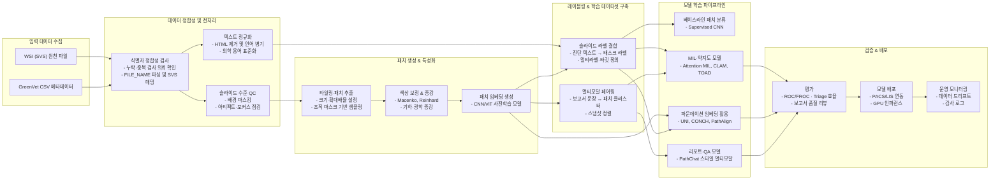
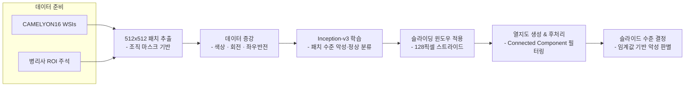
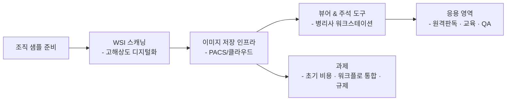
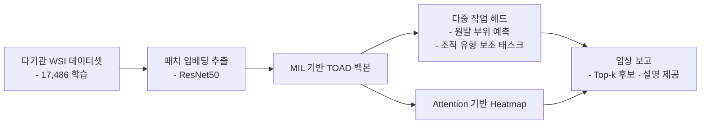
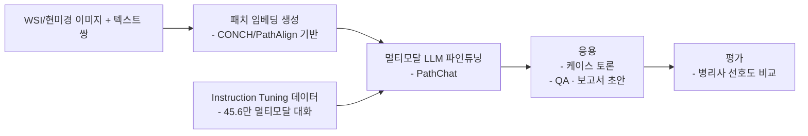

# GC-Pathology

## 프로젝트 개요
GreenVet으로부터 전달받은 조직검사 메타데이터와 대용량 Whole Slide Image(WSI)를 기반으로, 수의 병리 영역에서 임상 적용 가능한 Computational Pathology 파이프라인을 구축하는 프로젝트입니다. 본 문서는 선행 연구 검토, 데이터 이해, 방법론, 실행 계획을 정리하여 후속 연구와 개발의 기준점으로 삼습니다.

## Vet-ICD-O 코드 매칭 방법론
### 비정형 병리 텍스트 전처리 및 매칭 파이프라인
1. **데이터 정제**: 조직검사 결과 매칭 CSV의 `DIAGNOSIS`, `GROSS_FINDINGS`, `MICROSCOPIC_FINDINGS`, `COMMENTS` 컬럼을 로드한 뒤 HTML 태그 제거, 특수문자 정규화, 불필요한 공백 축소 등 기본 클렌징을 수행합니다. 한국어·영어 혼재 서술에 대응하기 위해 언어 감지 후 형태소 분석기(예: Khaiii, Mecab-ko)와 영문 토크나이저를 결합하거나 문장 단위 파이프라인을 구성합니다.
2. **Vet-ICD-O 사전 구축**: `Vet-ICD-O-canine-1, First Edition` 파일의 Topography 리스트(C코드)와 Morphology 리스트(8xxx/코드)를 추출하여 용어·계층 구조 사전을 만들고, 동의어·약어·한국어 번역을 확장합니다. 사전은 해시맵 또는 임베딩 인덱스(예: FAISS)로 저장해 빠른 조회가 가능하도록 합니다.
3. **다단계 매칭 로직**: 정규표현식과 규칙 기반 정확 일치, 퍼지 매칭(Damerau-Levenshtein 거리, TF-IDF 코사인 유사도), 멀티링구얼 임베딩(Sentence-BERT, KoSimCSE 등)을 순차 적용해 후보 Topography/Morphology를 발굴합니다. `DIAGNOSIS` → `MICROSCOPIC_FINDINGS` → `COMMENTS` 순으로 신뢰 가중치를 부여하고, `SITE` 및 `GROSS_FINDINGS`는 해부 부위 판단에 집중 활용합니다.
4. **스코어링 및 품질 관리**: 각 후보 조합에 대해 직접 매칭 여부, 번역 후 매칭, 임베딩 점수 등을 가중 평균하여 임계값을 넘는 코드를 확정합니다. 애매한 케이스는 수동 검토 큐에 적재하고, 전문가 피드백으로 사전·규칙을 지속 보강합니다. `Include/Excludes` 정보를 활용해 상호 배제 코드 오류를 방지합니다.

### 규칙 기반 파이프라인과 LLM 활용 비교
- **신뢰도 및 감사성**: 규칙·사전 기반 매칭은 각 단계의 근거(정확 일치, 동의어, 임베딩 점수 등)를 로그로 남길 수 있어 의료 데이터 거버넌스 요구사항을 충족하기 용이합니다. 반면 LLM은 모델·프롬프트 변화에 따라 출력이 달라질 수 있고 내부 추론이 불투명해 재현성과 감사성이 낮습니다.
- **오류 수정 및 유지보수**: 규칙 기반 시스템은 오탐 발견 시 사전·규칙 수정 후 전량 재처리하면 동일 결과를 재현할 수 있습니다. LLM은 업데이트나 파라미터 튜닝에 따라 답변이 흔들릴 수 있어 버전 관리가 어렵습니다.
- **의학 특화 LLM 품질**: Gemma와 같은 범용 모델은 Vet-ICD-O 체계를 충분히 학습하지 않아 추가 프롬프트 설계와 용어집 주입이 필요합니다. Med-PaLM, BioGPT 변형 등 의학용 LLM도 수의 병리 지식과 한국어 텍스트 커버리지가 제한적이며, 온프레미스 배치 비용·프라이버시 이슈가 존재합니다.
- **권장 전략**: 규칙 기반 파이프라인을 기본으로 구축하고, 매칭 신뢰도가 낮은 사례에 한해 LLM을 보조 추천 도구로 사용하여 전문가 검증을 결합하는 하이브리드 접근을 권장합니다.

## GreenVet 데이터 요약
### 데이터 구조 및 레코드 현황
- 48,692개의 행이 11개 컬럼으로 구성되어 있으며, 16,943건의 고유 검사 의뢰 번호(`INSP_RQST_NO`)와 16,949개의 고유 슬라이드 식별자(`FILE_NAME`)가 존재합니다.
- 레코드는 슬라이드/스냅샷 단위로 저장되어 동일 의뢰가 평균 2.87행(중앙값 2행, 75% 분위수 4행, 최대 18행)으로 확장됩니다.
- 동일 의뢰 내 다중 슬라이드를 고려하면 슬라이드 수는 의뢰당 평균 1.40장(최대 10장)이며, 전체 의뢰 중 4,170건이 2장 이상 슬라이드를 포함합니다.
- 고유 검사 의뢰 16,943건 중 1,581건(9.3%)은 상이한 진단 텍스트가 2개 이상 기록되어 있으며, 최대 5개의 진단이 한 의뢰에 병기되어 있습니다.
- 스냅샷 URL은 48,690건에서 제공되어 영상-텍스트 매칭이 용이하며, `RESULT_PDF`는 48,680건이 결측으로 텍스트 중심의 리포트 구조임을 시사합니다.

### 서비스 유형 및 해부 부위 분포
- 검사 서비스는 `Histopathology (1 Site/Lesion)-국내` 38,581건(79.2%), `Histopathology (2 Site/Lesion)-국내` 7,946건(16.3%), `Histopathology (3 Site/Lesion)-국내` 1,777건(3.6%), `Histopathology (4 Site/Lesion)-국내` 388건(0.8%)으로 구성되어 단일 병변 조직검사가 대부분을 차지합니다.
- 위치 코드는 `site1` 43,465건(89.3%), `site2` 4,446건(9.1%), `site3` 686건(1.4%), `site4` 95건(0.2%) 순으로 1차 위치 정보가 집중되어 있습니다.

### 슬라이드 및 이미지 리소스
- `FILE_NAME`에 `|`가 포함된 다중 슬라이드 행은 18,212건이며, 4,166건의 검사 의뢰가 해당 패턴을 보입니다.
- 검사 의뢰-슬라이드 매핑 테이블에서 슬라이드 수 분포는 90% 분위수가 2장, 95% 분위수가 3장, 99% 분위수가 5장으로 확인되어 고슬라이드 의뢰는 제한적입니다.
- 스냅샷 URL 결측은 2건에 불과하여 WSI 썸네일 기반 QA 및 지능형 뷰어 구축에 활용할 수 있습니다.

### 텍스트 라벨 품질
- 진단(`DIAGNOSIS`) 평균 길이는 42.7자(최대 342자)로 핵심 라벨이 간결하게 정리되어 있으며, 현미경 소견(`MICROSCOPIC_FINDINGS`)과 코멘트(`COMMENTS`)는 각각 평균 343자, 372자로 상세 서술이 풍부합니다.
- 육안 소견(`GROSS_FINDINGS`)은 평균 118자로 템플릿 기반 서술이 일정하며, 전체 텍스트 컬럼에 결측이 없어 지도 학습 라벨 품질이 높습니다.
- 진단명은 영어/한글 혼용, 소견 및 코멘트는 한국어 중심으로 기록되어 있어 멀티링구얼 전처리 전략이 요구됩니다.

### 동물 종 단서
- 육안·현미경·코멘트 텍스트를 통합한 결과, "개" 언급이 33,118건, "고양이" 언급이 5,613건으로 확인되어 반려견 중심 데이터임을 보여줍니다.
- 종 필드가 명시적으로 존재하지 않아 동물 종 태깅을 위한 규칙·모델 기반 명명 실체 인식(NER) 또는 키워드 매칭이 필요합니다.

### CSV 파일 자산 요약
| 파일명 | 행 수 | 주요 컬럼 | 설명 |
| --- | --- | --- | --- |
| `Data/조직검사 결과 매칭(2024)_utf8_pruned.csv` | 48,691 | `INSP_RQST_NO`, `FILE_NAME`, `DIAGNOSIS`, `GROSS_FINDINGS`, `MICROSCOPIC_FINDINGS`, `COMMENTS`, `SITE`, `SNAPSHOT` 등 | GreenVet 조직검사 원본 메타데이터(정제본). 의뢰 번호·슬라이드 식별자와 주요 서술형 병리 보고 컬럼을 포함합니다. |
| `Data/조직검사 결과 매칭(2024)_coded.csv` | 50 | 위 원본 컬럼 + `Vet-ICD-O_Topography`, `Vet-ICD-O_Morphology`, `Specimen_Site_Normalized`, `Species` | Vet-ICD-O-canine-1 1판 기준으로 상위 50개 레코드를 수작업 매칭한 파생본. 병변 해부 위치 정규화와 확실히 식별 가능한 종(고양이/개)을 태깅했습니다. |

### 진단명 분포 (전체 5,950건)
GreenVet 메타데이터에 등장하는 모든 진단명을 건수 순으로 정렬했습니다.

| 순위 | 진단명 | 건수 |
| --- | --- | --- |
| 1 | Subcutaneous lipoma | 1198 |
| 2 | Mammary complex adenoma, completely excised | 739 |
| 3 | Trichoblastoma, completely excised | 734 |
| 4 | Sebaceous adenoma, completely excised | 613 |
| 5 | Cutaneous histiocytoma, completely excised | 546 |
| 6 | Mammary adenoma, complex type, completely excised | 471 |
| 7 | Mammary benign mixed tumor, completely excised | 466 |
| 8 | Follicular cyst, completely excised | 435 |
| 9 | Mast cell tumor (Well-differentiated) | 403 |
| 10 | Peripheral odontogenic fibroma | 381 |
| 11 | Mammary gland adenoma, completely excised | 356 |
| 12 | Peripheral odontogenic fibroma with osseous metaplasia | 300 |
| 13 | Lymphoid nodular hyperplasia | 291 |
| 14 | Mammary gland adenoma, simple type, completely excised | 286 |
| 15 | Lipoma | 285 |
| 16 | Benign mammary mixed tumor, completely excised | 263 |
| 17 | Splenic hemangiosarcoma | 255 |
| 18 | Subcutaneous lipoma, completely excised | 251 |
| 19 | Complex nodular hyperplasia | 243 |
| 20 | Oral melanoma | 237 |
| 21 | Mast cell tumor, well-differentiated, completely excised | 228 |
| 22 | Trichoblastoma | 222 |
| 23 | Cutaneous mast cell tumor (Well-differentiated type), completely excised | 209 |
| 24 | Soft tissue sarcoma, grade II | 206 |
| 25 | Splenic nodular hyperplasia (complex type) | 205 |
| 26 | Sebaceous epithelioma, completely excised | 192 |
| 27 | Hepatoid gland adenoma | 191 |
| 28 | Mammary mixed tumor (Benign) | 185 |
| 29 | Gingival hyperplasia, gingivitis | 182 |
| 30 | Squamous cell carcinoma | 177 |
| 31 | Panniculitis with septal fibrosis | 177 |
| 32 | Infundibular keratinizing acanthoma, completely excised | 172 |
| 33 | Mammary gland adenoma, complex type, completely excised | 172 |
| 34 | Mammary adenoma, simple type, completely excised | 172 |
| 35 | Panniculitis | 171 |
| 36 | Mast cell tumor (Low-grade / Grade 2) | 169 |
| 37 | Gingival hyperplasia | 161 |
| 38 | Splenic stromal sarcoma | 157 |
| 39 | Soft tissue sarcoma, Grade 2 | 151 |
| 40 | Cutaneous mast cell tumor (Well-differentiated type) | 142 |
| 41 | Cutaneous plasmacytoma | 140 |
| 42 | Traumatic panniculitis | 139 |
| 43 | Mammary benign mixed tumor | 138 |
| 44 | Fibroadnexal hamartoma, completely excised | 137 |
| 45 | Gingival hyperplasia with chronic gingivitis | 135 |
| 46 | Apocrine cyst, completely excised | 135 |
| 47 | Sebaceous adenoma | 134 |
| 48 | Meibomian adenoma, completely excised | 134 |
| 49 | Cutaneous histiocytoma | 133 |
| 50 | Fibroadnexal hamartoma (dysplasia), completely excised | 130 |
| 51 | Mammary adenoma, complex type | 128 |
| 52 | Cutaneous mast cell tumor (Kiupel’s : Low-grade / Patnaik’s : Grade 2) | 127 |
| 53 | Splenic nodular hyperplasia, lymphoid type | 124 |
| 54 | Soft tissue sarcoma, grade I | 121 |
| 55 | Infiltrative lipoma | 118 |
| 56 | Anal sac adenocarcinoma | 113 |
| 57 | Soft tissue sarcoma, Grade 1 | 111 |
| 58 | Oral squamous cell carcinoma | 110 |
| 59 | Infundibular keratinizing acanthoma | 109 |
| 60 | Fibroadnexal dysplasia (hamartoma) | 106 |
| 61 | (Splenic) hemangiosarcoma | 105 |
| 62 | Oral fibroepithelial polyp | 101 |
| 63 | Subcutaneous mast cell tumor | 100 |
| 64 | Gingival hyperplasia with lymphoplasmacytic gingivitis | 98 |
| 65 | Cutaneous mast cell tumor (Low-grade / Grade 2) | 96 |
| 66 | Fibroepithelial polyp | 95 |
| 67 | Hepatoid gland adenoma, completely excised | 95 |
| 68 | Mammary complex adenoma | 94 |
| 69 | Sebaceous epithelioma | 93 |
| 70 | Mammary mass: Mammary adenoma, complex type, completely excised | 91 |
| 71 | Soft tissue sarcoma, Grade I | 89 |
| 72 | Cutaneous hemangioma, completely excised | 88 |
| 73 | Subcutaneous hemangioma, completely excised | 87 |
| 74 | Extramedullary plasmacytoma, completely excised | 86 |
| 75 | Hepatoid (perianal) gland adenoma, completely excised | 85 |
| 76 | Hemangiosarcoma | 83 |
| 77 | Mammary carcinoma, complex type, Grade 1, completely excised | 83 |
| 78 | Mammary carcinoma, Grade 3 Lymphatic invasion | 82 |
| 79 | Trichoepithelioma, completely excised | 82 |
| 80 | Gingival hyperplasia, lymphoplasmacytic gingivitis | 80 |
| 81 | Trichoepithelioma | 79 |
| 82 | Follicular Cyst, completely excised | 78 |
| 83 | Mast cell tumor, well-differentiated | 76 |
| 84 | Extramedullary plasmacytoma | 75 |
| 85 | Mammary gland complex adenoma, margin complete | 74 |
| 86 | Follicular cyst | 74 |
| 87 | Gingiva: Gingival hyperplasia with chronic gingivitis | 74 |
| 88 | Mammary cystadenoma, completely excised | 71 |
| 89 | Reactive lymphadenopathy | 71 |
| 90 | Meibomian epithelioma, completely excised | 70 |
| 91 | Mammary adenoma (complex type) | 70 |
| 92 | Apocrine ductal adenoma (Basal cell tumor) | 70 |
| 93 | Mammary carcinoma (Low-grade), completely excised | 69 |
| 94 | Cutaneous hemangioma | 69 |
| 95 | Panniculitis with lymphocytic aggregates | 69 |
| 96 | Matrical cyst, completely excised | 68 |
| 97 | Pilomatricoma, Completely excised | 68 |
| 98 | Melanocytoma, with low malignancy | 67 |
| 99 | Vaginal fibroma | 66 |
| 100 | Cutaneous plasmacytoma, completely excised | 66 |
| 101 | Mammary lobular hyperplasia | 66 |
| 102 | Cutaneous mast cell tumor (Well-differentiated) | 66 |
| 103 | Soft tissue sarcoma | 65 |
| 104 | Acanthomatous ameloblastoma | 63 |
| 105 | Splenic hematoma | 63 |
| 106 | Feline trichoblastoma; Basal cell tumor | 62 |
| 107 | Collagenous hamartoma, completely excised | 61 |
| 108 | Mast cell tumor | 61 |
| 109 | Cutaneous mast cell tumor (well-differentiated) | 61 |
| 110 | Follicular cyst, ruptured and inflamed, completely excised | 61 |
| 111 | Sebaceous adenoma, inflamed, completely excised | 58 |
| 112 | Fibrolipoma | 57 |
| 113 | Fibroadnexal dysplasia (harmatoma) | 57 |
| 114 | Viral papilloma, completely excised | 57 |
| 115 | Mammary complex adenoma, completely excised Mammary lobular hyperplasia | 57 |
| 116 | Cutaneous mast cell tumor, completely excised (Kiupel’s : Low-grade / Patnaik’s : Grade 2) | 57 |
| 117 | Acrochordon | 56 |
| 118 | Spleen: Complex nodular hyperplasia | 56 |
| 119 | Hematopoietic nodular hyperplasia | 55 |
| 120 | Splenic myelolipoma | 55 |
| 121 | Organizing hematoma with panniculitis and granulation tissue (seroma) | 55 |
| 122 | Ulcerative and proliferative stomatitis, chronic-active with granulation | 55 |
| 123 | Subcutaneous mast cell tumor, completely excised | 55 |
| 124 | Mammary adenoma, intraductal papillary type, completely excised | 53 |
| 125 | Mammary mass: Benign mammary mixed tumor, completely excised | 52 |
| 126 | Mammary gland adenoma, complex type | 52 |
| 127 | Mammary carcinoma (Complex type), Grade I (Low grade) | 50 |
| 128 | Mammary carcinoma, Grade 2 | 49 |
| 129 | Splenic lymphoid nodular hyperplasia | 49 |
| 130 | Mammary gland adenoma | 49 |
| 131 | Hepatoid gland epithelioma | 48 |
| 132 | Apocrine cysts, completely excised | 48 |
| 133 | Lymphoma | 48 |
| 134 | Hematopoietic nodular hyperplasia with hematoma | 48 |
| 135 | Subcutaneous Mast Cell Tumor | 48 |
| 136 | Mammary gland benign mixed tumor, margin complete | 47 |
| 137 | Meibomian adenoma | 47 |
| 138 | Cutaneous Histiocytoma | 47 |
| 139 | Peripheral odontogenic fibroma, inflamed | 46 |
| 140 | Gingiva, Inflammatory fibroepithelial polyp | 46 |
| 141 | Fibroadnexal hamartoma, inflamed, completely excised | 45 |
| 142 | Mast cell tumor (Atypical type) | 45 |
| 143 | Mammary carcinoma (Simple tubular type), Grade II (Intermediate grade) | 45 |
| 144 | Fibroma | 45 |
| 145 | Melanocytoma, completely excised | 45 |
| 146 | Oral Squamous Cell Carcinoma (SCC) | 45 |
| 147 | Trichoepithelioma, ruptured and inflamed, completely excised | 45 |
| 148 | Malignant melanoma | 44 |
| 149 | Pilomatricoma | 44 |
| 150 | Viral papilloma | 44 |
| 151 | See comments | 44 |
| 152 | Mast cell tumor (well-differentiated) | 44 |
| 153 | Rhinitis (mixed inflammatory cell population) | 44 |
| 154 | Hepatoid (perianal) gland adenoma | 44 |
| 155 | Splenic nodular hyperplasia (lymphoid type) | 43 |
| 156 | Perianal mass: Hepatoid (perianal) gland adenoma, completely excised | 42 |
| 157 | Mammary adenoma, simple type | 42 |
| 158 | Meibomian gland epithelioma | 42 |
| 159 | Sebaceous gland adenoma | 42 |
| 160 | Leiomyoma | 42 |
| 161 | Mammary carcinoma, complex type, Grade 1 | 41 |
| 162 | Vaginal polyp | 41 |
| 163 | Metastasized carcinoma | 41 |
| 164 | Splenic nodular hyperplasia (hematopoietic type) | 40 |
| 165 | Cutaneous mast cell tumor (Kiupel’s : High-grade / Patnaik’s : Grade 2) | 40 |
| 166 | Squamous papilloma | 40 |
| 167 | Feline soft tissue sarcoma (grade 2) (Feline injection site sarcoma suspected) | 40 |
| 168 | Squamous papilloma, completely excised | 40 |
| 169 | Calcinosis circumscripta | 40 |
| 170 | Viral Papilloma | 39 |
| 171 | Mammary mixed tumor (Benign), completely excised | 38 |
| 172 | Follicular Cyst | 38 |
| 173 | Apocrine cystadenoma, completely excised | 38 |
| 174 | Fibroadnexal hamartoma (dysplasia), ruptured and inflamed, completely excised | 38 |
| 175 | Apocrine adenocarcinoma, completely excised | 37 |
| 176 | Sialocele | 37 |
| 177 | Sebaceous adenoma, Completely excised | 37 |
| 178 | Mammary duct ectasia | 37 |
| 179 | Mammary carcinoma (High-grade) | 37 |
| 180 | Mammary adenoma, completely excised | 37 |
| 181 | Mammary gland adenoma(s), complex type, completely excised | 37 |
| 182 | Polypoid cystitis | 37 |
| 183 | Apocrine adenocarcinoma | 37 |
| 184 | Nodular sebaceous hyperplasia, completely excised | 36 |
| 185 | Acrochordon (fibroepithelial polyp), completely excised | 36 |
| 186 | Hepatocellular Carcinoma (HCC) | 36 |
| 187 | Mammary gland adenoma, intraductal papillary type, completely excised | 36 |
| 188 | Meibomian epithelioma | 36 |
| 189 | Fibroadnexal hamartoma | 36 |
| 190 | Cutaneous mast cell tumor, High grade, Grade 2 | 35 |
| 191 | Splenic mass: Lymphoid nodular hyperplasia | 35 |
| 192 | (Sub)cutaneous hemangiosarcoma | 35 |
| 193 | Subcutaneous fibroma, completely excised | 35 |
| 194 | Mammary gland adenoma, simple type | 35 |
| 195 | Panniculitis with subcutaneous cyst (Seroma) | 35 |
| 196 | Mammary adenoma, complex type, unclear margin | 34 |
| 197 | Splenic congestion and fibrosis | 34 |
| 198 | Cutaneous mast cell tumor (Well-differentiated), completely excised | 34 |
| 199 | Complex nodular hyperplasia with telangiectasia | 34 |
| 200 | Mammary adenoma (Complex type) | 34 |
| 201 | Activation of lymph node | 34 |
| 202 | Mammary carcinoma (Simple type), Grade I (Low grade) | 34 |
| 203 | Hepatocellular carcinoma | 34 |
| 204 | Apocrine ductal adenoma, completely excised | 34 |
| 205 | Cutaneous mast cell tumor, High grade | 33 |
| 206 | Cutaneous soft tissue sarcoma, grade 1 | 33 |
| 207 | Apocrine adenoma, completely excised | 33 |
| 208 | Infiltrative Lipoma | 32 |
| 209 | Peripheral giant cell granuloma | 32 |
| 210 | 
Subcutaneous lipoma
 | 32 |
| 211 | Mammary adenoma, simple type, unclear margin | 32 |
| 212 | Mammary gland adenoma (Intraductal papillary), completely excised | 32 |
| 213 | Peripheral odontogenic fibroma with chronic gingivitis | 32 |
| 214 | Renal cell carcinoma | 32 |
| 215 | No typical lesion | 31 |
| 216 | Splenic Nodular hyperplasia (lymphoid type) | 31 |
| 217 | Panniculitis with a subcutaneous cyst (Seroma) | 31 |
| 218 | Pyogranulomatous dermatitis and panniculitis | 31 |
| 219 | Panniculitis and myositis | 31 |
| 220 | Lymphoma, large cell type | 30 |
| 221 | Mammary carcinoma, Grade 3 | 30 |
| 222 | Sebaceous adenoma, ruptured and inflamed, completely excised | 30 |
| 223 | Mammary carcinoma, Grade 2, completely excised | 30 |
| 224 | Cutaneous mast cell tumor, High grade, grade 3 | 30 |
| 225 | Pilomatricoma, completely excised | 30 |
| 226 | Cutaneous mast cell tumor, completely excised (Kiupel’s : Low-grade / Patnaik’s : Grade 1) | 30 |
| 227 | Oral melanoma, amelanotic | 30 |
| 228 | Fibroepithelial polyp, completely excised | 30 |
| 229 | Intestinal lymphoma, large cell type | 30 |
| 230 | Soft tissue sarcoma (Perivascular wall tumor), Grade I | 30 |
| 231 | Mammary gland adenoma, simple type, completely excised Mammary lobular hyperplasia | 29 |
| 232 | Spleen, Lymphoid nodular hyperplasia | 28 |
| 233 | Cutaneous mast cell tumor, low grade, margin incomplete | 28 |
| 234 | Trichoblastoma, cystic variant | 28 |
| 235 | Mammary carcinoma (Intermediate-grade), completely excised | 28 |
| 236 | Cutaneous mast cell tumor (atypical type) | 28 |
| 237 | Polypoid cystitis with Brunn's nest | 28 |
| 238 | Soft tissue sarcoma, grade III | 28 |
| 239 | Cutaneous mast cell tumor (Low-grade / Grade 2), completely excised | 28 |
| 240 | Soft tissue sarcoma (hemangiopericytoma), Grade 2 | 28 |
| 241 | Follicular cyst (ruptured), completely excised | 28 |
| 242 | Soft tissue sarcoma (Grade 1) | 27 |
| 243 | Sebaceous carcinoma | 27 |
| 244 | Apocrine cystadenoma (hidrocystoma), completely excised | 27 |
| 245 | Soft tissue sarcoma (Perivascular wall tumor), Grade II | 27 |
| 246 | Melanoma | 27 |
| 247 | Oral plasmacytoma | 26 |
| 248 | Ovarian cyst | 26 |
| 249 | Cutaneous mast cell tumor (Low-grade / Grade 1) | 26 |
| 250 | Carcinoma arising in a benign mixed tumor, Grade I (Low grade) | 26 |
| 251 | Mammary carcinoma, Grade 1 | 26 |
| 252 | Inflammatory polyp | 26 |
| 253 | Apocrine carcinoma | 25 |
| 254 | Splenic nodular hyperplasia (lymphoid type) with angiectasia | 25 |
| 255 | Osteosarcoma | 25 |
| 256 | Cutaneous epitheliotropic lymphoma | 25 |
| 257 | Splenic nodular hyperplasia with hematoma | 25 |
| 258 | Feline eosinophilic granuloma | 25 |
| 259 | Apocrine ductular adenoma (solid-cystic type), completely excised | 24 |
| 260 | Mammary gland adenoma(s), simple type, completely excised | 24 |
| 261 | Pyogranulomatous panniculitis | 24 |
| 262 | Splenic nodular hyperplasia, lymphoid type Angiectasia | 24 |
| 263 | Eyelid mass: Meibomian adenoma, completely excised | 24 |
| 264 | Soft tissue sarcoma, Grade 1, completely excised | 24 |
| 265 | Intestinal lymphoma | 24 |
| 266 | Splenic myelolipoma with hematoma | 24 |
| 267 | Marginal zone lymphoma | 24 |
| 268 | Gallbladder mucocele | 24 |
| 269 | Dermatitis, furunculosis, pyogranulomatous | 23 |
| 270 | Cutaneous soft tissue sarcoma, grade 1, margin incomplete | 23 |
| 271 | Hematoma | 23 |
| 272 | Carcinoma arising in benign mixed tumor, Grade 1, completely excised | 23 |
| 273 | Mammary carcinoma, complex/simple type, grade 1 | 23 |
| 274 | Mast cell tumor, Highly malignant | 23 |
| 275 | Soft tissue sarcoma, grade 2 | 23 |
| 276 | Ovarian adenocarcinoma | 23 |
| 277 | Blepharitis | 23 |
| 278 | Splenic congestion with parenchymal fibrosis | 22 |
| 279 | Cutaneous hemangiosarcoma | 22 |
| 280 | Nodular hyperplasia in spleen (lymphoid type) | 22 |
| 281 | Hepatocellular carcinoma | 22 |
| 282 | Nasal lymphoma | 22 |
| 283 | Ulcerative and proliferative gingivitis, chronic-active with granulation | 22 |
| 284 | Melanocytoma, with malignancy | 22 |
| 285 | Trichoblastoma (Basal cell tumor), completely excised | 22 |
| 286 | Mammary duct ectasia, completely excised | 22 |
| 287 | Lymphoid nodular hyperplasia with telangiectasia | 22 |
| 288 | Mammary carcinoma, high-grade (grade 3) with lymphatic invasion | 22 |
| 289 | Matrical cyst | 22 |
| 290 | Traumatic panniculitis with septal fibrosis | 22 |
| 291 | Soft tissue sarcoma, grade 1 | 21 |
| 292 | Carcinoma arising in a mammary mixed tumor (Low-grade), completely excised | 21 |
| 293 | Proliferative gingivitis | 21 |
| 294 | Soft tissue sarcoma, Grade I, completely excised | 21 |
| 295 | Sertoli cell tumor | 21 |
| 296 | Congestion, Extramedullary hematopoiesis (EMH) | 21 |
| 297 | Collagenous hamartoma | 21 |
| 298 | Splenic congestion | 21 |
| 299 | Nodular hyperplasia in spleen | 21 |
| 300 | Mammary carcinoma (Complex type), Grade 1 | 21 |
| 301 | Mammary gland tubular carcinoma, grade 1 | 21 |
| 302 | Tricholemmoma ? isthmus type | 21 |
| 303 | Mammary gland adenoma, completely excised Mammary lobular hyperplasia | 21 |
| 304 | Mammary carcinoma (Intermediate grade) | 21 |
| 305 | Apocrine adenoma | 21 |
| 306 | Intraductal papillary adenoma, margin complete | 21 |
| 307 | Nodular hyperplasia in spleen (hematopoietic type) | 21 |
| 308 | Mammary carcinoma (Simple tubular type), Grade I (Low grade) | 21 |
| 309 | Mammary carcinoma, tubular type, grade 1, completely excised | 21 |
| 310 | Mammary lobular hyperplasia and duct ectasia | 21 |
| 311 | Soft tissue sarcoma, Grade II | 21 |
| 312 | Panniculitis with seroma | 21 |
| 313 | Intestinal adenocarcinoma | 21 |
| 314 | Mammary gland complex carcinoma, grade 1, margin incomplete | 20 |
| 315 | Leiomyosarcoma | 20 |
| 316 | Brunn's nest | 20 |
| 317 | Comment 참조 | 20 |
| 318 | Gingivitis, lymphoplasmacytic | 20 |
| 319 | Fibroepitheliail polyp | 20 |
| 320 | Dermatophytosis | 20 |
| 321 | Mammary adenoma (Simple type) | 20 |
| 322 | Gingiva: Gingival hyperplasia | 20 |
| 323 | Subcutaneous hemangioma | 20 |
| 324 | Follicular hamartoma | 20 |
| 325 | Splenic fibrohistiocytic nodule (early-stage sarcoma) | 20 |
| 326 | Splenic marginal zone lymphoma | 20 |
| 327 | Cutaneous mast cell tumor (Kiupel’s : High-grade / Patnaik’s : Grade 3) | 19 |
| 328 | Feline soft tissue sarcoma (grade 3) (Feline injection site sarcoma suspected) | 19 |
| 329 | Mammary comedocarcinoma, Grade 2 | 19 |
| 330 | Pyogranulomatous inflammation | 19 |
| 331 | Squamous cell carcinoma, completely excised | 19 |
| 332 | Apocrine cyst | 19 |
| 333 | Renal cell carcinoma (solid and tubular differentiation) | 19 |
| 334 | Malignant seminoma, diffuse type | 19 |
| 335 | Mammary carcinoma, complex type, Grade I (low-grade), completely excised | 19 |
| 336 | Cutaneous mast cell tumor (Kiupel’s: Low-grade / Patnaik’s: Grade 1) | 19 |
| 337 | Subcutaneous lipoma, inflamed | 19 |
| 338 | Nasal carcinoma | 19 |
| 339 | Chronic marked marginal zone hyperplasia with progression to marginal zone lymphoma | 19 |
| 340 | Soft tissue sarcoma, completely excised | 19 |
| 341 | Cutaneous mast cell tumor (Kiupel’s: Low-grade / Patnaik’s: Grade 2) | 19 |
| 342 | Infundibular keratinizing acanthoma, ruptured and inflamed, completely excised | 19 |
| 343 | Benign mammary tumors (simple adenoma and mixed type) | 19 |
| 344 | Sublingual granuloma | 18 |
| 345 | Mammary lobular hyperplasia, duct ectasia | 18 |
| 346 | Mammary carcinoma, Grade 3 (High-grade) with lymphatic invasion, completely excised | 18 |
| 347 | Splenic mass: Complex nodular hyperplasia | 18 |
| 348 | Mast cell tumor (High-grade) | 18 |
| 349 | Intestinal adenocarcinoma, transmural | 18 |
| 350 | Oral mast cell tumor | 18 |
| 351 | Mast cell tumor, subcutaneous type, margin incomplete | 18 |
| 352 | Mammary carcinoma, Grade 2 (intermediate-grade), completely excised | 18 |
| 353 | Haired skin, Cutaneous mast cell tumor (Low-grade / Grade 2), completely excised | 18 |
| 354 | Mammary mass: Mammary adenoma, simple type, completely excised | 18 |
| 355 | Proliferating follicular cyst, completely excised | 18 |
| 356 | Pyogranulomatous inflammation; Ruptured hair follicle | 18 |
| 357 | Gingival hyperplasia, chronic-active gingivitis | 18 |
| 358 | Cutaneous mast cell tumor (Low-grade / Grade 1), completely excised | 18 |
| 359 | Lymphoid nodular hyperplasia with hematoma | 18 |
| 360 | Lymph node: Metastasized carcinoma | 18 |
| 361 | Enteritis, lymphoplasmacytic, mild | 17 |
| 362 | Oral fibrosarcoma | 17 |
| 363 | Mammary carcinoma (Intraductal papillary carcinoma), Grade I (Low grade) | 17 |
| 364 | Subcutaneous Mast Cell Tumor, highly malignant | 17 |
| 365 | Oral lymphoma | 17 |
| 366 | Mammary carcinoma (Low-grade) | 17 |
| 367 | Mammary mixed tumors (Benign) | 17 |
| 368 | Mucosal hyperplasia | 17 |
| 369 | Sensory follicle sinus ectasia | 17 |
| 370 | Squamous Papilloma | 17 |
| 371 | Hepatoid gland epithelioma, completely excised | 17 |
| 372 | Chronic dermatitis | 17 |
| 373 | Soft tissue sarcoma, Grade 3 | 17 |
| 374 | Feline soft tissue sarcoma (grade 2) | 17 |
| 375 | Sebaceous adenoma, inflamed | 17 |
| 376 | Liver: vaculolar degeneration, cholestasis (mild) | 17 |
| 377 | Splenic nodular hyperplasia | 17 |
| 378 | Liver: Chronic hepatitis, with portal-portal and portal-central bridging fibrosis, biliary and vascular hyperplasia, hepatocellular swelling, vacuolar degeneration | 16 |
| 379 | Splenic mass, Lymphoid nodular hyperplasia | 16 |
| 380 | Polypoid cystitis with Brunn’s nests | 16 |
| 381 | Peripheral odontogenic fibroma with gingivitis (lymphoplasmacytic) | 16 |
| 382 | Lymph node: Reactive lymph node with sinus histiocytosis | 16 |
| 383 | Feline chronic gingivostomatitis | 16 |
| 384 | Mammary mass, Benign mammary mixed tumor, completely excised | 16 |
| 385 | Hepatic hemangiosarcoma | 16 |
| 386 | Gingival hyperplasia and mild gingivitis | 16 |
| 387 | Spleen: Lymphoid nodular hyperplasia with hematoma | 16 |
| 388 | Ovary: Ovarian cysts | 16 |
| 389 | Epithelial inclusion cyst, completely excised | 16 |
| 390 | Herniated fat and fibrous tissue | 16 |
| 391 | Adenocarcinoma; see comments | 16 |
| 392 | Dermatitis and panniculitis, pyogranulomatous | 16 |
| 393 | Cutaneous mast cell tumor, low grade, margin complete | 16 |
| 394 | Mammary carcinoma, Grade 2 Lymphatic invasion | 16 |
| 395 | Meibomian adenoma with inflammation | 16 |
| 396 | Mammary adenocarcinoma, grade 2 (intermediate-grade) | 16 |
| 397 | Splenic mast cell tumor | 16 |
| 398 | Mammary carcinoma, simple type, Grade 2, completely excised | 16 |
| 399 | Mammary gland complex carcinoma, grade 1 | 16 |
| 400 | Mammary mass, R2: Mammary adenoma, complex type, completely excised | 16 |
| 401 | Eyelid mass, Meibomian adenoma, completely excised | 16 |
| 402 | Ocular melanoma | 15 |
| 403 | Herniated adipose tissue | 15 |
| 404 | Interstitial cell tumor (Leydig cell tumor) | 15 |
| 405 | Mammary carcinoma (Intermediate-grade) | 15 |
| 406 | Mast cell tumor (Well-differentiated), possibly highly malignant | 15 |
| 407 | Mammary carcinoma, intraductal papillary type, Grade 1 | 15 |
| 408 | Ceruminous gland carcinoma | 15 |
| 409 | Mammary benign mixed tumor, completely excised Mammary lobular hyperplasia | 15 |
| 410 | Granulomatous changes; See comments | 15 |
| 411 | Infundibular keratinizing acanthoma (ruptured), completely excised | 15 |
| 412 | Mammary mass: Mammary carcinoma, complex type, Grade I (low-grade), completely excised | 15 |
| 413 | Mammary osteosarcoma | 15 |
| 414 | Hematoma, Extramedullary hematopoiesis (EMH) | 15 |
| 415 | Pyogranulomatous dermatitis | 15 |
| 416 | Mammary intraductal papillary adenoma, margin complete | 15 |
| 417 | Fibroepithelial polyp with meibomian gland hyperplasia | 15 |
| 418 | Trichoepithelioma, with low malignancy | 15 |
| 419 | Mammary carcinoma, tubular type, grade 1 | 15 |
| 420 | Gall bladder: mild mucinous hyperplasia, mucocele | 15 |
| 421 | Cutaneous soft tissue sarcoma, grade 2, margin incomplete | 15 |
| 422 | Mast cell tumor, mastocytic, well differentiated, margin complete | 15 |
| 423 | Mammary complex adenoma(s), completely excised | 15 |
| 424 | Leiomyosarcoma, low-malignancy | 15 |
| 425 | Fibroadnexal hamartoma, ruptured and inflamed | 15 |
| 426 | Mammary ductal adenoma, completely excised | 14 |
| 427 | Oral osteosarcoma | 14 |
| 428 | Mammary gland adenoma, complex type, completely excised Mammary lobular hyperplasia | 14 |
| 429 | Spleen: Lymphoid nodular hyperplasia | 14 |
| 430 | Proliferative stomatitis | 14 |
| 431 | Feline chronic gingivostomatitis (FCGS)  | 14 |
| 432 | Aural inflammatory polyp | 14 |
| 433 | Panniculitis and Myositis | 14 |
| 434 | Nasal adenocarcinoma | 14 |
| 435 | Mammary gland complex carcinoma, grade 1, margin complete | 14 |
| 436 | Mast Cell Tumor | 14 |
| 437 | Mammary adenoma, ductal type, completely excised | 14 |
| 438 | Benign mammary mixed tumor, unclear margin | 14 |
| 439 | Vaginal mass: Vaginal polyp | 14 |
| 440 | Cystic endometrial hyperplasia | 14 |
| 441 | Splenic mass: Lymphoid nodular hyperplasia with telangiectasia | 14 |
| 442 | Mast cell tumor, Pleomorphic type | 14 |
| 443 | Stomatitis, lymphoplasmacytic | 14 |
| 444 | Gall bladder: mucocele | 14 |
| 445 | Mammary carcinoma (Ductal carcinoma), Grade I (Low grade) | 14 |
| 446 | Mammary carcinoma (in situ), Grade I (Low grade) | 14 |
| 447 | Mammary carcinoma, Grade III (High-grade) with lymphatic invasion | 14 |
| 448 | Reactive lymphadenopathy (Sinus histiocytosis) | 14 |
| 449 | Marked pyogranulomatous lymphadenitis | 14 |
| 450 | Trichoblastoma, narrowly excised | 14 |
| 451 | Mast cell tumor (Well-differentiated), highly malignant | 14 |
| 452 | Granulomatous dermatitis | 14 |
| 453 | Hepatoid gland carcinoma | 14 |
| 454 | Ruptured matrical cyst, Granulomatous inflammation | 14 |
| 455 | Mammary mass, R3: Mammary adenoma, complex type, completely excised | 14 |
| 456 | Mammary adenoma | 14 |
| 457 | Melanocytoma | 14 |
| 458 | Myelolipoma | 14 |
| 459 | Subcutaneous fibroma | 14 |
| 460 | Mammary carcinoma, complex type, Grade 2 | 14 |
| 461 | Haired skin: Follicular hamartoma, completely excised | 14 |
| 462 | Cystic mucinous hyperplasia | 14 |
| 463 | Fibroepithelial polyp; Ulcerative and proliferative stomatitis, chronic-active, with granulation tissue | 14 |
| 464 | Follicular cysts, completely excised | 14 |
| 465 | Liposarcoma, Grade 1 | 13 |
| 466 | Mammary carcinoma, grade 3, completely excised Lymphatic invasion | 13 |
| 467 | (Dermal) Fibroma | 13 |
| 468 | Hepatic nodular hyperplasia | 13 |
| 469 | Splenic lymphoma | 13 |
| 470 | Sarcoma, highly malignant (Ddx. hemangiosarcoma, stromal sarcoma) | 13 |
| 471 | Siderofibrosis | 13 |
| 472 | Hepatoid gland adenoma (Circumanal adenoma) | 13 |
| 473 | Granulation tissue | 13 |
| 474 | Mammary gland tubular carcinoma, grade 1, margin complete | 13 |
| 475 | Splenic hematoma, underlying splenic nodular hyperplasia | 13 |
| 476 | Subungual keratoacanthoma, completely excised | 13 |
| 477 | Myxoma | 13 |
| 478 | Fibroadnexal hamartoma, ruptured and inflamed, completely excised | 13 |
| 479 | Fibroadnexal hamartoma, inflamed | 13 |
| 480 | Pulmonary adenocarcinoma, grade I | 13 |
| 481 | Trichoepithelioma Ruptured follicular tumor; pyogranulomatous inflammation | 13 |
| 482 | Mammary adenomas, complex type | 13 |
| 483 | Complex nodular hyperplasia(s) | 13 |
| 484 | Cutaneous mast cell tumor (Atypical type) | 13 |
| 485 | Fibroadnexal hamartoma (inflamed), completely excised | 13 |
| 486 | Mammary carcinoma, complex type, grade 1 | 13 |
| 487 | Hepatoid (perianal) gland epithelioma, completely excised | 13 |
| 488 | Hepatoid (perianal) gland epithelioma | 13 |
| 489 | Ruptured follicular cyst, Granulomatous inflammation | 12 |
| 490 | Peripheral odontogenic fibroma with gingivitis | 12 |
| 491 | Soft tissue sarcoma (Hemangiopericytoma), Grade 2 | 12 |
| 492 | Mammary carcinoma (High-grade), completely excised | 12 |
| 493 | Benign mammary mixed tumors, multinodular, completely excised | 12 |
| 494 | Malignant mammary mixed tumor, grade 1 | 12 |
| 495 | Squamous Cell Carcinoma (SCC) | 12 |
| 496 | Mammary carcinoma, grade 2 | 12 |
| 497 | 평활근육종(Leiomyosarcoma) | 12 |
| 498 | Mammary carcinoma, simple type, Grade III (high-grade) with lymphatic invasion | 12 |
| 499 | Subcutaneous mast cell tumor, aggressive type | 12 |
| 500 | Gall bladder: Cholecystitis, Mild mucinous hyperplasia | 12 |
| 501 | Mammary carcinoma, simple type, Grade 1, completely excised | 12 |
| 502 | Cutaneous histiocytoma (regressing), completely excised | 12 |
| 503 | Mammary comedocarcinoma, Grade 3 Lymphatic invasion | 12 |
| 504 | Sebaceous adenoma, inflammed | 12 |
| 505 | Apocrine cystomatosis, completely excised | 12 |
| 506 | Mammary mass, R4: Mammary adenoma, complex type, completely excised | 12 |
| 507 | Cutaneous histiocytoma, regressing, completely excised | 12 |
| 508 | Mammary carcinoma (Intraductal papillary), Grade 1 | 12 |
| 509 | Splenic mass, Complex nodular hyperplasia | 12 |
| 510 | Eyelid mass: Meibomian adenoma | 12 |
| 511 | Fibroepithelial polyp with granulation tissue formation | 12 |
| 512 | Dermatitis, pyogranulomatous | 12 |
| 513 | Angiomatosis (possibly progressive type) | 12 |
| 514 | Organizing hematoma with granulation tissue (seroma) | 12 |
| 515 | Soft tissue sarcoma (Perivascular wall tumor), Grade I, completely excised | 12 |
| 516 | Granulomatous inflammation of fat tissue | 12 |
| 517 | Mammary mixed tumor (Benign), Completely excised | 12 |
| 518 | Cutaneous hemangioma, completely excised  | 12 |
| 519 | Sebaceous nevus, completely excised | 12 |
| 520 | Mammary carcinoma, complex type, Grade I (Low-grade), completely excised | 12 |
| 521 | Mammary carcinoma (Intraductal papillary type, Grade 1), completely excised | 12 |
| 522 | Fibroadnexal hamartoma (dysplasia) | 12 |
| 523 | Mast cell tumor (Grade 2, Low-grade) | 12 |
| 524 | Mammary carcinoma, complex type, Grade 2, completely excised | 12 |
| 525 | Eosinophilic rhinitis | 12 |
| 526 | Oral fibroepithelial polyp, inflamed | 12 |
| 527 | Dermatitis, suppurative and pyogranulomatous, associated with ruptured hair follicles | 11 |
| 528 | Osteoma, completely excised | 11 |
| 529 | Uterine cyst | 11 |
| 530 | Mammary carcinoma (Ductal carcinoma), Grade II (Intermediate grade) | 11 |
| 531 | Mammary gland simple adenoma, margin complete | 11 |
| 532 | Peripheral odontogenic fibroma with gingival hyperplasia | 11 |
| 533 | Mammary inflammatory carcinoma, high-grade with dermal lymphatic invasion | 11 |
| 534 | Subacute to chronic polypoid hemorrhagic cystitis | 11 |
| 535 | Meibomian adenoma, inflamed | 11 |
| 536 | Intestinal lymphoma, transmural, large cell type | 11 |
| 537 | Myxoma (myxofibroma) | 11 |
| 538 | Mammary lobular hyperplasia with duct ectasia | 11 |
| 539 | Subcutaneous mast cell tumor, highly malignant | 11 |
| 540 | Indolent Lymphoma; marginal zone or mantle type lymphoma suspected | 11 |
| 541 | Mammary carcinoma (Simple tubulopapillary type), Grade I (Low grade) | 11 |
| 542 | Mammary cystadenoma with mild mastitis | 11 |
| 543 | Urothelial carcinoma (transitional cell carcinoma) | 11 |
| 544 | Visceral mast cell tumor | 11 |
| 545 | Cutaneous mast cell tumor (Kiupel’s: High-grade / Patnaik’s: Grade 3) | 11 |
| 546 | Mammary gland adenoma, sclerosis, completely excised | 11 |
| 547 | Mammary carcinoma, Grade I (low-grade), completely excised | 11 |
| 548 | Carcinoma arising in benign mixed tumor, Grade 1 | 11 |
| 549 | Hemangioma | 11 |
| 550 | Hematoma, siderofibrosis | 11 |
| 551 | Mammary gland complex carcinoma, grade 2 | 11 |
| 552 | Gingiva, Ulcerative and proliferative gingivitis | 11 |
| 553 | Urothelial carcinoma | 11 |
| 554 | Splenic Nodular hyperplasia (lymphoid type) DDX. Indolent lymphoma | 11 |
| 555 | Mammary adenoma, tubulopapillary type | 11 |
| 556 | Granulomatous panniculitis | 11 |
| 557 | Metastatic carcinoma | 11 |
| 558 | Dermatitis and panniculitis | 11 |
| 559 | Apocrine ductal adenoma | 11 |
| 560 | Mammary carcinoma, grade 2 (intermediate-grade) | 10 |
| 561 | Peripheral odontogenic fibroma and gingival hyperplasia | 10 |
| 562 | Activation of lymph node (no metastatic foci in lymph node) | 10 |
| 563 | 
Haired skin, Follicular cyst, completely excised
 | 10 |
| 564 | Hematoma, extramedullary hematopoiesis | 10 |
| 565 | Lymphoid nodular hyperplasia | 10 |
| 566 | Melanoacanthoma | 10 |
| 567 | Necrotizing cholecystitis | 10 |
| 568 | Oral fibroepithelial polyp, chronic-active stomatitis | 10 |
| 569 | Cutaneous fibroma, completely excised | 10 |
| 570 | Feline chronic gingivostomatitis (FCGS) | 10 |
| 571 | Chronic ulcerative stomatitis | 10 |
| 572 | Ulcerative cystitis | 10 |
| 573 | Leiomyosarcoma, low-malignancy, completely excised | 10 |
| 574 | Pyogranulomatous inflammation; Ruptured follicular cyst suspected | 10 |
| 575 | Mammary carcinoma (High-grade) with lymphatic invasion | 10 |
| 576 | Gingival hyperplasia with ulcerative gingivitis | 10 |
| 577 | Feline cutaneous lymphocytosis | 10 |
| 578 | Follicular cyst (infundibular cyst), completely excised | 10 |
| 579 | Cutaneous mast cell tumor (High-grade / Grade 3) | 10 |
| 580 | Gastric leiomyoma | 10 |
| 581 | Mammary adenocarcinoma, complex type, grade 1 | 10 |
| 582 | Dermatofibroma, completely excised | 10 |
| 583 | Splenic congestion and fibrosis Siderosis and siderotic plaque | 10 |
| 584 | Meibomian adenoma, completely excised Blephritis | 10 |
| 585 | Extramedullary hematopoiesis | 10 |
| 586 | Mammary carcinoma (Solid type), Grade II (Intermediate grade) | 10 |
| 587 | Mammary adenomas (simple and complex type) | 10 |
| 588 | Mammary adenomas, completely excised | 10 |
| 589 | Mammary mass: Mammary carcinoma, simple type, Grade I (low-grade), completely excised | 10 |
| 590 | Feline eosinophilic dermatitis | 10 |
| 591 | Splenic congestion, Extramedullary hematopoiesis (EMH) | 10 |
| 592 | Nasal transitional carcinoma | 10 |
| 593 | Gingival mass: Acanthomatous ameloblastoma | 10 |
| 594 | Cutaneous fibroma | 10 |
| 595 | Mammary mass, Mammary carcinoma, simple type, Grade I (low-grade), completely excised Lymph node, Reactive lymph node with sinus histiocytosis | 10 |
| 596 | Spleen, Mast cell tumor | 10 |
| 597 | Remnant ovary | 10 |
| 598 | Sebaceous gland hyperplasia, completely excised | 10 |
| 599 | Mammary carcinoma, simple type, Grade II (intermediate-grade), completely excised | 10 |
| 600 | (Anterior uveal) melanoma | 10 |
| 601 | Pannicultiis, marked, pyogranulomatous, multifocal to coalescing, with fibrosis | 10 |
| 602 | Mammary carcinoma (Simple type, Grade 1) | 10 |
| 603 | Mammary carcinoma (Simple type, Grade 1), completely excised | 10 |
| 604 | Oral mass: Oral Squamous Cell Carcinoma (SCC) | 10 |
| 605 | Marginal zone lymphoma in spleen | 10 |
| 606 | Follicular hamartoma, completely excised | 10 |
| 607 | Squamous cell carcinoma with lymphatic invasion | 10 |
| 608 | Chronic gingivostomatitis, pyogranulomatous | 10 |
| 609 | Oral malignant melanoma | 10 |
| 610 | Anterior uveal melanoma | 10 |
| 611 | Trichoepithelioma, ruptured and inflamed | 10 |
| 612 | Mammary adenosquamous carcinoma, Grade II (Intermediate grade) | 10 |
| 613 | Splenic congestion and fibrosis Focal extramedullary hematopoiesis, Hemosiderosis | 10 |
| 614 | Panniculitis | 10 |
| 615 | Histiocytic sarcoma (Localized), see comments | 10 |
| 616 | Squamous cell carcinoma suspected | 10 |
| 617 | Stomach, Within normal range | 10 |
| 618 | Panniculitis with septal fibrosis or inflamed lipoma | 10 |
| 619 | Dermatophytosis; dermatitis and folliculitis, pyogranulomatous with furunculosis and fungal infection | 10 |
| 620 | Mammary mass, L5: Mammary adenoma, complex type, completely excised | 10 |
| 621 | Combined hepatocellular-cholangiocarcinoma (biphenotypic liver carcinoma) | 10 |
| 622 | Ovary; within normal limits | 10 |
| 623 | Panniculitis suspected; See comments | 10 |
| 624 | Fibrous vaginal polyp | 10 |
| 625 | Panniculitis; Lymphocytic infiltration | 10 |
| 626 | Splenic nodular hyperplasia (hematopoietic type) Splenic hematoma (necrotic) | 10 |
| 627 | Gingival hyperplasia, gingivitis, lymphoplasmacytic | 10 |
| 628 | Cholangiocellular carcinoma | 10 |
| 629 | Anal sacculitis and dermatitis | 10 |
| 630 | Lipoma, Infiltrative | 10 |
| 631 | Vaginal fibroma, completely excised | 10 |
| 632 | Gingiva: Gingival hyperplasia with lymphoplasmacytic gingivitis | 10 |
| 633 | Splenic myelolipomas | 10 |
| 634 | Dermatitis and ulceration; underlying cutaneous mastocytosis | 10 |
| 635 | Intestinal adenocarcinoma; mucinous adenocarcinoma, transmural | 10 |
| 636 | Mast cell tumor; See comments | 10 |
| 637 | Mammary carcinoma-mixed type, grade 1, margin complete | 10 |
| 638 | Splenic hematoma with siderotic nodules | 10 |
| 639 | Spleen: Hematopoietic nodular hyperplasia with hematoma | 10 |
| 640 | Sebaceous carcinoma, completely excised | 10 |
| 641 | Necrotic/fibrotic inflammation of fat tissue | 10 |
| 642 | Basal cell tumor (benign), completely excised | 10 |
| 643 | Infundibular keratinizing acanthoma, ruptured and inflamed | 9 |
| 644 | Pilomatricoma, ruptured | 9 |
| 645 | Sialoadenitis | 9 |
| 646 | Fibroadnexal hamartoma (dysplasia), inflamed | 9 |
| 647 | Highly suggestive of Gastrointestinal stromal tumor (GIST), see comments | 9 |
| 648 | Reactive lymphadenopathy (no metastatic foci in the lymph node) | 9 |
| 649 | Rectal adenocarcinoma | 9 |
| 650 | Intestinal lymphoma suspect | 9 |
| 651 | Rectal adenoma | 9 |
| 652 | Apocrine cystadenoma | 9 |
| 653 | Lymphadenitis, granulomatous | 9 |
| 654 | Complex nodular hyperplasia with early developing splenic stromal sarcoma | 9 |
| 655 | Mammary carcinoma, Solid type, Grade 3 | 9 |
| 656 | Splenic congestion with focal siderotic plaque | 9 |
| 657 | Nodular inflammation, granulomatous | 9 |
| 658 | Malignant trichoepithelioma, completely excised | 9 |
| 659 | Infundibular cyst (Epidermoid cyst) | 9 |
| 660 | Mammary gland carcinoma (high-grade) with lymphatic invasion | 9 |
| 661 | Mammary adenocarcinoma, grade 2 | 9 |
| 662 | Stomatitis, ulcerative | 9 |
| 663 | Complex and mixed apocrine carcinoma | 9 |
| 664 | Intestinal lymphoma, transmural, Large cell type | 9 |
| 665 | Epidermal hyperplasia and folliculitis | 9 |
| 666 | Extraskeletal osteosarcoma, chondroblastic | 9 |
| 667 | 방광, Von Brunn의 둥지 (Urinary bladder, Von Brunn’s nests) | 9 |
| 668 | Diffuse splenic congestion with multifocal extramedullary hematopoiesis | 9 |
| 669 | Mammary adenoma, complex type Mammary mixed tumor (Benign) | 9 |
| 670 | Lymphoma suspect | 9 |
| 671 | Malignant granulosa cell tumor | 9 |
| 672 | Nodular hyperplasia in spleen (complex type) | 9 |
| 673 | Feline soft tissue sarcoma (grade 3)  (Feline injection site sarcoma suspected) | 9 |
| 674 | Ceruminous adenoma | 9 |
| 675 | Vaginal mass, Vaginal fibroma | 9 |
| 676 | Chronic granulomatous dermatitis | 9 |
| 677 | Hepato-cellular vacuolation | 9 |
| 678 | Spleen: Complex nodular hyperplasia with early developing stromal sarcoma | 9 |
| 679 | 부분분비선암종(Apocrine carcinoma) | 9 |
| 680 | Enteritis, mild, lymphoplasmacytic with lacteal and lymphatic dilation | 9 |
| 681 | Complex nodular hyperplasia with early developing stromal sarcoma | 9 |
| 682 | Soft tissue sarcoma (Grade 2) | 9 |
| 683 | Mammary mass, R5: Mammary adenoma, complex type, completely excised | 9 |
| 684 | Mammary comedocarcinoma, Grade III (high-grade) with lymphatic invasion | 9 |
| 685 | Mast cell tumor, subcutaneous type, margin complete | 9 |
| 686 | Mammary carcinoma, simple type, Grade 2 | 9 |
| 687 | Sublingual granuloma; underlying ranula suspected | 9 |
| 688 | Mammary mass, L5: Benign mammary mixed tumor, completely excised | 9 |
| 689 | Intestinal adenocarcinoma, with lymphatic invasion | 9 |
| 690 | Anal sac carcinoma | 9 |
| 691 | Meibomian gland epithelioma Blepharitis | 9 |
| 692 | Mammary adenoma, complex type Mammary lobular hyperplasia | 9 |
| 693 | Bone marrow: Probable bone marrow panhypoplasia, see comments | 9 |
| 694 | Gingivitis, pyogranulomatous | 9 |
| 695 | Fibroadnexal dysplasia (hamatoma) | 9 |
| 696 | Cutaneous melanocytoma | 9 |
| 697 | Lipoma with focal inflammation | 9 |
| 698 | Mammary mass, L3: Mammary adenoma, complex type, completely excised | 9 |
| 699 | Comedones | 9 |
| 700 | Mammary carcinoma (Complex type, Grade 1), completely excised | 9 |
| 701 | Mast cell tumor, High grade | 9 |
| 702 | Chronic gingivostomatitis | 9 |
| 703 | Intestinal adenocarcinoma (T stage; T2) | 9 |
| 704 | Non-diagnostic sample; resampling recommended | 9 |
| 705 | Lymphoid nodular hyperplasia Extramedullary hematopoiesis | 9 |
| 706 | Splenic stromal sarcoma with focal necrosis | 9 |
| 707 | Chronic ulcerative dermatitis | 9 |
| 708 | Steatitis | 9 |
| 709 | Chronic nodular granulomatous dermatitis | 9 |
| 710 | Feline chronic gingivo-stomatitis | 9 |
| 711 | Cutaneous leiomyoma, margin complete | 9 |
| 712 | Mammary adenocarcinoma, grade 1 | 9 |
| 713 | Intestinal muscular hypertrophy | 9 |
| 714 | Ulcerative and proliferative stomatitis, chronic-active, with granulation tissue | 8 |
| 715 | Cholangiocarcinoma | 8 |
| 716 | Osteosarcoma, Grade I | 8 |
| 717 | Splenic lymphoma; Large cell type | 8 |
| 718 | Panniculitis; Lymphocytic infiltration and subcutaneous cyst | 8 |
| 719 | Splenic nodular hyperplasia (lymphoid type)  Splenic nodular hyperplasia (complex type) | 8 |
| 720 | Splenic congestion, diffuse | 8 |
| 721 | Microvascular dysplasia Vacuolar hepathopathy, lipogranuloma | 8 |
| 722 | Necrotic mass, neoplastic change suspected, see comments | 8 |
| 723 | 점액육종(Myxosarcoma) | 8 |
| 724 | Ceruminous cystomatosis | 8 |
| 725 | Malignant neoplasm, see comments | 8 |
| 726 | Hematoma Extramedullary hematopoiesis | 8 |
| 727 | Meibomian epithelioma, hyperpigmented, completely excised | 8 |
| 728 | Transitional cell carcinoma ? urothelial carcinoma | 8 |
| 729 | Chronic inflammation with cavitation and necrosis, consistent with a sialocele | 8 |
| 730 | Sebaceous gland hyperplasia | 8 |
| 731 | 림프종(Lymphoma)으로 판단되며, 면염염색을 통한 세부형태 구분이 추천됩니다. | 8 |
| 732 | Multifocal telangiectasia | 8 |
| 733 | 
Follicular Cyst, completely excised
 | 8 |
| 734 | Viral papilloma, inverted type, completely excised | 8 |
| 735 | Mammary benign mixed tumor(s), completely excised | 8 |
| 736 | Rebiopsy recommended; See comment | 8 |
| 737 | Splenic mass, Lymphoid nodular hyperplasia with telangiectasia | 8 |
| 738 | Panniculitis with subcutaneous cysts (Seromas) | 8 |
| 739 | Nodal metastasis of mammary carcinoma | 8 |
| 740 | Spleen: Splenic stromal sarcoma | 8 |
| 741 | Mammary gland complex adenoma, margin incomplete | 8 |
| 742 | Lymph node: Metastasized mast cell tumor (Grade HN3, overt metastasis) | 8 |
| 743 | Sialocele, sialoadenitis; mild | 8 |
| 744 | Splenic mass: Splenic hematoma | 8 |
| 745 | Mammary carcinoma (Simple type, Grade 3) Lymphatic invasion | 8 |
| 746 | Meibomian epithelioma with blephritis | 8 |
| 747 | Carcinoma; See comments | 8 |
| 748 | Apocrine cysts | 8 |
| 749 | Squamous Cell Carcinoma | 8 |
| 750 | Spleen: Perisplenitis | 8 |
| 751 | Mammary lobular hyperplasia Mammary duct ectasia | 8 |
| 752 | Gallbladder: Dilated gallbladder | 8 |
| 753 | 
Subcutaneous lipoma, completely excised
 | 8 |
| 754 | Splenic hematoma Myelolipoma | 8 |
| 755 | Sebaceous adenoma, ruptured and inflamed | 8 |
| 756 | Mammary fibroadenoma, completely excised | 8 |
| 757 | Metastasized adenocarcinoma | 8 |
| 758 | Hematoma with extramedullary hematopoiesis | 8 |
| 759 | Perianal mass: Hepatoid (perianal) gland adenoma | 8 |
| 760 | Infiltrative lipoma, completely excised | 8 |
| 761 | Hyperplastic polyp | 8 |
| 762 | Cutaneous hemangioma, margin complete | 8 |
| 763 | Dentigerous cyst | 8 |
| 764 | Mammary mass, L4: Mammary adenoma, complex type, completely excised | 8 |
| 765 | Mastitis | 8 |
| 766 | Soft tissue sarcoma; See comments | 8 |
| 767 | Autolyzed liver tissue, non diagnostic, see comments | 8 |
| 768 | 
Trichoblastoma, completely excised
 | 8 |
| 769 | Testis, Seminoma, diffuse type | 8 |
| 770 | Phthisis bulbi: 안구 위축 | 8 |
| 771 | Mammary adenoma, complex type, multinodular, completely excised | 8 |
| 772 | Splenic mass: Splenic hemangiosarcoma | 8 |
| 773 | Cutaneous mast cell tumor (well-differentiated), Completely excised | 8 |
| 774 | Splenic stromal sarcoma (leiomyosarcoma suspect) | 8 |
| 775 | Cutaneous soft tissue sarcoma, grade 3 | 8 |
| 776 | Fibroma, completely excised | 8 |
| 777 | Trichoblastomas, completely excised | 8 |
| 778 | (Subungual) Squamous cell carcinoma | 8 |
| 779 | Mast cell tumor, well-differentiated, margin complete | 8 |
| 780 | Haired skin: Sebaceous epithelioma, completely excised | 8 |
| 781 | Splenic hematoma (necrotic) | 8 |
| 782 | Mammary carcinoma, complex type, Grade II (intermediate-grade), completely excised | 8 |
| 783 | Seminoma | 8 |
| 784 | Liver: Hemangiosarcoma | 8 |
| 785 | Subcutaneous hemangioma, completely excised with narrow margin | 8 |
| 786 | Mammary carcinoma, Grade 1, completely excised | 8 |
| 787 | Melanoacanthoma, completely excised | 8 |
| 788 | Spleen, Complex nodular hyperplasia | 8 |
| 789 | Mammary carcinoma, grade 1 | 8 |
| 790 | Mammary carcinoma (Grade 1), completely excised | 8 |
| 791 | See Comments | 8 |
| 792 | Mammary adenoma, mainly papillary type, completely excised | 8 |
| 793 | Mammary carcinoma; inflammatory carcinoma | 8 |
| 794 | Transitional carcinoma | 8 |
| 795 | Lymphoid follicular hyperplasia | 8 |
| 796 | Sarcoma, Unknown Origin | 8 |
| 797 | Perianal gland carcinoma | 8 |
| 798 | See comments; dentigerous cyst suspected | 8 |
| 799 | 혀, 구강 섬유상피용종 (oral Fibroepithelial polyp) | 8 |
| 800 | Hepatocellular carcinoma, well-differentiated type | 8 |
| 801 | Heterotopic bone formation with calcification | 8 |
| 802 | Sebaceous epithelioma, ruptured and inflamed, completely excised | 8 |
| 803 | Mammary complex adenoma, inflamed, completely excised | 8 |
| 804 | Mammary carcinoma, simple type, Grade 3 | 8 |
| 805 | Mammary adenoma, complex type Reactive lymph adenopathy | 8 |
| 806 | Severe granulomatous changes; Foreign Body  Also suspected underlying feline gastrointestinal eosinophilic sclerosing fibroplasia | 8 |
| 807 | Small intestine, Enteritis, moderate, lymphoplasmsacytic, with lymphangiectasia | 8 |
| 808 | Abdominal malignant tumor (코멘트 참고하세요) | 8 |
| 809 | Malignant round cell tumor DDX. poorly granulated mast cell tumor vs. cutaneous lymphoma | 8 |
| 810 | Malignant trichoepithelioma | 8 |
| 811 | Chronic gingivitis | 8 |
| 812 | Vaginal mass: Fibroma, completely excised | 8 |
| 813 | MAST CELL TUMOR, ATYPICAL VARIANT | 8 |
| 814 | Intestinal adenocarcinoma, transmural, with lymphatic invasion and metastasis to lymph node | 8 |
| 815 | Cutaneous lymphoma | 8 |
| 816 | Meibomian adenoma, inflamed, completely excised | 8 |
| 817 | Gingiva, Peripheral odontogenic fibroma | 8 |
| 818 | Peripheral odontogenic fibroma (Fibromatous epulis) | 8 |
| 819 | Malignant mammary mixed tumor, grade 2 | 8 |
| 820 | Hepatoid gland adenoma, inflamed, completely excised | 8 |
| 821 | Skin mass, Digit: Squamous cell carcinoma, completely excised | 8 |
| 822 | Mammary carcinoma, Grade 3 with lymphatic invasion | 8 |
| 823 | Haired skin: Dermatophytosis; dermatitis and folliculitis, pyogranulomatous with furunculosis and fungal infection | 8 |
| 824 | Mast cell tumor, well-differentiated type | 8 |
| 825 | Splenic mass, Hematopoietic nodular hyperplasia | 8 |
| 826 | Mammary comedocarcinoma, Grade III (high-grade) with lymphatic invasion, completely excised | 8 |
| 827 | (Splenic or hepatic) hemangiosarcoma | 8 |
| 828 | Intestinal adenocarcinoma, completely excised | 8 |
| 829 | Normal range findings | 8 |
| 830 | Trichofolliculoma | 8 |
| 831 | Soft tissue sarcoma, Grade I, completely excised with narrow margin | 8 |
| 832 | Mammary carcinoma, tubular type, grade 2, completely excised Lymphatic invasion | 8 |
| 833 | Ulcerative, necrotic dermatitis; Immune-disorder suspected | 8 |
| 834 | Polypoid cystitis | 8 |
| 835 | Mammary adenoma, complex type, completely excised Mammary lobular hyperplasia | 8 |
| 836 | Fibrolipoma, completely excised | 8 |
| 837 | Gingival hyperplasia | 8 |
| 838 | Olfactory Neuroblastoma DDX. Nasal transitional cell carcinoma | 8 |
| 839 | Mammary ductal carcinoma, grade 1, completely excised | 8 |
| 840 | Splenic mass: Splenic nodular hyperplasia with hematoma | 8 |
| 841 | Mammary gland complex adenoma with mastitis, margin complete | 8 |
| 842 | Follicular cyst, inflamed, completely excised | 8 |
| 843 | Carcinoma arising in a mammary complex adenoma (Low-grade) | 8 |
| 844 | Complex nodular hyperplasia with hematoma | 8 |
| 845 | Gingivitis, chronic-active | 8 |
| 846 | Round cell malignancy, most likely lymphoma | 8 |
| 847 | Lymphoma in spleen | 8 |
| 848 | No neoplastic change, see comments | 8 |
| 849 | Mast cell tumor (Low-grade / Grade 2) with vascular invasion | 8 |
| 850 | Hepatocellular adenoma | 8 |
| 851 | Peripheral odontogenic fibroma | 8 |
| 852 | Stomatitis | 8 |
| 853 | Splenic congesion, Extramedullary hematopoiesis (EMH) | 8 |
| 854 | Splenic congestion and fibrosis Focal extramedullary hematopoiesis | 8 |
| 855 | Splenic necrosis (by infarction suspected) | 8 |
| 856 | 
Splenic stromal sarcoma
 | 8 |
| 857 | Malignant spindle cell tumor, completely excised DDx: Leiomyosarcoma, Gastrointestinal stromal tumor | 8 |
| 858 | Mammary carcinoma, Grade III (high-grade) with lymphatic invasion and nodal metastasis | 8 |
| 859 | Mammary duct ectasia, mastitis | 8 |
| 860 | Apocrine ductal carcinoma | 8 |
| 861 | Lymphangiosarcoma | 8 |
| 862 | Splenic nodular hyperplasia (complex type) Extramedullary hematopoiesis (EMH) | 8 |
| 863 | Mammary carcinoma (Solid type), Grade III (High grade), Lymphatic invasion | 7 |
| 864 | Intestinal adenocarcinoma with lymphatic invasion | 7 |
| 865 | Mammary comedocarcinoma, Grade 3 | 7 |
| 866 | Nodular hyperplasia in spleen | 7 |
| 867 | Mammary carcinoma (Complex type), Grade II (Intermediate grade) | 7 |
| 868 | 
Fibroadnexal dysplasia (hamartoma)
 | 7 |
| 869 | Subcutaneous mast cell tumor with lymphatic invasion | 7 |
| 870 | 
Splenic lymphoma, large cell type
 | 7 |
| 871 | Matrical cyst, ruptured and inflamed, completely excised | 7 |
| 872 | Basal cell carcinoma | 7 |
| 873 | Dermatitis and panniculitis with lymphocytic aggregates | 7 |
| 874 | Mammary adenomas, intraductal type | 7 |
| 875 | Benign prostatic cystic hyperplasia | 7 |
| 876 | Orbital meningioma | 7 |
| 877 | Cutaneous Langerhans cell histiocytosis suspect DDX. Cutaneous lymphoma | 7 |
| 878 | Pilomatricoma, ruptured and inflamed, completely excised | 7 |
| 879 | Mammary carcinoma, simple type, grade 1 | 7 |
| 880 | Intestinal lymphoma, transmural | 7 |
| 881 | Seminoma with lymphatic invasion | 7 |
| 882 | Dermatitis, diffuse, chronic with dermal calcification and atrophic epithelium (Calcinosis cutis) | 7 |
| 883 | Ectopic spleen | 7 |
| 884 | Soft tissue sarcoma, intermediate (Grade 2) | 7 |
| 885 | Rhinitis; see Comments | 7 |
| 886 | Enteritis, lymphoplasmacytic, moderate | 7 |
| 887 | Mammary carcinoma (Solid type), Grade III (High grade) | 7 |
| 888 | Lymphoid nodular hyperplasia (Reactive spleen) | 7 |
| 889 | Mammary carcinoma, Grade 3, completely excised Lymphatic invasion | 7 |
| 890 | Cystic endometrial hyperplasia and adenomyosis | 7 |
| 891 | Marginal zone hyperplasia, siderofibrosis | 7 |
| 892 | Proliferative aural polyp with ceruminous gland hyperplasia | 7 |
| 893 | Apocrine carcinoma with dermal lymphatic invasion | 7 |
| 894 | Gingival hyperplasia and chronic gingivitis | 7 |
| 895 | Eosinophilic granuloma | 7 |
| 896 | Anal sac gland hyperplasia and sacculitis | 7 |
| 897 | Squamous hyperplasia | 7 |
| 898 | Lymphoma; Diffuse large cell type | 7 |
| 899 | Fibrous tissue in subcutis | 7 |
| 900 | Mediastinal mass: Thymoma | 7 |
| 901 | Lymphoma suspected, see comments | 7 |
| 902 | Mast cell tumor suspected; Rebiopsy (deeper level) recommended | 7 |
| 903 | Hepatic fibrosis and vacuolar degeneration | 7 |
| 904 | Mammary duct ectasia with severe mastitis | 7 |
| 905 | Splenic congestion and fibrosis Extramedullary hematopoiesis (EMH), Siderotic plaques | 7 |
| 906 | Urothelial carcinoma (Transitional cell carcinoma, TCC) | 7 |
| 907 | Mixed apocrine carcinoma | 7 |
| 908 | Mast cell tumor, see comments | 7 |
| 909 | Mammary anaplastic carcinoma, Grade II (Intermediate grade) | 7 |
| 910 | Apocrine cystadenoma, inflamed, completely excised | 7 |
| 911 | Urinary bladder; cystitis glandularis | 7 |
| 912 | Ulcerative enteritis (Underlying intestinal lymphoma strongly suspected) | 7 |
| 913 | Trichoepithelioma, ruptured, completely excised | 7 |
| 914 | Pustule formation with intralesional acantholytic cells and diffuse interface dermatitis, possible pemphigus foliaceus | 7 |
| 915 | Intestinal adenoma | 7 |
| 916 | Splenic nodular hyperplasia (hematopoietic type) Splenic hematoma | 7 |
| 917 | 피부 혈관육종(Cutaneous Hemangiosarcoma) | 7 |
| 918 | Panniculitis, eosinophilic, granulomatous, with lymphocte aggregation and seroma | 7 |
| 919 | Carcinoma arising in benign mixed tumor (Grade 1) | 7 |
| 920 | Gall bladder: Severe cholecystitis, hemorrhagic, lymphocytic | 7 |
| 921 | Hematopoietic nodular hyperplasia(s) | 7 |
| 922 | Mild gastritis; lymphoplasmacytic | 7 |
| 923 | Sebaceous epithelioma, inflamed, completely excised | 7 |
| 924 | Hepatocellular carcinoma (Well-differentiated) | 7 |
| 925 | Mammary adenocarcinoma, complex/simple type, grade 1 | 7 |
| 926 | Dermatitis; See Comments | 7 |
| 927 | 
췌장 괴사(Pancreatic necrosis)

&nbsp;

2nd opinion: Hyalinizing pancreatic acinar cell carcinoma&nbsp;
 | 7 |
| 928 | Epidermal hamartoma (epidermal nevus), completely excised | 7 |
| 929 | Carcinoma and malignant myoepithelioma, Grade II (Intermediate grade) | 7 |
| 930 | Soft tissue sarcoma (feline injection-site sarcoma susp.) | 7 |
| 931 | Ovarian cyst(s) | 7 |
| 932 | Gingival hyperplasia with gingivitis | 7 |
| 933 | Splenic lymphoma (nodular, indolent) | 7 |
| 934 | Ceruminous gland adenoma, margin complete | 7 |
| 935 | Mammary carcinoma (Intermediate-grade) with lymphatic invasion | 7 |
| 936 | Panniculitis and myositis with lymphocytic aggregates | 7 |
| 937 | Testis; See comments | 7 |
| 938 | B cell lymphom, small cell type | 7 |
| 939 | Pyogranulomatous rhinitis | 7 |
| 940 | Marginal zone hyperplasia | 7 |
| 941 | Abdominal abscess (코멘트 참고) | 7 |
| 942 | Mammary mixed tumor (Benign) Mammary adenoma (simple type) | 7 |
| 943 | Gastritis | 7 |
| 944 | Mild gastritis; lymphoplasmacytic, mild, See comments | 7 |
| 945 | Trichoepithelioma, inflamed | 7 |
| 946 | Severe gingivitis with gingival hyperplasia and ulcerative changes | 7 |
| 947 | Subungual malignant melanoma, completely excised | 7 |
| 948 | Fibroadnexal dysplasia (harmatoma) Ruptured hair follicle, Pyogranulomatous inflammation | 7 |
| 949 | Trichoblastoma, completely excised | 7 |
| 950 | Splenic nodular hyperplasia (lymphoid type) Focal extramedullary hematopoiesis (EMH) | 7 |
| 951 | Lentigo | 7 |
| 952 | Apocrine hamartoma, completely excised | 7 |
| 953 | MG: Mammary carcinoma, Grade 3 LN: Metastasized carcinoma | 7 |
| 954 | Panniculitis and myositis with seroma | 7 |
| 955 | Intestinal mass, colon: Lymphoma, transmural, large cell type | 7 |
| 956 | Mammary carcinoma, Grade 3 (high-grade) with lymphatic invasion | 7 |
| 957 | Mesovarium tissue with vascular and cystic structures | 7 |
| 958 | Mammary lobular hyperplasia, mastitis | 7 |
| 959 | Sialocele, Heterotrophic bone formation | 7 |
| 960 | Mammary duct ectasia with granulation | 7 |
| 961 | Splenic mass, Splenic hemangiosarcoma | 7 |
| 962 | Mammary carcinoma, Grade III (high-grade) | 7 |
| 963 | Pulmonary adenocarcinoma, papillary type, Grade I | 7 |
| 964 | Oral mast cell tumor; well-differentiated | 7 |
| 965 | Mammary adenomas, complex type, completely excised | 7 |
| 966 | See comments (Benign proliferation and mild hepatitis) | 7 |
| 967 | Dermatitis, granulomatous | 7 |
| 968 | Soft tissue sarcoma, Grade 1, inflamed, completely excised | 7 |
| 969 | Chronic dermatitis and panniculitis | 7 |
| 970 | Intraductal papillary adenoma, margin incomplete | 7 |
| 971 | Mammary carcinoma, Grade III (high-grade) with lymphatic invasion | 7 |
| 972 | Mammary gland adenoma, simple type, sclerosis, completely excised | 7 |
| 973 | Dermatitis, granulomatous, nodular | 7 |
| 974 | Reactive lymph adenopathy | 7 |
| 975 | 
Lymphadenitis, diffuse, severe, with numerous macrophages
 | 7 |
| 976 | Liposarcoma, Grade 2 | 7 |
| 977 | Mammary adenoma, intraductal type | 7 |
| 978 | Mammary carcinoma, anaplastic type, high-grade, with lymphatic invasion | 7 |
| 979 | Intestinal lymphoma, Large cell type | 7 |
| 980 | Dermatitis, pyogranulomatous, nodular | 7 |
| 981 | Soft tissue sarcoma (myxosarcoma), Grade 1 | 7 |
| 982 | Sebaceous epithelioma and ductal carcinoma, completely excised | 7 |
| 983 | Oral melanoma, amelanotic melanoma | 7 |
| 984 | Herniated adipose tissue, inflamed | 7 |
| 985 | Soft tissue sarcoma (hemangiopericytoma), Grade 1 | 7 |
| 986 | Malignant seminoma | 7 |
| 987 | Splenic hematoma with lymphoid nodular hyperplasia | 7 |
| 988 | Lymph node, Lymphoma | 6 |
| 989 | Mammary adenoma, tubulopapillary type Mammary lobular hyperplasia | 6 |
| 990 | Spleen, Splenic hemangiosarcoma | 6 |
| 991 | Lymphoma suspected | 6 |
| 992 | Chronic lymphoplasmacytic gingivitis with gingival hyperplasia | 6 |
| 993 | Panniculitis with a seroma | 6 |
| 994 | Mammary carcinoma (Grade 2) with pyogranulomatous mastitis (severe) | 6 |
| 995 | Mammary gland tubular carcinoma, grade 1, but margin complete | 6 |
| 996 | Mast cell tumor (High-grade, Grade 2) | 6 |
| 997 | Histiocytic/granulomatous splenitis, severe; See comments | 6 |
| 998 | Mild lymphocytic enteritis and intestinal muscular hypertrophy | 6 |
| 999 | Ectopic spleen (이소성 비장) | 6 |
| 1000 | Liver mass: Hemangiosarcoma | 6 |
| 1001 | Mild dermatitis and panniculitis See comments | 6 |
| 1002 | Fibroadnexal dysplasia (harmatoma) Ruptured hair follicle, Granulomatous inflammation | 6 |
| 1003 | 비장, 혈종 (Spleen, Hematoma) | 6 |
| 1004 | Mammary adenoma with sclerosis | 6 |
| 1005 | Apocrine cystadenoma, mixed type, completely excised | 6 |
| 1006 | Rhinitis; see comments | 6 |
| 1007 | Epidermal hamartoma (epidermal nevus), inflamed, completely excised | 6 |
| 1008 | Apocrine hamartoma | 6 |
| 1009 | Mammary adenoma (Simple tubular type) | 6 |
| 1010 | 유선, 양성혼합종(Mammary gland, Benign mixed tumor) | 6 |
| 1011 | 
Mast cell tumor, well-differentiated, completely excised
 | 6 |
| 1012 | Lymphoma (Ddx. Diffuse large B-cell lymphoma) | 6 |
| 1013 | Spleen, Diffuse extramedullary hematopoiesis | 6 |
| 1014 | 
Lipoma
 | 6 |
| 1015 | Feline diffuse iris melanoma | 6 |
| 1016 | Mammary carcinoma (Solid type, Grade 3) Lymphatic invasion | 6 |
| 1017 | Ceruminous gland hyperplasia | 6 |
| 1018 | Mammary carcinoma (Complex type, Grade 1), inflamed Fibroadenomatous change | 6 |
| 1019 | Ulcerative pyogranulomatous dermatitis | 6 |
| 1020 | Perianal mass: Hepatoid (perianal) gland epithelioma, completely excised | 6 |
| 1021 | Laminated keratin; see comments | 6 |
| 1022 | Testis, Sertoli cell tumor | 6 |
| 1023 | Enteritis, pyogranulomatous (Focal) Lymphangiectasia | 6 |
| 1024 | Mucosal ulceration and mild lymphoplasmacytic gastritis with glandular hyperplasia | 6 |
| 1025 | Pyoderma (suppurative dermatitis) | 6 |
| 1026 | Cutaneous soft tissue sarcoma, grade 1 (myxosarcoma suspect) | 6 |
| 1027 | Splenic nodular hyperplasia (hematopoietic type) Extramedullary hematopoiesis (EMH) | 6 |
| 1028 | Dermatitis, lymphocytic | 6 |
| 1029 | Splenic congestion with mild fibrosis | 6 |
| 1030 | Mammary gland hyperplasia Reactive lymphadenopathy | 6 |
| 1031 | Splenic telangiectasia | 6 |
| 1032 | Nasal polyp with chronic rhinitis | 6 |
| 1033 | Follicular cyst, ruptured | 6 |
| 1034 | Activation of lymph node | 6 |
| 1035 | Splenic mass: Splenic myelolipoma with hematoma | 6 |
| 1036 | Osteochondroma | 6 |
| 1037 | Mast cell tumor, well-differentiated, margin incomplete | 6 |
| 1038 | Mammary carcinoma, tubular type, Grade 2, completely excised | 6 |
| 1039 | Reactive follicular hyperplasia | 6 |
| 1040 | Dermatitis, diffuse, chronic with multifocal dermal calcification (Calcinosis cutis) | 6 |
| 1041 | Mast cell tumor, pleomorphic type, margin complete | 6 |
| 1042 | Perianal gland adenoma, margin incomplete | 6 |
| 1043 | Severe extramedullary hematopoiesis; See comments | 6 |
| 1044 | Spleen; mantle cell lymphoma | 6 |
| 1045 | Non-neoplastic lesion; See comments | 6 |
| 1046 | Follicular atrophy and Parakeratosis (See comments) | 6 |
| 1047 | Skeletal muscular degeneration, necrosis, and inflammation | 6 |
| 1048 | Splenic myelolipoma, margin complete | 6 |
| 1049 | Benign mammary mixed tumor | 6 |
| 1050 | Intestinal lymphoma, small cell type suspected, see Comments | 6 |
| 1051 | Spleen: Splenic congestion with parenchymal fibrosiderosis | 6 |
| 1052 | Malignant round cell tumor DDX. plasmacytoma, rhabdomyosarcoma, poorly granulated mast cell tumor | 6 |
| 1053 | Extraskeletal osteosarcoma (associated with foreign body reaction), Grade II, completely excised | 6 |
| 1054 | Anal scculitis | 6 |
| 1055 | Cervix: Adenomyosis with pyometra | 6 |
| 1056 | Mammary mass: Mammary cystadenoma, completely excised | 6 |
| 1057 | Gingiva, Peripheral odontogenic fibroma with osseous metaplasia | 6 |
| 1058 | Subcutaneous inflammatory nodule, completely excised | 6 |
| 1059 | Sialocele Lymphadenitis; hemorrhagic/necrotic | 6 |
| 1060 | Acrochordon (fibroepithelial polyp), inflamed, completely excised | 6 |
| 1061 | Bone necrosis/erosion, Granulating histiocytic to neutrophilic osteomyelitis, Reactive tendinopathy and muscular degeneration; See comments | 6 |
| 1062 | 
Haired skin, Mast cell tumor, well-differentiated, completely excised
 | 6 |
| 1063 | Splenic congestion and focal necrosis | 6 |
| 1064 | Apocrine adenoma, inflamed, completely excised | 6 |
| 1065 | Nodular fasciitis, completely excised | 6 |
| 1066 | Ceruminous hyperplasia with chronic-active otitis externa | 6 |
| 1067 | Nasal lymphoma, large cell type | 6 |
| 1068 | Cutaneous histiocytoma, margin complete | 6 |
| 1069 | Pyogranulomatous hepatitis | 6 |
| 1070 | Lymph node, Metastasized carcinoma | 6 |
| 1071 | Mammary carcinoma, simple type, Grade I (low-grade), completely excised | 6 |
| 1072 | Mammary adenoma suspected, complex type, see comments | 6 |
| 1073 | Trichofolliculoma, completely excised | 6 |
| 1074 | Soft tissue sarcoma (myxosarcoma), Grade I, completely excised | 6 |
| 1075 | Testis, cryptorchid: Sertoli cell tumor | 6 |
| 1076 | Mammary carcinoma (Simple type, Grade 2), completely excised | 6 |
| 1077 | Cholangiohepatitis, moderate Vacuolar hepatopathy, cholestasis, hepatocyte necrosis and fibrosis, arteriole proliferation | 6 |
| 1078 | Small intestine, Intestinal lymphoma, small cell type | 6 |
| 1079 | Collagen nevus (Collagenous hamatoma) | 6 |
| 1080 | Mammary cystadenoma, completely excised Mammary lobular hyperplasia | 6 |
| 1081 | Perianal mass, Apocrine adenocarcinoma of the anal sac gland, narrowly excised | 6 |
| 1082 | Mammary mass: Carcinoma arising in a benign mixed tumor, Grade I (low-grade), completely excised | 6 |
| 1083 | Mammary benign mixed tumor, margin involved | 6 |
| 1084 | Ovarian Cyst | 6 |
| 1085 | Intestinal lymphangiectasis, ulcerative and necrotizing enteritis | 6 |
| 1086 | Subcutaneous hemangioma, completely excised with narrow margins | 6 |
| 1087 | No remarkable findings | 6 |
| 1088 | Chronic cholangiohepatitis | 6 |
| 1089 | Gastric lymphoma | 6 |
| 1090 | Anal sacculitis | 6 |
| 1091 | Mammary adenoma, intraductal papillary type, unclear margin | 6 |
| 1092 | Gingival mass, Peripheral odontogenic fibroma with osseous metaplasia | 6 |
| 1093 | Cutaneous melanocytoma, margin complete | 6 |
| 1094 | Subcutaneous mass, forelimb: Lipoma | 6 |
| 1095 | Mammary ductal carcinoma, grade 2, margin complete | 6 |
| 1096 | 1) Mammary benign mixed tumor, completely excised 2) Mammary gland adenoma, simple type, completely excised | 6 |
| 1097 | Foreign body reaction around the suture materials, see comments | 6 |
| 1098 | Mammary carcinoma (Grade 2), completely excised | 6 |
| 1099 | Mammary adenomas, complex type Reactive lymph adenopathy | 6 |
| 1100 | Splenic congestion, hemosiderosis, and siderotic nodule Myelolipoma | 6 |
| 1101 | Panniculitis with an inflammatory nodule | 6 |
| 1102 | Multifocal siderotic plaques | 6 |
| 1103 | Splenic nodular hyperplasia, lymphoid type Splenic congestion, diffuse | 6 |
| 1104 | Apocrine adenoma, intraductal papillary, completely excised | 6 |
| 1105 | 
Peripheral odontogenic fibroma
 | 6 |
| 1106 | Apocrine adenoma, margin complete | 6 |
| 1107 | Oral fibroma | 6 |
| 1108 | Mammary gland ductal adenoma, margin complete | 6 |
| 1109 | Mammary: Carcinoma arising in benign mixed tumor (Grade 2) Lymph node: Metastasized carcinoma | 6 |
| 1110 | Splenic congestion and hemosiderosis | 6 |
| 1111 | Small intestine: Intestinal adenocarcinoma | 6 |
| 1112 | Mammary mass, R5: Mammary adenoma, simple type, completely excised | 6 |
| 1113 | Jejunum: Segmental necrosis, Perforation; See comments | 6 |
| 1114 | 
Mammary adenoma, complex type
 | 6 |
| 1115 | Lipoma suspected | 6 |
| 1116 | Mammary carcinoma, intraductal papillary type, Grade 1, completely excised | 6 |
| 1117 | Renal cysts, due to the hydronephrosis | 6 |
| 1118 | Ulcerative dermatitis | 6 |
| 1119 | Mammary mass, R5: Mammary squamous cell carcinoma, with vascular invasion Lymph node: Reactive lymph node with inflammation | 6 |
| 1120 | Granulomatous inflammation: Fungal infection | 6 |
| 1121 | Sebaceous gland hyperplasia, inflamed, completely excised | 6 |
| 1122 | Gastric Leiomyosarcoma, well-differentiated | 6 |
| 1123 | Mammary gland hyperplasia | 6 |
| 1124 | Mammary mass, Mammary cystadenoma, completely excised | 6 |
| 1125 | Dermatitis and panniculitis, chronic, granulomatous, nodular | 6 |
| 1126 | Mast cell tumor, histiocytic (atypical) type, completely excised | 6 |
| 1127 | Skin mass, Perianal: Comedonal cysts, possible pressure point comedones (callus) completely excised | 6 |
| 1128 | Cholangiocellular carcinoma, intrahepatic | 6 |
| 1129 | Metastatic mast cell tumor | 6 |
| 1130 | Squamous papilloma, unclear margin | 6 |
| 1131 | Complex nodular hyperplasia | 6 |
| 1132 | Dermatitis and pannicultiis, marked, pyogranulomatous, multifocal to coalescing | 6 |
| 1133 | Mammary mass, R2: Mammary adenoma, simple type, completely excised | 6 |
| 1134 | Hematopoietic nodular hyperplasia | 6 |
| 1135 | Fibrotic inflammatory nodule, see comments | 6 |
| 1136 | Trichoblastoma, completely excised with narrow margin | 6 |
| 1137 | Lymph node: Reactive lymph | 6 |
| 1138 | Lymph node: Reactive lymph node | 6 |
| 1139 | Soft tissue sarcoma, Grade II, completely excised with narrow margin | 6 |
| 1140 | Mammary gland ductal adenoma with squamous differentiation, margin complete | 6 |
| 1141 | Subcutaneous mass: Lipoma | 6 |
| 1142 | Mammary adenocarcinoma, complex type, grade 1 Mammary mixed tumor, reactive lymphadenopathy | 6 |
| 1143 | Skin mass: Apocrine adenoma | 6 |
| 1144 | Sebaceous adenoma (inflamed), completely excised | 6 |
| 1145 | Vacuolar hepatopathy, pigmented granuloma | 6 |
| 1146 | Dermatitis, chronic with collagen calcification (Calcinosis cutis) | 6 |
| 1147 | Gastric lymphoma suspect | 6 |
| 1148 | Apocrine cystadenoma, ruptured and inflamed | 6 |
| 1149 | Mild lymphocytic enteritis | 6 |
| 1150 | Adrenal cortical adenoma | 6 |
| 1151 | Dilated pore, completely excised | 6 |
| 1152 | Adenocarcinoma, unknown origin, see comments | 6 |
| 1153 | Haired skin: Subcutaneous mast cell tumor | 6 |
| 1154 | Liver: vaculoar degeneration (mainly hydrophilic change), Hepatitis, Mild microvascular abnormalities | 6 |
| 1155 | Pododermatitis | 6 |
| 1156 | Carcinoma (presumtive), anaplastic, unknown origin | 6 |
| 1157 | Oral papillary squamous cell carcinoma | 6 |
| 1158 | Mammary adenomas, simple type, completely excised | 6 |
| 1159 | Hepatoid gland adenoma, inflamed | 6 |
| 1160 | MALIGNANT NEOPLASM; LYMPHOMA VS. CARCINOMA | 6 |
| 1161 | Mammary duct ectasia with mild fibrosis and inflammation | 6 |
| 1162 | Regressing histiocytoma | 6 |
| 1163 | Infundibular keratinizing acanthoma with keratin fragment | 6 |
| 1164 | Mammary mass, Mammary adenoma, complex type, completely excised | 6 |
| 1165 | OS: Severe, Panuveitis and episcleritis OS: Retinal detachment, Intraocular mixed inflammatory exudate, Lens degeneration | 6 |
| 1166 | MG: Mammary carcinoma, Grade 2 LN: Metastasized carcinoma | 6 |
| 1167 | Intestine: Sarcoma, See comment | 6 |
| 1168 | Pyogranuloma in mammary gland | 6 |
| 1169 | Gingiva: Gingival hyperplasia | 6 |
| 1170 | Mast cell tumor, well differentiated, margin incomplete | 6 |
| 1171 | Soft tissue sarcoma, Grade II, completely excised | 6 |
| 1172 | Apocrine ductal carcinoma, but margin complete | 6 |
| 1173 | Cutaneous papilloma (papillomatosis) | 6 |
| 1174 | Histiocytic foam cell nodule (Inflammatory nodule) | 6 |
| 1175 | 
Cutaneous histiocytoma, completely excised
 | 6 |
| 1176 | Chronic ulcerative gingivitis | 6 |
| 1177 | Mammary adenomas, mixed and complex type, completely excised | 6 |
| 1178 | Oral fibroepithelial polyp, stomatitis | 6 |
| 1179 | Fibroadnexal dysplasia (harmatoma)  Pyogranulomatous inflammation | 6 |
| 1180 | Histologically within normal limits | 6 |
| 1181 | Thyroid carcinoma | 6 |
| 1182 | Intraductal papillary adenoma with sclerosis, margin complete | 6 |
| 1183 | Splenic congestion, mild, diffuse, splenic torsion suspected | 6 |
| 1184 | Mammary carcinoma, intraductal papillary type, Grade 1 Mammary carcinoma, tubular type, Grade 2, completely excised Nodal metastasis | 6 |
| 1185 | Splenic hematoma with nodular hyperplasia (hematopoietic type) | 6 |
| 1186 | Sarcoma Tdx. ocular/periocular hemangiosarcoma | 6 |
| 1187 | Vaginal leiomyoma | 6 |
| 1188 | Dermatitis, eosinophilic, suppurative, folliculitis | 6 |
| 1189 | Mammary mass: Mammary carcinoma, simple type, Grade II (intermediate-grade), completely excised | 6 |
| 1190 | Activation of lymph node (hyperplasia) | 6 |
| 1191 | Mammary adenoma, complex type  Mammary mixed tumor (Benign) | 6 |
| 1192 | Mammary anaplastic carcinoma | 6 |
| 1193 | Chronic panniculitis | 6 |
| 1194 | Ulcerative/hemorrhagic changes; See comment | 6 |
| 1195 | Subcutaneous hemangiosarcoma | 6 |
| 1196 | Mammary gland complex carcinoma, grade 1, but margin complete | 6 |
| 1197 | Pyogranulomatous panniculitis associated with ruptured cystic adnexal structure | 6 |
| 1198 | Epidermal hyperplasia and panniculitis; See comments | 6 |
| 1199 | Panniculitis, pyogranulomatous with abscessation | 6 |
| 1200 | Cutaneous mast cell tumor, High-grade, with lymphovascular invasion | 6 |
| 1201 | Subcutaneous mast cell tumor, completely excised, see comments | 6 |
| 1202 | Sebaceous epithelioma with chronic inflammation | 6 |
| 1203 | Mammary adenoma, intraductal papillary type | 6 |
| 1204 | Pyogranulomatous inflammation, from epidermis to muscle, ulcerative | 6 |
| 1205 | Subcutaneous mast cell tumor, completely excised with narrow margin | 6 |
| 1206 | Ceruminous adenocarcinoma | 6 |
| 1207 | Viral papilloma, inverted, completely excised | 6 |
| 1208 | Hepatoid (perianal) gland carcinoma, completely excised | 6 |
| 1209 | Undifferentiated sarcoma, highly-malignant | 6 |
| 1210 | Mammary gland adenoma(s), complex type | 6 |
| 1211 | Ceruminous hyperplasia with chronic otitis externa | 6 |
| 1212 | Leiomyoma with mucocele | 6 |
| 1213 | Lymphoma, small cell type | 6 |
| 1214 | Acrochordon (fibroepithelial polyp) | 6 |
| 1215 | Pododermatitis, plasmacytic | 6 |
| 1216 | Vaginal fibroepithelial polyp | 6 |
| 1217 | Fibroepithelial polyp | 6 |
| 1218 | Cutaneous mast cell tumor, high grade, margin incomplete | 6 |
| 1219 | Hepatocellular vacuolation | 6 |
| 1220 | Hepatoid adenoma | 6 |
| 1221 | Mammary carcinoma, tubular type, grade 3 Lymphatic invasion | 6 |
| 1222 | Lymphoid nodular hyperplasia, siderofibrosis | 6 |
| 1223 | Mammary carcinoma, ductal type, grade 2 | 6 |
| 1224 | Granular cell tumor | 6 |
| 1225 | 
Mammary mass, Mammary adenoma, complex type, completely excised
 | 6 |
| 1226 | Spleen: nodular hyperplasia(s) | 6 |
| 1227 | Nodular eosinophilic dermatitis  (DDx. Allergic miliary dermatitis, mosquito bite hypersensitivity, feline eosinophilic granuloma) | 6 |
| 1228 | Sebaceous epithelioma, inflamed, completely excised Trichoblastoma, completely excised | 6 |
| 1229 | Lipoma, possibly infiltrative type | 6 |
| 1230 | Fibroadnexal dysplasia (harmatoma) | 6 |
| 1231 | Mild gastritis | 6 |
| 1232 | Mammary duct ectasia with granulation tissue | 6 |
| 1233 | Spleen, Splenic mast cell tumor | 6 |
| 1234 | 
Splenic nodular hyperplasia (complex type)
 | 6 |
| 1235 | Splenic mass: Hematopoietic nodular hyperplasia Spleen: Mild fibrosis and multifocal siderotic plaques | 6 |
| 1236 | 
Mast cell tumor (Well-differentiated)
 | 5 |
| 1237 | Von Meyenburg complex (bile duct hamartoma) | 5 |
| 1238 | See comments; renal cyst suspected | 5 |
| 1239 | Cutaneous mast cell tumor (Atypical type), completely excised | 5 |
| 1240 | Malignant spindle cell tumor TDX. amelanotic melanoma | 5 |
| 1241 | Proliferative stomatitis, ulcerative | 5 |
| 1242 | Squamous cell carcinoma, inflamed | 5 |
| 1243 | 1) Mammary adenomas, mixed and ductal type, completely excised 2) Follicular cyst, completely excised | 5 |
| 1244 | Splenic congestion and fibrosis, Chronic Hematoma | 5 |
| 1245 | Lymphoma; Large cell type | 5 |
| 1246 | 미약한 부종성 염증을 동반한 연부 조직; 침샘류 관련 병변으로 추정, See comments | 5 |
| 1247 | Mammary carcinoma, Grade II (intermediate-grade), completely excised | 5 |
| 1248 | Hepatocellular Carcinoma (HCC) with hematoma, well differentiated type  | 5 |
| 1249 | Metastatic carcinosarcoma (malignant mixed mammary tumor) in lymph node | 5 |
| 1250 | Hemorrhagic, necrotic granuloma; 장 천공성 육아종-괴사 및 출혈이 심하게 동반된 염증 Reactive lymph adenopathy | 5 |
| 1251 | Intramuscular mast cell tumor | 5 |
| 1252 | Splenic congestion and fibrosis Siderotic plaque, Siderosis | 5 |
| 1253 | Meibomian epithelioma, inflamed, completely excised | 5 |
| 1254 | 
Subcutaneous mast cell tumor
 | 5 |
| 1255 | Pyogranulomatous inflammation; underlying lymphoma suspected | 5 |
| 1256 | Acrochordon or papilloma | 5 |
| 1257 | Intraoral salivary duct cystadenoma | 5 |
| 1258 | Apocrine carcinoma, completely excised | 5 |
| 1259 | Vascular harmatoma | 5 |
| 1260 | Uterus, Pseudo-placentational endometrial hyperplasia, pseudopregnancy | 5 |
| 1261 | Subungual epithelial inclusion cyst | 5 |
| 1262 | Cutaneous lipoma, margin complete | 5 |
| 1263 | Thyroid carcinoma, compact cellular type | 5 |
| 1264 | Mammary carcinosarcoma | 5 |
| 1265 | 1) Carcinoma arising in a mammary mixed tumor (Low-grade), completely excised 2) Mammary carcinoma (Low-grade), completely excised | 5 |
| 1266 | Intestinal adenocarcinoma with lymphatic invasion and regional lymph node metastasis | 5 |
| 1267 | Intestinal mesenchymal sarcoma  DDX. Intestinal lymphoma | 5 |
| 1268 | Reactive lymphadenopathy with lymphadenitis and panniculitis | 5 |
| 1269 | Suggestive of Mixed inflammation, see comments | 5 |
| 1270 | Large mass: mammary gland complex carcinoma, grade 1 Small mass: mammary gland benign mixed tumor, margin complete Lymph node: no typical lesion | 5 |
| 1271 | Fibroadnexal hamartoma (dysplasia) suspected | 5 |
| 1272 | Malignant phyllodes tumor in mammary gland | 5 |
| 1273 | Carcinoid; see comments | 5 |
| 1274 | Orchitis and Epididymitis, hemorrhagic, necrotic, suppurative | 5 |
| 1275 | Cutaneous mast cell tumor (High-grade / Grade 2) | 5 |
| 1276 | Mammary carcinoma, tubular type, Grade 2, lymphatic invasion Mammary adenoma, complex type, completely excised | 5 |
| 1277 | GI: Intestinal mast cell tumor Lymph node: metastatic mast cell tumor in lymph node | 5 |
| 1278 | Splenic nodular hyperplasia (complex type)  Splenic nodular hyperplasia (hematopoietic type)  Siderosis | 5 |
| 1279 | Intestinal adenocarcinoma, transmural, lymphatic invasion Bone metaplasia | 5 |
| 1280 | Metastatic carcinoma in lymph node (DDx. Squamous cell carcinoma) | 5 |
| 1281 | Mammary benign mixed tumor, ruptured and inflamed, completely excised | 5 |
| 1282 | Lymphocytic enteritis and submucosal fibrosis | 5 |
| 1283 | Squamous papilloma, inflamed; see comments | 5 |
| 1284 | Splenic stromal sarcoma Hematoma | 5 |
| 1285 | Nodular dermatitis | 5 |
| 1286 | Sarcoma DDX. hemangiosarcoma, ruptured stromal sarcoma with hematoma | 5 |
| 1287 | Complex nodular hyperplasia, hematoma Siderofibrosis | 5 |
| 1288 | Subcutaneous lipoma, traumatized, completely excised | 5 |
| 1289 | Mast cell tumor (low-grade) | 5 |
| 1290 | Hepatoid gland hyperplasia | 5 |
| 1291 | Metastasized melanoma | 5 |
| 1292 | Periodontitis | 5 |
| 1293 | Hydronephrosis Renal cystadenocarcinoma (Low malignancy) | 5 |
| 1294 | Biliary Cysts | 5 |
| 1295 | Hepatic nodular hyperplasia, vacuolar degeneration, arteriole proliferation, bile duct hyperplasia, fibrosis (mild) | 5 |
| 1296 | Mammary mass: Subcutaneous lipoma | 5 |
| 1297 | Malignant round cell tumor (Tdx. Histiocytic sarcoma) | 5 |
| 1298 | Infundibular cyst (Epidermal cyst) with inflammation, completely excised | 5 |
| 1299 | 피부, 국소부위 상피괴사 및 가피형성(Focal epidermal necrosis & serocellular crust) | 5 |
| 1300 | Metastasized mast cell tumor | 5 |
| 1301 | Seminoma, diffuse (bigger) and intratubular (smaller) type | 5 |
| 1302 | Uterine adenomyosis | 5 |
| 1303 | Splenic nodular hyperplasia, lymphoid type  Splenic congestion, fibrosis | 5 |
| 1304 | Mammary carcinosarcoma, Grade III (High grade) | 5 |
| 1305 | Mammary carcinoma (Solid type), Grade III (High grade), Lymph node metastasis | 5 |
| 1306 | Pulmonary necrosis with acute diffuse hemorrhage and congestion, consistent with lung lobe torsion | 5 |
| 1307 | Sebaceous hyperplasia | 5 |
| 1308 | Mammary carcinoma, ductal type, grade 1, completely excised | 5 |
| 1309 | Malignant Pilomatricoma with lymphatic invasion | 5 |
| 1310 | Carcinoma arising in benign mixed tumor (Grade 1), completely excised | 5 |
| 1311 | Hypertrophic osteopathy (Exostosis) suspected | 5 |
| 1312 | Squamous cell carcinoma, severely inflamed | 5 |
| 1313 | Malignant myoepithelioma, Grade III (High grade) | 5 |
| 1314 | Chronic cholangitis, fibrosis, and cholestasis | 5 |
| 1315 | Mammary osteosarcoma (Low-grade, early stage) | 5 |
| 1316 | Mammary osteosarcoma Mammary adenocarcinoma | 5 |
| 1317 | Pulmonary carcinoma, squamous cell carcinoma type, grade II | 5 |
| 1318 | Pemphigus foliaceus suspect | 5 |
| 1319 | Dermatitis and panniculitis, nodular | 5 |
| 1320 | Rhabdomyosarcoma, embryonal type DDX. histiocytic sarcoma, mast cell tumor (pleomorphic form) | 5 |
| 1321 | Cutaneous plasmacytoma, amyloid-producing, completely excised | 5 |
| 1322 | Mammary gland: Mammary gland tubular carcinoma, grade 3 Lymph node: metastatic mammary carcinoma in lymph node | 5 |
| 1323 | Panniculitis and myositis with severe fibrosis DDX. Rhabdomyosarcoma  | 5 |
| 1324 | Carcinoma arising in a mammary mixed tumor (Low-grade), completely excised Mast cell tumor - please see Comment | 5 |
| 1325 | Reactive bone, no tumorous changes were observed | 5 |
| 1326 | Mammary osteoma | 5 |
| 1327 | 악성 종양 소견이나 심한 염증 소견 관찰되지 않음; 섬유성 골이형성증 (Fibrous osteodystrophy) 추정 | 5 |
| 1328 | Mammary ductal adenoma | 5 |
| 1329 | Mammary carcinoma, tubular type, grade 2, completely excised | 5 |
| 1330 | Mast cell tumor (Low-grade) | 5 |
| 1331 | Splenic congestion, mild, diffuse | 5 |
| 1332 | Hind limb necrosis; See comments | 5 |
| 1333 | Meibomian adenoma, blephritis | 5 |
| 1334 | Mild congestion; dilated blood vessels and focal extramedullary hematopoiesis | 5 |
| 1335 | Chronic ulcerative enteritis | 5 |
| 1336 | Hematoma; See comment | 5 |
| 1337 | Lymph node, Mast cell tumor (possible metastasized, see comments) | 5 |
| 1338 | Hemorraghic cyst / Hematoma | 5 |
| 1339 | Proliferative gingivitis, chronic-active with granulation | 5 |
| 1340 | Mammary mass: Mammary carcinoma, simple type, Grade III (high-grade), with lymphatic invasion, completely excised | 5 |
| 1341 | Malignant round cell tumor TDX. Malignant cutaneous plasma cell tumor with lymph node metastasis | 5 |
| 1342 | Trichoepithelioma, low-malignancy, completely excised | 5 |
| 1343 | Mammary carcinoma, tubular type, grade 2 | 5 |
| 1344 | Mammary carcinoma, grade 2, completely excised | 5 |
| 1345 | Splenic congestion, fibrosis | 5 |
| 1346 | Fibroadnexal dysplasia (hamartoma) Lipoma | 5 |
| 1347 | Liver: Vacuolar degenertaion (mild to moderate), biliary hyperplasia (mild), hepatitis (mild, lymphocytic), Brown pigment accumulation | 5 |
| 1348 | Lymph node; metastatic foci of squamous cell carcinoma(SCC) | 5 |
| 1349 | Carcinoma: undifferentiated carcinoma Suspected renal cell or urothelial cell origin; See comments | 5 |
| 1350 | Highly malignant tumor DDX. histiocytic sarcoma, rhabdomyosarcoma, mast cell tumor  | 5 |
| 1351 | Inflammatory polyp, ulcerative | 5 |
| 1352 | Splenic lymphoma; 2 panel immunohistochemistry recommended | 5 |
| 1353 | Pyogranulomatous inflammation; panniculitis | 5 |
| 1354 | Mammary mass, Bigger: Mammary carcinoma, simple type, Grade I (low-grade), completely excised Mammary mass, Smaller: Mammary adenoma, complex type, completely excised Lymph node: Reactive lymph node | 5 |
| 1355 | Mammary gland: Mammary gland carcinoma (high-grade) with lymphatic invasion Lymph node: Metastatic tumor | 5 |
| 1356 | Hemangiosarcoma suspected | 5 |
| 1357 | Perianal (hepatoid) gland carcinoma | 5 |
| 1358 | Fibrosis and chronic-active inflammation in abdominal fat tissue | 5 |
| 1359 | Splenic mass, Lymphoid nodular hyperplasia with hematoma | 5 |
| 1360 | Carcinoma; Feline inflammatory mammary carcinoma (High-grade) | 5 |
| 1361 | Mammary osteosarcoma | 5 |
| 1362 | No typical lesion in lymph node | 5 |
| 1363 | Mammary carcinoma (Simple tubular type), Grade II (Intermediate grade), with angiolymphatic invasion | 5 |
| 1364 | Soft tissue sarcoma DDX. hemangiosarcoma | 5 |
| 1365 | Hepatoid (perianal) gland carcinoma | 5 |
| 1366 | Collagen and adipose tissue, see comments | 5 |
| 1367 | 반응성 편도 증식 (reactive tonsillar hyperplasia) 및 polyp 형성 | 5 |
| 1368 | Mastocytic dermatitis (Ddx. feline allergic military dermatitis) | 5 |
| 1369 | Subcutaneous Mast Cell Tumor, malignant | 5 |
| 1370 | Splenic nodular hyperplasia (complex type) Siderotic plaque | 5 |
| 1371 | Cystic endometrial hyperplasia with pyometra | 5 |
| 1372 | Mastitis, purulent | 5 |
| 1373 | Ovary, Ovarian adenocarcinoma Uterus, Cystic endometrial hyperplasia | 5 |
| 1374 | Apocrine cystomatosis | 5 |
| 1375 | Interdigital furunculosis, pyogranulomatous Soft tissue sarcoma (grade 1) | 5 |
| 1376 | Fibroepithelial polyp; Ulcerative and proliferative stomatitis, chronic-active | 5 |
| 1377 | Lymph node, Prescapular: Reactive lymph node with sinus histiocytosis | 5 |
| 1378 | Congestion, Extramedullary hematopoiesis (EMH) Myelolipoma | 5 |
| 1379 | Gall bladder: Cholecystitis, mucinous hyperplasia (mucocele) | 5 |
| 1380 | Cutaneous plasmacytoma, margin incomplete | 5 |
| 1381 | Septal panniculitis | 5 |
| 1382 | Sialadenitis, mild | 5 |
| 1383 | Rhabdomyosarcoma, embryonal | 5 |
| 1384 | Dermatitis; eosinophilic, mastocytic  Acanthosis, Hyperkeratosis, Crust formation | 5 |
| 1385 | Soft tissue sarcoma, mast cell rich | 5 |
| 1386 | Osteosarcoma, Poorly productive, cell?rich and osteoid?poor | 5 |
| 1387 | Mammary carcinoma, low grade | 5 |
| 1388 | Necrotic tissue; see comments | 5 |
| 1389 | Carcinoma; see comments | 5 |
| 1390 | Collision tumor (Seminoma and Sertoli cell tumor); malignant | 5 |
| 1391 | Subcutaneous Melanocytoma  DDX. Fibrosarcoma, grade 1 | 5 |
| 1392 | Follicular cyst(s), completely excised | 5 |
| 1393 | Follicular Cysts, completely excised | 5 |
| 1394 | Organizing hematoma with granulation tissue (seroma), inflamed Nephritis, interstitial, chronic lymphoplasmacytic | 5 |
| 1395 | Liver; Hepatitis (mild to moderate), periportal fibrosis, biliary hyperplasia, Brown pigment accumulation (bile pigment) suspected | 5 |
| 1396 | Liver: biliary hyperplasia (mild-moderate), Brown pigment(bile-statsis suspected), hepatitis and portal fibrosis (mild) | 5 |
| 1397 | Skeletal muscle, within normal limits | 5 |
| 1398 | Seroma | 5 |
| 1399 | Salivary mucocele (sialocele) | 5 |
| 1400 | Mast cell tumors (Well-differentiated) | 5 |
| 1401 | Malignant melanoma, amelanotic | 5 |
| 1402 | Mammary carcinoma (High-grade) with lymphatic invasion and metastasis in lymph node | 5 |
| 1403 | Hepatic nodular hyperplasia, cholestasis | 5 |
| 1404 | Sialocele Lymphadenitis; hemorrhagic/pyogranulomatous | 5 |
| 1405 | Testis, Seminoma, diffuse type, completely excised | 5 |
| 1406 | Lymph nodes: Metastasis of the mast cell tumor | 5 |
| 1407 | Hepatic lipogranuloma, Vacuolar degeneration | 5 |
| 1408 | Ceruminous adenoma with inflammation | 5 |
| 1409 | Splenic vascular harmatoma Splenic angiectasia with congestion Siderotic plaques | 5 |
| 1410 | Malignant myoepithelioma and mammary carcinoma(s) Mammary lobular hyperplasia Nodal metastasis | 5 |
| 1411 | Follicular cyst, ruptured, completely excised | 5 |
| 1412 | Mammary carcinoma, simple type, grade 3 | 5 |
| 1413 | Splenic hematoma (necrotic); See comments | 5 |
| 1414 | Schwannoma | 5 |
| 1415 | Squamous hyperplasia, inflamed | 5 |
| 1416 | Mammary gland adenoma, duct ectasia, completely excised | 5 |
| 1417 | Small intestine; chronic abscess caused by foreign body | 5 |
| 1418 | Mammary adenoma, complex/intraductal papillary type | 5 |
| 1419 | Lymphoma, large cell | 5 |
| 1420 | Comedone(s) | 5 |
| 1421 | Pulmonary carcinoma, Grade 3 | 5 |
| 1422 | Chronic osteomyelitis | 5 |
| 1423 | Soft tissue sarcoma, grade 1, completely excised | 5 |
| 1424 | Intermingled lipoma and extramedullary plasmacytoma | 5 |
| 1425 | Hematopoietic nodular hyperplasia with telangiectasia | 5 |
| 1426 | Vacuolar hepatopathy, mild hepatitis, pigmented granuloma | 5 |
| 1427 | 비장, 혈관종(Splenic hemangioma) | 5 |
| 1428 | Splenic hematoma with vascular atypia | 5 |
| 1429 | Mammary gland adenoma (inflamed), completely excised | 5 |
| 1430 | GRAM, PAS: infectious agents NOT found | 5 |
| 1431 | Trichoepithelioma, malignant, ruptured and inflamed | 5 |
| 1432 | Gall bladder: Epithelial hyperplasia; mild mucinous differentiation, mild hemorrhage | 5 |
| 1433 | Liver: biliary hyperplasia, mild arteriolar proliferation | 5 |
| 1434 | Soft tissue sarcoma (peripheral nerve sheath tumor), Grade 2 | 5 |
| 1435 | Sarcoma DDX. splenic stromal sarcoma, hemangiosarcoma | 5 |
| 1436 | Cutaneous and subcutaneous hemorrhage, panniculitis; See comments | 5 |
| 1437 | Hepatocellular carcinoma suspected, well-differentiated type | 5 |
| 1438 | Cutaneous mast cell tumor (Well-differentiated) Lymphatic invasion | 5 |
| 1439 | Malignant round cell tumor DDX. multiple myeloma, poorly differentiated mast cell tumor, lymphoma | 5 |
| 1440 | Splenic myelolipoma Focal fibrosis | 5 |
| 1441 | Nodular dermatitis; underlying cutaneous mastocytosis | 5 |
| 1442 | Mammary gland cystadenoma with calcification | 5 |
| 1443 | Splenic nodular hyperplasia (complex type) Focal necrosis | 5 |
| 1444 | Infundibular cyst (Epidermal cyst), completely excised | 5 |
| 1445 | Gall bladder: dilation, little amounts of mucin; See comments | 5 |
| 1446 | Splenic nodular hyperplasia (complex type) Plasmacytosis | 5 |
| 1447 | 
Acanthomatous ameloblastoma
 | 5 |
| 1448 | Feline ameloblastoma DDX. Feline Inductive Odontogenic Tumor | 5 |
| 1449 | 유선암종-혼합종 (Mammary gland, Carcinoma-mixed type, grade Ⅲ) | 5 |
| 1450 | Malignant neoplasm, with lymphovascular invasion | 5 |
| 1451 | Squamous cell carcinoma; see comments | 5 |
| 1452 | Non-diagnostic sample: a few mucosal epithelial cells only found | 5 |
| 1453 | Melanoma with chondromatous differentiation | 5 |
| 1454 | Vascular hamartoma | 5 |
| 1455 | 호산구성 육아종(Eosinophilic granuloma complex) | 5 |
| 1456 | Highly malignant tumor, Unknown origin TDX. Histiocytic sarcoma | 5 |
| 1457 | 
Pleomorphic sarcoma with giant cell
 | 5 |
| 1458 | Cutaneous Plasmacytoma with Subcutaneous Infiltration, see comments (Ddx. histiocytic sarcoma) | 5 |
| 1459 | Splenic lymphoma (suspect) with hemorrhage | 5 |
| 1460 | Splenic stromal sarcoma, early phase | 5 |
| 1461 | 1: Intraductal papillary adenoma, margin complete 2: Carcinoma-mixed type, grade 1, margin complete | 5 |
| 1462 | 
Malignant tumor, margin incomplete

DDX. synovial sarcoma, soft tissue sarcoma&nbsp;
 | 5 |
| 1463 | Thyroid carcinoma (Well-differentiated) | 5 |
| 1464 | Lymph node: Lymphoma, small-intermediate cell type | 4 |
| 1465 | 
Sebaceous adenoma
 | 4 |
| 1466 | 
Pyogranulomatous retinitis

Panuveitis, <strong>Intraocular mixed inflammatory exudate</strong>
 | 4 |
| 1467 | 
Cutaneous soft tissue sarcoma, grade 1, margin complete
 | 4 |
| 1468 | 
Granulomatous dermatitis suspect
 | 4 |
| 1469 | 
Panniculitis, eosinophilic, with lymphocytic aggregates
 | 4 |
| 1470 | 
Sialocele
 | 4 |
| 1471 | 
Carcinoma, margin incomplete
 | 4 |
| 1472 | 
Mammary adenomas (simple and complex type)
 | 4 |
| 1473 | 
Undifferentiated malignant tumor DDX. carcinoma, epithlioid hemangiosarcoma
 | 4 |
| 1474 | 
Mammary adenomas, complex/simple type&nbsp; Mammary mixed tumor (Benign)
 | 4 |
| 1475 | Liver, Lymphoma, diffuse large cell type | 4 |
| 1476 | Spleen, Lymphoma, diffuse large cell type | 4 |
| 1477 | 
Splenic mass: Splenic nodular hyperplasia with hematoma
 | 4 |
| 1478 | Mammary intraductal papillary carcinoma, Grade 1 | 4 |
| 1479 | 간의 부분적 출혈과 미약한 공포변성 | 4 |
| 1480 | Splenic stromal sarcoma suspect | 4 |
| 1481 | Nasopharyngeal inflammatory polyp | 4 |
| 1482 | Hemorrhage of the fat tissue | 4 |
| 1483 | 
Haired skin, Sebaceous adenoma, completely excised
 | 4 |
| 1484 | 
Complex nodular hyperplasia, inflamed and necrotic
 | 4 |
| 1485 | 
Complex nodular hyperplasia and hematoma
 | 4 |
| 1486 | 
Subcutaneous lipoma, traumatized and inflamed
 | 4 |
| 1487 | Tonsillar adenocarcinoma | 4 |
| 1488 | Cutaneous histiocytoma, inflamed, completely excised | 4 |
| 1489 | Adnexal hyperplasia and chronic dermatitis | 4 |
| 1490 | Mammary carcinoma (suspect) and dermal sclerosis | 4 |
| 1491 | Matrical cysts, sebaceous adenoma; completely excised | 4 |
| 1492 | Leydig cell tumor | 4 |
| 1493 | Steatitis, neutrophilic, monocytic, with fibrosis, fat necrosis and mild calcification | 4 |
| 1494 | Gingival hyperplasia with severe active-chronic gingivitis | 4 |
| 1495 | Hepatic nodular hyperplasia with multifocal necrotizing hepatitis | 4 |
| 1496 | Oral fibroepithelial polyp with chronic inflammation | 4 |
| 1497 | 말초화 치원성 섬유종(Peripheral odontogenic fibroma, ossifying epulis) DDx: 골화성 치원성 점액종(Odontogenic myxoma with ossification) | 4 |
| 1498 | Splenic mass (Bigger), Complex nodular hyperplasia | 4 |
| 1499 | Mammary mass, 5th: Benign mammary mixed tumor, completely excised | 4 |
| 1500 | Spleen: Lymphoid hyperplasia (presumptive) Intra-abdominal mass (per submitter), Splenic lymph node: Lymphoma, small cell type | 4 |
| 1501 | Eyelid hemangiosarcoma DDx. hemangioma with severe fibrosis | 4 |
| 1502 | Fibroma in the fibroadnexal dysplasia (hamartoma)  | 4 |
| 1503 | Soft tissue sarcoma, 잔존 종양의 완전 절제 확인 | 4 |
| 1504 | Spleen: Splenic congestion with mild parenchymal fibrosis | 4 |
| 1505 | Splenic nodular hyperplasia (hematopoietic and complex type) with a focal siderotic plaque | 4 |
| 1506 | Salivary gland; early sialocele | 4 |
| 1507 | Lymphocyte infiltration within lamellar keratin, see comments | 4 |
| 1508 | Cholangiohepatitis | 4 |
| 1509 | Melanoma, completely excised | 4 |
| 1510 | Cutaneous transmissible venereal tumor | 4 |
| 1511 | Dilated pore and Dermatitis; See Comments  | 4 |
| 1512 | Dermatitis, panniculitis, and myositis, suppurative, granulomatous, associated with a ruptured anal sac and anal sacculitis | 4 |
| 1513 | Splenic nodular hyperplasia (lymphoid type) Extramedullary hematopoiesis (EMH) | 4 |
| 1514 | Pancreas, Ductal hyperplasia with chronic-active inflammation and severe fibroplasia, see comments | 4 |
| 1515 | Hematoma, Cystic endometrial hyperplasia; See comments | 4 |
| 1516 | Mammary adenomas, simple and complex type, completely excised | 4 |
| 1517 | Inflammatory nodule  DDX. round cell tumor; See comments | 4 |
| 1518 | Eosinophilic granuloma; underlying mast cell tumor suspected | 4 |
| 1519 | Malignant tumor  DDX. amelanotic melanoma, apocrine adenocarcinoma | 4 |
| 1520 | Mammary carcinoma, tubular type, Grade 2, completely excised Lymphatic invasion | 4 |
| 1521 | MG: Mammary carcinoma, Grade 3, lymphatic invasion LN: Metastasized carcinoma | 4 |
| 1522 | Kidney: Urothelial carcinoma (Transitional cell carcinoma), with lymphatic invasion | 4 |
| 1523 | Hepatocellular adenoma with vacuolar degeneration | 4 |
| 1524 | Clear cell adnexal carcinoma, completely excised with narrow margin | 4 |
| 1525 | Cutaneous mass: Mast cell tumor, see comments | 4 |
| 1526 | Pancreas, Ductal hyperplasia with lymphocytic inflammation and fibrosis | 4 |
| 1527 | Mammary carcinoma, complex type, grade 1, completely excised | 4 |
| 1528 | Small intestine: Intestinal adenocarcinoma suspected, see comments DDx: Metastasized pulmonary carcinoma | 4 |
| 1529 | Soft tissue sarcoma (myxosarcoma suspect), grade 2 | 4 |
| 1530 | Parathyroid gland carcinoma | 4 |
| 1531 | Lymphoid nodular hyperplasia x2 | 4 |
| 1532 | Panniculitis   | 4 |
| 1533 | Normal skeletal muscle, skin and fat tissue; Rebiopsy recommended | 4 |
| 1534 | Ulcerative dermatitis, Granulomatous panniculitis (See comments) | 4 |
| 1535 | Traumatic furunculosis, pyogranulomatous (DDx. Acral lick dermatitis)  | 4 |
| 1536 | Hemorrhagic sialocele | 4 |
| 1537 | Oral fibroepithelial polyp, possibly ranula | 4 |
| 1538 | Periapical abscess and fibrosis with alveolar bone necrosis | 4 |
| 1539 | Suggestive of Injection site sarcoma (DDx. Subcutaneous soft tissue sarcoma) | 4 |
| 1540 | Ameloblastoma | 4 |
| 1541 | Mammary carcinoma, solid type, Grade 2, completely excised | 4 |
| 1542 | Apocrine adeonocarcinoma | 4 |
| 1543 | Malignant neoplasm suspected, see comments | 4 |
| 1544 | Spleen: Sarcoma with vascular invasion, see comments | 4 |
| 1545 | Mammary carcinosarcoma (malignant mixed mammary tumor) | 4 |
| 1546 | Splenic hematoma (코멘트 참고해주세요) | 4 |
| 1547 | Cutaneous mastocytosis suspected, see comments | 4 |
| 1548 | Metastasized urothelial carcinoma | 4 |
| 1549 | Intestinal adenocarcinoma, with lymphovascular invasion | 4 |
| 1550 | Uterus: Within normal range | 4 |
| 1551 | Eyelid, Meibomian adenoma, completely excised | 4 |
| 1552 | Chronic colitis (lymphoplasmacytic enteritis) | 4 |
| 1553 | Undifferentiated carcinoma  (DDx. Oral squamous cell carcinoma) | 4 |
| 1554 | Nodular hyperplasia in spleen (complex type) | 4 |
| 1555 | Splenic nodular hyperplasia (hematopoietic type) Splenic hematoma with vascular atypia  | 4 |
| 1556 | Mammary carcinoma, comedo and cribriform type, Grade III (high-grade) with lymphatic invasion and nodal metastasis | 4 |
| 1557 | Early stage of subcutaneous mast cell tumor (MCT) | 4 |
| 1558 | Splenic hemangioma with secondary hematoma | 4 |
| 1559 | Mammary carcinoma with nodal invasion and metastasis | 4 |
| 1560 | MG: Mammary carcinoma (Grade 2) with lymphatic invasion LN: Reactive lymphadenopathy | 4 |
| 1561 | Malignant Melanoma | 4 |
| 1562 | Dermatitis and panniculitis, pyogranulomatous with follicular cyst | 4 |
| 1563 | Epidermal hyperkeratosis | 4 |
| 1564 | Plasma cell pododermatitis, ulcerative | 4 |
| 1565 | 1(1점, 큰 종괴): Mammary gland benign mixed tumor, margin complete 2(2점, 작은 종괴): Mammary gland simple adenoma, margin incomplete | 4 |
| 1566 | Splenic congestion | 4 |
| 1567 | Granulation tissue and inflammation with intralesional hair shafts, see comments | 4 |
| 1568 | Epidermal and dermal atrophy, telogen hair follicles, see comments | 4 |
| 1569 | Soft tissue sarcoma, Grade 2 Lymphovascular invasion | 4 |
| 1570 | Malignant tumor DDX. histiocytic sarcoma, melanoma, malignant plasmacytoma | 4 |
| 1571 | Vagina, Leiomyosarcoma | 4 |
| 1572 | Adipose tissue; see comments | 4 |
| 1573 | Hypertrophic osteopathy (exostosis) suspect  Addendum: Osteosarcoma suspected | 4 |
| 1574 | Splenic hematoma, vascular ectasia and mild atypia | 4 |
| 1575 | Liver: biliary hyperplasia (mild-moderate), Brown pigment accumulation, hepatitis and portal fibrosis suspected; See comments | 4 |
| 1576 | 유선, 단순선종 (Mammary gland, Simple adenoma) | 4 |
| 1577 | Panniculitis with osseous metaplasia | 4 |
| 1578 | Superficial spreading pyoderma, chronic | 4 |
| 1579 | Panniculitis, eosinophilic, with lymphocytic aggregates | 4 |
| 1580 | 1) Infiltrative lipoma, completely excised 2) Subcutaneous hemangioma, completely excised | 4 |
| 1581 | Cutaneous mast cell tumor (Well-differentiated type), highly malignant | 4 |
| 1582 | Eosinophilic granuloma (eosinophilic dermatitis) | 4 |
| 1583 | MG: Mammary carcinoma, tubular type, grade 3 LN: Nodal metastasis | 4 |
| 1584 | Splenic nodular hyperplasia, complex type Splenic congestion, fibrosis | 4 |
| 1585 | Splenic congestion, mild, diffuse Splenic torsion suspected | 4 |
| 1586 | Chronic rhinitis DDx: Nasal lymphoma, small cell type, IHC recommended | 4 |
| 1587 | 지방종(lipoma)과 동반된 지방 괴사(steatitis) | 4 |
| 1588 | Extramedullary plasmacytoma, amyloid-producing | 4 |
| 1589 | Lymphocytic proliferation; See comments | 4 |
| 1590 | Reactive lymphoid follicular hyperplasia of the spleen  Splenic congestion and fibrosis | 4 |
| 1591 | Dermal fibroma | 4 |
| 1592 | Rectal adenocarcinoma (T stage; T1) with 출혈성 염증 | 4 |
| 1593 | -1: Mammry intraductal papillary carcinoma -2: Mammary gland complex adenoma, margin complete | 4 |
| 1594 | Splenic nodular hyperplasia x8, (lymphoid, complex and hematopoietic type) | 4 |
| 1595 | 1. Mammary gland: Mammary gland carcinoma (high-grade) with lymphatic invasion 2. Lymph node: Mammary carcinoma, metastatic | 4 |
| 1596 | Trichoepithelioma, completely excised with narrow margin | 4 |
| 1597 | Soft tissue sarcoma (fibrosarcoma), Grade 1 | 4 |
| 1598 | Lymphangioma | 4 |
| 1599 | Multifocal siderotic plaque | 4 |
| 1600 | Dermatitis, ulcerative, pyogranulomatous | 4 |
| 1601 | Infiltrative lipoma, inflamed | 4 |
| 1602 | Mammary carcinoma, complex type, Grade 2; see comments | 4 |
| 1603 | (Intestinal) lymphoma, Large cell type | 4 |
| 1604 | 1: Mammary gland complex carcinoma, grade 1 2: Mammary gland benign mixed tumor, margin complete | 4 |
| 1605 | Splenic congestion, diffuse splenic torsion | 4 |
| 1606 | 희소돌기아교세포종(Oligodendroglioma) | 4 |
| 1607 | Severe extramedullary hematopoiesis Splenic congestion and fibrosis | 4 |
| 1608 | Siderotic plaque with parenchymal fibrosis | 4 |
| 1609 | Lingual mass, Lt: Fibroepithelial polyp, inflamed | 4 |
| 1610 | Haired skin, neck: Malignant trichoepithelioma and subcutaneous hemangioma, completely excised | 4 |
| 1611 | Mammary carcinoma, complex type, grade 2 | 4 |
| 1612 | Non-angiogenic, non-lymphogneic intestinal mesenchymal tumor (Ddx. Leiomyosarcoma, Gastrointestinal stromal tumor) | 4 |
| 1613 | Ulcerative polypoid cystitis, eosinophilic, lesser lymphocytic, monocytic, with granulation | 4 |
| 1614 | Arthritis; Underlying neoplasia (Solitary plasmacytoma of bone or multiple myeloma) suspected | 4 |
| 1615 | Subcutaneous lipoma (traumatized) or herniated adipose tissue | 4 |
| 1616 | Mast cell tumor, well-differentiated, aggressive type, with vascular invasion, completely excised | 4 |
| 1617 | Sertoli cell tumor with vascular invasion | 4 |
| 1618 | Eyelid mass, Meibomian epithelioma, completely excised | 4 |
| 1619 | Mammary carcinoma and malignant myoepithelioma, completely excised | 4 |
| 1620 | Hepatic sarcoma (liposarcoma suspect) | 4 |
| 1621 | Liver, Hepatic nodular hyperplasia with vacuolar hepatopathy and mild cholestasis | 4 |
| 1622 | Lung mass: Metastasized sarcoma | 4 |
| 1623 | Mammary mass: Benign mammary mixed tumor diffuse lobular hyperplasia, completely excised Lymph node: Reactive lymph node | 4 |
| 1624 | Cutaneous soft tissue sarcoma, grade 1, incomplete | 4 |
| 1625 | Hepatocellular carcinoma with severe telangiectasis | 4 |
| 1626 | Liver mass: Bile duct hamartoma Liver: Vacuolar hepatopathy, glycogen-type, diffuse, mild | 4 |
| 1627 | Acrochordon Pyogranulomatous inflammation; Ruptured hair follicle | 4 |
| 1628 | Haired skin, Cutaneous hemangioma, completely excised | 4 |
| 1629 | Apocrine ductal adenoma with squamous differentiation? | 4 |
| 1630 | Non-diagnostic sample, see comments | 4 |
| 1631 | Lymphoid nodular hyperplasia(s) | 4 |
| 1632 | Nodular lymphohistiocytic proliferation; panniculitis and fasciitis DDX. High grade mast cell tumor | 4 |
| 1633 | Splenic stromal sarcoma (early stage) | 4 |
| 1634 | 림프절, 갑상선암종 전이 확인(Lymph node, metastasis of thyroid carcinoma) | 4 |
| 1635 | Splenic hematoma with marginal zone hyperplasia (presumptive), see comments | 4 |
| 1636 | Extramedullary plasmacytoma, amyloid-producing, completely excised | 4 |
| 1637 | Mammary mixed tumor (Benign) Mammary fibroadenomatous changes | 4 |
| 1638 | Inverted papilloma, possible viral, completely excised | 4 |
| 1639 | Eyelid; epithelioid hemangiosarcoma suspect | 4 |
| 1640 | Melanoma or melanocytoma; completely excised | 4 |
| 1641 | Liver: Cholestasis with hepatitis, Vacuolar degeneration | 4 |
| 1642 | Malignant neoplasm, completely excised, see comments | 4 |
| 1643 | Fibroadnexal hamartoma (dysplasia), ruptured and inflamed | 4 |
| 1644 | Ceruminous gland adenoma with severe inflammation | 4 |
| 1645 | Malignant undifferentiated tumor Tdx. Gingival osteosarcoma, Transitional cell carcinoma | 4 |
| 1646 | Mammary carcinoma, comedo type, Grade 3 (high-grade) with lymphatic invasion | 4 |
| 1647 | Nodular hyperplasia in spleen and splenic congestion | 4 |
| 1648 | Sebaceous (meibomian) gland adenoma | 4 |
| 1649 | Inflammatory nodule, mixed eosinophilic, lymphocytic, monocytic | 4 |
| 1650 | Splenic hematoma (ruptured), splenic nodular hyperplasia (lymphoid type) | 4 |
| 1651 | Mammary gland simple adenoma (1점) Mammary gland complex adenoma (2점) Mammary gland benign mixed tumor (1점), all margin complete | 4 |
| 1652 | Liver: Lymphatic dilation, multifocal extramedullary hematopoiesis, see comments | 4 |
| 1653 | Chronic inflammation, fibrosis, and bone necrosis in phalanx | 4 |
| 1654 | Cutaneous fibroma and apocrine cystomatosis | 4 |
| 1655 | Epidermatitis, dermatitis, with crust formation and lichenification | 4 |
| 1656 | Intestinal mass, Gastrointestinal lymphoma | 4 |
| 1657 | Intestine, Colon: Intestinal adenocarcinoma with lymphatic invasion | 4 |
| 1658 | Mammary gland complex carcinoma suspect, with severe mastitis, margin incomplete | 4 |
| 1659 | Inflammatory nodule DDX. (histiocytic) sarcoma | 4 |
| 1660 | Mammary lobular hyperplasia, duct ectasia, mastitis | 4 |
| 1661 | Panniculitis with severe hemorrhage | 4 |
| 1662 | 1: Cutaneous malignant melanoma 2: Follicular cyst | 4 |
| 1663 | Hepatic malignant tumor | 4 |
| 1664 | Dermatitis and myositis, chronic eosinophilic, mastocytic, monocytic, see comments | 4 |
| 1665 | Mesentery, Sarcoma DDx: Splenic stromal sarcoma, Histiocytic sarcoma | 4 |
| 1666 | Haired skin, left forelimb: Comedonal cysts, possible pressure point comedones (callus) completely excised | 4 |
| 1667 | Cutaneous spindle cell tumor (fibroma suspect), margin incomplete | 4 |
| 1668 | Splenic liposarcoma | 4 |
| 1669 | Vaginal fibroma, severely inflammed | 4 |
| 1670 | Epidermatitis, dermatitis, with intraepidermal pustules, acantholytic cells, crust formation and lichenification, eosinophilic, mastocytic, see comments | 4 |
| 1671 | Fibroepithelial polyp in anus | 4 |
| 1672 | Megacolon, with severe colitis | 4 |
| 1673 | Angiolipoma Fibroadnexal dysplasia (harmatoma) with granulomatous inflammation | 4 |
| 1674 | Lingual mass, Rt: Fibroepithelial polyp, inflamed | 4 |
| 1675 | Mild gastritis; lymphoplasmacytic, eosinphilic; chronic | 4 |
| 1676 | Mammary osteochondrosarcoma | 4 |
| 1677 | Enteritis and myositis, chronic granulmatous with fibrosis | 4 |
| 1678 | Multiple bone fragments with inflammation and calcification, no sign of neoplastic change, see comments | 4 |
| 1679 | Apocrine cyst(s), completely excised | 4 |
| 1680 | Mammary gland adenoma, simple type; see comments | 4 |
| 1681 | Dermatitis, Sensory follicle sinus ectasia; See Comments | 4 |
| 1682 | 오래된 혈종(Hematoma) | 4 |
| 1683 | 잇몸, 법랑모세포종(Ameloblastoma) | 4 |
| 1684 | Fibrosis, congestion, diffuse | 4 |
| 1685 | Haired skin, Hip: Follicular cyst, completely excised | 4 |
| 1686 | Dermatitis, nodular, pyogranulomatous | 4 |
| 1687 | Spleen: Congestion with hematoma | 4 |
| 1688 | Nasal cavity, Rhinitis, chronic-active (neutrophilic and plasmacytic), with turbibate remodeling | 4 |
| 1689 | Testis: Orcihtis, periorchitis and epididymitis, severe, suppurative | 4 |
| 1690 | MG: Mammary lobular hyperplasia LN: Reactive lymphadenopathy | 4 |
| 1691 | Intraductal papillary adenoma with mastitis, margin complete | 4 |
| 1692 | Feline soft tissue sarcoma (grade 3) Feline injection site sarcoma suspected | 4 |
| 1693 | Scar tissue formation with a few neoplastic mast cells, completely excised | 4 |
| 1694 | Splenic myelolipoma Hematoma | 4 |
| 1695 | Peripheral odontogenic fibroma, inflamed, hemorrhagic | 4 |
| 1696 | Mammary gland tumor; See comments, pyogranulomatous inflammation | 4 |
| 1697 | Highly consistent with Malignant myoepithelioma | 4 |
| 1698 | Splenic parenchyma, Lymphoma, follicular, large cell type, see comments | 4 |
| 1699 | Regenerative nodules with cholangiohepatitis, severe cholestasis, pigment granuloma and moderate fibrosis | 4 |
| 1700 | Steatitis; See comments | 4 |
| 1701 | Dermatophytosis; dermatitis and folliculitis with fungal infection | 4 |
| 1702 | Panniculitis with lymphocytic aggregates and heterotrophic bone formation | 4 |
| 1703 | Stomatitis, plasmacytic with lipograuloma, possible due to a ruptured salivary gland (ranula) | 4 |
| 1704 | Mammary duct ectasia Mammary lobular hyperplasia | 4 |
| 1705 | Chondroma, completely excised | 4 |
| 1706 | Parenchymal fibrosis with subcapsular hematoma | 4 |
| 1707 | Soft tissue sarcoma DDx. vaccine-associated fibrosarcoma | 4 |
| 1708 | Panniculitis, multifocal granulomatous and focal lymphocytic, with mammary lobular hyperplasia, no evidence of neoplasm | 4 |
| 1709 | Surface (juxtacortical) osteosarcoma | 4 |
| 1710 | Mammary inflammatory carcinoma, anaplastic type, high-grade, with lymphatic invasion | 4 |
| 1711 | Liver: Vacuolar hepatopathy (glycogen type) with chronic mild hepatitis and cholestasis, pigment granuloma | 4 |
| 1712 | Mammary carcinoma, micropapillary invasive type, Grade 3 (high-grade) with lymphatic invasion and metastasis to an adjacent lymph node | 4 |
| 1713 | Telangiectasia | 4 |
| 1714 | Splenic mass, Hematopoietic nodular hyperplasia with hematoma | 4 |
| 1715 | Kidney: Urothelial carcinoma (Transitional cell carcinoma) | 4 |
| 1716 | Adreno-cortical adenoma Myelolipoma | 4 |
| 1717 | Sebaceous adenomas, completely excised | 4 |
| 1718 | Mammary carcinoma (Complex type), Grade 2 Lymphovascular invasion | 4 |
| 1719 | Vacuolar Hepatopathy; Glycogen degeneration, mild hepatitis with cholestasis Hematoma (or hemorrhagic necrosis) | 4 |
| 1720 | Cutaneous fibrosis and chronic inflammation | 4 |
| 1721 | Liver: biliary and vascular hyperplasia, cholestasis, hepatitis, pigmented granuloma, portal-portal and portal-central bridging fibrosis, lobular collapse | 4 |
| 1722 | Nodular hyperplasia in spleen, complex type (former, fibrohistiocytic nodule, grade 3) | 4 |
| 1723 | Chronic granuloma (Ddx. insect bite granuloma) | 4 |
| 1724 | Anaplastic carcinoma, with vascular invasion (DDx. Neuroendocrine carcinoma) | 4 |
| 1725 | Dermatitis with ulceration and crust formation, eosinophilic, neutrophilic | 4 |
| 1726 | No tumorous changes were observed | 4 |
| 1727 | Fibroadnexal hamartoma (dysplasia), ruptured and severely inflamed, completely excised | 4 |
| 1728 | Diffuse extramedullary hematopoiesis, marked | 4 |
| 1729 | Adenosquamous carcinoma (Intermediate-grade), completely excised | 4 |
| 1730 | Small intestine: Enteritis and myositis, steatitis, marked, with intralesional foreign materials | 4 |
| 1731 | Panniculitis, necrotizing, fibrosing, pyogranulomatous, eosinophilic and lymphocytic | 4 |
| 1732 | Intestinal adenocarcinoma; mucinous adenocarcinoma (T3) | 4 |
| 1733 | Superficial perivascular inflammation, mild | 4 |
| 1734 | Anaplastic carcinoma, unknown origin DDX. amelanotic melanoma | 4 |
| 1735 | Mammary adenocarcinoma, Grade 1 | 4 |
| 1736 | Lung: Pulmonary adenocarcinoma, Grade II | 4 |
| 1737 | Uterine and ovarian follicular cysts | 4 |
| 1738 | Digit, Periosteal osteochondral proliferation, see comments | 4 |
| 1739 | Mammary carcinoma, complex type, Grade I (low-grade), ruptured and inflamed, completely excised | 4 |
| 1740 | Skin mass: Subcutaneous mast cell tumor Lymph nodes: Metastasis of the mast cell tumor | 4 |
| 1741 | Chronic Enteritis with Lymphoplasmacytic Infiltration | 4 |
| 1742 | Alveolar bone, No evidence of neoplasia; See comments | 4 |
| 1743 | Skin mass, perianal region: Hepatoid (perianal) gland adenoma, completely excised | 4 |
| 1744 | Biliary hyperplasia and lipofuscinosis | 4 |
| 1745 | Mesenteric lymphadenopathy | 4 |
| 1746 | 점액종(Myxoma) | 4 |
| 1747 | Meibomian adenoma, blepharitis | 4 |
| 1748 | 제3안검, 흑색종 (Third eyelid, melanoma) | 4 |
| 1749 | Malignant round cell tumor DDX. oral lymphoma, amelanotic melanoma | 4 |
| 1750 | Splenic nodular hyperplasia (hematopoietic type) | 4 |
| 1751 | Enteritis, lymphoplasmacytic, eosinphilic; chronic, moderate Muscular hypertrophy | 4 |
| 1752 | Spleen; focal necrosis, severe extramedullary hematopoiesis (EMH) | 4 |
| 1753 | Squamous cell carcinoma suspected; See comments | 4 |
| 1754 | Mammary carcinoma (Low grade) | 4 |
| 1755 | Oral mast cell tumor, margin incomplete | 4 |
| 1756 | 담관세포암(Cholangiocellular carcinoma) | 4 |
| 1757 | Mammary adenoma and mammary mixed tumor (benign), completely excised | 4 |
| 1758 | Panniculitis, focal suppurative, with multifocal lymphocyte aggregation | 4 |
| 1759 | Hepatic nodular hyperplasia; See comments | 4 |
| 1760 | 간, 미약한 섬유화 및 공포변성, 다발성 굴모세혈관 확장(Liver, mild fibrosis with marked vacuolar change, multiple sinusoidal dilation) | 4 |
| 1761 | Mammary mass, L4: Mammary adenoma, complex type, completely excised Mammary gland: Mammary lobular hyperplasia | 4 |
| 1762 | Normal salivary gland | 4 |
| 1763 | Granulomatous inflammation in muscle layer and serosa | 4 |
| 1764 | Hydronephrosis, No neoplastic changes were observed | 4 |
| 1765 | Liver, Biliary and peribiliary cysts with cholestasis | 4 |
| 1766 | Sebaceous adenomas, Completely excised Apocrine adenoma, Completely excised | 4 |
| 1767 | Poorly differentiated sarcoma, most likely extraskeletal osteosarcoma, with squamous differentiation | 4 |
| 1768 | Trichoblastoma (Basal cell tumor) | 4 |
| 1769 | Malignant spindle cell tumor Amelanotic melanoma suspected; immunohistochemistry (1 stain) recommended | 4 |
| 1770 | Traumatic panniculitis, completely excised | 4 |
| 1771 | Mammary gland adenoma (Intraductal papillary), completely excised Mammary lobular hyperplasia | 4 |
| 1772 | Mammary gland adenoma, tubular type, completely excised | 4 |
| 1773 | Apocrine cystadenoma, sebaceous gland hyperplasia; completely excised | 4 |
| 1774 | Hematoma (ruptured), fibrosis Siderotic plaques | 4 |
| 1775 | Osteochondroma, completely excised | 4 |
| 1776 | Splenic mass: Lymphoid nodular hyperplasia | 4 |
| 1777 | Cutaneous histiocytoma Sebaceous adenoma | 4 |
| 1778 | Gastritis; eosinphilic, necrotic Serositis; pyogranulomatous; mixed population | 4 |
| 1779 | Splenic nodular hyperplasia, lymphoid type Siderotic plaques | 4 |
| 1780 | Synovial cell sarcoma DDx. hemangiosarcoma | 4 |
| 1781 | Chronic Inflammatory nodule | 4 |
| 1782 | Inflammation; plasmacytic, See comments | 4 |
| 1783 | Mammary carcinoma in situ, grade 2, margin complete | 4 |
| 1784 | Apocrine ductal adenocarcinoma, margin complete | 4 |
| 1785 | Ceruminous carcinoma | 4 |
| 1786 | Stomach, Gastric lymphoma, large cell type | 4 |
| 1787 | Liver, Vacuolar hepatopathy, cholestasis | 4 |
| 1788 | 기저 세포 제자리암(Basal cell carcinoma in situ) | 4 |
| 1789 | Anal sac adenocarcinoma Lymphatic invasion | 4 |
| 1790 | Histiocytic sarcoma, hemophagocytic | 4 |
| 1791 | Hepatic nodular hyperplasia with fibrosis and ductular proliferation | 4 |
| 1792 | Ear canal, horizontal: Aural inflammatory polyp Ear canal, vertical: Sebaceous hyperplasia | 4 |
| 1793 | Perianal mass, Hepatoid (perianal) gland adenoma, see comments | 4 |
| 1794 | Dermatitis, suppurative and pyogranulomatous, associated with ruptured cystic adnexal structure | 4 |
| 1795 | Sarcoma (hemangiosarcoma or splenic stromal sarcoma ) with vascular invasion, see comments | 4 |
| 1796 | 1) Mammary adenoma, complex type, completely excised 2) Squamous cell carcinoma, completely excised | 4 |
| 1797 | Anaplastic malignant neoplasm Top differential diagnosis 횡문근육종(Rhabdomyosarcoma) | 4 |
| 1798 | Trichoepithelioma, inflamed, margin complete | 4 |
| 1799 | Jejunum, Intestinal lymphoma, large cell type | 4 |
| 1800 | Round cell tumor DDX. Intestinal mast cell tumor, Intestinal lymphoma | 4 |
| 1801 | Soft tissue sarcoma, intermediate (Grade 1) | 4 |
| 1802 | Subcutaneous soft tissue sarcoma (DDX. injection site sarcoma) | 4 |
| 1803 | Mixed apocrine adenoma, completely excised | 4 |
| 1804 | Lymph node, Reactive lymph node with sinus histiocytosis | 4 |
| 1805 | MG: Mammary carcinoma, simple type, Grade 3 LN: Nodal metastasis | 4 |
| 1806 | Mammary cystadenoma, inflamed, completely excised | 4 |
| 1807 | Gallbladder: Cystic and mucinous mucosal hyperplasia | 4 |
| 1808 | Lymphangiectasia, lymphocytic enteritis, and muscular hypertrophy | 4 |
| 1809 | Subcutaneous lipoma | 4 |
| 1810 | Nailbed epithelial inclusion cyst, inflamed | 4 |
| 1811 | Mammary gland: Mammary lobular hyperplasia Lymph node: Reactive lymph node | 4 |
| 1812 | Mammary gland benign mixed tumor and simple adenoma, margin complete | 4 |
| 1813 | Leiomyosarcoma, well-differentiated | 4 |
| 1814 | Thyroid gland, Thyroid gland adenoma, completely excised Haired skin, Mast cell tumor | 4 |
| 1815 | Mammary adenomas, complex type, multinodular, completely excised | 4 |
| 1816 | 비장, 부분적 혈종(Hematoma) | 4 |
| 1817 | Mammary osteosarcoma (See comments) | 4 |
| 1818 | Carcinoma and malignant myoepithelioma, grade 2 | 4 |
| 1819 | Fibroadnexal hamartoma (dysplasia), completely excised (목) | 4 |
| 1820 | Cutaneous mast cell tumor, High-grade, with lymphovascular invasion, completely excised | 4 |
| 1821 | Carcinoma and malignant myoepithelioma, grade 2, margin complete | 4 |
| 1822 | Haired skin: Follicular cyst, completely excised | 4 |
| 1823 | Mammary duct ectasia, lobular hyperplasia Inguinal lymph node | 4 |
| 1824 | Lung mass: Pulmonary histiocytic sarcoma, necrotic DDX. anaplastic carcinoma | 4 |
| 1825 | Cutaneous histiocytoma (presumptive) | 4 |
| 1826 | Focal epithelial necrosis with ruptured pustule and crust formation, neutrophilic dermatitis, see comments | 4 |
| 1827 | Metastasis of the mast cell tumor | 4 |
| 1828 | Mammary carcinoma, simple type, grade 2 | 4 |
| 1829 | Splenitis, multifocal necrotizing and pyogranulomatous, see comments | 4 |
| 1830 | Seminoma with Leydig cell tumor | 4 |
| 1831 | Uterus: Cystic endometrial hyperplasia-pyometra complex Ovary: Ovarian cyst  Addendum (2024/8/7) Emphysematous pyometra (endometrial pneumatosis, emphysematous endometritis), Adenomyosis | 4 |
| 1832 | Mammary mass: Mammary lobular hyperplasia and duct ectasia Lymph node: Reactive lymph node Skin: Round cell infiltration, see comments | 4 |
| 1833 | Splenic stromal sarcoma arising from a complex nodular hyperplasia | 4 |
| 1834 | Splenic stormal sarcoma | 4 |
| 1835 | Mammary adenoma, simple type, completely excised Mammary lobular hyperplasia | 4 |
| 1836 | Mammary complex adenoma and cystadenoma, completely excised | 4 |
| 1837 | Fibroadnexal hamartoma (hemorrhagic, inflamed), lipoma | 4 |
| 1838 | Mammary gland hyperplasia with stromal fibrosis; see comments | 4 |
| 1839 | Chronic ulcerative gingivitis (DDx: gingival round cell tumor) | 4 |
| 1840 | Organizing hematoma with inflammation | 4 |
| 1841 | Sebaceous adenomas Dermatitis, mastocytic; severe  | 4 |
| 1842 | Sarcoma, most likely rhabdomyosarcoma (pleomorphic type) | 4 |
| 1843 | Mammary adenoma (simple type) Mammary duct ectasia | 4 |
| 1844 | Mammary mass:  Mammary carcinoma, grade 1 (small masses) Mammary fibroadenoma (The biggest mass) | 4 |
| 1845 | Dermatitis, interface, cell-rich lymphocytic, lesser neutrophilic, with crust formation, see comments | 4 |
| 1846 | Mammary adenomas, simple type | 4 |
| 1847 | Mammary carcinoma (high-grade), metastasis suspected | 4 |
| 1848 | Metastatic tumor | 4 |
| 1849 | Splenitis, pyogranulomatous, necrotizing | 4 |
| 1850 | Lipoma with inflammation | 4 |
| 1851 | Splenic hematoma and congestion | 4 |
| 1852 | Malignant epithelial or neuroendocrine tumor, see comments | 4 |
| 1853 | Perivascular dermatitis with focal acanthosis and hyperkeratosis  | 4 |
| 1854 | Liver mass: Hepatocellular carcinoma, well-differentiated type Liver parenchyma: Cholestasis, minimal hepatitis | 4 |
| 1855 | Mast cell tumor, well-differentiated, completely excised (귓등) | 4 |
| 1856 | Hematoma, rhinitis (neoplastic changes not found) | 4 |
| 1857 | Recal carcinoma | 4 |
| 1858 | Mammary lobular hyperplasia and duct ectasia with mastitis | 4 |
| 1859 | Mammary carcinoma, adenosquamous and comedo type, Grade III (high-grade) with lymphatic invasion, completely excised | 4 |
| 1860 | Cholangiohepatitis, neutrophilic, lesser monocytic, diffuse cholestasis, | 4 |
| 1861 | Cutaneous mast cell tumor (high grade) with severe dermatitis | 4 |
| 1862 | Liver, hematoma suspect | 4 |
| 1863 | Round cell tumor DDX. oral lymphoma, amelanotic melanoma, plasmacytoma | 4 |
| 1864 | Malignant spindle cell tumor TDX. amelanotic melanoma  | 4 |
| 1865 | Splenic nodular hyperplasia (complex type) Extramedullary hematopoiesis (EMH), severe | 4 |
| 1866 | Mammary mass, L4: Mammary carcinoma, simple and partially solid type, Grade II (intermediate-grade), completely excised | 4 |
| 1867 | Scrotal Calcinosis | 4 |
| 1868 | Mastitis with hemorrhage | 4 |
| 1869 | Urinary bladder: Urothelial carcinoma, Low-grade | 4 |
| 1870 | Cutaneous soft tissue sarcoma, grade 1 (perivascular wall tumor suspect) | 4 |
| 1871 | 상피 과증식 및 진피부종을 동반한 피부염(Perivascular dermatitis with epidermal hyperplasia and superficial dermal edema) | 4 |
| 1872 | Perianal mass: Hepatoid (perianal) gland epithelioma | 4 |
| 1873 | 림프절, 혈관육종 (Lymph node, hemangiosarcoma) | 4 |
| 1874 | Feline pulmonary adenocarcinoma, grade 3 | 4 |
| 1875 | Dermatitis and panniculitis, scar tissue formation | 4 |
| 1876 | Mammary masses: Mammary adenomas, complex and mixed type, completely excised Mammary gland: Lobular hyperplasia Lymph node: Reactive lymph node | 4 |
| 1877 | Infiltrative hemangioma | 4 |
| 1878 | 만성염증에 의한 섬유화가 의심되며, 자세한 설명은 comment 참고 바랍니다. | 4 |
| 1879 | Intestinal adenocarcinoma, transmural, with nodal metastasis | 4 |
| 1880 | Metastasis of carcinoma; neuroendocrine tumor | 4 |
| 1881 | Histiocytic sarcoma suspect | 4 |
| 1882 | Nasal carcinoma (transitional carcinoma type) suspected | 4 |
| 1883 | Anaplastic malignant tumor, margin incomplete | 4 |
| 1884 | Intestine, Pyloroduodenal junction: Enteritis, necrotizing, fibrosing, associated intestinal rupture, see comments | 4 |
| 1885 | Malignant spindle cell tumor, completely excised DDx: Leiomyo or fibrosarcoma, Gastrointestinal stromal tumor | 4 |
| 1886 | Erosive enteritis | 4 |
| 1887 | Mammary mass 1: Mammary adenoma, complex type, completely excised Mammary mass 2: Mammary hamartoma, completely excised | 4 |
| 1888 | Mammary mass, R3: Benign mammary mixed tumor, completely excised | 4 |
| 1889 | Lymph node: Metastasized malignant melanoma | 4 |
| 1890 | Diffuse congestion with reactive lymphoid follicles | 4 |
| 1891 | Mammary fibroadenoma with fibroadenomatous change | 4 |
| 1892 | Deep dermatitis, eosinophilic, lymphoplasmacytic, see comments | 4 |
| 1893 | Mammary carcinoma suspect | 4 |
| 1894 | Intestinal mass, ileum: Lymphoma, small to intermediate cell type | 4 |
| 1895 | Intestinal lymphoma, diffuse, Large cell | 4 |
| 1896 | Hematoma, underlying lymphoma | 4 |
| 1897 | Mixed apocrine carcinoma, margin incomplete | 4 |
| 1898 | Panniculitis with a seroma | 4 |
| 1899 | Splenic nodular hyperplasia (complex type) Dilated blood vessel | 4 |
| 1900 | Mammary mass: Mammary adenoma, multinodular, simple type, completely excised | 4 |
| 1901 | Mammary mass, L4: Mammary adenoma, simple type, completely excised | 4 |
| 1902 | Sebaceous gland hyperplasia, inflamed | 4 |
| 1903 | Mammary mass, Benign mammary mixed tumor, completely excised Mammary gland, Mammary lobular hyperplasia | 4 |
| 1904 | Epidermatitis and dermatitis, neutrophilic, eosinophilic, with pustule formation | 4 |
| 1905 | Urothelial carcinoma, completely excised | 4 |
| 1906 | Uterus, Endometrial polyps | 4 |
| 1907 | Inverted squamous papilloma, possible viral, completely excised | 4 |
| 1908 | Mammary carcinoma (complex type), Grade 1 | 4 |
| 1909 | Mammary carcinoma, grade 1, simple type | 4 |
| 1910 | Peripheral odontogenic fibroma with osseous metaplasia and lymphoplasmacytic gingivitis | 4 |
| 1911 | Mammary carcinoma (in situ), Grade II (Intermediate-grade) | 4 |
| 1912 | Severely autolyzed cryptorchid testis with hemorrhage, see comments | 4 |
| 1913 | Mammary mass, L2: Malignant myoepithelioma | 4 |
| 1914 | Malignant mammary spindle cell tumor, grade 2 | 4 |
| 1915 | Cholesterol granuloma | 4 |
| 1916 | Subcutaneous lipoma, granulomatous inflammation | 4 |
| 1917 | Orchitis | 4 |
| 1918 | Mammary carcinoma, Grade 3, margin involved Lymphatic invasion | 4 |
| 1919 | Subcutaneous mast cell tumor, margin incomplete  | 4 |
| 1920 | Mammary duct ectasia with inflammation | 4 |
| 1921 | Splenic stromal sarcoma | 4 |
| 1922 | Leiomyoma (See comment) | 4 |
| 1923 | testis; Sertoli cell tumor | 4 |
| 1924 | Lymphoma (Ddx. Diffuse large B-Cell Lymphoma) | 4 |
| 1925 | Lymphoplasmacytic gingivitis | 4 |
| 1926 | Mammary adenoma (complex type) Mammary adenoma (simple type) Mammary lobular hyperplasia | 4 |
| 1927 | Cyst in urethra suspect | 4 |
| 1928 | Mammary anaplastic carcinoma with severe mastitis, grade 2, margin complete | 4 |
| 1929 | Anaplastic carcinoma, mammary origin suspected | 4 |
| 1930 | Panniculitis, pyogranulomatous | 4 |
| 1931 | Histiocytic foam cell nodule  DDX: Balloon cell type malignant melanoma (코멘트 참조) | 4 |
| 1932 | Fibrous tissue with osteocartilaginous metaplasia; See comments | 4 |
| 1933 | Abdominal mass: Splenic stromal sarcoma | 4 |
| 1934 | 1) Aural polyp with chronic inflammation 2) Lamellar keratins, possible follicular cyst | 4 |
| 1935 | Spleen; myelolipoma(s) | 4 |
| 1936 | Cutaneous soft tissue mesenchymal tumor (leiomyoma suspect), margin incomplete | 4 |
| 1937 | Histiocytic sarcoma | 4 |
| 1938 | Splenic mass: Splenic stromal sarcoma | 4 |
| 1939 | Ulcerative dermatitis, folliculitis and panniculitis, neutrophilic, monocytic, lymphocytic, fibrosing | 4 |
| 1940 | Mammary carcinoma, solid type, grade 3, completely excised Lymphatic invasion | 4 |
| 1941 | Granulation tissue; see comments | 4 |
| 1942 | Mammary cystadenocarcinoma, Grade I (low-grade), completely excised | 4 |
| 1943 | Unremarkable finding | 4 |
| 1944 | Interface dermatitis (See comments) | 4 |
| 1945 | Malignant neoplasm DDX. Sarcoma, amelanotic melanoma, poorly granulated mast cell tumor | 4 |
| 1946 | Mammary mass: Benign mammary mixed tumors, multinodular, completely excised Lymph node: Reactive lymph node | 4 |
| 1947 | Splenic congestion with siderotic plaques | 4 |
| 1948 | Mammary carcinoma (Simple type, Grade 2), completely excised Reactive lymphadenopathy | 4 |
| 1949 | Cutaneous mast cell tumor (Kiupel’s : High-grade / Patnaik’s : Grade 2) Lymphatic invasion | 4 |
| 1950 | Liver: Congestion, Benign proliferation of the hepatocytes (nodular hyperplasia) | 4 |
| 1951 | Splenic congestion with focal parenchymal fibrosis and multifocal adipocyte metaplasia | 4 |
| 1952 | Urinary baldder: Urothelial carcinoma, high-grade, with lymphatic invasion | 4 |
| 1953 | (Synovial) hemangioma; See comments | 4 |
| 1954 | Ovary: Granulosa cell tumor and ovarian cyst | 4 |
| 1955 | Splenic congestion with marginal zone hyperplasia | 4 |
| 1956 | Seminoma, margin complete | 4 |
| 1957 | Lymphoid tonsillar polyp | 4 |
| 1958 | Phalangeal skin: granulomatous dermatitis | 4 |
| 1959 | Mammary inflammatory carcinoma, high-grade with lymphovascular invasion and metastasis to an adjacent lymph node | 4 |
| 1960 | Ovarian cystadenoma | 4 |
| 1961 | Mammary carcinoma (Simple type), Grade I (Low grade) with suppurative inflammation | 4 |
| 1962 | Cutaneous lymphoma suspected | 4 |
| 1963 | Myelolipoma Siderotic plaques Splenic nodular hyperplasia (hematopoietic type) Congestion, Extramedullary hematopoiesis (EMH) | 4 |
| 1964 | Cutaneous histiocytoma, severely inflammed | 4 |
| 1965 | Feline intestinal lymphoma | 4 |
| 1966 | Canine eosinophilic bronchopneumopathy | 4 |
| 1967 | Oral squamous cell carcinoma (Papillary type) | 4 |
| 1968 | Edema and inflammation in subcutis | 4 |
| 1969 | Polycystic kidney disease, tubulointerstitial nephritis | 4 |
| 1970 | Squamous papilloma, margin incomplete | 4 |
| 1971 | Spleen, Nodular hyeprplasia (lymphoid and splenic type) | 4 |
| 1972 | Splenic myelolipoma, hematopoietic nodule | 4 |
| 1973 | Carcinoma with unknown origin; See comments | 4 |
| 1974 | 1) Splenitis, pyogranulomatous 2) Lymphoid nodular hyperplasia | 4 |
| 1975 | Malignant mammary spindle cell tumor | 4 |
| 1976 | Pustule formation with intralesional acantholytic cells and diffuse interface dermatitis, consistent with pemphigus foliaceus | 4 |
| 1977 | Panniculitis, nodular, granulomatous | 4 |
| 1978 | Pleomorphic adenoma of salivary gland (Early stage) | 4 |
| 1979 | Splenic hemangiosarcoma with nodular hyperplasia | 4 |
| 1980 | Lymphocytic enteritis | 4 |
| 1981 | Intestinal mass, Leiomyosarcoma, low-malignancy, completely excised | 4 |
| 1982 | Mammary carcinoma, simple type, Grade III (High-grade) with lymphatic invasion and nodal metastasis | 4 |
| 1983 | Mammary lobular hyperplasia Acrochordon (Fibroepithelial polyp) | 4 |
| 1984 | 악성종양으로 판단되나 기원세포 구분을 위해 면역염색이 추천됩니다(comment 참조) | 4 |
| 1985 | Mammary gland hyperplasia with mammary gland ectasia | 4 |
| 1986 | Fibroadenexal hamartoma Lipoma | 4 |
| 1987 | Angiomatosis (possibly progressive type) Hematoma | 4 |
| 1988 | Mucosal hyperplasia, ulcerative | 4 |
| 1989 | Round cell tumor, consistent with cutaneous non-epitheliotropic lymphoma | 4 |
| 1990 | Inflammatory nodule, suspected lymphadenitis | 4 |
| 1991 | Sex cord stromal tumor (Sertoli cell and Leydig cell tumor) | 4 |
| 1992 | (Sub)cutaneous hemangioma | 4 |
| 1993 | Osteitis and periostitis | 4 |
| 1994 | Dermatitis and panniculitis, neutrophilic, eosinophilic and monocytic, fibrosing | 4 |
| 1995 | Panniculitis, pyogranulomatous Follicular cyst | 4 |
| 1996 | Splenic nodular hyperplasia, lymphoid type Extramedullary hematopoiesis (EMH), Siderosis  | 4 |
| 1997 | Splenic mast cell tumor | 4 |
| 1998 | Mammary carcinoma, Grade 1 Mammary gland hyperplasia | 4 |
| 1999 | 비장, 림프구 과증식과 중피종(Spleen, lymphoid hyperplasia & mesothelioma) | 4 |
| 2000 | Dermatitis, mild, fibrosis, ruptured hair follicle | 4 |
| 2001 | 유선암종-미세유두상 침습암(Mammary gland, Micropapillary invasive carcinoma, grade Ⅱ) | 4 |
| 2002 | Metastatic squamous cell carcinoma in lymph node | 4 |
| 2003 | Pleomorphic sarcoma | 4 |
| 2004 | Mammary mass, Right: Benign mammary mixed tumor, completely excised | 4 |
| 2005 | Panniculitis, suppurative, granulomatous, completely excised | 4 |
| 2006 | Salivary gland hyperplasia | 4 |
| 2007 | Mammary carcinoma, simple type, Grade 3 (high-grade) with lymphovascular invasion and metastasis to an adjacent lymph node | 4 |
| 2008 | Metastasis of the malignant tumor | 4 |
| 2009 | Panniculitis, eosinophilic, granulomatous, with lymphocyte aggregation and seroma | 4 |
| 2010 | Malignant spindle cell tumor, completely excised DDx: Gastrointestinal stromal tumor, leiomyo or fibrosarcoma  | 4 |
| 2011 | Spleen: Splenic congestion, diffuse, moderate | 4 |
| 2012 | Lymph node: Reactive lymphadenopathy | 4 |
| 2013 | Pyogranulomatous inflammation; Ruptured follicular cysts | 4 |
| 2014 | Feline soft tissue sarcoma (grade 2)  (Feline injection site sarcoma suspected) | 4 |
| 2015 | Ruptured intestine with enteritis and severe lymphangiectasia, see comments | 4 |
| 2016 | 1) Fibroadnexal hamartoma, completely excised 2) Mammary lobualr hyperplasia | 4 |
| 2017 | Regenerative nodules, biliary hyperplasia, pigmented granuloma | 4 |
| 2018 | Mammary gland adenoma, simple type, inflamed, completely excised | 4 |
| 2019 | Carcinoma arising in a mammary mixed tumor (Low-grade) with mastitis, completely excised | 4 |
| 2020 | Osteosarcoma, giant-cell rich type, Grade I | 4 |
| 2021 | Gallbladder: gallbladder mucocele with ulcerative cholecystitis Liver: chronic hepatitis with cholestasis, and bile duct hyperplasia | 4 |
| 2022 | Proliferative stomatitis, chronic-active, with granulation | 4 |
| 2023 | Splenic congestion and fibrosis Focal extramedullary hematopoiesis Siderotic plaque | 4 |
| 2024 | Suspicious for metastatic carcinoma and malignant myoepithelioma (Grade II) involving possible lymphoid tissue | 4 |
| 2025 | Mammary comedocarcinoma, Grade 3, Lymphatic invasion | 4 |
| 2026 | Traumatic furunculosis, pyogranulomatous (DDx. Acral lick dermatitis) | 4 |
| 2027 | Liver biopsy demonstrating loss of lobular architecture; definitive diagnosis inconclusive (DDx. regenerative nodule or hepatocellular adenoma) | 4 |
| 2028 | 자가융해로 인한 진단불가 | 4 |
| 2029 | Lymph node: Metastasized tumor | 4 |
| 2030 | Squamous cell carcinoma, with metastasis to the axillary lymph node | 4 |
| 2031 | Small intestine, Ulcerative and proliferative chronic inflammation | 4 |
| 2032 | Mammary adenoma, simple type  Mammary lobular hyperplasia | 4 |
| 2033 | Splenic fibrohistiocytic nodule, grade 3 (early-stage sarcoma) | 4 |
| 2034 | Trichoblastoma with outer root sheath differentiation, margin complete | 4 |
| 2035 | Mammary carcinoma, tubular type, grade 2 with lymphatic invasion | 4 |
| 2036 | Broncho-interstitial pneumonia with pleuritis | 4 |
| 2037 | 외이도의 귀지샘 과증식과 섬유골성 병변 (Ceruminous gland hyperplasia & Fibro-osseous lesion of external auditory canal)  | 4 |
| 2038 | Vacuolar hepatopathy (glycogen type) with chronic mild hepatitis and cholestasis, pigment granuloma | 4 |
| 2039 | Hepatocellular adenoma, margin complete | 4 |
| 2040 | Splenic nodular hyperplasia (hematopoietic type) Hematoma | 4 |
| 2041 | Extramedullary hematopoiesis, diffuse | 4 |
| 2042 | Ectopic liver tissue | 4 |
| 2043 | Mesenteric mass: Metastasized hemangiosarcoma | 4 |
| 2044 | Sublingual granuloma (Oral fibroepithelial polyp) Sialoadenitis  | 4 |
| 2045 | 육아종성 염증(granulomatous inflammation) 가능성 높으나, comment 내용 참고 바랍니다. | 4 |
| 2046 | Enteritis, ulcerative | 4 |
| 2047 | Mucocele | 4 |
| 2048 | Eosinophilic granuloma suspect | 4 |
| 2049 | 상피세포 과증식을 동반한 피부염 (Perivascular dermatitis with irregular epidermal hyperplasia) | 4 |
| 2050 | Peripheral giant cell granuloma, proliferative gingivitis | 4 |
| 2051 | Ulcerative enteritis | 4 |
| 2052 | Osteosarcoma, Grade I, completely excised | 4 |
| 2053 | Mammary inflammatory carcinoma (Grade 2), completely excised | 4 |
| 2054 | Telogen effluvium | 4 |
| 2055 | Organizing hematoma with panniculitis and granulation tissue (seroma), no neoplastic cells at the margins | 4 |
| 2056 | Nasopharyngeal polyp | 4 |
| 2057 | Complex nodular hyperplasia with fibrosis | 4 |
| 2058 | #1 Splenic stromal sarcoma, highly malignant #2 Hemangiosarcoma | 4 |
| 2059 | Poorly differentiated neoplasm, see comments | 4 |
| 2060 | Mammary fibroadenoma Fibroadenomatous change | 4 |
| 2061 | Hematopoietic nodular hyperplasia Lymphoid nodular hyperplasia | 4 |
| 2062 | Mammary carcinoma, lymphatic invasion; see comments | 4 |
| 2063 | Pyogranulomatous inflammation; underlying nailbed inclusion cyst | 4 |
| 2064 | Mammary carcinoma (Micropapillary invasive), Grade II | 4 |
| 2065 | Lymph node, Sublumbar: Metastasized carcinoma | 4 |
| 2066 | Biliary hyperplasia (mild), Cholestasis with periportal fibrosis | 4 |
| 2067 | Intestinal congestion and hemorrhage | 4 |
| 2068 | Acute synovitis with bacterial infection | 4 |
| 2069 | Mammary lobular hyperplasia Reactive lymphadenopathy | 4 |
| 2070 | Osteosarcoma, extraskeletal, Mixed osteoblastic/chondroblastic type | 4 |
| 2071 | Dermatitis; Spongiosis | 4 |
| 2072 | Hyphema, 안구 내 출혈, 종양 소견 없음; See comments | 4 |
| 2073 | Hyperplasia of apocrine gland and mild adenitis | 4 |
| 2074 | Haired skin, Apocrine ductal carcinoma, completely excised (눈 아래) | 4 |
| 2075 | Pleomorphic sarcoma (anaplastic sarcoma with giant cell) | 4 |
| 2076 | Lymphocytic/histiocytic, episcleritis/peri-orbital cellulitis; See comments | 4 |
| 2077 | Splenic hematoma with extramedullary hematopoiesis | 4 |
| 2078 | Acute gastric necrosis with intralesional foreign materials, no evidence of neoplasia | 4 |
| 2079 | Splenic congestion, mild, diffuse; splenic torsion suspected | 4 |
| 2080 | Nodular hyperplasia (suspect) with hematoma in spleen | 4 |
| 2081 | Spleen: Splenic hematoma | 4 |
| 2082 | Tubular structure, intra-abdominal: Cyst with urothelial epithelium and heterotopic bone formation | 4 |
| 2083 | Hemangiosarcoma, Extramedullary hematopoiesis (EMH) | 4 |
| 2084 | Cystic endometrial hyperplasia with pyometra, muscular hypertrophy | 4 |
| 2085 | Heterotopic bone formation with calcification and fibrosis | 4 |
| 2086 | Acute rhinitis suspect | 4 |
| 2087 | Mammary mixed tumor (Benign)  Mammary fibroadenomatous changes, mammary duct ectasia | 4 |
| 2088 | Calcinosis cutis, suppurative dermatitis | 4 |
| 2089 | Thymoma, B3 type | 4 |
| 2090 | Eyelid mass: Meibomian epithelioma | 4 |
| 2091 | Mammary carcinoma, Grade 2, inflamed, completely excised Lymphatic invasion | 4 |
| 2092 | Mammary lobular hyperplasia Mammary gland adenoma | 4 |
| 2093 | Trichoblastoma, cystic variant Fibroadnexal dysplasia (harmatoma) | 4 |
| 2094 | Perianal mass, Left: Hepatoid epithelioma, completely excised | 4 |
| 2095 | Splenic nodular hyperplasia, Complex and lymphoid type | 4 |
| 2096 | Severe extramedullary hematopoiesis Splenic congestion | 4 |
| 2097 | Osteoma, completely exicsed | 4 |
| 2098 | Cecal lymphocytic infiltration DDX. Feline intestinal lymphoma | 4 |
| 2099 | Haired skin, Dorsum: Follicular cyst, completely excised | 4 |
| 2100 | Perianal mass: Apocrine adenocarcinoma of the anal sac gland with lymphovascular invasion | 4 |
| 2101 | Mammary adenocarcinoma, high-grade (grade 3) with lymphatic invasion | 4 |
| 2102 | Uterus: hemometra with thrombosis Ovary: ovarian cyst | 4 |
| 2103 | Abdominal abscess | 4 |
| 2104 | Panuveitis; lymphocytic/histiocytic, Cataract, Glaucoma DDx. ocular lymphoma | 4 |
| 2105 | Mammary mass: Mammary carcinoma simple type, Grade III with lymphatic invasion | 4 |
| 2106 | Cryptorchid testis, Malignant Sertoli cell tumor with vascular invasion | 4 |
| 2107 | Epididymitis, periorchitis and orchitis, suppurative, pyogranulomatous | 4 |
| 2108 | Anaplastic carcinoma, possible mammary origin | 4 |
| 2109 | Splenic lymphoma, small-intermediate cell | 4 |
| 2110 | Dermatitis, pyogranulomatous, eosinophilic (foreign body reaction suspected) | 4 |
| 2111 | Suggestive of Gastrointestinal stromal tumor (GIST), see comments | 4 |
| 2112 | Liver: vaculolar degeneration, hepatitis (mild), pigment accumulation | 4 |
| 2113 | Round cell tumor malignancy, most consistent with oral mucosal mast cell tumor, with lymphovascular invasion | 4 |
| 2114 | Mammary comedocarcinoma, Grade 3 Lymphatic invasion, lymph node metastasis | 4 |
| 2115 | Lymph node: Squamous cell carcinoma, primary or metastasized | 4 |
| 2116 | Apocrine adenocarcinoma of the anal sac gland | 4 |
| 2117 | Malignant spindle cell tumor, completely excised DDx: Gastrointestinal stromal tumor, leiomyo- or fibrosarcoma | 4 |
| 2118 | Apocrine carcinoma with severe inflammation | 4 |
| 2119 | Mammary carcinoma (Intermediate grade), completely excised | 4 |
| 2120 | Chronic-active and ulcerative gingivostomatitis | 4 |
| 2121 | Splenic head: Complex nodular hyperplasia | 4 |
| 2122 | Complex and mixed apocrine adenoma | 4 |
| 2123 | Splenic stromal sarcoma minor: Splenic nodular hyperplasia and Extramedullary hematopoiesis (EMH) | 4 |
| 2124 | Tonsil suspect | 4 |
| 2125 | Mammary gland complex carcinoma | 4 |
| 2126 | Sarcoma; See comments | 4 |
| 2127 | Testicular degeneration and inflammation (orchitis) | 4 |
| 2128 | Mammary gland complex carcinoma, grade 1 Mammary gland benign mixed tumor | 4 |
| 2129 | Adrenal cortical carcinoma | 4 |
| 2130 | Granuloma | 4 |
| 2131 | Granulomatous inflammation | 4 |
| 2132 | Multifocal hemmorhage of the liver; Hepatic vein thrombosis | 4 |
| 2133 | Severe granulomatous changes underlying feline gastrointestinal eosinophilic sclerosing fibroplasia | 4 |
| 2134 | Hepatocellular vacuolar degeneration with telangiectasis | 4 |
| 2135 | Inflammatory exudate in nasal cavity | 4 |
| 2136 | Urinary bladder, Benign fibrous polyp with Brunn's nest, completely excised | 4 |
| 2137 | Soft tissue sarcoma (Feline injection-site sarcoma) | 4 |
| 2138 | Small intestine: Intestinal adenocarcinoma, transmural | 4 |
| 2139 | Sublingual soft tissue sarcoma | 4 |
| 2140 | Mammary carcinoma, Grade 3; see comments | 4 |
| 2141 | Hemangiosarcoma  2nd opinion: Hemangiosarcoma | 4 |
| 2142 | Subcutaneous mass: Subcutaneous mast cell tumor | 4 |
| 2143 | Anal sac: Dermatitis and panniculitis, suppurative, granulomatous, associated with a ruptured anal sac and anal sacculitis | 4 |
| 2144 | Skin mass, Tail: Sebaceous adenoma, completely excised | 4 |
| 2145 | Spleen, Complex nodular hyperplasia x 3 | 4 |
| 2146 | Mammary mass: Mammary carcinoma, complex type, Grade I (low-grade), completely excised Mammary gland: Lobular hyperplasia | 4 |
| 2147 | Neoplastic spindle cell proliferation suspected (Bigger mass) Mammary carcinoma, simple type, Grade I (Smaller mass), see comments | 4 |
| 2148 | Rhinitis, Chronic | 4 |
| 2149 | Splenic nodular hyperplasia (complex type) Hematoma | 4 |
| 2150 | Adrenal adenoma, margin complete | 4 |
| 2151 | Mammary cystadenoma  Fibroadenomatous changes of the mammary gland | 4 |
| 2152 | Liver, caudate lobe: Carcinoma arising in an adrenal gland (consistent with adrenocortical carcinoma), with hepatic invasion | 4 |
| 2153 | Panniculitis, granulomatous | 4 |
| 2154 | Splenic hematoma, underlying myelolipoma | 4 |
| 2155 | Splenic myelolipoma Splenic congestion and fibrosis | 4 |
| 2156 | Fibroadenomatous change, completely excised | 4 |
| 2157 | Granulomatous Dermatitis | 4 |
| 2158 | Mammary carcinoma, simple type, Grade 1 | 4 |
| 2159 | Mammary ductal carcinoma, Grade 1, completely excised | 4 |
| 2160 | Soft tissue sarcoma (Myxosarcoma), Grade I | 4 |
| 2161 | Mammary carcinoma, adenosquamous type, grade 3 Lymphatic invasion | 4 |
| 2162 | Mammary carcinoma (Simple type, Grade 3) | 4 |
| 2163 | Splenic mass, Complex nodular hyperplasia with hematoma and telangiectasia | 4 |
| 2164 | Hepato-cellular vacuolation | 4 |
| 2165 | Haired skin, Dorsum: Organizing hematoma with panniculitis and granulation tissue (seroma) | 4 |
| 2166 | Granulomatous inflammation 수신증(hydronephrosis)에서 시작되었을 가능성 있음 | 4 |
| 2167 | Complex nodular hyperplasia with telangiectasia Hematoma | 4 |
| 2168 | Apocrine cystadenoma (hidrocystoma) | 4 |
| 2169 | Dernmatitis and panniculitis, pyogranulomatous, ruptured cyst | 4 |
| 2170 | Liver: Vacuolar hepatopathy with cholestasis, multifocal pigment granuloma | 4 |
| 2171 | 섬유성 이형성증 (Fibrous dysplasia)  2nd opnion: Intradural Extramedullary Spinal Neoplasm, benign DDX. Fibrous dysplasia | 4 |
| 2172 | Stromal sarcoma | 4 |
| 2173 | Splenic nodular hyperplasia, complex and hematopoietic type | 4 |
| 2174 | Mammary mass: Mammary adenoma, simple type, completely excised Mammary gland: Lobular hyperplasia and duct ectasia | 4 |
| 2175 | Soft tisseu sarcoma (Feline injection-site sarcoma), Grade 3 | 4 |
| 2176 | Mammary carcinoma, Grade 3 Nodal metastasis | 4 |
| 2177 | Proliferative and ulcerative stomatitis, chronic-active, eosinophilic | 4 |
| 2178 | Intestinal mass, Mast cell tumor, completely excised | 4 |
| 2179 | Malignant round cell tumor Tdx. Histiocytic sarcoma | 4 |
| 2180 | Fibrous tissue in subcutis | 4 |
| 2181 | Renal cell carcinoma, Solid-tubular type | 4 |
| 2182 | Panniculitis, granulomatous, lymphocyte aggregates | 4 |
| 2183 | Pancreas: Pancreatitis, chronic, lymphocytic, with fibrosis and lobular atrophy | 4 |
| 2184 | Dermatitis and panniculitis; See comments | 4 |
| 2185 | Mammary ductal carcinoma in-situ, grade 2 | 4 |
| 2186 | 피부, 육아종성 염증(Granulomatous inflammation) | 4 |
| 2187 | Hepatocellular carcinoma, well-differentiated clear cell type | 4 |
| 2188 | Mammary gland; Mammary adenoma and squamous cell carcinoma; See comments | 4 |
| 2189 | Anaplastic sarcoma (mesenchymal origin suspect) | 4 |
| 2190 | Subcutaneous mast cell tumor, aggressive type, with vascular invasion | 4 |
| 2191 | Splenic hematoma with diffuse mild extramedullary hematopoiesis | 4 |
| 2192 | Spleen: Complex nodular hyperplasia with hematoma | 4 |
| 2193 | Omentum: Atypical cell proflieration, see comments | 4 |
| 2194 | Cholangiocarcinoma DDx. metastatic carcinoma | 4 |
| 2195 | Mammary mass: Mammary inflammatory carcinoma, high-grade with dermal lymphatic invasion | 4 |
| 2196 | Fibroadenoma with inflammation in mammary gland | 4 |
| 2197 | Splenic nodular hyperplasia x4, lymphoid and hematopoietic type | 4 |
| 2198 | Perianal mass, Hepatoid (perianal) gland epithelioma, completely excised | 4 |
| 2199 | Malignant spindle cell tumor DDx: Leiomyosarcoma, Gastrointestinal stromal tumor | 4 |
| 2200 | 유선암(Mammary gland, Adenosquamous carcinoma, grade Ⅱ) | 4 |
| 2201 | Lymphoid nodular hyperplasia Extramedullary hematopoiesis, fibrosis | 4 |
| 2202 | Mild biliary hyperplasia, focal Foreign materials in bile ducts, see comments | 4 |
| 2203 | Cutaneous mast cell tumor, completely excised (Kiupel’s : High-grade / Patnaik’s : Grade 3) | 4 |
| 2204 | 1: Intraductal papillary adenoma, margin complete 2: Mammary gland complex carcinoma, Grade I, but margin complete | 4 |
| 2205 | Bone necrosis, granulating histiocytic to neutrophilic osteomyelitis | 4 |
| 2206 | Mammary adenomas, mixed and simple type, completely excised | 4 |
| 2207 | Thyroid carcinoma, follicular-compact type | 4 |
| 2208 | Liver mass: Hepatocellular carcinoma, well-differentiated type Liver parenchyma: Cholestasis, minimal hepatitis, diffuse hepatocyte atrophy | 4 |
| 2209 | Intra-abdominal mass: Leiomyosarcoma, well-differentiated | 4 |
| 2210 | Herniated adipose tissue with diffuse hemorrhage and fibrosis | 4 |
| 2211 | Subcutaneous Mast Cell Tumor; possibly highly malignant | 4 |
| 2212 | Splenic nodular hyperplasia | 4 |
| 2213 | Subcutaneous hematoma | 4 |
| 2214 | Cystadenocarcinoma; see comments | 4 |
| 2215 | Nodular (granulomatous) inflammation | 4 |
| 2216 | Malignant spindle cell tumor DDX. amelanotic melanoma, sarcomas | 4 |
| 2217 | 결절성 육아종성 피부염(Nodular granulomatous dermatitis) | 4 |
| 2218 | 치원성 점액육종 (Odontogenic myxosarcoma) | 4 |
| 2219 | Mammary carcinoma-mixed type, grade 2 | 4 |
| 2220 | Splenic nodular hyperplasia with cangestion, parenchymal fibrosis and a focal siderotic plaque | 4 |
| 2221 | 1) Splenic masrginal zone lymphoma 2) Splenic myelolipoma | 4 |
| 2222 | Mammary gland comedo-tubular carcinoma, grade 2 | 4 |
| 2223 | Sublingual soft tissue sarcoma, grade 1 | 4 |
| 2224 | Ulcerative dermatitis; Underlying cutaneous mastocytosis considered | 4 |
| 2225 | Mammary adenoma, complex/simple type  Mammary mixed tumor (Benign) | 4 |
| 2226 | Tooth (1 piece) and alveolar bone; inflammation, See comments | 4 |
| 2227 | Lymph node (per submitter): Malignant spindle cell tumor, see comments | 4 |
| 2228 | Intestine: Malignant spindle cell tumor | 4 |
| 2229 | 유선암종(Mammary gland, Carcinoma-mixed type, grade Ⅱ) | 4 |
| 2230 | Lymphoid nodular hyperplasia with multifocal siderotic plaques | 4 |
| 2231 | Cutaneous squamous cell carcinoma | 4 |
| 2232 | Splenic stromal sarcoma with Splenitis | 4 |
| 2233 | Oral melanoma (melan A immunohistochemistry recommeded) | 4 |
| 2234 | 림프선염; 기저 원인으로 림프종(lymphoma) 가능성 배제되지 않아 감별을 위한 면역염색 추천 | 4 |
| 2235 | Mammary carcinoma (High-grade) with lymph node invasion | 4 |
| 2236 | 1) Cutaneous mast cell tumor (Low-grade / Grade 2) 2) Organizing hematoma with panniculitis and granulation tissue (seroma) | 4 |
| 2237 | Cutaneous mast cell tumor, completely excised (Kiupel’s : Low-grade / Patnaik’s : Grade 2) Mammary gland hyperplasia | 4 |
| 2238 | Abdominal muscular degeneration, fibrosis and chronic inflammation | 4 |
| 2239 | Liposarcoma, completely excised | 4 |
| 2240 | Dermatitis; acnathosis, hyperkeratosis, collagen dysplasia, dermal fibrosis, mixed immunocytes infiltrated | 4 |
| 2241 | Hemangioma, granulation tissue-type, completely excised | 4 |
| 2242 | Siderofibrosis, extramedullary hematopoiesis | 4 |
| 2243 | Spleen, Extramedullary hematopoiesis, diffuse, severe | 4 |
| 2244 | Dermis, Collagen hyperplasia, see comments | 4 |
| 2245 | Necrotizing splenitis hematoma / Extramedullary hematopoiesis | 4 |
| 2246 | Scleritis, uveitis, lymphoplasmacytic and neutrophilic, with coneal ulcer | 4 |
| 2247 | Perifollicular mucinosis | 4 |
| 2248 | Pseudo-placentational endometrial hyperplasia or Subinvolution of placental sites   | 4 |
| 2249 | Lipoma or fat tissue; See comment | 4 |
| 2250 | Gingival hyperplasia with chronic, severe gingivitis | 4 |
| 2251 | Vaginal mass, Leiomyosarcoma | 4 |
| 2252 | Cutaneous plasmacytoma; see comments | 4 |
| 2253 | Malignant sertoli cell tumor with seminoma | 4 |
| 2254 | Gall bladder: Cholecystitis | 4 |
| 2255 | Hematoma suspected | 4 |
| 2256 | 회장, 근비대 및 점막하 림프관 확장과 미약한 장막염  (Ileum, muscular hypertrophy, lymphangiectasia of submucosa, mild serositis)  | 4 |
| 2257 | Cutaneous fibroma, margin incomplete | 4 |
| 2258 | Mammary mass, R1: Benign mammary mixed tumor, completely excised | 4 |
| 2259 | Lymphoplasmacytic gingivitis | 4 |
| 2260 | Dermatitis. hyperkeratosis, acanthosis; see comments | 4 |
| 2261 | Pododermatitis, pyogranulomatous inflammation underlying ruptured hair follicle | 4 |
| 2262 | Lymphadenitis and panniculitis, marked, granulomatous | 4 |
| 2263 | Mammary carcinoma, Grade III (High-grade), with nodal metastasis | 4 |
| 2264 | Mucosal lymphocytic proliferation, possible intestinal lymphoma, see comments | 4 |
| 2265 | MG: Mammary carcinoma, Grade 3 LN: Metastatic carcinoma | 4 |
| 2266 | Mast cell tumor (Low-grade / Grade 2)  Sebaceous gland hyperplasia | 4 |
| 2267 | Splenic parenchymal fibrosis with telangiectasia and a focal siderotic plaque | 4 |
| 2268 | Cutaneous histiocytoma suspected, see comments | 4 |
| 2269 | Epidermal hyperplasia and dermal fibrosis (epidermal dysplasia) | 4 |
| 2270 | Abnormal bone marrow, See comments | 4 |
| 2271 | Spindle cell proliferation with multinucleated giant cell infiltration and osseous metaplasia, see comments | 4 |
| 2272 | Splenic mass: Complex nodular hyperplasia x2 | 4 |
| 2273 | Apocrine adenocarcinoma of the anal sac gland with lymphovascular invasion | 4 |
| 2274 | Squamous cell carcinoma (SCC) | 4 |
| 2275 | Gingival reactive histiocytosis (DDx: chronic gingivitis) | 4 |
| 2276 | Testicular hemorrhage, see comments | 4 |
| 2277 | Sublingual granuloma (Oral fibroepithelial polyp) | 4 |
| 2278 | Dermatitis and panniculitis, eosinophilic, monocytic with intralesional cavitation | 4 |
| 2279 | Marked transmural enteritis and myositis with intestinal perforation | 4 |
| 2280 | Mammary adenomas, simple tubular, mixed, and complex type, completely excised | 4 |
| 2281 | Salivary mucocele (mucous cyst) | 4 |
| 2282 | Lung mass: Sarcoma, most likely pulmonary histiocytic sarcoma | 4 |
| 2283 | Suppurative stomatitis (suppurative sialadenitis) | 4 |
| 2284 | Splenic congestion (diffuse) with siderofibrotic plaque | 4 |
| 2285 | Mammary adenocarcinoma, high-grade (grade 3) with lymph node metastasis | 4 |
| 2286 | Pleomorphic sarcoma, completely excised with narrow margin | 4 |
| 2287 | Liver: Biliary hyperplasia, cholestasis, vacuolar degeneration | 4 |
| 2288 | Extraskeletal (mammary) osteosarcoma, Grade II | 4 |
| 2289 | No evidence of malignancy, see comments | 4 |
| 2290 | Ear canal mass, Aural inflammatory polyp with ruptured adnexal structures and bone formation | 4 |
| 2291 | 심낭염(Pericarditis) | 4 |
| 2292 | Mast cell tumor, High grade, grade 3 | 4 |
| 2293 | Mammary carcinoma, tubular type, grade 3, completely excised Direct invasion to lymph node | 4 |
| 2294 | Chronic enteritis (lymphoplasmacytic enteritis) | 4 |
| 2295 | Granulomatous inflammation; See comments | 4 |
| 2296 | Keratinizing basal cell carcinoma, margin incomplete | 4 |
| 2297 | 1. Cutaneous mast cell tumor (High-grade / Grade 2) 2. Lipoma | 4 |
| 2298 | Sialoadenitis Addendum : Salivary Gland Choristoma  | 4 |
| 2299 | Squamous cell carcinoma, metastatic | 4 |
| 2300 | Inflammatory mammary carcinoma, Grade 3 Nodal metastasis | 4 |
| 2301 | Mammary mass, R2: Malignant myoepithelioma | 4 |
| 2302 | Spleen: Splenic nodular hyperplasia with hematoma | 4 |
| 2303 | Hepatocyte degeneration and hepatitis, sinusoidal dilation | 4 |
| 2304 | Sebaceous hamartoma (dysplasia), completely excised | 4 |
| 2305 | Mammary mass: Mammary carcinoma, simple type, Grade III (high-grade), with lymphatic invasion | 4 |
| 2306 | Pleomorphic sarcoma with giant cell | 4 |
| 2307 | Spleen: nodular hyperplasia (lymphoid type) | 4 |
| 2308 | Liver; Nodular hyperplasia, Hepatitis, periportal fibrosis, pigmented granuloma, mild vacuolar degeneration (glycogenic) | 4 |
| 2309 | Apocrine ductal carcinoma, completely excised | 4 |
| 2310 | Peripheral odontogenic fibroma with osseous metaplasia and chronic gingivitis | 4 |
| 2311 | Reactive lymphadenopathy (Follicular hyperplasia) | 4 |
| 2312 | Intestinal mass, Ileocolic: Leiomyosarcoma DDx: Gastrointestinal stromal tomur, spindle cell type | 4 |
| 2313 | Omentum: Heterotopic ossification with inflammation | 4 |
| 2314 | 자궁, 다발성 장막염(Uterus, Multiple serosal inflammation) | 4 |
| 2315 | Mammary carcinoma, Grade 2, ruptured, sclerosis Lymphatic invasion | 4 |
| 2316 | 방광, 염증성 위종양(Urinary bladder, Inflammatory pseudotumor) | 4 |
| 2317 | Mammary squamous cell carcinoma, inflamed, completely excised Mammary gland carcinoma, tubular type, Grade 1, completely excised | 4 |
| 2318 | Reactive lymphadenopathy (paracortical hyperplasia) | 4 |
| 2319 | Splenic nodular hyperplasia and suspicious for developing splenic stromal sarcoma | 4 |
| 2320 | Diffuse extramedullary hematopoiesis with focal splenitis | 4 |
| 2321 | Intestinal lymphoma suspect | 4 |
| 2322 | Canine tooth; See comments | 4 |
| 2323 | 뼈, 괴사 (Bone, Aseptic necrosis) | 4 |
| 2324 | Skin, perianal mass: Apocrine adenocarcinoma of the anal sac gland | 4 |
| 2325 | Spleen: Multifocal siderotic plaques | 4 |
| 2326 | Serositis | 4 |
| 2327 | Enteritis, myositis, and steatitis, pyogranulmatous with fibrosis due to intestinal rupture | 4 |
| 2328 | Lymph node, Cervical: Metastasized mast cell tumor | 4 |
| 2329 | Mammary carcinoma, grade 1, calcified, completely excised | 4 |
| 2330 | Splenic infarction with extramedullary hematopoiesis | 4 |
| 2331 | Infundibular keratinizing acanthoma Follicular cyst | 4 |
| 2332 | Rectal polyp (prolapse) with inflammation | 4 |
| 2333 | Soft tissue sarcoma, Low (Grade 1) | 4 |
| 2334 | Spleen, Splenic congestion with a focal extramedullary hematopoiesis | 4 |
| 2335 | Peritoneal chronic abscess | 4 |
| 2336 | Intestine, ileocecal mass: Intestinal adenocarcinoma with lymphatic invasion | 4 |
| 2337 | Splenic congestion and siderotic nodule Nodular hyperplasia | 4 |
| 2338 | Liver: Hepatic nodular hyperplasia with vacuolar hepatopathy (glycogen-type) | 4 |
| 2339 | Subungual cyst | 4 |
| 2340 | Bone marrow, Hemic neoplasia, most likely lymphoproliferative, see comments | 4 |
| 2341 | Cutaneous mast cell tumor, completely excised (Kiupel’s : High-grade / Patnaik’s : Grade 2) | 4 |
| 2342 | Liver: Hematoma, Severe necrosis, Biliary hyperplasia, portal fibrosis | 4 |
| 2343 | Thyroid carcinoma with vascular invasion | 4 |
| 2344 | Perianal mass, Hepatoid (perianal) gland adenoma, completely excised | 4 |
| 2345 | Muscular to mesenteric pyogranulomatous inflammation, chronic necrotizing, fibrosing, with lymphatic dilation | 4 |
| 2346 | Epithelioid hemangiosarcoma suspect | 4 |
| 2347 | Splenic fibrosis with hematoma | 4 |
| 2348 | Squamous cell carcinoma, competely excised | 4 |
| 2349 | Panniculitis and myositis | 4 |
| 2350 | Splenic hematoma, underlying splenic nodular hyperplasia | 4 |
| 2351 | Mammary mass, Right: Mammary adenoma, complex type, completely excised | 4 |
| 2352 | Sarcoma, completely excised | 4 |
| 2353 | Regenerative nodules with hepatic vasculopathy, cholestasis and moderate to severe fibrosis | 4 |
| 2354 | Cutaneous mast cell tumor, high grade, margin complete | 4 |
| 2355 | Severe necrotizing, hemorrhagic, and fibrinous pneumonia with pleuritis | 4 |
| 2356 | Mammary mass: Mammary carcinoma, Grade III (high-grade) with lymphatic invasion, completely excised | 4 |
| 2357 | Mammary carcinoma, complex type, Grade 3 | 4 |
| 2358 | (Splenic) hemangiosarcoma Nodular hyperplasia | 4 |
| 2359 | Steatitis; with calcification | 4 |
| 2360 | Ulcerative enteritis with pyogranulomatous inflammation in intestinal wall | 4 |
| 2361 | Vacuolar degeneration, Bile duct dilation, Minimal pigment deposition | 4 |
| 2362 | Splenic congestion, Extramedullary hematopoiesis (EMH); mild | 4 |
| 2363 | Non-diagnostic sample; Rebiopsy (deeper level) recommended | 4 |
| 2364 | Soft tissue sarcoma, Grade I, narrowly excised | 4 |
| 2365 | Mammary mass, R3: Mammary carcinoma, Grade III (high-grade) with lymphatic invasion | 4 |
| 2366 | Fibrinous, necrotizing broncho-interstitial pneumonia | 4 |
| 2367 | Lymphoma in lymph node | 4 |
| 2368 | 위축성 위염(Atrophic gastritis) | 4 |
| 2369 | 악성 종양(malignant neoplasm), 구강 흑색종(oral melanoma) 의심 | 4 |
| 2370 | 부분분비선암종 (Apocrine carcinoma) | 4 |
| 2371 | Secondary wound healing process with active inflammation | 4 |
| 2372 | Lymphoma, Large cell type | 4 |
| 2373 | Periodontitis with bone necrosis | 4 |
| 2374 | Mammary mass: Benign mammary mixed tumor, completely excised Lymph node: Reactive lymph node | 4 |
| 2375 | Malignant neoplasm, probable sarcoma, see comments | 4 |
| 2376 | Lymphocytic cholangitis and mild fibrosis | 4 |
| 2377 | Gingiva: Oral fibrosarcoma | 4 |
| 2378 | Gastric mass, Leiomyosarcoma, well-differentiated, low-malignancy | 4 |
| 2379 | Apocrine carcinoma (Inflammatory type) | 4 |
| 2380 | Perivascular dermatitis with eosinophils and mast cells, suggestive of an allergic disorder | 4 |
| 2381 | 섬유육종(fibrosarcoma) | 4 |
| 2382 | Lung mass: Pulmonary histiocytic sarcoma, with vascular invasion | 4 |
| 2383 | Panniculitis with septal fibrosis; See comments | 4 |
| 2384 | Malignant neoplasm, severely inflamed DDx: Squamous cell carcinoma, Sarcoma | 4 |
| 2385 | Perianal mass, Hepatoid epithelioma | 4 |
| 2386 | 1) Fibroadnexal hamartoma (dysplasia), completely excised 2) Sebaceous epithelioma, completely excised | 4 |
| 2387 | Plasmacytoma DDX. multiple myeloma | 4 |
| 2388 | Liver: biliary hyperplasia, Brown pigment accumulation (bile pigment suspected), Vacuolar degeneration and hepatocellular necrosis | 4 |
| 2389 | Inflammatory nodule | 4 |
| 2390 | Polypoid adenomatous hyperplasia | 4 |
| 2391 | Lymphocytic conjunctivitis | 4 |
| 2392 | Chronic (pyogranulomatous and necrotizing) orchitis and scrotal dermatitis | 4 |
| 2393 | Splenic hematoma and hemosiderosis | 4 |
| 2394 | Subcapsular hemorrhage; See comments | 4 |
| 2395 | Liver mass: Benign biliary proliferation, see comments Liver parenchyma: Diffuse vacuolar hepatopathy, glycogen type | 4 |
| 2396 | Apocrine adenocarcinoma DDX. inflammed apocrine adenoma | 4 |
| 2397 | 간, 지방변성, 담즙울체, 경도의 간세동이 섬유화(liver, fatty change, cholestasis, mild portal fibrosis) | 4 |
| 2398 | 비장, 평활근육종(Spleen, stromal sarcoma) ; B cell lymphoma 병발되어 있을 가능성 있음 | 4 |
| 2399 | Eosinophilic enteritis | 4 |
| 2400 | Cutaneous histiocytoma, regression phase, completely excised | 4 |
| 2401 | Malignant round cell tumor; Cutaneous lymphoma suspected | 4 |
| 2402 | Calcinosis cutis, necrosuppurative dermatitis with severe fibrosis | 4 |
| 2403 | Pulmonary adenocarcinoma (Grade 2) | 4 |
| 2404 | Cutaneous mast cell tumor Lymphatic invasion | 4 |
| 2405 | Liposarcoma, mixed well-differentiated and pleomorphic type, Grade I (low-grade), completely excised | 4 |
| 2406 | Inflammatory fibroepithelial polyp | 4 |
| 2407 | Mammary adenoma (intraductal papillary type) | 4 |
| 2408 | Mandibular osteosarcoma | 4 |
| 2409 | Scar formation, mild chronic inflammation, with regional fibrosis | 4 |
| 2410 | Inflamed adipose tissue (steatitis) | 4 |
| 2411 | Meningioma (Ddx. oligodendroglioma) | 4 |
| 2412 | Cutaneous fibroepithelial polyp | 4 |
| 2413 | Follicular cyst and dermatitis | 4 |
| 2414 | Haired skin, right flank: Cutaneous histiocytoma, completely excised | 4 |
| 2415 | Mammary carcinoma, simple type, grade 1, completely excised | 4 |
| 2416 | Multicentric lymphoma | 4 |
| 2417 | Osteosarcoma, osteoblastic type, Grade I (Low-grade) | 4 |
| 2418 | Quadrate Lobe: Severe fibrosis with chronic inflammation Left Medial Lobe: Chronic cholangiohepatitis with mild hepatocellular degeneration and bile duct hyperplasia | 4 |
| 2419 | Severe extramedullary hematopoiesis | 4 |
| 2420 | Osteosarcoma, early stage, margin complete | 4 |
| 2421 | Splenic fibrosis and siderotic nodule | 4 |
| 2422 | Splenic hematoma and congestion with diffuse extramedullary hematopoiesis | 4 |
| 2423 | Intramuscular mast cell tumor, Highly malignant | 4 |
| 2424 | Mammary mass, L5: Mammary carcinoma, solid type, Grade II (intermediate-grade), completely excised Lymph node: Reactive lymph node, no evidence of metastasis | 4 |
| 2425 | Cryptorhid testicle, within normal range | 4 |
| 2426 | Spleen, Splenic hematoma with extramedullary hematopoiesis and multifocal siderotic plaques | 4 |
| 2427 | Cutaneous mast cell tumor (Well-differentiated type), margin involved | 4 |
| 2428 | MALT (Mucosa-associated lymphoid tissue) hyperplasia DDx. early stage of small cell lymphoma | 4 |
| 2429 | Splenic mass: Hematopoietic nodular hyperplasia with hematoma | 4 |
| 2430 | Myxoma (myxofibroma), completely excised | 4 |
| 2431 | Mammary mass: Extraskeletal (mammary) osteosarcoma, Grade I Lymph node: Reactive lymph node | 4 |
| 2432 | Mammary adenoma, complex type, completely excised  | 4 |
| 2433 | 유선암(Mammary gland, Anaplastic carcinoma, grade Ⅲ) | 4 |
| 2434 | Mammary carcinoma, Grade III (High-grade) with nodal metastasis | 4 |
| 2435 | Skin mass, footpad: Apocrine adenocarcinoma | 4 |
| 2436 | Collagen nevus (Collagenous hamartoma) Lipoma | 4 |
| 2437 | Round cell malignancy, consistent with lymphoma, large cell type | 4 |
| 2438 | Splenic lymphoma (suspect) and splenic hemorrhage | 4 |
| 2439 | Mammary carcinoma, complex type, Grade II (intermediate-grade) with lymph node metastasis | 4 |
| 2440 | Mammary carcinoma, complex type, Grade 1 Mammary lobular hyperplasia | 4 |
| 2441 | Necrotizing granulomatous steatitis, hemorrhagic, calcified | 4 |
| 2442 | Apocrine adenocarcinoma with lymphatic invasion, see comments | 4 |
| 2443 | Nodular Fibrous Proliferation | 4 |
| 2444 | Dermatitis, eosinophilic, mastocytic | 4 |
| 2445 | Mammary adenoma (Intraductal papillary adenoma) with sclerosis | 4 |
| 2446 | Ovarian follicular cysts in the remnant ovary | 4 |
| 2447 | Stomch, Mucous hypersecretion with spirochetosis, see comments | 4 |
| 2448 | Malignant round cell tumor suspected, see comments | 4 |
| 2449 | Spleen, Fibrosis, diffuse, with multifocal siderotic plaques | 4 |
| 2450 | Mammary carcinoma, complex type, Grade 1, completely excised Mammary lobular hyperplasia | 4 |
| 2451 | Chronic gingivostomatitis, ulcerative, granulomatous | 4 |
| 2452 | Mammary gland adenoma, intraductal papillary type, completely excised Mammary lobular hyperplasia | 4 |
| 2453 | 국소 부위 육아종과 땀샘확장 및 섬유화(Focal granuloma, delated apocrine sweat gland, and fibrosis) | 4 |
| 2454 | Mammary benign mixed tumor Duct ectasia | 4 |
| 2455 | Oral malignant melanoma with vascular invasion | 4 |
| 2456 | Extramedullary plasmacytoma suspected, see comments | 4 |
| 2457 | Fibrous tissue with inflammation, see comments | 4 |
| 2458 | Lentigo with pigmentary incontinence | 4 |
| 2459 | Dermatitis, chronic, peri-adnexal, with acanthosis and crust formation, see comments | 4 |
| 2460 | Polypoid hemorrhagic cystitis | 4 |
| 2461 | Dermal neurofibroma with scar tissue | 4 |
| 2462 | Perianal mass, Hepatoid (perianal) gland adenoma | 4 |
| 2463 | Haired skin, Follicular cyst, completely excised | 4 |
| 2464 | Chronic inflammatory exudate with bone necrosis suspect | 4 |
| 2465 | Skin mass: Round cell tumor with malignancy DDx: Malignant plasma cell tumor, cutaneous lymphoma | 4 |
| 2466 | Splenic mass, Splenic nodular hyperplasia, lymphoid and complex type | 4 |
| 2467 | Mammary ductectasia | 4 |
| 2468 | Mammary mass: Mammary adenoma, complex type, completely excised  with mammary lobular hyperplasia | 4 |
| 2469 | Skin mass: Histiocytic sarcoma | 4 |
| 2470 | Splenic congestion, siderotic plaque, focal extramedullary hematopoiesis (EMH) | 4 |
| 2471 | Seminoma and sertoli cell tumor (collision tumor) | 4 |
| 2472 | Cutaneous melanoma | 4 |
| 2473 | Subcutaneous Mast Cell Tumor, with vascular invasion | 4 |
| 2474 | Subcutaneous mass, Chest: Subcutaneous mast cell tumor, aggressive type | 4 |
| 2475 | Mammary carcinoma, intraductal papillary type, Grade I (Low-grade), completely excised | 4 |
| 2476 | Splenic lymphoma (suspect) with hematoma | 4 |
| 2477 | Malignant round cell tumor DDX. Intestinal mast cell tumor, Intestinal lymphoma | 4 |
| 2478 | Mammary gland carcinoma (mixed type), grade 1, margin complete | 4 |
| 2479 | Skin mass: Cutaneous mast cell tumor (High-grade), completely excised Lymph node: Metastasized mast cell tumor (Grade HN3, overt metastasis) | 4 |
| 2480 | Intramuscular hemangiosarcoma, completely excised | 4 |
| 2481 | Haired skin: Sebaceous adenoma, completely excised | 4 |
| 2482 | Panniculitis, fibrosing, neutorphilic, monocytic, with calcification | 4 |
| 2483 | Calcinosis cutis, seborrheic keratosis | 4 |
| 2484 | Intestine, Ileocecal junction: Enteritis, transmural chronic granulomatous, with mucosal ulcer and fibrosis | 4 |
| 2485 | Soft tissue sarcoma (Feline injection-site sarcoma), Grade 3 | 4 |
| 2486 | Mammary carcinoma, tubular type, Grade 1 | 4 |
| 2487 | No specific lesion | 4 |
| 2488 | Skin, Ulcerative dermatitis with ruptured adnexal structures and granulation tissue formation Bone, Reactive bone with periosteal reaction, See comments | 4 |
| 2489 | Mammary carcinoma- mixed type, but margin complete | 4 |
| 2490 | Mammary gland lobular hyperplasia with severe mastitis | 4 |
| 2491 | Mammary carcinoma (solid type) with lymphatic invasion | 4 |
| 2492 | 간, 국소 결절성 과증식 (Liver, focal nodular hyperplasia) | 4 |
| 2493 | Panniculitis and myositis, chronic granulomatous | 4 |
| 2494 | Splenic nodular hyperplasia with hematoma and telangiectasia | 4 |
| 2495 | Splenic mass: Hematopoietic and lymphoid nodular hyperplasia | 4 |
| 2496 | Cholestasis with mild hepatitis, Vacuolar degeneration (moderate to severe) | 4 |
| 2497 | Ceruminous adenoma with chronic-active otitis externa | 4 |
| 2498 | Malignant melanoma (amelanotic) or carcinoma, see Comments | 4 |
| 2499 | Carcinoma and malignant myoepithelioma | 4 |
| 2500 | Lymphoma, large cell type, transmural | 4 |
| 2501 | Dermatitis, chronic | 4 |
| 2502 | Panniculitis, chronic, fibrosing, mixed (granulomatous, monocytic, lymphocytic, multinucleated, lesser eosinophilic), see comments | 4 |
| 2503 | Cutaneous histiocytoma, regressing | 4 |
| 2504 | Ulcerative dermatitis, mastocytic, eosinophilic, lymphocytic; Cutaneous mastocytosis suspected, see comments | 4 |
| 2505 | Intestinal mass; Leiomyosarcoma DDx: Gastrointestinal stromal tumor, spindle cell type | 4 |
| 2506 | Mammary mass: Carcinoma arising in a benign mixed tumor, Grade I (low-grade) | 4 |
| 2507 | Meibomian adenoma (inflamed), completely excised | 4 |
| 2508 | Spleen: Hemangiosarcoma | 4 |
| 2509 | Moderate lymphoplasmacytic gastritis with epithelial injury | 4 |
| 2510 | Oral fibroepithelial polyp, completely excised | 4 |
| 2511 | Splenic Nodular hyperplasia (lymphoid type) Lipoma | 4 |
| 2512 | 림프구형질세포성 장염(Lymphoplasmacytic enteritis) | 4 |
| 2513 | Intestinal Ischemic Necrosis due to Obstruction | 4 |
| 2514 | Mammary carcinoma, tubular type, Grade 2 Lymphatic invasion | 4 |
| 2515 | Liver: Vacuolar changes, mild cholestasis and hepatitis | 4 |
| 2516 | Chronic Portal Hepatitis with Bile Duct Hyperplasia and Vascular Proliferation | 4 |
| 2517 | Chronic Periodontal Inflammation with Cholesterol Cleft Deposition | 4 |
| 2518 | Cutaneous mast cell tumor (High-grade / Grade 2), completely excised | 4 |
| 2519 | Apical periodontitis, suppurative | 4 |
| 2520 | Mammary mixed tumor (Benign); See comments | 4 |
| 2521 | Malignant round cell tumor DDX. cutaneous lymphoma, poorly granulated mast cell tumor, amelanotic melanoma | 4 |
| 2522 | Mammary benign mixed tumor, completely excised Chondroma, completely excised Mammary adenoma, simple type, completely excised | 4 |
| 2523 | Liver: Cholangiohepatitis, mild, neutrophilic, lesser lymphoplasmacytic, with diffuse cholestasis, multifocal pigment granuloma and biliary hyperplasia | 4 |
| 2524 | Gallbladder: Gallbladder mucocele, hemorrhagic | 4 |
| 2525 | Oral squamous cell carcinoma with lymphatic invasion, completely excised | 4 |
| 2526 | 잇몸, 치원성 점액종과 잇몸염(Gingiva, Odontogenic myxoma & Gingivitis) | 4 |
| 2527 | Polypoid adenomatous hyperplasia suspected, see comments | 4 |
| 2528 | Nodular hyperplasia in spleen with massive necrosis | 4 |
| 2529 | Suppurative dermatitis and panniculitis | 4 |
| 2530 | Lymphoma, large cell type, diffuse | 4 |
| 2531 | Malignant spindle cell tumor, completely excised DDx: Gastrointestinal stromal tumor, leiomyosarcoma or fibrosarcoma | 4 |
| 2532 | Splenic hematoma and infarction | 4 |
| 2533 | Lamellar kertin, see comments | 4 |
| 2534 | Nasal lymphoma, small cell type | 4 |
| 2535 | Panniculitis with septal fibrosis Underlying ruptured follicular cyst | 4 |
| 2536 | Mast cell tumor (atypical type), margin complete | 4 |
| 2537 | Extraskeletal (mammary) osteosarcoma, Grade I | 4 |
| 2538 | Spleen: Splenic congestion, diffuse | 4 |
| 2539 | Cystic lesion-apocrine cyst suspected | 4 |
| 2540 | Sarcoma suspected, possible osteosarcoma | 4 |
| 2541 | Cutaneous myxoma with severe dermatitis, margin incomplete | 4 |
| 2542 | Soft tissue sarcoma (Poorly-differentiated), Grade III | 4 |
| 2543 | Mild dermal atrophy, mild inflammation Feline acquired skin fragility syndrome suspected | 4 |
| 2544 | Cutaneous mast cell tumor (Kiupel’s : High-grade / Patnaik’s : Grade 3) Lymphatic invasion | 4 |
| 2545 | Hepatocellular adenoma with liver fibrosis and vacuolar hepatopathy | 4 |
| 2546 | Severe, chronic, lymphoplasmacytic, histiocytic, panuveitis and orbital cellulitis | 4 |
| 2547 | Lymphoma, intermediate to large cell type | 4 |
| 2548 | Squamous Cell Carcinoma | 4 |
| 2549 | Feline soft tissue sarcoma (grade 2 이상)  (Feline injection site sarcoma suspected) | 4 |
| 2550 | Cutaneous fibroma | 4 |
| 2551 | Liposarcoma, Pleomorphic type, Grade 2 | 4 |
| 2552 | Mammary carcinoma, complex type, Grade I (low-grade) | 4 |
| 2553 | Splenic mass, Splenic stromal sarcoma | 4 |
| 2554 | Panniculitis; necrotizing, hemorrhagic | 4 |
| 2555 | Mast cell tumors, see comments | 4 |
| 2556 | Mammary carcinoma, tubular & complex type, grade 1, completely excised Lymphatic invasion | 4 |
| 2557 | Epidermal necrolysis, dermal edema, severe dermatitis | 4 |
| 2558 | Ulcerative dermatitis with granulation tissue | 4 |
| 2559 | Chronic cholangiohepatitis with multifocal bile granuloma and a bridging fibrosis | 4 |
| 2560 | Endometrial hyperplasia with hemorrhage | 4 |
| 2561 | Pulmonary papillary adenocarcinoma, grade 3 | 4 |
| 2562 | Perianal mass, Apocrine adenocarcinoma of the anal sac gland | 4 |
| 2563 | Mammary carcinoma, Solid type, Grade 3 Lymphatic invasion | 4 |
| 2564 | Nodular hyperplasia with severe hemorrhage | 4 |
| 2565 | Carcinoma, most likely thyroid origin | 4 |
| 2566 | 연골 분화를 보이는 섬유상피증식(fibroepithelial hyperplasia with chondroid differentiation) DDX. 연골분화를 보이는 편평상피세포암(Squamous cell carcinoma with chondroid differentiation)  ******************** Addendum (2nd Opinion) ******************************************* Right upper lip: Mesenchymal mass with multifocal chondroid metaplasia (see comment) | 4 |
| 2567 | Splenic stromal sarcoma (Osteosarcoma) | 4 |
| 2568 | Pulmonary tumor (undetermined cell type origin), grade 2 | 4 |
| 2569 | Angioleiomyoma suspect, margin complete | 4 |
| 2570 | Cutaneous mast cell tumor (pleomorphic type) | 4 |
| 2571 | Gingivitis, chronic active with epithelial hyperplasia/ulcer | 4 |
| 2572 | Cryptorchid testis: Seminoma, intratubular type, completely excised | 4 |
| 2573 | Mammary mass, L2: Mammary adenoma, complex type, completely excised | 4 |
| 2574 | Digit, left hindlimb: Paronychia and onychitis | 4 |
| 2575 | Ceruminous gland adenoma | 4 |
| 2576 | Dermatitis, suppurative and pyogranulomatous, associated with a ruptured follicular cyst | 4 |
| 2577 | Focal telangiectasia and a siderotic plaque | 4 |
| 2578 | Interface dermatitis, see comments | 4 |
| 2579 | Hematoma with necrosis | 4 |
| 2580 | 섬유육종(Fibrosarcoma)이며, 주사부위 육종(Injection-site sarcoma)가능성 있음 | 4 |
| 2581 | Mammary carcinoma, simple type, grade 3 Lymphatic invasion | 4 |
| 2582 | Lymphoma, See comments | 4 |
| 2583 | Spleen, Lymphoid nodular hyperplasia with telangiectasia, focal siderotic plaque and parenchymal fibrosis  | 4 |
| 2584 | Polypoid cystitis, hemorrhagic | 4 |
| 2585 | Haired skin, Extramedullary plasmacytoma | 4 |
| 2586 | Femoral neck metaphyseal osteopathy: Legg-Calve-Perthes disease | 4 |
| 2587 | Subcutaneous Hemangiosarcoma | 4 |
| 2588 | Panniculitis around the hemorrhagic lesion | 4 |
| 2589 | Subcutaneous lipoma, inflamed, granulomatous | 4 |
| 2590 | Feline sarcoid (cutaneous fibropapilloma), margin incomplete | 4 |
| 2591 | Soft tissue sarcoma, Grade II, See comments | 4 |
| 2592 | Microvascular dysplasia, portal hypoplasia, Periportal fibrosis; portal vein hypoplasia (PVH) suspected | 4 |
| 2593 | Bone necrosis granulating histiocytic to neutrophilic osteomyelitis | 4 |
| 2594 | Panniculitis with foreign body (adjuvant) | 4 |
| 2595 | Ulcerative dermatitis, perivasculitis | 4 |
| 2596 | Mammary carcinoma, partially anaplastic, Grade III (high-grade) with lymphatic invasion | 4 |
| 2597 | Cutaneous mast cell tumor, atypical variant | 4 |
| 2598 | Soft tissue sarcoma (Grade 1), completely excised | 4 |
| 2599 | Cutaneous histiocytic sarcoma suspect, margin incomplete | 4 |
| 2600 | Amelanotic melanoma | 4 |
| 2601 | Lipoma, completely excised | 4 |
| 2602 | Soft tissue sarcoma (liposarcoma), Grade 1 | 4 |
| 2603 | Haired skin, right flank: Cutaneous mast cell tumor (Low-grade / Grade 2) | 4 |
| 2604 | Dermal fibroma, completely excised | 4 |
| 2605 | Spleen: Undifferentiated, malignant tumor with lymphovascular tumor emboli and hematoma | 4 |
| 2606 | Hepatocellular carcinoma, well-differentiated type, completely excised | 4 |
| 2607 | Eosinophilic dermatitis suspect | 4 |
| 2608 | chronic organizing hematoma | 4 |
| 2609 | Acute gastritis, neutrophilic inflammation in submucosa, (See comments) (DDx. severe bacterial gastritis) | 4 |
| 2610 | Liposarcoma | 4 |
| 2611 | Small intestine: Intestinal mast cell tumor | 4 |
| 2612 | Synovial hyperplasia | 4 |
| 2613 | Fibroadnexal dysplasia (harmatoma) Trichoblastoma | 4 |
| 2614 | Ulcerative pyogranulomatous panniculitis; underlying ruptured hair follicle/follicular cyst | 4 |
| 2615 | Mammary adenocarcinoma (subtype: adenosquamous and comedotype) | 4 |
| 2616 | Mammary mass, R1: Mammary adenoma, complex type, completely excised | 4 |
| 2617 | Osteochondroma (DDX. Multilobular tumor of bone) | 4 |
| 2618 | Mammary adenomas (complex type, benign mixed tumor) | 4 |
| 2619 | Severe granulomatous and necrotizing panniculitis with vasculitis. (FIP suspected) | 4 |
| 2620 | 1) Extramedullary hematopoiesis 2) Telangiectasia | 4 |
| 2621 | Ulcerative-granulomatous enteritis with severe fibrosis | 4 |
| 2622 | LN: Metastasized carcinoma MG: Mammary carcinoma, lymphatic invasion | 4 |
| 2623 | Panniculitis, chronic fibrosing, histiocytic and lymphocytic, see comments | 4 |
| 2624 | Splenic mass: Hemangiosarcoma | 4 |
| 2625 | 
Panniculitis, necrotizing, fibrosing, focal suppurative, with diffuse calcification and central cavitation
 | 4 |
| 2626 | 
Panniculitis, necrotizing, fibrosing, suppurative, with diffuse calcification and central cavitation
 | 4 |
| 2627 | Bone, Left humerus: Hemangiosarcoma | 4 |
| 2628 | Ulcerative dermatitis with crust formation, Bullous pemphigoid suspected, see comments | 4 |
| 2629 | Testis, Mixed germ cell-stromal tumor (seminoma and Sertoli cell tumor) | 4 |
| 2630 | Liver mass: Hepatocellular carcinoma, well-differentiated type Liver: Vacuolar hepatopathy, mild, lipid type, with diffuse congestion | 4 |
| 2631 | Lymphocytic proliferation, possible chronic dermatitis | 4 |
| 2632 | Carcinoma arising in benign mixed tumor, Grade 1; see comments | 4 |
| 2633 | 안구 위축(Phthisis bulbi) | 4 |
| 2634 | Intestinal mass; Sarcoma (highly malignant) | 4 |
| 2635 | Deep folliculitis and furunculosis, pyogranulomatous | 4 |
| 2636 | 1) Benign mammary mixed tumor 2) Mammary carcinoma, simple type, see comments | 4 |
| 2637 | Necrotic/Granulomatous inflammation of fat tissue | 4 |
| 2638 | Basal cell carcinoma (pigmented) | 4 |
| 2639 | Cutaneous melanocytoma,  completely excised Note: mast cell tumor arising nearby; completely excised | 4 |
| 2640 | Gastric mass: Malignant spindle cell tumor, most likely gastrointestinal stromal tumor (GIST) | 4 |
| 2641 | Squamous cell carcinoma, anaplastic type, completely excised | 4 |
| 2642 | Squamous cell carcinoma and arthritis | 4 |
| 2643 | Splenic mass: Complex nodular hyperplasia | 4 |
| 2644 | Osteosarcoma ---------Addendum (06/19/2024), Pathologist: Sarah E. Cook DVM, PhD, DACVP--------- Right stifle/distal femur: Presumptive osteochondroma (see comment) | 4 |
| 2645 | Lymphoma, possibly nasal lymphoma | 4 |
| 2646 | Soft tissue sarcoma, Grade I, completely excised | 4 |
| 2647 | Spleen: Lymphoid nodular hyperplasia with a focal siderotic plaque | 4 |
| 2648 | Haired skin: Cutaneous mast cell tumor (Low-grade / Grade 2), completely excised | 4 |
| 2649 | 결절성 근막염(Nodular fasciitis) | 4 |
| 2650 | Liver; Biliary hyperplasia, cholestasis, periportal fibrosis, pigmented granuloma, single hepatocyte necrotic change: irreversible 포함 | 4 |
| 2651 | Eosinophilic granuloma  | 4 |
| 2652 | Hepatoid gland carcinoma, inflamed | 4 |
| 2653 | Cutaneous soft tissue sarcoma (fibrosarcoma suspect), grade 1 | 4 |
| 2654 | Chronic granulomatous dermatitis (DDx: cutaneous reactive histiocytosis) | 4 |
| 2655 | Splenic hematoma with diffuse extramedullary hematopoiesis | 4 |
| 2656 | Lymph node, Left: Metastasized malignant melanoma | 4 |
| 2657 | Third eyelid: Blepharitis, perivascular, neutrophilic, monocytic | 4 |
| 2658 | Cutaneous lipoma, margin incomplete | 4 |
| 2659 | Sebaceous gland hyperplasia, dilated pore | 4 |
| 2660 | Peripheral odontogenic fibroma with osseous metaplasia Severe gingivitis | 4 |
| 2661 | Collagen nevus (Collagenous hamartoma) | 4 |
| 2662 | 유선, 양성혼합종 (Mammary gland, Benign mixed tumor) | 4 |
| 2663 | Mammary gland complex carcinoma (grade 2) with severe mastitis | 4 |
| 2664 | Traumatized adipose tissue | 4 |
| 2665 | Mammary adenomas (Intraductal and complex type) | 4 |
| 2666 | Histiocytic sarcoma  DDX. anaplastic carcinoma | 4 |
| 2667 | Splenic congestion, Extramedullary hematopoiesis (EMH) Siderosis | 4 |
| 2668 | 혈관종증(Angiomatosis) | 4 |
| 2669 | Enteritis, myositis, and steatitis, chronic granulmatous with fibrosis due to intestinal rupture, see comments | 4 |
| 2670 | Splenic congestion Extramedullary hematopoiesis (EMH), Siderosis | 4 |
| 2671 | Mammary carcinoma, adenosquamous type, Grade 3 | 4 |
| 2672 | Cutaneous reactive histiocytosis (DDx: chronic nodular granulomatous dermatitis) | 4 |
| 2673 | Adenocarcinoma, lymphatic invasion; see comments | 4 |
| 2674 | Splenic lymphoma, small cell, diffuse type | 4 |
| 2675 | Splenic congestion, fibrosis hemosiderosis, siderotic plaque | 4 |
| 2676 | Splenic mass: Complex nodular hyperplasia with multifocal telangiectasia | 4 |
| 2677 | Subcutaneous mass, Medial: Subcutaneous hemangioma, completely ecised | 4 |
| 2678 | Neurolymphomatosis (신경림프종증) | 4 |
| 2679 | 
Pneumonia: granulomatous, moderate with necrosis and fibrosis
 | 4 |
| 2680 | 
Soft tissue sarcoma, Grade I
 | 4 |
| 2681 | 
Mammary carcinoma, complex type, Grade 1, completely excised
 | 4 |
| 2682 | 
Eosinophilic dermatitis
 | 4 |
| 2683 | Activation of lymph node  DDx: Small cell lymphoma, see comments | 4 |
| 2684 | Fibroadenoma | 4 |
| 2685 | Osteonecrosis of the femoral head (See comment) | 4 |
| 2686 | Intestinal adenoma, margin complete | 4 |
| 2687 | Dermatitis, with epidermal microabscesses and collagen calcification (Calcinosis cutis) | 4 |
| 2688 | Mammary lobular hyperplasia, completely excised | 4 |
| 2689 | Oral fibrosarcoma with osseous metaplasia | 4 |
| 2690 | Proliferating follicular cyst, hybrid type, completely excised | 4 |
| 2691 | Liposarcoma, myxoid type, low-grade | 4 |
| 2692 | Foreign body granuloma | 4 |
| 2693 | 급성 호산구성 피부염과 부종(Acute Eosinophilic dermatitis and Edema) 가능성이 높은 것으로 판단되나, comments 참고 바랍니다. | 4 |
| 2694 | Non-neoplastic lesion | 4 |
| 2695 | Chronic granulomatous dermatitis | 4 |
| 2696 | 만성 비대성 유문부 위병증(Chronic hypertrophic pyloric gastropathy) | 4 |
| 2697 | Gastric adenocarcinoma | 4 |
| 2698 | Cystic endometrial hyperplasia, endometritis, hemorrhagic | 4 |
| 2699 | Haired skin, right flank: Soft tissue sarcoma (Mysosarcoma), Grade I, completely excised | 4 |
| 2700 | 
Spleen: Metastasized carcinoma (unknown origin)
 | 4 |
| 2701 | Severe cholestasis; See comments | 4 |
| 2702 | 
Soft tissue sarcoma, Grade 1
 | 4 |
| 2703 | Splenic congestion and angioectasis | 4 |
| 2704 | Spleen: Diffuse reactive lymphoid hyperplasia (presumptive), see comments | 4 |
| 2705 | Mammary mass, R5: Mammary duct ectasia Lymph node: Reactive lymph node | 4 |
| 2706 | Urticaria pigmentosa | 4 |
| 2707 | Eosinophilic and mastocytic dermatitis DDX. cutaneous mastocytosis, eosinophilic granuloma complex | 4 |
| 2708 | Solitary plasmacytoma of bone DDX. Multiple myeloma  | 4 |
| 2709 | Subcutaneous lipoma in a seroma/or hematoma  Panniculitis | 4 |
| 2710 | Mammary adenomas, simple and complex type | 4 |
| 2711 | Lymphoid nodular hyperplasia with hematoma x2 | 4 |
| 2712 | Panniculitis with a seroma and lymphocytic aggregates | 4 |
| 2713 | Vacuolar hepatopathy; moderate (glycogenic), mild hepatitis, focal necrosis | 4 |
| 2714 | Splenic stromal sarcoma TDX. histiocytic sarcoma | 4 |
| 2715 | Stomach, Pyloric mass: Polypoid adenomatous hyperplasia | 4 |
| 2716 | Dermatitis, nodular, furunculosis, pyogranulomatous, completely excised | 4 |
| 2717 | Mammary adenoma (complex type) Mammary lobular hyperplasia | 4 |
| 2718 | 1) Sebaceous adenoma, inflamed, completely excised 2) Cutaneous mast cell tumor, low-grade | 4 |
| 2719 | Granulomatous and necrotizing splenitis | 4 |
| 2720 | Mammary mass: Mammary adenomas, simple type, multinodular, inflamed, completely excised Skin mass: Epidermoid cyst, completely excised | 4 |
| 2721 | Synovial hyperplasia (hypertrophy) | 4 |
| 2722 | 
Intestinal lymphoma, large cell type
 | 4 |
| 2723 | 
Congestion, lymphoid follicular hyperplasia (reactive)
 | 4 |
| 2724 | 
Apocrine cyst, completely excised
 | 4 |
| 2725 | 
Fibroadnexal hamartoma (dysplasia), ruptured and inflamed, completely excised Melanocytoma, completely excised
 | 4 |
| 2726 | 
Pilomatricoma
 | 4 |
| 2727 | Cutaneous mast cell tumor (Low-grade / Grade 2) with vascular invasion | 4 |
| 2728 | Soft tissue sarcoma (Well-differentiated), grade I | 4 |
| 2729 | Mammary mixed tumor Reactive lymph adenopathy | 4 |
| 2730 | Mastitis, pyogranulomatous inflammation | 4 |
| 2731 | OS: Severe, Panuveitis and episcleritis OS: Retinal detachment, Chronic, intraocular hemorrhage and mixed inflammatory exudate | 4 |
| 2732 | Vaginal polyp, hemorrhagic | 4 |
| 2733 | 
Proliferative otitis externa
 | 4 |
| 2734 | Mammary mass, R4-5: Mammary adenoma, complex type, completely excised | 4 |
| 2735 | Trichoepithelioma, ruptured | 4 |
| 2736 | Gall bladder: Cholecystitis, hemorrhagic, lymphocytic | 4 |
| 2737 | Liver: Biliary hyperplasia, periportal/cholangio-hepatitis, lymphoplasmacytic | 4 |
| 2738 | Mammary adenoma (Simple type), see comments | 4 |
| 2739 | Gastric lymphoma, Large cell type, transmural | 4 |
| 2740 | Cholestasis with hepatitis, vacuolar degeneration | 4 |
| 2741 | Hematoma; severe hemorrhage and vacular atypia (See comments) | 4 |
| 2742 | Splenic hemangiosarcoma and hematoma | 4 |
| 2743 | Splenic myelolipoma with hemorrhage | 4 |
| 2744 | Cutaneous mast cell tumor, high grade | 4 |
| 2745 | Vacuolar hepatopathy, mild hepatitis | 4 |
| 2746 | Sublingual sialocele suspect | 4 |
| 2747 | Panniculitis, lymphocytic aggregates | 4 |
| 2748 | 지방종성 혈관벽주위세포종(Lipomatous perivascular wall tumor)   | 4 |
| 2749 | Ganglion cyst (or hygroma) | 4 |
| 2750 | Dermatitis, peri-adnexal, chronic, eosinophilic, neutrophilic, granulomatous | 4 |
| 2751 | 
Iridociliary epithelial tumor (Highly pigmented)
 | 4 |
| 2752 | 
Haired skin, Within normal range, see comments
 | 4 |
| 2753 | 
Squamous cell carcinoma
 | 4 |
| 2754 | Metastasis of the hemangiosarcoma | 4 |
| 2755 | 
Pyogranuloatous inflammation, see comments
 | 4 |
| 2756 | Liver: vaculolar degeneration, pigmented granuloma | 4 |
| 2757 | Mammary mass: Mammary adenoma, intraductal papillary type, completely excised | 4 |
| 2758 | Mammary adenoma (cysttic, complex type) Mammary lobular hyperplasia | 4 |
| 2759 | Sensory hair follicle sinus ectasia | 4 |
| 2760 | Liver: Extramedullary hematopoiesis (EMH), Hepatitis (moderate) Vascular ectasia, biliary hyperplasia (mild)   | 4 |
| 2761 | Left kidney, Renal cell carcinoma | 4 |
| 2762 | Vaginal fibroma, hemorrhagic | 4 |
| 2763 | Non-specific sinus and subcutaneous inflammation, see comments | 4 |
| 2764 | Enteritis, lymphoplasmacytic; See comments | 4 |
| 2765 | Mammary carcinoma (Solid type), Grade III (High grade) suspected, lymphatic invasion, see comments | 4 |
| 2766 | Mammary gland adenoma, intraductal papillary type, completely excised Mammary gland adenoma, tubular type, completely excised Mammary gland adenoma, complex type, completely excised | 4 |
| 2767 | Ulcerative, pyogranulomatous dermatitis | 4 |
| 2768 | 편평상피 제자리암(Squamous cell carcinoma in situ) | 4 |
| 2769 | Anaplastic sarcoma | 4 |
| 2770 | 지방종(Lipoma)과 주변 간엽세포 증식 | 4 |
| 2771 | 림프구형질세포성 포도막염(Lymphoplasmacytic Uveitis) | 4 |
| 2772 | Malignant seminoma with sertoli cell tumor | 4 |
| 2773 | Subcutaneous mast cell tumor with lymphovascular invasion and lymph node early metastasis | 4 |
| 2774 | Spleen, Parenchymal necrosis, possible infarction | 4 |
| 2775 | Splenic nodular hyperplasia, lymphoid type Congestion/fibrosis | 4 |
| 2776 | Submucosal granulation tissue formation with lymphangiectasia | 4 |
| 2777 | Panniculitis and myositis, pyogranulomatous, fibrosing | 4 |
| 2778 | Mammary carcinoma, comedo type, with lymphatic invasion and nodal metastasis | 4 |
| 2779 | Mammary carcinoma arising in a mixed tumor, Grade 1, completely excised | 4 |
| 2780 | Enteritis, moderate, lymphoplasmacytic, with lacteal dilation and submucosal to serosal granulomatous inflammation with lymphangiectasia | 4 |
| 2781 | Chronic lymphadenitis and panniculitis, nodular granulomatous | 4 |
| 2782 | Ulcerative, neutrophilic gingivitis | 4 |
| 2783 | Lymph node: Hemangiosarcoma (Primary nodal or metastatic) | 4 |
| 2784 | Dermatitis, pyogranulomatous, plasmacytic, with acanthosis and hyperkeratosis | 4 |
| 2785 | Mammary mass, R5: Benign mammary mixed tumor, completely excised | 4 |
| 2786 | Indolent Lymphoma; mantle type lymphoma suspected | 4 |
| 2787 | Apocrine ductal adenoma suspected | 4 |
| 2788 | Glaucoma suspected; See comments | 4 |
| 2789 | Mammary carcinoma, Grade 1 Mammary lobular hyperplasia | 4 |
| 2790 | Splenic nodular hyperplasia (hematopoietic type) Congestion and mild fibrosis | 4 |
| 2791 | Spleen: Hemangiosarcoma and large cell lymphoma | 4 |
| 2792 | Uterine mass: Adenomyosis with pyometra | 4 |
| 2793 | 
Malignant round cell tumor in spleen
 | 4 |
| 2794 | 
Lymphoid nodular hyperplasia
 | 4 |
| 2795 | 
Splenic hematoma underlying nodular hyperplasia (hematopoietic type)
 | 4 |
| 2796 | 
Subcutaneous mast cell tumor, highly malignant
 | 4 |
| 2797 | 
Mammary carcinosarcoma (malignant mixed mammary tumor), Grade III (high-grade), completely excised
 | 4 |
| 2798 | 
Chronic superficial dermatitis (Ddx. Allergic miliary dermatitis)
 | 4 |
| 2799 | Splenic congestion and fibrosis Reactive lymphoid follicular hyperplasia of the spleen | 4 |
| 2800 | Cystitis glandularis | 4 |
| 2801 | Mammary mass: Mammary carcinoma, complex type, Grade I (low-grade), completely excised Subcutaneous mass: Hemangioma, completely excised | 4 |
| 2802 | Mammary gland: Non-remarkable findings, within normal range | 4 |
| 2803 | Dermatitis; ulcerative, granulomatous, fibrosing, eosinophilic  (Possible feline eosinophilic granuloma complex) | 4 |
| 2804 | Conjunctivitis, proliferative and ulcerative, eosinophilic, mastocytic, monocytic with multifocal lymphocyte aggregates | 4 |
| 2805 | Littoral cell angiosarcoma  DDX. hemangiosarcoma | 4 |
| 2806 | Malignant plasma cell tumor, see comments | 4 |
| 2807 | Spleen: Nodular hyperplasia (complex type) | 4 |
| 2808 | Anaplastic carcinoma with lymphatic invasion | 4 |
| 2809 | 잇몸, 유두상 편평상피암종(Gingiva, Papillary squamous cell carcinoma) | 4 |
| 2810 | Fibroepithelial polyp (skin tag) with pyogranulomatous inflammation | 4 |
| 2811 | Soft tissue sarcoma, grade 2,  margin incomplete | 4 |
| 2812 | 림프구 과증식, 림프종, 기질육종 감별을 위한 면역염색이 추천됩니다. | 4 |
| 2813 | 림프종(Lymphoma)과의 감별이 필요하므로 면역염색이 추천됩니다. | 4 |
| 2814 | Skin mass: Sarcoma, highly malignant TDX. (extraskeletal) osteosarcoma | 4 |
| 2815 | Mammary carcinoma, Solid type, Grade 2 | 4 |
| 2816 | Pancreatic acinar cell carcinoma | 4 |
| 2817 | Splenic infarction | 4 |
| 2818 | Mammary adenoma, multinodular, simple type, completely excised | 4 |
| 2819 | 화농성 육아종성 지방층염(Pyogranulomatous panniculitis) | 4 |
| 2820 | Oral melanoma  | 4 |
| 2821 | Meibomian epithelioma, inflamed | 4 |
| 2822 | Mast cell proliferation in a fibroma | 4 |
| 2823 | Mammary gland tubular carcinoma, grade 3 | 4 |
| 2824 | Splenic nodular hyperplasia (nodular extramedullary hematopoiesis) | 4 |
| 2825 | Hepatic cellular adenoma Biliary hyperplasia, hepatitis with severe periportal fibrosis, bile pigment accumulation; 비가역적 변성 포함 | 4 |
| 2826 | Granulation tissue formation with clean margins | 4 |
| 2827 | Reactive lymphoid hyperplasia (marginal zone hyperplasia) with mild congestion and parenchymal fibrosis | 4 |
| 2828 | Soft tissue sarcoma (Feline injection site sarcoma), involved margin | 4 |
| 2829 | Spleen, Metastatic carcinoma | 4 |
| 2830 | Spleen: Malignant neoplasm, see Comments | 4 |
| 2831 | Splenic myelolipoma Splenic nodular hyperplasia (Hematopoietic type) | 4 |
| 2832 | Intraductal papillary carcinoma, grade 2, margin incomplete | 4 |
| 2833 | Splenic hematoma; underlying splenic nodular hyperplasia | 4 |
| 2834 | Haired skin, Neck: Trichoepithelioma, completely excised | 4 |
| 2835 | Frontal mass, Sinonasal adenocarcinoma | 4 |
| 2836 | Ectopic spleen; Splenic myelolipoma, hematopoietic nodule | 4 |
| 2837 | Sebaceous (meibomian) gland epithelioma, completely excised | 4 |
| 2838 | Gall bladder: Cholecystitis, hemorrhagic, necrotic (transmural) | 4 |
| 2839 | Epidermatitis and dermatitis, neutrophilic, eosinophilic, mastocytic | 4 |
| 2840 | 각막 궤양/천공, 심한 각결막염: (foreign body) | 4 |
| 2841 | 잇몸, 골육종(Gingiva, Osteosarcoma) | 4 |
| 2842 | Lymphoma, diffuse type DDX. plasmablastic lymphoma, lymphoplasmacytic lymphoma, myeloma | 4 |
| 2843 | Panniculitis and myositis; Underlying ruptured hair follicle | 4 |
| 2844 | Uterus: Uterine cyst and cystic endometrial hyperplasia Ovary: Granulosa cell tumor, ovarian cystadenoma | 4 |
| 2845 | Splenic congestion, diffuse Siderotic plaque  | 4 |
| 2846 | Thyroid carcinoma (metastatic carcinoma in lymph node) | 4 |
| 2847 | Splenic mass, Splenic hematoma | 4 |
| 2848 | Mammary mass, R2-3: Benign mammary mixed tumor, completely excised | 4 |
| 2849 | Epidermal hamartoma, completely excised | 4 |
| 2850 | Splenic body: Complex nodular hyperplasia with telangiectasia | 4 |
| 2851 | Mild chronic dermatitis | 4 |
| 2852 | Nodular inflammation (See comments) | 4 |
| 2853 | Panniculitis and dermatitis; 표피봉입낭 내지 모낭 관련 양성 종양의 파열로 시작된 것으로 추정됨 | 4 |
| 2854 | 피부, 비만세포종(Cutaneous mast cell tumor, grade Ⅰ) | 4 |
| 2855 | Splenic congestion and fibrosis, Chronic | 4 |
| 2856 | Congested and infarcted spleen, consistent with splenic torsion | 4 |
| 2857 | Hepatocellular carcinoma, well-differentiated clear cell type, completely excised | 4 |
| 2858 | Mammary adenomas (complex type) Mammary duct ectasia | 4 |
| 2859 | Splenic stromal sarcoma (비장 기질육종) | 4 |
| 2860 | Intestinal adenocarcinoma, transmural, with metastasis to an adjacent mesenteric lymph node | 4 |
| 2861 | Mammary intraductal papillary carcinoma (Grade 1), completely excised Mammary lobular hyperplasia | 4 |
| 2862 | Comedonal cysts, possible pressure point comedones (callus), completely excised | 4 |
| 2863 | 피부, 투명세포 부속기암종(Clear cell adnexal carcinoma) 가능성이 높아 보이나, 면역염색을 통한 감별이 필요합니다. 자세한 내용은 comment를 참고 바랍니다. | 4 |
| 2864 | Haired skin, Trichoblastoma, completely excised | 4 |
| 2865 | Splenic mass (Bigger): Splenic nodular hyperplasia with hematoma Spleen: Diffuse extramedullary hematopoiesis | 4 |
| 2866 | Corneal ulceration and eye melanosis | 4 |
| 2867 | Urothelial polyp suspected, see comments | 4 |
| 2868 | 1) Extramedullary plasmacytoma, completely excised 2) Aural polyp 3) Otitis externa, chronic | 4 |
| 2869 | Malignant round cell tumor; Cutanoeus lymphoma suspected | 4 |
| 2870 | Intestinal mass, Jejunum: Intestinal adenocarcinoma | 4 |
| 2871 | Malignant neoplasm suspected, see comments DDx: Large cell lymphoma, histiocytic sarcoma, chronic splenitis with reactive lymphocytic proliferation | 4 |
| 2872 | Chronic ulcerative enteritis with multifocal necrosis | 4 |
| 2873 | Adenocarcinoma with nodal invasion and metastasis; see comments | 4 |
| 2874 | Eosinophilic polypoid cystitis | 4 |
| 2875 | Panniculitis; Underlying ruptured pilomatricoma suspected | 4 |
| 2876 | Pododermatitis; ulcerative | 4 |
| 2877 | Nasal mesenchymal tumor (low grade malignancy), margin incomplete | 4 |
| 2878 | Intestinal lymphangiectasis and lymphocytic enteritis | 4 |
| 2879 | Panniculitis; Lymphocytic infiltration, with seroma | 4 |
| 2880 | Ulcerative cystitis, eosinophilic, lesser lymphocytic, monocytic, with granulation | 4 |
| 2881 | Mammary ductal carcionma, completely excised Mammary lobular hyperplasia | 4 |
| 2882 | Splenic lymphoma (Large cell lymphoma), see comments | 4 |
| 2883 | Ovarian cystadenoma with lymphocytic infiltration, see comments | 4 |
| 2884 | Plasma cell pododermatitis | 4 |
| 2885 | Cutaneous mast cell tumor, see comments (Kiupel’s: Low-grade / Patnaik’s: Grade 2) | 4 |
| 2886 | Trichoepithelioma Ruptured follicular tumor; pyogranulomatous inflammation  | 4 |
| 2887 | Panniculitis, completely excised | 4 |
| 2888 | 
Panniculitis; necrotizing, hemorrhagic , possibly in a lipoma
 | 4 |
| 2889 | Hematoma, fibrosis, extramedullary hematopoiesis | 4 |
| 2890 | Small intestine: Intestinal adenocarcinoma with lymphatic invasion | 4 |
| 2891 | 염증성 구강 점막 조직; See comments | 4 |
| 2892 | Intraabdominal mass, Adenocarcinoma | 4 |
| 2893 | Mammary masses, Mammary adenomas, mixed and complex type, completely excised | 4 |
| 2894 | 
Osteosarcoma, Surface (juxtacortical) origin suspected
 | 4 |
| 2895 | Pilomatricoma and apocrine gland dysplasia | 4 |
| 2896 | Trichoepithelioma Ruptured follicular tumor; granulomatous inflammation | 4 |
| 2897 | Small intestine, Intestinal lymphoma, large cell type | 4 |
| 2898 | Feline conjunctival melanoma | 4 |
| 2899 | Myelolipoma with extramedullary hematopoiesis | 4 |
| 2900 | 
Mammary adenomas, complex type
 | 4 |
| 2901 | 
Splenic hemangiosarcoma suspected; malignant spindle cell proliferation with extensive hemorrhage and necrosis

DDx: Splenic stromal sarcoma
 | 4 |
| 2902 | Liver: Mild vacuolar hepatopathy (glycogen type), diffuse cholestasis, and periportal fibrosis | 4 |
| 2903 | Liver, Cholestasis, chronic cholangiohepatitis, bile duct hyperplasia and multifocal bile granuloma | 4 |
| 2904 | 
Soft tissue sarcoma, grade II
 | 4 |
| 2905 | Extraskeletal osteosarcoma with vascular invasion | 4 |
| 2906 | 
Cutaneous lymphoma suspect
 | 4 |
| 2907 | 
Pilomatricoma, Completely excised
 | 4 |
| 2908 | 
Mammary comedocarcinoma, Grade 2
 | 4 |
| 2909 | Salivary cyst with inflammation; See comments | 4 |
| 2910 | Splenic myelolipoma and lymphoid nodular hyperplasia with hematoma | 4 |
| 2911 | 
Soft tissue sarcoma (feline injection-site sarcoma susp.), grade 2
 | 4 |
| 2912 | 
Splenic hemangiosarcoma
 | 4 |
| 2913 | 
Mild Interface dermatitis and folliculitis (See comments)
 | 4 |
| 2914 | Mammary adenoma, simple and complex type, with lobular hyperplasia | 4 |
| 2915 | Splenic masses,  1) Hematopoietic nodular hyperplasia 2) Lymphoid nodular hyperplasia with telangiectasia Splenic parenchyma, Diffuse Extramedullary hematopoiesis | 4 |
| 2916 | Mammary inflammatory carcinoma, intermediate or high-grade (Grade 2 or 3) with lymphovascular invasion, see Comments | 4 |
| 2917 | Ulcerative dermatitis and panniculitis with granulation, completely excised | 4 |
| 2918 | Mammary gland benign mixed tumor with intraductal papillary adenoma, margin complete | 4 |
| 2919 | Lymph node: Metastasized mast cell tumor | 4 |
| 2920 | Gingival hyperplasia, mildy inflamed | 4 |
| 2921 | Mammary: Mammary carcinoma (Grade 3), Lymphatic invasion Lymph node: Metastasized carcinoma | 4 |
| 2922 | Cystitis with fibrosis, focally ulcerative | 4 |
| 2923 | Mammary carcinoma and malignant myoepithelioma | 4 |
| 2924 | Mammary mass: Mammary carcinoma, anaplastic type, high-grade, with lymphatic invasion | 4 |
| 2925 | Cutaneous xanthoma | 4 |
| 2926 | Keratinizing basal cell carcinoma | 4 |
| 2927 | Squamous cell carcinoma, keratinizing | 4 |
| 2928 | Teeth (2 pieces) and alveolar bone; See comments | 4 |
| 2929 | Cutaneous mesenchymal sarcoma (possiblility of hemangiosarcoma should be considered) | 4 |
| 2930 | (Primary nodal) hemangiosarcoma | 4 |
| 2931 | Carcinoma (presumtive), unknown origin | 4 |
| 2932 | Mammary intraductal papillary carcinoma (Grade 1) with duct ectasis, margin complete | 4 |
| 2933 | Metastasized carcinoma; see comments | 4 |
| 2934 | Nodular hyperplasia with focal fibrosis in spleen, margin complete | 4 |
| 2935 | Splenic lymphoid nodular hyperplasia with sideritic nodules | 4 |
| 2936 | Panniculitis with a subcutaneous cyst (seroma) | 4 |
| 2937 | Carcinoma with rhinitis suspected | 4 |
| 2938 | Splenic nodular hyperplasia (lymphoid type) with angiectasia Siderotic plaque(nodule) | 4 |
| 2939 | Liver: vaculolar degeneration, biliary hyperplasia (mild) | 4 |
| 2940 | Mesenchymal tumor, most consistent with chondroblastic osteosarcoma | 4 |
| 2941 | Splenic lymphoma (presumptive), see comments | 4 |
| 2942 | Malignant tumor, see comments DDx: Round cell tumor (large cell lymphoma), neuroendocrine tumor | 4 |
| 2943 | Foreign body granuloma Seroma: mineralization/sclerosis | 4 |
| 2944 | Jejunum, Congested intestine, consistent with intestinal intussusception | 4 |
| 2945 | MG: Carcinoma arising in benign mixed tumor, Grade 1, completely excised LN: Metastasized carcinoma | 4 |
| 2946 | Duct ectasia | 4 |
| 2947 | Splenic hematoma | 4 |
| 2948 | Urinary bladder, transitional cell carcinoma (high grade) suspect | 4 |
| 2949 | 
Pyogranulomatous inflammation, from epidermis to muscle
 | 4 |
| 2950 | Mammary adenoma (complex type) Mammary lobular hyperplasia and fibroadenomatous changes | 4 |
| 2951 | 
Sebaceous adenoma, inflammed
 | 3 |
| 2952 | 
Cutaneous histiocytoma, regression form
 | 3 |
| 2953 | Pulmonary papillary adenocarcinoma, grade 1 (well differentiated) | 3 |
| 2954 | Undifferentiated carcinoma suspect | 3 |
| 2955 | 
Mammary mixed tumor (Benign)
 | 3 |
| 2956 | 
Sebaceous adenoma, inflamed, completely excised
 | 3 |
| 2957 | Marginal zone hyperplasia Haemal node | 3 |
| 2958 | Mammary mixed tumor (Benign) with mammary duct ectasia | 3 |
| 2959 | Lip, granulomatous dermatitis | 3 |
| 2960 | Sublingual hyperplasia with sublingual granuloma | 3 |
| 2961 | Vacuolar degeneration, mild bile accumulation | 3 |
| 2962 | Hyperkeratosis | 3 |
| 2963 | Mild gastritis; lymphoplasmacytic, eosinphilic; See comments | 3 |
| 2964 | Apocrine carcinoma (inflammatory type) | 3 |
| 2965 | Squamous papilloma, hyperpigmented, completely excised | 3 |
| 2966 | Mammary carcinoma, Solid type, Grade 3, completely excised Lymphatic invasion | 3 |
| 2967 | Splenic lymphangioma | 3 |
| 2968 | Splenic nodular hyperplasia (hematopoietic type) Siderotic plaque and siderosis | 3 |
| 2969 | Mammary carcinoma, adenosquamous type, grade 2 | 3 |
| 2970 | Soft tissue sarcoma, Grade 2, completely excised | 3 |
| 2971 | 1) Cutaneous mast cell tumor, completely excised (Kiupel’s : Low-grade / Patnaik’s : Grade 1) 2) Subcutaneous lipoma | 3 |
| 2972 | Cutaneous mast cell tumor  (Kiupel’s : High-grade / Patnaik’s : Grade 3) Lymphatic invasion | 3 |
| 2973 | Splenic congestion (diffuse) | 3 |
| 2974 | Splenic hematoma (hemorrhage) | 3 |
| 2975 | Hemorrhage in lymph node | 3 |
| 2976 | Fibrous tissue, see comments | 3 |
| 2977 | Pyogranulomatous inflammation in the tongue | 3 |
| 2978 | Peripheral nerve sheath tumor | 3 |
| 2979 | Central chondrosarcoma | 3 |
| 2980 | Nodular dermatitis; see comments | 3 |
| 2981 | Mammary carcinoma, simple type, Grade II with nodal metastasis | 3 |
| 2982 | Mammary adenocarcinoma, tubulopapillary, grade 2 | 3 |
| 2983 | Spleen: Splenic nodular hyperplasia (hematopoietic type) / hematoma | 3 |
| 2984 | Serous, bacterial crusts | 3 |
| 2985 | Dilated pore, dermatitis; see comments | 3 |
| 2986 | 1) Subcutaneous lipoma 2) Sebaceous adenoma, completely excised | 3 |
| 2987 | Ulcerative and pyogranulomatous gingivitis | 3 |
| 2988 | Mammary cystadenoma Mammary lobular hyperplasia Mastitis | 3 |
| 2989 | Renal sarcoma | 3 |
| 2990 | 담낭 점막의 미약한 과증식(Mild hyperplasia of gallbladder) | 3 |
| 2991 | Renal cystadenocarcinoma | 3 |
| 2992 | Ulcerative and eosinophilic dermatitis (allergic dermatitis suspect) | 3 |
| 2993 | Osteosarcoma, giant cell-rich | 3 |
| 2994 | Ulcerative and chronic-active dermatitis | 3 |
| 2995 | Diffuse hyperkeratosis, mild acanthosis, multifocal pustule formation with bacterial colony, see comments | 3 |
| 2996 | Fibrous tissue with mild inflammation | 3 |
| 2997 | Mammary carcinoma (Solid type, Grade 3) | 3 |
| 2998 | Sebaceous hyperplasia, inflammed | 3 |
| 2999 | Pododermatitis, pyogranulomatous | 3 |
| 3000 | 1) Sebaceous adenoma 2) Squamous cell carcinoma | 3 |
| 3001 | 
Cutaneous mast cell tumor (Kiupel’s : High-grade / Patnaik’s : Grade 2)
 | 3 |
| 3002 | 
Splenic fibrosis
 | 3 |
| 3003 | No evidence of metastasis; Cholestasis with hepatitis, vacuolar degeneration | 3 |
| 3004 | Stratified periodontal or epithelial inclusion cyst | 3 |
| 3005 | Malignant spindle cell tumor DDX. fibrosarcoma, amelanotic melanoma | 3 |
| 3006 | Early stage of hair follicle tumor with pyogranulomatous inflammation | 3 |
| 3007 | No typical lesion; See comment | 3 |
| 3008 | Stomach, Carcinoma, see Comments | 3 |
| 3009 | Splenic nodular hyperplasia (hematopoietic type) Hematoma | 3 |
| 3010 | 
Mammary carcinoma, simple and partially comedo type, Grade II (intermediate-grade), completely excised
 | 3 |
| 3011 | 
골수섬유증(Myelofibrosis)
 | 3 |
| 3012 | 
섬유성 골이형성증 (Fibrous osteodystrophy) suspected
 | 3 |
| 3013 | Mammary intraductal papillary adenoma with sclerosis, margin complete | 3 |
| 3014 | Liver: vaculolar degeneration, cholestasis (mild) Arteriole proliferation, atypical billary duct found; See comments | 3 |
| 3015 | Mammary carcinoma, simple type, Grade 3 with lymphatic invasion | 3 |
| 3016 | Complex nodular hyperplasia with extramedullary hematopoiesis | 3 |
| 3017 | Chronic active gingivitis | 3 |
| 3018 | Mast cell tumor (Well-differentiated) Sebaceous hyperplasia | 3 |
| 3019 | Malignant spindle cell tumor DDx: Sarcoma, Spindle cell variant melanoma | 3 |
| 3020 | Dermatitis, furunculosis, eosinophilic, pyogranulomatous | 3 |
| 3021 | 점액종(myxoma) | 3 |
| 3022 | Splenic infarction (splenic necrosis due to splenic torsion) | 3 |
| 3023 | Abdominal chronic steatitis (inflammation of fatty tissue) | 3 |
| 3024 | Severe suppurative mastitis and simple adenoma, margin complete | 3 |
| 3025 | Cutaneous soft tissue sarcoma, margin incomplete | 3 |
| 3026 | Intestinal lymphangiectasis and mild mucosal edema | 3 |
| 3027 | Cutaneous mast cell tumor with lymphatic invasion | 3 |
| 3028 | Anal sac adenocarcinoma, anaplastic | 3 |
| 3029 | Gastric hyperplastic polyp | 3 |
| 3030 | Eosinophilic, ulcerative stomatitis | 3 |
| 3031 | Renal cyst caused by urothelial papilloma(suspect) | 3 |
| 3032 | Mammary carcinoma (Intermediate-grade), metastasis suspected | 3 |
| 3033 | Seminoma, diffuse type, lymphovascular invasion | 3 |
| 3034 | Hematopoietic nodular hyperplasia, siderofibrosis | 3 |
| 3035 | Fibroadnexal hamartoma, inflamed. completely excised | 3 |
| 3036 | Sialadenitis | 3 |
| 3037 | Complex apocrine (or ceruminous) adenoma | 3 |
| 3038 | Comedone, ruptured and inflamed | 3 |
| 3039 | Sialoadenosis, duct ectasia | 3 |
| 3040 | Myxosarcoma | 3 |
| 3041 | Synovial lipomatosis | 3 |
| 3042 | Hibernoma | 3 |
| 3043 | Acrochordon (fibroepithelial polyp), see comments | 3 |
| 3044 | Sebaceous hyperplasia or adenoma, ruptured and inflamed | 3 |
| 3045 | Chondrosarcoma (low grade), margin complete | 3 |
| 3046 | Mammary adenocarcinoma (subtype: adenosquamous, grade 2) | 3 |
| 3047 | Intraductal papillary adenoma and mastitis, margin complete | 3 |
| 3048 | Subcutaneous mass: Subcutaneous lipoma Popliteal lymph node: Reactive lymph node | 3 |
| 3049 | Squamous papilloma with sebaceous gland hyperplasia | 3 |
| 3050 | Apocrine carcinoma, but margin complete | 3 |
| 3051 | Sebaceous gland adenoma and Trichoblastoma | 3 |
| 3052 | Soft tissue sarcoma (malignant mesenchymal tumor) | 3 |
| 3053 | Salivary cyst with early mucocele, completely excised | 3 |
| 3054 | Apocrine intraductal papillary carcinoma with severe inflammation, margin complete | 3 |
| 3055 | 1) Mammary cystadenoma, completely excised 2) Mammary benign mixed tumor, completely excised | 3 |
| 3056 | Carcinoma arising in benign mixed tumor, Grade 1, ruptured and inflamed | 3 |
| 3057 | Submucosal to serosal granulation tissue formation with lymphangiectasia | 3 |
| 3058 | Mast cell tumor in the scar tissue; See comments | 3 |
| 3059 | Fibroadnexal hamartoma, mild acanthosis, completely excised | 3 |
| 3060 | Follicular cyst, completely excised Furunculosis | 3 |
| 3061 | Apocrine adenocarcinoma of the anal sac gland, with lymphatic invasion, completely excised with narrow margin | 3 |
| 3062 | Trichoblastoma, cystic | 3 |
| 3063 | Eosinophilic dermatitis | 3 |
| 3064 | Portal inflammation and fibrosis | 3 |
| 3065 | Alveolar bone resorption and necrosis | 3 |
| 3066 | Seminoma and sertoli cell tumor (Collision tumor), completely excised | 3 |
| 3067 | Calcinosis cutis | 3 |
| 3068 | Epithelial inclusion cyst and apocrine cyst, completely excised | 3 |
| 3069 | Oral fibrosarcoma | 3 |
| 3070 | Plasma cell pododermatitis with severe suppurative inflammation | 3 |
| 3071 | Melanocytoma, amelanotic, with low malignancy | 3 |
| 3072 | Trichoepithelioma, completely excised Sebaceous adenoma, completely excised | 3 |
| 3073 | Dermatitis, pyogranulomatous, melanin nevus | 3 |
| 3074 | Uterine adenomyosis and endometrial hyperplasia | 3 |
| 3075 | Intraductal papillary adenoma and benign mixed tumor, margin complete | 3 |
| 3076 | Mammary carcinoma, clear cell type, grade 2, completely excised | 3 |
| 3077 | Mammary mass: Mammary carcinoma simple type, Grade III with lymphatic invasion, completely excised | 3 |
| 3078 | Mammary gland adenoma, complex type Mammary lobular hyperplasia | 3 |
| 3079 | Subcutaneous lipoma, inflamed, hemorrhagic | 3 |
| 3080 | MG: Mammary gland adenoma, simple type, completely excised LN: Reactive Lymphadenopathy | 3 |
| 3081 | Gingival hyperplasia and chronic inflammation | 3 |
| 3082 | Hyperplastic epidermis | 3 |
| 3083 | Haired Skin: Melanocytoma, completely excised | 3 |
| 3084 | Apocrine adenocarcinoma, mixed type, inflamed, completely excised | 3 |
| 3085 | Prostate hyperplasia, margin complete | 3 |
| 3086 | Mammary ductal adenoma, duct ectasis, and mastitis, margin incomplete | 3 |
| 3087 | Nodular hyperplasia in spleen, complex type, margin complete | 3 |
| 3088 | Malignant melanoma, margin complete | 3 |
| 3089 | Splenic hematoma with parenchymal fibrosis | 3 |
| 3090 | Ganglion or synovial cyst | 3 |
| 3091 | Complex and mixed ceruminous adenoma | 3 |
| 3092 | Complex nodular hyperplasia, fibrosis | 3 |
| 3093 | 연부조직 육종(Soft tissue sarcoma) | 3 |
| 3094 | Mucosal hyperplasia, inflamed | 3 |
| 3095 | Vaginal fibroma, inflamed, hemorrhagic | 3 |
| 3096 | Liver: vaculolar degeneration, hepatitis, bile pigment accumulation, fibrosis | 3 |
| 3097 | Ectopic splenic tissue in pancreas | 3 |
| 3098 | Mast cell tumor (Well-differentiated, with malignancy) | 3 |
| 3099 | Sialocele / sialoadenitis | 3 |
| 3100 | Lymphoid nodular hyperplasia Siderofibrosis | 3 |
| 3101 | Cutaneous eosinophilic granuloma (eosinophilic dermatitis) | 3 |
| 3102 | Oral melanoma DDX. Oral rhabdomyosarcoma | 3 |
| 3103 | Fibroadnexal hamartoma, ruptured, completely excised | 3 |
| 3104 | Follicular cyst, ruptured, granulation, completely excised | 3 |
| 3105 | Myxoma in tendon, margin complete | 3 |
| 3106 | Fibroepithelial polyp and chronic stomatitis | 3 |
| 3107 | Fibroadnexal dysplasia (hamatoma); See comments | 3 |
| 3108 | Matrical cyst, partially ruptured; granulomatous inflammation | 3 |
| 3109 | Apocrine carcinoma in eyelid | 3 |
| 3110 | Mammary fibroadenoma | 3 |
| 3111 | Mast Cell Tumor, highly malignant | 3 |
| 3112 | Ulcerative dermatitis (See comments) | 3 |
| 3113 | Non-suppurative sialoadenitis | 3 |
| 3114 | 비장, 림프구 과증식(Spleen, Lymphoid hyperplasia) | 3 |
| 3115 | Hyperplastic and fibrosing gastropathy | 3 |
| 3116 | Ovary: within normal range Hemorrhage in adipose tissue  | 3 |
| 3117 | Feline trichoblastoma; Basal cell tumor (ORS differentiation) | 3 |
| 3118 | Mammary gland complex adenoma with ductal papillomatosis, margin complete | 3 |
| 3119 | Mammary mixed tumor (benign) Mammary adenoma (intraductal papillary type) | 3 |
| 3120 | Vacuolar degeneration, cholestasis, cholangitis, bile duct hyperplasia | 3 |
| 3121 | Malignant granulosa cell tumor  | 3 |
| 3122 | Liver; Chronic hepatitis, periportal fibrosis, bile stasis | 3 |
| 3123 | Reactive lymphadenopathy, mild lymphadenitis, histiocytic | 3 |
| 3124 | Melanosis or Lentigo | 3 |
| 3125 | Nodular inflammation, chronic | 3 |
| 3126 | Interdigital furunculosis, pyogranulomatous | 3 |
| 3127 | Mammary gland complex adenoma with duct ectasis, margin complete | 3 |
| 3128 | Squamous cell carcinoma (Well-differentiated) with parakeratosis | 3 |
| 3129 | Bone and bone marrow necrosis | 3 |
| 3130 | Granular cell tumor  | 3 |
| 3131 | Fibroadnexal hamartoma, dermatitis; see comments | 3 |
| 3132 | Sarcoma (malignant mesenchymal tumor) | 3 |
| 3133 | Eosinophilic stomatitis | 3 |
| 3134 | Xanthoma DDx. clear cell neoplasm (clear cell mesenchymal tumor, balloon cell melanoma, xanthomatous neural tumor) | 3 |
| 3135 | Sebaceous epithelioma with sebaceous adenoma | 3 |
| 3136 | Vaginal fibroepithelial polyp (Ddx. Leiomyoma) | 3 |
| 3137 | Mammary carcinoma, ductal type, grade 1 | 3 |
| 3138 | Sialoadenosis, sialocele | 3 |
| 3139 | Mediastinal lymphoma, margin incomplete | 3 |
| 3140 | Mild activation of lymph node | 3 |
| 3141 | Panniculitis, fat necosis | 3 |
| 3142 | Inflammatory fibrous polyp | 3 |
| 3143 | Calcinosis circumscripta with heterotropic bone formation | 3 |
| 3144 | Gingival mass, 207: Peripheral odontogenic fibroma with chronic gingivitis Gingival mass, 304: Gingival hyperplasia with gingivitis | 3 |
| 3145 | Chronic gingivitis, Mucosal hyperplasia Possibly involved to underlying squamous cell carcinoma; See comment | 3 |
| 3146 | Feline chronic gingivostomatitis | 3 |
| 3147 | Carcinoma, metastatic; see comments | 3 |
| 3148 | Lipoma in the splenic nodular hyperplasia  DDX. Lipoma in the nodular lymphoma (indolent) | 3 |
| 3149 | Mast cell tumor, mastocytic, well-differentiated, margin incomplete | 3 |
| 3150 | Panniculitis with a subcutaneous cyst | 3 |
| 3151 | Lipoma, apocrine cysts, completely excised | 3 |
| 3152 | Splenic histiocytic sarcoma suspect | 3 |
| 3153 | Microvascular dysplasia, portal hypoplasia | 3 |
| 3154 | Mammary adenoma (Simple tubular type), See comments | 3 |
| 3155 | Cutaneous mast cell tumor (Well-differentiated type) with lymphatic invasion | 3 |
| 3156 | Mammary carcinoma (Simple tubular type), Grade II (Intermediate grade), Lymphatic invasion | 3 |
| 3157 | Mammary gland fibroadenomatous change | 3 |
| 3158 | Mammary gland complex adenoma and benign mixed tumor, all margin complete | 3 |
| 3159 | 심한 염증이 동반된 부분분비선종(Apocrine adenoma) | 3 |
| 3160 | Cutaneous hemangioma, inflamed, completely excised | 3 |
| 3161 | Cutaneous soft tissue sarcoma, grade 1, margin complete | 3 |
| 3162 | Chronic plasmacytic gingivitis with gingival hyperplasia | 3 |
| 3163 | Cutaneous mast cell tumor, well-differntiated | 3 |
| 3164 | Malignant spindle cell tumor, completely excised DDx: Gastrointestinal stromal tumor, leiomyosarcoma | 3 |
| 3165 | Ovary: within normal range Hemorrhage in adipose tissue | 3 |
| 3166 | Cystic endometrial hyperplasia and adenomyosis, hemorrhagic | 3 |
| 3167 | Cutanoeus lymphoma suspected | 3 |
| 3168 | Mild Inflammation; See comments | 3 |
| 3169 | Intramuscular hematoma and hemorrhagic necrosis, see comments | 3 |
| 3170 | Mammary carcinoma, simple/indtraductal papillary type, grade 1 | 3 |
| 3171 | Oral histiocytic sarcoma DDX. oral lymphoma | 3 |
| 3172 | Ear mass, Ceruminous gland carcinoma with lymphatic invasion | 3 |
| 3173 | 비장, 백색수질이 위축된 울혈성 비장 | 3 |
| 3174 | 위, 위축성 위염(Atrophic gastritis) 또는 폴립양 선증식(Polypoid adenomatous hyperplasia) | 3 |
| 3175 | Sensory follicles: sinus ectasia | 3 |
| 3176 | Chronic(granulomatous) otitis | 3 |
| 3177 | Chronic (granulomatous) otitis | 3 |
| 3178 | Infundibular keratinizing acanthoma, ruptured, completely excised | 3 |
| 3179 | Gastric leiomyosarcoma | 3 |
| 3180 | Malignant melanoma, but margin complete | 3 |
| 3181 | Mammary gland solid carcinoma, grade 2 | 3 |
| 3182 | Mammary simple adenoma | 3 |
| 3183 | Splenic nodular hyperplasia, complex type | 3 |
| 3184 | Dermal edema and fibrosis | 3 |
| 3185 | Splenic congestion and fibrosis Focal siderosis | 3 |
| 3186 | Extramedullary hematopoiesis Lymphoid nodular hyperplasia | 3 |
| 3187 | Subcutaneous mast cell tumor, completely excised | 3 |
| 3188 | Liver: vaculolar degeneration, cholestasis (mild), biliary hyperplasia | 3 |
| 3189 | Mammary duct ectasia and reactive lymph node | 3 |
| 3190 | Lipogranuloma in a Reactive Lymph Node: | 3 |
| 3191 | 림프구 과증식(Lymphoid hyperplasia)과 만성 림프절염증(Lymphadenitis) | 3 |
| 3192 | Perianal mass: Hepatoid (perianal) gland adenoma, hemorrhagic, completely excised | 3 |
| 3193 | Mammary benign mixed tumor, completely excised Mammary gland adenoma, intraductal papillary type, completely excised | 3 |
| 3194 | Liver: vaculolar degeneration, cholestasis (mild to moderate) | 3 |
| 3195 | Mammary gland complex carcinoma, margin incomplete | 3 |
| 3196 | Extramedullary hematopoiesis, Splenic congestion and fibrosis siderosis | 3 |
| 3197 | Mastocytic eosinophilic dermatitis | 3 |
| 3198 | DDx: Mammary gland simple adenoma or tubular carcinoma(grade 1) | 3 |
| 3199 | Dermal atrophy with mild inflammation Feline acquired skin fragility syndrome | 3 |
| 3200 | Liposarcoma (Myxoid type) | 3 |
| 3201 | Oral Squamous Cell Carcinoma; 악성 편평상피암종 | 3 |
| 3202 | Mammary gland simple adenoma, margin incomplete | 3 |
| 3203 | Mammary complex adenoma, inflamed, pyogranulomatous, completely excised | 3 |
| 3204 | Ceruminous adenoma, margin complete | 3 |
| 3205 | Malignant (undifferentiated) tumor in ovary | 3 |
| 3206 | Metastatic tumor in mesentery | 3 |
| 3207 | Gastritis, lymphoplasmacytic | 3 |
| 3208 | Hepato-cellular vacuolation and portal fibrosis | 3 |
| 3209 | Hepatoid epithelioma, completely excised | 3 |
| 3210 | Liver: Vacuolar hepatopathy with cholestasis, multifocal pigment granuloma, and hepatitis, mild | 3 |
| 3211 | Pharyngeal lymphoma suspect | 3 |
| 3212 | Lymphoid nodular hyperplasia Splenic congestion | 3 |
| 3213 | Mammary carcinoma in situ Mammary intraductal papillary adenoma Duct ectasia, papillomatosis, mastitis  | 3 |
| 3214 | Mammary ductal papillomatosis with severe suppurative mastitis | 3 |
| 3215 | Cholangiocarcinoma suspect, see comments | 3 |
| 3216 | Mammary carcinoma, grade 3 Nodal metastasis | 3 |
| 3217 | Sebaceous epithelioma, completely excised Apocrine cyst | 3 |
| 3218 | Metastatic cholangiocarcinoma in omentum | 3 |
| 3219 | Peripheral odontogenic fibroma with ulcerative gingivitis | 3 |
| 3220 | Mammary gland duct ectasis and lipogranuloma | 3 |
| 3221 | Extramedullary hematopoiesis Splenic congestion and fibrosis | 3 |
| 3222 | Cutaneous mast cell tumor, atypical type, completely excised Lymphatic invasion | 3 |
| 3223 | Carcinoma arising in a mammary mixed tumor (Intermediate-grade) | 3 |
| 3224 | 비장 혈종(Splenic hematoma) | 3 |
| 3225 | Apocrine ductal carcinoma, margin incomplete | 3 |
| 3226 | Liver, Chronic cholangiohepatitis, bile duct hyperplasia, cholestasis and multifocal bile granuloma | 3 |
| 3227 | Chronic gastritis | 3 |
| 3228 | Gingival hyperplasia, gingivitis, chronic-active, granulation | 3 |
| 3229 | Periodontitis, bone necrosis, and fibrosis | 3 |
| 3230 | Intestinal lymphoma suspected | 3 |
| 3231 | Metastatic cholangiocarcinoma in diaphragm | 3 |
| 3232 | Mammary comedocarcinoma, completely excised | 3 |
| 3233 | Carcinoma  (Differential diagnosis: Apocrine adenocarcinoma) | 3 |
| 3234 | Basal cell tumor (sebaceous epithelioma) | 3 |
| 3235 | Inflammatory polyp Lymphoplasmacytic gingivostomatitis | 3 |
| 3236 | Chronic abscess (dermatitis and panniculitis) | 3 |
| 3237 | Mastitis, purulent, completely excised | 3 |
| 3238 | Panniculitis with septal fibrosis, myositis | 3 |
| 3239 | Mammary adenoma with mastitis Reactive lymphadenopathy | 3 |
| 3240 | Panniculitis/myositis with septal fibrosis | 3 |
| 3241 | Visceral mast cell tumor (Metastasized) | 3 |
| 3242 | Hepatic nodular hyperplasia, mild periportal hepatitis | 3 |
| 3243 | Trichoepithelioma with pyogranulomatous dermatitis, margin complete | 3 |
| 3244 | Splenic nodular hyperplasia (lymphoid type) with angiectasia Siderotic plaque | 3 |
| 3245 | Anal sac adenocarcinoma with lymphatic invasion | 3 |
| 3246 | Furunculosis with chronic dermatitis | 3 |
| 3247 | 용종성 방광염(Polypoid cystitis) | 3 |
| 3248 | Follicular cyts and Infundibular keratinizing acanthoma, completely excised | 3 |
| 3249 | Normal skeletal muscle and edematous fibrous tissue; See comments | 3 |
| 3250 | Gall bladder: Mucinous hyperplasia | 3 |
| 3251 | Mammary gland adenoma(s), simple type, completely excised Mammary gland adenoma(s), complex type, completely excised | 3 |
| 3252 | Marked suppurative and histiocytic folliculitis and furunculosis with comedo formation (Feline Acne) | 3 |
| 3253 | Liver: Biliary hyperplasia, hepatitis (moderate), mild cholestasis | 3 |
| 3254 | Mammary complex adenoma, completely excised Nipple adenoma, completely excised | 3 |
| 3255 | 잇몸, 말초 치원성 섬유종(Gingiva, peripheral odontogenic fibroma) | 3 |
| 3256 | 국소 심부 농피증(Focal, deep pyoderma), ulcerative | 3 |
| 3257 | 면역염색을 통한 림프종(lymphoma) 감별이 추천됩니다. | 3 |
| 3258 | Ulcerative enteritis with fibrosis | 3 |
| 3259 | Eosinophilic granuloma (eosinophilic stomatitis with ulceration) | 3 |
| 3260 | Oral fibroepithelial polyp, ulcerative | 3 |
| 3261 | Fibroadnexal hamartoma, inflamed, bacterial infection, completely excised | 3 |
| 3262 | Panniculitis and dermatitis Underlying ruptured hair follicle suspected | 3 |
| 3263 | Squamous papilloma, margin complete | 3 |
| 3264 | Malignant myoepithelioma, completely excised | 3 |
| 3265 | Dermatitis and panniculitis, pyogranulomatous, associated with adnexal hyperplasia | 3 |
| 3266 | Inverted papilloma, margin complete | 3 |
| 3267 | Mammary carcinoma, Grade II (intermediate-grade), with lymphovascular invasion, completely excised with narrow margin | 3 |
| 3268 | Subungal keratoacanthoma (nail bed keratoacanthoma) | 3 |
| 3269 | Leiomyoma, margin complete | 3 |
| 3270 | Mammary adenoma with severe mastitis and necrosis | 3 |
| 3271 | Apocrine ductal adenoma with severe dermatitis, margin incomplete | 3 |
| 3272 | Subcutaneous mast cell tumor, margin complete | 3 |
| 3273 | Severe extramedullary hematopoiesis Hemosiderosis | 3 |
| 3274 | Hepatoid/sebaceous gland hyperplasia | 3 |
| 3275 | Granulomatous inflammation in adipose tissue | 3 |
| 3276 | Ceruminous carcinoma, margin complete | 3 |
| 3277 | Undifferentiated carcinoma (Transitional cell carcinoma suspect) | 3 |
| 3278 | Follicular cyst, dermatitis and panniculitis, completely excised | 3 |
| 3279 | 부분분비샘 혼합종 (Mixed apocrine adenoma) | 3 |
| 3280 | Hepatocellular vacuolation and cholestasis | 3 |
| 3281 | 섬유성 골이형성증(Fibrous dysplasia of bone) | 3 |
| 3282 | Bone lysis (necrosis) suspect | 3 |
| 3283 | Iridociliary epithelial tumor | 3 |
| 3284 | Uveal melanoma | 3 |
| 3285 | Hepatic nodular hyperplasia, cholestasis, cholangitis, vacuolar degeneration | 3 |
| 3286 | Histiocytic sarcoma suspect | 3 |
| 3287 | Adrenal myelolipoma and nodular hyperplasia, margin complete | 3 |
| 3288 | Hepato-cellular vacuolation (glycogen) | 3 |
| 3289 | Ovarian remnant syndrome | 3 |
| 3290 | Chronic granulomatous dermatitis with plasmacytic infiltrate | 3 |
| 3291 | Pyogranulomatous inflammation, severe, in the dermis of the pinnae (Ddx. Pinnal vasculitis) | 3 |
| 3292 | Oral melanoma (presumptive) | 3 |
| 3293 | Metastasis of the lymphoma | 3 |
| 3294 | 혼합 부분분비선종 (Mixed apocrine adenoma) | 3 |
| 3295 | Meibomian adenoma, hyperpigmented | 3 |
| 3296 | Basal cell carcinoma, margin complete | 3 |
| 3297 | Oral fibroepithelial polyp  | 3 |
| 3298 | Infiltrative lipoma suspect, margin incomplete | 3 |
| 3299 | Mammary gland complex adenoma | 3 |
| 3300 | Granulomatous lymphadenitis and panniculitis | 3 |
| 3301 | Mammary mixed tumor (Benign)  Mammary fibroadenomatous changes | 3 |
| 3302 | Pilomatricoma, margin complete (좌측 후지) | 3 |
| 3303 | Chronic dermatitis (좌측 전지) | 3 |
| 3304 | Oral pyogranulomatous inflammation | 3 |
| 3305 | Mucosal hyperplasia, Ulcerative stomatitis, lymphoplasmacytic/eosinophilic inflammation  DDX. Eosinophilic granuloma (less likely) | 3 |
| 3306 | Lymphoplasmacytic gingivitis, severe (presumptive) | 3 |
| 3307 | Panniculitis with septal fibrosis, hemorrhagic | 3 |
| 3308 | Bone (distal humerus), Proliferative periostitis, possible with chronic osteomyelitis (see comments) | 3 |
| 3309 | 림프구 결절성 과증식증 (Lymphoid nodular hyperplasia) | 3 |
| 3310 | Dermatitis, eosinophilic, plasmacytic, monocytic, with focal epidermal necrosis, crust formation and dermal foreign materials, see comments | 3 |
| 3311 | Ocular melanoma  | 3 |
| 3312 | Acanthomatous ameloblastoma, margin incomplete | 3 |
| 3313 | Eyelid squamous cell carcinoma | 3 |
| 3314 | Nodular panniculitis, pyogranulomatous, completely excised | 3 |
| 3315 | Sebaceous carcinoma, completely excised Lymphatic invasion | 3 |
| 3316 | Chronic panniculitis or lymphadenitis | 3 |
| 3317 | Eosinophilic cystitis | 3 |
| 3318 | Stomatitis, proliferative | 3 |
| 3319 | Viral plaque | 3 |
| 3320 | Sinonasal adenocarcinma | 3 |
| 3321 | 부신, 출혈 및 섬유화 (Adrenal hemorrhage and fibrosis) | 3 |
| 3322 | Bone resorption, necrosis, and fibrosis | 3 |
| 3323 | Splenic hemangiosarcoma with necrosis, and lymphoid hyperplasia with atypia, see comments | 3 |
| 3324 | Mastitis, duct hyperplasia, calcification | 3 |
| 3325 | Fibroepithelial polyp with bacterial infection, completely excised | 3 |
| 3326 | 림프종(Lymphoma)으로 판단되며, 세부 형태 구분을 위한 면역염색이 추천됩니다. | 3 |
| 3327 | Subungal keratoacanthoma (nailbed keratoacanthoma) | 3 |
| 3328 | Cutaneous inflammatory nodule | 3 |
| 3329 | Mammary gland adenoma, completely excised Mammary gland hyperplasia Duct ectasia, Mastitis | 3 |
| 3330 | No mast cell tumor at the margins | 3 |
| 3331 | Lymph node: Congestion and hemorrhage | 3 |
| 3332 | Cutaneous myxofibroma, margin incomplete | 3 |
| 3333 | Mammary carcinoma, tubular type, grade 1-2, completely excised Mammary lobular hyperplasia Reactive lymphadenopathy | 3 |
| 3334 | Proliferative gingivitis, ulcerated | 3 |
| 3335 | Hyperplastic polyp, gastritis, lymphoplasmacytic; see comments | 3 |
| 3336 | Splenic mass 2: Lymphoid nodular hyperplasia with multifocal siderotic plaques | 3 |
| 3337 | Epithelial inclusion cyst, inflamed | 3 |
| 3338 | Cutaneous melanocytoma, (MC <3/HPF) | 3 |
| 3339 | Chronic active ulcerative gingivitis | 3 |
| 3340 | Adenocarcinoma (See comments) | 3 |
| 3341 | Panniculitis, chronic, fibrosing, with an inflammatory nodule, see comments | 3 |
| 3342 | Panniculitis (possibly Herniated fat and fibrous tissue) | 3 |
| 3343 | Mammary gland complex adenoma and benign mixed tumor, margin complete | 3 |
| 3344 | Uterine adenomyosis | 3 |
| 3345 | 횡문근육종(Rhabdomyosarcoma) 가능성이 높아 보이며, 면역염색을 통한 확진 추천됩니다. | 3 |
| 3346 | Melanoacanthoma, margin complete | 3 |
| 3347 | Necrotizing, chronic lymphadenitis | 3 |
| 3348 | Inflammatory ear polyp | 3 |
| 3349 | Granular cell tumor, benign | 3 |
| 3350 | Reactive bone, Bone proliferation | 3 |
| 3351 | Focal vascular ectasia, possibly associated with chronic inflammation | 3 |
| 3352 | Apocrine adenocarcinoma Lymphatic invasion | 3 |
| 3353 | Melanocytic nevus | 3 |
| 3354 | Proliferative gingivitis, chronic-active | 3 |
| 3355 | Mammary ductal papillomatosis, margin complete | 3 |
| 3356 | Mammary adenoma, simple type Reactive lymph adenopathy | 3 |
| 3357 | Moderate gastritis | 3 |
| 3358 | Inflammatory nodule; panniculitis | 3 |
| 3359 | Hyperplastic polyp; see comments | 3 |
| 3360 | Superficial perivascular dermatitis, mild | 3 |
| 3361 | Minimal superficial perivascular dermatitis | 3 |
| 3362 | Urinary bladder spindle cell tumor, margin complete | 3 |
| 3363 | Calcinosis Circumscripta | 3 |
| 3364 | Acanthosis, mild dermatitis | 3 |
| 3365 | Gastric mucosal fibrosis and inflammation | 3 |
| 3366 | 당질코티코이드 유도 간변증 (Glucocorticoid-induced hepatopathy) | 3 |
| 3367 | Hepatoid gland carcinoma, ruptured and inflamed | 3 |
| 3368 | Mammary gland tubular carcinoma(grade 1) with severe mastitis | 3 |
| 3369 | Splenic mass: Lymphoid nodular hyperplasia Splenic parenchyma: Diffuse extramedullary hematopoiesis | 3 |
| 3370 | Ulcerative dermatitis with calcification | 3 |
| 3371 | Dermal neurofibroma (benign nerve sheath tumor) | 3 |
| 3372 | Extramedullary plasmacytoma, margin involved | 3 |
| 3373 | Spindle cell tumor; See comments DDx. leiomyoma, fibroma | 3 |
| 3374 | Ceruminous adenoma, margin incomplete | 3 |
| 3375 | Mammary adenocarcinoma, tubulopapillary type, grade 2 | 3 |
| 3376 | Splenic lymphoid nodular hyperplasia with mild hematoma | 3 |
| 3377 | Hepatid nodular hyperplasia (suspected) with mild cholestasis and pigment granuloma | 3 |
| 3378 | Vacuolar hepatopathy | 3 |
| 3379 | Tubular structure: Blood vessels | 3 |
| 3380 | Osteosarcoma | 3 |
| 3381 | Splenic congestion and fibrosis, Chronic  Hematoma | 3 |
| 3382 | Gastric calcification | 3 |
| 3383 | Mammary adenoma with sclerosis, completely excised | 3 |
| 3384 | Mammary mass, R5: Mammary carcinoma, comedo type, Grade III (high-grade) Lymph node: Metastasized mammary carcinoma | 3 |
| 3385 | Haired skin: No specific findings, see comments | 3 |
| 3386 | Hepato-cellular vacuolation (glycogen) with hematoma | 3 |
| 3387 | Bigger mass, Follicular cyst, ruptured and inflamed, completely excised | 3 |
| 3388 | Sebaceous gland hyperplasia with dermatitis | 3 |
| 3389 | Mammary carcinoma, Grade 1 Duct ectasia, fibrosis | 3 |
| 3390 | Chronic pancreatitis (fibrosis and atrophy) | 3 |
| 3391 | Mammary carcinoma (Simple type, Grade 3), completely excised Lymphatic invasion | 3 |
| 3392 | Otitis and calcified ear canal tissue; See comments | 3 |
| 3393 | Splenic nodular hyperplasia, lymphoid type, Siderosis | 3 |
| 3394 | Feline mast cell tumor, atypical type, margin incomplete | 3 |
| 3395 | Complex nodular hyperplasia Extramedullary hematopoiesis | 3 |
| 3396 | Comedone with inflammation | 3 |
| 3397 | Reactive lymphadenopathy (Paracortical hyperplasia) Mammary gland hyperplasia | 3 |
| 3398 | Mammary gland adenoma, completely excised Fibroadenomatous change | 3 |
| 3399 | Mammary carcinoma, tubular type, Grade 2, completely excised Dermal lymphatic invasion | 3 |
| 3400 | Enteritis, lymphoplasmacytic, chronic, moderate | 3 |
| 3401 | Reactive lymphadenopathy Salivary gland | 3 |
| 3402 | Omphalitis with herniated adipose tissue | 3 |
| 3403 | Mammary lobular hyperplasia, duct ectasia, and inflammation | 3 |
| 3404 | Haired skin, dorsum: Epidermal and follicular hyperkeratosis, dermal and adnexal atrophy | 3 |
| 3405 | Pododermatitis; ulcerative, pyogranulomatous | 3 |
| 3406 | Mammary mixed tumor (Benign) Mammary duct ectasia, lobular hyperplasia  | 3 |
| 3407 | Mammary carcinoma (Intraductal papillary carcinoma), Grade II (Intermediate grade) | 3 |
| 3408 | Mild lymphocytic enteritis suspect | 3 |
| 3409 | Microvascular dysplasia, portal hypoplasia, PSS에 동반된 미세 혈관 이형성증으로 추정 | 3 |
| 3410 | Splenic congestion (splenomegaly) | 3 |
| 3411 | (Nasal) Lymphoma | 3 |
| 3412 | Lymphoma (marginal zone lymphoma) | 3 |
| 3413 | Hepatic fibrosis with lipogranuloma | 3 |
| 3414 | Adenoma of the gland of the third eyelid | 3 |
| 3415 | Cutaneous plasmacytoma, granulomatous dermatitis | 3 |
| 3416 | Mammary adenoma, complex type Mammary adenoma, papillary type | 3 |
| 3417 | Mammary adenomas, intraductal type Mammary duct ectasia | 3 |
| 3418 | Nasal polyp with osseous metaplasia | 3 |
| 3419 | Chronic stomatitis, ulcerative | 3 |
| 3420 | Mammary carcinoma, Solid type, Grade 3 with lymphatic invasion | 3 |
| 3421 | Follicular cyst, margin complete | 3 |
| 3422 | Sebaceous adenoma/epithelioma with chronic inflammation | 3 |
| 3423 | Lymphoma, large cell type; see comments | 3 |
| 3424 | Lipoma, infiltrative type | 3 |
| 3425 | Apocrine carcinoma, highly malignant | 3 |
| 3426 | Feline diffuse iris melanoma, advanced stage | 3 |
| 3427 | Reactive lymphoid hyperplasia | 3 |
| 3428 | Mammary gland adenoma, inflamed Mammary lobular hyperplasia Reactive lymphadenopathy | 3 |
| 3429 | Nipple carcinoma, grade 1 | 3 |
| 3430 | Sarcoma suspected DDX. Lipoma, See comments | 3 |
| 3431 | Epidermal hamartoma | 3 |
| 3432 | Mammary benign mixed tumor(s), completely excised Reactive lymphadenopathy | 3 |
| 3433 | Mammary mass: Benign mammary mixed tumor, completely excised Lymph node: Reactive lymph node with sinus histiocytosis | 3 |
| 3434 | Ilieum: Enteritis, marked, lymphocytic (suspected), see comments | 3 |
| 3435 | Malignant tumor; See comments | 3 |
| 3436 | Sebaceous adenoma, completely excised Lipogranuloma | 3 |
| 3437 | Mammary gland tubular carcinoma, grade 1, margin incomplete | 3 |
| 3438 | Cholestasis with mild hepatitis, Vacuolar degeneration (moderate) | 3 |
| 3439 | Small intestine: Ampullary submucosal glands and ductules | 3 |
| 3440 | Granulation tissue formation and chronic inflammation with focal calcification | 3 |
| 3441 | Hypertrophic smooth muscle, mild, see comments | 3 |
| 3442 | Cutaneous soft tissue sarcoma (perivascular wall tumor suspect) | 3 |
| 3443 | Hepatic sinusoidal dilation, multifocal pigment granuloma and focal extramedullary hematopoiesis, see comments | 3 |
| 3444 | Fibroepithelial polyp Sensory hair follicle sinus ectasia | 3 |
| 3445 | Abscess, panniculitis | 3 |
| 3446 | Ectopic spleen; Siderotic plaque | 3 |
| 3447 | Dermal melanocytosis, mild | 3 |
| 3448 | Sebaceous adenoma Panniculitis | 3 |
| 3449 | Mammary carcinoma, mixed type, Grade 2 with lymphatic invasion | 3 |
| 3450 | Oral mucosal hyperplasia and melanosis | 3 |
| 3451 | Splenic congestion and serositis | 3 |
| 3452 | Mammary gland comedocarcinoma, grade 2, margin incomplete | 3 |
| 3453 | Enteritis, lymphoplasmacytic, chronic, moderate Muscular hypertrophy | 3 |
| 3454 | Degenerative disc material with chronic inflammation | 3 |
| 3455 | Sebaceous epithelioma Sebaceous adenoma | 3 |
| 3456 | Chronic gingivostomatitis | 3 |
| 3457 | Vacuolar hepatopathy, cholestasis | 3 |
| 3458 | Cutaneous plasmacytoma with inflammation | 3 |
| 3459 | Dermatitis and panniculitis, pyogranulomatous | 3 |
| 3460 | Pilomatricoma, ossification, pyogranulomatous inflammation | 3 |
| 3461 | Mantle cell lymphoma in spleen | 3 |
| 3462 | Mammary complex adenoma, completely excised Mammary ductal adenoma, completely excised | 3 |
| 3463 | Cutaneous soft tissue sarcoma, grade 1, but margin complete | 3 |
| 3464 | Pancreas: Nodular hyperplasia with rare, mild, lymphoplasmacytic inflammation (see comment) | 3 |
| 3465 | Liver: Mild centrilobular hepatocellular vacuolation and pigmentation; Minimal reactive hepatopathy and fibrosis | 3 |
| 3466 | Dermatitis, histiocytic, lymphocytic, neutrophilic, with crust formation | 3 |
| 3467 | Mastitis, pyogranulomatous, eosinophilic | 3 |
| 3468 | Mammary gland; Intraductal papillary carcinoma | 3 |
| 3469 | Lymphocytic cholangitis and portal fibrosis | 3 |
| 3470 | Myositis with acute hemorrhage | 3 |
| 3471 | Hepatocellular vacuolation with lymphocytic pericholangitis | 3 |
| 3472 | Pyoderma with bacterial colony | 3 |
| 3473 | Malignant round cell tumor TDX. Cutaneous lymphoma | 3 |
| 3474 | Hepatic nodular hyperplasia, cholestasis, mild hepatitis | 3 |
| 3475 | Marked granulomatous lymphadenitis; See comments | 3 |
| 3476 | Rectal polyp | 3 |
| 3477 | Trichoblastoma, margin complete | 3 |
| 3478 | Sebaceous epithelioma (inflamed), completely excised | 3 |
| 3479 | Chronic Pyogranulomatous Enteritis | 3 |
| 3480 | Reactive Lymphadenitis | 3 |
| 3481 | No evidence of malignancy, mucosal gland proliferation with extension near maxillary bone, see comments | 3 |
| 3482 | Trichoepithelioma Sebaceous adenoma | 3 |
| 3483 | Fibroepithelial polyp, ulcerative, granulation, completely excised | 3 |
| 3484 | Lymphocytic rhinitis | 3 |
| 3485 | Mammary gland tubular carcinoma, grade 2, but margin complete | 3 |
| 3486 | Granulomatous inflammation; Sialocele suspected | 3 |
| 3487 | Subcutaneous hemangiosarcoma (Early stage) | 3 |
| 3488 | Feline dermatophytosis | 3 |
| 3489 | Mammary fibrosarcoma | 3 |
| 3490 | Lip; granulomatous inflammation | 3 |
| 3491 | Chronic granulomatous osteomyelitis | 3 |
| 3492 | Liver: vaculolar degeneration, mild hepatitis, cholestasis | 3 |
| 3493 | Cutaneous soft tissue sarcoma, low-grade, completely excised | 3 |
| 3494 | Soft tissue sarcoma, Grade III | 3 |
| 3495 | Splenic stromal sarcoma (osteosarcoma) | 3 |
| 3496 | Comedonal cyst(s), ruptured and inflamed | 3 |
| 3497 | Cutaneous mast cell tumor (atypical type), see comments | 3 |
| 3498 | Mammary carcinoma, grade 1 Mammary gland adenoma | 3 |
| 3499 | Mammary mixed tumor (Benign) with mammary gland ectasia, completely excised | 3 |
| 3500 | Mammary mass: Mammary carcinoma, grade 1 Lymph node: Metastasis of the mammary carcinoma | 3 |
| 3501 | Mammary adenomas, simple and mixed type, unclear margin | 3 |
| 3502 | Chronic nodular inflammation with fibrosis DDX. Soft tissue sarcoma, inflammed | 3 |
| 3503 | Sarcoma; see comments | 3 |
| 3504 | Subungual squamous cell carcinoma | 3 |
| 3505 | Osteosarcoma suspect | 3 |
| 3506 | Panniculitis with inflammatory nodule | 3 |
| 3507 | Cutaneous angiomatosis | 3 |
| 3508 | Thyroid carcinoma, follicular-compact type with vascular invasion | 3 |
| 3509 | Hepatocellular vacuolation with acute inflammation | 3 |
| 3510 | 미약한 출혈이 관찰되는 림프절(lymph node) | 3 |
| 3511 | Perianal(hepatoid) gland adenoma, margin complete | 3 |
| 3512 | Cutaneous mast cell tumor, completely excised (Kiupel’s : High-grade / Patnaik’s : Grade 2) Lymphatic invasion | 3 |
| 3513 | Mammary mass, R4: Mammary adenoma, intraductal papillary type, completely excised | 3 |
| 3514 | Urinary bladder leiomyoma, margin complete | 3 |
| 3515 | Dermal melanocytosis, margin complete | 3 |
| 3516 | Squamous papilloma; see comment | 3 |
| 3517 | Mammary carcinoma, adenosquamous type, grade 2, completely excised | 3 |
| 3518 | Clear cell adnexal carcinoma | 3 |
| 3519 | Mild edema in gastric mucosa | 3 |
| 3520 | Vacuolar hepatopathy with cholestasis, mild | 3 |
| 3521 | 악성 종양 소견이나 심한 염증 소견 관찰되지 않음; See comments | 3 |
| 3522 | Undifferentiated tumor DDX. Granular cell tumor, amelanotic melanoma | 3 |
| 3523 | Mammary adenoma, complex type Fibroadenomatous change of the mammary gland | 3 |
| 3524 | Lymph nodes: Metastasized carcinoma | 3 |
| 3525 | Chronic ulcerative cholecystitis | 3 |
| 3526 | Hepatic nodular hyperplasia, mild cholestasis | 3 |
| 3527 | Rhinitis | 3 |
| 3528 | Mammary lobular hyperplasi with duct ectasia | 3 |
| 3529 | Mammary mass: Mammary adenoma, complex type, completely excised Lymph node: Reactive lymph node | 3 |
| 3530 | Mammary carcinoma, simple type, Grade I (low-grade), ruptured and inflamed, completely excised | 3 |
| 3531 | Interstitial (Leydig) cell tumor with testicular degeneration | 3 |
| 3532 | Follicular cyst, ruptured, panniculitis | 3 |
| 3533 | 신장 피막하 혈종(Renal subcapsular hematoma) | 3 |
| 3534 | Siderotic nodule with extramedullary hematopoiesis | 3 |
| 3535 | lymphocytic enteritis and muscular hypertrophy | 3 |
| 3536 | Highly malignant tumor DDX. Oral rhabdomyosarcoma, oral melanoma, histiocytic sarcoma | 3 |
| 3537 | Nail bed, melanoma, completely excised | 3 |
| 3538 | Malignant spindle cell tumor (DDX. amelanotic melanoma, Fibrosarcoma) | 3 |
| 3539 | Mammary adenocarcinoma | 3 |
| 3540 | Hepatic abscess | 3 |
| 3541 | Mammary carcinoma (Low-grade) with mastitis, completely excised | 3 |
| 3542 | 만성 간염과 미약한 섬유화(Chronic hepatitis and mild fibrosis) | 3 |
| 3543 | Sqaumous cell carcinoma Sialadenitis | 3 |
| 3544 | Cutaneous plasmacytoma, amyloid-producing | 3 |
| 3545 | Chronic ulcerative dermatitis (pododermatitis) | 3 |
| 3546 | Mammary: Mammary gland carcinoma Lymph node: Metastasized carcinoma | 3 |
| 3547 | Dermal edema with mild inflammation | 3 |
| 3548 | Follicular or skeletal muscular hamartoma, completely excised | 3 |
| 3549 | Mammary carcinoma, solid type, grade 2 | 3 |
| 3550 | Oral fibroepithelial polyp, glossitis | 3 |
| 3551 | Mammary carcinoma, Grade 2, margin involved Lymphatic invasion | 3 |
| 3552 | Peripheral odontogenic fibroma with gingival cyst | 3 |
| 3553 | Mammary ductal carcinoma, but margin complete | 3 |
| 3554 | Cyst in urinary system (originated from ureter suspect) | 3 |
| 3555 | Apocrine cyst with severe dermatitis Sebaceous gland adenoma, margin complete  | 3 |
| 3556 | Periosteal fibrosus (fibrous tissue hyperplasia) suspect | 3 |
| 3557 | Cystitis | 3 |
| 3558 | Sebaceous adenoma, ruptured and inflamed  | 3 |
| 3559 | Leiomyosarcoma in urethra-vaginal region | 3 |
| 3560 | Mammary: Mammary gland hyperplasia (mild) Lymph node: Reactive lymphadenopathy | 3 |
| 3561 | Peritoneal calcification | 3 |
| 3562 | Orbital hibernoma | 3 |
| 3563 | Mammary carcinoma (Simple tubulopapillary type), Grade II (Intermediate grade) | 3 |
| 3564 | Nasal transitional carcinoma suspect | 3 |
| 3565 | Oral squamous cell carcinoma with lymphatic invasion | 3 |
| 3566 | Pyogranulomatous dermatitis (foreign body granuloma) | 3 |
| 3567 | Panniculitis; 피하 감염 또는 모낭 구조의 파열로 시작된 것으로 추정 | 3 |
| 3568 | Splenic nodular hyperplasia (complex type) | 3 |
| 3569 | Squamous cell carcinoma | 3 |
| 3570 | Non-diagnostic sample; See comments | 3 |
| 3571 | Dermatitis, pyogranulomatous with follicular cysts | 3 |
| 3572 | Vacuolar hepatopathy (moderate), hepatitis (mild), cholestasis | 3 |
| 3573 | Mammary duct ectasis | 3 |
| 3574 | Carcinoma suspect | 3 |
| 3575 | Mammary mass: Mammary adenoma, intraductal papillary type, completely excised Lymph node: Reactive lymph node | 3 |
| 3576 | Proliferative gingivitis, chronic-active, edematous, eosinophilic | 3 |
| 3577 | Mammary carcinoma, cribriform type, grade 2, margin incomplete | 3 |
| 3578 | Pleomorphic sarcoma, margin incomplete | 3 |
| 3579 | Mast cell tumor with lymphatic invasion | 3 |
| 3580 | Dermatitis, granulomatous, hemorrhagic, with follicular cyst | 3 |
| 3581 | Mast cell tumor, pleomorphic type, margin complete | 3 |
| 3582 | Mast cell tumor, mastocytic, well differentiated | 3 |
| 3583 | Hepato-cellular vacuolar degeneration | 3 |
| 3584 | Gingival mass, Gingival hyperplasia with a focal proliferative bone tissue, see comments | 3 |
| 3585 | Non-remarkable finding (See comment) | 3 |
| 3586 | Alveolar bone necrosis | 3 |
| 3587 | Urinary bladder spindle cell sarcoma with calcification | 3 |
| 3588 | No evidence of malignancy, chronic rhinitis with mixed inflammatory infiltrate, see comments | 3 |
| 3589 | Cystitis, mineralization (uroliths) | 3 |
| 3590 | Cutaneous plasmacytoma, suspected | 3 |
| 3591 | Gall bladder: Cholecystitis (lymphocytic), Mild mucinous hyperplasia | 3 |
| 3592 | Gallbladder mucocele, ruptured and inflamed | 3 |
| 3593 | Mast cell tumor, mastocytic, well differentiated form, margin incomplete | 3 |
| 3594 | Matrical cyst (ruptured), completely excised | 3 |
| 3595 | Splenic hemosiderosis and siderotic nodule (no metastatic foci in spleen) | 3 |
| 3596 | Inflammatory nodule with cavitation and spindle cell proliferation, see comments | 3 |
| 3597 | Ulcerative dermatitis | 3 |
| 3598 | Meibomian adenoma with granulomatous inflammation, completely excised | 3 |
| 3599 | Splenic marginal lymphoma | 3 |
| 3600 | Follicular hamartoma, margin complete | 3 |
| 3601 | Trichoblastoma Panniculitis | 3 |
| 3602 | Mammary fibroadenomatous change | 3 |
| 3603 | Infundibular keratinizing acanthoma, inflamed, completely excised | 3 |
| 3604 | Hemorrhagic synovial cyst  | 3 |
| 3605 | Splenic congestion with a focal extramedullary hematopoiesis | 3 |
| 3606 | Periapical inflammation and alveolar bone necrosis | 3 |
| 3607 | Fibroma suspect (DDx: fibrous hyperplasia) | 3 |
| 3608 | Gingival hyperplasia with severe periodontitis and gingivitis | 3 |
| 3609 | Lymphoma (Ddx. Diffuse large B-cell Lymphoma) | 3 |
| 3610 | Granulation tissue formation with chronic inflammation | 3 |
| 3611 | Cutaneous fibroepithelial polyp (Skin tag) | 3 |
| 3612 | Regressing cutaneous histiocytoma or histiolymphocytic inflammatory nodule, see comments | 3 |
| 3613 | Liver: Vacuolar hepatopathy, mild cholestasis | 3 |
| 3614 | 담관상피세포암 전이소견 관찰되지 않음 | 3 |
| 3615 | Sebaceous(meibomian) epithelioma | 3 |
| 3616 | Cutaneous mast cell tumor (Low-grade / Grade 2) with lymphovascular invasion, completely excised | 3 |
| 3617 | Round cell malignancy, possible large cell lymphoma DDx: mast cell tumor | 3 |
| 3618 | Hyperplastic polyp with lymphocytic inflammation in stomach | 3 |
| 3619 | Proliferative stomatitis, ulcer | 3 |
| 3620 | 상피세포 과증식을 동반한 피부염 (Perivascular dermatitis with epidermal hyperplasia)  | 3 |
| 3621 | Mammary carcinoma, complex type, Grade 1, completely excised Mammary gland adenoma, intraductal papillary type, completely excised | 3 |
| 3622 | Organizing hematoma with granulation tissue (seroma), inflamed | 3 |
| 3623 | Metastasis or direct invasion of neuroendocrine tumor | 3 |
| 3624 | Fibroadnexal hamartoma with inflammation | 3 |
| 3625 | 섬유이형성증(Fibrous dysplasia) | 3 |
| 3626 | Follicular cyst or follicular tumor; See comments | 3 |
| 3627 | Mammary carcinoma, Grade 1 Mammary complex adenoma | 3 |
| 3628 | Ceruminous adenocarcinoma, completely excised | 3 |
| 3629 | Myxoma (myxofibroma): mast cell rich | 3 |
| 3630 | Mast cell tumor, well-differentiated, aggressive type, possible lymphatic invasion, completely excised | 3 |
| 3631 | Lymphoplasmacytic gingivitis, gingival hyperplasia | 3 |
| 3632 | Ocular soft tissue sarcoma, grade 1, margin incomplete | 3 |
| 3633 | Adenocarcinoma with lymphatic invasion; see comments | 3 |
| 3634 | Splenic nodular hyperplasia (hematopoietic type)  Splenic hematoma | 3 |
| 3635 | Mammary carcinoma, mixed type, Grade 3, completely excised | 3 |
| 3636 | Mammary carcinoma (grade 2) and malignant myoepithelioma | 3 |
| 3637 | Hyphema, 안구 내 출혈, 렌즈 변성 의심 (렌즈 찾을 수 없음). 종양 소견 없음; See comments | 3 |
| 3638 | Mammary carcinoma, solid type, grade 2, completely excised | 3 |
| 3639 | Panniculitis and myositis  | 3 |
| 3640 | Splenic necrosis | 3 |
| 3641 | Feline eosinophilic granuloma (eosinophilic dermatitis) | 3 |
| 3642 | Granulomatous inflammation and collagen hyperplasia | 3 |
| 3643 | No Significant Histopathological Findings (compared to Site 2 and 3) | 3 |
| 3644 | Cutaneous mast cell tumor, high-grade | 3 |
| 3645 | Sebaceous epithelioma, inflamed | 3 |
| 3646 | Gastric lymphoma suspected | 3 |
| 3647 | Mild Duodenitis | 3 |
| 3648 | Presence of Helicobacter-like Organisms in Normal Gastric Mucosa | 3 |
| 3649 | Hepatic nodular hyperplasia | 3 |
| 3650 | Cutaneous melanoma (malignant) | 3 |
| 3651 | Benign mammary mixed tumor, ruptured and inflamed, completely excised | 3 |
| 3652 | Myoepithelioma Mammary duct ectasia | 3 |
| 3653 | Abdominal hematoma | 3 |
| 3654 | Peripheral odontogenic fibroma with gingivitis | 3 |
| 3655 | Severe gingivitis with mucoal hyperplasia and ulcerative changes | 3 |
| 3656 | Malignant tumor  DDX. amelanotic melanoma, apocrine carcinoma | 3 |
| 3657 | Soft tissue sarcoma, grade 3 (feline injection-site sarcoma susp.) | 3 |
| 3658 | Carcinoma arising in a benign mixed tumor, Grade II (intermediate-grade) | 3 |
| 3659 | Onychogryphosis suspected (histologically normal claw) | 3 |
| 3660 | Granulomatous inflammation underlying sebaceous gland hyperplasia | 3 |
| 3661 | Splenic nodular hyperplasia (lymphoid/complex type) | 3 |
| 3662 | Chronic stomatitis, lymphoplasmacytic | 3 |
| 3663 | Trichoblastoma and lipoma, completely excised | 3 |
| 3664 | Cutaneous soft tissue sarcoma, grade 2 | 3 |
| 3665 | Vagina, Leiomyosarcoma, completely excised | 3 |
| 3666 | LN: Reactive lymphadenopathy MG: Mastitis | 3 |
| 3667 | Normal skeletal muscle and edematous fibrous tissue | 3 |
| 3668 | Feline chronic gingivostomatitis (FCGS) Sialadentis, dilated salivary duct | 3 |
| 3669 | 낭종성 기저세포종(Basal cell tumor-cystic type) | 3 |
| 3670 | Mild superficial and interstitial dermatitis (DDx. allergic dermatitis) | 3 |
| 3671 | Mammary gland hyperplasia with mastitis | 3 |
| 3672 | Granulomatous dermatitis and panniculitis | 3 |
| 3673 | 부분분비 땀샘, 복합선종(Apocrine gland, complex adenoma) | 3 |
| 3674 | Cystitis with mineralization or calcification (DDx. Encrusted cystitis) | 3 |
| 3675 | 상피세포 과증식을 동반한 피부염(Perivascular dermatitis with epidermal hyperplasia) | 3 |
| 3676 | Pyogranulomatous lymphadenitis | 3 |
| 3677 | Malignant spindle cell tumor Amelanotic melanoma strongly suspected; immunohistochemistry (1 stain) recommended | 3 |
| 3678 | Cutaneous plasmacytoma | 3 |
| 3679 | Mammary mixed tumor (Benign) Mammary adenoma (complex type) | 3 |
| 3680 | Mammary complex adenoma Fibroadenomatous change | 3 |
| 3681 | Apocrine complex carcinoma | 3 |
| 3682 | Adenocarcinoma, with lymphatic invasion (DDx. Mammary carcinoma, apocrine carcinoma) | 3 |
| 3683 | Feline mast cell tumor, mastocytic, well differentiated, margin incomplete | 3 |
| 3684 | Polypoid cystitis and cystitis glandularis | 3 |
| 3685 | Duct papillomatosis with duct ectasia | 3 |
| 3686 | Mammary adenomas, intraductal papillary/mixed type | 3 |
| 3687 | Mammary gland comedocarcinoma, grade 2 | 3 |
| 3688 | Nodular hyperplasia with hematoma in spleen | 3 |
| 3689 | Mammary adenoma (complex type) Mammary lobular hyperplasia and cystadenoma | 3 |
| 3690 | Stomatitis; see comments | 3 |
| 3691 | Fibroepithelial polyp with severe inflammation | 3 |
| 3692 | Fibroadnexal hamartoma (inflamed), completely excsied | 3 |
| 3693 | Dermatitis, granulomatous, ruptured comedone | 3 |
| 3694 | Epidermal hamartoma, hyperkeratosis, granulation | 3 |
| 3695 | Basal cell carcinoma, infiltrative type, completely excised | 3 |
| 3696 | Mammary gland adenoma(s), simple type, completely excised Mastitis, pyogranulomatous | 3 |
| 3697 | Fibroadnexal hamartoma, hemorrhagic, inflamed, completely excised | 3 |
| 3698 | Follicular cyst, completely excised Mast cell tumor, well-differentiated, completely excised | 3 |
| 3699 | Nerve sheath tumor, Grade 1 (STS grading) | 3 |
| 3700 | Intestinal spindle cell tumor (leiomyosarcoma suspect) | 3 |
| 3701 | Cutaneous lymphoma, margin incomplete | 3 |
| 3702 | Mammary mass; Metastasized mast cell tumor | 3 |
| 3703 | Lipoma; See comments | 3 |
| 3704 | Cutaneous inflammatory nodule (chronic nodular dermatitis) | 3 |
| 3705 | Seminoma with vascular invasion | 3 |
| 3706 | Lymphoma suspect (DDx: activation of lymph node) | 3 |
| 3707 | Mammary cyst, ruptured | 3 |
| 3708 | Uterine cystadenoma | 3 |
| 3709 | Apocrine cysts Sensory follicle sinus ectasia | 3 |
| 3710 | Epidermal ulceration with dermatitis | 3 |
| 3711 | Epidermal and dermal atrophy, epidermal and follicular hyperkeratosis, see comments | 3 |
| 3712 | Dermatophytosis (Dermatitis and folliculitis, furunculosis for the fungal infection) | 3 |
| 3713 | Intestinal lymphoma, Large cell type, transmural | 3 |
| 3714 | Squamous cell carcinoma, close margin (medial) | 3 |
| 3715 | Reactive lymphadenopathy (sinus histiocytosis) | 3 |
| 3716 | Mammary carcinoma (Solid type, Grade 2) Lymphatic invasion | 3 |
| 3717 | Dermatitis with fibroepithelial polyp | 3 |
| 3718 | Cutaneous lymphocytosis, margin incomplete | 3 |
| 3719 | Mammary carcinoma(s), complex type, Grade 2, completely excised | 3 |
| 3720 | 비장, 림프구 과증식 (Splenic lymphoid hyperplasia) | 3 |
| 3721 | Feline plasma cell pododermatitis | 3 |
| 3722 | Granular cell tumor, inflamed | 3 |
| 3723 | Fibroepithelial polyp, hemorrhagic | 3 |
| 3724 | Urothelial carcinoma (Transitional cell carcinoma), High-grade, Invasive | 3 |
| 3725 | Dermatitis (See comments) | 3 |
| 3726 | Lymphocytic enteritis with lymphangiectasis | 3 |
| 3727 | Cutaneous nodular fasciitis suspect | 3 |
| 3728 | Chronic enteritis | 3 |
| 3729 | Polypoid adenomatous hyperplasia | 3 |
| 3730 | 잇몸 과증식 (Gingival hyperplasia) | 3 |
| 3731 | Uterine adenocarcinoma | 3 |
| 3732 | Sebaceous epithelioma, ruptured and inflamed | 3 |
| 3733 | Intraductal papillary carcinoma | 3 |
| 3734 | Pulmonary papillary adenocarcinoma, grade 1 | 3 |
| 3735 | Hematoma, Extramedullary hematopoiesis | 3 |
| 3736 | Lymphoma suspected (small T-cell type with eosinophilic infiltration), see comments DDx: Lymphocytic and eosinophilic inflammation | 3 |
| 3737 | Soft tissue sarcom (feline injection-site sarcoma susp.), margin involved | 3 |
| 3738 | Reactive lymphadenopathy (Toluidine blue stain: negative) Lipoma | 3 |
| 3739 | Gastric lymphoma, Large cell type | 3 |
| 3740 | Leiomyosarcoma, well-differentiated, low malignancy | 3 |
| 3741 | Gingival fibrosarcoma (suspect) with severe inflammation | 3 |
| 3742 | Apocrine cyst and subcutaneous cyst; See comment | 3 |
| 3743 | Splenic congestion(angioectasis) | 3 |
| 3744 | Fibroadnexal dysplasia (harmatoma) Granulomatous inflammation | 3 |
| 3745 | 지방종(lipoma)과 동반된 표층의 염증(panniculitis) | 3 |
| 3746 | Apocrine adeonocarcinoma, with lymphatic invasion | 3 |
| 3747 | Keratoacanthoma, margin incomplete | 3 |
| 3748 | Canine eosinophilic stomatitis(eosinophilic granuloma) | 3 |
| 3749 | Atypical fibroma, margin complete | 3 |
| 3750 | Mast cell tumor (Well-differentiated) Sensory follicles: sinus ectasia | 3 |
| 3751 | Mammary gland adenoma, intraductal papillary type, inflamed | 3 |
| 3752 | Hematoma Marginal zone hyperplasia | 3 |
| 3753 | Suspicious for Malignant melanoma (poorly pigmented) DDX. Oral lymphoma | 3 |
| 3754 | Cutaneous soft tissue sarcoma | 3 |
| 3755 | Mast cell tumor (Well-differentiated, with high malignancy) | 3 |
| 3756 | Gingivostomatitis | 3 |
| 3757 | Dermatitis with granulation | 3 |
| 3758 | Nodular inflammation, pyogranulomatous | 3 |
| 3759 | Gastritis suspect | 3 |
| 3760 | Intestinal lymphoma, transmural, intermediate to large cell | 3 |
| 3761 | Mammary adenosquamous carcinoma, grade 1, margin complete | 3 |
| 3762 | 질, 평활근종(Vagina, Leiomyoma) | 3 |
| 3763 | Cutaneous histiocytoma, margin incomplete | 3 |
| 3764 | Metastatic lymph node | 3 |
| 3765 | Pyloric gland adenoma | 3 |
| 3766 | Enteritis (mild increase of neutrophil) | 3 |
| 3767 | Malignant myoepithelioma, suspected | 3 |
| 3768 | Atrophy of skeletal muscle | 3 |
| 3769 | Lymphoma (Ddx. Marginal zone lymphoma or Diffuse Large B-cell lymphoma) | 3 |
| 3770 | 갑상선암종(Thyroid carcinoma-follicular type) | 3 |
| 3771 | Apocrine gland adenoma, clear cell variant, margin complete | 3 |
| 3772 | 방광, 점액육종 (Myxosarcoma) | 3 |
| 3773 | Mammary carcinoma, intraductal papillary type, Grade 1 Mastitis | 3 |
| 3774 | Cutaneous mast cell tumor (atypical type), completely excised | 3 |
| 3775 | Sclerosing encapsulating peritonitis | 3 |
| 3776 | Nipple adenoma | 3 |
| 3777 | Mammary mixed tumor (Benign) Mammary duct ectasia  | 3 |
| 3778 | Peripheral odontogenic fibroma with inflammation | 3 |
| 3779 | Papilloma | 3 |
| 3780 | Non-angiogenic, non-lymphogneic intestinal mesenchymal tumor (Ddx. Poorly differentiated leiomyosarcoma, GIST) | 3 |
| 3781 | Proliferative gingivitis, ulcerative, chronic-active | 3 |
| 3782 | Trichoepithelioma or pilomatricoma, ruptured and inflamed | 3 |
| 3783 | Mammary gland adenoma, inflamed, completely excised | 3 |
| 3784 | Complex nodular hyperplasia Siderofibrosis | 3 |
| 3785 | Intestinal muscular hyperplasia suspect (DDx. intestinal leiomyoma) | 3 |
| 3786 | Mild gastritis; chronic, atrophic | 3 |
| 3787 | 방광, 용종(Urinary bladder, polyp) | 3 |
| 3788 | Cholestasis, biliary hypoplasia | 3 |
| 3789 | Duodenum: Mild duodenitis | 3 |
| 3790 | Salivary gland; See comments | 3 |
| 3791 | Tooth; Oral Squamous Cell Carcinoma (SCC) | 3 |
| 3792 | Lymphoma suspected (immunohistochemistry; 2 stain or re-biopsy recommended) | 3 |
| 3793 | Panniculitis, pyogranulomatous Lymphadenitis | 3 |
| 3794 | Mild diffuse hyperkeratosis | 3 |
| 3795 | Mast cell tumor; well-differentiated, malignant | 3 |
| 3796 | Mammary gland adenoma, inflamed | 3 |
| 3797 | Intestinal mucosal ulceration and fibrosis | 3 |
| 3798 | Lymphoid nodular hyperplasia with hematoma and a focal siderotic plaque | 3 |
| 3799 | Apocrine gland adenoma, margin complete | 3 |
| 3800 | Pyogranulomatous dermatitis with sebaceous gland hyperplasia | 3 |
| 3801 | Gingival hyperplasia with lymphoplasmacytic gingivitis and ulceration | 3 |
| 3802 | Hepatocellular vacuolar change with chronic hepatitis | 3 |
| 3803 | Mast cell tumor (High-grade, Grade 2), metastatic tumor suspected | 3 |
| 3804 | Mast cell tumor (High-grade) with vascular invasion | 3 |
| 3805 | Acanthosis, pustule, dermatitis, eosinophilic | 3 |
| 3806 | Inflammatory cyst; NOT a abscess, See comments | 3 |
| 3807 | Dermatitis with ulceration | 3 |
| 3808 | Mammary mass: Mammary carcinoma, simple type, Grade II (intermediate-grade) with lymph node metastasis, completely excised   | 3 |
| 3809 | Pleomorphic sarcoma (anaplastic sarcoma with giant cells) suspect | 3 |
| 3810 | Splenic angiectasia with congestion | 3 |
| 3811 | Dysgerminoma | 3 |
| 3812 | Mammary ductal carcinoma, grade 1 | 3 |
| 3813 | Epibulbar melanocytoma | 3 |
| 3814 | Fibroepithelial polyp with salivary mucocele suspect | 3 |
| 3815 | Gastrointestinal stromal tumor (GIST) | 3 |
| 3816 | Follicular Cysts | 3 |
| 3817 | Chronic rhinitis; see comments | 3 |
| 3818 | Hepatoid gland adenoma, ruptured | 3 |
| 3819 | Vaculoar hepatopathy, cholestasis, arteriole hyperplasia | 3 |
| 3820 | Dermatitis with bacterial(cocci) infection; see comments | 3 |
| 3821 | Mammary adenoma (complex type) Lobular hyperplasia | 3 |
| 3822 | Sublingual granuloma; underlying ranular suspected | 3 |
| 3823 | Mammary adenoma, simple/intraductal papillary type | 3 |
| 3824 | Liver: Cholangiohepatitis, mild, neutrophilic, lesser lymphoplasmacytic, with diffuse cholestasis and biliary hyperplasia | 3 |
| 3825 | Fibroepithelial polyp, inflamed, completely excised | 3 |
| 3826 | MALIGNANT NEOPLASM; NASAL LYMPHOMA VS. CARCINOMA | 3 |
| 3827 | Malignant myoepithelioma, grade 1 | 3 |
| 3828 | Gingival hyperplasia with chronic active gingivitis | 3 |
| 3829 | Mammary adenosquamous carcinoma, Grade III (High grade) | 3 |
| 3830 | Comedones (rupture), pyogranulomatous dermatitis | 3 |
| 3831 | 방광, Von Brunn의 둥지(Urinary bladder, Von Brunn’s nests) | 3 |
| 3832 | Pyogranulomatous inflammation; ruptured hair follicle | 3 |
| 3833 | Rhinitis | 3 |
| 3834 | Sebaceous hyperplasia, ruptured and inflamed, consistent with feline chin acne | 3 |
| 3835 | Ulcerative chelitis | 3 |
| 3836 | Mammary carcinoma (Simple tubular type) with sclerosis, Grade I (Low grade) | 3 |
| 3837 | 간, 미약한 섬유화 및 공포변성(Liver, mild fibrosis with marked vacuolar change) | 3 |
| 3838 | Sebaceous adenoma Pyogranulomatous inflammation; ruptured hair follicle | 3 |
| 3839 | SENSORY FOLLICLES; SINUS ECTASIA | 3 |
| 3840 | Polypoid rhinitis (lymphoplasmacytic) | 3 |
| 3841 | Fibrous tissue | 3 |
| 3842 | Inflammatory exudate | 3 |
| 3843 | Mammary adenoma, benign mixed and intraductal papillary type, completely excised | 3 |
| 3844 | 유선, 섬유선종(Mammary gland, fibroadenoma) | 3 |
| 3845 | Mammary gland adenoma, sclerosing; see comments | 3 |
| 3846 | Lymphoma (DDX. Burkitt’s lymphoma, Diffuse large B-cell lymphoma) | 3 |
| 3847 | Chronic gingivitis and mild salivary gland hyperplasia, possible early saialocele | 3 |
| 3848 | Spleen, Diffuse congestion with reactive lymphoid follicles and subcapsular hematoma | 3 |
| 3849 | Lipoma and collagenous nevus | 3 |
| 3850 | Round cell tumor malignancy, most likely cutaneous epitheliotropic lymphoma (DDx. T-cell lymphoma, high-grade cutaneous mast cell tumor) | 3 |
| 3851 | Splenic hemangiosarcoma (Poorly differentiated) | 3 |
| 3852 | Mammary carcinoma, complex type, Grade 2 (intermediate-grade) | 3 |
| 3853 | Pyogenic granuloma in tongue | 3 |
| 3854 | hematoma, necrotic | 3 |
| 3855 | Mammary adenocarcinoma (Low grade) | 3 |
| 3856 | Reactive lymphadenopathy (presumptive); See comments   | 3 |
| 3857 | Melanoma  | 3 |
| 3858 | Mammary carcinoma, intraductal papillary type, Grade II (intermediate-grade), completely excised | 3 |
| 3859 | Mammary mass, Bigger: Mammary cystadenoma, completely excised | 3 |
| 3860 | Squamous papilloma, meibomian gland hyperplasia, inflamed | 3 |
| 3861 | Granulation tissue Sebaceous gland hyperplasia | 3 |
| 3862 | Chronic inflammation | 3 |
| 3863 | Osteonecrosis | 3 |
| 3864 | Fibroepithelial polyp in vagina | 3 |
| 3865 | Matrical cyst(s) | 3 |
| 3866 | Cutaneous soft tissue sarcoma, completely excised | 3 |
| 3867 | Lingual liposarcoma | 3 |
| 3868 | Fibroepithelial hyperplasia with stomatitis | 3 |
| 3869 | Lip, malignant melanoma, low-malignancy, see comments | 3 |
| 3870 | Acute hepatitis with circulatory disturbance suspect | 3 |
| 3871 | 섬유육종(Fibrosarcoma) | 3 |
| 3872 | Cutaneous liposarcoma | 3 |
| 3873 | Matrical cyst and granulomatous inflammation (partially ruptured) | 3 |
| 3874 | Cholestasis with mild hepatitis, Vacuolar degeneration (mild to moderate) | 3 |
| 3875 | Anal sac gland carcinoma, but margin complete | 3 |
| 3876 | Mammary adenosquamous carcinoma, Grade I (Low grade) | 3 |
| 3877 | (Splenic) mast cell tumor | 3 |
| 3878 | Hepatoid gland carcinoma, margin involved | 3 |
| 3879 | Cutaneous pigmented viral plaque | 3 |
| 3880 | Gingival hyperplasia with congestion and bacterial infection | 3 |
| 3881 | Leiomyoma (Piloleiomyoma) | 3 |
| 3882 | Liposarcoma, well-differentiated or myxoid variant, Grade 1 | 3 |
| 3883 | Dermal fibroma, inflamed | 3 |
| 3884 | Reactive lymphadenopathy (Paracortical hyperplasia) | 3 |
| 3885 | Chronic Periodontitis | 3 |
| 3886 | Sebaceous adenoma, completely excised Panniculitis | 3 |
| 3887 | Chronic prostatitis (fibrosis and inflammation in prostate gland) | 3 |
| 3888 | Hepatoid gland carcinoma, completely excised | 3 |
| 3889 | Gall bladder: mucocele, polypoid epithelial proliferation | 3 |
| 3890 | Nasal mucosal hyperplasia and melanosis | 3 |
| 3891 | Cutaneous mast cell tumor (Well-differentiated type), margin incomplete | 3 |
| 3892 | Mammary adenocarcinoma, high-grade (grade 3) | 3 |
| 3893 | Hematoma with vascular atypia | 3 |
| 3894 | 유선, 단순선종과 양성혼합종(Mammary gland, simple adenoma & benign mixed tumor) | 3 |
| 3895 | Subcutaneous mass: Soft tissue sarcoma (Myxosarcoma), Grade I, completely excised | 3 |
| 3896 | 상피 과증식과 진피의 콜라겐 증가(Epidermal hyperplasia & increase in dermal collagen) | 3 |
| 3897 | 1) Subcutaneous lipoma 2) Sebaceous hyperplasia with chronic inflammation | 3 |
| 3898 | Splenic hemangioma | 3 |
| 3899 | Mammary gland lobular hyperplasia | 3 |
| 3900 | Sebaceous epithelioma with plasmacytic inflammation | 3 |
| 3901 | Reactive lymphoid follicular hyperplasia of the spleen | 3 |
| 3902 | Lymphoma, diffuse, small-medium size | 3 |
| 3903 | Feline gastrointestinal eosinophilic sclerosing fibroplasia | 3 |
| 3904 | Sebaceous adenoma, inflammed, completely excised | 3 |
| 3905 | Nodular inflammation, lymphocytic | 3 |
| 3906 | Reactive fibrous hyperplasia (possible traumatic nodule) | 3 |
| 3907 | Cutaneous soft tissue sarcoma suspect | 3 |
| 3908 | Mammary ductal adenoma, margin involved Mammary benign mixed tumor, margin involved | 3 |
| 3909 | Mammary comedocarcinoma, grade 2 | 3 |
| 3910 | Lymphoid nodular hyperplasia with extramedullary hematopoiesis | 3 |
| 3911 | Conjunctival inflammatory nodule | 3 |
| 3912 | Rhinitis (lymphoplasmacytic) | 3 |
| 3913 | 1) Gastric superficial mucosal edema, mild, with surface spirochetosis 2) Gastritis, mild, lymphoplasmacytic  | 3 |
| 3914 | Oral eosinophilic granuloma | 3 |
| 3915 | Pyogranulomatous dermatitis, ruptured follicular cyst | 3 |
| 3916 | 피부, 악성 흑색종(Malignant melanoma) | 3 |
| 3917 | Malignant spindle cell tumor (DDX. amelanotic melanoma, Fibrosarcoma)  | 3 |
| 3918 | Trichoepithelioma, malignant, ruptured and inflamed, completely excised | 3 |
| 3919 | Mammary carcinoma, Grade III (high-grade) with lymphatic invasion, completely excised | 3 |
| 3920 | Lymphadenitis | 3 |
| 3921 | Cutaneous melanocytoma, benign | 3 |
| 3922 | Rectal in situ carcinoma | 3 |
| 3923 | Fibrinous exudate with multiple blood clots, suggestive of pseudomembranous material | 3 |
| 3924 | Mammary gland adenoma, completely excised Mammary intraductal papillary adenoma, completely excised | 3 |
| 3925 | Neoplastic cells NOT extended into the SITE #1 | 3 |
| 3926 | Mast cell tumor; Well-differentiated | 3 |
| 3927 | Pyogranulomatous inflammation; Sensory follicles: sinus ectasia | 3 |
| 3928 | Trichoepithelioma, Ruptured; pyogranulomatous inflammation | 3 |
| 3929 | Mammary carcinoma, simple type, Grade 2 with lymphatic invasion | 3 |
| 3930 | Cutaneous lymphocytosis | 3 |
| 3931 | Subcutaneous abscess | 3 |
| 3932 | Lipoma and fibroadnexal dysplasia (hamartoma) | 3 |
| 3933 | Lymphoplasmacytic gingivostomatitis | 3 |
| 3934 | Cyst, No tumorous lesion was found | 3 |
| 3935 | Mammary anaplastic carcinoma with lymphatic invasion, grade 3 | 3 |
| 3936 | Subcutaneous mast cell tumor, margin incomplete | 3 |
| 3937 | Mammary gland tubular carcinoma (grade 1), but margin complete | 3 |
| 3938 | Pyogranulomatous dermatitis Underlying lymphoma suspected; See comments | 3 |
| 3939 | Hypertrophic pyloric gastropathy; marked mucosal hypertrophy with chronic gastritis and glandular dilation | 3 |
| 3940 | Cystic endometrial hyperplasia with adenomyosis | 3 |
| 3941 | Testicular atrophy (absence of seminiferous tubule) | 3 |
| 3942 | Salivary gland adenocarcinoma | 3 |
| 3943 | Ovary; Ovarian cysts | 3 |
| 3944 | Cortical bone | 3 |
| 3945 | Granulation tissue, suppurative, bacterial infection | 3 |
| 3946 | Nailbed inclusion cyst | 3 |
| 3947 | Marginal zone hyperplasia with hemosiderosis | 3 |
| 3948 | Undifferentiated carcinoma DDx. Apocrine carcinoma, mammary gland carcinoma | 3 |
| 3949 | Carcinoma and malignant myoepithelioma, grade 1 | 3 |
| 3950 | Sebaceous carcinoma, ulcerative, completely excised | 3 |
| 3951 | Mammary mixed tumor (Benign) Mammary duct ectasia, lobular hyperplasia | 3 |
| 3952 | Cutaneous mast cell tumor, High-grade | 3 |
| 3953 | Peripheral odontogenic fibroma with granulomatous inflammation | 3 |
| 3954 | Mammary carcinoma, tubular type, grade 3 | 3 |
| 3955 | Mast cell tumor, High grade, grade 2 | 3 |
| 3956 | 1) Trichoepithelioma, completely excised 2) Sebaceous adenoma, completely excised | 3 |
| 3957 | Gastritis, mild increase of lymphocyte and plasma cell in lamina propria | 3 |
| 3958 | Gingivitis | 3 |
| 3959 | Salivary gland; Sialocele suspected | 3 |
| 3960 | Cribriform carcinoma, grade 2, but margin complete | 3 |
| 3961 | Non-tumor lesion; See comments | 3 |
| 3962 | Splenic tail: Mild splenic congestion and subcapsular hematoma | 3 |
| 3963 | 림프구성 담관염(Lymphocytic cholangitis) | 3 |
| 3964 | Calcinosis circumscripta with inflammation | 3 |
| 3965 | 골 거대세포종(Giant cell tumor of bone) | 3 |
| 3966 | Peripheral odontogenic fibroma with severe ulcerative gingivitis | 3 |
| 3967 | Cutaneous malignant melanoma | 3 |
| 3968 | Soft tissue sarcoma (Hemangiopericytoma), Grade 1 | 3 |
| 3969 | Mast cell tumor, mastocytic, well differentiated, margin incomplete | 3 |
| 3970 | Spleen; nodular hyperplasia (complex type) | 3 |
| 3971 | Hepato-cellular adenoma, margin complete | 3 |
| 3972 | No malignant lesion was found, see comments (DDx. hepatocellular adenoma) | 3 |
| 3973 | Leiomyoma with cystitis | 3 |
| 3974 | Cutaneous lipoma with inflammation, margin complete | 3 |
| 3975 | Pancreatitis with fat necrosis and inflammation | 3 |
| 3976 | Cystic mucinous hyperplasia with serositis | 3 |
| 3977 | Perianal gland epithelioma, margin complete | 3 |
| 3978 | Nodular hyperplasia suspect | 3 |
| 3979 | Splenic hemangiosarcoma with hematoma | 3 |
| 3980 | Soft tissue sarcoma | 3 |
| 3981 | Liver: vaculolar degeneration, mild cholestasis | 3 |
| 3982 | OD: Severe, chronic, neutrophilic histiocytic, posterior episcleritis/orbital cellulitis, Diffuse, chronic, retinal detachment, Chronic, intraocular hemorrhage (Severe) and mixed inflammatory exudate | 3 |
| 3983 | Cutaneous lymphocytosis suspect | 3 |
| 3984 | Inflammatory nodule with calcification | 3 |
| 3985 | Proliferative inflammation, secondary bacterial infection | 3 |
| 3986 | Mast cell tumor, atypical type, margin incomplete | 3 |
| 3987 | Pyogranulomatous inflammation, from epidermis to subcutis, ulcerative | 3 |
| 3988 | Mild pericholangitis, cholestasis, and lipogranuloma | 3 |
| 3989 | Rectal tubular adenoma, inflamed | 3 |
| 3990 | Gingival round cell tumor (lymphoma suspect) | 3 |
| 3991 | Biliary cyst | 3 |
| 3992 | Hyperplastic polyp with gastritis (marked); see comments | 3 |
| 3993 | Carcinoma with lymphovascular invasion; see comments | 3 |
| 3994 | Stomach, Pyloric mass: Polypoid adenomatous hyperplasia with chronic inflammation | 3 |
| 3995 | Carcinoma arising in benign mixed tumor, Grade 1  | 3 |
| 3996 | Vacuolar degeneration (moderate to severe), periportal hepatitis and fibrosis Cholestasis or copper accumulation | 3 |
| 3997 | Spindle cell tumor (Ddx. Peripheral nerve sheath tumor) | 3 |
| 3998 | Cyst, see comments (Ddx. Paraprostatic cyst) | 3 |
| 3999 | Seminoma (Intratubular form) | 3 |
| 4000 | Apocrine cystadenoma (inflamed), completely excised | 3 |
| 4001 | Hepato-cellular vacuolar degeneration and mild inflammation | 3 |
| 4002 | Intestinal cyst and inflammation | 3 |
| 4003 | Mammary carcinoma (Complex type), Grade 1 Fibroadenomatous change | 3 |
| 4004 | Meibomian adenoma, lipogranuloma, completely excised | 3 |
| 4005 | Collision tumor (Sertoli cell tumor and seminoma), completely excised | 3 |
| 4006 | Subcutaneous mast cell tumor (MC>4), completely excised | 3 |
| 4007 | Proliferative glossitis, ulcerative | 3 |
| 4008 | Siderofibrosis with extramedullary hematopoiesis | 3 |
| 4009 | Ulcerative stomatitis | 3 |
| 4010 | Mammary gland adenoma(s), complex type, margin complete Mammary benign mixed tumor(s), margin involved | 3 |
| 4011 | Chronic dermatitis with dermal cyst suspect | 3 |
| 4012 | Soft tissue sarcoma (myxosarcoma), Grade 2 | 3 |
| 4013 | Acanthomatous ameloblastoma suspect | 3 |
| 4014 | Steatitis/inflammation, lymphocytic aggregates, Perivasculitis | 3 |
| 4015 | Lympho-plasmacytic conjunctivitis | 3 |
| 4016 | Gingival epithelial hyperplasia and inflammation | 3 |
| 4017 | Gingivitis with gingival hyperplasia | 3 |
| 4018 | Mammary tubulo-papillary carcinoma, grade 1 | 3 |
| 4019 | Soft tissue sarcoma (hemangiopericytoma), grade 1 | 3 |
| 4020 | Dermatitis and myositis, pyogranulomatous | 3 |
| 4021 | Gall bladder: Cholecystitis, Mucosal hyperplasia (mucinous and cystic) | 3 |
| 4022 | Splenic myelolipoma with nodular hyperplasia | 3 |
| 4023 | Gingival hyperplasia with focal squamous cell carcinoma suspected | 3 |
| 4024 | Apocrine adenocarcinoma; See comments | 3 |
| 4025 | Mammary carcinoma, simple type, Grade III (high-grade) with lymphatic invasion, completely excised | 3 |
| 4026 | Oral squamous cell carcinoma (SCC) | 3 |
| 4027 | 횡문근육종(Rhabdomyosarcoma) | 3 |
| 4028 | Sebaceous gland hyperplasia with chronic dermatitis | 3 |
| 4029 | Mild hemorrhage | 3 |
| 4030 | Mild congestion | 3 |
| 4031 | Hepatic infarction (Hepatic congestion with coagulative necrosis) | 3 |
| 4032 | Dentigerous cyst, inflamed | 3 |
| 4033 | Chronic gingivostomatitis, plasmacytic inflammation | 3 |
| 4034 | Vaginal polyp (hemorrhagic) | 3 |
| 4035 | Gall bladder: mild mucinous hyperplasia (mucocele) | 3 |
| 4036 | 털상피종(Skin, Trichoepithelioma) | 3 |
| 4037 | Apocrine cystadenoma (complex type), completely excised | 3 |
| 4038 | Oral melanoma, amelanotic DDx. Sarcoma | 3 |
| 4039 | Gingivitis with minor salivary gland | 3 |
| 4040 | Spleen: hematoma, underlying myelolipoma | 3 |
| 4041 | Liver: vaculolar degeneration, hepatitis (mild to moderate), pigment accumulation | 3 |
| 4042 | Apocrine adenocarcinoma, margin incomplete | 3 |
| 4043 | Gall bladder: Cholecystitis, early mucocele also suspected | 3 |
| 4044 | Soft tissue sarcoma (Undifferentiated), Grade III | 3 |
| 4045 | Organizing hematoma with panniculitis and granulation tissue (seroma) and an inflammatory nodule | 3 |
| 4046 | Sialadenitis, purulent | 3 |
| 4047 | Histiocytic foam cell nodule DDX. mucoepidermoid carcinoma | 3 |
| 4048 | Mammary carcinoma in situ, low-grade | 3 |
| 4049 | 지지세포종 (Sertoli cell tumor) | 3 |
| 4050 | Chronic dermatitis | 3 |
| 4051 | Oral squamous cell carcinoma (basaloid type) | 3 |
| 4052 | Mammary carcinoma | 3 |
| 4053 | Cutaneous mast cell tumor (Kiupel’s : Low-grade / Patnaik’s : Grade 2) Lymphatic invasion | 3 |
| 4054 | Sebaceous adenomas, Completely excised | 3 |
| 4055 | Mast cell tumor (Well-differentiated) Sensory follicles: sinus ectasia | 3 |
| 4056 | Duct ectasia with suppurative inflammation | 3 |
| 4057 | Mammary carcinoma, tubular type, grade 3, completely excised Lymphatic invasion | 3 |
| 4058 | Complex nodular hyperplasia Siderofibrosis, telangiectasia | 3 |
| 4059 | Reactive lymphadenopathy with lymphatic sinus ectasia | 3 |
| 4060 | Splenic fibrosis, congestion, diffuse | 3 |
| 4061 | Mammary adenoma, ductal and complex type | 3 |
| 4062 | Urinary baldder: Urothelial carcinoma, high-grade with lymphatic invasion | 3 |
| 4063 | 형질모세포성 림프종(Plasmablastic lymphoma) 가능성 높으며, 면역염색을 통한 감별 추천 | 3 |
| 4064 | 골수강 내 형질모세포성 림프종(Plasmablastic lymphoma)의 전이 확인 | 3 |
| 4065 | Subcutaneous lipoma, inflamed (등허리) | 3 |
| 4066 | Complex nodular hyperplasia with a focal siderotic plaque | 3 |
| 4067 | Splenic mass: Complex nodular hyperplasia Splenic parenchyma: Splenitis, multifocal pyogranulomatous | 3 |
| 4068 | Lymphoplasmacytic gingivitis, melanocyte proliferation | 3 |
| 4069 | Chronic hyperplastic dermatitis (acral lick dermatitis suspect) | 3 |
| 4070 | Gall bladder papillary hyperplasia | 3 |
| 4071 | Liver; Hepatitis (mild), periportal fibrosis, biliary hyperplasia, Brown pigment accumulation (bile pigment suspected) | 3 |
| 4072 | Liver: vaculolar degeneration, mild hepatitis, cholestasis | 3 |
| 4073 | Panniculitis with an inflammatory nodule, completely excised | 3 |
| 4074 | Splenic mild congestion, hemosiderosis, and vascular aging change | 3 |
| 4075 | Mesenchymal cell tumor (TDX. myxoma/myxosarcoma); See comments | 3 |
| 4076 | Rhinitis suspected, see Comments | 3 |
| 4077 | Mammary gland carcinoma-mixed type, grade 2 | 3 |
| 4078 | Sebaceous gland hyperplasia with chronic inflammation | 3 |
| 4079 | Meibomian epithelioma | 3 |
| 4080 | Splenic myelolipoma with complex nodular hyperplasia | 3 |
| 4081 | Mammary ductal carcinoma in situ, grade 1, margin complete | 3 |
| 4082 | Ceruminous gland cystadenoma, margin complete | 3 |
| 4083 | Mast cell tumor, intramuscular with lymphatic invasion | 3 |
| 4084 | Lymphoplasmacytic gingivitis, severe | 3 |
| 4085 | Hydrometra | 3 |
| 4086 | Splenic lymphoid nodular hyperplasia with telangiectasia | 3 |
| 4087 | Necrotic materials with calcification in urinary bladder | 3 |
| 4088 | Brunn's nest with cystitis suspect | 3 |
| 4089 | Splenic vascular harmatoma and angiectasia | 3 |
| 4090 | Follicular cyst, inflamed | 3 |
| 4091 | Nodular panniculitis, completely excised | 3 |
| 4092 | Reactive lymphadenopathy (Sinus histiocysosis) | 3 |
| 4093 | Degeneration might due to the porto-systemic shunt Microvascular dysplasia 동반됨 | 3 |
| 4094 | Infundibular keratinizing acanthoma, inflamed | 3 |
| 4095 | Mammary gland complex carcinoma (grade 1), but margin complete | 3 |
| 4096 | Tongue: Granular cell tumor | 3 |
| 4097 | Hemangioma and fibrolipoma, completely excised | 3 |
| 4098 | Liposarcoma, well-differentiated, Grade 1 | 3 |
| 4099 | Fibrous dysplasia | 3 |
| 4100 | Splenic nodular hyperplasia, lymphoid type  Congestion/fibrosis | 3 |
| 4101 | Gingival hyperplasia with chronic inflammation | 3 |
| 4102 | Metastatic carcinoma in lymph node | 3 |
| 4103 | Pyogranulomatous inflammation, diffuse, ulcerative | 3 |
| 4104 | Pyogranulomatous inflammation; underlying intestinal lymphoma | 3 |
| 4105 | Cutaneous hemangiosarcoma, completely excised; see comments | 3 |
| 4106 | Peripheral odontogenic fibroma (Fibromatous epulis) with chronic gingivitis | 3 |
| 4107 | Mammary mixed tumor (Benign) with mastitis | 3 |
| 4108 | 다발성 간괴사와 미약한 문맥섬유화(Multifocal hepatic necrosis and mild periductal portal fibrosis) | 3 |
| 4109 | Lymphoma; 2 panel immunohistochemistry recommended | 3 |
| 4110 | Subcutaneous heterotopic bone formation DDX. matrical cysts | 3 |
| 4111 | Mammary carcinoma, intraductal papillary type, Grade I (low-grade) | 3 |
| 4112 | Hematoma with siderofibrosis | 3 |
| 4113 | Epidermal hyperplasia with mild dermatitis | 3 |
| 4114 | 만성 염증 및 섬유화(Chronic inflammation & fibrosis) | 3 |
| 4115 | Subcutaneous lipoma with inflammation | 3 |
| 4116 | 림프종(Lymphoma)이며, 종양세포 기원 감별을 위한 면역염색이 추천됩니다. | 3 |
| 4117 | Fibroadnexal dysplasia (harmatoma) Hyperpigmentation | 3 |
| 4118 | Cryptorchid testis, and testis; Sertoli cell tumor | 3 |
| 4119 | Liver: vaculoar degeneration (mainly fatty change) Mild hepatitis | 3 |
| 4120 | Cholestasis with mild hepatitis, Vacuolar degeneration | 3 |
| 4121 | Stomatitis and sialadenitis, lymphoplasmacytic | 3 |
| 4122 | Ulcerative stomatitis with minor salivary gland | 3 |
| 4123 | Extramedullary hematopoiesis, siderofibrosis | 3 |
| 4124 | Adrenal cortical adenoma, margin complete | 3 |
| 4125 | Conjunctival malignant melanoma | 3 |
| 4126 | Intestinal lymphangiectasia | 3 |
| 4127 | Fibroadnexal hamartoma, ruptured and inflamed completely excised | 3 |
| 4128 | Fibroadnexal hamartoma, ruptured and inflamed | 3 |
| 4129 | Mammary gland mucinous carcinoma, grade 1 | 3 |
| 4130 | Mammary gland carcinoma, Grade 2, inflammed, completely excised | 3 |
| 4131 | Extramedullary plasmacytoma Gingival hyperplasia with lymphoplasmacytic gingivitis | 3 |
| 4132 | Diffuse extramedullary hematopoiesis with marginal zone hyperplasia | 3 |
| 4133 | Apocrine cystadenoma, margin complete | 3 |
| 4134 | Cutaneous plasmacytoma DDX. Granulomatous inflammation | 3 |
| 4135 | Fibroadnexal dysplasia (harmatoma) Pyogranulomatous inflammation | 3 |
| 4136 | Chronic inflammation in hernia sac | 3 |
| 4137 | Metastatic mammary carcinoma | 3 |
| 4138 | Tongue; Necrotic skeletal muscle | 3 |
| 4139 | Melanoma, with low malignancy | 3 |
| 4140 | Oral fibroepithelial polyp, stomatitis (chronic-active) | 3 |
| 4141 | Nodular inflammation | 3 |
| 4142 | Nodular inflammation in dermis, mild interface dermatitis, see comments | 3 |
| 4143 | Marginal zone hyperplasia, telangiectasia | 3 |
| 4144 | Mammary carcinoma (early stage) with sclerosis | 3 |
| 4145 | Pyogranulomatous inflammation, ruptured subungual cyst | 3 |
| 4146 | Lingual fibroepithelial polyp with amyloidosis | 3 |
| 4147 | Cutaneous plasmacytoma, margin involved | 3 |
| 4148 | Hepatic nodular hyperplasia, mild cholestasis, mild hepatitis | 3 |
| 4149 | Necrotizing dermatitis | 3 |
| 4150 | Tricholemmoma ? inferior type | 3 |
| 4151 | 염증성 병변 suspected; See comments | 3 |
| 4152 | Mammary carcinoma (Simple tubular type) Grade I (Low grade) | 3 |
| 4153 | Panniculitis with seroma and lymphocyte aggregates | 3 |
| 4154 | Ulcerative/suppurative glossitis | 3 |
| 4155 | Fibroepithelial polyp; see comments | 3 |
| 4156 | Mammary gland adenoma, simple type, inflamed, margin involved | 3 |
| 4157 | 아래 comments 참조 | 3 |
| 4158 | Cutaneous lymphangioma(margin complete) with inflammation | 3 |
| 4159 | Mammary duct ectasia with fibrosis | 3 |
| 4160 | Purulent necrotizing splenitis with congestion and thrombosis | 3 |
| 4161 | Mild gastric epithelial hyperplasia | 3 |
| 4162 | Mammary gland adenoma (Intraductal papillary), completely excised Mammary lobular hyperplasia, mastitis | 3 |
| 4163 | Mastitis, Mammary lobular hyperplasia | 3 |
| 4164 | Feline injection site sarcoma | 3 |
| 4165 | Mammary benign mixed tumor, completely excised Mammary gland hyperplasia | 3 |
| 4166 | Malignant ceruminous carcinoma | 3 |
| 4167 | Rectal plasmacytoma, margin incomplete | 3 |
| 4168 | Plasmacytoma in lymph node | 3 |
| 4169 | Liver: Carcinoma DDX. Cholangiocarcinoma, metastasis of other carcinoma | 3 |
| 4170 | Mesentery: Hemorrhage and inflammation | 3 |
| 4171 | 
Ganglion or synovial cyst
 | 3 |
| 4172 | 
상피세포 과증식을 동반한 만성 피부염(Chronic dermatitis with epidermal hyperplasia)
 | 3 |
| 4173 | Chondroma (DDX. osteochondromatosis) | 3 |
| 4174 | Subcutaneous mast cell tumor in a fibrous tissue | 3 |
| 4175 | Interstitial cell tumor (Leydig cell tumor); malignant | 3 |
| 4176 | Siderotic nodule | 3 |
| 4177 | Mast cell tumor, well-differentiated, with lymphovascular invasion | 3 |
| 4178 | Chronic gingivostomatitis (Lymphocytic-plasmacytic gingivitis stomatitis) | 3 |
| 4179 | Cutaneous angiomatosis, margin complete (DDx: vascular tumor) | 3 |
| 4180 | Testis; No remarkable findings | 3 |
| 4181 | Chronic enteritis suspect | 3 |
| 4182 | Ulcerative dermatitis with granulomatous (peri)folliculitis | 3 |
| 4183 | Lymph node, Right: Metastasized melanoma | 3 |
| 4184 | Gastrointestinal lymphoma, suspected DDx. Severe lymphoplasmacytic gastritis  | 3 |
| 4185 | Gingival hyperplasia with a focal squamous cell carcinoma, see comments | 3 |
| 4186 | Splenic nodular hyperplasia (hematopoietic type) Splenic congestion | 3 |
| 4187 | Ruptured cyst, pyogranulomatous inflammation | 3 |
| 4188 | Cutaneous viral papilloma | 3 |
| 4189 | Undifferentiated carcinoma, completely excised (Ddx. Merkel cell carcinoma) | 3 |
| 4190 | Ameloblastic carcinoma | 3 |
| 4191 | Vaginal polyp, inflamed | 3 |
| 4192 | Nasal transitional cell carcinoma DDX. Olfactory Neuroblastoma  Addendum: Transitional cell carcinoma (frontal sinus carcinoma/nasal carcinoma)  | 3 |
| 4193 | Panniculitis and myositis, granulomatous, lymphoplasmacytic | 3 |
| 4194 | 아포크린암종(Apocrine carcinoma) | 3 |
| 4195 | Nodular hyperplasia in spleen (complex type) and hemosiderosis | 3 |
| 4196 | Mammary gland carcinoma (Intermediate-grade) with lymphatic invasion | 3 |
| 4197 | Cutaneous cryptococcosis | 3 |
| 4198 | Hepatic fibrosis and cholestasis | 3 |
| 4199 | Feline oral fibrosarcoma | 3 |
| 4200 | Eye; ulceration, edema, and inflammatory change | 3 |
| 4201 | Mild cholecystitis | 3 |
| 4202 | Skin mass: Cutaneous mast cell tumor (High-grade / Grade 2) with lymphovascular invasion | 3 |
| 4203 | 
Pancrease: Pancreatic ductal adenocarcinoma suspected
 | 3 |
| 4204 | Cutaneous mast cell tumor, high grade | 3 |
| 4205 | Chronic gingivitis and salivary adenitis with mild salivary gland hyperplasia | 3 |
| 4206 | Nasal polyp | 3 |
| 4207 | Synovial cysts of the spine | 3 |
| 4208 | Conjuncival melanosis | 3 |
| 4209 | Fibrosis, extramedullary hematopoiesis | 3 |
| 4210 | Feline soft tissue sarcoma, grade 1 | 3 |
| 4211 | Subcutaneous lipoma with fibroadnexal hamartoma | 3 |
| 4212 | Mammary mass: Mammary adenomas, complex and intraductal papillary type, completely excised | 3 |
| 4213 | Neutrophilic stomatitis, acute, ulcerative | 3 |
| 4214 | Hyperplastic stromal polyp with inflammation (consistent with urethral prolapse) | 3 |
| 4215 | Lymphoma; Large cell type, See comments | 3 |
| 4216 | Gingival amelanotic melanoma suspect with severe necrosis and inflammation | 3 |
| 4217 | Skin mass, axillary region: Subcutaneous mast cell tumor with lymphatic invasion | 3 |
| 4218 | Dermatitis, eosinophilic, monocytic, granulomatous | 3 |
| 4219 | 
Splenic nodular hyperplasia (complex type)&nbsp; Splenic nodular hyperplasia (hematopoietic type)
 | 3 |
| 4220 | Mammary osteosarcoma, margin incomplete | 3 |
| 4221 | Ceruminous gland carcinoma, inflamed | 3 |
| 4222 | 
Bone fragments and tendon; See comments
 | 3 |
| 4223 | Gingival hyperplasia, inflamed | 3 |
| 4224 | Ovarian Cysts | 3 |
| 4225 | Mammary carcinoma (Complex type, Grade 1), completely excised Mammary complex adenoma, completely excised | 3 |
| 4226 | Undifferentiated sarcoma (DDX. Osteosarcoma, Poorly productive, cell-rich type) | 3 |
| 4227 | Reactive lymphadenopathy (Reactive follicular hyperplasia) | 3 |
| 4228 | Undifferentiated sarcoma | 3 |
| 4229 | Splenic nodular hyperplasia (lymphoid type)  Splenic nodular hyperplasia (hematopoietic type) | 3 |
| 4230 | Lymphangiosarcoma suspected | 3 |
| 4231 | Mesenchymal tumor in salivary gland, margin incomplete | 3 |
| 4232 | Fibroadnexal dysplasia (hamartoma) | 3 |
| 4233 | Mammary carcinoma (Comedocarcinoma type), Grade III (High grade), Presence of lymphatic invasion | 3 |
| 4234 | Hamartoma, collagenous | 3 |
| 4235 | Lymphoplasmacytic enteritis | 3 |
| 4236 | Splenic fibrohistiocytic nodule, grade 2 (early-stage splenic sarcoma) | 3 |
| 4237 | 
Highly malignant carcinoma; possibly grade 3 mammary adenocarcinoma

See comments
 | 3 |
| 4238 | Oral squamous papilloma with inflammation, margin incomplete | 3 |
| 4239 | Mild dermatitis; See Comments | 3 |
| 4240 | Mast cell tumor (well differentiated) with sebaceous gland hyperplasia, margin complete | 3 |
| 4241 | Mesenteric lymph node: Feline gastrointestinal sclerosing fibroplasia (FGESF); sclerotic collagen bundles formation with spindle cell proliferation and eosinophilic infiltration | 3 |
| 4242 | No evidence of neoplasia, Lobular hyperplasia | 3 |
| 4243 | Follicular hyperplasia (See comments) | 3 |
| 4244 | Bone necrosis and intralesional bacterial colony | 3 |
| 4245 | Trichoblastoma, completely excised Sensory follicles: sinus ectasia | 3 |
| 4246 | Splenic mass, Hematopoietic and lymphoid nodular hyperplasia | 3 |
| 4247 | Enteritis, moderate, lymphoplasmacytic, with lacteal dilation and lymphangiectasia | 3 |
| 4248 | Intestinal lymphoma, large cell type, transmural | 3 |
| 4249 | 
Mammary gland complex adenoma, margin complete
 | 3 |
| 4250 | 
Mammary gland benign mixed tumor, margin complete
 | 3 |
| 4251 | 
Normal mammary tissue
 | 3 |
| 4252 | 
Dysgerminoma with vascular invasion
 | 3 |
| 4253 | 설염(Neutrophilic glossitis) | 3 |
| 4254 | Soft tissue sarcoma DDx. Fibrosarcoma, vaccine-associated fibrosarcoma, leiomyosarcoma, peripheral nerve sheath tumor  | 3 |
| 4255 | Mammary adenoma / benign mixed tumor | 3 |
| 4256 | Mammary carcinoma (Simple type, Grade 2) | 3 |
| 4257 | Mammary carcinoma (Simple type), Grade 2 Lymphatic invasion | 3 |
| 4258 | 비장의 복합결절성 과증식(Complex nodular hyperplasia) 가능성 높으나 면역염색을 통한 감별진단 추천 | 3 |
| 4259 | Metastatic foci of squamous cell carcinoma in bone tissue | 3 |
| 4260 | 1: Mammary gland complex adenoma, margin complete 2: Mammary gland benign mixed tumor, margin complete | 3 |
| 4261 | 
1) Mammary gland adenoma, intraductal papillary type, completely excised 2) Mastitis, suppurative
 | 3 |
| 4262 | 
Cutaneous mast cell tumor (Atypical type)
 | 3 |
| 4263 | 
Soft tissue sarcoma, Grade 2
 | 3 |
| 4264 | 
1) Mammary benign mixed tumor, completely excised 2) Mammary gland adenoma, simple type, completely excised
 | 3 |
| 4265 | 
Mammary benign mixed tumor, completely excised
 | 3 |
| 4266 | 
Mammary carcinoma, simple type, grade 2, completely excised Lymphatic invasion
 | 3 |
| 4267 | 
Gastric mucosa, Within normal range
 | 3 |
| 4268 | Bone resorption and fibrosis | 3 |
| 4269 | Dermatitis; see comments | 3 |
| 4270 | Spleen: Multifocal siderotic plaques with mild parenchymal fibrosis | 3 |
| 4271 | Mammary mass, L1: Mammary carcinoma, complex type, Grade I (low-grade) | 3 |
| 4272 | Perianal gland adenoma | 3 |
| 4273 | Progressive cutaneous angiomatosis | 3 |
| 4274 | Sebaceous gland hyperplasia, ulcerative | 3 |
| 4275 | 
Panniculitis with septal fibrosis
 | 3 |
| 4276 | 
Gingival myxoma, margin incomplete
 | 3 |
| 4277 | 
Mild enteritis; lymphoplasmacytic, See comments
 | 3 |
| 4278 | 
Marginal zone hyperplasia
 | 3 |
| 4279 | 
Mammary adenoma, complex type Mammary adenocarcinoma, tubulopapillary type, grade 1 &nbsp;
 | 3 |
| 4280 | 
Mammary adenoma, complex type &nbsp;
 | 3 |
| 4281 | Salivary gland duct ectasia with inflammation; See comments | 3 |
| 4282 | Lymphoma, small to intermediate cell | 3 |
| 4283 | 1: Mammary gland tubular carcinoma, grade 1 2: mammary gland complex adenoma, margin complete | 3 |
| 4284 | 1) Mammary carcinoma, grade 1, completely excised 2) Mammary gland adenoma(s), completely excised | 3 |
| 4285 | Malignant mammary spindle cell tumor, grade 1 | 3 |
| 4286 | Complex apocrine adenocarcinoma | 3 |
| 4287 | Lobular orbital adenoma | 3 |
| 4288 | (Pyo)granulomatous lymphadenitis | 3 |
| 4289 | Gingival mass, Peripheral odontogenic fibroma with osseous metaplasia and giant cell granuloma | 3 |
| 4290 | Intestine, Within normal limit, Intestinal obstruction due to a foreign body | 3 |
| 4291 | Mammary carcinoma, grade 1, completely excised | 3 |
| 4292 | Malignant myoepithelioma suspected DDx. Fibrosarcoma, Spindle cell carcinoma | 3 |
| 4293 | Severe ulcerative pyogranulomatous dermatitis | 3 |
| 4294 | 괴사성 설염(Necrotic glossitis) | 3 |
| 4295 | Chronic nodular (pyo)granulomatous dermatitis and panniculitis | 3 |
| 4296 | Anal sacculitis, pyogranulomatous | 3 |
| 4297 | Epidermal hyperkeratosis | 3 |
| 4298 | Melanocytoma in footpad, margin incomplete | 3 |
| 4299 | Alveolar bone exostosis (hyperplasia) suspect | 3 |
| 4300 | Meibomian adenoma. early stage | 3 |
| 4301 | Chronic lymphoplasmacytic dermatitis with focal neutrophilic inflammation | 3 |
| 4302 | Malignant sarcoma Epitheloid type hemangiosarcoma suspected | 3 |
| 4303 | Lymphoma, most likely small cell type | 3 |
| 4304 | Mammary complex adenoma, completely excised Fibroadenomatous change | 3 |
| 4305 | Epidermal hyperplasia with inflammation | 3 |
| 4306 | Diffuse extramedullary hematopoiesis | 3 |
| 4307 | Exostosis and mild bone necrosis | 3 |
| 4308 | Liver: Bile pigment accumulation, mild periportal hepatitis, biliary hyperplasia, pigmented granuloma | 3 |
| 4309 | Polypoid/hemorrhagic cystitis | 3 |
| 4310 | Comedone(s), ruptured and inflamed | 3 |
| 4311 | Mammary intraductal papillary carcinoma, grade 1, margin complete | 3 |
| 4312 | Subcutaneous lipoma suspected, see comments | 3 |
| 4313 | Mammary gland cystadenoma, margin complete | 3 |
| 4314 | Mammary carcinoma, complex type, Grade 1, completely excised Pyogranulomatous mastitis | 3 |
| 4315 | Hepatoid gland adenoma, ruptured, pyogranulomatous inflammation, completely excised | 3 |
| 4316 | Mast cell tumor (Well-differentiated) Sebaceous gland hyperplasia | 3 |
| 4317 | Chronic organizing hematoma suspect | 3 |
| 4318 | Mammary gland fibroadenoma, margin complete | 3 |
| 4319 | Marginal zone hyperplasia with hemosiderosis in spleen | 3 |
| 4320 | Abdominal mast cell tumor | 3 |
| 4321 | Footpad hyperkeratosis | 3 |
| 4322 | Splenic congestion and fibrosis Siderotic plaque | 3 |
| 4323 | Follicular cyst; partially ruptured | 3 |
| 4324 | Mast cell tumor (Low-grade / Grade 2) Sebaceous gland hyperplasia | 3 |
| 4325 | Mast cell tumor (Well-differentiated), completely excised | 2 |
| 4326 | Lymphoma (low-grade) | 2 |
| 4327 | Carcinoma arising in a mammary complex adenoma (Low-grade), completely excised | 2 |
| 4328 | 
Infiltrative lipoma
 | 2 |
| 4329 | 
(sub)Cutaneous hemangioma
 | 2 |
| 4330 | 
Cutaneous melanocytoma
 | 2 |
| 4331 | 
Dermatofibroma, completely excised
 | 2 |
| 4332 | 
Apocrine ductal adenoma (Basal cell tumor)
 | 2 |
| 4333 | 
Fibroadnexal hamartoma, completely excised
 | 2 |
| 4334 | 
Cutaneous mast cell tumor (Well-differentiated type), completely excised
 | 2 |
| 4335 | 
Subcutaneous hemangioma
 | 2 |
| 4336 | 
Soft tissue sarcoma (fibrosarcoma), Grade 1
 | 2 |
| 4337 | 
Traumatic panniculitis
 | 2 |
| 4338 | 
Complex nodular hyperplasia
 | 2 |
| 4339 | 
연골육종(Chondrosarcoma)
 | 2 |
| 4340 | Mammary mass, L4: Mammary adenoma, simple type, unclear margin | 2 |
| 4341 | Lymph node: Metastasized adenocarcinoma in a reactive lymph node | 2 |
| 4342 | Metastasized carcinoma, see comments | 2 |
| 4343 | Mammary gland adenoma, mixed type, completely excised | 2 |
| 4344 | Hepatoid gland carcinoma, hemorrhagic | 2 |
| 4345 | Hepatoid (perianal) gland carcinoma | 2 |
| 4346 | Subcutaneous mass, Hindlimb: Subcutaneous hemangioma, completely excised | 2 |
| 4347 | Sebaceous adenomas, completely excised | 2 |
| 4348 | Xanthoma, completely excised | 2 |
| 4349 | Mammary mass: Mammary adenoma, completely excised Lymph node: Reactive lymph node | 2 |
| 4350 | Hemangiosarcoma, primary or metastatic | 2 |
| 4351 | 
Oral mucosa: Proliferative stomatitis, consistent with lymphoplasmacytic gingivitis stomatitis
 | 2 |
| 4352 | Mammary mass, Mammary adenoma, intraductal papillary type, completely excised | 2 |
| 4353 | Peripheral odontogenic fibroma with chronic gingivitis  Addendum: Gingival hyperplasia with chronic gingivitis (Cyclosporin 투여 관련 병변으로 판단됨) | 2 |
| 4354 | Cutaneous soft tissue sarcoma (liposarcoma suspect) | 2 |
| 4355 | Metastasized sarcoma | 2 |
| 4356 | Splenic lymphoma  | 2 |
| 4357 | Uterus: Cystic endometrial hyperplasia/Pyometra complex | 2 |
| 4358 | Undifferentiated round cell tumor DDX. Lymphoma, Feline progressive histiocytosis | 2 |
| 4359 | 
Splenic mass, Complex nodular hyperplasia
 | 2 |
| 4360 | 
Haired skin, Melanocytoma, completely excised
 | 2 |
| 4361 | 
Mammary carcinoma, Grade I (low-grade), completely excised
 | 2 |
| 4362 | 
Lymphoma, small to medium size; see comments
 | 2 |
| 4363 | 
Cutaneous plasmacytoma, completely excised
 | 2 |
| 4364 | 
Cutaneous histiocytoma
 | 2 |
| 4365 | 
Haired skin, Ear pinna: Squamous cell carcinoma
 | 2 |
| 4366 | Adenocarcnioma, see comments | 2 |
| 4367 | 
Ulcerative and proliferative stomatitis, chronic-active with granulation
 | 2 |
| 4368 | 
<strong>Feline trichoblastoma; Basal cell tumor</strong>
 | 2 |
| 4369 | 
Perianal mass, Apocrine adenocarcinoma of the anal sac gland
 | 2 |
| 4370 | 
Trichoblastoma
 | 2 |
| 4371 | 
Gingiva: Gingival hyperplasia with chronic gingivitis
 | 2 |
| 4372 | 
Apocrine cystadenoma, completely excised
 | 2 |
| 4373 | 
Mammary mass, L3: Mammary cystadenoma, completely excised
 | 2 |
| 4374 | Haired skin, right axillary: Fibroadnexal hamartoma (dysplasia), completely excised | 2 |
| 4375 | Conjunctival squamous papilloma | 2 |
| 4376 | Skin with a lymph node, Metastasized splenic mast cell tumor | 2 |
| 4377 | Mammary carcinoma, Grade 3 (High-grade) with lymphatic invasion, possible metastasized carcinoma to a lymph node, see comments | 2 |
| 4378 | (Pyo)granulomatous dermatitis | 2 |
| 4379 | Metastasis of the malignant round cell tumor | 2 |
| 4380 | Mammary mass, L2: Mammary adenoma, simple type, completely excised | 2 |
| 4381 | Gingival epithelial hyperplasia, see comments | 2 |
| 4382 | Mammary mass, L2: Benign mammary mixed tumor, completely excised | 2 |
| 4383 | Apocrine cystadenoma (hidrocystoma), ruptured and inflamed, completely excised | 2 |
| 4384 | Hematoma with complex nodular hyperplasia | 2 |
| 4385 | Mass: Subcutaneous lipoma LN: Reactive lymphadenopathy | 2 |
| 4386 | Mammary gland adenoma, tubular type, completely excised Mammary lobular hyperplasia | 2 |
| 4387 | Normal testis | 2 |
| 4388 | Apocrine adenocarcinoma, completely excised; see commnets | 2 |
| 4389 | Dermatitis and panniculitis, eosinophilic, monocytic, with multifocal lymphocytic aggregations | 2 |
| 4390 | Mammary adenoma or lobular hyperplasia | 2 |
| 4391 | Mammary carcinoma, anaplastic type, with lymphatic invasion | 2 |
| 4392 | Right hindlimb: Cutaneous mast cell tumor, (Low-grade / Grade 2), completely excised | 2 |
| 4393 | Left lower abdomen: Subcutaneous mast cell tumor, completely excised | 2 |
| 4394 | Bigger mass: Apocrine cystadenoma (hidrocystoma), completely excised | 2 |
| 4395 | Smaller mass: Subcutaneous lipoma, completely excised | 2 |
| 4396 | Cryptorchid testicle: Seminoma | 2 |
| 4397 | Sebaceous epithelioma DDx: Sebaceous carcinoma | 2 |
| 4398 | 간, 중등도의 공포변성 (Hepatic moderate vacuolar change) | 2 |
| 4399 | 비장, 림프구 과증식 및 혈종(Spleen lymphoid hyperplasia & hematoma) | 2 |
| 4400 | Lymph node, Scapular: Metastasized mast cell tumor, HN2 (early metastasis) | 2 |
| 4401 | Lymph node, Retropharyngeal: Sinus histiocytosis | 2 |
| 4402 | Acrochordon (fibroepithelial polyp), ulcerated and inflamed, completely excised | 2 |
| 4403 | Cutaneous lymphoma, nonepitheliotropic, large cell type | 2 |
| 4404 | Ectopic spleen: Hematopoietic nodular hyperplasia | 2 |
| 4405 | Angiomatosis; vascular hamartoma | 2 |
| 4406 | Anal sacculitis, chornic, lymphoplasmacytic | 2 |
| 4407 | Mammary mass: Mammary carcinoma, Grade II (intermediate-grade), completely excised | 2 |
| 4408 | Ovary: Cyst | 2 |
| 4409 | Mammary gland adenoma, complex type, completely excised Duct ectasia | 2 |
| 4410 | Mammary gland adenoma(s), completely excised | 2 |
| 4411 | Reactive lymphoid follicular hyperplasia of the spleen DDX. small cell lymphoma  2nd opinion:  Spleen: Generalized, moderate, chronic follicular lymphoid hyperplasia with mild to moderate, red pulp hypercellularity/leukocytosis | 2 |
| 4412 | Mammary mass, L5: Mammary adenoma, simple type, completely excised | 2 |
| 4413 | 유선, 선암종(Mammary carcinoma), Grade II | 2 |
| 4414 | Gingival hyperplasia with mild chronic gingivitis | 2 |
| 4415 | Organizing hematoma with panniculitis, fasciitis and granulation tissue (seroma) | 2 |
| 4416 | Osteosarcoma, osteoblastic type, Grade I (low-grade) | 2 |
| 4417 | Cutaneous histiocytoma, inflamed | 2 |
| 4418 | Papilloma, possibly viral | 2 |
| 4419 | Mammary mass: Mammary adenoma, completely excised | 2 |
| 4420 | Squamous cell carcinoma (혀좌측) | 2 |
| 4421 | Mammary mass: Mammary adenoma, intraductal papillary type, with squamous metaplasia, completely excised | 2 |
| 4422 | Lymphocytic cholangitis | 2 |
| 4423 | Haired skin: Subcutaneous mast cell tumor, completely excised | 2 |
| 4424 | Gallbladder: Mucosal hyperplasia with hemorrhage and fibrosis | 2 |
| 4425 | Liver: Hepatic nodular hyperplasia with periportal bile duct proliferation | 2 |
| 4426 | Perineal mass, Fibroma | 2 |
| 4427 | Panniculitis, fibrosing, neutrophilic, monocytic | 2 |
| 4428 | 둥근모양세포종(Round cell tumor) DDx: 피부형 림프종(Lymphoma), 형질세포종(Plasmacytoma) | 2 |
| 4429 | Hematoma with granulation tissue, steatitis | 2 |
| 4430 | Sialocele suspect | 2 |
| 4431 | Mammary mass, L4: Benign mammary mixed tumor, completely excised | 2 |
| 4432 | Hematopoietic nodular hyperplasia with diffuse parenchymal fibrosis | 2 |
| 4433 | Lymphadenitis, pyogranulomatous | 2 |
| 4434 | Sebaceous adenoma, completely excised (우측 발가락) | 2 |
| 4435 | Sebaceous adenoma, completely excised (엉덩이 부위) | 2 |
| 4436 | Sebaceous adenoma, completely excised (턱 밑) | 2 |
| 4437 | Follicular cyst (항문 주위) | 2 |
| 4438 | Sebaceous adenoma, completely excised (꼬리) | 2 |
| 4439 | Squamous papilloma, completely excised (입) | 2 |
| 4440 | Haired skin mass, Neck: Mast cell tumor, well-differentiated, completely excised | 2 |
| 4441 | Cryptorchid testicle, Seminoma | 2 |
| 4442 | 잇몸, 이소종 (Gingiva, Choristoma) | 2 |
| 4443 | Liver, Right lateral lobe: Hepatocellular carcinoma, well-differentiated type suspected | 2 |
| 4444 | Liver, Left parenchyma: Vacuolar hepatopathy with cholestasis and multifocal pigment granuloma, mild, diffuse | 2 |
| 4445 | Mammary carcinoma, intraductal papillary type, Grade 1 Mammary lobular hyperplasia | 2 |
| 4446 | Proliferative fibrous tissue, see comments | 2 |
| 4447 | Fibroepithelial polyp, ulcerative | 2 |
| 4448 | Gingiva,108: Peripheral odontogenic fibroma with osseous metaplasia | 2 |
| 4449 | Gingiva, 407: Gingival hyperplasia with chronic gingivitis | 2 |
| 4450 | Ceruminous gland hyperplasia, otitis externa | 2 |
| 4451 | Inflammatory nodule, lymphoplasmacytic | 2 |
| 4452 | Apocrine adenoma, fibrosis, completely excised | 2 |
| 4453 | Diffuse congestion with reactive lymphoid follicles | 2 |
| 4454 | Mammary mass, R4: Mammary lobular hyperplasia and duct ectasia | 2 |
| 4455 | Mammary mass, L4: Mammary lobular hyperplasia and duct ectasia | 2 |
| 4456 | Subcutaneous mass, right dorsal thorax: Lipoma | 2 |
| 4457 | Haired skin mass: Apocrine cyst, completely excised (목) | 2 |
| 4458 | Haired skin mass: Apocrine cyst, completely excised (등허리) | 2 |
| 4459 | Haired skin mass: Apocrine cyst, completely excised (항문 주위) | 2 |
| 4460 | Cystic structure with lamellar keratin fragments, see comments | 2 |
| 4461 | Malignant melanoma, completely excised | 2 |
| 4462 | Dermatitis, eosinophilic, ulcerative | 2 |
| 4463 | Dermatitis, eosinophilic, ulcerative with seroma | 2 |
| 4464 | Apocrine or mammary adenoma, completely excised | 2 |
| 4465 | 염증이 동반된 각질과 점액 성분 | 2 |
| 4466 | Atypical epithelial cell proliferation within muscular layer, see comments | 2 |
| 4467 | Enteritis, chronic with mild fibrosis | 2 |
| 4468 | Apocrine cyst, completely excised (좌측 볼) | 2 |
| 4469 | Follicular cyst, completely excised (우측 뒷다리) | 2 |
| 4470 | Lymph node: Congested lymph node with mild sinus histiocytosis | 2 |
| 4471 | Lamellar keratins and shadow cells, see comments | 2 |
| 4472 | Mammary mass, R5: Mammary adenoma, simple type, completely excised Lymph node: Reactive lymph node | 2 |
| 4473 | Eyelid mass: Melanocytoma, completely excised | 2 |
| 4474 | Subcutaneous mass, flank: Lipoma | 2 |
| 4475 | Extraskeletal osteosarcoma | 2 |
| 4476 | Dermatitis, nodular, monocytic, eosinophilic | 2 |
| 4477 | Hepatocellular carcinoma, clear cell type | 2 |
| 4478 | Mammary carcinoma, solid type, Grade III (high-grade), completely excised with narrow margins | 2 |
| 4479 | Malignant myoepithelioma | 2 |
| 4480 | Mammary comedocarcinoma, Grade 2  | 2 |
| 4481 | Mammary gland adenoma, intraductal papillary type | 2 |
| 4482 | Mammary adenoma, multinodular, intraductal papillary type, completely excised | 2 |
| 4483 | Follicular cysts, ruptured and inflamed, completely excised | 2 |
| 4484 | Splenic body: Complex nodular hyperplasia | 2 |
| 4485 | Splenic tail: Siderotic plaque | 2 |
| 4486 | 피지샘 도관 낭종(Sebaceous duct cyst) | 2 |
| 4487 | 귀, 용종 (Aural inflammatory polyp) | 2 |
| 4488 | 담낭 점액종(mucocele of the gallbladder) | 2 |
| 4489 | Dilated uterine horn, possible hydrometra | 2 |
| 4490 | Lymphadenitis, severe | 2 |
| 4491 | Mammary gland adenoma, simple type, completely excised Mammary duct ectasia | 2 |
| 4492 | Hepatocellular carcinoma  Hepatocellular nodular hyperplasia | 2 |
| 4493 | Mast cell tumor, intramuscular | 2 |
| 4494 | Third eyelid: Blepharitis, neutrophilic, plasmacytic | 2 |
| 4495 | Extramedullary plasmacytoma, completely excised with narrow margin | 2 |
| 4496 | Splenic lymphoma, small-intermediate cell, diffuse type | 2 |
| 4497 | Mammary cystadenoma, completely excised Mammary gland hyperplasia | 2 |
| 4498 | Mammary mass, smaller: Mammary adenoma, complex type, unclear margin | 2 |
| 4499 | Mammary mass, bigger: Mammary adenoma, intraductal papillary type, completely excised | 2 |
| 4500 | Mammary duct ectasia, completely excsed | 2 |
| 4501 | 부분분비선종(Apocrine adenoma) | 2 |
| 4502 | Sebaceous hyperplasia, completely excised | 2 |
| 4503 | Haired skin mass, Sebaceous adenoma, completely excised | 2 |
| 4504 | Cryptorchid testis, Right: Seminoma | 2 |
| 4505 | Cryptorchid testis, Left: Seminoma | 2 |
| 4506 | Fibroepithelial hyperplasia with chronic inflammation (혀잇몸) | 2 |
| 4507 | Cutaneous plasmacytoma, inflamed, completely excised | 2 |
| 4508 | Metastasized ovarian tumor | 2 |
| 4509 | Reactive lymph node | 2 |
| 4510 | Fibroadnexal hamartoma with mild inflammation, completely excised | 2 |
| 4511 | Haired skin, Soft tissue sarcoma (Peripheral nerve sheath tumor), Grade I, completely excised | 2 |
| 4512 | Ovary, Ovarian cyst | 2 |
| 4513 | Benign mammary mixed tumor, completely excised Mammary lobular hyperplasia | 2 |
| 4514 | Melanoacanthoma (seborrheic keratosis), completely excised | 2 |
| 4515 | Mammary gland hyperplasia with stromal fibrosis | 2 |
| 4516 | Fibrosis, congestion, diffuse, mild | 2 |
| 4517 | Soft tissue sarcoma (liposarcoma), grade 2 | 2 |
| 4518 | Within normal range | 2 |
| 4519 | Cholecystitis with mild mucinous hyperplasia | 2 |
| 4520 | Fibroepithelial polyp with sebaceous hyperplasia, completely excised | 2 |
| 4521 | Lymphohistiocytic nodules, possible reactive histiocytosis, completely excised | 2 |
| 4522 | Soft tissue sarcoma (Peripheral nerve sheath tumor), Grade I | 2 |
| 4523 | Skin: Subcutaneous inflammatory nodule, completely excised | 2 |
| 4524 | Perianal mass: Subcutaneous lipoma | 2 |
| 4525 | Tongue: Ulcerative and proliferative stomatitis, chronic-active | 2 |
| 4526 | Haired skin, Dorsum: Cutaneous hemangioma, completely excised | 2 |
| 4527 | Gingiva, 104: Gingival hyperplasia with chronic gingivitis | 2 |
| 4528 | Gingiva, 309: Gingival hyperplasia with chronic gingivitis | 2 |
| 4529 | Adrenal gland: Nodular cortical hyperplasia | 2 |
| 4530 | Fibroma; see comments | 2 |
| 4531 | Subcutaneous mass: Hemangiosarcoma, probable metastatic, completely excised | 2 |
| 4532 | Colon: Gastrointestinal cyst | 2 |
| 4533 | Uterus: Leiomyosarcoma, low-malignancy, completely excised | 2 |
| 4534 | Liver: Vacuolar hepatopathy with mild cholestasis and multifocal lipogranuloma | 2 |
| 4535 | Ceruminous gland adenoma with otitis externa  | 2 |
| 4536 | Fibroepithelial poly | 2 |
| 4537 | Lingual fibroma, completely excised | 2 |
| 4538 | Mammary mass, smaller: Mammary adenoma, intraductal papillary type, completely excised | 2 |
| 4539 | Mammary complex adenoma(s) | 2 |
| 4540 | Mammary mass: Mammary adenoma, intraductal papillary type, completely excised Mammary gland: Lobular hyperplasia Lymph node: Reactive lymph node  | 2 |
| 4541 | Haired skin, Abdomen: Cutaneous hemangioma, completely excised | 2 |
| 4542 | Oral mucosal mast cell tumor | 2 |
| 4543 | Mammary lobular hyperplasia and duct ectasia with granulation tissue and inflammation | 2 |
| 4544 | Lymph node: Lymphadenitis, pyogranulomatous | 2 |
| 4545 | Mammary gland cystadenoma, completely excised | 2 |
| 4546 | Lymph node, inguinal: Metastasized mast cell tumor (grade HN3, overt metastasis) | 2 |
| 4547 | Lymph node: Reactive lymph node or early lymphoma | 2 |
| 4548 | Intestinal mass: Lymphoma, large cell type | 2 |
| 4549 | Hemorrhagic adipose tissue | 2 |
| 4550 | Haired skin, Interdigit: Cutaneous mast cell tumor (High-grade / Grade 2), completely excised | 2 |
| 4551 | Fibroadenomatous change | 2 |
| 4552 | Subcutaneous mass, Hip: Myxoma (Myxofibroma) | 2 |
| 4553 | Subcutaneous mass, Chest: Lipoma | 2 |
| 4554 | Skin mass, Tail: Hepatoid (perianal) gland adenoma, completely excised with narrow margin | 2 |
| 4555 | Liver: Hepatocellular carcinoma | 2 |
| 4556 | Uterus: Leiomyoma | 2 |
| 4557 | Pelvic bone: Proliferative woven bone, regionally extensive, chronic,endochondral ossification and multifocal periosteal fibrosis | 2 |
| 4558 | Melanoacanthoma (seborrheic keratosis, adenoid type), completely excised | 2 |
| 4559 | Gallbladder: Cystic mucous hyperplasia with chronic cholecystitis | 2 |
| 4560 | Salivary gland; See comments | 2 |
| 4561 | Haired skin, Dorsum: Dermatitis and panniculitis | 2 |
| 4562 | Panniculitis. traumatic | 2 |
| 4563 | Herniated adipose tissue, fibrosis | 2 |
| 4564 | Mast cell tumor; completely excised | 2 |
| 4565 | MG: Mammary carcinoma, complex type, Grade 1, completely excised LN: Reactive lymphadenopathy (sinus histiocytosis) | 2 |
| 4566 | Lymph node, Internal iliac: Metastasized carcinoma, hepatoid (perianal) gland origin | 2 |
| 4567 | Eosinophilic dermatoses | 2 |
| 4568 | Carcinoma arising in benign mixed tumor, Grade 2, completely excised | 2 |
| 4569 | Mammary gland adenoma, simple type, sclerosis, ompletely excised | 2 |
| 4570 | Siderofibrosis, diffuse, mild | 2 |
| 4571 | Mammary ductal carcinoma, grade 2 | 2 |
| 4572 | Round cell tumor, highly malignant, possible cutaneous lymphoma | 2 |
| 4573 | Matrical cyst, sclerosis, bone formation, completely excised | 2 |
| 4574 | Sebaceous hamartoma, completely excised | 2 |
| 4575 | Apocrine ductular adenoma (solid-cystic type), unclear margin | 2 |
| 4576 | Dermatitis, suppurative and pyogranulomatous, associated with ruptured follicular cyst | 2 |
| 4577 | Steatitis, pyogranulomatous | 2 |
| 4578 | Soft tissue sarcoma, grade I-II, see comments | 2 |
| 4579 | Acanthosis, hyperpigmentation | 2 |
| 4580 | Trichoblastoma, Completely excised | 2 |
| 4581 | Mammary carcinoma, anaplastic type, Grade III (High-grade), narrowly excised | 2 |
| 4582 | Mammary carcinoma, simple and partially comedo type, Grade II (intermediate-grade), completely excised | 2 |
| 4583 | Sebaceous adenoma, completely excised (좌측 허벅지) | 2 |
| 4584 | Nodular sebaceous hyperplasia, completely excised (발가락) | 2 |
| 4585 | Metastatic hemangiosarcoma  | 2 |
| 4586 | Hemangiosarcoma (Metastatic) | 2 |
| 4587 | Theca cell tumor | 2 |
| 4588 | Inflammatory nodule, pyogranulomatous | 2 |
| 4589 | Cutaneous mast cell tumor, margin close (Kiupel’s : Low-grade / Patnaik’s : Grade 2) | 2 |
| 4590 | Hematoma, fibrosis | 2 |
| 4591 | Epithelioid macrophage infiltration within fibrous tissue, no evidence of neoplasia | 2 |
| 4592 | Presence of malignant epithelial cells within fibrous tissue, suggestive of recurrent mammary adenocarcinoma | 2 |
| 4593 | Mediastinal mass, Neuroendocrine carcinoma | 2 |
| 4594 | Fibroepithelial polyp with dilated pore | 2 |
| 4595 | Mammary carcinoma, complex type, squamous metaplasia, grade 1, completely excised | 2 |
| 4596 | Fibroadnexal hamartoma with granulation, completely excised | 2 |
| 4597 | MG: Mammary carcinoma, Grade 3, lymphatic invasion | 2 |
| 4598 | Lymphoma, Large cell type | 2 |
| 4599 | Apocrine cysts, completely excised | 2 |
| 4600 | 흑색종(Melanoma) | 2 |
| 4601 | Pulmonary adenocarcinoma, Grade 1, completely excised | 2 |
| 4602 | Trichoblastoma, completely excised (귀) | 2 |
| 4603 | Cutaneous histiocytoma, completely excised (목) | 2 |
| 4604 | Blephritis, pyogranulomatous | 2 |
| 4605 | Mammary carcinoma, complex type, Grade 1; see comments | 2 |
| 4606 | Infundibular keratinizing acanthoma, completely excised with narrow margin | 2 |
| 4607 | Sarcoma, low-malignancy; see comment | 2 |
| 4608 | Mammary gland adenoma, complex and intraductal papillary type, completely excised | 2 |
| 4609 | Mammary gland adenoma, ductal type, completely excised | 2 |
| 4610 | Apocrine cysts, completely excised (허리) | 2 |
| 4611 | Haired skin mass: Sebaceous adenoma, completely excised | 2 |
| 4612 | Stomatitis with fibrosis, see comments | 2 |
| 4613 | Cutaneous hemangiosarcoma, completely excised | 2 |
| 4614 | Proliferative gingivitis, lymphoplasmacytic | 2 |
| 4615 | Proliferating follicular cyst | 2 |
| 4616 | Trichoblastoma, completely excised Sebaceous adenoma, completely excised | 2 |
| 4617 | Lymphoid nodular hyperplasia and myelolipoma | 2 |
| 4618 | Peripheral odontogenic fibroma with osseous metaplasia | 2 |
| 4619 | Mammary adenoma, simple type, with lobular hyperplasia, completely excised | 2 |
| 4620 | Dermatitis, suppurative and pyogranulomatous, associated with ruptured follicular cyst, compeltely excised | 2 |
| 4621 | Malignant spindle cell tumor, metastatic | 2 |
| 4622 | Small intestine: Lymphoma, transmural, small cell type | 2 |
| 4623 | Liver: Lymphoma, small cell type | 2 |
| 4624 | Osteoma, completely eixcsed | 2 |
| 4625 | Meibomian gland adenitis | 2 |
| 4626 | Soft tissue sarcoma, Grade 2; see comments | 2 |
| 4627 | Proliferative stomatitis, ulcerative, eosinophilic | 2 |
| 4628 | Lymphoma: diffuse, intemediate to high-grade | 2 |
| 4629 | Panniculitis and myositis, eosinophilic, neutrophilic, monocytic, fibrosing | 2 |
| 4630 | Rt tarsal, Acrochordon (fibroepithelial polyp), completely excised | 2 |
| 4631 | Lt metatarsal, Sebaceous adenoma, completely excised | 2 |
| 4632 | Peripheral odontogenic fibroma, gingivitis | 2 |
| 4633 | Mammary duct ectasia and mild mastitis | 2 |
| 4634 | Superficial keratin | 2 |
| 4635 | Spleen: Lymphoid nodular hyperplasia with telangiectasia | 2 |
| 4636 | Splenic congestion, vascular dilation | 2 |
| 4637 | Jejunal lymph node: Lymphoma, small cell type | 2 |
| 4638 | Cutaneous mast cell tumor, (Low-grade / Grade 2), completely excised | 2 |
| 4639 | Mast cell tumor, well-differentiated, narrowly excised | 2 |
| 4640 | Siderofibrotic plaque | 2 |
| 4641 | Skin, Forehead: Mast cell tumor, well-differentiated, completely excised | 2 |
| 4642 | Skin, Neck: Mast cell tumor, well-differentiated, completely excised | 2 |
| 4643 | Pancreas, Metastatic mast cell tumor | 2 |
| 4644 | Uterus: Uterine cyst | 2 |
| 4645 | Splenic mass 1: Lymphoid nodular hyperplasia with parenchymal fibrosis | 2 |
| 4646 | Gingiva: Peripheral odontogenic fibroma with osseous metaplasia | 2 |
| 4647 | Skin mass: Fibroadnexal hamartoma (dysplasia), completely excised | 2 |
| 4648 | Comedonal cysts, completely excised | 2 |
| 4649 | Lymph node: Congested lymph node | 2 |
| 4650 | Viral papilloma, completely eixcsed | 2 |
| 4651 | Mucosal hyperplasia with lymphoplasmacytic inflammation | 2 |
| 4652 | Hepatoid gland epithelioma, ruptured, hemorrhagic | 2 |
| 4653 | Gingival hyperplasia with lymphoplasmacytic inflammation | 2 |
| 4654 | Buccal mass: Malignant melanoma | 2 |
| 4655 | Metastasized mast cell tumor in lymph node or Subcutaneous mast cell tumor, completely excised with narrow margin, see comments | 2 |
| 4656 | Benign mammary mixed tumors, completely excised | 2 |
| 4657 | Mineralized collagenous tissue, consistent with calcinosis cutis or calcinosis circumscripta | 2 |
| 4658 | Proliferative stomatitis, neutrophilic, eosinophilic, lymphoplasmacytic | 2 |
| 4659 | Mammary carcinoma with lymphatic invasion and nodal metastasis | 2 |
| 4660 | Mammary adenoma, ductal type, unclear margin | 2 |
| 4661 | Mammary gland adenoma, intraductal papillary and complex type | 2 |
| 4662 | Mammary adenoma, multinodular, simple and complex type, completely excised | 2 |
| 4663 | Luteoma in a remnant ovary | 2 |
| 4664 | Mammary gland complex adenoma, margin complete Mammary gland benign mixed tumor, margin complete | 2 |
| 4665 | Mammary mass, L3: Mammary adenomas, complex type, multinodular, completely excised | 2 |
| 4666 | Cutaneous histiocytoma, regression phase | 2 |
| 4667 | Lipoma, hemorrhagic | 2 |
| 4668 | Normal skeletal muscle; See comments | 2 |
| 4669 | Subcutaneous mass, Perianal: Hepatoid (perianal) gland adenoma, completely excised with narrow margin | 2 |
| 4670 | Mucocele | 2 |
| 4671 | Leiomyoma, pedunculated | 2 |
| 4672 | Cutaneous plasmacytoma and lipoma, completely excised | 2 |
| 4673 | Mast cell tumor with metastasis to regional lymph node | 2 |
| 4674 | Inflammatory nodule with multifocal calcification | 2 |
| 4675 | Lymphadenitis suspected, see comments | 2 |
| 4676 | Fibroepithelial hyperplasia | 2 |
| 4677 | Ruptured and inflamed follicular cyst suspected, see comments | 2 |
| 4678 | Gall bladder: Mild mucinous hyperplasia | 2 |
| 4679 | Dermatitis, lymphoplasmacytic | 2 |
| 4680 | Meibomian gland adenoma, completely excised Meibomian gland hyperplasia | 2 |
| 4681 | Liver: Vacuolar hepatopathy with cholestasis and multifocal pigment granuloma, mild, diffuse | 2 |
| 4682 | Haired skin: Sebaceous adenoma | 2 |
| 4683 | Liver: Metastasized hemangiosarcoma | 2 |
| 4684 | Inflammatory polyp, lymphoplasmacytic | 2 |
| 4685 | Haired skin, Sebaceous epithelioma, completely excised (입술 아래) | 2 |
| 4686 | Eosinophilic granuloma complex, ulcerative | 2 |
| 4687 | Spleen: Lymphoid nodular hyperplasia | 2 |
| 4688 | Mammary mass, Left: Mammary adenoma, ductal type, completely excised | 2 |
| 4689 | Haired skin, Abdomen: Cutaneous mast cell tumor (Low-grade), completely excised | 2 |
| 4690 | Haired skin, Forehead: Cutaneous mast cell tumor (Low-grade), completely excised | 2 |
| 4691 | Mammary gland, R4: Mammary adenoma, simple type, completely excised | 2 |
| 4692 | Mammary gland, L3: Mammary adenoma, simple type, completely excised | 2 |
| 4693 | Mammary gland, R5: Mammary adenoma, complex type, completely excised | 2 |
| 4694 | Splenic mass 2: Lymphoid nodular hyperplasia | 2 |
| 4695 | Liver: Hepatic nodular hyperplasia with diffuse vacuolar hepatopathy | 2 |
| 4696 | Mammary complex adenoma(s), completely excised Mammary lobular hyperplasia | 2 |
| 4697 | Splenic vascular harmatoma Splenic angiectasia with congestion | 2 |
| 4698 | Blood clot | 2 |
| 4699 | Subcutaneous lipoma (어깨) | 2 |
| 4700 | Subcutaneous lipoma (우측 옆구리) | 2 |
| 4701 | Hepatoid gland adenoma, completely excised Hepatoid gland hyperplasia | 2 |
| 4702 | Lymph node (per submitter): Lymphoma, intermediate to large cell | 2 |
| 4703 | Comedone(s), completely excised | 2 |
| 4704 | Splenic mass 1: Lymphoid nodular hyperplasia with multifocal siderotic plaques | 2 |
| 4705 | Liver: Hepatid nodular hyperplasia with mild cholestasis and pigment granuloma | 2 |
| 4706 | Mammary ductal carcinoma, grade 2, completely excised | 2 |
| 4707 | Osteoma cutis | 2 |
| 4708 | Mammary adenoma suspected, see comments | 2 |
| 4709 | Extramdullary plasmacytoma, completely excised | 2 |
| 4710 | Lymph node, submandibular: Reactive lymph node with sinus histiocytosis | 2 |
| 4711 | Liver: Cholangiohepatitis, mild, chronic, with diffuse cholestasis and periportal biliary hyperplasia | 2 |
| 4712 | Feline osteochondromatosis, see comments | 2 |
| 4713 | Mammary carcinoma, solid type, Grade III (high-grade) with lymphatic invasion, completely excised | 2 |
| 4714 | Perianal mass, Right: Hepatoid (perianal) gland adenoma, completely excised | 2 |
| 4715 | Inflammatory mammary carcinoma Lymphatic invasion | 2 |
| 4716 | Inflammatory mammary carcinoma, grade 3 Lymphatic invasion | 2 |
| 4717 | Ruptured cyst (suspected); see comments | 2 |
| 4718 | Mast cell tumor, high-malignancy suspected; see comments | 2 |
| 4719 | Mast cell tumor, well differentiated | 2 |
| 4720 | Soft tissue sarcoma, Grade III DDx: Malignant myoepithelioma | 2 |
| 4721 | 유선, 복합선종 (Mammary gland, Complex adenoma) | 2 |
| 4722 | Mammary mass, Left: Benign mammary mixed tumor, completely excised | 2 |
| 4723 | Trichoepithelioma (어깨) | 2 |
| 4724 | Follicular cyst (유선) | 2 |
| 4725 | Subcutaneous mass, Dorsum: Panniculitis, pyogranulomatous with abscessation | 2 |
| 4726 | Vacuolar hepatopathy (glycogen type) with diffuse cholestasis (mild) and multifocal pigment granuloma | 2 |
| 4727 | 말초 치원성 섬유종 또는 평활근종(Peripheral odontogenic fibroma or leiomyoma), comment 참조 | 2 |
| 4728 | Subcutaneous mass, Right hindlimb: Lipoma | 2 |
| 4729 | Haired skin, Dorsum: Matrical cysts, completely excised | 2 |
| 4730 | Haired skin, Eyelid: Mast cell tumor, well-differentiated, involved margin | 2 |
| 4731 | Hiared skin, Ear pinna: Mast cell tumor, well-differentiated, completely excised | 2 |
| 4732 | Haired skin, Dorsal tail: Mast cell tumor, well-differentiated, completely excised | 2 |
| 4733 | Proliferative stomatitis, chronic-active with granulation, see comments | 2 |
| 4734 | Comedonal cysts, possible pressure point comedones (callus) completely excised | 2 |
| 4735 | 호산구성 육아종 (Eosinophilic granuloma complex) | 2 |
| 4736 | Cholangiohepatitis, neutrophilic, lesser monocytic, diffuse cholestasis, | 2 |
| 4737 | Luteoma in remnant ovary | 2 |
| 4738 | Follicular keratosis and dilation | 2 |
| 4739 | Peripheral odontogenic fibroma with osseous metaplasia with chronic inflammation | 2 |
| 4740 | Mammary mass, Left: Mammary adenoma, complex type, completely excised | 2 |
| 4741 | Mammary mass, L3: Benign mammary mixed tumor, completely excised | 2 |
| 4742 | Fibroadnexal proliferation, see comments | 2 |
| 4743 | Adipose tissue with fibrosis, see comments | 2 |
| 4744 | Mammary mass, L4: Mammary adenoma, complex type, narrowly excised | 2 |
| 4745 | Mast cell tumor, well-differentiated, possible aggressive type, see comments | 2 |
| 4746 | Subcutaneous fibroma, completely excised with narrow margin | 2 |
| 4747 | Hemangiosarcoma, primary or metastatic, completely excised, see comments | 2 |
| 4748 | Follicular cyst, ruptured and inflamed | 2 |
| 4749 | Mammary gland mucinous carcinoma, but margin complete | 2 |
| 4750 | Lymph node; Reactive lymphadenopathy | 2 |
| 4751 | 특이병변 관찰되지 않음 | 2 |
| 4752 | Mammary mass: Mammary carcinoma, cribriform and micropapillary type, Grade II, completely excised | 2 |
| 4753 | Perianal mass, smaller: Hepatoid (perianal) gland epithelioma | 2 |
| 4754 | Perianal mass, bigger: Hepatoid (perianal) gland adenoma, completely excised | 2 |
| 4755 | Skin mass, digit: Cutaneous mast cell tumor (Low-grade / Grade 2), completely excised | 2 |
| 4756 | Splenic mass: Complex nodular hyperplasia with telangiectasia | 2 |
| 4757 | Liver: Vacuolar hepatopathy, diffuse cholestasis, multifocal pigment granuloma | 2 |
| 4758 | Perianal gland adenoma, margin complete | 2 |
| 4759 | Vaginal fibroma, completely excised with narrow margin | 2 |
| 4760 | Nasal cavity, Rhinitis, neutrophilic, with suspected neoplastic epithelial cells, see comments | 2 |
| 4761 | Gingiva, Squamous cell carcinoma | 2 |
| 4762 | Mammary mass, R2: Follicular cyst, completely excised | 2 |
| 4763 | Mammar mass: Mammary adenoma, simple type, with diffuse lobular hyperplasia, completely excised | 2 |
| 4764 | Sarcoma, most likely hemangiosarcoma  DDx: Osteosarcoma | 2 |
| 4765 | Cystic mucinous hyperplasia, hemorrhagic | 2 |
| 4766 | Infiltrative lipoma (뒷다리) | 2 |
| 4767 | Vaginal mass: Vaginal fibroma | 2 |
| 4768 | Panniculitis with cavitation and necrosis, consistent with sialocele | 2 |
| 4769 | Mammary carcinoma, tubular type, grade 1, inflamed, completely excised | 2 |
| 4770 | Enteritis, mild, lymphoplasmacytic | 2 |
| 4771 | Spleen, Extramedullary hematopoiesis, focally extensive | 2 |
| 4772 | Haired skin, Cutaneous mast cell tumor, well-differentiated, see comments | 2 |
| 4773 | Spleen, Mild diffuse congestion | 2 |
| 4774 | Keratin Horn | 2 |
| 4775 | Sebaceous adenoma, completely excised (콧등) | 2 |
| 4776 | Subcutaneous lipoma (배) | 2 |
| 4777 | Sebaceous adenoma, completely excised (둔부) | 2 |
| 4778 | Urinary bladder: Urothelial carcinoma | 2 |
| 4779 | Vacuolar hepatopathy with cholestasis, biliary hyperplasia and multifocal pigment granuloma | 2 |
| 4780 | Haired skin, Tail: Proliferating follicular cyst, completely excised | 2 |
| 4781 | Extramedullary plasmacytoma, completely excised (목) | 2 |
| 4782 | Keloidal fibroma | 2 |
| 4783 | Renal cystadenocarcinoma (Low malignancy) | 2 |
| 4784 | Mammary carcinoma, Grade III (high-grade), completely excised with narrow margin | 2 |
| 4785 | Subcutaneous mass, right scapular: Subcutaneous lipoma | 2 |
| 4786 | Mammary mass, Left: Mammary adenoma, simple type, completely excised | 2 |
| 4787 | Haired skin, Forelimb: Infundibular keratinizing acanthoma, completely excised | 2 |
| 4788 | Haired skin, Ear pinna: Proliferating follicular cyst, completely excised | 2 |
| 4789 | Lymph node, left axillary: Metastasized carcinoma | 2 |
| 4790 | Panniculitis; see comments | 2 |
| 4791 | 비장, 혈종 (Splenic hematoma) | 2 |
| 4792 | Soft tissue sarcoma (Feline injection-site sarcoma) | 2 |
| 4793 | 직장, 용종(Rectum, Hyperplastic polyp) | 2 |
| 4794 | Dermatitis, perifolliculitis, suppurative, lymphoplasmacytic, with intralesional mites (Demodicosis) | 2 |
| 4795 | Apocrine ductal adenoma, margin complete | 2 |
| 4796 | Dermatitis, diffuse, mastocytic, with mild edema and hyperkeratosis, see comments | 2 |
| 4797 | Mammary adenoma, intraductal papillary type, with duct ectasia, completely excised | 2 |
| 4798 | Uterine mass: Adenomyosis with squamous metaplasia | 2 |
| 4799 | Osteoma, completely excised Mammary lobular hyperplasia | 2 |
| 4800 | Metastatic hemangiosarcoma | 2 |
| 4801 | Mast cell tumor, mastocytic, well-differentiated, margin complete | 2 |
| 4802 | Chronic steatitis | 2 |
| 4803 | Follicular cyst (with focal changes of Infundibular keratinizing acanthoma) | 2 |
| 4804 | Mammary complex adenoma, sclerosis, completely excised | 2 |
| 4805 | Apocrine adenoma, complex type, completely excised | 2 |
| 4806 | Haired skin: Mast cell tumor, well-differentiated, completely excised | 2 |
| 4807 | Peri-pancreatic tissue: Ectopic spleen | 2 |
| 4808 | Follicular cyst suspected | 2 |
| 4809 | Sebaceous epithelioma, ruptured, inflamed, completely excised | 2 |
| 4810 | Round cell tumor, most consistent with large cell type oral lymphoma | 2 |
| 4811 | Cryptorchid testis; Sertoli cell tumor | 2 |
| 4812 | Bone resorption and necrosis | 2 |
| 4813 | Dermatitis, nodular | 2 |
| 4814 | Subcutaneous mass, Left flank: Subcutaneous hemangioma | 2 |
| 4815 | Subcutaneous mass, Neck: Inflammatory nodule with multifocal calcification | 2 |
| 4816 | Bone, Reactive bone with periosteal reaction | 2 |
| 4817 | Polypoid cystitis with Brunn's nest, hemorrhagic | 2 |
| 4818 | 유선, 복합선종(Mammary gland, Complex adenoma) | 2 |
| 4819 | Dermatitis and panniculitis, suppurative and pyogranulomatous, associated with ruptured cystic structures | 2 |
| 4820 | Cutaneous lymphoma, epitheliotropic, large cell | 2 |
| 4821 | Metastasized carcinoma | 2 |
| 4822 | Mast cell tumor (Well-differentiated), malignant | 2 |
| 4823 | Dermatitis, perivascular and diffuse, mastocytic, with mild edema and hyperkeratosis | 2 |
| 4824 | Gingival epithelial hyperplasia | 2 |
| 4825 | Peripheral odontogenic fibroma with osseous metaplasia and chronic-active gingivitis | 2 |
| 4826 | Cutaneous mast cell tumor, Low-grade | 2 |
| 4827 | Intramuscular hemangiosarcoma | 2 |
| 4828 | Panniculitis, nodular fasciitis, granulomatous | 2 |
| 4829 | Lymphoma, small cell type (presumptive) | 2 |
| 4830 | Intramuscular mast cell tumor, aggressive type | 2 |
| 4831 | Haired skin: Dilated pore, completely excised | 2 |
| 4832 | Cystic mucinous hyperplasia, cholecystitis | 2 |
| 4833 | Meibomian epithelioma, blephritis | 2 |
| 4834 | Meibomian epithelioma, ruptured, completely excised | 2 |
| 4835 | Nodular panniculitis | 2 |
| 4836 | Mammary carcinoma, Solid type, Grade 2, completely excised | 2 |
| 4837 | Panfollicular cyst | 2 |
| 4838 | Mammary carcinoma(s), complex type, Grade 1 Mammary lobular hyperplasia | 2 |
| 4839 | Malignant trichoepithelioma, low-malignancy, completely excised | 2 |
| 4840 | Splenic mass, Metastasized carcinoma | 2 |
| 4841 | Splenic congestion with mild parenchymal fibrosis | 2 |
| 4842 | Skin mass, Digit: Soft tissue sarcoma, Grade I | 2 |
| 4843 | Liver: vaculolar degeneration, arteriole proliferation  | 2 |
| 4844 | 피지샘 과증식 (Sebaceous hyperplasia) | 2 |
| 4845 | Sebaceous carcinoma, ruptured and inflamed, completely excised | 2 |
| 4846 | Meibomian adenoma, cystic, completely excised | 2 |
| 4847 | Mammary carcinoma, Grade 3 (high-grade), simple tubular and solid type | 2 |
| 4848 | Mammary mass, R4: Benign mammary mixed tumor, completely excised | 2 |
| 4849 | Ductal carcinoma with squamous differentiation, margin complete | 2 |
| 4850 | Salivary mucocele | 2 |
| 4851 | Sertoli Cell Tumor | 2 |
| 4852 | Panniculitis, granulation | 2 |
| 4853 | No typical lesion in adrenal gland | 2 |
| 4854 | Haired skin, Dorsum: Fibroadnexal hamartoma, completely excised | 2 |
| 4855 | No typical lesion; reactive lymph adenopathy | 2 |
| 4856 | Splenic congesion, Extramedullary hematopoiesis (EMH, mild) | 2 |
| 4857 | Calcinosis cutis with epidermal and dermal atrophy, consistent with Cushing's disease | 2 |
| 4858 | Rectal polyp, see comments | 2 |
| 4859 | Subcutaneous lipoma, traumatized | 2 |
| 4860 | Hemangiosarcoma, primary or metastatic, completely excised | 2 |
| 4861 | Gingival hyperplasia with chronic-active gingivitis | 2 |
| 4862 | Splenic stromal sarcoma (Ealry-stage) | 2 |
| 4863 | Nodular hyperplasia (hematopoietic type) | 2 |
| 4864 | Hypertrophic smooth muscle, see comments | 2 |
| 4865 | Duodenum, Hematoma | 2 |
| 4866 | Mesentery, Steatitis, chronic, fibrosing | 2 |
| 4867 | Mammary carcinoma, complex type, grade 1, completely excsed | 2 |
| 4868 | No typical lesion | 2 |
| 4869 | Lymphoid nodular hyperplasia, congestion | 2 |
| 4870 | Nipple hypertrophy | 2 |
| 4871 | Skin mass, left hindlimb: Trichoblastoma, completely excised | 2 |
| 4872 | Subcutaneous mass: Lipoma with hemorrhage, inflammation and fibrosis | 2 |
| 4873 | Gallbladder: Cystic mucous hyperplasia | 2 |
| 4874 | Spleen: Hematopoietic nodular hyperplasia with diffuse extramedullary hematopoiesis | 2 |
| 4875 | Lentigo, no neoplastic change | 2 |
| 4876 | Reactive lymphadenopathy or lymphohistiocytic inflammatory nodule, completely excised DDx: Indolent lymphoma | 2 |
| 4877 | Melanocytoma (benign), completely excised | 2 |
| 4878 | Splenic nodular hyperplasia with telangiectasia | 2 |
| 4879 | Carcinoma and malignant myoepithelioma, grade 1, margin complete | 2 |
| 4880 | Haired skin, Left flank: Cutaneous mast cell tumor (Low-grade / Grade 1), completely excised | 2 |
| 4881 | Haired skin, Right hindlimb: Cutaneous mast cell tumor (Low-grade / Grade 1), completely excised | 2 |
| 4882 | Haired skin, Right trunk: Cutaneous mast cell tumor (Low-grade / Grade 1), completely excised | 2 |
| 4883 | Haired skin, Right axilla: Cutaneous mast cell tumor (Low-grade / Grade 1), completely excised | 2 |
| 4884 | Granulomatous inflammation with keratin debris | 2 |
| 4885 | Spleen: Diffuse congestion with extramedullary hematopoiesis | 2 |
| 4886 | Melanocytoma, balloon-cell type, completely excised | 2 |
| 4887 | Mammary complex adenoma, completely excised Follicular cyst, completey excised | 2 |
| 4888 | Dermatitis and panniculitis, chronic, nodular, granulomatous | 2 |
| 4889 | Benign peripheral nerve sheath tumor (Schwannoma), completely excised with narrow margins | 2 |
| 4890 | Mammary carcinoma, Grade 2, completely excised Mammary duct ectasia | 2 |
| 4891 | Apocrine cyst, completely excised Panniculitis | 2 |
| 4892 | Adenocarcinoma, primary or metastatic, see comments | 2 |
| 4893 | Mammary adenoma, simple and complex type, unclear margin | 2 |
| 4894 | Inflammation, neutrophilic and monocytic, consistent with a periapical (tooth root) abscess | 2 |
| 4895 | Mild superficial cartilage fibrillation, consistent with degenerative joint disease, see comments | 2 |
| 4896 | Hematopoietic nodular hyperplasia with multifocal siderotic plaques | 2 |
| 4897 | Haired skin, Digit: Sebaceous nevus, completely excised | 2 |
| 4898 | Cutaneous histiocytoma; see comments | 2 |
| 4899 | Subcutaneous lipoma, infiltrative | 2 |
| 4900 | Spleen, Lymphoid nodular hyperplasia with telangiectasia with multifocal siderotic plaques | 2 |
| 4901 | Liver, Hepatic nodular hyperplasia | 2 |
| 4902 | Splenic mass: Complex nodular hyperplasia with multifocal siderotic plaques | 2 |
| 4903 | Mammary ductal carcinoma, grade 1, completely excised Mammary benign mixed tumor, completely excised | 2 |
| 4904 | Oral fibrosarcoma, completely excised | 2 |
| 4905 | Splenic mass (Smaller): Hematopoietic nodular hyperplasia Spleen: Diffuse extramedullary hematopoiesis  | 2 |
| 4906 | Proliferative gingivitis, pyogranulomatous | 2 |
| 4907 | Peripheral odontogenic fibroma; see comments | 2 |
| 4908 | Mammary gland adenoma, sclerosis, completely excised Mammary lobular hyperplasia | 2 |
| 4909 | Cutaneous mast cell tumor (Pleomorphic type), completely excised | 2 |
| 4910 | Mammary lobular hyperplasia | 2 |
| 4911 | Lipogranuloma | 2 |
| 4912 | Gall bladder: early stage mucocele formation | 2 |
| 4913 | Nodal invasion/metastasis | 2 |
| 4914 | Meibomian adenitis, see comments | 2 |
| 4915 | Dermatitis, nodular pyogranulomatous, completely excised | 2 |
| 4916 | Soft tissue sarcoma (liposarcoma), Grade 2 | 2 |
| 4917 | Lymphoid nodular hyperplasia with a focal siderotic plaque | 2 |
| 4918 | Infundibular keratinizing acanthoma (early lesion), completely excised | 2 |
| 4919 | Hepatic nodular hyperplasia with biliary hyperplasia, cholestasis and lymphatic dilation | 2 |
| 4920 | Perianal mass, Apocrine adenocarcinoma of the anal sac gland, completely excised with narrow margins | 2 |
| 4921 | Haired skin, Lip, Sebaceous adenoma, completely excised | 2 |
| 4922 | Splenic mass (Smaller), Hematopoietic nodular hyperplasia | 2 |
| 4923 | Mammary mass, 3th: Benign mammary mixed tumor, completely excised | 2 |
| 4924 | Right intra-abdominal mass (per submitter), Lymph node: Lymphoma, small cell type | 2 |
| 4925 | Lymph node: Reactive lymph node, see comments | 2 |
| 4926 | Haired skin, left 4th mammary gland: Cutaneous mast cell tumor (Low-grade / Grade 1), completely excised | 2 |
| 4927 | Meibomian gland adenoma, margin incomplete | 2 |
| 4928 | Trichoepithelioma, margin complete | 2 |
| 4929 | Ectopic splenic tissue in mesentery | 2 |
| 4930 | Proliferative stomatitis with granulation, consistent with a ranula | 2 |
| 4931 | Sialadenitis, chronic lymphocytic | 2 |
| 4932 | Lymph node: Lymphoma, large cell type | 2 |
| 4933 | Cutaneous mast cell tumor (High-grade), completely excised | 2 |
| 4934 | Granulation tissue with multifocal calcification | 2 |
| 4935 | Mammary gland adenoma(s), simple type | 2 |
| 4936 | Follicular cyst, completely excised (턱) | 2 |
| 4937 | Trichoblastoma (Basal cell tumor), completely excised (발가락 옆) | 2 |
| 4938 | Hepatoid gland adenoma; see comments | 2 |
| 4939 | Sebaceous duct adenoma, completely excised | 2 |
| 4940 | Malignant round cell tumor, most consistent with lymphoma, large cell type | 2 |
| 4941 | Haired skin, left scapular: Cutaneous mast cell tumor (Low-grade / Grade 1), completely excised | 2 |
| 4942 | Fibroadnexal dysplasia (harmatoma) Hyperpigmenation | 2 |
| 4943 | Ear canal mass: Malignant round cell tumor | 2 |
| 4944 | Nasopharyngeal mass: Malignant round cell tumor | 2 |
| 4945 | Lymph node; reactive lymph adenopathy with congestion, lymphatic dilation | 2 |
| 4946 | Pyogranulomatous orhitis and eididymitis | 2 |
| 4947 | Ruptured cystic adnexal structure, see comments | 2 |
| 4948 | Suppurative and hemorrhagic inflammatory tissue | 2 |
| 4949 | Soft tissue sarcoma (fibrosarcoma), completely excised | 2 |
| 4950 | Blapharitis, meibomian gland hyperplasia | 2 |
| 4951 | Frontal sinus, Sinonasal adenocarcinoma | 2 |
| 4952 | Nasal mass, Sinonasal adenocarcinoma | 2 |
| 4953 | Cystic endometrial hyperplasia and pyometra | 2 |
| 4954 | Mammary carcinoma, tubular type, grade 3, completely excised | 2 |
| 4955 | Spleen, Parenchymal fibrosis with mild extramedullary hematopoiesis | 2 |
| 4956 | Skin mass, right elbow, Soft tissue sarcoma, Grade I | 2 |
| 4957 | Osteosarcoma, Grade II, *see comments | 2 |
| 4958 | Panniculitis, eosinophilic, granulomatous, lymphcyte aggregates | 2 |
| 4959 | Salivary gland; Acinar hyperplasia with mild salivary adenitis | 2 |
| 4960 | Mild gastric glandular hyperplasia with mild epithelial injury | 2 |
| 4961 | Uterine cysts | 2 |
| 4962 | 부분분비선 낭종(Apocrine cyst) | 2 |
| 4963 | Mammary duct ectasia Mastitis, lymphocytic | 2 |
| 4964 | Meibomian epithelioma DDX. Sebaceous epithelioma | 2 |
| 4965 | Mammary complex adenoma; see comments | 2 |
| 4966 | Haired skin, Neck: Squamous cell carcinoma, completely excised | 2 |
| 4967 | Ovaries: Ovarian cysts | 2 |
| 4968 | Panniculitis, nudular | 2 |
| 4969 | Mammary gland adenoma, mixed type | 2 |
| 4970 | Mammary ductal adenoma(s), completely excised | 2 |
| 4971 | Haired skin, Left forelimb: Mast cell tumor, well-differentiated, narrowly excised | 2 |
| 4972 | Subcuatneous mass, Dorsum: Lipoma | 2 |
| 4973 | Apocrine or follicular cyst suspected | 2 |
| 4974 | Mammary gland adenoma, tubular type, inflamed, completely excised | 2 |
| 4975 | Mucosal hyperplasia, stomatitis | 2 |
| 4976 | Mammary carcinoma, Grade 1, completely excised Mammary lobular hyperplasia | 2 |
| 4977 | Oral fibroepithelial polyp; See comments | 2 |
| 4978 | Odontogenic myxoma | 2 |
| 4979 | Mammary adenoma, simple and tubular type | 2 |
| 4980 | Subcutaneous mass, Left forelimb: Lipoma, completely excised | 2 |
| 4981 | Skin mass, Lateral: Apocrine cyst, completely excised | 2 |
| 4982 | Dermatitis and panniculitis, ulcerative, neutrophilic, fibrosing | 2 |
| 4983 | Lymph node, Reactive lymphadenopathy | 2 |
| 4984 | Matrical cyst, ruptured | 2 |
| 4985 | Gingival hyperplasia with chronic plasmacytic gingivitis | 2 |
| 4986 | Cutaneous histiocytoma, inflamed completely excised | 2 |
| 4987 | Hematopoietic nodular hyperplasia, hematoma | 2 |
| 4988 | Panniculitis and myositis, chronic, monocytic, lymphocytic | 2 |
| 4989 | 유선, 단순선종(Mammary gland, Simple adenoma) | 2 |
| 4990 | Mammary duct ectasia with mild lobular hyperplasia | 2 |
| 4991 | Soft tissue sarcoma (Myxosarcoma), Low-grade | 2 |
| 4992 | Follicular cyst and subcutaneous inflammatory nodule | 2 |
| 4993 | Mammary lobular hyperplasia Duct ectasia | 2 |
| 4994 | Chronic inflammation with granulation tissue, see comments | 2 |
| 4995 | Vacuolar hepatopathy (hepato-cellular vacuolar degeneration) | 2 |
| 4996 | Mammary carcinoma, ductal type, Grade 1, completely excised | 2 |
| 4997 | Mammary carcinoma, cystic-papillary type, grade 1, completely excised | 2 |
| 4998 | Anal sacculitis and panniculitis, granulomatous | 2 |
| 4999 | Tongue, Chondrolipoma, completely excised | 2 |
| 5000 | Gingiva, Gingival hyperplasia | 2 |
| 5001 | Lymphoid nodular hyperplasia with hematoma and diffuse splenic congestion | 2 |
| 5002 | Omentum, peri-splenic: Hemorrhagic adipose tissue with fibrosis and mild reactive mesothelial hyperplaisa | 2 |
| 5003 | Omentum, mass: Ectopic spleen | 2 |
| 5004 | Chronic-active inflammation | 2 |
| 5005 | Tongue, Fibroepithelial polyp | 2 |
| 5006 | Panniculitis, chronic granulomatous | 2 |
| 5007 | Mesentery, Ectopic spleen with marginal zone hyperplasia | 2 |
| 5008 | Necrotizing granulomatous steatitis, hemorrhagic, calcified  | 2 |
| 5009 | Non-remarkable finding | 2 |
| 5010 | Early pyometra | 2 |
| 5011 | Adipose tissue and skeletal muscle, see comments | 2 |
| 5012 | Dermatitis and panniculitis associated with a ruptured cystic adnexal structure | 2 |
| 5013 | Subcutaneous lipoma, hemorrhagic | 2 |
| 5014 | Uterus, Cystic endometrial hyperplasia/pyometra complex | 2 |
| 5015 | Liver (per submitter), Hematoma suspected | 2 |
| 5016 | Hepatocellular enlargement and brown pigment in hepatocytes | 2 |
| 5017 | Panniculitis, nodular fasciitis | 2 |
| 5018 | Mammary gland adenoma, simple type Duct ectasia | 2 |
| 5019 | Mammary: Mammary complex adenoma, completely excised | 2 |
| 5020 | Ovary: within normal range | 2 |
| 5021 | Uterus: within normal range | 2 |
| 5022 | Soft tissue sarcoma, margin incomplete | 2 |
| 5023 | Gallbladder, Gallbladder mucocele, ruptured | 2 |
| 5024 | Duodenum, Duodenitis, mild, lymphoplasmacytic | 2 |
| 5025 | Mammary carcinoma, simple type, Grade II (intermediate-grade), completely excised with narrow margin | 2 |
| 5026 | Hair cyst, see comments | 2 |
| 5027 | Panniculitis, chronic, fibrosing, with multifocal lymphocyte aggregates | 2 |
| 5028 | Complex nodular hyperplasia, hematoma | 2 |
| 5029 | Mammary gland adenoma, completely excised Mammary gland hyperplasia | 2 |
| 5030 | Subcutaneous cyst (Seroma suspected) | 2 |
| 5031 | Ovarian cysts | 2 |
| 5032 | Gingival hyperplasia with chronic mild gingivitis | 2 |
| 5033 | Carcinoma arising in benign mixed tumor, Grade 1 Mammary gland hyperplasia and duct ectasia | 2 |
| 5034 | Apocrine ductular adenoma (solid-cystic type) | 2 |
| 5035 | Apocrine cystadenoma (hidrocystoma), completely excised with narrow margin | 2 |
| 5036 | Mammary mass: Benign mammary mixed tumors, multinodular, completely excised | 2 |
| 5037 | Panniculitis, chornic, granulomatous, nodular | 2 |
| 5038 | Lymph node: Malignant round cell tumor, most consistent with large cell lymphoma | 2 |
| 5039 | Malignant spindle cell tumor, most consistent with oral fibrosarcoma DDx: Spindle cell variant melanoma | 2 |
| 5040 | Malignant trichoepithelioma, ruptured and inflamed, completely excised | 2 |
| 5041 | Viral papilloma, inverted type | 2 |
| 5042 | Cutaneous mast cell tumor (Kiupel’s : Low-grade / Patnaik’s : Grade 2) Lymphatic invasion | 2 |
| 5043 | Necrotizing granulomatous steatitis, calcified | 2 |
| 5044 | Reactive lymphoid follicle hyperplasia suspected | 2 |
| 5045 | Follicular cyst | 2 |
| 5046 | Gallbladder, Gallbladder mucocele | 2 |
| 5047 | Inflammatory polyp, chronic-active | 2 |
| 5048 | Mammary adenomas, intraductal papillary type | 2 |
| 5049 | Spleen, Extramedullary hematopoiesis, marked, diffuse, with hematoma | 2 |
| 5050 | Mammary mass: Mammary adenoma, complex type, completely excised Mammary gland: Lobular hyperplasia | 2 |
| 5051 | Infiltrative lipoma, margin incomplete | 2 |
| 5052 | Dermatitis, neutorphilic, monocytic, with granulation | 2 |
| 5053 | Hematopoietic nodular hyperplasia (Extramedullary hematopoiesis) | 2 |
| 5054 | Cryptorchid testis: Seminoma, intratubular type | 2 |
| 5055 | Haired skin, right forelimb, Follicular cyst, completely excised | 2 |
| 5056 | Haired skin, Rt: Follicular cyst, completely excised | 2 |
| 5057 | Haired skin, Lt: Follicular cyst, completely excised | 2 |
| 5058 | Mammary mass, R1: Mammary cystadenoma, completely excised | 2 |
| 5059 | Gallbladder, Mucosal hyperplasia with hemorrhage | 2 |
| 5060 | Lymphoplasmacytic dermatitis | 2 |
| 5061 | Sebaceous hyperplasia, ruptured and severely inflamed, completely excised | 2 |
| 5062 | Subcutaneous mass, Chest: Lipoma, completely excised | 2 |
| 5063 | Haired skin, Left cervical area: Fibroadnexal dysplasia (hamartoma), completely excised | 2 |
| 5064 | Brown pigment in renal tubular epithelium | 2 |
| 5065 | Congestion in the liver | 2 |
| 5066 | No typical lesion in the stomach | 2 |
| 5067 | No typical lesion in the small intestine | 2 |
| 5068 | No typical lesion in the pancreas | 2 |
| 5069 | Subcutaneous mass: Fibroma | 2 |
| 5070 | 유선 과증식 (Mammary gland hyperplasia) | 2 |
| 5071 | Liver: Vacuolar hepatopathy (glycogen type) with diffuse cholestasis, mild | 2 |
| 5072 | Viral plaques | 2 |
| 5073 | Subcutaneous lipoma suspected | 2 |
| 5074 | Follicular cyst within an acrochordon (fibroepithelial polyp), completely excised | 2 |
| 5075 | Mammary carcinoma, ductal type, Grade I (low-grade), completely excised | 2 |
| 5076 | Lymph node: Congested lymph node with medullary dilation | 2 |
| 5077 | Subcutaneous mass, Abdomen: Lipoma, completely excised | 2 |
| 5078 | Mammary mass, L5: Mammary adenoma, complex type | 2 |
| 5079 | Splenic mass, Splenic stromal sarcoma (비장기질육종) | 2 |
| 5080 | Mammary, Bigger mass: Benign mammary mixed tumor, completely excised | 2 |
| 5081 | Mammary, Smaller mass: Mammary adenoma, complex type, completely excised | 2 |
| 5082 | Lip, Fibroepithelial hyperplasia with focal ulceration | 2 |
| 5083 | Mammary mass: Mammary adenoma, complex type, completely excised Mammary gland; Lobular hyperplasia | 2 |
| 5084 | Infiltrative lipoma | 2 |
| 5085 | 유선, 양성 혼합종 (Mammary gland, Benign mixed tumor) | 2 |
| 5086 | Vaginal fibroma, hemorrhagic, necrotic | 2 |
| 5087 | Liver, Hepatic nodular hyperplasia with glycogen type vacuolopathy | 2 |
| 5088 | Liver, Hepatic nodular hyperplasia with glycogen type vacuolopathy | 2 |
| 5089 | Splenic hematoma and Splenic nodular hyperplasia | 2 |
| 5090 | Inflammatory polyp, glossitis | 2 |
| 5091 | Subcutaneous Mast Cell Tumor; highly malignant | 2 |
| 5092 | Mammary carcinoma, complex type, Grade 2, completely excised  | 2 |
| 5093 | Meibomian adenoma, completely excised Blaphritis, granulomatous | 2 |
| 5094 | Focal epidermal hyperplasia with pigmentation and melanocyte proliferation, see comments | 2 |
| 5095 | Sebaceous adenoma(s), completely excised | 2 |
| 5096 | Ceruminous cystomatosis, inflamed | 2 |
| 5097 | Dermatitis, eosinophilic, granulomatous | 2 |
| 5098 | Mammary gland adenoma, tubulopapillary type, completely excised | 2 |
| 5099 | Perianal abscess | 2 |
| 5100 | Lymphoma; diffuse Large cell type | 2 |
| 5101 | Ceruminous gland hyperplasia with inflammation | 2 |
| 5102 | Squamous papilloma (지간) | 2 |
| 5103 | Labial mass: Extramedullary plasmacytoma, completely excised | 2 |
| 5104 | Eyelid mass: Meibomian epithelioma, completely excised | 2 |
| 5105 | Haired skin, axilla: Cutaneous hemangioma, completely excised | 2 |
| 5106 | Haired skin, hip: Acrochordon, completely excised | 2 |
| 5107 | Spleen, tail: Mild fibrosis and multifocal siderotic plaques | 2 |
| 5108 | Lymph node, Submandibular: Metastasized mast cell tumor | 2 |
| 5109 | Lymph node, Retropharyngeal: Metastasized mast cell tumor | 2 |
| 5110 | Gingivitis, neutrophilic and monocytic, suppurative | 2 |
| 5111 | Epithelial hyperplasia, see comments | 2 |
| 5112 | Haired skin: Cutaneous mast cell tumor (High-grade / Grade 2), completely excised | 2 |
| 5113 | Chondroma | 2 |
| 5114 | Lymphoid nodular hyperplasia with congestion | 2 |
| 5115 | Haired skin, Flank: Apocrine cyst, completely excised | 2 |
| 5116 | Haired skin, Left forelimb: Apocrine cyst, completely excised | 2 |
| 5117 | Subcutaneous hemangioma, completely excised (견갑부) | 2 |
| 5118 | Lymphangiomatous polyp (See comments) | 2 |
| 5119 | Bone (proximal humerus), Bone and bone marrow necrosis with calcification | 2 |
| 5120 | Haired skin, Cutaneous mast cell tumor (Low-grade / Grade 2), completely excised with narrow margin | 2 |
| 5121 | Panniculitis, chronic fibrosing | 2 |
| 5122 | Follicular cyst within a skin tag, completely excised | 2 |
| 5123 | Proliferative stomatitis with granulation, possible ranula | 2 |
| 5124 | Splenic telangiectasia with diffuse extramedullary hematopoiesis | 2 |
| 5125 | Urinary baldder: Urothelial carcinoma, high-grade | 2 |
| 5126 | Subcutaneous mast cell tumor, aggressive type, completely excised with narrow margins | 2 |
| 5127 | Gall bladder: Epithelial hyperplasia | 2 |
| 5128 | Rhinitis, chronic, edematous with turbinate remodeling | 2 |
| 5129 | Collagenous hamartoma; see comments | 2 |
| 5130 | Skin mass #1: Mast cell tumor (well-differentiated) | 2 |
| 5131 | Skin mass #2: Mast cell tumor (well-differentiated) | 2 |
| 5132 | Soft tissue sarcoma (Leiomyosarcoma) | 2 |
| 5133 | Follicular atrophy | 2 |
| 5134 | Mammary mass, L5: Mammary lobular hyperplasia and duct ectasia | 2 |
| 5135 | Alveolar ostitis | 2 |
| 5136 | Mammary mass, Mammary adenoma, complex type, unclear margin | 2 |
| 5137 | Uterus, Adenomyosis | 2 |
| 5138 | Adrenal gland, Adrenal cortical adenoma with multifocal nodular hyperplasia | 2 |
| 5139 | Hepatic structure is not identified, see comments | 2 |
| 5140 | Meibomian epithelioma, hyperpigmented | 2 |
| 5141 | Dermatitis, mild | 2 |
| 5142 | Transitional cell carcinoma (Urothelial carcinoma) | 2 |
| 5143 | Esophagus, See comments | 2 |
| 5144 | Haired skin, Head: Dermatitis associated with a ruptured cystic adnexal structure | 2 |
| 5145 | Haired skin, Hindlimb: Sebaaceous adenoma, completely excised | 2 |
| 5146 | Dermatitis and panniculitis, suppurative and pyogranulomatous, completely excised | 2 |
| 5147 | Mixed apocrine cystadenoma, completely excised | 2 |
| 5148 | Ulcerative and proliferative stomatitis, chronic-active | 2 |
| 5149 | Ulcerative stomatitis, edematous, eosinophilic | 2 |
| 5150 | Nipple carcinoma, ductal type, grade 1, completely excised | 2 |
| 5151 | Mammary adenoma, intraductal type Mammary duct ectasia | 2 |
| 5152 | Soft tissue sarcoma, margin involved | 2 |
| 5153 | Anaplastic carcinoma with lymphatic invasion, see comments | 2 |
| 5154 | Vaginal fibrosarcoma | 2 |
| 5155 | Haired skin, Forelimb: Follicular cyst, completely excised | 2 |
| 5156 | Haired skin, Hindlimb: Dermatitis and perifolliculitis, pyogranulomatous | 2 |
| 5157 | Mammary mass, R2: Mammary lobular hyperplasia and duct ectasia | 2 |
| 5158 | Pulmonary carcinoma, papillary type, Grade 2 | 2 |
| 5159 | Hyperkeratosis; keratin fragments | 2 |
| 5160 | Uterine mass: Adenomyosis | 2 |
| 5161 | Soft tissue sarcoma (Mysosarcoma), Grade I | 2 |
| 5162 | Collision tumor: Lipoma and basal cell tumor DDX. Lipomatous basal cell adenoma | 2 |
| 5163 | Squamous cell carcinoma suspected, see comments | 2 |
| 5164 | Xanthoma | 2 |
| 5165 | Meibomian epithelioma, completely excised with narrow margins | 2 |
| 5166 | Right scapular mass, Subcutaneous lipoma | 2 |
| 5167 | Gastic mass: Leiomyoma | 2 |
| 5168 | Mucosal hyperplasia and mild inflammation | 2 |
| 5169 | Popliteal lymph node: Lipomatosis | 2 |
| 5170 | Mammary carcinoma, simple type, grade 2, completely excised | 2 |
| 5171 | Subcutaneous lipoma, see comments | 2 |
| 5172 | Uterine adenomyosis and pyometra | 2 |
| 5173 | Vascular ectasia | 2 |
| 5174 | Complex nodular hyperplasia with congestion | 2 |
| 5175 | Peripheral odontogenic fibroma, osseous metaplasia, lymphoplasmacytic inflammation | 2 |
| 5176 | Chronic lymphoplasmacytic gingivitis | 2 |
| 5177 | Stomatitis, chronic-active | 2 |
| 5178 | Ulcerative and proliferative gingivitis, chronic-active, plasmacytic | 2 |
| 5179 | Splenic myelolipoma | 2 |
| 5180 | Mammary carcinoma (Intermediate-grade) with squamous differentiation, completely excised | 2 |
| 5181 | Haired skin, Fibroadnexal hamartoma (dysplasia), ruptured and inflamed, completely excised | 2 |
| 5182 | Dermatophytosis; dermatitis and folliculitis, furunculosis with fungal infection | 2 |
| 5183 | Tonsillar polyp | 2 |
| 5184 | Salivary gland, within normal range | 2 |
| 5185 | Mammary mass: Mammary adenoma, simple type, completely excised Lymph node: Reactive lymph node with sinus histiocytosis | 2 |
| 5186 | Haired skin, Flank: Follicular cyst, ruptured and inflamed, completely excised | 2 |
| 5187 | Subcutaneous mass, Flank: Traumatic panniculitis | 2 |
| 5188 | Haired skin, Dorsum: Trichoepithelioma, ruptured and inflamed, completely excised | 2 |
| 5189 | Haired skin, Head: Trichoblastoma, completely excised | 2 |
| 5190 | Sensory follicle sinus ectasia, completely excised | 2 |
| 5191 | Mammary carcinoma, Grade 3, completey excised | 2 |
| 5192 | Infundibular keratinizing acanthoma, narrowly excised | 2 |
| 5193 | Subcutaneous hemangioma, completely excised | 2 |
| 5194 | Mast cell tumor, metastasized | 2 |
| 5195 | Dermatitis, chronic lymphoplasmacytic, neutrophilic, with diffuse ulcer | 2 |
| 5196 | Ulcerative and proliferative stomatitis, chronic-active, with granulation | 2 |
| 5197 | Granular cell tumor, completely excised with narrow margin | 2 |
| 5198 | Bigger mass: Fibroepithelial polyp | 2 |
| 5199 | Small mass: Fibroepithelial polyp, inflamed | 2 |
| 5200 | Smaller mass: Sebaceous adenoma, completely excised | 2 |
| 5201 | Bigger mass, Ear pinna: Cutabeous histiocytoma, completely excised | 2 |
| 5202 | Urinary bladder: Polypoid cystitis | 2 |
| 5203 | Sublingual, Fibroepithelial polyp | 2 |
| 5204 | Smaller mass, Follicular cyst, completely excised | 2 |
| 5205 | Lip, mucosa: Fibroepithelial hyperplasia | 2 |
| 5206 | Haired skin, Hindlimb: Traumatic panniculitis | 2 |
| 5207 | Apocrine cystadenoma, ruptured and inflamed, completely excised | 2 |
| 5208 | Basal cell tumor (Benign) | 2 |
| 5209 | Panniculitis, associated with a ruptured cystic adnexal structure | 2 |
| 5210 | Myxoma, completely excised | 2 |
| 5211 | Mammary mass, Mammary adenoma, complex type, completely excised Lymph node, Reactive lymph node | 2 |
| 5212 | Subcutaneous mast cell tumor within a lipoma, completely excised | 2 |
| 5213 | Mammary carcinoma, simple type, Grade I, completely excised | 2 |
| 5214 | Panniculitis, eosinophilic, granulomatous, with seroma | 2 |
| 5215 | ; Ulcerative and proliferative stomatitis, chronic-active, with granulation tissue | 2 |
| 5216 | Matrical cyst, ruptured, completely excsed | 2 |
| 5217 | Apocrine adenoma, necrosis, calcification, incomplete margin | 2 |
| 5218 | Gastric Leiomyosarcoma | 2 |
| 5219 | Mammary carcinoma, simple type, Grade II (intermediate-grade) | 2 |
| 5220 | Fibro-osseous tissue, no neoplastic change, see comments | 2 |
| 5221 | Blaphritis, granulomatous | 2 |
| 5222 | Splenic tail: Lymphoid nodular hyperplasia | 2 |
| 5223 | Subcutaneous hemangioma, narrowly excised | 2 |
| 5224 | Gingiva, Ulcerative and proliferative gingivitis, chronic-active, eosinophilic | 2 |
| 5225 | Cystic mucinous hyperplasia, mucocele, cholecystitis | 2 |
| 5226 | Chronic Gingivostomatitis | 2 |
| 5227 | Meibomian adenoma, margin involved | 2 |
| 5228 | Lymphadenitis, granulomatous, congestion | 2 |
| 5229 | Colon: Within normal range | 2 |
| 5230 | Gingival hyperplasia, see comments | 2 |
| 5231 | Lymph node: Round cell tumor malignancy, most consistent with lymphoma, large cell type | 2 |
| 5232 | 형질세포종(Plasmacytoma) | 2 |
| 5233 | 악성 근상피세포종 (Malignant myoepithelioma) | 2 |
| 5234 | Lipoma or herniated fat tissue | 2 |
| 5235 | Dermatitis and panniculitis, pyogranulomatous, hemorrhagic | 2 |
| 5236 | Mammary gland  lobular hyperplasia, margin complete | 2 |
| 5237 | Splenic head: Lymphoid nodular hyperplasia | 2 |
| 5238 | Dermatitis, ulcerative, chronic-active, with granulation tissue | 2 |
| 5239 | Spleen, Parenchymal fibrosis | 2 |
| 5240 | Apocrine cystomatosis with inflammation | 2 |
| 5241 | Haired skin, perianal: Comedonal cysts, possible pressure point comedones (callus), completely excised | 2 |
| 5242 | Splenomegaly and extramedullary hematopoiesis with hemosiderosis | 2 |
| 5243 | Spleen: Hematopoietic nodular hyperplasia | 2 |
| 5244 | Subcutaneous mass: Lipoma, completely excised | 2 |
| 5245 | 부분분비샘 과증식(Hyperplasia of apocrine gland) | 2 |
| 5246 | Subcutaneous mass, Infiltrative lipoma, completely excised | 2 |
| 5247 | No significant findings | 2 |
| 5248 | Spindle cell proliferation with edema, see comments | 2 |
| 5249 | Lipoma; with hemorrhage and septal fibrosis | 2 |
| 5250 | Atypical cutaneous mast cell tumor | 2 |
| 5251 | Gastric polyp | 2 |
| 5252 | Pancreatic tissue | 2 |
| 5253 | Enteritis, lymphoplasmacytic, mild to moderate | 2 |
| 5254 | Inflammatory nodule; lymphocytes infiltration | 2 |
| 5255 | Mammary adenoma (complex type)  Lobular hyperplasia | 2 |
| 5256 | Chronic rhinitis | 2 |
| 5257 | Dermatitis and panniculitis, neutrophilic, monocytic | 2 |
| 5258 | Fibroepithelial hyperplasia (polyp) | 2 |
| 5259 | Mucosal fibrosis, mild-moderate | 2 |
| 5260 | Mammary gland adenoma, simple type Mammary gland hyperplasia | 2 |
| 5261 | Liver, Focal metastasis of splenic hemangiosarcoma | 2 |
| 5262 | Lipoma, inflamed | 2 |
| 5263 | Cutaneous mast cell tumor (Kiupel’s : Low-grade / Patnaik’s : Grade 1) | 2 |
| 5264 | Cecum: Enteritis, marked, lymphoplasmacytic | 2 |
| 5265 | Jejunum: Enteritis, mild to moderate, chronic lymphocytic | 2 |
| 5266 | Ileum: Enteritis, mild, chronic lymphoplasmacytic | 2 |
| 5267 | Malignant neoplasia, completely excised DDx: Round cell tumor, Solid type mammary carcinoma | 2 |
| 5268 | Mammary duct ectasia, sclerosis Mammary gland hyperplasia | 2 |
| 5269 | Sebaceous gland epithelioma | 2 |
| 5270 | Blepharitis, lymphocytic | 2 |
| 5271 | Metastasized mast cell tumor, see comments | 2 |
| 5272 | Mast cell tumor, subcutaneous or intramuscular type | 2 |
| 5273 | Fibroadnexal hamartoma, hemorrhagic | 2 |
| 5274 | Hematopoietic nodular hyperplasia Telangiectasia  | 2 |
| 5275 | Stomatitis, eosinophilic, monocytic, lymphocytic; possible feline eosinophilic granuloma complex | 2 |
| 5276 | Gingival hyperplasia, ulcerative gingivitis | 2 |
| 5277 | Mammary carcinoma, tubular type, Grade 1, completely excised | 2 |
| 5278 | Mammary carcinoma, grade 1 (low-grade), completely excised | 2 |
| 5279 | Proliferative gingivitis, see comments | 2 |
| 5280 | Leydig cell tumor, completely excised | 2 |
| 5281 | Matrical cyst, ruptured, completely excised | 2 |
| 5282 | Subcutaneous lipoma, calcification | 2 |
| 5283 | Comedones, completely excised | 2 |
| 5284 | Mammary mass, R3: Mammary cystadenoma, completely excised | 2 |
| 5285 | Mammary gland: Mammary adenoma, complex type, unclear margin | 2 |
| 5286 | Apocrine ductular adenoma, completely exised | 2 |
| 5287 | Seroma, possible elbow hygroma (코멘트 참조), completely excised | 2 |
| 5288 | Mammary gland hyperplasia and mastitis, mild | 2 |
| 5289 | Synovial cyst | 2 |
| 5290 | Mammary adenomas, complex and simple type, completely excised | 2 |
| 5291 | Mammary gland complex adenoma with inflammation, margin complete | 2 |
| 5292 | Highly suggestive of cutaneous histiocytoma (regression phase) | 2 |
| 5293 | Cutaneous histiocytoma, unclear margin | 2 |
| 5294 | Heterotopic bone formation with calcification, completely excised | 2 |
| 5295 | Pulmonary carcinoma, papillary, Grade 1 | 2 |
| 5296 | Haired skin mass, perianal: Cutaneous histiocytoma, completely excised | 2 |
| 5297 | Haired skin, right flank: Regressing cutaneous histiocytoma suspected DDx: Cutaneous lymphoma | 2 |
| 5298 | Mammary benign mixed tumor, sclerosis, completely excised | 2 |
| 5299 | Haired skin, Perianal: Comedonal cysts, possible pressure point comedones (callus) | 2 |
| 5300 | Conjunctival mast cell tumor, Low-grade, narrowly excised | 2 |
| 5301 | Panniculitis, necrotizing, fibrosing, pyogranulomatous | 2 |
| 5302 | Hepatic nodular hyperplasia with cholestasis, lymphatic dilation, multifocal extramedullary hematopoiesis, see comments (간) | 2 |
| 5303 | Hematoma (비장 주위) | 2 |
| 5304 | Extramedullary hematopoiesis, diffuse, moderate to marked (비장) | 2 |
| 5305 | 유선 복합선종(Mammary gland, complex adenoma) | 2 |
| 5306 | Lipid-rich carcinoma, grade 2, completely excised | 2 |
| 5307 | Skin mass, tail: Hepatoid (perianal) gland adenoma, completely excised | 2 |
| 5308 | Mammary carcinoma, see comments | 2 |
| 5309 | Panniculitis, necrotizing, fibrosing, pyogranulomatous, with lymphocyte aggregates | 2 |
| 5310 | Fibroadnexal hamartoma (dysplasia) with ulceration and inflammation, completely excised | 2 |
| 5311 | Urinary bladder, Proliferative polypoid cystitis with Brunn's nests | 2 |
| 5312 | Mammary carcinoma, Grade I (Low-grade), completely excised | 2 |
| 5313 | 호산구성 육아종(Eosinophilic granuloma complex) | 2 |
| 5314 | Benign mammary mixed tumor with lobular hyperplasia, completely excised | 2 |
| 5315 | Subcutaneous lipoma, partially infiltrative | 2 |
| 5316 | Spleen, Early hematoma | 2 |
| 5317 | Cutaneous lipoma | 2 |
| 5318 | Splenic mass: Complex nodular hyperplasia Spleen: Diffuse extramedullary hematopoiesis | 2 |
| 5319 | Vaginal mass: Vaginal fibroma, completely excised | 2 |
| 5320 | Mammary carcinoma, adenosquamous type, grade 3 | 2 |
| 5321 | Ceruminous gland adenoma, mixed type with otitis externa | 2 |
| 5322 | Subcutaneous inflammatory nodule | 2 |
| 5323 | Splenic mast cell tumor with vascular invasion | 2 |
| 5324 | Cutaneous hemangioma and sebaceous adenoma, completely excised | 2 |
| 5325 | Lip, Ulcerative stomatitis, eosinophilic, monocytic, lymphocytic | 2 |
| 5326 | Skin mass, Squamous cell carcinoma | 2 |
| 5327 | Mammary mass, R2: Mammary cystadenoma, completely excised | 2 |
| 5328 | Subcutaneous lipoma; see comments | 2 |
| 5329 | Haired skin mass, Dorsum: Cutaneous histiocytoma, completely excised | 2 |
| 5330 | Perianal mass: Hepatoid (perianal) gland adenoma, completely excised with narrow margin | 2 |
| 5331 | Skin mass, Perianal: Comedonal cysts, possible pressure point comedones (callus), completely excised | 2 |
| 5332 | Peripheral giant cell granuloma with gingival hyperplasia and chronic gingivitis | 2 |
| 5333 | Non diagnostic sample; See comments | 2 |
| 5334 | Ovary, left, within normal range | 2 |
| 5335 | Ovary, right, within normal range | 2 |
| 5336 | Mammary gland adenoma Mammary lobular hyperplasia | 2 |
| 5337 | Chronic stomatitis | 2 |
| 5338 | Liver, Metastasized lymphoma | 2 |
| 5339 | Proliferative smooth muscle cells, see comments | 2 |
| 5340 | Perianal mass, Hepatoid (perianal) gland epithelioma | 2 |
| 5341 | Dermatitis and panniculitis, histiocytic, lesser lymphocytic | 2 |
| 5342 | Gingival hemangioma | 2 |
| 5343 | Hemangiosarcoma, metastatic | 2 |
| 5344 | Lymphoma, large cell type, see comments | 2 |
| 5345 | Mammary hamartoma, completely excised | 2 |
| 5346 | Proliferating follicular cyst, ruptured and inflamed, completely excised | 2 |
| 5347 | Splenic congestion and telangiectasis | 2 |
| 5348 | Mammary ductectasis with papillomatosis, margin complete | 2 |
| 5349 | Haired skin, Head: Nodular sebaceous hyperplasia, completely excised | 2 |
| 5350 | Haired skin, Acrochordon, completely excised (가슴) | 2 |
| 5351 | Haired skin, Follicular cyst, completely excised (발) | 2 |
| 5352 | 연골육종(Chondrosarcoma) | 2 |
| 5353 | Hematoma with granulation tissue formation | 2 |
| 5354 | Infundibular keratinizing acanthoma with apocrine cysts, completely excised | 2 |
| 5355 | Subcutaneous lipoma and sebaceous adenoma | 2 |
| 5356 | Focal ulceration with epithelial hyperplasia, see comments | 2 |
| 5357 | Gingiva: Inflammatory fibroepithelial polyp | 2 |
| 5358 | Mammary carcinoma, simple type, Grade 3, completely excised | 2 |
| 5359 | Osteosarcoma, osteoblastic type | 2 |
| 5360 | Haired skin, Tail: Mast cell tumor, well-differentiated | 2 |
| 5361 | Haired skin, Ear: Mast cell tumor, well-differentiated | 2 |
| 5362 | Mammary mass, L3: Mammary adenoma, simple type, completely excised | 2 |
| 5363 | Uterus: Cystic endometrial hyperplasia and adenomyosis | 2 |
| 5364 | Haired skin, Follicular cyst, completely excised (귀 앞) | 2 |
| 5365 | Haired skin, Follicular cyst, completely excised (귀 뒤) | 2 |
| 5366 | Mammary adenoma, simple intraductal papillary type, completely excised | 2 |
| 5367 | Cutaneous soft tissue sarcoma, grade 1 (liposarcoma suspect) | 2 |
| 5368 | Aural fibroepithelial polyp | 2 |
| 5369 | Haired skin: Trichoblastoma, completely excised | 2 |
| 5370 | Fibroepithelial polyp, inflamed | 2 |
| 5371 | Extraskeletal osteosarcoma, Grade I, completely excised | 2 |
| 5372 | 유선, 골육종(Mammary gland, Osterosarcoma) | 2 |
| 5373 | Mammary carcinoma, intraductal papillary type, Grade 2 | 2 |
| 5374 | Soft tissue sarcoma (fibrosarcoma) | 2 |
| 5375 | Ectopic bone suspected | 2 |
| 5376 | Fibroadnexal hamartoma (ruptured), completely excised | 2 |
| 5377 | Mammary mass, L1-2: Mammary carcinoma, intraductal papillary type, Grade I (low-grade), completely excised | 2 |
| 5378 | Mammary myoepithelioma, margin complete | 2 |
| 5379 | Undifferentiated sarcoma  DDX. Lymphoma | 2 |
| 5380 | Lymphoplasmacytic dermatitis DDx. Plasmacytoma | 2 |
| 5381 | Stomatitis, chronic necrotizing, possible due to a ruptured salivary gland (ranula) | 2 |
| 5382 | Liver: Vacuolar hepatopathy, glycogen and lipid type | 2 |
| 5383 | Polypoid cystitis suspected | 2 |
| 5384 | Cutaneous mast cell tumor (Grade 2, low grade suspected) | 2 |
| 5385 | Rectal adenoma, tubular type | 2 |
| 5386 | 잔존 난소(Remnant ovary) 확인 | 2 |
| 5387 | 섬유성 골이형성증 (Fibrous osteodystrophy) | 2 |
| 5388 | Soft tissue sarcoma (Fibrosarcoma) | 2 |
| 5389 | Dermatitis and panniculitis, marked, pyogranulomatous, multifocal to coalescing, with fibrosis | 2 |
| 5390 | Blepharitis, granulomatous, eosinophilic, lymphocytic | 2 |
| 5391 | Lip: Extramedullary plasmacytoma | 2 |
| 5392 | Nailbed keratoacanthoma, margin complete | 2 |
| 5393 | Inflammatory nodule, granulomatous, necrotizing, completely excised | 2 |
| 5394 | Mammary gland; intraductal papillary adenoma, margin complete | 2 |
| 5395 | Mammary adenoma (Intraductal papillary adenoma) | 2 |
| 5396 | Small intestine, Intestinal adenocarcinoma, transmural | 2 |
| 5397 | Omentum, Metastasized adenocarcinoma | 2 |
| 5398 | Haired skin, Right forelimb: Acrochordon (fibroepithelial polyp), completely excised | 2 |
| 5399 | Traumatized adipose tissue (steatitis) or lipoma | 2 |
| 5400 | Enteritis | 2 |
| 5401 | Gall bladder: Mucinous hyperplasia (mucocele) | 2 |
| 5402 | Traumatic panniculitis, pyogranulomatous | 2 |
| 5403 | Liver mass: Hepatic nodular hyperplasia with glycogen type vacuolopathy | 2 |
| 5404 | 국소 상피세포 과증식 및 과각화를 동반한 피부염 (Perivascular dermatitis with focal compact orthokeratotic hyperkeratosis)  | 2 |
| 5405 | 말초화 치원성 섬유종(Peripheral odontogenic fibroma, ossifying epulis) | 2 |
| 5406 | Haired skin, Follicular cyst, completely excised | 2 |
| 5407 | Ceruminous gland adenoma with otitis externa | 2 |
| 5408 | Mammary carcinoma (Low-grade), completely excised Mammary complex adenoma, completely excised | 2 |
| 5409 | Follicular cyst (ruptured). completely excised | 2 |
| 5410 | Round cell tumor, possible plasmacytoma, see comments | 2 |
| 5411 | Melanocytoma, completely excised, see comments | 2 |
| 5412 | Gingival hyperplasia, inflamed, plasmacytic | 2 |
| 5413 | Gastric mass, cardia: Leiomyosarcoma, well-differentiated, low malignancy | 2 |
| 5414 | Subcutaneous mass, Right axilla: Hemangioma, completely excised | 2 |
| 5415 | Large intestine: Leiomyosarcoma, completely excised | 2 |
| 5416 | 피부 괴사 | 2 |
| 5417 | Leiomyosarcoma with low-malignancy | 2 |
| 5418 | Lymphoma: diffuse, high-grade | 2 |
| 5419 | Fibrous tissue with ulceration; see comments | 2 |
| 5420 | Plasma cell pododermatitis, chronic | 2 |
| 5421 | Calcinosis circumscripta with foreign body reaction | 2 |
| 5422 | Haired skin, hip, Cutaneous mast cell tumor (Low-grade / Grade 2) | 2 |
| 5423 | Haired skin, abdomen, Cutaneous mast cell tumor (Low-grade / Grade 2) | 2 |
| 5424 | 유두종 (Papilloma, non-viral) | 2 |
| 5425 | Gallbladder: Early gallbladder mucocele | 2 |
| 5426 | Gingivitis, proliferative, edematous, chronic-active | 2 |
| 5427 | Mammary papillomatosis with inflammation and fibrosis, completely excised | 2 |
| 5428 | Nasal lymphoma, suspected to intermediate to large cell type, see comments | 2 |
| 5429 | Liposarcoma, mixed well-differentiated and myxoid type, low-grade | 2 |
| 5430 | Mammary cystadenoma, complex type, unclear margin | 2 |
| 5431 | Mammary adenomas, simple and intraductal papillary type, completely excised | 2 |
| 5432 | Stomatitis, ulcerative and proliferative, with granulation | 2 |
| 5433 | Polyps (polypoid cystitis) | 2 |
| 5434 | Mammary mass, L2-3: Mammary adenoma, simple type, completely excised | 2 |
| 5435 | Complex nodular hyperplasia with diffuse exxtramedullary hematopoiesis | 2 |
| 5436 | Haired skin, head, Infundibular keratinizing acanthoma, completely excised | 2 |
| 5437 | Haired skin, digit, Cutaneous mast cell tumor (High-grade / Grade 2) | 2 |
| 5438 | Subcutaneous hemangiosarcoma, completely excised | 2 |
| 5439 | Mammary mass: Metastasized sarcoma | 2 |
| 5440 | Ovary: Metastasized sarcoma | 2 |
| 5441 | Soft tissue sarcoma (Leiomyosarcoma), Grade I | 2 |
| 5442 | Mammary complex adenoma, completely excised Mammary gland adenoma, completely excised | 2 |
| 5443 | Undifferentiated sarcoma DDx. Soft tissue sarcoma, osteosarcoma, malignant myoepithelioma | 2 |
| 5444 | 흑색세포종 (Melanocytoma) | 2 |
| 5445 | Ovary, left and right: Within normal range | 2 |
| 5446 | Dermatitis and panniculitis, suppurative and pyogranulomatous, associated with ruptured hair follicles | 2 |
| 5447 | Mammary mass, R4: Mammary carcinoma, simple type, Grade II, with lymphatic invasion, completely excised | 2 |
| 5448 | Mammary gland adenoma, tubular type | 2 |
| 5449 | Lymph node: Nodal metastasis of mammary carcinoma | 2 |
| 5450 | 침샘 경색(Salivary gland infarction) | 2 |
| 5451 | Fibroepithelial polyp with sebaceous gland hyperplasia | 2 |
| 5452 | Mammary cystadenoma with mastitis | 2 |
| 5453 | Organizing hematoma with peripheral low grade spindle cell proliferation | 2 |
| 5454 | Mammary ductal adenoma with squamous differentiation | 2 |
| 5455 | Fibroma in a lipoma | 2 |
| 5456 | Dermatitis and pannicultiis, marked, pyogranulomatous | 2 |
| 5457 | Proliferative stomatitis, chronic-active, with granulation tissue | 2 |
| 5458 | Spleen, Extramedullary hematopoiesis and fibrosis, mild | 2 |
| 5459 | Mast cell tumor, atypical type, margin complete | 2 |
| 5460 | Mammary mass, R2: Benign mammary mixed tumor, completely excised | 2 |
| 5461 | Mucosal hyperplasia with salivary gland; see comments | 2 |
| 5462 | Gastric mass, pylorus: Polypoid adenomatous hyperplasia with chronic inflammation | 2 |
| 5463 | Apocrine gland anal sac adenocarcinoma | 2 |
| 5464 | Gastritis, mild, lymphoplasmacytic with superficial mucosal edema | 2 |
| 5465 | Hepato-cellular vacuolation(glycogen deposition) | 2 |
| 5466 | Splenic congestion, hemosiderosis | 2 |
| 5467 | Cutaneous histiocytoma, ulceration, completely excised | 2 |
| 5468 | Anaplastic round cell tumor, completely excised DDx: Anaplastic large cell lymphoma, subcutaneous mast cell tumor | 2 |
| 5469 | Cheilitis, pyogranulomatous, eosinophilic | 2 |
| 5470 | No remarkable finding | 2 |
| 5471 | Stomach: Leiomyosarcoma, well-differentiated, low malignancy | 2 |
| 5472 | Panniculitis, chronic, granulomatous, nodular, fibrosing | 2 |
| 5473 | Ulcerative and proliferative stomatitis, eosinophilic, monocytic, consistent with eosinophilic granuloma | 2 |
| 5474 | Perineal dermatitis | 2 |
| 5475 | Oral fibroepithelial polyp, chronic-active glossitis | 2 |
| 5476 | Endometrial cyst | 2 |
| 5477 | Regenerative nodules with hepatic vasculopathy, cholestasis and mild fibrosis | 2 |
| 5478 | Nodular sebaceous hyperplasia | 2 |
| 5479 | Haired skin: Subcutaneous lipoma, completely excised | 2 |
| 5480 | Mesenteric lymph node (per submitter), Sarcoma DDx: Splenic stromal sarcoma, Histiocytic sarcoma | 2 |
| 5481 | Lymphoma, diffuse, large cell type; see comments | 2 |
| 5482 | 부신 외 부신경절종 (Extra-adrenal paraganglioma) | 2 |
| 5483 | Mammary carcinoma, simple type, Grade I (Low-grade) | 2 |
| 5484 | Adipose tissue | 2 |
| 5485 | Subcutaneous lipoma, probably herniated adipose tissue | 2 |
| 5486 | Nodular panniculitis (pyogranulomatous) | 2 |
| 5487 | Mammary mass: Mammary carcinoma, ductal type, Grade I (low-garde), completely excised | 2 |
| 5488 | Spleen: Diffuse fibrosis, congestion and multifocal siderotic plaques | 2 |
| 5489 | Extraskeletal (mammary) osteosarcoma | 2 |
| 5490 | Dermatitis, chronic, fibrosing, edematous, with cavitation | 2 |
| 5491 | Panniculitis, necrotizing, suppurative, with multifocal lymphocytic aggregates | 2 |
| 5492 | 유선, 복합선종 (Mammary gland, complex adenoma) | 2 |
| 5493 | Complex nodular hyperplasia; see comments | 2 |
| 5494 | Urinary bladder; spindle cell tumor (leiomyosarcoma suspect) | 2 |
| 5495 | Reactive lymph node with sinus histiocytosis | 2 |
| 5496 | 지방종종 (Salivary lipomatosis) | 2 |
| 5497 | Seroma, see comments | 2 |
| 5498 | Mammary carcinoma (Solid type), Grade 3 | 2 |
| 5499 | Mammary carcinoma, tubulopapillary type | 2 |
| 5500 | Mammary carcinoma, highly invasive | 2 |
| 5501 | Urinary bladder, Heterotopic bone formation | 2 |
| 5502 | Ceruminous hyperplasia | 2 |
| 5503 | Gingival hyperplasia, mild gingivitis | 2 |
| 5504 | Melanoma and granulomatous changes | 2 |
| 5505 | Mammary carcinoma (Complex type), Grade 1 Mammary lobular hyperplasia | 2 |
| 5506 | Right forelimb, Subcutaneous lipoma | 2 |
| 5507 | Chest, Apocrine cyst, completely excised | 2 |
| 5508 | Panniculitis with calcification, completely excised | 2 |
| 5509 | Pyogranulomatous dermatitis, ruptured cyst, completely excised | 2 |
| 5510 | Panniculitis and dermatitis, pyogranulomatous, nodular | 2 |
| 5511 | Trichoblastoma, ruptured and inflamed, completely excised | 2 |
| 5512 | Mammary mass: Mammary adenoma, complex type, completely excised Mammary gland: Mammary lobular hyperplasia | 2 |
| 5513 | Lymph node, Reactive lymph node | 2 |
| 5514 | Sebaceous adenoma and epithelioma, completely excised | 2 |
| 5515 | Luteoma | 2 |
| 5516 | Perianal mass, Apocrine adenocarcinoma of the anal sac gland with lymphatic invasion | 2 |
| 5517 | Aural polyp with sebaceous hyperplasia | 2 |
| 5518 | Clear cell adnexal carcinoma, completely excised | 2 |
| 5519 | Dermatitis, suppurative and pyogranulomatous, associated with a ruptured cystic adnexal structure | 2 |
| 5520 | Pannnulitis with a seroma septal fibrosis | 2 |
| 5521 | 갑상선암종(Thyroid carcinoma-solid type) | 2 |
| 5522 | Seminoma, completely excised | 2 |
| 5523 | Calcified cell debris, see comments | 2 |
| 5524 | Sarcoma suspected, rebiopsy recommended, see comments | 2 |
| 5525 | Splenic myelolipoma with congestion | 2 |
| 5526 | Lymphoid nodular hyperplasia with hematoma | 2 |
| 5527 | Diffuse mild splenic congestion with focal extramedullary hematopoiesis | 2 |
| 5528 | Lymph node: Lymphadenitis, multifocal pyogranulomatous with fibrosis | 2 |
| 5529 | Mammary carcinoma (Complex type), Grade 1, completely excised Mammary gland adenoma, completely excised  | 2 |
| 5530 | Mammary mass, R3-4: Mammary carcinoma, simple type, Grade I (low-grade), completely excised | 2 |
| 5531 | Mammary mass, L4-5: Mammary adenoma, complex type, completely excised | 2 |
| 5532 | Intestinal mass, Colon: Leiomyosarcoma DDx: Gastrointestinal stromal tomur, spindle cell type | 2 |
| 5533 | Mammary carcinoma, simple and solid type, Grade 3 (high-grade) | 2 |
| 5534 | Vaginal mass: Fibroma | 2 |
| 5535 | Haired skin, Forehead: Mast cell tumor, well-differentiated | 2 |
| 5536 | Haired skin, Hindlimb: Mast cell tumor, well-differentiated, completely excised | 2 |
| 5537 | Splenitis, pyogranulomatous | 2 |
| 5538 | Mammary carcinoma (Grade 3), completely excised Mammary complex adenoma, completely excised | 2 |
| 5539 | Subcutaneous lipoma, inflamed, completely excised | 2 |
| 5540 | Splenic hemangioma with extramedullary hematopoiesis | 2 |
| 5541 | Mammary adenoma, simple type, with sclerosis | 2 |
| 5542 | Lymphoma, diffuse, large cell type | 2 |
| 5543 | Haired skin, Fibroadnexal hamartoma (dysplasia), completely excised (앞발패드) | 2 |
| 5544 | Haired skin, Squamous cell carcinoma, completely excised (무릎) | 2 |
| 5545 | Panniculitis, eosinophilic, granulomatous, with lymphocyte aggregation and seroma (어깨) | 2 |
| 5546 | Digital cyst, completely excised | 2 |
| 5547 | Urolithiasis | 2 |
| 5548 | 귀지선암종(Ceruminous gland adenocarcinoma) DDX. apocrine gland adenocarcinoma | 2 |
| 5549 | Cutaneous mast cell tumor (Well-differentiated type), completely excised Sebaceous gland adenoma, completely excised | 2 |
| 5550 | Spleen: Lymphoid nodular hyperplasia with hematoma and a focal siderotic plaque | 2 |
| 5551 | Mammary adenoma, Completely excised | 2 |
| 5552 | Mammary adenocarcinoma, low grade | 2 |
| 5553 | Chronic dermatitis | 2 |
| 5554 | Granulomatous panniculitis with multifocal calcinosis | 2 |
| 5555 | Ectopic spleen; extramedullary hematopoiesis | 2 |
| 5556 | Mammary mass, L3: Mammary carcinoma, complex type, Grade I (Low-grade), completely excised | 2 |
| 5557 | Stomatitis, plasmacytic | 2 |
| 5558 | Mammary gland ductectasis, margin complete | 2 |
| 5559 | Left lower lip, Acrochordon (fibroepithelial polyp), completely excised | 2 |
| 5560 | Right lower eyelid, Squamous papilloma, completely excised | 2 |
| 5561 | Mammary adenoma (Ductal adenoma) | 2 |
| 5562 | Steatitis, chronic, necrotizing | 2 |
| 5563 | Mammary adenoma, multinodular, complex type with lobular hyperplasia, completely excised | 2 |
| 5564 | Synovial or ganglion cyst, completely excised | 2 |
| 5565 | Gallbladder, Cystic and mucinous mucosal hyperplasia | 2 |
| 5566 | Subcutaneous lipoma, right chest | 2 |
| 5567 | Subcutaneous lipoma, left thigh | 2 |
| 5568 | Haired skin: Dermatitis, focal, pyogranulomatous | 2 |
| 5569 | Sebaceous hamartoma | 2 |
| 5570 | Spleen, Diffuse congestion with reactive lymphoid follicles | 2 |
| 5571 | Subcutaneous lipomas, completely excised | 2 |
| 5572 | Skin; see comment | 2 |
| 5573 | Haired skin: Cutaneous hemangioma, completely excised | 2 |
| 5574 | Follicular cyst and apocrine cysts, completely excised | 2 |
| 5575 | Cutaneous mast cell tumor (Well-differentiated type), margin complete | 2 |
| 5576 | Lymph node: Metastasis of carcinoma | 2 |
| 5577 | Polypoid cystitis suspected; Comment 참조 | 2 |
| 5578 | Dermatitis, furunculosis, pyogranulomatous (Foreign body granuloma) | 2 |
| 5579 | Thyroid carcinoma, follicular-compact type, completely excised | 2 |
| 5580 | Salivary gland; Acinar hyperplasia, mild, within normal range | 2 |
| 5581 | Feline soft tissue sarcoma (grade 3) | 2 |
| 5582 | Left flank: Subcutaneous lipoma, completely excised | 2 |
| 5583 | Left hindlimb: Subcutaneous hemangioma, completely excised | 2 |
| 5584 | Urinary baldder: Urothelial carcinoma, high-grade | 2 |
| 5585 | Calcinosis circumscripta, completely excised | 2 |
| 5586 | 만성 비대성 유문부 위병증(chronic hypertrophic pyloric gastropathy) | 2 |
| 5587 | 지방종(Lipoma)과 괴사성 피부염증 | 2 |
| 5588 | Soft tissue sarcoma (Feline injection site sarcoma suspected) | 2 |
| 5589 | Panniculitis, eosinophilic, granulomatous | 2 |
| 5590 | Mammary complex adenoma, close margin | 2 |
| 5591 | Anal sac gland carcinoma | 2 |
| 5592 | Basal cell carcinoma, infiltrative type | 2 |
| 5593 | Follicular cyst (inflamed), completely excised | 2 |
| 5594 | Mammary mass, R4: Mammary carcinoma, intraductal papillary type, Grade I (low-grade), completely excised | 2 |
| 5595 | Splenic myelolipoma and nodular hyperplasia | 2 |
| 5596 | Subungual keratoacanthoma | 2 |
| 5597 | Ectopic spleen, congested | 2 |
| 5598 | Subcutaneous mass: Soft tissue sarcoma (Myxosarcoma), Grade II | 2 |
| 5599 | Ectopic spleen with extramedullary hematopoiesis | 2 |
| 5600 | Mild splenic congestion, hemosiderosis, and extramedullary hematopoiesis | 2 |
| 5601 | Lymph node, inguinal: Metastasized mast cell tumor (grade HN2, early metastasis) | 2 |
| 5602 | Ulcerative and inflamed granulation tissue | 2 |
| 5603 | Focal epidermal hyperplasia with pigmentation, see comments | 2 |
| 5604 | Ruptured follicular cyst or dilated pore, completely excised | 2 |
| 5605 | Trichoblastoma, margin incomplete | 2 |
| 5606 | Carcinoma arising in benign mixed tumor, Grade 1 Mammary lobular hyperplasia | 2 |
| 5607 | Panniculitis, fibrosis, nodular | 2 |
| 5608 | Panniculitis and myositis, pyogranulomatous | 2 |
| 5609 | Mammary gland adenoma, simple type, completely excised Mammary gland adenoma, mixed type, completely excised | 2 |
| 5610 | Herniated adipose tissue (or lipoma) | 2 |
| 5611 | Nipple adenoma, completely excised | 2 |
| 5612 | Dermatitis, lymphocytic, ulcerative | 2 |
| 5613 | Mast cell tumor (Well-differentiated type): malignant | 2 |
| 5614 | Gingival hyperplasia with focal inflammation | 2 |
| 5615 | Squamous papilloma, inflamed and traumatized | 2 |
| 5616 | Intestinal submucosal fibrosis and muscular hypertrophy | 2 |
| 5617 | Collagen nevus (Collagenous harmatoma) | 2 |
| 5618 | Keloidal fibroma, mineralized, completely excised | 2 |
| 5619 | Mammary carcinoma, Grade 3, completely excised | 2 |
| 5620 | Renal cell carcinoma, with low malignancy | 2 |
| 5621 | Mastitis, suppurative | 2 |
| 5622 | Lymphoplasmacytic sinusitis | 2 |
| 5623 | Pododermatitis, chronic lymphoplasmacytic | 2 |
| 5624 | 피부, 비만세포종(Mast cell tumor, well-differentiated) | 2 |
| 5625 | 지방종(Lipoma) | 2 |
| 5626 | Hepatoid gland adenomas | 2 |
| 5627 | Peripheral odontogenic fibroma with osseous metaplasia, right upper gingival mass | 2 |
| 5628 | Peripheral odontogenic fibroma with osseous metaplasia, left lower gingival mass | 2 |
| 5629 | Splenic congestion with nodular hyperplasia (hematopoietic type) | 2 |
| 5630 | Dermatitis, lymphocytic, nodular, completely excised | 2 |
| 5631 | Mammary gland adenoma, complex type, margin incomplete | 2 |
| 5632 | Splenic mass: Metastasized apocrine adenocarcinoma | 2 |
| 5633 | Gallbladder: Gallbladder mucocele | 2 |
| 5634 | Chronic-active gingivitis | 2 |
| 5635 | Subcutaneous myxoma | 2 |
| 5636 | 부분분비땀샘종 (Apocrine sweat gland adenoma) | 2 |
| 5637 | Matrical cyst | 2 |
| 5638 | Liver: Cholestasis, minimal chloangiohepatitis, multifocal bile granulomas | 2 |
| 5639 | Mammary carcinoma(s), complex type, Grade 1 | 2 |
| 5640 | Hepatoid gland adenoma, margin involved | 2 |
| 5641 | Carcinoma, apocrine gland origin, with lymphatic invasion, see comments DDx: Mammary inflammatory carcinoma (High-grade), apocrine adenocarcinoma | 2 |
| 5642 | 잇몸, 섬유육종(Gingiva, Fibrosarcoma) | 2 |
| 5643 | 정상 부고환(Normal epididymis) | 2 |
| 5644 | Mammary gland carcinoma, ductal type, Grade 2, completely excised | 2 |
| 5645 | Mammary cystadenoma, sclerosis, completely excised | 2 |
| 5646 | Squamous cell carcinoma, high-grade | 2 |
| 5647 | Mast cell tumor, well-differentiated, see comments | 2 |
| 5648 | Chronic inflammation in subcutis | 2 |
| 5649 | Osteoma | 2 |
| 5650 | Spleen: Lymphoid nodular hyperplasia with telangiectasia and diffuse congestion | 2 |
| 5651 | Sebaceous adenoma, completely excised (엉덩이) | 2 |
| 5652 | Pancreas, Islet cell tumor, consistent with malignant insulinoma (Beta cell carcinoma) | 2 |
| 5653 | Spleen: Metastasized sarcoma | 2 |
| 5654 | Seminoma, diffuse type, completely excised | 2 |
| 5655 | No mast cell found; See comments | 2 |
| 5656 | Haired skin, Forehead: Apocrine cyst, completely excised | 2 |
| 5657 | Haired skin, Ear: Apocrine cysts, completely excised | 2 |
| 5658 | Mammary complex carcinoma, Grade 1 | 2 |
| 5659 | Stomach: Gastritis, mild with erosion | 2 |
| 5660 | Suspected to a lymph node, Metastasized mammary carcinoma, see comments | 2 |
| 5661 | Cutaneous fibroma, margin complete | 2 |
| 5662 | Lamellar keratin, follicular cyst suspected, see comments | 2 |
| 5663 | 혈관육종(Hemangiosarcoma) | 2 |
| 5664 | Haired skin, Neck: Sebaceous adenoma, completely excised | 2 |
| 5665 | Haired skin, Axilla: Collagenous hamartoma, completely excised | 2 |
| 5666 | Lymph node: Metastasized round cell tumor | 2 |
| 5667 | Uterus: Uterine cyst | 2 |
| 5668 | Tonsil: Lymphoid tonsillar polyp | 2 |
| 5669 | Ceruminous gland adenoma, completely excised | 2 |
| 5670 | Sublingual mass, Eosinophilic granuloma | 2 |
| 5671 | Mammary carcinoma, simple type, Grade II, completely excised | 2 |
| 5672 | Sublingual mass, Chronic-active stomatitis with granulation tissue formation, possible ranula | 2 |
| 5673 | Malignant round cell tumor, completely excised DDx: Cutaneous lymphoma (non-epitheliotropic, large cell type), malignant plasmacytoma, see comments | 2 |
| 5674 | Chronic proliferative stomatitis with hemorrhage | 2 |
| 5675 | Dermatofibroma, completely excised with narrow margin | 2 |
| 5676 | Splenic mass: Myelolipoma and lymphoid nodular hyperplasia | 2 |
| 5677 | Mast cell tumor, well-differentiated, completely excised (머리) | 2 |
| 5678 | 횡문근육종(Rhabdomyosarcoma) DDX. 연부조직육종(Soft tissue sarcoma) | 2 |
| 5679 | Mild lymphocytic prostatitis | 2 |
| 5680 | Mammary gland carcinoma, simple type, Grade 2, completely excised | 2 |
| 5681 | Spleen, Complex nodular hyperplasia (x2) and a focal siderotic plaque | 2 |
| 5682 | Lymph node: Lymphoma, small cell type | 2 |
| 5683 | Haired skin, Regressing cutaneous histiocytoma, completely excised | 2 |
| 5684 | Haired skin, Fibroadnexal hamartoma (dysplasia), completely excised | 2 |
| 5685 | Gingiva, Epithelial inclusion cyst and mild salivary hyperplasia | 2 |
| 5686 | Hepatoid gland epithelioma (inflamed), completely excised | 2 |
| 5687 | Lip: Mucosal xanthoma | 2 |
| 5688 | Epithelial inclusion cyst | 2 |
| 5689 | Mammary duct adenoma, completely excsied | 2 |
| 5690 | Ulcerative and proliferative stomatitis, chronic-active, with granulation tissue (Fibroepithelial polyp) | 2 |
| 5691 | 1: Mammary gland benign mixed tumor, margin complete 2: Mammary gland complex adenoma, margin complete | 2 |
| 5692 | Lymph node: Metastasized histiocytic sarcoma | 2 |
| 5693 | Mammary gland complex carcinoma(grade 1), but margin complete | 2 |
| 5694 | Mild epithelial hyperplasia | 2 |
| 5695 | Non-specific findings- please see Comments | 2 |
| 5696 | Cutaneous melanocytoma, margin incomplete | 2 |
| 5697 | Mammary carcinoma, comedo type, Grade 2 (intermediate-grade), completely excised | 2 |
| 5698 | Gingiva: Extramedullary plasmacytoma | 2 |
| 5699 | Tongue: Granuler cell tumor, completely excised | 2 |
| 5700 | Mammary gland cyst | 2 |
| 5701 | 악성 흑색종(Malignant melanoma) | 2 |
| 5702 | Small intestine, ileum: Enteritis, chornic, lymphoplasmacytic, mild | 2 |
| 5703 | Small intestine, jejunum: Enteritis, chornic, lymphoplasmacytic, mild | 2 |
| 5704 | Mesenteric (jejunal) lymph node: Lymphadenitis suspected, chronic lymphoplasmacytic DDx: Lymphoma, small cell type | 2 |
| 5705 | Haired skin, Chronic inflammatory nodule, completely excised | 2 |
| 5706 | Melanocytoma, completely excised with narrow margin | 2 |
| 5707 | Haired skin: Follicular hamartoma, ruptured and inflamed, completely excised | 2 |
| 5708 | Cyst, completely excised | 2 |
| 5709 | Mast cell tumor, well-differentiated, completely excised | 2 |
| 5710 | Mast cell tumor (Kiupel’s : Low-grade / Patnaik’s : Grade 2) | 2 |
| 5711 | Adipose tissue with congested blood vessels | 2 |
| 5712 | Mammary mass: Mastitis, suppurative | 2 |
| 5713 | Mammary carcinoma, tubular type, grade 1, margin involved | 2 |
| 5714 | Haired skin, Dermatitis, pyogranulomatous, associated with a ruptured hair follicle | 2 |
| 5715 | Splenic mass: Splenic nodular hyperplasia | 2 |
| 5716 | Mammary mass, smaller: Mammary carcinoma, complex type, Grade I (low-grade), completely excised | 2 |
| 5717 | Haired skin, Extramedullary plasmacytoma, completely excised | 2 |
| 5718 | Collagenous and adipose hamartoma (dysplasia), inflamed, completely excised | 2 |
| 5719 | Reactive lymphadenopathy, sinus histiocytosis) | 2 |
| 5720 | 유선, 제자리암 (Mammary gland, Carcinoma in situ) | 2 |
| 5721 | Stomatitis, associated with a ruptured salivary duct | 2 |
| 5722 | Mammary mass, L1-2: Mammary carcinoma in situ, Grade 1 (low-grade), completely excised | 2 |
| 5723 | Fibrosarcoma | 2 |
| 5724 | Urothelial carcinoma (Transitional cell carcinoma), Low-grade | 2 |
| 5725 | Stomatitis, pyogranulomatous | 2 |
| 5726 | Hepatoid gland adenoma, ruptured and inflamed | 2 |
| 5727 | Subcutaneous hemangioma, margin incomplete | 2 |
| 5728 | Mast cell tumor, well-differentiated, completely excised (오른쪽 옆구리) | 2 |
| 5729 | Mast cell tumor, well-differentiated, completely excised (왼쪽 눈위) | 2 |
| 5730 | Skin, Left flank: Soft tissue sarcoma, Grade I, completely excised | 2 |
| 5731 | Skin, periscapula: Granuloma, completely excised | 2 |
| 5732 | Skin, T7: Subcutaneous lipoma | 2 |
| 5733 | Skin, Perianal: Activated lymphoid follicles | 2 |
| 5734 | Lymph node, right mandibular: Lymphoma, small cell type | 2 |
| 5735 | Gingiva, Extramedullary plasmacytoma | 2 |
| 5736 | Tongue, Extramedullary plasmacytoma, completely excised | 2 |
| 5737 | Perianal mass, right: Apocrine adenocarcinoma of the anal sac gland with lymphatic invasion | 2 |
| 5738 | Perianal mass, left: Apocrine adenocarcinoma of the anal sac gland, completely excised | 2 |
| 5739 | Mammary gland adenoma, tubulopapillary type, margin incomplete | 2 |
| 5740 | Mammary gland adenoma, simple type, necrosis, completely excised | 2 |
| 5741 | Squamous papilloma, inverted, completely excised | 2 |
| 5742 | Haired skin, Dermatitis, perifolliculitis, suppurative, lymphoplasmacytic, pyogranulomatous, with intrafollicular mites (Demodicosis) | 2 |
| 5743 | Mammary mass: Mammary carcinoma, complex type, Grade I (low-grade), completely excised with narrow margin | 2 |
| 5744 | Cutaneous mast cell tumor, completely excised | 2 |
| 5745 | Mammary gland carcinoma, ductal type, Grade 1 | 2 |
| 5746 | Osteoma, fibrosis, completely excised | 2 |
| 5747 | Gingiva, Gingival hyperplasia | 2 |
| 5748 | Oral squamous cell carcinoma, inflamed | 2 |
| 5749 | Lymph node, left mandibular: Lymphoma, small cell type | 2 |
| 5750 | Trichoepithlioma, completely excised | 2 |
| 5751 | Soft tissue sarcoma (Hemangiopericytoma), Grade 1, completely excised | 2 |
| 5752 | 담낭 점막 증식 및 점액종(mucosal hyperplasia and mucocele of the gallbladder) | 2 |
| 5753 | Pyogranulomatous panniculitis associated with a ruptured cystic adnexal structure | 2 |
| 5754 | Gingivostomatitis, neutrophilic, mild | 2 |
| 5755 | Mammary ductectasia with mastitis | 2 |
| 5756 | Mammary carcinoma, complex type, Grade 1, margin involved | 2 |
| 5757 | Nasal skin, Extramedullary plasmacytoma, completely excised | 2 |
| 5758 | Mammary mass, L3: Benign mammary mixed tumors, completely excised | 2 |
| 5759 | Severe myositis  | 2 |
| 5760 | Enteritis, mild, lymphoplasmacytic with lacteal dilation | 2 |
| 5761 | Lymphoid nodular hyperplasia with hematoma with telangiectasia | 2 |
| 5762 | Mammary mass: Mammary adenoma, complex type | 2 |
| 5763 | Skin mass: Lamellar keratins and shadow cells, see comments | 2 |
| 5764 | Liver: Cholestasis, minimal hepatitis, mild hepatocyte atrophy | 2 |
| 5765 | Tongue: Ulcerative and proliferative glossitis, eosinophilic, monocytic, consistent with eosinophilic granuloma | 2 |
| 5766 | Haired skin, perianal: Nodular sebaceous hyperplasia, completely excised | 2 |
| 5767 | Skin mass, subcutaneous, Liposarcoma, Grade I, completely excised | 2 |
| 5768 | Reactive lymphadenopathy and lymphadenitis | 2 |
| 5769 | 
Mammary mass, L3: Mammary adenoma, simple type, completely excised
 | 2 |
| 5770 | 
Soft tissue sarcoma
 | 2 |
| 5771 | 
Mucosal hyperplasia with ulcerative glossitis, see comments
 | 2 |
| 5772 | Mammary adenoma, ductal type, completely excised (우하분방) | 2 |
| 5773 | Mammary adenom, complex type, completely excised (좌상분방) | 2 |
| 5774 | Skin mass, left flank: Lipoma suspected | 2 |
| 5775 | Carcinoma (presumptive) | 2 |
| 5776 | Haired skin, chest: Cutaneous histiocytoma, completely excised | 2 |
| 5777 | Trichoblastoma, margin involved | 2 |
| 5778 | Spleen, Parenchymal necrosis, consistent with infarction | 2 |
| 5779 | Squamous cell carcinoma (좌측 얼굴) | 2 |
| 5780 | Sebaceous epithelioma (우측 눈 밑) | 2 |
| 5781 | Haired skin, perianal: Acrochordon, completely excised | 2 |
| 5782 | Ruptured comedones | 2 |
| 5783 | Splenic congestion with multifocal adipocyte metaplasia | 2 |
| 5784 | Vagina: Vaginal polyp | 2 |
| 5785 | Poorly differentiated tumor, DDx: Amelanotic malignant melanoma or carcinoma (좌측 입술) | 2 |
| 5786 | Acanthomatous ameloblastoma (우측 구강) | 2 |
| 5787 | Mammary gland simple adenoma with sebaceous differentiation, margin complete | 2 |
| 5788 | Lymph node, Axillary: Reactive lymph node with sinus histiocytosis | 2 |
| 5789 | Haired skin, Dermatitis, chronic, granulomatous, fibrosing | 2 |
| 5790 | 
Haired skin: Follicular hamartoma, completely excised
 | 2 |
| 5791 | Haired skin, Right hindlimb: Subcutaneous hemangioma, completely excised | 2 |
| 5792 | Haired skin, Right forelimb: Apocrine cyst, completely excised | 2 |
| 5793 | Tonsillar polyp (lymphoid type) | 2 |
| 5794 | Soft tissue sarcoma (perivascular wall tumor suspect), grade 1 | 2 |
| 5795 | Panniculitis, suppurative, edematous, fibrosing, hemorrhagic | 2 |
| 5796 | Panniculitis, nodular granulomatous, possible foreign body reaction | 2 |
| 5797 | Splenic mass: Lymphoid nodular hyperplasia with hematoma | 2 |
| 5798 | Collagenous nevus | 2 |
| 5799 | Mammary mass, L2: Mammary adenomas, simple and complex type, completely excised | 2 |
| 5800 | 
평활근종(Leiomyoma)
 | 2 |
| 5801 | 
Mammary gland adenoma, intraductal papillary type, completely excised
 | 2 |
| 5802 | 
Mast cell tumor, see comments
 | 2 |
| 5803 | 
Mammary mass, R5: Mammary adenoma, complex type, completely excised
 | 2 |
| 5804 | 
Malignant round cell tumor, possible large cell lymphoma
 | 2 |
| 5805 | 
Squamous cell carcinoma with lymphatic invasion
 | 2 |
| 5806 | Panniculitis, chronic, pyogranulomatous, with septal fibrosis | 2 |
| 5807 | Subcutaneous mass, Hindlimb: Lipoma, completely excised | 2 |
| 5808 | Intestine, Rectum: Tubular adenoma (rectal adenoma) | 2 |
| 5809 | Fragment of the remnant ovary | 2 |
| 5810 | 육아종성 염증(Granulomatous inflammation) | 2 |
| 5811 | Nipple adenoma with mastitis | 2 |
| 5812 | Mammary adenoma with mastitis | 2 |
| 5813 | 비장 경색(Splenic infarction) | 2 |
| 5814 | Marginal zone lymphoma in lymph node | 2 |
| 5815 | Salivary gland, Within normal range | 2 |
| 5816 | Mammary carcinoma, complex type, Grade 1 (low-grade), completely excised | 2 |
| 5817 | 육아종성 염증 (Granulomatous inflammation) | 2 |
| 5818 | Mammary adenoma, complex type, completely excised (좌하분방) | 2 |
| 5819 | Fibroadnexal hamartoma (dysplasia), inflamed, completely excised | 2 |
| 5820 | Hepatic nodular hyperplasia with glycogen type vacuolopathy | 2 |
| 5821 | Mammary carcinoma, Grade 3 (High-grade) with lymphatic invasion | 2 |
| 5822 | Otitis externa suspect | 2 |
| 5823 | Cutaneous histiocytoma(regressing), completely excised | 2 |
| 5824 | Peripheral odontogenic fibroma, completely excised | 2 |
| 5825 | Mammary mass, R2-3: Mammary adenoma, complex type, completely excised | 2 |
| 5826 | Herniated adipoase tissue | 2 |
| 5827 | Mammary mass, L1: Mammary adenoma, complex type, completely excised | 2 |
| 5828 | Mammary mass, L2: Benign mammary mixed tumor | 2 |
| 5829 | Mammary mass, R4-5: Mammary adenoma, simple type, completely excised | 2 |
| 5830 | 
Matrical cyst, completely excised
 | 2 |
| 5831 | 
Seminoma
 | 2 |
| 5832 | 
Cutaneous mast cell tumor, completely excised (Kiupel’s : Low-grade / Patnaik’s : Grade 2)
 | 2 |
| 5833 | 
Mammary gland adenoma, simple type, completely excised
 | 2 |
| 5834 | 
Basal cell tumor (benign), completely excised
 | 2 |
| 5835 | 
Follicular cyst, completely excised
 | 2 |
| 5836 | Mammary masses, R2-3: Mammary adenomas, simple and complex type, completely excised | 2 |
| 5837 | Skin mass: Subcutaneous lipoma | 2 |
| 5838 | 
Soft tissue sarcoma, completely excised
 | 2 |
| 5839 | 
Ulcerative and proliferative stomatitis, chronic-active
 | 2 |
| 5840 | 
Perianal mass: Sebaceous adenoma, completely excised
 | 2 |
| 5841 | 
Mammary adenoma, ductal type, completely excised
 | 2 |
| 5842 | Mammary gland adenoma, ductal type, inflamed, margin incomplete | 2 |
| 5843 | 
Mammary gland adenoma, complex type, completely excised
 | 2 |
| 5844 | 
Trichoepithelioma, completely excised
 | 2 |
| 5845 | 
Eosinophilic granuloma
 | 2 |
| 5846 | Haired skin, Dorsum: Subcutaneous hemangioma, infiltrative type, completely excised | 2 |
| 5847 | 
Splenic mass: Lymphoid nodular hyperplasia with telangiectasia
 | 2 |
| 5848 | 
Splenic mass: Splenic nodular hyperplasia
 | 2 |
| 5849 | 
Ectopic spleen; Siderotic plaque
 | 2 |
| 5850 | 
Metastasized carcinoma (unknown origin)
 | 2 |
| 5851 | 
Cutaneous mast cell tumor (Low-grade / Grade 1), completely excised
 | 2 |
| 5852 | 
Duodenum, Duodenitis, minimal to mild, chronic lymphocytic
 | 2 |
| 5853 | 
Mammary mass: Mammary adenoma, complex type, completely excised
 | 2 |
| 5854 | Urinary bladder mass: Leiomyoma, completely excised | 2 |
| 5855 | Leiomyoma, completely excised | 2 |
| 5856 | Mammary mass, L3-4: Mammary adenoma, complex type, completely excised | 2 |
| 5857 | Skin mass, chest: Subcutaneous hemangioma, completely excised | 2 |
| 5858 | Ear pinna mass: Sebaceous epithelioma, completely excised | 2 |
| 5859 | Ranula with granulation tissue and histiocytic sublingual stomatitis | 2 |
| 5860 | Mammary ductectasia | 2 |
| 5861 | Mild hepatocellular vacuolation and chronic hepatitis | 2 |
| 5862 | 
Skin mass, Extramedullary plasmacytoma, completely excised
 | 2 |
| 5863 | 
Haired skin, Dermatitis, chronic, granulomatous, fibrosing
 | 2 |
| 5864 | 
Haired skin, perianal: Sebaceous adenoma, completely excised
 | 2 |
| 5865 | Intraductal papillary adenoma, completely excised | 2 |
| 5866 | Mast cell tumor (Grade 2, Low-grade), completely excised | 2 |
| 5867 | Liver, Hepatic nodular hyperplasia with vacuolar hepatopathy chronic mild cholangiohepatitis, bile duct hyperplasia, cholestasis and multifocal bile granuloma | 2 |
| 5868 | Peripheral odontogenic fibroma with osseous metaplasia, completely excised | 2 |
| 5869 | Round cell malignancy, most consistent with lymphoma, large cell type | 2 |
| 5870 | 
Gingival mass, Peripheral odontogenic fibroma with osseous metaplasia
 | 2 |
| 5871 | 
Malignant tumor&nbsp; TDX. amelanotic melanoma
 | 2 |
| 5872 | 
Gingival hyperplasia
 | 2 |
| 5873 | Enteritis, mild, lymphoplasmacytic, with lacteal dilation | 2 |
| 5874 | 
Mammary mass, Mammary adenoma, ductal type, completely excised
 | 2 |
| 5875 | 
Mammary mass, L3: Mammary adenoma, complex type, completely excised
 | 2 |
| 5876 | 
Perianal mass: Hepatoid (perianal) gland epithelioma, completely excised
 | 2 |
| 5877 | 
Haired skin: Dilated pore, completely excised
 | 2 |
| 5878 | 유선 단순선종(Mammary gland, Simple adenoma) | 2 |
| 5879 | Mastrical cyst | 2 |
| 5880 | Round cell malignancy, most consistent with large cell lymphoma | 2 |
| 5881 | Polypoid cystic and mucinous mucosal hyperplasia with chronic cholecystitis | 2 |
| 5882 | 
Mammary carcinoma, Grade II (intermediate-grade), completely excised
 | 2 |
| 5883 | 
Infundibular keratinizing acanthoma, completely excised
 | 2 |
| 5884 | 
Haired skin, Extramedullary plasmacytoma, completely excised
 | 2 |
| 5885 | 
Gingival hyperplasia with chronic gingivitis
 | 2 |
| 5886 | 
Feline trichoblastoma; Basal cell tumor
 | 2 |
| 5887 | 
Subcutaneous fibroma
 | 2 |
| 5888 | Uterine leiomyosarcoma | 2 |
| 5889 | 섬유종(Fibroma) | 2 |
| 5890 | 
Infundibular cyst (Epidermoid cyst)
 | 2 |
| 5891 | 
Meibomian adenoma with inflammation
 | 2 |
| 5892 | Apocrine or mammary adenoma, completely excised, see Comments | 2 |
| 5893 | Cutaneous mast cell tumor (Low-grade / Grade 2), narrowly excised | 2 |
| 5894 | 
Haired skin, Apocrine ductal adenoma, completely excised
 | 2 |
| 5895 | 
Perianal mass, Hepatoid (perianal) gland adenoma
 | 2 |
| 5896 | 
Fibroepithelial hyperplasia
 | 2 |
| 5897 | 
Mammary adenoma, simple type
 | 2 |
| 5898 | 
Sebaceous adenoma, Completely excised
 | 2 |
| 5899 | 
Haired skin, Dermatofibroma, completely excised
 | 2 |
| 5900 | 
Mammary mass, Mammary adenoma, complex type
 | 2 |
| 5901 | 
잇몸, 평활근육종(Gingiva, Leiomyosarcoma)
 | 2 |
| 5902 | Hepato-cellular vacuolation (glycogen deposition) | 2 |
| 5903 | Mammary mass, R3, Mammary adenoma, complex type, completely excised | 2 |
| 5904 | Mesenteric mass, Adenocarcinoma | 2 |
| 5905 | Gingival hyperplasia with mild lymphoplasmacytic gingivitis | 2 |
| 5906 | 
Cutaneous lipoma
 | 2 |
| 5907 | 
Reactive lymphadenopathy
 | 2 |
| 5908 | 
Mammary mass, Mammary adenoma, simple type, completely excised
 | 2 |
| 5909 | 
Cutaneous mast cell tumor, High-grade
 | 2 |
| 5910 | Mammary cystic lobular hyperplasia with multifocal duct ectasia | 2 |
| 5911 | Liver, Metastasized hemangiosarcoma | 2 |
| 5912 | Eyelid mass, Meibomian adenoma | 2 |
| 5913 | Ear pinna, Cutaneous hemangioma, granulation-tissue type, completely excised | 2 |
| 5914 | Apocrine adenocarcinoma of the anal sac gland, completely excised | 2 |
| 5915 | Necrotic and inflamed granulation tissue, see Comments | 2 |
| 5916 | Skin: Subcutaneous fibroma | 2 |
| 5917 | Subcutis: Fibroma | 2 |
| 5918 | Subcutaneous mass, Left: Round cell malignancy, most consistent with cutaneous lymphoma, nonepitheliotropic, large cell type | 2 |
| 5919 | Liver, left lateral lobe: Bile duct hamartoma | 2 |
| 5920 | Lever, left medial lobe: Hepatic nodular hyperplasia with vacuolar hepatopathy (glycogen-type) | 2 |
| 5921 | Enteritis, lymphoplasmacytic | 2 |
| 5922 | Metastasized carcinoma, mammary origin, with lymphovascular invasion | 2 |
| 5923 | Extramedullary plasmacytoma, narrowly excised | 2 |
| 5924 | Normal skeletal muscle | 2 |
| 5925 | Sebaceous adenoma, completely excised | 2 |
| 5926 | Mammary adenoma, ductal type | 2 |
| 5927 | Vaginal leiomyosarcoma, low-malignancy | 2 |
| 5928 | Vaginal mass: Hematoma within a vaginal polyp | 2 |
| 5929 | Skin mass: Mast cell tumor (well-differentiated) | 2 |
| 5930 | Gingivitis, ulcerative, severe | 2 |
| 5931 | Solitary cyst (biliary cyst suspected) | 2 |
| 5932 | Pyogranulomatous inflammation, probable sialocele; see comments | 2 |
| 5933 | Subcutaneous mass, Right: Round cell malignancy, most consistent with cutaneous lymphoma, nonepitheliotropic, large cell type | 2 |
| 5934 | Metastasized plasma cell tumor | 2 |
| 5935 | Metastasized mast cell tumor (Grade HN3, overt metastasis) | 2 |
| 5936 | Apocrine cyst, completely excised (우측 눈 앞) | 2 |
| 5937 | Mast cell tumor, well-differentiated (좌측 귓바퀴 내측) | 2 |
| 5938 | Apocrine cystadenoma, completely excised (하악 턱 끝, 가운데) | 2 |
| 5939 | Mast cell tumor, well-differentiated, completely excised (하악 턱 끝, 좌측) | 2 |
| 5940 | Epithelial inclusion cyst (epidermoid cyst), completely excised | 2 |
| 5941 | Mammary mass: Mammary adenoma, simple type, with diffuse lobular hyperplasia, completely excised | 2 |
| 5942 | Stomach, Lesser curvature: Plasma cell tumor | 2 |
| 5943 | Stomach, Greater curvature: Within normal range, gastric polyp suspected | 2 |
| 5944 | Eosinophilic granuloma complex | 2 |
| 5945 | Trichoblastoma, hemorrhagic, margin involved | 2 |
| 5946 | Apocrine adenoma, mixed type, completely excised | 2 |
| 5947 | Mast cell tumor (splenic or metastatic) | 2 |
| 5948 | Mammary mass, L1-2: Mammary adenoma, simple type, completely excised | 2 |
| 5949 | Subcutaneous mast cell tumor, aggressive type, completely excised | 2 |
| 5950 | 
Minimal chronic dermatitis with scant interface changes (See comments)
 | 1 |

### 샘플 레코드 (상위 10건)

| INSP_RQST_NO | FOLDER | FILE_NAME | INSP_SRVC_NM | RESULT_PDF | DIAGNOSIS | GROSS_FINDINGS | COMMENTS | MICROSCOPIC_FINDINGS | SITE | SNAPSHOT |
| --- | --- | --- | --- | --- | --- | --- | --- | --- | --- | --- |
| 20240101-113-0002 | S24-00001 | S24-00001#1###3.svs | Histopathology (1 Site/Lesion)-국내 |  | Mast cell tumor (Well-differentiated), completely excised | Specimen: Skin Appearance: 단독 single,soft,유동적 movable, Size: 0.5X0.5X0.5cm Operation: excisional Recurrence: N, Lymph: N  | 의뢰된 좌측 후지-옆구리 쪽 피부 종양은 비만세포종(mast cell tumor)으로 확인되었습니다. Mast cell tumor는 고양이 피부 종양의 약 21%를 차지하며, 분화 정도나 조직학적 분류와는 관계없이 80% 정도의 증례에서 양성 종양의 경과를 나타냅니다. 개의 cut… | 의뢰된 조직의 장축면을 제작-판독하였습니다. 경계가 비교적 명확한 직경 약 4.3 mm의 mass는 원형 세포로 구성되어 있었으며, 종양세포는 잘 분화된 비만세포로 확인되었습니다. 종양 세포는 metachromic granule을 가진 난원형의 세포로 핵은 주로 중앙에 위치하고 있… | site1 | https://ipeak.greenvet.co.kr/siteImage/17143/1-1.jpg |
| 20240101-113-0002 | S24-00001 | S24-00001#1###3.svs | Histopathology (1 Site/Lesion)-국내 |  | Mast cell tumor (Well-differentiated), completely excised | Specimen: Skin Appearance: 단독 single,soft,유동적 movable, Size: 0.5X0.5X0.5cm Operation: excisional Recurrence: N, Lymph: N  | 의뢰된 좌측 후지-옆구리 쪽 피부 종양은 비만세포종(mast cell tumor)으로 확인되었습니다. Mast cell tumor는 고양이 피부 종양의 약 21%를 차지하며, 분화 정도나 조직학적 분류와는 관계없이 80% 정도의 증례에서 양성 종양의 경과를 나타냅니다. 개의 cut… | 의뢰된 조직의 장축면을 제작-판독하였습니다. 경계가 비교적 명확한 직경 약 4.3 mm의 mass는 원형 세포로 구성되어 있었으며, 종양세포는 잘 분화된 비만세포로 확인되었습니다. 종양 세포는 metachromic granule을 가진 난원형의 세포로 핵은 주로 중앙에 위치하고 있… | site1 | https://ipeak.greenvet.co.kr/siteImage/17143/1-2.jpg |
| 20240101-121-0003 | S24-00003 | S24-00003#1###8.svs | Histopathology (1 Site/Lesion)-국내 |  | Apocrine or mammary adenoma, completely excised, see Comments | Specimen: Other(생식기 주변 피하) Appearance: 단독 single, Size: 1X1X1cm Operation: excisional Recurrence: N, Lymph: N  | 의뢰된 생식기 주위 피하 종괴는 아포크린샘 유래의 양성 종양으로 진단되었습니다. 피부에 분포하는 땀샘과 유선, 항문낭샘 등이 모두 아포크린샘에 속하며, 해부학적인 위치와 주위 정상 조직과의 연관성을 토대로 정확한 분류가 가능합니다. 해당 증례의 경우 주위 정상 조직은 포함되지 않았… | 샘 유래의 상피세포로 이루어진 한 개의 종양성 종괴입니다. 종양세포는 대부분 잘 분화되어 균일한 크기와 형태를 보이는 입방형 상피세포입니다. 세포 두 층 두께의 세관 구조를 형성하며 증식하였고, 일부 세관은 확장되었습니다. 전반적으로 방추형의 근상피세포가 함께 증식하였고, 핵의 이… | site1 | https://ipeak.greenvet.co.kr/siteImage/17145/0003_01.JPG |
| 20240101-121-0003 | S24-00003 | S24-00003#1###8.svs | Histopathology (1 Site/Lesion)-국내 |  | Apocrine or mammary adenoma, completely excised, see Comments | Specimen: Other(생식기 주변 피하) Appearance: 단독 single, Size: 1X1X1cm Operation: excisional Recurrence: N, Lymph: N  | 의뢰된 생식기 주위 피하 종괴는 아포크린샘 유래의 양성 종양으로 진단되었습니다. 피부에 분포하는 땀샘과 유선, 항문낭샘 등이 모두 아포크린샘에 속하며, 해부학적인 위치와 주위 정상 조직과의 연관성을 토대로 정확한 분류가 가능합니다. 해당 증례의 경우 주위 정상 조직은 포함되지 않았… | 샘 유래의 상피세포로 이루어진 한 개의 종양성 종괴입니다. 종양세포는 대부분 잘 분화되어 균일한 크기와 형태를 보이는 입방형 상피세포입니다. 세포 두 층 두께의 세관 구조를 형성하며 증식하였고, 일부 세관은 확장되었습니다. 전반적으로 방추형의 근상피세포가 함께 증식하였고, 핵의 이… | site1 | https://ipeak.greenvet.co.kr/siteImage/17145/0003_02.JPG |
| 20240101-102-0001 | S24-00018 | S24-00018#1###2.svs | Histopathology (1 Site/Lesion)-국내 |  | Mammary duct ectasia, mastitis | Specimen: Mammary Appearance: 다발 multiple, Size: 0.5X0.5X0.3cm Operation: excisional Recurrence: N, Lymph: N  | Mammary duct ectasia는 도관이 확장된 병변으로, 주로 중성화하지 않은 암컷에서 발정주기에 따라 성호르몬의 영향으로 발생하며, 유선종양 주위에 형성되기도 합니다. 의뢰된 유선 검체에서는 염증을 동반하며 확장된 도관이 주된 병변으로 확인됩니다. 다만, 현재 유선… | 의뢰된 유선 검체 저배율 시야에서는 다수의 유선 도관 확장이 특징적인 소견으로 확인됩니다. 병변의 경계는 적절히 확보되었습니다. 확장된 유선 사이로는 mild하게 과증식한 유선 조직이 분포하고 있으며, 기질로 염증이 동반되었습니다. 병변 주위로는 정상 유선 조직이 분포하고 있습니다… | site1 | https://ipeak.greenvet.co.kr/siteImage/17160/18_01.JPG |
| 20240101-102-0001 | S24-00018 | S24-00018#1###2.svs | Histopathology (1 Site/Lesion)-국내 |  | Mammary duct ectasia, mastitis | Specimen: Mammary Appearance: 다발 multiple, Size: 0.5X0.5X0.3cm Operation: excisional Recurrence: N, Lymph: N  | Mammary duct ectasia는 도관이 확장된 병변으로, 주로 중성화하지 않은 암컷에서 발정주기에 따라 성호르몬의 영향으로 발생하며, 유선종양 주위에 형성되기도 합니다. 의뢰된 유선 검체에서는 염증을 동반하며 확장된 도관이 주된 병변으로 확인됩니다. 다만, 현재 유선… | 의뢰된 유선 검체 저배율 시야에서는 다수의 유선 도관 확장이 특징적인 소견으로 확인됩니다. 병변의 경계는 적절히 확보되었습니다. 확장된 유선 사이로는 mild하게 과증식한 유선 조직이 분포하고 있으며, 기질로 염증이 동반되었습니다. 병변 주위로는 정상 유선 조직이 분포하고 있습니다… | site1 | https://ipeak.greenvet.co.kr/siteImage/17160/18_02.JPG |
| 20240101-102-0001 | S24-00018 | S24-00018#1###2.svs | Histopathology (1 Site/Lesion)-국내 |  | Mammary duct ectasia, mastitis | Specimen: Mammary Appearance: 다발 multiple, Size: 0.5X0.5X0.3cm Operation: excisional Recurrence: N, Lymph: N  | Mammary duct ectasia는 도관이 확장된 병변으로, 주로 중성화하지 않은 암컷에서 발정주기에 따라 성호르몬의 영향으로 발생하며, 유선종양 주위에 형성되기도 합니다. 의뢰된 유선 검체에서는 염증을 동반하며 확장된 도관이 주된 병변으로 확인됩니다. 다만, 현재 유선… | 의뢰된 유선 검체 저배율 시야에서는 다수의 유선 도관 확장이 특징적인 소견으로 확인됩니다. 병변의 경계는 적절히 확보되었습니다. 확장된 유선 사이로는 mild하게 과증식한 유선 조직이 분포하고 있으며, 기질로 염증이 동반되었습니다. 병변 주위로는 정상 유선 조직이 분포하고 있습니다… | site1 | https://ipeak.greenvet.co.kr/siteImage/17160/18_03.JPG |
| 20240101-102-0001 | S24-00018 | S24-00018#1###2.svs | Histopathology (1 Site/Lesion)-국내 |  | Mammary duct ectasia, mastitis | Specimen: Mammary Appearance: 다발 multiple, Size: 0.5X0.5X0.3cm Operation: excisional Recurrence: N, Lymph: N  | Mammary duct ectasia는 도관이 확장된 병변으로, 주로 중성화하지 않은 암컷에서 발정주기에 따라 성호르몬의 영향으로 발생하며, 유선종양 위에 형성되기도 합니다. 의뢰된 유선 검체에서는 염증을 동반하며 확장된 도관이 주된 병변으로 확인됩니다. 다만, 현재 유선… | 의뢰된 유선 검체 저배율 시야에서는 다수의 유선 도관 확장이 특징적인 소견으로 확인됩니다. 병변의 경계는 적절히 확보되었습니다. 확장된 유선 사이로는 mild하게 과증식한 유선 조직이 분포하고 있으며, 기질로 염증이 동반되었습니다. 병변 주위로는 정상 유선 조직이 분포하고 있습니다… | site1 | https://ipeak.greenvet.co.kr/siteImage/17160/18_04.JPG |
| 20240101-119-0002 | S24-00020 | S24-00020#1###4.svs\|S24-00020#1###3.svs | Histopathology (1 Site/Lesion)-국내 |  | 섬유종(Fibroma) | Specimen: Skin Appearance: 단독 single, Size: 0.1X0.1X0.1cm Operation: excisional Recurrence: N, Lymph: N  | 섬유아세포에서 유래하는 양성종양입니다. 일부 세포에서 멜라닌 색소처럼 보이는 검은색소가 관찰되기도 하지만 전반적인 특징이 흑색종은 아닌 것으로 판단됩니다. 의뢰된 종괴의 경계부위가 명확히 다 관찰되지는 않으므로, 재발에 대한 모니터링이 추천됩니다. | 진피층에서 방추형의 종양세포 침윤이 관찰되는데, 종양세포는 상피층을 침습하지 않으며, 피막화로 구분되어 있지는 않으나 주위 결합조직과 어느 정도 구분되는 양상입니다. 종양세포는 길죽한 타원형 또는 방추형의 핵을 가지며, 콜라겐이 풍부하고 일정 방향으로 배열하는 모습을 보입니다. 종… | site1 | https://ipeak.greenvet.co.kr/siteImage/17162/24-20-1.jpg |
| 20240101-119-0002 | S24-00020 | S24-00020#1###4.svs\|S24-00020#1###3.svs | Histopathology (1 Site/Lesion)-국내 |  | 섬유종(Fibroma) | Specimen: Skin Appearance: 단독 single, Size: 0.1X0.1X0.1cm Operation: excisional Recurrence: N, Lymph: N  | 섬유아세포에서 유래하는 양성종양입니다. 일부 세포에서 멜라닌 색소처럼 보이는 검은색소가 관찰되기도 하지만 전반적인 특징이 흑색종은 아닌 것으로 판단됩니다. 의뢰된 종괴의 경계부위가 명확히 다 관찰되지는 않으므로, 재발에 대한 모니터링이 추천됩니다. | 진피층에서 방추형의 종양세포 침윤이 관찰되는데, 종양세포는 상피층을 침습하지 않으며, 피막화로 구분되어 있지는 않으나 주위 결합조직과 어느 정도 구분되는 양상입니다. 종양세포는 길죽한 타원형 또는 방추형의 핵을 가지며, 콜라겐이 풍부하고 일정 방향으로 배열하는 모습을 보입니다. 종… | site1 | https://ipeak.greenvet.co.kr/siteImage/17162/24-20-2.jpg |

#### 다중 진단 의뢰 예시 (12건)

| INSP_RQST_NO | FOLDER | FILE_NAME | INSP_SRVC_NM | RESULT_PDF | DIAGNOSIS | GROSS_FINDINGS | COMMENTS | MICROSCOPIC_FINDINGS | SITE | SNAPSHOT |
| --- | --- | --- | --- | --- | --- | --- | --- | --- | --- | --- |
| 20240131-154-0003 | S24-01295 | S24-01295#1###6.svs\|S24-01295#2###7.svs\|S24-01295#3###8.svs\|S24-01295#4###9.svs | Histopathology (4 Site/Lesion)-국내 |  | Brunn's nest with cystitis suspect | Specimen: Other(bladder) Appearance: 다발 multiple,산재 diffuse,hard, Size: 1X1X1cm Operation: incisional Recurrence: N, Lymph: N  | 의뢰하신 개의 방광조직에 대한 검사결과, 조직의 심한 괴사로 인하여 세포학적인 형태의 관찰이 어려워 명확한 진단이 어려운 상황입니다. 다만, 괴사로 인한 석회침착이 관찰되고, 다양한 정도의 방광샘이 관찰되어, 방광점막의 증식성 변화가 있었던 것으로 … | 의뢰된 방광조직은 저배율상에서 가장 바깥쪽의 석회침착, 그 안쪽의 호산성의 괴사조직, 그리고 중심부에는 진한 호염성으로 관찰되는 구조로 구성되어 있습니다. 전체적으로 의뢰 조직이 괴사 또는 자가융해로 인해 온전한 세포를 보기가 어렵습니다. 다만, 다… | site3 | https://ipeak.greenvet.co.kr/siteImage/19057/1295_01.jpg |
| 20240131-154-0003 | S24-01295 | S24-01295#1###6.svs\|S24-01295#2###7.svs\|S24-01295#3###8.svs\|S24-01295#4###9.svs | Histopathology (4 Site/Lesion)-국내 |  | Mild lymphocytic prostatitis | Specimen: Other(prostate) Appearance: soft, Size: 1X1X1cm Operation: punch biopsy Recurrence: N, Lymph: N  | 의뢰하신 개의 전립선에 대한 검사결과, 조직은 대체로 정상적인 소견을 보이고 있습니다. tubule 형태를 잘 유지하고 있으며 괴사, 종양성 병변은 관찰되지 않으나, tubule 사이에 림프구성 염증세포가 관찰되고 있습니다. 이러한 소견은 병원체 감… | 의뢰 전립선 조직 4점에 대해 제작 및 판독을 진행하였습니다. 조직은 비교적 정상적인 전립선 형태를 보이고 있습니다. 다수의 전립선 tubule들이 관찰되는데 이들은 주로 단층원주상피로 피복되어 있고 핵은 기저막쪽에 위치하며 호산성의 세포질은 풍부한… | site4 | https://ipeak.greenvet.co.kr/siteImage/19058/1295_01.jpg |
| 20240131-154-0003 | S24-01295 | S24-01295#1###6.svs\|S24-01295#2###7.svs\|S24-01295#3###8.svs\|S24-01295#4###9.svs | Histopathology (4 Site/Lesion)-국내 |  | Necrotic materials with calcification in urinary bladder | Specimen: Other(bladder) Appearance: 다발 multiple,산재 diffuse,soft,유동적 movable, Size: 1X1X1cm Operation: excisional Recurrence: N, L… | 의뢰하신 개의 방광 점막에 대한 검사결과, 방광 조직과 관련된 구조물은 전혀 관찰되지 않고 호산성의 괴사된 부위와 함께 석회침착이 주를 이루고 있습니다. 방광결석으로 인한 궤양성 방광염과 함께 그 부위에 부착된 괴사붕괴물로 사료됩니다. | 방광점막에 부착된 부위 3점에 대한 절편제작-판독을 진행하였습니다. 3점 모두 비슷한 소견을 보이고 있습니다. 저배울에서 조직은 중심부에 호산성으로 염색되는 비정형적인 구조물과 그 주변으로 진한 호염성의 물질이 띠를 두르는 형태를 보이고 있습니다. … | site2 | https://ipeak.greenvet.co.kr/siteImage/19056/1295_01.jpg |
| 20240131-154-0003 | S24-01295 | S24-01295#1###6.svs\|S24-01295#2###7.svs\|S24-01295#3###8.svs\|S24-01295#4###9.svs | Histopathology (4 Site/Lesion)-국내 |  | Ulcerative cystitis | Specimen: Other(bladder) Appearance: 단독 single, Size: 1X1X1cm Operation: excisional Recurrence: N, Lymph: N  | 의뢰하신 개의 방광에 대한 검사결과, 방광점막의 심한 손상, 그로인한 궤양성 변화, 점막하직의 섬유화 및 석회침착소견이 관찰되었습니다. 또한, 점막하직 내에는 이행상피로 피복되어 있는 커다란 낭상구조물이 확인되었습니다. 종양성 병변은 아니며, 방광샘… | 의뢰된 방광조직은 점막과 점막하직, 근육층, 장막을 포함하고 있습니다. 점막은 심하게 궤양화되어 있고, 궤양부위 인근에는 섬유결합조직이 증식하여 있는 소견과 함께 만성염증세포 침윤이 관찰됩니다. 괴사부위에는 다발성의 석회침착도 확인됩니다. 또한, 점… | site1 | https://ipeak.greenvet.co.kr/siteImage/19055/1295_01.jpg |
| 20240209-123-0002 | S24-01731 | S24-01731#1###7.svs\|S24-01731#2###8.svs\|S24-01731#3###9.svs\|S24-01731#4#A##0.svs\|S24-01731#4#B##1.svs | Histopathology (4 Site/Lesion)-국내 |  | Adrenal cortical carcinoma | Specimen: Other(unknown-origin mass) Appearance: 단독 single, Size: 1X2X1cm Operation: excisional Recurrence: N, Lymph: N  | Adrenal cortical carcinoma는 부신 피질에서 유래되는 종양으로, 나이든 강아지에서 주로 발생하며, adenoma에 비해서는 발생률이 낮은 것으로 알려져 있습니다. Carcinoma는 adenoma에 비해 크기가 큰 편으로, 후대정… | 의뢰된 site 3 부위 조직은 모두 제작되어 조직검사를 실시하였습니다. 저배율 소견에서 종괴 모두 종양인 것으로 확인되었으며, 일부 종괴는 종양의 경계를 확보한 외과적 제거가 이루어진 것으로 관찰되었으나, 일부 종괴는 절단면 인접 부위에 종양세포가… | site3 | https://ipeak.greenvet.co.kr/siteImage/19723/1731-3_01.jpg |
| 20240209-123-0002 | S24-01731 | S24-01731#1###7.svs\|S24-01731#2###8.svs\|S24-01731#3###9.svs\|S24-01731#4#A##0.svs\|S24-01731#4#B##1.svs | Histopathology (4 Site/Lesion)-국내 |  | Cyst, see comments (Ddx. Paraprostatic cyst) | Specimen: Other(intra-abdominal cyst) Appearance: 단독 single, Size: 3X3X3cm Operation: excisional Recurrence: N, Lymph: N  | Site 1 부위 mass의 경우 낭성 병변인 것으로 확인되었으며, 낭은 상피세포로 lining되어 있어 true cyst인 것으로 진단되었습니다. 낭을 구성하는 세포는 단층의 입방상피세포 (cuboidal epithelium)인 것으로 관찰되었는데… | 의뢰된 site1 부위 mass에서는 낭성 병변이 관찰되었습니다. 저배율 소견상 낭성 병변이 관찰되었으며, 해당 낭을 고배율로 관찰했을 때, 낭은 단층의 입방상피세포 (cuboidal epithelium)로 lining 되어 있는 것으로 확인되었습니… | site1 | https://ipeak.greenvet.co.kr/siteImage/19721/1731-1_01.jpg |
| 20240209-123-0002 | S24-01731 | S24-01731#1###7.svs\|S24-01731#2###8.svs\|S24-01731#3###9.svs\|S24-01731#4#A##0.svs\|S24-01731#4#B##1.svs | Histopathology (4 Site/Lesion)-국내 |  | Seminoma (Intratubular form) | Specimen: Testis Appearance: 단독 single, Size: 4X3X3cm Operation: excisional Recurrence: N, Lymph: N  | Seminoma는 정세관 (seminiferous tubule) 내의 정자 형성을 담당하는 생식세포 (germ cell)에서 유래되는 종양으로 한쪽 (unilateral) 혹은 양측 (bilateral) 모두에서 발생할 수 있으며, 잠복 고환이 있을… | 의뢰된 mass는 두 단면의 슬라이드로 제작되어 조직병리학적 검사를 실시하였습니다. 저배율 소견에서 고환내에서 잘 구분되는 (well-demarcated) 형태의 mass가 관찰되며, 정세관(Seminiferous tubule) 내의 생식세포 (ge… | site4 | https://ipeak.greenvet.co.kr/siteImage/19724/1731-4_01.jpg |
| 20240209-123-0002 | S24-01731 | S24-01731#1###7.svs\|S24-01731#2###8.svs\|S24-01731#3###9.svs\|S24-01731#4#A##0.svs\|S24-01731#4#B##1.svs | Histopathology (4 Site/Lesion)-국내 |  | Splenic lymphoid nodular hyperplasia | Specimen: Other(spleen) Appearance: 단독 single, Size: 2X2X2cm Operation: excisional Recurrence: N, Lymph: N  | 비장에서 발생하는 결절성 과증식 (Splenic nodular hyperplasia)은 강아지에서 흔하게 발생하는 병변으로, 평균 11년령 경에 노화와 함께 특발성으로 발생하는 것으로 알려져 있습니다. Lymphoid nodular hyperplas… | 의뢰된 mass는 비장 실질의 림프 소포(Splenic follicle)가 과증식된 소견이 관찰되었습니다. 저배율 소견에서 주변 정상 비장 조직을 밀어내는 양상의 expansile mass가 확인되며, 몇몇 림프소포 (follicle)의 크기가 비교… | site2 | https://ipeak.greenvet.co.kr/siteImage/19722/1731-2_01.jpg |
| 20240304-154-0006 | S24-02767 | S24-02767#1###5.svs\|S24-02767#2###6.svs\|S24-02767#3###7.svs\|S24-02767#4###8.svs | Histopathology (4 Site/Lesion)-국내 |  | Activation of lymph node (hyperplasia) | Specimen: Lymph nodes Appearance: 단독 single, Size: 11X12X8cm Operation: excisional Recurrence: N, Lymph: Y  | 의뢰하신 개의 림프절에 대한 검사결과, 림프소절이 다수 증가하여 림프절이 종대된 소견으로, 증가된 림프구는 비교적 잘 분화된 형태로 관찰되어 림프소절 증식에 따른 병변으로 진단되었습니다. 림프구들은 핵인이 그리 크지 않고, 유사분열상도 거의 관찰되지… | 의뢰된 림프절은 피막에 둘러싸여 있고 림프절 주변에는 지방조직도 함께 관찰됩니다. 림프절 실질에는 다수의 림프소절이 증가되어 있어 피질과 수질의 구분이 어렵습니다. 림프소절의 주변부의 세포들도 증식하여 있으며, 이들은 비교적 잘 분화된 림프구로, 세… | site1 | https://ipeak.greenvet.co.kr/siteImage/21222/2767_1_01.jpg |
| 20240304-154-0006 | S24-02766 | S24-02766#1#A##1.svs\|S24-02766#1#B##2.svs\|S24-02766#2###3.svs\|S24-02766#3###4.svs | Histopathology (3 Site/Lesion)-국내 |  | Activation of lymph node (hyperplasia) | Specimen: Lymph nodes Appearance: 단독 single, Size: 1X1X1cm Operation: excisional Recurrence: N, Lymph: Y  | 의뢰하신 개의 림프절에 대한 검사결과, 림프소절이 다수 증가하여 림프절이 종대된 소견으로, 증가된 림프구는 비교적 잘 분화된 형태로 관찰되어 림프소절 증식에 따른 병변으로 진단되었습니다. 림프구들은 핵인이 그리 크지 않고, 유사분열상도 거의 관찰되지… | 의뢰된 림프절은 피막에 둘러싸여 있고 림프절 주변에는 지방조직도 함께 관찰됩니다. 림프절 실질에는 다수의 림프소절이 증가되어 있어 피질과 수질의 구분이 어렵습니다. 림프소절의 주변부의 세포들도 증식하여 있으며, 이들은 비교적 잘 분화된 림프구로, 세… | site3 | https://ipeak.greenvet.co.kr/siteImage/21220/2766_3_01.jpg |
| 20240304-154-0006 | S24-02766 | S24-02766#1#A##1.svs\|S24-02766#1#B##2.svs\|S24-02766#2###3.svs\|S24-02766#3###4.svs | Histopathology (3 Site/Lesion)-국내 |  | Fibrous tissue | Specimen: Lymph nodes Appearance: 단독 single, Size: 1X1X1cm Operation: excisional Recurrence: N, Lymph: Y  | 의뢰하신 조직에 대한 검사결과, 염증과정에서 관찰될 수 있는 세포 성분들이 확인되었습니다. 섬유결합조직의 증생과 만성염증세포가 관찰되고 있어, 염증은 급성의 단계를 넘어 진행되는 것으로 보입니다. 염증을 일으킬만한 원인체(이물, 병원체)는 관찰되지 … | 의뢰된 조직은 가장 바깥쪽에서부터 지방조직, 섬유화되는 조직 및 중심부에 섬유소 및 혈액성분으로 구성되어 있습니다. 지방세포들은 비교적 정상적인 형태를 보이고 있고, 이들과 바로 인접하여 섬유결합조직들이 증생되어 있습니다. 이들 조직에는 만성염증세포… | site2 | https://ipeak.greenvet.co.kr/siteImage/21219/2766_2_01.jpg |
| 20240304-154-0006 | S24-02767 | S24-02767#1###5.svs\|S24-02767#2###6.svs\|S24-02767#3###7.svs\|S24-02767#4###8.svs | Histopathology (4 Site/Lesion)-국내 |  | Inflammatory exudate | Specimen: Lymph nodes Appearance: 단독 single, Size: 1X1X1cm Operation: excisional Recurrence: N, Lymph: Y  | 의뢰된 조직에 대한 검사결과, 염증반응에서 관찰될 수 있는 삼출물 성분들이 확인되었습니다. 일부 유화 조직을 포함하여 큰포식세포 등의 세포가 관찰되는 것으로 보아, 염증은 급성의 단계를 넘어 진행되는 것으로 보입니다. 염증을 일으킬만한 원인체(이물… | 의뢰된 조직은 비정형 조직으로 섬유소, 섬유화 조직, 염증세포(큰포식세포, 호중구 등), 지방세포 등을 포함하고 있습니다. 특정조직으로 칭할 수 있는 성분이 없이 염증시 관찰될 수 있는 삼출물 및 염증세포들이 관찰되고 있습니다. | site2 | https://ipeak.greenvet.co.kr/siteImage/21223/2676_2_01.jpg |

## End-to-end 파이프라인 도식
WSI와 GreenVet Excel 메타데이터가 입력되어 모델 학습과 배포까지 도달하는 전체 단계를 아래와 같이 구성합니다.

### 전처리 세부 체크리스트
- **식별자 정합성**: 검사 의뢰 번호와 슬라이드 파일명의 교차 테이블을 생성하고, 누락·중복 항목은 데이터 제공처와 즉시 재확인합니다.
- **슬라이드 QC**: 배경 마스크와 포커스 측정치를 메타데이터화하여 결측/불량 슬라이드를 추출하고, 재스캔 여부를 결정합니다.
- **패치 파이프라인**: 확대 배율별 타일링 매개변수를 YAML 설정으로 버전 관리하여 재현성을 확보합니다.
- **텍스트 정제**: HTML 및 특수문자 처리 규칙을 스크립트화하고, 한국어/영어 동시 검색을 위한 토크나이저 프로파일을 저장합니다.
- **감사 로깅**: 전처리 단계별 입력·출력 요약과 오류 로그를 자동화하여 추후 규제 대응에 활용합니다.

## GreenVet 데이터 기반 AI 적용 가능성
GreenVet의 조직검사 메타데이터와 WSI는 최신 컴퓨테이셔널 병리 연구에서 요구하는 멀티모달 요소를 대부분 갖추고 있습니다. 아래는 적용 가능한 AI 활용 시나리오와 필요한 추가 데이터, 참고할 만한 최신 기법을 정리한 내용입니다.

### 1. 슬라이드 수준 질환 분류 및 트리아지
- **적용 목표**: 다중 인스턴스 러닝(MIL) 기반으로 검사 의뢰 단위의 양성/악성 판별, 종양 유형 분류, 재검 권장 여부를 예측합니다.
- **참고 기법**: Harvard Mahmood Lab의 CLAM·TOAD, Hopkins의 HIPT, Google의 Virchow2, DINOv2 기반 UNI/CONCH 등 파운데이션 백본을 활용해 소량 라벨로도 높은 성능을 달성할 수 있습니다.
- **데이터 요구사항**: 현재 진단 텍스트를 표준화하여 SNOMED·ICD-O 코드와 매핑하고, 의뢰 단위의 치료·예후 라벨이 추가되면 리스크 예측과 환자 우선순위 모델로 확장 가능합니다.
- **부족한 요소**: 종 정보와 병기/grade 데이터가 부재하여 멀티태스크 학습 시 보조 라벨 구축이 필요하며, 외부 검증을 위한 다른 기관 WSI가 확보되면 모델 일반화에 도움이 됩니다.

### 2. 병소 탐지 및 병변 정량화
- **적용 목표**: 슬라이드 내 병소 위치를 하이라이트하여 병리사의 주석 부담을 줄이고, 절제 연을 자동으로 평가하거나 미세 병소를 탐지합니다.
- **참고 기법**: CAMELYON 계열 데이터셋에 사용된 U-Net/HoVer-Net 패치 세그멘테이션, SA-1B 기반 Segment Anything for pathology, Virchow2·UNI의 패치 임베딩을 이용한 약지도 히트맵 생성 등이 적용 가능합니다.
- **데이터 요구사항**: 스냅샷 이미지와 현미경 서술을 매칭해 위치 단서를 만들고, 제한적인 수의 WSI에 대해 scribble 또는 point-level 주석을 확보하면 준지도 학습이 가능해집니다.
- **부족한 요소**: 절제연 상태에 대한 구조화된 라벨이 없어 보고서 텍스트에서 키워드 추출 파이프라인을 별도로 구축해야 합니다.

### 3. 보고서 생성·QA 및 대화형 지원
- **적용 목표**: WSI를 입력 받아 병리 소견 초안을 생성하거나, 기존 리포트의 품질 검증·요약을 자동화합니다.
- **참고 기법**: HistoGPT, PathChat, PathAsst, Med-PaLM Multimodal, PathAlign과 같은 멀티모달 비전-언어 모델이 대표적입니다. 최근에는 LLaVA-Med, Gemini 기반 보고서 생성 연구도 소개되고 있습니다.
- **데이터 요구사항**: 슬라이드-텍스트 페어링을 강화하기 위해 검사 의뢰별 대표 타일을 선택하고, 현미경 소견 문장을 문장 단위로 정렬하는 정렬 알고리즘이 필요합니다.
- **부족한 요소**: 현 리포트가 한글 중심이므로 한국어 의학 LLM(Dr.Knows, Meditron-Ko 등) 또는 번역 품질 확보를 위한 병렬 코퍼스 구축이 요구되며, PHI 비식별화 규칙을 명시적으로 정의해야 합니다.

### 4. 멀티모달 검색 및 지식 그래프 구축
- **적용 목표**: 특정 병명, 병리 패턴, 코멘트 키워드에 따라 유사 WSI를 검색하거나, 병리 지식을 그래프화하여 케이스 스터디·교육 자료로 활용합니다.
- **참고 기법**: PathFoundation, Slide2Graph, CPathCLIP, NVIDIA MONAI Label + Clara Deploy 기반 임베딩 검색 엔진, Lakehouse for Healthcare 워크로드를 활용할 수 있습니다.
- **데이터 요구사항**: 진단명 표준화, 장기·조직 부위별 태깅, 스냅샷-WSI 좌표 연계를 통해 검색 키를 다각화해야 합니다.
- **부족한 요소**: 현재 CSV에 위치 좌표가 없어 스냅샷 파일명 패턴에서 타일 위치를 역추적하거나, WSI 뷰어 로그를 수집하여 상호작용 데이터를 축적해야 합니다.

### 5. 운영 자동화 및 워크플로 통합
- **적용 목표**: QA 자동화, 슬라이드 스캐닝 오류 감지, LIS/PACS 연동을 통해 병리사 워크플로 효율을 향상합니다.
- **참고 기법**: NVIDIA Holoscan, MONAI Deploy, Paige Prostate·Ibex Galen 같은 상용 제품이 제공하는 QC·트리아지 기능을 벤치마킹할 수 있습니다.
- **데이터 요구사항**: 스캐너 로그, 작업 시간, 재스캔 기록 등을 추가 수집하면 운영 AI 모델 학습이 가능해집니다.
- **부족한 요소**: 현재 메타데이터만으로는 공정 데이터(스캔 시간, 스캐너 ID 등)가 없어 운영 지표 모델링을 위한 추가 로그 수집 체계가 필요합니다.

위 시나리오들은 단계적으로 추진할 수 있으며, 1) 진단 텍스트 표준화 및 멀티라벨 구축 → 2) MIL 기반 분류 모델 및 패치 임베딩 확보 → 3) 비전-언어 모델 미세조정 → 4) 운영 로그 확장 순으로 로드맵을 수립하면 됩니다.

## 선행 연구 인사이트
### Detecting Cancer Metastases on Gigapixel Pathology Images (Liu et al., 2017)
- Inception-v3 기반 패치 분류 모델과 128픽셀 스트라이드 슬라이딩 윈도우로 림프절 전이 병변을 탐지해 CAMELYON16에서 병소 단위 민감도 92.4%(FP 8개/슬라이드)와 슬라이드 수준 AUC 0.97 이상을 달성했습니다.
- 데이터 불균형을 줄이기 위한 클래스 균형 패치 샘플링과 강력한 색상/기하학 증강을 통해 색조 편차와 소형 병소에 대한 강인성을 확보했습니다.

### Clinical-grade Computational Pathology Using Weakly Supervised Deep Learning (Campanella et al., 2019)
- 15,187명 환자, 44,732장의 WSIs를 다중 인스턴스 러닝(MIL)으로 학습해 전립선, 기저세포암, 유방 전이에서 AUC 0.98 이상을 기록하고, 65~75% 슬라이드를 제외하면서도 100% 민감도를 유지하는 임상 트리아지를 구현했습니다.
- 병리 보고서 라벨만으로 학습이 가능한 워크플로를 구축하여 대규모 주석 비용을 최소화했습니다.

### Whole Slide Imaging in Pathology: Current Perspectives and Future Directions (Kumar et al., 2020)
- WSI 파이프라인(스캐닝, 저장, 시각화)의 기술적 요건과 FDA가 2017년에 Philips IntelliSite 시스템을 1차 진단용으로 승인한 사례를 정리하며, 원격판독·교육·품질관리 활용과 함께 높은 초기 비용 및 워크플로 통합과 같은 장벽을 지적했습니다.

### Data-efficient and Weakly Supervised Computational Pathology on Whole-slide Images (Lu et al., 2021)
- CLAM(Clustering-constrained Attention MIL)은 슬라이드 레벨 라벨만으로 주목(attention) 기반 병소 후보를 제안하고, 인스턴스 클러스터링으로 표현공간을 정제하여 신장암/폐암 아형 분류와 림프절 전이를 정확히 탐지했습니다.
- 스마트폰 현미경 이미지와 외부 코호트에 대한 적응성을 입증해 도메인 전이 문제를 완화했습니다.

### AI-based Pathology Predicts Origins for Cancers of Unknown Primary (Williamson et al., 2021)
- TOAD는 17,486장의 학습 데이터와 4,932장의 내부 테스트에서 top-1 정확도 0.84, top-3 0.94를 달성하고, 202개 기관 662건 외부 테스트에서도 top-1 0.79를 기록하여 CUP 감별 진단 보조에 활용 가능성을 보였습니다.
- 다중 작업 네트워크와 attention heatmap으로 병리학적 근거를 시각화해 해석 가능성을 확보했습니다.

### PathAlign: A Vision–Language Model for Whole Slide Images (Ahmed et al., 2024)
- 35만 장 이상의 WSI-텍스트 쌍을 활용한 BLIP-2 기반 모델로, 임베딩 검색 Top-5 정확도 91% 이상과 병리사 평가에서 78% 슬라이드에서 임상적으로 허용되는 보고서 생성을 달성했습니다.
- 패치 수준 PathSSL 임베딩과 대형 LLM 결합으로 보고서 생성, 질의응답 등 멀티모달 워크플로를 지원합니다.

### Towards a General-purpose Foundation Model for Computational Pathology (Chen et al., 2024)
- Mass-100K(100,426 WSI, 1억 패치)로 DINOv2 기반 ViT-L을 사전학습한 UNI는 34개 병리 과제에서 기존 모델 대비 성능을 향상시키고, 해상도 불변 분류·few-shot 프로토타입 등 새로운 사용성을 제시했습니다.

### A Multimodal Generative AI Copilot for Human Pathology (Lu et al., 2024)
- PathChat은 45만6천 개의 비전-언어 인스트럭션과 99만 회 이상의 QA로 미세조정된 모델로, GPT-4V 대비 병리사 선호도가 높은 응답을 제공하며 교육·연구·임상 의사결정 지원 가능성을 보여주었습니다.

### A Visual-language Foundation Model for Computational Pathology (Lu et al., 2024)
- CONCH는 117만 개 이미지-캡션 쌍으로 학습한 CoCa 기반 모델로 분류, 세분화, 캡셔닝, 크로스모달 검색 14개 벤치마크에서 동시대 모델 대비 우수한 제로샷 성능을 기록했습니다.

## 방법론 및 실행 계획
1. **데이터 자산 정비**: CSV 메타데이터를 파싱하여 `FILE_NAME`의 다중 슬라이드 구분자를 분해하고, 실측 WSI 파일 경로와 해상도, 스캐너 메타데이터를 통합 저장합니다. 외부 보관 중인 SVS는 DICOM-WG26 호환 메타데이터로 변환해 버전 관리합니다.
2. **품질관리(QC)**: 슬라이드 배경 제거, 아티팩트 감지, 스캔 품질(포커스, 얼라인먼트)을 Rule-based로 1차 필터링한 후, PathAlign/CONCH 임베딩을 활용한 이상치 탐지로 누락된 조직이나 잡음 슬라이드를 식별합니다.
3. **텍스트-이미지 매칭**: `DIAGNOSIS`·`MICROSCOPIC_FINDINGS`의 HTML 태그 정제, 한국어/영어 병기 토큰화, 슬라이드-보고서 문장 매칭을 구축해 PathAlign/CONCH와의 멀티모달 사전학습 또는 파인튜닝에 활용합니다.
4. **베이스라인 병변 검출**: Liu et al. 2017 전략을 재현하여 Inception 계열 또는 현대적 ConvNeXt 기반 패치 분류로 CAMELYON16/GreenVet 합성 데이터에서 FROC 기준을 측정합니다.
5. **약지도 다중 인스턴스 학습**: Campanella 2019, CLAM, TOAD를 참고해 슬라이드 단위 라벨과 attention 기반 heatmap을 생성, 검사 결과 요약 자동화를 위한 중요 영역을 추출합니다.
6. **파운데이션 모델 통합**: UNI로 패치 임베딩을 생성해 MIL, 세그멘테이션, 타스크 특화 분류기를 효율적으로 학습하고, CONCH·PathAlign으로 리포트 생성, 이미지-텍스트 검색, 슬라이드 트리아지를 구현합니다.
7. **멀티모달 코파일럿 구축**: PathChat 아키텍처를 참고해 PathAlign/CONCH 임베딩과 국내 병리 보고서를 결합한 국문·영문 인터랙티브 어시스턴트를 설계합니다. 개인정보 보호를 위해 on-premise LLM(예: LLaMA 계열) 파인튜닝과 감사 로깅을 적용합니다.
8. **평가 및 임상 검증**: 슬라이드 수준 ROC/FROC, triage 효율(민감도 100% 조건 하 슬라이드 절감율), top-k 감별 정확도, 보고서 생성의 병리사 블라인드 평가(Clinically Significant Error 비율)를 측정합니다.
9. **배포 전략**: PACS/LIS 연동을 위한 API, 스냅샷 기반 경량 뷰어, GPU 추론 큐잉, 모델 모니터링(분포 드리프트, 설명가능성 로그)을 포함한 운영 환경을 구성합니다.

## 로드맵 제안
- **Phase 0 – 데이터 인프라 (1개월)**: CSV/WSI 정합성 검증, 스토리지 구조화, QC 파이프라인 프로토타입 구축.
- **Phase 1 – 베이스라인 구축 (2개월)**: 패치 분류/약지도 MIL 베이스라인 학습, FROC·ROC 지표 산출, attention heatmap 검증.
- **Phase 2 – 파운데이션 및 멀티모달 (3개월)**: UNI/CONCH 임베딩 통합, PathAlign 기반 리포트 매칭, PathChat 유사 코파일럿 MVP 개발.
- **Phase 3 – 임상 검증 및 배포 (2개월)**: 병리사 사용자 평가, 슬라이드 트리아지 파일럿, on-premise 배포 및 모니터링 체계 확립.

## 참고 문헌
- Liu Y. et al., *Detecting Cancer Metastases on Gigapixel Pathology Images*, 2017.
- Campanella G. et al., *Clinical-grade computational pathology using weakly supervised deep learning on whole slide images*, 2019.
- Kumar N. et al., *Whole Slide Imaging in Pathology: Current Perspectives and Future Directions*, 2020.
- Lu M.Y. et al., *Data-efficient and weakly supervised computational pathology on whole-slide images*, 2021.
- Williamson D.F.K. et al., *AI-based pathology predicts origins for cancers of unknown primary*, 2021.
- Ahmed F. et al., *PathAlign: A vision–language model for whole slide images in histopathology*, 2024.
- Chen R.J. et al., *Towards a general-purpose foundation model for computational pathology*, 2024.
- Lu M.Y. et al., *A multimodal generative AI copilot for human pathology*, 2024.
- Lu M.Y. et al., *A visual-language foundation model for computational pathology*, 2024.
