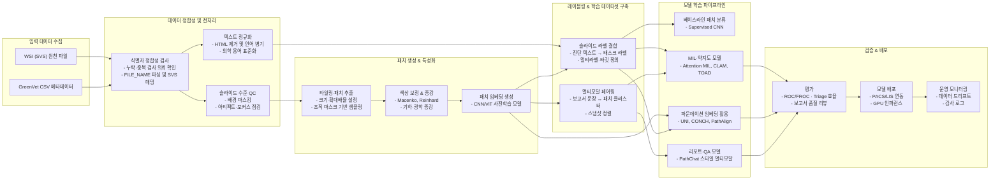
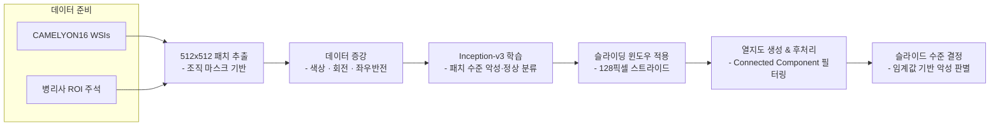
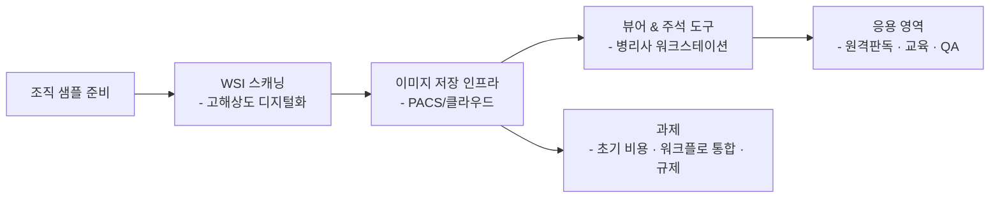
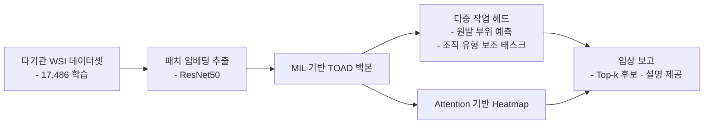
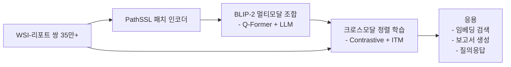
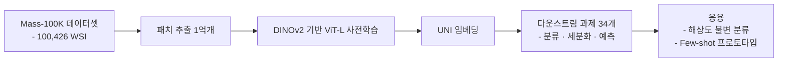
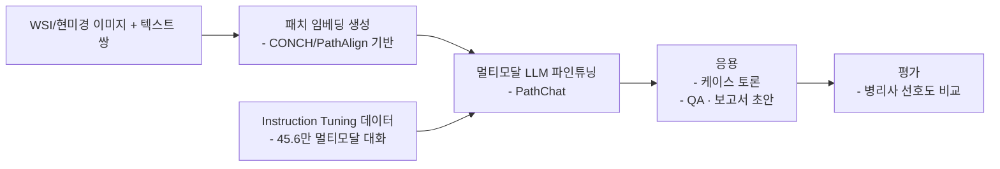

# GC-Pathology

## 프로젝트 개요
GreenVet으로부터 전달받은 조직검사 메타데이터와 대용량 Whole Slide Image(WSI)를 기반으로, 수의 병리 영역에서 임상 적용 가능한 Computational Pathology 파이프라인을 구축하는 프로젝트입니다. 본 문서는 선행 연구 검토, 데이터 이해, 방법론, 실행 계획을 정리하여 후속 연구와 개발의 기준점으로 삼습니다.

## GreenVet 데이터 요약
- 총 48,692건의 기록이 있으며 16,943건의 검사 의뢰(INSP_RQST_NO)와 16,949개의 고유 슬라이드 식별자(FILE_NAME)를 포함합니다. 대부분의 의뢰는 단일 슬라이드에 매핑되며 6건만이 복수 슬라이드를 보유합니다.
- `FILE_NAME` 필드는 `.svs` 파일명을 제공하며, 일부 행은 `|`로 구분된 다중 슬라이드 세트를 나타냅니다. 실제 WSI 파일은 용량 문제로 별도 보관 중입니다.
- 서비스 유형은 대부분 `Histopathology (1 Site/Lesion)-국내`(38,581건)으로 단일 병변 조직검사가 주류이며, `site1`~`site4`까지 4개의 위치 코드가 존재합니다.
- 병리 판독 텍스트(`DIAGNOSIS`, `GROSS_FINDINGS`, `MICROSCOPIC_FINDINGS`)와 스냅샷 이미지 URL(`SNAPSHOT`)이 풍부하게 제공되지만, `RESULT_PDF`는 48,680건에서 비어 있습니다.

## End-to-end 파이프라인 도식
WSI와 GreenVet Excel 메타데이터가 입력되어 모델 학습과 배포까지 도달하는 전체 단계를 아래와 같이 구성합니다.

### 전처리 세부 체크리스트
- **식별자 정합성**: 검사 의뢰 번호와 슬라이드 파일명의 교차 테이블을 생성하고, 누락·중복 항목은 데이터 제공처와 즉시 재확인합니다.
- **슬라이드 QC**: 배경 마스크와 포커스 측정치를 메타데이터화하여 결측/불량 슬라이드를 추출하고, 재스캔 여부를 결정합니다.
- **패치 파이프라인**: 확대 배율별 타일링 매개변수를 YAML 설정으로 버전 관리하여 재현성을 확보합니다.
- **텍스트 정제**: HTML 및 특수문자 처리 규칙을 스크립트화하고, 한국어/영어 동시 검색을 위한 토크나이저 프로파일을 저장합니다.
- **감사 로깅**: 전처리 단계별 입력·출력 요약과 오류 로그를 자동화하여 추후 규제 대응에 활용합니다.

## 선행 연구 인사이트
### Detecting Cancer Metastases on Gigapixel Pathology Images (Liu et al., 2017)
- Inception-v3 기반 패치 분류 모델과 128픽셀 스트라이드 슬라이딩 윈도우로 림프절 전이 병변을 탐지해 CAMELYON16에서 병소 단위 민감도 92.4%(FP 8개/슬라이드)와 슬라이드 수준 AUC 0.97 이상을 달성했습니다.
- 데이터 불균형을 줄이기 위한 클래스 균형 패치 샘플링과 강력한 색상/기하학 증강을 통해 색조 편차와 소형 병소에 대한 강인성을 확보했습니다.

### Clinical-grade Computational Pathology Using Weakly Supervised Deep Learning (Campanella et al., 2019)
- 15,187명 환자, 44,732장의 WSIs를 다중 인스턴스 러닝(MIL)으로 학습해 전립선, 기저세포암, 유방 전이에서 AUC 0.98 이상을 기록하고, 65~75% 슬라이드를 제외하면서도 100% 민감도를 유지하는 임상 트리아지를 구현했습니다.
- 병리 보고서 라벨만으로 학습이 가능한 워크플로를 구축하여 대규모 주석 비용을 최소화했습니다.

### Whole Slide Imaging in Pathology: Current Perspectives and Future Directions (Kumar et al., 2020)
- WSI 파이프라인(스캐닝, 저장, 시각화)의 기술적 요건과 FDA가 2017년에 Philips IntelliSite 시스템을 1차 진단용으로 승인한 사례를 정리하며, 원격판독·교육·품질관리 활용과 함께 높은 초기 비용 및 워크플로 통합과 같은 장벽을 지적했습니다.

### Data-efficient and Weakly Supervised Computational Pathology on Whole-slide Images (Lu et al., 2021)
- CLAM(Clustering-constrained Attention MIL)은 슬라이드 레벨 라벨만으로 주목(attention) 기반 병소 후보를 제안하고, 인스턴스 클러스터링으로 표현공간을 정제하여 신장암/폐암 아형 분류와 림프절 전이를 정확히 탐지했습니다.
- 스마트폰 현미경 이미지와 외부 코호트에 대한 적응성을 입증해 도메인 전이 문제를 완화했습니다.

### AI-based Pathology Predicts Origins for Cancers of Unknown Primary (Williamson et al., 2021)
- TOAD는 17,486장의 학습 데이터와 4,932장의 내부 테스트에서 top-1 정확도 0.84, top-3 0.94를 달성하고, 202개 기관 662건 외부 테스트에서도 top-1 0.79를 기록하여 CUP 감별 진단 보조에 활용 가능성을 보였습니다.
- 다중 작업 네트워크와 attention heatmap으로 병리학적 근거를 시각화해 해석 가능성을 확보했습니다.

### PathAlign: A Vision–Language Model for Whole Slide Images (Ahmed et al., 2024)
- 35만 장 이상의 WSI-텍스트 쌍을 활용한 BLIP-2 기반 모델로, 임베딩 검색 Top-5 정확도 91% 이상과 병리사 평가에서 78% 슬라이드에서 임상적으로 허용되는 보고서 생성을 달성했습니다.
- 패치 수준 PathSSL 임베딩과 대형 LLM 결합으로 보고서 생성, 질의응답 등 멀티모달 워크플로를 지원합니다.

### Towards a General-purpose Foundation Model for Computational Pathology (Chen et al., 2024)
- Mass-100K(100,426 WSI, 1억 패치)로 DINOv2 기반 ViT-L을 사전학습한 UNI는 34개 병리 과제에서 기존 모델 대비 성능을 향상시키고, 해상도 불변 분류·few-shot 프로토타입 등 새로운 사용성을 제시했습니다.

### A Multimodal Generative AI Copilot for Human Pathology (Lu et al., 2024)
- PathChat은 45만6천 개의 비전-언어 인스트럭션과 99만 회 이상의 QA로 미세조정된 모델로, GPT-4V 대비 병리사 선호도가 높은 응답을 제공하며 교육·연구·임상 의사결정 지원 가능성을 보여주었습니다.

### A Visual-language Foundation Model for Computational Pathology (Lu et al., 2024)
- CONCH는 117만 개 이미지-캡션 쌍으로 학습한 CoCa 기반 모델로 분류, 세분화, 캡셔닝, 크로스모달 검색 14개 벤치마크에서 동시대 모델 대비 우수한 제로샷 성능을 기록했습니다.

## 방법론 및 실행 계획
1. **데이터 자산 정비**: CSV 메타데이터를 파싱하여 `FILE_NAME`의 다중 슬라이드 구분자를 분해하고, 실측 WSI 파일 경로와 해상도, 스캐너 메타데이터를 통합 저장합니다. 외부 보관 중인 SVS는 DICOM-WG26 호환 메타데이터로 변환해 버전 관리합니다.
2. **품질관리(QC)**: 슬라이드 배경 제거, 아티팩트 감지, 스캔 품질(포커스, 얼라인먼트)을 Rule-based로 1차 필터링한 후, PathAlign/CONCH 임베딩을 활용한 이상치 탐지로 누락된 조직이나 잡음 슬라이드를 식별합니다.
3. **텍스트-이미지 매칭**: `DIAGNOSIS`·`MICROSCOPIC_FINDINGS`의 HTML 태그 정제, 한국어/영어 병기 토큰화, 슬라이드-보고서 문장 매칭을 구축해 PathAlign/CONCH와의 멀티모달 사전학습 또는 파인튜닝에 활용합니다.
4. **베이스라인 병변 검출**: Liu et al. 2017 전략을 재현하여 Inception 계열 또는 현대적 ConvNeXt 기반 패치 분류로 CAMELYON16/GreenVet 합성 데이터에서 FROC 기준을 측정합니다.
5. **약지도 다중 인스턴스 학습**: Campanella 2019, CLAM, TOAD를 참고해 슬라이드 단위 라벨과 attention 기반 heatmap을 생성, 검사 결과 요약 자동화를 위한 중요 영역을 추출합니다.
6. **파운데이션 모델 통합**: UNI로 패치 임베딩을 생성해 MIL, 세그멘테이션, 타스크 특화 분류기를 효율적으로 학습하고, CONCH·PathAlign으로 리포트 생성, 이미지-텍스트 검색, 슬라이드 트리아지를 구현합니다.
7. **멀티모달 코파일럿 구축**: PathChat 아키텍처를 참고해 PathAlign/CONCH 임베딩과 국내 병리 보고서를 결합한 국문·영문 인터랙티브 어시스턴트를 설계합니다. 개인정보 보호를 위해 on-premise LLM(예: LLaMA 계열) 파인튜닝과 감사 로깅을 적용합니다.
8. **평가 및 임상 검증**: 슬라이드 수준 ROC/FROC, triage 효율(민감도 100% 조건 하 슬라이드 절감율), top-k 감별 정확도, 보고서 생성의 병리사 블라인드 평가(Clinically Significant Error 비율)를 측정합니다.
9. **배포 전략**: PACS/LIS 연동을 위한 API, 스냅샷 기반 경량 뷰어, GPU 추론 큐잉, 모델 모니터링(분포 드리프트, 설명가능성 로그)을 포함한 운영 환경을 구성합니다.

## 로드맵 제안
- **Phase 0 – 데이터 인프라 (1개월)**: CSV/WSI 정합성 검증, 스토리지 구조화, QC 파이프라인 프로토타입 구축.
- **Phase 1 – 베이스라인 구축 (2개월)**: 패치 분류/약지도 MIL 베이스라인 학습, FROC·ROC 지표 산출, attention heatmap 검증.
- **Phase 2 – 파운데이션 및 멀티모달 (3개월)**: UNI/CONCH 임베딩 통합, PathAlign 기반 리포트 매칭, PathChat 유사 코파일럿 MVP 개발.
- **Phase 3 – 임상 검증 및 배포 (2개월)**: 병리사 사용자 평가, 슬라이드 트리아지 파일럿, on-premise 배포 및 모니터링 체계 확립.

## 참고 문헌
- Liu Y. et al., *Detecting Cancer Metastases on Gigapixel Pathology Images*, 2017.
- Campanella G. et al., *Clinical-grade computational pathology using weakly supervised deep learning on whole slide images*, 2019.
- Kumar N. et al., *Whole Slide Imaging in Pathology: Current Perspectives and Future Directions*, 2020.
- Lu M.Y. et al., *Data-efficient and weakly supervised computational pathology on whole-slide images*, 2021.
- Williamson D.F.K. et al., *AI-based pathology predicts origins for cancers of unknown primary*, 2021.
- Ahmed F. et al., *PathAlign: A vision–language model for whole slide images in histopathology*, 2024.
- Chen R.J. et al., *Towards a general-purpose foundation model for computational pathology*, 2024.
- Lu M.Y. et al., *A multimodal generative AI copilot for human pathology*, 2024.
- Lu M.Y. et al., *A visual-language foundation model for computational pathology*, 2024.
