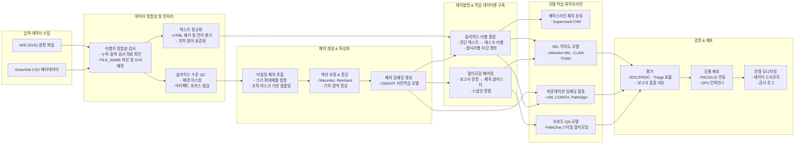
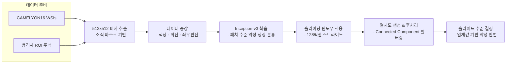
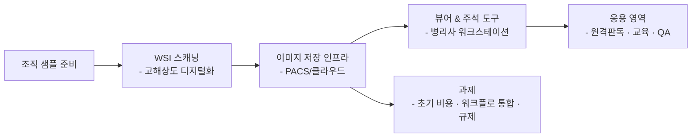
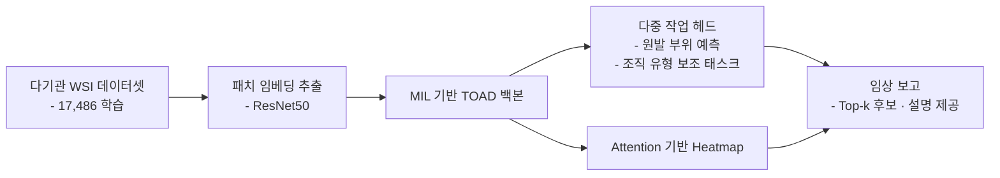
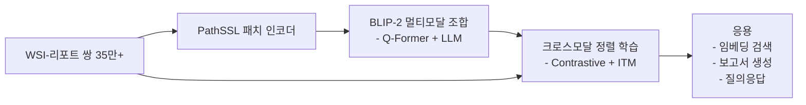
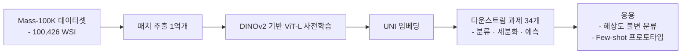
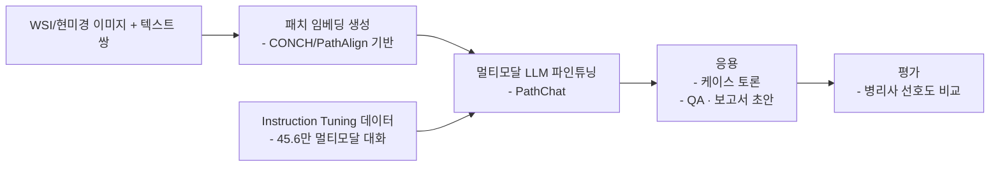
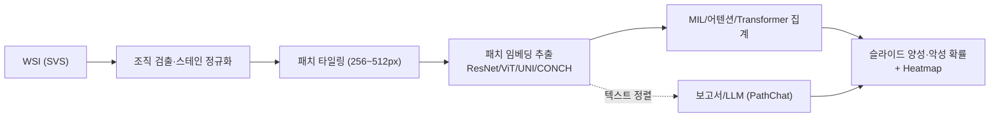

# GC-Pathology

## 프로젝트 개요
GreenVet으로부터 전달받은 조직검사 메타데이터와 대용량 Whole Slide Image(WSI)를 기반으로, 수의 병리 영역에서 임상 적용 가능한 Computational Pathology 파이프라인을 구축하는 프로젝트입니다. 본 문서는 선행 연구 검토, 데이터 이해, 방법론, 실행 계획을 정리하여 후속 연구와 개발의 기준점으로 삼습니다.

## Vet-ICD-O 코드 매칭 방법론
### 비정형 병리 텍스트 전처리 및 매칭 파이프라인
1. **데이터 정제**: 조직검사 결과 매칭 CSV의 `DIAGNOSIS`, `GROSS_FINDINGS`, `MICROSCOPIC_FINDINGS`, `COMMENTS` 컬럼을 로드한 뒤 HTML 태그 제거, 특수문자 정규화, 불필요한 공백 축소 등 기본 클렌징을 수행합니다. 한국어·영어 혼재 서술에 대응하기 위해 언어 감지 후 형태소 분석기(예: Khaiii, Mecab-ko)와 영문 토크나이저를 결합하거나 문장 단위 파이프라인을 구성합니다.
2. **Vet-ICD-O 사전 구축**: `Vet-ICD-O-canine-1, First Edition` 파일의 Topography 리스트(C코드)와 Morphology 리스트(8xxx/코드)를 추출하여 용어·계층 구조 사전을 만들고, 동의어·약어·한국어 번역을 확장합니다. 사전은 해시맵 또는 임베딩 인덱스(예: FAISS)로 저장해 빠른 조회가 가능하도록 합니다.
3. **다단계 매칭 로직**: 정규표현식과 규칙 기반 정확 일치, 퍼지 매칭(Damerau-Levenshtein 거리, TF-IDF 코사인 유사도), 멀티링구얼 임베딩(Sentence-BERT, KoSimCSE 등)을 순차 적용해 후보 Topography/Morphology를 발굴합니다. `DIAGNOSIS` → `MICROSCOPIC_FINDINGS` → `COMMENTS` 순으로 신뢰 가중치를 부여하고, `SITE` 및 `GROSS_FINDINGS`는 해부 부위 판단에 집중 활용합니다.
4. **스코어링 및 품질 관리**: 각 후보 조합에 대해 직접 매칭 여부, 번역 후 매칭, 임베딩 점수 등을 가중 평균하여 임계값을 넘는 코드를 확정합니다. 애매한 케이스는 수동 검토 큐에 적재하고, 전문가 피드백으로 사전·규칙을 지속 보강합니다. `Include/Excludes` 정보를 활용해 상호 배제 코드 오류를 방지합니다.

### 규칙 기반 파이프라인과 LLM 활용 비교
- **신뢰도 및 감사성**: 규칙·사전 기반 매칭은 각 단계의 근거(정확 일치, 동의어, 임베딩 점수 등)를 로그로 남길 수 있어 의료 데이터 거버넌스 요구사항을 충족하기 용이합니다. 반면 LLM은 모델·프롬프트 변화에 따라 출력이 달라질 수 있고 내부 추론이 불투명해 재현성과 감사성이 낮습니다.
- **오류 수정 및 유지보수**: 규칙 기반 시스템은 오탐 발견 시 사전·규칙 수정 후 전량 재처리하면 동일 결과를 재현할 수 있습니다. LLM은 업데이트나 파라미터 튜닝에 따라 답변이 흔들릴 수 있어 버전 관리가 어렵습니다.
- **의학 특화 LLM 품질**: Gemma와 같은 범용 모델은 Vet-ICD-O 체계를 충분히 학습하지 않아 추가 프롬프트 설계와 용어집 주입이 필요합니다. Med-PaLM, BioGPT 변형 등 의학용 LLM도 수의 병리 지식과 한국어 텍스트 커버리지가 제한적이며, 온프레미스 배치 비용·프라이버시 이슈가 존재합니다.
- **권장 전략**: 규칙 기반 파이프라인을 기본으로 구축하고, 매칭 신뢰도가 낮은 사례에 한해 LLM을 보조 추천 도구로 사용하여 전문가 검증을 결합하는 하이브리드 접근을 권장합니다.

## GreenVet 데이터 요약
### 데이터 구조 및 레코드 현황
- 2023/2024년 parquet 파일을 결합해 중복 행을 제거한 결과, 총 82,319개의 행과 11개 컬럼이 존재합니다. 고유 검사 의뢰 번호(`INSP_RQST_NO`)는 26,189건, 고유 슬라이드 식별자(`FILE_NAME`)는 26,198개입니다.
- 연도별로는 2023년 26,007행, 2024년 56,312행으로, 중복 행 15,062개를 제거한 뒤에도 최근 연도 데이터 비중이 높습니다.
- 레코드는 슬라이드/스냅샷 단위로 저장되어 동일 의뢰가 평균 3.14행(중앙값 2행, 75% 분위수 4행, 95% 분위수 7행, 최대 24행)으로 확장됩니다.
- `FILE_NAME` 내 `|` 구분자를 활용해 슬라이드 수를 합산하면 의뢰당 평균 5.36장(중앙값 2장, 75% 분위수 6장, 95% 분위수 18장, 99% 분위수 40장, 최대 216장)으로, 고슬라이드 의뢰가 소수 존재합니다. 다중 슬라이드 행은 31,908건이며 6,581건의 검사 의뢰가 해당됩니다.
- 스냅샷 URL 결측은 3건뿐이며, `RESULT_PDF`는 82,301건에서 결측으로 텍스트 중심 리포트임을 확인할 수 있습니다.

### 서비스 유형 및 해부 부위 분포
- 검사 서비스는 `Histopathology (1 Site/Lesion)-국내` 65,209건(79.2%), `Histopathology (2 Site/Lesion)-국내` 13,094건(15.9%), `Histopathology (3 Site/Lesion)-국내` 3,165건(3.8%), `Histopathology (4 Site/Lesion)-국내` 849건(1.0%)으로 단일 병변 검사가 주를 이룹니다.
- 위치 코드는 `site1` 73,410건(89.2%), `site2` 7,468건(9.1%), `site3` 1,233건(1.5%), `site4` 208건(0.3%) 순으로 분포합니다.

### 슬라이드 및 이미지 리소스
- `FILE_NAME`에 `|`가 포함된 다중 슬라이드 행 31,908건을 기준으로 6,581건의 검사 의뢰가 복수 슬라이드를 포함합니다.
- 스냅샷 URL이 거의 전량 제공되므로 WSI 썸네일 기반 QA, 패치 시각화, 웹 뷰어 구축에 활용 가능합니다.

### 텍스트 라벨 품질
- 진단(`DIAGNOSIS`) 평균 길이는 43.3자(최대 342자)이며, 육안 소견(`GROSS_FINDINGS`) 평균은 119.2자(최대 332자), 현미경 소견(`MICROSCOPIC_FINDINGS`) 평균은 347.2자(최대 1,460자), 코멘트(`COMMENTS`) 평균은 375.7자(최대 1,885자)입니다.
- 진단명은 영어/한글 혼용, 소견 및 코멘트는 한국어 중심으로 기록되어 있어 멀티링구얼 전처리 전략이 요구됩니다.

### 동물 종 단서
- 육안·현미경·코멘트 텍스트에서 숫자 토큰을 제거한 뒤 `개/강아지/canine/dog`, `고양이/feline/cat` 키워드를 탐지한 결과, 개 관련 서술이 13,584건(개·고양이 동시 언급 3,201건 포함), 고양이 관련 서술이 11,451건이며 종 미기재 건은 60,485건으로 집계됩니다.
- 종 필드가 명시적으로 존재하지 않아 규칙·모델 기반 명명 실체 인식(NER) 혹은 키워드 매칭을 통한 보완이 필요합니다.

### CSV/Parquet 파일 자산 요약
| 파일명 | 행 수 | 주요 컬럼 | 설명 |
| --- | --- | --- | --- |
| `Data/조직검사 결과 매칭(2023)_utf8_pruned.parquet` | 48,689 | `INSP_RQST_NO`, `FILE_NAME`, `DIAGNOSIS`, `GROSS_FINDINGS`, `MICROSCOPIC_FINDINGS`, `COMMENTS`, `SITE`, `SNAPSHOT` 등 | 2023년 제공 메타데이터 정제본. 2024 파일과 기간 중첩이 있어 결합 시 중복 제거가 필요합니다. |
| `Data/조직검사 결과 매칭(2024)_utf8_pruned.parquet` | 48,692 | 동일 컬럼 | 2024년 제공 메타데이터 정제본. 2023본과 합산 후 중복 제거 시 82,319건의 고유 행을 확보할 수 있습니다. |
| `Data/조직검사 결과 매칭(2024)_coded.csv` | 50 | 위 원본 컬럼 + `Vet-ICD-O_Topography`, `Vet-ICD-O_Morphology`, `Specimen_Site_Normalized`, `Species` | Vet-ICD-O-canine-1 1판 기준 상위 50개 레코드 수작업 매칭본. 병변 해부 위치 정규화와 확실히 식별 가능한 종(고양이/개)을 태깅했습니다. |

수작업 매핑 CSV 중 태깅이 적용된 예시는 아래와 같습니다(50건 전체는 `Data/조직검사 결과 매칭(2024)_coded.csv` 참조).

| INSP_RQST_NO | Diagnosis | Vet-ICD-O Topography | Vet-ICD-O Morphology | Specimen Site (Normalized) | Species |
| --- | --- | --- | --- | --- | --- |
| 20240101-113-0002 | Mast cell tumor (Well-differentiated), completely excised | C44.7 (Skin of hindlimb) | 9740/1 (Mastocytoma, NOS) | Skin, left hindlimb flank | Cat |
| 20240101-102-0001 | Mammary duct ectasia, mastitis | C50.9 (Mammary gland, NOS) | N/A duct ectasia (Duct ectasia with mastitis (non-neoplastic)) | Mammary chain, multifocal | Cat |
| 20240101-126-0014 | Pulmonary papillary adenocarcinoma, grade 1 (well differentiated) | C34.2 (Middle lobe, lung) | 8260/3 (Papillary renal cell carcinoma) | Right middle lung lobe mass | Dog |

### 진단명 분포 (상위 20건)
GreenVet 메타데이터 전체(중복 제거 82,319행)의 진단명 등장 빈도를 상위 20개까지 정렬했습니다.

| 순위 | 진단명 | 건수 |
| --- | --- | --- |
| 1 | Subcutaneous lipoma | 1,711 |
| 2 | Trichoblastoma, completely excised | 1,093 |
| 3 | Mammary complex adenoma, completely excised | 986 |
| 4 | Sebaceous adenoma, completely excised | 940 |
| 5 | Mammary adenoma, complex type, completely excised | 833 |
| 6 | Cutaneous histiocytoma, completely excised | 801 |
| 7 | Lipoma | 731 |
| 8 | Mammary benign mixed tumor, completely excised | 629 |
| 9 | Follicular cyst, completely excised | 597 |
| 10 | Mammary gland adenoma, completely excised | 544 |
| 11 | Splenic hemangiosarcoma | 535 |
| 12 | Mast cell tumor (Well-differentiated) | 534 |
| 13 | Peripheral odontogenic fibroma | 504 |
| 14 | Subcutaneous lipoma, completely excised | 492 |
| 15 | Benign mammary mixed tumor, completely excised | 432 |
| 16 | Mast cell tumor, well-differentiated, completely excised | 410 |
| 17 | Lymphoid nodular hyperplasia | 402 |
| 18 | Peripheral odontogenic fibroma with osseous metaplasia | 400 |
| 19 | Cutaneous mast cell tumor (well-differentiated) | 391 |
| 20 | Trichoblastoma | 351 |

## End-to-end 파이프라인 도식
WSI와 GreenVet Excel 메타데이터가 입력되어 모델 학습과 배포까지 도달하는 전체 단계를 아래와 같이 구성합니다.

```mermaid
flowchart LR
    subgraph 입력 데이터 수집
        A["WSI (SVS) 원천 파일"]
        B["GreenVet CSV 메타데이터"]
    end
    subgraph 데이터 정합성 및 전처리
        C["식별자 정합성 검사<br/>- 누락·중복 검사 의뢰 확인<br/>- FILE_NAME 파싱 및 SVS 매핑"]
        D["슬라이드 수준 QC<br/>- 배경 마스킹<br/>- 아티팩트·포커스 점검"]
        E["텍스트 정규화<br/>- HTML 제거 및 언어 병기<br/>- 의학 용어 표준화"]
    end
    subgraph 패치 생성 & 특성화
        F["타일링·패치 추출<br/>- 크기·확대배율 설정<br/>- 조직 마스크 기반 샘플링"]
        G["색상 보정 & 증강<br/>- Macenko, Reinhard<br/>- 기하·광학 증강"]
        H["패치 임베딩 생성<br/>- CNN/ViT 사전학습 모델"]
    end
    subgraph 레이블링 & 학습 데이터셋 구축
        I["슬라이드 라벨 결합<br/>- 진단 텍스트 → 태스크 라벨<br/>- 멀티라벨·타깃 정의"]
        J["멀티모달 페어링<br/>- 보고서 문장 ↔ 패치 클러스터<br/>- 스냅샷 정렬"]
    end
    subgraph 모델 학습 파이프라인
        K["베이스라인 패치 분류<br/>- Supervised CNN"]
        L["MIL·약지도 모델<br/>- Attention MIL, CLAM, TOAD"]
        M["파운데이션 임베딩 활용<br/>- UNI, CONCH, PathAlign"]
        N["리포트·QA 모델<br/>- PathChat 스타일 멀티모달"]
    end
    subgraph 검증 & 배포
        O["평가<br/>- ROC/FROC · Triage 효율<br/>- 보고서 품질 리뷰"]
        P["모델 배포<br/>- PACS/LIS 연동<br/>- GPU 인퍼런스"]
        Q["운영 모니터링<br/>- 데이터 드리프트<br/>- 감사 로그"]
    end

    A --> C
    B --> C
    C --> D
    C --> E
    D --> F
    E --> I
    F --> G --> H
    H --> I
    H --> J
    I --> K
    I --> L
    J --> L
    H --> M
    I --> M
    J --> N
    L --> O
    M --> O
    N --> O
    O --> P --> Q
```

### 전처리 세부 체크리스트
- **식별자 정합성**: 검사 의뢰 번호와 슬라이드 파일명의 교차 테이블을 생성하고, 누락·중복 항목은 데이터 제공처와 즉시 재확인합니다.
- **슬라이드 QC**: 배경 마스크와 포커스 측정치를 메타데이터화하여 결측/불량 슬라이드를 추출하고, 재스캔 여부를 결정합니다.
- **패치 파이프라인**: 확대 배율별 타일링 매개변수를 YAML 설정으로 버전 관리하여 재현성을 확보합니다.
- **텍스트 정제**: HTML 및 특수문자 처리 규칙을 스크립트화하고, 한국어/영어 동시 검색을 위한 토크나이저 프로파일을 저장합니다.
- **감사 로깅**: 전처리 단계별 입력·출력 요약과 오류 로그를 자동화하여 추후 규제 대응에 활용합니다.

## GreenVet 데이터 기반 AI 적용 가능성
GreenVet의 조직검사 메타데이터와 WSI는 최신 컴퓨테이셔널 병리 연구에서 요구하는 멀티모달 요소를 대부분 갖추고 있습니다. 아래는 적용 가능한 AI 활용 시나리오와 필요한 추가 데이터, 참고할 만한 최신 기법을 정리한 내용입니다.

### 1. 슬라이드 수준 질환 분류 및 트리아지
- **적용 목표**: 다중 인스턴스 러닝(MIL) 기반으로 검사 의뢰 단위의 양성/악성 판별, 종양 유형 분류, 재검 권장 여부를 예측합니다.
- **참고 기법**: Harvard Mahmood Lab의 CLAM·TOAD, Hopkins의 HIPT, Google의 Virchow2, DINOv2 기반 UNI/CONCH 등 파운데이션 백본을 활용해 소량 라벨로도 높은 성능을 달성할 수 있습니다.
- **데이터 요구사항**: 현재 진단 텍스트를 표준화하여 SNOMED·ICD-O 코드와 매핑하고, 의뢰 단위의 치료·예후 라벨이 추가되면 리스크 예측과 환자 우선순위 모델로 확장 가능합니다.
- **부족한 요소**: 종 정보와 병기/grade 데이터가 부재하여 멀티태스크 학습 시 보조 라벨 구축이 필요하며, 외부 검증을 위한 다른 기관 WSI가 확보되면 모델 일반화에 도움이 됩니다.

### 2. 병소 탐지 및 병변 정량화
- **적용 목표**: 슬라이드 내 병소 위치를 하이라이트하여 병리사의 주석 부담을 줄이고, 절제 연을 자동으로 평가하거나 미세 병소를 탐지합니다.
- **참고 기법**: CAMELYON 계열 데이터셋에 사용된 U-Net/HoVer-Net 패치 세그멘테이션, SA-1B 기반 Segment Anything for pathology, Virchow2·UNI의 패치 임베딩을 이용한 약지도 히트맵 생성 등이 적용 가능합니다.
- **데이터 요구사항**: 스냅샷 이미지와 현미경 서술을 매칭해 위치 단서를 만들고, 제한적인 수의 WSI에 대해 scribble 또는 point-level 주석을 확보하면 준지도 학습이 가능해집니다.
- **부족한 요소**: 절제연 상태에 대한 구조화된 라벨이 없어 보고서 텍스트에서 키워드 추출 파이프라인을 별도로 구축해야 합니다.

### 3. 보고서 생성·QA 및 대화형 지원
- **적용 목표**: WSI를 입력 받아 병리 소견 초안을 생성하거나, 기존 리포트의 품질 검증·요약을 자동화합니다.
- **참고 기법**: HistoGPT, PathChat, PathAsst, Med-PaLM Multimodal, PathAlign과 같은 멀티모달 비전-언어 모델이 대표적입니다. 최근에는 LLaVA-Med, Gemini 기반 보고서 생성 연구도 소개되고 있습니다.
- **데이터 요구사항**: 슬라이드-텍스트 페어링을 강화하기 위해 검사 의뢰별 대표 타일을 선택하고, 현미경 소견 문장을 문장 단위로 정렬하는 정렬 알고리즘이 필요합니다.
- **부족한 요소**: 현 리포트가 한글 중심이므로 한국어 의학 LLM(Dr.Knows, Meditron-Ko 등) 또는 번역 품질 확보를 위한 병렬 코퍼스 구축이 요구되며, PHI 비식별화 규칙을 명시적으로 정의해야 합니다.

### 4. 멀티모달 검색 및 지식 그래프 구축
- **적용 목표**: 특정 병명, 병리 패턴, 코멘트 키워드에 따라 유사 WSI를 검색하거나, 병리 지식을 그래프화하여 케이스 스터디·교육 자료로 활용합니다.
- **참고 기법**: PathFoundation, Slide2Graph, CPathCLIP, NVIDIA MONAI Label + Clara Deploy 기반 임베딩 검색 엔진, Lakehouse for Healthcare 워크로드를 활용할 수 있습니다.
- **데이터 요구사항**: 진단명 표준화, 장기·조직 부위별 태깅, 스냅샷-WSI 좌표 연계를 통해 검색 키를 다각화해야 합니다.
- **부족한 요소**: 현재 CSV에 위치 좌표가 없어 스냅샷 파일명 패턴에서 타일 위치를 역추적하거나, WSI 뷰어 로그를 수집하여 상호작용 데이터를 축적해야 합니다.

### 5. 운영 자동화 및 워크플로 통합
- **적용 목표**: QA 자동화, 슬라이드 스캐닝 오류 감지, LIS/PACS 연동을 통해 병리사 워크플로 효율을 향상합니다.
- **참고 기법**: NVIDIA Holoscan, MONAI Deploy, Paige Prostate·Ibex Galen 같은 상용 제품이 제공하는 QC·트리아지 기능을 벤치마킹할 수 있습니다.
- **데이터 요구사항**: 스캐너 로그, 작업 시간, 재스캔 기록 등을 추가 수집하면 운영 AI 모델 학습이 가능해집니다.
- **부족한 요소**: 현재 메타데이터만으로는 공정 데이터(스캔 시간, 스캐너 ID 등)가 없어 운영 지표 모델링을 위한 추가 로그 수집 체계가 필요합니다.

위 시나리오들은 단계적으로 추진할 수 있으며, 1) 진단 텍스트 표준화 및 멀티라벨 구축 → 2) MIL 기반 분류 모델 및 패치 임베딩 확보 → 3) 비전-언어 모델 미세조정 → 4) 운영 로그 확장 순으로 로드맵을 수립하면 됩니다.

## 선행 연구 인사이트
### Detecting Cancer Metastases on Gigapixel Pathology Images (Liu et al., 2017)
- Inception-v3 기반 패치 분류 모델과 128픽셀 스트라이드 슬라이딩 윈도우로 림프절 전이 병변을 탐지해 CAMELYON16에서 병소 단위 민감도 92.4%(FP 8개/슬라이드)와 슬라이드 수준 AUC 0.97 이상을 달성했습니다.
- 데이터 불균형을 줄이기 위한 클래스 균형 패치 샘플링과 강력한 색상/기하학 증강을 통해 색조 편차와 소형 병소에 대한 강인성을 확보했습니다.

```mermaid
flowchart LR
    subgraph 데이터 준비
        A1["CAMELYON16 WSIs"]
        A2["병리사 ROI 주석"]
    end
    B1["512x512 패치 추출<br/>- 조직 마스크 기반"]
    B2["데이터 증강<br/>- 색상 · 회전 · 좌우반전"]
    C1["Inception-v3 학습<br/>- 패치 수준 악성·정상 분류"]
    D1["슬라이딩 윈도우 적용<br/>- 128픽셀 스트라이드"]
    E1["열지도 생성 & 후처리<br/>- Connected Component 필터링"]
    F1["슬라이드 수준 결정<br/>- 임계값 기반 악성 판별"]

    A1 --> B1 --> B2 --> C1 --> D1 --> E1 --> F1
    A2 --> B1
```

### Clinical-grade Computational Pathology Using Weakly Supervised Deep Learning (Campanella et al., 2019)
- 15,187명 환자, 44,732장의 WSIs를 다중 인스턴스 러닝(MIL)으로 학습해 전립선, 기저세포암, 유방 전이에서 AUC 0.98 이상을 기록하고, 65~75% 슬라이드를 제외하면서도 100% 민감도를 유지하는 임상 트리아지를 구현했습니다.
- 병리 보고서 라벨만으로 학습이 가능한 워크플로를 구축하여 대규모 주석 비용을 최소화했습니다.

```mermaid
flowchart LR
    A3["WSI + 환자 보고서 라벨"]
    B3["타일 추출<br/>- 224x224 패치<br/>- Tissue detection 적용"]
    C3["ResNet-34 특징 추출"]
    D3["MIL Aggregator<br/>- Max/Mean Pooling"]
    E3["슬라이드 수준 예측"]
    F3["임상 트리아지<br/>- 고위험 슬라이드 우선 검토"]

    A3 --> B3 --> C3 --> D3 --> E3 --> F3
```

### Whole Slide Imaging in Pathology: Current Perspectives and Future Directions (Kumar et al., 2020)
- WSI 파이프라인(스캐닝, 저장, 시각화)의 기술적 요건과 FDA가 2017년에 Philips IntelliSite 시스템을 1차 진단용으로 승인한 사례를 정리하며, 원격판독·교육·품질관리 활용과 함께 높은 초기 비용 및 워크플로 통합과 같은 장벽을 지적했습니다.

```mermaid
flowchart LR
    A4["조직 샘플 준비"]
    B4["WSI 스캐닝<br/>- 고해상도 디지털화"]
    C4["이미지 저장 인프라<br/>- PACS/클라우드"]
    D4["뷰어 & 주석 도구<br/>- 병리사 워크스테이션"]
    E4["응용 영역<br/>- 원격판독 · 교육 · QA"]
    F4["과제<br/>- 초기 비용 · 워크플로 통합 · 규제"]

    A4 --> B4 --> C4 --> D4 --> E4
    C4 --> F4
```

### Data-efficient and Weakly Supervised Computational Pathology on Whole-slide Images (Lu et al., 2021)
- CLAM(Clustering-constrained Attention MIL)은 슬라이드 레벨 라벨만으로 주목(attention) 기반 병소 후보를 제안하고, 인스턴스 클러스터링으로 표현공간을 정제하여 신장암/폐암 아형 분류와 림프절 전이를 정확히 탐지했습니다.
- 스마트폰 현미경 이미지와 외부 코호트에 대한 적응성을 입증해 도메인 전이 문제를 완화했습니다.

```mermaid
flowchart LR
    A5["WSI + 슬라이드 라벨"]
    B5["패치 임베딩 추출<br/>- ResNet-50 사전학습"]
    C5["Attention MIL 헤드"]
    D5["클러스터링 제약<br/>- 양성/음성 인스턴스 분리"]
    E5["슬라이드 예측 + Heatmap"]
    F5["외부 도메인 적응<br/>- 스마트폰 현미경"]

    A5 --> B5 --> C5 --> D5 --> E5
    E5 --> F5
```

### AI-based Pathology Predicts Origins for Cancers of Unknown Primary (Williamson et al., 2021)
- TOAD는 17,486장의 학습 데이터와 4,932장의 내부 테스트에서 top-1 정확도 0.84, top-3 0.94를 달성하고, 202개 기관 662건 외부 테스트에서도 top-1 0.79를 기록하여 CUP 감별 진단 보조에 활용 가능성을 보였습니다.
- 다중 작업 네트워크와 attention heatmap으로 병리학적 근거를 시각화해 해석 가능성을 확보했습니다.

```mermaid
flowchart LR
    A6["다기관 WSI 데이터셋<br/>- 17,486 학습"]
    B6["패치 임베딩 추출<br/>- ResNet50"]
    C6["MIL 기반 TOAD 백본"]
    D6["다중 작업 헤드<br/>- 원발 부위 예측<br/>- 조직 유형 보조 태스크"]
    E6["Attention 기반 Heatmap"]
    F6["임상 보고<br/>- Top-k 후보 · 설명 제공"]

    A6 --> B6 --> C6 --> D6 --> F6
    C6 --> E6 --> F6
```

### PathAlign: A Vision–Language Model for Whole Slide Images (Ahmed et al., 2024)
- 35만 장 이상의 WSI-텍스트 쌍을 활용한 BLIP-2 기반 모델로, 임베딩 검색 Top-5 정확도 91% 이상과 병리사 평가에서 78% 슬라이드에서 임상적으로 허용되는 보고서 생성을 달성했습니다.
- 패치 수준 PathSSL 임베딩과 대형 LLM 결합으로 보고서 생성, 질의응답 등 멀티모달 워크플로를 지원합니다.

```mermaid
flowchart LR
    A7["WSI-리포트 쌍 35만+"]
    B7["PathSSL 패치 인코더"]
    C7["BLIP-2 멀티모달 조합<br/>- Q-Former + LLM"]
    D7["크로스모달 정렬 학습<br/>- Contrastive + ITM"]
    E7["응용<br/>- 임베딩 검색<br/>- 보고서 생성<br/>- 질의응답"]

    A7 --> B7 --> C7 --> D7 --> E7
    A7 --> D7
```

### Towards a General-purpose Foundation Model for Computational Pathology (Chen et al., 2024)
- Mass-100K(100,426 WSI, 1억 패치)로 DINOv2 기반 ViT-L을 사전학습한 UNI는 34개 병리 과제에서 기존 모델 대비 성능을 향상시키고, 해상도 불변 분류·few-shot 프로토타입 등 새로운 사용성을 제시했습니다.

```mermaid
flowchart LR
    A8["Mass-100K 데이터셋<br/>- 100,426 WSI"]
    B8["패치 추출 1억개"]
    C8["DINOv2 기반 ViT-L 사전학습"]
    D8["UNI 임베딩"]
    E8["다운스트림 과제 34개<br/>- 분류 · 세분화 · 예측"]
    F8["응용<br/>- 해상도 불변 분류<br/>- Few-shot 프로토타입"]

    A8 --> B8 --> C8 --> D8 --> E8 --> F8
```

### A Multimodal Generative AI Copilot for Human Pathology (Lu et al., 2024)
- PathChat은 45만6천 개의 비전-언어 인스트럭션과 99만 회 이상의 QA로 미세조정된 모델로, GPT-4V 대비 병리사 선호도가 높은 응답을 제공하며 교육·연구·임상 의사결정 지원 가능성을 보여주었습니다.

```mermaid
flowchart LR
    A9["WSI/현미경 이미지 + 텍스트 쌍"]
    B9["패치 임베딩 생성<br/>- CONCH/PathAlign 기반"]
    C9["Instruction Tuning 데이터<br/>- 45.6만 멀티모달 대화"]
    D9["멀티모달 LLM 파인튜닝<br/>- PathChat"]
    E9["응용<br/>- 케이스 토론<br/>- QA · 보고서 초안"]
    F9["평가<br/>- 병리사 선호도 비교"]

    A9 --> B9 --> D9
    C9 --> D9 --> E9 --> F9
```

### A Visual-language Foundation Model for Computational Pathology (Lu et al., 2024)
- CONCH는 117만 개 이미지-캡션 쌍으로 학습한 CoCa 기반 모델로 분류, 세분화, 캡셔닝, 크로스모달 검색 14개 벤치마크에서 동시대 모델 대비 우수한 제로샷 성능을 기록했습니다.

```mermaid
flowchart LR
    A10["117만 이미지-텍스트 쌍"]
    B10["CoCa 기반 듀얼 인코더"]
    C10["대규모 사전학습<br/>- 대칭 크로스엔트로피"]
    D10["제로샷 평가 14개 벤치마크"]
    E10["다운스트림 활용<br/>- 분류 · 세분화 · 검색 · 캡셔닝"]

    A10 --> B10 --> C10 --> D10 --> E10
```

## WSI 기반 양성/악성 판별 핵심 프로세스와 대표 연구 5선
WSI 기반 양성/악성 판별의 전형적인 흐름과 Paper 폴더에 포함된 대표 논문 5편을 정리했습니다. 파운데이션 모델은 **패치 임베딩 단계**에서 사용되어, 패치별 특징 벡터를 생성한 뒤 MIL/어텐션으로 슬라이드 레벨 예측을 만듭니다.

```mermaid
flowchart LR
    A["WSI (SVS)"] --> B["조직 검출·스테인 정규화"]
    B --> C["패치 타일링 (256~512px)"]
    C --> D["패치 임베딩 추출<br/>ResNet/ViT/UNI/CONCH"]
    D --> E["MIL/어텐션/Transformer 집계"]
    E --> F["슬라이드 양성·악성 확률<br/>+ Heatmap"]
    D -. "텍스트 정렬" .-> G["보고서/LLM (PathChat)"]
    G --> F
```

### 대표 논문 5선 (양성/악성·전이·Foundation model)
1. **Campanella et al., 2019 (Nature Medicine)** – 44,732 WSI를 약지도 MIL+RNN으로 처리해 전립선·기저세포암·유방 전이 AUC ≥0.98; 슬라이드 패치 시퀀스를 순차 인코딩해 임상 트리아지 구현.
2. **Lu et al., 2021 – CLAM (Nature Biomed. Eng.)** – Attention MIL에 클러스터 제약을 넣어 중요 패치 선택과 클래스 분리도를 동시에 학습; CAMELYON16/17 AUC 0.953로 데이터 효율성과 해석 가능성을 확보.
3. **GigaPath (Microsoft, 2023)** – 10억+ 병리 패치로 사전학습한 40억 파라미터 비전-언어 모델을 제시해 대규모 병리 데이터에서 일반화 가능한 슬라이드 레벨 임베딩과 보고서 정렬을 구현, 전이·악성도 판별과 제로샷 설명 성능을 동시에 달성.
4. **UNI (Mahmood Lab, Nature Medicine 2024)** – 1억+ 병리 패치 self-supervised 사전학습으로 1024-d 패치 임베딩 생성; 패치 인코더를 고정하고 CLAM/TransMIL 등 MIL 헤드를 올려 소량 라벨에서도 강한 양성/악성 분류와 retrieval 성능을 제공.
5. **CONCH (Mahmood Lab, Nature Medicine 2024)** – 비전-언어 대조학습으로 512-d 패치·텍스트 공동 임베딩을 학습; 패치 인코더 출력을 MIL/Transformer 집계 후 텍스트와 정렬해 악성도 분류와 보고서 검색·설명력을 동시에 강화.

### 파운데이션/백본 선택 가이드
- **ImageNet 사전학습 CNN/ViT**: ResNet50(2048-d), ViT-B 등 범용 임베딩. 초기 베이스라인에 적합.
- **병리 특화 Self-supervised**: CTransPath, RetCCL – 병리 패치로 대조학습, 도메인 적합성↑.
- **대규모 파운데이션**: UNI(1024-d), CONCH(512-d) – 수억 패치 사전학습으로 소량 라벨에서도 강한 분류/검색/heatmap 성능.
- **비전-언어 계열**: PathAlign, PathChat – 패치 임베딩과 보고서 정렬을 통해 양성/악성 근거 설명·QA·보고서 생성 지원.
